# 安徽林平循发展股份有限公司

# Anhui Linping CularDevelopment Co., Ltd

（萧县圣泉乡北城村）

# 首次公开发行股票并在主板上市发行股票并

保荐人（主承销商）

国联民生证券承销保荐有限公司

GUOLIANMINSHENGINVESTMENTBANKINGCOMPANYLIMITED

（中国（上海）自由贸易试验区浦明路8号）

# 发行人声明

中国证监会、交易所对本次发行所作的任何决定或意见，均不表明其对发行人注册申请文件及所披露信息的真实性、准确性、完整性作出保证，也不表明其对发行人的盈利能力、投资价值或者对投资者的收益作出实质性判断或保证。任何与之相反的声明均属虚假不实陈述。

根据《证券法》规定，股票依法发行后，发行人经营与收益的变化，由发行人自行负责；投资者自主判断发行人的投资价值，自主作出投资决策，自行承担股票依法发行后因发行人经营与收益变化或者股票价格变动引致的投资风险。

# 致投资者的声明

# 一、公司上市的目的

# （一）增加融资渠道，优化财务结构，提升品牌影响力

公司自成立以来专注于瓦楞纸和箱板纸的研发、生产和销售。公司所处的造纸行业属于资金密集型行业，新产品、新生产基地的建设、生产设备的购置等均需要大量的长期资金投入。通过本次上市，公司可以利用直接融资渠道高效满足市场对公司优质产品的需求，优化财务结构，提高公司的抗风险能力；同时可以提升公司的知名度和品牌影响力，丰富产品结构并拓展优质客户，为公司在国内的业务拓展提供强有力支持。

# （二）汇聚行业优秀人才，激励员工，提升管理水平

公司长期稳定可持续发展需要成熟可靠的产品品质、紧贴市场的新品研发以及优秀的管理能力，汇聚对造纸行业有着较为深刻理解的专业生产、研发和管理人才对于解决生产和技术难题及提高公司核心竞争力具有重要作用。通过本次上市，林平发展将更好地发挥自身品牌影响力，建立规范的管理体系和完善的晋升机制，加大人才引进力度，优化人才培养和梯队建设，提升管理水平，持续激发创新活力和发展动力，推动公司长期可持续发展，促进公司中长期战略目标的达成。

# （三）提升公司治理水平，为投资者和社会创造可持续的价值回报

通过本次上市，林平发展将进一步规范公司治理，优化内部管理流程，提高决策效率和运营透明度，并完善自身内部控制制度，通过内控制度的有效执行和及时的信息披露推动公司的规范化运营。本次公开发行上市后，林平发展将深入推进“绿色制造 $^ +$ 循环经济”双轮驱动发展战略，持续完善以资源高效利用和环境友好为导向的运营体系。通过募投项目的实施进一步推动销售和净利润的提升，与投资者共享企业发展成果，为投资者和社会创造可持续的价值回报。同时公司将积极履行社会责任，通过优秀的产品和服务为社会创造更多的就业机会，促进社会经济的和谐发展。

# 二、公司现代企业制度的建立健全情况

公司按照《公司法》《证券法》等相关法律法规的要求建立和完善了由股东会、董事会、审计委员会、高级管理人员以及其他专业委员会组成的公司治理架构，形成了权力机构、决策机构、监督机构和管理层之间权责明确、运作规范的公司治理结构。公司建立了完善的内部控制制度，严格按照各项规章制度规范运行，相关机构和人员均规范履行相应职责。通过对上述规章制度的制定和执行，公司逐步建立健全了符合上市要求、能够保证中小股东充分行使权利的公司治理结构。同时，公司高度重视全体投资者的价值回报，制定了明确的利润分配计划和长期回报规划，通过建立长期、稳定的分红政策，让全体投资者共享企业发展成果。

# 三、公司本次融资的必要性及募集资金使用规划

公司规划本次公开发行新股募集资金用于“年产 90 万吨绿色环保智能制造新材料项目（二期）”和“年产 60 万吨生物基纤维绿色智能制造新材料项目”，项目实施必要性主要体现于：（1）顺应产业变化趋势及公司业务发展需求，募投项目将推动公司在瓦楞纸和箱板纸等主要产品领域的产品升级迭代及生产能力提升，提升公司产品及时供应能力，从而提高公司产品的市场占有率和盈利能力；（2）工业包装用纸行业发挥规模效应才能更加有效的增强盈利能力，属于规模效应明显行业。本次募投项目的实施有助于公司巩固优势产品序列，优化公司产品结构与业务布局，进一步满足客户多元化的需求，提高产品及服务质量，发挥规模经济效应，增强组合产品供应能力，提高企业综合竞争优势；（3）公司部分瓦楞纸产线购置时间较早、产线自动化水平和生产效率相对较低，通过本次募投项目的实施对落后产能进行淘汰或产线升级，新建智能化生产线，加快产品技术和设备升级改进、丰富产品系列，改善产品结构，提升公司产品的品质和生产效率。

# 四、公司持续经营能力及未来发展规划

公司深耕循环造纸行业二十余年，凭借稳定的产品质量、优质的客户服务 ， 公 司 已 经 形 成 了 相 应 的 品 牌 影 响 力 和 竞 争 优 势 ， 与 合 兴 包 装（002228.SZ）、建发股份（600153.SH）、厦门国贸（600755.SH）、山鹰国际

建立了稳定的合作关系，公司系行业内较具代表性的优质企业。公司各别实现营业收入 287,889.19 万元、279,983.70 万元、248,509.78 万元22,379.45 万元，净利润分别为 15,447.07 万元、21,158.56 万元、15,285.64、9,141.90万元，具有较强的持续经营及盈利能力。万元，具有较强的持续经营及盈利能力。

行，推进清洁化生产，持续创新、夯实管理，充分发挥研发、技术、和产业链优势，以发展循环经济、推进节能降耗、生产绿色包装产品为产业链优势，以发展循环经济、推进节能降耗、生产绿色包装产品为方向，将公司打造成集废纸资源回收、生态造纸、热电联产于-体的资源综合利用企业，致力于成为造纸行业绿色智造标杆企业。

实际控制人、董事长：李建设

林平循环发安徽中循发份有限公司M4 月5

发行概况  

<table><tr><td>发行股票类型</td><td>人民币普通股（A股）</td></tr><tr><td>本次发行股数</td><td>本次发行股票数量为1,885.3700万股，占本次发行后股份总数的25.00%；本次发行全部为新股发行，不涉及股东公开发售股份的情形</td></tr><tr><td>每股面值</td><td>人民币1.00元</td></tr><tr><td>每股发行价格</td><td>人民币37.88元</td></tr><tr><td>发行日期</td><td>2026年1月30日</td></tr><tr><td>拟上市的证券交易所和板块</td><td>上海证券交易所主板</td></tr><tr><td>发行后总股本</td><td>7,541.4800万股</td></tr><tr><td>保荐人（主承销商）</td><td>国联民生证券承销保荐有限公司</td></tr><tr><td>招股说明书签署日期</td><td>2026年2月5日</td></tr></table>

# 目 录

# 发行人声明 ..

# 致投资者的声明 .

一、公司上市的目的.. /  
二、公司现代企业制度的建立健全情况 2  
三、公司本次融资的必要性及募集资金使用规划. 2  
四、公司持续经营能力及未来发展规划. 2

# 发行概况 ..

# 目 录...

# 第一节 释义 .

一、普通术语.. 1  
二、专业术语.. .13

# 第二节 概览. 15

一、重大事项提示. .15  
二、发行人及本次发行的中介机构基本情况.. .. 25  
三、本次发行概况. .. 26  
四、主营业务经营情况. .. 28  
五、发行人符合主板定位说明. .. 30  
六、主要财务数据和财务指标.. .. 33  
七、发行人财务报告审计截止日后主要财务信息及经营状况. .. 34  
八、发行人选择的具体上市标准. .. 38  
九、募集资金运用与未来发展规划. .. 39  
十、其他对发行人有重大影响的事项. ... 40

# 第三节 风险因素 .41

一、与发行人相关的风险. .. 41  
二、与行业相关的风险... ... 44  
三、其他风险.. .. 45

# 第四节 发行人基本情况. .. 46

一、发行人基本情况. .. 46

二、发行人设立情况及报告期内股本及股东变化情况. .. 46  
三、发行人重大资产重组情况. .. 51  
四、发行人红筹架构搭建和拆除情况. .. 51  
五、发行人在其他证券市场的上市/挂牌情况. .. 58  
六、发行人股权结构图. .. 58  
七、发行人控（参）股子公司、分公司简要情况. .. 59  
八、持有发行人 $5 \%$ 以上股份的主要股东及实际控制人的基本情况..........60  
九、发行人股本情况. .. 64  
十、董事、取消监事会前在任监事、高级管理人员与其他核心人员的简要情况.... ... 66  
十一、公司董事、取消监事会前在任监事、高级管理人员及其他核心人员签订的协议及有关协议的履行情况.. ... 73  
十二、董事、取消监事会前在任监事、高级管理人员、其他核心人员及其近亲属持股情况. .... 73  
十三、董事、监事、高级管理人员及其他核心人员近三年变动情况..........74  
十四、董事、取消监事会前在任监事、高级管理人员、其他核心人员对外投资情况... .. 75  
十五、董事、取消监事会前在任监事、高级管理人员及其他核心人员的薪酬情况.. .. 77  
十六、发行人本次公开发行申报前已经制定或实施的股权激励及相关安排... 78  
十七、员工及社会保障情况. .87

# 第五节 业务和技术.. .92

一、发行人主营业务、主要产品及设立以来的变化情况. .. 92  
二、发行人业务竞争状况. ..107  
三、发行人在行业中的竞争地位. ..136  
四、发行人销售和主要客户情况. ..151  
五、发行人采购和主要供应商情况. ..154  
六、与业务相关的资源要素情况. ..157  
七、发行人生产技术与研发情况. ..165

八、发行人安全生产与环境保护情况. ... 170  
九、发行人履行社会责任情况 ..173  
十、发行人境外经营情况. ..175  
十一、引用第三方数据的资料来源. .175

# 第六节 财务会计信息与管理层分析. .176

一、公司财务报表. ..176  
二、会计师的审计意见. .. 180  
三、财务报表编制的基础、合并报表范围及变化情况 .182  
四、分部信息. .182  
五、盈利能力或财务状况的主要影响因素分析. .. 182  
六、报告期内采用的主要会计政策和会计估计. ..184  
七、非经常性损益. ..215  
八、报告期内的主要税项. ..216  
九、主要财务指标.. ..218  
十、经营成果分析. .. 220  
十一、资产质量分析. ..243  
十二、偿债能力、流动性与持续经营能力分析. ..259  
十三、承诺事项、或有事项、资产负债表日后事项及其他重要事项........272  
十四、财务报告审计截止日后的主要财务信息和经营状况.. ... 272  
十五、盈利预测报告披露情况 ..272   
十六、财务报告审计截止日后主要财务信息及经营状况. ..272

# 第七节 募集资金运用与未来发展规划. ..273

一、募集资金运用基本情况. ..273  
二、募集资金投资项目介绍. ..276  
三、未来发展规划.. ..282

# 第八节 公司治理与独立性. .285

一、公司治理存在的缺陷及改进情况. ..285  
二、公司内部控制情况. ..285  
三、公司报告期内违法违规行为的情况. ..291  
四、公司报告期内资金占用和对外担保情况 ..291

五、独立持续经营情况. ..291  
六、同业竞争. .293  
七、关联方及关联关系. ..294  
八、关联交易... .298

# 第九节 投资者保护 .308

一、本次发行完成前滚存利润的分配安排. ..308  
二、发行人的股利分配政策. .. 308  
三、发行上市后的股利分配政策. ..309  
四、发行人未来三年股东分红回报规划. ..311

# 第十节 其他重要事项. .314

一、重要合同.. ... 314  
二、对外担保.. ..318  
三、重大诉讼或仲裁.. ..319

# 第十一节 声明 ... .320

一、发行人全体董事、审计委员会成员、高级管理人员的声明. ... 320  
二、控股股东、实际控制人声明. ..321  
三、保荐人（主承销商）声明. ..322  
四、发行人律师声明.. ..324  
五、审计机构声明. .325  
六、资产评估机构声明. ..326   
七、验资机构声明. ..327  
八、复核验资机构声明. .330

# 第十二节 附件 . .331

一、备查文件目录. ..331  
二、查阅时间、地点. ..331

附件一：落实投资者关系管理相关规定的安排、股利分配决策程序、股东投票机制建立情况.. .333

附件二：与投资者保护相关的承诺、发行人及其他责任主体作出的与发行人本次发行上市相关的其他承诺事项. ..336

附件三：股东会、董事会、监事会、独立董事、董事会秘书制度的建立健全及运行情况说明.. ..373

附件四：审计委员会及其他专门委员会的设置情况说明. ... 376

附件五：募集资金具体运用情况. ..377

附件六：全资子公司及参股公司简要情况. ..388

# 第一节 释义

本招股说明书中，除另有说明外，下列简称具有以下含义：

# 一、普通术语

<table><tr><td>发行人、公司、本公司、林平发展</td><td>指</td><td>安徽林平循环发展股份有限公司</td></tr><tr><td>林平有限</td><td>指</td><td>安徽省萧县林平纸业有限公司，为发行人前身</td></tr><tr><td>浩腾投资</td><td>指</td><td>共青城浩腾投资合伙企业（有限合伙）</td></tr><tr><td>民基投资</td><td>指</td><td>萧县民基投资有限责任公司</td></tr><tr><td>浩功管理</td><td>指</td><td>萧县浩功企业管理合伙企业（有限合伙）</td></tr><tr><td>浩林管理</td><td>指</td><td>萧县浩林企业管理合伙企业（有限合伙）</td></tr><tr><td>宿州森林海</td><td>指</td><td>森林海商务信息咨询（宿州）有限公司</td></tr><tr><td>绿色纸业</td><td>指</td><td>绿色纸业控股有限公司</td></tr><tr><td>森林包装</td><td>指</td><td>森林包装集团股份有限公司，上海证券交易所主板上市公司，股票代码为605500</td></tr><tr><td>荣晟环保</td><td>指</td><td>浙江荣晟环保纸业股份有限公司，上海证券交易所主板上市公司，股票代码为603165</td></tr><tr><td>景兴纸业</td><td>指</td><td>浙江景兴纸业股份有限公司，深圳证券交易所主板上市公司，股票代码为002067</td></tr><tr><td>山鹰国际</td><td>指</td><td>山鹰国际控股股份公司，上海证券交易所主板上市公司，股票代码为600567</td></tr><tr><td>玖龙纸业</td><td>指</td><td>玖龙纸业（控股）有限公司，股票代码为02689</td></tr><tr><td>太阳纸业</td><td>指</td><td>山东太阳纸业股份有限公司，深圳证券交易所主板上市公司，股票代码为002078</td></tr><tr><td>理文造纸</td><td>指</td><td>理文造纸有限公司，股票代码为02314</td></tr><tr><td>合兴包装</td><td>指</td><td>厦门合兴包装印刷股份有限公司，深圳证券交易所主板上市公司，股票代码为002228</td></tr><tr><td>建发股份</td><td>指</td><td>厦门建发股份有限公司，上海证券交易所主板上市公司，股票代码为600153</td></tr><tr><td>厦门国贸</td><td>指</td><td>厦门国贸集团股份有限公司，上海证券交易所主板上市公司，股票代码为600755</td></tr><tr><td>龙利得</td><td>指</td><td>龙利得智能科技股份有限公司，深圳证券交易所创业板上市公司，股票代码为300883</td></tr><tr><td>晨鸣纸业</td><td>指</td><td>晨鸣控股有限公司</td></tr><tr><td>太阳控股</td><td>指</td><td>山东太阳控股集团有限公司</td></tr><tr><td>博汇集团</td><td>指</td><td>山东博汇集团有限公司</td></tr><tr><td>荣成环保</td><td>指</td><td>江苏荣成环保科技股份有限公司</td></tr><tr><td>华泰集团</td><td>指</td><td>华泰集团有限公司</td></tr><tr><td>中国纸业</td><td>指</td><td>中国纸业投资有限公司</td></tr><tr><td>金龙股份</td><td>指</td><td>浙江金龙再生资源科技股份有限公司</td></tr><tr><td>龙源纸业</td><td>指</td><td>河南省龙源纸业股份有限公司</td></tr><tr><td>金凤凰纸业</td><td>指</td><td>武汉金凤凰纸业有限公司</td></tr><tr><td>光民能源</td><td>指</td><td>萧县光民能源有限公司</td></tr><tr><td>华章公司</td><td>指</td><td>浙江华章科技有限公司</td></tr><tr><td>《增资扩股协议》</td><td>指</td><td>《萧县民基投资有限责任公司与安徽林平循环发展股份有限公司之增资扩股协议》</td></tr><tr><td>《补充协议》</td><td>指</td><td>《关于&lt;萧县民基投资有限责任公司与安徽林平循环发展股份有限公司之增资扩股协议&gt;之补充协议》</td></tr><tr><td>市监局</td><td>指</td><td>市场监督管理局</td></tr><tr><td>全国人大</td><td>指</td><td>全国人民代表大会</td></tr><tr><td>工信部</td><td>指</td><td>中华人民共和国工业和信息化部</td></tr><tr><td>发改委</td><td>指</td><td>中华人民共和国国家发展和改革委员会</td></tr><tr><td>中国造纸协会</td><td>指</td><td>经国家民政部登记注册，并受国务院相关部门业务指导的社会团体法人，于1992年成立，宗旨是为会员和行业服务、维护会员的合法权益、协助政府加强行业管理，促进造纸行业的进步和可持续发展</td></tr><tr><td>Wind</td><td>指</td><td>万得金融数据终端</td></tr><tr><td>Ifind</td><td>指</td><td>同花顺金融数据终端</td></tr><tr><td>国联民生承销保荐、保荐人、主承销商</td><td>指</td><td>国联民生证券承销保荐有限公司</td></tr><tr><td>容诚所</td><td>指</td><td>容诚会计师事务所（特殊普通合伙）</td></tr><tr><td>立信所、发行人会计师</td><td>指</td><td>立信会计师事务所（特殊普通合伙）</td></tr><tr><td>天元律所、发行人律师</td><td>指</td><td>北京市天元律师事务所</td></tr><tr><td>大学评估</td><td>指</td><td>厦门市大学资产评估土地房地产估价有限责任公司，现更名为厦门嘉学资产评估房地产估价有限公司</td></tr><tr><td>中国证监会</td><td>指</td><td>中国证券监督管理委员会</td></tr><tr><td>上交所、交易所</td><td>指</td><td>上海证券交易所</td></tr><tr><td>公司章程</td><td>指</td><td>《安徽林平循环发展股份有限公司章程》</td></tr><tr><td>《公司章程（草案）》</td><td>指</td><td>《安徽林平循环发展股份有限公司章程（草案）》</td></tr><tr><td>《上市规则》</td><td>指</td><td>《上海证券交易所股票上市规则（2025年4月修订）》</td></tr><tr><td>股东大会/股东会</td><td>指</td><td>安徽林平循环发展股份有限公司股东大会/股东会</td></tr><tr><td>董事会</td><td>指</td><td>安徽林平循环发展股份有限公司董事会</td></tr><tr><td>监事会</td><td>指</td><td>安徽林平循环发展股份有限公司监事会</td></tr><tr><td>A股</td><td>指</td><td>人民币普通股</td></tr><tr><td>本招股说明书</td><td>指</td><td>安徽林平循环发展股份有限公司首次公开发行股票并在主板</td></tr><tr><td></td><td></td><td>上市招股说明书</td></tr><tr><td>本次发行</td><td>指</td><td>发行人本次在中国境内首次公开发行人民币普通股（A股）股票的行为</td></tr><tr><td>最近三年</td><td>指</td><td>2022年度、2023年度、2024年度</td></tr><tr><td>报告期</td><td>指</td><td>2022年度、2023年度、2024年度、2025年1-6月</td></tr><tr><td>报告期各期末</td><td>指</td><td>2022年12月31日、2023年12月31日、2024年12月31日、2025年6月30日</td></tr><tr><td>元/万元/亿元</td><td>指</td><td>人民币元/万元/亿元</td></tr><tr><td>3800生产线</td><td>指</td><td>宽幅为3800mm的年产5万吨瓦楞纸生产线</td></tr><tr><td>4000生产线</td><td>指</td><td>宽幅为4000mm的年产5万吨瓦楞纸生产线</td></tr><tr><td>4600生产线</td><td>指</td><td>宽幅为4600mm的年产15万吨瓦楞纸生产线</td></tr><tr><td>4800生产线</td><td>指</td><td>宽幅为4800mm的年产20万吨瓦楞纸生产线</td></tr><tr><td>5600生产线</td><td>指</td><td>宽幅为5600mm的年产50万吨箱板纸生产线</td></tr><tr><td>PM7/6600生产线</td><td>指</td><td>PM7年产30万吨定量为80-200g/m²宽幅为6600mm的箱板纸生产线项目，为年产90万吨绿色环保智能制造新材料一期项目</td></tr><tr><td>PM8/8600生产线</td><td>指</td><td>PM8为年产60万吨定量为80-200g/m²箱板纸生产线，宽幅为8600mm，为年产90万吨绿色环保智能制造新材料二期项目，本次发行募集资金投资项目之一</td></tr></table>

# 二、专业术语

<table><tr><td>能耗双控</td><td>指</td><td>能耗双控主要指能耗总量和强度双控</td></tr><tr><td>原纸</td><td>指</td><td>又称加工原纸,用于进一步加工制成各种纸或纸制品,按用途可分为包装用纸、生活用纸和文化用纸等</td></tr><tr><td>碳达峰</td><td>指</td><td>在某一个时点,二氧化碳的排放不再增长达到峰值,之后逐步回落。我国将在2030年前实现碳达峰</td></tr><tr><td>碳中和</td><td>指</td><td>企业、团体或个人测算在一定时间内直接或间接产生的温室气体排放总量,通过植树造林、节能减排等形式,以抵消自身产生的二氧化碳排放量,实现二氧化碳“零排放”。我国将在2060年前实现碳中和</td></tr><tr><td>包装用纸</td><td>指</td><td>又称包装纸,用于包装目的纸的统称,主要包括箱板纸、瓦楞原纸、白板纸和灰板纸等,主要用于制作纸箱、纸盒、纸匣和纸袋等</td></tr><tr><td>废纸</td><td>指</td><td>在生产生活中经过使用而废弃的可循环再生资源,包括各种高档纸、黄板纸、废纸箱、切边纸、打包纸、企业单位用纸、工程用纸、书刊报纸等</td></tr><tr><td>瓦楞纸</td><td>指</td><td>包装用纸的一种,要求纤维结合强度好、纸面平整、有较好的环压强度、有一定的弹性,以保证制成的纸箱具有防震和抗压能力。瓦楞原纸与箱板纸粘合后,生成瓦楞纸板,然后经过印刷、模切、钉箱或糊盒等工序,制作成瓦楞纸箱</td></tr><tr><td>箱板纸</td><td>指</td><td>包装用纸的一种,质地坚韧,耐破度、环压强度和撕裂度高,此外还具有较高的抗水性,系生产瓦楞纸板、瓦楞纸箱的重要材料</td></tr><tr><td>瓦楞纸箱</td><td>指</td><td>由瓦楞纸板经过印刷、模切、钉箱或糊盒等工序制作而成,主要用于各种产品的包装,在消费品和工业品的物流运输、销售、宣传和储存中广泛使用,既起到保护产品的作用,又可用于产品的印刷、标识、广告宣传等</td></tr><tr><td>瓦楞纸板</td><td>指</td><td>由箱板纸和经过起楞的瓦楞原纸粘合而成,其中,箱板纸作瓦楞纸板的面层和底层,瓦楞原纸作瓦楞纸板的芯层和中隔层(若有),可以起到增强抗压能力和减震缓冲的作用。瓦楞纸板经过印刷、模切、钉箱或糊盒等工序,制作成瓦楞纸箱</td></tr><tr><td>热电联产</td><td>指</td><td>发电厂既生产电能又利用汽轮发电机做过功的蒸汽对用户供热的生产方式,是指同时生产电、热能的工艺过程,较之分别生产电、热能方式更节约燃料</td></tr><tr><td>清洁生产</td><td>指</td><td>不断采取改进设计、使用清洁的能源和原料、采用先进的工艺技术与设备、改善管理、综合利用等措施,从源头削减污染,提高资源利用效率,减少或者避免生产、服务和产品使用过程中污染物的产生和排放,以减轻或者消除对人类健康和环境的危害</td></tr><tr><td>循环经济</td><td>指</td><td>将生产所需的资源通过回收、再生等方法再次获得使用价值,实现循环利用,减少废弃物排放的经济生产模式</td></tr><tr><td>再生资源</td><td>指</td><td>生产、流通、消费等过程中产生的不再具有使用价值而以各种形态赋存、但可以通过不同的加工途径而使其获得使用价值的各种物料的总称</td></tr><tr><td>克重</td><td>指</td><td>指每平方米纸的重量,用g/m2表示</td></tr><tr><td>OCC</td><td>指</td><td>废纸的一个种类,主要成分为废旧瓦楞纸箱</td></tr><tr><td>LOCC</td><td>指</td><td>国内废纸</td></tr><tr><td>COD</td><td>指</td><td>化学需氧量,是以化学方法测量水样中需要被氧化的还原性物质的量</td></tr><tr><td>BOD</td><td>指</td><td>生化需氧量,指在一定条件下,微生物分解存在于水中的可生化降解有机物所进行的生物化学反应过程中所消耗的溶解氧的数量</td></tr><tr><td>SS</td><td>指</td><td>悬浮在水中的固体物质,包括不溶于水中的无机物、有机物及泥砂、黏土、微生物等</td></tr><tr><td>中水回用</td><td>指</td><td>污水回收、再生和利用的统称,包括污水净化再用、实现水循环的全过程</td></tr><tr><td>白水回用</td><td>指</td><td>使用化学、物理方法处理纸张生产中的抄纸工段产生的废水,以降低其悬浮固形物含量,代替清水再回用于制浆造纸过程</td></tr><tr><td>厌氧</td><td>指</td><td>在没有游离氧(分子氧)存在的条件下,通过兼性细菌与厌氧细菌来降解和稳定有机物的一种生物处理方法</td></tr><tr><td>耗氧</td><td>指</td><td>污水处理中依赖氧气供给的生物处理环节,利用好氧微生物在有氧环境下分解有机物的过程</td></tr><tr><td>颗粒污泥</td><td>指</td><td>微生物在降解有机污染物的过程中会形成由微生物、悬浮物、胶体物质等物质组成的絮凝体,絮凝体进一步成长为颗粒后,由于密度较大,在水中沉降的速度更快,可以加速有机污水的处理速度</td></tr></table>

本招股说明书中部分合计数与各加数直接相加之和在尾数上有差异，这些差异系由四舍五入造成。

# 第二节 概览

本概览仅对招股说明书全文做扼要提示。投资者作出投资决策前，应认真阅读招股说明书全文。

# 一、重大事项提示

# （一）特别风险提示

# 1、原材料价格波动风险

公司生产使用的主要原材料为废纸。报告期内，直接材料成本占主营业务成本的比例分别为 $7 7 . 1 1 \%$ 、 $7 3 . 6 8 \%$ 、 $7 5 . 0 0 \%$ 和 $7 6 . 1 3 \%$ ，占比相对较高，原材料价格波动将直接影响公司产品的生产成本，是影响公司经营业绩的主要因素。报告期内，市场废纸采购均价变动如下：

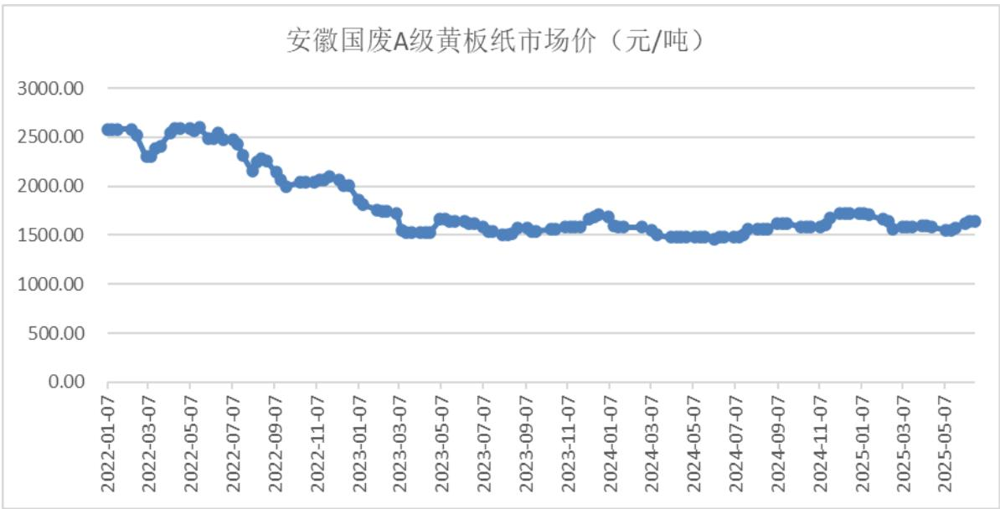  
数据来源：ifind

报告期内，受到宏观经济增速放缓、市场供需关系变动等多重因素影响，废纸市场价格存在一定波动。公司对于原材料品质、供应的及时性与稳定性亦有较高要求。若原材料价格的波动幅度过大或出现供应商无法及时供货的不利因素，将直接影响公司采购成本及供应稳定性，对公司成本管控、生产供应等方面带来一定的压力，进而影响公司整体经营业绩。

# 2、税收优惠政策变动风险

报告期内，公司享受的税收优惠政策主要包括：

# （1）资源综合利用税收优惠政策

根据财税【2015】78 号《关于印发<资源综合利用产品和劳务增值税优惠目录 $\gtrdot$ 的通知》以及财政部、税务总局公告 2021 年第 40 号《财政部 税务总局关于完善资源综合利用增值税政策的公告》，公司从事该文件所列的资源综合利用项目，公司销售自产的资源综合利用产品原纸享受增值税即征即退 $50 \%$ 政策。

根据《关于执行资源综合利用企业所得税优惠目录有关问题的通知》（财税〔2008〕47 号）及《关于公布<环境保护、节能节水项目企业所得税优惠目录（2021 年版） $>$ 以及<资源综合利用企业所得税优惠目录（2021 年版） $>$ 的公告》（财政部、税务总局、发展改革委、生态环境部公告 2021 年第 36 号），发行人以废纸为主要原材料生产纸制品取得的收入，自 2021 年 1 月 1 日起在计算应纳税所得额时，减按 $90 \%$ 计入当年收入总额。

# （2）先进制造业企业增值税加计抵减

根据财税【2023】43 号文件《财政部税务总局关于先进制造业企业增值税加计抵减政策的公告》，自 2023 年 1 月 1 日至 2027 年 12 月 31 日，公司按照当期可抵扣进项税额加计 $5 \%$ 抵减应纳增值税税额。

# （3）高新技术企业税收优惠政策

公司属于高新技术企业，报告期内按照 $1 5 \%$ 的优惠税率计缴企业所得税。因报告期各期应纳税所得额均为负数，本公司无需缴纳企业所得税，也未实际享受高新技术企业 $1 5 \%$ 所得税率的优惠政策。

报告期内，发行人各期税收优惠金额占净利润的比例如下：

单位：万元  

<table><tr><td>项目</td><td>2025 年 1-6 月</td><td>2024 年度</td><td>2023 年度</td><td>2022 年度</td></tr><tr><td>资源综合利用企业增值税即征即退</td><td>4,397.35</td><td>8,940.09</td><td>10,751.21</td><td>8,240.28</td></tr><tr><td>先进制造业企业增值税加计抵减</td><td>361.63</td><td>693.81</td><td>648.51</td><td>-</td></tr><tr><td>资源综合利用企业所得税</td><td>839.05</td><td>2,683.30</td><td>3,126.13</td><td>1,495.18</td></tr><tr><td>高新技术企业所得税优惠</td><td>-</td><td>-</td><td>-</td><td>-</td></tr><tr><td>上述税收优惠金额合计</td><td>5,598.03</td><td>12,317.20</td><td>14,525.86</td><td>9,735.46</td></tr><tr><td>净利润</td><td>9,141.90</td><td>15,285.64</td><td>21,158.56</td><td>15,447.07</td></tr><tr><td>税收优惠占净利润的比例</td><td>61.23%</td><td>80.58%</td><td>68.65%</td><td>63.02%</td></tr></table>

注：报告期内，公司因资源综合利用企业所得税优惠可全部抵减应纳税所得额，无须缴纳企业所得税，因此高新技术企业所得税优惠为零。

报告期内，公司税收优惠占净利润的比例较高，未来若国家关于资源综合利用企业、先进制造企业、高新技术企业的税收优惠政策发生变化，发行人经营业绩将受到较大不利影响。

# 3、流动性风险

报告期各期末，发行人资产负债率分别为 $4 9 . 5 6 \%$ 、 $4 0 . 0 4 \%$ 、 $3 7 . 7 0 \%$ 和$4 3 . 6 2 \%$ ，流动比率分别为 1.04 倍、1.42 倍、1.07 倍和 1.08 倍，速动比率分别为0.75 倍、1.18 倍、0.86 倍和 0.87 倍。造纸属于资金密集型行业，企业生产经营需要投入较多的资本构建厂房和机器设备等，同时需要大量的流动资金，而公司自身融资渠道有限，主要通过银行借款和融资租赁等方式来筹措资金从而导致公司资产负债率较高，流动比率和速动比率较低。随着发行人自身经营积累以及外部资本的引入，资产负债结构有所改善，但如果未来因产业扩张、日常生产经营等发生大额资金支出，发行人可能出现因资金周转困难而不能及时偿还借款或支付其他负债的情形，从而发生流动性风险。

# 4、市场竞争加剧风险

我国造纸企业众多，市场集中度低，拥有较高产能的大型造纸企业较少，产品同质化严重且产能多集中于中低端产品。发行人所处瓦楞纸、箱板纸细分市场竞争激烈。近年来，公司竞争对手不断增加新产能，若公司不能紧跟市场发展趋势，在人才储备、技术研发、客户服务等方面进一步巩固市场竞争力，则可能面临市场竞争加剧风险，对公司业绩增长产生不利影响。同时国内瓦楞纸和箱板纸市场亦受到国内外关税政策等因素影响，如果未来国内外关税政策等因素变动导致国内瓦楞纸或者箱板纸进口量大幅增加或者价格出现较大波动，将对发行人经营业绩的稳定性和盈利能力造成不利影响。

# 5、公司治理风险

截至本招股说明书签署日，控股股东及实际控制人李建设先生通过直接和间接方式合计控制公司 $8 8 . 4 0 \%$ 的表决权，本次发行完成后，其仍将控制公司

$6 6 . 3 0 \%$ 的表决权，仍处于绝对控制地位。若公司控股股东不能合理决策或超越股东会职权对公司进行控制，公司将面临实际控制人不当控制和治理有效性不足的风险 ，从而导致公司和中小股东利益受损。

# 6、募投项目实施风险

公司本次募集资金用于“年产 90 万吨绿色环保智能制造新材料项目（二期）”和“年产 60 万吨生物基纤维绿色智能制造新材料项目”，募投项目建成后公司将新增90万吨箱板纸产能和30万吨瓦楞纸产能，原纸总产能将达到235万吨。本次募投项目通过引入芬兰维美德 8600 生产线和 6600 瓦楞纸和箱板纸生产线，重点扩大 $8 0 { - } 1 2 0 \mathrm { g } / \mathrm { m } ^ { 2 }$ ²低克重高强度箱板纸的生产规模，主要产品符合当下包装行业“轻量化、高强度、环保化”的发展趋势。

公司现有两条瓦楞纸生产线，分别于2014年、2016年建成投产。由于其投产时间较早、产线自动化水平和生产效率相对较低，已无法达到额定满产状态，各期产能利用率分别为 $7 9 . 1 6 \%$ 、 $8 6 . 5 4 \%$ 、 $7 6 . 1 5 \%$ 和 $8 3 . 3 9 \%$ 。报告期内公司箱板纸产能利用率分别为 $1 0 1 . 5 1 \%$ 、 $8 8 . 4 2 \%$ 、 $8 9 . 3 9 \%$ 和 $9 3 . 4 7 \%$ 。其中，2023 年受新投产箱板纸6600生产线产能释放因素影响，产能利用率有所下降；2024年尽管受到水灾因素的影响，但随着 6600 生产线产能的释放和生产效率的提高，产能利用率仍有所提升。整体来看，报告期内公司主要产品的产能利用率较高、产销率整体保持较高水平。

公司募投项目效益系基于现有市场环境、行业政策、自身技术储备等因素进行测算。研究论证时假定未来公司瓦楞纸和箱板纸产品价格、市场需求不会发生重大变动，并结合募投项目的产能释放进度来预计募投项目新增产线未来收入。根据测算，募投项目建设完成后预计在首个完全达产年份新增折旧摊销费用15,504.69万元，占该项目当年新增营业收入的 $4 . 8 8 \%$ 。

最近三年，瓦楞纸、箱板纸市场受终端需求恢复节奏偏慢、成品纸进口关税调整等因素影响，瓦楞纸、箱板纸市场价格持续调整。2025 年 8 月，瓦楞纸、箱板纸市场价格探底回升后持续上涨。整体来看，报告期内，瓦楞纸、箱板纸市场价格存在一定波动。

未来，若公司募投项目在实施过程中或项目建成达产后，产业政策、市场

环境发生较大变化或出现其他重大不利因素，瓦楞纸和箱板纸的市场价格及产品需求出现重大不利变动，导致募投项目未能按计划正常实施或达产后新增产能无法及时消化，将对公司募投项目新增产能收入及公司经营业绩的稳定性造成不利影响。

# 7、业绩下滑风险

报告期各期，公司净利润分别为15,447.07万元、21,158.56万元、15,285.64万元及9,141.90万元，存在一定的波动。瓦楞纸和箱板纸作为制作瓦楞纸箱的主要原材料，与居民消费生活和社会经济发展程度紧密相连。报告期内，我国取消成品纸进口关税、中美贸易摩擦等关税政策对国内造纸行业及下游包装行业产生了一定的不利影响。此外，造纸业属于资金密集型行业，近年来造纸企业向集团化和规模化方向发展，行业集中度持续提升。

若未来发生海外同行业大幅降低成品纸价格导致成品纸进口量大幅增加、国内宏观经济下滑导致下游需求减少、公司未能持续保持行业领先地位、产品销售价格下降而公司未能有效传导至上游材料采购价格导致毛利率下降、主要客户流失等重大不利情形，将导致公司发生业绩下滑的风险。

# （二）本次发行的相关重要承诺说明

本公司提示投资者认真阅读本公司、实际控制人、董事、监事、高级管理人员以及本次发行的保荐人（主承销商）及证券服务机构等作出的重要承诺以及未能履行承诺的约束措施。具体承诺事项详见本招股说明书“第十二节 附件”之“附件二：与投资者保护相关的承诺、发行人及其他责任主体作出的与发行人本次发行上市相关的其他承诺事项”之相关内容。

# （三）本次发行前滚存利润分配方案

经公司 2025 年第二次临时股东会决议通过，公司首次公开发行股票前的滚存利润由发行后的新老股东共享。

# （四）业绩下滑延长锁定期的相关承诺

公司控股股东、实际控制人已按照中国证监会等监管机构要求，出具了关于上市后出现业绩下滑情形的承诺，若出现公司本次发行上市当年及之后第二

年、第三年较上市前一年净利润（以扣除非经常性损益后归属于母公司股东净利润为准）下滑 $50 \%$ 以上的情形，延长其届时所持股份锁定期限。具体详见本招股说明书“第十二节 附件”之“附件二：与投资者保护相关的承诺、发行人及其他责任主体作出的与发行人本次发行上市相关的其他承诺事项”之相关内容。

# （五）利润分配政策及长期回报规划

公司已制定并披露了切实可行的发行上市后的利润分配政策、现金分红的最低比例、上市后三年内利润分配计划及长期回报规划，具体如下：

# 1、发行上市后利润分配政策、现金分红的最低比例

公司在发行上市后执行的《公司章程（草案）》中明确将实行连续、稳定的利润分配政策，充分考虑对投资者的合理投资回报并兼顾公司的可持续发展，采取积极的现金或股票股利分配政策。在满足现金分红条件时，公司每个年度以现金方式累计分配的利润不少于当年实现的可分配利润的 $10 \%$ ，或任意连续三年以现金方式累计分配的利润不少于该三年实现的年均可分配利润的 $30 \%$ 。

《公司章程（草案）》中关于上市后利润分配具体政策详见本招股说明书“第九节 投资者保护”之“三、发行上市后的股利分配政策”之相关内容。

# 2、上市后三年内利润分配计划

公司综合考虑对投资者的合理投资回报，保持利润分配政策的连续性和稳定性，同时兼顾公司的长远利益、全体股东的整体利益及公司的可持续发展以及货币政策环境等因素制定了发行人上市后的股利分配政策，并严格履行了董事会及股东会决策程序。公司股利分配政策主要内容包括股利分配的基本原则、分配条件以及利润分配的决策程序和机制，具体内容详见本招股说明书“第九节 投资者保护”之“三、发行上市后的股利分配政策”之相关内容。

# 3、长期回报规划

在综合分析公司盈利能力、经营发展规划、股东回报、社会资金成本及外部融资环境等因素的基础上，充分考虑公司目前及未来盈利规模、现金流量状况、发展所处阶段、项目投资资金需求、银行信贷及债权融资环境等情况，公

司建立了对投资者持续、稳定、科学的回报机制，对公司上市后长期回报规划所涉及的利润分配形式、发放现金分红的具体条件和比例、发放股票股利的具体条件、利润分配政策的变更等进行了明确，具体内容详见本招股说明书“第九节 投资者保护”之“四、发行人未来三年股东分红回报规划”。

# 4、在审期间不进行现金分红的承诺

公司承诺自申请首次公开发行股票并在上海证券交易所主板上市至首次公开发行股票并在上海证券交易所主板上市前，不再提出新的现金分红方案，具体内容详见本招股说明书“第十二节 附件”之“附件二：与投资者保护相关的承诺、发行人及其他责任主体作出的与发行人本次发行上市相关的其他承诺事项”部分内容。

# （六）发行人财务报告审计截止日后主要财务信息及经营状况

# 1、审计截止日后主要经营情况

公司财务报告审计截止日为 2025 年 6 月 30 日。财务报告审计基准日至本招股说明书签署之日，公司的整体经营环境未发生重大变化，公司经营状况良好，公司主营业务经营模式、主要原材料采购模式、主要产品生产和销售模式、经营管理层及核心技术人员、税收政策以及其他可能影响投资者判断的重大事项等方面均未发生重大变化，亦未发生其他可能影响投资者判断的重大事项。

# 2、2025年 1-9月财务数据审阅情况

发行人会计师对公司 2025 年 9 月 30 日的合并及母公司资产负债表，2025年1-9月期间的合并及母公司利润表、合并及母公司现金流量表、合并及母公司所有者权益变动表以及相关财务报表附注进行了审阅，并出具了《审阅报告》（信会师报字[2025]第 ZF11292 号）。

经发行人会计师审阅，公司 2025 年 1-9 月主要财务数据及其变动情况如下：

（1）2025年 1-9月合并报表主要数据

2025年1-9月，公司合并财务报表主要数据及变动情况如下：

单位：万元  

<table><tr><td>资产负债类项目</td><td>2025年9月末</td><td>2024年末</td><td>变动率</td></tr><tr><td>资产总额</td><td>263,308.50</td><td>214,092.30</td><td>22.99%</td></tr><tr><td>负债总额</td><td>117,710.84</td><td>80,711.19</td><td>45.84%</td></tr><tr><td>归属于母公司所有者权益</td><td>145,597.66</td><td>133,381.11</td><td>9.16%</td></tr><tr><td>股东权益总额</td><td>145,597.66</td><td>133,381.11</td><td>9.16%</td></tr><tr><td>损益类项目</td><td>2025年1-9月</td><td>2024年1-9月</td><td>变动率</td></tr><tr><td>营业收入</td><td>192,837.15</td><td>187,600.43</td><td>2.79%</td></tr><tr><td>净利润</td><td>10,980.99</td><td>12,458.38</td><td>-11.86%</td></tr><tr><td>归属于母公司所有者的净利润</td><td>10,980.99</td><td>12,458.38</td><td>-11.86%</td></tr><tr><td>扣除非经常性损益后归属于母公司所有者的净利润</td><td>10,899.79</td><td>14,274.91</td><td>-23.64%</td></tr><tr><td>经营活动产生的现金流量净额</td><td>13,563.19</td><td>14,372.43</td><td>-5.63%</td></tr></table>

2025 年 9 月末，公司资产总额 263,308.50 万元，较 2024 年末增长 49,216.20万元，增幅为 $2 2 . 9 9 \%$ ，主要系募投项目建设导致固定资产及在建工程余额大幅增长。

2025 年 9 月末，公司负债总额 117,710.84 万元，较 2024 年末增长 36,999.65万元，增幅为 $4 5 . 8 4 \%$ ，一方面系公司为募投项目建设借入长期借款；另一方面系随生产规模的扩大，公司用于日常生产经营周转的短期借款规模亦随之扩大。

2025 年 1-9 月，公司营业收入 192,837.15 万元，同比增长 $2 . 7 9 \%$ ，实现小幅增长。

2025年1-9月，公司扣除非经常性损益后归属于母公司所有者的净利润为10,899.79 万元，同比 2024 年 1-9 月减少 3,375.12 万元，降幅为 $2 3 . 6 4 \%$ ，主要受毛利率下降影响。受下游需求不振影响，成品纸价格同比下降，2025年1-9月，公司综合毛利率为 $8 . 4 6 \%$ ，上年同期为 $9 . 8 8 \%$ ，同比下降1.42 个百分点，导致毛利减少2,217.42 万元；另外，2025 年1-9月增值税即征即退税额较上年同期下降 1,303.23 万元，两项综合影响利润额 3,520.65 万元，导致 2025 年 1-9月净利润下降。

2025 年 1-9 月，公司经营活动产生的现金流量净额为 13,563.19 万元，同比减少 $5 . 6 3 \%$ ，变动较小。

# （2）2025年 7-9月经营情况说明

2025年7-9月，公司经营业绩及同比情况如下：

单位：万元  

<table><tr><td rowspan="2">项目</td><td>2025年7-9月</td><td colspan="2">2024年7-9月</td></tr><tr><td>金额</td><td>金额</td><td>同比变动</td></tr><tr><td>营业收入</td><td>70,457.70</td><td>54,871.30</td><td>28.41%</td></tr><tr><td>营业利润</td><td>1,804.09</td><td>2,057.26</td><td>-12.31%</td></tr><tr><td>利润总额</td><td>1,839.09</td><td>-30.44</td><td>/</td></tr><tr><td>净利润</td><td>1,839.09</td><td>-30.44</td><td>/</td></tr><tr><td>归属于母公司所有者的净利润</td><td>1,839.09</td><td>-30.44</td><td>/</td></tr><tr><td>扣除非经常性损益后归属于母公司所有者的净利润</td><td>1,771.01</td><td>2,019.53</td><td>-12.31%</td></tr><tr><td>经营活动产生的现金流量净额</td><td>5,847.42</td><td>12,081.18</td><td>-51.60%</td></tr></table>

2025 年 7-9 月，公司营业收入 70,457.70 万元，同比增长 $2 8 . 4 1 \%$ ，主要原因为发行人 2024 年 9 月受台风“贝碧嘉”影响，发生停产及仓库被淹影响发货，导致上年同期营业收入较少。

2025 年 7-9 月，公司扣除非经常性损益后归属于母公司所有者的净利润为1,771.01 万元，同比减少 248.52 万元，降幅为 $1 2 . 3 1 \%$ ，主要系 2025 年 7-9 月收到的增值税即征即退税额及信用减值准备转回金额较上年同期下降所致。

2024 年 7-9 月公司扣除非经常性损益前、后归属于母公司所有者的净利润差异较大，主要系 2024 年 9 月受水灾影响，造成非经常性损失 1,938.89 万元，损失金额较大。

2025 年 7-9 月公司经营活动产生的现金流量净额为 5,847.42 万元，较去年同期减少6,233.76万元。原因系2024年公司因遭受水灾影响，9月中下旬停工，销售、采购大幅减少，导致经营现金流出减少；同时，信用期满的应收账款陆续回款，导致应收账款余额大幅下降。2024 年 9 月末应收账款余额从 6 月末的23,629.38 万元下降至 11,368.77 万元，减少 12,260.61 万元，降幅较大；而 2025年 9 月末应收账款余额从 6 月末 14,564.84 万下降至 13,715.20 万元，减少 849.64万元，降幅较小。

（3）2025年 1-9月非经常性损益明细

2025年1-9月，公司经审阅的非经常性损益明细及同比变动情况如下：

单位：万元  

<table><tr><td>项目</td><td>2025年1-9月</td><td>2024年1-9月</td><td>变动额</td></tr><tr><td>非流动性资产处置损益,包括已计提资产减值准备的冲销部分</td><td>-4.56</td><td>-16.87</td><td>12.31</td></tr><tr><td>计入当期损益的政府补助,但与公司正常经营业务密切相关、符合国家政策规定、按照确定的标准享有、对公司损益产生持续影响的政府补助除外</td><td>106.23</td><td>271.67</td><td>-165.45</td></tr><tr><td>除上述各项之外的其他营业外收入和支出</td><td>-5.82</td><td>-2,071.34</td><td>2,065.52</td></tr><tr><td>其他符合非经常性损益定义的损益项目</td><td>-14.65</td><td>-</td><td>-14.65</td></tr><tr><td>小计</td><td>81.20</td><td>-1,816.53</td><td>1,897.73</td></tr><tr><td>所得税影响额</td><td>-</td><td>-</td><td>-</td></tr><tr><td>少数股东权益影响额(税后)</td><td>-</td><td>-</td><td>-</td></tr><tr><td>合计</td><td>81.20</td><td>-1,816.53</td><td>1,897.73</td></tr></table>

2025 年 1-9 月，公司非经常性损益金额为 81.20 万元，金额较小。2024 年1-9月，公司非经常性损益金额为-1,816.53万元，其中“除上述各项之外的其他营业外收入和支出”-2,071.34 万元，主要系受台风“贝碧嘉”影响，萧县发生洪涝灾害，公司厂区仓库、产线被洪水浸泡，导致非经常性损失金额较大。

# 3、2025 年 1-10 月经营情况

公司2025年 1-10月主要经营数据情况及同比变动情况如下：

单位：万元  

<table><tr><td>项目</td><td>2025 年 1-9 月</td><td>2025 年 10 月</td><td>2025 年 1-10 月</td></tr><tr><td>营业收入</td><td>192,837.15</td><td>26,449.44</td><td>219,286.59</td></tr><tr><td>综合毛利率</td><td>8.46%</td><td>10.98%</td><td>8.77%</td></tr><tr><td>归属于母公司所有者的净利润</td><td>10,980.99</td><td>2,582.87</td><td>13,563.86</td></tr><tr><td>扣除非经常性损益后归属于母公司所有者的净利润</td><td>10,899.79</td><td>2,590.15</td><td>13,489.94</td></tr></table>

注：上表2025年10月数据未经审计或审阅。

2025 年 7 月瓦楞纸、箱板纸市场价格探底回升，8 月进入上涨通道，尤其10 月以来，受原纸价格持续上涨影响，成品原纸与废纸价差扩大，公司销量和毛利率同步提升。

2025 年 10 月，公司实现营业收入 26,449.44 万元，单月综合毛利率为$1 0 . 9 8 \%$ ，比2025 年1-9月综合毛利率提高了 2.52个百分点，单月实现归属于母公司所有者的净利润 2,582.87 万元、扣除非经常性损益后归属于母公司所有者的净利润 2,590.15 万元。

# 4、2025年度业绩预计情况

公司基于已实现的经营业绩，目前成品原纸及主要原材料价格走势等情况，2025年度业绩预计情况及同比变动情况如下：

<table><tr><td>项目</td><td>2025 年度</td><td>2024 年度</td><td>变动率</td></tr><tr><td>营业收入</td><td>26.40~27.80 亿元</td><td>24.85 亿元</td><td>增长 6.23%~11.87%</td></tr><tr><td>归属于母公司所有者的净利润</td><td>1.80~2.00 亿元</td><td>1.53 亿元</td><td>增长 17.76%~30.84%</td></tr><tr><td>扣除非经常性损益后归属于母公司所有者的净利润</td><td>1.70~1.90 亿元</td><td>1.66 亿元</td><td>增长 2.20%~14.23%</td></tr></table>

公司对 2025 年度经营业绩预计为公司初步测算数据，未经审计或审阅，不构成公司的盈利预测或业绩承诺。

# 二、发行人及本次发行的中介机构基本情况

（一）发行人基本情况  

<table><tr><td>发行人名称</td><td>安徽林平循环发展股份有限公司</td><td>成立日期</td><td>2002年1月24日</td></tr><tr><td>注册资本</td><td>5,656.11万元</td><td>法定代表人</td><td>李建设</td></tr><tr><td>注册地址</td><td>萧县圣泉乡北城村</td><td>主要生产经营地址</td><td>萧县圣泉乡北城村</td></tr><tr><td>控股股东</td><td>李建设</td><td>实际控制人</td><td>李建设</td></tr><tr><td>行业分类</td><td>C22造纸和纸制品业</td><td>在其他交易场所（申请）挂牌或上市的情况</td><td>无</td></tr></table>

（二）本次发行的有关中介机构  

<table><tr><td>保荐人</td><td>国联民生证券承销保荐有限公司</td><td>主承销商</td><td>国联民生证券承销保荐有限公司</td></tr><tr><td>发行人律师</td><td>北京市天元律师事务所</td><td>其他承销机构</td><td>无</td></tr><tr><td>审计机构</td><td>立信会计师事务所（特殊普通合伙）</td><td>评估机构</td><td>厦门嘉学资产评估房地产估价有限公司</td></tr><tr><td colspan="2">发行人与本次发行有关的保荐人、承销机构、证券服务机构及其负责人、高级管理人员、经办人员之间存在的直接或间接的股权关系或其他利益关系</td><td colspan="2">无</td></tr></table>

（三）本次发行其他有关机构  

<table><tr><td>股票登记机构</td><td>中国证券登记结算有限责任公司上海分公司</td><td>收款银行</td><td>中国建设银行无锡太湖新城支行</td></tr><tr><td colspan="2">其他与本次发行有关的机构</td><td colspan="2">无</td></tr></table>

# 三、本次发行概况

（一）本次发行的基本情况  

<table><tr><td>股票种类</td><td colspan="3">人民币普通股（A股）</td></tr><tr><td>每股面值</td><td colspan="3">1.00元</td></tr><tr><td>发行股数</td><td>1,885.3700万股</td><td>占发行后总股本比例</td><td>25.00%</td></tr><tr><td>其中：发行新股数量</td><td>1,885.3700万股</td><td>占发行后总股本比例</td><td>25.00%</td></tr><tr><td>股东公开发售股份数量</td><td>无</td><td>占发行后总股本比例</td><td>-</td></tr><tr><td>发行后总股本</td><td colspan="3">7,541.4800万股</td></tr><tr><td>每股发行价格</td><td colspan="3">37.88元</td></tr><tr><td>发行市盈率</td><td colspan="3">18.69倍（每股收益按2024年经审计的扣除非经常性损益前后敦低的归属于母公司所有者净利润除以本次发行后总股本计算）</td></tr><tr><td>发行前每股净资产</td><td>25.40元（按经审计的截至2025年6月30日归属于母公司所有者权益除以发行前总股本计算）</td><td>发行前每股收益</td><td>2.70元（按2024年经审计的、扣除非经常性损益前后敦低的归属于母公司所有者的净利润除以本次发行前总股本计算）</td></tr><tr><td>发行后每股净资产</td><td>27.32元（按经审计的截至2025年6月30日归属于母公司所有者权益加上本次发行募集资金净额之和除以发行后总股本计算）</td><td>发行后每股收益</td><td>2.03元（按2024年经审计的、扣除非经常性损益前后敦低的归属于母公司所有者的净利润除以本次发行后总股本计算）</td></tr><tr><td>发行市净率</td><td colspan="3">1.39倍（发行价格除以发行后每股净资产计算）</td></tr><tr><td>预测净利润</td><td colspan="3">无</td></tr><tr><td>发行方式</td><td colspan="3">本次发行采用网下向符合条件的投资者询价配售和网上持有上海市场非限售A股股份和非限售存托凭证市值的社会公众投资者定价发行相结合的方式进行</td></tr><tr><td>发行对象</td><td colspan="3">网下投资者和已开立上海证券交易所股票账户的境内自然人、法人、证券投资基金及符合法律、法规、规范性文件规定的其他投资者(国家法律法规和规范性文件禁止参与者除外)</td></tr><tr><td>承销方式</td><td colspan="3">余额包销</td></tr><tr><td>募集资金总额</td><td colspan="3">71,417.82万元</td></tr><tr><td>募集资金净额</td><td colspan="3">62,409.33万元</td></tr><tr><td>募集资金投资项目</td><td colspan="3">年产90万吨绿色环保智能制造新材料项目(二期)年产60万吨生物基纤维绿色智能制造新材料项目</td></tr><tr><td>发行费用概算</td><td colspan="3">本次发行费用总额为9,008.49万元,构成如下:(1) 保荐及承销费用: 保荐费为1,000.00万元,承销费为4,713.43万元; 参考市场保荐承销费率平均水平,经双方友好协商确定,按照项目进度分节点支付;(2) 审计及验资费用: 1,720.08万元; 参考市场会计师费率平均水平,考虑服务的工作要求、工作量等因素,经友好协商确定,按照项目进度分节点支付;(3) 律师费用: 980.00万元; 参考市场律师费率平均水平,考虑长期合作的意愿、律师的工作表现及工作量,经友好协商确定,按照项目进度分节点支付;(4) 用于本次发行的信息披露费用: 572.26万元;(5) 发行手续费及其他费用: 22.72万元。注:(1) 以上发行费用均不含增值税;(2) 相较于招股意向书,根据发行情况将印花税纳入了发行手续费及其他费用,印花税税基为扣除印花税前的募集资金净额,税率为0.025%;除上述调整外,发行费用不存在其他调整情况。</td></tr><tr><td>高级管理人员、员工拟参与战略配售情况</td><td colspan="3">无</td></tr><tr><td>保荐人相关子公司拟参与战略配售情况</td><td colspan="3">不适用</td></tr><tr><td>拟公开发行售股份股东名称、持股数量及拟公开发售股份数量、发行费用的分摊原则</td><td colspan="3">本次发行均为新股,不涉及原股东公开发售股份</td></tr></table>

（二）本次发行上市的重要日期  

<table><tr><td>刊登初步询价公告日期</td><td>2026年1月22日</td></tr><tr><td>初步询价日期</td><td>2026年1月27日</td></tr><tr><td>刊登发行公告日期</td><td>2026年1月29日</td></tr><tr><td>申购日期</td><td>2026年1月30日</td></tr><tr><td>缴款日期</td><td>2026年2月3日</td></tr><tr><td>股票上市日期</td><td>本次发行结束后将尽快申请在上海证券交易所主板上市</td></tr></table>

# 四、主营业务经营情况

# （一）主要业务、主要产品或其用途

公司主要从事包装用瓦楞纸、箱板纸产品的研发、生产和销售，是一家具有自主研发及创新能力的高新技术企业；经过多年发展，公司已成长为集废纸利用、热电联产、绿色造纸于一体的资源综合利用企业。公司一直重视环境保护、节能降耗工作，公司通过废纸利用、污水处理、白水和中水回用、沼气燃烧发电、污泥回用、热电联产、绿色制造等工艺，实现资源的循环利用和可持续发展。公司被评为“安徽省清洁生产示范企业”、“安徽省绿色工厂”、“安徽省节能先进企业”等荣誉，2023 年 3 月，公司被工信部认定为“2022 年度绿色工厂”。

公司主要产品包括瓦楞纸、箱板纸，公司产品销往下游制作成瓦楞纸箱，被广泛应用于物流运输、工业品及消费品包装领域。

报告期内，公司主营业务收入构成如下：

单位：万元  

<table><tr><td rowspan="2">项目</td><td colspan="2">2025年1-6月</td><td colspan="2">2024年度</td><td colspan="2">2023年度</td><td colspan="2">2022年度</td></tr><tr><td>金额</td><td>占比</td><td>金额</td><td>占比</td><td>金额</td><td>占比</td><td>金额</td><td>占比</td></tr><tr><td>瓦楞纸</td><td>34,669.16</td><td>28.51%</td><td>71,465.47</td><td>28.97%</td><td>87,175.23</td><td>31.30%</td><td>111,555.72</td><td>38.85%</td></tr><tr><td>箱板纸</td><td>86,930.05</td><td>71.49%</td><td>175,229.87</td><td>71.03%</td><td>191,330.79</td><td>68.70%</td><td>175,570.21</td><td>61.15%</td></tr><tr><td>合计</td><td>121,599.21</td><td>100.00%</td><td>246,695.33</td><td>100.00%</td><td>278,506.02</td><td>100.00%</td><td>287,125.93</td><td>100.00%</td></tr></table>

# （二）主要原材料及重要供应商

公司生产所需原材料主要为废纸和玉米淀粉等，所需能源主要为煤炭和电力。主要供应商包括：南京启宏再生资源有限公司、高安市首德环保科技有限公司、东台市润鑫再生资源回收有限公司、河南省翌矿环保科技有限公司、淮安鑫迈华再生资源有限公司、开封市立展商贸有限公司/河南宇发纸业有限公司、神府经济开发区海湾煤矿有限公司、神木市百吉矿业有限责任公司等。

# （三）主要生产模式

发行人产品瓦楞纸、箱板纸采用以销定产、自主生产的生产模式，公司依靠自有厂房、生产设备及人员组织生产。生产部门根据订单情况安排生产计划，

确保生产计划顺利完成。此外，公司根据库存情况，生产部分常规产品作为库存，提高产品交货速度。

# （四）销售方式和渠道及重要客户

公司产品销售采用直销模式，其中客户构成以直接客户为主，贸易商客户为辅。公司销售部人员通过上门拜访等方式进行客户开发，接洽潜在客户，选择优质客户作为储备，随后进行客户调研，搜集汇总潜在客户信息，确定客户信用等级。调研结束后，选择符合标准的客户提出准入申请，并提交相关材料。销售部部门经理审核客户准入申请，审核主要关注客户信用等级、意向结算方式以及客户调研报告的完整性和准确性。公司总经理审批客户准入申请后，销售内勤为通过准入申请的客户信息建立客户信息档案，并定期进行维护。确定合作后公司与客户签订销售合同，公司按照客户订单要求进行生产销售。

报告期内，公司主要客户包括：厦门国贸集团股份有限公司、厦门合兴包装印刷股份有限公司、厦门建发股份有限公司、山鹰国际控股股份公司、无锡市胜源纸品有限公司等。

# （五）行业竞争情况及发行人在行业中的竞争地位

我国造纸企业众多，行业分散，市场集中度低，市场竞争激烈，但是拥有较高产能的大型造纸企业较少，产品同质化严重且产能多集中于中低端产品。近年来，随着国内不断地出台及完善造纸行业的相关法律法规及产业政策，行业准入门槛提高，生产工艺及技术水平要求不断增加，部分产能小、工艺水平落后的中小造纸企业被整合或被淘汰，造纸企业向集团化和规模化方向发展，行业集中度不断提升。

根据中国造纸协会公布的《中国造纸工业 2024 年度报告》中的数据来看，2024 年度，全国纸和纸板生产企业数量约 2,600 家，其中年产 100 万吨以上的企业为 30 家。国内造纸企业大致可分为三个梯队，第一梯队为以玖龙纸业、太阳控股、理文造纸、山鹰国际 4 家为代表的年产量在 500 万吨以上的国内大型造纸企业，企业数量较少；第二梯队为以晨鸣纸业、博汇集团、荣成环保、华泰集团、中国纸业及林平发展为代表的一批中型造纸企业，数量为 26 家，年产量在100-500万吨之间；第三梯队为年产量在100万吨以下的中小型企业，企业

数量众多。公司现有产能 115 万吨，2024 年公司原纸产量合计为 101.97 万吨，公司原纸产量在全国居于前列，是全国造纸企业产量前 30 名企业之一，产量在行业企业平均水平中处于领先地位。

根据中国造纸协会公布的造纸工业年度报告，2024 年发行人原纸产量占安徽省纸及纸板产量和全国纸及纸板产量的比例为 $3 5 . 6 5 \%$ 和 $0 . 7 5 \%$ ，为安徽省内的主要造纸企业。未来随着募投项目建成投产，公司原纸合计生产能力将从115万吨/年增加至 235 万吨/年，发行人在原纸领域的市场地位和竞争力将得到进一步提升。

单位：万吨   

<table><tr><td>项目</td><td>2024 年度</td><td>2023 年度</td><td>2022 年度</td></tr><tr><td>安徽省纸及纸板产量</td><td>286.00</td><td>293.00</td><td>312.00</td></tr><tr><td>全国纸及纸板产量</td><td>13,625.00</td><td>12,965.00</td><td>12,425.00</td></tr><tr><td>发行人原纸产量</td><td>101.97</td><td>105.35</td><td>86.38</td></tr><tr><td>发行人原纸产量占安徽省纸及纸板产量比例</td><td>35.65%</td><td>35.96%</td><td>27.68%</td></tr><tr><td>发行人原纸产量占全国纸及纸板产量比例</td><td>0.75%</td><td>0.81%</td><td>0.70%</td></tr></table>

数据来源：中国造纸协会

# 五、发行人符合主板定位说明

根据《首次公开发行股票注册管理办法》、《上海证券交易所股票发行上市审核规则》和《上海证券交易所股票上市规则》相关规定，主板突出“大盘蓝筹”特色，重点支持业务模式成熟、经营业绩稳定、规模较大、具有行业代表性的优质企业。公司符合中国证监会、上海证券交易所关于主板的定位要求，具体说明如下：

# （一）业务模式成熟

公司主要从事包装用瓦楞纸、箱板纸产品的研发、生产和销售，是一家具有自主研发及创新能力的高新技术企业；经过多年发展，公司已成长为集废纸利用、热电联产、绿色造纸于一体的资源综合利用企业。经过多年发展，公司已形成了成熟稳定的研发、采购、生产和销售模式。

研发方面，公司一贯高度重视技术研发和自主创新体系的建设，公司深耕于瓦楞纸和箱板纸领域多年，积累了丰富的产品设计与生产工艺研发经验。公

司围绕低克重瓦楞纸和箱板纸产品设计开发、节能降耗和清洁生产先进加工工艺等方面进行研发，形成了多项核心技术和自主专利，并成功应用于现有产品体系，研发模式成熟稳定。

采购方面，公司生产所需主要原材料包括废纸和煤炭等，废纸主要由邻近区域内资源回收公司或废纸打包站进行供应，煤炭主要向国内大型煤炭企业直接采购，上述原材料市场供应充足，价格透明。公司根据下游客户需求制定生产计划，结合原材料库存情况按需采购，已建立了完整的供应链管理体系和采购业务管理流程，采购模式成熟稳定。

生产方面，公司采用以销定产、自主生产的生产模式，公司依靠自有厂房、生产设备及人员组织生产，生产部门根据订单情况安排生产计划，确保生产计划顺利完成。此外，公司根据库存情况，生产部分常规产品作为库存，提高产品交货速度。目前，公司已建立了规范完善的生产业务流程和管理体系，生产模式成熟。

销售方面，公司产品销售采用直销模式，其中客户构成以直接客户为主，贸易商客户为辅。公司深耕瓦楞纸和箱板纸领域多年，凭借稳定的产品质量、优质的客户服务，与厦门合兴包装印刷股份有限公司、厦门建发股份有限公司、厦门国贸集团股份有限公司等国内众多知名企业建立了稳定的合作关系，在瓦楞纸和箱板纸领域建立了良好的信誉和知名度。目前已形成了成熟的销售业务管理流程和销售管理制度，公司销售模式成熟。

公司自成立以来一直从事瓦楞纸和箱板纸产品的研发、生产与销售，形成了稳定的研发、采购、生产、销售模式，公司研发模式、采购模式、生产模式和销售模式与同行业可比公司相比不存在显著差异，上述业务模式符合行业发展趋势、契合业务特点，公司业务模式成熟。

# （二）经营业绩稳定

报告期内，公司营业收入分别为 287,889.19 万元、279,983.70 万元、248,509.78 万元、122,379.45 万元，净利润分别为 15,447.07 万元、21,158.56 万元、15,285.64 万元、9,141.90 万元，扣除非经常性损益后归属于母公司股东的净利润分别为 12,759.57 万元、20,459.88 万元、16,633.49 万元、9,128.78 万元。

2024 年受台风“贝碧嘉”影响，公司厂房及仓库被淹，导致库存及生产设备产生损失，同时生产车间检修及停产 30 多天，产品销量下降导致 2024 年经营业绩有所下滑。整体来看发行人经营稳定，具备较强的盈利能力。

# （三）规模较大

造纸工业是一个与国民经济发展和人民生活息息相关的重要基础原材料产业，行业规模大，且行业内企业众多。根据中国造纸协会公布的《中国造纸工业 2024 年度报告》中的数据来看，2024 年度，全国纸和纸板生产企业数量约2,600 家，产量为 13,625 万吨，户均产量为 5.24 万吨，其中年产 100 万吨以上的企业仅为30家，公司产销量均超过 100 万吨，规模较大。

报告期内，公司实现原纸产品产量分别为 86.38 万吨、105.35 万吨、101.97万吨、53.03 万吨，销售分别为 87.14 万吨、105.44 万吨、100.08 万吨、50.51 万吨，产销规模远远超过纸和纸板生产企业户均水平，是中国造纸协会认定的造纸企业产量前 30 名企业之一，生产规模位于行业前列；实现销售收入分别为287,889.19 万元、279,983.70 万元、248,509.78 万元、122,379.45 万元，符合规模较大的经济特征。

# （四）行业代表性

公司自成立以来坚持推进清洁化生产，以发展循环经济、推进节能降耗、生产绿色包装产品为方向，通过废纸回收再利用构建绿色低碳循环发展的经济体系，持续完善以资源高效利用和环境友好为导向的运营体系，实现生态效益、经济效益、社会效益相统一。“绿色制造 $^ +$ 循环经济”的经营理念与国家的产业政策和经济发展战略所契合，公司也被工信部认定为“绿色工厂”。

公司深耕循环造纸行业二十余年，在循环造纸领域具有较高的知名度，公司“林平”商标获得中国驰名商标和安徽省著名商标称号，“林平牌高档 A 级施胶瓦楞纸”获得安徽名牌产品称号。公司重视研发，不断投入新技术、新设备，有效的提升了产品质量、生产效率和自动化水平，降低了生产成本，并为公司的进一步发展注入了强劲动力。公司已取得 27 项专利，并参与起草 1 项行业内国家标准。公司被认定为安徽省企业技术中心和安徽省技术创新示范企业，并荣获“2019 年安徽省专精特新中小企业”、“2020 年度安徽省专精特新冠军

企业”等称号，2023 年公司被工业和信息化部认定为国家级专精特新小巨人企业。

根据中国造纸协会公布的《中国造纸工业 2024 年度报告》中的数据来看，2024 年度，全国纸和纸板生产企业数量约 2,600 家，其中年产 100 万吨以上的企业为 30 家。国内造纸企业大致可分为三个梯队，第一梯队为以玖龙纸业、太阳控股、理文造纸、山鹰国际 4 家为代表的年产量在 500 万吨以上的国内大型造纸企业，企业数量较少；第二梯队为以晨鸣纸业、博汇集团、荣成环保、华泰集团、中国纸业及林平发展为代表的一批中型造纸企业，数量为 26 家，年产量在100-500万吨之间；第三梯队为年产量在100万吨以下的中小型企业，企业数量众多。公司现有产能 115 万吨，公司原纸产量在全国居于行业前列，是全国造纸企业产量前 30名企业之一，产量在行业企业平均水平中处于领先地位。

凭借稳定的产品质量、优质的客户服务，公司已经形成了相应的品牌影响力和竞争优势，与合兴包装（002228.SZ）、建发股份（600153.SH）、厦门国贸（600755.SH）、山鹰国际（600567.SH）、龙利得（300883.SZ）、无锡市胜源纸品有限公司等国内众多知名企业建立了稳定的合作关系，公司系行业内较具代表性的优质企业。

在发展循环经济的同时，公司积极履行社会责任。公司通过多种方式参与扶贫工作，全面助力乡村振兴，被评为安徽省“千企帮千村”精准扶贫行动先进民营企业，宿州市“万企兴万村”行动实验基地，实际控制人李建设先生也被授予宿州市脱贫攻坚奉献奖、宿州市社会扶贫先进个人等荣誉，为造纸企业树立了良好的社会形象。

综上，公司业务模式成熟、经营业绩稳定、规模较大、具有行业代表性，符合主板定位要求。

# 六、主要财务数据和财务指标

根据发行人会计师出具的信会师报字[2025]第ZF11216号《审计报告》，报告期内公司主要财务数据及指标如下：

<table><tr><td>项目</td><td>2025.6.30</td><td>2024.12.31</td><td>2023.12.31</td><td>2022.12.31</td></tr><tr><td>资产总额（万元）</td><td>254,784.43</td><td>214,092.30</td><td>193,224.95</td><td>184,682.64</td></tr><tr><td>归属于母公司所有者权益（万元）</td><td>143,652.21</td><td>133,381.11</td><td>115,854.29</td><td>93,145.04</td></tr><tr><td>资产负债率</td><td>43.62%</td><td>37.70%</td><td>40.04%</td><td>49.56%</td></tr><tr><td>项目</td><td>2025年1-6月</td><td>2024年度</td><td>2023年度</td><td>2022年度</td></tr><tr><td>营业收入（万元）</td><td>122,379.45</td><td>248,509.78</td><td>279,983.70</td><td>287,889.19</td></tr><tr><td>净利润（万元）</td><td>9,141.90</td><td>15,285.64</td><td>21,158.56</td><td>15,447.07</td></tr><tr><td>归属于母公司所有者的净利润（万元）</td><td>9,141.90</td><td>15,285.64</td><td>21,158.56</td><td>15,447.07</td></tr><tr><td>扣除非经常性损益后归属于母公司所有者的净利润（万元）</td><td>9,128.78</td><td>16,633.49</td><td>20,459.88</td><td>12,759.57</td></tr><tr><td>基本每股收益（元）</td><td>1.62</td><td>2.70</td><td>3.74</td><td>2.73</td></tr><tr><td>稀释每股收益（元）</td><td>1.62</td><td>2.70</td><td>3.74</td><td>2.73</td></tr><tr><td>加权平均净资产收益率</td><td>6.60%</td><td>12.27%</td><td>20.25%</td><td>17.80%</td></tr><tr><td>经营活动产生的现金流量净额（万元）</td><td>7,715.77</td><td>25,293.98</td><td>37,428.12</td><td>17,925.23</td></tr><tr><td>现金分红（万元）</td><td>-</td><td>-</td><td>-</td><td>4,418.84</td></tr><tr><td>研发投入占营业收入的比例</td><td>3.62%</td><td>3.37%</td><td>3.15%</td><td>3.29%</td></tr></table>

# 七、发行人财务报告审计截止日后主要财务信息及经营状况

# （一）审计截止日后主要经营情况

公司财务报告审计截止日为 2025 年 6 月 30 日。财务报告审计基准日至本招股说明书签署之日，公司的整体经营环境未发生重大变化，公司经营状况良好，公司主营业务经营模式、主要原材料采购模式、主要产品生产和销售模式、经营管理层及核心技术人员、税收政策以及其他可能影响投资者判断的重大事项等方面均未发生重大变化，亦未发生其他可能影响投资者判断的重大事项。

# （二）2025 年 1-9月财务数据审阅情况

发行人会计师对公司 2025年9月30 日的合并及母公司资产负债表，2025年1-9月期间的合并及母公司利润表、合并及母公司现金流量表、合并及母公司所有者权益变动表以及相关财务报表附注进行了审阅，并出具了《审阅报告》（信会师报字[2025]第 ZF11292 号）。

经发行人会计师审阅，公司 2025年 1-9月主要财务数据及其变动情况如下：

# 1、2025年 1-9月合并报表主要数据

2025年1-9月，公司合并财务报表主要数据及变动情况如下：

单位：万元  

<table><tr><td>资产负债类项目</td><td>2025年9月末</td><td>2024年末</td><td>变动率</td></tr><tr><td>资产总额</td><td>263,308.50</td><td>214,092.30</td><td>22.99%</td></tr><tr><td>负债总额</td><td>117,710.84</td><td>80,711.19</td><td>45.84%</td></tr><tr><td>归属于母公司所有者权益</td><td>145,597.66</td><td>133,381.11</td><td>9.16%</td></tr><tr><td>股东权益总额</td><td>145,597.66</td><td>133,381.11</td><td>9.16%</td></tr><tr><td>损益类项目</td><td>2025年1-9月</td><td>2024年1-9月</td><td>变动率</td></tr><tr><td>营业收入</td><td>192,837.15</td><td>187,600.43</td><td>2.79%</td></tr><tr><td>营业利润</td><td>10,986.80</td><td>14,546.59</td><td>-24.47%</td></tr><tr><td>利润总额</td><td>10,980.99</td><td>12,458.38</td><td>-11.86%</td></tr><tr><td>净利润</td><td>10,980.99</td><td>12,458.38</td><td>-11.86%</td></tr><tr><td>归属于母公司所有者的净利润</td><td>10,980.99</td><td>12,458.38</td><td>-11.86%</td></tr><tr><td>扣除非经常性损益后归属于母公司所有者的净利润</td><td>10,899.79</td><td>14,274.91</td><td>-23.64%</td></tr><tr><td>经营活动产生的现金流量净额</td><td>13,563.19</td><td>14,372.43</td><td>-5.63%</td></tr></table>

2025 年 9 月末，公司资产总额 263,308.50 万元，较 2024 年末增长 49,216.20万元，增幅为 $2 2 . 9 9 \%$ ，主要系募投项目建设导致固定资产及在建工程余额大幅增长。

2025 年 9 月末，公司负债总额 117,710.84 万元，较 2024 年末增长 36,999.65万元，增幅为 $4 5 . 8 4 \%$ ，一方面系公司为募投项目建设借入长期借款；另一方面系随生产规模的扩大，公司用于日常生产经营周转的短期借款规模亦随之扩大。

2025 年 1-9 月，公司营业收入 192,837.15 万元，同比增长 $2 . 7 9 \%$ ，实现小幅增长。

2025年1-9月，公司扣除非经常性损益后归属于母公司所有者的净利润为10,899.79 万元，同比 2024 年 1-9 月减少 3,375.12 万元，降幅为 $2 3 . 6 4 \%$ ，主要受毛利率下降影响。受下游需求不振影响，成品纸价格同比下降，2025年1-9月，公司综合毛利率为 $8 . 4 6 \%$ ，上年同期为 $9 . 8 8 \%$ ，同比下降1.42 个百分点，导致毛利减少2,217.42 万元；另外，2025 年1-9月增值税即征即退税额较上年同期下降 1,303.23 万元，两项综合影响利润额 3,520.65 万元，导致 2025 年 1-9月公司扣除非经常性损益后归属于母公司所有者的净利润下降。

2024年1-9月公司扣除非经常损益前、后归属于母公司所有者的净利润差异较大，主要系 2024年9月受水灾影响，造成非经常性损失 1,938.89 万元，损失金额较大。

2025 年 1-9 月，公司经营活动产生的现金流量净额为 13,563.19 万元，同比减少 $5 . 6 3 \%$ ，变动较小。

2、2025 年 7-9 月经营情况说明

2025年7-9月，公司经营业绩及同比情况如下：

单位：万元  

<table><tr><td rowspan="2">项目</td><td>2025年7-9月</td><td colspan="2">2024年7-9月</td></tr><tr><td>金额</td><td>金额</td><td>同比变动</td></tr><tr><td>营业收入</td><td>70,457.70</td><td>54,871.30</td><td>28.41%</td></tr><tr><td>营业利润</td><td>1,804.09</td><td>2,057.26</td><td>-12.31%</td></tr><tr><td>利润总额</td><td>1,839.09</td><td>-30.44</td><td>/</td></tr><tr><td>净利润</td><td>1,839.09</td><td>-30.44</td><td>/</td></tr><tr><td>归属于母公司所有者的净利润</td><td>1,839.09</td><td>-30.44</td><td>/</td></tr><tr><td>扣除非经常性损益后归属于母公司所有者的净利润</td><td>1,771.01</td><td>2,019.53</td><td>-12.31%</td></tr><tr><td>经营活动产生的现金流量净额</td><td>5,847.42</td><td>12,081.18</td><td>-51.60%</td></tr></table>

2025 年 7-9 月，公司营业收入 70,457.70 万元，同比增长 $2 8 . 4 1 \%$ ，主要原因为发行人 2024 年 9 月受台风“贝碧嘉”影响，发生停产及仓库被淹影响发货，导致上年同期营业收入较少。

2025 年 7-9 月，公司扣除非经常性损益后归属于母公司所有者的净利润为1,771.01 万元，同比减少 248.52 万元，降幅为 $1 2 . 3 1 \%$ ，主要系 2025 年 7-9 月收到的增值税即征即退税额及信用减值准备转回金额较上年同期下降所致。

2024 年 7-9 月公司扣除非经常性损益前、后归属于母公司所有者的净利润差异较大，主要系 2024 年 9 月受水灾影响，造成非经常性损失 1,938.89 万元，损失金额较大。

2025 年 7-9 月公司经营活动产生的现金流量净额为 5,847.42 万元，较去年同期减少6,233.76万元。原因系2024年公司因遭受水灾影响，9月中下旬停工，销售、采购大幅减少，导致经营现金流出减少；而信用期满的应收账款陆续回

款，导致应收账款余额大幅下降。2024 年 9 月末应收账款余额从 6 月末的23,629.38 万元下降至 11,368.77 万元，减少 12,260.61 万元，降幅较大；而 2025年 9 月末应收账款余额从 6 月末 14,564.84 万下降至 13,715.20，减少 849.64 万元，降幅较小。

# 3、2025年 1-9月非经常性损益明细

2025年1-9月，公司经审阅非经常性损益明细及同比变动情况如下：

单位：万元  

<table><tr><td>项目</td><td>2025年1-9月</td><td>2024年1-9月</td><td>变动额</td></tr><tr><td>非流动性资产处置损益,包括已计提资产减值准备的冲销部分</td><td>-4.56</td><td>-16.87</td><td>12.31</td></tr><tr><td>计入当期损益的政府补助,但与公司正常经营业务密切相关、符合国家政策规定、按照确定的标准享有、对公司损益产生持续影响的政府补助除外</td><td>106.23</td><td>271.67</td><td>-165.45</td></tr><tr><td>除上述各项之外的其他营业外收入和支出</td><td>-5.82</td><td>-2,071.34</td><td>2,065.52</td></tr><tr><td>其他符合非经常性损益定义的损益项目</td><td>-14.65</td><td>-</td><td>-14.65</td></tr><tr><td>小计</td><td>81.20</td><td>-1,816.53</td><td>1,897.73</td></tr><tr><td>所得税影响额</td><td>-</td><td>-</td><td>-</td></tr><tr><td>少数股东权益影响额(税后)</td><td>-</td><td>-</td><td>-</td></tr><tr><td>合计</td><td>81.20</td><td>-1,816.53</td><td>1,897.73</td></tr></table>

2025 年 1-9 月，公司非经常性损益金额为 81.20 万元，金额较小。2024 年1-9月，公司非经常性损益金额为-1,816.53万元，其中“除上述各项之外的其他营业外收入和支出”-2,071.34 万元，主要系受台风“贝碧嘉”影响，萧县发生洪涝灾害，公司厂区仓库、产线被洪水浸泡，导致非经常性损失金额较大。

# （三）2025 年 1-10 月经营情况

公司2025年 1-10月主要经营数据情况及同比变动情况如下：

单位：万元  

<table><tr><td>项目</td><td>2025年1-9月</td><td>2025年10月</td><td>2025年1-10月</td></tr><tr><td>营业收入</td><td>192,837.15</td><td>26,449.44</td><td>219,286.59</td></tr><tr><td>综合毛利率</td><td>8.46%</td><td>10.98%</td><td>8.77%</td></tr><tr><td>归属于母公司所有者的净利润</td><td>10,980.99</td><td>2,582.87</td><td>13,563.86</td></tr><tr><td>扣除非经常性损益后归属于母公司所有者的净利润</td><td>10,899.79</td><td>2,590.15</td><td>13,489.94</td></tr></table>

注：上表2025年10月数据未经审计或审阅。

2025 年 7 月瓦楞纸、箱板纸市场价格探底回升，8 月进入上涨通道，尤其10 月以来，受原纸价格持续上涨影响，成品原纸与废纸价差扩大，公司销量和毛利率同步提升。

2025 年 10 月，公司实现营业收入 26,449.44 万元，单月综合毛利率为$1 0 . 9 8 \%$ ，比2025 年1-9月综合毛利率提高了 2.52个百分点，单月实现归属于母公司所有者的净利润 2,582.87 万元、扣除非经常性损益后归属于母公司所有者的净利润 2,590.15 万元。

# （四）2025 年度业绩预计情况

公司基于已实现的经营业绩，目前成品原纸及主要原材料价格走势等情况，2025年度业绩预计情况及同比变动情况如下：

<table><tr><td>项目</td><td>2025 年度</td><td>2024 年度</td><td>变动率</td></tr><tr><td>营业收入</td><td>26.40~27.80 亿元</td><td>24.85 亿元</td><td>增长 6.23%~11.87%</td></tr><tr><td>归属于母公司所有者的净利润</td><td>1.80~2.00 亿元</td><td>1.53 亿元</td><td>增长 17.76%~30.84%</td></tr><tr><td>扣除非经常性损益后归属于母公司所有者的净利润</td><td>1.70~1.90 亿元</td><td>1.66 亿元</td><td>增长 2.20%~14.23%</td></tr></table>

公司对 2025 年度经营业绩预计为公司初步测算数据，未经审计或审阅，不构成公司的盈利预测或业绩承诺。

# 八、发行人选择的具体上市标准

公司选择适用《上市规则》第 3.1.2 条第（一）款的上市标准，即：“最近三年净利润均为正，且最近三年净利润累计不低于 2 亿元，最近一年净利润不低于 1 亿元，最近三年经营活动产生的现金流量净额累计不低于 2 亿元或者营业收入累计不低于 15亿元”。

公司最近三年归属于母公司股东的净利润（以扣除非经常性损益前后孰低者为计算依据）分别为 12,759.57 万元、20,459.88 万元、15,285.64 万元，满足最近 3 年净利润均为正，且最近 3 年净利润累计不低于 2 亿元，最近一年净利

润不低于 1 亿元的要求。同时，发行人 2022 年度、2023 年度、2024 年度经营活动产生的现金流量净额累计超 8 亿元，营业收入累计超过 81 亿元，满足最近三年经营活动产生的现金流量净额累计及营业收入累计的标准。

综上，发行人符合《上市规则》第 3.1.2条第（一）款的标准。

# 九、募集资金运用与未来发展规划

# （一）募集资金运用

公司本次发行募集资金扣除发行费用后的净额将全部用于与主营业务相关的投资项目。本次募集资金拟投资项目如下：

单位：万元  

<table><tr><td>序号</td><td>项目名称</td><td>投资总额</td><td>募集资金投资额</td><td>建设期</td><td>项目备案</td><td>项目环评</td></tr><tr><td>1</td><td>年产90万吨绿色环保智能制造新材料项目（二期）注</td><td>118,670.00</td><td>50,000.00</td><td>18个月</td><td>萧发改政务[2021]188号（变更）</td><td>宿环建函[2021]62号</td></tr><tr><td>2</td><td>年产60万吨生物基纤维绿色智能制造新材料项目</td><td>87,083.00</td><td>70,000.00</td><td>18个月</td><td>萧发改政务[2025]111号</td><td>宿环建函[2025]25号</td></tr><tr><td colspan="2">合计</td><td>205,753.00</td><td>120,000.00</td><td>-</td><td>-</td><td>-</td></tr></table>

注：上表中投资总额及募集资金投资额不包含已用自有资金建成投产的一期PM7年产30万吨定量为 $8 0 { - } 2 0 0 \mathrm { g / m } ^ { 2 }$ 箱板纸生产线项目。

公司拟建设总规模为年产90万吨绿色环保智能制造新材料项目，其中PM7年产 30 万吨定量为 $8 0 { - } 2 0 0 \mathrm { g / m } ^ { 2 }$ 箱板纸生产线，PM8 为年产 60 万吨定量为 80-$2 0 0 \mathrm { g } / \mathrm { m } ^ { 2 }$ 箱板纸生产线；年产60万吨生物基纤维绿色智能制造新材料项目中PM9为年产30万吨定量为 $8 0 { - } 2 0 0 \mathrm { g / m } ^ { 2 }$ 箱板纸生产线，PM10为年产30万吨定量为90-$1 6 0 \mathrm { g / m } ^ { 2 }$ 瓦楞原纸生产线。公司已前期使用自筹资金建设 PM7 年产 30 万吨箱板纸生产线。本次发行新股募集资金投向为“年产 90 万吨绿色环保智能制造新材料项目中（二期）”的 PM8 年产 60 万吨箱板纸生产线及“年产 60 万吨生物基纤维绿色智能制造新材料项目”的PM9年产30万吨箱板纸生产线和PM10年产30万吨瓦楞纸生产线。

如募集资金净额不能满足上述项目需求，其不足部分用公司自筹资金补充；如募集资金净额满足上述项目需求后尚有剩余，则剩余资金将用于与主营业务相关的项目及主营业务发展所需的营运资金。本次募集资金到位之前，公司将

根据实际经营需要，以自筹资金对上述项目进行前期投入，待募集资金到位后，用募集资金置换预先已投入该等项目的自筹资金。

# （二）未来发展规划

公司未来将持续专注于瓦楞纸、箱板纸等纸制品的研发、生产和销售，通过技术创新和产能扩张，提升公司研发能力、扩大经营规模，全面提升公司核心竞争力，增强公司在行业内的综合竞争力，提高公司在包装用纸领域的影响力，始终坚持“绿色制造、循环经济”的经营理念，不断做大做强，努力把企业建设成为具有管理高效、设备先进、技术领先、信誉优质的现代化造纸企业，实现企业的可持续化发展。

公司将以成为行业内具有一流品牌地位的企业为目标，以市场为导向，科技为先行，推进清洁化生产，持续创新、夯实管理，充分发挥研发、技术、设备和产业链优势，以发展循环经济、推进节能降耗、生产绿色包装产品为方向，将公司打造成集废纸资源回收、生态造纸、热电联产于一体的资源综合利用企业，致力于成为造纸行业绿色智造标杆企业。

# 十、其他对发行人有重大影响的事项

截至本招股说明书签署日，发行人不存在作为一方当事人的尚未了结的或可预见的对公司财务状况、经营成果、声誉、业务活动、未来前景等可能产生重大影响的事项。

# 第三节 风险因素

# 一、与发行人相关的风险

# （一）流动性风险

详见本招股说明书“第二节 概览”之“一、重大事项提示”之“（一）特别风险提示”之“3、流动性风险”。

# （二）固定资产折旧较高导致净利润下降的风险

报告期各期末，公司固定资产账面价值分别为68,643.12万元、90,183.37万元、81,717.71 万元和 98,518.17 万元，占非流动资产的比重分别为 $6 1 . 2 6 \%$ 、$8 1 . 4 6 \%$ 、 $5 5 . 4 2 \%$ 和 $5 5 . 2 4 \%$ 。报告期内各期间，公司计提的固定资产折旧金额分别为 6,913.17 万元、10,917.64 万元、11,169.15 万元和 5,944.13 万元，占当期营业收入的比例分别为 $2 . 4 0 \%$ 、 $3 . 9 0 \%$ 、 $4 . 4 9 \%$ 和 $4 . 8 6 \%$ 。随着投资项目的逐步投产，公司折旧费用逐年增长，同时募集资金投资项目投产后每年也会新增一定金额的折旧，因此预计未来固定资产折旧金额仍会有一定程度的增加。

如果未来由于宏观经济、市场环境、产业政策发生变化，或行业竞争进一步加剧，导致公司销售未达预期或者募集资金投资项目在投产后没有产生预期效益或募投项目不能如期达产，大额的固定资产折旧将给公司盈利能力带来不利影响。

# （三）应收账款发生坏账的风险

报告期各期末，发行人应收账款账面价值分别为 18,155.70 万元、15,342.81万元、18,404.22万元和13,828.93万元，占各期末流动资产的比例分别为 $2 5 . 0 0 \%$ 、$1 8 . 5 9 \%$ 、 $2 7 . 6 2 \%$ 和 $1 8 . 0 9 \%$ ，发行人应收账款占流动资产的比例较高。若未来受宏观经济和行业经济周期等因素影响，下游客户经营状况发生重大不利变化从而使发行人面临着应收账款不能按期或无法收回的风险，进而对发行人的经营业绩和现金管理产生不利影响。

# （四）募投项目实施风险

详见本招股说明书“第二节 概览”之“一、重大事项提示”之“（一）特别风险提示”之“6、募投项目实施风险”。

# （五）环境保护风险

公司属于造纸行业，生产经营过程中会产生固体废弃物、废水、废气、噪声等主要污染物，公司已经建立了相对完善的环境保护机制，针对主要污染物制定了具体的防治措施，均已经达到环保相关标准。

募投项目建成投产后公司产能将从 115 万吨/年增加至 235 万吨/年，废物、废水、废气的排放量将有所增加。发行人报告期内不存在因违反环境保护相关法律法规而受到处罚的情况，但是，未来仍然存在由于不能达到环保要求或发生环保事故而被有关环保部门处罚，进而对公司生产经营和经营业绩造成不利影响的风险。

# （六）安全生产风险

公司生产过程中主要风险来自于员工对于设备的不规范操作、原材料废纸和成品纸的安全仓储、运输车辆的厂区不规范行驶等情形，若上述情况没有按规范执行或处理不当则可能会导致火灾、意外事故、交通事故等威胁生产人员的健康和安全的事件的发生。

公司高度重视安全生产，制定完善了相关安全生产管理制度、操作规程和事故应急预案，同时加强对员工的安全教育培训工作，为员工提供劳保器具，定期组织安环检查，检修安环设备，消除安全隐患，防止劳动过程中的安全事故，减少职业危害。虽然公司在安全生产和操作流程等方面制定了相关制度并严格执行，但是公司的日常经营仍然存在发生安全事故的潜在风险，若发生安全事故，公司的正常经营将受到不利影响。

# （七）未全员缴纳社会保险和公积金的风险

报告期内，公司存在未为部分员工缴纳社会保险和住房公积金的情形，按照员工实际工资测算报告期各期未缴纳社会保险及住房公积金金额分别为828.20 万元、695.10 万元、443.29 万元和 240.29 万元，占扣除非经常性损益后归属于母公司所有者的净利润的比例分别为 $6 . 4 9 \%$ 、 $3 . 4 0 \%$ 、 $2 . 6 7 \%$ 和 $2 . 6 3 \%$ 。因此，发行人可能面临因未全员缴纳社会保险和住房公积金后续受到处罚或追缴的风险。

# （八）财务内控不规范风险

报告期内，公司存在转贷、票据使用不规范、资金拆借等财务内控不规范情形。公司虽已逐步完善财务内部控制制度，将上述情况进行了清理和规范，并已根据相关内部控制制度执行；但若未来公司财务内控制度不能得到有效执行，可能存在内控不规范导致公司利益受损进而损害投资者利益的情形。

# （九）尚未取得电力业务许可证的风险

经《安徽省发展改革委关于安徽省萧县林平纸业有限公司热电联产项目核准的批复》（皖发改能源函[2018]704 号）核准，公司建设了热电联产一期项目。由于国家电网宿州分公司负责的接网工程未能按期完成，为高效统筹经济社会发展、强化企业复工复产、提高能源利用效率，满足对萧县循环经济工业园有热负荷需求的企业进行集中供热，经萧县发改委和萧县人民政府同意，公司热电联产项目主体工程建成后可前期投入使用，电厂所发电量可供自用，并在接网工程建成后及时办理电力业务许可证。

2025 年 1 月 16 日，安徽省人民政府建设用地批复（皖政地宿【2025】3 号）同意将萧县圣泉镇单楼村 0.22 公顷土地转为建设用地，用于林平发展热电联产项目并网发电项目的变电站建设用地。目前用于接网工程的变电站建设用地征地工作已完成，接网工程路线设计正有序开展中。

2025年9月18日，萧县自然资源和规划局与发行人签署《成交确认书》，发行人通过竞拍取得前述供电用地。2025年9月25日，发行人与萧县自然资源和规划局就前述供电用地签署《国有建设用地使用权出让合同》，受让前述供电用地。

如果未来公司热电联产项目未能及时取得电力业务许可证，则可能存在因违反电力业务管理相关法律法规的规定而被有权机关处罚的风险。

# （十）公司治理风险

详见本招股说明书“第二节 概览”之“一、重大事项提示”之“（一）特别风险提示”之“5、公司治理风险”。

# （十一）人才储备风险

报告期内，公司业务扩张较快，同时随着后续募投项目的实施，人员需求较大，行业内企业对于优秀人才的竞争越来越激烈，公司招募到足额优秀人才的难度加大。此外，近年来从业人员的人力成本持续提升，公司因此需要支付更高薪酬待遇来招募新的人才以维持现有的人才梯队。如果公司未能招募到足够的优秀人才，则会对公司的业务发展产生不利影响；如果公司人力成本的投入增长速度高于收入的增长速度，也会对公司的经营业绩产生不利影响。

# （十二）销售区域集中风险

瓦楞纸、箱板纸单位价值较低，运输费用占比较大，存在一定的经济销售半径。公司在安徽、江苏地区的销售收入占销售总额比例较高，区域性特征明显。公司在该地区经营多年，产品质量较好，客户满意度较高，对客户具有一定的影响力，但公司依然存在销售区域较为集中的问题，如果未来区域经济环境或区域竞争生态发生重大不利变化，公司的生产经营将会受到一定的影响。

# 二、与行业相关的风险

# （一）税收优惠政策变动风险

详见本招股说明书“第二节 概览”之“一、重大事项提示”之“（一）特别风险提示”之“2、税收优惠政策变动风险”。

# （二）原材料价格波动风险

详见本招股说明书“第二节 概览”之“一、重大事项提示”之“（一）特别风险提示”之“1、原材料价格波动风险”。

# （三）市场竞争加剧风险

详见本招股说明书“第二节 概览”之“一、重大事项提示”之“（一）特别风险提示”之“4、市场竞争加剧风险”。

# （四）业绩下滑风险

详见本招股说明书“第二节 概览”之“一、重大事项提示”之“（一）特别风险提示”之“7、业绩下滑风险”。

# 三、其他风险

# （一）“能耗双控”政策导致的经营风险

2021 年 8 月以来，国家发改委陆续印发了《2021 年上半年各地区能耗双控目标完成情况晴雨表》和《完善能源消费强度和总量双控制度方案》等通知，要求各地区积极推进和贯彻落实党中央、国务院关于强化能耗双控的决策部署，推动高质量发展和助力实现碳达峰、碳中和目标，进一步落实“能耗双控”工作，完善相关制度，全国各地相继出台“能耗双控”政策，对部分企业实行限电、限产。公司位于安徽省，在《2021 年上半年各地区能耗双控目标完成情况晴雨表》中能耗强度进度目标及能源消费总量控制目标皆为二级预警，公司所在地安徽省宿州市萧县，未推行较为严格的限电限产政策，公司生产经营未受到不利影响，如未来“能耗双控”政策进一步升级，可能导致公司被迫限产或临时停产，造成无法按期交付产品、生产设施利用率下降等情况。此外，若发行人下游或终端客户因“能耗双控”政策而限电限产的话，亦可能导致公司订单随之减少，对发行人正常生产经营带来不利影响。

# （二）发行失败风险

发行人本次申请首次公开发行股票并上市的发行结果将受到公开发行时国内外宏观经济环境、证券市场行情、行业状况、投资者对公司股票发行价格的认可程度及股价未来趋势判断等多种因素的影响。若本次发行股票数量认购不足，公司本次发行将存在发行失败的风险。

# 第四节 发行人基本情况

# 一、发行人基本情况

<table><tr><td>中文名称</td><td>安徽林平循环发展股份有限公司</td></tr><tr><td>英文名称</td><td>Anhui Linping Circular Development Co., Ltd.</td></tr><tr><td>注册资本</td><td>5,656.11万元</td></tr><tr><td>法定代表人</td><td>李建设</td></tr><tr><td>有限公司成立日期</td><td>2002年1月24日</td></tr><tr><td>股份公司设立日期</td><td>2021年12月2日</td></tr><tr><td>公司住所</td><td>萧县圣泉乡北城村</td></tr><tr><td>邮政编码</td><td>235200</td></tr><tr><td>电话</td><td>0557-2201209</td></tr><tr><td>传真</td><td>0557-2201155</td></tr><tr><td>互联网网址</td><td>www.linpingzhiye.com</td></tr><tr><td>电子信箱</td><td>lp5526888@126.com</td></tr><tr><td>负责信息披露和投资者关系的部门</td><td>证券部</td></tr><tr><td>部门负责人</td><td>王善彬</td></tr><tr><td>电话</td><td>0557-2201210</td></tr></table>

# 二、发行人设立情况及报告期内股本及股东变化情况

# （一）有限公司设立情况

发行人前身林平有限成立于 2002 年 1 月。

2002 年 1 月 21 日，卢永、何海平签署《安徽省萧县林平纸业有限公司章程》，决定共同设立林平有限。

2002 年 1 月 21 日，萧县现代会计师事务所出具萧现设验字（2002）004 号《验资报告》，验证截至 2002 年 1 月 21 日止，林平有限（筹）已收到全体股东缴纳的注册资本合计人民币 58.6 万元，出资方式均为实物出资，其中，卢永以实物出资30.6 万元、何海平以实物出资 20万元。

2002年1月24日，林平有限取得萧县工商行政管理局核发的《企业法人营业执照》，登记的注册资本为 58万元。

林平有限成立时的股权结构如下：  

<table><tr><td>序号</td><td>股东名称</td><td>出资额（万元）</td><td>出资比例（%）</td></tr><tr><td>1</td><td>卢永</td><td>30.00</td><td>51.72</td></tr><tr><td>2</td><td>何海平</td><td>28.00</td><td>48.28</td></tr><tr><td colspan="2">合计</td><td>58.00</td><td>100.00</td></tr></table>

注： $\textcircled{1}$ 根据萧县市监局于 2023 年 3 月 3 日出具的证明，该局知悉林平有限部分工商登记文件显示其设立时的注册资本为 58.6 万元，与营业执照上登记的注册资本存在差异。萧县市监局认可公司设立时的注册资本为 58 万元且后续历次工商变更均以 58 万元为基准进行变更，该等情形不属于违法违规行为，不影响股东出资的有效性，不会对公司注册资本产生不利影响； $\textcircled{2}$ 上述卢永所持股份实际为代李建设持有。

# （二）股份公司设立情况

公司系由林平有限整体变更设立的股份有限公司。

2021 年 11 月 20 日，容诚会计师事务所（特殊普通合伙）出具容诚审字[2021]210Z0183 号《审计报告》，确认截至 2021 年 8 月 31 日林平有限经审计的净资产为 385,394,068.48 元。

2021 年 11 月 20 日，厦门市大学资产评估土地房地产估价有限责任公司出具大学评估评报字[2021]960063 号《安徽省萧县林平纸业有限公司股份制改造涉及的净资产资产评估报告》，确认截至 2021 年 8 月 31 日林平有限的净资产的评估价值为 60,076.01 万元。

2021 年 11 月 23 日，林平有限召开股东会并做出决议，同意将林平有限整体变更为股份有限公司，以截至 2021 年 8 月 31 日林平有限经审计的净资产385,394,068.48 元按 7.7079:1 比例折合成股份有限公司股本 5,000 万股，每股面值为1元，扣除股本后的余额335,394,068.48元计入资本公积。同日，全体股东签署《安徽林平循环发展股份有限公司发起人协议》。

2021 年 12 月 1 日，容诚会计师事务所（特殊普通合伙）出具容诚审字[2021]210Z0182号《验资报告》，验证截至2021年12月1日止，发行人（筹）已收到全体股东缴纳的注册资本合计人民币 5,000万元，出资方式为净资产。

2021 年 12 月 2 日，宿州市市监局向发行人核发了统一信用代码为913413227349728611 的《营业执照》。

股份公司设立时，公司的股权结构如下：

<table><tr><td>序号</td><td>股东名称</td><td>持股数量（万股）</td><td>股权比例（%）</td></tr><tr><td>1</td><td>李建设</td><td>4,800.00</td><td>96.00</td></tr><tr><td>2</td><td>浩腾投资</td><td>200.00</td><td>4.00</td></tr><tr><td colspan="2">合计</td><td>5,000.00</td><td>100.00</td></tr></table>

# （三）报告期内股本及股东变化情况

报告期期初，公司注册资本为 5,656.11 万元人民币，股权结构如下：

<table><tr><td>序号</td><td>股东名称</td><td>持股数量（万股）</td><td>持股比例（%）</td></tr><tr><td>1</td><td>李建设</td><td>4,800.00</td><td>84.86</td></tr><tr><td>2</td><td>民基投资</td><td>656.11</td><td>11.60</td></tr><tr><td>3</td><td>浩腾投资</td><td>200.00</td><td>3.54</td></tr><tr><td colspan="2">合计</td><td>5,656.11</td><td>100.00</td></tr></table>

报告期内，公司股本和股东未发生变化。

# （四）关于历史沿革的瑕疵情况

# 1、股权代持问题

# （1）股权代持的形成

林平有限设立时，实际系由李建设与何海平夫妇共同发起设立。李建设委托卢永代其持有公司 $5 1 . 7 2 \%$ 的股权，对应30万元出资额。代持双方签署书面代持协议，并由李建设实际出资。

代持原因及背景：考虑到创业初期实际出资人李建设因拓展业务需要，需频繁出差，因此为便于公司日常经营管理及满足当时公司法规定的有限责任公司应由二个以上五十个以下股东共同出资设立的要求，李建设委托卢永代其持有公司的股权。

基于上述情况，林平有限设立时股权代持的情况如下：

<table><tr><td>序号</td><td>名义股东</td><td>实际股东</td><td>出资额（万元）</td><td>出资比例（%）</td></tr><tr><td>1</td><td>卢永</td><td>李建设</td><td>30.00</td><td>51.72</td></tr></table>

# （2）股权代持的演变及解除

在李建设委托卢永代持股权期间，其出资额未发生变化。

2005年4月，卢永根据李建设安排将其持有的30万元出资额零对价转让给何海平，何海平与李建设系夫妻关系。本次转让的原因和背景系因林平有限完善和规范股权结构，将股权代持进行还原。因此，本次股权转让后，卢永不再持有林平有限的股权，卢永与李建设签署《股权代持解除协议》解除了代持关系。

# （3）取得的确认情况

为进一步明确林平有限设立时至 2005 年 4 月解除股权代持期间涉及的代持股东及实际股东对各自认缴出资额、代持股份的数额及实际出资是否存在争议、纠纷或潜在纠纷，中介机构对代持股东卢永进行访谈并获取了访谈记录和确认函。依据各方签署的访谈记录、出具的确认函，各方未因上述股权代持及还原事宜发生过纠纷，也不存在潜在纠纷；股权代持还原完成后，发行人不存在股权代持情形。

# （4）合法合规情况

依据《最高人民法院关于适用<中华人民共和国公司法>若干问题的规定（三）（2020 修正）》第二十四条“有限责任公司的实际出资人与名义出资人订立合同，约定由实际出资人出资并享有投资权益，以名义出资人为名义股东，实际出资人与名义股东对该合同效力发生争议的，如无法律规定的无效情形，人民法院应当认定该合同有效”之规定，上述股权代持不存在违反法律法规规定之情形。因此，林平有限设立时李建设委托卢永代持股权的情形不会对本次发行上市构成实质性障碍。

2023 年 3 月 3 日，萧县市监局出具证明，证明林平有限系由李建设与何海平夫妇共同发起设立，卢永系代李建设持有林平有限的股权，该代持已于 2005年 4 月解除。李建设历史上存在的委托卢永代持林平有限股权的情形不属于违法违规行为，萧县市监局不会就此给予股东及公司处罚。

# 2、实物出资程序的瑕疵

除上述股权代持问题外，公司的历史沿革中曾存在实物出资程序瑕疵。截至本招股说明书签署日，上述瑕疵已得到规范，具体情况如下：

# （1）林平有限实物出资的程序瑕疵

林平有限自设立起存在三次实物出资，具体情况如下：  

<table><tr><td>序号</td><td>出资事项</td><td>出资额/增资额
(万元)</td><td>出资形式</td><td>出资人</td><td>是否履行评估程序</td></tr><tr><td>1</td><td>2002年1月设立</td><td>58.00</td><td>实物</td><td>卢永（代李建设）
何海平</td><td>否</td></tr><tr><td>2</td><td>2004年2月
第一次增资</td><td>862.00</td><td>实物</td><td>何海平</td><td>是</td></tr><tr><td>3</td><td>2005年4月
第二次增资</td><td>2080.00</td><td>实物</td><td>李建设、何海平</td><td>否</td></tr><tr><td colspan="2">合计</td><td>3000.00</td><td></td><td></td><td></td></tr></table>

公司 2002 年 1 月设立和 2005 年 4 月第二次增资中用于出资的实物均未履行资产评估程序，基于谨慎性的原则，公司 2022 年 11 月第一次临时股东大会审议通过《关于李建设以现金置换实物资产出资的议案》，决定由李建设以货币资金人民币 3,000 万元置换历史上股东的实物出资。2022 年 12 月，李建设将与实物出资部分等值的3,000万元人民币现金分红用于置换历史上的实物出资。2025 年 5 月，立信会计师事务所出具的信会师报字[2025]第 ZF10974 号《验资复核报告》对上述货币置换予以确认，验证公司已出资到位，不存在出资不实的情况。至此，上述实物出资程序瑕疵已得到规范。

# （2）合法合规情况

公司 2002 年 1 月设立和 2005 年 4 月第二次增资中用于出资的实物未履行评估作价程序，不符合当时有效的《中华人民共和国公司法（1999 修正）》第二十四条第一款针对股东实物出资作出的“股东可以用货币出资，也可以用实物、工业产权、非专利技术、土地使用权作价出资。对作为出资的实物、工业产权、非专利技术或者土地使用权，必须进行评估作价，核实财产，不得高估或者低估作价。土地使用权的评估作价，依照法律、行政法规的规定办理”的规定。

林平有限的设立及历次增资的出资结果已经当时全体股东审议通过，实物出资在当时已履行了验资程序，并经工商行政主管机关核准登记，并且针对公司历史上存在的实物出资程序瑕疵，经公司 2022 年第一次临时股东大会审议通过，同意李建设以人民币3,000万元用于等额置换李建设、何海平对发行人的实物出资。

就上述公司历史沿革中曾存在的实物出资程序瑕疵，李建设已出具承诺，

如发行人因历史上实物出资瑕疵导致发行人遭受损失，该等损失将由李建设承担。

2023 年 3 月 3 日，萧县市监局出具证明，确认发行人本次出资置换合法合规；发行人及其前身历次增资及股权变动均依法办理了变更登记、备案，历次增资及股权变动资料齐全，符合法定形式，合法有效，注册资本均已实缴，股权清晰，符合《中华人民共和国公司法》等相关法律法规的规定。

综上，发行人设立时实物资产出资未经评估事宜不会对本次发行上市构成实质性障碍。

# 三、发行人重大资产重组情况

报告期内，发行人不存在重大资产重组情况。

# 四、发行人红筹架构搭建和拆除情况

# （一）红筹架构的搭建

公司为筹划境外融资事项，曾于 2016 年搭建境外架构。搭建方式为公司实际控制人李建设通过设立四家特殊目的公司（Ace Capital Limited、Profits FindCapitals Limited、Grand Union Capitals Limited、绿色纸业）并由绿色纸业在境内设立宿州森林海并由宿州森林海全资收购发行人的方式完成架构搭建，该等架构已拆除。

# 1、红筹架构的基本情况

上述境外架构搭建完成后至拆除前，境外架构如下图所示：

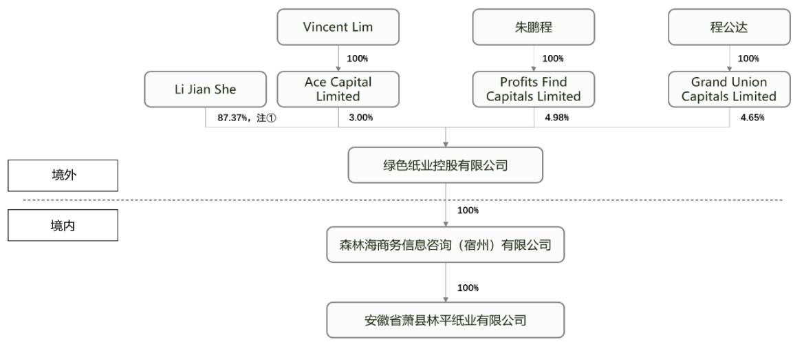

注： $\textcircled{1}$ 前述 Li Jian She 即为公司的实际控制人李建设，境外架构搭建时李建设以其取得的几内亚比绍护照办理相关登记手续。2023 年4月6日，萧县公安局出具证明，证明李建设自1966年8月13日起即拥有中华人民共和国国籍，不存在丧失中国国籍的情形。就李建设历史上取得的几内亚比绍护照事宜，鉴于该等护照已过期且李建设已声明放弃，其不会予以处罚和追究。截至目前，李建设不存在具备双重国籍的情形，也不拥有任何其他国家和地区的居留权及永久居留权； $\textcircled{2}$ 依据李建设及相关方签署的代持协议和确认函，Vincent Lim、朱鹏程、程公达系分别代李建设持有 Ace Capital Limited、Profits Find Capitals Limited、GrandUnion Capitals Limited 的股权，其中 Vincent Lim 为新加坡居民，朱鹏程、程公达系中国境内居民。

# 2、红筹架构的搭建过程

境外架构的搭建过程如下：

（1）成立 Ace Capital Limited、Profits Find Capitals Limited、Grand UnionCapitals Limited

Ace Capital Limited 、 Profits Find Capitals Limited 、Grand Union CapitalsLimited设立时的基本情况如下：

$\textcircled{1}$ Ace Capital Limited

Ace Capital Limited 于 2015 年 9 月 18 日在英属维尔京群岛注册成立，其公司编号为 1890121。Ace Capital Limited 设立时 Vincent Lim 通过认购新股的方式持有 Ace Capital Limited 对外发行的 1 股，持有 Ace Capital Limited 对外发行的$100 \%$ 权益。

$\textcircled{2}$ Profits Find Capitals Limited

Profits Find Capitals Limited 于 2016 年 1 月 12 日在英属维尔京群岛注册成立，其公司编号为 1903523。Profits Find Capitals Limited 设立时朱鹏程通过认购新股的方式持有 Profits Find Capitals Limited 对外发行的 1 股，持有 Profits FindCapitals Limited 对外发行的 $100 \%$ 权益。

$\textcircled{3}$ Grand Union Capitals Limited

Grand Union Capitals Limited 于 2016 年 1 月 12 日在英属维尔京群岛注册成立，其公司编号为 1903504。Grand Union Capitals Limited 设立时程公达通过认购新股的方式持有 Grand Union Capitals Limited 对外发行的 1 股，持有 GrandUnion Capitals Limited 对外发行的 $100 \%$ 权益。

Vincent Lim、朱鹏程及程公达分别代李建设持有 Ace Capital Limited、

Profits Find Capitals Limited 及 Grand Union Capitals Limited 的股份，并通过该等英属维尔京群岛公司间接持有绿色纸业的股份。

# （2）成立绿色纸业

绿色纸业于 2016 年 4 月 13 日在中国香港特别行政区注册成立，其公司编号为 2360608。绿色纸业设立时对外发行总股数共计 10,000 股，每股为 1 元港币，其中，李建设通过认购新股的方式持有绿色纸业 8,737 股，Ace CapitalLimited 通过认购新股的方式持有绿色纸业 300 股，Profits Find Capitals Limited通过认购新股的方式持有绿色纸业 498 股，Grand Union Capitals Limited 通过认购新股的方式持有绿色纸业 465股。

2016 年 12 月 22 日，绿色纸业对外发行总股数由 10,000 股变更为 57,510,000股，每股为 1 元港币。其中，李建设通过认购新股的方式持有绿色纸业50,237,750 股，Ace Capital Limited 通过认购新股的方式持有绿色纸业 1,725,000股，Profits Find Capitals Limited 通过认购新股的方式持有绿色纸业 2,863,500 股，Grand Union Capitals Limited 通过认购新股的方式持有绿色纸业 2,673,750 股。

自绿色纸业设立至注销之日，绿色纸业的实缴出资为 10,000 元港币。

# （3）成立宿州森林海

2016 年 7 月 14 日，萧县商务局出具《关于同意成立森林海商务信息咨询（宿州）有限公司的批复》（萧商[2016]39 号），同意绿色纸业在安徽省宿州市注册成立宿州森林海，投资总额为 10 万美元，注册资本为 10 万美元，注册资本以现汇的方式投入。

2016年7月18日，宿州森林海取得了安徽省人民政府颁发的商外资皖府字[2016]0156号《中华人民共和国外商投资企业批准证书》。

2016年7月25日，宿州市工商行政管理局核发《营业执照》，核准宿州森林海成立，注册资本为 10万美元。

2017 年 1 月 7 日，安徽拂晓方正会计师事务所出具安徽拂晓方正会验字（2017）02号的《验资报告》，验证截至2017年1月5日，宿州森林海已收到绿色纸业缴纳的注册资本 10万美元，出资方式均为货币。

# （4）全资收购林平有限（境外架构搭建完成）

2016 年 8 月 10 日，李建设将其持有林平有限的 $64 \%$ 股权以 3,200 万元的价格转让给宿州森林海；何海平将其持有林平有限的 $3 6 \%$ 股权以1,800万元的价格转让给宿州森林海。

本次收购宿州森林海未实际支付收购价款。

# （二）红筹架构的拆除

2020 年，因公司终止筹划境外上市，为明晰及简化股权，公司将境外架构进行拆除，具体情况如下：

# 1、绿色纸业股权调整

2020 年 12 月 29 日，Ace Capital Limited、Profits Find Capitals Limited 与Grand Union Capitals Limited 将其持有绿色纸业的全部股份转让给 LI JIANSHE，绿色纸业股东由 LI JIANSHE 与 Ace Capital Limited、Profits Find Capitals Limited、Grand Union Capitals Limited 变更为 LI JIANSHE。

本次股份转让实质系解除 Vincent Lim、朱鹏程及程公达分别代李建设通过Ace Capital Limited、Profits Find Capitals Limited 及 Grand Union Capitals Limited持有绿色纸业股份的代持关系，本次股份转让未实际支付对价。

# 2、公司股权调整

2021年2月25日，经萧县市监局核准，宿州森林海将其持有林平有限的全部股权以总价 5,000 万元转让给李建设。因宿州森林海 2016 年 8 月收购林平有限时未实际支付收购价款，因此李建设本次收购发行人股权亦未实际支付收购价款。

# 3、注销宿州森林海

2021 年 8 月 1 日，宿州森林海作出股东决定，同意注销宿州森林海，并在国家企业信用信息公示系统上公告。

2021年10月8日，宿州市监局出具《准予注销登记通知书》，核准注销登记。

# 4、注销特殊目的公司

# （1）注销绿色纸业

绿色纸业已于 2022 年 11 月 24 日向中国香港特别行政区公司注册处存档《撤销注册申请书》，2022 年 12 月 23 日，公司注册处处长刊登了关于绿色纸业注销的有关公告。2023年4月21日，绿色纸业在中国香港特别行政区注销。  
（2）注销 Ace Capital Limited、Profits Find Capitals Limited、Grand Union Capitals Limited

2021 年 5 月 7 日，Profits Find Capitals Limited、Grand Union Capitals Limited在英属维尔京群岛合法注销；Ace Capital Limited 已于 2023 年 7 月 4 日自动解散注销。

据此，发行人境外架构完成拆除，架构拆除后，李建设直接持有发行人股权。

# （三）红筹架构搭建及拆除过程中履行中国相关法律法规的情况

公司在红筹架构搭建过程中存在股权代持及李建设作为境内个人未办理境内个人境外投资外汇登记等情形，具体如下：

# 1、境外股权代持

如前所述，发行人境外架构搭建过程中李建设曾委托 Vincent Lim、朱鹏程、程公达分别代其持有 Ace Capital Limited、Profits Find Capitals Limited、GrandUnion Capitals Limited 的股权，截至目前，该等代持已解除。鉴于： $\textcircled{1}$ 依据中国香港特别行政区律师事务所赵凯珊律师行出具的法律意见书，前述股权代持不存在违反中国香港特别行政区法律法规的情形； $\textcircled{2}$ 依据英属维尔京群岛律师事务所 TRAVERS THORP ALBERGA 出具的法律意见书，Ace Capital Limited、Profits Find Capitals Limited、Grand Union Capitals Limited 在英属维尔京群岛不存在因违反英属维尔京群岛的法律或法规而需向当地主管部门支付任何罚款或履行行政处罚的义务； $\textcircled{3}$ 依据李建设及相关代持方出具的确认，前述代持已解除，双方不存在任何纠纷和潜在纠纷，据此，发行人境外架构搭建过程中曾存在的股权代持已解除，不会对本次发行上市造成实质性障碍。

# 2、个人外汇登记相关事宜

依据萧县公安局于 2023 年 4 月 6 日出具的证明，李建设为在国内定居的中华人民共和国公民，自 1966 年 8 月 13 日起即拥有中华人民共和国国籍，不存在丧失中国国籍的情形。截至目前，李建设不存在具备双重国籍的情形，也不拥有任何其他国家和地区的居留权及永久居留权。

境外架构搭建过程中发行人已为境内自然人朱鹏程与程公达办理了个人外汇登记，但因规范意识不够，误认为李建设以几内亚比绍护照办理相关手续不需要办理外汇登记，因此李建设未办理个人境外投资的外汇登记事宜，该等情形不符合境内个人境外投资外汇管理相关规定。鉴于： $\textcircled{1}$ 截至本招股说明书签署日，境外架构已拆除，李建设目前不存在通过境外主体持股的情形，前述瑕疵已规范； $\textcircled{2}$ 2023 年 3 月 15 日，国家外汇管理局宿州市中心支局出具证明，证明李建设自 2015 年 1 月 1 日至证明出具日，未在该局接受行政处罚的记录；$\textcircled{3}$ 李建设已出具书面承诺，如因其历史上通过绿色纸业境内投资未办理个人外汇登记事宜导致发行人遭受损失，该等损失将由李建设全额承担，据此，该等情形不会对本次发行上市造成实质性障碍。

# 3、工商、商务及税务部门审批、登记相关事宜

# （1）商务部门审批事宜

依据《商务部关于外国投资者并购境内企业的规定（2009 修改）》第十一条、第五十二条及第五十七条之规定，境内公司、企业或自然人以其在境外合法设立或控制的公司名义并购与其有关联关系的境内的公司，应报商务部审批。当事人不得以外商投资企业境内投资或其他方式规避前述要求。外国投资者通过其在中国设立的外商投资企业收购境内企业的，适用关于外商投资企业境内投资的相关规定，其中没有规定的，参照本规定办理。中国香港特别行政区、中国澳门特别行政区和中国台湾省的投资者并购境内其他地区的企业，参照本规定办理。

依据当时有效的《关于外商投资企业境内投资的暂行规定（2015 修正）》，外商投资企业境内投资，是指在中国境内依法设立，采取有限责任公司形式的中外合资经营企业、中外合作经营企业和外资企业以及外商投资股份有限公司，

以本企业的名义，在中国境内投资设立企业或购买其他企业投资者股权的行为。外商投资企业在鼓励类或允许类领域投资设立公司，应向被投资公司所在地公司登记机关提出申请，公司登记机关依《公司法》、《中华人民共和国公司登记管理条例》的有关规定，决定准予登记或不予登记。外商投资企业在限制类领域投资设立公司的，应向被投资公司所在地省级外经贸主管部门（以下称“省级审批机关”）提出申请，省级审批机关对外商投资企业作出同意批复的，外商投资企业凭该批复文件向被投资公司所在地公司登记机关申请设立登记。

依据当时有效的《外商投资产业指导目录（2015 年修订）》，公司主要从事包装用瓦楞纸、箱板纸产品的研发、生产和销售业务，该等业务不属于外资限制或禁止投资的领域。

2023年2月28日，萧县商务局出具证明，确认宿州森林海系由绿色纸业全资设立的外商独资企业，其设立已取得萧县商务局和安徽省人民政府的批准，已履行了必要的审批手续，合法有效；宿州森林海收购林平有限属于外商投资企业境内投资，适用《关于外商投资企业境内投资的暂行规定（2015 修正）》规定办理工商登记即可，无需取得商务主管部门的批准，不适用《商务部关于外国投资者并购境内企业的规定（2009 修改）》的规定；宿州森林海的设立及其收购林平有限事宜均已履行了必要的法律程序，合法有效，符合该局的管理要求；该局知悉李建设作为境内个人历史上曾以几内亚比绍护照办理相关审批登记手续事宜，该等情形不会影响宿州森林海设立及其收购林平有限事宜的合法有效性，该局亦不会对李建设、宿州森林海及林平有限进行处罚；李建设、宿州森林海及林平有限不存在违反商务部门法律法规规定的情形，亦未受到与此相关的任何处罚。

2023 年 3 月 9 日，宿州市商务局出具证明，确认宿州森林海存续期间遵守外商投资相关法律、法规和规范性文件的规定，不存在违法违规行为，不存在因违反外商投资相关法律、法规和规范性文件规定而被处罚的情形。宿州森林海于 2016 年 8 月 10 日收购公司属于外商投资企业境内投资行为，适用《关于外商投资企业境内投资的暂行规定（2015 修正）》规定办理工商登记，公司属于非限制类领域，无需取得商务主管部门的批准，不适用《商务部关于外国投资者并购境内企业的规定》的规定，宿州森林海收购公司的行为不属于该局监

管，该局对其行为无处罚权。宿州森林海的设立及其变更事宜均已履行了必要的法律程序，合法有效，符合该局的管理要求。

# （2）工商登记事宜

2023 年 3 月 3 日，萧县市监局出具证明，确认发行人及其前身历次股权变动均依法办理了变更登记、备案，历次股权变更均材料齐全，符合法定形式，合法有效，符合《中华人民共和国公司法》等相关法律法规的规定。

2023 年 3 月 22 日，宿州市监局出具证明，确认宿州森林海已于 2021 年 10月 8 日注销且自 2020 年 1 月 1 日以来未发现因违反市场监管法律法规而受到处罚的情形。

# （3）税务相关事宜

2023 年 11 月 24 日，国家税务总局萧县税务局出具证明，确认宿州森林海在该局征管系统中无欠缴税款记录，无偷漏税记录，无税收行政处罚记录。

# 五、发行人在其他证券市场的上市/挂牌情况

截至本招股说明书签署日，公司未在其他证券市场上市/挂牌。

# 六、发行人股权结构图

截至本招股说明书签署日，公司股权结构如下图所示：

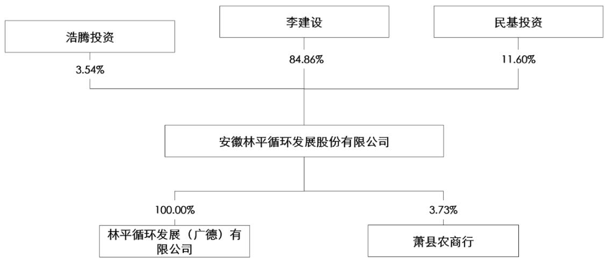

# 七、发行人控（参）股子公司、分公司简要情况

截至本招股说明书签署日，发行人设有 1 家全资子公司，并有 1 家参股公司。发行人全资子公司林平循环科技发展（广德）有限公司及参股萧县农商行的具体情况如下：

# （一）全资子公司林平循环科技发展（广德）有限公司

林平循环科技发展（广德）有限公司基本情况如下：

<table><tr><td>公司名称</td><td>林平循环科技发展（广德）有限公司</td></tr><tr><td>成立时间</td><td>2025年8月22日</td></tr><tr><td>注册资本</td><td>500万元</td></tr><tr><td>注册地</td><td>安徽省宣城市广德市誓节镇经济开发区西区迎宾大道26号管委会一楼105室</td></tr><tr><td>主要生产经营地</td><td>安徽省宣城市广德市</td></tr><tr><td>法定代表人</td><td>李建设</td></tr><tr><td>主营业务及其与发行人主营业务的关系</td><td>包装用瓦楞纸、箱板纸产品的研发、生产和销售，属于发行人主营业务范围</td></tr><tr><td>发行人持股情况</td><td>发行人持有100%的股权</td></tr></table>

该公司于2025 年8月22日成立，尚未开始实际经营。

# （二）参股公司萧县农商行

# 1、基本情况

<table><tr><td>公司名称</td><td>安徽萧县农村商业银行股份有限公司</td></tr><tr><td>成立时间</td><td>2008年5月9日</td></tr><tr><td>注册资本</td><td>95,528.53万元</td></tr><tr><td>注册地</td><td>安徽省萧县龙城镇淮海路8号</td></tr><tr><td>主要生产经营地</td><td>安徽省宿州市萧县</td></tr><tr><td>法定代表人</td><td>郭伟</td></tr><tr><td>主营业务</td><td>吸收公众存款；发放短期、中期和长期贷款；办理国内结算；办理票据承兑与贴现；从事借记卡业务；代理发行、代理兑付、承销政府债券；买卖政府债券、金融债券；从事同业拆借；代理收付款项及代理保险业务；提供保险箱服务；办理经中国银行业监督管理机构批准的其他业务（依法须经批准的项目，经相关部门批准后方可开展经营活动）。</td></tr><tr><td>发行人参股情况</td><td>发行人持有萧县农商行3.73%的股权</td></tr><tr><td>主营业务与发行人主营业务的关系</td><td>与发行人主营业务不存在竞争关系</td></tr></table>

# 2、财务数据

萧县农商行最近一年及一期主要财务数据如下所示：

单位：万元  

<table><tr><td>项目</td><td>2025 年 1-6 月/2025.6.30</td><td>2024 年度/2024.12.31</td></tr><tr><td>总资产</td><td>2,632,580.35</td><td>2,428,122.86</td></tr><tr><td>净资产</td><td>153,670.70</td><td>150,586.77</td></tr><tr><td>营业收入</td><td>49,895.92</td><td>57,163.03</td></tr><tr><td>净利润</td><td>3,009.29</td><td>6,703.00</td></tr></table>

注：2024年度财务数据已经审计。

# 八、持有发行人 $5 \%$ 以上股份的主要股东及实际控制人的基本情况

截至本招股说明书签署日，持有林平发展 $5 \%$ 以上股权的股东共 2 名，具体情况如下：

<table><tr><td>序号</td><td>股东名称</td><td>持股数量（万股）</td><td>持股比例</td></tr><tr><td>1</td><td>李建设</td><td>4,800.00</td><td>84.86%</td></tr><tr><td>2</td><td>民基投资</td><td>656.11</td><td>11.60%</td></tr></table>

# （一）控股股东及实际控制人基本情况

公司控股股东、实际控制人为李建设先生。

截至本招股说明书签署日，李建设先生直接持有公司 $8 4 . 8 6 \%$ 股份，为公司控股股东。李建设先生还担任浩腾投资执行事务合伙人，通过浩腾投资间接控制公司 $3 . 5 4 \%$ 表决权，因此，李建设先生通过直接和间接方式合计控制公司$8 8 . 4 0 \%$ 表决权，为公司实际控制人。

李建设先生：1966 年生，中国国籍，无境外永久居留权，身份证号码3422221966********，初中学历；1992 年 3 月至 2001 年 10 月从事个体运输及纸张贸易；2002年1月至2005年4月就职于林平有限担任公司总经理；2005年4 月至 2021 年 12 月就职于林平有限担任董事长兼总经理；2021 年 12 月至今担任公司董事长兼总经理；2025 年 8 月至 9 月担任林平循环科技发展（广德）有限公司董事、总经理兼财务负责人；2025 年 9 月至今担任林平循环科技发展（广德）有限公司董事、总经理；2006 年至今，担任北城集社区党支部书记；2021年至今，担任北城集社区居委会主任。

# （二）控股股东和实际控制人直接或间接持有发行人股份的质押或其他有争议情况

截至本招股说明书签署日，公司控股股东、实际控制人直接或间接持有的公司股份不存在质押或其他有争议的情况。

# （三）报告期内控股股东、实际控制人是否存在刑事犯罪或重大违法行为

报告期内，控股股东、实际控制人不存在贪污、贿赂、侵占财产、挪用财产或者破坏社会主义市场经济秩序的刑事犯罪，不存在欺诈发行、重大信息披露违法或者其他涉及国家安全、公共安全、生态安全、生产安全、公众健康安全等领域的重大违法行为。

# （四）其他持有 $5 \%$ 以上股份的主要股东情况

截至本招股说明书签署日，除控股股东、实际控制人外，其他持有发行人 $5 \%$ 以上股份的股东为民基投资。

民基投资持有发行人 656.11 万股股份，持股比例为 $1 1 . 6 0 \%$ 。民基投资情况如下：

<table><tr><td>公司名称</td><td>萧县民基投资有限责任公司</td></tr><tr><td>成立时间</td><td>2006年11月09日</td></tr><tr><td>注册资本</td><td>10,000.00万元</td></tr><tr><td>实收资本</td><td>10,000.00万元</td></tr><tr><td>注册地</td><td>安徽萧县经济开发区（萧县东高速入口西500米路北）</td></tr><tr><td>主要生产经营地</td><td>安徽省宿州市萧县</td></tr><tr><td>法定代表人</td><td>王四方</td></tr><tr><td>主营业务</td><td>基础设施建设投资、企业经营性投资、预算外政府性基金担保；土地开发业务；自有不动产租赁；建筑材料销售；物业服务；广告设计、制作、发布；停车场经营。（依法须经批准的项目，经相关部门批准后方可开展经营活动）</td></tr><tr><td>主营业务与发行人主营业务的关系</td><td>与发行人主营业务不存在竞争关系</td></tr></table>

股权结构  

<table><tr><td>序号</td><td>股东名称</td><td>认缴出资额（万元）</td><td>出资比例</td></tr><tr><td>1</td><td>萧县财政局</td><td>10,000.00</td><td>100%</td></tr><tr><td colspan="2">合计</td><td>10,000.00</td><td>100%</td></tr></table>

# （五）发行人与相关方之间签署的特殊权利条款及解除情况

发行人与民基投资曾签署带有特殊权利条款的协议，其协议签署及解除情况如下：

# 1、发行人与民基投资签署的特殊权利条款

2021 年 12 月 18 日，民基投资与公司、李建设、浩腾投资签署《萧县民基投资有限责任公司与安徽林平循环发展股份有限公司之增资扩股协议》，协议中约定的特殊权利条款主要内容如下：

<table><tr><td>协议各方</td><td>甲方：萧县民基投资有限责任公司
乙方（标的公司）：安徽林平循环发展股份有限公司
丙方1：李建设
丙方2：共青城浩腾投资合伙企业（有限合伙）</td></tr><tr><td>重大事项征求意见</td><td>7.2 下列事项应当充分征求甲方意见后提交股东大会审议，在不损害甲方重大利益的情况下，甲方应当投赞成票：
（1）公司的利润分配方案和弥补亏损方案；（2）减少及增加注册资本。通过新设员工持股平台增资，占总股本比例不超过5%的除外；
（3）公司合并、分立、解散、清算或者变更公司形式；（4）交易金额达到或超过500万元的关联交易及资产处置；（5）对外担保、单方面承担债务、单方面放弃权利；（6）聘用或更换审计机构；（7）修改公司章程。</td></tr><tr><td>知情权</td><td>9.1 本协议生效后至公司首发上市前，甲方有权查阅标的公司及附属企业的会计资料（包括但不限于财务报表、会计账册、会计凭证、合同以及其他会计资料）及对甲方股东权益具有影响的其他文件资料，有权进入标的公司的生产及办公场所进行的工作访问，并有权在必要时聘请第三方专业机构对标的公司进行审计或调查，但甲方实施该等行为不得影响乙方的正常经营并对知悉的乙方信息履行保密义务。</td></tr><tr><td>同售权</td><td>10.2 同售权
（1）丙方1经甲方书面同意后向第三方转让股份时，甲方有权选择是否按与丙方1相同的价格向同一受让方转让股份。
（2）丙方经甲方书面同意后向第三方转让其股份的，丙方应保证股权受让方签署本协议相关条款的协议，受本协议相关条款的约束，但届时各方另行协商的除外。</td></tr><tr><td>反稀释权</td><td>10.3 反稀释权
本协议签署或，乙方以增资扩股或其他方式引进新投资者（不含员工持股计划或股权激励），乙方及丙方应确保新投资者的投资价格不得低于本协议甲方的投资价格（即乙方投前估值不低于343,896.55万元），且甲方在同等条件下有权（但无义务）按其持股比例优先认购乙方的新增股份。</td></tr><tr><td>优先清算权</td><td>10.4 优先清算权
乙方进行清算时，甲方优先于丙方1及其控制的其他股东对剩余财产进行分配，在甲方收回投资款以及按照年利率8%计算的利息收益之前，丙方1及其控制的其他股东不得参与剩余资产分配。</td></tr><tr><td>同等待遇</td><td>10.5 同等待遇
如果给予任一股东（包括引进的新投资者）的权利优于本协议甲方享有的权利的，则甲方将自动享有该等权利。</td></tr><tr><td>股份回购</td><td>11.1 本次投资完成后至公司首发上市前，若存在下列情形之一的，甲方有权要求丙方1 按投资款本金加上年8%的利息（单利）回购甲方持有的标的公司全部股份：（1）标的公司在2025年12月31日前未能完成首发；（2）标的公司因知识产权、技术、工艺等侵犯第三方权利受到起诉或处罚并导致公司无法完成首发上市的；（3）标的公司因环境保护、产品质量或安全生产违法违规被有权机关责令停产停业、吊销营业执照、吊销许可证或被处以100万元及以上罚款处罚；（4）标的公司、丙方1 及其他主要经营管理人员因违法违规受到刑事处罚并导致公司无法完成首发上市的；（5）标的公司的主营业务发生重大变化；（6）标的公司的核心资产（包括但不限于房产、土地、设备、货币资金）被强制执行，且金额达到或超过1000万元；（7）标的公司发生解散、清算、破产等无法继续经营的事件；（8）标的公司的资金被关联方占用金额合计达到或超过500万元；（9）标的公司或丙方严重违反本协议的约定。11.2 丙方1 回购甲方全部股份的总价款为全部投资款本金与按年利率8%（单利）计算的利息之和。11.3 甲方要求丙方1 履行回购义务时，应当以书面方式通知丙方1。11.4 丙方1 未完全适当的履行回购义务或任何一方违约，导致甲方的投资款本金及按利息8%（单利）计算的利息无法足额收回的，则甲方有权要求丙方1 向甲方指定的受让方出让其持有的标的公司全部或部分股份，并要求丙方1 将其收到的转让价款用于履行全部回购义务。</td></tr><tr><td>其他事项</td><td>19.1 如本协议中有关甲方权利的相关约定未能在公司章程等治理制度中体现，则该部分约定以本协议为准，甲方继续拥有本协议约定的相关权利。19.4 本协议正本一式陆份，各方各持一份，剩余存于标的公司备档，每份均具有同等法律效力。本协议内容与工商标准文本内容如有冲突,则以本协议为准。19.5 各方同意第八条自公司首发上市后终止执行，丙方1 需依据届时《公司法》《公司章程》及上市规则要求履行其义务，各方不得依据第八条约定向其他方主张权利。19.6 各方同意第九条、第十条、第十一条约定自公司向证券主管部门递交IPO申请之日起中止执行，如公司上市申请被否决、撤回上市申请材料、未能注册或发行失败的，则本条款自动恢复执行。自公司首发上市后，前述条款自动终止，各方不得依据本条约定向其他方主张权利。前述条款终止后，各方依据届时《公司法》《公司章程》及上市规则要求履行其权利义务。</td></tr></table>

# 2、发行人与民基投资签署的特殊权利条款解除情况

2023年4月7日，发行人、李建设、民基投资与浩腾投资签署《关于<萧县民基投资有限责任公司与安徽林平循环发展股份有限公司之增资扩股协议 $>$ 之补充协议》（以下简称“《补充协议》”），对上述《增资扩股协议》中的对赌条款或特殊利益安排进行了清理，主要如下：

（1）自《补充协议》签署之日起，《增资扩股协议》第 7.2 条（公司治

理），第九条（知情权）、第十条（投资保护性条款）、第十一条（股份回购）、第19.1条、第19.4条至第19.6条（关于《增资扩股协议》效力的约定）即时完全终止并视为自始无效，不再具有法律约束力。各方均不再享有前述条款相关的任何权利，亦不再承担前述条款相关的任何义务；各方均不得依据《增资扩股协议》已终止的条款约定向其他方行使任何权利主张或要求其他方履行义务；

（2）各方确认，自《增资扩股协议》生效之日起，各方均遵守原《增资扩股协议》的各项约定，不存在任何违约情形或赔偿责任，各方之间均不存在任何争议或纠纷，亦不存在潜在争议或纠纷的情形。各方均不会向其他方行使任何权利主张。

截至本招股说明书签署之日，该特殊权利条款已清理，发行人实际控制人与相关方的特殊权利条款已完全终止且自始无效，对各方均不再具有法律约束力。

# 九、发行人股本情况

# （一）本次发行前后的股本结构

本次发行前，公司总股本为5,656.11万股。本次拟发行新股1,885.37万股，不涉及原股东公开发售股份。本次发行的股份发行后公司总股本的 $2 5 \%$ 。若按本次发行新股1,885.37 万股计算，发行前后股本结构如下：

<table><tr><td rowspan="2">序号</td><td rowspan="2">股东名称</td><td colspan="2">发行前股本结构</td><td colspan="2">发行后股本结构</td></tr><tr><td>股数（万股）</td><td>比例（%）</td><td>股数（万股）</td><td>比例（%）</td></tr><tr><td>1</td><td>李建设</td><td>4,800.00</td><td>84.86</td><td>4,800.00</td><td>63.65</td></tr><tr><td>2</td><td>民基投资（SS）</td><td>656.11</td><td>11.60</td><td>656.11</td><td>8.70</td></tr><tr><td>3</td><td>浩腾投资</td><td>200.00</td><td>3.54</td><td>200.00</td><td>2.65</td></tr><tr><td>4</td><td>本次发行新股</td><td>-</td><td>-</td><td>1,885.37</td><td>25.00</td></tr><tr><td colspan="2">合计</td><td>5,656.11</td><td>100.00</td><td>7,541.48</td><td>100.00</td></tr></table>

# （二）发行前的前十名股东

本次发行前，公司共有三名股东，其持股情况如下：

<table><tr><td>序号</td><td>股东名称</td><td>持股数量（万股）</td><td>股权比例（%）</td></tr><tr><td>1</td><td>李建设</td><td>4,800.00</td><td>84.86</td></tr><tr><td>2</td><td>民基投资（SS）</td><td>656.11</td><td>11.60</td></tr><tr><td>3</td><td>浩腾投资</td><td>200.00</td><td>3.54</td></tr><tr><td colspan="2">合计</td><td>5,656.11</td><td>100.00</td></tr></table>

# （三）发行前的前十名自然人股东及其在发行人处担任职务的情况

本次发行前，公司唯一自然人股东为李建设先生，其担任职务情况如下：

<table><tr><td>序号</td><td>股东名称</td><td>持股数量（万股）</td><td>股权比例</td><td>任职</td></tr><tr><td>1</td><td>李建设</td><td>4,800.00</td><td>84.86%</td><td>董事长兼总经理</td></tr></table>

# （四）发行人股本的国有股份和外资股份的情况

截至本招股说明书签署日，公司股东中不存在外资股东，国有股东情况如下：

<table><tr><td>股东名称</td><td>持股数（万股）</td><td>股权比例</td><td>股东性质</td></tr><tr><td>民基投资（SS）</td><td>656.11</td><td>11.60%</td><td>国有法人</td></tr></table>

2023年5月24日，宿州市人民政府国有资产监督管理委员会出具《关于安徽林平循环发展股份有限公司国有股东标识有关问题的批复》，确认如安徽林平循环发展股份有限公司发行股票并上市，萧县民基投资有限责任公司在证券登记结算公司设立的证券账户应标注“SS”标识。

# （五）发行人股东中的战略投资者持股及其简况

本次发行前，本公司不存在战略投资者。

# （六）最近一年发行人新增股东情况

本次发行前，本公司最近一年不存在直接或间接新增股东的情况。

# （七）本次发行前各股东间的关联关系、一致行动关系及其各自的持股比例

截至本招股说明书签署日，公司各股东间的持股关系及各自持股比例如下：

<table><tr><td>序号</td><td>股东名称</td><td>持股数量 (万股)</td><td>股权 比例</td><td>关联关系</td></tr><tr><td>1</td><td>李建设</td><td>4,800.00</td><td>84.86%</td><td>李建设为浩腾投资执行事务合伙人，直接持有浩腾投资 8.95%份额，并通过浩林管理间接持有浩腾投资 0.45%份额，通过浩功管理间接持</td></tr><tr><td></td><td></td><td></td><td></td><td>有浩腾投资 0.15%份额</td></tr><tr><td>2</td><td>民基投资</td><td>656.11</td><td>11.60%</td><td>与其余股东无关联关系</td></tr><tr><td>3</td><td>浩腾投资</td><td>200.00</td><td>3.54%</td><td>浩腾投资为公司员工持股平台，李建设为其执行事务合伙人，直接持有其8.95%的合伙份额，并通过浩林管理间接持有浩腾投资 0.45%份额，通过浩功管理间接持有浩腾投资 0.15%份额</td></tr></table>

除上述关联关系外，本次发行前直接持有公司股份的股东间不存在其他关联关系。

# （八）发行人股东公开发售股份对公司控制权、治理结构及生产经营产生的影响

公司本次拟公开发行 1,885.37 万股，全部为新股，不涉及股东公开发售股份情形。

# 十、董事、取消监事会前在任监事、高级管理人员与其他核心人员的简要情况

截至本招股说明书签署日，公司董事会由九名董事组成，其中独立董事三名；监事会取消前由三名监事组成，其中职工监事一名；高级管理人员八名；其他核心人员两名。

# （一）董事会成员

截至本招股说明书签署日，本公司董事会由9名董事组成，其中独立董事3名。

本公司董事基本情况如下表所示：

<table><tr><td>序号</td><td>姓名</td><td>职务</td><td>提名人</td><td>任职起止期间</td></tr><tr><td>1</td><td>李建设</td><td>董事长、总经理</td><td>实际控制人</td><td>2024.12-2027.12</td></tr><tr><td>2</td><td>徐辉</td><td>董事、副总经理</td><td>实际控制人</td><td>2024.12-2027.12</td></tr><tr><td>3</td><td>李培凯</td><td>董事、财务总监</td><td>实际控制人</td><td>2024.12-2027.12</td></tr><tr><td>4</td><td>何海波</td><td>董事、采购部长</td><td>实际控制人</td><td>2024.12-2027.12</td></tr><tr><td>5</td><td>魏飞</td><td>董事、安环部经理</td><td>实际控制人</td><td>2025.08-2027.12</td></tr><tr><td>6</td><td>孙影影</td><td>职工董事、发货员</td><td>职工代表大会</td><td>2025.08-2027.12</td></tr><tr><td>7</td><td>李长云</td><td>独立董事</td><td>董事会</td><td>2024.12-2027.12</td></tr><tr><td>8</td><td>许家武</td><td>独立董事</td><td>董事会</td><td>2025.5-2027.12</td></tr><tr><td>9</td><td>陈务平</td><td>独立董事</td><td>董事会</td><td>2024.12-2027.12</td></tr></table>

公司董事简历如下：

1、李建设先生简历详见本节“八、持有发行人 $5 \%$ 以上股份的主要股东及实际控制人的基本情况”之“（一）控股股东及实际控制人基本情况”。  
2、徐辉先生：1963年生，中国国籍，无境外永久居留权，中专学历，高级工程师，宿州市萧县第十八届人大代表。1982年7月至2006年9月就职于安徽昊源化工集团历任技术员、助理工程师、副部长、设计室主任、质量保证总工程师、化工机械分公司总经理、总工程师办公室主任和副总工程师；2006 年 10月至2017年6月就职于林平有限任副总经理；2017年6月至2021 年12月就职于林平有限任董事、副总经理；2021年12月至今，担任公司董事、副总经理。  
3、李培凯先生：1982年生，中国国籍，无境外永久居留权，毕业于南京财经大学金融学专业，本科学历。2006 年 10 月至 2014 年 5 月就职于安徽虹光企业投资集团有限公司任财务经理；2014 年 7 月至 2021 年 12 月就职于林平有限任副董事长兼财务经理；2021年12月至今担任公司董事兼财务总监；2025年9月至今担任林平循环科技发展（广德）有限公司财务负责人。  
4、何海波先生：1964 年生，中国国籍，无境外永久居留权，初中学历。1986 年 10 月至 2002 年 4 月就职于来安县邵集乡无纺织布厂任采购员；2002 年5 月至 2021 年 12 月就职于林平有限任采购经理；2021 年 12 月至今担任公司董事、采购经理。  
5、魏飞先生：1987年生，中国国籍，无境外永久居留权，本科学历。2010年 9 月至 2014 年 9 月就职于安徽德力日用玻璃股份有限公司历任主任助理、厂长助理、八分厂厂长；2014 年 9 月至 2021 年 12 月就职于林平有限历任综合办经理、安环部经理；2021 年 12 月至 2025 年 8 月就职于林平发展担任监事会主席、安环部经理；2025 年 8 月至今就职于林平发展担任董事、安环部经理并担任林平循环科技发展（广德）有限公司监事。  
6、孙影影女士：1989 年生，中国国籍，无境外永久居留权，初中学历。2015年3月至2021年12月就职于林平有限任发货部职员；2021年12月至2025

年8月担任公司监事、发货部职员；2025年8月至今就职于林平发展担任董事、发货部职员。

7、李长云先生：1968年生，中国国籍，无境外永久居留权，本科学历，注册会计师。1992年7月至2002年6月就职于宿州地区糖酒公司历任会计、财务科长；2002 年 7 月至 2006 年 6 月就职于重庆佳通轮胎有限公司任财务经理；2006 年 7 月至 2007 年 12 月就职于安徽求是会计师事务所任项目经理；2008 年1 月至今就职于安徽淮海会计师事务所有限公司历任业务一部经理；2021 年 12月至今担任公司独立董事。  
8、许家武先生：1967年生，中国国籍，无境外永久居留权，硕士学历，律师，高级经济师。2009年9月至2015年4月就职于北京市天银律师事务所任合伙人；2015 年 4 月至今就职于北京海润天睿律师事务所任合伙人；2016 年 3 月至2021年1月，担任中新网络信息安全股份有限公司独立董事；2017年9月至2020年8月，担任宁波九远资产管理有限公司执行董事；2019年9月至2025年7 月，担任浙江前进暖通科技股份有限公司独立董事；2025 年 5 月至今，担任公司独立董事。  
9、陈务平先生：1964 年 12 月生，中国国籍，无境外永久居留权，本科学历，副教授，高级工程师。1989年7月至1993年8月就职中国轻工业上海设计院任助理工程师；1993 年 9 月至 1999 年 12 月就职于南京林业大学林产工业设计院任工程师；2000 年 1 月至 2003 年 12 月就职于中国轻工业上海设计院（中国海城工程科技股份有限公司）任工程师；2004 年 1 月至 2010 年 12 月就职于南京林业大学林产工业设计院设计二所任副所长；2011 年 1 月至 2024 年 12 月就职于南京林业大学轻工与食品学院任副教授；2024年12月退休；2023年3月至今，担任公司独立董事。

# （二）取消监事会前在任监事

按照《公司法》及相关法律法规要求，2025 年 8 月 13 日，公司 2025 年第四次临时股东会审议通过了《关于取消监事会并修订<公司章程 $>$ 的议案》，决定自股东会通过之日起，取消公司监事会，监事会成员自监事会取消之日起卸任公司监事，监事会的职权由董事会审计委员会行使。

截至取消监事会前，公司监事会由 3 名成员组成，包括 2 名股东代表监事和1名职工代表监事，每届任期 3年，其基本情况如下所示：

<table><tr><td>序号</td><td>姓名</td><td>职务</td><td>提名人</td><td>任职起止期间</td></tr><tr><td>1</td><td>魏飞</td><td>监事会主席</td><td>职工代表大会</td><td>2024.12-2025.08</td></tr><tr><td>2</td><td>彭珍珍</td><td>监事</td><td>李建设</td><td>2024.12-2025.08</td></tr><tr><td>3</td><td>孙影影</td><td>监事</td><td>浩腾投资</td><td>2024.12-2025.08</td></tr></table>

公司监事简历如下：

1、魏飞先生简历详见本节“十、董事、取消监事会前在任监事、高级管理人员与其他核心人员的简要情况”之“（一）董事会成员”。  
2、彭珍珍女士：1983 年生，中国国籍，无境外永久居留权，高中学历。2003 年 4 月至 2004 年 12 月就职于中达电子（江苏）有限公司任质检员；2007年 9 月至 2021 年 12 月就职于林平有限任发货部职员；2021 年 12 月至 2025 年8月担任公司监事；2021年12月至今发货部职员。  
3、孙影影简历详见本节“十、董事、取消监事会前在任监事、高级管理人员与其他核心人员的简要情况”之“（一）董事会成员”。

截至本招股说明书签署日，审计委员会成员包括李长云、何海波、许家武，由李长云担任召集人。审计委员会成员的简历详见本招股说明书“第四节发行人基本情况”之“十、董事、取消监事会前在任监事、高级管理人员及其他核心人员情况”之“（一）董事会成员”。

# （三）高级管理人员

截至本招股说明书签署日，公司高级管理人员 8 人，每届任期 3 年，其基本情况如下所示：

<table><tr><td>序号</td><td>姓名</td><td>职务</td><td>任职起止期间</td></tr><tr><td>1</td><td>李建设</td><td>董事长、总经理</td><td>2024.12-2027.12</td></tr><tr><td>2</td><td>徐辉</td><td>董事、副总经理</td><td>2024.12-2027.12</td></tr><tr><td>3</td><td>李培凯</td><td>董事、财务总监</td><td>2024.12-2027.12</td></tr><tr><td>4</td><td>吴正峰</td><td>副总经理</td><td>2024.12-2027.12</td></tr><tr><td>5</td><td>石双喜</td><td>副总经理</td><td>2024.12-2027.12</td></tr><tr><td>6</td><td>姚广伍</td><td>副总经理</td><td>2024.12-2027.12</td></tr><tr><td>7</td><td>闫维飞</td><td>副总经理</td><td>2024.12-2027.12</td></tr><tr><td>8</td><td>王善彬</td><td>董事会秘书</td><td>2024.12-2027.12</td></tr></table>

公司高级管理人员简历如下：

1、李建设先生简历详见“八、持有发行人 $5 \%$ 以上股份的主要股东及实际控制人的基本情况”之“（一）控股股东及实际控制人基本情况”。  
2、徐辉先生简历详见“十、董事、取消监事会前在任监事、高级管理人员与其他核心人员的简要情况”之“（一）董事会成员”。  
3、李培凯先生简历详见“十、董事、取消监事会前在任监事、高级管理人员与其他核心人员的简要情况”之“（一）董事会成员”。  
4、吴正峰先生：1975 年生，中国国籍，无境外永久居留权，中专学历。1995年6月至2000年7月就职于颍上县六十铺造纸厂历任车间副主任、机修车间主任，技术科长；2000年7月至2007年7月就职于安徽天都纸业有限公司任总工程师；2007 年 11 月至 2012 年 5 月就职于东莞市鸿业造纸有限公司历任工程师、副总经理；2012 年 6 月至 2021 年 12 月就职于林平有限任总经理助理；2021年12月至今担任公司副总经理。  
5、石双喜先生：1979 年生，中国国籍，无境外永久居留权，中专学历。1999 年 8 月至 2003 年 7 月就职于山东太阳纸业股份有限公司历任班长、副主任；2003年8月至2007年6月就职于山东照东方纸业集团有限公司历任车间副主任、车间主任；2007年8月至2008年9月就职于新密市东盛纸业有限公司担任生产经理；2008年9月至2009年1月就职于白山市琦祥纸业有限公司担任造纸部工程师；2009 年 2 月至 2021 年 12 月就职于林平有限担任生产部经理；2021年12月至今担任公司副总经理。  
6、姚广伍先生：1978 年生，中国国籍，无境外永久居留权，中专学历。1999年6月至2008年7月就职于安徽山鹰纸业股份有限公司历任班长、车间经理、项目部副经理；2008年7月至2012年6月就职于台州森林彩印包装有限公司任项目经理；2012年6月至2017年2月就职于河南省龙源纸业股份有限公司历任副总经理、总工程师；2017 年 3 月至 2021 年 12 月就职于林平有限任副总经理、总工程师；2021年12月至今担任公司副总经理。

7、闫维飞先生：1980 年生，中国国籍，无境外永久居留权，中专学历。1998 年 12 月至 2005 年 4 月就职于山东王晁煤电集团热电有限公司担任电气检修专工；2005 年 5 月至 2009 年 2 月就职于徐州胜阳热电有限公司担任电气专工、检修主任；2009 年 2 月至 2021 年 12 月就职于林平有限任副总经理；2021年12月至今担任公司副总经理。  
8、王善彬先生：1981年生，中国国籍，无境外永久居留权，大专学历，中国人民政治协商会议宿州市第六届委员会委员，安徽省宿州市萧县工商业联合会第八届执行委员会委员。2007年8月至2013年1月就职于林平有限任会计；2013 年 2 月至 2017 年 2 月就职于林平有限任常务副总经理助理；2017 年 3 月至 2021 年 11 月就职于林平有限任法务部经理；2021 年 12 月至 2023 年 6 月担任公司董事长助理；2023年6月至今担任公司董事会秘书。

# （四）其他核心人员

截至本招股说明书签署日，公司其他核心人员 2 名，其基本情况如下所述：

<table><tr><td>序号</td><td>姓名</td><td>职务</td></tr><tr><td>1</td><td>孙力</td><td>造纸车间电气主管</td></tr><tr><td>2</td><td>陈岭</td><td>热电车间电气主管</td></tr></table>

公司其他核心人员简历如下：

1、孙力先生：1973年生，中国国籍，无境外永久居留权，大专学历。2003年 11 月至 2005 年 9 月就职于浙江中控技术有限公司任技术员；2008 年 9 月至2011年5月就职于杭州和利时自动化有限公司任技术员；2011年6月至2018年5 月就职于河南省龙源纸业股份有限公司任电仪主管；2018 年 6 月至今担任林平发展造纸车间电气主管。  
2、陈岭先生：1983 年出生，中国国籍，无境外永久居留权，本科学历。2005 年 9 月至 2008 年 12 月就职于徐州胜阳热电有限公司担任仪表工；2009 年3 月至 2010 年 8 月就职于江苏中能硅业科技发展有限公司担任仪表班长；2010年9月至今担任林平发展热电车间电气主管。

# （五）董事、取消监事会前在任监事、高级管理人员与其他核心人员的兼职情况

截至本招股说明书签署日，公司董事、取消监事会前在任监事、高级管理人员和其他核心人员在其他单位的兼职情况及兼职单位与本公司关联关系如下：

<table><tr><td>姓名</td><td>任职单位</td><td>任职职务</td><td>关联关系</td></tr><tr><td rowspan="4">李建设</td><td>共青城浩腾投资合伙企业（有限合伙）</td><td>执行事务合伙人</td><td>发行人股东</td></tr><tr><td>萧县淮海小额贷款有限责任公司</td><td>经理</td><td>无其他关联关系</td></tr><tr><td>萧县圣泉镇北城集社区</td><td>党支部书记、居委会主任</td><td>无其他关联关系</td></tr><tr><td>林平循环科技发展（广德）有限公司</td><td>董事、总经理</td><td>发行人子公司</td></tr><tr><td>李培凯</td><td>林平循环科技发展（广德）有限公司</td><td>财务负责人</td><td>发行人子公司</td></tr><tr><td rowspan="2">魏飞</td><td>萧县浩林企业管理合伙企业（有限合伙）</td><td>执行事务合伙人</td><td>发行人员工持股平台</td></tr><tr><td>林平循环科技发展（广德）有限公司</td><td>监事</td><td>发行人子公司</td></tr><tr><td>王善彬</td><td>萧县浩功企业管理合伙企业（有限合伙）</td><td>执行事务合伙人</td><td>发行人员工持股平台</td></tr><tr><td>李长云</td><td>安徽淮海会计师事务所有限公司</td><td>业务一部经理</td><td>无其他关联关系</td></tr><tr><td>许家武</td><td>北京海润天睿律师事务所</td><td>合伙人</td><td>无其他关联关系</td></tr></table>

注：李建设先生未实际在萧县淮海小额贷款有限责任公司负责经营管理工作，其已经提出辞职申请，因小贷公司处于吊销状态，工商变更无法及时办理，目前该公司正在办理注销手续。

截至本招股说明书签署日，除上述兼职情况外，公司现任董事、取消监事会前在任监事、高级管理人员与其他核心人员不存在其他兼职情况。

# （六）董事、取消监事会前在任监事、高级管理人员与其他核心人员之间的亲属关系

截至本招股说明书签署日，公司董事何海波是公司董事长兼总经理李建设配偶的兄长，除此之外，本公司董事、取消监事会前在任监事、高级管理人员及其他核心人员之间不存在亲属关系。

# （七）董事、取消监事会前在任监事、高级管理人员与其他核心人员最近三年及一期合法合规情况

最近三年及一期，公司董事、取消监事会前在任监事、高级管理人员和其他核心人员均不存在涉及行政处罚、监督管理措施、纪律处分或自律监管措施、

被司法机关立案侦查、被中国证监会立案调查的情况。

# 十一、公司董事、取消监事会前在任监事、高级管理人员及其他核心人员签订的协议及有关协议的履行情况

截至本招股说明书签署日，除外部董事外，公司与董事、取消监事会前在任监事、高级管理人员及其他核心人员均签订了《劳动合同》、《保密协议》及《竞业禁止协议》，合同对上述人员的权利与义务进行了具体规定。截至本招股说明书签署日，上述人员与公司签订的协议均得到严格的履行，不存在违约情形。

# 十二、董事、取消监事会前在任监事、高级管理人员、其他核心人员及其近亲属持股情况

# （一）直接持股情况

截至本招股说明书签署日，公司董事、取消监事会前在任监事、高级管理人员、其他核心人员及其近亲属直接持有公司股份的情况如下：

<table><tr><td>姓名</td><td>职务或亲属关系</td><td>直接持股数量（万股）</td><td>直接持股比例</td></tr><tr><td>李建设</td><td>董事长兼总经理</td><td>4,800.00</td><td>84.86%</td></tr></table>

# （二）间接持股情况

截至本招股说明书签署日，公司董事、取消监事会前在任监事、高级管理人员、其他核心人员及其近亲属间接持有公司股份的情况如下：

<table><tr><td>姓名</td><td>职务或亲属关系</td><td>持股主体</td><td>间接持股比例</td></tr><tr><td rowspan="3">李建设</td><td rowspan="3">董事长兼总经理</td><td>浩腾投资</td><td>0.32%</td></tr><tr><td>浩林管理</td><td>0.02%</td></tr><tr><td>浩功管理</td><td>0.01%</td></tr><tr><td>徐辉</td><td>董事、副总经理</td><td>浩腾投资</td><td>0.19%</td></tr><tr><td>李培凯</td><td>董事、财务总监</td><td>浩腾投资</td><td>0.18%</td></tr><tr><td>何海波</td><td>董事、采购部长</td><td>浩腾投资</td><td>0.34%</td></tr><tr><td>魏飞</td><td>董事、安环部长</td><td>浩林管理</td><td>0.05%</td></tr><tr><td>彭珍珍</td><td>取消监事会前在任监事</td><td>浩林管理</td><td>0.01%</td></tr><tr><td>孙影影</td><td>董事</td><td>浩林管理</td><td>0.01%</td></tr><tr><td>吴正峰</td><td>副总经理</td><td>浩腾投资</td><td>0.18%</td></tr><tr><td>石双喜</td><td>副总经理</td><td>浩腾投资</td><td>0.18%</td></tr><tr><td>姚广伍</td><td>副总经理</td><td>浩腾投资</td><td>0.18%</td></tr><tr><td>闫维飞</td><td>副总经理</td><td>浩腾投资</td><td>0.18%</td></tr><tr><td>王善彬</td><td>董事会秘书</td><td>浩功管理</td><td>0.05%</td></tr><tr><td>孙力</td><td>其他核心人员</td><td>浩功管理</td><td>0.02%</td></tr><tr><td>陈岭</td><td>其他核心人员</td><td>浩功管理</td><td>0.01%</td></tr><tr><td>许晓红</td><td>董事何海波的配偶，司磅员</td><td>浩功管理</td><td>0.02%</td></tr><tr><td>何海香</td><td>董事何海波的妹妹、董事长李建设
配偶的妹妹，发货部经理</td><td>浩腾投资</td><td>0.14%</td></tr><tr><td>陈建国</td><td>董事何海波的妹夫、何海香的配
偶，基建经理</td><td>浩功管理</td><td>0.02%</td></tr><tr><td>尤允良</td><td>取消监事会前在任监事彭珍珍的配
偶，车间主任</td><td>浩林管理</td><td>0.05%</td></tr></table>

# （三）股份质押或冻结情况

截至本招股说明书签署日，公司董事、取消监事会前在任监事、高级管理人员、其他核心人员及其近亲属所持有的公司股份不存在质押或冻结的情况。

# 十三、董事、监事、高级管理人员及其他核心人员近三年变动情况

# （一）董事近三年变动情况

报告期初公司董事共 7 名，分别为李建设、徐辉、李培凯、何海波、李长云、张传忠、刘润泽。报告期初至今公司董事变动如下：

<table><tr><td>序号</td><td>时间</td><td>变动后董事会成员</td><td>变动情况及原因</td></tr><tr><td>1</td><td>2023年3月</td><td>李建设、徐辉、李培凯、何海波、李长云、张传忠、陈务平</td><td>因独立董事刘润泽辞任，补选陈务平担任公司第一届董事会独立董事</td></tr><tr><td>2</td><td>2025年5月</td><td>李建设、徐辉、李培凯、何海波、李长云、陈务平、许家武</td><td>因独立董事张传忠辞任，补选许家武担任公司第二届董事会独立董事</td></tr><tr><td>3</td><td>2025年8月</td><td>李建设、徐辉、李培凯、何海波、魏飞、孙影影、李长云、陈务平、许家武</td><td>2025年8月公司增选董事魏飞、孙影影，其中孙影影为职工董事</td></tr></table>

除上述变动外，报告期初至今，公司董事未有其他变动。

# （二）监事近三年变动情况

报告期初公司监事共 3 名，分别为魏飞、彭珍珍、孙影影。报告期初至

2025年8月公司取消监事会，公司监事未发生变动。

# （三）高级管理人员近三年变动情况

报告期初公司高级管理人员共 8 名，分别为李建设、徐辉、李培凯、石双喜、吴正峰、姚广伍、闫维飞、林秀山。报告期初至今公司高级管理人员变动情况如下：

<table><tr><td>序号</td><td>时间</td><td>变动后高级管理人员</td><td>变动情况及原因</td></tr><tr><td>1</td><td>2023年6月</td><td>李建设、徐辉、李培凯、吴正峰、石双喜、姚广伍、闫维飞、王善彬</td><td>公司董事会秘书林秀山因个人原因辞任，公司召开第一届董事会第十一次会议，聘任王善彬为董事会秘书</td></tr></table>

除上述变动外，报告期初至今，公司高级管理人员未有其他变动。

# （四）其他核心人员近三年变动情况

报告期初公司其他核心人员共 2 名，分别为陈岭、孙力。报告期初至今公司其他核心人员未发生变动。

# （五）公司董事、监事、高级管理人员和核心技术人员变化对公司的影响

本公司董事、监事、高级管理人员均符合法律、法规的要求，具备担任相应职务的资格，公司董事、监事、高级管理人员的变动均是出于完善公司治理结构、经营管理需要及个人原因考虑。报告期内公司实际控制人未发生变化，核心管理层成员稳定，未对公司经营战略、经营模式产生重大影响。

# 十四、董事、取消监事会前在任监事、高级管理人员、其他核心人员对外投资情况

截至本招股说明书签署日，公司董事、取消监事会前在任监事、高级管理人员及其他核心人员对外投资情况如下：

<table><tr><td>姓名</td><td>公司职务</td><td>被投资公司</td><td>被投资企业
主营业务</td><td>被投资企业注册资本/出资额</td><td>出资比例</td></tr><tr><td rowspan="3">李建设</td><td rowspan="3">董事长兼总经理</td><td>浩腾投资</td><td>无实际业务，公司员工持股平台</td><td>200万元</td><td>8.95%</td></tr><tr><td>浩功管理</td><td>无实际业务，公司员工持股平台</td><td>31.3万元</td><td>1.92%</td></tr><tr><td>浩林管理</td><td>无实际业务，公</td><td>16.8万元</td><td>7.14%</td></tr><tr><td rowspan="2"></td><td rowspan="2"></td><td></td><td>司员工持股平台</td><td></td><td></td></tr><tr><td>萧县淮海小额贷款有限责任公司</td><td>无实际业务,已吊销</td><td>200万元</td><td>10.00%</td></tr><tr><td>何海波</td><td>董事兼采购部长</td><td>浩腾投资</td><td>无实际业务,公司员工持股平台</td><td>200万元</td><td>9.50%</td></tr><tr><td>徐辉</td><td>董事兼副总经理</td><td>浩腾投资</td><td>无实际业务,公司员工持股平台</td><td>200万元</td><td>5.50%</td></tr><tr><td>李培凯</td><td>董事兼财务总监</td><td>浩腾投资</td><td>无实际业务,公司员工持股平台</td><td>200万元</td><td>5.00%</td></tr><tr><td rowspan="2">许家武</td><td rowspan="2">独立董事</td><td>宁波九远资产管理有限公司</td><td>资产管理、投资管理</td><td>1000万元</td><td>99.00%</td></tr><tr><td>北京金色阳光会议展览有限公司</td><td>展示展览、会议服务等</td><td>2000万元</td><td>10.00%</td></tr><tr><td>李长云</td><td>独立董事</td><td>安徽淮海会计师事务所有限公司</td><td>注册会计师业务及财务咨询等</td><td>50万元</td><td>2.00%</td></tr><tr><td>石双喜</td><td>副总经理</td><td>浩腾投资</td><td>无实际业务,公司员工持股平台</td><td>200万元</td><td>5.00%</td></tr><tr><td>姚广伍</td><td>副总经理</td><td>浩腾投资</td><td>无实际业务,公司员工持股平台</td><td>200万元</td><td>5.00%</td></tr><tr><td>吴正峰</td><td>副总经理</td><td>浩腾投资</td><td>无实际业务,公司员工持股平台</td><td>200万元</td><td>5.00%</td></tr><tr><td>闫维飞</td><td>副总经理</td><td>浩腾投资</td><td>无实际业务,公司员工持股平台</td><td>200万元</td><td>5.00%</td></tr><tr><td>王善彬</td><td>董事会秘书</td><td>浩功管理</td><td>无实际业务,公司员工持股平台</td><td>31.3万元</td><td>9.58%</td></tr><tr><td>魏飞</td><td>董事兼安环部长</td><td>浩林管理</td><td>无实际业务,公司员工持股平台</td><td>16.8万元</td><td>17.86%</td></tr><tr><td>彭珍珍</td><td>取消监事会前在任监事</td><td>浩林管理</td><td>无实际业务,公司员工持股平台</td><td>16.8万元</td><td>1.7857%</td></tr><tr><td>孙影影</td><td>董事</td><td>浩林管理</td><td>无实际业务,公司员工持股平台</td><td>16.8万元</td><td>1.7857%</td></tr><tr><td>孙力</td><td>其他核心人员</td><td>浩功管理</td><td>无实际业务,公司员工持股平台</td><td>31.3万元</td><td>3.1949%</td></tr><tr><td>陈岭</td><td>其他核心人员</td><td>浩功管理</td><td>无实际业务,公司员工持股平台</td><td>31.3万元</td><td>0.9585%</td></tr></table>

注：由于员工持股平台浩功管理、浩林管理中员工离职并将其持有份额转让给李建设，导致其在员工持股平台中出资比例变动。

除上述情况外，公司董事、取消监事会前在任监事、高级管理人员和其他核心人员不存在其他对外投资情况。上述公司董事、取消监事会前在任监事、高级管理人员和其他核心人员对外投资企业与公司主营业务不存在相同或相似情况，亦不存在任何利益冲突情形。

# 十五、董事、取消监事会前在任监事、高级管理人员及其他核心人员的薪酬情况

# （一）董事、取消监事会前在任监事、高级管理人员及其他核心人员的薪酬组成、确定依据、所履行的程序

公司董事、取消监事会前在任监事、高级管理人员及其他核心人员薪酬由基本薪酬和绩效奖励组成，其中，基本薪酬主要考虑职位、责任、能力、市场薪资行情等因素确定；绩效奖励以年度经营目标为考核基础，根据高管团队完成年度经营指标核定年度奖励总额，并根据董事、取消监事会前在任监事、高级管理人员及其他核心人员完成个人年度工作目标的考核情况核发至个人。

经公司 2021 年第二次临时股东大会和 2024 年第二次临时股东大会审议批准，公司独立董事领取每年 6 万元固定津贴。除上述情况外，公司董事、取消监事会前在任监事、高级管理人员及其他核心人员均在公司专职工作并领取薪酬。

# （二）董事、取消监事会前在任监事、高级管理人员及其他核心人员报告期内薪酬总额占当期利润总额的比例

2022 年、2023 年、2024 年及 2025 年 1-6 月，公司董事、取消监事会前在任监事、高级管理人员及其他核心人员薪酬总额占当期利润总额的比例情况如下：

单位：万元  

<table><tr><td>项目</td><td>2025 年 1-6 月</td><td>2024 年度</td><td>2023 年度</td><td>2022 年度</td></tr><tr><td>薪酬总额</td><td>701.01</td><td>1,329.21</td><td>1,374.61</td><td>451.86</td></tr><tr><td>利润总额</td><td>9,141.90</td><td>15,285.64</td><td>21,158.56</td><td>15,447.07</td></tr><tr><td>占比</td><td>7.67%</td><td>8.70%</td><td>6.50%</td><td>2.93%</td></tr></table>

注1：上述薪酬包含股份支付金额。  
注2：2023年度薪酬包含当年离职的独立董事及董事会秘书薪酬。

# （三）董事、取消监事会前在任监事、高级管理人员及其他核心人员最近一年在公司及其关联企业领取的薪酬情况

<table><tr><td>序号</td><td>姓名</td><td>公司职务</td><td>2024年薪酬（万元）</td><td>是否在关联企业领取薪酬</td></tr><tr><td>1</td><td>李建设</td><td>董事长、总经理</td><td>70.24</td><td>否</td></tr><tr><td>2</td><td>徐辉</td><td>董事、副总经理</td><td>37.21</td><td>否</td></tr><tr><td>3</td><td>李培凯</td><td>董事、财务总监</td><td>35.34</td><td>否</td></tr><tr><td>4</td><td>何海波</td><td>董事</td><td>25.00</td><td>否</td></tr><tr><td>5</td><td>李长云</td><td>独立董事</td><td>6.08</td><td>否</td></tr><tr><td>6</td><td>张传忠</td><td>前独立董事</td><td>6.08</td><td>否</td></tr><tr><td>7</td><td>陈务平</td><td>独立董事</td><td>6.08</td><td>否</td></tr><tr><td>8</td><td>许家武</td><td>独立董事</td><td>0.00</td><td>否</td></tr><tr><td>9</td><td>魏飞</td><td>董事、安环部长</td><td>19.18</td><td>否</td></tr><tr><td>10</td><td>彭珍珍</td><td>取消监事会前在任监事</td><td>6.91</td><td>否</td></tr><tr><td>11</td><td>孙影影</td><td>董事</td><td>4.95</td><td>否</td></tr><tr><td>12</td><td>吴正峰</td><td>副总经理</td><td>32.88</td><td>否</td></tr><tr><td>13</td><td>石双喜</td><td>副总经理</td><td>45.65</td><td>否</td></tr><tr><td>14</td><td>姚广伍</td><td>副总经理</td><td>46.56</td><td>否</td></tr><tr><td>15</td><td>闫维飞</td><td>副总经理</td><td>35.63</td><td>否</td></tr><tr><td>16</td><td>王善彬</td><td>董事会秘书</td><td>18.60</td><td>否</td></tr><tr><td>17</td><td>孙力</td><td>造纸车间电气主管</td><td>26.68</td><td>否</td></tr><tr><td>18</td><td>陈岭</td><td>热电车间电气主管</td><td>18.22</td><td>否</td></tr></table>

注：上述薪酬不包含股份支付金额

截至本招股说明书签署日，除依法为公司员工缴纳各项社会保险和住房公积金外，公司董事、取消监事会前在任监事、高级管理人员及其他核心人员不存在享受其他待遇和退休金计划的情况。

# 十六、发行人本次公开发行申报前已经制定或实施的股权激励及相关安排

为建立对员工中长期激励约束机制，促进公司可持续发展，进一步完善公司的绩效考核体系和薪酬体系，吸引、保留和激励实现公司战略目标所需要的人才，公司通过浩腾投资员工持股平台对部分骨干员工进行了股权激励。除此以外，不存在其他已制定或实施的股权激励或制度安排。

# （一）员工持股计划的基本情况

# 1、员工持股计划方案

2021年11月，公司实际控制人李建设先生作为执行事务合伙人设立浩腾投资，并向浩腾投资转让其持有的林平有限 200 万元出资额以筹备未来员工持股计划事宜。浩腾投资设立时基本情况如下：

<table><tr><td>公司名称</td><td>共青城浩腾投资合伙企业（有限合伙）</td></tr><tr><td>成立时间</td><td>2021年11月05日</td></tr><tr><td>出资额</td><td>200万元人民币</td></tr><tr><td>主要生产经营地</td><td>江西省九江市共青城市基金小镇内</td></tr><tr><td>执行事务合伙人</td><td>李建设</td></tr><tr><td>主营业务</td><td>一般项目：项目投资，实业投资</td></tr><tr><td>主营业务与发行人主营业务的关系</td><td>与发行人主营业务不存在竞争关系</td></tr></table>

股权结构  

<table><tr><td>序号</td><td>股东名称</td><td>认缴出资额（万元）</td><td>出资比例</td></tr><tr><td>1</td><td>李建设</td><td>198</td><td>99%</td></tr><tr><td>2</td><td>徐辉</td><td>1</td><td>0.5%</td></tr><tr><td>3</td><td>何海波</td><td>1</td><td>0.5%</td></tr><tr><td colspan="2">合计</td><td>200.00</td><td>100%</td></tr></table>

浩腾投资为公司员工持股平台，截至本招股说明书签署日，浩腾投资持有公司 200 万股，占公司股本 $3 . 5 4 \%$ ，公司通过其对激励对象进行激励。2022 年12 月，公司员工设立持股平台浩功管理、浩林管理，其合伙人均为激励对象。2023年2月，徐辉、何海波等21名激励对象以及浩功管理和浩林管理通过受让李建设持有的浩腾投资合伙份额，从而间接持有发行人股份。

截至本招股说明书签署日，本次员工持股计划涉及的激励对象共计 106 名，全部为与公司签订《劳动合同》的公司员工。

截至本招股说明书签署日，上述员工持股计划已实施完成。

# 2、员工持股平台情况

# （1）浩腾投资

截至本招股说明书签署日，浩腾投资基本情况如下：

截至本招股说明书签署日，浩腾投资出资情况如下：  

<table><tr><td>公司名称</td><td>共青城浩腾投资合伙企业（有限合伙）</td></tr><tr><td>统一社会信用代码</td><td>91360405MA7C8U7X0H</td></tr><tr><td>执行事务合伙人</td><td>李建设</td></tr><tr><td>成立时间</td><td>2021年11月05日</td></tr><tr><td>出资额</td><td>200万元人民币</td></tr><tr><td>主要经营地</td><td>江西省九江市共青城市基金小镇内</td></tr><tr><td>主营业务</td><td>一般项目：项目投资，实业投资</td></tr></table>

<table><tr><td>序号</td><td>合伙人名称</td><td>类型</td><td>公司任职</td><td>出资额(万元)</td><td>出资比例</td></tr><tr><td>1</td><td>李建设</td><td>普通合伙人</td><td>董事长兼总经理</td><td>17.90</td><td>8.9500%</td></tr><tr><td>2</td><td>萧县浩功企业管理合伙企业（有限合伙）</td><td>有限合伙人</td><td>员工持股平台</td><td>31.30</td><td>15.6500%</td></tr><tr><td>3</td><td>何海波</td><td>有限合伙人</td><td>董事</td><td>19.00</td><td>9.5000%</td></tr><tr><td>4</td><td>萧县浩林企业管理合伙企业（有限合伙）</td><td>有限合伙人</td><td>员工持股平台</td><td>16.80</td><td>8.4000%</td></tr><tr><td>5</td><td>徐辉</td><td>有限合伙人</td><td>副总经理</td><td>11.00</td><td>5.5000%</td></tr><tr><td>6</td><td>李达</td><td>有限合伙人</td><td>骨干员工</td><td>10.00</td><td>5.0000%</td></tr><tr><td>7</td><td>石双喜</td><td>有限合伙人</td><td>副总经理</td><td>10.00</td><td>5.0000%</td></tr><tr><td>8</td><td>姚广伍</td><td>有限合伙人</td><td>副总经理</td><td>10.00</td><td>5.0000%</td></tr><tr><td>9</td><td>吴正峰</td><td>有限合伙人</td><td>副总经理</td><td>10.00</td><td>5.0000%</td></tr><tr><td>10</td><td>李培凯</td><td>有限合伙人</td><td>财务总监</td><td>10.00</td><td>5.0000%</td></tr><tr><td>11</td><td>闫维飞</td><td>有限合伙人</td><td>副总经理</td><td>10.00</td><td>5.0000%</td></tr><tr><td>12</td><td>何海香</td><td>有限合伙人</td><td>骨干员工</td><td>8.00</td><td>4.0000%</td></tr><tr><td>13</td><td>薛寒</td><td>有限合伙人</td><td>骨干员工</td><td>3.00</td><td>1.5000%</td></tr><tr><td>14</td><td>尤允良</td><td>有限合伙人</td><td>骨干员工</td><td>3.00</td><td>1.5000%</td></tr><tr><td>15</td><td>李如意</td><td>有限合伙人</td><td>骨干员工</td><td>3.00</td><td>1.5000%</td></tr><tr><td>16</td><td>胡廷强</td><td>有限合伙人</td><td>骨干员工</td><td>3.00</td><td>1.5000%</td></tr><tr><td>17</td><td>王善军</td><td>有限合伙人</td><td>骨干员工</td><td>3.00</td><td>1.5000%</td></tr><tr><td>18</td><td>陈建微</td><td>有限合伙人</td><td>骨干员工</td><td>3.00</td><td>1.5000%</td></tr><tr><td>19</td><td>何东风</td><td>有限合伙人</td><td>骨干员工</td><td>3.00</td><td>1.5000%</td></tr><tr><td>20</td><td>张金林</td><td>有限合伙人</td><td>骨干员工</td><td>3.00</td><td>1.5000%</td></tr><tr><td>21</td><td>汤复宝</td><td>有限合伙人</td><td>骨干员工</td><td>3.00</td><td>1.5000%</td></tr><tr><td>22</td><td>朱延礼</td><td>有限合伙人</td><td>骨干员工</td><td>3.00</td><td>1.5000%</td></tr><tr><td>23</td><td>宗超</td><td>有限合伙人</td><td>骨干员工</td><td>3.00</td><td>1.5000%</td></tr><tr><td>24</td><td>朱良朋</td><td>有限合伙人</td><td>骨干员工</td><td>3.00</td><td>1.5000%</td></tr><tr><td colspan="3">合计</td><td></td><td>200.00</td><td>100.00%</td></tr></table>

# （2）浩功管理

截至本招股说明书签署日，浩功管理基本情况如下：

<table><tr><td>公司名称</td><td>萧县浩功企业管理合伙企业（有限合伙）</td></tr><tr><td>统一社会信用代码</td><td>91341322MA8PUP0J1W</td></tr><tr><td>执行事务合伙人</td><td>王善彬</td></tr><tr><td>成立时间</td><td>2022年12月27日</td></tr><tr><td>出资额</td><td>31.3万元人民币</td></tr><tr><td>主要经营地</td><td>安徽省宿州市萧县圣泉镇循环经济工业园区内18号</td></tr><tr><td>主营业务</td><td>一般项目：企业管理；以自有资金从事投资活动</td></tr></table>

截至本招股说明书签署日，浩功管理出资情况如下：

<table><tr><td>序号</td><td>合伙人名称</td><td>类型</td><td>公司任职</td><td>出资额（万元）</td><td>出资比例</td></tr><tr><td>1</td><td>王善彬</td><td>执行事务合伙人</td><td>董事会秘书</td><td>3.00</td><td>9.5847%</td></tr><tr><td>2</td><td>鄢新军</td><td>有限合伙人</td><td>骨干员工</td><td>1.00</td><td>3.1949%</td></tr><tr><td>3</td><td>张西利</td><td>有限合伙人</td><td>骨干员工</td><td>1.00</td><td>3.1949%</td></tr><tr><td>4</td><td>李勇栓</td><td>有限合伙人</td><td>骨干员工</td><td>1.00</td><td>3.1949%</td></tr><tr><td>5</td><td>朱宗敏</td><td>有限合伙人</td><td>骨干员工</td><td>1.00</td><td>3.1949%</td></tr><tr><td>6</td><td>郝敬文</td><td>有限合伙人</td><td>骨干员工</td><td>1.00</td><td>3.1949%</td></tr><tr><td>7</td><td>朱延超</td><td>有限合伙人</td><td>骨干员工</td><td>1.00</td><td>3.1949%</td></tr><tr><td>8</td><td>许芝</td><td>有限合伙人</td><td>骨干员工</td><td>1.00</td><td>3.1949%</td></tr><tr><td>9</td><td>胡森</td><td>有限合伙人</td><td>骨干员工</td><td>1.00</td><td>3.1949%</td></tr><tr><td>10</td><td>许晓红</td><td>有限合伙人</td><td>骨干员工</td><td>1.00</td><td>3.1949%</td></tr><tr><td>11</td><td>郭可</td><td>有限合伙人</td><td>骨干员工</td><td>1.00</td><td>3.1949%</td></tr><tr><td>12</td><td>尤芝静</td><td>有限合伙人</td><td>骨干员工</td><td>1.00</td><td>3.1949%</td></tr><tr><td>13</td><td>王飞鹏</td><td>有限合伙人</td><td>骨干员工</td><td>1.00</td><td>3.1949%</td></tr><tr><td>14</td><td>程鲁伟</td><td>有限合伙人</td><td>骨干员工</td><td>1.00</td><td>3.1949%</td></tr><tr><td>15</td><td>王瑞升</td><td>有限合伙人</td><td>骨干员工</td><td>1.00</td><td>3.1949%</td></tr><tr><td>16</td><td>王善喜</td><td>有限合伙人</td><td>骨干员工</td><td>1.00</td><td>3.1949%</td></tr><tr><td>17</td><td>谷守伟</td><td>有限合伙人</td><td>骨干员工</td><td>1.00</td><td>3.1949%</td></tr><tr><td>18</td><td>李兵</td><td>有限合伙人</td><td>骨干员工</td><td>1.00</td><td>3.1949%</td></tr><tr><td>19</td><td>欧林锋</td><td>有限合伙人</td><td>骨干员工</td><td>1.00</td><td>3.1949%</td></tr><tr><td>20</td><td>孙力</td><td>有限合伙人</td><td>其他核心人
员</td><td>1.00</td><td>3.1949%</td></tr><tr><td>21</td><td>陆标</td><td>有限合伙人</td><td>骨干员工</td><td>1.00</td><td>3.1949%</td></tr><tr><td>22</td><td>吕杰</td><td>有限合伙人</td><td>骨干员工</td><td>1.00</td><td>3.1949%</td></tr><tr><td>23</td><td>陈建国</td><td>有限合伙人</td><td>骨干员工</td><td>1.00</td><td>3.1949%</td></tr><tr><td>24</td><td>张东</td><td>有限合伙人</td><td>骨干员工</td><td>0.30</td><td>0.9585%</td></tr><tr><td>25</td><td>朱鹏程</td><td>有限合伙人</td><td>骨干员工</td><td>0.30</td><td>0.9585%</td></tr><tr><td>26</td><td>何跃坤</td><td>有限合伙人</td><td>骨干员工</td><td>0.30</td><td>0.9585%</td></tr><tr><td>27</td><td>孙玉刚</td><td>有限合伙人</td><td>骨干员工</td><td>0.30</td><td>0.9585%</td></tr><tr><td>28</td><td>王保亮</td><td>有限合伙人</td><td>骨干员工</td><td>0.30</td><td>0.9585%</td></tr><tr><td>29</td><td>许大雷</td><td>有限合伙人</td><td>骨干员工</td><td>0.30</td><td>0.9585%</td></tr><tr><td>30</td><td>胡波</td><td>有限合伙人</td><td>骨干员工</td><td>0.30</td><td>0.9585%</td></tr><tr><td>31</td><td>刘杰</td><td>有限合伙人</td><td>骨干员工</td><td>0.30</td><td>0.9585%</td></tr><tr><td>32</td><td>盛振威</td><td>有限合伙人</td><td>骨干员工</td><td>0.30</td><td>0.9585%</td></tr><tr><td>33</td><td>盖立瑞</td><td>有限合伙人</td><td>骨干员工</td><td>0.30</td><td>0.9585%</td></tr><tr><td>34</td><td>王正虎</td><td>有限合伙人</td><td>骨干员工</td><td>0.30</td><td>0.9585%</td></tr><tr><td>35</td><td>陈岭</td><td>有限合伙人</td><td>骨干员工</td><td>0.30</td><td>0.9585%</td></tr><tr><td>36</td><td>任森</td><td>有限合伙人</td><td>骨干员工</td><td>0.30</td><td>0.9585%</td></tr><tr><td>37</td><td>孙萧萧</td><td>有限合伙人</td><td>骨干员工</td><td>0.30</td><td>0.9585%</td></tr><tr><td>38</td><td>王永科</td><td>有限合伙人</td><td>骨干员工</td><td>0.30</td><td>0.9585%</td></tr><tr><td>39</td><td>徐庆华</td><td>有限合伙人</td><td>骨干员工</td><td>0.30</td><td>0.9585%</td></tr><tr><td>40</td><td>纵双</td><td>有限合伙人</td><td>骨干员工</td><td>0.30</td><td>0.9585%</td></tr><tr><td>41</td><td>盖立明</td><td>有限合伙人</td><td>骨干员工</td><td>0.30</td><td>0.9585%</td></tr><tr><td>42</td><td>王海波</td><td>有限合伙人</td><td>骨干员工</td><td>0.30</td><td>0.9585%</td></tr><tr><td>43</td><td>李建设</td><td>有限合伙人</td><td>董事长兼总
经理</td><td>0.60</td><td>1.9169%</td></tr><tr><td colspan="3">合计</td><td></td><td>31.30</td><td>100.00%</td></tr></table>

# （3）浩林管理

截至本招股说明书签署日，浩林管理基本情况如下：

截至本招股说明书签署日，浩林管理出资情况如下：  

<table><tr><td>公司名称</td><td>萧县浩林企业管理合伙企业（有限合伙）</td></tr><tr><td>统一社会信用代码</td><td>91341322MA8PUP0P0Y</td></tr><tr><td>执行事务合伙人</td><td>魏飞</td></tr><tr><td>成立时间</td><td>2022年12月27日</td></tr><tr><td>出资额</td><td>16.8万元人民币</td></tr><tr><td>主要经营地</td><td>安徽省宿州市萧县圣泉镇循环经济工业园区内19号</td></tr><tr><td>主营业务</td><td>一般项目：企业管理；以自有资金从事投资活动</td></tr></table>

<table><tr><td>序号</td><td>合伙人名称</td><td>类型</td><td>公司任职</td><td>出资额
(万元)</td><td>出资比例</td></tr><tr><td>1</td><td>魏飞</td><td>普通合伙人</td><td>董事兼安环部长</td><td>3.00</td><td>17.8571%</td></tr><tr><td>2</td><td>徐西涛</td><td>有限合伙人</td><td>骨干员工</td><td>0.30</td><td>1.7857%</td></tr><tr><td>3</td><td>王磊</td><td>有限合伙人</td><td>骨干员工</td><td>0.30</td><td>1.7857%</td></tr><tr><td>4</td><td>魏承昌</td><td>有限合伙人</td><td>骨干员工</td><td>0.30</td><td>1.7857%</td></tr><tr><td>5</td><td>皮鲁祥</td><td>有限合伙人</td><td>骨干员工</td><td>0.30</td><td>1.7857%</td></tr><tr><td>6</td><td>郝冰冰</td><td>有限合伙人</td><td>骨干员工</td><td>0.30</td><td>1.7857%</td></tr><tr><td>7</td><td>丁冬冬</td><td>有限合伙人</td><td>骨干员工</td><td>0.30</td><td>1.7857%</td></tr><tr><td>8</td><td>李建设</td><td>有限合伙人</td><td>董事长兼总经理</td><td>1.20</td><td>7.1429%</td></tr><tr><td>9</td><td>李明珠</td><td>有限合伙人</td><td>骨干员工</td><td>0.30</td><td>1.7857%</td></tr><tr><td>10</td><td>刘川</td><td>有限合伙人</td><td>骨干员工</td><td>0.30</td><td>1.7857%</td></tr><tr><td>11</td><td>王硕</td><td>有限合伙人</td><td>骨干员工</td><td>0.30</td><td>1.7857%</td></tr><tr><td>12</td><td>李东方</td><td>有限合伙人</td><td>骨干员工</td><td>0.30</td><td>1.7857%</td></tr><tr><td>13</td><td>程公达</td><td>有限合伙人</td><td>骨干员工</td><td>0.30</td><td>1.7857%</td></tr><tr><td>14</td><td>钱永</td><td>有限合伙人</td><td>骨干员工</td><td>0.30</td><td>1.7857%</td></tr><tr><td>15</td><td>尤俊</td><td>有限合伙人</td><td>骨干员工</td><td>0.30</td><td>1.7857%</td></tr><tr><td>16</td><td>徐珂</td><td>有限合伙人</td><td>骨干员工</td><td>0.30</td><td>1.7857%</td></tr><tr><td>17</td><td>单树香</td><td>有限合伙人</td><td>骨干员工</td><td>0.30</td><td>1.7857%</td></tr><tr><td>18</td><td>李绍云</td><td>有限合伙人</td><td>骨干员工</td><td>0.30</td><td>1.7857%</td></tr><tr><td>19</td><td>夏明</td><td>有限合伙人</td><td>骨干员工</td><td>0.30</td><td>1.7857%</td></tr><tr><td>20</td><td>孟召祥</td><td>有限合伙人</td><td>骨干员工</td><td>0.30</td><td>1.7857%</td></tr><tr><td>21</td><td>程祖明</td><td>有限合伙人</td><td>骨干员工</td><td>0.30</td><td>1.7857%</td></tr><tr><td>22</td><td>刘慧</td><td>有限合伙人</td><td>骨干员工</td><td>0.30</td><td>1.7857%</td></tr><tr><td>23</td><td>冯盼盼</td><td>有限合伙人</td><td>骨干员工</td><td>0.30</td><td>1.7857%</td></tr><tr><td>24</td><td>周丽君</td><td>有限合伙人</td><td>骨干员工</td><td>0.30</td><td>1.7857%</td></tr><tr><td>25</td><td>纵文洁</td><td>有限合伙人</td><td>骨干员工</td><td>0.30</td><td>1.7857%</td></tr><tr><td>26</td><td>郭席席</td><td>有限合伙人</td><td>骨干员工</td><td>0.30</td><td>1.7857%</td></tr><tr><td>27</td><td>彭珍珍</td><td>有限合伙人</td><td>取消监事会前在任监事</td><td>0.30</td><td>1.7857%</td></tr><tr><td>28</td><td>郑亚周</td><td>有限合伙人</td><td>骨干员工</td><td>0.30</td><td>1.7857%</td></tr><tr><td>29</td><td>魏世永</td><td>有限合伙人</td><td>骨干员工</td><td>0.30</td><td>1.7857%</td></tr><tr><td>30</td><td>史先哲</td><td>有限合伙人</td><td>骨干员工</td><td>0.30</td><td>1.7857%</td></tr><tr><td>31</td><td>王兆奇</td><td>有限合伙人</td><td>骨干员工</td><td>0.30</td><td>1.7857%</td></tr><tr><td>32</td><td>罗冬</td><td>有限合伙人</td><td>骨干员工</td><td>0.30</td><td>1.7857%</td></tr><tr><td>33</td><td>齐圣武</td><td>有限合伙人</td><td>骨干员工</td><td>0.30</td><td>1.7857%</td></tr><tr><td>34</td><td>孙影影</td><td>有限合伙人</td><td>董事</td><td>0.30</td><td>1.7857%</td></tr><tr><td>35</td><td>郑建电</td><td>有限合伙人</td><td>骨干员工</td><td>0.30</td><td>1.7857%</td></tr><tr><td>36</td><td>王影</td><td>有限合伙人</td><td>骨干员工</td><td>0.30</td><td>1.7857%</td></tr><tr><td>37</td><td>陈玉超</td><td>有限合伙人</td><td>骨干员工</td><td>0.30</td><td>1.7857%</td></tr><tr><td>38</td><td>靳平</td><td>有限合伙人</td><td>骨干员工</td><td>0.30</td><td>1.7857%</td></tr><tr><td>39</td><td>郝允辉</td><td>有限合伙人</td><td>骨干员工</td><td>0.30</td><td>1.7857%</td></tr><tr><td>40</td><td>朱芮</td><td>有限合伙人</td><td>骨干员工</td><td>0.30</td><td>1.7857%</td></tr><tr><td>41</td><td>尤厚勤</td><td>有限合伙人</td><td>骨干员工</td><td>0.30</td><td>1.7857%</td></tr><tr><td>42</td><td>谭代胜</td><td>有限合伙人</td><td>骨干员工</td><td>0.30</td><td>1.7857%</td></tr><tr><td>43</td><td>黄海啸</td><td>有限合伙人</td><td>骨干员工</td><td>0.30</td><td>1.7857%</td></tr><tr><td>44</td><td>薛晓莲</td><td>有限合伙人</td><td>骨干员工</td><td>0.30</td><td>1.7857%</td></tr><tr><td colspan="3">合计</td><td></td><td>16.80</td><td>100.00%</td></tr></table>

# 3、决策程序

2022 年 12 月，公司召开第一届董事会第六次会议，审议通过《关于<安徽林平循环发展股份有限公司股权激励方案 $>$ 的议案》。2023 年 1 月，公司召开2023 年第一次临时股东大会，审议通过《关于<安徽林平循环发展股份有限公司员工持股计划方案 $>$ 的议案》，同意浩腾投资、浩林管理、浩功管理作为员工持股平台实施员工股权激励。

# 4、股权激励价格

本次股权激励计划中，激励对象通过受让实际控制人持有的浩腾投资的合

伙份额而间接成为发行人股东，按照原始出资额（即 1 元/财产份额）定价，转让价格对应发行人股份折合为 1元/股。

# 5、限售期及退出机制

# $\textcircled{1}$ 限售期

关于员工持股平台股东股份锁定的承诺，详见本招股说明书“第十二节 附件” 之“附件二：与投资者保护相关的承诺、发行人及其他责任主体作出的与发行人本次发行上市相关的其他承诺事项”之相关内容。

根据三家员工持股平台的《合伙协议之补充协议》约定，合伙人同意并承诺自工商登记取得合伙企业财产份额之日起，其在公司的服务期不得少于五年，如其自工商登记取得合伙企业财产份额之日起五年内离职（无论其主动离职还是被动离职），则合伙企业执行事务合伙人有权按照协议约定的价格回购合伙人届时所持有的合伙企业全部份额，合伙人对此无异议。

# $\textcircled{2}$ 退出机制

根据三家员工持股平台的《合伙协议之补充协议》约定，退出机制安排如下：

<table><tr><td>退出事由</td><td>具体事由</td><td>退出方式</td><td>转让价格</td></tr><tr><td rowspan="2">自愿退出</td><td rowspan="2">1、公司与有限合伙人协商一致，解除劳动合同的；
2、有限合伙人提前三十日以书面形式通知公司解除劳动合同；
3、有限合伙人依据《劳动合同法》第三十八条之规定与公司解除劳动合同的；
4、公司依据《劳动合同法》第四十条之规定与有限合伙人解除劳动合同的。</td><td>退出的有限合伙人应当将其持有的合伙企业的出资份额转让给合伙企业执行事务合伙人届时指定的其他员工</td><td>转让价格为该有限合伙人取得合伙企业出资额的成本价格加其自实际支付出资份额转让款之日起至解除劳动合同之日止按年利率6%计算的利息（单利）</td></tr><tr><td>如有限合伙人自工商登记取得合伙企业财产份额之日起已满五年且公司尚未上市，该有限合伙人应当将其持有的合伙企业的出资份额转让给合伙企业执行事务合伙人届时指定的其他员工</td><td>转让价格以公司上年经审计净资产值和成本价格加其自实际支付出资份额转让款之日起至解除劳动合同之日止按年利率6%计算的利息（单利）孰高确定</td></tr><tr><td rowspan="2">除名退出</td><td rowspan="2">1、违反国家有关法律、政策和所服务企业章程的规定，或发生严重失职、渎职，给所服务企业造成严重经济损失；
2、有充分证据证明合伙人在所服务企业任职期间，由于盗窃、受贿、索贿、实施关联交易等损害公司利益、声誉和对公司形象有重大负面影响等违法违纪行为，给公司造成经济损失；
3、违反公司保密制度，擅自泄漏公司及其关联方商业秘密和保密信息（包括但不限于公司或其关联方的业务、经营、客户、技术资料和信息泄漏给他人），给公司或其关联方造成损失的；
4、在公司任职期间，通过直接投资、参股、提供技术和服务、或其他任何方式直接或间接从事或参与从事与公司现有及未来从事的业务相同、相似或构成竞争的业务，给公司造成经济损失；
5、违反与公司之间签订的劳动合同或聘用合同、保密协议、避免同业竞争协议等任何协议、合同或安排，给公司造成经济损失；
6、侵害公司或其关联方知识产权或商誉，给公司或其关联方造成较大经济损失或恶劣影响的；
7、公司依据《劳动合同法》第三十九条之规定解除劳动合同的；
8、有其他违法、违规或严重违反公司规章制度或劳动合同行为的。</td><td>公司上市日前：该有限合伙人应当将其持有的合伙企业的出资份额转让给合伙企业执行事务合伙人届时指定的其他员工</td><td>转让价格为该有限合伙人取得合伙企业出资额的成本价格</td></tr><tr><td>公司上市日后：在合伙企业及该合伙人锁定期限届满后，该有限合伙人转让其所持合伙企业财产份额所得在扣除其投资成本后全部归公司所有。</td><td>-</td></tr></table>

此外，作为合伙人（无论普通合伙人或有限合伙人）的自然人如出现死亡、伤残或丧失行为能力等情形，可由该合伙人或其继承人继续持有合伙企业财产份额。如该合伙人或其继承人拟退出合伙企业，则由执行事务合伙人或其指定的人员回购，回购价格参照届时公司的公允价值确定。

# （二）员工持股计划对公司的影响

# 1、员工持股计划对公司经营状况的影响

上述员工持股计划有利于充分调动员工积极性，增强员工对公司的归属感，保持管理团队和人才队伍的稳定，进一步增加公司的市场竞争力。

# 2、员工持股计划对公司财务状况的影响

经计算，激励对象间接取得发行人股份对应的转让价格为 1 元/股，公允价值与支付成本的差额 8,942.60 万元确认为股份支付费用，在约定的 5 年服务期内摊销，不会对公司的财务状况造成重大不利影响。

# 3、对公司控制权的影响

公司股权激励实施完毕前后，公司控股股东、实际控制人未发生变化，股权激励不会影响公司控制权的稳定。

# 十七、员工及社会保障情况

# （一）员工人数及最近三年及一期变化情况

报告期各期末公司员工人数情况如下表：

<table><tr><td>项目</td><td>2025 年 6 月末</td><td>2024 年末</td><td>2023 年末</td><td>2022 年末</td></tr><tr><td>员工人数</td><td>958</td><td>931</td><td>905</td><td>857</td></tr></table>

公司在报告期内员工人数有所变化，其中：

（1）2023年末的员工人数较2022年末增加48人，系2023年公司6600生产线正式投产，增加生产人员。  
（2）2024年末的员工人数较 2023 年末增加26人，保持稳定。  
（3）2025年6月末的员工人数较2024年末增加27人，主要系管理人员增加。

# （二）员工结构

# 1、员工专业结构

<table><tr><td>年份</td><td colspan="2">2025 年 6 月末</td><td colspan="2">2024 年末</td><td colspan="2">2023 年末</td><td colspan="2">2022 年末</td></tr><tr><td>专业构成</td><td>人数</td><td>占比</td><td>人数</td><td>占比</td><td>人数</td><td>占比</td><td>人数</td><td>占比</td></tr><tr><td>管理及其他人员</td><td>110</td><td>11.48%</td><td>90</td><td>9.67%</td><td>74</td><td>8.18%</td><td>89</td><td>10.39%</td></tr><tr><td>生产人员</td><td>701</td><td>73.17%</td><td>701</td><td>75.30%</td><td>705</td><td>77.90%</td><td>659</td><td>76.90%</td></tr><tr><td>销售人员</td><td>38</td><td>3.97%</td><td>36</td><td>3.87%</td><td>32</td><td>3.54%</td><td>23</td><td>2.68%</td></tr><tr><td>研发人员</td><td>109</td><td>11.38%</td><td>104</td><td>11.17%</td><td>94</td><td>10.39%</td><td>86</td><td>10.04%</td></tr><tr><td>合计</td><td>958</td><td>100.00%</td><td>931</td><td>100.00%</td><td>905</td><td>100.00%</td><td>857</td><td>100.00%</td></tr></table>

注：公司上述管理及其他人员包括高级管理人员、行政人员、财务人员等。

# 2、员工受教育程度

<table><tr><td>年份</td><td colspan="2">2025 年 6 月末</td><td colspan="2">2024 年末</td><td colspan="2">2023 年末</td><td colspan="2">2022 年末</td></tr><tr><td>受教育程度</td><td>人数</td><td>占比</td><td>人数</td><td>占比</td><td>人数</td><td>占比</td><td>人数</td><td>占比</td></tr><tr><td>大学本科及以上学历</td><td>40</td><td>4.18%</td><td>32</td><td>3.44%</td><td>31</td><td>3.43%</td><td>22</td><td>2.57%</td></tr><tr><td>大学专科学历</td><td>133</td><td>13.88%</td><td>46</td><td>4.94%</td><td>83</td><td>9.17%</td><td>62</td><td>7.23%</td></tr><tr><td>中专及以下</td><td>785</td><td>81.94%</td><td>853</td><td>91.62%</td><td>791</td><td>87.40%</td><td>773</td><td>90.20%</td></tr><tr><td>总计</td><td>958</td><td>100.00%</td><td>931</td><td>100.00%</td><td>905</td><td>100.00%</td><td>857</td><td>100.00%</td></tr></table>

# 3、员工年龄结构

<table><tr><td>年份</td><td colspan="2">2025 年 6 月末</td><td colspan="2">2024 年末</td><td colspan="2">2023 年末</td><td colspan="2">2022 年末</td></tr><tr><td>年龄构成</td><td>人数</td><td>占比</td><td>人数</td><td>占比</td><td>人数</td><td>占比</td><td>人数</td><td>占比</td></tr><tr><td>30 岁及以下</td><td>146</td><td>15.24%</td><td>146</td><td>15.68%</td><td>158</td><td>17.46%</td><td>151</td><td>17.62%</td></tr><tr><td>31-40 岁</td><td>281</td><td>29.33%</td><td>265</td><td>28.46%</td><td>264</td><td>29.17%</td><td>252</td><td>29.40%</td></tr><tr><td>41-50 岁</td><td>241</td><td>25.16%</td><td>248</td><td>26.64%</td><td>230</td><td>25.41%</td><td>226</td><td>26.37%</td></tr><tr><td>51 岁及以上</td><td>290</td><td>30.27%</td><td>272</td><td>29.22%</td><td>253</td><td>27.96%</td><td>228</td><td>26.60%</td></tr><tr><td>合计</td><td>958</td><td>100.00%</td><td>931</td><td>100.00%</td><td>905</td><td>100.00%</td><td>857</td><td>100.00%</td></tr></table>

# （三）报告期内发行人社会保险和住房公积金缴纳情况

公司实行劳动合同制，员工的聘用和解聘均根据《中华人民共和国劳动法》等有关法律、法规和规范性文件办理。报告期内，发行人根据国家及地方政府相关法律、法规和政策的规定，为员工缴纳社会保险及住房公积金，保障员工的合法权利和福利待遇。

# 1、报告期各期末社会保险及住房公积金缴纳情况

公司员工中存在一定数量超过退休年龄的员工，公司无需为该类员工缴纳社会保险及住房公积金，此外，当月新入职的员工错过社会保险和住房公积金缴纳窗口期，公司无法为其办理社会保险和住房公积金。报告期各期末公司应缴社会保险和住房公积金的员工情况如下：

<table><tr><td>项目</td><td>2025年6月末</td><td>2024年末</td><td>2023年末</td><td>2022年末</td></tr><tr><td>在职员工总人数</td><td>958</td><td>931</td><td>905</td><td>857</td></tr><tr><td>其中:超过法定退休年龄</td><td>129</td><td>153</td><td>136</td><td>114</td></tr><tr><td>当月入职</td><td>9</td><td>23</td><td>8</td><td>23</td></tr><tr><td>五险一金应缴人数</td><td>820</td><td>755</td><td>761</td><td>720</td></tr></table>

# （1）社会保险缴纳情况

报告期各期末，公司社会保险缴纳情况如下：

<table><tr><td>项目</td><td>2025 年 6 月末</td><td>2024 年末</td><td>2023 年末</td><td>2022 年末</td></tr><tr><td>社保应缴人数</td><td>820</td><td>755</td><td>761</td><td>720</td></tr><tr><td>社保实缴人数</td><td>735</td><td>673</td><td>571</td><td>508</td></tr><tr><td>实缴人数占应缴
人数的比例</td><td>89.63%</td><td>89.14%</td><td>75.03%</td><td>70.56%</td></tr></table>

报告期各期末，公司部分员工未缴纳社会保险的原因如下：

<table><tr><td>时间</td><td>未参保
总人数</td><td>未参保分类</td><td>人数</td></tr><tr><td rowspan="3">2025年6月末</td><td rowspan="3">223</td><td>超过法定退休年龄后未继续缴纳</td><td>129</td></tr><tr><td>当月入职</td><td>9</td></tr><tr><td>缴纳城乡居民保险、自行缴纳城镇职工保险等原因</td><td>85</td></tr><tr><td rowspan="3">2024年末</td><td rowspan="3">258</td><td>超过法定退休年龄后未继续缴纳</td><td>153</td></tr><tr><td>当月入职</td><td>23</td></tr><tr><td>缴纳城乡居民保险、自行缴纳城镇职工保险等原因</td><td>82</td></tr><tr><td rowspan="3">2023年末</td><td rowspan="3">336</td><td>超过法定退休年龄后未继续缴纳</td><td>136</td></tr><tr><td>当月入职</td><td>8</td></tr><tr><td>缴纳城乡居民保险、自行缴纳城镇职工保险等原因</td><td>192</td></tr><tr><td rowspan="3">2022年末</td><td rowspan="3">349</td><td>超过法定退休年龄后未继续缴纳</td><td>114</td></tr><tr><td>当月入职</td><td>23</td></tr><tr><td>缴纳城乡居民保险、自行缴纳城镇职工保险等原因</td><td>212</td></tr></table>

# （2）住房公积金缴纳情况

报告期各期末，公司住房公积金缴纳情况如下：

<table><tr><td>项目</td><td>2025 年 6 月末</td><td>2024 年末</td><td>2023 年末</td><td>2022 年末</td></tr><tr><td>公积金应缴人数</td><td>820</td><td>755</td><td>762</td><td>720</td></tr><tr><td>公积金实缴人数</td><td>735</td><td>672</td><td>629</td><td>499</td></tr><tr><td>实缴人数占应缴人数的比例</td><td>89.63%</td><td>89.01%</td><td>82.55%</td><td>69.31%</td></tr></table>

报告期各期末，公司部分员工未缴纳住房公积金的原因如下：

<table><tr><td>时间</td><td>未缴公积金总人数</td><td>未缴纳原因分类</td><td>人数</td></tr><tr><td rowspan="3">2025年6月末</td><td rowspan="3">223</td><td>超过法定退休年龄后未继续缴纳</td><td>129</td></tr><tr><td>当月入职</td><td>9</td></tr><tr><td>其他原因</td><td>85</td></tr><tr><td rowspan="3">2024年末</td><td rowspan="3">259</td><td>超过法定退休年龄后未继续缴纳</td><td>153</td></tr><tr><td>当月入职</td><td>23</td></tr><tr><td>其他原因</td><td>83</td></tr><tr><td rowspan="3">2023年末</td><td rowspan="3">277</td><td>超过法定退休年龄后未继续缴纳</td><td>136</td></tr><tr><td>当月入职</td><td>8</td></tr><tr><td>其他原因</td><td>133</td></tr><tr><td rowspan="3">2022年末</td><td rowspan="3">358</td><td>超过法定退休年龄后未继续缴纳</td><td>114</td></tr><tr><td>当月入职</td><td>23</td></tr><tr><td>其他原因</td><td>221</td></tr></table>

报告期内，公司存在未为部分员工缴纳社会保险和住房公积金的情况，主要原因为： $\textcircled{1}$ 超过法定退休年龄的员工，根据相关规定，公司无需为其缴纳；$\textcircled{2}$ 新入职员工当月未能缴纳； $\textcircled{3}$ 部分员工因缴纳社保或住房公积金将减少其个人收入，自愿放弃缴纳； $\textcircled{4}$ 公司位于安徽萧县和江苏徐州交界的农村地区，部分员工居住生活在周边农村，拥有宅基地和房屋，自愿放弃缴纳公积金； $\textcircled{5}$ 公司提供了宿舍供通勤不便的员工使用。

针对上述情况，公司在报告期内逐步规范社会保险和住房公积金的缴纳情况，通过加强向员工宣传社会保障制度等方式，努力提高社会保险和住房公积金的缴纳比例。

# 2、合法合规情况及实际控制人承诺

2025 年 9 月 8 日，萧县人力资源和社会保障局出具《证明》：自 2022 年 1月 1 日起至今，本局未收到任何关于该公司的举报、投诉或其它负面消息；自2022 年 1 月 1 日起至今，该公司不存在因违反国家及地方劳动用工及社会保障方面的法律、法规或规范性文件而被立案调查或受到任何行政处罚的情形，亦

不存在重大违法违规行为；自 2022 年 1 月 1 日起至今，该公司已按规定与员工签署了有关《劳动合同》，合法合规使用员工。本局知悉该公司的用工及社会保险缴纳情况，不会对公司进行处罚。

2025 年 9 月 8 日，宿州市住房公积金管理中心萧县管理部出具《证明》：自 2022 年 1 月 1 日起至今，本管理部未收到任何关于该公司的举报、投诉或其它负面消息；自 2022 年 1 月 1 日起至今，该公司不存在因违反《住房公积金管理条例》等住房公积金方面的法律、法规或规范性文件而被立案调查或受到任何行政处罚的情形，亦不存在重大违法违规行为；本管理部知悉该公司的住房公积金缴纳情况，不会对该公司进行处罚。

此外，公司实际控制人李建设就本公司缴纳社保、住房公积金情况出具以下承诺：“倘若未来有关机关要求林平发展补缴/追缴社会保险和/或住房公积金，或林平发展需就该等事项缴纳任何滞纳金和/或罚款等费用，本人将为林平发展作出补偿，以确保林平发展不会因该等事项遭受任何经济损失。本人在承担前述补偿后，不会就该等费用向林平发展行使追索权。”

# （四）劳务外包情况

报告期内，发行人不存在使用劳务派遣的情形。

报告期内，发行人存在使用劳务外包用工的情形。为了提高企业管理效率，公司的安保岗位由劳务外包公司安排人员完成工作。

# 1、劳务外包用工情况

报告期内，公司劳务外包用工情况如下：

<table><tr><td>项目</td><td>2025 年 6 月末</td><td>2024 末</td><td>2023 末</td><td>2022 末</td></tr><tr><td>劳务外包人数</td><td>15</td><td>15</td><td>13</td><td>13</td></tr><tr><td>劳务外包费用（万元）</td><td>29.71</td><td>52.46</td><td>51.50</td><td>51.75</td></tr></table>

注：劳务外包费用为不含税价格。

# 2、劳务外包单位资质情况

报告期内，公司聘请的安保公司为徐州荣威保安服务有限公司萧县分公司，已在宿州市公安局进行备案，并取得编号为“2017040001”《保安服务备案登记证》。

# 第五节 业务和技术

# 一、发行人主营业务、主要产品及设立以来的变化情况

# （一）主营业务

公司主要从事包装用瓦楞纸、箱板纸产品的研发、生产和销售，是一家具有自主研发及创新能力的高新技术企业；经过多年发展，公司已成长为集废纸利用、热电联产、绿色造纸于一体的资源综合利用企业。在发展经济的同时，公司积极履行社会责任。

林平发展自成立以来持续推进"绿色制造 $^ +$ 循环经济"双轮驱动发展战略，持续完善以资源高效利用和环境友好为导向的运营体系。公司始终坚持以市场为导向，科技为先行，推进清洁化生产，持续创新、夯实管理，充分发挥研发、技术、设备和产业链优势，以发展循环经济、推进节能降耗、生产绿色包装产品为方向，通过发展绿色低碳循环经济产业，推动企业经济效益提升与社会效益优化深度融合，实现环境友好型社会建设与企业高质量发展双向促进的良性循环。

持续稳定的产品质量赢得市场的认可及客户的青睐，公司“林平”商标获得中国驰名商标称号和安徽省著名商标称号，“林平牌高档 A 级施胶瓦楞纸”获得安徽名牌产品称号。公司成立至今，先后多次获得了“安徽省民营企业制造业综合百强企业”、“安徽省民营企业税收贡献 50 强”、“皖美品牌示范企业”等荣誉。公司重视研发，不断投入新技术、新设备，有效地提升了产品质量、生产效率和自动化水平，降低了生产成本，并为公司的进一步发展注入了强劲动力。截至本招股说明书签署日，公司已取得 27 项专利，并参与起草 1 项行业内国家标准。公司被认定为安徽省企业技术中心、安徽省技术创新示范企业和安徽省绿色低碳造纸技术工程研究中心，并荣获 2019 年安徽省专精特新中小企业、2020 年度安徽省专精特新冠军企业等称号，2023 年公司被工业和信息化部认定为国家级专精特新小巨人企业。

在“碳中和、碳达峰”的背景下，调整产业结构，发展循环经济、降低生产能耗、提倡绿色生产已达成社会共识。公司一直重视环境保护、节能降耗工作，通过废纸利用、污水处理、白水和中水回用、沼气燃烧发电、污泥回用、

热电联产、绿色制造等工艺，实现资源的循环利用和可持续发展。公司被评为“安徽省清洁生产示范企业”、“安徽省绿色工厂”、“安徽省节能先进企业”，2023年3 月，公司被工业和信息化部认定为“绿色工厂” C

在发展循环经济的同时，公司积极履行社会责任。公司所在地萧县曾为国家扶贫开发工作重点县、安徽省深度贫困县，公司通过多种方式参与扶贫工作，为周边贫困户不断创造和增加就业岗位，并通过带动周边废纸收购行业、提供运输服务机会等方式带动村民致富，为周围村民脱贫及防止返贫奠定扎实的经济基础，持续巩固拓展脱贫攻坚成果，全面助力乡村振兴。为表彰公司在扶贫领域的工作，公司被评为安徽省“千企帮千村”精准扶贫行动先进民营企业，宿州市“万企兴万村”行动实验基地，实际控制人李建设先生也被授予宿州市脱贫攻坚奉献奖、宿州市社会扶贫先进个人等荣誉。

# （二）主要产品

# 1、公司产品介绍

公司产品主要为瓦楞纸、箱板纸，产品规格齐全，具有良好的抗压度、耐破度和耐折度，被广泛应用于包装物制造、工业品及消费品包装领域。

公司产品具体情况如下：  

<table><tr><td>产品名称</td><td>产品图示</td><td>产品规格</td><td>产品特点</td><td>应用领域</td></tr><tr><td>瓦楞纸</td><td></td><td>75-180g/m2</td><td>可根据客户需求定制不同克重、宽幅的产品，产品质地坚韧，纤维结合强度好，有较好的紧度和挺度，具有一定的弹性，确保制成的瓦楞纸箱能够防震、耐压</td><td>包装制品，是生产瓦楞纸板的重要组成材料之一，可单独用作物品的包装用纸，亦可由挂面纸和通过瓦楞辊加工而形成的波形的瓦楞纸粘合而成板状物制成瓦楞纸板后制成瓦楞纸箱</td></tr><tr><td>箱板纸</td><td></td><td>65-235g/m2</td><td>可根据客户需求定制不同克重、宽幅的产品，质地坚韧，耐破度、抗压强度和耐撕裂度高，具有一定的抗水性、防潮性，产</td><td>包装制品，主要用于包装外表面，可以提升包装外面的美观度，并可在其表面根据需求进行印刷或者彩印</td></tr><tr><td></td><td></td><td></td><td>品表面平滑度好，纸面平整、外观整洁</td><td></td></tr></table>

# 2、主营业务收入构成

报告期内，公司分产品主营业务收入情况如下：

单位：万元  

<table><tr><td rowspan="2">项目</td><td colspan="2">2025年1-6月</td><td colspan="2">2024年度</td><td colspan="2">2023年度</td><td colspan="2">2022年度</td></tr><tr><td>金额</td><td>占比</td><td>金额</td><td>占比</td><td>金额</td><td>占比</td><td>金额</td><td>占比</td></tr><tr><td>瓦楞纸</td><td>34,669.16</td><td>28.51%</td><td>71,465.47</td><td>28.97%</td><td>87,175.23</td><td>31.30%</td><td>111,555.72</td><td>38.85%</td></tr><tr><td>箱板纸</td><td>86,930.05</td><td>71.49%</td><td>175,229.87</td><td>71.03%</td><td>191,330.79</td><td>68.70%</td><td>175,570.21</td><td>61.15%</td></tr><tr><td>合计</td><td>121,599.21</td><td>100.00%</td><td>246,695.33</td><td>100.00%</td><td>278,506.02</td><td>100.00%</td><td>287,125.93</td><td>100.00%</td></tr></table>

报告期内，公司主营业务收入全部来自于瓦楞纸和箱板纸产品，主营业务收入金额分别为 287,125.93 万元、278,506.02 万元、246,695.33 万元和 121,599.21万元。

# （三）设立以来主营业务变化情况

公司自设立以来主要从事瓦楞纸、箱板纸的研发、生产与销售，公司主营业务未发生重大变化。

# （四）发行人主要经营模式

# 1、采购模式

公司建立了完整的供应链管理体系和采购管理流程，并制定了《采购管理制度》、《供应商管理制度》等一系列细化规章制度，从采购计划制定、供应商准入、采购申请、合同审核管理、来料质检、验收入库等各环节做出严格规定，确保生产原材料的供应及时、稳定。公司设立了采购部负责采购和协调采购工作，采购部根据公司的年度销售情况、生产计划、生产部提请的原材料需求计划和原材料库存情况统一安排采购；同时，公司根据不同原材料供需特征，采取不同的采购策略和结算方式。

公司生产所需原材料主要为废纸和玉米淀粉等，能源主要为煤炭及电力。废纸主要由邻近区域内资源回收公司进行供应，煤炭主要向国内大型煤炭企业

直接采购。公司与主要原材料供应商建立了稳定的长期合作关系，供应渠道稳定，供应能力充足。

# （1）废纸

在废纸采购方面，公司前期与存在合作意向并通过供应商审核准入的供应商签订《框架协议》，并对相关采购内容、方式、双方责任等进行了约定。公司长期跟踪市场价格，并结合当年生产销售情况，制定采购计划，根据生产部门提出的需求、安全库存以及市场行情，通过微信、电话、第三方媒体等渠道向废纸供应商发布公司废纸采购价格，供应商若接受该报价便可送货入厂进行交易。

供应商将废纸运送至厂区过磅后，运至待检区域，由系统随机抽取待检废纸包，质检人员进行拆包检查。质检人员将使用检测水分仪器结合人工抽检的方式对废纸包进行检测，根据废纸中含水情况、杂物杂质情况进行相应的扣点。扣点仅对水分和杂物杂质重量进行扣除，不降低采购价格，公司严格按照约定的扣点标准和发布的采购价格进行采购。验收入库后，公司在交易完成后 8 日内向供应商付款，废纸库存一般维持在 7-10天的生产用量。

最近三年及一期，公司废纸主要通过向资源回收公司及个体工商户采购并由其开具销售发票。2024 年 4 月，国家税务总局发布了《国家税务总局关于资源回收企业向自然人报废产品出售者“反向开票”有关事项的公告》（税务总局公告 2024 年第 5 号）：“自 2024 年 4 月 29 日起，自然人报废产品出售者向资源回收企业销售报废产品，符合条件的资源回收企业可以向出售者开具发票。”2025 年 1 月开始存在少量个人供应商向公司供应废纸后，公司向其开具发票并进行采购的情形。

# （2）煤炭、玉米淀粉及其他辅料

在煤炭采购方面，公司与国内大型煤炭公司签订了长期采购合同，公司根据煤炭库存情况向煤炭公司进行采购，通常采用预付款形式交易。

玉米淀粉采购方面，公司与多家供应商建立长期合作关系，采购部根据公司生产计划和原材料库存不定期进行采购，通过询价比价的方式最终确定供应商。

# 2、生产模式

公司产品瓦楞纸、箱板纸采用以销定产、自主生产的生产模式，公司依靠自有厂房、生产设备及人员组织生产。生产部门根据订单情况安排生产计划，确保生产计划顺利完成。此外，公司根据库存情况，生产部分常规产品作为库存，提高产品交货速度。生产部门主要负责公司的生产活动，组织、协调生产过程中的所需资源。为控制产品质量和生产安全，公司制定了相应的管理制度，对生产过程形成有效控制，提升生产效率。组织生产的同时公司不断优化生产工艺，提升设备智能化、自动化程度，对于落后产能进行淘汰和技术改造。此外，公司动力车间根据生产需要安排蒸汽和电力供应，保证生产活动有序进行。

# 3、销售模式

公司产品销售采用直销模式，其中客户构成以直接客户为主，贸易商客户为辅。

# （1）直接客户

公司销售部业务员通过上门拜访等方式进行客户开发，接洽潜在客户，选择优质客户作为储备，随后进行客户调研，搜集汇总潜在客户信息，确定客户信用等级。调研结束后，销售业务员选择符合标准的客户提出准入申请，并提交相关材料。销售部部门经理审核客户准入申请，审核主要关注客户信用等级、客户结算方式意向。公司总经理审批客户准入申请后，销售内勤为通过准入申请的客户信息建立客户信息档案，并定期进行维护。

确定合作后公司与客户签订销售合同，公司按照客户订单要求进行生产销售。公司销售覆盖区域主要为以周边邻近省市，销售重点区域为“苏、浙、皖、鲁、豫”地区。主要客户合作时间长、变动小且客户集中度低。

# （2）贸易商客户

公司销售给贸易商的产品均为买断模式，双方签订销售合同后，公司根据客户需求组织生产或将库存商品发送至贸易商或指定区域，客户对交付产品签收验收完毕后，风险报酬及控制权即发生转移。客户按合同约定支付货款，公司开具销售发票。报告期内，贸易商客户销售额占营业收入比例情况如下：

单位：万元  

<table><tr><td>项目</td><td>2025 年 1-6 月</td><td>2024 年度</td><td>2023 年度</td><td>2022 年度</td></tr><tr><td>贸易商客户销售收入</td><td>19,490.19</td><td>44,496.92</td><td>62,118.32</td><td>53,673.94</td></tr><tr><td>主营业务收入</td><td>121,599.21</td><td>246,695.33</td><td>278,506.02</td><td>287,125.93</td></tr><tr><td>占比</td><td>16.03%</td><td>18.04%</td><td>22.30%</td><td>18.69%</td></tr></table>

公司具体销售流程如下：

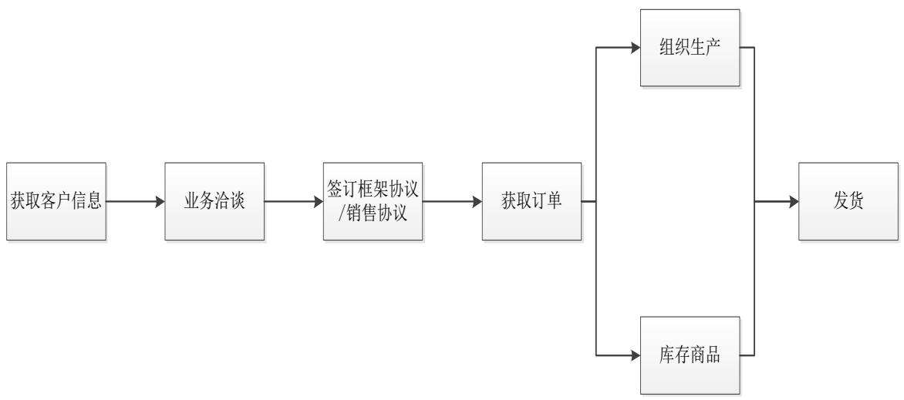

# （五）发行人成立以来主营业务、主要产品或服务、主要经营模式演变情

# 况

公司自 2002 年成立以来，始终专注于包装用纸的研发、生产及销售，主营业务未发生重大变化。公司结合主营产品、竞争优势、自身发展阶段、产业政策、市场供需状况、上下游行业发展趋势等因素，在长期探索和实践中形成了目前的经营模式。公司主营业务演变情况如下：

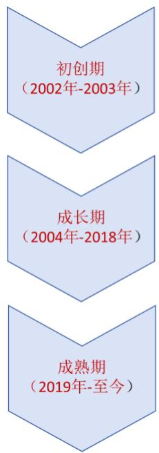

·2002年1月公司成立，设立2条生产线，主要生产普通瓦楞原纸，生产能力为年产4,000吨。

·公司加大投入，不断扩建和升级生产线：  
·2004年公司投产普通瓦楞原纸生产线，公司产能扩大，生产规模从年产能4,000吨一跃上升到5万吨；  
·2008年公司产品升级。淘汰落后生产线，开始生产高强瓦楞原纸；升级为1条3800mm生产线，生产90g的高强瓦楞原纸；同年投产一条4000mm生产线，生产110-120g的高强瓦楞原纸生产线；  
·2014年公司原有生产线进行设备技术改造提升，2014年底公司一条4600mm生产线投入使用（15万吨产能）；  
·2016年5月，公司上线4800mm的生产线（20万吨）。通过扩建和升级生产线，公司2017年底产能达到45万吨。

·2019年公司热电联产项目一期建成投入使用，该一期项目包含投资建设1台180T/H循环流化床锅炉，配套建设1台50MW背压式发电机组；  
·2019年公司陆续投入2条5600mm箱板纸生产线，公司设计产能达到95万吨：  
·2023年1月，公司PM7/6600mm箱板纸生产线建成投产。

初创期（2002 年-2003 年）：公司自成立之初即从事瓦楞纸的研发、生产及销售，创立初期，公司受限于场地、资金、人员等因素的制约，仅投入 2 条普通瓦楞纸产线，年产能为4,000吨，规模较小，但是公司已基本掌握了包装用纸的核心技术与规模化生产工艺，为后续扩产提供了有力的技术保障。

成长期（2004 年-2018 年）：该阶段下，公司规模迅速成长，公司不断加大投入力度，产线不断扩建和升级。2004 年公司扩建普通瓦楞原纸生产线，生产规模从年产能 4,000 吨一跃上升到 5 万吨，公司规模、销售收入有了大幅增加。

2000 年到 2009 年，中国造纸业的年产量从 3,050 万吨提升至 8,640 万吨，10 年增长了近两倍，年平均增长率达 $10 \%$ 以上。2007 年，国家开始集中整治造纸业污染，大量万吨以下的小纸厂开始关闭。2010 年 5 月，国务院印发了《关于进一步加大工作力度确保实现“十一五”节能减排目标的通知》，明确提出当年应淘汰落后造纸业产能 53 万吨，中国造纸业在“十一五”期间淘汰落后产能达 650 万吨。为响应国家政策以及自我升级改造，公司一直以技术创新为企业发展的理念，不断淘汰落后的设备工艺及产能，针对能耗高、设备工艺落后、产品质量不稳定且无市场竞争力的产品进行淘汰，采用新技术、新工艺、新设备及清洁生产工艺技术等进行升级更新。2008 年公司淘汰落后生产线，开始生产高强瓦楞原纸；升级为 1 条 $3 8 0 0 \mathrm { m m }$ 生产线，生产 $9 0 \mathrm { g }$ 的高强瓦楞原纸；同年投产一条 $4 0 0 0 \mathrm { m m }$ 生产线，生产 $1 1 0 { - } 1 2 0 \mathrm { g }$ 的高强瓦楞原纸生产线；2014 年公

司对原有生产线进行设备技术改造提升，并于 2014 年底投产一条 $4 6 0 0 \mathrm { m m }$ 生产线。

为规范造纸行业以及加快推进再生资源产业发展，国家和行业相关监管部门陆续出台了鼓励政策，瓦楞纸、箱板纸行业得到了快速的发展。2016 年 5 月，公司上线 $4 8 0 0 \mathrm { m m }$ 生产线，通过扩建和升级生产线，公司 2017 年底设计产能达到45 万吨。

成熟期（2019 年-至今）：经过长期的发展，公司在行业内已形成一定的规模，公司的产品质量得到了客户的认可，并取得良好的口碑和荣誉。2019 年公司热电联产一期项目（一期项目建设内容为一台 180T/H 循环流化床锅炉，配套建设 1 台 50MW 背压式发电机组；热电联产二期项目建设内容为剩余一台180T/H循环流化床锅炉）建成投入使用，该一期项目包含投资建设一台180T/H循环流化床锅炉，配套建设 1 台 50MW 背压式发电机组。2019 年公司陆续投入两条 $5 6 0 0 \mathrm { m m }$ 箱板纸生产线，公司产品结构得到优化，公司设计产能达到 95 万吨；2023 年 1 月，公司年产 30 万吨的 $\mathrm { P M } 7 / 6 6 0 0 \mathrm { m m }$ 箱板纸生产线建成投产，生产规模进一步扩大，市场占有率、市场影响力和持续竞争能力进一步得到提升。

# （六）发行人主要产品工艺流程图

# 1、箱板纸工艺流程

# （1）制浆工艺流程

废纸由链板输送机送至水力碎浆机碎浆，碎解后的浆料经两段高浓除砂后送入卸料浆塔。两段高浓除砂器之间设置集渣罐，靠重力除去大块石子、铁器等。

卸料塔中的浆料送入粗筛系统，经粗筛除去粗杂质后，浆料再进入分级系统。一次分级后的短纤维经低浓除砂后送入多圆盘浓缩机，浓缩后的浆料送至短纤维储浆塔，短纤维送至造纸车间用作芯、底浆；一次分级后的中长纤送入二次分级筛，二次分级后的中纤经低浓除砂系统除渣后送入多圆盘浓缩机，浆料再经热分散、盘磨后送入中纤维储浆塔，中纤维送造纸车间用作面浆；二次分级后的长纤维经低浓除砂系统除渣后，经精筛系统除去细小塑料、泡沫等轻

杂质，浆料再经多圆盘浓缩机、热分散、盘磨后送入长纤维储浆塔，长纤维送造纸用作芯、底浆。

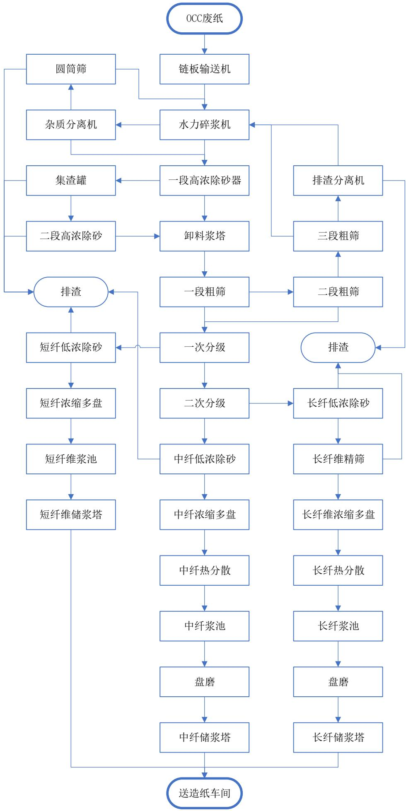

# （2）木浆生产工艺流程

木浆板从浆板库用叉车运送至碎解制浆车间，通过链板式输送机送入间歇式或连续式立式水力碎浆机碎解成浆，碎解后的浆料通过高浓除砂器除去泥砂等杂质，再进行疏解磨浆，处理后的浆送贮浆池贮存，配料成浆后，泵送至造纸车间面层配浆槽。

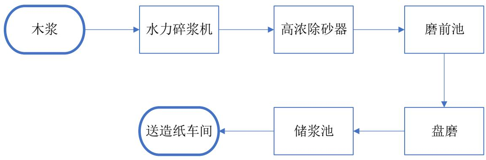

# （3）箱板纸生产工艺流程

由制浆车间送来的 OCC（废纸）中纤和木浆送至面浆混合浆池配浆，经调浓后送至面层纸机浆池。由面层上浆泵浆送至机外白水槽冲浆稀释后再送面浆除砂系统，良浆经冲浆泵冲浆后送面层网前压力筛，压力筛良浆经流浆箱喷射上网成形。

由制浆车间送来的 OCC（废纸）短纤维及长纤维送至芯层和底层配浆系统，经配浆、调浓、冲浆后分别经过芯层网前筛和底层网前筛后送入芯、底层流浆箱喷射上网成形。

面、芯、底网浆料脱水成形、复合后送入纸机压榨部，经压榨部进一步脱水后，通过前烘缸干燥、表面施胶、后烘缸干燥、压光机后，再送至水平卷纸机卷取，卷纸机下来的纸卷，经复卷机分切复卷后，加工成卷筒纸，卷筒纸经称重、打包后由链板输送机送至成品仓库。

纸机各部分的损纸分别在各自的损纸池或水力碎浆机中碎解后，经泵送至损纸塔和卸料塔，损纸塔满后就送卸料塔。损纸塔损纸经损纸浓缩机浓缩后，再经损纸筛处理，良浆送底层配浆池配浆，尾渣送碎浆卸料浆塔。

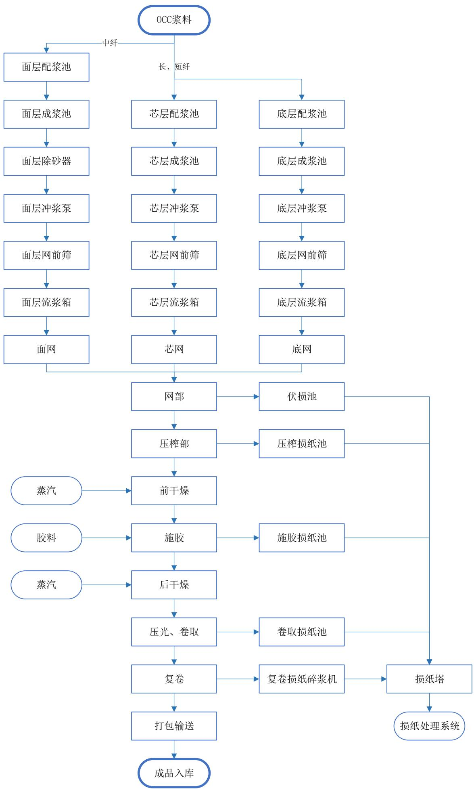

# 2、瓦楞纸工艺流程

# （1）瓦楞纸制浆工艺流程

废纸从原料堆场用叉车运送至碎浆车间，通过链板式输送机送进水力碎浆机，碎解后的浆料进入两段高浓除砂器（一段连续排渣，二段间歇排渣），两段高浓除砂器之间设置排砂罐，靠重力除去大块石子、铁器等，二段高浓除砂器除去小的砂子、石子、铁钉等杂质，良浆送入卸料浆塔。

卸料浆塔的浆料被送入粗筛系统，粗筛系统采用三段。经粗筛工段处理后，浆料送至中浓除砂系统，经除砂后的浆料送至分级筛，分级出来的短纤维送入多圆盘浓缩机，浓缩后的浆料被送入储浆塔储存；分级筛分出的长纤维再经精筛系统，精筛良浆经多圆盘浓缩后再经盘磨打浆，然后送入储浆塔。

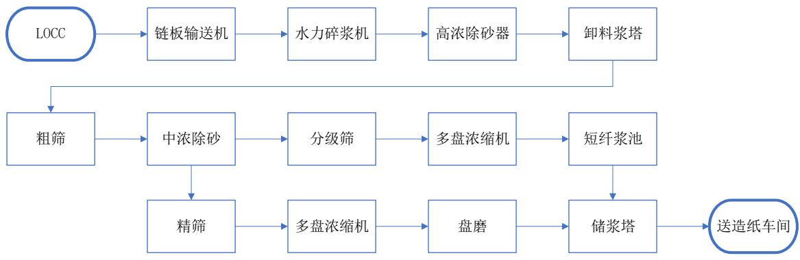

# （2）瓦楞纸生产工艺流程

储浆塔浆料经调浓至 $3 . 5 \%$ 后，与损纸浆、回收浆按一定比例送至配浆池，在配浆池混合、调浓至 $3 . 0 \%$ 后，浆料送至抄前池，然后浆料经机外白水槽冲浆后，泵入网前压力筛，压力筛良浆送入纸机流浆箱上网。浆料上网后，经两叠网成型部脱水成型，再经两道大辊压榨与靴压进一步脱水，通过前烘干燥、表面施胶、后干燥后，再送至水平卷纸机卷取，卷纸机下来的纸卷，经复卷机分切复卷后，加工成卷筒纸，卷筒纸经称重、打包后由链板输送机送至成品仓库。

纸机各部分的损纸分别在各自的损纸池或水力碎浆机中碎解后，经泵送至损纸塔。损纸塔损纸经损纸浓缩机浓缩后，再经一段损纸筛处理，一段损纸筛尾渣经疏解机疏解后送至二段损纸筛，二段损纸筛良浆与一段损纸筛良浆一起送配浆池配浆。二段损纸筛尾渣送碎浆卸料浆塔。

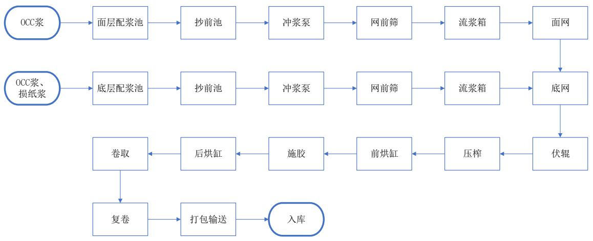

# （七）报告期具有代表性业务指标及变动情况

造纸行业作为重要的基础原材料产业，在国民经济中占据重要地位。造纸业关系到国家的经济、文化、生产等方面，其产品用于文化、教育、科技和国民经济的众多领域。纸张的生产和消费水平代表了一个国家的科技与经济发展水平，因此造纸业被称为社会和经济晴雨表。

造纸行业属于规模效益行业，行业具有代表性的业务指标为产品产销量情况，具体情况详见本章节之“四、发行人销售和主要客户情况”之“（二）主要产品的产能、产量及销售情况”。

# （八）符合产业政策和国家经济发展战略的情况

根据《国民经济行业分类》（GB/T4754-2017），发行人所属行业为“C22造纸和纸制品业”大类下的“C222 造纸”，具体细分为“C2221 机制纸及纸板制造”。公司主营产品瓦楞纸和箱板纸以废纸为主要原材料，属于典型的资源综合利用型产品。瓦楞纸和箱板纸做成纸箱使用后经回收可重新作为生产原纸的原材料循环使用，因此造纸行业具有典型的循环经济属性。与塑料等包装产品相比，瓦楞纸、箱板纸产品因其绿色环保、可回收的特点决定了其未来将是商品绿色包装主流产品。近年来，国家相继出台了一系列鼓励和支持资源综合利用行业、循环经济产业发展产业政策。

《战略性新兴产业分类（2018）》将造纸和纸制品等资源循环利用产业列入战略性新兴产业分类目录。根据《绿色低碳转型产业指导目录（2024 年版）》，发行人主营产品以废纸为主要原料，属于绿色低碳转型产业指导目录中“3 资源循环利用产业”大类下的“3.2.6 垃圾资源化利用”产业。根据《产

业结构调整指导目录（2024 年本）》，以废纸等为主要原材料的废弃物循环利用产业属于国家支持的环境保护与资源节约综合利用产业，符合国家发展循环经济和绿色产业的经济政策。

2012 年出台的《中华人民共和国清洁生产促进法》指出国家鼓励和促进清洁生产，优先采用资源利用率高以及污染物产生量少的清洁生产技术、工艺和设备，并将清洁生产促进工作纳入国民经济和社会发展规划、年度计划。2018年出台的《中华人民共和国循环经济促进法》指出发展循环经济是国家经济社会发展的一项重大战略。国家鼓励在资源综合利用等领域进行合作，实现资源的高效利用和循环使用。上述两部法律从立法层面提出采用清洁生产技术构建绿色低碳循环经济的发展战略。

2021 年 2 月，国务院发布《国务院关于加快建立健全绿色低碳循环发展经济体系的指导意见》提出建立健全绿色低碳循环发展的经济体系，确保实现碳达峰、碳中和目标，推动我国绿色发展迈上新台阶。《“十四五”工业绿色发展规划》、《“十四五”全国清洁生产推行方案》、《“十四五”循环经济发展规划》和《工业能效提升行动计划》政策文件指出，以节约资源、降低能耗、减污降碳、提质增效为目标，以清洁生产审核为抓手，统筹发展与绿色低碳转型，深入实施绿色制造，加快产业结构优化升级，大力推进工业节能降碳，全面提高资源利用效率，提升再生资源利用水平，建立健全绿色低碳循环发展经济体系，为经济社会可持续发展提供资源保障。2024 年 8 月，中国共产党中央委员会与国务院发布《关于加快经济社会发展全面绿色转型的意见》，指出要大力发展资源循环利用产业，推动再制造产业高质量发展，提高再生材料和产品质量，扩大对原生资源的替代规模。健全废弃物循环利用体系，强化废弃物分类处置和回收能力，提升再生利用规模化、规范化、精细化水平。

综上，发行人以废纸为原材料生产包装用瓦楞纸、箱板纸和公司坚持的“循环经济、绿色制造”的经营理念与国家的产业政策和经济发展战略所契合。

# 二、发行人业务竞争状况

# （一）所属行业及确定依据

根据《国民经济行业分类》（GB/T4754-2017），发行人所属行业为“C22造纸和纸制品业”大类下的“C222 造纸”，具体细分为“C2221 机制纸及纸板制造”。

《战略性新兴产业分类（2018）》将造纸和纸制品等资源循环利用产业列入战略性新兴产业分类目录。根据《绿色低碳转型产业指导目录（2024 年版）》，发行人主营产品以废纸为主要原料，属于绿色低碳转型产业指导目录中“3 资源循环利用产业”大类下的“3.2.6 垃圾资源化利用”产业。根据《产业结构调整指导目录（2024 年本）》，以废纸等为主要原材料的废弃物循环利用产业属于国家支持的环境保护与资源节约综合利用产业，公司主营产品符合国家发展循环经济和绿色产业的经济政策。

# （二）行业主管部门、监管体制、主要法律法规及政策

# 1、行业主管部门、监管体制

# （1）行业主管部门

公司所处行业属于轻工业，主管部门主要包括国家发展和改革委员会、工业和信息化部等。

行业主管部门主要通过拟订并组织实施国民经济和社会发展战略、长期规划；提出宏观调控政策建议；指导推进和综合协调经济体制改革有关工作，提出相关改革建议；推进产业结构战略性调整和优化升级，制定并组织实施行业规划、发展计划和产业政策；提出优化产业布局、结构的政策建议；起草相关法律法规草案，制定规章，拟订行业技术规范和标准并组织实施，指导行业质量管理工作等。

# （2）行业协会组织

造纸行业的全国性自律管理组织主要是中国造纸协会。协会成立于 1992 年，是经国家民政部登记注册受国务院相关部门业务指导的社会团体法人，协会的主要职责是对行业的重大问题开展调查研究，提出政策和立法等方面的意见和

建议；参与研究制定行业发展规划、产业发展指导意见、产业发展政策和行业准入条件，完善行业管理，促进行业发展；对行业重大技术改造、技术引进、投资与开发项目进行调研论证，并提出相关意见；掌握国内外行业发展动态，收集、发布行业信息，参与相关国家标准、行业标准、相关法律、法规的研究制定和修订，参与行业新技术推广等相关工作；组织人才、技术、管理、法规等职业培训，开展国内外经济、技术、信息交流与合作等。

# 2、主要法律法规及政策

我国造纸行业主要法律法规及产业政策如下：

（1）行业相关的主要法律法规  

<table><tr><td>序号</td><td>时间</td><td>文件名</td><td>发文单位</td><td>主要内容</td></tr><tr><td>1</td><td>2021.12</td><td>《废纸加工行业规范条件》</td><td>工信部</td><td>废纸加工是指按照废纸的来源用途、分类标准、质量要求等,对废纸进行分类、挑选、除杂、切割、破碎、包装等加工处理,并将加工后的废纸作为原料送往造纸等生产制造行业进行再生利用的过程。企业应对收集的废纸进行充分分拣,分拣出的塑料、金属、玻璃和其他再生资源等应妥善回收利用,资源综合回收率不低于95%。</td></tr><tr><td>2</td><td>2020.4</td><td>《中华人民共和国固体废物污染环境防治法》(2020年修订)</td><td>全国人大</td><td>国家推行绿色发展方式,促进清洁生产和循环经济发展。固体废物污染环境防治坚持减量化、资源化和无害化的原则。任何单位和个人都应当采取措施,减少固体废物的产生量促进固体废物的综合利用,降低固体废物的危害性。产生收集、贮存、运输、利用、处置固体废物的单位和个人,当采取措施,防止或者减少固体废物对环境的污染,对所造成的环境污染依法承担责任。</td></tr><tr><td>3</td><td>2019.11</td><td>《再生资源回收管理办法》(2019修订)</td><td>商务部、发改委、工商总局等六部委</td><td>再生资源包括废旧金属、报废电子产品、报废机电设备及其零部件、废造纸原料(如废纸、废棉等)、废轻化工原料(如橡胶、塑料、农药包装物、动物杂骨、毛发等)、废玻璃等。国家鼓励以环境无害化方式回收处理再生资源,鼓励开展有关再生资源回收处理的科学研究、技术开发和推广。</td></tr><tr><td>4</td><td>2018.12</td><td>《中华人民共和国环境影响评价法》(2018年修</td><td>全国人大</td><td>对规划和建设项目实施后可能造成的环境影响进行分析、预测和评估,提出预防或者减轻不良环境影响的对策和措施,进行跟踪监测的方法与制度。</td></tr><tr><td></td><td></td><td>订)</td><td></td><td></td></tr><tr><td>5</td><td>2018.10</td><td>《中华人民共和国循环经济促进法》(2018年修订)</td><td>全国人大</td><td>发展循环经济是国家经济社会发展的一项重大战略,国家制定产业政策,应当符合发展循环经济的要求,县级以上人民政府应当统筹规划区域经济布局,合理调整产业结构,促进企业在资源综合利用等领域进行合作,实现资源的高效利用和循环使用。国家鼓励和推进废物回收体系建设。</td></tr><tr><td>6</td><td>2018.10</td><td>《中华人民共和国节约能源法》(2018年修订)</td><td>全国人大</td><td>加强用能管理,采取技术上可行、经济上合理以及环境和社会可以承受的措施,从能源生产到消费的各个环节,降低消耗、减少损失和污染物排放、制止浪费,有效、合理地利用能源。</td></tr><tr><td>7</td><td>2018.1</td><td>《中华人民共和国环境保护税法》(2018年修订)</td><td>全国人大</td><td>规定直接向环境排放应税污染物的企业事业单位和其他生产经营者为纳税人,确定大气污染物、水污染物、固体废物和噪声为应税污染物。应税固体废物的计税依据,按照固体废物的排放量确定。</td></tr><tr><td>8</td><td>2017.6</td><td>《中华人民共和国水污染防治法》(2017年修订)</td><td>全国人大</td><td>直接或者间接向水体排放工业废水和医疗污水以及其他按照规定应当取得排污许可证方可排放的废水、污水的企业事业单位和其他生产经营者,应当取得排污许可证;城镇污水集中处理设施的运营单位,也应当取得排污许可证。排污许可证应当明确排放水污染物的种类、浓度、总量和排放去向等要求。排污许可的具体办法由国务院规定。</td></tr><tr><td>9</td><td>2015.6</td><td>《制浆造纸企业环境守法导则》</td><td>环境保护部</td><td>导则主要包括制浆造纸企业环境守法工作的术语和定义、守法依据、基本环境法律权利和义务、产业政策及行业准入条件、建设项目环境守法、污染防治及环境应急管理、环境管理制度、企业内部管理措施、主要环境违法行为法律责任等方面的内容。</td></tr><tr><td>10</td><td>2014.4</td><td>《中华人民共和国环境保护法》(2014年修订)</td><td>全国人大</td><td>排放污染物的企业事业单位和其他生产经营者,应当采取措施,防治在生产建设或者其他活动中产生的废气、废水、废渣、医疗废物、粉尘、恶臭气体、放射性物质以及噪声、振动、光辐射、电磁辐射等对环境的污染和危害。</td></tr><tr><td>11</td><td>2012.7</td><td>《中华人民共和国清洁生产促进法》(2012年修订)</td><td>全国人大</td><td>不断采取改进设计、使用清洁的能源和原料、采用先进的工艺技术与设备、改善管理、综合利用等措施,从源头削减污染,提高资源利用效率,减少或者避免生产、服务和产品使用过程中污染物的产生和排放,以减轻或者消除对人类健康和环境的危害。</td></tr></table>

（2）行业相关的主要产业政策  

<table><tr><td>序号</td><td>时间</td><td>文件名</td><td>发文单位</td><td>主要内容</td></tr><tr><td>1</td><td>2024.8</td><td>《关于加快经济社会发展全面绿色转型的意见》</td><td>中国共产党中央委员会、国务院</td><td>大力发展资源循环利用产业,推动再制造产业高质量发展,提高再生材料和产品质量,扩大对原生资源的替代规模。健全废弃物循环利用体系,强化废弃物分类处置和回收能力,提升再生利用规模化、规范化、精细化水平。</td></tr><tr><td>2</td><td>2024.2</td><td>《产业结构调整指导目录(2024年本)》</td><td>发改委</td><td>将以废纸等为主要原材料的废弃物循环利用产业列入国家鼓励的产业分类目录</td></tr><tr><td>3</td><td>2024.2</td><td>《绿色低碳转型产业指导目录(2024年版)</td><td>发改委、工信部、自然资源部等</td><td>将以废纸为主要原料的造纸行业列入绿色低碳转型产业指导目录中资源循环利用产业</td></tr><tr><td>4</td><td>2022.7</td><td>《关于印发工业领域碳达峰实施方案的通知》</td><td>工信部、发改委、生态环境部</td><td>以重点行业达峰为突破,着力构建绿色制造体系,提高资源能源利用效率,推动数字化智能化绿色化融合,扩大绿色低碳产品供给,加快制造业绿色低碳转型和高质量发展;大力发展循环经济,加强再生资源循环利用。实施废钢铁、废有色金属、废纸、废塑料、废旧轮胎等再生资源回收利用行业规范管理</td></tr><tr><td>5</td><td>2022.6</td><td>《工业能效提升行动计划》</td><td>工信部、发改委、财政部等</td><td>推进工业能效提升,是产业提质升级、实现高质量发展的内在要求,是降低工业领域碳排放、实现碳达峰碳中和目标的重要途径,是培育形成绿色低碳发展新动能、促进工业经济增长的有效举措。</td></tr><tr><td>6</td><td>2022.6</td><td>《关于推动轻工业高质量发展的指导意见》</td><td>工信部、人力资源社会保障部、生态环境部、商务部、市场监管总局</td><td>加快绿色安全发展。有序推进轻工业碳达峰进程,绘制造纸等行业低碳发展路线图。加大食品、皮革、造纸、电池、陶瓷、日用玻璃等行业节能降耗和减污降碳力度,加快完善能耗限额和污染排放标准,树立能耗环保标杆企业,推动能效环保对标达标。推动塑料制品、家用电器、造纸、电池、日用玻璃等行业废弃产品循环利用。</td></tr><tr><td>7</td><td>2021.12</td><td>《关于完善资源综合利用增值税政策的公告》</td><td>财政部、税务总局</td><td>销售自产的资源综合利用产品,可享受增值税即征即退政策。</td></tr><tr><td>8</td><td>2021.12</td><td>《关于公布&lt;环境保护、节能节水项目企业所得税优惠目录(2021年版)&gt;以及&lt;资&gt;</td><td>财政部、税务总局、发展改革委、生态环境部</td><td>以废纸为主要原材料生产纸制品取得的收入,在计算应纳税所得额时,减按90%计入当年收入总额。</td></tr><tr><td></td><td></td><td>源综合利用企业所得税优惠目录(2021年版)&gt;的公告》</td><td></td><td></td></tr><tr><td>9</td><td>2021.11</td><td>《“十四五”工业绿色发展规划》</td><td>工信部</td><td>以碳达峰碳中和目标为引领,以减污降碳协同增效为总抓手,统筹发展与绿色低碳转型,深入实施绿色制造,加快产业结构优化升级,大力推进工业节能降碳,全面提高资源利用效率,积极推行清洁生产改造,提升绿色低碳技术、绿色产品、服务供给能力,构建工业绿色低碳转型与工业赋能绿色发展相互促进、深度融合的现代化产业格局,支撑碳达峰碳中和目标任务如期实现。</td></tr><tr><td>10</td><td>2021.10</td><td>《“十四五”全国清洁生产推行方案》</td><td>发改委、工信部、生态环境部等</td><td>构建新发展格局,推动高质量发展,以节约资源、降低能耗、减污降碳、提质增效为目标,以清洁生产审核为抓手,系统推进工业、农业、建筑业、服务业等领域清洁生产,积极实施清洁生产改造,探索清洁生产区域协同推进模式,培育壮大清洁生产产业,促进实现碳达峰、碳中和目标,助力美丽中国建设。</td></tr><tr><td>11</td><td>2021.7</td><td>《“十四五”循环经济发展规划》</td><td>发改委</td><td>构建新发展格局,坚持节约资源和保护环境的基本国策,遵循“减量化、再利用、资源化”原则,着力建设资源循环型产业体系,加快构建废旧物资循环利用体系,深化农业循环经济发展,全面提高资源利用效率,提升再生资源利用水平,建立健全绿色低碳循环发展经济体系,为经济社会可持续发展提供资源保障。</td></tr><tr><td>12</td><td>2021.3</td><td>《中华人民共和国国民经济和社会发展第十四个五年规划和2035年远景目标纲要》</td><td>全国人大</td><td>改造提升传统产业,推动石化、钢铁、有色、建材等原材料产业布局优化和结构调整,扩大轻工、纺织等优质产品供给,加快化工、造纸等重点行业企业改造升级,完善绿色制造体系。深入实施增强制造业核心竞争力和技术改造专项,鼓励企业应用先进适用技术、加强设备更新和新产品规模化应用。</td></tr><tr><td>13</td><td>2021.2</td><td>《国务院关于加快建立健全绿色低碳循环发展经济体系的指导意见》</td><td>国务院</td><td>加快实施钢铁、石化、化工、有色、建材、纺织、造纸、皮革等行业绿色化改造。推行产品绿色设计,建设绿色制造体系。大力发展再制造产业,加强再制造产品认证与推广应用。建设资源综合利用基地,促进工业固体废物综合利用。全面推行清洁生产,依法在“双超双有高耗能”行业实施强制性清洁生产审核。</td></tr><tr><td>14</td><td>2020.11</td><td>《国务院办公厅转发国家发</td><td>国务院办公厅</td><td>加强快递领域塑料污染治理,推动重点地区逐步停止使用不可降解的塑料包装袋、</td></tr><tr><td></td><td></td><td>展改革委等部门关于加快推进快递包装绿色转型意见的通知》</td><td></td><td>一次性塑料编织袋,减少使用不可降解塑料胶带。推广使用低克重高强度快递包装纸箱、免胶纸箱。鼓励通过包装结构优化减少填充物使用。</td></tr><tr><td>15</td><td>2020.11</td><td>《关于全面禁止进口固体废物有关事项的公告》</td><td>生态环境部、商务部、发改委、海关总署</td><td>一、禁止以任何方式进口固体废物。禁止我国境外的固体废物进境倾倒、堆放、处置。二、生态环境部停止受理和审批限制进口类可用作原料的固体废物进口许可证的申请;2020年已发放的限制进口类可用作原料的固体废物进口许可证,应当在证书载明的2020年有效期内使用,逾期自行失效。</td></tr><tr><td>16</td><td>2020.1</td><td>《关于进一步加强塑料污染治理的意见》</td><td>国家发展改革委、生态环境部</td><td>到2025年,塑料制品生产、流通、消费和回收处置等环节的管理制度基本建立,多元共治体系基本形成,替代产品开发应用水平进一步提升,重点城市塑料垃圾填埋量大幅降低,塑料污染得到有效控制。</td></tr><tr><td>17</td><td>2019.10</td><td>《产业结构调整指导目录(2019年本)》</td><td>发改委</td><td>“十九、轻工1、单条化学木浆30万吨/年及以上、化学机械木浆10万吨/年及以上、化学竹浆10万吨/年及以上的林纸一体化生产线及相应配套的纸及纸板生产线(新闻纸、铜版纸除外)建设;采用清洁生产工艺、以非木纤维为原料、单条10万吨/年及以上的纸浆生产线建设;先进制浆、造纸设备开发与制造;无元素氯(ECF)和全无氯(TCF)化学纸浆漂白工艺开发及应用”属于国家支持鼓励发展的产业。</td></tr><tr><td>18</td><td>2019.1</td><td>《中国造纸工业可持续发展白皮书》</td><td>中国造纸协会、中国造纸学会</td><td>造纸工业实施全生命周期管理,致力于提高资源的高效和循环利用。开发绿色产品,创建绿色工厂,引导绿色消费,转变发展方式,按照减量化、再利用、资源化的原则,提高水资源、能源、土地及植物原料等利用效率,减少能源消耗和污染物排放。造纸工业开展循环经济、节能减排等工作,对产业结构调整和产业升级起着重要支撑和推动作用。</td></tr><tr><td>19</td><td>2018.11</td><td>《战略性新兴产业分类(2018)》</td><td>国家统计局</td><td>将造纸和纸制品等资源循环利用产业列入战略性新兴产业分类目录。</td></tr><tr><td>20</td><td>2017.6</td><td>《中国造纸协会关于造纸工业“十三五”发展的意见》</td><td>中国造纸协会</td><td>造纸行业要充分发挥循环经济的特点和植物原料的绿色低碳属性,依靠技术进步,创新发展模式,在资源、环境、结构等关系到中国造纸工业健康发展的关键问题上取得突破,实施可持续发展战略,着力解决资源短缺和环境压力的制约,提高可持续发展能力。建立绿色纸业是行业发展的战</td></tr><tr><td></td><td></td><td></td><td></td><td>略方向。</td></tr><tr><td>21</td><td>2016.12</td><td>《关于加快推进再生资源产业发展的指导意见》</td><td>工信部、商务部、科技部</td><td>将绿色化理念贯穿到再生资源产业链的各环节和全过程,从回收、分拣、运输,到加工、循环化利用、再制造以及废物处理处置,严格执行环保、安全、卫生、劳动保护、质量标准,推动再生资源综合利用企业完善环保制度,加强环保设施建设和运营管理,推进清洁生产,实现达标排放,防止二次污染,保障生态环境安全。</td></tr><tr><td>22</td><td>2016.12</td><td>《关于加快我国包装产业转型发展的指导意见》</td><td>工信部、商务部</td><td>积极采用低成本和绿色生产技术,发展低克重、高强度、功能化纸包装制品,增强纸制品防水、防潮、抗菌、阻燃等性能,拓展纸包装的应用范围。</td></tr><tr><td>23</td><td>2016.3</td><td>《国民经济和社会发展第十三个五年规划纲要》</td><td>中国共产党第十八届中央委员会第五次全体会议</td><td>实施循环发展引领计划,推进生产和生活系统循环链接,加快废弃物资源化利用。</td></tr></table>

# 3、法律法规、行业政策对发行人经营的主要影响

2021 年 2 月，国务院发布《国务院关于加快建立健全绿色低碳循环发展经济体系的指导意见》提出建立健全绿色低碳循环发展的经济体系，确保实现碳达峰、碳中和目标，推动我国绿色发展迈上新台阶。《“十四五”工业绿色发展规划》、《“十四五”全国清洁生产推行方案》、《“十四五”循环经济发展规划》和《工业能效提升行动计划》政策文件指出，以节约资源、降低能耗、减污降碳、提质增效为目标，以清洁生产审核为抓手，统筹发展与绿色低碳转型，深入实施绿色制造，加快产业结构优化升级，大力推进工业节能降碳，提升再生资源利用水平，建立健全绿色低碳循环发展经济体系，为经济社会可持续发展提供资源保障。2024 年 8 月，中国共产党中央委员会与国务院发布《关于加快经济社会发展全面绿色转型的意见》，指出要大力发展资源循环利用产业，推动再制造产业高质量发展，提高再生材料和产品质量，扩大对原生资源的替代规模。健全废弃物循环利用体系，强化废弃物分类处置和回收能力，提升再生利用规模化、规范化、精细化水平。法律法规、行业政策对发行人经营的主要影响表现在如下三个方面：

# （1）经营资质和准入门槛方面

《废纸加工行业规范条件》对废纸行业用途、分类标准、再利用标准进行了规范；根据国家发改委《造纸产业发展政策》（2007年第71号文）中行业准入条件第 47 条：造纸产业发展要实现规模经济，突出起始规模。新建、扩建造纸项目单条生产线起始规模要求达到：箱纸板和白纸板项目年产 30 万吨，其他纸板项目年产 10 万吨。《中国造纸协会关于造纸工业“十三五”发展意见》（2017 年 6 月）指出，箱纸板项目新建起始规模为单条生产线 30 万吨/年及以上；瓦楞原纸及其他纸板项目新建起始规模为单条生产线10万吨/年及以上。上述政策提高了行业准入门槛，为发行人提供了有利、有序的市场竞争环境。

# （2）税收优惠方面

国家对于行业出台了税收优惠政策，直接给与企业相关优惠政策，《关于印发<资源综合利用产品和劳务增值税优惠目录>的通知》中明确，纳税人销售自产的资源综合利用产品和提供资源综合利用劳务，可享受增值税即征即退税收优惠政策；根据《关于公布<环境保护、节能节水项目企业所得税优惠目录（2021 年版） $>$ 以及<资源综合利用企业所得税优惠目录（2021 年版）>的公告》等相关规定公司以废纸为主要原材料生产纸制品取得的收入，在计算应纳税所得额时，减按 $90 \%$ 计入当年收入总额。税收优惠直接刺激了行业的快速发展，对于发行人的成长起到了增速效益。

# （3）行业竞争格局方面

在行业竞争格局方面，已出台的法律法规及行业政策对于发行人所属行业内企业提出了安全生产、节能环保、清洁生产、技术创新等新要求、新标准。面对日益趋严的安全、环保领域监管政策，趋严行业内规模较小、环保投入低的企业无法承担增加的运营成本而逐步退出市场，同时新的行业准入门槛的提升对于新建产线的投资规模提出了更高要求。发行人在安全、环保等方面投入较大，且在细分领域具有规模经济的优势。

综上，国内的行业政策为发行人的生产经营提供了良好的环境，形成了正面积极的影响。

# （三）行业发展概况

# 1、行业市场概况

造纸和纸制品行业包含了“纸浆制造行业”、“纸和纸板行业”、“纸制品制造行业”，瓦楞纸、箱板纸细分行业属于“纸和纸板行业”，是造纸和纸制品业的重要细分领域，造纸和纸制品业作为国民经济和社会主义文明建设息息相关的重要产业，在现代经济中发挥着重要作用，被国际上公认为永不衰竭的行业。纸和纸板的消费水平是衡量一个国家现代化水平和文明程度的标志。

# （1）国内纸和纸板行业市场概况

单位：万吨

2015年-2024年中国纸和纸板产量情况  
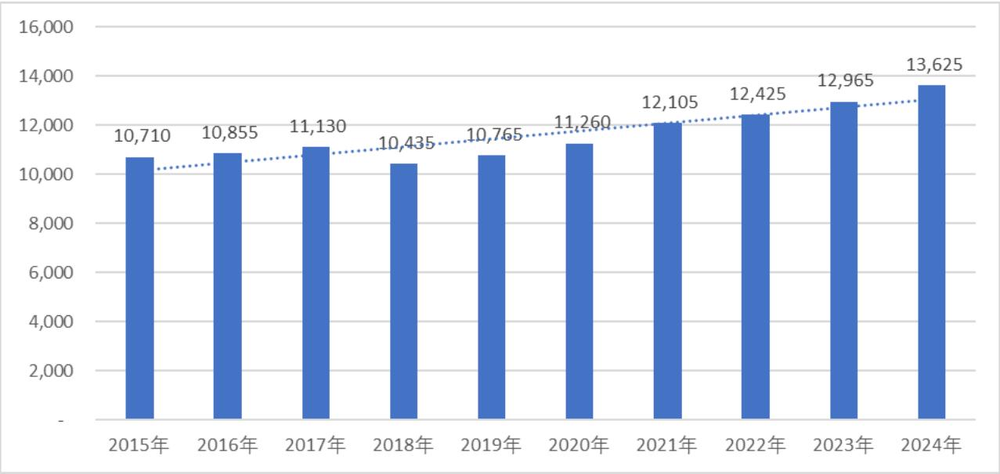  
数据来源：中国造纸协会

中国造纸行业经历了十年的高速发展后，已经成为全球纸产品生产头部国家之一，2010 年，国内造纸行业开始淘汰落后产能、调整产业结构和节能环保发展的新态势，造纸行业进入良性发展周期，行业规模和质量得到迅速提升。我国纸和纸板产量由 2015 年的 10,710 万吨跃升至 2024 年的 13,625 万吨。

2024 年中国纸和纸板生产企业约 2,600 家，全国纸和纸板生产量 13,625 万吨，较上年增长 $5 . 0 9 \%$ ；消费量13,634万吨，较上年增长 $3 . 5 6 \%$ ，人均年消费量为96.83千克，伴随国民经济的稳定发展和下游包装及消费品需求增长的发展带动，未来中国纸和纸板行业仍将保持良好发展态势。

# 2015年-2024年中国纸和纸板消费量情况

单位：万吨   
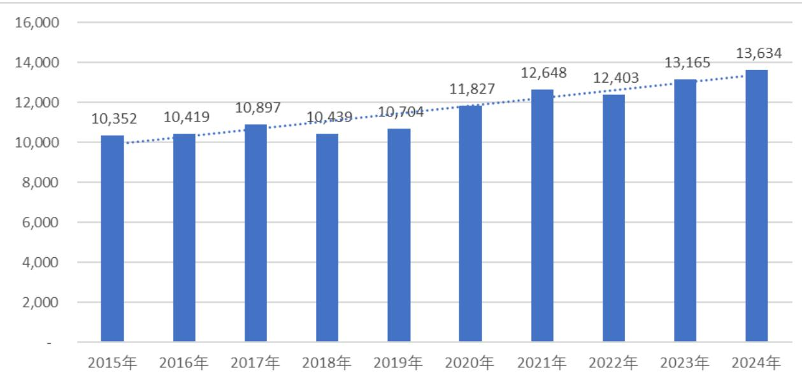  
数据来源：中国造纸协会

2015 年至 2024 年间，我国纸和纸板消费量整体持续增加，由 2015 年的10,352万吨增长至2024年的13,634万吨，结合每年的产量，整体上我国每年的纸和纸板的消费量大于产量，市场消化情况较好，市场前景具有可持续性。

# 2019 年-2024年中国纸和纸板行业细分产品产量情况

单位：万吨   

<table><tr><td>年份</td><td>瓦楞纸</td><td>箱板纸</td><td>未涂布印刷书写纸</td><td>涂布印刷书写纸</td><td>白板纸</td><td>生活用纸</td><td>包装用纸</td><td>新闻纸</td><td>特种纸及其他</td></tr><tr><td>2019年</td><td>2,220</td><td>2,190</td><td>1,780</td><td>680</td><td>1,410</td><td>1,005</td><td>695</td><td>150</td><td>635</td></tr><tr><td>2020年</td><td>2,390</td><td>2,440</td><td>1,730</td><td>640</td><td>1,490</td><td>1,080</td><td>705</td><td>110</td><td>675</td></tr><tr><td>2021年</td><td>2,685</td><td>2,805</td><td>1,720</td><td>635</td><td>1,525</td><td>1,105</td><td>715</td><td>90</td><td>825</td></tr><tr><td>2022年</td><td>2,770</td><td>2,810</td><td>1,735</td><td>650</td><td>1,590</td><td>1,135</td><td>730</td><td>90</td><td>915</td></tr><tr><td>2023年</td><td>2,915</td><td>2,895</td><td>1,805</td><td>660</td><td>1,655</td><td>1,210</td><td>755</td><td>80</td><td>990</td></tr><tr><td>2024年</td><td>3,134</td><td>3,035</td><td>1,845</td><td>705</td><td>1,715</td><td>1,260</td><td>775</td><td>70</td><td>1,086</td></tr></table>

数据来源：中国造纸协会

2024 年中国纸和纸板行业细分产品中，瓦楞原纸产量达到 3,134 万吨，箱板纸产量达到3,035 万吨，产量居于纸和纸板产量的前两名。

2024年中国纸和纸板各品种产量占比  
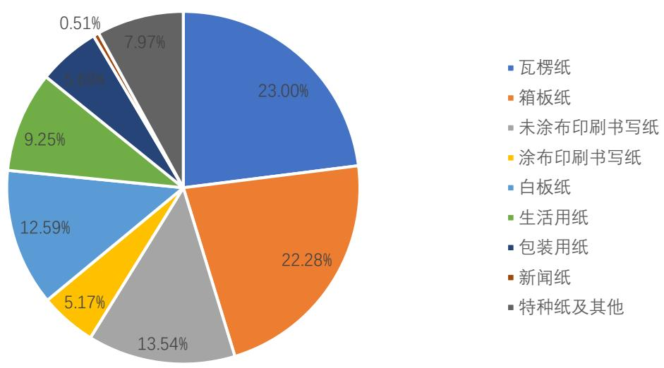  
数据来源：中国造纸协会

由各类纸和纸板产品可以看出，在生产环节，瓦楞原纸、箱板纸和未涂布印刷书写纸产量位居前三位，2024年三类产品产量占比分别为 $2 3 . 0 0 \%$ 、 $2 2 . 2 8 \%$ 和 $1 3 . 5 4 \%$ 。

2020 年-2024年中国纸和纸板各品种进出口情况  
单位：万吨   

<table><tr><td rowspan="2">分类</td><td colspan="5">进口量</td><td colspan="5">出口量</td></tr><tr><td>2020年</td><td>2021年</td><td>2022年</td><td>2023年</td><td>2024年</td><td>2020年</td><td>2021年</td><td>2022年</td><td>2023年</td><td>2024年</td></tr><tr><td>新闻纸</td><td>65</td><td>71</td><td>46</td><td>51</td><td>42</td><td>0</td><td>1</td><td>1</td><td>2</td><td>2</td></tr><tr><td>未涂布印刷书写纸</td><td>119</td><td>133</td><td>45</td><td>42</td><td>49</td><td>66</td><td>60</td><td>102</td><td>136</td><td>133</td></tr><tr><td>涂布印刷纸</td><td>36</td><td>44</td><td>26</td><td>22</td><td>23</td><td>105</td><td>96</td><td>176</td><td>169</td><td>195</td></tr><tr><td>包装用纸</td><td>31</td><td>24</td><td>28</td><td>39</td><td>46</td><td>18</td><td>17</td><td>27</td><td>21</td><td>25</td></tr><tr><td>箱板纸</td><td>404</td><td>399</td><td>360</td><td>532</td><td>560</td><td>7</td><td>8</td><td>11</td><td>9</td><td>13</td></tr><tr><td>白纸板</td><td>53</td><td>58</td><td>44</td><td>44</td><td>53</td><td>170</td><td>156</td><td>255</td><td>243</td><td>277</td></tr><tr><td>生活用纸</td><td>3</td><td>5</td><td>3</td><td>4</td><td>4</td><td>87</td><td>64</td><td>79</td><td>111</td><td>136</td></tr><tr><td>瓦楞原纸</td><td>389</td><td>294</td><td>241</td><td>359</td><td>268</td><td>3</td><td>2</td><td>1</td><td>2</td><td>6</td></tr><tr><td>特种纸及纸板</td><td>22</td><td>23</td><td>17</td><td>14</td><td>14</td><td>97</td><td>106</td><td>155</td><td>179</td><td>224</td></tr><tr><td>其他纸及纸板</td><td>32</td><td>39</td><td>26</td><td>25</td><td>28</td><td>34</td><td>37</td><td>51</td><td>60</td><td>67</td></tr></table>

数据来源：中国造纸协会

通过对比近 5 年来中国纸和纸板各品种进出口情况，各类纸制品进出口规模都不大，各类品种主要依靠国内市场供应，各类纸制品进出口整体保持较为稳定的水平。进口方面，2024 年进口规模位居前三位的分别为箱板纸 560 万吨、瓦楞原纸268万吨和白板纸53万吨；出口方面，2024年出口规模位居前三位的分别为白板纸 277 万吨、特种纸及纸板 224 万吨和涂布印刷纸 195 万吨。整体上，国内出口量要小于进口量，瓦楞纸、箱板纸存在进口替代空间。

# （2）瓦楞纸市场概况

# 2015年-2024年中国瓦楞纸产量规模情况

单位：万吨

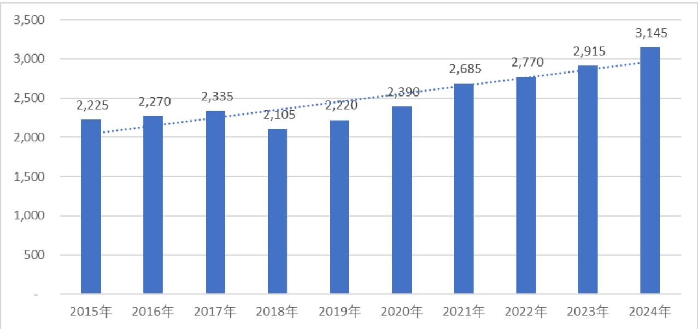  
数据来源：中国造纸协会

作为包装材料用的瓦楞纸，加工成纸箱后可代替其他包装材料。具有成本低、重量轻、运输方便、节约木材、以纸代塑，减少白色污染，多次循环等优点，近年来得到良好的发展。

根据中国造纸协会统计数据显示，2024 年中国瓦楞纸产量为 3,145 万吨，较上一年增长 $7 . 8 9 \%$ ，2015-2024年生产量年均复合增长率为 $3 . 9 2 \%$ 。

未来伴随中国经济持续发展，网络购物高速增长，用于产品的包装瓦楞纸将呈现出持续增长的趋势，在整个纸和纸板总量中地位也将更加突出。

# 2015年-2024年中国瓦楞纸消费量情况

单位：万吨   
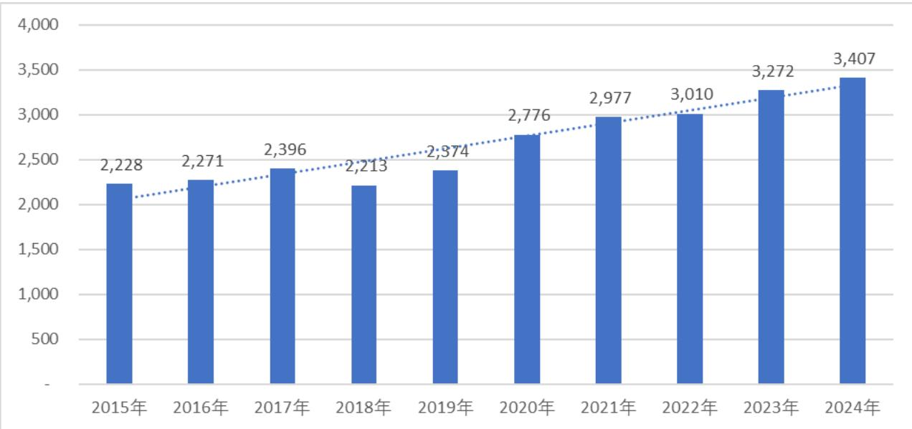  
数据来源：中国造纸协会

根据中国造纸协会统计数据显示，2024年中国瓦楞纸消费量为3,407万吨，较上一年增长 $4 . 1 3 \%$ ，2015-2024 年消费量年均复合增长率为 $4 . 8 3 \%$ 。同时，整体上国内每年瓦楞纸消费量要大于产量，上述良好的市场需求对于国内瓦楞纸生产制造商提供了广阔的市场空间。

# 2020年-2024年中国瓦楞纸进出口情况对比

单位：万吨   
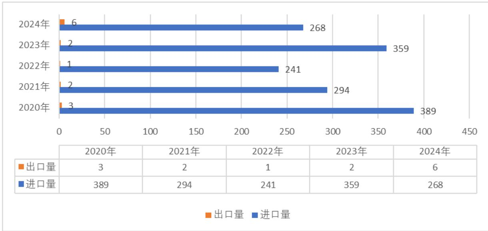  
数据来源：中国造纸协会

2024 年中国瓦楞纸纸行业进口规模达到 268 万吨，出口规模仅为 6 万吨。

进口替代及出口量有巨大的市场空间。

单位：元/吨

2022 年-2024 年我国华东地区瓦楞纸价格走势（ $\mathbf { 1 2 0 9 } \mathbf { \mathrm { A } }$ 级）  
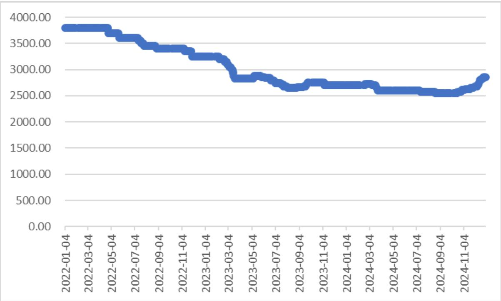  
数据来源：ifind

报告期内国内瓦楞原纸价格走势波动较大，2023 年初中国取消成品纸关税，瓦楞纸和箱板纸进口量大幅增加，叠加国内瓦楞纸供应增加与终端需求恢复节奏偏慢等因素影响，国内瓦楞纸价格出现较大幅度下降，2024 年国内经济增速放缓，下游消费市场需求疲软，瓦楞纸价格仍处于低位。

# （3）箱板纸市场概况

单位：万吨

2015年-2024年中国箱板纸产量规模情况  
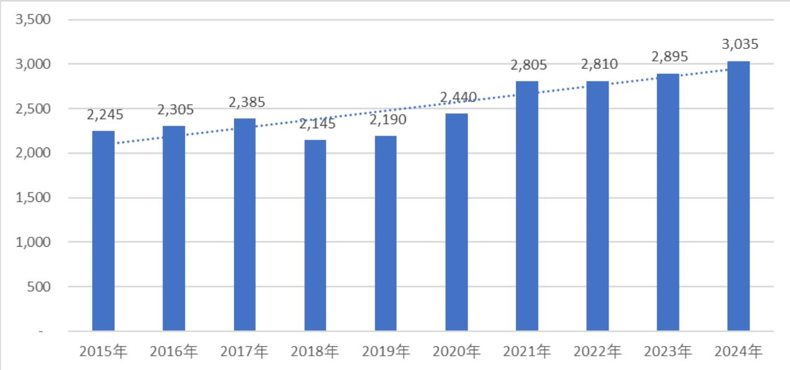  
数据来源：中国造纸协会

根据中国造纸协会统计数据显示，2024 年中国箱板纸生产量 3,035 万吨，2015年-2024年，国内箱板纸产量年均复合增长率为 $3 . 4 1 \%$ 。

箱板纸作为瓦楞纸箱的重要原材料之一，随着国民经济的持续发展，消费品、电商、物流及快递领域的需求将持续增长，未来箱板纸市场也将保持稳定增长态势。

# 2015年-2024年中国箱板纸消费量情况

单位：万吨   
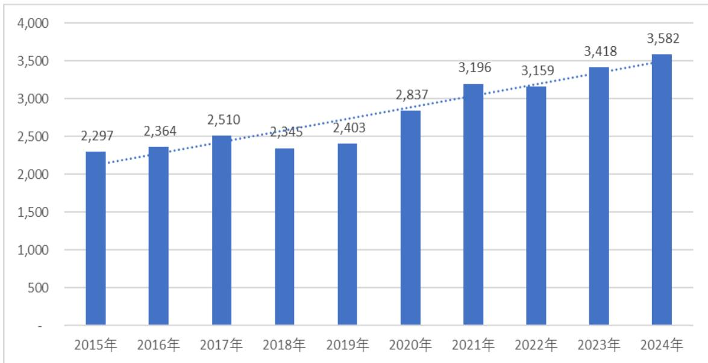  
数据来源：中国造纸协会

箱板纸与瓦楞纸关联度高，两者需求贴合度高，2015年-2024年箱板纸的消费量走势整体与瓦楞纸基本一致。根据中国造纸协会统计数据显示，2024 年中国箱板纸消费量为 3,582 万吨，较上一年增长 $4 . 8 0 \%$ ，2015-2024 年消费量年均复合增长率为 $5 . 0 6 \%$ 。

# 2020年-2024年中国箱板纸进出口情况对比

单位：万吨   
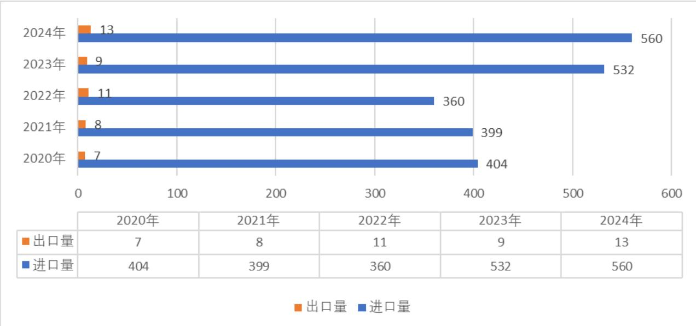  
数据来源：中国造纸协会

2024年中国箱板纸行业进口规模达到560万吨，出口规模仅为13万吨。进

口替代及出口量有巨大的市场空间。

单位：元/吨

2022 年-2024 年我国华东地区箱板纸价格走势（130g）  
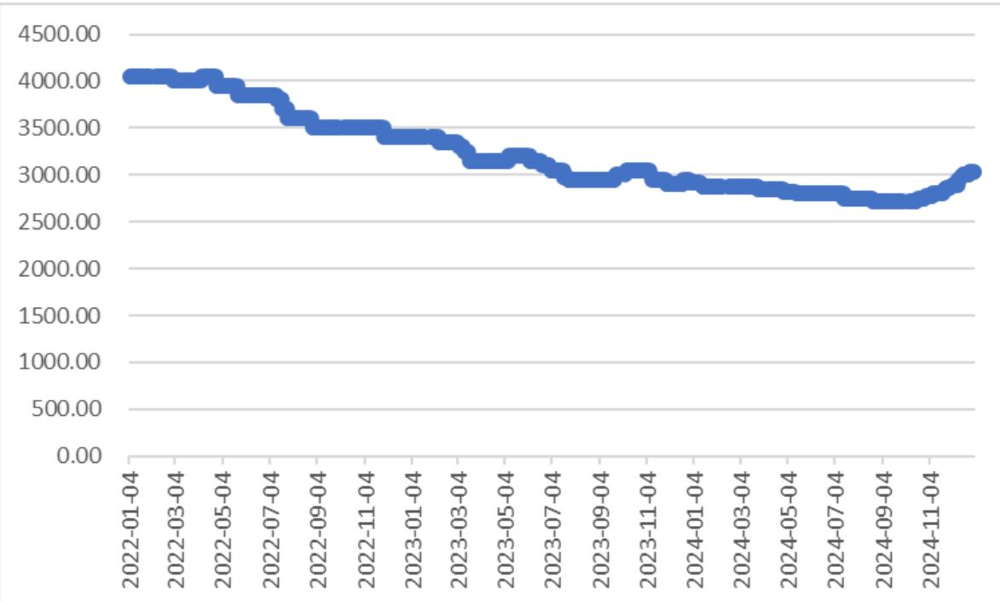  
数据来源：ifind

国内箱板纸价格走势波动较大，箱板纸与瓦楞纸关联度高，价格走势大致相同。报告期内国内箱板纸价格走势波动较大，2023 年初中国取消成品纸关税，箱板纸进口量大幅增加，叠加国内箱板纸供应增加与终端需求恢复节奏偏慢等因素影响，国内箱板纸价格出现较大幅度下降，2024 年国内经济增速放缓，下游消费市场需求疲软，箱板纸价格仍处于低位。

# 2、行业技术水平及特点

当前，正值新一轮科技革命和产业变革大潮与我国加快转变发展方式形成历史性交汇的重要节点，是造纸工业实现产业升级、由大变强、由快变好的重要时期，是实施创新驱动发展的关键时期。

目前，造纸行业正在加大新一代制浆、造纸技术的研发力度。诸如清洁分离技术、秸秆清洁制浆技术、废水回用技术等前沿技术研发。技术装备方面，以提升造纸装备制造能力，加快装备自动化、数控化、智能化进程，推动工艺技术研发与造纸、印刷装备制造融合，以科技创新，推动造纸工业转型升级。

发行人所处瓦楞纸、箱板纸细分行业技术已相对成熟稳定，生产设备的先进程度决定企业的技术水平和先进性，设备投资占比较高。行业内造纸企业的差异主要体现在成品纸的韧性、纤维结合度、纸张紧度、纸张弹性等物理指标。未来，瓦楞纸、箱板纸技术方向主要体现以下方面：

# （1）高车速、低定量、高强度、大宽幅

当前国内大多数瓦楞纸、箱板纸生产商规模较小，普遍生产中低强瓦楞纸、箱板纸，产品附加值低、产品质量稳定性不高。随着国内消费不断升级，消费者对造纸和纸制品的需求也会不断升级，行业未来必然会不断向高端化、高技术含量、高附加值方向发展。从市场需求来看，中高强度瓦楞纸、箱板纸需求量较大，低克重高强度瓦楞纸、箱板纸具有优异的产品性能，适用于大多数要求较高的包装产品，低定量、高强度、全规格方向是中国瓦楞纸行业发展的重要趋势之一。此外，国内纸机车速、宽幅较国外先进设备差距较大，国内高车速、大宽幅纸机主要依赖进口，为摆脱长期依赖进口的状况，设计生产高车速、大宽幅的纸机也是行业内企业未来发展方向。

# （2）设备自动化、智能化、数字化

随着科技的不断发展与进步，微电子、工业机器人、图像传感技术和新材料等正在不断地融入造纸行业。当前，国内造纸企业已逐步提升生产设备的智能化、自动化，并已初见成效。

生产效率高、自动化程度高、可靠性好、灵活性强、技术含量高的生产设备是行业内一直追求的目标，打造新型智能化的产线，并将其大规模应用于生产是行业未来发展的大方向。

# （3）绿色环保趋势

在提倡低碳循环经济的大趋势之下，推广绿色包装以及包装减量化得到社会的共识。从原料到包装的设计、制造，再到产品的使用回收，各环节都要求节源、高效、无害。随着中国企业环保意识的不断普及和深入，传统的印刷包装材料已经无法满足市场要求，积极研发绿色环保型包装材料正成为纸质印刷包装行业的发展趋势。纸制品包装行业整体向着减量化、再利用、可回收的方向发展，而绿色环保的瓦楞纸、箱板纸将为下游包装行业提供了最优选择。

# 3、行业进入壁垒

纸及纸制品行业作为资金密集型、技术密集型和规模效益型的产业，新进入企业一般将面临如下的壁垒：

# （1）资金壁垒

造纸业是资金密集行业，中国造纸业百元产值占用的固定资产与冶金、化工、石油工业相当，没有一定的资金支撑，难以参与和立足激烈的造纸行业市场竞争。现阶段，中国造纸行业的产业政策要求不断淘汰落后产能，新建生产线必须达到一定的规模，企业投资额须在数亿元以上，资金的规模和运转效率成为企业持续发展的首要问题。

另外，行业除了部分龙头企业外，中小企业产品主要集中在中低档，行业竞争较为激烈，行业平均利润空间较为有限，企业的成本控制能力非常重要。行业先入者由于具备一定的经济规模和上下游产业链配套等优势，在成本控制方面明显优于行业新入者，行业新入者的生存能力受到较大影响。

# （2）技术壁垒

造纸行业同样属于技术密集型领域，行业需要丰富的技术、生产经验和有技术的员工，新进入企业很难在短时间内形成规模，缺乏经验，并很难形成一套成熟的生产流程。区别于老式造纸技术与产线，现代化制浆造纸企业已拥有高度自动化生产线，关键设备的机械加工精度、密集的传感器及计算机控制系统，技术领域涉及植物化学、微生物学、流体力学、热力学、机械自动化、环境科学等多学科领域。

# （3）环保壁垒

造纸企业具有废水排放量多、治理难度大、资金投入大等特点，行业环保要求高。从 2007 年国家就开始制定节能减排方案，相关监管部门每年都公布具体的目标要求造纸行业淘汰落后产能。国家各部门均对造纸行业提出了节能减排、污染物排放标准规定，对新建企业以及新、改、扩建工程的治污能力更是提出严格达标排放标准，相关环保资质的审批更加严格。新的政策和排放标准的实施加快了一批环保设施不健全和标准低的瓦楞纸、箱板纸企业的淘汰进程，同时提高了瓦楞纸行业的环保准入门槛。

# （4）原材料供应壁垒

目前国内大多数瓦楞纸生产企业都以废纸为主要原材料。由于国内废纸回收所能产生的经济效益不明显等原因，国内废纸回收利用率还处于相对较低的水平，造纸纤维原料自给率不足，造成部分废纸原材料依赖进口的局面。2020年，我国颁布《关于全面禁止进口固体废物有关事项的公告》明确表示中国将于 2021 年起全面禁止洋废物的进口，国外废纸来源减少将加剧造纸企业原材料采购竞争，如果没有稳定的原料供应渠道则必然会影响到企业生产经营的正常开展。

# （5）行业准入壁垒

根据国家发改委《造纸产业发展政策》（2007年第71号文）中行业准入条件第 47 条：“新建、扩建制浆项目单条生产线起始规模要求达到：化学木浆年产 30 万吨、化学机械木浆年产 10 万吨、化学竹浆年产 10 万吨、非木浆年产 5万吨；新建、扩建造纸项目单条生产线起始规模要求达到：新闻纸年产 30 万吨、文化用纸年产 10 万吨、箱纸板和白纸板年产 30 万吨、其他纸板项目年产 10 万吨。薄页纸、特种纸及纸板项目以及现有生产线的改造不受规模准入条件限制。”

《中国造纸协会关于造纸工业“十三五”发展意见》（2017 年 6 月发布）指出，箱纸板项目新建起始规模为单条生产线30万吨/年及以上；瓦楞原纸及其他纸板项目新建起始规模为单条生产线10万吨/年及以上。上述政策皆为新进入企业提出了较高的进入门槛。

# 4、行业发展态势

# （1）行业准入门槛将进一步提高

面对资源短缺、能源紧张、环境污染等世界性难题，中国从国家可持续发展战略层面，通过出台产业政策、实施主要污染物排放总量控制、合理控制造纸行业发展规模、核算节能减排指标等措施对造纸行业进行引导，造纸行业及瓦楞纸细分行业在节能、环保、土地、安全、规模、技术、产品等方面的准入门槛将进一步提高。可以预见，造纸行业将进一步加快以节约资源、实现循环发展，提高能源利用率、实现低碳发展；实施清洁生产、实现污染物有效控制

及开发未来新产品等为目标的转型升级，循环发展将引领造纸工业持续发展，中国将从造纸大国向现代造纸强国转变。

# （2）企业规模化和集约化的进程将进一步加快

从国家政策和战略来看，国务院发布的《关于印发“十三五”节能减排综合工作方案的通知》中明确提出强化节能环保标准约束，严格行业规范、准入管理和节能审查，对电力、钢铁、建材、有色、化工、石油石化、船舶、煤炭、印染、造纸、制革、染料、焦化、电镀等行业中，环保、能耗、安全等不达标或生产、使用淘汰类产品的企业和产能，要依法依规有序退出。《中华人民共和国国民经济和社会发展第十四个五年规划和 2035 年远景目标纲要》、《关于推动轻工业高质量发展的指导意见》、《国务院关于加快建立健全绿色低碳循环发展经济体系的指导意见》、《中国造纸协会关于造纸工业“十三五”发展的意见》等相关产业政策对造纸行业提出了详细的环保要求和节能、环保、绿色发展方向。

在保障环保要求的基础上实现国家政策、规划提出的新要求，从根本上解决中国造纸业集中度过低、企业规模过小、产品同质化、低端化、污染严重、环保措施不力等问题，造纸行业及瓦楞纸细分行业势必进行结构调整，通过关、停、并、转、重组整合等方式，将污染严重的小纸厂淘汰出局，从而将市场份额及节能减排指标留给具有技术和规模优势的龙头企业和大中型高新技术企业，加快企业朝规模化、集约化方向发展。

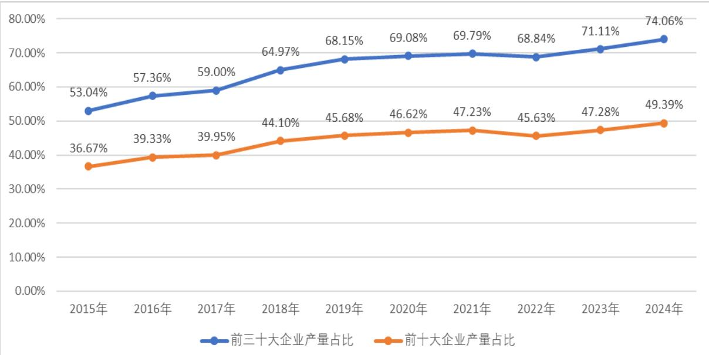  
2015年-2024年中国造纸行业产业集中度

数据来源：《中国造纸工业年度报告》，中国造纸协会

近年来，中国造纸行业龙头企业一方面通过引进国外先进技术和装备，提高了行业整体技术水平和生产能力，生产规模不断扩大，另一方面在全国范围内进行跨地区兼并整合，造纸企业向集团化和规模化方向发展，行业集中度持续提升。产业集中度上，行业前 10 名造纸企业的产量占同期全国产量的比重已从 2015 年的 $3 6 . 6 7 \%$ 增至 2024 年的 $4 9 . 3 9 \%$ ，行业前 30 位的企业产量占同期全国产量比重由 2015 年的 $5 3 . 0 4 \%$ 增加至 2024 年的 $7 4 . 0 6 \%$ ，行业集中度稳步提升。

十二五以来中国不断淘汰造纸行业落后产能，已经取得了一些效果，造纸行业及瓦楞纸行业产能还有继续淘汰的空间，不断淘汰落后产能也是行业集约化、规模化发展趋势的必然要求。

# （3）国内瓦楞纸、箱板纸行业向高强度方向发展是一大趋势

随着国内消费不断升级，消费者对造纸和纸制品的需求也会不断升级，行业未来必然会不断向高端化、高技术含量、高附加值方向发展。在瓦楞纸、箱板纸产品方面，瓦楞纸是一种低定量的薄轻纸，当前中国大多数瓦楞纸生产中小型企业瓦楞纸产品依然停留在低附加值、低产品质量等级的产品类型上，普遍生产中低强度瓦楞纸，而且规模不大。

从市场需求来看，中高强度瓦楞纸需求量较大，低克重高强度瓦楞纸具有优异的产品性能，适用于大多数要求较高的包装产品，低定量、高强度、全规格方向发展是中国瓦楞纸行业发展的重要趋势之一，未来原纸厂商将会不断开发和推广低克重高强度原纸。

# 5、行业面临机遇与风险

# （1）行业机遇

$\textcircled{1}$ 中国人均包装消费量明显低于全球水平，未来仍有较大提升空间

从总量的角度来看，尽管中国包装印刷市场规模增长较快，但从人均消费水平上看，2024 年中国人均纸制品消费量仅有 96.83 千克，远低于欧美发达国家150-300千克的标准，与全球主要国家及地区相比仍然存在较大差距，中国包装印刷行业的天花板远远没有达到，未来行业还存在较大发展潜力。随着人民

生活水平的提高，节能环保意识增强；储存运输包装随电商渗透率提升起量，中国的包装行业的市场规模有望扩大，供求结构也有望持续升级。

# $\textcircled{2}$ 宏观经济增长是包装用纸市场发展的重要基础

瓦楞纸和箱板纸作为制作瓦楞纸箱的主要原材料，与居民消费生活和社会经济发展程度紧密相连。近年来，我国经济持续保持较快增长，经济规模不断扩大，居民可支配收入不断提高。根据国家统计局公布的数据，从 2019 年到2024 年，国内 GDP 从 100.59 万亿元提升至 134.91 万亿元，2024 年全国居民人均可支配收入达 41,314 元，较 2019 年增长 $3 4 . 4 3 \%$ 。预计未来我国经济和居民可支配收入仍将维持在中等以上增长速度。居民人均可支配收入的增加和消费升级将进一步拉动对食品、家用电器、日化和物流等行业的整体消费量，进而带动瓦楞纸和箱板纸的市场需求。

单位：亿元、元

2019 年-2024 年中国国民总收入及居民人均可支配收入走势  
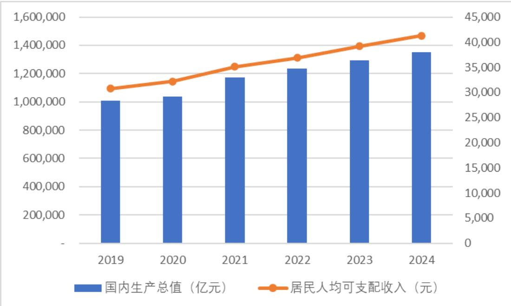  
数据来源：国家统计局

# $\textcircled{3}$ 电子商务的快速发展将有效推动瓦楞纸行业发展

根据国家统计局的数据显示，2024 年，我国电子商务交易额为 46.41 万亿元，较 2019 年增加 12.54 万亿元，增长 $3 7 . 0 1 \%$ 。互联网的迅速发展为电子商务带来了发展机遇，人们对网络购物接受程度不断提高，大量的快递包装需求给公司主要产品所在的箱板纸、瓦楞原纸细分市场带来了较大的发展空间。

单位：亿元

2019 年-2024 年中国电子商务交易额情况  
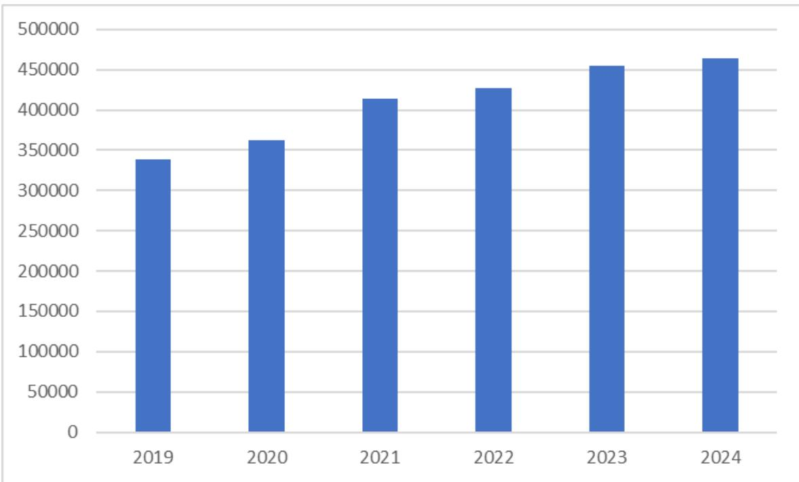  
数据来源：国家统计局

瓦楞纸和箱板纸作为重要的纸包装用原材料，快速发展的电子商务和互联网为纸制品包装行业提供了良好的外部环境，通过电商渠道，商品销售过程中催生大量外包装需求，直接有效的推动了纸制品包装行业的发展。

$\textcircled{4}$ 物流、快递行业的高速增长直接拉动瓦楞纸行业快速发展

物流产业作为国民经济的动脉系统，它连接经济的各个部门并使之成为一个有机的整体，其发展程度成为衡量一个国家现代化程度和综合国力的重要标志之一。

# 2019年-2024年中国快递业务量及业务收入

单位：万件、万元  
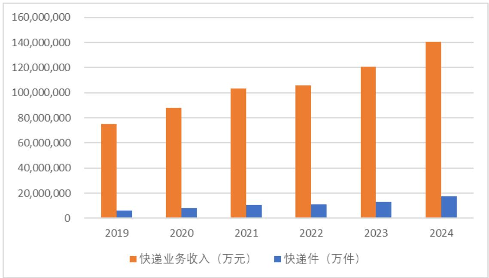  
数据来源：国家统计局

近年来随着电子商务的爆发式增长，我国快递行业发展突飞猛进，快递行业在电商引擎的高速驱动下仍将保持迅猛的发展势头。快速发展的中国电子商务极大地促进了快递业务的快速增长。2024 年，我国快递业务量达到 1,751 亿件，位居世界第一，快递业务收入完成 14,034.00 亿元，较 2019 年分别增长$1 7 5 . 6 5 \%$ 和 $8 7 . 1 7 \%$ ，海量的快递业务带来包装纸需求的增长。瓦楞纸和箱板纸作为重要的运输用外包装原材料，未来市场空间广阔。

# （2）行业风险

# $\textcircled{1}$ 宏观经济波动风险

公司所属的瓦楞纸、箱板纸行业与宏观经济发展息息相关，一定程度上受国内外宏观经济波动影响。目前国内外经济运行基本稳定，但如果国内外宏观经济波动导致下游客户需求减弱，行业未来景气度有所走低，瓦楞纸、箱板纸行业的发展将受到影响，进而对公司的财务状况和经营业绩造成不利影响。

# $\textcircled{2}$ 市场竞争风险

瓦楞纸、箱板纸行业是充分竞争性行业，国内瓦楞纸、箱板纸企业数量众多，但大多生产规模较小，而且这些企业以粗放型发展为主。同时，国内又存在一批拥有先进技术设备的大型造纸企业，如玖龙纸业、太阳纸业、理文造纸

等，这些规模较大的造纸生产企业，使公司面临一定的竞争压力。

# $\textcircled{3}$ 原材料价格波动风险

瓦楞纸、箱板纸生产所需的主要原材料为废纸，直接材料成本占主营业务成本的比例较高，原材料价格波动将直接影响公司产品的生产成本，是影响公司经营业绩的主要因素。

报告期内，受到行业政策、市场供需关系变动等多重因素影响，废纸市场价格波动较大。原纸生产商对于原材料品质、供应的及时性与稳定性亦有较高要求。若原材料价格的波动幅度过大或出现供应商无法及时供货的不利因素，公司采购成本及供应稳定性将受到直接影响，对公司成本管控、生产供应等方面带来一定的压力，进而影响公司整体经营业绩。

# $\textcircled{4}$ 环境保护风险

造纸行业为高排放行业之一，国家对造纸企业的排放问题一直非常重视，制定了严格的环保标准和规范。公司作为资源综合利用型生产企业，采取了多项措施降低污染物的排放量，并取得了较好的治理成效。随着社会的发展，环保要求亦会逐步提高，如果国家出台新的环保政策，持续提高造纸行业的环保要求，将增加公司的环保投入，从而提高公司经营成本，影响公司经营业绩。

# 6、行业特征

# （1）周期性

造纸行业与国民经济发展和社会文明息息相关，纸和纸板消费水平是衡量一个国家现代化和文明程度的重要标志之一。纸品需求具有较强的消费性特征，居民收入水平变动是纸品需求变动的主要影响因素，造纸行业的发展与中国宏观经济发展周期密切相关，瓦楞纸细分行业市场发展与国民经济发展增长趋势有一定关联性，不存在较为明显的经济周期性。

中国经济进入结构性调整阶段，经济增长速度有所放缓，未来中国经济将进入更加稳健的发展周期，GDP 在未来较长时期将保持增长，预示着中国造纸行业具有较长的景气周期，造纸行业未来也将保持较好的增长，发行人所处的瓦楞纸、箱板纸行业由于其为下游产品提供运输包装的配套性，因此在网络购

物快速发展、国内消费日益增长的形势下，发展前景依然向好。

# （2）季节性

瓦楞纸、箱板纸产品主要应用于各类商品的包装，属于为下游产品提供运输包装的配套产业，行业变化受到下游各消费领域的带动，下游各应用领域均无明显的季节性。近年来，电子商务在各行各业尤其是消费领域的渗透发展迅速，电商的发展直接对下游各类消费品及快递业务形成有效推动，除了各大电商平台“购物节”前1-2个月会对瓦楞纸、箱板纸行业销售形成较为强劲的带动外，电商行业其他月份发展较为平稳，电商行业同样不具备明显的季节性。此外，每年的国庆节和春节作为中国的两个长假期，会对行业及企业的当月度销售带来一定影响，但不会形成明显的季节性变化。

综上，瓦楞纸、箱板纸行业不具备明显的季节性变化。

# （3）区域性

根据中国造纸协会《中国造纸工业2024年度报告》，2024年我国东部地区11 个省（区、市），纸及纸板产量占全国纸及纸板产量比例为 $6 7 . 5 1 \%$ ；中部地区8个省（区）比例占 $1 9 . 1 4 \%$ ；西部地区 12个省（区市）比例占 $1 3 . 3 5 \%$ 。

2024年中国纸和纸板各地区产量占比情况  

<table><tr><td>分类</td><td>产量（万吨）</td><td>比例</td></tr><tr><td>纸和纸板产量</td><td>13,625</td><td>100.00%</td></tr><tr><td>东部地区</td><td>9,198</td><td>67.51%</td></tr><tr><td>中部地区</td><td>2,608</td><td>19.14%</td></tr><tr><td>西部地区</td><td>1,819</td><td>13.35%</td></tr></table>

数据来源：中国造纸协会

2024 年山东省、广东省、江苏省、浙江省、福建省、广西壮族自治区、湖北省、河南省、河北省、江西省、四川省、重庆市、安徽省、湖南省、天津市、山西省、辽宁省和海南省 18 个省（区、市）纸及纸板产量超过 100 万吨，产量合计13,228万吨，占全国纸及纸板总产量的 $9 7 . 0 9 \%$ 。

2024 年中国主要省（区、市）纸及纸板产量比例  
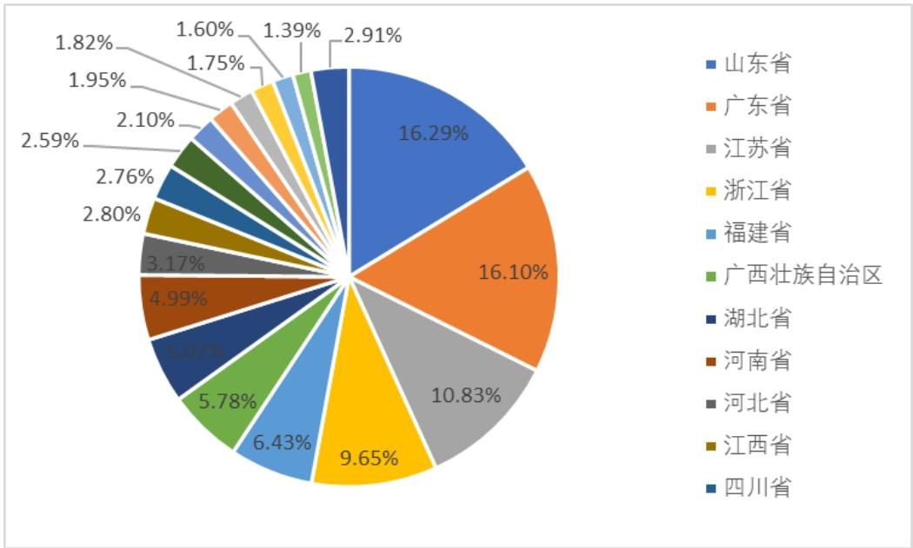  
数据来源：中国造纸协会

由以上数据可以看出，中国造纸行业存在明显的区域性特征，区域性分布同各地区经济发达程度呈正相关。作为造纸行业的主要细分领域，瓦楞纸行业区域分布特征与造纸行业特征具有一致性。

造纸产业和包装原纸行业的发展与国民经济发展水平的高度相关，长三角地区作为中国经济发展、消费增长和出口需求最为繁荣的区域之一，包装原纸企业市场扩展的空间大，中高档包装纸板需求集中，与珠三角地区，渤海湾地区，共同形成了三足鼎立之势，中国包装原纸存在着较为明显的区域性特征。

# 7、发行人所处行业与上、下游行业之间的关联性

发行人所处行业在整个造纸和纸制品行业产业链中居于中游位置，包装用纸分为白卡纸、白板纸、箱板纸和瓦楞纸等。箱板纸和瓦楞纸是生产瓦楞纸箱的主要原材料，瓦楞纸箱广泛应用于工业品与消费品的包装领域。上游主要是废纸回收行业，工业包装用纸下游主要是食品饮料、家用电器和消费电子等行业，消费品包装用纸下游主要是电商物流等行业。

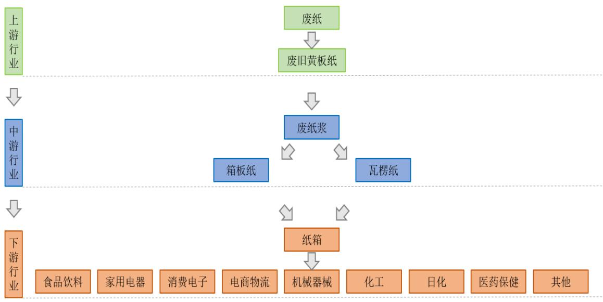

# （1）与上游行业的关联性

公司产品瓦楞纸和箱板纸属于废纸浆系产品，废纸是其生产的主要原料。从瓦楞纸和箱板纸的生产成本构成来看，废纸等原材料成本占比一般在 $70 \text{‰}$ -$80 \%$ 。因此，废纸收购价格变化对行业盈利能力有较大影响，废纸价格变动对公司产品销售价格传导明显。

近年来，随着国家对环境保护的日益重视，提倡资源循环综合利用，以及《废纸加工行业规范条件》、《再生资源回收管理办法》（2019 修订）等相关行业法律法规和鼓励政策的出台，废纸回收行业得到了快速的发展，对于发行人所处以废纸为主要原材料的造纸行业是重大利好影响。

# （2）与下游行业的关联性

行业下游是瓦楞纸箱包装行业，下游客户主要是瓦楞纸箱包装厂，最终客户主要是家电、消费电子、电商物流等利用纸箱对其产品进行包装的厂商。随着国家经济发展，家电电子、食品饮料、电商物流等行业快速发展，绿色包装环保意识和政策的推动，以及电子商务蓬勃崛起都对瓦楞纸包装的产生巨大需求。从中长期来看，瓦楞纸和箱板纸的需求将会稳步上升。

# 三、发行人在行业中的竞争地位

# （一）行业竞争格局

# 1、国内造纸企业产能主要集中在东部地区

国内瓦楞纸箱生产企业主要分布在下游工业及消费品制造业生产基地，珠三角、长三角、渤海湾等地区占据市场主要份额。近年来，随着西部开发、中部崛起等区域经济政策的实施，中西部制造业工业体系逐步完善，同时带动包括瓦楞纸箱在内的包装行业新建产能向中西部转移。根据中国造纸协会调查统计，2024 年全国纸及纸板生产企业约为 2,600 家，且产能多集中于国内东部地区，纸及纸板产量占全国产量比例为 $6 7 . 5 1 \%$ ；中部地区比例占 $1 9 . 1 4 \%$ ；西部地区占 $1 3 . 3 5 \%$ 。

2024年纸及纸板生产量区域分布情况  
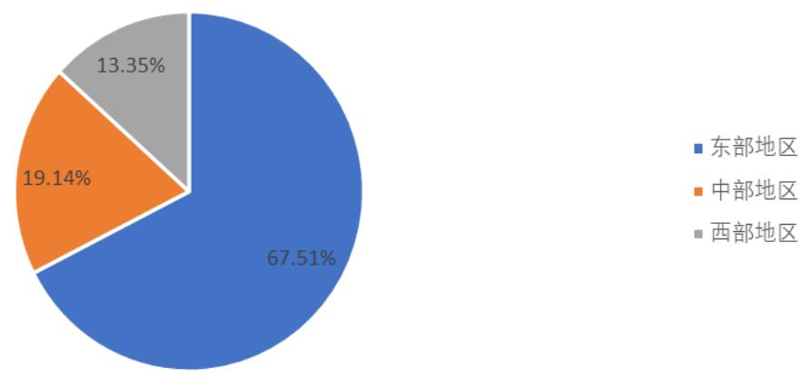  
数据来源：中国造纸协会

# 2、国内造纸企业众多，行业分散，市场集中度低

我国造纸企业众多，行业分散，市场集中度低，市场竞争激烈，但是拥有较高产能的大型造纸企业较少，产品同质化严重且产能多集中于中低端产品。近年来，随着国内不断地出台及完善造纸行业的相关法律法规及产业政策，行业准入门槛提高，生产工艺及技术水平要求不断增加，部分产能小、工艺水平落后的中小造纸企业被整合或被淘汰，造纸企业向集团化和规模化方向发展，行业集中度不断提升。

2024 年全国纸及纸板生产量为 13,625 万吨，行业前五名产量为 5,003.92 万

吨，占 2024 年总产量的比例为 $3 6 . 7 3 \%$ ，其他造纸企业共计 $6 3 . 2 7 \%$ ，行业前五名市场集中度较低，市场竞争较为激烈，随着环保政策的日渐趋严，“禁废令”“能耗双控”等政策的实施，环保压力和激烈的市场竞争使得造纸行业门槛进一步提高，市场集中度有望进一步提高。

2024年中国造纸行业市场竞争格局  
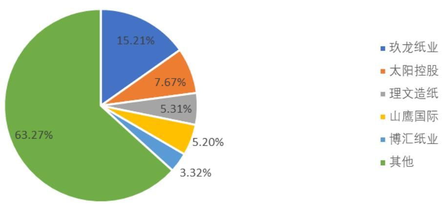  
数据来源：中国造纸协会

# 3、国内瓦楞纸细分市场竞争格局

2024 年国内瓦楞纸市场竞争激烈，瓦楞纸市场价格下降幅度较大，在低价竞争格局下，生产成本偏高的中小企业被加速淘汰，同时随着行业进入门槛的提升，大型造纸企业或上市企业纷纷增加产能，头部企业优势明显。根据中国造纸协会统计数据，2024 年产量 35 万吨以上瓦楞原纸主要生产企业前 5 名如下：

<table><tr><td>序号</td><td>企业名称</td></tr><tr><td>1</td><td>玖龙纸业（控股）有限公司</td></tr><tr><td>2</td><td>武汉金凤凰纸业有限公司</td></tr><tr><td>3</td><td>山鹰国际控股股份公司</td></tr><tr><td>4</td><td>山东世纪阳光纸业集团有限公司</td></tr><tr><td>5</td><td>联盛纸业（龙海）有限公司</td></tr></table>

数据来源：中国造纸协会

2024年公司瓦楞纸产量为30.46万吨，占全国瓦楞纸产量的比例为 $0 . 9 7 \%$ ，未来随着公司募投项目瓦楞原纸生产线的建成投产，公司瓦楞纸产量以及其占

全国瓦楞纸产量的比例将进一步提升。

# 4、国内箱板纸细分市场竞争格局

国内箱板纸市场与瓦楞纸市场竞争格局相同，主要市场份额仍由头部企业获得，市场竞争激烈。根据中国造纸协会统计数据，2024年产量50万吨以上箱板纸主要生产企业前 5名如下：

<table><tr><td>序号</td><td>企业名称</td></tr><tr><td>1</td><td>玖龙纸业（控股）有限公司</td></tr><tr><td>2</td><td>山鹰国际控股股份公司</td></tr><tr><td>3</td><td>理文造纸有限公司</td></tr><tr><td>4</td><td>山东太阳控股集团有限公司</td></tr><tr><td>5</td><td>荣成纸业（中国）控股有限公司</td></tr></table>

数据来源：中国造纸协会

2024年公司箱板纸产量为71.51万吨，占全国箱板纸产量的比例为 $2 . 3 6 \%$ ，未来随着公司募投项目箱板纸生产线的建成投产，公司箱板纸产量以及其占全国箱板纸产量的比例将进一步提升。

# （二）行业内主要竞争对手

发行人专注于瓦楞纸、箱板纸的研发、生产及销售，结合行业中竞争对手的产品结构、客户分布区域等因素，公司行业内主要竞争对手情况如下：

<table><tr><td>序号</td><td>企业名称</td><td>基本情况</td><td>主营产品</td></tr><tr><td>1</td><td>玖龙纸业(02689.HK)</td><td>玖龙纸业成立于1995年，总部位于中国广东省东莞市，2006年于中国香港联交所主板上市，目前为全球产能第一的造纸集团和浆纸一体化的龙头企业（主要产品为各类环保包装纸、高档全木浆纸及其上下游产业链，造纸年产能超2,300万吨。</td><td>牛卡纸、瓦楞芯纸、涂布白板纸、灰板纸、文化用纸、瓦楞纸板和纸箱等</td></tr><tr><td>2</td><td>太阳纸业(002078.SZ)</td><td>太阳纸业成立于2000年，于2006年在深交所中小板上市，太阳纸业是国内重要的综合性纸、浆产品供应商，企业合并纸、浆总产能达到1000万吨。2024年生产各类纸制品757万吨、纸浆144万吨。</td><td>双胶纸、铜版纸、溶解浆、牛皮箱板纸、淋膜原纸等</td></tr><tr><td>3</td><td>理文造纸(02314.HK)</td><td>理文造纸成立于1994年，2003年在中国香港联合交易所主板上市，为我国造纸龙头企业，主要从事包装纸、卫生纸和纸浆的生产与销售，</td><td>牛卡纸、涂布白板纸、瓦楞芯纸、卫生纸和木浆等</td></tr><tr><td></td><td></td><td>目前公司年产能逾900万吨。</td><td></td></tr><tr><td>4</td><td>山鹰国际(600567.SH)</td><td>山鹰国际成立于1999年,位于安徽省马鞍山市,2001年在上交所主板上市,为我国造纸龙头企业,主要从事原纸、纸板及纸制品包装的生产和销售,现有落地产能约812万吨。</td><td>箱板纸、瓦楞原纸、特种纸、纸板及纸制品包装等</td></tr><tr><td>5</td><td>景兴纸业(002067.SZ)</td><td>景兴纸业成立于1984年,于2006年在深交所中小板上市,为我国造纸百强企业,主要从事瓦楞纸、箱板纸和生活用纸的生产与销售。2024年生产原纸154.23万吨、生活用纸13.77万吨。</td><td>牛皮箱板纸、白面牛卡纸、高强度瓦楞原纸、生活用纸等系列产品</td></tr><tr><td>6</td><td>荣晟环保(603165.SH)</td><td>荣晟环保成立于1998年,位于浙江省平湖市,2017年在上交所主板上市,为浙江省机制纸及纸板产量居前十位的造纸企业之一,主要从事瓦楞纸、箱板纸和纸板的生产与销售。2024年原纸总产量79.83万吨,纸板产量1.99亿平方米。</td><td>牛皮箱板纸、高强瓦楞原纸和瓦楞纸板三大类包装纸板</td></tr><tr><td>7</td><td>金龙股份</td><td>金龙股份成立于2001年,是集废纸和废木纤维利用、热电联产、生态造纸、绿色包装和物流运输于一体的资源综合利用企业。2022年生产各类纸制品72.53万吨和瓦楞纸板2.87亿平方米。</td><td>包装用纸:灰板纸、白面牛卡纸和瓦楞原纸等;包装用纸制品:瓦楞纸板和瓦楞纸箱;生活用纸:卫生纸原纸、面巾纸原纸;热电联产:蒸汽和电力</td></tr><tr><td>8</td><td>森林包装(605500.SH)</td><td>森林包装成立于1998年,位于浙江省台州市,2020年在上交所主板上市,为我国包装百强企业,主要从事箱板纸和纸板的生产与销售。2024年主要产品牛皮箱板纸产量55.38万吨、瓦楞纸板2.34亿平方米。</td><td>牛皮箱板纸、瓦楞原纸、瓦楞纸板、水印纸箱、胶印纸箱、数码纸箱等</td></tr><tr><td>9</td><td>荣成环保</td><td>荣成环保成立于2003年,公司主要从事牛皮箱板纸、高强瓦楞纸原纸等中高档包装用纸及瓦楞纸板、瓦楞纸箱等绿色包装的研发、生产与销售。</td><td>牛皮箱板纸、高强瓦楞原纸、以及瓦楞纸板瓦楞纸箱等</td></tr><tr><td>10</td><td>龙源纸业</td><td>龙源纸业成立于2004年,注册资本12,000万元人民币,是以生产箱板纸和高强瓦楞纸为主的民营企业,河南省造纸行业十强企业。</td><td>瓦楞纸、箱板纸</td></tr><tr><td>11</td><td>金凤凰纸业</td><td>金凤凰纸业成立于2006年,注册资本3,200万元人民币,是专业生产工业包装纸的企业,目前拥有武汉和孝感两个生产基地。</td><td>高强楞原纸</td></tr></table>

数据来源：企业官网、定期报告、公开资料

# （三）发行人在行业中的竞争地位

根据中国造纸协会公布的《中国造纸工业 2024 年度报告》中的数据来看，2024 年度，全国纸和纸板生产企业数量约 2,600 家，其中年产 100 万吨以上的企业为 30 家。国内造纸企业大致可分为三个梯队，第一梯队为以玖龙纸业、太阳控股、理文造纸、山鹰国际 4 家为代表的年产量在 500 万吨以上的国内大型造纸企业，企业数量较少；第二梯队为以晨鸣纸业、博汇集团、荣成环保、华泰集团、中国纸业及林平发展为代表的一批中型造纸企业，数量为 26 家，年产量在100-500万吨之间；第三梯队为年产量在100万吨以下的中小型企业，企业数量众多。公司现有产能 115 万吨，2024 年公司原纸产量合计为 101.97 万吨，公司原纸产量在全国居于前列，是全国造纸企业产量前 30 名企业之一，产量在行业企业平均水平中处于领先地位。

根据中国造纸协会公布的造纸工业年度报告，2024 年发行人原纸产量占安徽省纸及纸板产量和全国纸及纸板产量的比例为 $3 5 . 6 5 \%$ 和 $0 . 7 5 \%$ 。未来随着募投项目建成投产，公司原纸合计生产能力将从 115 万吨/年增加至 235 万吨/年，发行人在原纸领域的市场地位和竞争力将进一步提升。

单位：万吨   

<table><tr><td>项目</td><td>2024 年度</td><td>2023 年度</td><td>2022 年度</td></tr><tr><td>安徽省纸及纸板产量</td><td>286.00</td><td>293.00</td><td>312.00</td></tr><tr><td>全国纸及纸板产量</td><td>13,625.00</td><td>12,965.00</td><td>12,425.00</td></tr><tr><td>发行人原纸产量</td><td>101.97</td><td>105.35</td><td>86.38</td></tr><tr><td>发行人原纸产量占安徽省纸及纸板产量比例</td><td>35.65%</td><td>35.96%</td><td>27.68%</td></tr><tr><td>发行人原纸产量占全国纸及纸板产量比例</td><td>0.75%</td><td>0.81%</td><td>0.70%</td></tr></table>

数据来源：中国造纸协会

从瓦楞纸和箱板纸具体产品来看，根据中国造纸协会发布的《中国造纸工业2024年度报告》，2024年瓦楞原纸产量35万吨以上的企业有13家，箱板纸产量 50 万吨以上的企业有 14 家。2024 年发行人瓦楞纸和箱板纸产量分别为30.46万吨和71.51万吨，瓦楞纸和箱板纸的市场占有率分别为 $0 . 9 7 \%$ 和 $2 . 3 6 \%$ 。根据《中国造纸工业 2024 年度报告》发行人箱板纸产量排名全国第九。公司现有产能 115 万吨，募投项目新增产能 120 万吨，其中 60 万吨预计将于 2026 年上半年投产，公司瓦楞纸和箱板纸合计产能将从 115 万吨/年增加至 235 万吨/年，

发行人在瓦楞原纸、箱板纸领域的市场地位将进一步提升。

发行人瓦楞纸、箱板纸产量占全国瓦楞纸、箱板纸产量的比例如下：

单位：万吨   

<table><tr><td>项目</td><td>2024 年度</td><td>2023 年度</td><td>2022 年度</td></tr><tr><td>全国瓦楞纸产量</td><td>3,145</td><td>2,915</td><td>2,770</td></tr><tr><td>全国箱板纸产量</td><td>3,035</td><td>2,895</td><td>2,810</td></tr><tr><td>发行人瓦楞纸产量</td><td>30.46</td><td>34.62</td><td>35.62</td></tr><tr><td>发行人箱板纸产量</td><td>71.51</td><td>70.73</td><td>50.76</td></tr><tr><td>发行人瓦楞纸产量占全国产量比例</td><td>0.97%</td><td>1.19%</td><td>1.29%</td></tr><tr><td>发行人箱板纸产量占全国产量比例</td><td>2.36%</td><td>2.44%</td><td>1.81%</td></tr></table>

数据来源：中国造纸协会

公司与同行业可比公司 2024年在营业收入、营业利润、产销量、市场占有率方面的对比情况如下：

单位：亿元、万吨  

<table><tr><td>项目</td><td>总营业收入</td><td>其中:原纸销售收入</td><td>营业利润</td><td>产量</td><td>销量</td><td>市场占有率</td></tr><tr><td>山鹰国际</td><td>292.29</td><td>195.93</td><td>-4.90</td><td>724.01</td><td>732.15</td><td>5.31%</td></tr><tr><td>景兴纸业</td><td>54.79</td><td>41.09</td><td>0.44</td><td>154.23</td><td>149.60</td><td>1.13%</td></tr><tr><td>荣晟环保</td><td>22.35</td><td>17.95</td><td>2.88</td><td>79.83</td><td>80.01</td><td>0.59%</td></tr><tr><td>森林包装</td><td>23.63</td><td>15.57</td><td>1.82</td><td>56.97</td><td>56.27</td><td>0.42%</td></tr><tr><td>林平发展</td><td>24.85</td><td>24.67</td><td>1.79</td><td>101.97</td><td>100.08</td><td>0.75%</td></tr></table>

注：同行业可比公司产销量数据为原纸产销量数据，原纸为瓦楞纸和箱板纸合计口径或按可比公司口径披露的原纸销售数据

2024 年公司原纸产销量以及市场占有率分别为 101.97万吨、100.08万吨和$0 . 7 5 \%$ ，低于同行业可比公司山鹰国际和景兴纸业，高于荣晟环保和森林包装。山鹰国际为我国包装纸龙头生产企业，生产基地较多，产品种类涵盖各类包装原纸、特种纸及纸板、纸箱等纸制品，销售收入较高；景兴纸业除了生产包装原纸外，还生产生活用纸导致其销售收入较高。荣晟环保和森林包装原纸产销量低于林平发展，但营业收入与发行人较为接近，主要系其营业收入中除原纸销售业务收入外，还包含纸板和纸箱业务收入所致。

营业利润方面，公司营业利润与森林包装较为接近，高于山鹰国际和景兴纸业，低于荣晟环保。山鹰国际受到设备开工率不足以及海外木浆供应意外事

件频发，进口木浆价格较高等因素影响导致其产品生产成本较高，同时该公司资产负债率较高、财务成本较高，导致其营业利润较低。景兴纸业不包含热电联产业务导致其成本较高，营业利润较低。荣晟环保受益于销售蒸汽的金额较大，其毛利率较高，同时原纸产品的毛利率也高于其他公司，因此营业利润较高。

公司与同行业可比公司在展业区域、生产工艺及设备、环保技术方面的对比情况如下：

<table><tr><td rowspan="2">项目</td><td rowspan="2">展业区域</td><td colspan="2">生产工艺及设备</td><td colspan="2">环保技术</td></tr><tr><td>生产工艺</td><td>设备</td><td>废水</td><td>废气</td></tr><tr><td>山鹰国际</td><td>目前在安徽马鞍山、浙江嘉兴、福建漳州、湖北荆州、广东肇庆、吉林扶余、安徽宿州（在建）布局七大造纸基地，公司国内造纸产能战略布局于华东、华南和华中及东北地区，辐射19省1市</td><td>废纸经碎解制浆处理成适合纸机用的成浆，经过网布成型、压榨、前烘、施胶、后烘、卷曲、分切入库</td><td>该公司在全国有七大生产基地，现有落地产能约812万吨</td><td>公司造纸板块污水处理系统采用了厌氧+好氧两级生化处理，部分地区增加芬顿、砂滤等装置，确保排水水质远低于各工厂环评要求的排放标准</td><td>采用成熟可靠的废气污染防治技术和设备实施超低排放改造，降低大气污染物排放浓度</td></tr><tr><td>景兴纸业</td><td>公司生产基地位于浙江省，产品销售主要集中在浙江、江苏和上海等华东地区</td><td>同上</td><td>截至2025年3月末，该公司包装原纸拥有7条生产线，合计产能135万吨/年</td><td>废水处理工艺为物化预处理一厌氧一好氧生物，废水经处理后达标排放</td><td>公司针对厂内污水站的厌氧塔、生化池、污泥房等进行密闭收集，其中厌氧塔产生的沼气直接送至平湖弘欣热电有限公司锅炉焚烧，其他废气采用“碱喷淋”或“喷淋吸收-生物滤床过滤+化学除臭”联合处理工艺处理</td></tr><tr><td>荣晟环保</td><td>公司生产基地位于浙江省，产品销售主要集中在浙江、江苏和上海等华东地区</td><td>同上</td><td>现有5条生产线,2022年底拥有原纸产能60万吨，其中两条为4600生产线</td><td>汇集池-斜网回收-气浮-预酸化-厌氧-耗氧-二沉池，深度处理工艺，可实现污水的达标排放，并且配套了中水回用系统，尽可能的回用处理后污水，以减少污染的排放</td><td>锅炉废气经过SNCR+PNCR脱硝、袋式除尘、湿电除尘、石灰石一石膏法脱硫等工艺处理后达标排放</td></tr><tr><td>森林包装</td><td>公司生产基地位于浙江省,产品销售主要集中在浙江、江苏和上海等华东地区</td><td>同上</td><td>现有3条生产线,原纸产能50万吨,其中两条为3800生产线</td><td>斜网+初沉池+循环调节池+厌氧塔+一段A/O+中沉池+二段A/O+二沉池,深度处理工艺,可实现污水的达标排放,并且配套了中水回用系统,尽可能的回用处理后污水,以减少污染的排放</td><td>锅炉燃烧烟气通过炉内脱硫+SNCR+SCR+布袋除尘器+大湿法脱硫+高效除尘除雾器+等离子多脱等工艺后,烟气处理尾气通过100米的烟囱高空排放</td></tr><tr><td>林平发展</td><td>公司生产基地位于安徽省,产品销售主要集中在安徽、江苏和浙江等华东地区</td><td>同上</td><td>公司现有5条生产线,原纸产能115万吨,其中4600生产线1条、4800生产线1条、5600生产线2条、6600生产线1条</td><td>公司污水处理系统采用了厌氧+好氧两级生化处理等预处理,污水达排放标准经污水管网进入园区污水处理厂深度处理</td><td>不凝气体经冷凝回收热量后排至室外,湿热空气经热回收后排放,沼气则收集后经管道送至热电联产项目中的锅炉燃烧进行循环利用;热电排放气体经SNCR+SCR脱硝、袋式除尘、湿电除尘、石灰石-石膏法脱硫等工艺处理后达标排放</td></tr></table>

在展业区域方面，山鹰国际在国内有七大生产基地，产品辐射范围广，涵盖 19 省 1 市；景兴纸业、荣晟环保和森林包装的生产基地均位于浙江省，产品销售主要集中在浙江、江苏和上海等华东地区。公司生产基地位于安徽省，产品销售主要集中在安徽、江苏和浙江等华东地区，与景兴纸业、荣晟环保和森林包装相近，主要业务围绕经济活动活跃的长三角和华东地区开展。

在生产工艺方面，瓦楞纸和箱板纸的生产工艺经过多年发展形成了较为成熟工艺流程，主要为废纸经碎解制浆处理成适合纸机用的成浆，经过网布成型、压榨、前烘、施胶、后烘、卷曲、分切入库。林平发展与可比公司相比不存在显著差异。

在生产设备方面，同行业可比公司山鹰国际和景兴纸业未披露其生产设备情况，仅披露了相关的产线或者产能信息。荣晟环保2022年底有5条生产线,拥

有原纸产能 60 万吨，其中两条为 4600 生产线。森林包装拥有 3 条生产线，原纸产能50万吨，其中两条为3800生产线。公司现有5条生产线，原纸产能115万吨，其中 4600 生产线 1 条、4800 生产线 1 条、5600 生产线 2 条、6600 生产线 1 条。公司原纸生产线中包含宽幅更宽、自动化程度更高的 5600 和 6600 生产线，另外，公司 PM8 产线建设 8600 产线，生产效率更高，具备一定的生产设备优势。

<table><tr><td>公司名称</td><td>2024年末机器设备账面价值（万元）</td><td>成新率</td></tr><tr><td>山鹰国际</td><td>1,929,446.31</td><td>64.21%</td></tr><tr><td>景兴纸业</td><td>231,920.27</td><td>55.84%</td></tr><tr><td>荣晟环保</td><td>37,861.51</td><td>44.95%</td></tr><tr><td>森林包装</td><td>31,329.23</td><td>31.68%</td></tr><tr><td>林平发展</td><td>53,103.52</td><td>52.84%</td></tr></table>

与同行业上市公司相比，发行人的机器设备成新率高于荣晟环保和森林包装，低于山鹰国际和景兴纸业。山鹰国际设备成新率较高主要系在浙江、广东以及华中等基地新建产能投产所致，景兴纸业设备成新率较高主要系其投资金额较大的马来西亚年产 80万吨废纸浆板项目和年产 12万吨天然抗菌高品质生活用纸项目于2022 年至2023年转固所致。整体来看，发行人生产设备自动化程度较高、生产设备成新率较高、具有一定的生产设备优势。

造纸行业的环保技术主要集中在废水和废气的处理上，目前行业内的废水和废气处理工艺较为成熟。在废水处理方面，林平发展与同行业可比公司废水处理均采用成熟的厌氧 $+$ 耗氧等工艺处理后达标排放。在废气处理方面，公司沼气收集后经管道送至热电联产项目中的锅炉燃烧进行循环利用，热电排放气体经 $_ { \mathrm { S N C R + S C R } }$ 脱硝、袋式除尘、湿电除尘、石灰石－石膏法脱硫等工艺处理后达标排放，同行业可比公司也对锅炉废气采用了类似的脱硫脱硝工艺处理后达标排放。

综上所述，2024 年公司原纸产量、销量、市场占有率以及营业收入分别为101.97 万吨、100.08 万吨、 $0 . 7 5 \%$ 和24.85 亿元。与同行业可比公司相比，发行人原纸产销量、营业收入和市场占有率均高于荣晟环保和森林包装，公司产销规模位于行业前列，具备一定的规模优势。公司生产设备中包含宽幅更宽、自

动化程度更高的 5600和6600生产线，产线的成新率高于荣晟环保和森林包装，具有一定的生产设备优势。同时受生产基地布局因素影响，公司客户集中在华东地区，与荣晟环保、景兴纸业、森林包装接近。

# （四）发行人的竞争优势与劣势

# 1、竞争优势

# （1）生产工艺及设备优势

坚持循环经济的可持续发展道路，公司引进了国外先进工艺技术和一流造纸设备，包括全套的制浆设备及工艺技术、干网在线清洗系统及三段供汽系统、浆料浓度控制系统、国际先进的 DCS 和智能 MCC 管控一体化自动控制系统等。公司机器设备自动化程度高，产品质量稳定性居行业前列，公司技术创新体系完善，研发条件齐全，开发投入稳定，具备较强的科研实力和持续创新能力。

公司拥有热电车间，利用浆渣、回收沼气及循环资源的再利用实施热电联产，实现全流程的资源综合利用；大力投资自建污水处理系统，引进先进设备和技术，实现厂区废水治理设施全面整合升级，通过全链条资源综合利用和环保投入实现节能减排和清洁生产的目的。

公司原纸生产线中包含宽幅更宽、自动化程度更高的 5600 和6600生产线，生产设备的成新率较高，具备一定的生产设备优势。

# （2）区位优势

# $\textcircled{1}$ 区域优势

公司生产基地位于安徽宿州萧县，地处淮海经济区中心区、位于环渤海和长三角经济圈过渡区，该地区是长江经济产业转移的重要承接地，起到承上启下的作用，地理位置优越。

公司销售半径可覆盖浙江、江苏、安徽、山东等地区，区域内制造业密集，包装用纸的需求旺盛，此外，公司所在安徽省是国家级家电生产基地，家电包装普遍采用瓦楞纸箱，对原纸需求较大，公司下游市场广阔。

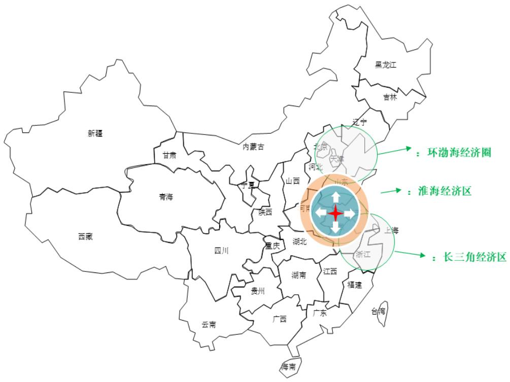  
$\textcircled{2}$ 原材料供应优势

区域优势直接为公司带来了原材料供应优势，公司所在周边城市废纸和能源资源充裕，为公司生产经营提供了便利条件，原料供应和对废弃资源的可再生利用均具备明显优势。在原材料废纸的供应方面，公司周边主要省市废纸产生量大，是良好的原料市场。在煤炭能源供应方面，公司周边拥有优质煤炭等动力原料供应，包括皖北、豫东、鲁西南等地区都拥有丰富的煤炭资源。

# （3）一体化生产优势

瓦楞纸、箱板纸的生产过程中需要多次烘干，耗费大量的蒸汽，此外，大型造纸机械对电力的消耗也很大。公司实施配套的热电联产项目，通过发电过程中产生的热蒸汽可以传输至造纸车间设备烘干部进行烘干，降低了生产成本，实现了资源的综合利用，还能通过对外销售部分蒸汽取得一定的收入，提高了公司的盈利能力。

# （4）环保优势

瓦楞纸、箱板纸作为重要的纸类包装产品之一，产品本身具备绿色环保、循环回收利用等优势属性，是公认的绿色环保包装产品，产品本身相对于其他包装材料环保优势明显。公司生产的瓦楞纸、箱板纸的原材料为废纸，生产过程中不产生黑液，废水量少，属于能耗低、轻污染的环保型用纸。

在环保设施方面，公司先后投入、引进先进工艺与设备，先后建设完成了20,000t/d 处理能力的污水处理站、日处理能力 20,000 吨的 EIC 高效厌氧反应器等，形成了污水自闭循环的污水处理系统。同时，公司配套了国内较为先进的污水处理设施，采用预处理 $^ +$ 厌氧 $^ +$ 好氧技术，公司污水预处理后排入园区污水处理系统，排放水质污染物含量低于纳网排放标准。公司被评为“安徽省清洁生产示范企业”、“安徽省绿色工厂”等荣誉，被工信部认定为 2022 年度绿色工厂。

# （5）技术及管理团队优势

公司积累并培养了一批优秀的技术研发、生产、销售和管理人才。公司通过引导职工不断学习新知识、掌握新技能，广泛开展研发创新、技术攻关和技术交流等各种活动，建设了一支学习型、技术型、创新型的人才队伍。公司通过不断完善人才激励制度，保证了公司人才队伍的稳定和行业竞争力。同时，公司重视人才引进工作，优化人才队伍。

在管理团队方面，公司核心管理团队成员均具有行业多年的从业经验。稳健高效的公司管理团队为公司的持续快速发展打下了良好的基础，能够基于公司的实际情况、市场变化情况和行业发展趋势制定符合公司长远发展的战略规划，能够对公司的研发、生产和营销等经营问题进行合理决策并有效实施。公司对技术研发、采购、生产和销售等环节追求并实施精细化管理，有效提升生产、管理效率，不断强化成本控制，保持企业市场竞争力。

# （6）循环经济模式带来的原料优势

公司重视可持续发展，采用循环经济发展模式，使用的原材料为废纸。一方面，公司产品投入流通领域使用以后即可通过回收成为下次生产的原料；另一方面，其他领域，如食品、医药、印刷用纸等使用林浆造纸投入使用也可回收用于生产包装原纸。通过循环使用，为原料供应提供源源不断的补充，使得公司原料得到充分的保障。

# （7）规模优势

工业包装用纸行业发挥规模效应才能更加有效的增强盈利能力，属于规模效应明显行业。根据《中国造纸工业 2024 年度报告》发行人箱板纸产量排名全

国第九，是中国造纸协会认定的造纸企业产量前 30 名企业之一，生产规模位于行业前列，与同行业可比公司相比具备一定的规模优势。

# （8）客户优势

公司深耕循环造纸行业二十余年，凭借稳定的产品质量、优质的客户服务，公司已经形成了相应的品牌影响力和竞争优势，与合兴包装（002228.SZ）、建发股份（600153.SH）、厦门国贸（600755.SH）、山鹰国际（600567.SH）、龙利得（300883.SZ）、无锡市胜源纸品有限公司等国内众多知名企业建立了稳定的合作关系。

# 2、竞争劣势

# （1）尚未形成全产业链

造纸行业属规模效益行业，具备完整产业链的企业更具规模优势，公司当前产能虽然在逐步扩张，并实现了热电联产、生态造纸，已达到 115 万吨瓦楞纸、箱板纸的生产能力，但公司尚不具备上游废纸回收和下游绿色包装于一体的完整产业链。同时，产能相较国内大型造纸企业数百万吨级、千万吨级产能仍有较大差距。当前，公司产品只有瓦楞纸、箱板纸产品，相较于其他国内主要竞争对手公司的产品多元化，公司单一的产品结构抗风险能力相对较弱。

# （2）融资渠道单一

造纸行业属于资金密集型行业，新产品、新生产基地的建设、生产设备的购置等均需要大量的长期资金投入，废纸和煤等原材料的采购也需要大量的流动资金。公司融资渠道单一，主要依赖自身积累和银行信贷，缺乏持续、大量的长期资金支持，产能增长相对缓慢。后续发展资金不足将可能制约公司未来的发展潜力，融资渠道单一将制约公司的发展速度。

# （3）销售区域集中于华东地区

同行业可比公司龙头企业山鹰国际造纸产能战略布局于华东、华南和华中及东北地区，辐射 19 省 1 市，产品销售覆盖范围广。公司生产基地位于安徽省，产品销售集中在安徽省、江苏省和浙江省等华东地区，客户主要位于华东区域，

销售区域与荣晟环保、景兴纸业、森林包装接近，与山鹰国际等行业龙头公司的全国化布局仍存在一定差距。

# （五）主要产品的销售价格变动情况

报告期内，发行人主要产品平均销售价格情况如下：

单位：元/吨   

<table><tr><td rowspan="2">产品类别</td><td colspan="2">2025年1-6月</td><td colspan="2">2024年度</td><td colspan="2">2023年度</td><td>2022年度</td></tr><tr><td>均价</td><td>增长率</td><td>均价</td><td>增长率</td><td>均价</td><td>增长率</td><td>均价</td></tr><tr><td>瓦楞纸</td><td>2,316.41</td><td>-1.94%</td><td>2,362.15</td><td>-5.77%</td><td>2,506.84</td><td>-19.94%</td><td>3,131.39</td></tr><tr><td>箱板纸</td><td>2,445.79</td><td>-2.55%</td><td>2,509.68</td><td>-7.30%</td><td>2,707.46</td><td>-20.55%</td><td>3,407.95</td></tr></table>

2023 年初中国取消成品纸关税，瓦楞纸和箱板纸进口量大幅增加，叠加国内瓦楞纸和箱板纸供应增加与终端需求恢复节奏偏慢等因素影响，国内瓦楞纸和箱板纸价格出现较大幅度下降，2024 年国内经济增速放缓，下游消费市场需求疲软，行业内企业竞争加剧，瓦楞纸和箱板纸的产品销售均价有所下降。

# （六）同行业可比公司对比情况

# 1、业务模式、客户分布范围、市场地位和经营情况对比

报告期内，公司收入和利润主要来源于瓦楞纸和箱板纸的生产、销售，为确保业务、数据的可比性，公司选取可比上市公司的标准为：

（1）以瓦楞纸、箱板纸等原纸以及下游纸制品生产销售为主营业务的A股上市公司；  
（2）可比产品的相关数据便于从公开渠道获取。

根据上述标准，公司选取的同行业可比公司为森林包装（605500.SH）、山鹰国际（600567.SH）、荣晟环保（603165.SH）和景兴纸业（002067.SZ）。

根据公开资料，公司与同行业可比公司业务模式、客户分布范围、市场地位和经营情况具体对比情况如下：

<table><tr><td>项目</td><td>业务模式</td><td>客户分布范围</td><td>市场地位</td><td>经营情况</td></tr><tr><td>山鹰国际(600567.SH)</td><td>以生产销售瓦楞纸和箱板纸等原纸及</td><td>全国有七大基地、客户主要集中在华</td><td>公司建有七大造纸基地，现有落地产能约812万吨，位列中国第二；公司包装板块企业布局于沿江</td><td>2024年实现营业收入292.29亿元，归属于上市公司股东的净利</td></tr><tr><td></td><td>下游纸制品为主要利润来源</td><td>东、华南和华中等地区</td><td>沿海经济发达地区，贴近行业头部客户聚集地，产业辐射江苏、浙江、安徽、福建、广东、湖北、山东、四川、天津、贵州等省市，年产量超过20亿平方米，位居中国第二</td><td>润-4.50亿元；其中原纸实现销售收入195.93亿元，销量732.15万吨</td></tr><tr><td>森林包装(605500.SH)</td><td>以生产销售瓦楞纸和箱板纸等原纸及下游纸制品为主要利润来源</td><td>客户集中在江苏浙江为主的华东地区</td><td>据2022年《印刷经理人》杂志发布的信息，公司位列全国包装企业第22名</td><td>2024年实现营业收入23.62亿元，净利润1.93亿元；其中瓦楞纸及箱板纸实现销售收入15.57亿元，销量56.27万吨</td></tr><tr><td>荣晟环保(603165.SH)</td><td>以生产销售瓦楞纸和箱板纸等原纸及下游纸制品为主要利润来源</td><td>客户集中在江苏浙江为主的华东地区</td><td>公司为浙江省机制纸及纸板产量居前十位的造纸企业之一</td><td>2024年实现营业收入22.35亿元，净利润2.86亿元；其中原纸实现销售收入17.95亿元，销量为80.01万吨</td></tr><tr><td>景兴纸业(002067.SZ)</td><td>以生产销售瓦楞纸和箱板纸等原纸及下游纸制品为主要利润来源</td><td>客户集中在江苏浙江为主的华东地区</td><td>公司为浙江省机制纸及纸板产量居前十位的造纸企业之一，并名列全国造纸百强企业之一</td><td>2024年实现营业收入54.79亿元，净利润0.71亿元；其中原纸实现销售收入41.09亿元，销量为149.60万吨</td></tr><tr><td>林平发展</td><td>以生产销售瓦楞纸和箱板纸为主要收入及利润来源</td><td>客户集中在以安徽、江苏为主要地区的华东地区</td><td>公司目前拥有5条生产线，瓦楞纸和箱板纸设计生产能力合计达115万吨，产量水平在行业企业平均水平中处于领先地位</td><td>2024年度销售原纸100.08万吨，实现营业收入24.85亿元、净利润1.53亿元</td></tr></table>

# 2、技术实力、衡量核心竞争力的关键业务数据对比

通过选取研发投入、研发投入占营业收入比重、研发人数、研发人数占员工总数比重等作为衡量技术实力的指标；选取原纸主营业务收入、原纸综合毛利率等作为衡量核心竞争力的指标与同行业进行对比。公司与同行业可比公司2024年度的关键业务数据对比如下：

单位：万元  

<table><tr><td>项目</td><td>山鹰国际</td><td>景兴纸业</td><td>森林包装</td><td>荣晟环保</td><td>林平发展</td></tr><tr><td>研发投入</td><td>84,409.72</td><td>17,116.85</td><td>8,211.27</td><td>12,167.54</td><td>8,379.72</td></tr><tr><td>研发投入占比</td><td>2.86%</td><td>3.12%</td><td>3.48%</td><td>5.44%</td><td>3.37%</td></tr><tr><td>研发人数</td><td>1,392</td><td>268</td><td>233</td><td>132</td><td>104</td></tr><tr><td>研发人数占比</td><td>10.21%</td><td>12.29%</td><td>13.16%</td><td>12.56%</td><td>11.17%</td></tr><tr><td>营业收入</td><td>1,959,299.92</td><td>410,888.32</td><td>155,725.09</td><td>179,522.03</td><td>246,695.33</td></tr><tr><td>毛利率</td><td>4.71%</td><td>7.72%</td><td>10.59%</td><td>13.45%</td><td>9.18%</td></tr></table>

注：营业务收入、毛利率选取各同行业原纸产品收入、毛利率数据，数据来源于可比公司2024年定期报告。

# 四、发行人销售和主要客户情况

# （一）主要产品的销售收入及构成情况

报告期内，公司主营业务收入按产品分类情况如下：

单位：万元  

<table><tr><td rowspan="2">项目</td><td colspan="2">2025年1-6月</td><td colspan="2">2024年度</td><td colspan="2">2023年度</td><td colspan="2">2022年度</td></tr><tr><td>金额</td><td>占比</td><td>金额</td><td>占比</td><td>金额</td><td>占比</td><td>金额</td><td>占比</td></tr><tr><td>瓦楞纸</td><td>34,669.16</td><td>28.51%</td><td>71,465.47</td><td>28.97%</td><td>87,175.23</td><td>31.30%</td><td>111,555.72</td><td>38.85%</td></tr><tr><td>箱板纸</td><td>86,930.05</td><td>71.49%</td><td>175,229.87</td><td>71.03%</td><td>191,330.79</td><td>68.70%</td><td>175,570.21</td><td>61.15%</td></tr><tr><td>合计</td><td>121,599.21</td><td>100.00%</td><td>246,695.33</td><td>100.00%</td><td>278,506.02</td><td>100.00%</td><td>287,125.93</td><td>100.00%</td></tr></table>

报告期内，公司主营业务收入主要来自于瓦楞纸和箱板纸产品，主营业务收入金额分别为 287,125.93 万元、278,506.02 万元、246,695.33 万元和 121,599.21万元。2023 年初中国取消成品纸关税，瓦楞纸和箱板纸进口量大幅增加，叠加国内瓦楞纸、箱板纸供应增加与终端需求恢复节奏偏慢等因素影响，国内瓦楞纸和箱板纸价格出现较大幅度下降，2024 年国内经济增速放缓，下游消费市场需求疲软，瓦楞纸和箱板纸销售均价有所下降；同时 2024 年受到受台风“贝碧嘉”影响，公司厂房及仓库被淹，生产车间检修及停产超过 30 天，2024 年 10月下旬方全部复产，相应的产品销量较 2023 年有所下降，上述因素导致公司2023年和2024年主营业务收入较其上一年主营业务收入有所下降。

# （二）主要产品的产能、产量及销量情况

报告期内，发行人主要产品的产能、产量及销量情况如下：

单位：吨   

<table><tr><td>产品名称</td><td>产能</td><td>产量</td><td>产能利用率</td><td>销量</td><td>产销率</td></tr></table>

2025 年 1-6 月  

<table><tr><td>瓦楞纸</td><td>187,500.00</td><td>156,360.94</td><td>83.39%</td><td>149,667.36</td><td>95.72%</td></tr><tr><td>箱板纸</td><td>400,000.00</td><td>373,891.09</td><td>93.47%</td><td>355,426.65</td><td>95.06%</td></tr></table>

2024 年度  

<table><tr><td>瓦楞纸</td><td>400,000.00</td><td>304,598.18</td><td>76.15%</td><td>302,544.74</td><td>99.33%</td></tr><tr><td>箱板纸</td><td>800,000.00</td><td>715,080.89</td><td>89.39%</td><td>698,216.61</td><td>97.64%</td></tr></table>

2023 年度  

<table><tr><td>瓦楞纸</td><td>400,000.00</td><td>346,174.81</td><td>86.54%</td><td>347,749.74</td><td>100.45%</td></tr><tr><td>箱板纸</td><td>800,000.00</td><td>707,330.65</td><td>88.42%</td><td>706,680.73</td><td>99.91%</td></tr></table>

2022 年度  

<table><tr><td>瓦楞纸</td><td>450,000.00</td><td>356,200.27</td><td>79.16%</td><td>356,249.84</td><td>100.01%</td></tr><tr><td>箱板纸</td><td>500,000.00</td><td>507,564.48</td><td>101.51%</td><td>515,178.84</td><td>101.50%</td></tr></table>

注 1：2023 年瓦楞纸产能下降系公司年产 5万吨的 3800 瓦楞纸生产线因生产效率较低，无法满足生产需要，相关生产线已经提完折旧，公司拟对其进行处置。  
注2：6600生产线正式投产导致 2023年箱板纸产能增加。  
注3:2025年3月，公司年产5万吨的4000瓦楞纸生产线因购置时间较早，生产效率较低，无法满足生产需要，相关生产线残值较低，公司拟对其进行处置。

报告期内，公司主要产品的产能利用率较高、公司按照以销定产的模式进行自主生产，产销率整体保持较高水平。未来，随着公司业务持续发展，市场规模持续扩张，公司主要产品的产销量将进一步增加。

# （三）向前五名客户销售情况

报告期内，公司前五名客户的销售情况如下：

单位：万元  

<table><tr><td>序号</td><td>客户名称</td><td>销售内容</td><td>客户类型</td><td>销售金额</td><td>占主营业务收入比例</td></tr></table>

2025 年 1-6 月  

<table><tr><td>1</td><td>厦门合兴包装印刷股份有限公司</td><td>瓦楞纸、箱板纸</td><td>直接客户</td><td>6,695.27</td><td>5.51%</td></tr><tr><td>2</td><td>厦门国贸集团股份有限公司</td><td>瓦楞纸、箱板纸</td><td>贸易商客户</td><td>4,072.43</td><td>3.35%</td></tr><tr><td>3</td><td>山东新兴华环保科技材料有限公司</td><td>瓦楞纸、箱板纸</td><td>直接客户</td><td>3,925.38</td><td>3.23%</td></tr><tr><td>4</td><td>宝艺新材料股份有限公司</td><td>瓦楞纸、箱板纸</td><td>直接客户</td><td>3,392.98</td><td>2.79%</td></tr><tr><td>5</td><td>无锡市胜源纸品有限公司</td><td>瓦楞纸、箱板纸</td><td>直接客户</td><td>3,197.81</td><td>2.63%</td></tr></table>

<table><tr><td>合计</td><td>-</td><td>-</td><td>21,283.87</td><td>17.50%</td></tr></table>

2024 年度  

<table><tr><td>1</td><td>厦门国贸集团股份有限公司</td><td>瓦楞纸、箱板纸</td><td>贸易商客户</td><td>11,326.09</td><td>4.59%</td></tr><tr><td>2</td><td>无锡市胜源纸品有限公司</td><td>瓦楞纸、箱板纸</td><td>直接客户</td><td>11,015.86</td><td>4.47%</td></tr><tr><td>3</td><td>厦门建发股份有限公司</td><td>瓦楞纸、箱板纸</td><td>贸易商客户</td><td>7,753.61</td><td>3.14%</td></tr><tr><td>4</td><td>厦门合兴包装印刷股份有限公司</td><td>瓦楞纸、箱板纸</td><td>直接客户</td><td>6,962.17</td><td>2.82%</td></tr><tr><td>5</td><td>宝艺新材料股份有限公司</td><td>瓦楞纸、箱板纸</td><td>直接客户</td><td>4,889.26</td><td>1.98%</td></tr><tr><td colspan="2">合计</td><td>-</td><td></td><td>41,947.00</td><td>17.00%</td></tr></table>

2023 年度  

<table><tr><td>1</td><td>厦门国贸集团股份有限公司</td><td>瓦楞纸、箱板纸</td><td>贸易商客户</td><td>19,243.51</td><td>6.91%</td></tr><tr><td>2</td><td>厦门合兴包装印刷股份有限公司</td><td>瓦楞纸、箱板纸</td><td>直接客户</td><td>15,762.78</td><td>5.66%</td></tr><tr><td>3</td><td>厦门建发股份有限公司</td><td>瓦楞纸、箱板纸</td><td>贸易商客户</td><td>10,312.18</td><td>3.70%</td></tr><tr><td>4</td><td>无锡市胜源纸品有限公司</td><td>瓦楞纸、箱板纸</td><td>直接客户</td><td>8,858.06</td><td>3.18%</td></tr><tr><td>5</td><td>山鹰国际控股股份有限公司</td><td>瓦楞纸、箱板纸</td><td>直接客户</td><td>6,041.68</td><td>2.17%</td></tr><tr><td colspan="2">合计</td><td>-</td><td></td><td>60,218.22</td><td>21.62%</td></tr></table>

2022 年度  

<table><tr><td>1</td><td>无锡市胜源纸品有限公司</td><td>瓦楞纸、箱板纸</td><td>直接客户</td><td>21,048.45</td><td>7.33%</td></tr><tr><td>2</td><td>厦门国贸集团股份有限公司</td><td>瓦楞纸、箱板纸</td><td>贸易商客户</td><td>17,880.16</td><td>6.23%</td></tr><tr><td>3</td><td>厦门合兴包装印刷股份有限公司</td><td>瓦楞纸、箱板纸</td><td>直接客户</td><td>17,133.51</td><td>5.97%</td></tr><tr><td>4</td><td>厦门建发股份有限公司</td><td>瓦楞纸、箱板纸</td><td>贸易商客户</td><td>7,629.53</td><td>2.66%</td></tr><tr><td>5</td><td>安徽意达包装有限公司</td><td>瓦楞纸、箱板纸</td><td>直接客户</td><td>6,539.05</td><td>2.28%</td></tr><tr><td colspan="2">合计</td><td>-</td><td></td><td>70,230.71</td><td>24.46%</td></tr></table>

注：客户为合并口径，具体情况如下：  
1、厦门合兴包装印刷股份有限公司包含：上海合道纸业包装有限公司、南京合兴包装印刷有限公司；  
2、山鹰国际控股股份公司包含：合肥祥恒包装有限公司、江苏玖润包装有限公司、马鞍山祥恒包装有限公司、苏州山鹰纸业纸品有限公司、祥恒（常州）包装有限公司、祥恒（嘉善）包装有限公司、祥恒（天津）包装有限公司、扬州祥恒包装有限公司、宿迁祥恒包装有限公司、祥恒（杭州）包装有限公司、浙江祥恒包装有限公司；  
3、厦门国贸集团股份有限公司包含：广州启润纸业有限公司、广州启润纸业有限公司海盐分公司、广州启润纸业有限公司苏州分公司、厦门国贸纸业有限公司；  
4、无锡市胜源纸品有限公司包含：湖北胜源纸品有限公司、江苏胜源纸品有限公司、昆山市胜源新环保纸业有限公司、南通市利源纸品有限公司、宁波市胜源纸品有限公司、绍兴市利源纸品有限公司、舒城胜源纸品有限公司；  
5、厦门建发股份有限公司包含：安徽建发纸业有限公司、江苏建发纸业有限公司、青岛建发纸业有限公司、上海建发纸业有限公司、天津建发纸业有限公司、西安建发纸业有限公

司、浙江建发纸业有限公司、浙江新纸源工贸有限公司、郑州国通纸业有限公司；

6、山东新兴华环保科技材料有限公司包含亳州新兴华包装有限公司、安徽兴华智能包装科技有限公司、淮安新鑫华包装科技有限公司、临沂旭诚商贸有限公司、临沂兴华包装有限公司、青岛兴华锦盛包装科技有限公司。

报告期内，公司的客户分布较为分散，不存在单个客户的销售占比超过 $50 \%$ 的情形，公司对主要客户不存在严重依赖。截至本招股说明书签署日，公司与前五名客户之间不存在关联关系。公司董事、监事、高级管理人员和其他核心技术人员、主要关联方或持有发行人 $5 \%$ 以上股份的股东，在上述客户中未占有任何权益。

# 五、发行人采购和主要供应商情况

# （一）主要产品的原材料及能源采购情况

公司生产所需的原材料主要包括废纸、淀粉。主要能源采购为煤炭，煤炭主要供给热电车间生产电力和蒸汽。

报告期内，公司主要原材料和能源采购情况如下：

单位：万元  

<table><tr><td rowspan="2">类别</td><td colspan="2">2025年1-6月</td><td colspan="2">2024年度</td><td colspan="2">2023年度</td><td colspan="2">2022年度</td></tr><tr><td>金额</td><td>比重</td><td>金额</td><td>比重</td><td>金额</td><td>比重</td><td>金额</td><td>比重</td></tr><tr><td>废纸</td><td>78,530.14</td><td>75.68%</td><td>157,700.45</td><td>75.85%</td><td>169,690.70</td><td>75.41%</td><td>192,264.00</td><td>75.93%</td></tr><tr><td>淀粉</td><td>5,225.26</td><td>5.04%</td><td>9,376.12</td><td>4.51%</td><td>10,945.63</td><td>4.86%</td><td>10,587.96</td><td>4.18%</td></tr><tr><td>煤</td><td>9,151.58</td><td>8.82%</td><td>25,153.74</td><td>12.10%</td><td>30,702.19</td><td>13.64%</td><td>36,495.04</td><td>14.41%</td></tr><tr><td>总计</td><td>92,906.97</td><td>89.54%</td><td>192,230.32</td><td>92.45%</td><td>211,338.53</td><td>93.91%</td><td>239,347.01</td><td>94.53%</td></tr></table>

注：公司采购的其他原材料包含再生纸浆、纸管、助留剂和黄色染料等化工辅料以及毛布、网子和五金配件等，品种较多，单类产品的采购金额较低。报告期内，其他原材料中采购金额最大的再生纸浆占总体采购金额的比例分别为 $1 . 2 7 \%$ 、 $0 . 7 7 \%$ 、 $1 . 2 5 \%$ 、 $1 . 3 3 \%$ 。

报告期内公司主要原材料废纸、淀粉以及主要能源煤炭的采购金额合计分别为 239,347.01 万元、211,338.53 万元、192,230.32 万元和 92,906.97 万元，占原材料的采购比例分别为 $9 4 . 5 3 \%$ 、 $9 3 . 9 1 \%$ 、 $9 2 . 4 5 \%$ 和 $8 9 . 5 4 \%$ 。2025 年 1-6 月采购比例下降主要系煤炭采购单价下跌，同时资源综合利用热电联产一期项目投产，该项目使用工业固废作为燃料生产蒸汽和电力，替代了部分煤炭的使用所致。

# （二）主要原材料采购价格变化情况

报告期内，公司主要原材料价格及变动情况如下：

单位：元/吨   

<table><tr><td rowspan="2">类别</td><td colspan="2">2025年1-6月</td><td colspan="2">2024年度</td><td colspan="2">2023年度</td><td>2022年度</td></tr><tr><td>单价</td><td>变化率</td><td>单价</td><td>变化率</td><td>单价</td><td>变化率</td><td>单价</td></tr><tr><td>废纸</td><td>1,544.99</td><td>-2.59%</td><td>1,586.07</td><td>-4.46%</td><td>1,660.19</td><td>-26.69%</td><td>2,264.76</td></tr><tr><td>淀粉</td><td>2,470.00</td><td>-6.89%</td><td>2,652.86</td><td>-7.86%</td><td>2,879.08</td><td>0.54%</td><td>2,863.49</td></tr></table>

2023 年初中国取消进口纸浆关税，再生纸浆进口量大幅增加，叠加终端需求恢复节奏偏慢等因素影响，国内废纸价格出现较大幅度下降，2024 年国内经济增速放缓，下游消费市场需求疲软，废纸价格仍处于低位。2024 年上游原材料玉米价格下降，同时下游养殖行业利润下降，需求减弱，玉米淀粉市场价格整体呈下降趋势。报告期内，公司废纸和淀粉采购价格变动趋势与市场价格变动趋势基本一致。

# （三）能源消耗及其价格变动情况

公司生产主要能源消耗为电力和煤炭。报告期内，公司主要能源采购情况如下：

单位：万元、万度、元/度、吨、元/吨   

<table><tr><td rowspan="2">项目</td><td colspan="3">2025年1-6月</td><td colspan="3">2024年度</td></tr><tr><td>金额</td><td>数量</td><td>单价</td><td>金额</td><td>数量</td><td>单价</td></tr><tr><td>外购电力-国网</td><td>2,325.33</td><td>3,356.14</td><td>0.69</td><td>3,071.75</td><td>4,477.55</td><td>0.69</td></tr><tr><td>外购电力-东营汇盈</td><td>-</td><td>-</td><td>-</td><td>-</td><td>-</td><td>-</td></tr><tr><td>外购电力合计</td><td>2,325.33</td><td>3,356.14</td><td>0.69</td><td>3,071.75</td><td>4,477.55</td><td>0.69</td></tr><tr><td>煤炭</td><td>9,151.58</td><td>134,734.02</td><td>679.23</td><td>25,153.74</td><td>299,847.80</td><td>838.88</td></tr><tr><td rowspan="2">项目</td><td colspan="3">2023年度</td><td colspan="3">2022年度</td></tr><tr><td>金额</td><td>数量</td><td>单价</td><td>金额</td><td>数量</td><td>单价</td></tr><tr><td>外购电力-国网</td><td>3,175.73</td><td>4,904.54</td><td>0.65</td><td>2,171.32</td><td>3,132.19</td><td>0.69</td></tr><tr><td>外购电力-东营汇盈</td><td>86.70</td><td>284.79</td><td>0.30</td><td>209.29</td><td>687.49</td><td>0.30</td></tr><tr><td>外购电力合计</td><td>3,262.43</td><td>5,189.33</td><td>0.63</td><td>2,380.61</td><td>3,819.68</td><td>0.62</td></tr><tr><td>煤炭</td><td>30,702.19</td><td>322,550.58</td><td>951.86</td><td>36,495.04</td><td>297,254.23</td><td>1,227.74</td></tr></table>

注：2017 年公司与东营市汇盈工贸有限责任公司（以下简称“东营汇盈”）签订沼气发电

项目开发利用合作协议，约定由公司提供沼气和场地，东营汇盈负责沼气发电项目的建设和运营，公司按照约定价格采购沼气发电项目产生的电力。

报告期内发行人单位电价整体比较平稳，2023 年公司外购电力数量有所增加，主要原因是公司主要产品产量增加，所需耗电量增加所致。2023 年和 2024年受国内经济增速放缓，煤炭供需改善以及煤炭进口快速恢复因素的影响，煤炭市场价格整体呈现下降趋势。报告期内，发行人煤炭平均采购价格主要受大宗商品市场价格波动影响，煤采购单价变动趋势与市场价格变动趋势基本一致。公司按需采购，采购数量变化主要受公司产量变动因素影响。

# （四）向前五名原材料供应商采购情况

报告期内，公司向前五名原材料供应商的采购情况如下：

单位：万元  

<table><tr><td>序号</td><td>供应商名称</td><td>采购内容</td><td>采购金额</td><td>占当期采购总额比例</td></tr></table>

2025 年 1-6 月  

<table><tr><td>1</td><td>开封市立展商贸有限公司</td><td>废纸</td><td>12,649.39</td><td>12.19%</td></tr><tr><td>2</td><td>淮安鑫迈华再生资源有限公司</td><td>废纸</td><td>8,682.69</td><td>8.37%</td></tr><tr><td>3</td><td>江苏百亚环保科技有限公司</td><td>废纸</td><td>8,409.02</td><td>8.10%</td></tr><tr><td>4</td><td>南京启宏再生资源有限公司</td><td>废纸</td><td>8,051.34</td><td>7.76%</td></tr><tr><td>5</td><td>漯河震奇环保科技有限公司</td><td>废纸</td><td>7,540.92</td><td>7.27%</td></tr><tr><td colspan="2">合计</td><td></td><td>45,333.35</td><td>43.69%</td></tr></table>

2024 年度  

<table><tr><td>1</td><td>南京启宏再生资源有限公司</td><td>废纸</td><td>37,798.18</td><td>18.18%</td></tr><tr><td>2</td><td>淮安鑫迈华再生资源有限公司</td><td>废纸</td><td>24,864.94</td><td>11.96%</td></tr><tr><td>3</td><td>高安市首德环保科技有限公司</td><td>废纸</td><td>19,804.86</td><td>9.53%</td></tr><tr><td>4</td><td>东台市润鑫再生资源回收有限公司</td><td>废纸</td><td>14,566.30</td><td>7.01%</td></tr><tr><td>5</td><td>江苏百亚环保科技有限公司</td><td>废纸</td><td>13,240.77</td><td>6.37%</td></tr><tr><td colspan="2">合计</td><td>-</td><td>110,275.05</td><td>53.04%</td></tr></table>

2023 年度  

<table><tr><td>1</td><td>河南省翌矿环保科技有限公司</td><td>废纸</td><td>38,790.42</td><td>17.24%</td></tr><tr><td>2</td><td>淮安鑫迈华再生资源有限公司</td><td>废纸</td><td>36,645.26</td><td>16.28%</td></tr><tr><td>3</td><td>安徽建聚再生资源有限公司</td><td>废纸</td><td>27,526.80</td><td>12.23%</td></tr><tr><td>4</td><td>开封市立展商贸有限公司</td><td>废纸</td><td>13,324.11</td><td>5.92%</td></tr><tr><td>5</td><td>神木市百吉矿业有限责任公司</td><td>煤炭</td><td>9,710.10</td><td>4.31%</td></tr></table>

<table><tr><td>合计</td><td>-</td><td>125,996.70</td><td>55.99%</td></tr></table>

2022 年度  

<table><tr><td>1</td><td>安徽建聚再生资源有限公司</td><td>废纸</td><td>33,051.56</td><td>13.05%</td></tr><tr><td>2</td><td>河南省翌矿环保科技有限公司</td><td>废纸</td><td>31,335.54</td><td>12.38%</td></tr><tr><td>3</td><td>开封市立展商贸有限公司</td><td>废纸</td><td>20,638.13</td><td>8.15%</td></tr><tr><td>4</td><td>蚌埠荆畔环保科技有限公司利川分公司</td><td>废纸</td><td>14,328.31</td><td>5.66%</td></tr><tr><td>5</td><td>神府经济开发区海湾煤矿有限公司</td><td>煤炭</td><td>11,315.29</td><td>4.47%</td></tr><tr><td colspan="2">合计</td><td>-</td><td>110,668.83</td><td>43.71%</td></tr></table>

注：供应商为合并口径，具体情况如下：  
1、安徽建聚再生资源有限公司包含安徽建聚再生资源有限公司、安庆垚磊环保科技有限公司、安徽共铭环保科技有限公司、安徽好诚再生资源有限公司、安徽佳立环保科技有限公司、安徽联辉再生资源有限公司、安庆德韵环保科技有限公司、安庆融正再生资源有限公司和河南明茂供应链管理有限公司。上述九家公司受同一实际控制人王登升控制；  
2、河南省翌矿环保科技有限公司包含河南省翌矿环保科技有限公司、开封嘉发商贸有限公司和开封锦澜商贸有限公司，上述三家公司的实际业务负责人为张玉龙；  
3、淮安鑫迈华再生资源有限公司包含淮安鑫迈华再生资源有限公司、淮安黄淮商贸有限公司、淮安汇嘉再生资源有限公司。上述三家公司受同一实际控制人王传照控制；  
4、南京启宏再生资源有限公司包含启宏（新沂）资源开发有限公司、宿迁鼎辉环保科技有限公司和浙江浩宇再生资源有限公司。上述三家公司受同一实际控制人南京启宏再生资源有限公司控制；  
5、高安市首德环保科技有限公司包含高安市首德环保科技有限公司和宜春国再再生资源有限公司，上述两家公司受同一实际控制人涂红平控制；  
6、开封市立展商贸有限公司包含开封市立展商贸有限公司、安徽联韵环保科技有限公司和河南宇发纸业有限公司。上述三家公司受同一实际控制人王发展控制；  
7、漯河震奇环保科技有限公司包含漯河震隆环保科技有限公司和漯河震奇环保科技有限公司，上述两家公司受同一实际控制人王桂华控制。

报告期内公司主要采购内容为废纸和煤炭。报告期内公司不存在向单个供应商的采购比例超过采购总额 $50 \%$ 或严重依赖于少数供应商的情形。公司与前五名原材料供应商不存在关联关系，公司董事、监事、高级管理人员和其他核心技术人员、主要关联方或持有发行人 $5 \%$ 以上股份的股东，在上述供应商中未占有任何权益。

# 六、与业务相关的资源要素情况

# （一）主要固定资产

# 1、主要固定资产情况

截至2025年 6月30日，发行人主要固定资产情况如下：

单位：万元  

<table><tr><td>项目</td><td>账面原值</td><td>账面价值</td><td>成新率</td></tr><tr><td>房屋建筑物</td><td>47,269.85</td><td>30,908.45</td><td>65.39%</td></tr><tr><td>机器设备</td><td>119,391.96</td><td>67,223.65</td><td>56.31%</td></tr><tr><td>运输设备</td><td>717.17</td><td>380.71</td><td>53.08%</td></tr><tr><td>办公设备</td><td>48.46</td><td>5.37</td><td>11.07%</td></tr><tr><td>合计</td><td>167,427.45</td><td>98,518.17</td><td>58.84%</td></tr></table>

# 2、主要生产设备情况

截至2025年6月30日，发行人采购的账面原值在1,000万元以上的主要生产设备情况如下：

单位：万元  

<table><tr><td>序号</td><td>主要设备名称</td><td>数量</td><td>账面原值</td><td>账面价值</td><td>成新率</td></tr><tr><td>1</td><td>5600/800三叠网纸机</td><td>2台</td><td>8,194.22</td><td>3,912.74</td><td>47.75%</td></tr><tr><td>2</td><td>6600/1000叠网纸机</td><td>1台</td><td>6,255.86</td><td>4,819.62</td><td>77.04%</td></tr><tr><td>3</td><td>5600靴式压榨、流浆箱</td><td>1套</td><td>5,977.76</td><td>2,854.38</td><td>47.75%</td></tr><tr><td>4</td><td>5600制浆设备</td><td>1套</td><td>3,746.79</td><td>1,789.09</td><td>47.75%</td></tr><tr><td>5</td><td>50MW高温高压背压式汽轮发电机组</td><td>2台</td><td>3,666.63</td><td>2,765.41</td><td>75.42%</td></tr><tr><td>6</td><td>4800/600二叠网纸机</td><td>1台</td><td>3,164.76</td><td>408.78</td><td>12.92%</td></tr><tr><td>7</td><td>固废焚烧锅炉烟气净化系统设备</td><td>1套</td><td>2,511.50</td><td>2,451.86</td><td>97.63%</td></tr><tr><td>8</td><td>135t/h高温高压循环流化床一般固废焚烧炉</td><td>1套</td><td>2,309.73</td><td>2,254.88</td><td>97.63%</td></tr><tr><td>9</td><td>循环流化床锅炉烟气超低排放工程</td><td>1台</td><td>1,784.88</td><td>852.28</td><td>47.75%</td></tr><tr><td>10</td><td>6600稀水流浆箱与真空压榨辊设备</td><td>1套</td><td>1,697.73</td><td>1,307.96</td><td>77.04%</td></tr><tr><td>11</td><td>5600低压MCC控制系统</td><td>1套</td><td>1,631.59</td><td>779.08</td><td>47.75%</td></tr><tr><td>12</td><td>6600制浆设备</td><td>1套</td><td>1,592.92</td><td>1,227.21</td><td>77.04%</td></tr><tr><td>13</td><td>高温高压高温气冷分离循环流化床锅炉</td><td>1套</td><td>1,439.66</td><td>687.44</td><td>47.75%</td></tr><tr><td>14</td><td>5600密闭气罩、纸机通风和热回收系统</td><td>1套</td><td>1,392.69</td><td>665.01</td><td>47.75%</td></tr><tr><td>15</td><td>5600复卷机</td><td>1套</td><td>1,249.41</td><td>596.59</td><td>47.75%</td></tr><tr><td>16</td><td>6600四辊三压设备</td><td>1套</td><td>1,185.84</td><td>913.59</td><td>77.04%</td></tr><tr><td>17</td><td>高压柜</td><td>1套</td><td>1,130.97</td><td>1,104.11</td><td>97.62%</td></tr><tr><td>18</td><td>4600叠网瓦楞纸机</td><td>1套</td><td>1,087.69</td><td>54.38</td><td>5.00%</td></tr><tr><td>19</td><td>6600密闭气罩、纸机通风和热回收系统</td><td>1套</td><td>1,087.05</td><td>837.48</td><td>77.04%</td></tr><tr><td>20</td><td>固废预处理系统设备</td><td>1套</td><td>1,069.03</td><td>1,043.64</td><td>97.62%</td></tr><tr><td colspan="2">合计</td><td>-</td><td>52,176.72</td><td>31,325.54</td><td>60.04%</td></tr></table>

# 3、不动产权

截至本招股说明书签署日，发行人拥有的不动产权情况如下：

<table><tr><td>序号</td><td>产权证号</td><td>坐落</td><td>土地面积(m²)</td><td>房屋建筑面积(m²)</td><td>用途</td><td>权利受限</td></tr><tr><td>1</td><td>皖（2023）萧县不动产权第0002414号</td><td>圣泉乡北城园艺场生活区内</td><td>15,341</td><td>1,959.98</td><td>工业用地/非住宅</td><td rowspan="2">抵押(注2)</td></tr><tr><td>2</td><td>皖（2023）萧县不动产权第0002415号</td><td>圣泉乡金黄庄村310国道北侧</td><td>10,225</td><td>15,788.72</td><td>工业用地/工业</td></tr><tr><td>3</td><td>皖（2022）萧县不动产权第0002472号</td><td>萧县圣泉乡北城集村</td><td>40,053.9</td><td>6,738.63</td><td>工业用地/非住宅</td><td rowspan="2">抵押(注3)</td></tr><tr><td>4</td><td>皖（2022）萧县不动产权第0002473号</td><td>圣泉乡金黄庄村310国道北侧</td><td>12,915.72</td><td>5,374.2</td><td>工业用地/工业</td></tr><tr><td>5</td><td>皖（2023）萧县不动产权第0001973号</td><td>圣泉乡北城集村</td><td>39,630.5</td><td>25,776.8</td><td>工业用地/工业</td><td rowspan="2">抵押(注4)</td></tr><tr><td>6</td><td>皖（2023）萧县不动产权第0001974号</td><td>圣泉乡北城集村</td><td>17,666</td><td>12,505.93</td><td>工业用地/工业</td></tr><tr><td>7</td><td>皖（2021）萧县不动产权第0023718号</td><td>萧县圣泉乡北城集行政村</td><td>45,083.8</td><td>13,311.24</td><td>工业用地/工业</td><td>抵押(注5)</td></tr><tr><td>8</td><td>皖（2023）萧县不动产权第0012377号</td><td>圣泉镇金黄庄村，G310国道北</td><td>27,973</td><td>22,892.19</td><td>工业用地/非住宅</td><td>-</td></tr><tr><td>9</td><td>皖（2025）萧县不动产权第0014235号</td><td>圣泉乡金黄庄村，G310国道北</td><td>27,973</td><td>8,625.85</td><td>工业用地/工业</td><td>-</td></tr><tr><td>10</td><td>皖（2022）萧县不动产权第0000786号</td><td>圣泉镇金黄庄村，G310国道北</td><td>7,442.37</td><td>-</td><td>工业用地</td><td>-</td></tr><tr><td>11</td><td>皖（2022）萧县不动产权第0004444号</td><td>圣泉镇金黄庄村，G301北，望北路南侧</td><td>18,707</td><td>-</td><td>工业用地</td><td>-</td></tr><tr><td>12</td><td>皖（2023）萧县不动产权第0012378号</td><td>萧县圣泉镇循环工业园，G310北</td><td>17,372</td><td>3,000</td><td>工业用地/非住宅</td><td>-</td></tr><tr><td>13</td><td>皖（2023）萧县不动产权第0017923号</td><td>萧县圣泉乡北城集村</td><td>3,088</td><td>-</td><td>工业用地</td><td>-</td></tr><tr><td>14</td><td>皖（2023）萧县不动产权第0017921号</td><td>萧县圣泉乡北城集村</td><td>507</td><td>-</td><td>工业用地</td><td>-</td></tr><tr><td>15</td><td>皖（2023）萧县不动产权第0180969号</td><td>圣泉乡北城集村</td><td>47,291.4</td><td>471</td><td>工业用地/非住宅</td><td>-</td></tr><tr><td>16</td><td>皖（2023）萧县不动产权第0180967号</td><td>圣泉乡北城园艺场院内</td><td>47,291.4</td><td>4,800</td><td>工业用地/工业厂房</td><td>-</td></tr><tr><td>17</td><td>皖（2023）萧县不动产权第0180968号</td><td>圣泉乡北城园艺场院内</td><td>47,291.4</td><td>2,276</td><td>工业用地/办公楼</td><td>—</td></tr><tr><td>18</td><td>萧国用（2016）第318号</td><td>萧县圣泉乡北城集</td><td>17,945</td><td>—</td><td>工业用地</td><td rowspan="2">抵押(注6)</td></tr><tr><td>19</td><td>皖（2019）萧县不动产权第0010319号</td><td>圣泉乡金黄庄村，G310国道北</td><td>42,940</td><td>4,832.91</td><td>工业用地/工业用房</td></tr><tr><td>20</td><td>皖（2025）萧县不动产权第0014237号</td><td>圣泉镇金黄庄村，G310国道北</td><td>42,940</td><td>28,360.07</td><td>工业用地/工业</td><td>—</td></tr><tr><td>21</td><td>皖（2019）萧县不动产权第0010320号</td><td>圣泉乡金黄庄村，G310国道北</td><td>17,060</td><td>28,997.9</td><td>工业用地/工业用房</td><td rowspan="3">抵押(注6)</td></tr><tr><td>22</td><td>皖（2019）萧县不动产权第0010607号</td><td>圣泉乡金黄庄村310国道北侧</td><td>26,460</td><td>8,388.25</td><td>工业用地/工业</td></tr><tr><td>23</td><td>皖（2019）萧县不动产权第0010321号</td><td>圣泉乡金黄庄村，G310国道北</td><td>52,559</td><td>7,555.03</td><td>工业用地/工业用房</td></tr><tr><td>24</td><td>皖（2025）萧县不动产权第0014236号</td><td>圣泉镇金黄庄村，G310国道北</td><td>52,559</td><td>19,653.92</td><td>工业用地/工业</td><td>—</td></tr><tr><td>25</td><td>皖（2024）萧县不动产权第0022025号</td><td>萧县圣泉镇金黄庄社区，G310国道北，安徽林平纸业有限公司东侧</td><td>152,645</td><td>—</td><td>工业用地</td><td>抵押(注7)</td></tr></table>

注 1：2021 年 12 月 2 日，公司名称由林平有限变更为“安徽林平循环发展股份有限公司”，因上表第 18 项的不动产处于抵押状态，尚未能办理股份公司更名手续，待解押后办理，后续办理不存在法律障碍或风险。  
注2：第1项、第2项不动产权利受限系因发行人于2025年1月21日与中国建设银行股份有限公司萧县支行签署《抵押合同》（合同编号:HTC340727300YBDB2025N001）为自身债务提供担保。  
注 3：第 3 项、第 4 项不动产权利受限系因发行人于 2024 年 3 月 7 日与中国建设银行股份有限公司萧县支行签署《最高额抵押合同》（合同编号：HTC340727300ZGDB2024N002）为自身债务提供担保。  
注4：第5项、第6项不动产权利受限系因发行人于2025年2月17日与中国建设银行股份有限公司萧县支行《抵押合同》（合同编号：HTC340727300YBDB2025N002）为自身债务提供担保。  
注5：第7项不动产权利受限系因发行人于2024年1月25日，发行人与中国建设银行股份有限公司萧县支行签署《抵押合同》（合同编号：HTC340727300YBDB2024N002）为自身债务提供担保。  
注 6：第 18 项、第 19 项、第 21 项至第 23 项不动产权利受限系因发行人于 2020 年 1 月 3日与中国建设银行股份有限公司萧县支行签署《最高额抵押合同》（合同编号：HTU340727300FBWB202000004）为自身债务提供担保。  
注 7：第 25 项不动产权利受限系因发行人于 2024 年 12 月 6 日与中国建设银行股份有限公司萧县支行签署《抵押合同》（合同编号：HTC340727300YBDB2024N006）为自身债务提供担保。

# （二）主要无形资产

截至本招股说明书签署日，发行人的无形资产包括土地使用权、商标、专利等。

# 1、土地使用权

截至本招股说明书签署日，发行人共拥有 25 本不动产权证，具体情况详见本节“六、与业务相关的资源要素情况”之“（一）主要固定资产”之“3、不动产权”。截至本招股说明书签署日，发行人不存在使用或租赁使用集体建设用地、划拨地、农用地、基本农田及其上建造的房产的情形。

# 2、商标权

截至本招股说明书签署日，发行人共取得注册商标 7 项。发行人注册商标不存在设置质押等他项权利的情形，具体情况如下：

<table><tr><td>序号</td><td>权利人</td><td>商标标识</td><td>注册号</td><td>注册类别</td><td>有效期限</td><td>取得方式</td></tr><tr><td>1</td><td>林平发展</td><td></td><td>8562799</td><td>第16类</td><td>2021/8/14至2031/8/13</td><td>原始取得</td></tr><tr><td>2</td><td>林平发展</td><td>林屏</td><td>34254181</td><td>第16类</td><td>2019/7/7至/2029/7/6</td><td>原始取得</td></tr><tr><td>3</td><td>林平发展</td><td>lin ping</td><td>34248468</td><td>第16类</td><td>2019/6/28至2029/6/27</td><td>原始取得</td></tr><tr><td>4</td><td>林平发展</td><td>林萍</td><td>34246144</td><td>第16类</td><td>2019/6/28至2029/6/27</td><td>原始取得</td></tr><tr><td>5</td><td>林平发展</td><td>林间平</td><td>34235453</td><td>第16类</td><td>2019/6/28至2029/6/27</td><td>原始取得</td></tr><tr><td>6</td><td>林平发展</td><td>林中平</td><td>34232028</td><td>第16类</td><td>2019/6/28至2029/6/27</td><td>原始取得</td></tr><tr><td>7</td><td>林平发展</td><td>林太平</td><td>34228438</td><td>第16类</td><td>2019/7/7至2029/7/6</td><td>原始取得</td></tr></table>

# 3、专利权

截至本招股说明书签署日，发行人共取得的专利有 27 项，其中发明专利 2项、实用新型专利 25项。

# （1）发明专利

发行人拥有的发明专利具体情况如下：

<table><tr><td>序号</td><td>权利人</td><td>专利名称</td><td>专利号</td><td>专利申请日</td><td>保护期限</td><td>取得方式</td></tr><tr><td>1</td><td>林平发展</td><td>瓦楞原纸表面施胶剂用一体化配置罐</td><td>ZL201710557772.9</td><td>2017/7/10</td><td>二十年</td><td>原始取得</td></tr><tr><td>2</td><td>林平发展</td><td>用于污水沉淀澄清处理的装置、环保装置</td><td>ZL201610507573.2</td><td>2014/10/14</td><td>二十年</td><td>受让取得</td></tr></table>

# （2）实用新型专利

发行人拥有的实用新型专利具体情况如下：

<table><tr><td>序号</td><td>权利人</td><td>专利名称</td><td>专利号</td><td>专利申请日</td><td>保护期限</td><td>取得方式</td></tr><tr><td>1</td><td>林平发展</td><td>一种透平真空泵热能深度利用设备</td><td>ZL202323586088.3</td><td>2023.12.27</td><td>十年</td><td>原始取得</td></tr><tr><td>2</td><td>林平发展</td><td>一种造纸污水处理回收装置</td><td>ZL202323586087.9</td><td>2023.12.27</td><td>十年</td><td>原始取得</td></tr><tr><td>3</td><td>林平发展</td><td>一种二段粗筛辅助装置</td><td>ZL202323586097.2</td><td>2023.12.27</td><td>十年</td><td>原始取得</td></tr><tr><td>4</td><td>林平发展</td><td>一种无机盐加工装置</td><td>ZL202323538428.5</td><td>2023.12.25</td><td>十年</td><td>原始取得</td></tr><tr><td>5</td><td>林平发展</td><td>一种造纸浆渣预处理装置</td><td>ZL202323538373.8</td><td>2023.12.25</td><td>十年</td><td>原始取得</td></tr><tr><td>6</td><td>林平发展</td><td>一种稳定厌氧处理废水钙镁离子装置</td><td>ZL202323511379.6</td><td>2023.12.22</td><td>十年</td><td>原始取得</td></tr><tr><td>7</td><td>林平发展</td><td>一种木浆挂面箱板纸加工碎浆机</td><td>ZL202323511380.9</td><td>2023.12.22</td><td>十年</td><td>原始取得</td></tr><tr><td>8</td><td>林平发展</td><td>一种箱板纸加工用定量加工设备</td><td>ZL202323398394.4</td><td>2023.12.13</td><td>十年</td><td>原始取得</td></tr><tr><td>9</td><td>林平发展</td><td>一种箱板纸生产用高浓除砂器</td><td>ZL202323324617.2</td><td>2023.12.07</td><td>十年</td><td>原始取得</td></tr><tr><td>10</td><td>林平发展</td><td>一种废纸纤维原料用制浆设备</td><td>ZL202323324613.4</td><td>2023.12.07</td><td>十年</td><td>原始取得</td></tr><tr><td>11</td><td>林平发展</td><td>一种秸秆加工用洗涤装置</td><td>ZL202323324619.1</td><td>2023.12.07</td><td>十年</td><td>原始取得</td></tr><tr><td>12</td><td>林平发展</td><td>一种废水处理用厌氧反应器</td><td>ZL202323324615.3</td><td>2023.12.07</td><td>十年</td><td>原始取得</td></tr><tr><td>13</td><td>林平发展</td><td>一种焚烧烟气处理装置</td><td>ZL202320099781.9</td><td>2023.02.02</td><td>十年</td><td>原始取得</td></tr><tr><td>14</td><td>林平发展</td><td>一体化高效自动净水器</td><td>ZL202320099782.3</td><td>2023.02.02</td><td>十年</td><td>原始取得</td></tr><tr><td>15</td><td>林平发展</td><td>一种瓦楞纸加工装置</td><td>ZL202320099783.8</td><td>2023.02.02</td><td>十年</td><td>原始取得</td></tr><tr><td>16</td><td>林平发展</td><td>一种涂布牛卡纸平张防弯曲分切装置</td><td>ZL202220105925.2</td><td>2022.01.17</td><td>十年</td><td>原始取得</td></tr><tr><td>17</td><td>林平发展</td><td>一种纸机压光机用热压光辊</td><td>ZL202220105996.2</td><td>2022.01.17</td><td>十年</td><td>原始取得</td></tr><tr><td>18</td><td>林平发展</td><td>一种瓦楞纸生产用高浓除砂器</td><td>ZL202220105997.7</td><td>2022.01.17</td><td>十年</td><td>原始取得</td></tr><tr><td>19</td><td>林平发展</td><td>一种智能化的造纸网布清洗装置</td><td>ZL202220108744.5</td><td>2022.01.17</td><td>十年</td><td>原始取得</td></tr><tr><td>20</td><td>林平发展</td><td>一种防止浆渣变质的浆渣回收装置</td><td>ZL202220109113.5</td><td>2022.01.17</td><td>十年</td><td>原始取得</td></tr><tr><td>21</td><td>林平发展</td><td>一种高性能瓦楞纸箱压线装置</td><td>ZL202123301388.3</td><td>2021.12.27</td><td>十年</td><td>原始取得</td></tr><tr><td>22</td><td>林平发展</td><td>一种导流浆料的纸张成型机构</td><td>ZL202123131075.8</td><td>2021.12.14</td><td>十年</td><td>原始取得</td></tr><tr><td>23</td><td>林平发展</td><td>一种造纸生产的中水回用系统</td><td>ZL202122942269.X</td><td>2021.11.29</td><td>十年</td><td>原始取得</td></tr><tr><td>24</td><td>林平发展</td><td>一种造纸废水厌氧处理中防钙化装置</td><td>ZL202122942618.8</td><td>2021.11.29</td><td>十年</td><td>原始取得</td></tr><tr><td>25</td><td>林平发展</td><td>一种造纸厂沼气利用装置</td><td>ZL202122945962.2</td><td>2021.11.29</td><td>十年</td><td>原始取得</td></tr></table>

# （三）生产经营许可资质情况

截至本招股说明书签署日，公司的业务经营许可资质情况如下：

<table><tr><td>序号</td><td>资质名称</td><td>证书编号</td><td>有效期</td><td>发证机关</td></tr><tr><td>1</td><td>高新技术企业证书</td><td>GR202434008222</td><td>至2027/12/5</td><td>安徽省科学技术厅、安徽省财政厅、国家税务局安徽省税务局</td></tr><tr><td>2</td><td>排污许可证</td><td>913413227349728611001P</td><td>至2029/12/16</td><td>宿州市生态环境局</td></tr><tr><td>3</td><td>质量管理体系认证证书</td><td>04525Q31157R1M</td><td>至2028/6/20</td><td>北京大陆航星质量认证中心股份有限公司</td></tr><tr><td>4</td><td>环境管理体系</td><td>M43121E30088R1M</td><td>至2026/10/18</td><td>北京大陆航星质量</td></tr><tr><td></td><td>认证证书</td><td></td><td></td><td>认证中心股份有限公司</td></tr><tr><td>5</td><td>职业健康安全管理体系认证证书</td><td>04523S30204R1M</td><td>至2026/4/19</td><td>北京大陆航星质量认证中心股份有限公司</td></tr><tr><td>6</td><td>取水许可证</td><td>D341322G2020-0060</td><td>至2028/1/2</td><td>萧县水利局</td></tr><tr><td>7</td><td>道路运输经营许可证</td><td>皖交运管许可宿字341322222198号</td><td>至2028/10/10</td><td>宿州市萧县道路运输管理局</td></tr><tr><td>8</td><td>海关进出口货物收发货人备案回执</td><td>3411960230</td><td>长期有效</td><td>宿州海关</td></tr><tr><td>9</td><td>再生资源回收经营备案登记证明</td><td>341322000002</td><td>长期有效</td><td>商务部</td></tr><tr><td>10</td><td>辐射安全许可证</td><td>皖环辐证[01953]</td><td>至2027/6/24</td><td>安徽省生态环境厅</td></tr><tr><td>11</td><td>食品经营许可证</td><td>JY33413221022007</td><td>至2028/4/19</td><td>萧县市场监督管理局</td></tr></table>

# （四）特许经营权情况

截至本招股说明书签署日，公司不存在拥有特许经营权的情况。

# （五）荣誉或奖励情况

截至本招股说明书签署日，公司获得的主要荣誉或奖项情况如下：

<table><tr><td>序号</td><td>荣誉或奖励名称</td><td>颁发单位</td><td>时间</td></tr><tr><td>1</td><td>绿色工厂</td><td>工业和信息化部</td><td>2023年3月</td></tr><tr><td>2</td><td>中国驰名商标</td><td>国家知识产权局</td><td>2019年12月</td></tr><tr><td>3</td><td>专精特新“小巨人”企业</td><td>工业和信息化部</td><td>2023年7月</td></tr><tr><td>4</td><td>安徽省民营企业税收贡献50强</td><td>中共安徽省委、安徽省人民政府</td><td>2022年2月</td></tr><tr><td>5</td><td>安徽省“千企帮千村”精准扶贫行动先进民营企业</td><td>安徽省工商业联合会、安徽省扶贫开发工作办公室、安徽省光彩事业促进会、中国农业发展银行安徽省分行、中国农业银行安徽省分行</td><td>2021年1月</td></tr><tr><td>6</td><td>安徽省绿色工厂</td><td>安徽省经济和信息化厅</td><td>2020年9月</td></tr><tr><td>7</td><td>2020年安徽省民营企业制造业综合百强</td><td>安徽省工商业联合会、安徽省经济和信息化厅、安徽省市场监督管理局</td><td>2020年8月</td></tr><tr><td>8</td><td>安徽省专精特新中小企业</td><td>安徽省经济和信息化厅</td><td>2019年1月</td></tr><tr><td>9</td><td>安徽名牌产品证书</td><td>安徽省质量技术监督局、安徽</td><td>2016年12月</td></tr><tr><td></td><td></td><td>省名牌战略推进委员会</td><td></td></tr><tr><td>10</td><td>安徽省专精特新冠军企业</td><td>安徽省经济和信息化厅</td><td>2020 年 10 月</td></tr><tr><td>11</td><td>安徽省智能工厂</td><td>安徽省经济和信息化厅</td><td>2020 年 12 月</td></tr><tr><td>12</td><td>2021 年度十强纳税企业</td><td>宿州市人民政府</td><td>2022 年 1 月</td></tr><tr><td>13</td><td>安全生产标准化三级企业</td><td>宿州市安全生产技术协会</td><td>2021 年 12 月</td></tr><tr><td>14</td><td>2020 年诚信企业</td><td>宿州市发展和改革委员会、中国人民银行宿州市中心支行</td><td>2020 年 12 月</td></tr><tr><td>15</td><td>宿州市和谐劳动关系示范企业</td><td>宿州市人力资源和社会保障局、宿州市总工会、宿州市工商联联合会</td><td>2020 年 7 月</td></tr><tr><td>16</td><td>2018 年度工业十强纳税企业</td><td>宿州市人民政府</td><td>2019 年 1 月</td></tr></table>

# 七、发行人生产技术与研发情况

# （一）主要产品生产技术所处阶段

发行人主要产品为瓦楞纸、箱板纸，目前均处于大批量生产阶段。

# （二）发行人的核心技术及技术来源

发行人致力于成为国内乃至全球优秀的资源综合利用、绿色环保、可持续发展的现代化造纸企业。公司拥有一批高素质的科研开发、工程管理、企业管理人才，技术力量雄厚。公司核心技术人员带领研发团队，经过多年的研发与创新，形成了以节能造纸、绿色生产、污染治理等生产制造环节的核心技术体系。

公司核心技术均源于自主研发，主要核心技术具体情况如下：

<table><tr><td>序号</td><td>核心技术名称</td><td>核心技术特点简介</td><td>技术保护情况</td><td>应用领域</td></tr><tr><td>1</td><td>多圆盘过滤机用于造纸废水处理的预处理技术</td><td>引用技术先进的多圆盘过滤机进行改进设计用于中段废水预处理,重点技术是对超清滤液生清滤液的比例进行调整,精准控制垫层浆的添加量。超清滤液用于清洗网带,清滤液直接排入废水处理工工程的下道工序。该技术的应用,可实现短小纤维回收率可达到95%以上,回收的短小纤维可直接回用到生产,降低了原料成本,处理后清滤液浓度可降至60ppm以下。</td><td>授权实用新型专利1项</td><td>污水处理</td></tr><tr><td>2</td><td>中水深度处理回用技术</td><td>本技术制造出一种一体化高效净水器对中水进行深度处理,可完全达到预期处理效果,处理后的中水可进入造纸生产系统循环使用。实现中水代替部分新鲜水,进而提高中水回用率,节约清水用量;实现清洁生产、绿色环保的目标。</td><td>授权实用新型专利1项</td><td>污水处理</td></tr><tr><td>3</td><td>沼气回收利用技术</td><td>本技术属一种新的沼气回收利用技术。本技术配置沼气柜对沼气进行收集,保证充足的贮存量稳定沼气使用;设置水封系统有效排除沼气中的含水,确保沼气燃烧质量;配置沼气燃烧火炬,在锅炉系统出现设备故障不能正常掺烧沼气的情况下自动切换到沼气燃烧火炬进行处理;在循环流化床锅炉炉膛内配置沼气燃烧器,送来的沼气通过专门的燃烧器进行充分燃烧;在沼气入锅炉前的管路系统上配置阻火器,可有效防止管路回火现象,确保安全燃烧。本技术可使沼气充分回收,实现清洁能源的直接利用,提高利用效率,减少煤炭用量,从而可实现碳减排的目标。</td><td>授权实用新型专利1项</td><td>资源利用</td></tr><tr><td>4</td><td>造纸废水厌氧处理中防钙化技术</td><td>本技术主要应对于造纸废水厌氧处理中的钙化问题,通过添加营养盐、调整酸碱度制定出最优化的厌氧处理运行参数;对IC厌氧反应器布水和排泥系统进行升级改造,提高颗粒污泥与水的混合匀度,提高污水在反应器内上升流速。对系统配置全自动系统。本技术可有效解决IC厌氧污泥钙化问题,提高处理效率。</td><td>授权实用新型专利2项</td><td>污水处理</td></tr><tr><td>5</td><td>超高真空箱应用技术</td><td>本技术利用研发的超高真空箱代替真空伏辊,可以减少清水资源的消耗,去除密封石墨材料的消耗,降低真空透平机的动力消耗节约用电,减少原真空伏辊的维修频次,提高出网部纸业干度降低蒸汽消耗,本技术的综合应用,可以起到省水、省电、省汽的效果。</td><td>非专利技术</td><td>制浆造纸</td></tr><tr><td>6</td><td>真空转移箱应用技术</td><td>本技术利用研发的真空转移箱替代纸机上常规的真空吸移辊,可以减少清水资源的消耗,去除密封石墨材料的消耗,降低真空透平机的动力消耗节约用电,减少原真空吸移辊的维修频次,本技术的综合应用,可以起到省水、省电、提高运行效率的作用。</td><td>非专利技术</td><td>制浆造纸</td></tr><tr><td>7</td><td>纸机蒸汽冷凝水系统的密封水循环使用技术</td><td>本技术利用最新研发的工艺技术,将本来冷凝水泵用的清水密封水,不可回收排放地沟,变为利用自身软水循环使用,即保证了去电厂冷凝水的质量,也节约了清水资源,本技术的成功应用既节省了清水资源,也节省了水处理处理的水量,减少了总量的排放。</td><td>非专利技术</td><td>制浆造纸</td></tr></table>

# （三）发行人科研实力及成果情况

# 1、取得专利情况

专利权的具体情况详见招股说明书本节之“六、与业务相关的资源要素情况”之“（二）主要无形资产”之“3、专利权”部分内容。

# 2、研发成果获奖情况

发行人获得的相关研发成果荣誉及认证情况具体如下：

<table><tr><td>序号</td><td>荣誉或奖励名称</td><td>颁发单位</td><td>年度</td></tr><tr><td>1</td><td>高新技术企业证书</td><td>安徽省科学技术厅、安徽省财政厅、国家税务局安徽省税务局</td><td>2024年</td></tr><tr><td>2</td><td>安徽省专精特新中小企业</td><td>安徽省经济和信息化厅</td><td>2019年</td></tr><tr><td>3</td><td>安徽省专精特新冠军企业</td><td>安徽省经济和信息化厅</td><td>2020年</td></tr><tr><td>4</td><td>专精特新“小巨人”企业</td><td>工业和信息化部</td><td>2023年</td></tr><tr><td>5</td><td>安徽省绿色低碳造纸技术工程研究中心</td><td>安徽省发展和改革委员会</td><td>2022年</td></tr></table>

# 3、参与起草行业标准情况

公司参与起草行业标准情况如下：

<table><tr><td>序号</td><td>标准名称</td><td>标准号</td><td>标准类型</td></tr><tr><td>1</td><td>纸、纸板、纸浆和纤维素纳米材料酸溶镁、钙、锰、铁、铜、钠、钾的测定</td><td>GB/T 40272-2021</td><td>国家标准</td></tr></table>

# （四）在研项目、研发投入与合作研发情况

# 1、在研项目及进展情况

截至本招股说明书签署日，发行人在研项目及进展情况如下表所示：

<table><tr><td>序号</td><td>项目名称</td><td>研发目标</td><td>研发方式</td><td>项目进展</td></tr><tr><td>1</td><td>PM7试制70GSM牛卡纸研发</td><td>成功研发出定量在70g/m2的牛卡纸,使其物理性能达到或超过同类产品标准,如抗张强度、撕裂度、耐破度等满足包装使用要求,确保产品质量稳定可靠。</td><td>自主研发</td><td>研发过程中</td></tr><tr><td>2</td><td>PM7试制55GSM再生环保箱板纸研发</td><td>成功研发出定量在55g/m2的再生环保箱板纸,使其物理性能达到或超过同类产品标准,如抗张强度、撕裂度、耐破度等满足包装使用要求,确保产品质量稳定可靠。</td><td>自主研发</td><td>研发过程中</td></tr><tr><td>3</td><td>PM6纸机箱板纸提高结合力研发项目</td><td>使箱板纸的层间结合强度提高30%-50%,抗张强度提升20%-40%,撕裂强度增加15%-30%,显著增强箱板纸的物理性能,满足高强度包装需求。</td><td>自主研发</td><td>研发过程中</td></tr><tr><td>4</td><td>PM-4800机台提高瓦楞纸环压强度研发</td><td>在提高环压强度的同时,通过优化原料配方和生产工艺,控制生产,实现产品性价比的提升,增强企业市场竞争力,使公司林平瓦楞纸成为市场明星产品。</td><td>自主研发</td><td>研发过程中</td></tr><tr><td>5</td><td>PM-4800机台提高瓦楞纸裂断长度研发</td><td>提升瓦楞纸裂断长度;增强瓦楞纸稳定性,纸页性能波动系数降低10%-15%,满足高端包装用纸标准;形成可复制的工艺方案,实现4800纸机产能与质量双提升</td><td>自主研发</td><td>研发过程中</td></tr><tr><td>6</td><td>PM6-5600纸机生产高定量高紧度箱板纸研发</td><td>产品性能指标:成功生产定量范围220-300g/m2、紧度≥0.85g/cm3的箱板纸,纸张耐破指数≥2.5kPa·m2/g,横向环压指数≥12N·m/g,各项指标达到GB/T 13024-2016</td><td>自主研发</td><td>研发过程中</td></tr><tr><td></td><td></td><td>《箱纸板》优等品标准</td><td></td><td></td></tr><tr><td>7</td><td>PM4-4800 纸机在节能工艺上的研发</td><td>能耗降低目标:通过研发与应用节能工艺,使 4800 纸机吨纸蒸汽消耗降低,电力消耗降低。</td><td>自主研发</td><td>研发过程中</td></tr><tr><td>8</td><td>PM7试制60GSM牛卡纸研发</td><td>成功研发出定量在 \(60\mathrm{g}/\mathrm{m}^2\) 的牛卡纸,使其物理性能达到或超过同类产品标准,如抗张强度、撕裂度、耐破度等满足包装使用要求,确保产品质量稳定可靠。</td><td>自主研发</td><td>研发过程中</td></tr><tr><td>9</td><td>PM4 车间 4800 纸机生产 80GSM 高强瓦楞纸试制研发</td><td>成功研发出定量在 \(80\mathrm{g}/\mathrm{m}^2\) 的高强瓦楞纸,使其物理性能达到或超过同类产品标准,如抗裂断长、撕裂度、环压指数等满足包装使用要求,确保产品质量稳定可靠。</td><td>自主研发</td><td>研发过程中</td></tr><tr><td>10</td><td>PM6纤维回收浆用于生产高档箱板纸试制研发</td><td>成功研发出纤维回收浆用于生产高档箱板纸,使其物理性能达到或超过同类产品标准,如抗张强度、撕裂度、耐破度、耐折指数等满足包装使用要求,确保产品质量稳定可靠。</td><td>自主研发</td><td>研发过程中</td></tr><tr><td>11</td><td>PM5 利用再生纤维生产高强度牛卡新材料试制研发</td><td>成功研发出再生纤维生产高强度牛卡,使其物理性能达到或超过同类产品标准,如抗张强度、撕裂度、耐破度,耐折指数等满足包装使用要求,确保产品质量稳定可靠。</td><td>自主研发</td><td>研发过程中</td></tr><tr><td>12</td><td>PM5-5600 生产80GSM 手提袋纸的研发</td><td>1.指标达标:定量: \(80±2\mathrm{g}/\mathrm{m}^2\),横幅定量差≤1.5%; 抗张强度≥4.5kN/m,耐破度≥2.0kPa,撕裂度≥800mN;白度≥85%ISO,尘埃度≤2个/\(\mathrm{m}^2\) (≥0.5mm2)。2.生产稳定性:断纸频率≤0.5次/班,车速稳定在 850-900m/min,满足连续化生产。</td><td>自主研发</td><td>研发过程中</td></tr><tr><td>13</td><td>PM7试制50GSM牛卡纸研发</td><td>成功研发出定量在 50g/m2 的牛卡纸,使其物理性能达到或超过同类产品标准,如抗张强度、撕裂度、耐破度等满足包装使用要求,确保产品质量稳定可靠。</td><td>自主研发</td><td>研发过程中</td></tr></table>

公司在研项目主要围绕已有产品性能提升以及新产品开发，与行业技术趋势保持一致，公司在研项目有利于保持产品技术优势，提升产品竞争力。

# 2、研发投入情况

公司自成立以来一直重视对研发的投入，报告期内，公司研发投入占营业收入的比例情况如下：

单位：万元  

<table><tr><td>项目</td><td>2025 年 1-6 月</td><td>2024 年度</td><td>2023 年度</td><td>2022 年度</td></tr><tr><td>研发费用</td><td>4,428.75</td><td>8,379.72</td><td>8,808.94</td><td>9,478.79</td></tr><tr><td>营业收入</td><td>122,379.45</td><td>248,509.78</td><td>279,983.70</td><td>287,889.19</td></tr><tr><td>研发费用/营业收入</td><td>3.62%</td><td>3.37%</td><td>3.15%</td><td>3.29%</td></tr></table>

公司研发费用主要由研发耗材、职工薪酬、折旧费等构成。报告期各期，公司研发费用金额分别为 9,478.79 万元、8,808.94 万元、8,379.72 万元和 4,428.75万元，占营业收入的比例分别为 $3 . 2 9 \%$ 、 $3 . 1 5 \%$ 、 $3 . 3 7 \%$ 和 $3 . 6 2 \%$ 。2023 年和2024年公司研发费用较2022年有所下降主要系公司原材料废纸和煤炭的采购价格下降导致研发耗材费用减少所致。

# （五）技术创新机制及安排

# 1、研发机构设置情况

发行人设有研发部门，公司多年来一直重视科技创新，建立了一套成熟的研发体系和研发管理制度。

# 2、完善研发项目管理体系

公司通过完善研发项目管理体系、加强创新激励机制建设、注重研发人才的引进和培养、深化产学研合作等途径努力打造核心竞争力，完善技术创新机制，持续保持创新能力。

为规范研发和鼓励创新，公司建立了完善的研发项目管理制度，结合市场需求与自身发展需要，确定研发项目的方向和数量，列入年度工作计划，保证技术研究与开发的必要投入，并将研发项目开发成果转化为产品，为后期市场开拓及产品技术提升奠定基础。发行人对产品及技术的研发进行科学规划、流程化管理，每一个研发项目的每一阶段都有明确的研发目标、责任人及完成时间，从项目立项到结项，定期对项目进度进行跟踪、讨论，保证项目的研发成功。

# 3、加强创新激励机制建设

公司大力鼓励创新，建立了完善的员工创新激励机制，涵盖了绩效考核、项目奖惩、员工晋升等各个方面。对于具有创新精神与成果的研发人员，公司在人才培养、职位晋升、绩效考核、薪酬待遇等多方面予以肯定，充分调动员工创新的积极性；通过一系列的人才激励政策，进一步优化人才配置，营造吸引人才、留住人才、鼓励人才脱颖而出的机制和环境，保证人力资源的有效利

用。

# 4、注重研发人才的引进和培养

公司不仅注重技术开发，更注重高端专业人才的引进和培养。公司根据研发人员的能力安排不同的岗位和研发项目，使技术骨干承担更大责任和更高层次的研发任务；公司利用省市相关人才引进机制及各地举办的人才市场招聘，打造了一支富有创新精神和活力的研发团队。通过培养人才，用好人才，不断通过开发新产品、改进工艺、提高技术水平等方式来增强公司核心竞争力。

# 八、发行人安全生产与环境保护情况

# （一）安全生产情况

发行人高度重视安全生产，严格执行国家安全生产相关规定，取得了职业健康安全管理体系认证，同时获得了由宿州市安全生产技术协会颁发的《安全生产标准化三级企业》荣誉。发行人结合企业实际情况，制定完善了相关安全生产管理制度、操作规程和事故应急预案，同时加强对员工的安全教育培训工作，为员工提供劳保器具，定期组织安环检查，检修安环设备，消除安全隐患，防止劳动过程中的安全事故，减少职业危害。

2023 年 12 月和 2025 年 2 月，公司发生两名员工分别被外部运输车辆撞倒导致死亡的意外事故，2024 年 7 月，公司车间员工发生一起因意外导致一名员工死亡的事故，公司已主动做好善后工作，与上述工作人员家属就赔偿金额达成一致并履行完毕赔偿义务。2025年9月10日，发行人就上述意外事故向萧县应急管理局提交《关于安徽林平循环发展股份有限公司人员发生意外事故的说明》，萧县应急管理局确认上述三起事故系意外事件、不属于安全生产事故，不构成重大违法行为，萧县应急管理局后续亦不会因上述意外事故对公司及董事长兼总经理李建设进行处罚。

公司已取得萧县应急管理局出具《证明》确认：自2022年1月1日至2025年 9 月 10 日，公司不存在因安全生产问题而被投诉和举报的情形，不存在因违反《中华人民共和国安全生产法》等有关安全生产、安全评价等方面的法律法规、规章及其他规范性文件的规定而被立案调查或受到任何行政处罚的情形，未发生生产安全责任事故，亦不存在违法违规行为。

# （二）环境保护情况

发行人始终坚持资源循环利用、绿色低碳生产的理念，严格执行国家的各项环境保护法律法规，努力将公司打造成为清洁生产的标杆企业。发行人通过了 GB/T24001-2016/ISO14001:201 环境管理体系认证，是安徽省经济和信息化厅评定的“安徽省绿色工厂”以及国家工信部评定的“绿色工厂”。

# 1、污染物治理情况

报告期内，公司生产经营过程中涉及环境污染物的排放物主要为废气、废水、固体废物和噪音，环保设施处理能力能够满足生产经营中产生的主要污染物处理的需要，各项污染物均得到有效处理并达标排放。具体治理情况如下：

<table><tr><td>污染物种类</td><td>产生环节</td><td>处理设施或处理方式</td></tr><tr><td>废气</td><td>造纸车间烘缸部的不凝气体及湿热空气,以及厂区污水处理站产生的沼气;热电厂排放气体</td><td>不凝气体经冷凝回收热量后排至室外,湿热空气经热回收后排放,沼气则收集后经管道送至热电联产项目中的锅炉燃烧进行循环利用;热电排放气体经除尘脱硫脱硝达标后排放</td></tr><tr><td>废水</td><td>废纸制浆车间排渣过程中产生带浆渣废水及多余的白水,此类低浓度废水主要为含纤维悬浮物及有机污染物;生活污水</td><td>公司污水处理站进行预处理,当污水达排放标准后经市政污水管网进入园区污水处理厂深度处理</td></tr><tr><td>固体废物</td><td>未疏解的纸片、废纸板中混入的胶带、绳头、铁丝、砂石等其它杂质;生产废水经过处理后产生的污泥,及办公生活垃圾等</td><td>其中砂石等杂质经相关部门集中回收后采取填埋处理,其余废浆渣送至热电联产项目中的锅炉燃烧进行循环利用;一般废弃物分类收集后交环卫部门统一处理,危险废弃物委托有相关资质的单位处理</td></tr><tr><td>噪声</td><td>生产线机器设备运转噪声</td><td>管道消音、设备基础防震,噪声经墙体、绿化带隔音,并采取减震处理和自然衰减后,达到排放标准</td></tr></table>

# 2、污水处理系统

发行人一直重视污水的处理，拥有自建污水处理站，公司生产经营中产生的废水经格栅去除粗大杂质（SS），减轻后续处理的负担，再进入回收多盘进行纤维回收，回收的细小纤维（浆料）全部回用到生产，多盘处理后的废水进入缓冲水池（水解酸化池），进行缓冲并实现预酸化处理，酸化处理后的废水经水泵提升到 IC 厌氧反应器进行处理，在厌氧消化处理过程中，有机物中的化学能大部分转换成了甲烷的化学能，在降解废水中的污染物的同时可产出大量沼气，厌氧产生的沼气直接用于锅炉燃烧，可节约能源成本，具有较高的环境

效益和经济效益。厌氧处理后的废水再进入氧化沟好氧生物处理单元，通过微生物的代谢对COD、BOD进行降解，降解过程中产生的剩余污泥经过污泥池浓缩、投加混凝剂的基础上，通过板框压滤机进行脱水，脱水后的污泥掺入烧煤中送锅炉燃烧实现综合利用。通过氧化沟处理后的废水达到回用标准和纳管标准，一部分回用到生产，剩余的排入园区污水处理场进行深度处理。

公司每年经污水处理站处理后循环使用的水节约了公司成本，在当下提倡循环经济和绿色清洁制造的背景下，中水回用等一系列水资源循环使用的技术以“减量化、再利用、资源化为原则，以低消耗、低排放、高效率为基本特征”，符合可持续发展理念的经济增长模式，是对“大量生产、大量消费、大量废弃”的传统增长模式的根本变革。

# 3、水平衡技术

针对造纸企业用水量较大的情况，发行人通过自主研发与创新设计了一套供排水平衡系统。公司通过园区污水处理厂中水回用、公司自建污水处理站水回用、造纸车间水回用和冷凝水回用，生产用水量减少，降低了生产成本，提升了公司的效益。水平衡系统图示如下：

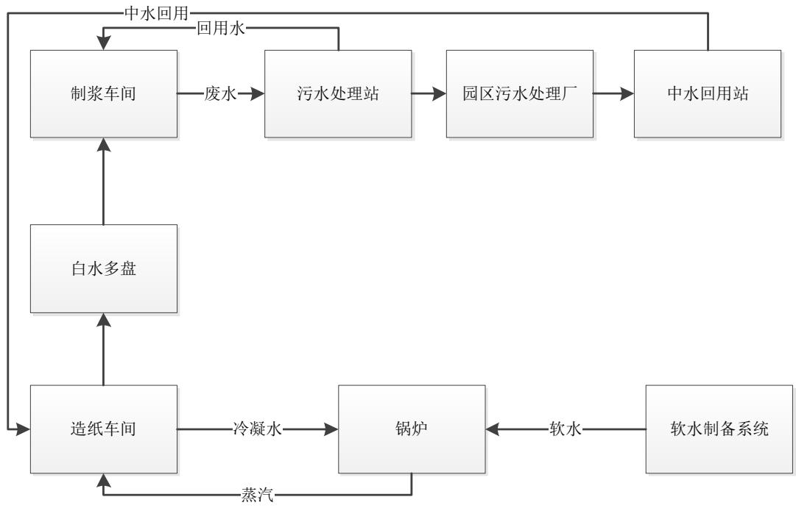

# 4、排污许可证情况

发行人相关经营主体排污许可证情况如下：

<table><tr><td>经营主体</td><td>资质名称</td><td>证书编号</td><td>有效期</td><td>发证机关</td></tr><tr><td>林平发展</td><td>排污许可证</td><td>913413227349728611001P</td><td>至 2029/12/16</td><td>宿州市生态环境局</td></tr></table>

# 5、环保投入情况

报告期内，发行人环保支出情况如下：

单位：万元  

<table><tr><td>项目</td><td>2025 年 1-6 月</td><td>2024 年度</td><td>2023 年度</td><td>2022 年度</td></tr><tr><td>环保相关建筑及设备</td><td>6,089.64</td><td>223.89</td><td>106.00</td><td>127.88</td></tr><tr><td>人工支出</td><td>99.19</td><td>180.76</td><td>180.03</td><td>174.05</td></tr><tr><td>环保运行费用</td><td>884.46</td><td>1,481.44</td><td>1,465.19</td><td>1,179.18</td></tr><tr><td>合计</td><td>7,073.30</td><td>1,886.09</td><td>1,751.22</td><td>1,481.11</td></tr></table>

注：2025 年 1-6 月公司环保支出增幅较大主要系公司热电联产二期锅炉项目和资源综合利用热电联产项目的废气处理环保设施投入增加所致。

# 6、环保合法合规证明

宿州市萧县生态环境分局已出具《无违法违规证明》，确认发行人自 2022年 1 月 1 日至 2025 年 9 月 16 日，一直按照国家及地方有关环境保护方面的法律、法规、规章从事生产经营活动，未出现环境污染事故和环境违法违规行为，未发生因违反国家及地方有关环境保护的法律、法规、规章而受到处罚的情形。

# 九、发行人履行社会责任情况

# （一）贯彻绿色环保经营理念

公司在循环经济、环境保护、绿色清洁制造等方面持续优化，积极贯彻绿色环保经营理念。在循环经济方面，公司采用废纸为原材料，制造出具有良好抗压度、耐破度和耐折度的瓦楞纸、箱板纸提供给下游包装纸箱企业生产绿色环保的瓦楞包装纸箱。

在环境保护方面，公司遵守环境保护相关的各种规章制度，建立并严格执行公司内部相关环保制度，对各类潜在污染物进行了有效治理与防范，确保各项污染物的排放与处理完全符合环保要求。

在绿色清洁制造方面，公司通过引进先进生产设备，生产技术升级，淘汰落后产能和产线，减少生产过程中产生的各种污染物。

# （二）响应乡村振兴与精准扶贫政策

公司在创造效益的同时，积极响应党和国家号召，配合国家发展战略，助力乡村振兴与精准扶贫工作。公司的不断发展壮大给周边村民提供了更多的就业机会，这也将促进当地循环经济产业朝着产业化、规模化的方向发展。

# 1、产业扶贫

为充分发挥产业扶贫效应，壮大村集体经济，加快推进脱贫工作开展，安徽省大力推广“四带一自”产业帮扶模式来促进贫困户脱贫。公司积极响应政府关于实施社会扶贫的相关要求，主动参与“千企帮千村”活动。附近村集体将其富余资金以债权形式投入林平发展，公司优先吸纳贫困村村民到公司就业，并给予债权方本金年化 $7 \%$ 的回报。

# 2、创造就业岗位

公司快速发展的同时也为周边村民提供了更多的就业机会，以及相应的配套行业的就业机会。企业员工薪酬与当地人均平均薪酬对比情况如下：

单位：万元  

<table><tr><td>薪酬情况</td><td>2024 年度</td><td>2023 年度</td><td>2022 年度</td></tr><tr><td>当地人均工资</td><td>-</td><td>5.74</td><td>5.46</td></tr><tr><td>公司职工平均工资</td><td>7.03</td><td>7.17</td><td>7.08</td></tr></table>

注：当地平均工资为宿州市统计局《宿州统计年鉴》中城镇非私营单位人员平均工资（制造业），2024年数据尚未披露。

通过对比上述薪酬情况，发行人职工平均工资要高于当地人均工资，能够有效的帮助当地贫困户脱离贫困状态。根据萧县人力资源和社会保障部提供的资料显示，公司已经吸纳了 39名重点群体就业人员就业。

除了吸纳重点群体就业人员就业外，公司还通过带动废纸收购行业、提供运输服务机会等方式带领村民致富，为周围村民脱贫及防止返贫奠定扎实的经济基础，持续巩固拓展脱贫攻坚成果，全面助力乡村振兴。

# （三）积极参与社会公益

发行人积极履行自身所承担的社会责任，公司为乡村修建道路及捐赠路灯，

方便村民出行，同时积极参与爱心助学、公司通过红十字会定向捐款等举措，积极履行社会责任及义务。

# 十、发行人境外经营情况

截至本招股说明书签署日，发行人不存在境外经营的情况。

# 十一、引用第三方数据的资料来源

本招股说明书所引用的第三方数据或结论符合权威、客观、独立和时效性要求，均在引用处或图表下方注明了资料来源，不存在引用专门为本次发行准备或发行人支付费用、提供帮助的资料情形。

# 第六节 财务会计信息与管理层分析

立信所对公司报告期内的财务报表进行审计，并出具了信会师报字[2025]第ZF11216 号标准无保留意见的《审计报告》。本节披露或引用的财务会计数据，非经特别说明，均引自该《审计报告》。

公司提醒投资者仔细阅读公司的财务报表和审计报告全文，以详细了解报告期内公司的财务状况、经营成果和现金流量。以下分析所涉及的数据及口径若无特别说明，均依据公司报告期内经审计的财务会计资料，按合并报表口径披露。

统计分析涉及的分项数据之和与列示合计数的尾数差异系四舍五入造成。

# 一、公司财务报表

# （一）资产负债表

单位：元  

<table><tr><td>项目</td><td>2025 年 6 月 30 日</td><td>2024 年 12 月 31 日</td><td>2023 年 12 月 31 日</td><td>2022 年 12 月 31 日</td></tr><tr><td>货币资金</td><td>397,007,252.19</td><td>301,402,686.12</td><td>419,445,399.43</td><td>187,334,104.33</td></tr><tr><td>应收票据</td><td>50,231,990.75</td><td>36,718,352.15</td><td>72,130,286.43</td><td>78,578,750.69</td></tr><tr><td>应收账款</td><td>138,289,342.60</td><td>184,042,162.51</td><td>153,428,086.56</td><td>181,556,959.66</td></tr><tr><td>应收款项融资</td><td>16,685,930.58</td><td>5,090,088.21</td><td>30,536,857.30</td><td>14,851,735.82</td></tr><tr><td>预付款项</td><td>8,462,615.38</td><td>6,864,165.00</td><td>13,745,504.13</td><td>14,929,798.86</td></tr><tr><td>其他应收款</td><td>542,162.51</td><td>98,823.71</td><td>665,855.00</td><td>2,221,105.00</td></tr><tr><td>存货</td><td>150,407,768.24</td><td>129,815,781.31</td><td>134,839,385.43</td><td>201,938,545.65</td></tr><tr><td>其他流动资产</td><td>2,732,972.88</td><td>2,300,700.81</td><td>392,406.41</td><td>44,803,170.25</td></tr><tr><td>流动资产合计</td><td>764,360,035.13</td><td>666,332,759.82</td><td>825,183,780.69</td><td>726,214,170.26</td></tr><tr><td>其他权益工具投资</td><td>34,299,301.34</td><td>31,930,418.47</td><td>27,452,710.58</td><td>30,339,019.65</td></tr><tr><td>固定资产</td><td>985,181,729.59</td><td>817,177,053.82</td><td>901,833,661.29</td><td>686,431,201.31</td></tr><tr><td>在建工程</td><td>475,827,845.03</td><td>314,996,660.56</td><td>84,734,567.59</td><td>319,309,940.13</td></tr><tr><td>使用权资产</td><td>-</td><td>-</td><td>-</td><td>-</td></tr><tr><td>无形资产</td><td>90,919,286.70</td><td>91,969,978.50</td><td>63,157,000.25</td><td>64,644,911.21</td></tr><tr><td>递延所得税资产</td><td>-</td><td>-</td><td>-</td><td>-</td></tr><tr><td>其他非流动资产</td><td>197,256,088.25</td><td>218,516,112.06</td><td>29,887,818.33</td><td>19,887,153.30</td></tr><tr><td>非流动资产合计</td><td>1,783,484,250.91</td><td>1,474,590,223.41</td><td>1,107,065,758.04</td><td>1,120,612,225.60</td></tr><tr><td>资产总计</td><td>2,547,844,286.04</td><td>2,140,922,983.23</td><td>1,932,249,538.73</td><td>1,846,826,395.86</td></tr><tr><td>短期借款</td><td>210,208,497.23</td><td>90,090,047.23</td><td>130,154,336.11</td><td>196,727,605.55</td></tr><tr><td>应付票据</td><td>62,363,483.01</td><td>86,401,627.57</td><td>-</td><td>-</td></tr><tr><td>应付账款</td><td>210,980,921.77</td><td>224,612,273.26</td><td>149,916,567.10</td><td>204,496,033.33</td></tr><tr><td>合同负债</td><td>4,557,916.54</td><td>6,608,836.54</td><td>4,303,942.67</td><td>4,862,510.70</td></tr><tr><td>应付职工薪酬</td><td>22,555,838.60</td><td>24,565,530.16</td><td>21,554,704.66</td><td>12,792,560.50</td></tr><tr><td>应交税费</td><td>59,152,651.87</td><td>74,020,536.76</td><td>79,309,127.92</td><td>67,795,558.81</td></tr><tr><td>其他应付款</td><td>9,925,010.05</td><td>9,502,531.90</td><td>8,583,837.68</td><td>7,298,170.82</td></tr><tr><td>一年内到期的非流动负债</td><td>79,418,260.37</td><td>69,640,716.06</td><td>123,933,892.36</td><td>145,240,144.95</td></tr><tr><td>其他流动负债</td><td>46,052,861.13</td><td>35,601,554.29</td><td>65,029,146.20</td><td>58,237,753.39</td></tr><tr><td>流动负债合计</td><td>705,215,440.57</td><td>621,043,653.77</td><td>582,785,554.70</td><td>697,450,338.05</td></tr><tr><td>长期借款</td><td>334,000,000.00</td><td>112,400,000.00</td><td>176,400,000.00</td><td>205,860,000.00</td></tr><tr><td>长期应付款</td><td>4,508,284.70</td><td>5,338,213.06</td><td>8,223,071.13</td><td>10,186,613.20</td></tr><tr><td>递延收益</td><td>67,598,500.00</td><td>68,330,000.00</td><td>6,298,000.00</td><td>1,879,000.00</td></tr><tr><td>非流动负债合计</td><td>406,106,784.70</td><td>186,068,213.06</td><td>190,921,071.13</td><td>217,925,613.20</td></tr><tr><td>负债合计</td><td>1,111,322,225.27</td><td>807,111,866.83</td><td>773,706,625.83</td><td>915,375,951.25</td></tr><tr><td>股本</td><td>56,561,100.00</td><td>56,561,100.00</td><td>56,561,100.00</td><td>56,561,100.00</td></tr><tr><td>资本公积</td><td>731,311,148.48</td><td>722,388,080.48</td><td>704,454,032.48</td><td>686,060,888.48</td></tr><tr><td>其他综合收益</td><td>-7,700,698.66</td><td>-10,069,581.53</td><td>-14,547,289.42</td><td>-11,660,980.35</td></tr><tr><td>盈余公积</td><td>28,280,550.00</td><td>28,280,550.00</td><td>28,280,550.00</td><td>24,467,779.59</td></tr><tr><td>未分配利润</td><td>628,069,960.95</td><td>536,650,967.45</td><td>383,794,519.84</td><td>176,021,656.89</td></tr><tr><td>所有者权益合计</td><td>1,436,522,060.77</td><td>1,333,811,116.40</td><td>1,158,542,912.90</td><td>931,450,444.61</td></tr><tr><td>负债和所有者权益总计</td><td>2,547,844,286.04</td><td>2,140,922,983.23</td><td>1,932,249,538.73</td><td>1,846,826,395.86</td></tr></table>

# （二）利润表

单位：元  

<table><tr><td>项目</td><td>2025 年 1-6 月</td><td>2024 年度</td><td>2023 年度</td><td>2022 年度</td></tr><tr><td>一、营业总收入</td><td>1,223,794,497.63</td><td>2,485,097,760.03</td><td>2,799,836,999.22</td><td>2,878,891,885.88</td></tr><tr><td>二、营业总成本</td><td>1,182,486,389.41</td><td>2,413,243,177.37</td><td>2,710,855,694.00</td><td>2,830,464,928.13</td></tr><tr><td>其中:营业成本</td><td>1,097,496,723.36</td><td>2,252,329,486.71</td><td>2,524,095,986.43</td><td>2,657,951,215.91</td></tr><tr><td>税金及附加</td><td>9,806,045.07</td><td>19,276,538.64</td><td>24,504,792.83</td><td>15,097,155.88</td></tr><tr><td>销售费用</td><td>4,366,578.80</td><td>9,231,492.91</td><td>9,086,476.77</td><td>7,871,822.03</td></tr><tr><td>管理费用</td><td>19,943,717.38</td><td>34,340,525.27</td><td>43,351,690.67</td><td>27,438,131.92</td></tr><tr><td>研发费用</td><td>44,287,502.33</td><td>83,797,163.33</td><td>88,089,356.39</td><td>94,787,919.31</td></tr><tr><td>财务费用</td><td>6,585,822.47</td><td>14,267,970.51</td><td>21,727,390.91</td><td>27,318,683.08</td></tr><tr><td>其中:利息费用</td><td>7,898,018.09</td><td>17,908,187.65</td><td>22,652,566.31</td><td>28,047,564.86</td></tr><tr><td>利息收入</td><td>2,140,209.35</td><td>3,849,475.69</td><td>1,812,954.75</td><td>1,026,718.97</td></tr><tr><td>加:其他收益</td><td>48,353,111.93</td><td>109,222,794.14</td><td>120,986,687.34</td><td>105,279,450.38</td></tr><tr><td>投资收益</td><td>-</td><td>-</td><td>828,533.99</td><td>-1,504,578.54</td></tr><tr><td>信用减值损失</td><td>2,390,870.42</td><td>-1,445,168.73</td><td>585,764.35</td><td>267,737.17</td></tr><tr><td>资产减值损失</td><td>-179,323.57</td><td>-757,354.04</td><td>-471,262.05</td><td>-1,683,195.21</td></tr><tr><td>资产处置收益</td><td>-45,597.98</td><td>-</td><td>498,875.18</td><td>2,000.00</td></tr><tr><td>三、营业利润</td><td>91,827,169.02</td><td>178,874,854.03</td><td>211,409,904.03</td><td>150,788,371.55</td></tr><tr><td>加:营业外收入</td><td>801,824.48</td><td>63,816.21</td><td>1,107,238.04</td><td>3,682,357.23</td></tr><tr><td>减:营业外支出</td><td>1,210,000.00</td><td>26,082,222.63</td><td>931,508.71</td><td>-</td></tr><tr><td>四、利润总额</td><td>91,418,993.50</td><td>152,856,447.61</td><td>211,585,633.36</td><td>154,470,728.78</td></tr><tr><td>减:所得税费用</td><td>-</td><td>-</td><td>-</td><td>-</td></tr><tr><td>五、净利润</td><td>91,418,993.50</td><td>152,856,447.61</td><td>211,585,633.36</td><td>154,470,728.78</td></tr><tr><td>(一)按经营持续性分类</td><td>-</td><td></td><td></td><td></td></tr><tr><td>持续经营净利润</td><td>91,418,993.50</td><td>152,856,447.61</td><td>211,585,633.36</td><td>154,470,728.78</td></tr><tr><td>终止经营净利润</td><td>-</td><td>-</td><td>-</td><td>-</td></tr><tr><td>(二)按所有权归属分类</td><td>-</td><td></td><td></td><td></td></tr><tr><td>归属于母公司股东的净利润</td><td>91,418,993.50</td><td>152,856,447.61</td><td>211,585,633.36</td><td>154,470,728.78</td></tr><tr><td>少数股东损益</td><td>-</td><td>-</td><td>-</td><td>-</td></tr><tr><td>六、其他综合收益的税后净额</td><td>2,368,882.87</td><td>4,477,707.89</td><td>-2,886,309.07</td><td>-1,513,442.71</td></tr><tr><td>外币财务报表折算差额</td><td>-</td><td>-</td><td>-</td><td>-</td></tr><tr><td>其他权益工具投资公允价值变动</td><td>2,368,882.87</td><td>4,477,707.89</td><td>-2,886,309.07</td><td>-1,513,442.71</td></tr><tr><td>七、综合收益总额</td><td>93,787,876.37</td><td>157,334,155.50</td><td>208,699,324.29</td><td>152,957,286.07</td></tr><tr><td>归属于母公司所有者的综合收益总额</td><td>93,787,876.37</td><td>157,334,155.50</td><td>208,699,324.29</td><td>152,957,286.07</td></tr><tr><td>归属于少数股东的综合收益总额</td><td>-</td><td>-</td><td>-</td><td>-</td></tr><tr><td>八、每股收益:</td><td>-</td><td></td><td></td><td></td></tr><tr><td>（一）基本每股收益（元/股）</td><td>1.62</td><td>2.70</td><td>3.74</td><td>2.73</td></tr><tr><td>（二）稀释每股收益（元/股）</td><td>1.62</td><td>2.70</td><td>3.74</td><td>2.73</td></tr></table>

# （三）现金流量表

单位：元  

<table><tr><td>项目</td><td>2025 年 1-6 月</td><td>2024 年度</td><td>2023 年度</td><td>2022 年度</td></tr><tr><td>一、经营活动产生的现金流量</td><td></td><td></td><td></td><td></td></tr><tr><td>销售商品、提供劳务收到的现金</td><td>1,226,523,326.03</td><td>2,486,793,066.52</td><td>2,805,190,732.76</td><td>2,970,263,152.63</td></tr><tr><td>收到的税费返还</td><td>43,973,523.12</td><td>89,400,913.79</td><td>147,905,885.49</td><td>82,402,760.43</td></tr><tr><td>收到其他与经营活动有关的现金</td><td>4,815,995.83</td><td>81,187,716.65</td><td>16,132,708.39</td><td>28,689,830.14</td></tr><tr><td>经营活动现金流入小计</td><td>1,275,312,844.98</td><td>2,657,381,696.96</td><td>2,969,229,326.64</td><td>3,081,355,743.20</td></tr><tr><td>购买商品、接受劳务支付的现金</td><td>1,009,489,440.31</td><td>2,048,979,358.08</td><td>2,194,833,740.16</td><td>2,532,735,588.33</td></tr><tr><td>支付给职工以及为职工支付的现金</td><td>44,630,145.62</td><td>75,237,236.03</td><td>66,007,430.06</td><td>69,259,297.00</td></tr><tr><td>支付的各项税费</td><td>97,438,248.85</td><td>197,766,583.05</td><td>238,413,292.87</td><td>201,964,383.51</td></tr><tr><td>支付其他与经营活动有关的现金</td><td>46,597,327.87</td><td>82,458,707.67</td><td>95,693,660.12</td><td>98,144,133.02</td></tr><tr><td>经营活动现金流出小计</td><td>1,198,155,162.65</td><td>2,404,441,884.83</td><td>2,594,948,123.21</td><td>2,902,103,401.86</td></tr><tr><td>经营活动产生的现金流量净额</td><td>77,157,682.33</td><td>252,939,812.13</td><td>374,281,203.43</td><td>179,252,341.34</td></tr><tr><td>二、投资活动产生的现金流量</td><td>-</td><td></td><td></td><td></td></tr><tr><td>收回投资收到的现金</td><td>-</td><td>-</td><td>-</td><td>-</td></tr><tr><td>取得投资收益收到的现金</td><td>-</td><td>-</td><td>990,152.00</td><td>-</td></tr><tr><td>处置固定资产、无形资产和其他长期资产</td><td>-</td><td>-</td><td>748,672.57</td><td>-</td></tr><tr><td>收到其他与投资活动有关的现金</td><td>-</td><td>-</td><td>1,000,000.00</td><td>16,820,000.00</td></tr><tr><td>投资活动现金流入小计</td><td>-</td><td>-</td><td>2,738,824.57</td><td>16,820,000.00</td></tr><tr><td>购建固定资产、无形资产和其他长期资产支付的现金</td><td>283,976,012.14</td><td>294,574,792.89</td><td>5,151,412.84</td><td>81,301,069.05</td></tr><tr><td>投资支付的现金</td><td>-</td><td>-</td><td>-</td><td>-</td></tr><tr><td>支付其他与投资活动有关的现金</td><td>-</td><td>-</td><td>-</td><td>9,000,000.00</td></tr><tr><td>投资活动现金流出小计</td><td>283,976,012.14</td><td>294,574,792.89</td><td>5,151,412.84</td><td>90,301,069.05</td></tr><tr><td>投资活动产生的现金流量净额</td><td>-283,976,012.14</td><td>-294,574,792.89</td><td>-2,412,588.27</td><td>-73,481,069.05</td></tr><tr><td>三、筹资活动产生的现金流量</td><td>-</td><td></td><td></td><td></td></tr><tr><td>吸收投资收到的现金</td><td>-</td><td>-</td><td>-</td><td>-</td></tr><tr><td>取得借款收到的现金</td><td>402,500,000.00</td><td>192,400,000.00</td><td>262,500,000.00</td><td>311,670,761.29</td></tr><tr><td>收到其他与筹资活动有关的现金</td><td>-</td><td>-</td><td>-</td><td>387,258.83</td></tr><tr><td>筹资活动现金流入小计</td><td>402,500,000.00</td><td>192,400,000.00</td><td>262,500,000.00</td><td>312,058,020.12</td></tr><tr><td>偿还债务支付的现金</td><td>53,450,000.00</td><td>350,460,000.00</td><td>370,100,000.00</td><td>181,840,000.00</td></tr><tr><td>分配股利、利润或偿付利息支付的现金</td><td>8,709,256.61</td><td>18,179,283.86</td><td>22,828,116.92</td><td>28,520,019.20</td></tr><tr><td>支付其他与筹资活动有关的现金</td><td>-</td><td>-</td><td>875,000.00</td><td>59,095,304.14</td></tr><tr><td>筹资活动现金流出小计</td><td>62,159,256.61</td><td>368,639,283.86</td><td>393,803,116.92</td><td>269,455,323.34</td></tr><tr><td>筹资活动产生的现金流量净额</td><td>340,340,743.39</td><td>-176,239,283.86</td><td>-131,303,116.92</td><td>42,602,696.78</td></tr><tr><td>四、汇率变动对现金及现金等价物的影响</td><td>-773,402.95</td><td>326,791.42</td><td>-712,740.64</td><td>94,789.57</td></tr><tr><td>五、现金及现金等价物净增加额</td><td>132,749,010.63</td><td>-217,547,473.20</td><td>239,852,757.60</td><td>148,468,758.64</td></tr><tr><td>加：期初现金及现金等价物余额</td><td>201,894,758.55</td><td>419,442,231.75</td><td>179,589,474.15</td><td>31,120,715.51</td></tr><tr><td>六、期末现金及现金等价物余额</td><td>334,643,769.18</td><td>201,894,758.55</td><td>419,442,231.75</td><td>179,589,474.15</td></tr></table>

# 二、会计师的审计意见

# （一）审计意见

立信会计师事务所（特殊普通合伙）对公司2022年12月31日、2023年12月 31 日、2024 年 12 月 31 日及 2025 年 6 月 30 日的资产负债表，2022 年度、2023年度、2024年度及2025年1-6月期间的利润表、现金流量表、所有者权益变动表以及相关财务报表附注进行审计，并出具了信会师报字[2025]第 ZF11216号标准无保留意见的《审计报告》。审计意见如下：公司财务报表在所有重大方面按照企业会计准则的规定编制，公允反映了林平发展 2022 年 12 月 31 日、2023 年 12 月 31 日、2024 年 12 月 31 日及 2025 年 6 月 30 日的财务状况以及2022年度、2023年度、2024年度及2025年1-6月期间的经营成果和现金流量。

# （二）关键审计事项

关键审计事项是立信所根据职业判断，认为分别对2022年度、2023年度、2024 年度及 2025 年 1-6 月期间财务报表审计最重要的事项。这些事项的应对以对财务报表整体进行审计并形成审计意见为背景，立信所不对这些事项单独发表意见。

立信所在审计中识别出的关键审计事项汇总如下：

<table><tr><td>关键审计事项</td><td>该事项在审计中是如何应对的</td></tr><tr><td>收入确认</td><td>（1）了解并测试林平发展与销售、收款相关的内部控制制度、财务核算制度的设计和执行情况；（2）检查销售合同，了解主要合同条款或条件，评价收入确认方法是否适当；（3）对报告期记录的收入交易选取样本，检查销售合同、订单、发货单、发票、收款凭证等证据，对公司核心销售人员进行访谈，核实销售收入的真实性；（4）选取样本，对客户执行函证程序，函证报告期销售金额及应收账款余额；（5）向林平发展主要客户进行实地走访；（6）就报告期各期资产负债表日前后的收入交易选取样本，核实销售收入是否被记录于恰当的会计期间；（7）结合市场行情、同行业上市公司及林平发展实际情况，执行分析性复核程序，判断销售收入和毛利率变动的合理性。</td></tr><tr><td>废纸采购</td><td>（1）了解并测试林平发展与废纸采购、付款相关的内部控制制度、财务核算制度的设计和执行情况；（2）对报告期记录的采购交易选取样本，检查采购合同、供应商工商资料、过磅单、入库单、付款凭证等证据，核实采购业务的真实性；（3）选取样本，对供应商进行实地走访，核实废纸供应商供应能力及废纸采购真实性、完整性；（4）选取样本，对供应商执行函证程序，函证本年度采购金额及期末应付账款余额；（5）结合林平发展生产、销售、存货结存情况，分析废纸和原纸投入产出情况，判断报告期采购数量的合理性。</td></tr></table>

# （三）重要性水平的判断标准

<table><tr><td>项目</td><td>重要性标准</td></tr><tr><td>重要的单项计提坏账准备的应收款项</td><td>单笔应收款项金额超过税前利润3%</td></tr><tr><td>本期重要的应收款项核销</td><td>单笔应收款项核销金额超过税前利润3%</td></tr><tr><td>账龄超过1年且金额重要的预付款项</td><td>单笔预付款项金额超过税前利润3%</td></tr><tr><td>账龄超过1年或逾期的重要往来款项</td><td>单笔账龄超过1年或逾期的往来款项金额超过100万元</td></tr><tr><td>重要的在建工程项目</td><td>单项在建工程明细金额超过总资产0.50%</td></tr></table>

# 三、财务报表编制的基础、合并报表范围及变化情况

# （一）财务报表的编制基础

# 1、编制基础

本公司以持续经营为基础，根据实际发生的交易和事项，按照企业会计准则及其应用指南和准则解释的规定进行确认和计量，在此基础上编制财务报表。此外，本公司还按照中国证监会《公开发行证券的公司信息披露编报规则第 15号—财务报告的一般规定》披露有关财务信息。

# 2、持续经营

本公司对自报告期末起 12 个月的持续经营能力进行了评估，未发现影响本公司持续经营能力的事项，本公司以持续经营为基础编制财务报表是合理的。

# （二）合并财务报表范围及其变化

# 1、合并财务报表范围

报告期内，公司无纳入合并范围内的子公司。

# 2、合并财务报表范围变化情况

报告期内，公司财务报表合并范围未发生变化。

# （三）协议控制架构或类似特殊安排

报告期内，发行人不存在协议控制架构或类似特殊安排。

# 四、分部信息

发行人分产品业务收入和分地区业务收入的详细情况详见本招股说明书“第六节 财务会计信息与管理层分析”之“十、经营成果分析”之“（一）营业收入分析”之相关内容。

# 五、盈利能力或财务状况的主要影响因素分析

# （一）产品特点

公司专业从事包装用瓦楞纸、箱板纸产品的研发、生产和销售，是一家具有自主研发及创新能力的高新技术企业。发行人的主要产品包括瓦楞纸和箱板

纸，作为包装纸箱的原材料主要应用于包装领域，是传统包装材料的绿色替代产品。

报告期各期，发行人主营业务成本中直接材料成本占比超过 $73 \%$ ，材料成本是发行人生产成本的主要组成部分，材料价格波动是影响成本的主要因素。发行人生产所采购的主要原材料为废纸，废纸价格受到行业政策、市场供需等多重因素的影响。发行人主营业务成本中制造费用占比达 $20 \%$ 左右，生产耗煤费用是发行人制造费用的主要组成部分，因此公司原纸价格还间接受到煤炭等大宗商品价格波动的影响。若原材料价格出现大幅波动且发行人未能及时对产品售价进行调整，将直接影响发行人经营业绩。

# （二）经营模式

经过多年的发展，发行人形成了清晰、稳定并适应自身业务特点的生产经营模式，成为公司持续盈利能力的重要保证。报告期内，发行人主要采用以销定产、自主生产的生产模式。年产 30 万吨箱板纸 6600 生产线于 2023 年建成投产，因此2023年公司产品产销量增加；2024年受台风“贝碧嘉”影响，公司停产超过 30 天，2024 年 10 月下旬方全部复产，导致当年产量有所下降。未来随着募投项目建成投产，公司原纸产能将从 115 万吨/年增加至 235 万吨/年，发行人在原纸领域的市场地位和竞争力将进一步提升。公司生产经营规模的扩大，有助于公司提高规模效应，降低成本，提高利润率。

# （三）行业竞争程度

根据中国造纸协会公布的《中国造纸工业2024年度报告》，2024年度，全国纸和纸板生产企业数量约 2,600 家，其中年产 100 万吨以上的企业为 30 家。国内造纸企业大致可分为三个梯队，第一梯队为以玖龙纸业、太阳控股、理文造纸、山鹰国际 4 家为代表的年产量在 500 万吨以上的国内大型造纸企业，企业数量较少；第二梯队为以晨鸣纸业、博汇集团、荣成环保、华泰集团、中国纸业及林平发展为代表的一批中型造纸企业，数量为 26 家，年产量在 100-500万吨之间；第三梯队为年产量在 100 万吨以下的中小型企业，企业数量众多。公司现有产能 115 万吨，公司原纸产量在全国居于前列，是全国造纸企业产量前30名企业之一，产量在行业企业平均水平中处于领先地位。

公司深耕瓦楞纸和箱板纸领域多年，对于下游众多领域的客户需求有着较为深入的理解。凭借稳定的产品质量、优质的客户服务，公司与厦门合兴包装印刷股份有限公司、厦门建发股份有限公司、厦门国贸集团股份有限公司等国内众多知名企业建立了稳定的合作关系，在瓦楞纸和箱板纸领域建立了良好的信誉和知名度。发行人所处行业竞争程度及其变动情况详见本招股说明书“第五节 业务和技术”之“三、发行人在行业中的竞争地位”之相关内容。

# （四）市场环境

箱板纸和瓦楞原纸是生产瓦楞纸箱的主要原材料，瓦楞纸箱被广泛用于国内消费品和工业产品的快递和包装，同时用于物流运输及出口包装。下游应用领域包含食品饮料、家用电器、消费电子、电商物流、机械器械、医药保健和日化等，行业覆盖广泛，与宏观经济增长息息相关。外部市场环境的发展状况及市场需求变动将对发行人盈利能力或财务状况产生影响。

报告期内，受国际政治形势动荡、欧美通货膨胀等国际因素及国内取消成品纸关税、宏观经济形势增速放缓等因素影响，下游客户需求减弱，行业内企业竞争加剧，瓦楞纸和箱板纸产品销售价格下降导致公司营业收入有所下滑。未来若受市场环境以及中美贸易争端等因素影响导致行业景气度下降，市场需求减少，短期内发行人收入增长及盈利能力将受到一定影响。

# 六、报告期内采用的主要会计政策和会计估计

# （一）现金及现金等价物的确定标准

现金，是指本公司的库存现金以及可以随时用于支付的存款。现金等价物，是指本公司持有的期限短、流动性强、易于转换为已知金额的现金、价值变动风险很小的投资。

# （二）外币业务和外币报表折算

# 1、外币业务

外币业务采用交易发生日的即期汇率作为折算汇率将外币金额折合成人民币记账。

资产负债表日外币货币性项目余额按资产负债表日即期汇率折算，由此产

生的汇兑差额，除属于与购建符合资本化条件的资产相关的外币专门借款产生的汇兑差额按照借款费用资本化的原则处理外，均计入当期损益。

# 2、外币财务报表的折算

资产负债表中的资产和负债项目，采用资产负债表日的即期汇率折算；所有者权益项目除未分配利润项目外，其他项目采用发生时的即期汇率折算。利润表中的收入和费用项目，采用交易发生日的即期汇率折算。

处置境外经营时，将与该境外经营相关的外币财务报表折算差额，自所有者权益项目转入处置当期损益。

# （三）金融工具

公司在成为金融工具合同的一方时，确认一项金融资产、金融负债或权益工具。

# 1、金融工具的分类

# （1）金融资产

根据公司管理金融资产的业务模式和金融资产的合同现金流量特征，金融资产于初始确认时分类为：

--以摊余成本计量的金融资产

--以公允价值计量且其变动计入其他综合收益的金融资产

--以公允价值计量且其变动计入当期损益的金融资产

对于非交易性权益工具投资，公司在初始确认时确定是否将其指定为以公允价值计量且其变动计入其他综合收益的金融资产（权益工具）。

公司将同时符合下列条件且未被指定为以公允价值计量且其变动计入当期损益的金融资产，分类为以摊余成本计量的金融资产：

--业务模式是以收取合同现金流量为目标；

--合同现金流量仅为对本金和以未偿付本金金额为基础的利息的支付。

公司将同时符合下列条件且未被指定为以公允价值计量且其变动计入当期损益的金融资产，分类为以公允价值计量且其变动计入其他综合收益的金融资

产（债务工具）：

--业务模式既以收取合同现金流量又以出售该金融资产为目标；  
--合同现金流量仅为对本金和以未偿付本金金额为基础的利息的支付。

对于非交易性权益工具投资，本公司可以在初始确认时将其不可撤销地指定为以公允价值计量且其变动计入其他综合收益的金融资产（权益工具）。该指定在单项投资的基础上作出，且相关投资从发行者的角度符合权益工具的定义。

除上述以摊余成本计量和以公允价值计量且其变动计入其他综合收益的金融资产外，本公司将其余所有的金融资产分类为以公允价值计量且其变动计入当期损益的金融资产。在初始确认时，如果能够消除或显著减少会计错配，本公司可以将本应分类为摊余成本计量或以公允价值计量且其变动计入其他综合收益的金融资产不可撤销地指定为以公允价值计量且其变动计入当期损益的金融资产。

# （2）金融负债

金融负债于初始确认时分类为：

--以公允价值计量且其变动计入当期损益的金融负债

--以摊余成本计量的金融负债

符合以下条件之一的金融负债可在初始计量时指定为以公允价值计量且其变动计入当期损益的金融负债：

$\textcircled{1}$ 该项制度能够消除或显著减少会计错配。  
$\textcircled{2}$ 根据正式书面文件载明的企业风险管理或投资策略，以公允价值为基础对金融负债组合或金融资产和金融负债组合进行管理和业绩评价，并在企业内部以此为基础向关键管理人员报告。  
$\textcircled{3}$ 该金融负债包含需单独分拆的嵌入衍生工具。

# 2、金融工具的确认依据和计量方法

# （1）以摊余成本计量的金融资产

以摊余成本计量的金融资产包括应收票据、应收账款、其他应收款、长期应收款、债权投资等，按公允价值进行初始计量，相关交易费用计入初始确认金额；不包含重大融资成分的应收账款以及本公司决定不考虑不超过一年的融资成分的应收账款，以合同交易价格进行初始计量。

持有期间采用实际利率法计算的利息计入当期损益。

收回或处置时，将取得的价款与该金融资产账面价值之间的差额计入当期损益。

（2）以公允价值计量且其变动计入其他综合收益的金融资产（债务工具）

以公允价值计量且其变动计入其他综合收益的金融资产（债务工具）包括应收款项融资、其他债权投资等，按公允价值进行初始计量，相关交易费用计入初始确认金额。该金融资产按公允价值进行后续计量，公允价值变动除采用实际利率法计算的利息、减值损失或利得和汇兑损益之外，均计入其他综合收益。

终止确认时，之前计入其他综合收益的累计利得或损失从其他综合收益中转出，计入当期损益。

（3）以公允价值计量且其变动计入其他综合收益的金融资产（权益工具）

以公允价值计量且其变动计入其他综合收益的金融资产（权益工具）包括其他权益工具投资等，按公允价值进行初始计量，相关交易费用计入初始确认金额。该金融资产按公允价值进行后续计量，公允价值变动计入其他综合收益。取得的股利计入当期损益。

终止确认时，之前计入其他综合收益的累计利得或损失从其他综合收益中转出，计入留存收益。

（4）以公允价值计量且其变动计入当期损益的金融资产

以公允价值计量且其变动计入当期损益的金融资产包括交易性金融资产、衍生金融资产、其他非流动金融资产等，按公允价值进行初始计量，相关交易费用计入当期损益。该金融资产按公允价值进行后续计量，公允价值变动计入当期损益。

# （5）以公允价值计量且其变动计入当期损益的金融负债

以公允价值计量且其变动计入当期损益的金融负债包括交易性金融负债、衍生金融负债等，按公允价值进行初始计量，相关交易费用计入当期损益。该金融负债按公允价值进行后续计量，公允价值变动计入当期损益。

终止确认时，其账面价值与支付的对价之间的差额计入当期损益。

# （6）以摊余成本计量的金融负债

以摊余成本计量的金融负债包括短期借款、应付票据、应付账款、其他应付款、长期借款、应付债券、长期应付款，按公允价值进行初始计量，相关交易费用计入初始确认金额。

持有期间采用实际利率法计算的利息计入当期损益。

终止确认时，将支付的对价与该金融负债账面价值之间的差额计入当期损益。

# 3、金融资产终止确认和金融资产转移

满足下列条件之一时，本公司终止确认金融资产：

－收取金融资产现金流量的合同权利终止；

－金融资产已转移，且已将金融资产所有权上几乎所有的风险和报酬转移给转入方；

－金融资产已转移，虽然本公司既没有转移也没有保留金融资产所有权上几乎所有的风险和报酬，但是未保留对金融资产的控制。

发生金融资产转移时，如保留了金融资产所有权上几乎所有的风险和报酬的，则不终止确认该金融资产。

在判断金融资产转移是否满足上述金融资产终止确认条件时，采用实质重于形式的原则。

公司将金融资产转移区分为金融资产整体转移和部分转移。金融资产整体转移满足终止确认条件的，将下列两项金额的差额计入当期损益：

# （1）所转移金融资产的账面价值；

（2）因转移而收到的对价，与原直接计入所有者权益的公允价值变动累计额（涉及转移的金融资产为以公允价值计量且其变动计入其他综合收益的金融资产（债务工具）的情形）之和。

金融资产部分转移满足终止确认条件的，将所转移金融资产整体的账面价值，在终止确认部分和未终止确认部分之间，按照各自的相对公允价值进行分摊，并将下列两项金额的差额计入当期损益：

（1）终止确认部分的账面价值；  
（2）终止确认部分的对价，与原直接计入所有者权益的公允价值变动累计额中对应终止确认部分的金额（涉及转移的金融资产为以公允价值计量且其变动计入其他综合收益的金融资产（债务工具）的情形）之和。

金融资产转移不满足终止确认条件的，继续确认该金融资产，所收到的对价确认为一项金融负债。

# 4、金融负债终止确认

金融负债的现时义务全部或部分已经解除的，则终止确认该金融负债或其一部分；本公司若与债权人签定协议，以承担新金融负债方式替换现存金融负债，且新金融负债与现存金融负债的合同条款实质上不同的，则终止确认现存金融负债，并同时确认新金融负债。

对现存金融负债全部或部分合同条款作出实质性修改的，则终止确认现存金融负债或其一部分，同时将修改条款后的金融负债确认为一项新金融负债。

金融负债全部或部分终止确认时，终止确认的金融负债账面价值与支付对价（包括转出的非现金资产或承担的新金融负债）之间的差额，计入当期损益。

本公司若回购部分金融负债的，在回购日按照继续确认部分与终止确认部分的相对公允价值，将该金融负债整体的账面价值进行分配。分配给终止确认部分的账面价值与支付的对价（包括转出的非现金资产或承担的新金融负债）之间的差额，计入当期损益。

# 5、金融资产和金融负债的公允价值的确定方法

存在活跃市场的金融工具，以活跃市场中的报价确定其公允价值。不存在

活跃市场的金融工具，采用估值技术确定其公允价值。在估值时，本公司采用在当前情况下适用并且有足够可利用数据和其他信息支持的估值技术，选择与市场参与者在相关资产或负债的交易中所考虑的资产或负债特征相一致的输入值，并优先使用相关可观察输入值。只有在相关可观察输入值无法取得或取得不切实可行的情况下，才使用不可观察输入值。

# 6、金融资产减值的测试方法及会计处理方法

# （1）金融资产减值的测试方法及会计处理方法

本公司考虑有关过去事项、当前状况以及对未来经济状况的预测等合理且有依据的信息，以发生违约的风险为权重，计算合同应收的现金流量与预期能收到的现金流量之间差额的现值的概率加权金额，确认预期信用损失。如果该金融工具的信用风险自初始确认后已显著增加，本公司按照相当于该金融工具整个存续期内预期信用损失的金额计量其损失准备；如果该金融工具的信用风险自初始确认后并未显著增加，本公司按照相当于该金融工具未来 12 个月内预期信用损失的金额计量其损失准备。由此形成的损失准备的增加或转回金额，作为减值损失或利得计入当期损益。

本公司通过比较金融工具在资产负债表日发生违约的风险与在初始确认日发生违约的风险，以确定金融工具预计存续期内发生违约风险的相对变化，以评估金融工具的信用风险自初始确认后是否已显著增加。通常逾期超过 30 日，本公司即认为该金融工具的信用风险已显著增加，除非有确凿证据证明该金融工具的信用风险自初始确认后并未显著增加。

如果金融工具于资产负债表日的信用风险较低，本公司即认为该金融工具的信用风险自初始确认后并未显著增加。

如果有客观证据表明某项金融资产已经发生信用减值，则本公司在单项基础上对该金融资产计提减值准备。

对于由《企业会计准则第 14 号——收入》（2017）规范的交易形成的应收款项和合同资产，无论是否包含重大融资成分，本公司始终按照相当于整个存续期内预期信用损失的金额计量其损失准备。

对于租赁应收款，本公司选择始终按照相当于整个存续期内预期信用损失

的金额计量其损失准备。

本公司不再合理预期金融资产合同现金流量能够全部或部分收回的，直接减记该金融资产的账面余额。

# （2）各类金融资产信用损失的确定方法

# $\textcircled{1}$ 应收票据

本公司对于应收票据按照相当于整个存续期内的预期信用损失金额计量损失准备。基于应收票据的信用风险特征，将其划分为不同组合：

<table><tr><td>项目</td><td>确定组合的依据</td></tr><tr><td>银行承兑汇票</td><td>承兑人为信用风险等级较低的银行</td></tr></table>

注：信用风险等级较高的银行承兑汇票一般不考虑计提坏账准备，经过测试，本公司认为银行承兑汇票预期信用损失率为 $0 \%$

# $\textcircled{2}$ 应收账款

对于应收款项，无论是否存在重大融资成分的，本公司选择始终按照相当于整个存续期内的预期信用损失的金额计量损失准备。

除了单项评估信用风险的应收账款外，基于其信用风险特征，将其划分账龄组合，对于划分为账龄组合的应收账款，本公司参考历史信用损失经验，结合当前状况以及对未来经济状况的前瞻性预测，通过违约风险敞口和整个存续期预期信用损失率，计算预期信用损失。

# $\textcircled{3}$ 其他应收款

本公司依据其他应收款信用风险自初始确认后是否已经显著增加，采用相当于未来 12 个月内、或整个存续期的预期信用损失的金额计量减值损失。除了单项评估信用风险的其他应收款外，基于其信用风险特征，将其划分为不同组合：

<table><tr><td>项目</td><td>确定组合的依据</td><td>预期信用损失率</td></tr><tr><td>组合1：应收资金拆借款项</td><td>本组合为资金拆借款项</td><td rowspan="2">参考历史信用损失经验，结合当前状况以及对未来经济状况的预测，通过违约风险敞口和未来12个月内或整个存续期预期信用损失率，计算预期信用损失，经测试，上述组合预期信用损失率均为5.00%。</td></tr><tr><td>组合2：应收备用金及其他组合</td><td>本组合为日常经常活动中应收取的备用金及其他款项</td></tr></table>

# （四）存货

# 1、存货的分类和成本

存货分类为：在途物资、原材料、库存商品、发出商品等。

存货按成本进行初始计量，存货成本包括采购成本、加工成本和其他使存货达到目前场所和状态所发生的支出。

# 2、发出存货的计价方法

存货发出时按加权平均法计价。

# 3、不同类别存货可变现净值的确定依据

资产负债表日，存货应当按照成本与可变现净值孰低计量。当存货成本高于其可变现净值的，应当计提存货跌价准备。可变现净值，是指在日常活动中，存货的估计售价减去至完工时估计将要发生的成本、估计的销售费用以及相关税费后的金额。

产成品、库存商品和用于出售的材料等直接用于出售的商品存货，在正常生产经营过程中，以该存货的估计售价减去估计的销售费用和相关税费后的金额，确定其可变现净值；需要经过加工的材料存货，在正常生产经营过程中，以所生产的产成品的估计售价减去至完工时估计将要发生的成本、估计的销售费用和相关税费后的金额，确定其可变现净值；为执行销售合同或者劳务合同而持有的存货，其可变现净值以合同价格为基础计算，若持有存货的数量多于销售合同订购数量的，超出部分的存货的可变现净值以一般销售价格为基础计算。

计提存货跌价准备后，如果以前减记存货价值的影响因素已经消失，导致存货的可变现净值高于其账面价值的，在原已计提的存货跌价准备金额内予以转回，转回的金额计入当期损益。

# 4、存货的盘存制度

采用永续盘存制。

# 5、低值易耗品和包装物的摊销方法

低值易耗品采用一次转销法；包装物采用一次转销法。

# （五）长期股权投资

# 1、共同控制、重大影响的判断标准

共同控制，是指按照相关约定对某项安排所共有的控制，并且该安排的相关活动必须经过分享控制权的参与方一致同意后才能决策。本公司与其他合营方一同对被投资单位实施共同控制且对被投资单位净资产享有权利的，被投资单位为本公司的合营企业。

重大影响，是指对被投资单位的财务和经营决策有参与决策的权力，但并不能够控制或者与其他方一起共同控制这些政策的制定。本公司能够对被投资单位施加重大影响的，被投资单位为本公司联营企业。

# 2、初始投资成本的确定

# （1）企业合并形成的长期股权投资

对于同一控制下的企业合并形成的对子公司的长期股权投资，在合并日按照取得被合并方所有者权益在最终控制方合并财务报表中的账面价值的份额作为长期股权投资的初始投资成本。长期股权投资初始投资成本与支付对价账面价值之间的差额，调整资本公积中的股本溢价；资本公积中的股本溢价不足冲减时，调整留存收益。因追加投资等原因能够对同一控制下的被投资单位实施控制的，按上述原则确认的长期股权投资的初始投资成本与达到合并前的长期股权投资账面价值加上合并日进一步取得股份新支付对价的账面价值之和的差额，调整股本溢价，股本溢价不足冲减的，冲减留存收益。

对于非同一控制下的企业合并形成的对子公司的长期股权投资，按照购买日确定的合并成本作为长期股权投资的初始投资成本。因追加投资等原因能够对非同一控制下的被投资单位实施控制的，按照原持有的股权投资账面价值加上新增投资成本之和作为初始投资成本。

# （2）通过企业合并以外的其他方式取得的长期股权投资

以支付现金方式取得的长期股权投资，按照实际支付的购买价款作为初始

投资成本。

以发行权益性证券取得的长期股权投资，按照发行权益性证券的公允价值作为初始投资成本。

# 3、后续计量及损益确认方法

# （1）成本法核算的长期股权投资

公司对子公司的长期股权投资，采用成本法核算，除非投资符合持有待售的条件。除取得投资时实际支付的价款或对价中包含的已宣告但尚未发放的现金股利或利润外，公司按照享有被投资单位宣告发放的现金股利或利润确认当期投资收益。

# （2）权益法核算的长期股权投资

对联营企业和合营企业的长期股权投资，采用权益法核算。初始投资成本大于投资时应享有被投资单位可辨认净资产公允价值份额的差额，不调整长期股权投资的初始投资成本；初始投资成本小于投资时应享有被投资单位可辨认净资产公允价值份额的差额，计入当期损益，同时调整长期股权投资的成本。

公司按照应享有或应分担的被投资单位实现的净损益和其他综合收益的份额，分别确认投资收益和其他综合收益，同时调整长期股权投资的账面价值；按照被投资单位宣告分派的利润或现金股利计算应享有的部分，相应减少长期股权投资的账面价值；对于被投资单位除净损益、其他综合收益和利润分配以外所有者权益的其他变动（简称“其他所有者权益变动”），调整长期股权投资的账面价值并计入所有者权益。

在确认应享有被投资单位净损益、其他综合收益及其他所有者权益变动的份额时，以取得投资时被投资单位可辨认净资产的公允价值为基础，并按照公司的会计政策及会计期间，对被投资单位的净利润和其他综合收益等进行调整后确认。

公司与联营企业、合营企业之间发生的未实现内部交易损益按照应享有的比例计算归属于公司的部分，予以抵销，在此基础上确认投资收益，但投出或出售的资产构成业务的除外。与被投资单位发生的未实现内部交易损失，属于

资产减值损失的，全额确认。

公司对合营企业或联营企业发生的净亏损，除负有承担额外损失义务外，以长期股权投资的账面价值以及其他实质上构成对合营企业或联营企业净投资的长期权益减记至零为限。合营企业或联营企业以后实现净利润的，公司在收益分享额弥补未确认的亏损分担额后，恢复确认收益分享额。

# （3）长期股权投资的处置

处置长期股权投资，其账面价值与实际取得价款的差额，计入当期损益。

部分处置权益法核算的长期股权投资，剩余股权仍采用权益法核算的，原权益法核算确认的其他综合收益采用与被投资单位直接处置相关资产或负债相同的基础按相应比例结转，其他所有者权益变动按比例结转入当期损益。

因处置股权投资等原因丧失了对被投资单位的共同控制或重大影响的，原股权投资因采用权益法核算而确认的其他综合收益，在终止采用权益法核算时采用与被投资单位直接处置相关资产或负债相同的基础进行会计处理，其他所有者权益变动在终止采用权益法核算时全部转入当期损益。

因处置部分股权投资等原因丧失了对被投资单位控制权的，在编制个别财务报表时，剩余股权能够对被投资单位实施共同控制或重大影响的，改按权益法核算，并对该剩余股权视同自取得时即采用权益法核算进行调整，对于取得被投资单位控制权之前确认的其他综合收益采用与被投资单位直接处置相关资产或负债相同的基础按比例结转，因采用权益法核算确认的其他所有者权益变动按比例结转入当期损益；剩余股权不能对被投资单位实施共同控制或施加重大影响的，确认为金融资产，其在丧失控制之日的公允价值与账面价值间的差额计入当期损益，对于取得被投资单位控制权之前确认的其他综合收益和其他所有者权益变动全部结转。

通过多次交易分步处置对子公司股权投资直至丧失控制权，属于一揽子交易的，各项交易作为一项处置子公司股权投资并丧失控制权的交易进行会计处理；在丧失控制权之前每一次处置价款与所处置的股权对应得长期股权投资账面价值之间的差额，在个别财务报表中，先确认为其他综合收益，到丧失控制权时再一并转入丧失控制权的当期损益。不属于一揽子交易的，对每一项交易

分别进行会计处理。

# （六）固定资产

# 1、固定资产的确认和初始计量

固定资产指为生产商品、提供劳务、出租或经营管理而持有，并且使用寿命超过一个会计年度的有形资产。固定资产在同时满足下列条件时予以确认：

（1）与该固定资产有关的经济利益很可能流入企业；  
（2）该固定资产的成本能够可靠地计量。

固定资产按成本（并考虑预计弃置费用因素的影响）进行初始计量。

与固定资产有关的后续支出，在与其有关的经济利益很可能流入且其成本能够可靠计量时，计入固定资产成本；对于被替换的部分，终止确认其账面价值；所有其他后续支出于发生时计入当期损益。

# 2、折旧方法

固定资产折旧采用年限平均法分类计提，根据固定资产类别、预计使用寿命和预计净残值率确定折旧率。对计提了减值准备的固定资产，则在未来期间按扣除减值准备后的账面价值及依据尚可使用年限确定折旧额。如固定资产各组成部分的使用寿命不同或者以不同方式为企业提供经济利益，则选择不同折旧率或折旧方法，分别计提折旧。

各类固定资产折旧方法、折旧年限、残值率和年折旧率如下：

<table><tr><td>类别</td><td>折旧方法</td><td>折旧年限</td><td>残值率</td><td>年折旧率</td></tr><tr><td>房屋及建筑物</td><td>年限平均法</td><td>10-20 年</td><td>5%</td><td>4.75%-9.50%</td></tr><tr><td>机器设备</td><td>年限平均法</td><td>10 年</td><td>5%</td><td>9.50%</td></tr><tr><td>交通运输设备</td><td>年限平均法</td><td>8 年</td><td>5%</td><td>11.88%</td></tr><tr><td>办公及电子设备</td><td>年限平均法</td><td>5 年</td><td>5%</td><td>19.00%</td></tr></table>

# 3、固定资产处置

当固定资产被处置、或者预期通过使用或处置不能产生经济利益时，终止确认该固定资产。固定资产出售、转让、报废或毁损的处置收入扣除其账面价值和相关税费后的金额计入当期损益。

# （七）在建工程

在建工程按实际发生的成本计量。实际成本包括建筑成本、安装成本、符合资本化条件的借款费用以及其他为使在建工程达到预定可使用状态前所发生的必要支出。在建工程在达到预定可使用状态时，转入固定资产并自次月起开始计提折旧。本公司在建工程结转为固定资产的标准和时点如下：

<table><tr><td>类别</td><td>转为固定资产的标准和时点</td></tr><tr><td>房屋建筑物</td><td>(1) 主体建设及配套工程完工; (2) 建设工程达到预定可使用状态。</td></tr><tr><td>需安装调试的生产线、设备</td><td>(1) 相关生产线及其他配套设备已完整完毕; (2) 相关生产线、设备经调试达到预定可使用状态。</td></tr></table>

# （八）借款费用

# 1、借款费用资本化的确认原则

公司发生的借款费用，可直接归属于符合资本化条件的资产的购建或者生产的，予以资本化，计入相关资产成本；其他借款费用，在发生时根据其发生额确认为费用，计入当期损益。

符合资本化条件的资产，是指需要经过相当长时间的购建或者生产活动才能达到预定可使用或者可销售状态的固定资产、投资性房地产和存货等资产。

# 2、借款费用资本化期间

资本化期间，指从借款费用开始资本化时点到停止资本化时点的期间，借款费用暂停资本化的期间不包括在内。

借款费用同时满足下列条件时开始资本化：

（1）资产支出已经发生，资产支出包括为购建或者生产符合资本化条件的资产而以支付现金、转移非现金资产或者承担带息债务形式发生的支出；  
（2）借款费用已经发生；  
（3）为使资产达到预定可使用或者可销售状态所必要的购建或者生产活动已经开始。

当购建或者生产符合资本化条件的资产达到预定可使用或者可销售状态时，借款费用停止资本化。

# 3、暂停资本化期间

符合资本化条件的资产在购建或生产过程中发生的非正常中断、且中断时间连续超过 3 个月的，则借款费用暂停资本化；该项中断如是所购建或生产的符合资本化条件的资产达到预定可使用状态或者可销售状态必要的程序，则借款费用继续资本化。在中断期间发生的借款费用确认为当期损益，直至资产的购建或者生产活动重新开始后借款费用继续资本化。

# 4、借款费用资本化率、资本化金额的计算方法

对于为购建或者生产符合资本化条件的资产而借入的专门借款，以专门借款当期实际发生的借款费用，减去尚未动用的借款资金存入银行取得的利息收入或进行暂时性投资取得的投资收益后的金额，来确定借款费用的资本化金额。

对于为购建或者生产符合资本化条件的资产而占用的一般借款，根据累计资产支出超过专门借款部分的资产支出加权平均数乘以所占用一般借款的资本化率，计算确定一般借款应予资本化的借款费用金额。资本化率根据一般借款加权平均实际利率计算确定。

在资本化期间内，外币专门借款本金及利息的汇兑差额，予以资本化，计入符合资本化条件的资产的成本。除外币专门借款之外的其他外币借款本金及其利息所产生的汇兑差额计入当期损益。

# （九）无形资产

# 1、无形资产的计价方法

# （1）公司取得无形资产时按成本进行初始计量

外购无形资产的成本，包括购买价款、相关税费以及直接归属于使该项资产达到预定用途所发生的其他支出。

# （2）后续计量

在取得无形资产时分析判断其使用寿命。

对于使用寿命有限的无形资产，在为企业带来经济利益的期限内摊销；无法预见无形资产为企业带来经济利益期限的，视为使用寿命不确定的无形资产，不予摊销。

# 2、使用寿命有限的无形资产的使用寿命估计情况

<table><tr><td>项目</td><td>预计使用寿命</td><td>摊销方法</td><td>依据</td></tr><tr><td>土地使用权</td><td>土地证登记使用年限</td><td>年限平均法</td><td>法定使用权</td></tr></table>

# 3、划分研究阶段和开发阶段的具体标准

公司内部研究开发项目的支出分为研究阶段支出和开发阶段支出。

研究阶段：为获取并理解新的科学或技术知识等而进行的独创性的有计划调查、研究活动的阶段。

开发阶段：在进行商业性生产或使用前，将研究成果或其他知识应用于某项计划或设计，以生产出新的或具有实质性改进的材料、装置、产品等活动的阶段。

# 4、开发阶段支出资本化的具体条件

研究阶段的支出，于发生时计入当期损益。开发阶段的支出同时满足下列条件的，确认为无形资产，不能满足下述条件的开发阶段的支出计入当期损益：

（1）完成该无形资产以使其能够使用或出售在技术上具有可行性；  
（2）具有完成该无形资产并使用或出售的意图；  
（3）无形资产产生经济利益的方式，包括能够证明运用该无形资产生产的产品存在市场或无形资产自身存在市场，无形资产将在内部使用的，能够证明其有用性；  
（4）有足够的技术、财务资源和其他资源支持，以完成该无形资产的开发，并有能力使用或出售该无形资产；  
（5）归属于该无形资产开发阶段的支出能够可靠地计量。

无法区分研究阶段支出和开发阶段支出的，将发生的研发支出全部计入当期损益。

# （十）长期资产减值

长期股权投资、采用成本模式计量的投资性房地产、固定资产、在建工程、使用权资产、使用寿命有限的无形资产、油气资产等长期资产，于资产负债表

日存在减值迹象的，进行减值测试。减值测试结果表明资产的可收回金额低于其账面价值的，按其差额计提减值准备并计入减值损失。可收回金额为资产的公允价值减去处置费用后的净额与资产预计未来现金流量的现值两者之间的较高者。资产减值准备按单项资产为基础计算并确认，如果难以对单项资产的可收回金额进行估计的，以该资产所属的资产组确定资产组的可收回金额。资产组是能够独立产生现金流入的最小资产组合。

对于因企业合并形成的商誉、使用寿命不确定的无形资产、尚未达到可使用状态的无形资产，无论是否存在减值迹象，至少在每年年度终了进行减值测试。

本公司进行商誉减值测试，对于因企业合并形成的商誉的账面价值，自购买日起按照合理的方法分摊至相关的资产组；难以分摊至相关的资产组的，将其分摊至相关的资产组组合。相关的资产组或者资产组组合，是能够从企业合并的协同效应中受益的资产组或者资产组组合。

在对包含商誉的相关资产组或者资产组组合进行减值测试时，如与商誉相关的资产组或者资产组组合存在减值迹象的，先对不包含商誉的资产组或者资产组组合进行减值测试，计算可收回金额，并与相关账面价值相比较，确认相应的减值损失。然后对包含商誉的资产组或者资产组组合进行减值测试，比较其账面价值与可收回金额，如可收回金额低于账面价值的，减值损失金额首先抵减分摊至资产组或者资产组组合中商誉的账面价值，再根据资产组或者资产组组合中除商誉之外的其他各项资产的账面价值所占比重，按比例抵减其他各项资产的账面价值。上述资产减值损失一经确认，在以后会计期间不予转回。

# （十一）合同负债

公司根据履行履约义务与客户付款之间的关系在资产负债表中列示合同资产或合同负债。公司已收或应收客户对价而应向客户转让商品或提供服务的义务列示为合同负债。同一合同下的合同资产和合同负债以净额列示。

# （十二）职工薪酬

# 1、短期薪酬的会计处理方法

本公司在职工为本公司提供服务的会计期间，将实际发生的短期薪酬确认

为负债，并计入当期损益或相关资产成本。

本公司为职工缴纳的社会保险费和住房公积金，以及按规定提取的工会经费和职工教育经费，在职工为本公司提供服务的会计期间，根据规定的计提基础和计提比例计算确定相应的职工薪酬金额。

本公司发生的职工福利费，在实际发生时根据实际发生额计入当期损益或相关资产成本，其中，非货币性福利按照公允价值计量。

# 2、离职后福利的会计处理方法

# （1）设定提存计划

本公司按当地政府的相关规定为职工缴纳基本养老保险和失业保险，在职工为本公司提供服务的会计期间，按以当地规定的缴纳基数和比例计算应缴纳金额，确认为负债，并计入当期损益或相关资产成本。

# 3、辞退福利的会计处理方法

本公司向职工提供辞退福利的，在下列两者孰早日确认辞退福利产生的职工薪酬负债，并计入当期损益：公司不能单方面撤回因解除劳动关系计划或裁减建议所提供的辞退福利时；公司确认与涉及支付辞退福利的重组相关的成本或费用时。

# （十三）预计负债

与或有事项相关的义务同时满足下列条件时，本公司将其确认为预计负债：

（1）该义务是本公司承担的现时义务；  
（2）履行该义务很可能导致经济利益流出本公司；  
（3）该义务的金额能够可靠地计量。

预计负债按履行相关现时义务所需的支出的最佳估计数进行初始计量。

在确定最佳估计数时，综合考虑与或有事项有关的风险、不确定性和货币时间价值等因素。对于货币时间价值影响重大的，通过对相关未来现金流出进行折现后确定最佳估计数。

所需支出存在一个连续范围，且该范围内各种结果发生的可能性相同的，

最佳估计数按照该范围内的中间值确定；在其他情况下，最佳估计数分别下列情况处理：

（1）或有事项涉及单个项目的，按照最可能发生金额确定。  
（2）或有事项涉及多个项目的，按照各种可能结果及相关概率计算确定。

清偿预计负债所需支出全部或部分预期由第三方补偿的，补偿金额在基本确定能够收到时，作为资产单独确认，确认的补偿金额不超过预计负债的账面价值。

本公司在资产负债表日对预计负债的账面价值进行复核，有确凿证据表明该账面价值不能反映当前最佳估计数的，按照当前最佳估计数对该账面价值进行调整。

# （十四）股份支付

本公司的股份支付是为了获取职工或其他方提供服务而授予权益工具或者承担以权益工具为基础确定的负债的交易。本公司的股份支付分为以权益结算的股份支付和以现金结算的股份支付。

以权益结算的股份支付换取职工提供服务的，以授予职工权益工具的公允价值计量。对于授予后立即可行权的股份支付交易，在授予日按照权益工具的公允价值计入相关成本或费用，相应增加资本公积。对于授予后完成等待期内的服务或达到规定业绩条件才可行权的股份支付交易，在等待期内每个资产负债表日，本公司根据对可行权权益工具数量的最佳估计，按照授予日公允价值，将当期取得的服务计入相关成本或费用，相应增加资本公积。

如果修改了以权益结算的股份支付的条款，至少按照未修改条款的情况确认取得的服务。此外，任何增加所授予权益工具公允价值的修改，或在修改日对职工有利的变更，均确认取得服务的增加。

在等待期内，如果取消了授予的权益工具，则本公司对取消所授予的权益性工具作为加速行权处理，将剩余等待期内应确认的金额立即计入当期损益，同时确认资本公积。但是，如果授予新的权益工具，并在新权益工具授予日认定所授予的新权益工具是用于替代被取消的权益工具的，则以与处理原权益工

具条款和条件修改相同的方式，对所授予的替代权益工具进行处理。

以现金结算的股份支付，按照本公司承担的以股份或其他权益工具为基础计算确定的负债的公允价值计量。授予后立即可行权的股份支付交易，本公司在授予日按照承担负债的公允价值计入相关成本或费用，相应增加负债。对于授予后完成等待期内的服务或达到规定业绩条件才可行权的股份支付交易，在等待期内的每个资产负债表日，本公司以对可行权情况的最佳估计为基础，按照本公司承担负债的公允价值，将当期取得的服务计入相关成本或费用，并相应计入负债。在相关负债结算前的每个资产负债表日以及结算日，对负债的公允价值重新计量，其变动计入当期损益。

# （十五）收入

# 1、收入确认和计量所采用的会计政策

本公司在履行了合同中的履约义务，即在客户取得相关商品或服务控制权时确认收入。取得相关商品或服务控制权，是指能够主导该商品或服务的使用并从中获得几乎全部的经济利益。

合同中包含两项或多项履约义务的，本公司在合同开始日，按照各单项履约义务所承诺商品或服务的单独售价的相对比例，将交易价格分摊至各单项履约义务。本公司按照分摊至各单项履约义务的交易价格计量收入。

交易价格是指本公司因向客户转让商品或服务而预期有权收取的对价金额，不包括代第三方收取的款项以及预期将退还给客户的款项。本公司根据合同条款，结合其以往的习惯做法确定交易价格，并在确定交易价格时，考虑可变对价、合同中存在的重大融资成分、非现金对价、应付客户对价等因素的影响。本公司以不超过在相关不确定性消除时累计已确认收入极可能不会发生重大转回的金额确定包含可变对价的交易价格。合同中存在重大融资成分的，本公司按照假定客户在取得商品或服务控制权时即以现金支付的应付金额确定交易价格，并在合同期间内采用实际利率法摊销该交易价格与合同对价之间的差额。

满足下列条件之一的，属于在某一时段内履行履约义务，否则，属于在某一时点履行履约义务：

（1）客户在本公司履约的同时即取得并消耗本公司履约所带来的经济利益。

（2）客户能够控制本公司履约过程中在建的商品。  
（3）本公司履约过程中所产出的商品具有不可替代用途，且本公司在整个合同期内有权就累计至今已完成的履约部分收取款项。

对于在某一时段内履行的履约义务，本公司在该段时间内按照履约进度确认收入，但是，履约进度不能合理确定的除外。本公司考虑商品或服务的性质，采用产出法或投入法确定履约进度。当履约进度不能合理确定时，已经发生的成本预计能够得到补偿的，本公司按照已经发生的成本金额确认收入，直到履约进度能够合理确定为止。

对于在某一时点履行的履约义务，本公司在客户取得相关商品或服务控制权时点确认收入。在判断客户是否已取得商品或服务控制权时，本公司考虑下列迹象：

（1）本公司就该商品或服务享有现时收款权利，即客户就该商品或服务负有现时付款义务。  
（2）本公司已将该商品的法定所有权转移给客户，即客户已拥有该商品的法定所有权。  
（3）本公司已将该商品实物转移给客户，即客户已实物占有该商品。  
（4）本公司已将该商品所有权上的主要风险和报酬转移给客户，即客户已取得该商品所有权上的主要风险和报酬。  
（5）客户已接受该商品或服务等。

# 2、具体原则

# （1）原纸销售

A、公司送货上门：公司与客户签定销售合同，并按约定送货上门，客户收到货物后签收，公司取得客户签收的收货凭据时确认收入。  
B、客户自提：公司与客户签定销售合同，客户按约定上门提货，客户提取货物后签收，公司取得客户签收的收货凭据时确认收入。

# （2）热电联产生产的蒸汽销售

公司与客户签定销售合同，公司每月根据经双方确认的输送至客户的蒸汽量并按照合同约定的价格确认蒸汽销售收入。

# （十六）政府补助

# 1、类型

政府补助，是公司从政府无偿取得的货币性资产或非货币性资产，分为与资产相关的政府补助和与收益相关的政府补助。

与资产相关的政府补助，是指公司取得的、用于购建或以其他方式形成长期资产的政府补助。与收益相关的政府补助，是指除与资产相关的政府补助之外的政府补助。

公司将政府补助划分为与资产相关的具体标准为：公司取得的，用于购建或以其他方式形成长期资产的政府补助；公司将政府补助划分为与收益相关的具体标准为：除与资产相关的政府补助。

# 2、确认时点

政府补助在公司能够满足其所附的条件并且能够收到时，予以确认。

# 3、会计处理

与资产相关的政府补助，冲减相关资产账面价值或确认为递延收益。确认为递延收益的，在相关资产使用寿命内按照合理、系统的方法分期计入当期损益（与公司日常活动相关的，计入其他收益；与公司日常活动无关的，计入营业外收入）。

与收益相关的政府补助，用于补偿公司以后期间的相关成本费用或损失的，确认为递延收益，并在确认相关成本费用或损失的期间，计入当期损益（与公司日常活动相关的，计入其他收益；与公司日常活动无关的，计入营业外收入）或冲减相关成本费用或损失；用于补偿公司已发生的相关成本费用或损失的，直接计入当期损益（与公司日常活动相关的，计入其他收益；与公司日常活动无关的，计入营业外收入）或冲减相关成本费用或损失。

# （十七）递延所得税资产、递延所得税负债

所得税包括当期所得税和递延所得税。除因企业合并和直接计入所有者权

益（包括其他综合收益）的交易或者事项产生的所得税外，本公司将当期所得税和递延所得税计入当期损益。

递延所得税资产和递延所得税负债根据资产和负债的计税基础与其账面价值的差额（暂时性差异）计算确认。

对于可抵扣暂时性差异确认递延所得税资产，以未来期间很可能取得的用来抵扣可抵扣暂时性差异的应纳税所得额为限。对于能够结转以后年度的可抵扣亏损和税款抵减，以很可能获得用来抵扣可抵扣亏损和税款抵减的未来应纳税所得额为限，确认相应的递延所得税资产。

对于应纳税暂时性差异，除特殊情况外，确认递延所得税负债。

对与子公司、联营企业及合营企业投资相关的应纳税暂时性差异，确认递延所得税负债，除非本公司能够控制该暂时性差异转回的时间且该暂时性差异在可预见的未来很可能不会转回。对与子公司、联营企业及合营企业投资相关的可抵扣暂时性差异，当该暂时性差异在可预见的未来很可能转回且未来很可能获得用来抵扣可抵扣暂时性差异的应纳税所得额时，确认递延所得税资产。

资产负债表日，对于递延所得税资产和递延所得税负债，根据税法规定，按照预期收回相关资产或清偿相关负债期间的适用税率计量。

资产负债表日，本公司对递延所得税资产的账面价值进行复核。如果未来期间很可能无法获得足够的应纳税所得额用以抵扣递延所得税资产的利益，则减记递延所得税资产的账面价值。在很可能获得足够的应纳税所得额时，减记的金额予以转回。

当拥有以净额结算的法定权利，且意图以净额结算或取得资产、清偿负债同时进行时，当期所得税资产及当期所得税负债以抵销后的净额列报。

资产负债表日，递延所得税资产及递延所得税负债在同时满足以下条件时以抵销后的净额列示：

（1）纳税主体拥有以净额结算当期所得税资产及当期所得税负债的法定权利；  
（2）递延所得税资产及递延所得税负债是与同一税收征管部门对同一纳税

主体征收的所得税相关或者是对不同的纳税主体相关，但在未来每一具有重要性的递延所得税资产及负债转回的期间内，涉及的纳税主体意图以净额结算当期所得税资产和负债或是同时取得资产、清偿负债。

# （十八）租赁

租赁，是指在一定期间内，出租人将资产的使用权让与承租人以获取对价的合同。在合同开始日，本公司评估合同是否为租赁或者包含租赁。如果合同中一方让渡了在一定期间内控制一项或多项已识别资产使用的权利以换取对价，则该合同为租赁或者包含租赁。

合同中同时包含多项单独租赁的，本公司将合同予以分拆，并分别各项单独租赁进行会计处理。合同中同时包含租赁和非租赁部分的，承租人和出租人将租赁和非租赁部分进行分拆。

# 1、本公司作为承租人

# （1）使用权资产

在租赁期开始日，本公司对除短期租赁和低价值资产租赁以外的租赁确认使用权资产。使用权资产按照成本进行初始计量。该成本包括：

$\textcircled{1}$ 租赁负债的初始计量金额；  
$\textcircled{2}$ 在租赁期开始日或之前支付的租赁付款额，存在租赁激励的，扣除已享受的租赁激励相关金额；  
$\textcircled{3}$ 本公司发生的初始直接费用；  
$\textcircled{4}$ 本公司为拆卸及移除租赁资产、复原租赁资产所在场地或将租赁资产恢复至租赁条款约定状态预计将发生的成本，但不包括属于为生产存货而发生的成本。

本公司后续釆用直线法对使用权资产计提折旧。对能够合理确定租赁期届满时取得租赁资产所有权的，本公司在租赁资产剩余使用寿命内计提折旧；否则，租赁资产在租赁期与租赁资产剩余使用寿命两者孰短的期间内计提折旧。

本公司按照本节之“六、报告期各期采用的主要会计政策和会计估计”之“（十）长期资产减值”所述原则来确定使用权资产是否已发生减值，并对已

识别的减值损失进行会计处理。

# （2）租赁负债

在租赁期开始日，本公司对除短期租赁和低价值资产租赁以外的租赁确认租赁负债。租赁负债按照尚未支付的租赁付款额的现值进行初始计量。租赁付款额包括：

$\textcircled{1}$ 固定付款额（包括实质固定付款额），存在租赁激励的，扣除租赁激励相关金额；  
$\textcircled{2}$ 取决于指数或比率的可变租赁付款额；  
$\textcircled{3}$ 根据公司提供的担保余值预计应支付的款项；  
$\textcircled{4}$ 购买选择权的行权价格，前提是公司合理确定将行使该选择权；  
$\textcircled{5}$ 行使终止租赁选择权需支付的款项，前提是租赁期反映出公司将行使终止租赁选择权。

本公司采用租赁内含利率作为折现率，但如果无法合理确定租赁内含利率的，则采用本公司的增量借款利率作为折现率。

本公司按照固定的周期性利率计算租赁负债在租赁期内各期间的利息费用，并计入当期损益或相关资产成本。

未纳入租赁负债计量的可变租赁付款额在实际发生时计入当期损益或相关资产成本。

在租赁期开始日后，发生下列情形的，本公司重新计量租赁负债，并调整相应的使用权资产，若使用权资产的账面价值已调减至零，但租赁负债仍需进一步调减的，将差额计入当期损益：

$\textcircled{1}$ 当购买选择权、续租选择权或终止选择权的评估结果发生变化，或前述选择权的实际行权情况与原评估结果不一致的，本公司按变动后租赁付款额和修订后的折现率计算的现值重新计量租赁负债；  
$\textcircled{2}$ 当实质固定付款额发生变动、担保余值预计的应付金额发生变动或用于确定租赁付款额的指数或比率发生变动，本公司按照变动后的租赁付款额和原

折现率计算的现值重新计量租赁负债。但是，租赁付款额的变动源自浮动利率变动的，使用修订后的折现率计算现值。

# （3）短期租赁和低价值资产租赁

本公司选择对短期租赁和低价值资产租赁不确认使用权资产和租赁负债，并将相关的租赁付款额在租赁期内各个期间按照直线法计入当期损益或相关资产成本。短期租赁，是指在租赁期开始日，租赁期不超过 12 个月且不包含购买选择权的租赁。低价值资产租赁，是指单项租赁资产为全新资产时价值较低的租赁。公司转租或预期转租租赁资产的，原租赁不属于低价值资产租赁。

# （4）租赁变更

租赁发生变更且同时符合下列条件的，公司将该租赁变更作为一项单独租赁进行会计处理：

$\textcircled{1}$ 该租赁变更通过增加一项或多项租赁资产的使用权而扩大了租赁范围；  
$\textcircled{2}$ 增加的对价与租赁范围扩大部分的单独价格按该合同情况调整后的金额相当。

租赁变更未作为一项单独租赁进行会计处理的，在租赁变更生效日，公司重新分摊变更后合同的对价，重新确定租赁期，并按照变更后租赁付款额和修订后的折现率计算的现值重新计量租赁负债。

租赁变更导致租赁范围缩小或租赁期缩短的，本公司相应调减使用权资产的账面价值，并将部分终止或完全终止租赁的相关利得或损失计入当期损益。其他租赁变更导致租赁负债重新计量的，本公司相应调整使用权资产的账面价值。

# 2、本公司作为出租人

在租赁开始日，本公司将租赁分为融资租赁和经营租赁。融资租赁，是指无论所有权最终是否转移，但实质上转移了与租赁资产所有权有关的几乎全部风险和报酬的租赁。经营租赁，是指除融资租赁以外的其他租赁。本公司作为转租出租人时，基于原租赁产生的使用权资产对转租赁进行分类。

# （1）经营租赁会计处理

经营租赁的租赁收款额在租赁期内各个期间按照直线法确认为租金收入。公司将发生的与经营租赁有关的初始直接费用予以资本化，在租赁期内按照与租金收入确认相同的基础分摊计入当期损益。未计入租赁收款额的可变租赁付款额在实际发生时计入当期损益。经营租赁发生变更的，公司自变更生效日起将其作为一项新租赁进行会计处理，与变更前租赁有关的预收或应收租赁收款额视为新租赁的收款额。

# （2）融资租赁会计处理

在租赁开始日，公司对融资租赁确认应收融资租赁款，并终止确认融资租赁资产。公司对应收融资租赁款进行初始计量时，将租赁投资净额作为应收融资租赁款的入账价值。租赁投资净额为未担保余值和租赁期开始日尚未收到的租赁收款额按照租赁内含利率折现的现值之和。

公司按照固定的周期性利率计算并确认租赁期内各个期间的利息收入。应收融资租赁款的终止确认和减值按照本节“四/（三）金融工具”进行会计处理。

未纳入租赁投资净额计量的可变租赁付款额在实际发生时计入当期损益。

融资租赁发生变更且同时符合下列条件的，本公司将该变更作为一项单独租赁进行会计处理：

$\textcircled{1}$ 该变更通过增加一项或多项租赁资产的使用权而扩大了租赁范围；  
$\textcircled{2}$ 增加的对价与租赁范围扩大部分的单独价格按该合同情况调整后的金额相当。

融资租赁的变更未作为一项单独租赁进行会计处理的，本公司分别下列情形对变更后的租赁进行处理：

$\textcircled{1}$ 假如变更在租赁开始日生效，该租赁会被分类为经营租赁的，本公司自租赁变更生效日开始将其作为一项新租赁进行会计处理，并以租赁变更生效日前的租赁投资净额作为租赁资产的账面价值；  
$\textcircled{2}$ 假如变更在租赁开始日生效，该租赁会被分类为融资租赁的，本公司按照本节“六/（三）金融工具”中关于修改或重新议定合同的政策进行会计处理。

# （十九）重要会计政策和会计估计的变更

# 1、重要会计政策变更

# （1）执行《企业会计准则解释第 15 号》

财政部于 2021 年 12 月 30 日发布了《企业会计准则解释第 15 号》（财会〔2021〕35号，以下简称“解释第15号”），“关于企业将固定资产达到预定可使用状态前或者研发过程中产出的产品或副产品对外销售的会计处理”、“关于亏损合同的判断”内容自2022年 1月1日起施行。

# $\textcircled{1}$ 关于试运行销售的会计处理

解释第 15 号规定了企业将固定资产达到预定可使用状态前或者研发过程中产出的产品或副产品对外销售的会计处理及其列报，规定不应将试运行销售相关收入抵销成本后的净额冲减固定资产成本或者研发支出。该规定自 2022 年 1月 1 日起施行，对于财务报表列报最早期间的期初至 2022 年 1 月 1 日之间发生的试运行销售，应当进行追溯调整。

执行该规定未对本公司财务状况和经营成果产生重大影响。

# $\textcircled{2}$ 关于亏损合同的判断

解释第 15 号明确企业在判断合同是否构成亏损合同时所考虑的“履行该合同的成本”应当同时包括履行合同的增量成本和与履行合同直接相关的其他成本的分摊金额。该规定自2022年1月1日起施行，企业应当对在2022年1月1日尚未履行完所有义务的合同执行该规定，累积影响数调整施行日当年年初留存收益及其他相关的财务报表项目，不调整前期比较财务报表数据。

执行该规定未对本公司财务状况和经营成果产生重大影响。

# （2）执行《企业会计准则解释第 16 号》

财政部于 2022 年 11 月 30 日公布了《企业会计准则解释第 16 号》（财会〔2022〕31号，以下简称“解释第16号”）。

$\textcircled{1}$ 关于发行方分类为权益工具的金融工具相关股利的所得税影响的会计处理

解释第 16 号规定对于企业分类为权益工具的金融工具，相关股利支出按照税收政策相关规定在企业所得税税前扣除的，应当在确认应付股利时，确认与股利相关的所得税影响，并按照与过去产生可供分配利润的交易或事项时所采用的会计处理相一致的方式，将股利的所得税影响计入当期损益或所有者权益项目（含其他综合收益项目）。

该规定自公布之日起施行，相关应付股利发生在 2022 年 1 月 1 日至施行日之间的，按照该规定进行调整；发生在 2022 年 1 月 1 日之前且相关金融工具在2022年1月1日尚未终止确认的，应当进行追溯调整。

执行该规定未对本公司财务状况和经营成果产生重大影响。

$\textcircled{2}$ 关于企业将以现金结算的股份支付修改为以权益结算的股份支付的会计处理

解释第 16 号明确企业修改以现金结算的股份支付协议中的条款和条件，使其成为以权益结算的股份支付的，在修改日（无论发生在等待期内还是结束后），应当按照所授予权益工具修改日当日的公允价值计量以权益结算的股份支付，将已取得的服务计入资本公积，同时终止确认以现金结算的股份支付在修改日已确认的负债，两者之间的差额计入当期损益。

该规定自公布之日起施行，2022 年 1 月 1 日至施行日新增的有关交易，按照该规定进行调整；2022 年 1 月 1 日之前发生的有关交易未按照该规定进行处理的，应当进行追溯调整，将累计影响数调整 2022 年 1 月 1 日留存收益及其他相关项目，不调整前期比较财务报表数据。

执行该规定未对本公司财务状况和经营成果产生重大影响。

$\textcircled{3}$ 关于单项交易产生的资产和负债相关的递延所得税不适用初始确认豁免的会计处理

解释第 16 号规定，对于不是企业合并、交易发生时既不影响会计利润也不影响应纳税所得额（或可抵扣亏损）、且初始确认的资产和负债导致产生等额应纳税暂时性差异和可抵扣暂时性差异的单项交易（包括承租人在租赁期开始日初始确认租赁负债并计入使用权资产的租赁交易，以及因固定资产等存在弃置义务而确认预计负债并计入相关资产成本的交易等单项交易），不适用豁免

初始确认递延所得税负债和递延所得税资产的规定，企业在交易发生时应当根据《企业会计准则第 18 号— 所得税》等有关规定，分别确认相应的递延所得税负债和递延所得税资产。

该规定自 2023 年 1 月 1 日起施行，允许企业自 2022 年度提前执行。对于在首次施行该规定的财务报表列报最早期间的期初至施行日之间发生的适用该规定的单项交易，以及财务报表列报最早期间的期初因适用该规定的单项交易而确认的租赁负债和使用权资产，以及确认的弃置义务相关预计负债和对应的相关资产，产生应纳税暂时性差异和可抵扣暂时性差异的，企业应当按照该规定进行调整。

执行该规定未对本公司财务状况和经营成果产生重大影响。

# （3）执行《企业会计准则解释第 17 号》

财政部于 2023 年 10 月 25 日公布了《企业会计准则解释第 17 号》（财会〔2023〕21号，以下简称“解释第17号”）。

$\textcircled{1}$ 关于流动负债与非流动负债的划分

解释第17号明确：

−企业在资产负债表日没有将负债清偿推迟至资产负债表日后一年以上的实质性权利的，该负债应当归类为流动负债。

−对于企业贷款安排产生的负债，企业将负债清偿推迟至资产负债表日后一年以上的权利可能取决于企业是否遵循了贷款安排中规定的条件（以下简称契约条件），企业在判断其推迟债务清偿的实质性权利是否存在时，仅应考虑在资产负债表日或者之前应遵循的契约条件，不应考虑企业在资产负债表日之后应遵循的契约条件。

−对负债的流动性进行划分时的负债清偿是指，企业向交易对手方以转移现金、其他经济资源（如商品或服务）或企业自身权益工具的方式解除负债。负债的条款导致企业在交易对手方选择的情况下通过交付自身权益工具进行清偿的，如果企业按照《企业会计准则第 37 号——金融工具列报》的规定将上述选择权分类为权益工具并将其作为复合金融工具的权益组成部分单独确认，则该

条款不影响该项负债的流动性划分。

该解释规定自 2024 年 1 月 1 日起施行，企业在首次执行该解释规定时，应当按照该解释规定对可比期间信息进行调整。

执行该规定未对本公司财务状况和经营成果产生重大影响。

$\textcircled{2}$ 关于供应商融资安排的披露

解释第 17 号要求企业在进行附注披露时，应当汇总披露与供应商融资安排有关的信息，以有助于报表使用者评估这些安排对该企业负债、现金流量以及该企业流动性风险敞口的影响。在识别和披露流动性风险信息时也应当考虑供应商融资安排的影响。该披露规定仅适用于供应商融资安排。供应商融资安排是指具有下列特征的交易：一个或多个融资提供方提供资金，为企业支付其应付供应商的款项，并约定该企业根据安排的条款和条件，在其供应商收到款项的当天或之后向融资提供方还款。与原付款到期日相比，供应商融资安排延长了该企业的付款期，或者提前了该企业供应商的收款期。该解释规定自 2024 年1月1日起施行，企业在首次执行该解释规定时，无需披露可比期间相关信息。

执行该规定未对本公司财务状况和经营成果产生重大影响。

$\textcircled{3}$ 关于售后租回交易的会计处理

解释第 17 号规定，承租人在对售后租回所形成的租赁负债进行后续计量时，确定租赁付款额或变更后租赁付款额的方式不得导致其确认与租回所获得的使用权有关的利得或损失。企业在首次执行该规定时，应当对《企业会计准则第21 号——租赁》首次执行日后开展的售后租回交易进行追溯调整。该解释规定自2024年1月1 日起施行，允许企业自发布年度提前执行。

本公司自 2024 年 1 月 1 日起执行该规定，执行该规定未对本公司财务状况和经营成果产生重大影响。

（4）执行《企业数据资源相关会计处理暂行规定》

财政部于 2023 年 8 月 1 日发布了《企业数据资源相关会计处理暂行规定》（财会〔2023〕11 号），适用于符合企业会计准则相关规定确认为无形资产或存货等资产的数据资源，以及企业合法拥有或控制的、预期会给企业带来经济

利益的、但不满足资产确认条件而未予确认的数据资源的相关会计处理，并对数据资源的披露提出了具体要求。

该规定自 2024 年 1 月 1 日起施行，企业应当采用未来适用法，该规定施行前已经费用化计入损益的数据资源相关支出不再调整。执行该规定未对本公司财务状况和经营成果产生重大影响。

（5）执行《企业会计准则解释第 18 号》“关于不属于单项履约义务的保证类质量保证的会计处理”的规定

财政部于 2024 年 12 月 6 日发布了《企业会计准则解释第 18 号》（财会〔2024〕24号，以下简称“解释第18号”），该解释自印发之日起施行，允许企业自发布年度提前执行。

解释第 18 号规定，在对因不属于单项履约义务的保证类质量保证产生的预计负债进行会计核算时，应当根据《企业会计准则第 13 号— —或有事项》有关规定，按确定的预计负债金额，借记“主营业务成本”、“其他业务成本”等科目，贷记“预计负债”科目，并相应在利润表中的“营业成本”和资产负债表中的“其他流动负债”、“一年内到期的非流动负债”、“预计负债”等项目列示。

企业在首次执行该解释内容时，如原计提保证类质量保证时计入“销售费用”等的，应当按照会计政策变更进行追溯调整。本公司自 2024 年度起执行该规定，执行该规定未对本公司财务状况和经营成果产生重大影响。

# 2、重要会计估计变更情况

报告期内，公司主要会计估计未发生变更。

# 七、非经常性损益

根据立信会计师事务所出具的信会师报字[2025]第ZF11220号《非经常性损益明细表鉴证报告》，报告期内，发行人非经常性损益明细情况如下：

单位：万元  

<table><tr><td>项目</td><td>2025年1-6月</td><td>2024年</td><td>2023年</td><td>2022年</td></tr><tr><td>非流动性资产处置损益，包括已计提资产减值准备的冲销部分</td><td>-4.56</td><td>-16.87</td><td>-35.45</td><td>0.20</td></tr><tr><td>计入当期损益的政府补助,但与公司正常经营业务密切相关,符合国家政策规定、按照一定标准定额或定量持续享受的政府补助除外</td><td>73.15</td><td>1,283.30</td><td>794.71</td><td>2,607.07</td></tr><tr><td>计入当期损益的对非金融企业收取的资金占用费</td><td>-</td><td>-</td><td>-</td><td>32.00</td></tr><tr><td>因不可抗力因素,如遭受自然灾害而产生的各项资产损失</td><td>-</td><td>-2,458.52</td><td>-</td><td>-</td></tr><tr><td>除上述各项之外的其他营业外收入和支出</td><td>-40.82</td><td>-126.45</td><td>2.91</td><td>48.24</td></tr><tr><td>其他符合非经常性损益定义的损益项目</td><td>-14.65</td><td>-29.30</td><td>-63.49</td><td>-</td></tr><tr><td>非经常性损益总额</td><td>13.12</td><td>-1,347.85</td><td>698.68</td><td>2,687.51</td></tr><tr><td>所得税的影响数</td><td>-</td><td>-</td><td>-</td><td>-</td></tr><tr><td>非经常性损益净额</td><td>13.12</td><td>-1,347.85</td><td>698.68</td><td>2,687.51</td></tr></table>

# 八、报告期内的主要税项

# （一）主要税种及税率

<table><tr><td rowspan="2">税种</td><td rowspan="2">计税依据</td><td colspan="4">税率</td></tr><tr><td>2025年1-6月</td><td>2024年度</td><td>2023年度</td><td>2022年度</td></tr><tr><td>增值税</td><td>按税法规定计算的销售货物和应税劳务收入为基础计算销项税额，在扣除当期允许抵扣的进项税额后，差额部分为应交增值税</td><td>13%、9%</td><td>13%、9%</td><td>13%、9%</td><td>13%、9%</td></tr><tr><td>城市维护建设税</td><td>按实际缴纳的增值税</td><td>5%</td><td>5%</td><td>5%、1%</td><td>5%、1%</td></tr><tr><td>企业所得税</td><td>按应纳税所得额计缴</td><td>15%</td><td>15%</td><td>15%</td><td>15%</td></tr></table>

注 1：本公司造纸销售收入按照销售额的 $1 3 \%$ 计算销项税额，按规定扣除进项税额后缴纳增值税；本公司销售蒸汽按照销售额的 $9 \%$ 计算销项税额，按规定扣除进项税额后缴纳增值税。

# （二）税收优惠及批文

# 1、增值税

根据财税【2015】78 号《关于印发<资源综合利用产品和劳务增值税优惠目录 $>$ 的通知》以及财政部、税务总局公告 2021 年第 40 号《财政部 税务总局关于完善资源综合利用增值税政策的公告》，公司从事该文件所列的资源综合利用项目，公司销售自产的资源综合利用产品原纸享受增值税即征即退 $50 \%$ 政

策。

根据财税【2023】43 号文件《财政部税务总局关于先进制造业企业增值税加计抵减政策的公告》，自 2023 年 1 月 1 日至 2027 年 12 月 31 日，公司按照当期可抵扣进项税额加计 $5 \%$ 抵减应纳增值税税额。

# 2、企业所得税

# （1）资源综合利用企业所得税优惠

根据财税[2008]47 号《财政部国家税务总局关于执行资源综合利用企业所得税优惠目录有关问题的通知》，财政部、税务总局、发展改革委、生态环境部公告 2021 年第 36 号《财政部等四部门关于公布<环境保护、节能节水项目企业所得税优惠目录（2021 年版） $>$ 以及<资源综合利用企业所得税优惠目录（2021 年版） $>$ 的公告》，公司 2022 年度、2023 年度、2024 年度和 2025 年 1-6月以废纸为主要原材料生产纸制品取得的收入，在计算应纳税所得额时，减按$90 \%$ 计入当年收入总额。

# （2）高新技术企业所得税优惠

2021 年 9 月，本公司取得高新技术企业证书，有效期三年（从 2021 年至2023年）；2024年12月，本公司重新取得高新技术企业证书，有效期三年（从2024 年至 2026 年）。本公司 2022 年、2023 年、2024 年和 2025 年 1-6 月按 $1 5 \%$ 的税率计缴企业所得税。因报告期各期应纳税所得额均为负数，本公司无需缴纳企业所得税，也未实际享受高新技术企业 $1 5 \%$ 所得税率的优惠政策。

# （三）报告期内税收优惠对经营成果的影响

报告期内，发行人各期税收优惠金额占净利润的比例如下：

单位：万元  

<table><tr><td>项目</td><td>2025 年 1-6 月</td><td>2024 年</td><td>2023 年</td><td>2022 年</td></tr><tr><td>资源综合利用企业增值税即征即退</td><td>4,397.35</td><td>8,940.09</td><td>10,751.21</td><td>8,240.28</td></tr><tr><td>先进制造业企业增值税加计抵减</td><td>361.63</td><td>693.81</td><td>648.51</td><td>-</td></tr><tr><td>资源综合利用企业所得税</td><td>839.05</td><td>2,683.30</td><td>3,126.13</td><td>1,495.18</td></tr><tr><td>高新技术企业所得税优惠</td><td>-</td><td>-</td><td>-</td><td>-</td></tr><tr><td>上述税收优惠金额合计</td><td>5,598.03</td><td>12,317.20</td><td>14,525.86</td><td>9,735.46</td></tr><tr><td>净利润</td><td>9,141.90</td><td>15,285.64</td><td>21,158.56</td><td>15,447.07</td></tr><tr><td>税收优惠占净利润的比例</td><td>61.23%</td><td>80.58%</td><td>68.65%</td><td>63.02%</td></tr></table>

注：报告期内，公司因资源综合利用企业所得税优惠可全部抵减应纳税所得额，无须缴纳企业所得税，因此高新技术企业所得税优惠为零。

报告期内，发行人享受的主要税收优惠金额分别为 9,735.46 万元、14,525.86、12,317.20 万元和 5,598.03 万元，占同期净利润的比例分别为 $6 3 . 0 2 \%$ 、$6 8 . 6 5 \%$ 、 $8 0 . 5 8 \%$ 和 $6 1 . 2 3 \%$ ，占比较高，主要原因是公司为资源综合利用企业，主要生产绿色产品，政府部门对其予以大力鼓励和支持，预计相关政策具有长期性和可持续性，享受的税收优惠政策占净利润的比例较高属于行业特性。

# 九、主要财务指标

# （一）主要财务指标

<table><tr><td>主要财务指标</td><td>2025.6.30/2025 年 1-6 月</td><td>2024.12.31/2024 年度</td><td>2023.12.31/2023 年度</td><td>2022.12.31/2022 年度</td></tr><tr><td>流动比率(倍)</td><td>1.08</td><td>1.07</td><td>1.42</td><td>1.04</td></tr><tr><td>速动比率(倍)</td><td>0.87</td><td>0.86</td><td>1.18</td><td>0.75</td></tr><tr><td>资产负债率</td><td>43.62%</td><td>37.70%</td><td>40.04%</td><td>49.56%</td></tr><tr><td>归属于发行人股东的每股净资产(元/股)</td><td>25.40</td><td>23.58</td><td>20.48</td><td>16.47</td></tr><tr><td>应收账款周转率(次/年)</td><td>14.42</td><td>13.98</td><td>15.86</td><td>14.90</td></tr><tr><td>存货周转率(次/年)</td><td>15.38</td><td>16.58</td><td>14.69</td><td>12.94</td></tr><tr><td>研发投入占营业收入的比例</td><td>3.62%</td><td>3.37%</td><td>3.15%</td><td>3.29%</td></tr><tr><td>息税折旧摊销前利润(万元)</td><td>16,297.31</td><td>28,430.19</td><td>34,490.25</td><td>26,815.87</td></tr><tr><td>归属于发行人股东的净利润(万元)</td><td>9,141.90</td><td>15,285.64</td><td>21,158.56</td><td>15,447.07</td></tr><tr><td>归属于发行人股东扣除非经常性损益后的净利润(万元)</td><td>9,128.78</td><td>16,633.49</td><td>20,459.88</td><td>12,759.57</td></tr><tr><td>利息保障倍数</td><td>14.73</td><td>9.54</td><td>10.34</td><td>6.51</td></tr><tr><td>每股经营活动现金流量净额(元/股)</td><td>1.36</td><td>4.47</td><td>6.62</td><td>3.17</td></tr><tr><td>每股净现金流量(元/股)</td><td>2.35</td><td>-3.85</td><td>4.24</td><td>2.62</td></tr></table>

注1: 应收账款周转率和存货周转率已年化处理；  
注2:上述财务指标计算公式如下：  
流动比率 $=$ 流动资产/流动负债   
速动比率 $=$ （流动资产-存货）/流动负债   
资产负债率 $=$ （负债总额/资产总额） $\times 1 0 0 \%$   
应收账款周转率（次/年） $=$ 营业收入/应收账款平均余额  
存货周转率（次/年） $=$ 营业成本/存货平均余额

息税折旧摊销前利润 $=$ 利润总额 $^ +$ 利息支出＋计提折旧＋摊销总额

利息保障倍数 $\varprojlim \varprojlim 2$ （利润总额 $+$ 利息支出）/利息支出

研发投入占营业收入的比例 $\sqsubset$ 研发费用/营业收入

每股经营活动的现金流量 $=$ 经营活动的现金流量净额/期末普通股总数

每股净现金流量 $=$ 现金及现金等价物净增加额/期末普通股总数

归属于发行人股东的每股净资产 $=$ 归属于发行人股东的净资产/期末普通股份总数

# （二）净资产收益率及每股收益

按照中国证监会《公开发行证券公司信息披露编报规则第 9 号——净资产收益率和每股收益的计算及披露》的规定，公司净资产收益率和每股收益计算如下：

<table><tr><td rowspan="2">期间</td><td rowspan="2">项目</td><td rowspan="2">加权平均净资产收益率（%）</td><td colspan="2">每股收益（元）</td></tr><tr><td>基本每股收益</td><td>稀释每股收益</td></tr><tr><td rowspan="2">2025年1-6月</td><td>归属于公司普通股股东的净利润</td><td>6.60</td><td>1.62</td><td>1.62</td></tr><tr><td>扣除非经常性损益后归属于公司普通股股东的净利润</td><td>6.59</td><td>1.61</td><td>1.61</td></tr><tr><td rowspan="2">2024年</td><td>归属于公司普通股股东的净利润</td><td>12.27</td><td>2.70</td><td>2.70</td></tr><tr><td>扣除非经常性损益后归属于公司普通股股东的净利润</td><td>13.35</td><td>2.94</td><td>2.94</td></tr><tr><td rowspan="2">2023年</td><td>归属于公司普通股股东的净利润</td><td>20.25</td><td>3.74</td><td>3.74</td></tr><tr><td>扣除非经常性损益后归属于公司普通股股东的净利润</td><td>19.58</td><td>3.62</td><td>3.62</td></tr><tr><td rowspan="2">2022年</td><td>归属于公司普通股股东的净利润</td><td>17.80</td><td>2.73</td><td>2.73</td></tr><tr><td>扣除非经常性损益后归属于公司普通股股东的净利润</td><td>14.70</td><td>2.26</td><td>2.26</td></tr></table>

注：上述各项指标计算公式如下：  
1、加权平均净资产收益率=P0/(E0+NP÷2+i×Mi÷M0-Ej×Mj÷M0±Ek×Mk÷M0)其中：P0 分别对应于归属于公司普通股股东的净利润、扣除非经常性损益后归属于公司普通股股东的净利润；NP 为归属于公司普通股股东的净利润；E0 为归属于公司普通股股东的期初净资产；Ei 为报告期发行新股或债转股等新增的、归属于公司普通股股东的净资产；Ej 为报告期回购或现金分红等减少的、归属于公司普通股股东的净资产；M0 为报告期月份数；Mi为新增净资产次月起至报告期期末的累计月数；Mj 为减少净资产次月起至报告期期末的累计月数；Ek 为因其他交易或事项引起的、归属于公司普通股股东的净资产增减变动；Mk为发生其他净资产增减变动次月起至报告期期末的累计月数。  
2、基本每股收益 $\mathrm { \Lambda } = \mathrm { P 0 \div S }$ ， $\mathbf { S } { = } \mathbf { S } 0 { + } \mathbf { S } 1 { + } \mathbf { S } \mathbf { i } { \times } \mathbf { M } \mathbf { i } { \div } \mathbf { M } 0 { - } \mathbf { S } \mathbf { j } { \times } \mathbf { M } \mathbf { j } { \div } \mathbf { M } 0 { - } \mathbf { S } \mathbf { k }$   
其中：P0 为归属于公司普通股股东的净利润或扣除非经常性损益后归属于普通股股东的净利润；S 为发行在外的普通股加权平均数；S0 为期初股份总数；S1 为报告期因公积金转增股本或股票股利分配等增加股份数；Si 为报告期因发行新股或债转股等增加股份数；Sj 为报告期因回购等减少股份数；Sk 为报告期缩股数；M0 报告期月份数；Mi 为增加股份次月起至报告期期末的累计月数；Mj为减少股份次月起至报告期期末的累计月数。  
3、稀释每股收益=P1/(S0+S1+Si×Mi÷M0-Sj×Mj÷M0-Sk+认股权证、股份期权、可转换债券等增加的普通股加权平均数)  
其中，P1 为归属于公司普通股股东的净利润或扣除非经常性损益后归属于公司普通股股东的净利润，并考虑稀释性潜在普通股对其影响，按《企业会计准则》及有关规定进行调

整。公司在计算稀释每股收益时，已考虑所有稀释性潜在普通股对归属于公司普通股股东的净利润或扣除非经常性损益后归属于公司普通股股东的净利润和加权平均股数的影响，按照其稀释程度从大到小的顺序计入稀释每股收益，直至稀释每股收益达到最小值。

# 十、经营成果分析

# （一）营业收入分析

# 1、营业收入构成

报告期内，公司营业收入结构如下：

单位：万元  

<table><tr><td rowspan="2">项目</td><td colspan="2">2025年1-6月</td><td colspan="2">2024年度</td><td colspan="2">2023年度</td><td colspan="2">2022年度</td></tr><tr><td>金额</td><td>占比</td><td>金额</td><td>占比</td><td>金额</td><td>占比</td><td>金额</td><td>占比</td></tr><tr><td>主营业务收入</td><td>121,599.21</td><td>99.36%</td><td>246,695.33</td><td>99.27%</td><td>278,506.02</td><td>99.47%</td><td>287,125.93</td><td>99.73%</td></tr><tr><td>其他业务收入</td><td>780.24</td><td>0.64%</td><td>1,814.44</td><td>0.73%</td><td>1,477.68</td><td>0.53%</td><td>763.26</td><td>0.27%</td></tr><tr><td>合计</td><td>122,379.45</td><td>100%</td><td>248,509.78</td><td>100%</td><td>279,983.70</td><td>100%</td><td>287,889.19</td><td>100%</td></tr></table>

报告期内，公司主营业务收入来源于瓦楞纸、箱板纸销售收入，各期金额分别为 287,125.93 万元、278,506.02 万元、246,695.33 万元及 121,599.21 万元，占营业收入的比例分别为 $9 9 . 7 3 \%$ 、 $9 9 . 4 7 \%$ 、 $9 9 . 2 7 \%$ 及 $9 9 . 3 6 \%$ ；公司其他业务收入主要来源于蒸汽、废渣及颗粒污泥等销售收入，占营业收入的比例分别为$0 . 2 7 \%$ 、 $0 . 5 3 \%$ 、 $0 . 7 3 \%$ 及 $0 . 6 4 \%$ ，占比较小。

# 2、主营业务收入产品构成及变动分析

报告期内，公司主营业务收入按产品构成情况如下：

单位：万元  

<table><tr><td rowspan="2">项目</td><td colspan="2">2025 年 1-6 月</td><td colspan="2">2024 年度</td><td colspan="2">2023 年度</td><td colspan="2">2022 年度</td></tr><tr><td>金额</td><td>占比</td><td>金额</td><td>占比</td><td>金额</td><td>占比</td><td>金额</td><td>占比</td></tr><tr><td>瓦楞纸</td><td>34,669.16</td><td>28.51%</td><td>71,465.47</td><td>28.97%</td><td>87,175.23</td><td>31.30%</td><td>111,555.72</td><td>38.85%</td></tr><tr><td>箱板纸</td><td>86,930.05</td><td>71.49%</td><td>175,229.87</td><td>71.03%</td><td>191,330.79</td><td>68.70%</td><td>175,570.21</td><td>61.15%</td></tr><tr><td>合计</td><td>121,599.21</td><td>100%</td><td>246,695.33</td><td>100%</td><td>278,506.02</td><td>100%</td><td>287,125.93</td><td>100%</td></tr></table>

其中，瓦楞纸与箱板纸具体销售收入、销量和平均单价情况如下：

<table><tr><td>产品
类型</td><td>项目</td><td>2025年1-6月</td><td>2024年度</td><td>2023年度</td><td>2022年度</td></tr><tr><td rowspan="2">瓦楞纸</td><td>销售收入（万元）</td><td>34,669.16</td><td>71,465.47</td><td>87,175.23</td><td>111,555.72</td></tr><tr><td>销量（吨）</td><td>149,667.36</td><td>302,544.74</td><td>347,749.74</td><td>356,249.84</td></tr><tr><td></td><td>单价(元/吨)</td><td>2,316.41</td><td>2,362.15</td><td>2,506.84</td><td>3,131.39</td></tr><tr><td rowspan="3">箱板纸</td><td>销售收入(万元)</td><td>86,930.05</td><td>175,229.87</td><td>191,330.79</td><td>175,570.21</td></tr><tr><td>销量(吨)</td><td>355,426.65</td><td>698,216.61</td><td>706,680.73</td><td>515,178.84</td></tr><tr><td>单价(元/吨)</td><td>2,445.79</td><td>2,509.68</td><td>2,707.46</td><td>3,407.95</td></tr></table>

2023 年初，中国取消成品纸进口关税，瓦楞纸和箱板纸进口量大幅增加，叠加国内瓦楞纸、箱板纸供应增加以及终端需求恢复节奏偏慢等因素影响，国内瓦楞纸和箱板纸价格出现较大幅度下降。2023 年公司瓦楞纸、箱板纸销售均价较2022年下降 $1 9 . 9 4 \%$ 、 $2 0 . 5 5 \%$ ，降幅较大；但2023年公司箱板纸6600生产线建成投产，箱板纸销量从51.52万吨上升至70.67万吨，同比增长 $3 7 . 1 7 \%$ ，共同导致2023年主营业务收入小幅下滑 $3 \%$ 。

2024 年，国内经济增速放缓，下游消费市场需求疲软，瓦楞纸和箱板纸销售均价继续下滑，公司瓦楞纸、箱板纸销售均价较2023年下降 $5 . 7 7 \%$ 、 $7 . 3 1 \%$ ；同时，受台风“贝碧嘉”影响，萧县 2024 年 9 月出现特大暴雨，并引发洪涝灾害，导致公司仓库及生产车间被淹，停产超过 30 天，瓦楞纸、箱板纸产品销量较 2023 年有所下降，导致公司 2024 年主营业务收入同比下降 $1 1 . 4 2 \%$ 。

# 3、主营业务收入分地区分析

报告期内，公司主营业务收入按地区分类情况如下：

单位：万元  

<table><tr><td rowspan="2">项目</td><td colspan="2">2025 年 1-6 月</td><td colspan="2">2024 年度</td><td colspan="2">2023 年度</td><td colspan="2">2022 年度</td></tr><tr><td>金额</td><td>占比</td><td>金额</td><td>占比</td><td>金额</td><td>占比</td><td>金额</td><td>占比</td></tr><tr><td>华东地区</td><td>109,091.40</td><td>89.71%</td><td>220,359.87</td><td>89.32%</td><td>234,354.11</td><td>84.15%</td><td>237,677.58</td><td>82.78%</td></tr><tr><td>华中地区</td><td>9,353.90</td><td>7.69%</td><td>23,874.50</td><td>9.68%</td><td>39,955.40</td><td>14.35%</td><td>38,911.18</td><td>13.55%</td></tr><tr><td>其他</td><td>3,153.91</td><td>2.59%</td><td>2,460.96</td><td>1.00%</td><td>4,196.50</td><td>1.51%</td><td>10,537.17</td><td>3.67%</td></tr><tr><td>合计</td><td>121,599.21</td><td>100.00%</td><td>246,695.33</td><td>100.00%</td><td>278,506.02</td><td>100.00%</td><td>287,125.93</td><td>100.00%</td></tr></table>

公司厂区位于安徽省北部，受到运输成本限制，销售主要集中在安徽省、江苏省、山东省和浙江省等华东地区以及毗邻公司厂区所在地的河南省等华中地区。

# 4、主营业务收入分客户类型分析

报告期内，公司主营业务收入按客户类型分类情况如下：

单位：万元  

<table><tr><td rowspan="2">项目</td><td colspan="2">2025年1-6月</td><td colspan="2">2024年度</td><td colspan="2">2023年度</td><td colspan="2">2022年度</td></tr><tr><td>金额</td><td>占比</td><td>金额</td><td>占比</td><td>金额</td><td>占比</td><td>金额</td><td>占比</td></tr><tr><td>直接客户</td><td>102,109.03</td><td>83.97%</td><td>202,198.41</td><td>81.96%</td><td>216,387.70</td><td>77.70%</td><td>233,451.98</td><td>81.31%</td></tr><tr><td>贸易商</td><td>19,490.19</td><td>16.03%</td><td>44,496.92</td><td>18.04%</td><td>62,118.32</td><td>22.30%</td><td>53,673.94</td><td>18.69%</td></tr><tr><td>合计</td><td>121,599.21</td><td>100.00%</td><td>246,695.33</td><td>100.00%</td><td>278,506.02</td><td>100.00%</td><td>287,125.93</td><td>100.00%</td></tr></table>

注：直接客户是指采购公司产品直接用于纸板及纸箱生产的下游客户。

报告期内，公司主营业务收入主要来源于直接客户，各期占比分别为$8 1 . 3 1 \%$ 、 $7 7 . 7 0 \%$ 、 $8 1 . 9 6 \%$ 和 $8 3 . 9 7 \%$ ；贸易商客户销售占比相对较低，各期占比分别为 $1 8 . 6 9 \%$ 、 $2 2 . 3 0 \%$ 、 $1 8 . 0 4 \%$ 和 $1 6 . 0 3 \%$ 。

公司贸易商以采购箱板纸为主，2023年公司6600生产线建成投产，箱板纸产量增加，贸易商收入和占比相应增加。2024 年，受市场有效需求不足、产品价格下跌影响，出于风险考虑，主要贸易商供应链管理规模有所下降，厦门国贸、建发股份等贸易商客户减少采购，导致贸易商整体采购额下降。

# 5、主营业务收入分季度分析

报告期内，公司主营业务收入按季度分类情况如下：

单位：万元  

<table><tr><td rowspan="2">项目</td><td colspan="2">2025年1-6月</td><td colspan="2">2024年度</td><td colspan="2">2023年度</td><td colspan="2">2022年度</td></tr><tr><td>金额</td><td>占比</td><td>金额</td><td>占比</td><td>金额</td><td>占比</td><td>金额</td><td>占比</td></tr><tr><td>第一季度</td><td>59,905.33</td><td>49.26%</td><td>58,327.65</td><td>23.64%</td><td>61,513.33</td><td>22.09%</td><td>68,648.20</td><td>23.91%</td></tr><tr><td>第二季度</td><td>61,693.89</td><td>50.74%</td><td>73,631.05</td><td>29.85%</td><td>69,405.09</td><td>24.92%</td><td>76,184.07</td><td>26.53%</td></tr><tr><td>第三季度</td><td></td><td></td><td>54,223.44</td><td>21.98%</td><td>72,989.22</td><td>26.21%</td><td>70,511.54</td><td>24.56%</td></tr><tr><td>第四季度</td><td></td><td></td><td>60,513.20</td><td>24.53%</td><td>74,598.38</td><td>26.79%</td><td>71,782.12</td><td>25.00%</td></tr><tr><td>合计</td><td>121,599.21</td><td>100.00%</td><td>246,695.33</td><td>100.00%</td><td>278,506.02</td><td>100.00%</td><td>287,125.93</td><td>100.00%</td></tr></table>

公司原纸广泛应用于物流运输、工业品及消费品包装领域。公司产品销售整体无明显季节性波动。报告期内，公司主营业务收入在二至四季度占比略高，一方面受电商“618”大促、中秋国庆双节、“双 11”大促、元旦春节等节日集中消费影响；另一方面，为降低产线检修对生产影响，行业通常于春节假期期间停机检修产线。

2024 年第二季度销售占比较高，一方面系 2024 年 3、4 月，国家陆续出台提振消费专项行动、消费补贴、以旧换新等促消费政策，下游包装厂商进行了

提前备货；另一方面，受台风“贝碧嘉”带来的强降雨影响，2024 年 9 月萧县出现特大暴雨，并引发洪涝灾害，导致公司仓库及生产车间被淹，停产超过 30 天，自2024年10月中下旬方陆续复产，2024年9月-10月间公司产品销售受到较大影响。

# （二）营业成本分析

# 1、营业成本构成

报告期内，公司营业成本结构如下：

单位：万元  

<table><tr><td rowspan="2">项目</td><td colspan="2">2025年1-6月</td><td colspan="2">2024年度</td><td colspan="2">2023年度</td><td colspan="2">2022年度</td></tr><tr><td>金额</td><td>占比</td><td>金额</td><td>占比</td><td>金额</td><td>占比</td><td>金额</td><td>占比</td></tr><tr><td>主营业务成本</td><td>109,402.04</td><td>99.68%</td><td>224,054.70</td><td>99.48%</td><td>251,574.91</td><td>99.67%</td><td>265,077.79</td><td>99.73%</td></tr><tr><td>其他业务成本</td><td>347.63</td><td>0.32%</td><td>1,178.25</td><td>0.52%</td><td>834.69</td><td>0.33%</td><td>717.34</td><td>0.27%</td></tr><tr><td>合计</td><td>109,749.67</td><td>100%</td><td>225,232.95</td><td>100%</td><td>252,409.60</td><td>100%</td><td>265,795.12</td><td>100%</td></tr></table>

# 2、主营业务成本按产品类别构成分析

报告期内，公司主营业务成本分产品明细如下：

单位：万元  

<table><tr><td rowspan="2">项目</td><td colspan="2">2025年1-6月</td><td colspan="2">2024年度</td><td colspan="2">2023年度</td><td colspan="2">2022年度</td></tr><tr><td>金额</td><td>占比</td><td>金额</td><td>占比</td><td>金额</td><td>占比</td><td>金额</td><td>占比</td></tr><tr><td>瓦楞纸</td><td>32,601.13</td><td>29.80%</td><td>68,532.68</td><td>30.59%</td><td>83,345.92</td><td>33.13%</td><td>106,631.01</td><td>40.23%</td></tr><tr><td>箱板纸</td><td>76,800.92</td><td>70.20%</td><td>155,522.02</td><td>69.41%</td><td>168,228.99</td><td>66.87%</td><td>158,446.78</td><td>59.77%</td></tr><tr><td>合计</td><td>109,402.04</td><td>100%</td><td>224,054.70</td><td>100%</td><td>251,574.91</td><td>100%</td><td>265,077.79</td><td>100%</td></tr></table>

# 3、主营业务成本按料工费和运费构成分析

报告期内，公司主营业务成本按料工费和运费的构成情况如下：

单位：万元  

<table><tr><td rowspan="2">项目</td><td colspan="2">2025 年 1-6 月</td><td colspan="2">2024 年度</td><td colspan="2">2023 年度</td><td colspan="2">2022 年度</td></tr><tr><td>金额</td><td>占比</td><td>金额</td><td>占比</td><td>金额</td><td>占比</td><td>金额</td><td>占比</td></tr><tr><td>直接材料</td><td>83,413.63</td><td>76.25%</td><td>168,045.10</td><td>75.00%</td><td>185,348.19</td><td>73.68%</td><td>204,390.97</td><td>77.11%</td></tr><tr><td>直接人工</td><td>1,623.26</td><td>1.48%</td><td>3,505.02</td><td>1.56%</td><td>3,794.75</td><td>1.51%</td><td>3,086.93</td><td>1.16%</td></tr><tr><td>制造费用</td><td>21,682.22</td><td>19.82%</td><td>46,302.55</td><td>20.67%</td><td>56,051.48</td><td>22.28%</td><td>52,091.52</td><td>19.65%</td></tr><tr><td>运费</td><td>2,682.94</td><td>2.45%</td><td>6,202.03</td><td>2.77%</td><td>6,380.49</td><td>2.54%</td><td>5,508.36</td><td>2.08%</td></tr><tr><td>合计</td><td>109,402.04</td><td>100%</td><td>224,054.70</td><td>100%</td><td>251,574.91</td><td>100.00%</td><td>265,077.79</td><td>100%</td></tr></table>

报告期内，公司主营业务成本中直接材料占比最高，各期分别为 $7 7 . 1 1 \%$ 、$7 3 . 6 8 \%$ 、 $7 5 . 0 0 \%$ 和 $7 6 . 2 5 \%$ ；制造费用次之，各期分别为 $1 9 . 6 5 \%$ 、 $2 2 . 2 8 \%$ 、$2 0 . 6 7 \%$ 和 $1 9 . 8 2 \%$ ；直接人工占比 $1 . 1 6 \%$ 、 $1 . 5 1 \%$ 、 $1 . 5 6 \%$ 和 $1 . 4 8 \%$ ；运费占比$2 . 0 8 \%$ 、 $2 . 5 4 \%$ 、 $2 . 7 7 \%$ 和 $2 . 4 5 \%$ ，占比相对较小。其中，报告期内废纸投入占直接材料的比例达 $90 \%$ 以上，煤炭投入成本占制造费用的比例为 $50 \% - 7 0 \%$ 。废纸和煤炭采购价格对公司主营业务成本结构影响较大。

2022 年，废纸受不可抗力因素影响导致物流受阻，价格维持在高位，上述因素消除后，2023 年废纸价格存在下降的内部压力；同时，进口再生纸浆供应量增加、成品纸价格下降也压制了废纸的价格，多重因素共同影响导致 2023 年废纸价格呈现快速下跌后低位震荡趋势；煤炭供应方面，2023 年度，原煤产量和进口量双增长导致供应宽松，经济发展前景不明朗，房地产投资低迷，拖累水泥和钢材产量，煤炭总需求不足，同时在双碳政策推动下，清洁能源替代加速，导致 2023 年度、2024 年度和 2025 年上半年煤炭市场价格持续下降。报告期各期，公司对外采购的废纸和煤炭均价及变动具体如下：

单位：元/吨   

<table><tr><td rowspan="2">类别</td><td colspan="2">2025年1-6月</td><td colspan="2">2024年度</td><td colspan="2">2023年度</td><td>2022年度</td></tr><tr><td>单价</td><td>变化率</td><td>单价</td><td>变化率</td><td>单价</td><td>变化率</td><td>单价</td></tr><tr><td>废纸</td><td>1,544.99</td><td>-2.59%</td><td>1,586.07</td><td>-4.46%</td><td>1,660.19</td><td>-26.69%</td><td>2,264.76</td></tr><tr><td>煤炭</td><td>679.23</td><td>-19.03%</td><td>838.88</td><td>-11.87%</td><td>951.86</td><td>-22.47%</td><td>1,227.74</td></tr></table>

从上表可以看出，2023 年公司废纸采购价格较 2022 年下降 $2 6 . 6 9 \%$ 、降幅较大，导致直接材料占主营业务成本的比例从 $7 7 . 1 1 \%$ 降至 $7 3 . 6 8 \%$ ，下降 3.43 个百分点，同时直接人工占比从 $1 . 1 6 \%$ 提升至 $1 . 5 1 \%$ ，制造费用占比从 $1 9 . 6 5 \%$ 提升至 $2 2 . 2 8 \%$ ，运费占比从 $2 . 0 8 \%$ 提升至 $2 . 5 4 \%$ ，制造费用占比增幅较小主要系影响制造费用较大的煤炭采购价格亦下降 $2 2 . 4 7 \%$ 所致。

2024 年，公司煤炭采购价格较 2023 年下降 $1 1 . 8 7 \%$ ，导致制造费用占主营业务成本的比例从 $2 2 . 2 8 \%$ 降至 $2 0 . 6 7 \%$ ，降低1.61个百分点，同时直接材料占比从 $7 3 . 6 8 \%$ 提升至 $7 5 . 0 0 \%$ ，直接人工占比从 $1 . 5 1 \%$ 提升至 $1 . 5 6 \%$ ，运费占比从$2 . 5 4 \%$ 提升至 $2 . 7 7 \%$ 。

2025 年上半年，公司煤炭采购单价较 2024 年度下降 $1 9 . 0 3 \%$ ，导致制造费用占主营业务成本的比例从 $2 0 . 6 7 \%$ 下降至 $1 9 . 8 5 \%$ ，同时间接导致直接材料占比从 $7 5 \%$ 提升至 $7 6 . 2 5 \%$ 。受运输成本影响，2025年上半年公司向浙江等距离较远地区销售原纸占比略微下降，致使 2025 年上半年公司运费占比略微下降。

# （三）盈利能力及构成分析

# 1、毛利构成分析

报告期内，公司综合毛利的构成情况如下：

单位：万元  

<table><tr><td rowspan="2">项目</td><td colspan="2">2025 年 1-6 月</td><td colspan="2">2024 年度</td><td colspan="2">2023 年度</td><td colspan="2">2022 年度</td></tr><tr><td>金额</td><td>占比</td><td>金额</td><td>占比</td><td>金额</td><td>占比</td><td>金额</td><td>占比</td></tr><tr><td>主营业务毛利</td><td>12,197.17</td><td>96.57%</td><td>22,640.63</td><td>97.27%</td><td>26,931.11</td><td>97.67%</td><td>22,048.14</td><td>99.79%</td></tr><tr><td>其中: 瓦楞纸</td><td>2,068.03</td><td>16.37%</td><td>2,932.78</td><td>12.60%</td><td>3,829.31</td><td>13.89%</td><td>4,924.71</td><td>22.29%</td></tr><tr><td>箱板纸</td><td>10,129.13</td><td>80.20%</td><td>19,707.85</td><td>84.67%</td><td>23,101.80</td><td>83.78%</td><td>17,123.43</td><td>77.50%</td></tr><tr><td>其他业务毛利</td><td>432.61</td><td>3.43%</td><td>636.20</td><td>2.73%</td><td>643.00</td><td>2.33%</td><td>45.93</td><td>0.21%</td></tr><tr><td>综合毛利</td><td>12,629.78</td><td>100.00%</td><td>23,276.83</td><td>100.00%</td><td>27,574.10</td><td>100.00%</td><td>22,094.07</td><td>100.00%</td></tr></table>

报告期内，公司主营业务毛利分别为 22,048.14 万元、26,931.11 万元、22,640.63 万元和 12,197.17 万元，占发行人毛利总额的比例分别为 $9 9 . 7 9 \%$ 、$9 7 . 6 7 \%$ 、 $9 7 . 2 7 \%$ 和 $9 6 . 5 7 \%$ ，是公司利润的主要来源，其他业务毛利对公司的影响较小。

从产品结构来看，箱板纸毛利占比较高，各期分别为 $7 7 . 5 0 \%$ 、 $8 3 . 7 8 \%$ 、$8 4 . 6 7 \%$ 和 $8 0 . 2 0 \%$ ；瓦楞纸毛利占比分别为 $2 2 . 2 9 \%$ 、 $1 3 . 8 9 \%$ 、 $1 2 . 6 0 \%$ 和 $1 6 . 3 7 \%$ ，占比较低且逐年下降，主要原因为公司箱板纸的产能逐渐释放，销量占比增加，成为公司盈利的主要来源。2025 年上半年，发行人 4600 产线、4800 产线经改造于 2024 年 3 月、8 月陆续投入使用，产线效率提升推动瓦楞纸毛利率提升，致使当年瓦楞纸毛利占比上升。

# 2、毛利率变动情况分析

报告期内，公司毛利率及变动情况如下：

<table><tr><td rowspan="2">项目</td><td colspan="2">2025年1-6月</td><td colspan="2">2024年度</td><td colspan="2">2023年度</td><td>2022年度</td></tr><tr><td>毛利率</td><td>变动</td><td>毛利率</td><td>变动</td><td>毛利率</td><td>变动</td><td>毛利率</td></tr><tr><td>主营业务毛利率</td><td>10.03%</td><td>0.85%</td><td>9.18%</td><td>-0.49%</td><td>9.67%</td><td>1.99%</td><td>7.68%</td></tr><tr><td>其中: 瓦楞纸</td><td>5.97%</td><td>1.87%</td><td>4.10%</td><td>-0.29%</td><td>4.39%</td><td>-0.02%</td><td>4.41%</td></tr><tr><td>箱板纸</td><td>11.65%</td><td>0.40%</td><td>11.25%</td><td>-0.83%</td><td>12.07%</td><td>2.32%</td><td>9.75%</td></tr><tr><td>其他业务毛利率</td><td>29.28%</td><td>-5.78%</td><td>35.06%</td><td>-8.45%</td><td>43.51%</td><td>37.50%</td><td>6.02%</td></tr><tr><td>综合毛利率</td><td>10.32%</td><td>0.95%</td><td>9.37%</td><td>-0.48%</td><td>9.85%</td><td>2.17%</td><td>7.67%</td></tr></table>

报告期各期，公司综合毛利率分别为 $7 . 6 7 \%$ 、 $9 . 8 5 \%$ 、 $9 . 3 7 \%$ 和 $1 0 . 3 2 \%$ ，主要受主营业务毛利率影响，其他业务为销售蒸汽、废渣及颗粒污泥等，废渣与颗粒污泥为生产及污水治理过程中产生的废弃物，毛利率较高。

# （1）主营业务毛利率分析

报告期各期，公司主营业务毛利率分别为 $7 . 6 8 \%$ 、 $9 . 6 7 \%$ 、 $9 . 1 8 \%$ 和 $1 0 . 0 3 \%$ 。其中，瓦楞纸毛利率分别为 $4 . 4 1 \%$ 、 $4 . 3 9 \%$ 、 $4 . 1 0 \%$ 和 $5 . 9 7 \%$ ，箱板纸毛利率分别为 $9 . 7 5 \%$ 、 $1 2 . 0 7 \%$ 、 $1 1 . 2 5 \%$ 和 $1 1 . 6 5 \%$ 。2022 年度至 2024 年度，瓦楞纸毛利率相对稳定，主营业务毛利率变动主要受箱板纸毛利率变动影响。

报告期内，公司瓦楞纸和箱板纸销售单价、单位成本变动情况如下表所示：

单位：元/吨   

<table><tr><td rowspan="2" colspan="2">项目</td><td colspan="2">2025年1-6月</td><td colspan="2">2024年度</td><td colspan="2">2023年度</td><td>2022年度</td></tr><tr><td>金额</td><td>变动</td><td>金额</td><td>变动</td><td>金额</td><td>变动</td><td>金额</td></tr><tr><td rowspan="3">瓦楞纸</td><td>平均销售单价</td><td>2,316.41</td><td>-1.94%</td><td>2,362.15</td><td>-5.77%</td><td>2,506.84</td><td>-19.94%</td><td>3,131.39</td></tr><tr><td>平均单位成本</td><td>2,178.24</td><td>-3.84%</td><td>2,265.21</td><td>-5.49%</td><td>2,396.72</td><td>-19.93%</td><td>2,993.15</td></tr><tr><td>毛利率</td><td>5.97%</td><td>1.87%</td><td>4.10%</td><td>-0.29%</td><td>4.39%</td><td>-0.02%</td><td>4.41%</td></tr><tr><td rowspan="3">箱板纸</td><td>平均销售单价</td><td>2,445.79</td><td>-2.55%</td><td>2,509.68</td><td>-7.30%</td><td>2,707.46</td><td>-20.55%</td><td>3,407.95</td></tr><tr><td>平均单位成本</td><td>2,160.81</td><td>-2.99%</td><td>2,227.42</td><td>-6.43%</td><td>2,380.55</td><td>-22.60%</td><td>3,075.57</td></tr><tr><td>毛利率</td><td>11.65%</td><td>0.40%</td><td>11.25%</td><td>-0.83%</td><td>12.07%</td><td>2.32%</td><td>9.75%</td></tr><tr><td rowspan="3">主营业务</td><td>平均销售单价</td><td>2,407.46</td><td>-2.34%</td><td>2,465.08</td><td>-6.67%</td><td>2,641.29</td><td>-19.84%</td><td>3,294.89</td></tr><tr><td>平均单位成本</td><td>2,165.97</td><td>-3.25%</td><td>2,238.84</td><td>-6.16%</td><td>2,385.88</td><td>-21.57%</td><td>3,041.88</td></tr><tr><td>毛利率</td><td>10.03%</td><td>0.85%</td><td>9.18%</td><td>-0.49%</td><td>9.67%</td><td>1.99%</td><td>7.68%</td></tr></table>

$\textcircled{1}$ 2023年主营业务及产品毛利率变动分析

2023 年度，公司主营业务毛利率同比增加 1.99 个百分点，其中箱板纸毛利率同比上升2.32个百分点，瓦楞纸毛利率同比下降0.02个百分点。2023年公司主营业务毛利率增加主要系箱板纸毛利率上升所致。

2023 年度，箱板纸、瓦楞纸的销售价格及主要的成本要素废纸、煤炭均出现了大幅下降，但由于变动因素及幅度不同，导致毛利率出现波动。

在市场售价方面，2023 年初中国取消成品纸进口关税，瓦楞纸和箱板纸进口量大幅增加，叠加国内箱板纸、瓦楞纸供应增加与终端需求恢复节奏偏慢等因素影响，国内箱板纸及瓦楞纸价格出现较大幅度下降。

在主要的成本要素方面，废纸受不可抗力因素影响导致物流受阻，2022 年废纸价格维持在高位，因此上述因素消除后，2023 年废纸价格存在下降的内部压力；同时，进口再生纸浆供应量增加、成品纸价格下降也压制了废纸的价格，多重因素共同影响，导致公司2023年度废纸采购均价同比下降 $2 6 . 6 9 \%$ 。煤炭供应方面，2023 年度，原煤产量和进口量双增长导致供应宽松，经济发展前景不明朗，房地产投资低迷，拖累水泥和钢材产量，导致煤炭总需求不足，同时在双碳政策推动下，清洁能源替代加速，煤炭价格便整体呈现出一种持续下滑的趋势，公司煤炭采购均价较 2022年度下降 $2 2 . 4 7 \%$ 。

在成本要素和售价共同影响下，2023 年度，瓦楞纸销售均价同比下降$1 9 . 9 4 \%$ ，单位成本同比下降 $1 9 . 9 3 \%$ ，售价和成本变动基本同步，毛利率保持稳定；箱板纸销售均价同比下降 $2 0 . 5 5 \%$ ，单位成本同比下降 $2 2 . 6 0 \%$ ，单位成本下降更大，主要原因是 PM7 生产线于 2023 年 1 月正式投产导致产能大幅增加，规模效应以及新产线效率更高，带动箱板纸单位生产成本进一步下降，箱板纸的毛利率同比上升 2.32个百分点。

$\textcircled{2}$ 2024年主营业务及产品毛利率变动分析

2024 年度，发行人原纸毛利率由 $9 . 6 7 \%$ 略微下降至 $9 . 1 8 \%$ ，主要原因系受到台风“贝碧嘉”影响出现特大暴雨并引发洪涝灾害，公司厂房及仓库被淹，9 月及10月停产超过30天，后续经检修、调试后陆续开始复产，为确保产品质量，复产初期生产效率偏低、生产成本较高，致使该等月份产品毛利率较低，导致当年原纸毛利率较 2023年度略微下降。

$\textcircled{3}$ 2025 年上半年主营业务及产品毛利率变动分析

2025 年上半年，发行人对生产效率较低的老旧瓦楞纸生产线 4000 产线停产，同时 4600 产线、4800 产线经改造后于 2024 年 3 月、8 月投入使用，改造

后的4600产线、4800产线更换了四辊三压等设备，降低了生产过程中汽耗，导致2025年上半年发行人瓦楞纸单位生产成本下降，毛利率有所提升。

# （2）其他业务毛利率分析

单位：万元  

<table><tr><td rowspan="2">项目</td><td colspan="2">2025 年 1-6 月</td><td colspan="2">2024 年度</td><td colspan="2">2023 年度</td><td colspan="2">2022 年度</td></tr><tr><td>销售收入</td><td>毛利率</td><td>销售收入</td><td>毛利率</td><td>销售收入</td><td>毛利率</td><td>销售收入</td><td>毛利率</td></tr><tr><td>蒸汽</td><td>508.18</td><td>31.59%</td><td>1,390.94</td><td>15.29%</td><td>973.22</td><td>14.23%</td><td>719.46</td><td>0.29%</td></tr><tr><td>其他</td><td>272.05</td><td>100.00%</td><td>423.50</td><td>100.00%</td><td>504.46</td><td>100.00%</td><td>43.80</td><td>100.00%</td></tr><tr><td>其他业务</td><td>780.24</td><td>55.45%</td><td>1,814.44</td><td>35.06%</td><td>1,477.68</td><td>43.51%</td><td>763.26</td><td>6.02%</td></tr></table>

公司蒸汽业务销售给光民能源，合同中约定了按照煤炭价格波动 100 元/吨时对蒸汽价格进行调整的机制，由于2022年10月前煤炭价格维持在上涨趋势，价格调整存在滞后，导致当年的蒸汽毛利率较低；反之，2025 年上半年煤炭价格快速下跌，价格调整存在滞后导致毛利率相对较高。

其他主要为生产及污水治理过程中产生的废弃物，包括粉煤灰、颗粒污泥、浆渣等，未予计算成本，毛利率为 $100 \%$ 。

整体来看，其他业务总体规模较小，毛利率波动主要由产品结构变动引起，报告期内，其他业务毛利未对公司的经营业绩造成重大影响。

# 3、同行业可比公司毛利率对比分析

报告期内，公司主营业务产品与同行业可比上市公司原纸产品综合毛利率水平对比如下：

<table><tr><td>名称</td><td>2025年1-6月</td><td>2024年度</td><td>2023年度</td><td>2022年度</td></tr><tr><td>森林包装</td><td>9.72%</td><td>10.59%</td><td>9.38%</td><td>7.84%</td></tr><tr><td>山鹰国际</td><td>9.24%</td><td>4.94%</td><td>7.73%</td><td>6.08%</td></tr><tr><td>景兴纸业</td><td>6.32%</td><td>7.72%</td><td>5.67%</td><td>5.21%</td></tr><tr><td>荣晟环保</td><td>11.97%</td><td>13.45%</td><td>12.52%</td><td>5.45%</td></tr><tr><td>行业平均</td><td>9.31%</td><td>9.18%</td><td>8.83%</td><td>6.15%</td></tr><tr><td>公司</td><td>10.03%</td><td>9.18%</td><td>9.67%</td><td>7.68%</td></tr></table>

注1:森林包装毛利率口径为箱板纸和瓦楞纸；  
注2:山鹰国际毛利率口径为箱板纸和瓦楞纸；  
注3:景兴纸业毛利率口径为原纸产品；

注4:荣晟环保毛利率口径2022年至 2024年为原纸产品，2025年 1-6 月为原纸及纸制品销售；  
注5:公司毛利率口径为箱板纸和瓦楞纸产品。

如上表所示，报告期各期，发行人原纸产品毛利率分别为 $7 . 6 8 \%$ 、 $9 . 6 7 \%$ 、$9 . 1 8 \%$ 和 $1 0 . 0 3 \%$ ，同行业可比公司均值分别为 $6 . 1 5 \%$ 、 $8 . 8 3 \%$ 、 $9 . 1 8 \%$ 和 $9 . 3 1 \%$ ，整体上来看，公司原纸毛利率与同行业可比公司原纸毛利率均值不存在显著差异。2025 年 1-6 月，发行人 4600、4800 瓦楞纸产线经改造后于 2024 年 3 月、8月投入使用，产线效率提升导致当期瓦楞纸毛利率提升，从而带动当年主营业务毛利率上升。

由于产品结构、能源供应模式（是否热电联产）、原材料采购及产品销售区域等方面的差异，发行人与同行业可比公司原纸毛利率存在一定的差异。具体对比分析如下：

# （1）森林包装

报告期内，森林包装箱板纸和瓦楞纸业务毛利率分别为 $7 . 8 4 \%$ 、 $9 . 3 8 \%$ 、$1 0 . 5 9 \%$ 和 $9 . 7 2 \%$ ，发行人原纸毛利率分别为 $7 . 6 8 \%$ 、 $9 . 6 7 \%$ 、 $9 . 1 8 \%$ 和 $1 0 . 0 3 \%$ ，两者毛利率较为接近，不存在显著差异。2024 年度，森林包装箱板纸和瓦楞纸业务毛利率较2023年度上升1.21个百分点，发行人略微下降，主要系发行人受洪灾影响所致。

# （2）山鹰国际

报告期内，山鹰国际瓦楞纸、箱板纸产品合计毛利率分别为 $6 . 0 8 \%$ 、 $7 . 7 3 \%$ 、$4 . 9 4 \%$ 和 $9 . 2 4 \%$ ，低于发行人，主要原因为山鹰国际设备开工率不足，同时由于海外木浆供应意外事件频发，进口木浆价格较高，导致其产品生产成本较高，故其毛利率较低。同时，为应对“山鹰转债”顺利到期兑付，山鹰国际阶段性将经营策略转向保障“流动性安全”，大力回笼资金，也影响了其毛利率水平。

# （3）景兴纸业

报告期内，景兴纸业原纸业务毛利率分别为 $5 . 2 1 \%$ 、 $5 . 6 7 \%$ 、 $7 . 7 2 \%$ 和 $6 . 3 2 \%$ ，低于发行人和行业平均水平，主要原因系景兴纸业上市主体合并范围内不含热电联产业务。

# （4）荣晟环保

报告期内，荣晟环保原纸业务毛利率分别为 $5 . 4 5 \%$ 、 $1 2 . 5 2 \%$ 、 $1 3 . 4 5 \%$ 和$1 1 . 9 7 \%$ ，2022 年度低于发行人，2023 年度和 2024 年度显著高于发行人及其他可比公司。根据荣晟环保定期报告披露信息，2022 年毛利率较低，主要受长三角地区局部物流受限等因素影响，废纸价格出现大幅增长所致；2023 年以及2024 年，荣晟环保毛利率提升受益于主要原材料废纸、原煤采购价格下降，以及向不特定对象发行可转换公司债券募投项目实施进一步提升公司的业务规模和绿色制造水平等原因。

# （四）其他影响利润的主要因素

# 1、税金及附加分析

报告期内，公司税金及附加明细情况如下：

单位：万元  

<table><tr><td>项目</td><td>2025 年 1-6 月</td><td>2024 年度</td><td>2023 年度</td><td>2022 年度</td></tr><tr><td>城市维护建设税</td><td>417.18</td><td>825.53</td><td>1,086.97</td><td>357.34</td></tr><tr><td>教育费附加</td><td>250.31</td><td>495.32</td><td>652.18</td><td>528.87</td></tr><tr><td>地方教育费附加</td><td>166.87</td><td>330.21</td><td>434.79</td><td>352.58</td></tr><tr><td>地方水利建设基金</td><td>75.91</td><td>167.99</td><td>172.73</td><td>172.81</td></tr><tr><td>印花税</td><td>36.72</td><td>74.69</td><td>86.45</td><td>87.15</td></tr><tr><td>其他</td><td>33.62</td><td>33.91</td><td>17.35</td><td>10.96</td></tr><tr><td>合计</td><td>980.60</td><td>1,927.65</td><td>2,450.48</td><td>1,509.72</td></tr></table>

报告期内，税金及附加分别为 1,509.72 万元、2,450.48 万元、1,927.65 万元和 980.60 万元。公司的税金及附加主要包括城市维护建设税、教育费附加、地方教育费附加、地方水利建设基金等。

# 2、期间费用分析

报告期内，公司期间费用以及期间费用占营业收入比重情况如下：

单位：万元  

<table><tr><td rowspan="2">项目</td><td colspan="2">2025 年 1-6 月</td><td colspan="2">2024 年度</td><td colspan="2">2023 年度</td><td colspan="2">2022 年度</td></tr><tr><td>金额</td><td>费用率</td><td>金额</td><td>费用率</td><td>金额</td><td>费用率</td><td>金额</td><td>费用率</td></tr><tr><td>销售费用</td><td>436.66</td><td>0.36%</td><td>923.15</td><td>0.37%</td><td>908.65</td><td>0.32%</td><td>787.18</td><td>0.27%</td></tr><tr><td>管理费用</td><td>1,994.37</td><td>1.63%</td><td>3,434.05</td><td>1.38%</td><td>4,335.17</td><td>1.55%</td><td>2,743.81</td><td>0.95%</td></tr><tr><td>研发费用</td><td>4,428.75</td><td>3.62%</td><td>8,379.72</td><td>3.37%</td><td>8,808.94</td><td>3.15%</td><td>9,478.79</td><td>3.29%</td></tr><tr><td>财务费用</td><td>658.58</td><td>0.54%</td><td>1,426.80</td><td>0.57%</td><td>2,172.74</td><td>0.78%</td><td>2,731.87</td><td>0.95%</td></tr><tr><td>合计</td><td>7,518.36</td><td>6.14%</td><td>14,163.72</td><td>5.70%</td><td>16,225.49</td><td>5.80%</td><td>15,741.66</td><td>5.47%</td></tr></table>

报告期内，公司期间费用合计分别为 15,741.66 万元、16,225.49 万元、14,163.72 万元和 7,518.36 万元，占营业收入的比重分别为 $5 . 4 7 \%$ 、 $5 . 8 0 \%$ 、$5 . 7 0 \%$ 和 $6 . 1 4 \%$ 。

# （1）销售费用

报告期内，公司销售费用构成情况如下：

单位：万元  

<table><tr><td rowspan="2">项目</td><td colspan="2">2025 年 1-6 月</td><td colspan="2">2024 年度</td><td colspan="2">2023 年度</td><td colspan="2">2022 年度</td></tr><tr><td>金额</td><td>占比</td><td>金额</td><td>占比</td><td>金额</td><td>占比</td><td>金额</td><td>占比</td></tr><tr><td>职工薪酬</td><td>337.22</td><td>77.23%</td><td>692.57</td><td>75.02%</td><td>582.74</td><td>64.13%</td><td>616.69</td><td>78.34%</td></tr><tr><td>股份支付费用</td><td>32.23</td><td>7.38%</td><td>64.47</td><td>6.98%</td><td>64.47</td><td>7.10%</td><td>-</td><td>-</td></tr><tr><td>业务费及其他</td><td>67.21</td><td>15.39%</td><td>166.11</td><td>17.99%</td><td>261.44</td><td>28.77%</td><td>170.49</td><td>21.66%</td></tr><tr><td>合计</td><td>436.66</td><td>100.00%</td><td>923.15</td><td>100.00%</td><td>908.65</td><td>100.00%</td><td>787.18</td><td>100.00%</td></tr></table>

公司销售费用主要由职工薪酬构成，报告期内职工薪酬金额分别为 616.69万元、582.74 万元、692.57 万元和 337.22 万元，占销售费用的比重分别为$7 8 . 3 4 \%$ 、 $6 4 . 1 3 \%$ 、 $7 5 . 0 2 \%$ 和 $7 7 . 2 3 \%$ 。2023 年度和 2024 年度，发行人销售费用中职工薪酬占比有所降低，主要原因为股权激励计提相应股份支付费用间接导致。

报告期各期，公司与同行业可比公司销售费用率的比较情况如下：

<table><tr><td>公司名称</td><td>2025年1-6月</td><td>2024年度</td><td>2023年度</td><td>2022年度</td></tr><tr><td>森林包装</td><td>1.23%</td><td>1.23%</td><td>1.31%</td><td>1.06%</td></tr><tr><td>山鹰国际</td><td>1.17%</td><td>1.23%</td><td>1.30%</td><td>1.16%</td></tr><tr><td>景兴纸业</td><td>0.72%</td><td>0.67%</td><td>0.66%</td><td>0.59%</td></tr><tr><td>荣晟环保</td><td>0.30%</td><td>0.28%</td><td>0.21%</td><td>0.18%</td></tr><tr><td>平均值</td><td>0.85%</td><td>0.85%</td><td>0.87%</td><td>0.75%</td></tr><tr><td>发行人</td><td>0.36%</td><td>0.37%</td><td>0.32%</td><td>0.27%</td></tr></table>

报告期各期，公司销售费用率分别为 $0 . 2 7 \%$ 、 $0 . 3 2 \%$ 、 $0 . 3 7 \%$ 和 $0 . 3 6 \%$ ，低于同行业可比上市公司销售费用率平均值，高于荣晟环保。公司销售费用率低于同行业可比公司均值的原因分析如下：

$\textcircled{1}$ 与同行业可比公司相比，公司产品结构相对单一

可比公司主营业务对比情况如下：

<table><tr><td>公司名称</td><td>主营业务</td><td>主要产品</td></tr><tr><td>森林包装</td><td>公司是一家从事包装用纸及其制品研发、生产、销售的高新技术企业</td><td>牛皮箱板纸、瓦楞原纸、瓦楞纸板、水印纸箱、胶印纸箱、数码纸箱</td></tr><tr><td>山鹰国际</td><td>公司主营业务为箱板纸、瓦楞原纸、特种纸、纸板及纸制品包装的生产和销售以及国内外回收纤维贸易业务</td><td>“山鹰牌”各类包装原纸、特种纸及纸板、纸箱等纸制品</td></tr><tr><td>景兴纸业</td><td>公司主要从事工业包装原纸、纸箱纸板和各类生活用纸的生产和销售</td><td>牛皮箱板纸、瓦楞原纸、白面牛卡纸、纸箱纸板、各类生活用纸等</td></tr><tr><td>荣晟环保</td><td>公司以再生纸生产为龙头，集废纸回收供应、热电联产、再生环保纸生产、纸板纸箱制造于一体</td><td>牛皮箱板纸、高强瓦楞原纸、高密度纸板</td></tr><tr><td>发行人</td><td>公司主营业务为瓦楞纸和箱板纸的生产与销售</td><td>瓦楞纸和箱板纸</td></tr></table>

从经营业务范围来看，公司聚焦于原纸的生产与销售，产品结构相对单一，与荣晟环保较为接近；同行业可比公司经营业务范围更广泛，产品种类更多。公司仅从事瓦楞纸和箱板纸原纸的生产与销售，而同行业可比公司景兴纸业的业务范围包含原纸、纸板、纸箱和生活用纸等，森林包装的业务范围涵盖原纸、纸板和纸箱等，山鹰国际的业务包含原纸、纸板、纸箱和特种纸等。

$\textcircled{2}$ 不同产品的产品属性存在差异

公司生产的原纸产品属于标准产品，而纸板和纸箱等产品需要根据不同客户需求对产品尺寸、纸箱外部图案等进行定制，需要较多的销售人员接洽和维护客户，从而导致销售其销售人员较多。

$\textcircled{3}$ 瓦楞纸和箱板纸客户具有重叠性

箱板纸和瓦楞原纸是生产瓦楞纸箱的主要原材料，下游纸板和纸箱客户一般会同时采购箱板纸和瓦楞纸来生产瓦楞纸板或纸箱，因此公司生产的瓦楞纸和箱板纸客户具有重叠性，而纸板和纸箱等产品的客户为下游食品饮料、家用电器、消费电子、电商物流、机械器械、医药保健和日化等行业用户，行业覆盖广泛，客户较为分散，所需销售人员较多。

综上所述，由于公司产品结构相对单一，瓦楞纸和箱板纸的客户具有重叠性，且瓦楞纸和箱板纸属于标准品，从而导致公司销售人员较少，相应的销售费用率较低于行业可比公司均值。

# （2）管理费用

报告期内，公司管理费用构成情况如下：

单位：万元  

<table><tr><td rowspan="2">项目</td><td colspan="2">2025年1-6月</td><td colspan="2">2024年度</td><td colspan="2">2023年度</td><td colspan="2">2022年度</td></tr><tr><td>金额</td><td>占比</td><td>金额</td><td>占比</td><td>金额</td><td>占比</td><td>金额</td><td>占比</td></tr><tr><td>职工薪酬</td><td>661.29</td><td>33.16%</td><td>1,212.80</td><td>35.32%</td><td>1,178.36</td><td>27.18%</td><td>1,113.00</td><td>40.56%</td></tr><tr><td>折旧与摊销费</td><td>326.19</td><td>16.36%</td><td>589.07</td><td>17.15%</td><td>551.99</td><td>12.73%</td><td>518.37</td><td>18.89%</td></tr><tr><td>股份支付费用</td><td>395.12</td><td>19.81%</td><td>801.95</td><td>23.35%</td><td>842.00</td><td>19.42%</td><td>19.54</td><td>0.71%</td></tr><tr><td>中介机构费</td><td>54.18</td><td>2.72%</td><td>259.34</td><td>7.55%</td><td>776.99</td><td>17.92%</td><td>303.81</td><td>11.07%</td></tr><tr><td>业务招待费</td><td>160.22</td><td>8.03%</td><td>206.67</td><td>6.02%</td><td>326.39</td><td>7.53%</td><td>251.92</td><td>9.18%</td></tr><tr><td>厂区综合维护费</td><td>92.91</td><td>4.66%</td><td>156.03</td><td>4.54%</td><td>204.52</td><td>4.72%</td><td>152.18</td><td>5.55%</td></tr><tr><td>差旅费</td><td>37.09</td><td>1.86%</td><td>50.50</td><td>1.47%</td><td>74.70</td><td>1.72%</td><td>104.79</td><td>3.82%</td></tr><tr><td>其他</td><td>267.40</td><td>13.41%</td><td>157.70</td><td>4.59%</td><td>380.21</td><td>8.77%</td><td>280.22</td><td>10.21%</td></tr><tr><td>合计</td><td>1,994.37</td><td>100%</td><td>3,434.05</td><td>100%</td><td>4,335.17</td><td>100%</td><td>2,743.81</td><td>100%</td></tr></table>

公司管理费用主要为职工薪酬、折旧与摊销费、厂区综合维护费、股份支付费用、业务招待费、差旅费和中介机构费，报告期内合计金额分别为2,463.60万元、3,954.96 万元、3,276.35 万元和 1,726.98 万元，占管理费用的比重分别为$8 9 . 7 9 \%$ 、 $9 1 . 2 3 \%$ 、 $9 5 . 4 1 \%$ 和 $8 6 . 5 9 \%$ 。2023 年度和 2024 年度，发行人管理费用率上升主要原因系计提管理人员股份支付费用所致。

报告期各期，公司与同行业可比公司管理费用率的比较情况如下：

<table><tr><td>公司名称</td><td>2025年1-6月</td><td>2024年度</td><td>2023年度</td><td>2022年度</td></tr><tr><td>森林包装</td><td>3.63%</td><td>3.00%</td><td>2.71%</td><td>2.52%</td></tr><tr><td>山鹰国际</td><td>4.07%</td><td>4.49%</td><td>4.83%</td><td>4.68%</td></tr><tr><td>景兴纸业</td><td>2.89%</td><td>2.74%</td><td>2.85%</td><td>2.45%</td></tr><tr><td>荣晟环保</td><td>2.42%</td><td>2.21%</td><td>2.04%</td><td>1.41%</td></tr><tr><td>平均值</td><td>3.25%</td><td>3.11%</td><td>3.11%</td><td>2.77%</td></tr><tr><td>发行人</td><td>1.63%</td><td>1.38%</td><td>1.55%</td><td>0.95%</td></tr></table>

报告期内，公司管理费用率分别为 $0 . 9 5 \%$ 、 $1 . 5 5 \%$ 、 $1 . 3 8 \%$ 和 $1 . 6 3 \%$ ，报告期内公司管理费用率低于同行业可比公司均值主要原因如下： $\textcircled{1}$ 同行业上市公司均有多家子公司，在多地拥有办公场所，产生的折旧与摊销费用相对较多，管理架构复杂，管理成本较高。公司无控股子公司，管理架构简单，管理人员较

少，管理成本较低； $\textcircled{2}$ 公司地处皖北农村地区，当地经济发展水平和人均薪酬低于上述可比上市公司。

# （3）研发费用

# $\textcircled{1}$ 研发费用变动分析

报告期内，公司研发费用明细如下：

单位：万元  

<table><tr><td>项目</td><td>2025 年 1-6 月</td><td>2024 年度</td><td>2023 年度</td><td>2022 年度</td></tr><tr><td>研发耗材</td><td>3,682.43</td><td>7,015.87</td><td>7,483.54</td><td>8,480.11</td></tr><tr><td>职工薪酬</td><td>524.27</td><td>953.21</td><td>855.57</td><td>761.64</td></tr><tr><td>折旧费</td><td>109.24</td><td>187.93</td><td>241.26</td><td>237.04</td></tr><tr><td>股份支付费用</td><td>112.82</td><td>222.71</td><td>228.57</td><td>-</td></tr><tr><td>合计</td><td>4,428.75</td><td>8,379.72</td><td>8,808.94</td><td>9,478.79</td></tr></table>

公司研发费用主要由研发耗材、职工薪酬、折旧费和股份支付等构成。报告期各期，公司研发费用金额分别为 9,478.79 万元、8,808.94 万元、8,379.72 万元和4,428.75万元，占营业收入的比例分别为 $3 . 2 9 \%$ 、 $3 . 1 5 \%$ 、 $3 . 3 7 \%$ 和 $3 . 6 2 \%$ 。2023 年度，发行人研发费用有所下降，主要原因系废纸和煤炭等主要材料和能源采购价格下降导致的研发耗用的材料费用有所下降。

# $\textcircled{2}$ 同行业研发费用率对比

报告期各期，公司与同行业可比公司研发费用率的比较情况如下：

<table><tr><td>公司名称</td><td>2025年1-6月</td><td>2024年度</td><td>2023年度</td><td>2022年度</td></tr><tr><td>森林包装</td><td>3.44%</td><td>3.48%</td><td>3.55%</td><td>3.68%</td></tr><tr><td>山鹰国际</td><td>2.99%</td><td>2.86%</td><td>2.85%</td><td>2.44%</td></tr><tr><td>景兴纸业</td><td>3.25%</td><td>3.12%</td><td>3.63%</td><td>3.46%</td></tr><tr><td>荣晟环保</td><td>5.38%</td><td>5.44%</td><td>5.36%</td><td>5.03%</td></tr><tr><td>平均值</td><td>3.77%</td><td>3.73%</td><td>3.85%</td><td>3.65%</td></tr><tr><td>发行人</td><td>3.62%</td><td>3.37%</td><td>3.15%</td><td>3.29%</td></tr></table>

报告期内，公司研发费用占营业收入的比例与同行业可比公司不存在显著差异。

发行人对研发费用按研发项目进行归集，可直接归属于项目的费用开支直

接记入该研发项目支出，无法直接归属于研发项目的其他费用按工作量分摊至各项目。公司不存在研发费用资本化的情形。报告期各期，发行人按照项目分类的研发支出情况如下：

单位：万元  

<table><tr><td rowspan="2">序号</td><td rowspan="2">项目名称</td><td colspan="4">费用支出金额</td><td rowspan="2">项目总预算</td><td rowspan="2">项目进展</td></tr><tr><td>2025年1-6月</td><td>2024年度</td><td>2023年度</td><td>2022年度</td></tr><tr><td>1</td><td>PM7试制70GSM牛卡纸研发</td><td>379.79</td><td></td><td></td><td></td><td>860.00</td><td>进行中</td></tr><tr><td>2</td><td>PM7试制55GSM再生环保箱板纸研发</td><td>392.71</td><td></td><td></td><td></td><td>860.00</td><td>进行中</td></tr><tr><td>3</td><td>PM6纸机箱板纸提高结合力研发</td><td>421.24</td><td></td><td></td><td></td><td>820.00</td><td>进行中</td></tr><tr><td>4</td><td>PM-4800机台提高瓦楞纸环压强度研发</td><td>378.85</td><td></td><td></td><td></td><td>830.00</td><td>进行中</td></tr><tr><td>5</td><td>PM-4800机台提高瓦楞纸断裂长度研发</td><td>362.62</td><td></td><td></td><td></td><td>810.00</td><td>进行中</td></tr><tr><td>6</td><td>PM6-5600纸机生产高定量高紧度箱板纸研发</td><td>412.75</td><td></td><td></td><td></td><td>860.00</td><td>进行中</td></tr><tr><td>7</td><td>PM4-4800纸机在节能工艺上的研发</td><td>337.77</td><td></td><td></td><td></td><td>830.00</td><td>进行中</td></tr><tr><td>8</td><td>PM7试制60GSM牛卡纸研发</td><td>340.48</td><td></td><td></td><td></td><td>810.00</td><td>进行中</td></tr><tr><td>9</td><td>PM4车间4800纸机生产80GSM高强瓦楞纸试制研发</td><td>327.45</td><td></td><td></td><td></td><td>850.00</td><td>进行中</td></tr><tr><td>10</td><td>PM6纤维回收浆用于生产高档箱板纸试制研发</td><td>306.31</td><td></td><td></td><td></td><td>880.00</td><td>进行中</td></tr><tr><td>11</td><td>PM5利用再生纤维生产高强度牛卡新材料试制研发</td><td>258.32</td><td></td><td></td><td></td><td>890.00</td><td>进行中</td></tr><tr><td>12</td><td>PM7试制50GSM牛卡纸研发</td><td>242.09</td><td></td><td></td><td></td><td>890.00</td><td>进行中</td></tr><tr><td>13</td><td>PM5-5600生产80GSM手提袋纸的研发</td><td>268.36</td><td></td><td></td><td></td><td>810.00</td><td>进行中</td></tr><tr><td>14</td><td>高档双T可再生高档包装新材料研发</td><td></td><td>812.56</td><td></td><td></td><td>800.00</td><td>已结项</td></tr><tr><td>15</td><td>对规格4600型高强低克可回收绿色包装新材料研发</td><td></td><td>827.31</td><td></td><td></td><td>800.00</td><td>已结项</td></tr><tr><td>16</td><td>对规格4800型超低克可回收绿色包装新材料研发</td><td></td><td>860.41</td><td></td><td></td><td>840.00</td><td>已结项</td></tr><tr><td>17</td><td>超高真空箱代替真空伏辊项目研发</td><td></td><td>764.89</td><td></td><td></td><td>740.00</td><td>已结项</td></tr><tr><td>18</td><td>冷凝水封闭在循环优化研发</td><td></td><td>515.00</td><td></td><td></td><td>500.00</td><td>已结项</td></tr><tr><td>19</td><td>密封水循环系统优化研发改造</td><td></td><td>569.90</td><td></td><td></td><td>550.00</td><td>已结项</td></tr><tr><td>20</td><td>热磨清洁制浆研发</td><td></td><td>607.76</td><td></td><td></td><td>600.00</td><td>已结项</td></tr><tr><td>21</td><td>智慧锅炉燃烧技术研发</td><td></td><td>598.06</td><td></td><td></td><td>550.00</td><td>已结项</td></tr><tr><td>22</td><td>沼气与煤燃烧技术研发</td><td></td><td>563.15</td><td></td><td></td><td>550.00</td><td>已结项</td></tr><tr><td>23</td><td>沼气与固废燃烧技术研发</td><td></td><td>538.06</td><td></td><td></td><td>520.00</td><td>已结项</td></tr><tr><td>24</td><td>智能控制系统研发</td><td></td><td>555.98</td><td></td><td></td><td>520.00</td><td>已结项</td></tr><tr><td>25</td><td>高耐破新产品绿色包装新材料研发</td><td></td><td>604.58</td><td></td><td></td><td>560.00</td><td>已结项</td></tr><tr><td>26</td><td>固体废弃物资源综合利用技术研究</td><td></td><td>562.07</td><td></td><td></td><td>550.00</td><td>已结项</td></tr><tr><td>27</td><td>PM7试制木浆挂面箱板纸的技术研究</td><td></td><td></td><td>806.26</td><td></td><td>760.00</td><td>已结项</td></tr><tr><td>28</td><td>PM5试制木浆挂面低定量箱板纸的技术研究</td><td></td><td></td><td>765.96</td><td></td><td>750.00</td><td>已结项</td></tr><tr><td>29</td><td>PM6提高箱板纸耐折指标的技术研究</td><td></td><td></td><td>771.74</td><td></td><td>720.00</td><td>已结项</td></tr><tr><td>30</td><td>4800生产线生产箱板纸的技术研究</td><td></td><td></td><td>724.46</td><td></td><td>670.00</td><td>已结项</td></tr><tr><td>31</td><td>一种淀粉替代剂的技术研究</td><td></td><td></td><td>652.61</td><td></td><td>680.00</td><td>已结项</td></tr><tr><td>32</td><td>废纸纤维原料高得率利用技术的技术研究</td><td></td><td></td><td>738.25</td><td></td><td>750.00</td><td>已结项</td></tr><tr><td>33</td><td>利用麦草生产热磨纤维的技术研究</td><td></td><td></td><td>709.65</td><td></td><td>700.00</td><td>已结项</td></tr><tr><td>34</td><td>IC厌氧浮泥优化利用升级改造</td><td></td><td></td><td>737.82</td><td></td><td>680.00</td><td>已结项</td></tr><tr><td>35</td><td>一种造纸浆渣预处理系统的技术研究</td><td></td><td></td><td>776.24</td><td></td><td>690.00</td><td>已结项</td></tr><tr><td>36</td><td>一种透平真空泵热能深度利用的技术研究</td><td></td><td></td><td>668.26</td><td></td><td>650.00</td><td>已结项</td></tr><tr><td>37</td><td>污水处理剩余固形物掺入锅炉燃烧的技术研究</td><td></td><td></td><td>740.06</td><td></td><td>780.00</td><td>已结项</td></tr><tr><td>38</td><td>一种稳定厌氧处理废水钙镁离子工艺技术的技术研究</td><td></td><td></td><td>717.62</td><td></td><td>670.00</td><td>已结项</td></tr><tr><td>39</td><td>PM5试制75克低克重T级箱板纸研发</td><td></td><td></td><td></td><td>821.26</td><td>850.00</td><td>已结项</td></tr><tr><td>40</td><td>PM5试制75克低克重高耐折箱板纸研发</td><td></td><td></td><td></td><td>852.97</td><td>850.00</td><td>已结项</td></tr><tr><td>41</td><td>PM5试制70克低克重高强瓦楞原纸研发</td><td></td><td></td><td></td><td>876.26</td><td>850.00</td><td>已结项</td></tr><tr><td>42</td><td>PM6试制高克重高耐破箱板纸研发</td><td></td><td></td><td></td><td>897.83</td><td>900.00</td><td>已结项</td></tr><tr><td>43</td><td>PM5试制低克重高耐破箱板纸研发</td><td></td><td></td><td></td><td>843.38</td><td>850.00</td><td>已结项</td></tr><tr><td>44</td><td>PM6试制高克重高耐折箱板纸研发</td><td></td><td></td><td></td><td>957.49</td><td>900.00</td><td>已结项</td></tr><tr><td>45</td><td>PM5试制60克低克重瓦楞原纸研发</td><td></td><td></td><td></td><td>811.86</td><td>800.00</td><td>已结项</td></tr><tr><td>46</td><td>PM5试制低克重高耐折高耐破箱板纸研发</td><td></td><td></td><td></td><td>880.52</td><td>850.00</td><td>已结项</td></tr><tr><td>47</td><td>PM6试制高克重高耐折高耐破箱板纸研发</td><td></td><td></td><td></td><td>878.43</td><td>850.00</td><td>已结项</td></tr><tr><td>48</td><td>一体化高效自动净水器研发</td><td></td><td></td><td></td><td>843.86</td><td>800.00</td><td>已结项</td></tr><tr><td>49</td><td>一种浆渣焚烧锅炉烟气处理技术研发</td><td></td><td></td><td></td><td>814.93</td><td>750.00</td><td>已结项</td></tr><tr><td colspan="2">合计</td><td>4,428.75</td><td>8,379.72</td><td>8,808.94</td><td>9,478.79</td><td></td><td></td></tr></table>

# （4）财务费用

报告期内，公司财务费用明细如下：

单位：万元  

<table><tr><td>项目</td><td>2025 年 1-6 月</td><td>2024 年度</td><td>2023 年度</td><td>2022 年度</td></tr><tr><td>利息费用</td><td>789.80</td><td>1,790.82</td><td>2,265.26</td><td>2,804.76</td></tr><tr><td>减: 利息收入</td><td>214.02</td><td>384.95</td><td>181.30</td><td>102.67</td></tr><tr><td>汇兑损益</td><td>77.34</td><td>-32.68</td><td>71.27</td><td>-9.48</td></tr><tr><td>手续费及其他</td><td>5.46</td><td>53.60</td><td>17.50</td><td>39.26</td></tr><tr><td>合计</td><td>658.58</td><td>1,426.80</td><td>2,172.74</td><td>2,731.87</td></tr></table>

公司的财务费用主要为利息支出，报告期内，公司财务费用金额分别为2,731.87 万元、2,172.74 万元、1,426.80 万元和 658.58 万元。

# 3、其他收益

报告期内，公司其他收益明细情况如下：

单位：万元  

<table><tr><td>项目</td><td>2025 年 1-6 月</td><td>2024 年度</td><td>2023 年度</td><td>2022 年度</td></tr><tr><td>政府补助</td><td>4,470.50</td><td>10,223.39</td><td>11,445.92</td><td>10,527.35</td></tr><tr><td>代扣个人所得税手续费</td><td>3.18</td><td>5.08</td><td>4.23</td><td>0.60</td></tr><tr><td>进项税加计抵减</td><td>361.63</td><td>693.81</td><td>648.51</td><td>-</td></tr><tr><td>合计</td><td>4,835.31</td><td>10,922.28</td><td>12,098.67</td><td>10,527.95</td></tr></table>

报告期内，公司其他收益金额分别为 10,527.95 万元、12,098.67 万元、

10,922.28 万元和 4,835.31 万元，公司其他收益主要由增值税退税构成。根据资源综合利用企业增值税税收优惠的相关规定，公司销售自产的资源综合利用产品原纸享受增值税即征即退 $50 \%$ 政策，增值税退税金额随着公司经营规模的变化而有所变化。

公司报告期内计入其他收益的政府补助明细如下：

单位：万元  

<table><tr><td>项目</td><td>2025 年1-6 月</td><td>2024 年度</td><td>2023 年度</td><td>2022 年度</td><td>性质</td></tr><tr><td>年产50万吨高档箱板纸扩建项目(5600生产线);环保、节能专用设备</td><td>11.90</td><td>23.80</td><td>23.80</td><td>23.80</td><td>与资产相关</td></tr><tr><td>资源综合利用热电联产项目</td><td>17.88</td><td>-</td><td>-</td><td>-</td><td>与资产相关</td></tr><tr><td>宿州市制造强市建设政策奖补</td><td>5.00</td><td>10.00</td><td>10.00</td><td>-</td><td>与资产相关</td></tr><tr><td>宿州市经济和信息化局2023省级制造强省建设(第二批)数字化转型项收入</td><td>16.50</td><td>33.00</td><td>33.00</td><td>-</td><td>与资产相关</td></tr><tr><td>萧县发展和改革委员会拨付综合利用热电联产项目资金</td><td>8.38</td><td>-</td><td>-</td><td>-</td><td>与资产相关</td></tr><tr><td>宿州市经济和信息化局(2024年制造强省建设、中小企业发展政策)</td><td>13.50</td><td>-</td><td>-</td><td>-</td><td>与资产相关</td></tr><tr><td>小计</td><td>73.16</td><td>66.80</td><td>66.80</td><td>23.80</td><td></td></tr><tr><td>再生资源利用企业增值税退税</td><td>4,397.35</td><td>8,940.09</td><td>10,751.21</td><td>8,240.28</td><td>与收益相关</td></tr><tr><td>奖补国家级绿色工厂</td><td></td><td>100.00</td><td></td><td></td><td>与收益相关</td></tr><tr><td>奖补国家专精特新小巨人企业</td><td></td><td>100.00</td><td></td><td></td><td>与收益相关</td></tr><tr><td>萧县就业人才管理服务中心补贴款</td><td></td><td>15.96</td><td>13.30</td><td></td><td>与收益相关</td></tr><tr><td>萧县总工会补贴</td><td></td><td>0.54</td><td></td><td></td><td>与收益相关</td></tr><tr><td>萧县圣泉乡人民政府扶持资金</td><td></td><td>1,000.00</td><td>500.00</td><td>2,100.00</td><td>与收益相关</td></tr><tr><td>中共萧县县委市文化强市扶持资金</td><td></td><td></td><td>20.00</td><td></td><td>与收益相关</td></tr><tr><td>萧县农业农村局省财政农业产业补贴款</td><td></td><td></td><td>60.00</td><td></td><td>与收益相关</td></tr><tr><td>萧县残疾人就业创业扶贫资金</td><td></td><td></td><td>1.22</td><td></td><td>与收益相关</td></tr><tr><td>宿州市市场监督管理局知识产权专利质押奖励</td><td></td><td></td><td>5.00</td><td></td><td>与收益相关</td></tr><tr><td>宿州市科技局高新技术企业奖补</td><td></td><td></td><td>18.00</td><td></td><td>与收益相关</td></tr><tr><td>安徽省市场监督管理局专利权质押贷款补助</td><td></td><td></td><td>10.39</td><td></td><td>与收益相关</td></tr><tr><td>萧县经济和信息化局制造强市奖补资金</td><td></td><td></td><td></td><td>30.00</td><td>与收益相关</td></tr><tr><td>宿州市科技局研发经费投入奖励</td><td></td><td></td><td></td><td>25.00</td><td>与收益相关</td></tr><tr><td>安徽市场监管局知识产权补助金</td><td></td><td></td><td></td><td>22.00</td><td>与收益相关</td></tr><tr><td>稳岗返还补贴</td><td></td><td></td><td></td><td>17.04</td><td>与收益相关</td></tr><tr><td>萧县商务局县级进出口企业奖补资金</td><td></td><td></td><td></td><td>16.49</td><td>与收益相关</td></tr><tr><td>宿州市科学技术局发放高新企业奖励金</td><td></td><td></td><td></td><td>15.00</td><td>与收益相关</td></tr><tr><td>萧县市场监管局企业专利权质押贷款资助</td><td></td><td></td><td></td><td>10.00</td><td>与收益相关</td></tr><tr><td>中共萧县县委组织部基层党建示范点经费补助</td><td></td><td></td><td></td><td>10.00</td><td>与收益相关</td></tr><tr><td>萧县商务局市级商务发展项目资金</td><td></td><td></td><td></td><td>6.40</td><td>与收益相关</td></tr><tr><td>萧县商务局外贸发展项目奖金</td><td></td><td></td><td></td><td>6.14</td><td>与收益相关</td></tr><tr><td>企业专利权质押贷款资助</td><td></td><td></td><td></td><td>5.00</td><td>与收益相关</td></tr><tr><td>中共萧县县委组织部市级非公党建奖补</td><td></td><td></td><td></td><td>0.20</td><td>与收益相关</td></tr><tr><td>小计</td><td>4,397.35</td><td>10,156.59</td><td>11,379.12</td><td>10,503.55</td><td></td></tr><tr><td>合计</td><td>4,470.50</td><td>10,223.39</td><td>11,445.92</td><td>10,527.35</td><td></td></tr></table>

# 4、投资收益

报告期内，发行人投资收益明细如下：

单位：万元  

<table><tr><td>项目</td><td>2025 年 1-6 月</td><td>2024 年度</td><td>2023 年度</td><td>2022 年度</td></tr><tr><td>其他权益工具投资持有期间取得的股利收入</td><td>-</td><td>-</td><td>99.02</td><td>-</td></tr><tr><td>高信用等级银行承兑汇票贴现利息</td><td>-</td><td>-</td><td>-16.16</td><td>-150.46</td></tr><tr><td>合计</td><td>-</td><td>-</td><td>82.85</td><td>-150.46</td></tr></table>

公司的投资收益由从参股公司安徽萧县农村商业银行股份有限公司取得的现金股利收入和应收票据贴现利息构成，应收票据贴现利息系根据新金融工具准则要求，将高信用等级银行承兑汇票贴现利息计入投资收益。

# 5、信用减值损失分析

报告期内，公司信用减值损失明细情况如下：

单位：万元  

<table><tr><td>项目</td><td>2025年1-6月</td><td>2024年度</td><td>2023年度</td><td>2022年度</td></tr><tr><td>应收票据坏账损失</td><td>-</td><td>-</td><td>-</td><td>-37.50</td></tr><tr><td>应收账款坏账损失</td><td>-241.42</td><td>147.50</td><td>-134.60</td><td>-8.30</td></tr><tr><td>其他应收款坏账损失</td><td>2.33</td><td>-2.98</td><td>76.03</td><td>19.02</td></tr><tr><td>合计</td><td>-239.09</td><td>144.52</td><td>-58.58</td><td>-26.77</td></tr></table>

# 6、资产减值损失

报告期各期，发行人资产减值损失明细情况如下：

单位：万元  

<table><tr><td>项目</td><td>2025年1-6月</td><td>2024年度</td><td>2023年度</td><td>2022年度</td></tr><tr><td>存货跌价损失</td><td>17.93</td><td>75.74</td><td>47.13</td><td>168.32</td></tr><tr><td>合计</td><td>17.93</td><td>75.74</td><td>47.13</td><td>168.32</td></tr></table>

报告期内，公司按照制定的存货跌价准备计提政策和谨慎性要求，根据成本和可变现净值孰低原则对存货进行计量，经测算，报告期各期，公司计提的存货跌价损失分别为 168.32 万元、47.13 万元、75.74 万元和 17.93 万元。

# 7、营业外收支分析

# （1）营业外收入

报告期内，公司营业外收入明细情况如下：

单位：万元  

<table><tr><td>项目</td><td>2025 年 1-6 月</td><td>2024 年度</td><td>2023 年度</td><td>2022 年度</td></tr><tr><td>政府补助</td><td>-</td><td>-</td><td>100.00</td><td>320.00</td></tr><tr><td>违约赔偿收入及其他</td><td>80.18</td><td>6.38</td><td>10.72</td><td>48.24</td></tr><tr><td>合计</td><td>80.18</td><td>6.38</td><td>110.72</td><td>368.24</td></tr></table>

报告期内，公司营业外收入分别为 368.24 万元、110.72 万元、6.38 万元和80.18万元，主要为计入营业外收入的政府补助，2025年上半年，营业外收入主要为高压线赔偿款 80 万元。报告期各期营业外收入占利润总额的比例较低，影响较小。

# （2）营业外支出

报告期内，公司营业外支出明细构成如下：

单位：万元  

<table><tr><td>项目</td><td>2025 年 1-6 月</td><td>2024 年度</td><td>2023 年度</td><td>2022 年度</td></tr><tr><td>对外捐赠</td><td>1.00</td><td>5.00</td><td>0.50</td><td>-</td></tr><tr><td>非常损失</td><td>-</td><td>2,458.52</td><td>-</td><td>-</td></tr><tr><td>非流动资产毁损报废损失</td><td>-</td><td>16.87</td><td>85.33</td><td>-</td></tr><tr><td>赔偿支出和其他</td><td>120.00</td><td>127.84</td><td>7.32</td><td>-</td></tr><tr><td>合计</td><td>121.00</td><td>2,608.22</td><td>93.15</td><td>-</td></tr></table>

报告期各期，公司营业外支出总体金额分别为0万元、93.15万元、2,608.22万元和 121.00 万元。2024 年度，发行人营业外支出金额较大主要系受台风“贝碧嘉”影响，萧县发生洪涝灾害，发行人厂区仓库、产线被洪水浸泡，自2024年10月中下旬方陆续复产，洪涝灾害导致金额较大的非常损失。

# 8、所得税费用分析

报告期内，公司根据资源综合利用企业所得税优惠相关规定以废纸为主要原材料生产纸制品取得的收入，在计算应纳税所得额时，减按 $90 \%$ 计入当年收入总额，从而导致应纳税所得额为负，未产生所得税费用。

# 9、其他综合收益

报告期内，公司其他综合收益主要为参股公司安徽萧县农村商业银行股份有限公司公允价值变动，具体变动如下：

单位：万元  

<table><tr><td>项目</td><td>2025 年 1-6 月</td><td>2024 年度</td><td>2023 年度</td><td>2022 年度</td></tr><tr><td>其他权益工具投资公允价值变动</td><td>236.89</td><td>447.77</td><td>-288.63</td><td>-151.34</td></tr></table>

报告期各期，发行人其他综合收益金额分别为-151.34万元、-288.63万元、447.77 万元和 236.89 万元，为公司投资参股公司安徽萧县农村商业银行股份有限公司的税后收益，主要原因系同行业银行估值变动所致。

# （五）非经常性损益分析

报告期内，发行人非经常性损益明细具体如下：

单位：万元  

<table><tr><td>项目</td><td>2025年1-6月</td><td>2024年度</td><td>2023年</td><td>2022年</td></tr><tr><td>非流动性资产处置损益，包括已计提</td><td>-4.56</td><td>-16.87</td><td>-35.45</td><td>0.20</td></tr><tr><td>资产减值准备的冲销部分</td><td></td><td></td><td></td><td></td></tr><tr><td>计入当期损益的政府补助,但与公司正常经营业务密切相关,符合国家政策规定、按照一定标准定额或定量持续享受的政府补助除外</td><td>73.15</td><td>1,283.30</td><td>794.71</td><td>2,607.07</td></tr><tr><td>计入当期损益的对非金融企业收取的资金占用费</td><td>-</td><td>-</td><td>-</td><td>32.00</td></tr><tr><td>因不可抗力因素,如遭受自然灾害而产生的各项资产损失</td><td>-</td><td>-2,458.52</td><td></td><td></td></tr><tr><td>除上述各项之外的其他营业外收入和支出</td><td>-40.82</td><td>-126.45</td><td>2.91</td><td>48.24</td></tr><tr><td>其他符合非经常性损益定义的损益项目</td><td>-14.65</td><td>-29.30</td><td>-63.49</td><td>-</td></tr><tr><td>非经常性损益总额</td><td>13.12</td><td>-1,347.85</td><td>698.68</td><td>2,687.51</td></tr><tr><td>所得税影响数</td><td>-</td><td>-</td><td>-</td><td>-</td></tr><tr><td>非经常性损益净额</td><td>13.12</td><td>-1,347.85</td><td>698.68</td><td>2,687.51</td></tr><tr><td>非经常性损益净额/净利润</td><td>0.14%</td><td>-8.82%</td><td>3.30%</td><td>17.40%</td></tr></table>

报告期内，公司非经常损益总额分别为 2,687.51 万元、698.68 万元、-1,347.85 万元和 13.12 万元。其中，2022 年及 2023 年，非经常性损益主要为计入当期损益的政府补助 2,607.07 万元、794.71 万元；2024 年，发行人计入非经常性损益的政府补助 1,283.30 万元，但因当年遭受洪涝灾害产生非常损失2,458.52 万元，导致当期非经常性损益为-1,347.85 万元。

# （六）主要税种的纳税情况

# 1、增值税缴纳情况

报告期内，公司增值税的缴纳情况如下：

单位：万元  

<table><tr><td>项目</td><td>2025 年 1-6 月</td><td>2024 年度</td><td>2023 年</td><td>2022 年</td></tr><tr><td>期初未缴</td><td>1,583.29</td><td>3,024.12</td><td>2,400.43</td><td>1,058.97</td></tr><tr><td>本期应交</td><td>6,905.23</td><td>16,371.26</td><td>22,146.80</td><td>17,789.89</td></tr><tr><td>本期已缴</td><td>8,761.82</td><td>17,812.10</td><td>21,523.11</td><td>16,448.44</td></tr><tr><td>期末未缴</td><td>-273.30</td><td>1,583.29</td><td>3,024.12</td><td>2,400.43</td></tr></table>

注：增值税期末未交数与应交税费-增值税不一致系将待认证进项税额重分类至其他流动资产所致，2022 年末、2023 年末、2024 年末及 2025 年 6 月末重分类调整金额分别为 440.94万元、39.24 万元、230.07 万元及 273.30 万元。

# 2、企业所得税缴纳情况

报告期内，公司企业所得税的缴纳情况如下：

单位：万元  

<table><tr><td>项目</td><td>2025 年 1-6 月</td><td>2024 年度</td><td>2023 年</td><td>2022 年</td></tr><tr><td>期初未缴</td><td>-</td><td>-</td><td>-4,039.38</td><td>-1,740.66</td></tr><tr><td>本期应交</td><td>-</td><td>-</td><td>-</td><td>-</td></tr><tr><td>本期已缴</td><td>-</td><td>-</td><td>-4,039.38</td><td>2,298.72</td></tr><tr><td>期末未缴</td><td>-</td><td>-</td><td>-</td><td>-4,039.38</td></tr></table>

注：企业所得税期末未交数与应交税费—企业所得税不一致系将预缴企业所得税额重分类至其他流动资产所致，2022年末重分类调整金额 4,039.38万元。

报告期内，公司因资源综合利用企业所得税优惠可全部抵减应纳税所得额，无须缴纳企业所得税，因此应交所得税为零。

# 十一、资产质量分析

# （一）资产结构分析

报告期各期末，公司资产结构及资产总额变动如下图所示：

单位：万元  

<table><tr><td rowspan="2">项目</td><td colspan="2">2025 年 1-6 月</td><td colspan="2">2024 年度</td><td colspan="2">2023 年度</td><td colspan="2">2022 年度</td></tr><tr><td>金额</td><td>占比</td><td>金额</td><td>占比</td><td>金额</td><td>占比</td><td>金额</td><td>占比</td></tr><tr><td>流动资产</td><td>76,436.00</td><td>30.00%</td><td>66,633.28</td><td>31.12%</td><td>82,518.38</td><td>42.71%</td><td>72,621.42</td><td>39.32%</td></tr><tr><td>非流动资产</td><td>178,348.43</td><td>70.00%</td><td>147,459.02</td><td>68.88%</td><td>110,706.58</td><td>57.29%</td><td>112,061.22</td><td>60.68%</td></tr><tr><td>资产总计</td><td>254,784.43</td><td>100%</td><td>214,092.30</td><td>100%</td><td>193,224.95</td><td>100%</td><td>184,682.64</td><td>100%</td></tr></table>

报告期各期末，公司资产总额分别为 184,682.64 万元、193,224.95 万元、214,092.30万元和254,784.43万元，随着公司经营规模扩大与经营盈余积累，公司资产总额逐年增加。

报告期各期末，公司非流动资产占总资产的比重较高。公司属于资金密集型制造类企业，在经营过程中需要投入较多的资金购买土地、构建房屋建筑物以及购置生产用机器设备等，从而导致公司非流动资产占总资产比重较高。公司目前的资产结构与生产经营规模和行业特点相匹配。

# 1、流动资产分析

报告期各期末，公司流动资产主要构成如下所示：

单位：万元  

<table><tr><td>项目</td><td>2025年1-6月</td><td>2024年度</td><td>2023年度</td><td>2022年度</td></tr></table>

<table><tr><td></td><td>金额</td><td>占比</td><td>金额</td><td>占比</td><td>金额</td><td>占比</td><td>金额</td><td>占比</td></tr><tr><td>货币资金</td><td>39,700.73</td><td>51.94%</td><td>30,140.27</td><td>45.23%</td><td>41,944.54</td><td>50.83%</td><td>18,733.41</td><td>25.80%</td></tr><tr><td>应收票据</td><td>5,023.20</td><td>6.57%</td><td>3,671.84</td><td>5.51%</td><td>7,213.03</td><td>8.74%</td><td>7,857.88</td><td>10.82%</td></tr><tr><td>应收账款</td><td>13,828.93</td><td>18.09%</td><td>18,404.22</td><td>27.62%</td><td>15,342.81</td><td>18.59%</td><td>18,155.70</td><td>25.00%</td></tr><tr><td>应收款项融资</td><td>1,668.59</td><td>2.18%</td><td>509.01</td><td>0.76%</td><td>3,053.69</td><td>3.70%</td><td>1,485.17</td><td>2.05%</td></tr><tr><td>预付款项</td><td>846.26</td><td>1.11%</td><td>686.42</td><td>1.03%</td><td>1,374.55</td><td>1.67%</td><td>1,492.98</td><td>2.06%</td></tr><tr><td>其他应收款</td><td>54.22</td><td>0.07%</td><td>9.88</td><td>0.01%</td><td>66.59</td><td>0.08%</td><td>222.11</td><td>0.31%</td></tr><tr><td>存货</td><td>15,040.78</td><td>19.68%</td><td>12,981.58</td><td>19.48%</td><td>13,483.94</td><td>16.34%</td><td>20,193.85</td><td>27.81%</td></tr><tr><td>其他流动资产</td><td>273.30</td><td>0.36%</td><td>230.07</td><td>0.35%</td><td>39.24</td><td>0.05%</td><td>4,480.32</td><td>6.17%</td></tr><tr><td>流动资产合计</td><td>76,436.00</td><td>100%</td><td>66,633.28</td><td>100%</td><td>82,518.38</td><td>100%</td><td>72,621.42</td><td>100%</td></tr></table>

公司流动资产主要由货币资金、应收票据及应收款项融资、应收账款、预付款项和存货构成。报告期各期末，上述资产占流动资产比例分别为 $9 3 . 5 2 \%$ 、$9 9 . 8 7 \%$ 、 $9 9 . 6 4 \%$ 和 $9 9 . 5 7 \%$ 。

# （1）货币资金

报告期各期末，公司货币资金明细情况如下：

单位：万元  

<table><tr><td>项目</td><td>2025 年 6 月 30 日</td><td>2024 年 12 月 31 日</td><td>2023 年 12 月 31 日</td><td>2022 年 12 月 31 日</td></tr><tr><td>库存现金</td><td>1.01</td><td>0.01</td><td>2.92</td><td>0.70</td></tr><tr><td>银行存款</td><td>33,463.37</td><td>20,189.47</td><td>41,941.30</td><td>17,958.25</td></tr><tr><td>其他货币资金</td><td>6,236.35</td><td>9,950.79</td><td>0.32</td><td>774.46</td></tr><tr><td>合计</td><td>39,700.73</td><td>30,140.27</td><td>41,944.54</td><td>18,733.41</td></tr></table>

报告期各期末，公司货币资金主要由银行存款和其他货币资金构成。2023年年末，公司银行存款余额增加系公司加强催收，客户回款增加所致。2024 年年末银行存款余额较 2023 年年末减少 21,751.83 万元，主要原因为公司新建生产线及热电联产一期项目，投资性现金流支出较大，导致期末货币资金余额下降。

其他货币资金为受限的银行承兑汇票保证金和信用证保证金，具体情况如下：

单位：万元  

<table><tr><td>项目</td><td>2025 年 6 月 30 日</td><td>2024 年 12 月 31 日</td><td>2023 年 12 月 31 日</td><td>2022 年 12 月 31 日</td></tr><tr><td>银行承兑汇票保证金</td><td>6,236.35</td><td>7,680.79</td><td>-</td><td>-</td></tr><tr><td>信用证保证金</td><td></td><td>2,270.00</td><td>0.32</td><td>774.46</td></tr><tr><td>合计</td><td>6,236.35</td><td>9,950.79</td><td>0.32</td><td>774.46</td></tr></table>

# （2）应收票据及应收款项融资

公司对银行承兑汇票实施分类管理，对于信用等级较高的 15 家银行承兑票据，考虑到承兑银行资金实力较强、信用风险较低，将其列报为应收款项融资，对于其他银行承兑汇票、商业承兑汇票，列报为应收票据。

报告期各期末，发行人应收票据和应收款项融资票面余额构成情况如下：

单位：万元  

<table><tr><td>报表项目</td><td>明细项目</td><td>2025年6月30日</td><td>2024年12月31日</td><td>2023年12月31日</td><td>2022年12月31日</td></tr><tr><td rowspan="3">应收票据</td><td>银行承兑汇票</td><td>5,023.20</td><td>3,671.84</td><td>7,213.03</td><td>7,857.88</td></tr><tr><td>商业承兑汇票</td><td>-</td><td>-</td><td>-</td><td>-</td></tr><tr><td>应收票据合计</td><td>5,023.20</td><td>3,671.84</td><td>7,213.03</td><td>7,857.88</td></tr><tr><td>应收款项融资</td><td>银行承兑汇票</td><td>1,668.59</td><td>509.01</td><td>3,053.69</td><td>1,485.17</td></tr><tr><td>应收票据和应收款项融资合计</td><td>银行和商业承兑汇票</td><td>6,691.79</td><td>4,180.84</td><td>10,266.71</td><td>9,343.05</td></tr></table>

报告期各期末，公司应收票据和应收款项融资票面余额合计分别为9,343.05万元、10,266.71 万元、4,180.84 万元和 6,691.79 万元，占流动资产的比例分别为 $1 2 . 8 7 \%$ 、 $1 2 . 4 4 \%$ 、 $6 . 2 7 \%$ 和 $8 . 7 2 \%$ ；2024 年末公司应收票据和应收款项融资额较2023年下降，主要系公司收到客户的票据减少所致。

报告期各期末，公司不存在商业承兑汇票，由于银行承兑汇票发生逾期不能兑付的可能性小，风险较低，公司未对银行承兑汇票计提坏账准备。

报告期各期末，公司将已背书或贴现未到期的票据根据对应承兑银行的信用等级判断是否终止确认：信用等级较高的 15 家银行承兑票据，其在背书、贴现时终止确认，对于其他信用等级一般银行承兑的银行承兑汇票及商业承兑汇票在背书或贴现时继续确认应收票据，待到期兑付后终止确认。报告期各期末，终止确认和未终止确认的应收票据具体情况如下：

单位：万元  

<table><tr><td rowspan="2">项目</td><td colspan="2">2025年6月30日</td><td colspan="2">2024年12月31日</td><td colspan="2">2023年12月31日</td><td colspan="2">2022年12月31日</td></tr><tr><td>未终止确认金额</td><td>终止确认金额</td><td>未终止确认金额</td><td>终止确认金额</td><td>未终止确认金额</td><td>终止确认金额</td><td>未终止确认金额</td><td>终止确认金额</td></tr><tr><td>应收票据</td><td>4,546.03</td><td>-</td><td>3,474.24</td><td>-</td><td>6,446.96</td><td>-</td><td>6,501.36</td><td>-</td></tr><tr><td>应收款项融资</td><td>-</td><td>10,690.20</td><td>-</td><td>8,392.53</td><td>-</td><td>8,185.16</td><td>-</td><td>16,547.84</td></tr></table>

# （3）应收账款

报告期各期末，公司应收账款情况如下：

单位：万元  

<table><tr><td>项目</td><td>2025 年 6 月 30 日</td><td>2024 年 12 月 31 日</td><td>2023 年 12 月 31 日</td><td>2022 年 12 月 31 日</td></tr><tr><td>应收账款余额</td><td>14,564.84</td><td>19,382.63</td><td>16,173.72</td><td>19,141.70</td></tr><tr><td>坏账准备</td><td>735.90</td><td>978.41</td><td>830.91</td><td>986.01</td></tr><tr><td>应收账款净额</td><td>13,828.93</td><td>18,404.22</td><td>15,342.81</td><td>18,155.70</td></tr><tr><td>应收账款余额占营业收入比率</td><td>5.95%</td><td>7.80%</td><td>5.78%</td><td>6.65%</td></tr></table>

注：2025年6月30日应收账款余额占营业收入比率已年化处理

报告期各期末，公司的应收账款余额分别为19,141.70万元、16,173.72万元、19,382.63 万元和 14,564.84 万元，应收账款余额占同期营业收入比例分别为$6 . 6 5 \%$ 、 $5 . 7 8 \%$ 、 $7 . 8 0 \%$ 和 $5 . 9 5 \%$ 。

# $\textcircled{1}$ 应收账款账龄分析

报告期各期末，公司应收账款余额账龄及坏账计提具体情况如下：

单位：万元  

<table><tr><td colspan="6">2025年6月30日</td></tr><tr><td rowspan="2">账龄</td><td rowspan="2">账面余额</td><td rowspan="2">占比</td><td colspan="2">坏账准备</td><td rowspan="2">账面价值</td></tr><tr><td>账龄计提</td><td>单项计提</td></tr><tr><td>1年以内</td><td>14,534.33</td><td>99.79%</td><td>726.72</td><td>-</td><td>13,807.61</td></tr><tr><td>1-2年</td><td>26.06</td><td>0.18%</td><td>5.21</td><td>-</td><td>20.85</td></tr><tr><td>2-3年</td><td>0.96</td><td>0.01%</td><td>0.48</td><td>-</td><td>0.48</td></tr><tr><td>3年以上</td><td>3.50</td><td>0.02%</td><td>3.50</td><td>-</td><td>-</td></tr><tr><td>合计</td><td>14,564.84</td><td>100.00%</td><td>735.90</td><td>-</td><td>13,828.93</td></tr></table>

2024 年 12 月 31 日  

<table><tr><td rowspan="2">账龄</td><td rowspan="2">账面余额</td><td rowspan="2">占比</td><td colspan="2">坏账准备</td><td rowspan="2">账面价值</td></tr><tr><td>账龄计提</td><td>单项计提</td></tr><tr><td>1年以内</td><td>19,345.31</td><td>99.81%</td><td>967.27</td><td>-</td><td>18,378.04</td></tr><tr><td>1-2年</td><td>31.78</td><td>0.16%</td><td>6.36</td><td>-</td><td>25.43</td></tr><tr><td>2-3年</td><td>1.50</td><td>0.01%</td><td>0.75</td><td>-</td><td>0.75</td></tr><tr><td>3年以上</td><td>4.04</td><td>0.02%</td><td>4.04</td><td>-</td><td>-</td></tr><tr><td>合计</td><td>19,382.63</td><td>100.00%</td><td>978.41</td><td>-</td><td>18,404.22</td></tr></table>

2023 年 12 月 31 日  

<table><tr><td rowspan="2">账龄</td><td rowspan="2">账面余额</td><td rowspan="2">占比</td><td colspan="2">坏账准备</td><td rowspan="2">账面价值</td></tr><tr><td>账龄计提</td><td>单项计提</td></tr><tr><td>1年以内</td><td>16,145.18</td><td>99.82%</td><td>807.26</td><td>-</td><td>15,337.92</td></tr><tr><td>1-2年</td><td>2.15</td><td>0.01%</td><td>0.43</td><td>-</td><td>1.72</td></tr><tr><td>2-3年</td><td>6.33</td><td>0.04%</td><td>3.17</td><td>-</td><td>3.17</td></tr><tr><td>3年以上</td><td>20.06</td><td>0.12%</td><td>20.06</td><td>-</td><td>-</td></tr><tr><td>合计</td><td>16,173.72</td><td>100.00%</td><td>830.91</td><td>-</td><td>15,342.81</td></tr></table>

2022 年 12 月 31 日  

<table><tr><td rowspan="2">账龄</td><td rowspan="2">账面余额</td><td rowspan="2">占比</td><td colspan="2">坏账准备</td><td rowspan="2">账面价值</td></tr><tr><td>账龄计提</td><td>单项计提</td></tr><tr><td>1年以内</td><td>19,076.23</td><td>99.66%</td><td>953.81</td><td>-</td><td>18,122.42</td></tr><tr><td>1-2年</td><td>13.33</td><td>0.07%</td><td>2.67</td><td>-</td><td>10.66</td></tr><tr><td>2-3年</td><td>45.22</td><td>0.24%</td><td>22.61</td><td>-</td><td>22.61</td></tr><tr><td>3年以上</td><td>6.92</td><td>0.04%</td><td>6.92</td><td>-</td><td>-</td></tr><tr><td>合计</td><td>19,141.70</td><td>100.00%</td><td>986.01</td><td>-</td><td>18,155.70</td></tr></table>

报告期各期末，公司应收账款余额账龄 1 年以内的占比分别为 $9 9 . 6 6 \%$ 、$9 9 . 8 2 \%$ 、 $9 9 . 8 1 \%$ 和 $9 9 . 7 9 \%$ 。公司应收账款总体质量较高，整体坏账风险较小。

公司按账龄组合计提坏账准备的比例与同行业公司对比如下：

单位： $\%$   

<table><tr><td>公司名称</td><td>3个月以内</td><td>3个月至1年</td><td>1至2年</td><td>2至3年</td><td>3年以上</td></tr><tr><td>森林包装</td><td>5.00</td><td>5.00</td><td>10.00</td><td>30.00</td><td>100.00</td></tr><tr><td>荣晟环保</td><td>3.00</td><td>3.00</td><td>20.00</td><td>50.00</td><td>100.00</td></tr><tr><td>景兴纸业</td><td>0.00</td><td>3.00</td><td>20.00</td><td>50.00</td><td>100.00</td></tr><tr><td>山鹰国际</td><td>0.05</td><td>0.05</td><td>10.00</td><td>50.00</td><td>100.00</td></tr><tr><td>行业平均值</td><td>2.01</td><td>2.76</td><td>15.00</td><td>45.00</td><td>100.00</td></tr><tr><td>发行人</td><td>5.00</td><td>5.00</td><td>20.00</td><td>50.00</td><td>100.00</td></tr></table>

公司充分考虑经营特点和行业特征，根据给予客户的信用政策、以往的经验，并考虑以前年度与之相同或相类似的、具有类似信用风险特征的应收款项组合的实际损失率，制定了谨慎、稳健的坏账准备计提政策。与同行业公司相比，公司坏账准备计提政策较为谨慎、严格。

$\textcircled{2}$ 应收账款前五名客户情况

报告期各期末，应收账款前五名情况如下：

单位：万元  
2025 年 6 月 30 日  

<table><tr><td>序号</td><td>客户名称</td><td>账面余额</td><td>占比</td></tr><tr><td>1</td><td>厦门合兴包装印刷股份有限公司</td><td>1,595.00</td><td>10.95%</td></tr><tr><td>2</td><td>安徽意达包装有限公司</td><td>1,374.62</td><td>9.44%</td></tr><tr><td>3</td><td>山东新兴华环保科技材料有限公司</td><td>830.44</td><td>5.70%</td></tr><tr><td>4</td><td>安徽光一辉智能包装有限公司</td><td>698.29</td><td>4.79%</td></tr><tr><td>5</td><td>铜陵明大新材料科技有限公司</td><td>668.21</td><td>4.59%</td></tr><tr><td colspan="2">合计</td><td>5,125.58</td><td>35.47%</td></tr></table>

2024 年 12 月 31 日  

<table><tr><td>序号</td><td>客户名称</td><td>账面余额</td><td>占比</td></tr><tr><td>1</td><td>龙利得智能科技股份有限公司</td><td>1,704.56</td><td>8.79%</td></tr><tr><td>2</td><td>安徽意达包装有限公司</td><td>1,403.68</td><td>7.24%</td></tr><tr><td>3</td><td>安徽光一辉智能包装有限公司</td><td>1,104.57</td><td>5.70%</td></tr><tr><td>4</td><td>厦门合兴包装印刷股份有限公司</td><td>884.61</td><td>4.56%</td></tr><tr><td>5</td><td>浙江广源印刷包装有限公司</td><td>793.94</td><td>4.10%</td></tr><tr><td colspan="2">合计</td><td>5,891.36</td><td>30.39%</td></tr></table>

2023 年 12 月 31 日  
2022 年 12 月 31 日  

<table><tr><td>序号</td><td>客户名称</td><td>账面余额</td><td>占比</td></tr><tr><td>1</td><td>厦门合兴包装印刷股份有限公司</td><td>1,875.94</td><td>11.60%</td></tr><tr><td>2</td><td>安徽意达包装有限公司</td><td>1,315.77</td><td>8.14%</td></tr><tr><td>3</td><td>安徽光一辉智能包装有限公司</td><td>913.48</td><td>5.65%</td></tr><tr><td>4</td><td>山东新兴华环保科技材料有限公司</td><td>847.21</td><td>5.24%</td></tr><tr><td>5</td><td>安徽永盛印务科技有限公司</td><td>786.85</td><td>4.86%</td></tr><tr><td colspan="2">合计</td><td>5,739.25</td><td>35.49%</td></tr><tr><td>1</td><td>厦门合兴包装印刷股份有限公司</td><td>3,150.89</td><td>16.46%</td></tr><tr><td>2</td><td>安徽意达包装有限公司</td><td>1,918.91</td><td>10.02%</td></tr><tr><td>3</td><td>无锡市胜源纸品有限公司</td><td>1,515.25</td><td>7.92%</td></tr><tr><td>4</td><td>山鹰国际控股股份公司</td><td>1,058.16</td><td>5.53%</td></tr><tr><td>5</td><td>浙江广源印刷包装有限公司</td><td>857.27</td><td>4.48%</td></tr><tr><td colspan="2">合计</td><td>8,500.48</td><td>44.41%</td></tr></table>

注：已合并同一控制下企业的应收账款金额。

# （4）预付款项

发行人预付款项主要为向供应商预付的货款等。报告期各期末，发行人预付款项金额分别为 1,492.98 万元、1,374.55 万元、686.42 万元和 846.26 万元，占同期末流动资产的比例分别为 $2 . 0 6 \%$ 、 $1 . 6 7 \%$ 、 $1 . 0 3 \%$ 和 $1 . 1 1 \%$ ，占比较小。

报告期各期末，发行人主要预付款项账龄情况如下表：

单位：万元  

<table><tr><td rowspan="2">项目</td><td colspan="2">2025年6月30日</td><td colspan="2">2024年12月31日</td><td colspan="2">2023年12月31日</td><td colspan="2">2022年12月31日</td></tr><tr><td>金额</td><td>占比</td><td>金额</td><td>占比</td><td>金额</td><td>占比</td><td>金额</td><td>占比</td></tr><tr><td>1年以内</td><td>752.90</td><td>88.97%</td><td>611.88</td><td>89.14%</td><td>1,290.90</td><td>93.91%</td><td>1,401.17</td><td>93.85%</td></tr><tr><td>1-2年</td><td>67.63</td><td>7.99%</td><td>43.75</td><td>6.37%</td><td>72.98</td><td>5.31%</td><td>91.81</td><td>6.15%</td></tr><tr><td>2-3年</td><td>15.98</td><td>1.89%</td><td>25.12</td><td>3.66%</td><td>10.67</td><td>0.78%</td><td>-</td><td>-</td></tr><tr><td>3年以上</td><td>9.76</td><td>1.15%</td><td>5.67</td><td>0.83%</td><td>-</td><td>-</td><td>-</td><td>-</td></tr><tr><td>账面余额</td><td>846.26</td><td>100.00%</td><td>686.42</td><td>100.00%</td><td>1,374.55</td><td>100.00%</td><td>1,492.98</td><td>100.00%</td></tr></table>

报告期内，公司 1 年以内账龄的预付款项占比分别为 $9 3 . 8 5 \%$ 、 $9 3 . 9 1 \%$ 、$8 9 . 1 4 \%$ 和 $8 8 . 9 7 \%$ 。

2024年末公司预付账款余额下降主要系2024年煤炭采购价格呈下降趋势，需要预付款的金额减少所致。

报告期各期末，预付款项前五名情况如下：

单位：万元  
2025 年 6 月 30 日  

<table><tr><td>序号</td><td>单位名称</td><td>款项性质</td><td>账面余额</td><td>占比</td></tr><tr><td>1</td><td>安徽圣泉金玉米生物科技有限公司</td><td>淀粉款</td><td>332.43</td><td>39.28%</td></tr><tr><td>2</td><td>香港纸源有限公司</td><td>纸浆款</td><td>138.99</td><td>16.42%</td></tr><tr><td>3</td><td>神木市天博煤炭运销公司</td><td>煤炭款</td><td>91.91</td><td>10.86%</td></tr><tr><td>4</td><td>奥伯尼工程纺织品（杭州）有限公司</td><td>机物料款</td><td>49.95</td><td>5.90%</td></tr><tr><td>5</td><td>神木市大柳塔东川矿业有限公司</td><td>煤炭款</td><td>28.89</td><td>3.41%</td></tr><tr><td colspan="2">合计</td><td></td><td>642.18</td><td>75.87%</td></tr></table>

2024 年 12 月 31 日  

<table><tr><td>序号</td><td>单位名称</td><td>款项性质</td><td>账面余额</td><td>占比</td></tr><tr><td>1</td><td>神木市百吉矿业有限责任公司</td><td>煤炭款</td><td>150.85</td><td>21.98%</td></tr><tr><td>2</td><td>成武大地玉米开发有限公司</td><td>淀粉款</td><td>109.27</td><td>15.92%</td></tr><tr><td>3</td><td>神木市大柳塔东川矿业有限公司</td><td>煤炭款</td><td>108.15</td><td>15.76%</td></tr><tr><td>4</td><td>晋能控股煤业集团有限公司</td><td>煤炭款</td><td>43.99</td><td>6.41%</td></tr><tr><td>5</td><td>湖州福发环保科技有限公司</td><td>辅料</td><td>43.56</td><td>6.35%</td></tr><tr><td colspan="2">合计</td><td></td><td>455.83</td><td>66.42%</td></tr></table>

2023 年 12 月 31 日  

<table><tr><td>序号</td><td>单位名称</td><td>款项性质</td><td>账面余额</td><td>占比</td></tr><tr><td>1</td><td>河南省融创商贸有限公司</td><td>煤炭款</td><td>270.00</td><td>19.64%</td></tr><tr><td>2</td><td>晋能控股煤业集团有限公司</td><td>煤炭款</td><td>242.45</td><td>17.64%</td></tr><tr><td>3</td><td>安徽虹光企业投资集团有限公司</td><td>淀粉款</td><td>235.49</td><td>17.13%</td></tr><tr><td>4</td><td>神木市百吉矿业有限责任公司</td><td>煤炭款</td><td>74.63</td><td>5.43%</td></tr><tr><td>5</td><td>合肥金玉米淀粉科技有限公司</td><td>淀粉款</td><td>72.37</td><td>5.26%</td></tr><tr><td colspan="2">合计</td><td></td><td>894.94</td><td>65.10%</td></tr></table>

2022 年 12 月 31 日  

<table><tr><td>序号</td><td>单位名称</td><td>款项性质</td><td>账面余额</td><td>占比</td></tr><tr><td>1</td><td>晋能控股装备制造集团有限公司</td><td>煤炭款</td><td>383.20</td><td>25.67%</td></tr><tr><td>2</td><td>成武大地玉米开发有限公司</td><td>淀粉款</td><td>206.81</td><td>13.85%</td></tr><tr><td>3</td><td>神府经济开发区海湾煤矿有限公司</td><td>煤炭款</td><td>154.97</td><td>10.38%</td></tr><tr><td>4</td><td>Domini International Inc</td><td>木浆、再生纸浆款</td><td>112.10</td><td>7.51%</td></tr><tr><td>5</td><td>奥伯尼工程纺织品（杭州）有限公司</td><td>机物料款</td><td>61.27</td><td>4.10%</td></tr><tr><td colspan="2">合计</td><td></td><td>918.35</td><td>61.51%</td></tr></table>

截至本招股说明书签署日，发行人预付款项余额中无预付持有本公司 $5 \%$ （含 $5 \%$ ）以上表决权股份的股东单位及其他关联方款项。

# （5）其他应收款

报告期内，公司其他应收款期末余额如下：

单位：万元  

<table><tr><td>项目</td><td>2025 年 6 月 30 日</td><td>2024 年 12 月 31 日</td><td>2023 年 12 月 31 日</td><td>2022 年 12 月 31 日</td></tr><tr><td>其他应收款余额</td><td>57.07</td><td>10.40</td><td>70.09</td><td>299.59</td></tr><tr><td>坏账准备</td><td>2.85</td><td>0.52</td><td>3.50</td><td>77.48</td></tr><tr><td>账面净值</td><td>54.22</td><td>9.88</td><td>66.59</td><td>222.11</td></tr></table>

报告期各期末，公司其他应收款账面净值分别为222.11万元、66.59万元、9.88万元和54.22 万元，占流动资产的比例为 $0 . 3 1 \%$ 、 $0 . 0 8 \%$ 、 $0 . 0 1 \%$ 和 $0 . 0 7 \%$ 。

# $\textcircled{1}$ 其他应收款性质分析

报告期各期末，公司其他应收款余额按照款项性质分类如下：

单位：万元  

<table><tr><td>款项性质</td><td>2025年6月30日</td><td>2024年12月31日</td><td>2023年12月31日</td><td>2022年12月31日</td></tr><tr><td>资金拆借款</td><td>-</td><td>-</td><td>-</td><td>250.00</td></tr><tr><td>备用金及其他</td><td>57.07</td><td>10.40</td><td>70.09</td><td>49.59</td></tr><tr><td>账面余额</td><td>57.07</td><td>10.40</td><td>70.09</td><td>299.59</td></tr></table>

报告期各期末，公司其他应收款主要由资金拆借款和备用金构成。报告期各期末，发行人其他应收款余额逐渐下降，主要系收到归还资金拆借款所致。2022 年年末，公司其他应收款的资金拆借款为王雪洁个人资金拆借款，具体分析详见本招股说明书“第八节 公司治理与独立性”之“二、公司内部控制情况”之“（一）报告期内公司内部控制不规范的情况”之“3、资金拆借”部分内容。

# $\textcircled{2}$ 其他应收款账龄分析

报告期各期末，其他应收款余额的账龄情况如下：

单位：万元  

<table><tr><td rowspan="2">项目</td><td colspan="2">2025年6月30日</td><td colspan="2">2024年12月31日</td><td colspan="2">2023年12月31日</td><td colspan="2">2022年12月31日</td></tr><tr><td>金额</td><td>占比</td><td>金额</td><td>占比</td><td>金额</td><td>占比</td><td>金额</td><td>占比</td></tr><tr><td>1年以内</td><td>57.07</td><td>100%</td><td>10.31</td><td>99.13%</td><td>70.00</td><td>99.87%</td><td>49.59</td><td>16.55%</td></tr><tr><td>1-2年</td><td>-</td><td>-</td><td>-</td><td>-</td><td>0.09</td><td>0.13%</td><td>-</td><td>-</td></tr><tr><td>2-3年</td><td>-</td><td>-</td><td>0.09</td><td>0.87%</td><td>-</td><td>-</td><td>250.00</td><td>83.45%</td></tr><tr><td>3年以上</td><td>-</td><td>-</td><td>-</td><td>-</td><td>-</td><td>-</td><td>-</td><td>-</td></tr><tr><td>账面余额</td><td>57.07</td><td>100%</td><td>10.40</td><td>100%</td><td>70.09</td><td>100%</td><td>299.59</td><td>100%</td></tr></table>

$\textcircled{3}$ 其他应收款坏账准备计提情况

报告期各期末，公司其他应收款项坏账准备的具体情况如下：

单位：万元  

<table><tr><td rowspan="3">种类</td><td colspan="5">2025年6月30日</td></tr><tr><td colspan="2">账面余额</td><td colspan="2">坏账准备</td><td rowspan="2">账面价值</td></tr><tr><td>金额</td><td>比例</td><td>金额</td><td>计提比例</td></tr><tr><td>按单项计提的坏账准备</td><td>-</td><td>-</td><td>-</td><td>-</td><td>-</td></tr><tr><td>按组合计提的坏账准备</td><td>57.07</td><td>100.00%</td><td>2.85</td><td>5.00%</td><td>54.22</td></tr><tr><td>合计</td><td>57.07</td><td>100.00%</td><td>2.85</td><td>5.00%</td><td>54.22</td></tr><tr><td rowspan="3">种类</td><td colspan="5">2024年12月31日</td></tr><tr><td colspan="2">账面余额</td><td colspan="2">坏账准备</td><td rowspan="2">账面价值</td></tr><tr><td>金额</td><td>比例</td><td>金额</td><td>计提比例</td></tr><tr><td>按单项计提的坏账准备</td><td>-</td><td>-</td><td>-</td><td>-</td><td>-</td></tr><tr><td>按组合计提的坏账准备</td><td>10.40</td><td>100.00%</td><td>0.52</td><td>5.00%</td><td>9.88</td></tr><tr><td>合计</td><td>10.40</td><td>100.00%</td><td>0.52</td><td>5.00%</td><td>9.88</td></tr><tr><td rowspan="3">种类</td><td colspan="5">2023年12月31日</td></tr><tr><td colspan="2">账面余额</td><td colspan="2">坏账准备</td><td rowspan="2">账面价值</td></tr><tr><td>金额</td><td>比例</td><td>金额</td><td>计提比例</td></tr><tr><td>按单项计提的坏账准备</td><td>-</td><td>-</td><td>-</td><td>-</td><td>-</td></tr><tr><td>按组合计提的坏账准备</td><td>70.09</td><td>100.00%</td><td>3.50</td><td>5.00%</td><td>66.59</td></tr><tr><td>合计</td><td>70.09</td><td>100.00%</td><td>3.50</td><td>5.00%</td><td>66.59</td></tr><tr><td rowspan="3">种类</td><td colspan="5">2022年12月31日</td></tr><tr><td colspan="2">账面余额</td><td colspan="2">坏账准备</td><td rowspan="2">账面价值</td></tr><tr><td>金额</td><td>比例</td><td>金额</td><td>计提比例</td></tr><tr><td>按单项计提的坏账准备</td><td>250</td><td>15.68%</td><td>75.00</td><td>30%</td><td>175.00</td></tr><tr><td>按组合计提的坏账准备</td><td>49.59</td><td>79.03%</td><td>2.48</td><td>5%</td><td>47.11</td></tr><tr><td>合计</td><td>299.59</td><td>100</td><td>77.48</td><td>25%</td><td>222.11</td></tr></table>

2022 年，公司对应收王雪洁的其他应收款计提了 $30 \%$ 的坏账准备；2023 年末，鉴于其无偿还能力，公司已对该笔借款全额计提坏账准备。

$\textcircled{4}$ 主要其他应收款

报告期各期末，按欠款方归集的主要其他应收款情况如下：

单位：万元  

<table><tr><td colspan="5">2025年6月30日</td></tr><tr><td>序号</td><td>单位名称</td><td>款项性质</td><td>账面余额</td><td>占比</td></tr><tr><td>1</td><td>陈金刚</td><td>备用金及其他</td><td>33.00</td><td>57.82%</td></tr><tr><td colspan="2">合计</td><td></td><td>33.00</td><td>57.82%</td></tr><tr><td colspan="5">2023年12月31日</td></tr><tr><td>1</td><td>杨运河</td><td>备用金及其他</td><td>70.00</td><td>99.87%</td></tr><tr><td colspan="2">合计</td><td></td><td>70.00</td><td>99.87%</td></tr><tr><td colspan="5">2022年12月31日</td></tr><tr><td>1</td><td>王雪洁</td><td>资金拆借款</td><td>250.00</td><td>83.45%</td></tr><tr><td colspan="2">合计</td><td></td><td>250.00</td><td>83.45%</td></tr></table>

$\textcircled{5}$ 报告期内实际核销的其他应收款

2023 年末，王雪洁尚欠公司 150 万元借款，鉴于其无偿还能力，公司已对该笔借款全额计提坏账准备并核销。具体情况如下：

单位：万元  

<table><tr><td>单位名称</td><td>其他应收款项性质</td><td>核销金额</td><td>核销原因</td><td>履行的核销程序</td><td>款项是否因关联交易产生</td><td>核销时间</td></tr><tr><td>王雪洁</td><td>应收资金拆借款项</td><td>150.00</td><td>债务人无偿还能力</td><td>管理层审批</td><td>否</td><td>2023年12月</td></tr><tr><td>合计</td><td></td><td>150.00</td><td></td><td></td><td></td><td></td></tr></table>

# （6）存货

报告期各期末，公司存货结构如下：

单位：万元  

<table><tr><td rowspan="2">项目</td><td colspan="2">2025年6月30日</td><td colspan="2">2024年12月31日</td><td colspan="2">2023年12月31日</td><td colspan="2">2022年12月31日</td></tr><tr><td>金额</td><td>比例</td><td>金额</td><td>比例</td><td>金额</td><td>比例</td><td>金额</td><td>比例</td></tr><tr><td>原材料</td><td>6,334.72</td><td>41.77%</td><td>9,550.22</td><td>71.44%</td><td>8,332.10</td><td>60.36%</td><td>12,857.04</td><td>62.52%</td></tr><tr><td>在途物资</td><td>33.87</td><td>0.22%</td><td>35.54</td><td>0.27%</td><td>71.16</td><td>0.52%</td><td>125.29</td><td>0.61%</td></tr><tr><td>库存商品</td><td>8,379.88</td><td>55.26%</td><td>3,626.37</td><td>27.13%</td><td>5,400.80</td><td>39.12%</td><td>7,393.50</td><td>35.95%</td></tr><tr><td>发出商品</td><td>415.60</td><td>2.74%</td><td>156.32</td><td>1.17%</td><td>-</td><td>-</td><td>187.72</td><td>0.91%</td></tr><tr><td>存货账面余额</td><td>15,164.07</td><td>100%</td><td>13,368.45</td><td>100%</td><td>13,804.06</td><td>100%</td><td>20,563.56</td><td>100%</td></tr><tr><td>跌价准备</td><td>123.30</td><td>-</td><td>386.87</td><td>-</td><td>320.12</td><td>-</td><td>369.71</td><td>-</td></tr><tr><td>存货账面价值</td><td>15,040.78</td><td>-</td><td>12,981.58</td><td>-</td><td>13,483.94</td><td>-</td><td>20,193.85</td><td>-</td></tr></table>

报告期各期末，公司存货账面价值分别为20,193.85万元、13,483.94万元、

12,981.58 万元和 15,040.78 万元，占流动资产的比例分别为 $2 7 . 8 1 \%$ 、 $1 6 . 3 4 \%$ 、$1 9 . 4 8 \%$ 和 $1 9 . 6 0 \%$ 。发行人存货主要由原材料和库存商品组成，其中原材料主要为废纸、煤炭、淀粉等；库存商品主要为发行人根据客户订单及市场需求而进行的产品备货。

2023年末公司存货账面价值降幅较大，一方面系2023年原材料价格大幅下降，导致期末原材料、库存商品平均结存价格降幅较大；另一方面系公司 2022年为应对新产线投产而进行了废纸、原煤等原材料的备货。

报告期内，公司按照制定的存货跌价准备计提政策和谨慎性要求，根据成本和可变现净值孰低原则对存货进行计量。报告期各期末，公司存货跌价准备余额分别为 369.71 万元、320.12 万元、386.87 万元和 123.30 万元。

# （7）其他流动资产

报告期各期末，公司其他流动资产系期末待抵扣进项税和预缴所得税构成。具体如下：

单位：万元  

<table><tr><td>项目</td><td>2025 年 6 月 30 日</td><td>2024 年 12 月 31 日</td><td>2023 年 12 月 31 日</td><td>2022 年 12 月 31 日</td></tr><tr><td>待认证进项税额</td><td>273.30</td><td>230.07</td><td>39.24</td><td>440.94</td></tr><tr><td>预缴企业所得税</td><td>-</td><td>-</td><td>-</td><td>4,039.38</td></tr><tr><td>合计</td><td>273.30</td><td>230.07</td><td>39.24</td><td>4,480.32</td></tr></table>

# 2、非流动资产分析

报告期各期末，公司非流动资产主要构成如下所示：

单位：万元  

<table><tr><td rowspan="2">项目</td><td colspan="2">2025年6月30日</td><td colspan="2">2024年12月31日</td><td colspan="2">2023年12月31日</td><td colspan="2">2022年12月31日</td></tr><tr><td>金额</td><td>占比</td><td>金额</td><td>占比</td><td>金额</td><td>占比</td><td>金额</td><td>占比</td></tr><tr><td>其他权益工具投资</td><td>3,429.93</td><td>1.92%</td><td>3,193.04</td><td>2.17%</td><td>2,745.27</td><td>2.48%</td><td>3,033.90</td><td>2.71%</td></tr><tr><td>固定资产</td><td>98,518.17</td><td>55.24%</td><td>81,717.71</td><td>55.42%</td><td>90,183.37</td><td>81.46%</td><td>68,643.12</td><td>61.26%</td></tr><tr><td>在建工程</td><td>47,582.78</td><td>26.68%</td><td>31,499.67</td><td>21.36%</td><td>8,473.46</td><td>7.65%</td><td>31,930.99</td><td>28.49%</td></tr><tr><td>无形资产</td><td>9,091.93</td><td>5.10%</td><td>9,197.00</td><td>6.24%</td><td>6,315.70</td><td>5.70%</td><td>6,464.49</td><td>5.77%</td></tr><tr><td>其他非流动资产</td><td>19,725.61</td><td>11.06%</td><td>21,851.61</td><td>14.82%</td><td>2,988.78</td><td>2.70%</td><td>1,988.72</td><td>1.77%</td></tr><tr><td>非流动资产合计</td><td>178,348.43</td><td>100%</td><td>147,459.02</td><td>100%</td><td>110,706.58</td><td>100%</td><td>112,061.22</td><td>100%</td></tr></table>

公司非流动资产主要由固定资产、在建工程和无形资产构成。报告期各期末，上述资产占非流动资产比例分别为 $9 5 . 5 2 \%$ 、 $9 4 . 8 2 \%$ 、 $8 3 . 0 2 \%$ 和 $8 7 . 0 2 \%$ 。

# （1）其他权益工具投资

报告期各期末，公司其他权益工具投资账面价值分别为 3,033.90 万元、2,745.27 万元、3,193.04 万元和 3,429.93 万元，占非流动资产的比例分别为$2 . 7 1 \%$ 、 $2 . 4 8 \%$ 、 $2 . 1 7 \%$ 和 $1 . 9 2 \%$ 。其他权益工具投资系公司对安徽萧县农村商业银行股份有限公司的股权投资，公司持有目的为非交易性且与公司主业无关，故将其指定为以公允价值计量且其变动计入其他综合收益的金融资产。报告期各期末公司参照同类型可比上市公司的最低 PB 值对其进行估值。截至 2025 年6月30日，公司持有该公司 $3 . 7 3 \%$ 股权。

报告期各期末，公司其他权益工具投资情况如下：

单位：万元  

<table><tr><td>项目</td><td>2025 年 6 月 30 日</td><td>2024 年 12 月 31 日</td><td>2023 年 12 月 31 日</td><td>2022 年 12 月 31 日</td></tr><tr><td>安徽萧县农村商业银行股份有限公司</td><td>3,429.93</td><td>3,193.04</td><td>2,745.27</td><td>3,033.90</td></tr><tr><td>合计</td><td>3,429.93</td><td>3,193.04</td><td>2,745.27</td><td>3,033.90</td></tr></table>

# （2）固定资产

报告期各期末，公司固定资产具体构成情况如下：

单位：万元  

<table><tr><td rowspan="2">项目</td><td colspan="2">2025年6月30日</td><td colspan="2">2024年12月31日</td><td colspan="2">2023年12月31日</td><td colspan="2">2022年12月31日</td></tr><tr><td>账面价值</td><td>比例</td><td>账面价值</td><td>比例</td><td>账面价值</td><td>比例</td><td>账面价值</td><td>比例</td></tr><tr><td>房屋及建筑物</td><td>30,908.45</td><td>31.37%</td><td>28,245.30</td><td>34.56%</td><td>30,275.56</td><td>33.57%</td><td>22,359.46</td><td>32.57%</td></tr><tr><td>机器设备</td><td>67,223.65</td><td>68.23%</td><td>53,103.52</td><td>64.98%</td><td>59,477.74</td><td>65.95%</td><td>45,969.73</td><td>66.97%</td></tr><tr><td>交通运输设备</td><td>380.71</td><td>0.39%</td><td>362.26</td><td>0.44%</td><td>420.71</td><td>0.47%</td><td>301.23</td><td>0.44%</td></tr><tr><td>办公及电子设备</td><td>5.37</td><td>0.01%</td><td>6.63</td><td>0.01%</td><td>9.35</td><td>0.01%</td><td>12.69</td><td>0.02%</td></tr><tr><td>合计</td><td>98,518.17</td><td>100%</td><td>81,717.71</td><td>100%</td><td>90,183.37</td><td>100%</td><td>68,643.12</td><td>100%</td></tr></table>

报告期各期末，公司固定资产账面价值分别为68,643.12万元、90,183.37万

元、81,717.71 万元和 98,518.17 万元，占非流动资产比例分别为 $6 1 . 2 6 \%$ 、$8 1 . 4 6 \%$ 、 $5 5 . 4 2 \%$ 和 $5 5 . 2 4 \%$ ，是非流动资产的主要组成部分。2023年年底，公司固定资产账面价值上升主要系 6600 生产线项目完成验收转固所致。2024 年年末，公司固定资产账面价值下降主要系正常折旧所致。2025 年上半年，公司固定资产账面价值上升主要系资源综合利用热电联产一期项目转固所致。

报告期内，公司固定资产运行状况良好，未发现由于技术陈旧、损坏、长期闲置等原因导致其可收回金额低于账面价值的情况，故未计提减值准备。

同行业上市公司固定资产折旧均采用年限平均法分类计提。各类固定资产预计使用寿命如下：

单位：年  

<table><tr><td>公司名称</td><td>房屋及建筑物</td><td>机器设备</td><td>交通运输设备</td><td>办公及电子设备</td></tr><tr><td>森林包装</td><td>5-20</td><td>5-10</td><td>4-10</td><td>3-10</td></tr><tr><td>山鹰国际</td><td>5-50</td><td>5-25</td><td>5-12</td><td>3-14</td></tr><tr><td>景兴纸业</td><td>25-40</td><td>5-25</td><td>6-12</td><td>5-10</td></tr><tr><td>荣晟环保</td><td>20-30</td><td>10</td><td>5</td><td>5</td></tr><tr><td>公司</td><td>10-20</td><td>10</td><td>8</td><td>5</td></tr></table>

由以上表格可知，公司固定资产折旧年限与同行业上市公司同类资产相比不存在显著差异。

# （3）在建工程

报告期各期末，公司在建工程构成情况如下：

单位：万元  

<table><tr><td rowspan="2">项目</td><td colspan="2">2025年6月30日</td><td colspan="2">2024年12月31日</td><td colspan="2">2023年12月31日</td><td colspan="2">2022年12月31日</td></tr><tr><td>金额</td><td>比例</td><td>金额</td><td>比例</td><td>金额</td><td>比例</td><td>金额</td><td>比例</td></tr><tr><td>年产90万吨绿色环保智能制造新材料项目(一期)注1</td><td>-</td><td>-</td><td>-</td><td>-</td><td>-</td><td>-</td><td>31,822.37</td><td>99.66%</td></tr><tr><td>资源综合利用热电联产项目</td><td>5,117.93</td><td>10.76%</td><td>22,402.93</td><td>71.12%</td><td>5,533.29</td><td>65.30%</td><td>108.63</td><td>0.34%</td></tr><tr><td>热电联产项目(二期锅炉)</td><td>7,079.55</td><td>14.88%</td><td>6,725.94</td><td>21.35%</td><td>1,891.63</td><td>22.32%</td><td>-</td><td>-</td></tr><tr><td>年产90万吨绿色环保智能制造新材料项目(二期)注2</td><td>35,330.59</td><td>74.25%</td><td>1,898.53</td><td>6.03%</td><td>-</td><td>-</td><td>-</td><td>-</td></tr><tr><td>其他零星工程</td><td>54.72</td><td>0.11%</td><td>472.27</td><td>1.50%</td><td>1,048.54</td><td>12.37%</td><td>-</td><td>-</td></tr><tr><td>合计</td><td>47,582.78</td><td>100.00%</td><td>31,499.67</td><td>100.00%</td><td>8,473.46</td><td>100.00%</td><td>31,930.99</td><td>100.00%</td></tr></table>

注1：即以自有资金建成已投产“年产 90万吨绿色环保智能制造新材料项目（一期）”；注2：即本次募投项目“年产90万吨绿色环保智能制造新材料项目（二期）”。

报告期各期末，公司在建工程账面价值分别为 31,930.99 万元、8,473.46 万元、31,499.67万元和47,582.78万元，占非流动资产比例分别为 $2 8 . 4 9 \%$ 、 $7 . 6 5 \%$ 、$2 1 . 3 6 \%$ 和 $2 6 . 6 8 \%$ 。报告期内，公司“年产 90 万吨绿色环保智能制造新材料项目（一期）”土建与设备安装工程已于 2023 年 1 月达到预定可使用状态并投入使用。2023 年度，公司新开工建设“资源综合利用热电联产项目”和“热电联产项目（二期锅炉）”，2024年度，公司新开工建设“年产90万吨绿色环保智能制造新材料项目（二期）”，截至报告期期末，上述项目尚未完工。

报告期内公司在建工程中资本化利息金额分别为221.98万元、0万元、0万元和 316.41 万元。2022 年度公司为年产 90 万吨绿色环保智能制造新材料项目（一期）建设而取得建设银行萧县支行固定资产专项借款，满足利息资本化的条件，2022年的资本化利息金额为221.98万元。2025年上半年，在建工程利息资本化为“年产 90 万吨绿色环保智能制造新材料项目（二期）”专项借款利息支出。

报告期各期末，公司在建工程不存在可变现净值低于其账面价值的情形，无需计提在建工程减值准备。

# （4）无形资产

报告期各期末，公司无形资产具体构成情况如下：

单位：万元  

<table><tr><td rowspan="2">项目</td><td colspan="2">2025年6月30日</td><td colspan="2">2024年12月31日</td><td colspan="2">2023年12月31日</td><td colspan="2">2022年12月31日</td></tr><tr><td>金额</td><td>比例</td><td>金额</td><td>比例</td><td>金额</td><td>比例</td><td>金额</td><td>比例</td></tr><tr><td>土地使用权</td><td>9,091.93</td><td>100.00%</td><td>9,197.00</td><td>100.00%</td><td>6,315.70</td><td>100.00%</td><td>6,464.49</td><td>100.00%</td></tr></table>

报告期内，公司无形资产为土地使用权，不存在通过内部研发资本化形成的无形资产。

# （5）其他非流动资产

报告期各期末，公司其他非流动资产为预付设备工程款和融资租赁保证金，具体构成情况如下：

单位：万元  

<table><tr><td>项目</td><td>2025 年 6 月 30 日</td><td>2024 年 12 月 31 日</td><td>2023 年 12 月 31 日</td><td>2022 年 12 月 31 日</td></tr><tr><td>融资租赁保证金</td><td>-</td><td>-</td><td>-</td><td>150.00</td></tr><tr><td>预付工程设备款</td><td>19,725.61</td><td>21,851.61</td><td>2,988.78</td><td>1,838.72</td></tr><tr><td>合计</td><td>19,725.61</td><td>21,851.61</td><td>2,988.78</td><td>1,988.72</td></tr></table>

报告期各期末，发行人其他非流动资产金额分别为 1,988.72 万元、2,988.78万元、21,851.61 万元和 19,725.61 万元，占同期末非流动资产的比例分别为$1 . 7 7 \%$ 、 $2 . 7 0 \%$ 、 $1 4 . 8 2 \%$ 和 $1 1 . 0 6 \%$ 。2024年末公司其他非流动资产增加主要系公司“年产 90 万吨绿色环保智能制造新材料项目（二期）”预付设备工程款增加所致。

# （二）资产周转能力分析

报告期内，公司资产周转能力指标如下：

<table><tr><td>财务指标</td><td>2025年1-6月</td><td>2024年度</td><td>2023年度</td><td>2022年度</td></tr><tr><td>应收账款周转率（次）</td><td>14.42</td><td>13.98</td><td>15.86</td><td>14.90</td></tr><tr><td>存货周转率（次）</td><td>15.39</td><td>16.58</td><td>14.69</td><td>12.94</td></tr></table>

注：为增强可比性，2025年1-6月数据已年化

# 1、应收账款周转率分析

报告期内，公司应收账款周转率与同行业上市公司对比情况如下：

单位：次  

<table><tr><td>公司名称</td><td>2025年1-6月</td><td>2024年度</td><td>2023年度</td><td>2022年度</td></tr><tr><td>森林包装</td><td>8.90</td><td>9.12</td><td>9.56</td><td>9.47</td></tr><tr><td>山鹰国际</td><td>6.30</td><td>6.55</td><td>6.37</td><td>6.98</td></tr><tr><td>景兴纸业</td><td>10.88</td><td>11.06</td><td>11.15</td><td>11.61</td></tr><tr><td>荣晟环保</td><td>7.87</td><td>7.93</td><td>8.27</td><td>9.30</td></tr><tr><td>行业平均</td><td>8.49</td><td>8.67</td><td>8.84</td><td>9.34</td></tr><tr><td>公司</td><td>14.42</td><td>13.98</td><td>15.86</td><td>14.90</td></tr></table>

注：为增强可比性，2025年1-6月数据已年化

公司应收账款周转率高于同行业上市公司平均水平，主要原因系公司应收

账款管理较为严格，应收账款账龄较短，销售回款情况良好；同时同行业可比公司除原纸业务外，还存在包装物、再生纸浆等其他产品销售，回款周期相对较长。

# 2、存货周转率分析

报告期内，公司与同行业上市公司存货周转率对比情况如下：

单位：次  

<table><tr><td>公司名称</td><td>2025年1-6月</td><td>2024年度</td><td>2023年度</td><td>2022年度</td></tr><tr><td>森林包装</td><td>7.25</td><td>9.69</td><td>8.93</td><td>8.60</td></tr><tr><td>山鹰国际</td><td>10.41</td><td>10.52</td><td>8.49</td><td>8.78</td></tr><tr><td>景兴纸业</td><td>3.53</td><td>5.11</td><td>6.94</td><td>8.82</td></tr><tr><td>荣晟环保</td><td>24.94</td><td>25.98</td><td>26.24</td><td>25.50</td></tr><tr><td>行业平均</td><td>11.53</td><td>12.83</td><td>12.65</td><td>12.92</td></tr><tr><td>公司</td><td>15.39</td><td>16.58</td><td>14.69</td><td>12.94</td></tr></table>

注：为增强可比性，2025年1-6月数据已年化

报告期内，公司存货周转率分别为12.94、14.69、16.58和15.39，周转天数分别为 28天、25天、22天和24天，存货周转速度较快，主要原因系公司执行谨慎的安全库存政策，在废纸供应偏紧、原料及产成品价格波动较大的行业背景下，确保公司生产、销售等业务正常运作的情况下尽量降低库存水平。

同行业公司存货周转率普遍存在差异，主要系产品结构和存货管理策略不同所致。报告期内，公司存货周转率高于森林包装、山鹰国际和景兴纸业，低于荣晟环保，主要原因如上所述，系公司执行谨慎的安全库存政策所致。荣晟环保根据其公开披露信息，销售区域集中于浙江东部、上海、江苏南部地区，在江浙沪地区实现原纸销售收入占比高达 $9 6 \%$ 以上，销售半径小，同时原材料仅保留一周左右产库存，导致整体存货规模相对同行业上市公司较小，存货周转率相对较高；景兴纸业存货周转率较低，主要系其原材料再生纸浆来源于境外，且其在马拉西亚设有废纸浆生产线所致。

# 十二、偿债能力、流动性与持续经营能力分析

# （一）负债结构分析

报告期各期末，公司负债及结构变动具体如下：

单位：万元  

<table><tr><td rowspan="2">项目</td><td colspan="2">2025年12月30日</td><td colspan="2">2024年12月31日</td><td colspan="2">2023年12月31日</td><td colspan="2">2022年12月31日</td></tr><tr><td>金额</td><td>占比</td><td>金额</td><td>占比</td><td>金额</td><td>占比</td><td>金额</td><td>占比</td></tr><tr><td>流动负债</td><td>70,521.54</td><td>63.46%</td><td>62,104.37</td><td>76.95%</td><td>58,278.56</td><td>75.32%</td><td>69,745.03</td><td>76.19%</td></tr><tr><td>非流动负债</td><td>40,610.68</td><td>36.54%</td><td>18,606.82</td><td>23.05%</td><td>19,092.11</td><td>24.68%</td><td>21,792.56</td><td>23.81%</td></tr><tr><td>负债总计</td><td>111,132.22</td><td>100.00%</td><td>80,711.19</td><td>100.00%</td><td>77,370.66</td><td>100.00%</td><td>91,537.60</td><td>100.00%</td></tr></table>

报告期各期末，公司总负债分别为 91,537.60 万元、77,370.66 万元、80,711.19 万元和 111,132.22 万元。报告期各期末，发行人负债结构中以流动负债为主。

# 1、流动负债分析

公司的流动负债主要由短期借款、应付款项、应交税费、其他应付款和一年内到期的非流动负债等构成。报告期各期末，发行人流动负债具体情况如下：

单位：万元  

<table><tr><td rowspan="2">项目</td><td colspan="2">2025年12月30日</td><td colspan="2">2024年12月31日</td><td colspan="2">2023年12月31日</td><td colspan="2">2022年12月31日</td></tr><tr><td>金额</td><td>占比</td><td>金额</td><td>占比</td><td>金额</td><td>占比</td><td>金额</td><td>占比</td></tr><tr><td>短期借款</td><td>21,020.85</td><td>29.81%</td><td>9,009.00</td><td>14.51%</td><td>13,015.43</td><td>22.33%</td><td>19,672.76</td><td>28.21%</td></tr><tr><td>应付票据</td><td>6,236.35</td><td>8.84%</td><td>8,640.16</td><td>13.91%</td><td>-</td><td>-</td><td>-</td><td>-</td></tr><tr><td>应付账款</td><td>21,098.09</td><td>29.92%</td><td>22,461.23</td><td>36.17%</td><td>14,991.66</td><td>25.72%</td><td>20,449.60</td><td>29.32%</td></tr><tr><td>合同负债</td><td>455.79</td><td>0.65%</td><td>660.88</td><td>1.06%</td><td>430.39</td><td>0.74%</td><td>486.25</td><td>0.70%</td></tr><tr><td>应付职工薪酬</td><td>2,255.58</td><td>3.20%</td><td>2,456.55</td><td>3.96%</td><td>2,155.47</td><td>3.70%</td><td>1,279.26</td><td>1.83%</td></tr><tr><td>应交税费</td><td>5,915.27</td><td>8.39%</td><td>7,402.05</td><td>11.92%</td><td>7,930.91</td><td>13.61%</td><td>6,779.56</td><td>9.72%</td></tr><tr><td>其他应付款</td><td>992.50</td><td>1.41%</td><td>950.25</td><td>1.53%</td><td>858.38</td><td>1.47%</td><td>729.82</td><td>1.05%</td></tr><tr><td>一年内到期的非流动负债</td><td>7,941.83</td><td>11.26%</td><td>6,964.07</td><td>11.21%</td><td>12,393.39</td><td>21.27%</td><td>14,524.01</td><td>20.82%</td></tr><tr><td>其他流动负债</td><td>4,605.29</td><td>6.53%</td><td>3,560.16</td><td>5.73%</td><td>6,502.91</td><td>11.16%</td><td>5,823.78</td><td>8.35%</td></tr><tr><td>流动负债合计</td><td>70,521.54</td><td>100%</td><td>62,104.37</td><td>100%</td><td>58,278.56</td><td>100%</td><td>69,745.03</td><td>100%</td></tr></table>

# （1）短期借款

报告期各期末，公司短期借款情况如下：

单位：万元  

<table><tr><td>项目</td><td>2025年6月30日</td><td>2024年12月31日</td><td>2023年12月31日</td><td>2022年12月31日</td></tr><tr><td>质押借款</td><td>-</td><td>-</td><td>-</td><td>1,600.00</td></tr><tr><td>抵押+保证借款</td><td>21,000.00</td><td>9,000.00</td><td>9,000.00</td><td>17,300.00</td></tr><tr><td>信用借款</td><td>-</td><td>-</td><td>4,000.00</td><td>-</td></tr><tr><td>已贴现未到期低信用等级应收票据</td><td>-</td><td>-</td><td>-</td><td>740.80</td></tr><tr><td>未到期应付利息</td><td>20.85</td><td>9.00</td><td>15.43</td><td>31.96</td></tr><tr><td>合计</td><td>21,020.85</td><td>9,009.00</td><td>13,015.43</td><td>19,672.76</td></tr></table>

报告期各期末，发行人短期借款金额分别为19,672.76万元、13,015.43万元、9,009.00 万元和 21,020.85 万元，占同期末流动负债的比例分别为 $2 8 . 2 1 \%$ 、$2 2 . 3 3 \%$ 、 $1 4 . 5 1 \%$ 和 $2 9 . 8 1 \%$ 。

报告期内，发行人抓住市场机遇、扩大业务规模，主要依赖银行借款、融资租赁等金融机构融通发展资金。报告期内，公司经营业绩较好，经营性净现金流较大，公司通过经营盈余归还短期借款。截至 2025 年 6 月 30 日，公司不存在逾期未偿还的短期借款。

# （2）应付票据

报告期各期末，公司应付票据分别为 0 万元、0 万元、8,640.16 万元和6,236.35 万元，占流动负债的比重分别为 $0 \%$ 、 $0 \%$ 、 $1 3 . 9 1 \%$ 和 $8 . 8 4 \%$ ，均为银行承兑汇票。2024年和2025年上半年，公司为提高资金使用效率，对部分供应商货款采用票据结算。

# （3）应付账款

发行人应付账款主要包括应付材料款、应付运费和应付设备款等。报告期各期末，发行人应付账款的具体构成情况如下：

单位：万元  

<table><tr><td rowspan="2">项目</td><td colspan="2">2025年6月30日</td><td colspan="2">2024年12月31日</td><td colspan="2">2023年12月31日</td><td colspan="2">2022年12月31日</td></tr><tr><td>金额</td><td>占比</td><td>金额</td><td>占比</td><td>金额</td><td>占比</td><td>金额</td><td>占比</td></tr><tr><td>应付材料款</td><td>8,185.56</td><td>38.80%</td><td>11,599.25</td><td>51.64%</td><td>9,085.44</td><td>60.60%</td><td>11,815.55</td><td>57.78%</td></tr><tr><td>应付工程设备款</td><td>11,068.26</td><td>52.46%</td><td>8,857.03</td><td>39.43%</td><td>4,020.26</td><td>26.82%</td><td>6,171.88</td><td>30.18%</td></tr><tr><td>应付运费及其他款项</td><td>1,844.27</td><td>8.74%</td><td>2,004.95</td><td>8.93%</td><td>1,885.95</td><td>12.58%</td><td>2,462.17</td><td>12.04%</td></tr><tr><td>合计</td><td>21,098.09</td><td>100%</td><td>22,461.23</td><td>100.00%</td><td>14,991.66</td><td>100.00%</td><td>20,449.60</td><td>100.00%</td></tr></table>

报告期各期末，公司应付账款账面价值分别为20,449.60万元、14,991.66万元、22,461.23万元和21,098.09万元，占同期末流动负债的比例分别为 $2 9 . 3 2 \%$ 、

$2 5 . 7 2 \%$ 、 $3 6 . 1 7 \%$ 和 $2 9 . 9 2 \%$ 。2023 年末，公司应付账款金额较 2022 下降，主要原因系原材料辅料单价下降导致应付账款减少所致。2024 年年末，公司应付账款金额增加主要系 $\textcircled{1}$ 公司开始建设了 8600 项目、资源综合利用热电联产项目及热电联产二期锅炉项目，设备采购及工程款增加； $\textcircled{2}$ 公司年末增加了原辅材料备货导致应付货款上升所致。

截至2025年6月30日，公司的应付账款中无应付持有本公司 $5 \%$ （含 $5 \%$ ）以上表决权股份的股东单位款项。

# （4）合同负债

报告期各期末，公司合同负债分别为 486.25 万元、430.39 万元、660.88 万元和 455.79 万元，占公司同期末流动负债比例分别为 $0 . 7 0 \%$ 、 $0 . 7 4 \%$ 、 $1 . 0 6 \%$ 和$0 . 6 5 \%$ 。公司合同负债均为客户预收货款。

单位：万元  

<table><tr><td>项目</td><td>2025年6月30日</td><td>2024年12月31日</td><td>2023年12月31日</td><td>2022年12月31日</td></tr><tr><td>预收货款</td><td>455.79</td><td>660.88</td><td>430.39</td><td>486.25</td></tr></table>

# （5）应付职工薪酬

报告期各期末，公司应付职工薪酬具体明细如下：

单位：万元  

<table><tr><td>项目</td><td>2025年6月30日</td><td>2024年12月31日</td><td>2023年12月31日</td><td>2022年12月31日</td></tr><tr><td>短期薪酬</td><td>2,255.58</td><td>2,456.55</td><td>2,155.47</td><td>1,279.26</td></tr></table>

公司应付职工薪酬的主要构成为计提的工资及奖金。报告期各期末，公司应付职工薪酬分别为 1,279.26 万元、2,155.47 万元、2,456.55 万元和 2,255.58 万元，占同期末流动负债的比例分别为 $1 . 8 3 \%$ 、 $3 . 7 0 \%$ 、 $3 . 9 6 \%$ 和 $3 . 2 0 \%$ 。

# （6）应交税费

报告期各期末，公司应交税费具体明细如下：

单位：万元  

<table><tr><td>项目</td><td>2025年6月30日</td><td>2024年12月31日</td><td>2023年12月31日</td><td>2022年12月31日</td></tr><tr><td>增值税</td><td>-</td><td>1,813.36</td><td>3,063.36</td><td>2,841.37</td></tr><tr><td>个人所得税</td><td>1,310.00</td><td>1,310.00</td><td>1,310.00</td><td>1,310.00</td></tr><tr><td>城市维护建设税</td><td>45.02</td><td>65.93</td><td>131.41</td><td>121.41</td></tr><tr><td>教育费附加</td><td>27.01</td><td>39.56</td><td>78.85</td><td>72.84</td></tr><tr><td>地方教育费附加</td><td>18.01</td><td>26.37</td><td>52.56</td><td>48.56</td></tr><tr><td>残保金</td><td>307.03</td><td>290.24</td><td>253.15</td><td>217.07</td></tr><tr><td>重大水利建设基金</td><td>560.54</td><td>523.58</td><td>418.61</td><td>306.64</td></tr><tr><td>可再生能源发展基金</td><td>2,754.25</td><td>2,520.28</td><td>1,972.37</td><td>1,387.98</td></tr><tr><td>地方水利建设基金</td><td>847.92</td><td>772.01</td><td>604.02</td><td>431.29</td></tr><tr><td>印花税</td><td>19.54</td><td>36.53</td><td>41.54</td><td>39.25</td></tr><tr><td>其他</td><td>25.95</td><td>4.18</td><td>5.04</td><td>3.15</td></tr><tr><td>合计</td><td>5,915.27</td><td>7,402.05</td><td>7,930.91</td><td>6,779.56</td></tr></table>

报告期各期末，公司应交税费分别为 6,779.56 万元、7,930.91 万元、7,402.05万元和5,915.27 万元，占同期末流动负债的比例分别为 $9 . 7 2 \%$ 、 $1 3 . 6 1 \%$ 、$1 1 . 9 2 \%$ 和 $8 . 3 9 \%$ 。

公司应交税费主要为尚未支付的增值税、个人所得税和可再生能源发展基金等。

# （7）其他应付款

报告期各期末，公司其他应付款具体明细如下：

单位：万元  

<table><tr><td>项目</td><td>2025年6月30日</td><td>2024年12月31日</td><td>2023年12月31日</td><td>2022年12月31日</td></tr><tr><td>应付股利</td><td>668.84</td><td>668.84</td><td>668.84</td><td>668.84</td></tr><tr><td>押金及保证金</td><td>101.00</td><td>146.00</td><td>147.00</td><td>30.00</td></tr><tr><td>报销款及其他</td><td>222.67</td><td>135.42</td><td>42.55</td><td>30.98</td></tr><tr><td>合计</td><td>992.50</td><td>950.25</td><td>858.38</td><td>729.82</td></tr></table>

报告期各期末，公司其他应付款分别为 729.82 万元、858.38 万元、 950.25万元和 992.50 万元，占同期末流动负债的比例分别为 $1 . 0 5 \%$ 、 $1 . 4 7 \%$ 、 $1 . 5 3 \%$ 和$1 . 4 1 \%$ 。公司其他应付款主要为应付股利款。

# （8）一年内到期的非流动负债

报告期各期末，公司一年内到期的非流动负债具体明细如下：

单位：万元  

<table><tr><td>项目</td><td>2025年6月30日</td><td>2024年12月31日</td><td>2023年12月31日</td><td>2022年12月31日</td></tr><tr><td>一年内到期的长期借款</td><td>7,653.90</td><td>6,710.48</td><td>12,137.16</td><td>14,059.30</td></tr><tr><td>一年内到期的长期应付款</td><td>287.93</td><td>253.59</td><td>256.23</td><td>234.32</td></tr><tr><td>一年内到期的租赁负债</td><td>-</td><td>-</td><td>-</td><td>230.39</td></tr><tr><td>合计</td><td>7,941.83</td><td>6,964.07</td><td>12,393.39</td><td>14,524.01</td></tr></table>

公司一年内到期的非流动负债主要由一年内到期的长期借款构成。报告期各期末，公司一年内到期的非流动负债余额分别为14,524.01万元、12,393.39万元、6,964.07 万元和 7,941.83 万元，占同期末流动负债的比例分别为 $2 0 . 8 2 \%$ 、$2 1 . 2 7 \%$ 、 $1 1 . 2 1 \%$ 和 $1 1 . 2 6 \%$ 。

# （9）其他流动负债

报告期各期末，发行人其他流动负债主要为已背书未终止确认的银行承兑汇票和待转销项税，具体明细如下：

单位：万元  

<table><tr><td>项目</td><td>2025 年 6 月 30 日</td><td>2024 年 12 月 31 日</td><td>2023 年 12 月 31 日</td><td>2022 年 12 月 31 日</td></tr><tr><td>待转销项税额</td><td>59.25</td><td>85.91</td><td>55.95</td><td>63.21</td></tr><tr><td>已背书未到期票据未终止确认金额</td><td>4,546.03</td><td>3,474.24</td><td>6,446.96</td><td>5,760.56</td></tr><tr><td>合计</td><td>4,605.29</td><td>3,560.16</td><td>6,502.91</td><td>5,823.78</td></tr></table>

公司对信用等级较高的 15 家银行承兑票据，在背书或贴现后予以终止确认，而对其他信用等级一般的商业银行承兑票据，在背书或贴现时不终止确认，而是在票据到期承兑后再予以终止确认。

# 2、非流动负债分析

报告期各期末，发行人非流动负债及构成如下：

单位：万元  

<table><tr><td rowspan="2">项目</td><td colspan="2">2025年6月30日</td><td colspan="2">2024年12月31日</td><td colspan="2">2023年12月31日</td><td colspan="2">2022年12月31日</td></tr><tr><td>金额</td><td>占比</td><td>金额</td><td>占比</td><td>金额</td><td>占比</td><td>金额</td><td>占比</td></tr><tr><td>长期借款</td><td>33,400.00</td><td>82.24%</td><td>11,240.00</td><td>60.41%</td><td>17,640.00</td><td>92.39%</td><td>20,586.00</td><td>94.46%</td></tr><tr><td>长期应付款</td><td>450.83</td><td>1.11%</td><td>533.82</td><td>2.87%</td><td>822.31</td><td>4.31%</td><td>1,018.66</td><td>4.67%</td></tr><tr><td>递延收益</td><td>6,759.85</td><td>16.65%</td><td>6,833.00</td><td>36.72%</td><td>629.80</td><td>3.30%</td><td>187.90</td><td>0.86%</td></tr><tr><td>合计</td><td>40,610.68</td><td>100%</td><td>18,606.82</td><td>100.00%</td><td>19,092.11</td><td>100.00%</td><td>21,792.56</td><td>100.00%</td></tr></table>

# （1）长期借款

报告期各期末，公司长期借款情况如下：

单位：万元  

<table><tr><td>项目</td><td>2025年6月30日</td><td>2024年12月31日</td><td>2023年12月31日</td><td>2022年12月31日</td></tr><tr><td>抵押、保证借款</td><td>33,400.00</td><td>11,240.00</td><td>17,640.00</td><td>20,586.00</td></tr></table>

报告期各期末，发行人长期借款金额分别为20,586.00万元、17,640.00万元、11,240.00 万元和 33,400.00 万元，占同期末非流动负债的比例分别为 $9 4 . 4 6 \%$ 、$9 2 . 3 9 \%$ 、 $6 0 . 4 1 \%$ 和 $8 2 . 2 4 \%$ 。公司长期借款主要为抵押及保证性质的银行借款，主要为了满足生产和业务发展需要，根据资金需求向银行借入的长期借款。

# （2）长期应付款

报告期各期末，发行人长期应付款金额分别为1,018.66万元、822.31万元、533.82万元和450.83万元，占同期末非流动负债的比例分别为 $4 . 6 7 \%$ 、 $4 . 3 1 \%$ 、$2 . 8 7 \%$ 和 $1 . 1 1 \%$ 。公司长期应付款主要为主要为“6600 生产线”分期付款的设备采购款。

# （3）递延收益

报告期各期末，公司递延收益余额分别为 187.90 万元、629.80 万元、6,833.00 万元和 6,759.85 万元，2024 年年末，公司递延收益余额较 2023 年年末大幅增加，主要为当期收到“年产 90 万吨绿色环保智能制造新材料项目（二期）”和“资源综合利用热电联产项目”等资产相关政府补助 6,270万元。

报告期各期末，公司递延收益分项目的明细如下：

单位：万元  

<table><tr><td>项目</td><td>2025年6月30日</td><td>2024年12月31日</td><td>2023年12月31日</td><td>2022年12月31日</td></tr><tr><td>资源综合利用热电联产项目</td><td>2,073.75</td><td>2,100.00</td><td>100.00</td><td>21.30</td></tr><tr><td>年产50万吨高档箱板纸扩建项目(5600生产线)</td><td>107.10</td><td>119.00</td><td>142.80</td><td>166.60</td></tr><tr><td>年产90万吨绿色环保智能制造新材料项目(一期)</td><td>579.00</td><td>614.00</td><td>387.00</td><td>-</td></tr><tr><td>年产90万吨绿色环保智能制造新材料项目(二期)</td><td>4,000.00</td><td>4,000.00</td><td>-</td><td>-</td></tr><tr><td>合计</td><td>6,759.85</td><td>6,833.00</td><td>629.80</td><td>187.90</td></tr></table>

# （二）偿债能力分析

报告期内，公司的流动比率、速动比率、资产负债率、息税折旧摊销前利润及利息保障倍数指标如下：

<table><tr><td>财务指标</td><td>2025年6月30日/2025年1-6月</td><td>2024年12月31日/2024年度</td><td>2023年12月31日/2023年度</td><td>2022年12月31日/2022年度</td></tr><tr><td>流动比率</td><td>1.08</td><td>1.07</td><td>1.42</td><td>1.04</td></tr><tr><td>速动比率</td><td>0.87</td><td>0.86</td><td>1.18</td><td>0.75</td></tr><tr><td>资产负债率</td><td>43.62%</td><td>37.70%</td><td>40.04%</td><td>49.56%</td></tr><tr><td>息税折旧摊销前利润（万元）</td><td>16,297.31</td><td>28,430.19</td><td>34,490.25</td><td>26,815.87</td></tr><tr><td>利息保障倍数</td><td>14.73</td><td>9.54</td><td>10.34</td><td>6.51</td></tr></table>

# 1、短期偿债能力分析

报告期各期末，发行人与同行业上市公司短期偿债能力指标比较情况如下：

<table><tr><td>项目</td><td>公司名称</td><td>2025年
6月30日</td><td>2024年
12月31日</td><td>2023年
12月31日</td><td>2022年
12月31日</td></tr><tr><td rowspan="6">流动比率</td><td>森林包装</td><td>2.45</td><td>2.65</td><td>3.48</td><td>6.46</td></tr><tr><td>山鹰国际</td><td>0.45</td><td>0.40</td><td>0.48</td><td>0.54</td></tr><tr><td>景兴纸业</td><td>2.17</td><td>1.98</td><td>2.23</td><td>2.11</td></tr><tr><td>荣晟环保</td><td>1.89</td><td>1.97</td><td>2.86</td><td>2.36</td></tr><tr><td>行业平均</td><td>1.74</td><td>1.75</td><td>2.26</td><td>2.87</td></tr><tr><td>公司</td><td>1.08</td><td>1.07</td><td>1.42</td><td>1.04</td></tr><tr><td rowspan="6">速动比率</td><td>森林包装</td><td>1.80</td><td>2.23</td><td>2.99</td><td>5.21</td></tr><tr><td>山鹰国际</td><td>0.37</td><td>0.32</td><td>0.37</td><td>0.4</td></tr><tr><td>景兴纸业</td><td>1.25</td><td>1.35</td><td>1.65</td><td>1.60</td></tr><tr><td>荣晟环保</td><td>1.85</td><td>1.93</td><td>2.78</td><td>2.24</td></tr><tr><td>行业平均</td><td>1.32</td><td>1.46</td><td>1.95</td><td>2.36</td></tr><tr><td>公司</td><td>0.87</td><td>0.86</td><td>1.18</td><td>0.75</td></tr></table>

注：可比公司数据来源于公开披露的财务报告。

公司流动比率和速动比率低于森林包装、景兴纸业和荣晟环保，高于山鹰国际，主要原因为：（1）森林包装、景兴纸业和荣晟环保为已上市公司，其通过资本市场股权融资，改善了资本结构和财务状况，提高了偿债能力；（2）山鹰国际虽系上市公司，但近年来长期资产投入较大，银行借款增加较多，影响

了偿债能力指标。公司业务处于快速发展时期，建设厂房产线等长期资产资金需求较高，流动比率和速动比率相对较低。

# 2、长期偿债能力分析

# （1）资产负债率

报告期各期末，与同行业上市公司长期偿债能力指标比较情况如下：

<table><tr><td>项目</td><td>公司名称</td><td>2025年 6月30日</td><td>2024年 12月31日</td><td>2023年 12月31日</td><td>2022年 12月31日</td></tr><tr><td rowspan="6">资产负债率 (合并)</td><td>森林包装</td><td>33.70%</td><td>30.09%</td><td>17.51%</td><td>9.26%</td></tr><tr><td>山鹰国际</td><td>68.99%</td><td>67.67%</td><td>71.29%</td><td>73.10%</td></tr><tr><td>景兴纸业</td><td>31.87%</td><td>33.33%</td><td>31.82%</td><td>30.44%</td></tr><tr><td>荣晟环保</td><td>54.28%</td><td>50.52%</td><td>38.44%</td><td>25.14%</td></tr><tr><td>行业平均</td><td>47.21%</td><td>45.40%</td><td>39.77%</td><td>34.48%</td></tr><tr><td>公司</td><td>43.62%</td><td>37.70%</td><td>40.04%</td><td>49.56%</td></tr></table>

注：可比公司数据来源于公开披露财务报告

报告期各期末，同行业可比公司资产负债率差别较大，可比性较低。公司资产负债率高于森林包装和景兴纸业，低于山鹰国际，主要原因同短期偿债能力分析。2024 年荣晟环保基于中长期经营战略进行合理的资金安排，为满足公司实际经营活动流动资金的需要，短期借款大幅增加，致使资产负债率大幅上升，高于发行人。公司经营效益良好，2022年至2024年资产负债率不断降低，长期偿债指标得到改善。2025 年上半年，公司资产负债率略微升高，主要原因系为构建年产 90 万吨绿色环保智能制造新材料项目（二期），公司增加借款所致。

# （2）息税折旧摊销前利润和利息保障倍数

报告期各期，公司息税折旧摊销前利润分别为26,815.87万元、34,490.25万元、28,430.19 万元和 16,297.31 万元，利息保障倍数分别为 6.51、10.34、9.54 和14.73，利息保障倍数整体上升主要系公司通过经营积累使得资产负债结构持续优化所致。

# （三）报告期内股利分配实施情况

报告期内，发行人实施的股利分配情况如下：

<table><tr><td>时间</td><td>股东（大）会届次</td><td>分红方案</td></tr><tr><td>2022年11月</td><td>2022年第一次临时股东大会</td><td>分配现金股利4,418.84万元</td></tr></table>

# （四）现金流量分析

报告期内，公司现金流量简表如下：

单位：万元  

<table><tr><td>项目</td><td>2025 年 1-6 月</td><td>2024 年度</td><td>2023 年度</td><td>2022 年度</td></tr><tr><td>经营活动产生的现金流量净额</td><td>7,715.77</td><td>25,293.98</td><td>37,428.12</td><td>17,925.23</td></tr><tr><td>投资活动产生的现金流量净额</td><td>-28,397.60</td><td>-29,457.48</td><td>-241.26</td><td>-7,348.11</td></tr><tr><td>筹资活动产生的现金流量净额</td><td>34,034.07</td><td>-17,623.93</td><td>-13,130.31</td><td>4,260.27</td></tr><tr><td>汇率变动对现金及现金等价物的影响</td><td>-77.34</td><td>32.68</td><td>-71.27</td><td>9.48</td></tr><tr><td>现金及现金等价物净增加</td><td>13,274.90</td><td>-21,754.75</td><td>23,985.28</td><td>14,846.88</td></tr></table>

# 1、经营活动产生的现金流量分析

报告期内，公司经营活动产生的现金流量情况如下：

单位：万元  

<table><tr><td>项目</td><td>2025 年 1-6 月</td><td>2024 年度</td><td>2023 年度</td><td>2022 年度</td></tr><tr><td>销售商品、提供劳务收到的现金</td><td>122,652.33</td><td>248,679.31</td><td>280,519.07</td><td>297,026.32</td></tr><tr><td>收到的税费返还</td><td>4,397.35</td><td>8,940.09</td><td>14,790.59</td><td>8,240.28</td></tr><tr><td>收到其他与经营活动有关的现金</td><td>481.60</td><td>8,118.77</td><td>1,613.27</td><td>2,868.98</td></tr><tr><td>经营活动现金流入小计</td><td>127,531.28</td><td>265,738.17</td><td>296,922.93</td><td>308,135.57</td></tr><tr><td>购买商品、接受劳务支付的现金</td><td>100,948.94</td><td>204,897.94</td><td>219,483.37</td><td>253,273.56</td></tr><tr><td>支付给职工以及为职工支付的现金</td><td>4,463.01</td><td>7,523.72</td><td>6,600.74</td><td>6,925.93</td></tr><tr><td>支付的各项税费</td><td>9,743.82</td><td>19,776.66</td><td>23,841.33</td><td>20,196.44</td></tr><tr><td>支付其他与经营活动有关的现金</td><td>4,659.73</td><td>8,245.87</td><td>9,569.37</td><td>9,814.41</td></tr><tr><td>经营活动现金流出小计</td><td>119,815.52</td><td>240,444.19</td><td>259,494.81</td><td>290,210.34</td></tr><tr><td>经营活动产生的现金流量净额</td><td>7,715.77</td><td>25,293.98</td><td>37,428.12</td><td>17,925.23</td></tr></table>

报告期各期，公司经营活动产生的现金流量净额与净利润比较情况如下：

单位：万元  

<table><tr><td>项目</td><td>2025 年 1-6 月</td><td>2024 年度</td><td>2023 年度</td><td>2022 年度</td></tr><tr><td>经营活动产生的现金流量净额</td><td>7,715.77</td><td>25,293.98</td><td>37,428.12</td><td>17,925.23</td></tr><tr><td>净利润</td><td>9,141.90</td><td>15,285.64</td><td>21,158.56</td><td>15,447.07</td></tr><tr><td>经营活动产生的现金流量净额与净利润差额</td><td>-1,426.13</td><td>10,008.34</td><td>16,269.56</td><td>2,478.16</td></tr></table>

报告期各期，公司经营活动产生的现金流量净额与同期净利润的差额分别为 2,478.16 万元、16,269.56 万元、10,008.34 万元和-1,426.13 万元，2023 年度差异较大主要系预缴企业所得税退税、固定资产计提折旧规模较大、存货减少以及应收项目较上年下降所致；2024 年度差额较大主要系固定资产计提折旧规模较大、当期收到的与资产相关的政府补助增加、应收票据背书支付工程款增加等因素综合影响所致。

净利润与经营活动现金流量净额的关系如下：

单位：万元  

<table><tr><td>项目</td><td>2025年1-6月</td><td>2024年度</td><td>2023年度</td><td>2022年度</td></tr><tr><td>净利润</td><td>9,141.90</td><td>15,285.64</td><td>21,158.56</td><td>15,447.07</td></tr><tr><td>加:信用减值损失</td><td>-239.09</td><td>144.52</td><td>-58.58</td><td>-26.77</td></tr><tr><td>加:资产减值准备</td><td>17.93</td><td>75.74</td><td>47.13</td><td>168.32</td></tr><tr><td>固定资产折旧</td><td>5,944.13</td><td>11,169.15</td><td>10,917.64</td><td>6,913.17</td></tr><tr><td>使用权资产折旧</td><td></td><td>-</td><td>-</td><td>1,508.63</td></tr><tr><td>无形资产摊销</td><td>105.07</td><td>184.58</td><td>148.79</td><td>142.24</td></tr><tr><td>处置固定资产、无形资产和其他长期资产的损失(收益以“-”号填列)</td><td>4.56</td><td>-</td><td>-49.89</td><td>-0.20</td></tr><tr><td>固定资产报废损失(收益以“-”号填列)</td><td>-</td><td>168.79</td><td>85.33</td><td>-</td></tr><tr><td>财务费用(收益以“-”号填列)</td><td>867.14</td><td>1,758.14</td><td>2,336.53</td><td>2,795.28</td></tr><tr><td>投资损失(收益以“-”号填列)</td><td>-</td><td>-</td><td>-99.02</td><td>-</td></tr><tr><td>递延所得税资产减少(增加以“-”号填列)</td><td>-</td><td>-</td><td>-</td><td>-</td></tr><tr><td>递延所得税负债增加(减少以“-”号填列)</td><td>-</td><td>-</td><td>-</td><td>-</td></tr><tr><td>存货的减少(增加以“-”号填列)</td><td>-2,077.13</td><td>426.63</td><td>6,662.79</td><td>-42.90</td></tr><tr><td>经营性应收项目的减少(增加以“-”号填列)</td><td>-4,497.64</td><td>-14,396.83</td><td>-4,789.08</td><td>-13,936.48</td></tr><tr><td>经营性应付项目的增加(减少以“-”号填列)</td><td>-2,443.41</td><td>8,684.23</td><td>-771.41</td><td>4,937.35</td></tr><tr><td>其他</td><td>892.31</td><td>1,793.40</td><td>1,839.31</td><td>19.54</td></tr><tr><td>经营活动产生的现金流量净额</td><td>7,715.77</td><td>25,293.98</td><td>37,428.12</td><td>17,925.23</td></tr></table>

# 2、投资活动产生的现金流量分析

报告期内，公司投资活动产生的现金流量情况如下：

单位：万元  

<table><tr><td>项目</td><td>2025 年 1-6 月</td><td>2024 年度</td><td>2023 年度</td><td>2022 年度</td></tr><tr><td>收回投资收到的现金</td><td>-</td><td>-</td><td>-</td><td>-</td></tr><tr><td>取得投资收益收到的现金</td><td>-</td><td>-</td><td>99.02</td><td>-</td></tr><tr><td>处置固定资产、无形资产和其他长期资产收回的现金净额</td><td>-</td><td>-</td><td>74.87</td><td>-</td></tr><tr><td>收到其他与投资活动有关的现金</td><td>-</td><td>-</td><td>100.00</td><td>1,682.00</td></tr><tr><td>投资活动现金流入小计</td><td>-</td><td>-</td><td>273.88</td><td>1,682.00</td></tr><tr><td>购建固定资产、无形资产和其他长期资产支付的现金</td><td>28,397.60</td><td>29,457.48</td><td>515.14</td><td>8,130.11</td></tr><tr><td>投资支付的现金</td><td>-</td><td>-</td><td>-</td><td>-</td></tr><tr><td>支付其他与投资活动有关的现金</td><td>-</td><td>-</td><td>-</td><td>900.00</td></tr><tr><td>投资活动现金流出小计</td><td>28,397.60</td><td>29,457.48</td><td>515.14</td><td>9,030.11</td></tr><tr><td>投资活动产生的现金流量净额</td><td>-28,397.60</td><td>-29,457.48</td><td>-241.26</td><td>-7,348.11</td></tr></table>

报告期各期，公司投资活动产生的现金流量净额分别为-7,348.11 万元、-241.26 万元、-29,457.48 万元和-28,397.60 万元。2022 年度，公司投资活动产生的现金流出主要为新建“6600 生产线”项目支付的现金。2024 年度和 2025 年上半年，公司投资活动产生的现金流出主要为新建“8600 生产线”及“资源综合利用热电联产项目”支付的现金。

# 3、筹资活动产生的现金流量分析

报告期内，公司筹资活动产生的现金流量情况如下：

单位：万元  

<table><tr><td>项目</td><td>2025 年 1-6 月</td><td>2024 年度</td><td>2023 年度</td><td>2022 年度</td></tr><tr><td>吸收投资收到的现金</td><td>-</td><td>-</td><td>-</td><td>-</td></tr><tr><td>取得借款收到的现金</td><td>40,250.00</td><td>19,240.00</td><td>26,250.00</td><td>31,167.08</td></tr><tr><td>收到其他与筹资活动有关的现金</td><td>-</td><td>-</td><td>-</td><td>38.73</td></tr><tr><td>筹资活动现金流入小计</td><td>40,250.00</td><td>19,240.00</td><td>26,250.00</td><td>31,205.80</td></tr><tr><td>偿还债务支付的现金</td><td>5,345.00</td><td>35,046.00</td><td>37,010.00</td><td>18,184.00</td></tr><tr><td>分配股利、利润或偿付利息支付的现金</td><td>870.93</td><td>1,817.93</td><td>2,282.81</td><td>2,852.00</td></tr><tr><td>支付其他与筹资活动有关的现金</td><td>-</td><td>-</td><td>87.50</td><td>5,909.53</td></tr><tr><td>筹资活动现金流出小计</td><td>6,215.93</td><td>36,863.93</td><td>39,380.31</td><td>26,945.53</td></tr><tr><td>筹资活动产生的现金流量净额</td><td>34,034.07</td><td>-17,623.93</td><td>-13,130.31</td><td>4,260.27</td></tr></table>

报告期内，公司筹资活动产生的现金流量净额分别为 4,260.27 万元、-

13,130.31 万元、-17,623.93 万元和 34,034.07 万元。2023 年和 2024 年公司筹资活动产生的现金流入与流出金额较大，主要系公司当期偿还债务所致。2025 年上半年，公司筹资活动现金流入较大，主要系公司为新建“8600 生产线”及“资源综合利用热电联产项目”新增银行借款所致。

# （五）报告期内资本性支出、重大资产业务重组或股权收购分析

# 1、报告期内重大投资或资本性支出

报告期内，公司资本性支出主要是构建“6600 生产线”项目的土建工程和设备、新建“资源综合利用热电联产项目”和“热电联产（二期锅炉）项目”以及“年产 90 万吨绿色环保智能制造新材料项目（二期）”支出，公司构建固定资产、无形资产和其他长期资产支付的现金分别为 8,130.11 万元、515.14 万元、29,457.48 万元和 28,397.60 万元。

# 2、报告期内重大资产业务重组或股权收购合并情况

报告期内，公司不存在重大资产业务重组或股权收购合并的情况。

# （六）发行人的流动性风险及应对流动性风险的具体措施

报告期各期末，发行人资产负债率分别为 $4 9 . 5 6 \%$ 、 $4 0 . 0 4 \%$ 、 $3 7 . 7 0 \%$ 和$4 3 . 6 2 \%$ ，流动比率分别为 1.04 倍、1.42 倍、1.07 倍和 1.08 倍，速动比率分别为0.75 倍、1.18 倍、0.86 倍和 0.87 倍。报告期内，公司盈利能力较好，经营性现金流量净额保持在较高水平，流动比率和速动比率保持良好水平。

截至报告期期末，公司短期流动负债主要系银行借款和经营性负债，公司账面货币资金可以完全覆盖公司短期资金需求。公司不存在对流动性产生潜在重大不利影响事项。

未来随着业务规模扩大，公司盈利能力和经营性现金流不断增强，公司将继续保持稳健的财务政策，合理配置长短期债务，加强资金和应收账款管理，保持健康的财务状况，控制流动性风险。

# （七）持续经营能力分析

报告期内，发行人经营效益良好，持续经营能力不存在重大不利变化，具体情况详见本招股说明书之“第五节”之“一、发行人主营业务、主要产品及

设立以来的变化情况”部分内容。

# 十三、承诺事项、或有事项、资产负债表日后事项及其他重要事项

# （一）承诺事项

截至本招股说明书签署日，发行人资产负债表日后不存在应披露承诺事项，发行人正在履行的重大财产抵押情况详见本招股说明书之“第十节 其他重要事项”之“一、重要合同”之“（四）抵押担保合同”的相关内容。

# （二）或有事项

无。

# （三）资产负债表日后事项

截至本招股说明书签署日，发行人不存在资产负债表日后事项。

# （四）其他重要事项说明

截至本招股说明书签署日，本公司不存在应披露的其他重要事项。

# 十四、财务报告审计截止日后的主要财务信息和经营状况

公司财务报告审计基准日为 2025 年 6 月 30 日，审计基准日至本招股说明书签署日，发行人经营模式未发生重大变化，原材料采购、产品生产及销售等各项业务运转正常，主要客户、供应商的构成未发生重大变化，不存在可能对发行人经营状况及经营业绩构成重大不利影响的情况。

# 十五、盈利预测报告披露情况

发行人未编制盈利预测报告。

# 十六、财务报告审计截止日后主要财务信息及经营状况

公司已披露财务报告审计截止日后的主要财务信息及经营状况，具体内容参见本招股说明书“第二节 概览”之“七、发行人财务报告审计截止日后主要财务信息及经营状况”。

# 第七节 募集资金运用与未来发展规划

# 一、募集资金运用基本情况

# （一）募集资金投资项目概况

公司发行新股募集资金扣除发行费用后的净额将全部用于与主营业务相关的投资项目。本次募集资金拟投资项目如下：

单位：万元  

<table><tr><td>序号</td><td>项目名称</td><td>投资总额</td><td>募集资金投资额</td><td>建设期</td><td>项目备案</td><td>项目环评</td></tr><tr><td>1</td><td>年产90万吨绿色环保智能制造新材料项目（二期）注</td><td>118,670.00</td><td>50,000.00</td><td>18个月</td><td>萧发改政务[2021]188号（变更）</td><td>宿环建函〔2021〕62号</td></tr><tr><td>2</td><td>年产60万吨生物基纤维绿色智能制造新材料项目</td><td>87,083.00</td><td>70,000.00</td><td>18个月</td><td>萧发改政务[2025]111号</td><td>宿环建函[2025]25号</td></tr><tr><td colspan="2">合计</td><td>205,753.00</td><td>120,000.00</td><td>-</td><td>-</td><td>-</td></tr></table>

注：上表中投资总额及募集资金投资额不包含一期PM7年产30万吨定量为 $8 0 { - } 2 0 0 \mathrm { g } / \mathrm { m } ^ { 2 }$ 箱板纸生产线项目。

公司拟建设总规模为“年产 90 万吨绿色环保智能制造新材料项目”，其中PM7 年产 30 万吨定量为 $8 0 { - } 2 0 0 \mathrm { g / m } ^ { 2 }$ 箱板纸生产线，PM8 为年产 60 万吨定量为$8 0 { - } 2 0 0 \mathrm { g / m } ^ { 2 }$ 箱板纸生产线；“年产 60 万吨生物基纤维绿色智能制造新材料项目”中 PM9 为年产 30 万吨定量为 $8 0 { - } 2 0 0 \mathrm { g / m } ^ { 2 }$ 箱板纸生产线，PM10 为年产 30 万吨定量为 $9 0 - 1 6 0 { \mathrm { g / m } } ^ { 2 }$ 瓦楞原纸生产线。公司前期已使用自筹资金建设“年产 90 万吨绿色环保智能制造新材料项目（一期）”PM7年产30万吨箱板纸生产线。本次发行新股募集资金投向为“年产 90 万吨绿色环保智能制造新材料项目（二期）”PM8 年产 60 万吨箱板纸生产线及“年产 60 万吨生物基纤维绿色智能制造新材料项目”PM9 年产 30 万吨箱板纸生产线和 PM10 年产 30 万吨瓦楞纸生产线。

如募集资金净额不能满足上述项目需求，其不足部分用公司自筹资金补充；如募集资金净额满足上述项目需求后尚有剩余，则剩余资金将用于与主营业务相关的项目及主营业务发展所需的营运资金。本次募集资金未到位之前，公司将根据实际经营需要，以自筹资金对上述项目进行前期投入，待募集资金到位后，用募集资金置换预先已投入该等项目的自筹资金。

# （二）募集资金使用管理制度

为了规范公司募集资金管理，切实保护广大投资者的利益，公司 2025 年第二次临时股东大会审议通过了《安徽林平循环发展股份有限公司募集资金管理制度》，从募集资金的专户存储、使用、投向变更、管理和监督等方面进行了明确规定。本次股票发行完成后，公司募集资金将存放于董事会指定的专项账户集中管理。同时，公司上市后将在交易所规定时间内与保荐人（主承销商）及募集资金存管银行签订《募集资金三方监管协议》。

# （三）募集资金对发行人主营业务发展的贡献、未来经营战略的影响

公司募集资金投资项目是在现有业务的基础上进行的产能扩张、产品优化及技术更新，募集资金投资项目的顺利实施将进一步提高公司的生产能力和技术水平，从而有效地提升公司的核心竞争力，是公司主营业务的全面拓展和提升，符合公司的总体发展战略。

# （四）募集资金投资项目的确定依据

本次募集资金投资项目是对公司现有主营业务进行拓展，符合产业发展趋势和国家产业政策，具有较好的市场前景和盈利能力，与公司现有生产经营规模、财务状况、技术水平、管理能力和发展目标相适应，符合公司发展规划和经营目标。

# 1、生产经营规模

经过长期的发展，公司在行业内已形成一定的规模，公司的产品质量得到了客户的认可，并取得良好的口碑和荣誉。近年来，公司主要产品的产能已基本处于满产状态，产能瓶颈限制了公司业务的进一步发展，募集资金投资项目的建设，将解决公司目前存在的产能瓶颈问题。

# 2、财务状况

通过本次公开发行股票募集资金投资项目，能够有效缓解公司业务扩大所带来的资金需求压力。同时，将进一步降低公司的资产负债率，优化财务结构，为公司实现发展规划提供有力的资金保障。

# 3、技术水平

公司经过长年的技术积累和沉淀，生产技术和工艺已较为成熟，并在实践中培养了一批高素质的专业型人才。公司被安徽省经济和信息化厅评定为安徽省专精特新中小企业，拥有 2 项发明专利和 25 项实用新型专利，并参与起草 1项行业内国家标准。公司具备较强的研发技术实力，能够为募集资金投资项目提供技术支持。

# 4、管理能力

公司拥有一支经验丰富的管理队伍，从事生产和管理的核心人员具备多年的造纸行业工作经验。经过多年的发展，公司已建立起较为完善的管理模式，本次募集资金投资项目是对公司现有主营业务的拓展与延伸，公司现有的管理团队及管理模式能够确保募集资金投资项目的顺利实施和项目建成后的有效运行。

# 5、发展目标

公司一直专注于造纸及纸制品领域，发展多年，目前公司已形成集废纸资源回收、生态造纸、热电联产于一体的资源综合利用型企业，并以成为一流的现代化造纸及纸制品企业为目标。公司募集资金投资项目投向为瓦楞纸、箱板纸新产线的建设。瓦楞纸、箱板纸以废纸为主要原材料，属于典型的资源综合利用型产品，作为重要的纸类包装产品之一，其绿色环保、循环回收利用等优势属性决定了其未来将是商品绿色包装主流产品，未来将在包装领域占据核心地位。

公司募集资金建设项目与公司发展目标和经营理念相适应，未来募投项目全部建成达产后，将解决发行人目前存在的产能瓶颈问题，有利于发行人大幅提高市场占有率，提升公司的核心竟争力和综合实力，公司的经营规模和盈利能力也将得到提升。

# （五）募集资金投资项目对同业竞争和独立性影响

本次募集资金投资项目实施后，公司的资产规模、业务规模、运营效率以及研发水平将有较大幅度的提升，但公司的经营模式不会发生变化，发行人与控股股东、实际控制人及其关联方之间不会产生同业竞争，不会存在对发行人

独立性产生不利影响的情形。

# （六）募集资金投资项目与发行人现有主要业务、核心技术之间的关系

本次募集资金投资项目紧密围绕发行人现有主营业务展开，通过核心技术的产业化应用和迭代升级，实现业务规模的战略扩张和竞争壁垒的持续强化。经过多年发展，公司现有业务框架及技术储备完全能够保障募集资金投资项目的顺利实施，募投项目建成达产后，将有助于公司解决目前存在的产能瓶颈问题，完善产品结构，提高盈利能力，优化财务结构，降低财务风险，提升业务经营稳定性，从而能够更好地应对市场变化，把握行业发展机会，不断提升核心竞争力，实现企业的可持续发展。

# 二、募集资金投资项目介绍

# （一）年产 90 万吨绿色环保智能制造新材料项目（二期）

# 1、项目概况

本项目总投资 118,670.00 万元，建设期 18 个月，用地面积为 $1 5 2 , 6 4 5 \mathrm { m } ^ { 2 }$ ，总建筑面积 $7 0 , 3 7 6 . 6 3 \mathrm { m } ^ { 2 }$ 。项目将通过新建生产厂房及配套建筑、购置先进生产设备，新增项目定员 227 人，扩大现有箱板纸产能。项目建成达产后，可实现年产 60 万吨定量为 $8 0 { - } 2 0 0 \mathrm { g / m } ^ { 2 }$ 箱板纸的生产能力，有助于发行人优化产品结构，提高自动化生产水平，提升产品质量和核心竞争力，巩固公司的市场竞争优势。

# 2、项目建设的可行性、必要性

# （1）项目建设的可行性

# $\textcircled{1}$ 项目建设符合国家产业支持政策

近年来，国家相关部委出台了一系列促进和规范行业的法律法规及行业政策。提倡绿色低碳环保和资源综合利用将是未来我国社会经济发展方向，相关政策的推行为行业发展提供了有力的政策环境。

国家发改委出台的《产业结构调整指导目录（2024 年本）》中将“十九、轻工 1、单条化学木浆 30 万吨/年及以上、化学机械木浆 10 万吨/年及以上、化学竹浆10万吨/年及以上的林纸一体化生产线及相应配套的纸及纸板生产线（新闻纸、铜版纸等除外）建设；采用清洁生产工艺、以非木纤维为原料、单条 10

万吨/年及以上的纸浆生产线建设；先进制浆、造纸设备开发与制造；无元素氯（ECF）和全无氯（TCF）化学纸浆漂白工艺开发及应用”属于国家支持鼓励发展的产业。

工信部、人力资源社会保障部、生态环境部等五部委共同发布的《关于推动轻工业高质量发展的指导意见》中明确指出“加快绿色安全发展。有序推进轻工业碳达峰进程，绘制造纸等行业低碳发展路线图。加大食品、皮革、造纸、电池、陶瓷、日用玻璃等行业节能降耗和减污降碳力度，加快完善能耗限额和污染排放标准，树立能耗环保标杆企业，推动能效环保对标达标。推动塑料制品、家用电器、造纸、电池、日用玻璃等行业废弃产品循环利用。”

国务院在《关于加快建立健全绿色低碳循环发展经济体系的指导意见》提出“加快实施钢铁、石化、化工、有色、建材、纺织、造纸、皮革等行业绿色化改造。推行产品绿色设计，建设绿色制造体系。大力发展再制造产业，加强再制造产品认证与推广应用。建设资源综合利用基地，促进工业固体废物综合利用。全面推行清洁生产，依法在‘双超双有高耗能’行业实施强制性清洁生产审核。”

本次募投项目的实施符合国家相关产业政策，符合国家制定的经济发展规划和方针。

$\textcircled{2}$ 广阔的下游市场为消化新增产能提供保障

受益于国民经济的持续增长，我国瓦楞纸和箱板纸行业持续稳定发展，根据中国造纸协会相关统计数据显示，2024 年中国瓦楞纸产量为 3,145 万吨，较上一年增长 $7 . 8 9 \%$ ，2015-2024 年生产量年均复合增长率为 $3 . 9 2 \%$ ，2024 年中国瓦楞纸消费量为 3,407 万吨，较上一年增长 $4 . 1 3 \%$ ，2015-2024 年消费量年均复合增长率为 $4 . 8 3 \%$ ；2024 年中国箱板纸生产量 3,035 万吨，2015 年-2024 年，国内箱板纸产量年均复合增长率为 $3 . 4 1 \%$ ，2024 年中国箱板纸消费量为 3,582 万吨，较上一年增长 $4 . 8 \%$ ，2015-2024年消费量年均复合增长率为 $5 . 0 6 \%$ 。

近年来随着我国高速增长的网络购物带动市场消费和物流模式转变，给包装纸市场带来巨大发展潜力，未来随着全球经济的逐步回暖，在下游需求和淘汰落后产能的双重拉动下，包装纸市场依然具有较大的市场容量和发展潜力，

公司新增产能能够被广阔的市场迅速消化，为本次募投项目提供了有力的支持。

$\textcircled{3}$ 成熟的生产工艺及技术储备奠定良好基础

公司成立至今一直重视产品研发与技术创新，始终坚持自主研发，通过多年积累，已在技术团队、技术创新、技术储备上形成一定优势。公司紧跟行业技术发展方向，与下游客户形成双向互动，深挖应用端需求，协同开发新产品。本次募投项目采用当今先进的工艺技术及装备生产高档环保包装纸，项目的实施有利于促进公司产品结构调整，提升公司核心竞争力。公司现有技术积累和生产工艺完全能够保证项目的成功实施。

# （2）项目建设的必要性

$\textcircled{1}$ 解决产能瓶颈，增加盈利水平

工业包装用纸行业发挥规模效应才能更加有效的增强盈利能力，属于规模效应明显行业。目前，公司拥有原纸产能 115 万吨，仍与行业头部企业产能水平差距较大。近年来，随着网络购物平台的兴起带动纸箱包装规模的迅速提升，大量的快递包装需求给公司所在箱板纸、瓦楞纸市场带来较大的发展空间，市场需求旺盛。

根据中国造纸行业协会下发的《造纸行业“十四五”及中长期高质量发展纲要》中提出 2035 年造纸行业发展目标为：“全国纸及纸板总产量达到 1.7 亿吨（年人均消费量达到 120 千克以上）；2.原生纸浆比例 $30 \%$ 以上；3.纸制品产量 1.2 亿吨；4.力争生物质能源利用占能源消耗 $3 5 \%$ 以上；5.热电联产比例达到$90 \%$ 以上；6.单位产品浆耗、水耗、能耗、污染物排放量达到国际领先水平”。

目前，公司现有瓦楞纸和箱板纸生产线产能利用率较高，已无法满足持续增加的销售订单，本次募投项目的实施将大幅增加公司产能，提升营收规模和市场占有率，增厚公司的利润，公司将持续提升生产规模，把握现有市场机遇，突破产能瓶颈。

$\textcircled{2}$ 提倡低碳绿色生产，提升生产自动化、智能化水平

为积极响应国家及地方产业结构调整升级，更好得适应市场要求，同时也为了进一步提高企业盈利能力，提升企业的综合实力，将企业发展壮大，为地

方经济建设作出更多贡献，公司凭借自身的资源优势、资金优势，实施本次募投项目。本次募投项目是以废纸为原料，通过充分利用废纸原料资源，不仅可以直接降低产品成本，还可以减少废物的产生与排放量；并且该项目在生产过程中，回收浆渣，提高纤维利用率；提高白水回用率，利用污水处理厂的中水回用水，节约清水用量；项目同期配套建设资源综合利用热电联产项目，利用项目产生的浆渣、污泥和沼气进行燃烧，进而解决项目供气、供电。按照可持续发展战略的基本要求，从根本上实现资源化利用的目标，真正做到化害为利，变废为宝。造纸浆渣污泥和沼气焚烧发电是一项成熟高科技技术，既可以实现资源化利用，又发电供热，带来经济效益。项目符合清洁生产、绿色环保的产业要求。

随着“十四五”新时期的到来，“一带一路”国家战略的推进，智能制造提升了制造业的层次和核心竞争力。目前随着5G技术的推广，企业构建智能化运营也为企业带来新的增长驱动力和竞争力。造纸是技术密集、资金密集型行业，发展智能化运营是产业发展的必须，也是企业对大趋势的顺应。募投项目在设备选型时，着眼于国际先进技术，生产线都选用幅宽大、生产车速高的纸机和相关配套设备，使用生产过程自动控制及测量系统等智能化系统进行全程控制。

$\textcircled{3}$ 优化产品结构，促进当地经济发展

随着世界经济一体化进程的发展，国内纸品市场也将进一步国际化，纸和纸板产品消费结构将逐步和国际市场接轨，中高档纸品需求扩大，市场消费结构将形成层次多元化、品种多样化、质量高档化。目前我国包装纸产品中低档包装纸占有相当大的比重，市场竞争力不强，产品的附加值也不高。本次募投项目以废纸为原料，采用当今先进的工艺技术及装备，生产高档环保原纸，项目的实施有利于优化公司产品结构调整。

另一方面，新增产线将会进一步促进当地造纸工业的发展，对当地的经济发展也有一定的促进。同时将会带动相关行业的进一步发展，扩大就业范围，具有很好的经济效益和社会效益。

# 3、募集资金投资项目市场前景分析

# （1）市场前景分析

为了实现造纸产业的健康可持续发展，国家通过宏观政策的调整，不断推进造纸产业转型升级，在全国范围内持续开展淘汰、关停落后过剩产能的工作，加快推进造纸企业的兼并重组及转型。

随着我国国民经济的增长、商品流通速度的加快、消费者包装理念的改变，可以预期我国各类纸和纸板消费量将会随着经济的增长而稳步增长。根据中国造纸协会《中国造纸工业 2024 年度报告》调查资料显示，我国制浆造纸及纸制品全行业 2024 年完成纸浆、纸及纸板和纸制品合计 29,593 万吨，同比增长$1 . 5 6 \%$ ；其中：纸及纸板产量 13,625 万吨，较上年增长 $5 . 0 9 \%$ ；纸浆产量 9,454万吨，较上年增长 $7 . 1 5 \%$ 。

2024 年全国纸及纸板生产企业约 2,600 家，全国纸及纸板消费量 13,634 万吨，较上年增长 $3 . 5 6 \%$ ，人均年消费量为 96.83干克。远低于欧美发达国家 150-300千克的标准，与全球主要国家及地区相比仍然存在较大差距，中国包装印刷行业的“天花板”远远没有达到。《造纸行业“十四五”及中长期高质量发展纲要》中提出 2035 年造纸行业发展目标为“全国纸及纸板总产量达到 1.7 亿吨（年人均消费量达到 120千克以上）”，未来行业还存在较大发展潜力。

公司所处包装用纸细分行业市场前景良好，未来公司新增产能完全可以被市场所消化。

# （2）产销情况与募投项目新增产能消化

发行人是省级制浆造纸行业重点骨干企业，公司多次被授予省级明星企业、优秀民营企业称号。公司主营产品为高强瓦楞原纸和高档箱板纸，产品规格齐全，并可替代国外进口产品。产品主要行销江苏、浙江、上海等地。

公司目前拥有 5 条造纸生产线，年生产能力 115 万吨，公司订单饱满，各产线产能已基本饱和。公司本次使用募集资金投资项目为一条年产 60 万吨箱板纸生产线、一条年产 30 万吨箱板纸产线和一条年产 30 万吨瓦楞纸产线，公司所处行业前景良好，新增产能消化不存在问题。

# 4、募集资金具体运用情况

募集资金具体运用情况详见本招股说明书“第十二节 附件”之“附件五：募集资金具体运用情况”之相关内容。

# （二）年产 60 万吨生物基纤维绿色智能制造新材料项目

# 1、项目概况

本项目总投资 87,083.00 万元，建设期 18 个月，用地面积为 $3 2 , 5 0 0 \mathrm { m } ^ { 2 }$ ，总建筑面积 $6 3 { , } 5 0 0 \mathrm { m } ^ { 2 }$ 。项目将通过新建生产厂房及配套建筑、购进先进生产设备，新增项目定员 212 人，扩大现有瓦楞纸和箱板纸产能。项目建成达产后，可实现年产30万吨定量为 $9 0 - 1 6 0 { \mathrm { g / m } } ^ { 2 }$ 瓦楞纸和年产30万吨定量为 $8 0 { - } 2 0 0 \mathrm { g / m } ^ { 2 }$ 箱板纸的生产能力，有助于发行人优化产品结构，提高自动化生产水平，提升产品质量和核心竞争力，巩固公司的市场竞争优势。

# 2、项目建设的可行性、必要性

本项目建设的可行性与必要性具体详见本招股说明书“第七节 募集资金运用与未来发展规划”之“二、募集资金投资项目介绍”之“（一）年产 90 万吨绿色环保智能制造新材料项目（二期）”之“2、项目建设的可行性、必要性”部分内容。

# 3、募投资金投资项目市场前景分析

本项目市场前景分析具体详见本招股说明书“第七节 募集资金运用与未来发展规划”之“二、募集资金投资项目介绍”之“（一）年产 90 万吨绿色环保智能制造新材料项目（二期）”之“3、募集资金投资项目市场前景分析”部分内容。

# 4、募集资金具体运用情况

募集资金具体运用情况详见本招股说明书“第十二节 附件”之“附件五：募集资金具体运用情况”之相关内容。

# 三、未来发展规划

# （一）发展战略和目标

# 1、公司发展战略

公司将以成为行业内具有一流品牌地位的企业为目标，以市场为导向，科技为先行，推进清洁化生产，持续创新、夯实管理，充分发挥研发、技术、设备和产业链优势，以发展循环经济、推进节能降耗、生产绿色包装产品为方向，将公司打造成集废纸资源回收、生态造纸、热电联产于一体的资源综合利用企业。

公司未来将持续专注于瓦楞纸、箱板纸以及纸制品的研发、生产和销售，通过技术创新和产能扩张，提升公司研发能力、扩大经营规模，全面提升公司核心竞争力，提高公司在包装用纸领域的影响力，始终坚持“绿色制造、循环经济”的经营理念，不断做大做强，努力把企业建设成为具有管理高效、设备先进、技术领先、信誉优质的现代化造纸企业，实现企业的可持续化发展。

# 2、经营目标

围绕上述整体战略规划，公司将根据行业发展状况及下游客户需求情况，主要从生产研发、产能规模、销售服务、人才培养、制度管理几方面积极推进实现制定的经营目标。

公司将对落后产能进行淘汰或产线升级，新建智能化的生产线，研发新产品，坚持自主创新、多方合作、科技成果转化，丰富产品系列，改善产品结构，提升公司产品的品质，巩固产品在市场上的地位，扩大现有生产规模，提倡环保低碳的生产工艺，持续保持经营活力，进一步提高公司的核心竞争力。

针对企业内部管理，公司将持续优化管理制度，招聘和培养一批优秀的管理人才，明确职责划分，提升管理效率，持续不断的为企业带来正面影响。同时，公司注重提升员工福祉，保障员工权益，营造良好的就业环境。优秀的硬件条件将吸引优秀的人才，优秀的人才将带动企业良好的运作，形成良性循环。

在客户维护和市场拓展方面，公司将维护现有客户资源，并加大对国内外优质客户拓展，扩大市场影响力，树立优质品牌形象，进一步提高公司产品市

场份额及行业知名度。

# （二）报告期内为实现战略目标已采取的措施及实施效果

# 1、实施精细化管理

公司持续优化、完善管理队伍，实施精细化管理，严格按照上市公司的要求规范运作，完善公司法人治理结构，根据公司各业务线的实际情况，持续科学地、合理地优化现有各项管理制度，提升内部决策效率和质量控制。

# 2、培养及引进优秀人才

人才的培养及引进是公司保持活力的重要因素，成立至今，公司一直重视人才及核心队伍的建设。公司将围绕战略发展要求，合理配置人才架构和梯次，建立并完善了人才培养和激励机制，同时，公司已逐步建立并完善薪酬体系、职业规划、晋升渠道、股权激励等配套制度，充分调动员工的积极性、创造性以及人员的稳定性。

在加强内部培养人才的同时，公司积极通过与外部科研机构、高校等单位的合作培养或者吸收人才，提升队伍的专业水平，能够形成“产-学-研”积极双向收益的合作模式，从而确保公司各项业务发展目标的实现。

# 3、拓展多种融资渠道

公司快速发展需要资金支持，公司结合自身经营情况及财务状况，合理运用融资工具及方式，在财务风险可控的前提下，统筹解决发展过程中所面临的资金问题。同时，公司希望借助本次上市的契机，改变融资渠道较为单一的现状，进一步优化财务结构，为公司未来发展计划的顺利实施提供资金保障，确保公司经营发展目标的实现。

# （三）未来主要发展规划及措施

# 1、扩充、升级产能计划

公司将借助本次募投项目，加快产能布局，新增多条生产线，投入更加先进的生产设备，生产过程更加信息化、智能化、自动化，新增产线将大幅提高生产效率，产品质量更加稳定，生产过程更加低碳环保。

公司一直以技术创新为发展理念，公司在新增产能的同时，也在不断淘汰

落后产能，对能耗高、设备工艺落后、产品质量不稳定且无市场竞争力的产品进行淘汰，采用新技术、新工艺、新设备等对现有产线进行升级改造。未来，公司将持续对产线进行技术更新，保证产能能够满足快速增长的市场需求。

# 2、技术创新计划

公司将坚持以自主研发为主，不断加大研发投入，在现有技术及研发资源基础上，引进先进的研发设备及研发人员，提高技术成果转化能力，深耕行业并开发具有高附加值、前瞻性的产品，丰富现有产品结构。同时加强与科研单位及高校的产学研合作，提升公司新品研发能力和技术竞争实力。

# 3、人才储备计划

公司一直重视人才的储备工作，未来随着公司资产规模和经营规模的快速增长，对于高层次人才的需求将大幅增加。为保证公司生产经营活动的正常运作，公司将建立完善的人力资源管理体系，合理配置人才架构和梯次，完善绩效考核机制、激励措施，提高员工积极性，打造符合企业发展战略需要、专业结构配套的人才队伍，为优秀人才提供良好的发展平台和就业环境。

# 4、优化管理计划

公司筹划实施管理优化计划，依据未来公司发展规划和经营目标为宗旨，梳理现有的管理制度，并对低效的、不合理的组织架构、决策机制、审批流程、内控制度等进行完善和优化，建立科学有效的决策机制和内部管理体系，明确各部门的职责和权限，强化部门间业务协同能力，加快制度创新步伐，提高系统运行效率，使公司整体管理水平得到大幅度提升。

# 5、筹资计划

公司拟通过本次首次公开发行股票募集资金实施募投项目，为现阶段业务发展提供资金保障。未来在融资方面，公司将根据实际业务发展需要以及优化公司资本结构，适时选择股权或债券融资计划筹集公司发展所需资金，充分发挥资本市场和财务杠杆的融资功能，实现企业价值的最大化，尽早实现上述制定的战略规划和目标，为股东及投资者带来相应的回报。

# 第八节 公司治理与独立性

# 一、公司治理存在的缺陷及改进情况

公司自整体变更为股份公司以来，根据《公司法》、《证券法》等有关法律、法规、规范性文件以及中国证监会相关要求，逐步建立和完善了公司治理结构。公司建立了由股东会、董事会、监事会/董事会审计委员会和经营层组成的治理架构，并设置了董事会秘书和战略委员会、审计委员会、提名委员会、薪酬与考核委员会等董事会专门委员会。在公司内控制度上，公司制定和完善了《公司章程》、《股东大会议事规则》/《股东会议事规则》、《董事会议事规则》、《监事会议事规则》（已取消）、《董事会审计委员会工作细则》、《总经理工作细则》、《董事会秘书工作细则》、《独立董事工作制度》、《对外担保管理制度》、《对外投资管理制度》、《关联交易管理制度》、《累积投票制度》、《信息披露管理制度》、《内部审计制度》、《募集资金管理办法》、《投资者关系管理制度》等一系列规章制度，明确了股东会、董事会、监事会及管理层之间的权责范围和工作程序。2025 年 8 月，公司按照《公司法》及相关法律法规要求，取消公司监事会，监事会的职权由董事会审计委员会行使。通过对上述规章制度的制定和执行，公司逐步建立健全了符合上市要求的、能够保证中小股东充分行使权利的公司治理结构。

# 二、公司内部控制情况

# （一）报告期内公司内部控制不规范的情况

公司报告期内曾存在转贷、票据使用不规范、资金拆借、第三方回款等不规范情形，具体情况如下：

# 1、转贷情况

报告期内，为满足贷款银行受托支付要求，公司存在通过供应商或关联方进行转贷或协助客户进行转贷的情形。

# （1）第三方为公司提供转贷的情况

报告期内，第三方为公司提供转贷情况如下：

单位：万元  

<table><tr><td rowspan="2">受托支付主体</td><td rowspan="2">是否为关联方</td><td colspan="4">转贷金额</td></tr><tr><td>2025年1-6月</td><td>2024年度</td><td>2023年度</td><td>2022年度</td></tr><tr><td>安徽桐赢再生环保科技有限公司</td><td>否</td><td>-</td><td>-</td><td>-</td><td>2,900.00</td></tr><tr><td>萧县有运再生资源回收有限公司</td><td>是</td><td>-</td><td>-</td><td>-</td><td>5,240.00</td></tr><tr><td>合计</td><td></td><td>-</td><td>-</td><td>-</td><td>8,140.00</td></tr></table>

# （2）公司协助第三方转贷的情况

报告期内，第三方公司为满足贷款银行受托支付要求，将贷款本金汇入林平发展银行账户，林平发展在收到款项后及时将扣除货款后的相应款项转回给第三方公司，具体情况如下：

单位：万元  

<table><tr><td rowspan="2">转贷主体</td><td rowspan="2">是否为关联方</td><td colspan="4">转贷金额</td></tr><tr><td>2025年1-6月</td><td>2024年度</td><td>2023年度</td><td>2022年度</td></tr><tr><td>安徽永盛印务科技有限公司</td><td>否</td><td>-</td><td>-</td><td>-</td><td>462.13</td></tr><tr><td>南京盛溪印刷包装有限公司</td><td>否</td><td>-</td><td>-</td><td>-</td><td>500.00</td></tr><tr><td>马鞍山市康辉纸箱纸品有限公司</td><td>否</td><td>-</td><td>-</td><td>1,000.00</td><td>1,334.58</td></tr><tr><td>安徽意达包装有限公司</td><td>否</td><td>-</td><td>-</td><td>-</td><td>400.00</td></tr><tr><td>合计</td><td></td><td>-</td><td>-</td><td>1,000.00</td><td>2,696.71</td></tr></table>

# （3）转贷是否受到相关部门处罚、内控制度是否存在缺陷以及整改情况

# $\textcircled{1}$ 转贷是否受到相关部门处罚

截至本招股说明书签署日，公司不存在因转贷行为而受到相关主管部门行政处罚的情形。

发行人通过上述转贷所获得的资金已经按期、足额偿还银行并支付利息，不存在主观故意和恶意违规情形，未给贷款银行造成实际损失或者其他不利影响，与贷款银行和供应商、客户之间不存在因转贷行为而产生的任何纠纷。

2025年9月4日，中国人民银行宿州市分行出具《证明》，确认自2022年1 月 1 日至 2025 年 9 月 4 日，不存在因违反人民银行职责范围内的相关法律、法规行为而被该单位处以行政处罚的情形。

$\textcircled{2}$ 转贷情况已整改并建立相关内控制度

自 2022 年 4 月起，公司未再发生第三方为公司提供转贷的情形，2023 年 4月起公司未再发生协助第三方进行转贷的情形；截至本招股说明书签署日，公司因上述转贷行为与第三方发生的资金往来均已结清，不存在任何纠纷或潜在纠纷。

公司根据《贷款通则》、《流动资金贷款管理暂行办法》、《企业内部控制基本规范》等相关规定的要求，不断完善货币资金和财务管理制度，制定完善《货币资金管理办法》等财务内控制度和管理制度并在实际经营过程中严格执行。

上述转贷行为属于融资贷款中的瑕疵，不属于公司内控制度的重大缺陷。

$\textcircled{3}$ 实际控制人的承诺

公司实际控制人李建设承诺：若未来公司因转贷行为受到相关行政部门处罚而产生损失，或存在相关贷款银行追究违约责任或赔偿责任的情形，本人将代公司缴纳相应的罚款或赔偿金，无需公司承担任何赔偿责任或其他损失，并愿意承担由此给公司带来的一切经济损失。

# 2、票据使用不规范

# （1）票据找零

报告期内，公司在货款结算时存在票据找零的情形。具体情况如下：

单位：万元  

<table><tr><td>项目</td><td>2025 年 1-6 月</td><td>2024 年度</td><td>2023 年</td><td>2022 年</td></tr><tr><td>支付给客户的票据找零</td><td>-</td><td>-</td><td>34.20</td><td>22.44</td></tr><tr><td>收到供应商的票据找零</td><td>-</td><td>-</td><td>-</td><td>8.02</td></tr></table>

注：2023 年公司支付给客户的票据找零均系少量个别客户不再合作，公司将应收票据金额扣除货款后的余额退还给对方所致。

报告期内，公司票据找零金额较小，公司票据找零涉及的客户与供应商均与公司有真实交易背景，公司与上述供应商或者客户间不存在因票据找零而发生纠纷的情形。2023 年 4 月起，公司未再发生票据找零的情形。截至本招股说明书签署日，上述票据均已到期兑付，不存在票据逾期无法兑付等违约情形，未损害银行及其他权利人的利益。

# （2）使用票据支付个人供应商货款

报告期内，公司存在使用票据支付个人供应商货款的情形。具体情况如下：

单位：万元  

<table><tr><td>项目</td><td>2025 年 1-6 月</td><td>2024 年度</td><td>2023 年</td><td>2022 年</td></tr><tr><td>使用票据支付个人供应商款项</td><td>-</td><td>-</td><td>-</td><td>99.00</td></tr></table>

为缓解公司日常经营资金周转压力，公司在报告期初期存在少量使用票据支付个人供应商款项的情形。截至本招股说明书签署日，上述票据均已正常到期承兑，不存在逾期票据及欠息情况等违约情形，未损害银行及其他权利人的利益，不存在潜在的赔偿责任和纠纷事项。

针对不规范使用票据的行为，公司积极整改，完善相关内控制度，进一步加强公司在资金管理、融资管理和日常结算等方面的内部控制力度与规范运作程度，自 2022 年 9 月起未再发生使用票据支付个人供应商款项情形。发行人已取得中国人民银行宿州市分行出具《证明》，确认自2022年1月1日至2025年9月4日，不存在因违反人民银行职责范围内的相关法律、法规行为而被该单位处以行政处罚的情形。

公司实际控制人李建设承诺：若未来公司因票据找零等行为受到相关行政部门处罚而产生损失，或因该等行为被第三方追究任何形式的法律责任，本人将代公司承担相应责任，无需公司承担任何赔偿责任或其他损失，并愿意承担由此给公司带来的一切经济损失。

# 3、资金拆借

# （1）与第三方之间的资金拆借

报告期内，公司与第三方存在资金拆借的情形，具体如下：

# $\textcircled{1}$ 资金拆入

单位：万元  

<table><tr><td>时间</td><td>贷款方</td><td>期初余额</td><td>本期借入</td><td>本期偿还</td><td>期末余额</td></tr><tr><td>2022</td><td>萧县圣泉镇农村集体“三资”</td><td>105.70</td><td>-</td><td>105.70</td><td>0.00</td></tr></table>

为充分发挥产业扶贫效应，壮大村集体经济，加快推进脱贫工作开展，安徽省大力推广“四带一自”产业帮扶模式来促进贫困户脱贫。公司积极响应政

府关于实施社会扶贫的相关要求，主动参与“千企帮千村”活动。附近村集体将其富余资金以债权形式投入林平发展，公司优先吸纳贫困村村民到公司就业，并给予债权方本金年化 $7 \%$ 的回报。截至 2022 年底，上述借款均已清偿完毕，公司与资金拆出方之间不存在纠纷等情形。

$\textcircled{2}$ 资金拆出

单位：万元  

<table><tr><td>时间</td><td>借款方</td><td>期初余额</td><td>本期拆出</td><td>本期收回</td><td>期末余额</td></tr><tr><td>2022</td><td>安徽意达包装有限公司</td><td>-</td><td>900.00</td><td>900.00</td><td>0.00</td></tr><tr><td>2022</td><td>王雪洁</td><td>1,000.00</td><td>-</td><td>750.00</td><td>250.00</td></tr><tr><td>2023</td><td>王雪洁</td><td>250.00</td><td>-</td><td>100.00</td><td>0.00注</td></tr></table>

注：王雪洁 2023 年上半年因发生交通事故致残，目前已无偿还能力，公司已对该笔借款全额计提坏账准备并核销。

公司拆出资金主要系拆借方因临时性资金周转需求而向公司拆借资金。截至 2023 年底，王雪洁尚欠公司 150 万元借款，公司已对该笔借款全额计提坏账准备并核销。除此之外，公司与第三方之间的资金拆出款项已经全部结清，公司与资金拆借方之间不存在纠纷等情形。

# （2）关联方资金拆借

2022年度，公司存在关联方资金拆借，具体情况如下：

单位：万元  

<table><tr><td>关联方</td><td>期初应付</td><td>本期收到</td><td>本期归还</td><td>期末应付</td><td>计提利息支出</td></tr><tr><td>萧县金腾废品回收有限公司</td><td>-0.32</td><td>0.32</td><td>-</td><td>-</td><td>-</td></tr><tr><td>安徽省林森农副产品加工有限公司</td><td>-38.18</td><td>38.18</td><td>-</td><td>-</td><td>-</td></tr><tr><td>萧县兴发农业开发有限公司</td><td>-0.02</td><td>0.02</td><td>-</td><td>-</td><td>-</td></tr><tr><td>萧县朋飞再生资源回收有限责任公司</td><td>-0.20</td><td>0.20</td><td>-</td><td>-</td><td>-</td></tr></table>

2022 年之前，发行人因经营资金需求，存在通过为上述关联方向银行借款担保方提供反担保，协助关联方获得银行贷款，再向关联方拆入资金的情形。2022 年之前，公司已陆续偿还上述反担保涉及的借款。2022 年，上述公司与银行结算借款后，将多余资金返还公司，整体金额较小。

公司已取得中国人民银行宿州市分行出具《证明》：报告期内不存在因违反人民银行职责范围内的相关法律、法规行为而被该单位处以行政处罚的情形。

# 4、第三方回款

报告期内，公司存在第三方回款的情形，具体情况如下：

单位：万元  

<table><tr><td>项目</td><td>2025 年 1-6 月</td><td>2024 年度</td><td>2023 年</td><td>2022 年</td></tr><tr><td>集团内部或关联方代付</td><td>-</td><td>162.25</td><td>-</td><td>-</td></tr><tr><td>员工或法人代付</td><td>-</td><td>-</td><td>-</td><td>214.00</td></tr><tr><td>其他</td><td>-</td><td>-</td><td>-</td><td>5.70</td></tr><tr><td>合计</td><td>-</td><td>162.25</td><td>-</td><td>219.70</td></tr></table>

注：2024 年公司三方回款系公司客户马鞍山祥恒包装有限公司通过其集团内部关联方向公司付款所致。

报告期内，公司第三方回款金额合计分别为219.70万元、0.00万元、162.25万元和 0.00 万元，占营业收入的比例分别为 $0 . 0 8 \%$ 、 $0 . 0 0 \%$ 、 $0 . 0 7 \%$ 和 $0 . 0 0 \%$ 。报告期内，第三方回款金额占各期营业收入的比例较小，上述第三方回款均具有真实的交易背景，不存在因第三方回款事项导致的货款权属纠纷，第三方回款的支付方与发行人及其关联方不存在其他利益安排，不存在利用上述情况虚增收入的情形。

# 5、现金交易

报告期内，报告期内公司存在少量偶发性现金交易的情形，具体情况如下：

单位：万元  

<table><tr><td>项目</td><td>2025 年 1-6 月</td><td>2024 年度</td><td>2023 年</td><td>2022 年</td></tr><tr><td>现金收款</td><td>-</td><td>-</td><td>2.76</td><td>100.60</td></tr><tr><td>现金付款</td><td>1.00</td><td>2.91</td><td>10.54</td><td>113.09</td></tr></table>

报告期初，公司存在零星客户基于操作方便考虑，经协商后使用现金结算，金额较小，具有商业合理性。此外，公司地处皖北农村地区，为方便结算，少量采购以现金付款，金额较小且逐年降低。

公司已建立《货币资金管理制度》，对现金收取、现金支出、现金管理、现金借支和现金报账等方面进行了规范，严格控制销售现金收款规模、收款范围，要求除满足《货币资金管理制度》中允许的现金支付事项外，其他货币收

支业务必须通过银行办理转账结算。

发行人控股股东、实际控制人李建设承诺，发行人若因前述行为遭受任何损失或产生任何法律纠纷，其将全额承担发行人因此遭受的损失。

# （二）公司管理层对内部控制制度的自我评估

公司管理层对截至 2025 年 6 月 30 日内部控制的有效性进行了自我评价：董事会认为，公司已按照企业内部控制规范体系和相关规定的要求在所有重大方面保持了有效的财务报告内部控制。根据公司非财务报告内部控制重大缺陷认定情况，于内部控制评价报告基准日，公司未发现非财务报告内部控制重大缺陷。自内部控制评价报告基准日至内部控制评价报告发出日之间未发生影响内部控制有效性评价结论的因素。

# （三）会计师对内部控制的评估

发行人会计师就公司的内部控制制度出具了信会师报字 2025 第 ZF11217 号《内部控制审计报告》，认为林平发展于 2025 年 6 月 30 日按照《企业内部控制基本规范》和相关规定在所有重大方面保持了有效的财务报告内部控制。

# 三、公司报告期内违法违规行为的情况

公司严格遵守国家的有关法律与法规，报告期内不存在违法违规行为或受到国家行政及行业主管部门处罚的情况。

# 四、公司报告期内资金占用和对外担保情况

# （一）报告期内资金占用情况

报告期内，公司不存在资金占用情况。

# （二）报告期内对外担保情况

报告期内，公司存在对外担保情况，均为关联担保，具体情况详见本节“八、关联交易”之“（三）重大偶发性关联交易”之相关内容。

# 五、独立持续经营情况

公司严格按照《公司法》、《证券法》等有关法律法规和《公司章程》的要求规范运作，逐步建立健全了公司法人治理结构。截至本招股说明书签署日，

公司在资产、人员、财务、机构、业务等方面均独立于控股股东、实际控制人及其控制的其他企业，具有独立完整的研发、供应、生产、销售、服务系统，具有独立完整的业务体系和直接面向市场自主经营的能力。

# （一）资产完整

公司由林平有限整体变更为股份公司。公司依法办理了相关资产的变更登记，具备完整的与生产经营有关的生产系统、辅助生产系统和配套设施，合法拥有与生产经营有关的土地、厂房、机器设备以及商标、专利、非专利技术的所有权或者使用权，具有独立的原料采购和产品销售系统。公司与控股股东、实际控制人及其控制的其他企业之间资产关系清晰，权属明确。

# （二）人员独立

公司具备健全的法人治理结构，公司董事、监事、高级管理人员均严格按照《公司法》、《公司章程》的有关规定产生和任职，程序合法有效。公司的总经理、副总经理、财务负责人和董事会秘书等高级管理人员不在控股股东、实际控制人控制的其他企业中担任除董事、监事以外的其他职务，不在控股股东、实际控制人控制的其他企业领薪。公司财务人员不在控股股东、实际控制人控制的其他企业中兼职。

# （三）财务独立

公司已建立独立的财务核算体系，能够独立作出财务决策，具有规范的财务管理制度。公司在银行开设了独立账户，未与控股股东、实际控制人及其控制的其他企业共用银行账户。公司作为独立的纳税人进行纳税申报及履行纳税义务。

# （四）机构独立

公司依照《公司法》和《公司章程》设置了股东会、董事会、董事会审计委员会等决策及监督机构并制定了相应的议事规则，建立了符合自身经营特点、独立完整的组织结构，各机构依照《公司法》、《公司章程》和各项规章制度的规定在各自职责范围内行使职权。公司已建立健全内部经营管理机构，独立行使经营管理职权，与控股股东和实际控制人及其控制的其他企业间不存在机构混同的情形。

# （五）业务独立

公司的业务独立于控股股东、实际控制人及其控制的其他企业，与控股股东、实际控制人及其控制的其他企业间不存在同业竞争或者显失公允的关联交易。公司拥有独立完整的研发、采购、生产和销售业务体系，按照经营计划自主组织经营，独立开展业务，不存在需要依赖控股股东及其他关联方进行经营活动的情况。

# （六）主营业务及管理人员稳定

发行人主营业务、控制权、管理团队和其他核心人员稳定，最近三年内主营业务和董事、高级管理人员及其他核心人员均没有发生重大不利变化；控股股东和受控股股东、实际控制人支配的股东所持发行人的股份权属清晰，最近三年实际控制人没有发生变更，不存在导致控制权可能变更的重大权属纠纷。

# （七）其他重要事项

公司不存在主要资产、核心技术、商标的重大权属纠纷，不存在重大偿债风险，除与华章公司的诉讼外，不存在重大担保、诉讼、仲裁等或有事项，不存在经营环境已经或将要发生的重大变化等对持续经营有重大影响的事项。

# 六、同业竞争

# （一）发行人不存在与控股股东、实际控制人及其控制的其他企业从事相同或相似业务的情况

公司控股股东、实际控制人为李建设。截至本招股说明书签署日，除林平发展外，李建设投资浩腾投资并担任执行事务合伙人，浩腾投资系公司员工持股平台，除持有公司股份外无实际业务，与公司不存在同业竞争。

# （二）公司控股股东、实际控制人避免同业竞争的承诺

公司控股股东、实际控制人李建设关于避免同业竞争的承诺，详见本招股说明书“第十二节 附件”之“附件二：与投资者保护相关的承诺、发行人及其他责任主体作出的与发行人本次发行上市相关的其他承诺事项”之相关内容。

# 七、关联方及关联关系

根据《公司法》、《企业会计准则第 36 号——关联方披露》和《上海证券交易所股票上市规则》等相关规定，截至本招股说明书签署日，公司的关联方与关联关系如下：

# （一）公司的控股股东和实际控制人

截至本招股说明书签署日，发行人的控股股东、实际控制人为李建设，其持股情况和基本情况详见本招股说明书之“第四节 发行人基本情况”之“八、持有发行人 $5 \%$ 以上股份的主要股东及实际控制人的基本情况”部分内容。

# （二）公司控股股东、实际控制人控制的其他企业

截至本招股说明书签署日，公司控股股东、实际控制人李建设直接或间接控制的除发行人及全资子公司以外的其他企业如下：

<table><tr><td>序号</td><td>关联方名称</td><td>与本公司关联关系</td></tr><tr><td>1</td><td>浩腾投资</td><td>李建设直接持有其8.95%份额并担任执行事务合伙人</td></tr></table>

# （三）持有公司 $5 \%$ 以上股份的其他股东

截至本招股说明书签署日，除控股股东和实际控制人外，直接或间接持有公司 $5 \%$ 以上股份的股东如下表所示：

<table><tr><td>序号</td><td>关联方名称</td><td>关联关系</td></tr><tr><td>1</td><td>民基投资</td><td>直接持有公司11.60%股份</td></tr></table>

注：民基投资的基本情况详见本招股说明书“第四节 发行人基本情况”之“八、持有发行人 $5 \%$ 以上股份的主要股东及实际控制人的基本情况”之“（四）其他持有 $5 \%$ 以上股份的主要股东情况”。

# （四）关联自然人

# 1、公司董事、监事及高级管理人员

公司现任董事、监事及高级管理人员的情况详见本招股说明书“第四节 发行人基本情况”之“十、董事、取消监事会前在任监事、高级管理人员与其他核心人员的简要情况”之相关内容。

# 2、其他关联自然人

公司的其他关联自然人为报告期内与公司实际控制人、董事、取消监事会前在任监事、高级管理人员关系密切的家庭成员，其包括：配偶、父母、配偶

的父母、兄弟姐妹及其配偶、年满 18 周岁的子女及其配偶、配偶的兄弟姐妹、子女配偶的父母。

# （五）其他关联企业

# 1、关联自然人控制或重大影响的其他企业

截至本招股说明书签署日，除上述企业外，公司关联自然人控制或重大影响的其他企业情况如下：

<table><tr><td>序号</td><td>关联方姓名/名称</td><td>关联关系</td></tr><tr><td>1</td><td>萧县浩林企业管理合伙企业（有限合伙）</td><td>公司监事魏飞持有17.8571%份额并担任执行事务合伙人</td></tr><tr><td>2</td><td>萧县浩功企业管理合伙企业（有限合伙）</td><td>公司董事会秘书王善彬持有9.5847%份额并担任执行事务合伙人</td></tr><tr><td>3</td><td>萧县兴发农业开发有限公司</td><td>公司董事会秘书王善彬姐姐的配偶担任法定代表人及总经理</td></tr><tr><td>4</td><td>宁波九远资产管理有限公司</td><td>独立董事许家武与其配偶董春莲合计持有该公司100%股权</td></tr><tr><td>5</td><td>北京金色阳光会议展览有限公司</td><td>独立董事许家武与其配偶董春莲合计持有该公司100%股权</td></tr><tr><td>6</td><td>北京中凰国际旅行社有限公司</td><td>独立董事许家武的配偶董春莲担任该公司的执行董事、经理和法定代表人，持有该公司100%股权</td></tr><tr><td>7</td><td>安徽斌宇商贸有限公司</td><td>发行人实际控制人女儿李倩女婿苏文斌合计持有该公司100%股权</td></tr><tr><td>8</td><td>合肥市包河区鑫岗烟酒茶商行</td><td>公司取消监事会前在任监事彭珍珍配偶的兄弟注册的个体工商户</td></tr><tr><td>9</td><td>合肥市包河区美宜佳便利店琥珀新天地店</td><td>公司取消监事会前在任监事彭珍珍配偶的兄弟注册的个体工商户</td></tr><tr><td>10</td><td>萧县李中超市店</td><td>董事孙影影姐姐的配偶注册的个体工商户</td></tr><tr><td>11</td><td>许树国</td><td>公司副总经理吴正峰姐姐的配偶注册的个体工商户</td></tr></table>

# 2、关联自然人担任董事、高级管理人员的其他企业

截至本招股说明书签署日，除上述企业及发行人全资子公司外，关联自然人担任董事、高级管理人员的其他企业如下：

<table><tr><td>序号</td><td>关联方姓名/名称</td><td>关联关系</td></tr><tr><td>1</td><td>萧县淮海小额贷款有限责任公司（已吊销）</td><td>实际控制人李建设担任经理，并持有其10%股权</td></tr></table>

# 3、根据实质重于形式原则认定的关联方

截至本招股说明书签署日，根据实质重于形式原则认定与发行人有特殊关

系，可能导致发行人利益对其倾斜的于报告期内与发行人存在关联交易的其他关联方如下：

<table><tr><td>序号</td><td>姓名</td><td>关联关系</td></tr><tr><td>1</td><td>萧县光民能源有限公司</td><td>发行人股东民基投资持股51%的企业</td></tr></table>

# （六）报告期内曾经的关联方

# 1、报告期内或报告期前 12个月内曾经的关联自然人

<table><tr><td>序号</td><td>姓名</td><td>关联关系</td></tr><tr><td>1</td><td>刘润泽</td><td>2021年12月-2023年2月期间曾担任公司独立董事</td></tr><tr><td>2</td><td>林秀山</td><td>2021年12月-2023年6月期间内曾担任董事会秘书</td></tr><tr><td>3</td><td>黄坦</td><td>2021年12月1日之前曾担任公司监事</td></tr><tr><td>4</td><td>何海香</td><td>现为发行人董事何海波妹妹、发行人实际控制人李建设配偶之妹妹，自2021年12月1日-2021年12月18日期间曾担任公司董事</td></tr><tr><td>5</td><td>张传忠</td><td>2022年1月-2025年5月期间曾担任公司独立董事</td></tr></table>

# 2、报告期内或报告期前 12个月内曾经的关联法人

<table><tr><td>序号</td><td>关联方名称</td><td>原关联关系</td><td>不再是关联关系的原因</td></tr><tr><td>1</td><td>宿州森林海</td><td>报告期前12个月内公司曾持有发行人100%股权</td><td>该公司已于2021年10月注销</td></tr><tr><td>2</td><td>绿色纸业</td><td>报告期前12个月内曾通过宿州森林海持有发行人100%股权</td><td>该公司已于2023年4月注销</td></tr><tr><td>3</td><td>Profits Find Capitals Limited</td><td>报告期前12个月发行人控股股东、实际控制人李建设曾实际控制的企业</td><td>该公司已于2021年5月注销</td></tr><tr><td>4</td><td>Grand Union Capitals Limited</td><td>报告期前12个月发行人控股股东、实际控制人李建设曾实际控制的企业</td><td>该公司已于2021年5月注销</td></tr><tr><td>5</td><td>Ace Capital Limited</td><td>报告期内发行人控股股东、实际控制人李建设曾实际控制的企业</td><td>该公司于2020年5月1日因未支付年费被除名，并于2023年7月注销</td></tr><tr><td>6</td><td>萧县浩功再生资源回收利用有限公司</td><td>报告期内发行人控股股东、实际控制人李建设曾控制的企业</td><td>该公司已于2023年6月注销</td></tr><tr><td>7</td><td>萧县有运再生资源回收有限责任公司</td><td>报告期内发行人控股股东、实际控制人李建设曾控制的企业</td><td>该公司已于2023年6月注销</td></tr><tr><td>8</td><td>萧县天缘化轻贸易发展有限公司</td><td>发行人控股股东、实际控制人李建设曾控制的企业</td><td>该公司已于2023年6月注销</td></tr><tr><td>9</td><td>萧县凤盛畜禽养殖农民专业合作社</td><td>发行人控股股东、实际控制人李建设曾控制的企业</td><td>该公司已于2023年6月注销</td></tr><tr><td>10</td><td>萧县金腾废品回收有限公司</td><td>报告期前12个月发行人控股股东、实际控制人李建设曾实际控制的企业</td><td>该公司已于2021年12月对外转让</td></tr><tr><td>11</td><td>安徽省林森农副产品加工有限公司</td><td>报告期前12个月发行人控股股东、实际控制人李建设曾实际控制的企业</td><td>该公司已于2021年12月对外转让</td></tr><tr><td>12</td><td>萧县兴盛农业开发有限公司</td><td>报告期前12个月发行人控股股东、实际控制人李建设曾实际控制的企业</td><td>该公司已于2021年12月对外转让</td></tr><tr><td>13</td><td>安徽林丰商贸有限公司</td><td>报告期前12个月发行人控股股东、实际控制人李建设曾实际控制的企业</td><td>该公司已于2021年12月对外转让</td></tr><tr><td>14</td><td>安徽省丰林纸制品包装有限公司</td><td>报告期前12个月发行人控股股东、实际控制人李建设曾实际控制的企业</td><td>该公司已于2021年12月对外转让</td></tr><tr><td>15</td><td>萧县孟祥勇再生资源回收有限公司</td><td>报告期前12个月发行人控股股东、实际控制人李建设曾实际控制的企业</td><td>该公司已于2021年12月对外转让</td></tr><tr><td>16</td><td>萧县世群再生资源回收有限公司</td><td>报告期前12个月发行人控股股东、实际控制人李建设曾实际控制的企业</td><td>该公司已于2021年12月对外转让</td></tr><tr><td>17</td><td>萧县穗丰果蔬种植农民专业合作社</td><td>报告期前12个月发行人控股股东、实际控制人李建设曾实际控制的企业</td><td>该合作社已于2021年12月起不再受李建设实际控制</td></tr><tr><td>18</td><td>萧县万发再生资源回收利用有限责任公司</td><td>报告期前12个月发行人控股股东、实际控制人李建设曾实际控制的企业</td><td>该公司已于2021年12月起不再受李建设实际控制</td></tr><tr><td>19</td><td>萧县朋飞再生资源回收有限责任公司</td><td>报告期前12个月发行人控股股东、实际控制人李建设曾实际控制的企业</td><td>该公司已于2021年12月对外转让</td></tr><tr><td>20</td><td>萧县有林再生资源回收有限公司</td><td>报告期前12个月发行人控股股东、实际控制人李建设曾实际控制的企业</td><td>该公司已于2021年12月对外转让</td></tr><tr><td>21</td><td>DominiInternationalInc.</td><td>报告期内公司实际控制人李建设的配偶何海平曾担任首席执行官</td><td>该公司已于2023年3月注销</td></tr><tr><td>22</td><td>萧县彭珍珍运输服务部</td><td>报告期内发行人监事持有的个体工商户</td><td>该个体工商户已于2023年4月注销</td></tr><tr><td>23</td><td>萧县尤允良运输服务部</td><td>报告期内发行人监事的配偶持有的个体工商户</td><td>该个体工商户已于2023年4月注销</td></tr><tr><td>24</td><td>萧县苏文斌运输服务部</td><td>报告期内发行人实际控制人女婿曾持有的个体工商户</td><td>该个体工商户已于2023年2月注销</td></tr><tr><td>25</td><td>福建省湖卓信息科技有限公司</td><td>报告期内发行人原董事会秘书林秀山的配偶曾持股90%并担任执行董事兼总经理的企业</td><td>该企业已于2023年3月30日对外转让</td></tr><tr><td>26</td><td>福建新铭昇餐饮管理有限公司</td><td>报告期前12个月发行人原董事会秘书林秀山曾担任董事的企业</td><td>林秀山已于2021年12月14日辞任该公司董事职务</td></tr><tr><td>27</td><td>阳光中科（福建）能源股份有限公司</td><td>报告期前12个月发行人原董事会秘书林秀山曾担任财务总监的企业</td><td>林秀山已于2021年1月8日辞任</td></tr><tr><td>28</td><td>福州双林美新材料科技有限公司</td><td>公司原董事会秘书林秀山持有46%股权，并通过福州市鼓楼区富林美投资合伙企业（有限合伙）间接持有3.6%股权的企业</td><td>林秀山已于2023年6月12日辞任公司董事会秘书</td></tr><tr><td>29</td><td>福州市鼓楼区富林美投资合伙企业（有限合伙）</td><td>公司原董事会秘书林秀山持有40%份额的企业</td><td>林秀山已于2023年6月12日辞任公司董事会秘书</td></tr><tr><td>30</td><td>厦门永丰林商务咨询有限公司</td><td>公司原董事会秘书林秀山配偶控制的企业</td><td>林秀山已于2023年6月12日辞任公司董事会秘书</td></tr><tr><td>31</td><td>南安市霞美镇永尼丰建材店</td><td>公司原董事会秘书林秀山配偶注册的个体工商户</td><td>林秀山已于2023年6月12日辞任公司董事会秘书</td></tr><tr><td>32</td><td>宿州宇智供应链有限公司</td><td>发行人实际控制人女婿苏文斌持股100%，女儿李倩担任财务负责人</td><td>该公司已于2025年9月注销</td></tr></table>

# 八、关联交易

# （一）报告期内关联交易总体情况

# 1、报告期内关联交易汇总情况

报告期内，公司所发生的关联交易汇总情况如下表所示：

单位：万元  

<table><tr><td rowspan="2">经常性关联交易类别</td><td rowspan="2">关联交易方</td><td rowspan="2">关联交易内容</td><td colspan="4">报告期发生额</td></tr><tr><td>2025年1-6月</td><td>2024年度</td><td>2023年度</td><td>2022年度</td></tr><tr><td rowspan="4">关联采购</td><td>萧县浩功再生资源回收有限责任公司</td><td>采购原材料</td><td>-</td><td>-</td><td>-</td><td>546.22</td></tr><tr><td>萧县有运再生资源回收利用有限公司</td><td>采购原材料</td><td>-</td><td>-</td><td>-</td><td>453.18</td></tr><tr><td>萧县苏文斌运输服务部</td><td>采购原材料</td><td>-</td><td>-</td><td>-</td><td>116.55</td></tr><tr><td>宿州宇智供应链有限公司</td><td>采购原材料</td><td>94.54</td><td>-</td><td>-</td><td>-</td></tr><tr><td>关联销售</td><td>光民能源</td><td>销售蒸汽</td><td>508.18</td><td>1,390.94</td><td>973.22</td><td>719.46</td></tr></table>

<table><tr><td></td><td>薪酬</td><td>关键管理人员</td><td>支付关联管理人员薪酬</td><td>641.72</td><td>1,205.04</td><td>1,251.50</td><td>379.60</td></tr><tr><td rowspan="2">偶发性关联交易</td><td>关联方担保</td><td>浩腾投资等关联方</td><td>关联担保</td><td colspan="4">详见本节“（三）重大偶发性关联交易”</td></tr><tr><td>资金拆借</td><td>萧县金腾废品回收有限公司等关联方</td><td>资金拆借</td><td colspan="4">详见本节“（三）重大偶发性关联交易”</td></tr></table>

注：上述薪酬包含股份支付，关键管理人员范围为董事和高级管理人员

# 2、重大关联交易的判断标准及依据

公司的关联交易分为重大关联交易和一般关联交易，参照《上海证券交易所股票上市规则》的相关规定，结合《公司章程》及《关联交易管理制度》重大关联交易主要包括： $\textcircled{1}$ 与关联自然人发生的成交金额超过 30 万元的交易； $\textcircled{2}$ 与关联法人发生的成交金额超过 300 万元，且占公司最近一年经审计净资产绝对值 $0 . 5 \%$ 以上的交易，不符合重大关联交易认定标准的为一般关联交易。此外，关键管理人员薪酬为公司正常经营活动的必要支出，因此将其认定为一般关联交易。

基于谨慎性原则，发行人将偶发性关联交易比照重大关联交易披露标准进行核查及披露。

# （二）重大经常性关联交易

# 1、采购商品的情况

2022年，公司存在向关联方采购原材料的情况，具体如下：

单位：万元  

<table><tr><td rowspan="2">关联方</td><td rowspan="2">关联交易内容</td><td colspan="2">2022年</td></tr><tr><td>金额</td><td>占营业成本比例</td></tr><tr><td>萧县浩功再生资源回收利用有限公司</td><td>采购原材料</td><td>546.22</td><td>0.21%</td></tr><tr><td>萧县有运再生资源回收有限责任公司</td><td>采购原材料</td><td>453.18</td><td>0.17%</td></tr></table>

2022 年，公司存在少量废纸供应商未注册公司，无法开具销售发票，萧县有运再生资源回收有限责任公司和萧县浩功再生资源回收利用有限公司通过向废纸供应商采购废纸，再转售给公司。公司向上述供应商采购废纸价格与市场价格一致，定价公允，不存在利益输送，也不存在损害发行人或其他股东利益的情形。

# 2、销售商品的情况

报告期内，公司存在向关联方销售蒸汽的情况，其中构成重大关联交易的情况如下：

单位：万元  

<table><tr><td rowspan="2"></td><td rowspan="2">关联交易内容</td><td colspan="2">2025年1-6月</td><td colspan="2">2024年</td><td colspan="2">2023年</td><td colspan="2">2022年</td></tr><tr><td>金额</td><td>占当期营业收入比例</td><td>金额</td><td>占当期营业收入比例</td><td>金额</td><td>占当期营业收入比例</td><td>金额</td><td>占当期营业收入比例</td></tr><tr><td>萧县光民能源有限公司</td><td>销售蒸汽</td><td>508.18</td><td>0.42%</td><td>1,390.94</td><td>0.56%</td><td>973.22</td><td>0.35%</td><td>719.46</td><td>0.25%</td></tr></table>

光民能源是由民基投资和光大绿色环保再生能源（萧县）有限公司发起成立，负责萧县循环经济工业园内工业供热及供热管网建设维护。发行人为园区内唯一供热点，光民能源向发行人采购蒸汽，通过管网销售至下游客户。上述交易模式符合行业惯例，定价公允，不存在利益输送，也不存在损害发行人或其他股东利益的情形。

# （三）重大偶发性关联交易

# 1、关联方担保

报告期内，发行人关联方为发行人的债务提供担保或发行人为关联方提供反担保的情况如下：

<table><tr><td>担保人</td><td>债权人</td><td>金额</td><td>主债权期间</td><td>担保方式</td><td>是否履行完毕</td></tr><tr><td rowspan="3">李建设、何海平</td><td>安徽萧县农村商业银行股份有限公司</td><td>主债权本金1,000万元</td><td>2022.05.24-2023.05.24</td><td>保证</td><td>是</td></tr><tr><td rowspan="2">徽商银行淮北杜集支行</td><td>最高债权金额16,200万元</td><td>债务人与债权人自2021年12月9日至2022年12月9日期间签订的综合授信协议、借款合同等主合同项下主债权的期间</td><td>保证</td><td>是</td></tr><tr><td>主债权本金1,000万元</td><td>2021.12.30-2022.12.30</td><td>保证</td><td>是</td></tr><tr><td rowspan="2"></td><td></td><td>主债权本金3,300万元</td><td>2021.12.09-2022.12.09</td><td>保证</td><td>是</td></tr><tr><td>安徽德润融资租赁股份有限公司</td><td>融资租赁租金总额2,247万元</td><td>自2019年10月16日起36个月</td><td>保证</td><td>是</td></tr><tr><td rowspan="9">李建设</td><td rowspan="2">徽商银行淮北杜集支行</td><td>主债权本金1,000万元</td><td>2022.09.14-2023.09.14</td><td>保证</td><td>是</td></tr><tr><td>主债权本金1,000万元</td><td>2021.09.08-2022.09.08</td><td>保证</td><td>是</td></tr><tr><td rowspan="7">中国建设银行股份有限公司萧县支行</td><td>最高债权金额36,500万元</td><td>债务人与债权人在2020年1月3日至2026年1月2日期间签订的人民币资金借款合同等主合同项下主债权的期间</td><td>保证</td><td>否</td></tr><tr><td>主债权本金10,000万元</td><td>自2022年6月23日起84个月</td><td>保证</td><td>否</td></tr><tr><td>最高债权金额3,433.22万元</td><td>债务人与债权人在2023年1月28日至2025年1月27日期间签订的人民币资金借款合同等主合同项下主债权的期间</td><td>保证</td><td>否</td></tr><tr><td>最高债权金额14,700万元</td><td>债务人与债权人在2022年1月19日至2025年1月18日期间签订的人民币资金借款合同等主合同项下主债权的期间</td><td>保证</td><td>是</td></tr><tr><td>主债权本金5,050万元</td><td>2023.02.07-2025.02.06</td><td>保证</td><td>是</td></tr><tr><td>最高债权金额1,070万元</td><td>债务人与债权人在2020年2月10日至2023年2月9日期间签订的人民币资金借款合同等主合同项下主债权的期间</td><td>抵押</td><td>是</td></tr><tr><td>最高债权金额750万元</td><td>债务人与债权人在2022年3月3日至2024年3月2日期间签订的人民币资金借款合同等主合</td><td>抵押</td><td>是</td></tr><tr><td rowspan="17"></td><td rowspan="6"></td><td></td><td>同项下主债权的期间</td><td></td><td></td></tr><tr><td>主债权本金3,250万元</td><td>2024.01.30-2026.03.14</td><td>保证</td><td>否</td></tr><tr><td>最高债权金额750万元</td><td>2024.03.07-2026.03.06</td><td>抵押</td><td>否</td></tr><tr><td>主债权本金1,990万元</td><td>2024.01.30-2026.03.14</td><td>保证</td><td>否</td></tr><tr><td>主债权本金20,000万元</td><td>自2024年12月6日起96个月</td><td>保证</td><td>否</td></tr><tr><td>最高债权金额57,318万元</td><td>2025.01.21-2026.01.20</td><td>保证</td><td>否</td></tr><tr><td rowspan="6">安徽萧县农村商业银行股份有限公司</td><td>主债权本金1,000万元</td><td>2019.05.28-2022.05.27</td><td>保证</td><td>是</td></tr><tr><td>主债权本金800万元</td><td>2023.10.16-2025.10.16</td><td>保证</td><td>否</td></tr><tr><td>主债权本金1,400万元</td><td>2023.10.16-2025.10.16</td><td>保证</td><td>否</td></tr><tr><td>主债权本金1,000万元</td><td>2023.05.22-2024.05.22</td><td>保证</td><td>是</td></tr><tr><td>主债权本金2,800万元</td><td>2023.12.27-2024.12.27</td><td>保证</td><td>是</td></tr><tr><td>主债权本金2,800万元</td><td>2024.11.26-2025.11.26</td><td>保证</td><td>否</td></tr><tr><td>中信银行股份有限公司合肥分行</td><td>最高债权金额9,600万元</td><td>债务人与债权人在2023年5月16日至2026年5月16日期间签订的主合同项下主债权的期间</td><td>保证</td><td>否</td></tr><tr><td rowspan="2">合肥科技农村商业银行股份有限公司萧县支行</td><td>最高债权金额8,000万元</td><td>债务人与债权人在2023年6月1日至2024年6月1日期间签订的主合同项下主债权的期间</td><td>保证</td><td>是</td></tr><tr><td>最高债权金额8,000万元</td><td>债务人与债权人在2024年8月30日至2025年7月29日期间签订的主合同项下主债权的期间</td><td>保证</td><td>否</td></tr><tr><td>中国光大银行股份有限公司宿州分行</td><td>最高债权金额3000万元</td><td>2023.09.14-2024.09.14</td><td>保证</td><td>是</td></tr><tr><td>中国邮政储蓄银行股份有限公司</td><td>最高债权金额2000万元</td><td>2025.01.02-2027.01.01</td><td>保证</td><td>否</td></tr><tr><td></td><td>中国工商银行股份有限公司萧县支行</td><td>最高债权金额2000万元</td><td>债务人与债权人在2025年4月23日至2028年4月22日期间签订的主合同项下主债权的期间</td><td>保证</td><td>否</td></tr><tr><td rowspan="2">浩腾投资</td><td rowspan="2">安徽萧县农村商业银行股份有限公司</td><td>主债权本金1,000万元</td><td>2022.05.24-2023.05.24</td><td>保证</td><td>是</td></tr><tr><td>主债权本金1,000万元</td><td>2023.05.22-2024.05.22</td><td>保证</td><td>是</td></tr><tr><td>李建设、浩腾投资</td><td>安徽萧县农村商业银行股份有限公司</td><td>主债权本金4,000万元</td><td>2024.11.26-2025.11.26</td><td>保证</td><td>否</td></tr><tr><td rowspan="2">萧县金腾废品回收有限公司</td><td rowspan="2">安徽萧县农村商业银行股份有限公司</td><td>主债权本金2,000万元</td><td>2022.04.15-2023.04.15</td><td>保证</td><td>是</td></tr><tr><td>主债权本金2,000万元</td><td>2021.04.15-2022.04.15</td><td>保证</td><td>是</td></tr><tr><td rowspan="2">萧县兴盛农业开发有限公司、李建设</td><td>浙江汇金融租赁有限公司</td><td>融资租赁租金总额22,263.854876万元</td><td>2017.12.29-2022.09.12</td><td>保证</td><td>是</td></tr><tr><td>浙江建设融资租赁有限公司</td><td>融资租赁租金总额17,023.716765万元</td><td>2019.09.25-2022.10.25</td><td>保证</td><td>是</td></tr><tr><td rowspan="2">萧县浩功再生资源回收利用有限公司</td><td rowspan="2">安徽萧县农村商业银行股份有限公司</td><td>主债权本金800万元</td><td>2021.09.26-2022.09.26</td><td>保证</td><td>是</td></tr><tr><td>主债权本金2,800万元</td><td>2021.12.17-2022.12.17</td><td>保证</td><td>是</td></tr></table>

注：上述主债权期间为合同约定期间，与借款凭证/借据（如有）不一致的，以借款凭证/借据为准。

报告期内，发行人为关联方提供反担保的情况如下：

单位：万元  

<table><tr><td>被担保方</td><td>债权人</td><td>担保方</td><td>主债权本金</td><td>主债权期间</td><td>反担保方式</td><td>是否履行完毕</td></tr><tr><td rowspan="2">萧县天缘化轻贸易发展有限公司</td><td rowspan="2">安徽萧县农村商业银行股份有限公司</td><td rowspan="2">萧县融资担保有限公司</td><td>1,000</td><td>2021.04.15-2022.04.15</td><td>保证</td><td>是</td></tr><tr><td>2,200</td><td>2021.10.26-2022.10.26</td><td>保证</td><td>是</td></tr><tr><td rowspan="2">萧县金腾废品回收有限公司</td><td rowspan="2">安徽萧县农村商业银行股份有限公司</td><td rowspan="2">萧县融资担保有限公司</td><td>500</td><td>2021.07.21-2022.07.21</td><td>保证</td><td>是</td></tr><tr><td>2,500</td><td>2021.10.13-2022.10.13</td><td>保证</td><td>是</td></tr><tr><td>安徽省林森农副产品加工有限公司</td><td>安徽萧县农村商业银行股份有限公司</td><td>萧县融资担保有限公司</td><td>500</td><td>2021.01.20-2022.01.20</td><td>保证</td><td>是</td></tr><tr><td></td><td></td><td></td><td>900</td><td>2021.10.20-2022.10.20</td><td>保证</td><td>是</td></tr><tr><td>萧县兴盛农业开发有限公司</td><td>安徽萧县农村商业银行股份有限公司</td><td>萧县融资担保有限公司</td><td>200</td><td>2021.10.20-2022.10.20</td><td>保证</td><td>是</td></tr><tr><td>安徽省丰林纸制品包装有限公司</td><td>安徽萧县农村商业银行股份有限公司</td><td>萧县融资担保有限公司</td><td>1,000</td><td>2021.04.15-2022.04.15</td><td>保证</td><td>是</td></tr><tr><td rowspan="2">萧县兴发农业开发有限公司</td><td rowspan="2">安徽萧县农村商业银行股份有限公司</td><td rowspan="2">萧县融资担保有限公司</td><td>2,000</td><td>2021.04.14-2022.04.14</td><td>保证</td><td>是</td></tr><tr><td>1,000</td><td>2021.04.14-2022.04.14</td><td>保证</td><td>是</td></tr><tr><td>萧县凤盛畜禽养殖农民专业合作社</td><td>安徽萧县农村商业银行股份有限公司</td><td>萧县融资担保有限公司</td><td>2,000</td><td>2021.07.28-2022.07.28</td><td>保证</td><td>是</td></tr><tr><td rowspan="2">萧县孟祥勇再生资源回收有限公司</td><td rowspan="2">安徽萧县农村商业银行股份有限公司</td><td rowspan="2">萧县融资担保有限公司</td><td>2,000</td><td>2021.01.29-2022.01.29</td><td>保证</td><td>是</td></tr><tr><td>1,000</td><td>2021.01.29-2022.01.29</td><td>保证</td><td>是</td></tr><tr><td rowspan="2">萧县世群再生资源回收有限公司</td><td rowspan="2">安徽萧县农村商业银行股份有限公司</td><td rowspan="2">萧县融资担保有限公司</td><td>2,000</td><td>2019.03.27-2022.03.27</td><td>保证</td><td>是</td></tr><tr><td>1,000</td><td>2019.03.27-2022.03.27</td><td>保证</td><td>是</td></tr><tr><td rowspan="2">萧县穗丰果蔬种植农民专业合作社</td><td rowspan="2">安徽萧县农村商业银行股份有限公司</td><td rowspan="2">萧县融资担保有限公司</td><td>1,000</td><td>2021.05.08-2022.05.08</td><td>保证</td><td>是</td></tr><tr><td>2,000</td><td>2021.05.08-2022.05.08</td><td>保证</td><td>是</td></tr><tr><td>萧县朋飞再生资源回收有限责任公司</td><td>安徽萧县农村商业银行股份有限公司</td><td>萧县融资担保有限公司</td><td>1,700</td><td>2021.03.11-2022.03.11</td><td>保证</td><td>是</td></tr><tr><td>萧县有林再生资源回收有限责任公司</td><td>安徽萧县农村商业银行股份有限公司</td><td>萧县融资担保有限公司</td><td>1,300</td><td>2021.03.11-2022.03.11</td><td>保证</td><td>是</td></tr></table>

2022 年之前，发行人因经营资金需求，存在通过为上述关联方向银行借款担保方提供反担保，协助关联方获得银行贷款，再向关联方拆入资金的情形。2022年之前，公司已偿还全部款项。上述反担保合同于2022年全部履行完毕，相关借款不存在逾期偿还的情形，发行人不存在承担担保责任的情形。

# 2、关联方资金拆借

报告期初期，公司存在与关联方清理之前年度资金拆借尾款的情况，金额较小，详见本招股说明书“第八节 公司治理与独立性”之“二、公司内部控制情况”之“（一）报告期内公司内部控制不规范的情况”之“3、资金拆借”之相关内容。

# （四）一般关联交易

# 1、采购商品的情况

报告期内，公司存在向关联方采购原材料的情况，具体情况如下：

单位：万元  

<table><tr><td rowspan="2">关联方</td><td rowspan="2">关联交易内容</td><td colspan="2">2025年1-6月</td><td colspan="2">2024年</td><td colspan="2">2023年</td><td colspan="2">2022年</td></tr><tr><td>金额</td><td>占营业成本比例</td><td>金额</td><td>占营业成本比例</td><td>金额</td><td>占营业成本比例</td><td>金额</td><td>占营业成本比例</td></tr><tr><td>萧县苏文斌运输服务部</td><td>采购原材料</td><td>-</td><td>-</td><td>-</td><td>-</td><td>-</td><td>-</td><td>116.55</td><td>0.04%</td></tr><tr><td>宿州宇智供应链有限公司</td><td>采购原材料</td><td>94.54</td><td>0.09%</td><td>-</td><td>-</td><td>-</td><td>-</td><td>-</td><td>-</td></tr></table>

公司实际控制人女婿因从事运输业务于 2019 年成立萧县苏文斌运输服务部。2022 年由于少量废纸供应商未注册公司，萧县苏文斌运输服务部向其采购后再转售给公司。上述关联采购价格与市场价格一致，定价公允，不存在利益输送，也不存在损害发行人或其他股东利益的情形。

2025 年 3 月公司固废焚烧炉开始投入使用，需要采购固废作为燃料，苏文斌具有相关采购渠道。在该机组运行初期，苏文斌控制的公司宿州宇智供应链有限公司向公司少量供应，当年 6 月固废采购渠道稳定后，该公司不再供应。上述关联采购价格与市场价格一致，定价公允，不存在利益输送，也不存在损害发行人或其他股东利益的情形。

# 2、关键管理人员薪酬

公司报告期内一般关联交易为向关键管理人员支付薪酬，具体情况如下：

单位：万元  

<table><tr><td>项目</td><td>2025 年 1-6 月</td><td>2024 年</td><td>2023 年</td><td>2022 年</td></tr><tr><td>关键管理人员薪酬</td><td>641.72</td><td>1,205.40</td><td>1,251.50</td><td>379.60</td></tr></table>

注：上述薪酬包含股份支付，关键管理人员范围为董事和高级管理人员

报告期内，关键管理人员的薪酬水平系根据公司的薪酬制度所确定，与公司的生产经营规模和人员绩效考核结果相匹配，与市场薪酬水平相一致，薪酬公允，不存在通过关联交易调节发行人收入利润或成本费用及其他利益输送情

形。

# （五）关联方应收应付款项余额

报告期各期末，关联方应收款项如下：

单位：万元  

<table><tr><td rowspan="2">项目名称</td><td rowspan="2">关联方</td><td colspan="2">2025.06.30</td><td colspan="2">2024.12.31</td><td colspan="2">2023.12.31</td><td colspan="2">2022.12.31</td></tr><tr><td>账面余额</td><td>坏账准备</td><td>账面余额</td><td>坏账准备</td><td>账面余额</td><td>坏账准备</td><td>账面余额</td><td>坏账准备</td></tr><tr><td>应收账款</td><td>萧县光民能源有限公司</td><td>60.94</td><td>3.05</td><td>150.98</td><td>7.55</td><td>133.96</td><td>6.70</td><td>149.00</td><td>7.45</td></tr><tr><td>预付款项</td><td>DominiInternati onal Inc</td><td>-</td><td>-</td><td>-</td><td>-</td><td>-</td><td>-</td><td>112.10</td><td>-</td></tr><tr><td>其他应收款</td><td>魏飞</td><td>-</td><td>-</td><td>1.50</td><td>0.08</td><td></td><td></td><td></td><td></td></tr></table>

应收魏飞的款项为魏飞临时借支的备用金。

报告期内，关联方其他应付款为未支付李建设报销费用款项，具体情况如下：

单位：万元  

<table><tr><td>项目名称</td><td>关联方</td><td>2025.06.30</td><td>2024.12.31</td><td>2023.12.31</td><td>2022.12.31</td></tr><tr><td>其他应付款</td><td>李建设</td><td>-</td><td>26.00</td><td>13.91</td><td>-</td></tr></table>

# （六）关联交易对公司财务状况和经营成果的影响

报告期内，公司发生的关联交易符合有关法律法规和公司各项制度的规定，向关联方的采购和销售价格公允，且采购金额占当期营业成本的比例均较低，对报告期内公司财务状况和经营成果不构成重大影响。

报告期内公司与关联方发生的关联交易不存在损害公司及其他非关联股东利益的情况。

# （七）关联交易的相关规定、履行的决策程序情况及公司独立董事意见

# 1、报告期内关联交易决策程序的执行情况

报告期内，本公司发生的重大关联交易均按《公司章程》、《关联交易管理办法》的规定履行或补充履行了相应的程序，涉及关联交易的股东会、董事会召开程序、表决方式、关联方回避等方面均符合《公司章程》和《关联交易

管理办法》等制度的规定，本公司已采取必要措施对本公司及其他股东的利益进行保护。

# 2、公司独立董事对关联交易的意见

对于报告期内发生的关联交易，本公司独立董事根据《公司法》等有关法律、法规和《公司章程》的规定发表了如下独立意见对前述关联交易进行了审核，认为前述关联交易系在平等协商的基础上进行，交易公平合理，定价公允，有助于促进公司的业务发展，不存在损害公司及全体股东特别是中小股东利益的情形。

# （八）报告期内关联方的变化及后续交易情况

# 1、报告期内关联方的变化情况

报告期内，公司历史关联方情况详见本节招股说明书之“七、关联方及关联交易”之“（六）报告期内曾经的关联方”之相关内容。

# 2、上述原关联方的后续交易情况

截至本招股说明书签署日，除报告期前已签订的反担保合同延续至 2022 年及原关联方退还还贷资金外，上述原关联方与公司之间不存在后续交易的情况。

# 第九节 投资者保护

# 一、本次发行完成前滚存利润的分配安排

经公司 2025 年第二次临时股东大会决议通过，同意公司首次公开发行股票前的滚存利润由发行后的新老股东共享。

# 二、发行人的股利分配政策

根据《公司法》和现行《公司章程》的规定，发行人的股利分配政策如下：

“第一百五十一条 公司分配当年税后利时，应当提取利润的 $10 \%$ 列入公司法定公积金。公司法定公积金累计额为公司注册资本的 $50 \%$ 以上的，可以不再提取。

公司的法定公积金不足以弥补以前年度亏损的，在依照前款规定提取法定公积金之前，应当先用当年利润弥补亏损。

公司从税后利润中提取法定公积金后，经股东会决议，还可以从税后利润中提取任意公积金。

公司弥补亏损和提取公积金后所余税后利润，按照股东持有的股份比例分配，但本章程规定不按持股比例分配的除外。

股东会违反前款规定，在公司弥补亏损和提取法定公积金之前向股东分配利润的，股东必须将违反规定分配的利润退还公司。

公司持有的本公司股份不参与分配利润。

第一百五十二条 公司的公积金用于弥补公司的亏损、扩大公司生产经营或者转为增加公司资本。但是，资本公积金不得用于弥补公司的亏损。

法定公积金转为资本时，所留存的该项公积金不得少于转增前公司注册资本的 $2 5 \%$ 。

第一百五十三条 公司股东会对利润分配方案作出决议后，公司董事会须在股东会召开后2个月内完成股利（或股份）的派发事项。”

# 三、发行上市后的股利分配政策

依据《公司章程（草案）》的规定，本次发行后公司的股利分配政策如下：

# （一）股利分配的基本原则

公司充分考虑对投资者的回报，每年按公司当年实现的可供分配利润的一定比例向股东分配股利，公司利润分配政策的基本原则为：

1、充分考虑对投资者的合理投资回报，不损害投资者的合法权益；  
2、保持利润分配政策的连续性和稳定性，同时兼顾公司的长远利益、全体股东的整体利益及公司的可持续发展；  
3、优先采用现金分红的利润分配方式；  
4、充分听取和考虑中小股东的要求；  
5、充分考虑货币政策环境。

# （二）股利分配形式及时间间隔

公司可以采取现金、股票、现金与股票相结合或法律、法规允许的其他方式分配利润，分配的利润不得超过累计可分配利润的范围。具备现金分红条件时，公司优先采取现金分红进行利润分配。公司原则上每年度进行一次现金分红，董事会可以根据公司的盈利规模、现金流状况、发展阶段及资金需求等情况提议公司进行中期现金分红。

# （三）现金分红的具体条件

1、公司该年度或半年度实现的可分配利润为正值，且现金流充裕，实施现金分红不会影响公司后续持续经营；  
2、公司累计可供分配利润为正值；  
3、公司审计机构对公司的该年度财务报告出具标准无保留意见的审计报告。

# （四）现金分红的比例

在符合现金分红的条件且公司未来十二个月内无重大资金支出安排的情况下，公司每个年度以现金方式累计分配的利润不少于当年实现的可分配利润的

$10 \%$ ，或任意连续三年以现金方式累计分配的利润不少于该三年实现的年均可分配利润的 $30 \%$ 。

重大资金支出安排是指：公司未来十二个月内拟对外投资、收购资产或者购买设备累计支出达到或超过公司最近一期经审计净资产的 $30 \%$ ，且超过20,000 万元。

# （五）发放股票股利的具体条件

公司经营情况良好，且董事会认为公司股本规模与公司规模不匹配、发放股票股利有利于公司全体股东整体利益时，可以在满足上述现金分红的条件下，根据公司的累计可分配利润、公积金及现金流情况提出股票股利分配预案。

# （六）利润分配的决策程序和机制

1、利润分配预案应经公司董事会审议通过后方能提交股东会审议。  
2、董事会在审议利润分配尤其是现金分红具体方案时，应当认真研究和论证公司利润分配尤其是现金分红的时机、条件和最低比例、调整的条件及决策程序要求等事宜，独立董事应发表明确的书面独立意见。  
3、股东会对利润分配具体方案进行审议前，公司应当通过多种渠道主动与股东特别是中小股东进行沟通和交流，充分听取中小股东的意见和诉求，及时答复中小股东关心的问题；股东会对利润分配方案进行审议时，除设置现场会议投票外，公司应为股东提供网络投票方式以方便中小股东参与表决。  
4、公司当年盈利而未提出现金分红预案的，董事会就不进行现金分红的具体原因、公司留存收益的确切用途及预计投资收益等事项进行专项说明，经独立董事发表书面意见后提交股东会审议。

# （七）利润分配方案的实施

公司董事会需在股东会审议通过利润分配具体方案后的 2 个月内完成利润分配。公司审计委员会应当对董事会和管理层执行公司利润分配政策和股东回报规划的情况及决策程序进行监督。

# （八）利润分配政策的调整

1、调整利润分配政策的具体条件

如因外部经营环境或自身经营状况发生重大变化，对公司生产经营造成重大影响，或公司根据生产经营情况、投资规划和长期发展的需要，公司可对利润分配政策和股东回报规划进行调整。

“外部经营环境或自身经营状况发生重大变化”指经济环境的重大变化、不可抗力事件导致公司经营亏损；主营业务发生重大变化；重大资产重组等。

# 2、调整利润分配政策的决策程序和机制

公司调整利润分配方案，必须由董事会作出专题讨论，详细论证说明理由，并将书面论证报告经独立董事和审计委员会审议通过后方能提交股东会审议，股东会在审议利润分配政策调整时，须经出席会议的股东所持表决权的三分之二以上表决同意。为充分考虑公众投资者的意见，股东会审议利润分配政策调整事项时，必须提供网络投票方式。

# 四、发行人未来三年股东分红回报规划

为完善和健全发行人科学、持续、稳定的分红决策和监督机制，积极回报投资者，引导投资者树立长期投资和理性投资理念，综合公司盈利能力、经营发展规划、股东回报、社会资金成本以及外部融资环境等因素，发行人制定了上市后三年内的股东分红回报规划，具体内容如下：

# （一）规划的制定原则

本规划的制定遵循利润分配政策的相关规范性文件及公司章程的规定，综合考虑对股东的合理投资回报和公司的可持续发展，确定合理的利润分配方案，在平衡股东投资回报和公司长远发展的基础上做出安排，以保持公司利润分配政策的连续性、稳定性。

公司董事会、股东会在对利润分配政策的决策和论证过程中，充分考虑和听取股东、独立董事的意见和诉求，优先考虑以现金分红为主的原则。

公司上市后三年内将坚持以现金分红为主，实行积极的利润分配政策。

# （二）发行人制定本规划考虑的因素

本规划在综合分析公司盈利能力、经营发展规划、股东回报、社会资金成本及外部融资环境等因素的基础上，充分考虑公司所处行业及其发展阶段、目

前及未来盈利规模和盈利水平、现金流量状况、所处发展阶段、项目投资资金需求、银行信贷及债权融资环境等情况，建立对投资者持续、稳定、科学的回报机制，从而对利润分配作出制度性安排，以保证利润分配政策的连续性和稳定性。

# （三）发行人上市后三年内具体股东回报规划

1、公司可采取现金方式、股票方式或现金与股票相结合的方式分配股利。  
2、根据《公司法》等有关法律法规及公司章程的规定，在公司盈利且现金能够满足公司持续经营和长期发展的前提下，优先采取现金方式分配股利。如无重大资金支出安排发生（重大资金支出安排是指公司未来十二个月内拟建设项目、对外投资、收购资产或者购买设备的累计支出达到或者超过公司最近一期经审计净资产的 $30 \%$ 且超过20,000万元人民币），公司每年以现金方式分配的利润应不少于当年实现的可供分配利润的 $10 \%$ 。

公司应当综合考虑所处行业特点、发展阶段、自身经营模式、盈利水平以及是否有重大资金支出安排等因素，区分下列情形，并按照公司章程规定的程序，提出差异化的现金分红政策：

（1）公司发展阶段属成熟期且无重大资金支出安排的，进行利润分配时，现金分红在本次利润分配中所占比例最低应达到 $80 \%$ ；  
（2）公司发展阶段属成熟期且有重大资金支出安排的，进行利润分配时，现金分红在本次利润分配中所占比例最低应达到 $40 \%$ ；  
（3）公司发展阶段属成长期且有重大资金支出安排的，进行利润分配时，现金分红在本次利润分配中所占比例最低应达到 $20 \%$ 。

公司发展阶段不易区分但有重大资金支出安排的，可以按照前项规定处理。

现金分红在本次利润分配中所占比例为现金股利除以现金股利与股票股利之和。

3、上市后三年内，公司原则上每年至少进行一次利润分配。公司董事会可以根据公司的盈利及资金需求状况提议公司进行中期分红并提交公司股东会批准。  
4、上市后三年内，公司根据累计可供分配利润、公积金及现金流状况，在保证最低现金分红比例和公司股本规模合理的前提下，为保持股本扩张与业绩增长相适应，可以采用股票股利方式进行利润分配。

# （四）发行人回报规划的决策机制

1、公司董事会结合具体经营成果，充分考虑公司盈利规模、现金流量状况、发展阶段及当期资金需求，并结合股东特别是中小投资者、独立董事的意见，制订年度或中期分红方案，经审议通过后提交公司股东会批准。独立董事应对利润分配方案发表独立意见。  
2、如果公司当年盈利但未提出现金分红预案或现金分红低于规定比例的，公司董事会应在董事会决议和定期报告中详细说明具体原因及未用于现金分红的资金留存公司的用途，公司独立董事应对此发表独立意见。独立董事可以征集中小股东的意见，提出分红提案，并直接提交董事会审议。  
3、公司审计委员会应对董事会执行现金分红政策和股东回报规划以及是否履行相应决策程序和信息披露等情况进行监督。当董事会未严格执行现金分红政策和股东回报规划、未严格履行现金分红相应决策程序，或者未能真实、准确、完整披露现金分红政策及其执行情况，审计委员会应当发表明确意见，并督促其及时改正。  
4、公司股东会对现金分红具体方案进行审议前，公司应当通过多种渠道（电话、传真、电子邮件、投资者关系互动平台）主动与股东特别是中小股东进行沟通和交流，充分听取中小股东的意见和诉求，及时答复中小股东关心的问题。  
5、公司至少每三年重新审议一次未来三年股东回报规划，根据利润分配政策及公司的实际情况，并结合独立董事及股东（特别是中小投资者）的意见，及时对公司正在实施的利润分配政策作适当且必要的修改，以确定该段期间的股东回报规划。

# 第十节 其他重要事项

# 一、重要合同

报告期内，公司及子公司已履行的和正在履行的对生产经营活动、未来发展或财务状况具有重要影响的合同如下：

# （一）销售合同

公司一般与客户签订长期销售框架协议，双方在该等合同中约定产品的质量、验收、交付方式等条款，公司在该框架协议下根据客户的订单生产规定数量、规格的产品，销售单价也根据市场报价双方协商定价。截至本招股说明书签署日，报告期初至今各会计年度公司与前五大客户（按同一控制下合并计算）签署的已履行或正在履行的销售金额超过或预计超过5,000万元的销售框架合同情况如下：

<table><tr><td>主体</td><td>合同签署对方</td><td>合同名称</td><td>合同类型</td><td>销售内容</td><td>履行期间</td><td>履行情况</td></tr><tr><td>发行人</td><td>舒城胜源纸品有限公司</td><td>《原纸买卖合同》</td><td>框架合同</td><td>瓦楞纸箱板纸</td><td>自2022年1月1日起，有效期1年</td><td>履行完毕</td></tr><tr><td rowspan="2">发行人</td><td rowspan="2">无锡市胜源纸品有限公司</td><td>《原纸买卖合同》</td><td>框架合同</td><td>瓦楞纸箱板纸</td><td>自2022年1月1日起，有效期1年</td><td>履行完毕</td></tr><tr><td>《原纸买卖合同》</td><td>框架合同</td><td>瓦楞纸箱板纸</td><td>自2025年1月1日起，有效期1年</td><td>正在履行</td></tr><tr><td>发行人</td><td>广州启润纸业有限公司苏州分公司</td><td>《纸张买卖总协议》</td><td>框架合同</td><td>瓦楞纸箱板纸</td><td>自2021年12月4日起至2023年12月31日止</td><td>履行完毕</td></tr><tr><td rowspan="2">发行人</td><td rowspan="2">广州启润纸业有限公司</td><td>《纸张买卖总协议（包装纸）》</td><td>框架合同</td><td>瓦楞纸箱板纸</td><td>自2021年12月6日起至2023年12月31日止</td><td>履行完毕</td></tr><tr><td>《纸张买卖总协议》</td><td>框架合同</td><td>瓦楞纸箱板纸</td><td>自2024年1月1日起至2026年12月31日止</td><td>正在履行</td></tr><tr><td rowspan="3">发行人</td><td rowspan="3">厦门合兴包装印刷股份有限公司</td><td>《原纸采购合同》</td><td>框架合同</td><td>瓦楞纸箱板纸</td><td>自2021年5月1日起至2022年4月30日止</td><td>履行完毕</td></tr><tr><td>《原纸购销合同》</td><td>框架合同</td><td>瓦楞纸箱板纸</td><td>自2022年5月1日起至2023年4月30日止</td><td>履行完毕</td></tr><tr><td>《原纸购销合同》</td><td>框架合同</td><td>瓦楞纸箱板纸</td><td>自2023年5月1日起至2024年4月30日止</td><td>履行完毕</td></tr><tr><td rowspan="2"></td><td rowspan="2"></td><td>《原纸购销合同》</td><td>框架合同</td><td>瓦楞纸箱板纸</td><td>自2024年5月1日起至2025年4月30日止</td><td>履行完毕</td></tr><tr><td>《原纸购销合同》</td><td>框架合同</td><td>瓦楞纸箱板纸</td><td>自2025年5月1日起至2026年4月30日止</td><td>正在履行</td></tr><tr><td>发行人</td><td>安徽意达包装有限公司</td><td>《原纸买卖合同》</td><td>框架合同</td><td>瓦楞纸箱板纸</td><td>自2022年1月1日起,有效期1年</td><td>履行完毕</td></tr><tr><td rowspan="3">发行人</td><td rowspan="3">厦门国贸纸业有限公司</td><td>《买卖合同》</td><td>框架合同</td><td>瓦楞纸箱板纸</td><td>自2023年1月1日起至2023年12月31日止</td><td>履行完毕</td></tr><tr><td>《买卖合同》</td><td>框架合同</td><td>瓦楞纸箱板纸</td><td>自2023年11月23日起至2024年12月31日止</td><td>履行完毕</td></tr><tr><td>《买卖合同》</td><td>框架合同</td><td>瓦楞纸箱板纸</td><td>自2024年12月2日起至2025年12月31日止</td><td>正在履行</td></tr><tr><td>发行人</td><td>山东新兴华环保科技材料有限公司</td><td>《购销合同》</td><td>框架合同</td><td>瓦楞纸箱板纸</td><td>自2025年1月1日起至2026年12月31日止</td><td>正在履行</td></tr><tr><td>发行人</td><td>宝艺新材料股份有限公司</td><td>《原纸买卖合同》</td><td>框架合同</td><td>瓦楞纸箱板纸</td><td>自2025年1月1日起至2025年12月31日止</td><td>正在履行</td></tr></table>

# （二）采购合同

发行人与主要供应商签订的采购合同主要为框架协议，具体采购量由供应商与发行人根据实际生产经营需要确定，并在具体订单中确定采购金额。截至本招股说明书签署日，报告期初至今各会计年度公司与前五大供应商（按同一控制下合并计算）签署的已履行或正在履行的销售金额超过或预计超过5,000万元的采购框架合同情况如下：

<table><tr><td>主体</td><td>合同签署对方</td><td>合同形式</td><td>采购内容</td><td>合同有效期</td><td>履行情况</td></tr><tr><td>发行人</td><td>安徽建聚再生资源有限公司</td><td>框架
合同</td><td>废纸</td><td>自2021年9月10日起，有效期3年</td><td>履行完毕</td></tr><tr><td>发行人</td><td>安庆德韵环保科技有限公司</td><td>框架
合同</td><td>废纸</td><td>自2021年12月1日起，有效期3年</td><td>履行完毕</td></tr><tr><td>发行人</td><td>河南明茂供应链管理有限公司</td><td>框架
合同</td><td>废纸</td><td>自2022年6月1日起，有效期3年</td><td>履行完毕</td></tr><tr><td>发行人</td><td>开封嘉发商贸有限公司</td><td>框架
合同</td><td>废纸</td><td>自2022年4月1日起，有效期3年</td><td>履行完毕</td></tr><tr><td>发行人</td><td>开封锦澜商贸有限公司</td><td>框架
合同</td><td>废纸</td><td>自2022年3月1日起，有效期3年</td><td>履行完毕</td></tr><tr><td>发行人</td><td>开封市立展商贸有限公司</td><td>框架
合同</td><td>废纸</td><td>自2022年3月1日起，有效期3年</td><td>履行完毕</td></tr><tr><td>发行人</td><td>蚌埠荆畔环保科技有限公司利川分公司</td><td>框架
合同</td><td>废纸</td><td>自2022年6月30日起，有效期3年</td><td>正在履行</td></tr><tr><td rowspan="3">发行人</td><td rowspan="3">神府经济开发区海湾煤矿有限公司</td><td>框架
合同</td><td>煤炭</td><td>2022年12月26日至2023年12月25日</td><td>履行完毕</td></tr><tr><td>框架
合同</td><td>煤炭</td><td>2022年1月5日至2022年12月25日</td><td>履行完毕</td></tr><tr><td>框架
合同</td><td>煤炭</td><td>2022年1月4日至2022年12月25日</td><td>履行完毕</td></tr><tr><td>发行人</td><td>河南省翌矿环保科技有限公司</td><td>框架
合同</td><td>废纸</td><td>自2022年5月23日起，有效期3年</td><td>履行完毕</td></tr><tr><td>发行人</td><td>安徽创强环保科技有限公司</td><td>框架
合同</td><td>废纸</td><td>自2023年8月1日起，有效期3年</td><td>正在履行</td></tr><tr><td>发行人</td><td>神木市百吉矿业有限责任公司</td><td>框架
合同</td><td>煤炭</td><td>2023年2月24日至2023年12月31日</td><td>履行完毕</td></tr><tr><td>发行人</td><td>启宏（新沂）资源开发有限公司</td><td>框架
合同</td><td>废纸</td><td>自2022年3月1日起，有效期5年</td><td>正在履行</td></tr><tr><td>发行人</td><td>淮安汇嘉再生资源有限公司</td><td>框架
合同</td><td>废纸</td><td>自2023年8月1日起，有效期3年</td><td>正在履行</td></tr><tr><td>发行人</td><td>淮安鑫迈华再生资源有限公司</td><td>框架
合同</td><td>废纸</td><td>自2023年8月1日起，有效期3年</td><td>正在履行</td></tr><tr><td>发行人</td><td>高安市首德环保科技有限公司</td><td>框架
合同</td><td>废纸</td><td>自2022年9月1日起，有效期5年</td><td>正在履行</td></tr><tr><td>发行人</td><td>宜春国再再生资源有限公司</td><td>框架
合同</td><td>废纸</td><td>自2024年7月1日起，有效期5年</td><td>正在履行</td></tr><tr><td>发行人</td><td>东台市润鑫再生资源回收有限公司</td><td>框架
合同</td><td>废纸</td><td>自2023年12月1日起，有效期5年</td><td>正在履行</td></tr><tr><td>发行人</td><td>江苏百亚环保科技有限公司</td><td>框架
合同</td><td>废纸</td><td>自2023年8月1日起，有效期5年</td><td>正在履行</td></tr><tr><td>发行人</td><td>漯河震奇环保科技有限公司</td><td>框架
合同</td><td>废纸</td><td>自2024年12月1日起，有效期2年</td><td>正在履行</td></tr><tr><td>发行人</td><td>宿迁鼎辉环保科技有限公司</td><td>框架
合同</td><td>废纸</td><td>自2024年11月1日起，有效期3年</td><td>正在履行</td></tr><tr><td>发行人</td><td>河南宇发纸业有限公司</td><td>框架
合同</td><td>废纸</td><td>自2025年3月1日起，有效期3年</td><td>正在履行</td></tr><tr><td>发行人</td><td>永修县宏壹环保科技有限公司</td><td>框架
合同</td><td>废纸</td><td>自2024年8月1日起，有效期3年</td><td>正在履行</td></tr><tr><td>发行人</td><td>神木市大柳塔东川矿业有限公司</td><td>框架
合同</td><td>煤炭</td><td>自2025年1月1日至2025年12月31日</td><td>正在履行</td></tr></table>

# （三）银行借款合同

截至本招股说明书签署日，发行人已履行或正在履行的超过 5,000.00 万元的借款合同如下：

<table><tr><td>序号</td><td>合同名称</td><td>贷款银行</td><td>借款金额（万元）</td><td>利率</td><td>借款期限</td><td>履行情况</td></tr><tr><td>1</td><td>《固定资产贷款合同 》（HTU340727300FBWB202000001）</td><td>中国建设银行股份有限公司萧县支行</td><td>15,000</td><td>LPR+10基点</td><td>2020年1月3日至2025年12月25日</td><td>正在履行</td></tr><tr><td>2</td><td>《固定资产贷款合同 》（HTUZ340727300GDZC2022N001）</td><td>中国建设银行股份有限公司萧县支行</td><td>10,000</td><td>LPR</td><td>2022年6月23日起84个月</td><td>正在履行</td></tr><tr><td>3</td><td>《流动资金借款合同》（HTZ340727300LDZJ2023N001）</td><td>中国建设银行股份有限公司萧县支行</td><td>5,050</td><td>LPR+100基点</td><td>2023年2月7日至2025年2月6日</td><td>履行完毕</td></tr><tr><td>4</td><td>《固定资产贷款合同 》（HTZ34072730GDZ2024N003）</td><td>中国建设银行股份有限公司萧县支行</td><td>20,000</td><td>LPR+10基点</td><td>2024年12月6日起96个月</td><td>正在履行</td></tr><tr><td>5</td><td>《人民币流动资金贷款合同》（HTZ340727300LDZJ2025N001）</td><td>中国建设银行股份有限公司萧县支行</td><td>5,050</td><td>LPR</td><td>2025年1月21日起24个月</td><td>正在履行</td></tr></table>

注：上述借款均约定借款期限起始日与贷款转存凭证（借款借据）不一致时，以第一次放款时的贷款转存凭证所载实际放款日期为准，借款到期日作相应调整。

# （四）抵押担保合同

截至本招股说明书签署日，发行人正在履行的抵押担保金额超过5,000万元的抵押担保合同如下：

<table><tr><td>序号</td><td>合同名称</td><td>抵押人</td><td>抵押物</td><td>担保期间</td><td>履行情况</td></tr><tr><td>1</td><td>《最高额抵押合同》</td><td>发行人</td><td>皖（2019）萧县不动产权第0010319号皖（2019）萧县不动产权第0010320号皖（2019）萧县不动产权第0010321号皖（2019）萧县不动产权第0010607号（更新为皖（2019）不动产权第0001374号）萧国用（2016）第318号土地使用权证</td><td>2020.01.03-2026.01.02</td><td>正在履行</td></tr><tr><td>2</td><td>《抵押合同》</td><td>发行人</td><td>皖（2024）萧县不动产权第0022025号</td><td>2024年12月6日起96个月</td><td>正在履行</td></tr><tr><td>3</td><td>《抵押合同》</td><td>发行人</td><td>皖（2023）萧县不动产权第0002415号皖（2023）萧县不动产权第0002414号</td><td>2025年1月21日起24个月</td><td>正在履行</td></tr></table>

# （五）其他合同

# 1、设备合同

截至本招股说明书签署日，公司已履行或正在履行超过 5,000 万元的设备合同如下：

<table><tr><td>序号</td><td>签订主体</td><td>设备供应商名称</td><td>合同内容</td><td>合同金额(万元)</td><td>签订时间</td><td>履行情况</td></tr><tr><td>1</td><td>林平发展</td><td>上海轻良实业有限公司</td><td>6600/1000双叠网纸机</td><td>7,136.92</td><td>2021.5.17</td><td>履行完毕</td></tr><tr><td>2</td><td>林平发展</td><td>维美德（中国）有限公司</td><td>纸机设备</td><td>21,448.80</td><td>2024.5.15</td><td>正在履行</td></tr><tr><td>3</td><td>林平发展</td><td>维美德技术有限公司</td><td>纸机设备</td><td>1,846.50万欧元</td><td>2024.5.15</td><td>正在履行</td></tr><tr><td>4</td><td>林平发展</td><td>中轻长泰（长沙）智能科技股份有限公司</td><td>纸卷输送捆扎系统</td><td>6,190.00</td><td>2024.10.28</td><td>正在履行</td></tr></table>

# 2、融资租赁合同

截至本招股说明书签署日，公司报告期内已履行或正在履行超过5,000万元的融资租赁合同如下：

<table><tr><td>序号</td><td>合同及编号</td><td>出租人</td><td>承租人</td><td>签订日期</td><td>租赁期限</td><td>融资租赁内容</td><td>租金总额（万元）</td><td>履行情况</td></tr><tr><td>1</td><td>《融资租赁合同》汇金租赁（17）字第1703403100号</td><td>浙江汇金融资租赁有限公司</td><td>发行人</td><td>2017.12.15</td><td>自起租日起42个月</td><td>5600纸机设备</td><td>22,263.85</td><td>履行完毕</td></tr><tr><td>2</td><td>《融资租赁合同》浙建租赁（17）直字第1701013100号</td><td>浙江建设融资租赁有限公司</td><td>发行人</td><td>2017.12.15</td><td>自起租日起36个月</td><td>5600纸机项目设备</td><td>16,938.62</td><td>履行完毕</td></tr></table>

# 3、项目合作协议

2025 年 7 月 8 日，发行人与广德市誓节镇人民政府签订《供地类项目投资协议》，约定发行人在广德经济开发区西区成立一家独立法人企业作为实施主体，投资建设生物基纤维绿色高档包装新材料林浆纸一体化项目。

# 二、对外担保

截至本招股说明书签署日，公司不存在对外担保的情形。

# 三、重大诉讼或仲裁

# （一）公司涉及的重大诉讼或仲裁情况

截至本招股说明书签署日，公司不存在尚未了结的重大诉讼或仲裁。

# （二）公司控股股东、实际控制人涉及的重大诉讼或仲裁情况

截至本招股说明书签署日，公司控股股东、实际控制人不存在作为一方当事人的刑事诉讼、重大诉讼或仲裁事项。

# （三）董事、监事、高级管理人员和其他核心人员涉及的刑事诉讼、重大诉讼或仲裁情况

截至本招股说明书签署日，公司董事、取消监事会前在任监事、高级管理人员和其他核心人员均不存在作为一方当事人的刑事诉讼、重大诉讼或仲裁事项。

# 审计委员会成员、

# 一、发行人全体董事、审计委员会成员、高级管理人员的声明

本公司及全体董事、审计委员会成员、高级管理人员承诺本招股说明书的内容真实、准确、完整，不存在虚假记载、误导性陈述或重大遗漏，按照诚信原则履行承诺，并承担相应的法律责任。

_______________

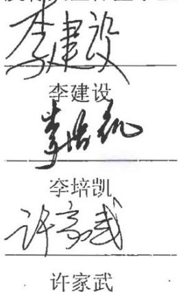

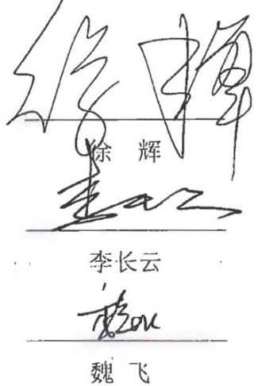

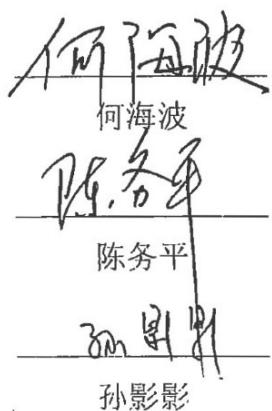

发行人全体审计委员会成员签名

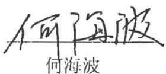

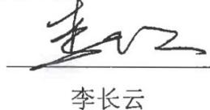

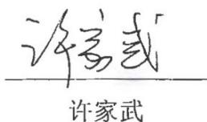

发行人非董事高级管理人员签名：

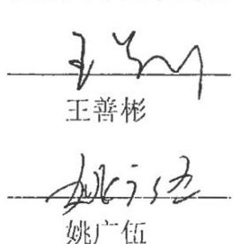

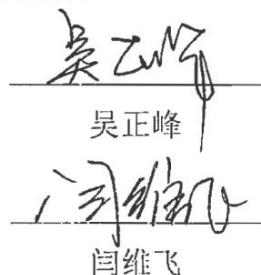

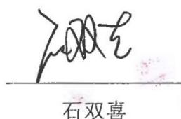

安徽林平循环发展股份有限公司

# 二、控股股东、实际控制人声明

本人承诺本招股说明书的内容真实、准确、完整，不存在虚假记载、误导性陈述或重大遗漏，按照诚信原则履行承诺，并承担相应的法律责任。

控股股东、实际控制人签名：

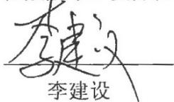

安徽林平循环发展股份有限公司

2026年3213月032日

# 三、保荐人（主承销商）声明

公司已对招股说明书进行核查，确认招股说明书的内容真实、准确、完，不存在虚假记载、误导性陈述或重大遗漏，并承担相应的法律责任。

项目协办人：

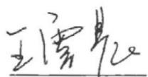

王雪晨

保荐代表人：

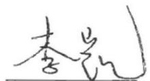

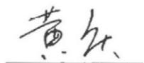

法定代表人：

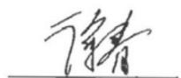

年 月 日

6年月

# 保荐人（主承销商）董事长、总经理声明

人已认真阅读安徽林平循环发展股份有限公司招股说明书的全部内容，认招股说明书不存在虚假记载、误导性陈述或者重大遗漏，并对招股说明书实性、准确性、完整性、及时性承担相应法律责任。

荐人总经理：

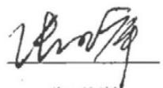

张明举

荐人董事长/法定代表人：

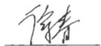

徐 春

国联民生证券承销保荐有限公司

年2月日

# 发行人律师声明

本所及经办律师已阅读招股说明书，确认招股说明书与本所出具的法律意见书无矛盾之处.本所及经办律师对发行人在招股说明书中引用的法律意见书的内容无异议，确认招股说明书不致因上述内容而出现虚假记载、误导性陈述或重大遗漏，并承担相应的法律责任。

事务所负责人签名：

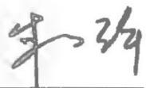

朱小辉

经办律师：

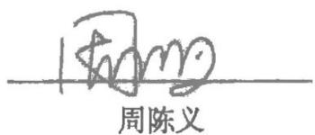

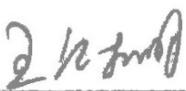

王裕棚

北京市天元律师事务所

# 审计机构声明

本所及签字注册会计师已阅读安徽林平循环发展股份有限公司（以下简称“发行人”）招股说明书，确认招股说明书与本所出具的审计报告、内部控制审计报告及经本所鉴证的非经常性损益明细表等本所及签字

报告及经本所鉴证的非经常性损益明细表等的内容无异议，确认招股说书不致因上述内容而出现虚假记载、误导性陈述或重大遗漏，并承担相应的无异议，确认招股说明书不致因上述内容而出现虚假记载、误导性陈述或重大遗漏，并承担相应的法律责任。

本声明仅供发行人申请首次公开发行股票并在主板上市之用，不其他目的。

字注册会计师： 朱作武

签字注册会计师：张小勇

签字注册会计师：陈文广

会计师事务所负责人：杨志国

签名：

事务所（特殊普通合

特殊普通合伙

年 月

2026年2月5日

# 六、资产评估机构声明

本机构及签字资产评估师已阅读招股说明书，确认招股说明书与本机构出具的资产评估报告无矛盾之处。本机构及签字资产评估师对发行人在招股说明书中引用的资产评估报告的内容无异议，确认招股说明书不致因上述内容而出现虚假评估机构负责人签名： ____________

资产评估机构负责人签名：

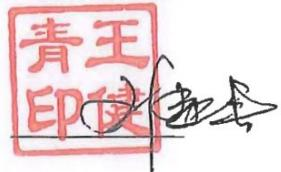  
王健青

签字资产评估师签名：

  
黄哲明

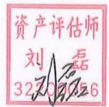

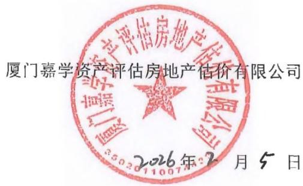  
刘磊

# 公司名称变更说明

2021年12月7日，经厦门市市场监督管理局核准，我公司由厦门市大学资产评估土地房地产估价有限责任公司更名为厦门嘉学资产评估房地产估价有限公司。

特此说明。

资产评估机构负责人：签字） 王健青

厦门嘉学资评估房地产估价有限公司 2026年2月5日

# 七、验资机构声明

验资报告的内容无异议，确认招股说明书不致因上述内容而出现虚具的验资报告无矛盾之处。本机构及签字注册会计师对发行人在招股说明书中引用的验资报告的内容无异议，确认招股说明书不致因上述内容而出现虚假记载、误导性陈述或重大遗漏，并承担相应的法律责任。

中国注册会计师别维会计师事务所负责人签名： 350200020149

刘维

沈在斌 注册在签字注册会计师签名： 320000060002

沈在斌

洪文胜（已离职）

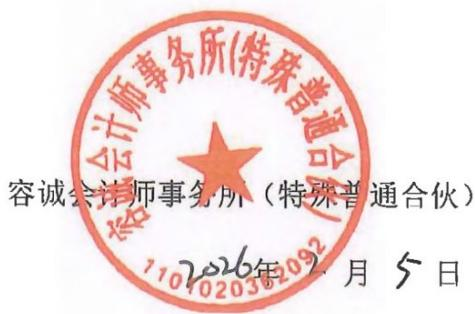

# 关于签字注册会计师离职的情况说明

截至本说明出具之日，容诚会计师事务所(特殊普通合伙)于2021年12月出具的“容诚审字[2021]210Z0182号《验资报告》”，其中签字注册会计师洪文胜已经离职，故安徽林平循环发展股份有限公司本次上市申请文件中，验资机构声明中的洪文胜未签字，特此说明。

中国注册会计师会计师事务所负责人签名： 350200020149刘维

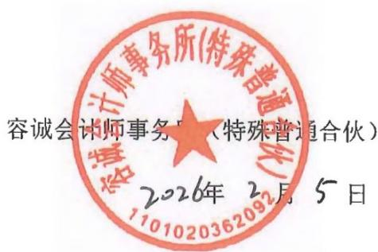

# 已阅读安徽林平循环发展

本所及签字注册会计师已阅读安徽林平循环发展股份有限公司（以下简称“发行人”）招股说明书，确认招股说明书与本所出具的11 月三次增资时注册资本实收情况的复核报告》的内容无矛盾之处。本所及签字注册会计师对发行人在招股说明书中引用的验资报告的内容无议，确认招股说明书不致因上述内容而出现

本所及签字注册会计师对发行人在招股说明书中引用的验资报告的内容无异议，确认招股说明书不致因上述内容而出现虚假记载、误导性陈述或重大遗漏，并承担相应的法律责任。

本声明仅供发行人申请首次公开发行股票并在主板上市之用，不适用于任何其他目的。

签字注册会计师：朱作武

签字注册会计师：张小勇

会计师事务所负责人：杨志国

签名：

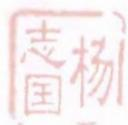

立信会计师事务所

特殊普通合伙事务所（特殊普通合

2026年2月5日

# 第十二节 附件

# 一、备查文件目录

（一）发行保荐书；  
（二）上市保荐书；  
（三）法律意见书；  
（四）财务报告及审计报告；  
（五）公司章程（草案）；  
（六）落实投资者关系管理相关规定的安排、股利分配决策程序、股东投票机制建立情况；  
（七）与投资者保护相关的承诺；  
（八）发行人及其他责任主体作出的与发行人本次发行上市相关的其他承诺事项；  
（九）内部控制审计报告；  
（十）经注册会计师鉴证的非经常性损益明细表；  
（十一）股东会、董事会、独立董事、董事会秘书制度的建立健全及运行情况说明；  
（十二）审计委员会及其他专门委员会的设置情况说明；  
（十三）募集资金具体运用情况；  
（十四）参股公司简要情况；  
（十五）其他与本次发行有关的重要文件。

# 二、查阅时间、地点

文件查阅时间：工作日上午 9：00－11：30，下午 1：30－5：00

文件查阅地点：

（一）发行人：安徽林平循环发展股份有限公司

办公地址：萧县圣泉乡北城村

联系人：王善彬

联系电话：0557-2201210

（二）保荐人（主承销商）：国联民生证券承销保荐有限公司

办公地址：上海市浦明路 8 号

联系人：李凯、黄庆

联系电话：021-80508866

# 附件一：落实投资者关系管理相关规定的安排、股利分配决策程序、股东投票机制建立情况

# （一）投资者关系的主要安排

发行人已制定并将于本次发行并上市后实施《投资者关系管理制度》，《投资者关系管理制度》的实施，将有助于加强发行人与投资者之间的信息沟通，完善公司治理结构，建立公司与投资者的良好沟通平台，形成公司与投资者之间长期、稳定、和谐的良性互动关系，有利于增加公司信息披露透明度，保护中小投资者的合法权益。

为规范公司信息披露工作，保护投资者的合法权益，发行人根据《公司法》《证券法》等法律、法规及部门规章，制定了《信息披露管理办法》。公司上市后，将按照公正、公开、公平的原则履行信息披露义务，真实、准确、完整、及时地报送和披露信息。

公司董事会办公室负责公司信息披露和投资者服务工作。

董事会秘书：王善彬

公司董事会办公室电话：0557-2201210

# （二）股利分配决策程序

依据《公司章程（草案）》的规定，本次发行后公司的股利分配决策程序如下：

1、利润分配预案应经公司董事会审议通过后方能提交股东会审议。  
2、董事会在审议利润分配尤其是现金分红具体方案时，应当认真研究和论证公司利润分配尤其是现金分红的时机、条件和最低比例、调整的条件及决策程序要求等事宜，独立董事应发表明确的书面独立意见。  
3、股东会对利润分配具体方案进行审议前，公司应当通过多种渠道主动与股东特别是中小股东进行沟通和交流，充分听取中小股东的意见和诉求，及时答复中小股东关心的问题；股东会对利润分配方案进行审议时，除设置现场会议投票外，公司应为股东提供网络投票方式以方便中小股东参与表决。

4、公司当年盈利而未提出现金分红预案的，董事会就不进行现金分红的具体原因、公司留存收益的确切用途及预计投资收益等事项进行专项说明，经独立董事发表书面意见后提交股东会审议。

# （三）股东投票机制的建立情况

公司制定了一系列制度用以保护投资者的合法权益，包括《公司章程（草案）》《股东会议事规则》《股东会累积投票制实施细则》等，详细规定了累积投票制度、中小投资者单独计票机制、网络投票方式召开股东会等各项制度安排。

# 1、累积投票机制

发行人《公司章程（草案）》《股东会累积投票制实施细则》设置了累积投票制。

累积投票制含义为：公司股东会在选举或变更两名以上（含两名）的董事时，股东所持的每一有效表决权股份拥有与该次股东会应选董事总人数相等的投票权，股东拥有的投票权等于该股东持有股份数与应选董事总人数的乘积，并可以集中使用，即股东可以用所有的投票权集中投票选举一位候选董事，也可以将投票权分散行使、投票给数位候选董事，最后按得票的多少决定当选董事。

发行人本次发行并上市完成后，中小投资者持有的发行人股份将不低于$2 5 \%$ ，结合发行人董事会成员人数及本次发行并上市完成后发行人的股份分布情况，在实施累积投票制选举董事的情况下，发行人实际控制人无法垄断全部董事的选任。

# 2、中小投资者单独计票机制

发行人《公司章程（草案）》及《股东会议事规则》设置了中小投资者单独计票机制，规定股东会审议影响中小投资者利益的重大事项时，对中小投资者表决应当单独计票，单独计票结果应当及时公开披露。

# 3、提供股东会网络投票方式

公司应在保证股东会合法、有效的前提下，通过各种方式和途径，优先提

供网络形式的投票平台等现代信息技术手段，为股东参加股东会提供便利。股东通过上述公司采用的方式参加股东会的，视为出席。

# 附件二：与投资者保护相关的承诺、发行人及其他责任主体作出的与发行人本次发行上市相关的其他承诺事项

# （一）关于限售安排、股份锁定及延长锁定期限的承诺

# 1、控股股东、实际控制人承诺

公司控股股东及实际控制人李建设先生承诺如下：

（1）自公司本次发行上市之日起 36 个月内，本人不转让或者委托他人管理本人直接或间接持有的公司股份，也不由公司回购该部分股份。  
（2）公司本次发行上市后 6 个月内如股票连续 20 个交易日的收盘价均低于本次发行上市时的发行价，或者公司本次发行上市后 6 个月期末（如该日不是交易日，则为该日后第一个交易日）公司股票收盘价低于发行价，本人所持有公司股份的锁定期限自动延长 6 个月，且在前述延长期限内，本人不转让或者委托他人管理本人所持公司股份，也不由公司回购本人持有的公司股份。

如公司本次发行上市后因派发现金红利、送股、转增股本、增发新股等进行除权、除息的，上述收盘价须按照中国证券监督管理委员会、上海证券交易所的有关规定进行相应调整。

（3）上述锁定期届满后，在本人担任公司董事、高级管理人员期间，本人每年转让的股份不超过本人所持公司股份总数的 $2 5 \%$ ，所持股份总数不超过1,000 股的除外；离职后半年内，不转让本人持有的公司股份；如本人在任期届满前离职的，本人应在就任董事、高级管理人员时确定的任期内和任期届满后6个月内，仍然继续遵守前述锁定承诺。  
（4）本人所持公司股票在锁定期满后两年内减持的，其减持价格不低于公司本次发行上市时的发行价（如果因派发现金红利、送股、转增股本、增发新股等原因进行除权、除息的，须按照中国证券监督管理委员会、上海证券交易所的有关规定作相应调整）。  
（5）如本人违反了关于股份锁定期承诺的相关内容，本人承诺由此所得的收益归公司所有，并赔偿由此给公司造成的损失。本人将自接到公司董事会通知本人违反本承诺函承诺事项之日起 20 日内将有关收益交给公司，并赔偿由此

给公司造成的损失。如本人未按期将有关收益交给公司或未赔偿有关损失，则公司有权扣留应付本人现金分红或薪酬中与本人应交给公司的有关收益和应赔偿的有关损失金额相等的现金分红或薪酬。

（6）在上述承诺履行期内，本人离职或职务变更等原因不影响本承诺的效力，同时，因公司进行权益分派等导致本人持有的公司股份发生变化，在此期间，本人仍将继续履行上述承诺。

本承诺函出具后，如有新的法律、法规、规范性文件及中国证券监督管理委员会、上海证券交易所相关监管规定与本承诺内容不一致的，以新的法律、法规、规范性文件及中国证券监督管理委员会、上海证券交易所相关监管规定为准。

# 2、民基投资承诺

持股 $5 \%$ 以上的股东民基投资承诺如下：

（1）自公司本次发行上市之日起 12 个月内，本公司不转让或者委托他人管理本公司持有的公司股份，也不由林平发展回购该部分股份。  
（2）因公司进行权益分派等导致本公司持有的公司股份发生变化，本公司仍应遵守前述承诺。  
（3）如本公司违反了关于股份锁定期承诺的相关内容，本公司承诺由此所得的收益归公司所有，并赔偿由此给公司造成的损失。本公司自接到公司董事会通知本公司违反本承诺函承诺事项之日起 20 日内将有关收益交给公司，并赔偿由此给公司造成的损失。如本公司未按期将有关收益交给公司或未赔偿有关损失，则公司有权扣留应付本公司现金分红中与本公司应交给公司的有关收益和应赔偿的有关损失金额相等的现金分红。

本承诺函出具后，如有新的法律、法规、规范性文件及中国证券监督管理委员会、上海证券交易所相关监管规定与本承诺内容不一致的，以新的法律、法规、规范性文件及中国证券监督管理委员会、上海证券交易所相关监管规定为准。

# 3、浩腾投资承诺

浩腾投资承诺如下：

（1）自公司本次发行上市之日起 36 个月内，不转让或者委托他人管理本企业持有的公司公开发行股票前已发行的股份，也不由公司回购该部分股份。  
（2）公司本次发行上市后 6 个月内如股票连续 20 个交易日的收盘价均低于本次发行上市时的发行价，或者公司本次发行上市后 6 个月期末（如该日不是交易日，则为该日后第一个交易日）公司股票收盘价低于发行价，本企业所持有公司股份的锁定期限自动延长 6 个月，且在前述延长期限内，本企业不转让或者委托他人管理本企业所持公司股份，也不由公司回购本企业持有的公司股份。

如公司本次发行上市后因派发现金红利、送股、转增股本、增发新股等进行除权、除息的，上述收盘价须按照中国证券监督管理委员会、上海证券交易所的有关规定进行相应调整。

（3）本企业所持公司股票在锁定期满后两年内减持的，其减持价格不低于公司本次发行上市时的发行价（如果因派发现金红利、送股、转增股本、增发新股等原因进行除权、除息的，须按照中国证券监督管理委员会、上海证券交易所的有关规定作相应调整）。  
（4）因公司进行权益分派等导致本企业持有的公司股份发生变化，本企业仍应遵守前述承诺。  
（5）如本企业违反了关于股份锁定期承诺的相关内容，本企业承诺由此所得的收益归公司所有，并赔偿由此给公司造成的损失。本企业在接到公司董事会通知本企业违反本承诺函承诺事项之日起 20 日内将有关收益交给公司，并赔偿由此给公司造成的损失。如本企业未按期将有关收益交给公司或未赔偿有关损失，则公司有权扣留应付本企业现金分红中与本企业应交给公司的有关收益和应赔偿的有关损失金额相等的现金分红。

本承诺函出具后，如有新的法律、法规、规范性文件及中国证券监督管理委员会、上海证券交易所相关监管规定与本承诺内容不一致的，以新的法律、法规、规范性文件及中国证券监督管理委员会、上海证券交易所相关监管规定

为准。

# 4、间接持有公司股份的董事及高级管理人员承诺

间接持有公司股份的董事及高级管理人员徐辉、李培凯、何海波、吴正峰、石双喜、姚广伍、闫维飞、魏飞、孙影影、王善彬承诺如下：

（1）自公司本次发行上市之日起 36 个月内，本人不转让或者委托他人管理本人间接持有的公司股份，也不由公司回购该部分股份。  
（2）公司本次发行上市后 6 个月内如股票连续 20 个交易日的收盘价均低于本次发行上市时的发行价，或者公司本次发行上市后 6 个月期末（如该日不是交易日，则为该日后第一个交易日）公司股票收盘价低于发行价，本人所持有公司股份的锁定期限自动延长 6 个月，且在前述延长期限内，本人不转让或者委托他人管理本人所持公司股份，也不由公司回购本人持有的公司股份。

如公司本次发行上市后因派发现金红利、送股、转增股本、增发新股等进行除权、除息的，上述收盘价须按照中国证券监督管理委员会、上海证券交易所的有关规定进行相应调整。

（3）上述锁定期限届满后，在本人担任公司董事或高级管理人员期间，本人每年转让的股份不超过本人所持公司股份总数的 $2 5 \%$ ，所持股份总数不超过1,000 股的除外；离职后半年内，不转让本人持有的公司股份；如本人在任期届满前离职的，本人应在就任董事或高级管理人员时确定的任期内和任期届满后6个月内，仍然继续遵守前述锁定承诺。  
（4）本人所持公司股票在锁定期满后两年内减持的，其减持价格不低于公司本次发行上市时的发行价（如果因派发现金红利、送股、转增股本、增发新股等原因进行除权、除息的，须按照中国证券监督管理委员会、上海证券交易所的有关规定作相应调整）。  
（5）如本人违反了关于股份锁定期承诺的相关内容，本人承诺由此所得的收益归公司所有，并赔偿由此给公司造成的损失。本人在自接到公司董事会通知本人违反本承诺函承诺事项之日起 20 日内将有关收益交给公司，并赔偿由此给公司造成的损失。如本人未按期将有关收益交给公司或未赔偿有关损失，则公司有权扣留应付本人现金分红或薪酬中与本人应交给公司的有关收益和应赔

偿的有关损失金额相等的现金分红或薪酬。

（6）在上述承诺履行期内，本人离职或职务变更等原因不影响本承诺的效力，同时，因公司进行权益分派等导致本人持有的公司股份发生变化，在此期间，本人仍将继续履行上述承诺。

本承诺函出具后，如有新的法律、法规、规范性文件及中国证券监督管理委员会、上海证券交易所相关监管规定与本承诺内容不一致的，以新的法律、法规、规范性文件及中国证券监督管理委员会、上海证券交易所相关监管规定为准。

# 5、间接持有公司股份的取消监事会前在任监事承诺

间接持有公司股份的取消监事会前的在任监事彭珍珍承诺如下：

（1）自公司本次发行上市之日起 36 个月内，本人不转让或者委托他人管理本人间接持有的公司股份，也不由公司回购该部分股份。  
（2）上述锁定期限届满后，在本人担任公司监事期间，本人每年转让的股份不超过本人所持公司股份总数的 $2 5 \%$ ，所持股份总数不超过1,000股的除外；离职后半年内，不转让本人持有的公司股份。如本人在任期届满前离职的，本人应在就任监事时确定的任期内和任期届满后 6 个月内，仍然继续遵守前述锁定承诺。  
（3）如本人违反了关于股份锁定期承诺的相关内容，本人承诺由此所得的收益归公司所有，并赔偿由此给公司造成的损失。本人自接到公司董事会通知本人违反本承诺函承诺事项之日起 20 日内将有关收益交给公司，并赔偿由此给公司造成的损失。如本人未按期将有关收益交给公司或未赔偿有关损失，则公司有权扣留应付本人现金分红或薪酬中与本人应交给公司的有关收益和应赔偿的有关损失金额相等的现金分红或薪酬。  
（4）在上述承诺履行期内，本人离职或职务变更等原因不影响本承诺的效力，同时，因公司进行权益分派等导致本人持有的公司股份发生变化，在此期间，本人仍将继续履行上述承诺。

本承诺函出具后，如有新的法律、法规、规范性文件及中国证券监督管理

委员会、上海证券交易所相关监管规定与本承诺内容不一致的，以新的法律、法规、规范性文件及中国证券监督管理委员会、上海证券交易所相关监管规定为准。

# 6、间接股东且同为董事或高管的亲属

间接股东且同为董事或高管的亲属许晓红承诺如下：

（1）自公司本次发行上市之日起 36 个月内，本人不转让或者委托他人管理本人间接持有的公司股份，也不由公司回购该部分股份。  
（2）公司本次发行上市后 6 个月内如股票连续 20 个交易日的收盘价均低于本次发行上市时的发行价，或者公司本次发行上市后 6 个月期末（如该日不是交易日，则为该日后第一个交易日）公司股票收盘价低于发行价，本人所持有公司股份的锁定期限自动延长 6 个月，且在前述延长期限内，本人不转让或者委托他人管理本人所持公司股份，也不由公司回购本人持有的公司股份。

如公司本次发行上市后因派发现金红利、送股、转增股本、增发新股等进行除权、除息的，上述收盘价须按照中国证券监督管理委员会、上海证券交易所的有关规定进行相应调整。

（3）上述锁定期限届满后，在本人配偶担任公司董事期间，本人每年转让的股份不超过本人所持公司股份总数的 $2 5 \%$ ，所持股份总数不超过1,000股的除外；本人配偶离职后半年内，不转让本人持有的公司股份；如本人配偶在任期届满前离职的，本人应在其就任董事时确定的任期内和任期届满后 6 个月内，仍然继续遵守前述锁定承诺。  
（4）本人所持公司股票在锁定期满后两年内减持的，其减持价格不低于公司本次发行上市时的发行价（如果因派发现金红利、送股、转增股本、增发新股等原因进行除权、除息的，须按照中国证券监督管理委员会、上海证券交易所的有关规定作相应调整）。  
（5）如本人违反了关于股份锁定期承诺的相关内容，本人承诺由此所得的收益归公司所有，并赔偿由此给公司造成的损失。本人在自接到公司董事会通知本人违反本承诺函承诺事项之日起 20 日内将有关收益交给公司，并赔偿由此给公司造成的损失。如本人未按期将有关收益交给公司或未赔偿有关损失，则

公司有权扣留应付本人现金分红或薪酬中与本人应交给公司的有关收益和应赔偿的有关损失金额相等的现金分红或薪酬。

（6）在上述承诺履行期内，本人配偶离职或职务变更等原因不影响本承诺的效力，同时，因公司进行权益分派等导致本人持有的公司股份发生变化，在此期间，本人仍将继续履行上述承诺。

本承诺函出具后，如有新的法律、法规、规范性文件及中国证券监督管理委员会、上海证券交易所相关监管规定与本承诺内容不一致的，以新的法律、法规、规范性文件及中国证券监督管理委员会、上海证券交易所相关监管规定为准。

# 7、间接股东且同为取消监事会前在任监事的亲属

间接股东且同为取消监事会前在任监事的亲属尤允良承诺如下：

（1）自公司本次发行上市之日起 36 个月内，本人不转让或者委托他人管理本人间接持有的公司股份，也不由公司回购该部分股份。  
（2）上述锁定期限届满后，在本人配偶担任公司监事期间，本人每年转让的股份不超过本人所持公司股份总数的 $2 5 \%$ ，所持股份总数不超过1,000股的除外；本人配偶离职后半年内，不转让本人持有的公司股份。如本人配偶在任期届满前离职的，本人应在就其任监事时确定的任期内和任期届满后 6 个月内，仍然继续遵守前述锁定承诺。  
（3）如本人违反了关于股份锁定期承诺的相关内容，本人承诺由此所得的收益归公司所有，并赔偿由此给公司造成的损失。本人自接到公司董事会通知本人违反本承诺函承诺事项之日起 20 日内将有关收益交给公司，并赔偿由此给公司造成的损失。如本人未按期将有关收益交给公司或未赔偿有关损失，则公司有权扣留应付本人现金分红或薪酬中与本人应交给公司的有关收益和应赔偿的有关损失金额相等的现金分红或薪酬。  
（4）在上述承诺履行期内，本人配偶离职或职务变更等原因不影响本承诺的效力，同时，因公司进行权益分派等导致本人持有的公司股份发生变化，在此期间，本人仍将继续履行上述承诺。

本承诺函出具后，如有新的法律、法规、规范性文件及中国证券监督管理委员会、上海证券交易所相关监管规定与本承诺内容不一致的，以新的法律、法规、规范性文件及中国证券监督管理委员会、上海证券交易所相关监管规定为准。

# （二）关于股东持股及减持计划的承诺

# 1、控股股东及实际控制人关于持股及减持计划的承诺

控股股东及实际控制人李建设先生关于持股及减持计划作如下承诺：

“1、在公司本次发行上市后，本人将严格遵守本人所作出的关于所持公司股份锁定期的承诺。在承诺的锁定期届满后，在遵守相关法律法规、规范性文件及中国证监会、上海证券交易所相关监管规定且不违背本人已作出的其他承诺的前提下，本人将结合证券市场整体状况、资金使用计划等各方面因素综合确定是否减持公司股份。

2、本人所持公司股票在锁定期满后两年内减持的，应符合以下条件：

（1）减持方式：本人减持首发前股份应符合相关法律、行政法规、中国证监会和上海证券交易所的规定，具体方式包括但不限于证券交易所集中竞价交易方式、大宗交易方式、协议转让等法律法规允许的方式。  
（2）减持数量及价格：在锁定期届满后两年内，本人每年减持的股份数量不超过本人所持公司股份总数的 $10 \%$ ，减持价格不低于公司本次发行上市时的发行价（如果因派发现金红利、送股、转增股本、增发新股等原因进行除权、除息的，须按照中国证监会、上海证券交易所的有关规定作相应调整）。  
（3）减持公告：如通过证券交易所集中竞价交易减持股份，则在首次卖出的 15 个交易日前向证券交易所预先披露减持计划。减持计划的内容包括但不限于：拟减持股份的数量、来源、原因、方式、减持时间区间、价格区间等。  
（4）减持期限：减持计划公告后六个月内。减持期限届满后，若拟继续减持股份，则需按照上述安排再次履行减持公告。

本人减持通过集中竞价交易取得的公司股份，不受上述承诺约束。

3、本人依法依规减持公司股份时，将提前通知公司并由公司提前 3 个交易

日予以公告，并按照中国证监会、上海证券交易所的监管规定及时、准确地履行信息披露义务，但本人持有公司股份低于 $5 \%$ 时除外。

4、本人减持公司股份时将严格遵守《上市公司股东减持股份管理暂行办法》、《上海证券交易所股票上市规则》等相关法律法规、规章及其他规范性文件的规定，结合公司的实际经营情况，审慎制定股票减持计划和实施公司股份减持，真实、准确、完整、及时地履行信息披露义务。如相关法律法规、规章及其他规范性文件发生变化，以届时有效的规定为准。  
5、在上述承诺履行期内，本人离职或职务变更等原因不影响本承诺的效力，同时，因公司进行权益分派等导致本人持有的公司股份发生变化，在此期间，本人仍将继续履行上述承诺。  
6、若本人违反上述承诺减持公司股份的，本人承诺违规减持公司股份所得（以下简称“违规减持所得”）归公司所有，并赔偿由此给公司造成的损失。本人应自接到公司董事会通知本人违规减持事项之日起 20 日内将违规减持所得上交公司，并赔偿由此给公司造成的损失；若本人未按期将违规减持所得上交公司或未赔偿有关损失，则公司有权扣留应付本人现金分红或薪酬中与本人应上交公司的违规减持所得和应赔偿的有关损失金额相等的现金分红或薪酬。”

# 2、民基投资关于持股意向及减持计划的承诺

“1、在林平发展本次发行上市后，本公司将严格遵守所作出的关于所持发行人股份锁定期的承诺。在承诺的锁定期届满后，在遵守相关法律法规、规范性文件及中国证监会、上海证券交易所相关监管规定且不违背本公司已作出的其他承诺的前提下，本公司将结合证券市场整体状况、资金使用计划等各方面因素综合确定是否减持发行人股份。

2、本公司所持林平发展股票在锁定期满后两年内减持的，应符合以下条件：

（1）减持方式：本公司减持首发前股份应符合相关法律、行政法规、中国证监会和上海证券交易所的规定，具体方式包括但不限于证券交易所集中竞价交易方式、大宗交易方式、协议转让等法律法规允许的方式。  
（2）减持数量及价格：在锁定期届满后两年内，本公司每年减持的股份数量少于本公司所持林平发展股份总数的 $100 \%$ ，减持价格不低于林平发展本次发

行上市时的发行价（如果因派发现金红利、送股、转增股本、增发新股等原因进行除权、除息的，须按照中国证监会、上海证券交易所的有关规定作相应调整）。

（3）减持公告：如通过证券交易所集中竞价交易减持股份，则在首次卖出的 15 个交易日前向证券交易所预先披露减持计划。减持计划的内容包括但不限于：拟减持股份的数量、来源、原因、方式、减持时间区间、价格区间等。  
（4）减持期限：减持计划公告后六个月内。减持期限届满后，若拟继续减持股份，则需按照上述安排再次履行减持公告。

本公司减持通过集中竞价交易取得的林平发展股份，不受上述承诺约束。

3、本公司依法依规减持林平发展股份时，将提前通知林平发展并由林平发展提前 3 个交易日予以公告，并按照中国证监会、上海证券交易所的监管规定及时、准确地履行信息披露义务，但本公司持有林平发展股份低于 $5 \%$ 时除外。  
4、本公司减持林平发展股份时将严格遵守《上市公司股东减持股份管理暂行办法》、《上海证券交易所股票上市规则》等相关法律法规、规章及其他规范性文件的规定，结合林平发展的实际经营情况，审慎制定股票减持计划和实施林平发展股份减持，真实、准确、完整、及时地履行信息披露义务。如相关法律法规、规章及其他规范性文件发生变化，以届时有效的规定为准。  
5、若本公司违反上述承诺减持林平发展股份的，本公司承诺违规减持林平发展股份所得（以下简称“违规减持所得”）归林平发展所有，并赔偿由此给林平发展造成的损失。本公司应自接到林平发展董事会通知本公司违规减持事项之日起 20 日内将违规减持所得上交林平发展，并赔偿由此给林平发展造成的损失；若本公司未按期将违规减持所得上交林平发展或未赔偿有关损失，则林平发展有权扣留应付本公司现金分红中与本公司应上交林平发展的违规减持所得和应赔偿的有关损失金额相等的现金分红。”

# 3、浩腾投资关于持股意向及减持计划的承诺

“1、在公司本次发行上市后，本企业将严格遵守本企业所作出的关于所持公司股份锁定期的承诺。在承诺的锁定期届满后，在遵守相关法律法规、规范性文件及中国证监会、上海证券交易所相关监管规定且不违背本企业已作出的

其他承诺的前提下，本企业将结合证券市场整体状况、资金使用计划等各方面因素综合确定是否减持公司股份。

2、本企业所持公司股票在锁定期满后两年内减持的，应符合以下条件：

（1）减持方式：本企业减持首发前股份应符合相关法律、行政法规、中国证监会和上海证券交易所的规定，具体方式包括但不限于证券交易所集中竞价交易方式、大宗交易方式、协议转让等法律法规允许的方式。  
（2）减持价格：减持价格不低于公司本次发行上市时的发行价（如果因派发现金红利、送股、转增股本、增发新股等原因进行除权、除息的，须按照中国证监会、上海证券交易所的有关规定作相应调整）。

本企业减持通过集中竞价交易取得的公司股份，不受上述承诺约束。

3、本企业减持公司股份时将严格遵守《上市公司股东减持股份管理暂行办法》、《上海证券交易所股票上市规则》等相关法律法规、规章及其他规范性文件的规定，结合公司的实际经营情况，审慎制定股票减持计划和实施公司股份减持，真实、准确、完整、及时地履行信息披露义务。如相关法律法规、规章及其他规范性文件发生变化，以届时有效的规定为准。  
4、若本企业违反上述承诺减持公司股份的，本企业承诺违规减持公司股份所得（以下简称“违规减持所得”）归公司所有，并赔偿由此给公司造成的损失。本企业应自接到公司董事会通知本企业违规减持事项之日起 20 日内将违规减持所得上交公司，并赔偿由此给公司造成的损失；若本企业未按期将违规减持所得上交公司或未赔偿有关损失，则公司有权扣留应付本企业现金分红中与本企业应上交公司的违规减持所得和应赔偿的有关损失金额相等的现金分红。”

# （三）关于稳定股价的预案及承诺

# 1、稳定股价的预案及措施

公司制定了稳定股价的预案及约束措施，具体内容如下：

# “一、稳定股价预案有效期及启动条件

1、稳定股价预案自公司首次公开发行股票并上市之日起三年内有效；  
2、稳定股价预案有效期内，一旦公司股票出现连续 20 个交易日的收盘价

均低于公司最近一期经审计的每股净资产的情形，在满足法律、法规和规范性文件关于增持或回购相关规定的情形下，公司及相关主体将启动本预案稳定公司股价。

3、公司应在满足实施稳定股价措施条件之日起 2 个交易日发布提示公告，并在 5 个交易日内制定并公告股价稳定具体措施。如未按上述期限公告稳定股价措施的，则应及时公告具体措施的制定进展情况。

# 二、责任主体

本预案中规定的应采取稳定公司股价措施的责任主体为公司及控股股东、实际控制人、公司董事（独立董事除外，下同）及高级管理人员。本预案中应采取稳定股价措施的董事、高级管理人员既包括在公司上市时任职的董事、高级管理人员，也包括公司上市后三年内新任职董事、高级管理人员。

# 三、稳定股价的具体措施

当上述启动股价稳定措施的条件成就时，公司将综合考虑当时的实际情况及各种稳定股价措施的作用及影响，并在符合相关法律法规的规定的情况下，各方协商确定当次稳定股价预案的实施主体，选择如下一种或几种稳定股价措施，制定并公告具体的股价稳定方案，披露拟采取的稳定股价措施、回购或增持的数量范围、价格区间、完成时间等信息。

# 1、公司回购股份

（1）若公司董事会制定并公告的稳定股价方案中选择公司回购方式，则公司应自公告之日起 1 个月之内按照法律法规及公司章程之规定履行完毕内部决策程序。公司应自前述决策程序履行完毕之日起 3 个月内完成全部回购（若该股份回购计划需经相关部门审批，则完成时间相应顺延）。  
（2）公司回购股份应符合《中华人民共和国公司法》《中华人民共和国证券法》《上海证券交易所股票上市规则》《上市公司股份回购规则》等相关规定，且不能导致公司不符合上市条件。  
（3）公司用于回购股份的资金总额累计不超过公司首次公开发行新股所募集资金的总额；公司单次用于回购股份的资金金额不高于上一个会计年度经审

计的归属于母公司股东净利润的 $10 \%$ ；若公司根据本预案在同一个会计年度需多次回购公司股份的，单一会计年度用以稳定股价的回购资金合计不超过上一会计年度经审计的归属于母公司股东净利润的 $30 \%$ ；超过上述标准的，有关稳定股价措施在当年度不再继续实施，但如下一年度继续出现需启动稳定股价措施的情形时，公司将继续按照上述原则执行稳定股价预案。

（4）公司承诺在触发稳定股价方案的启动条件后，按照相关法律法规及公司章程的规定，履行完毕内外部批准程序后，履行上述股份回购义务。

# 2、公司控股股东、实际控制人增持

（1）若公司董事会制定并公告的稳定股价方案中选择控股股东、实际控制人增持方式，则公司控股股东、实际控制人应自公告之日起 6 个月内通过证券交易所在二级市场买入的方式完成全部增持计划（如该期间存在限制其买卖股票的情形或该股份增持计划需经相关部门审批，则完成时间相应顺延），增持计划完成后6个月内将不出售所增持的股份。

（2）公司控股股东、实际控制人增持公司股份应符合《中华人民共和国公司法》《中华人民共和国证券法》《上海证券交易所股票上市规则》《上市公司收购管理办法》《上海证券交易所上市公司自律监管指引第 8 号——股份变动管理》等相关规定，且不能导致公司不符合上市条件。

（3）公司控股股东、实际控制人单次计划用于稳定股价的增持资金，不低于其上一会计年度从公司取得的税后现金分红金额的 $10 \%$ ；若公司控股股东、实际控制人根据本预案在同一个会计年度需多次增持公司股份，则在同一个会计年度之内单次用于增持的资金不超过其上一年度从公司取得的税后现金分红金额的 $30 \%$ ，单一会计年度用于增持的资金合计不超过其上一年度从公司取得的税后现金分红金额的 $60 \%$ ；超过上述标准的，有关稳定股价措施在当年度不再继续实施，但如下一年度继续出现需启动稳定股价措施的情形时，公司控股股东、实际控制人将继续按照上述原则执行稳定股价预案。

# 3、公司董事、高级管理人员增持

（1）若公司董事会制定并公告的稳定股价方案中选择由董事（独立董事除外，下同）及高级管理人员增持方式，则公司届时在任并在公司领取薪酬的董

事、高级管理人员应自公告之日起 6 个月内通过证券交易所在二级市场买入的方式完成全部增持计划（如该期间存在限制其买卖股票的情形或该股份增持计划需经相关部门审批，则完成时间相应顺延）。

（2）公司届时在任并在公司领取薪酬的董事和高级管理人员增持公司股份，应符合《中华人民共和国公司法》《中华人民共和国证券法》《上海证券交易所股票上市规则》《上市公司收购管理办法》《上市公司董事、监事和高级管理人员所持本公司股份及其变动管理规则》等相关规定，且不能导致公司不符合上市条件。  
（3）公司届时在任并在公司领取薪酬的董事和高级管理人员，各自单次计划用于稳定股价的增持资金不低于其上一个会计年度从公司取得的税后薪酬总额的 $10 \%$ ；若根据本预案在同一个会计年度需多次增持公司股份，则各自单次计划用于稳定股价的增持资金不超过其上一个会计年度从公司取得的税后薪酬总额的 $30 \%$ ，且在同一个会计年度之内累计用于稳定股价的增持资金总额不超过其上一个会计年度从公司取得的薪酬总额；超过上述标准的，有关稳定股价措施在当年度不再继续实施。但如下一年度继续出现需启动稳定股价措施的情形时，将继续按照上述原则执行稳定股价预案。  
（4）公司在未来聘任新的董事、高级管理人员前，将要求其签署承诺书，保证其履行公司首次公开发行上市时董事、高级管理人员已作出的相应承诺。

# 四、稳定股价方案的终止情形

若出现以下任一情形，则视为本次稳定股价措施实施完毕及承诺履行完毕，已公告的稳定股价方案终止执行：

1、公司股票连续 5 个交易日的收盘价均高于公司最近一期经审计的每股净资产；  
2、公司、控股股东、公司董事及高级管理人员用于回购或增持资金金额已达上限；  
3、继续回购或增持公司股份将导致公司股权分布不符合上市条件。

公司稳定股价措施实施完毕及承诺履行完毕之日起 2 个交易日内，公司应

将稳定股价措施实施情况予以公告。公司稳定股价措施实施完毕及承诺履行完毕后，如公司股票价格再度触发启动股价稳定措施的条件，则公司、控股股东、实际控制人、董事、高级管理人员等相关责任主体将继续按照本预案及相关承诺履行相关义务。

# 五、公司股价稳定预案的保障措施

在启动稳定股价措施的条件满足时，如公司、控股股东、实际控制人、有增持义务的董事、高级管理人员未采取上述稳定股价的具体措施，公司、控股股东、实际控制人、有增持义务的董事、高级管理人员承诺接受以下约束措施：

“1、公司、控股股东、实际控制人、有增持义务的董事、高级管理人员将在公司股东会及中国证监会指定报刊上公开说明未采取上述稳定股价措施的具体原因，并向公司股东和社会公众投资者道歉。  
2、如果控股股东、实际控制人、有增持义务的董事、高级管理人员未采取上述稳定股价的具体措施，则公司有权暂停发放该等人员拟增持股票所需资金总额相等金额的工资薪酬及应付现金分红，直至其按预案的规定采取相应的稳定股价措施并实施完毕。  
3、如公司、控股股东、实际控制人、有增持义务的董事、高级管理人员因违反承诺未及时采取上述稳定股价的具体措施导致投资者遭受损失的，将依法对投资者进行赔偿。”

# 2、关于稳定股价的承诺

# （1）发行人承诺

“1、本公司将严格按照《稳定股价预案》之规定全面且有效地履行、承担本公司在《稳定股价预案》项下的各项义务和责任。  
2、本公司将极力敦促其他相关方严格按照《稳定股价预案》之规定全面且有效地履行、承担其在《稳定股价预案》项下的各项义务和责任。  
3、本公司将极力敦促公司新聘任的董事（不包括独立董事和不在公司领取薪酬的董事）和高级管理人员遵守稳定公司股价预案并签署相关承诺。  
4、在启动条件触发后，本公司未按照稳定公司股价预案采取稳定股价措施

的，本公司将在股东会及中国证监会指定报刊上公开说明未采取上述稳定股价措施的具体原因，并向公司股东和社会公众投资者道歉；若因本公司违反承诺未及时采取上述稳定股价的具体措施导致投资者遭受损失的，将依法对投资者进行赔偿，赔偿额以《稳定股价预案》中规定的本公司最大回购金额为限。”

# （2）控股股东及实际控制人承诺

“1、本人将严格按照《稳定股价预案》之规定全面且有效地履行、承担本人在《稳定股价预案》项下的各项义务和责任。  
2、本人将极力敦促其他相关方严格按照《稳定股价预案》之规定全面且有效地履行、承担其在《稳定股价预案》项下的各项义务和责任。  
3、本人将极力敦促公司新聘任的董事（不包括独立董事和不在公司领取薪酬的董事）和高级管理人员遵守稳定公司股价预案并签署相关承诺。  
4、在启动条件触发后，本人未按照《稳定股价预案》采取稳定股价措施的，则公司有权暂停发放本人拟增持股票所需资金总额相等金额的工资薪酬及应付现金分红，直至本人按《稳定股价预案》之规定采取相应的稳定股价措施并实施完毕。  
5、在启动条件触发后，本人未按照《稳定股价预案》采取稳定股价措施的，本人将在股东会及中国证监会指定报刊上公开说明未采取上述稳定股价措施的具体原因，并向公司股东和社会公众投资者道歉；若因本人违反承诺未及时采取上述稳定股价的具体措施导致投资者遭受损失的，将依法对投资者进行赔偿，赔偿额以《稳定股价预案》中规定的本人最大回购金额为限。”

# （3）董事及高级管理人员承诺

“1、本人将严格按照《稳定股价预案》之规定全面且有效地履行、承担本人在《稳定股价预案》项下的各项义务和责任。  
2、本人将极力敦促其他相关方严格按照《稳定股价预案》之规定全面且有效地履行、承担其在《稳定股价预案》项下的各项义务和责任。  
3、本人将极力敦促公司新聘任的董事（不包括独立董事和不在公司领取薪酬的董事）和高级管理人员遵守稳定公司股价预案并签署相关承诺。

4、在启动条件触发后，本人未按照《稳定股价预案》采取稳定股价措施的，则公司有权暂停发放本人拟增持股票所需资金总额相等金额的工资薪酬及应付现金分红，直至本人按《稳定股价预案》之规定采取相应的稳定股价措施并实施完毕。  
5、在启动条件触发后，本人未按照《稳定股价预案》采取稳定股价措施的，本人将在股东会及中国证监会指定报刊上公开说明未采取上述稳定股价措施的具体原因，并向公司股东和社会公众投资者道歉；若因本人违反承诺未及时采取上述稳定股价的具体措施导致投资者遭受损失的，将依法对投资者进行赔偿，赔偿额以《稳定股价预案》中规定的本人最大回购金额为限。”

# （四）发行人因欺诈发行、虚假陈述或者其他重大违法行为给投资者造成损失的，发行人控股股东、实际控制人自愿作出先行赔付投资者的承诺

公司控股股东、实际控制人李建设先生自愿作出的先行赔付投资者的承诺详见本招股说明书“第十二节 附件”之“附件二：与投资者保护相关的承诺、发行人及其他责任主体作出的与发行人本次发行上市相关的其他承诺事项”之“（九）依法承担赔偿责任的承诺”相关内容。

# （五）股份回购和股份买回的措施和承诺

发行人就稳定股价出具的股份回购和股份买回承诺详见本招股说明书“第十二节 附件”之“附件二：与投资者保护相关的承诺、发行人及其他责任主体作出的与发行人本次发行上市相关的其他承诺事项”之“（三）关于稳定股价的预案及承诺”。

发行人及控股股东、实际控制人就欺诈发行上市的股份回购和股份买回承诺详见本招股说明书“第十二节 附件”之“附件二：与投资者保护相关的承诺、发行人及其他责任主体作出的与发行人本次发行上市相关的其他承诺事项”之“（六）对欺诈发行上市的股份回购和股份买回承诺”。

# （六）对欺诈发行上市的股份回购和股份买回承诺

# 1、发行人关于欺诈发行上市的股份回购和股份买回承诺

发行人就欺诈发行上市的股份回购和股份买回承诺如下：

（1）本公司确认本次发行上市不存在任何欺诈发行的情形，《安徽林平循环发展股份有限公司首次公开发行股票并在主板上市招股说明书》（以下简称“《招股说明书》”）等证券发行文件不存在虚假记载、误导性陈述或重大遗漏，本公司对其真实性、准确性、完整性承担个别和连带的法律责任。  
（2）如《招股说明书》等证券发行文件有虚假记载、误导性陈述或者重大遗漏的情形，对判断本公司是否符合法律规定的发行上市条件构成重大、实质影响，经中国证券监督管理委员会或其他有权部门认定本公司存在欺诈发行情形的，本公司将按照《欺诈发行上市股票责令回购实施办法（试行）》的规定或责令回购决定书的要求回购自本次发行至欺诈发行揭露日或者更正日期间买入欺诈发行的股票且在回购时仍然持有的股票，但回购股票范围不包括：（1）对欺诈发行负有责任的公司的董事、监事、高级管理人员、控股股东、实际控制人持有的股票；（2）对欺诈发行负有责任的证券公司因包销买入的股票；  
（3）投资者知悉或者应当知悉公司在证券发行文件中隐瞒重要事实或者编造重大虚假内容后买入的股票，回购价格以基准价格（参照《最高人民法院关于审理证券市场虚假陈述侵权民事赔偿案件的若干规定》确定）回购，投资者买入股票价格高于基准价格的，以买入股票价格作为回购价格，如在证券发行文件中承诺的回购价格高于前款规定的价格的，则以承诺的价格回购，并按照《欺诈发行上市股票责令回购实施办法（试行）》的规定或责令回购决定书的要求履行制定回购方案、审议、公告等程序。  
（3）如发生需要公司的控股股东、实际控制人买回其已转让的限售股股份的情形，公司将督促公司控股股东、实际控制人买回其已转让的限售股股份，买回价格为发行价格加上同期银行存款利息（若发行人股票有派息、送股、资本公积金转增股本等除权、除息事项的，回购的股份包括公司首次公开发行的全部新股及其派生股份,发行价格将相应进行除权、除息调整）和买回公告前30 个交易日公司股票每日加权平均价的算术平均值孰高者确定，并根据相关法律法规规定的程序实施。  
（4）若违反本承诺不及时进行回购的，公司将在符合国务院证券监督管理机构规定条件的媒体上公开说明未履行承诺的具体原因，并向公司股东和社会公众投资者道歉；公司股东及社会公众投资者有权通过法律途径要求公司履行

承诺；因本公司不履行承诺造成公司股东及社会公众投资者损失的，本公司将依法进行赔偿。

# 2、控股股东及实际控制人欺诈发行上市的股份回购和股份买回承诺

控股股东、实际控制人李建设先生就欺诈发行上市的股份回购和股份买回承诺如下：

（1）本人确认本次发行上市不存在任何欺诈发行的情形，《安徽林平循环发展股份有限公司首次公开发行股票并在主板上市招股说明书》（以下简称“《招股说明书》”）等证券发行文件不存在虚假记载、误导性陈述或重大遗漏，本人对其真实性、准确性、完整性承担个别和连带的法律责任。  
（2）如《招股说明书》等证券发行文件有虚假记载、误导性陈述或者重大遗漏的情形，对判断公司是否符合法律规定的发行上市条件构成重大、实质影响，经中国证券监督管理委员会或其他有权部门认定公司存在欺诈发行情形，且本人对欺诈发行负有责任的，本人将按照《欺诈发行上市股票责令回购实施办法（试行）》的规定或责令回购决定书的要求回购自本次发行至欺诈发行揭露日或者更正日期间买入欺诈发行的股票且在回购时仍然持有的股票，但回购股票范围不包括：（1）对欺诈发行负有责任的公司的董事、监事、高级管理人员、控股股东、实际控制人持有的股票；（2）对欺诈发行负有责任的证券公司因包销买入的股票；（3）投资者知悉或者应当知悉公司在证券发行文件中隐瞒重要事实或者编造重大虚假内容后买入的股票，回购价格以基准价格（参照《最高人民法院关于审理证券市场虚假陈述侵权民事赔偿案件的若干规定》确定）回购，投资者买入股票价格高于基准价格的，以买入股票价格作为回购价格，如在证券发行文件中承诺的回购价格高于前款规定的价格的，则以承诺的价格回购，并按照《欺诈发行上市股票责令回购实施办法（试行）》的规定或责令回购决定书的要求履行制定回购方案、审议等程序并履行信息披露义务。  
（3）若公司向中国证监会、上海证券交易所提交的首次公开发行股票并在主板上市的招股说明书存在虚假记载、误导性陈述或者重大遗漏，对判断公司是否符合法律规定的发行条件构成重大、实质影响的，本人将依法买回已转让的限售股股份，买回价格为发行价格加上同期银行存款利息（若公司股票有派

息送股、资本公积金转增股本等除权、除息事项的，买回的股份包括公司首次公开发行的全部新股及其派生股份，发行价格将相应进行除权、除息调整）和买回公告前 30 个交易日发行人股票每日加权平均价的算术平均值孰高者确定，并根据相关法律法规规定的程序实施。

（4）若本人未及时履行上述承诺，将在公司股东会及中国证券监督管理委员会指定报刊上公开说明未履行承诺的具体原因，向公司其他股东和社会公众投资者道歉，并在违反上述承诺发生之日起停止在公司领取薪酬（或津贴）及股东现金分红（如有），同时本人持有的公司股票（如有）将不得转让，直至本人按上述承诺采取相应的回购及赔偿措施并实施完毕时为止。

# （七）关于公司填补被摊薄即期回报的措施及承诺

# 1、关于公司填补被摊薄即期回报的措施

公司已制定关于填补被摊薄即期回报的措施，具体内容如下：

“根据《国务院关于进一步促进资本市场健康发展的若干意见》（国发[2014]17 号）、《国务院办公厅关于进一步加强资本市场中小投资者合法权益保护工作的意见》（国办发[2013]110 号）、《关于首发及再融资、重大资产重组摊薄即期回报有关事项的指导意见》（证监会公告[2015]31 号）等相关规定，公司就本次发行对即期回报摊薄的影响进行了认真分析，拟定了填补被摊薄即期回报的具体措施，并承诺采取如下措施填补被摊薄的即期回报：

# 1、针对运营风险及时制定应对措施

公司主要从事包装用瓦楞纸、箱板纸产品的研发、生产和销售，是一家具有自主研发及创新能力的高新技术企业；经过多年发展，公司已成长为集废纸利用、热电联产、绿色造纸于一体的资源综合利用企业。公司生产的原纸被广泛应用于包装物制造、工业品及消费品包装领域，主要客户有合兴包装、山鹰国际、胜源纸业等知名包装企业，未来发展前景广阔。

总体来看，公司资产质量良好，运营能力较强。但在经营发展过程中，公司面临着产业政策变动风险、原材料价格波动风险、市场竞争加剧风险、应收账款金额较大风险等。面对上述风险，公司未来将采取措施及时应对，进一步加大研发投入，丰富产品系统，提升产品性能和竞争力；积极进行市场开拓，

争取更多优质客户；加强生产经营管理和质量控制，切实维护上下游供应链的客户关系，主动监控客户信用状况，维持公司资产安全完整，增强公司抵御各种经营风险的能力。

# 2、提高经营效率，降低运营成本，提升经营业绩的具体措施

为降低首次公开发行摊薄公司即期回报的风险，增强对股东利益的回报，公司承诺通过提高经营效率、降低营运成本、加大现有产品销售力度、开发新技术和研发新产品、加强募投项目监管、提高募集资金使用效率等措施，从而提升产品质量和技术含量，提高销售收入，增厚未来收益，实现可持续发展，以填补回报。公司将采取的相关措施具体如下：

# （1）提高经营效率，降低运营成本

为进一步提升经营效率、降低运营成本，公司将通过加强各部门之间的沟通，增强采购、生产和销售之间的联动作用，提高资产周转率，降低生产成本和运营成本，提升公司的盈利能力。

# （2）加大现有产品销售力度，开发新技术和研发新产品

为进一步提升股东回报水平，公司将加大现有产品的销售力度，进一步开拓市场空间，并通过开发新技术和研发新产品等方式，拓宽产品和技术的应用领域，开发新的客户群体，从而努力提升公司营业收入和净利润的水平，争取在公司募投项目实现预期效益之前，努力降低由于本次发行导致投资者即期回报摊薄的风险。

# （3）加强募投项目监管，保证募集资金合理合法使用

为规范募集资金的管理，提高募集资金使用效率，公司根据《公司法》、《证券法》、《首次公开发行股票注册管理办法》、《上市公司募集资金监管规则》、《上海证券交易所股票上市规则》等相关法律、法规和规范性文件的规定，并结合自身实际情况，制定了《募集资金管理办法》。

本次发行募集资金到账后，公司将开设募集资金专项账户，对募集资金进行专项存储；就募集资金账户与开户银行、保荐人（主承销商）签订募集资金三方监管协议，确保募集资金专款专用；严格遵守《募集资金管理办法》的相

关规定，在进行募集资金项目投资时，资金支出严格依据相关规定；定期披露募集资金使用情况，保证募集资金使用合法合规。

# （4）完善利润分配制度，强化投资者回报机制

根据《公司法》、《上市公司证券发行注册管理办法》、《上市公司监管指引第 3 号——上市公司现金分红》、《中国证券监督管理委员会关于进一步落实上市公司现金分红有关事项的通知》（证监发[2012]37 号）等法律法规和规章的规定，公司制订了《公司上市后三年内股东回报规划》，明确公司上市后三年内股东回报规划的制定原则和具体规划内容，充分维护公司股东依法享有的资产收益。公司将严格执行分红政策，在符合利润分配条件的情况下，积极推动对股东的利润分配，努力提升对股东的回报。

# （5）积极加快实施募集资金投资项目

本次募集资金投资项目经过充分论证，从中长期来看，总体上具有较高的投资回报率，募集资金到位后，公司将加快募集资金投资项目实施进度，使其尽快产生效益。随着投资项目陆续产生效益，公司的营业收入与利润水平有望快速增长，未来盈利能力和公司综合竞争力有望显著提高。”

# 2、关于公司填补被摊薄即期回报的承诺

# （1）控股股东及实际控制人承诺

“1、不会滥用控股股东、实际控制人地位，不越权干预公司经营管理活动，不侵占公司利益；  
2、本承诺函出具后，若中国证券监督管理委员会（以下简称“中国证监会”）作出关于填补回报措施及其承诺的其他新的监管规定，且本承诺不能满足中国证监会该等规定时，本人承诺届时将按照中国证监会的最新规定出具补充承诺；  
3、本人承诺切实履行公司制定的有关填补回报措施以及对此作出的任何有关填补回报措施的承诺，若违反该等承诺并给公司或者投资者造成损失的，本人愿意依法承担对公司和投资者的补偿责任；

作为填补回报措施相关责任主体之一，若违反上述承诺或拒不履行上述承

诺，本人同意中国证监会和上海证券交易所等证券监管机构按照其制定或发布的有关规定，对本人作出相关处罚或采取相关管理措施。”

# （2）董事及高级管理人员承诺

“1、本人承诺不无偿或以不公平条件向其他单位或者个人输送利益，也不会采用其他方式损害公司利益；  
2、本人承诺将严格遵守公司的预算管理，对职务消费行为进行约束；  
3、本人承诺不会动用公司资产从事与本人履行职责无关的投资、消费活动；  
4、本人承诺由董事会或薪酬与考核委员会制订的薪酬制度与公司填补回报措施的执行情况相挂钩；  
5、若公司后续推出股权激励计划，本人承诺拟公布的公司股权激励的行权条件与公司填补回报措施的执行情况相挂钩；  
6、本承诺函出具后，若中国证监会作出关于填补回报措施及其承诺的其他新的监管规定，且本承诺不能满足中国证监会该等规定时，本人承诺届时将按照中国证监会的最新规定出具补充承诺；  
7、本人承诺切实履行公司制定的有关填补回报措施以及对此作出的任何有关填补回报措施的承诺，若违反该等承诺并给公司或者投资者造成损失的，本人愿意依法承担对公司和投资者的补偿责任。

作为填补回报措施相关责任主体之一，若违反上述承诺或拒不履行上述承诺，本人同意中国证监会和上海证券交易所等证券监管机构按照其制定或发布的有关规定，对本人作出相关处罚或采取相关管理措施。”

# （八）利润分配政策的承诺

发行人针对上市后不断完善利润分配政策承诺如下：

1、根据《中华人民共和国公司法》、《中华人民共和国证券法》、《中国证券监督管理委员会关于进一步落实上市公司现金分红有关事项的通知》、《上市公司监管指引第 3 号——上市公司现金分红》等相关法律法规的规定，本公司已制定适用于本公司实际情形的上市后利润分配政策，并在上市后适用的《公司章程（草案）》、《公司上市后三年内股东回报规划》中予以体现。

2、本公司将严格执行经股东会审议通过的上市后适用的《安徽林平循环发展股份有限公司章程（草案）》以及《安徽林平循环发展股份有限公司上市后三年内股东回报规划》中确定的相关利润分配政策。确有必要对公司章程确定的利润分配政策进行调整或变更的，应满足公司章程规定的条件，经过详细论证后，履行相应的决策程序。  
3、如违反前述承诺，本公司将及时公告违反承诺的事实及原因，除因不可抗力或其他非归属于本公司的原因外，本公司将向股东和社会公众投资者道歉，同时向投资者提出补充承诺或替代承诺，以尽可能保护投资者的利益，并在公司股东会审议通过后实施补充承诺或替代承诺。

# （九）依法承担赔偿责任的承诺

# 1、发行人承诺

（1）如《招股说明书》等证券发行文件存在虚假记载、误导性陈述或者重大遗漏，或本次发行上市存在欺诈发行上市情形，致使投资者在证券交易中遭受损失，本公司将依法赔偿投资者损失。投资者损失根据与投资者协商确定的金额，或者依据最终认定或生效判决确定的赔偿主体范围、赔偿标准、赔偿金额等赔偿投资者实际遭受的直接损失。  
（2）若本公司未及时履行上述承诺，将在公司股东会及中国证券监督管理委员会指定报刊上公开就未履行上述赔偿措施向公司股东和社会公众投资者道歉。

# 2、控股股东及实际控制人承诺

（1）如《招股说明书》等证券发行文件存在虚假记载、误导性陈述或者重大遗漏，或本次发行上市存在欺诈发行上市情形，致使投资者在证券交易中遭受损失，且本人被监管机构认定不能免责的，在公司及其他连带责任人赔偿前，本人将依法先行赔偿投资者损失。投资者损失根据与投资者协商确定的金额，或者依据最终认定或生效判决确定的赔偿主体范围、赔偿标准、赔偿金额等赔偿投资者实际遭受的直接损失。  
（2）若本人未及时履行上述承诺，将在公司股东会及中国证券监督管理委员会指定报刊上公开就未履行上述赔偿措施向公司股东和社会公众投资者道

歉，并在违反上述赔偿措施发生之日起停止在公司领取薪酬（或津贴）及股东现金分红（如有），同时本人持有的公司股票（如有）将不得转让，直至本人按上述承诺采取相应的赔偿措施并实施完毕时为止。

# 3、董事、取消监事会在任监事、高级管理人员承诺

（1）如《招股说明书》等证券发行文件存在虚假记载、误导性陈述或者重大遗漏，或本次发行上市存在欺诈发行上市情形，致使投资者在证券交易中遭受损失，且本人被监管机构认定不能免责的，本人将依法赔偿投资者损失。投资者损失根据与投资者协商确定的金额，或者依据最终认定或生效判决确定的赔偿主体范围、赔偿标准、赔偿金额等赔偿投资者实际遭受的直接损失。  
（2）若本人未及时履行上述承诺，将在公司股东会及中国证券监督管理委员会指定报刊上公开就未履行上述赔偿措施向公司股东和社会公众投资者道歉，并在违反上述赔偿措施发生之日起停止在公司领取薪酬（或津贴）及股东现金分红（如有），同时本人持有的公司股票（如有）将不得转让，直至本人按上述承诺采取相应的赔偿措施并实施完毕时为止。

# 4、保荐人（主承销商）承诺

因保荐人（主承销商）为发行人首次公开发行股票制作、出具的文件有虚假记载、误导性陈述或者重大遗漏，给投资者造成损失的，将依法赔偿投资者损失。

如未能履行上述公开承诺事项，保荐人（主承销商）将依法承担相应的法律责任。

# 5、发行人律师承诺

如因本所为发行人首次公开发行制作、出具的文件有虚假记载、误导性陈述或者重大遗漏，给投资者造成损失的，将依法赔偿投资者损失。本所将依照相关法律、法规规定承担民事赔偿责任，赔偿投资者损失。该等损失的赔偿金额以投资者因此而实际发生并能举证证实的损失为限，具体的赔偿标准、赔偿主体范围、赔偿金额等细节内容待上述情形实际发生时，以最终确定的赔偿方案为准。

# 6、发行人会计师、验资复核机构承诺

如因本所为发行人首次公开发行股票制作、出具的文件有虚假记载、误导性陈述或者重大遗漏，给投资者造成损失的，本所将依法赔偿投资者损失。

# 7、发行人验资机构承诺

因本机构为发行人首次公开发行股票制作、出具的文件有虚假记载、误导性陈述或者重大遗漏，给投资者造成损失的，将依法赔偿投资者损失。

# 8、发行人资产评估机构承诺

本机构及签字资产评估师已对出具的资产评估报告进行了核查，确认不存在虚假记载、误导性陈述或者重大遗漏的情形。如因本机构为发行人首次公开发行股票并上市出具的文件有虚假记载、误导性陈述或者重大遗漏，给投资者造成损失的，本机构将依法赔偿投资者损失。

# （十）控股股东、实际控制人避免新增同业竞争的承诺

公司控股股东、实际控制人李建设先生就避免同业竞争作出如下承诺：

1、本人及本人近亲属目前没有、将来也不在中国境内外生产、开发任何与林平发展所生产、开发产品构成竞争或可能构成竞争的产品；不直接或间接以任何形式从事或参与任何与林平发展所经营业务构成竞争或可能构成竞争的业务及活动；不参与投资任何与林平发展所生产产品或所经营业务构成竞争或可能构成竞争的法人或组织；不在任何与林平发展所生产产品或所经营业务构成竞争或可能构成竞争的法人或组织中担任任何职务。  
2、对于本人直接或间接控股的其他企业（如有），本人将通过派出机构和人员（包括但不限于董事、总经理等）以及本人在该等企业中的控股地位，保证该等企业履行本承诺函中与本人相同的义务，保证该等企业不与林平发展进行同业竞争。如果本人所投资的全资、控股企业从事的业务与林平发展形成同业竞争或者潜在同业竞争情况的，本人同意通过合法有效方式，及时解决同业竞争问题。  
3、自本承诺函出具之日起，本人直接或间接控股的其他企业（如有）从任何第三方获得的任何商业机会如与林平发展经营的业务构成或可能构成竞争的，本人将立即通知林平发展，并承诺将该等商业机会优先让渡于林平发展。

4、自本承诺函出具之日起，如林平发展进一步拓展其业务范围，本人、本人近亲属、本人直接或间接控股的其他企业将不直接或间接以任何形式从事或参与任何与林平发展拓展后的业务构成竞争或可能构成竞争的业务及活动。如出现与林平发展拓展后的业务构成或可能构成竞争的情况，本人、本人近亲属、本人直接或间接控股的其他企业将通过合法有效方式，及时解决同业竞争问题。  
5、因违反上述承诺而所获得的利益及权益将归林平发展所有，并赔偿因违反上述承诺而给林平发展造成的全部损失。  
6、本承诺函自本人出具之日起生效，在本人作为公司控股股东、实际控制人期间持续有效，一经作出即为不可撤销。

# （十一）规范和减少关联交易的承诺

# 1、控股股东及实际控制人关于规范关联交易的承诺

“一、本人承诺将严格遵守所适用的法律、法规、规范性文件及中国证券监督管理委员会、证券交易所的有关规定，充分尊重发行人的独立法人地位，善意、诚信的行使权利并履行相应义务，保证不干涉公司在资产、业务、财务、人员、机构等方面的独立性，保证不会利用控制地位促使公司股东会、董事会、监事会、管理层等机构或人员作出任何可能损害公司及其股东合法权益的决定或行为。  
二、本人保证在遵守有关上市公司监管法律法规并尊重市场规律的前提下，本人及本人控股或实际控制的其他企业及本人的其他关联方将尽量减少及避免与公司之间的关联交易。  
三、对于确有必要且无法避免的关联交易，本人保证关联交易按照公平、公允和等价有偿的原则进行，依法与公司签署相关交易协议，以与无关联关系第三方相同或相似的交易价格为基础确定关联交易价格以确保其公允性、合理性，按照相关法律法规、规章及规范性文件和公司章程的规定履行关联交易审批程序，及时履行信息披露义务，并按照约定严格履行已签署的相关交易协议。  
四、公司股东会/董事会对涉及本人及本人控股或实际控制的其他企业及其他关联方与公司发生的相关关联交易进行表决时，本人将严格按照相关规定履行关联股东和/或关联董事回避表决义务。

五、截至本承诺函出具日，除招股说明书披露的关联交易外，本人及本人控股或实际控制的其他企业及其他关联方与公司在报告期内不存在其他重大关联交易。  
六、本人将依照公司章程的规定平等地行使股东权利并承担股东义务，保证不利用关联交易非法转移公司的资金、利润、谋取其他任何不正当利益或使公司承担任何不正当的义务，不利用关联交易损害公司及其他股东的利益。  
七、本人将严格履行上述承诺，如违反上述承诺与公司进行关联交易而给公司造成损失的，本人愿意承担赔偿责任；本承诺函自签署之日起持续有效，直至本人不再持有公司股份之日止。”

# 2、公司控股股东、实际控制人、董事、取消监事会在任监事、高级管理人员关于关联交易的承诺

“一、本人保证不以向公司拆借、占用资金或由公司代垫款项、代偿债务等任何方式挪用、侵占公司资金、资产或其他资源；不要求公司及其下属企业违法违规提供担保。  
二、本人保证在遵守有关上市公司监管法律法规并尊重市场规律的前提下，本人及本人控股或实际控制的其他企业及本人的其他关联方将尽量减少及避免与公司之间的关联交易，对于能够通过市场方式与独立第三方之间进行的交易，将由公司与独立第三方进行。  
三、对于确有必要且无法避免的关联交易，本人保证关联交易按照公平、公允和等价有偿的原则进行，依法与公司签署相关交易协议，以与无关联关系第三方相同或相似的交易价格为基础确定关联交易价格以确保其公允性、合理性，按照相关法律法规、规章及规范性文件和公司章程的规定履行关联交易审批程序，及时履行信息披露义务，并按照约定严格履行已签署的相关交易协议。  
四、公司股东会或董事会对涉及本人及本人控股或实际控制的其他企业及其他关联方与公司发生的相关关联交易进行表决时，本人将严格按照相关规定履行关联股东和/或关联董事回避表决义务。  
五、截至本承诺函出具日，除招股说明书披露的关联交易外，本人及本人控股或实际控制的其他企业及其他关联方与公司在报告期内不存在其他重大关

联交易。

六、本人保证不利用关联交易非法转移公司的资金、利润、谋取其他任何不正当利益或使公司承担任何不正当的义务，不利用关联交易损害公司及其他股东的利益。  
七、本人将严格履行上述承诺，如违反上述承诺与公司进行关联交易而给公司造成损失的，本人愿意承担赔偿责任；本承诺函自签署之日起持续有效，直至本人不再担任公司董事、监事或高级管理人员之日止。”

# 3、民基投资关于关联交易的承诺

“一、本公司保证在遵守有关上市公司监管法律法规并尊重市场规律的前提下，本公司及本公司控股或实际控制的其他企业及本公司的其他关联方将尽量减少及避免与林平发展之间的关联交易。  
二、对于确有必要且无法避免的关联交易，本公司保证关联交易按照公平、公允和等价有偿的原则进行，依法与林平发展签署相关交易协议，以与无关联关系第三方相同或相似的交易价格为基础确定关联交易价格以确保其公允性、合理性，按照相关法律法规、规章及规范性文件和公司章程的规定履行关联交易审批程序，及时履行信息披露义务，并按照约定严格履行已签署的相关交易协议。  
三、林平发展股东会对涉及本公司及本公司控股或实际控制的其他企业及其他关联方与林平发展发生的相关关联交易进行表决时，本公司将严格按照相关规定履行关联股东回避表决义务。  
四、截至本承诺函出具日，本公司及本公司控股或实际控制的其他企业及其他关联方与林平发展在报告期内不存在重大关联交易。  
五、本公司将依照林平发展公司章程的规定平等地行使股东权利并承担股东义务，保证不利用关联交易非法转移林平发展的资金、利润、谋取其他任何不正当利益或使林平发展承担任何不正当的义务，不利用关联交易损害林平发展及其他股东的利益。  
六、本公司将严格履行上述承诺，如违反上述承诺与林平发展进行关联交

易而给林平发展造成损失的，本公司愿意承担赔偿责任；本承诺函自签署之日起持续有效，直至本公司不再持有林平发展 $5 \%$ 以上股份之日止。”

# （十二）关于在审期间不进行现金分红的承诺函

公司根据《监管规则适用指引——发行类第 10号》出具专项承诺如下：

1、本公司在本次发行上市的申报受理后至本公司股票在上海证券交易所上市前不进行现金分红或提出现金分红的方案。  
2、上述承诺内容系本公司真实意思表示，若本公司违反上述承诺，将承担由此产生的相应责任。

# （十三）关于业绩下滑延长股份锁定期的承诺函

控股股东、实际控制人和共青城浩腾投资合伙企业（有限合伙）根据《监管规则适用指引——发行类第10号》出具专项承诺如下：

（1）公司上市当年较上市前一年净利润下滑 $50 \%$ 以上的，延长本人/本企业届时所持公司股份锁定期限 6个月；  
（2）公司上市第二年较上市前一年净利润下滑 $50 \%$ 以上的，在前项基础上延长本人/本企业届时所持公司股份锁定期限 6 个月；  
（3）公司上市第三年较上市前一年净利润下滑 $50 \%$ 以上的，在前两项基础上延长本人/本企业届时所持公司股份锁定期限 6个月；  
（4）上述承诺中净利润以扣除非经常性损益后归属于母公司股东净利润为准，届时所持公司股份是指本人/本企业上市前取得，上市当年及之后第二年、第三年年报披露时仍持有的公司股份；  
（5）上述承诺内容系本人/本企业真实意思表示，若违反上述承诺，本人/本企业将依法承担相应责任。

# （十四）避免占用资金的承诺

公司持股 $5 \%$ 以上的股东/董事/取消监事会前在任监事/高级管理人员就避免占用资金作出如下承诺：

“1、本人/本企业及关联方不要求且不会促使公司为本人/本企业代垫费用，

也不互相代为承担成本和其他支出。

2、本人/本企业及关联方不会要求且不会促使公司通过下列方式将资金直接或间接地提供给本人/本企业及关联方使用：

（1）有偿或无偿地拆借公司的资金（含委托贷款）给本人/本企业及关联方使用；  
（2）通过银行或非银行金融机构向本人/本企业及关联方提供委托贷款；  
（3）委托本人/本企业及关联方进行投资活动；  
（4）为本人/本企业及关联方开具没有真实交易背景的商业承兑汇票，以及在没有商品和劳务对价情况下或者明显有悖商业逻辑情况下以采购款、资产转让款、预付款等方式提供资金；  
（5）代本人/本企业及关联方偿还债务；  
（6）其他实质导致公司资金被占用的行为。

自本函出具之日起，本声明、承诺与保证将持续有效且不可撤销，直至本人/本企业不再为公司的关联方为止。若本人/本企业违反上述承诺，则本人/本企业赔偿由此给公司造成的损失并承担相应的法律责任。”

# （十五）关于社保和公积金的承诺

公司控股股东、实际控制人李建设先生承诺如下：

1、本人将督促林平发展完善社保、住房公积金相关制度。

2、本人知悉林平发展自 2022 年 1 月 1 日至今未为全部员工足额缴纳/缴存社会保险/住房公积金，以及未以员工实际工资作为缴费基数为员工足额缴纳/缴存社会保险/住房公积金等社保公积金相关事宜可能导致的法律后果。倘若未来有关机关要求林平发展补缴/追缴社会保险和/或住房公积金，或林平发展需就该等事项缴纳任何滞纳金和/或罚款等费用，本人将为林平发展作出弥偿，以确保林平发展不会因该等事项遭受任何经济损失。本人在承担前述补偿后，不会就该等费用向林平发展行使追索权。

# （十六）根据《监管规则适用指引——关于申请首发上市企业股东信息披露》出具的专项承诺

公司根据《监管规则适用指引——关于申请首发上市企业股东信息披露》出具专项承诺如下：

1、本公司股东均具备持有本公司股份的主体资格，不存在法律法规规定禁止持股的主体直接或间接持有本公司股份的情形；  
2、本次发行上市的中介机构或其负责人、高级管理人员、经办人员不存在直接或间接持有本公司股份或其他权益的情形；  
3、本公司及本公司股东不存在以公司股份进行不当利益输送的情形；  
4、本公司股东不属于中国证监会系统现任和离职人员；  
5、本公司及本公司股东已及时向本次发行上市的中介机构提供了真实、准确、完整的资料，积极和全面配合了本次发行上市的中介机构开展尽职调查，本公司已依法在本次发行上市的申报文件中真实、准确、完整地披露了股东信息，履行了信息披露义务；  
6、若本公司违反上述承诺，将承担由此产生的一切法律后果。

# （十七）关于未办理个人境外投资的外汇登记之承诺函

控股股东、实际控制人李建设就其未办理个人境外投资的外汇登记承诺如下：

本人承诺，如未来因历史上本人通过绿色纸业境内投资未办理个人外汇登记事宜导致公司遭受损失，该等损失将由本人全额承担，以确保林平发展不会因该等事项遭受任何经济损失。本人在承担前述损失后，不会就该等费用向林平发展行使追索权。

# （十八）关于历史沿革中股东以实物出资的承诺函

李建设先生就发行人历史沿革中以实物出资事项承诺如下：

本人知悉林平发展自设立至今，3次股东以实物出资的情形中，存在2次实物出资未依法履行评估程序，不符合当时的相关规定。为进一步规范该等出资

瑕疵并基于谨慎性原则，公司已于 2022 年 11 月 29 日召开 2022 年第一次临时股东大会，同意本人以货币资金人民币3,000万元置换历史上股东的实物出资，该等置换已完成。

本人承诺，如未来因上述历史上实物出资瑕疵导致林平发展遭受损失，该等损失将由本人承担，以确保林平发展不会因该等事项遭受任何经济损失。本人在承担前述损失后，不会就该等费用向林平发展行使追索权。

# （十九）关于未履行承诺的约束措施承诺

# 1、发行人承诺

“1、公司保证将严格履行招股说明书披露的相关承诺事项；

2、若本公司非因相关法律法规、政策变化、自然灾害及其他不可抗力等本公司无法控制的客观原因，未能履行、确已无法履行、无法按期履行相关公开承诺，本公司将采取以下措施：

（1）本公司将及时在股东会及中国证监会指定的披露媒体上公开说明本公司未能履行、无法履行或无法按期履行相关公开承诺的具体原因，并向公司股东和社会公众投资者道歉；  
（2）若本公司违反的相关公开承诺可以继续履行，本公司将及时有效地采取相关措施消除相关违反承诺事项；若本公司违反的相关公开承诺确已无法履行的，本公司将向公司股东和社会公众投资者及时作出合法、合理、有效的补充承诺或替代性承诺，并将上述补充承诺或替代性承诺提交股东会审议；  
（3）若因本公司未能履行、无法履行或无法按期履行相关公开承诺导致公司股东、社会公众投资者遭受损失的，本公司将依法对公司股东、社会公众投资者进行赔偿，本公司因违反相关公开承诺而所得收益按照相关法律法规的规定处理。  
3、若因相关法律法规、政策变化、自然灾害等本公司无法控制的客观原因导致本公司未能履行、确已无法履行或无法按期履行相关公开承诺的，本公司将及时在股东会及中国证监会指定的披露媒体上公开说明本公司未能履行、无法履行或无法按期履行相关公开承诺的具体原因，向公司股东和社会公众投资

者道歉，并积极采取变更承诺、补充承诺等方式维护公司和投资者的权益。”

# 2、控股股东及实际控制人承诺

“1、本人保证将严格履行招股说明书披露的相关承诺事项；  
2、若本人非因相关法律法规、政策变化、自然灾害及其他不可抗力等本人无法控制的客观原因，未能履行、确已无法履行、无法按期履行相关公开承诺，本人将采取以下措施：  
（1）本人将通过公司及时在股东会及中国证监会指定的披露媒体上公开说明本人未能履行、无法履行或无法按期履行相关公开承诺的具体原因，并向公司其他股东和社会公众投资者道歉；  
（2）若本人违反的相关公开承诺可以继续履行，本人将及时有效地采取相关措施消除相关违反承诺事项；若本人违反的相关公开承诺确已无法履行的，本人将向公司其他股东和社会公众投资者及时作出合法、合理、有效的补充承诺或替代性承诺，并将上述补充承诺或替代性承诺提交股东会审议，本人在股东会审议该事项时回避表决；  
（3）若因本人未能履行、无法履行或无法按期履行相关公开承诺导致公司及其他股东、社会公众投资者遭受损失的，本人将依法对公司及其他股东、社会公众投资者进行赔偿，本人因违反相关公开承诺而所得收益归属于公司。  
3、若因相关法律法规、政策变化、自然灾害等本人无法控制的客观原因导致本人未能履行、确已无法履行或无法按期履行相关公开承诺的，本人将通过公司及时在股东会及中国证监会指定的披露媒体上公开说明本人未能履行、无法履行或无法按期履行相关公开承诺的具体原因，向公司其他股东和社会公众投资者道歉，并积极采取变更承诺、补充承诺等方式维护公司和投资者的权益。”

# 3、董事、取消监事会前在任监事、高级管理人员承诺

“1、本人保证将严格履行招股说明书披露的相关承诺事项；

2、若本人非因相关法律法规、政策变化、自然灾害及其他不可抗力等本人无法控制的客观原因，未能履行、确已无法履行、无法按期履行相关公开承诺，

本人将采取以下措施：

（1）本人将通过公司及时在股东会及中国证监会指定的披露媒体上公开说明本人未能履行、无法履行或无法按期履行相关公开承诺的具体原因，并向公司股东和社会公众投资者道歉；  
（2）若本人违反的相关公开承诺可以继续履行，本人将及时有效地采取相关措施消除相关违反承诺事项；若本人违反的相关公开承诺确已无法履行的，本人将向公司股东和社会公众投资者及时作出合法、合理、有效的补充承诺或替代性承诺，并将上述补充承诺或替代性承诺提交股东会/董事会审议，本人在股东会/董事会审议该事项时回避表决；  
（3）若因本人未能履行、无法履行或无法按期履行相关公开承诺导致公司及其股东、社会公众投资者遭受损失的，本人将依法对公司及其股东、社会公众投资者进行赔偿，本人因违反相关公开承诺而所得收益归属于公司。  
3、若因相关法律法规、政策变化、自然灾害等本人无法控制的客观原因导致本人未能履行、确已无法履行或无法按期履行相关公开承诺的，本人将通过公司及时在股东会及中国证监会指定的披露媒体上公开说明本人未能履行、无法履行或无法按期履行相关公开承诺的具体原因，向公司股东和社会公众投资者道歉，并积极采取变更承诺、补充承诺等方式维护公司和投资者的权益。”

# 4、浩腾投资承诺

“1、本企业保证将严格履行招股说明书披露的相关承诺事项；

2、若本企业非因相关法律法规、政策变化、自然灾害及其他不可抗力等本企业无法控制的客观原因，未能履行、确已无法履行、无法按期履行相关公开承诺，本企业将采取以下措施：

（1）本企业将通过公司及时在股东会及中国证监会指定的披露媒体上公开说明本企业未能履行、无法履行或无法按期履行相关公开承诺的具体原因，并向公司其他股东和社会公众投资者道歉；  
（2）若本企业违反的相关公开承诺可以继续履行，本企业将及时有效地采取相关措施消除相关违反承诺事项；若本企业违反的相关公开承诺确已无法履

行的，本企业将向公司其他股东和社会公众投资者及时作出合法、合理、有效的补充承诺或替代性承诺，并将上述补充承诺或替代性承诺提交股东会审议，本企业在股东会审议该事项时回避表决；

（3）若因本企业未能履行、无法履行或无法按期履行相关公开承诺导致公司及其他股东、社会公众投资者遭受损失的，本企业将依法对公司及其他股东、社会公众投资者进行赔偿，本企业因违反相关公开承诺而所得收益归属于公司。  
3、若因相关法律法规、政策变化、自然灾害等本企业无法控制的客观原因导致本企业未能履行、确已无法履行或无法按期履行相关公开承诺的，本企业将通过公司及时在股东会及中国证监会指定的披露媒体上公开说明本企业未能履行、无法履行或无法按期履行相关公开承诺的具体原因，向公司其他股东和社会公众投资者道歉，并积极采取变更承诺、补充承诺等方式维护公司和投资者的权益。”

# 5、民基投资承诺

“1、本公司保证将严格履行招股说明书披露的相关承诺事项；

2、若本公司非因相关法律法规、政策变化、自然灾害及其他不可抗力等本公司无法控制的客观原因，未能履行、确已无法履行、无法按期履行相关公开承诺，本公司将采取以下措施：

（1）本公司将通过公司及时在股东会及中国证监会指定的披露媒体上公开说明本公司未能履行、无法履行或无法按期履行相关公开承诺的具体原因，并向公司其他股东和社会公众投资者道歉；  
（2）若本公司违反的相关公开承诺可以继续履行，本公司将及时有效地采取相关措施消除相关违反承诺事项；若本公司违反的相关公开承诺确已无法履行的，本公司将向公司其他股东和社会公众投资者及时作出合法、合理、有效的补充承诺或替代性承诺，并将上述补充承诺或替代性承诺提交股东会审议，本公司在股东会审议该事项时回避表决；  
（3）若因本公司未能履行、无法履行或无法按期履行相关公开承诺导致公司及其他股东、社会公众投资者遭受损失的，本公司将依法对公司及其他股东、社会公众投资者进行赔偿，本公司因违反相关公开承诺而所得收益归属于公司。

3、若因相关法律法规、政策变化、自然灾害等本公司无法控制的客观原因导致本公司未能履行、确已无法履行或无法按期履行相关公开承诺的，本公司将通过公司及时在股东会及中国证监会指定的披露媒体上公开说明本公司未能履行、无法履行或无法按期履行相关公开承诺的具体原因，向公司其他股东和社会公众投资者道歉，并积极采取变更承诺、补充承诺等方式维护公司和投资者的权益。”

# 附件三：股东会、董事会、监事会、独立董事、董事会秘书制度的建立健全及运行情况说明

报告期内，公司按照《公司法》、《证券法》等相关法律法规的要求，建立了由公司股东会、董事会、监事会和高级管理人员组成的治理架构，公司股东大会为公司的最高权力机构，董事会为公司的主要决策机构，监事会为公司的监督机构，三者与公司高级管理层形成了相互协调和相互制衡的运行机制，为公司高效经营提供了制度保证；2025 年 8 月，公司按照《公司法》及相关法律法规要求，取消公司监事会，监事会的职权由董事会审计委员会行使。发行人根据有关法律、法规，制定了《公司章程》、《股东大会议事规则》/《股东会议事规则》、《董事会议事规则》、《监事会议事规则》（已取消）、《董事会审计委员会工作细则》、《总经理工作细则》等相关规则和制度。同时，公司聘任了三名专业人士担任公司独立董事，参与决策和监督，增强董事会决策的客观性和科学性。公司治理结构能够按照相关法律法规和《公司章程》规定有效运作。

# （一）公司股东会、董事会、监事会实际运行情况

# 1、公司股东会实际运行情况

自股份公司设立以来，股东大会按照《公司法》、《公司章程》和《股东大会议事规则》/《股东会议事规则》等文件规范运作。截至本招股说明书签署日，公司共召开了 19 次股东会。上述会议在召开程序、表决方式和决议内容等方面，均符合有关法律、法规、规范性文件及《公司章程》的规定，签署的会议决议真实、有效。

# 2、公司董事会实际运行情况

根据《公司章程》和《董事会议事规则》的规定，公司设有董事会，对股东会负责。董事会由 9 名董事组成，设董事长 1 名，其中独立董事 3 名，董事长全体董事人数过半数选举产生和罢免。公司董事严格按照《公司章程》和《董事会议事规则》的规定行使自己的权利和履行自己的义务。

自股份公司设立以来，董事会按照《公司法》、《公司章程》和《董事会

议事规则》规范运作，截至本招股说明书签署日，公司董事会共召开了 23 次会议。上述会议在召开程序、表决方式和决议内容等方面，均符合有关法律、法规、规范性文件和《公司章程》的规定，签署的会议决议真实、有效。

# 3、公司监事会实际运行情况

公司取消监事会前，按照《公司章程》和《监事会议事规则》的规定，公司监事会由3名监事组成，其中2名监事由股东大会选举产生，1名监事由公司职工通过职工代表大会民主选举产生。监事会设主席 1 人，由全体监事过半数选举产生。公司监事严格按照《公司章程》和《监事会议事规则》的规定行使自己的权利和履行自己的义务。

自股份公司设立以来，监事会按照《公司法》、《公司章程》和《监事会议事规则》规范运作，截至监事会取消，公司监事会共召开了 17 次会议。上述会议在召开程序、表决方式和决议内容等方面，均符合关法律、法规、规范性文件和《公司章程》的规定，签署的会议决议真实、有效。

2025 年 8 月 13 日，公司召开 2025 年第四次临时股东会，审议通过了《关于取消监事会并修订<公司章程 $>$ 的议案》，根据《公司法》的相关规定，结合公司实际情况，公司将不再设置监事会，监事会的职权由董事会审计委员会行使。

# （二）独立董事制度的建立健全及履行职责情况

公司现有3名独立董事，分别为李长云、许家武和陈务平。2021年12月18日，公司召开 2021 年第二次临时股东大会，审议通过《关于制定<安徽林平循环发展股份有限公司独立董事工作细则 $\lvert >$ 的议案》。2021年12月18日，公司召开 2021 年第二次临时股东大会，选举李长云、张传忠和刘润泽为公司第一届董事会独立董事。2022 年 2 月 9 日，公司独立董事刘润泽因个人原因向公司提请辞职，2023 年 3 月 3 日，公司召开 2023 年第二次临时股东大会，聘任陈务平为公司的独立董事。2025年5月11日，公司独立董事张传忠因个人原因向公司提请辞职，2025 年 5 月 26 日，公司召开 2025 年第一次临时股东大会，聘任许家武为公司的独立董事。目前公司 3 人独立董事中，陈务平为行业专业人士，李长云为会计专业人士，许家武为法律专业人士。公司 9 名董事会成员中，独立

董事人数为 3 名，不低于董事人数的三分之一。

自独立董事制度建立以来，公司独立董事严格按照《公司章程》和《独立董事工作制度》的规定行使自己的权利和履行自己的义务。公司独立董事积极出席公司董事会会议，董事会做出重大决策前，向独立董事提供足够的材料，充分听取独立董事的意见。独立董事对公司的经营管理、发展战略、内部控制、本次募投项目及关联交易等重大决策提供专业及建设性的意见，认真监督管理层工作，对完善公司治理结构和规范公司运作、提高董事会决策的科学性、保护股东的合法权益，起到了积极的作用。

公司独立董事亦参与董事会下设的审计委员会、提名委员会、战略委员会和薪酬与考核委员会工作。

# （三）董事会秘书制度的建立健全及履行职责情况

公司设董事会秘书 1 名，由董事长提名，经董事会聘任或解聘。董事会秘书是公司高级管理人员，对董事会负责。2021年12月1日，公司召开第一届董事会第一次会议，审议通过了《关于聘任安徽林平循环发展股份有限公司董事会秘书的议案》，聘任林秀山先生为公司董事会秘书。2023年6月12日，公司原董事会秘书林秀山因个人原因提请辞职，2023年6月18日，公司召开了第一届董事会第十一次会议，聘任王善彬为公司董事会秘书。

自公司聘任董事会秘书以来，董事会秘书严格按照《公司章程》、《董事会秘书工作细则》等相关制度的规定行使职权，认真履行各项职责，积极筹备各次董事会会议和股东会，确保了公司董事会和股东会依法召开、依法行使职权，及时向公司股东、董事通报公司的有关信息，与股东建立了良好关系，在信息披露、公司治理、投资者关系管理等方面发挥了重要作用，提升了公司的规范运作水平。

# 附件四：审计委员会及其他专门委员会的设置情况说明

公司董事会下设审计委员会、薪酬与考核委员会、提名委员会、战略委员会。专门委员会成员由不少于三名董事组成，其中审计委员会、提名委员会、薪酬与考核委员会中独立董事占多数并担任召集人，审计委员会的召集人为会计专业人士。

截至本招股说明书签署日，董事会各专门委员会具体构成情况如下：

<table><tr><td>委员会</td><td>召集人</td><td>委员</td></tr><tr><td>董事会审计委员会</td><td>李长云</td><td>何海波、李长云、许家武</td></tr><tr><td>董事会薪酬与考核委员会</td><td>许家武</td><td>李培凯、李长云、许家武</td></tr><tr><td>董事会战略委员会</td><td>李建设</td><td>李建设、陈务平、李长云</td></tr><tr><td>董事会提名委员会</td><td>陈务平</td><td>徐辉、李长云、陈务平</td></tr></table>

公司董事会各专门委员会自设立以来，按照相关法律法规、《公司章程》、《审计委员会议事规则》、《提名委员会议事规则》、《薪酬与考核委员会议事规则》和《战略委员会议事规则》等相关规定开展工作，规范运行。

# 附件五：募集资金具体运用情况

# （一）年产 90 万吨绿色环保智能制造新材料项目（二期）

# 1、项目概况

本项目总投资 118,670.00 万元，建设期 18 个月，用地面积为 $1 5 2 , 6 4 5 \mathrm { m } ^ { 2 }$ ，总建筑面积 $7 0 , 3 7 6 . 6 3 \mathrm { m } ^ { 2 }$ 。项目将通过新建生产厂房及配套建筑、购进先进生产设备，新增项目定员 227 人，扩大现有箱板纸产能。项目建成达产后，可实现年产 60 万吨定量为 $8 0 { - } 2 0 0 \mathrm { g / m } ^ { 2 }$ 箱板纸的生产能力，有助于发行人优化产品结构，提高自动化生产水平，提升产品质量和核心竞争力，巩固公司的市场竞争优势。

# 2、投资项目概算

本项目总投资额包括建筑工程费、设备购置费、安装工程费、工程建设其他费用、预备费、铺底流动资金等，预估总投资为 118,670.00 万元，具体构成如下：

<table><tr><td>序号</td><td>项目</td><td>投资额(万元)</td><td>比例</td></tr><tr><td>1</td><td>建筑工程费</td><td>17,240.00</td><td>14.53%</td></tr><tr><td>2</td><td>设备购置费</td><td>65,526.00</td><td>55.22%</td></tr><tr><td>3</td><td>安装工程费</td><td>5,213.00</td><td>4.39%</td></tr><tr><td>4</td><td>工程建设其他费用</td><td>5,799.00</td><td>4.89%</td></tr><tr><td>5</td><td>预备费</td><td>6,791.00</td><td>5.72%</td></tr><tr><td>6</td><td>铺底流动资金</td><td>18,101.00</td><td>15.25%</td></tr><tr><td colspan="2">合计</td><td>118,670.00</td><td>100%</td></tr></table>

# 3、项目选址情况及建筑工程费用

本项目建设地点位于安徽省宿州市萧县循环经济园区，地处安徽省最北部，苏、鲁、豫、皖四省交界处，地处黄淮之间，具有优越的交通优势，承东启西，南引北联，是重要的交通枢纽，是徐淮地区的交通要道和物资集散地。项目选址符合当地城市发展规划，满足工程建设和生产运行要求。

本项目经测算后建筑工程费用合计 17,240.00 万元，具体情况如下：

<table><tr><td>序号</td><td>名称</td><td>工程量
(m2、m3)</td><td>建设单价
(元/m2、m3)</td><td>合计
(万元)</td></tr><tr><td>1</td><td>碎解车间</td><td>4,152.00</td><td>999.52</td><td>415.00</td></tr><tr><td>2</td><td>制浆车间</td><td>6,950.00</td><td>3,050.36</td><td>2,120.00</td></tr><tr><td>3</td><td>造纸车间</td><td>30,638.00</td><td>2,252.11</td><td>6,900.00</td></tr><tr><td>4</td><td>立体仓库</td><td>17,300.00</td><td>3,500.00</td><td>6,055.00</td></tr><tr><td>5</td><td>平库</td><td>7,000.00</td><td>1,000.00</td><td>700.00</td></tr><tr><td>6</td><td>废纸棚</td><td>31,000.00</td><td>300.00</td><td>930.00</td></tr><tr><td>7</td><td>总图工程</td><td>-</td><td>-</td><td>120.00</td></tr><tr><td></td><td>合计</td><td>-</td><td>-</td><td>17,240.00</td></tr></table>

注：最终建筑工程费用为测算后四舍五入后数值。

# 4、设备购置情况

为满足建设需要，本项目拟购置、引进各类生产设备合计62台/套，设备购置费用约为65,526.00 万元。设备具体内容如下表所示：

<table><tr><td>序号</td><td>设备名称</td><td>单位</td><td>数量</td></tr><tr><td colspan="4">一、制浆车间</td></tr><tr><td>1</td><td>链板输送机</td><td>台</td><td>2</td></tr><tr><td>2</td><td>水力碎浆机</td><td>台</td><td>2</td></tr><tr><td>3</td><td>圆筒筛</td><td>台</td><td>2</td></tr><tr><td>4</td><td>绞绳机</td><td>套</td><td>2</td></tr><tr><td>5</td><td>高浓除砂器</td><td>套</td><td>2</td></tr><tr><td>6</td><td>粗筛</td><td>套</td><td>2</td></tr><tr><td>7</td><td>低浓除砂器</td><td>套</td><td>2</td></tr><tr><td>8</td><td>精筛</td><td>套</td><td>2</td></tr><tr><td>9</td><td>机械格栅</td><td>台</td><td>4</td></tr><tr><td>10</td><td>长纤盘式浓缩机</td><td>套</td><td>3</td></tr><tr><td>11</td><td>盘磨</td><td>套</td><td>2</td></tr><tr><td>12</td><td>行车</td><td>台</td><td>2</td></tr><tr><td>13</td><td>半成品检验设备</td><td>套</td><td>2</td></tr><tr><td>14</td><td>DCS系统</td><td>套</td><td>2</td></tr><tr><td>15</td><td>提渣机</td><td>台</td><td>1</td></tr><tr><td>16</td><td>轻渣螺旋压榨机</td><td>台</td><td>1</td></tr></table>

二、造纸车间  

<table><tr><td>1</td><td>流送系统</td><td>套</td><td>1</td></tr><tr><td>序号</td><td>设备名称</td><td>单位</td><td>数量</td></tr><tr><td>2</td><td>造纸机</td><td>套</td><td>1</td></tr><tr><td>3</td><td>纸机传动系统</td><td>套</td><td>1</td></tr><tr><td>4</td><td>面层流送系统</td><td>套</td><td>1</td></tr><tr><td>5</td><td>底层流送系统</td><td>套</td><td>1</td></tr><tr><td>6</td><td>真空系统</td><td>套</td><td>1</td></tr><tr><td>7</td><td>喷淋水系统</td><td>套</td><td>1</td></tr><tr><td>8</td><td>白水系统</td><td>套</td><td>1</td></tr><tr><td>9</td><td>白水回收系统</td><td>套</td><td>1</td></tr><tr><td>10</td><td>损纸系统</td><td>套</td><td>1</td></tr><tr><td>11</td><td>清水、密封水、压缩空气系统</td><td>套</td><td>1</td></tr><tr><td>12</td><td>冷却水系统</td><td>套</td><td>1</td></tr><tr><td>13</td><td>蒸汽冷凝水系统</td><td>套</td><td>1</td></tr><tr><td>14</td><td>表胶制备系统</td><td>套</td><td>3</td></tr><tr><td>15</td><td>湿部化学系统</td><td>套</td><td>1</td></tr><tr><td>16</td><td>起重设备</td><td>台</td><td>6</td></tr><tr><td>17</td><td>施胶机</td><td>台</td><td>1</td></tr><tr><td>18</td><td>复卷机</td><td>台</td><td>1</td></tr><tr><td>19</td><td>卷筒打包输送系统</td><td>套</td><td>1</td></tr><tr><td>20</td><td>DCS系统</td><td>套</td><td>1</td></tr><tr><td>21</td><td>QCS系统</td><td>套</td><td>1</td></tr><tr><td>22</td><td>成品检验设备</td><td>套</td><td>1</td></tr></table>

# 5、主要原材料、辅助材料的供应

项目主要原材料和辅助材料的供应仍采用现有供应模式和供应链，具体情况请详见本招股说明书“第五节 业务和技术”之“五、发行人采购和主要供应商情况”之相关内容。

# 6、项目生产与技术情况

# （1）工艺流程

本项目生产工艺流程与公司现有生产工艺流程基本相同，具体流程请详见本招股说明书“第五节 业务和技术”之“一、发行人主营业务、主要产品及设

立以来的变化情况”之“（六）发行人主要产品工艺流程图”之相关内容。

# （2）生产模式

本项目生产模式与公司目前产品的生产模式基本一致，具体详见本招股说明书“第五节 业务和技术”之“一、发行人主营业务、主要产品及设立以来的变化情况”之“（四）发行人主要经营模式”之“2、生产模式”部分内容。

# （3）技术水平

本项目产品主要核心技术为公司自有技术，具体详见本招股说明书“第五节 业务和技术”之“七、发行人生产技术与研发情况”之“（二）发行人的核心技术及技术来源”部分内容。

# 7、项目经济效益分析

本项目预测财务效益指标如下：

<table><tr><td>序号</td><td>指标名称</td><td>指标值</td><td>备注</td></tr><tr><td>1</td><td>项目内部收益率（FIRR）</td><td>12.51%</td><td>-</td></tr><tr><td>2</td><td>项目投资回收期（Pt）</td><td>6.75年</td><td>含建设期</td></tr></table>

项目达产后预计年均营业收入为 161,946.90 万元，年均净利润为 13,382.85万元，内部收益率为 $1 2 . 5 1 \%$ ，项目投资回收期（税后）为 6.75 年（含建设期），项目能较快收回投资，有较强的抗风险能力，经济效益具有可行性。

# 8、募投项目的完工进度、竣工时间及达产时间

本项目建设期为 18 个月。项目进度计划主要内容包括项目前期准备、勘察设计、设备采购与土建施工、设备安装与调试、人员招聘与培训、竣工验收。

项目前期准备：建设主体设备合同签订、第一次设计联络；

勘察设计：施工图设计、第二次设计联络、场地准备；

设备采购与土建施工：配套设备订货、土建施工；

设备安装与调试：设备到货、第三次设计联络、设备及管道安装；

人员招聘与培训：生产人员招聘及岗位培训；

竣工验收：设备调试及空运转、项目验收、投料试生产。

项目进度如下表所示：  

<table><tr><td rowspan="2">序号</td><td rowspan="2">建设内容</td><td colspan="9">建设期（月）</td></tr><tr><td>2</td><td>4</td><td>6</td><td>8</td><td>10</td><td>12</td><td>14</td><td>16</td><td>18</td></tr><tr><td>1</td><td>项目前期准备</td><td>✓</td><td></td><td></td><td></td><td></td><td></td><td></td><td></td><td></td></tr><tr><td>2</td><td>勘察设计</td><td>✓</td><td>✓</td><td></td><td></td><td></td><td></td><td></td><td></td><td></td></tr><tr><td>3</td><td>设备采购与土建施工</td><td></td><td>✓</td><td>✓</td><td>✓</td><td>✓</td><td></td><td></td><td></td><td></td></tr><tr><td>4</td><td>设备安装与调试</td><td></td><td></td><td></td><td></td><td>✓</td><td>✓</td><td>✓</td><td>✓</td><td></td></tr><tr><td>5</td><td>人员招聘与培训</td><td></td><td></td><td></td><td></td><td></td><td></td><td></td><td>✓</td><td>✓</td></tr><tr><td>6</td><td>竣工验收</td><td></td><td></td><td></td><td></td><td></td><td></td><td></td><td></td><td>✓</td></tr></table>

# 9、项目环境保护情况及解决措施

# （1）项目建设过程中的环境保护及措施

本项目在建设期间的污染物主要为施工粉尘、施工噪音、废水和固体废弃物。为减少施工期间对环境的破坏，公司将加强施工管理，合理安排施工作业时间，严格按照施工噪声管理的有关规定，严禁夜间进行高噪声施工作业；施工过程中产生的粉尘、扬尘和运输车辆尾气等采取合理可行的控制措施；建设过程中产生的垃圾由当地环卫管理部门的要求及时处理，避免对环境造成污染；施工期产生的废水经污水处理设备处理后再外排管网。

# （2）项目生产过程中的环境保护及措施

本项目在生产运营期间主要污染物为废水、废气、噪声和固废。对于生产过程中产生的污染物采取的环保措施如下：

# $\textcircled{1}$ 废水

本项目污水主要为废纸制浆车间排渣过程中产生带浆渣废水及多余的白水，此类污水水质特征为低浓度废水，主要为含纤维悬浮物及有机污染物。污水通过公司现有污水处理站进行预处理，当污水达排放标准后经市政污水管网进入园区污水处理厂深度处理。

# $\textcircled{2}$ 废气

项目废气主要为造纸车间烘缸部的不凝气体及湿热空气，以及厂区污水处理站产生的沼气。其中不凝气体经冷凝回收热量后排至室外，湿热空气经热回

收后排放，沼气则收集后经管道送至热电联产项目中的锅炉燃烧进行循环利用。

# $\textcircled{3}$ 固废

本项目生产中由于大量使用了废纸板，产生了一些不可回用的废渣，如未疏解的纸片、废纸板中混入的胶带、绳头、铁丝、砂石等其它杂质，其中砂石、铁钉等杂质采取卫生填埋处理，其余废浆渣送至热电联产项目中的锅炉燃烧进行循环利用；生产废水经过处理后产生的污泥经过加压和精密板框压滤机进一步脱水，收集后送至热电联产项目中的锅炉焚烧进行循环利用。

# $\textcircled{4}$ 噪声

项目产生的噪声主要来自盘磨机、浆泵、空压机、纸机传动、真空泵等设备运行时产生的噪声。对产生大的噪声源设备，如盘磨机、真空泵、空压机等设备采取管道消音、设备基础防震和隔音措施，减少噪声影响，同时加强厂区绿化，使厂界噪声控制在标准范围内。

# （二）年产 60 万吨生物基纤维绿色智能制造新材料项目

# 1、项目概况

本项目总投资 87,083.00 万元，建设期 18 个月，用地面积为 $3 2 , 5 0 0 \mathrm { m } ^ { 2 }$ ，总建筑面积 $6 3 { , } 5 0 0 \mathrm { m } ^ { 2 }$ 。项目将通过新建生产厂房及配套建筑、购进先进生产设备，新增项目定员 212 人，扩大现有瓦楞纸和箱板纸产能。项目建成达产后，可实现年产30万吨定量为 $9 0 - 1 6 0 { \mathrm { g / m } } ^ { 2 }$ 瓦楞纸和年产30万吨定量为 $8 0 { - } 2 0 0 \mathrm { g / m } ^ { 2 }$ 箱板纸的生产能力，有助于发行人优化产品结构，提高自动化生产水平，提升产品质量和核心竞争力，巩固公司的市场竞争优势。

# 2、投资项目概算

本项目总投资额包括建筑工程费、设备购置费、安装工程费、工程建设其他费用、预备费、铺底流动资金等，预估总投资为 87,083.00 万元，具体构成如下：

<table><tr><td>序号</td><td>项目</td><td>投资额（万元）</td><td>比例</td></tr><tr><td>1</td><td>建筑工程费</td><td>13,323.00</td><td>15.30%</td></tr><tr><td>2</td><td>设备购置费</td><td>56,469.00</td><td>64.85%</td></tr><tr><td>3</td><td>安装工程费</td><td>5,027.00</td><td>5.77%</td></tr><tr><td>4</td><td>工程建设其他费用</td><td>2,055.00</td><td>2.36%</td></tr><tr><td>5</td><td>预备费</td><td>3,680.00</td><td>4.23%</td></tr><tr><td>6</td><td>铺底流动资金</td><td>6,529.00</td><td>7.50%</td></tr><tr><td colspan="2">合计</td><td>87,083.00</td><td>100%</td></tr></table>

# 3、项目选址情况及建筑工程费用

本项目建设地点位于安徽省宿州市萧县循环经济园区公司现有厂区内，地处安徽省最北部，苏、鲁、豫、皖四省交界处，地处黄淮之间，具有优越的交通优势，承东启西，南引北联，是重要的交通枢纽，是徐淮地区的交通要道和物资集散地。项目选址符合当地城市发展规划，满足工程建设和生产运行要求。

本项目经测算后建筑工程费用合计 13,323.00 万元，具体情况如下：

<table><tr><td>序号</td><td>名称</td><td>工程量
(m2、m3)</td><td>建设单价
(元/m2、m3)</td><td>合计
(万元)</td></tr><tr><td>1</td><td>原料堆厂</td><td>5,000.00</td><td>250.00</td><td>125.00</td></tr><tr><td>2</td><td>碎解车间</td><td>3,400.00</td><td>1,200.00</td><td>408.00</td></tr><tr><td>3</td><td>制浆车间</td><td>9,100.00</td><td>2,400.00</td><td>2,184.00</td></tr><tr><td>4</td><td>造纸车间</td><td>32,900.00</td><td>2,400.00</td><td>7,896.00</td></tr><tr><td>5</td><td>总图工程</td><td>-</td><td>-</td><td>110.00</td></tr><tr><td>6</td><td>污水处理站</td><td>-</td><td>-</td><td>2,600.00</td></tr><tr><td></td><td>合计</td><td>-</td><td>-</td><td>13,323.00</td></tr></table>

注：最终建筑工程费用为测算后四舍五入后数值。

# 4、设备购置情况

为满足建设需要，本项目拟购置、引进各类生产设备合计 102 台/套，设备购置费用约为56,469.00 万元。设备具体内容如下表所示：

<table><tr><td>序号</td><td>设备名称</td><td>单位</td><td>数量</td></tr></table>

一、制浆车间  

<table><tr><td>1</td><td>链板输送机</td><td>台</td><td>3</td></tr><tr><td>2</td><td>水力碎浆机</td><td>台</td><td>3</td></tr><tr><td>3</td><td>杂质分离机</td><td>台</td><td>2</td></tr><tr><td>序号</td><td>设备名称</td><td>单位</td><td>数量</td></tr><tr><td>4</td><td>圆筒筛</td><td>台</td><td>3</td></tr><tr><td>5</td><td>绞绳机</td><td>套</td><td>3</td></tr><tr><td>6</td><td>粗 筛</td><td>套</td><td>3</td></tr><tr><td>7</td><td>分级筛</td><td>台</td><td>3</td></tr><tr><td>8</td><td>短纤低浓除砂器</td><td>套</td><td>1</td></tr><tr><td>9</td><td>短纤多盘浓缩机</td><td>台</td><td>1</td></tr><tr><td>10</td><td>中纤低浓除砂器</td><td>套</td><td>3</td></tr><tr><td>11</td><td>中纤多盘浓缩机</td><td>台</td><td>1</td></tr><tr><td>12</td><td>中纤维热分散</td><td>台</td><td>1</td></tr><tr><td>13</td><td>中纤维盘磨</td><td>台</td><td>1</td></tr><tr><td>14</td><td>长纤低浓除砂器</td><td>套</td><td>1</td></tr><tr><td>15</td><td>长纤维精筛</td><td>套</td><td>3</td></tr><tr><td>16</td><td>长纤多盘浓缩机</td><td>台</td><td>4</td></tr><tr><td>17</td><td>长纤维热分散</td><td>台</td><td>1</td></tr><tr><td>18</td><td>长纤维盘磨</td><td>台</td><td>3</td></tr><tr><td>19</td><td>行车</td><td>台</td><td>3</td></tr><tr><td>20</td><td>半成品检验设备</td><td>套</td><td>3</td></tr><tr><td>21</td><td>DCS系统</td><td>套</td><td>3</td></tr><tr><td>22</td><td>高浓除砂器</td><td>套</td><td>2</td></tr><tr><td>23</td><td>提渣机</td><td>台</td><td>1</td></tr><tr><td>24</td><td>轻渣螺旋压榨机</td><td>台</td><td>1</td></tr><tr><td>25</td><td>机械格栅</td><td>台</td><td>2</td></tr></table>

二、造纸车间  

<table><tr><td>1</td><td>流送系统</td><td>套</td><td>4</td></tr><tr><td>2</td><td>造纸机</td><td>套</td><td>2</td></tr><tr><td>3</td><td>纸机传动系统</td><td>套</td><td>2</td></tr><tr><td>4</td><td>真空系统</td><td>套</td><td>2</td></tr><tr><td>5</td><td>损纸及损纸处理系统</td><td>套</td><td>2</td></tr><tr><td>6</td><td>蒸汽冷凝水系统</td><td>套</td><td>2</td></tr><tr><td>7</td><td>气罩及热回收系统</td><td>套</td><td>2</td></tr><tr><td>8</td><td>厂房通风系统</td><td>套</td><td>2</td></tr><tr><td>9</td><td>施胶机</td><td>台</td><td>2</td></tr><tr><td>序号</td><td>设备名称</td><td>单位</td><td>数量</td></tr><tr><td>10</td><td>压光机</td><td>台</td><td>1</td></tr><tr><td>11</td><td>复卷机</td><td>台</td><td>2</td></tr><tr><td>12</td><td>卷筒打包输送系统</td><td>套</td><td>2</td></tr><tr><td>13</td><td>DCS</td><td>套</td><td>2</td></tr><tr><td>14</td><td>QCS</td><td>套</td><td>2</td></tr><tr><td>15</td><td>胶料制备系统</td><td>套</td><td>2</td></tr><tr><td>16</td><td>白水回收系统</td><td>套</td><td>2</td></tr><tr><td>17</td><td>喷淋水系统</td><td>套</td><td>2</td></tr><tr><td>18</td><td>压缩空气系统</td><td>套</td><td>2</td></tr><tr><td>19</td><td>湿部辅料系统</td><td>套</td><td>2</td></tr><tr><td>20</td><td>起重设备</td><td>台</td><td>5</td></tr><tr><td>21</td><td>成品检验设备</td><td>套</td><td>2</td></tr><tr><td>22</td><td>清水系统</td><td>套</td><td>1</td></tr></table>

# 5、主要原材料、辅助材料的供应

项目主要原材料和辅助材料的供应仍采用现有供应模式和供应链，具体情况请详见本招股说明书“第五节 业务和技术”之“五、发行人采购和主要供应商情况”部分内容。

# 6、项目生产与技术情况

# （1）工艺流程

本项目生产工艺流程与公司现有生产工艺流程基本相同，具体流程请详见本招股说明书“第五节 业务和技术”之“一、发行人主营业务、主要产品及设立以来的变化情况”之“（六）发行人主要产品工艺流程图”部分内容。

# （2）生产模式

本项目生产模式与公司目前产品的生产模式基本一致，具体详见本招股说明书“第五节 业务和技术”之“一、发行人主营业务、主要产品及设立以来的变化情况”之“（四）发行人主要经营模式”之“2、生产模式”部分内容。

# （3）技术水平

本项目产品主要核心技术为公司自有技术，具体详见本招股说明书第五节

业务和技术”之“七、发行人生产技术与研发情况”之“（二）发行人的核心技术及技术来源”部分内容。

# 7、项目经济效益分析

本项目预测财务效益指标如下：

<table><tr><td>序号</td><td>指标名称</td><td>指标值</td><td>备注</td></tr><tr><td>1</td><td>项目内部收益率（FIRR）</td><td>16.53%</td><td>-</td></tr><tr><td>2</td><td>项目投资回收期（Pt）</td><td>5.84年</td><td>含建设期</td></tr></table>

项目达产后预计年均营业收入为 155,973.45 万元，年均净利润为 12,543.50万元，内部收益率为 $1 6 . 5 3 \%$ ，项目投资回收期为 5.84 年（含建设期），项目能较快收回投资，有较强的抗风险能力，经济效益具有可行性。

# 8、募投项目的完工进度、竣工时间及达产时间

本项目建设期为 18 个月。项目进度计划主要内容包括项目前期准备、勘察设计、设备采购与土建施工、设备安装与调试、人员招聘与培训、竣工验收。

项目前期准备：建设主体设备合同签订、第一次设计联络；

勘察设计：施工图设计、第二次设计联络、场地准备；

设备采购与土建施工：配套设备订货、土建施工；

设备安装与调试：设备到货、第三次设计联络、设备及管道安装；

人员招聘与培训：生产人员招聘及岗位培训；

竣工验收：设备调试及空运转、项目验收、投料试生产。

项目进度如下表所示：

<table><tr><td rowspan="2">序号</td><td rowspan="2">建设内容</td><td colspan="9">建设期（月）</td></tr><tr><td>2</td><td>4</td><td>6</td><td>8</td><td>10</td><td>12</td><td>14</td><td>16</td><td>18</td></tr><tr><td>1</td><td>项目前期准备</td><td>✓</td><td></td><td></td><td></td><td></td><td></td><td></td><td></td><td></td></tr><tr><td>2</td><td>勘察设计</td><td>✓</td><td>✓</td><td></td><td></td><td></td><td></td><td></td><td></td><td></td></tr><tr><td>3</td><td>设备采购与土建施工</td><td></td><td>✓</td><td>✓</td><td>✓</td><td>✓</td><td></td><td></td><td></td><td></td></tr><tr><td>4</td><td>设备安装与调试</td><td></td><td></td><td></td><td></td><td>✓</td><td>✓</td><td>✓</td><td>✓</td><td></td></tr><tr><td>5</td><td>人员招聘与培训</td><td></td><td></td><td></td><td></td><td></td><td></td><td></td><td>✓</td><td>✓</td></tr><tr><td>6</td><td>竣工验收</td><td></td><td></td><td></td><td></td><td></td><td></td><td></td><td></td><td>✓</td></tr></table>

# 9、项目环境保护情况及解决措施

本项目环境保护及解决措施与前述年产 90 万吨绿色环保智能制造新材料项目（二期）基本一致，具体详见本招股说明书“第十三节 募集资金运用”之“二、募集资金投资项目介绍”之“（一）年产 90 万吨绿色环保智能制造新材料项目（二期）”之“9、项目环境保护情况及解决措施”部分内容。

# 附件六：全资子公司及参股公司简要情况

截至本招股说明书签署日，发行人设有 1 家全资子公司，并有 1 家参股公司。发行人全资子公司林平循环科技发展（广德）有限公司及参股萧县农商行的具体情况如下：

# （一）全资子公司林平循环科技发展（广德）有限公司

林平循环科技发展（广德）有限公司基本情况如下：

<table><tr><td>公司名称</td><td>林平循环科技发展（广德）有限公司</td></tr><tr><td>成立时间</td><td>2025年8月22日</td></tr><tr><td>注册资本</td><td>500万元</td></tr><tr><td>注册地</td><td>安徽省宣城市广德市誓节镇经济开发区西区迎宾大道26号管委会一楼105室</td></tr><tr><td>主要生产经营地</td><td>安徽省宣城市广德市</td></tr><tr><td>法定代表人</td><td>李建设</td></tr><tr><td>主营业务及其与发行人主营业务的关系</td><td>包装用瓦楞纸、箱板纸产品的研发、生产和销售，属于发行人主营业务范围</td></tr><tr><td>发行人持股情况</td><td>发行人持有100%的股权</td></tr></table>

该公司于2025年 8月22日成立，尚未开始实际经营。

# （二）参股公司萧县农商行

# 1、基本情况

<table><tr><td>公司名称</td><td>安徽萧县农村商业银行股份有限公司</td></tr><tr><td>成立时间</td><td>2008年5月9日</td></tr><tr><td>注册资本</td><td>95,528.53万元</td></tr><tr><td>注册地</td><td>安徽省萧县龙城镇淮海路8号</td></tr><tr><td>主要生产经营地</td><td>安徽省宿州市萧县</td></tr><tr><td>法定代表人</td><td>郭伟</td></tr><tr><td>主营业务</td><td>吸收公众存款；发放短期、中期和长期贷款；办理国内结算；办理票据承兑与贴现；从事借记卡业务；代理发行、代理兑付、承销政府债券；买卖政府债券、金融债券；从事同业拆借；代理收付款项及代理保险业务；提供保险箱服务；办理经中国银行业监督管理机构批准的其他业务（依法须经批准的项目，经相关部门批准后方可开展经营活动）。</td></tr><tr><td>发行人参股情况</td><td>发行人持有萧县农商行3.73%的股权</td></tr><tr><td>主营业务与发行人主营业务的关系</td><td>与发行人主营业务不存在竞争关系</td></tr></table>

# 2、财务数据

萧县农商行最近一年及一期主要财务数据如下所示：

单位：万元  

<table><tr><td>项目</td><td>2025 年 1-6 月/2025.6.30</td><td>2024 年度/2024.12.31</td></tr><tr><td>总资产</td><td>2,632,580.35</td><td>2,428,122.86</td></tr><tr><td>净资产</td><td>153,670.70</td><td>150,586.77</td></tr><tr><td>净利润</td><td>3,009.29</td><td>6,703.00</td></tr></table>

注：2024年度财务数据已经审计。