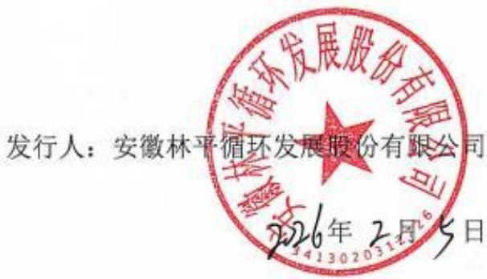

# 安徽林平循环发展股份有限公司首次公开发行股票并在主板上市招股说明书提示性公告

保荐人（主承销商）：

# 国联民生证券承销保荐有限公司

# GUOLIANMINSHENG INVESTMENTBANKINGCOMPANYLIMITED

扫描二维码查阅公告全文

安徽林平循环发展股份有限公司（以下简称“林平发展”、“发行人”或“公司”）首次公开发行股票并在主板上市的申请已经上海证券交易所（以下简称“上交所”）上市审核委员会审议通过，并已经中国证券监督管理委员会（以下简称“中国证监会”）证监许可〔2025〕3019 号文同意注册。《安徽林平循环发展股份有限公司首次公开发行股票并在主板上市招股说明书》在上交所网站（http://www.sse.com.cn/）和符合中国证监会规定条件网站（中国证券网：www.cnstock.com；中证网：www.cs.com.cn；证券时报网：www.stcn.com；证券日报网：www.zqrb.cn；经济参考网：www.jjckb.cn;中国金融新闻网：www.financialnews.com.cn；中国日报网：www.chinadaily.com.cn）披露，并置备于发行人、上交所、本次发行保荐人（主承销商）国联民生证券承销保荐有限公司的住所，供公众查阅。

<table><tr><td colspan="2">本次发行基本情况</td></tr><tr><td>股票种类</td><td>人民币普通股（A股）</td></tr><tr><td>每股面值</td><td>人民币1.00元</td></tr><tr><td>发行股数</td><td>本次公开发行股票数量为1,885.3700万股，占公司发行后总股本的比例为25.00%；本次发行全部为新股，本次发行不涉及老股转让</td></tr><tr><td>本次发行价格</td><td>37.88元/股</td></tr><tr><td>发行人高级管理人员、员工参与战略配售情况</td><td>不适用</td></tr><tr><td>发行前每股收益</td><td>2.70元/股（以2024年度经审计扣除非经常性损益前后敦低的归属于母公司股东的净利润除以发行前总股本计算）</td></tr><tr><td>发行后每股收益</td><td>2.03元/股（以2024年度经审计扣除非经常性损益前后敦低的归属于母公司股东的净利润除以发行后总股本计算）</td></tr><tr><td>发行市盈率</td><td>18.69倍（发行价格除以每股收益，每股收益按照2024年度经审计的扣除非经常性损益前后敦低的归属于母公司股东的净利润除以本次发行后总股本计算）</td></tr><tr><td>发行市净率</td><td>1.39倍（每股发行价格除以发行后每股净资产）</td></tr><tr><td>发行前每股净资产</td><td>25.40元（按经审计的截至2025年6月30日归属于母公司所有者权益除以发行前总股本计算）</td></tr><tr><td>发行后每股净资产</td><td>27.32元（经审计的截至2025年6月30日归属于母公司所有者权益加上本次发行募集资金净额之和除以发行后总股本计算）</td></tr><tr><td>发行方式</td><td>采用网下向符合条件的投资者询价配售和网上向持有上海市场非限售A股股份和非限售存托凭证市值的社会公众投资者定价发行相结合的方式进行</td></tr><tr><td>发行对象</td><td>符合资格的网下投资者和已开立上海证券交易所股票账户的境内自然人、法人、证券投资基金及符合法律、法规、规范性文件规定的其他投资者（国家法律、法规及上海证券交易所业务规则等禁止参与者除外）</td></tr><tr><td>承销方式</td><td>余额包销</td></tr><tr><td>募集资金总额</td><td>71,417.82万元</td></tr><tr><td>发行费用（不含增值税，含印花税）</td><td>本次发行费用总额为9,008.49万元，具体明细如下：1、保荐及承销费用：保荐费为1,000.00万元，承销费为4,713.43万元；保荐及承销费用参考市场保荐承销费率平均水平，经双方友好协商确定，按照项目进度分节点支付；2、审计及验资费用：1,720.08万元；参考市场会计师费率平均水平，考虑服务的工作要求、工作量等因素，经友好协商确定，按照项目进度分节点支付；3、律师费用：980.00万元；参考市场律师费率平均水平，考虑长期合作的意愿、律师的工作表现及工作量，经友好协商确定，按照项目进度分节点支付；4、用于本次发行的信息披露费用：572.26万元；5、发行手续费及其他费用：22.72万元。注：（1）以上发行费用均不含增值税；（2）相较于招股意向书，根据发行情况将印花税纳入了发行手续费及其他费用，印花税税基为扣除印花税前的募集资金净额，税率为0.025%。除上述调整外，发行费用不存在其他调整情况。</td></tr><tr><td colspan="2">发行人和保荐人（主承销商）</td></tr><tr><td>发行人</td><td>安徽林平循环发展股份有限公司</td></tr></table>

<table><tr><td>联系人</td><td>王善彬</td><td>联系电话</td><td>0557-2201210</td></tr><tr><td>保荐人（主承销商）</td><td colspan="3">国联民生证券承销保荐有限公司</td></tr><tr><td>联系人</td><td>股权资本市场部</td><td>联系电话</td><td>010-85127979</td></tr></table>

发行人：安徽林平循环发展股份有限公司

保荐人（主承销商）：国联民生证券承销保荐有限公司

2026 年 2 月 5 日

（本页无正文，为《安徽林平循环发展股份有限公司首次公开发行股票并在主板上市招股说明书提示性公告》之盖章页）

（本页无正文，为《安徽林平循环发展股份有限公司首次公开发行股票并板上市招股说明书提示性公告》之盖章页

保荐人（主承销商）：国联民生证券承销保程有限公司