本次发行股票拟在科创板上市，科创板公司具有研发投入大、经营风险高、业绩不稳定退市风险高等特点，投资者面临较大的市场风险。投资者应充分了解科创板的投资风险本公司所披露的风险因素，审慎作出投资决定

# 中电科蓝天科技股份有限公司

（天津市滨海高新技术产业开发区华科七路6号）

# 首次公开发行股票并在科创板上市

# 招股说明书

保荐人（主承销商）

中信建投证券股份有限公司

CHINASECURITIESCO.,LTD.

（北京市朝阳区安立路66号4号楼）

联席主承销商

国泰海通证券股份有限公司

（上海）自由贸易试验区商城路 618 号）

（中国（上海）自由贸易试验区商城路618号）

# 声明

中国证监会、交易所对本次发行所作的任何决定或意见，均不表明其对发行人注册申请文件及所披露信息的真实性、准确性、完整性作出保证，也不表明其对发行人的盈利能力、投资价值或者对投资者的收益作出实质性判断或保证。任何与之相反的声明均属虚假不实陈述。

根据《证券法》规定，股票依法发行后，发行人经营与收益的变化，由发行人自行负责；投资者自主判断发行人的投资价值，自主作出投资决策，自行承担股票依法发行后因发行人经营与收益变化或者股票价格变动引致的投资风险。

# 致投资者声明

电科蓝天坚持以“先进电源服务国家、绿色能源造福人类”为宗旨，以“引领电能源技术及产业发展”为主责，在电能源领域深耕数十年，致力于成为中国先进电能源系统解决方案和核心产品的供应商。公司主要从事电能源产品及系统的研发、生产、销售及服务，拥有发电、储能、控制和系统集成全套解决方案，产品应用领域实现深海（水下 1公里）至深空（距地球2.25亿公里）广泛覆盖。

电能源是国家能源转型的核心载体，是支撑新型工业化、制造强国、数字中国等国家战略的基础保障，也是促进经济低碳发展的关键引擎。公司主营业务和产品涵盖宇航电源、特种电源、新能源应用及服务三大板块，2024 年公司宇航电源业务收入占比超过 $60 \%$ 。公司研制的宇航电源产品贯穿中国航天发展史，是国内宇航电源的核心供应商。电科蓝天先后承担了“863计划”、创新基金、火炬计划等多个国家级高新技术研究发展计划项目，近年来公司已为神舟系列飞船、天舟系列飞船、空间站“天和”核心舱、“问天”/“梦天”实验舱、北斗导航、嫦娥系列探月卫星、探火工程、千帆星座、国网星座等多个国家级重点型号工程提供了优质可靠的电源产品，2024年公司国内宇航电源产品市场覆盖率达到 $50 \%$ 以上，是中国航天事业取得辉煌成就背后主要的支撑力量。公司是国内特种电源重要供应商，提供的特种锂电池广泛应用于单兵携行装备、特种车辆、水中装备、无人机、AGV 等领域。在新能源应用及服务领域，公司依托在电源控制领域的优势，在微电网、储能等多种新能源应用场景持续突破，子公司蓝天太阳在南极泰山站建成我国首套风光燃储互补智能微电网，获得天津市科技进步一等奖。

公司是中国化学与物理电源行业协会理事长单位，在电能源领域有着深厚的技术积淀，公司拥有高效砷化镓空间太阳电池阵技术、高效薄膜砷化镓太阳电池技术、高可靠长寿命空间锂离子电池组技术等 11 项核心技术，多项核心技术达到国际领先或国际先进水平。截至2025年6月30日，公司拥有授权专利367项，其中发明专利 141 项。公司自 2000 年以来累计获得国家科学技术进步奖 9 次、国防科学技术（进步）奖14 次，其中，特等奖7次、一等奖 3次。

公司将继续以勇攀电能源领域科技高峰为己任，持续构建产品和服务的核心竞争力，致力于成为电能源领域世界一流的创新型科技企业。

# 一、发行人上市的目的

党的二十大报告指出，要“坚持把发展经济的着力点放在实体经济上，推进新型工业化，加快建设制造强国、质量强国、航天强国、交通强国、网络强国、数字中国”。建设制造强国、航天强国、数字中国，是建设创新型国家、加强自主创新能力、加快科技自立自强的内在要求。电能源是落实制造强国、航天强国、数字中国等国家战略、推进新型工业化和新质生产力发展的基础保障，更是推动实现高质量、绿色化、智能化发展的关键引擎。

在航天领域，国家航天事业是航天强国的保障，商业航天是推动航天产业发展、建设航天强国的重要力量，是新质生产力的重要组成部分。近年来，全球航天呈现高度活跃发展态势，全球火箭发射次数连续三年创下新高，大国将航天活动视作国家整体实力的重要组成部分，航天战略性作用日益突出。在国家航天稳步发展的同时，随着国家将卫星互联网纳入新基建范畴、将商业航天作为新质生产力的代表连续两年写入《政府工作报告》，商业航天依托国家“互联网 $^ +$ 航天”的产业升级变革，产业化趋势日益明显，市场将迎来快速发展。公司作为国内宇航电源的核心供应商，在助力航天强国建设和新质生产力发展方面责任重大。

在国防军工领域，加速武器装备机械化、信息化、智能化融合发展，是我国实现武器装备现代化的必然要求。电能源作为支撑信息化、数字化、智能化发展的重要基础，随着我国武器装备机械化、信息化、智能化战略的深入推进，公司的特种锂离子电池业务经营将面临新的发展机遇。

在新能源领域，我国明确提出要实现“双碳”目标，传统能源向新能源转变的趋势不可逆转，“双碳”政策为我国新能源行业发展提供了良好的市场环境。

# （一）聚焦国家所需，服务国家战略，助力航天强国建设和新质生产力发展

电科蓝天作为中国电科旗下首批入选国资委“双百企业”的试点单位和电能源产业国家队，将积极响应国家航天强国和商业航天发展规划需要，以发展航天产业、建设航天强国为己任，充分发挥电能源全产业链优势，主动融入新发展格局，服务国家重大发展战略，大力推进宇航电源业务智能化和产业化，推动国家航天和商业航天产业快速发展，为新质生产力发展注入新动能。

# （二）围绕产业控制，加快体系化能力建设，保障国家电能源产业发展

通过本次上市及募投项目的实施，电科蓝天将加速建设宇航电源系统产业化平台，扩大生产规模、抢占增量市场，拓展公司发展空间，增强公司盈利能力，提升公司整体竞争力。公司将以本次首发上市为契机，凝心聚力，高举电能源产业旗帜，准确把握行业发展机遇，深化与地方务实合作，充分发挥电能源全产业链的优势，打通电能源创新链、产业链的“堵点”，全面构建主业核心竞争力，担负起强国兴军使命。

# （三）强化科技创新，增强公司科研创新实力，确保公司核心技术安全可控

通过本次上市，公司资金实力及市场影响力将进一步提升，有利于提升研发、制造、生产、试验等综合能力，同步加快引入具有国际视野的高端人才和创新团队，从而进一步增强公司科研创新实力，实现在高比能、长寿命、高功率技术路线上的持续研发创新，加快关键核心技术攻关，助力新质生产力发展，提升公司在行业中的技术优势地位。

# （四）实现安全支撑，紧抓行业发展机遇，推动公司跨越式高质量发展

电科蓝天作为保障我国电能源产业健康发展的重要力量，为应对激烈的市场竞争，公司需紧抓行业发展机遇，进一步优化体制机制，充分对接资本市场，通过打通资本市场通道，对具有前瞻性、战略性的商业航天、低空经济等领域快速布局，并进一步加大技术攻关、产能建设和市场开拓力度，实现产业发展与武器装备建设的技术互动和能力互补，推动企业跨越式高质量发展。

# （五）注重投资回报，持续优化经营质量，为投资者创造可持续的价值回报

报告期内，公司经营规模总体保持稳定增长趋势。通过本次上市，公司将进一步扩大产能、增强科研创新实力，提升综合竞争力和市场影响力，不断完善公司治理机制，借助资本市场助力公司主营业务的转型升级，在落实国家战略的同时加快发展新质生产力，扎实推进企业高质量发展，以科技创新推动产业创新，引领电能源产业发展趋势，为投资者和社会创造可持续的价值回报。

# 二、发行人现代企业制度的建立健全情况

公司已按照上市公司的治理标准建立和完善了由股东会、董事会及专门委员

会、高级管理人员组成的公司治理架构，形成了权力机构、决策机构、监督机构和管理层之间权责明确、运作规范的现代公司治理结构和内部控制环境，有效维护了公司及股东的合法权益，有助于公司实现长期可持续发展。

# 三、发行人本次融资的必要性及募集资金使用规划

公司在宇航电源、特种电源、新能源应用及服务等领域拥有先进的核心技术，但随着航空航天、新能源等行业的快速发展，下游市场需求日益增长，行业竞争日趋激烈，对技术创新能力的要求不断提升。受限于生产规模及资金实力，公司面临批产自动化设备配套不足，研发、制造、试验、检验能力亟需进一步提升的问题。

公司本次募集资金将投资于宇航电源系统产业化（一期）建设项目。资金募集及使用围绕公司的主营业务展开，聚焦国家战略和重大需求，将扩大公司宇航电源业务产能、加速建设宇航电源系统产业化平台、不断提升公司科技创新水平，进一步完善产业链和产品结构并拓展公司发展空间，增强公司盈利能力，提升公司整体竞争力。

# 四、发行人持续经营能力及未来发展规划

报告期内，公司积极推动电能源技术尤其是宇航电源技术产业化发展，宇航电源业务收入稳步增长，持续盈利能力不断增强。未来，公司将继续聚焦主责主业，加快提升主业能力；聚焦国家所需、行业所趋、公司所能，加大科技创新投入和人才团队建设，加强核心技术及前沿技术的研究，保持电能源关键核心技术的领先水平，确保产业链、供应链安全自主可控，助力新质生产力发展；持续推进公司核心业务体系协同式发展，增强公司可持续发展能力，矢志成为电能源领域世界一流的创新型科技企业。

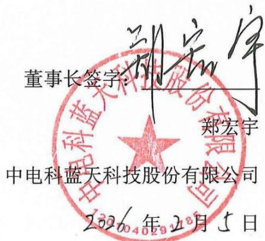

发行概况  

<table><tr><td>发行股票类型</td><td>人民币普通股（A股）</td></tr><tr><td>发行股数</td><td>本次公开发行股票17,370.0000万股，发行人本次发行前总股本为156,322.3890万股，发行后总股本为173,692.3890万股，本次公开发行的股票数量占发行后公司股份总数的10.00%；本次发行均为新股，不涉及股东公开发售股份</td></tr><tr><td>每股面值</td><td>人民币1.00元</td></tr><tr><td>每股发行价格</td><td>9.47元</td></tr><tr><td>发行日期</td><td>2026年1月30日</td></tr><tr><td>拟上市证券交易所和板块</td><td>上海证券交易所科创板</td></tr><tr><td>发行后总股本</td><td>173,692.3890万股</td></tr><tr><td>保荐人</td><td>中信建投证券股份有限公司</td></tr><tr><td>主承销商</td><td>中信建投证券股份有限公司、国泰海通证券股份有限公司</td></tr><tr><td>招股说明书签署日期</td><td>2026年2月5日</td></tr></table>

# 目 录

# 声明....

# 致投资者声明 ..

一、发行人上市的目的. .3  
二、发行人现代企业制度的建立健全情况. 4  
三、发行人本次融资的必要性及募集资金使用规划.  
四、发行人持续经营能力及未来发展规划.

# 发行概况 .

# 目 录........

# 第一节 释义 ..... 12

一、一般释义.. .12  
二、专业释义.. .14

# 第二节 概览 . 18

一、重大事项提示.. ..18  
二、发行人及本次发行的中介机构基本情况. .. 22  
三、本次发行概况. ..22  
四、发行人主营业务经营情况. ..27  
五、发行人符合科创板板块定位的情况. .. 32  
六、发行人报告期主要财务数据和财务指标. ..34  
七、发行人财务报告审计截止日后主要财务信息及经营状况. ..35  
八、发行人选择的具体上市标准. . 36  
九、发行人公司治理特殊安排的情况. .. 37  
十、募集资金运用与未来发展规划. .37  
十一、其他对发行人有重大影响的事项. ..38

# 第三节 风险因素 39

一、与发行人相关的风险. .39  
二、与行业相关的风险. .. 42  
三、其他风险.. ..44

# 第四节 发行人基本情况 . ..46

一、发行人基本情况. ..46  
二、发行人设立及股本变化情况. .. 46  
三、公司成立以来的重要事件. ..53  
四、公司在其他证券市场的上市/挂牌情况 ..55  
五、发行人股权结构及组织结构. ..55  
六、发行人子公司、分公司和参股公司的基本情况. ..55  
七、发行人主要股东情况. .. 63  
八、发行人股本情况. .. 67  
九、董事、高级管理人员及其他核心人员情况. ..71  
十、发行人正在执行的股权激励及其他制度安排和执行情况. ..85

十一、员工及其社会保障情况. ..108

# 第五节 业务与技术. 111

一、发行人主营业务情况. 111  
二、发行人所处行业基本情况. .. 133  
三、发行人所处行业地位及行业竞争情况. ..171  
四、发行人的销售情况和主要客户. ..185  
五、发行人的采购情况和主要供应商. ..187  
六、发行人的主要资产情况. ..190  
七、发行人的技术研发情况. ..199  
八、生产经营涉及的主要环境污染物及处理情况. .216  
九、发行人境外经营情况. .. 217

# 第六节 财务会计信息与管理层分析.. ..218

一、财务报表.. .218  
二、审计意见. ..223  
三、关键审计事项及与财务会计信息相关的重大事项或重要性水平的判断标准.... .. 223  
四、财务报表的编制基础、合并财务报表范围及变化情况. .224  
五、主要会计政策和会计估计. .225  
六、经注册会计师核验的非经常性损益表. ...260  
七、主要税种税率、享受的主要税收优惠政策. ..261

八、主要财务指标.. ..264  
九、经营成果分析.. .265  
十、资产质量分析.. ..290  
十一、偿债能力、流动性及持续经营能力分析. .. 313  
十二、重大资本性支出计划及资金需求量. .. 327  
十三、资产负债表日后事项、或有事项、其他重要事项及重大担保、诉讼等  
事项.. .327  
十四、盈利预测报告. .327  
十五、财务报告审计截止日后主要财务信息及经营状况 .. 328

# 第七节 募集资金运用与未来发展规划. .332

一、募集资金运用概况. ..332  
二、募集资金投资项目情况. ..333  
三、公司未来战略规划. ..337

# 第八节 公司治理与独立性 .. .340

一、公司治理存在的缺陷及改进情况. .. 340  
二、公司内部控制制度情况. .. 340  
三、报告期内发行人违法违规情况. .. 340  
四、发行人资金占用和对外担保情况. .. 344  
五、发行人不存在特别表决权股份或类似安排的情况. ..345  
六、发行人不存在协议控制架构的情况. ..345  
七、公司面向市场独立持续经营的能力. .. 345  
八、同业竞争. .347   
九、关联方及关联关系. .. 362  
十、关联交易.. ..368

# 第九节 投资者保护 .399

一、本次发行完成前滚存利润的分配安排. .. 399  
二、发行人的股利分配政策. ..399  
三、董事会关于股东回报事宜的专项研究论证情况以及相应的规划安排理由

.. 402

四、发行人上市后三年内的利润分配计划、制定的依据和可行性以及未分配

利润的使用安排. .402  
五、公司长期回报规划的内容及制定考虑因素. ... 405  
六、特别表决权股份、协议控制架构或类似特殊安排. ...405

# 第十节 其他重要事项 ... .406

一、重要合同.. ..406  
二、对外担保情况. ..409  
三、重大诉讼或仲裁情况. .. 409   
四、公司控股股东、实际控制人诉讼及仲裁情况. ...410  
五、董事、高级管理人员和其他核心人员诉讼及仲裁情况. .. 410

# 第十一节 声明 ...... . 411

一、发行人全体董事、审计委员会成员、高级管理人员声明. . 411  
二、发行人控股股东、实际控制人声明. .. 413  
三、保荐人（主承销商）声明. ..414  
四、联席主承销商声明. ..416  
五、发行人律师声明.. ...417  
六、发行人会计师声明. .418  
七、资产评估机构声明. ..419   
八、验资机构声明. ..420  
九、验资复核机构声明. ...421

# 第十二节 附件 . .422

一、备查文件.. .. 422  
二、查阅时间及地点.. .422

# 附件一：落实投资者关系管理相关规定的安排、发行人股利分配的决策程序及监督机制、股东投票机制建立情况... .... 424

一、落实投资者关系管理相关规定的安排.. ..424  
二、股利分配的决策程序及监督机制. .425  
三、股东投票机制建立情况. ..425

# 附件二：与投资者保护相关的承诺.... ..427

一、本次发行前股东所持股份的限售安排、自愿锁定股份、延长锁定期限以及股东持股及减持意向等承诺. ..427

二、稳定股价的措施和承诺. ... 434  
三、股份回购的承诺.. .. 437  
四、填补被摊薄即期回报措施的承诺. .. 438  
五、关于股利分配的承诺. .440  
六、关于避免同业竞争的承诺. ..441  
七、关于依法承担赔偿责任的承诺. .. 442  
八、关于未能履行承诺事项约束措施的承诺. .. 443

# 附件三：发行人及其他责任主体作出的与发行人本次发行上市相关的其他承诺事项..... .... 446

一、关于规范关联交易的承诺. ..446  
二、股东信息披露专项承诺.. .. 448  
三、本次发行的证券服务机构作出的承诺. ..448

# 附件四：股东会、董事会、独立董事、董事会秘书制度的建立健全及运行情况说明..... .... 450

一、股东会制度的建立健全及运行情况. .. 450  
二、董事会制度的建立健全及运行情况. .. 450  
三、独立董事制度的建立健全及运行情况. .. 450  
四、董事会秘书制度的建立健全及运行情况 ...451

# 附件五：审计委员会及其他专门委员会的设置情况说明. .452附件六：专利 ............ .453

# 第一节 释义

# 一、一般释义

<table><tr><td>电科蓝天、公司、本公司、发行人、股份公司</td><td>指</td><td>中电科蓝天科技股份有限公司</td></tr><tr><td>电科能源、中电力神、蓝天有限</td><td>指</td><td>中电科能源有限公司，曾用名中电力神集团有限公司、中电力神有限公司、天津蓝天电源有限责任公司，系公司改制为股份有限公司前的法人主体</td></tr><tr><td>蓝天电源</td><td>指</td><td>天津蓝天电源公司，全民所有制企业，系公司改制为有限公司前的法人主体</td></tr><tr><td>本次发行、本次发行上市</td><td>指</td><td>电科蓝天本次申请首次公开发行A股股票并在上海证券交易所科创板上市</td></tr><tr><td>中国电科/中国电科集团</td><td>指</td><td>中国电子科技集团有限公司，系公司控股股东、实际控制人</td></tr><tr><td>十八所</td><td>指</td><td>中国电子科技集团公司第十八研究所，系公司股东</td></tr><tr><td>景鸿瑞和</td><td>指</td><td>天津景鸿瑞和企业管理合伙企业（有限合伙），系公司股东，公司员工持股平台</td></tr><tr><td>景鸿管理</td><td>指</td><td>天津景鸿企业管理有限公司，系景鸿瑞和之普通合伙人、执行事务合伙人</td></tr><tr><td>景鸿一号至景鸿十二号</td><td>指</td><td>天津景鸿一号企业管理合伙企业（有限合伙）至天津景鸿十二号企业管理合伙企业（有限合伙），系景鸿瑞和之有限合伙人、持股员工直接出资主体</td></tr><tr><td>景源瑞和</td><td>指</td><td>天津景源瑞和企业管理合伙企业（有限合伙），系公司股东</td></tr><tr><td>景源管理</td><td>指</td><td>天津景源企业管理服务有限公司，系景源瑞和之普通合伙人、执行事务合伙人</td></tr><tr><td>景源一号至景源四号</td><td>指</td><td>天津景源一号企业管理合伙企业（有限合伙）至天津景源四号企业管理合伙企业（有限合伙），系景源瑞和之有限合伙人、十八所持股的人员直接出资主体</td></tr><tr><td>中电科投资、电科投资</td><td>指</td><td>中电科投资控股有限公司，系公司股东</td></tr><tr><td>航天专利基金</td><td>指</td><td>江苏航天创新专利投资中心（有限合伙），系公司股东</td></tr><tr><td>双百壹号</td><td>指</td><td>国新双百壹号（杭州）股权投资合伙企业（有限合伙），系公司股东</td></tr><tr><td>产业基金</td><td>指</td><td>国家产业投资基金有限责任公司，系公司股东</td></tr><tr><td>中信建投投资</td><td>指</td><td>中信建投投资有限公司，系公司股东</td></tr><tr><td>中兵投资</td><td>指</td><td>中兵投资管理有限责任公司，系公司股东</td></tr><tr><td>天津海泰</td><td>指</td><td>天津海泰海河新动能产业基金合伙企业（有限合伙），系公司股东</td></tr><tr><td>嘉兴产投</td><td>指</td><td>长三角（嘉兴）战略新兴产业投资合伙企业（有限合伙），系公司股东</td></tr><tr><td>蓝天太阳</td><td>指</td><td>天津蓝天太阳科技有限公司，系公司之全资子公司</td></tr><tr><td>空间电源</td><td>指</td><td>天津空间电源科技有限公司，系公司之全资子公司</td></tr><tr><td>研究院公司</td><td>指</td><td>天津中电新能源研究院有限公司，系公司之全资子公司</td></tr><tr><td>蓝天特电</td><td>指</td><td>天津蓝天特种电源科技股份公司，系公司之控股子公司，曾</td></tr><tr><td></td><td></td><td>用名:天津力神特种电源科技股份公司</td></tr><tr><td>蓝天高科</td><td>指</td><td>天津蓝天高科电源股份有限公司,已于2014年被发行人吸收合并</td></tr><tr><td>欧创园</td><td>指</td><td>中电科欧洲创新园有限公司(CETC European Innovation Industry &amp; Technology GmbH),系公司之参股企业</td></tr><tr><td>天津恒电</td><td>指</td><td>天津恒电空间电源有限公司,系公司之参股企业</td></tr><tr><td>国联瑞阳</td><td>指</td><td>陕西国联瑞阳新能源科技有限公司,系公司全资子公司天津蓝天太阳科技有限公司之参股企业</td></tr><tr><td>新创建设</td><td>指</td><td>北京中电科建设投资基金管理合伙企业(有限合伙),后更名为北京新创建设投资管理合伙企业(有限合伙),系公司之参股企业</td></tr><tr><td>中电发展</td><td>指</td><td>中电产业发展投资(天津)合伙企业(有限合伙),系公司之参股企业</td></tr><tr><td>力神电池</td><td>指</td><td>天津力神电池股份有限公司,系公司原控股子公司,自2020年1月1日起不再实施控制(公司对外无偿划转所持全部股份)</td></tr><tr><td>兵装集团</td><td>指</td><td>中国兵器装备集团有限公司</td></tr><tr><td>重庆声光电</td><td>指</td><td>中电科芯片技术(集团)有限公司,曾用名:中电科技集团重庆声光电有限公司</td></tr><tr><td>电科芯片</td><td>指</td><td>中电科芯片技术股份有限公司</td></tr><tr><td>航天科技集团</td><td>指</td><td>中国航天科技集团有限公司</td></tr><tr><td>国家能源投资集团</td><td>指</td><td>国家能源投资集团有限责任公司</td></tr><tr><td>国家电投集团</td><td>指</td><td>国家电力投资集团有限公司</td></tr><tr><td>中国能源建设集团</td><td>指</td><td>中国能源建设集团有限公司</td></tr><tr><td>中国节能环保集团</td><td>指</td><td>中国节能环保集团有限公司</td></tr><tr><td>中国大唐集团</td><td>指</td><td>中国大唐集团有限公司</td></tr><tr><td>红太阳新能源</td><td>指</td><td>湖南红太阳新能源科技有限公司,系中国电科全资子公司中电科电子装备集团有限公司原控股子公司</td></tr><tr><td>嘉科新能源</td><td>指</td><td>浙江嘉科新能源环保科技有限公司,系中国电科下属中国电子科技集团公司第三十六研究所之控股子公司</td></tr><tr><td>电科财务</td><td>指</td><td>中国电子科技财务有限公司,中国电科下属非银行金融机构</td></tr><tr><td>中国卫星</td><td>指</td><td>中国东方红卫星股份有限公司</td></tr><tr><td>中国星网</td><td>指</td><td>中国卫星网络集团有限公司</td></tr><tr><td>中国电科九所</td><td>指</td><td>中国电子科技集团公司第九研究所</td></tr><tr><td>中国电科二十四所</td><td>指</td><td>中国电子科技集团公司第二十四研究所</td></tr><tr><td>本招股书、本招股说明书</td><td>指</td><td>《中电科蓝天科技股份有限公司首次公开发行股票并在科创板上市招股说明书》</td></tr><tr><td>《公司章程》</td><td>指</td><td>《中电科蓝天科技股份有限公司章程》</td></tr><tr><td>《公司章程(草案)》</td><td>指</td><td>《中电科蓝天科技股份有限公司章程(草案)》(上市后适用)</td></tr><tr><td>股东会</td><td>指</td><td>中电科蓝天科技股份有限公司股东会</td></tr><tr><td>董事会</td><td>指</td><td>中电科蓝天科技股份有限公司董事会</td></tr><tr><td>监事会</td><td>指</td><td>中电科蓝天科技股份有限公司原监事会（现已取消）</td></tr><tr><td>《公司法》</td><td>指</td><td>《中华人民共和国公司法》</td></tr><tr><td>《证券法》</td><td>指</td><td>《中华人民共和国证券法》</td></tr><tr><td>《注册管理办法》</td><td>指</td><td>《首次公开发行股票注册管理办法》</td></tr><tr><td>《科创板上市规则》</td><td>指</td><td>《上海证券交易所科创板股票上市规则》</td></tr><tr><td>国务院</td><td>指</td><td>中华人民共和国国务院</td></tr><tr><td>国务院国资委</td><td>指</td><td>国务院国有资产监督管理委员会</td></tr><tr><td>财政部</td><td>指</td><td>中华人民共和国财政部</td></tr><tr><td>发改委</td><td>指</td><td>中华人民共和国国家发展和改革委员会</td></tr><tr><td>工信部</td><td>指</td><td>中华人民共和国工业和信息化部</td></tr><tr><td>科技部</td><td>指</td><td>中华人民共和国科学技术部</td></tr><tr><td>装备发展部</td><td>指</td><td>中国共产党中央军事委员会装备发展部</td></tr><tr><td>国防科工局</td><td>指</td><td>国家国防科技工业局</td></tr><tr><td>国家能源局</td><td>指</td><td>国家发改委下设的国家能源局</td></tr><tr><td>中国证监会</td><td>指</td><td>中国证券监督管理委员会</td></tr><tr><td>上交所</td><td>指</td><td>上海证券交易所</td></tr><tr><td>中国电源协会</td><td>指</td><td>中国化学与物理电源行业协会，China Industrial Association of Power Sources，缩写：CIAPS</td></tr><tr><td>基金业协会</td><td>指</td><td>中国证券投资基金业协会</td></tr><tr><td>产权交易所</td><td>指</td><td>北京产权交易所</td></tr><tr><td>保荐人、保荐机构、中信建投</td><td>指</td><td>中信建投证券股份有限公司</td></tr><tr><td>审计机构、立信会计师</td><td>指</td><td>立信会计师事务所（特殊普通合伙）</td></tr><tr><td>发行人律师、中伦律师</td><td>指</td><td>北京市中伦律师事务所</td></tr><tr><td>评估机构、中同华评估</td><td>指</td><td>北京中同华资产评估有限公司</td></tr><tr><td>报告期、最近三年一期、报告期各期</td><td>指</td><td>2022年度、2023年度、2024年度及2025年1-6月</td></tr><tr><td>报告期各期末</td><td>指</td><td>2022年末、2023年末、2024年末及2025年6月末</td></tr><tr><td>元、万元、亿元</td><td>指</td><td>人民币元、人民币万元、人民币亿元</td></tr></table>

# 二、专业释义

<table><tr><td>物理电池</td><td>指</td><td>利用物理效应,将太阳能、热能、核能或者机械能等直接转换成电能的装置</td></tr><tr><td>化学电池</td><td>指</td><td>将化学能变成电能的装置</td></tr><tr><td>二次电池</td><td>指</td><td>可以多次充电和放电、循环使用的化学电池</td></tr><tr><td>空间单体太阳电池/太阳电池片</td><td>指</td><td>太阳能发电单元,利用光生伏特效应将太阳的辐射光能通过半导体材料转化为电能的一种器件</td></tr><tr><td>CIC太阳电池</td><td>指</td><td>空间用玻璃盖片封装带互连片的太阳电池</td></tr><tr><td>太阳电池阵/太阳电池翼</td><td>指</td><td>按照航天器设计方案,将空间单体太阳电池组合成方阵,用于将光能转换成电能的电源系统部件</td></tr><tr><td>ROSA</td><td>指</td><td>Roll-out Solar Arrays,即卷绕展开式柔性太阳电池阵</td></tr><tr><td>电源分系统</td><td>指</td><td>由太阳电池阵/翼、蓄电池组和电源控制设备共同组成的一种混合式的电源系统,保障航天器供电</td></tr><tr><td>转换效率</td><td>指</td><td>衡量太阳电池把光能转换为电能的能力,即最佳输出功率与投射到其表面上的太阳辐射功率之比</td></tr><tr><td>III-V族化合物半导体</td><td>指</td><td>元素周期表中的III族与V族元素相结合生成的化合物半导体,主要包括砷化镓(GaAs)、磷化铟(InP)和氮化镓(GaN)等</td></tr><tr><td>锗基衬底</td><td>指</td><td>锗晶片衬底,外延生长的载体,生长外延片所需的主要原材料之一</td></tr><tr><td>砷化镓、GaAs</td><td>指</td><td>Gallium Arsenide,III-V族化合物半导体</td></tr><tr><td>三结砷化镓</td><td>指</td><td>目前空间单体太阳电池普遍采用的一种材料结构,采用晶格匹配的镓铟磷(GaInP)/镓铟砷(GaInAs)/锗(Ge)三结结构,通过两个隧穿结将三个子电池连接组成,相当于具有三个核心发电单元,可分段吸收太阳光谱能量,转换效率通常可达30%以上</td></tr><tr><td>砷化镓外延片</td><td>指</td><td>锗晶片衬底外延生长三结砷化镓的产物,用于制造空间单体太阳电池的基础材料</td></tr><tr><td>千帆星座</td><td>指</td><td>千帆星座(Qianfan Constellation,G60,Global MultimediaSatellite),即“全球多媒体卫星”,也称“G60星链”,是中国正在建造的大型卫星互联网星座,主要用于宽带通信,规划发射卫星数量15,000颗,运营单位为上海垣信卫星科技有限公司,研制单位为上海微小卫星工程中心与上海格思航天科技有限公司</td></tr><tr><td>国网星座</td><td>指</td><td>国网星座,又称GW星座,是中国首个卫星互联网计划,主要用于宽带通信,规划发射卫星数量12,999颗,运营单位为中国卫星网络集团有限公司</td></tr><tr><td>吉林一号</td><td>指</td><td>国内主要商业卫星星座之一,主要为遥感卫星,规划发射数量138颗,运营及建设单位为长光卫星技术股份有限公司</td></tr><tr><td>锂离子电池</td><td>指</td><td>一种二次电池,依靠锂离子在正极和负极之间移动形成电流:在充放电过程中,Li+在两个电极之间往返嵌入和脱嵌:充电时,Li+从正极脱嵌,经过电解质嵌入负极,负极处于富锂状态;放电时则相反</td></tr><tr><td>软包电池</td><td>指</td><td>外包装采用柔性铝塑包装膜,正极材料、负极材料、隔膜采用卷绕式制成的锂离子电池</td></tr><tr><td>圆柱电池</td><td>指</td><td>外包装采用钢制外壳或铝制外壳,正极材料、负极材料、隔膜采用卷绕式制成的圆柱形状锂离子电池</td></tr><tr><td>方形电池</td><td>指</td><td>外包装采用钢制外壳或铝制外壳,正极材料、负极材料、隔膜采用堆叠式制成的方形锂离子电池</td></tr><tr><td>正极材料</td><td>指</td><td>用于化学电池正极上的活性材料,如锂离子电池的正极材料主要有钴酸锂、磷酸铁锂、三元材料等</td></tr><tr><td>负极材料</td><td>指</td><td>用于化学电池负极上的活性材料,如锂离子电池的负极材料主要有石墨、钛酸锂、碳纳米材料、石墨烯材料等</td></tr><tr><td>电解液</td><td>指</td><td>化学电池中正、负极之间提供离子导电的液态介质</td></tr><tr><td>隔离膜/隔膜</td><td>指</td><td>隔离锂离子电池正极和负极的一层膜材料,主要作用为使电池内的电子不能自由穿过,让电解液中的离子在正负极之间自由通过</td></tr><tr><td>电芯</td><td>指</td><td>锂离子电池制造过程中,将正极材料、负极材料、电解液、隔膜等通过电芯生产工艺制成的最小充放电单元,是PACK的核心部件</td></tr><tr><td>三元正极材料</td><td>指</td><td>镍钴锰酸锂或镍钴铝酸锂等三元聚合物,用于锂离子电池正极</td></tr><tr><td>PACK</td><td>指</td><td>一只或多只电芯按照特定使用要求进行串联或并联,并集成电源管理系统、热管理系统和结构件的电池或电池包</td></tr><tr><td>BMS</td><td>指</td><td>Battery Management System的缩写,即电池管理系统,管理电池电芯的充放电</td></tr><tr><td>MPPT</td><td>指</td><td>Maximum Power Point Tracking的缩写,即通过动态调整光伏系统的工作参数,使其始终运行在输出功率最大化的状态</td></tr><tr><td>PPU</td><td>指</td><td>Power Processing Unit的缩写,指电推力器的核心供能模块,负责将航天器的低压直流电转换为推力器工作所需的多路高压、多模式电源,确保电离、加速工质等关键环节的稳定运行</td></tr><tr><td>GaInP/GaAs/GaInAs/AlGaInP/InAlGaAs</td><td>指</td><td>镓铟磷/砷化镓/镓铟砷/磷化铝镓铟/铟铝镓砷,五种III-V族化合物半导体材料</td></tr><tr><td>LLC</td><td>指</td><td>一种谐振电路,L代表一个电感,C代表一个谐振电容</td></tr><tr><td>DBR</td><td>指</td><td>Distributed Bragg Reflector的缩写,即分布式布拉格反射器,一种通过周期性交替堆叠高、低折射率材料形成的光学结构</td></tr><tr><td>AGV</td><td>指</td><td>Automated Guided Vehicle的缩写,即自动导引运输车,装备有电磁或光学等自动导引装置,能够沿规定的导引路径行驶,属于主要应用在物流、仓储、智慧工厂等行业的一类工业机器人</td></tr><tr><td>SAR</td><td>指</td><td>合成孔径雷达,一种高分辨率、二维成像雷达</td></tr><tr><td>Ovzon-3通信卫星</td><td>指</td><td>瑞典 Ovzon 公司计划发射的一颗小型通信卫星</td></tr><tr><td>UL Solutions</td><td>指</td><td>一家全球应用安全科学公司,提供测试、检验、认证(TIC)以及软件产品和咨询服务</td></tr><tr><td>临近空间</td><td>指</td><td>距地面20~100公里的空域,也被称为“近空间”“空天过渡区”“亚太空”或“亚轨道”,其下方空域(距地面20公里以内)是传统航空器的主要活动空间,其上方空域(距地面超过100公里)是传统航天器的主要运行空间</td></tr><tr><td>集中式光伏</td><td>指</td><td>直接并入高压电网的光伏电站/发电系统</td></tr><tr><td>分布式光伏</td><td>指</td><td>在用户现场或靠近用电现场配置较小的光伏发电供电系统,又称分散式光伏发电或分布式供能</td></tr><tr><td>电化学储能系统</td><td>指</td><td>以电化学电池为储能载体,通过储能变流器进行可循环电能存储、释放的系统</td></tr><tr><td>微电网</td><td>指</td><td>由发电装置、储能装置、能量转换装置、负荷、监控和保护装置等设备组成的小型发配电系统,既可以与外部电网并网运行,也可以孤立运行</td></tr><tr><td>能量密度</td><td>指</td><td>单位质量或单位体积电池所具有的能量</td></tr><tr><td>功率密度</td><td>指</td><td>单位重量电池所释放的功率</td></tr><tr><td>倍率</td><td>指</td><td>表征电池充放电能力的一项指标,分为充电倍率和放电倍率,通常以字母C表示</td></tr><tr><td>伏特(V)</td><td>指</td><td>电压的基本单位</td></tr><tr><td>瓦(W)、千瓦(kW)、兆瓦(MW)、吉瓦(GW)</td><td>指</td><td>电的功率单位,为衡量光伏发电能力的单位,1GW=1,000MW=1,000,000kW=1,000,000,000W</td></tr><tr><td>千瓦时(kWh)</td><td>指</td><td>能量单位,指一小时所消耗的能量,1千瓦时=1,000瓦×3,600秒</td></tr><tr><td>兆瓦时(MWh)</td><td>指</td><td>能量单位,指一小时所消耗的能量,1兆瓦时=1,000,000瓦×3,600秒</td></tr><tr><td>安时(Ah)</td><td>指</td><td>电池容量单位</td></tr><tr><td>km、m、mm</td><td>指</td><td>千米、米、毫米,长度单位</td></tr><tr><td>m3</td><td>指</td><td>立方米,体积单位</td></tr><tr><td>kPa</td><td>指</td><td>千帕,压强单位</td></tr></table>

本招股说明书中部分合计数与各加数直接相加之和在尾数上存在差异，系由于四舍五入造成。

# 第二节 概览

本概览仅对招股说明书全文作扼要提示。投资者作出投资决策前，应认真阅读招股说明书全文。

# 一、重大事项提示

公司提醒投资者特别关注下述重大事项提示。此外，在做出投资决策之前，请投资者认真阅读本招股说明书“第三节 风险因素”全部内容。

# （一）特别风险提示

# 1、行业竞争加剧的风险

宇航电源领域，我国国家航天项目通常由政府和科研院所主导，服务于国家航天战略目标，以国家重大航天任务需求为导向，有着较强的技术壁垒，但随着近年来我国推动建设新型航天发展格局，政府采购产品和服务范围逐渐扩大，同时商业航天产业快速兴起，新理念、新模式、新产品的出现使得公司宇航电源业务的市场竞争格局更加激烈和复杂。特种电源领域，近两年受锂电价格下行及军工行业宏观因素及周期性影响，特种电源订单受到一定冲击，市场竞争更为激烈。新能源应用及服务领域，2022 年是国内储能市场爆发的元年，随后储能市场进入快速增长期，广阔的市场吸引着众多厂商加入，竞争日趋激烈。如果在激烈的市场竞争中，公司未能将现有的市场地位和核心技术转化为更多的市场订单，可能会影响公司的盈利能力和长期发展潜力。

# 2、技术创新的风险

公司主营业务涵盖宇航电源、特种电源、新能源应用及服务三大板块，产品技术体系涵盖发电、储能、控制以及系统集成等多个维度，对技术创新的要求较高。宇航电源领域，卫星、飞船、空间站等航天器和临近空间飞行器的电源系统正在向柔性化和轻质化方向发展，此外商业航天在保持产品性能不断提升的同时，对标准化、模块化设计和批量化生产能力以及成本控制提出更高要求。特种电源领域，对特种电源产品在极端环境下的绝对可靠性与多场景自适应能力提出更高要求。新能源应用及服务领域，对产品及服务的材料革新、架构优化以及系统级智能协同等提出更高要求。公司主要产品的技术革新正在加速，对于电能源系统

厂商的技术研发能力、先进技术开发速度以及先进技术的市场转化能力要求日益提高。如果公司不能保持技术创新的持续性和突破性，不能及时研发出适应市场需求的新产品并不断迭代，将对公司的生产经营和业绩增长产生不利影响。

# 3、核心人才流失的风险

公司主营业务对应的产品主要应用在国家航天领域，产品对应的技术体系涵盖发电、储能和控制等多个领域，核心技术人员的技术水平及研发能力决定了公司能否长期保持竞争优势。如果公司无法储备和不断引进相应的人才以适应行业发展趋势和技术不断创新的需求，或公司主要管理人员及技术人员流失，则可能造成公司生产管理及研发水平下降的风险，进而对公司经营业绩产生不利影响。

# 4、经营业绩季节性波动风险

公司业务具有一定的季节性特征，主要受项目实施周期和交付任务的影响。航天器电源分系统较为复杂，研制周期较长，公司通常按照客户要求，在下半年集中交付宇航电源产品，导致收入确认集中在下半年乃至第四季度，而各类费用基本上在各季度均衡发生，故公司经营业绩呈现出季节性波动。鉴于公司产品销售的季节性波动风险，公司提醒投资者不宜以公司某季度或中期的财务数据简单推算公司全年的财务状况和经营成果，并充分关注产品销售季节性波动所带来的风险。

# 5、部分业务领域毛利率水平较低的风险

报告期内，发行人新能源应用及服务业务毛利率水平较低，部分细分领域储能系统及储能EPC、消费类锂电池及锂电材料毛利率水平为负，主要系公司进入该领域时间不长，业务规模较小，加之近年来储能以及消费类锂电池行业市场竞争较为激烈，且其盈利能力受原材料价格影响较大，公司在该等领域规模效应较弱，单位成本升高，导致毛利率水平较低甚至为负。未来，如果公司储能系统及储能EPC、消费类锂电池及锂电材料业务毛利率水平持续较低或为负，不能实现合理水平利润，将对公司盈利能力带来不利影响。

# 6、应收账款回收风险

报告期各期末，公司应收账款账面价值分别为 114,142.63 万元、192,971.36万元、208,069.35 万元和 246,385.25 万元，占流动资产的比例分别为 $2 0 . 7 4 \%$ 、

$3 1 . 6 7 \%$ 、 $3 3 . 6 4 \%$ 和 $4 2 . 8 2 \%$ 。公司应收账款规模逐年增加，主要系报告期内发行人宇航电源业务稳步增长，储能业务快速发展，伴随业务规模增加应收账款随之增长，2025年1-6月应收账款规模增加主要系发行人客户以央国企和事业单位为主，客户结合自身预算安排一般于每年年底集中回款。如个别客户经营状况发生重大不利变化导致应收账款无法回收，可能对公司未来业绩造成不利影响。

# 7、商业航天领域市场拓展不及预期的风险

近年来，随着国家级产业战略规划和行业政策相继出台，主管部门积极推进商业航天产业的发展进程，有效地激发了商业航天的市场活力和创造力。商业航天产业的发展需要经历一个培育过程，且潜在市场竞争者可能拥有比公司更具竞争力的成本、人才或其他资源，从而导致公司的产品竞争力降低。如果公司不能正确判断和把握商业航天领域市场动态及发展趋势，不能及时进行技术创新和业务创新，可能导致公司在商业航天领域毛利率持续为负，进而影响公司的整体盈利能力。

# 8、产业政策变动及客户集中的风险

公司宇航电源业务所在的航天产业，是“十四五”规划中的战略性产业，其发展受国家产业政策和行业规划的影响较大。若国家航天产业政策或发展规划发生调整，将导致公司发展环境出现变化，并可能对公司的生产经营产生重大影响。同时，受产业链特点影响，公司宇航电源业务的客户较集中，报告期各期第一大客户航天科技集团下属单位收入占比分别为 $4 5 . 5 9 \% \setminus 4 3 . 1 0 \% \setminus 4 3 . 6 4 \%$ 和 $5 3 . 3 7 \%$ ，若主要用户调整采购定价政策和生产采购计划，可能对公司的经营业绩产生重大影响。

# 9、收缩光伏电站工程业务导致业绩下滑的风险

报告期各期，发行人光伏电站工程业务的收入占营业收入的比例分别为$8 . 7 5 \% , 1 0 . 3 4 \% , 7 . 4 9 \%$ $1 0 . 3 4 \%$ $7 . 4 9 \%$ 和 $3 . 6 7 \%$ ，毛利占毛利总额的比例分别为 $1 . 1 5 \% , \ 0 . 3 3 \%$ 、$1 . 0 4 \%$ 和 $1 . 4 0 \%$ ，占比较低。为优化公司业务结构，提升公司发展质量，避免同业竞争风险，公司决定不再新增地面大规模集中式光伏电站 EPC 业务和工商业分布式光伏电站 EPC 业务。若上述业务结构调整导致报告期内公司业务收入大幅下降，可能会对公司未来业绩造成不利影响。

# （二）本次发行的重要承诺事项

公司提示投资者认真阅读本公司、本公司股东、董事、高级管理人员、核心技术人员以及为本次发行服务的中介机构等作出的重要承诺、未能履行承诺的约束措施。相关承诺内容参见本招股说明书“附件二：与投资者保护相关的承诺”部分。

# （三）本次发行前滚存利润的分配方案

经公司 2025 年第二次临时股东会审议通过，公司首次公开发行股票前的滚存未分配利润，由发行后的新老股东按照持股比例共享。相关内容参见本招股说明书“第九节 投资者保护”之“一、本次发行完成前滚存利润的分配安排”。

# （四）本次发行后股利分配政策

公司已制定并披露了切实可行的本次发行后股利分配政策，请投资者予以关注。相关内容参见本招股说明书“第九节 投资者保护”之“二、发行人的股利分配政策”。

# （五）与实际控制人控制的单位之间的同业竞争

报告期内，公司与中国电科下属的红太阳新能源、嘉科新能源在光伏电站工程建设方面存在同业竞争，与十八所在锂氟化碳电池产品领域存在潜在同业竞争。光伏电站工程建设方面，为解决与红太阳新能源、嘉科新能源的同业竞争问题，一方面，中国电科已转让红太阳新能源控制权，另一方面，公司决定不再新增与红太阳新能源、嘉科新能源存在重合的相关业务。锂氟化碳电池产品方面，基于公司与十八所的业务定位，根据统筹规划，后续由十八所作为锂氟化碳业务的开展平台，未来公司仅从事锂氟化碳相关的存量项目，不再主动拓展增量业务，如公司的长期合作客户由于其他项目的配套需求等特殊原因有锂氟化碳相关的研制需求，公司将以公允的价格交由十八所执行。

关于公司与实际控制人控制的单位之间的同业竞争具体情况，参见本招股说明书“第八节 公司治理与独立性”之“八、同业竞争”之“（三）发行人与控股股东、实际控制人控制下的其他单位存在产品或业务相似的情况分析”部分。

# 二、发行人及本次发行的中介机构基本情况

<table><tr><td colspan="4">(一)发行人基本情况</td></tr><tr><td>发行人中文名称</td><td>中电科蓝天科技股份有限公司</td><td>成立日期</td><td>1992年10月12日</td></tr><tr><td>注册资本</td><td>156,322.3890万元</td><td>法定代表人</td><td>郑宏宇</td></tr><tr><td>注册地址</td><td>天津市滨海高新技术产业开发区华科七路6号</td><td>主要生产经营地址</td><td>天津市滨海高新技术产业开发区华科七路6号</td></tr><tr><td>控股股东</td><td>中国电子科技集团有限公司</td><td>实际控制人</td><td>中国电子科技集团有限公司</td></tr><tr><td>行业分类</td><td>(C 37)铁路、船舶、航空航天和其他运输设备制造业</td><td>在其他交易场所(申请)挂牌或上市的情况</td><td>不适用</td></tr><tr><td colspan="4">(二)本次发行的有关中介机构</td></tr><tr><td>保荐人</td><td>中信建投证券股份有限公司</td><td>主承销商</td><td>中信建投证券股份有限公司、国泰海通证券股份有限公司</td></tr><tr><td>发行人律师</td><td>北京市中伦律师事务所</td><td>其他承销机构</td><td></td></tr><tr><td>审计机构、验资机构、验资复核机构</td><td>立信会计师事务所(特殊普通合伙)</td><td>资产评估机构</td><td>北京中同华资产评估有限公司</td></tr><tr><td colspan="2">发行人与本次发行有关的保荐人、承销机构、证券服务机构及其负责人、高级管理人员、经办人员之间存在的直接或间接的股权关系或其他利益关系</td><td colspan="2">本次发行的保荐人、主承销商中信建投证券股份有限公司通过其控制的中信建投投资有限公司、长三角(嘉兴)战略新兴产业投资合伙企业(有限合伙)合计持有发行人3.51%股份;除上述情况外,本次发行前,发行人与本次发行有关的其他证券服务机构及其负责人、高级管理人员、经办人员之间不存在直接或间接的股权关系或其他利益关系</td></tr><tr><td colspan="4">(三)本次发行其他有关机构</td></tr><tr><td>股票登记机构</td><td>中国证券登记结算有限责任公司上海分公司</td><td>收款银行</td><td>中信银行北京京城大厦支行</td></tr><tr><td colspan="2">其他与本次发行有关的机构</td><td colspan="2">不适用</td></tr></table>

# 三、本次发行概况

# （一）本次发行的基本情况

<table><tr><td>股票种类</td><td colspan="3">人民币普通股（A股）</td></tr><tr><td>每股面值</td><td colspan="3">1.00元</td></tr><tr><td>发行股数</td><td>17,370.0000万股</td><td>占发行后总股本比例</td><td>10%</td></tr><tr><td>其中：发行新股数量</td><td>17,370.0000万股</td><td>占发行后总股本比例</td><td>10%</td></tr><tr><td>股东公开发售股份数量</td><td>无</td><td>占发行后总股本比例</td><td>无</td></tr><tr><td>发行后总股本</td><td colspan="3">173,692.3890万股</td></tr><tr><td>每股发行价格</td><td colspan="3">9.47元</td></tr><tr><td>发行市盈率</td><td colspan="3">56.79倍（发行价格除以每股收益，每股收益按发行前一年度经审计的扣除非经常性损益前后敦低的归属于母公司股东的净利润除以发行后总股本计算）</td></tr><tr><td>发行前每股净资产</td><td>2.29元/股（按2025年6月30日经审计的归属于母公司所有者权益除以本次发行前总股本计算）</td><td>发行前每股收益</td><td>0.19元/股（按2024年度经审计的扣除非经常性损益前后敦低的归属于母公司所有者的净利润除以本次发行前总股本计算）</td></tr><tr><td>发行后每股净资产</td><td>2.97元/股（按2025年6月30日经审计的归属于母公司所有者权益加上本次发行募集资金净额之和除以本次发行后总股本计算）</td><td>发行后每股收益</td><td>0.17元/股（按2024年度经审计的扣除非经常性损益前后敦低的归属于母公司所有者的净利润除以本次发行后总股本计算）</td></tr><tr><td>发行市净率</td><td colspan="3">3.18倍（发行价格除以每股净资产，每股净资产按截至报告期末经审计的归属于母公司股东的权益与本次募集资金净额之和除以发行后总股本计算）</td></tr><tr><td>发行方式</td><td colspan="3">本次发行采用向参与战略配售的投资者定向配售（以下简称“战略配售”）、网下向符合条件的投资者询价配售（以下简称“网下发行”）与网上向持有上海市场非限售A股股份和非限售存托凭证市值的社会公众投资者定价发行（以下简称“网上发行”）相结合的方式进行</td></tr><tr><td>发行对象</td><td colspan="3">符合资格的战略投资者、网下投资者和在上海证券交易所开设证券账户并已开通科创板市场交易的自然人、法人等投资者（国家法律、法规禁止购买者除外）</td></tr><tr><td>承销方式</td><td colspan="3">余额包销</td></tr><tr><td>募集资金总额</td><td colspan="3">164,493.90万元</td></tr><tr><td>募集资金净额</td><td colspan="3">157,916.14万元</td></tr><tr><td>募集资金投资项目</td><td colspan="3">宇航电源系统产业化（一期）建设项目</td></tr><tr><td>发行费用概算</td><td colspan="3">1、保荐及承销费用：合计3,859.88万元。上述保荐承销费参考市场保荐承销费率平均水平，结合服务的工作量等因素，经友好协商确定，根据项目进度分节点支付；2、审计及验资费用：1,433.96万元，依据服务的工作内容、所提供服务的人员工时、服务期间及参与提供服务的各级别人员的专业知识、工作经验等因素协商确定，按照项目进度分节点支付；3、律师费用：608.49万元，参考本次服务的工作量及实际表现等因素，并结合市场价格，经友好协商确定，按照项目进度分阶段支付；4、用于本次发行的信息披露费用：551.70万元；5、发行手续费及其他费用：123.73万元。注：上述费用均为不含增值税金额，含税金额=不含税金额*（1+6%）；印花税税基为扣除印花税前的募集资金净额，税率为0.025%</td></tr><tr><td>高级管理人员、员工参与战略配售情况（如有）</td><td colspan="3">本次发行公司高级管理人员、员工不参与战略配售</td></tr><tr><td>保荐人相关子公司参与战略配售情况（如有）</td><td colspan="3">中信建投投资参与本次发行战略配售，最终获配股数633.5797万股，跟投比例为本次发行规模的3.65%，获配金额为6,000.00万元。中信建投投资有限公司承诺获得本次配售的股票限售期限为自发行人首次公开发行并上市之日起24个月。</td></tr><tr><td>拟公开发售股份股东名称、持股数量及拟公开发售股份数量、发行费用的分摊原则（如有）</td><td colspan="3">不适用</td></tr></table>

# （二）本次发行上市的重要日期

<table><tr><td>刊登初步询价公告日期</td><td>2026年1月22日</td></tr><tr><td>初步询价日期</td><td>2026年1月27日</td></tr><tr><td>刊登发行公告日期</td><td>2026年1月29日</td></tr><tr><td>申购日期</td><td>2026年1月30日</td></tr><tr><td>缴款日期</td><td>2026年2月3日</td></tr><tr><td>股票上市日期</td><td>本次股票发行结束后将尽快向上海证券交易所申请股票上市</td></tr></table>

# （三）本次战略配售情况

# 1、本次战略配售的总体情况

本次发行初始战略配售发行数量为 3,474.0000 万股，占初始发行数量的$2 0 . 0 0 \%$ 。本次发行最终战略配售数量为3,167.8981万股，占发行总数量的 $1 8 . 2 4 \%$ ，最终战略配售数量与初始战略配售数量的差额306.1019万股已回拨至网下发行。

参与本次战略配售的投资者为中信建投投资、中国核工业集团资本控股有限公司（以下称“中核资本”）、中国船舶集团投资有限公司（以下称“中船投资”）、上海中科辰新卫星技术有限公司（以下称“中科辰新”）、航天彩虹无人机股份有限公司（以下称“航天彩虹”）、航天投资控股有限公司（以下称“航天投资”）、北京卫星制造厂有限公司（以下称“北京卫星制造厂”）。最终的配售结果如下：

<table><tr><td>序号</td><td>投资者名称</td><td>类型</td><td>获配股数（股）</td><td>获配股数占本次发行数量的比例</td><td>获配金额（元）</td><td>限售期（月）</td></tr><tr><td>1</td><td>中信建投投资</td><td>参与跟投的保荐人相关子公司</td><td>6,335,797</td><td>3.65%</td><td>59,999,997.59</td><td>24</td></tr><tr><td>2</td><td>中核资本</td><td>与发行人经营业务具有战略合作关系或长期合作愿景的大型企业或其下属企业</td><td>4,223,864</td><td>2.43%</td><td>39,999,992.08</td><td>12</td></tr><tr><td>3</td><td>中船投资</td><td>与发行人经营业务具有战略合作关系或长期合作愿景的大型企业或其下属企业</td><td>4,223,864</td><td>2.43%</td><td>39,999,992.08</td><td>12</td></tr><tr><td>4</td><td>中科辰新</td><td>与发行人经营业务具有战略合作关系或长期合作愿景的大型企业或其下属企业</td><td>4,223,864</td><td>2.43%</td><td>39,999,992.08</td><td>12</td></tr><tr><td>5</td><td>航天彩虹</td><td>与发行人经营业务具有战略合作关系或长期合作愿景的大型企业或其下属企业</td><td>4,223,864</td><td>2.43%</td><td>39,999,992.08</td><td>12</td></tr><tr><td>6</td><td>航天投资</td><td>与发行人经营业务具有战略合作关系或长期合作愿景的大型企业或其下属企业</td><td>4,223,864</td><td>2.43%</td><td>39,999,992.08</td><td>12</td></tr><tr><td>7</td><td>北京卫星制造厂</td><td>与发行人经营业务具有战略合作关系或长期合作愿景的大型企业或其下属企业</td><td>4,223,864</td><td>2.43%</td><td>39,999,992.08</td><td>12</td></tr><tr><td colspan="3">合计</td><td>31,678,981</td><td>18.24%</td><td>299,999,950.07</td><td>-</td></tr></table>

# 2、保荐人相关子公司参与战略配售的情况

中信建投投资是保荐人（主承销商）中信建投证券的子公司。依据《上海证券交易所首次公开发行证券发行与承销业务实施细则（2025 年修订）》，发行规模 10 亿元以上、不足 20 亿元的，跟投比例为 $4 \%$ ，但不超过人民币 6,000 万元。中信建投投资已足额缴纳战略配售认购资金，本次获配股数 633.5797万股，获配金额为 6,000.00 万元。

中信建投投资有限公司基本情况如下：

<table><tr><td>企业名称</td><td>中信建投投资有限公司</td></tr><tr><td>统一社会信用代码</td><td>91110111MA0193JP0G</td></tr><tr><td>类型</td><td>有限责任公司(法人独资)</td></tr><tr><td>住所</td><td>北京市房山区长沟镇金元大街1号北京基金小镇大厦C座109</td></tr><tr><td>法定代表人</td><td>李旭东</td></tr><tr><td>注册资本</td><td>610,000万元（人民币元，下同）</td></tr><tr><td>营业期限</td><td>2017年11月27日至无固定期限</td></tr><tr><td>经营范围</td><td>投资管理；股权投资管理；投资咨询（中介除外）；项目投资。（“1、未经有关部门批准，不得以公开方式募集资金；2、不得公开开展证券类产品和金融衍生品交易活动；3、不得发放贷款；4、不得对所投资企业以外的其他企业提供担保；5、不得向投资者承诺投资本金不受损失或者承诺最低收益”；市场主体依法自主选择经营项目，开展经营活动；依法须经批准的项目，经相关部门批准后依批准的内容开展经营活动；不得从事国家和本市产业政策禁止和限制类项目的经营活动。）</td></tr></table>

中信建投投资获配股票的限售期为 24 个月，限售期自本次发行的股票在上海证券交易所上市之日起开始计算。限售期届满后，对获配股份的减持适用中国证监会和上海证券交易所关于股份减持的有关规定。

# 3、其他战略投资者参与战略配售的情况

除上述主体外，公司引入“与发行人经营业务具有战略合作关系或长期合作愿景的大型企业或其下属企业”参与战略配售。

其他战略投资者已足额缴纳战略配售认购资金，参与战略配售的具体数量和金额详见本节之“三、本次发行概况”之“（三）本次战略配售情况”之“1、本次战略配售的总体情况”。

其他战略投资者承诺获得本次配售的股票限售期为自发行人首次公开发行并上市之日起 12 个月。限售期届满后，战略投资者对获配股份的减持适用中国证监会和上交所关于股份减持的有关规定。

# 4、战略配售条件

参与本次战略配售的投资者已与发行人签署战略配售协议，不参加本次发行初步询价，并承诺按照发行人和主承销商确定的发行价格认购其承诺认购的股票数量，并在规定时间内足额缴付认购资金。

2026 年 1 月 22 日（T-6 日）公布的《中电科蓝天科技股份有限公司首次公开发行股票并在科创板上市发行安排及初步询价公告》已披露战略配售方式、战略配售股票数量上限、参与战略配售的投资者选取标准等。

2026 年 1 月 27 日（T-3 日）（含 T-3 日）之前，参与战略配售的投资者已向主承销商指定的银行账户足额缴纳认购资金。主承销商在确定发行价格后根据本次发行定价情况确定各投资者最终配售金额、配售数量并通知参与战略配售的投资者，因参与战略配售的投资者获配金额低于其预缴的金额，主承销商已及时退回差额。

2026 年 1 月 29 日（T-1 日）公布的《中电科蓝天科技股份有限公司首次公开发行股票并在科创板上市发行公告》已披露参与战略配售的投资者名称、承诺认购的证券数量以及限售期安排等。

2026 年 2 月 3 日（ $_ { \mathrm { T } + 2 }$ 日）公布的《中电科蓝天科技股份有限公司首次公开发行股票并在科创板上市网下初步配售结果及网上中签结果公告》已披露最终获配的参与战略配售的投资者名称、证券数量以及限售期安排等。

# 四、发行人主营业务经营情况

公司坚持以“先进电源服务国家、绿色能源造福人类”为宗旨，以“引领电能源技术及产业发展”为主责，在电能源领域深耕多年，致力于成为中国先进电能源系统解决方案和核心产品的供应商。公司主要从事电能源产品及系统的研发、生产、销售及服务，拥有发电、储能、控制和系统集成全套解决方案，产品应用领域实现深海（水下 1 公里）至深空（距地球 2.25 亿公里）广泛覆盖。公司主营业务涵盖宇航电源、特种电源、新能源应用及服务三大板块。

公司是中国化学与物理电源行业协会理事长单位，在电能源领域有着深厚的技术积淀，实际应用经验丰富，研发创新能力突出，部分关键领域引领世界前沿。公司拥有高效砷化镓空间太阳电池阵技术等 11 项核心技术，多项核心技术达到国际领先或国际先进水平。截至 2025 年 6 月 30 日，公司已获授权专利 367 项，其中发明专利141项，实用新型专利 215项，外观设计专利 11项。

强大的技术实力保障了公司的核心竞争力，助力公司获得多项国家重大荣誉。2000 年以来，公司累计获得国家科学技术进步奖 9 次、国防科学技术（进步）

奖 14 次。

# （一）主营业务情况

公司主营业务涵盖宇航电源、特种电源、新能源应用及服务三大板块，主要产品应用场景如下：

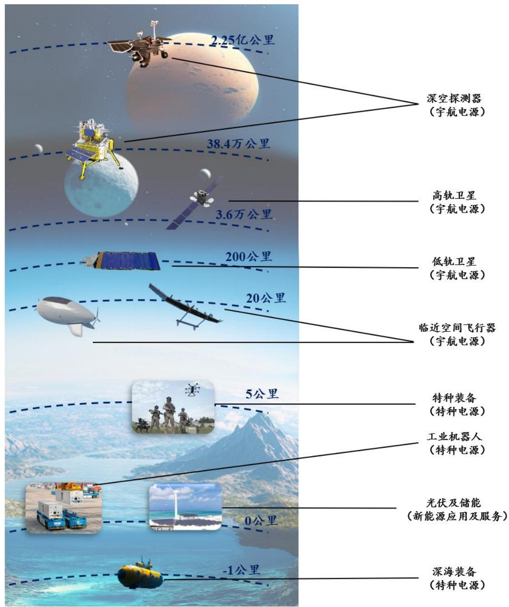

# 1、宇航电源

公司宇航电源的产品主要包括空间太阳电池阵、空间锂离子电池组和电源控制设备及其构成的电源系统，应用于航天器和临近空间1飞行器。公司是国内宇

航电源的核心供应商，宇航电源产品在国内市场覆盖率超过 $50 \%$ 。

与传统电能源企业相比，公司生产的太阳电池是利用光伏效应将太阳能通过半导体物质转变为直流电能的一种器件，属于应用于太空的空间太阳电池。与地面光伏电池追求规模制造和低成本不同，空间太阳电池的核心价值在于极致的性能与可靠性，对剧烈温变、宇宙辐射、真空失重等极端环境、能量密度与轻量化以及光电转化效率等技术指标的要求极高，是卫星、空间站和深空探测器等各类航天器的生命线。

公司研制的宇航电源产品贯穿中国航天发展史，自 1970 年为我国第一颗人造卫星“东方红一号”提供电源产品以来，截至报告期末，公司已为神舟飞船、天宫空间站、北斗卫星、嫦娥月球探测器、天问火星探测器、高分卫星等国家与国防多个重大工程在内的700余颗卫星/飞船/探测器/空间站提供了优质可靠的电源产品，是中国航天事业取得辉煌成就背后主要的支撑力量。在近年来兴起的商业航天卫星电源系统领域，公司大力推进高性能、大规模、轻量化、低成本的星座电源产品体系，在千帆星座、国网星座、吉林一号遥感星座等我国重大商业航天星座的电源系统供应商中处于重要地位。

在前沿的临近空间飞行器电源系统领域，公司是国内最早开展临近空间飞行器电源系统研制的单位。公司研制的电源系统支撑我国大型太阳能无人机首次实现临近空间连续跨昼夜飞行，助力我国成为继美国、英国之后世界第三个掌握临近空间低速飞行器技术的国家。公司在国内临近空间飞行器电源市场占据主导地位。

# 2、特种电源

公司特种电源的产品体系主要为特种锂离子电池组和燃料电池。

公司的特种锂离子电池组主要应用于携行装备、特种车辆、特种无人机和工业机器人。公司先后承担了为重点工程配套的锂离子蓄电池组科研项目 100余项，产品型号达300余种。在携行装备电源领域，公司是国内龙头企业；在特种车辆电源、特种无人机电源和工业机器人电源领域，公司属于国内重要供应商。其中，工业机器人电源领域，公司目前主攻 AGV锂离子电池方向，并已成为国内 AGV

锂离子电池组的重要供应商之一。

公司的燃料电池主要应用于携行装备、应急电源等国防领域，报告期内，燃料电池实现产业化。

# 3、新能源应用及服务

在深耕宇航电源、特种电源的同时，公司积极布局民品市场，陆续开拓光伏、储能两大市场。公司新能源应用及服务板块主要产品包括微电网解决方案、储能系统及储能 EPC 服务、光伏解决方案、电源检测服务，以及锂电正极材料和消费类锂电池等。

公司依托在电源控制领域的丰富技术积累，研制了风电、光伏、燃油发电、储能系统等多种能源互补的微电网，通过对多种能源进行合理的容量配置和智能控制计算，实现可再生能源的高效可靠利用。公司下属子公司蓝天太阳在南极泰山站建成我国首套风光燃储互补智能微电网，获得天津市科技进步一等奖。

公司对外销售各类中小型、大型储能系统（以集装箱式产品为主）。公司储能系统主要应用于独立储能电站、共享储能电站、工商业储能、家庭储能、便携式移动储能、微电网、备用电源储能等场景。

公司紧跟行业技术发展前沿，在钠离子电池方向进行布局，并已经取得实用突破，目前已在电动两轮车、启动电源领域进行示范应用，开发的钠离子电池储能系统已成功应用于微电网。

公司是国内最大的化学与物理电源综合性检测机构之一，技术实力雄厚，具备电池材料理化分析、太阳电池测试、化学电池及电源系统测试能力。公司是国家工信部电动汽车用动力蓄电池产品强制性检测单位、中国船级社认证测试（电池类）指定试验机构、天津海关工业产品安全技术中心合作实验室，TÜV 南德认证合作实验室、CQC认证合作实验室。

报告期内，公司主营业务收入构成情况如下表所示：

单位：万元  

<table><tr><td rowspan="2">产品类别</td><td colspan="2">2025年1-6月</td><td colspan="2">2024年度</td><td colspan="2">2023年度</td><td colspan="2">2022年度</td></tr><tr><td>金额</td><td>比例</td><td>金额</td><td>比例</td><td>金额</td><td>比例</td><td>金额</td><td>比例</td></tr><tr><td>宇航电源</td><td>72,805.56</td><td>74.13%</td><td>191,463.69</td><td>63.42%</td><td>168,718.01</td><td>48.23%</td><td>134,465.03</td><td>53.96%</td></tr><tr><td>特种电源</td><td>5,086.28</td><td>5.18%</td><td>44,363.58</td><td>14.69%</td><td>31,809.09</td><td>9.09%</td><td>38,300.75</td><td>15.37%</td></tr><tr><td>新能源应用及服务</td><td>20,319.34</td><td>20.69%</td><td>66,077.28</td><td>21.89%</td><td>149,298.17</td><td>42.68%</td><td>76,446.23</td><td>30.68%</td></tr><tr><td>合计</td><td>98,211.18</td><td>100.00%</td><td>301,904.55</td><td>100.00%</td><td>349,825.27</td><td>100.00%</td><td>249,212.02</td><td>100.00%</td></tr></table>

报告期内，公司主营业务毛利构成情况如下表所示：

单位：万元  

<table><tr><td rowspan="2">项目</td><td colspan="2">2025 年 1-6 月</td><td colspan="2">2024 年度</td><td colspan="2">2023 年度</td><td colspan="2">2022 年度</td></tr><tr><td>金额</td><td>比例</td><td>金额</td><td>比例</td><td>金额</td><td>比例</td><td>金额</td><td>比例</td></tr><tr><td>宇航电源</td><td>18,425.69</td><td>89.91%</td><td>60,901.88</td><td>81.24%</td><td>57,949.31</td><td>80.17%</td><td>43,233.13</td><td>72.53%</td></tr><tr><td>特种电源</td><td>100.05</td><td>0.49%</td><td>5,817.49</td><td>7.76%</td><td>2,800.85</td><td>3.88%</td><td>10,571.27</td><td>17.74%</td></tr><tr><td>新能源应用及服务</td><td>1,967.08</td><td>9.60%</td><td>8,248.82</td><td>11.00%</td><td>11,529.69</td><td>15.95%</td><td>5,800.71</td><td>9.73%</td></tr><tr><td>合计</td><td>20,492.82</td><td>100.00%</td><td>74,968.19</td><td>100.00%</td><td>72,279.85</td><td>100.00%</td><td>59,605.10</td><td>100.00%</td></tr></table>

报告期内，宇航电源收入在公司主营业务收入中的占比分别为 $5 3 . 9 6 \%$ 、$4 8 . 2 3 \%$ 、 $6 3 . 4 2 \%$ 和 $7 4 . 1 3 \%$ ，宇航电源毛利在公司主营业务毛利中的占比分别为$7 2 . 5 3 \%$ 、 $8 0 . 1 7 \%$ 、 $8 1 . 2 4 \%$ 和 $8 9 . 9 1 \%$ ，系公司的主要业绩来源。

# （二）销售模式及重要客户

公司的销售模式为直销，各类主营业务的具体销售模式有所不同：宇航电源业务按照合同、订单或标书等订货信息，开展产品要求评审并承接客户的研制任务；特种电源业务首先通过客户的供应商资格审查进入其合格供应商目录，再以项目定制、招投标等形式直接与客户签订合同；新能源应用及服务业务主要通过招投标、竞争性谈判等方式获取客户订单。报告期内，公司主要客户为航天科技集团下属从事航天任务的总体单位、中国科学院以及国家能源投资集团、国家电投集团、中国能源建设集团等各大能源集团，具体情况参见本招股说明书“第五节 业务与技术”之“四、发行人的销售情况和主要客户”之“（四）报告期内前五名客户的销售情况”部分。

# （三）采购模式及重要供应商

公司采购的主要原材料包括太阳电池阵生产材料、电池组及储能系统材料、锂离子电芯材料、新能源电站工程材料、电子元器件、结构件、金属材料等，公

司根据销售订单的需求信息，制定相应的物料采购计划，通过产品性能测试、产品对比筛选和价格比较，最终选择供应商，并逐步形成了长期合作的供应商体系。报告期内，公司主要供应商情况参见本招股说明书“第五节 业务与技术”之“五、发行人的采购情况和主要供应商”之“（四）报告期内前五名供应商的采购情况”部分。

# （四）生产模式

公司宇航电源的生产主要是根据航天任务总体单位制定的计划，开展相关研制生产工作；特种电源的生产主要采用以销定产的方式，针对部分通用性强、使用量大、技术成熟的产品，也会采用预先生产的方式以确保用户能够随时定购。公司生产模式的具体情况参见本招股说明书“第五节 业务与技术”之“一、发行人主营业务情况”之“（四）发行人主要经营模式”部分。

# （五）行业竞争情况及发行人在行业中的竞争地位

近年来，我国航天事业快速发展，航天等特殊领域对工作温度范围更宽、低温放电倍率更高、充电速度更快等高性能电源产品需求增加。公司是国内宇航电源、特种电源的主要供应商，并在新能源领域积累了丰富的设计及应用经验，凭借在发电、储能、控制和电源分系统等核心环节的全面技术积累，公司未来将迎来业务发展的重要战略机遇期。关于市场空间及公司竞争力的具体情况，参见本招股说明书“第五节 业务与技术”之“二、发行人所处行业基本情况”之“（三）行业发展概况及未来发展态势”及“第五节 业务与技术”之“二、发行人所处行业基本情况”之“（八）发行人所属行业在产业链中的地位和作用，与上下游的关联性”部分。

# 五、发行人符合科创板板块定位的情况

# （一）发行人符合行业领域要求

<table><tr><td rowspan="5">公司所属行业领域</td><td>□新一代信息技术</td><td rowspan="2">公司主要从事电能源产品及系统的研发、生产、销售及服务，主营业务涵盖宇航电源、特种电源、新能源应用及服务三大板块；</td></tr><tr><td>☑高端装备</td></tr><tr><td>□新材料</td><td rowspan="2">根据国民经济行业分类GB/T4754-2017，公司属于铁路、船舶、航空航天和其他运输设备制造业（行业代码：C37）；</td></tr><tr><td>□新能源</td></tr><tr><td>□节能环保</td><td>根据国家统计局发布的《战略性新兴产业分类(2018)》，</td></tr><tr><td rowspan="2"></td><td>□生物医药</td><td rowspan="2">公司从事的业务属于战略性新兴产业之“2高端装备制造产业”之“2.3卫星及应用产业”之“2.3.1卫星装备制造-3742*航天器及运载火箭制造”领域之“先进卫星分系统部组件产品”。根据《上海证券交易所科创板企业发行上市申报及推荐暂行规定》中，公司主营业务属于高端装备领域的航空航天产业类别，公司符合科创板行业领域定位。</td></tr><tr><td>□符合科创板定位的其他领域</td></tr></table>

# （二）发行人符合科创属性要求

根据《上海证券交易所科创板企业发行上市申报及推荐暂行规定》，公司同时符合第六条规定的科创属性 4项指标要求：

<table><tr><td>科创属性评价标准一</td><td>是否符合</td><td>指标情况</td></tr><tr><td>最近三年研发投入占营业收入比例≥5%，或最近三年累计研发投入金额≥8,000万元</td><td>☑是□否</td><td>公司2022至2024年累计研发投入达5.93亿元，不低于8,000万元。</td></tr><tr><td>研发人员占当年员工总数的比例≥10%</td><td>☑是□否</td><td>截至2024年底，公司研发人员占比为21.49%。</td></tr><tr><td>应用于公司主营业务并能够产业化的发明专利≥7项</td><td>☑是□否</td><td>公司是国内宇航电源的核心供应商，电能源产品门类齐全，具备深厚的技术沉淀及较强技术创新能力，拥有应用于公司主营业务的发明专利141项（含共有）。</td></tr><tr><td>最近三年营业收入复合增长率≥25%，或最近一年营业收入金额≥3亿元</td><td>☑是□否</td><td>公司2024年营业收入为31.27亿元，不低于3亿元。</td></tr></table>

同时，公司也符合《上海证券交易所科创板企业发行上市申报及推荐暂行规定》第七条规定的科技创新能力突出的多个情形：

<table><tr><td>科创属性评价标准二</td><td>是否符合</td><td>指标情况</td></tr><tr><td>作为主要参与单位或者核心技术人员作为主要参与人员，获得国家自然科学奖、国家科技进步奖、国家技术发明奖，并将相关技术运用于主营业务</td><td>☑是□否</td><td>公司作为主要参与单位或者核心技术人员作为主要参与人员，累计获得国家科学技术进步奖9次、国防科学技术（进步）进步奖14次，并将相关技术运用于主营业务。1</td></tr><tr><td>形成核心技术和应用于主营业务的发明专利（含国防专利）合计50项以上</td><td>☑是□否</td><td>截至2025年6月30日，公司拥有应用于主营业务的发明专利141项（含共有）。</td></tr></table>

综上，根据《首次公开发行股票注册管理办法》《上海证券交易所股票发行上市审核规则》《科创属性评价指引（试行）》《上海证券交易所科创板企业发行上市申报及推荐暂行规定》等有关规定，经充分评估，公司符合科创属性和科创板定位要求。

# 六、发行人报告期主要财务数据和财务指标

以下财务数据经由立信会计师审计，财务指标依据相关财务数据计算得出。报告期内，公司主要财务数据和财务指标如下表所示：

单位：万元  

<table><tr><td>项目</td><td>2025 年 6 月 30 日/2025 年 1-6 月</td><td>2024 年 12 月 31 日/2024 年度</td><td>2023 年 12 月 31 日/2023 年度</td><td>2022 年 12 月 31 日/2022 年度</td></tr><tr><td>资产总额</td><td>691,251.95</td><td>727,749.00</td><td>711,019.13</td><td>641,133.94</td></tr><tr><td>归属于母公司所有者权益</td><td>358,554.81</td><td>351,303.67</td><td>334,775.80</td><td>321,161.66</td></tr><tr><td>资产负债率（母公司）</td><td>40.03%</td><td>46.44%</td><td>42.56%</td><td>37.28%</td></tr><tr><td>资产负债率（合并）</td><td>47.82%</td><td>51.35%</td><td>52.54%</td><td>49.50%</td></tr><tr><td>营业收入</td><td>111,340.84</td><td>312,702.27</td><td>352,404.11</td><td>252,111.38</td></tr><tr><td>净利润</td><td>5,946.68</td><td>33,778.54</td><td>19,013.74</td><td>21,377.61</td></tr><tr><td>归属于母公司所有者的净利润</td><td>6,528.19</td><td>33,722.26</td><td>18,992.58</td><td>20,751.44</td></tr><tr><td>扣除非经常性损益后归属于母公司所有者的净利润</td><td>3,734.00</td><td>28,961.87</td><td>14,742.35</td><td>19,943.79</td></tr><tr><td>基本每股收益（元/股）</td><td>0.04</td><td>0.22</td><td>0.12</td><td>0.13</td></tr><tr><td>稀释每股收益（元/股）</td><td>0.04</td><td>0.22</td><td>0.12</td><td>0.13</td></tr><tr><td>加权平均净资产收益率</td><td>1.84%</td><td>9.71%</td><td>5.77%</td><td>8.28%</td></tr><tr><td>经营活动产生的现金流量净额</td><td>-63,243.02</td><td>10,647.60</td><td>-56,951.83</td><td>56,438.24</td></tr><tr><td>现金分红</td><td>-</td><td>-</td><td>17,719.54</td><td>5,756.26</td></tr><tr><td>研发投入占营业收入的比例</td><td>7.44%</td><td>6.40%</td><td>6.52%</td><td>6.46%</td></tr></table>

注：上述财务指标计算公式如下：  
1、资产负债率 $=$ （总负债÷总资产） $\times 1 0 0 \%$ ；  
2、基本每股收益 $\mathrm { = } \mathrm { P _ { 0 } } \div \mathrm { S }$ ， $\mathbf { S } { = } \mathbf { S } _ { 0 } { + } \mathbf { S } _ { 1 } { + } \mathbf { S } _ { \mathrm { i } } { \times } \mathbf { M } _ { \mathrm { i } } { \div } \mathbf { M } _ { 0 } - \mathbf { S } _ { \mathrm { j } } { \times } \mathbf { M } _ { \mathrm { j } } { \div } \mathbf { M } _ { 0 } - \mathbf { S } _ { \mathrm { k } }$

其中： $\mathrm { P _ { 0 } }$ 为归属于公司普通股股东的净利润或扣除非经常性损益后归属于普通股股东的净利润；S为发行在外的普通股加权平均数； $\mathbf { S } _ { 0 }$ 为期初股份总数； $\mathbf { S } _ { 1 }$ 为报告期因公积金转增股本或股票股利分配等增加股份数； $\mathrm { S _ { i } }$ 为报告期因发行新股或债转股等增加股份数； $\mathrm { S _ { j } }$ 为报告期因回购等减少股份数； $\mathbf { S } _ { \mathbf { k } }$ 为报告期缩股数； $\mathbf { M } _ { 0 }$ 报告期月份数； $\mathbf { M } _ { \mathrm { i } }$ 为增加股份次月起至报告期期末的累计月数； $\mathbf { M } _ { \mathrm { j } }$ 为减少股份次月起至报告期期末的累计月数。

3、稀释每股收益 $\mathbf { \Pi } _ { = \mathbf { P } _ { 1 } / }$ （ $\begin{array} { r } { \mathbf { S } _ { 0 } + \mathbf { S } _ { 1 } + \mathbf { S } _ { \mathrm { i } } \times \mathbf { M } _ { \mathrm { i } } \div \mathbf { M } _ { 0 } - \mathbf { S } _ { \mathrm { j } } \times \mathbf { M } _ { \mathrm { j } } \div \mathbf { M } _ { 0 } - \mathbf { S } _ { \mathrm { k } } + \mathbf { \dot { b } } } \end{array}$ 认股权证、股份期权、可转换债券等增加的普通股加权平均数）

其中： $\mathrm { P _ { 1 } }$ 为归属于公司普通股股东的净利润或扣除非经常性损益后归属于公司普通股股东的净利润，并考虑稀释性潜在普通股对其影响，按《企业会计准则》及有关规定进行调整。公司在计算稀释每股收益时，应考虑所有稀释性潜在普通股对归属于公司普通股股东的净利润或扣除非经常性损益后归属于公司普通股股东的净利润和加权平均股数的影响，按照其稀释程度从大到小的顺序计入稀释每股收益，直至稀释每股收益达到最小值。

4、加权平均净资产收益率 ${ \bf \mathrm { - P 0 } } ^ { }$ （E0＋NP÷2＋Ei×Mi÷M0–Ej×Mj÷M0±Ek×Mk÷M0）

其中： $\mathrm { P _ { 0 } }$ 分别对应于归属于公司普通股股东的净利润、扣除非经常性损益后归属于公司普通股股东的净利润；NP为归属于公司普通股股东的净利润； $\mathrm { E } _ { 0 }$ 为归属于公司普通股股东的期

初净资产；Ei 为报告期发行新股或债转股等新增的、归属于公司普通股股东的净资产； $\mathrm { E _ { j } }$ 为报告期回购或现金分红等减少的、归属于公司普通股股东的净资产； $\mathbf { M } _ { 0 }$ 为报告期月份数；$\mathbf { M } _ { \mathrm { i } }$ 为新增净资产次月起至报告期期末的累计月数；Mj为减少净资产次月起至报告期期末的累计月数； $\mathrm { E _ { k } }$ 为因其他交易或事项引起的、归属于公司普通股股东的净资产增减变动； $\mathbf { M } _ { \mathrm { k } }$ 为发生其他净资产增减变动次月起至报告期期末的累计月数。

# 七、发行人财务报告审计截止日后主要财务信息及经营状况

# （一）审计基准日后主要经营情况

自审计截止日2025年6 月30日至本招股说明书签署日，发行人生产经营的内外部环境未发生重大变化，产业政策未有重大调整，税收政策未出现重大变化，业务模式及竞争趋势未发生重大变化，主要原材料的采购规模及采购价格或主要产品的生产未发生重大变化，未有对未来经营可能产生较大影响的诉讼或仲裁事项，主要供应商未出现重大变化，重大合同条款或实际执行情况未发生重大变化，未有重大安全事故以及其他可能影响投资者判断的重大事项。

# （二）2025 年 1-9 月经营业绩情况

立信会计师对发行人 2025 年 9 月 30 日的合并及母公司资产负债表，2025年1-9月的合并及母公司利润表、合并及母公司现金流量表以及财务报表附注进行了审阅，并出具了无保留意见的《审阅报告》（信会师报字[2025]第ZG12926号）。

发行人2025年1-9月经审阅主要经营数据情况如下：

单位：万元  

<table><tr><td>项目</td><td>2025 年 1-9 月</td><td>2024 年 1-9 月</td><td>变动比例</td></tr><tr><td>营业收入</td><td>170,823.20</td><td>161,125.90</td><td>6.02%</td></tr><tr><td>归属于母公司所有者的净利润</td><td>11,336.60</td><td>10,512.45</td><td>7.84%</td></tr><tr><td>扣除非经常性损益后归属于母公司所有者的净利润</td><td>8,444.18</td><td>7,055.51</td><td>19.68%</td></tr><tr><td>项目</td><td>2025 年 7-9 月</td><td>2024 年 7-9 月</td><td>变动比例</td></tr><tr><td>营业收入</td><td>59,482.36</td><td>59,631.30</td><td>-0.25%</td></tr><tr><td>归属于母公司所有者的净利润</td><td>4,808.41</td><td>4,788.00</td><td>0.43%</td></tr><tr><td>扣除非经常性损益后归属于母公司所有者的净利润</td><td>4,710.18</td><td>4,362.39</td><td>7.97%</td></tr></table>

2025年1-9月，发行人营业收入、利润总额、归母净利润及扣除非经常性损益后归属于母公司所有者的净利润较上年同期均有所增长，主要系受益于我国航

天事业快速发展，公司 2025 年 1-9 月宇航电源业务收入占比提升，公司营业收入与利润水平较同期有所增长。

2025年7-9月，发行人营业收入、利润总额、归母净利润及扣除非经常性损益后归属于母公司所有者的净利润较上年同期整体变动幅度较小。

关于主要财务数据的具体分析详见本招股说明书“第六节 财务会计信息与管理层分析”之“十五、财务报告审计截止日后主要财务信息及经营状况”之“（二）2025年1-9月财务数据审阅情况”。

# （三）2025 年业绩预计情况

基于目前的经营状况和市场环境，发行人预计 2025年主要财务数据如下：

单位：万元  

<table><tr><td>项目</td><td>2025 年度(预计)</td><td>2024 年度</td><td>变动比例</td></tr><tr><td>营业收入</td><td>313,800.00 至 343,500.00</td><td>312,702.27</td><td>0.35%至9.85%</td></tr><tr><td>归属于母公司所有者的净利润</td><td>32,650.00 至 36,020.00</td><td>33,722.26</td><td>-3.18%至6.81%</td></tr><tr><td>扣除非经常性损益后归属于母公司所有者的净利润</td><td>28,150.00 至 31,030.00</td><td>28,961.87</td><td>-2.80%至7.14%</td></tr></table>

2025年度，发行人预计实现营业收入较上年增长 $0 . 3 5 \%$ 至 $9 . 8 5 \%$ ，主要系受益于我国航天事业尤其是商业航天市场的快速发展，公司宇航电源业务规模持续提升所致。预计实现归属于母公司所有者的净利润较上年同期变动比例为- $. 3 . 1 8 \%$ 至 $6 . 8 1 \%$ ，扣除非经常性损益后归属于母公司所有者的净利润较上年同期变动比例为- $. 2 . 8 0 \%$ 至 $7 . 1 4 \%$ ，盈利水平有所波动，主要系一方面在传统航天领域下游需求以承担国家航天工作任务为主，年度盈利情况会受当期承担特定客户国家航天工程项目的影响而有所波动；另一方面发行人商业航天领域收入规模增加，商业航天领域产品的规模效应尚未完全体现，盈利能力仍处于较低水平。

发行人未编制和披露盈利预测信息，上述 2025 年业绩预计仅为管理层对经营业绩的合理估计，未经注册会计师审计或审阅，不构成公司的盈利预测或业绩承诺。

# 八、发行人选择的具体上市标准

发行人本次公开发行后的总市值（本次发行价格乘以本次发行后总股数）为

164.49亿元，不低于人民币 10 亿元，发行人2024年度归属于母公司股东的净利润（扣除非经常性损益前后孰低）为 28,961.87 万元，营业收入为 312,702.27 万元。发行人符合《科创板上市规则》2.1.2 条“发行人申请在本所科创板上市，市值及财务指标应当至少符合下列标准中的一项”中第（一）项条件：“预计市值不低于人民币 10 亿元，最近两年净利润均为正且累计净利润不低于人民币5,000 万元，或者预计市值不低于人民币 10 亿元，最近一年净利润为正且营业收入不低于人民币1亿元”。公司选择前述条件作为申请上市标准。

# 九、发行人公司治理特殊安排的情况

截至本招股说明书签署日，发行人不存在公司治理特殊安排等重要事项。

# 十、募集资金运用与未来发展规划

本次募集资金在扣除发行费用后，将投资于以下项目，并由公司董事会负责实施：

单位：万元  

<table><tr><td>序号</td><td>项目名称</td><td>总投资额</td><td>拟使用募集资金</td></tr><tr><td>1</td><td>宇航电源系统产业化（一期）建设项目</td><td>199,500.00</td><td>150,000.00</td></tr></table>

若实际募集资金金额（扣除发行费用后）不能满足上述项目的资金需求，则不足部分由公司通过自有资金或其他途径补充解决。若本次实际募集资金金额（扣除发行费用后）超过上述项目所需资金，公司将按照相关规定履行必要的程序后将超募资金用于主营业务。

本次发行股票募集资金到位之前，公司可以根据项目进度的实际情况以自筹资金先行投入，并在募集资金到位之后予以置换。

公司根据相关法规制定了《募集资金管理制度》，对募集资金专户存储、使用、管理和监督等作出了具体规定。公司募集资金将存放于董事会决定的专户，做到专款专用，并接受保荐机构、开户银行、证券交易所和其他有权部门的监督。

本次募集资金投资项目主要是对现有业务的进一步扩产和强化，项目实施后，公司与控股股东及关联方之间不会产生新增的同业竞争，也不存在对发行人独立性产生不利影响的情形。

本公司作为中国电科旗下首批入选国务院国资委“双百企业”的试点单位，根据党的二十大精神以及关于深化国企改革的重大决策部署，近年来始终坚持党的领导，并持续推动改革、提高经营水平，加强国有资产监管。本次发行股票募集资金计划是公司落实中央金融工作会议精神的重要举措之一，公司严格遵循国家政策指引，募集资金运用符合国家重大战略方向。

未来，公司将继续专注于电能源领域，聚焦国家所需、行业所趋、公司所能，坚持核心技术安全可控，推进核心业务体系协同式发展，加大科技创新投入，实现产业发展新突破，力争成为电能源领域创新型世界一流企业。关于本次发行募集资金运用与未来发展规划，参见本招股说明书“第七节 募集资金运用与未来发展规划”部分。

# 十一、其他对发行人有重大影响的事项

截至本招股说明书签署日，发行人不存在其他有重大影响的事项。

# 第三节 风险因素

投资者在评价公司本次发行的股票时，除本招股说明书提供的其他各项资料外，应特别认真地考虑下述各项风险因素。

# 一、与发行人相关的风险

# （一）财务风险

# 1、经营业绩季节性波动风险

参见本招股说明书“第二节 概览”之“一、重大事项提示”之“（一）特别风险提示”部分。

# 2、应收账款回收风险

参见本招股说明书“第二节 概览”之“一、重大事项提示”之“（一）特别风险提示”部分。

# 3、关联交易风险

报告期内，发行人关联销售的金额分别为 128,273.64 万元、167,476.16 万元、165,079.88 万元和 72,203.61 万元，占营业收入的比重分别为 $5 0 . 8 8 \%$ 、 $4 7 . 5 2 \%$ 、$5 2 . 7 9 \%$ 和 $6 4 . 8 5 \%$ ，其中因业务整合原因通过十八所转售产品产生的销售收入分别为 74,320.25 万元、105,543.84 万元、85,961.44 万元和 32,574.23 万元，剔除该因素影响后，发行人报告期各期关联销售的金额分别为 53,953.39 万元、61,932.32万元、79,118.44万元和39,629.38万元，占营业收入的比重分别为 $2 1 . 4 0 \% \setminus 1 7 . 5 7 \% .$ 、$2 5 . 3 0 \%$ 和 $3 5 . 5 9 \%$ 。报告期内，发行人关联采购的金额分别为 50,408.06 万元、50,498.48 万元、63,571.65 万元和 39,927.13 万元，占营业成本的比重分别为$2 6 . 5 7 \%$ 、 $1 8 . 1 8 \%$ 、 $2 7 . 5 0 \%$ 和 $4 7 . 6 5 \%$ 。2025年1-6月发行人关联交易占比较高主要系公司对航天科技集团、中国科学院等航天总体单位客户的产品交付主要集中在下半年，因季节性因素导致半年度关联交易占比阶段性升高，预计全年比例将降低。公司具备完整的业务体系并独立作出经营决策，关联交易严格履行审批程序，保证关联交易定价公允和公司及股东利益。未来，如果公司内部控制措施不能有效执行，出现关联交易定价不公允等情形，可能对公司及中小股东利益造成影响。

# 4、业务拓展导致业绩波动的风险

报告期内，发行人营业收入分别为 252,111.38 万元、352,404.11 万元、312,702.27 万元和 111,340.84 万元，归属母公司股东的净利润分别为 20,751.44万元、18,992.58 万元、33,722.26 万元和 6,528.19 万元，发行人经营业绩波动较大，主要系近年来公司在持续发挥宇航电源领域竞争优势的同时，围绕电能源产业拓展新能源应用及服务和展会相关业务所致。报告期内，公司新能源应用及服务业务分别实现收入 76,446.23 万元、149,298.17 万元、66,077.28 万元和 20,319.34万元，占公司营业收入的比例分别为 $3 0 . 3 2 \%$ 、 $4 2 . 3 7 \%$ 、 $2 1 . 1 3 \%$ 和 $1 8 . 2 5 \%$ ，公司2024 年起承办中国化学与物理电源行业协会相关展会。上述业务对公司经营影响较大，若未来下游市场环境发生不利变化或公司无法取得相关业务机会，将会对公司的经营业绩带来一定不利影响。

# 5、经营活动现金流量净额波动的风险

报告期内，公司经营活动现金流量净额分别为 56,438.24 万元、-56,951.83万元、10,647.60 万元和-63,243.02 万元，波动较大。其中 2023 年度经营活动产生的现金流量净额为负，主要由于公司原材料采购增加、付现期间费用增加所致。2025年1-6月公司经营活动现金流量净额为负，主要系发行人客户以央国企和事业单位为主，客户一般结合自身资金预算情况，于每年年底集中回款所致。随着业务规模的不断扩大，公司营运资金需求日益增加，公司经营活动现金流量净额若持续发生不利波动，可能导致公司出现营运资金短期不足，从而对公司经营造成不利影响。

# 6、政府补助政策变动的风险

报告期内，公司计入其他收益的政府补助金额分别为 496.22 万元、4,289.90万元、4,125.67 万元和 3,771.40 万元，占各年利润总额的比例分别为 $2 . 0 8 \%$ 、$1 9 . 2 2 \%$ 、 $1 0 . 9 7 \%$ 和 $5 8 . 8 2 \%$ ，主要为科研项目相关的政府补助。2025 年 1-6 月政府补助金额占利润总额的比例较高，主要系公司产品交付集中在下半年导致上半年的利润总额相对较低所致。若未来国家补助政策发生不利变动或公司不能持续享受政府补助或补助金额减少，则可能对公司的营业利润造成不利影响。

# 7、暂定价导致业绩波动的风险

公司部分销售合同约定的产品价格为暂定价，最终销售价格可能根据与客户沟通确定的最终合同或审价情况有所变化。公司在符合收入确认条件时按照合同暂定价格确认收入，后续如出现调整产品价格的情形，按照相关补充协议的价格于当期进行调整。如果后续确定的产品最终价格与暂定价差异较大，可能导致公司存在收入及业绩波动的风险。

# （二）管理内控风险

# 1、经营规模扩张带来的管理风险

本次发行完成后，随着募投项目的实施，公司的业务和资产规模将进一步扩大，员工人数预计也将相应增加，对于公司的经营管理、内部控制、财务规范等提出了更高的要求。未来，如果管理层的职业素养、经营能力、管理水平不能满足业务规模扩大后对公司各项规范治理的要求，将带来一定的管理风险，并制约公司长远发展。

# 2、控制权集中风险

截至本招股说明书签署日，中国电科直接持有公司 $4 8 . 9 7 \%$ 的股份，通过十八所、中电科投资间接持有公司 $1 9 . 5 0 \%$ 的股份，此外通过十八所的一致行动人景鸿瑞和、景源瑞和间接控制公司 $1 6 . 0 3 \%$ 股份对应的表决权，因此中国电科合计控制公司 $8 4 . 5 0 \%$ 的表决权，为公司控股股东、实际控制人。本次发行后，中国电科仍为公司的控股股东、实际控制人，且控制的表决权比例较高。未来，如果控股股东、实际控制人利用其控制地位，对公司人事、经营决策等控制不当，可能会使公司和中小股东利益受到损害。

# 3、内控制度执行不到位风险

内部控制制度是保证财务和业务正常开展的重要因素，随着公司未来生产经营规模的不断扩大，势必会对公司内控的规范性提出更高要求，如果公司未来有关内部控制制度未能有效贯彻落实，进而出现公司关联交易或重大事项未按规定履行审批、内控制度执行不到位导致会计差错更正等情形，将对公司经营管理、财产安全和经营业绩构成较大不利影响。

# （三）募集资金投资项目风险

# 1、募投项目的实施风险

本次发行募集资金扣除发行费用后，拟投向宇航电源系统产业化（一期）建设项目，其可行性分析是基于当前宏观经济形势、产业发展政策、行业发展趋势、公司实际经营能力等因素作出的。尽管公司对本次募投项目的经济效益进行了审慎测算，但在募投项目实施过程中，不排除因经济环境、政策环境等发生重大变化，或者市场开拓不同步带来的风险，从而对项目的顺利实施及公司的预期收益造成不利影响。

# 2、新增固定资产折旧的风险

本次募投项目实施后，公司的固定资产增加，折旧费用相应上升。由于宏观经济、行业政策、市场发展等具有不确定性，募投项目若不能快速产生效益以弥补新增投资带来的固定资产折旧费用的增加，会导致公司营业成本上升和毛利率下降，对公司短期内的经营业绩可能产生一定影响。

# （四）向关联方十八所租赁厂房设备的风险

截至2025年6月30日，发行人存在租赁十八所厂房及机器设备的情形，发行人向十八所租赁使用的房产面积合计 58,362.10 平方米；公司向十八所租赁使用的仪器设备共 761 台/套，该等房屋、设备主要用于公司及下属子公司的日常研发、生产、办公等。尽管发行人生产环节以标准化无尘车间和标准化生产线为主，不存在对上述租赁厂房设备的重大依赖，但如果十八所不再向发行人租赁前述厂房设备而发行人未能及时找到替代厂房或购置替代设备，可能对发行人生产经营造成不利影响。

# 二、与行业相关的风险

# （一）经营风险

# 1、产业政策变动及客户集中的风险

参见本招股说明书“第二节 概览”之“一、重大事项提示”之“（一）特别风险提示”部分。

# 2、行业竞争加剧的风险

参见本招股说明书“第二节 概览”之“一、重大事项提示”之“（一）特别风险提示”部分。

# 3、部分业务领域毛利率为负的风险

参见本招股说明书“第二节 概览”之“一、重大事项提示”之“（一）特别风险提示”部分。

# 4、产品质量控制风险

公司宇航电源产品、特种电源产品主要应用于国家航天、商业航天、特种领域。宇航电源产品广泛应用于我国载人航天、北斗导航、探月工程、探火工程、高分专项、先导专项等国家与国防多个重大工程，是空间飞行器的“心脏”，具有复杂程度高、管理难度大、型号多、应用工况复杂、性能指标要求较严苛等特点。客户对产品质量要求标准极高、产品涉及事故容忍度极低。尽管公司在生产经营过程中高度重视产品质量控制，但若公司未来产品发生重大质量问题，将对发行人的品牌声誉和经营收益产生不利影响。

# 5、商业航天领域市场拓展不及预期的风险

参见本招股说明书“第二节 概览”之“一、重大事项提示”之“（一）特别风险提示”部分。

# 6、收缩光伏电站工程业务导致业绩下滑的风险

参见本招股说明书“第二节 概览”之“一、重大事项提示”之“（一）特别风险提示”部分。

# （二）技术风险

# 1、技术创新的风险

参见本招股说明书“第二节 概览”之“一、重大事项提示”之“（一）特别风险提示”部分。

# 2、核心人才流失的风险

参见本招股说明书“第二节 概览”之“一、重大事项提示”之“（一）特

别风险提示”部分。

# 三、其他风险

# （一）转签业务独立承接风险

报告期各期，十八所向发行人采购并代为销售的金额分别为 74,320.25 万元、105,543.84 万元、85,961.44 万元和 32,574.23 万元，主要系业务整合导致的转签业务所致。发行人承接的宇航电源业务主要涉及载人航天等重大工程或军方等特定用户，部分客户需要履行合格供应商目录变更程序，因此过渡期内发行人存在通过十八所转签方式签署合同的情形。若与个别转签客户直接签署合同所需时间较长或存在困难，将对发行人业务造成不利影响。

# （二）涉密信息脱密披露或豁免披露可能影响投资者价值判断的风险

公司部分产品及客户信息涉及国家秘密，根据《军工企业对外融资特殊财务信息披露管理暂行办法》，公司针对部分特定客户名称及部分合同、产品信息等涉密内容采取了脱密处理后进行披露，针对有关资质和军品税收优惠政策的具体内容等信息采取豁免披露。此种信息披露方式符合国家保密规定和涉密信息公开披露的相关规定，且符合军工企业信息披露的行业惯例，但上述信息脱密披露或豁免披露可能影响投资者对发行人价值的精确判断。

# （三）本次发行失败的风险

公司本次拟申请首次公开发行股票并在科创板上市，根据科创板股票发行与承销相关规定，本次发行将通过向证券公司、基金管理公司、信托公司、财务公司、保险公司、合格境外机构投资者和私募基金管理人等专业机构投资者询价的方式确定股票发行价格。如公司的投资价值未能获得足够多投资者的认可，将有可能导致最终发行认购不足等情况发生，从而使公司面临发行失败的风险。

# （四）预测性陈述存在不确定性的风险

本招股说明书列载有若干预测性的陈述，涉及公司所处行业的未来市场需求、公司未来发展规划、业务发展目标等方面的预期或相关讨论。公司提醒投资者注意，该等预期或讨论是否能够实现仍然存在不确定性。鉴于该等风险及不确定因素的存在，本招股说明书所列载任何前瞻性陈述，不应视为本公司的承诺或声明。

# （五）不可抗力的风险

在公司日常经营过程中，包括重大自然灾害、金融危机等突发性不可抗力事件会对公司的资产、人员以及供应商或客户造成损害，并有可能影响本公司的正常生产经营。

# 第四节 发行人基本情况

# 一、发行人基本情况

<table><tr><td>中文名称</td><td>中电科蓝天科技股份有限公司</td></tr><tr><td>英文名称</td><td>CETC Lantian Technology Co., Ltd.</td></tr><tr><td>注册资本</td><td>156,322.3890 万元</td></tr><tr><td>法定代表人</td><td>郑宏宇</td></tr><tr><td>成立日期</td><td>1992 年 10 月 12 日</td></tr><tr><td>注册地址（主要生产经营地址）</td><td>天津市滨海高新技术产业开发区华科七路 6 号</td></tr><tr><td>负责信息披露和投资者关系部门</td><td>董事会办公室</td></tr><tr><td>信息披露和投资者关系负责人</td><td>王祎</td></tr><tr><td>邮政编码</td><td>300392</td></tr><tr><td>联系电话</td><td>022-23721226</td></tr><tr><td>传真号码</td><td>022-23383783</td></tr><tr><td>公司网址</td><td>lantiantech.com.cn</td></tr><tr><td>电子信箱</td><td>dshbgs@lantiantech.com.cn</td></tr></table>

# 二、发行人设立及股本变化情况

发行人及前身股本演变情况如下图所示：

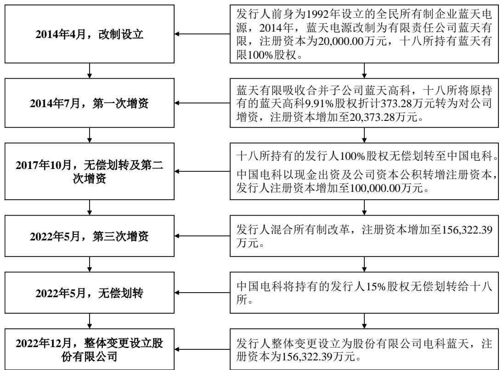

# （一）有限公司的设立情况

公司前身为天津蓝天电源公司（简称“蓝天电源”），设立于 1992 年，是经中国电子工业总公司《关于同意成立天津蓝天电源公司的批复》（中电劳〔1992583 号）同意，由十八所组织成立的全民所有制企业。2013 年 7 月 16 日，十八所作出所务会决议，同意按照蓝天电源经备案的净资产评估价值为依据出资，新设立国有独资公司蓝天有限。

2013 年 9 月 29 日，天津市中和信诚会计师事务所有限公司出具《审计报告》（津中和信诚审专字（2013）第 396 号）。

2013年9月30日，北京中同华资产评估有限公司天津分公司出具《天津蓝天电源公司拟改制项目资产评估报告书》（中同华评报字（2013）第 033 号），以2013年6月30日为评估基准日，蓝天电源全部股东权益的评估值为45,616.81万元。2013年11月26日，中国电科就前述评估报告进行了备案。

2013 年 9 月 30 日，蓝天电源职工代表审议同意《天津蓝天电源公司改制预案》和《天津蓝天电源公司改制职工安置方案》。

2013年12月9日，中国电科出具《中国电子科技集团公司关于集团公司第十八研究所天津蓝天电源公司改制相关事项的批复》（电科资函〔2013〕485号），同意蓝天电源改制成为十八所全资拥有的有限责任公司，以蓝天电源经备案的净资产评估价值45,616.81万元为基础出资，改制后公司注册资本为20,000.00万元，其余进入公司资本公积。

2014年1月15日，天津市中和信诚会计师事务所有限公司出具《验资报告》（津中和信诚验字（2014）第 12 号），确认截至 2014 年 1 月 15 日，新设立的有限公司已收到股东十八所缴纳的注册资本合计 20,000.00 万元。立信会计师已就本次改制事项出具验资复核报告（信会师报字[2025]第 ZG12618 号）。

2014年4月24日，新设立的有限公司取得了天津市工商行政管理局核发的《营业执照》，股权结构如下表所示：

<table><tr><td>序号</td><td>股东名称</td><td>注册资本（万元）</td><td>持股比例（%）</td></tr><tr><td>1</td><td>十八所</td><td>20,000.00</td><td>100.00</td></tr><tr><td colspan="2">合计</td><td>20,000.00</td><td>100.00</td></tr></table>

蓝天电源从全民所有制企业改制为有限责任公司未履行清产核资程序。鉴于改制过程中，蓝天电源资产已经审计、评估，改制后蓝天有限股权仍然全部由十八所持有，改制过程中未造成国有资产流失。

# （二）股份公司的设立情况

电科蓝天系由中电科能源有限公司（发行人有限公司阶段的曾用名，简称“电科能源”）以经审计的净资产值折股整体变更设立而来。2022年8月1日，立信会计师出具了审计报告（信会师报字〔2022〕第 ZG12305 号），确认截至2022 年 5 月 31 日公司经审计的净资产账面值为 289,575.68 万元。

2022 年 8 月 2 日，北京中同华资产评估有限公司出具《中电科能源有限公司拟改制设立股份公司涉及的中电科能源有限公司净资产价值评估项目资产评估报告》（中同华评报字（2022）第 021325 号），确认截至 2022 年 5 月 31 日公司净资产评估值为 415,513.39 万元。

2022年12月25日，电科能源召开 2022年第二次临时股东会，审议通过了《关于审议中电科能源有限公司整体变更设立股份有限公司的议案》，同意以2022年5月31日为基准日，以经审计的公司净资产账面值 289,575.68 万元为基础，折股156,322.39万股，设立股份有限公司，每股面值 1元人民币，其余计入股份公司资本公积。

2022 年 12 月 27 日，中国电科出具了《中国电科关于中电科能源有限公司股份制改制的批复》（电科资〔2022〕680号），同意公司变更为股份有限公司的改制方案。同日，国防科工局出具了批复文件，原则同意公司改制并上市。

2022 年 12 月 28 日，发行人召开创立大会，审议通过了公司整体改制相关议案，同意由电科能源原有股东作为发起人，以经审计的公司净资产 289,575.68万元为基础，将其中的156,322.39 万元折成股份公司股本，每股面值 1元，其余计入资本公积。同日，股份公司全体发起人签署了《发起人协议》。

立信会计师对本次整体变更予以审验，并出具《验资报告》（信会师报字〔2023第 ZG10025 号）。

2022 年 12 月 30 日，公司取得了天津滨海高新技术产业开发区市场监督管理局核发的《营业执照》。

公司发起人及持股情况如下表所示：  

<table><tr><td>序号</td><td>发起人名称</td><td>股本(万股)</td><td>持股比例(%)</td></tr><tr><td>1</td><td>中国电科</td><td>76,551.64</td><td>48.9704</td></tr><tr><td>2</td><td>十八所</td><td>23,448.36</td><td>15.0000</td></tr><tr><td>3</td><td>景鸿瑞和</td><td>18,805.66</td><td>12.0301</td></tr><tr><td>4</td><td>中电科投资</td><td>7,034.51</td><td>4.5000</td></tr><tr><td>5</td><td>景源瑞和</td><td>6,252.25</td><td>3.9996</td></tr><tr><td>6</td><td>航天专利基金</td><td>4,764.41</td><td>3.0478</td></tr><tr><td>7</td><td>双百壹号</td><td>4,615.32</td><td>2.9524</td></tr><tr><td>8</td><td>产业基金</td><td>4,615.32</td><td>2.9524</td></tr><tr><td>9</td><td>中信建投投资</td><td>3,712.62</td><td>2.3750</td></tr><tr><td>10</td><td>中兵投资</td><td>2,382.21</td><td>1.5239</td></tr><tr><td>11</td><td>天津海泰</td><td>2,370.18</td><td>1.5162</td></tr><tr><td>12</td><td>嘉兴产投</td><td>1,769.91</td><td>1.1322</td></tr><tr><td colspan="2">合计</td><td>156,322.39</td><td>100.00</td></tr></table>

# （三）报告期内股本及股东变化情况

1、报告期期初的股权结构  

<table><tr><td>序号</td><td>股东名称</td><td>注册资本（万元）</td><td>出资比例（%）</td></tr><tr><td>1</td><td>中国电科</td><td>100,000.00</td><td>100.00</td></tr><tr><td colspan="2">合计</td><td>100,000.00</td><td>100.00</td></tr></table>

# 2、2022年 5月，混合所有制改革暨增资

2021 年 6 月 1 日，立信会计师出具《审计报告及模拟财务报表》（信会师报字〔2021〕第 ZG213790 号）。

2021年7月15日，中同华评估出具《中电科能源有限公司拟进行增资扩股涉及的中电科能源有限公司股东全部权益价值评估项目资产评估报告》（中同华评报字（2021）第020890号），确认截至 2020年12月31日公司全部股东权益评估价值为 282,500.00 万元。

2021年10月8日，公司通过北京产权交易所对本轮增资进行了预披露，拟征集投资方数量不超过8家。

2021 年 12 月 14 日，电科能源第一届董事会第二十次临时会议审议通过了《关于审议中电科能源有限公司混合所有制改革实施方案的议案》，同意通过增资扩股方式引入内外部投资人。

2021年12月23日，中国电科召开董事会2021年第十次临时会议，审议通过了公司混改方案的相关议案，同日对上述评估报告完成备案。

2022 年 2 月 17 日，公司通过北京产权交易所确定了 7 家意向外部投资者：航天专利基金、双百壹号、产业基金、中信建投投资、中兵投资、天津海泰、嘉兴产投。

2022年3月11日，中国电科出具《中国电科关于中电科能源有限公司混合所有制改革的批复》（电科资〔2022〕150 号），同意电科能源通过增资扩股方式引入内外部投资人。

2022年3月14日，电科能源与航天专利基金、双百壹号、产业基金、中信建投投资、中兵投资、天津海泰、嘉兴产投等 7名通过产权交易所公开征集的外部投资者，及中国电科内部投资者中电科投资、景鸿瑞和、景源瑞和，共同签订了《中电科能源有限公司增资协议》，此次增资价格为 2.825 元/注册资本，并就公司新增注册资本及各股东出资金额、持股比例情况进行约定。

2022 年 4 月 1 日，北京产权交易所确认上述增资各方已履行了相应的决策程序和签署《增资协议》，并向公司出具了项目编号为“G62021BJ1000099”的《增资凭证》。

2022 年 5 月 5 日，立信会计师对本次增资出具《验资报告》（信会师报字〔2022〕第 ZG215747 号），确认截至 2022 年 4 月 30 日，公司已经收到各投资方缴纳的新增出资额共计 159,110.75 万元，其中 56,322.39 万元计入注册资本，其余计入资本公积。

2022 年 5 月 15 日，中国电科作出股东决定，同意吸收上述 10 名投资者为电科能源的新股东，并放弃增资部分股权的优先购买权，同意公司注册资本由100,000 万元变更为 156,322.39 万元，公司类型由有限责任公司（法人独资）变更为有限责任公司。

2022年5月20日，公司全体股东作出决定，一致同意公司成立股东会，同

意变更公司注册资本至156,322.39 万元，同意修改后的公司章程。

2022年5月27日，天津滨海高新技术产业开发区市场监督管理局核发了新的《营业执照》。

本次混合所有制改革暨增资完成后，公司股权架构如下表所示：

<table><tr><td>序号</td><td>股东名称</td><td>注册资本（万元）</td><td>出资比例（%）</td></tr><tr><td>1</td><td>中国电科</td><td>100,000.00</td><td>63.9704</td></tr><tr><td>2</td><td>景鸿瑞和</td><td>18,805.66</td><td>12.0301</td></tr><tr><td>3</td><td>中电科投资</td><td>7,034.51</td><td>4.5000</td></tr><tr><td>4</td><td>景源瑞和</td><td>6,252.25</td><td>3.9996</td></tr><tr><td>5</td><td>航天专利基金</td><td>4,764.41</td><td>3.0478</td></tr><tr><td>6</td><td>双百壹号</td><td>4,615.32</td><td>2.9524</td></tr><tr><td>7</td><td>产业基金</td><td>4,615.32</td><td>2.9524</td></tr><tr><td>8</td><td>中信建投投资</td><td>3,712.62</td><td>2.3750</td></tr><tr><td>9</td><td>中兵投资</td><td>2,382.21</td><td>1.5239</td></tr><tr><td>10</td><td>天津海泰</td><td>2,370.18</td><td>1.5162</td></tr><tr><td>11</td><td>嘉兴产投</td><td>1,769.91</td><td>1.1322</td></tr><tr><td colspan="2">合计</td><td>156,322.39</td><td>100.00</td></tr></table>

# 3、2022年 5月，国有股权无偿划转

根据《中国电科关于中电科能源有限公司混合所有制改革的批复》（电科资〔2022〕150号），中国电科将所持电科能源 $1 5 \%$ 股权无偿划转至十八所。

2022年5月23日，中国电科与十八所签订《关于中电科能源有限公司 $1 5 \%$ 股权之无偿划转协议》。同日，公司全体股东签署《同意股权转让决定》，同意吸收十八所为公司新股东，同意中国电科将持有的公司 $1 5 \%$ 股权（折合人民币23,448.3584万元注册资本）无偿划转至十八所，其他股东放弃优先购买权。

2022年5月30日，天津滨海高新技术产业开发区市场监督管理局核发了新的《营业执照》。

本次股权无偿划转完成后，公司股权架构如下表所示：

<table><tr><td>序号</td><td>股东名称</td><td>注册资本（万元）</td><td>出资比例（%）</td></tr><tr><td>1</td><td>中国电科</td><td>76,551.64</td><td>48.9704</td></tr><tr><td>2</td><td>十八所</td><td>23,448.36</td><td>15.0000</td></tr><tr><td>3</td><td>景鸿瑞和</td><td>18,805.66</td><td>12.0301</td></tr><tr><td>4</td><td>中电科投资</td><td>7,034.51</td><td>4.5000</td></tr><tr><td>5</td><td>景源瑞和</td><td>6,252.25</td><td>3.9996</td></tr><tr><td>6</td><td>航天专利基金</td><td>4,764.41</td><td>3.0478</td></tr><tr><td>7</td><td>双百壹号</td><td>4,615.32</td><td>2.9524</td></tr><tr><td>8</td><td>产业基金</td><td>4,615.32</td><td>2.9524</td></tr><tr><td>9</td><td>中信建投投资</td><td>3,712.62</td><td>2.3750</td></tr><tr><td>10</td><td>中兵投资</td><td>2,382.21</td><td>1.5239</td></tr><tr><td>11</td><td>天津海泰</td><td>2,370.18</td><td>1.5162</td></tr><tr><td>12</td><td>嘉兴产投</td><td>1,769.91</td><td>1.1322</td></tr><tr><td colspan="2">合计</td><td>156,322.39</td><td>100.00</td></tr></table>

# 4、2022 年 12 月，整体变更为股份公司

公司整体变更为股份公司情况详见本招股说明书“第四节/二/（二）股份公司的设立情况”部分。

# （四）历史沿革中的出资瑕疵问题及整改措施

发行人前身系蓝天有限，蓝天有限于 2014 年由全民所有制企业改制而来，蓝天有限在 2014 年的增资过程中存在出资瑕疵，并已采取了对应的整改措施进行规范，具体情况如下：

2013年12月9日，中国电科集团出具关于发行人增资等事项的批复（电科资函〔2013〕485号），同意发行人前身蓝天有限吸收合并天津蓝天高科电源股份有限公司。

2014年4月28日，十八所作出股东决定，同意蓝天有限吸收合并天津蓝天高科电源股份有限公司；同意蓝天有限注册资本由 200,000,000 元增资至203,732,834.10 元，增资部分由十八所所持有的天津蓝天高科电源股份有限公司$9 . 9 1 \%$ 出资，折计3,732,834.10 元的股份作为出资。

本次增资的定价依据为北京岳华德威资产评估有限公司出具的《天津蓝天高科电源股份有限公司资产评估报告书》（岳华德威评报字（2009）第 429 号）。

考虑到该次增资时使用的评估报告已过有效期，不能真实反映该等股权的价值，存在出资瑕疵。针对该出资瑕疵，北京中同华资产评估有限公司对该次增资进行了追溯评估并出具了《天津电源研究所（中国电子科技集团公司第十八研究所）以所持天津蓝天高科股份有限公司股权对中电科能源有限公司增资追溯评估项目资产评估报告》（中同华评报字（2022）第091608号），评估结果为 20,029,659.07元，十八所已于 2022 年 12 月 23 日对出资差额进行补足，发行人已聘请会计师就该次增资进行验资（中太新财验字[2022]第 0867 号），立信会计师已出具验资复核报告（信会师报字[2025]第 ZG12618 号）。

发行人未因上述出资瑕疵与股东发生任何争议或纠纷，也未因此而受到主管部门的调查或处分，上述出资瑕疵不构成重大违法违规，已通过追溯评估和补充出资的方式进行整改。

# 三、公司成立以来的重要事件

2014 年 4 月有限公司设立至今，公司发生的重要资产重组事项主要集中在2019年至2022年，系公司落实国企改革“双百行动”所采取的系列举措，主要包括发行人子公司涉及的资产重组、以业务整合及引入战略投资者为主要内容的混合所有制改革。具体情况如下：

# （一）发行人子公司涉及的资产重组

2018年8月，国务院国资委下发《关于印发<国企改革“双百行动”工作方案 $\mathrm { > }$ 的通知》（国资发研究〔2018〕70号），公司前身中电力神有限公司（发行人有限公司阶段的曾用名，简称“中电力神”）入选“双百企业”名单。

2019 年，为积极响应落实“双百行动”改革举措，发行人子公司空间电源$1 0 0 \%$ 股权、蓝天特电 $8 5 \%$ 股权被注入上市公司，发行人成为上市公司电科芯片（600877.SH）的控股股东，通过上市公司间接控制空间电源及蓝天特电，拟将上市公司打造中国电科旗下电能源领域资本运作平台。

2021 年，随着外部环境的变化，中国电科基于统筹考虑，将上市公司电科芯片（600877.SH）控制权从发行人处划出，上市公司同时置出电能源业务相关资产，发行人受让空间电源 $1 0 0 \%$ 股权、蓝天特电 $8 5 \%$ 股权。

在发行人控制上市公司期间，发行人通过上市公司控制空间电源及蓝天特电，

2021 年重组后，发行人直接控制（过渡期内以托管的方式控制）空间电源及蓝天特电，上述重组前后，发行人实际控制的资产和业务没有发生重大变化，公司的业务发展及经营业绩未因上述重组发生重大变化。

# （二）业务整合及引入战略投资者为主要内容的混合所有制改革

为进一步贯彻落实国务院国资委“双百行动”改革要求，基于中国电科对电能源业务板块的战略性布局，公司于2021年3月开始启动混合所有制改革工作，以 2020 年 12 月 31 日为基准日，在履行必要的审议、批复程序后，通过业务整合方式由公司承接十八所原有宇航电源业务及检测业务。具体交易过程如下：

# 1、履行的审批决策程序和交易过程

业务整合及引入投资者作为混合所有制改革方案的主要内容，于 2022 年 3月获得中国电科出具的《中国电科关于中电科能源有限公司混合所有制改革的批复》（电科资〔2022〕150号），中国电科同意十八所将航空航天电源业务及检测中心业务整合至发行人，在此基础上，以发行人为主体引入内外部投资人。公司就上述交易履行的决策程序具体参见“第四节 发行人基本情况”之“二、发行人设立及股本变化情况”之“（三）报告期内股本及股东变化情况”之“2、2022年5月，混合所有制改革暨增资”。

# 2、对公司控制权、管理层、业务发展及经营业绩的影响

# （1）对公司业务发展的影响

在宇航电源业务板块，本次业务整合前，公司主要生产空间锂电池产品、砷化镓外延片材料。通过本次业务整合，公司增加了太阳电池阵、电源控制器产品，打通了涵盖宇航电源材料、发电、储能、控制及整机系统的全链条产品和技术体系，实现了对宇航电源业务板块的整合。

此外，通过本次业务整合，公司增加了电源检测服务板块，有助于在拓展业务布局的同时，进一步提升公司对各类电源产品的品控能力，助力各项产品板块的持续稳步发展。

# （2）对公司经营业绩的影响

通过本次业务整合，公司收入、利润均有较大规模提升。

# （3）对公司控制权、管理层的影响

本次业务整合前后，公司控股股东、实际控制人均为中国电科，公司管理层未发生重大不利变化。

# 四、公司在其他证券市场的上市/挂牌情况

截至本招股说明书签署日，发行人不存在于其他证券市场上市或挂牌的情况。

# 五、发行人股权结构及组织结构

截至本招股说明书签署日，公司股权结构如下：

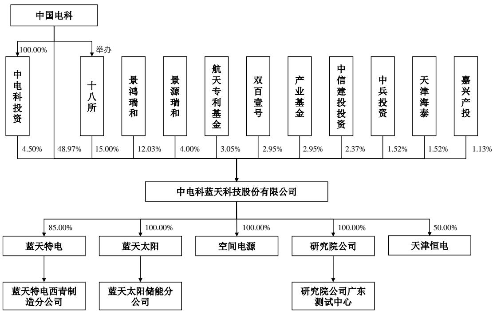  
注：上图中蓝天特电、蓝天太阳、空间电源、研究院公司为公司的控股子公司，天津恒电为公司的重要参股公司。

# 六、发行人子公司、分公司和参股公司的基本情况

截至本招股说明书签署日，发行人拥有的全资子公司、控股子公司、分支机构及参股公司具体情况如下：

# （一）发行人全资、控股子公司

# 1、蓝天太阳

<table><tr><td>企业名称</td><td colspan="5">天津蓝天太阳科技有限公司</td></tr><tr><td>成立日期</td><td colspan="5">2009-09-08</td></tr><tr><td>注册资本</td><td colspan="5">10,000.00万元</td></tr><tr><td>实收资本</td><td colspan="5">10,000.00万元</td></tr><tr><td>统一社会信用代码</td><td colspan="5">911201166940648760</td></tr><tr><td>法定代表人</td><td colspan="5">裴东</td></tr><tr><td>企业类型</td><td colspan="5">有限责任公司</td></tr><tr><td>注册地址</td><td colspan="5">华苑产业区（环外）海泰华科七路6号太阳电池及控制器厂房二层</td></tr><tr><td>主要生产经营地址</td><td colspan="5">华苑产业区（环外）海泰华科七路6号太阳电池及控制器厂房</td></tr><tr><td>经营范围</td><td colspan="5">新能源、机电一体化技术开发、咨询、服务、转让；光伏设备、电源产品、电池及电池组件、电子元器件、半导体材料、雷达及配套设备制造；光伏设备、电源产品、电池及电池组件、电子元器件、半导体材料批发兼零售；机电安装工程、建筑智能化安装工程、市政工程、架线和管道工程、环保工程设计、施工；货物及技术进出口业务；供电服务；信息传输、软件和信息技术服务业；人力资源服务。（依法须经批准的项目，经相关部门批准后方可开展经营活动）</td></tr><tr><td>股东情况</td><td colspan="5">发行人100%持股。</td></tr><tr><td>主营业务及其在发行人业务板块中定位</td><td colspan="5">砷化镓外延材料、锂电池正极材料、微电网系统等业务。主要从事发行人业务板块中宇航电源、特种电源、新能源应用及服务的相关业务</td></tr><tr><td colspan="6">最近一年主要财务数据（单位：万元）</td></tr><tr><td colspan="2">日期</td><td>总资产</td><td>净资产</td><td>营业收入</td><td>净利润</td></tr><tr><td colspan="2">2024年12月31日/2024年度</td><td>144,258.24</td><td>36,491.58</td><td>84,331.17</td><td>12,315.98</td></tr><tr><td colspan="6">最近一期主要财务数据（单位：万元）</td></tr><tr><td colspan="2">日期</td><td>总资产</td><td>净资产</td><td>营业收入</td><td>净利润</td></tr><tr><td colspan="2">2025年6月30日/2025年1-6月</td><td>142,743.35</td><td>38,346.18</td><td>26,269.75</td><td>1,882.42</td></tr></table>

注：立信会计师已在合并财务报表范围内对上述财务数据进行审计，但未单独出具审计报告。

# 2、研究院公司

<table><tr><td>企业名称</td><td colspan="5">天津中电新能源研究院有限公司</td></tr><tr><td>成立日期</td><td colspan="5">2018-09-17</td></tr><tr><td>注册资本</td><td colspan="5">4,500.00万元</td></tr><tr><td>实收资本</td><td colspan="5">4,500.00万元</td></tr><tr><td>统一社会信用代码</td><td colspan="5">91120116MA06F0WM82</td></tr><tr><td>法定代表人</td><td colspan="5">梁海</td></tr><tr><td>企业类型</td><td colspan="5">有限责任公司</td></tr><tr><td>注册地址</td><td colspan="5">天津滨海高新区华苑产业区（环外）海泰华科五路6号17幢七层</td></tr><tr><td>主要生产经营地址</td><td colspan="5">天津滨海高新区华苑产业区（环外）海泰华科五路6号17幢</td></tr><tr><td>经营范围</td><td colspan="5">自然科学研究和试验发展；工程和技术研究和试验发展；新材料技术研发；电子专用材料研发；检验检测服务；计量技术服务；技术</td></tr><tr><td></td><td colspan="5">服务、技术开发、技术咨询、技术交流、技术推广;电子元器件制造;电子元器件零售;电子元器件批发;电子元器件与机电组件设备销售;机械电气设备制造;机械电气设备销售;技术进出口;货物进出口;储能技术服务;工业设计服务;建设工程设计;建设工程施工;会议及展览服务;广告发布;广告制作;广告设计、代理;认证服务;新型能源技术研发;电子专用材料制造;电池制造;电池销售;电子专用材料销售。(依法须经批准的项目,经相关部门批准后方可开展经营活动)</td></tr><tr><td>股东情况</td><td colspan="5">发行人100%持股。</td></tr><tr><td>主营业务及其在发行人业务板块中定位</td><td colspan="5">储能系统产品、钠离子电池和电源检测业务、会展业务。主要从事发行人业务板块中新能源应用及服务、特种电源的相关业务</td></tr><tr><td colspan="6">最近一年主要财务数据(单位:万元)</td></tr><tr><td colspan="2">日期</td><td>总资产</td><td>净资产</td><td>营业收入</td><td>净利润</td></tr><tr><td colspan="2">2024年12月31日/2024年度</td><td>99,412.25</td><td>15,604.04</td><td>43,390.88</td><td>8,666.08</td></tr><tr><td colspan="6">最近一期主要财务数据(单位:万元)</td></tr><tr><td colspan="2">日期</td><td>总资产</td><td>净资产</td><td>营业收入</td><td>净利润</td></tr><tr><td colspan="2">2025年6月30日/2025年1-6月</td><td>102,045.92</td><td>21,232.80</td><td>28,700.37</td><td>5,477.33</td></tr></table>

注：立信会计师已在合并财务报表范围内对上述财务数据进行审计，但未单独出具审计报告。

# 3、空间电源

<table><tr><td>企业名称</td><td>天津空间电源科技有限公司</td></tr><tr><td>成立日期</td><td>2018-01-18</td></tr><tr><td>注册资本</td><td>1,000.00万元</td></tr><tr><td>实收资本</td><td>1,000.00万元</td></tr><tr><td>统一社会信用代码</td><td>91120116MA069PN30C</td></tr><tr><td>法定代表人</td><td>穆杰</td></tr><tr><td>企业类型</td><td>有限责任公司</td></tr><tr><td>注册地址</td><td>天津滨海高新区华苑产业区（环外）海泰华科五路6号6幢</td></tr><tr><td>主要生产经营地址</td><td>天津滨海高新区华苑产业区（环外）海泰华科五路6号6幢</td></tr><tr><td>经营范围</td><td>一般项目：工程和技术研究和试验发展；电子元器件与机电组件设备制造；电子元器件与机电组件设备销售；电池制造；电池销售；机械电气设备制造；光伏设备及元器件制造；光伏设备及元器件销售；电工仪器仪表制造；电工仪器仪表销售；技术服务、技术开发、技术咨询、技术交流、技术转让、技术推广；新能源原动设备销售；总质量4.5吨及以下普通货运车辆道路货物运输（除网络货运和危险货物）。许可项目：技术进出口；货物进出口。（依法须经批准的项目，经相关部门批准后方可开展经营活动）</td></tr><tr><td>股东情况</td><td>发行人100%持股。</td></tr><tr><td>主营业务及其在发行人业务板块中定位</td><td>空间锂离子电池组产品、特种锂离子电池组产品。主要从事发行人业务板块中宇航电源、特种电源的相关业务</td></tr></table>

<table><tr><td colspan="5">最近一年主要财务数据(单位:万元)</td></tr><tr><td>日期</td><td>总资产</td><td>净资产</td><td>营业收入</td><td>净利润</td></tr><tr><td>2024年12月31日 /2024年度</td><td>72,584.51</td><td>35,966.95</td><td>23,070.86</td><td>5,363.15</td></tr><tr><td colspan="5">最近一期主要财务数据(单位:万元)</td></tr><tr><td>日期</td><td>总资产</td><td>净资产</td><td>营业收入</td><td>净利润</td></tr><tr><td>2025年6月30日 /2025年1-6月</td><td>68,784.58</td><td>36,370.20</td><td>4,526.45</td><td>344.34</td></tr></table>

注：立信会计师已在合并财务报表范围内对上述财务数据进行审计，但未单独出具审计报告。

# 4、蓝天特电

<table><tr><td>企业名称</td><td colspan="5">天津蓝天特种电源科技股份公司</td></tr><tr><td>成立日期</td><td colspan="5">2008-07-17</td></tr><tr><td>注册资本</td><td colspan="5">1,500.00万元</td></tr><tr><td>实收资本</td><td colspan="5">1,500.00万元</td></tr><tr><td>统一社会信用代码</td><td colspan="5">911201166759871225</td></tr><tr><td>法定代表人</td><td colspan="5">殷华博</td></tr><tr><td>企业类型</td><td colspan="5">股份有限公司</td></tr><tr><td>注册地址</td><td colspan="5">华苑产业区兰苑路4-6号（二期工程）</td></tr><tr><td>主要生产经营地址</td><td colspan="5">华苑产业区兰苑路4-6号（二期工程）</td></tr><tr><td>经营范围</td><td colspan="5">电池、充电器、电子电源、超级电容器、太阳电池及系统、风光供电系统、UPS电源产品及其相关的原材料、元器件、半成品、产成品、生产设备、仪器、配套产品的研制、生产、销售、维修、服务；技术咨询、转让；工程承揽业务和对外贸易经营；自有房屋租赁；物业管理；电子设备、机械设备及电池相关设备的租赁业务。（依法须经批准的项目，经相关部门批准后方可开展经营活动）</td></tr><tr><td>股东情况</td><td colspan="5">发行人：85.00%周琳：15.00%</td></tr><tr><td>主营业务及其在发行人业务板块中定位</td><td colspan="5">特种锂离子电池组产品。主要从事发行人业务板块中特种电源的相关业务</td></tr><tr><td colspan="6">最近一年主要财务数据（单位：万元）</td></tr><tr><td colspan="2">日期</td><td>总资产</td><td>净资产</td><td>营业收入</td><td>净利润</td></tr><tr><td colspan="2">2024年12月31日/2024年度</td><td>43,320.07</td><td>18,216.81</td><td>26,201.70</td><td>375.21</td></tr><tr><td colspan="6">最近一期主要财务数据（单位：万元）</td></tr><tr><td colspan="2">日期</td><td>总资产</td><td>净资产</td><td>营业收入</td><td>净利润</td></tr><tr><td colspan="2">2025年6月30日/2025年1-6月</td><td>39,807.37</td><td>14,458.76</td><td>1,330.08</td><td>-3,876.76</td></tr></table>

注：立信会计师已在合并财务报表范围内对上述财务数据进行审计，但未单独出具审计报告。

# 5、子公司的分公司

截至本招股说明书签署日，子公司的分公司相关情况如下：

<table><tr><td>序号</td><td>分公司名称</td><td>所属子公司</td><td>统一社会信用代码</td><td>成立时间</td><td>状态</td><td>负责人</td><td>经营范围</td></tr><tr><td>1</td><td>蓝天太阳储能分公司</td><td>蓝天
太阳</td><td>91120116MA05W6EYXA</td><td>2017-09-08</td><td>存续</td><td>裴东</td><td>新能源、机电一体化技术开发、咨询、服务、转让；光伏设备、电源产品、电池及电池组件、电子元器件、半导体材料制造；光伏设备、电源产品、电池及电池组件、电子元器件、半导体材料批发兼零售；机电安装工程、市政工程、架线和管道工程设计、施工；货物及技术进出口业务。（依法须经批准的项目，经相关部门批准后方可开展经营活动）</td></tr><tr><td>2</td><td>蓝天特电西青制造分公司</td><td>蓝天
特电</td><td>91120111MA06T3AC0C</td><td>2019-09-05</td><td>存续</td><td>殷华博</td><td>电池、充电器、元器件、半成品、产成品研制、生产、销售。（依法须经批准的项目，经相关部门批准后方可开展经营活动）</td></tr><tr><td>3</td><td>研究院公司广东测试中心</td><td>研究院公司</td><td>91441900MAE4T1PW8N</td><td>2024-11-27</td><td>存续</td><td>梁海</td><td>许可项目：检验检测服务。（依法须经批准的项目，经相关部门批准后方可开展经营活动，具体经营项目以相关部门批准文件或许可证件为准）一般项目：计量技术服务。（除依法须经批准的项目外，凭营业执照依法自主开展经营活动）</td></tr></table>

# （二）发行人参股企业

# 1、发行人重要参股企业

天津恒电为发行人的重要参股企业，具体情况如下：

<table><tr><td>企业名称</td><td colspan="5">天津恒电空间电源有限公司</td></tr><tr><td>成立日期</td><td colspan="5">2010-01-19</td></tr><tr><td>注册资本</td><td colspan="5">14,000.00万元</td></tr><tr><td>统一社会信用代码</td><td colspan="5">911201165503541028</td></tr><tr><td>法定代表人</td><td colspan="5">程保义</td></tr><tr><td>企业类型</td><td colspan="5">有限责任公司</td></tr><tr><td>注册地址</td><td colspan="5">华苑产业区（环外）海泰华科七路6号太阳电池与控制器厂房106-107、109-136、140-158、201-252房间</td></tr><tr><td>经营范围</td><td colspan="5">航天电源制造；航天电源技术开发、咨询、服务；机械设备、电器设备、计算机及外围设备批发兼零售。（国家有专项、专营规定，按规定执行。）</td></tr><tr><td>股东构成及控制情况</td><td colspan="5">如下表说明</td></tr><tr><td>主营业务及其与发行人主营业务</td><td colspan="5">天津恒电主要生产空间单体太阳电池产品，与发行人同属于宇航电源产业链</td></tr><tr><td colspan="6">最近一年主要财务数据（单位：万元）</td></tr><tr><td>日期</td><td>总资产</td><td>净资产</td><td>营业收入</td><td colspan="2">净利润</td></tr><tr><td>2024年12月31日/2024年度</td><td>42,724.30</td><td>27,381.38</td><td>57,082.46</td><td colspan="2">1,907.24</td></tr><tr><td colspan="6">最近一期主要财务数据（单位：万元）</td></tr><tr><td>日期</td><td>总资产</td><td>净资产</td><td>营业收入</td><td colspan="2">净利润</td></tr><tr><td>2025年6月30日/2025年1-6月</td><td>68,665.05</td><td>28,863.33</td><td>43,999.26</td><td colspan="2">1,518.58</td></tr></table>

注：上述财务数据为立信会计师调整后的数据，未单独出具审计报告

截至本招股说明书签署日，天津恒电的股权结构如下表所示：

<table><tr><td>序号</td><td>股东名称</td><td>认缴出资额（万元）</td><td>持股比例</td></tr><tr><td>1</td><td>中国东方红卫星股份有限公司</td><td>7,000.00</td><td>50.00%</td></tr><tr><td>2</td><td>电科蓝天</td><td>7,000.00</td><td>50.00%</td></tr><tr><td colspan="2">合计</td><td>14,000.00</td><td>100.00%</td></tr></table>

因航天工业的特殊性，我国卫星平台和卫星型号总体工程任务主要由航天科技集团下属单位承担。在此背景下，十八所为进一步增强市场竞争力，航天科技集团下属中国空间技术研究院出于提升对核心关键器件技术工艺、品质掌控能力的目的，双方于 2010 年开展了战略合作。经相关审批完成后，十八所与中国空间技术研究院下属中国卫星（600118.SH）共同出资组建了天津恒电，以实现强强联合、互利共赢。

天津恒电成立之初，十八所、中国卫星共同出资并各持有 $5 0 \%$ 股权，中国卫星拥有董事会多数席位并将天津恒电纳入财务报表合并范围。此后，根据业务发展需要，经中国电科批准，十八所于 2018 年 5 月将其持有全部天津恒电 $50 \%$ 股权无偿划转至本公司。

天津恒电自设立后，将主责主业定位在砷化镓空间单体太阳电池的设计、研发和生产。近年来，天津恒电独立或参与承担了国家及天津市的一系列研发课题，荣获“国家级专精特新小巨人企业”“天津市企业技术中心”“天津市专精特新中小企业”“天津市领军培育企业”等称号，并负责筹建了“天津市航天用多

结太阳电池技术重点实验室”。

# 2、发行人其他参股企业

# （1）国联瑞阳

<table><tr><td>企业名称</td><td>陕西国联瑞阳新能源科技有限公司</td></tr><tr><td>成立日期</td><td>2017-07-05</td></tr><tr><td>注册资本</td><td>50.00万元</td></tr><tr><td>统一社会信用代码</td><td>91611102MA6THFK723</td></tr><tr><td>法定代表人</td><td>杨宝坤</td></tr><tr><td>企业类型</td><td>有限责任公司</td></tr><tr><td>注册地址</td><td>陕西省西咸新区泾河新城产业孵化中心4号楼3楼</td></tr><tr><td>经营范围</td><td>新能源、机电一体化技术开发、咨询、服务、转让。光伏设备、电源产品、电池及电池组件。电子元器件、半导体元器件、半导体材料批发兼零售;机电安装工程、市政工程、架线和管道工程设计、施工;货物及技术进出口业务(国家限定或禁止公司经营的商品和技术除外)智能微电网建设策划;供电服务。(依法须经批准的项目,经相关部门批准后方可开展经营活动)</td></tr><tr><td>股东构成及控制情况</td><td>西咸新区泾河新城市政工程建设有限公司,持股50%;蓝天太阳,持股50%,系本公司合营企业</td></tr><tr><td>主营业务及其与发行人主营业务</td><td>双方为合作开展屋顶分布式光伏电站项目而设立的运营平台公司,截至本招股说明书签署日项目已建设完毕,该公司正在履行清算、注销程序</td></tr></table>

注：发行人于国联瑞阳设立时入股该企业

# （2）新创建设

<table><tr><td>企业名称</td><td>北京新创建设投资管理合伙企业（有限合伙）</td></tr><tr><td>成立日期</td><td>2018-06-08</td></tr><tr><td>注册资本</td><td>100,100.00万元</td></tr><tr><td>统一社会信用代码</td><td>91110107MA01CQU56R</td></tr><tr><td>执行事务合伙人</td><td>中电科（北京）园区发展投资管理有限公司</td></tr><tr><td>企业类型</td><td>有限合伙企业</td></tr><tr><td>注册地址</td><td>北京市石景山区石景山路54号院4号楼5层501</td></tr><tr><td>股东构成及控制情况</td><td>发行人持有5%出资额，其他合伙人全部由中国电科下属院所及单位构成，执行事务合伙人为中电科（北京）园区发展投资管理有限公司，实际控制人为中国电科</td></tr><tr><td>主营业务及其与发行人主营业务</td><td>主要从事投资管理业务，与发行人主营业务无关</td></tr></table>

注：2021 年，经中国电科批复发行人通过无偿划转方式获得新创建设的参股权

# （3）中电发展

<table><tr><td>企业名称</td><td>中电产业发展投资（天津）合伙企业（有限合伙）</td></tr><tr><td>成立日期</td><td>2018-09-26</td></tr><tr><td>注册资本</td><td>110,000.00万元</td></tr><tr><td>统一社会信用代码</td><td>91120118MA06F7Q92U</td></tr><tr><td>执行事务合伙人</td><td>中电科投资控股有限公司</td></tr><tr><td>企业类型</td><td>有限合伙企业</td></tr><tr><td>注册地址</td><td>天津自贸试验区（空港经济区）空港国际物流区第二大街1号312室</td></tr><tr><td>股东构成及控制情况</td><td>发行人持有2.73%出资额，其他合伙人全部由中国电科下属院所及单位构成，执行事务合伙人为中电科投资控股有限公司，实际控制人为中国电科</td></tr><tr><td>主营业务及其与发行人主营业务</td><td>主要从事投资管理业务，与发行人主营业务无关</td></tr></table>

注：2021 年，经中国电科批复无偿划转事宜，发行人获得中电发展的参股权。

# （4）欧创园

<table><tr><td>企业名称</td><td>中电科欧洲创新园有限公司（CETC European Innovation Industry &amp; Technology GmbH）</td></tr><tr><td>成立日期</td><td>2016年11月</td></tr><tr><td>注册资本</td><td>1,100万欧元</td></tr><tr><td>注册地址</td><td>奥地利格拉茨市</td></tr><tr><td>股东构成及控制情况</td><td>中国电子科技集团公司第三十六研究所持股40%； 
中电科资产经营有限公司持股30%； 
中电科投资持股20%； 
发行人持股10%。</td></tr><tr><td>主营业务及其与发行人主营业务</td><td>高科技产品的技术孵化、创新与交流、海外高科技人才培训、高科技产品展示及路演、高科技类产品的国际化经营，与发行人主营业务无关</td></tr></table>

注：2018 年，经中国电科批复无偿划转事宜，发行人获得欧创园的参股权。

# （三）其他子公司

自报告期初至本招股说明书签署日，发行人注销控股子公司 6家，6家子公司均为全民所有制阶段设立的子公司，于报告期内均未开展实际经营，为规范公司经营、理顺治理架构，发行人注销该等公司，具体情况如下：

<table><tr><td>企业名称</td><td>成立日期</td><td>注销日期</td><td>注销时持股比例</td><td>经营状况</td></tr><tr><td>天津天川电子电源贸易有限公司</td><td>1993-5-28</td><td>2023-12-15</td><td>天津蓝天电源公司（发行人前身）持股90.91%</td><td>已注销</td></tr><tr><td>天津高通电子电源技术有限公司</td><td>2002-1-22</td><td>2023-12-8</td><td>天津蓝天高科电源股份有限公司（被发行人吸收合并，已注销）持股</td><td>已注销</td></tr><tr><td></td><td></td><td></td><td>90.00%</td><td></td></tr><tr><td>津川（天津）环保电子电源有限公司</td><td>1993-7-15</td><td>2023-12-6</td><td>天津蓝天电源公司（发行人前身）持股75.00%</td><td>已注销</td></tr><tr><td>天津天源电池有限公司</td><td>1994-7-14</td><td>2023-10-11</td><td>天津蓝天电源公司（发行人前身）持股75.00%</td><td>已注销</td></tr><tr><td>天津市蓝信电池有限公司</td><td>1998-3-30</td><td>2024-11-14</td><td>天津蓝天电源公司（发行人前身）持股87.5%</td><td>已注销</td></tr><tr><td>天津汇侨国际贸易有限公司</td><td>1998-6-8</td><td>2024-10-22</td><td>天津市蓝信电池有限公司持股80.00%</td><td>已注销</td></tr></table>

# 七、发行人主要股东情况

# （一）控股股东和实际控制人基本情况

截至本招股说明书签署日，中国电科直接持有公司 $4 8 . 9 7 \%$ 的股份，为公司控股股东。中国电科基本情况如下：

<table><tr><td>公司名称</td><td>中国电子科技集团有限公司</td></tr><tr><td>成立日期</td><td>2002年2月25日</td></tr><tr><td>法定代表人</td><td>王海波</td></tr><tr><td>注册资本</td><td>2,153,000万元</td></tr><tr><td>实收资本</td><td>2,153,000万元</td></tr><tr><td>注册地址</td><td>北京市海淀区万寿路27号</td></tr><tr><td>主要生产经营地</td><td>北京市海淀区万寿路27号</td></tr><tr><td>统一社会信用代码</td><td>91110000710929498G</td></tr><tr><td>股东构成</td><td>国务院国资委持有100%股权</td></tr><tr><td>经营范围</td><td>承担军事电子装备与系统集成、武器平台电子装备、军用软件和电子基础产品的研制、生产；国防电子信息基础设施与保障条件的建设；承担国家重大电子信息系统工程建设；民用电子信息软件、材料、元器件、整机和系统集成及相关共性技术的科研、开发、生产、销售；自营和代理各类商品及技术的进出口业务（国家限定公司经营或禁止进出口的商品及技术除外）；经营进料加工和“三来一补”业务；经营对销贸易和转口贸易；实业投资；资产管理；从事电子商务信息服务；组织本行业内企业的出国（境）参、办展。（市场主体依法自主选择经营项目，开展经营活动；依法须经批准的项目，经相关部门批准后依批准的内容开展经营活动；不得从事国家和本市产业政策禁止和限制类项目的经营活动。）</td></tr><tr><td>主营业务</td><td>国家重要军民用大型电子信息系统的工程建设，重大装备、通信与电子设备、软件和关键元器件的研制生产。</td></tr><tr><td>主营业务与发行人主营业务的关系</td><td>电科蓝天为中国电科下属专注电能源板块业务的发展平台。</td></tr><tr><td colspan="2">最近一年主要财务数据（单位：万元）</td></tr></table>

<table><tr><td>日期</td><td>总资产</td><td>净资产</td><td>营业收入</td><td>净利润</td></tr><tr><td>2024年12月31日/
2024年度</td><td>64,715,957.07</td><td>34,862,744.15</td><td>42,660,512.37</td><td>2,468,001.54</td></tr><tr><td colspan="5">最近一期主要财务数据（单位：万元）</td></tr><tr><td>日期</td><td>总资产</td><td>净资产</td><td>营业收入</td><td>净利润</td></tr><tr><td>2025年6月30日
/2025年1-6月</td><td>62,242,479.52</td><td>35,675,183.54</td><td>20,065,969.95</td><td>1,310,251.61</td></tr></table>

注：以上 2024 年财务数据经大信会计师事务所（特殊普通合伙）审计，2025 年数据未经审计。

除直接持有公司 $4 8 . 9 7 \%$ 的股份外，中国电科通过十八所、中电科投资分别间接持有公司 $1 5 . 0 0 \%$ 、 $4 . 5 0 \%$ 的股份。此外，公司员工持股平台景鸿瑞和、十八所员工的持股平台景源瑞和与十八所签署了《一致行动协议》，约定在股东权利行使及董事会经营决策等方面与十八所保持一致，景鸿瑞和、景源瑞和合计持有公司 $1 6 . 0 3 \%$ 的股份。因此，中国电科合计控制发行人 $8 4 . 5 0 \%$ 的表决权，为公司的实际控制人。

# （二）控股股东和实际控制人持有公司股份是否存在质押或其他有争议的情况

截至本招股说明书签署日，公司控股股东和实际控制人中国电科直接持有的，以及通过十八所、中电科投资间接持有的本公司股份，均不存在质押、冻结或其他有争议的情况。

# （三）控股股东、实际控制人报告期内重大违法行为

公司控股股东、实际控制人报告期内不存在贪污、贿赂、侵占财产、挪用财产或者破坏社会主义市场经济秩序的刑事犯罪，不存在欺诈发行、重大信息披露违法或者其他涉及国家安全、公共安全、生态安全、生产安全、公众健康安全等领域的重大违法行为。

# （四）其他持有发行人 $5 \%$ 以上股份或表决权的主要股东情况

截至本招股说明书签署日，除公司控股股东和实际控制人中国电科外，十八所、景鸿瑞和持有公司 $5 \%$ 以上股份。

# 1、十八所

截至本招股说明书签署日，十八所直接持有公司 $1 5 . 0 0 \%$ 股份，并通过《一致行动协议》控制景鸿瑞和、景源瑞和所持公司 $1 6 . 0 3 \%$ 股份的表决权。十八所

基本情况如下：  

<table><tr><td>名称</td><td>中国电子科技集团公司第十八研究所</td></tr><tr><td>法定代表人</td><td>刘浩杰</td></tr><tr><td>成立时间</td><td>1958年</td></tr><tr><td>开办资金</td><td>2,119.00万元</td></tr><tr><td>住所</td><td>天津市滨海高新技术产业开发区华科七路6号</td></tr><tr><td>举办单位</td><td>中国电子科技集团有限公司</td></tr><tr><td>统一社会信用代码</td><td>12100000401351223F</td></tr><tr><td>主营业务</td><td>电源研究开发，从事的具体业务参见本招股说明书“第八节公司治理与独立性”之“八、同业竞争”部分</td></tr><tr><td>主营业务与发行人主营业务的关系</td><td>十八所与发行人主营业务的关系，参见本招股说明书“第八节公司治理与独立性”之“八、同业竞争”部分</td></tr></table>

# 2、景鸿瑞和

截至本招股说明书签署日，景鸿瑞和持有公司 $1 2 . 0 3 \%$ 的股份，其基本情况如下：

<table><tr><td>公司名称</td><td>天津景鸿瑞和企业管理合伙企业（有限合伙）</td></tr><tr><td>成立日期</td><td>2022年1月28日</td></tr><tr><td>执行事务合伙人</td><td>天津景鸿企业管理有限公司</td></tr><tr><td>认缴出资额</td><td>53,127.30万元</td></tr><tr><td>注册地址</td><td>天津华苑产业区海泰西路18号北2-204工业孵化-5-1208</td></tr><tr><td>主要生产经营地</td><td>天津华苑产业区海泰西路18号北2-204工业孵化-5-1208</td></tr><tr><td>类型</td><td>有限合伙企业</td></tr><tr><td>统一社会信用代码</td><td>91120193MA07HW9N97</td></tr><tr><td>经营范围</td><td>一般项目：企业管理。（除依法须经批准的项目外，凭营业执照依法自主开展经营活动）</td></tr><tr><td>主营业务</td><td>景鸿瑞和为电科蓝天员工持股平台</td></tr><tr><td>主营业务与发行人主营业务的关系</td><td>除投资发行人外，未实际开展经营</td></tr></table>

景鸿瑞和为公司员工持股平台，除对电科蓝天进行投资外，并无其他投资或参与经营其他经营性实体的情形，亦不存在非公开募集资金的情形，其自身不存在委托私募基金管理人管理其出资或接受委托管理其他投资人出资的情形，不属于《私募投资基金监督管理暂行办法》《私募投资基金登记备案办法》规定的私募投资基金，无需履行私募投资基金备案程序。

截至本招股说明书签署日，景鸿瑞和的合伙人及出资结构情况如下表所示：

<table><tr><td>序号</td><td>合伙人名称</td><td>合伙人类型</td><td>出资金额（万元）</td><td>出资比例</td></tr><tr><td>1</td><td>景鸿管理</td><td>普通合伙人</td><td>0.10</td><td>0.0002%</td></tr><tr><td>2</td><td>景鸿二号</td><td>有限合伙人</td><td>7,935.10</td><td>14.94%</td></tr><tr><td>3</td><td>景鸿一号</td><td>有限合伙人</td><td>6,616.10</td><td>12.45%</td></tr><tr><td>4</td><td>景鸿七号</td><td>有限合伙人</td><td>6,345.70</td><td>11.94%</td></tr><tr><td>5</td><td>景鸿四号</td><td>有限合伙人</td><td>5,620.50</td><td>10.58%</td></tr><tr><td>6</td><td>景鸿三号</td><td>有限合伙人</td><td>5,261.30</td><td>9.90%</td></tr><tr><td>7</td><td>景鸿六号</td><td>有限合伙人</td><td>5,128.90</td><td>9.65%</td></tr><tr><td>8</td><td>景鸿九号</td><td>有限合伙人</td><td>3,673.30</td><td>6.91%</td></tr><tr><td>9</td><td>景鸿五号</td><td>有限合伙人</td><td>3,462.50</td><td>6.52%</td></tr><tr><td>10</td><td>景鸿十号</td><td>有限合伙人</td><td>3,227.50</td><td>6.08%</td></tr><tr><td>11</td><td>景鸿八号</td><td>有限合伙人</td><td>3,040.10</td><td>5.72%</td></tr><tr><td>12</td><td>景鸿十一号</td><td>有限合伙人</td><td>2,672.10</td><td>5.03%</td></tr><tr><td>13</td><td>景鸿十二号</td><td>有限合伙人</td><td>144.10</td><td>0.27%</td></tr><tr><td colspan="2">合计</td><td>-</td><td>53,127.30</td><td>100.00%</td></tr></table>

注：报告期内，发行人员工持股平台景鸿瑞和以及十八所员工的持股平台景源瑞和为办理招商银行股份有限公司天津分行发放的贷款，景鸿瑞和以其所持电科蓝天 $9 . 6 6 \%$ 的股权作为质押物，景源瑞和以其所持电科蓝天 $2 . 8 6 \%$ 的股权作为质押物，曾于 2022 年6月 14 日设置股权出质登记。并于 2024 年3月 13 日，办理了股权出质注销登记。根据景鸿瑞和、景源瑞和分别与招商银行股份有限公司天津分行签订《质押合同》的约定，双方约定：如未来电科蓝天上市，则招商银行股份有限公司天津分行配合进行阶段性解除质押；在电科蓝天上市后，景鸿瑞和与景源瑞和应及时办理质物重新质押至招商银行股份有限公司天津分行的登记手续。截至本招股书签署日，根据景鸿瑞和、景源瑞和与招商银行股份有限公司天津分行签署的质押合同之补充协议及招商银行股份有限公司天津分行出具《说明函》，招商银行股份有限公司天津分行明确景源瑞和及景鸿瑞和所持电科蓝天的股权已在上市申报前解除质押，后续招商银行股份有限公司天津分行将不再要求景源瑞和及景鸿瑞和继续重新进行质押。

景鸿瑞和为公司员工持股平台，除 3名持股人员于近期退休、调离或离职外，其余全体合伙人均为公司员工，具体情况参见本招股说明书“第四节 发行人基本情况”之“十、发行人正在执行的股权激励及其他制度安排和执行情况”之“（一）发行人员工持股计划”之“2、持股平台情况及人员构成”部分。

# 八、发行人股本情况

# （一）本次发行前总股本、本次发行及公开发售的股份，以及本次发行及公开发售的股份占发行后总股本的比例

本次发行前，公司总股本为 156,322.39 万股，本次公开发行人民币普通股17,370.00 万股，发行后总股本 173,692.39 万股，本次公开发行的股份占发行后总股本的比例为 $1 0 \%$ ，本次发行前后公司股本结构如下表所示：

<table><tr><td rowspan="2">股东名称</td><td colspan="2">本次发行前</td><td colspan="2">本次发行后</td></tr><tr><td>持股数量（万股）</td><td>持股比例（%）</td><td>持股数量（万股）</td><td>持股比例（%）</td></tr><tr><td>中国电科</td><td>76,551.64</td><td>48.97</td><td>76,551.64</td><td>44.07</td></tr><tr><td>十八所</td><td>23,448.36</td><td>15.00</td><td>23,448.36</td><td>13.50</td></tr><tr><td>景鸿瑞和</td><td>18,805.66</td><td>12.03</td><td>18,805.66</td><td>10.83</td></tr><tr><td>中电科投资</td><td>7,034.51</td><td>4.50</td><td>7,034.51</td><td>4.05</td></tr><tr><td>景源瑞和</td><td>6,252.25</td><td>4.00</td><td>6,252.25</td><td>3.60</td></tr><tr><td>航天专利基金</td><td>4,764.41</td><td>3.05</td><td>4,764.41</td><td>2.74</td></tr><tr><td>双百壹号</td><td>4,615.32</td><td>2.95</td><td>4,615.32</td><td>2.66</td></tr><tr><td>产业基金</td><td>4,615.32</td><td>2.95</td><td>4,615.32</td><td>2.66</td></tr><tr><td>中信建投投资</td><td>3,712.62</td><td>2.37</td><td>3,712.62</td><td>2.14</td></tr><tr><td>中兵投资</td><td>2,382.21</td><td>1.52</td><td>2,382.21</td><td>1.37</td></tr><tr><td>天津海泰</td><td>2,370.18</td><td>1.52</td><td>2,370.18</td><td>1.36</td></tr><tr><td>嘉兴产投</td><td>1,769.91</td><td>1.13</td><td>1,769.91</td><td>1.02</td></tr><tr><td>本次发行股份</td><td>-</td><td>-</td><td>17,370.00</td><td>10.00</td></tr><tr><td>合计</td><td>156,322.39</td><td>100.00</td><td>173,692.39</td><td>100.00</td></tr></table>

# （二）本次发行前的前十名股东

<table><tr><td>序号</td><td>股东名称</td><td>持股数量（万股）</td><td>持股比例（%）</td></tr><tr><td>1</td><td>中国电科</td><td>76,551.64</td><td>48.97</td></tr><tr><td>2</td><td>十八所</td><td>23,448.36</td><td>15.00</td></tr><tr><td>3</td><td>景鸿瑞和</td><td>18,805.66</td><td>12.03</td></tr><tr><td>4</td><td>中电科投资</td><td>7,034.51</td><td>4.50</td></tr><tr><td>5</td><td>景源瑞和</td><td>6,252.25</td><td>4.00</td></tr><tr><td>6</td><td>航天专利基金</td><td>4,764.41</td><td>3.05</td></tr><tr><td>7</td><td>双百壹号</td><td>4,615.32</td><td>2.95</td></tr><tr><td>8</td><td>产业基金</td><td>4,615.32</td><td>2.95</td></tr><tr><td>9</td><td>中信建投投资</td><td>3,712.62</td><td>2.37</td></tr><tr><td>10</td><td>中兵投资</td><td>2,382.21</td><td>1.52</td></tr><tr><td colspan="2">合计</td><td>152,182.30</td><td>97.35</td></tr></table>

# （三）发行人本次发行前的自然人股东及其在发行人处担任的职务

本次发行前，公司不存在直接持股的自然人股东。

# （四）国有股东或外资股东持股情况

截至本招股说明书签署日，公司国有股东包括中国电科、十八所、中电科投资、产业基金、中信建投投资、中兵投资共计 6家，持股数量及持股比例如下表所示：

<table><tr><td>序号</td><td>国有股东名称</td><td>持股数量（万股）</td><td>持股比例（%）</td><td>股东性质</td></tr><tr><td>1</td><td>中国电科</td><td>76,551.64</td><td>48.97</td><td>SS</td></tr><tr><td>2</td><td>十八所</td><td>23,448.36</td><td>15.00</td><td>SS</td></tr><tr><td>3</td><td>中电科投资</td><td>7,034.51</td><td>4.50</td><td>SS</td></tr><tr><td>4</td><td>产业基金</td><td>4,615.32</td><td>2.95</td><td>SS</td></tr><tr><td>5</td><td>中信建投投资</td><td>3,712.62</td><td>2.37</td><td>SS</td></tr><tr><td>6</td><td>中兵投资</td><td>2,382.21</td><td>1.52</td><td>SS</td></tr><tr><td colspan="2">合计</td><td>117,744.66</td><td>75.31</td><td></td></tr></table>

注：SS（即 State-owned Shareholder 的缩写）标识的含义为国有股东。根据《上市公司国有股权监督管理办法》规定，该办法所称国有股东是指符合以下情形之一的企业和单位，其证券账户标注“SS”：（一）政府部门、机构、事业单位、境内国有独资或全资企业；（二）第一款中所述单位或企业独家持股比例超过 $5 0 \%$ ，或合计持股比例超过 $5 0 \%$ ，且其中之一为第一大股东的境内企业；（三）第二款中所述企业直接或间接持股的各级境内独资或全资企业

根据《上市公司国有股权监督管理办法》相关规定，如发行人在境内发行股票并上市，国有股东中国电科、十八所、中电科投资、产业基金、中信建投投资、中兵投资的证券账户应标注“SS”标识。2024年11月1日，国务院国资委出具了《关于中电科蓝天科技股份有限公司国有股东标识管理有关事项的批复》（国资产权〔2024〕492号），对发行人上述国有股东的持股数量和持股比例进行了确认。

本次发行前，公司股东中不存在外资股东持股的情况。

# （五）申报前十二个月新增股东情况

申报前十二个月内，公司不存在新增股东的情况。

# （六）本次发行前各股东之间的关联关系及持股比例

截至本招股说明书签署日，公司各股东之间的关联关系及关联股东各自的持股比例如下表所示：

<table><tr><td>序号</td><td>股东名称</td><td>持股比例</td><td>股东间关联关系</td></tr><tr><td rowspan="6">1</td><td>中国电科</td><td>48.97%</td><td rowspan="6">(1)中电科投资、十八所均为中国电科下属全资企业/单位;(2)景鸿瑞和、景源瑞和均与十八所签订了一致行动协议;(3)中电科投资持有产业基金9.80%的股权,中电科投资还持有产业基金之基金管理人惠华基金管理有限公司14%股权。</td></tr><tr><td>十八所</td><td>15.00%</td></tr><tr><td>中电科投资</td><td>4.50%</td></tr><tr><td>景鸿瑞和</td><td>12.03%</td></tr><tr><td>景源瑞和</td><td>4.00%</td></tr><tr><td>产业基金</td><td>2.95%</td></tr><tr><td rowspan="3">2</td><td>航天专利基金</td><td>3.05%</td><td rowspan="3">(1)航天专利基金的执行事务合伙人、基金管理人的控股股东为航天投资控股有限公司,航天投资控股有限公司持有产业基金1.96%的股权;(2)中兵投资的全资股东为中国兵器工业集团有限公司,该集团持有产业基金1.96%的股权。</td></tr><tr><td>中兵投资</td><td>1.52%</td></tr><tr><td>产业基金</td><td>2.95%</td></tr><tr><td rowspan="2">3</td><td>中信建投投资</td><td>2.37%</td><td rowspan="2">嘉兴产投的执行事务合伙人、基金管理人为中信建投资本管理有限公司,该公司与中信建投投资均为中信建投的全资子公司。</td></tr><tr><td>嘉兴产投</td><td>1.13%</td></tr></table>

此外，为有利于公司落实保密工作制度，2023 年 3 月，航天专利基金、双百壹号、中信建投投资、天津海泰、嘉兴产投分别与十八所签署了《表决权委托协议》（委托方为航天专利基金、双百壹号、中信建投投资、天津海河、嘉兴产投，受托方为十八所），该等协议主要内容为：（1）委托方就标的股份（指委托方所持的公司股份，下同）对应的公司军工事项议案的表决权委托受托方行使；（2）前述军工事项议案以公司党委根据《中电科蓝天科技股份有限公司章程》的认定为准，除军工事项议案之外的事项，标的股份的表决权由委托方自行行使；（3）双方确认，本协议的签署不代表双方达成任何一致行动关系，委托方和受托方非一致行动人。委托期限自协议生效之日起，持续至公司上市之日或委托方执行事务合伙人任何直接或间接股东均不含有境外投资者孰早之日，若委托方不再直接持有公司的股份，则协议终止。

# （七）股东私募基金备案情况

公司股东中，航天专利基金、双百壹号、产业基金、天津海泰、嘉兴产投等5名股东为私募投资基金，具体情况如下：

<table><tr><td>序号</td><td>股东名称</td><td>基金编号</td><td>基金管理人</td><td>登记编号</td></tr><tr><td>1</td><td>航天专利基金</td><td>SM0199</td><td>航天高新（镇江）创业投资管理有限公司</td><td>P1001173</td></tr><tr><td>2</td><td>双百壹号</td><td>SJE713</td><td>国改双百发展基金管理有限公司</td><td>P1070238</td></tr><tr><td>3</td><td>产业基金</td><td>SGC907</td><td>惠华基金管理有限公司</td><td>P1069217</td></tr><tr><td>4</td><td>天津海泰</td><td>STP742</td><td>天津市海河产业基金管理有限公司</td><td>P1065962</td></tr><tr><td>5</td><td>嘉兴产投</td><td>SQK040</td><td>中信建投资本管理有限公司（注）</td><td>GC2600011623</td></tr></table>

注：中信建投资本管理有限公司的机构类型系证券公司私募基金子公司。

综上，发行人现有股东中的私募投资基金或私募基金管理人均已按照《中华人民共和国证券投资基金法》《私募投资基金监督管理暂行办法》和《私募投资基金登记备案办法》的规定在中国证券投资基金业协会完成了私募基金备案或私募基金管理人登记。

上述股东中，根据航天专利基金的调查表及其出具的《承诺函》，航天专利基金的基金存续期限为2016 年4月26日至2025年4月25 日，基金存续期限届满，目前已进入基金清算期。航天专利基金已书面承诺：（1）在电科蓝天本次公开发行并上市过程中及锁定期限内保持其主体的存续状态，不进行注销；（2）在电科蓝天本次公开发行并上市过程以及电科蓝天上市后航天专利基金所持相关的股份锁定期届满前，其不会进行非现金分配，将继续持有电科蓝天股份，而不对所持有的电科蓝天股份进行清理、转让或其他处置。

根据《合伙企业法》第八十八条第三款规定，清算期间，合伙企业存续，但不得开展与清算无关的经营活动。结合上述《承诺函》，航天专利基金存续期限届满不会对公司的股权稳定性构成不利影响，可以继续担任公司的股东。

# （八）股东公开发售股份情况

本次发行不涉及股东公开发售股份情况。

# 九、董事、高级管理人员及其他核心人员情况

# （一）董事、高级管理人员及其他核心人员简介

# 1、董事会成员

截至本招股说明书签署日，公司董事会由 11 名董事组成，包括 4 名独立董事。公司董事由股东会选举产生，每届任期三年，并可连选连任。公司第一届董事会董事及任职期间情况具体如下表所示：

<table><tr><td>序号</td><td>姓名</td><td>任职</td><td>提名人</td><td>本届任职期间</td></tr><tr><td>1</td><td>郑宏宇</td><td>董事长</td><td>中国电科</td><td>2022年12月至2025年12月</td></tr><tr><td>2</td><td>朱立宏</td><td>董事、总经理</td><td>中国电科</td><td>2022年12月至2025年12月</td></tr><tr><td>3</td><td>秦建存</td><td>董事</td><td>中国电科</td><td>2022年12月至2025年12月</td></tr><tr><td>4</td><td>应明炯</td><td>董事</td><td>中国电科</td><td>2022年12月至2025年12月</td></tr><tr><td>5</td><td>潘林</td><td>董事</td><td>中国电科</td><td>2022年12月至2025年12月</td></tr><tr><td>6</td><td>张巍</td><td>董事</td><td>中国电科</td><td>2025年11月至2025年12月</td></tr><tr><td>7</td><td>盛彦华</td><td>职工代表董事、综合管理部主任</td><td>公司职工代表大会</td><td>2022年12月至2025年12月</td></tr><tr><td>8</td><td>闫忠文</td><td>独立董事</td><td>董事会</td><td>2023年4月至2025年12月</td></tr><tr><td>9</td><td>舒知堂</td><td>独立董事</td><td>董事会</td><td>2023年4月至2025年12月</td></tr><tr><td>10</td><td>闫丙旗</td><td>独立董事</td><td>董事会</td><td>2023年4月至2025年12月</td></tr><tr><td>11</td><td>武立东</td><td>独立董事</td><td>董事会</td><td>2025年11月至2025年12月</td></tr></table>

注：公司第一届董事会于2025年12月任期届满，新一届董事会换届相关工作正在推进，尚未完成，为保证相关工作的准确性、连续性，第一届董事会全体成员继续履职至换届选举完成。

上述各董事主要工作经历如下：

郑宏宇女士，中国国籍，无境外居留权，1968 年 7 月出生，毕业于电子科技大学电子材料与元器件专业，大学本科学历，正高级工程师。1990 年 8 月至2014 年 4 月，历任中国电科第十三研究所专业部技术干部、副主任、主任、副总工程师、副所长等职务；2014 年4月至2016年7月，任中国电科质量安全与社会责任部副主任；2016 年 7 月至 2017 年 11 月，任中国电科经济运行部副主任；2017年11月至2021年 11月，任发行人董事、总经理、党委副书记；2017年 11 月至 2021 年 1 月，兼任力神电池总经理；2018 年 1 月至 2019 年 12 月，

兼任空间电源董事长；2021年 11月至今，兼任十八所党委书记；2024年2月至今，兼任中国化学与物理电源行业协会理事长；2025 年 9 月至今，兼任中国电科产业基础研究院(第十三研究所)党委书记、中电国基北方有限公司党委书记；2021 年 11 月至今，任发行人董事长、党委书记。

朱立宏先生，中国国籍，无境外居留权，1968 年 8 月出生，毕业于西安理工大学测试计量技术与仪器专业，大学本科学历，正高级工程师，享受国务院特殊津贴专家。1990 年 7 月至 2023 年 12 月，历任十八所研究室技术干部、副主任、主任、所长助理、副所长、所长、党委副书记；2019 年 1 月至 2021 年 11月，任发行人副总经理；2019 年7月至2021年5月，兼任上市公司中电科能源股份有限公司（600877.SH，现已更名为中电科芯片技术股份有限公司）董事。2021年11至今，任发行人董事、总经理、党委副书记。

秦建存先生，中国国籍，无境外居留权，1963 年 4 月出生，毕业于北京交通大学通信与信息系统专业，博士研究生学历，正高级工程师。1983 年 8 月至2018 年 3 月，历任中国电子科技集团公司第五十四研究所技术干部、专业部副主任、专业部主任、副所长，期间（1984年至1987年）前往石家庄通信测控技术研究所攻读硕士学位；2018 年3月至2021年2月，任中国电子科技集团公司第三十四研究所党委书记，同时兼任中电网络通信集团有限公司党委副书记。2021年2月至今，任发行人董事。

应明炯先生，中国国籍，无境外居留权，1965 年 3 月出生，毕业于长江商学院工商管理专业，硕士研究生学历，教授级高级工程师。1989 年 7 月至 2021年9月，历任中国电子科技集团公司第十一研究所干部、副主任、主任、副所长；2012年3月至2020年5月，任北京波谱华光科技有限公司董事长；2018年4月至2023年2月，任北京华北莱茵光电技术有限公司董事长；2019年5月至2021年 10 月，任中电科光电科技有限公司副总经理；2021 年 5 月至 2022 年 12 月，任北京雷生强式科技有限责任公司董事长；2021 年 9 月至 2022 年 11 月，任中电科真空电子科技有限公司监事会主席；2017 年 5 月至今，任中国光学光电子行业协会理事长。2022年12 月至今，任发行人董事。

潘林先生，中国国籍，无境外居留权，1962 年 9 月出生，毕业于东北大学工商管理专业，硕士研究生，正高级工程师。1986 年 7 月至 2012 年 12 月，历

任中国电子科技集团公司第五十三研究所助理工程师、副处长、处长、所长助理、副所长；2012 年 12 月至 2020 年 5 月，任中国电子科技集团公司第四十六研究所所长、党委副书记；2020 年 5 月至 2022 年 11 月，任中电科半导体材料有限公司筹备组副组长、监事会主席；2020 年 9 月至 2022 年 11 月，兼任中电国基北方有限公司监事会主席；现兼任江苏中科科化新材料股份有限公司独立董事、中国电子材料行业协会理事长。2022年12月至今，任发行人董事。

张巍先生，中国国籍，无境外居留权，1965 年 4 月出生，毕业于西安电子科技大学信息处理专业，大学本科学历，研究员级高级工程师。1987 年 9 月至2018 年 6 月，历任中国电科第五十三研究所助理工程师、工程师、科技处副处长、规划发展部主任、第五事业部主任、重点实验室办公室主任、科技发展部主任、副所长、国防重点实验室主任；2018年6月至2020年 4月，任二十七所党委书记、副所长；2020年4月至 2020年8月，任中电科新防务技术有限公司党委副书记、第二十七所党委书记。2020 年 8 月至 2022 年 9 月，任中国电科第五十三研究所所长、党委副书记；2022年9月至2025年6月，任中国电科第五十三研究所所长、党委副书记，兼任中国电科第二十七所党委书记。现任中国电科第五十三研究所法定代表人，2025 年 11 月至今，担任发行人董事。

盛彦华先生，中国国籍，无境外居留权，1974 年 8 月出生，毕业于中央广播电视大学工商管理专业，大学本科学历，高级政工师。1995 年 8 月至 2020 年5 月，历任十八所办公室副主任、主任、党群工作部主任等；2018 年 3 月至今，历任发行人党群工作部主任、综合管理部部长、主任等。2022 年 1 月至今，任发行人职工代表董事。

闫忠文先生，中国国籍，无境外居留权，1962年12月出生，毕业于哈尔滨工业大学通信与信息专业，博士研究生学历，研究员。1984 年 8 月至 1999 年 6月，历任航天科技集团公司五院 501设计部研究室技术员、助工、工程师、副主任；1999年7月至2002年6 月，任东方卫星网络技术有限公司副总经理；2002年 6 月至 2010 年 11 月，任中国航天科技集团公司 501 部处长、总体部副部长、经营部部长；2010 年 12 月至 2017 年 1 月，任中国卫星（600118.SH）总裁；2017年1月至2018年8月，任航天神舟投资管理有限公司副董事长；2018年9月至今，任海量数据（603138.SH）董事长；2021年5月至今，任合众思壮（002383.SZ）

独立董事。2023 年 4 月至今，任发行人独立董事。

舒知堂先生，中国国籍，无境外居留权，1967年10月出生，毕业于中国人民大学法律专业，硕士研究生，律师。1988 年 7 月至 1992 年 10 月，任湖北省襄樊市科委干部；1992 年 10 月至 2006 年 12 月，历任平安保险、泰康人寿襄樊中心支公司培训主管、营销部经理、襄樊杜立房地产开发有限公司总经理助理、北京航天普霖科技有限公司市场部经理等职务；2007 年 2 月至 2017 年 3 月，任北京市通商律师事务所执业律师、合伙人；2017 年 3 月至今，任北京植德律师事务所执业律师、创始合伙人；2013 年 11 月至 2020 年 6 月，曾任北京蓝山科技股份有限公司独立董事；2021 年 1 月至 2025 年 1 月，曾任长江润发健康产业股份有限公司独立董事；2020 年8月至今，任嘉楠科技（NASDAQ:CAN）独立董事。2023年4月至今，任发行人独立董事。

闫丙旗先生，中国国籍，无境外永久居留权，1968年12 月出生，毕业于洛阳工学院工业会计专业，大专学历，注册会计师、注册评估师。1991 年 7 月至1994年3月，任郑州模具厂会计；1994年3月至2000年9月，任河南豫经会计师事务所注册会计师；2000年 9月至2007年7月，任岳华会计师事务所有限责任公司注册会计师、合伙人；2007年7月至2013年8月，任中瑞岳华会计师事务所（特殊普通合伙）注册会计师、合伙人；2013 年至今，任中审众环会计师事务所（特殊普通合伙）注册会计师、合伙人；2016年7月至 2022年5月，曾兼任中科曙光（603019.SH）独立董事，2024 年 11 月至 2025 年 10 月，曾任中科曙光（603019.SH）监事；2017 年 10 月至 2023 年 10 月，曾兼任三孚股份（603938.SH）独立董事，现兼任焦作科瑞森重装股份有限公司董事、诺思格（301333.SZ）独立董事。2023 年4月至今，任发行人独立董事。

武立东先生，中国国籍，无境外居留权，1971 年 4 月出生，毕业于南开大学企业管理专业，博士研究生，教授。1993年7月至1997年 7月，任青岛金属材料集团总公司办公室秘书、团总支书记；2000 年 7 月至今，历任南开大学商学院教师、教授、博士生导师、中国公司治理研究院副院长；2018年8月至2023年12月，曾兼任天津市国资委市管企业外部董事；2024年 6月至今，兼任辽宁振兴银行股份有限公司独立董事。2025年11 月至今，任发行人独立董事。

# 2、监事会成员

2025年5月6日，经发行人 2025年第一次临时股东会审议，发行人取消了监事会并调整了组织架构，根据《公司章程》，由董事会审计委员会行使监事会的法定职权。

# 3、高级管理人员

截至本招股说明书签署日，公司高级管理人员包括：总经理、副总经理、财务负责人、总法律顾问及董事会秘书，共计 7名高级管理人员。公司本届高级管理人员的任职与董事会任期一致，具体情况如下表所示：

<table><tr><td>序号</td><td>姓名</td><td>任职</td><td>任职期间</td></tr><tr><td>1</td><td>朱立宏</td><td>董事、总经理</td><td>2022年12月至2025年12月</td></tr><tr><td>2</td><td>刘春</td><td>副总经理、总法律顾问</td><td>2022年12月至2025年12月</td></tr><tr><td>3</td><td>刘崇刚</td><td>副总经理</td><td>2022年12月至2025年12月</td></tr><tr><td>4</td><td>张汇军</td><td>财务负责人</td><td>2022年12月至2025年12月</td></tr><tr><td>5</td><td>梁海</td><td>副总经理</td><td>2022年12月至2025年12月</td></tr><tr><td>6</td><td>宋雪</td><td>副总经理</td><td>2022年12月至2025年12月</td></tr><tr><td>7</td><td>王祎</td><td>董事会秘书</td><td>2023年3月至2025年12月</td></tr></table>

注：第一届董事会延期换届，高级管理人员的任期进行相应顺延，全体高级管理人员继续履职至换届选举完成。

公司上述高级管理人员的主要工作经历如下：

朱立宏先生，简历详见本招股说明书“第四节/九/（一）/1、董事会成员”部分。

刘春先生，中国国籍，无境外居留权，1971 年 2 月出生，毕业于哈尔滨工业大学化学工程专业，工程硕士，高级工程师。1993 年 8 月至 2021 年 11 月，就职于十八所，历任技术干部、研究室副主任、主任、所长助理、副所长等职务；2018年2月至2020年8月，任中国电科产业部副主任（挂职）；2018年6月至2020年6月，任四川省泸州市市委常委、副市长（挂职）；2022 年4月至2024年5月，任中国电科安全保障部副主任（挂职）。2017年11 月至今，任发行人副总经理、总法律顾问。

刘崇刚先生，中国国籍，无境外居留权，1968 年 3 月出生，毕业于天津大

学电化学专业，大学本科学历，正高级工程师。1990 年 7 月至 2021 年 11 月，历任十八所技术干部、研究室副主任、主任、科研处处长、固定资产投资与管理处处长、所长助理、副所长等职务；2018年1月至2021年 1月，任力神电池副总经理。2021 年 9 月至 2024 年 7 月，任蓝天特电董事长；2021 年 11 月至今，任发行人副总经理。

张汇军先生，中国国籍，无境外居留权，1971 年 1 月出生，毕业于东北师范大学世界经济学专业，经济学硕士，高级会计师、注册会计师。1994 年 7 月至 2016 年 7 月，历任中国电子科技集团公司第五十三研究所助理会计师、会计师、财务部副主任等职务；2016 年7月至2021年1月，任中国电子科技集团公司第四十六研究所财务处处长；2020 年 11 月至 2021 年 1 月，兼任中电科半导体材料有限公司财务部负责人；2021 年 1 月至 2023 年 12 月，任十八所总会计师。2021年1月至今，任发行人财务负责人。

梁海先生，中国国籍，无境外居留权，1978 年 3 月出生，毕业于河北工业大学高分子化工专业，大学本科学历，正高级工程师。2001 年8月至2021年11月，历任十八所技术干部、经营处副处长、生产工艺安全处处长、电池制造中心主任、科技发展处处长、质量安全部部长、所长助理；2020 年 4 月至 2023 年 3月，任发行人质量安全部主任、检测中心主任。2022 年 5 月至今，任研究院公司董事长；2021年11月至今，任发行人副总经理。

宋雪先生，中国国籍，无境外居留权，1982年10月出生，毕业于北京理工大学企业管理专业，博士研究生学历，高级工程师。2008年9 月至2011 年2月，任北方国际合作股份有限公司职员；2011年2月至2012年 6月，任北方工业科技有限公司职员；2012 年 6 月至 2018 年 12 月，就职于中国兵器装备集团有限公司；2018 年12月至2022年 12月，历任中电科投资控股有限公司投资并购部副总经理、总经理。2022年 12月至今，任发行人副总经理。

王祎先生，中国国籍，无境外居留权，1982年10月出生，毕业于浙江大学经济法学专业，硕士研究生学历，二级法律顾问。2008 年 8 月至 2014 年 4 月，任浙江五矿金和进出口有限公司副总经理；2014 年 7 月至 2014 年 11 月，任天津贵金属交易所有限公司法务专员；2014 年 12 月至 2020 年 3 月，历任十八所法制办副主任、办公室副主任、法务办公室副主任、综合办公室主任、法务审计

处处长等职务；2019年4月至 2020年3月，任发行人法务审计部部长、监事会办公室主任；2019 年 10 月至 2021 年 1 月，任力神电池董事会秘书；2021 年 1月至今，任发行人副总法律顾问兼证券投资部主任；2022年2月至2023年6月，兼任十八所副总法律顾问。2023 年3月至今，任发行人董事会秘书。

# 4、其他核心人员

公司其他核心人员主要为核心技术人员，截至本招股说明书签署日，公司共有核心技术人员5名，具体情况如下：

# （1）核心技术人员认定依据

公司核心业务宇航电源从基础原材料到发电、储能、控制、系统等各个关键业务环节的首席技术负责人，对核心技术具有关键作用或突出贡献。

# （2）核心技术人员基本情况

截至本招股说明书签署日，公司核心技术人员为周江、孙强、张泰峰、李会娟、苏彬。

公司核心技术人员主要的科研经历、获得的主要科研成果及奖项情况参见本招股说明书“第五节 业务与技术”之“七、发行人的技术研发情况”之“（四）公司核心技术人员及研发团队情况”之“2、核心技术人员基本情况”部分，相关人员的简历如下：

周江先生，中国国籍，无境外永久居留权，1974 年 3 月出生，毕业于荷兰埃因霍芬理工大学化学工程与化学专业，博士研究生学历，正高级工程师。1996年7月至2000年7月，任南京华飞彩色显示系统有限公司工艺工程师；2006年9 月至 2011 年 10 月，任荷兰飞利浦电子有限公司研究院高级科学家；2011 年11 月至 2013 年 12 月，历任深圳市比克电池有限公司研究部副总监、海外技术支持部长、新能源电池事业部常务副总经理、总经理助理；2013 年12月至2021年9月，历任力神研究院小型电池电芯开发部副部长、力神电池基础研发部副部长、部长、力神研究院副院长、力神电池总裁助理兼力神研究院院长；2018 年11月至2022年2月，任研究院公司副院长；2020年4月至今，任发行人副总工程师；2022 年 2 月至 2023 年 6 月，任十八所副总工程师、重点实验室副主任；2022年2月至今，任发行人新能源研究院院长。

孙强先生，中国国籍，无境外永久居留权，1967年10月出生，毕业于南开大学电子与通信工程领域专业，工程硕士，正高级工程师，享受国务院特殊津贴专家，中国电科首席专家。1990 年9月至2023年6月，历任十八所研究室技术干部、副主任、太阳电池工程组组长、重点实验室副主任、副总工程师。2020年4月至今，任发行人副总工程师；2020年4月至2022年 2月，兼任蓝天太阳副总经理；2022年2月至今，兼任蓝天太阳总工程师。

张泰峰先生，中国国籍，无境外永久居留权，1981年12 月出生，毕业于南开大学无线电物理专业，博士研究生学历，正高级工程师。2009 年 8 月至 2022年 2 月，历任十八所能源系统事业部技术干部；2022 年 2 月至今，任发行人能源系统事业部技术负责人。

李会娟女士，中国国籍，无境外永久居留权，1977 年 9 月出生，毕业于哈尔滨工程大学应用化学专业，硕士研究生学历，正高级工程师。2004 年 4 月至2018 年 3 月，任十八所研究室研究员；2018 年 3 月至 2021 年 10 月，历任空间电源专业部研究员、部长；2021年10月至今，任空间电源副总经理。

苏彬先生，中国国籍，无境外永久居留权，1980年12月出生，毕业于南开大学电子与通信工程专业，工程硕士，正高级工程师。2002 年 8 月至 2022 年 2月，历任十八所技术干部、副主任、空间能源专业部副部长、部长；2022 年 2月至今，任发行人太阳能源事业部总经理。

# （二）董事、高级管理人员及其他核心人员兼职情况

截至本招股说明书签署日，除在本公司及其控股子公司任职外，发行人董事、高级管理人员及其他核心人员在其他单位的主要兼职情况如下表所示：

<table><tr><td>姓名</td><td>在发行人处任职</td><td>兼职单位</td><td>在兼职单位处职务</td><td>兼职单位与发行人的关系</td></tr><tr><td rowspan="4">郑宏宇</td><td rowspan="4">董事长</td><td>中国化学与物理电源行业协会</td><td>理事长、法定代表人</td><td>发行人为行业协会的会员单位</td></tr><tr><td>十八所</td><td>党委书记</td><td>同一实控人控制的企业</td></tr><tr><td>中国电科产业基础研究院(第十三研究所)</td><td>党委书记</td><td>同一实控人控制的企业</td></tr><tr><td>中电国基北方有限公司</td><td>党委书记</td><td>同一实控人控制的企业</td></tr><tr><td>应明炯</td><td>董事</td><td>中国光学光电子行业协会</td><td>理事长、法定代表人</td><td>无</td></tr><tr><td rowspan="2">潘林</td><td rowspan="2">董事</td><td>江苏中科科化新材料股份有限公司</td><td>独立董事</td><td>无</td></tr><tr><td>中国电子材料行业协会</td><td>理事长、法定代表人</td><td>无</td></tr><tr><td>张巍</td><td>董事</td><td>中国电科第五十三研究所</td><td>法定代表人</td><td>同一实控人控制的企业</td></tr><tr><td rowspan="2">闫忠文</td><td rowspan="2">独立董事</td><td>海量数据（603138.SH）</td><td>董事长</td><td>无</td></tr><tr><td>合众思壮（002383.SZ）</td><td>独立董事</td><td>无</td></tr><tr><td rowspan="2">舒知堂</td><td rowspan="2">独立董事</td><td>北京植德律师事务所</td><td>执业律师、创始合伙人</td><td>无</td></tr><tr><td>嘉楠科技（NASDAQ:CAN）</td><td>独立董事</td><td>无</td></tr><tr><td rowspan="4">闫丙旗</td><td rowspan="4">独立董事</td><td>中审众环会计师事务所（特殊普通合伙）</td><td>注册会计师、合伙人</td><td>无</td></tr><tr><td>焦作科瑞森重装股份有限公司</td><td>董事</td><td>无</td></tr><tr><td>中艺华海进出口有限公司</td><td>监事</td><td>无</td></tr><tr><td>诺思格（301333.SZ）</td><td>独立董事</td><td>无</td></tr><tr><td>武立东</td><td>独立董事</td><td>辽宁振兴银行股份有限公司</td><td>独立董事</td><td>无</td></tr></table>

# （三）董事、高级管理人员及其他核心人员之间存在的亲属关系

截至本招股说明书签署日，公司董事、高级管理人员及其他核心人员之间不存在近亲属关系。

# （四）董事、高级管理人员及其他核心人员与公司签订的协议及作出的重要承诺及其履行情况

截至本招股说明书签署日，公司与内部董事、高级管理人员及其他核心人员之间签订了《劳动合同》，公司与独立董事之间签订了《独立董事聘任合同》，公司与核心技术人员分别签订了《保密承诺书》和《保密与竞业限制协议》。

本次发行中，公司董事、高级管理人员及其他核心人员出具的有关重要承诺，参见本招股说明书“附件二：与投资者保护相关的承诺”部分。截至本招股说明书签署日，公司董事、高级管理人员及其他核心人员均严格履行协议约定的职责和义务，并遵守相关承诺。

# （五）董事、高级管理人员最近三年涉及行政处罚、监督管理措施、纪律处分或自律监管措施、被司法机关立案侦查、被中国证监会立案调查情况

2024 年 2 月，发行人独立董事舒知堂曾因其曾任独立董事的公司蓝山科技

违法违规行为收到中国证监会北京监管局的警示函，根据《中华人民共和国行政处罚法》《关于进一步完善中国证券监督管理委员会行政处罚体制的通知》等相关规定，警示函等监督管理措施不属于行政处罚范畴，亦不构成重大违法违规情形，不影响舒知堂的任职资格。

除上述事件外，公司董事、高级管理人员最近三年不存在其他涉及行政处罚、监督管理措施、纪律处分或自律监管措施、被司法机关立案侦查、被中国证监会立案调查的情况，符合《证券法》《公司法》等法律法规以及《公司章程》规定的任职资格。

# （六）董事、监事、高级管理人员及其他核心人员最近两年变动情况

最近两年，公司董事、监事、高级管理人员及其他核心人员的变动情况如下：

# 1、公司董事最近两年变动情况

2023 年初，公司董事会成员为郑宏宇、朱立宏、秦建存、应明炯、潘林、盛彦华。最近两年内，董事的变动情况如下：

<table><tr><td>变动时间</td><td>董事会成员</td><td>董事会人数</td><td>变动原因</td></tr><tr><td>2023年4月26日</td><td>郑宏宇、朱立宏、秦建存、应明炯、潘林、盛彦华、闫忠文、舒知堂、闫丙旗</td><td>9人</td><td>选聘独立董事闫忠文、舒知堂、闫丙旗，调整董事会人数为9名</td></tr><tr><td>2025年11月14日</td><td>郑宏宇、朱立宏、秦建存、应明炯、潘林、张巍、盛彦华、闫忠文、舒知堂、闫丙旗、武立东</td><td>11人</td><td>增选董事，调整董事会人数为11名</td></tr></table>

# 2、公司监事最近两年变动情况

2023 年初，公司监事会成员为刘辉、栗方毅、郝明钊。最近两年内，监事的变动情况如下：

<table><tr><td>变动时间</td><td>监事会成员</td><td>监事会人数</td><td>变动原因</td></tr><tr><td>2025年5月6日</td><td>-</td><td>0人</td><td>公司召开股东会，取消监事会</td></tr></table>

# 3、公司高级管理人员最近两年变动情况

2023年初，公司高级管理人员为朱立宏、刘春、刘崇刚、张汇军、刘浩杰、梁海、宋雪。最近两年内，高级管理人员的变动情况如下：

<table><tr><td>变动时间</td><td>高管成员</td><td>高管人数</td><td>变动原因</td></tr><tr><td>2023年3月14日</td><td>朱立宏、刘春、刘崇刚、张汇军、刘浩杰、梁海、宋雪、王祎</td><td>8人</td><td>聘任董事会秘书王祎</td></tr><tr><td>2025年7月3日</td><td>朱立宏、刘春、刘崇刚、张汇军、梁海、宋雪、王祎</td><td>7人</td><td>高级管理人员刘浩杰辞任</td></tr></table>

# 4、其他核心人员最近两年变动情况

最近两年，公司其他核心人员均为核心技术人员，始终为周江、孙强、张泰峰、李会娟、苏彬5人，未发生变动。

综上，上述人员变动系中国电科人事调整或公司正常经营管理需要，公司核心管理团队始终保持稳定，上述人员变动对公司生产经营不构成重大影响，不影响公司的持续经营。最近两年，公司董事、监事及高级管理人员变动符合有关法律、法规、规范性文件和《公司章程》的规定，并已经履行了必要、合法、有效的法律程序。

综上，公司董事、监事、高级管理人员及其他核心人员最近两年未发生重大变化情况。

# （七）董事、高级管理人员及其他核心人员及其近亲属持有公司股份的情况

# 1、董事、高级管理人员、其他核心人员及其近亲属直接持股情况

截至本招股说明书签署日，公司董事、高级管理人员、其他核心人员及其近亲属不存在直接持有本公司股份的情况。

# 2、董事、高级管理人员、其他核心人员及其近亲属间接持股情况

截至本招股说明书签署日，公司董事、高级管理人员、其他核心人员及其近亲属间接持有公司股份情况如下：

<table><tr><td>姓名</td><td>在发行人处任职或亲属关系</td><td>所在持股平台名称</td><td>持有持股平台的份额占比</td><td>间接持有发行人股份的比例</td></tr><tr><td>郑宏宇</td><td>董事长</td><td>景鸿一号</td><td>7.50%</td><td>0.11%</td></tr><tr><td>朱立宏</td><td>董事、总经理</td><td>景鸿二号</td><td>6.25%</td><td>0.11%</td></tr><tr><td>盛彦华</td><td>职工代表董事、综合管理部主任</td><td>景鸿一号</td><td>3.87%</td><td>0.06%</td></tr><tr><td>刘春</td><td>副总经理、总法律顾问</td><td>景鸿七号</td><td>6.30%</td><td>0.09%</td></tr><tr><td>刘崇刚</td><td>副总经理</td><td>景鸿二号</td><td>5.04%</td><td>0.09%</td></tr><tr><td>张汇军</td><td>财务负责人</td><td>景鸿二号</td><td>5.04%</td><td>0.09%</td></tr><tr><td rowspan="2">梁海</td><td rowspan="2">副总经理</td><td>景鸿一号</td><td>3.87%</td><td>0.06%</td></tr><tr><td>景鸿三号</td><td>2.74%</td><td>0.03%</td></tr><tr><td rowspan="2">宋雪</td><td rowspan="2">副总经理</td><td>景鸿三号</td><td>1.95%</td><td>0.02%</td></tr><tr><td>景鸿九号</td><td>4.18%</td><td>0.03%</td></tr><tr><td rowspan="2">王祎</td><td rowspan="2">董事会秘书</td><td>景鸿一号</td><td>3.14%</td><td>0.05%</td></tr><tr><td>景鸿二号</td><td>0.30%</td><td>小于0.001%</td></tr><tr><td>周江</td><td>核心技术人员</td><td>景鸿三号</td><td>4.87%</td><td>0.06%</td></tr><tr><td>孙强</td><td>核心技术人员</td><td>景鸿七号</td><td>6.30%</td><td>0.09%</td></tr><tr><td>张泰峰</td><td>核心技术人员</td><td>景鸿四号</td><td>4.13%</td><td>0.05%</td></tr><tr><td>李会娟</td><td>核心技术人员</td><td>景鸿六号</td><td>4.52%</td><td>0.05%</td></tr><tr><td>苏彬</td><td>核心技术人员</td><td>景鸿四号</td><td>4.55%</td><td>0.06%</td></tr><tr><td>张巍</td><td>发行人董事张巍之近亲属间接持有发行人股份</td><td>景源三号</td><td>1.63%</td><td>0.02%</td></tr></table>

# 3、董事、高级管理人员、其他核心人员及其近亲属所持股份质押或冻结情况

董事、高级管理人员、其他核心人员及其近亲属通过持股平台持有发行人股份。报告期内，发行人员工持股平台景鸿瑞和以及十八所员工的持股平台景源瑞和为办理招商银行股份有限公司天津分行发放的贷款，曾于 2022 年6月14日设置股权出质登记。并于2024 年3月13日，办理了股权出质注销登记。

截至本招股说明书签署日，董事、高级管理人员、其他核心人员及其近亲属所持股份不存在质押或冻结情况。根据景鸿瑞和与招商银行股份有限公司天津分行签订的《质押合同》的约定，上述解除质押系招商银行股份有限公司天津分行为配合发行人上市进行的阶段性解除质押；在电科蓝天上市后，景鸿瑞和与景源瑞和应及时办理质物重新质押至招商银行股份有限公司天津分行的登记手续。截至本招股书签署日，根据景鸿瑞和、景源瑞和与招商银行股份有限公司天津分行签署的质押合同之补充协议及招商银行股份有限公司天津分行出具《说明函》，招商银行股份有限公司天津分行明确景源瑞和及景鸿瑞和所持电科蓝天的股权已在上市申报前解除质押，后续招商银行股份有限公司天津分行将不再要求景源瑞和及景鸿瑞和继续重新进行质押。

# （八）董事、高级管理人员及其他核心人员的其他对外投资情况

除通过持股平台景鸿瑞和间接持有发行人股份外，公司董事、高级管理人员及其他核心人员不存在与发行人及其业务相关的对外投资，不存在与公司有利益冲突的情形。

# （九）董事、高级管理人员及其他核心人员薪酬情况

# 1、董事、高级管理人员及其他核心人员的薪酬组成、确定依据及所履行的程序

在公司任职的内部董事、高级管理人员以及其他核心人员，其薪酬主要由基本工资、岗位工资、绩效工资、津贴、补贴福利和中长期激励等组成。公司主要根据公司的薪酬管理办法等规定，结合年度经营业绩、个人年度工作业绩和考核结果等综合因素，制定年度薪酬方案。

根据公司《独立董事工作制度》，公司给予独立董事适当的津贴，津贴的标准由董事会制订预案、股东会审议通过。

根据《董事会薪酬与考核委员会议事规则》，公司薪酬与考核委员会是董事会设立的专门工作机构，主要负责对董事、高级管理人员的薪酬与考核进行研究并提出建议。

薪酬与考核委员会制定的高级管理人员工作岗位职责、业绩考核体系与业绩考核指标经公司董事会批准后执行。薪酬与考核委员会拟订的董事薪酬方案经董事会审议后报股东会批准，制订的高级管理人员薪酬方案直接报公司董事会批准。

# 2、报告期内，董事、高级管理人员及其他核心人员薪酬总额占公司利润总额的比例

报告期内，公司董事、高级管理人员及其他核心人员薪酬总额占各期公司利润总额的比例如下表所示：

单位：万元  

<table><tr><td>项目</td><td>2025 年 1-6 月</td><td>2024 年度</td><td>2023 年度</td><td>2022 年度</td></tr><tr><td>董事、高级管理人员及其他核心人员薪酬总额</td><td>889.85</td><td>1,965.62</td><td>1,976.18</td><td>1,746.51</td></tr><tr><td>公司当期利润总额</td><td>6,412.24</td><td>37,625.25</td><td>22,324.39</td><td>23,866.71</td></tr><tr><td>占比</td><td>13.88%</td><td>5.22%</td><td>8.85%</td><td>7.32%</td></tr></table>

注：上表中薪酬总额为税前金额，包括基本工资、绩效工资及奖金、企业年金、个人的社保公积金、公司承担的社保及公积金、福利费等。

# 3、最近一年，董事、高级管理人员及其他核心人员在发行人及其下属公司领取薪酬的情况

2024 年度，公司董事、高级管理人员及其他核心人员在公司领取薪酬的情况如下表所示：

<table><tr><td>姓名</td><td>在发行人处任职</td><td>是否在发行人处领取薪酬/津贴</td><td>当年薪酬/津贴（万元）</td><td>最近一年是否在实际控制人控制的其他企业领取薪酬</td></tr><tr><td>郑宏宇</td><td>董事长</td><td>是</td><td>171.11</td><td>否</td></tr><tr><td>朱立宏</td><td>董事、总经理</td><td>是</td><td>164.65</td><td>否</td></tr><tr><td>秦建存</td><td>董事</td><td>是</td><td>38.37</td><td>否</td></tr><tr><td>应明炯</td><td>董事</td><td>是</td><td>46.25</td><td>是</td></tr><tr><td>潘林</td><td>董事</td><td>是</td><td>12.30</td><td>否</td></tr><tr><td>盛彦华</td><td>职工代表董事、综合管理部主任</td><td>是</td><td>72.18</td><td>否</td></tr><tr><td>闫忠文</td><td>独立董事</td><td>是</td><td>10.00</td><td>否</td></tr><tr><td>舒知堂</td><td>独立董事</td><td>是</td><td>10.00</td><td>否</td></tr><tr><td>闫丙旗</td><td>独立董事</td><td>是</td><td>10.00</td><td>否</td></tr><tr><td>刘春</td><td>副总经理、总法律顾问</td><td>是</td><td>134.00</td><td>否</td></tr><tr><td>刘崇刚</td><td>副总经理</td><td>是</td><td>156.08</td><td>否</td></tr><tr><td>张汇军</td><td>财务负责人</td><td>是</td><td>131.39</td><td>否</td></tr><tr><td>刘浩杰</td><td>副总经理（已辞任）</td><td>是</td><td>129.80</td><td>否</td></tr><tr><td>梁海</td><td>副总经理</td><td>是</td><td>113.64</td><td>否</td></tr><tr><td>宋雪</td><td>副总经理</td><td>是</td><td>102.88</td><td>否</td></tr><tr><td>王祎</td><td>董事会秘书</td><td>是</td><td>68.29</td><td>否</td></tr><tr><td>周江</td><td>核心技术人员</td><td>是</td><td>157.04</td><td>否</td></tr><tr><td>孙强</td><td>核心技术人员</td><td>是</td><td>102.11</td><td>否</td></tr><tr><td>苏彬</td><td>核心技术人员</td><td>是</td><td>121.39</td><td>否</td></tr><tr><td>张泰峰</td><td>核心技术人员</td><td>是</td><td>90.82</td><td>否</td></tr><tr><td>李会娟</td><td>核心技术人员</td><td>是</td><td>73.02</td><td>否</td></tr></table>

注：上表 2024 年薪资计算口径包括基本工资、绩效工资及奖金、企业年金、个人的社保公积金、公司承担的社保及公积金、福利费等，其中，奖金对应的部分计算口径为 2024 年实

发的税前奖金

发行人董事、高级管理人员及其他核心人员未在发行人处享受其他待遇和退休金计划。

# 十、发行人正在执行的股权激励及其他制度安排和执行情况

# （一）发行人员工持股计划

# 1、员工持股计划的基本情况

为稳定核心团队和业务骨干，充分调动中高层管理人员和核心骨干员工的积极性和凝聚力，在依法履行决策程序并经中国电科批复同意后，公司在进行混合所有制改革引入外部投资者的同时开展员工持股，设立景鸿瑞和作为直接持股平台并设立13家间接持股平台。

2022 年 4 月，景鸿瑞和与发行人、中电科投资、景源瑞和以及七名通过产权交易所公开征集的外部投资者共同签署了《增资协议》，增资价格为 2.825 元/注册资本，员工持股平台与同批引入的内外部投资者同股同价增资。

截至本招股说明书签署日，公司共有 398名员工通过景鸿瑞和间接持有发行人股份合计18,805.66万股，持股比例为 $1 2 . 0 3 \%$ 。

# 2、持股平台情况及人员构成

# （1）景鸿瑞和

景鸿瑞和的基本情况，参见本招股说明书“第四节 发行人基本情况”之“七、发行人主要股东情况”之“（四）其他持有发行人 $5 \%$ 以上股份或表决权的主要股东情况”之“2、景鸿瑞和”部分。

# （2）景鸿管理

截至本招股说明书签署日，景鸿管理为景鸿瑞和的执行事务合伙人，持有景鸿瑞和0.1万元出资额，出资比例为 $0 . 0 0 0 2 \%$ 。该公司基本情况如下：

<table><tr><td>公司名称</td><td>天津景鸿企业管理有限公司</td></tr><tr><td>企业类型</td><td>有限责任公司</td></tr><tr><td>成立日期</td><td>2022年01月19日</td></tr><tr><td>法定代表人</td><td>裴东</td></tr><tr><td>注册资本</td><td>1万元</td></tr><tr><td>注册地址</td><td>天津华苑产业区海泰西路18号北2-204工业孵化-5-1190</td></tr><tr><td>经营范围</td><td>一般项目：企业管理。（除依法须经批准的项目外，凭营业执照依法自主开展经营活动）</td></tr></table>

景鸿管理的股权结构如下表所示：

<table><tr><td>序号</td><td>股东姓名</td><td>出资金额 (万元)</td><td>持股比例</td><td>在发行人处任职</td></tr><tr><td>1</td><td>裴东</td><td>0.40</td><td>40.00%</td><td>总经理助理、蓝天太阳总经理</td></tr><tr><td>2</td><td>程保义</td><td>0.30</td><td>30.00%</td><td>总经理助理</td></tr><tr><td>3</td><td>郑鹏</td><td>0.30</td><td>30.00%</td><td>专项助理</td></tr><tr><td colspan="2">合计</td><td>1.00</td><td>100.00%</td><td>—</td></tr></table>

# （3）景鸿一号

截至本招股说明书签署日，景鸿一号为景鸿瑞和的有限合伙人，持有景鸿瑞和6,616.10万元出资额，出资比例为 $1 2 . 4 5 \%$ 。该公司基本情况如下：

<table><tr><td>公司名称</td><td>天津景鸿一号企业管理合伙企业（有限合伙）</td></tr><tr><td>企业类型</td><td>有限合伙企业</td></tr><tr><td>成立日期</td><td>2022年01月25日</td></tr><tr><td>执行事务合伙人</td><td>天津景鸿企业管理有限公司</td></tr><tr><td>认缴出资额</td><td>6,616.10万元</td></tr><tr><td>注册地址</td><td>天津华苑产业区海泰西路18号北2-204工业孵化-5-1192</td></tr><tr><td>经营范围</td><td>一般项目：企业管理。（除依法须经批准的项目外，凭营业执照依法自主开展经营活动）</td></tr></table>

景鸿一号的出资结构如下表所示：

<table><tr><td>序号</td><td>合伙人姓名</td><td>认缴出资额
(万元)</td><td>出资比例</td><td>在发行人处任职</td><td>合伙人类型</td></tr><tr><td>1</td><td>景鸿管理</td><td>0.10</td><td>0.0015%</td><td>—</td><td>普通合伙人</td></tr><tr><td>2</td><td>郑宏宇</td><td>496.00</td><td>7.50%</td><td>经营管理人员</td><td>有限合伙人</td></tr><tr><td>3</td><td>梁海</td><td>256.00</td><td>3.87%</td><td>经营管理人员</td><td>有限合伙人</td></tr><tr><td>4</td><td>盛彦华</td><td>256.00</td><td>3.87%</td><td>经营管理人员</td><td>有限合伙人</td></tr><tr><td>5</td><td>曲炳蔚</td><td>232.00</td><td>3.51%</td><td>经营管理人员</td><td>有限合伙人</td></tr><tr><td>6</td><td>王秀玲</td><td>216.00</td><td>3.26%</td><td>经营管理人员</td><td>有限合伙人</td></tr><tr><td>7</td><td>吕春锋</td><td>208.00</td><td>3.14%</td><td>业务骨干</td><td>有限合伙人</td></tr><tr><td>8</td><td>李春振</td><td>208.00</td><td>3.14%</td><td>经营管理人员</td><td>有限合伙人</td></tr><tr><td>9</td><td>王祎</td><td>208.00</td><td>3.14%</td><td>经营管理人员</td><td>有限合伙人</td></tr><tr><td>10</td><td>杨文礼</td><td>208.00</td><td>3.14%</td><td>业务骨干</td><td>有限合伙人</td></tr><tr><td>11</td><td>邱慧敏</td><td>208.00</td><td>3.14%</td><td>科研人员</td><td>有限合伙人</td></tr><tr><td>12</td><td>任立峥</td><td>208.00</td><td>3.14%</td><td>经营管理人员</td><td>有限合伙人</td></tr><tr><td>13</td><td>郝韦</td><td>208.00</td><td>3.14%</td><td>业务骨干</td><td>有限合伙人</td></tr><tr><td>14</td><td>杜琳琳</td><td>208.00</td><td>3.14%</td><td>业务骨干</td><td>有限合伙人</td></tr><tr><td>15</td><td>张国安</td><td>175.00</td><td>2.65%</td><td>经营管理人员</td><td>有限合伙人</td></tr><tr><td>16</td><td>郭旭光</td><td>160.00</td><td>2.42%</td><td>科研人员</td><td>有限合伙人</td></tr><tr><td>17</td><td>李蔚</td><td>160.00</td><td>2.42%</td><td>经营管理人员</td><td>有限合伙人</td></tr><tr><td>18</td><td>王德爱</td><td>160.00</td><td>2.42%</td><td>经营管理人员</td><td>有限合伙人</td></tr><tr><td>19</td><td>张梦起</td><td>160.00</td><td>2.42%</td><td>科研人员</td><td>有限合伙人</td></tr><tr><td>20</td><td>王凌嫣</td><td>158.00</td><td>2.39%</td><td>经营管理人员</td><td>有限合伙人</td></tr><tr><td>21</td><td>姚聪</td><td>138.00</td><td>2.09%</td><td>经营管理人员</td><td>有限合伙人</td></tr><tr><td>22</td><td>彭庆文</td><td>128.00</td><td>1.93%</td><td>科研人员</td><td>有限合伙人</td></tr><tr><td>23</td><td>刘鹏辉</td><td>128.00</td><td>1.93%</td><td>业务骨干</td><td>有限合伙人</td></tr><tr><td>24</td><td>杨帆</td><td>128.00</td><td>1.93%</td><td>业务骨干</td><td>有限合伙人</td></tr><tr><td>25</td><td>王立</td><td>128.00</td><td>1.93%</td><td>业务骨干</td><td>有限合伙人</td></tr><tr><td>26</td><td>赵希强</td><td>128.00</td><td>1.93%</td><td>科研人员</td><td>有限合伙人</td></tr><tr><td>27</td><td>闫顺利</td><td>128.00</td><td>1.93%</td><td>业务骨干</td><td>有限合伙人</td></tr><tr><td>28</td><td>刘体钊</td><td>120.00</td><td>1.81%</td><td>经营管理人员</td><td>有限合伙人</td></tr><tr><td>29</td><td>石海艳</td><td>116.00</td><td>1.75%</td><td>经营管理人员</td><td>有限合伙人</td></tr><tr><td>30</td><td>安冬</td><td>80.00</td><td>1.21%</td><td>业务骨干</td><td>有限合伙人</td></tr><tr><td>31</td><td>赵丽娜</td><td>80.00</td><td>1.21%</td><td>业务骨干</td><td>有限合伙人</td></tr><tr><td>32</td><td>汪冀</td><td>80.00</td><td>1.21%</td><td>业务骨干</td><td>有限合伙人</td></tr><tr><td>33</td><td>苏建东</td><td>80.00</td><td>1.21%</td><td>业务骨干</td><td>有限合伙人</td></tr><tr><td>34</td><td>王瀚</td><td>80.00</td><td>1.21%</td><td>业务骨干</td><td>有限合伙人</td></tr><tr><td>35</td><td>刘彬</td><td>80.00</td><td>1.21%</td><td>业务骨干</td><td>有限合伙人</td></tr><tr><td>36</td><td>单秋林</td><td>80.00</td><td>1.21%</td><td>业务骨干</td><td>有限合伙人</td></tr><tr><td>37</td><td>邓云祥</td><td>80.00</td><td>1.21%</td><td>科研人员</td><td>有限合伙人</td></tr><tr><td>38</td><td>李春燕</td><td>80.00</td><td>1.21%</td><td>业务骨干</td><td>有限合伙人</td></tr><tr><td>39</td><td>杨凯</td><td>80.00</td><td>1.21%</td><td>经营管理人员</td><td>有限合伙人</td></tr><tr><td>40</td><td>呼文韬</td><td>80.00</td><td>1.21%</td><td>科研人员</td><td>有限合伙人</td></tr><tr><td>41</td><td>纪小龙</td><td>80.00</td><td>1.21%</td><td>科研人员</td><td>有限合伙人</td></tr><tr><td>42</td><td>李晓</td><td>74.00</td><td>1.12%</td><td>经营管理人员</td><td>有限合伙人</td></tr><tr><td>43</td><td>平尧</td><td>64.00</td><td>0.97%</td><td>业务骨干</td><td>有限合伙人</td></tr><tr><td>44</td><td>王琴</td><td>64.00</td><td>0.97%</td><td>业务骨干</td><td>有限合伙人</td></tr><tr><td>45</td><td>董伟民</td><td>64.00</td><td>0.97%</td><td>科研人员</td><td>有限合伙人</td></tr><tr><td>46</td><td>马国林</td><td>48.00</td><td>0.73%</td><td>科研人员</td><td>有限合伙人</td></tr><tr><td>47</td><td>姜钊</td><td>48.00</td><td>0.73%</td><td>科研人员</td><td>有限合伙人</td></tr><tr><td>48</td><td>马洪越</td><td>35.00</td><td>0.53%</td><td>业务骨干</td><td>有限合伙人</td></tr><tr><td>49</td><td>高山</td><td>16.00</td><td>0.24%</td><td>经营管理人员</td><td>有限合伙人</td></tr><tr><td>50</td><td>尹娟</td><td>8.00</td><td>0.12%</td><td>经营管理人员</td><td>有限合伙人</td></tr><tr><td colspan="2">合计</td><td>6,616.10</td><td>100.00%</td><td colspan="2">—</td></tr></table>

# （4）景鸿二号

截至本招股说明书签署日，景鸿二号为景鸿瑞和的有限合伙人，持有景鸿瑞和 7,935.10 万元出资额，出资比例为 $1 4 . 9 4 \%$ 。

<table><tr><td>公司名称</td><td>天津景鸿二号企业管理合伙企业（有限合伙）</td></tr><tr><td>企业类型</td><td>有限合伙企业</td></tr><tr><td>成立日期</td><td>2022年01月24日</td></tr><tr><td>执行事务合伙人</td><td>天津景鸿企业管理有限公司</td></tr><tr><td>认缴出资额</td><td>7,935.10万元</td></tr><tr><td>注册地址</td><td>天津华苑产业区海泰西路18号北2-204工业孵化-5-1193</td></tr><tr><td>经营范围</td><td>一般项目：企业管理。（除依法须经批准的项目外，凭营业执照依法自主开展经营活动）</td></tr></table>

景鸿二号的出资结构如下表所示：

<table><tr><td>序号</td><td>合伙人姓名</td><td>认缴出资额（万元）</td><td>出资比例</td><td>在发行人处任职/职称</td><td>合伙人类型</td></tr><tr><td>1</td><td>景鸿管理</td><td>0.10</td><td>0.0013%</td><td>—</td><td>普通合伙人</td></tr><tr><td>2</td><td>朱立宏</td><td>496.00</td><td>6.25%</td><td>经营管理人员</td><td>有限合伙人</td></tr><tr><td>3</td><td>刘兴江</td><td>496.00</td><td>6.25%</td><td>科研人员</td><td>有限合伙人</td></tr><tr><td>4</td><td>张汇军</td><td>400.00</td><td>5.04%</td><td>经营管理人员</td><td>有限合伙人</td></tr><tr><td>5</td><td>刘崇刚</td><td>400.00</td><td>5.04%</td><td>经营管理人员</td><td>有限合伙人</td></tr><tr><td>6</td><td>罗萍</td><td>400.00</td><td>5.04%</td><td>科研人员（近期已退休）</td><td>有限合伙人</td></tr><tr><td>7</td><td>程保义</td><td>256.00</td><td>3.23%</td><td>科研人员</td><td>有限合伙人</td></tr><tr><td>8</td><td>王希文</td><td>256.00</td><td>3.23%</td><td>科研人员</td><td>有限合伙人</td></tr><tr><td>9</td><td>符惠群</td><td>256.00</td><td>3.23%</td><td>科研人员</td><td>有限合伙人</td></tr><tr><td>10</td><td>王帅</td><td>224.00</td><td>2.82%</td><td>经营管理人员</td><td>有限合伙人</td></tr><tr><td>11</td><td>焦萌</td><td>208.00</td><td>2.62%</td><td>经营管理人员</td><td>有限合伙人</td></tr><tr><td>12</td><td>李青</td><td>208.00</td><td>2.62%</td><td>业务骨干</td><td>有限合伙人</td></tr><tr><td>13</td><td>柯贤军</td><td>208.00</td><td>2.62%</td><td>科研人员</td><td>有限合伙人</td></tr><tr><td>14</td><td>郭宝辉</td><td>208.00</td><td>2.62%</td><td>科研人员</td><td>有限合伙人</td></tr><tr><td>15</td><td>彭磊</td><td>208.00</td><td>2.62%</td><td>科研人员</td><td>有限合伙人</td></tr><tr><td>16</td><td>郑鹏</td><td>208.00</td><td>2.62%</td><td>经营管理人员</td><td>有限合伙人</td></tr><tr><td>17</td><td>张丹红</td><td>188.00</td><td>2.37%</td><td>科研人员</td><td>有限合伙人</td></tr><tr><td>18</td><td>董久豹</td><td>160.00</td><td>2.02%</td><td>科研人员</td><td>有限合伙人</td></tr><tr><td>19</td><td>吕冬翔</td><td>160.00</td><td>2.02%</td><td>科研人员</td><td>有限合伙人</td></tr><tr><td>20</td><td>宋建青</td><td>160.00</td><td>2.02%</td><td>科研人员</td><td>有限合伙人</td></tr><tr><td>21</td><td>刘俊杰</td><td>160.00</td><td>2.02%</td><td>业务骨干</td><td>有限合伙人</td></tr><tr><td>22</td><td>李勇辉</td><td>160.00</td><td>2.02%</td><td>经营管理人员</td><td>有限合伙人</td></tr><tr><td>23</td><td>刘莉</td><td>160.00</td><td>2.02%</td><td>经营管理人员</td><td>有限合伙人</td></tr><tr><td>24</td><td>呼文韬</td><td>152.40</td><td>1.92%</td><td>科研人员</td><td>有限合伙人</td></tr><tr><td>25</td><td>于晓鹏</td><td>128.00</td><td>1.61%</td><td>科研人员</td><td>有限合伙人</td></tr><tr><td>26</td><td>赵一强</td><td>128.00</td><td>1.61%</td><td>经营管理人员</td><td>有限合伙人</td></tr><tr><td>27</td><td>张强</td><td>128.00</td><td>1.61%</td><td>科研人员</td><td>有限合伙人</td></tr><tr><td>28</td><td>李素辉</td><td>128.00</td><td>1.61%</td><td>经营管理人员</td><td>有限合伙人</td></tr><tr><td>29</td><td>赵梁机</td><td>103.00</td><td>1.30%</td><td>经营管理人员</td><td>有限合伙人</td></tr><tr><td>30</td><td>高寒</td><td>102.40</td><td>1.29%</td><td>科研人员</td><td>有限合伙人</td></tr><tr><td>31</td><td>周新</td><td>102.40</td><td>1.29%</td><td>科研人员</td><td>有限合伙人</td></tr><tr><td>32</td><td>赵超</td><td>102.40</td><td>1.29%</td><td>科研人员</td><td>有限合伙人</td></tr><tr><td>33</td><td>邓绍刚</td><td>102.40</td><td>1.29%</td><td>科研人员</td><td>有限合伙人</td></tr><tr><td>34</td><td>刘体钊</td><td>80.00</td><td>1.01%</td><td>经营管理人员</td><td>有限合伙人</td></tr><tr><td>35</td><td>杨江波</td><td>80.00</td><td>1.01%</td><td>科研人员</td><td>有限合伙人</td></tr><tr><td>36</td><td>薛伟顺</td><td>80.00</td><td>1.01%</td><td>科研人员</td><td>有限合伙人</td></tr><tr><td>37</td><td>李巍</td><td>80.00</td><td>1.01%</td><td>业务骨干</td><td>有限合伙人</td></tr><tr><td>38</td><td>岳晓红</td><td>80.00</td><td>1.01%</td><td>科研人员</td><td>有限合伙人</td></tr><tr><td>39</td><td>桂洋</td><td>80.00</td><td>1.01%</td><td>科研人员</td><td>有限合伙人</td></tr><tr><td>40</td><td>杨乐乐</td><td>80.00</td><td>1.01%</td><td>科研人员</td><td>有限合伙人</td></tr><tr><td>41</td><td>王春梅</td><td>80.00</td><td>1.01%</td><td>科研人员</td><td>有限合伙人</td></tr><tr><td>42</td><td>刘悦</td><td>80.00</td><td>1.01%</td><td>业务骨干</td><td>有限合伙人</td></tr><tr><td>43</td><td>洪涛</td><td>80.00</td><td>1.01%</td><td>经营管理人员</td><td>有限合伙人</td></tr><tr><td>44</td><td>刘浩武</td><td>80.00</td><td>1.01%</td><td>科研人员</td><td>有限合伙人</td></tr><tr><td>45</td><td>杨柳</td><td>80.00</td><td>1.01%</td><td>科研人员</td><td>有限合伙人</td></tr><tr><td>46</td><td>许建峰</td><td>64.00</td><td>0.81%</td><td>科研人员</td><td>有限合伙人</td></tr><tr><td>47</td><td>于智航</td><td>50.00</td><td>0.63%</td><td>科研人员</td><td>有限合伙人</td></tr><tr><td>48</td><td>王志飞</td><td>48.00</td><td>0.60%</td><td>经营管理人员</td><td>有限合伙人</td></tr><tr><td>49</td><td>徐冰</td><td>32.00</td><td>0.40%</td><td>经营管理人员</td><td>有限合伙人</td></tr><tr><td>50</td><td>王祎</td><td>24.00</td><td>0.30%</td><td>经营管理人员</td><td>有限合伙人</td></tr><tr><td colspan="2">合计</td><td>7,935.10</td><td>100.00%</td><td colspan="2">—</td></tr></table>

注：王希文、刘浩武的持股份额正在办理工商变更登记手续

# （5）景鸿三号

截至本招股说明书签署日，景鸿三号为景鸿瑞和的有限合伙人，持有景鸿瑞和 5,261.30 万元出资额，出资比例为 $9 . 9 0 \%$ 。

<table><tr><td>公司名称</td><td>天津景鸿三号企业管理合伙企业（有限合伙）</td></tr><tr><td>企业类型</td><td>有限合伙企业</td></tr><tr><td>成立日期</td><td>2022年01月25日</td></tr><tr><td>执行事务合伙人</td><td>天津景鸿企业管理有限公司</td></tr><tr><td>认缴出资额</td><td>5,261.30万元</td></tr><tr><td>注册地址</td><td>天津华苑产业区海泰西路18号北2-204工业孵化-5-1194</td></tr><tr><td>经营范围</td><td>一般项目：企业管理。（除依法须经批准的项目外，凭营业执照依法自主开展经营活动）</td></tr></table>

景鸿三号的出资结构如下表所示：

<table><tr><td>序号</td><td>合伙人姓名</td><td>认缴出资额
(万元)</td><td>出资比例</td><td>在发行人处任职/职称</td><td>合伙人类型</td></tr><tr><td>1</td><td>景鸿管理</td><td>0.10</td><td>0.0019%</td><td>—</td><td>普通合伙人</td></tr><tr><td>2</td><td>穆杰</td><td>256.00</td><td>4.87%</td><td>经营管理人员</td><td>有限合伙人</td></tr><tr><td>3</td><td>周江</td><td>256.00</td><td>4.87%</td><td>科研人员</td><td>有限合伙人</td></tr><tr><td>4</td><td>王涛</td><td>232.00</td><td>4.41%</td><td>科研人员</td><td>有限合伙人</td></tr><tr><td>5</td><td>郑海山</td><td>232.00</td><td>4.41%</td><td>经营管理人员</td><td>有限合伙人</td></tr><tr><td>6</td><td>黄洪昌</td><td>208.00</td><td>3.95%</td><td>科研人员</td><td>有限合伙人</td></tr><tr><td>7</td><td>徐国平</td><td>208.00</td><td>3.95%</td><td>科研人员</td><td>有限合伙人</td></tr><tr><td>8</td><td>桑林</td><td>208.00</td><td>3.95%</td><td>科研人员</td><td>有限合伙人</td></tr><tr><td>9</td><td>张杰</td><td>208.00</td><td>3.95%</td><td>经营管理人员</td><td>有限合伙人</td></tr><tr><td>10</td><td>杨亮</td><td>160.00</td><td>3.04%</td><td>科研人员</td><td>有限合伙人</td></tr><tr><td>11</td><td>张宁</td><td>160.00</td><td>3.04%</td><td>科研人员</td><td>有限合伙人</td></tr><tr><td>12</td><td>董洁</td><td>160.00</td><td>3.04%</td><td>科研人员</td><td>有限合伙人</td></tr><tr><td>13</td><td>张智全</td><td>160.00</td><td>3.04%</td><td>业务骨干</td><td>有限合伙人</td></tr><tr><td>14</td><td>梁海</td><td>144.00</td><td>2.74%</td><td>经营管理人员</td><td>有限合伙人</td></tr><tr><td>15</td><td>郭小强</td><td>140.00</td><td>2.66%</td><td>科研人员</td><td>有限合伙人</td></tr><tr><td>16</td><td>解晓龙</td><td>128.00</td><td>2.43%</td><td>科研人员</td><td>有限合伙人</td></tr><tr><td>17</td><td>申绪男</td><td>128.00</td><td>2.43%</td><td>科研人员</td><td>有限合伙人</td></tr><tr><td>18</td><td>季刚</td><td>128.00</td><td>2.43%</td><td>业务骨干</td><td>有限合伙人</td></tr><tr><td>19</td><td>许江文</td><td>128.00</td><td>2.43%</td><td>科研人员</td><td>有限合伙人</td></tr><tr><td>20</td><td>张宁</td><td>128.00</td><td>2.43%</td><td>科研人员</td><td>有限合伙人</td></tr><tr><td>21</td><td>曹喜栓</td><td>128.00</td><td>2.43%</td><td>业务骨干</td><td>有限合伙人</td></tr><tr><td>22</td><td>卢志威</td><td>128.00</td><td>2.43%</td><td>科研人员</td><td>有限合伙人</td></tr><tr><td>23</td><td>伊纪录</td><td>120.00</td><td>2.28%</td><td>业务骨干</td><td>有限合伙人</td></tr><tr><td>24</td><td>张政</td><td>102.40</td><td>1.95%</td><td>科研人员</td><td>有限合伙人</td></tr><tr><td>25</td><td>李思琼</td><td>102.40</td><td>1.95%</td><td>科研人员</td><td>有限合伙人</td></tr><tr><td>26</td><td>宋雪</td><td>102.40</td><td>1.95%</td><td>经营管理人员</td><td>有限合伙人</td></tr><tr><td>27</td><td>于晓鹏</td><td>100.00</td><td>1.90%</td><td>科研人员</td><td>有限合伙人</td></tr><tr><td>28</td><td>冯洋</td><td>80.00</td><td>1.52%</td><td>科研人员</td><td>有限合伙人</td></tr><tr><td>29</td><td>赖运子</td><td>80.00</td><td>1.52%</td><td>科研人员</td><td>有限合伙人</td></tr><tr><td>30</td><td>杨哲</td><td>80.00</td><td>1.52%</td><td>科研人员</td><td>有限合伙人</td></tr><tr><td>31</td><td>何明珠</td><td>80.00</td><td>1.52%</td><td>科研人员</td><td>有限合伙人</td></tr><tr><td>32</td><td>殷睿</td><td>80.00</td><td>1.52%</td><td>科研人员</td><td>有限合伙人</td></tr><tr><td>33</td><td>刘恋</td><td>80.00</td><td>1.52%</td><td>科研人员</td><td>有限合伙人</td></tr><tr><td>34</td><td>郑涛</td><td>80.00</td><td>1.52%</td><td>科研人员</td><td>有限合伙人</td></tr><tr><td>35</td><td>石海艳</td><td>76.00</td><td>1.44%</td><td>经营管理人员</td><td>有限合伙人</td></tr><tr><td>36</td><td>杜忠良</td><td>70.00</td><td>1.33%</td><td>科研人员</td><td>有限合伙人</td></tr><tr><td>37</td><td>袁明翰</td><td>64.00</td><td>1.22%</td><td>科研人员</td><td>有限合伙人</td></tr><tr><td>38</td><td>王晖</td><td>64.00</td><td>1.22%</td><td>科研人员</td><td>有限合伙人</td></tr><tr><td>39</td><td>阎洪波</td><td>55.00</td><td>1.05%</td><td>经营管理人员</td><td>有限合伙人</td></tr><tr><td>40</td><td>洪涛</td><td>48.00</td><td>0.91%</td><td>经营管理人员</td><td>有限合伙人</td></tr><tr><td>41</td><td>郑鹏</td><td>32.00</td><td>0.61%</td><td>经营管理人员</td><td>有限合伙人</td></tr><tr><td>42</td><td>高山</td><td>32.00</td><td>0.61%</td><td>经营管理人员</td><td>有限合伙人</td></tr><tr><td>43</td><td>胡斌</td><td>32.00</td><td>0.61%</td><td>科研人员</td><td>有限合伙人</td></tr><tr><td>44</td><td>尹娟</td><td>20.00</td><td>0.38%</td><td>经营管理人员</td><td>有限合伙人</td></tr><tr><td>45</td><td>李小利</td><td>20.00</td><td>0.38%</td><td>经营管理人员</td><td>有限合伙人</td></tr><tr><td>46</td><td>郭宝辉</td><td>15.00</td><td>0.29%</td><td>科研人员</td><td>有限合伙人</td></tr><tr><td>47</td><td>曹汇尧</td><td>10.00</td><td>0.19%</td><td>科研人员</td><td>有限合伙人</td></tr><tr><td>48</td><td>王帅</td><td>8.00</td><td>0.15%</td><td>经营管理人员</td><td>有限合伙人</td></tr><tr><td colspan="2">合计</td><td>5,261.30</td><td>100.00%</td><td colspan="2">—</td></tr></table>

注：殷睿的持股份额正在办理工商变更登记手续。

# （6）景鸿四号

截至本招股说明书签署日，景鸿四号为景鸿瑞和的有限合伙人，持有景鸿瑞和5,620.50万元出资额，出资比例为 $1 0 . 5 8 \%$ 。

景鸿四号的出资结构如下表所示：  

<table><tr><td>公司名称</td><td>天津景鸿四号企业管理合伙企业（有限合伙）</td></tr><tr><td>企业类型</td><td>有限合伙企业</td></tr><tr><td>成立日期</td><td>2022年01月24日</td></tr><tr><td>执行事务合伙人</td><td>天津景鸿企业管理有限公司</td></tr><tr><td>认缴出资额</td><td>5,620.50万元</td></tr><tr><td>注册地址</td><td>天津华苑产业区海泰西路18号北2-204工业孵化-5-1195</td></tr><tr><td>经营范围</td><td>一般项目：企业管理。（除依法须经批准的项目外，凭营业执照依法自主开展经营活动）</td></tr></table>

<table><tr><td>序号</td><td>合伙人姓名</td><td>认缴出资额
(万元)</td><td>出资比例</td><td>在发行人处任职/职称</td><td>合伙人类型</td></tr><tr><td>1</td><td>景鸿管理</td><td>0.10</td><td>0.0018%</td><td>—</td><td>普通合伙人</td></tr><tr><td>2</td><td>苏彬</td><td>256.00</td><td>4.55%</td><td>科研人员</td><td>有限合伙人</td></tr><tr><td>3</td><td>王锴</td><td>256.00</td><td>4.55%</td><td>经营管理人员</td><td>有限合伙人</td></tr><tr><td>4</td><td>于辉</td><td>232.00</td><td>4.13%</td><td>经营管理人员</td><td>有限合伙人</td></tr><tr><td>5</td><td>张泰峰</td><td>232.00</td><td>4.13%</td><td>科研人员</td><td>有限合伙人</td></tr><tr><td>6</td><td>鲁伟</td><td>232.00</td><td>4.13%</td><td>科研人员</td><td>有限合伙人</td></tr><tr><td>7</td><td>李建平</td><td>232.00</td><td>4.13%</td><td>科研人员</td><td>有限合伙人</td></tr><tr><td>8</td><td>陈洪涛</td><td>208.00</td><td>3.70%</td><td>科研人员</td><td>有限合伙人</td></tr><tr><td>9</td><td>张肖君</td><td>160.00</td><td>2.85%</td><td>科研人员</td><td>有限合伙人</td></tr><tr><td>10</td><td>尹兴月</td><td>160.00</td><td>2.85%</td><td>科研人员</td><td>有限合伙人</td></tr><tr><td>11</td><td>郝晓丽</td><td>160.00</td><td>2.85%</td><td>科研人员</td><td>有限合伙人</td></tr><tr><td>12</td><td>吕伟</td><td>160.00</td><td>2.85%</td><td>科研人员</td><td>有限合伙人</td></tr><tr><td>13</td><td>史更新</td><td>160.00</td><td>2.85%</td><td>科研人员</td><td>有限合伙人</td></tr><tr><td>14</td><td>张伟</td><td>160.00</td><td>2.85%</td><td>科研人员</td><td>有限合伙人</td></tr><tr><td>15</td><td>李凤铎</td><td>128.00</td><td>2.28%</td><td>业务骨干</td><td>有限合伙人</td></tr><tr><td>16</td><td>刘发</td><td>128.00</td><td>2.28%</td><td>科研人员</td><td>有限合伙人</td></tr><tr><td>17</td><td>解晓莉</td><td>128.00</td><td>2.28%</td><td>科研人员</td><td>有限合伙人</td></tr><tr><td>18</td><td>崔新宇</td><td>128.00</td><td>2.28%</td><td>科研人员</td><td>有限合伙人</td></tr><tr><td>19</td><td>陈杏娜</td><td>128.00</td><td>2.28%</td><td>科研人员</td><td>有限合伙人</td></tr><tr><td>20</td><td>冯利军</td><td>128.00</td><td>2.28%</td><td>科研人员</td><td>有限合伙人</td></tr><tr><td>21</td><td>马力君</td><td>128.00</td><td>2.28%</td><td>科研人员</td><td>有限合伙人</td></tr><tr><td>22</td><td>邵兰娟</td><td>128.00</td><td>2.28%</td><td>科研人员</td><td>有限合伙人</td></tr><tr><td>23</td><td>李文华</td><td>128.00</td><td>2.28%</td><td>科研人员</td><td>有限合伙人</td></tr><tr><td>24</td><td>郭晓林</td><td>128.00</td><td>2.28%</td><td>科研人员</td><td>有限合伙人</td></tr><tr><td>25</td><td>刘博</td><td>110.00</td><td>1.96%</td><td>科研人员</td><td>有限合伙人</td></tr><tr><td>26</td><td>董莉</td><td>102.40</td><td>1.82%</td><td>科研人员</td><td>有限合伙人</td></tr><tr><td>27</td><td>杜洋</td><td>102.40</td><td>1.82%</td><td>科研人员</td><td>有限合伙人</td></tr><tr><td>28</td><td>宋涛</td><td>102.40</td><td>1.82%</td><td>科研人员</td><td>有限合伙人</td></tr><tr><td>29</td><td>杨岳枫</td><td>102.40</td><td>1.82%</td><td>科研人员</td><td>有限合伙人</td></tr><tr><td>30</td><td>杨旸</td><td>102.40</td><td>1.82%</td><td>科研人员</td><td>有限合伙人</td></tr><tr><td>31</td><td>唐金秀</td><td>102.40</td><td>1.82%</td><td>科研人员</td><td>有限合伙人</td></tr><tr><td>32</td><td>张伟</td><td>80.00</td><td>1.42%</td><td>经营管理人员</td><td>有限合伙人</td></tr><tr><td>33</td><td>祖铁柱</td><td>80.00</td><td>1.42%</td><td>业务骨干</td><td>有限合伙人</td></tr><tr><td>34</td><td>冯柳</td><td>80.00</td><td>1.42%</td><td>科研人员</td><td>有限合伙人</td></tr><tr><td>35</td><td>梁芳</td><td>80.00</td><td>1.42%</td><td>科研人员</td><td>有限合伙人</td></tr><tr><td>36</td><td>韩振井</td><td>80.00</td><td>1.42%</td><td>科研人员</td><td>有限合伙人</td></tr><tr><td>37</td><td>孙宏杰</td><td>80.00</td><td>1.42%</td><td>科研人员</td><td>有限合伙人</td></tr><tr><td>38</td><td>宋承鹏</td><td>80.00</td><td>1.42%</td><td>科研人员</td><td>有限合伙人</td></tr><tr><td>39</td><td>兰志成</td><td>64.00</td><td>1.14%</td><td>科研人员</td><td>有限合伙人</td></tr><tr><td>40</td><td>王艳芝</td><td>64.00</td><td>1.14%</td><td>科研人员</td><td>有限合伙人</td></tr><tr><td>41</td><td>卢嘉承</td><td>50.00</td><td>0.89%</td><td>科研人员</td><td>有限合伙人</td></tr><tr><td>42</td><td>于洪旺</td><td>48.00</td><td>0.85%</td><td>科研人员</td><td>有限合伙人</td></tr><tr><td>43</td><td>高伟</td><td>48.00</td><td>0.85%</td><td>科研人员</td><td>有限合伙人</td></tr><tr><td>44</td><td>张宝</td><td>48.00</td><td>0.85%</td><td>科研人员</td><td>有限合伙人</td></tr><tr><td>45</td><td>仲琳</td><td>48.00</td><td>0.85%</td><td>科研人员</td><td>有限合伙人</td></tr><tr><td>46</td><td>阳晓霞</td><td>32.00</td><td>0.57%</td><td>科研人员</td><td>有限合伙人</td></tr><tr><td>47</td><td>罗广求</td><td>24.00</td><td>0.43%</td><td>科研人员</td><td>有限合伙人</td></tr><tr><td>48</td><td>李瑞龙</td><td>22.00</td><td>0.39%</td><td>科研人员</td><td>有限合伙人</td></tr><tr><td colspan="2">合计</td><td>5,620.50</td><td>100.00%</td><td colspan="2">—</td></tr></table>

# （7）景鸿五号

截至本招股说明书签署日，景鸿五号为景鸿瑞和的有限合伙人，持有景鸿瑞和3,462.50万元出资额，出资比例为 $6 . 5 2 \%$ 。

<table><tr><td>公司名称</td><td>天津景鸿五号企业管理合伙企业（有限合伙）</td></tr><tr><td>企业类型</td><td>有限合伙企业</td></tr><tr><td>成立日期</td><td>2022年01月24日</td></tr><tr><td>执行事务合伙人</td><td>天津景鸿企业管理有限公司</td></tr><tr><td>认缴出资额</td><td>3,462.50万元</td></tr><tr><td>注册地址</td><td>天津华苑产业区海泰西路18号北2-204工业孵化-5-1196</td></tr><tr><td>经营范围</td><td>一般项目：企业管理。（除依法须经批准的项目外，凭营业执照依法自主开展经营活动）</td></tr></table>

景鸿五号的出资结构如下表所示：

<table><tr><td>序号</td><td>合伙人姓名</td><td>认缴出资额（万元）</td><td>出资比例</td><td>在发行人处任职/职称</td><td>合伙人类型</td></tr><tr><td>1</td><td>景鸿管理</td><td>0.10</td><td>0.0029%</td><td>—</td><td>普通合伙人</td></tr><tr><td>2</td><td>张冠军</td><td>208.00</td><td>6.01%</td><td>科研人员</td><td>有限合伙人</td></tr><tr><td>3</td><td>金晶龙</td><td>208.00</td><td>6.01%</td><td>科研人员</td><td>有限合伙人</td></tr><tr><td>4</td><td>宋晓航</td><td>208.00</td><td>6.01%</td><td>科研人员</td><td>有限合伙人</td></tr><tr><td>5</td><td>孟蕊</td><td>160.00</td><td>4.62%</td><td>业务骨干</td><td>有限合伙人</td></tr><tr><td>6</td><td>翟佐绪</td><td>160.00</td><td>4.62%</td><td>科研人员（近期已退休）</td><td>有限合伙人</td></tr><tr><td>7</td><td>王伯良</td><td>160.00</td><td>4.62%</td><td>科研人员</td><td>有限合伙人</td></tr><tr><td>8</td><td>李继霞</td><td>160.00</td><td>4.62%</td><td>业务骨干</td><td>有限合伙人</td></tr><tr><td>9</td><td>李丛昱</td><td>160.00</td><td>4.62%</td><td>科研人员</td><td>有限合伙人</td></tr><tr><td>10</td><td>刘汉英</td><td>128.00</td><td>3.70%</td><td>经营管理人员</td><td>有限合伙人</td></tr><tr><td>11</td><td>段继岳</td><td>128.00</td><td>3.70%</td><td>经营管理人员</td><td>有限合伙人</td></tr><tr><td>12</td><td>徐敏</td><td>128.00</td><td>3.70%</td><td>科研人员</td><td>有限合伙人</td></tr><tr><td>13</td><td>刘晓哲</td><td>128.00</td><td>3.70%</td><td>科研人员</td><td>有限合伙人</td></tr><tr><td>14</td><td>李亚萍</td><td>128.00</td><td>3.70%</td><td>业务骨干</td><td>有限合伙人</td></tr><tr><td>15</td><td>熊林勇</td><td>128.00</td><td>3.70%</td><td>科研人员</td><td>有限合伙人</td></tr><tr><td>16</td><td>郝磊</td><td>128.00</td><td>3.70%</td><td>业务骨干</td><td>有限合伙人</td></tr><tr><td>17</td><td>田光</td><td>128.00</td><td>3.70%</td><td>科研人员</td><td>有限合伙人</td></tr><tr><td>18</td><td>姜秀华</td><td>128.00</td><td>3.70%</td><td>科研人员</td><td>有限合伙人</td></tr><tr><td>19</td><td>边授权</td><td>128.00</td><td>3.70%</td><td>科研人员</td><td>有限合伙人</td></tr><tr><td>20</td><td>阳晓霞</td><td>128.00</td><td>3.70%</td><td>科研人员</td><td>有限合伙人</td></tr><tr><td>21</td><td>王燕</td><td>102.40</td><td>2.96%</td><td>科研人员</td><td>有限合伙人</td></tr><tr><td>22</td><td>兰天保</td><td>80.00</td><td>2.31%</td><td>科研人员</td><td>有限合伙人</td></tr><tr><td>23</td><td>韩得霄</td><td>80.00</td><td>2.31%</td><td>科研人员</td><td>有限合伙人</td></tr><tr><td>24</td><td>吕录娜</td><td>80.00</td><td>2.31%</td><td>业务骨干</td><td>有限合伙人</td></tr><tr><td>25</td><td>曹艳</td><td>80.00</td><td>2.31%</td><td>科研人员</td><td>有限合伙人</td></tr><tr><td>26</td><td>李阳</td><td>80.00</td><td>2.31%</td><td>经营管理人员</td><td>有限合伙人</td></tr><tr><td>27</td><td>孙伍旺</td><td>64.00</td><td>1.85%</td><td>科研人员</td><td>有限合伙人</td></tr><tr><td>28</td><td>孙博</td><td>64.00</td><td>1.85%</td><td>科研人员</td><td>有限合伙人</td></tr><tr><td colspan="2">合计</td><td>3,462.50</td><td>100.00%</td><td colspan="2">—</td></tr></table>

注：刘汉英、段继岳的持股份额正在办理工商变更登记手续

# （8）景鸿六号

截至本招股说明书签署日，景鸿六号为景鸿瑞和的有限合伙人，持有景鸿瑞和 5,128.90 万元出资额，出资比例为 $9 . 6 5 \%$ 。

<table><tr><td>公司名称</td><td>天津景鸿六号企业管理合伙企业（有限合伙）</td></tr></table>

景鸿六号的出资结构如下表所示：  

<table><tr><td>企业类型</td><td>有限合伙企业</td></tr><tr><td>成立日期</td><td>2022年01月24日</td></tr><tr><td>执行事务合伙人</td><td>天津景鸿企业管理有限公司</td></tr><tr><td>认缴出资额</td><td>5,128.90万元</td></tr><tr><td>注册地址</td><td>天津华苑产业区海泰西路18号北2-204工业孵化-5-1197</td></tr><tr><td>经营范围</td><td>一般项目：企业管理。（除依法须经批准的项目外，凭营业执照依法自主开展经营活动）</td></tr></table>

<table><tr><td>序号</td><td>合伙人姓名</td><td>认缴出资额
(万元)</td><td>出资比例</td><td>在发行人处任职/职称</td><td>合伙人类型</td></tr><tr><td>1</td><td>景鸿管理</td><td>0.10</td><td>0.0019%</td><td>—</td><td>普通合伙人</td></tr><tr><td>2</td><td>杜园</td><td>256.00</td><td>4.99%</td><td>经营管理人员</td><td>有限合伙人</td></tr><tr><td>3</td><td>罗广求</td><td>232.00</td><td>4.52%</td><td>科研人员</td><td>有限合伙人</td></tr><tr><td>4</td><td>李会娟</td><td>232.00</td><td>4.52%</td><td>科研人员</td><td>有限合伙人</td></tr><tr><td>5</td><td>毛国龙</td><td>208.00</td><td>4.06%</td><td>业务骨干</td><td>有限合伙人</td></tr><tr><td>6</td><td>曲鹏</td><td>160.00</td><td>3.12%</td><td>科研人员</td><td>有限合伙人</td></tr><tr><td>7</td><td>吴静</td><td>160.00</td><td>3.12%</td><td>业务骨干</td><td>有限合伙人</td></tr><tr><td>8</td><td>路宗利</td><td>160.00</td><td>3.12%</td><td>科研人员</td><td>有限合伙人</td></tr><tr><td>9</td><td>檀立新</td><td>160.00</td><td>3.12%</td><td>科研人员</td><td>有限合伙人</td></tr><tr><td>10</td><td>王志飞</td><td>160.00</td><td>3.12%</td><td>经营管理人员</td><td>有限合伙人</td></tr><tr><td>11</td><td>王凯</td><td>160.00</td><td>3.12%</td><td>科研人员</td><td>有限合伙人</td></tr><tr><td>12</td><td>郝永辉</td><td>160.00</td><td>3.12%</td><td>科研人员</td><td>有限合伙人</td></tr><tr><td>13</td><td>刘松涛</td><td>128.00</td><td>2.50%</td><td>科研人员</td><td>有限合伙人</td></tr><tr><td>14</td><td>王春艳</td><td>128.00</td><td>2.50%</td><td>业务骨干</td><td>有限合伙人</td></tr><tr><td>15</td><td>罗云飞</td><td>128.00</td><td>2.50%</td><td>业务骨干</td><td>有限合伙人</td></tr><tr><td>16</td><td>张志伟</td><td>128.00</td><td>2.50%</td><td>科研人员</td><td>有限合伙人</td></tr><tr><td>17</td><td>杨景良</td><td>128.00</td><td>2.50%</td><td>科研人员</td><td>有限合伙人</td></tr><tr><td>18</td><td>杨德智</td><td>128.00</td><td>2.50%</td><td>业务骨干
(近期已退休)</td><td>有限合伙人</td></tr><tr><td>19</td><td>张如星</td><td>112.00</td><td>2.18%</td><td>科研人员</td><td>有限合伙人</td></tr><tr><td>20</td><td>郑见杰</td><td>103.00</td><td>2.01%</td><td>科研人员</td><td>有限合伙人</td></tr><tr><td>21</td><td>樊红敏</td><td>103.00</td><td>2.01%</td><td>业务骨干</td><td>有限合伙人</td></tr><tr><td>22</td><td>周伟</td><td>102.50</td><td>2.00%</td><td>科研人员</td><td>有限合伙人</td></tr><tr><td>23</td><td>阎建龙</td><td>102.50</td><td>2.00%</td><td>科研人员</td><td>有限合伙人</td></tr><tr><td>24</td><td>赵珊珊</td><td>102.40</td><td>2.00%</td><td>科研人员</td><td>有限合伙人</td></tr><tr><td>25</td><td>范梅梅</td><td>102.40</td><td>2.00%</td><td>科研人员</td><td>有限合伙人</td></tr><tr><td>26</td><td>赵航</td><td>80.00</td><td>1.56%</td><td>科研人员</td><td>有限合伙人</td></tr><tr><td>27</td><td>曹领帝</td><td>80.00</td><td>1.56%</td><td>科研人员</td><td>有限合伙人</td></tr><tr><td>28</td><td>李昌</td><td>80.00</td><td>1.56%</td><td>业务骨干</td><td>有限合伙人</td></tr><tr><td>29</td><td>李忠</td><td>80.00</td><td>1.56%</td><td>科研人员</td><td>有限合伙人</td></tr><tr><td>30</td><td>杨锐</td><td>80.00</td><td>1.56%</td><td>科研人员</td><td>有限合伙人</td></tr><tr><td>31</td><td>杨海</td><td>80.00</td><td>1.56%</td><td>科研人员</td><td>有限合伙人</td></tr><tr><td>32</td><td>张辉</td><td>80.00</td><td>1.56%</td><td>业务骨干</td><td>有限合伙人</td></tr><tr><td>33</td><td>马骁</td><td>80.00</td><td>1.56%</td><td>科研人员</td><td>有限合伙人</td></tr><tr><td>34</td><td>张广忠</td><td>80.00</td><td>1.56%</td><td>科研人员</td><td>有限合伙人</td></tr><tr><td>35</td><td>杜建国</td><td>80.00</td><td>1.56%</td><td>科研人员</td><td>有限合伙人</td></tr><tr><td>36</td><td>刘聪</td><td>80.00</td><td>1.56%</td><td>科研人员</td><td>有限合伙人</td></tr><tr><td>37</td><td>高毅</td><td>80.00</td><td>1.56%</td><td>科研人员</td><td>有限合伙人</td></tr><tr><td>38</td><td>郭德东</td><td>80.00</td><td>1.56%</td><td>科研人员</td><td>有限合伙人</td></tr><tr><td>39</td><td>王盼</td><td>80.00</td><td>1.56%</td><td>科研人员</td><td>有限合伙人</td></tr><tr><td>40</td><td>梁宏强</td><td>80.00</td><td>1.56%</td><td>科研人员</td><td>有限合伙人</td></tr><tr><td>41</td><td>张润雯</td><td>65.00</td><td>1.27%</td><td>科研人员</td><td>有限合伙人</td></tr><tr><td>42</td><td>闫丽娜</td><td>64.00</td><td>1.25%</td><td>业务骨干</td><td>有限合伙人</td></tr><tr><td>43</td><td>吴金伟</td><td>64.00</td><td>1.25%</td><td>科研人员</td><td>有限合伙人</td></tr><tr><td>44</td><td>杨党策</td><td>64.00</td><td>1.25%</td><td>科研人员</td><td>有限合伙人</td></tr><tr><td>45</td><td>周鹏飞</td><td>64.00</td><td>1.25%</td><td>科研人员</td><td>有限合伙人</td></tr><tr><td>46</td><td>张萍</td><td>64.00</td><td>1.25%</td><td>业务骨干</td><td>有限合伙人</td></tr><tr><td colspan="2">合计</td><td>5,128.90</td><td>100.00%</td><td colspan="2">—</td></tr></table>

# （9）景鸿七号

截至本招股说明书签署日，景鸿七号为景鸿瑞和的有限合伙人，持有景鸿瑞和 6,345.70 万元出资额，出资比例为 $1 1 . 9 4 \%$ 。

<table><tr><td>公司名称</td><td>天津景鸿七号企业管理合伙企业（有限合伙）</td></tr><tr><td>企业类型</td><td>有限合伙企业</td></tr><tr><td>成立日期</td><td>2022年01月25日</td></tr><tr><td>执行事务合伙人</td><td>天津景鸿企业管理有限公司</td></tr><tr><td>认缴出资额</td><td>6,345.70万元</td></tr></table>

景鸿七号的出资结构如下表所示：  

<table><tr><td>注册地址</td><td>天津华苑产业区海泰西路18号北2-204工业孵化-5-1198</td></tr><tr><td>经营范围</td><td>一般项目：企业管理。（除依法须经批准的项目外，凭营业执照依法自主开展经营活动）</td></tr></table>

<table><tr><td>序号</td><td>合伙人姓名</td><td>认缴出资额
(万元)</td><td>出资比例</td><td>在发行人处任职/职称</td><td>合伙人类型</td></tr><tr><td>1</td><td>景鸿管理</td><td>0.10</td><td>0.0016%</td><td>—</td><td>普通合伙人</td></tr><tr><td>2</td><td>孙强</td><td>400.00</td><td>6.30%</td><td>科研人员</td><td>有限合伙人</td></tr><tr><td>3</td><td>刘春</td><td>400.00</td><td>6.30%</td><td>经营管理人员</td><td>有限合伙人</td></tr><tr><td>4</td><td>裴东</td><td>256.00</td><td>4.03%</td><td>经营管理人员</td><td>有限合伙人</td></tr><tr><td>5</td><td>刘如彬</td><td>232.00</td><td>3.66%</td><td>科研人员</td><td>有限合伙人</td></tr><tr><td>6</td><td>张恒</td><td>232.00</td><td>3.66%</td><td>科研人员</td><td>有限合伙人</td></tr><tr><td>7</td><td>姚立勇</td><td>232.00</td><td>3.66%</td><td>科研人员</td><td>有限合伙人</td></tr><tr><td>8</td><td>许薇</td><td>208.00</td><td>3.28%</td><td>科研人员</td><td>有限合伙人</td></tr><tr><td>9</td><td>许国峰</td><td>208.00</td><td>3.28%</td><td>科研人员</td><td>有限合伙人</td></tr><tr><td>10</td><td>樊勇利</td><td>160.00</td><td>2.52%</td><td>经营管理人员</td><td>有限合伙人</td></tr><tr><td>11</td><td>高伟</td><td>160.00</td><td>2.52%</td><td>科研人员</td><td>有限合伙人</td></tr><tr><td>12</td><td>张宝</td><td>160.00</td><td>2.52%</td><td>科研人员</td><td>有限合伙人</td></tr><tr><td>13</td><td>杨亚丽</td><td>160.00</td><td>2.52%</td><td>业务骨干</td><td>有限合伙人</td></tr><tr><td>14</td><td>刘攀</td><td>160.00</td><td>2.52%</td><td>科研人员</td><td>有限合伙人</td></tr><tr><td>15</td><td>郑光恒</td><td>160.00</td><td>2.52%</td><td>科研人员</td><td>有限合伙人</td></tr><tr><td>16</td><td>时景立</td><td>160.00</td><td>2.52%</td><td>科研人员</td><td>有限合伙人</td></tr><tr><td>17</td><td>仲琳</td><td>160.00</td><td>2.52%</td><td>科研人员</td><td>有限合伙人</td></tr><tr><td>18</td><td>于洪旺</td><td>160.00</td><td>2.52%</td><td>科研人员</td><td>有限合伙人</td></tr><tr><td>19</td><td>高山</td><td>144.00</td><td>2.27%</td><td>经营管理人员</td><td>有限合伙人</td></tr><tr><td>20</td><td>高慧</td><td>128.00</td><td>2.02%</td><td>业务骨干</td><td>有限合伙人</td></tr><tr><td>21</td><td>李文升</td><td>128.00</td><td>2.02%</td><td>科研人员</td><td>有限合伙人</td></tr><tr><td>22</td><td>张冉</td><td>128.00</td><td>2.02%</td><td>业务骨干</td><td>有限合伙人</td></tr><tr><td>23</td><td>吴艳梅</td><td>128.00</td><td>2.02%</td><td>业务骨干</td><td>有限合伙人</td></tr><tr><td>24</td><td>赵海楠</td><td>128.00</td><td>2.02%</td><td>科研人员</td><td>有限合伙人</td></tr><tr><td>25</td><td>李智慧</td><td>128.00</td><td>2.02%</td><td>科研人员</td><td>有限合伙人</td></tr><tr><td>26</td><td>郭宏亮</td><td>120.00</td><td>1.89%</td><td>科研人员</td><td>有限合伙人</td></tr><tr><td>27</td><td>王哲</td><td>102.40</td><td>1.61%</td><td>科研人员</td><td>有限合伙人</td></tr><tr><td>28</td><td>李晓晨</td><td>102.40</td><td>1.61%</td><td>业务骨干</td><td>有限合伙人</td></tr><tr><td>29</td><td>张俊付</td><td>102.40</td><td>1.61%</td><td>科研人员</td><td>有限合伙人</td></tr><tr><td>30</td><td>王建军</td><td>102.40</td><td>1.61%</td><td>科研人员</td><td>有限合伙人</td></tr><tr><td>31</td><td>胡红丽</td><td>96.90</td><td>1.53%</td><td>业务骨干</td><td>有限合伙人</td></tr><tr><td>32</td><td>王立军</td><td>80.00</td><td>1.26%</td><td>业务骨干</td><td>有限合伙人</td></tr><tr><td>33</td><td>孟繁慧</td><td>80.00</td><td>1.26%</td><td>科研人员</td><td>有限合伙人</td></tr><tr><td>34</td><td>朱林</td><td>80.00</td><td>1.26%</td><td>科研人员</td><td>有限合伙人</td></tr><tr><td>35</td><td>张东婧</td><td>80.00</td><td>1.26%</td><td>科研人员</td><td>有限合伙人</td></tr><tr><td>36</td><td>李亚宁</td><td>80.00</td><td>1.26%</td><td>科研人员</td><td>有限合伙人</td></tr><tr><td>37</td><td>刘扬</td><td>80.00</td><td>1.26%</td><td>科研人员</td><td>有限合伙人</td></tr><tr><td>38</td><td>李铎</td><td>80.00</td><td>1.26%</td><td>科研人员</td><td>有限合伙人</td></tr><tr><td>39</td><td>姜韦</td><td>80.00</td><td>1.26%</td><td>科研人员</td><td>有限合伙人</td></tr><tr><td>40</td><td>纪欣</td><td>80.00</td><td>1.26%</td><td>科研人员</td><td>有限合伙人</td></tr><tr><td>41</td><td>张今鹏</td><td>80.00</td><td>1.26%</td><td>科研人员</td><td>有限合伙人</td></tr><tr><td>42</td><td>宋文娥</td><td>64.00</td><td>1.01%</td><td>科研人员</td><td>有限合伙人</td></tr><tr><td>43</td><td>刘淑珍</td><td>64.00</td><td>1.01%</td><td>科研人员</td><td>有限合伙人</td></tr><tr><td>44</td><td>刘强</td><td>64.00</td><td>1.01%</td><td>科研人员</td><td>有限合伙人</td></tr><tr><td>45</td><td>吕冬翔</td><td>64.00</td><td>1.01%</td><td>科研人员</td><td>有限合伙人</td></tr><tr><td>46</td><td>张竹筠</td><td>60.00</td><td>0.95%</td><td>业务骨干</td><td>有限合伙人</td></tr><tr><td>47</td><td>李亚斋</td><td>31.10</td><td>0.49%</td><td>科研人员</td><td>有限合伙人</td></tr><tr><td>48</td><td>孙宏杰</td><td>20.00</td><td>0.32%</td><td>科研人员</td><td>有限合伙人</td></tr><tr><td>49</td><td>冯利军</td><td>20.00</td><td>0.32%</td><td>科研人员</td><td>有限合伙人</td></tr><tr><td>50</td><td>李素辉</td><td>12.00</td><td>0.19%</td><td>经营管理人员</td><td>有限合伙人</td></tr><tr><td colspan="2">合计</td><td>6,345.70</td><td>100.00%</td><td colspan="2">—</td></tr></table>

注：高山的持股份额正在办理工商变更登记手续

# （10）景鸿八号

截至本招股说明书签署日，景鸿八号为景鸿瑞和的有限合伙人，持有景鸿瑞和3,040.10万元出资额，出资比例为 $5 . 7 2 \%$ 。

<table><tr><td>公司名称</td><td>天津景鸿八号企业管理合伙企业（有限合伙）</td></tr><tr><td>企业类型</td><td>有限合伙企业</td></tr><tr><td>成立日期</td><td>2022年01月24日</td></tr><tr><td>执行事务合伙人</td><td>天津景鸿企业管理有限公司</td></tr></table>

景鸿八号的出资结构如下表所示：  

<table><tr><td>认缴出资额</td><td>3,040.10 万元</td></tr><tr><td>注册地址</td><td>天津华苑产业区海泰西路18号北2-204工业孵化-5-1199</td></tr><tr><td>经营范围</td><td>一般项目：企业管理。（除依法须经批准的项目外，凭营业执照依法自主开展经营活动）</td></tr></table>

<table><tr><td>序号</td><td>合伙人姓名</td><td>认缴出资额
(万元)</td><td>出资比例</td><td>在发行人处任职/职称</td><td>合伙人类型</td></tr><tr><td>1</td><td>景鸿管理</td><td>0.10</td><td>0.0033%</td><td>—</td><td>普通合伙人</td></tr><tr><td>2</td><td>呂成</td><td>232.00</td><td>7.63%</td><td>经营管理人员</td><td>有限合伙人</td></tr><tr><td>3</td><td>赵春阳</td><td>232.00</td><td>7.63%</td><td>科研人员</td><td>有限合伙人</td></tr><tr><td>4</td><td>王寅</td><td>208.00</td><td>6.84%</td><td>科研人员</td><td>有限合伙人</td></tr><tr><td>5</td><td>王强</td><td>208.00</td><td>6.84%</td><td>业务骨干</td><td>有限合伙人</td></tr><tr><td>6</td><td>孙正扬</td><td>160.00</td><td>5.26%</td><td>经营管理人员</td><td>有限合伙人</td></tr><tr><td>7</td><td>孙佳慧</td><td>160.00</td><td>5.26%</td><td>经营管理人员</td><td>有限合伙人</td></tr><tr><td>8</td><td>殷华博</td><td>160.00</td><td>5.26%</td><td>经营管理人员</td><td>有限合伙人</td></tr><tr><td>9</td><td>张遥</td><td>160.00</td><td>5.26%</td><td>科研人员</td><td>有限合伙人</td></tr><tr><td>10</td><td>李阳</td><td>128.00</td><td>4.21%</td><td>经营管理人员</td><td>有限合伙人</td></tr><tr><td>11</td><td>李凌云</td><td>128.00</td><td>4.21%</td><td>业务骨干</td><td>有限合伙人</td></tr><tr><td>12</td><td>孙宝舫</td><td>128.00</td><td>4.21%</td><td>业务骨干</td><td>有限合伙人</td></tr><tr><td>13</td><td>龙春泉</td><td>128.00</td><td>4.21%</td><td>业务骨干</td><td>有限合伙人</td></tr><tr><td>14</td><td>王松</td><td>128.00</td><td>4.21%</td><td>业务骨干</td><td>有限合伙人</td></tr><tr><td>15</td><td>尹娟</td><td>128.00</td><td>4.21%</td><td>经营管理人员</td><td>有限合伙人</td></tr><tr><td>16</td><td>段继岳</td><td>80.00</td><td>2.63%</td><td>经营管理人员</td><td>有限合伙人</td></tr><tr><td>17</td><td>刘凤杰</td><td>80.00</td><td>2.63%</td><td>业务骨干</td><td>有限合伙人</td></tr><tr><td>18</td><td>王文婷</td><td>80.00</td><td>2.63%</td><td>业务骨干</td><td>有限合伙人</td></tr><tr><td>19</td><td>王维</td><td>80.00</td><td>2.63%</td><td>科研人员</td><td>有限合伙人</td></tr><tr><td>20</td><td>曹汇尧</td><td>80.00</td><td>2.63%</td><td>科研人员</td><td>有限合伙人</td></tr><tr><td>21</td><td>万荣华</td><td>80.00</td><td>2.63%</td><td>科研人员</td><td>有限合伙人</td></tr><tr><td>22</td><td>刘雪佳</td><td>51.00</td><td>1.68%</td><td>业务骨干</td><td>有限合伙人</td></tr><tr><td>23</td><td>曹传</td><td>48.00</td><td>1.58%</td><td>经营管理人员</td><td>有限合伙人</td></tr><tr><td>24</td><td>赵一强</td><td>32.00</td><td>1.05%</td><td>经营管理人员</td><td>有限合伙人</td></tr><tr><td>25</td><td>许钊合</td><td>30.00</td><td>0.99%</td><td>科研人员</td><td>有限合伙人</td></tr><tr><td>26</td><td>李昌</td><td>30.00</td><td>0.99%</td><td>业务骨干</td><td>有限合伙人</td></tr><tr><td>27</td><td>卢嘉承</td><td>30.00</td><td>0.99%</td><td>科研人员</td><td>有限合伙人</td></tr><tr><td>28</td><td>李素辉</td><td>16.00</td><td>0.53%</td><td>经营管理人员</td><td>有限合伙人</td></tr><tr><td>29</td><td>徐冰</td><td>16.00</td><td>0.53%</td><td>经营管理人员</td><td>有限合伙人</td></tr><tr><td>30</td><td>张伟</td><td>15.00</td><td>0.49%</td><td>业务骨干</td><td>有限合伙人</td></tr><tr><td>31</td><td>张竹筠</td><td>4.00</td><td>0.13%</td><td>业务骨干</td><td>有限合伙人</td></tr><tr><td colspan="2">合计</td><td>3,040.10</td><td>100.00%</td><td colspan="2">—</td></tr></table>

# （11）景鸿九号

截至本招股说明书签署日，景鸿九号为景鸿瑞和的有限合伙人，持有景鸿瑞和3,673.30万元出资额，出资比例为 $6 . 9 1 \%$ 。

<table><tr><td>公司名称</td><td>天津景鸿九号企业管理合伙企业（有限合伙）</td></tr><tr><td>企业类型</td><td>有限合伙企业</td></tr><tr><td>成立日期</td><td>2022年01月25日</td></tr><tr><td>执行事务合伙人</td><td>天津景鸿企业管理有限公司</td></tr><tr><td>认缴出资额</td><td>3,673.30万元</td></tr><tr><td>注册地址</td><td>天津华苑产业区海泰西路18号北2-204工业孵化-5-1200</td></tr><tr><td>经营范围</td><td>一般项目：企业管理。（除依法须经批准的项目外，凭营业执照依法自主开展经营活动）</td></tr></table>

景鸿九号的出资结构如下表所示：

<table><tr><td>序号</td><td>合伙人姓名</td><td>认缴出资额
(万元)</td><td>出资比例</td><td>在发行人处任职/职称</td><td>合伙人类型</td></tr><tr><td>1</td><td>景鸿管理</td><td>0.10</td><td>0.0027%</td><td>—</td><td>普通合伙人</td></tr><tr><td>2</td><td>张启明</td><td>232.00</td><td>6.32%</td><td>科研人员</td><td>有限合伙人</td></tr><tr><td>3</td><td>李歆</td><td>208.00</td><td>5.66%</td><td>业务骨干</td><td>有限合伙人</td></tr><tr><td>4</td><td>李亚寅</td><td>208.00</td><td>5.66%</td><td>业务骨干</td><td>有限合伙人</td></tr><tr><td>5</td><td>宋雪</td><td>153.60</td><td>4.18%</td><td>经营管理人员</td><td>有限合伙人</td></tr><tr><td>6</td><td>田俊成</td><td>128.00</td><td>3.48%</td><td>科研人员</td><td>有限合伙人</td></tr><tr><td>7</td><td>李瑞龙</td><td>128.00</td><td>3.48%</td><td>科研人员</td><td>有限合伙人</td></tr><tr><td>8</td><td>王铁民</td><td>128.00</td><td>3.48%</td><td>业务骨干</td><td>有限合伙人</td></tr><tr><td>9</td><td>薛超</td><td>128.00</td><td>3.48%</td><td>科研人员</td><td>有限合伙人</td></tr><tr><td>10</td><td>夏宏宇</td><td>128.00</td><td>3.48%</td><td>科研人员</td><td>有限合伙人</td></tr><tr><td>11</td><td>赵晶</td><td>114.00</td><td>3.10%</td><td>经营管理人员</td><td>有限合伙人</td></tr><tr><td>12</td><td>刘萍</td><td>103.00</td><td>2.80%</td><td>业务骨干</td><td>有限合伙人</td></tr><tr><td>13</td><td>张新奇</td><td>103.00</td><td>2.80%</td><td>业务骨干</td><td>有限合伙人</td></tr><tr><td>14</td><td>陈赓</td><td>102.40</td><td>2.79%</td><td>业务骨干</td><td>有限合伙人</td></tr><tr><td>15</td><td>阎洪波</td><td>102.40</td><td>2.79%</td><td>经营管理人员</td><td>有限合伙人</td></tr><tr><td>16</td><td>冯娟</td><td>80.00</td><td>2.18%</td><td>业务骨干</td><td>有限合伙人</td></tr><tr><td>17</td><td>秦晓怡</td><td>80.00</td><td>2.18%</td><td>科研人员</td><td>有限合伙人</td></tr><tr><td>18</td><td>王建海</td><td>80.00</td><td>2.18%</td><td>科研人员</td><td>有限合伙人</td></tr><tr><td>19</td><td>唐海</td><td>80.00</td><td>2.18%</td><td>业务骨干</td><td>有限合伙人</td></tr><tr><td>20</td><td>黄亚丽</td><td>80.00</td><td>2.18%</td><td>业务骨干</td><td>有限合伙人</td></tr><tr><td>21</td><td>刘书恒</td><td>80.00</td><td>2.18%</td><td>业务骨干</td><td>有限合伙人</td></tr><tr><td>22</td><td>原超</td><td>80.00</td><td>2.18%</td><td>科研人员</td><td>有限合伙人</td></tr><tr><td>23</td><td>周凌</td><td>80.00</td><td>2.18%</td><td>业务骨干</td><td>有限合伙人</td></tr><tr><td>24</td><td>李新源</td><td>80.00</td><td>2.18%</td><td>科研人员</td><td>有限合伙人</td></tr><tr><td>25</td><td>张莹</td><td>80.00</td><td>2.18%</td><td>业务骨干</td><td>有限合伙人</td></tr><tr><td>26</td><td>韩强</td><td>80.00</td><td>2.18%</td><td>科研人员</td><td>有限合伙人</td></tr><tr><td>27</td><td>刘长喜</td><td>80.00</td><td>2.18%</td><td>科研人员</td><td>有限合伙人</td></tr><tr><td>28</td><td>马长金</td><td>80.00</td><td>2.18%</td><td>科研人员</td><td>有限合伙人</td></tr><tr><td>29</td><td>隋佳琦</td><td>80.00</td><td>2.18%</td><td>业务骨干</td><td>有限合伙人</td></tr><tr><td>30</td><td>杨亦桐</td><td>80.00</td><td>2.18%</td><td>科研人员</td><td>有限合伙人</td></tr><tr><td>31</td><td>杨波</td><td>64.00</td><td>1.74%</td><td>业务骨干</td><td>有限合伙人</td></tr><tr><td>32</td><td>孙丽娟</td><td>64.00</td><td>1.74%</td><td>科研人员</td><td>有限合伙人</td></tr><tr><td>33</td><td>赵帅朋</td><td>64.00</td><td>1.74%</td><td>业务骨干</td><td>有限合伙人</td></tr><tr><td>34</td><td>李光泽</td><td>64.00</td><td>1.74%</td><td>业务骨干</td><td>有限合伙人</td></tr><tr><td>35</td><td>史菁菁</td><td>64.00</td><td>1.74%</td><td>科研人员</td><td>有限合伙人</td></tr><tr><td>36</td><td>靳园</td><td>64.00</td><td>1.74%</td><td>业务骨干</td><td>有限合伙人</td></tr><tr><td>37</td><td>刘志勇</td><td>64.00</td><td>1.74%</td><td>科研人员</td><td>有限合伙人</td></tr><tr><td>38</td><td>李嘉禄</td><td>30.00</td><td>0.82%</td><td>科研人员</td><td>有限合伙人</td></tr><tr><td>39</td><td>邱慧敏</td><td>16.00</td><td>0.44%</td><td>科研人员</td><td>有限合伙人</td></tr><tr><td>40</td><td>李素辉</td><td>7.00</td><td>0.19%</td><td>经营管理人员</td><td>有限合伙人</td></tr><tr><td>41</td><td>石海艳</td><td>4.00</td><td>0.11%</td><td>经营管理人员</td><td>有限合伙人</td></tr><tr><td>42</td><td>李亚斋</td><td>1.80</td><td>0.05%</td><td>科研人员</td><td>有限合伙人</td></tr><tr><td colspan="2">合计</td><td>3,673.30</td><td>100.00%</td><td colspan="2">—</td></tr></table>

注：李嘉禄、赵晶的持股份额正在办理工商变更登记手续

# （12）景鸿十号

截至本招股说明书签署日，景鸿十号为景鸿瑞和的有限合伙人，持有景鸿瑞和 3,227.50 万元出资额，出资比例为 $6 . 0 8 \%$ 。

<table><tr><td>公司名称</td><td>天津景鸿十号企业管理合伙企业（有限合伙）</td></tr><tr><td>企业类型</td><td>有限合伙企业</td></tr><tr><td>成立日期</td><td>2022年01月25日</td></tr><tr><td>执行事务合伙人</td><td>天津景鸿企业管理有限公司</td></tr><tr><td>认缴出资额</td><td>3,227.50万元</td></tr><tr><td>注册地址</td><td>天津华苑产业区海泰西路18号北2-204工业孵化-5-1201</td></tr><tr><td>经营范围</td><td>一般项目：企业管理。（除依法须经批准的项目外，凭营业执照依法自主开展经营活动）</td></tr></table>

景鸿十号的出资结构如下表所示：

<table><tr><td>序号</td><td>合伙人姓名</td><td>认缴出资额
(万元)</td><td>出资比例</td><td>在发行人处任职/职称</td><td>合伙人类型</td></tr><tr><td>1</td><td>景鸿管理</td><td>0.10</td><td>0.0031%</td><td>—</td><td>普通合伙人</td></tr><tr><td>2</td><td>徐伟</td><td>232.00</td><td>7.19%</td><td>科研人员</td><td>有限合伙人</td></tr><tr><td>3</td><td>井琦</td><td>208.00</td><td>6.44%</td><td>科研人员</td><td>有限合伙人</td></tr><tr><td>4</td><td>于智航</td><td>160.00</td><td>4.96%</td><td>科研人员</td><td>有限合伙人</td></tr><tr><td>5</td><td>王庆华</td><td>160.00</td><td>4.96%</td><td>业务骨干</td><td>有限合伙人</td></tr><tr><td>6</td><td>林君毅</td><td>160.00</td><td>4.96%</td><td>科研人员</td><td>有限合伙人</td></tr><tr><td>7</td><td>余华强</td><td>132.00</td><td>4.09%</td><td>科研人员</td><td>有限合伙人</td></tr><tr><td>8</td><td>胡斌</td><td>128.00</td><td>3.97%</td><td>科研人员</td><td>有限合伙人</td></tr><tr><td>9</td><td>黄晓</td><td>128.00</td><td>3.97%</td><td>科研人员</td><td>有限合伙人</td></tr><tr><td>10</td><td>张岩松</td><td>128.00</td><td>3.97%</td><td>科研人员</td><td>有限合伙人</td></tr><tr><td>11</td><td>王绍东</td><td>102.40</td><td>3.17%</td><td>科研人员</td><td>有限合伙人</td></tr><tr><td>12</td><td>张恒</td><td>80.00</td><td>2.48%</td><td>科研人员</td><td>有限合伙人</td></tr><tr><td>13</td><td>吴向杰</td><td>80.00</td><td>2.48%</td><td>科研人员</td><td>有限合伙人</td></tr><tr><td>14</td><td>卢立丽</td><td>80.00</td><td>2.48%</td><td>科研人员</td><td>有限合伙人</td></tr><tr><td>15</td><td>卫雅欣</td><td>80.00</td><td>2.48%</td><td>科研人员</td><td>有限合伙人</td></tr><tr><td>16</td><td>多冰</td><td>80.00</td><td>2.48%</td><td>科研人员</td><td>有限合伙人</td></tr><tr><td>17</td><td>白皓</td><td>80.00</td><td>2.48%</td><td>科研人员</td><td>有限合伙人</td></tr><tr><td>18</td><td>王刚</td><td>80.00</td><td>2.48%</td><td>科研人员</td><td>有限合伙人</td></tr><tr><td>19</td><td>李玲</td><td>80.00</td><td>2.48%</td><td>科研人员</td><td>有限合伙人</td></tr><tr><td>20</td><td>姜钊</td><td>80.00</td><td>2.48%</td><td>科研人员</td><td>有限合伙人</td></tr><tr><td>21</td><td>鞠佰锟</td><td>80.00</td><td>2.48%</td><td>科研人员</td><td>有限合伙人</td></tr><tr><td>22</td><td>张旭</td><td>80.00</td><td>2.48%</td><td>科研人员</td><td>有限合伙人</td></tr><tr><td>23</td><td>刘汉英</td><td>80.00</td><td>2.48%</td><td>经营管理人员</td><td>有限合伙人</td></tr><tr><td>24</td><td>李小利</td><td>80.00</td><td>2.48%</td><td>经营管理人员</td><td>有限合伙人</td></tr><tr><td>25</td><td>丁爽</td><td>80.00</td><td>2.48%</td><td>科研人员</td><td>有限合伙人</td></tr><tr><td>26</td><td>鲍伟丰</td><td>80.00</td><td>2.48%</td><td>业务骨干</td><td>有限合伙人</td></tr><tr><td>27</td><td>谭智申</td><td>65.00</td><td>2.01%</td><td>科研人员</td><td>有限合伙人</td></tr><tr><td>28</td><td>唐陆昆</td><td>64.00</td><td>1.98%</td><td>科研人员</td><td>有限合伙人</td></tr><tr><td>29</td><td>许峰</td><td>64.00</td><td>1.98%</td><td>科研人员</td><td>有限合伙人</td></tr><tr><td>30</td><td>魏俊峰</td><td>64.00</td><td>1.98%</td><td>科研人员</td><td>有限合伙人</td></tr><tr><td>31</td><td>孙正扬</td><td>50.00</td><td>1.55%</td><td>经营管理人员</td><td>有限合伙人</td></tr><tr><td>32</td><td>孙佳慧</td><td>50.00</td><td>1.55%</td><td>经营管理人员</td><td>有限合伙人</td></tr><tr><td>33</td><td>张俊石</td><td>40.00</td><td>1.24%</td><td>业务骨干</td><td>有限合伙人</td></tr><tr><td>34</td><td>于晓鹏</td><td>28.00</td><td>0.87%</td><td>科研人员</td><td>有限合伙人</td></tr><tr><td>35</td><td>呼文韬</td><td>23.60</td><td>0.73%</td><td>科研人员</td><td>有限合伙人</td></tr><tr><td>36</td><td>薛伟顺</td><td>20.40</td><td>0.63%</td><td>科研人员</td><td>有限合伙人</td></tr><tr><td>37</td><td>杜建国</td><td>20.00</td><td>0.62%</td><td>科研人员</td><td>有限合伙人</td></tr><tr><td colspan="2">合计</td><td>3,227.50</td><td>100.00%</td><td colspan="2">—</td></tr></table>

# （13）景鸿十一号

截至本招股说明书签署日，景鸿十一号为景鸿瑞和的有限合伙人，持有景鸿瑞和2,672.10万元出资额，出资比例为 $5 . 0 3 \%$ 。

<table><tr><td>公司名称</td><td>天津景鸿十一号企业管理合伙企业（有限合伙）</td></tr><tr><td>企业类型</td><td>有限合伙企业</td></tr><tr><td>成立日期</td><td>2022年01月27日</td></tr><tr><td>执行事务合伙人</td><td>天津景鸿企业管理有限公司</td></tr><tr><td>认缴出资额</td><td>2,672.10万元</td></tr><tr><td>注册地址</td><td>天津华苑产业区海泰西路18号北2-204工业孵化-5-1205</td></tr><tr><td>经营范围</td><td>一般项目：企业管理。（除依法须经批准的项目外，凭营业执照依法自主开展经营活动）</td></tr></table>

景鸿十一号的出资结构如下表所示：

<table><tr><td>序号</td><td>合伙人姓名</td><td>认缴出资额
(万元)</td><td>出资比例</td><td>在发行人处任职/职称</td><td>合伙人类型</td></tr><tr><td>1</td><td>景鸿管理</td><td>0.10</td><td>0.0037%</td><td>—</td><td>普通合伙人</td></tr><tr><td>2</td><td>赵晶</td><td>80.00</td><td>2.99%</td><td>经营管理人员</td><td>有限合伙人</td></tr><tr><td>3</td><td>王梓</td><td>80.00</td><td>2.99%</td><td>业务骨干</td><td>有限合伙人</td></tr><tr><td>4</td><td>高向娜</td><td>80.00</td><td>2.99%</td><td>业务骨干</td><td>有限合伙人</td></tr><tr><td>5</td><td>罗鑫</td><td>80.00</td><td>2.99%</td><td>经营管理人员</td><td>有限合伙人</td></tr><tr><td>6</td><td>刘逸明</td><td>80.00</td><td>2.99%</td><td>业务骨干</td><td>有限合伙人</td></tr><tr><td>7</td><td>史志岗</td><td>80.00</td><td>2.99%</td><td>业务骨干</td><td>有限合伙人</td></tr><tr><td>8</td><td>赵丹</td><td>80.00</td><td>2.99%</td><td>业务骨干</td><td>有限合伙人</td></tr><tr><td>9</td><td>周爱</td><td>80.00</td><td>2.99%</td><td>业务骨干</td><td>有限合伙人</td></tr><tr><td>10</td><td>李琳</td><td>80.00</td><td>2.99%</td><td>业务骨干</td><td>有限合伙人</td></tr><tr><td>11</td><td>刘畅</td><td>80.00</td><td>2.99%</td><td>业务骨干</td><td>有限合伙人</td></tr><tr><td>12</td><td>石宇佳</td><td>80.00</td><td>2.99%</td><td>业务骨干</td><td>有限合伙人</td></tr><tr><td>13</td><td>王辰</td><td>80.00</td><td>2.99%</td><td>业务骨干</td><td>有限合伙人</td></tr><tr><td>14</td><td>王璐</td><td>80.00</td><td>2.99%</td><td>科研人员</td><td>有限合伙人</td></tr><tr><td>15</td><td>赵森</td><td>80.00</td><td>2.99%</td><td>业务骨干</td><td>有限合伙人</td></tr><tr><td>16</td><td>陈礼</td><td>80.00</td><td>2.99%</td><td>业务骨干</td><td>有限合伙人</td></tr><tr><td>17</td><td>李晓军</td><td>80.00</td><td>2.99%</td><td>科研人员</td><td>有限合伙人</td></tr><tr><td>18</td><td>吴秋悦</td><td>80.00</td><td>2.99%</td><td>业务骨干</td><td>有限合伙人</td></tr><tr><td>19</td><td>任星达</td><td>80.00</td><td>2.99%</td><td>业务骨干</td><td>有限合伙人</td></tr><tr><td>20</td><td>张瀚铭</td><td>80.00</td><td>2.99%</td><td>业务骨干</td><td>有限合伙人</td></tr><tr><td>21</td><td>田明</td><td>80.00</td><td>2.99%</td><td>业务骨干</td><td>有限合伙人</td></tr><tr><td>22</td><td>张思维</td><td>80.00</td><td>2.99%</td><td>科研人员</td><td>有限合伙人</td></tr><tr><td>23</td><td>王月</td><td>80.00</td><td>2.99%</td><td>科研人员</td><td>有限合伙人</td></tr><tr><td>24</td><td>周旭东</td><td>80.00</td><td>2.99%</td><td>业务骨干</td><td>有限合伙人</td></tr><tr><td>25</td><td>吕轶凡</td><td>80.00</td><td>2.99%</td><td>业务骨干</td><td>有限合伙人</td></tr><tr><td>26</td><td>付文学</td><td>80.00</td><td>2.99%</td><td>科研人员</td><td>有限合伙人</td></tr><tr><td>27</td><td>甄旭扬</td><td>80.00</td><td>2.99%</td><td>科研人员</td><td>有限合伙人</td></tr><tr><td>28</td><td>曹传</td><td>80.00</td><td>2.99%</td><td>经营管理人员</td><td>有限合伙人</td></tr><tr><td>29</td><td>刘晓萌</td><td>80.00</td><td>2.99%</td><td>科研人员</td><td>有限合伙人</td></tr><tr><td>30</td><td>徐冰</td><td>80.00</td><td>2.99%</td><td>经营管理人员</td><td>有限合伙人</td></tr><tr><td>31</td><td>冯哲</td><td>80.00</td><td>2.99%</td><td>科研人员</td><td>有限合伙人</td></tr><tr><td>32</td><td>李亚斋</td><td>64.00</td><td>2.40%</td><td>科研人员</td><td>有限合伙人</td></tr><tr><td>33</td><td>于秀娜</td><td>64.00</td><td>2.40%</td><td>业务骨干</td><td>有限合伙人</td></tr><tr><td>34</td><td>高山</td><td>64.00</td><td>2.40%</td><td>经营管理人员</td><td>有限合伙人</td></tr><tr><td>35</td><td>杨柳</td><td>24.00</td><td>0.90%</td><td>科研人员</td><td>有限合伙人</td></tr><tr><td>36</td><td>张竹筠</td><td>24.00</td><td>0.90%</td><td>业务骨干</td><td>有限合伙人</td></tr><tr><td>37</td><td>杜琳琳</td><td>16.00</td><td>0.60%</td><td>业务骨干</td><td>有限合伙人</td></tr><tr><td>38</td><td>王秀玲</td><td>16.00</td><td>0.60%</td><td>经营管理人员</td><td>有限合伙人</td></tr><tr><td colspan="2">合计</td><td>2,672.10</td><td>100.00%</td><td colspan="2">—</td></tr></table>

# （14）景鸿十二号

截至本招股说明书签署日，景鸿十二号为景鸿瑞和的有限合伙人，持有景鸿瑞和144.10万元出资额，出资比例为 $0 . 2 7 \%$ 。

<table><tr><td>公司名称</td><td>天津景鸿十二号企业管理合伙企业（有限合伙）</td></tr><tr><td>企业类型</td><td>有限合伙企业</td></tr><tr><td>成立日期</td><td>2022年01月27日</td></tr><tr><td>执行事务合伙人</td><td>天津景鸿企业管理有限公司</td></tr><tr><td>认缴出资额</td><td>144.10万元</td></tr><tr><td>注册地址</td><td>天津华苑产业区海泰西路18号北2-204工业孵化-5-1207</td></tr><tr><td>经营范围</td><td>一般项目：企业管理。（除依法须经批准的项目外，凭营业执照依法自主开展经营活动）</td></tr></table>

景鸿十二号的出资结构如下表所示：

<table><tr><td>序号</td><td>合伙人姓名</td><td>认缴出资额
(万元)</td><td>出资比例</td><td>在发行人处任职/职称</td><td>合伙人类型</td></tr><tr><td>1</td><td>景鸿管理</td><td>0.10</td><td>0.07%</td><td>—</td><td>普通合伙人</td></tr><tr><td>2</td><td>贾子熙</td><td>80.00</td><td>55.52%</td><td>科研人员</td><td>有限合伙人</td></tr><tr><td>3</td><td>李春萌</td><td>64.00</td><td>44.41%</td><td>科研人员</td><td>有限合伙人</td></tr><tr><td colspan="2">合计</td><td>144.10</td><td>100.00%</td><td colspan="2">—</td></tr></table>

# 3、人员离职后的股份处理

持股员工离职后，按照相关法规要求和公司的持股管理规定，将所持份额依法依规转让至满足持股条件的其他员工。

# 4、持股平台的锁定安排

景鸿瑞和已出具关于股份锁定的承诺，参见本招股说明书“附件二：与投资

者保护相关的承诺”之“一、本次发行前股东所持股份的限售安排、自愿锁定股份、延长锁定期限以及股东持股及减持意向等承诺”之“（一）关于所持公司股份限售安排、自愿锁定股份、延长锁定期限的承诺”。

# （二）对公司经营状况、财务状况、控制权变化等的影响

公司实施的员工持股计划有利于增强核心团队和主要员工的凝聚力，通过建立长效激励约束机制，充分调动员工积极性、保持人才队伍的稳定，为公司持续、稳定、快速发展夯实基础。

员工持股计划入股价格参考经中国电科备案的评估报告确定，与同期外部投资者入股价格一致，定价公允，无需确认股份支付费用，对公司财务数据不存在影响。

实施员工持股计划未导致公司控股股东、实际控制人发生变化，员工持股计划不影响公司控制权的稳定性。

# （三）上市后的行权安排

截至本招股说明书签署日，上述员工持股计划已实施完毕，不存在未授予或未行权的情况，不涉及上市后的行权安排。

此外，2022 年公司实施员工持股计划暨混合所有制改革的过程中，为鼓励十八所在宇航电源业务及电源检测业务（即从十八所整合至发行人的业务）长期发展中做出的贡献，进一步促进十八所在电源前瞻性研究领域的积极性，经中国电科《中国电科关于中电科能源有限公司混合所有制改革的批复》（电科资〔2022150号）批准后，十八所部分员工通过合伙企业景源瑞和同步对本公司进行了增资，十八所员工通过景源瑞和间接持有发行人股份合计 6,252.25 万股，持股比例为 $4 . 0 0 \%$ 。景源瑞和的基本情况说明如下：

<table><tr><td>公司名称</td><td>天津景源瑞和企业管理合伙企业（有限合伙）</td></tr><tr><td>成立日期</td><td>2022年1月28日</td></tr><tr><td>执行事务合伙人</td><td>天津景源企业管理服务有限公司</td></tr><tr><td>认缴出资额</td><td>17,663.10万元</td></tr><tr><td>注册地址</td><td>天津华苑产业区海泰西路18号北2-204工业孵化-5-1209</td></tr><tr><td>类型</td><td>有限合伙企业</td></tr><tr><td>统一社会信用代码</td><td>91120193MA07HW9P5U</td></tr><tr><td>经营范围</td><td>一般项目：企业管理。（除依法须经批准的项目外，凭营业执照依法自主开展经营活动）</td></tr><tr><td>主营业务与发行人主营业务的关系</td><td>除投资发行人外，未实际开展经营</td></tr></table>

景源瑞和除对本公司进行投资外，并无其他投资或参与经营其他经营性实体的情形，亦不存在非公开募集资金的情形，其自身不存在委托私募基金管理人管理其出资或接受委托管理其他投资人出资的情形，不属于《私募投资基金监督管理暂行办法》《私募投资基金登记备案办法》规定的私募投资基金，无需履行私募投资基金备案程序。

# 十一、员工及其社会保障情况

# （一）员工人数及其变化情况

报告期各期末，公司正式员工人数如下表所示：

单位：人  

<table><tr><td>项目</td><td>2025年6月30日</td><td>2024年12月31日</td><td>2023年12月31日</td><td>2022年12月31日</td></tr><tr><td>员工人数</td><td>1,147</td><td>1,191</td><td>1,185</td><td>1,166</td></tr></table>

注：员工人数（合并口径）包括退休返聘人员，不包含外部董事、实习生、劳务派遣、劳务外包人员。

# （二）员工结构情况

截至2025年6月30日，公司员工结构情况如下：

# 1、员工岗位结构分布

单位：人  

<table><tr><td>岗位类别</td><td>人数</td><td>占总人数的比例</td></tr><tr><td>生产及技术人员</td><td>557</td><td>48.56%</td></tr><tr><td>研发人员</td><td>246</td><td>21.45%</td></tr><tr><td>销售人员</td><td>105</td><td>9.15%</td></tr><tr><td>管理人员</td><td>115</td><td>10.03%</td></tr><tr><td>保障人员</td><td>92</td><td>8.02%</td></tr><tr><td>财务人员</td><td>32</td><td>2.79%</td></tr><tr><td>总计</td><td>1,147</td><td>100.00%</td></tr></table>

# 2、员工受教育程度分布

单位：人  

<table><tr><td>教育程度</td><td>人数</td><td>占总人数的比例</td></tr><tr><td>博士</td><td>40</td><td>3.49%</td></tr><tr><td>硕士</td><td>377</td><td>32.87%</td></tr><tr><td>本科</td><td>560</td><td>48.82%</td></tr><tr><td>大专及以下</td><td>170</td><td>14.82%</td></tr><tr><td>总计</td><td>1,147</td><td>100.00%</td></tr></table>

# 3、员工年龄分布

单位：人  

<table><tr><td>年龄结构</td><td>人数</td><td>占总人数的比例</td></tr><tr><td>18-30岁</td><td>246</td><td>21.45%</td></tr><tr><td>31-40岁</td><td>575</td><td>50.13%</td></tr><tr><td>41-50岁</td><td>268</td><td>23.37%</td></tr><tr><td>50岁以上</td><td>58</td><td>5.06%</td></tr><tr><td>总计</td><td>1,147</td><td>100.00%</td></tr></table>

# （三）劳务外包情况

报告期内，公司存在将部分非涉密的简单生产工序和辅助岗位工作进行劳务外包的情况，劳务外包采购金额占营业成本的比例较小。公司与劳务公司签订了劳务外包服务协议，对外包工作内容、质量考核、费用结算、人员管理、用工风险承担等事项作出明确约定，协议约定和工作内容符合相关法律法规的规定。报告期内公司劳务外包具体金额及成本占比情况如下：

单位：万元  

<table><tr><td>采购类别</td><td>2025 年 1-6 月</td><td>2024 年度</td><td>2023 年度</td><td>2022 年度</td></tr><tr><td>劳务外包金额</td><td>6,212.90</td><td>12,268.39</td><td>9,301.00</td><td>1,370.31</td></tr><tr><td>营业成本总额</td><td>83,791.55</td><td>231,143.38</td><td>277,788.28</td><td>189,729.77</td></tr><tr><td>劳务外包占成本比例</td><td>7.41%</td><td>5.32%</td><td>3.35%</td><td>0.72%</td></tr></table>

报告期内，劳务外包金额占成本的比例分别为 $0 . 7 2 \% , 3 . 3 5 \% , 5 . 3 2 \%$ 和 $7 . 4 1 \%$ ，占营业成本的比例较小，2022 年劳务外包金额较低系当年发行人主要采取劳务派遣方式用工所致。

根据发行人及下属子公司的信用报告，公司报告期内不存在因劳动用工相关

行为而受到劳动主管部门行政处罚的情形。

# （四）执行社会保障制度、住房公积金制度情况

# 1、发行人境内员工缴纳社会保险和住房公积金的情况

报告期各期末，发行人员工全部为境内员工，公司缴纳的社会保障及住房公积金情况如下表所示：

单位：人  

<table><tr><td>项目</td><td>2025 年 6 月 30 日</td><td>2024 年 12 月 31 日</td><td>2023 年 12 月 31 日</td><td>2022 年 12 月 31 日</td></tr><tr><td>期末职工人数</td><td>1,147</td><td>1,191</td><td>1,185</td><td>1,166</td></tr><tr><td>社会保险缴纳人数</td><td>1,145</td><td>1,190</td><td>1,184</td><td>1,161</td></tr><tr><td>比例</td><td>99.83%</td><td>99.92%</td><td>99.92%</td><td>99.57%</td></tr><tr><td>住房公积金缴纳人数</td><td>1,143</td><td>1,191</td><td>1,185</td><td>1,160</td></tr><tr><td>比例</td><td>99.65%</td><td>100.00%</td><td>100.00%</td><td>99.49%</td></tr></table>

报告期各期末，公司未缴纳社会保险、住房公积金的员工包括以下类别：

（1）公司使用的退休返聘人员无需缴纳社会保险、住房公积金。  
（2）公司当月新入职的员工，公司根据相关法律法规规定，从入职次月开始为员工缴纳社会保险、住房公积金，并于入职次月为员工补缴入职当月的社会保险。

此外，报告期内，发行人部分员工曾为事业编制身份，其社会保险、住房公积金由事业编制所在单位代缴，相关费用由发行人实际承担，发行人转付代缴单位后再由其缴纳。针对此类员工，公司不存在应缴未缴社会保险、住房公积金的情况。

综上，发行人报告期内不存在应缴未缴社会保险、住房公积金的情况。

# 2、员工社会保险和住房公积金缴纳合法合规情况

根据发行人及下属全资、控股子公司信用报告（无违法违规证明专用版）等文件，发行人报告期内不存在社会保险及住房公积金监管领域的违法违规行为。

# 第五节 业务与技术

# 一、发行人主营业务情况

# （一）发行人主营业务的基本情况

公司坚持以“先进电源服务国家、绿色能源造福人类”为宗旨，以“引领电能源技术及产业发展”为主责，在电能源领域深耕数十年，致力于成为中国先进电能源系统解决方案和核心产品的供应商。公司主要从事电能源产品及系统的研发、生产、销售及服务，拥有发电、储能、控制和系统集成全套解决方案，产品应用领域实现深海（水下 1 公里）至深空（距地球 2.25 亿公里）广泛覆盖。

公司是中国化学与物理电源行业协会理事长单位，在电能源领域有着深厚的技术积淀，实际应用经验丰富，研发创新能力突出，部分关键领域引领世界前沿。公司拥有高效砷化镓空间太阳电池阵技术、高效薄膜砷化镓太阳电池技术、高可靠长寿命空间锂离子电池组技术等 11 项核心技术，多项核心技术达到国际领先或国际先进水平。截至2025 年6月30日，公司已获授权专利 367项，其中发明专利 141 项，实用新型专利 215 项，外观设计专利 11 项。

强大的技术实力保障了公司的核心竞争力，助力公司获得多项国家重大荣誉。2000 年以来，公司累计获得国家科学技术进步奖 9 次、国防科学技术（进步）奖14次1。子公司空间电源曾荣获工信部授予的国防科学技术进步二等奖，是工信部认定的“专精特新”小巨人企业；子公司蓝天太阳曾荣获天津市科学技术进步一等奖，是天津市科技领军企业、天津市砷化镓光伏技术企业重点实验室、天津市企业技术中心。

公司主营业务涵盖宇航电源、特种电源、新能源应用及服务三大板块，主要产品应用场景如下：

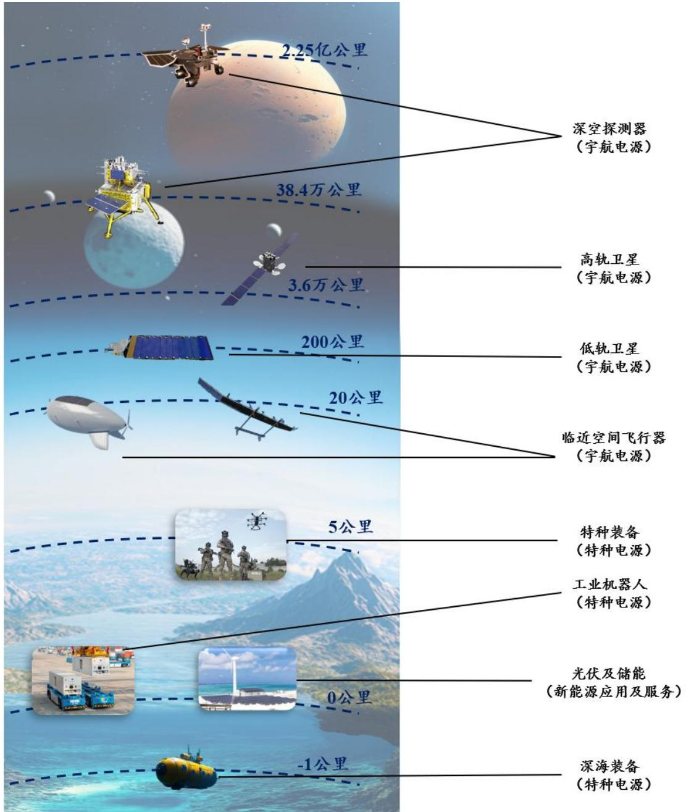

# 1、宇航电源

公司宇航电源的产品主要包括空间太阳电池阵、空间锂离子电池组和电源控制设备及其构成的电源系统，应用于航天器和临近空间飞行器。公司是国内宇航电源的核心供应商，宇航电源产品在国内市场覆盖率超过 $50 \%$ 。

公司研制的宇航电源产品贯穿中国航天发展史，自 1970 年为我国第一颗人造卫星“东方红一号”提供电源产品以来，截至报告期末，公司已为神舟飞船、天宫空间站、北斗卫星、嫦娥月球探测器、天问火星探测器、高分卫星等国家与国防多个重大工程在内的700余颗卫星/飞船/探测器/空间站提供了优质可靠的电

源产品，是中国航天事业取得辉煌成就背后主要的支撑力量。在近年来兴起的商业航天卫星电源系统领域，公司大力推进高性能、大规模、轻量化、低成本的星座电源产品体系，在千帆星座、国网星座、吉林一号遥感星座等我国重大商业航天星座的电源系统供应商中处于重要地位。

在前沿的临近空间飞行器电源系统领域，公司是国内最早开展临近空间飞行器电源系统研制的单位。公司研制的电源系统支撑我国大型太阳能无人机首次实现临近空间连续跨昼夜飞行，助力我国成为继美国、英国之后世界第三个掌握临近空间低速飞行器技术的国家。公司在国内临近空间飞行器电源市场占据主导地位。

# 2、特种电源

公司特种电源的产品体系主要为特种锂离子电池组和燃料电池。

公司的特种锂离子电池组主要应用于携行装备、特种车辆、特种无人机和工业机器人。公司先后承担了为重点工程配套的锂离子蓄电池组科研项目 100余项，产品型号达300余种。在携行装备电源领域，公司是国内龙头企业；在特种车辆电源、特种无人机电源和工业机器人电源领域，公司属于国内重要供应商。其中，工业机器人电源领域，公司目前主攻 AGV锂离子电池方向，并已成为国内 AGV锂离子电池组的重要供应商之一。

公司的燃料电池主要应用于携行装备、应急电源等国防领域，报告期内，公司燃料电池实现产业化。

# 3、新能源应用及服务

在深耕宇航电源、特种电源的同时，公司积极布局民品市场，陆续开拓光伏、储能两大市场。公司新能源应用及服务板块主要产品包括微电网解决方案、储能系统及储能 EPC 服务、光伏解决方案、电源检测服务，以及锂电正极材料和消费类锂电池等。

公司依托在电源控制领域的丰富技术积累，研制了风电、光伏、燃油发电、储能系统等多种能源互补的微电网，通过对多种能源进行合理的容量配置和智能控制计算，实现可再生能源的高效可靠利用。公司下属子公司蓝天太阳在南极泰山站建成我国首套风光燃储互补智能微电网，获得天津市科技进步一等奖。

公司对外销售各类中小型、大型储能系统（以集装箱式产品为主）。公司储能系统主要应用于独立储能电站、共享储能电站、工商业储能、家庭储能、便携式移动储能、微电网、备用电源储能等场景。

公司紧跟行业技术发展前沿，在钠离子电池方向进行布局，并已经取得实用突破，目前已在电动两轮车、启动电源领域进行示范应用，开发的钠离子电池储能系统已成功应用于微电网。

公司拥有国内重要的化学与物理电源综合性检测机构，技术实力雄厚，具备电池材料理化分析、太阳电池测试、化学电池及电源系统测试能力。公司是国家工信部电动汽车用动力蓄电池产品强制性检测单位、中国船级社认证测试（电池类）指定试验机构、天津海关工业产品安全技术中心合作实验室，TÜV 南德认证合作实验室、CQC 认证合作实验室。

# （二）发行人的主要产品及服务

公司主营业务涵盖宇航电源、特种电源、新能源应用及服务三大板块，各板块主要产品及服务具体如下：

<table><tr><td>业务类别</td><td>产品功能类别</td><td>主营产品名称</td></tr><tr><td rowspan="5">宇航电源</td><td rowspan="2">发电</td><td>空间太阳电池阵</td></tr><tr><td>砷化镓外延片</td></tr><tr><td>储能</td><td>空间锂离子电池组</td></tr><tr><td>控制</td><td>电源控制设备</td></tr><tr><td>电能源系统解决方案(发电、储能、控制)</td><td>电源分系统</td></tr><tr><td rowspan="2">特种电源</td><td>发电</td><td>燃料电池</td></tr><tr><td>储能</td><td>特种锂离子电池组</td></tr><tr><td rowspan="4">新能源应用及服务</td><td rowspan="2">系统集成</td><td>微电网及光伏解决方案</td></tr><tr><td>储能系统及储能 EPC</td></tr><tr><td>储能</td><td>锂电正极材料、消费类锂电池</td></tr><tr><td>电源检测</td><td>电源检测服务</td></tr></table>

发行人主要产品及服务的具体情况如下：

# 1、宇航电源

公司宇航电源产品主要包括宇航电源单机及系统与砷化镓外延片，其中宇航

电源单机包括空间太阳电池阵、空间锂离子电池组、电源控制设备。公司提供的宇航电源产品是空间飞行器的“心脏”，主要应用于卫星、飞船、空间站等各类航天器，以及临近空间无人机和平流层飞艇等临近空间飞行器，可为空间飞行器中的用电设备提供电能。以卫星为例，其电源分系统构成如下图所示：

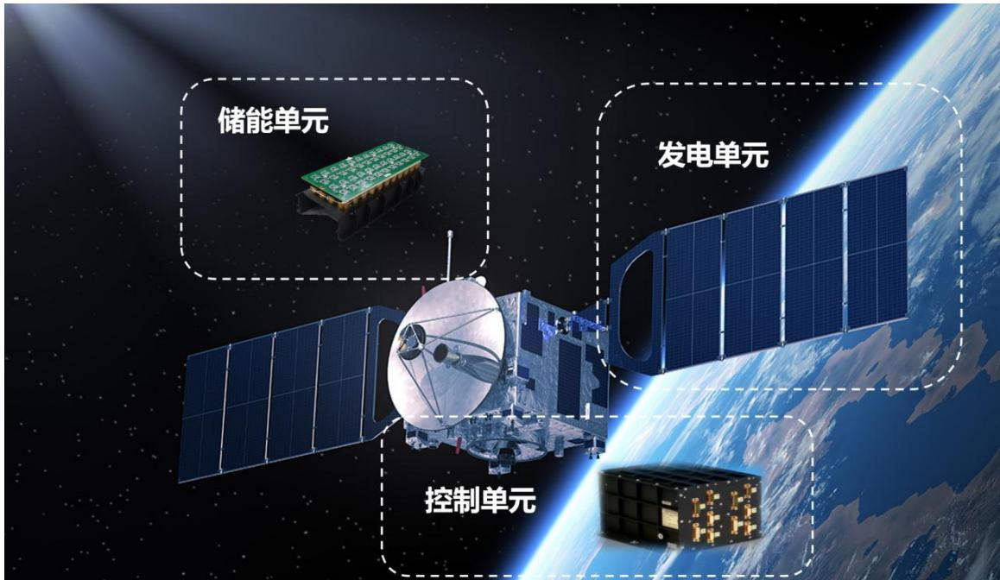

公司宇航电源产品的具体情况如下表所示：

<table><tr><td colspan="2">类型</td><td>产品名称</td><td>产品简介</td><td>主要应用领域</td></tr><tr><td rowspan="4">宇航电源单机及系统</td><td rowspan="3">单机</td><td>空间太阳电池阵(太阳翼)</td><td>宇航电源系统的三大单机之一,由空间单体太阳电池、结构机构、驱动机构、基板等部件构成。主要工作原理为利用光伏效应发电,为用电设备提供电能</td><td rowspan="5">卫星、飞船、深空探测器、空间站等航天器,临近空间飞行器</td></tr><tr><td>空间锂离子电池组</td><td>宇航电源系统的三大单机之一,专为太空或临近空间的特殊使用环境研制,能够满足环境温度、使用寿命、抗冲击等特殊要求</td></tr><tr><td>电源控制设备</td><td>宇航电源系统的三大单机之一,包括电源控制器、变换器、配电器等电源管理与控制设备</td></tr><tr><td colspan="2">电源系统</td><td>由空间太阳电池阵、空间锂离子电池组、电源控制设备等三类单机构成</td></tr><tr><td>材料</td><td colspan="2">砷化镓外延片</td><td>制造空间单体太阳电池的关键核心原材料,其性能参数直接影响太阳电池阵的性能</td></tr></table>

电源系统是电能的产生、调节、变换、控制和保护等部分的总称，公司提供的宇航电源系统，采用太阳电池阵—蓄电池组联合电源模式，也是目前全球航天

器、临近空间飞行器应用最广的电源系统模式。该类电源系统由空间太阳电池阵、空间锂离子电池组、电源控制设备等三类单机构成，公司目前具备所有单机研制生产及电源系统的业务能力。此外，公司产品还覆盖制造空间单体太阳电池的上游核心材料砷化镓外延片。

公司为我国宇航事业提供的部分重要电源系统或单机示意图如下：

<table><tr><td>名称</td><td>示意图</td></tr><tr><td>中国空间站及其太阳电池阵</td><td></td></tr><tr><td>神舟系列载人飞船及其太阳电池阵</td><td></td></tr><tr><td>天舟系列货运飞船及其太阳电池阵</td><td></td></tr><tr><td>北斗某导航卫星及其电源系统</td><td></td></tr><tr><td>嫦娥某探月卫星及其电源系统</td><td></td></tr><tr><td>临近空间无人机及其电源系统</td><td></td></tr></table>

公司在宇航电源领域深耕数十年，核心产品技术领先：

（1）公司的空间太阳电池阵产品将高效且抗辐射的太阳电池，与模块化、可定制的刚性、半刚性、柔性和全柔性太阳电池阵相结合，可满足低轨、中轨、高轨、深空探测等空间应用需求，提供一系列晶格匹配、晶格失配的多结太阳电

池产品均完全通过宇航标准认证。产品涵盖单体电池、组件（CIC）、电池阵、卫星电源系统， $32 \%$ 转化效率的空间高效太阳电池及其阵列技术、 $34 \%$ 转换效率的低温低光强太阳电池达到国际先进水平。

（2）公司的空间锂离子电池组产品覆盖不同轨道不同载荷需求，长寿命高比能空间电池产品的能量密度达到 $3 0 0 \mathrm { W h / k g }$ ，远超国外的 $2 6 0 \mathrm { W h / k g }$ ；公司临近空间锂离子电池组产品比能量最高达到 $4 2 0 \mathrm { W h / k g }$ ，均达到国际领先水平。  
（3）公司采用空间高可靠最大功率点跟踪（MPPT）技术的电源系统，在光照和温度大幅变化的复杂空间轨道环境中，提升航天器系统能源利用率 $1 5 \%$ 以上。

# 2、特种电源

公司特种电源业务的主要产品为特种锂离子电池组和燃料电池。公司先后承担了为重点工程配套的特种锂离子蓄电池组科研项目 100余项，生产的各类特种低温锂离子电池组主要应用于携行装备、特种车辆、特种无人机等国防军工领域，产品型号达 300 余种。其中，在携行装备电源领域，公司是国内龙头企业。公司还拓展民用市场的工业机器人电源领域，目前主攻 AGV 锂离子电池方向，并已成为国内AGV锂离子电池组的重要供应商之一。

公司的特种电源产品简介如下表所示：

<table><tr><td>产品名称</td><td>产品简介</td><td>主要应用领域</td></tr><tr><td>特种低温锂离子电池组</td><td>具有低温性能好、重量轻、能量密度高、可靠性高等优点，可以满足各类国防装备的特殊需求</td><td>广泛应用于携行装备、特种车辆、特种无人机等国防领域</td></tr><tr><td>AGV锂离子电池组</td><td>具有经济性好、可靠性高、循环寿命长、空间适应性好等优点</td><td>应用于AGV，服务于下游的汽车、智慧工厂、物流、仓储等多个领域</td></tr><tr><td>燃料电池</td><td>具有超高能量密度、便携式、先进电化学发电技术等优点，可以满足国防装备的电能源供电需求</td><td>应用于携行装备、应急电源等国防领域</td></tr></table>

# 3、新能源应用及服务

在深耕宇航电源、特种电源的同时，公司积极布局民品市场。公司新能源应用及服务业务的主要产品和服务包括微电网解决方案、储能系统及储能 EPC 业务、光伏解决方案、电源检测服务，以及锂电正极材料、消费类锂电池等。同时，公司紧跟行业技术发展前沿，在钠离子电池方向进行布局，并已经取得实用突破，

目前已在电动两轮车、启动电源领域进行示范应用，开发的钠离子电池储能系统已成功应用于微电网。

# （1）微电网解决方案业务

公司研制了风电、光伏、燃油发电、储能系统等多种能源互补的微电网，通过对多种能源进行合理的容量配置和智能控制计算，实现可再生能源的高效可靠利用。公司的多能互补微网电源系统采用模块化设计，便于安装与实施，可实现全自动运行，无需人工干预和维护。该系统具有极强的环境适应性，具有高耐候性，耐高温、耐低温、耐低气压，可以满足高（高寒、高温、高海拔）、海（沿海）、边（边境）、无（无人无电区）环境条件下的供电需求。公司先后承担边防哨所、岛礁、南极、铁塔、移动、电信等各类微电网系统百余项；涉及海洋监测、全球卫星导航系统、武警边防、气象台站、机场设备、军事基地、通信基站等多种应用领域及场景。公司设计建造的中国南极泰山站新能源微网系统在极昼期间作为主要能源为泰山站提供全部的电力供应，支撑泰山站成为人类在南极建立的首个 $100 \%$ 清洁绿色能源供电的科考站。

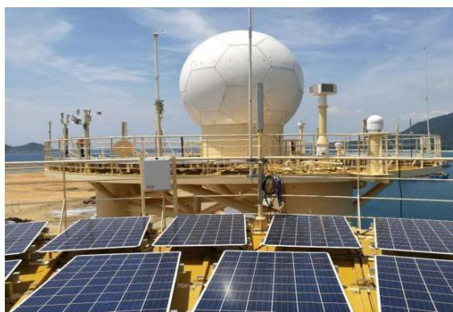

# （2）储能系统及储能 EPC 业务

公司对外销售各类中小型、大型储能系统（以集装箱式产品为主）。公司的锂电池储能系统主要由锂离子电池组、储能变流器（PCS）、电池管理系统（BMS）、能量管理系统（EMS）、温控（通风、制冷）系统、照明系统、消防系统以及管理控制系统和其他软硬件系统构成。公司储能系统主要应用于独立储能电站、共享储能电站、工商业储能、家庭储能、便携式移动储能、微电网、备用电源储能等场景。

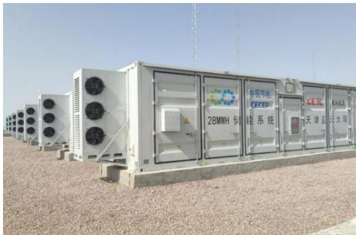

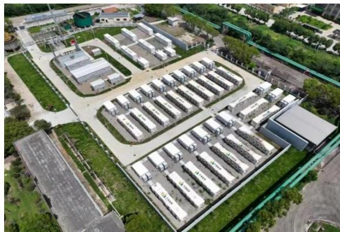

# （3）光伏解决方案业务

公司主要以总承包或工程施工承包方式开展光伏电站的建设，同时也销售光伏发电系统产品。公司先后承担了十余项国家光伏扶贫电站建设任务，累计完成近70个大型地面光伏电站和分布式电站建设。2024年以来，公司聚焦核心主业，主动收缩光伏解决方案业务。

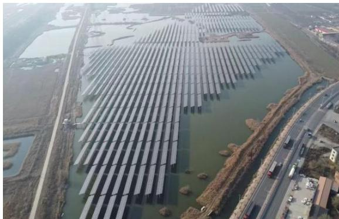

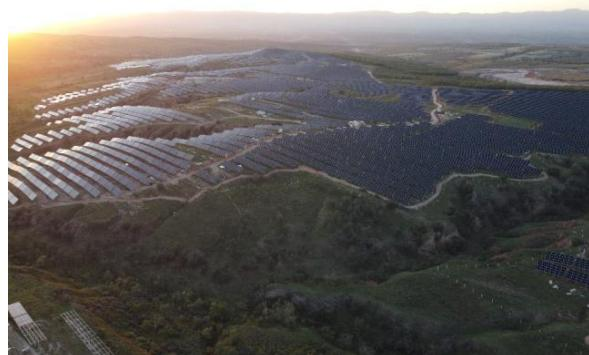

# （4）电源检测服务

公司电源检测服务包括化学电源的理化分析、单体测试、模组测试、系统测试，物理电源的单体测试、特殊环境测试、组件测试、电站测试，以及多种化学与物理电源的混合组网测试，基本覆盖电源产业上游初始端至产业下游末端的全部化学与物理电源专业检测服务。

公司可为电能源全行业提供完备的检测服务，目前主要业务集中于军用电能源检测、民用动力电池检测和储能电池检测等高标准、高附加值检测领域。公司检测实验室先后获得 CNAS（中国实验室认可委员会）、CMA（中国国家认证认可监督管理委员会）、DIAC（国防工业认可委员会）、中国船级社等认证认可资质，实验室认可标准共200 余项，主要资质覆盖范围如下表所示：

<table><tr><td>产品类别</td><td>检测领域/检测对象</td><td>重点标准</td></tr><tr><td rowspan="6">化学电池</td><td>车载及船用领域</td><td>GB 38031、GB/T 31486等</td></tr><tr><td>工商业及消费领域</td><td>IEC 62133等</td></tr><tr><td>环境适应性领域</td><td>GB/T 2423、GJB 150A</td></tr><tr><td>安全评估领域</td><td>UL 9540A、IEC62619、GJB 2374A等</td></tr><tr><td>储能及组网领域</td><td>GB/T 36276-2023、GB/T 44265等</td></tr><tr><td>军用电能源领域</td><td>GJB 4477等</td></tr><tr><td>物理电池</td><td>单体光伏电池、光伏组件、光伏电站</td><td>GB/T 6495.1、IEC 61730、IEC 61215、IEC 62446</td></tr><tr><td>电池材料</td><td>电极材料</td><td>GB/T 24533</td></tr><tr><td>供电设施</td><td>充电桩、充电系统</td><td>GB 44263、GB 39752</td></tr></table>

# （5）锂电正极材料及消费类锂电池

公司在电池材料、产品、系统、检测服务环节均有所布局。电池材料方面，除宇航电源中的砷化镓外延片外，公司还从事锂电正极材料的研发、生产和销售；电池产品方面，除在宇航、特种领域应用的锂电池外，公司积极开拓民品市场，从事少量消费类锂电池的研发、生产和销售。

# （三）发行人主营业务收入的构成及特征

报告期内，公司主营业务未发生重大变化，主营业务收入按产品结构分类的构成情况如下：

单位：万元  

<table><tr><td rowspan="2">项目</td><td colspan="2">2025 年 1-6 月</td><td colspan="2">2024 年度</td><td colspan="2">2023 年度</td><td colspan="2">2022 年度</td></tr><tr><td>金额</td><td>占比</td><td>金额</td><td>占比</td><td>金额</td><td>占比</td><td>金额</td><td>占比</td></tr><tr><td>宇航电源</td><td>72,805.56</td><td>74.13%</td><td>191,463.69</td><td>63.42%</td><td>168,718.01</td><td>48.23%</td><td>134,465.03</td><td>53.96%</td></tr><tr><td>特种电源</td><td>5,086.28</td><td>5.18%</td><td>44,363.58</td><td>14.69%</td><td>31,809.09</td><td>9.09%</td><td>38,300.75</td><td>15.37%</td></tr><tr><td>新能源应用及服务</td><td>20,319.34</td><td>20.69%</td><td>66,077.28</td><td>21.89%</td><td>149,298.17</td><td>42.68%</td><td>76,446.23</td><td>30.68%</td></tr><tr><td>合计</td><td>98,211.18</td><td>100.00%</td><td>301,904.55</td><td>100.00%</td><td>349,825.27</td><td>100.00%</td><td>249,212.02</td><td>100.00%</td></tr></table>

报告期内，公司的主要业务经营情况具体分析，参见本招股说明书“第六节财务会计信息与管理层分析”之“九、经营成果分析”之“（二）营业收入分析”部分。

# （四）发行人主要经营模式

# 1、销售模式

公司的销售模式为直销，各类主营业务的具体销售模式有所不同。

# （1）宇航电源业务的销售模式

公司的宇航电源业务根据合同、订单或标书等订货信息，开展产品要求评审并承接客户的研制任务。相关产品完成设计开发、定型生产工作后，由客户分阶段对约定的项目节点任务完成情况进行评审、测试及验收，最终完成产品交付并实现销售。

# （2）特种电源业务的销售模式

公司特种电源产品首先通过客户的供应商资格审查进入其合格供应商目录，再以项目定制、招投标等形式直接与客户签订合同，根据合同要求的产品交付节点任务开展产品详细设计及开发生产，最终完成产品交付并实现销售。

# （3）新能源应用及服务业务的销售模式

公司的储能系统产品首先通过客户的供应商资格审查进入其合格供应商目录，再以项目定制、招投标等形式直接与客户签订合同，根据合同要求的产品交付节点任务开展产品详细设计及开发生产，最终完成产品交付并实现销售。

公司的微电网及光伏解决方案业务一般通过招投标获取合同。

公司电源检测服务具有一批较稳定的客户群体，同时公司通过主动开发客户获取需求信息，提供检测服务后向客户出具检测报告或提供客户所需的检测数据，相关服务价格在公司统一定价基础上协商确定。

# 2、研发模式

公司采取技术驱动导向的前瞻性研发、客户需求导向的定制化研发相结合的研发模式。公司制定了《重点科研项目监督管理规定》等研发相关制度，相关部门分工配合：（1）科技部负责对各事业部、各子公司的重点科研项目进行监督管理，包括重点科研项目立项、过程监督管理与考核评价等工作；（2）财务部作为项目经费管理部门，负责研发项目立项预算审查、重点科研项目的财务审计与财务验收；（3）下属各事业部、各子公司是研发任务的具体承担主体，对研

发项目的全过程负责。

公司的研发流程一般可分为开题论证、立项评审、研发过程实施、验收归档四个阶段。开题论证及立项评审阶段，研发团队对研发项目形成方案并编制论证报告；开题论证报告编制完成后，由公司组织评审会审议研发方案；评审通过后，研发项目正式立项。研发部门以研制任务书为基础，制定详细的研发日程计划，组织团队成员进行研发。公司定期对研发项目的实施进度进行考核，并对后续工作安排进行交流及部署，保障项目按节点完成。研发项目结束后，研发团队编制研发项目总结报告并申请结题验收。

公司设立有《科技成果转化办法》等研发创新激励制度，构建了“揭榜挂帅”等科研项目内部竞争机制，对完成特定重大技术攻关项目的团队予以奖励，鼓励新技术新产品开发和新领域开拓，提升员工研发创新的积极性。

# 3、采购模式

公司采购的主要原材料包括太阳电池阵生产材料、电池组及储能系统材料、锂离子电芯材料、新能源电站工程材料、电子元器件、结构件、金属材料等。

公司供应链管理部统筹管理公司整体采购工作及各事业部具体采购活动，各子公司分别完成各自单位的具体采购工作。公司根据销售订单的需求信息，制定相应的物料采购计划，通过产品性能测试、产品对比筛选和价格比较，最终选定供应商。公司根据采购管理制度，完成物料的计划、采购等环节。

为保证采购物料的供应和品质稳定，由供应链管理部牵头组织物料使用部门、质量部门，对供应商和物料进行评定，并严格执行“入名录前加强资质审查、入名录后定期考核”的管理模式，建立了供应商考评机制，对合格供应商的质量、价格、服务、环保和产品交付能力等方面进行定期综合考评。目前，公司已逐步形成了长期合作的供应商体系。

为促进采购工作规范、阳光、透明，公司成立了采购管理委员会，对采购工作集中统一监督，并促使公司采购流程更加规范化、系统化。

# 4、生产模式

# （1）宇航电源业务的生产模式

公司宇航电源业务主要是根据客户下达的研制任务书要求，开展相关研制生产工作。宇航电源系统由公司及子公司空间电源、蓝天太阳和参股公司天津恒电共同协作完成全部生产工序，其中： $\textcircled{1}$ 电源控制设备由公司直接生产； $\textcircled{2}$ 空间锂离子电池组由空间电源完成生产； $\textcircled{3}$ 空间太阳电池阵首先由蓝天太阳完成主要原材料砷化镓外延片的生产，再由天津恒电或蓝天太阳将砷化镓外延片加工成空间单体太阳电池，最后公司将空间单体太阳电池加工成空间太阳电池阵。

# （2）特种电源业务的生产模式

公司特种电源产品的生产模式包括两类： $\textcircled{1}$ 以销定产，是目前采用的主要生产方式，根据客户需求确定产品初步技术方案，经过前期的项目跟踪、预研、定制化设计后签订正式合同，同时以技术协议的方式确定最终技术方案，之后下发生产任务通知单进行投料生产，经质检合格后完成产品交付； $\textcircled{2}$ 预先生产，适用于部分通用性强、使用量大、技术成熟的产品，以确保用户能够随时订购。

# （3）新能源应用及服务业务的生产模式

公司储能业务主要为销售储能系统产品，同时也从事少量的储能EPC业务。针对储能业务，公司主要根据签署订单安排生产，生产完成后向客户交付产品，部分产品需为客户提供调试服务。在交付周期紧张、自有产能无法满足订单需求的情况下，公司会委托外部厂商协助生产加工储能系统。

公司微电网及光伏解决方案主要包括微电网设计建造、产品销售以及光伏电站设计建造业务。针对微电网业务，公司根据签署的销售合同安排设计生产，完成后向客户交付产品，其中核心产品能量管理系统（EMS）由公司设计和制造，标准化光伏组件产品向外部供应商采购；公司光伏电站设计建造业务主要以工程总承包或工程施工承包、工程设计方式开展，其中，光伏电站设计建造所用的支架、线缆、标准化光伏组件、逆变器等材料及设备均向外部供应商采购，公司自身不从事上述光伏电站工程材料的生产。

公司的电源检测服务主要依托自有测试资源开展，在自有检测设备无法满足全部检测需求或当前测试资源无法满足周期节点要求等情况下，公司可能将部分

环节委托外部第三方进行外协试验，最终均由公司出具完整检测报告或提供客户所需的检测数据。

# 5、发行人采用目前经营模式的原因、影响经营模式的关键因素及其变化情况

公司主要从事电能源产品及系统的研发、生产、销售及服务，覆盖物理电源、化学电源、电源系统以及产业链上下游产品，下游行业涉及航天、国防军工等特种领域及新能源领域。公司目前采用的经营模式，是根据国家相关产业政策、上下游行业的特点、不同类型客户的特殊性等因素决定的。影响公司经营模式的关键因素包括航天、国防军工、新能源等领域的相关政策、下游客户需求的变化和产业链上下游发展情况等。

报告期内，发行人经营模式及影响发行人经营模式的关键因素未发生重大不利变化，目前也不存在导致未来发生重大变化的因素。

# （五）发行人主营业务、主要产品及主要经营模式的演变情况

公司成立于 1992 年，自成立日起至报告期末，公司主营业务、主要产品及主要经营模式的演变情况如下：

# 1、宇航电源业务的演变情况

公司的宇航电源业务主要承继自十八所。2018 年，公司设立子公司空间电源，承接十八所空间锂离子电池组业务。同年，十八所将蓝天太阳的 $100 \%$ 股权划转至本公司，公司新增砷化镓外延片业务。2021 年，公司以业务整合方式承接十八所剩余的全部宇航电源业务，自此形成了宇航电源完整业务板块。

报告期内，公司宇航电源业务的主要产品及主要经营模式未发生重大变化。

# 2、特种电源业务的演变情况

报告期内，公司特种电源业务的产品及主要经营模式未发生重大变化。

# 3、新能源应用及服务业务的演变情况

2018年，十八所将蓝天太阳的 $100 \%$ 股权划转至本公司，公司新增微电网及光伏解决方案业务。2021 年，公司以业务整合方式承接十八所电源检测业务。随着电化学储能系统市场的逐步发展，公司自 2022 年开始拓展储能业务。2024

年，发行人为聚焦核心主业，主动收缩光伏电站设计建造业务。目前公司已不再承接大型集中式光伏电站建造业务。

报告期内，公司新能源应用及服务业务的主要经营模式未发生重大变化。

# （六）发行人主要业务经营情况和核心技术产业化情况

公司拥有一支电能源领域研发经验丰富的优秀团队，掌握多项达到国际领先或国际先进水平的核心技术，并通过成果转化成功应用于各类主营产品。报告期各期公司依靠核心技术产品（服务）产生的营业收入占主营业务收入的比例如下：

单位：万元  

<table><tr><td>项目</td><td>2025 年 1-6 月</td><td>2024 年度</td><td>2023 年度</td><td>2022 年度</td></tr><tr><td>核心技术产品（服务）收入</td><td>90,549.21</td><td>269,901.77</td><td>305,186.05</td><td>224,921.01</td></tr><tr><td>主营业务收入</td><td>98,211.18</td><td>301,904.55</td><td>349,825.27</td><td>249,212.02</td></tr><tr><td>核心技术产品（服务）收入占比</td><td>92.20%</td><td>89.40%</td><td>87.24%</td><td>90.25%</td></tr></table>

从技术成果转化情况来看，公司核心技术充分实现了产业化应用。公司主要业务经营情况和核心技术产业化情况参见本招股说明书“第五节 业务与技术”之“一、发行人主营业务情况”之“（一）发行人主营业务的基本情况”、“七、发行人的技术研发情况”之“（一）核心技术情况”部分。

# （七）发行人主要产品的工艺流程图

# 1、宇航电源业务

# （1）空间太阳电池阵

空间太阳电池阵的主要生产流程为：在超净间内，完成空间单体太阳电池与互连片及旁路二极管的焊接，将玻璃盖片粘贴于空间单体太阳电池正面，制成CIC太阳电池，使空间单体太阳电池具备优良的抗空间粒子辐照损伤的能力。对CIC太阳电池进行外观检验后，采用太阳模拟器精准模拟太阳光谱，测试 CIC太阳电池的电性能，按设计要求进行串并联摆放后进行下电极焊接，形成太阳电池组件。对太阳电池组件进行涂胶后，完成与基板的粘贴，安装并焊接电缆网实现供电功能。最后采用太阳模拟器对太阳电池阵的电性能进行测试。具体如下图所示：

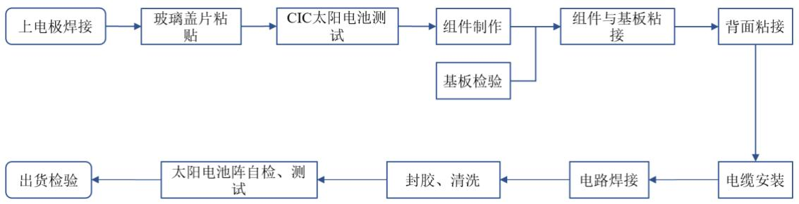

# （2）空间锂离子电池组

空间锂离子电池组的生产需要电芯生产和电池组集成两道主要工序。

# 1）电芯生产

电芯的工艺流程主要包括电极制片、电芯装配、电池测试三大环节。

电极制片环节：将正负极原材料分别按照工艺配比进行充分混合，制备好的浆料精准涂覆在铝箔、铜箔等集流体上；通过极片辊压、分切、模切工序制备出符合工艺形状尺寸厚度要求的极片。

电芯装配环节：将正负极片、隔膜按照一定卷绕张力对其进行卷绕，卷绕后的电芯通过超声焊接、激光焊接、电子束焊接等工序完成电芯装配，通过射线检测、压力检测、视频检测等手段严格控制焊接装配过程；电芯经过烘烤严格控制水分，再进行注液封口。

电池测试环节：将封口后电池进行充放电测试、电压衰降测试、内阻测试等性能测试，再根据客户要求按照电池容量、电压、内阻等进行分档筛选包装入库。具体如下图所示：

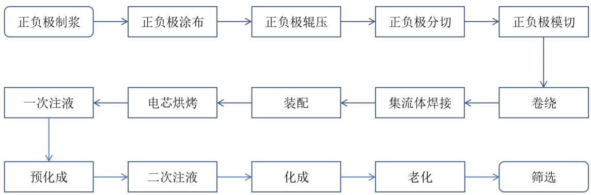

# 2）电池组集成

电池组集成的主要工艺流程为：电芯生产完成后，通过筛选将性能一致的电

池匹配进入电池组；将电芯表面喷砂处理、包裹绝缘膜，装入套筒形成并联单元；汇流排绝缘处理后，与旁路开关一同装入并联单元，形成机、热、电相对独立的单元；将预先制备好的电连接器支架组件与多个并联电池单元互联形成蓄电池组；最后，将电连接器导线与电池进行功率、热控、采样、均衡、旁路功能（By-Pass）驱动线路连接，点胶绝缘处理、安装防护罩并检查后，形成功能完整的锂电池组。具体如下图所示：

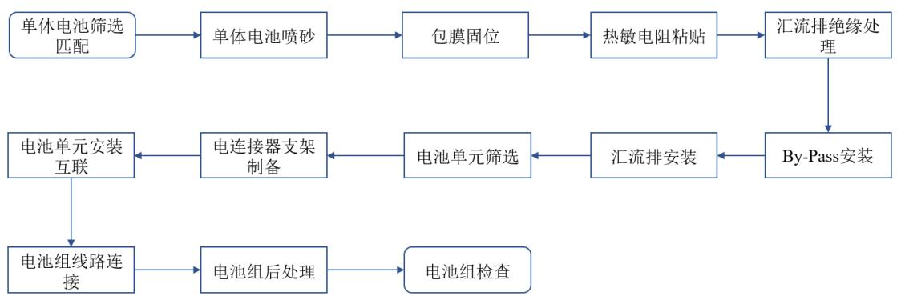

# （3）电源控制设备

电源控制设备的主要工艺流程为：在严格控制生产环境温湿度、洁净度及防静电的条件下，生产部门依次进行印制电路板的装联、模块装联和整体组装调试。印制电路板的装联先对表贴元器件进行贴装及焊接，再对插装元器件进行安装及焊接，之后对印制电路板组装件进行清洗，对检验合格的印制电路板组装件进行防护操作，包括三防涂覆和粘固操作。随后进行模块装联，依据工艺文件要求将印制电路板组装件和结构零部件进行组装装配，采用焊接工艺、压接工艺和螺接工艺等实现模块内部各部组件的电气连接，模块装联后进行清洗，清洗后进行检验。最后将装联好且调试好的各模块进行整机组装，通过装配准备、部件装配、整机调平、整机检验等环节，构成具有一定功能的完整的电子单机。具体如下图所示：

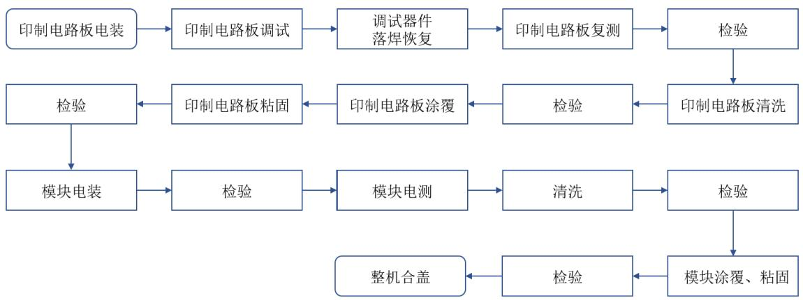

# （4）砷化镓外延片

砷化镓外延片的主要工艺流程为：在锗衬底上，先扩散出锗底电池，然后依次生长隧穿结、渐变缓冲层、布拉格（DBR）反射器、砷化镓铟（GaInAs）中间电池、隧穿结、磷化铝镓铟（AlGaInP）顶电池，最后生产用于制作电极的帽（Cap）层。具体如下图所示：

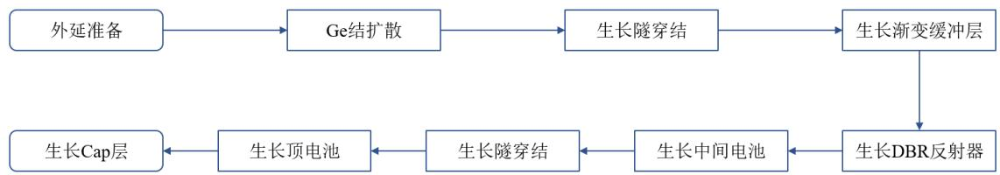

# 2、特种电源业务

# （1）特种锂离子电池组

特种锂离子电池组的完整生产过程一般包括电芯生产和电池组集成两道主要工序。

电芯生产环节：首先将正、负极卷料通过五金模具冲切成相应规格尺寸的正、负极片，将正极片、隔膜和负极片依次堆叠并贴胶，然后经过极组热压成型、极组和极耳焊接，包膜后入壳预点焊、周边焊、氦检，将烘干后电池进行真空注液、静置，再进行负压排气和二次注液，最后封口检测，包膜出货。具体如下图所示：

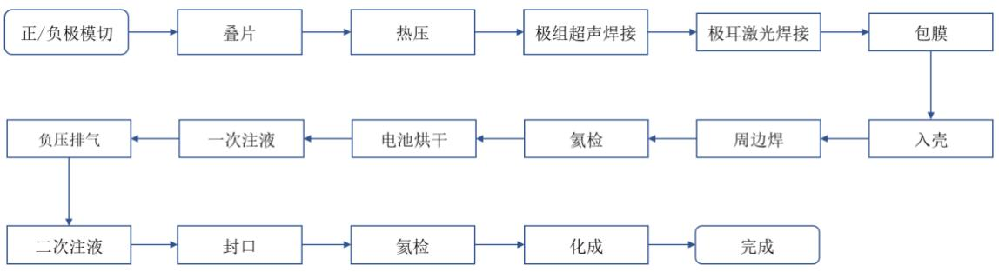

电池组集成环节：首先将辅料加工成壳体，然后测量电芯的电压内阻并按工艺要求进行配组，对配好组的电芯进行绝缘防护，将电芯组合粘贴，然后进行电池串并联连接形成电池包，之后将电池包与 BMS（或保护板）连接，再对电池组性能进行检测，测试后将电池组放入壳内并固定封装，最后对电池组进行总检，总检合格后包装入库。具体如下图所示：

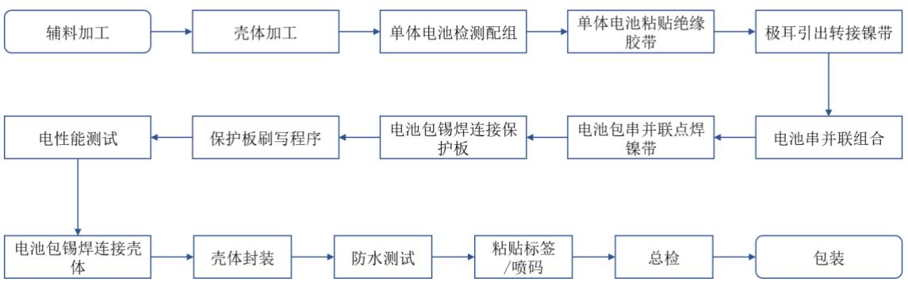

# （2）燃料电池

燃料电池的完整生产过程主要分为子系统生产和燃料电池系统总装两个关键工序。

子系统生产：涵盖过滤器部件、减压阀部件、阀组部件、电堆部件、控制器部件、水泵部件、水箱部件、线束部件、管路部件、显示按键部件、外壳部件、锂电池部件、燃料罐部件、散热部件等众多子系统。各子系统依据特定子系统生产工艺进行组装生产，并完成子系统检验。

燃料电池总装：将检验合格的各子系统，按照总装生产工艺进行组装调试。组装以外壳部件为基准，将其他部件安装至外壳部件上，各部件通过管路部件和线束部件连接。系统组装完成后，开展燃料电池检验，包括气密检验、电性能检验和发电检验等。检验合格后，对燃料电池进行包装入库。具体如下图所示：

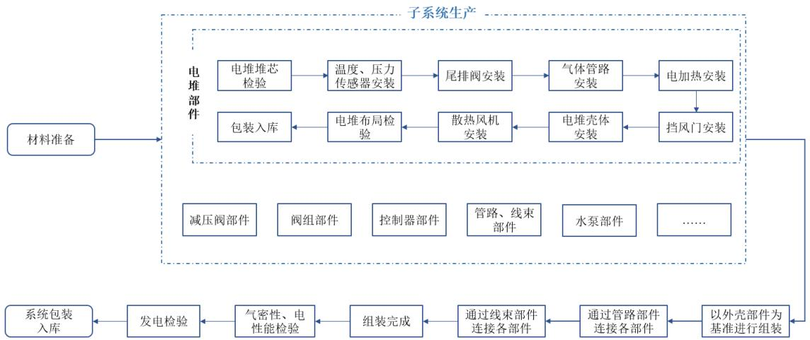

# 3、新能源应用及服务业务

# （1）储能系统

公司储能系统的主要工艺流程包括电池组生产、系统组装两大环节。

储能锂离子电池组的生产主要流程为：对单体电芯进行条码绑定和电压内阻测试，剔除电压异常品；对合格电芯进行等离子清洗，再利用激光自动对正负极极柱表面进行清洗；将泡棉和端板堆叠形成模组，模组挤压后套上钢带，形成成品模组。对成品模组进行激光焊接，焊接完成后进行焊点效果测试、焊后绝缘耐压测试、线束通讯测试等测试环节，最后合格模组下线。

在电池模组完成生产测试后，装入集装箱，在集装箱内连接电池模组形成电池簇，并进行簇级测试。然后组装温度控制、照明、消防等系统形成储能集装箱，最后完成集装箱测试。具体如下图所示：

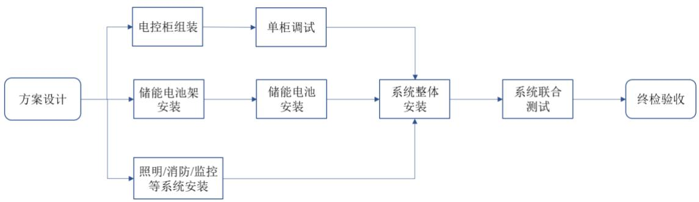

# （2）电源检测服务

电源检测服务的主要步骤为根据客户需求情况，进行标准测试或定制化测试。客户在填写委托测试单或签订合同后，向公司寄送样品，公司选取测试设备并确

定测试方法、设置试验参数，对样品安装调试后开展正式测试，最后公司向客户出具检测报告，或者提供客户所需的检测数据。具体如下图所示：

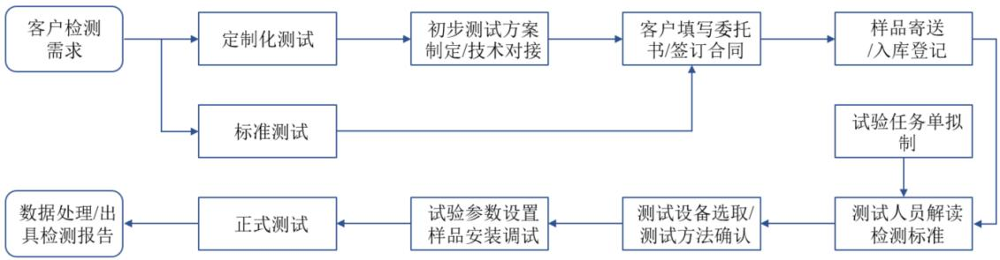

# 4、发行人核心技术的具体使用情况和效果

报告期内，发行人核心技术在生产工艺中的具体使用情况和效果参见本招股说明书“第五节 业务与技术”之“七、发行人的技术研发情况”之“（一）核心技术情况”之“1、公司核心技术”部分。

# （八）发行人具有代表性的业务指标

公司主要从事电能源产品及系统的研发、生产、销售及服务，产品及服务涵盖宇航电源、特种电源、新能源应用及服务三大类。报告期内，公司具有代表性的业务数据包括产能、产量、销量及营业收入，相关业务数据的变动情况及原因，参见本招股说明书“第五节 业务与技术”之“四、发行人的销售情况和主要客户”之“（二）主要产品的产能、产量和销量”部分、“第六节 财务会计信息与管理层分析”部分。

# （九）发行人符合产业政策和国家经济发展战略的情况

根据国家统计局《战略性新兴产业分类（2018）》，公司从事的业务属于“2高端装备制造产业”之“2.3 卫星及应用产业”之“2.3.1 卫星装备制造- ${ } . 3 7 4 2 ^ { * }$ 航天器及运载火箭制造”之“先进卫星分系统部组件产品”，因此公司处于国家鼓励的战略性新兴产业。

根据《上海证券交易所科创板企业发行上市申报及推荐暂行规定》中，公司主营业务属于高端装备领域的航空航天产业类别，公司符合科创板行业领域定位。

国家政策支持公司主营业务的情况参见本招股说明书“第五节 业务与技术”之“二、发行人所处行业基本情况”之“（二）行业主管部门、监管体制、主要

法律法规政策及其影响”之“3、行业主要法律法规政策及对公司经营发展的影响”部分。

# 二、发行人所处行业基本情况

# （一）所属行业及确定所属行业的依据

公司主要从事电能源产品及系统的研发、生产、销售及服务，产品及服务涵盖宇航电源、特种电源和新能源应用及服务三大类，其中最近一年宇航电源业务收入占比超过 $60 \%$ 。根据《国民经济行业分类》（GB/T 4754-2017），公司所属行业为“C37 铁路、船舶、航空航天和其他运输设备制造业”。

公司收入占比最高的为宇航电源业务。根据国家统计局《战略性新兴产业分类（2018）》，公司主营业务属于“2 高端装备制造产业”之“2.3 卫星及应用产业”之“2.3.1 卫星装备制造-3742*航天器及运载火箭制造”之“先进卫星分系统部组件产品”。

# （二）行业主管部门、监管体制、主要法律法规政策及其影响

# 1、行业主管部门及监管体制

公司目前核心产品及服务包括宇航电源、特种电源和新能源应用及服务等，主管部门主要包括国家发改委、国家能源局、工信部、国防科工局、装备发展部和国家保密局等。

公司所属行业的主管部门、监管体制具体如下：

<table><tr><td>主管部门</td><td>机构相关职能</td></tr><tr><td>国家发改委</td><td>拟订并组织实施国民经济和社会发展战略、中长期规划和年度计划，组织拟订并推动实施高技术产业和战略性新兴产业发展规划政策，协调产业升级、重大技术装备推广应用等方面的重大问题。</td></tr><tr><td>国家能源局</td><td>国家能源局为国家发改委管理的国家局，主要职责包括：制定能源发展和有关监督管理的法律法规；拟定并组织实施能源发展战略、规划和政策，推进能源体制改革；制定能源产业政策和相关标准；推进能源科技进步和相关重大科研项目；负责核电管理、能源行业节能和资源综合利用、能源预测预警等；监管电力等能源市场规范运行；组织推进国际能源合作；制定相关资源、补贴、环保政策等。</td></tr><tr><td>工信部</td><td>负责提出新型工业化发展战略和政策，协调解决新型工业化进程中的重大问题，拟订并组织实施工业、通信业、信息化的发展规划，推进产业结构战略性调整和优化升级，推进信息化和工业化融合，推进武器装备科研生产体系建设。</td></tr><tr><td>国防科工局</td><td>负责管理国防科技工业的行政管理机关，负责核、航天、航空、船舶、兵器、电子等领域武器装备科研生产重大事项的组织协调和军工核心能力建设。对从事武器装备科研生产单位实施许可制度管理。组织管理国防科技工业领域的政府间国际交流与合作，组织协调和监督管理军品出口工作。</td></tr><tr><td>装备发展部</td><td>原总装备部，主要履行全军装备发展规划计划、研发试验鉴定、采购管理、信息系统建设等职能，着力构建由军委装备部门集中统管、军种具体建管、战区联合运用的体制架构。</td></tr><tr><td>国家保密局</td><td>指导、协调党、政、军、人民团体及企事业单位的保密工作；会同国防科工局、装备发展部等部门组成国防武器装备科研生产单位保密资格审查认证委员会，负责对武器装备科研和生产单位保密资格的审查认证。</td></tr></table>

# 2、行业相关组织

# （1）中国化学与物理电源行业协会

中国化学与物理电源行业协会（China Industrial Association of Power Sources，缩写：CIAPS）成立于1989年 12月9日，是由电池行业相关企事业单位自愿结成的全国性、行业性社会团体。中国化学与物理电源行业协会下设碱性蓄电池与新型化学电源分会、酸性蓄电池分会、锂电池分会、太阳能光伏分会、干电池工作委员会、电源配件分会、移动电源分会、储能应用分会、动力电池应用分会、电池隔膜分会等十个分支机构。

# （2）中国电池工业协会

中国电池工业协会（China Battery Industry Association，缩写：CBIA），成立于 1988 年，经国家民政部注册批准，具有法人资格，为跨地区、跨部门、跨所有制的国家一级协会。中国电池工业协会的职能是：对电池工业的政策提出建议，起草电池工业的发展规划和电池产品标准，组织有关科研项目和技术改造项目的鉴定，开展技术咨询、信息统计、信息交流、人才培训，为行业培育市场，组织国际国内电池展览会，协调企业生产、销售和出口工作中的问题。

# 3、行业主要法律法规政策及对公司经营发展的影响

# （1）行业主要法律法规和政策

报告期内，公司主营业务相关行业主要法律法规和政策情况如下：

<table><tr><td>序号</td><td>时间</td><td>文件名称</td><td>发文单位</td><td>主要内容</td></tr><tr><td>1</td><td>2025年3月</td><td>《2025年政府工作报告》</td><td>国务院</td><td>因地制宜发展新质生产力,加快建设现代化产业体系。推动科技创新和产业创新融合发展,</td></tr><tr><td></td><td></td><td></td><td></td><td>大力推进新型工业化,做大做强先进制造业,积极发展现代服务业,促进新动能积厚成势、传统动能焕新升级。培育壮大新兴产业、未来产业。深入推进战略性新兴产业融合集群发展。开展新技术新产品新场景大规模应用示范行动,推动商业航天、低空经济等新兴产业安全健康发展。</td></tr><tr><td>2</td><td>2024年5月</td><td>《2024-2025年节能降碳行动方案》</td><td>国务院</td><td>到2025年底,全国抽水蓄能、新型储能装机分别超过6,200万千瓦、4,000万千瓦。落实煤电容量电价,深化新能源上网电价市场化改革,研究完善储能价格机制。</td></tr><tr><td>3</td><td>2024年3月</td><td>《2024年政府工作报告》</td><td>国务院</td><td>大力推进现代化产业体系建设,加快发展新质生产力。充分发挥创新主导作用,以科技创新推动产业创新,加快推进新型工业化,提高全要素生产率,不断塑造发展新动能新优势,促进社会生产力实现新的跃升。积极培育新兴产业和未来产业。实施产业创新工程,完善产业生态,拓展应用场景,促进战略性新兴产业融合集群发展。巩固扩大智能网联新能源汽车等产业领先优势,加快前沿新兴氢能、新材料、创新药等产业发展,积极打造生物制造、商业航天、低空经济等新增长引擎。</td></tr><tr><td>4</td><td>2023年12月</td><td>《产业结构调整指导目录(2024年本)》</td><td>国家发改委</td><td>将锂离子电池列为产业结构调整指导目录“鼓励类”。</td></tr><tr><td>5</td><td>2023年9月</td><td>《加强新形势下电力系统稳定工作的指导意见》</td><td>国家发改委、国家能源局</td><td>积极推进新型储能建设。充分发挥电化学储能、压缩空气储能、飞轮储能、氢储能、热(冷)储能等各类新型储能的优势,结合应用场景构建储能多元融合发展模式,提升安全保障水平和综合效率。</td></tr><tr><td>6</td><td>2022年12月</td><td>《扩大内需战略规划纲要(2022－2035年)》</td><td>中共中央、国务院</td><td>加快物联网、工业互联网、卫星互联网、千兆光网建设,构建全国一体化大数据中心体系,布局建设大数据中心国家枢纽节点。促进重大装备工程应用和产业化发展,加快大飞机、航空发动机和机载设备等研发,推进卫星及应用基础设施建设。</td></tr><tr><td>7</td><td>2022年1月</td><td>《2021中国的航天》</td><td>国务院</td><td>未来五年,中国将继续实施载人航天工程,发射“问天”实验舱、“梦天”实验舱、“巡天”空间望远镜以及“神舟”载人飞船和“天舟”货运飞船,全面建成并运营中国空间站,打造国家太空实验室,开展航天员长期驻留、大规模空间科学实验、空间站平台维护等工作。深化载人登月方案论证,组织开展关键技术攻关,研制新一代载人飞船,夯实载人探索开发地月空间基础。</td></tr><tr><td>8</td><td>2022年1月</td><td>《“十四五”新型储能实施方案》</td><td>国家发改委、国家能源</td><td>到2025年,新型储能由商业化初期步入规模化发展阶段,具备大规模商业化应用条件。新型储能技术创新能力显著提高,核心技术装备</td></tr><tr><td></td><td></td><td></td><td>局</td><td>自主可控水平大幅提升,标准体系基本完善,产业体系日趋完备,市场环境和商业模式基本成熟。其中,电化学储能技术性能进一步提升,系统成本降低30%以上。重点建设更大容量的液流电池、飞轮、压缩空气等储能技术试点示范项目,推动火电机组抽汽蓄能等试点示范,研究开展钠离子电池、固态锂离子电池等新一代高能量密度储能技术试点示范。</td></tr><tr><td>9</td><td>2021年12月</td><td>《锂离子电池行业规范条件(2021年本)》</td><td>工信部</td><td>加强锂离子电池行业管理,引导产业转型升级,大力培育战略性新兴产业,推动锂离子电池产业健康发展。</td></tr><tr><td>10</td><td>2021年10月</td><td>《2030年前碳达峰行动方案》</td><td>国务院</td><td>积极发展“新能源+储能”、源网荷储一体化和多能互补,支持分布式新能源合理配置储能系统。制定新一轮抽水蓄能电站中长期发展规划,完善促进抽水蓄能发展的政策机制。加快新型储能示范推广应用。深化电力体制改革,加快构建全国统一电力市场体系。到2025年,新型储能装机容量达到3000万千瓦以上。优化新型基础设施用能结构,采用直流供电、分布式储能、“光伏+储能”等模式,探索多样化能源供应,提高非化石能源消费比重。</td></tr><tr><td>11</td><td>2021年3月</td><td>《中华人民共和国国民经济和社会发展第十四个五年规划和2035年远景目标纲要》</td><td>国务院</td><td>深入实施智能制造和绿色制造工程,发展服务型制造新模式,推动制造业高端化智能化绿色化。培育先进制造业集群,推动集成电路、航空航天、船舶与海洋工程装备、机器人、先进轨道交通装备、先进电力装备、工程机械、高端数控机床、医药及医疗设备等产业创新发展。加快武器装备现代化,聚力国防科技自主创新、原始创新,加速战略性前沿性颠覆性技术发展,加速武器装备升级换代和智能化武器装备发展。打造全球覆盖、高效运行的通信、导航、遥感空间基础设施体系,建设商业航天发射场。聚焦新一代信息技术、生物技术、新能源、新材料、高端装备、新能源汽车、绿色环保以及航空航天、海洋装备等战略性新兴产业,加快关键核心技术创新应用,增强要素保障能力,培育壮大产业发展新动能。</td></tr><tr><td>12</td><td>2020年12月</td><td>《新时代的中国能源发展》</td><td>国务院</td><td>支持新能源微电网建设,形成发储用一体化局域清洁供能系统。推动综合能源服务新模式,实现终端能源多能互补、协同高效。</td></tr><tr><td>13</td><td>2019年7月</td><td>《新时代的中国国防》</td><td>国务院</td><td>构建现代化武器装备体系。完善优化武器装备体系结构,统筹推进各军兵种武器装备发展,统筹主战装备、信息系统、保障装备发展,全面提升标准化、系列化、通用化水平。加大淘汰老旧装备力度,逐步形成以高新技术装备为</td></tr><tr><td></td><td></td><td></td><td></td><td>骨干的武器装备体系。</td></tr></table>

# （2）对发行人经营发展的影响

在航天领域，建设航天强国是国家整体发展战略的重要组成部分，《2021中国的航天》提出：未来五年，中国航天将立足新发展阶段，贯彻新发展理念，构建新发展格局，按照高质量发展要求，推动空间科学、空间技术、空间应用全面发展，开启全面建设航天强国新征程。近年来，国家航天行业主管部门出台了一系列涉及我国航天装备和商业航天的政策，旨在推动我国航天领域的发展，对公司业务发展提供了强有力的政策支持。一方面，国家有条不紊地按照既定规划，逐步实施我国的各项航天工程，公司作为国内宇航电源的核心供应商，国家航天工程为公司提供了相对稳定且明确的市场预期。另一方面，随着国家将卫星互联网纳入新基建范畴、将商业航天作为新质生产力的代表连续两年写入《政府工作报告》，商业航天依托国家“互联网 $^ +$ 航天”的产业升级变革，产业化趋势日益明显，市场将迎来快速发展，为公司创造了广阔的发展空间。

在国防军工领域，加速武器装备机械化、信息化、智能化融合发展，是我军实现武器装备现代化的必然要求。武器装备机械化对各类特种车辆载具提出了更高的性能要求，公司在特种车辆电源领域具备核心技术优势，公司的特种电源产品可以在低温环境下保持高比能量，拓宽了特种车辆的使用场景；武器装备信息化和智能化提升了对携行装备、无人机等战场侦察节点的重视程度，公司是携行装备电源龙头企业，正大力拓展特种无人机电源等新兴市场，在特种无人机电源领域不断取得技术突破。随着我国武器装备机械化、信息化、智能化战略的深入推进，公司特种电源业务将迎来新的发展机遇。

在新能源领域，我国正采取更加有力的政策和措施，二氧化碳排放力争于2030年前达到峰值，努力争取 2060年前实现碳中和。实现“双碳”目标，是一场广泛而深刻的系统性变革，而能源革命将是这场系统性变革的重中之重，我国将建立以可再生能源为主导、多能互补的能源体系。新能源行业的持续发展，为公司的业务拓展提供了良好的市场环境。尤其在储能方面，《“十四五”新型储能发展实施方案》明确提出：“到 2025 年，新型储能由商业化初期步入规模化发展阶段，具备大规模商业化应用条件。新型储能技术创新能力显著提高，核心

技术装备自主可控水平大幅提升，标准体系基本完善，产业体系日趋完备，市场环境和商业模式基本成熟。其中，电化学储能技术性能进一步提升，系统成本降低 $30 \%$ 以上。”公司在锂电池储能系统和新兴的钠离子电池储能系统等领域，具备较高的发展潜力。

# （三）行业发展概况及未来发展态势

# 1、宇航电源行业发展概况及未来发展态势

# （1）航天行业发展概况

# 1）全球航天持续呈现高活跃发展态势，中美引领全球航天事业

2020 年以来全球航天持续呈现高度活跃发展态势。大国将航天视作国家整体实力的重要组成部分，航天战略性作用日益突出。全年航天发射活动强劲增长，各领域取得一系列突破，进入空间、探索空间、利用空间能力不断提升。各国相继发布战略政策，强化航天能力建设，支撑国家整体战略。

根据近年来全球航天发射任务频次来看，中美共同引领世界当前的航天事业。2024年全球共实施263次发射任务，同比增长 $1 8 \%$ ，发射航天器 2,873个，刷新历史纪录，发射航天器总质量 2,171.39吨，为本世纪以来最高值。其中，美国实施158次发射，占全球发射总量 $60 \%$ ，研制发射航天器总质量 1,890.39吨，超过其他各国质量总和；中国实施 68 次发射，占全球发射总量 $2 6 \%$ ，研制发射航天器总质量 182.48 吨，居世界第二位；俄罗斯、日本、印度分列其后。从近 5 年发射趋势看，中美两国发射活动快速增长，发射航天器质量持续攀升，成为世界航天活动增长的主要动力，其他国家发射活动相对稳定，在中美快速增长的背景下呈现逐渐落后的态势。

2020-2024 年全球航天发射次数（次）  
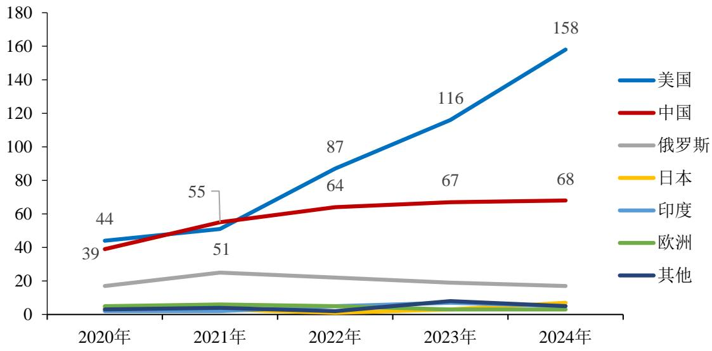  
数据来源：Jonathan's Space Report《Space Activity in 2024》

2024 年全球航天器发射质量分布  
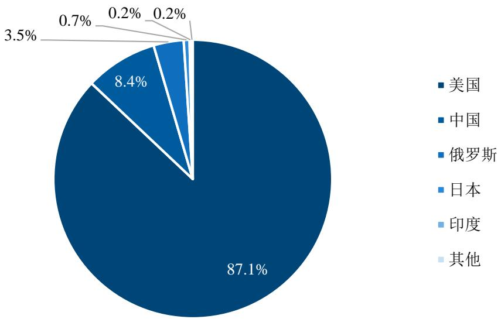  
数据来源：BryceTech《Global Orbital Space Launches in 2024》

# 2）我国航天事业快速发展，2024年商业航天首次被写入政府工作报告

近年来，我国航天事业快速发展，不断取得新的突破。2024 年，中国航天发射活动呈现出蓬勃发展的新态势，取得了令人瞩目的显著成果，全年航天发射次数达到68次，创历史新高并稳居全球第二，航天器发射任务呈现多样化趋势，可回收、可重复使用航天器取得新突破；载人航天领域，继“神舟”十八号、十九号载人飞船发射成功后，“神舟”十七号、十八号顺利返回，空间站科研成果丰硕；深空探测方面迈上新台阶，“嫦娥”六号探测器实现了世界首次月球背面

采样返回。航天事业的快速发展既标志着我国航天技术水平的不断发展，也彰显了我国综合国力的不断提升。

2020-2024 年我国航天发射活动  
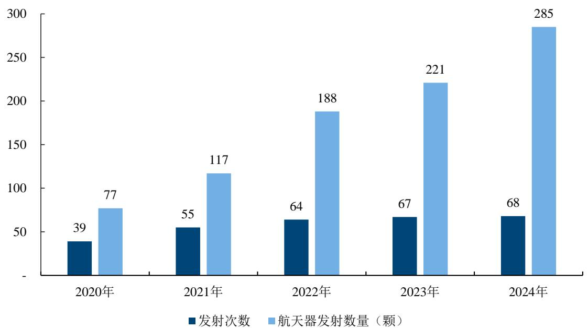  
数据来源：《中国航天科技活动蓝皮书（2023》、BryceTech《Global Orbital Space Launchesin 2024》

在国家政策的大力支持下，中国商业航天发展环境不断完善，商业航天产业迎来蓬勃发展。2015年10月，国家发改委、财政部和国防科工局联合下发《关于印发国家民用空间基础设施中长期发展规划（2015-2025）的通知》，中国航天迈出向商业化转变的关键一步。2020 年发改委首次将卫星互联网纳入国家新基建的范畴，国家对于卫星互联网的政策环境持续优化，统筹推进电信业务向民间资本开放，分步骤、分阶段推进卫星互联网业务准入制度改革。2022 年，国家发改委、商务部印发《关于深圳建设中国特色社会主义先行示范区放宽市场准入若干特别措施的意见》，放宽通信行业准入限制，允许企业在全国范围内开展卫星通信业务。2023年12月，中央经济工作会议强调打造商业航天等战略新兴产业。2024年，商业航天作为新的增长引擎和新质生产力代表，首次被写入《政府工作报告》。2025 年，商业航天再次作为新质生产力和新兴产业的代表被写入《政府工作报告》。

商业航天发射方面，2024 年我国累计发射运载火箭68次，其中商业航天发

射（含拼车和搭载）43次1，约占我国全年发射总数的 $6 3 . 2 \%$ 。2024年，我国商业航天发射场建设取得突破，海南商业航天发射场建成并投入运营，11 月“长征”十二号运载火箭在此完成首飞，成功将“卫星互联网技术试验卫星”与“技术试验卫星”03 星送入预定轨道。这是我国商业航天首次在自主发射场完成发射任务，填补了我国相关领域的空白，彰显了我国商业航天强劲发展势头。

商业卫星研制方面，国内商业卫星研制领域迅猛发展，卫星数量大幅增长。2024年，我国共有201颗商业卫星成功入轨，远超2023年的 120颗。

星座组网方面，国内低轨卫星互联网建设步入正轨，2024 年国内两大巨型低轨卫星星座千帆星座、国网星座分别完成前三批和第一批组网，全年分别发射54颗和10颗组网卫星，随着海南商业航天发射场的首飞、多款可复用商业航天火箭计划发射、手机直连卫星商业化应用的逐步落地，预计 2025 年我国主要星座将进入全面建设阶段，加速组网。

# 3）低轨卫星市场竞争激烈，商业航天相关企业迎来发展机遇

卫星轨道和频段是不可再生的重要战略资源，国际电信联盟（ITU）规定在轨道和频段资源获取上遵循“先登先占”原则，先发国家具有显著优势。中高轨卫星所能提供的通信能力有限，低轨卫星具有高带宽、高性能、低时延、便携、低成本等优势，各国争相布局。目前，美国在轨卫星数量方面较为领先，我国相继启动国网星座、千帆星座等卫星星座计划，并积极引入商业航天力量，低轨卫星互联网成为我国商业航天的重要发展方向。近年来商业航天发展迅速，低轨卫星、一箭多星、火箭回收成重点布局方向，具备相关领域技术优势的企业将抢占发展先机。未来随着一箭多星技术、火箭回收技术的持续突破，火箭发射成本有望进一步降低，商业航天发展将进一步提速，商业航天相关企业将迎来巨大的发展机遇。

# （2）宇航电源行业发展概况

电源分系统是航天器的“心脏”，可为航天器中的用电设备提供电能，目前绝大部分航天器及临近空间飞行器的自主活动都需要宇航电源系统的支持，例如卫星变轨、通讯等。典型的宇航电源系统架构如下（绿色代表公司产品）：

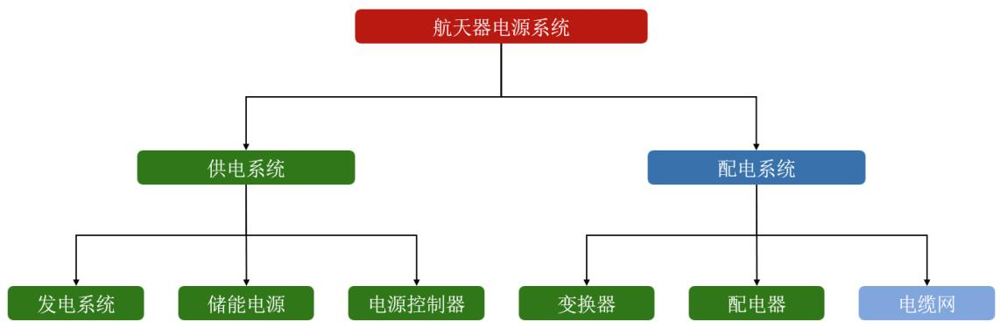

受益于政策的大力支持和空间技术的快速发展，全球航天产业快速发展，火箭发射次数、发射航天器重量屡创新高，航天器电源系统制造产业随之受益。卫星是数量最多的航天器。根据美国卫星产业协会（SIA）的统计数据，2024年全球卫星产业的总收入约为 2,930 亿美元，其中卫星制造业总收入为 200 亿美元，占比 $6 . 8 \%$ 。

2024 年全球卫星产业价值构成  
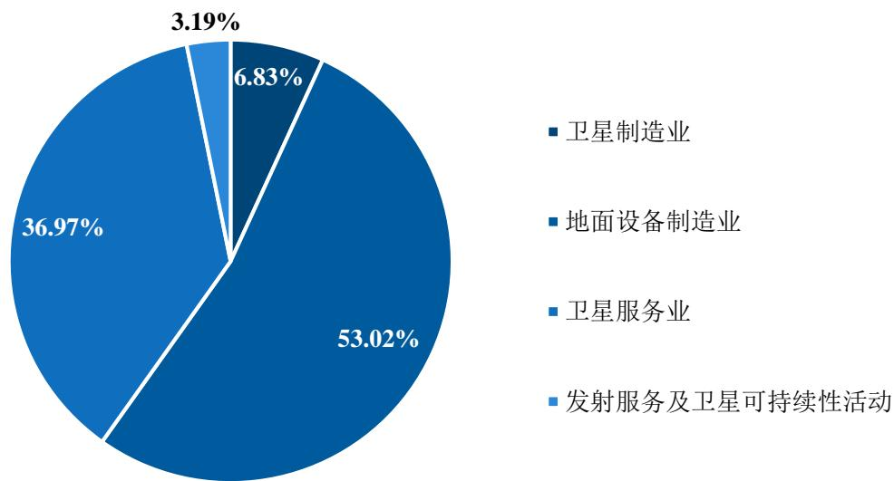  
数据来源：美国卫星产业协会（SIA）

卫星主要由平台和载荷两部分构成，不同卫星因功能不同成本结构差异较大。根据艾瑞咨询数据，定制卫星的平台成本占比约为 $50 \%$ ，批量卫星的平台成本占比约为 $30 \%$ 。

卫星制造成本构成  
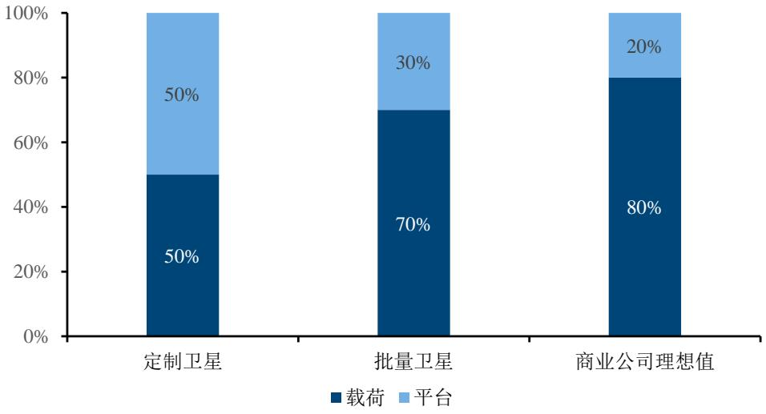  
数据来源：艾瑞咨询《月中霜里斗婵娟：中国商业航天发展报告》

卫星平台又包括姿控系统、电源系统、结构系统、星务系统、测控系统、热控系统。平台的核心作用是为卫星提供机动能力和电力，因此姿控系统和电源系统的成本占比也最大，根据艾瑞咨询数据，姿控系统和电源系统的成本之和约占全卫星平台的 $60 \%$ 以上。

随着我国载人航天工程、探月工程等重大航天工程的深入推进，以及商业航天市场的快速兴起，我国航天产业迎来高速发展期，宇航电源产业将随之受益。

# （3）宇航电源行业未来发展态势

随着航天器功能、性能和可靠性等多方面要求的提高，宇航电源技术及产品的重要性越来越突出，一次电源系统逐渐向大功率、模块化、智能化、轻质高效方向发展，总体电路系统逐步从集中供电向分布式供电、智能配电管理、故障诊断与故障隔离等方向发展；同时，随着微电子技术、电子装联技术、计算机集成制造、电源模块系列化设计制造、机电一体化技术、检测技术等多项技术的发展，宇航电源设备向系统集成化方向发展，按照单元化、组合化的思路，形成集成度高、具有多种功能的综合电子设备，可以有效缩减电源设备的体积和质量，优化系统配置，提高航天器系统整体可靠性和可维护性。

# 1）高压大功率

为适应未来航天器任务需求，电源系统主要面临高压、大功率、高效智能、轻量化、高集成、长寿命、高可靠等关键难题，未来新一代卫星平台的需求推动了电源系统向大功率、智能化和高可靠自主管理的方向发展。航天器的功率需求

在稳步提高，随着功率需求的不断增加，为提高系统效率并降低平台质量，航天器高压供电系统已经成为必然的选择。

当前通信卫星、高分辨率 SAR、空间太阳能电站、空间新型航天器、大型在轨服务站等大功率航天器对能源系统需求不断增强，例如，静止轨道大功率高分辨率 SAR 载荷卫星预计短期功率需求为 $5 0 { \sim } 8 0 \mathrm { k W }$ ；空间新型航天器输出电功率为 $1 0 0 \mathrm { k W }$ ；大功率电推进系统使用功率为 $2 0 { \sim } 5 0 \mathrm { k W }$ ；超大型可重构综合卫星平台总功率不低于60kW；太空发电站演示验证系统功率为 MW级。因此， $5 0 \sim$ $1 0 0 \mathrm { k W }$ 级超大功率电源系统成为未来 $5 \sim 1 0$ 年大功率航天器电源系统的发展趋势。

# 2）智能自主管理

宇航电源系统的功能是为有效载荷和各服务系统提供、配送电能。可靠、充裕的能源供给直接决定着航天器运行期间各设备的正常工作和飞行任务的顺利实施。航天技术的发展、载荷多样化和任务复杂化，对宇航电源系统提出了自主管理功能需求，智能自主管理成为未来航天器电源系统发展的重要方向。随着入轨航天器数量的增多，地面测控人员的工作量和压力越来越大，从降低地面测控压力、减少人为失误考虑，航天器应具备供配电智能管理能力。尤其对于深空探测领域的探测器，由于通信延时长，如“伽利略”号探测器的测控链路往返时延达一个多小时，要求航天器具备自主进行故障管理、故障隔离和故障恢复的能力。

此外，为适应卫星组网的发展需要，特定任务的完成通常需要通过多星联合实现，这也需要卫星具备任务规划及自主管理能力，促使卫星向智能化卫星转变。电源系统自主管理及能源平衡分析是卫星任务规划及自主管理的重要部分，是任务完成的保障。

# 3）复杂任务及环境适应能力

随着航天活动的发展与深入，航天任务更加多样化，对宇航电源系统的各个环节提出了新的要求。除通信、导航等传统航天器用电需求及方式外，随着深空探测、空间太阳能电站、空间在轨服务与维护、空间多器并联组网等新任务的出现，对空间能源综合利用及航天器能源新型提供方式提出了新需求，并促使空间电源系统从发电、存电、传电、变电、用电等各个环节，催生出无线能量传输、

电推进、柔性太阳电池等新型航天器电源技术。

# 4）向小型化、模块化、集约化发展

近年来，微小卫星是航天领域的热点，由于技术的进步及商业航天的蓬勃发展，使微小卫星功能越来越全面，性能得到极大提高，微小卫星应用越来越广泛。根据BryceTech《2025版小卫星数据年报》，2024 年全球发射小卫星 2790颗（质量 ${ \le } 1 2 0 0 \mathrm { k g }$ ），占全年发射航天器总数的 $9 7 \%$ ，占全年发射总质量的 $8 1 \%$ 。为与微小卫星体积、质量及特点相适应，相应电源系统呈现小型化、模块化、集约化发展特点，关键功能及设备模块化设计更加标准化。

# 5）更具可扩展性和可维护性

未来发展的大型航天器，由于规模大、成本高，要求有较长的在轨工作寿命，在其寿命周期内，往往需要根据技术的进步和任务要求的变化，在轨进行扩展和维护，宇航电源作为航天器的重要分系统，需要具备组合连接及在轨维护能力，即电源系统需要具备可扩展性及可维护性。这与当前传统宇航电源系统有较大的不同，在电源系统设计的各个方面都具有很大的挑战，必须通过创新设计实现，具体涉及分布式空间电源系统设计、大功率模块化电源系统设计等，对电源系统发电、存电、变电、用电等各个环节都会产生较大影响，是未来宇航电源系统发展的重要方向。

# 2、特种电源行业发展概况及未来发展态势

# （1）锂电池行业发展概况

# 1）全球锂电池出货量持续增长，动力类规模最大、储能类增速最快

从全球锂电池出货量情况来看，研究机构 EV Tank 联合伊维经济研究院共同发布的《中国锂离子电池行业发展白皮书（2025 年）》数据显示，2024 年，全球锂离子电池总体出货量1,545.1GWh，同比增长 $2 8 . 5 \%$ 。从出货结构来看，2024年，全球汽车动力电池出货量为 1,051.2GWh，同比增长 $2 1 . 5 \%$ ；储能电池出货量 369.8GWh，同比增长 $6 4 . 9 \%$ ；小型电池出货量124.1GWh，同比增长 $9 . 6 \%$ 。

展望未来，EV Tank 预计到 2025 年全球锂电池出货量将达到 1,899.3GWh，2030 年全球锂电池出货量将达到 5,127.3GWh。

2015-2030 年全球锂电池出货量及预测（GWh）  
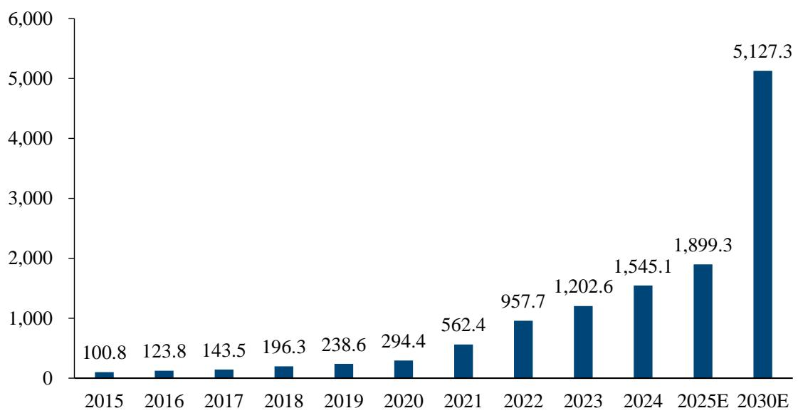  
数据来源：EV Tank

全球锂离子电池产业主要集中在中、日、韩三国，占全球产量的 $9 5 \%$ 以上。从 2015 年开始，在中国大力发展新能源汽车的带动下，中国锂离子电池产业规模开始迅猛增长，2015 年已经超过韩国、日本跃居至全球首位，并逐步拉大差距。

# 2）国内锂电产业延续增长态势，锂电池装机量超 600GWh

从中国锂电池出货情况来看，根据工信部发布的《2024 年全国锂离子电池行业运行情况》，2024 年我国锂离子电池产业延续增长态势，全国锂电池总产量约为 1,170GWh，同比增长 $24 \%$ ，行业总产值超过1.2万亿元。分类型看，2024年动力类、储能类、消费类锂电池产量分别为 826GWh、260GWh、84GWh，锂电池装机量（含新能源汽车、新型储能）超过 645GWh。

2024 年中国锂电池产量构成（单位：GWh）  
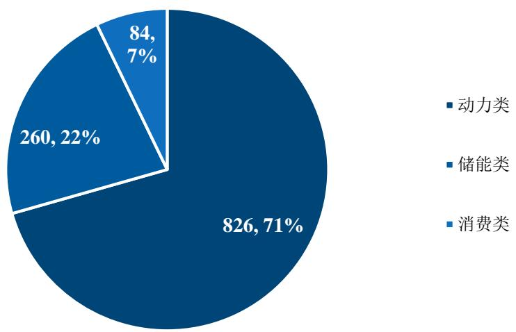  
数据来源：工信部

中国是全球最大的锂离子电池材料生产国。根据《2024 年全国锂离子电池行业运行情况》，在锂电池材料环节，正极材料、负极材料、隔膜、电解液产量分别达到 310 万吨、200 万吨、210 亿平方米、130 万吨，增幅均在 $20 \%$ 以上。其中，正极材料是锂离子电池中成本占比最高的组成部分，正极材料性能直接影响到动力电池的能量密度、安全性、循环寿命、低温性能等核心指标。目前商业化正极材料主要分为三元材料、磷酸铁锂、锰酸锂及钴酸锂等，其中三元材料和磷酸铁锂为并行的两条主流路线。磷酸铁锂材料具备良好热稳定性和较高循环寿命，但放电平台、压实密度等性能较差，目前主要运用在中低续航要求的乘用车、商用车以及储能领域。国内三元材料以镍钴锰酸锂为主，放电平台、能量密度、压实密度较磷酸铁锂更优，但高温性能较差，主要在对续航里程要求高的中高端新能源车型中应用，并在消费电子领域替代了部分钴酸锂的市场份额。

由于储能电池对安全性能要求较高，而对能量密度要求相对较低，预计储能市场在未来的很长一段时间内将以磷酸铁锂为主。

# （2）特种电源行业发展概况

近年来，随着科技的不断进步，普通的电池已经无法满足国防、特种工业等特殊领域的需求，因此市场上出现了专门研制的特种电源。

特种电源行业的发展与国防支出密切相关，军队现代化和信息化建设的提速

将直接刺激特种电源市场需求。近年来我国军费支出保持稳步增长，我国国防支出预算总额增长率保持在 $7 \%$ 左右，2024年国防支出预算总额为 1.67万亿元，同比增长 $7 . 2 \%$ ，高于 2024 年国内生产总值 $5 \%$ 以上的增长目标，彰显了国家对国防建设的重视与决心。

2011-2024 年我国国防支出预算  
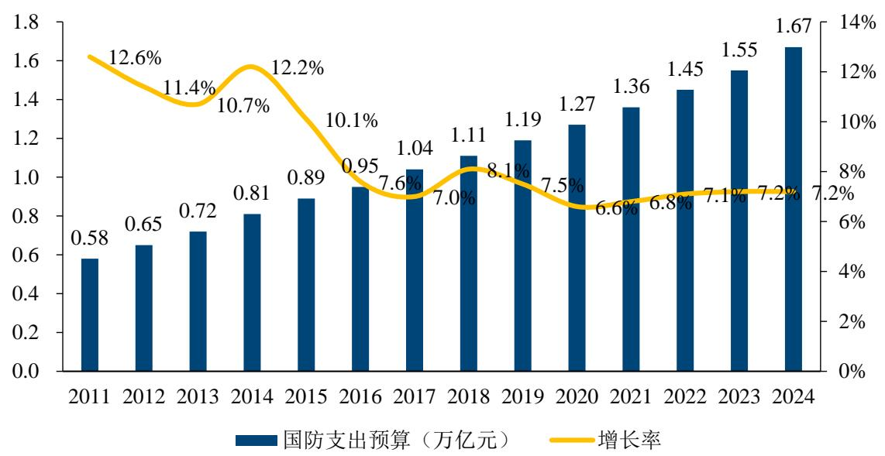  
资料来源：财政部

从国防支出占 GDP 比重、国民人均国防费以及军人人均国防费看，中国是世界上国防费投入相对较低的国家。根据斯德哥尔摩国际和平研究所的数据，近年来，中国国防支出占GDP比重约 $1 . 7 \%$ 左右。而美国、俄罗斯超过 $3 \%$ ，英国、法国、韩国等都超过 $2 \%$ 。作为世界第一人口大国，中国国防预算投入水平依然有增长空间。

军队现代化建设带来武器装备放量、信息化建设促进电子设备用量提升，将共同推动我国特种电源需求快速增长。

# （3）特种电源行业未来发展态势

# 1）固态电池有望成为下一代高性能锂离子电池

固态电池有望成为下一代高性能锂离子电池。动力电池市场是锂电池的重要应用领域，对长续航、高安全动力电池的追求将不断推动锂电市场发展、研发的持续投入和技术的不断革新。目前我国动力电池采用的正极材料已由磷酸铁锂转

向三元体系，逐渐向高镍三元发展，负极材料当前产业化仍集中于石墨、硅基等材料领域。据推测，未来五年锂离子动力电池的单体能量密度有望提高至$3 0 0 \mathrm { W h / k g }$ 以上，但依靠现有的三元体系难以实现电池单体能量密度高于350Wh/kg 的目标。

固态电池或将被上升至国家战略层面，核心技术研发进程将加速。2019 年12月，工信部发布《新能源汽车产业发展规划（2021-2035年）》（征求意见稿），在“实施电池技术突破行动”中，加快固态动力电池技术研发及产业化被列为“新能源汽车核心技术攻关工程”。

与液态锂离子电池不同，固态电池中的固态电解质替代了液态锂离子电池的液态电解质、隔膜。固态电池具有以下优点：第一，固态电池安全性高，降低电池自燃、爆炸风险。固态电池将液态电解质替换为固态电解质，大大降低了电池热失控的风险。半固态、准固态电池仍存在一定的可燃风险，但安全性优于液态锂电池。第二，固态电池能量密度高，有望解决新能源汽车里程焦虑问题。固态电池电化学窗口可达5V以上，高于液态锂离子电池（4.2V），允许匹配高能正极，提升理论能量密度。固态电池无需电解液和隔膜，缩减电池包重量和体积，提高续航能力。电池负极可以采用金属锂，正极材料选择面更宽。第三，固态电池可简化封装、冷却系统，电芯内部为串联结构，在有限空间内进一步缩减电池重量，体积能量密度较液态锂离子电池（石墨负极）可提升 $70 \%$ 以上。液态锂离子电池以并联结构相接，封装复杂且体积庞大；固态电池无漏液风险，可简化冷却系统，电池以多电芯串联结构相接，优化电池封装，电池的体积能量密度大幅提升。

# 2）特种电源的核心竞争力将围绕技术突破和材料创新展开

未来特种电源行业的核心竞争力将围绕技术突破与材料创新展开。一方面，高能量密度、宽温域适应性和长循环寿命成为研发重点。因特种电源应用场景较为特殊，对电源的能量密度、工作温度、抗干扰性、使用寿命等性能要求较高。另一方面，硅基负极、固态电解质等新材料逐渐得到应用。硅基负极的理论容量是石墨的 10 倍，但需通过纳米化和碳包覆技术解决体积膨胀问题；固态电解质则通过消除液态电解液的易燃性提升安全性，并支持更高电压正极材料的使用，如富锂锰基材料可将单体电压提升至 4.5V以上。

# 3）多元化需求催生新增长点

特种电源的应用场景正从航空航天、传统军工领域向特种工业和新兴领域快速扩展。目前，军事与极端环境应用仍是核心领域，无人机、水中装备、特种车辆、携行装备等装备对电源的工作温度范围、轻量化、抗干扰性等性能要求苛刻，核心组件自主化加速。在特种工业领域，特种锂离子电池广泛应用于工业移动机器人（AGV），在中国制造 2025 等国家战略的推动下，我国 AGV 机器人出货量和市场规模持续增长，根据高工机器人产业研究所（GGII）数据，2022 年国内移动机器人市场规模约为96.73亿元，预计2027年市场规模将达462.47亿元。此外，特种电源还广泛应用于高效清洁能源的推广应用、高端装备、新能源汽车、数字经济等新兴战略产业和人工智能、低空经济等新质生产力领域。

# 3、新能源应用及服务行业发展概况及未来发展态势

# （1）储能行业发展概况及未来发展态势

# 1）储能行业发展概况

在全球碳中和的大背景下，能源转型在世界范围内已呈现不可逆趋势，在此基础上，全球储能市场也步入了飞速发展的阶段。根据 EESA（储能领跑者联盟）发布的《2025 中国新型储能行业发展白皮书》，2017 年以来，全球储能装机量保持高增长态势，近五年（2019-2023）平均增速为 $9 3 \%$ ，2024年全球储能新增装机规模达到188.5GWh，同比增长 $82 \%$ 。

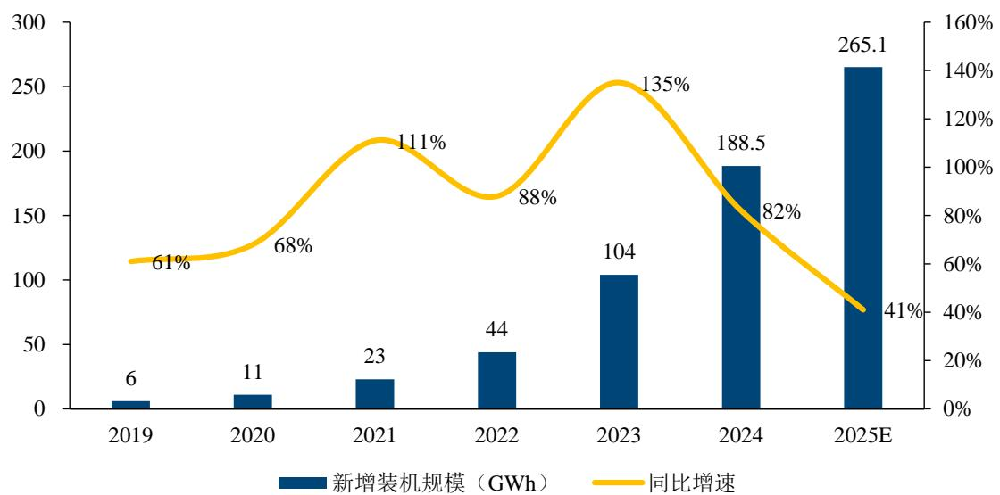  
2019-2025 年全球储能市场新增装机规模及增速

数据来源：EESA，《2025 中国新型储能行业发展白皮书》

中国、美国和欧洲三个主要地区占全球新增装机的 $8 5 \%$ 以上，是推动全球储能市场发展的重要力量。中国储能新增装机规模已连续三年超过美国，是全球储能市场新增占比最高的国家。根据 EESA 统计，2024 年中国储能市场新增装机规模达到了107.1GWh，约占全球储能市场新增装机规模的 $40 \%$ ，远超美国、欧洲、亚太等其他主要地区。中国储能市场在“十四五”期间增速迅猛，2019-2024年间新增装机规模复合增速达 $146 \%$ ，2024年新增装机规模同比增长 $1 0 9 . 5 \%$ 。

2019-2024年中国储能市场新增装机规模及增速  
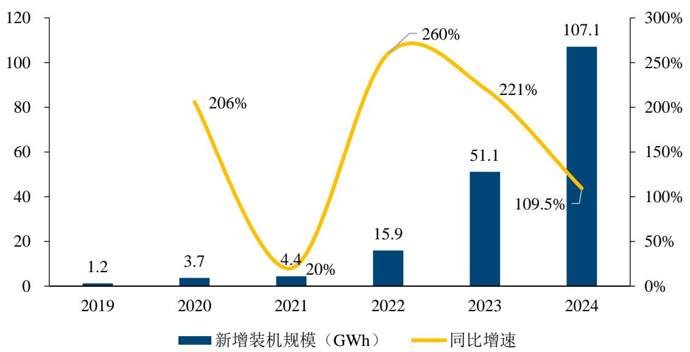  
数据来源：EESA，《2025 中国新型储能行业发展白皮书》

从应用场景看，源网侧（电源侧 $^ +$ 电网侧）占据国内储能市场的主要地位，按照装机能量口径统计，2024 年国内源网侧储能新增装机规模占比高达 $9 2 . 3 \%$ ；用户侧储能新增装机规模占比为 $7 . 7 \%$ ，其中工厂配储是最主要的场景。

2024 年国内新能源市场规模持续提升，随着新能源大基地配储需求的增加以及产业链降本的持续，源网侧储能新增装机同步上涨。根据 EESA 统计，2024年中国源网侧储能新增装机 98.9GWh，同比增长近 $1 1 3 . 2 \%$ 。市场空间方面，尽管2025年初“强制配储”政策取消，但前期政策推动的存量项目仍在陆续释放；此外碳中和背景下，预计我国新能源装机占比还将大幅提升，仍需配套储能解决波动性问题，因此电源侧储能需求长期存在；随着新能源占比提升，电网对可快速响应的调节性资源依赖度增加，2025 年辅助服务市场的规模扩大将直接刺激电网侧装机。根据EESA预计，2025年源网侧储能新增装机量预计可达132.3GWh，

较 2024 年增长 $34 \%$ 。

我国用户侧储能处于起步阶段，根据 EESA 统计，2024 年中国用户侧储能新增装机8.2GWh，同比增长超过 $72 \%$ 。当前中国用户侧储能主要以工商业储能为主，近五年工商业储能总体呈上升态势。市场空间方面，根据 EESA预计，2025年工商业储能新增装机量预计为 12.5GWh。

# 2）储能行业未来发展态势

钠离子电池有望广泛应用于储能。目前电化学储能路线中，锂离子电池尤其是磷酸铁锂电池占据主要市场，钠离子电池虽然现阶段仅有初步应用，但其原材料来源广泛、安全性高、低温性能好，具有不断提升的发展空间。

钠离子电池是一种新型二次电池，其组成结构、工作原理以及生产工艺均与锂离子电池类似，相较于锂离子电池，钠离子电池具备较高的安全性、优异的低温性能以及显著的成本优势。在安全性方面，钠离子电池在过充、过放、短路、针刺、挤压等测试中均不会发生起火与爆炸。在低温性能方面，钠离子电池在- $\cdot 2 0 ^ { \circ } \mathrm { C }$ 下容量保持率大于 $8 8 \%$ 。磷酸铁锂电池和钠离子电池的性能对比如下：

<table><tr><td>项目</td><td>磷酸铁锂电池</td><td>钠离子电池</td></tr><tr><td>质量能量密度（Wh/kg）</td><td>120~200</td><td>70~200</td></tr><tr><td>循环寿命（次）</td><td>&gt;3,000</td><td>&gt;2,000</td></tr><tr><td>低温性能</td><td>差</td><td>优</td></tr><tr><td>高温性能</td><td>较差</td><td>优</td></tr><tr><td>安全性</td><td>较高</td><td>高</td></tr></table>

数据来源：中国知网《钠离子电池争雄》武魏楠，天风证券研究所

钠资源地壳丰度更高，供应链稳定性更强。钠元素是地壳中储量第六丰富的元素，其含量达到 $2 . 7 5 \%$ ，而锂的含量只有 $0 . 0 0 6 5 \%$ ，钠元素的含量是锂的上千倍。此外钠元素的地理分布均匀，成本低廉。相比较锂资源来讲，钠资源在供应链稳定性方面具有较强的优势。钠元素的高丰度、低成本能够确保未来资源获取更为便利，有利于钠离子电池的产业发展，也有利于降低我国对国外锂矿资源的依赖。

国家政策大力支持钠离子电池在储能领域的发展。2021 年10月工信部在答复《关于在我国大力发展钠离子电池的提案》中表示，锂离子电池、钠离子电池

等新型电池作为推动新能源产业发展的压舱石，是支撑新能源在电力、交通、工业、通信、建筑、军事等领域广泛应用的重要基础，也是实现碳达峰、碳中和目标的关键支撑之一。2022 年 1 月，国家发改委、国家能源局印发《“十四五”新型储能发展实施方案》，提出推动多元化技术开发，研究开展钠离子电池技术试点示范。2022 年 7 月，工信部正式下达首批钠离子电池行业标准计划。2023年1月，工信部、教育部、科技部等六部门印发《关于推动能源电子产业发展的指导意见》，提出加强新型储能电池产业化技术攻关，推进先进储能技术及产品规模化应用，加快研发固态电池、钠离子电池、氢储能/燃料电池等新型电池。在相关政策的支持下，国内钠离子电池的产业化进程在紧锣密鼓推进中。

目前，钠离子电池的性能还有待提升。电池的性能参数主要包括电池能量密度和循环次数等。在能量密度方面，目前主流的钠离子电池为 $1 4 0 \mathrm { W h / k g }$ ，低于磷酸铁锂电池。在循环次数方面，磷酸铁锂电池目前最高可实现 10,000次循环，可保证其在储能全生命周期具备经济性，目前钠离子电池一般可循环充放约2,000次，如果应用在储能领域，循环性能有待大幅提升。

# （2）光伏行业发展概况和未来发展态势

2013 年，国务院、国家能源局陆续发布《关于促进光伏产业健康发展的若干意见》《关于发挥价格杠杆作用促进光伏产业健康发展的通知》，明确光伏补贴正式转为度电补贴，此后，我国太阳能发电装机规模迎来爆发式增长，光伏发电新增装机容量连续多年稳居世界第一。目前，全球已有 130 余个国家提出了“零碳”或“碳中和”目标，加速清洁能源转型、实现绿色低碳发展成为全球趋势，光伏行业需求旺盛。根据IEA的数据，2024年全球光伏装机容量达到599GW，同比增长 $43 \%$ 。根据国家能源局数据，2024 年中国光伏并网发电年新增装机达到 277.57GW，同比增长 $2 8 . 3 \%$ ，光伏已成为中国装机规模仅次于火电的第二大发电来源。

2015-2024 年中国光伏新增装机规模及增速  
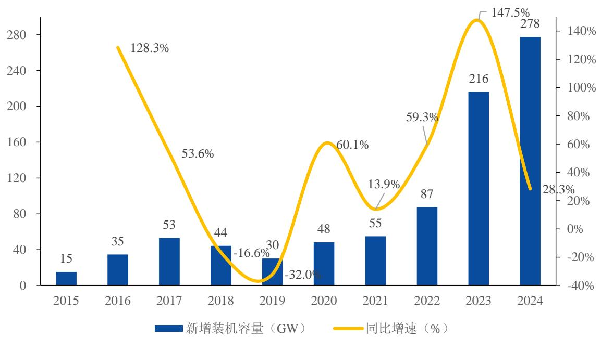  
数据来源：国家能源局

光伏行业的技术与规模竞争较为激烈，产业链各环节呈现出以技术创新主导的“降本提效、结构优化”发展态势。在中上游硅片、电池、组件各环节新技术持续应用的驱动下，光伏系统的单位功率投资成本持续下降，对包括 EPC 集成商在内的各环节参与者的技术能力、资金实力、规模效应等都提出了更高要求。

# （3）电源检测行业发展概况和未来发展态势

检验检测服务是通过专业技术手段对检验检测对象进行的检测、检验、测试、鉴定等活动，还包括产品质量、计量、认证和标准的管理活动。下游广泛覆盖军工、电子电器、装备制造、环保、农业、食品、建筑工程等领域。根据国家市场监督管理总局的数据，2024 年全国检验检测市场规模约 4,876 亿元，2022-2024年复合增长率约 $6 . 0 \%$ ；其中电子电器检测市场规模约 289.4 亿元，2022-2024年复合增长率约 $9 . 1 \%$ 。

电源检测包括物理电源检测和化学电源检测，当前主流的物理电源主要为各类太阳电池，包括广泛用于地面发电的硅基太阳电池和应用于航天等特殊领域的砷化镓太阳电池等；主流的化学电源主要为锂电池，广泛应用于动力、储能和消费领域。根据需求领域划分，可分为军用电源检测和民用电源检测（主要包括消费类电源检测、动力电池检测、储能检测等）、强检认证类和研发验证类检测等

细分市场。伴随国防信息化、汽车电动化和智能化以及能源绿色转型的发展趋势，相关领域技术和产品迭代不断加速，同时《电动汽车用动力蓄电池安全要求》（GB38031-2025）、《电能存储系统用锂蓄电池和电池组安全要求》（GB 44240-2024）等国家标准对电源检测提出了更加细化、严格的规定，军用电源检测、动力电池检测、储能检测等高标准、高附加值的检测需求持续增长。

# （四）行业技术水平及特点

# 1、宇航电源行业

宇航电源系统因使用环境极为特殊，往往面临着极端的温度变化、压力和强辐射，因此对于电源有很高的要求。从产品类别来看，宇航电源系统包括一次性电源、核电源、燃料电池、太阳能热动力系统、太阳电池阵——蓄电池组电源系统等，对比情况如下表所示：

<table><tr><td>种类</td><td>简要介绍</td></tr><tr><td>一次性电源</td><td>主要有锌银电池组和亚硫酰氯电池，用于短期的主电源或应急、火工品点火辅助等</td></tr><tr><td>核电源</td><td>主要有放射性同位素温差发电机、核反应堆温差发电机和核反应堆热离子发电器三种，适用于光强低、核辐射、空间攻防、轨道机动和深空探测等</td></tr><tr><td>燃料电池</td><td>主要为采用质子交换膜的氢氧燃料电池，可作为大功率短期飞行任务航天器的主电源</td></tr><tr><td>太阳能热动力系统</td><td>采用的是热能-机械能-电能的转化方式，但系统十分复杂，目前较少使用</td></tr><tr><td>太阳电池阵——蓄电池组电源系统</td><td>由太阳电池阵、蓄电池组、电源控制设备等三部分组成：太阳电池阵通过光伏效应把太阳能转换为直流电，并由电源控制设备完成分流、稳压调节、充电控制等功能，向航天器各种载荷供电并对蓄电池组充电</td></tr></table>

目前，太阳电池阵——蓄电池组电源系统是绝大多数在轨航天器使用的电源系统类型，也是临近空间飞行器使用最广泛的电源系统类型，下文分析的宇航电源系统包括航天器电源系统和临近空间飞行器电源系统。

太阳电池阵——蓄电池组电源系统通常由空间太阳电池阵（太阳翼）、空间锂离子电池组、电源控制设备等三类单机构成。

# （1）空间太阳电池阵

空间太阳电池阵是由许多太阳电池组成的阵列，可以将空间轨道的太阳光能转化为电能，以供航天器使用，是航天器电源分系统的主电源。

太阳电池是利用光伏效应将太阳能通过半导体物质转变为直流电能的一种器件，应用于太空的太阳电池被称为空间（用）太阳电池。与地面光伏电池追求规模制造和低成本不同的是，空间太阳电池的核心价值在于极致的性能与可靠性，是卫星、空间站和深空探测器等各类航天器的生命线。

在宇航电源发展史上，作为主电源的太阳电池阵经历了硅太阳电池——单结砷化镓太阳电池——多结砷化镓太阳电池——薄膜砷化镓太阳电池的四次革新。

<table><tr><td>时间</td><td>空间太阳电池主要技术特点</td></tr><tr><td>20世纪80年代以前</td><td>航天器主要采用硅太阳电池作为太阳电池阵的发电单元，它具有工艺成熟、生产成本低、机械强度高等优点，通过工艺技术改进，空间用硅太阳电池的光电转化效率从早期的12.3%至提升到15%以上。</td></tr><tr><td>20世纪90年代</td><td>单结砷化镓电池开始取代硅电池作为航天器的基本发电单元。相较于硅材料，砷化镓的带隙宽度为1.42eV，与太阳光谱的匹配程度高，单结砷化镓电池光电效率可达25%，具有耐高温、耐辐照性能更佳、光电转化效率更高等特点。</td></tr><tr><td>21世纪以来</td><td>随着金属有机化合物化学气相沉积（MOCVD）、隧穿结串联等技术的发展，三结砷化镓太阳电池实现工程化量产和空间应用。相比于单结砷化镓电池，三结砷化镓电池具有光电转化效率高、空间环境适应性好、不同子电池层晶格匹配性强等特点。
目前，发行人广泛使用三结砷化镓电池制造太阳电池阵，并研制了基于柔性薄膜砷化镓太阳电池的全柔性太阳电池阵。</td></tr></table>

空间太阳电池阵按基板类型，可分为刚性太阳电池阵、半刚性太阳电池阵以及柔性太阳电池阵。

# 1）刚性太阳电池阵

刚性太阳电池阵由刚性基板和刚性太阳电池组成，采用铝蜂窝夹层结构基板作为承载结构，基板厚度为 $2 0 { \sim } 3 0 \mathrm { m m }$ ，表面贴装太阳电池，太阳翼质量比功率约为 $7 0 { \sim } 1 0 0 \mathrm { W / k g }$ ，收拢体积比功率约为 $4 \mathrm { k W } / \mathrm { m } ^ { 3 }$ 。目前，国内外通信、导航遥感等领域的大多数航天器均使用了这种技术成熟度高、可靠性高的太阳电池阵技术。

对于整个系统来说，刚性太阳电池阵的基板及展开机构等机械部分在太阳翼的质量占比超过 $50 \%$ ，同时，由于铝蜂窝基板较厚并且在收拢状态下太阳电池板之间需要留有 $2 0 \mathrm { m m }$ 左右的安全间距，收纳体积较大。因此，刚性太阳电池阵的质量比功率和体积比功率相对较低。

# 2）半刚性太阳电池阵

半刚性太阳电池阵利用高强度框架和纤维网格作为基板，将太阳电池封装成为电池模块后与基板进行安装连接。俄罗斯的卫星多采用半刚性太阳电池阵，例如“和平号”空间站、天空实验室（Skylab）等。我国的天舟系列货运飞船、天宫目标飞行器以及东方红五号卫星公用平台采用的也是半刚性太阳电池阵技术。

半刚性太阳电池阵由于基板的网格结构特点，电池背面无刚性基板覆盖，散热性能更好，电池在轨工作时温度更低、输出功率更高。半刚性基板通常采用碳纤维材料框架，相对较轻，质量比功率较刚性太阳阵有所提高，可达到$7 5 { \sim } 1 2 0 \mathrm { W / k g }$ ，但体积比功率和刚性阵大致相同。另外，半刚性太阳阵背面为网格结构，可以采用双面太阳电池来充分利用地球对太阳的反射光发电，提高太阳阵单位面积的输出功率。

# 3）柔性太阳电池阵

柔性太阳电池阵是采用复合薄膜结构作为基板，与刚性、半刚性太阳电池阵在收拢状态下基板之间需留有间距不同，柔性阵在收拢状态下，每块基板均处于贴合压紧状态，对于大面积太阳阵来说，其收拢体积可以减少至刚性阵的 1/10左右。根据收拢展开方式不同，柔性太阳电池阵主要包括三种形式，分别是手风琴式、扇形展开式以及卷绕展开式。三种柔性太阳电池阵的主要区别如下：

<table><tr><td>种类</td><td>技术特点</td><td>实际应用案例</td></tr><tr><td>手风琴式柔性太阳电池阵</td><td>由太阳电池组件、聚酰亚胺薄膜基板及伸展机构组成,基板以“Z”型折叠的方式收拢在一起,入轨后在展开机构带动下顺序展开</td><td>典型的应用案例是国际空间站太阳电池阵,有4对共8个太阳电池翼,单翼的展宽大于70m,整个太阳电池阵的面积超过2,400m2,发电总功率75~90kW,中国空间站也使用该项技术</td></tr><tr><td>扇形展开式柔性太阳电池阵</td><td>结构类似于我国传统的折扇,展开后形成接近于圆形的多边形。该结构特点使得太阳电池阵在展开刚度/强度、收拢体积比功率等方面具有明显优势,其质量比功率可达175W/kg以上,体积比功率达到33kW/m3</td><td>高收纳比的特性使其在深空探测等航天任务中有较为明显的技术优势,例如美国的“天鹅座”空间站补给飞船、“凤凰号”火星探测器等均使用了该项技术</td></tr><tr><td>卷绕展开式柔性太阳电池阵(ROSA)</td><td>近几年发展起来的一种新型柔性太阳电池阵技术,整机类似于中国的卷轴画。这种方式的太阳电池阵具有高质量比功率、高收纳比、可卷绕等特点</td><td>2021年6月部署在国际空间站;商业化方面应用在Ovzon-3通信卫星等</td></tr></table>

中国空间站搭载了发行人研制的手风琴式柔性太阳电池阵。在发射过程中，

柔性太阳电池阵如同合拢的手风琴收缩于舱内，单板厚度不足 1mm，且单位面积重量仅为传统太阳电池阵的一半。在天和、问天、梦天三舱组合后，中国空间站的柔性太阳电池阵总发电面积接近 400平方米，发电总功率超过 100kW。

# （2）空间锂离子电池组

空间锂离子（蓄）电池组主要作为各类空间飞行器的储能电源，其作用是通过将空间太阳电池阵转化的电能存储并对外输出，确保飞行器的能源供应。

太空环境极为特殊，往往面临着极端的温度变化、压力和强辐射，对于空间锂离子电池在环境温度、使用寿命、抗冲击等方面存在特殊要求。因此，国内空间锂电池要满足一系列国家军用标准，包括空间用锂离子蓄电池详细规范（GJB6789/1-2017）等，与地面用锂电池存在较大差异，需要在电极材料选择、电解液配方、电芯结构设计等方面采用与地面用锂离子电池不同的方案。空间蓄电池与普通民用蓄电池的差异如下：

<table><tr><td>差异</td><td>空间蓄电池</td><td>普通民用蓄电池</td></tr><tr><td>环境温度</td><td>可工作在-40℃</td><td>一般工作在-20℃以上</td></tr><tr><td>使用寿命</td><td>上万次循环寿命</td><td>一般400~1000次循环寿命</td></tr><tr><td>抗冲击</td><td>抗冲击能力是普通民品的100~1000倍</td><td>/</td></tr><tr><td>技术途径差异</td><td colspan="2">电极材料、电解液配方、电芯结构设计、质量管理体系控制要求等</td></tr></table>

数据来源：中信建投证券研究所

空间蓄电池的技术发展经历了镍镉电池、氢镍电池和锂离子电池的三代历程。锂离子电池具有体积小、充放电效率高、无记忆效应、热效应小、自放电小等优点，锂离子电池的质量只是同等容量镍镉电池、氢镍电池的一半，体积也比后两者分别小 $40 \% { \sim } 5 0 \%$ 和 $20 \% { \sim } 3 0 \%$ ，选择锂离子电池作为航天器的储能电源，可以有效减小航天器供电系统的质量和体积，不但能够满足航天器对于电源系统越来越高的要求，同时也达到了提高有效载荷、减轻航天器发射质量的目的，从而可以产生明显的经济效益。因此，目前锂离子电池逐渐占据了空间蓄电池的主导地位。三类空间蓄电池的典型性能水平对比如下：

<table><tr><td>项目</td><td>锂离子电池</td><td>氢镍电池</td><td>镍镉电池</td></tr><tr><td>质量比能量(Wh/kg)</td><td>125</td><td>60</td><td>30</td></tr><tr><td>体积比能量(Wh/L)</td><td>300</td><td>90</td><td>150</td></tr><tr><td>能量效率(%)</td><td>96</td><td>70</td><td>72</td></tr><tr><td>记忆效应</td><td>无</td><td>轻微</td><td>有</td></tr><tr><td>能量计量/监测</td><td>电压</td><td>内部气压</td><td>无</td></tr><tr><td>自放电(%/d)</td><td>0.3</td><td>5~7</td><td>1</td></tr></table>

数据来源：《空间飞行器用锂离子蓄电池储能电源的研究进展》，中信建投证券研究所

目前，空间锂离子电池从结构上分类主要有圆柱形、方形和椭圆形三种。各类锂离子电池技术特点及应用场景如下：

<table><tr><td>类型</td><td>技术特点</td><td>主要应用对象</td></tr><tr><td>圆柱形</td><td>外形结构稳定，电芯采取卷绕成型结构，圆柱面径向360°受力均匀，电池壳体长期保持稳定</td><td>高轨道卫星、中轨道卫星、低轨道卫星</td></tr><tr><td>方形</td><td>相对于圆柱形电池能量密度大，但电池外形结构稳定性较差</td><td>高轨道卫星、火星探测器</td></tr><tr><td>椭圆形</td><td>电池电芯为卷绕式椭圆结构，壳体兼具方形属性，有利于提升蓄电池组的体积利用率</td><td>国际空间站、隼鸟1号探测器（HAYABUSA）、空间环境可靠性验证集成系统1号（SERVIS-1）卫星、泰国通信4号（ThaiCom-4）卫星等</td></tr></table>

# （3）电源控制设备

空间用电源控制设备具体包括电源控制器、配电器、变换器等多类设备。在太阳电池阵—蓄电池组电源系统架构中，空间太阳电池阵、空间蓄电池组之间，通过电源控制设备调节功率以产生稳定的母线：当太阳电池阵能够提供充足的功率，电源控制设备可以控制对蓄电池组充电；当太阳电池阵输出功率不足或阴影期输出为零时，电源控制设备可以控制蓄电池组对母线放电。

此外，为了满足部分航天器在轨正常工作 15 年以上的寿命指标，电源控制设备需要对空间锂离子蓄电池组进行有效的管理。例如过高或过低的空间环境温度会严重削弱锂离子蓄电池组的工作性能；过充电也会降低锂离子蓄电池组的工作寿命。采用健康合理的充电方式，不仅可以实现锂离子蓄电池组的可靠充电，也有助于延长其工作寿命。

# 2、特种电源行业

特种锂离子电池是指市场流通很少、应用于少数特殊领域、需要定制而且存在采购门槛的锂离子电池，主要包括以下几类：异形体积、特殊材料、特种用途（国防、特种工业等），满足上述特征的电池都属于特种锂离子电池。与普通民

用锂离子电池相比，特种锂离子电池一般有工作温度范围更宽、低温放电倍率更高、充电速度更快与防爆功能更好等性能优势。由于特种锂离子电池的特殊定制要求，特种锂离子电池产品的生产工艺要求比普通锂离子电池更加严苛。

以特种低温锂离子电池为例，其主要特点就是在例如- $. 4 0 ^ { \circ } \mathrm { C }$ 低温下容量充足、正常工作，因此要求电池在0.2C倍率放电时能够达到额定容量的 $80 \%$ 以上。

国防装备中，以野外作战中使用的战术携行装备（如通信、指挥、侦察和定位等设备）为例，其锂离子电池要能够满足多种使用模式（手持、背负、穿戴和搬移等）下的设备用电需求。得益于特种锂离子电池的优良性能，锂离子电池逐渐成为各国军队使用的重要电池。高倍率特种锂离子电池不但降低了约 1/3 的设备负重，提高了特种战术操作的灵活性和机动性，还可将设备的工作时间延长2~3倍，最大限度地保障了单次野外任务完成的时效性和可靠性。同时，在锂离子电池具备了高倍率充电能力的前提下，电流越大，充电时间越短，越有利于特种应急任务的执行。

除携行装备外，特种锂离子电池还广泛应用于特种无人机、水中装备、特种混合动力车辆等其他国防装备。在智慧工厂、智能制造行业中，特种锂离子电池应用于AGV等领域。

相较于普通电池，燃料电池具有能量密度高、燃料来源广泛的优势，可广泛应用于航空航天、国防、交通运输、分布式发电等领域。

# 3、新能源应用及服务行业

# （1）电化学储能行业

储能技术可分为物理储能和化学储能两大类。其中，物理储能包括抽水蓄能、压缩空气储能、重力储能和飞轮储能等，化学储能包括锂离子电池、钠离子电池、液流电池、铅炭电池和氢储能等。

电化学储能作为电能存储的重要方式，具有功率和能量可根据不同应用需求灵活配置、响应速度快、不受地理资源等外部条件的限制、适合大规模应用和批量生产等优势，使得电化学储能在新能源领域有着不可替代的地位。从各种储能形式的综合性能对比，电化学储能在使用效率、布局灵活性、循环寿命、投资成本等方面具有综合优势，是目前最适合规模化发展的储能形式。

电化学储能有多种形式，主要包括磷酸铁锂、三元、钛酸锂、铅酸、铅炭、液流等电池储能。电化学储能的容量和抽水蓄能等储能形式相比不具备优势，因此电池的倍率性能、循环寿命非常重要，磷酸铁锂电池凭借在这些方面的优异性能以及相对较低的成本，成为目前较为主流的电化学储能形式。

电化学储能系统主要由电池组、储能变流器（PCS）、电池管理系统（BMS）、能量管理系统（EMS）、温控（通风、制冷）系统、照明系统、消防系统以及管理控制系统和其他软硬件系统等构成。其中，电池组在储能系统中成本占比最高，往往在 $5 0 \% { \sim } 6 0 \%$ 左右，电池成本直接决定了储能系统在成本上的竞争力。

电化学储能系统主要构成  
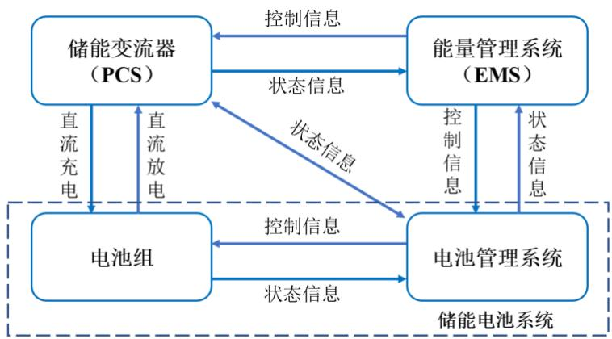  
资料来源：申港证券研究所

储能应用场景丰富，主要可分为发电侧、电网侧和用户侧三类，2024 年国内源网侧储能新增装机规模占比高达 $9 2 . 3 \%$ ，用户侧储能新增装机规模占比为$7 . 7 \%$ 。发电侧对储能的需求场景类型较多，包括可再生能源并网、电力调峰、系统调频等，可以改善新能源输出与负荷在时间和空间上的不平衡性，减少弃风弃光，提高新能源消纳能力；电网侧储能主要发挥支撑电力保供、提升系统调节能力、支撑新能源高比例外送以及替代输配电工程投资等作用，能够减少对电网扩容的需求，降低电网建设成本，提高电网安全性与稳定性；用户侧储能主要用于电力自发自用、峰谷价差套利、容量电费管理和提高供电可靠性等。

# （2）电源检测行业

电源检测包括物理电源检测和化学电源检测。目前主流的物理电源是各类太阳电池，包括应用广泛的硅太阳电池和应用于航天等特殊领域的砷化镓太阳电池等；主流的化学电源是锂电池，广泛应用于动力、储能和消费领域，包括磷酸铁

锂电池和三元锂电池等。

锂电池作为新能源汽车和储能系统的核心，仍存在需要迫切解决的技术痛点，主要集中在安全性、充电时间、循环次数等方面。另外，随着锂电池技术发展日新月异，产业界对不断涌现的新材料和新体系需要进行快速的测试评估，各企业对电池设计验证测试越来越重视。近年来锂电池市场渗透率和出货量持续上升，带动锂电池检测服务行业的快速发展。动力储能电池检测市场可以划分为强检认证类和研发验证类两大细分检测市场。一方面，由于国家市场监管总局对锂离子电池等产品实施强制性产品认证管理，强检认证类检测市场具有相对稳定的规模。另一方面，新能源行业各企业积极推进新材料和新体系研发，新的技术和产品衍生出较强的研发验证类检测市场需求，推动了研发验证类检测市场的蓬勃发展。2023 年，研发验证类检测市场规模占检测市场总规模的 $80 \%$ 左右。随着新能源行业发展逐步进入稳定发展期，强检认证类检测市场占比将呈现逐渐下降趋势，研发验证类检测市场规模占比将进一步增加。

# （五）行业进入壁垒

# 1、技术壁垒

航天和国防军工等领域对于电源产品的使用环境较为特殊，对电源产品性能和可靠性的要求相对苛刻，因此相关技术壁垒较高，目前国内有能力研发生产相关电源产品的厂商较少。以砷化镓太阳电池阵为例，不同于市场上常见的晶硅光伏组件，砷化镓太阳电池阵具有重量轻、转化效率高、耐温性好、有效发电时间长等优点，研制难度和生产成本都更高。

公司长期为我国多个重大航天工程型号提供砷化镓太阳电池阵，积累了丰富的空间应用经验，攻克了大量空间技术难题，不断迭代优化相关技术。此外，公司积极推进空间锂离子电池技术的地面应用，研制的特种锂离子电池继承了空间锂离子电池的长寿命、高安全的优点，并进一步提升了比能量、比功率和耐低温特性。

行业外部的企业由于缺乏相关经验，短期内难以解决太空和国防等复杂使用环境下的种种技术难题，因此进入相关行业存在较高壁垒。

# 2、品牌和客户壁垒

航天、国防军工、新能源领域的客户高度重视产品性能及可靠性，因此供应商的品牌效应和经验积累成为进入行业的主要壁垒之一。

公司长期深耕电能源行业，积累了深厚的品牌优势。自 1970 年为我国第一颗人造卫星“东方红一号”提供电源产品以来，截至报告期末，公司已为神舟系列飞船、天舟系列飞船、空间站“天和”核心舱、“问天”/“梦天”实验舱、北斗导航、嫦娥系列探月卫星、探火工程、千帆星座、国网星座等国家与国防多个重大工程在内的700余颗卫星/飞船/探测器/空间站提供了优质可靠的电源产品，长期服务于航天科技集团、特定客户 12 等国内知名总体单位，经过多年积累取得了总体单位、国防军队等用户的高度认可，与客户建立了长期、深入的合作关系。

行业外部的企业由于缺乏品牌积累，如果选择进入相关行业会面临客户对品牌的信任度不够等挑战。

# 3、资质壁垒

公司具备军工业务资质，部分下游客户涉及国防军工领域。按照我国相关法律法规，生产单位须获得参与军品生产所需的军工业务资质，方能开展相关生产活动。对于潜在的市场进入者，行业外部的企业从事军品相关业务所需的资质要求较高。

# （六）行业面临的机遇与挑战

# 1、行业面临的机遇

# （1）国家政策大力支持

公司下游行业属于国家鼓励发展的战略新兴产业，国家产业政策的大力支持为航天、国防军工、新能源等产业确立了未来发展方向并营造了良好发展环境。

《中华人民共和国国民经济和社会发展第十四个五年规划和 2035 年远景目标纲要》明确提出：推动集成电路、航空航天、船舶与海洋工程装备、机器人、先进轨道交通装备、先进电力装备、工程机械、高端数控机床、医药及医疗设备等产业创新发展……打造全球覆盖、高效运行的通信、导航、遥感空间基础设施

体系，建设商业航天发射场……聚焦新一代信息技术、生物技术、新能源、新材料、高端装备、新能源汽车、绿色环保以及航空航天、海洋装备等战略性新兴产业，加快关键核心技术创新应用，增强要素保障能力，培育壮大产业发展新动能……加快武器装备现代化，聚力国防科技自主创新、原始创新，加速战略性前沿性颠覆性技术发展，加速武器装备升级换代和智能化武器装备发展。

在航天领域，建设航天强国是国家整体发展战略的重要组成部分，《2021中国的航天》提出：未来五年，中国航天将立足新发展阶段，贯彻新发展理念，构建新发展格局，按照高质量发展要求，推动空间科学、空间技术、空间应用全面发展，开启全面建设航天强国新征程。2023 年 12 月，中央经济工作会议强调打造商业航天等战略新兴产业。2024 年，商业航天作为新的增长引擎和新质生产力代表，首次被写入《政府工作报告》，在政策鼓励下，多地出台规划，部署一批重大项目，加快完善产业布局。在政策的大力支持下，我国航天产业尤其是商业航天产业将迎来快速发展，商业航天卫星电源系统市场即将迎来爆发式增长，为公司创造广阔的发展空间。

在国防军工领域，加速武器装备机械化、信息化、智能化融合发展，是我军实现武器装备现代化的必然要求。武器装备机械化对各类特种车辆载具提出了更高的性能要求，公司在特种车辆电源领域具备核心技术优势，可以在低温环境下保持高比能量，拓宽了特种车辆的使用场景；武器装备信息化和智能化提升了对携行装备、无人机等战场侦察节点的重视程度，公司是携行装备电源龙头企业，正大力拓展特种无人机电源等新兴市场，在特种无人机电源领域不断取得技术突破。随着我国武器装备机械化、信息化、智能化战略的深入推进，公司的军品业务经营将面临新的发展机遇。

在新能源领域，我国正采取更加有力的政策和措施，二氧化碳排放力争于2030年前达到峰值，努力争取 2060年前实现碳中和。实现“双碳”目标，是一场广泛而深刻的系统性变革，而能源革命将是这场系统性变革的重中之重，我国将建立以可再生能源为主导、多能互补的能源体系。“双碳”政策为我国新能源行业发展提供了良好的市场环境。

伴随着国家政策对航天、国防军工、新能源等下游产业的大力支持，发行人各项主营业务将从中受益。

# （2）下游行业需求快速增长，未来市场空间广阔

# 1）商业航天市场发展迅猛

在全球新一轮科技革命的大背景下，美国的 Space X等商业航天企业迅速发展。2015 年为“中国商业航天元年”，我国政府核准的第一个民用商业遥感卫星“北京二号”发射。从 2015 年开始，我国商业航天产业的发展明显提速，并陆续取得了突破性的进展。在全球航天产业蓬勃发展的带动下，中国的商业航天产业也步入高速发展的快车道。我国低轨卫星通信起步相对较晚，发展卫星互联网面临国际频率轨道资源申报相对落后的问题，与 Space X存在显著差距，我国两大巨型星座国网星座、千帆星座分别于 2020年、2023年申报 1.3万颗、1.5万颗卫星，于 2024 年开始正式组网，截至 2025 年 9 月末，两大星座分别仅完成115 颗、90 颗卫星的发射（对比 Space X 2025 年 9 月底，累计发射 9,868 颗），完成率仅为 $0 . 9 \%$ 、 $0 . 6 \%$ 。根据国际电信联盟（ITU）卫星频率及轨道使用权采用的“先登先占”原则，卫星星座申请后必须在一定时限内完成星座建设，即国网星座、千帆星座需在提交申请后的 9 年内发射规划总数的 $10 \%$ ，12 年内发射规划总数的 $50 \%$ ，14 年内全部发射完成。随着海南商业航天发射场的首飞、多款可复用商业航天火箭计划发射、手机直连卫星商业化应用、海外开展试运营业务，预计2025年我国主要星座将进入全面建设阶段，加速组网。

随着我国的商业航天产业迎来高速发展期，宇航电源产业将从中受益。公司作为国内宇航电源的核心供应商，将迎来重要战略期。为了抓住行业发展机遇，公司抽调技术人员组建商业航天团队，为商业卫星专门设计电源系统。公司的商业卫星电源系统具有低成本、集成化和智能化等特点，满足商业航天企业的需求，目前已为特定客户12、上海格思航天科技有限公司、特定客户 13等主要商业航天客户配套航天器电源。

# 2）新能源发电占比逐步上升

近年来，我国新能源发展迅速，市场容量不断扩大。根据国家能源局数据，2024 年我国电力累计总装机容量达到 33.5 亿千瓦，同比增长 $1 4 . 6 \%$ 。可再生能源成为保障电力供应新力量，总装机容量达到 18.4 亿千瓦，占全国发电总装机量的 $5 5 \%$ 。其中，太阳能发电装机容量约 8.9亿千瓦，同比增长 $4 5 . 2 \%$ ；风电装

机容量约 5.2 亿千瓦，同比增长 $1 8 . 0 \%$ 。

锂电池和储能技术是实现新能源逐步取代传统能源的重要手段。受益于新能源占比逐步上升的战略机遇，锂电池和储能的下游需求不断增长，未来市场空间广阔。

# 2、行业面临的挑战

# （1）需要不断加大研发投入满足产品技术迭代的需求

随着商业航天、新能源等行业的高速发展，产品技术不断更新迭代成为产业发展的必然趋势。在宇航电源领域，商用火箭、商用卫星等产品将向标准化、低成本、高性价比、智能化等方向发展，传统的航天运作模式正面临新技术、新商业模式的挑战。在特种电源、新能源应用及服务领域，新能源汽车、国防军工等下游行业对锂电池的效率和安全性提出了更高要求，新的电池材料配方不断涌现；储能企业围绕高安全、长寿命和低成本的目标不断进行技术创新，推动产品迭代。上述变化要求相关行业内企业具备多种学科知识集成能力及领先的技术设计能力等，企业需要不断加大研发投入以满足产品技术迭代的需求。

# （2）需要及时扩充产能满足下游市场日益增长的需求

随着我国载人航天工程、探月工程等重大航天工程的成功发射及运行，以及商业航天市场的快速发展，我国航天产业迎来高速发展期，宇航电源产业将充分受益，有望在“十四五”收官之年及“十五五”时期迎来爆发式增长。2024年，我国两大巨型低轨卫星星座国网星座、千帆星座完成首次发射，2025 年预计将会加速组网，卫星电源分系统配套需求大幅提升。电科蓝天作为我国宇航电源核心供应商，需结合国家航天产业发展提前规划建设产能，以应对各类航天器的电源配套需求，方能在激烈的竞争中维持市场竞争力和行业地位。

# （七）行业周期性特征

航天行业整体与国家航天战略密切相关，需求刚性较强，因此经济波动对该等行业的影响较小，行业周期性特征不明显。

锂电池和储能行业受到国家新能源相关政策和下游客户需求影响较为明显。国家“十四五”规划和“2030 年前碳达峰行动方案”等政策为新能源行业提供

了明确的发展目标和强力的政策支持。我国新能源行业主要受到相关政策指导和宏观经济形势的影响，目前处于较快成长期。

# （八）发行人所属行业在产业链中的地位和作用，与上下游的关联性

# 1、航天行业

公司宇航电源业务属于航天产业链：产业链上游主要为卫星、空间站、飞船等航天器及火箭的制造厂商，可进一步细分为配套分系统及部组件制造商与总装单位。产业链中游为火箭发射与卫星运营服务厂商，其中卫星运营服务厂商进一步分为遥感运营、通讯运营与导航运营三类；产业链下游为应用环节，传统应用场景包括通信（广播电视传输、邮电、远程医疗、应急救灾等）、导航（海陆空交通运输、精准农业、智慧城市、自动驾驶、应急救援、气候监测等）、遥感（国防情报获取、基础设施测绘、环境监测、自然资源管理等），新兴应用场景包括卫星互联网、太空旅行、太空采矿、深空探索等。

航天产业链具体如下图所示：

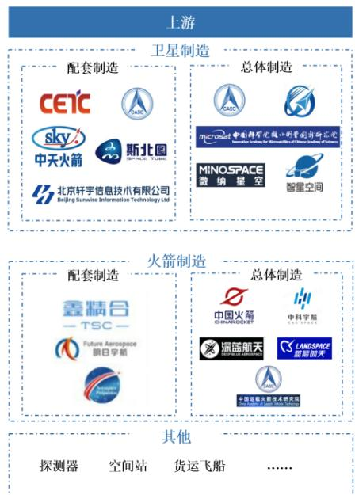

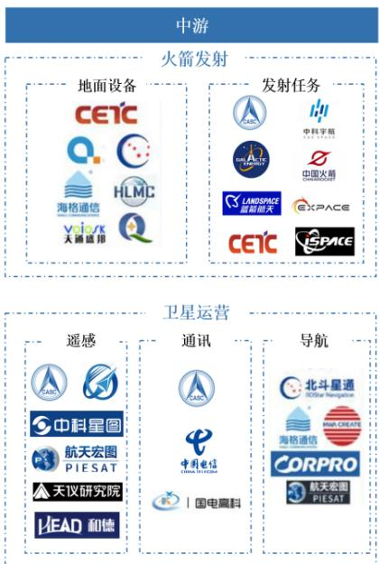

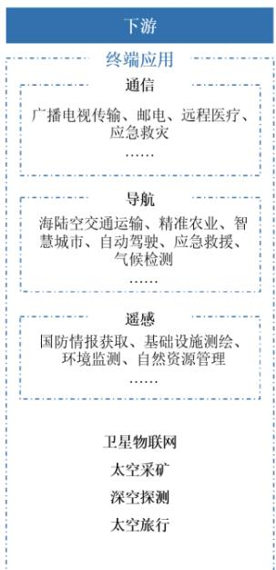  
资料来源：36 氪研究院，中信建投

公司的宇航电源业务处于航天产业链的上游环节，主要制造卫星、飞船、探测器、空间站等航天器的电源分系统，为航天器总装单位提供配套。公司是国内宇航电源的核心供应商，在保持国家航天领域竞争优势的同时，积极发力商业航天市场，已成为包括国网星座、千帆星座、吉林一号遥感星座等在内的多个重要商业航天星座的电源供应商。

# 2、锂电池行业

锂电池产业链上游为锂电池材料及制造锂电池材料的金属矿（钴矿、镍矿、锰矿、锂矿）等原料；产业链中游主要为电芯和电池组厂商；产业链下游为动力电池、消费电池和储能电池等领域的应用。具体如下图所示：

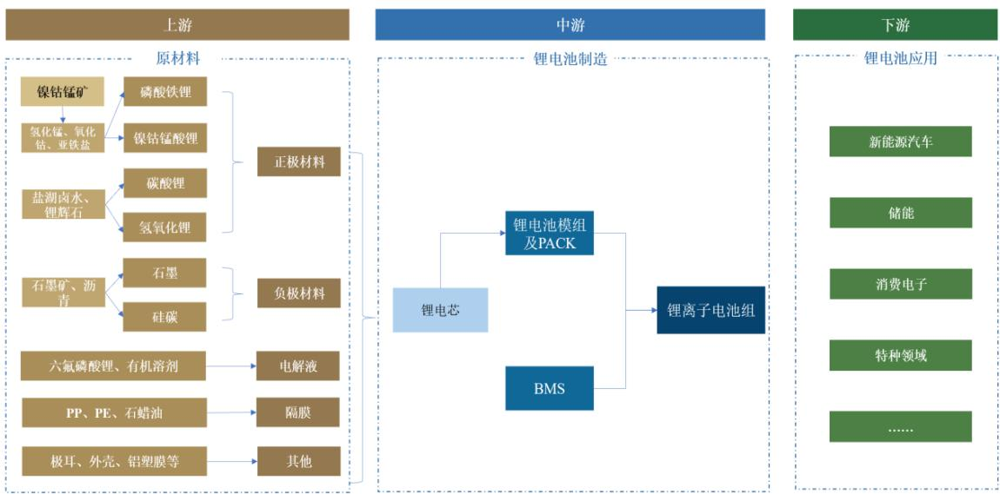

资料来源：高工产业研究院（GGII）

公司主要产品及服务中，特种电源位于锂电池产业链的中游电芯及电池组环节，锂电正极材料位于锂电池产业链的上游环节。公司深耕化学电源领域，在锂电池正极材料、电芯和电池组等环节均具有丰富的技术积累，形成了较为完整的锂电池产业链上下游布局。

# 3、储能行业

电化学储能产业链上游主要包括电池材料、电子元器件、电工器材等各类原材料；中游主要为储能系统集成及安装，储能系统包括锂离子电池组、电池管理系统、能量管理系统、储能逆变器和其他电气设备；下游主要为各类应用场景，包括发电侧、电网侧和用户侧，具体如下图所示：

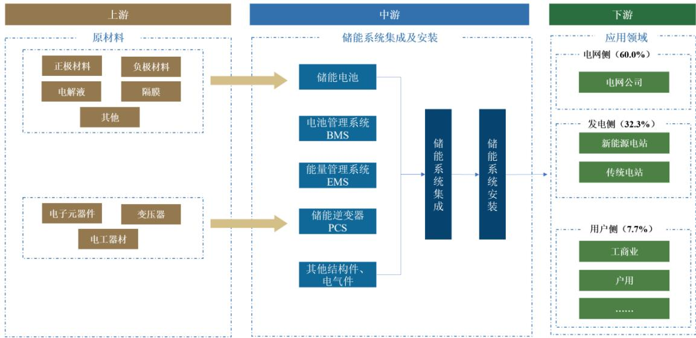

资料来源：《2025 中国新型储能行业发展白皮书机遇与挑战》

公司主要产品及服务中，新能源应用及服务中的储能系统位于电化学储能产业链的中游。

# 4、燃料电池行业

燃料电池行业的上游为电堆、辅助系统等核心零部件及氢气供应，中游为燃料电池系统的组装，下游为运输设备、发电、便携式电源等应用领域。具体如下图所示：

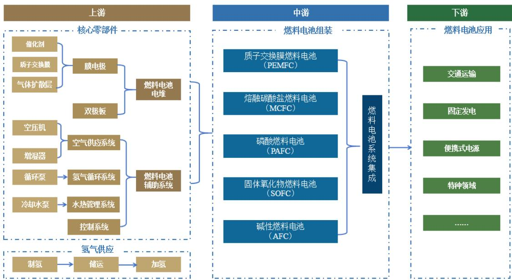

资料来源：前瞻产业研究院

公司主要产品及服务中，特种电源业务的燃料电池业务主要从事燃料电池的总装制造，位于燃料电池产业链的中游。

# 5、光伏行业

光伏产业链由上游硅料和硅片、中游光伏电池和光伏组件、下游发电应用端三部分组成。产业链上游包括高纯度多晶硅材料的生产和硅片的制造；产业链中游包括电池加工与组件封装两部分；产业链下游为光伏应用端，包括光伏电站建设、光伏电站运营。具体如下图所示：

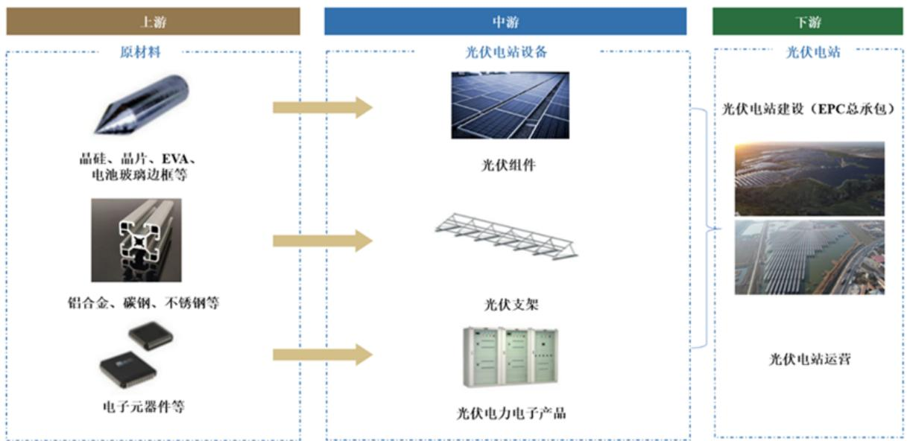  
资料来源：晶科科技招股说明书

公司主要产品及服务中，新能源应用及服务中的光伏解决方案业务属于光伏电站设计建造，位于光伏产业链的下游。

# 6、电源检测行业

检测服务贯穿各类产品的研发、生产、流通、应用全环节，是连接生产者、消费者和监管机构的重要桥梁，是服务现代工业和社会经济发展的基础性行业。检测行业在各环节发挥的作用如下图所示：

# 测试（Test）

通过实验室或现场测试，检查产品或材料的质量和性能，验证其是否符合相关技术标准或法规要求。例如食品检测、电气安全测试等。

# 检验（Inspection）

对产品、设备、项目或服务进行现场检查，确保符合既定标准或规范。例如装运前检验、生产过程督查等。

# 认证（Certification）

第三方机构通过审核确认某一产品、服务、系统或人员符合特定标准，并颁发认证证书。例如ISO体系认证、食品安全认证等。

# 研发环节（上市前）

·确保产品符合行业标准、国家法规和国际标准，避免产生法律风险、缩短研发周期和市场准入时间、支持国际化和跨国市场准入（例如欧盟的CE认证、美国的UL认证）  
提高产品性能，帮助企业识别研发阶段可能存在的缺陷或质量问题，帮助企业改进设计和生产流程  
·增强产品市场竞争力和品牌信誉

# 生产环节

通过检查原材料和生产设备、监控生产流程等，辅助企业提高产品质量、评估和控制风险  
·确保生产过程符合法规要求

# 流通环节（上市后）

·确保产品符合市场准入要求   
·防范假冒伪劣商品  
·在批量生产销售时进行定期抽检保证产品质量稳定

# 主要委托方为企业

# 主要委托方为企业与政府监管部门

资料来源：东吴证券研究所

发行人主要从事军用电源和动力电池、储能等民用电源检测，行业上游主要是检测设备及耗材制造企业，下游主要面向特定领域用户、动力电池及储能制造商及其下游企业等客户。

# 三、发行人所处行业地位及行业竞争情况

# （一）发行人所属细分行业竞争格局和发行人的市场地位

# 1、宇航电源行业竞争格局和发行人的市场地位

宇航电源行业由于产品技术研发难度较大、产品可靠性和稳定性要求较高、供应链管控严格等因素，行业壁垒较高，目前市场中宇航电源厂商集中度较高，主要的电源系统供应商为发行人、上海空间电源研究所、苏州馥昶空间技术有限公司和山东航天电子技术研究所等。

2024 年度，由公司配套电源单机或系统的航天器合计 144 个。根据 BryceTech，2024 年中国共发射卫星、飞船、空间站等航天器 285 个，按照该口径计算公司宇航电源产品在国内市场覆盖率约为 $5 0 . 5 \%$ 。公司作为我国宇航电源的核心供应商，承担了我国绝大部分重大航天工程的电源单机或系统的研制任务，技术实力和产品竞争力得到了充分验证，获得了航天领域总体单位的高度认可。

历史上，公司为我国重大航天工程提供电源单机或系统的部分项目情况如下：

<table><tr><td>工程名称</td><td>项目名称</td><td>代表型号</td><td>项目周期</td></tr><tr><td rowspan="4">载人航天</td><td>空间站</td><td>天和、问天、梦天、巡天</td><td>2012年-长期</td></tr><tr><td>载人飞船</td><td>神舟系列</td><td>1999年-长期</td></tr><tr><td>货运飞船</td><td>天舟系列</td><td>2017年-长期</td></tr><tr><td>载人登月</td><td>着陆器、新飞船</td><td>2020年-长期</td></tr><tr><td>探月工程</td><td>月球探测</td><td>嫦娥系列</td><td>2003年-长期</td></tr><tr><td rowspan="2">深空探测</td><td>火星探测</td><td>天问一号</td><td>2016年-2021年</td></tr><tr><td>小行星探测</td><td>天问二号</td><td>2020年-2035年</td></tr><tr><td>北斗导航</td><td>北斗导航</td><td>北斗系列</td><td>2001年-长期</td></tr><tr><td>高分专项</td><td>高分专项</td><td>高分十三号</td><td>2016年-2020年</td></tr><tr><td>先导专项</td><td>先导二期</td><td>SMILE、ASO-S、EP等</td><td>2017年-2026年</td></tr></table>

在商业航天卫星电源系统领域，公司目前合作的客户包括中国卫星网络集团有限公司、中国东方红卫星股份有限公司、特定客户 12、上海格思航天科技有限公司等国有单位，银河航天（北京）科技有限公司、哈尔滨工大卫星技术有限公司、椭圆时空（北京）科技有限公司等民营商业航天公司，以及清华大学、浙江大学、西北工业大学等多所高校。公司大力推进高性能、大规模、轻量化、低成本的星座电源产品体系，在国网星座、千帆星座、吉林一号遥感星座等我国重大商业航天星座的电源系统供应商中处于重要地位。

在临近空间飞行器电源系统领域，公司是国内最早开展相关电源系统研制工作的单位。公司研制的电源系统支撑了我国大型太阳能无人机首次实现临近空间连续跨昼夜飞行，助力我国成为继美国、英国之后世界第三个掌握临近空间低速飞行器技术的国家。

综上，公司是国内宇航电源核心供应商，担任国内重大航天工程、重大商业航天星座相关航天器电源的主力供应商，引领国内临近空间飞行器电源技术发展，是我国航天事业取得辉煌成就背后重要的支撑力量。

# 2、特种电源行业竞争格局和发行人的市场地位

对于国防军工领域的特种锂离子电池供应商，一般需要具备军工资质和型号研制参与经验，具有一定的行业壁垒，目前国内市场中的供应商主要包括发行人、江苏海四达电源有限公司、风帆有限责任公司和河南新太行电源股份有限公司等。

公司下属子公司蓝天特电自 2001 年起开始承接特种锂离子电池组的设计与生产任务，是国内最早研制特种锂离子电池组的单位之一，经过多年深耕，已与多个特种装备科研院所及整机企业建立了长期稳定的合作关系。公司先后承担了为国内重点工程配套的锂离子蓄电池组科研项目 100余项，目前此类产品型号达300余种，应用领域涵盖携行装备、特种车辆、特种无人机等。其中，为携行装备配套的特种电源产品覆盖全部 15种电池型谱，可以为全军单兵、班组、营房、阵地提供电能源保障，公司已成为国内该类装备电源领域的龙头企业。

AGV 锂离子电池领域属于新兴市场，虽然近几年该市场规模增长较快，但是其占锂离子电池市场总体规模的比例较低。根据德勤中国的研究报告，2022年，锐信控股有限公司、杭州凯歌新能源科技有限公司、深圳市德赛电池科技股份有限公司、三星集团等，已成为头部AGV物流机器人厂商的主要电池供应商。报告期内，公司深入拓展AGV锂离子电池组市场的开发，目前已成为国内 AGV锂离子电池组的重要供应商之一。此外，公司还接受中国 AGV 产业联盟推荐，主导编写了《工业应用移动机器人锂离子蓄电池技术规范》，并担任起草该规范的组长单位。

# 3、新能源应用及服务行业竞争格局和发行人的市场地位

# （1）储能行业竞争格局和发行人的市场地位

储能系统集成市场竞争激烈，根据中关村储能产业技术联盟（CNESA）发布的中国储能系统集成商 2024 年度出货量排名，国内市场中，储能系统出货量排名前五的企业依次为：中车株洲电力机车研究所有限公司、阳光电源股份有限公司、远景能源有限公司、北京海博思创科技股份有限公司、新源智储能源发展（北京）有限公司。

随着储能市场的迅速发展，公司基于在储能技术和控制技术领域积累的丰富经验，逐步拓展了电化学储能系统产品业务。公司 2022 年进入储能市场，进入时间较短，目前市场占有率相对较低。

# （2）电源检测行业竞争格局和发行人的市场地位

在军用电能源检测领域，目前从事军用电能源检测的主要机构包括国家储能及动力电池质量监督检验中心、中国电子技术标准化研究院赛西实验室、北京圣

涛平试验工程技术研究院、轻工业化学电源研究所及发行人等。在国内主要军用电能源检测机构中，发行人具有资质完善、测试能力覆盖范围广、实验室规模较大，极限测试能力和产品技术支撑能力强等优势，市场地位突出。

在民用电能源检测领域，主要分为动力电池检测和储能电池检测。目前动力电池检测市场中的测试机构，主要包括国家级检测机构、民营检测机构、外资检测机构三类。其中国家级检测机构依托完善的检测资质和广泛的行业影响力，占据约 $70 \%$ 的市场份额。国家级检测机构又分为整车资质检测机构和电池检测机构。上海机动车检测认证技术研究中心有限公司、中国汽研检测事业部、中汽研汽车检验中心（天津）有限公司的市场占有率相对较高，位于第一梯队。发行人与国联汽车动力电池研究院有限责任公司、北方汽车质量监督检验鉴定试验所、襄阳达安汽车检测中心有限公司、长春汽车检测中心有限责任公司、国家锂电池产品质量检验检测中心等国家级检测机构的市占率位于第二梯队。

储能电池检测领域，主要由具备国家级背景和权威认证资质的机构主导，北京鉴衡认证中心有限公司（CGC）、中国质量认证中心（CQC）、中国电力科学研究院有限公司凭借其深厚的行业根基、完善的认证资质体系及政策影响力，在储能电池（尤其是大型储能系统）的型式试验、认证检测市场占据主导地位。目前，发行人在储能电池领域主要专注于提供高标准的型式试验、鉴定及认证相关的测试服务，并与CGC、CQC、电科院等核心认证机构建立了良好的合作关系，为其认证体系提供专业测试支持。

# （二）发行人所属细分行业内的主要企业

# 1、宇航电源行业主要企业

# （1）上海空间电源研究所

上海空间电源研究所始建于 1960 年，是航天科技集团第八研究院下属空间电源专业研究所，是国防科工局核定的国家空间能源专业核心保军单位。该单位主要从事航天器、航空器、运载火箭、导弹武器及特殊飞行器用电源系统和关键单机的研发制造和试验，先后承担载人航天、探月工程、北斗导航、深空探测、高分辨率对地观测、新一代及重型运载、新一代遥感平台、空天往返等多项国家重点科研项目以及预研项目，是国内研制宇航电源单机及系统的主要企业之一。

同时，该单位作为航天科技集团下属宇航电源分系统的总体单位，也是公司宇航电源业务的主要客户之一。

# （2）苏州馥昶空间技术有限公司

苏州馥昶空间技术有限公司成立于 2018 年 7 月，是近年来兴起的商业航天小卫星电源系统配套服务商。该公司可提供完整的卫星电源系统解决方案和产品研发服务，包括 1套整星电源系统解决方案和 6套单机产品，目前已服务国内外超过30家卫星总体单位，为 TY-MINISAR、TXZ-A/B 星、天雁 05星、苏丹星、西柏坡号等数十颗卫星提供了电源配套，在轨飞行已超过 50 颗。

# （3）山东航天电子技术研究所

山东航天电子技术研究所始建于 1966 年，隶属于中国空间技术研究院，其前身为中国空间技术研究院549 厂，是国家级高新技术企业，航天电子产品重要研制单位，是国内生产宇航电源控制设备（宇航电源系统中的关键单机之一）的主要供应商之一。

# （4）美国 Spectrolab,Inc.公司（Spectrolab）

Spectrolab公司成立于1956 年，是波音公司的全资子公司，主营业务是高效空间单体太阳电池和太阳电池阵制造。自成立以来，该公司在开发用于太空任务的高效太阳电池方面一直处于国际领先地位，是全球第一家在月球（阿波罗登月计划，1969 年）和火星（勇气号和机遇号火星探测器，2004 年）表面放置太阳电池阵的公司，至今已经建造并交付了 650万个多结空间单体太阳电池，生产了总功率超过4兆瓦的空间太阳电池，为全球卫星和航天器供电。

# （5）德国 Azur Space Solar Power GmbH 公司（AZUR）

AZUR 公司成立于 1964 年，主营业务是空间单体太阳电池及其阵列。该公司曾为 1969 年发射的第一颗德国卫星“AZUR”开发和制造太阳电池，至今已为多项深空科学任务及哈勃太空望远镜、罗塞塔、金星快车、火星快车、赫歇尔-普朗克等共计600多个太空项目提供了1,000多万个硅太阳电池和300万个砷化镓太阳电池产品。2021 年 11 月，5N Plus 收购 Azur 公司 $100 \%$ 股权。

# （6）法国帅福得公司（Saft）

Saft 公司成立于 1918 年，是道达尔公司的全资子公司，具有超过 100 年的电池研发生产制造历史，电池业务覆盖工业、航天、海洋、航空等领域。在宇航电源领域，该公司自 1966 年将电池产品应用在 Diapason1A 卫星后，至今已为包括美国陆军、波音、美国宇航局和欧洲航天局等全球客户的航空航天产品提供高性能电池系统及产品。

# 2、特种电源行业主要企业

<table><tr><td>细分行业</td><td>企业名称</td><td>企业简介</td></tr><tr><td rowspan="3">特种低温锂离子电池</td><td>江苏海四达电源有限公司</td><td>江苏海四达电源有限公司(简称“海四达”),成立于1994年,一直致力于二次动力与储能电池的研发与产业化,主要产品有锂离子电池、镍系二次电池、电池材料、电池极板和电源系统等,产品广泛应用于新能源储能、电动工具及智能家电、新能源汽车、低速电动车、电动自行车,以及航空航天、轨道交通、电动船舶、武器装备、应急照明等领域。海四达是国内较早专业从事二次化学电源研发、生产和销售的国家级重点高新技术企业、专业的电源系统集成解决方案及产品供应商、国家级军用电源保障基地、工信部《锂离子电池行业规范》目录企业、国家电网储能系统供应商、三大通信运营商集采供应商、中国地铁轻轨应急电源专业制造商。</td></tr><tr><td>风帆有限责任公司</td><td>风帆有限责任公司是中国船舶集团有限公司下属企业,前身保定蓄电池厂始建于1958年,是“一五计划”期间国家156个重点建设项目之一。风帆有限责任公司主营业务为起动用、牵引用、工业用铅酸蓄电池、特种材料制品以及消费型、动力型锂离子电池。风帆有限责任公司一直承担着国家特种起动型、动力型电池的研发、生产任务,包括汽车、航空、舰船等多系列产品,三次荣获国家银质奖,多次为国庆活动提供起动蓄电池产品与服务保障,并得到国务院表彰和嘉奖。</td></tr><tr><td>河南新太行电源股份有限公司</td><td>河南新太行电源股份有限公司(简称“河南新太行”),承继于我国“一五”期间兴建的国营第七五五厂,成立于2006年,是高新技术企业、国家重点工程主要配套厂家、中国化学与物理电源行业协会副理事长单位。河南新太行自主研制生产的“太行”牌产品系列齐全,拥有锂离子、镉镍、铁镍、锌银、铅酸蓄电池及电源系统、蓄电池专用设备等多系列产品,产品在军用装备、轨道交通、新能源汽车、电力、储能、通讯、广电、矿山、舰船等诸多领域享有盛誉,而且远销欧美、中东、东南亚等国家和地区。在军用装备领域,公司产品多用于军用航空机载应急电源、陆装车载启动和动力电池、深海潜水器直流动力及应急电源、各类军用水下装备的直流动力电池、各类航天器中仪器仪表的直流电源等。公司先后承担了(09 工程)、国防尖端装备(氢弹)、“和平2 号(空间探测卫星)”、太平洋运载火箭、国庆阅兵等国家重点工程和重点项目研制</td></tr><tr><td></td><td></td><td>配套任务。如为大运飞机(运-20)配套机载应急电源系统,为“蛟龙号深海载人潜水器”研制配套动力电源系统,并因此荣获国家科学技术进步一等奖。</td></tr><tr><td rowspan="2">AGV锂离子电池</td><td>锐信控股有限公司</td><td>锐信控股有限公司前身飞毛腿集团有限公司成立于1997年,注册资金12700万美元,2006年在香港交易所成功上市(香港联交所股票代号:1399.HK)。锐信控股有限公司是一家拥有品牌销售网络、研发技术和庞大制造规模,为移动数码等产品提供全面电池解决方案的高新技术企业,产品涉及到手机电池、移动电源、动力电池等。锐信控股是国内领先的消费电子和智能硬件产品锂电源解决方案提供商和锂离子电池模组封装集成制造商。</td></tr><tr><td>杭州凯歌新能源科技有限公司</td><td>杭州凯歌新能源科技有限公司是宇恒电池股份有限公司的控股子公司,成立于2017年,致力于工业类动力电池和储能类电池的研发和生产,产品广泛用于AGV、机器人、医疗器械,通信储能、家庭储备电源等领域。</td></tr></table>

# 3、新能源应用及服务行业主要企业

<table><tr><td>细分行业</td><td>企业名称</td><td>企业简介</td></tr><tr><td>储能系统</td><td>北京海博思创科技股份有限公司</td><td>海博思创成立于2011年,是行业领先的储能系统解决方案与技术服务供应商,专注于储能系统的研发、生产、销售和服务,为传统发电、新能源发电、智能电网、终端电力用户及智能微网等“源——网——荷”全链条行业客户提供全系列储能系统产品,提供储能系统一站式整体解决方案。</td></tr><tr><td rowspan="2">电源检测服务</td><td>国家储能及动力电池质量监督检验中心</td><td>国家储能及动力电池质量监督检验中心于2015年8月正式获得国家授权成为国家级储能及动力电池产品权威检测机构,中心同时已获得国家实验室资质认可和计量认证,也是我国“863计划—电动汽车重大专项”动力电池测试基地、工信部锂离子电池检测公共服务平台、工信部授权的新能源汽车用动力电池强制性检测机构、国家矿用产品安全标志认证中心指定的矿用锂离子电池和电源检测中心和中国质量认证中心(CQC)签约检测试验室,中心可开展电性能测试、循环寿命测试、环境适应测试、安全性能测试和电池管理系统测试等试验。中心试验室建筑面积3136平方米,各类设备设施固定资产近1亿元,可开展各类储能及动力电池质量监督检测,可为新能源汽车及矿用储能和动力电池市场准入提供测试认证服务,为企业研发提供试验验证及技术咨询服务。</td></tr><tr><td>赛西实验室</td><td>赛西实验室是中国电子技术标准化研究院在标准试验验证、检测和校准领域的综合机构。检测总部位于北京亦庄经济技术开发区,工作面积38000平方米、仪器设备7800余台套,业务领域涵盖从硬件到软件、从元器件到整机、从单机到信息系统的11个专业技术领域;拥有“数字音视频及多媒体产品质量监督检验中心”、“国家大数据产品质量监督检验中心”、“国家绿色电池产品质量检测中心”三个国家级质检机构资质及32个国家、部委及HMDI、DisplayPort、蓝牙、ZigBee、WPC、NFC等国际资质授权资质,电池领域测试范围包括消费类、电动汽车、矿灯、</td></tr><tr><td></td><td></td><td>无人机等用电池，检测项目涵盖了电池的性能、安全、可靠性等项目。</td></tr></table>

# （三）发行人的竞争优势

# 1、技术与产品优势

公司在电能源领域深耕多年，电能源技术和产品覆盖化学电源、物理电源和混合组网电源，拥有发电、储能、控制和系统集成全套解决方案。

宇航电源领域，公司的空间太阳电池阵包括刚性、半刚性、柔性和全柔性在内的完整产品谱系，具有丰富的在轨飞行验证经验，产品性能参数可满足低轨、中轨、高轨、深空探测等空间应用场景，产品质量深得用户信任；公司空间锂离子电池组具有高比能、长寿命的特点，关键指标国际领先；控制端，公司开发的电源控制设备具有集成度高、可靠性强的特点，不仅在国家航天的多个卫星平台上广泛应用，在商业航天星座领域同样具备较强的竞争力。上游核心材料端，公司光电转化效率为 $3 4 . 4 \%$ 的砷化镓外延片已经完成在轨验证，为下一代大功率宇航电源的空间高效太阳电池提供了材料基础。

特种电源领域，公司是国内最早研制特种锂离子蓄电池的企业之一，在特种低温锂离子电池、国产化 BMS 等方面具有丰富的技术储备，产品具有高能量密度、高可靠、高安全的技术特点。同时，为解决锂离子电池的本质安全问题，公司积极推进固态电池研发，目前研制的固态电池产品比能量为 $3 5 0 \mathrm { W h / k g }$ ，低温性能优越，在具有相当能量密度的同时具备更好的安全性能，综合性能达到国内先进水平。

新能源应用及服务领域，在储能方面，公司积极开发低成本、高安全的电池技术，布局钠离子电池等前沿方向，并已在钠离子电池的实用方面取得突破，建立了具备全部自主知识产权的钠离子电池正极材料生产线，相关产品已在电动两轮车、启动电源领域进行示范应用，钠离子电池储能系统已成功应用于微电网。在电源检测方面，公司现有检测中心是国内最大化学与物理电源综合性检测机构之一，技术实力雄厚，资质丰富，具备电池材料理化分析、太阳电池测试、化学电池及电源系统测试能力，不仅为公司研发生产提供精确可靠的检测，而且具备服务行业内其他企业的能力，客户群体不断壮大。

公司在电能源领域有着深厚的技术积淀，拥有高效砷化镓空间太阳电池阵技术、高效薄膜砷化镓太阳电池技术等 11 项核心技术，截至 2025 年 6 月 30 日，公司获得授权发明专利141项，其中多项技术水平位列国际领先或国际先进地位。

# 2、品牌优势

公司长期深耕电能源行业，积累了深厚的品牌优势。自 1970 年为我国第一颗人造卫星“东方红一号”提供电源产品以来，截至报告期末，公司已为神舟系列飞船、天舟系列飞船、空间站、北斗导航、嫦娥系列探月卫星、探火工程、千帆星座、国网星座等国家与国防多个重大工程在内的 700 余颗卫星/飞船/探测器/空间站提供了优质可靠的电源产品，是中国航天事业取得辉煌成就背后主要的支撑力量。

公司获得多项国家重大荣誉，品牌获得主要客户高度认可。2000 年以来，公司累计获得国家科学技术进步奖 9 次、国防科学技术（进步）奖 14 次。公司长期服务于航天科技集团、特定客户 12 等国内知名航天科研总体单位，经过多年积累取得了总体单位、国防军队等用户的高度认可，与客户建立了长期、深入的合作关系。

# 3、专业人才与研发创新优势

更高素质的劳动者是新质生产力的第一要素。公司拥有一支专业齐全、经验丰富、底蕴深厚、勇于创新的优秀技术研发团队，团队核心人员从事研发工作数十年，参与过多个重要型号工程项目，具备持续创新能力和突破关键核心技术的实力。截至2025年6月末，公司研发人员 246人，占员工总数的比重达 $2 1 . 4 5 \%$ 。

截至 2025 年 6 月末，公司拥有博士学位者 40 人、拥有硕士学位者 377 人，研究员级高工及正高级工程师 41 人、高级工程师及工程师 570 人。公司享受政府特殊津贴专家 6 人；中国电科首席科学家 1 人、首席专家 2 人；天津市“131”创新型人才培养工程一层次7 人、二层次2人、三层次8人；省部级创新团队 4个。

# 4、质量优势

公司产品生产严格执行国家军用标准、国家标准及相关行业标准，依据国家质量管理体系标准要求，公司已建立了适用于宇航、国防、民用等领域全生命周

期的质量管理体系，并取得了军工业务相关资质。

公司设立了质量部负责组织质量管理体系运行，确保质量管理体系的适宜性、充分性和有效性，保证了产品质量的稳定可靠。公司及各子公司均拥有质量管理体系认证证书。

# （四）发行人的竞争劣势

# 1、现有宇航电源产能难以满足下游市场日益增长的需求

随着我国载人航天工程、探月工程等重大航天工程的深入推进，以及商业航天市场的快速发展，我国航天产业迎来高速发展期，宇航电源产业将充分受益，有望在“十四五”收官之年及“十五五”时期迎来爆发式增长。公司在宇航电源领域拥有先进的核心技术，是我国宇航电源核心供应商，但随着商业航天产业的快速发展，下游市场需求快速增长，公司面临批产自动化设备配套不足、测试验证环境和能力不够等产能问题，产能瓶颈将成为制约公司业务规模扩张的重要因素之一。

# 2、特种电源、新能源应用及服务业务的整体经营规模与同行业企业存在一定差距

发行人特种电源产品主要应用于国防军工领域和特种工业领域，新能源应用及服务板块中的储能业务、消费类锂电池业务开展时间较短，并且已主动收缩光伏解决方案业务，相关领域业务规模相对较小。发行人是国内宇航电源核心供应商，是中国航天事业取得辉煌成就的支撑力量，宇航电源业务市场占有率领先且业务规模持续增长，近年来发行人积极拓展储能、消费类锂电池等民品市场，但发行人特种电源业务、新能源应用及服务业务的整体经营规模相比于电能源产业的其他领先企业仍存在一定差距，公司有待进一步提升特种电源、新能源应用及服务的经营规模。

# 3、融资渠道较为单一，资金实力有待加强

公司主要通过内部利润积累方式筹集资金，后续研发及经营规模扩张可能带来一定的资金压力。公司当前的资金实力在一定程度上限制了公司研发活动和生产经营的大规模增长，亟需拓展融资渠道提高可持续发展能力。

# （五）发行人与同行业可比公司的比较情况

# 1、选取同行业可比公司的依据

发行人主要从事电能源产品及系统的研发、生产、销售及服务，覆盖物理电源、化学电源、电源系统以及产业链上下游产品，拥有发电、储能、控制和系统集成全套解决方案，主营业务涵盖宇航电源、特种电源、新能源应用及服务三大板块。目前，上市公司中不存在与发行人主营业务结构、产品形态、下游应用领域、业务模式等方面完全一致或高度相似的公司。

公司同行业可比公司的主要选择标准如下：

1）主营业务和主要产品为锂电池或电源、储能系统，与发行人较为相似。  
2）与发行人同处于航天产业链上游的航天器配套设备制造环节。

发行人在已上市公司中，将基本符合上述两条标准之一、经营状况和财务数据具备可比性的公司作为同行业可比公司。具体如下：

<table><tr><td>序号</td><td>股票代码</td><td>公司简称</td><td>经营情况、市场地位、技术实力等基本情况</td></tr><tr><td>1</td><td>VNP.TO</td><td>5N Plus</td><td>5N Plus是全球领先的特种半导体及高性能材料生产商，于2021年11月收购Azur公司100%股权，进一步扩大其特种半导体产品组合。5N Plus特种半导体产品主要包括半导体化合物、半导体晶圆、超高纯度金属、外延半导体衬底、太空太阳能电池及组件（由Azur生产）等，应用在地面可再生能源、卫星及成像领域；高性能材料主要为铋化学品、高纯度金属、低熔点合金等，应用于制药、医疗保健以及工业等多个领域。收购Azur后，5N Plus成为全球重要的宇航电源供应商之一。</td></tr><tr><td>2</td><td>002935.SZ</td><td>天奥电子</td><td>天奥电子隶属中国电科，主要从事时间频率产品、北斗卫星应用产品的研发、设计、生产和销售，拥有国家企业技术中心，是拥有多项专利和核心技术的高新技术企业。天奥电子作为国内领先的时间频率企业，拥有完整的时间频率产品线，具备时频系统集成能力，可为客户提供完整的时频解决方案。主要产品包括原子钟、晶体器件、频率组件及设备、时频板卡及模块、时间同步设备及系统等，主要应用于航空航天、卫星导航、军民用通信及国防装备等领域，为我国载人航天、探月工程、北斗卫星导航系统等国家重大工程建设提供了主要时频装备和系统，做出了重要贡献。</td></tr><tr><td>3</td><td>300593.SZ</td><td>新雷能</td><td>新雷能是通信、航空、航天、船舶等领域整机设备企业重要的电源供应商。新雷能的电源类产品主要包括模块电源、定制电源、大功率电源及供配电电源系统，在夯</td></tr><tr><td></td><td></td><td></td><td>实电源系列基础之上持续创新投入,拓展新的产品类别和新的应用领域,已研制出应用于高可靠电子装备领域的电源管理芯片、电机驱动芯片和集成电路体微模组等多系列模拟集成电路类产品。新雷能在航空、航天、船舶、激光器等特种应用领域具备从电源管理芯片、电驱芯片、功率微模组、模块电源、定制电源、大功率电源及供配电电源系统的研发和生产能力,在航天、航空、船舶、激光器等领域得到客户的高度认可,是上述领域重要的电源供应商。</td></tr><tr><td>4</td><td>600879.SH</td><td>航天电子</td><td>航天电子隶属航天科技集团,主营业务为航天电子信息、无人系统装备产品的研发、生产与销售。其航天电子信息产品主要包括军民用测控通信系统、遥感信息系统、卫星应用等系统级产品;军民用惯性导航产品、卫星导航产品、遥测遥控设备、精确制导与电子对抗设备、计算机技术及软硬件等专业设备;军民用集成电路、传感器、继电器、电连接器、微波器件、精密机电产品等器件产品,产品主要应用于运载火箭、飞船、卫星等航天领域。近年来,航天电子深度对接航天重大型号配套任务,相关产品成功实现为载人登月研制工程、天问三号等新研型号配套。</td></tr><tr><td>5</td><td>002025.SZ</td><td>航天电器</td><td>航天电器隶属航天科工集团,主要从事高端连接器与互连一体化产品、微特电机与控制组件、继电器、光电器件等产品的研制和销售,以及为客户提供系统集成互联一体化解决方案。航天电器主导产品用于航天、航空、电子、兵器、船舶、通信、商业航天、数据中心、新能源汽车、低空经济、能源装备、轨道交通等高技术领域配套。航天电器为我国宇航装备配套了连接器等大量关键产品,先后承担并完成载人航天、探月、北斗、火星探测等多项国家重大工程和重大专项配套任务,在宇航领域地位稳固。</td></tr><tr><td>6</td><td>300438.SZ</td><td>鹏辉能源</td><td>鹏辉能源2011年进入储能电池领域,提供电芯、PACK、电池簇等产品,运用于发电侧及电网储能、工商业用户侧储能、UPS通讯基站备用电源和家用储能、便携式储能。大型储能电池方面,在稳固阳光电源、南方电网等原有大客户合作关系的同时,与三峡电能、电工时代、电建新能源等行业优质客户开展战略合作。户储电池方面,持续加深与阳光电源、德业股份、三晶电气等头部客户的合作关系。在便携储能市场,鹏辉能源继续与国内头部客户开展深度合作,同时开拓了公牛集团等新的优质客户。在市场订单激增背景下,鹏辉能源加大各园区储能产能建设投入,持续推动产能释放,反哺订单需求,刺激业绩增长。动力电池领域,鹏辉能源致力于服务好现有客户,配套上汽通用五菱多款车型,新能源汽车动力电池业务收入充分享受行业发展红利,实现高速增长。消费电池领域,该业务为鹏辉能源传统优势业务,产品主要应用于蓝牙音箱、蓝牙耳机、机器人、可穿戴设备、ETC设备、电子烟、电动护理产品等领域。</td></tr><tr><td>7</td><td>300014.SZ</td><td>亿纬锂能</td><td>亿纬锂能成立于2001年，历经24年快速发展，已成为具有全球竞争力的锂电池平台公司，同时拥有消费电池、动力电池、储能电池核心技术和全面解决方案，产品广泛应用于物联网、能源互联网领域。亿纬锂能动力电池主要包括三元和磷酸铁锂两大体系。乘用车解决方案拥有46950、12V、48V等王牌产品，可适配轿车、SUV、MPV等多种车型；商用车解决方案涵盖客车、纯电及混动重卡、专用车、物流车等领域；储能电池包括大铁锂电池、方形铁锂电池、圆柱铁锂电池，从电芯、电池包、系统到BMS等全方面产品及解决方案，光伏应用在电力储能、工商业储能、户用储能、通信储能、数据中心备电、船舶动力等领域。亿纬锂能是行业内少数同时掌握消费、动力和储能电池核心技术的锂电池平台型龙头企业，深度布局全形态锂电池技术与产能，已经形成锂原电池、软包三元、方形三元、圆柱三元、方形铁锂、圆柱铁锂等全形态锂电池谱系。亿纬锂能储能电池2023年出货量排名位居全球第三，动力电池2023年国内出货位居全国前五。</td></tr><tr><td>8</td><td>688411.SH</td><td>海博思创</td><td>海博思创是国内领先的电化学储能系统解决方案与技术服务提供商，专注于电化学储能系统的研发、生产、销售，为传统发电、新能源发电、智能电网、终端电力用户等“源一网一荷”全链条行业客户提供全系列储能系统产品，提供储能系统一站式整体解决方案。海博思创为国家级“专精特新”小巨人企业和国家级高新技术企业，拥有具备CMA、CNAS和TÜV莱茵CTF2级目击实验室资质认证的实验测试中心，建立了北京市企业技术中心，获准成立了博士后科研工作站，并牵头成立了北京市未来电化学储能系统集成技术创新中心。海博思创参与了国家重点研发计划“储能与智能电网技术”和“智能电网技术与装备”项目的4项课题。根据中关村储能产业技术联盟（CNESA）统计，海博思创在2023年中国储能系统集成商出货量排名前列。</td></tr></table>

资料来源：同行业可比公司官网、公告等公开披露信息。

# 2、公司与同行业可比公司在衡量核心竞争力的关键业务数据、指标等方面的比较情况

<table><tr><td rowspan="2">股票代码</td><td rowspan="2">公司简称</td><td colspan="4">2024 年 12 月 31 日/2024 年度财务数据(万元)</td></tr><tr><td>营业收入</td><td>净利润</td><td>研发费用</td><td>净资产</td></tr><tr><td>VNP.TO</td><td>5N Plus</td><td>207,946.75</td><td>10,546.82</td><td>/</td><td>99,931.70</td></tr><tr><td>002935.SZ</td><td>天奥电子</td><td>96,436.77</td><td>6,419.73</td><td>5,635.47</td><td>158,564.67</td></tr><tr><td>300593.SZ</td><td>新雷能</td><td>92,173.23</td><td>-51,404.81</td><td>39,018.46</td><td>263,705.39</td></tr><tr><td>600879.SH</td><td>航天电子</td><td>1,428,048.83</td><td>60,177.75</td><td>88,116.76</td><td>2,412,711.02</td></tr><tr><td>002025.SZ</td><td>航天电器</td><td>502,488.09</td><td>40,423.57</td><td>75,118.93</td><td>750,311.95</td></tr><tr><td>300438.SZ</td><td>鹏辉能源</td><td>796,050.73</td><td>-32,351.16</td><td>38,422.71</td><td>525,096.13</td></tr><tr><td>300014.SZ</td><td>亿纬锂能</td><td>4,861,455.65</td><td>422,140.27</td><td>294,230.75</td><td>4,099,918.69</td></tr><tr><td>688411.SH</td><td>海博思创</td><td>826,970.43</td><td>64,894.67</td><td>25,016.77</td><td>314,704.65</td></tr><tr><td colspan="2">发行人</td><td>312,702.27</td><td>33,778.54</td><td>20,020.78</td><td>354,036.19</td></tr></table>

数据来源：可比公司定期报告或招股说明书。

发行人宇航电源、特种电源、新能源应用及服务三大板块的对应可比公司以及发行人对应业务与可比公司的关键业务数据、指标的比较情况如下：

<table><tr><td rowspan="2">股票代码</td><td rowspan="2">公司简称</td><td rowspan="2">对应发行人业务板块</td><td colspan="2">2024年度主要业务数据和指标</td></tr><tr><td>营业收入(万元)</td><td>毛利率</td></tr><tr><td>VNP.TO</td><td>5N Plus</td><td rowspan="7">宇航电源</td><td>145,627.19</td><td>31.00%</td></tr><tr><td>002935.SZ</td><td>天奥电子</td><td>96,436.77</td><td>23.31%</td></tr><tr><td>300593.SZ</td><td>新雷能</td><td>92,173.23</td><td>39.50%</td></tr><tr><td>600879.SH</td><td>航天电子</td><td>1,182,000.67</td><td>21.89%</td></tr><tr><td>002025.SZ</td><td>航天电器</td><td>489,769.39</td><td>37.99%</td></tr><tr><td colspan="2">平均值</td><td>401,201.45</td><td>30.74%</td></tr><tr><td colspan="2">发行人</td><td>191,463.69</td><td>31.81%</td></tr><tr><td>300438.SZ</td><td>鹏辉能源</td><td rowspan="4">特种电源</td><td>796,050.73</td><td>12.12%</td></tr><tr><td>300014.SZ</td><td>亿纬锂能</td><td>4,861,455.65</td><td>17.06%</td></tr><tr><td colspan="2">平均值</td><td>2,828,753.19</td><td>14.59%</td></tr><tr><td colspan="2">发行人</td><td>44,363.58</td><td>13.11%</td></tr><tr><td>688411.SH</td><td>海博思创</td><td rowspan="2">新能源应用及服务</td><td>826,970.43</td><td>18.24%</td></tr><tr><td colspan="2">发行人</td><td>66,077.28</td><td>12.48%</td></tr></table>

注 1：5N Plus 列示数据为其特种半导体业务板块营业收入及毛利率，航天电子列示数据为其航天产品营业收入及毛利率，航天电器列示数据为其电子器械产品营业收入及毛利率；其他可比公司列示数据为其全部业务的营业收入及毛利率；  
注 2：可比公司相关数据取自其公开披露的定期报告。

在宇航电源板块，A股尚无与发行人完全可比的宇航电源产品上市公司，除5N Plus 外，其他可比公司与发行人同属航天产业链，但生产的具体产品与发行人存在一定差异，其中航天电子、航天电器的产品通用性较强、下游应用市场广泛，故可比公司平均收入规模高于发行人，平均毛利率与发行人基本一致。

在特种电源板块，发行人聚焦特种领域，可比公司主要从事民用锂电池业务，经营规模较大，故可比公司收入规模高于发行人，毛利率与发行人基本相当。

在新能源应用及服务板块，可比公司主要从事储能电源及系统业务，由于发行人进入储能市场时间较晚，可比公司的收入规模和毛利率高于发行人。

# 四、发行人的销售情况和主要客户

# （一）发行人销售收入构成情况

报告期内，发行人主营业务收入构成情况如下表所示：

单位：万元  

<table><tr><td rowspan="2">项目</td><td colspan="2">2025 年 1-6 月</td><td colspan="2">2024 年度</td><td colspan="2">2023 年度</td><td colspan="2">2022 年度</td></tr><tr><td>金额</td><td>占比</td><td>金额</td><td>占比</td><td>金额</td><td>占比</td><td>金额</td><td>占比</td></tr><tr><td>宇航电源</td><td>72,805.56</td><td>74.13%</td><td>191,463.69</td><td>63.42%</td><td>168,718.01</td><td>48.23%</td><td>134,465.03</td><td>53.96%</td></tr><tr><td>特种电源</td><td>5,086.28</td><td>5.18%</td><td>44,363.58</td><td>14.69%</td><td>31,809.09</td><td>9.09%</td><td>38,300.75</td><td>15.37%</td></tr><tr><td>新能源应用及服务</td><td>20,319.34</td><td>20.69%</td><td>66,077.28</td><td>21.89%</td><td>149,298.17</td><td>42.68%</td><td>76,446.23</td><td>30.68%</td></tr><tr><td>合计</td><td>98,211.18</td><td>100.00%</td><td>301,904.55</td><td>100.00%</td><td>349,825.27</td><td>100.00%</td><td>249,212.02</td><td>100.00%</td></tr></table>

# （二）主要产品的产能、产量和销量

# 1、宇航电源的产能、产量和销量

报告期内，公司研制、生产的宇航电源产品主要应用于航天领域和军用领域，相关产品产能、产量和销量情况信息涉及国家秘密。因此，公司宇航电源产品的产能、产量和销量情况未予披露。

# 2、特种电源的产能、产量和销量

报告期内，公司研制、生产的特种锂离子电池产品主要应用于特种车辆、单兵携行装备等军用领域，相关产品产能、产量和销量情况信息涉及国家秘密。因此，公司特种电源产品的产能、产量和销量情况未予披露。

# 3、新能源应用及服务的产能、产量和销量

报告期内，公司研制、生产的储能系统产能、产销量情况如下：

<table><tr><td>项目</td><td>2025 年 1-6 月</td><td>2024 年度</td><td>2023 年度</td><td>2022 年度</td></tr><tr><td>产能（MWh）</td><td>485.26</td><td>1,006.00</td><td>1,006.00</td><td>258.00</td></tr><tr><td>总产量（MWh）</td><td>435.61</td><td>1,035.76</td><td>1,026.57</td><td>454.02</td></tr><tr><td>其中：自产产量（MWh）</td><td>250.70</td><td>615.00</td><td>330.00</td><td>130.64</td></tr><tr><td>外协产量（MWh）</td><td>184.91</td><td>420.76</td><td>696.57</td><td>323.38</td></tr><tr><td>销量（MWh）</td><td>224.17</td><td>506.09</td><td>1,020.01</td><td>377.74</td></tr><tr><td>产能利用率</td><td>51.66%</td><td>61.13%</td><td>32.80%</td><td>50.63%</td></tr><tr><td>产销率</td><td>51.46%</td><td>48.86%</td><td>99.36%</td><td>83.20%</td></tr></table>

注：产能利用率 $\varprojlim 2$ 自产产量/产能；产销率 $\underline { { \boldsymbol { \mathbf { \Pi } } } } =$ 销量/总产量

公司储能业务主要为销售储能系统产品，同时也包括少量的储能EPC业务。针对储能业务，公司主要根据签署订单安排生产。在交付周期紧张、自有产能无法快速满足订单需求的情况下，公司会委托外部厂商协助生产加工储能系统。2024 年、2025 年 1-6 月储能系统产销率较低主要系部分项目已完成生产、但尚未满足收入确认条件而未实现收入所致。

# （三）发行人主要产品销售价格的变动情况

公司宇航电源、特种电源以及新能源应用及服务业务均为定制化程度较高的业务，主要采用按单定制的经营模式，产品销售价格主要依据项目复杂程度、原材料价格波动等因素确定，因此同一类产品对不同客户的销售价格可比性较弱。

# （四）报告期内前五名客户的销售情况

报告期内，公司向前五名客户的销售金额及占营业收入的比重如下表所示：

单位：万元  

<table><tr><td>期间</td><td>序号</td><td>客户名称</td><td>销售金额</td><td>占比</td></tr><tr><td rowspan="6">2025年1-6月</td><td>1</td><td>航天科技集团下属单位</td><td>59,425.52</td><td>53.37%</td></tr><tr><td>2</td><td>中国化学与物理电源行业协会</td><td>12,720.20</td><td>11.42%</td></tr><tr><td>3</td><td>上海格思航天科技有限公司</td><td>7,392.92</td><td>6.64%</td></tr><tr><td>4</td><td>中国电科集团下属单位</td><td>5,752.13</td><td>5.17%</td></tr><tr><td>5</td><td>中国科学院下属单位</td><td>5,483.89</td><td>4.93%</td></tr><tr><td colspan="2">合计</td><td>90,774.67</td><td>81.53%</td></tr><tr><td rowspan="6">2024年度</td><td>1</td><td>航天科技集团下属单位</td><td>136,461.80</td><td>43.64%</td></tr><tr><td>2</td><td>中国电科集团下属单位</td><td>31,632.70</td><td>10.12%</td></tr><tr><td>3</td><td>中国科学院下属单位</td><td>24,439.19</td><td>7.82%</td></tr><tr><td>4</td><td>上海格思航天科技有限公司</td><td>16,237.17</td><td>5.19%</td></tr><tr><td>5</td><td>国家能源投资集团下属单位</td><td>10,853.82</td><td>3.47%</td></tr><tr><td colspan="2">合计</td><td>219,624.68</td><td>70.23%</td></tr><tr><td rowspan="6">2023 年度</td><td>1</td><td>航天科技集团下属单位</td><td>151,902.87</td><td>43.10%</td></tr><tr><td>2</td><td>国家电投集团下属单位</td><td>53,649.73</td><td>15.22%</td></tr><tr><td>3</td><td>中国电科集团下属单位</td><td>30,989.30</td><td>8.79%</td></tr><tr><td>4</td><td>中国能源建设集团下属单位</td><td>19,124.66</td><td>5.43%</td></tr><tr><td>5</td><td>中国节能环保集团下属单位</td><td>15,817.25</td><td>4.49%</td></tr><tr><td colspan="2">合计</td><td>271,483.81</td><td>77.04%</td></tr><tr><td rowspan="6">2022 年度</td><td>1</td><td>航天科技集团下属单位</td><td>114,949.16</td><td>45.59%</td></tr><tr><td>2</td><td>中国大唐集团下属单位</td><td>37,036.66</td><td>14.69%</td></tr><tr><td>3</td><td>中国电科集团下属单位</td><td>17,968.96</td><td>7.13%</td></tr><tr><td>4</td><td>中国科学院下属单位</td><td>15,485.64</td><td>6.14%</td></tr><tr><td>5</td><td>大同市晟能新能源有限公司</td><td>7,262.07</td><td>2.88%</td></tr><tr><td colspan="2">合计</td><td>192,702.49</td><td>76.44%</td></tr></table>

注：对于受同一控制人控制的客户，销售额合并披露。

报告期内，公司向前五大客户销售金额占当期营业收入的比例分别为$7 6 . 4 4 \%$ 、 $7 7 . 0 4 \%$ 、 $7 0 . 2 3 \%$ 和 $8 1 . 5 3 \%$ ，其中报告期各期对第一大客户航天科技集团的销售金额占当期营业收入的比例分别为 $4 5 . 5 9 \% , 4 3 . 1 0 \% , 4 3 . 6 4 \%$ 和 $5 3 . 3 7 \%$ 。公司第一大客户集中度较高，主要系公司以宇航电源为核心业务，而航天科技集团承担着我国运载火箭、应用卫星、载人飞船、空间站、深空探测飞行器的研制、生产和发射试验任务，在航天领域占据主导地位，公司下游客户的市场集中度较高导致公司客户集中度较高，具有合理性。

报告期内，航天科技集团下属单位天津恒电、中国电科集团下属单位为公司关联方。关于公司与相关客户交易的具体情况详见本招股说明书“第八节 公司治理与独立性”之“十、关联交易”之相关内容。除此之外，公司报告期各期前五大客户与公司及其董事、原监事、高级管理人员、控股股东、实际控制人之间不存在关联关系或其他特殊关系。

# 五、发行人的采购情况和主要供应商

# （一）发行人主要材料与服务的采购情况

报告期内，公司主要材料与服务的采购情况如下表所示：

单位：万元  

<table><tr><td colspan="2">采购类别</td><td>2025年1-6月</td><td>2024年度</td><td>2023年度</td><td>2022年度</td></tr><tr><td rowspan="9">材料采购</td><td>太阳电池阵生产材料</td><td>41,925.55</td><td>64,795.58</td><td>47,880.29</td><td>41,915.11</td></tr><tr><td>电池组及储能系统材料</td><td>24,153.11</td><td>47,525.90</td><td>77,618.00</td><td>38,233.75</td></tr><tr><td>锂离子电芯材料</td><td>4,426.17</td><td>13,444.91</td><td>11,092.43</td><td>2,603.93</td></tr><tr><td>新能源电站工程材料</td><td>1,490.37</td><td>8,447.83</td><td>41,586.66</td><td>42,942.14</td></tr><tr><td>电子元器件</td><td>10,360.82</td><td>20,132.54</td><td>13,741.75</td><td>11,426.80</td></tr><tr><td>结构件</td><td>2,222.70</td><td>7,248.13</td><td>9,754.74</td><td>3,591.78</td></tr><tr><td>金属材料</td><td>1,452.89</td><td>5,698.65</td><td>4,744.77</td><td>3,579.01</td></tr><tr><td>其他</td><td>3,875.17</td><td>10,705.40</td><td>8,659.98</td><td>5,884.96</td></tr><tr><td>小计</td><td>89,906.79</td><td>177,998.93</td><td>215,078.62</td><td>150,177.49</td></tr><tr><td colspan="2">服务采购</td><td>12,558.77</td><td>19,380.04</td><td>18,499.45</td><td>19,447.80</td></tr><tr><td colspan="2">委托加工</td><td>9,046.48</td><td>23,722.40</td><td>23,528.86</td><td>12,623.28</td></tr><tr><td colspan="2">合计</td><td>111,512.03</td><td>221,101.37</td><td>257,106.93</td><td>182,248.57</td></tr></table>

其中，太阳电池阵生产材料主要包括空间单体太阳电池、抗辐射玻璃盖片、太阳电池翼结构等；电池组及储能原材料主要包括电芯、电池管理系统、锗片等；锂离子电芯材料主要包括正极材料、负极材料、电解液、隔膜等；新能源电站工程材料主要包括储能电池、支架、线缆、光伏组件等；电子元器件主要包括集成电路、连接器、二极管、电容、电阻、电感等；金属材料主要为金铜等贵金属；服务采购主要包括工程施工服务、工程劳务分包服务、检测试验服务等；委托加工主要包括外延片委托加工、储能液冷箱加工以及部分机械加工工序、金属表面处理工序的委托加工等。

# （二）公司主要能源采购情况

报告期内，公司日常生产及管理运营主要耗用的能源为电力。报告期内，公司电力的采购情况如下表所示：

<table><tr><td>种类</td><td>项目</td><td>2025 年 1-6 月</td><td>2024 年度</td><td>2023 年度</td><td>2022 年度</td></tr><tr><td rowspan="3">电力</td><td>金额（万元）</td><td>2,443.49</td><td>5,556.68</td><td>4,286.99</td><td>1,964.08</td></tr><tr><td>用量（万度）</td><td>2,752.59</td><td>6,731.39</td><td>5,365.14</td><td>2,021.94</td></tr><tr><td>平均单价（元/度）</td><td>0.89</td><td>0.83</td><td>0.80</td><td>0.97</td></tr></table>

注：上述金额及单价均为不含税价格。

报告期内，公司电力用量 2023 年起明显增长且其平均单价有所降低，主要

系由于 2023 年起公司特种锂电池生产线投入运营，随着产品实现量产，相关耗电量明显增长，受峰谷电价分段调整影响整体单价降低。

# （三）发行人主要原材料价格变动情况

公司宇航电源、特种电源以及新能源应用及服务业务均为定制化程度较高的业务，主要采用按单定制的经营模式，根据订单制定采购需求并实施原材料采购，原材料的品种规格多样，平均单价变动无法反映采购价格的实际波动情况。

公司主要通过询比价方式确定供应商和采购价格。报告期内，公司主要原材料市场供给充足，价格整体保持稳定。同时，公司对客户报价时通常充分考虑材料成本，原材料价格变动不会对公司经营产生重大不利影响。

# （四）报告期内前五名供应商的采购情况

报告期内，公司向前五名供应商的采购金额及占采购总额的比重如下表所示：

单位：万元  

<table><tr><td>期间</td><td>序号</td><td>供应商名称</td><td>采购金额</td><td>占比</td></tr><tr><td rowspan="6">2025年1-6月</td><td>1</td><td>航天科技集团下属单位</td><td>37,954.03</td><td>34.04%</td></tr><tr><td>2</td><td>云南鑫耀半导体材料有限公司及下属单位</td><td>7,623.34</td><td>6.84%</td></tr><tr><td>3</td><td>扬州乾照光电有限公司</td><td>6,072.37</td><td>5.45%</td></tr><tr><td>4</td><td>中国科学院下属单位</td><td>4,846.11</td><td>4.35%</td></tr><tr><td>5</td><td>中国电科集团下属单位</td><td>3,730.18</td><td>3.35%</td></tr><tr><td colspan="2">合计</td><td>60,226.03</td><td>54.01%</td></tr><tr><td rowspan="6">2024年度</td><td>1</td><td>航天科技集团下属单位</td><td>58,367.71</td><td>26.40%</td></tr><tr><td>2</td><td>中国科学院下属单位</td><td>11,960.80</td><td>5.41%</td></tr><tr><td>3</td><td>扬州乾照光电有限公司</td><td>11,697.77</td><td>5.29%</td></tr><tr><td>4</td><td>中国电科集团下属单位</td><td>8,976.89</td><td>4.06%</td></tr><tr><td>5</td><td>上海宇集动力系统有限公司</td><td>7,155.22</td><td>3.24%</td></tr><tr><td colspan="2">合计</td><td>98,158.39</td><td>44.40%</td></tr><tr><td rowspan="5">2023年度</td><td>1</td><td>航天科技集团下属单位</td><td>49,658.06</td><td>19.31%</td></tr><tr><td>2</td><td>厦门海辰储能科技股份有限公司</td><td>30,839.68</td><td>11.99%</td></tr><tr><td>3</td><td>苏州盈科电子有限公司</td><td>14,267.57</td><td>5.55%</td></tr><tr><td>4</td><td>扬州乾照光电有限公司</td><td>14,179.96</td><td>5.52%</td></tr><tr><td>5</td><td>东方旭能（山东）科技发展有限公司</td><td>6,625.99</td><td>2.58%</td></tr><tr><td></td><td colspan="2">合计</td><td>115,571.25</td><td>44.95%</td></tr><tr><td rowspan="6">2022年度</td><td>1</td><td>航天科技集团下属单位</td><td>43,220.88</td><td>23.72%</td></tr><tr><td>2</td><td>厦门海辰储能科技股份有限公司</td><td>41,758.18</td><td>22.91%</td></tr><tr><td>3</td><td>中国电科集团下属单位</td><td>8,146.97</td><td>4.47%</td></tr><tr><td>4</td><td>扬州乾照光电有限公司</td><td>6,137.49</td><td>3.37%</td></tr><tr><td>5</td><td>力神电池及下属单位</td><td>4,969.81</td><td>2.73%</td></tr><tr><td colspan="2">合计</td><td>104,233.32</td><td>57.19%</td></tr></table>

注：对于受同一控制人控制的供应商，采购额合并披露。

报告期内，公司向前五大供应商采购金额占当期采购金额的比例分别为$5 7 . 1 9 \%$ 、 $4 4 . 9 5 \%$ 、 $4 4 . 4 0 \%$ 和 $5 4 . 0 1 \%$ 。报告期内，公司不存在向单个供应商采购总额占比超过 $50 \%$ 的情形，不存在严重依赖少数供应商的情形。

报告期内，航天科技集团下属单位天津恒电、中国电科集团下属单位为公司关联方，力神电池及下属单位在 2022 年 1 月 1 日-2022年 1 月 31 日期间为公司关联方。关于公司与相关供应商交易的具体情况详见本招股说明书“第八节 公司治理与独立性”之“十、关联交易”之相关内容。除此之外，公司报告期各期前五大供应商与公司及其董事、原监事、高级管理人员、控股股东、实际控制人之间不存在关联关系或其他特殊关系。

# 六、发行人的主要资产情况

# （一）主要固定资产

# 1、主要固定资产

截至 2025 年 6 月 30 日，公司固定资产的具体构成如下表所示：

单位：万元  

<table><tr><td>项目</td><td>账面原值</td><td>累计折旧</td><td>减值准备</td><td>账面价值</td><td>综合成新率</td></tr><tr><td>房屋及建筑物</td><td>24,110.69</td><td>2,077.21</td><td>-</td><td>22,033.48</td><td>91.38%</td></tr><tr><td>机器设备</td><td>54,569.79</td><td>15,476.28</td><td>37.71</td><td>39,055.80</td><td>71.57%</td></tr><tr><td>运输设备</td><td>240.19</td><td>205.46</td><td>-</td><td>34.73</td><td>14.46%</td></tr><tr><td>办公设备及其他</td><td>8,996.14</td><td>5,212.04</td><td>106.72</td><td>3,677.38</td><td>40.88%</td></tr><tr><td>合计</td><td>87,916.81</td><td>22,970.98</td><td>144.43</td><td>64,801.39</td><td>73.71%</td></tr></table>

注：综合成新率 $\varprojlim 2$ 账面价值/账面原值

# 2、主要房产情况

截至 2025 年 6 月 30 日，公司已取得产权证书的自有房产建筑面积合计69,821.21 平方米，均不存在抵押、质押、冻结或其他权利受限的情况，具体情况如下表所示：

<table><tr><td>序号</td><td>产权证号</td><td>所有权人</td><td>房屋坐落</td><td>用途</td><td>面积
（平方米）</td><td>他项权利</td></tr><tr><td>1</td><td>津（2025）滨海高新区不动产权证第0048701号</td><td>发行人</td><td>滨海高新区华苑产业区（环外）海泰发展四道15号</td><td>工业</td><td>59,932.54</td><td>无</td></tr><tr><td>2</td><td>津（2023）南开区不动产权证第0230982号</td><td>发行人</td><td>南开区凌庄子道19号</td><td>科研/生产</td><td>9,888.67</td><td>无</td></tr></table>

# （二）主要无形资产

# 1、土地使用权

截至2025年6月30日，公司共拥有 3处土地使用权，面积合计 240,194.90平方米，均不存在抵押、质押、冻结或其他权利受限的情况，具体情况如下表所示：

<table><tr><td>序号</td><td>产权证号</td><td>使用权人</td><td>土地坐落</td><td>用途</td><td>使用权类型</td><td>使用期限</td><td>面积(平方米)</td><td>他项权利</td></tr><tr><td>1</td><td>津(2025)滨海高新区不动产权证第0048701号</td><td>发行人</td><td>滨海高新区华苑产业区(环外)海泰发展四道15号</td><td>工业</td><td>出让</td><td>2051.4.12</td><td>41,465.50</td><td>无</td></tr><tr><td>2</td><td>津(2023)南开区不动产权证第0230982号</td><td>发行人</td><td>南开区凌庄子道19号</td><td>科研/生产</td><td>出让</td><td>2051.4.4</td><td>6,729.40</td><td>无</td></tr><tr><td>3</td><td>津(2025)滨海高新区不动产权第0070090号</td><td>发行人</td><td>滨海高新区滨海科技园高荣道与高新三路交口</td><td>工业</td><td>出让</td><td>2045.1.23</td><td>192,000.00</td><td>无</td></tr></table>

# 2、商标

截至2025年6月30日，公司共拥有境内注册商标 22项，无境外注册商标，均未设立他项权利，具体如下表所示：

<table><tr><td>序号</td><td>商标</td><td>国际分类</td><td>注册号</td><td>注册国家/地区</td><td>权利人</td><td>有效期限</td><td>取得方式</td><td>他项权利</td></tr><tr><td>1</td><td>蓝天特电</td><td>09</td><td>60155077</td><td>中国</td><td>发行人</td><td>2022.4.21至2032.4.20</td><td>原始取得</td><td>无</td></tr><tr><td>2</td><td>中电力神</td><td>35</td><td>31127599</td><td>中国</td><td>发行人</td><td>2019.3.7至2029.3.6</td><td>原始取得</td><td>无</td></tr><tr><td>3</td><td>中电力神</td><td>09</td><td>31127042</td><td>中国</td><td>发行人</td><td>2020.4.21至2030.4.20</td><td>原始取得</td><td>无</td></tr><tr><td>4</td><td>中电力神</td><td>12</td><td>31119970</td><td>中国</td><td>发行人</td><td>2019.3.7至2029.3.6</td><td>原始取得</td><td>无</td></tr><tr><td>5</td><td>中电力神</td><td>42</td><td>31119928</td><td>中国</td><td>发行人</td><td>2019.3.7至2029.3.6</td><td>原始取得</td><td>无</td></tr><tr><td>6</td><td>中电力神</td><td>04</td><td>31104017</td><td>中国</td><td>发行人</td><td>2019.3.7至2029.3.6</td><td>原始取得</td><td>无</td></tr><tr><td>7</td><td>蓝天智电</td><td>09</td><td>66406795</td><td>中国</td><td>发行人</td><td>2023.4.7至2033.4.6</td><td>原始取得</td><td>无</td></tr><tr><td>8</td><td>中电蓝天</td><td>09</td><td>78905515</td><td>中国</td><td>发行人</td><td>2024.11.28至2034.11.27</td><td>原始取得</td><td>无</td></tr><tr><td>9</td><td>中电蓝天</td><td>04</td><td>78911248</td><td>中国</td><td>发行人</td><td>2024.11.28至2034.11.27</td><td>原始取得</td><td>无</td></tr><tr><td>10</td><td>LANTIAN天</td><td>09</td><td>76113881</td><td>中国</td><td>发行人</td><td>2024.7.28至2034.7.27</td><td>原始取得</td><td>无</td></tr><tr><td>11</td><td>蓝天科技</td><td>09</td><td>73481454</td><td>中国</td><td>发行人</td><td>2024.4.14至2034.4.13</td><td>原始取得</td><td>无</td></tr><tr><td>12</td><td>LANTIAN天</td><td>09</td><td>62413263</td><td>中国</td><td>发行人</td><td>2024.4.7至2034.4.6</td><td>原始取得</td><td>无</td></tr><tr><td>13</td><td>LANTIAN天</td><td>09</td><td>1666304</td><td>中国</td><td>发行人</td><td>2021.11.14至2031.11.13</td><td>原始取得</td><td>无</td></tr><tr><td>14</td><td>电科蓝天</td><td>09</td><td>73484030</td><td>中国</td><td>发行人</td><td>2024.3.7至2034.3.6</td><td>原始取得</td><td>无</td></tr><tr><td>15</td><td>电科蓝天</td><td>04</td><td>73469900</td><td>中国</td><td>发行人</td><td>2024.3.7至2034.3.6</td><td>原始取得</td><td>无</td></tr><tr><td>16</td><td>蓝天</td><td>09</td><td>73486003</td><td>中国</td><td>发行人</td><td>2024.4.14至2034.4.13</td><td>原始取得</td><td>无</td></tr><tr><td>17</td><td>Lantian Solar Tech</td><td>09</td><td>8454872</td><td>中国</td><td>蓝天太阳</td><td>2021.7.21至2031.7.20</td><td>原始取得</td><td>无</td></tr><tr><td>18</td><td>蓝天太阳</td><td>09</td><td>8454871</td><td>中国</td><td>蓝天太阳</td><td>2021.7.21至2031.7.20</td><td>原始取得</td><td>无</td></tr><tr><td>19</td><td>蓝天太阳</td><td>09</td><td>8454877</td><td>中国</td><td>蓝天太阳</td><td>2021.7.21至2031.7.20</td><td>原始取得</td><td>无</td></tr><tr><td>20</td><td>蓝天太阳</td><td>09</td><td>8005410</td><td>中国</td><td>蓝天太阳</td><td>2021.4.21至2031.4.20</td><td>原始取得</td><td>无</td></tr><tr><td>21</td><td>LANTIAN电科蓝天</td><td>04</td><td>81647410</td><td>中国</td><td>发行人</td><td>2025.6.7至2035.6.6</td><td>原始取得</td><td>无</td></tr><tr><td>22</td><td>LAN'IAN</td><td>04</td><td>81639561</td><td>中国</td><td>发行人</td><td>2025.6.7至2035.6.6</td><td>原始取得</td><td>无</td></tr></table>

# 3、专利

截至2025年6月30日，公司共拥有已授权专利 367项，其中发明专利 141项，实用新型专利 215 项、外观设计专利 11 项。上述 367 项专利中，143 项为发行人及子公司承接整合十八所业务时继受取得的相关知识产权，相关专利已办理权属登记，专利权属清晰、有效，不存在权属瑕疵或纠纷，公司可以正常使用，对发行人独立性和持续经营不存在重大不利影响。具体情况参见本招股说明书“附件六：专利”部分。

# 4、计算机软件著作权

截至 2025 年 6 月 30 日，公司共拥有 25 项计算机软件著作权，具体情况如下表所示：

<table><tr><td>序号</td><td>软件著作权名称</td><td>登记号</td><td>著作权人</td><td>取得方式</td><td>登记日</td><td>他项权利</td></tr><tr><td>1</td><td>基于H桥电路的空间平移运动控制软件V1.00</td><td>2025SR0106666</td><td>发行人</td><td>原始取得</td><td>2025.1.16</td><td>无</td></tr><tr><td>2</td><td>飞行器用配电器管理系统V1.0</td><td>2024SR1388299</td><td>发行人</td><td>原始取得</td><td>2024.9.18</td><td>无</td></tr><tr><td>3</td><td>一种飞行器用能源管理系统监控软件V1.0</td><td>2024SR0433784</td><td>发行人</td><td>原始取得</td><td>2024.3.26</td><td>无</td></tr><tr><td>4</td><td>飞行器用电池管理系统V1.0</td><td>2024SR0246837</td><td>发行人</td><td>原始取得</td><td>2024.2.7</td><td>无</td></tr><tr><td>5</td><td>一种飞行器用电池监控系统软件V1.0</td><td>2024SR0209638</td><td>发行人</td><td>原始取得</td><td>2024.1.31</td><td>无</td></tr><tr><td>6</td><td>太阳电池遥测数据管理系统V1.0</td><td>2023SR0551308</td><td>发行人</td><td>原始取得</td><td>2023.5.18</td><td>无</td></tr><tr><td>7</td><td>配电单元控制软件V1.0</td><td>2023SR0482308</td><td>发行人</td><td>原始取得</td><td>2023.4.19</td><td>无</td></tr><tr><td>8</td><td>中电力神太阳能无人机电源系统仿真软件(简称:电源系统仿真软件)V1.0</td><td>2022SR1213910</td><td>发行人</td><td>继受取得</td><td>2022.8.22</td><td>无</td></tr><tr><td>9</td><td>电池无损检测软件V1.0</td><td>2021SR1740017</td><td>发行人</td><td>继受取得</td><td>2021.11.15</td><td>无</td></tr><tr><td>10</td><td>XXY-1卫星蓄电池管理器下位机软件V2.00</td><td>2022SR1602017</td><td>发行人</td><td>继受取得</td><td>2022.12.23</td><td>无</td></tr><tr><td>11</td><td>电科能源双绕组永磁电机控制软件V1.0</td><td>2022SR1602019</td><td>发行人</td><td>继受取得</td><td>2022.12.23</td><td>无</td></tr><tr><td>12</td><td>电科能源太阳能无人机光伏控制器软件V1.0</td><td>2022SR1602018</td><td>发行人</td><td>继受取得</td><td>2022.12.23</td><td>无</td></tr><tr><td>13</td><td>锂离子蓄电池组自主管理单元软件V1.00</td><td>2022SR1423600</td><td>发行人</td><td>原始取得</td><td>2022.10.27</td><td>无</td></tr><tr><td>14</td><td>太阳电池标定软件V1.0</td><td>2022SR1478220</td><td>发行人</td><td>原始取得</td><td>2022.11.07</td><td>无</td></tr><tr><td>15</td><td>一种基于装箱规则的电池装箱系统软件V1.0</td><td>2024SR1706993</td><td>研究院公司</td><td>原始取得</td><td>2024.11.6</td><td>无</td></tr><tr><td>16</td><td>一种多电压平台智能充电器控制系统软件V0.0.1</td><td>2024SR0286157</td><td>研究院公司</td><td>原始取得</td><td>2024.2.21</td><td>无</td></tr><tr><td>17</td><td>蓝天特电BMS电池管理系统V1.0</td><td>2023SR1248734</td><td>蓝天特电</td><td>原始取得</td><td>2023.10.17</td><td>无</td></tr><tr><td>18</td><td>蓝天特电无人车用一体式电池控制软件V1.0</td><td>2023SR0538542</td><td>蓝天特电</td><td>原始取得</td><td>2023.5.15</td><td>无</td></tr><tr><td>19</td><td>蓝天特电车辆用分体式电池控制软件V1.0</td><td>2023SR0538546</td><td>蓝天特电</td><td>原始取得</td><td>2023.5.15</td><td>无</td></tr><tr><td>20</td><td>蓝天特电机器人蓄电池组控制软件V1.0</td><td>2023SR0538491</td><td>蓝天特电</td><td>原始取得</td><td>2023.5.15</td><td>无</td></tr><tr><td>21</td><td>蓝天特电通用型分体式电池控制软件V1.0</td><td>2023SR0531267</td><td>蓝天特电</td><td>原始取得</td><td>2023.5.10</td><td>无</td></tr><tr><td>22</td><td>蓝天特电无人车用分体式电池控制软件V1.0</td><td>2023SR0531265</td><td>蓝天特电</td><td>原始取得</td><td>2023.5.10</td><td>无</td></tr><tr><td>23</td><td>蓝天特电AGV蓄电池组控制软件V1.0</td><td>2023SR0531221</td><td>蓝天特电</td><td>原始取得</td><td>2023.5.10</td><td>无</td></tr><tr><td>24</td><td>蓝天特电车辆用一体式电池控制软件V1.0</td><td>2023SR0531138</td><td>蓝天特电</td><td>原始取得</td><td>2023.5.10</td><td>无</td></tr><tr><td>25</td><td>天津中电备件管理系统[简称:备件管理系统]V1.0</td><td>2025SR1067865</td><td>研究院公司;马佳;张劲龙;徐国平</td><td>原始取得</td><td>2025.6.23</td><td>无</td></tr></table>

注：第 25 项软件著作权中的马佳、张劲龙、徐国平均系发行人员工

# 5、域名

截至2025年6月30日，发行人在中国境内已注册并完成 ICP备案的互联网域名共计6项，具体情况如下表所示：

<table><tr><td>序号</td><td>注册人</td><td>域名</td><td>注册时间</td><td>到期时间</td><td>域名类型</td></tr><tr><td>1</td><td>电科蓝天</td><td>cetcdkny.com</td><td>2022-04-29</td><td>2027-04-29</td><td>国际域名</td></tr><tr><td>2</td><td>电科蓝天</td><td>lantiantech.com.cn</td><td>2023-06-14</td><td>2026-06-14</td><td>国内域名</td></tr><tr><td>3</td><td>蓝天太阳</td><td>tjsolartech.net</td><td>2009-11-18</td><td>2027-11-18</td><td>国际域名</td></tr><tr><td>4</td><td>蓝天太阳</td><td>tjsolartech.com</td><td>2009-11-18</td><td>2027-11-18</td><td>国际域名</td></tr><tr><td>5</td><td>蓝天太阳</td><td>tjsolartech.cn</td><td>2009-11-18</td><td>2027-11-18</td><td>国内域名</td></tr><tr><td>6</td><td>蓝天太阳</td><td>tjsolartech.com.cn</td><td>2009-11-18</td><td>2027-11-18</td><td>国内域名</td></tr></table>

# （三）租赁资产情况

# 1、租赁不动产情况

截至 2025 年 6 月 30 日，发行人租赁不动产情况如下表所示：

<table><tr><td>序号</td><td>产权证号</td><td>出租方</td><td>承租方</td><td>租赁地址</td><td>面积(m2)</td><td>租赁用途</td><td>租赁期限</td><td>年租金(万元)</td></tr><tr><td rowspan="2">1</td><td rowspan="2">津(2020)滨海高新区不动产权第1000716号</td><td rowspan="2">十八所</td><td>发行人</td><td>天津滨海高新区海泰华科七路6号C12楼、C13楼部分房屋</td><td>14,829.50</td><td>科研生产、办公</td><td>2022/1/1-2026/12/31</td><td>738.23</td></tr><tr><td>蓝天太阳</td><td>天津滨海高新区海泰华科七路6号C12太阳电池及控制厂房部分房屋、氢气站</td><td>1,983.06</td><td>办公及科研生产、库房</td><td>2022/1/1-2026/12/31</td><td>78.48</td></tr><tr><td rowspan="4">2</td><td rowspan="4">津(2017)滨海高新区不动产权第1002267号</td><td rowspan="4">十八所</td><td>发行人</td><td>天津滨海高新区海泰华科五路6号A01楼、C10楼、C11-1楼部分房屋</td><td>10,314.97</td><td>科研生产、办公</td><td>2022/1/1-2026/12/31</td><td>468.33</td></tr><tr><td>蓝天太阳</td><td>天津滨海高新区海泰华科五路6号材料线1、2厂房部分办公生产用房、D02库、废液处理站</td><td>1,935.45</td><td>办公及科研生产、库房</td><td>2022/1/1-2026/12/31</td><td>81.46</td></tr><tr><td>空间电源</td><td>天津市滨海高新技术产业园区海泰华科五路6号C01热锂楼厂房办公生产用房、A01科研管理楼、C10综合库房</td><td>10,880.57</td><td>科研生产、办公、储存</td><td>2024/1/1-2026/12/31</td><td>457.68</td></tr><tr><td>研究院公司</td><td>天津滨海高新区海泰华科五路6号C11-2楼、C05楼部分房屋</td><td>6,287.50</td><td>科研生产、办公</td><td>2022/8/1-2026/12/31</td><td>252.88</td></tr><tr><td>3</td><td>津(2019)南开区不</td><td>十八所</td><td>蓝天特电</td><td>天津市南开区凌庄子道18号</td><td>5,497.50</td><td>科研生产、测</td><td>2023/3/16-2025/12/31</td><td>180.59</td></tr><tr><td rowspan="4"></td><td rowspan="4">动产权第1001478号</td><td rowspan="4"></td><td></td><td>16号楼</td><td></td><td>试、办公</td><td></td><td></td></tr><tr><td>空间电源</td><td>天津市南开区凌庄子道18号19号楼</td><td>883.55</td><td>科研生产、测试、办公</td><td>2023/4/10-2025/12/31</td><td>29.02</td></tr><tr><td rowspan="2">研究院公司</td><td>天津市南开区凌庄子道18号13、20号楼</td><td>4,212.10</td><td>科研生产、测试、办公</td><td>2022/9/6-2025/12/31</td><td>156.82</td></tr><tr><td>天津市南开区凌庄子道18号21号楼</td><td>1,537.90</td><td>科研生产、测试、办公</td><td>2023/4/1-2025/12/31</td><td>46.03</td></tr><tr><td>4</td><td>津(2019)西青区不动产权第1015714号</td><td>天津市西青区中北镇王庄村股份经济合作社</td><td>蓝天太阳</td><td>天津市西青区中北工业园阜宁道南侧31号增2号</td><td>2,748.00</td><td>生产研发</td><td>2024/3/1-2026/8/28</td><td>75.23</td></tr><tr><td>5</td><td>-</td><td>广东志成冠军集团有限公司</td><td>研究院公司</td><td>广东省东莞市塘厦镇燕山围一巷3号3栋101室</td><td>200.00</td><td>办公</td><td>2024/10/18-2029/10/17</td><td>10.95</td></tr></table>

注：第 4 项租赁地点的土地使用权人及房屋所有权人天津市西青区中北镇王庄村民委员会已召开村民代表大会，表决通过该等租赁事宜；且天津市西青区中北镇王庄村民委员会、天津市西青区中北镇王庄村股份经济合作社与蓝天太阳签署补充协议，因农村产权改革，将天津市西青区中北镇王庄村民委员会出租该等房屋的权利义务概括转移至天津市西青区中北镇王庄村股份经济合作社。

根据上述第3项承租房产的产权证书，其土地使用权来源为划拨，用途为研发用地。《中华人民共和国城镇国有土地使用权出让和转让暂行条例》第 45 条规定，符合下列条件的，经市、县人民政府土地管理部门和房产管理部门批准，其划拨土地使用权和地上建筑物、其他附着物所有权可以转让、出租、抵押：（一）土地使用者为公司、企业、其他经济组织和个人；（二）领有国有土地使用证；（三）具有地上建筑物、其他附着物合法的产权证明；（四）依照本条例第二章的规定签订土地使用权出让合同，向当地市、县人民政府补交土地使用权出让金或者以转让、出租、抵押所获收益抵交土地使用权出让金。因此，在取得相关主管部门批准等条件下，公司租赁划拨地上建成的房屋，不存在法律障碍。

2023 年 3 月，天津市规划和自然资源局南开分局出具了《关于凌庄子道 18号土地用途及相关情况的回函》，确认凌庄子道 18 号使用现状符合控规，同意十八所继续使用。此外，如因使用划拨地上建筑导致其无法继续使用该等房屋，周边区域能够满足公司生产经营需要的替代性场地较多，上述情形不会对公司经营和财务状况产生重大不利影响。

截至本招股说明书签署日，第 5项房屋出租方未提供该租赁房屋的产权证明，发行人承租该房屋用于办公使用，且租赁面积较小，当地有较多可以承租的同类型用房，该项房产不属于不可替代性资产，如发行人无法继续租赁该房产，可较容易找到替代的经营办公场所。

除第 5 项承租房产因出租方未提供该租赁房屋的产权证明未能办理租赁备案登记手续之外，发行人租赁的其他上述租赁房产均已办理租赁备案登记手续。

关于公司与十八所之间关联交易定价公允性情况，参见本招股说明书“第八节 公司治理与独立性”之“十、关联交易”之“（四）一般经常性关联交易”之“4、关联租赁”部分。

# 2、租赁设备情况

截至2025年6月30日，发行人租赁设备情况如下表所示：

<table><tr><td>序号</td><td>承租方</td><td>出租方</td><td>租赁设备数量(台/套)</td><td>租赁用途</td><td>租赁期限</td><td>租金合计</td><td>是否可优先续租</td></tr><tr><td>1</td><td>发行人</td><td rowspan="4">十八所</td><td>505</td><td rowspan="4">研制、生产、办公等</td><td>2022/1/1-2026/12/31</td><td rowspan="4">实际年租金根据《资产评估报告》中评估年租金与当年实际使用月数确定</td><td rowspan="4">是</td></tr><tr><td>2</td><td>空间电源</td><td>59</td><td>2024/1/1-2026/12/31</td></tr><tr><td>3</td><td>蓝天太阳</td><td>89</td><td>2024/1/1-2026/12/31</td></tr><tr><td>4</td><td>研究院公司</td><td>108</td><td>2022/8/1-2026/12/31</td></tr></table>

发行人承租十八所的设备的合同中，均已明确发行人及其子公司享有优先续租权利，上述情形不会对发行人的生产经营产生重大不利影响。同时，公司正在通过对外采购、申请从十八所受让设备等多种方式，提升自有生产设备规模。

# （四）发行人所拥有的主要资源要素与所提供产品或服务的内在联系，以及对发行人持续经营的影响

截至本招股说明书签署日，公司已拥有或以租赁形式取得生产经营所需的土地使用权、房屋所有权、设备、商标及专利、业务经营资质与经营许可相关权证等生产要素，主要生产设备、专利使用情况良好，可为公司生产稳健经营、可持续发展提供有力保障。

截至本招股说明书签署日，公司所拥有或租赁的主要固定资产、无形资产、经营资质等资源要素不存在权属瑕疵、纠纷和潜在纠纷，不存在对发行人持续经

营存在重大不利影响的情况。

# （五）发行人与他人共享资源要素情况

截至 2025 年 6 月 30 日，发行人存在 41 项专利系与他人共有，具体情况参见本招股说明书“附件六：专利”部分，发行人存在 1 项软件著作权系与员工共有。

上述共有专利、软件著作权不直接应用于公司的核心产品，不存在影响公司技术独立性的情形。截至本招股说明书签署日，发行人及其控股子公司与上述共有人之间未就共有专利及软件著作权存在知识产权纠纷或潜在纠纷。

# （六）发行人特许经营权情况

截至本招股说明书签署日，发行人业务不涉及特许经营内容，无特许经营权。

# （七）发行人主要经营资质情况

截至本招股说明书签署日，发行人拥有的主要经营资质情况如下表所示：

<table><tr><td>序号</td><td>公司名称</td><td>资质名称</td><td>发证机关</td><td>证书编号</td><td>有效期至</td></tr><tr><td>1</td><td>电科蓝天</td><td>高新技术企业证书</td><td>天津市科学技术局、天津市财政局、国家税务总局天津市税务局</td><td>GR202212002298</td><td>2028.12.8</td></tr><tr><td>2</td><td>电科蓝天</td><td>辐射安全许可证</td><td>天津市滨海新区行政审批局</td><td>津环辐证(A0285)</td><td>2027.11.22</td></tr><tr><td>3</td><td>电科蓝天</td><td>排污许可证</td><td>天津滨海高新技术产业开发区行政审批局</td><td>91120116103434354W001Q</td><td>2030.9.15</td></tr><tr><td>4</td><td>电科蓝天</td><td>排污许可证</td><td>天津滨海高新技术产业开发区行政审批局</td><td>91120116103434354W001P</td><td>2030.9.8</td></tr><tr><td>5</td><td>蓝天太阳</td><td>高新技术企业证书</td><td>天津市科学技术局、天津市财政局、国家税务总局天津市税务局</td><td>GR202312003216</td><td>2026.12.7</td></tr><tr><td>6</td><td>蓝天太阳</td><td>建筑业企业资质证书</td><td>天津市住房和城乡建设委员会</td><td>D212019353</td><td>2026.7.29</td></tr><tr><td>7</td><td>蓝天太阳</td><td>工程设计资质证书</td><td>天津市住房和城乡建设委员会</td><td>A212008769</td><td>2026.12.20</td></tr><tr><td>8</td><td>蓝天太阳</td><td>承装(修、试)电力设施许可证</td><td>国家能源局华北监管局</td><td>1-2-00012-2019</td><td>2031.5.29</td></tr><tr><td>9</td><td>蓝天太阳</td><td>安全生产许可证</td><td>天津市住房和城乡建设委员会</td><td>(津)JZ安许证字(2017)006085</td><td>2026.11.15</td></tr><tr><td>10</td><td>蓝天太阳</td><td>固定污染源排污登记回执</td><td>-</td><td>911201166940648760001W</td><td>2029.10.13</td></tr><tr><td>11</td><td>蓝天太阳储能分公司</td><td>固定污染源排污登记回执</td><td>-</td><td>91120116MA05W6EYXA001X</td><td>2028.7.12</td></tr><tr><td>12</td><td>空间电源</td><td>高新技术企业证书</td><td>天津市科学技术局、天津市财政局、国家税务总局天津市税务局</td><td>GR202212002676</td><td>2028.12.8</td></tr><tr><td>13</td><td>空间电源</td><td>辐射安全许可证</td><td>天津市滨海新区行政审批局</td><td>津环辐证(A0211)</td><td>2026.11.24</td></tr><tr><td>14</td><td>空间电源</td><td>排污许可证</td><td>天津滨海高新技术产业开发区行政审批局</td><td>91120116MA069PN30C001U</td><td>2028.2.22</td></tr><tr><td>15</td><td>蓝天特电</td><td>高新技术企业证书</td><td>天津市科学技术局、天津市财政局、国家税务总局天津市税务局</td><td>GR202312001099</td><td>2026.12.7</td></tr><tr><td>16</td><td>蓝天特电</td><td>排污许可证</td><td>天津市西青区行政审批局</td><td>911201166759871225001C</td><td>2029.12.10</td></tr><tr><td>17</td><td>蓝天特电</td><td>排污许可证</td><td>天津市南开区行政审批</td><td>911201166759871225002Q</td><td>2030.6.19</td></tr><tr><td>18</td><td>研究院公司</td><td>高新技术企业证书</td><td>天津市科学技术局、天津市财政局、国家税务总局天津市税务局</td><td>GR202312000924</td><td>2026.12.7</td></tr><tr><td>19</td><td>研究院公司</td><td>检验检测机构资质认定书</td><td>中国国家认证认可监督管理委员会</td><td>230021014724</td><td>2029.3.1</td></tr><tr><td>20</td><td>研究院公司</td><td>实验室认可证书</td><td>中国合格评定国家认可委员会</td><td>CNAS L0591</td><td>2028.5.19</td></tr><tr><td>21</td><td>研究院公司</td><td>排污许可证</td><td>天津市南开区行政审批局</td><td>91120116MA06F0WM82001W</td><td>2030.9.25</td></tr></table>

除上述经营资质外，发行人已取得军工业务相关资质，截至本招股说明书签署日，相关资质证书均在有效期内。

公司业务与产品符合其所在行业相关标准的规定，报告期内不存在因产品质量瑕疵导致的大额退换货或补偿赔偿，不存在因产品质量问题导致的重大纠纷或安全生产事故。

# 七、发行人的技术研发情况

# （一）核心技术情况

# 1、公司核心技术

公司共拥有11项关键核心技术，具体情况如下表所示：

<table><tr><td>序号</td><td>核心技术名称</td><td>应用产品</td><td>技术所处阶段</td><td>技术特点</td><td>技术先进性及表征</td><td>技术来源</td></tr><tr><td>1</td><td>高效砷化镓空间太阳电池阵技术</td><td>空间太阳电池阵</td><td>大批量生产阶段</td><td>该技术应用于航天器电源系统。结合多轨道多构型卫星用太阳电池阵产品研制经验,公司已掌握电池电路防开路可靠性研制验证技术、低轨原子氧防护技术、高压静电防护技术、耐宽温区和耐高温的电池粘接技术、高可靠太阳电池互连焊接技术、半刚性固定扣粘接技术、模块与绷弦基板连接技术、柔性太阳电池电路组装技术等成套技术,公司产品涵盖了刚性、半刚性、柔性、全柔性太阳电池阵产品,可满足低轨、中轨、高轨、深空探测等空间应用,技术成熟,可实现万瓦级大功率输出,具有丰富的在轨飞行验证经验。</td><td>国内首创、国际领先。公司太阳电池阵产品可满足低轨、中轨、高轨、深空探测的空间应用,其中低轨寿命可达10年,高轨寿命可达15年。半刚性太阳电池阵较刚性阵质量比功率提高15%;柔性太阳电池阵具有多次展开、收拢的功能;全柔性太阳电池阵体积比功率较传统刚性太阳电池阵提高近10倍,质量比功率提高2倍。该技术领域十二五以来获得国家科学技术进步奖5项。</td><td>自主研发</td></tr><tr><td>2</td><td>高效薄膜砷化镓太阳电池技术</td><td>薄膜太阳电池</td><td>大批量生产阶段</td><td>该技术应用于航天器电源系统、临近空间飞行器电源系统等,可满足未来航天器高功率密度需求和临近空间无人机柔性可赋型需求,主要包括反向和正向两个技术方向。反向薄膜太阳电池核心技术:包括反向生长外延结构、多层减反射膜、复合金属衬底、薄膜砷化镓太阳电池可靠性、维修性及安全性等关键技术,有效提升了太阳电池的质量比功率和赋形能力。正向薄膜太阳电池核心技术:包括正向生长外延结构、多层减反射膜、薄膜半导体晶圆、轻质复合金属衬底、单体太阳电池高可靠互联兼容性、薄膜砷化镓太阳电池可靠性、维修性及安全性等关键技术,有效提升了太阳电池的质量比功率和可靠性。</td><td>国际先进。公司研制的薄膜太阳电池具备高质量比功率、柔性可赋型等特点,可满足全柔性太阳电池阵、临近空间无人机翼结构一体化、可穿戴太阳能发电等需求。其中反向薄膜太阳电池批量产品的转化效率达到30.5%,实验室效率达到32%;正向薄膜太阳电池批量产品的转化效率达到31.5%,实验室效率达到33%。</td><td>自主研发</td></tr><tr><td>3</td><td>高功率密度、轻量化空间电源控制与管理技术</td><td>电源控制设备</td><td>大批量生产阶段</td><td>该技术应用于航天器电源系统。结合卫星电源系统研制及产品应用经验,公司已掌握一套系统完整的低、中、高轨等各种类型的高功率密度、轻量化卫星电源系统综合设计技术,包括各种卫星电源系统拓扑设计技术、高效大功率分流调节/功率跟踪设计技术、高效率充放电调节技术、电源高效热管理及热设计技术、高可靠母线</td><td>国际领先。公司形成了高可靠系列化卫星电源控制与管理设备产品,可满足低、中、高轨等各种类型卫星应用。在前期研制技术基础上电源控制设备进一步提升轻量化指标,功率密度达到520W/kg,部分</td><td>自主研发</td></tr><tr><td></td><td></td><td></td><td></td><td>误差精度与电池误差精度控制技术、高可靠模块化轻质电源结构设计技术、高自主能源管理技术、高可靠星载电源系统软件技术、电源系统维修性/安全性设计技术及高密度电源集成设计技术等。公司形成了高可靠系列化卫星电源控制与管理设备产品体系,可满足卫星电源系统可靠性高、工作寿命长、重量轻等性能需求及卫星星座的批产需求。</td><td>关键指标优于国外产品。该技术领域十二五以来获得国家科学技术进步奖4项。</td><td></td></tr><tr><td>4</td><td>高可靠长寿命空间锂离子电池组技术</td><td>空间锂离子电池组</td><td>大批量生产阶段</td><td>该技术应用于航天器电源系统。公司根据低、中、高轨卫星用蓄电池使用特点,研发了各型空间锂离子电池技术,该技术采用新型的电池结构密封技术、防辐照技术、筛选匹配与快速组合技术,满足空间高真空及强辐照环境下锂离子电池的安全可靠性要求。同时根据空间应用需求,针对相应电化学体系设计不同电性能、容量、倍率等,具有高可靠、高性能、高功率、长寿命等优势。公司同步开发了适用于短寿命产品特点的低成本化方案,满足卫星星座的批产模式。</td><td>国际领先。公司的空间锂离子电池组产品具备高比能量、高功率、长寿命等特点,同时具有极高的可靠性,可满足空间应用中的高真空、强辐射的环境要求,能量密度达到300Wh/kg,远超国外的260Wh/kg。该技术领域十二五以来获得国家科学技术进步奖3项。</td><td>自主研发</td></tr><tr><td>5</td><td>分布式可再生临近空间电源系统技术</td><td>临近空间飞行器电源系统</td><td>小批量生产阶段</td><td>该技术应用于临近空间飞行器电源系统。针对临近空间飞行器中高度自供能电源系统耐候性及高效管理需求,公司已掌握系统集成关键技术。其中,临近空间大面积柔性光伏电池封装技术,有效解决了光伏组件封装过程中材料应力不匹配导致封装变形的问题;高能锂电池组极端环境仿真分析技术指导电池成组保温设计,提高了低温环境下电池组的工作性能;新型高可靠控制器设计与仿真技术指导控制器壳体结构设计,提高了壳体比强度和比模量;分布式能源组网技术提高了电源系统设计灵活度与供电质量。</td><td>国内领先。该技术在国内先进型号无人机、飞艇的电源系统设计中得到广泛应用。大面积全柔性光伏电池组件能够满足苛刻环境使用要求,高能锂电池组在-90℃、1.2kPa环境下维持电池组温度在25~35℃,分布式电源系统组网运行系统结点≥50个;综合效率≥93%。该技术领域十二五以来获得省部级奖项2项。</td><td>自主研发</td></tr><tr><td>6</td><td>特种锂离子电池及组合技术</td><td>特种锂离子电池组</td><td>大批量生产阶段</td><td>该技术应用于特种领域的携行装备、电动车辆、电动船舶、储能系统和飞行器。针对特种领域对锂离子蓄电池组的高比能量、高比功率、高安全和全天候工作等需求,公司开发了高比特性电池技术、超低温电池技术、高安</td><td>国内领先。双高型电池的能量密度达到290Wh/kg~350Wh/kg,可满足飞行器长航程和高机动需求;低温功率性电池在-43℃下仍具备10C放</td><td>自主研发</td></tr><tr><td></td><td></td><td></td><td></td><td>全组合技术及高抗扰电源管理系统技术,具体包含:高比能正极材料技术、新一代超低温电解液技术、表面改性和二次粒子结构高性能负极技术、低阻抗电极技术、离线SOC-OCV提取拟合及电池参数模型在线辨识修正技术、多合一控电安全技术等多项关键技术,并成功应用于公司的特种锂离子电池组产品,大幅降低了产品的体积和重量,延长了工作时间,提升了复杂工况下的环境适应性和可靠性。</td><td>电能力,解决了车辆低温启动问题;超低温型电池的工作温度范围可达到-100℃~+55℃;动力电池管理系统随整车通过了高温、高寒、高海拔以及里程试验,可满足混动车辆严苛的使用要求,性能稳定可靠。该技术领域十二五以来获得军队科技进步奖1项。</td><td></td></tr><tr><td>7</td><td>多能互补微电网技术</td><td>储能系统、微电网系统</td><td>大批量生产阶段</td><td>公司采用多能互补微电网、分布式电源组网技术,充分利用太阳能、风能等可再生清洁能源发电,并以市电、燃油发电为补充,利用蓄电池储能和逆变稳压技术,通过多种能源互补形式,实现可再生能源的高效可靠利用。该技术将分布式光伏、风电、燃油、储能等多种能源进行合理的容量配置和智能控制计算,既可与外部电网并行运行,也可离网独立运行。公司通过模块化并联扩展、多站点组网远程监控,实现了遥测、遥信、遥控、遥调功能,提升了供电系统的并机组网能力,以及边远地区复杂气候环境下的电力保障能力。</td><td>国内先进。公司的多能互补微网电源系统采用模块化设计,便于安装与实施,全自动运行,无需人工干预和维护。该系统具有极强的环境适应性,可以满足高寒、高温、高海拔条件下的供电需求。公司生产的南极科考无人区微电网系统攻克了-60℃高寒、高海拔、强风、高紫外辐射环境下的能源持续供应难题。该技术领域十二五以来获得省部级奖项2项。</td><td>自主研发</td></tr><tr><td>8</td><td>先进储能技术</td><td>储能系统及车船用动力电池系统</td><td>大批量生产阶段</td><td>该技术主要应用于储能系统和车船用动力电池系统,具有高安全、长寿命和低成本的优势。该技术通过特殊结构设计,保证电池系统全生命周期内界面受力得到有效控制。高安全:该项技术能够促使存在安全失效隐患的电芯提前表征出异常特性,通过监控系统自动发出报警信息,提前获知电池恶化趋势并有效抑制电池突发安全问题。长寿命:独有的系统技术,可通过电芯外部结构,约束电芯内部衰减反应的速度,进而提升储能系统的使用寿命;同时也可提升储能系统的能量、缩小储能系统充放电末端的压差。</td><td>国内先进。该项技术可有效抑制储能系统发生安全失效;提升储能系统使用寿命20%以上;大型电站系统运行压差不超过200mV。</td><td>自主研发</td></tr><tr><td>9</td><td>高效砷化镓太阳电池外延材料技术</td><td>砷化镓外延片</td><td>大批量生产阶段</td><td>该技术主要应用于空间高效砷化镓太阳电池。公司采用晶格渐变缓冲层技术,可制备出晶格失配多结砷化镓太阳电池。该技术有效拓展了子电池的吸收光谱,提高了带隙组合和太阳光谱的匹配度,提升了太阳电池的光电转化效率。公司采用宽范围DBR反射器技术,降低子电池的基区厚度和掺杂浓度,改善了整体电池的抗辐照能力;采用高铝材料制备技术,提升子电池的禁带宽度,提高了整体电池的开路电压。</td><td>国际先进。该技术采用InAlGaAs或者GaInP材料作为缓冲层连接晶格失配的Ge衬底和InGaAs材料,突破了晶格渐变缓冲层、宽范围DBR反射器和高铝材料制备等关键技术,批量产品可支撑太阳电池转化效率达到32%,实验室效率达到33%;34.4%转化效率的外延片已经完成在轨验证。该技术领域十二五以来获得国防科学技术进步奖1项。</td><td>自主研发</td></tr><tr><td>10</td><td>超高功率锂电正极材料技术</td><td>锂离子电池正极材料</td><td>大批量生产阶段</td><td>该技术主要应用于超高功率锂离子电池。针对正极材料高比能、高功率、长寿命、高安全及各种特殊工况条件下的性能要求,公司以液相共沉淀法制备前驱体技术与高温固相烧结技术为共性基础,自主开发了前驱体结构设计与控制技术、多元素均匀共沉淀技术、多元离子协同体相掺杂改性技术与表面复合包覆修饰技术等,解决了正极材料容量特性与功率特性、寿命特性、安全特性等相互制约的难题,提升了正极材料比能量、功率性能、循环寿命以及在特殊环境下的安全性能,研制了高比能、高功率兼具长寿命的正极材料,广泛应用于超高功率设备、电动工具、新能源汽车等领域。</td><td>国际先进。公司开发了在疏松内核生长致密外壳的分阶段共沉淀技术,制备了中空结构正极材料颗粒,解决了正极材料比能量、功率特性与循环寿命之间互相制约的难题,获得了高比能量兼顾高功率与长寿命的正极材料,制备的电池具备150C脉冲放电能力,放电截止电压不低于2.5V。该技术领域十二五以来获得省部级奖项1项。</td><td>自主研发</td></tr><tr><td>11</td><td>先进电能源检测技术</td><td>电源测试服务</td><td>大批量服务阶段</td><td>该技术应用于各类电能源测试评估。公司可满足新能源行业快速发展过程中对新产品技术验证、可靠性评估等需求,掌握了电源系统综合工况测试技术、安全性能评估、材料性能验证等技术,目前具备电池系统级电性能测试能力,涵盖功率、内阻参数测试,具备复杂水冷策略复合工况、特定温度采集能力,具备挤压、针刺、热失控等安全评估能力;具备光伏发电、储能和电源控制等完整电源系统的综合检测能力,可为电能源行业发展提供高价值测试评估服务支撑。</td><td>国内领先。公司目前具备电池系统级(600KW以上)电性能测试能力、复杂水冷策略复合工况特定温度采集能力、挤压针刺热失控等安全评估能力;具备从光伏发电、储能到电源控制等完整电源系统的综合检测能力。</td><td>自主研发</td></tr></table>

# 2、核心技术与专利等知识产权的对应情况

截至 2025年6月30日，公司核心技术取得的专利及软件著作权如下：

<table><tr><td>核心技术名称</td><td>知识产权类型</td><td>状态</td><td>申请号</td><td>知识产权名称</td></tr><tr><td rowspan="23">高效砷化镓空间太阳电池阵技术</td><td>发明专利</td><td>授权</td><td>2011101505974</td><td>一种空间太阳能电池电子、质子辐照衰降预测方法</td></tr><tr><td>发明专利</td><td>授权</td><td>2015108116513</td><td>太阳电池电容时域测试装置及测试方法</td></tr><tr><td>发明专利</td><td>授权</td><td>2021105529187</td><td>一种用于太阳翼展开指示开关故障预防的电路</td></tr><tr><td>实用新型</td><td>授权</td><td>2016201161715</td><td>高精度空间用太阳电池组件焊接模板</td></tr><tr><td>发明专利</td><td>授权</td><td>2015108464032</td><td>一种绷弦式半刚性板的太阳电池模块固定结构和固定方法</td></tr><tr><td>实用新型</td><td>授权</td><td>201720996404X</td><td>太阳能电池贴片的点胶结构</td></tr><tr><td>实用新型</td><td>授权</td><td>201721600926X</td><td>一种基于半刚性基板点胶位置的检验模具</td></tr><tr><td>发明专利</td><td>授权</td><td>2016112372517</td><td>绷弦式半刚性板用的太阳电池模块</td></tr><tr><td>发明专利</td><td>授权</td><td>2017105265233</td><td>用于空间太阳电池板的编织电缆板上焊接方法</td></tr><tr><td>发明专利</td><td>授权</td><td>2016112554888</td><td>空间太阳电池阵用编织结构薄型电缆封装方法</td></tr><tr><td>发明专利</td><td>授权</td><td>2019113443373</td><td>柔性太阳电池板测试工装</td></tr><tr><td>实用新型</td><td>授权</td><td>2018222105216</td><td>平面减应力结构太阳电池互连片</td></tr><tr><td>发明专利</td><td>授权</td><td>2020114502348</td><td>一种扇形柔性太阳电池阵用电缆束铺设方法</td></tr><tr><td>发明专利</td><td>授权</td><td>202010285282X</td><td>一种平行电阻焊的电极极性反转装置</td></tr><tr><td>发明专利</td><td>授权</td><td>2020115627105</td><td>一种空间太阳电池上电极集成自动焊接方法</td></tr><tr><td>发明专利</td><td>授权</td><td>2020109603283</td><td>空间用三结砷化镓工作标准太阳电池的标定和使用方法</td></tr><tr><td>发明专利</td><td>授权</td><td>2022107417496</td><td>一种柔性太阳电池阵用基板结构及制备方法</td></tr><tr><td>发明专利</td><td>授权</td><td>2021116097774</td><td>一种太阳电池电阻焊焊接质量监测方法及系统</td></tr><tr><td>发明专利</td><td>授权</td><td>2021115878131</td><td>一种多自由度位姿可调的电推进羽流试验工装</td></tr><tr><td>发明专利</td><td>授权</td><td>2021115883515</td><td>一种空间太阳电池旁路二极管测试装置</td></tr><tr><td>实用新型</td><td>授权</td><td>2023235077094</td><td>一种用于连接ITO玻璃盖片电极的互连片</td></tr><tr><td>实用新型</td><td>授权</td><td>2023236096815</td><td>一种衰减太阳模拟器光强的装置</td></tr><tr><td>实用新型</td><td>授权</td><td>2024204311583</td><td>一种空间伸杆装置</td></tr><tr><td>高效薄膜砷化镓太阳电池技</td><td>发明专利</td><td>授权</td><td>2014108265570</td><td>砷化镓太阳电池顶电池窗口层纳米圆锥体结构及制备方法</td></tr><tr><td rowspan="2">术</td><td>发明专利</td><td>授权</td><td>2016107813469</td><td>一种太阳电池高透过率减反射膜的制备方法</td></tr><tr><td>实用新型</td><td>授权</td><td>2023220760581</td><td>一种薄膜太阳电池固定装置</td></tr><tr><td rowspan="6">高功率密度、轻量化空间电源控制与管理技术</td><td>发明专利</td><td>授权</td><td>2019102318967</td><td>一种空间用多级太阳电池阵功率调控电路</td></tr><tr><td>发明专利</td><td>授权</td><td>2019113345116</td><td>一种太阳电池阵开关分流调节电路及基于其的调节方法</td></tr><tr><td>发明专利</td><td>授权</td><td>2020115893584</td><td>一种大功率数字脉冲电源分布式控制系统</td></tr><tr><td>发明专利</td><td>授权</td><td>2021115877961</td><td>一种用于空间电源控制的磁隔离信号反馈装置</td></tr><tr><td>实用新型</td><td>授权</td><td>202320263957X</td><td>可调式恒流恒压充电控制装置</td></tr><tr><td>软件著作权</td><td>授权</td><td>2022SR1602017</td><td>XXY-1 卫星蓄电池管理器下位机软件</td></tr><tr><td rowspan="4">高可靠长寿命空间锂离子电池组技术</td><td>发明专利</td><td>授权</td><td>2020112157822</td><td>一种具备绝缘驻留功能的松不脱螺钉及安装方法</td></tr><tr><td>发明专利</td><td>授权</td><td>2020102654458</td><td>一种电池偏心焊接集流机构和采用该机构的电池</td></tr><tr><td>实用新型</td><td>授权</td><td>2023208926582</td><td>一种夹板式固位串联电池用汇流条</td></tr><tr><td>实用新型</td><td>授权</td><td>2021219314114</td><td>一种膨胀芯骨及圆柱电池</td></tr><tr><td rowspan="15">分布式可再生临近空间电源系统技术</td><td>发明专利</td><td>授权</td><td>2019114120942</td><td>一种离散式发电、储能、供电系统协同控制方法</td></tr><tr><td>发明专利</td><td>授权</td><td>2020109790218</td><td>一种临近空间飞行器用柔性薄膜太阳电池组件及制备方法</td></tr><tr><td>发明专利</td><td>授权</td><td>2020111968948</td><td>一种柔性薄膜太阳电池组件用旁路二极管模块</td></tr><tr><td>发明专利</td><td>授权</td><td>2021103022591</td><td>一种多路汇流条及其成型工艺</td></tr><tr><td>发明专利</td><td>授权</td><td>2019108642517</td><td>一种多制式输入组合模块式能源转化装置</td></tr><tr><td>发明专利</td><td>授权</td><td>2019109484597</td><td>一种基于热管散热的MPPT 控制装置</td></tr><tr><td>实用新型</td><td>授权</td><td>202022853392X</td><td>一种飞艇用太阳能电池组件</td></tr><tr><td>实用新型</td><td>授权</td><td>2020228477915</td><td>一种飞艇吊舱用轻型保温装置</td></tr><tr><td>实用新型</td><td>授权</td><td>202320263957X</td><td>可调式恒流恒压充电控制装置</td></tr><tr><td>实用新型</td><td>授权</td><td>2022236083007</td><td>一种功率模块真空共晶焊接固定工装</td></tr><tr><td>实用新型</td><td>授权</td><td>2023234885811</td><td>一种用于锂离子电池组的散热与保温可拆卸组合箱体</td></tr><tr><td>实用新型</td><td>授权</td><td>2023234962771</td><td>一种用于金属锂电池组的防爆转运装置</td></tr><tr><td>软件著作权</td><td>授权</td><td>2022SR1602019</td><td>电科能源双绕组永磁电机控制软件</td></tr><tr><td>软件著作权</td><td>授权</td><td>2022SR1602018</td><td>电科能源太阳能无人机光伏控制器软件</td></tr><tr><td>软件著作权</td><td>授权</td><td>2022SR1213910</td><td>中电力神太阳能无人机电源系统仿真软件</td></tr><tr><td rowspan="8">特种锂离子电池及组合技术</td><td>发明专利</td><td>授权</td><td>2019109884814</td><td>一种大电流断电装置及锂离子电池</td></tr><tr><td>实用新型</td><td>授权</td><td>2021232765638</td><td>一种圆柱锂离子电池卷芯中心针及电池</td></tr><tr><td>实用新型</td><td>授权</td><td>2023231738810</td><td>一种高安全性锂离子启动电池</td></tr><tr><td>实用新型</td><td>授权</td><td>2023233945872</td><td>一种锂电池管理系统中二次保护电路</td></tr><tr><td>实用新型</td><td>授权</td><td>2023234087313</td><td>一种分布式动力电池系统</td></tr><tr><td>实用新型</td><td>授权</td><td>2023235511134</td><td>一种低压禁止充电的多节锂电池电路</td></tr><tr><td>实用新型</td><td>授权</td><td>2023235511098</td><td>一种电池充电控制及电池保护系统</td></tr><tr><td>实用新型</td><td>授权</td><td>2023235803113</td><td>一种防止功率过大的保护电路</td></tr><tr><td rowspan="2">多能互补微电网技术</td><td>发明专利</td><td>授权</td><td>2019114120942</td><td>一种离散式发电、储能、供电系统协同控制方法</td></tr><tr><td>实用新型</td><td>授权</td><td>2022202245323</td><td>一种储能电池模块</td></tr><tr><td rowspan="6">先进储能技术</td><td>发明专利</td><td>授权</td><td>2021116130908</td><td>一种钠离子电池</td></tr><tr><td>实用新型</td><td>授权</td><td>2023226088916</td><td>一种标准化液冷储能电池箱</td></tr><tr><td>实用新型</td><td>授权</td><td>202322597396X</td><td>一种电池模组</td></tr><tr><td>实用新型</td><td>授权</td><td>2022236036171</td><td>一种模组内部电芯间定位及卡扣式快速固定装置</td></tr><tr><td>实用新型</td><td>授权</td><td>2024208822573</td><td>一种液冷储能电池包</td></tr><tr><td>实用新型</td><td>授权</td><td>2022202245323</td><td>一种储能电池模块</td></tr><tr><td rowspan="2">高效砷化镓太阳电池外延材料技术</td><td>发明专利</td><td>授权</td><td>2016101123474</td><td>一种正向失配四结级联砷化镓太阳电池及其制备方法</td></tr><tr><td>实用新型</td><td>授权</td><td>2016208537724</td><td>一种正向生长的匹配四结太阳能电池</td></tr><tr><td>超高功率锂电正极材料技术</td><td>发明专利</td><td>授权</td><td>2022106942805</td><td>多孔结构前驱体、中空结构氧化物及在正极材料中的应用</td></tr><tr><td rowspan="2">先进电能源检测技术</td><td>实用新型</td><td>授权</td><td>2019206827389</td><td>一种动力电池充放电试验过程中安全处置装置</td></tr><tr><td>软件著作权</td><td>授权</td><td>2021SR1740017</td><td>电池无损检测软件</td></tr></table>

基于保护技术秘密及军工产品技术特殊性考量，公司核心技术中的部分环节未申请专利，采用非专利技术的形式施以保护。

公司严格按照保密制度对非专利技术等进行管理，对公司生产经营过程中涉及的技术秘密的评审定密、变更解除、日常管理等进行了详细规定并严格执行；对公司涉密人员采取签署保密协议、审查审批、保密教育等方式树立其保密意识，明确其负有的保密义务及违反保密义务的法律责任。

综上，公司已通过完善的非专利技术管理体系及健全的保密体系对公司核心技术对应的非专利技术进行了有效保护。

# 3、核心技术在主营业务及产品或服务中的应用和贡献情况

报告期内，发行人将核心技术进行成果转化，核心技术应用于宇航电源、特种电源、新能源应用及服务等核心技术产品（服务）。最近三年一期，公司核心技术产品（服务）占主营业务收入的比例分别为 $9 0 . 2 5 \% . 8 7 . 2 4 \% . 8 9 . 4 0 \%$ 和 $9 2 . 2 0 \%$ ，占比较高且较为稳定。

# （二）发行人核心技术的科研实力和成果情况

# 1、获得的专利情况

截至 2025 年 6 月 30 日，公司已累计取得授权专利 367 项，其中发明专利141项，具体情况参见本招股说明书“附件六：专利”部分。

# 2、获得的重要奖项

2000 年以来，公司累计获得国家科学技术进步奖 9 次、国防科学技术（进步）奖 14 次。2004 年，公司作为中国载人航天工程参与单位获得国家科学技术进步特等奖；2009 年，公司作为绕月探测工程参与单位获得国家科学技术进步特等奖；2012 年，公司作为嫦娥二号工程参与单位获得国家科学技术进步特等奖；2016 年，公司作为北斗卫星工程参与单位荣获国家科学技术进步特等奖；2021 年，公司作为嫦娥四号工程参与单位获得国家科学技术进步特等奖；2024年，公司获得国防科技进步二等奖。此外，公司子公司空间电源曾荣获工信部授予的国防科学技术进步二等奖；子公司蓝天太阳曾荣获天津市科学技术进步一等奖。

# 3、承担的重大科研项目

凭借多年的技术和经验积累以及卓越的产品和服务质量，公司目前已在业内获得了良好的市场声誉，并先后参与多项国家渠道的科研项目，其中公司承担的重大科研项目具体情况如下：

<table><tr><td>序号</td><td>项目名称</td><td>支持部门</td><td>起止时间</td><td>项目类型</td></tr><tr><td>1</td><td>项目1</td><td>发改委</td><td>2022.01-2023.12</td><td>-</td></tr><tr><td>2</td><td>项目2</td><td>发改委</td><td>2024.01-2025.12</td><td>-</td></tr><tr><td>3</td><td>项目3</td><td>中央军委科学技术委员会</td><td>2022.10-2024.09</td><td>-</td></tr><tr><td>4</td><td>项目 4</td><td>中央军委科学技术委员会</td><td>2022.07-2024.08</td><td>-</td></tr><tr><td>5</td><td>项目 5</td><td>装备发展部</td><td>2022.03-2023.08</td><td>-</td></tr><tr><td>6</td><td>可穿戴柔性电池关键材料和制造技术及其形变稳定性研究</td><td>科技部</td><td>2019.12-2024.11</td><td>国家重点研发计划“变革性技术关键科学问题”专项</td></tr><tr><td>7</td><td>项目 6</td><td>工信部</td><td>2024.04-2027.12</td><td>-</td></tr><tr><td>8</td><td>项目 7</td><td>中国电科</td><td>2022.11-2024.03</td><td>-</td></tr><tr><td>9</td><td>项目 8</td><td>中国电科</td><td>2022.08-2024.08</td><td>-</td></tr><tr><td>10</td><td>项目 9</td><td>天津市工业和信息化局</td><td>2020.01-2024.09</td><td>-</td></tr><tr><td>11</td><td>带隙匹配高效三结太阳电池的研制与批产转化</td><td>天津市科学技术局</td><td>2020.04-2023.03</td><td>天津市科技领军企业认定及重大项目</td></tr><tr><td>12</td><td>空间大型卷绕式全柔性太阳电池翼</td><td>天津市科学技术局</td><td>2024.04-2027.03</td><td>天津市领军企业重大创新项目</td></tr></table>

# （三）研发项目及研发投入情况

# 1、发行人在研项目情况

截至 2025年6月30日，公司正在从事的主要研发项目情况如下表所示：

<table><tr><td>序号</td><td>项目名称</td><td>拟达到的目标</td><td>项目预算(万元)</td><td>所处阶段及进展情况</td></tr><tr><td>1</td><td>项目6</td><td>开展某电池技术的研究开发以及产业化的应用,包括电池的关键材料制备、界面调控、电芯一体化成型等关键技术</td><td>3,400.00</td><td>方案阶段</td></tr><tr><td>2</td><td>项目2</td><td>研制满足特定需求的双结砷化镓太阳电池</td><td>2,750.00</td><td>工程研制</td></tr><tr><td>3</td><td>空间大型卷绕式全柔性太阳电池翼</td><td>研制空间大型卷绕式柔性太阳翼,采用高应变复合材料弹性伸展结构作为太阳翼展开主驱动结构,实现卷绕式柔性太阳翼无源弹性自展开功能,进而实现高收纳比、轻量化特点。</td><td>2,000.00</td><td>方案阶段</td></tr><tr><td>4</td><td>深结结构柔性高效砷化镓太阳电池</td><td>深结结构柔性高效砷化镓太阳电池项目是基于改良型砷化镓衬底开发的高效太阳能电池,采用GaInP/GaAs/GaInAs外延结构,旨在通过深结构设计优化光学损失并提升载流子收集效率</td><td>1,800.00</td><td>工程研制</td></tr><tr><td>5</td><td>20KW全国产化充电器</td><td>采用全国产第三代半导体器件,全桥LLC拓扑技术,使用定频率、变频移相多模式控制技术实现大功率宽范围输出,研制一款20KW全国产化的充电机平台</td><td>1,200.00</td><td>工程研制</td></tr><tr><td>6</td><td>高安全大容量锂离子电</td><td>研制出在特定条件下存储5年后,依旧能够在-5℃~50℃全温度范围内满足131W工</td><td>1,000.00</td><td>工程研制</td></tr><tr><td></td><td>池研究</td><td>作90min要求的电池,同时该电池需要满足水中特种装备用锂离子电池安全性要求以及训练装备对能量需求提升的要求</td><td></td><td></td></tr><tr><td>7</td><td>空间太阳电池辐射退化行为分析和等效评价方法研究</td><td>面向中地球轨道高抗辐射太阳电池应用需求,针对中地球轨道高通量质子、强辐射等环境特征,分析现有电池的辐照退化行为,建立等效评价方法,为后续中地球轨道太阳电池的开发奠定基础</td><td>1,000.00</td><td>工程研制</td></tr><tr><td>8</td><td>防激光电池研究</td><td>针对未来空间卫星攻防需求,开发能够抵御激光特种装备攻击的太阳电池结构,采用DBR等光场调控方法,将特定波段的光进行反射,减少电池中的热损伤,起到防激光攻击的效果</td><td>1,000.00</td><td>工程研制</td></tr><tr><td>9</td><td>固态电池锂离子正极材料的研究与开发</td><td>针对固态电池对高能量密度、高安全性及长循环寿命的迫切需求,通过体相掺杂和表面诱导策略,解决全固态电池正极材料与固态电解质间固-固界面接触不充分、化学/电化学稳定性差及体积效应等关键问题,开展高比能正极材料体系创新与界面优化技术的攻关,完成低界面阻抗、高效载流子输运开发研究,获得全固态锂电正极材料制备技术,材料比容量≥200mAh/g,循环寿命1000次,满足全固态电池正极材料使用要求</td><td>1,000.00</td><td>工程研制</td></tr></table>

# 2、发行人研发投入情况

为了保证公司能够不断进行技术创新，保持产品技术和服务保障的领先水平，维持公司的市场竞争优势，报告期内，公司研发投入整体保持较高水平，具体情况如下：

单位：万元  

<table><tr><td>项目</td><td>2025 年 1-6 月</td><td>2024 年度</td><td>2023 年度</td><td>2022 年度</td></tr><tr><td>研发费用</td><td>8,287.20</td><td>20,020.78</td><td>22,991.97</td><td>16,290.19</td></tr><tr><td>营业收入</td><td>111,340.84</td><td>312,702.27</td><td>352,404.11</td><td>252,111.38</td></tr><tr><td>研发费用占营业收入比例</td><td>7.44%</td><td>6.40%</td><td>6.52%</td><td>6.46%</td></tr></table>

# 3、发行人合作研发项目情况

报告期内，公司与高校和科研机构等单位开展合作研发，主要合作研发项目基本情况如下：

<table><tr><td>序号</td><td>合作单位</td><td>研发课题</td><td>主要内容</td><td>权利义务划分约定</td><td>保密措施</td></tr><tr><td>1</td><td>中国电子科技</td><td>项目7</td><td>1、完成最大功率</td><td>1、若发行人单独完成成</td><td>协议有保</td></tr><tr><td></td><td>集团公司第二十四研究所、中国电子科技集团公司第三研究所、十八所</td><td></td><td>点跟踪控制芯片方案设计、产品设计、生产及验证工作。2、完成车载智能电源技术协议、电源演示样机研制、车载智能电源集成试验应用验证。3、完成激光无线传能接收单元、可赋形激光无线传能接收单元以及激光无线传能样机设计与制备。</td><td>果,其权利归属于发行人所有,若双方共同完成成果,其权利归属于双方共同所有,若合作方单独完成成果,其权利归属于合作方所有,但发行人拥有使用权。2、合作方若欲公开发表任何与本项目相关的学术论文或学术会议报告,需要提前通知发行人,且合作方发表论文应标注本项目编号,发行人保有知晓和署名的权利。</td><td>密条款,各方对项目内容保密。</td></tr><tr><td>2</td><td>天津大学、十八所、电子科技大学、中国科学院福建物质结构研究所</td><td>项目4</td><td>1、开展双高(高氟/碳比、高活性)特性氟化碳材料技术研究。2、开展超高比能量锂氟化碳电池技术研究。3、开展氟化碳材料改性和新型导电技术研究。4、开展高比能氟化碳材料稳定制备技术研究。</td><td>1、若发行人单独完成成果,其权利归属于发行人所有,若双方共同完成成果,其权利归属于双方共同所有,若合作方单独完成成果,其权利归属于合作方所有,但发行人拥有使用权。2、合作方若欲公开发表任何与本项目相关的学术论文或学术会议报告,需要提前通知发行人,且合作方发表论文应标注本项目编号,发行人保有知晓和署名的权利。</td><td>协议有保密条款,各方对项目内容保密。</td></tr><tr><td>3</td><td>中国商用飞机有限责任公司上海飞机设计研究院</td><td>国产民机应急锂电池系统设计与验证技术研究</td><td>1、通过对锂电池系统进行技术论证、需求定义、建模仿真、安全防护设计等工作,完成锂电池系统原型样机实物研制工作。2、通过对适航条款及锂电池相关技术标准的解读获取符合性验证思路,完成锂电池系统关键试验验证工作。</td><td>1、前景知识产权的保护形式由合作方、空间电源双方共同确定。2、前景知识产权的申请单位由合作方、空间电源双方协商确定。3、合作方、空间电源双方中任何一方均可单独实施该前景知识产权,前景知识产权对外运营收益分配由双方在对外运营协议书中约定。4、合作方、空间电源双方均有独立对前景知识产权和背景知识产权进行改进的权利,获得的知识产权</td><td>协议有保密条款,各方对项目内容保密。</td></tr><tr><td></td><td></td><td></td><td></td><td>由改进方享有。</td><td></td></tr><tr><td>4</td><td>中国第一汽车股份有限公司</td><td>项目6</td><td>1、针对正极、负极固态电解质体系,提出界面调控策略。2、针对电芯设计及电芯工艺开展合作研究。3、基于多级多相界面调控技术集成提供技术及工艺的支持。</td><td>1、本项目之前各自所获得的知识产权及相应权益均归各自所有;2、项目执行过程中的所有研发成果归双方共有:(1)各方有权独立实施专利,产生的收益归各自独有;(2)双方均有权决定对项目产生的研究成果进行后续改进,任何一方后续独立改进形成的成果,归其独自所有。</td><td>协议有保密条款,各方对项目内容保密。</td></tr><tr><td>5</td><td>香港城市大学</td><td>可穿戴柔性电池关键材料和电池制造技术及其形变稳定性研究</td><td>1、解决变形条件下柔性电池各部件之间界面分层的难题;优化柔性电池多层结构的机械结构,实现柔性电池的高机械形变稳定性。2、优化“可戴”柔性锂离子电池和“可穿”柔性锌离子电池技术制备工艺。</td><td>1、课题执行日之前各自所获得的知识产权及相应权益均归各自所有;2、课题执行过程中,各方应对科技成果及时采取知识产权保护措施,并按照国家科技计划知识产权管理相关规定决定归属,各方独自创造产生的科技成果及获得的知识产权归各方独自所有。3、各方共同创造产生的科技成果及其形成知识产权归各方共有,共同享有知识产权使用权,相关成果获得的荣誉和奖励归完成各方共有。</td><td>协议有保密条款,各方对项目内容保密。</td></tr></table>

# （四）公司核心技术人员及研发团队情况

# 1、公司研发人员构成情况

报告期各期末，公司研发人员分别为 237 人、246 人、256 人及 246 人，占员工总人数的比例分别为 $2 0 . 3 3 \%$ 、 $2 0 . 7 6 \%$ 、 $2 1 . 4 9 \%$ 及 $2 1 . 4 5 \%$ 。截至 2025 年 6月末公司研发人员学历构成中，博士学历人员 21 人、硕士学历人员 112 人、本科学历人员109人，大学本科学历及以上人员占研发人员总数的比例为 $9 8 . 3 7 \%$ ，具体情况如下：

单位：人、 $\%$   

<table><tr><td>项目</td><td>2025/6/30</td><td>2024/12/31</td><td>2023/12/31</td><td>2022/12/31</td></tr><tr><td>研发人员数量</td><td>246</td><td>256</td><td>246</td><td>237</td></tr><tr><td>其中: 博士</td><td>21</td><td>24</td><td>23</td><td>22</td></tr><tr><td>硕士</td><td>112</td><td>123</td><td>115</td><td>102</td></tr><tr><td>本科</td><td>109</td><td>104</td><td>103</td><td>104</td></tr><tr><td>本科以下</td><td>4</td><td>5</td><td>5</td><td>9</td></tr><tr><td>员工总数</td><td>1,147</td><td>1,191</td><td>1,185</td><td>1,166</td></tr><tr><td>研发人员占比</td><td>21.45</td><td>21.49</td><td>20.76</td><td>20.33</td></tr></table>

公司的研发人员认定标准为从事研发工作且当期从事研发活动的工时占比超过 $50 \%$ 的人员，包括当期研发工时占比为 $100 \%$ 的专职研发人员和少量当期研发工时占比超过 $50 \%$ 但小于 $100 \%$ 的非全时研发人员。

# 2、核心技术人员基本情况

公司共有核心技术人员 5名，均拥有深厚的专业基础、资历背景和研发技术经验，相关人员的学历背景、专业资质情况参见本招股说明书“第四节 发行人基本情况”之“九、董事、高级管理人员及其他核心人员情况”之“（一）董事、高级管理人员及其他核心人员简介”部分，相关人员主要的科研经历、获得的主要科研成果及奖项情况如下表所示：

<table><tr><td>姓名</td><td>最高学历</td><td>职务及专业资质</td><td>对发行人研发的具体贡献</td><td>主要科研成果及奖项</td></tr><tr><td>周江</td><td>博士</td><td>公司副总工程师,新能源研究院院长,正高级工程师职称</td><td>从事锂离子电池的研发与产业化工作20余年,成功完成多项重要任务的技术攻关和产业化应用。2018年,作为海外高层次人才引进到公司,是国家锂系电池行业领军人物,开发的高比能量锂离子动力电池产品在国内处于领先水平,为公司锂离子电池技术发展做出了关键贡献。</td><td>主持装备发展部、科技部、中国电科等国家重大基础研究、技术研究、产品开发及工程化工作共计10余项。发表论文6篇,获得授权发明专利37项。</td></tr><tr><td>孙强</td><td>硕士</td><td>享受国务院特殊津贴专家,中国电科首席专家、公司副总工程师、蓝</td><td>从事空间高效太阳电池技术开发工作30余年,主持完成了多项型号研制和技术攻关项目,研</td><td>主持装备发展部、国防科工局、中国电科等多项重大基础研究、技术研究、产品开发及工程化工作共计10余项。发表论文10余篇,获得授权发明专利8项。先后获得省部级科技进步奖一等奖</td></tr><tr><td></td><td></td><td>天太阳总工程师，正高级工程师职称</td><td>发的晶格失配空间高效太阳电池技术居于国际先进水平，为公司空间高效太阳电池技术发展做出了关键贡献。</td><td>1项、二等奖3项、三等奖1项，荣获天津市特殊贡献专家称号，入选天津市“131”创新型人才培养工程第一层次人才，享受国务院政府特殊津贴。</td></tr><tr><td>张泰峰</td><td>博士</td><td>公司能源系统事业部技术负责人，正高级工程师职称</td><td>从事宇航电源系统、控制领域研发和电源控制设备的技术开发工作10余年，主持完成了多个重大项目的研制和技术攻关任务，为公司电源控制技术发展做出了重要贡献。</td><td>主持装备发展部、国防科工局和型号工程项目10余项，实现了多个项目关键技术的突破。发表著作论文3篇，获得授权发明专利4项，先后获得省部级科技进步奖2项。</td></tr><tr><td>李会娟</td><td>硕士</td><td>空间电源副总经理，正高级工程师职称</td><td>从事锂电池组技术开发工作15年以上，主持完成了多项型号研制和技术攻关项目，为公司锂电池组技术发展做出了关键贡献。</td><td>主持装备发展部、国防科工局和型号工程项目40余项，带领科研团队实现了高比能空间锂离子电池组等多个关键技术的突破；作为负责人承担国家自然科学基金、国防科工局重大专项、中国电科集团重点型号等项目10余项。获得国防科学技术进步奖1项，中国电科科技奖3项，发表论文4篇。</td></tr><tr><td>苏彬</td><td>硕士</td><td>公司太阳能事业部总经理，正高级工程师职称</td><td>从事空间太阳电池阵技术开发工作22年，主持完成多项工程型号研制和技术攻关项目，为公司空间太阳电池阵技术发展做出了关键贡献。</td><td>主持装备发展部、国防科工局、国家发改委等10余项国家重大工程项目，带领团队实现柔性太阳电池阵、全柔性太阳电池阵、聚光太阳阵等多项关键技术突破，发表著作论文5篇，获得授权发明专利4项，先后获得省部级科技进步奖一等奖三项、二等奖二项、三等奖一项，个人获得全国青年岗位能手等多项荣誉称号。</td></tr></table>

# 3、发行人对核心技术人员实施的约束激励措施

为构建稳定、专业的研发人员团队，公司为核心技术人员提供了优质的技术研发工作环境条件及具有市场竞争力的薪酬福利，并与核心技术人员签订了竞业禁止协议，落实了保密相关措施。报告期内，公司搭建员工持股平台，对包含核心技术人员在内的骨干人员实施股权激励，制定了员工持股管理办法等具体措施对核心技术人员实施约束和激励，激发了员工的积极性和创造性，形成了员工价值和企业价值相统一的利益共同体。

# 4、发行人核心技术人员的主要变动情况及对发行人的影响

公司核心技术人员包括周江、孙强、张泰峰、李会娟、苏彬。报告期内，公司不存在核心技术人员离职变动情况。

# （五）研发创新机制、技术储备及保持技术创新的安排

# 1、研发机构设置和研发体系

公司高度重视研发工作，由公司科技部统筹管理研发项目，制定研发的主要制度。公司下设的事业部中设置研发中心、工艺室直接从事太阳电池阵、电源控制设备及宇航电源系统相关的技术研发工作，并建成环境模拟实验室等专业实验室提供实验与分析验证的软硬件保障。

公司各下属子公司也承担部分主营产品相关的技术研发工作：蓝天特电、空间电源主要负责锂离子电池组相关的技术研发；蓝天太阳主要负责砷化镓外延片、正极材料和电源系统设计相关的技术研发；研究院公司主要负责储能系统和钠离子相关的技术研发。公司本部和各子公司共同形成了分工明确、简洁高效、相互协作的研发体系。此外，公司还针对钠离子电池、固态电池等前沿领域开展研发。

# 2、公司技术储备及创新安排

# （1）对具备潜力的领域提前进行技术储备

公司将坚持创新驱动发展战略，聚焦国家重大工程需求和电能源产业发展趋势，持续加强研发投入，不断健全包括设计、制造、测试、可靠性等综合发展的自主创新能力体系，形成具有核心竞争力的技术体系、产品体系、标准体系、服务体系，推动电能源技术的自主创新与电能源产业创新发展。

发电技术方面，公司持续提高电能转换效率、功率密度，创新工艺设计，提升用电设备的能源原位获取能力，同时降低制造成本。公司重点发展空间高效太阳电池和薄膜太阳电池技术，目前 $3 4 . 4 \%$ 转化效率的空间高效太阳电池外延片完成在轨验证， $3 6 \%$ 转化效率的空间高效太阳电池外延片正处于攻关阶段；薄膜太阳电池实验室效率已经达到 $33 \%$ ，正在开展效率 $3 5 \%$ 薄膜太阳电池的攻关。

储能技术方面，公司以提升蓄电池能量密度和产品安全可靠性为目标，聚焦锂离子电池的换代产品——金属锂电池和固态电池，重点攻关高能正极、负极预

锂化、金属锂负极保护、电解质固态化及其界面特性改良等关键技术，在更高安全的条件下实现锂电池的能量密度提升。目前公司研制的高比特性金属锂电池比能量达到 $5 5 0 \mathrm { W h / k g }$ ，为普通锂离子电池的两倍；固态电池比能量达到 $3 5 0 \mathrm { W h / k g }$ ，居于国内先进行列。同时，公司积极开发钠离子电池体系，已经取得实用突破，钠离子启动电池低温性能、安全性能优异，已完成寒区、工况、路试等全套装车试验；公司开发的钠离子电池储能系统已成功应用于微电网。

控制与系统集成技术方面，公司将开展全域电能源系统产品开发，着力提升系统集成产品的能量密度、功率密度与寿命，现已形成宇航电源系统标准解决方案、高安全纯电动力平台动力系统解决方案、长自持携行装备系统解决方案，应用范围正在逐步推广。

材料技术方面，公司将不断提升自主开发的材料供给能力。公司聚焦新一代太阳电池外延片、高性能锂电正极材料等核心方向，为关键产品的研发提供自主材料保障。

# （2）实施研发激励制度鼓励科技成果转化

公司为进一步落实国家创新驱动发展战略，激发科技人才的创造性与积极性，设立有《科技成果转化办法》等研发创新激励制度，构建了“揭榜挂帅”科研项目内部竞争机制，对完成指定的重大技术攻关项目的团队予以“百万奖励”，鼓励新技术新产品开发和新领域开拓，提升员工研发创新的积极性，提高公司的创新能力、创新水平和整体竞争力，促进科技成果转化为现实生产力。对于申请科技成果转化的项目，公司组织开展技术鉴定，判断研发创新成果的技术成熟度、技术先进性和预期应用等方面，科技成果转化取得的收入在对完成科技成果转化作出重要贡献的人员给予奖励后，主要用于科学技术研发、知识产权管理及未来成果转化等相关工作。

# （3）持续高度重视研发创新投入

公司高度重视研发创新，持续保持较高金额的研发投入。报告期内，公司各期研发投入分别为 16,290.19 万元、22,991.97 万元、20,020.78 万元和 8,287.20 万元，取得了一系列技术成果。未来公司仍将继续在人才引进和设备购置等方面进一步加强投入，吸引所在行业内的高端人才，保证研发项目持续获得有力的资金

支持和技术支持。

# 八、生产经营涉及的主要环境污染物及处理情况

# （一）主要污染物及处置措施

公司不属于重污染行业，公司生产过程中的主要污染物包括废液、固体废弃物、废气和噪声等，对于主要污染物的处理措施如下表所示：

<table><tr><td>内容类型</td><td>污染物名称</td><td>处理措施</td></tr><tr><td rowspan="2">废水</td><td>生产废液（含砷废液、酒精、丙酮、乙酸乙酯、废电解液、清洗废水等）</td><td>部分生产废液依托厂区废液站及工艺废水处理设施处理后排入市政管网；其他生产废液经收集后委托第三方有资质单位处理</td></tr><tr><td>生活污水</td><td>经生活污水处理设施处理后排入市政管网</td></tr><tr><td>固体废弃物</td><td>金属锂废料、废浆料、废电路板、含铅焊锡废渣、沾染废物等</td><td>收集后委托第三方有资质单位处理</td></tr><tr><td rowspan="4">废气</td><td>焊接烟尘</td><td>经滤筒除尘设备净化</td></tr><tr><td>非甲烷总烃、TRVOC</td><td>经各类除尘装置处理</td></tr><tr><td>颗粒物、锡、镍及其化合物</td><td>经各类除尘装置处理</td></tr><tr><td>砷及其化合物</td><td>经含砷废气处理装置处理</td></tr><tr><td>噪声</td><td>厂房综合噪声；空调、空压机等设备噪声</td><td>选用低噪声设备，针对重点产噪声部位采取厂房隔声、基座减震、距离衰减等措施控制噪声</td></tr></table>

# （二）环保设施及处理能力

针对日常生产工艺中可能产生的污染物，公司建设了相应环保设施，该等设施运转正常，能够满足公司日常污染物的处理要求。截至本招股说明书签署日，公司主要环保设施的具体情况如下表所示：

<table><tr><td>序号</td><td>环保设施名称</td><td>数量(个)</td><td>处理能力</td></tr><tr><td>1</td><td>铅烟铅粉尘净化回收器</td><td>2</td><td>处理达标,满足相关要求</td></tr><tr><td>2</td><td>活性炭处理设施</td><td>1</td><td>处理达标,满足相关要求</td></tr><tr><td>3</td><td>危废暂存间</td><td>4</td><td>处理达标,满足相关要求</td></tr><tr><td>4</td><td>二级除尘过滤装置</td><td>2</td><td>处理达标,满足相关要求</td></tr><tr><td>5</td><td>喷淋塔(系统)</td><td>3</td><td>处理达标,满足相关要求</td></tr><tr><td>6</td><td>集中除尘装置</td><td>2</td><td>处理达标,满足相关要求</td></tr><tr><td>7</td><td>二级活性炭装置</td><td>2</td><td>处理达标,满足相关要求</td></tr><tr><td>8</td><td>深冷系统</td><td>2</td><td>处理达标,满足相关要求</td></tr><tr><td>9</td><td>生活污水处理设施</td><td>1</td><td>处理达标,满足相关要求</td></tr><tr><td>10</td><td>工艺废水处理设施</td><td>1</td><td>处理达标,满足相关要求</td></tr><tr><td>11</td><td>滤筒除尘器</td><td>5</td><td>处理达标,满足相关要求</td></tr><tr><td>12</td><td>危险废物暂存间</td><td>1</td><td>处理达标,满足相关要求</td></tr><tr><td>13</td><td>有机废气处理设备/系统</td><td>2</td><td>处理达标,满足相关要求</td></tr><tr><td>14</td><td>废液站</td><td>1</td><td>处理达标,满足相关要求</td></tr><tr><td>15</td><td>滤筒除尘设备</td><td>2</td><td>处理达标,满足相关要求</td></tr><tr><td>16</td><td>酸碱废气处理装置</td><td>1</td><td>处理达标,满足相关要求</td></tr><tr><td>17</td><td>含砷废气处理装置IEM</td><td>3</td><td>处理达标,满足相关要求</td></tr><tr><td>18</td><td>水洗除尘设备</td><td>1</td><td>处理达标,满足相关要求</td></tr></table>

此外，公司委托多家危险废物专业处理单位对公司产生的危险废物进行妥善处置。该等危险废物专业处理单位具备相关监管部门颁发的专业资质，具备处理危险废物的专业能力。

# （三）环保投入情况

报告期内，公司环保投入情况如下：

单位：万元  

<table><tr><td>序号</td><td>投入类型</td><td>2025年1-6月</td><td>2024年度</td><td>2023年度</td><td>2022年度</td></tr><tr><td>1</td><td>环保设施投入</td><td>101.30</td><td>10.45</td><td>4.89</td><td>585.78</td></tr><tr><td>2</td><td>环保相关费用</td><td>48.88</td><td>121.29</td><td>199.53</td><td>56.18</td></tr><tr><td colspan="2">合计</td><td>150.18</td><td>131.74</td><td>204.42</td><td>641.96</td></tr></table>

注：环保设施投入为当期环保相关的固定资产投入；环保费用包括危险废物处理费、建设项目环评费、环检监测费等。

报告期内，发行人环保投入、环保相关成本费用与处理生产经营所产生的污染相匹配。未来，随着业务规模的增长，发行人将严格按照相关规定确保足额的环保投入。

# 九、发行人境外经营情况

截至本招股说明书签署日，除开展正常出口业务外，发行人未在境外进行其他生产经营活动。

# 第六节 财务会计信息与管理层分析

本节披露或引用的财务会计数据，非经特别说明，均引自立信会计师出具的标准无保留意见的《审计报告》（信会师报字[2025]第 ZG12836 号）。

本节的财务会计数据及有关的分析说明反映了公司2022年12月31日、2023年 12 月 31 日、2024 年 12 月 31 日及 2025 年 6 月 30 日经审计的合并及母公司资产负债表，2022年度、2023年度、2024年度及2025 年1-6月经审计的合并及母公司利润表、现金流量表和所有者权益变动表以及财务报表附注的主要内容。

公司提醒投资者关注公司披露的财务报告和审计报告全文，以获取详细的财务资料。

# 一、财务报表

# （一）合并资产负债表

单位：元  

<table><tr><td>项目</td><td>2025 年 6 月 30 日</td><td>2024 年 12 月 31 日</td><td>2023 年 12 月 31 日</td><td>2022 年 12 月 31 日</td></tr><tr><td>流动资产:</td><td></td><td></td><td></td><td></td></tr><tr><td>货币资金</td><td>812,331,141.20</td><td>1,991,587,376.45</td><td>2,413,616,182.85</td><td>2,786,883,299.42</td></tr><tr><td>交易性金融资产</td><td>98,044,813.51</td><td>104,698,053.01</td><td>99,073,570.08</td><td>92,956,000.52</td></tr><tr><td>应收票据</td><td>21,256,718.98</td><td>134,926,140.99</td><td>38,803,785.53</td><td>114,879,139.67</td></tr><tr><td>应收账款</td><td>2,463,852,509.67</td><td>2,080,693,465.74</td><td>1,929,713,570.79</td><td>1,141,426,297.62</td></tr><tr><td>应收款项融资</td><td>46,225,187.79</td><td>114,992,828.29</td><td>79,447,465.59</td><td>97,153,035.73</td></tr><tr><td>预付款项</td><td>83,193,478.07</td><td>86,741,714.59</td><td>75,391,538.36</td><td>94,677,256.72</td></tr><tr><td>其他应收款</td><td>32,179,802.26</td><td>9,035,493.57</td><td>19,483,010.71</td><td>12,851,321.99</td></tr><tr><td>存货</td><td>2,040,793,444.02</td><td>1,579,920,202.41</td><td>1,361,402,736.55</td><td>1,136,555,132.12</td></tr><tr><td>合同资产</td><td>96,720,483.47</td><td>75,959,610.73</td><td>63,827,140.47</td><td>21,649,128.63</td></tr><tr><td>其他流动资产</td><td>59,837,463.19</td><td>6,625,051.42</td><td>11,849,994.11</td><td>3,890,656.75</td></tr><tr><td>流动资产合计</td><td>5,754,435,042.16</td><td>6,185,179,937.20</td><td>6,092,608,995.04</td><td>5,502,921,269.17</td></tr><tr><td>非流动资产:</td><td></td><td></td><td></td><td></td></tr><tr><td>长期股权投资</td><td>141,576,099.40</td><td>119,918,768.41</td><td>117,610,227.62</td><td>116,611,290.39</td></tr><tr><td>其他权益工具投资</td><td>10,018,520.00</td><td>9,135,820.00</td><td>9,055,600.00</td><td>8,236,500.00</td></tr><tr><td>投资性房地产</td><td>21,931,012.42</td><td>22,320,581.02</td><td>23,099,718.22</td><td>23,878,855.42</td></tr><tr><td>固定资产</td><td>648,027,373.13</td><td>664,914,861.35</td><td>663,533,670.86</td><td>169,742,921.22</td></tr><tr><td>在建工程</td><td>79,433,973.20</td><td>59,631,635.37</td><td>38,893,610.90</td><td>417,508,431.06</td></tr><tr><td>使用权资产</td><td>66,063,101.61</td><td>86,045,815.81</td><td>67,738,818.24</td><td>105,339,701.03</td></tr><tr><td>无形资产</td><td>42,923,819.18</td><td>15,026,360.49</td><td>16,253,943.98</td><td>6,340,430.14</td></tr><tr><td>长期待摊费用</td><td>17,598,877.96</td><td>15,750,216.37</td><td>14,950,659.85</td><td>10,998,755.01</td></tr><tr><td>递延所得税资产</td><td>90,636,929.23</td><td>77,384,006.98</td><td>52,027,612.63</td><td>35,460,351.13</td></tr><tr><td>其他非流动资产</td><td>39,874,733.23</td><td>22,182,043.49</td><td>14,418,395.15</td><td>14,300,854.52</td></tr><tr><td>非流动资产合计</td><td>1,158,084,439.36</td><td>1,092,310,109.29</td><td>1,017,582,257.45</td><td>908,418,089.92</td></tr><tr><td>资产总计</td><td>6,912,519,481.52</td><td>7,277,490,046.49</td><td>7,110,191,252.49</td><td>6,411,339,359.09</td></tr><tr><td>流动负债:</td><td></td><td></td><td></td><td></td></tr><tr><td>短期借款</td><td>41,243,961.42</td><td>27,663,390.22</td><td>-</td><td>-</td></tr><tr><td>应付票据</td><td>474,789,367.03</td><td>899,192,996.99</td><td>808,136,311.39</td><td>779,882,441.86</td></tr><tr><td>应付账款</td><td>2,191,041,849.51</td><td>1,722,236,940.97</td><td>1,667,588,580.81</td><td>788,812,033.22</td></tr><tr><td>合同负债</td><td>150,051,171.95</td><td>189,239,019.72</td><td>540,166,578.70</td><td>751,965,427.83</td></tr><tr><td>应付职工薪酬</td><td>47,855,285.45</td><td>84,457,758.27</td><td>121,084,558.40</td><td>114,362,233.60</td></tr><tr><td>应交税费</td><td>17,237,289.30</td><td>100,998,213.84</td><td>97,722,599.96</td><td>160,256,691.22</td></tr><tr><td>其他应付款</td><td>56,684,450.04</td><td>339,924,800.97</td><td>261,542,887.99</td><td>299,375,101.49</td></tr><tr><td>一年内到期的非流动负债</td><td>84,217,413.47</td><td>70,943,057.76</td><td>49,983,068.51</td><td>44,169,114.92</td></tr><tr><td>其他流动负债</td><td>42,675,632.67</td><td>126,242,517.59</td><td>75,728,288.86</td><td>108,378,873.79</td></tr><tr><td>流动负债合计</td><td>3,105,796,420.84</td><td>3,560,898,696.33</td><td>3,621,952,874.62</td><td>3,047,201,917.93</td></tr><tr><td>非流动负债:</td><td></td><td></td><td></td><td></td></tr><tr><td>长期借款</td><td>29,805,526.04</td><td>-</td><td>-</td><td>-</td></tr><tr><td>租赁负债</td><td>23,742,335.56</td><td>49,139,556.13</td><td>35,315,682.75</td><td>66,052,909.29</td></tr><tr><td>长期应付款</td><td>4,301,963.83</td><td>4,301,963.83</td><td>4,301,963.83</td><td>4,301,963.83</td></tr><tr><td>预计负债</td><td>590,713.74</td><td>-</td><td>-</td><td>-</td></tr><tr><td>递延收益</td><td>141,046,295.18</td><td>122,787,953.38</td><td>74,307,066.35</td><td>56,039,358.36</td></tr><tr><td>非流动负债合计</td><td>199,486,834.35</td><td>176,229,473.34</td><td>113,924,712.93</td><td>126,394,231.48</td></tr><tr><td>负债合计</td><td>3,305,283,255.19</td><td>3,737,128,169.67</td><td>3,735,877,587.55</td><td>3,173,596,149.41</td></tr><tr><td>所有者权益:</td><td></td><td></td><td></td><td></td></tr><tr><td>股本</td><td>1,563,223,890.00</td><td>1,563,223,890.00</td><td>1,563,223,890.00</td><td>1,563,223,890.00</td></tr><tr><td>资本公积</td><td>1,216,719,120.42</td><td>1,216,902,262.59</td><td>1,216,398,800.42</td><td>1,217,235,596.43</td></tr><tr><td>其他综合收益</td><td>867,241.40</td><td>116,946.40</td><td>48,759.40</td><td>-647,475.60</td></tr><tr><td>专项储备</td><td>33,655,649.36</td><td>26,993,315.28</td><td>22,313,534.10</td><td>18,394,761.80</td></tr><tr><td>盈余公积</td><td>46,989,919.60</td><td>46,989,919.60</td><td>24,693,484.97</td><td>19,306,806.30</td></tr><tr><td>未分配利润</td><td>724,092,264.59</td><td>658,810,322.84</td><td>521,079,571.38</td><td>394,103,064.98</td></tr><tr><td>归属于母公司所有者权益合计</td><td>3,585,548,085.37</td><td>3,513,036,656.71</td><td>3,347,758,040.27</td><td>3,211,616,643.91</td></tr><tr><td>少数股东权益</td><td>21,688,140.96</td><td>27,325,220.11</td><td>26,555,624.67</td><td>26,126,565.77</td></tr><tr><td>所有者权益合计</td><td>3,607,236,226.33</td><td>3,540,361,876.82</td><td>3,374,313,664.94</td><td>3,237,743,209.68</td></tr><tr><td>负债和所有者权益总计</td><td>6,912,519,481.52</td><td>7,277,490,046.49</td><td>7,110,191,252.49</td><td>6,411,339,359.09</td></tr></table>

# （二）合并利润表

单位：元  

<table><tr><td>项目</td><td>2025 年 1-6 月</td><td>2024 年度</td><td>2023 年度</td><td>2022 年度</td></tr><tr><td>一、营业总收入</td><td>1,113,408,411.67</td><td>3,127,022,746.50</td><td>3,524,041,072.77</td><td>2,521,113,790.38</td></tr><tr><td>其中:营业收入</td><td>1,113,408,411.67</td><td>3,127,022,746.50</td><td>3,524,041,072.77</td><td>2,521,113,790.38</td></tr><tr><td>二、营业总成本</td><td>1,020,880,136.66</td><td>2,726,905,978.28</td><td>3,226,969,135.71</td><td>2,250,836,245.43</td></tr><tr><td>其中:营业成本</td><td>837,915,471.17</td><td>2,311,433,823.43</td><td>2,777,882,805.56</td><td>1,897,297,666.06</td></tr><tr><td>税金及附加</td><td>7,180,267.06</td><td>16,503,309.05</td><td>13,801,657.79</td><td>18,205,923.26</td></tr><tr><td>销售费用</td><td>27,476,766.90</td><td>64,136,581.05</td><td>71,851,360.16</td><td>47,490,489.87</td></tr><tr><td>管理费用</td><td>69,181,483.18</td><td>152,343,652.82</td><td>155,374,370.40</td><td>144,174,083.85</td></tr><tr><td>研发费用</td><td>82,872,008.66</td><td>200,207,805.29</td><td>229,919,730.25</td><td>162,901,930.06</td></tr><tr><td>财务费用</td><td>-3,745,860.31</td><td>-17,719,193.36</td><td>-21,860,788.45</td><td>-19,233,847.67</td></tr><tr><td>其中:利息费用</td><td>2,432,540.72</td><td>4,838,830.24</td><td>5,076,723.21</td><td>6,356,300.14</td></tr><tr><td>利息收入</td><td>6,614,130.58</td><td>22,867,902.98</td><td>27,922,556.35</td><td>25,218,221.87</td></tr><tr><td>加:其他收益</td><td>43,709,557.49</td><td>73,727,315.29</td><td>45,048,937.01</td><td>6,718,591.92</td></tr><tr><td>投资收益(损失以“-”号填列)</td><td>12,154,634.78</td><td>14,039,088.31</td><td>8,538,617.01</td><td>10,741,766.75</td></tr><tr><td>其中:对联营企业和合营企业的投资收益</td><td>8,056,811.88</td><td>10,066,328.34</td><td>8,538,617.01</td><td>7,401,962.37</td></tr><tr><td>公允价值变动收益(损失以“-”号填列)</td><td>-6,653,239.50</td><td>7,002,673.70</td><td>6,117,569.56</td><td>1,187,568.08</td></tr><tr><td>信用减值损失(损失以“-”号填列)</td><td>-24,612,687.58</td><td>-74,542,223.48</td><td>-90,116,195.59</td><td>-20,279,702.73</td></tr><tr><td>资产减值损失(损失以“-”号填列)</td><td>-52,065,726.06</td><td>-46,770,782.61</td><td>-43,516,937.40</td><td>-29,888,914.88</td></tr><tr><td>资产处置收益(损失以“-”号填列)</td><td>239,069.85</td><td>53,269.73</td><td>11,094.24</td><td>11,845.59</td></tr><tr><td>三、营业利润(亏损以“-”号填列)</td><td>65,299,883.99</td><td>373,626,109.16</td><td>223,155,021.89</td><td>238,768,699.68</td></tr><tr><td>加:营业外收入</td><td>214,225.67</td><td>3,476,138.65</td><td>253,783.16</td><td>210,649.35</td></tr><tr><td>减:营业外支出</td><td>1,391,721.71</td><td>849,706.34</td><td>164,944.07</td><td>312,250.96</td></tr><tr><td>四、利润总额(亏损总额以“-”号填列)</td><td>64,122,387.95</td><td>376,252,541.47</td><td>223,243,860.98</td><td>238,667,098.07</td></tr><tr><td>减:所得税费用</td><td>4,655,591.76</td><td>38,467,142.30</td><td>33,106,436.01</td><td>24,890,986.32</td></tr><tr><td>五、净利润(净亏损以“-”号填列)</td><td>59,466,796.19</td><td>337,785,399.17</td><td>190,137,424.97</td><td>213,776,111.75</td></tr><tr><td>(一)按经营持续性分类</td><td></td><td></td><td></td><td></td></tr><tr><td>1.持续经营净利润(净亏损以“-”号填列)</td><td>59,466,796.19</td><td>337,785,399.17</td><td>190,137,424.97</td><td>213,776,111.75</td></tr><tr><td>(二)按所有权归属分类</td><td></td><td></td><td></td><td></td></tr><tr><td>1.归属于母公司股东的净利润(净亏损以“-”号填列)</td><td>65,281,941.75</td><td>337,222,582.63</td><td>189,925,791.99</td><td>207,514,372.69</td></tr><tr><td>2.少数股东损益(净亏损以“-”号填列)</td><td>-5,815,145.56</td><td>562,816.54</td><td>211,632.98</td><td>6,261,739.06</td></tr><tr><td>六、其他综合收益的税后净额</td><td>750,295.00</td><td>68,187.00</td><td>696,235.00</td><td>115,383.63</td></tr><tr><td>归属于母公司所有者的其他综合收益的税后净额</td><td>750,295.00</td><td>68,187.00</td><td>696,235.00</td><td>115,383.63</td></tr><tr><td>(一)不能重分类进损益的其他综合收益</td><td>750,295.00</td><td>68,187.00</td><td>696,235.00</td><td>115,383.63</td></tr><tr><td>1.其他权益工具投资公允价值变动</td><td>750,295.00</td><td>68,187.00</td><td>696,235.00</td><td>115,383.63</td></tr><tr><td>七、综合收益总额</td><td>60,217,091.19</td><td>337,853,586.17</td><td>190,833,659.97</td><td>213,891,495.38</td></tr><tr><td>归属于母公司所有者的综合收益总额</td><td>66,032,236.75</td><td>337,290,769.63</td><td>190,622,026.99</td><td>207,629,756.32</td></tr><tr><td>归属于少数股东的综合收益总额</td><td>-5,815,145.56</td><td>562,816.54</td><td>211,632.98</td><td>6,261,739.06</td></tr><tr><td>八、每股收益:</td><td></td><td></td><td></td><td></td></tr><tr><td>(一)基本每股收益(元/股)</td><td>0.0418</td><td>0.2157</td><td>0.1215</td><td>0.1327</td></tr><tr><td>(二)稀释每股收益(元/股)</td><td>0.0418</td><td>0.2157</td><td>0.1215</td><td>0.1327</td></tr></table>

# （三）合并现金流量表

单位：元  

<table><tr><td>项目</td><td>2025 年 1-6 月</td><td>2024 年度</td><td>2023 年度</td><td>2022 年度</td></tr><tr><td>一、经营活动产生的现金流量</td><td></td><td></td><td></td><td></td></tr><tr><td>销售商品、提供劳务收到的现金</td><td>773,981,563.92</td><td>2,843,545,030.27</td><td>2,898,925,264.97</td><td>2,923,806,101.75</td></tr><tr><td>收到的税费返还</td><td>-</td><td>7,972,205.47</td><td>955,706.58</td><td>-</td></tr><tr><td>收到其他与经营活动有关的现金</td><td>72,562,191.11</td><td>130,715,325.16</td><td>112,582,879.72</td><td>110,402,769.64</td></tr><tr><td>经营活动现金流入小计</td><td>846,543,755.03</td><td>2,982,232,560.90</td><td>3,012,463,851.27</td><td>3,034,208,871.39</td></tr><tr><td>购买商品、接受劳务支付的现金</td><td>836,990,910.97</td><td>2,073,969,945.56</td><td>2,662,484,101.24</td><td>1,833,948,210.42</td></tr><tr><td>支付给职工以及为职工支付的现金</td><td>248,290,379.59</td><td>484,262,918.49</td><td>458,999,551.11</td><td>419,418,708.86</td></tr><tr><td>支付的各项税费</td><td>112,450,306.76</td><td>153,658,922.06</td><td>216,061,567.86</td><td>88,248,170.31</td></tr><tr><td>支付其他与经营活动有关的现金</td><td>281,242,334.23</td><td>163,864,769.87</td><td>244,436,905.57</td><td>128,211,401.82</td></tr><tr><td>经营活动现金流出小计</td><td>1,478,973,931.55</td><td>2,875,756,555.98</td><td>3,581,982,125.78</td><td>2,469,826,491.41</td></tr><tr><td>经营活动产生的现金流量净额</td><td>-632,430,176.52</td><td>106,476,004.92</td><td>-569,518,274.51</td><td>564,382,379.98</td></tr><tr><td>二、投资活动产生的现金流量</td><td></td><td></td><td></td><td></td></tr><tr><td>收回投资收到的现金</td><td>-</td><td>1,742,615.68</td><td>-</td><td>553,256.34</td></tr><tr><td>取得投资收益收到的现金</td><td>4,097,822.90</td><td>6,854,774.51</td><td>5,004,000.00</td><td>7,954,804.38</td></tr><tr><td>处置固定资产、无形资产和其他长期资产收回的现金净额</td><td>-</td><td>-</td><td>-</td><td>23,893.81</td></tr><tr><td>收到其他与投资活动有关的现金</td><td>566,743,178.74</td><td>724,396,773.08</td><td>794,456,000.00</td><td>238,819,515.63</td></tr><tr><td>投资活动现金流入小计</td><td>570,841,001.64</td><td>732,994,163.27</td><td>799,460,000.00</td><td>247,351,470.16</td></tr><tr><td>购建固定资产、无形资产和其他长期资产支付的现金</td><td>132,762,639.92</td><td>151,983,440.97</td><td>132,766,766.52</td><td>397,763,077.58</td></tr><tr><td>支付其他与投资活动有关的现金</td><td>456,886,588.74</td><td>573,730,701.86</td><td>1,045,892,661.22</td><td>185,299,750.00</td></tr><tr><td>投资活动现金流出小计</td><td>589,649,228.66</td><td>725,714,142.83</td><td>1,178,659,427.74</td><td>583,062,827.58</td></tr><tr><td>投资活动产生的现金流量净额</td><td>-18,808,227.02</td><td>7,280,020.44</td><td>-379,199,427.74</td><td>-335,711,357.42</td></tr><tr><td>三、筹资活动产生的现金流量</td><td></td><td></td><td></td><td></td></tr><tr><td>吸收投资收到的现金</td><td>-</td><td>-</td><td>-</td><td>1,591,107,489.29</td></tr><tr><td>取得借款收到的现金</td><td>43,361,781.36</td><td>27,649,913.52</td><td>-</td><td>-</td></tr><tr><td>收到其他与筹资活动有关的现金</td><td>-</td><td>-</td><td>-</td><td>265,869,748.46</td></tr><tr><td>筹资活动现金流入小计</td><td>43,361,781.36</td><td>27,649,913.52</td><td>-</td><td>1,856,977,237.75</td></tr><tr><td>分配股利、利润或偿付利息支付的现金</td><td>91,034,451.59</td><td>86,828,031.38</td><td>57,562,606.92</td><td>171,484,173.46</td></tr><tr><td>支付其他与筹资活动有关的现金</td><td>42,534,193.51</td><td>50,904,873.39</td><td>52,478,878.21</td><td>30,029,065.86</td></tr><tr><td>筹资活动现金流出小计</td><td>133,568,645.10</td><td>137,732,904.77</td><td>110,041,485.13</td><td>201,513,239.32</td></tr><tr><td>筹资活动产生的现金流量净额</td><td>-90,206,863.74</td><td>-110,082,991.25</td><td>-110,041,485.13</td><td>1,655,463,998.43</td></tr><tr><td>四、汇率变动对现金及现金等价物的影响</td><td>-138,281.40</td><td>120,825.26</td><td>105,209.62</td><td>894,661.03</td></tr><tr><td>五、现金及现金等价物净增加额</td><td>-741,583,548.68</td><td>3,793,859.37</td><td>-1,058,653,977.76</td><td>1,885,029,682.02</td></tr><tr><td>加：期初现金及现金等价物余额</td><td>1,280,492,813.70</td><td>1,276,698,954.33</td><td>2,335,352,932.09</td><td>450,323,250.07</td></tr><tr><td>六、期末现金及现金等价物余额</td><td>538,909,265.02</td><td>1,280,492,813.70</td><td>1,276,698,954.33</td><td>2,335,352,932.09</td></tr></table>

# 二、审计意见

公司聘请的立信会计师对报告期财务报表进行审计，并出具了标准无保留意见的《审计报告》（信会师报字[2025]第 ZG12836 号），结论如下：

“我们认为，后附的财务报表在所有重大方面按照企业会计准则的规定编制，公允反映了电科蓝天 2022 年 12 月 31 日、2023 年 12 月 31 日、2024 年 12 月 31日及2025年6月30日的合并及母公司财务状况以及2022年度、2023年度、2024年度及 2025年1-6月的合并及母公司经营成果和现金流量。”

# 三、关键审计事项及与财务会计信息相关的重大事项或重要性水平的判断标准

# （一）关键审计事项

立信会计师在审计中识别出的关键审计事项如下：

<table><tr><td>关键审计事项</td><td>该事项在审计中如何应对</td></tr><tr><td colspan="2">1、收入确认</td></tr><tr><td>2025年1-6月、2024年度、2023年度、2022年度电科蓝天确认的营业收入分别为111,340.84万元、312,702.27万元、352,404.11万元、252,111.38万元。由于销售收入金额重大，并且收入构成财务报表中的关键财务指标，因此我们将电科蓝天收入确认作为关键审计事项。</td><td>针对收入确认执行的审计程序主要包括：（1）对电科蓝天销售与收款循环的控制活动实施控制测试；（2）选取样本检查销售合同、工程承包合同，识别合同各方与所转让商品或提供服务相关的权利和义务，评价收入确认时点是否符合企业会计准则的要求；（3）获取收入明细账，抽样检查销售合同、工程承包合同或相关文件、出库单、交付验收单、进度确认单、销售发票、收款凭证等测试收入确认的真实性准确性和（4）选取重要的工程承包合同，评价管理层对预计总成本估计的合理性，以抽样方式检查与实际发生工程成本相关采购合同、分包合同、采购发票、到货单、分包商进度确认单等支持性文件；</td></tr><tr><td></td><td>（5）结合产品类型对收入及毛利情况执行分析，判断报告期收入金额是否出现异常波动情况；（6）采取抽样方式选取部分客户进行函证及走访；（7）对资产负债表日前后一个月确认的销售收入执行截止性测试。</td></tr></table>

# （二）与财务信息相关的重大事项或重要性水平的判断标准

公司根据自身业务特点和所处行业，从项目性质及金额两方面判断与财务会计信息相关的重大事项或重要性水平。在判断项目性质重要性时，公司主要考虑该项目的性质是否显著影响公司财务状况、经营成果和现金流量，是否会引起特别的风险。在判断项目金额大小的重要性时，综合考虑该项目金额占总资产、净资产、营业收入、净利润等比重情况。公司与财务会计信息相关重大事项或重要性水平的判断标准为当期税前利润的 $5 \%$ ，或金额虽未达到当期税前利润的 $5 \%$ 但公司认为较为重要的事项。

# 四、财务报表的编制基础、合并财务报表范围及变化情况

# （一）财务报表的编制基础

# 1、编制基础

本财务报表按照财政部颁布的《企业会计准则——基本准则》和各项具体会计准则、企业会计准则应用指南、企业会计准则解释及其他相关规定（以下合称“企业会计准则”），以及中国证券监督管理委员会《公开发行证券的公司信息披露编报规则第 15号——财务报告的一般规定》的相关规定编制。

# 2、持续经营

本财务报表以持续经营为基础编制。公司已经评价自报告期末起 12 个月的持续经营能力，未发现对持续经营能力产生重大怀疑的事项和情况。因此，本财务报表系在持续经营假设的基础上编制。

# （二）合并财务报表范围及变化情况

报告期内，公司合并财务报表范围内公司如下表所示：

<table><tr><td rowspan="2">子公司名称</td><td colspan="4">是否纳入合并财务报表范围</td></tr><tr><td>2025年6月30日</td><td>2024年12月31日</td><td>2023年12月31日</td><td>2022年12月31日</td></tr><tr><td>蓝天太阳</td><td>是</td><td>是</td><td>是</td><td>是</td></tr><tr><td>空间电源</td><td>是</td><td>是</td><td>是</td><td>是</td></tr><tr><td>蓝天特电</td><td>是</td><td>是</td><td>是</td><td>是</td></tr><tr><td>研究院公司</td><td>是</td><td>是</td><td>是</td><td>是</td></tr></table>

# 五、主要会计政策和会计估计

# （一）遵循企业会计准则的声明

公司所编制的财务报表符合财政部颁布的企业会计准则的要求，真实、完整地反映了公司 2022 年 12 月 31 日、2023 年 12 月 31 日、2024 年 12 月 31 日及2025 年6月30日的合并及母公司财务状况以及2022 年度、2023年度、2024年度及 2025年1-6月的合并及母公司经营成果和现金流量。

# （二）会计期间

自公历 1 月 1 日起至 12 月 31 日止为一个会计年度。

# （三）营业周期

公司营业周期为 12 个月。

# （四）记账本位币

公司采用人民币为记账本位币。

# （五）同一控制下和非同一控制下企业合并的会计处理方法

同一控制下企业合并：合并方在企业合并中取得的资产和负债（包括最终控制方收购被合并方而形成的商誉），按照合并日被合并方资产、负债在最终控制方合并财务报表中的账面价值为基础计量。在合并中取得的净资产账面价值与支付的合并对价账面价值（或发行股份面值总额）的差额，调整资本公积中的股本溢价，资本公积中的股本溢价不足冲减的，调整留存收益。

非同一控制下企业合并：合并成本为购买方在购买日为取得被购买方的控制权而付出的资产、发生或承担的负债以及发行的权益性证券的公允价值。合并成本大于合并中取得的被购买方可辨认净资产公允价值份额的差额，确认为商誉；

合并成本小于合并中取得的被购买方可辨认净资产公允价值份额的差额，计入当期损益。在合并中取得的被购买方符合确认条件的各项可辨认资产、负债及或有负债在购买日按公允价值计量。

为企业合并发生的直接相关费用于发生时计入当期损益；为企业合并而发行权益性证券或债务性证券的交易费用，计入权益性证券或债务性证券的初始确认金额。

# （六）金融工具

公司在成为金融工具合同的一方时，确认一项金融资产、金融负债或权益工具。

# 1、金融工具的分类

根据公司管理金融资产的业务模式和金融资产的合同现金流量特征，金融资产于初始确认时分类为：以摊余成本计量的金融资产、以公允价值计量且其变动计入其他综合收益的金融资产和以公允价值计量且其变动计入当期损益的金融资产。

公司将同时符合下列条件且未被指定为以公允价值计量且其变动计入当期损益的金融资产，分类为以摊余成本计量的金融资产：

（1）业务模式是以收取合同现金流量为目标；  
（2）合同现金流量仅为对本金和以未偿付本金金额为基础的利息的支付。

公司将同时符合下列条件且未被指定为以公允价值计量且其变动计入当期损益的金融资产，分类为以公允价值计量且其变动计入其他综合收益的金融资产（债务工具）：

（1）业务模式既以收取合同现金流量又以出售该金融资产为目标；  
（2）合同现金流量仅为对本金和以未偿付本金金额为基础的利息的支付。

对于非交易性权益工具投资，本公司可以在初始确认时将其不可撤销地指定为以公允价值计量且其变动计入其他综合收益的金融资产（权益工具）。该指定在单项投资的基础上作出，且相关投资从发行者的角度符合权益工具的定义。

除上述以摊余成本计量和以公允价值计量且其变动计入其他综合收益的金融资产外，公司将其余所有的金融资产分类为以公允价值计量且其变动计入当期损益的金融资产。在初始确认时，如果能够消除或显著减少会计错配，公司可以将本应分类为以摊余成本计量或以公允价值计量且其变动计入其他综合收益的金融资产不可撤销地指定为以公允价值计量且其变动计入当期损益的金融资产。

金融负债于初始确认时分类为：以公允价值计量且其变动计入当期损益的金融负债和以摊余成本计量的金融负债。

符合以下条件之一的金融负债可在初始计量时指定为以公允价值计量且其变动计入当期损益的金融负债：

（1）该项指定能够消除或显著减少会计错配。  
（2）根据正式书面文件载明的企业风险管理或投资策略，以公允价值为基础对金融负债组合或金融资产和金融负债组合进行管理和业绩评价，并在企业内部以此为基础向关键管理人员报告。  
（3）该金融负债包含需单独分拆的嵌入衍生工具。

# 2、金融工具的确认依据和计量方法

# （1）以摊余成本计量的金融资产

以摊余成本计量的金融资产包括应收票据、应收账款、其他应收款、长期应收款、债权投资等，按公允价值进行初始计量，相关交易费用计入初始确认金额；不包含重大融资成分的应收账款以及公司决定不考虑不超过一年的融资成分的应收账款，以合同交易价格进行初始计量。持有期间采用实际利率法计算的利息计入当期损益。收回或处置时，将取得的价款与该金融资产账面价值之间的差额计入当期损益。

# （2）以公允价值计量且其变动计入其他综合收益的金融资产（债务工具）

以公允价值计量且其变动计入其他综合收益的金融资产（债务工具）包括应收款项融资、其他债权投资等，按公允价值进行初始计量，相关交易费用计入初始确认金额。该金融资产按公允价值进行后续计量，公允价值变动除采用实际利率法计算的利息、减值损失或利得和汇兑损益之外，均计入其他综合收益。终止

确认时，之前计入其他综合收益的累计利得或损失从其他综合收益中转出，计入当期损益。

（3）以公允价值计量且其变动计入其他综合收益的金融资产（权益工具）

以公允价值计量且其变动计入其他综合收益的金融资产（权益工具）包括其他权益工具投资等，按公允价值进行初始计量，相关交易费用计入初始确认金额。该金融资产按公允价值进行后续计量，公允价值变动计入其他综合收益。取得的股利计入当期损益。终止确认时，之前计入其他综合收益的累计利得或损失从其他综合收益中转出，计入留存收益。

（4）以公允价值计量且其变动计入当期损益的金融资产

以公允价值计量且其变动计入当期损益的金融资产包括交易性金融资产、衍生金融资产、其他非流动金融资产等，按公允价值进行初始计量，相关交易费用计入当期损益。该金融资产按公允价值进行后续计量，公允价值变动计入当期损益。

（5）以公允价值计量且其变动计入当期损益的金融负债

以公允价值计量且其变动计入当期损益的金融负债包括交易性金融负债、衍生金融负债等，按公允价值进行初始计量，相关交易费用计入当期损益。该金融负债按公允价值进行后续计量，公允价值变动计入当期损益。终止确认时，其账面价值与支付的对价之间的差额计入当期损益。

（6）以摊余成本计量的金融负债

以摊余成本计量的金融负债包括短期借款、应付票据、应付账款、其他应付款、长期借款、应付债券、长期应付款，按公允价值进行初始计量，相关交易费用计入初始确认金额。持有期间采用实际利率法计算的利息计入当期损益。终止确认时，将支付的对价与该金融负债账面价值之间的差额计入当期损益。

# 3、金融资产终止确认和金融资产转移

满足下列条件之一时，公司终止确认金融资产：

（1）收取金融资产现金流量的合同权利终止；  
（2）金融资产已转移，且已将金融资产所有权上几乎所有的风险和报酬转

移给转入方；

（3）金融资产已转移，虽然公司既没有转移也没有保留金融资产所有权上几乎所有的风险和报酬，但是未保留对金融资产的控制。

本公司与交易对手方修改或者重新议定合同而且构成实质性修改的，则终止确认原金融资产，同时按照修改后的条款确认一项新金融资产

发生金融资产转移时，如保留了金融资产所有权上几乎所有的风险和报酬的，则不终止确认该金融资产。

在判断金融资产转移是否满足上述金融资产终止确认条件时，采用实质重于形式的原则。

公司将金融资产转移区分为金融资产整体转移和部分转移。金融资产整体转移满足终止确认条件的，将下列两项金额的差额计入当期损益：

（1）所转移金融资产的账面价值；

（2）因转移而收到的对价，与原直接计入所有者权益的公允价值变动累计额（涉及转移的金融资产为以公允价值计量且其变动计入其他综合收益的金融资产（债务工具）的情形）之和。

金融资产部分转移满足终止确认条件的，将所转移金融资产整体的账面价值，在终止确认部分和未终止确认部分之间，按照各自的相对公允价值进行分摊，并将下列两项金额的差额计入当期损益：

（1）终止确认部分的账面价值；

（2）终止确认部分的对价，与原直接计入所有者权益的公允价值变动累计额中对应终止确认部分的金额（涉及转移的金融资产为以公允价值计量且其变动计入其他综合收益的金融资产（债务工具）的情形）之和。

金融资产转移不满足终止确认条件的，继续确认该金融资产，所收到的对价确认为一项金融负债。

# 4、金融负债终止确认

金融负债的现时义务全部或部分已经解除的，则终止确认该金融负债或其一

部分；公司若与债权人签定协议，以承担新金融负债方式替换现存金融负债，且新金融负债与现存金融负债的合同条款实质上不同的，则终止确认现存金融负债，并同时确认新金融负债。

对现存金融负债全部或部分合同条款作出实质性修改的，则终止确认现存金融负债或其一部分，同时将修改条款后的金融负债确认为一项新金融负债。

金融负债全部或部分终止确认时，终止确认的金融负债账面价值与支付对价（包括转出的非现金资产或承担的新金融负债）之间的差额，计入当期损益。

公司若回购部分金融负债的，在回购日按照继续确认部分与终止确认部分的相对公允价值，将该金融负债整体的账面价值进行分配。分配给终止确认部分的账面价值与支付的对价（包括转出的非现金资产或承担的新金融负债）之间的差额，计入当期损益。

# 5、金融资产和金融负债的公允价值的确定方法

存在活跃市场的金融工具，以活跃市场中的报价确定其公允价值。不存在活跃市场的金融工具，采用估值技术确定其公允价值。在估值时，公司采用在当前情况下适用并且有足够可利用数据和其他信息支持的估值技术，选择与市场参与者在相关资产或负债的交易中所考虑的资产或负债特征相一致的输入值，并优先使用相关可观察输入值。只有在相关可观察输入值无法取得或取得不切实可行的情况下，才使用不可观察输入值。

# 6、金融资产减值的测试方法及会计处理方法

公司对以摊余成本计量的金融资产、以公允价值计量且其变动计入其他综合收益的金融资产（债务工具）和财务担保合同等以预期信用损失为基础进行减值会计处理。

公司考虑有关过去事项、当前状况以及对未来经济状况的预测等合理且有依据的信息，以发生违约的风险为权重，计算合同应收的现金流量与预期能收到的现金流量之间差额的现值的概率加权金额，确认预期信用损失。

对于由《企业会计准则第 14 号——收入》规范的交易形成的应收款项和合同资产，无论是否包含重大融资成分，公司始终按照相当于整个存续期内预期信

用损失的金额计量其损失准备。

对于由《企业会计准则第 21 号——租赁》规范的交易形成的租赁应收款，本公司选择始终按照相当于整个存续期内预期信用损失的金额计量其损失准备。

对于其他金融工具，本公司在每个资产负债表日评估相关金融工具的信用风险自初始确认后的变动情况。

公司通过比较金融工具在资产负债表日发生违约的风险与在初始确认日发生违约的风险，以确定金融工具预计存续期内发生违约风险的相对变化，以评估金融工具的信用风险自初始确认后是否已显著增加。通常逾期超过 30 日，本公司即认为该金融工具的信用风险已显著增加，除非有确凿证据证明该金融工具的信用风险自初始确认后并未显著增加。

如果金融工具于资产负债表日的信用风险较低，本公司即认为该金融工具的信用风险自初始确认后并未显著增加。

如果该金融工具的信用风险自初始确认后已显著增加，本公司按照相当于该金融工具整个存续期内预期信用损失的金额计量其损失准备；如果该金融工具的信用风险自初始确认后并未显著增加，本公司按照相当于该金融工具未来 12 个月内预期信用损失的金额计量其损失准备。由此形成的损失准备的增加或转回金额，作为减值损失或利得计入当期损益。对于以公允价值计量且其变动计入其他综合收益的金融资产（债务工具），在其他综合收益中确认其损失准备，并将减值损失或利得计入当期损益，且不减少该金融资产在资产负债表中列示的账面价值。

本公司不再合理预期金融资产合同现金流量能够全部或部分收回的，直接减记该金融资产的账面余额。

# （七）存货

# 1、存货的分类和成本

存货分类为：在途物资、原材料、库存商品、自制半成品及在产品、发出商品、委托加工物资等。存货按成本进行初始计量，存货成本包括采购成本、加工成本和其他使存货达到目前场所和状态所发生的支出。

# 2、发出存货的计价方法

存货发出时按加权平均法计价。

# 3、存货的盘存制度

采用永续盘存制。

# 4、低值易耗品和包装物的摊销方法

（1）低值易耗品采用一次转销法；  
（2）包装物采用一次转销法。

# 5、存货跌价准备的确认标准和计提方法

资产负债表日，存货应当按照成本与可变现净值孰低计量。当存货成本高于其可变现净值的，应当计提存货跌价准备。可变现净值，是指在日常活动中，存货的估计售价减去至完工时估计将要发生的成本、估计的销售费用以及相关税费后的金额。

产成品、库存商品和用于出售的材料等直接用于出售的商品存货，在正常生产经营过程中，以该存货的估计售价减去估计的销售费用和相关税费后的金额，确定其可变现净值；需要经过加工的材料存货，在正常生产经营过程中，以所生产的产成品的估计售价减去至完工时估计将要发生的成本、估计的销售费用和相关税费后的金额，确定其可变现净值；为执行销售合同或者劳务合同而持有的存货，其可变现净值以合同价格为基础计算，若持有存货的数量多于销售合同订购数量的，超出部分的存货的可变现净值以一般销售价格为基础计算。

计提存货跌价准备后，如果以前减记存货价值的影响因素已经消失，导致存货的可变现净值高于其账面价值的，在原已计提的存货跌价准备金额内予以转回，转回的金额计入当期损益。

# （八）合同资产

# 1、合同资产的确认方法及标准

公司根据履行履约义务与客户付款之间的关系在资产负债表中列示合同资产或合同负债。公司已向客户转让商品或提供服务而有权收取对价的权利（且该

权利取决于时间流逝之外的其他因素）列示为合同资产。同一合同下的合同资产和合同负债以净额列示。公司拥有的、无条件（仅取决于时间流逝）向客户收取对价的权利作为应收款项单独列示。

# 2、合同资产预期信用损失的确定方法及会计处理方法

合同资产的预期信用损失的确定方法及会计处理方法详见本节“五、主要会计政策和会计估计”之“（六）金融工具”之“6、金融资产减值的测试方法及会计处理方法”。

# （九）长期股权投资

# 1、共同控制、重大影响的判断标准

共同控制，是指按照相关约定对某项安排所共有的控制，并且该安排的相关活动必须经过分享控制权的参与方一致同意后才能决策。公司与其他合营方一同对被投资单位实施共同控制且对被投资单位净资产享有权利的，被投资单位为公司的合营企业。

重大影响，是指对被投资单位的财务和经营决策有参与决策的权力，但并不能够控制或者与其他方一起共同控制这些政策的制定。公司能够对被投资单位施加重大影响的，被投资单位为公司联营企业。

# 2、初始投资成本的确定

# （1）企业合并形成的长期股权投资

对于同一控制下的企业合并形成的对子公司的长期股权投资，在合并日按照取得被合并方所有者权益在最终控制方合并财务报表中的账面价值的份额作为长期股权投资的初始投资成本。长期股权投资初始投资成本与支付对价账面价值之间的差额，调整资本公积中的股本溢价；资本公积中的股本溢价不足冲减时，调整留存收益。因追加投资等原因能够对同一控制下的被投资单位实施控制的，按上述原则确认的长期股权投资的初始投资成本与达到合并前的长期股权投资账面价值加上合并日进一步取得股份新支付对价的账面价值之和的差额，调整股本溢价，股本溢价不足冲减的，冲减留存收益。

对于非同一控制下的企业合并形成的对子公司的长期股权投资，按照购买日

确定的合并成本作为长期股权投资的初始投资成本。因追加投资等原因能够对非同一控制下的被投资单位实施控制的，按照原持有的股权投资账面价值加上新增投资成本之和作为初始投资成本。

# （2）通过企业合并以外的其他方式取得的长期股权投资

以支付现金方式取得的长期股权投资，按照实际支付的购买价款作为初始投资成本。以发行权益性证券取得的长期股权投资，按照发行权益性证券的公允价值作为初始投资成本。

# 3、后续计量及损益确认方法

# （1）成本法核算的长期股权投资

公司对子公司的长期股权投资，采用成本法核算，除非投资符合持有待售的条件。除取得投资时实际支付的价款或对价中包含的已宣告但尚未发放的现金股利或利润外，公司按照享有被投资单位宣告发放的现金股利或利润确认当期投资收益。

# （2）权益法核算的长期股权投资

对联营企业和合营企业的长期股权投资，采用权益法核算。初始投资成本大于投资时应享有被投资单位可辨认净资产公允价值份额的差额，不调整长期股权投资的初始投资成本；初始投资成本小于投资时应享有被投资单位可辨认净资产公允价值份额的差额，计入当期损益，同时调整长期股权投资的成本。

公司按照应享有或应分担的被投资单位实现的净损益和其他综合收益的份额，分别确认投资收益和其他综合收益，同时调整长期股权投资的账面价值；按照被投资单位宣告分派的利润或现金股利计算应享有的部分，相应减少长期股权投资的账面价值；对于被投资单位除净损益、其他综合收益和利润分配以外所有者权益的其他变动（简称“其他所有者权益变动”），调整长期股权投资的账面价值并计入所有者权益。

在确认应享有被投资单位净损益、其他综合收益及其他所有者权益变动的份额时，以取得投资时被投资单位可辨认净资产的公允价值为基础，并按照公司的会计政策及会计期间，对被投资单位的净利润和其他综合收益等进行调整后确认。

公司与联营企业、合营企业之间发生的未实现内部交易损益按照应享有的比例计算归属于公司的部分，予以抵销，在此基础上确认投资收益，但投出或出售的资产构成业务的除外。与被投资单位发生的未实现内部交易损失，属于资产减值损失的，全额确认。

公司对合营企业或联营企业发生的净亏损，除负有承担额外损失义务外，以长期股权投资的账面价值以及其他实质上构成对合营企业或联营企业净投资的长期权益减记至零为限。合营企业或联营企业以后实现净利润的，公司在收益分享额弥补未确认的亏损分担额后，恢复确认收益分享额。

# （3）长期股权投资的处置

处置长期股权投资，其账面价值与实际取得价款的差额，计入当期损益。

部分处置权益法核算的长期股权投资，剩余股权仍采用权益法核算的，原权益法核算确认的其他综合收益采用与被投资单位直接处置相关资产或负债相同的基础按相应比例结转，其他所有者权益变动按比例结转入当期损益。

因处置股权投资等原因丧失了对被投资单位的共同控制或重大影响的，原股权投资因采用权益法核算而确认的其他综合收益，在终止采用权益法核算时采用与被投资单位直接处置相关资产或负债相同的基础进行会计处理，其他所有者权益变动在终止采用权益法核算时全部转入当期损益。

因处置部分股权投资等原因丧失了对被投资单位控制权的，在编制个别财务报表时，剩余股权能够对被投资单位实施共同控制或重大影响的，改按权益法核算，并对该剩余股权视同自取得时即采用权益法核算进行调整，对于取得被投资单位控制权之前确认的其他综合收益采用与被投资单位直接处置相关资产或负债相同的基础按比例结转，因采用权益法核算确认的其他所有者权益变动按比例结转入当期损益；剩余股权不能对被投资单位实施共同控制或施加重大影响的，确认为金融资产，其在丧失控制之日的公允价值与账面价值间的差额计入当期损益，对于取得被投资单位控制权之前确认的其他综合收益和其他所有者权益变动全部结转。

通过多次交易分步处置对子公司股权投资直至丧失控制权，属于一揽子交易的，各项交易作为一项处置子公司股权投资并丧失控制权的交易进行会计处理；

在丧失控制权之前每一次处置价款与所处置的股权对应的长期股权投资账面价值之间的差额，在个别财务报表中，先确认为其他综合收益，到丧失控制权时再一并转入丧失控制权的当期损益。不属于一揽子交易的，对每一项交易分别进行会计处理。

# （十）投资性房地产

投资性房地产是指为赚取租金或资本增值，或两者兼有而持有的房地产，包括已出租的土地使用权、持有并准备增值后转让的土地使用权、已出租的建筑物（含自行建造或开发活动完成后用于出租的建筑物以及正在建造或开发过程中将来用于出租的建筑物）。

与投资性房地产有关的后续支出，在相关的经济利益很可能流入且其成本能够可靠的计量时，计入投资性房地产成本；否则，于发生时计入当期损益。

本公司对现有投资性房地产采用成本模式计量。对按照成本模式计量的投资性房地产－出租用建筑物采用与本公司固定资产相同的折旧政策，出租用土地使用权按与无形资产相同的摊销政策执行。

# （十一）固定资产

# 1、固定资产的确认和初始计量

固定资产指为生产商品、提供劳务、出租或经营管理而持有，并且使用寿命超过一个会计年度的有形资产。固定资产在同时满足下列条件时予以确认：

（1）与该固定资产有关的经济利益很可能流入企业；  
（2）该固定资产的成本能够可靠地计量。

固定资产按成本（并考虑预计弃置费用因素的影响）进行初始计量。

与固定资产有关的后续支出，在与其有关的经济利益很可能流入且其成本能够可靠计量时，计入固定资产成本；对于被替换的部分，终止确认其账面价值；所有其他后续支出于发生时计入当期损益。

# 2、折旧方法

固定资产折旧采用年限平均法分类计提，根据固定资产类别、预计使用寿命

和预计净残值率确定折旧率。对计提了减值准备的固定资产，则在未来期间按扣除减值准备后的账面价值及依据尚可使用年限确定折旧额。如固定资产各组成部分的使用寿命不同或者以不同方式为企业提供经济利益，则选择不同折旧率或折旧方法，分别计提折旧。

各类固定资产折旧方法、折旧年限、残值率和年折旧率如下：

<table><tr><td>类别</td><td>折旧方法</td><td>折旧年限（年）</td><td>残值率（%）</td><td>年折旧率（%）</td></tr><tr><td>房屋及建筑物</td><td>年限平均法</td><td>50</td><td>5.00</td><td>1.90</td></tr><tr><td>机器设备</td><td>年限平均法</td><td>5-10</td><td>3.00-5.00</td><td>9.50-19.40</td></tr><tr><td>运输设备</td><td>年限平均法</td><td>5-10</td><td>3.00-5.00</td><td>9.50-19.40</td></tr><tr><td>办公设备及其他</td><td>年限平均法</td><td>3-10</td><td>3.00-5.00</td><td>9.50-32.33</td></tr></table>

# 3、固定资产处置

当固定资产被处置、或者预期通过使用或处置不能产生经济利益时，终止确认该固定资产。固定资产出售、转让、报废或毁损的处置收入扣除其账面价值和相关税费后的金额计入当期损益。

# （十二）在建工程

在建工程按实际发生的成本计量。实际成本包括建筑成本、安装成本、符合资本化条件的借款费用以及其他为使在建工程达到预定可使用状态前所发生的必要支出。在建工程在达到预定可使用状态时，转入固定资产并自次月起开始计提折旧。

# （十三）无形资产

# 1、无形资产的计价方法

（1）公司取得无形资产时按成本进行初始计量；

外购无形资产的成本，包括购买价款、相关税费以及直接归属于使该项资产达到预定用途所发生的其他支出。

# （2）后续计量

在取得无形资产时分析判断其使用寿命。对于使用寿命有限的无形资产，在为企业带来经济利益的期限内摊销；无法预见无形资产为企业带来经济利益期限

的，视为使用寿命不确定的无形资产，不予摊销。

# 2、使用寿命有限的无形资产的使用寿命估计情况

<table><tr><td>项目</td><td>预计使用寿命</td><td>摊销方法</td><td>残值率</td><td>依据</td></tr><tr><td>土地使用权</td><td>50 年</td><td>年限平均法</td><td>0%</td><td>预期受益年限</td></tr><tr><td>软件</td><td>3-10 年</td><td>年限平均法</td><td>0%</td><td>预期受益年限</td></tr><tr><td>其他</td><td>10 年</td><td>年限平均法</td><td>0%</td><td>预期受益年限</td></tr></table>

# 3、使用寿命不确定的无形资产的判断依据以及对其使用寿命进行复核的程序

报告期内，公司没有使用寿命不确定的无形资产。

# 4、划分研究阶段和开发阶段的具体标准

公司内部研究开发项目的支出分为研究阶段支出和开发阶段支出。

研究阶段：为获取并理解新的科学或技术知识等而进行的独创性的有计划调查、研究活动的阶段。

开发阶段：在进行商业性生产或使用前，将研究成果或其他知识应用于某项计划或设计，以生产出新的或具有实质性改进的材料、装置、产品等活动的阶段。

# 5、开发阶段支出资本化的具体条件

研究阶段的支出，于发生时计入当期损益。开发阶段的支出同时满足下列条件的，确认为无形资产，不能满足下述条件的开发阶段的支出计入当期损益：

（1）完成该无形资产以使其能够使用或出售在技术上具有可行性；  
（2）具有完成该无形资产并使用或出售的意图；  
（3）无形资产产生经济利益的方式，包括能够证明运用该无形资产生产的产品存在市场或无形资产自身存在市场，无形资产将在内部使用的，能够证明其有用性；  
（4）有足够的技术、财务资源和其他资源支持，以完成该无形资产的开发，并有能力使用或出售该无形资产；  
（5）归属于该无形资产开发阶段的支出能够可靠地计量。

无法区分研究阶段支出和开发阶段支出的，将发生的研发支出全部计入当期损益。

# （十四）长期资产减值

长期股权投资、采用成本模式计量的投资性房地产、固定资产、在建工程、使用权资产、使用寿命有限的无形资产、油气资产等长期资产，于资产负债表日存在减值迹象的，进行减值测试。减值测试结果表明资产的可收回金额低于其账面价值的，按其差额计提减值准备并计入减值损失。可收回金额为资产的公允价值减去处置费用后的净额与资产预计未来现金流量的现值两者之间的较高者。资产减值准备按单项资产为基础计算并确认，如果难以对单项资产的可收回金额进行估计的，以该资产所属的资产组确定资产组的可收回金额。资产组是能够独立产生现金流入的最小资产组合。

对于因企业合并形成的商誉、使用寿命不确定的无形资产、尚未达到可使用状态的无形资产，无论是否存在减值迹象，至少在每年年度终了进行减值测试。

本公司进行商誉减值测试，对于因企业合并形成的商誉的账面价值，自购买日起按照合理的方法分摊至相关的资产组；难以分摊至相关的资产组的，将其分摊至相关的资产组组合。相关的资产组或者资产组组合，是能够从企业合并的协同效应中受益的资产组或者资产组组合。

在对包含商誉的相关资产组或者资产组组合进行减值测试时，如与商誉相关的资产组或者资产组组合存在减值迹象的，先对不包含商誉的资产组或者资产组组合进行减值测试，计算可收回金额，并与相关账面价值相比较，确认相应的减值损失。然后对包含商誉的资产组或者资产组组合进行减值测试，比较其账面价值与可收回金额，如可收回金额低于账面价值的，减值损失金额首先抵减分摊至资产组或者资产组组合中商誉的账面价值，再根据资产组或者资产组组合中除商誉之外的其他各项资产的账面价值所占比重，按比例抵减其他各项资产的账面价值。上述资产减值损失一经确认，在以后会计期间不予转回。

# （十五）合同负债

本公司根据履行履约义务与客户付款之间的关系在资产负债表中列示合同资产或合同负债。本公司已收或应收客户对价而应向客户转让商品或提供服务的

义务列示为合同负债。同一合同下的合同资产和合同负债以净额列示。

# （十六）职工薪酬

# 1、短期薪酬的会计处理方法

本公司在职工为本公司提供服务的会计期间，将实际发生的短期薪酬确认为负债，并计入当期损益或相关资产成本。

本公司为职工缴纳的社会保险费和住房公积金，以及按规定提取的工会经费和职工教育经费，在职工为本公司提供服务的会计期间，根据规定的计提基础和计提比例计算确定相应的职工薪酬金额。

本公司发生的职工福利费，在实际发生时根据实际发生额计入当期损益或相关资产成本，其中，非货币性福利按照公允价值计量。

# 2、离职后福利的会计处理方法

# （1）设定提存计划

本公司按当地政府的相关规定为职工缴纳基本养老保险和失业保险，在职工为本公司提供服务的会计期间，按以当地规定的缴纳基数和比例计算应缴纳金额，确认为负债，并计入当期损益或相关资产成本。

此外，本公司还参与了由国家相关部门批准的企业年金计划/补充养老保险基金。本公司按职工工资总额的一定比例向年金计划/当地社会保险机构缴费，相应支出计入当期损益或相关资产成本。

# （2）设定受益计划

本公司根据预期累计福利单位法确定的公式将设定受益计划产生的福利义务归属于职工提供服务的期间，并计入当期损益或相关资产成本。

设定受益计划义务现值减去设定受益计划资产公允价值所形成的赤字或盈余确认为一项设定受益计划净负债或净资产。设定受益计划存在盈余的，本公司以设定受益计划的盈余和资产上限两项的孰低者计量设定受益计划净资产。

所有设定受益计划义务，包括预期在职工提供服务的年度报告期间结束后的十二个月内支付的义务，根据资产负债表日与设定受益计划义务期限和币种相匹

配的国债或活跃市场上的高质量公司债券的市场收益率予以折现。

设定受益计划产生的服务成本和设定受益计划净负债或净资产的利息净额计入当期损益或相关资产成本；重新计量设定受益计划净负债或净资产所产生的变动计入其他综合收益，并且在后续会计期间不转回至损益，在原设定受益计划终止时在权益范围内将原计入其他综合收益的部分全部结转至未分配利润。

在设定受益计划结算时，按在结算日确定的设定受益计划义务现值和结算价格两者的差额，确认结算利得或损失。

# 3、辞退福利的会计处理方法

公司向职工提供辞退福利的，在下列两者孰早日确认辞退福利产生的职工薪酬负债，并计入当期损益：公司不能单方面撤回因解除劳动关系计划或裁减建议所提供的辞退福利时；公司确认与涉及支付辞退福利的重组相关的成本或费用时。

# （十七）预计负债

与或有事项相关的义务同时满足下列条件时，公司将其确认为预计负债：

1、该义务是公司承担的现时义务；  
2、履行该义务很可能导致经济利益流出公司；  
3、该义务的金额能够可靠地计量。

预计负债按履行相关现时义务所需的支出的最佳估计数进行初始计量。

在确定最佳估计数时，综合考虑与或有事项有关的风险、不确定性和货币时间价值等因素。对于货币时间价值影响重大的，通过对相关未来现金流出进行折现后确定最佳估计数。

所需支出存在一个连续范围，且该范围内各种结果发生的可能性相同的，最佳估计数按照该范围内的中间值确定；在其他情况下，最佳估计数分别下列情况处理：

1、或有事项涉及单个项目的，按照最可能发生金额确定。  
2、或有事项涉及多个项目的，按照各种可能结果及相关概率计算确定。

清偿预计负债所需支出全部或部分预期由第三方补偿的，补偿金额在基本确

定能够收到时，作为资产单独确认，确认的补偿金额不超过预计负债的账面价值。

公司在资产负债表日对预计负债的账面价值进行复核，有确凿证据表明该账面价值不能反映当前最佳估计数的，按照当前最佳估计数对该账面价值进行调整。

# （十八）收入

# 1、收入确认和计量所采用的会计政策

本公司在履行了合同中的履约义务，即在客户取得相关商品或服务控制权时确认收入。取得相关商品或服务控制权，是指能够主导该商品或服务的使用并从中获得几乎全部的经济利益。

合同中包含两项或多项履约义务的，本公司在合同开始日，按照各单项履约义务所承诺商品或服务的单独售价的相对比例，将交易价格分摊至各单项履约义务。本公司按照分摊至各单项履约义务的交易价格计量收入。

交易价格是指本公司因向客户转让商品或服务而预期有权收取的对价金额，不包括代第三方收取的款项以及预期将退还给客户的款项。本公司根据合同条款，结合其以往的习惯做法确定交易价格，并在确定交易价格时，考虑可变对价、合同中存在的重大融资成分、非现金对价、应付客户对价等因素的影响。本公司以不超过在相关不确定性消除时累计已确认收入极可能不会发生重大转回的金额确定包含可变对价的交易价格。合同中存在重大融资成分的，本公司按照假定客户在取得商品或服务控制权时即以现金支付的应付金额确定交易价格，并在合同期间内采用实际利率法摊销该交易价格与合同对价之间的差额。

满足下列条件之一的，属于在某一时段内履行履约义务，否则，属于在某一时点履行履约义务：

（1）客户在公司履约的同时即取得并消耗公司履约所带来的经济利益。  
（2）客户能够控制公司履约过程中在建的商品。  
（3）公司履约过程中所产出的商品具有不可替代用途，且公司在整个合同期内有权就累计至今已完成的履约部分收取款项。

对于在某一时段内履行的履约义务，本公司在该段时间内按照履约进度确认收入，但是，履约进度不能合理确定的除外。本公司考虑商品或服务的性质，采

用产出法或投入法确定履约进度。当履约进度不能合理确定时，已经发生的成本预计能够得到补偿的，本公司按照已经发生的成本金额确认收入，直到履约进度能够合理确定为止。

对于在某一时点履行的履约义务，公司在客户取得相关商品或服务控制权时点确认收入。在判断客户是否已取得商品或服务控制权时，本公司考虑下列迹象：

（1）公司就该商品或服务享有现时收款权利，即客户就该商品或服务负有现时付款义务。  
（2）公司已将该商品的法定所有权转移给客户，即客户已拥有该商品的法定所有权。  
（3）公司已将该商品实物转移给客户，即客户已实物占有该商品。  
（4）公司已将该商品所有权上的主要风险和报酬转移给客户，即客户已取得该商品所有权上的主要风险和报酬。  
（5）客户已接受该商品或服务等。

本公司根据在向客户转让商品或服务前是否拥有对该商品或服务的控制权，来判断从事交易时本公司的身份是主要责任人还是代理人。本公司在向客户转让商品或服务前能够控制该商品或服务的，本公司为主要责任人，按照已收或应收对价总额确认收入；否则，本公司为代理人，按照预期有权收取的佣金或手续费的金额确认收入。

# 2、按照业务类型披露具体收入确认方式及计量方法

公司的收入主要来源于宇航电源业务、特种电源业务、储能系统及锂电池等电能源系统产品、储能 EPC 及光伏电站设计建造业务、提供电源检测服务、提供展会服务等。

（1）针对宇航电源业务、特种电源业务、储能系统及锂电池等电能源系统产品，公司以产品通过验收并交付给客户，已收取价款或取得收款权利且相关的经济利益很可能流入时确认。  
（2）针对储能 EPC、光伏电站设计建造业务，由于客户能够控制公司履约过程中在建的商品，公司将其作为在某一时段内履行的履约义务，按照履约进度

确认收入，履约进度不能合理确定的除外。本公司按照投入法确定提供服务的履约进度，履约进度按照已发生的成本占预计总成本的比例确定。于资产负债表日，本公司对已完成劳务的进度或合同工作量进行重新估计，以使其能够反映履约情况的变化。

（3）针对提供电源检测服务业务，公司以交付检测报告并经客户验收作为收入确认时点。  
（4）针对提供的展会服务业务，展会已结束，公司根据合同约定提供相关服务，已取得价款或取得收款权利且相关的经济利益很可能流入。

# （十九）政府补助

# 1、类型

政府补助，是本公司从政府无偿取得的货币性资产或非货币性资产，分为与资产相关的政府补助和与收益相关的政府补助。

与资产相关的政府补助，是指本公司取得的、用于购建或以其他方式形成长期资产的政府补助。与收益相关的政府补助，是指除与资产相关的政府补助之外的政府补助。

本公司将政府补助划分为与资产相关的具体标准为：本公司取得的、用于购建或以其他方式形成长期资产的政府补助，包括购买固定资产或无形资产的财政拨款、固定资产专门借款的财政贴息等。

本公司将政府补助划分为与收益相关的具体标准为：是指除与资产相关的政府补助之外的政府补助。

# 2、确认时点

政府补助在公司能够满足其所附的条件并且能够收到时，予以确认。

# 3、会计处理

与资产相关的政府补助，冲减相关资产账面价值或确认为递延收益。确认为递延收益的，在相关资产使用寿命内按照合理、系统的方法分期计入当期损益（与本公司日常活动相关的，计入其他收益；与本公司日常活动无关的，计入营业外收入）；

与收益相关的政府补助，用于补偿本公司以后期间的相关成本费用或损失的，确认为递延收益，并在确认相关成本费用或损失的期间，计入当期损益（与本公司日常活动相关的，计入其他收益；与本公司日常活动无关的，计入营业外收入）或冲减相关成本费用或损失；用于补偿本公司已发生的相关成本费用或损失的，直接计入当期损益（与本公司日常活动相关的，计入其他收益；与本公司日常活动无关的，计入营业外收入）或冲减相关成本费用或损失。

本公司取得的政策性优惠贷款贴息，区分以下两种情况，分别进行会计处理：

（1）财政将贴息资金拨付给贷款银行，由贷款银行以政策性优惠利率向本公司提供贷款的，本公司以实际收到的借款金额作为借款的入账价值，按照借款本金和该政策性优惠利率计算相关借款费用。  
（2）财政将贴息资金直接拨付给本公司的，本公司将对应的贴息冲减相关借款费用。

# （二十）递延所得税资产和递延所得税负债

所得税包括当期所得税和递延所得税。除因企业合并和直接计入所有者权益（包括其他综合收益）的交易或者事项产生的所得税外，本公司将当期所得税和递延所得税计入当期损益。

递延所得税资产和递延所得税负债根据资产和负债的计税基础与其账面价值的差额（暂时性差异）计算确认。

对于可抵扣暂时性差异确认递延所得税资产，以未来期间很可能取得的用来抵扣可抵扣暂时性差异的应纳税所得额为限。对于能够结转以后年度的可抵扣亏损和税款抵减，以很可能获得用来抵扣可抵扣亏损和税款抵减的未来应纳税所得额为限，确认相应的递延所得税资产。

对于应纳税暂时性差异，除特殊情况外，确认递延所得税负债。

不确认递延所得税资产或递延所得税负债的特殊情况包括：

1、商誉的初始确认；  
2、既不是企业合并、发生时也不影响会计利润和应纳税所得额（或可抵扣亏损），且初始确认的资产和负债未导致产生等额应纳税暂时性差异和可抵扣暂

时性差异的交易或事项。

对与子公司、联营企业及合营企业投资相关的应纳税暂时性差异，确认递延所得税负债，除非本公司能够控制该暂时性差异转回的时间且该暂时性差异在可预见的未来很可能不会转回。对与子公司、联营企业及合营企业投资相关的可抵扣暂时性差异，当该暂时性差异在可预见的未来很可能转回且未来很可能获得用来抵扣可抵扣暂时性差异的应纳税所得额时，确认递延所得税资产。

资产负债表日，对于递延所得税资产和递延所得税负债，根据税法规定，按照预期收回相关资产或清偿相关负债期间的适用税率计量。

资产负债表日，本公司对递延所得税资产的账面价值进行复核。如果未来期间很可能无法获得足够的应纳税所得额用以抵扣递延所得税资产的利益，则减记递延所得税资产的账面价值。在很可能获得足够的应纳税所得额时，减记的金额予以转回。

当拥有以净额结算的法定权利，且意图以净额结算或取得资产、清偿负债同时进行时，当期所得税资产及当期所得税负债以抵销后的净额列报。

资产负债表日，递延所得税资产及递延所得税负债在同时满足以下条件时以抵销后的净额列示：

1、纳税主体拥有以净额结算当期所得税资产及当期所得税负债的法定权利；  
2、递延所得税资产及递延所得税负债是与同一税收征管部门对同一纳税主体征收的所得税相关或者是对不同的纳税主体相关，但在未来每一具有重要性的递延所得税资产及负债转回的期间内，涉及的纳税主体意图以净额结算当期所得税资产和负债或是同时取得资产、清偿负债。

# （二十一）租赁

租赁，是指在一定期间内，出租人将资产的使用权让与承租人以获取对价的合同。

在合同开始日，本公司评估合同是否为租赁或者包含租赁。如果合同中一方让渡了在一定期间内控制一项或多项已识别资产使用的权利以换取对价，则该合同为租赁或者包含租赁。

合同中同时包含多项单独租赁的，本公司将合同予以分拆，并分别各项单独租赁进行会计处理。合同中同时包含租赁和非租赁部分的，承租人和出租人将租赁和非租赁部分进行分拆。

# 1、公司作为承租人

# （1）使用权资产

在租赁期开始日，本公司对除短期租赁和低价值资产租赁以外的租赁确认使用权资产。使用权资产按照成本进行初始计量。该成本包括：

$\textcircled{1}$ 租赁负债的初始计量金额；  
$\textcircled{2}$ 在租赁期开始日或之前支付的租赁付款额，存在租赁激励的，扣除已享受的租赁激励相关金额；  
$\textcircled{3}$ 公司发生的初始直接费用；  
$\textcircled{4}$ 公司为拆卸及移除租赁资产、复原租赁资产所在场地或将租赁资产恢复至租赁条款约定状态预计将发生的成本，但不包括属于为生产存货而发生的成本。

本公司后续采用直线法对使用权资产计提折旧。对能够合理确定租赁期届满时取得租赁资产所有权的，本公司在租赁资产剩余使用寿命内计提折旧；否则，租赁资产在租赁期与租赁资产剩余使用寿命两者孰短的期间内计提折旧。

公司按照本节“五、主要会计政策和会计估计”之“（十四）长期资产减值”所述原则来确定使用权资产是否已发生减值，并对已识别的减值损失进行会计处理。

# （2）租赁负债

在租赁期开始日，本公司对除短期租赁和低价值资产租赁以外的租赁确认租赁负债。租赁负债按照尚未支付的租赁付款额的现值进行初始计量。租赁付款额包括：

$\textcircled{1}$ 固定付款额（包括实质固定付款额），存在租赁激励的，扣除租赁激励相关金额；  
$\textcircled{2}$ 取决于指数或比率的可变租赁付款额；

$\textcircled{3}$ 根据公司提供的担保余值预计应支付的款项；  
$\textcircled{4}$ 购买选择权的行权价格，前提是公司合理确定将行使该选择权；  
$\textcircled{5}$ 行使终止租赁选择权需支付的款项，前提是租赁期反映出公司将行使终止租赁选择权。

本公司采用租赁内含利率作为折现率，但如果无法合理确定租赁内含利率的，则采用本公司的增量借款利率作为折现率。

本公司按照固定的周期性利率计算租赁负债在租赁期内各期间的利息费用，并计入当期损益或相关资产成本。

未纳入租赁负债计量的可变租赁付款额在实际发生时计入当期损益或相关资产成本。

在租赁期开始日后，发生下列情形的，本公司重新计量租赁负债，并调整相应的使用权资产，若使用权资产的账面价值已调减至零，但租赁负债仍需进一步调减的，将差额计入当期损益：

$\textcircled{1}$ 当购买选择权、续租选择权或终止选择权的评估结果发生变化，或前述选择权的实际行权情况与原评估结果不一致的，本公司按变动后租赁付款额和修订后的折现率计算的现值重新计量租赁负债；  
$\textcircled{2}$ 当实质固定付款额发生变动、担保余值预计的应付金额发生变动或用于确定租赁付款额的指数或比率发生变动，本公司按照变动后的租赁付款额和原折现率计算的现值重新计量租赁负债。但是，租赁付款额的变动源自浮动利率变动的，使用修订后的折现率计算现值。

# （3）短期租赁和低价值资产租赁

本公司选择对短期租赁和低价值资产租赁不确认使用权资产和租赁负债的，将相关的租赁付款额在租赁期内各个期间按照直线法计入当期损益或相关资产成本。短期租赁，是指在租赁期开始日，租赁期不超过 12 个月且不包含购买选择权的租赁。低价值资产租赁，是指单项租赁资产为全新资产时价值较低的租赁。公司转租或预期转租租赁资产的，原租赁不属于低价值资产租赁。

# （4）租赁变更

租赁发生变更且同时符合下列条件的，公司将该租赁变更作为一项单独租赁进行会计处理：

$\textcircled{1}$ 该租赁变更通过增加一项或多项租赁资产的使用权而扩大了租赁范围；  
$\textcircled{2}$ 增加的对价与租赁范围扩大部分的单独价格按该合同情况调整后的金额相当。

租赁变更未作为一项单独租赁进行会计处理的，在租赁变更生效日，公司重新分摊变更后合同的对价，重新确定租赁期，并按照变更后租赁付款额和修订后的折现率计算的现值重新计量租赁负债。

租赁变更导致租赁范围缩小或租赁期缩短的，本公司相应调减使用权资产的账面价值，并将部分终止或完全终止租赁的相关利得或损失计入当期损益。其他租赁变更导致租赁负债重新计量的，本公司相应调整使用权资产的账面价值。

# 2、公司作为出租人

在租赁开始日，本公司将租赁分为融资租赁和经营租赁。融资租赁，是指无论所有权最终是否转移，但实质上转移了与租赁资产所有权有关的几乎全部风险和报酬的租赁。经营租赁，是指除融资租赁以外的其他租赁。本公司作为转租出租人时，基于原租赁产生的使用权资产对转租赁进行分类。

# （1）经营租赁会计处理

经营租赁的租赁收款额在租赁期内各个期间按照直线法确认为租金收入。本公司将发生的与经营租赁有关的初始直接费用予以资本化，在租赁期内按照与租金收入确认相同的基础分摊计入当期损益。未计入租赁收款额的可变租赁付款额在实际发生时计入当期损益。经营租赁发生变更的，公司自变更生效日起将其作为一项新租赁进行会计处理，与变更前租赁有关的预收或应收租赁收款额视为新租赁的收款额。

# （2）融资租赁会计处理

在租赁开始日，本公司对融资租赁确认应收融资租赁款，并终止确认融资租赁资产。本公司对应收融资租赁款进行初始计量时，将租赁投资净额作为应收融资租赁款的入账价值。租赁投资净额为未担保余值和租赁期开始日尚未收到的租

赁收款额按照租赁内含利率折现的现值之和。

公司按照固定的周期性利率计算并确认租赁期内各个期间的利息收入。应收融资租赁款的终止确认和减值按照本节“五、主要会计政策和会计估计”之“（六）金融工具”进行会计处理。

未纳入租赁投资净额计量的可变租赁付款额在实际发生时计入当期损益。

融资租赁发生变更且同时符合下列条件的，本公司将该变更作为一项单独租赁进行会计处理：

$\textcircled{1}$ 该变更通过增加一项或多项租赁资产的使用权而扩大了租赁范围；

$\textcircled{2}$ 增加的对价与租赁范围扩大部分的单独价格按该合同情况调整后的金额相当。

融资租赁的变更未作为一项单独租赁进行会计处理的，本公司分别下列情形对变更后的租赁进行处理：

$\textcircled{1}$ 假如变更在租赁开始日生效，该租赁会被分类为经营租赁的，本公司自租赁变更生效日开始将其作为一项新租赁进行会计处理，并以租赁变更生效日前的租赁投资净额作为租赁资产的账面价值；

$\textcircled{2}$ 假如变更在租赁开始日生效，该租赁会被分类为融资租赁的，公司按照本节“五、主要会计政策和会计估计”之“（六）金融工具”关于修改或重新议定合同的政策进行会计处理。

# 3、售后租回交易

公司按照本节“五、主要会计政策和会计估计”之“（十八）收入”所述原则评估确定售后租回交易中的资产转让是否属于销售。

# （1）作为承租人

售后租回交易中的资产转让属于销售的，公司作为承租人按原资产账面价值中与租回获得的使用权有关的部分，计量售后租回所形成的使用权资产，并仅就转让至出租人的权利确认相关利得或损失。

在租赁期开始日后，使用权资产和租赁负债的后续计量及租赁变更详见本节

“五、主要会计政策和会计估计”之“（二十一）租赁”之“1、公司作为承租人”。在对售后租回所形成的租赁负债进行后续计量时，公司确定租赁付款额或变更后租赁付款额的方式不会导致确认与租回所获得的使用权有关的利得或损失。

售后租回交易中的资产转让不属于销售的，公司作为承租人继续确认被转让资产，同时确认一项与转让收入等额的金融负债。金融负债的会计处理详见本节“五、主要会计政策和会计估计”之“（六）金融工具”。

# （2）作为出租人

售后租回交易中的资产转让属于销售的，公司作为出租人对资产购买进行会计处理，并根据前述“2、公司作为出租人”的政策对资产出租进行会计处理；售后租回交易中的资产转让不属于销售的，公司作为出租人不确认被转让资产，但确认一项与转让收入等额的金融资产。金融资产的会计处理详见本节“五、主要会计政策和会计估计”之“（六）金融工具”。

# （二十二）重要会计政策和会计估计的变更

# 1、重要会计政策变更

# （1）执行《企业会计准则解释第 15 号》

财政部于2021年12月30日发布了《企业会计准则解释第15号》（财会〔202135号，以下简称“解释第15号”），“关于企业将固定资产达到预定可使用状态前或者研发过程中产出的产品或副产品对外销售的会计处理”、“关于亏损合同的判断”内容自2022年1月1日起施行。

# $\textcircled{1}$ 关于试运行销售的会计处理

解释第 15 号规定了企业将固定资产达到预定可使用状态前或者研发过程中产出的产品或副产品对外销售的会计处理及其列报，规定不应将试运行销售相关收入抵销成本后的净额冲减固定资产成本或者研发支出。该规定自 2022 年 1 月1 日起施行，对于财务报表列报最早期间的期初至 2022 年 1 月 1 日之间发生的试运行销售，应当进行追溯调整。执行该规定未对本公司财务状况和经营成果产生重大影响。

$\textcircled{2}$ 关于亏损合同的判断

解释第 15 号明确企业在判断合同是否构成亏损合同时所考虑的“履行该合同的成本”应当同时包括履行合同的增量成本和与履行合同直接相关的其他成本的分摊金额。该规定自 2022 年 1 月 1 日起施行，企业应当对在 2022 年 1 月 1日尚未履行完所有义务的合同执行该规定，累积影响数调整施行日当年年初留存收益及其他相关的财务报表项目，不调整前期比较财务报表数据。执行该规定未对本公司财务状况和经营成果产生重大影响。

# （2）执行《企业会计准则解释第16号》

财政部于2022年11月30日公布了《企业会计准则解释第16号》（财会〔202231号，以下简称“解释第16号”）。

$\textcircled{1}$ 关于发行方分类为权益工具的金融工具相关股利的所得税影响的会计处理

解释第 16 号规定对于企业分类为权益工具的金融工具，相关股利支出按照税收政策相关规定在企业所得税税前扣除的，应当在确认应付股利时，确认与股利相关的所得税影响，并按照与过去产生可供分配利润的交易或事项时所采用的会计处理相一致的方式，将股利的所得税影响计入当期损益或所有者权益项目（含其他综合收益项目）。

该规定自公布之日起施行，相关应付股利发生在 2022 年 1 月 1 日至施行日之间的，按照该规定进行调整；发生在 2022 年 1 月 1 日之前且相关金融工具在2022 年 1 月 1 日尚未终止确认的，应当进行追溯调整。执行该规定未对本公司财务状况和经营成果产生重大影响。

$\textcircled{2}$ 关于企业将以现金结算的股份支付修改为以权益结算的股份支付的会计处理

解释第 16 号明确企业修改以现金结算的股份支付协议中的条款和条件，使其成为以权益结算的股份支付的，在修改日（无论发生在等待期内还是结束后），应当按照所授予权益工具修改日当日的公允价值计量以权益结算的股份支付，将已取得的服务计入资本公积，同时终止确认以现金结算的股份支付在修改日已确认的负债，两者之间的差额计入当期损益。

该规定自公布之日起施行，2022 年 1 月 1 日至施行日新增的有关交易，按照该规定进行调整；2022 年 1 月 1 日之前发生的有关交易未按照该规定进行处理的，应当进行追溯调整，将累计影响数调整 2022 年 1 月 1 日留存收益及其他相关项目，不调整前期比较财务报表数据。执行该规定未对本公司财务状况和经营成果产生重大影响。

$\textcircled{3}$ 关于单项交易产生的资产和负债相关的递延所得税不适用初始确认豁免的会计处理

解释第 16 号规定，对于不是企业合并、交易发生时既不影响会计利润也不影响应纳税所得额（或可抵扣亏损）、且初始确认的资产和负债导致产生等额应纳税暂时性差异和可抵扣暂时性差异的单项交易（包括承租人在租赁期开始日初始确认租赁负债并计入使用权资产的租赁交易，以及因固定资产等存在弃置义务而确认预计负债并计入相关资产成本的交易等单项交易），不适用豁免初始确认递延所得税负债和递延所得税资产的规定，企业在交易发生时应当根据《企业会计准则第 18 号——所得税》等有关规定，分别确认相应的递延所得税负债和递延所得税资产。

该规定自 2023年1月1日起施行，允许企业自 2022 年度提前执行。对于在首次施行该规定的财务报表列报最早期间的期初至施行日之间发生的适用该规定的单项交易，以及财务报表列报最早期间的期初因适用该规定的单项交易而确认的租赁负债和使用权资产，以及确认的弃置义务相关预计负债和对应的相关资产，产生应纳税暂时性差异和可抵扣暂时性差异的，企业应当按照该规定进行调整。

本公司自 2022 年 1 月 1 日起执行该规定，本公司报告期内执行该规定的主要影响如下：

a.合并

单位：元  

<table><tr><td>会计政策变更的内容和原因</td><td>审批程序</td><td>受影响的报表项目</td><td>2025年6月末/2025年1-6月</td><td>2024年末/2024年度</td><td>2023年末/2023年度</td><td>2022年末/2022年度</td></tr><tr><td rowspan="2">单项交易产生的资产和负债相关的递延所得税不适用初始确认豁</td><td rowspan="2">董事会</td><td>递延所得税资产</td><td>16,193,962.35</td><td>18,012,392.08</td><td>12,794,812.69</td><td>16,533,303.64</td></tr><tr><td>递延所得税负债</td><td>9,909,465.24</td><td>12,906,872.38</td><td>10,160,822.74</td><td>15,800,955.15</td></tr><tr><td>免</td><td></td><td>所得税费用</td><td>-6,284,497.11</td><td>-5,105,519.70</td><td>-2,633,989.95</td><td>-732,348.49</td></tr></table>

b.母公司

单位：元  

<table><tr><td>会计政策变更的内容和原因</td><td>审批程序</td><td>受影响的报表项目</td><td>2025年6月末/2025年1-6月</td><td>2024年末/2024年度</td><td>2023年末/2023年度</td><td>2022年末/2022年度</td></tr><tr><td rowspan="3">单项交易产生的资产和负债相关的递延所得税不适用初始确认豁免</td><td rowspan="3">董事会</td><td>递延所得税资产</td><td>6,394,711.49</td><td>7,137,070.54</td><td>7,166,379.15</td><td>9,347,448.57</td></tr><tr><td>递延所得税负债</td><td>4,417,777.88</td><td>5,912,467.03</td><td>5,851,272.02</td><td>8,898,272.16</td></tr><tr><td>所得税费用</td><td>-1,976,933.61</td><td>-1,224,603.51</td><td>-1,315,107.13</td><td>-449,176.41</td></tr></table>

# （3）执行《企业会计准则解释第17号》

财政部于2023年10月25日公布了《企业会计准则解释第17号》（财会〔202321 号，以下简称“解释第 17 号”）。

$\textcircled{1}$ 关于流动负债与非流动负债的划分

解释第 17号明确：

a.企业在资产负债表日没有将负债清偿推迟至资产负债表日后一年以上的实质性权利的，该负债应当归类为流动负债。  
b.对于企业贷款安排产生的负债，企业将负债清偿推迟至资产负债表日后一年以上的权利可能取决于企业是否遵循了贷款安排中规定的条件（以下简称契约条件），企业在判断其推迟债务清偿的实质性权利是否存在时，仅应考虑在资产负债表日或者之前应遵循的契约条件，不应考虑企业在资产负债表日之后应遵循的契约条件。  
c.对负债的流动性进行划分时的负债清偿是指，企业向交易对手方以转移现金、其他经济资源（如商品或服务）或企业自身权益工具的方式解除负债。负债的条款导致企业在交易对手方选择的情况下通过交付自身权益工具进行清偿的，如果企业按照《企业会计准则第 37 号— —金融工具列报》的规定将上述选择权分类为权益工具并将其作为复合金融工具的权益组成部分单独确认，则该条款不影响该项负债的流动性划分。

该解释规定自 2024 年 1 月 1 日起施行，企业在首次执行该解释规定时，应

当按照该解释规定对可比期间信息进行调整。执行该规定未对本公司财务状况和经营成果产生重大影响。

# $\textcircled{2}$ 关于供应商融资安排的披露

解释第 17 号要求企业在进行附注披露时，应当汇总披露与供应商融资安排有关的信息，以有助于报表使用者评估这些安排对该企业负债、现金流量以及该企业流动性风险敞口的影响。在识别和披露流动性风险信息时也应当考虑供应商融资安排的影响。该披露规定仅适用于供应商融资安排。供应商融资安排是指具有下列特征的交易：一个或多个融资提供方提供资金，为企业支付其应付供应商的款项，并约定该企业根据安排的条款和条件，在其供应商收到款项的当天或之后向融资提供方还款。与原付款到期日相比，供应商融资安排延长了该企业的付款期，或者提前了该企业供应商的收款期。

该解释规定自 2024 年 1 月 1 日起施行，企业在首次执行该解释规定时，无需披露可比期间相关信息。执行该规定未对本公司财务状况和经营成果产生重大影响。

# $\textcircled{3}$ 关于售后租回交易的会计处理

解释第 17号规定，承租人在对售后租回所形成的租赁负债进行后续计量时，确定租赁付款额或变更后租赁付款额的方式不得导致其确认与租回所获得的使用权有关的利得或损失。企业在首次执行该规定时，应当对《企业会计准则第21 号——租赁》首次执行日后开展的售后租回交易进行追溯调整。该解释规定自2024 年1月1日起施行，允许企业自发布年度提前执行。

本公司自 2024 年 1 月 1 日起执行该规定，执行该规定未对本公司财务状况和经营成果产生重大影响。

# （4）执行《企业数据资源相关会计处理暂行规定》

财政部于 2023 年 8 月 1 日发布了《企业数据资源相关会计处理暂行规定》（财会〔2023〕11 号），适用于符合企业会计准则相关规定确认为无形资产或存货等资产的数据资源，以及企业合法拥有或控制的、预期会给企业带来经济利益的、但不满足资产确认条件而未予确认的数据资源的相关会计处理，并对数据资源的披露提出了具体要求。

该规定自 2024 年 1 月 1 日起施行，企业应当采用未来适用法，该规定施行前已经费用化计入损益的数据资源相关支出不再调整。执行该规定未对本公司财务状况和经营成果产生重大影响。

（5）执行《企业会计准则解释第18号》“关于不属于单项履约义务的保证类质量保证的会计处理”的规定

财政部于2024年12月6日发布了《企业会计准则解释第18号》（财会〔202424号，以下简称“解释第18号”），该解释自印发之日起施行，允许企业自发布年度提前执行。

解释第 18 号规定，在对因不属于单项履约义务的保证类质量保证产生的预计负债进行会计核算时，应当根据《企业会计准则第 13 号——或有事项》有关规定，按确定的预计负债金额，借记“主营业务成本”、“其他业务成本”等科目，贷记“预计负债”科目，并相应在利润表中的“营业成本”和资产负债表中的“其他流动负债”、“一年内到期的非流动负债”、“预计负债”等项目列示。

企业在首次执行该解释内容时，如原计提保证类质量保证时计入“销售费用”等的，应当按照会计政策变更进行追溯调整。本公司报告期内执行该规定的主要影响如下：

a. 合并

单位：元  

<table><tr><td>会计政策变更的内容和原因</td><td>受影响的报表项目</td><td>2024年1-6月</td><td>2024年度</td><td>2023年度</td><td>2022年度</td></tr><tr><td rowspan="2">将保证类质量保证费用从销售费用重分类至营业成本</td><td>营业成本</td><td>3,581,542.10</td><td>11,792,231.34</td><td>12,487,907.90</td><td>9,983,987.03</td></tr><tr><td>销售费用</td><td>-3,581,542.10</td><td>-11,792,231.34</td><td>-12,487,907.90</td><td>-9,983,987.03</td></tr></table>

b.母公司

单位：元  

<table><tr><td>会计政策变更的内容和原因</td><td>受影响的报表项目</td><td>2025年1-6月</td><td>2024年度</td><td>2023年度</td><td>2022年度</td></tr><tr><td rowspan="2">将保证类质量保证费用从销售费用重分类至营业成本</td><td>营业成本</td><td>2,346,076.33</td><td>8,507,857.77</td><td>7,237,881.20</td><td>5,302,509.66</td></tr><tr><td>销售费用</td><td>-2,346,076.33</td><td>-8,507,857.77</td><td>-7,237,881.20</td><td>-5,302,509.66</td></tr></table>

# 2、前期会计差错更正

根据企业会计准则规定，公司会计差错更正采用追溯重述法，追溯调整了

2022 年度至2024年合并财务报表和母公司财务报表项目，影响财务报表项目和金额具体列示如下：

# （1）合并报表项目

单位：万元  

<table><tr><td rowspan="2">合并报表项目</td><td colspan="3">2022年度/2022年12月31日</td></tr><tr><td>更正前金额</td><td>更正金额</td><td>更正后金额</td></tr><tr><td>存货</td><td>113,672.13</td><td>-16.62</td><td>113,655.51</td></tr><tr><td>递延所得税资产</td><td>3,542.98</td><td>3.05</td><td>3,546.04</td></tr><tr><td>应交税费</td><td>16,042.12</td><td>-16.45</td><td>16,025.67</td></tr><tr><td>其他应付款</td><td>29,708.21</td><td>229.30</td><td>29,937.51</td></tr><tr><td>盈余公积</td><td>1,938.87</td><td>-8.19</td><td>1,930.68</td></tr><tr><td>未分配利润</td><td>39,627.90</td><td>-217.60</td><td>39,410.31</td></tr><tr><td>管理费用</td><td>14,304.28</td><td>113.13</td><td>14,417.41</td></tr><tr><td>投资收益(损失以“-”号填列)</td><td>1,070.44</td><td>3.73</td><td>1,074.18</td></tr><tr><td>资产减值损失(损失以“-”号填列)</td><td>-2,968.54</td><td>-20.35</td><td>-2,988.89</td></tr><tr><td>所得税费用</td><td>2,508.60</td><td>-19.50</td><td>2,489.10</td></tr></table>

单位：万元  

<table><tr><td rowspan="2">合并报表项目</td><td colspan="3">2023年度/2023年12月31日</td></tr><tr><td>更正前金额</td><td>更正金额</td><td>更正后金额</td></tr><tr><td>应收账款</td><td>192,964.60</td><td>6.75</td><td>192,971.36</td></tr><tr><td>存货</td><td>136,015.12</td><td>125.15</td><td>136,140.27</td></tr><tr><td>递延所得税资产</td><td>5,201.22</td><td>1.54</td><td>5,202.76</td></tr><tr><td>应付账款</td><td>166,716.41</td><td>42.45</td><td>166,758.86</td></tr><tr><td>应交税费</td><td>9,781.45</td><td>-9.19</td><td>9,772.26</td></tr><tr><td>其他应付款</td><td>25,873.58</td><td>280.71</td><td>26,154.29</td></tr><tr><td>盈余公积</td><td>2,479.37</td><td>-10.02</td><td>2,469.35</td></tr><tr><td>未分配利润</td><td>52,277.73</td><td>-169.77</td><td>52,107.96</td></tr><tr><td>营业成本</td><td>277,887.98</td><td>-99.70</td><td>277,788.28</td></tr><tr><td>管理费用</td><td>15,486.03</td><td>51.40</td><td>15,537.44</td></tr><tr><td>投资收益(损失以“-”号填列)</td><td>857.59</td><td>-3.73</td><td>853.86</td></tr><tr><td>信用减值损失(损失以“-”号填列)</td><td>-9,018.37</td><td>6.75</td><td>-9,011.62</td></tr><tr><td>资产减值损失(损失以</td><td>-4,355.04</td><td>3.34</td><td>-4,351.69</td></tr><tr><td>“-”号填列）</td><td></td><td></td><td></td></tr><tr><td>所得税费用</td><td>3,301.87</td><td>8.77</td><td>3,310.64</td></tr></table>

单位：万元  

<table><tr><td rowspan="2">合并报表项目</td><td colspan="3">2024年度/2024年12月31日</td></tr><tr><td>更正前金额</td><td>更正金额</td><td>更正后金额</td></tr><tr><td>应收账款</td><td>208,080.05</td><td>-10.70</td><td>208,069.35</td></tr><tr><td>存货</td><td>158,287.98</td><td>-295.96</td><td>157,992.02</td></tr><tr><td>在建工程</td><td>5,680.30</td><td>282.86</td><td>5,963.16</td></tr><tr><td>递延所得税资产</td><td>7,727.89</td><td>10.51</td><td>7,738.40</td></tr><tr><td>应付票据</td><td>89,927.17</td><td>-7.87</td><td>89,919.30</td></tr><tr><td>应付账款</td><td>172,215.83</td><td>7.87</td><td>172,223.69</td></tr><tr><td>应交税费</td><td>10,117.22</td><td>-17.40</td><td>10,099.82</td></tr><tr><td>其他应付款</td><td>33,714.00</td><td>278.48</td><td>33,992.48</td></tr><tr><td>盈余公积</td><td>4,729.47</td><td>-30.48</td><td>4,698.99</td></tr><tr><td>未分配利润</td><td>66,124.90</td><td>-243.87</td><td>65,881.03</td></tr><tr><td>营业成本</td><td>230,807.11</td><td>336.27</td><td>231,143.38</td></tr><tr><td>管理费用</td><td>15,236.59</td><td>-2.23</td><td>15,234.37</td></tr><tr><td>投资收益(损失以“-”号填列)</td><td>1,121.05</td><td>282.86</td><td>1,403.91</td></tr><tr><td>信用减值损失(损失以“-”号填列)</td><td>-7,436.77</td><td>-17.46</td><td>-7,454.22</td></tr><tr><td>资产减值损失(损失以“-”号填列)</td><td>-4,634.69</td><td>-42.39</td><td>-4,677.08</td></tr><tr><td>所得税费用</td><td>3,863.90</td><td>-17.19</td><td>3,846.71</td></tr></table>

# （2）母公司报表项目

单位：万元  

<table><tr><td rowspan="2">母公司报表项目</td><td colspan="3">2022年度/2022年12月31日</td></tr><tr><td>更正前金额</td><td>更正金额</td><td>更正后金额</td></tr><tr><td>存货</td><td>77,107.35</td><td>-16.50</td><td>77,090.85</td></tr><tr><td>长期股权投资</td><td>71,927.31</td><td>3.73</td><td>71,931.04</td></tr><tr><td>递延所得税资产</td><td>1,629.94</td><td>2.48</td><td>1,632.41</td></tr><tr><td>应交税费</td><td>11,482.50</td><td>-12.64</td><td>11,469.86</td></tr><tr><td>其他应付款</td><td>29,141.80</td><td>145.22</td><td>29,287.02</td></tr><tr><td>盈余公积</td><td>1,938.87</td><td>-8.19</td><td>1,930.68</td></tr><tr><td>未分配利润</td><td>9,946.67</td><td>-134.68</td><td>9,811.99</td></tr><tr><td>管理费用</td><td>8,336.62</td><td>84.26</td><td>8,420.88</td></tr><tr><td>投资收益(损失以“-”号填列)</td><td>1,065.78</td><td>3.73</td><td>1,069.51</td></tr><tr><td>资产减值损失(损失以“-”号填列)</td><td>-2,478.18</td><td>-16.50</td><td>-2,494.68</td></tr><tr><td>所得税费用</td><td>-627.42</td><td>-15.11</td><td>-642.53</td></tr></table>

单位：万元  

<table><tr><td rowspan="2">母公司报表项目</td><td colspan="3">2023年度/2023年12月31日</td></tr><tr><td>更正前金额</td><td>更正金额</td><td>更正后金额</td></tr><tr><td>存货</td><td>82,667.33</td><td>-34.60</td><td>82,632.73</td></tr><tr><td>递延所得税资产</td><td>2,820.02</td><td>0.54</td><td>2,820.56</td></tr><tr><td>应交税费</td><td>2,981.29</td><td>-17.15</td><td>2,964.14</td></tr><tr><td>其他应付款</td><td>24,589.45</td><td>144.28</td><td>24,733.74</td></tr><tr><td>盈余公积</td><td>2,479.37</td><td>-10.02</td><td>2,469.35</td></tr><tr><td>未分配利润</td><td>9,054.91</td><td>-151.17</td><td>8,903.74</td></tr><tr><td>营业成本</td><td>130,557.65</td><td>30.99</td><td>130,588.64</td></tr><tr><td>管理费用</td><td>8,266.89</td><td>-0.94</td><td>8,265.95</td></tr><tr><td>投资收益(损失以“-”号填列)</td><td>11,685.54</td><td>-3.73</td><td>11,681.81</td></tr><tr><td>资产减值损失(损失以“-”号填列)</td><td>-3,573.77</td><td>12.89</td><td>-3,560.88</td></tr><tr><td>所得税费用</td><td>-281.52</td><td>-2.57</td><td>-284.10</td></tr></table>

单位：万元  

<table><tr><td rowspan="2">母公司报表项目</td><td colspan="3">2024年度/2024年12月31日</td></tr><tr><td>更正前金额</td><td>更正金额</td><td>更正后金额</td></tr><tr><td>存货</td><td>108,010.27</td><td>-286.13</td><td>107,724.14</td></tr><tr><td>递延所得税资产</td><td>4,125.53</td><td>7.43</td><td>4,132.96</td></tr><tr><td>应付票据</td><td>86,193.45</td><td>-7.87</td><td>86,185.58</td></tr><tr><td>应付账款</td><td>118,234.16</td><td>7.87</td><td>118,242.03</td></tr><tr><td>应交税费</td><td>2,149.86</td><td>-46.35</td><td>2,103.51</td></tr><tr><td>其他应付款</td><td>33,389.56</td><td>133.38</td><td>33,522.94</td></tr><tr><td>盈余公积</td><td>4,729.47</td><td>-30.48</td><td>4,698.99</td></tr><tr><td>未分配利润</td><td>11,586.24</td><td>-335.25</td><td>11,250.99</td></tr><tr><td>营业成本</td><td>139,646.31</td><td>205.58</td><td>139,851.89</td></tr><tr><td>管理费用</td><td>8,250.75</td><td>-10.90</td><td>8,239.84</td></tr><tr><td>资产减值损失（损失以“-”号填列）</td><td>-3,595.29</td><td>-45.96</td><td>-3,641.25</td></tr><tr><td>所得税费用</td><td>572.33</td><td>-36.09</td><td>536.23</td></tr></table>

上述更正事项对报告期三年资产总额的影响分别为-13.56万元、133.44万元和-13.29 万元，对报告期三年净资产的影响分别为-226.41 万元、-180.53 万元和-274.37 万元，对报告期三年净利润的影响分别为-110.24 万元、45.89 万元和-93.84万元，影响金额较小，均低于财务报表重要性水平。

上述更正事项系基于谨慎性考虑进行的会计差错更正，更正后的财务报表能够更加客观、准确地反映公司的财务状况、经营成果和现金流量。公司不存在故意遗漏或虚构交易、滥用会计政策或者会计估计、操纵、伪造或篡改编制财务报表所依据的会计记录等情形，上述更正事项不会对公司内部控制的有效性构成重大不利影响。

# 六、经注册会计师核验的非经常性损益表

报告期内，公司经立信会计师核验的非经常性损益具体情况如下：

单位：万元  

<table><tr><td>项目</td><td>2025 年 1-6 月</td><td>2024 年度</td><td>2023 年度</td><td>2022 年度</td></tr><tr><td>非流动性资产处置损益, 包括已计提资产减值准备的冲销部分</td><td>19.73</td><td>2.38</td><td>0.45</td><td>-0.98</td></tr><tr><td>计入当期损益的政府补助, 但与公司正常经营业务密切相关、符合国家政策规定、按照确定的标准享有、对公司损益产生持续影响的政府补助除外</td><td>3,771.40</td><td>4,425.67</td><td>4,289.90</td><td>496.22</td></tr><tr><td>除同公司正常经营业务相关的有效套期保值业务外, 非金融企业持有金融资产和金融负债产生的公允价值变动损益以及处置金融资产和金融负债产生的损益</td><td>-255.54</td><td>923.17</td><td>611.76</td><td>452.74</td></tr><tr><td>债务重组损益</td><td>-</td><td>137.93</td><td>-</td><td>-</td></tr><tr><td>除上述各项之外的其他营业外收入和支出</td><td>-113.57</td><td>-34.41</td><td>9.55</td><td>-7.99</td></tr><tr><td>其他符合非经常性损益定义的损益项目</td><td>-</td><td>36.44</td><td></td><td></td></tr><tr><td>小计</td><td>3,422.01</td><td>5,491.18</td><td>4,911.65</td><td>939.99</td></tr><tr><td>所得税影响额</td><td>-624.67</td><td>-730.94</td><td>-646.61</td><td>-127.44</td></tr><tr><td>少数股东权益影响额（税后）</td><td>-3.14</td><td>0.15</td><td>-14.80</td><td>-4.90</td></tr><tr><td>合计</td><td>2,794.20</td><td>4,760.39</td><td>4,250.23</td><td>807.65</td></tr></table>

报告期内，公司非经常性损益分别为 807.65 万元、4,250.23 万元、4,760.39万元和 2,794.20 万元。2023 年度、2024 年度及 2025 年 1-6 月，公司非经常性损益金额较大，主要系计入当期损益的政府补助金额较大所致。

# 七、主要税种税率、享受的主要税收优惠政策

# （一）公司主要税种及税率

<table><tr><td rowspan="2">税种</td><td rowspan="2">计税依据</td><td colspan="4">税率</td></tr><tr><td>2025年1-6月</td><td>2024年度</td><td>2023年度</td><td>2022年度</td></tr><tr><td>增值税</td><td>按税法规定计算的销售货物和应税劳务收入为基础计算销项税额，在扣除当期允许抵扣的进项税额后，差额部分为应交增值税</td><td>13%、9%、6%、5%</td><td>13%、9%、6%、5%</td><td>13%、9%、6%、5%</td><td>13%、9%、6%、5%</td></tr><tr><td>企业所得税</td><td>按应纳税所得额计缴</td><td>15%</td><td>15%</td><td>15%</td><td>15%</td></tr><tr><td>城市维护建设税</td><td>按实际缴纳的增值税及消费税计缴</td><td>7%</td><td>7%</td><td>7%</td><td>7%</td></tr><tr><td>教育费附加</td><td>按实际缴纳的增值税及消费税计缴</td><td>3%</td><td>3%</td><td>3%</td><td>3%</td></tr><tr><td>地方教育费附加</td><td>按实际缴纳的增值税及消费税计缴</td><td>2%</td><td>2%</td><td>2%</td><td>2%</td></tr></table>

# （二）合并范围内各公司企业所得税税率

<table><tr><td rowspan="2">纳税主体</td><td colspan="4">企业所得税率</td></tr><tr><td>2025年1-6月</td><td>2024年度</td><td>2023年度</td><td>2022年度</td></tr><tr><td>电科蓝天</td><td>15%</td><td>15%</td><td>15%</td><td>15%</td></tr><tr><td>蓝天太阳</td><td>15%</td><td>15%</td><td>15%</td><td>15%</td></tr><tr><td>空间电源</td><td>15%</td><td>15%</td><td>15%</td><td>15%</td></tr><tr><td>蓝天特电</td><td>15%</td><td>15%</td><td>15%</td><td>15%</td></tr><tr><td>研究院公司</td><td>15%</td><td>15%</td><td>15%</td><td>15%</td></tr></table>

# （三）税收优惠及批文

# 1、所得税税收优惠

（1）电科蓝天于2022年12月19日取得天津市科学技术局、天津市财政局、国家税务局总局天津市税务局联合认定的高新技术企业证书，高新技术企业批准证书编号为 GR202212002298，有效期为三年，享受高新技术企业 $1 5 \%$ 的企业所得税优惠税率。根据国家高新技术企业所得税优惠政策的相关规定，2022年度、2023 年度、2024 年度及 2025 年 1-6 月企业所得税按应纳税所得额的 $1 5 \%$ 计缴。  
（2）子公司蓝天太阳于2020 年10月28日取得天津市科学技术局、天津市财政局、国家税务局总局天津市税务局联合认定的高新技术企业证书，高新技术企业批准证书编号为 GR202012001084，有效期为三年，2023 年 12 月 8 日取得天津市科学技术局、天津市财政局、国家税务局总局天津市税务局联合认定的高新技术企业证书，高新技术企业批准证书编号为 GR202312003216，有效期为三年，享受高新技术企业 $1 5 \%$ 的企业所得税优惠税率。根据国家高新技术企业所得税优惠政策的相关规定，2022年度、2023年度、2024 年度及2025年1-6月企业所得税按应纳税所得额的 $1 5 \%$ 计缴。  
（3）子公司研究院公司于 2020 年 12 月 1 日取得天津市科学技术局、天津市财政局、国家税务局总局天津市税务局联合认定的高新技术企业证书，高新技术企业批准证书编号为 GR202012002751，有效期为三年，2023 年 12 月 8 日取得天津市科学技术局、天津市财政局、国家税务局总局天津市税务局联合认定的高新技术企业证书，高新技术企业批准证书编号为 GR202312000924，有效期为三年，享受高新技术企业 $1 5 \%$ 的企业所得税优惠税率。根据国家高新技术企业所得税优惠政策的相关规定，2022年度、2023年度、2024 年度及2025年1-6月企业所得税按应纳税所得额的 $1 5 \%$ 计缴。  
（4）子公司空间电源于2022 年12月19日取得天津市科学技术局、天津市财政局、国家税务局总局天津市税务局联合认定的高新技术企业证书，高新技术

企业批准证书编号为 GR202212002676，有效期为三年，享受高新技术企业 $1 5 \%$ 的企业所得税优惠税率。根据国家高新技术企业所得税优惠政策的相关规定，2022 年度、2023年度、2024年度及2025年1-6月企业所得税按应纳税所得额的$1 5 \%$ 计缴。

（5）子公司蓝天特电于2020 年10月28日取得天津市科学技术局、天津市财政局、国家税务局总局天津市税务局联合认定的高新技术企业证书，高新技术企业批准证书编号为 GR202012000191，有效期为三年，2023 年 12 月 8 日取得天津市科学技术局、天津市财政局、国家税务局总局天津市税务局联合认定的高新技术企业证书，高新技术企业批准证书编号为 GR202312001099，有效期为三年，享受高新技术企业 $1 5 \%$ 的企业所得税优惠税率。根据国家高新技术企业所得税优惠政策的相关规定，2022年度、2023年度、2024 年度及2025年1-6月企业所得税按应纳税所得额的 $1 5 \%$ 计缴。

# 2、增值税税收优惠

根据《财政部税务总局关于先进制造业企业增值税加计抵减政策的公告》（财政部税务总局公告 2023 年第 43 号）的规定，自 2023 年 1 月 1 日至 2027 年 12月31 日，允许先进制造业企业按照当期可抵扣进项税额加计 $5 \%$ 抵减应纳增值税税额。电科蓝天、蓝天太阳、蓝天特电、空间电源、研究院公司享受进项税加计扺减税收优惠政策。

# 3、消费税税收优惠

根据《财政部国家税务总局关于对电池涂料征收消费税的通知》（财税（2015）16号）的规定自 2015年2月1日起对电池、涂料征收消费税。将电池、涂料列入消费税征收范围，在生产、委托加工和进口环节征收消费税，适用税率均为$4 \%$ ，对无汞原电池、金属氢化物镍蓄电池（又称“氢镍蓄电池”或“镍氢蓄电池”）、原电池、锂离子蓄电池、太阳能电池、燃料电池和全钒液流电池免征消费税。电科蓝天、蓝天太阳、蓝天特电、空间电源、研究院公司从事锂离子蓄电池生产，适用于国家规定的免征消费税的范畴。

报告期内，公司享受高新技术企业等税收优惠政策，未发生重大变化，不存在对公司生产经营造成重大影响的情况。

# 八、主要财务指标

# （一）财务指标

<table><tr><td>项目</td><td>2025年6月30日/2025年1-6月</td><td>2024年12月31日/2024年度</td><td>2023年12月31日/2023年度</td><td>2022年12月31日/2022年度</td></tr><tr><td>流动比率(倍)</td><td>1.85</td><td>1.74</td><td>1.68</td><td>1.81</td></tr><tr><td>速动比率(倍)</td><td>1.20</td><td>1.29</td><td>1.31</td><td>1.43</td></tr><tr><td>资产负债率(母公司)</td><td>40.03%</td><td>46.44%</td><td>42.56%</td><td>37.28%</td></tr><tr><td>资产负债率(合并)</td><td>47.82%</td><td>51.35%</td><td>52.54%</td><td>49.50%</td></tr><tr><td>利息保障倍数(倍)</td><td>48.53</td><td>97.18</td><td>58.48</td><td>46.29</td></tr><tr><td>应收账款周转率(次/年)</td><td>0.44</td><td>1.41</td><td>2.11</td><td>2.39</td></tr><tr><td>存货周转率(次/年)</td><td>0.44</td><td>1.49</td><td>2.12</td><td>1.68</td></tr><tr><td>息税折旧摊销前利润(万元)</td><td>11,804.69</td><td>47,022.90</td><td>29,687.33</td><td>29,425.22</td></tr><tr><td>归属于母公司所有者的净利润(万元)</td><td>6,528.19</td><td>33,722.26</td><td>18,992.58</td><td>20,751.44</td></tr><tr><td>扣除非经常性损益后归属于母公司所有者的净利润(万元)</td><td>3,734.00</td><td>28,961.87</td><td>14,742.35</td><td>19,943.79</td></tr><tr><td>研发投入占营业收入的比例</td><td>7.44%</td><td>6.40%</td><td>6.52%</td><td>6.46%</td></tr><tr><td>每股经营活动产生的现金净流量(元/股)</td><td>-0.40</td><td>0.07</td><td>-0.36</td><td>0.36</td></tr><tr><td>每股净现金流量(元/股)</td><td>-0.47</td><td>0.00</td><td>-0.68</td><td>1.21</td></tr><tr><td>归属于母公司股东的每股净资产(元/股)</td><td>2.29</td><td>2.25</td><td>2.14</td><td>2.05</td></tr></table>

注：上述财务指标计算公式如下：  
1、流动比率 $=$ 流动资产÷流动负债；  
2、速动比率 $=$ （流动资产－存货净额）÷流动负债；  
3、资产负债率 $=$ （总负债÷总资产） $\times 1 0 0 \%$ ；  
4、利息保障倍数 $=$ 息税折旧摊销前利润÷利息支出；  
5、应收账款周转率 $=$ 营业收入÷[（期初应收账款余额＋期末应收账款余额）/2]；  
6、存货周转率 $=$ 营业成本÷[（期初存货余额 $^ +$ 期末存货余额）/2]；  
7、息税折旧摊销前利润 $=$ 净利润 $+$ 企业所得税＋（利息支出－利息收入）＋折旧费用＋无形资产摊销＋长期待摊费用摊销；  
8、研发投入占营业收入的比例 $=$ 研发费用÷营业收入；  
9、每股经营活动产生的现金净流量 $=$ 经营活动产生的现金流量净额÷期末总股本；  
10、每股净现金流量 $=$ 现金及现金等价物净增加额÷期末总股本；  
11、归属于母公司股东的每股净资产 $=$ 归属于母公司股东净资产÷期末总股本。

# （二）净资产收益率和每股收益

根据中国证监会《公开发行证券公司信息编报规则第 9号——净资产收益率和每股收益的计算及披露》的规定，公司加权平均净资产收益率及基本每股收益和稀释每股收益如下表所示：

<table><tr><td rowspan="2">利润类型</td><td rowspan="2">报告期</td><td rowspan="2">加权平均净资产收益率</td><td colspan="2">每股收益（元）</td></tr><tr><td>基本每股收益</td><td>稀释每股收益</td></tr><tr><td rowspan="4">归属于公司普通股股东的净利润</td><td>2025年1-6月</td><td>1.84%</td><td>0.04</td><td>0.04</td></tr><tr><td>2024年度</td><td>9.71%</td><td>0.22</td><td>0.22</td></tr><tr><td>2023年度</td><td>5.77%</td><td>0.12</td><td>0.12</td></tr><tr><td>2022年度</td><td>8.28%</td><td>0.13</td><td>0.13</td></tr><tr><td rowspan="4">扣除非经常性损益后归属于公司普通股股东的净利润</td><td>2025年1-6月</td><td>1.05%</td><td>0.02</td><td>0.02</td></tr><tr><td>2024年度</td><td>8.34%</td><td>0.19</td><td>0.19</td></tr><tr><td>2023年度</td><td>4.48%</td><td>0.09</td><td>0.09</td></tr><tr><td>2022年度</td><td>7.96%</td><td>0.13</td><td>0.13</td></tr></table>

注：上述财务指标计算公式如下：  
1、加权平均净资产收益率 ${ \bf \mathrm { - P 0 } }$ （ $\mathrm { E } _ { 0 } + \mathrm { N P } \div 2 + \mathrm { E } _ { \mathrm { i } } \times \mathrm { M } _ { \mathrm { i } } \div \mathrm { M } _ { 0 } - \mathrm { E } _ { \mathrm { j } } \times \mathrm { M } _ { \mathrm { j } } \div \mathrm { M } _ { 0 } \pm \mathrm { E } _ { \mathrm { k } } \times \mathrm { M } _ { \mathrm { k } } \div \mathrm { M } _ { 0 }$ ）其中： $\mathrm { P _ { 0 } }$ 分别对应于归属于公司普通股股东的净利润、扣除非经常性损益后归属于公司普通股股东的净利润；NP为归属于公司普通股股东的净利润； $\mathrm { E } _ { 0 }$ 为归属于公司普通股股东的期初净资产；Ei 为报告期发行新股或债转股等新增的、归属于公司普通股股东的净资产； $\mathrm { E _ { j } }$ 为报告期回购或现金分红等减少的、归属于公司普通股股东的净资产； $\mathbf { M } _ { 0 }$ 为报告期月份数；$\mathbf { M } _ { \mathrm { i } }$ 为新增净资产次月起至报告期期末的累计月数； $\mathbf { M } _ { \mathrm { j } }$ 为减少净资产次月起至报告期期末的累计月数； $\mathrm { E _ { k } }$ 为因其他交易或事项引起的、归属于公司普通股股东的净资产增减变动； $\mathbf { M } _ { \mathrm { k } }$ 为发生其他净资产增减变动次月起至报告期期末的累计月数。  
2、基本每股收益 $\mathtt { \Gamma } = \mathrm { P _ { 0 } }$ ÷S， $\mathbf { S } { = } \mathbf { S } _ { 0 } { + } \mathbf { S } _ { 1 } { + } \mathbf { S } _ { \mathrm { i } } { \times } \mathbf { M } _ { \mathrm { i } } { \div } \mathbf { M } _ { 0 } - \mathbf { S } _ { \mathrm { j } } { \times } \mathbf { M } _ { \mathrm { j } } { \div } \mathbf { M } _ { 0 } - \mathbf { S } _ { \mathrm { k } }$   
其中： $\mathrm { P _ { 0 } }$ 为归属于公司普通股股东的净利润或扣除非经常性损益后归属于普通股股东的净利润；S 为发行在外的普通股加权平均数； ${ \bf { S } } _ { 0 }$ 为期初股份总数； $\mathbf { S } _ { 1 }$ 为报告期因公积金转增股本或股票股利分配等增加股份数； $\mathrm { S _ { i } }$ 为报告期因发行新股或债转股等增加股份数；Sj为报告期因回购等减少股份数； $\mathbf { S } _ { \mathbf { k } }$ 为报告期缩股数； $\mathbf { M } _ { 0 }$ 报告期月份数； $\mathbf { M } _ { \mathrm { i } }$ 为增加股份次月起至报告期期末的累计月数； $\mathbf { M } _ { \mathrm { j } }$ 为减少股份次月起至报告期期末的累计月数。  
3、稀释每股收益 $\mathbf { \Pi } _ { = \mathbf { P } _ { 1 } / }$ （ $\begin{array} { r } { \mathbf { S } _ { 0 } + \mathbf { S } _ { 1 } + \mathbf { S } _ { \mathrm { i } } \times \mathbf { M } _ { \mathrm { i } } \div \mathbf { M } _ { 0 } - \mathbf { S } _ { \mathrm { j } } \times \mathbf { M } _ { \mathrm { j } } \div \mathbf { M } _ { 0 } - \mathbf { S } _ { \mathrm { k } } + \mathbf { \widetilde { \Pi } } } \end{array}$ 认股权证、股份期权、可转换债券等增加的普通股加权平均数）  
其中： $\mathrm { P _ { 1 } }$ 为归属于公司普通股股东的净利润或扣除非经常性损益后归属于公司普通股股东的净利润，并考虑稀释性潜在普通股对其影响，按《企业会计准则》及有关规定进行调整。公司在计算稀释每股收益时，应考虑所有稀释性潜在普通股对归属于公司普通股股东的净利润或扣除非经常性损益后归属于公司普通股股东的净利润和加权平均股数的影响，按照其稀释程度从大到小的顺序计入稀释每股收益，直至稀释每股收益达到最小值。

# 九、经营成果分析

# （一）报告期内的经营情况概述

报告期内，公司主要经营成果如下表所示：

单位：万元  

<table><tr><td>项目</td><td>2025 年 1-6 月</td><td>2024 年度</td><td>2023 年度</td><td>2022 年度</td></tr><tr><td>营业收入</td><td>111,340.84</td><td>312,702.27</td><td>352,404.11</td><td>252,111.38</td></tr><tr><td>营业毛利</td><td>27,549.29</td><td>81,558.89</td><td>74,615.83</td><td>62,381.61</td></tr><tr><td>营业利润</td><td>6,529.99</td><td>37,362.61</td><td>22,315.50</td><td>23,876.87</td></tr><tr><td>净利润</td><td>5,946.68</td><td>33,778.54</td><td>19,013.74</td><td>21,377.61</td></tr><tr><td>归属于母公司所有者的净利润</td><td>6,528.19</td><td>33,722.26</td><td>18,992.58</td><td>20,751.44</td></tr><tr><td>扣除非经常性损益后归属于母公司股东净利润</td><td>3,734.00</td><td>28,961.87</td><td>14,742.35</td><td>19,943.79</td></tr><tr><td>销售毛利率</td><td>24.74%</td><td>26.08%</td><td>21.17%</td><td>24.74%</td></tr></table>

公司主营业务涵盖宇航电源、特种电源、新能源应用及服务三大板块，报告期各期，公司营业收入分别为 252,111.38 万元、352,404.11 万元、312,702.27 万元和 111,340.84 万元，归属于母公司股东的净利润分别为 20,751.44 万元、18,992.58 万元、33,722.26 万元和 6,528.19 万元，业绩存在一定波动，主要受各年度公司整体业务规模、业务结构占比发生变化等因素的影响所致。

报告期各期，受益于我国航天产业的持续发展，公司宇航电源业务分别实现收入 134,465.03 万元、168,718.01 万元、191,463.69 万元和 72,805.56 万元，实现毛利分别为 43,233.13 万元、57,807.15 万元、61,280.60 万元和 18,425.69 万元，整体呈增长趋势，是公司营业收入和利润的主要来源。

在巩固宇航电源、特种电源领域竞争优势的基础上，2023 年公司大力开拓包括储能系统及储能 EPC、光伏解决方案在内的新能源应用及服务业务，当期收入增长较多。但公司进入光伏、储能市场时间较短，业务规模较小，加之近年来光伏、储能市场竞争较为激烈，公司尚不具备规模优势，储能系统及储能 EPC、光伏解决方案的业务毛利率整体较低，其收入占比的提升导致了公司整体毛利率有所降低。2024 年，受储能系统交付周期、验收进度影响以及公司对光伏解决方案业务进行战略调整影响，公司新能源应用及服务业务整体收入及占比下降较多，公司整体毛利率水平有所提升。

# （二）营业收入分析

报告期内，公司营业收入构成情况如下表所示：

单位：万元  

<table><tr><td rowspan="2">项目</td><td colspan="2">2025年1-6月</td><td colspan="2">2024年度</td><td colspan="2">2023年度</td><td colspan="2">2022年度</td></tr><tr><td>金额</td><td>比例</td><td>金额</td><td>比例</td><td>金额</td><td>比例</td><td>金额</td><td>比例</td></tr><tr><td>主营业务</td><td>98,211.18</td><td>88.21%</td><td>301,904.55</td><td>96.55%</td><td>349,825.27</td><td>99.27%</td><td>249,212.02</td><td>98.85%</td></tr><tr><td>其他业务</td><td>13,129.66</td><td>11.79%</td><td>10,797.73</td><td>3.45%</td><td>2,578.83</td><td>0.73%</td><td>2,899.36</td><td>1.15%</td></tr><tr><td>合计</td><td>111,340.84</td><td>100.00%</td><td>312,702.27</td><td>100.00%</td><td>352,404.11</td><td>100.00%</td><td>252,111.38</td><td>100.00%</td></tr></table>

报告期内，公司营业收入分别为 252,111.38 万元、352,404.11 万元、312,702.27万元和 111,340.84 万元，其中，主营业务收入分别为 249,212.02 万元、349,825.27万元、301,904.55 万元和 98,211.18 万元。报告期内，公司主营业务收入占营业收入的比例均在 $8 8 \%$ 以上，主营业务突出。

公司其他业务收入主要为中国国际电池技术展览会提供展会服务、房屋租赁、废料处置等形成的收入。

# 1、主营业务收入按业务类型分析

报告期内，公司主营业务收入按业务类型分类构成情况如下表所示：

单位：万元  

<table><tr><td rowspan="2">产品类别</td><td colspan="2">2025年1-6月</td><td colspan="2">2024年度</td><td colspan="2">2023年度</td><td colspan="2">2022年度</td></tr><tr><td>金额</td><td>比例</td><td>金额</td><td>比例</td><td>金额</td><td>比例</td><td>金额</td><td>比例</td></tr><tr><td>宇航电源</td><td>72,805.56</td><td>74.13%</td><td>191,463.69</td><td>63.42%</td><td>168,718.01</td><td>48.23%</td><td>134,465.03</td><td>53.96%</td></tr><tr><td>特种电源</td><td>5,086.28</td><td>5.18%</td><td>44,363.58</td><td>14.69%</td><td>31,809.09</td><td>9.09%</td><td>38,300.75</td><td>15.37%</td></tr><tr><td>新能源应用及服务</td><td>20,319.34</td><td>20.69%</td><td>66,077.28</td><td>21.89%</td><td>149,298.17</td><td>42.68%</td><td>76,446.23</td><td>30.68%</td></tr><tr><td>合计</td><td>98,211.18</td><td>100.00%</td><td>301,904.55</td><td>100.00%</td><td>349,825.27</td><td>100.00%</td><td>249,212.02</td><td>100.00%</td></tr></table>

# （1）宇航电源业务收入

公司宇航电源业务主要为航天器提供电源系统、单机以及外延片产品，是公司的核心业务。报告期内，公司宇航电源业务分别实现收入 134,465.03 万元、168,718.01 万元、191,463.69 万元和 72,805.56 万元，占主营业务收入的比例分别为 $5 3 . 9 6 \%$ 、 $4 8 . 2 3 \%$ 、 $6 3 . 4 2 \%$ 和 $7 4 . 1 3 \%$ 。报告期内，公司宇航电源业务收入持续增长，主要系近年来我国航天事业快速发展，公司在宇航电源业务领域具有较高的市场竞争力，宇航电源业务订单逐年增加所致。

# （2）特种电源业务收入

报告期各期，公司特种电源业务分别实现收入38,300.75 万元、31,809.09万元、44,363.58万元和5,086.28万元，占主营业务收入的比例分别为 $1 5 . 3 7 \% . 9 . 0 9 \%$ 、

$1 4 . 6 9 \%$ 和 $5 . 1 8 \%$ 。报告期内，公司积极开拓特种电源市场，特种电源业务收入整体呈上升趋势，2025 年上半年收入有所下滑，一方面受军工行业订单周期性影响，十四五期间相关型号产品交付已进入收尾阶段，新型号产品尚未转入批产阶段；另一方面受 AGV 电池市场竞争加剧影响，2025 年 AGV 电池销量下降，公司已于 2025 年 9 月中标某大型 AGV 锂电池项目，预计后续相关业务收入将有所增加。

# （3）新能源应用及服务业务收入

报告期内，公司新能源应用及服务细分业务构成如下：

单位：万元  

<table><tr><td rowspan="2">项目</td><td colspan="2">2025年1-6月</td><td colspan="2">2024年度</td><td colspan="2">2023年度</td><td colspan="2">2022年度</td></tr><tr><td>金额</td><td>比例</td><td>金额</td><td>比例</td><td>金额</td><td>比例</td><td>金额</td><td>比例</td></tr><tr><td>储能系统及储能EPC</td><td>7,327.09</td><td>36.06%</td><td>11,453.06</td><td>17.33%</td><td>83,563.36</td><td>55.97%</td><td>40,078.59</td><td>52.43%</td></tr><tr><td>微电网及光伏解决方案</td><td>4,760.89</td><td>23.43%</td><td>30,327.43</td><td>45.90%</td><td>45,314.59</td><td>30.35%</td><td>24,840.52</td><td>32.49%</td></tr><tr><td>电源检测服务</td><td>3,988.52</td><td>19.63%</td><td>13,495.88</td><td>20.42%</td><td>14,054.72</td><td>9.41%</td><td>8,439.53</td><td>11.04%</td></tr><tr><td>消费类锂电池及锂电材料</td><td>4,242.84</td><td>20.88%</td><td>10,800.90</td><td>16.35%</td><td>6,365.50</td><td>4.26%</td><td>3,087.58</td><td>4.04%</td></tr><tr><td>合计</td><td>20,319.34</td><td>100.00%</td><td>66,077.28</td><td>100.00%</td><td>149,298.17</td><td>100.00%</td><td>76,446.23</td><td>100.00%</td></tr></table>

公司新能源应用及服务业务主要包括储能系统及储能 EPC 业务、微电网及光伏解决方案、电源检测服务、消费类锂电池及锂电材料四类。报告期内，公司新能源应用及服务业务分别实现收入 76,446.23 万元、149,298.17 万元、66,077.28万元和 20,319.34万元，占主营业务收入的比例分别为 $3 0 . 6 8 \%$ 、 $4 2 . 6 8 \%$ 、 $2 1 . 8 9 \%$ 和 $2 0 . 6 9 \%$ ，收入波动幅度较大，主要系储能系统及储能 EPC业务、微电网及光伏解决方案业务报告期内收入变动较大所致。

报告期各期，储能系统及储能EPC实现收入40,078.59万元、83,563.36万元、11,453.06 万元和 7,327.09 万元，收入规模波动较大，主要系储能系统产品不同项目的验收周期不同，2024 年多个项目交付产品尚未完成验收，其中部分项目于2025 年上半年完成验收所致。

报告期各期，微电网及光伏解决方案业务分别实现收入 24,840.52 万元、45,314.59 万元、30,327.43 万元和 4,760.89 万元。2024 年、2025 年上半年微电网

及光伏解决方案业务规模降低主要系公司进行战略调整，聚焦核心主业，主动收缩光伏解决方案业务所致。目前，公司已不再承接大型集中式光伏电站建造业务。

# 2、主营业务收入按区域分布分析

报告期内，公司主要在境内开展业务，主营业务收入按销售区域分类如下表所示：

单位：万元  

<table><tr><td rowspan="2">销售区域</td><td colspan="2">2025年1-6月</td><td colspan="2">2024年度</td><td colspan="2">2023年度</td><td colspan="2">2022年度</td></tr><tr><td>金额</td><td>比例</td><td>金额</td><td>比例</td><td>金额</td><td>比例</td><td>金额</td><td>比例</td></tr><tr><td>境内</td><td>98,206.71</td><td>100.00%</td><td>301,528.67</td><td>99.88%</td><td>348,549.48</td><td>99.64%</td><td>248,231.43</td><td>99.61%</td></tr><tr><td>境外</td><td>4.47</td><td>0.00%</td><td>375.88</td><td>0.12%</td><td>1,275.80</td><td>0.36%</td><td>980.58</td><td>0.39%</td></tr><tr><td>合计</td><td>98,211.18</td><td>100.00%</td><td>301,904.55</td><td>100.00%</td><td>349,825.27</td><td>100.00%</td><td>249,212.02</td><td>100.00%</td></tr></table>

# 3、主营业务收入季节性波动

报告期内，公司按季度的主营业务收入构成情况如下表所示：

单位：万元  

<table><tr><td rowspan="2">期间</td><td colspan="2">2025年1-6月</td><td colspan="2">2024年度</td><td colspan="2">2023年度</td><td colspan="2">2022年度</td></tr><tr><td>金额</td><td>比例</td><td>金额</td><td>比例</td><td>金额</td><td>比例</td><td>金额</td><td>比例</td></tr><tr><td>第一季度</td><td>24,730.49</td><td>25.18%</td><td>26,317.46</td><td>8.72%</td><td>30,102.91</td><td>8.61%</td><td>32,915.94</td><td>13.21%</td></tr><tr><td>第二季度</td><td>73,480.69</td><td>74.82%</td><td>65,940.04</td><td>21.84%</td><td>101,131.16</td><td>28.91%</td><td>34,250.78</td><td>13.74%</td></tr><tr><td>第三季度</td><td>-</td><td>-</td><td>59,240.42</td><td>19.62%</td><td>54,631.10</td><td>15.62%</td><td>46,633.19</td><td>18.71%</td></tr><tr><td>第四季度</td><td>-</td><td>-</td><td>150,406.64</td><td>49.82%</td><td>163,960.10</td><td>46.87%</td><td>135,412.10</td><td>54.34%</td></tr><tr><td>合计</td><td>98,211.18</td><td>100.00%</td><td>301,904.55</td><td>100.00%</td><td>349,825.27</td><td>100.00%</td><td>249,212.02</td><td>100.00%</td></tr></table>

报告期各期，公司收入集中于下半年乃至第四季度，主要受宇航电源业务的影响。宇航电源业务的主要客户为航天科技集团、中国科学院等航天任务总体单位或事业单位，交付的产品以航天器配套电源单机及系统为主，包括空间太阳电池阵、空间锂离子电池组、宇航电源控制设备以及宇航电源系统。航天器系统较为复杂，研制周期较长，公司通常按照客户要求，在下半年集中交付宇航电源产品，导致收入确认集中在下半年乃至第四季度。

# （三）营业成本分析

报告期各期，公司营业成本构成情况如下表所示：

单位：万元  

<table><tr><td rowspan="2">项目</td><td colspan="2">2025年1-6月</td><td colspan="2">2024年度</td><td colspan="2">2023年度</td><td colspan="2">2022年度</td></tr><tr><td>金额</td><td>比例</td><td>金额</td><td>比例</td><td>金额</td><td>比例</td><td>金额</td><td>比例</td></tr><tr><td>主营业务</td><td>77,718.36</td><td>92.75%</td><td>226,936.37</td><td>98.18%</td><td>277,545.43</td><td>99.91%</td><td>189,606.91</td><td>99.94%</td></tr><tr><td>其他业务</td><td>6,073.18</td><td>7.25%</td><td>4,207.02</td><td>1.82%</td><td>242.85</td><td>0.09%</td><td>122.85</td><td>0.06%</td></tr><tr><td>合计</td><td>83,791.55</td><td>100.00%</td><td>231,143.39</td><td>100.00%</td><td>277,788.28</td><td>100.00%</td><td>189,729.77</td><td>100.00%</td></tr></table>

报告期各期，公司的营业成本分别为 189,729.77 万元、277,788.28 万元、231,143.39万元和83,791.55万元，营业成本构成情况与营业收入的构成相匹配。其中，主营业务成本占比分别为 $9 9 . 9 4 \%$ 、 $9 9 . 9 1 \%$ 、 $9 8 . 1 8 \%$ 和 $9 2 . 7 5 \%$ ，其他业务成本占比相对较低。

# 1、主营业务成本按业务类型分析

报告期各期，公司主营业务成本按业务类型分类构成情况如下表所示：

单位：万元  

<table><tr><td rowspan="2">产品类别</td><td colspan="2">2025年1-6月</td><td colspan="2">2024年度</td><td colspan="2">2023年度</td><td colspan="2">2022年度</td></tr><tr><td>金额</td><td>比例</td><td>金额</td><td>比例</td><td>金额</td><td>比例</td><td>金额</td><td>比例</td></tr><tr><td>宇航电源</td><td>54,379.87</td><td>69.97%</td><td>130,561.82</td><td>57.53%</td><td>110,768.70</td><td>39.91%</td><td>91,231.90</td><td>48.12%</td></tr><tr><td>特种电源</td><td>4,986.22</td><td>6.42%</td><td>38,546.09</td><td>16.99%</td><td>29,008.24</td><td>10.45%</td><td>27,729.49</td><td>14.62%</td></tr><tr><td>新能源应用及服务</td><td>18,352.27</td><td>23.61%</td><td>57,828.46</td><td>25.48%</td><td>137,768.49</td><td>49.64%</td><td>70,645.52</td><td>37.26%</td></tr><tr><td>合计</td><td>77,718.36</td><td>100.00%</td><td>226,936.37</td><td>100.00%</td><td>277,545.43</td><td>100.00%</td><td>189,606.91</td><td>100.00%</td></tr></table>

报告期各期，公司主营业务成本的变化趋势与公司各项业务收入的变化趋势相匹配。

# 2、主营业务成本按生产要素分析

报告期内，公司主营业务成本的具体构成情况如下表所示：

单位：万元  

<table><tr><td rowspan="2">成本类别</td><td colspan="2">2025 年 1-6 月</td><td colspan="2">2024 年度</td><td colspan="2">2023 年度</td><td colspan="2">2022 年度</td></tr><tr><td>金额</td><td>比例</td><td>金额</td><td>比例</td><td>金额</td><td>比例</td><td>金额</td><td>比例</td></tr><tr><td>直接材料</td><td>54,888.68</td><td>70.63%</td><td>157,277.67</td><td>69.30%</td><td>203,346.94</td><td>73.27%</td><td>131,830.37</td><td>69.53%</td></tr><tr><td>直接人工</td><td>4,584.17</td><td>5.90%</td><td>16,561.88</td><td>7.30%</td><td>16,493.80</td><td>5.94%</td><td>12,791.04</td><td>6.75%</td></tr><tr><td>制造费用</td><td>10,405.64</td><td>13.39%</td><td>36,144.62</td><td>15.93%</td><td>39,623.23</td><td>14.28%</td><td>30,313.79</td><td>15.99%</td></tr><tr><td>外协费用</td><td>7,839.87</td><td>10.09%</td><td>16,952.19</td><td>7.47%</td><td>18,081.46</td><td>6.51%</td><td>14,671.71</td><td>7.74%</td></tr><tr><td>合计</td><td>77,718.36</td><td>100.00%</td><td>226,936.37</td><td>100.00%</td><td>277,545.43</td><td>100.00%</td><td>189,606.91</td><td>100.00%</td></tr></table>

报告期内，公司主营业务成本主要由直接材料和制造费用构成，合计占比分别为 $8 5 . 5 2 \%$ 、 $8 7 . 5 4 \%$ 、 $8 5 . 2 3 \%$ 和 $8 4 . 0 1 \%$ 。报告期内，公司主营业务成本结构基本稳定，小幅波动主要系各项业务成本结构有所差异所致。

# （四）毛利及毛利率分析

# 1、主营业务毛利分析

报告期各期，公司主营业务毛利构成情况如下：

单位：万元  

<table><tr><td rowspan="2">项目</td><td colspan="2">2025年1-6月</td><td colspan="2">2024年度</td><td colspan="2">2023年度</td><td colspan="2">2022年度</td></tr><tr><td>金额</td><td>比例</td><td>金额</td><td>比例</td><td>金额</td><td>比例</td><td>金额</td><td>比例</td></tr><tr><td>宇航电源</td><td>18,425.69</td><td>89.91%</td><td>60,901.88</td><td>81.24%</td><td>57,949.31</td><td>80.17%</td><td>43,233.13</td><td>72.53%</td></tr><tr><td>特种电源</td><td>100.05</td><td>0.49%</td><td>5,817.49</td><td>7.76%</td><td>2,800.85</td><td>3.88%</td><td>10,571.27</td><td>17.74%</td></tr><tr><td>新能源应用及服务</td><td>1,967.08</td><td>9.60%</td><td>8,248.82</td><td>11.00%</td><td>11,529.69</td><td>15.95%</td><td>5,800.71</td><td>9.73%</td></tr><tr><td>合计</td><td>20,492.82</td><td>100.00%</td><td>74,968.19</td><td>100.00%</td><td>72,279.85</td><td>100.00%</td><td>59,605.10</td><td>100.00%</td></tr></table>

报告期各期，公司主营业务突出，主营业务毛利分别为 59,605.10 万元、72,279.85 万元、74,968.19 万元和 20,492.82 万元，整体呈增长趋势。报告期各期，宇航电源业务是公司毛利的主要来源，宇航电源业务毛利规模分别为 43,233.13万元、57,949.31 万元、60,901.88 万元和 18,425.69 万元，占主营业务毛利的比例分别为 $7 2 . 5 3 \%$ 、 $8 0 . 1 7 \%$ 、 $8 1 . 2 4 \%$ 和 $8 9 . 9 1 \%$ 。

# 2、主营业务毛利率分析

报告期各期，公司各项业务的毛利率情况如下表所示：

<table><tr><td rowspan="2">业务名称</td><td colspan="2">2025年1-6月</td><td colspan="2">2024年度</td><td colspan="2">2023年度</td><td colspan="2">2022年度</td></tr><tr><td>毛利率</td><td>主营业务收入占比</td><td>毛利率</td><td>主营业务收入占比</td><td>毛利率</td><td>主营业务收入占比</td><td>毛利率</td><td>主营业务收入占比</td></tr><tr><td>宇航电源</td><td>25.31%</td><td>74.13%</td><td>31.81%</td><td>63.42%</td><td>34.35%</td><td>48.23%</td><td>32.15%</td><td>53.96%</td></tr><tr><td>特种电源</td><td>1.97%</td><td>5.18%</td><td>13.11%</td><td>14.69%</td><td>8.81%</td><td>9.09%</td><td>27.60%</td><td>15.37%</td></tr><tr><td>新能源应用及服务</td><td>9.68%</td><td>20.69%</td><td>12.48%</td><td>21.89%</td><td>7.72%</td><td>42.68%</td><td>7.59%</td><td>30.68%</td></tr><tr><td>合计</td><td>20.87%</td><td>100.00%</td><td>24.83%</td><td>100.00%</td><td>20.66%</td><td>100.00%</td><td>23.92%</td><td>100.00%</td></tr></table>

报告期各期，公司主营业务毛利率分别为 $2 3 . 9 2 \% . 2 0 . 6 6 \% . 2 4 . 8 3 \%$ 和 $2 0 . 8 7 \%$ 。2023 年度，公司主营业务毛利率下降，主要系新能源应用及服务业务收入占比增加，新能源应用及服务整体毛利率水平较低进而拉低综合毛利率所致。2025年 1-6 月，公司主营业务毛利率较 2024 年有所下降，主要系公司在传统航天领域通常按照航天总体单位等客户要求，于下半年集中交付宇航电源产品，部分高毛利业务收入集中在下半年乃至第四季度确认，同时上半年发行人商业航天领域收入占比提升，导致 2025年上半年毛利率水平有所降低。

公司各业务板块毛利率差异较大，各业务板块的毛利率波动分析如下：

# （1）宇航电源

报告期各期，公司宇航电源业务毛利率分别为 $3 2 . 1 5 \%$ 、 $3 4 . 3 5 \%$ 、 $3 1 . 8 1 \%$ 和$2 5 . 3 1 \%$ ，由于公司为总体单位交付的宇航电源产品对应的用户不同、性能指标要求不同、承担的具体任务不同，总体单位采购价格存在差异，进而导致公司宇航电源毛利率水平有所波动。由于部分高毛利业务收入集中在下半年交付确认，且2025 年上半年发行人商业航天收入占比有所提升，导致宇航电源毛利率水平有所降低。

# （2）特种电源

报告期各期，公司特种电源业务的毛利率分别为 $2 7 . 6 0 \%$ 、 $8 . 8 1 \%$ 、 $1 3 . 1 1 \%$ 和$1 . 9 7 \%$ ，2023年起受军工行业宏观因素及周期性波动影响，叠加采购端锂电材料价格波动较大，公司特种电源产品销售价格有所下降，近两年特种电源业务的毛利率水平有所降低。2025 年上半年发行人特种电源业务毛利率下降，主要系军工行业订单周期性影响及部分客户因型号列装完成而需求减少所致。

# （3）新能源应用及服务

报告期各期，公司新能源应用及服务业务的毛利率分别为 $7 . 5 9 \%$ 、 $7 . 7 2 \%$ 、$1 2 . 4 8 \%$ 和 $9 . 6 8 \%$ ，整体毛利率水平较低，主要系公司进入储能、光伏、消费类锂电池及锂电材料等相关市场时间较短，不具有规模优势，加之近年来相关市场竞

争较为激烈所致。2024 年新能源应用及服务业务毛利率水平有所上升，主要系随着公司检测业务收入规模的提升，检测业务单位成本降低，检测业务毛利率水平较 2022年提升所致。

# （4）同行业上市公司毛利率对比分析

公司是我国宇航电源核心供应商，承担了我国多项重大航天工程的电源系统或单机的研制任务。公司以宇航电源为业务核心，充分发挥技术优势，积极布局电源基础材料、电源检测、特种锂离子电池、光伏、储能等业务领域，形成了宇航电源、特种电源、新能源应用及服务的业务布局。目前，上市公司中不存在与发行人业务完全可比的企业。

选取主要从事宇航业务、电源业务的上市公司5N Plus、天奥电子、航天电器、航天电子、海博思创、新雷能、鹏辉能源、亿纬锂能进行毛利率对比分析，同行业可比公司的产品和业务情况参见本招股说明书“第五节 业务与技术”之“三、发行人所处行业地位及行业竞争情况”之“（五）发行人与同行业可比公司的比较情况”部分。

报告期内，公司与同行业可比上市公司主营业务毛利率对比情况如下：

<table><tr><td>证券代码</td><td>公司名称</td><td>2025年1-6月</td><td>2024年度</td><td>2023年度</td><td>2022年度</td></tr><tr><td>VNP.TO</td><td>5N Plus</td><td>33.80%</td><td>31.00%</td><td>26.30%</td><td>28.10%</td></tr><tr><td>002935.SZ</td><td>天奥电子</td><td>24.08%</td><td>23.31%</td><td>27.08%</td><td>27.80%</td></tr><tr><td>300593.SZ</td><td>新雷能</td><td>39.10%</td><td>39.50%</td><td>45.08%</td><td>47.46%</td></tr><tr><td>600879.SH</td><td>航天电子</td><td>20.42%</td><td>21.89%</td><td>23.09%</td><td>23.10%</td></tr><tr><td>002025.SZ</td><td>航天电器</td><td>31.94%</td><td>37.99%</td><td>37.91%</td><td>32.03%</td></tr><tr><td>300438.SZ</td><td>鹏辉能源</td><td>11.99%</td><td>12.12%</td><td>15.93%</td><td>18.43%</td></tr><tr><td>300014.SZ</td><td>亿纬锂能</td><td>17.20%</td><td>17.06%</td><td>16.77%</td><td>16.17%</td></tr><tr><td>688411.SH</td><td>海博思创</td><td>17.52%</td><td>18.24%</td><td>19.41%</td><td>19.93%</td></tr><tr><td colspan="2">可比公司均值</td><td>24.50%</td><td>25.14%</td><td>26.45%</td><td>26.63%</td></tr><tr><td colspan="2">发行人</td><td>20.87%</td><td>24.83%</td><td>20.66%</td><td>23.92%</td></tr></table>

注 1：5N Plus列示数据为其特种半导体业务板块毛利率，航天电子列示数据为其航天产品毛利率，航天电器列示数据为其电子器械产品毛利率；其他可比公司列示数据为其主营业务毛利率；  
注 2：可比公司相关数据取自其公开披露的定期报告，下同。

由上表可知，2022 年度、2024 年度公司主营业务毛利率水平与同行业可比

上市公司的平均值水平基本一致，2023 年度毛利率水平略低于同行业可比上市公司平均值，主要系 2023 年公司新能源应用及服务业务收入占比较 2022 年有所提升，公司进入该领域市场时间较短，且近年来储能、光伏等行业市场竞争较为激烈，其毛利率水平相对较低进而拉低主营业务毛利率所致。2025年1-6月毛利率水平略低于同行业可比上市公司平均值，主要系部分高毛利业务收入集中在下半年乃至第四季度确认，同时上半年发行人商业航天领域收入占比提升所致。

# （五）期间费用分析

报告期各期，公司的期间费用情况如下表所示：

单位：万元  

<table><tr><td rowspan="2">类别</td><td colspan="2">2025年1-6月</td><td colspan="2">2024年度</td><td colspan="2">2023年度</td><td colspan="2">2022年度</td></tr><tr><td>金额</td><td>占营收比例</td><td>金额</td><td>占营收比例</td><td>金额</td><td>占营收比例</td><td>金额</td><td>占营收比例</td></tr><tr><td>销售费用</td><td>2,747.68</td><td>2.47%</td><td>6,413.66</td><td>2.05%</td><td>7,185.14</td><td>2.04%</td><td>4,749.05</td><td>1.88%</td></tr><tr><td>管理费用</td><td>6,918.15</td><td>6.21%</td><td>15,234.37</td><td>4.87%</td><td>15,537.44</td><td>4.41%</td><td>14,417.41</td><td>5.72%</td></tr><tr><td>研发费用</td><td>8,287.20</td><td>7.44%</td><td>20,020.78</td><td>6.40%</td><td>22,991.97</td><td>6.52%</td><td>16,290.19</td><td>6.46%</td></tr><tr><td>财务费用</td><td>-374.59</td><td>-0.34%</td><td>-1,771.92</td><td>-0.57%</td><td>-2,186.08</td><td>-0.62%</td><td>-1,923.38</td><td>-0.76%</td></tr><tr><td>合计</td><td>17,578.44</td><td>15.79%</td><td>39,896.89</td><td>12.76%</td><td>43,528.47</td><td>12.35%</td><td>33,533.27</td><td>13.30%</td></tr></table>

报告期各期，公司期间费用合计金额分别为33,533.27万元、43,528.47万元、39,896.89 万元和 17,578.44 万元，占营业收入的比例分别为 $1 3 . 3 0 \%$ 、 $1 2 . 3 5 \%$ 、$1 2 . 7 6 \%$ 和 $1 5 . 7 9 \%$ ，与营业收入的变动基本匹配。报告期各期，公司期间费用的变动情况具体分析如下：

# 1、销售费用分析

# （1）销售费用构成情况及变动分析

报告期各期，公司销售费用具体构成情况如下表所示：

单位：万元  

<table><tr><td rowspan="2">项目</td><td colspan="2">2025 年 1-6 月</td><td colspan="2">2024 年度</td><td colspan="2">2023 年度</td><td colspan="2">2022 年度</td></tr><tr><td>金额</td><td>比例</td><td>金额</td><td>比例</td><td>金额</td><td>比例</td><td>金额</td><td>比例</td></tr><tr><td>职工薪酬</td><td>1,964.84</td><td>71.51%</td><td>4,557.60</td><td>71.06%</td><td>5,408.37</td><td>75.27%</td><td>3,926.95</td><td>82.69%</td></tr><tr><td>劳务费</td><td>345.88</td><td>12.59%</td><td>453.14</td><td>7.07%</td><td>309.67</td><td>4.31%</td><td>77.83</td><td>1.64%</td></tr><tr><td>差旅交通费</td><td>166.49</td><td>6.06%</td><td>666.07</td><td>10.39%</td><td>649.17</td><td>9.03%</td><td>241.57</td><td>5.09%</td></tr><tr><td>业务招待费</td><td>135.53</td><td>4.93%</td><td>341.25</td><td>5.32%</td><td>354.43</td><td>4.93%</td><td>315.19</td><td>6.64%</td></tr><tr><td>办公费</td><td>24.94</td><td>0.91%</td><td>93.75</td><td>1.46%</td><td>96.25</td><td>1.34%</td><td>47.99</td><td>1.01%</td></tr><tr><td>折旧摊销费</td><td>11.51</td><td>0.42%</td><td>26.33</td><td>0.41%</td><td>22.44</td><td>0.31%</td><td>28.59</td><td>0.60%</td></tr><tr><td>广告及业务宣传费</td><td>6.76</td><td>0.25%</td><td>11.26</td><td>0.18%</td><td>0.84</td><td>0.01%</td><td>6.05</td><td>0.13%</td></tr><tr><td>咨询费</td><td>0.48</td><td>0.02%</td><td>3.98</td><td>0.06%</td><td>95.27</td><td>1.33%</td><td>5.79</td><td>0.12%</td></tr><tr><td>其他</td><td>91.24</td><td>3.32%</td><td>260.27</td><td>4.06%</td><td>248.68</td><td>3.46%</td><td>99.08</td><td>2.09%</td></tr><tr><td>合计</td><td>2,747.68</td><td>100.00%</td><td>6,413.66</td><td>100.00%</td><td>7,185.14</td><td>100.00%</td><td>4,749.05</td><td>100.00%</td></tr></table>

报告期各期，公司销售费用分别为 4,749.05 万元、7,185.14 万元、6,413.66万元和 2,747.68万元，占营业收入的比例分别为 $1 . 8 8 \% \setminus 2 . 0 4 \% \setminus 2 . 0 5 \%$ 和 $2 . 4 7 \%$ ，主要为职工薪酬、差旅交通费、劳务费和业务招待费，合计占销售费用的比例分别为 $9 6 . 0 5 \%$ 、 $9 3 . 5 5 \%$ 、 $9 3 . 8 3 \%$ 和 $9 5 . 0 9 \%$ ，其中职工薪酬在销售费用中的占比最大，占销售费用的比例分别为 $8 2 . 6 9 \%$ 、 $7 5 . 2 7 \%$ 、 $7 1 . 0 6 \%$ 和 $7 1 . 5 1 \%$ ，报告期内公司销售费用变动主要系职工薪酬变动所致。

# （2）职工薪酬

报告期各期，公司销售人员薪酬金额分别为 3,926.95 万元、5,408.37 万元、4,557.60 万元和 1,964.84 万元。2023 年，公司销售人员薪酬金额较 2022 年增长$3 7 . 7 2 \%$ ，主要系本年业务规模扩大，公司完善销售体系，招聘专业销售人员，销售团队人员数量增加，同时平均薪酬有所提升所致；2024 年，公司销售人员薪酬较 2023年减少 $1 5 . 7 3 \%$ ，主要系受整体经济环境以及当年度绩效考核标准提升的影响，销售人员数量和平均薪酬下降所致。

报告期各期，公司销售人员平均薪酬情况如下：

<table><tr><td>项目</td><td>2025 年 1-6 月</td><td>2024 年度</td><td>2023 年度</td><td>2022 年度</td></tr><tr><td>公司平均销售人员数量（人）</td><td>114</td><td>126</td><td>130</td><td>112</td></tr><tr><td>公司销售人员平均薪酬（万元/人）</td><td>17.24</td><td>36.17</td><td>41.60</td><td>34.19</td></tr></table>

注：1、平均销售人员数量 $=$ 公司各月销售人员数量之和/12 取整；  
2、销售人员平均薪酬 $\underline { { \underline { { \mathbf { \Pi } } } } }$ 当期销售费用中的职工薪酬/平均销售人员数量，公司销售人员平均薪酬情况已剔除劳务派遣人数及对应工资。

报告期各期，同行业可比上市公司销售人员平均薪酬情况如下：

单位：万元/人  

<table><tr><td>证券代码</td><td>公司名称</td><td>2025年1-6月</td><td>2024年度</td><td>2023年度</td><td>2022年度</td></tr><tr><td>002935.SZ</td><td>天奥电子</td><td>-</td><td>16.65</td><td>20.16</td><td>22.13</td></tr><tr><td>300593.SZ</td><td>新雷能</td><td>-</td><td>28.33</td><td>28.06</td><td>36.13</td></tr><tr><td>600879.SH</td><td>航天电子</td><td>-</td><td>46.83</td><td>45.56</td><td>42.95</td></tr><tr><td>002025.SZ</td><td>航天电器</td><td>-</td><td>56.08</td><td>44.63</td><td>52.76</td></tr><tr><td>300438.SZ</td><td>鹏辉能源</td><td>-</td><td>20.09</td><td>21.77</td><td>25.11</td></tr><tr><td>300014.SZ</td><td>亿纬锂能</td><td>-</td><td>23.45</td><td>22.85</td><td>25.23</td></tr><tr><td>688411.SH</td><td>海博思创</td><td>-</td><td>-</td><td>-</td><td>-</td></tr><tr><td colspan="2">可比公司均值</td><td>-</td><td>31.90</td><td>30.50</td><td>34.05</td></tr><tr><td colspan="2">发行人</td><td>17.24</td><td>36.17</td><td>41.60</td><td>34.19</td></tr></table>

注：1、平均销售人员数量 $=$ （期初销售人员数量 $^ +$ 期末销售人员数量）/2；  
2、销售人员平均薪酬 $\sqsupset$ 当期销售费用中的职工薪酬/平均销售人员数量；  
3、数据来源：可比公司定期报告和招股说明书；  
4、可比公司半年报等公告未披露不同岗位人员明细，下同。

报告期各期，2022年公司销售人员平均薪酬与可比上市公司均值基本一致，2023 年和2024年公司销售人员平均薪酬高于可比公司均值，但处于可比公司区间内，主要系随着公司业务规模扩大，销售人员平均薪酬增加所致。

# （3）销售费用率和同行业上市公司对比分析

报告期各期，公司销售费用率与同行业上市公司对比情况如下：

<table><tr><td>证券代码</td><td>公司名称</td><td>2025年1-6月</td><td>2024年度</td><td>2023年度</td><td>2022年度</td></tr><tr><td>002935.SZ</td><td>天奥电子</td><td>4.63%</td><td>3.65%</td><td>4.68%</td><td>3.80%</td></tr><tr><td>300593.SZ</td><td>新雷能</td><td>5.02%</td><td>6.26%</td><td>4.25%</td><td>3.86%</td></tr><tr><td>600879.SH</td><td>航天电子</td><td>1.85%</td><td>2.11%</td><td>1.99%</td><td>1.82%</td></tr><tr><td>002025.SZ</td><td>航天电器</td><td>2.40%</td><td>3.15%</td><td>2.34%</td><td>2.53%</td></tr><tr><td>300438.SZ</td><td>鹏辉能源</td><td>2.61%</td><td>2.05%</td><td>2.62%</td><td>2.65%</td></tr><tr><td>300014.SZ</td><td>亿纬锂能</td><td>1.33%</td><td>1.23%</td><td>1.33%</td><td>1.41%</td></tr><tr><td>688411.SH</td><td>海博思创</td><td>3.38%</td><td>3.39%</td><td>2.90%</td><td>3.54%</td></tr><tr><td colspan="2">可比公司均值</td><td>3.03%</td><td>3.12%</td><td>2.87%</td><td>2.80%</td></tr><tr><td colspan="2">发行人</td><td>2.47%</td><td>2.05%</td><td>2.04%</td><td>1.88%</td></tr></table>

数据来源：可比公司定期报告和招股说明书。

报告期各期，可比公司销售费用率均值分别为 $2 . 8 0 \% . 2 . 8 7 \% . 3 . 1 2 \%$ 和 $3 . 0 3 \%$ ，公司的销售费用率分别为 $1 . 8 8 \%$ 、 $2 . 0 4 \%$ 、 $2 . 0 5 \%$ 和 $2 . 4 7 \%$ 。公司销售费用率水平

低于可比公司均值，主要系公司作为国内综合实力较强的宇航电源制造企业，凭借产品技术优势与国内主要卫星及其他航天器总体单位建立了长期稳定的合作关系，市场开发投入相对较低所致。

# 2、管理费用分析

# （1）管理费用构成情况及变动分析

报告期各期，公司管理费用具体构成情况如下表所示：

单位：万元  

<table><tr><td rowspan="2">项目</td><td colspan="2">2025 年 1-6 月</td><td colspan="2">2024 年度</td><td colspan="2">2023 年度</td><td colspan="2">2022 年度</td></tr><tr><td>金额</td><td>比例</td><td>金额</td><td>比例</td><td>金额</td><td>比例</td><td>金额</td><td>比例</td></tr><tr><td>职工薪酬</td><td>4,786.35</td><td>69.19%</td><td>10,752.62</td><td>70.58%</td><td>11,140.64</td><td>71.70%</td><td>10,579.65</td><td>73.38%</td></tr><tr><td>折旧摊销费</td><td>640.90</td><td>9.26%</td><td>962.12</td><td>6.32%</td><td>926.06</td><td>5.96%</td><td>756.86</td><td>5.25%</td></tr><tr><td>咨询服务费</td><td>364.27</td><td>5.27%</td><td>655.77</td><td>4.30%</td><td>422.64</td><td>2.72%</td><td>606.65</td><td>4.21%</td></tr><tr><td>差旅交通费</td><td>293.41</td><td>4.24%</td><td>964.32</td><td>6.33%</td><td>991.38</td><td>6.38%</td><td>664.52</td><td>4.61%</td></tr><tr><td>劳务费</td><td>254.59</td><td>3.68%</td><td>424.35</td><td>2.79%</td><td>398.45</td><td>2.56%</td><td>101.68</td><td>0.71%</td></tr><tr><td>办公费</td><td>254.39</td><td>3.68%</td><td>598.38</td><td>3.93%</td><td>490.11</td><td>3.15%</td><td>334.63</td><td>2.32%</td></tr><tr><td>物业费</td><td>114.80</td><td>1.66%</td><td>242.36</td><td>1.59%</td><td>260.32</td><td>1.68%</td><td>331.68</td><td>2.30%</td></tr><tr><td>租赁费</td><td>92.03</td><td>1.33%</td><td>129.41</td><td>0.85%</td><td>97.36</td><td>0.63%</td><td>202.84</td><td>1.41%</td></tr><tr><td>业务招待费</td><td>14.36</td><td>0.21%</td><td>74.08</td><td>0.49%</td><td>122.82</td><td>0.79%</td><td>69.05</td><td>0.48%</td></tr><tr><td>其他</td><td>103.03</td><td>1.49%</td><td>430.97</td><td>2.83%</td><td>687.67</td><td>4.43%</td><td>769.85</td><td>5.34%</td></tr><tr><td>合计</td><td>6,918.15</td><td>100.00%</td><td>15,234.37</td><td>100.00%</td><td>15,537.44</td><td>100.00%</td><td>14,417.41</td><td>100.00%</td></tr></table>

报告期各期，公司管理费用分别为 14,417.41 万元、15,537.44 万元、15,234.37万元和 6,918.15万元，占营业收入的比例分别为 $5 . 7 2 \% \setminus 4 . 4 1 \% \setminus 4 . 8 7 \%$ 和 $6 . 2 1 \%$ ，主要为职工薪酬、差旅交通费、折旧摊销费、咨询服务费和办公费，上述费用合计占管理费用的比例为 $8 9 . 7 7 \%$ 、 $8 9 . 9 2 \%$ 、 $9 1 . 4 6 \%$ 和 $9 1 . 6 3 \%$ ，其中职工薪酬在管理费用中的占比最大，分别为 $7 3 . 3 8 \%$ 、 $7 1 . 7 0 \%$ 、 $7 0 . 5 8 \%$ 和 $6 9 . 1 9 \%$ 。

# （2）职工薪酬

报告期各期，公司管理人员薪酬金额分别为10,579.65万元、11,140.64万元、10,752.62 万元和 4,786.35 万元。2023 年，公司管理人员薪酬金额较 2022 年增长$5 . 3 0 \%$ ，主要系本年业务规模扩大，管理人员数量和平均薪酬有所增加所致；2024年，公司管理人员薪酬较 2023 年减少 $3 . 4 8 \%$ ，主要系公司提高管理人员的人均

效率，内部整体运营效率得到提升，管理人员薪酬小幅降低。

报告期各期，公司管理人员平均薪酬情况如下：

<table><tr><td>项目</td><td>2025 年 1-6 月</td><td>2024 年度</td><td>2023 年度</td><td>2022 年度</td></tr><tr><td>公司平均管理人员数量（人）</td><td>243</td><td>238</td><td>237</td><td>233</td></tr><tr><td>公司管理人员平均薪酬（万元/人）</td><td>19.70</td><td>45.18</td><td>47.01</td><td>44.79</td></tr></table>

注：1、平均管理人员数量 $=$ 公司各月管理人员数量之和/12 取整；  
2、管理人员平均薪酬 $\left| = \right.$ 当期管理费用中的职工薪酬/平均管理人员数量，公司管理人员平均薪酬情况已剔除劳务派遣人数及对应工资。

报告期各期，同行业可比上市公司管理人员平均薪酬情况如下：

单位：万元/人  

<table><tr><td>证券代码</td><td>公司名称</td><td>2025年1-6月</td><td>2024年度</td><td>2023年度</td><td>2022年度</td></tr><tr><td>002935.SZ</td><td>天奥电子</td><td>-</td><td>29.50</td><td>30.61</td><td>35.59</td></tr><tr><td>300593.SZ</td><td>新雷能</td><td>-</td><td>30.07</td><td>28.64</td><td>29.11</td></tr><tr><td>600879.SH</td><td>航天电子</td><td>-</td><td>55.24</td><td>58.67</td><td>47.97</td></tr><tr><td>002025.SZ</td><td>航天电器</td><td>-</td><td>-</td><td>-</td><td>-</td></tr><tr><td>300438.SZ</td><td>鹏辉能源</td><td>-</td><td>26.23</td><td>18.66</td><td>17.55</td></tr><tr><td>300014.SZ</td><td>亿纬锂能</td><td>-</td><td>22.34</td><td>19.41</td><td>19.73</td></tr><tr><td>688411.SH</td><td>海博思创</td><td>-</td><td>-</td><td>-</td><td>-</td></tr><tr><td colspan="2">可比公司均值</td><td>-</td><td>32.68</td><td>31.20</td><td>29.99</td></tr><tr><td colspan="2">发行人</td><td>19.70</td><td>45.18</td><td>47.01</td><td>44.79</td></tr></table>

注：1、平均管理人员数量 $=$ （期初管理人员数量 $^ +$ 期末管理人员数量）/2；  
2、管理人员平均薪酬 $=$ 当期管理费用中的职工薪酬/平均管理人员数量；  
3、数据来源：上市公司定期报告和招股说明书。

报告期各期，公司高度重视管理体系建设，整体对管理人员设定了较高的薪酬激励政策，且由于公司主要经营地为国内新一线城市天津市，综合因素导致平均薪酬高于同行业平均水平。

# （3）管理费用率和同行业上市公司对比分析

报告期各期，公司管理费用率与同行业上市公司对比情况如下：

<table><tr><td>证券代码</td><td>公司名称</td><td>2025年1-6月</td><td>2024年度</td><td>2023年度</td><td>2022年度</td></tr><tr><td>002935.SZ</td><td>天奥电子</td><td>10.32%</td><td>6.20%</td><td>6.68%</td><td>6.55%</td></tr><tr><td>300593.SZ</td><td>新雷能</td><td>10.55%</td><td>13.36%</td><td>7.57%</td><td>5.80%</td></tr><tr><td>600879.SH</td><td>航天电子</td><td>9.34%</td><td>8.97%</td><td>7.43%</td><td>6.81%</td></tr><tr><td>002025.SZ</td><td>航天电器</td><td>9.21%</td><td>11.42%</td><td>8.92%</td><td>8.28%</td></tr><tr><td>300438.SZ</td><td>鹏辉能源</td><td>3.72%</td><td>3.97%</td><td>3.66%</td><td>2.39%</td></tr><tr><td>300014.SZ</td><td>亿纬锂能</td><td>5.14%</td><td>2.58%</td><td>3.21%</td><td>3.99%</td></tr><tr><td>688411.SH</td><td>海博思创</td><td>2.17%</td><td>2.35%</td><td>2.39%</td><td>2.65%</td></tr><tr><td colspan="2">可比公司均值</td><td>7.21%</td><td>6.98%</td><td>5.69%</td><td>5.21%</td></tr><tr><td colspan="2">发行人</td><td>6.21%</td><td>4.87%</td><td>4.41%</td><td>5.72%</td></tr></table>

数据来源：上市公司定期报告和招股说明书。

报告期各期，可比公司管理费用率均值分别为 $5 . 2 1 \% , 5 . 6 9 \% , 6 . 9 8 \%$ 和 $7 . 2 1 \%$ ，公司的管理费用率分别为 $5 . 7 2 \%$ 、 $4 . 4 1 \%$ 、 $4 . 8 7 \%$ 和 $6 . 2 1 \%$ 。报告期内，2022年公司管理费用率与同行业可比公司均值基本一致；2023 年、2024 年和 2025 年 1-6月公司管理费用率低于同行业可比公司均值，但处于可比公司区间范围内，主要系公司业务规模扩大以及整体管理效率提升所致。

# 3、研发费用分析

# （1）研发费用构成情况及变动分析

报告期各期，公司研发费用具体构成情况如下表所示：

单位：万元  

<table><tr><td rowspan="2">项目</td><td colspan="2">2025 年 1-6 月</td><td colspan="2">2024 年度</td><td colspan="2">2023 年度</td><td colspan="2">2022 年度</td></tr><tr><td>金额</td><td>比例</td><td>金额</td><td>比例</td><td>金额</td><td>比例</td><td>金额</td><td>比例</td></tr><tr><td>材料费</td><td>2,359.86</td><td>28.48%</td><td>6,173.20</td><td>30.83%</td><td>8,367.00</td><td>36.39%</td><td>5,197.30</td><td>31.90%</td></tr><tr><td>职工薪酬</td><td>4,233.25</td><td>51.08%</td><td>9,994.02</td><td>49.92%</td><td>9,977.49</td><td>43.40%</td><td>8,378.60</td><td>51.43%</td></tr><tr><td>折旧摊销费</td><td>592.09</td><td>7.14%</td><td>1,352.00</td><td>6.75%</td><td>1,177.97</td><td>5.12%</td><td>1,430.88</td><td>8.78%</td></tr><tr><td>差旅费</td><td>238.21</td><td>2.87%</td><td>318.90</td><td>1.59%</td><td>226.64</td><td>0.99%</td><td>157.20</td><td>0.96%</td></tr><tr><td>动力费</td><td>261.85</td><td>3.16%</td><td>615.34</td><td>3.07%</td><td>444.51</td><td>1.93%</td><td>337.97</td><td>2.07%</td></tr><tr><td>外协服务费</td><td>53.54</td><td>0.65%</td><td>859.08</td><td>4.29%</td><td>2,182.85</td><td>9.49%</td><td>390.28</td><td>2.40%</td></tr><tr><td>租赁费</td><td>22.59</td><td>0.27%</td><td>121.23</td><td>0.61%</td><td>146.66</td><td>0.64%</td><td>134.52</td><td>0.83%</td></tr><tr><td>办公费</td><td>11.74</td><td>0.14%</td><td>55.80</td><td>0.28%</td><td>33.29</td><td>0.14%</td><td>25.51</td><td>0.16%</td></tr><tr><td>检验费</td><td>6.64</td><td>0.08%</td><td>24.92</td><td>0.12%</td><td>68.08</td><td>0.30%</td><td>79.17</td><td>0.49%</td></tr><tr><td>其他</td><td>507.44</td><td>6.12%</td><td>506.31</td><td>2.53%</td><td>367.49</td><td>1.60%</td><td>158.76</td><td>0.97%</td></tr><tr><td>合计</td><td>8,287.20</td><td>100.00%</td><td>20,020.78</td><td>100.00%</td><td>22,991.97</td><td>100.00%</td><td>16,290.19</td><td>100.00%</td></tr></table>

公司一贯重视研发投入，在研发团队建设、新产品与新技术开发等方面持续

加大资金支持，报告期各期公司研发费用分别为 16,290.19 万元、22,991.97 万元、20,020.78 万元和 8,287.20 万元，占营业收入的比例分别为 $6 . 4 6 \% \setminus 6 . 5 2 \% \setminus 6 . 4 0 \%$ $6 . 4 6 \%$ $6 . 5 2 \%$ 和 $7 . 4 4 \%$ ，研发费用率整体稳定。公司最近三年累计研发费用为 59,302.94万元，占最近三年累计营业收入的比例为 $6 . 4 7 \%$ ，最近三年研发费用复合增长率为$1 0 . 8 6 \%$ 。公司研发费用主要为职工薪酬、材料费、折旧摊销费和外协服务费，上述费用合计占比分别为 $9 4 . 5 2 \%$ 、 $9 4 . 4 0 \%$ 、 $9 1 . 8 0 \%$ 和 $8 7 . 3 5 \%$ ，其中职工薪酬在研发费用中的占比最大，分别为 $5 1 . 4 3 \%$ 、 $4 3 . 4 0 \%$ 、 $4 9 . 9 2 \%$ 和 $5 1 . 0 8 \%$ 。2023 年，公司研发费用大幅上升，主要系部分处于工程研制阶段的研发项目集中实施和验收，致使材料费和外协服务费增加所致。

# （2）职工薪酬

报告期各期，公司研发费用中职工薪酬金额分别为 8,378.60 万元、9,977.49万元、9,994.02 万元和 4,233.25 万元，2022-2024 年金额逐年增加，主要系公司报告期内一方面致力于优化现有产品生产工艺水平，提升产品品质及产品良率，持续加大研发投入；另一方面加大在钠离子电池、固态电池等前沿领域的研发力度，相关研发工作的开展均需要公司配备具有一定学术背景和专业能力的研发人员。

报告期各期，公司研发人员平均薪酬情况如下：

<table><tr><td>项目</td><td>2025 年 1-6 月</td><td>2024 年度</td><td>2023 年度</td><td>2022 年度</td></tr><tr><td>公司平均研发人员数量（人）</td><td>242</td><td>269</td><td>245</td><td>231</td></tr><tr><td>公司研发人员平均薪酬（万元/人）</td><td>17.49</td><td>37.15</td><td>40.72</td><td>35.95</td></tr></table>

注：1、平均研发人员数量 $=$ 公司各月研发人员数量之和/12 取整；  
2、研发人员平均薪酬 $\underline { { \underline { { \mathbf { \Pi } } } } }$ 当期研发费用中的职工薪酬/平均研发人员数量，公司研发人员平均薪酬情况已剔除劳务派遣人数及对应工资。

报告期各期，同行业可比公司研发人员平均薪酬情况如下：

单位：万元/人  

<table><tr><td>证券代码</td><td>公司名称</td><td>2025年1-6月</td><td>2024年度</td><td>2023年度</td><td>2022年度</td></tr><tr><td>002935.SZ</td><td>天奥电子</td><td>-</td><td>7.95</td><td>11.75</td><td>9.53</td></tr><tr><td>300593.SZ</td><td>新雷能</td><td>-</td><td>22.08</td><td>21.19</td><td>21.16</td></tr><tr><td>600879.SH</td><td>航天电子</td><td>-</td><td>33.86</td><td>41.98</td><td>36.26</td></tr><tr><td>002025.SZ</td><td>航天电器</td><td>-</td><td>17.03</td><td>17.35</td><td>20.43</td></tr><tr><td>300438.SZ</td><td>鹏辉能源</td><td>-</td><td>8.54</td><td>8.86</td><td>8.77</td></tr><tr><td>300014.SZ</td><td>亿纬锂能</td><td>-</td><td>23.75</td><td>26.80</td><td>32.10</td></tr><tr><td>688411.SH</td><td>海博思创</td><td>-</td><td>45.87</td><td>44.21</td><td>未披露</td></tr><tr><td colspan="2">可比公司均值</td><td>-</td><td>22.73</td><td>24.59</td><td>21.38</td></tr><tr><td colspan="2">发行人</td><td>17.49</td><td>37.15</td><td>40.72</td><td>35.95</td></tr></table>

注：1、平均研发人员数量 $=$ （期初研发人员数量 $^ +$ 期末研发人员数量）/2；  
2、研发人员平均薪酬 $=$ 当期研发费用中的职工薪酬/平均研发人员数量；  
3、数据来源：可比公司定期报告和招股说明书。

报告期各期，发行人研发人员平均薪酬高于同行业可比上市公司的均值，变动趋势与可比上市公司保持一致，主要原因为公司持续推动产品迭代研发工作，积极解决电能源前沿领域的技术瓶颈难题，对研发人员的教育和技术背景要求高，公司制定了具有较强竞争力的薪酬制度来激励现有研发团队并吸引其他优秀研发人才。

# （3）研发费用率和同行业上市公司对比分析

报告期各期，公司研发费用率与同行业上市公司对比情况如下：

<table><tr><td>证券代码</td><td>公司名称</td><td>2025年1-6月</td><td>2024年度</td><td>2023年度</td><td>2022年度</td></tr><tr><td>002935.SZ</td><td>天奥电子</td><td>4.85%</td><td>5.84%</td><td>6.38%</td><td>7.51%</td></tr><tr><td>300593.SZ</td><td>新雷能</td><td>35.74%</td><td>42.33%</td><td>22.66%</td><td>15.15%</td></tr><tr><td>600879.SH</td><td>航天电子</td><td>4.78%</td><td>6.17%</td><td>5.74%</td><td>5.11%</td></tr><tr><td>002025.SZ</td><td>航天电器</td><td>11.26%</td><td>14.95%</td><td>11.25%</td><td>10.38%</td></tr><tr><td>300438.SZ</td><td>鹏辉能源</td><td>4.49%</td><td>4.83%</td><td>5.33%</td><td>4.74%</td></tr><tr><td>300014.SZ</td><td>亿纬锂能</td><td>4.48%</td><td>6.05%</td><td>5.60%</td><td>5.93%</td></tr><tr><td>688411.SH</td><td>海博思创</td><td>3.04%</td><td>3.03%</td><td>2.56%</td><td>3.58%</td></tr><tr><td colspan="2">可比公司均值</td><td>9.81%</td><td>11.89%</td><td>8.50%</td><td>7.49%</td></tr><tr><td colspan="2">可比公司均值
(剔除异常值新雷能)</td><td>5.48%</td><td>6.81%</td><td>6.14%</td><td>6.21%</td></tr><tr><td colspan="2">发行人</td><td>7.44%</td><td>6.40%</td><td>6.52%</td><td>6.46%</td></tr></table>

数据来源：上市公司定期报告和招股说明书。

报告期各期，公司的研发费用率分别为 $6 . 4 6 \%$ 、 $6 . 5 2 \%$ 、 $6 . 4 0 \%$ 和 $7 . 4 4 \%$ ，整体低于可比上市公司均值，主要系上市公司新雷能 2022 年至2024年收入大幅下降，导致研发费用率比率大幅增加，将新雷能剔除后，报告期各期可比上市公司研发费用率均值分别为 $6 . 2 1 \%$ 、 $6 . 1 4 \%$ 、 $6 . 8 1 \%$ 和 $5 . 4 8 \%$ ，2022-2024 年与公司研

发费用率相近，不存在显著差异，2025 年上半年公司研发费用率相对较高但处于可比区间内，主要系上半年研发项目增多且公司营业收入确认主要集中在下半年所致。

# （4）研发费用按项目构成情况

公司报告期内累计研发投入在 500 万元以上的研发项目的预算、费用支出、实施进度等情况如下：

单位：万元  

<table><tr><td rowspan="2">序号</td><td rowspan="2">项目名称</td><td rowspan="2">研发预算</td><td colspan="4">费用支出</td><td rowspan="2">实施进度</td></tr><tr><td>2025年1-6月</td><td>2024年</td><td>2023年</td><td>2022年</td></tr><tr><td>1</td><td>项目4</td><td>4,200.00</td><td>-</td><td>2,708.50</td><td>1,321.74</td><td>-</td><td>已完成</td></tr><tr><td>2</td><td>项目2</td><td>2,750.00</td><td>541.48</td><td>841.03</td><td>14.12</td><td>-</td><td>在研</td></tr><tr><td>3</td><td>200Wh/kg钠离子电池研发</td><td>790.00</td><td>-</td><td>777.55</td><td>18.26</td><td>-</td><td>已完成</td></tr><tr><td>4</td><td>项目1</td><td>3,000.00</td><td>-</td><td>638.67</td><td>2,209.10</td><td>16.16</td><td>已完成</td></tr><tr><td>5</td><td>项目8</td><td>1,800.00</td><td>-</td><td>633.36</td><td>748.61</td><td>-</td><td>已完成</td></tr><tr><td>6</td><td>卷绕式柔性太阳电池翼</td><td>900.00</td><td>279.21</td><td>609.84</td><td>252.34</td><td>-</td><td>在研</td></tr><tr><td>7</td><td>24V 180Ah钠离子启停电源项目</td><td>750.00</td><td>-</td><td>598.41</td><td>159.12</td><td>-</td><td>已完成</td></tr><tr><td>8</td><td>深结结构柔性高效砷化镓太阳电池</td><td>1,800.00</td><td>117.88</td><td>597.47</td><td>629.04</td><td>-</td><td>在研</td></tr><tr><td>9</td><td>低温大倍率无人机电池组</td><td>560.00</td><td>-</td><td>535.95</td><td>-</td><td>-</td><td>已完成</td></tr><tr><td>10</td><td>高压防爆锂离子蓄电池组开发</td><td>550.00</td><td>-</td><td>520.97</td><td>16.34</td><td>-</td><td>已完成</td></tr><tr><td>11</td><td>230Ah高安全磷酸铁锂电池</td><td>1,400.00</td><td>79.27</td><td>481.25</td><td>729.94</td><td>-</td><td>已完成</td></tr><tr><td>12</td><td>防激光电池研究</td><td>1,000.00</td><td>206.35</td><td>476.76</td><td>-</td><td>-</td><td>在研</td></tr><tr><td>13</td><td>20KW全国产化充电器</td><td>1,200.00</td><td>166.67</td><td>465.14</td><td>393.14</td><td>-</td><td>在研</td></tr><tr><td>14</td><td>木星轨道电池阵</td><td>200.00</td><td>211.94</td><td>400.05</td><td>-</td><td>-</td><td>在研</td></tr><tr><td>15</td><td>空间太阳电池辐射退化行为分析和等效评价方法研究</td><td>1,000.00</td><td>119.83</td><td>397.98</td><td>-</td><td>-</td><td>在研</td></tr><tr><td>16</td><td>MW级微网储能系统</td><td>980.00</td><td>134.43</td><td>377.73</td><td>319.10</td><td>-</td><td>在研</td></tr><tr><td>17</td><td>固态电池锂离子正极材料的研究与开发</td><td>1,000.00</td><td>86.91</td><td>340.43</td><td>402.72</td><td>-</td><td>在研</td></tr><tr><td>18</td><td>项目6</td><td>3,400.00</td><td>624.39</td><td>296.96</td><td>-</td><td>-</td><td>在研</td></tr><tr><td>19</td><td>可穿戴柔性电池关键材料和制造技术及其形变稳定性研究</td><td>703.20</td><td>-</td><td>240.18</td><td>351.40</td><td>-</td><td>已完成</td></tr><tr><td>20</td><td>面向无人飞行器的激光无线传能技术研究</td><td>561.00</td><td>-</td><td>213.34</td><td>292.57</td><td>54.51</td><td>已完成</td></tr><tr><td>21</td><td>面向卫星星座的高效集成能源系统技术</td><td>500.00</td><td>-</td><td>212.27</td><td>263.74</td><td>33.51</td><td>已完成</td></tr><tr><td>22</td><td>空间高比能体系国产化替代</td><td>390.00</td><td>83.45</td><td>198.82</td><td>254.11</td><td>-</td><td>在研</td></tr><tr><td>23</td><td>低成本太阳电池</td><td>1,000.00</td><td>-</td><td>195.96</td><td>363.88</td><td>394.94</td><td>已完成</td></tr><tr><td>24</td><td>薄型高效太阳电池</td><td>1,000.00</td><td>-</td><td>194.49</td><td>331.77</td><td>291.00</td><td>已完成</td></tr><tr><td>25</td><td>高效薄膜太阳电池</td><td>1,000.00</td><td>-</td><td>160.01</td><td>422.43</td><td>242.87</td><td>已完成</td></tr><tr><td>26</td><td>高安全大容量锂离子电池研究</td><td>1,000.00</td><td>50.28</td><td>119.48</td><td>249.00</td><td>215.88</td><td>在研</td></tr><tr><td>27</td><td>新型MPPT控制电路研究</td><td>466.40</td><td>-</td><td>23.70</td><td>86.42</td><td>432.89</td><td>已完成</td></tr><tr><td>28</td><td>低成本太阳电池阵</td><td>730.00</td><td>-</td><td>7.50</td><td>643.33</td><td>78.06</td><td>已完成</td></tr><tr><td>29</td><td>中距离抗偏移水下无线电能传输系统</td><td>1,000.00</td><td>-</td><td>0.72</td><td>334.36</td><td>666.92</td><td>已完成</td></tr><tr><td>30</td><td>智能充换电方舱电源系统</td><td>1,600.00</td><td>-</td><td>-</td><td>493.13</td><td>1,142.33</td><td>已完成</td></tr><tr><td>31</td><td>项目5</td><td>1,500.00</td><td>-</td><td>-</td><td>931.90</td><td>618.69</td><td>已完成</td></tr><tr><td>32</td><td>空间用20kw级电推力器PPU技术研究</td><td>780.00</td><td>-</td><td>-</td><td>49.16</td><td>717.84</td><td>已完成</td></tr><tr><td>33</td><td>光伏组件韧性提高研究</td><td>700.00</td><td>-</td><td>-</td><td>325.55</td><td>328.44</td><td>已完成</td></tr><tr><td>34</td><td>锂离子电池充放电一体机技术开发</td><td>460.00</td><td>-</td><td>-</td><td>-</td><td>582.86</td><td>已完成</td></tr><tr><td>35</td><td>带隙匹配高效三结太阳电池的研制与批产转化</td><td>1,200.00</td><td>-</td><td>-</td><td>49.34</td><td>471.57</td><td>已完成</td></tr><tr><td colspan="2">合计</td><td>-</td><td>2,702.09</td><td>13,264.52</td><td>12,655.66</td><td>6,288.48</td><td></td></tr></table>

# 4、财务费用分析

报告期各期，公司财务费用具体构成情况如下表所示：

单位：万元  

<table><tr><td>项目</td><td>2025 年 1-6 月</td><td>2024 年度</td><td>2023 年度</td><td>2022 年度</td></tr><tr><td>利息费用</td><td>243.25</td><td>483.88</td><td>507.67</td><td>635.63</td></tr><tr><td>其中: 租赁负债利息费用</td><td>179.59</td><td>449.38</td><td>498.02</td><td>634.23</td></tr><tr><td>减: 利息收入</td><td>661.41</td><td>2,286.79</td><td>2,792.26</td><td>2,521.82</td></tr><tr><td>汇兑损益</td><td>13.83</td><td>-12.08</td><td>-10.52</td><td>-89.47</td></tr><tr><td>手续费支出</td><td>29.74</td><td>43.07</td><td>109.03</td><td>52.27</td></tr><tr><td>合计</td><td>-374.59</td><td>-1,771.92</td><td>-2,186.08</td><td>-1,923.38</td></tr></table>

报告期各期，公司财务费用分别为-1,923.38 万元、-2,186.08 万元、-1,771.92万元和-374.59万元，占营业收入的比例分别为- $. 0 . 7 6 \% \setminus 0 . 6 2 \% \setminus 0 . 5 7 \%$ $. 0 . 7 6 \%$ 和- $. 0 . 3 4 \%$ ，主要为存款利息收入。

报告期各期，公司财务费用率与同行业可比上市公司对比情况如下：

<table><tr><td>证券代码</td><td>公司名称</td><td>2025年1-6月</td><td>2024年度</td><td>2023年度</td><td>2022年度</td></tr><tr><td>002935.SZ</td><td>天奥电子</td><td>-0.47%</td><td>-0.39%</td><td>-0.72%</td><td>-0.16%</td></tr><tr><td>300593.SZ</td><td>新雷能</td><td>2.98%</td><td>1.68%</td><td>1.05%</td><td>1.53%</td></tr><tr><td>600879.SH</td><td>航天电子</td><td>0.98%</td><td>1.16%</td><td>0.90%</td><td>1.28%</td></tr><tr><td>002025.SZ</td><td>航天电器</td><td>0.10%</td><td>-0.37%</td><td>-0.37%</td><td>-0.53%</td></tr><tr><td>300438.SZ</td><td>鹏辉能源</td><td>1.24%</td><td>0.77%</td><td>0.67%</td><td>0.01%</td></tr><tr><td>300014.SZ</td><td>亿纬锂能</td><td>1.40%</td><td>0.88%</td><td>0.41%</td><td>0.40%</td></tr><tr><td>688411.SH</td><td>海博思创</td><td>0.20%</td><td>0.11%</td><td>-0.08%</td><td>-0.27%</td></tr><tr><td colspan="2">可比公司均值</td><td>0.92%</td><td>0.55%</td><td>0.27%</td><td>0.32%</td></tr><tr><td colspan="2">发行人</td><td>-0.34%</td><td>-0.57%</td><td>-0.62%</td><td>-0.76%</td></tr></table>

数据来源：上市公司定期报告和招股说明书。

报告期各期，同行业可比上市公司财务费用率均值分别为 $0 . 3 2 \%$ 、 $0 . 2 7 \%$ 、$0 . 5 5 \%$ 和 $0 . 9 2 \%$ ，公司的财务费用率分别为- $0 . 7 6 \%$ 、 $- 0 . 6 2 \%$ 、 $- 0 . 5 7 \%$ 和- $. 0 . 3 4 \%$ 。报告期内，公司财务费用率低于可比上市公司均值，主要系公司在 2022 年完成增资扩股引入战略投资者，银行存款形成的利息收入金额较大所致。

# （六）利润表其他项目分析

# 1、税金及附加

报告期各期，公司税金及附加分别为 1,820.59 万元、1,380.17 万元和 1,650.33万元和 718.03 万元，主要由城市维护建设税、教育费附加、地方教育费附加、房产税和印花税构成，具体如下：

单位：万元  

<table><tr><td>项目</td><td>2025 年 1-6 月</td><td>2024 年度</td><td>2023 年度</td><td>2022 年度</td></tr><tr><td>消费税</td><td>0.10</td><td>2.19</td><td>-</td><td>-</td></tr><tr><td>城市维护建设税</td><td>158.07</td><td>582.48</td><td>568.32</td><td>868.21</td></tr><tr><td>教育费附加</td><td>67.74</td><td>249.79</td><td>241.30</td><td>372.08</td></tr><tr><td>地方教育费附加</td><td>45.16</td><td>166.51</td><td>166.51</td><td>248.06</td></tr><tr><td>房产税</td><td>171.47</td><td>432.74</td><td>114.04</td><td>117.30</td></tr><tr><td>土地使用税</td><td>45.41</td><td>15.77</td><td>10.82</td><td>9.14</td></tr><tr><td>车船使用税</td><td>0.30</td><td>0.67</td><td>0.62</td><td>0.44</td></tr><tr><td>印花税</td><td>229.00</td><td>200.19</td><td>276.15</td><td>205.37</td></tr><tr><td>其他税费</td><td>0.78</td><td>-</td><td>2.40</td><td>-</td></tr><tr><td>合计</td><td>718.03</td><td>1,650.33</td><td>1,380.17</td><td>1,820.59</td></tr></table>

# 2、其他收益

报告期各期，公司其他收益的构成情况如下：

单位：万元  

<table><tr><td>项目</td><td>2025 年 1-6 月</td><td>2024 年度</td><td>2023 年度</td><td>2022 年度</td></tr><tr><td>政府补助</td><td>3,771.40</td><td>4,125.67</td><td>4,289.90</td><td>496.22</td></tr><tr><td>进项税加计抵减</td><td>573.33</td><td>2,444.20</td><td>96.00</td><td>164.80</td></tr><tr><td>代扣个人所得税手续费</td><td>26.23</td><td>5.64</td><td>23.43</td><td>10.83</td></tr><tr><td>税务优惠</td><td>-</td><td>797.22</td><td>95.57</td><td>-</td></tr><tr><td>合计</td><td>4,370.96</td><td>7,372.73</td><td>4,504.89</td><td>671.86</td></tr></table>

报告期内，公司其他收益的主要来源为政府补助，报告期内计入其他收益的政府补助如下：

单位：万元  

<table><tr><td>序号</td><td>项目</td><td>2025年1-6月</td><td>2024年度</td><td>2023年度</td><td>2022年度</td></tr><tr><td>1</td><td>项目4</td><td></td><td>2,700.29</td><td>1,321.74</td><td></td></tr><tr><td>2</td><td>项目3</td><td></td><td>315.91</td><td>183.19</td><td></td></tr><tr><td>3</td><td>滨海高新区研发及高级人才补贴</td><td></td><td></td><td>1,762.01</td><td></td></tr><tr><td>4</td><td>基于人工智能的风、光、地能综合利用关键技术研究与应用项目</td><td></td><td>-</td><td>-</td><td>8.00</td></tr><tr><td>5</td><td>带隙匹配高效三结太阳电池的研制与批产转化</td><td></td><td>400.00</td><td>-</td><td>-</td></tr><tr><td>6</td><td>瞪羚企业领军企业评价奖励</td><td></td><td>1.00</td><td>-</td><td>-</td></tr><tr><td>7</td><td>项目9</td><td></td><td>300.00</td><td></td><td></td></tr><tr><td>8</td><td>基于光挠曲效应的可编织宽光谱固态电池技术研究</td><td></td><td></td><td>76.42</td><td></td></tr><tr><td>9</td><td>项目10</td><td></td><td></td><td></td><td>127.36</td></tr><tr><td>10</td><td>项目11</td><td></td><td>101.89</td><td></td><td></td></tr><tr><td>11</td><td>新能源汽车用固态动力锂电池技术研究</td><td></td><td>30.00</td><td></td><td></td></tr><tr><td>12</td><td>项目5</td><td></td><td></td><td>580.19</td><td></td></tr><tr><td>13</td><td>采用自由基灭活机制的高能锂电池安全技术研究</td><td></td><td></td><td>47.17</td><td></td></tr><tr><td>14</td><td>半导体制冷器成果转化项目</td><td></td><td>91.15</td><td></td><td></td></tr><tr><td>15</td><td>设备更新补助</td><td>3.05</td><td>0.51</td><td></td><td></td></tr><tr><td>16</td><td>滨海高新区企业创新类专利导航补贴</td><td></td><td></td><td></td><td>20.00</td></tr><tr><td>17</td><td>多种离子复合储能电池机理研究</td><td></td><td></td><td></td><td>37.74</td></tr><tr><td>18</td><td>XX 新能电能源技术发展及应用研究</td><td></td><td></td><td></td><td>47.17</td></tr><tr><td>19</td><td>卫星用电池智能制造新模式应用项目补助</td><td>24.00</td><td>48.00</td><td>48.00</td><td>12.00</td></tr><tr><td>20</td><td>极低温锂电池电解质技术研究</td><td>8.00</td><td>-</td><td>65.89</td><td>-</td></tr><tr><td>21</td><td>高比能锂原电池研制及应用</td><td></td><td></td><td>100.00</td><td></td></tr><tr><td>22</td><td>稳岗补贴及一次性扩岗补助</td><td></td><td>0.25</td><td>5.15</td><td>46.44</td></tr><tr><td>23</td><td>高新企业配套奖励</td><td>14.00</td><td>6.00</td><td>15.00</td><td>45.00</td></tr><tr><td>24</td><td>研发后投入补助资金</td><td>73.93</td><td>2.25</td><td>85.15</td><td>51.10</td></tr><tr><td>25</td><td>智能制造专项资金</td><td></td><td>128.42</td><td>-</td><td>101.42</td></tr><tr><td>26</td><td>滨海新区中小企业数字化转型城市试点数字化转型</td><td>13.00</td><td></td><td></td><td></td></tr><tr><td>27</td><td>产业大楼建设项目固投补贴</td><td>131.98</td><td></td><td></td><td></td></tr><tr><td>28</td><td>空间太阳电池柔性封装技术</td><td>194.34</td><td></td><td></td><td></td></tr><tr><td>29</td><td>示范企业支持资金</td><td>10.00</td><td></td><td></td><td></td></tr><tr><td>30</td><td>项目1</td><td>2,930.17</td><td></td><td></td><td></td></tr><tr><td>31</td><td>新一代新能源产品试验验证平台能力提升</td><td>49.46</td><td></td><td></td><td></td></tr><tr><td>32</td><td>制造业高质量发展专项资金</td><td>319.47</td><td></td><td></td><td></td></tr><tr><td colspan="2">合计</td><td>3,771.40</td><td>4,125.67</td><td>4,289.90</td><td>496.22</td></tr></table>

# 3、投资收益

报告期各期，公司投资收益的构成情况如下：

单位：万元  

<table><tr><td>项目</td><td>2025 年 1-6 月</td><td>2024 年度</td><td>2023 年度</td><td>2022 年度</td></tr><tr><td>权益法核算的长期股权投资收益</td><td>805.68</td><td>1,006.63</td><td>853.86</td><td>740.20</td></tr><tr><td>处置长期股权投资产生的投资收益</td><td>-</td><td>36.44</td><td>-</td><td>-</td></tr><tr><td>交易性金融资产在持有期间的投资收益</td><td>409.78</td><td>222.90</td><td>-</td><td>333.98</td></tr><tr><td>债务重组产生的投资收益</td><td></td><td>137.93</td><td>-</td><td>-</td></tr><tr><td>合计</td><td>1,215.46</td><td>1,403.91</td><td>853.86</td><td>1,074.18</td></tr></table>

报告期各期，公司投资收益分别为 1,074.18 万元、853.86 万元、1,403.91 万元和 1,215.46 万元，占营业收入的比例分别为 $0 . 4 3 \%$ 、 $0 . 2 4 \%$ 、 $0 . 4 5 \%$ 和 $1 . 0 9 \%$ ，主要系对参股公司天津恒电的投资收益。公司与天津恒电之间的交易情况参见本招股说明书“第八节 公司治理与独立性”之“十、关联交易”部分。

# 4、公允价值变动收益

报告期各期，公司公允价值变动收益的情况如下：

单位：万元  

<table><tr><td>项目</td><td>2025 年 1-6 月</td><td>2024 年度</td><td>2023 年度</td><td>2022 年度</td></tr><tr><td>交易性金融资产</td><td>-665.32</td><td>700.27</td><td>611.76</td><td>118.76</td></tr><tr><td>合计</td><td>-665.32</td><td>700.27</td><td>611.76</td><td>118.76</td></tr></table>

报告期内，公司公允价值变动收益分别为 118.76 万元、611.76 万元和700.27万元-665.32 万元，为公司所持交易性金融资产北京新创建设投资管理合伙企业（有限合伙）和中电产业发展投资（天津）合伙企业（有限合伙）股权估值变化所致。

# 5、信用减值损失及资产减值损失

# （1）信用减值损失

报告期各期，公司信用减值损失的情况如下：

单位：万元  

<table><tr><td>项目</td><td>2025 年 1-6 月</td><td>2024 年度</td><td>2023 年度</td><td>2022 年度</td></tr><tr><td>应收票据坏账损失</td><td>-1,218.87</td><td>1,215.70</td><td>-403.21</td><td>-1,545.86</td></tr><tr><td>应收账款坏账损失</td><td>3,641.02</td><td>5,607.20</td><td>9,421.96</td><td>3,429.33</td></tr><tr><td>其他应收款坏账损失</td><td>39.11</td><td>631.31</td><td>-7.13</td><td>144.50</td></tr><tr><td>合计</td><td>2,461.27</td><td>7,454.22</td><td>9,011.62</td><td>2,027.97</td></tr></table>

报告期各期，公司信用减值损失分别为 2,027.97 万元、9,011.62 万元、7,454.22万元和 2,461.27 万元，公司信用减值损失主要为应收账款和应收票据的坏账损失，变化原因主要系公司计提、冲回应收账款和应收票据的坏账准备所致。

# （2）资产减值损失

报告期各期，公司资产减值损失情况如下：

单位：万元  

<table><tr><td>项目</td><td>2025 年 1-6 月</td><td>2024 年度</td><td>2023 年度</td><td>2022 年度</td></tr><tr><td>存货跌价损失</td><td>4,875.39</td><td>4,095.25</td><td>4,427.96</td><td>2,719.49</td></tr><tr><td>合同资产减值损失</td><td>331.18</td><td>581.83</td><td>-76.27</td><td>269.40</td></tr><tr><td>合计</td><td>5,206.57</td><td>4,677.08</td><td>4,351.69</td><td>2,988.89</td></tr></table>

报告期各期，公司资产减值损失分别为 2,988.89 万元、4,351.69 万元、4,677.08万元和 5,206.57 万元，主要系公司对存货、合同资产计提减值损失所致，2023年、2024 年存货跌价损失计提金额较大，主要系当年存货规模随营业收入提升而持续增加所致。

# 6、资产处置收益

报告期各期，公司资产处置收益为非流动资产处置损益，发生额分别为 1.18万元、1.11万元、5.33万元和23.91万元，均计入当期非经常性损益。

# 7、营业外收入

报告期各期，公司营业外收入的情况如下：

单位：万元  

<table><tr><td>项目</td><td>2025 年 1-6 月</td><td>2024 年度</td><td>2023 年度</td><td>2022 年度</td></tr><tr><td>与日常活动无关的政府补助</td><td></td><td>300.00</td><td>-</td><td>-</td></tr><tr><td>无需支付的款项</td><td></td><td>9.26</td><td>6.85</td><td>-</td></tr><tr><td>其他</td><td>21.42</td><td>38.36</td><td>18.53</td><td>21.06</td></tr><tr><td>合计</td><td>21.42</td><td>347.61</td><td>25.38</td><td>21.06</td></tr></table>

报告期各期，公司营业外收入发生额分别为 21.06 万元、25.38万元、347.61万元和 21.42万元，均计入当期非经常性损益。2024 年，公司营业外收入金额较大，主要系收到重庆市商务发展专项资金重点会展项目的政府补助所致。

# 8、营业外支出

报告期各期，公司营业外支出金额较小，具体情况如下：

单位：万元  

<table><tr><td>项目</td><td>2025 年 1-6 月</td><td>2024 年度</td><td>2023 年度</td><td>2022 年度</td></tr><tr><td>非流动资产毁损报废损失</td><td>4.18</td><td>2.95</td><td>0.66</td><td>2.17</td></tr><tr><td>对外捐赠</td><td>-</td><td>20.00</td><td>-</td><td>0.60</td></tr><tr><td>罚款及违约金</td><td>77.13</td><td>62.02</td><td>10.85</td><td>27.77</td></tr><tr><td>其他</td><td>57.86</td><td>-</td><td>4.98</td><td>0.69</td></tr><tr><td>合计</td><td>139.17</td><td>84.97</td><td>16.49</td><td>31.23</td></tr></table>

# （七）纳税情况

# 1、纳税情况

报告期各期，公司主要税项为增值税和企业所得税，具体纳税情况如下：

# （1）增值税

单位：万元  

<table><tr><td>项目</td><td>2025 年 1-6 月</td><td>2024 年度</td><td>2023 年度</td><td>2022 年度</td></tr><tr><td>期初未交</td><td>3,822.02</td><td>4,727.92</td><td>11,988.36</td><td>3,333.35</td></tr><tr><td>本期应交</td><td>522.27</td><td>7,784.73</td><td>8,909.25</td><td>12,292.17</td></tr><tr><td>本期已交</td><td>4,344.29</td><td>8,690.64</td><td>16,169.68</td><td>3,637.16</td></tr><tr><td>期末未交</td><td>-</td><td>3,822.02</td><td>4,727.92</td><td>11,988.36</td></tr></table>

# （2）企业所得税

单位：万元  

<table><tr><td>项目</td><td>2025 年 1-6 月</td><td>2024 年度</td><td>2023 年度</td><td>2022 年度</td></tr><tr><td>期初未交</td><td>5,476.04</td><td>4,012.18</td><td>2,109.78</td><td>3,885.17</td></tr><tr><td>本期应交</td><td>1,804.09</td><td>6,383.56</td><td>4,979.66</td><td>2,642.87</td></tr><tr><td>本期已交</td><td>5,734.93</td><td>4,919.69</td><td>3,077.26</td><td>4,418.26</td></tr><tr><td>期末未交</td><td>1,545.20</td><td>5,476.04</td><td>4,012.18</td><td>2,109.78</td></tr></table>

# 2、利润总额与所得税费用的关系

报告期各期，公司所得税费用明细如下：

单位：万元  

<table><tr><td>项目</td><td>2025 年 1-6 月</td><td>2024 年度</td><td>2023 年度</td><td>2022 年度</td></tr><tr><td>当期所得税费用</td><td>1,804.09</td><td>6,383.56</td><td>4,979.66</td><td>2,642.87</td></tr><tr><td>递延所得税费用</td><td>-1,338.53</td><td>-2,536.84</td><td>-1,669.01</td><td>-153.77</td></tr><tr><td>合计</td><td>465.56</td><td>3,846.71</td><td>3,310.64</td><td>2,489.10</td></tr></table>

报告期各期，公司利润总额与所得税费用的关系如下：

单位：万元  

<table><tr><td>项目</td><td>2025 年 1-6 月</td><td>2024 年度</td><td>2023 年度</td><td>2022 年度</td></tr><tr><td>利润总额</td><td>6,412.24</td><td>37,625.25</td><td>22,324.39</td><td>23,866.71</td></tr><tr><td>按法定（或适用）税率计算的所得税费用</td><td>961.84</td><td>5,643.79</td><td>3,348.66</td><td>3,580.01</td></tr><tr><td>不可抵扣的成本、费用和损失的影响</td><td>273.54</td><td>551.61</td><td>320.48</td><td>1,076.72</td></tr><tr><td>本期未确认递延所得税资产的可抵扣暂时性差异或可抵扣亏损的影响</td><td>250.56</td><td>512.75</td><td>2,949.80</td><td>139.70</td></tr><tr><td>税法规定的额外可扣除费用</td><td>-1,020.38</td><td>-2,861.43</td><td>-3,308.30</td><td>-2,307.33</td></tr><tr><td>所得税费用</td><td>465.56</td><td>3,846.71</td><td>3,310.64</td><td>2,489.10</td></tr></table>

# 十、资产质量分析

# （一）资产总体结构及变动分析

报告期各期末，公司资产按流动性划分的构成情况如下：

单位：万元  

<table><tr><td rowspan="2">项目</td><td colspan="2">2025年6月30日</td><td colspan="2">2024年12月31日</td><td colspan="2">2023年12月31日</td><td colspan="2">2022年12月31日</td></tr><tr><td>金额</td><td>比例</td><td>金额</td><td>比例</td><td>金额</td><td>比例</td><td>金额</td><td>比例</td></tr><tr><td>流动资产</td><td>575,443.50</td><td>83.25%</td><td>618,517.99</td><td>84.99%</td><td>609,260.90</td><td>85.69%</td><td>550,292.13</td><td>85.83%</td></tr><tr><td>非流动资产</td><td>115,808.44</td><td>16.75%</td><td>109,231.01</td><td>15.01%</td><td>101,758.23</td><td>14.31%</td><td>90,841.81</td><td>14.17%</td></tr><tr><td>资产合计</td><td>691,251.95</td><td>100.00%</td><td>727,749.00</td><td>100.00%</td><td>711,019.13</td><td>100.00%</td><td>641,133.94</td><td>100.00%</td></tr></table>

报告期各期末，公司资产总额分别为 641,133.94 万元、711,019.13 万元、727,749.00 万元和691,251.95万元，随着公司业务规模的持续扩张及外部融资的开展，资产总额相对报告期初有所增长。资产结构方面，报告期各期末公司流动资产占比均在 $8 0 \%$ 以上，公司资产保持了较好的流动性。

# （二）流动资产分析

报告期各期末，公司流动资产构成情况如下：

单位：万元  

<table><tr><td rowspan="2">项目</td><td colspan="2">2025年6月30日</td><td colspan="2">2024年12月31日</td><td colspan="2">2023年12月31日</td><td colspan="2">2022年12月31日</td></tr><tr><td>金额</td><td>比例</td><td>金额</td><td>比例</td><td>金额</td><td>比例</td><td>金额</td><td>比例</td></tr><tr><td>货币资金</td><td>81,233.11</td><td>14.12%</td><td>199,158.74</td><td>32.20%</td><td>241,361.62</td><td>39.62%</td><td>278,688.33</td><td>50.64%</td></tr><tr><td>交易性金融资产</td><td>9,804.48</td><td>1.70%</td><td>10,469.81</td><td>1.69%</td><td>9,907.36</td><td>1.63%</td><td>9,295.60</td><td>1.69%</td></tr><tr><td>应收票据</td><td>2,125.67</td><td>0.37%</td><td>13,492.61</td><td>2.18%</td><td>3,880.38</td><td>0.64%</td><td>11,487.91</td><td>2.09%</td></tr><tr><td>应收账款</td><td>246,385.25</td><td>42.82%</td><td>208,069.35</td><td>33.64%</td><td>192,971.36</td><td>31.67%</td><td>114,142.63</td><td>20.74%</td></tr><tr><td>应收款项融资</td><td>4,622.52</td><td>0.80%</td><td>11,499.28</td><td>1.86%</td><td>7,944.75</td><td>1.30%</td><td>9,715.30</td><td>1.77%</td></tr><tr><td>预付款项</td><td>8,319.35</td><td>1.45%</td><td>8,674.17</td><td>1.40%</td><td>7,539.15</td><td>1.24%</td><td>9,467.73</td><td>1.72%</td></tr><tr><td>其他应收款</td><td>3,217.98</td><td>0.56%</td><td>903.55</td><td>0.15%</td><td>1,948.30</td><td>0.32%</td><td>1,285.13</td><td>0.23%</td></tr><tr><td>存货</td><td>204,079.34</td><td>35.46%</td><td>157,992.02</td><td>25.54%</td><td>136,140.27</td><td>22.35%</td><td>113,655.51</td><td>20.65%</td></tr><tr><td>合同资产</td><td>9,672.05</td><td>1.68%</td><td>7,595.96</td><td>1.23%</td><td>6,382.71</td><td>1.05%</td><td>2,164.91</td><td>0.39%</td></tr><tr><td>其他流动资产</td><td>5,983.75</td><td>1.04%</td><td>662.51</td><td>0.11%</td><td>1,185.00</td><td>0.19%</td><td>389.07</td><td>0.07%</td></tr><tr><td>流动资产合计</td><td>575,443.50</td><td>100.00%</td><td>618,517.99</td><td>100.00%</td><td>609,260.90</td><td>100.00%</td><td>550,292.13</td><td>100.00%</td></tr></table>

报告期各期末，公司流动资产金额分别为550,292.13万元、609,260.90万元、618,517.99 万元和575,443.50万元。公司流动资产以货币资金、应收账款和存货为主，报告期各期末，上述流动资产合计占比分别为 $9 2 . 0 3 \%$ 、 $9 3 . 6 4 \%$ 、 $9 1 . 3 8 \%$ 和 $9 2 . 4 0 \%$ 。

# 1、货币资金

报告期各期末，公司货币资金明细情况如下：

单位：万元  

<table><tr><td>项目</td><td>2025 年 6 月 30 日</td><td>2024 年 12 月 31 日</td><td>2023 年 12 月 31 日</td><td>2022 年 12 月 31 日</td></tr><tr><td>库存现金</td><td>0.33</td><td>0.13</td><td>0.06</td><td>0.06</td></tr><tr><td>银行存款</td><td>65,927.60</td><td>151,071.81</td><td>165,759.11</td><td>246,480.84</td></tr><tr><td>应收利息</td><td>72.92</td><td>366.00</td><td>562.11</td><td>132.62</td></tr><tr><td>其他货币资金</td><td>15,232.27</td><td>47,720.80</td><td>75,040.34</td><td>32,074.82</td></tr><tr><td>合计</td><td>81,233.11</td><td>199,158.74</td><td>241,361.62</td><td>278,688.33</td></tr></table>

报告期各期末，公司货币资金余额分别为278,688.33万元、241,361.62万元、199,158.74 万元和 81,233.11 万元，主要为银行存款和其他货币资金。其中，公司其他货币资金主要为银行承兑汇票保证金、信用证保证金和保函保证金。应收利息包括财务公司的定期存款利息和商业银行的活期存款利息。

# 2、交易性金融资产

报告期各期末，公司交易性金融资产情况如下：

单位：万元  

<table><tr><td>项目</td><td>2025年
6月30日</td><td>2024年
12月31日</td><td>2023年
12月31日</td><td>2022年
12月31日</td></tr><tr><td>权益投资工具</td><td>9,804.48</td><td>10,469.81</td><td>9,907.36</td><td>9,295.60</td></tr><tr><td>其中：北京新创建设投资管理合伙企业（有限合伙）</td><td>5,032.08</td><td>5,204.82</td><td>5,184.46</td><td>5,175.48</td></tr><tr><td>中电产业发展投资（天津）合伙企业（有限合伙）</td><td>4,772.40</td><td>5,264.98</td><td>4,722.90</td><td>4,120.12</td></tr></table>

报告期各期末，公司交易性金融资产账面价值分别为 9,295.60万元、9,907.36万元、10,469.81 万元和 9,804.48 万元，占流动资产的比例分别为 $1 . 6 9 \% \setminus 1 . 6 3 \%$ $1 . 6 9 \%$ 、$1 . 6 9 \%$ 和 $1 . 7 0 \%$ 。公司交易性金融资产为对北京新创建设投资管理合伙企业（有限合伙）和中电产业发展投资（天津）合伙企业（有限合伙）的权益投资。

截至 2025年6月30日，公司持有北京新创建设投资管理合伙企业（有限合伙） $5 . 0 0 \%$ 的股权，北京新创建设投资管理合伙企业（有限合伙）主要从事投资管理业务，执行事务合伙人为中电科（北京）园区发展投资管理有限公司。公司持有中电产业发展投资（天津）合伙企业（有限合伙） $2 . 7 3 \%$ 的股权，中电产业发展投资（天津）合伙企业（有限合伙）主要从事投资管理业务，执行事务合伙人为中电科投资控股有限公司。

# 3、应收票据及应收款项融资

报告期各期末，公司应收票据及应收款项融资情况如下：

单位：万元  

<table><tr><td colspan="2">项目</td><td>2025 年 6 月 30 日</td><td>2024 年 12 月 31 日</td><td>2023 年 12 月 31 日</td><td>2022 年 12 月 31 日</td></tr><tr><td rowspan="5">应收票据</td><td>银行承兑汇票</td><td>1,344.50</td><td>1,869.06</td><td>1,384.24</td><td>1,370.73</td></tr><tr><td>财务公司承兑汇票</td><td>25.80</td><td>121.68</td><td>533.29</td><td>796.48</td></tr><tr><td>商业承兑汇票</td><td>855.51</td><td>12,820.89</td><td>2,066.15</td><td>9,827.23</td></tr><tr><td>减: 坏账准备</td><td>100.14</td><td>1,319.01</td><td>103.31</td><td>506.52</td></tr><tr><td>应收票据合计</td><td>2,125.67</td><td>13,492.61</td><td>3,880.38</td><td>11,487.91</td></tr><tr><td>应收款项</td><td>银行承兑汇票</td><td>4,622.52</td><td>11,499.28</td><td>7,944.75</td><td>9,715.30</td></tr><tr><td>融资</td><td>应收款项融资 合计</td><td>4,622.52</td><td>11,499.28</td><td>7,944.75</td><td>9,715.30</td></tr><tr><td colspan="2">合计</td><td>6,748.19</td><td>24,991.90</td><td>11,825.13</td><td>21,203.22</td></tr></table>

报告期各期末，公司应收票据及应收款项融资的账面价值分别为 21,203.22万元、11,825.13 万元、24,991.90 万元和 6,748.19 万元，占流动资产的比例分别为 $3 . 8 5 \%$ 、 $1 . 9 4 \%$ 、 $4 . 0 4 \%$ 和 $1 . 1 7 \%$ 。报告期各期末，公司应收票据及应收款项融资规模和占比随客户回款情况有所波动。

报告期各期，公司所持银行承兑汇票不存在重大信用风险，不会因银行或其他出票人违约而产生重大损失；公司接收的商业承兑汇票出票人主要为大型国企、事业单位等信用良好的机构，报告期内未发生违约的情况，发生坏账的风险较小，公司已相应计提商业承兑汇票的坏账准备。

# 4、应收账款

# （1）应收账款变动情况

报告期各期末，公司应收账款情况如下：

单位：万元  

<table><tr><td>项目</td><td>2025 年 6 月 30 日</td><td>2024 年 12 月 31 日</td><td>2023 年 12 月 31 日</td><td>2022 年 12 月 31 日</td></tr><tr><td>应收账款余额</td><td>274,018.43</td><td>232,061.50</td><td>211,494.24</td><td>123,243.55</td></tr><tr><td>减：坏账准备</td><td>27,633.18</td><td>23,992.15</td><td>18,522.88</td><td>9,100.92</td></tr><tr><td>应收账款账面价值</td><td>246,385.25</td><td>208,069.35</td><td>192,971.36</td><td>114,142.63</td></tr></table>

报告期各期末，公司应收账款账面价值分别为 114,142.63 万元、192,971.36万元、208,069.35 万元和 246,385.25 万元，占流动资产的比例分别为 $2 0 . 7 4 \%$ 、$3 1 . 6 7 \%$ 、 $3 3 . 6 4 \%$ 和 $4 2 . 8 2 \%$ 。

报告期内，公司应收账款余额及营业收入变动趋势情况如下：

单位：万元  

<table><tr><td>项目</td><td>2025 年 6 月 30 日 /2025 年 1-6 月</td><td>2024 年 12 月 31 日/2024 年</td><td>2023 年 12 月 31 日/2023 年</td><td>2022 年 12 月 31 日/2022 年</td></tr><tr><td>应收账款余额</td><td>274,018.43</td><td>232,061.50</td><td>211,494.24</td><td>123,243.55</td></tr><tr><td>应收账款余额同比增幅</td><td>18.08%</td><td>9.72%</td><td>71.61%</td><td>-</td></tr><tr><td>营业收入</td><td>111,340.84</td><td>312,702.27</td><td>352,404.11</td><td>252,111.38</td></tr><tr><td>营业收入同比增幅</td><td>-</td><td>-11.27%</td><td>39.78%</td><td>-</td></tr></table>

2023 年末，公司应收账款余额较 2022 年末增长 $7 1 . 6 1 \%$ ，主要系 2023 年公司营业收入有所增长，特别是储能系统及储能 EPC收入由 40,078.59万元增加至83,563.36 万元，增幅 $1 0 8 . 5 0 \%$ ，导致公司应收账款余额增加。2024 年末，公司应收账款余额较 2023年末增长 $9 . 7 2 \%$ ，主要系 2024 年商业航天业务增加，中国科学院下属单位、上海格思航天科技有限公司等商业航天领域客户期末应收账款增加所致。2025年6月末，公司应收账款余额较2024 年末增长 $1 8 . 0 8 \%$ ，主要系发行人客户一般根据自身资金预算情况集中于年底回款，导致上半年末应收账款金额相对较高。

# （2）应收账款账龄分析

报告期各期末，公司应收账款账龄具体情况如下：

单位：万元  

<table><tr><td rowspan="2">项目</td><td colspan="2">2025年6月30日</td><td colspan="2">2024年12月31日</td><td colspan="2">2023年12月31日</td><td colspan="2">2022年12月31日</td></tr><tr><td>金额</td><td>占比</td><td>金额</td><td>占比</td><td>金额</td><td>占比</td><td>金额</td><td>占比</td></tr><tr><td>1年以内</td><td>169,743.98</td><td>61.95%</td><td>139,085.45</td><td>59.93%</td><td>148,384.09</td><td>70.16%</td><td>80,947.93</td><td>65.68%</td></tr><tr><td>1-2年</td><td>67,238.46</td><td>24.54%</td><td>61,853.56</td><td>26.65%</td><td>42,172.82</td><td>19.94%</td><td>40,284.24</td><td>32.69%</td></tr><tr><td>2-3年</td><td>32,543.31</td><td>11.88%</td><td>25,534.36</td><td>11.00%</td><td>19,431.98</td><td>9.19%</td><td>1,243.53</td><td>1.01%</td></tr><tr><td>3-4年</td><td>3,489.72</td><td>1.27%</td><td>4,642.58</td><td>2.00%</td><td>842.01</td><td>0.40%</td><td>252.95</td><td>0.21%</td></tr><tr><td>4-5年</td><td>464.32</td><td>0.17%</td><td>425.44</td><td>0.18%</td><td>211.05</td><td>0.10%</td><td>68.39</td><td>0.06%</td></tr><tr><td>5年以上</td><td>538.63</td><td>0.20%</td><td>520.10</td><td>0.22%</td><td>452.30</td><td>0.21%</td><td>446.51</td><td>0.36%</td></tr><tr><td>合计</td><td>274,018.43</td><td>100.00%</td><td>232,061.50</td><td>100.00%</td><td>211,494.24</td><td>100.00%</td><td>123,243.55</td><td>100.00%</td></tr></table>

报告期各期末，公司应收账款账龄集中在 2年以内，2年以上应收账款金额较小、占比较低。

# （3）应收账款主要客户

报告期各期末，公司应收账款和合同资产余额前五名客户的具体情况如下：

单位：万元  

<table><tr><td rowspan="2">序号</td><td rowspan="2">客户名称</td><td colspan="3">期末余额</td><td rowspan="2">占比</td><td rowspan="2">减值准备期末数</td></tr><tr><td>应收账款</td><td>合同资产</td><td>小计</td></tr><tr><td colspan="7">2025年6月30日</td></tr><tr><td>1</td><td>航天科技集团下属单位</td><td>112,468.11</td><td>-</td><td>112,468.11</td><td>39.42%</td><td>11,064.36</td></tr><tr><td>2</td><td>中国电科集团下属单位</td><td>24,669.46</td><td>558.76</td><td>25,228.23</td><td>8.84%</td><td>2,257.22</td></tr><tr><td>3</td><td>中国科学院下属单位</td><td>24,309.29</td><td>-</td><td>24,309.29</td><td>8.52%</td><td>2,758.57</td></tr><tr><td>4</td><td>东方旭能（山东）科技发展有限公司</td><td>18,871.35</td><td>3,313.04</td><td>22,184.39</td><td>7.78%</td><td>1,623.86</td></tr><tr><td>5</td><td>上海格思航天科技有限公司</td><td>17,095.08</td><td>-</td><td>17,095.08</td><td>5.99%</td><td>1,308.34</td></tr><tr><td colspan="2">合计</td><td>197,413.29</td><td>3,871.81</td><td>201,285.10</td><td>70.55%</td><td>19,012.35</td></tr><tr><td colspan="7">2024年12月31日</td></tr><tr><td>1</td><td>航天科技集团下属单位</td><td>67,010.35</td><td>-</td><td>67,010.35</td><td>27.81%</td><td>8,131.11</td></tr><tr><td>2</td><td>中国电科集团下属单位</td><td>37,427.75</td><td>537.76</td><td>37,965.52</td><td>15.76%</td><td>2,874.13</td></tr><tr><td>3</td><td>中国科学院下属单位</td><td>22,779.28</td><td>-</td><td>22,779.28</td><td>9.45%</td><td>2,641.34</td></tr><tr><td>4</td><td>东方旭能（山东）科技发展有限公司</td><td>12,747.36</td><td>3,095.94</td><td>15,843.30</td><td>6.58%</td><td>1,506.93</td></tr><tr><td>5</td><td>特定客户2</td><td>10,780.07</td><td>-</td><td>10,780.07</td><td>4.47%</td><td>666.58</td></tr><tr><td colspan="2">合计</td><td>150,744.81</td><td>3,633.70</td><td>154,378.52</td><td>64.07%</td><td>15,820.09</td></tr><tr><td colspan="7">2023年12月31日</td></tr><tr><td>1</td><td>航天科技集团下属单位</td><td>66,859.78</td><td>-</td><td>66,859.78</td><td>30.59%</td><td>5,620.14</td></tr><tr><td>2</td><td>东方旭能（山东）科技发展有限公司</td><td>30,765.18</td><td>3,049.37</td><td>33,814.54</td><td>15.47%</td><td>1,690.73</td></tr><tr><td>3</td><td>中国电科集团下属单位</td><td>23,160.12</td><td>537.76</td><td>23,697.88</td><td>10.84%</td><td>1,996.52</td></tr><tr><td>4</td><td>信息产业电子第十一设计研究院科技工程股份有限公司</td><td>10,475.16</td><td>1,001.18</td><td>11,476.35</td><td>5.25%</td><td>3,442.90</td></tr><tr><td>5</td><td>中国大唐集团下属单位</td><td>9,348.91</td><td>1,652.94</td><td>11,001.85</td><td>5.03%</td><td>686.22</td></tr><tr><td colspan="2">合计</td><td>140,609.14</td><td>6,241.26</td><td>146,850.40</td><td>67.19%</td><td>13,436.51</td></tr><tr><td colspan="7">2022年12月31日</td></tr><tr><td>1</td><td>航天科技集团下属单位</td><td>47,813.97</td><td>-</td><td>47,813.97</td><td>37.89%</td><td>3,462.83</td></tr><tr><td>2</td><td>中国大唐集团下属单位</td><td>14,332.02</td><td>-</td><td>14,332.02</td><td>11.36%</td><td>716.60</td></tr><tr><td>3</td><td>信息产业电子第十一设计研究院科技工程股份有限公司</td><td>10,475.16</td><td>1,001.18</td><td>11,476.35</td><td>9.09%</td><td>1,147.63</td></tr><tr><td>4</td><td>中国科学院下属单位</td><td>11,341.81</td><td>-</td><td>11,341.81</td><td>8.99%</td><td>567.09</td></tr><tr><td>5</td><td>中国电科集团下属单位</td><td>10,995.42</td><td>12.00</td><td>11,007.42</td><td>8.72%</td><td>883.95</td></tr><tr><td colspan="2">合计</td><td>94,958.38</td><td>1,013.18</td><td>95,971.56</td><td>76.05%</td><td>6,778.11</td></tr></table>

报告期各期末，发行人前五大应收账款和合同资产客户占比分别为 $7 6 . 0 5 \%$ 、$6 7 . 1 9 \%$ 、 $6 4 . 0 7 \%$ 和 $7 0 . 5 5 \%$ ，主要为行业内知名客户，以央国企为主，信用状况良好，整体回款风险较小。

# （4）应收账款坏账准备计提情况

报告期各期末，公司应收账款坏账准备计提情况如下：

单位：万元  

<table><tr><td>期间</td><td>类别</td><td>账面余额</td><td>坏账准备</td><td>计提比例</td></tr><tr><td rowspan="3">2025年6月30日</td><td>单项计提</td><td>253.62</td><td>253.62</td><td>100.00%</td></tr><tr><td>按照组合计提</td><td>273,764.81</td><td>27,379.56</td><td>10.00%</td></tr><tr><td>合计</td><td>274,018.43</td><td>27,633.18</td><td>10.08%</td></tr><tr><td rowspan="3">2024年12月31日</td><td>单项计提</td><td>253.62</td><td>253.62</td><td>100.00%</td></tr><tr><td>按照组合计提</td><td>231,807.88</td><td>23,738.54</td><td>10.24%</td></tr><tr><td>合计</td><td>232,061.50</td><td>23,992.15</td><td>10.34%</td></tr><tr><td rowspan="3">2023年12月31日</td><td>单项计提</td><td>253.62</td><td>253.62</td><td>100.00%</td></tr><tr><td>按照组合计提</td><td>211,240.62</td><td>18,269.26</td><td>8.65%</td></tr><tr><td>合计</td><td>211,494.24</td><td>18,522.88</td><td>8.76%</td></tr><tr><td rowspan="3">2022年12月31日</td><td>单项计提</td><td>253.62</td><td>253.62</td><td>100.00%</td></tr><tr><td>按照组合计提</td><td>122,989.93</td><td>8,847.30</td><td>7.19%</td></tr><tr><td>合计</td><td>123,243.55</td><td>9,100.92</td><td>7.38%</td></tr></table>

公司区分单项计提和按照组合计提，对应收账款计提坏账准备，报告期内整体计提比例分别为 $7 . 3 8 \%$ 、 $8 . 7 6 \%$ 、 $1 0 . 3 4 \%$ 和 $1 0 . 0 8 \%$ ，坏账准备计提充分。

# （5）与同行业可比上市公司坏账计提政策比较

报告期内，公司应收账款按账龄组合计提比例与同行业可比上市公司对比如下：

<table><tr><td rowspan="2">公司名称</td><td colspan="6">账龄</td></tr><tr><td>1年以内</td><td>1-2年</td><td>2-3年</td><td>3-4年</td><td>4-5年</td><td>5年以上</td></tr><tr><td>天奥电子</td><td>5%</td><td>10%</td><td>30%</td><td>50%</td><td>80%</td><td>100%</td></tr><tr><td>新雷能</td><td>5%</td><td>10%</td><td>15%</td><td>30%</td><td>50%</td><td>100%</td></tr><tr><td>航天电子</td><td>2%</td><td>5%</td><td>10%</td><td>30%</td><td>60%</td><td>100%</td></tr><tr><td>航天电器</td><td>5%</td><td>10%</td><td>30%</td><td>50%</td><td>80%</td><td>-</td></tr><tr><td>鹏辉能源</td><td>3.09%</td><td>28.34%</td><td>72.47%</td><td>79.31%</td><td>96.25%</td><td>100%</td></tr><tr><td>亿纬锂能</td><td>6个月以内 5%;6个月以上10%</td><td>20%</td><td>50%</td><td>100%</td><td>100%</td><td>100%</td></tr><tr><td>海博思创</td><td>5%</td><td>10%</td><td>30%</td><td>50%</td><td>80%</td><td>100%</td></tr><tr><td>发行人</td><td>5%</td><td>10%</td><td>30%</td><td>50%</td><td>80%</td><td>100%</td></tr></table>

注：数据来自可比公司年度报告、招股说明书，其中鹏辉能源为内销应收账款坏账计提比例。

公司应收账款坏账计提比例与同行业可比上市公司不存在显著差异。

# （6）应收账款期后回款情况

截至 2025年8月31日，报告期各期末应收账款期后回款情况如下：

单位：万元  

<table><tr><td>项目</td><td>2025 年 6 月 30 日</td><td>2024 年 12 月 31 日</td><td>2023 年 12 月 31 日</td><td>2022 年 12 月 31 日</td></tr><tr><td>应收账款账面余额</td><td>274,018.43</td><td>232,061.50</td><td>211,494.24</td><td>123,243.55</td></tr><tr><td>截至 2025 年 8 月 31 日的回款金额</td><td>18,725.59</td><td>56,182.50</td><td>134,333.59</td><td>94,283.76</td></tr><tr><td>期后回款比例</td><td>6.83%</td><td>24.21%</td><td>63.52%</td><td>76.50%</td></tr></table>

截至 2025 年 8 月 31 日，报告期各期末应收账款期后回款金额合计分别为94,283.76 万元、134,333.59 万元、56,182.50 万元和 18,725.59 万元，期后回款比例分别为 $7 6 . 5 0 \%$ 、 $6 3 . 5 2 \%$ 、 $2 4 . 2 1 \%$ 和 $6 . 8 3 \%$ 。发行人期后回款比例较低，主要系部分客户采取分阶段付款的方式，应收账款回款与卫星/飞船等发射任务、在轨交付等阶段相关，因此回款周期较长，公司应收账款主要客户以央国企为主，信用状况良好，不存在大额应收账款坏账风险。

# 5、预付款项

报告期各期末，公司预付款项的情况如下：

单位：万元  

<table><tr><td rowspan="2">项目</td><td colspan="2">2025 年 6 月 30 日</td><td colspan="2">2024 年 12 月 31 日</td><td colspan="2">2023 年 12 月 31 日</td><td colspan="2">2022 年 12 月 31 日</td></tr><tr><td>金额</td><td>占比</td><td>金额</td><td>占比</td><td>金额</td><td>占比</td><td>金额</td><td>占比</td></tr><tr><td>1 年以内</td><td>6,270.88</td><td>75.38%</td><td>6,748.01</td><td>77.79%</td><td>6,883.25</td><td>91.30%</td><td>9,136.80</td><td>96.50%</td></tr><tr><td>1-2 年</td><td>971.38</td><td>11.68%</td><td>1,385.45</td><td>15.97%</td><td>616.08</td><td>8.18%</td><td>295.25</td><td>3.13%</td></tr><tr><td>2-3 年</td><td>894.50</td><td>10.75%</td><td>521.04</td><td>6.01%</td><td>7.10</td><td>0.09%</td><td>15.51</td><td>0.16%</td></tr><tr><td>3 年以上</td><td>182.59</td><td>2.19%</td><td>19.67</td><td>0.23%</td><td>32.73</td><td>0.43%</td><td>20.16</td><td>0.21%</td></tr><tr><td>合计</td><td>8,319.35</td><td>100.00%</td><td>8,674.17</td><td>100.00%</td><td>7,539.15</td><td>100.00%</td><td>9,467.73</td><td>100.00%</td></tr></table>

报告期各期末，公司预付款项余额分别为 9,467.73 万元、7,539.15 万元、8,674.17 万元和 8,319.35 万元，占流动资产的比例分别为 $1 . 7 2 \%$ 、 $1 . 2 4 \%$ 、 $1 . 4 0 \%$ 和 $1 . 4 5 \%$ 。公司预付款项主要系预付货款。

报告期各期末，公司预付款项余额前五名供应商的具体情况如下：

单位：万元  

<table><tr><td>序号</td><td>供应商名称</td><td>预付账款余额</td><td>占比</td></tr><tr><td colspan="4">2025年6月30日</td></tr><tr><td>1</td><td>深圳市山木新能源科技股份有限公司</td><td>1,884.51</td><td>22.65%</td></tr><tr><td>2</td><td>中国电子科技集团有限公司</td><td>699.24</td><td>8.40%</td></tr><tr><td>3</td><td>梅州市粤储能源科技有限公司</td><td>459.76</td><td>5.53%</td></tr><tr><td>4</td><td>上海蝶翌实业有限公司</td><td>396.36</td><td>4.76%</td></tr><tr><td>5</td><td>晶科能源股份有限公司</td><td>320.16</td><td>3.85%</td></tr><tr><td colspan="2">合计</td><td>3,760.04</td><td>45.19%</td></tr><tr><td colspan="4">2024年12月31日</td></tr><tr><td>1</td><td>深圳市山木新能源科技股份有限公司</td><td>3,000.00</td><td>34.59%</td></tr><tr><td>2</td><td>中国电科集团</td><td>738.88</td><td>8.52%</td></tr><tr><td>3</td><td>梅州市粤储能源科技有限公司</td><td>459.39</td><td>5.30%</td></tr><tr><td>4</td><td>上海蝶翌实业有限公司</td><td>279.00</td><td>3.22%</td></tr><tr><td>5</td><td>中国诚通控股集团有限公司</td><td>151.48</td><td>1.75%</td></tr><tr><td colspan="2">合计</td><td>4,628.74</td><td>53.38%</td></tr><tr><td colspan="4">2023年12月31日</td></tr><tr><td>1</td><td>中国科学院</td><td>1,320.00</td><td>17.51%</td></tr><tr><td>2</td><td>上海蝶翌实业有限公司</td><td>568.54</td><td>7.54%</td></tr><tr><td>3</td><td>梅州市粤储能源科技有限公司</td><td>543.91</td><td>7.21%</td></tr><tr><td>4</td><td>中国诚通控股集团有限公司</td><td>529.89</td><td>7.03%</td></tr><tr><td>5</td><td>粤电（梅州）新能源科技有限公司</td><td>455.52</td><td>6.04%</td></tr><tr><td colspan="2">合计</td><td>3,417.86</td><td>45.33%</td></tr><tr><td colspan="4">2022年12月31日</td></tr><tr><td>1</td><td>隆基乐叶光伏科技有限公司</td><td>2,574.12</td><td>27.19%</td></tr><tr><td>2</td><td>中国诚通控股集团有限公司</td><td>1,790.88</td><td>18.92%</td></tr><tr><td>3</td><td>深圳本贸科技股份有限公司</td><td>1,078.52</td><td>11.39%</td></tr><tr><td>4</td><td>特变电工山东鲁能泰山电缆有限公司</td><td>414.52</td><td>4.38%</td></tr><tr><td>5</td><td>天津巴莫科技有限责任公司</td><td>361.75</td><td>3.82%</td></tr><tr><td colspan="2">合计</td><td>6,219.79</td><td>65.70%</td></tr></table>

# 6、其他应收款

报告期各期末，公司其他应收款账面价值分别为 1,285.13 万元、1,948.30 万元、903.55 万元和3,217.98万元，占流动资产的比例分别为 $0 . 2 3 \% , 0 . 3 2 \% , 0 . 1 5 \%$ $0 . 2 3 \%$ 和 $0 . 5 6 \%$ ，占比较低。

报告期各期末，公司其他应收款按性质分类明细如下：

单位：万元  

<table><tr><td>项目</td><td>2025 年 6 月 30 日</td><td>2024 年 12 月 31 日</td><td>2023 年 12 月 31 日</td><td>2022 年 12 月 31 日</td></tr><tr><td>备用金</td><td>197.01</td><td>150.25</td><td>177.47</td><td>105.33</td></tr><tr><td>押金及保证金</td><td>3,511.15</td><td>1,321.97</td><td>1,513.21</td><td>1,034.74</td></tr><tr><td>社保公积金</td><td>120.24</td><td>131.65</td><td>126.94</td><td>88.72</td></tr><tr><td>其他</td><td>490.78</td><td>361.78</td><td>561.46</td><td>494.25</td></tr><tr><td>账面余额合计</td><td>4,319.19</td><td>1,965.64</td><td>2,379.08</td><td>1,723.05</td></tr><tr><td>减: 坏账准备</td><td>1,101.21</td><td>1,062.09</td><td>430.78</td><td>437.91</td></tr><tr><td>账面价值合计</td><td>3,217.98</td><td>903.55</td><td>1,948.30</td><td>1,285.13</td></tr></table>

公司按欠款方归集的余额前五名的其他应收款情况如下：

单位：万元  

<table><tr><td>时间</td><td>单位名称</td><td>款项性质</td><td>其他应收款余额</td><td>账龄</td><td>占比</td><td>坏账准备</td></tr><tr><td rowspan="3">2025年6月30日</td><td>安徽贵铜建设工程有限公司</td><td>押金及保证金</td><td>1,200.00</td><td>1年以内</td><td>27.78%</td><td>60.00</td></tr><tr><td>深圳再融保资产管理有限公司</td><td>押金及保证金</td><td>1,000.00</td><td>1年以内</td><td>23.15%</td><td>50.00</td></tr><tr><td>特定客户3</td><td>押金及保证金</td><td>676.26</td><td>2-3年</td><td>15.66%</td><td>676.26</td></tr><tr><td rowspan="2"></td><td>中国电科集团下属单位</td><td>其他;押金及保证金</td><td>244.21</td><td>1-5年</td><td>5.65%</td><td>25.04</td></tr><tr><td>赤城县霞丰城乡发展集团有限公司</td><td>押金及保证金</td><td>156.74</td><td>5年以上</td><td>3.63%</td><td>156.74</td></tr><tr><td colspan="3">合计</td><td>3,277.21</td><td>-</td><td>75.87%</td><td>968.04</td></tr><tr><td rowspan="5">2024年12月31日</td><td>特定客户3</td><td>押金及保证金</td><td>676.26</td><td>1-2年</td><td>34.40%</td><td>676.26</td></tr><tr><td>中国电科集团下属单位</td><td>其他</td><td>236.40</td><td>1-5年</td><td>12.03%</td><td>24.26</td></tr><tr><td>赤城县霞丰城乡发展集团有限公司</td><td>押金及保证金</td><td>232.74</td><td>5年以上</td><td>11.84%</td><td>232.74</td></tr><tr><td>航天科技集团下属单位</td><td>其他</td><td>66.49</td><td>1年以内</td><td>3.38%</td><td>3.32</td></tr><tr><td>广电计量检测集团股份有限公司</td><td>押金及保证金</td><td>52.50</td><td>1-2年</td><td>2.67%</td><td>5.25</td></tr><tr><td colspan="3">合计</td><td>1,264.39</td><td>-</td><td>64.32%</td><td>941.84</td></tr><tr><td rowspan="5">2023年12月31日</td><td>特定客户3</td><td>押金及保证金</td><td>676.26</td><td>1年以内</td><td>28.43%</td><td>33.81</td></tr><tr><td>中国电科集团下属单位</td><td>其他</td><td>349.84</td><td>1年以内、1-4年</td><td>14.70%</td><td>23.28</td></tr><tr><td>赤城县霞丰城乡发展集团有限公司</td><td>押金及保证金</td><td>232.74</td><td>5年以上</td><td>9.78%</td><td>232.74</td></tr><tr><td>国家能源集团国际工程咨询有限公司</td><td>押金及保证金</td><td>170.18</td><td>1年以内</td><td>7.15%</td><td>8.51</td></tr><tr><td>航天科技集团下属单位</td><td>其他</td><td>66.49</td><td>1年以内</td><td>2.79%</td><td>3.32</td></tr><tr><td colspan="3">合计</td><td>1,495.51</td><td>-</td><td>62.85%</td><td>301.67</td></tr><tr><td rowspan="5">2022年12月31日</td><td>赤城县霞丰城乡发展集团有限公司</td><td>押金及保证金</td><td>387.90</td><td>4-5年</td><td>22.51%</td><td>310.32</td></tr><tr><td>中国电科集团下属单位</td><td>其他</td><td>110.20</td><td>1年以内、1-2年</td><td>6.40%</td><td>5.62</td></tr><tr><td>中国华能集团有限公司北京招标分公司</td><td>押金及保证金</td><td>100.00</td><td>1年以内</td><td>5.80%</td><td>5.00</td></tr><tr><td>华电招标有限公司</td><td>押金及保证金</td><td>80.00</td><td>1年以内</td><td>4.64%</td><td>4.00</td></tr><tr><td>北京国电工程招标有限公司</td><td>押金及保证金</td><td>79.01</td><td>1年以内</td><td>4.59%</td><td>3.95</td></tr><tr><td colspan="3">合计</td><td>757.11</td><td></td><td>43.94%</td><td>328.89</td></tr></table>

# 7、存货

报告期各期末，公司存货的具体构成情况如下：

单位：万元  

<table><tr><td>项目</td><td>账面余额</td><td>跌价准备</td><td>账面价值</td><td>账面余额占比</td></tr><tr><td colspan="5">2025年6月30日</td></tr><tr><td>原材料</td><td>37,670.26</td><td>1,515.71</td><td>36,154.55</td><td>17.44%</td></tr><tr><td>库存商品</td><td>24,133.19</td><td>1,239.69</td><td>22,893.50</td><td>11.17%</td></tr><tr><td>自制半成品及在产品</td><td>131,569.38</td><td>7,835.04</td><td>123,734.34</td><td>60.92%</td></tr><tr><td>发出商品</td><td>20,411.79</td><td>1,308.15</td><td>19,103.64</td><td>9.45%</td></tr><tr><td>委托加工物资</td><td>2,193.31</td><td>-</td><td>2,193.31</td><td>1.02%</td></tr><tr><td>合计</td><td>215,977.93</td><td>11,898.58</td><td>204,079.34</td><td>100.00%</td></tr><tr><td colspan="5">2024年12月31日</td></tr><tr><td>原材料</td><td>35,523.01</td><td>1,524.01</td><td>33,999.00</td><td>21.33%</td></tr><tr><td>库存商品</td><td>14,534.47</td><td>1,205.69</td><td>13,328.78</td><td>8.73%</td></tr><tr><td>自制半成品及在产品</td><td>93,770.33</td><td>4,580.12</td><td>89,190.20</td><td>56.30%</td></tr><tr><td>发出商品</td><td>19,521.95</td><td>1,241.64</td><td>18,280.31</td><td>11.72%</td></tr><tr><td>委托加工物资</td><td>3,193.73</td><td>-</td><td>3,193.73</td><td>1.92%</td></tr><tr><td>合计</td><td>166,543.49</td><td>8,551.47</td><td>157,992.02</td><td>100.00%</td></tr><tr><td colspan="5">2023年12月31日</td></tr><tr><td>原材料</td><td>40,618.91</td><td>1,448.97</td><td>39,169.94</td><td>28.29%</td></tr><tr><td>库存商品</td><td>9,193.17</td><td>555.06</td><td>8,638.11</td><td>6.40%</td></tr><tr><td>自制半成品及在产品</td><td>79,934.11</td><td>3,877.63</td><td>76,056.48</td><td>55.67%</td></tr><tr><td>发出商品</td><td>9,928.66</td><td>1,562.40</td><td>8,366.26</td><td>6.91%</td></tr><tr><td>委托加工物资</td><td>3,909.50</td><td>-</td><td>3,909.50</td><td>2.72%</td></tr><tr><td>合计</td><td>143,584.35</td><td>7,444.07</td><td>136,140.27</td><td>100.00%</td></tr><tr><td colspan="5">2022年12月31日</td></tr><tr><td>原材料</td><td>29,164.94</td><td>1,234.18</td><td>27,930.76</td><td>24.74%</td></tr><tr><td>库存商品</td><td>13,546.23</td><td>432.27</td><td>13,113.95</td><td>11.49%</td></tr><tr><td>自制半成品及在产品</td><td>64,671.31</td><td>2,422.35</td><td>62,248.96</td><td>54.86%</td></tr><tr><td>发出商品</td><td>9,910.78</td><td>146.96</td><td>9,763.82</td><td>8.41%</td></tr><tr><td>委托加工物资</td><td>598.02</td><td>-</td><td>598.02</td><td>0.51%</td></tr><tr><td>合计</td><td>117,891.28</td><td>4,235.77</td><td>113,655.51</td><td>100.00%</td></tr></table>

报告期各期末，公司存货账面价值分别为113,655.51万元、136,140.27万元、157,992.02 万元和 204,079.34 万元，占流动资产的比例分别为 $2 0 . 6 5 \% , 2 2 . 3 5 \% ,$ 、$2 5 . 5 4 \%$ 和 $3 5 . 4 6 \%$ ，由原材料、库存商品、自制半成品及在产品等构成。报告期各期末，公司存货结构及余额变动情况如下：

# （1）原材料

报告期各期末，公司原材料余额分别为 29,164.94 万元、40,618.91 万元、35,523.01 万元和 37,670.26 万元，占当期末存货余额合计的比例分别为 $2 4 . 7 4 \%$ 、$2 8 . 2 9 \%$ 、 $2 1 . 3 3 \%$ 和 $1 7 . 4 4 \%$ 。公司存货中的原材料主要为空间用太阳电池片、锂离子电芯材料、元器件等。报告期各期末原材料账面余额及占比呈先升后降的变动趋势，主要原因系公司结合客户订单交货周期等，适当调整备货计划，原材料变化趋势整体与公司成本变化趋势相匹配。

# （2）库存商品

报告期各期末，公司库存商品余额分别为 13,546.23 万元、9,193.17 万元、14,534.47 万元和 24,133.19 万元，占当期末存货余额合计的比例分别为 $1 1 . 4 9 \%$ 、6.40%、 $8 . 7 3 \%$ 和 $1 1 . 1 7 \%$ 。公司存货中的库存商品主要为尚未出售的产成品。2022年末公司库存商品余额较大主要原因系公司根据太阳电池阵合同订单、交货周期进行备货备产；2024 年末公司库存商品余额增长较大主要原因系公司积极开展商业锂电池业务，相关市场对需求反馈时间要求较高，如客户有意向订单则需要公司短时间内提供产品，公司为满足客户要求提前进行备产备货。2025 年 6 月末公司库存商品余额有所增加，主要系公司产品集中在下半年交付，收入确认存在一定季节性，公司提前进行备产备货，导致库存商品余额较大。

# （3）自制半成品及在产品

报告期各期末，公司自制半成品及在产品余额分别为 64,671.31 万元、79,934.11 万元、93,770.33 万元和 131,569.38 万元 ，占当期末存货余额合计的比例分别为 $5 4 . 8 6 \%$ 、 $5 5 . 6 7 \%$ 、 $5 6 . 3 0 \%$ 和 $6 0 . 9 2 \%$ 。公司自制半成品及在产品主要为公司处于生产过程中的产品。报告期各期末自制半成品及在产品账面余额均呈上升趋势，主要原因系公司产品多为定制化产品，且以宇航电源业务为主，公司主要承接的是卫星、空间站等航天航空器用电源系统项目，项目周期时间长，交付时间需要总体根据国家发射计划等安排协调，公司根据总体安排进行生产和交付。2025 年 6 月末公司自制半成品及在产品余额有所增加，主要系公司产品集中在下半年交付，收入确认存在一定季节性，为满足客户下半年集中交付产品要求提前进行备产备货，导致自制半成品及在产品余额较大。

# （4）发出商品

报告期各期末，公司发出商品余额分别为 9,910.78 万元、9,928.66 万元、19,521.95 万元和 20,411.79 万元，占当期末存货余额合计的比例分别为 $8 . 4 1 \%$ 、$6 . 9 1 \%$ 、 $1 1 . 7 2 \%$ 和 $9 . 4 5 \%$ 。2024年末公司发出商品相较于上年大幅增加主要系储能系统多个项目交付产品尚未完成验收所致。

# （5）委托加工物资

报告期各期末，公司委托加工物资余额分别为 598.02 万元、3,909.50 万元、3,193.73 万元和 2,193.31 万元，占当期末存货余额合计的比例分别为 $0 . 5 1 \%$ 、$2 . 7 2 \% . 1 . 9 2 \%$ 和 $1 . 0 2 \%$ 。公司发出商品主要为委托外部公司加工的外延片等材料，报告期内占比较小。

# （6）存货跌价准备计提比例与同行业可比公司对比情况

公司与同行业可比公司的存货跌价准备计提比例比较情况如下：

<table><tr><td>证券代码</td><td>公司名称</td><td>2025年1-6月</td><td>2024年度</td><td>2023年度</td><td>2022年度</td></tr><tr><td>688411.SH</td><td>海博思创</td><td>0.19%</td><td>0.55%</td><td>0.79%</td><td>0.43%</td></tr><tr><td>002935.SZ</td><td>天奥电子</td><td>1.74%</td><td>1.99%</td><td>1.92%</td><td>1.45%</td></tr><tr><td>300593.SZ</td><td>新雷能</td><td>23.33%</td><td>24.08%</td><td>2.61%</td><td>1.21%</td></tr><tr><td>300438.SZ</td><td>鹏辉能源</td><td>13.94%</td><td>15.39%</td><td>7.37%</td><td>3.21%</td></tr><tr><td>300014.SZ</td><td>亿纬锂能</td><td>4.49%</td><td>6.86%</td><td>8.03%</td><td>2.65%</td></tr><tr><td>002025.SZ</td><td>航天电器</td><td>4.12%</td><td>4.16%</td><td>4.50%</td><td>5.08%</td></tr><tr><td>600879.SH</td><td>航天电子</td><td>0.10%</td><td>0.11%</td><td>0.25%</td><td>0.13%</td></tr><tr><td colspan="2">可比公司均值</td><td>6.84%</td><td>7.59%</td><td>3.64%</td><td>2.02%</td></tr><tr><td colspan="2">发行人</td><td>5.51%</td><td>5.13%</td><td>5.18%</td><td>3.59%</td></tr></table>

数据来源：可比公司定期报告或招股说明书。

由上表可知，2024年末及2025 年上半年末，公司存货跌价准备计提比例低于行业平均水平，主要系可比公司中，新雷能和鹏辉能源受业绩下滑等因素影响，2024 年度起大幅计提存货跌价准备。公司 2022 年末及 2023 年末存货跌价准备计提比例均高于行业平均水平，公司根据企业会计准则及实际情况，采取较为谨慎的存货跌价准备计提政策。

# 8、合同资产

单位：万元  

<table><tr><td>项目</td><td>2025 年 6 月 30 日</td><td>2024 年 12 月 31 日</td><td>2023 年 12 月 31 日</td><td>2022 年 12 月 31 日</td></tr><tr><td>账面余额</td><td>11,283.58</td><td>8,876.31</td><td>7,081.23</td><td>2,939.70</td></tr><tr><td>减：坏账准备</td><td>1,611.53</td><td>1,280.35</td><td>698.52</td><td>774.79</td></tr><tr><td>账面价值</td><td>9,672.05</td><td>7,595.96</td><td>6,382.71</td><td>2,164.91</td></tr></table>

报告期各期末，公司合同资产账面价值分别为2,164.91万元、6,382.71万元、7,595.96 万元和9,672.05万元，均为附条件生效的应收账款。

# 9、其他流动资产

单位：万元  

<table><tr><td>项目</td><td>2025 年 6 月 30 日</td><td>2024 年 12 月 31 日</td><td>2023 年 12 月 31 日</td><td>2022 年 12 月 31 日</td></tr><tr><td>待抵扣的进项税</td><td>5,849.88</td><td>528.32</td><td>1,055.27</td><td>389.07</td></tr><tr><td>预缴企业所得税</td><td>5.57</td><td>5.89</td><td>1.43</td><td>-</td></tr><tr><td>其他</td><td>128.30</td><td>128.30</td><td>128.30</td><td>-</td></tr><tr><td>合计</td><td>5,983.75</td><td>662.51</td><td>1,185.00</td><td>389.07</td></tr></table>

报告期各期末，公司其他流动资产账面价值分别为 389.07万元、1,185.00万元、662.51 万元和 5,983.75 万元，占流动资产的比例分别约为 $0 . 0 7 \%$ 、 $0 . 1 9 \%$ 、$0 . 1 1 \%$ 和 $1 . 0 4 \%$ ，主要为待抵扣的进项税，报告期各期金额及占比均较低。2025年上半年待抵扣的进项税大幅增加，主要系公司上半年提前进行备产备货采购量较大，而收入主要集中于下半年确认，导致进项税留抵金额较大。

# （三）非流动资产分析

报告期各期末，公司非流动资产构成情况如下：

单位：万元  

<table><tr><td rowspan="2">项目</td><td colspan="2">2025 年 6 月 30 日</td><td colspan="2">2024 年 12 月 31 日</td><td colspan="2">2023 年 12 月 31 日</td><td colspan="2">2022 年 12 月 31 日</td></tr><tr><td>金额</td><td>比例</td><td>金额</td><td>比例</td><td>金额</td><td>比例</td><td>金额</td><td>比例</td></tr><tr><td>长期股权投资</td><td>14,157.61</td><td>12.23%</td><td>11,991.88</td><td>10.98%</td><td>11,761.02</td><td>11.56%</td><td>11,661.13</td><td>12.84%</td></tr><tr><td>其他权益工具投资</td><td>1,001.85</td><td>0.87%</td><td>913.58</td><td>0.84%</td><td>905.56</td><td>0.89%</td><td>823.65</td><td>0.91%</td></tr><tr><td>投资性房地产</td><td>2,193.10</td><td>1.89%</td><td>2,232.06</td><td>2.04%</td><td>2,309.97</td><td>2.27%</td><td>2,387.89</td><td>2.63%</td></tr><tr><td>固定资产</td><td>64,802.74</td><td>55.96%</td><td>66,491.49</td><td>60.87%</td><td>66,353.37</td><td>65.21%</td><td>16,974.29</td><td>18.69%</td></tr><tr><td>在建工程</td><td>7,943.40</td><td>6.86%</td><td>5,963.16</td><td>5.46%</td><td>3,889.36</td><td>3.82%</td><td>41,750.84</td><td>45.96%</td></tr><tr><td>使用权资产</td><td>6,606.31</td><td>5.70%</td><td>8,604.58</td><td>7.88%</td><td>6,773.88</td><td>6.66%</td><td>10,533.97</td><td>11.60%</td></tr><tr><td>无形资产</td><td>4,292.38</td><td>3.71%</td><td>1,502.64</td><td>1.38%</td><td>1,625.39</td><td>1.60%</td><td>634.04</td><td>0.70%</td></tr><tr><td>长期待摊费用</td><td>1,759.89</td><td>1.52%</td><td>1,575.02</td><td>1.44%</td><td>1,495.07</td><td>1.47%</td><td>1,099.88</td><td>1.21%</td></tr><tr><td>递延所得税资产</td><td>9,063.69</td><td>7.83%</td><td>7,738.40</td><td>7.08%</td><td>5,202.76</td><td>5.11%</td><td>3,546.04</td><td>3.90%</td></tr><tr><td>其他非流动资产</td><td>3,987.47</td><td>3.44%</td><td>2,218.20</td><td>2.03%</td><td>1,441.84</td><td>1.42%</td><td>1,430.09</td><td>1.57%</td></tr><tr><td>非流动资产合计</td><td>115,808.44</td><td>100.00%</td><td>109,231.01</td><td>100.00%</td><td>101,758.23</td><td>100.00%</td><td>90,841.81</td><td>100.00%</td></tr></table>

报告期各期末，公司非流动资产的总额分别为 90,841.81 万元、101,758.23万元、109,231.01万元和115,808.44万元，非流动资产规模稳定增加。公司非流动资产以长期股权投资、固定资产、在建工程、使用权资产、递延所得税资产为主，报告期各期末，上述非流动资产合计占比分别为 $9 2 . 9 9 \%$ 、 $9 2 . 3 6 \%$ 、 $9 2 . 2 7 \%$ 和 $8 8 . 5 8 \%$ 。

# 1、长期股权投资

报告期各期末，公司长期股权投资金额分别为 11,661.13 万元、11,761.02 万元、11,991.88 万元和14,157.61万元，系对联营企业天津恒电和合营企业国联瑞阳的投资。

报告期各期末，公司持有天津恒电 $5 0 \%$ 股权，对天津恒电的长期股权投资账面价值分别为 11,601.08 万元、11,704.79 万元、11,932.92 万元和 14,101.95 万元。天津恒电主要生产空间单体太阳电池产品，与发行人同属于宇航电源产业链。

报告期各期末，公司持有国联瑞阳 $5 0 \%$ 股权，公司对国联瑞阳的长期股权投资账面价值分别为 60.05 万元、56.23 万元、58.96 万元和 55.66 万元。国联瑞阳为其与公司双方合作开展屋顶分布式光伏电站项目而设立运营平台公司，截至本招股说明书签署日项目已建设完毕，该公司正在履行清算、注销程序。

# 2、其他权益工具投资

报告期各期末，公司其他权益工具投资金额分别为 823.65 万元、905.56 万元、913.58 万元和1,001.85万元，系公司对中电科欧洲创新园有限公司的股权投资，公司持有欧创园股权比例为 $1 0 \%$ 。中电科欧洲创新园有限公司主营业务包括高科技产品的技术孵化、创新与交流、海外高科技人才培训、高科技产品展示及

路演、高科技类产品的国际化经营等。

# 3、投资性房地产

报告期各期末，公司投资性房地产账面价值分别为 2,387.89 万元、2,309.97万元、2,232.06 万元和 2,193.10 万元，占非流动资产的比例分别为 $2 . 6 3 \% . 2 . 2 7 \%$ 、$2 . 0 4 \%$ 和 $1 . 8 9 \%$ ，主要为对外出租的房产、土地。

# 4、固定资产

报告期各期末，公司固定资产情况如下：

单位：万元  

<table><tr><td>项目</td><td>2025 年 6 月 30 日</td><td>2024 年 12 月 31 日</td><td>2023 年 12 月 31 日</td><td>2022 年 12 月 31 日</td></tr><tr><td>固定资产</td><td>64,801.39</td><td>66,490.14</td><td>66,353.37</td><td>16,974.29</td></tr><tr><td>固定资产清理</td><td>1.34</td><td>1.34</td><td>-</td><td>-</td></tr><tr><td>合计</td><td>64,802.74</td><td>66,491.49</td><td>66,353.37</td><td>16,974.29</td></tr></table>

报告期各期末，公司固定资产明细如下：

单位：万元  

<table><tr><td>项目</td><td>2025 年 6 月 30 日</td><td>2024 年 12 月 31 日</td><td>2023 年 12 月 31 日</td><td>2022 年 12 月 31 日</td></tr><tr><td>一、固定资产原值</td><td>87,916.81</td><td>86,491.30</td><td>80,471.75</td><td>27,518.78</td></tr><tr><td>房屋及建筑物</td><td>24,110.69</td><td>25,240.86</td><td>25,240.86</td><td>2,494.37</td></tr><tr><td>机器设备</td><td>54,569.79</td><td>52,039.99</td><td>46,461.82</td><td>17,279.53</td></tr><tr><td>运输设备</td><td>240.19</td><td>240.19</td><td>240.19</td><td>223.06</td></tr><tr><td>办公设备及其他</td><td>8,996.14</td><td>8,970.26</td><td>8,528.88</td><td>7,521.81</td></tr><tr><td>二、累计折旧</td><td>22,970.98</td><td>19,856.72</td><td>13,973.95</td><td>10,400.06</td></tr><tr><td>房屋及建筑物</td><td>2,077.21</td><td>1,845.89</td><td>1,366.31</td><td>1,030.80</td></tr><tr><td>机器设备</td><td>15,476.28</td><td>13,024.14</td><td>8,525.39</td><td>6,082.66</td></tr><tr><td>运输设备</td><td>205.46</td><td>197.15</td><td>181.84</td><td>165.24</td></tr><tr><td>办公设备及其他</td><td>5,212.04</td><td>4,789.55</td><td>3,900.41</td><td>3,121.35</td></tr><tr><td>三、固定资产减值</td><td>144.43</td><td>144.43</td><td>144.43</td><td>144.43</td></tr><tr><td>房屋及建筑物</td><td>-</td><td>-</td><td>-</td><td>-</td></tr><tr><td>机器设备</td><td>37.71</td><td>37.71</td><td>37.71</td><td>37.71</td></tr><tr><td>运输设备</td><td>-</td><td>-</td><td>-</td><td>-</td></tr><tr><td>办公设备及其他</td><td>106.72</td><td>106.72</td><td>106.72</td><td>106.72</td></tr><tr><td>四、固定资产价值</td><td>64,801.39</td><td>66,490.14</td><td>66,353.37</td><td>16,974.29</td></tr><tr><td>房屋及建筑物</td><td>22,033.48</td><td>23,394.97</td><td>23,874.54</td><td>1,463.57</td></tr><tr><td>机器设备</td><td>39,055.80</td><td>38,978.14</td><td>37,898.72</td><td>11,159.16</td></tr><tr><td>运输设备</td><td>34.73</td><td>43.04</td><td>58.35</td><td>57.82</td></tr><tr><td>办公设备及其他</td><td>3,677.38</td><td>4,074.00</td><td>4,521.75</td><td>4,293.74</td></tr></table>

报告期各期末，公司固定资产价值分别为 16,974.29 万元、66,353.37 万元、66,490.14 万元和64,801.39万元，主要为房屋及建筑物、机器设备和办公设备及其他。2023 年固定资产大幅增加主要系当年在建工程特种锂电池生产线项目转入所致。特种锂电池生产线项目于 2021 年完成内部立项，于 2023 年根据项目达到预定可使用状态情况实现转固。

报告期各期末，房屋及建筑物、机器设备和办公设备及其他合计价值占比分别为 $9 9 . 6 6 \%$ 、 $9 9 . 9 1 \%$ 、 $9 9 . 9 4 \%$ 和 $9 9 . 9 5 \%$ 。

报告期内，公司主要固定资产的折旧年限与同行业上市公司相比不存在重大差异，具体对比情况如下表所示：

单位：年  

<table><tr><td>证券代码</td><td>公司名称</td><td>房屋及建筑物</td><td>机器/生产设备</td><td>运输设备</td><td>办公设备及其他</td></tr><tr><td>688411.SH</td><td>海博思创</td><td>20</td><td>5-10</td><td>5</td><td>5-10或5</td></tr><tr><td>002935.SZ</td><td>天奥电子</td><td>30</td><td>5-10</td><td>5</td><td>3-5或5</td></tr><tr><td>300593.SZ</td><td>新雷能</td><td>30-63</td><td>5-10</td><td>4-6</td><td>3-5</td></tr><tr><td>300438.SZ</td><td>鹏辉能源</td><td>20</td><td>5-10</td><td>5</td><td>5</td></tr><tr><td>300014.SZ</td><td>亿纬锂能</td><td>30</td><td>10</td><td>5</td><td>5</td></tr><tr><td>002025.SZ</td><td>航天电器</td><td>20</td><td>10</td><td>6</td><td>5或7</td></tr><tr><td>600879.SH</td><td>航天电子</td><td>10-50</td><td>10-20</td><td>5-10</td><td>3-8或5-10</td></tr><tr><td colspan="2">发行人</td><td>50</td><td>5-10</td><td>5-10</td><td>3-10</td></tr></table>

数据来源：可比公司定期报告或招股说明书。

# 5、在建工程

报告期各期末，公司在建工程账面价值如下：

单位：万元  

<table><tr><td>项目</td><td>2025 年 6 月 30 日</td><td>2024 年 12 月 31 日</td><td>2023 年 12 月 31 日</td><td>2022 年 12 月 31 日</td></tr><tr><td>特种锂电池生产线项目</td><td>-</td><td>-</td><td>-</td><td>37,454.33</td></tr><tr><td>在安装设备</td><td>1,130.11</td><td>1,549.29</td><td>3,656.25</td><td>4,285.08</td></tr><tr><td>商业航天电能源产业平台建设项目</td><td>31.42</td><td>440.77</td><td>123.71</td><td>11.44</td></tr><tr><td>宇航电源系统产业化建设项目</td><td>2,396.57</td><td>166.93</td><td>109.40</td><td>-</td></tr><tr><td>钠离子中试线</td><td>4,385.29</td><td>3,806.17</td><td>-</td><td>-</td></tr><tr><td>合计</td><td>7,943.40</td><td>5,963.16</td><td>3,889.36</td><td>41,750.84</td></tr></table>

报告期各期末，公司在建工程账面价值分别为 41,750.84 万元、3,889.36 万元、5,963.16 万元和 7,943.40 万元，占非流动资产的比例分别为 $4 5 . 9 6 \% \setminus 3 . 8 2 \% .$ 、$5 . 4 6 \%$ 和 $6 . 8 6 \%$ 。2022年末，公司在建工程账面价值较大，主要是与特种锂电池生产线项目相关的投入较高所致。

报告期内，在建工程特种锂电池生产线项目增加和转固情况如下：

单位：万元  

<table><tr><td>年度</td><td>期初金额</td><td>本期增加金额</td><td>本期转入固定资产金额</td><td>本期其他减少金额</td><td>期末金额</td><td>工程进度</td></tr><tr><td>2022年</td><td>25.86</td><td>37,428.46</td><td>-</td><td>-</td><td>37,454.33</td><td>91.68%</td></tr><tr><td>2023年</td><td>37,454.33</td><td>4,085.00</td><td>41,539.32</td><td>-</td><td>-</td><td>100.00%</td></tr><tr><td>2024年</td><td>-</td><td>216.15</td><td>216.15</td><td>-</td><td>-</td><td>100.00%</td></tr></table>

2023 年在建工程大幅减少主要系特种锂电池生产线项目当年转入固定资产41,539.32 万元所致。特种锂电池生产线项目于 2021 年完成内部立项，于 2023年根据项目达到预定可使用状态情况实现转固。报告期各期末，固定资产与在建工程不存在重大减值迹象。

# 6、使用权资产

报告期各期末，公司使用权资产明细具体如下：

单位：万元  

<table><tr><td>项目</td><td>2025年
6月30日</td><td>2024年
12月31日</td><td>2023年
12月31日</td><td>2022年
12月31日</td></tr><tr><td>原值：</td><td></td><td></td><td></td><td></td></tr><tr><td>房屋及建筑物</td><td>10,723.91</td><td>11,787.14</td><td>10,664.22</td><td>11,373.75</td></tr><tr><td>机器设备</td><td>9,519.18</td><td>9,771.75</td><td>4,801.35</td><td>8,583.83</td></tr><tr><td>运输设备</td><td>-</td><td>-</td><td>23.79</td><td>23.79</td></tr><tr><td>合计</td><td>20,243.09</td><td>21,558.89</td><td>15,489.35</td><td>19,981.37</td></tr><tr><td>累计折旧:</td><td></td><td></td><td></td><td></td></tr><tr><td>房屋及建筑物</td><td>7,579.14</td><td>7,604.73</td><td>5,237.23</td><td>4,589.19</td></tr><tr><td>机器设备</td><td>6,057.64</td><td>5,349.58</td><td>3,454.46</td><td>4,842.35</td></tr><tr><td>运输设备</td><td>-</td><td>-</td><td>23.79</td><td>15.86</td></tr><tr><td>合计</td><td>13,636.78</td><td>12,954.31</td><td>8,715.47</td><td>9,447.40</td></tr><tr><td>账面价值:</td><td></td><td></td><td></td><td></td></tr><tr><td>房屋及建筑物</td><td>3,144.77</td><td>4,182.41</td><td>5,426.99</td><td>6,784.56</td></tr><tr><td>机器设备</td><td>3,461.54</td><td>4,422.17</td><td>1,346.89</td><td>3,741.48</td></tr><tr><td>运输设备</td><td>-</td><td>-</td><td>-</td><td>7.93</td></tr><tr><td>合计</td><td>6,606.31</td><td>8,604.58</td><td>6,773.88</td><td>10,533.97</td></tr></table>

报告期各期末，公司使用权资产不涉及减值准备，账面价值分别为 10,533.97万元、6,773.88 万元、8,604.58 万元和 6,606.31 万元，占非流动资产的比例分别为 $1 1 . 6 0 \%$ 、 $6 . 6 6 \%$ 、 $7 . 8 8 \%$ 和 $5 . 7 0 \%$ 。2023 年末公司使用权资产减少较多主要系子公司蓝天太阳、空间电源与十八所设备租赁合同到期所致；2024 年随着上述两家子公司完成设备租赁合同的续租，使用权资产账面价值较 2023年有所增长。

# 7、无形资产

报告期各期末，公司无形资产构成情况如下：

单位：万元  

<table><tr><td>项目</td><td>2025 年 6 月 30 日</td><td>2024 年 12 月 31 日</td><td>2023 年 12 月 31 日</td><td>2022 年 12 月 31 日</td></tr><tr><td>原值：</td><td></td><td></td><td></td><td></td></tr><tr><td>土地使用权</td><td>3,092.96</td><td>311.96</td><td>311.96</td><td>311.96</td></tr><tr><td>软件</td><td>1,302.16</td><td>1,116.67</td><td>1,053.17</td><td>579.20</td></tr><tr><td>其他</td><td>686.34</td><td>686.34</td><td>686.34</td><td>-</td></tr><tr><td>合计</td><td>5,081.46</td><td>2,114.97</td><td>2,051.47</td><td>891.15</td></tr><tr><td>累计摊销：</td><td></td><td></td><td></td><td></td></tr><tr><td>土地使用权</td><td>221.34</td><td>148.70</td><td>142.46</td><td>136.22</td></tr><tr><td>软件</td><td>396.15</td><td>326.36</td><td>214.99</td><td>120.89</td></tr><tr><td>其他</td><td>171.59</td><td>137.27</td><td>68.63</td><td>-</td></tr><tr><td>合计</td><td>789.08</td><td>612.33</td><td>426.08</td><td>257.11</td></tr><tr><td>账面价值：</td><td></td><td></td><td></td><td></td></tr><tr><td>土地使用权</td><td>2,871.61</td><td>163.26</td><td>169.50</td><td>175.74</td></tr><tr><td>软件</td><td>906.01</td><td>790.30</td><td>838.19</td><td>458.31</td></tr><tr><td>其他</td><td>514.76</td><td>549.08</td><td>617.71</td><td>-</td></tr><tr><td>合计</td><td>4,292.38</td><td>1,502.64</td><td>1,625.39</td><td>634.04</td></tr></table>

报告期各期末，公司无形资产不涉及减值准备，账面价值分别为 634.04 万元、1,625.39 万元、1,502.64 万元和 4,292.38 万元，占非流动资产的比例分别为$0 . 7 0 \%$ 、 $1 . 6 0 \%$ 、 $1 . 3 8 \%$ 和 $3 . 7 1 \%$ ，金额及占比均较小。2023年无形资产大幅增加主要系公司购买电子设计软件、移动办公平台等软件所致。2025 年 6 月末无形资产大幅增加主要系公司取得募投项目用地导致土地使用权金额增加所致。

# 8、长期待摊费用

报告期各期末，公司长期待摊费用账面价值分别为 1,099.88 万元、1,495.07万元、1,575.02 万元和 1,759.89 万元，占非流动资产的比例分别为 $1 . 2 1 \% . 1 . 4 7 \%$ 、$1 . 4 4 \%$ 和 $1 . 5 2 \%$ 。公司长期待摊费用主要为装修费及改造费。

# 9、递延所得税资产

报告期各期末，公司未经抵销的递延所得税资产情况如下：

单位：万元  

<table><tr><td rowspan="2">项目</td><td colspan="2">2025年6月30日</td><td colspan="2">2024年12月31日</td><td colspan="2">2023年12月31日</td><td colspan="2">2022年12月31日</td></tr><tr><td>可抵扣暂时性差异</td><td>递延所得税资产</td><td>可抵扣暂时性差异</td><td>递延所得税资产</td><td>可抵扣暂时性差异</td><td>递延所得税资产</td><td>可抵扣暂时性差异</td><td>递延所得税资产</td></tr><tr><td>资产减值准备</td><td>42,489.07</td><td>6,373.36</td><td>36,349.50</td><td>5,452.43</td><td>27,343.99</td><td>4,101.60</td><td>15,200.34</td><td>2,280.05</td></tr><tr><td>内部交易未实现利润</td><td>1,975.10</td><td>296.27</td><td>2,468.26</td><td>370.24</td><td>357.00</td><td>53.55</td><td>3,933.03</td><td>589.95</td></tr><tr><td>递延收益</td><td>14,104.63</td><td>2,115.69</td><td>12,278.80</td><td>1,841.82</td><td>7,430.71</td><td>1,114.61</td><td>5,603.94</td><td>840.59</td></tr><tr><td>租赁负债</td><td>10,795.97</td><td>1,619.40</td><td>12,008.26</td><td>1,801.24</td><td>8,529.88</td><td>1,279.48</td><td>11,022.20</td><td>1,653.33</td></tr><tr><td>其他权益工具公允价值变动</td><td>-</td><td>-</td><td>-</td><td>-</td><td>-</td><td>-</td><td>76.17</td><td>11.43</td></tr><tr><td>合计</td><td>69,364.78</td><td>10,404.72</td><td>63,104.82</td><td>9,465.72</td><td>43,661.57</td><td>6,549.24</td><td>35,835.68</td><td>5,375.35</td></tr></table>

报告期各期末，公司未经抵销的递延所得税负债情况如下：

单位：万元  

<table><tr><td rowspan="2">项目</td><td colspan="2">2025 年 6 月 30 日</td><td colspan="2">2024 年 12 月 31 日</td><td colspan="2">2023 年 12 月 31 日</td><td colspan="2">2022 年 12 月 31 日</td></tr><tr><td>应纳税暂时性差异</td><td>递延所得税负债</td><td>应纳税暂时性差异</td><td>递延所得税负债</td><td>应纳税暂时性差异</td><td>递延所得税负债</td><td>应纳税暂时性差异</td><td>递延所得税负债</td></tr><tr><td>使用权资产</td><td>6,606.31</td><td>990.95</td><td>8,604.58</td><td>1,290.69</td><td>6,773.88</td><td>1,016.08</td><td>10,533.97</td><td>1,580.10</td></tr><tr><td>交易性金融资产公允价值变动</td><td>2,231.82</td><td>334.77</td><td>2,897.14</td><td>434.57</td><td>2,196.88</td><td>329.53</td><td>1,585.12</td><td>237.77</td></tr><tr><td>其他权益工具投资公允价值变动</td><td>102.03</td><td>15.30</td><td>13.76</td><td>2.06</td><td>5.74</td><td>0.86</td><td>-</td><td>-</td></tr><tr><td>固定资产加速折旧</td><td>-</td><td>-</td><td>-</td><td>-</td><td>-</td><td>-</td><td>76.35</td><td>11.45</td></tr><tr><td>合计</td><td>8,940.16</td><td>1,341.02</td><td>11,515.48</td><td>1,727.32</td><td>8,976.50</td><td>1,346.47</td><td>12,195.44</td><td>1,829.32</td></tr></table>

报告期各期末，公司以抵销后净额列示的递延所得税资产或负债情况如下：

单位：万元  

<table><tr><td rowspan="2">项目</td><td colspan="2">2025年6月30日</td><td colspan="2">2024年12月31日</td><td colspan="2">2023年12月31日</td><td colspan="2">2022年12月31日</td></tr><tr><td>递延所得税资产和负债互抵金额</td><td>抵销后递延所得税资产或负债余额</td><td>递延所得税资产和负债互抵金额</td><td>抵销后递延所得税资产或负债余额</td><td>递延所得税资产和负债互抵金额</td><td>抵销后递延所得税资产或负债余额</td><td>递延所得税资产和负债互抵金额</td><td>抵销后递延所得税资产或负债余额</td></tr><tr><td>递延所得税资产</td><td>1,341.02</td><td>9,063.69</td><td>1,727.32</td><td>7,738.40</td><td>1,346.47</td><td>5,202.76</td><td>1,829.32</td><td>3,546.04</td></tr><tr><td>递延所得税负债</td><td>1,341.02</td><td>-</td><td>1,727.32</td><td>-</td><td>1,346.47</td><td>-</td><td>1,829.32</td><td>-</td></tr></table>

报告期各期末，公司递延所得税资产账面价值分别为 3,546.04万元、5,202.76万元、7,738.40万元和9,063.69 万元，占非流动资产比例分别为 $3 . 9 0 \%$ 、 $5 . 1 1 \%$ 、$7 . 0 8 \%$ 和 $7 . 8 3 \%$ 。报告期内，公司递延所得税资产主要由资产减值准备、内部交易未实现利润、递延收益、租赁负债等情况所产生的可抵扣暂时性差异形成，递延所得税负债主要由使用权资产、交易性金融资产公允价值变动等情况所产生的应纳税暂时性差异形成。

# 10、其他非流动资产

报告期各期末，公司其他非流动资产账面价值分别为 1,430.09万元、1,441.84万元、2,218.20万元和3,987.47万元，占非流动资产的比例分别为 $1 . 5 7 \% \setminus 1 . 4 2 \%$ 、$2 . 0 3 \%$ 和 $3 . 4 4 \%$ 。报告期内，公司其他非流动资产为设备工程款。

# （四）资产周转能力分析

报告期内，公司资产周转能力指标情况如下表所示：

<table><tr><td>项目</td><td>2025 年 1-6 月</td><td>2024 年度</td><td>2023 年度</td><td>2022 年度</td></tr><tr><td>应收账款周转率（次/年）</td><td>0.44</td><td>1.41</td><td>2.11</td><td>2.39</td></tr><tr><td>存货周转率（次/年）</td><td>0.44</td><td>1.49</td><td>2.12</td><td>1.68</td></tr></table>

注 1：应收账款周转率 $\underline { { \underline { { \mathbf { \Pi } } } } }$ 营业收入/应收账款期初期末平均账面余额；  
注 2：存货周转率 $\sqsubset$ 营业成本/存货期初期末平均账面余额。

公司与同行业可比上市公司的应收账款周转率比较情况如下表所示：

单位：次/年  

<table><tr><td>证券代码</td><td>公司名称</td><td>2025年1-6月</td><td>2024年度</td><td>2023年度</td><td>2022年度</td></tr><tr><td>688411.SH</td><td>海博思创</td><td>1.04</td><td>3.07</td><td>6.66</td><td>5.98</td></tr><tr><td>002935.SZ</td><td>天奥电子</td><td>0.33</td><td>1.12</td><td>1.56</td><td>2.22</td></tr><tr><td>300593.SZ</td><td>新雷能</td><td>0.61</td><td>1.07</td><td>1.83</td><td>2.99</td></tr><tr><td>300438.SZ</td><td>鹏辉能源</td><td>1.42</td><td>3.41</td><td>3.53</td><td>4.39</td></tr><tr><td>300014.SZ</td><td>亿纬锂能</td><td>1.94</td><td>3.57</td><td>4.19</td><td>4.66</td></tr><tr><td>002025.SZ</td><td>航天电器</td><td>0.65</td><td>1.40</td><td>2.36</td><td>3.19</td></tr><tr><td>600879.SH</td><td>航天电子</td><td>0.65</td><td>1.77</td><td>2.33</td><td>2.74</td></tr><tr><td colspan="2">可比公司均值</td><td>0.95</td><td>2.20</td><td>3.21</td><td>3.74</td></tr><tr><td colspan="2">发行人</td><td>0.44</td><td>1.41</td><td>2.11</td><td>2.39</td></tr></table>

数据来源：可比公司定期报告或招股说明书。

报告期各期，公司应收账款周转率分别为 2.39 次/年、2.11 次/年、1.41 次/年和 0.44 次/年，低于同行业可比上市公司的平均水平，主要系公司业务宇航电源业务的下游客户以航天任务总体单位为主，回款周期受总体单位预算和经费安排的影响，回款周期相对较长，公司应收账款周转率与航天领域可比上市公司天奥电子、航天电子、航天电器不存在显著差异，符合行业惯例。

2024 年，发行人应收账款周转率有所下降，主要系 2024年公司储能系统及储能 EPC 业务、微电网及光伏解决方案业务有所收缩导致营业收入下降，且 2024年公司承制国网星座、千帆星座等商业航天领域项目增多，相关客户应收账款余额大幅增加所致。2025 年上半年应收账款周转率下降主要系发行人产品交付存在一定的季节性特征，收入确认主要集中在下半年所致。

公司与同行业上市公司的存货周转率比较情况如下表所示：

单位：次/年  

<table><tr><td>证券代码</td><td>公司名称</td><td>2025年1-6月</td><td>2024年度</td><td>2023年度</td><td>2022年度</td></tr><tr><td>688411.SH</td><td>海博思创</td><td>2.63</td><td>3.47</td><td>2.34</td><td>1.31</td></tr><tr><td>002935.SZ</td><td>天奥电子</td><td>0.29</td><td>1.06</td><td>1.34</td><td>1.59</td></tr><tr><td>300593.SZ</td><td>新雷能</td><td>0.29</td><td>0.51</td><td>0.79</td><td>1.03</td></tr><tr><td>300438.SZ</td><td>鹏辉能源</td><td>1.07</td><td>2.09</td><td>1.92</td><td>3.38</td></tr><tr><td>300014.SZ</td><td>亿纬锂能</td><td>3.90</td><td>6.42</td><td>5.16</td><td>4.79</td></tr><tr><td>002025.SZ</td><td>航天电器</td><td>0.95</td><td>2.04</td><td>3.48</td><td>3.80</td></tr><tr><td>600879.SH</td><td>航天电子</td><td>0.22</td><td>0.57</td><td>0.78</td><td>0.86</td></tr><tr><td colspan="2">可比公司均值</td><td>1.34</td><td>2.31</td><td>2.26</td><td>2.39</td></tr><tr><td colspan="2">发行人</td><td>0.44</td><td>1.49</td><td>2.12</td><td>1.68</td></tr></table>

数据来源：可比公司定期报告或招股说明书。

报告期内，公司存货周转率分别为 1.68次/年、2.12 次/年、1.49次/年和0.44次/年，公司存货周转率低于同行业可比上市公司，主要系发行人产品多为定制化产品，且以宇航电源业务为主。公司宇航电源业务主要承接的是卫星、空间站等航天航空器用电源系统项目，项目周期时间较长，一般为 1-2 年，并根据国家发射计划的总体安排进行生产和交付，因此存货周转率略低于同行业可比上市公司的平均水平，公司存货周转率水平与航天领域可比上市公司天奥电子、航天电子不存在显著差异。2025 年上半年存货周转率下降主要系发行人产品交付存在一定季节性特征，营业成本主要集中在下半年所致。

# 十一、偿债能力、流动性及持续经营能力分析

# （一）负债总体结构及变动分析

报告期各期末，公司负债的构成如下：

单位：万元  

<table><tr><td rowspan="2">项目</td><td colspan="2">2025年6月30日</td><td colspan="2">2024年12月31日</td><td colspan="2">2023年12月31日</td><td colspan="2">2022年12月31日</td></tr><tr><td>金额</td><td>比例</td><td>金额</td><td>比例</td><td>金额</td><td>比例</td><td>金额</td><td>比例</td></tr><tr><td>流动负债</td><td>310,579.64</td><td>93.96%</td><td>356,089.87</td><td>95.28%</td><td>362,195.29</td><td>96.95%</td><td>304,720.19</td><td>96.02%</td></tr><tr><td>非流动负债</td><td>19,948.68</td><td>6.04%</td><td>17,622.95</td><td>4.72%</td><td>11,392.47</td><td>3.05%</td><td>12,639.42</td><td>3.98%</td></tr><tr><td>负债合计</td><td>330,528.33</td><td>100.00%</td><td>373,712.82</td><td>100.00%</td><td>373,587.76</td><td>100.00%</td><td>317,359.61</td><td>100.00%</td></tr></table>

报告期各期末，公司负债总额分别为 317,359.61 万元、373,587.76 万元、373,712.82 万元和 330,528.33 万元。2023 年末，公司负债总额较 2022 年末增加

56,228.15 万元，主要系经营规模扩大导致期末应付账款规模增加所致。

# （二）流动负债分析

报告期各期末，公司流动负债的构成情况如下：

单位：万元  

<table><tr><td rowspan="2">项目</td><td colspan="2">2025 年 6 月 30 日</td><td colspan="2">2024 年 12 月 31 日</td><td colspan="2">2023 年 12 月 31 日</td><td colspan="2">2022 年 12 月 31 日</td></tr><tr><td>金额</td><td>比例</td><td>金额</td><td>比例</td><td>金额</td><td>比例</td><td>金额</td><td>比例</td></tr><tr><td>短期借款</td><td>4,124.40</td><td>1.33%</td><td>2,766.34</td><td>0.78%</td><td>-</td><td>0.00%</td><td>-</td><td>0.00%</td></tr><tr><td>应付票据</td><td>47,478.94</td><td>15.29%</td><td>89,919.30</td><td>25.25%</td><td>80,813.63</td><td>22.31%</td><td>77,988.24</td><td>25.59%</td></tr><tr><td>应付账款</td><td>219,104.18</td><td>70.55%</td><td>172,223.69</td><td>48.37%</td><td>166,758.86</td><td>46.04%</td><td>78,881.20</td><td>25.89%</td></tr><tr><td>合同负债</td><td>15,005.12</td><td>4.83%</td><td>18,923.90</td><td>5.31%</td><td>54,016.66</td><td>14.91%</td><td>75,196.54</td><td>24.68%</td></tr><tr><td>应付职工薪酬</td><td>4,785.53</td><td>1.54%</td><td>8,445.78</td><td>2.37%</td><td>12,108.46</td><td>3.34%</td><td>11,436.22</td><td>3.75%</td></tr><tr><td>应交税费</td><td>1,723.73</td><td>0.56%</td><td>10,099.82</td><td>2.84%</td><td>9,772.26</td><td>2.70%</td><td>16,025.67</td><td>5.26%</td></tr><tr><td>其他应付款</td><td>5,668.45</td><td>1.83%</td><td>33,992.48</td><td>9.55%</td><td>26,154.29</td><td>7.22%</td><td>29,937.51</td><td>9.82%</td></tr><tr><td>一年内到期的非流动负债</td><td>8,421.74</td><td>2.71%</td><td>7,094.31</td><td>1.99%</td><td>4,998.31</td><td>1.38%</td><td>4,416.91</td><td>1.45%</td></tr><tr><td>其他流动负债</td><td>4,267.56</td><td>1.37%</td><td>12,624.25</td><td>3.55%</td><td>7,572.83</td><td>2.09%</td><td>10,837.89</td><td>3.56%</td></tr><tr><td>流动负债合计</td><td>310,579.64</td><td>100.00%</td><td>356,089.87</td><td>100.00%</td><td>362,195.29</td><td>100.00%</td><td>304,720.19</td><td>100.00%</td></tr></table>

公司流动负债主要由应付票据、应付账款、合同负债、其他应付款组成，报告期各期末，上述项目合计占流动负债的比例分别为 $8 5 . 9 8 \%$ 、 $9 0 . 4 8 \%$ 、 $8 8 . 4 8 \%$ 和 $9 2 . 5 0 \%$ 。具体情况如下：

# 1、短期借款

报告期各期末，公司短期借款分别为 0.00万元、0.00万元、2,766.34万元和4,124.40 万元，2024年新增短期借款主要系控股子公司蓝天特电为满足业务发展部分营运资金需求进行了短期信用借款。2025 年上半年短期借款增加主要系蓝天特电借款增加所致。

# 2、应付票据

报告期各期末，公司应付票据余额情况如下：

单位：万元  

<table><tr><td>项目</td><td>2025 年 6 月 30 日</td><td>2024 年 12 月 31 日</td><td>2023 年 12 月 31 日</td><td>2022 年 12 月 31 日</td></tr><tr><td>银行承兑汇票</td><td>42,634.81</td><td>71,930.47</td><td>70,198.13</td><td>65,463.75</td></tr><tr><td>财务公司承兑汇票</td><td>-</td><td>686.15</td><td>3,377.29</td><td>10,895.85</td></tr><tr><td>商业承兑汇票</td><td>4,844.12</td><td>17,302.68</td><td>7,238.22</td><td>1,628.64</td></tr><tr><td>合计</td><td>47,478.94</td><td>89,919.30</td><td>80,813.63</td><td>77,988.24</td></tr></table>

报告期各期末，公司应付票据余额分别为 77,988.24 万元、80,813.63 万元、89,919.30 万元和47,478.94万元，2024年规模增加主要系公司结合与供应商的结算安排和自身资金安排，增加票据结算所致。报告期内，公司应付票据不存在逾期无法兑付的情形。

# 3、应付账款

报告期各期末，公司应付账款按性质划分如下：

单位：万元  

<table><tr><td>项目</td><td>2025 年 6 月 30 日</td><td>2024 年 12 月 31 日</td><td>2023 年 12 月 31 日</td><td>2022 年 12 月 31 日</td></tr><tr><td>应付材料款</td><td>181,163.37</td><td>133,864.58</td><td>125,865.62</td><td>54,067.11</td></tr><tr><td>应付服务款</td><td>31,401.82</td><td>28,013.23</td><td>22,592.61</td><td>9,661.54</td></tr><tr><td>应付设备工程款</td><td>6,538.99</td><td>10,345.89</td><td>18,300.63</td><td>15,152.55</td></tr><tr><td>合计</td><td>219,104.18</td><td>172,223.69</td><td>166,758.86</td><td>78,881.20</td></tr></table>

报告期各期末，公司应付账款余额分别为 78,881.20 万元、166,758.86 万元、172,223.69 万元和219,104.18万元，整体呈增长趋势，主要系公司经营规模持续扩大，材料和服务等需求增加所致。

# 4、合同负债

报告期各期末，公司合同负债余额分别为 75,196.54 万元、54,016.66 万元、18,923.90 万元和 15,005.12 万元，占流动负债的比例分别为 $2 4 . 6 8 \%$ 、 $1 4 . 9 1 \%$ 、$5 . 3 1 \%$ 和 $4 . 8 3 \%$ ，主要为预收货款。

# 5、应付职工薪酬

报告期各期末，公司应付职工薪酬情况如下：

单位：万元  

<table><tr><td>项目</td><td>2025 年 6 月 30 日</td><td>2024 年 12 月 31 日</td><td>2023 年 12 月 31 日</td><td>2022 年 12 月 31 日</td></tr><tr><td>短期薪酬</td><td>4,107.45</td><td>8,269.87</td><td>11,756.60</td><td>11,358.36</td></tr><tr><td>离职后福利-设定提存计划</td><td>678.08</td><td>175.91</td><td>351.86</td><td>77.87</td></tr><tr><td>合计</td><td>4,785.53</td><td>8,445.78</td><td>12,108.46</td><td>11,436.22</td></tr></table>

报告期各期末，公司应付职工薪酬余额分别为 11,436.22 万元、12,108.46万元、8,445.78 万元和4,785.53万元，应付职工薪酬主要为公司短期薪酬中计提的员工工资、奖金、社会保险费、住房公积金和津贴等。报告期各期末，公司应付职工薪酬余额的波动主要受职工人数及当年度薪酬计提及发放因素的影响。

# 6、应交税费

报告期各期末，公司应交税费具体明细如下：

单位：万元  

<table><tr><td>项目</td><td>2025 年
6 月 30 日</td><td>2024 年
12 月 31 日</td><td>2023 年
12 月 31 日</td><td>2022 年
12 月 31 日</td></tr><tr><td>增值税</td><td>-</td><td>3,822.02</td><td>4,727.92</td><td>11,988.36</td></tr><tr><td>消费税</td><td>-</td><td>0.49</td><td>-</td><td>-</td></tr><tr><td>企业所得税</td><td>1,545.20</td><td>5,476.04</td><td>4,012.18</td><td>2,109.78</td></tr><tr><td>个人所得税</td><td>69.26</td><td>244.39</td><td>374.01</td><td>291.76</td></tr><tr><td>城市维护建设税</td><td>4.53</td><td>288.07</td><td>323.46</td><td>880.18</td></tr><tr><td>教育费附加</td><td>1.94</td><td>123.46</td><td>138.46</td><td>377.06</td></tr><tr><td>地方教育费附加</td><td>1.29</td><td>82.31</td><td>92.31</td><td>251.37</td></tr><tr><td>印花税</td><td>101.49</td><td>63.05</td><td>103.92</td><td>127.16</td></tr><tr><td>其他</td><td>0.01</td><td>-</td><td>-</td><td>-</td></tr><tr><td>合计</td><td>1,723.73</td><td>10,099.82</td><td>9,772.26</td><td>16,025.67</td></tr></table>

报告期各期末，公司应交税费分别为 16,025.67 万元、9,772.26 万元、10,099.82万元和 1,723.73 万元，占流动负债比例分别为 $5 . 2 6 \%$ 、 $2 . 7 0 \%$ 、 $2 . 8 4 \%$ 和 $0 . 5 6 \%$ 。公司应交税费主要包括应交增值税和企业所得税。

# 7、其他应付款

报告期各期末，公司其他应付款按款项性质分类如下：

单位：万元

<table><tr><td>项目</td><td>2025 年 6 月 30 日</td><td>2024 年 12 月 31 日</td><td>2023 年 12 月 31 日</td><td>2022 年 12 月 31 日</td></tr><tr><td>单位往来款</td><td>3,150.05</td><td>22,672.60</td><td>23,650.92</td><td>26,753.05</td></tr><tr><td>应付股利</td><td>-</td><td>9,042.21</td><td>-</td><td>-</td></tr><tr><td>代收代付款</td><td>1,025.00</td><td>943.99</td><td>1,384.78</td><td>2,337.35</td></tr><tr><td>应付员工报销款</td><td>565.58</td><td>508.38</td><td>240.58</td><td>316.45</td></tr><tr><td>押金及保证金</td><td>299.67</td><td>239.20</td><td>199.25</td><td>164.59</td></tr><tr><td>社保公积金</td><td>101.12</td><td>76.66</td><td>93.41</td><td>2.94</td></tr><tr><td>其他</td><td>527.02</td><td>509.45</td><td>585.35</td><td>363.13</td></tr><tr><td>合计</td><td>5,668.45</td><td>33,992.48</td><td>26,154.29</td><td>29,937.51</td></tr></table>

报告期内，公司其他应付款主要为单位往来款，主要系因业务整合过渡期产生的应付十八所代发行人支付的款项，包括划转交割形成的应付货款、交割应付票据到期相关的代付款等。

# 8、一年内到期的非流动负债

报告期各期末，公司一年内到期的非流动负债余额分别为 4,416.91 万元、4,998.31 万元、7,094.31 万元和 8,421.74 万元，占流动负债的比例分别为 $1 . 4 5 \%$ 、$1 . 3 8 \%$ 、 $1 . 9 9 \%$ 和 $2 . 7 1 \%$ ，为一年内到期的租赁负债。

# 9、其他流动负债

公司其他流动负债包括待转销项税额、已背书未终止的承兑汇票、产品质量保证，报告期各期末其他流动负债余额分别为 10,837.89 万元、7,572.83 万元、12,624.25 万元和 4,267.56 万元，占流动负债的比例分别为 $3 . 5 6 \% \setminus 2 . 0 9 \% \setminus 3 . 5 5 \%$ 和 $1 . 3 7 \%$ 。2024 年末，公司其他流动负债较 2023 年末大幅增长，主要系已背书未终止的承兑汇票金额大幅增加所致。

# （三）非流动负债分析

报告期各期末，公司非流动负债的构成情况如下：

单位：万元  

<table><tr><td rowspan="2">项目</td><td colspan="2">2025年
6月30日</td><td colspan="2">2024年
12月31日</td><td colspan="2">2023年
12月31日</td><td colspan="2">2022年
12月31日</td></tr><tr><td>金额</td><td>比例</td><td>金额</td><td>比例</td><td>金额</td><td>金额</td><td>比例</td><td>金额</td></tr><tr><td>长期借款</td><td>2,980.55</td><td>14.94%</td><td>-</td><td>-</td><td>-</td><td>-</td><td>-</td><td>-</td></tr><tr><td>租赁负债</td><td>2,374.23</td><td>11.90%</td><td>4,913.96</td><td>27.88%</td><td>3,531.57</td><td>31.00%</td><td>6,605.29</td><td>52.26%</td></tr><tr><td>长期应付款</td><td>430.20</td><td>2.16%</td><td>430.20</td><td>2.44%</td><td>430.20</td><td>3.78%</td><td>430.20</td><td>3.40%</td></tr><tr><td>预计负债</td><td>59.07</td><td>0.30%</td><td>-</td><td>-</td><td>-</td><td>-</td><td>-</td><td>-</td></tr><tr><td>递延收益</td><td>14,104.63</td><td>70.70%</td><td>12,278.80</td><td>69.68%</td><td>7,430.71</td><td>65.22%</td><td>5,603.94</td><td>44.34%</td></tr><tr><td>非流动负债
合计</td><td>19,948.68</td><td>100.00%</td><td>17,622.95</td><td>100.00%</td><td>11,392.47</td><td>100.00%</td><td>12,639.42</td><td>100.00%</td></tr></table>

# 1、长期借款

2025 年上半年新增长期借款 2,980.55 万元，主要为研究院公司因购建产线而发生的贷款。

# 2、租赁负债

公司对租赁房产确认使用权资产，并同时确认租赁负债。报告期各期末，公司租赁负债分别为 6,605.29 万元、3,531.57 万元、4,913.96 万元和 2,374.23 万元。

单位：万元  

<table><tr><td>项目</td><td>2025 年 6 月 30 日</td><td>2024 年 12 月 31 日</td><td>2023 年 12 月 31 日</td><td>2022 年 12 月 31 日</td></tr><tr><td>租赁付款额</td><td>11,048.52</td><td>12,428.93</td><td>8,958.30</td><td>11,824.65</td></tr><tr><td>减: 未确认融资费用</td><td>252.55</td><td>420.67</td><td>428.43</td><td>802.45</td></tr><tr><td>减: 一年内到期的租赁负债</td><td>8,421.74</td><td>7,094.31</td><td>4,998.31</td><td>4,416.91</td></tr><tr><td>合计</td><td>2,374.23</td><td>4,913.96</td><td>3,531.57</td><td>6,605.29</td></tr></table>

2023 年末公司租赁负债减少较多主要系子公司蓝天太阳、空间电源与十八所设备租赁合同到期所致；2024 年随着上述两家子公司完成设备租赁合同的续租，租赁负债较 2023年有所增长。

# 3、长期应付款

报告期各期末，公司长期应付款余额均为 430.20 万元，系中国电科专项项目补助款。

# 4、预计负债

2025 年6月末，公司预计负债的金额为 59.07万元，主要为研究院公司未决诉讼相关的预计负债。

# 5、递延收益

报告期各期末，公司递延收益情况如下：

单位：万元  

<table><tr><td>项目</td><td>2025 年 6 月 30 日</td><td>2024 年 12 月 31 日</td><td>2023 年 12 月 31 日</td><td>2022 年 12 月 31 日</td></tr><tr><td>政府补助</td><td>14,104.63</td><td>12,278.80</td><td>7,430.71</td><td>5,603.94</td></tr><tr><td>合计</td><td>14,104.63</td><td>12,278.80</td><td>7,430.71</td><td>5,603.94</td></tr></table>

报告期各期末，公司递延收益余额分别为 5,603.94 万元、7,430.71 万元、12,278.80 万元和14,104.63万元。公司递延收益均为政府补助，2024年递延收益余额增长较快，主要系 2024年公司取得特定用户项目补助金额较多。

报告期各期末，公司递延收益具体情况如下：

单位：万元  

<table><tr><td>项目</td><td>2025年6月30日</td><td>2024年12月31日</td><td>2023年12月31日</td><td>2022年12月31日</td><td>与资产相关/与收益相关</td></tr><tr><td>可穿戴柔性电池关键材料和制造技术及其形变稳定研究</td><td>303.20</td><td>303.20</td><td>303.20</td><td>303.20</td><td>与收益相关</td></tr><tr><td>项目4</td><td>-</td><td>-</td><td>2,528.26</td><td>3,123.00</td><td>与收益相关</td></tr><tr><td>项目3</td><td>-</td><td>-</td><td>236.81</td><td>300.00</td><td>与收益相关</td></tr><tr><td>空间太阳电池柔性封装技术</td><td>-</td><td>175.47</td><td>175.47</td><td>100.00</td><td>与收益相关</td></tr><tr><td>基于嵌入式芯片的测试与诊断仿真软件</td><td>75.00</td><td>75.00</td><td>75.00</td><td>-</td><td>与收益相关</td></tr><tr><td>项目1</td><td>3,269.83</td><td>6,200.00</td><td>2,480.00</td><td>-</td><td>与资产相关、与收益相关</td></tr><tr><td>项目12</td><td>300.00</td><td>300.00</td><td>150.00</td><td>-</td><td>与资产相关</td></tr><tr><td>新能源汽车动力电池全生命周期检测验证公共服务平台</td><td>50.00</td><td>50.00</td><td>-</td><td>-</td><td>与收益相关</td></tr><tr><td>项目2</td><td>540.00</td><td>540.00</td><td>-</td><td>-</td><td>与资产相关、与收益相关</td></tr><tr><td>空间大型卷绕式太阳电池项目</td><td>56.29</td><td>56.29</td><td>-</td><td>-</td><td>与收益相关</td></tr><tr><td>智能制造高比能高安全性下一代动力电池</td><td>300.00</td><td>300.00</td><td>-</td><td>-</td><td>与收益相关</td></tr><tr><td>带隙匹配高效三结太阳电池的研制与批产转化</td><td>-</td><td>-</td><td>400.00</td><td>300.00</td><td>与收益相关</td></tr><tr><td>项目13</td><td>617.00</td><td>617.00</td><td>-</td><td>-</td><td>与资产相关</td></tr><tr><td>滨海新区中小企业数字化转型城市试点数字化转型</td><td>-</td><td>13.00</td><td>-</td><td>-</td><td>与收益相关</td></tr><tr><td>项目9</td><td>-</td><td>-</td><td>300.00</td><td>300.00</td><td>与收益相关</td></tr><tr><td>基于光挠曲效应的可编织宽光谱固态电池技术研究</td><td>-</td><td>-</td><td>-</td><td>76.42</td><td>与收益相关</td></tr><tr><td>项目11</td><td>-</td><td>-</td><td>101.89</td><td>56.60</td><td>与收益相关</td></tr><tr><td>新能源汽车用固态动力锂电池技术研究</td><td>-</td><td>-</td><td>30.00</td><td>30.00</td><td>与收益相关</td></tr><tr><td>项目5</td><td>-</td><td>-</td><td>-</td><td>290.09</td><td>与收益相关</td></tr><tr><td>采用自由基灭活机制的高能锂电池安全技术研究</td><td>-</td><td>-</td><td>-</td><td>23.58</td><td>与收益相关</td></tr><tr><td>新一代新能源产品试验验证平台能力提升</td><td>40.54</td><td>90.00</td><td>90.00</td><td>-</td><td>与资产相关、与收益相关</td></tr><tr><td>半导体制冷器成果转化项目</td><td></td><td>-</td><td>27.93</td><td>-</td><td>与收益相关</td></tr><tr><td>设备更新补助</td><td>51.31</td><td>54.36</td><td>-</td><td>-</td><td>与资产相关</td></tr><tr><td>面向能源电子的低成本高性能钠离子电芯及电解质盐</td><td>2,983.00</td><td>2,983.00</td><td>-</td><td>-</td><td>与资产相关、与收益相关</td></tr><tr><td>卫星用电池智能制造新模式应用项目补助</td><td>348.00</td><td>372.00</td><td>420.00</td><td>468.00</td><td>与资产相关</td></tr><tr><td>极低温锂电池电解质技术研究</td><td>-</td><td>-</td><td>-</td><td>65.89</td><td>与收益相关</td></tr><tr><td>结构储能一体化构件设计与性能研究</td><td>25.47</td><td>25.47</td><td>14.15</td><td>14.15</td><td>与收益相关</td></tr><tr><td>商航用33系列高性能锂电池及智能化产线</td><td>124.00</td><td>124.00</td><td>98.00</td><td>53.00</td><td>与收益相关</td></tr><tr><td>高比能锂原电池研制及应用</td><td>-</td><td>-</td><td>-</td><td>100.00</td><td>与收益相关</td></tr><tr><td>产业大楼建设项目固投补贴</td><td>2,106.01</td><td>-</td><td>-</td><td>-</td><td>与资产相关</td></tr><tr><td>宇航电源系统产业化项目固投补贴</td><td>2,430.00</td><td>-</td><td>-</td><td>-</td><td>与资产相关</td></tr><tr><td>制造业高质量发展专项资金</td><td>29.26</td><td>-</td><td>-</td><td>-</td><td>与资产相关、与收益相关</td></tr><tr><td>项目6</td><td>275.00</td><td>-</td><td>-</td><td>-</td><td>与收益相关</td></tr><tr><td>面向微小卫星的光伏电池与天线阵列融合关键技术研究</td><td>8.07</td><td>-</td><td>-</td><td>-</td><td>与收益相关</td></tr><tr><td>项目14</td><td>172.64</td><td>-</td><td>-</td><td>-</td><td>与收益相关</td></tr><tr><td>合计</td><td>14,104.63</td><td>12,278.80</td><td>7,430.71</td><td>5,603.94</td><td>-</td></tr></table>

# （四）偿债能力分析

# 1、偿债能力与资本结构情况

报告期内，公司主要短期偿债能力及资本结构指标基本情况如下表所示：

单位：万元  

<table><tr><td>项目</td><td>2025 年 6 月 30 日</td><td>2024 年 12 月 31 日</td><td>2023 年 12 月 31 日</td><td>2022 年 12 月 31 日</td></tr><tr><td>流动比率（倍）</td><td>1.85</td><td>1.74</td><td>1.68</td><td>1.81</td></tr><tr><td>速动比率（倍）</td><td>1.20</td><td>1.29</td><td>1.31</td><td>1.43</td></tr><tr><td>资产负债率（母公司）</td><td>40.03%</td><td>46.44%</td><td>42.56%</td><td>37.28%</td></tr><tr><td>资产负债率（合并）</td><td>47.82%</td><td>51.35%</td><td>52.54%</td><td>49.50%</td></tr><tr><td>项目</td><td>2025 年 1-6 月</td><td>2024 年度</td><td>2023 年度</td><td>2022 年度</td></tr><tr><td>息税折旧摊销前利润</td><td>11,804.69</td><td>47,022.90</td><td>29,687.33</td><td>29,425.22</td></tr><tr><td>利息保障倍数（倍）</td><td>48.53</td><td>97.18</td><td>58.48</td><td>46.29</td></tr><tr><td>经营活动现金流量净额</td><td>-63,243.02</td><td>10,647.60</td><td>-56,951.83</td><td>56,438.24</td></tr><tr><td>归属于母公司所有者的净利润</td><td>6,528.19</td><td>33,722.26</td><td>18,992.58</td><td>20,751.44</td></tr></table>

注：计算公式参见本招股说明书“第六节 财务会计信息与管理层分析”之“八、主要财务指标”部分。

报告期各期末，公司流动比率分别为 1.81、1.68、1.74和1.85，速动比率分别为 1.43、1.31、1.29 和 1.20，公司资产流动性较好，短期偿债能力整体较强。

报告期各期末，公司资产负债率分别为 49.50%、52.54%、51.35%和 $4 7 . 8 2 \%$ ，公司负债规模适中，长期偿债能力良好。

# 2、公司偿债能力与同行业可比上市公司比较情况

报告期内，公司与同行业上市公司的流动比率、速动比率、资产负债率比较情况如下表所示：

<table><tr><td colspan="6">流动比率</td></tr><tr><td>证券代码</td><td>公司名称</td><td>2025年6月30日</td><td>2024年12月31日</td><td>2023年12月31日</td><td>2022年12月31日</td></tr><tr><td>688411.SH</td><td>海博思创</td><td>1.37</td><td>1.27</td><td>1.24</td><td>1.23</td></tr><tr><td>002935.SZ</td><td>天奥电子</td><td>2.12</td><td>2.07</td><td>2.34</td><td>2.21</td></tr><tr><td>300593.SZ</td><td>新雷能</td><td>2.58</td><td>2.82</td><td>3.09</td><td>3.15</td></tr><tr><td>300438.SZ</td><td>鹏辉能源</td><td>1.00</td><td>0.98</td><td>1.17</td><td>1.09</td></tr><tr><td>300014.SZ</td><td>亿纬锂能</td><td>1.03</td><td>0.95</td><td>0.97</td><td>1.15</td></tr><tr><td>002025.SZ</td><td>航天电器</td><td>2.50</td><td>2.62</td><td>2.77</td><td>2.82</td></tr><tr><td>600879.SH</td><td>航天电子</td><td>1.76</td><td>1.80</td><td>1.75</td><td>1.53</td></tr><tr><td colspan="2">可比公司平均</td><td>1.77</td><td>1.79</td><td>1.90</td><td>1.88</td></tr><tr><td colspan="2">发行人</td><td>1.85</td><td>1.74</td><td>1.68</td><td>1.81</td></tr><tr><td colspan="6">速动比率</td></tr><tr><td>证券代码</td><td>公司名称</td><td>2025年 6月30日</td><td>2024年 12月31日</td><td>2023年 12月31日</td><td>2022年 12月31日</td></tr><tr><td>688411.SH</td><td>海博思创</td><td>1.19</td><td>1.09</td><td>0.87</td><td>0.75</td></tr><tr><td>002935.SZ</td><td>天奥电子</td><td>1.35</td><td>1.46</td><td>1.71</td><td>1.64</td></tr><tr><td>300593.SZ</td><td>新雷能</td><td>1.73</td><td>1.96</td><td>2.15</td><td>2.29</td></tr><tr><td>300438.SZ</td><td>鹏辉能源</td><td>0.68</td><td>0.68</td><td>0.74</td><td>0.69</td></tr><tr><td>300014.SZ</td><td>亿纬锂能</td><td>0.89</td><td>0.82</td><td>0.80</td><td>0.88</td></tr><tr><td>002025.SZ</td><td>航天电器</td><td>1.96</td><td>2.13</td><td>2.45</td><td>2.47</td></tr><tr><td>600879.SH</td><td>航天电子</td><td>0.78</td><td>0.85</td><td>0.87</td><td>0.76</td></tr><tr><td colspan="2">可比公司平均</td><td>1.23</td><td>1.28</td><td>1.37</td><td>1.35</td></tr><tr><td colspan="2">发行人</td><td>1.20</td><td>1.29</td><td>1.31</td><td>1.43</td></tr><tr><td colspan="6">资产负债率</td></tr><tr><td>证券代码</td><td>公司名称</td><td>2025年 6月30日</td><td>2024年 12月31日</td><td>2023年 12月31日</td><td>2022年 12月31日</td></tr><tr><td>688411.SH</td><td>海博思创</td><td>66.03%</td><td>71.32%</td><td>74.12%</td><td>74.58%</td></tr><tr><td>002935.SZ</td><td>天奥电子</td><td>43.60%</td><td>44.64%</td><td>39.54%</td><td>41.67%</td></tr><tr><td>300593.SZ</td><td>新雷能</td><td>42.00%</td><td>38.42%</td><td>29.97%</td><td>28.42%</td></tr><tr><td>300438.SZ</td><td>鹏辉能源</td><td>72.46%</td><td>68.87%</td><td>64.15%</td><td>65.60%</td></tr><tr><td>300014.SZ</td><td>亿纬锂能</td><td>62.57%</td><td>59.36%</td><td>59.72%</td><td>60.35%</td></tr><tr><td>002025.SZ</td><td>航天电器</td><td>38.71%</td><td>37.19%</td><td>34.68%</td><td>34.02%</td></tr><tr><td>600879.SH</td><td>航天电子</td><td>49.44%</td><td>47.84%</td><td>49.08%</td><td>56.63%</td></tr><tr><td colspan="2">可比公司平均</td><td>53.54%</td><td>52.52%</td><td>50.18%</td><td>51.61%</td></tr><tr><td colspan="2">发行人</td><td>47.82%</td><td>51.35%</td><td>52.54%</td><td>49.50%</td></tr></table>

数据来源：可比公司定期报告或招股说明书。

报告期内，公司流动比率、速动比率和资产负债率与可比上市公司均值整体相近。2025年6月末公司流动比率、速动比率分别为 1.85、1.20，资产负债率为$4 7 . 8 2 \%$ ，公司偿债能力较强。

# （五）股利分配情况分析

报告期内，公司股利分配情况如下：

2023 年9月12日，公司召开 2023年第二次临时股东大会，审议通过了 2022年度利润分配方案，向全体股东合计分配现金红利 5,756.26 万元。

2024 年9月24日，公司召开 2023年年度股东会，审议通过了 2023年度利润分配方案，向全体股东合计分配现金红利 17,719.54 万元。

截至本招股说明书签署日，上述股利分配已全部实施完毕。

# （六）现金流量分析

报告期内，公司现金流基本情况如下表所示：

单位：万元  

<table><tr><td>项目</td><td>2025 年 1-6 月</td><td>2024 年度</td><td>2023 年度</td><td>2022 年度</td></tr><tr><td>经营活动现金流入小计</td><td>84,654.38</td><td>298,223.26</td><td>301,246.39</td><td>303,420.89</td></tr><tr><td>经营活动现金流出小计</td><td>147,897.39</td><td>287,575.66</td><td>358,198.21</td><td>246,982.65</td></tr><tr><td>经营活动产生的现金流量净额</td><td>-63,243.02</td><td>10,647.60</td><td>-56,951.83</td><td>56,438.24</td></tr><tr><td>投资活动现金流入小计</td><td>57,084.10</td><td>73,299.42</td><td>79,946.00</td><td>24,735.15</td></tr><tr><td>投资活动现金流出小计</td><td>58,964.92</td><td>72,571.41</td><td>117,865.94</td><td>58,306.28</td></tr><tr><td>投资活动产生的现金流量净额</td><td>-1,880.82</td><td>728.00</td><td>-37,919.94</td><td>-33,571.14</td></tr><tr><td>筹资活动现金流入小计</td><td>4,336.18</td><td>2,764.99</td><td>0.00</td><td>185,697.72</td></tr><tr><td>筹资活动现金流出小计</td><td>13,356.86</td><td>13,773.29</td><td>11,004.15</td><td>20,151.32</td></tr><tr><td>筹资活动产生的现金流量净额</td><td>-9,020.69</td><td>-11,008.30</td><td>-11,004.15</td><td>165,546.40</td></tr><tr><td>期初现金及现金等价物余额</td><td>128,049.28</td><td>127,669.90</td><td>233,535.29</td><td>45,032.33</td></tr><tr><td>期末现金及现金等价物余额</td><td>53,890.93</td><td>128,049.28</td><td>127,669.90</td><td>233,535.29</td></tr></table>

# 1、经营活动产生的现金流分析

报告期内，公司经营活动现金流量的主要情况如下表所示：

单位：万元  

<table><tr><td>项目</td><td>2025 年 1-6 月</td><td>2024 年度</td><td>2023 年度</td><td>2022 年度</td></tr><tr><td>销售商品、提供劳务收到的现金</td><td>77,398.16</td><td>284,354.50</td><td>289,892.53</td><td>292,380.61</td></tr><tr><td>收到的税费返还</td><td>-</td><td>797.22</td><td>95.57</td><td>0.00</td></tr><tr><td>收到其他与经营活动有关的现金</td><td>7,256.22</td><td>13,071.53</td><td>11,258.29</td><td>11,040.28</td></tr><tr><td>经营活动现金流入小计</td><td>84,654.38</td><td>298,223.26</td><td>301,246.39</td><td>303,420.89</td></tr><tr><td>购买商品、接受劳务支付的现金</td><td>83,699.09</td><td>207,396.99</td><td>266,248.41</td><td>183,394.82</td></tr><tr><td>支付给职工以及为职工支付的现金</td><td>24,829.04</td><td>48,426.29</td><td>45,899.96</td><td>41,941.87</td></tr><tr><td>支付的各项税费</td><td>11,245.03</td><td>15,365.89</td><td>21,606.16</td><td>8,824.82</td></tr><tr><td>支付其他与经营活动有关的现金</td><td>28,124.23</td><td>16,386.48</td><td>24,443.69</td><td>12,821.14</td></tr><tr><td>经营活动现金流出小计</td><td>147,897.39</td><td>287,575.66</td><td>358,198.21</td><td>246,982.65</td></tr><tr><td>经营活动产生的现金流量净额</td><td>-63,243.02</td><td>10,647.60</td><td>-56,951.83</td><td>56,438.24</td></tr></table>

报告期内，公司经营活动现金流入分别为 303,420.89 万元、301,246.39 万元、298,223.26 万元和 84,654.38 万元；经营活动现金流出分别为 246,982.65 万元、358,198.21 万元、287,575.66 万元和 147,897.39 万元；经营活动产生的现金流量净额分别为 56,438.24 万元、-56,951.83 万元、10,647.60 万元和-63,243.02 万元。其中，2023 年度经营活动产生的现金流量净额为负，主要是由于公司当年原材料采购增加、付现期间费用增加所致，2025年1-6月公司经营活动现金流量净额为负，主要系发行人客户以央国企和事业单位为主，客户一般结合自身资金预算情况，于每年年底集中回款所致。

报告期内，公司经营活动现金流量与净利润之间的差异情况分析如下：

单位：万元  

<table><tr><td>项目</td><td>2025 年 1-6 月</td><td>2024 年度</td><td>2023 年度</td><td>2022 年度</td></tr><tr><td>净利润</td><td>5,946.68</td><td>33,778.54</td><td>19,013.74</td><td>21,377.61</td></tr><tr><td>加: 信用减值损失</td><td>2,461.27</td><td>7,454.22</td><td>9,011.62</td><td>2,027.97</td></tr><tr><td>资产减值损失</td><td>5,206.57</td><td>4,677.08</td><td>4,351.69</td><td>2,988.89</td></tr><tr><td>固定资产折旧</td><td>3,189.47</td><td>6,054.06</td><td>3,659.00</td><td>2,000.05</td></tr><tr><td>使用权资产折旧</td><td>2,216.10</td><td>4,590.61</td><td>5,433.20</td><td>4,833.65</td></tr><tr><td>无形资产摊销</td><td>176.75</td><td>186.25</td><td>168.97</td><td>60.91</td></tr><tr><td>长期待摊费用摊销</td><td>228.30</td><td>369.63</td><td>386.36</td><td>550.10</td></tr><tr><td>处置固定资产、无形资产和其他长期资产的损失(收益以“－”号填列)</td><td>-23.91</td><td>-5.33</td><td>-1.11</td><td>-1.18</td></tr><tr><td>固定资产报废损失(收益以“－”号填列)</td><td>4.18</td><td>2.95</td><td>0.66</td><td>2.17</td></tr><tr><td>公允价值变动损失(收益以“－”号填列)</td><td>665.32</td><td>-700.27</td><td>-611.76</td><td>-118.76</td></tr><tr><td>财务费用(收益以“－”号填列)</td><td>243.25</td><td>483.88</td><td>507.67</td><td>635.63</td></tr><tr><td>投资损失(收益以“－”号填</td><td>-1,215.46</td><td>-1,121.05</td><td>-857.59</td><td>-1,070.44</td></tr><tr><td>列）</td><td></td><td></td><td></td><td></td></tr><tr><td>递延所得税资产减少（增加以“－”号填列）</td><td>-1,325.29</td><td>-2,535.64</td><td>-1,658.24</td><td>-148.68</td></tr><tr><td>递延所得税负债增加（减少以“－”号填列）</td><td>-</td><td>-</td><td>-</td><td>-</td></tr><tr><td>存货的减少（增加以“－”号填列）</td><td>-50,961.87</td><td>-26,156.44</td><td>-27,245.02</td><td>-10,417.33</td></tr><tr><td>经营性应收项目的减少（增加以“－”号填列）</td><td>-32,221.58</td><td>-39,817.50</td><td>-82,134.32</td><td>-17,004.78</td></tr><tr><td>经营性应付项目的增加（减少以“－”号填列）</td><td>-30,628.23</td><td>-4,116.99</td><td>56,469.54</td><td>73,532.36</td></tr><tr><td>其他</td><td>32,795.44</td><td>27,503.58</td><td>-43,446.25</td><td>-22,809.91</td></tr><tr><td>经营活动产生的现金流量净额</td><td>-63,243.02</td><td>10,647.60</td><td>-56,951.83</td><td>56,438.24</td></tr></table>

# 2、投资活动产生的现金流分析

报告期内，公司投资活动现金流量的主要情况如下表所示：

单位：万元  

<table><tr><td>项目</td><td>2025 年 1-6 月</td><td>2024 年度</td><td>2023 年度</td><td>2022 年度</td></tr><tr><td>收回投资收到的现金</td><td>-</td><td>174.26</td><td>-</td><td>55.33</td></tr><tr><td>取得投资收益收到的现金</td><td>409.78</td><td>685.48</td><td>500.40</td><td>795.48</td></tr><tr><td>处置固定资产、无形资产和其他长期资产收回的现金净额</td><td>-</td><td>-</td><td>-</td><td>2.39</td></tr><tr><td>收到其他与投资活动有关的现金</td><td>56,674.32</td><td>72,439.68</td><td>79,445.60</td><td>23,881.95</td></tr><tr><td>投资活动现金流入小计</td><td>57,084.10</td><td>73,299.42</td><td>79,946.00</td><td>24,735.15</td></tr><tr><td>购建固定资产、无形资产和其他长期资产支付的现金</td><td>13,276.26</td><td>15,198.34</td><td>13,276.68</td><td>39,776.31</td></tr><tr><td>支付其他与投资活动有关的现金</td><td>45,688.66</td><td>57,373.07</td><td>104,589.27</td><td>18,529.98</td></tr><tr><td>投资活动现金流出小计</td><td>58,964.92</td><td>72,571.41</td><td>117,865.94</td><td>58,306.28</td></tr><tr><td>投资活动产生的现金流量净额</td><td>-1,880.82</td><td>728.00</td><td>-37,919.94</td><td>-33,571.14</td></tr></table>

公司投资活动产生的现金流量净额分别为-33,571.14万元、-37,919.94万元、728.00 万元和-1,880.82 万元，公司 2022 年度、2023 年度和 2025 年 1-6 月产生的现金流量为负，主要系购建固定资产支付现金较多所致，同时，收到及支付其他与投资活动有关的现金主要为购买和收回定期存款。

# 3、筹资活动产生的现金流分析

报告期内，公司筹资活动现金流量的主要情况如下表所示：

单位：万元  

<table><tr><td>项目</td><td>2025 年 1-6 月</td><td>2024 年度</td><td>2023 年度</td><td>2022 年度</td></tr><tr><td>吸收投资收到的现金</td><td>-</td><td>-</td><td>-</td><td>159,110.75</td></tr><tr><td>取得借款收到的现金</td><td>4,336.18</td><td>2,764.99</td><td>-</td><td>-</td></tr><tr><td>收到其他与筹资活动有关的现金</td><td>-</td><td>-</td><td>-</td><td>26,586.97</td></tr><tr><td>筹资活动现金流入小计</td><td>4,336.18</td><td>2,764.99</td><td>-</td><td>185,697.72</td></tr><tr><td>分配股利、利润或偿付利息支付的现金</td><td>9,103.45</td><td>8,682.80</td><td>5,756.26</td><td>17,148.42</td></tr><tr><td>支付其他与筹资活动有关的现金</td><td>4,253.42</td><td>5,090.49</td><td>5,247.89</td><td>3,002.91</td></tr><tr><td>筹资活动现金流出小计</td><td>13,356.86</td><td>13,773.29</td><td>11,004.15</td><td>20,151.32</td></tr><tr><td>筹资活动产生的现金流量净额</td><td>-9,020.69</td><td>-11,008.30</td><td>-11,004.15</td><td>165,546.40</td></tr></table>

公司筹资活动产生的现金流量净额分别为 165,546.40 万元、-11,004.15 万元、-11,008.30万元和-9,020.69万元。2022年，公司完成增资扩股，筹资活动产生的现金流量净额金额较大。

# （七）流动性风险分析

2025 年 6 月末，公司货币资金金额为 81,233.11 万元，长期借款金额为2,980.55 万元，有息负债金额较低，流动比率和速动比率分别为 1.85、1.20，资产负债率为 $4 7 . 8 2 \%$ ，偿债能力较强，公司期末现金及现金等价物余额为 53,890.93万元。总体而言，公司目前账面现金和授信额度可以满足公司日常经营需要，流动性风险较低。

未来，公司将通过公开发行股票、提高应收账款回款速度等方式优化债务结构，进一步降低未来可能存在的流动性风险。

# （八）持续经营能力分析

# 1、持续经营能力方面存在的重大不利变化或风险因素

对公司持续经营能力产生重大不利影响的因素包括但不限于经营风险、技术风险、财务风险、管理内控风险、募集资金投资项目风险和其他风险等，详见本招股说明书“第三节 风险因素”中披露的相关内容。

# 2、管理层对持续经营能力的自我评判

报告期内，公司经营规模不断扩大，盈利能力不断提升，财务状况和资产质

量良好；公司经营模式未发生重大变化，公司的行业地位及所处行业的经营环境未发生重大变化；公司营业收入或净利润对关联方或有重大不确定性的客户不存在重大依赖。综上，公司具备持续经营能力。

# 十二、重大资本性支出计划及资金需求量

# （一）重大投资或资本性支出

报告期内，公司购建固定资产、无形资产和其他长期资产支付的现金分别为39,776.31 万元、13,276.68 万元和 15,198.34 万元和 13,276.26 万元，主要系公司采购机器设备等形成在建工程和固定资产所致。

# （二）未来重大资本性支出计划

公司未来可预见的重大资本性支出主要为本次募集资金投资项目投入，相关情况参见本招股说明书“第七节 募集资金运用与未来发展规划”部分。

# （三）重大资产业务重组或股权收购合并

报告期内，公司不存在重大资产业务重组或股权收购合并事项。

# 十三、资产负债表日后事项、或有事项、其他重要事项及重大担保、诉讼等事项

# （一）资产负债表日后事项

截至本招股说明书签署日，公司不存在需要披露的资产负债表日后事项。

# （二）或有事项

截至 2025 年 6 月 30 日，公司已开立尚未到期的保函金额为 2,387.94 万元。截至本招股说明书签署日，公司不存在其他需要披露的或有事项。

# （三）其他重要事项及重大担保、诉讼等事项

截至本招股说明书签署日，公司不存在其他需要披露的重要事项、重要担保或重要诉讼。

# 十四、盈利预测报告

公司未编制盈利预测报告。

# 十五、财务报告审计截止日后主要财务信息及经营状况

# （一）审计基准日后主要经营情况

自审计截止日 2025年6月30日至本招股说明书签署日，发行人生产经营的内外部环境未发生重大变化，产业政策未有重大调整，税收政策未出现重大变化，业务模式及竞争趋势未发生重大变化，主要原材料的采购规模及采购价格或主要产品的生产未发生重大变化，未有对未来经营可能产生较大影响的诉讼或仲裁事项，主要供应商未出现重大变化，重大合同条款或实际执行情况未发生重大变化，未有重大安全事故以及其他可能影响投资者判断的重大事项。

# （二）2025 年 1-9 月财务数据审阅情况

立信会计师对发行人 2025 年 9 月 30 日的合并及母公司资产负债表，2025年1-9 月的合并及母公司利润表、合并及母公司现金流量表以及财务报表附注进行了审阅，并出具了无保留意见的《审阅报告》（信会师报字[2025]第ZG12926号）。

发行人 2025年1-9月经审阅的主要财务数据情况如下：

# 1、合并资产负债表主要数据

单位：万元  

<table><tr><td>项目</td><td>2025 年 9 月 30 日</td><td>2024 年 12 月 31 日</td><td>变动比例</td></tr><tr><td>资产总计</td><td>731,441.17</td><td>727,749.00</td><td>0.51%</td></tr><tr><td>负债总计</td><td>365,944.25</td><td>373,712.82</td><td>-2.08%</td></tr><tr><td>归属于母公司所有者权益</td><td>363,429.30</td><td>351,303.67</td><td>3.45%</td></tr><tr><td>所有者权益合计</td><td>365,496.92</td><td>354,036.19</td><td>3.24%</td></tr></table>

2025 年 9 月末，发行人资产总额、归属于母公司所有者权益、所有者权益较上年末有所增长，主要系公司当期实现盈利，期末未分配利润增长所致；负债总额较上年末有所降低，主要系公司 2025年当期流动负债降低所致。

# 2、合并利润表主要数据

单位：万元  

<table><tr><td>项目</td><td>2025年1-9月</td><td>2024年1-9月</td><td>变动比例</td></tr><tr><td>营业收入</td><td>170,823.20</td><td>161,125.90</td><td>6.02%</td></tr><tr><td>营业利润</td><td>11,521.33</td><td>10,784.64</td><td>6.83%</td></tr><tr><td>利润总额</td><td>11,339.62</td><td>10,810.51</td><td>4.89%</td></tr><tr><td>净利润</td><td>10,655.24</td><td>10,434.26</td><td>2.12%</td></tr><tr><td>归属于母公司所有者的净利润</td><td>11,336.60</td><td>10,512.45</td><td>7.84%</td></tr><tr><td>扣除非经常性损益后归属于母公司所有者的净利润</td><td>8,444.18</td><td>7,055.51</td><td>19.68%</td></tr><tr><td>项目</td><td>2025年7-9月</td><td>2024年7-9月</td><td>变动比例</td></tr><tr><td>营业收入</td><td>59,482.36</td><td>59,631.30</td><td>-0.25%</td></tr><tr><td>营业利润</td><td>4,991.34</td><td>4,906.08</td><td>1.74%</td></tr><tr><td>利润总额</td><td>4,927.38</td><td>4,920.51</td><td>0.14%</td></tr><tr><td>净利润</td><td>4,708.56</td><td>4,722.26</td><td>-0.29%</td></tr><tr><td>归属于母公司所有者的净利润</td><td>4,808.41</td><td>4,788.00</td><td>0.43%</td></tr><tr><td>扣除非经常性损益后归属于母公司所有者的净利润</td><td>4,710.18</td><td>4,362.39</td><td>7.97%</td></tr></table>

2025 年1-9月，发行人营业收入、利润总额、归母净利润及扣除非经常性损益后归属于母公司所有者的净利润较上年同期均有所增长，主要系受益于我国航天事业快速发展，公司 2025 年 1-9 月宇航电源业务收入占比提升，公司营业收入与利润水平较同期有所增长。

2025 年7-9月，发行人营业收入、利润总额、归母净利润及扣除非经常性损益后归属于母公司所有者的净利润较上年同期整体变动幅度较小。

# 3、合并现金流量表主要数据

单位：万元  

<table><tr><td>项目</td><td>2025 年 1-9 月</td><td>2024 年 1-9 月</td><td>变动比例</td></tr><tr><td>经营活动产生的现金流量净额</td><td>-68,280.24</td><td>-37,872.96</td><td>-80.29%</td></tr><tr><td>项目</td><td>2025 年 7-9 月</td><td>2024 年 7-9 月</td><td>变动比例</td></tr><tr><td>经营活动产生的现金流量净额</td><td>-5,037.22</td><td>-11,014.49</td><td>54.27%</td></tr></table>

2025年1-9月，发行人经营活动产生的现金流量净额较去年同期降低 $8 0 . 2 9 \%$ ，主要系公司备产备货导致当期购买商品、接受劳务支付现金流增加所致。

2025 年7-9月，随着发行人加强现金流管控力度，经营活动产生的现金流量净额较上年同期有所好转。

4、非经常性损益明细表  
单位：万元  

<table><tr><td>项目</td><td>2025 年 1-9 月</td><td>2024 年 1-9 月</td><td>变动比例</td></tr><tr><td>非流动性资产处置损益, 包括已计提资产减值准备的冲销部分</td><td>-10.23</td><td>-0.89</td><td>-</td></tr><tr><td>计入当期损益的政府补助, 但与公司正常经营业务密切相关、符合国家政策规定、按照确定的标准享有、对公司损益产生持续影响的政府补助除外</td><td>3,952.80</td><td>3,781.77</td><td>4.52%</td></tr><tr><td>除同公司正常经营业务相关的有效套期保值业务外, 非金融企业持有金融资产和金融负债产生的公允价值变动损益以及处置金融资产和金融负债产生的损益</td><td>-255.54</td><td>222.90</td><td>-214.64%</td></tr><tr><td>债务重组损益</td><td>-</td><td>-</td><td>-</td></tr><tr><td>除上述各项之外的其他营业外收入和支出</td><td>-147.58</td><td>26.76</td><td>-</td></tr><tr><td>其他符合非经常性损益定义的损益项目</td><td>-</td><td>36.44</td><td>-</td></tr><tr><td>小计</td><td>3,539.46</td><td>4,066.98</td><td>-12.97%</td></tr><tr><td>所得税影响额</td><td>-647.76</td><td>-610.05</td><td>6.18%</td></tr><tr><td>少数股东权益影响额(税后)</td><td>0.73</td><td>0.01</td><td>-</td></tr><tr><td>合计</td><td>2,892.42</td><td>3,456.95</td><td>-16.33%</td></tr><tr><td>项目</td><td>2025 年 7-9 月</td><td>2024 年 7-9 月</td><td>变动比例</td></tr><tr><td>非流动性资产处置损益, 包括已计提资产减值准备的冲销部分</td><td>29.96</td><td>-0.79</td><td>-</td></tr><tr><td>计入当期损益的政府补助, 但与公司正常经营业务密切相关、符合国家政策规定、按照确定的标准享有、对公司损益产生持续影响的政府补助除外</td><td>181.40</td><td>260.63</td><td>-30.40%</td></tr><tr><td>除同公司正常经营业务相关的有效套期保值业务外, 非金融企业持有金融资产和金融负债产生的公允价值变动损益以及处置金融资产和金融负债产生的损益</td><td>-</td><td>222.90</td><td>-</td></tr><tr><td>债务重组损益</td><td></td><td></td><td></td></tr><tr><td>除上述各项之外的其他营业外收入和支出</td><td>-34.01</td><td>15.22</td><td>-323.46%</td></tr><tr><td>其他符合非经常性损益定义的损益项目</td><td>-</td><td>2.68</td><td>-</td></tr><tr><td>小计</td><td>117.45</td><td>500.64</td><td>-76.54%</td></tr><tr><td>所得税影响额</td><td>-23.09</td><td>-74.95</td><td>-69.19%</td></tr><tr><td>少数股东权益影响额（税后）</td><td>3.87</td><td>-0.08</td><td>-</td></tr><tr><td>合计</td><td>98.22</td><td>425.61</td><td>-76.92%</td></tr></table>

公司非经常性损益主要由政府补助构成，2025年 1-9月公司非经常性损益合计金额较上年同期有所下降，主要系公司所持交易性金融资产估值变化所致。

综上，发行人 2025年三季度的财务状况稳定，与公司实际经营活动相匹配。

# （三）2025 年业绩预计情况

基于目前的经营状况和市场环境，发行人预计 2025 年主要财务数据如下：

单位：万元  

<table><tr><td>项目</td><td>2025 年度(预计)</td><td>2024 年度</td><td>变动比例</td></tr><tr><td>营业收入</td><td>313,800.00 至 343,500.00</td><td>312,702.27</td><td>0.35%至9.85%</td></tr><tr><td>归属于母公司所有者的净利润</td><td>32,650.00 至 36,020.00</td><td>33,722.26</td><td>-3.18%至6.81%</td></tr><tr><td>扣除非经常性损益后归属于母公司所有者的净利润</td><td>28,150.00 至 31,030.00</td><td>28,961.87</td><td>-2.80%至7.14%</td></tr></table>

2025 年度，发行人预计实现营业收入较上年增长 $0 . 3 5 \%$ 至 $9 . 8 5 \%$ ，主要系受益于我国航天事业尤其是商业航天市场的快速发展，公司宇航电源业务规模持续提升所致。预计实现归属于母公司所有者的净利润较上年同期变动比例为- $. 3 . 1 8 \%$ 至 $6 . 8 1 \%$ ，扣除非经常性损益后归属于母公司所有者的净利润较上年同期变动比例为- $. 2 . 8 0 \%$ 至 $7 . 1 4 \%$ ，盈利水平有所波动，主要系一方面在传统航天领域下游需求以承担国家航天工作任务为主，年度盈利情况会受当期承担特定客户国家航天工程项目的影响而有所波动；另一方面发行人商业航天领域收入规模增加，商业航天领域产品的规模效应尚未完全体现，盈利能力仍处于较低水平。

发行人未编制和披露盈利预测信息，上述 2025 年业绩预计仅为管理层对经营业绩的合理估计，未经注册会计师审计或审阅，不构成公司的盈利预测或业绩承诺。

# 第七节 募集资金运用与未来发展规划

# 一、募集资金运用概况

# （一）募集资金投资项目概况

2025年6月10日、6月12日，公司召开第一届董事会第十三次会议、2025年第二次临时股东会，审议通过了关于本次募集资金投资项目的相关议案。公司本次募集资金在扣除发行费用后，将投资于以下项目：

单位：万元  

<table><tr><td>序号</td><td>项目名称</td><td>实施主体</td><td>总投资额</td><td>拟使用募集资金</td></tr><tr><td>1</td><td>宇航电源系统产业化（一期）建设项目</td><td>电科蓝天</td><td>199,500.00</td><td>150,000.00</td></tr><tr><td colspan="3">合计</td><td>199,500.00</td><td>150,000.00</td></tr></table>

若实际募集资金金额（扣除发行费用后）不能满足上述项目的资金需求，则不足部分由公司通过自有资金或其他途径补充解决。若本次实际募集资金金额（扣除发行费用后）超过上述项目所需资金，公司将按照相关规定履行必要的程序后将超募资金用于主营业务。

本次发行股票募集资金到位之前，公司可以根据项目进度的实际情况以自筹资金先行投入，并在募集资金到位之后予以置换。

# （二）募集资金投资项目审批及用地情况

本次募集资金建设项目的相关备案、环评及用地情况如下表所示：

<table><tr><td>项目名称</td><td>项目建设备案</td><td>项目环评批复</td><td>用地情况</td></tr><tr><td>宇航电源系统产业化（一期）建设项目</td><td>项目代码：2303-120318-89-01-952802</td><td>津高新审建审〔2023〕96号</td><td>津（2025）滨海高新区不动产权第0070090号</td></tr></table>

# （三）募集资金使用管理制度

公司已制定《募集资金管理制度》，并将严格按照相关规定管理和使用本次募集资金，并接受保荐机构、开户银行、交易所和其他有权部门的监督。

# （四）募集资金投资项目与公司现有业务、核心技术之间的关系

公司主营业务涵盖宇航电源、特种电源、新能源应用及服务三大领域。本次募集资金拟用于宇航电源系统产业化（一期）建设项目。

宇航电源系统产业化（一期）建设项目拟投资新建太阳电池器件、太阳电池阵组装、电源控制系统、商业航天电源系统、临近空间电源系统总装、电源检测等产线，以扩大公司宇航电源业务产能、提升电源综合检测能力，加速建设宇航电源系统产业化平台，大力推动科研生产模式转型升级，做强做优做大宇航电源产业，构建产业增长引擎，拓展公司发展空间。因此，本项目是对公司主营业务的巩固和提升，有助于丰富产品矩阵，增强公司盈利能力，提升公司整体竞争力。

# （五）募集资金投资项目对同业竞争和发行人独立性的影响

本次募集资金投资项目主要是对现有宇航电源业务、电源检测服务业务的进一步扩产和强化，其落地实施不会导致公司与控股股东、实际控制人及其控制的其他企业新增同业竞争，亦不会对公司独立性产生不利影响。

# （六）募集资金重点投向科技创新领域的具体安排

本次募集资金投资项目用于新建太阳电池器件、太阳电池阵组装等产线，根据《战略性新兴产业分类（2018）》，相关产品属于战略性新兴产业之“2 高端装备制造产业”之“2.3 卫星及应用产业”之“2.3.1 卫星装备制造-3742*航天器及运载火箭制造”之“先进卫星分系统部组件产品”领域。

# 二、募集资金投资项目情况

# （一）项目概述

宇航电源系统产业化（一期）建设项目实施主体为电科蓝天，本项目计划建设用地约 288 亩，新增建筑面积 19.28 万平方米，计划总投资约 19.95 亿元，用于开展产业基地基础设施统筹建设，同时新建太阳电池器件、太阳电池阵组装、电源控制系统、商业航天电源系统、临近空间电源总装、电源检测等产线。

# （二）项目建设必要性

# 1、服务国家航天强国发展战略规划

党的二十大报告指出，要“坚持把发展经济的着力点放在实体经济上，推进新型工业化，加快建设制造强国、质量强国、航天强国、交通强国、网络强国、数字中国”。建设航天强国，是建设创新型国家、加强自主创新能力、加快科技自立自强的内在要求。近年来，国家相继出台《国家民用空间基础设施中长期发

展规划（2015-2025）》《国民经济和社会发展第十四个五年规划和 2035年远景目标纲要》等一系列政策，鼓励建设航天强国，发展我国航天产业。2024 年，商业航天作为新的增长引擎和新质生产力代表，首次被写入《政府工作报告》，2025 年，商业航天再次作为新质生产力和新兴产业的代表被写入《政府工作报告》。

电源分系统作为航天器的能源供给单元，其技术发展水平对我国航天产业的整体发展和空间基础设施建设完善意义重大。本项目的落地实施，是在国家航天强国发展规划指引下，充分发挥公司自身在电能源全产业链的优势，大力推进宇航电源业务智能化和产业化建设，丰富宇航电源产品矩阵，服务国家重大发展战略的必要举措。

# 2、满足新兴宇航电源市场日益增长的需求

在国家航天稳步发展的同时，随着国家将卫星互联网纳入新基建范畴、连续两年将商业航天写入《政府工作报告》，商业航天依托国家“互联网 $^ +$ 航天”的产业升级变革，产业化趋势日益明显；临近空间飞行器在侦察、通信、安全等特殊领域，及高空大气研究、电信和电视服务等民用领域的应用逐渐成熟，逐步走向装备化发展的道路。商业航天、临近空间飞行器的开发和发展，带来了宇航电源业务的新机遇。本项目的落地实施，是在新兴宇航电源市场需求日益增长的背景下，解决公司批产自动化设备配套不足、生产场地有限等客观问题，实现宇航电源专业化、体系化、规模化发展的必要举措。

# （三）项目建设可行性

# 1、国家政策、地方政府的支持为项目落地实施提供了政策保障

随着我国航天产业和空间基础设施产业的快速发展，未来一段时期将是宇航电源产业加速发展的重要战略机遇期，为本项目的落地实施提供有力的宏观政策支持。

从区域来看，天津市已将航空航天列为重点深耕产业链之一，在卫星及超大型航天器领域，将建成国家级大型航天器总装测试试验基地和卫星互联网系统智能制造示范基地。公司作为国内宇航电源的核心供应商，将受益于地方政府的政策支持和产业集聚效应。

# 2、坚实的技术基础和卓越的人才队伍为项目落地实施提供了技术保障

在宇航电源业务领域，公司具备从论证到发射保障的全生命周期服务能力，具有丰富的在轨与飞行验证经验，绝大部分产品性能指标达到国际先进或国内领先水平，产品质量可靠。

在人才积累方面，公司拥有一支专业齐全、经验丰富、底蕴深厚、勇于创新的优秀技术研发团队，团队核心人员从事研发工作数十年，参与过多个重要型号工程项目，具备持续创新能力和突破关键核心技术的实力。

# （四）项目投资概算

本项目建设投资 199,500.00 万元，拟使用募集资金投资 150,000.00 万元，具体投资情况如下表所示：

单位：万元  

<table><tr><td>序号</td><td>项目</td><td>投资金额</td><td>比例</td></tr><tr><td>1</td><td>工程费用</td><td>178,004.00</td><td>89.22%</td></tr><tr><td>1.1</td><td>工艺设备</td><td>66,879.00</td><td>33.52%</td></tr><tr><td>1.2</td><td>建安工程费</td><td>99,614.00</td><td>49.93%</td></tr><tr><td>1.3</td><td>公用设备</td><td>11,511.00</td><td>5.77%</td></tr><tr><td>2</td><td>工程建设其他费用</td><td>13,837.00</td><td>6.94%</td></tr><tr><td>3</td><td>基本预备费用</td><td>7,659.00</td><td>3.84%</td></tr><tr><td colspan="2">合计</td><td>199,500.00</td><td>100.00%</td></tr></table>

# （五）项目实施进度计划

本项目建设周期为 36个月，具体实施进度安排如下表所示：

<table><tr><td rowspan="2">工作内容</td><td colspan="13">第一年度</td><td colspan="12">第二年度</td><td colspan="10">第三年度</td><td></td></tr><tr><td>1</td><td>2</td><td>3</td><td>4</td><td>5</td><td>6</td><td>7</td><td>8</td><td>9</td><td>10</td><td>11</td><td>12</td><td>1</td><td>2</td><td>3</td><td>4</td><td>5</td><td>6</td><td>7</td><td>8</td><td>9</td><td>10</td><td>11</td><td>12</td><td>1</td><td>2</td><td>3</td><td>4</td><td>5</td><td>6</td><td>7</td><td>8</td><td>9</td><td>10</td><td>11</td><td>12</td></tr><tr><td>前期筹备</td><td></td><td></td><td></td><td></td><td></td><td></td><td></td><td></td><td></td><td></td><td></td><td></td><td></td><td></td><td></td><td></td><td></td><td></td><td></td><td></td><td></td><td></td><td></td><td></td><td></td><td></td><td></td><td></td><td></td><td></td><td></td><td></td><td></td><td></td><td></td><td></td></tr><tr><td>施工图设计</td><td></td><td></td><td></td><td></td><td></td><td></td><td></td><td></td><td></td><td></td><td></td><td></td><td></td><td></td><td></td><td></td><td></td><td></td><td></td><td></td><td></td><td></td><td></td><td></td><td></td><td></td><td></td><td></td><td></td><td></td><td></td><td></td><td></td><td></td><td></td><td></td></tr><tr><td>土建工程</td><td></td><td></td><td></td><td></td><td></td><td></td><td></td><td></td><td></td><td></td><td></td><td></td><td></td><td></td><td></td><td></td><td></td><td></td><td></td><td></td><td></td><td></td><td></td><td></td><td></td><td></td><td></td><td></td><td></td><td></td><td></td><td></td><td></td><td></td><td></td><td></td></tr><tr><td>机电安装</td><td></td><td></td><td></td><td></td><td></td><td></td><td></td><td></td><td></td><td></td><td></td><td></td><td></td><td></td><td></td><td></td><td></td><td></td><td></td><td></td><td></td><td></td><td></td><td></td><td></td><td></td><td></td><td></td><td></td><td></td><td></td><td></td><td></td><td></td><td></td><td></td></tr><tr><td>安装调试</td><td></td><td></td><td></td><td></td><td></td><td></td><td></td><td></td><td></td><td></td><td></td><td></td><td></td><td></td><td></td><td></td><td></td><td></td><td></td><td></td><td></td><td></td><td></td><td></td><td></td><td></td><td></td><td></td><td></td><td></td><td></td><td></td><td></td><td></td><td></td><td></td></tr><tr><td>试生产</td><td></td><td></td><td></td><td></td><td></td><td></td><td></td><td></td><td></td><td></td><td></td><td></td><td></td><td></td><td></td><td></td><td></td><td></td><td></td><td></td><td></td><td></td><td></td><td></td><td></td><td></td><td></td><td></td><td></td><td></td><td></td><td></td><td></td><td></td><td></td><td></td></tr><tr><td>验收</td><td></td><td></td><td></td><td></td><td></td><td></td><td></td><td></td><td></td><td></td><td></td><td></td><td></td><td></td><td></td><td></td><td></td><td></td><td></td><td></td><td></td><td></td><td></td><td></td><td></td><td></td><td></td><td></td><td></td><td></td><td></td><td></td><td></td><td></td><td></td><td></td></tr></table>

# （六）项目选址及土地使用情况

本项目选址天津市滨海高新区渤龙湖科技园区，截至本招股说明书签署日，公司已与天津市规划和自然资源局滨海新区分局签署土地出让协议，并取得募投项目用地的《不动产权证书》（津（2025）滨海高新区不动产权第 0070090 号）。

# （七）环境评价

本项目实施过程产生的污染源主要包括生活污水、生产废水、废气、废弃物、噪音，公司已制定完善的污染治理方案，预计项目实施后不会对大气及地表水生态环境产生大的影响。

本项目已取得天津市滨海高新技术产业开发区管委会的环评批复（津高新审建审（2023）96 号）。

# 三、公司未来战略规划

# （一）公司发展战略规划

作为中国电科旗下电能源板块资源整合平台、产业发展平台和资本运营平台，电科蓝天以“先进电源服务国家、绿色能源造福人类”为宗旨，以“引领电能源技术及产业发展”为主责，在电能源领域深耕多年，致力于成为中国先进电能源系统解决方案和核心产品的供应商。

未来，公司将继续聚焦主责主业，加快提升主业能力；加大科技创新投入和人才团队建设，加强核心技术及前沿技术的研究，保持电能源关键核心技术的领先水平，确保产业链供应链安全可控；持续推进公司核心业务体系协同式发展，增强公司可持续发展能力，建设成为具有国际竞争力的电能源领域创新型科技企业。

# （二）为实现战略目标已采取的措施及实施效果

为了实现战略目标，公司采取了一系列的措施，并取得了一定的成效，主要包括：

# 1、持续投入技术研发，提高公司核心竞争力

报告期内，公司紧跟国际前沿技术和行业趋势，聚焦国家战略需要和用户需

求，持续投入资金用于先进电能源产品及系统的开发与技术创新，参与了多项国家级重大科研项目。截至 2025 年 6 月 30 日，公司在三大业务领域已累计获得141项发明专利，掌握了安全可控的核心技术及工艺，荣获多项国家科学技术进步奖、国防科学技术（进步）奖。

# 2、把握市场机遇，扩大销售规模

报告期内，公司把握航天产业和新能源产业快速发展的机遇期，在深耕国家航天电源市场的基础上，大力开拓商业航天电源、新能源应用及服务市场，业务规模快速增长，市场占有率和品牌知名度稳步提升，产品在市场上得到广泛认可。

# 3、完善公司内控体系，提高公司管理水平

报告期内，公司持续完善内控制度，在采购、生产、销售、研发、财务和人力资源等方面建立了规范的管理体系，以适应公司战略规划需求和发展需要。报告期内，公司进一步完善了法人治理结构，建立健全股东会、董事会工作制度，规范股东会、董事会的运行机制，构建了符合上市公司规范运作要求的公司治理结构，内部管理水平得到了显著的提升。

# 4、实施员工持股，实现员工利益和公司利益的深度绑定

报告期内，公司作为国务院国资委国企改革“双百行动”试点单位，实施了混合所有制改革工作。在混合所有制改革的过程中，公司通过实施员工持股，一方面稳定了骨干人才队伍，充分调动了员工的工作积极性，增强了企业凝聚力，将公司与员工打造成利益共同体，激发了企业活力；另一方面增强了对外部人才的吸引力，有利于进一步壮大公司人才队伍，为企业实现高质量发展奠定良好基础。

# （三）未来规划采取的措施

为了更好地实现公司的战略规划，公司拟采取以下具体的计划与措施：

# 1、加强科技创新体系建设

公司将持续完善合格供方、科研战略合作管理、科技成果转化、科研骨干常态化考核等科技创新管理机制，做好科技创新的制度保障工作。同时，加强高层次创新型人才队伍建设，通过引进和培养“高精尖缺”关键核心人才团队，加快

电能源技术发展研究中心建设，布局发电、储能、控制、传输、系统集成等关键技术，构建高效率、低成本、网络化新一代能源供给体系，提供系统解决方案。

# 2、提高重大任务的保障能力

公司将从加强安全可控的优势产品开发，从提高任务承担与交付能力两个层面提高重大工程型号任务的保障能力。一方面，公司将紧跟国际前沿技术、空间星船等对电能源的新需求，进行技术开发，系统布局平台、产品和应用能力，形成平台化的研究开发、生产制造、测试验证能力，实现核心技术、关键制造的安全可控。另一方面，公司将努力提升新品研发设计能力、补齐工程技术短板、加快仿真中心建设与仿真技术拓展应用，提升系统任务承担与交付能力。

# 3、做大做强民品产业

公司将聚焦国家重大战略需求和用户需求，瞄准民品产业链瓶颈短板，体系化布局民品业务，推进特种领域先进技术在高端民用市场的应用，拓宽产业布局。产品层面，加快打造拳头产品，提升规模制造交付能力，实现从小批量向规模化的转变。市场开拓层面，围绕钠离子电池、锂电正极材料等产品及储能项目，深化与部委、国企、地方、高校和重点海外客户的战略合作，积极参加各类展会，提升品牌知名度，助力民品产业做大做强。

# 4、深化体制机制改革

公司将深入贯彻落实党中央、国务院关于国企改革的系列部署，统筹谋划国企改革提升行动，不断优化公司治理体系，推动公司治理制度化、规范化、程序化，深度转换经营机制，激发企业活力，丰富员工激励手段，构建共生共享生态，调动员工积极性和主动性。

# 5、防范化解重大风险

公司将积极推进风险管理、内部控制、合规管理体系融合建设与协同运行，构建“大监督、大风控”体系，强化风险识别与预防，防范化解各类风险；强化质量管控，推动质量管理由“任务保证型”向“质量效益型”优化提升，建立全生命周期的“一体化”质量体系；加强安全保密管理，构建科学、系统、运行稳健的安全生产标准化体系，严控安全风险。

# 第八节 公司治理与独立性

# 一、公司治理存在的缺陷及改进情况

公司自改制为股份公司以来，根据《公司法》《证券法》及其他法律法规的规定并参照《科创板上市规则》等相关要求，逐步建立健全了规范的公司治理结构，建立健全了股东会、董事会和高级管理层相互协调和相互制衡机制的治理结构，建立了独立董事制度并设置了董事会秘书及董事会专门委员会。此外，公司逐渐组建了较为规范的内部组织管理机构，制定并完善了《公司章程》《股东会议事规则》《董事会议事规则》《总经理工作细则》等公司治理文件。

公司改制成为股份公司后，股东会、董事会及相关职能部门按照有关法律法规和公司内部制度规范运行，形成了职责明确、相互制衡、规范有效的公司治理机制，不存在公司治理缺陷。截至本招股说明书签署日，公司治理规范，不存在重大缺陷。

# 二、公司内部控制制度情况

# （一）公司对内部控制的自我评价

公司管理层认为：根据公司财务报告内部控制重大缺陷的认定情况，于内部控制评价报告基准日，不存在财务报告内部控制重大缺陷。董事会认为，公司已按照企业内部控制规范体系和相关规定的要求在所有重大方面保持了有效的财务报告内部控制。根据公司非财务报告内部控制重大缺陷认定情况，于内部控制评价报告基准日，公司未发现非财务报告内部控制重大缺陷。

# （二）会计师对公司内部控制的评价意见

根据立信会计师出具的《中电科蓝天科技股份有限公司内部控制审计报告》（信会师报字[2025]第 ZG12837 号）：“我们认为电科蓝天于 2025年6 月30 日按照《企业内部控制基本规范》和相关规定在所有重大方面保持了有效的财务报告内部控制”。

# 三、报告期内发行人违法违规情况

报告期内，发行人及其下属各级子公司受到行政处罚及违规情况如下：

# （一）海关处罚

2022年3月30日，蓝天太阳委托天津海达捷通货运代理有限公司以一般贸易方式向天津新港海关申报出口光伏发电系统一单。因蓝天太阳未及时掌握海关商品编号的更新变化，导致其申报的商品编号与实际商品编号不符，影响海关统计准确性。2022 年 6 月 27 日，天津新港海关作出津新港关缉违简单字〔20220296 号《行政处罚决定书》，对蓝天太阳处以罚款人民币 0.5 万元。

《中华人民共和国海关行政处罚实施条例（2022 修订）》第十五条规定，进出口货物的品名、税则号列、数量、规格、价格、贸易方式、原产地、启运地、运抵地、最终目的地或者其他应当申报的项目未申报或者申报不实的，分别依照下列规定予以处罚，有违法所得的，没收违法所得：（一）影响海关统计准确性的，予以警告或者处1000元以上 1万元以下罚款；（二）影响海关监管秩序的，予以警告或者处1000元以上 3万元以下罚款；（三）影响国家许可证件管理的，处货物价值 $5 \%$ 以上 $3 0 \%$ 以下罚款；（四）影响国家税款征收的，处漏缴税款 $3 0 \%$ 以上 2 倍以下罚款；（五）影响国家外汇、出口退税管理的，处申报价格 $1 0 \%$ 以上 $5 0 \%$ 以下罚款。据前述规定，蓝天太阳的上述违法行为属于适用罚则的违法程度最低档位的情形，罚款金额较低。因此，蓝天太阳的上述违法行为不属于重大违法违规，不构成本次发行上市的障碍。

# （二）税务处罚

# 1、研究院公司税务处罚事项

# （1）研究院公司税务处罚 200元

根据国家税务总局天津滨海高新技术产业开发区税务局第一税务所出具的《涉税信息查询结果告知书》及研究院公司提供的罚款相关缴付凭证，研究院公司因 2022 年 6 月个人所得税（工资薪金所得）未按期进行申报，被处罚款 200元。

《中华人民共和国税收征收管理法》第六十二条规定，纳税人未按照规定的期限办理纳税申报和报送纳税资料的，或者扣缴义务人未按照规定的期限向税务机关报送代扣代缴、代收代缴税款报告表和有关资料的，由税务机关责令限期改正，可以处二千元以下的罚款；情节严重的，可以处二千元以上一万元以下的罚

款。据前述规定，研究院公司的上述违法行为不属于适用罚则的情节严重情形，罚款金额较低，研究院公司已缴清上述税务处罚的罚款。因此，研究院公司的上述违法行为不属于重大违法违规，不构成本次发行上市的障碍。

# （2）研究院公司税务处罚 200 元

2023年2月24日，国家税务总局天津滨海高新技术产业开发区税务局渤龙湖税务所作出津新税渤简罚〔2023〕119 号《税务行政处罚决定书（简易）》，研究院公司因2022年5月、2022年6月未按期申报个人所得税（工资薪金所得），被处罚款200元。

《中华人民共和国税收征收管理法》第六十二条规定，纳税人未按照规定的期限办理纳税申报和报送纳税资料的，或者扣缴义务人未按照规定的期限向税务机关报送代扣代缴、代收代缴税款报告表和有关资料的，由税务机关责令限期改正，可以处二千元以下的罚款；情节严重的，可以处二千元以上一万元以下的罚款。据前述规定，研究院公司的上述违法行为不属于适用罚则的情节严重情形，罚款金额较低，且研究院公司已缴清上述税务处罚的罚款。因此，研究院公司的上述违法行为不属于重大违法违规，不构成本次发行上市的障碍。

# （3）研究院公司税务处罚 1,000元

2024 年 10 月 28 日，国家税务总局天津滨海高新技术产业开发区税务局第二税务所作出津新税二简罚〔2024〕5号《税务行政处罚决定书（简易）》，研究院公司因 2024 年 8 月未按期申报消费税及城市维护建设税，被处罚款 1,000元。《中华人民共和国税收征收管理法》第六十二条规定，纳税人未按照规定的期限办理纳税申报和报送纳税资料的，或者扣缴义务人未按照规定的期限向税务机关报送代扣代缴、代收代缴税款报告表和有关资料的，由税务机关责令限期改正，可以处二千元以下的罚款；情节严重的，可以处二千元以上一万元以下的罚款。据前述规定，研究院公司的上述违法行为不属于适用罚则的情节严重情形，罚款金额较低，且研究院公司已缴清上述税务处罚的罚款。因此，研究院公司的上述违法行为不属于重大违法违规，不构成本次发行上市的障碍。

# 2、已注销子公司报告期内存在的税务处罚事项

报告期内，发行人已注销的子公司津川（天津）环保电子电源有限公司、天

津天源电池有限公司在注销前存在的行政处罚的情况如下：

<table><tr><td>序号</td><td>处罚时间</td><td>处罚对象</td><td>处罚机关</td><td>处罚决定书文号</td><td>处罚事由</td><td>处罚结果</td></tr><tr><td>1.</td><td>2023.08.10</td><td>津川（天津）环保电子电源有限公司</td><td>国家税务总局天津市南开区税务局体育中心税务所</td><td>津开税体简罚〔2023〕723号</td><td>未按照规定期限办理纳税申报和报送纳税资料</td><td>罚款1,000元</td></tr><tr><td>2.</td><td>2023.08.08</td><td>天津天源电池有限公司</td><td>国家税务总局天津市南开区税务局体育中心税务所</td><td>津开税体简罚〔2023〕721号</td><td>未按照规定期限办理纳税申报和报送纳税资料</td><td>罚款1,000元</td></tr></table>

《中华人民共和国税收征收管理法》第六十二条规定，纳税人未按照规定的期限办理纳税申报和报送纳税资料的，或者扣缴义务人未按照规定的期限向税务机关报送代扣代缴、代收代缴税款报告表和有关资料的，由税务机关责令限期改正，可以处二千元以下的罚款；情节严重的，可以处二千元以上一万元以下的罚款。据前述规定，津川（天津）环保电子电源有限公司和天津天源电池有限公司的上述违法行为不属于适用罚则的情节严重情形，罚款金额较低，不属于重大违法违规行为。发行人现任董事、高级管理人员未在上述公司担任董事、高级管理人员职务，上述子公司的情况不影响发行人董事、高级管理人员的任职资格。

# （三）军方违规处理

发行人于2024年9月25 日收到联勤保障部队战勤部采购计划处出具的《军队采购违规处理决定书》（联采罚〔2024〕1757号），因发行人在 2022年新能源器材项目采购活动中存在违规情形，发行人自 2023年9月 27日起1年内禁止参加军队采购活动。发行人在收到上述处理决定后第一时间开展自查工作，包括成立专项整改工作领导小组、体系化完善销售投标管理等制度流程、强化用印监督、全面加强合规培训和机制建立等，通过全面细致整改，保障今后不会再出现类似违规事件。另外，上述处理决定所涉业务占发行人整体业务比例较低，目前处理已到期，相关处理决定对发行人生产经营影响较小。

除上述情况外，报告期内，发行人及控股子公司不存在其他行政处罚，不存在重大违法违规行为，也未受到相关主管机关的重大处罚、监督管理措施、纪律处分或自律监管措施。

# （四）消防处罚

2025 年 5 月 26 日，天津市南开区消防救援支队对位于南开区凌庄子道 18号的发行人子公司生产经营场所进行检查时，发现消防设施、器材、消防安全标志配置、设置不符合标准，违反了《中华人民共和国消防法》第十六条第一款第二项规定。南开区消防救援支队分别于 2025 年 7 月 15 日、2025 年 7 月 16 日、2025 年 7 月 17 日作出《行政处罚决定书》（南消行罚决字〔2025〕0054 号）（南消行罚决字〔2025〕0056 号）（南消行罚决字〔2025〕0057 号），对蓝天特电处以罚款 1.25 万元、对研究院公司处以罚款 2 万元、对空间电源处以罚款 1.24万元。

根据《中华人民共和国消防法》第六十条第一款第一项的规定，“单位违反本法规定，有下列行为之一的，责令改正，处五千元以上五万元以下罚款：（一）消防设施、器材或者消防安全标志的配置、设置不符合国家标准、行业标准，或者未保持完好有效的。”天津市消防救援总队于 2024 年 8 月 29 日印发《天津市消防救援总队行政处罚裁量基准》，第十六条规定：“进行罚款处罚裁量时，应当首先按照裁量基准，确定违法行为的情形，其次确定具体量罚阶次或者范围。详见《天津市消防救援总队行政处罚裁量基准参照表》”。根据《天津市消防救援总队行政处罚裁量基准参照表》之“类型：消防设施、器材、标志类”规定的违法情形划分，0.5 万元至 2 万元均系较轻违法情形，蓝天特电、研究院公司、空间电源上述行政处罚金额均不超过 2万元，对应的违法行为均系较轻违法，不属于情节严重的情形。蓝天特电、研究院公司、空间电源已按要求缴纳罚款，并进行了相应规范整改，相关行政处罚均已履行完毕。上述违法行为不属于情节严重情形，罚款金额较小且未造成严重影响，不属于重大违法行为，不构成本次发行上市的障碍。

# 四、发行人资金占用和对外担保情况

公司改制成为股份公司后，已修改《公司章程》和《对外担保管理制度》，建立了严格的对外担保制度，明确了对外担保的审批权限和审议程序。

截至本招股说明书签署日，公司不存在资金被关联方占用，或为控股股东、实际控制人及其控制的其他企业进行违规担保的情形。

# 五、发行人不存在特别表决权股份或类似安排的情况

截至本招股说明书签署日，公司不存在特别表决权股份或类似安排的情况。

# 六、发行人不存在协议控制架构的情况

截至本招股说明书签署日，公司不存在协议控制架构的情况。

# 七、公司面向市场独立持续经营的能力

公司按照《公司法》和《公司章程》的有关规定规范运作，建立健全了公司法人治理结构，在资产、人员、财务、机构、业务等方面与控股股东、实际控制人及其控制的其他企业之间相互独立，具有完整的业务体系及面向市场独立经营的能力，具有独立完整的供应、生产和销售系统。

# （一）资产完整方面

公司系由电科能源整体变更设立，公司的各发起人以其拥有的电科能源的股权所对应的净资产作为出资投入公司，公司设立时的注册资本已足额缴纳。

公司合法拥有与生产经营有关的厂房、机器设备以及商标、专利、非专利技术的所有权或使用权，拥有独立完整的采购、研发、销售、服务系统。截至本招股说明书签署日，公司不存在资产被控股股东、实际控制人及其控制的其他企业占用而损害公司利益的情形。

# （二）人员独立方面

截至本招股说明书签署日，公司拥有独立、完整的人事管理体系，制定了独立的劳动人事管理制度，由公司独立与员工签订劳动合同；公司董事及高级管理人员严格按照《公司法》《公司章程》的有关规定产生；公司总经理、副总经理、财务负责人、总法律顾问和董事会秘书等高级管理人员均不在控股股东、实际控制人及其控制的其他企业中担任除董事、监事以外的其他职务，不在控股股东、实际控制人及其控制的其他企业中领薪；公司的财务人员不在控股股东、实际控制人及其控制的其他企业中兼职。

报告期内，公司整合十八所宇航电源业务及电源检测业务时，存在部分人员在过渡期内保留事业编身份的情况，截至本招股说明书签署日，公司已完成员工

事业编制调整改革工作，不存在保有事业编制的员工。

# （三）财务独立方面

截至本招股说明书签署日，公司已设立独立的财务部门，建立独立的财务核算体系，配备了专职财务人员，能够独立作出财务决策，具有规范的财务会计制度和对子公司的财务管理制度。公司具有独立的银行基本账户和其他结算账户，不存在与控股股东、实际控制人及其控制的其他企业共用银行账户的情形。公司不存在货币资金或其他资产被股东单位或其他关联方占用的情况，亦不存在为股东及其下属单位、其他关联企业提供担保的情况。

# （四）机构独立方面

截至本招股说明书签署日，公司已依照《公司法》和《公司章程》设置了股东会、董事会及总经理负责的管理层，建立了健全、独立和完整的内部经营管理机构，各机构按照《公司章程》及各项规章制度独立行使经营管理职权。公司各业务与管理部门等职能机构与公司实际控制人及其控制的其他企业之间不存在上下级关系。公司与公司实际控制人及其控制的其他企业的机构完全分开，不存在机构混同的情形。

# （五）业务独立方面

截至本招股说明书签署日，公司具有完整、独立的采购、研发、生产、销售体系，拥有独立开展经营活动的资产、人员、资质和能力，具有面向市场独立自主经营的能力，业务独立于实际控制人及其控制的其他企业。公司与实际控制人及其控制的其他企业间，不存在对公司构成重大不利影响的同业竞争，或严重影响独立性或者显失公平的关联交易。

# （六）主营业务、控制权、管理团队稳定

公司主营业务、控制权、管理团队和核心技术人员稳定，最近二年内主营业务和董事、高级管理人员和核心技术人员均没有发生重大不利变化。发行人的股份权属清晰，不存在导致控制权可能变更的重大权属纠纷，最近二年实际控制人没有发生变更。

# （七）对持续经营有重大影响的事项情况

截至本招股说明书签署日，公司不存在主要资产、核心技术、商标的重大权属纠纷，不存在重大偿债风险，不存在重大担保、诉讼、仲裁等或有事项，不存在经营环境已经或将要发生重大变化等对持续经营有重大影响的事项。

# 八、同业竞争

# （一）发行人控股股东、实际控制人及其控制企业的主营业务情况

# 1、控股股东、实际控制人主营业务情况

公司控股股东、实际控制人为中国电科。中国电科系以原信息产业部的科研院所为基础，于 2002 年 2 月成立的国有独资企业，并于 2017 年 12 月改制为国有独资公司。中国电科主要从事国家重要军民用大型电子信息系统的工程建设，重大装备、通信与电子设备、软件和关键元器件的研制生产。

# 2、控股股东、实际控制人控制的其他企业主营业务情况

截至2025年6月30日，除本公司外，中国电科纳入合并范围内的二级成员单位（包括科研事业单位、企业）共计 86家，情况如下表所示：

<table><tr><td>序号</td><td>公司名称</td><td>成立年份(年)</td><td>注册资本/开办资金(万元)</td><td>主营业务</td></tr><tr><td>1</td><td>中国电子科技集团公司第二研究所</td><td>1962</td><td>8,266.09</td><td>主要从事平板显示器生产、半导体生产设备、元器件生产设备、清洗与洁净产品、真空设备、表面处理设备、太阳能电池生产设备、LED生产设备等研发生产</td></tr><tr><td>2</td><td>中国电子科技集团公司第三研究所</td><td>1960</td><td>4,504.66</td><td>主要从事电视电声及相关领域的技术研究、产品开发、生产试制、产品销售、工程集成、质量检验认证、标准制定、咨询服务</td></tr><tr><td>3</td><td>中国电子科技集团公司第七研究所</td><td>1958</td><td>10,466.92</td><td>主要负责研究特种移动通信技术、新系统和新设备,为军队提供新型特种移动通信装备的技术体系和技术标准</td></tr><tr><td>4</td><td>中国电子科技集团公司第八研究所</td><td>1970</td><td>2,947.11</td><td>主要从事光纤光缆技术的专业化研发机构,专业领域为:光纤光缆及连接器技术、光纤传感技术、光纤光缆工艺专用设备和光纤通信系统工程技术等</td></tr><tr><td>5</td><td>中国电子科技集团公司第九研究所</td><td>2002</td><td>6,542.63</td><td>主要从事磁性材料、磁光材料及器件的应用研究与开发</td></tr><tr><td>6</td><td>中国电子科技集团公司第十研究所</td><td>1955</td><td>15,814.21</td><td>专业从事侦察设备提供与系统集成、识别设备生产与系统集成</td></tr><tr><td>7</td><td>中国电子科技集团公司第十一研究所</td><td>1956</td><td>18,056.57</td><td>主要从事光电技术综合研究、集激光与红外技术于一体的骨干科研单位</td></tr><tr><td>8</td><td>中国电子科技集团公司第十二研究所</td><td>1957</td><td>11,082.01</td><td>主要从事各类新型真空微波器件和气体激光器件研究,具有微波、激光、真空表面分析、精密加工、光机电一体化、传感技术、陶瓷、阴极、磁性材料制造和计算机等技术基础</td></tr><tr><td>9</td><td>中国电科第十三研究所</td><td>1956</td><td>18,642.00</td><td>主要从事半导体研究,微波毫米波功率器件和单片电路、微波毫米波混合集成电路、微波组件及小整机、光电器件、MEMS 器件等研发和生产</td></tr><tr><td>10</td><td>中国电子科技集团公司第十四研究所</td><td>1949</td><td>46,716.85</td><td>主要从事信息技术行业内的国家重要军民用大型电子系统工程产品,重大装备通信与电子设备、软件和关键元器件的研制、生产、销售与服务</td></tr><tr><td>11</td><td>中国电子科技集团公司第十五研究所</td><td>1958</td><td>10,641.00</td><td>主要从事特种型号的研制、基础研究、国家科技攻关和指挥自动化、航天测控等重大应用项目的研发,为国防信息化建设提供计算机即系统装备</td></tr><tr><td>12</td><td>中国电子科技集团公司第十六研究所</td><td>1966</td><td>1,849.84</td><td>主要从事低温、电子、超导、汽车空调的应用研究与开发</td></tr><tr><td>13</td><td>中国电子科技集团公司第十八研究所</td><td>1958</td><td>2,119.00</td><td>主要研究化学能、光能、热能转换成电能的技术和电子能源系统技术</td></tr><tr><td>14</td><td>中国电子科技集团公司第二十研究所</td><td>1961</td><td>13,244.03</td><td>主要从事无线电导航、通讯、计算机等大型系统工程技术应用研究、设计与生产。包括:航空器导航系统、航海导航系统、卫星导航系统、飞机着陆系统、空港海港集中监控管理系统、无线电通讯系统、计算机网络系统等</td></tr><tr><td>15</td><td>中国电子科技集团公司第二十一研究所</td><td>1963</td><td>18,702.71</td><td>主要从事微特电机及专用设备、电机一体化产品、开关电源电子产品研究开发</td></tr><tr><td>16</td><td>中国电子科技集团公司第二十二研究所</td><td>1963</td><td>6,459.39</td><td>专业从事电波环境特性的观测和研究、应用;为各种电子系统设备提供基础数据、传播模式、论证报告和信息服务;重点进行较大型软硬结合的信息化系统装备研制</td></tr><tr><td>17</td><td>中国电子科技集团公司第二十三研究所</td><td>1963</td><td>6,368.82</td><td>专业研究光、电信总传输线技术的应用研究所,从事各种光、电信号传输线、连接器及组件、光纤、光缆、光器件、光电传输系统和线缆专用设备的研究、开发和批量生产</td></tr><tr><td>18</td><td>中国电科第二十四研究所</td><td>1968</td><td>10,006.12</td><td>主要从事半导体模拟集成电路、混合集成电路、微电路模块、电子部件的开发与生产</td></tr><tr><td>19</td><td>中国电子科技集团公司第二十六研究所</td><td>1970</td><td>15,933.21</td><td>主要从事声表面波动技术、振动惯性技术、声光技术、压电与声光晶体材料、声体波微波延迟线研究与开发</td></tr><tr><td>20</td><td>中国电子科技集团公司第二十七研究所</td><td>1967</td><td>5,518.02</td><td>主要从事测控与卫星应用、光电整机与系统、信息对抗及新概念技术、无人飞行器平台与系统无人机研发的军品业务和以物联网、电动汽车、无人飞行器、信息化服务为主体的民品业务</td></tr><tr><td>21</td><td>中国电子科技集团公司第二十八研究所</td><td>1964</td><td>57,167</td><td>军用指挥信息系统顶层设计及总体论证、系统研制生产、软件设计开发、信息系统装备联试与集成验证服务</td></tr><tr><td>22</td><td>中国电子科技集团公司第二十九研究所</td><td>1965</td><td>41,224.99</td><td>主要从事电子对抗系统技术研究、装备型号研制与小批量生产,专业涉及电子对抗系统集成与设计、超宽带微波、高密度信号处理、软件系统工程</td></tr><tr><td>23</td><td>中国电子科技集团公司第三十研究所</td><td>1965</td><td>43,425.93</td><td>主要从事信息安全和通信保密领域的研发生产</td></tr><tr><td>24</td><td>中国电子科技集团公司第三十二研究所</td><td>1958</td><td>10,219.86</td><td>主要从事嵌入式计算机及其操作系统、软件环境的研究开发、应用,宇航计算机研究开发,芯片设计开发,软件工程测评等</td></tr><tr><td>25</td><td>中国电子科技集团公司第三十三研究所</td><td>1958</td><td>8,251.38</td><td>主要从事高性能、多种规格钕铁硼磁钢的开发、生产记忆磁性器件的研制开发磁性设备的生产</td></tr><tr><td>26</td><td>中国电子科技集团公司第三十四研究所</td><td>1971</td><td>4,316.60</td><td>从事光通信整机和系统技术研究及设备研制、生产、以光纤通信网络与系统、光网络设备、光电端机、光纤通信工程设计与实施为主要专业方向</td></tr><tr><td>27</td><td>中国电子科技集团公司第三十六研究所</td><td>1978</td><td>10,131.69</td><td>主要从事特种通信技术的研究、设备的研制和生产</td></tr><tr><td>28</td><td>中国电子科技集团公司第三十八研究所</td><td>1965</td><td>37,117.92</td><td>主要从事特种雷达及电子系统工程、民用雷达、广播电视设备、工业自动化控制设备、各种电子仪器(医疗电子、环保电子、汽车电子专用测试仪器等)特种元器件的生产</td></tr><tr><td>29</td><td>中国电子科技集团公司第三十九研究所</td><td>1968</td><td>14,699.78</td><td>主要从事反射面天线及天线控制系统的研制、开发、设计及生产</td></tr><tr><td>30</td><td>中国电子科技集团公司第四十研究所</td><td>1984</td><td>1,620.60</td><td>主要从事特种、民用微型、小型、特种连接器和继电器新品的研发与制造;连接器、继电器基础理论、制造技术和测试技术研究;连接器、继电器专业技术情报信息及标准化研究;连接器、继电器质量监督与检测</td></tr><tr><td>31</td><td>中国电子科技集团公司第四十一研究所</td><td>1968</td><td>10,555.00</td><td>主要从事微波、毫米波、光电、通信、通用基础等门类电子测量仪器和自动测试系统的研制、开发及生产;为特种、民用电子元器件、整机和系统的研制、生产提供检测手段</td></tr><tr><td>32</td><td>中国电子科技集团公司第四十三研究所</td><td>1968</td><td>3,757.48</td><td>主要从事混合集成电路和多芯片组件的研究及相关产品的研制生产</td></tr><tr><td>33</td><td>中国电子科技集团公司第四十四研究所</td><td>1969</td><td>9,037.84</td><td>主要从事半导体光发射器件、半导体光探测器件、集成光学器件、光纤传输组件及摄像机、红外热像仪等光电产品的研究生产</td></tr><tr><td>34</td><td>中国电子科技集团公司第四十五研究所</td><td>1958</td><td>14,102.79</td><td>主要从事电子专用设备技术、整机系统和应用工艺研究开发与生产制造</td></tr><tr><td>35</td><td>中国电子科技集团公司第四十六研究所</td><td>1958</td><td>15,599.01</td><td>主要从事半导体硅材料、半导体砷化镓材料、半导体碳化硅材料、特种光纤及光纤器件、电子材料质量检测分析、工业仪器仪表的生产</td></tr><tr><td>36</td><td>中国电子科技集团公司第四十七研究所</td><td>1958</td><td>6,872.00</td><td>主要从事微电子技术的研发,以微控制器/微处理器及其接口电路、专用集成电路、存储器电路、厚膜混合集成电路和计算机及其应用为发展方向</td></tr><tr><td>37</td><td>中国电子科技集团公司第四十八研究所</td><td>1964</td><td>59,917.36</td><td>主要从事微电子、太阳能电池、光电材料、电力电子、磁性材料专用设备的研发及生产</td></tr><tr><td>38</td><td>中国电子科技集团公司第四十九研究所</td><td>1976</td><td>16,726.67</td><td>主要生产气体传感器、变动器、测控系统、压力开关、法拉级超大容量电容器温度钟表、可燃性气体报警器、压力传感器、温度传感器、湿度传感器、噪声传感器、流量传感器、烟雾紫外线</td></tr><tr><td>39</td><td>中国电子科技集团公司第五十研究所</td><td>1977</td><td>5,013.49</td><td>特种通信领域主要包括研究、生产特种通信系统和设备;微波、探测领域主要包括研制、生产测试仪器和探测设备;民用领域主要包括电力电子、城市公用视野监控与管理、民用探测、感控等</td></tr><tr><td>40</td><td>中国电子科技集团公司第五十一研究所</td><td>1978</td><td>726.01</td><td>异型波导管厂主要以铜、铝加工为主,产品涉及铜及铜合金装潢管、射频电缆、矩形及扁矩形波导管、脊形波导管</td></tr><tr><td>41</td><td>中国电子科技集团公司第五十二研究所</td><td>1984</td><td>27,240.61</td><td>主要从事数字音视频、数字存储记录、外设加固、税务电子化、智能监控等技术及各类电子产品、节能照明产品研发生产</td></tr><tr><td>42</td><td>中国电子科技集团公司第五十三研究所</td><td>1980</td><td>7,359.03</td><td>主要经营有线电视、卫星地面接收、电视监控、防盗报警、计算机、特种光源等工程项目</td></tr><tr><td>43</td><td>中国电子科技集团公司第五十四研究所</td><td>1952</td><td>27,788.19</td><td>主要从事卫星通信、散射通信、微波接力通信、综合业务数字网及程控交换、广播电视、办公管理自动化、伺服、跟踪、测量、侦查对抗、遥控、遥测、遥感、网络管理与监控、高速公路交通管理、电力配网自动化等专业领域的研发</td></tr><tr><td>44</td><td>中国电子科技集团公司第五十五研究所</td><td>1958</td><td>54,437.35</td><td>主要从事固态器件与微系统、光电显示与探测器件研发、生产和销售</td></tr><tr><td>45</td><td>中国电子科技集团公司第五十八研究所</td><td>1985</td><td>28,506.30</td><td>主要从事微电子基础理论与发展探索研究、委托集成电路及电子产品设计与开发、集成电路工艺制造、集成电路掩模加工、集成电路及电子产品应用、委托电路模块的设计与开发、集成电路的解剖分析、高可靠性封装及检测与测量</td></tr><tr><td>46</td><td>中国电子科技集团公司电子科学研究院</td><td>1984</td><td>23,008.00</td><td>国家电子信息系统顶层设计、系统总体研究开发与系统集成以及组织重大科技项目实施的总体研究</td></tr><tr><td>47</td><td>中国电子科技集团公司信息科学研究院</td><td>1995</td><td>13,226.88</td><td>主要从事信息化发展战略研究和大型信息系统研发、应用、服务;负责重大信息化工程项目的总体设计及关键技术研究;承担大型信息化工程的建设;承接软件及应用系统的开发、测试、集成、监理等业务</td></tr><tr><td>48</td><td>中国远东国际贸易总公司</td><td>1985</td><td>11,427.02</td><td>进出口业务;汽车的销售;机电产品国际招标;仓储服务;经济、信息、技术和对外经济贸易咨询服务;文化、教育和体育行业的投资与管理业务;房地产开发;商品的展览、展销;金属材料、非金属材料、金属矿石、建筑材料、焦炭、煤炭、沥青、燃料油、塑料制品的销售;仪器设备的租赁;技术开发、技术推广、技术交流;项目设备管理、工程承包</td></tr><tr><td>49</td><td>中电太极(集团)有限公司</td><td>2001</td><td>100,000.00</td><td>技术开发、技术推广;计算机系统服务;销售电子产品、计算机、软件及</td></tr><tr><td></td><td>司</td><td></td><td></td><td>辅助设备、机械设备、通讯设备</td></tr><tr><td>50</td><td>中电科技国际贸易有限公司</td><td>2002</td><td>70,000.00</td><td>对外派遣与其实力、规模、业绩相适应的境外工程所需的劳务人员;销售第三类医疗器械;进出口业务;招投标业务;承包工程;雷达及配套设备、电子产品、通信器材及设备的研发、生产及销售;汽车(含小轿车)、摩托车及零配件、机械设备、计算机及辅助设备、纺织品、服装及日用品、文具、家用电器、五金交电、金属产品、体育用品及器材、建材及化工产品(不含危险化学品)、第一、二类医疗器械、家具及室内装修材料的销售;贸易经纪与代理;对外贸易咨询;仓储服务;农、林、牧、鱼的技术咨询服务;技术开发、技术转让、技术推广、技术咨询、技术服务;会议服务;承办展览展示活动</td></tr><tr><td>51</td><td>中电海康集团有限公司</td><td>2003</td><td>84,500.00</td><td>实业投资,环保产品、网络产品、智能化产品、电子产品的研究开发、技术转让、技术服务、生产及销售,商务咨询服务,自有房屋租赁,从事进出口业务</td></tr><tr><td>52</td><td>中电国睿集团有限公司</td><td>2007</td><td>100,000.00</td><td>电子产品、通讯设备、仪器仪表的研发,铁路专用设备及器材、配件研发,计算机软硬件研发、技术服务,自营和代理各类商品及技术的进出口业务,国内贸易,建筑智能化系统工程、电子系统工程、公路通信、监控、收费综合系统工程的设计、施工,航空系统咨询服务,农业机械及配件产品研发、技术服务,农业生产信息系统建设及维护</td></tr><tr><td>53</td><td>中电科芯片技术(集团)有限公司</td><td>2007</td><td>82,000.00</td><td>许可项目:货物及技术进出口(依法须经批准的项目,经相关部门批准后方可开展经营活动,具体经营项目以相关部门批准文件或许可证件为准)一般项目:磁性功能材料及器件、微电子、光电子、特种元器件、传感器以及电子设备、系统的研制、开发、生产、销售与服务,半导体制造和封装,智慧信息系统整体解决方案、智慧信息系统集成和服务,物业管理</td></tr><tr><td>54</td><td>中科芯集成电路有限公司</td><td>2008</td><td>50,000.00</td><td>集成电路、半导体分立器件、电子元件及组件、照明用发光二极管(LED管)、电子产品、通用设备、专用设备、监控系统设备、通信及广播电视设备(不含国家限制及禁止类项目)、防盗防火报警器及类似装置的设计、制造、销售、技术服务;计算机制造;信息系统集成服务;计算机软硬件的技术开发、技术转让、技术咨询及销售;电子与智能化工程施工;通用仪器仪表、工业自动控制系统装置制造;自营和代理各类商品及技术的进出口业务(国家限定企业经营或禁止进出口的商品和技术除外);房屋租</td></tr><tr><td></td><td></td><td></td><td></td><td>货;物业管理服务;会议服务。从事语言能力、艺术、体育、科技等培训的营利性民办培训机构(除面向中小学生开展的学科类、语言类文化教育培训)</td></tr><tr><td>55</td><td>中国电子科技财务有限公司</td><td>2012</td><td>580,000.00</td><td>经营以下本外币业务:对成员单位办理财务和融资顾问、信用鉴证及相关的咨询、代理业务;协助成员单位实现交易款项的收付;对成员单位提供担保;办理成员单位之间的委托贷款及委托投资;对成员单位办理票据承兑与贴现;办理成员单位之间的内部转账结算及相应的结算、清算方案设计;吸收成员单位的存款;对成员单位办理贷款及融资租赁;从事同业拆借;承销成员单位的企业债券;对金融机构的股权投资;有价证券投资;成员单位产品的消费信贷、买方信贷和融资租赁业务</td></tr><tr><td>56</td><td>中电科数字科技(集团)有限公司</td><td>2012</td><td>150,000.00</td><td>计算机硬件、计算机软件、计算机嵌入式软件、网络通讯产品、汽车电子产品、电子设备和仪器仪表的研发和销售,计算机系统集成服务,电子工程设计与施工,安全防范工程设计、施工,防雷工程设计、施工,建筑装饰工程设计、施工,机电安装工程设计、施工,及上述专业领域内的技术开发、技术咨询、技术转让和技术服务,从事货物及技术的进出口业务</td></tr><tr><td>57</td><td>中电科西北集团有限公司</td><td>2013</td><td>100,000.00</td><td>陕西省第二类增值电信业务中的信息服务业务(不含固定网电话信息服务和互联网信息服务);导航产品、通讯产品(不含卫星电视广播地面接收设施)、车载定位通讯终端、航空电子设备和仪器仪表的研制、生产、销售;电子信息工程、综合系统工程建设、施工;安防监控工程设计、施工;计算机软件、硬件、通讯系统及位置应用系统、时间频率系统、空管系统、智能交通系统的集成与开发;电子信息技术开发、技术转让、技术咨询、技术服务;电子产品、食品仪表的维修及检测;机电设备批发、零售和安装;货物与技术的进出口经营(国家限制及禁止的货物与技术进出口除外)</td></tr><tr><td>58</td><td>中电科电子装备集团有限公司</td><td>2013</td><td>245,000.00</td><td>电子专用设备技术研究,半导体专用设备、半导体微细加工设备、半导体热工设备、电子元器件设备、光电器件设备、半导体窑炉研究开发;特种焊接和热工、微组装和半导体材料、计算机辅助设计制造集成、特种机箱机柜集成制造、表面防护工程、传感器技术研究;电子专用设备、自动立体货柜研制及相关技术咨询;光伏产品、太阳能硅片、太阳能电池片、太阳能组件的研发、生产、销售;光伏发电系统设计技术研究;进出口业务</td></tr><tr><td>59</td><td>中电科投资控股有限公司</td><td>2014</td><td>500,000.00</td><td>投资管理、股权投资、投资咨询；产权经纪</td></tr><tr><td>60</td><td>中电科航空电子有限公司</td><td>2009</td><td>249,500.00</td><td>民用机载航电系统、分系统、设备以及相关地面系统与设备软硬件的设计、开发、集成、生产、销售、维修和服务、货物及技术进出口贸易；房屋租赁及服务（依法须经批准的项目，经相关部门批准后方可开展经营活动）</td></tr><tr><td>61</td><td>中国电子科技网络信息安全有限公司</td><td>2015</td><td>350,000.00</td><td>计算机网络信息系统、信息安全、电磁及频谱安全研究、开发及技术服务；计算机软硬件、电磁防护、基础材料和元器件技术开发、生产、销售、测评技术服务、技术转让及信息技术咨询服务；系统集成及工程建设；从事货物进出口或技术进出口的对外经营业务</td></tr><tr><td>62</td><td>中电科思仪科技股份有限公司</td><td>2015</td><td>82,583.45</td><td>电子测量仪器、元器件、部件及组件的研发、生产、销售、维修、咨询服务；系统集成与软件开发及测试应用与解决方案；货物进出口、技术进出口。经营其它无需行政审批即可经营的一般项目</td></tr><tr><td>63</td><td>中电科资产经营有限公司</td><td>2016</td><td>290,000.00</td><td>资产管理；投资管理；出租商业用房；专用设备租赁；经济信息咨询（投资咨询除外）；酒店管理；物业管理；房地产开发</td></tr><tr><td>64</td><td>天地信息网络有限公司</td><td>2016</td><td>200,000.00</td><td>计算机系统服务；互联网信息服务</td></tr><tr><td>65</td><td>神州网信技术有限公司</td><td>2016</td><td>5,500
(美元)</td><td>软件技术开发、技术咨询、技术服务、技术培训；向政府机构和运营关键基础设施的国有企业客户销售自产软件产品、批发软件产品；提供上述软件产品的售后服务；面向政府机构和运营关键基础设施的国有企业客户，零售、批发销售计算机及辅助设备，提供与上述软件产品相关的计算机系统的设计、集成、安装和调试，提供与上述软件产品相关的计算机及系统的维修、咨询及售后服务</td></tr><tr><td>66</td><td>中电网络通信集团有限公司</td><td>2017</td><td>300,000.00</td><td>通信网络与电子信息系统及相关设备、软件、硬件产品的研发、生产（仅限分支机构）、销售及技术服务；信息系统集成；通信系统工程施工及总承包；通信导航运营服务；电子产品的检验、认证（凭许可证经营）、维修；计量服务；自营和代理各类商品及技术的进出口业务（国家限制、禁止的除外）</td></tr><tr><td>67</td><td>中电科（北京）置业发展有限公司</td><td>2018</td><td>2,000.00</td><td>房地产开发；房地产咨询；从事房地产经纪业务；建设工程项目管理；出租办公用房；物业管理；销售自行开发的商品房；工程勘察；工程设计</td></tr><tr><td>68</td><td>联合微电子中心有限责任公司</td><td>2018</td><td>100,000.00</td><td>许可项目：从事建筑相关业务，货物及技术进出口（依法须经批准的项目，经相关部门批准后方可开展经营活动，具体经营项目以相关部门批准文件</td></tr><tr><td></td><td></td><td></td><td></td><td>或许可证件为准)一般项目:微电子工艺技术开发、服务,电子材料和电子产品(芯片、器件、组件、模块、微系统、整机、封装、测试)的设计、制造、销售和技术服务,工艺技术培训、技术转移和孵化,应用软件设计、开发,数据服务,系统集成,各类设备、仪器、仪表零部件及整机的研发、生产、销售和技术服务,贸易代理,展览展示服务,自有设备及房屋租赁,物业管理</td></tr><tr><td>69</td><td>中电博微电子科技有限公司</td><td>2018</td><td>100,000.00</td><td>雷达探测、微波成像、通信与数据融合、侦查干扰与诱偏系统及其相关电子设备研制与服务;信息对抗装备研制与服务;浮空器系统研制与服务;集成电路设计、制造、封装、测试与服务;人工智能与大数据设计与开发;微系统与混合微电子及相关电子封装、金属外壳、陶瓷外壳、电子材料、低温制冷与真空、低温超导电子、智能环境控制、微波和毫米波、光纤光缆、光纤传感、光电转换、电源、特种元器件产品技术开发、生产、销售、检测检验;工业电窑炉、表面处理设备、环保工程设备、光缆专用设备、无人驾驶装备、机器人、太赫兹和毫米波技术产品、智能装备产品技术开发、生产、销售、检测检验;系统安防集成服务;公共安全领域内的技术研究、技术咨询、技术服务、技术转让;自有房屋租赁;货物或技术进出口</td></tr><tr><td>70</td><td>中电国基北方有限公司</td><td>2018</td><td>100,000.00</td><td>半导体材料、芯片、元器件、集成电路、传感器、组件及模块、电子封装产品、整机、设备、系统的研制,开发,生产,销售,技术咨询服务;电子产品及仪器仪表计量、测试、试验、检验;软件的设计、开发、应用;自营和代理各类商品和技术的进出口业务</td></tr><tr><td>71</td><td>中电莱斯信息系统有限公司</td><td>2018</td><td>100,000.00</td><td>电子信息系统技术研究;指挥信息系统、公共安全信息系统、智能交通信息系统、智能城市管理信息系统和电子信息系统设计、研发、销售及相关技术咨询、技术服务;应用软件开发;信息系统设备研制与生产;方舱研制与销售;特种车综合集成;软件测试、评估;自有房屋租赁,自营和代理各类商品和技术进出口业务。(依法须经批准的项目,经相关部门批准后方可开展经营活动)一般项目:信息系统运行维护服务;专用设备修理(除依法须经批准的项目外,凭营业执照依法自主开展经营活动)</td></tr><tr><td>72</td><td>中电国基南方集团有限公司</td><td>2018</td><td>50,000.00</td><td>半导体材料、集成电路、芯片、电子器件、模块及组件、系统、电子产品的研发、设计、生产、销售及技术服务;半导体制造和封装;软件系统集</td></tr><tr><td></td><td></td><td></td><td></td><td>成和服务;建筑智能化工程的设计、施工;电子产品及仪器仪表检测;自营和代理各类商品和技术的进出口业务</td></tr><tr><td>73</td><td>中电科半导体材料有限公司</td><td>2019</td><td>100,000.00</td><td>电子材料、半导体制造、销售;电子材料技术开发、技术咨询、技术转让、技术服务</td></tr><tr><td>74</td><td>中电科真空电子科技有限公司</td><td>2019</td><td>50,000.00</td><td>技术开发、技术转让、技术咨询、技术服务、技术推广;真空电子器件产品样机制造(含中试、研发、设计);销售电子产品和机电设备;货物进出口;技术进出口;代理进出口;出租商业用房;信息系统集成服务;软件开发;环境保护监测;水资源管理;水环境保护咨询服务</td></tr><tr><td>75</td><td>中电科光电科技有限公司</td><td>2019</td><td>50,000.00</td><td>承装(承修、承试)电力设施;光电子器件、电子器件、相关整机和系统的技术开发;销售电子元器件、机械设备、计算机、软件及其辅助设备;制造光电子材料、红外材料、激光材料、光纤材料、非线性光学等光电子材料及相关器件(高污染、高环境风险的生产制造环节除外);制造电子元器件与机电组件设备(高污染、高环境风险的生产制造环节除外);制造光学仪器(高污染、高环境风险的生产制造环节除外);制造智能车载设备;制造敏感组件及传感器(高污染、高环境风险的生产制造环节除外);软件开发;计算机信息系统集成服务;工程和技术研究和试验发展;检测服务;安装安全技术防范产品、电子产品、机械设备;施工总承包、专业承包、劳务分包;货物进出口、技术进出口、代理进出口;设计、制作、代理、发布广告</td></tr><tr><td>76</td><td>中电科机器人有限公司</td><td>2019</td><td>30,000.00</td><td>机器人、系统集成及核心部件、微特电机及组件、齿轮减速机、控制器、开关电源及专用设备、电子产品的研发、销售、服务、生产、加工(生产加工限分支机构),展览展示服务,机器人及核心部件、微特电机及组件的计量、试验、检验、检测,从事机器人及核心部件、微特电机及组件专业领域内的技术开发、技术咨询、技术转让、技术培训、技术服务、技术承包、技术中介、技术入股,自有设备租赁,房地产租赁经营,出版物经营</td></tr><tr><td>77</td><td>中电天奥有限公司</td><td>2019</td><td>100,000.00</td><td>电子信息系统集成及服务;综合化电子信息系统、通信系统和设备、导航系统和设备、测控系统和设备、雷达系统和设备的研究、开发、生产、销售及技术咨询、技术服务;计算机软件开发;软件测试与评估;电子元器件、组件制造及销售;电子机械产品销售;从事货物及技术进出口的对外</td></tr><tr><td></td><td></td><td></td><td></td><td>贸易经营;房屋租赁</td></tr><tr><td>78</td><td>中电科视声科技有限公司</td><td>2020</td><td>50,000.00</td><td>技术开发、技术推广、技术转让、技术咨询、技术服务;软件开发;销售电子产品、电子元器件、仪器仪表、电子专用设备、交通运输设备、通讯设备、广播电视设备、计算机、软件及辅助设备;计算机系统服务、数据处理服务;专业设计服务;工程管理服务、工程勘察、规划管理服务;工程监理服务;工程设计;地震服务;海洋服务;环境监测服务;认证服务;租赁舞台设备;会议服务;组织展览展示活动;货物进出口、技术进出口、代理进出口</td></tr><tr><td>79</td><td>中电科新防务技术有限公司</td><td>2020</td><td>50,000.00</td><td>防务系统技术开发、技术转让、技术咨询、技术服务;电子信息系统集成及服务、测试与评估;电子信息工程施工及总承包(凭有效资质经营);综合化电子信息系统、电磁系统及设备、激光装备、微波装备、软件、配套设备和部件的研发、生产、销售及技术咨询、技术服务;从事人工智能、大数据、雷达、通信、导航、遥感领域内系统和设备的研发、生产、销售、运营服务;无人系统、新能源汽车的研发、生产、销售、维修及服务;机械产品设计、生产、制造和维修;检验检测服务;认证服务;计量服务;货物进出口;技术进出口;进出口代理;物业管理;汽车租赁;房屋;租赁</td></tr><tr><td>80</td><td>中国普天信息产业集团有限公司</td><td>1982</td><td>390,000.00</td><td>通信设备、邮政专用设备、通信线路器材及维修零配件、通信设备专用电子元器件、邮政通信专用摩托车及零部件和本系统生产的其他产品的研制、批发、零售、代购、代销、展销;进出口业务;承包境外机电行业工程和境内国际招标工程;承包上述境外工程的勘测、咨询、设计和监理项目;承包通信系统工程;与业务有关的设备维修、技术咨询、技术服务、信息服务;小轿车销售。组织本行业内企业出国(境)参加、举行经济贸易展览会</td></tr><tr><td>81</td><td>中电科太力通信科技有限公司</td><td>1992</td><td>55,000.00</td><td>技术开发、技术服务;销售通讯设备、电子产品、针纺织品、服装、建筑材料(不从事实体店铺经营)、文化用品、体育用品、医疗器械II类、机械设备、软件、家用电器(除电子产品、服装等实体店铺销售);通讯设备维修;维修计算机;软件开发;装卸服务、运输代理服务;仓储服务;会议服务;承办展览展示活动;设计、制作、代理、发布广告;出租办公用房;互联网信息服务</td></tr><tr><td>82</td><td>中电科东方通信集团有限公司</td><td>1996</td><td>98,000.00</td><td>一般项目:通信设备制造;计算机软硬件及外围设备制造;电子元器件制造;技术服务、技术开发、技术咨询、技术交流、技术转让、技术推广;软件开发;轨道交通运营管理系统开发;通信设备销售;计算机软硬件及辅助设备批发;计算机软硬件及辅助设备零售;软件销售;电子元器件批发;电子元器件零售;金属材料销售;轨道交通工程机械及部件销售;轨道交通专用设备、关键系统及部件销售;信息咨询服务(不含许可类信息服务);停车场服务;非居住房地产租赁;住房租赁;物业管理(除依法须经批准的项目外,凭营业执照依法自主开展经营活动)。许可项目:第二类增值电信业务;各类工程建设活动;货物进出口(依法须经批准的项目,经相关部门批准后方可开展经营活动,具体经营项目以审批结果为准)</td></tr><tr><td>83</td><td>中电科审计事务有限公司</td><td>2022</td><td>5,000.00</td><td>一般项目:税务服务;市场调查(不含涉外调查);信息咨询服务(不含许可类信息咨询服务);破产清算服务;企业管理咨询;财政资金项目预算绩效评价服务。(除依法须经批准的项目外,凭营业执照依法自主开展经营活动)许可项目:注册会计师业务</td></tr><tr><td>84</td><td>中电科第三代半导体科技有限公司</td><td>2022</td><td>10,000.00</td><td>一般项目:技术服务、技术开发、技术咨询、技术交流、技术转让、技术推广。(除依法须经批准的项目外,凭营业执照依法自主开展经营活动)(不得从事国家和本市产业政策禁止和限制类项目的经营活动)</td></tr><tr><td>85</td><td>中电科发展规划研究院有限公司</td><td>2022</td><td>5,000.00</td><td>一般项目:工程和技术研究和试验发展;信息咨询服务(不含许可类信息服务);信息技术咨询服务;技术服务、技术开发、技术咨询、技术交流、技术转让、技术推广;信息系统集成服务;信息系统运行维护服务;软件开发;市场调查(不含涉外调查);数据处理服务;数据处理和存储支持服务;教育咨询服务(不含涉许可审批的教育培训活动);承接档案服务外包;会议及展览服务;图文设计制作;摄像及视频制作服务;工艺美术品及收藏品零售(象牙及其制品除外);机械电气设备销售。(除依法须经批准的项目外,凭营业执照依法自主开展经营活动)(不得从事国家和本市产业政策禁止和限制类项目的经营活动)</td></tr><tr><td>86</td><td>中国华录集团有限公司</td><td>2000</td><td>183,600.83</td><td>一般项目:视听、通讯设备、计算机软硬件产品的开发应用、技术咨询、销售、技术服务;系统工程的开发、技术咨询、技术服务;项目投资及管理;文化信息咨询;经营广告业务;物业管理;房屋出租;机械电子产品</td></tr><tr><td></td><td></td><td></td><td></td><td>开发、生产、销售;货物及技术进出口业务;数据处理和存储服务;信息系统集成和物联网技术服务;互联网信息服务(除依法须经批准的项目外,凭营业执照依法自主开展经营活动)</td></tr></table>

中国电科各成员单位均为独立的事业单位法人或企业法人，各自拥有完整的产、供、销体系，中国电科对成员单位实施战略管理，各成员单位相互之间均不能影响对方的正常经营、资本性支出等方面的决策，彼此之间不存在违背市场规律的行为。中国电科各成员单位在组建时均按照国家的统一部署，分别有各自明确的不同定位，拥有各自主要研究方向、核心技术，其所属电子信息产业领域不同，其产品定位、技术方向在应用领域、销售市场、类别、定价机制、技术体制与标准等方面均有明确区分。

# （二）发行人与控股股东、实际控制人间的同业竞争情况分析

中国电科不直接从事业务经营，与发行人不存在同业竞争。

# （三）发行人与控股股东、实际控制人控制下的其他单位存在产品或业务相似的情况分析

中国电科控制下的企事业单位中，与公司存在相同或相似产品、业务的单位包括中电科电子装备集团有限公司原下属公司红太阳新能源、中国电子科技集团公司第三十六研究所下属的嘉科新能源及十八所，对比分析具体如下：

# 1、与红太阳新能源、嘉科新能源存在产品或业务相似的情况分析

中国电科下属全资公司中电科电子装备集团有限公司主要从事集成电路装备、光伏板块和平板显示装备业务，该公司原控制的红太阳新能源主营业务包括光伏电站的工程建设业务。

中国电科下属中国电子科技集团公司第三十六研究所主要从事特种通信技术的研究、设备的研制和生产，该单位控制下的嘉科新能源主营业务包括工商业分布式光伏电站工程建设。

上述两家公司开展的光伏电站工程建设业务，与本公司新能源应用及服务业务板块中的光伏电站设计建造存在一定相似性。

# （1）业务情况对比

公司下属蓝天太阳公司，开展包括砷化镓外延片材料、化学电池正极材料等产品的研发、生产业务，围绕光储一体化电能源系统的综合调度控制和能源优化技术开展的光伏及附属变压站等设施的工程设计、工程建设等业务，以及“高海

边无”等特殊地区、特殊场景的微电网建设业务。

红太阳新能源主要从事硅基太阳电池片及光伏组件产品的研发生产，并在此类产品基础上发展了光伏电站的工程建设业务。

嘉科新能源主要从事智能生态环保系统的设计、核心产品开发与销售、工程建设与运维，并在此基础上拓展了工商业分布式光伏电站的工程建设及运维等业务范围。

报告期内，蓝天太阳与红太阳新能源、嘉科新能源在光伏电站工程建设业务领域存在业务重合。

# （2）发行人已主动调整业务结构，消除同业竞争风险

报告期内，红太阳新能源、嘉科新能源开展的光伏电站工程建设业务与公司存在业务重合。考虑到光伏电站工程建设整体市场竞争激烈，该类业务盈利水平较低，为避免后续发生潜在同业竞争，优化公司业务结构，发行人决定不再新增与红太阳新能源、嘉科新能源等中国电科下属单位存在重合的相关业务。

# （3）中国电科已于 2025 年 4月转让红太阳新能源控制权，红太阳新能源不再与发行人受同一实控人控制

根据业务发展的统筹部署，中电科电子装备集团有限公司、中国电子科技集团公司第四十八研究所通过在上海联合产权交易所有限公司公开挂牌方式转让了红太阳新能源 $7 5 \%$ 股权，于 2025 年1月16日与股权受让方签署《产权交易合同》，于 2025 年 4 月完成工商变更，工商变更完成后，红太阳新能源为四十八所持股 $2 5 \%$ 的参股企业。随着控制权的转移，红太阳新能源不再与发行人受同一实控人控制，不再存在与发行人构成同业竞争的风险。

综合前述分析并考虑相关业务处置方案，截至本招股书签署日，在光伏电站工程建设业务领域，发行人与中国电科下属其他企业之间不存在构成重大不利影响的同业竞争。

# 2、与十八所的同业竞争情况分析

十八所前身是 1958 年 5 月创立的“第一机械工业部化学电源研究所”，是我国化学与物理电源行业中成立最早、规模最大、专业覆盖面最广、产品类别最

多、技术实力雄厚的综合性电源研究所，主要为国防工业提供高质量、高水平的配套电源。通过历次业务划转、整合等，十八所目前主要经营用于防务领域的化学能量转换产品及热电能量转换产品。

报告期内，十八所与发行人双方均存在锂氟化碳电池产品的科研生产及销售，但锂氟化碳电池业务整体仍处于科研试制阶段，短期内尚不具备大规模产业化生产的基础，双方报告期内业务规模均较小。考虑到十八所作为科研事业单位，定位于电能源领域的前沿基础技术研究中心，主要承担科研生产职能；而电科蓝天作为集团公司电能源板块资源整合平台、军民业务产业发展平台和资本运营平台，承担电能源产业化发展任务。基于双方的业务定位，根据统筹规划，后续由十八所作为锂氟化碳业务的开展平台，发行人子公司蓝天特电仅从事存量项目，蓝天特电后续不会主动拓展新增锂氟化碳业务，如果蓝天特电的长期合作客户由于其他项目的配套需求等特殊原因有锂氟化碳相关的研制需求，蓝天特电将以公允的价格交由十八所执行。根据电科蓝天和十八所的业务安排，目前双方在锂氟化碳领域不再存在同业竞争关系。

截至本招股说明书签署日，除上述情况外，十八所经营的化学能量转换产品（主要为一次电池）、热电能量转换产品等相关业务，在业务模式、产品类型、技术路线、应用领域等方面与发行人存在显著差异，不存在同业竞争。

# （四）避免同业竞争承诺

为维护发行人全体股东的利益和保证公司的长期稳定发展，公司控股股东及实际控制人中国电科已作出关于避免同业竞争的承诺，具体内容详见本招股说明书“第十二节 附件”之“附件二：与投资者保护相关的承诺”之“六、关于避免同业竞争的承诺”。

# 九、关联方及关联关系

依据《公司法》《企业会计准则第 36 号——关联方披露》《科创板上市规则》等法律、法规和规范性文件的规定，截至报告期末，发行人的主要关联方及关联关系如下：

# （一）控股股东及实际控制人及其一致行动人

公司控股股东、实际控制人为中国电科。中国电科的具体情况参见本招股说

明书“第四节 发行人基本情况”之“七、发行人主要股东情况”之“（一）控股股东和实际控制人基本情况”部分。

十八所为中国电科举办的事业单位，中电科投资为中国电科控制的企业。景鸿瑞和、景源瑞和分别与十八所签署了《一致行动协议》，约定与十八所保持一致行动。因此，十八所、中电科投资、景鸿瑞和、景源瑞和为中国电科的一致行动人。

# （二）公司控股股东、实际控制人董事、高级管理人员或其他主要负责人

公司控股股东、实际控制人中国电科的董事和高级管理人员或其他主要负责人属于公司关联方。

# （三）控股股东、实际控制人直接或间接控制的除发行人及其下属子公司以外的法人或其他组织

# 1、公司控股股东、实际控制人直接或间接控制的除发行人及其下属子公司以外的法人或其他组织

截至2025年6月30日，除本公司外，中国电科纳入合并范围内的二级成员单位（包括科研事业单位、企业）共计 86 家，具体情况参见本招股说明书“第八节 公司治理与独立性”之“八、同业竞争”之“（一）发行人控股股东、实际控制人及其控制企业的主营业务情况”之“2、控股股东、实际控制人控制的其他企业主营业务情况”部分。

# 2、其他关联方

控股股东、实际控制人控制的其他企业中，因间接控制而未进入以上披露范围，但在报告期内与公司发生关联交易的公司如下表所示：

<table><tr><td>序号</td><td>公司名称</td><td>关联方与本公司关系</td></tr><tr><td>1</td><td>北京泰瑞特认证有限责任公司</td><td>同一最终控制方</td></tr><tr><td>2</td><td>北京奥特维科技有限公司</td><td>同一最终控制方</td></tr><tr><td>3</td><td>北京中电慧声科技有限公司</td><td>同一最终控制方</td></tr><tr><td>4</td><td>成都天奥电子股份有限公司</td><td>同一最终控制方</td></tr><tr><td>5</td><td>中电科芜湖钻石飞机制造有限公司</td><td>同一最终控制方</td></tr><tr><td>6</td><td>中电科芜湖通用航空产业技术研究院有限公司</td><td>同一最终控制方</td></tr><tr><td>7</td><td>中电科特种飞机系统工程有限公司</td><td>同一最终控制方</td></tr><tr><td>8</td><td>中国电子科技集团公司第十三研究所</td><td>同一最终控制方</td></tr><tr><td>9</td><td>河北北芯半导体科技有限公司</td><td>同一最终控制方</td></tr><tr><td>10</td><td>石家庄麦特达电子科技有限公司</td><td>同一最终控制方</td></tr><tr><td>11</td><td>中电科技(南京)电子信息发展有限公司</td><td>同一最终控制方</td></tr><tr><td>12</td><td>北京国信安信息科技有限公司</td><td>同一最终控制方</td></tr><tr><td>13</td><td>太极计算机股份有限公司</td><td>同一最终控制方</td></tr><tr><td>14</td><td>中电科瑞志电源技术(西安)有限公司</td><td>同一最终控制方</td></tr><tr><td>15</td><td>上海耐沂机电科技有限公司</td><td>同一最终控制方</td></tr><tr><td>16</td><td>江西中电新材料科技有限公司</td><td>同一最终控制方</td></tr><tr><td>17</td><td>中国电子科技集团公司第二十四研究所</td><td>同一最终控制方</td></tr><tr><td>18</td><td>重庆西南集成电路设计有限责任公司</td><td>同一最终控制方</td></tr><tr><td>19</td><td>无锡中微爱芯电子有限公司</td><td>同一最终控制方</td></tr><tr><td>20</td><td>南京莱斯信息技术股份有限公司</td><td>同一最终控制方</td></tr><tr><td>21</td><td>溧阳二十八所系统装备有限公司</td><td>同一最终控制方</td></tr><tr><td>22</td><td>南京莱斯网信技术研究院有限公司</td><td>同一最终控制方</td></tr><tr><td>23</td><td>成都西科微波通讯有限公司</td><td>同一最终控制方</td></tr><tr><td>24</td><td>成都四威功率电子科技有限公司</td><td>同一最终控制方</td></tr><tr><td>25</td><td>中电科蓉威电子技术有限公司</td><td>同一最终控制方</td></tr><tr><td>26</td><td>浙江嘉科电子有限公司</td><td>同一最终控制方</td></tr><tr><td>27</td><td>中电科(宁波)海洋电子研究院有限公司</td><td>同一最终控制方</td></tr><tr><td>28</td><td>中电科技(合肥)博微信息发展有限责任公司</td><td>同一最终控制方</td></tr><tr><td>29</td><td>安徽博微智能电气有限公司</td><td>同一最终控制方</td></tr><tr><td>30</td><td>合肥公共安全技术研究院</td><td>同一最终控制方</td></tr><tr><td>31</td><td>四创电子股份有限公司</td><td>同一最终控制方</td></tr><tr><td>32</td><td>合肥华耀电子工业有限公司</td><td>同一最终控制方</td></tr><tr><td>33</td><td>蚌埠依爱消防电子有限责任公司</td><td>同一最终控制方</td></tr><tr><td>34</td><td>中电科计量检测认证(北京)有限公司</td><td>同一最终控制方</td></tr><tr><td>35</td><td>合肥恒力装备有限公司</td><td>同一最终控制方</td></tr><tr><td>36</td><td>吉水中电科微波科技有限公司</td><td>同一最终控制方</td></tr><tr><td>37</td><td>北京东方锐镭科技有限公司</td><td>同一最终控制方</td></tr><tr><td>38</td><td>国麒光电科技(天津)有限公司</td><td>同一最终控制方</td></tr><tr><td>39</td><td>中电华鸿科技有限公司</td><td>同一最终控制方</td></tr><tr><td>40</td><td>河北神舟卫星通信股份有限公司</td><td>同一最终控制方</td></tr><tr><td>41</td><td>中电科普天科技股份有限公司</td><td>同一最终控制方</td></tr><tr><td>42</td><td>河北远东通信系统工程有限公司</td><td>同一最终控制方</td></tr><tr><td>43</td><td>中国电子科技集团有限公司电子科学研究院</td><td>同一最终控制方</td></tr><tr><td>44</td><td>中电科海洋信息技术研究院有限公司</td><td>同一最终控制方</td></tr><tr><td>45</td><td>电科云（北京）科技有限公司</td><td>同一最终控制方</td></tr><tr><td>46</td><td>北京中电科电子装备有限公司</td><td>同一最终控制方</td></tr><tr><td>47</td><td>湖南红太阳光电科技有限公司</td><td>同一最终控制方</td></tr><tr><td>48</td><td>湖南红太阳新能源科技有限公司</td><td>同一最终控制方</td></tr><tr><td>49</td><td>中电科烁科电子装备（北京）有限公司</td><td>同一最终控制方</td></tr><tr><td>50</td><td>中国电子科技南湖研究院</td><td>同一最终控制方</td></tr><tr><td>51</td><td>广东科正技术服务有限公司</td><td>同一最终控制方</td></tr><tr><td>52</td><td>杭州海康威视科技有限公司</td><td>同一最终控制方</td></tr><tr><td>53</td><td>杭州海康机器人股份有限公司</td><td>同一最终控制方</td></tr><tr><td>54</td><td>杭州海康智能科技有限公司</td><td>同一最终控制方</td></tr><tr><td>55</td><td>杭州海康机器智能有限公司</td><td>同一最终控制方</td></tr><tr><td>56</td><td>杭州萤石软件有限公司</td><td>同一最终控制方</td></tr><tr><td>57</td><td>天津海康威视信息技术有限公司</td><td>同一最终控制方</td></tr><tr><td>58</td><td>中电科思仪科技（安徽）有限公司</td><td>同一最终控制方</td></tr><tr><td>59</td><td>中电科（北京）网络信息安全有限公司</td><td>同一最终控制方</td></tr><tr><td>60</td><td>北京华熙盛辉贸易有限公司</td><td>同一最终控制方</td></tr><tr><td>61</td><td>中电科投资开发有限公司</td><td>同一最终控制方</td></tr><tr><td>62</td><td>中电科信息产业有限公司</td><td>同一最终控制方</td></tr><tr><td>63</td><td>中电科建设发展有限公司</td><td>同一最终控制方</td></tr><tr><td>64</td><td>中国远东国际招标有限公司</td><td>同一最终控制方</td></tr><tr><td>65</td><td>中资网络信息安全科技有限公司</td><td>同一最终控制方</td></tr><tr><td>66</td><td>武汉普天电源有限公司</td><td>同一最终控制方</td></tr><tr><td>67</td><td>成都新欣神风电子科技有限公司</td><td>同一最终控制方</td></tr><tr><td>68</td><td>中电科芯片技术股份有限公司</td><td>同一最终控制方</td></tr><tr><td>69</td><td>山西中电科电子装备有限公司</td><td>同一最终控制方</td></tr><tr><td>70</td><td>上海微电机研究所</td><td>同一最终控制方</td></tr><tr><td>71</td><td>无锡华普微电子有限公司</td><td>同一最终控制方</td></tr></table>

注：成都新欣神风电子科技有限公司自 2023 年 11 月 16 日股权变动后，不再为中国电科间

接控制企业，根据《科创板上市规则》《企业会计准则第 36 号—关联方披露》等相关规定，至 2024 年11 月15 日仍为发行人关联方。

除上表中列示的关联方外，控股股东、实际控制人间接控制的其他企业亦构成发行人的关联方。

# （四）直接或间接持有发行人 $5 \%$ 以上股份的除控股股东、实际控制人及其一致行动人以外的其他股东及其一致行动人

除控股股东中国电科外，发行人其他持股 $5 \%$ 以上的股东为十八所、景鸿瑞和，一致行动人包括电科投资、景源瑞和。截至本招股说明书签署之日，发行人不存在除控股股东、实际控制人及其一致行动人以外的直接或间接持有发行人$5 \%$ 以上股份的其他股东。

# （五）直接或间接持有发行人 $5 \%$ 以上股份的股东直接或间接控制的，或者由其担任董事、高级管理人员的除发行人及其下属子公司以外的法人或其他组织

截至本招股说明书签署之日，发行人不存在直接或间接持有发行人 $5 \%$ 以上股份的自然人，直接或间接持有发行人 $5 \%$ 以上股份的股东为中国电科、十八所及景鸿瑞和，其直接或间接控制的下属单位参见本节“（三）控股股东、实际控制人直接或间接控制的除发行人及其下属子公司以外的法人或其他组织”。

# （六）公司董事、高级管理人员及其关系密切的家庭成员

公司的董事、高级管理人员为公司的关联自然人，具体情况参见本招股说明书“第四节 发行人基本情况”之“九、董事、高级管理人员及其他核心人员情况”部分。报告期内，发行人曾设置监事会，并于 2025 年 4 月取消，发行人报告期内的原监事会成员亦为公司的关联自然人。

除上述人员外，公司的关联自然人还包括上述人员关系密切的家庭成员，包括配偶、父母及配偶的父母、兄弟姐妹及其配偶、年满十八周岁的子女及其配偶、配偶的兄弟姐妹和子女配偶的父母。

# （七）公司董事、高级管理人员及其关系密切的家庭成员直接或间接控制的或者担任董事、高级管理人员的法人或其他组织

公司董事、高级管理人员直接或间接控制的，或者担任董事、高级管理人员的法人或其他组织，具体情况参见“第四节 发行人基本情况”之“九、董事、

高级管理人员及其他核心人员情况”部分。

公司董事、高级管理人员的关系密切的家庭成员直接或间接控制的法人或其他组织，或者该等关系密切的家庭成员担任董事、高级管理人员的法人或其他组织，亦属于公司关联方。

# （八）公司控股股东、实际控制人董事、高级管理人员或其他主要负责人直接或间接控制的或者担任董事、高级管理人员的法人或其他组织

除上述已列示的关联方外，发行人控股股东的董事和高级管理人员直接或间接控制或前述人员担任董事、高级管理人员的除发行人及其下属子公司以外的法人或其他组织亦构成发行人的关联方。

# （九）公司的控股子公司、参股公司

公司的控股子公司、参股公司的具体情况参见“第四节 发行人基本情况”之“六、发行人子公司、分公司和参股公司的基本情况”部分。报告期内，发行人存在注销子公司的行为，已在上述章节中进行披露。

# （十）其他关联方

除上述关联方外，发行人关联方还包括其他根据《公司法》《企业会计准则》及《科创板上市规则》等相关规定认定的关联方。

# （十一）报告期内关联方的变化情况

公司董事长郑宏宇、高级管理人员刘崇刚、王祎均曾担任力神电池董事或高级管理人员，并最终于 2021 年 1 月全部卸任力神电池相关职务，公司根据《科创板上市规则》《企业会计准则》等相关规定，认定力神电池及其下属企业在2022 年 1 月 1 日至 2022 年 1 月 31 日为公司关联方，其后不再作为公司的关联方。

中国电科原下属公司成都新欣神风电子科技有限公司自 2023 年 11 月 16 日股权变动后，不再为中国电科间接控制企业，根据《科创板上市规则》《企业会计准则》等相关规定，认定成都新欣神风电子科技有限公司 2022 年 1 月 1 日至2024 年 11 月 15 日为公司关联方。

# 十、关联交易

报告期内，公司关联交易汇总情况如下表所示：

单位：万元  

<table><tr><td colspan="2">关联交易类型</td><td>2025年1-6月/2025年6月末</td><td>2024年度/2024年末</td><td>2023年度/2023年末</td><td>2022年度/2022年末</td></tr><tr><td rowspan="8">经常性关联交易</td><td>采购商品、接受劳务</td><td>39,927.13</td><td>63,571.65</td><td>50,498.48</td><td>50,408.07</td></tr><tr><td>出售商品、提供劳务</td><td>72,203.61</td><td>165,079.88</td><td>167,476.16</td><td>128,273.64</td></tr><tr><td>关键管理人员薪酬</td><td>889.85</td><td>1,965.62</td><td>1,976.18</td><td>1,746.51</td></tr><tr><td>关联租赁-公司出租</td><td>-</td><td>-</td><td>-</td><td>25.21</td></tr><tr><td>关联租赁-公司承租</td><td>2,318.69</td><td>4,789.79</td><td>5,419.16</td><td>4,834.69</td></tr><tr><td>关联方代收代付水费、电费、暖气费和餐费等</td><td>2,824.44</td><td>5,913.78</td><td>6,092.34</td><td>3,742.31</td></tr><tr><td>关联存款</td><td>43,761.58</td><td>122,352.40</td><td>116,204.26</td><td>179,100.19</td></tr><tr><td>利息收入</td><td>462.86</td><td>875.94</td><td>1,744.70</td><td>435.73</td></tr><tr><td rowspan="10">偶发性关联交易</td><td>关联方代收代付货款</td><td>10,804.58</td><td>57,616.52</td><td>77,280.40</td><td>175,368.21</td></tr><tr><td>关联方代收代付薪酬等</td><td>86.27</td><td>496.07</td><td>3,315.91</td><td>11,176.26</td></tr><tr><td>关联方代收代付项目拨款</td><td>-</td><td>4,540.02</td><td>2,532.93</td><td>1,735.00</td></tr><tr><td>关联方代收代付税费</td><td>-</td><td>-</td><td>-</td><td>3,765.61</td></tr><tr><td>采购关联方机器设备</td><td>-</td><td>-</td><td>1,930.29</td><td>-</td></tr><tr><td>收取科研项目补助</td><td>-</td><td>-</td><td>-</td><td>3,510.00</td></tr><tr><td>代收代交分红款</td><td colspan="4">参见本节“十、关联交易”之“（三）重大偶发性关联交易”之“2、代收代交分红款”</td></tr><tr><td>委托贷款</td><td colspan="4">参见本节“十、关联交易”之“（五）一般偶发性关联交易”之“6、委托贷款”</td></tr><tr><td>无偿划转</td><td colspan="4">参见本节“十、关联交易”之“（三）重大偶发性关联交易”之“3、无偿划转”</td></tr><tr><td>其他代收代付款项</td><td>-</td><td>136.29</td><td>0.13</td><td>1.87</td></tr><tr><td rowspan="9">关联方应收应付款</td><td>应收账款</td><td>54,506.30</td><td>43,817.00</td><td>26,809.45</td><td>16,551.23</td></tr><tr><td>应收票据</td><td>199.37</td><td>1,463.78</td><td>1,321.09</td><td>6,727.84</td></tr><tr><td>应收款项融资</td><td>600.42</td><td>5,807.80</td><td>328.26</td><td>9,061.23</td></tr><tr><td>预付账款</td><td>699.24</td><td>738.88</td><td>321.42</td><td>267.27</td></tr><tr><td>其他应收款</td><td>308.93</td><td>275.30</td><td>389.73</td><td>167.07</td></tr><tr><td>其他非流动资产</td><td>-</td><td>1.43</td><td>-</td><td>249.00</td></tr><tr><td>合同资产</td><td>396.39</td><td>481.58</td><td>510.27</td><td>11.40</td></tr><tr><td>应付账款</td><td>59,044.37</td><td>22,679.97</td><td>15,227.17</td><td>7,056.02</td></tr><tr><td>应付票据</td><td>3,723.87</td><td>23,970.44</td><td>17,838.49</td><td>11,811.69</td></tr><tr><td rowspan="4"></td><td>其他应付款</td><td>3,958.82</td><td>23,428.36</td><td>24,726.24</td><td>27,838.16</td></tr><tr><td>合同负债</td><td>3,341.47</td><td>4,716.03</td><td>3,610.61</td><td>2,841.27</td></tr><tr><td>一年内到期的非流动负债</td><td>8,258.52</td><td>6,779.09</td><td>4,413.74</td><td>3,997.78</td></tr><tr><td>租赁负债</td><td>2,374.23</td><td>4,879.57</td><td>3,104.88</td><td>6,316.85</td></tr></table>

# （一）重大关联交易判断标准及依据

根据《科创板上市规则》规定，上市公司与关联方发生的交易金额（提供担保除外）占上市公司最近一期经审计总资产或市值 $1 \%$ 以上的交易，且超过 3,000万元，提交股东会审议。发行人将满足前述标准的关联交易定为重大关联交易。

# （二）重大经常性关联交易

# 1、采购商品、接受劳务

单位：万元  

<table><tr><td>关联方</td><td>关联交易内容</td><td>2025年1-6月</td><td>2024年度</td><td>2023年度</td><td>2022年度</td></tr><tr><td rowspan="2">天津恒电空间电源有限公司</td><td>采购商品</td><td>35,297.01</td><td>53,116.52</td><td>44,612.44</td><td>32,592.02</td></tr><tr><td>接受劳务</td><td>44.29</td><td>405.42</td><td>-</td><td>-</td></tr><tr><td rowspan="3">中国电子科技集团公司第十八研究所</td><td>采购商品-直采</td><td>811.22</td><td>1,954.12</td><td>318.64</td><td>1,849.77</td></tr><tr><td>采购商品-代采</td><td>-</td><td>-</td><td>-</td><td>7,207.37</td></tr><tr><td>接受劳务</td><td>1,016.29</td><td>987.22</td><td>1,478.78</td><td>848.98</td></tr><tr><td colspan="2">合计</td><td>37,168.82</td><td>56,463.28</td><td>46,409.86</td><td>42,498.14</td></tr><tr><td colspan="2">营业成本</td><td>83,791.55</td><td>231,143.38</td><td>277,788.28</td><td>189,729.77</td></tr><tr><td colspan="2">占营业成本的比例</td><td>44.36%</td><td>24.43%</td><td>16.71%</td><td>22.40%</td></tr></table>

报告期内，发行人重大经常性关联采购的金额分别为 42,498.14 万元、46,409.86 万元、56,463.28 万元和 37,168.82 万元，占营业成本的比重分别为$2 2 . 4 0 \%$ 、 $1 6 . 7 1 \%$ 、 $2 4 . 4 3 \%$ 和 $4 4 . 3 6 \%$ 。2025年1-6月占比提升主要系伴随商业航天等产业发展，发行人宇航电源产品业务量增加，公司积极进行备货备产上半年采购太阳电池片等原材料金额较大，但由于公司产品交付和收入确认主要集中在下半年，上半年结转营业成本金额较小，因此导致公司上半年关联采购金额占营业成本的比例阶段性升高，预计全年该比例将有所降低。

报告期内，发行人重大经常性关联采购情况如下：

# （1）天津恒电

报告期内，发行人向天津恒电采购的金额分别为 32,592.02 万元、44,612.44万元、53,116.52 万元和 35,341.30 万元，占关联采购总额的比例分别为 $6 4 . 6 6 \%$ 、$8 8 . 3 4 \%$ 、 $8 3 . 5 5 \%$ 和 $8 8 . 5 1 \%$ ，其中 2022年由于业务整合原因通过十八所向天津恒电采购金额为5,050.57万元。发行人向天津恒电主要采购空间单体太阳电池，由于航空工业军工产业链的特殊性，同时为保障宇航电源产品的质量和稳定性，发行人与其保持长期稳定业务合作。报告期内，由于发行人宇航电源业务规模不断扩大，发行人与天津恒电关联采购呈上升趋势，主要定价方式为参考市场价格、生产成本、交易数量等因素协商确定交易价格。

天津恒电是中国卫星与公司合作设立、专业从事空间单体太阳电池研制的企业，该公司具体情况参见本招股说明书“第四节 发行人基本情况”之“六、发行人子公司、分公司和参股公司的基本情况”之“（二）发行人参股企业”部分。

# （2）十八所

报告期内，发行人向十八所采购的金额分别为9,906.12万元、1,797.42万元、2,941.34 万元和 1,827.51 万元，占关联采购总额的比例分别为 $1 9 . 6 5 \%$ 、 $3 . 5 6 \%$ 、$4 . 6 3 \%$ 和 $4 . 5 8 \%$ ，其中 2022年由于业务整合原因通过十八所代采电池相关产品金额为 7,207.37 万元，交易价格和十八所与上游供应商的采购价格之间采用“平进平出”的原则确定。除此之外，发行人报告期内向十八所采购的其他产品主要为机加工结构件等产品，采购价格通过询比价方式确定；采购的服务主要为物业维修服务，采购价格参考市场价格协商确定，定价公允。

基于历史合作、工艺水平、价格因素、业务资质等因素，报告期内，公司与其他关联方的关联采购主要为生产经营所需原材料及其他服务，主要定价方式为参考产品审价、市场价、比价等协商确定，公司与其他关联方的关联交易占比较小。

综上，公司与关联方的关联采购定价方式合理、公允，与关联方之间不存在通过关联交易进行利益输送的情形，基于业务需要，未来关联采购仍有可能继续发生。

# 2、出售商品、提供劳务

单位：万元  

<table><tr><td>关联方</td><td>关联交易内容</td><td>2025年1-6月</td><td>2024年度</td><td>2023年度</td><td>2022年度</td></tr><tr><td rowspan="3">中国电子科技集团公司第十八研究所</td><td>销售商品-转售</td><td>32,574.23</td><td>85,961.44</td><td>105,543.84</td><td>74,320.25</td></tr><tr><td>销售商品-自用</td><td>1,906.08</td><td>14,455.31</td><td>3,248.91</td><td>4,975.62</td></tr><tr><td>提供劳务</td><td>3,046.97</td><td>9,273.77</td><td>8,522.48</td><td>4,523.66</td></tr><tr><td rowspan="2">天津恒电空间电源有限公司</td><td>销售商品</td><td>21,157.05</td><td>38,203.04</td><td>30,778.73</td><td>35,964.15</td></tr><tr><td>提供劳务</td><td>-</td><td>0.57</td><td>0.19</td><td>-</td></tr><tr><td rowspan="2">中国化学与物理电源行业协会</td><td>提供劳务</td><td>12,720.20</td><td>8,702.55</td><td>-</td><td>-</td></tr><tr><td>销售商品</td><td>-</td><td>621.72</td><td>179.15</td><td>11.79</td></tr><tr><td>杭州海康机器智能有限公司</td><td>销售商品</td><td>491.88</td><td>5,052.14</td><td>4,973.37</td><td>736.96</td></tr><tr><td>成都四威功率电子科技有限公司</td><td>销售商品</td><td>-</td><td>21.66</td><td>9,305.56</td><td>-</td></tr><tr><td>杭州海康智能科技有限公司</td><td>销售商品</td><td>-</td><td>-</td><td>2,221.14</td><td>5,211.48</td></tr><tr><td colspan="2">合计</td><td>71,896.41</td><td>162,292.20</td><td>164,773.37</td><td>125,743.91</td></tr><tr><td colspan="2">营业收入</td><td>111,340.84</td><td>312,702.27</td><td>352,404.11</td><td>252,111.38</td></tr><tr><td colspan="2">占营业收入的比例</td><td>64.57%</td><td>51.90%</td><td>46.76%</td><td>49.88%</td></tr><tr><td colspan="2">占营业收入的比例(扣除十八所转售业务)</td><td>35.32%</td><td>24.41%</td><td>16.81%</td><td>20.40%</td></tr></table>

报告期内，发行人重大经常性关联销售的金额分别为 125,743.91 万元、164,773.37 万元、162,292.20 万元和 71,896.41 万元，占营业收入的比重分别为$4 9 . 8 8 \%$ 、 $4 6 . 7 6 \%$ 、 $5 1 . 9 0 \%$ 和 $6 4 . 5 7 \%$ ，其中因业务整合原因通过十八所转售产品产生的销售收入分别为 74,320.25 万元、105,543.84 万元、85,961.44 万元和32,574.23 万元，剔除该因素影响后，发行人报告期各期重大经常性关联销售的金额分别为 51,423.66 万元、59,229.53 万元、76,330.76 万元和 39,322.18 万元，占营业收入的比重分别为 $2 0 . 4 0 \%$ 、16.81%、24.41%和 $3 5 . 3 2 \%$ 。2025 年 1-6 月占比提升主要系发行人宇航电源业务客户航天科技集团、中国科学院等航天任务总体单位的产品交付及收入确认主要在下半年，公司上半年确认收入金额较小，导致关联交易占营业收入的比例阶段性升高，预计全年该比例将有所降低。

报告期内，发行人重大经常性关联销售情况如下：

# （1）十八所

# $\textcircled{1}$ 销售商品-转售

报告期内，十八所向发行人采购并代为销售的金额分别为 74,320.25 万元、105,543.84 万元、85,961.44 万元和 32,574.23 万元，占关联销售总额的比例分别为 $5 7 . 9 4 \%$ 、 $6 3 . 0 2 \%$ 、 $5 2 . 0 7 \%$ 和 $4 5 . 1 1 \%$ ，主要系业务整合导致的转签业务所致。

发行人通过十八所转签的业务主要系基于中国电科对电能源业务板块的战略性布局，以 2020 年 12 月 31 日为划转基准日，批准发行人通过业务整合方式承接十八所原有宇航电源业务及检测业务。发行人承接的宇航电源业务主要涉及载人航天等重大工程或军方等特定用户，具有特殊性，部分客户需要履行合格供应商目录变更程序，且航天总体单位对合格供应商的审批存在一定周期，因此报告期内发行人存在通过十八所转签方式签署合同的情形。同时，十八所出具了关于避免同业竞争的承诺，不会与电科蓝天开展竞争性业务，发行人通过转签方式开展业务具有合理性。截至 2024 年末，发行人已基本实现了与客户直接签署宇航电源业务相关合同，后续随着直签合同的陆续履行，发行人转签业务收入占比将持续降低。

# $\textcircled{2}$ 销售商品-自用

报告期内，十八所向发行人采购商品自用的金额分别为 4,975.62 万元、3,248.91 万元、14,455.31 万元和 1,906.08 万元，占发行人关联销售总额的比例分别为 $3 . 9 2 \% , 1 . 9 4 \% , 8 . 7 6 \%$ 和 $2 . 6 4 \%$ ，采购的商品主要为特种锂离子电池组产品。2024 年，十八所向发行人采购金额大幅增加，主要原因是十八所承担了国家某研制类的重点任务，该项目中涉及特种锂离子电池相关产品的交付，因此对发行人的采购大幅增加。报告期内，十八所向发行人采购商品的主要定价方式为参考市场价格、生产成本和交易数量等因素协商确定，定价公允。

# $\textcircled{3}$ 提供劳务

报告期内，发行人向十八所提供劳务的金额分别为 4,523.66 万元、8,522.48万元、9,273.77万元和3,046.97万元，占关联销售总额的比例分别为 $3 . 5 7 \% . 5 . 0 9 \%$ 、$5 . 6 2 \%$ 和 $4 . 2 2 \%$ ，提供的劳务主要为电源检测服务。2021年，发行人以业务整合方式承接十八所电源检测业务，此后十八所在面向军方等客户开展防务电源业务时存在军品电源产品检测需求，但自身已不具备电源检测相关能力，因此向发行

人采购电源检测服务。报告期内，发行人向十八所提供的电源检测服务金额不断上升，主要系十八所在原有批产产品的基础上，新承担了较多的研制类项目，对发行人检测业务的需求量有所增加所致。报告期内，发行人向十八所提供电源检测服务的主要定价方式为双方根据同类型电源检测服务市场价格协商、比价等方式确定，定价公允。

# （2）天津恒电

报告期内，发行人向天津恒电销售的金额分别为 35,964.15 万元、30,778.92万元、38,203.61 万元和 21,157.05 万元，占关联销售总额的比例分别为 $2 8 . 0 4 \%$ 、$1 8 . 3 8 \%$ 、 $2 3 . 1 4 \%$ 和 $2 9 . 3 0 \%$ ，主要销售砷化镓外延片，由天津恒电通过询比价方式确定采购价格，定价公允。

# （3）杭州海康智能科技有限公司和杭州海康机器智能有限公司

杭州海康智能科技有限公司和杭州海康机器智能有限公司皆为杭州海康机器人股份有限公司的全资子公司。报告期内，发行人向杭州海康智能科技有限公司销售的金额分别为 5,211.48 万元、2,221.14 万元、0.00 万元和 0.00 万元，向杭州海康机器智能有限公司销售的金额分别为 736.96 万元、4,973.37 万元、5,052.14万元和 491.88 万元，合计占关联销售总额的比例分别为 $4 . 6 9 \%$ 、 $4 . 3 0 \%$ 、 $3 . 0 6 \%$ 和 $0 . 6 8 \%$ ，发行人主要向两家公司销售自动导引运输车锂离子电池组，定价方式为交易双方根据市场价协商、比价等方式确定，定价公允。

报告期内，发行人向杭州海康智能科技有限公司销售的金额不断降低，向杭州海康机器智能有限公司销售的金额不断增加，主要系杭州海康机器人股份有限公司进行内部业务调整，将自动导引运输车业务由杭州海康智能科技有限公司陆续转移至杭州海康机器智能有限公司所致。

# （4）中国化学与物理电源行业协会

报告期内，发行人向中国化学与物理电源行业协会销售的金额分别为 11.79万元、179.15 万元、9,324.27 万元和 12,720.20 万元，占关联销售总额的比例分别为 $0 . 0 1 \% , \ 0 . 1 1 \% , \ 5 . 6 5 \%$ $5 . 6 5 \%$ 和 $1 7 . 6 2 \%$ ，发行人主要向其提供展会服务。2024年、2025 年上半年，发行人向中国化学与物理电源行业协会提供展会服务的金额大幅增加，主要系发行人分别于 2024 年、2025 年承办了协会组织的第 16 届、第

17 届中国国际电池技术交流会/展览会所致。定价模式方面，双方按照协会会议管理办法的规定，约定收入的分成比例，该比例与中国化学与物理电源行业协会其他同类会议的收费模式和比例无显著差异，定价公允。

# （5）成都四威功率电子科技有限公司

报告期内，发行人向成都四威功率电子科技有限公司销售的金额分别为0.00万元、9,305.56 万元、21.66 万元和 0.00 万元，占关联销售总额的比例分别为 $0 . 0 0 \%$ 、$5 . 5 6 \%$ 、 $0 . 0 1 \%$ 和 $0 . 0 0 \%$ ，主要销售储能系统产品，定价方式为双方根据市场价协商确定，定价公允。2023 年，发行人对成都四威功率电子科技有限公司的销售金额大幅增加，主要原因是成都四威功率电子科技有限公司承接了某独立储能电站项目的储能预制舱业务，因此增加了对发行人储能系统产品的采购。

基于历史合作、业务开展需要等因素，报告期内，公司与其他关联方的关联销售主要为销售电池和储能系统等产品，主要定价方式为参考市场价格协商、比价等方式确定。报告期内，公司与其他关联方的关联销售占比较低。

综上，公司与关联方的关联销售定价方式合理、公允，与关联方之间不存在通过关联交易进行利益输送的情形，基于业务需要，未来关联销售仍有可能继续发生。

# 3、关联存款及利息收入

报告期内，公司与电科财务之间的存款业务以及对应的利息收入具体情况如下：

单位：万元  

<table><tr><td>关联交易内容</td><td>2025 年 1-6 月 /2025 年 6 月末</td><td>2024 年度 /2024 年末</td><td>2023 年度/ 2023 年末</td><td>2022 年度/ 2022 年末</td></tr><tr><td>存款余额</td><td>43,761.58</td><td>122,352.40</td><td>116,204.26</td><td>179,100.19</td></tr><tr><td>存款利息收入</td><td>462.86</td><td>875.94</td><td>1,744.70</td><td>435.73</td></tr></table>

电科财务是中国电科设立的非银行金融机构，服务于中国电科成员单位，能够及时满足公司对资金的短期及长期需求，可充分保证公司资金的安全，公司选择与电科财务合作具有合理性和必要性。公司在电科财务的存款利率与商业银行可比，定价具备公允性。

电科财务作为中国电科的资金存储、金融服务平台之一，已取得国家金融监

督管理总局北京监管局颁发的《金融许可证》。公司与电科财务作为独立的法人，均具有完备的治理结构，双方完全遵循商业化、市场化原则办理相关业务。为进一步规范发行人与电科财务之间的关联交易，2022 年 12 月 15 日，发行人与电科财务签署了《金融服务协议》，有效期三年。

综上，公司与电科财务之间发生的金融服务类关联交易不存在损害发行人利益的情形，对公司的独立性不存在重大不利影响。

# （三）重大偶发性关联交易

# 1、关联方代收代付货款

单位：万元  

<table><tr><td>关联方</td><td>关联交易内容</td><td>2025年1-6月</td><td>2024年度</td><td>2023年度</td><td>2022年度</td></tr><tr><td>十八所</td><td>代收货款</td><td>10,804.58</td><td>57,574.07</td><td>77,228.25</td><td>105,809.39</td></tr><tr><td>十八所</td><td>代付货款</td><td>-</td><td>42.45</td><td>52.15</td><td>69,558.82</td></tr></table>

报告期各期，十八所代发行人收取货款 105,809.39 万元、77,228.25 万元、57,574.07 万元和 10,804.58 万元，代发行人支付货款 69,558.82 万元、52.15 万元、42.45万元和0.00万元，主要原因为：受航天、军工供应链管理模式的限制，2021年末电科蓝天业务整合完成后，原由十八所签署的部分销售合同、采购合同，无法及时变更或转签至发行人实施，在此过程中为保障项目实施进展，存在由十八所代收代付部分货款，并全额结转至发行人的情况，报告期内伴随公司存量合同陆续执行完毕，十八所代收代付货款的金额持续下降。

# 2、代收代交分红款

2022 年，发行人代收十八所收益 6,951.85 万元，代十八所上交中国电科收益1,958.88万元。根据中国电科的要求，公司将代收代付差额 4,992.97万元计入国有独享资本公积。

# 3、无偿划转

2021 年 3 月，重庆声光电、中国电科九所、中国电科二十四所及电科投资与发行人签署《托管协议》，约定由重庆声光电、中国电科九所、中国电科二十四所及电科投资作为委托方，将其合计持有的空间电源 $1 0 0 . 0 0 \%$ 的股权和蓝天特电 $8 5 . 0 0 \%$ 的股份委托给发行人管理。托管期间内，受托方有权行使托管标的对

应的所有股东权利并享有股东回报，标的公司日常财务和业务的经营管理亦由受托方负责，受托方不就托管事项向委托方收取任何托管费用。托管期间为自该协议生效之日起，至下述日期中最先发生之日止：（1）委托方不再持有托管标的；或（2）被托管单位的法人资格终止；或（3）各方协商一致终止本协议之日。

2021年11月，重庆声光电、中国电科九所、中国电科二十四所与电科蓝天签署《无偿划转协议》，约定由重庆声光电、中国电科九所、中国电科二十四所作为划出方，将其合计持有的空间电源 $1 0 0 . 0 0 \%$ 的股权和蓝天特电 $8 5 . 0 0 \%$ 的股份无偿划入电科蓝天，并在监管部门批准后实施。

2022年3月，中国电科出具《中国电科关于天津空间电源科技有限公司 $1 0 0 \%$ 股权和天津力神特种电源科技股份公司 $8 5 \%$ 股份无偿划转的批复》，同意上述无偿划转事宜；并指示空间电源 $1 0 0 . 0 0 \%$ 的股权和蓝天特电 $8 5 . 0 0 \%$ 的股份在划转至电科蓝天前的过渡期内，空间电源与蓝天特电的全部股东权益委托给电科蓝天行使，由电科蓝天实际经营控制，并由电科蓝天纳入合并报表。

2022 年 5 月，空间电源 $1 0 0 . 0 0 \%$ 的股权和蓝天特电 $8 5 . 0 0 \%$ 的股份过户至电科蓝天并完成相关登记手续。

# （四）一般经常性关联交易

# 1、采购商品、接受劳务

单位：万元  

<table><tr><td>关联方</td><td>关联交易内容</td><td>2025年1-6月</td><td>2024年度</td><td>2023年度</td><td>2022年度</td></tr><tr><td>中电科技(南京)电子信息发展有限公司</td><td>采购商品</td><td>945.84</td><td>1,440.50</td><td>1,561.38</td><td>1,959.28</td></tr><tr><td>中国电子科技集团公司第四十三研究所</td><td>采购商品</td><td>1,066.01</td><td>1,757.54</td><td>442.02</td><td>172.79</td></tr><tr><td rowspan="2">中电科普天科技股份有限公司</td><td>接受劳务</td><td>0.96</td><td>766.94</td><td>-</td><td>6.55</td></tr><tr><td>采购商品</td><td>57.05</td><td>356.57</td><td>140.57</td><td>332.63</td></tr><tr><td rowspan="2">中国电子科技集团公司第四十六研究所</td><td>采购商品</td><td>111.59</td><td>394.67</td><td>77.87</td><td>78.11</td></tr><tr><td>接受劳务</td><td>-</td><td>13.97</td><td>0.10</td><td>4.66</td></tr><tr><td>中电科思仪科技(安徽)有限公司</td><td>采购商品</td><td>282.54</td><td>381.14</td><td>203.72</td><td>-</td></tr><tr><td>中国电子科技集团公司第五十八</td><td>采购商品</td><td>100.26</td><td>353.05</td><td>124.27</td><td>26.15</td></tr><tr><td>研究所</td><td></td><td></td><td></td><td></td><td></td></tr><tr><td rowspan="2">中电科芜湖钻石飞机制造有限公司</td><td>采购商品</td><td>-</td><td>313.02</td><td>259.53</td><td>48.38</td></tr><tr><td>接受劳务</td><td>-</td><td>16.51</td><td>0.81</td><td>69.80</td></tr><tr><td>中国电子科技集团公司第三十九研究所</td><td>采购商品</td><td>-</td><td>291.02</td><td>183.31</td><td>191.87</td></tr><tr><td>中国电子科技集团公司第十六研究所</td><td>采购商品</td><td>-</td><td>278.88</td><td>107.08</td><td>1,393.10</td></tr><tr><td>中国电子科技集团公司第二十四研究所</td><td>采购商品</td><td>109.18</td><td>178.78</td><td>14.52</td><td>1.13</td></tr><tr><td>湖南红太阳新能源科技有限公司</td><td>采购商品</td><td>-</td><td>100.30</td><td>363.97</td><td>1,415.77</td></tr><tr><td>吉水中电科微波科技有限公司</td><td>采购商品</td><td>0.02</td><td>71.93</td><td>55.00</td><td>-</td></tr><tr><td>中国电子科技集团公司第四十七研究所</td><td>采购商品</td><td>6.78</td><td>64.42</td><td>28.00</td><td>-</td></tr><tr><td rowspan="2">中国远东国际招标有限公司</td><td>采购商品</td><td>-</td><td>61.59</td><td>84.23</td><td>96.30</td></tr><tr><td>接受劳务</td><td>-</td><td>-</td><td>8.40</td><td>-</td></tr><tr><td>成都四威功率电子科技有限公司</td><td>采购商品</td><td>-</td><td>60.20</td><td>15.70</td><td>-</td></tr><tr><td rowspan="2">中资网络信息安全科技有限公司</td><td>接受劳务</td><td>-</td><td>52.00</td><td>-</td><td>-</td></tr><tr><td>采购商品</td><td>-</td><td>-</td><td>-</td><td>24.53</td></tr><tr><td>北京国信安信息科技有限公司</td><td>接受劳务</td><td>-</td><td>26.37</td><td>-</td><td>-</td></tr><tr><td>中电科技国际贸易有限公司</td><td>接受劳务</td><td>4.91</td><td>13.81</td><td>-</td><td>-</td></tr><tr><td>电科云(北京)科技有限公司</td><td>接受劳务</td><td>-</td><td>12.74</td><td>8.49</td><td>-</td></tr><tr><td>南京莱斯网信技术研究院有限公司</td><td>接受劳务</td><td>12.36</td><td>12.36</td><td>12.36</td><td>-</td></tr><tr><td rowspan="2">四创电子股份有限公司</td><td>采购商品</td><td>3.13</td><td>11.17</td><td>-</td><td>-</td></tr><tr><td>接受劳务</td><td>0.19</td><td>1.33</td><td>-</td><td>-</td></tr><tr><td>中国电子科技集团公司第四十研究所</td><td>采购商品</td><td>1.37</td><td>10.28</td><td>-</td><td>-</td></tr><tr><td>河北北芯半导体科技有限公司</td><td>接受劳务</td><td>-</td><td>9.72</td><td>-</td><td>-</td></tr><tr><td>中电科建设发展有限公司</td><td>接受劳务</td><td>-</td><td>9.43</td><td>-</td><td>-</td></tr><tr><td>石家庄麦特达电子科技有限公司</td><td>接受劳务</td><td>-</td><td>9.30</td><td>-</td><td>-</td></tr><tr><td>成都新欣神风电子科技有限公司</td><td>采购商品</td><td>-</td><td>8.45</td><td>11.01</td><td>3.71</td></tr><tr><td>中国电子科技集团公司第五十五研究所</td><td>采购商品</td><td>3.00</td><td>7.87</td><td>6.54</td><td>-</td></tr><tr><td rowspan="2">中国电子科技集团公司第十五研究所</td><td>采购商品</td><td>7.18</td><td>7.84</td><td>6.72</td><td>25.19</td></tr><tr><td>接受劳务</td><td>-</td><td>1.50</td><td>-</td><td>13.04</td></tr><tr><td>中国电子科技集团有限公司电子科学研究院</td><td>接受劳务</td><td>-</td><td>5.38</td><td>2.55</td><td>-</td></tr><tr><td>无锡中微爱芯电子有限公司</td><td>采购商品</td><td>0.56</td><td>2.63</td><td>-</td><td>-</td></tr><tr><td>北京泰瑞特认证有限责任公司</td><td>接受劳务</td><td>1.89</td><td>2.36</td><td>2.58</td><td>2.36</td></tr><tr><td>中国化学与物理电源行业协会</td><td>接受劳务</td><td>-</td><td>1.20</td><td>-</td><td>1.52</td></tr><tr><td>中国电子科技集团公司第二十三研究所</td><td>采购商品</td><td>1.86</td><td>0.94</td><td>-</td><td>-</td></tr><tr><td>合肥公共安全技术研究院</td><td>采购商品</td><td>-</td><td>0.28</td><td>1.01</td><td>0.85</td></tr><tr><td>中国电子科技集团公司第三十三研究所</td><td>采购商品</td><td>-</td><td>0.24</td><td>-</td><td>-</td></tr><tr><td>中国电子科技集团公司第四十九研究所</td><td>采购商品</td><td>-</td><td>0.11</td><td>-</td><td>-</td></tr><tr><td>武汉普天电源有限公司</td><td>采购商品</td><td>-</td><td>-</td><td>-</td><td>116.81</td></tr><tr><td>蚌埠依爱消防电子有限责任公司</td><td>采购商品</td><td>-</td><td>-</td><td>-</td><td>0.66</td></tr><tr><td>中国电子科技集团公司第四十五研究所</td><td>采购商品</td><td>-</td><td>-</td><td>0.16</td><td>-</td></tr><tr><td>北京海量数据技术股份有限公司</td><td>采购商品</td><td>-</td><td>-</td><td>0.88</td><td>-</td></tr><tr><td>天津力神电池股份有限公司</td><td>采购商品</td><td>-</td><td>-</td><td>-</td><td>102.36</td></tr><tr><td>力神动力电池系统有限公司</td><td>采购商品</td><td>-</td><td>-</td><td>-</td><td>1,064.64</td></tr><tr><td>力神电池(苏州)有限公司</td><td>采购商品</td><td>-</td><td>-</td><td>-</td><td>3.79</td></tr><tr><td>中电科瑞志电源技术(西安)有限公司</td><td>采购商品</td><td>-</td><td>-</td><td>-</td><td>1.15</td></tr><tr><td>合肥华耀电子工业有限公司</td><td>采购商品</td><td>-</td><td>-</td><td>-</td><td>1.16</td></tr><tr><td>中电科技(合肥)博微信息发展有限责任公司</td><td>采购商品</td><td>-</td><td>-</td><td>-</td><td>14.70</td></tr><tr><td>江西中电新材料科技有限公司</td><td>采购商品</td><td>-</td><td>-</td><td>-</td><td>0.87</td></tr><tr><td>中电科太力通信科技有限公司</td><td>采购商品</td><td>-</td><td>-</td><td>-</td><td>3.19</td></tr><tr><td>中国电子科技集团公司第四十四研究所</td><td>采购商品</td><td>-</td><td>-</td><td>-</td><td>88.50</td></tr><tr><td>中电科投资开发有限公司</td><td>接受劳务</td><td>-</td><td>-</td><td>-</td><td>1.07</td></tr><tr><td>太极计算机股份有限公司</td><td>采购商品</td><td>-</td><td>-</td><td>-</td><td>548.07</td></tr><tr><td>合肥恒力装备有限公司</td><td>采购商品</td><td>-</td><td>-</td><td>353.98</td><td>-</td></tr><tr><td>中电科计量检测认证(北京)有限公司</td><td>接受劳务</td><td>-</td><td>-</td><td>-</td><td>30.66</td></tr><tr><td>中电科投资控股有限公司</td><td>接受劳务</td><td>-</td><td>-</td><td>-</td><td>64.58</td></tr><tr><td>中国汽车技术研究中心有限公司</td><td>接受劳务</td><td>-</td><td>-</td><td>3.00</td><td>-</td></tr><tr><td>中国电子科技集团公司第二研究所</td><td>接受劳务</td><td>-</td><td>-</td><td>8.85</td><td>-</td></tr><tr><td>中国电子科技集团公司第十三研究所</td><td>采购商品</td><td>10.88</td><td>-</td><td>-</td><td>-</td></tr><tr><td>北京华熙盛辉贸易有限公司</td><td>接受劳务</td><td>1.54</td><td>-</td><td>-</td><td>-</td></tr><tr><td>中国电子科技集团公司第二十二研究所</td><td>采购商品</td><td>5.31</td><td>-</td><td>-</td><td>-</td></tr><tr><td>中国电子科技集团公司第二十二研究所</td><td>接受劳务</td><td>9.29</td><td>-</td><td>-</td><td>-</td></tr><tr><td>无锡华普微电子有限公司</td><td>采购商品</td><td>14.63</td><td>-</td><td>-</td><td>-</td></tr><tr><td colspan="2">合计</td><td>2,758.31</td><td>7,108.34</td><td>4,088.61</td><td>7,909.93</td></tr><tr><td colspan="2">营业成本</td><td>83,791.55</td><td>231,143.39</td><td>277,788.28</td><td>189,729.77</td></tr><tr><td colspan="2">占营业成本的比例</td><td>3.29%</td><td>3.08%</td><td>1.47%</td><td>4.17%</td></tr></table>

2、出售商品、提供劳务  
单位：万元  

<table><tr><td>关联方</td><td>关联交易内容</td><td>2025年1-6月</td><td>2024年度</td><td>2023年度</td><td>2022年度</td></tr><tr><td>中国电子科技集团公司第五十四研究所</td><td>销售商品</td><td>142.92</td><td>1,592.85</td><td>744.75</td><td>525.36</td></tr><tr><td>中国电子科技集团公司第二十七研究所</td><td>销售商品</td><td>2.76</td><td>420.35</td><td>-</td><td>-</td></tr><tr><td>中国电子科技集团公司第五十三研究所</td><td>销售商品</td><td>10.76</td><td>153.63</td><td>83.54</td><td>211.95</td></tr><tr><td rowspan="2">中国电子科技集团公司第二十九研究所</td><td>销售商品</td><td>24.90</td><td>130.67</td><td>147.34</td><td>192.94</td></tr><tr><td>提供劳务</td><td>-</td><td>-</td><td>-</td><td>1.76</td></tr><tr><td>广东科正技术服务有限公司</td><td>提供劳务</td><td>-</td><td>111.32</td><td>1.60</td><td>-</td></tr><tr><td>中电科特种飞机系统工程有限公司</td><td>销售商品</td><td>-</td><td>92.39</td><td>-</td><td>137.04</td></tr><tr><td>中国电子科技集团公司第五十研究所</td><td>销售商品</td><td>1.06</td><td>48.82</td><td>11.39</td><td>57.49</td></tr><tr><td>中国电子科技集团公司第十四研究所</td><td>销售商品</td><td>-</td><td>39.38</td><td>283.02</td><td>-</td></tr><tr><td rowspan="2">成都天奥电子股份有限公司</td><td>销售商品</td><td>5.03</td><td>36.94</td><td>19.35</td><td>11.60</td></tr><tr><td>提供劳务</td><td>-</td><td>-</td><td>9.43</td><td>9.43</td></tr><tr><td>中国电子科技集团公司第十一研究所</td><td>销售商品</td><td>41.13</td><td>32.74</td><td>1,058.00</td><td>721.25</td></tr><tr><td>杭州海康威视科技有限公司</td><td>销售商品</td><td>3.19</td><td>17.31</td><td>26.81</td><td>-</td></tr><tr><td>中国电子科技集团公司第三十四研究所</td><td>销售商品</td><td>-</td><td>15.98</td><td>64.02</td><td>180.15</td></tr><tr><td>中国电子科技集团公司信息科学研究院</td><td>销售商品</td><td>-</td><td>13.84</td><td>-</td><td>9.76</td></tr><tr><td>中电华鸿科技有限公司</td><td>销售商品</td><td>26.90</td><td>10.13</td><td>25.31</td><td>0.58</td></tr><tr><td>中国电子科技南湖研究院</td><td>销售商品</td><td>-</td><td>9.47</td><td>-</td><td>-</td></tr><tr><td>杭州海康机器人股份有限公司</td><td>销售商品</td><td>-</td><td>8.88</td><td>15.20</td><td>29.87</td></tr><tr><td>中电科芜湖通用航空产业技术研究院有限公司</td><td>销售商品</td><td>4.42</td><td>7.70</td><td>2.86</td><td>9.29</td></tr><tr><td>中国电子科技集团公司第五十一研究所</td><td>销售商品</td><td>2.12</td><td>6.90</td><td>-</td><td>-</td></tr><tr><td rowspan="2">中电科(宁波)海洋电子研究院有限公司</td><td>销售商品</td><td>-</td><td>5.93</td><td>-</td><td>-</td></tr><tr><td>提供劳务</td><td>-</td><td>0.89</td><td>-</td><td>-</td></tr><tr><td>中国电子科技集团公司第二十研究所</td><td>销售商品</td><td>-</td><td>5.31</td><td>3.58</td><td>-</td></tr><tr><td>中国电子科技集团公</td><td>销售商品</td><td>-</td><td>4.96</td><td>7.43</td><td>-</td></tr><tr><td>司第十五研究所</td><td></td><td></td><td></td><td></td><td></td></tr><tr><td>中电科技(南京)电子信息发展有限公司</td><td>销售商品</td><td>-</td><td>4.75</td><td>23.02</td><td>-</td></tr><tr><td>中电科芜湖钻石飞机制造有限公司</td><td>销售商品</td><td>12.83</td><td>4.42</td><td>4.87</td><td>-</td></tr><tr><td>中国电子科技集团公司第三十研究所</td><td>销售商品</td><td>2.86</td><td>3.58</td><td>3.15</td><td>33.05</td></tr><tr><td rowspan="2">国麒光电科技(天津)有限公司</td><td>销售商品</td><td>5.31</td><td>3.36</td><td>10.80</td><td>37.29</td></tr><tr><td>提供劳务</td><td>-</td><td>-</td><td>0.19</td><td>0.19</td></tr><tr><td>上海微电机研究所</td><td>销售商品</td><td>-</td><td>2.65</td><td>-</td><td>-</td></tr><tr><td>中电莱斯信息系统有限公司</td><td>销售商品</td><td>-</td><td>1.55</td><td>-</td><td>-</td></tr><tr><td>中国电子科技集团公司第七研究所</td><td>销售商品</td><td>-</td><td>0.89</td><td>1.86</td><td>1.70</td></tr><tr><td>杭州萤石软件有限公司</td><td>销售商品</td><td>-</td><td>0.07</td><td>1.45</td><td>-</td></tr><tr><td>中国华录集团有限公司</td><td>销售商品</td><td>4.67</td><td>-</td><td>-</td><td>-</td></tr><tr><td>北京东方锐镭科技有限公司</td><td>销售商品</td><td>5.52</td><td>-</td><td>11.80</td><td>9.20</td></tr><tr><td>中国电子科技集团公司第五十二研究所</td><td>销售商品</td><td>-</td><td>-</td><td>-</td><td>35.58</td></tr><tr><td>浙江嘉科电子有限公司</td><td>销售商品</td><td>6.81</td><td>-</td><td>6.88</td><td>0.97</td></tr><tr><td>河北远东通信系统工程有限公司</td><td>销售商品</td><td>-</td><td>-</td><td>-</td><td>3.54</td></tr><tr><td>中国电子科技集团公司第三十六研究所</td><td>销售商品</td><td>3.98</td><td>-</td><td>5.58</td><td>0.78</td></tr><tr><td>中国电子科技集团公司第二十二研究所</td><td>销售商品</td><td>-</td><td>-</td><td>-</td><td>1.62</td></tr><tr><td>中电科烁科电子装备(北京)有限公司</td><td>销售商品</td><td>-</td><td>-</td><td>9.59</td><td>-</td></tr><tr><td>中电科思仪科技(安徽)有限公司</td><td>销售商品</td><td>-</td><td>-</td><td>1.33</td><td>0.88</td></tr><tr><td>河北神舟卫星通信股份有限公司</td><td>销售商品</td><td>-</td><td>-</td><td>8.76</td><td>5.58</td></tr><tr><td>中国电子科技集团公司第三研究所</td><td>销售商品</td><td>-</td><td>-</td><td>-</td><td>0.58</td></tr><tr><td>成都西科微波通讯有限公司</td><td>销售商品</td><td>-</td><td>-</td><td>-</td><td>1.19</td></tr><tr><td>安徽博微智能电气有限公司</td><td>销售商品</td><td>-</td><td>-</td><td>13.54</td><td>49.20</td></tr><tr><td>中国电子科技集团公司第十研究所</td><td>销售商品</td><td>-</td><td>-</td><td>1.06</td><td>-</td></tr><tr><td>中国电子科技集团公司第三十二研究所</td><td>销售商品</td><td>-</td><td>-</td><td>0.28</td><td>-</td></tr><tr><td>中国电子科技集团公司第十三研究所</td><td>提供劳务</td><td>-</td><td>-</td><td>0.37</td><td>0.56</td></tr><tr><td>中电科技国际贸易有限公司</td><td>销售商品</td><td>-</td><td>-</td><td>5.10</td><td>-</td></tr><tr><td>中国电子科技集团公司第四十六研究所</td><td>提供劳务</td><td>-</td><td>-</td><td>2.36</td><td>1.04</td></tr><tr><td>中电科技(合肥)博微信息发展有限责任公司</td><td>销售商品</td><td>-</td><td>-</td><td>-</td><td>206.11</td></tr><tr><td>中国电子科技集团公司第三十八研究所</td><td>销售商品</td><td>-</td><td>-</td><td>87.20</td><td>31.50</td></tr><tr><td>上海耐沂机电科技有限公司</td><td>销售商品</td><td>-</td><td>-</td><td>-</td><td>2.19</td></tr><tr><td>天津力神新能源科技有限公司</td><td>提供劳务</td><td>-</td><td>-</td><td>-</td><td>8.49</td></tr><tr><td colspan="2">合计</td><td>307.20</td><td>2,787.66</td><td>2,702.82</td><td>2,529.71</td></tr><tr><td colspan="2">营业收入</td><td>111,340.84</td><td>312,702.27</td><td>352,404.11</td><td>252,111.38</td></tr><tr><td colspan="2">占营业收入的比例</td><td>0.28%</td><td>0.89%</td><td>0.77%</td><td>1.00%</td></tr></table>

# 3、关键管理人员薪酬

单位：万元  

<table><tr><td>项目</td><td>2025 年 1-6 月</td><td>2024 年度</td><td>2023 年度</td><td>2022 年度</td></tr><tr><td>关键管理人员薪酬</td><td>889.85</td><td>1,965.62</td><td>1,976.18</td><td>1,746.51</td></tr></table>

# 4、关联租赁

# （1）公司出租

单位：万元  

<table><tr><td>关联承租方</td><td>租赁资产</td><td>2025年1-6月</td><td>2024年度</td><td>2023年度</td><td>2022年度</td></tr><tr><td>力神电池</td><td>房产</td><td>-</td><td>-</td><td>-</td><td>25.21</td></tr></table>

# （2）公司承租

单位：万元  

<table><tr><td>关联出租方</td><td>租赁资产</td><td>2025 年 1-6 月</td><td>2024 年度</td><td>2023 年度</td><td>2022 年度</td></tr><tr><td>十八所</td><td>房产及设备</td><td>2,318.69</td><td>4,789.79</td><td>5,419.16</td><td>4,834.69</td></tr></table>

报告期内，公司向十八所租赁房产及设备，租赁价格根据中同华评估出具的《资产评估报告》（中同华评报字〔2022〕第021815号、中同华评报字〔2023第020461号、中同华评报字〔2023〕第020775号）和中瑞世联资产评估集团有限公司出具的《资产评估报告》（中瑞评报字〔2025〕第 501174 号）确定，相

关租赁价格公允。

公司向关联方十八所租赁的房产及设备具体情况，参见本招股说明书“第五节 业务与技术”之“六、发行人的主要资产情况”之“（三）租赁资产情况”部分。

# 5、关联方代收代付水费、电费、暖气费和餐费等

单位：万元  

<table><tr><td>义务承担方</td><td>代付方</td><td>2025年1-6月</td><td>2024年度</td><td>2023年度</td><td>2022年度</td></tr><tr><td>电科蓝天</td><td>十八所</td><td>2,824.44</td><td>5,913.78</td><td>6,092.34</td><td>3,742.31</td></tr></table>

报告期内，十八所代发行人支付水费、电费、暖气费和餐费等费用金额合计分别为 3,742.31 万元、6,092.34 万元、5,913.78 万元和 2,824.44 万元，主要原因为：报告期内，电科蓝天及子公司存在租赁十八所房产、设备用于生产、办公的情形，由十八所统一缴纳水费、电费、暖气费和餐费后，发行人根据实际使用情况向其支付。

# （五）一般偶发性关联交易

# 1、关联方代收代付薪酬等

单位：万元  

<table><tr><td>义务承担方</td><td>代垫方</td><td>内容</td><td>2025年1-6月</td><td>2024年度</td><td>2023年度</td><td>2022年度</td></tr><tr><td>电科蓝天</td><td>十八所</td><td>代发社保、公积金、工资、差旅费和补贴</td><td>-</td><td>266.84</td><td>2,853.41</td><td>3,931.28</td></tr><tr><td>电科蓝天</td><td>十八所</td><td>代发奖金等</td><td>-</td><td>-</td><td>-</td><td>3,515.41</td></tr><tr><td>十八所</td><td>电科蓝天</td><td>代发工资、社保、公积金、</td><td>-</td><td>-</td><td>-</td><td>3,349.39</td></tr><tr><td>电科蓝天</td><td>中电网络通信集团有限公司</td><td>代发工资</td><td>7.00</td><td>90.96</td><td>90.96</td><td>50.49</td></tr><tr><td>天津恒电</td><td>电科蓝天</td><td>代发工资</td><td>33.25</td><td>66.49</td><td>66.49</td><td>65.78</td></tr><tr><td>电科蓝天</td><td>中国电子科技集团公司第十一研究所</td><td>代发工资</td><td>33.00</td><td>46.25</td><td>46.25</td><td>3.52</td></tr><tr><td>电科蓝天</td><td>北京中电科电子装备有限公司</td><td>代发工资</td><td>13.02</td><td>25.53</td><td>24.27</td><td>22.18</td></tr><tr><td>中电科半导体</td><td>电科蓝天</td><td>代发工资</td><td>-</td><td>-</td><td>224.99</td><td>47.68</td></tr><tr><td>材料有限公司</td><td></td><td></td><td></td><td></td><td></td><td></td></tr><tr><td>中电科太力通信科技有限公司</td><td>电科蓝天</td><td>代发工资</td><td>-</td><td>-</td><td>4.77</td><td>30.38</td></tr><tr><td>电科蓝天</td><td>中国电子科技集团公司第十三研究所</td><td>代发工资</td><td>-</td><td>-</td><td>-</td><td>31.07</td></tr><tr><td>电科蓝天</td><td>中国电子科技集团公司第三研究所</td><td>代发工资</td><td>-</td><td>-</td><td>-</td><td>38.52</td></tr><tr><td>电科蓝天</td><td>中电科技国际贸易有限公司</td><td>代发工资</td><td>-</td><td>-</td><td>-</td><td>60.18</td></tr><tr><td>中电科光电科技有限公司</td><td>电科蓝天</td><td>代发工资</td><td>-</td><td>-</td><td>4.77</td><td>30.38</td></tr></table>

报告期内，关联方代收代付薪酬的产生原因如下：

（1）报告期各期，十八所代发行人支付社保、公积金、工资、差旅费和补贴金额合计分别为 3,931.28 万元、2,853.41 万元、266.84 万元和 0.00 万元，主要原因为：十八所和发行人业务整合系以 2021 年 12 月 31 日为交割日，报告期内为推动业务整合工作顺利启动、保障国家航天工程任务的安全实施，部分人员因暂时保留事业编身份及过渡期内人员分流方案尚未最终确定等原因，社保、公积金、工资、差旅费和补贴仍由十八所代为支付，报告期内相关人员逐步完成事业编制解除及人员分流安排、待遇改革及社保、公积金转移等事宜，截至目前上述工作皆已完成。  
（2）2022年，十八所代发行人支付奖金金额为 3,515.41 万元，主要原因为：十八所和发行人业务整合系以 2020年12月31日为基准日，以 2021年12月31日为交割日，十八所部分员工劳动关系转移至发行人，该部分员工 2021 年奖金于 2022 年初由十八所代为发放，该事项是为推动业务整合作出的过渡性安排，自2023年起十八所不存在代发行人支付员工奖金的情形。  
（3）2022年，发行人代十八所支付薪酬 3,349.39万元，主要包括工资、社保和公积金，主要原因为：十八所和发行人业务整合系以 2021 年 12 月 31 日为交割日，在交割日后人员分流方案逐步实施，存在相关人员薪酬由十八所承担并由十八所委托发行人代为发放的情形，截至目前上述工作均已完成，该事项是为

推动业务整合作出的过渡性安排，自 2023 年起发行人不存在代十八所支付员工薪酬的情形。

（4）报告期各期，发行人代关联方中电科太力通信科技有限公司、中电科光电科技有限公司和中电科半导体材料有限公司合计支付薪酬金额分别为108.44 万元、234.53 万元、0.00 万元和 0.00 万元，主要系根据中国电科的统筹安排，彼时发行人员工王泽深和刘辉兼任上述三家关联方的董事，兼任董事的薪酬由发行人先代为支付，后向关联方收取所致。报告期内，关联方中电网络通信集团有限公司、中国电子科技集团公司第十一研究所、北京中电科电子装备有限公司、中国电子科技集团公司第十三研究所、中国电子科技集团公司第三研究所和中电科技国际贸易有限公司合计代发行人支付薪酬金额分别为 205.96 万元、161.48万元、162.74万元和53.02 万元，主要系上述关联方的员工兼任发行人的董事，相关薪酬由原任职单位先代为支付，后向发行人收取所致。  
（5）报告期各期，发行人代天津恒电支付薪酬金额分别为 65.78万元、66.49万元、66.49 万元和 33.25 万元，主要系发行人非高级管理人员程保义兼任联营企业天津恒电的总经理，相关薪酬由发行人先代为支付，后向天津恒电收取所致。

# 2、关联方代收代付项目拨款

单位：万元  

<table><tr><td>关联方</td><td>关联交易内容</td><td>2025年1-6月</td><td>2024年度</td><td>2023年度</td><td>2022年度</td></tr><tr><td>十八所</td><td>代发行人收取项目拨款</td><td>-</td><td>4,260.00</td><td>2,505.00</td><td>45.00</td></tr><tr><td>十八所</td><td>代十八所收取项目拨款</td><td>-</td><td>213.00</td><td>-</td><td>850.00</td></tr><tr><td>中国电子科技集团公司第三研究所</td><td>代中国电子科技集团公司第三研究所收取项目拨款</td><td>-</td><td>-</td><td>-</td><td>294.00</td></tr><tr><td>中国电子科技集团公司第二十四研究所</td><td>代中国电子科技集团公司第二十四研究所收取项目拨款</td><td>-</td><td>-</td><td>-</td><td>546.00</td></tr><tr><td>中国电子科技集团公司第四十四研究所</td><td>中国电子科技集团公司第四十四研究所代发行人收取项目拨款</td><td>-</td><td>67.02</td><td>27.93</td><td>-</td></tr></table>

报告期内，关联方代收代付项目拨款的产生原因如下：

（1）报告期各期，十八所代发行人收取补助款金额分别为 45.00 万元、2,505.00 万元、4,260.00 万元和 0 万元，主要原因为：报告期内项目 1 和项目 2

的政府补助资金由发改委拨付给中国电科，中国电科下拨给发行人时，由于公司暂无接收相关资金所需的零余额账户（零余额账户是财政部门为预算单位在商业银行开设的特殊账户，主要用于办理国库集中支付业务），因此中国电科直接将该项目补助资金拨付至十八所，并由十八所代收代付至发行人。

（2）2022年，发行人代十八所、中国电子科技集团公司第三研究所和中国电子科技集团公司第二十四研究所合计收取科研项目拨款 1,690.00 万元，主要系发行人牵头联合上述三家关联方共同申请了中国电科发展资金资助的项目 7，发行人在收到项目拨款后按照中国电科立项批复的要求，向另外三家关联方分配项目经费所致。

（3）2023 年和 2024 年，中国电子科技集团公司第四十四研究所代发行人收取项目补助款金额分别为 27.93 万元和 67.02 万元，主要系中国电子科技集团公司第四十四研究所牵头承担了装备发展部的某项目，发行人作为协助单位，相关经费由中国电子科技集团公司第四十四研究所接受后分配给发行人所致。2024年，发行人代十八所收取 213.00 万元的项目补助款，主要系发行人牵头承担了中央军委科学技术委员会项目和天津市智能制造专项资金项目，十八所作为协助单位，发行人收取相关经费后分配给十八所所致。

2025年1-6月，发行人不存在关联方代收代付的情形。

# 3、关联方代收代付税费

单位：万元  

<table><tr><td>义务承担方</td><td>代付方</td><td>2025年1-6月</td><td>2024年度</td><td>2023年度</td><td>2022年度</td></tr><tr><td>电科蓝天</td><td>十八所</td><td>-</td><td>-</td><td>-</td><td>3,765.61</td></tr></table>

2022 年，十八所代发行人支付税费 3,765.61 万元，主要原因为：2021 年公司承接十八所航空航天电源业务及检测中心业务和相关资产，按照税法要求需要缴纳各项税费3,765.61万元，十八所先代发行人缴纳，后向发行人收取相关款项。

# 4、采购关联方机器设备

2023 年，发行人由于生产经营需要向十八所采购了前期租赁使用的价值1,930.29 万元机器设备。

# 5、收取科研项目补助

2022年度发行人收到中国电科拨付的科研项目补助款共计 3,510.00万元。

# 6、委托贷款

报告期内，发行人及下属子公司空间电源委托电科财务向蓝天特电贷款情况如下：

单位：万元  

<table><tr><td>出借方</td><td>借款方</td><td>贷款银行</td><td>金额</td><td>实际贷款期限</td><td>利率</td></tr><tr><td>空间电源</td><td>蓝天特电</td><td>电科财务</td><td>1,000.00</td><td>2021/12/28 至 2022/12/27</td><td>2.66%</td></tr><tr><td>电科蓝天</td><td>蓝天特电</td><td>电科财务</td><td>1,000.00</td><td>2022/07/26 至 2023/07/25</td><td>2.66%</td></tr><tr><td>电科蓝天</td><td>蓝天特电</td><td>电科财务</td><td>3,000.00</td><td>2022/12/27 至 2023/12/26</td><td>2.66%</td></tr><tr><td>电科蓝天</td><td>蓝天特电</td><td>电科财务</td><td>2,000.00</td><td>2023/08/17 至 2024/08/16</td><td>2.66%</td></tr><tr><td>电科蓝天</td><td>蓝天特电</td><td>电科财务</td><td>1,500.00</td><td>2023/12/29 至 2024/12/28</td><td>2.66%</td></tr></table>

# 7、其他代收代付款项

报告期内，发行人存在代十八所收取人才补贴、住宿费，以及委托十八所支付危置费情形，具体如下：

单位：万元  

<table><tr><td>关联方</td><td>关联交易内容</td><td>2025年1-6月</td><td>2024年度</td><td>2023年度</td><td>2022年度</td></tr><tr><td>十八所</td><td>代收代付人才补贴</td><td>-</td><td>90.00</td><td>-</td><td>-</td></tr><tr><td>十八所</td><td>代收代付住宿费</td><td>-</td><td>46.29</td><td>0.13</td><td>-</td></tr><tr><td>十八所</td><td>代收代付安置费</td><td>-</td><td>-</td><td>-</td><td>1.87</td></tr></table>

# （六）关联方应收应付款项余额

# 1、应收关联方款项

单位：万元  

<table><tr><td rowspan="2">项目名称</td><td rowspan="2">关联方</td><td colspan="2">2025年6月30日</td><td colspan="2">2024年12月31日</td><td colspan="2">2023年12月31日</td><td colspan="2">2022年12月31日</td></tr><tr><td>账面余额</td><td>坏账准备</td><td>账面余额</td><td>坏账准备</td><td>账面余额</td><td>坏账准备</td><td>账面余额</td><td>坏账准备</td></tr><tr><td rowspan="3">应收账款</td><td>中国电子科技集团公司第十八研究所</td><td>17,487.87</td><td>874.39</td><td>29,394.72</td><td>1,659.28</td><td>16,824.12</td><td>1,090.60</td><td>5,835.30</td><td>394.37</td></tr><tr><td>天津恒电空间电源有限公司</td><td>30,251.85</td><td>1,512.59</td><td>9,691.79</td><td>484.59</td><td>5,864.05</td><td>293.20</td><td>6,765.60</td><td>338.28</td></tr><tr><td>中国电子科技集团公司第五十四研究所</td><td>2,282.42</td><td>235.05</td><td>2,161.82</td><td>138.73</td><td>696.12</td><td>41.41</td><td>447.77</td><td>22.39</td></tr><tr><td rowspan="20"></td><td>杭州海康机器智能有限公司</td><td>733.93</td><td>36.70</td><td>1,698.45</td><td>84.92</td><td>1,762.79</td><td>88.14</td><td>374.50</td><td>18.73</td></tr><tr><td>中国电子科技集团公司第十-一研究所</td><td>1,439.48</td><td>181.77</td><td>1,391.86</td><td>179.34</td><td>1,427.90</td><td>83.07</td><td>646.06</td><td>32.30</td></tr><tr><td>中国电子科技集团公司第二十九研究所</td><td>987.63</td><td>357.22</td><td>987.72</td><td>369.37</td><td>953.71</td><td>224.21</td><td>836.17</td><td>75.94</td></tr><tr><td>中国电子科技集团公司第二十七研究所</td><td>752.12</td><td>276.89</td><td>811.00</td><td>255.08</td><td>705.00</td><td>327.52</td><td>745.00</td><td>198.52</td></tr><tr><td>中国电子科技集团公司第五十三研究所</td><td>286.08</td><td>20.45</td><td>273.23</td><td>18.07</td><td>93.51</td><td>4.71</td><td>294.81</td><td>17.47</td></tr><tr><td>中国电子科技集团公司第三十八研究所</td><td>134.13</td><td>27.25</td><td>134.13</td><td>20.53</td><td>134.13</td><td>8.49</td><td>35.60</td><td>1.78</td></tr><tr><td>广东科正技术服务有限公司</td><td>96.57</td><td>4.83</td><td>96.57</td><td>4.83</td><td>2.06</td><td>0.10</td><td>-</td><td>-</td></tr><tr><td>中国电子科技集团公司第三十二研究所</td><td>55.06</td><td>27.41</td><td>91.06</td><td>45.41</td><td>111.31</td><td>33.32</td><td>111.00</td><td>11.10</td></tr><tr><td>中电科技（南京）电子信息发展有限公司</td><td>58.39</td><td>5.00</td><td>58.10</td><td>3.60</td><td>13.90</td><td>0.70</td><td>-</td><td>-</td></tr><tr><td>中国电子科技集团公司第十四研究所</td><td>35.00</td><td>1.75</td><td>44.50</td><td>2.22</td><td>-</td><td>-</td><td>50.94</td><td>2.55</td></tr><tr><td>中国电子科技集团公司第三十四研究所</td><td>40.56</td><td>7.65</td><td>40.56</td><td>3.15</td><td>94.84</td><td>5.87</td><td>141.81</td><td>7.09</td></tr><tr><td>成都天奥电子股份有限公司</td><td>39.08</td><td>2.63</td><td>38.40</td><td>1.92</td><td>8.66</td><td>1.78</td><td>28.99</td><td>2.53</td></tr><tr><td>中电科特种飞机系统工程有限公司</td><td>35.72</td><td>3.57</td><td>35.72</td><td>1.79</td><td>16.34</td><td>1.63</td><td>32.30</td><td>1.62</td></tr><tr><td>国麒光电科技（天津）有限公司</td><td>24.99</td><td>3.62</td><td>24.98</td><td>5.13</td><td>35.93</td><td>3.00</td><td>55.85</td><td>4.03</td></tr><tr><td>中国电子科技集团公司第五十研究所</td><td>18.06</td><td>1.06</td><td>22.86</td><td>1.14</td><td>12.87</td><td>0.64</td><td>11.88</td><td>0.59</td></tr><tr><td>中国电子科技集团公司第二十八研究所</td><td>18.72</td><td>9.36</td><td>18.72</td><td>9.36</td><td>24.96</td><td>7.49</td><td>24.96</td><td>2.50</td></tr><tr><td>中国电子科技集团公司信息科学研究院</td><td>12.59</td><td>3.39</td><td>12.59</td><td>3.39</td><td>11.03</td><td>1.10</td><td>11.03</td><td>0.55</td></tr><tr><td>北京东方锐镭科技有限公司</td><td>9.36</td><td>0.47</td><td>8.84</td><td>0.44</td><td>15.93</td><td>0.93</td><td>2.60</td><td>0.13</td></tr><tr><td>安徽博微智能电气有限公司</td><td>8.20</td><td>2.46</td><td>8.20</td><td>0.82</td><td>22.37</td><td>11.75</td><td>82.57</td><td>19.51</td></tr><tr><td>杭州海康机器人股份有限公</td><td>2.97</td><td>0.15</td><td>8.06</td><td>0.40</td><td>16.16</td><td>0.81</td><td>-</td><td>-</td></tr><tr><td>司</td><td></td><td></td><td></td><td></td><td></td><td></td><td></td><td colspan="2"></td></tr><tr><td>中国电子科技集团公司第五十一研究所</td><td>10.20</td><td>0.90</td><td>7.80</td><td>0.43</td><td>16.50</td><td>4.72</td><td>15.60</td><td colspan="2">1.56</td></tr><tr><td>中国电子科技南湖研究院</td><td>7.54</td><td>0.41</td><td>7.54</td><td>0.38</td><td>-</td><td>-</td><td>-</td><td colspan="2">-</td></tr><tr><td>中国电子科技集团公司第五十二研究所</td><td>6.82</td><td>3.41</td><td>6.82</td><td>2.05</td><td>40.20</td><td>6.03</td><td>40.20</td><td colspan="2">2.01</td></tr><tr><td>中国电子科技集团公司第十五研究所</td><td>6.29</td><td>0.49</td><td>6.29</td><td>0.49</td><td>2.79</td><td>0.17</td><td>0.69</td><td colspan="2">0.03</td></tr><tr><td>中国电子科技集团公司第二十研究所</td><td>6.00</td><td>0.60</td><td>6.00</td><td>0.30</td><td>12.12</td><td>4.24</td><td>8.08</td><td colspan="2">2.42</td></tr><tr><td>河北神舟卫星通信股份有限公司</td><td>4.95</td><td>0.50</td><td>4.95</td><td>0.50</td><td>4.95</td><td>0.25</td><td>-</td><td colspan="2">-</td></tr><tr><td>杭州海康威视科技有限公司</td><td>-</td><td>-</td><td>4.73</td><td>0.24</td><td>26.56</td><td>1.33</td><td>0.73</td><td colspan="2">0.04</td></tr><tr><td>溧阳二十八所系统装备有限公司</td><td>-</td><td>-</td><td>4.48</td><td>2.24</td><td>4.48</td><td>1.34</td><td>4.48</td><td colspan="2">0.45</td></tr><tr><td>中电科芜湖通用航空产业技术研究院有限公司</td><td>7.90</td><td>0.40</td><td>2.90</td><td>0.15</td><td>-</td><td>-</td><td>10.50</td><td colspan="2">0.53</td></tr><tr><td>上海微电机研究所</td><td>-</td><td>-</td><td>2.40</td><td>0.12</td><td>-</td><td>-</td><td>-</td><td colspan="2">-</td></tr><tr><td>中电科芜湖钻石飞机制造有限公司</td><td>14.31</td><td>0.72</td><td>2.10</td><td>0.11</td><td>-</td><td>-</td><td>-</td><td colspan="2">-</td></tr><tr><td>中国电子科技集团公司第三十研究所</td><td>3.23</td><td>0.16</td><td>1.80</td><td>0.09</td><td>1.46</td><td>0.07</td><td>20.65</td><td colspan="2">1.03</td></tr><tr><td>中电莱斯信息系统有限公司</td><td>1.75</td><td>0.09</td><td>1.75</td><td>0.09</td><td>-</td><td>-</td><td>-</td><td colspan="2">-</td></tr><tr><td>中电科海洋信息技术研究院有限公司</td><td>1.23</td><td>0.98</td><td>1.23</td><td>0.98</td><td>1.23</td><td>0.62</td><td>1.23</td><td colspan="2">0.37</td></tr><tr><td>中国电子科技集团公司第十研究所</td><td>1.20</td><td>0.12</td><td>1.20</td><td>0.12</td><td>1.20</td><td>0.06</td><td>0.60</td><td colspan="2">0.06</td></tr><tr><td>浙江嘉科电子有限公司</td><td>8.80</td><td>0.94</td><td>1.10</td><td>0.33</td><td>1.10</td><td>0.11</td><td>1.10</td><td colspan="2">0.06</td></tr><tr><td>中国电子科技集团公司第七研究所</td><td>-</td><td>-</td><td>1.01</td><td>0.05</td><td>2.10</td><td>0.11</td><td>-</td><td colspan="2">-</td></tr><tr><td>中国电子科技集团公司第三十六研究所</td><td>5.38</td><td>0.49</td><td>0.88</td><td>0.09</td><td>7.18</td><td>0.40</td><td>0.88</td><td colspan="2">0.04</td></tr><tr><td>成都四威功率电子科技有限公司</td><td>0.29</td><td>0.09</td><td>0.29</td><td>0.01</td><td>0.29</td><td>0.01</td><td>-</td><td colspan="2">-</td></tr><tr><td>中电华鸿科技有限公司</td><td>24.50</td><td>1.34</td><td>0.26</td><td>0.13</td><td>27.76</td><td>1.45</td><td>2.58</td><td colspan="2">0.26</td></tr><tr><td>山西中电科电子装备有限公司</td><td>0.08</td><td>0.08</td><td>0.08</td><td>0.08</td><td>0.08</td><td>0.08</td><td>0.08</td><td colspan="2">0.08</td></tr><tr><td>四创电子股份有限公司</td><td>0.07</td><td>0.07</td><td>0.07</td><td>0.07</td><td>0.07</td><td>0.07</td><td>0.07</td><td colspan="2">0.07</td></tr><tr><td>北京中电慧声科技有限公司</td><td>-</td><td>-</td><td>-</td><td>-</td><td>9.00</td><td>7.20</td><td>9.00</td><td colspan="2">4.50</td></tr><tr><td>河北远东通信系统工程有限公司</td><td>-</td><td>-</td><td>-</td><td>-</td><td>4.00</td><td>0.40</td><td>4.00</td><td colspan="2">0.20</td></tr><tr><td>中国电子科技集团公司第四十六研究所</td><td>-</td><td>-</td><td>-</td><td>-</td><td>11.95</td><td>3.03</td><td>10.85</td><td colspan="2">1.03</td></tr><tr><td>湖南红太阳新能源科技有限公司</td><td>-</td><td>-</td><td>-</td><td>-</td><td>-</td><td>-</td><td>3.60</td><td colspan="2">0.36</td></tr><tr><td>中国化学与物理电源行业协会</td><td>3,360.44</td><td>168.02</td><td>-</td><td>-</td><td>50.00</td><td>2.50</td><td>12.50</td><td colspan="2">0.63</td></tr><tr><td>杭州海康智能科技有限公司</td><td>-</td><td>-</td><td>-</td><td>-</td><td>-</td><td>-</td><td>918.80</td><td colspan="2">45.94</td></tr><tr><td>杭州萤石软件有限公司</td><td>-</td><td>-</td><td>-</td><td>-</td><td>1.47</td><td>0.07</td><td>-</td><td colspan="2">-</td></tr><tr><td>中电科技（合肥）博微信息发展有限责任公司</td><td>-</td><td>-</td><td>-</td><td>-</td><td>-</td><td>-</td><td>172.55</td><td colspan="2">8.63</td></tr><tr><td>应收账款小计</td><td>58,281.75</td><td>3,775.45</td><td>47,119.56</td><td>3,302.56</td><td>29,074.18</td><td>2,264.73</td><td>17,773.51</td><td colspan="2">1,222.28</td></tr><tr><td rowspan="8">应收票据</td><td>杭州海康机器智能有限公司</td><td>134.29</td><td>-</td><td>636.15</td><td>-</td><td>682.52</td><td>-</td><td>-</td><td>-</td></tr><tr><td>中国电子科技集团公司第五十四研究所</td><td>34.20</td><td>1.71</td><td>452.28</td><td>37.84</td><td>140.91</td><td>1.73</td><td>174.51</td><td>8.73</td></tr><tr><td>中国电子科技集团公司第三十二研究所</td><td>36.00</td><td>18.00</td><td>-</td><td>-</td><td>-</td><td>-</td><td>-</td><td>-</td></tr><tr><td>中国电子科技集团公司第二十七研究所</td><td>-</td><td>-</td><td>274.00</td><td>137.00</td><td>-</td><td>-</td><td>120.00</td><td>12.00</td></tr><tr><td>中国电子科技集团公司第二十九研究所</td><td>-</td><td>-</td><td>113.33</td><td>34.00</td><td>35.60</td><td>1.78</td><td>-</td><td>-</td></tr><tr><td>中国电子科技集团公司第十八研究所</td><td>-</td><td>-</td><td>107.33</td><td>5.37</td><td>-</td><td>-</td><td>4,388.03</td><td>219.40</td></tr><tr><td>中国电子科技集团公司第十-一研究所</td><td>-</td><td>-</td><td>32.20</td><td>3.22</td><td>389.40</td><td>-</td><td>-</td><td>-</td></tr><tr><td>中电科特种飞机系统工程有限公司</td><td>-</td><td>-</td><td>24.23</td><td>1.21</td><td>-</td><td>-</td><td>-</td><td>-</td></tr><tr><td>成都四威功率电子科技有限公司</td><td>-</td><td>-</td><td>20.00</td><td>-</td><td>-</td><td>-</td><td>-</td><td colspan="2">-</td></tr><tr><td>成都天奥电子股份有限公司</td><td>5.00</td><td>0.25</td><td>12.00</td><td>1.20</td><td>40.57</td><td>2.03</td><td>50.00</td><td colspan="2">5.00</td></tr><tr><td>溧阳二十八所系统装备有限公司</td><td>4.48</td><td>2.24</td><td>-</td><td>-</td><td>-</td><td>-</td><td>-</td><td colspan="2">-</td></tr><tr><td>中电科蓉威电子技术有限公司</td><td>-</td><td>-</td><td>11.00</td><td>1.10</td><td>-</td><td>-</td><td>-</td><td colspan="2">-</td></tr><tr><td>中电华鸿科技有限公司</td><td>8.00</td><td>0.40</td><td>2.45</td><td>0.25</td><td>-</td><td>-</td><td>-</td><td colspan="2">-</td></tr><tr><td>天津恒电空间电源有限公司</td><td>-</td><td>-</td><td>-</td><td>-</td><td>-</td><td>-</td><td>2,069.90</td><td colspan="2">103.50</td></tr><tr><td>杭州海康智能科技有限公司</td><td>-</td><td>-</td><td>-</td><td>-</td><td>-</td><td>-</td><td>274.03</td><td colspan="2">-</td></tr><tr><td>中国电子科技集团公司第三十四研究所</td><td>-</td><td>-</td><td>-</td><td>-</td><td>37.63</td><td>-</td><td>-</td><td colspan="2">-</td></tr><tr><td>应收票据小计</td><td>221.97</td><td>22.60</td><td>1,684.97</td><td>221.19</td><td>1,326.63</td><td>5.54</td><td>7,076.47</td><td colspan="2">348.63</td></tr><tr><td rowspan="5">应收款项融资</td><td>中国电子科技集团公司第十八研究所</td><td>520.70</td><td>-</td><td>5,807.20</td><td>-</td><td>9.90</td><td>-</td><td>6,981.67</td><td>-</td></tr><tr><td>天津恒电空间电源有限公司</td><td>-</td><td>-</td><td>0.60</td><td>-</td><td>-</td><td>-</td><td>2,000.00</td><td>-</td></tr><tr><td>杭州海康机器智能有限公司</td><td>79.71</td><td>-</td><td>-</td><td>-</td><td>318.36</td><td>-</td><td>-</td><td>-</td></tr><tr><td>杭州海康智能科技有限公司</td><td>-</td><td>-</td><td>-</td><td>-</td><td>-</td><td>-</td><td>79.56</td><td>-</td></tr><tr><td>应收款项融资小计</td><td>600.42</td><td>-</td><td>5,807.80</td><td>-</td><td>328.26</td><td>-</td><td>9,061.23</td><td>-</td></tr><tr><td rowspan="8">预付款项</td><td>北京华熙盛辉贸易有限公司</td><td>588.91</td><td>-</td><td>590.51</td><td>-</td><td>232.32</td><td>-</td><td>232.32</td><td>-</td></tr><tr><td>中国电子科技集团公司第十八研究所</td><td>58.16</td><td>-</td><td>58.16</td><td>-</td><td>58.16</td><td>-</td><td>-</td><td>-</td></tr><tr><td>中国电子科技集团公司有限公司</td><td>20.00</td><td>-</td><td>-</td><td>-</td><td>-</td><td>-</td><td>-</td><td>-</td></tr><tr><td>中电科普天科技股份有限公司</td><td>-</td><td>-</td><td>33.62</td><td>-</td><td>-</td><td>-</td><td>-</td><td>-</td></tr><tr><td>中国电子科技集团公司第二十二研究所</td><td>19.59</td><td>-</td><td>24.90</td><td>-</td><td>-</td><td>-</td><td>-</td><td>-</td></tr><tr><td>中电科烁科电子装备(北京)有限公司</td><td>-</td><td>-</td><td>13.20</td><td>-</td><td>13.20</td><td>-</td><td>12.95</td><td>-</td></tr><tr><td>北京泰瑞特认证有限责任公司</td><td>9.76</td><td>-</td><td>9.21</td><td>-</td><td>14.26</td><td>-</td><td>3.60</td><td>-</td></tr><tr><td>中国电子科技集团公司第四十三研究所</td><td>-</td><td>-</td><td>6.28</td><td>-</td><td>-</td><td>-</td><td>-</td><td>-</td></tr><tr><td>中国电子科技集团公司第二十三研究所</td><td>2.74</td><td>-</td><td>2.22</td><td>-</td><td>-</td><td>-</td><td>-</td><td colspan="2">-</td></tr><tr><td>中电科技国际贸易有限公司</td><td>-</td><td>-</td><td>0.48</td><td>-</td><td>-</td><td>-</td><td>-</td><td colspan="2">-</td></tr><tr><td>中国电子科技集团公司第三十三研究所</td><td>-</td><td>-</td><td>0.28</td><td>-</td><td>-</td><td>-</td><td>-</td><td colspan="2">-</td></tr><tr><td>中电太极（集团）有限公司</td><td>0.03</td><td>-</td><td>0.03</td><td>-</td><td>0.03</td><td>-</td><td>0.03</td><td colspan="2">-</td></tr><tr><td>北京国信安信息科技有限公司</td><td>0.05</td><td>-</td><td>-</td><td>-</td><td>-</td><td>-</td><td>-</td><td colspan="2">-</td></tr><tr><td>成都四威功率电子科技有限公司</td><td>-</td><td>-</td><td>-</td><td>-</td><td>3.41</td><td>-</td><td>-</td><td colspan="2">-</td></tr><tr><td>中国电子科技集团公司第二十七研究所</td><td>-</td><td>-</td><td>-</td><td>-</td><td>0.05</td><td>-</td><td>-</td><td colspan="2">-</td></tr><tr><td>中国电子科技集团公司第二研究所</td><td>-</td><td>-</td><td>-</td><td>-</td><td>-</td><td>-</td><td>10.00</td><td colspan="2">-</td></tr><tr><td>合肥公共安全技术研究院</td><td>-</td><td>-</td><td>-</td><td>-</td><td>0.01</td><td>-</td><td>0.01</td><td colspan="2">-</td></tr><tr><td>中国电子科技集团公司第四十六研究所</td><td>-</td><td>-</td><td>-</td><td>-</td><td>-</td><td>-</td><td>0.11</td><td colspan="2">-</td></tr><tr><td>中电科思仪科技（安徽）有限公司</td><td>-</td><td>-</td><td>-</td><td>-</td><td>-</td><td>-</td><td>1.26</td><td colspan="2">-</td></tr><tr><td>广东科正技术服务有限公司</td><td>-</td><td>-</td><td>-</td><td>-</td><td>-</td><td>-</td><td>7.00</td><td colspan="2">-</td></tr><tr><td>预付款项小计</td><td>699.24</td><td>-</td><td>738.88</td><td>-</td><td>321.42</td><td>-</td><td>267.27</td><td colspan="2">-</td></tr><tr><td rowspan="8">其他应收款</td><td>中电科半导体材料有限公司</td><td>224.99</td><td>22.50</td><td>224.99</td><td>22.50</td><td>272.67</td><td>16.02</td><td>47.68</td><td>2.38</td></tr><tr><td>天津恒电空间电源有限公司</td><td>99.74</td><td>9.97</td><td>66.49</td><td>3.32</td><td>66.49</td><td>3.32</td><td>65.78</td><td>3.29</td></tr><tr><td>中电科太力通信科技有限公司</td><td>4.77</td><td>0.48</td><td>4.77</td><td>0.48</td><td>35.16</td><td>3.28</td><td>30.38</td><td>1.52</td></tr><tr><td>中电科光电科技有限公司</td><td>4.77</td><td>0.48</td><td>4.77</td><td>0.48</td><td>35.16</td><td>3.28</td><td>30.38</td><td>1.52</td></tr><tr><td>中国电子科技集团公司第十八研究所</td><td>8.83</td><td>0.91</td><td>1.01</td><td>0.39</td><td>1.01</td><td>0.21</td><td>0.91</td><td>0.12</td></tr><tr><td>中电科芯片技术股份有限公司</td><td>0.85</td><td>0.68</td><td>0.85</td><td>0.42</td><td>0.85</td><td>0.25</td><td>0.85</td><td>0.08</td></tr><tr><td>中国电子科技集团公司第二十七研究所</td><td>-</td><td>-</td><td>-</td><td>-</td><td>5.00</td><td>0.25</td><td>-</td><td>-</td></tr><tr><td>其他应收款小计</td><td>343.95</td><td>35.02</td><td>302.89</td><td>27.59</td><td>416.33</td><td>26.60</td><td>175.98</td><td>8.91</td></tr><tr><td rowspan="4">其他非流动资产</td><td>天津海康威视信息技术有限公司</td><td>-</td><td>-</td><td>1.43</td><td>-</td><td>-</td><td>-</td><td>-</td><td>-</td></tr><tr><td>合肥恒力装备有限公司</td><td>-</td><td>-</td><td>-</td><td>-</td><td>-</td><td>-</td><td>240.00</td><td>-</td></tr><tr><td>中国电子科技集团公司第四十五研究所</td><td>-</td><td>-</td><td>-</td><td>-</td><td>-</td><td>-</td><td>9.00</td><td>-</td></tr><tr><td>其他非流动资产小计</td><td>-</td><td>-</td><td>1.43</td><td>-</td><td>-</td><td>-</td><td>249.00</td><td>-</td></tr><tr><td rowspan="3">合同资产</td><td>成都四威功率电子科技有限公司</td><td>525.76</td><td>157.73</td><td>525.76</td><td>52.58</td><td>525.76</td><td>26.29</td><td>-</td><td>-</td></tr><tr><td>中国电子科技集团公司第十八研究所</td><td>33.00</td><td>4.65</td><td>12.00</td><td>3.60</td><td>12.00</td><td>1.20</td><td>12.00</td><td>0.60</td></tr><tr><td>合同资产小计</td><td>558.76</td><td>162.38</td><td>537.76</td><td>56.18</td><td>537.76</td><td>27.49</td><td>12.00</td><td>0.60</td></tr><tr><td colspan="2">应收关联方款项合计</td><td>60,706.08</td><td>3,995.45</td><td>56,193.27</td><td>3,607.50</td><td>32,004.58</td><td>2,324.37</td><td>34,615.47</td><td>1,580.39</td></tr></table>

# 2、应付关联方款项

单位：万元  

<table><tr><td>项目名称</td><td>关联方</td><td>2025年6月30日</td><td>2024年12月31日</td><td>2023年12月31日</td><td>2022年12月31日</td></tr><tr><td rowspan="14">应付账款</td><td>中国电子科技集团公司第十八研究所</td><td>6,459.52</td><td>9,650.07</td><td>9,855.34</td><td>2,399.07</td></tr><tr><td>天津恒电空间电源有限公司</td><td>45,656.20</td><td>7,837.50</td><td>1,953.87</td><td>1,783.63</td></tr><tr><td>中电科普天科技股份有限公司</td><td>1,207.85</td><td>1,230.78</td><td>166.14</td><td>62.07</td></tr><tr><td>湖南红太阳新能源科技有限公司</td><td>532.60</td><td>897.67</td><td>1,020.20</td><td>-</td></tr><tr><td>中电科技（南京）电子信息发展有限公司</td><td>1,613.38</td><td>797.89</td><td>955.75</td><td>778.57</td></tr><tr><td>中国电子科技集团公司第四十三研究所</td><td>1,701.95</td><td>619.30</td><td>41.39</td><td>64.50</td></tr><tr><td>中电科芜湖钻石飞机制造有限公司</td><td>101.38</td><td>354.53</td><td>257.58</td><td>33.40</td></tr><tr><td>中国电子科技集团公司第三十九研究所</td><td>224.75</td><td>261.75</td><td>34.82</td><td>-</td></tr><tr><td>中国电子科技集团公司第十六研究所</td><td>239.07</td><td>239.07</td><td>175.40</td><td>1,010.43</td></tr><tr><td>合肥恒力装备有限公司</td><td>40.00</td><td>160.00</td><td>160.00</td><td>-</td></tr><tr><td>中资网络信息安全科技有限公司</td><td>78.00</td><td>78.00</td><td>26.00</td><td>26.00</td></tr><tr><td>吉水中电科微波科技有限公司</td><td>73.64</td><td>75.71</td><td>53.98</td><td>-</td></tr><tr><td>中国远东国际招标有限公司</td><td>57.23</td><td>67.61</td><td>179.09</td><td>115.56</td></tr><tr><td>成都四威功率电子科技有限公司</td><td>67.52</td><td>66.71</td><td>3.31</td><td>-</td></tr><tr><td rowspan="27"></td><td>中国电子科技集团公司第五十八研究所</td><td>162.59</td><td>62.04</td><td>86.22</td><td>-</td></tr><tr><td>中电科思仪科技(安徽)有限公司</td><td>286.20</td><td>53.17</td><td>74.00</td><td>-</td></tr><tr><td>中国电子科技集团公司第二十四研究所</td><td>166.16</td><td>47.60</td><td>14.71</td><td>-</td></tr><tr><td>中国电子科技集团公司第四十六研究所</td><td>158.00</td><td>31.90</td><td>15.98</td><td>17.42</td></tr><tr><td>中国电子科技集团公司第十五研究所</td><td>29.25</td><td>28.00</td><td>21.06</td><td>29.57</td></tr><tr><td>中国电子科技集团公司第四十七研究所</td><td>27.39</td><td>20.67</td><td>28.00</td><td>-</td></tr><tr><td>中国电子科技集团公司第四十五研究所</td><td>18.00</td><td>18.00</td><td>3.00</td><td>-</td></tr><tr><td>中国化学与物理电源行业协会</td><td>14.00</td><td>14.00</td><td>14.00</td><td>14.00</td></tr><tr><td>广东科正技术服务有限公司</td><td>12.60</td><td>12.60</td><td>35.80</td><td>-</td></tr><tr><td>四创电子股份有限公司</td><td>5.99</td><td>11.89</td><td>0.10</td><td>0.06</td></tr><tr><td>河北北芯半导体科技有限公司</td><td>9.80</td><td>9.80</td><td>-</td><td>-</td></tr><tr><td>中国电子科技集团公司第四十研究所</td><td>35.82</td><td>9.72</td><td>-</td><td>-</td></tr><tr><td>石家庄麦特达电子科技有限公司</td><td>9.30</td><td>9.30</td><td>-</td><td>-</td></tr><tr><td>中国电子科技集团公司第五十五研究所</td><td>11.16</td><td>7.04</td><td>6.54</td><td>-</td></tr><tr><td>重庆西南集成电路设计有限责任公司</td><td>3.42</td><td>3.42</td><td>3.42</td><td>3.42</td></tr><tr><td>中电科(北京)网络信息安全有限公司</td><td>1.50</td><td>1.50</td><td>1.50</td><td>1.50</td></tr><tr><td>合肥公共安全技术研究院</td><td>1.39</td><td>1.39</td><td>1.08</td><td>-</td></tr><tr><td>中电科建设发展有限公司</td><td>0.99</td><td>0.99</td><td>9.80</td><td>2.00</td></tr><tr><td>中国电子科技集团公司第三十三研究所</td><td>0.72</td><td>0.24</td><td>-</td><td>-</td></tr><tr><td>中国电子科技集团公司第四十九研究所</td><td>0.11</td><td>0.11</td><td>-</td><td>-</td></tr><tr><td>成都新欣神风电子科技有限公司</td><td>-</td><td>-</td><td>14.72</td><td>3.71</td></tr><tr><td>北京泰瑞特认证有限责任公司</td><td>0.88</td><td>-</td><td>4.93</td><td>8.50</td></tr><tr><td>太极计算机股份有限公司</td><td>-</td><td>-</td><td>-</td><td>613.34</td></tr><tr><td>中国电子科技集团公司第四十四研究所</td><td>-</td><td>-</td><td>-</td><td>88.50</td></tr><tr><td>北京奥特维科技有限公司</td><td>-</td><td>-</td><td>-</td><td>0.78</td></tr><tr><td>南京莱斯信息技术股份有限公司</td><td>-</td><td>-</td><td>9.43</td><td>-</td></tr><tr><td>中国电子科技集团公司第十三研究所</td><td>10.88</td><td>-</td><td>-</td><td>-</td></tr><tr><td rowspan="3"></td><td>中国电子科技集团公司第二十二研究所</td><td>10.50</td><td>-</td><td>-</td><td>-</td></tr><tr><td>无锡华普微电子有限公司</td><td>14.63</td><td>-</td><td>-</td><td>-</td></tr><tr><td>应付账款小计</td><td>59,044.37</td><td>22,679.97</td><td>15,227.17</td><td>7,056.02</td></tr><tr><td rowspan="24">应付票据</td><td>天津恒电空间电源有限公司</td><td>-</td><td>14,101.13</td><td>11,958.63</td><td>-</td></tr><tr><td>中国电子科技集团公司第十八研究所</td><td>3,220.64</td><td>5,326.92</td><td>4,078.67</td><td>9,621.01</td></tr><tr><td>中国电子科技集团公司第四十三研究所</td><td>-</td><td>1,378.36</td><td>514.26</td><td>102.25</td></tr><tr><td>中电科技(南京)电子信息发展有限公司</td><td>187.09</td><td>1,341.80</td><td>592.59</td><td>300.55</td></tr><tr><td>中国电子科技集团公司第五十八研究所</td><td>-</td><td>432.56</td><td>-</td><td>-</td></tr><tr><td>中电科思仪科技(安徽)有限公司</td><td>-</td><td>387.62</td><td>78.00</td><td>-</td></tr><tr><td>中国电子科技集团公司第四十六研究所</td><td>-</td><td>311.17</td><td>36.78</td><td>48.87</td></tr><tr><td>中国电子科技集团公司第二十四研究所</td><td>-</td><td>167.04</td><td>-</td><td>-</td></tr><tr><td>中电科芜湖钻石飞机制造有限公司</td><td>253.16</td><td>108.82</td><td>93.66</td><td>-</td></tr><tr><td>中电科普天科技股份有限公司</td><td>7.94</td><td>106.28</td><td>-</td><td>344.83</td></tr><tr><td>中国电子科技集团公司第三十九研究所</td><td>37.00</td><td>93.70</td><td>167.80</td><td>-</td></tr><tr><td>中国电子科技集团公司第四十七研究所</td><td>-</td><td>77.12</td><td>-</td><td>-</td></tr><tr><td>中国远东国际招标有限公司</td><td>10.39</td><td>67.55</td><td>10.40</td><td>-</td></tr><tr><td>北京国信安信息科技有限公司</td><td>-</td><td>17.00</td><td>-</td><td>-</td></tr><tr><td>中国电子科技集团公司第十六研究所</td><td>-</td><td>15.04</td><td>176.55</td><td>395.10</td></tr><tr><td>中国电子科技集团公司第二十二研究所</td><td>-</td><td>10.50</td><td>-</td><td>-</td></tr><tr><td>南京莱斯信息技术股份有限公司</td><td>-</td><td>10.00</td><td>-</td><td>-</td></tr><tr><td>中国电子科技集团公司第五十五研究所</td><td>-</td><td>8.33</td><td>-</td><td>-</td></tr><tr><td>吉水中电科微波科技有限公司</td><td>-</td><td>6.90</td><td>1.10</td><td>-</td></tr><tr><td>中国电子科技集团公司第二十三研究所</td><td>2.38</td><td>2.10</td><td>-</td><td>-</td></tr><tr><td>河北北芯半导体科技有限公司</td><td>-</td><td>0.50</td><td>-</td><td>-</td></tr><tr><td>湖南红太阳新能源科技有限公司</td><td>-</td><td>-</td><td>-</td><td>867.57</td></tr><tr><td>武汉普天电源有限公司</td><td>-</td><td>-</td><td>-</td><td>113.01</td></tr><tr><td>合肥恒力装备有限公司</td><td>-</td><td>-</td><td>-</td><td>18.50</td></tr><tr><td rowspan="4"></td><td>中国电子科技集团公司第四十四研究所</td><td>-</td><td>-</td><td>100.00</td><td>-</td></tr><tr><td>中国电子科技集团公司第十五研究所</td><td>5.28</td><td>-</td><td>16.05</td><td>-</td></tr><tr><td>成都四威功率电子科技有限公司</td><td>-</td><td>-</td><td>14.00</td><td>-</td></tr><tr><td>应付票据小计</td><td>3,723.87</td><td>23,970.44</td><td>17,838.49</td><td>11,811.69</td></tr><tr><td rowspan="11">其他应付款</td><td>中国电子科技集团公司第十八研究所</td><td>1,554.05</td><td>21,076.60</td><td>22,054.92</td><td>25,057.05</td></tr><tr><td>中国电子科技集团有限公司</td><td>1,596.00</td><td>1,596.00</td><td>1,596.00</td><td>1,696.00</td></tr><tr><td>中国电子科技集团公司第二十四研究所</td><td>273.00</td><td>273.00</td><td>546.00</td><td>546.00</td></tr><tr><td>中电网络通信集团有限公司</td><td>188.92</td><td>181.92</td><td>141.45</td><td>50.49</td></tr><tr><td>中国电子科技集团公司第三研究所</td><td>147.00</td><td>147.00</td><td>185.52</td><td>332.52</td></tr><tr><td>中国电子科技集团公司第十一研究所</td><td>125.50</td><td>92.50</td><td>49.77</td><td>3.52</td></tr><tr><td>太极计算机股份有限公司</td><td>61.33</td><td>61.33</td><td>61.33</td><td>61.33</td></tr><tr><td>中国电子科技集团公司第十三研究所</td><td>-</td><td>-</td><td>31.07</td><td>31.07</td></tr><tr><td>中电科技国际贸易有限公司</td><td>-</td><td>-</td><td>60.18</td><td>60.18</td></tr><tr><td>北京中电科电子装备有限公司</td><td>13.02</td><td>-</td><td>-</td><td>-</td></tr><tr><td>其他应付款小计</td><td>3,958.82</td><td>23,428.36</td><td>24,726.24</td><td>27,838.16</td></tr><tr><td rowspan="12">合同负债</td><td>中电科技国际贸易有限公司</td><td>2,827.04</td><td>2,534.43</td><td>889.27</td><td>-</td></tr><tr><td>中国化学与物理电源行业协会</td><td>-</td><td>1,643.50</td><td>2,254.22</td><td>5.22</td></tr><tr><td>中国电子科技集团公司第十四研究所</td><td>484.56</td><td>501.79</td><td>402.40</td><td>-</td></tr><tr><td>中国电子科技集团公司电子科学研究院</td><td>22.12</td><td>22.12</td><td>22.12</td><td>22.12</td></tr><tr><td>中国华录集团有限公司</td><td>-</td><td>10.62</td><td>-</td><td>-</td></tr><tr><td>湖南红太阳光电科技有限公司</td><td>3.58</td><td>3.58</td><td>-</td><td>3.41</td></tr><tr><td>中国电子科技集团公司第十一研究所</td><td>1.01</td><td>-</td><td>1.01</td><td>-</td></tr><tr><td>中电科烁科电子装备(北京)有限公司</td><td>-</td><td>-</td><td>-</td><td>14.14</td></tr><tr><td>中电科信息产业有限公司</td><td>-</td><td>-</td><td>-</td><td>4.70</td></tr><tr><td>中电科特种飞机系统工程有限公司</td><td>3.16</td><td>-</td><td>1.69</td><td>-</td></tr><tr><td>中电科技(南京)电子信息发展有限公司</td><td>-</td><td>-</td><td>38.12</td><td>-</td></tr><tr><td>中电科(宁波)海洋电子研究院有限公司</td><td>-</td><td>-</td><td>1.78</td><td>-</td></tr><tr><td rowspan="2"></td><td>成都四威功率电子科技有限公司</td><td>-</td><td>-</td><td>-</td><td>2,791.67</td></tr><tr><td>合同负债小计</td><td>3,341.47</td><td>4,716.03</td><td>3,610.61</td><td>2,841.27</td></tr><tr><td>一年内到期的非流动负债</td><td>中国电子科技集团公司第十八研究所</td><td>8,258.52</td><td>6,779.09</td><td>4,413.74</td><td>3,997.78</td></tr><tr><td>租赁负债</td><td>中国电子科技集团公司第十八研究所</td><td>2,374.23</td><td>4,879.57</td><td>3,104.88</td><td>6,316.85</td></tr></table>

# （七）关联交易对财务状况和经营成果的影响

本公司具有独立的供应、生产和销售系统，具有完整的业务体系和直接面向市场独立经营的能力，公司关联交易事项均按照有关协议或约定进行，不存在利用关联交易进行利益输送的情形，不会对公司财务状况及经营成果造成重大影响。

# （八）报告期内关联交易决策程序履行情况及独立董事意见

股份公司设立以来，公司治理结构和控制制度逐步完善，在《公司章程》《股东会议事规则》《董事会议事规则》《独立董事工作制度》《关联交易管理制度》等规章制度中明确规定了关联交易决策程序。股份公司设立以来，公司的关联交易均严格履行了《公司章程》等制度规定的审议程序，不存在损害股东及公司利益的情形。

2025 年 6 月 10 日和 2025 年 6 月 12 日，公司分别召开了 2025 年第一届董事会第十三次会议、2025 年第二次临时股东会，对公司报告期内的关联交易情况进行了审议确认，认为公司关联交易定价公允，符合公司经营发展需要，具备必要性和合理性，不存在损害公司及全体股东特别是中小股东利益的情形，对公司财务状况和经营成果无重大不利影响。关联董事和关联股东均回避表决。

发行人全体独立董事一致认为：公司确认的 2022年至2024 年关联交易为公司发展和生产经营所需的正常交易，符合公司的实际需要，交易遵循公平、公开、公允、合理的原则，定价公允合理；公司在审议该关联交易事项时，有关决策程序、表决过程及表决结果符合国家有关法律、法规和规范性文件及《公司章程》的规定；该类关联交易事项不会对公司的独立性产生影响，不存在损害公司及股东利益，特别是中小股东利益的情形。

2025年1-6月的关联交易，发行人已按照《公司章程》等制度规定履行了对应的审议程序。

# （九）发行人减少和规范关联交易的措施

为保证关联交易的公开、公平、公正，本公司依据《公司法》《上市公司章程指引》等有关法律、法规及规范性文件，制定了《公司章程（草案）》《股东会议事规则》《董事会议事规则》《独立董事工作制度》《关联交易管理制度》等规章制度，对关联交易的决策权限、决策程序及关联董事、关联股东的回避表决制度进行了详细的规定。公司将通过严格执行关联交易基本原则、决策程序、回避制度、信息披露等措施来规范关联交易。

为减少和规范关联交易，公司控股股东、实际控制人，董事和高级管理人员已就关于规范和减少关联交易作出承诺，具体内容参见本招股说明书“附件三：发行人及其他责任主体作出的与发行人本次发行上市相关的其他承诺事项”之“一、关于规范关联交易的承诺”部分。

# 第九节 投资者保护

# 一、本次发行完成前滚存利润的分配安排

2025 年 6 月 12 日，发行人 2025 年第二次临时股东会审议通过，公司首次公开发行股票前的滚存未分配利润（累计未弥补亏损）由发行后的新老股东按照发行后的持股比例共享。

# 二、发行人的股利分配政策

# （一）发行人本次发行上市前的股利分配政策

根据《公司法》及公司现行有效的《公司章程》，公司股利分配政策如下：

公司弥补亏损和提取公积金后所余税后利润，按照股东持有的股份比例分配，《公司章程》规定不按持股比例分配的除外。

# （二）发行人本次发行上市后的股利分配政策

公司 2025 年第二次临时股东会审议通过《公司章程（草案）》，公司首次公开发行并上市后的股利分配政策及决策程序如下：

# 1、利润分配原则

公司重视对股东的合理投资回报并兼顾公司可持续发展，充分听取和考虑股东（尤其是中小股东）、独立董事的意见，保证利润分配政策的连续性和稳定性。

# 2、利润分配形式

公司可以采取现金、股票、现金与股票相结合或法律、法规及规范性文件允许的其他方式分配利润，在同时符合现金及股票分红条件的情况下，公司优先采取现金分红方式。

公司现金股利政策目标为剩余股利。当公司最近一年审计报告为非无保留意见或带与持续经营相关的重大不确定性段落的无保留意见、公司年度实现的可供分配利润（即公司弥补亏损、提取公积金后所余的税后利润）为负值、资产负债率高于 $70 \%$ 、现金流量净额为负的，可以不进行利润分配。

# 3、利润分配的期间间隔

在满足利润分配条件、保证公司正常经营和长远发展的前提下，公司原则上每年进行一次利润分配，公司董事会可以根据公司的盈利状况及资金需求状况提议公司进行中期利润分配，具体方案需经董事会审议后提交公司股东会批准。

# 4、现金分红的条件和比例

（1）满足以下条件的，公司应采取现金方式分配利润：

$\textcircled{1}$ 公司当年实现盈利且弥补以前年度亏损和依法提取公积金后，累计未分配利润为正值；  
$\textcircled{2}$ 现金流充裕，可以满足公司正常经营和持续发展的需求；  
$\textcircled{3}$ 审计机构对公司的该年度财务报告出具标准无保留意见的审计报告；  
$\textcircled{4}$ 公司无重大投资计划或重大资金支出等事项发生。  
（2）满足现金分红条件的前提下，公司每年以现金方式分配的利润不少于当年实现的可分配利润的 $10 \%$ 。  
（3）公司董事会应当综合考虑所处行业特点、发展阶段、自身经营模式、盈利水平、债务偿还能力、是否有重大资金支出安排和投资者回报等因素，区分下列情形，并按照本章程规定的程序，提出差异化的现金分红政策：  
$\textcircled{1}$ 公司发展阶段属成熟期且无重大资金支出安排的，进行利润分配时，现金分红在本次利润分配中所占比例最低应达到 $80 \%$ ；  
$\textcircled{2}$ 公司发展阶段属成熟期且有重大资金支出安排的，进行利润分配时，现金分红在本次利润分配中所占比例最低应达到 $40 \%$ ；  
$\textcircled{3}$ 公司发展阶段属成长期且有重大资金支出安排的，进行利润分配时，现金分红在本次利润分配中所占比例最低应达到 $20 \%$ ；  
公司发展阶段不易区分但有重大资金支出安排的，可以按照前项规定处理。

# 5、股利分配的条件

若公司净利润快速增长，且董事会认为公司股票价格与公司股本规模不匹配、发放股票股利有利于公司全体股东整体利益时，可以在满足上述现金分红的情况

下，提出并实施股票股利分配方案。

# 6、利润分配方案的决策程序和机制

（1）公司利润分配应重视对投资者的合理投资回报，同时兼顾公司的可持续发展，公司董事会应结合公司盈利水平、资金需求等情况拟定合理的分配方案，并充分听取独立董事的意见，公司独立董事认为现金分红具体方案可能损害公司或者中小股东权益的，有权发表独立意见。  
（2）利润分配方案需经董事会审议通过后提交公司股东会审议。  
（3）股东会对现金分红具体方案进行审议前，公司应当通过多种渠道主动与股东特别是中小股东进行沟通和交流，充分听取中小股东的意见和诉求，及时答复中小股东关心的问题。

# 7、利润分配政策调整的决策程序和机制

如因公司自身经营情况和未来发展的需要，或者因外部经营环境发生重大变化而需调整利润分配政策的，调整后的利润分配政策不得违反中国证监会和证券交易所的有关规定。

调整利润分配政策的议案由董事会拟定，董事会拟定调整利润分配政策议案过程中，应当充分听取股东特别是中小股东及独立董事的意见。调整利润分配政策的议案经公司董事会全体董事过半数表决通过后提交股东会审议，并应经出席股东会的股东所持表决权的三分之二以上通过。

# （三）本次发行前后股利分配政策的差异情况

为进一步增强公司利润分配特别是现金分红政策的透明度，以便投资者形成稳定的回报预期，兼顾投资者的合理投资回报及公司的持续良好发展，切实维护股东权益。公司按照中国证券监督管理委员会《关于进一步落实上市公司现金分红有关事项的通知》（证监发〔2012〕37 号）、《上市公司监管指引第 3 号——上市公司现金分红（2025 年修订）》等文件规定，在本次发行前股利分配政策的基础上，修改并完善了公司利润分配的形式、期间间隔、发放条件、发放比例、决策机制与程序、变更调整机制等重要条款。

# 三、董事会关于股东回报事宜的专项研究论证情况以及相应的规划安排理由

为了建立科学、持续、稳定的分红机制，保证股东的合理投资回报，根据中国证监会的有关规定，发行人于 2025 年 6 月 12 日召开 2025 年第二次临时股东会审议通过了科创板上市后适用的公司分红政策及《未来三年股东分红回报规划》的议案。

股东分红回报规划制定原则如下：严格遵循《中华人民共和国公司法》等法律、法规、规范性文件和《公司章程》的规定，在重视对股东的合理投资回报并兼顾公司可持续发展的基础上，充分听取和考虑股东（尤其是中小股东）、独立董事和审计委员会成员的意见，保证利润分配政策的连续性和稳定性。

股东分红回报规划制定考虑因素如下：着眼于公司长远的、可持续发展，结合公司所处行业的特点及其发展趋势，综合考虑公司实际情况、发展目标、股东意愿、外部融资成本和融资环境，建立对投资者持续、稳定、科学的回报机制，以保证利润分配政策的连续性、稳定性。

# 四、发行人上市后三年内的利润分配计划、制定的依据和可行性以及未分配利润的使用安排

# （一）发行人上市后三年内的利润分配计划

# 1、利润分配形式

公司可以采取现金、股票、现金与股票相结合或法律、法规及规范性文件允许的其他方式分配利润，在同时符合现金及股票分红条件的情况下，公司优先采取现金分红方式。

当公司最近一年审计报告为非无保留意见或带与持续经营相关的重大不确定性段落的无保留意见、公司年度实现的可供分配利润（即公司弥补亏损、提取公积金后所余的税后利润）为负值、资产负债率高于 $7 0 \%$ 、现金流量净额为负的，可以不进行利润分配。

# 2、利润分配的期间间隔

在满足利润分配条件、保证公司正常经营和长远发展的前提下，公司原则上每年进行一次利润分配，公司董事会可以根据公司的盈利状况及资金需求状况提议公司进行中期利润分配，具体方案需经董事会审议后提交公司股东会批准。

# 3、现金分红的条件和比例

$\textcircled{1}$ 满足以下条件的，公司应采取现金方式分配利润：

A.公司当年实现盈利且弥补以前年度亏损和依法提取公积金后，累计未分配利润为正值；  
B.现金流充裕，可以满足公司正常经营和持续发展的需求；  
C.审计机构对公司的该年度财务报告出具标准无保留意见的审计报告；  
D.公司无重大投资计划或重大资金支出等事项（募集资金项目除外）发生。

重大投资计划或重大资金支出指公司未来 12 个月内拟实施对外投资、收购资产、购买设备、购买土地或其它累计事项的累计支出达到或超过公司最近一期经审计净资产的 $1 0 \%$ 。

$\textcircled{2}$ 满足现金分红条件的前提下，公司每年以现金方式分配的利润不少于当年实现的可分配利润的 $1 0 \%$ 。

同时，公司董事会应当综合考虑所处行业特点、发展阶段、自身经营模式、盈利水平、债务偿还能力、是否有重大资金支出安排和投资者回报等因素，区分下列情形，并按照《公司章程》规定的程序，提出差异化的现金分红政策：

A.公司发展阶段属成熟期且无重大资金支出安排的，进行利润分配时，现金分红在本次利润分配中所占比例最低应达到 $8 0 \%$ ；  
B.公司发展阶段属成熟期且有重大资金支出安排的，进行利润分配时，现金分红在本次利润分配中所占比例最低应达到 $4 0 \%$ ；  
C.公司发展阶段属成长期且有重大资金支出安排的，进行利润分配时，现金分红在本次利润分配中所占比例最低应达到 $2 0 \%$ ；

公司发展阶段不易区分但有重大资金支出安排的，可以按照前项规定处理。

$\textcircled{3}$ 现金分红比例低于上市前三年分红平均水平的，应当说明理由。

# 4、股利分配的条件

若公司净利润快速增长，且董事会认为公司股票价格与公司股本规模不匹配、发放股票股利有利于公司全体股东整体利益时，可以在满足上述现金分红的情况下，提出并实施股票股利分配方案。

# 5、未分配利润使用安排

结合公司的经营情况及未来业务发展规划，公司留存未分配利润主要用于补充营运资金、对外投资、购买设备等，以扩大公司生产规模，促进公司的快速发展，实现股东利益最大化。

# 6、利润分配方案的决策程序和机制

$\textcircled{1}$ 公司利润分配应重视对投资者的合理投资回报，同时兼顾公司的可持续发展，公司董事会应结合公司盈利水平、资金需求等情况拟定合理的分配方案，并充分听取独立董事和审计委员会的意见，公司独立董事认为现金分红具体方案可能损害公司或者中小股东权益的，有权发表独立意见。  
$\textcircled{2}$ 利润分配方案需经董事会、审计委员会审议通过后提交公司股东会审议。  
$\textcircled{3}$ 股东会对现金分红具体方案进行审议前，公司应当通过多种渠道主动与股东特别是中小股东进行沟通和交流，充分听取中小股东的意见和诉求，及时答复中小股东关心的问题。

# （二）制定的依据和可行性

公司上市后三年内的利润分配计划的制定依据参见本节之“二、发行人的股利分配政策”之“（三）董事会关于股东回报事宜的专项研究论证情况以及相应的规划安排理由”，上述利润分配计划具有可行性。

# （三）未分配利润使用安排

结合公司的经营情况及未来业务发展规划，公司留存未分配利润主要用于补充营运资金、对外投资、购买设备等，以扩大公司生产规模，促进公司的快速发展，实现股东利益最大化。

# （四）现金分红比例低于上市前三年分红平均水平的说明

公司制定的利润分配政策中要求：满足现金分红条件的前提下，公司每年以现金方式分配的利润不少于当年实现的可分配利润的 $1 0 \%$ 。

上市前三年（即 2022 年 1 月 1 日至 2024 年 12 月 31 日），发行人累计分红23,475.80 万元，占同期净利润比例为 $3 1 . 5 8 \%$ 。公司制定的利润分配政策中对应的现金分红比例低于上市前三年分红平均水平，主要系：1、公司处于成长期，2022年、2023年实现的可供分配利润相对较低，导致现金分红比例较高；2、为积极把握行业发展的契机，公司未来存在重大资金支出安排的需求，在充分考虑未来经营活动和投资活动的影响以及公司现金存量情况下，公司制定最低分红比例为 $1 0 \%$ ，上市后公司将根据实际经营情况，在满足现金分红条件下努力提高现金分红比例。

# 五、公司长期回报规划的内容及制定考虑因素

公司长期回报规划的内容及制定考虑因素详见本节“三、董事会关于股东回报事宜的专项研究论证情况以及相应的规划安排理由”。

# 六、特别表决权股份、协议控制架构或类似特殊安排

截至本招股说明书签署日，发行人不存在特别表决权股份、协议控制架构或类似特殊安排。

# 第十节 其他重要事项

# 一、重要合同

本部分所列示的重要合同，是指对公司报告期经营活动、财务状况或未来发展等具有重要影响的已履行或正在履行的合同。

# （一）销售合同

截至2025年6月30日，发行人及其子公司报告期内已履行完毕和正在履行的金额在10,000万元以上的产品销售合同情况如下表所示：

# 1、产品销售合同

<table><tr><td>序号</td><td>合同主体</td><td>客户名称</td><td>产品名称</td><td>合同金额（万元）</td><td>签署年份</td><td>履行情况</td></tr><tr><td>1</td><td>公司</td><td>特定客户1</td><td>宇航电源单机/系统</td><td>71,424.00</td><td>2023</td><td>正在履行</td></tr><tr><td>2</td><td>公司</td><td>特定客户1</td><td>宇航电源单机/系统</td><td>40,090.00</td><td>2023</td><td>正在履行</td></tr><tr><td>3</td><td>公司</td><td>特定客户1</td><td>宇航电源单机/系统</td><td>12,602.00</td><td>2023</td><td>正在履行</td></tr><tr><td>4</td><td>公司</td><td>特定客户10</td><td>宇航电源单机/系统</td><td>16,919.55</td><td>2024</td><td>正在履行</td></tr><tr><td>5</td><td>公司</td><td>特定客户10</td><td>宇航电源单机/系统</td><td>10,000.00</td><td>2021</td><td>已履行完毕</td></tr><tr><td>6</td><td>公司</td><td>特定客户11</td><td>宇航电源单机/系统</td><td>13,760.00</td><td>2022</td><td>正在履行</td></tr><tr><td>7</td><td>公司</td><td>特定客户12</td><td>宇航电源单机/系统</td><td>45,360.00</td><td>2023</td><td>正在履行</td></tr><tr><td>8</td><td>公司</td><td>特定客户4</td><td>宇航电源单机/系统</td><td>17,860.00</td><td>2022</td><td>正在履行</td></tr><tr><td>9</td><td>公司</td><td>特定客户4</td><td>宇航电源单机/系统</td><td>16,402.00</td><td>2023</td><td>正在履行</td></tr><tr><td>10</td><td>公司</td><td>特定客户4</td><td>宇航电源单机/系统</td><td>11,000.00</td><td>2024</td><td>正在履行</td></tr><tr><td>11</td><td>公司</td><td>特定客户4</td><td>宇航电源单机/系统</td><td>15,000.00</td><td>2024</td><td>正在履行</td></tr><tr><td>12</td><td>公司</td><td>上海格思航天科技有限公司</td><td>宇航电源单机/系统</td><td>29,700.00</td><td>2023</td><td>正在履行</td></tr><tr><td>13</td><td>公司</td><td>特定客户13</td><td>宇航电源单机/系统</td><td>48,500.00</td><td>2024</td><td>正在履行</td></tr><tr><td>14</td><td>公司</td><td>特定客户14</td><td>宇航电源单机/系统</td><td>50,050.00</td><td>2024</td><td>正在履行</td></tr><tr><td>15</td><td>公司</td><td>哈尔滨工大卫星技术有限公司</td><td>宇航电源单机/系统</td><td>17,100.00</td><td>2025</td><td>正在履行</td></tr><tr><td>16</td><td>研究院公司</td><td>成都四威功率电子科技有限公司</td><td>电池预制舱</td><td>10,515.29</td><td>2022</td><td>已履行完毕</td></tr><tr><td>17</td><td>研究院公司</td><td>东方旭能（山东）科技发展有限公司</td><td>电池预制舱</td><td>39,011.03</td><td>2023</td><td>已履行完毕</td></tr><tr><td>18</td><td>研究院公司</td><td>东方旭能（山东）科技发展有限公司</td><td>电池预制舱</td><td>20,859.62</td><td>2023</td><td>已履行完毕</td></tr><tr><td>19</td><td>蓝天太阳</td><td>上海格思航天科技有限公司</td><td>宇航电源单机/系统</td><td>32,346.00</td><td>2025</td><td>正在履行</td></tr></table>

注：“履行情况”系截至 2025 年6月末的履行情况。

# 2、新能源电站设计建造业务合同

截至 2025 年 6 月 30 日，发行人及其子公司报告期内已履行完毕和正在履行的单笔合同金额在 10,000 万元以上的新能源电站设计建造业务合同情况如下表所示：

<table><tr><td>序号</td><td>承建方</td><td>发包方</td><td>项目名称</td><td>合同金额(万元)</td><td>签署年份</td><td>履行情况</td></tr><tr><td>1</td><td>蓝天太阳</td><td>大同市晟能新能源有限公司</td><td>大同晟能大同市左云县张家场乡5万千瓦光伏电站项目</td><td>19,617.31</td><td>2021</td><td>正在履行</td></tr><tr><td>2</td><td>蓝天太阳</td><td>中国能源建设集团天津电力设计院有限公司</td><td>中节能滨海太平镇300兆瓦光伏复合发电项目EPC工程总承包（A标段）采购施工分包</td><td>20,153.88</td><td>2021</td><td>正在履行</td></tr><tr><td>3</td><td>蓝天太阳</td><td>中节能甘肃武威太阳能发电有限公司民勤分公司</td><td>民勤县整县分布式96.4兆瓦光伏发电项目EPC工程总承包</td><td>15,486.95</td><td>2022</td><td>正在履行</td></tr><tr><td>4</td><td>蓝天太阳</td><td>阿拉善左旗大唐新能源有限公司</td><td>大唐内蒙古分公司170万千瓦新能源项目储能工程（阿拉善区域标段）一大唐阿拉善盟乌力吉400MW风电项目储能工程</td><td>37,200.00</td><td>2022</td><td>已履行完毕</td></tr><tr><td>5</td><td>蓝天太阳</td><td>内蒙古高新技术产业开发区大唐新能源有限公司</td><td>大唐内蒙古分公司170万千瓦新能源项目储能工程（阿拉善区域标段）一大唐阿拉善高新技术产业开发区兰山二期200MW光伏治矿项目储能工程</td><td>17,880.00</td><td>2022</td><td>已履行完毕</td></tr><tr><td>6</td><td>蓝天太阳</td><td>华能（兴宁）新能源有限公司</td><td>梅州市兴宁市户用分布式光伏项目EPC工程</td><td>39,240.41</td><td>2023</td><td>正在履行</td></tr><tr><td>7</td><td>蓝天太阳</td><td>华能（五华）新能源有限公司</td><td>梅州市五华县户用分布式光伏项目EPC工程</td><td>40,042.71</td><td>2023</td><td>正在履行</td></tr></table>

注：“履行情况”系截至 2025 年 6 月末的履行情况；“已履行完毕”的工程业务合同是指已完成竣工决算的项目合同。其中，序号 1 项目已完成项目建设，正在履行竣工决算程序；序号 2 项目已取得竣工报告，正在履行决算程序。

# （二）采购合同

截至2025年6月30日，发行人及其子公司报告期内已履行完毕和正在履行的前五大供应商采购框架合同、单笔合同金额在 10,000 万元以上的采购合同及

其补充协议情况如下表所示：

<table><tr><td>序号</td><td>合同主体</td><td>供应商名称</td><td>采购内容</td><td>合同金额(万元)</td><td>签署年份</td><td>履行情况</td></tr><tr><td>1</td><td>蓝天太阳</td><td>扬州乾照光电有限公司</td><td>外延片加工</td><td>框架合同</td><td>2022</td><td>已履行完毕</td></tr><tr><td>2</td><td>蓝天太阳</td><td>厦门海辰储能科技股份有限公司</td><td>储能电池簇系统</td><td>39,016.86</td><td>2022</td><td>已履行完毕</td></tr><tr><td>3</td><td>蓝天太阳</td><td>扬州乾照光电有限公司</td><td>外延片加工</td><td>框架合同</td><td>2023</td><td>已履行完毕</td></tr><tr><td>4</td><td>研究院公司</td><td>厦门海辰储能科技股份有限公司</td><td>磷酸铁锂锂离子电芯</td><td>18,921.40</td><td>2023</td><td>已履行完毕</td></tr><tr><td>5</td><td>研究院公司</td><td>苏州盈科电子有限公司</td><td>储能插箱系统</td><td>12,356.87</td><td>2023</td><td>已履行完毕</td></tr><tr><td>6</td><td>蓝天太阳</td><td>扬州乾照光电有限公司</td><td>外延片加工</td><td>框架合同</td><td>2025</td><td>已履行完毕</td></tr><tr><td>7</td><td>电科蓝天</td><td>沈阳中科新宇空间智能装备有限公司</td><td>卫星太阳翼展开机构和驱动机构(SADA)产品</td><td>11,700.00</td><td>2024</td><td>正在履行</td></tr><tr><td>8</td><td>研究院公司</td><td>深圳市山木新能源科技股份有限公司</td><td>磷酸铁锂锂离子电芯</td><td>14,405.71</td><td>2024</td><td>正在履行</td></tr><tr><td>9</td><td>蓝天太阳</td><td>沈阳中科新宇空间智能装备有限公司</td><td>卫星太阳翼展开机构和驱动机构(SADA)产品</td><td>12,420.00</td><td>2025</td><td>正在履行</td></tr><tr><td>10</td><td>研究院公司</td><td>中汽新能电池科技有限公司</td><td>磷酸铁锂锂离子电芯</td><td>10,433.20</td><td>2025</td><td>正在履行</td></tr></table>

注 1：已履行完毕的采购合同系指供应商已经足额交付、公司已经办理完成验收入库程序的采购合同；  
注 2：第6 项框架合同于 2025 年1 月完成签署，双方对于 2024年度内全年加工订单的产品单价进行了确认。

# （三）借款、授信以及担保合同

截至2025年6月30日，发行人及其子公司报告期内已履行完毕和正在履行的金额在10,000万元以上的借款、授信以及担保合同如下：

<table><tr><td>序号</td><td>被授信人</td><td>授信机构</td><td>合同名称及编号</td><td>合同金额(万元)</td><td>授信期限</td><td>履行情况</td></tr><tr><td>1</td><td>电科蓝天</td><td>招商银行股份有限公司天津分行</td><td>授信协议(122XY240805T000088)</td><td>40,000.00</td><td>2024.10.30-2025.10.29</td><td>正在履行</td></tr><tr><td>2</td><td>电科蓝天</td><td>兴业银行股份有限公司天津静海支行</td><td>兴业银行信用项目审批意见通知书（企业金融2024120400023）</td><td>60,000.00</td><td>2024.12.3-2025.12.2</td><td>正在履行</td></tr><tr><td>3</td><td>电科蓝天</td><td>中国电子科技财务有限公司</td><td>金融服务协议</td><td>100,000.00</td><td>2022.12.15-2025.12.14</td><td>正在履行</td></tr><tr><td>4</td><td>蓝天</td><td>中信银行股份有</td><td>综合授信合同（2024津银综</td><td>10,000.00</td><td>2024.7.10-</td><td>正在</td></tr><tr><td></td><td>特电</td><td>限公司天津分行</td><td>授字第LTTD0001号)</td><td></td><td>2026.5.10</td><td>履行</td></tr><tr><td>5</td><td>蓝天太阳</td><td>招商银行股份有限公司天津分行</td><td>授信协议(122XY2022035502)</td><td>10,000.00</td><td>2022.10.25-2023.10.24</td><td>已履行完毕</td></tr><tr><td>6</td><td>蓝天太阳</td><td>招商银行股份有限公司天津分行</td><td>授信协议(122XY2023024337)</td><td>15,000.00</td><td>2023.7.25-2024.7.24</td><td>已履行完毕</td></tr><tr><td>7</td><td>蓝天太阳</td><td>招商银行股份有限公司天津分行</td><td>授信协议(122XY240820T000193)</td><td>15,000.00</td><td>2024.9.4-2025.9.3</td><td>正在履行</td></tr><tr><td>8</td><td>蓝天太阳</td><td>上海浦东发展银行股份有限公司天津分行</td><td>融资额度协议(BE2022122400000011)</td><td>15,000.00</td><td>2022.12.26-2023.9.7</td><td>已履行完毕</td></tr><tr><td>9</td><td>蓝天太阳</td><td>上海浦东发展银行股份有限公司天津分行</td><td>融资额度协议(BE2023102300000162)</td><td>15,000.00</td><td>2023.10.25-2024.10.17</td><td>已履行完毕</td></tr><tr><td>10</td><td>蓝天太阳</td><td>中信银行股份有限公司天津分行</td><td>保函授信额度协议(银保函字第CZ2022001号)</td><td>12,000.00</td><td>2022.8.29-2023.3.3</td><td>已履行完毕</td></tr><tr><td>11</td><td>蓝天太阳</td><td>中信银行股份有限公司天津分行</td><td>综合授信合同(2023综授字第01号)</td><td>30,000.00</td><td>2023.9.13-2024.9.13</td><td>已履行完毕</td></tr><tr><td>12</td><td>蓝天太阳</td><td>中信银行股份有限公司天津分行</td><td>综合授信合同(2024津银综字第LT001号)</td><td>16,000.00</td><td>2024.3.15-2024.5.6</td><td>已履行完毕</td></tr><tr><td>13</td><td>蓝天太阳</td><td>中信银行股份有限公司天津分行</td><td>综合授信合同(2024津银综字第HDLT001号)</td><td>30,000.00</td><td>2024.6.27-2025.5.29</td><td>已履行完毕</td></tr><tr><td>14</td><td>蓝天太阳</td><td>兴业银行股份有限公司天津红桥支行</td><td>兴业银行信用项目审批意见通知书(企业金融20250527000FE)</td><td>25,000.00</td><td>2025.5.8-2026.5.7</td><td>正在履行</td></tr><tr><td>15</td><td>蓝天太阳</td><td>中信银行股份有限公司河东支行</td><td>关于同意给予天津蓝天太阳科技有限公司3亿元人民币综合授信额度的批复</td><td>30,000.00</td><td>2025.6.17-2026.6.17</td><td>正在履行</td></tr><tr><td>16</td><td>研究院公司</td><td>招商银行股份有限公司天津分行</td><td>授信协议(122XY2023012483)</td><td>13,000.00</td><td>2023.4.13-2024.4.12</td><td>已履行完毕</td></tr><tr><td>17</td><td>研究院公司</td><td>招商银行股份有限公司天津分行</td><td>票据池业务授信协议(122XY2023023760)</td><td>20,000.00</td><td>2023.7.7-2024.7.6</td><td>已履行完毕</td></tr><tr><td>18</td><td>研究院公司</td><td>中信银行股份有限公司天津分行</td><td>综合授信合同(2024津银综字第HDYJ001号)</td><td>10,000.00</td><td>2024.1.18-2025.1.18</td><td>已履行完毕</td></tr><tr><td>19</td><td>研究院公司</td><td>中信银行股份有限公司天津分行</td><td>综合授信合同(2025津银综字第HDYJ001号)</td><td>10,000.00</td><td>2025.4.17-2026.4.16</td><td>正在履行</td></tr><tr><td>20</td><td>研究院公司</td><td>中信银行股份有限公司天津分行</td><td>固定资产贷款合同(2025津银固贷字第HDYJ001号)</td><td>11,000.00</td><td>2025.4.18-2030.4.18</td><td>正在履行</td></tr></table>

# 二、对外担保情况

截至本招股说明书签署日，公司不存在对外担保情况。

# 三、重大诉讼或仲裁情况

2025年8月19日，环晟光伏（江苏）有限公司向河北省沧县人民法院提起诉讼，请求蓝天太阳向其支付剩余货款 1,927.49万元及利息。该案件类型为买卖

合同纠纷，在发行人正常经营中产生，涉诉总额占发行人最近一期经审计的营业总收入、资产总额的比重较低，对发行人财务状况、经营情况不构成重大不利影响。目前蓝天太阳已与环晟光伏（江苏）有限公司在沧县人民法院的主持下协商达成调解，并于2025年11月 4日收到沧县人民法院出具的民事调解书。除上述事项外，截至本招股说明书签署日，公司及其子公司不存在作为一方当事人，标的金额超过500万元，或可能对公司财务状况、经营成果、声誉、业务活动、未来前景等可能产生重大影响的诉讼或仲裁事项。

# 四、公司控股股东、实际控制人诉讼及仲裁情况

截至本招股说明书签署日，公司控股股东、实际控制人不存在作为一方当事人可能对公司财务状况、经营成果、声誉、业务活动、未来前景等产生重大影响的诉讼或仲裁事项。

# 五、董事、高级管理人员和其他核心人员诉讼及仲裁情况

截至本招股说明书签署日，公司董事、高级管理人员和其他核心人员不存在作为一方当事人可能对公司财务状况、经营成果、声誉、业务活动、未来前景等产生重大影响的诉讼或仲裁事项。

# 第十一节 声明

# 一、发行人全体董事、审计委员会成员、高级管理人员声明

本公司及全体董事、审计委员会成员、高级管理人员承诺本招股说明书的内容真实、准确、完整，不存在虚假记载、误导性陈述或重大遗漏，按照诚信原则履行承诺，并承担相应的法律责任。

本公司全体董事签名：

利武宇郑宏宇

2 应明炯

闫忠文

本公司全体审闫丙旗

春大秦建存

3 5 张巍

有 1闫忠文

成员签名：武立东

潘林

米3 盛彦华

闫丙旗

本公司全体审计委员会成员签名：

闫丙旗

2 应明炯

金科技2026 26 年 E 5日402917

# 一、发行人全体董事、审计委员会成员、高级管理人员声明

本公司及全体董事、审计委员会成员、高级管理人员承诺本招股说明书的内容真实、准确、完整，不存在虚假记载、误导性陈述或重大遗漏，按照诚信原则履行承诺，并承担相应的法律责任。

本公司全体非董事高级管理人员签名：

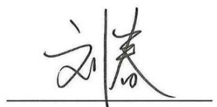  
刘春

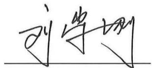  
刘崇刚

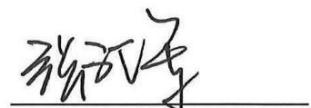  
张汇军

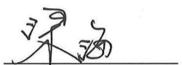  
梁海

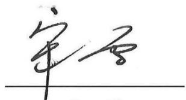  
宋雪

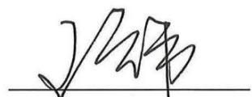  
王祎

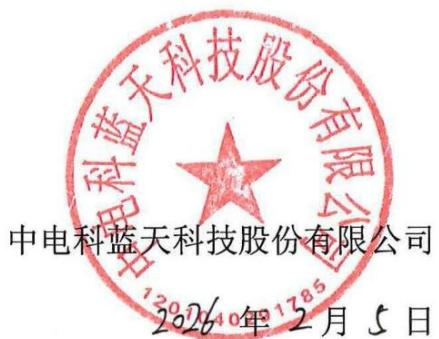

# 关于招股说明书的声明

# 二、发行人控股股东、实际控制人声明

本公司承诺本招股说明书的内容真实、准确、完整，不存在虚假记载、误导性陈述或重大遗漏，按照诚信原则履行承诺，并承担相应的法律责任。

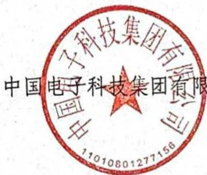

公司（盖章）

法定代表人或授权代表： 年 月

2026年2月5日

# 三、保荐人（主承销商）声明

本公司已对招股说明书进行核查，确认招股说明书的内容真实、准确、完整，不存在虚假记载、误导性陈述或重大遗漏，并承担相应的法律责任。

项目协办人签名：

3征

张恒征

保荐代表人签名：

李诗明

郝智伟

李诗购

法定代表人/董事长签名：

刘成

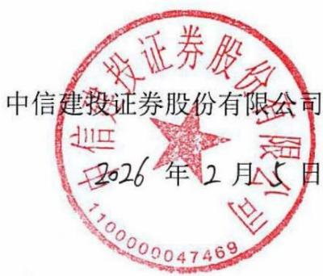

#

本人已认真阅读中电科蓝天科技股份有限公司招股说明书的全部内容，确认招股说明书不存在虚假记载、误导性陈述或者重大遗漏，并对招股说明书真实性、准确性、完整性、及时性承担相应法律责任。

总经理签名：

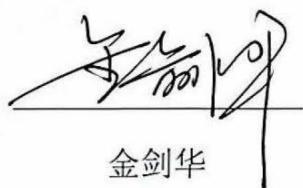

法定代表人/董事长签名：

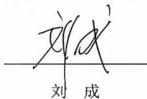

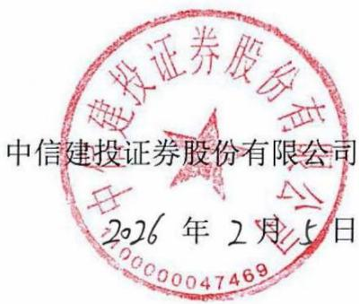

# 四、联席主承销商声明

本公司已对招股说明书进行核查，确认招股说明书的内容真实、准确、完整，不存在虚假记载、误导性陈述或重大遗漏，并承担相应的法律责任。

法定代表人签名：

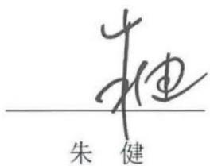

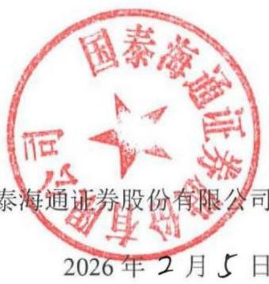

# 五、发行人律师声明

本所及经办律师已阅读中电科蓝天科技股份有限公司招股说明书，确认招股说明书与本所出具的法律意见书无矛盾之处。本所及经办律师对发行人在招股说明书中引用的法律意见书的内容无异议，确认招股说明书不致因上述内容而出现虚假记载、误导性陈述或重大遗漏，并承担相应的法律责任。

经办律师：

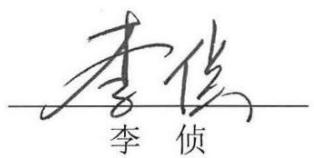

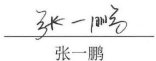

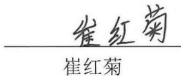

律师事务所负责人：

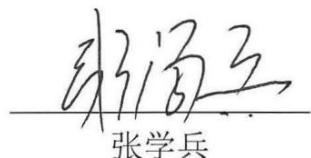

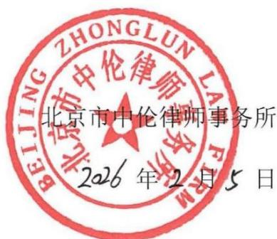

# 审计机构声明

本所及签字注册会计师已阅读招股说明书，确认招股说明书与本所出具的审计报告、内部控制鉴证报告及经本所鉴证的非经常性损益明细表等无矛盾之处。

本所及签字注册会计师对发行人在招股说明书中引用的审计报告、审阅报告、内部控制鉴证报告及经本所鉴证的非经常性损益明细表等的内容无异议，确认招股说明书不致因上述内容而出现虚假记载、误导性陈述或重大遗漏，并承担相应的法律责任。

本声明仅供中电科蓝天科技股份有限公司申请首次公开发行股票之用，不适用于任何其他目的。

签字注册会计师：

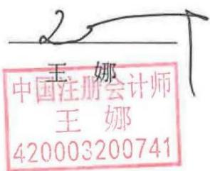

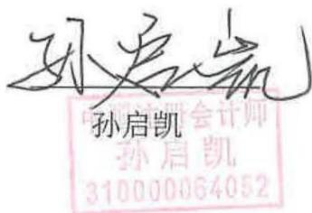

会计师事务所负责人：

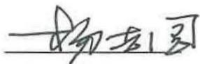

杨志国

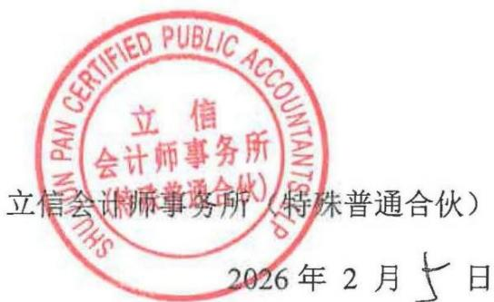

# 七、资产评估机构声明

本机构及签字资产评估师已阅读中电科蓝天科技股份有限公司招股说明书，确认中电科蓝天科技股份有限公司首次公开发行股票并在科创板上市招股说明书与本机构出具的资产评估报告无矛盾之处。本机构及签字资产评估师对发行人在招股说明书中引用的资产评估报告的内容无异议，确认招股说明书不致因上述内容而出现虚假记载、误导性陈述或重大遗漏，并承担相应的法律责任。

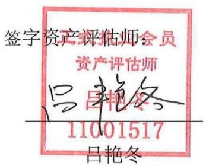

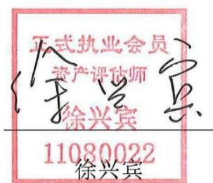

资产评估机构负责人：

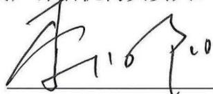

李伯阳

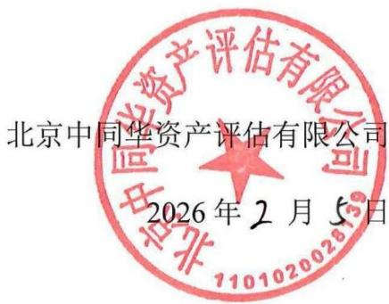

# 验资机构声明

本机构及签字注册会计师已阅读中电科蓝天科技股份有限公司招股说明书，确认招股说明书与本机构出具的验资报告无矛盾之处。本机构及签字注册会计师对发行人在招股说明书中引用的验资报告的内容无异议，确认招股说明书不致因上述内容而出现虚假记载、误导性陈述或重大遗漏，并承担相应的法律责任。

签字注册会计师：

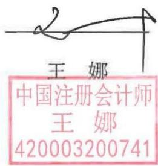

张海洋

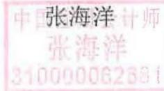

会计师事务所负责人：

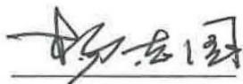

杨志国

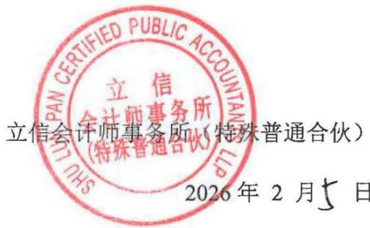

# 验资复核机构声明

本机构及签字注册会计师已阅读中电科蓝天科技股份有限公司招股说明书，确认招股说明书与本机构出具的验资复核报告无矛盾之处。本机构及签字注册会计师对发行人在招股说明书中引用的验资复核报告的内容无异议，确认招股说明书不致因上述内容而出现虚假记载、误导性陈述或重大遗漏，并承担相应的法律责任。

签字注册会计师：

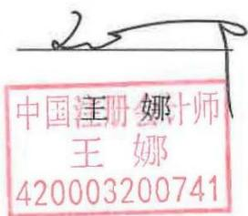

孙启凯

会计师事务所负责人：

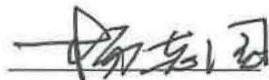

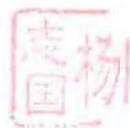

杨志国

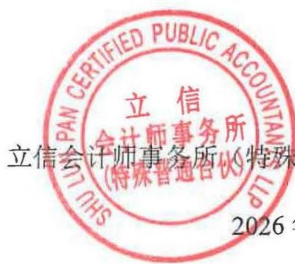

年2月5日

# 第十二节 附件

# 一、备查文件

（一）发行保荐书；  
（二）上市保荐书；  
（三）法律意见书；  
（四）财务报告及审计报告；  
（五）公司章程（草案）；  
（六）落实投资者关系管理相关规定的安排、发行人股利分配的决策程序及监督机制、股东投票机制建立情况；  
（七）与投资者保护相关的承诺；  
（八）发行人及其他责任主体作出的与发行人本次发行上市相关的其他承诺事项；  
（九）内部控制审计报告；  
（十）经注册会计师鉴证的非经常性损益明细表；  
（十一）股东会、董事会、独立董事、董事会秘书制度的建立健全及运行情况说明；  
（十二）审计委员会及其他专门委员会的设置情况说明；  
（十三）募集资金具体运用情况；  
（十四）其他与本次发行有关的重要文件。

# 二、查阅时间及地点

# （一）查阅时间

每周一至周五 9:30-11:30,13:00-15:00，法定节假日除外。

# （二）查阅地点

1、发行人：中电科蓝天科技股份有限公司

地址：天津市滨海高新技术产业开发区华科七路 6 号

电话：022-23721226

联系人：王祎

2、保荐机构：中信建投证券股份有限公司

地址：北京市朝阳区景辉街 16号院1号楼泰康集团大厦 11层

电话：010-56052417

联系人：郝智伟

# 附件一：落实投资者关系管理相关规定的安排、发行人股利分配的决策程序及监督机制、股东投票机制建立情况

# 一、落实投资者关系管理相关规定的安排

# （一）信息披露及投资者服务制度

根据《公司法》《证券法》及《科创板上市规则》等有关规定，公司已于2025 年 6 月 10 日召开第一届董事会第十三次会议，审议通过了信息披露及投资者服务相关管理制度，明确了信息披露的基本原则、信息披露的内容、信息披露事务管理、保密措施等相关内容，有助于加强公司与投资者之间的信息沟通，提升规范运作和公司治理水平，切实保护投资者的合法权益。

公司信息披露及投资者服务相关管理制度主要包括：

1、公司制订了《信息披露管理制度》，对信息披露的基本原则、信息披露的内容和信息披露事务管理等内容进行了详细的规定。  
2、公司还制定了《投资者关系管理制度》，公司通过便利股东权利行使、信息披露、互动交流和诉求处理等工作，加强与投资者及潜在投资者之间的沟通，增进投资者对公司的了解和认同，以提升公司治理水平和企业整体价值。

# （二）投资者沟通渠道

公司与投资者沟通的主要方式包括且不限于：定期报告和临时公告、年度报告说明会、股东会、公司网站、一对一沟通、邮寄资料、电话咨询、现场参观、分析师会议和路演等。公司将提供尽可能多的方式，并充分利用互联网络提高沟通效率，与投资者及时、深入和广泛地沟通。

公司信息披露和投资者关系管理部门的负责人与联系方式如下：

董事会秘书：王祎

联系地址：天津市滨海高新技术产业开发区华科七路 6 号

邮政编码：300392

联系电话：022-23721226

电子信箱：dshbgs@lantiantech.com.cn

# 二、股利分配的决策程序及监督机制

根据《中电科蓝天科技股份有限公司章程（草案）》第一百六十四条：

1、公司利润分配应重视对投资者的合理投资回报，同时兼顾公司的可持续发展，公司董事会应结合公司盈利水平、资金需求等情况拟定合理的分配方案，并充分听取独立董事的意见，公司独立董事认为现金分红具体方案可能损害公司或者中小股东权益的，有权发表独立意见。  
2、利润分配方案需经董事会审议通过后提交公司股东会审议。  
3、股东会对现金分红具体方案进行审议前，公司应当通过多种渠道主动与股东特别是中小股东进行沟通和交流，充分听取中小股东的意见和诉求，及时答复中小股东关心的问题。

# 三、股东投票机制建立情况

《中电科蓝天科技股份有限公司章程（草案）》已对股东投票机制作出规定，包括采取累积投票制选举公司董事、中小投资者单独计票机制、对法定事项采取网络投票方式的相关机制、征集投票权的相关安排等，具体内容如下：

# （一）采取累积投票制选举公司董事

根据《中电科蓝天科技股份有限公司章程（草案）》第八十七条：

股东会选举董事时，每一股份拥有与应选董事人数相同的表决权，股东拥有的表决权可以集中使用。董事会应当向股东公告候选董事的简历和基本情况。

# （二）中小投资者单独计票机制

根据《中电科蓝天科技股份有限公司章程（草案）》第八十四条：

股东会审议影响中小投资者利益的重大事项时，对中小投资者表决应当单独计票。单独计票结果应当及时公开披露。

# （三）对法定事项采取网络投票方式的相关机制

根据《中电科蓝天科技股份有限公司章程（草案）》第五十一条：

股东会将设置会场，以现场会议形式召开。公司还将提供网络投票的方式为股东提供便利。

# （四）征集投票权的相关安排

根据《中电科蓝天科技股份有限公司章程（草案）》第八十四条：

公司董事会、独立董事、持有 $1 \%$ 以上有表决权股份的股东或者依照法律、行政法规或者中国证监会的规定设立的投资者保护机构可以公开征集股东投票权。征集股东投票权应当向被征集人充分披露具体投票意向等信息。禁止以有偿或者变相有偿的方式征集股东投票权。除法定条件外，公司不得对征集投票权提出最低持股比例限制。

# 附件二：与投资者保护相关的承诺

# 一、本次发行前股东所持股份的限售安排、自愿锁定股份、延长锁定期限以及股东持股及减持意向等承诺

# （一）关于所持公司股份限售安排、自愿锁定股份、延长锁定期限的承诺

# 1、发行人控股股东、实际控制人中国电科承诺如下：

（1）本公司持有的发行人的股份不存在委托持股、信托持股或其他可能导致本公司所持发行人的股份权属不清晰或存在潜在纠纷的情形；不存在任何质押、冻结、查封等权利受到限制的情形。  
（2）除因法律、法规、规范性文件和国家有权部门的要求而需进行股权划转、转让等导致本公司持有的发行人股份发生变动的情况外，自发行人股票在上海证券交易所上市交易之日起 36 个月内，本公司不转让或者委托他人管理本次发行前直接或间接持有的发行人的股份，也不由发行人回购该部分股份。  
（3）发行人上市后 6个月内，如发行人股票连续 20个交易日的收盘价均低于发行人首次公开发行股票时的价格（指公司首次公开发行股票的发行价格，若本次发行后公司发生派发股利、送红股、转增股本、增发新股或配股等除息、除权行为的，则上述价格将进行相应调整，下同），或者上市后 6个月期末（如该日不是交易日，则为该日后第一个交易日）收盘价低于发行人首次公开发行股票时的价格，则本公司持有发行人股票的锁定期限自动延长 6 个月。  
（4）若发行人存在重大违法情形，触及退市标准的，自相关行政处罚决定或者司法裁判作出之日起至发行人股票终止上市前，本公司不减持控制的发行人的股份。  
（5）关于发行人业绩下滑时：

$\textcircled{1}$ 发行人上市当年较上市前一年净利润下滑 $5 0 \%$ 以上的，延长本公司届时所持股份锁定期限6个月。  
$\textcircled{2}$ 发行人上市第二年较上市前一年净利润下滑 $5 0 \%$ 以上的，在前项基础上延长本公司届时所持股份锁定期限 6个月。

$\textcircled{3}$ 发行人上市第三年较上市前一年净利润下滑 $5 0 \%$ 以上的，在前两项基础上延长本公司届时所持股份锁定期限 6 个月。

前三项所述“净利润”以扣除非经常性损益后归母净利润为准。本公司届时所持股份指本公司上市前取得，上市当年及之后第二年、第三年年报披露时仍持有的股份。

（6）若法律、法规或证券监管机构对股份锁定期等事项另有规定的，本公司承诺将同时遵守该等规定。

如因本公司未履行上述承诺，造成投资者和/或发行人损失的，本公司将依法赔偿损失。

# 2、发行人控股股东、实际控制人的一致行动人十八所、景鸿瑞和、景源瑞和、电科投资承诺如下：

（1）本企业持有的发行人的股份不存在委托持股、信托持股或其他可能导致本企业所持发行人的股份权属不清晰或存在潜在纠纷的情形；不存在任何质押、冻结、查封等权利受到限制的情形。  
（2）除因法律、法规、规范性文件和国家有权部门的要求而需进行股权划转、转让等导致本企业持有的发行人股份发生变动的情况外，自发行人股票在上海证券交易所上市交易之日起 36 个月内，本企业不转让或者委托他人管理本次发行前直接或间接持有的发行人的股份，也不由发行人回购该部分股份。  
（3）发行人上市后 6个月内，如发行人股票连续 20个交易日的收盘价均低于发行人首次公开发行股票时的价格（指公司首次公开发行股票的发行价格，若本次发行后公司发生派发股利、送红股、转增股本、增发新股或配股等除息、除权行为的，则上述价格将进行相应调整，下同），或者上市后 6个月期末（如该日不是交易日，则为该日后第一个交易日）收盘价低于发行人首次公开发行股票时的价格，则本企业持有发行人股票的锁定期限自动延长 6 个月。  
（4）若发行人存在重大违法情形，触及退市标准的，自相关行政处罚决定或者司法裁判作出之日起至发行人股票终止上市前，本企业不减持控制的发行人的股份。

# （5）关于发行人业绩下滑时：

$\textcircled{1}$ 发行人上市当年较上市前一年净利润下滑 $5 0 \%$ 以上的，延长本企业届时所持股份锁定期限6个月。  
$\textcircled{2}$ 发行人上市第二年较上市前一年净利润下滑 $5 0 \%$ 以上的，在前项基础上延长本企业届时所持股份锁定期限 6个月。  
$\textcircled{3}$ 发行人上市第三年较上市前一年净利润下滑 $5 0 \%$ 以上的，在前两项基础上延长本企业届时所持股份锁定期限 6个月。

前三项所述“净利润”以扣除非经常性损益后归母净利润为准。本企业届时所持股份指本企业上市前取得，上市当年及之后第二年、第三年年报披露时仍持有的股份。

（6）若法律、法规或证券监管机构对股份锁定期等事项另有规定的，本企业承诺将同时遵守该等规定。

如因本企业未履行上述承诺，造成投资者和/或发行人损失的，本企业将依法赔偿损失。

# 3、发行人除控股股东中国电科、十八所、电科投资、景鸿瑞和、景源瑞和外的其他股东承诺如下：

（1）自公司股票上市之日起 12个月内，不转让或者委托他人管理本企业持有的公司首次公开发行股票前已发行股份，也不由公司回购本企业持有的该部分股份。  
（2）本企业将严格遵守相关法律法规、中国证券监督管理委员会规定以及上海证券交易所业务规则的规定以及本承诺的相关内容。本承诺出具之日后，如相关法律法规、中国证券监督管理委员会和上海证券交易所另有要求的，本企业承诺将按照最新规定或要求执行。

# 4、发行人董事、高级管理人员郑宏宇、朱立宏、盛彦华、刘春、刘崇刚、张汇军、梁海、宋雪、王祎承诺如下：

（1）自公司股票上市之日起 36个月内，不转让或者委托他人管理本人间接持有的公司首次公开发行股票前已发行股份，也不由公司回购本人持有的该部分

股份。

（2）本人在就任时确定的任职期间内每年通过集中竞价、大宗交易、协议转让等方式转让的股份不得超过其所持有公司股份总数的 $2 5 \%$ 。本人离职后半年内，不转让所持有的公司股份。如本人在任期届满前离职的，在就任时确定的任期内和任期届满后6个月内本人亦遵守本条承诺。  
（3）公司股票上市后 6个月内，如公司股票连续 20个交易日的收盘价均低于发行价（如公司发生分红、派息、送股、转增股本、配股等除权除息事项，则作除权除息处理，下同），或者上市后 6 个月期末（如该日不是交易日，则为该日后第一个交易日）收盘价低于发行价，本人持有公司股票的锁定期限自动延长6个月。本人不因职务变更、离职等原因而放弃履行该承诺。  
（4）本人将严格遵守相关法律法规、中国证券监督管理委员会规定以及上海证券交易所业务规则的规定以及本承诺的相关内容。本承诺出具之日后，如相关法律法规、中国证券监督管理委员会和上海证券交易所另有要求的，本人承诺将按照最新规定或要求执行。

# 5、发行人核心技术人员周江、孙强、张泰峰、李会娟、苏彬承诺如下：

（1）本人自公司股票上市之日起 36个月内和离职后6个月内，不转让或者委托他人管理本人间接持有的公司首次公开发行前的股份，也不由公司回购该等股份。  
（2）本人将严格遵守相关法律法规、中国证券监督管理委员会规定以及上海证券交易所业务规则的规定以及本承诺的相关内容。本承诺出具之日后，如相关法律法规、中国证券监督管理委员会和上海证券交易所另有要求的，本人承诺将按照最新规定或要求执行。

# （二）关于公开发行上市后持股意向及减持意向的承诺

# 1、发行人控股股东、实际控制人中国电科承诺如下：

（1）本公司在锁定期内将不会出售本次发行上市前直接或间接持有的公司股份。  
（2）如锁定期满后，本公司拟减持发行人股票，将遵守中国证券监督管理

委员会（以下简称中国证监会）和上海证券交易所关于股份减持的相关规定，结合发行人稳定股价的需要，审慎制定股份减持计划。

（3）本公司自锁定期届满之日起 24个月内减持股份的具体安排如下：

$\textcircled{1}$ 在不违反法律法规、规范性文件、中国证监会和上海证券交易所的相关规定及本公司在本次发行上市时所作出的公开承诺的情况下，本公司可以减持公司股份；  
$\textcircled{2}$ 本公司减持发行人股份的方式应符合相关法律、法规及规范性文件的规定，减持方式包括但不限于集中竞价、大宗交易、协议转让等；  
$\textcircled{3}$ 本公司采取集中竞价交易方式减持的，在任意连续 90 日内减持股份的总数不超过公司股份总数的 $1 \%$ ；采取大宗交易方式减持的，在任意连续 90日内减持股份的总数不超过公司股份总数的 $2 \%$ ；采取协议转让方式的，单个受让方的受让比例不得低于公司股份总数的 $5 \%$ ；  
$\textcircled{4}$ 本公司减持发行人股份的价格不低于公司首次发行股票并上市时的发行价（如公司发生分红、派息、送股、转增股本、配股等除权除息事项，则相应调整发行价）；  
$\textcircled{5}$ 本公司将按照相关法律法规、中国证监会规定以及上海证券交易所业务规则及时、准确、完整地履行信息披露义务。本公司拟减持发行人股份且本公司仍为持有发行人 $5 \%$ 以上股份的股东时，将在减持前 3 个交易日予以公告，通过证券交易所集中竞价交易首次减持的，在减持前 15个交易日予以公告。  
（4）本公司将严格遵守相关法律法规、中国证监会规定以及上海证券交易所业务规则的规定以及本承诺的相关内容。本承诺出具之日后，如相关法律法规、中国证监会和上海证券交易所另有要求的，本公司承诺将按照最新规定或要求执行。  
（5）如因本公司未履行上述承诺，造成投资者和/或发行人损失的，本公司将依法赔偿损失。

# 2、发行人控股股东、实际控制人的一致行动人十八所、景鸿瑞和、景源瑞和、电科投资承诺如下：

（1）本企业在锁定期内将不会出售本次发行上市前直接或间接持有的公司股份。  
（2）如锁定期满后，本企业拟减持公司股票，将遵守中国证券监督管理委员会（以下简称“中国证监会”）和上海证券交易所关于股份减持的相关规定，结合公司稳定股价的需要，审慎制定股份减持计划。  
（3）本企业自锁定期届满之日起 24个月内减持股份的具体安排如下：

$\textcircled{1}$ 在不违反法律法规、规范性文件、中国证监会和上海证券交易所的相关规定及本企业在本次发行上市时所作出的公开承诺的情况下，本企业可以减持公司股份；  
$\textcircled{2}$ 本企业减持发行人股份的方式应符合相关法律、法规及规范性文件的规定，减持方式包括但不限于集中竞价、大宗交易、协议转让等；  
$\textcircled{3}$ 本企业采取集中竞价交易方式减持的，在任意连续 90 日内减持股份的总数不超过公司股份总数的 $1 \%$ ；采取大宗交易方式减持的，在任意连续 90日内减持股份的总数不超过公司股份总数的 $2 \%$ ；采取协议转让方式的，单个受让方的受让比例不得低于公司股份总数的 $5 \%$ ；  
$\textcircled{4}$ 本企业减持发行人股份的价格不低于公司首次发行股票并上市时的发行价（如公司发生分红、派息、送股、转增股本、配股等除权除息事项，则相应调整发行价）；  
$\textcircled{5}$ 本企业将按照相关法律法规、中国证监会规定以及上海证券交易所业务规则及时、准确、完整地履行信息披露义务。本企业拟减持发行人股份且本企业仍为持有发行人 $5 \%$ 以上股份的股东时，将在减持前 3 个交易日予以公告，通过证券交易所集中竞价交易首次减持的，在减持前 15个交易日予以公告。  
（4）本企业将严格遵守相关法律法规、中国证券监督管理委员会规定以及上海证券交易所业务规则的规定以及本承诺的相关内容。本承诺出具之日后，如相关法律法规、中国证券监督管理委员会和上海证券交易所另有要求的，本企业

承诺将按照最新规定或要求执行。

（5）如因本企业未履行上述承诺，造成投资者和/或发行人损失的，本企业将依法赔偿损失。

3、发行人董事、高级管理人员郑宏宇、朱立宏、盛彦华、刘春、刘崇刚、张汇军、梁海、宋雪、王祎承诺如下：

（1）本人将严格遵守本人作出的关于股份锁定的承诺，在锁定期内将不会出售本次发行上市前间接持有的公司股份。  
（2）本人所持股票在锁定期满后两年内减持的，减持价格不低于公司首次发行股票并上市时的发行价（如公司发生分红、派息、送股、转增股本、配股等除权除息事项，则相应调整发行价）。  
（3）本人将严格遵守相关法律法规、中国证券监督管理委员会规定以及上海证券交易所业务规则的规定以及本承诺的相关内容。本承诺出具之日后，如相关法律法规、中国证券监督管理委员会和上海证券交易所另有要求的，本人承诺将按照最新规定或要求执行。  
（4）如因本人未履行上述承诺，造成投资者和/或发行人损失的，本人将依法赔偿损失。

4、发行人核心技术人员周江、孙强、张泰峰、李会娟、苏彬承诺如下：

（1）本人将严格遵守本人作出的关于股份锁定的承诺，在锁定期内将不会出售本次发行上市前间接持有的公司股份。  
（2）自本人所持首发前股份限售期满之日起 4 年内，每年转让的首发前股份不得超过上市时所持公司首发前股份总数的 $2 5 \%$ ，减持比例可以累计使用。  
（3）本人将严格遵守相关法律法规、中国证券监督管理委员会规定以及上海证券交易所业务规则的规定以及本承诺的相关内容。本承诺出具之日后，如相关法律法规、中国证券监督管理委员会和上海证券交易所另有要求的，本人承诺将按照最新规定或要求执行。  
（4）如因本人未履行上述承诺，造成投资者和/或发行人损失的，本人将依法赔偿损失。

# 二、稳定股价的措施和承诺

# （一）稳定股价的措施

# 1、启动和停止股价稳定措施的条件

# （1）启动条件

公司股票上市交易之日起三年内，当非因不可抗力因素而公司股票连续 20个交易日每日的收盘价低于公司最近一期经审计的每股净资产时（最近一期审计基准日后，若因利润分配、资本公积金转增股本、增发、配股等事项导致公司净资产或股份总数出现变化的，每股净资产应做相应调整），且在满足法律、法规和规范性文件关于增持或回购公司股份等行为的相关规定的前提下，相关主体将积极采取稳定股价的措施。

# （2）停止条件

$\textcircled{1}$ 在稳定股价具体方案的实施期间内，如公司股票连续 20 个交易日收盘价高于最近一期经审计的每股净资产时；  
$\textcircled{2}$ 继续实施股价稳定措施将导致股权分布不符合上市条件时；  
$\textcircled{3}$ 各相关主体在连续 12 个月内购买股份的数量或用于购买股份的金额已达到上限时。

# 2、稳定股价的具体措施

# （1）稳定股价的措施

公司股价稳定措施启动条件满足时，将实施如下股价稳定措施： $\textcircled{1}$ 公司回购股票； $\textcircled{2}$ 控股股东增持公司股票； $\textcircled{3}$ 公司董事（不含独立董事及未领取薪酬的董事，下同）、高级管理人员增持公司股票。

# （2）公司回购股票

$\textcircled{1}$ 公司董事会应在启动股价稳定措施的条件触发之日的 10 个交易日内召集召开董事会，审议稳定股价具体方案。  
$\textcircled{2}$ 如根据相关法律、法规及中国证监会、上海证券交易所相关规定，需提交股东会审议的，须经出席会议的股东所持表决权的三分之二以上通过。

$\textcircled{3}$ 在股东会审议通过股份回购方案后，公司应依法通知债权人，向证券监管部门、证券交易所等主管部门报送相关材料，办理审批或备案手续。在完成必需的审批、备案、信息披露等程序后，公司方可实施相应的股份回购方案。  
$\textcircled{4}$ 公司为稳定股价之目的进行股份回购的，除应符合相关法律、行政法规和规范性文件之要求外，还应符合下列各项：

A.公司用于回购股份的资金总额累计不超过公司首次公开发行人民币普通股（A股）所募集资金的总额；  
B.公司单次回购股份不超过总股本的 $2 \%$ ；  
C.公司单次用于回购股份的资金总额不低于人民币 1,000 万元。

当上述 B、C 两项条件产生冲突时，优先满足第 B 项条件的规定。

$\textcircled{5}$ 公司通过交易所集中竞价交易方式、要约方式或证券监管部门认可的其他方式回购公司股票。

# （3）控股股东增持

$\textcircled{1}$ 控股股东应在其启动股价稳定措施的条件触发之日的 10 个交易日内制定增持公司股票计划并由公司公告。公司控股股东增持公司股票后，自增持股票行为完成之日起六个月内不转让所持有的公司股票，包括增持前持有的公司股票。  
$\textcircled{2}$ 控股股东为稳定股价之目的进行股份回购的，除应符合相关法律、行政法规和规范性文件之要求外，还应符合下列各项：

A.单次和/或连续十二个月内增持股票不超过公司总股本的 $2 \%$ ；  
B.单次用于增持公司股份的资金总额不低于人民币 1,000 万元；

当上述A、B两项条件产生冲突时，优先满足第 A项条件的规定。

# （4）董事、高级管理人员增持

$\textcircled{1}$ 董事、高级管理人员应在其启动股价稳定措施的条件触发之日的 10 个交易日内制定增持公司股票计划并由公司公告。公司董事、高级管理人员增持公司股票后，自增持股票行为完成之日起六个月内不转让所持有的公司股票，包括增持前持有的公司股票（如有）。

$\textcircled{2}$ 公司董事、高级管理人员连续十二个月内用于增持公司股票的资金不少于该等董事、高级管理人员最近一个会计年度自公司领取的薪酬（税后）的 $20 \%$ ，但不超过该等董事、高级管理人员最近一个会计年度自公司领取的薪酬（税后）总额。  
$\textcircled{3}$ 公司股票上市后三年内新聘任的董事、高级管理人员亦需履行上述义务。

公司将视股票市场情况、公司实际情况，采取上述部分或全部股价稳定的措施。

# 3、未履行稳定股价方案的约束措施

在启动股价稳定措施的条件满足时，如公司、控股股东、董事、高级管理人员未按本预案履行相关义务，将启动如下约束措施：

（1）公司未按本预案内容履行相关义务的，应在公司股东会及中国证监会或上海证券交易所指定媒体上公开说明未采取上述稳定股价措施的具体原因，并向公司股东和社会公众投资者道歉。  
（2）控股股东未按本预案内容履行相关义务的，应在公司股东会及中国证监会或上海证券交易所指定媒体上公开说明未采取上述稳定股价措施的具体原因并向公司股东和社会公众投资者道歉。同时，控股股东将暂停在发行人处获得股份分红，直至控股股东采取相应的股价稳定措施并实施完毕为止。如果因控股股东未采取稳定股价的具体措施给发行人和/或投资者造成损失的，控股股东将依法向发行人和/或投资者进行赔偿。  
（3）董事、高级管理人员未按本预案内容履行相关义务的，应在公司股东会及中国证监会或上海证券交易所指定媒体上公开说明未采取上述稳定股价措施的具体原因并向公司股东和社会公众投资者道歉。同时，董事、高级管理人员将暂停在发行人处获得当年应得薪酬，直至该等人员采取相应的股价稳定措施并实施完毕为止。如果因董事、高级管理人员未采取稳定股价的具体措施给发行人和/或投资者造成损失的，该等人员将依法对发行人和/或投资者进行赔偿。

# （二）稳定股价预案的相关承诺

就稳定股价事宜，发行人及其控股股东、实际控制人，发行人的董事（独立

董事及未在公司领薪的非独立董事除外）、高级管理人员分别承诺如下：

# 1、发行人的承诺

（1）本公司将严格遵守股东会审议通过的《中电科蓝天科技股份有限公司首次公开发行股票并上市后三年内稳定公司股价的预案》，包括按照该预案的规定履行稳定公司股价的义务并接受未能履行稳定公司股价义务时的约束措施。  
（2）自《中电科蓝天科技股份有限公司首次公开发行股票并上市后三年内稳定公司股价的预案》生效之日至本公司首次公开发行股票并上市之日起三年内，本公司若新聘董事、高级管理人员的，将要求新聘的董事（不含独立董事及未领取薪酬的董事，下同）、高级管理人员履行本公司本次发行上市时董事、高级管理人员已作出的相应承诺。

# 2、控股股东、实际控制人中国电科的承诺

公司股票上市后三年内，若发行人股票收盘价连续 20 个交易日均低于最近一期末经审计的每股净资产（若因除权除息等事项致使上述股票收盘价与发行人最近一期末经审计的每股净资产不具可比性的，上述每股净资产应做相应调整），本公司在同时满足相关回购、增持公司股份等行为的法律、法规和规范性文件的规定下，配合发行人切实履行相应股东职责。

# 3、发行人董事、高级管理人员承诺

（1）本人将严格遵守公司股东会审议通过的《中电科蓝天科技股份有限公司首次公开发行股票并上市后三年内稳定公司股价的预案》，包括按照该预案的规定履行稳定公司股价的义务并接受未能履行稳定公司股价义务时的约束措施。  
（2）本人将在公司董事会及/或股东会审议发行人实施股份回购等稳定股价措施相关议案时投出赞成票。

# 三、股份回购的承诺

# （一）发行人的承诺

1、本公司保证本公司首次公开发行股票并在科创板上市过程中不存在任何欺诈发行的情形。

2、如本公司不符合发行上市条件，以欺骗手段骗取发行注册并已经发行上市的，本公司将在中国证券监督管理委员会等有权部门确认后五个工作日内启动股份购回程序，购回本公司本次公开发行的全部新股。  
3、如中国证券监督管理委员会对本公司作出责令回购决定的，本公司将按照责令回购的要求履行回购义务。如届时相关法律、法规、规章、规范性文件对欺诈发行股份回购事宜另有规定的，本公司将遵守相关规定。

# （二）控股股东、实际控制人中国电科的承诺

1、本公司保证发行人首次公开发行股票并在科创板上市过程中不存在任何欺诈发行的情形。  
2、如发行人不符合发行上市条件，以欺骗手段骗取发行注册并已经发行上市的，本公司将在中国证券监督管理委员会等有权部门确认后五个工作日内启动股份购回程序，购回本次公开发行的全部新股。  
3、发行人首次公开发行股票招股说明书及其他信息披露资料不存在虚假记载、误导性陈述或者重大遗漏，本公司对其真实性、准确性、完整性承担个别和连带的法律责任。若招股说明书及其他信息披露资料有虚假记载、误导性陈述或者重大遗漏，致使投资者在证券发行和交易中遭受损失的，则本公司将依法赔偿投资者损失。

# 四、填补被摊薄即期回报措施的承诺

# （一）发行人填补摊薄即期回报的措施

发行人关于填补摊薄即期回报的具体措施如下：

1、保证募集资金规范、有效使用，实现项目预期回报

本次发行募集资金到账后，公司将开设募集资金专项账户并与开户行、保荐机构签订募集资金三方监管协议，确保募集资金专款专用。同时，公司将严格遵守《募集资金管理制度》的规定，在进行募集资金项目投资时，履行资金支出审批手续，明确各控制环节的相关责任，按项目计划申请、审批、使用募集资金，并对使用情况进行内部考核与审计。

2、积极、稳妥地实施募集资金投资项目

本次募集资金投资项目符合国家产业政策、行业发展趋势与公司发展战略，可有效提升公司业务实力、技术水平与管理能力，从而进一步巩固公司的市场地位，提高公司的盈利能力与综合竞争力。公司已充分做好了募集资金投资项目前期的可行性研究工作，对募集资金投资项目所涉及行业进行了深入的了解和分析，结合行业趋势、市场容量及公司自身等基本情况，最终拟定了项目规划。本次募集资金到位后，公司将加快推进募集资金投资项目的实施，争取早日投产并实现预期效益。

# 3、提高资金运营效率

公司将进一步提高资金运营效率，降低公司运营成本，通过加快技术研发、市场推广等方式提升公司经营业绩，应对行业波动和行业竞争给公司经营带来的风险，保证公司长期的竞争力和持续盈利能力。

# 4、完善内部控制，加强资金使用管理和对管理层考核

公司将进一步完善内部控制，加强资金管理，防止资金被挤占挪用，提高资金使用效率；严格控制公司费用支出，加大成本控制力度，提升公司利润率；加强对管理层的考核，将管理层薪酬水平与公司经营效益挂钩，确保管理层恪尽职守、勤勉尽责。

# 5、其他方式

公司未来将根据中国证券监督管理委员会、上海证券交易所等监管机构出台的具体细则及要求，持续完善填补被摊薄即期回报的各项措施。

# （二）控股股东、实际控制人中国电科的承诺

1、本公司不越权干预发行人经营管理活动，不侵占发行人利益。  
2、如果本公司未能履行上述承诺，将在股东会及中国证券监督管理委员会指定报刊上公开说明未履行的具体原因并道歉，违反承诺给发行人或股东造成损失的，依法承担补偿责任。

# （三）发行人董事、高级管理人员的承诺

1、不无偿或以不公平条件向其他单位或者个人输送利益，也不采用其他方式损害公司利益。

2、对本人的职务消费行为进行约束。  
3、不动用公司资产从事与其履行职责无关的投资、消费活动。  
4、由董事会或薪酬与考核委员会制定的薪酬制度与公司填补回报措施的执行情况相挂钩。  
5、若公司后续推出股权激励计划，拟公布的公司股权激励的行权条件与公司填补回报措施的执行情况相挂钩。  
6、本人将严格履行上述承诺事项，确保公司填补回报措施能够得到切实履行。如果本人违反承诺或拒不履行承诺，本人将在股东会及中国证券监督管理委员会指定报刊公开作出解释并道歉，并同意中国证监会、证券交易所和中国上市公司协会依法作出的监管措施或自律监管措施；违反承诺给公司或者股东造成损失的，将依法承担补偿责任。

# 五、关于股利分配的承诺

# （一）发行人的承诺

1、在本公司提交首次公开发行股票并在上海证券交易所科创板上市申请之日至首次公开发行股票并在上海证券交易所科创板上市前，即在审期间不进行现金分红。  
2、在完成首次公开发行股票并上市后，本公司将严格按照上市后适用的公司章程以及《中电科蓝天科技股份有限公司未来三年股东分红回报规划》等相关文件的规定，贯彻执行本公司制定的利润分配政策，充分维护股东利益。  
3、如违反上述承诺，本公司将按照中国证券监督管理委员会、上海证券交易所的规定承担相应责任。

# （二）控股股东、实际控制人中国电科的承诺

1、本公司将采取一切必要的合理措施，促使发行人按照股东会审议通过的分红回报规划及发行人上市后生效的《公司章程（草案）》的相关规定，严格执行相应的利润分配政策和分红回报规划。  
2、如违反上述承诺，本公司将依法承担相应责任。

# （三）发行人董事、高级管理人员的相关承诺

1、本人将采取一切必要的合理措施，促使发行人按照股东会审议通过的分红回报规划及发行人上市后生效的《公司章程（草案）》的相关规定，严格执行相应的利润分配政策和分红回报规划。  
2、本人将采取的措施包括但不限于：

（1）根据《公司章程（草案）》中规定的利润分配政策及分红回报规划，提出利润分配预案；  
（2）在审议发行人利润分配预案的董事会上，对符合利润分配政策和分红回报规划要求的利润分配预案投赞成票；  
（3）督促发行人根据相关决议实施利润分配。

# 六、关于避免同业竞争的承诺

# （一）控股股东、实际控制人中国电科关于避免同业竞争的承诺

1、本公司作为国务院授权投资机构向发行人等有关成员单位行使出资人权利，进行国有股权管理。本公司自身不参与具体业务，与发行人不存在同业竞争的情况。  
2、发行人首次公开发行股票并上市后，本公司及本公司实际控制的其他单位不会直接或间接地从事与发行人主要经营业务构成重大不利影响的同业竞争的业务。  
3、如果本公司及本公司实际控制的其他单位获得的商业机会与发行人主要经营业务构成重大不利影响的同业竞争的，如发行人拟争取该等商业机会的，本公司将加强内部协调与控制管理，避免出现因为同业竞争损害发行人及其公众投资者利益的情况。  
4、本承诺函在发行人合法有效存续且本公司作为发行人的实际控制人、控股股东期间持续有效。自本承诺函出具之日起，若因本公司违反本承诺函任何条款而致使发行人遭受或产生任何直接损失，在有关的损失金额确定后，本公司将在合理时限内予以全额赔偿。

# （二）十八所关于避免同业竞争的承诺

本单位与发行人不存在同业竞争关系，本单位将坚守业务定位，与发行人保持差异化发展，避免与发行人产生竞争。如果本单位研究的技术成果拟进行商业化转化并属于发行人的主营业务范畴的，本单位将优先按市场公允价格与发行人签署科技成果转化协议，由发行人实施该等业务。

本承诺函在发行人合法有效存续且本单位作为发行人同一控制下的关联方期间持续有效。自本承诺函出具之日起，若因本单位违反本承诺函内容而致使发行人遭受或产生直接损失，在有关的损失金额确定后本单位将承担赔偿责任。

# 七、关于依法承担赔偿责任的承诺

# （一）发行人的承诺

1、本公司向上海证券交易所提交的首次公开发行股票并上市招股说明书不存在虚假记载、误导性陈述或者重大遗漏。  
2、若本公司首次公开发行股票并上市招股说明书有虚假记载、误导性陈述或者重大遗漏，致使投资者在证券发行和交易中遭受损失的，本公司将在证券监管部门依法对上述事实作出认定或处罚决定后依法赔偿投资者损失。具体的赔偿标准、赔偿主体范围、赔偿金额等细节内容待上述情形实际发生时，依最终确定的赔偿方案确定。

# （二）发行人董事、高级管理人员的承诺

1、公司向上海证券交易所提交的首次公开发行股票并上市招股说明书不存在虚假记载、误导性陈述或者重大遗漏。  
2、若公司首次公开发行股票并上市招股说明书有虚假记载、误导性陈述或者重大遗漏，致使投资者在证券发行和交易中遭受损失的，本人将在证券监管部门依法对上述事实作出认定或处罚决定后依法赔偿投资者损失。具体的赔偿标准、赔偿主体范围、赔偿金额等细节内容待上述情形实际发生时，依最终确定的赔偿方案确定。

# 八、关于未能履行承诺事项约束措施的承诺

# （一）发行人的承诺

1、如因相关法律法规、政策变化、自然灾害等自身无法控制的客观原因导致承诺无法履行的，本公司将采取以下措施：

（1）在股东会及符合中国证券监督管理委员会规定的媒体上公开说明未履行承诺的具体原因；  
（2）向本公司的投资者提出补充承诺或替代承诺（相关承诺需按法律、法规、公司章程的规定履行相关审批程序），以尽可能保护投资者的权益。

2、如非因相关法律法规、政策变化、自然灾害等自身无法控制的客观原因而未履行承诺的，本公司将接受如下约束措施，直至承诺履行完毕或相应补救措施实施完毕：

（1）在股东会及符合中国证券监督管理委员会规定的媒体上公开说明未履行承诺的具体原因以及未履行承诺时的补救及改正情况，并向股东和社会公众投资者道歉；  
（2）如果因本公司未履行相关承诺事项，给投资者造成损失的，本公司将向投资者依法承担赔偿责任。

# （二）控股股东、实际控制人中国电科的承诺

1、如因相关法律法规、政策变化、自然灾害等自身无法控制的客观原因导致承诺无法履行的，本公司将采取以下措施：

（1）在股东会及符合中国证券监督管理委员会规定的媒体上公开说明未履行承诺的具体原因；  
（2）向公司的投资者提出补充承诺或替代承诺（相关承诺需按法律、法规、公司章程的规定履行相关审批程序），以尽可能保护投资者的权益。  
2、如非因相关法律法规、政策变化、自然灾害等自身无法控制的客观原因而未履行承诺的，本公司将接受如下约束措施，直至承诺履行完毕或相应补救措施实施完毕：

（1）在股东会及符合中国证券监督管理委员会规定的媒体上公开说明未履行承诺的具体原因以及未履行承诺时的补救及改正情况，并向社会公众投资者道歉；  
（2）如果因本公司未履行相关承诺事项，给投资者造成损失的，本公司将向投资者依法承担赔偿责任。

# （三）十八所、景鸿瑞和、景源瑞和、电科投资的承诺

1、如因相关法律法规、政策变化、自然灾害等自身无法控制的客观原因导致承诺无法履行的，本企业将采取以下措施：

（1）在股东会及符合中国证券监督管理委员会规定的媒体上公开说明未履行承诺的具体原因；  
（2）向公司的投资者提出补充承诺或替代承诺（相关承诺需按法律、法规、公司章程的规定履行相关审批程序），以尽可能保护投资者的权益。

2、如非因相关法律法规、政策变化、自然灾害等自身无法控制的客观原因而未履行承诺的，本企业将接受如下约束措施，直至承诺履行完毕或相应补救措施实施完毕：

（1）在股东会及符合中国证券监督管理委员会规定的媒体上公开说明未履行承诺的具体原因以及未履行承诺时的补救及改正情况，并向社会公众投资者道歉；  
（2）如果因本企业未履行相关承诺事项，给投资者造成损失的，本企业将向投资者依法承担赔偿责任。

# （四）发行人董事、高级管理人员、核心技术人员的承诺

1、如因相关法律法规、政策变化、自然灾害等自身无法控制的客观原因导致承诺无法履行的，本人将采取以下措施：

（1）在股东会及符合中国证券监督管理委员会规定的媒体上公开说明未履行承诺的具体原因；  
（2）向公司的投资者提出补充承诺或替代承诺（相关承诺需按法律、法规、公司章程的规定履行相关审批程序），以尽可能保护投资者的权益。

2、如非因相关法律法规、政策变化、自然灾害等自身无法控制的客观原因而未履行承诺的，本人将接受如下约束措施，直至承诺履行完毕或相应补救措施实施完毕：

（1）在股东会及符合中国证券监督管理委员会规定的媒体上公开说明未履行承诺的具体原因以及未履行承诺时的补救及改正情况，并向社会公众投资者道歉；  
（2）如果因本人未履行相关承诺事项，给投资者造成损失的，本人将向投资者依法承担赔偿责任。

# 附件三：发行人及其他责任主体作出的与发行人本次发行上市相关的其他承诺事项

# 一、关于规范关联交易的承诺

发行人控股股东、实际控制人及其一致行动人、发行人全体董事、高级管理人员承诺：

# （一）控股股东、实际控制人中国电科承诺

1、本公司将尽可能地减少和避免本公司及本公司控制的公司（以下统称“关联公司”）与发行人及/或其子公司之间发生关联交易。对于无法避免或者有合理原因而发生的关联交易，本公司及关联公司将遵循市场公正、公平、公开的原则及正常的商业条件进行交易，交易价格按市场公认的合理价格确定，保证不通过关联交易损害发行人及其他股东的合法权益。  
2、本公司将严格遵守有关法律、法规和规范性文件以及公司章程等的规定，所涉及的关联交易均按照公司关联交易决策程序进行，并将履行合法程序及法律法规规定的信息披露义务。  
3、本公司保证本公司及关联公司不违规占用或转移发行人资金、资产及其他资源，或违规要求发行人提供担保。  
4、本公司将严格和善意地履行与发行人签订的各种关联交易协议。本公司将不会向发行人谋求任何超出上述协议规定以外的利益或收益。  
5、本承诺函在发行人合法有效存续且本公司作为发行人的实际控制人、控股股东期间持续有效。若本公司违反本承诺函任何条款而给发行人造成损失，本公司将依法承担赔偿责任。

# （二）控股股东、实际控制人的一致行动人十八所、景鸿瑞和、景源瑞和、电科投资的承诺

1、本企业将尽可能地减少和避免本企业及本企业控制的企业（以下统称“关联企业”）与发行人及/或其子公司之间发生关联交易。对于无法避免或者有合理原因而发生的关联交易，本企业及关联企业将遵循市场公正、公平、公开的原

则及正常的商业条件进行交易，交易价格按市场公认的合理价格确定，保证不通过关联交易损害发行人及其他股东的合法权益。

2、本企业将严格遵守有关法律、法规和规范性文件以及公司章程等的规定，所涉及的关联交易均按照公司关联交易决策程序进行，并将履行合法程序及法律法规规定的信息披露义务。  
3、本企业保证本企业及关联企业不违规占用或转移发行人资金、资产及其他资源，或违规要求发行人提供担保。  
4、本企业将严格和善意地履行与发行人签订的各种关联交易协议。本企业将不会向发行人谋求任何超出上述协议规定以外的利益或收益。  
5、本承诺函在发行人合法有效存续且本企业作为发行人的控股股东、实际控制人一致行动人/持股 $5 \%$ 以上股东期间持续有效。若本企业违反本承诺函任何条款而给发行人造成损失，本企业将依法承担赔偿责任。

# （三）发行人全体董事、高级管理人员的承诺

1、本人将尽可能地减少和避免本人及本人控制的企业（以下统称“关联企业”）与发行人及/或其子公司之间发生关联交易。对于无法避免或者有合理原因而发生的关联交易，本人及关联企业将遵循市场公正、公平、公开的原则及正常的商业条件进行交易，交易价格按市场公认的合理价格确定，保证不通过关联交易损害发行人及其他股东的合法权益。  
2、本人将严格遵守有关法律、法规和规范性文件以及公司章程等的规定，所涉及的关联交易均按照公司关联交易决策程序进行，并将履行合法程序及法律法规规定的信息披露义务。  
3、本人及关联企业保证不违规占用或转移发行人资金、资产及其他资源，或违规要求发行人提供担保。  
4、本人及关联企业将严格和善意地履行与发行人签订的各种关联交易协议。本人及关联企业将不会向发行人谋求任何超出上述协议规定以外的利益或收益。  
5、若本人及关联企业违反本承诺函任何条款而给发行人造成损失，本人将依法承担赔偿责任。

# 二、股东信息披露专项承诺

发行人就股东信息披露事项承诺如下：

1、本公司已在申报材料中真实、准确、完整地披露了股东信息；  
2、本公司不存在法律法规规定禁止持股的主体直接或间接持有本公司股份的情形；  
3、除中信建投证券股份有限公司的全资子公司中信建投投资有限公司、中信建投资本管理有限公司通过直接或间接方式持有发行人股份外，本次发行的其他中介机构或其负责人、高级管理人员、经办人员不存在直接或间接持有本公司股份情形；  
4、本公司股东不存在以本公司股权进行不当利益输送的情形；  
5、本公司及本公司股东已及时向本次发行的中介机构提供了真实、准确、完整的资料，积极和全面配合了本次发行的中介机构开展尽职调查，依法在本次发行的申报文件中真实、准确、完整地披露了股东信息，履行了信息披露义务；  
6、若本公司违反上述承诺，将依法承担相应责任。

# 三、本次发行的证券服务机构作出的承诺

# （一）发行人保荐机构（主承销商）的承诺

中信建投作为本次发行并上市的保荐机构和主承销商，特此承诺如下：

1、本公司为发行人首次公开发行股票并上市制作、出具的文件不存在虚假记载、误导性陈述或者重大遗漏。  
2、若因本公司为发行人首次公开发行股票并上市制作、出具的文件有虚假记载、误导性陈述或者重大遗漏，给投资者造成实际损失的，在该等事实被认定后，将依法赔偿投资者损失。

# （二）发行人联席主承销商的承诺

本公司已对招股说明书进行了核查，确认不存在虚假记载、误导性陈述或重大遗漏，并对真实性、准确性、完整性承担相应的法律责任。

本公司为发行人本次发行制作、出具的文件不存在虚假记载、误导性陈述或

重大遗漏的情形；若因本公司为发行人本次发行制作、出具的文件有虚假记载误导性陈述或重大遗漏，给投资者造成损失的，本公司将依法赔偿投资者损失。

# （三）发行人律师的承诺

本所为发行人本次发行上市制作、出具的上述法律文件不存在虚假记载、误导性陈述或者重大遗漏。如因本所过错致使上述法律文件存在虚假记载、误导性陈述或者重大遗漏，并因此给投资者造成直接损失的，本所将依法与发行人承担连带赔偿责任。

# （四）发行人审计机构、验资机构、验资复核机构的承诺

立信会计师为发行人首次公开发行股票并上市制作、出具的文件不存在虚假记载、误导性陈述或者重大遗漏。

若因立信会计师为发行人首次公开发行股票并上市制作、出具的文件有虚假记载、误导性陈述或者重大遗漏，给投资者造成实际损失的，在该等事实被认定后，将依法赔偿投资者损失。

# （五）资产评估机构的承诺

1、本公司为发行人首次公开发行股票并上市制作、出具的文件不存在虚假记载、误导性陈述或者重大遗漏。  
2、若因本公司为发行人首次公开发行股票并上市制作、出具的文件有虚假记载、误导性陈述或者重大遗漏，给投资者造成实际损失的，在该等事实被认定后，将依法赔偿投资者损失。

# 附件四：股东会、董事会、独立董事、董事会秘书制度的建立健全及运行情况说明

# 一、股东会制度的建立健全及运行情况

股东会是本公司最高权力机构，由全体股东组成。股东会依法履行了《公司法》《公司章程》所赋予的权利和义务，并制订了《股东会议事规则》。公司股东会严格按照《公司章程》和《股东会议事规则》的规定行使权利。

股份公司设立以来，公司历次股东会的会议通知、提案、出席、议事、表决方式均符合《公司法》《公司章程》及《股东会议事规则》的规定，会议记录完整规范，对公司董事和独立董事的选举、《公司章程》及其他主要公司治理制度的制订和修改、关联交易等重大事宜作出了有效决议。股东会履行了《公司法》和《公司章程》所赋予的权利和义务。

# 二、董事会制度的建立健全及运行情况

公司制定了《董事会议事规则》，董事严格按照《公司章程》和《董事会议事规则》的规定行使自己的权利。董事会由 11 名董事组成，其中独立董事 4名，设董事长1人。董事由股东会选举或更换，任期 3年，任期届满，连选可以连任。

股份公司设立以来，公司董事会规范运行，董事严格按照《公司章程》和《董事会议事规则》的规定行使权利。历次董事会会议的召集、提案、出席、议事、表决、决议均符合《公司法》《公司章程》及《董事会议事规则》的规定，会议记录完整规范，董事会依据《公司法》和《公司章程》规定，对公司高级管理人员的选聘、公司主要治理制度、关联交易、年度预算、内部控制工作报告等事宜作出了有效决议。董事会履行了《公司法》和《公司章程》所赋予的权利和义务。

# 三、独立董事制度的建立健全及运行情况

公司按照《公司法》《证券法》等相关法律、法规和规范性文件及《公司章程》的要求制定了《独立董事工作制度》，独立董事严格按照《公司章程》和《独立董事工作制度》的规定行使权利。公司董事会设 4名独立董事，达到董事会总人数的三分之一，其中1名为会计专业人士。独立董事自聘任以来，依据有关法律、法规及有关上市规则、《公司法》和《独立董事工作制度》谨慎、认真、勤

勉地履行权利和义务，积极参与本公司重大经营决策，对本公司的关联交易、承诺事项、滚存利润分配方案、未来三年股东分红回报规划、选聘中介机构等事项发表公允的独立意见，为本公司完善治理结构和规范运作发挥了重要作用。

截至本招股说明书签署日，未发生独立董事对公司有关事项提出异议的情况。

# 四、董事会秘书制度的建立健全及运行情况

公司按照《公司法》《证券法》等相关法律、法规和规范性文件及《公司章程》的要求建立了《董事会秘书工作细则》，董事会秘书严格按照《公司章程》和《董事会秘书工作细则》的规定行使权利。公司设董事会秘书 1名，由董事会聘任或解聘，主要负责公司股东会和董事会会议的筹备、文件保管以及公司股东资料管理，办理信息披露事务等事宜。董事会秘书为公司的高级管理人员，对董事会负责。

公司于2023年3月14日召开第一届董事会第三次会议，决议聘任王祎先生为公司董事会秘书。董事会秘书自受聘以来，严格按照《公司章程》《董事会秘书工作细则》的相关规定筹备董事会和股东会，勤勉尽职地履行了其职责，确保了公司董事会和股东会的依法召开，在公司的运作中起到了积极的作用。

# 附件五：审计委员会及其他专门委员会的设置情况说明

电科蓝天董事会下设战略委员会、审计委员会、提名委员会、薪酬与考核委员会，公司已相应制定了《董事会战略委员会实施细则》《董事会审计委员会实施细则》《董事会提名委员会实施细则》和《董事会薪酬与考核委员会实施细则》。

专门委员会对董事会负责，在董事会的统一领导下，为董事会决策提供建议和咨询意见。

公司董事会专门委员会自设立起，勤勉尽责，在制定公司战略发展规划、督促公司完善内部控制制度及执行有效性等方面发挥了积极作用。

公司现任各专门委员会的人员构成情况如下表所示：

<table><tr><td>序号</td><td>专业委员会名称</td><td>主任委员</td><td>其他委员会成员</td></tr><tr><td>1</td><td>战略委员会</td><td>郑宏宇</td><td>秦建存、闫忠文</td></tr><tr><td>2</td><td>审计委员会</td><td>闫丙旗</td><td>应明炯、舒知堂</td></tr><tr><td>3</td><td>提名委员会</td><td>郑宏宇</td><td>闫忠文、舒知堂</td></tr><tr><td>4</td><td>薪酬与考核委员会</td><td>舒知堂</td><td>潘林、闫丙旗</td></tr></table>

附件六：专利  

<table><tr><td>序号</td><td>专利名称</td><td>申请号</td><td>类型</td><td>权利人</td><td>取得方式</td><td>申请日</td><td>他项权利</td></tr><tr><td>1</td><td>一种移动电子设备用自持式发储供电装置</td><td>2021112978886</td><td>发明专利</td><td>电科蓝天</td><td>原始取得</td><td>2021-11-04</td><td>无</td></tr><tr><td>2</td><td>一种低轨卫星太阳电池阵用隔离二极管安装模块</td><td>2021114141664</td><td>发明专利</td><td>电科蓝天</td><td>原始取得</td><td>2021-11-25</td><td>无</td></tr><tr><td>3</td><td>一种空间太阳电池旁路二极管测试装置</td><td>2021115883515</td><td>发明专利</td><td>电科蓝天</td><td>原始取得</td><td>2021-12-23</td><td>无</td></tr><tr><td>4</td><td>一种多自由度位姿可调的电推进羽流试验工装</td><td>2021115878131</td><td>发明专利</td><td>电科蓝天</td><td>原始取得</td><td>2021-12-23</td><td>无</td></tr><tr><td>5</td><td>一种用于空间电源控制的磁隔离信号反馈装置</td><td>2021115877961</td><td>发明专利</td><td>电科蓝天</td><td>原始取得</td><td>2021-12-23</td><td>无</td></tr><tr><td>6</td><td>一种太阳电池电阻焊焊接质量监测方法及系统</td><td>2021116097774</td><td>发明专利</td><td>电科蓝天</td><td>原始取得</td><td>2021-12-27</td><td>无</td></tr><tr><td>7</td><td>一种用于卫星太阳电池阵连接架电缆绑扎的固定装置</td><td>2022101610589</td><td>发明专利</td><td>电科蓝天</td><td>原始取得</td><td>2022-02-22</td><td>无</td></tr><tr><td>8</td><td>一种柔性太阳能电池组件及太阳能发电系统</td><td>2022101813333</td><td>发明专利</td><td>十八所、电科蓝天</td><td>原始取得</td><td>2022-02-25</td><td>无</td></tr><tr><td>9</td><td>一种锂金属的表面改性材料和处理方法</td><td>2022106520057</td><td>发明专利</td><td>电科蓝天</td><td>原始取得</td><td>2022-06-09</td><td>无</td></tr><tr><td>10</td><td>一种柔性太阳电池阵用基板结构及制备方法</td><td>2022107417496</td><td>发明专利</td><td>电科蓝天</td><td>原始取得</td><td>2022-06-27</td><td>无</td></tr><tr><td>11</td><td>砷化镓太阳电池顶电池窗口层纳米圆锥体结构及制备方法</td><td>2014108265570</td><td>发明专利</td><td>蓝天太阳</td><td>原始取得</td><td>2014-12-26</td><td>无</td></tr><tr><td>12</td><td>一种正向失配四结级联砷化镓太阳电池及其制备方法</td><td>2016101123474</td><td>发明专利</td><td>蓝天太阳</td><td>原始取得</td><td>2016-02-29</td><td>无</td></tr><tr><td>13</td><td>一种激光供能系统用能量转换模块</td><td>2016106452514</td><td>发明专利</td><td>蓝天太阳</td><td>原始取得</td><td>2016-08-05</td><td>无</td></tr><tr><td>14</td><td>一种高电压分布式激光供能单元</td><td>2016106449051</td><td>发明专利</td><td>蓝天太阳</td><td>原始取得</td><td>2016-08-05</td><td>无</td></tr><tr><td>15</td><td>一种太阳电池高透过率减反射膜的制备方法</td><td>2016107813469</td><td>发明专利</td><td>蓝天太阳</td><td>原始取得</td><td>2016-08-31</td><td>无</td></tr><tr><td>16</td><td>负极材料及基于该</td><td>202210116944X</td><td>发明</td><td>蓝天太阳</td><td>原始</td><td>2022-02-08</td><td>无</td></tr><tr><td></td><td>负极材料的低温电池</td><td></td><td>专利</td><td></td><td>取得</td><td></td><td></td></tr><tr><td>17</td><td>阴阳离子共掺杂镍锰基材料和在钠离子电池正极中的应用</td><td>202210559272X</td><td>发明专利</td><td>蓝天太阳</td><td>原始取得</td><td>2022-05-23</td><td>无</td></tr><tr><td>18</td><td>多孔结构前驱体、中空结构氧化物及在正极材料中的应用</td><td>2022106942805</td><td>发明专利</td><td>蓝天太阳</td><td>原始取得</td><td>2022-06-20</td><td>无</td></tr><tr><td>19</td><td>生物质碳包覆磷酸铁钠的复合材料及其制备方法和应用</td><td>2022111777437</td><td>发明专利</td><td>蓝天太阳</td><td>原始取得</td><td>2022-09-27</td><td>无</td></tr><tr><td>20</td><td>用于锂离子电池的隔膜及其生产方法和电芯</td><td>2013103617371</td><td>发明专利</td><td>蓝天特电</td><td>原始取得</td><td>2013-08-19</td><td>无</td></tr><tr><td>21</td><td>电池包液体气体复合控温结构</td><td>2016111746378</td><td>发明专利</td><td>蓝天特电</td><td>原始取得</td><td>2016-12-19</td><td>无</td></tr><tr><td>22</td><td>锂离子蓄电池组供电及通信自动切换方法</td><td>2016112044230</td><td>发明专利</td><td>蓝天特电</td><td>原始取得</td><td>2016-12-23</td><td>无</td></tr><tr><td>23</td><td>锂离子蓄电池组在极端低温下快速加热并保持恒温的方法</td><td>2016112029936</td><td>发明专利</td><td>蓝天特电</td><td>原始取得</td><td>2016-12-23</td><td>无</td></tr><tr><td>24</td><td>大容量高安全的电池结构</td><td>2021116742355</td><td>发明专利</td><td>蓝天特电</td><td>原始取得</td><td>2021-12-31</td><td>无</td></tr><tr><td>25</td><td>一种超大容量单体电池注液及化成方法</td><td>2018115831519</td><td>发明专利</td><td>十八所、空间电源</td><td>原始取得</td><td>2018-12-24</td><td>无</td></tr><tr><td>26</td><td>一种高电压、高安全锂离子电池及其制备方法</td><td>2018115919002</td><td>发明专利</td><td>十八所、空间电源</td><td>原始取得</td><td>2018-12-25</td><td>无</td></tr><tr><td>27</td><td>一种电池高功率充放电发热功率的估算方法</td><td>2018116118552</td><td>发明专利</td><td>十八所、空间电源</td><td>原始取得</td><td>2018-12-27</td><td>无</td></tr><tr><td>28</td><td>一种大电流断电装置及锂离子电池</td><td>2019109884814</td><td>发明专利</td><td>空间电源</td><td>原始取得</td><td>2019-10-17</td><td>无</td></tr><tr><td>29</td><td>一种方形电池极耳与盖板焊接装置及其焊接方法</td><td>202010264864X</td><td>发明专利</td><td>空间电源</td><td>原始取得</td><td>2020-04-07</td><td>无</td></tr><tr><td>30</td><td>一种电池偏心焊接集流机构和采用该机构的电池</td><td>2020102654458</td><td>发明专利</td><td>空间电源</td><td>原始取得</td><td>2020-04-07</td><td>无</td></tr><tr><td>31</td><td>以PEO基聚合物电解质为粘接剂的锂离子电池负极制备方法</td><td>2020108431364</td><td>发明专利</td><td>十八所、空间电源</td><td>原始取得</td><td>2020-08-20</td><td>无</td></tr><tr><td>32</td><td>一种具备绝缘驻留功能的松不脱螺钉及安装方法</td><td>2020112157822</td><td>发明专利</td><td>空间电源</td><td>原始取得</td><td>2020-11-04</td><td>无</td></tr><tr><td>33</td><td>一种低温锂离子电池</td><td>2021105398848</td><td>发明专利</td><td>空间电源</td><td>原始取得</td><td>2021-05-18</td><td>无</td></tr><tr><td>34</td><td>一种固态电池的制备方法</td><td>2021109943114</td><td>发明专利</td><td>空间电源</td><td>原始取得</td><td>2021-08-27</td><td>无</td></tr><tr><td>35</td><td>一种锂离子圆柱电芯极耳焊接装置</td><td>2021113141510</td><td>发明专利</td><td>空间电源</td><td>原始取得</td><td>2021-11-08</td><td>无</td></tr><tr><td>36</td><td>一种高安全性的锂离子电池及其制备方法</td><td>2021113859598</td><td>发明专利</td><td>十八所、空间电源</td><td>原始取得</td><td>2021-11-22</td><td>无</td></tr><tr><td>37</td><td>一种电解液及其在锂离子电池中的应用方法、锂离子电池</td><td>2021113878476</td><td>发明专利</td><td>十八所、空间电源</td><td>原始取得</td><td>2021-11-22</td><td>无</td></tr><tr><td>38</td><td>一种半互穿网络阻燃固态锂离子电解质、固态锂电池及制备方法</td><td>2020101566159</td><td>发明专利</td><td>研究院公司</td><td>原始取得</td><td>2020-03-09</td><td>无</td></tr><tr><td>39</td><td>一种半互穿网络阻燃凝胶电解质、锂离子电池及制备方法</td><td>2020101566229</td><td>发明专利</td><td>研究院公司</td><td>原始取得</td><td>2020-03-09</td><td>无</td></tr><tr><td>40</td><td>电池联合储能供电方法及系统</td><td>2023116504159</td><td>发明专利</td><td>国网浙江省电力有限公司宁波供电公司、宁波新胜中压电器有限公司、研究院公司</td><td>原始取得</td><td>2023-12-05</td><td>无</td></tr><tr><td>41</td><td>一种功能电解液添加剂、电池电解液和钠离子电池</td><td>2020108857634</td><td>发明专利</td><td>研究院公司</td><td>原始取得</td><td>2020-08-28</td><td>无</td></tr><tr><td>42</td><td>3D网络准固态电解质、准固态锂离子电池及其制备方法</td><td>2021110309187</td><td>发明专利</td><td>研究院公司、钱塘科技创新中心</td><td>原始取得</td><td>2021-09-03</td><td>无</td></tr><tr><td>43</td><td>一种柔性导电水凝胶及其制备方法和应用</td><td>202111120357X</td><td>发明专利</td><td>研究院公司</td><td>原始取得</td><td>2021-09-24</td><td>无</td></tr><tr><td>44</td><td>一种钠离子电池</td><td>2021116130908</td><td>发明专利</td><td>研究院公司</td><td>原始取得</td><td>2021-12-27</td><td>无</td></tr><tr><td>45</td><td>锂离子电池正极材料氧化镍钴锰锂的制备方法</td><td>2006101303026</td><td>发明专利</td><td>十八所、电科蓝天</td><td>继受取得</td><td>2006-12-15</td><td>无</td></tr><tr><td>46</td><td>一种空间太阳能电池电子、质子辐照衰降预测方法</td><td>2011101505974</td><td>发明专利</td><td>电科蓝天</td><td>继受取得</td><td>2011-06-07</td><td>无</td></tr><tr><td>47</td><td>一种倒装三结InGaN太阳能电池</td><td>2011102819682</td><td>发明专利</td><td>十八所、蓝天太阳、电科蓝</td><td>继受取得</td><td>2011-09-21</td><td>无</td></tr><tr><td></td><td>的制备方法</td><td></td><td></td><td>天</td><td></td><td></td><td></td></tr><tr><td>48</td><td>一种标准太阳能电池的制备方法</td><td>2011103236544</td><td>发明专利</td><td>电科蓝天</td><td>继受取得</td><td>2011-10-21</td><td>无</td></tr><tr><td>49</td><td>锂离子电池用复合正极材料的制备方法</td><td>201210246394X</td><td>发明专利</td><td>十八所、电科蓝天</td><td>继受取得</td><td>2012-07-17</td><td>无</td></tr><tr><td>50</td><td>InGaN/Si双结太阳能电池</td><td>2012102468055</td><td>发明专利</td><td>蓝天太阳、十八所、电科蓝天</td><td>继受取得</td><td>2012-07-17</td><td>无</td></tr><tr><td>51</td><td>一种 InGaN/Si 双结太阳能电池的制备方法</td><td>2012102464069</td><td>发明专利</td><td>蓝天太阳、十八所、电科蓝天</td><td>继受取得</td><td>2012-07-17</td><td>无</td></tr><tr><td>52</td><td>基于竖直微气孔的Si与GaInAs低温键合方法</td><td>201210280493X</td><td>发明专利</td><td>蓝天太阳、十八所、电科蓝天</td><td>继受取得</td><td>2012-08-08</td><td>无</td></tr><tr><td>53</td><td>双面外延生长 GaAs三结太阳能电池的制备方法</td><td>201210378162X</td><td>发明专利</td><td>蓝天太阳、十八所、电科蓝天</td><td>继受取得</td><td>2012-10-08</td><td>无</td></tr><tr><td>54</td><td>GaAs 体系四结太阳能电池的制备方法</td><td>2012103781653</td><td>发明专利</td><td>蓝天太阳、十八所、电科蓝天</td><td>继受取得</td><td>2012-10-08</td><td>无</td></tr><tr><td>55</td><td>砷化镓薄膜多结叠层太阳电池的制备方法</td><td>2012103781634</td><td>发明专利</td><td>蓝天太阳、十八所、电科蓝天</td><td>继受取得</td><td>2012-10-08</td><td>无</td></tr><tr><td>56</td><td>球形层状氧化镍钴锰锂锂离子电池正极材料</td><td>2012104752605</td><td>发明专利</td><td>十八所、电科蓝天</td><td>继受取得</td><td>2012-11-22</td><td>无</td></tr><tr><td>57</td><td>LiZNiXCoYMn1-X-YO2 材料复配方法</td><td>2012104767278</td><td>发明专利</td><td>十八所、电科蓝天</td><td>继受取得</td><td>2012-11-22</td><td>无</td></tr><tr><td>58</td><td>磷酸铁锂用高振密球形磷酸铁的制备方法</td><td>2013102378180</td><td>发明专利</td><td>十八所、电科蓝天</td><td>继受取得</td><td>2013-06-17</td><td>无</td></tr><tr><td>59</td><td>大面积硅旁路二极管的制备方法</td><td>2013103081627</td><td>发明专利</td><td>天津恒电、电科蓝天</td><td>继受取得</td><td>2013-07-22</td><td>无</td></tr><tr><td>60</td><td>一种激光供能微型GaAs 电池</td><td>2013103087799</td><td>发明专利</td><td>天津恒电、电科蓝天</td><td>继受取得</td><td>2013-07-22</td><td>无</td></tr><tr><td>61</td><td>激光供能微型 GaAs 电池的制造方法</td><td>201310308181X</td><td>发明专利</td><td>天津恒电、电科蓝天</td><td>继受取得</td><td>2013-07-22</td><td>无</td></tr><tr><td>62</td><td>太阳电池阵用玻璃盖片的制备方法</td><td>2013103366301</td><td>发明专利</td><td>天津恒电、电科蓝天</td><td>继受取得</td><td>2013-08-05</td><td>无</td></tr><tr><td>63</td><td>长寿命柔性太阳能电池组件的制备方法</td><td>2013107316424</td><td>发明专利</td><td>电科蓝天</td><td>继受取得</td><td>2013-12-24</td><td>无</td></tr><tr><td>64</td><td>卫星电源用的锂离子蓄电池自主旁路模块</td><td>2015103418381</td><td>发明专利</td><td>电科蓝天</td><td>继受取得</td><td>2015-06-18</td><td>无</td></tr><tr><td>65</td><td>基于数字芯片逻辑</td><td>2015105423539</td><td>发明专利</td><td>电科蓝天</td><td>继受</td><td>2015-08-28</td><td>无</td></tr><tr><td></td><td>控制 AD574 的电压采样电路</td><td></td><td>专利</td><td></td><td>取得</td><td></td><td></td></tr><tr><td>66</td><td>锂离子蓄电池组智能均衡模块</td><td>2015105422061</td><td>发明专利</td><td>电科蓝天</td><td>继受取得</td><td>2015-08-28</td><td>无</td></tr><tr><td>67</td><td>太阳电池电容时域测试装置及测试方法</td><td>2015108116513</td><td>发明专利</td><td>电科蓝天</td><td>继受取得</td><td>2015-11-20</td><td>无</td></tr><tr><td>68</td><td>一种绷弦式半刚性板的太阳电池模块固定结构和固定方法</td><td>2015108464032</td><td>发明专利</td><td>电科蓝天</td><td>继受取得</td><td>2015-11-26</td><td>无</td></tr><tr><td>69</td><td>高可靠卫星锂离子蓄电池的充电控制方法</td><td>2015109184518</td><td>发明专利</td><td>电科蓝天</td><td>继受取得</td><td>2015-12-08</td><td>无</td></tr><tr><td>70</td><td>太阳能发电用的锂电池恒流恒压充电控制方法</td><td>2015109269836</td><td>发明专利</td><td>电科蓝天</td><td>继受取得</td><td>2015-12-11</td><td>无</td></tr><tr><td>71</td><td>一种运载航天器升压供电控制器</td><td>2015109954293</td><td>发明专利</td><td>电科蓝天</td><td>继受取得</td><td>2015-12-24</td><td>无</td></tr><tr><td>72</td><td>一种卫星蓄电池放电调节器限流控制电路</td><td>2015109933649</td><td>发明专利</td><td>电科蓝天</td><td>继受取得</td><td>2015-12-24</td><td>无</td></tr><tr><td>73</td><td>热电池用紧固条拉直装置</td><td>2015109933812</td><td>发明专利</td><td>电科蓝天</td><td>继受取得</td><td>2015-12-24</td><td>无</td></tr><tr><td>74</td><td>一种卫星电源控制器接地桩组件</td><td>2015110147100</td><td>发明专利</td><td>电科蓝天</td><td>继受取得</td><td>2015-12-29</td><td>无</td></tr><tr><td>75</td><td>卫星太阳电池阵分流调节器限流供电控制电路</td><td>2015110316645</td><td>发明专利</td><td>电科蓝天、蓝天太阳</td><td>继受取得</td><td>2015-12-30</td><td>无</td></tr><tr><td>76</td><td>一种铝汇流条的加工工艺</td><td>2016108267880</td><td>发明专利</td><td>电科蓝天</td><td>继受取得</td><td>2016-09-19</td><td>无</td></tr><tr><td>77</td><td>自适应过流保护电路</td><td>2016108330437</td><td>发明专利</td><td>电科蓝天、蓝天太阳</td><td>继受取得</td><td>2016-09-19</td><td>无</td></tr><tr><td>78</td><td>卫星电源用的蓄电池充放电调节器控制电路</td><td>2016111465800</td><td>发明专利</td><td>电科蓝天</td><td>继受取得</td><td>2016-12-13</td><td>无</td></tr><tr><td>79</td><td>太空探测器用太阳电池阵的入射光角度调整模拟工装</td><td>2016111458099</td><td>发明专利</td><td>电科蓝天</td><td>继受取得</td><td>2016-12-13</td><td>无</td></tr><tr><td>80</td><td>一种空间用最大工作点追踪控制电路</td><td>2016112071596</td><td>发明专利</td><td>电科蓝天</td><td>继受取得</td><td>2016-12-23</td><td>无</td></tr><tr><td>81</td><td>一种新型高密布局开窗式控制器结构</td><td>2016112340499</td><td>发明专利</td><td>电科蓝天</td><td>继受取得</td><td>2016-12-28</td><td>无</td></tr><tr><td>82</td><td>基于平均电压的空间锂电均衡模块</td><td>2016112382311</td><td>发明专利</td><td>电科蓝天</td><td>继受取得</td><td>2016-12-28</td><td>无</td></tr><tr><td>83</td><td>一种航天器用的在轨柔性太阳电池阵展开装置</td><td>2016112372536</td><td>发明专利</td><td>电科蓝天</td><td>继受取得</td><td>2016-12-28</td><td>无</td></tr><tr><td>84</td><td>绷弦式半刚性板用的太阳电池模块</td><td>2016112372517</td><td>发明专利</td><td>电科蓝天</td><td>继受取得</td><td>2016-12-28</td><td>无</td></tr><tr><td>85</td><td>太阳电池组件粘接用模具</td><td>2016112372521</td><td>发明专利</td><td>电科蓝天</td><td>继受取得</td><td>2016-12-28</td><td>无</td></tr><tr><td>86</td><td>空间太阳电池阵用编织结构薄型电缆封装方法</td><td>2016112554888</td><td>发明专利</td><td>电科蓝天</td><td>继受取得</td><td>2016-12-30</td><td>无</td></tr><tr><td>87</td><td>用于空间太阳电池板的编织电缆板上焊接方法</td><td>2017105265233</td><td>发明专利</td><td>电科蓝天</td><td>继受取得</td><td>2017-06-30</td><td>无</td></tr><tr><td>88</td><td>一种防电磁干扰功率调节电路集成模块及装联方法</td><td>2017107007700</td><td>发明专利</td><td>电科蓝天</td><td>继受取得</td><td>2017-08-16</td><td>无</td></tr><tr><td>89</td><td>一种空间电源辅助电源保护电路</td><td>2017107007344</td><td>发明专利</td><td>电科蓝天</td><td>继受取得</td><td>2017-08-16</td><td>无</td></tr><tr><td>90</td><td>一种含电流浪涌抑制的智能化固态功率控制器</td><td>2017114412458</td><td>发明专利</td><td>电科蓝天</td><td>继受取得</td><td>2017-12-27</td><td>无</td></tr><tr><td>91</td><td>一种轻量化柱形锂离子电池组装置</td><td>2017114946648</td><td>发明专利</td><td>电科蓝天</td><td>继受取得</td><td>2017-12-31</td><td>无</td></tr><tr><td>92</td><td>一种深空探测飞行器电源系统</td><td>2018112619519</td><td>发明专利</td><td>电科蓝天</td><td>继受取得</td><td>2018-10-26</td><td>无</td></tr><tr><td>93</td><td>一种空间蓄电池管理用多路输出电源模块</td><td>201811545088X</td><td>发明专利</td><td>电科蓝天</td><td>继受取得</td><td>2018-12-17</td><td>无</td></tr><tr><td>94</td><td>基于耦合电容的浮动电平场效应管或晶体管驱动电路</td><td>2018116011470</td><td>发明专利</td><td>电科蓝天</td><td>继受取得</td><td>2018-12-26</td><td>无</td></tr><tr><td>95</td><td>一种大面积薄型高效空间砷化镓太阳电池的焊接方法</td><td>2018116143963</td><td>发明专利</td><td>电科蓝天</td><td>继受取得</td><td>2018-12-27</td><td>无</td></tr><tr><td>96</td><td>一种空间用多级太阳电池阵功率调控电路</td><td>2019102318967</td><td>发明专利</td><td>电科蓝天</td><td>继受取得</td><td>2019-03-26</td><td>无</td></tr><tr><td>97</td><td>一种多制式输入组合模块式能源转化装置</td><td>2019108642517</td><td>发明专利</td><td>电科蓝天、蓝天太阳</td><td>继受取得</td><td>2019-09-12</td><td>无</td></tr><tr><td>98</td><td>一种基于热管散热的MPPT控制装置</td><td>2019109484597</td><td>发明专利</td><td>电科蓝天</td><td>继受取得</td><td>2019-10-08</td><td>无</td></tr><tr><td>99</td><td>一种基于共面波导结构的阵列太阳能电池片天线</td><td>2019111222003</td><td>发明专利</td><td>天津大学、电科蓝天</td><td>继受取得</td><td>2019-11-15</td><td>无</td></tr><tr><td>100</td><td>一种太阳电池板测试架</td><td>2019113161470</td><td>发明专利</td><td>电科蓝天</td><td>继受取得</td><td>2019-12-19</td><td>无</td></tr><tr><td>101</td><td>一种电场力作用下气相连续选择性分离金属型和半导体型碳纳米管的方法</td><td>2019113249937</td><td>发明专利</td><td>电科蓝天</td><td>继受取得</td><td>2019-12-20</td><td>无</td></tr><tr><td>102</td><td>一种球面太阳电池阵的布片方法</td><td>2019113345262</td><td>发明专利</td><td>电科蓝天</td><td>继受取得</td><td>2019-12-23</td><td>无</td></tr><tr><td>103</td><td>一种太阳电池阵开关分流调节电路及基于其的调节方法</td><td>2019113345116</td><td>发明专利</td><td>电科蓝天</td><td>继受取得</td><td>2019-12-23</td><td>无</td></tr><tr><td>104</td><td>一种充放电控制电路</td><td>2019113390130</td><td>发明专利</td><td>电科蓝天</td><td>继受取得</td><td>2019-12-23</td><td>无</td></tr><tr><td>105</td><td>柔性太阳电池板测试工装</td><td>2019113443373</td><td>发明专利</td><td>电科蓝天</td><td>继受取得</td><td>2019-12-24</td><td>无</td></tr><tr><td>106</td><td>一种离散式发电、储能、供电系统协同控制方法</td><td>2019114120942</td><td>发明专利</td><td>电科蓝天、蓝天太阳</td><td>继受取得</td><td>2019-12-31</td><td>无</td></tr><tr><td>107</td><td>一种平行电阻焊的电极极性反转装置</td><td>202010285282X</td><td>发明专利</td><td>电科蓝天</td><td>继受取得</td><td>2020-04-13</td><td>无</td></tr><tr><td>108</td><td>一种监测自动焊接中焊接电极头定位错误的方法及系统</td><td>2020104771672</td><td>发明专利</td><td>电科蓝天</td><td>继受取得</td><td>2020-05-29</td><td>无</td></tr><tr><td>109</td><td>一种串联结构的太阳能电池天线</td><td>2020104899002</td><td>发明专利</td><td>天津大学、电科蓝天</td><td>继受取得</td><td>2020-06-02</td><td>无</td></tr><tr><td>110</td><td>采用缝隙模式激励的高增益低剖面GPS 太阳能电池天线</td><td>2020104899271</td><td>发明专利</td><td>天津大学、电科蓝天</td><td>继受取得</td><td>2020-06-02</td><td>无</td></tr><tr><td>111</td><td>一种多相位脉冲电源及脉冲成型方法</td><td>2020106746266</td><td>发明专利</td><td>电科蓝天</td><td>继受取得</td><td>2020-07-14</td><td>无</td></tr><tr><td>112</td><td>一种太阳充电单元及便携式太阳充电能源供应系统</td><td>2020108748711</td><td>发明专利</td><td>电科蓝天</td><td>继受取得</td><td>2020-08-27</td><td>无</td></tr><tr><td>113</td><td>一种记忆合金空间太阳翼展开装置</td><td>2020109097101</td><td>发明专利</td><td>电科蓝天</td><td>继受取得</td><td>2020-09-02</td><td>无</td></tr><tr><td>114</td><td>一种汇流条安装结构及其使用方法</td><td>2020109110163</td><td>发明专利</td><td>电科蓝天</td><td>继受取得</td><td>2020-09-02</td><td>无</td></tr><tr><td>115</td><td>电能源网络协调控制方法、系统及信息服务处理终端</td><td>2020109355692</td><td>发明专利</td><td>电科蓝天、天津大学</td><td>继受取得</td><td>2020-09-08</td><td>无</td></tr><tr><td>116</td><td>空间用三结砷化镓工作标准太阳电池的标定和使用方法</td><td>2020109603283</td><td>发明专利</td><td>电科蓝天</td><td>继受取得</td><td>2020-09-14</td><td>无</td></tr><tr><td>117</td><td>一种临近空间飞行器用柔性薄膜太阳电池组件及制备方法</td><td>2020109790218</td><td>发明专利</td><td>电科蓝天</td><td>继受取得</td><td>2020-09-17</td><td>无</td></tr><tr><td>118</td><td>一种柔性薄膜太阳电池组件用旁路二极管模块</td><td>2020111968948</td><td>发明专利</td><td>电科蓝天</td><td>继受取得</td><td>2020-10-30</td><td>无</td></tr><tr><td>119</td><td>一种基于解析模型与数据驱动的多能管理控制方法</td><td>2020112283825</td><td>发明专利</td><td>电科蓝天、天津大学</td><td>继受取得</td><td>2020-11-06</td><td>无</td></tr><tr><td>120</td><td>一种基于深度强化学习的能源系统管理多时间尺度最优决策方法</td><td>2020112371614</td><td>发明专利</td><td>电科蓝天、天津大学</td><td>继受取得</td><td>2020-11-06</td><td>无</td></tr><tr><td>121</td><td>一种基于太阳能电池片栅线结构的单极子宽带天线</td><td>2020113285029</td><td>发明专利</td><td>电科蓝天、天津大学</td><td>继受取得</td><td>2020-11-24</td><td>无</td></tr><tr><td>122</td><td>一种扇形柔性太阳电池阵用电缆束铺设方法</td><td>2020114502348</td><td>发明专利</td><td>电科蓝天</td><td>继受取得</td><td>2020-12-11</td><td>无</td></tr><tr><td>123</td><td>一种航天用锁存复位电路</td><td>2020115253554</td><td>发明专利</td><td>电科蓝天</td><td>继受取得</td><td>2020-12-22</td><td>无</td></tr><tr><td>124</td><td>一种空间太阳电池上电极集成自动焊接方法</td><td>2020115627105</td><td>发明专利</td><td>电科蓝天</td><td>继受取得</td><td>2020-12-25</td><td>无</td></tr><tr><td>125</td><td>一种大功率数字脉冲电源分布式控制系统</td><td>2020115893584</td><td>发明专利</td><td>电科蓝天</td><td>继受取得</td><td>2020-12-29</td><td>无</td></tr><tr><td>126</td><td>一种多路汇流条及其成型工艺</td><td>2021103022591</td><td>发明专利</td><td>电科蓝天</td><td>继受取得</td><td>2021-03-22</td><td>无</td></tr><tr><td>127</td><td>一种用于太阳翼展开指示开关故障预防的电路</td><td>2021105529187</td><td>发明专利</td><td>电科蓝天</td><td>继受取得</td><td>2021-05-20</td><td>无</td></tr><tr><td>128</td><td>一种可自愈合的锂电池隔膜涂层制备方法</td><td>2021105698062</td><td>发明专利</td><td>十八所、电科蓝天</td><td>继受取得</td><td>2021-05-25</td><td>无</td></tr><tr><td>129</td><td>一种空间用太阳电池阵剩磁矩的消除结构及方法</td><td>2021107247679</td><td>发明专利</td><td>电科蓝天</td><td>继受取得</td><td>2021-06-29</td><td>无</td></tr><tr><td>130</td><td>一种同轴稳态烧蚀固体推进剂脉冲等离子体推力器</td><td>202110822748X</td><td>发明专利</td><td>电科蓝天</td><td>继受取得</td><td>2021-07-21</td><td>无</td></tr><tr><td>131</td><td>一种组合解耦式电流体推力器</td><td>2021108227634</td><td>发明专利</td><td>电科蓝天</td><td>继受取得</td><td>2021-07-21</td><td>无</td></tr><tr><td>132</td><td>一种电推进羽流对太阳电池阵影响的研究方法</td><td>2021108366853</td><td>发明专利</td><td>电科蓝天</td><td>继受取得</td><td>2021-07-23</td><td>无</td></tr><tr><td>133</td><td>一种聚合物锂电池贴侧边胶带装置</td><td>2008101532537</td><td>发明专利</td><td>力神电池、蓝天特电</td><td>继受取得</td><td>2008-11-21</td><td>无</td></tr><tr><td>134</td><td>一种锂离子电池电性能一致性的检测方法</td><td>2010102414111</td><td>发明专利</td><td>力神电池、蓝天特电</td><td>继受取得</td><td>2010-08-02</td><td>无</td></tr><tr><td>135</td><td>一种电池分档分选一体化系统</td><td>2010105496611</td><td>发明专利</td><td>力神电池、蓝天特电</td><td>继受取得</td><td>2010-11-19</td><td>无</td></tr><tr><td>136</td><td>一种圆型锂离子电池打码机的自动等距离上料装置</td><td>201110169764X</td><td>发明专利</td><td>力神电池、蓝天特电</td><td>继受取得</td><td>2011-06-23</td><td>无</td></tr><tr><td>137</td><td>一种锂离子蓄电池注液封口前的检漏方法</td><td>2011103583249</td><td>发明专利</td><td>空间电源</td><td>继受取得</td><td>2011-11-14</td><td>无</td></tr><tr><td>138</td><td>锂离子电池用的导电嵌件安装工具</td><td>2015108127626</td><td>发明专利</td><td>空间电源</td><td>继受取得</td><td>2015-11-20</td><td>无</td></tr><tr><td>139</td><td>一种圆柱形锂离子电池壳体电子束焊接用的工装</td><td>2015110316626</td><td>发明专利</td><td>空间电源</td><td>继受取得</td><td>2015-12-30</td><td>无</td></tr><tr><td>140</td><td>一种电池组翻转用拆装装置</td><td>2015110348010</td><td>发明专利</td><td>空间电源</td><td>继受取得</td><td>2015-12-31</td><td>无</td></tr><tr><td>141</td><td>一种多尺寸构型空间太阳电池阵用角度调节固定工装</td><td>2021229107765</td><td>实用新型</td><td>电科蓝天</td><td>原始取得</td><td>2021-11-24</td><td>无</td></tr><tr><td>142</td><td>一种大功率载荷配电器</td><td>2021233038630</td><td>实用新型</td><td>电科蓝天</td><td>原始取得</td><td>2021-12-24</td><td>无</td></tr><tr><td>143</td><td>一种单边悬浮加长不脱出螺杆</td><td>2021233375719</td><td>实用新型</td><td>电科蓝天</td><td>原始取得</td><td>2021-12-28</td><td>无</td></tr><tr><td>144</td><td>一种用于卫星太阳翼电连接器尾罩拧紧的固定装置</td><td>2022202232056</td><td>实用新型</td><td>电科蓝天</td><td>原始取得</td><td>2022-01-26</td><td>无</td></tr><tr><td>145</td><td>一种空间单体太阳电池承载模具包装箱</td><td>2022202232041</td><td>实用新型</td><td>电科蓝天</td><td>原始取得</td><td>2022-01-26</td><td>无</td></tr><tr><td>146</td><td>一种用于抵抗针刺的电池结构</td><td>202221808228X</td><td>实用新型</td><td>电科蓝天</td><td>原始取得</td><td>2022-07-14</td><td>无</td></tr><tr><td>147</td><td>一种空间用太阳电池片机械强度测试装置</td><td>2022227075603</td><td>实用新型</td><td>电科蓝天</td><td>原始取得</td><td>2022-10-14</td><td>无</td></tr><tr><td>148</td><td>一种异型太阳电池专用清洗花篮</td><td>202223154211X</td><td>实用新型</td><td>电科蓝天</td><td>原始取得</td><td>2022-11-22</td><td>无</td></tr><tr><td>149</td><td>一种模组内部电芯间定位及卡扣式快速固定装置</td><td>2022236036171</td><td>实用新型</td><td>电科蓝天</td><td>原始取得</td><td>2022-12-30</td><td>无</td></tr><tr><td>150</td><td>一种钠离子电池汽车启停电源结构</td><td>2022236036186</td><td>实用新型</td><td>电科蓝天</td><td>原始取得</td><td>2022-12-30</td><td>无</td></tr><tr><td>151</td><td>一种功率模块真空共晶焊接固定工装</td><td>2022236083007</td><td>实用新型</td><td>电科蓝天</td><td>原始取得</td><td>2022-12-31</td><td>无</td></tr><tr><td>152</td><td>可调式恒流恒压充电控制装置</td><td>202320263957X</td><td>实用新型</td><td>电科蓝天</td><td>原始取得</td><td>2023-02-21</td><td>无</td></tr><tr><td>153</td><td>一种薄膜太阳电池固定装置</td><td>2023220760581</td><td>实用新型</td><td>电科蓝天</td><td>原始取得</td><td>2023-08-03</td><td>无</td></tr><tr><td>154</td><td>一种高比能储能电池运输安全的防护装置</td><td>2023230921895</td><td>实用新型</td><td>电科蓝天</td><td>原始取得</td><td>2023-11-16</td><td>无</td></tr><tr><td>155</td><td>一种用于锂离子电池组的散热与保温可拆卸组合箱体</td><td>2023234885811</td><td>实用新型</td><td>电科蓝天</td><td>原始取得</td><td>2023-12-20</td><td>无</td></tr><tr><td>156</td><td>一种用于金属锂电池组的防爆转运装置</td><td>2023234962771</td><td>实用新型</td><td>电科蓝天</td><td>原始取得</td><td>2023-12-20</td><td>无</td></tr><tr><td>157</td><td>一种用于连接 ITO玻璃盖片电极的互连片</td><td>2023235077094</td><td>实用新型</td><td>电科蓝天</td><td>原始取得</td><td>2023-12-21</td><td>无</td></tr><tr><td>158</td><td>一种衰减太阳模拟器光强的装置</td><td>2023236096815</td><td>实用新型</td><td>电科蓝天</td><td>原始取得</td><td>2023-12-28</td><td>无</td></tr><tr><td>159</td><td>一种磁吸式分板治具</td><td>2024202790776</td><td>实用新型</td><td>电科蓝天</td><td>原始取得</td><td>2024-02-05</td><td>无</td></tr><tr><td>160</td><td>一种空间伸杆装置</td><td>2024204311583</td><td>实用新型</td><td>电科蓝天</td><td>原始取得</td><td>2024-03-06</td><td>无</td></tr><tr><td>161</td><td>一种用于薄型电池的贴片工装</td><td>2024203645430</td><td>实用新型</td><td>电科蓝天</td><td>原始取得</td><td>2024-02-27</td><td>无</td></tr><tr><td>162</td><td>一种正向生长的匹配四结太阳能电池</td><td>2016208537724</td><td>实用新型</td><td>蓝天太阳</td><td>原始取得</td><td>2016-08-05</td><td>无</td></tr><tr><td>163</td><td>一种太阳能电池组件用外框拼接结构</td><td>2016208540110</td><td>实用新型</td><td>蓝天太阳</td><td>原始取得</td><td>2016-08-05</td><td>无</td></tr><tr><td>164</td><td>一种便携式卷筒充电装置</td><td>201620854013X</td><td>实用新型</td><td>蓝天太阳</td><td>原始取得</td><td>2016-08-05</td><td>无</td></tr><tr><td>165</td><td>一种高电压分布式激光供能单元</td><td>2016208540144</td><td>实用新型</td><td>蓝天太阳</td><td>原始取得</td><td>2016-08-05</td><td>无</td></tr><tr><td>166</td><td>一种激光供能系统用能量转换模块</td><td>2016208538125</td><td>实用新型</td><td>蓝天太阳</td><td>原始取得</td><td>2016-08-05</td><td>无</td></tr><tr><td>167</td><td>一种双波组件层压工装</td><td>2016208537739</td><td>实用新型</td><td>蓝天太阳</td><td>原始取得</td><td>2016-08-05</td><td>无</td></tr><tr><td>168</td><td>一种大功率密集型激光供能单元</td><td>2016208539255</td><td>实用新型</td><td>蓝天太阳</td><td>原始取得</td><td>2016-08-05</td><td>无</td></tr><tr><td>169</td><td>一种辐照度数据采集单元</td><td>2016208537758</td><td>实用新型</td><td>蓝天太阳</td><td>原始取得</td><td>2016-08-05</td><td>无</td></tr><tr><td>170</td><td>一种具有背场层的锗基热光伏电池</td><td>201620853940X</td><td>实用新型</td><td>蓝天太阳</td><td>原始取得</td><td>2016-08-05</td><td>无</td></tr><tr><td>171</td><td>一种用于远程自由空间的智能型激光供能系统</td><td>2017218423739</td><td>实用新型</td><td>天津轻工职业技术学院、蓝天太阳</td><td>原始取得</td><td>2017-12-22</td><td>无</td></tr><tr><td>172</td><td>一种铜导线及使用该铜导线的太阳能折叠组件</td><td>2022211256736</td><td>实用新型</td><td>蓝天太阳</td><td>原始取得</td><td>2022-05-11</td><td>无</td></tr><tr><td>173</td><td>一种太阳能折叠组件</td><td>2022211299888</td><td>实用新型</td><td>蓝天太阳</td><td>原始取得</td><td>2022-05-11</td><td>无</td></tr><tr><td>174</td><td>一种具有新型轴承固定结构的电池组</td><td>2015211012587</td><td>实用新型</td><td>蓝天特电</td><td>原始取得</td><td>2015-12-25</td><td>无</td></tr><tr><td>175</td><td>一种电池组并联输出控制电路</td><td>2015211067378</td><td>实用新型</td><td>蓝天特电</td><td>原始取得</td><td>2015-12-25</td><td>无</td></tr><tr><td>176</td><td>一种具有新型防水结构的壳体</td><td>2015211012604</td><td>实用新型</td><td>蓝天特电</td><td>原始取得</td><td>2015-12-25</td><td>无</td></tr><tr><td>177</td><td>一种聚合物锂离子电池</td><td>2015211231828</td><td>实用新型</td><td>蓝天特电</td><td>原始取得</td><td>2015-12-28</td><td>无</td></tr><tr><td>178</td><td>一种新型模块化的电池组</td><td>2015211231599</td><td>实用新型</td><td>蓝天特电</td><td>原始取得</td><td>2015-12-28</td><td>无</td></tr><tr><td>179</td><td>一种薄壁塑料超声波焊接封装的锂离子电池组</td><td>2015211181871</td><td>实用新型</td><td>蓝天特电</td><td>原始取得</td><td>2015-12-28</td><td>无</td></tr><tr><td>180</td><td>蓄电池组</td><td>2015211275582</td><td>实用新型</td><td>蓝天特电</td><td>原始取得</td><td>2015-12-28</td><td>无</td></tr><tr><td>181</td><td>一种锂离子电池组的组合定位框架</td><td>2015211170294</td><td>实用新型</td><td>蓝天特电</td><td>原始取得</td><td>2015-12-28</td><td>无</td></tr><tr><td>182</td><td>一种圆柱形锂离子电池组的外壳</td><td>2015211181903</td><td>实用新型</td><td>蓝天特电</td><td>原始取得</td><td>2015-12-28</td><td>无</td></tr><tr><td>183</td><td>一种风扇的支架结构</td><td>2015211169583</td><td>实用新型</td><td>蓝天特电</td><td>原始取得</td><td>2015-12-28</td><td>无</td></tr><tr><td>184</td><td>一种模块化的大型锂离子电池组</td><td>2015211348418</td><td>实用新型</td><td>蓝天特电</td><td>原始取得</td><td>2015-12-30</td><td>无</td></tr><tr><td>185</td><td>一种具有保护功能的方形锂离子电池组</td><td>2015211440306</td><td>实用新型</td><td>蓝天特电</td><td>原始取得</td><td>2015-12-31</td><td>无</td></tr><tr><td>186</td><td>新型超大型电池组结构</td><td>2016213918355</td><td>实用新型</td><td>蓝天特电</td><td>原始取得</td><td>2016-12-19</td><td>无</td></tr><tr><td>187</td><td>电池组防联锁结构</td><td>2016213919108</td><td>实用新型</td><td>蓝天特电</td><td>原始取得</td><td>2016-12-19</td><td>无</td></tr><tr><td>188</td><td>复合密封结构的锂离子电池组</td><td>2016213912819</td><td>实用新型</td><td>蓝天特电</td><td>原始取得</td><td>2016-12-19</td><td>无</td></tr><tr><td>189</td><td>多数电芯可徒手拆装的填充式锂电池组</td><td>2016213916241</td><td>实用新型</td><td>蓝天特电</td><td>原始取得</td><td>2016-12-19</td><td>无</td></tr><tr><td>190</td><td>使用多个18650电芯电池组组合框架结构</td><td>2016213922187</td><td>实用新型</td><td>蓝天特电</td><td>原始取得</td><td>2016-12-19</td><td>无</td></tr><tr><td>191</td><td>接插防打火的电池结构</td><td>2016213912698</td><td>实用新型</td><td>蓝天特电</td><td>原始取得</td><td>2016-12-19</td><td>无</td></tr><tr><td>192</td><td>抗振动锂离子蓄电池模块</td><td>2016213995864</td><td>实用新型</td><td>蓝天特电</td><td>原始取得</td><td>2016-12-20</td><td>无</td></tr><tr><td>193</td><td>一种新型的圆柱形电池结构</td><td>2016214163738</td><td>实用新型</td><td>蓝天特电</td><td>原始取得</td><td>2016-12-21</td><td>无</td></tr><tr><td>194</td><td>一种塑料壳体封装的锂电池组</td><td>2016214087594</td><td>实用新型</td><td>蓝天特电</td><td>原始取得</td><td>2016-12-21</td><td>无</td></tr><tr><td>195</td><td>一种新型圆形电池外壳结构</td><td>2016214087715</td><td>实用新型</td><td>蓝天特电</td><td>原始取得</td><td>2016-12-21</td><td>无</td></tr><tr><td>196</td><td>一种多支架结构固定的锂电池组</td><td>2016214094742</td><td>实用新型</td><td>蓝天特电</td><td>原始取得</td><td>2016-12-21</td><td>无</td></tr><tr><td>197</td><td>一种新型的18650电池包</td><td>2016214094969</td><td>实用新型</td><td>蓝天特电</td><td>原始取得</td><td>2016-12-21</td><td>无</td></tr><tr><td>198</td><td>一种具有安全性维修性测试性的锂离子蓄电池的固定结构</td><td>2016214095209</td><td>实用新型</td><td>蓝天特电</td><td>原始取得</td><td>2016-12-21</td><td>无</td></tr><tr><td>199</td><td>一种新型用支撑滑道固定的电池组结构</td><td>2016214090262</td><td>实用新型</td><td>蓝天特电</td><td>原始取得</td><td>2016-12-21</td><td>无</td></tr><tr><td>200</td><td>八串电池并充的充电保护装置</td><td>2016214117975</td><td>实用新型</td><td>蓝天特电</td><td>原始取得</td><td>2016-12-22</td><td>无</td></tr><tr><td>201</td><td>使用单个按键控制DCDC输出与切换的控制电路</td><td>2016214117871</td><td>实用新型</td><td>蓝天特电</td><td>原始取得</td><td>2016-12-22</td><td>无</td></tr><tr><td>202</td><td>电池供电与外部供电的自动切换电路</td><td>2016214117960</td><td>实用新型</td><td>蓝天特电</td><td>原始取得</td><td>2016-12-22</td><td>无</td></tr><tr><td>203</td><td>减少多组锂电池组并联输出能量损耗的电路</td><td>2016214222806</td><td>实用新型</td><td>蓝天特电</td><td>原始取得</td><td>2016-12-22</td><td>无</td></tr><tr><td>204</td><td>锂离子电池外壳</td><td>2017205115725</td><td>实用新型</td><td>蓝天特电</td><td>原始取得</td><td>2017-05-10</td><td>无</td></tr><tr><td>205</td><td>层叠式锂离子电池组</td><td>2017205115049</td><td>实用新型</td><td>蓝天特电</td><td>原始取得</td><td>2017-05-10</td><td>无</td></tr><tr><td>206</td><td>锂离子电池组</td><td>2017205115161</td><td>实用新型</td><td>蓝天特电</td><td>原始取得</td><td>2017-05-10</td><td>无</td></tr><tr><td>207</td><td>便于拆装的锂离子电池组</td><td>2017205114953</td><td>实用新型</td><td>蓝天特电</td><td>原始取得</td><td>2017-05-10</td><td>无</td></tr><tr><td>208</td><td>新型锂离子电池组</td><td>2017205114934</td><td>实用新型</td><td>蓝天特电</td><td>原始取得</td><td>2017-05-10</td><td>无</td></tr><tr><td>209</td><td>一种快速组装电池组结构</td><td>2017218248392</td><td>实用新型</td><td>蓝天特电</td><td>原始取得</td><td>2017-12-22</td><td>无</td></tr><tr><td>210</td><td>一种用于圆形锂离子电池组合焊接的夹具</td><td>2017218268216</td><td>实用新型</td><td>蓝天特电</td><td>原始取得</td><td>2017-12-22</td><td>无</td></tr><tr><td>211</td><td>一种带LED指示灯的防水电池结构</td><td>2018220058761</td><td>实用新型</td><td>蓝天特电</td><td>原始取得</td><td>2018-11-30</td><td>无</td></tr><tr><td>212</td><td>一种方形电芯模组结构</td><td>2018220071094</td><td>实用新型</td><td>蓝天特电</td><td>原始取得</td><td>2018-11-30</td><td>无</td></tr><tr><td>213</td><td>一种软包装电池模块结构</td><td>2018220210167</td><td>实用新型</td><td>蓝天特电</td><td>原始取得</td><td>2018-12-04</td><td>无</td></tr><tr><td>214</td><td>一种锂电池组防水结构</td><td>2018220614160</td><td>实用新型</td><td>蓝天特电</td><td>原始取得</td><td>2018-12-07</td><td>无</td></tr><tr><td>215</td><td>一种多串并聚合物锂离子电池组</td><td>2018220510157</td><td>实用新型</td><td>蓝天特电</td><td>原始取得</td><td>2018-12-07</td><td>无</td></tr><tr><td>216</td><td>一种AGV车用锂离子电池组的固定框架及电池组结构</td><td>201822142533X</td><td>实用新型</td><td>蓝天特电</td><td>原始取得</td><td>2018-12-20</td><td>无</td></tr><tr><td>217</td><td>新型的导热限位结构</td><td>2019223520032</td><td>实用新型</td><td>蓝天特电</td><td>原始取得</td><td>2019-12-24</td><td>无</td></tr><tr><td>218</td><td>可均匀加热锂电池的一体式加热膜组件</td><td>2019223532330</td><td>实用新型</td><td>蓝天特电</td><td>原始取得</td><td>2019-12-24</td><td>无</td></tr><tr><td>219</td><td>可热插拔的便携式电池并联盒</td><td>2019223825929</td><td>实用新型</td><td>蓝天特电</td><td>原始取得</td><td>2019-12-26</td><td>无</td></tr><tr><td>220</td><td>新型无人投入水式自锁开关电路</td><td>201922385714X</td><td>实用新型</td><td>蓝天特电</td><td>原始取得</td><td>2019-12-26</td><td>无</td></tr><tr><td>221</td><td>一种新型的水管接口结构</td><td>2019224918193</td><td>实用新型</td><td>蓝天特电</td><td>原始取得</td><td>2019-12-31</td><td>无</td></tr><tr><td>222</td><td>一种快速可更换圆柱形单体电池的锂离子电池组</td><td>2019224892013</td><td>实用新型</td><td>蓝天特电</td><td>原始取得</td><td>2019-12-31</td><td>无</td></tr><tr><td>223</td><td>一种超轻且易拆装的铝合金外壳</td><td>2019224891909</td><td>实用新型</td><td>蓝天特电</td><td>原始取得</td><td>2019-12-31</td><td>无</td></tr><tr><td>224</td><td>一种新型被动安全的电池模组结构</td><td>2019224767070</td><td>实用新型</td><td>蓝天特电</td><td>原始取得</td><td>2019-12-31</td><td>无</td></tr><tr><td>225</td><td>一种用于多串锂电池的电量显示装置</td><td>2019224766843</td><td>实用新型</td><td>蓝天特电</td><td>原始取得</td><td>2019-12-31</td><td>无</td></tr><tr><td>226</td><td>锂电池管理系统的无源开关电路</td><td>2020226779817</td><td>实用新型</td><td>蓝天特电</td><td>原始取得</td><td>2020-11-18</td><td>无</td></tr><tr><td>227</td><td>具有充电温度保护电路的一串电池</td><td>2020226734248</td><td>实用新型</td><td>蓝天特电</td><td>原始取得</td><td>2020-11-18</td><td>无</td></tr><tr><td>228</td><td>动力电池的软起动电路</td><td>2020226734341</td><td>实用新型</td><td>蓝天特电</td><td>原始取得</td><td>2020-11-18</td><td>无</td></tr><tr><td>229</td><td>软包装电池标准模组</td><td>2020226795364</td><td>实用新型</td><td>蓝天特电</td><td>原始取得</td><td>2020-11-18</td><td>无</td></tr><tr><td>230</td><td>应急电池组的能够弯折加热膜结构</td><td>202022673406X</td><td>实用新型</td><td>蓝天特电</td><td>原始取得</td><td>2020-11-18</td><td>无</td></tr><tr><td>231</td><td>一种用于电池组并充口防短路的控制电路</td><td>202022684244X</td><td>实用新型</td><td>蓝天特电</td><td>原始取得</td><td>2020-11-19</td><td>无</td></tr><tr><td>232</td><td>一种新型电池充放电快速保护电路</td><td>2020226842543</td><td>实用新型</td><td>蓝天特电</td><td>原始取得</td><td>2020-11-19</td><td>无</td></tr><tr><td>233</td><td>一种便携式抗冲击锂离子蓄电池组</td><td>2020226842524</td><td>实用新型</td><td>蓝天特电</td><td>原始取得</td><td>2020-11-19</td><td>无</td></tr><tr><td>234</td><td>一种用于电池组输出端触水自锁保护的控制电路</td><td>2020226905379</td><td>实用新型</td><td>蓝天特电</td><td>原始取得</td><td>2020-11-19</td><td>无</td></tr><tr><td>235</td><td>一种用于方型锂离子电池固定的拼接框架</td><td>2020226905364</td><td>实用新型</td><td>蓝天特电</td><td>原始取得</td><td>2020-11-19</td><td>无</td></tr><tr><td>236</td><td>具有隔热阻燃结构的锂离子电池组</td><td>2020226842488</td><td>实用新型</td><td>蓝天特电</td><td>原始取得</td><td>2020-11-19</td><td>无</td></tr><tr><td>237</td><td>一种新型的聚合物电池模组结构</td><td>2020226842469</td><td>实用新型</td><td>蓝天特电</td><td>原始取得</td><td>2020-11-19</td><td>无</td></tr><tr><td>238</td><td>一种新型的大容量方形电池模块结构</td><td>2020226842505</td><td>实用新型</td><td>蓝天特电</td><td>原始取得</td><td>2020-11-19</td><td>无</td></tr><tr><td>239</td><td>可用于复杂环境的太阳能光伏电池组件</td><td>2021211985888</td><td>实用新型</td><td>蓝天特电</td><td>原始取得</td><td>2021-06-01</td><td>无</td></tr><tr><td>240</td><td>便携式太阳能电池包</td><td>2021211985892</td><td>实用新型</td><td>蓝天特电</td><td>原始取得</td><td>2021-06-01</td><td>无</td></tr><tr><td>241</td><td>新型电池组单元框架叠层结构</td><td>2021233835214</td><td>实用新型</td><td>蓝天特电</td><td>原始取得</td><td>2021-12-29</td><td>无</td></tr><tr><td>242</td><td>用于锂离子电池组的可折叠的保温加热装置</td><td>2021233796243</td><td>实用新型</td><td>蓝天特电</td><td>原始取得</td><td>2021-12-29</td><td>无</td></tr><tr><td>243</td><td>新型的电池组最大尺寸快速测量装置</td><td>2021233736929</td><td>实用新型</td><td>蓝天特电</td><td>原始取得</td><td>2021-12-29</td><td>无</td></tr><tr><td>244</td><td>用于圆柱型锂电池多种形式串并联的点焊工装</td><td>2021234452271</td><td>实用新型</td><td>蓝天特电</td><td>原始取得</td><td>2021-12-30</td><td>无</td></tr><tr><td>245</td><td>新型圆柱电池模块结构</td><td>2021234109309</td><td>实用新型</td><td>蓝天特电</td><td>原始取得</td><td>2021-12-30</td><td>无</td></tr><tr><td>246</td><td>隔爆型锂离子电池组</td><td>2021233956030</td><td>实用新型</td><td>蓝天特电</td><td>原始取得</td><td>2021-12-30</td><td>无</td></tr><tr><td>247</td><td>锂电池管理系统中低功耗降压电路</td><td>2021233885815</td><td>实用新型</td><td>蓝天特电</td><td>原始取得</td><td>2021-12-30</td><td>无</td></tr><tr><td>248</td><td>新型轻便投入水式机械开关结构</td><td>2021234410298</td><td>实用新型</td><td>蓝天特电</td><td>原始取得</td><td>2021-12-31</td><td>无</td></tr><tr><td>249</td><td>氢油换热装置</td><td>2022225107120</td><td>实用新型</td><td>蓝天特电</td><td>原始取得</td><td>2022-09-22</td><td>无</td></tr><tr><td>250</td><td>氢燃料电池尾排氢气处理装置</td><td>2022225229861</td><td>实用新型</td><td>蓝天特电</td><td>原始取得</td><td>2022-09-22</td><td>无</td></tr><tr><td>251</td><td>基于燃料电池的野外应急供电系统</td><td>2022227767055</td><td>实用新型</td><td>蓝天特电</td><td>原始取得</td><td>2022-10-20</td><td>无</td></tr><tr><td>252</td><td>一种用于测试方形电压内阻和扫码的装置</td><td>2022232718010</td><td>实用新型</td><td>蓝天特电</td><td>原始取得</td><td>2022-12-07</td><td>无</td></tr><tr><td>253</td><td>一种旋转卡口安装式电池组</td><td>2023224015408</td><td>实用新型</td><td>蓝天特电</td><td>原始取得</td><td>2023-09-05</td><td>无</td></tr><tr><td>254</td><td>一种微型直接甲醇燃料电池系统</td><td>2023226498183</td><td>实用新型</td><td>蓝天特电</td><td>原始取得</td><td>2023-09-28</td><td>无</td></tr><tr><td>255</td><td>一种简易双向电平转换电路</td><td>2023226498342</td><td>实用新型</td><td>蓝天特电</td><td>原始取得</td><td>2023-09-28</td><td>无</td></tr><tr><td>256</td><td>一种快换电和机械固定通用锂电池</td><td>2023231738098</td><td>实用新型</td><td>蓝天特电</td><td>原始取得</td><td>2023-11-24</td><td>无</td></tr><tr><td>257</td><td>一种高安全性锂离子启动电池</td><td>2023231738810</td><td>实用新型</td><td>蓝天特电</td><td>原始取得</td><td>2023-11-24</td><td>无</td></tr><tr><td>258</td><td>一种锂电池管理系统中二次保护电路</td><td>2023233945872</td><td>实用新型</td><td>蓝天特电</td><td>原始取得</td><td>2023-12-13</td><td>无</td></tr><tr><td>259</td><td>一种月球车燃料电池供电系统</td><td>2023234080723</td><td>实用新型</td><td>蓝天特电</td><td>原始取得</td><td>2023-12-14</td><td>无</td></tr><tr><td>260</td><td>一种电池组自动焊接辅助装置</td><td>2023234063037</td><td>实用新型</td><td>蓝天特电</td><td>原始取得</td><td>2023-12-14</td><td>无</td></tr><tr><td>261</td><td>一种分布式动力电池系统</td><td>2023234087313</td><td>实用新型</td><td>蓝天特电</td><td>原始取得</td><td>2023-12-14</td><td>无</td></tr><tr><td>262</td><td>一种低压禁止充电的多节锂电池电路</td><td>2023235511134</td><td>实用新型</td><td>蓝天特电</td><td>原始取得</td><td>2023-12-26</td><td>无</td></tr><tr><td>263</td><td>一种光伏组件支架</td><td>2023235511168</td><td>实用新型</td><td>蓝天特电</td><td>原始取得</td><td>2023-12-26</td><td>无</td></tr><tr><td>264</td><td>一种电池充电控制及电池保护系统</td><td>2023235511098</td><td>实用新型</td><td>蓝天特电</td><td>原始取得</td><td>2023-12-26</td><td>无</td></tr><tr><td>265</td><td>一种防止功率过大的保护电路</td><td>2023235803113</td><td>实用新型</td><td>蓝天特电</td><td>原始取得</td><td>2023-12-27</td><td>无</td></tr><tr><td>266</td><td>大容量单体电池翻转装置</td><td>2018221814770</td><td>实用新型</td><td>十八所、空间电源</td><td>原始取得</td><td>2018-12-24</td><td>无</td></tr><tr><td>267</td><td>蓄电池组安装用绝缘垫的拆卸工装</td><td>2018222444643</td><td>实用新型</td><td>十八所、空间电源</td><td>原始取得</td><td>2018-12-27</td><td>无</td></tr><tr><td>268</td><td>航天器的储能蓄电池组安装用绝缘垫</td><td>2018222261676</td><td>实用新型</td><td>十八所、空间电源</td><td>原始取得</td><td>2018-12-27</td><td>无</td></tr><tr><td>269</td><td>一种多功能锂离子电池电极极片存储及转移装置</td><td>2020204941221</td><td>实用新型</td><td>空间电源</td><td>原始取得</td><td>2020-04-07</td><td>无</td></tr><tr><td>270</td><td>一种方形电池极耳与盖板焊接装置</td><td>2020205027887</td><td>实用新型</td><td>空间电源</td><td>原始取得</td><td>2020-04-07</td><td>无</td></tr><tr><td>271</td><td>一种锂离子电池用极柱止转结构</td><td>2020228998946</td><td>实用新型</td><td>空间电源</td><td>原始取得</td><td>2020-12-03</td><td>无</td></tr><tr><td>272</td><td>一种软包装锂离子电池化成夹具</td><td>2020229025205</td><td>实用新型</td><td>空间电源</td><td>原始取得</td><td>2020-12-03</td><td>无</td></tr><tr><td>273</td><td>一种拆除蓄电池组安装孔内绝缘垫的工具</td><td>202120118005X</td><td>实用新型</td><td>空间电源</td><td>原始取得</td><td>2021-01-15</td><td>无</td></tr><tr><td>274</td><td>一种三电极体系锂离子电池测量电解池</td><td>2021208039683</td><td>实用新型</td><td>空间电源</td><td>原始取得</td><td>2021-04-19</td><td>无</td></tr><tr><td>275</td><td>一种膨胀芯骨及圆柱电池</td><td>2021219314114</td><td>实用新型</td><td>空间电源</td><td>原始取得</td><td>2021-08-17</td><td>无</td></tr><tr><td>276</td><td>一种方形电池壳盖焊接用装置</td><td>202122293914X</td><td>实用新型</td><td>空间电源</td><td>原始取得</td><td>2021-09-22</td><td>无</td></tr><tr><td>277</td><td>一种圆柱型电池用氦检装置</td><td>2021224808294</td><td>实用新型</td><td>空间电源</td><td>原始取得</td><td>2021-10-14</td><td>无</td></tr><tr><td>278</td><td>一种锂离子圆柱电芯极耳焊接装置</td><td>2021227258703</td><td>实用新型</td><td>空间电源</td><td>原始取得</td><td>2021-11-08</td><td>无</td></tr><tr><td>279</td><td>一种锂离子电池的绝缘结构</td><td>2021228215230</td><td>实用新型</td><td>空间电源</td><td>原始取得</td><td>2021-11-17</td><td>无</td></tr><tr><td>280</td><td>电池多层箔极耳焊接压紧装置</td><td>2021228215245</td><td>实用新型</td><td>空间电源</td><td>原始取得</td><td>2021-11-17</td><td>无</td></tr><tr><td>281</td><td>一种锂电池组绝缘电阻和电压自动测量装置</td><td>202123203010X</td><td>实用新型</td><td>空间电源</td><td>原始取得</td><td>2021-12-17</td><td>无</td></tr><tr><td>282</td><td>一种圆柱锂离子电池卷芯中心针及电池</td><td>2021232765638</td><td>实用新型</td><td>空间电源</td><td>原始取得</td><td>2021-12-23</td><td>无</td></tr><tr><td>283</td><td>一种波形锂电池</td><td>2021233476584</td><td>实用新型</td><td>空间电源</td><td>原始取得</td><td>2021-12-28</td><td>无</td></tr><tr><td>284</td><td>一种储能电池模块</td><td>2022202245323</td><td>实用新型</td><td>空间电源</td><td>原始取得</td><td>2022-01-26</td><td>无</td></tr><tr><td>285</td><td>一种耐高压大功率电池模组</td><td>2022202245338</td><td>实用新型</td><td>空间电源</td><td>原始取得</td><td>2022-01-26</td><td>无</td></tr><tr><td>286</td><td>一种多电源车载移动储能安保供电系统</td><td>2022204322485</td><td>实用新型</td><td>空间电源</td><td>原始取得</td><td>2022-03-01</td><td>无</td></tr><tr><td>287</td><td>一种车载移动储能高压控制盒</td><td>202220470046X</td><td>实用新型</td><td>空间电源</td><td>原始取得</td><td>2022-03-01</td><td>无</td></tr><tr><td>288</td><td>一种方型电池通用的贴膜装置</td><td>2022206821952</td><td>实用新型</td><td>空间电源</td><td>原始取得</td><td>2022-03-22</td><td>无</td></tr><tr><td>289</td><td>一种多工位的圆柱型电池盖氮检装置</td><td>2022206822635</td><td>实用新型</td><td>空间电源</td><td>原始取得</td><td>2022-03-22</td><td>无</td></tr><tr><td>290</td><td>一种电缆式焊接导电端子结构</td><td>2022212107298</td><td>实用新型</td><td>空间电源</td><td>原始取得</td><td>2022-05-12</td><td>无</td></tr><tr><td>291</td><td>一种夹板式固位串联电池用汇流条</td><td>2023208926582</td><td>实用新型</td><td>空间电源</td><td>原始取得</td><td>2023-04-19</td><td>无</td></tr><tr><td>292</td><td>用于电池模组电压采集的柔性电路板组件及电池模组</td><td>2023218394341</td><td>实用新型</td><td>空间电源</td><td>原始取得</td><td>2023-07-13</td><td>无</td></tr><tr><td>293</td><td>一种软包电池极耳冲孔切割一体化装置</td><td>2023219998495</td><td>实用新型</td><td>空间电源</td><td>原始取得</td><td>2023-07-27</td><td>无</td></tr><tr><td>294</td><td>一种用于软包电池氮质谱检漏的连接短节</td><td>2023226058639</td><td>实用新型</td><td>空间电源</td><td>原始取得</td><td>2023-09-25</td><td>无</td></tr><tr><td>295</td><td>一种电池系统用旋转压紧式尾部锁紧装置</td><td>2023235054444</td><td>实用新型</td><td>空间电源</td><td>原始取得</td><td>2023-12-21</td><td>无</td></tr><tr><td>296</td><td>一种锂电池BMS用保护板电路</td><td>2023235451665</td><td>实用新型</td><td>空间电源</td><td>原始取得</td><td>2023-12-25</td><td>无</td></tr><tr><td>297</td><td>一种钠离子实效电池测试用夹具</td><td>2019219660001</td><td>实用新型</td><td>研究院公司</td><td>原始取得</td><td>2019-11-14</td><td>无</td></tr><tr><td>298</td><td>一种手动式实验室级电池材料快速分级筛盖</td><td>2019219660020</td><td>实用新型</td><td>研究院公司</td><td>原始取得</td><td>2019-11-14</td><td>无</td></tr><tr><td>299</td><td>一种用于钠离子电池正极材料前驱体混合的球磨罐</td><td>2019219670145</td><td>实用新型</td><td>研究院公司</td><td>原始取得</td><td>2019-11-14</td><td>无</td></tr><tr><td>300</td><td>一种可预钠的插层式钠离子超级电容器</td><td>2019219660410</td><td>实用新型</td><td>研究院公司</td><td>原始取得</td><td>2019-11-14</td><td>无</td></tr><tr><td>301</td><td>一种电池模组</td><td>202322597396X</td><td>实用新型</td><td>研究院公司</td><td>原始取得</td><td>2023-09-25</td><td>无</td></tr><tr><td>302</td><td>一种标准化液冷储能电池箱</td><td>2023226088916</td><td>实用新型</td><td>研究院公司</td><td>原始取得</td><td>2023-09-26</td><td>无</td></tr><tr><td>303</td><td>一种口琴管式风冷储能电池箱</td><td>2024205325051</td><td>实用新型</td><td>研究院公司</td><td>原始取得</td><td>2024-03-19</td><td>无</td></tr><tr><td>304</td><td>一种液冷储能电池包</td><td>2024208822573</td><td>实用新型</td><td>研究院公司</td><td>原始取得</td><td>2024-04-26</td><td>无</td></tr><tr><td>305</td><td>一种基于半刚性基板的太阳电池模块测试装置</td><td>2015208816126</td><td>实用新型</td><td>电科蓝天</td><td>继受取得</td><td>2015-11-05</td><td>无</td></tr><tr><td>306</td><td>一种适用于小型太阳能无人机的数控单元</td><td>2015210635928</td><td>实用新型</td><td>电科蓝天</td><td>继受取得</td><td>2015-12-17</td><td>无</td></tr><tr><td>307</td><td>高精度空间用太阳电池组件焊接模板</td><td>2016201161715</td><td>实用新型</td><td>电科蓝天</td><td>继受取得</td><td>2016-02-04</td><td>无</td></tr><tr><td>308</td><td>基于静态补偿的空间电源控制器功率正线端电流采样电路</td><td>2016210677450</td><td>实用新型</td><td>电科蓝天</td><td>继受取得</td><td>2016-09-19</td><td>无</td></tr><tr><td>309</td><td>回差式顺序分流调节器</td><td>201621058310X</td><td>实用新型</td><td>电科蓝天</td><td>继受取得</td><td>2016-09-19</td><td>无</td></tr><tr><td>310</td><td>一种TO封装功率器件引脚成形用工装</td><td>2016210619366</td><td>实用新型</td><td>电科蓝天</td><td>继受取得</td><td>2016-09-19</td><td>无</td></tr><tr><td>311</td><td>太阳能电池贴片的点胶结构</td><td>201720996404X</td><td>实用新型</td><td>电科蓝天</td><td>继受取得</td><td>2017-08-10</td><td>无</td></tr><tr><td>312</td><td>一种在轨太阳电池标定电路</td><td>2017210298001</td><td>实用新型</td><td>电科蓝天</td><td>继受取得</td><td>2017-08-16</td><td>无</td></tr><tr><td>313</td><td>一种基于半刚性基板点胶位置的检验模具</td><td>201721600926X</td><td>实用新型</td><td>电科蓝天</td><td>继受取得</td><td>2017-11-27</td><td>无</td></tr><tr><td>314</td><td>一种电池模块固定钉拉力测试的固定夹具</td><td>2017218043392</td><td>实用新型</td><td>电科蓝天</td><td>继受取得</td><td>2017-12-21</td><td>无</td></tr><tr><td>315</td><td>测试太阳电池片粘接强度在月面环境下应力耐受性能的系统</td><td>2017218569660</td><td>实用新型</td><td>电科蓝天</td><td>继受取得</td><td>2017-12-27</td><td>无</td></tr><tr><td>316</td><td>一种开炼机用辅助收集装置</td><td>2018221285584</td><td>实用新型</td><td>电科蓝天</td><td>继受取得</td><td>2018-12-17</td><td>无</td></tr><tr><td>317</td><td>一种银箔蒸镀装置</td><td>2018221890312</td><td>实用新型</td><td>电科蓝天</td><td>继受取得</td><td>2018-12-25</td><td>无</td></tr><tr><td>318</td><td>一种便携式柔性砷化镓太阳电池充电包</td><td>201822212962X</td><td>实用新型</td><td>电科蓝天、蓝天太阳</td><td>继受取得</td><td>2018-12-26</td><td>无</td></tr><tr><td>319</td><td>一种空间用太阳能电池模块的清洗装置</td><td>2018222105038</td><td>实用新型</td><td>电科蓝天</td><td>继受取得</td><td>2018-12-27</td><td>无</td></tr><tr><td>320</td><td>平面减应力结构太阳电池互连片</td><td>2018222105216</td><td>实用新型</td><td>电科蓝天</td><td>继受取得</td><td>2018-12-27</td><td>无</td></tr><tr><td>321</td><td>充气展开气囊加强用弹性胶环的制备装置</td><td>2018222458612</td><td>实用新型</td><td>电科蓝天</td><td>继受取得</td><td>2018-12-28</td><td>无</td></tr><tr><td>322</td><td>一种大面积薄型高效空间砷化镓太阳电池的焊接装置</td><td>2018222519279</td><td>实用新型</td><td>电科蓝天</td><td>继受取得</td><td>2018-12-29</td><td>无</td></tr><tr><td>323</td><td>一种动力电池充放电试验过程中安全处置装置</td><td>2019206827389</td><td>实用新型</td><td>电科蓝天、蓝天太阳</td><td>继受取得</td><td>2019-05-14</td><td>无</td></tr><tr><td>324</td><td>42V和30V双母线系统拓扑结构</td><td>2019219494410</td><td>实用新型</td><td>电科蓝天</td><td>继受取得</td><td>2019-11-13</td><td>无</td></tr><tr><td>325</td><td>一种绝缘松不脱组合螺钉</td><td>2019222259331</td><td>实用新型</td><td>电科蓝天</td><td>继受取得</td><td>2019-12-12</td><td>无</td></tr><tr><td>326</td><td>一种用于光敏电池测试的新型夹具</td><td>2019222997152</td><td>实用新型</td><td>电科蓝天</td><td>继受取得</td><td>2019-12-19</td><td>无</td></tr><tr><td>327</td><td>一种多功能集成配电器</td><td>2019223245336</td><td>实用新型</td><td>电科蓝天</td><td>继受取得</td><td>2019-12-23</td><td>无</td></tr><tr><td>328</td><td>一种模块插装式PCU装置</td><td>2019224467803</td><td>实用新型</td><td>电科蓝天</td><td>继受取得</td><td>2019-12-30</td><td>无</td></tr><tr><td>329</td><td>光伏组件接线盒保持力试验装置</td><td>2020204146499</td><td>实用新型</td><td>电科蓝天</td><td>继受取得</td><td>2020-03-27</td><td>无</td></tr><tr><td>330</td><td>一种用于八路基准切换及复位的基准切换电路</td><td>2020209502945</td><td>实用新型</td><td>电科蓝天</td><td>继受取得</td><td>2020-05-29</td><td>无</td></tr><tr><td>331</td><td>一种载荷滤波电路</td><td>2020209524658</td><td>实用新型</td><td>电科蓝天</td><td>继受取得</td><td>2020-05-29</td><td>无</td></tr><tr><td>332</td><td>一种太阳电池模块盖片拼接模具</td><td>2020213819604</td><td>实用新型</td><td>电科蓝天</td><td>继受取得</td><td>2020-07-14</td><td>无</td></tr><tr><td>333</td><td>一种用于太阳电池翼刚性基板绝缘度检测的滚刷装置</td><td>2020213787707</td><td>实用新型</td><td>电科蓝天</td><td>继受取得</td><td>2020-07-14</td><td>无</td></tr><tr><td>334</td><td>一种空间太阳电池下料模具</td><td>2020213774887</td><td>实用新型</td><td>电科蓝天</td><td>继受取得</td><td>2020-07-14</td><td>无</td></tr><tr><td>335</td><td>一种用于X射线仪的高精度旋转工作台</td><td>2020219556462</td><td>实用新型</td><td>电科蓝天</td><td>继受取得</td><td>2020-09-09</td><td>无</td></tr><tr><td>336</td><td>一种可变焦冷阴极X射线管</td><td>2020219615206</td><td>实用新型</td><td>电科蓝天</td><td>继受取得</td><td>2020-09-09</td><td>无</td></tr><tr><td>337</td><td>一种消磁汇流条</td><td>2020227314889</td><td>实用新型</td><td>电科蓝天</td><td>继受取得</td><td>2020-11-23</td><td>无</td></tr><tr><td>338</td><td>一种多绕组高比功率空间二次电源变换器</td><td>2020227478126</td><td>实用新型</td><td>电科蓝天</td><td>继受取得</td><td>2020-11-24</td><td>无</td></tr><tr><td>339</td><td>一种飞艇用太阳能电池组件</td><td>202022853392X</td><td>实用新型</td><td>电科蓝天</td><td>继受取得</td><td>2020-12-02</td><td>无</td></tr><tr><td>340</td><td>一种飞艇吊舱用轻型保温装置</td><td>2020228477915</td><td>实用新型</td><td>电科蓝天</td><td>继受取得</td><td>2020-12-02</td><td>无</td></tr><tr><td>341</td><td>一种用于太阳能电池阵的艇表绝缘隔热装置</td><td>2020229104781</td><td>实用新型</td><td>电科蓝天</td><td>继受取得</td><td>2020-12-07</td><td>无</td></tr><tr><td>342</td><td>一种用于卫星太阳电池阵测温传感器安装的固定支架</td><td>202022985386X</td><td>实用新型</td><td>电科蓝天</td><td>继受取得</td><td>2020-12-09</td><td>无</td></tr><tr><td>343</td><td>一种四冗余双表决空间卫星电源系统</td><td>2020229640948</td><td>实用新型</td><td>电科蓝天</td><td>继受取得</td><td>2020-12-12</td><td>无</td></tr><tr><td>344</td><td>一种用于艇表设备的绝缘隔热装置</td><td>2020230215817</td><td>实用新型</td><td>电科蓝天</td><td>继受取得</td><td>2020-12-16</td><td>无</td></tr><tr><td>345</td><td>一种临近空间飞艇能源昼夜闭环仿真验证系统</td><td>2021214884427</td><td>实用新型</td><td>电科蓝天</td><td>继受取得</td><td>2021-07-01</td><td>无</td></tr><tr><td>346</td><td>锂离子电池激光环焊用的工装</td><td>2015208816111</td><td>实用新型</td><td>空间电源</td><td>继受取得</td><td>2015-11-05</td><td>无</td></tr><tr><td>347</td><td>一种锂离子蓄电池组用绝缘保护罩</td><td>2015209346908</td><td>实用新型</td><td>空间电源</td><td>继受取得</td><td>2015-11-20</td><td>无</td></tr><tr><td>348</td><td>空间锂离子电池检漏用的背压检漏工装</td><td>2015211046691</td><td>实用新型</td><td>空间电源</td><td>继受取得</td><td>2015-12-24</td><td>无</td></tr><tr><td>349</td><td>一种电池气压测量接头组件</td><td>2015211448721</td><td>实用新型</td><td>空间电源</td><td>继受取得</td><td>2015-12-31</td><td>无</td></tr><tr><td>350</td><td>一种电池盖局部镀银保护装置</td><td>2015211445831</td><td>实用新型</td><td>空间电源</td><td>继受取得</td><td>2015-12-31</td><td>无</td></tr><tr><td>351</td><td>一种方形电池壳体焊接辅助装置</td><td>201621453504X</td><td>实用新型</td><td>空间电源</td><td>继受取得</td><td>2016-12-28</td><td>无</td></tr><tr><td>352</td><td>存放柜</td><td>2022303933970</td><td>外观设计</td><td>电科蓝天</td><td>原始取得</td><td>2022-06-24</td><td>无</td></tr><tr><td>353</td><td>便携式储能电源(S1800W)</td><td>2023301155298</td><td>外观设计</td><td>研究院公司</td><td>原始取得</td><td>2023-03-14</td><td>无</td></tr><tr><td>354</td><td>风冷工商业储能柜</td><td>2023306253969</td><td>外观设计</td><td>研究院公司</td><td>原始取得</td><td>2023-09-25</td><td>无</td></tr><tr><td>355</td><td>风冷储能电池箱前置</td><td>2023306253954</td><td>外观设计</td><td>研究院公司</td><td>原始取得</td><td>2023-09-25</td><td>无</td></tr><tr><td>356</td><td>液冷储能电池箱</td><td>2023307064860</td><td>外观设计</td><td>研究院公司</td><td>原始取得</td><td>2023-10-31</td><td>无</td></tr><tr><td>357</td><td>液冷电池箱</td><td>2023307064841</td><td>外观设计</td><td>研究院公司</td><td>原始取得</td><td>2023-10-31</td><td>无</td></tr><tr><td>358</td><td>液冷储能电池箱</td><td>2024301412516</td><td>外观设计</td><td>研究院公司</td><td>原始取得</td><td>2024-03-19</td><td>无</td></tr><tr><td>359</td><td>液冷储能电池箱</td><td>2024301412501</td><td>外观设计</td><td>研究院公司</td><td>原始取得</td><td>2024-03-19</td><td>无</td></tr><tr><td>360</td><td>无模组液冷电池箱</td><td>2024304640961</td><td>外观设计</td><td>研究院公司</td><td>原始取得</td><td>2024-07-24</td><td>无</td></tr><tr><td>361</td><td>一种激光器激光均匀度测试设备</td><td>2022113409463</td><td>发明专利</td><td>电科蓝天</td><td>原始取得</td><td>2022-10-30</td><td>无</td></tr><tr><td>362</td><td>一种一体化箭载电池数据交互系统</td><td>2024217385443</td><td>实用新型</td><td>电科蓝天</td><td>原始取得</td><td>2024-07-22</td><td>无</td></tr><tr><td>363</td><td>一种新型液冷储能电池插箱</td><td>2024210074157</td><td>实用新型</td><td>研究院公司</td><td>原始取得</td><td>2024-05-10</td><td>无</td></tr><tr><td>364</td><td>一种分布式风冷工商业储能系统</td><td>2024213997046</td><td>实用新型</td><td>研究院公司</td><td>原始取得</td><td>2024-06-19</td><td>无</td></tr><tr><td>365</td><td>一种用于不同型号圆柱型锂电池的通用测试工装</td><td>2024220645361</td><td>实用新型</td><td>蓝天特电</td><td>原始取得</td><td>2024-08-26</td><td>无</td></tr><tr><td>366</td><td>风冷工商业储能户外柜</td><td>2024306243919</td><td>外观设计</td><td>研究院公司</td><td>原始取得</td><td>2024-09-30</td><td>无</td></tr><tr><td>367</td><td>液冷电池箱</td><td>2024306243923</td><td>外观设计</td><td>研究院公司</td><td>原始取得</td><td>2024-09-30</td><td>无</td></tr></table>