创业板风险提示：本次发行股票拟在创业板上市，创业板公司具有创新投入、新旧产业融合存在不确定性、尚处于成长期、经营风险高、业绩不稳定、退市风高等特点，投资者面临较大的市场风险。投资者应充分了解创业板的投资风险及本司所披露的风险因素，审慎作出投资决

# 固德电材系统 股份有限公司

Goode EIS

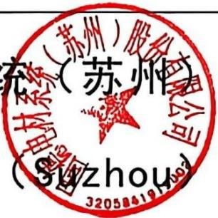

Corp., Ltd.

（苏州市吴江区汾湖镇汾杨路 88 号）

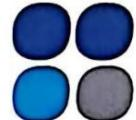

# Goode

固德电材

# 首次公开发行股票并在创业板上市

# 招股说明书

保荐人（主承销商）

东吴证券

SOOCHOW SECURITIES

（苏州工业园区星阳街 5 号）

# 致投资者的声明

# 一、本次上市目的

公司主营业务为新能源汽车动力电池热失控防护零部件及电力电工绝缘产品的研发、生产与销售。为应对行业技术的更新换代，满足客户日益多样化的需求，公司需要不断加大研发投入，吸引更多高端人才加入，持续提升技术创新能力和产品研发能力，快速扩充产能，持续保持公司竞争地位。

本次发行上市将使公司借助资本市场平台优势，提升公司研发实力，加强公司新能源汽车热失控防护零部件等产品的市场竞争力。一方面，本次发行上市募集资金将提升公司研发和技术实力，提高智能制造水平，助推公司向新质生产力转型升级，有利于公司树立品牌形象，提高行业知名度，提升公司市场信誉，吸引优秀人才，实现高质量可持续发展。另一方面，上市将引入更加严格的监管机制和治理结构，推动公司更加规范、透明地运营，有助于公司深度融入并履行社会责任，实现企业的长期稳定发展，并为社会和股东创造更大价值。

# 二、现代企业制度的建立健全情况

公司已根据《公司法》《证券法》《上市公司治理准则》《深圳证券交易所上市公司自律监管指引第 2 号— —创业板上市公司规范运作》等法律法规、规范性文件的要求，全面构建并持续完善现代企业治理体系。通过制定并执行《公司章程》、三会议事规则、董事会专门委员会议事规则及信息披露、投资者关系等制度规定，形成权责清晰、制衡有效的治理机制与内部控制，为高效实施专业化决策、充分保障中小股东利益、监督规范现代企业制度运行提供了切实保障。

# 三、本次融资的必要性及募集资金使用规划

公司本次发行募集资金拟投向年产新能源汽车热失控防护新材料零部件725万套及研发项目、陆河麦卡动力电池热失控防护材料生产基地建设项目和补充流动资金。本次募集资金投资项目围绕公司现有核心业务展开，符合国家产业政策等要求和行业发展趋势。

年产新能源汽车热失控防护新材料零部件 725 万套及研发项目是公司现有核心业务的扩建项目，通过新建生产厂房及配套设施、引进先进的自动化生产设

，提升公司智能制造水平，提升公司新能源汽车动力电池热失控防护零部件产，增强公司对关键客户的配套能力，进而巩固公司的市场竞争优势。研发项目过加大对研发场地、研发设备、配套软件等方面的投入，完善技术研发创新体，提升公司技术实力。

河麦卡动力电池热失控防护材料生产基地建设项目由子公司麦卡电工实，重点布局公司原材料制备的核心业务，有效支撑母公司新能源汽车热失控防零部件扩产的原料需求，实现核心原材料到零部件制造全产业链产能的全面提，契合公司发展战略，进一步增强核心竞争力和盈利能力。

补充流动资金有利于增强公司的营运能力和市场竞争能力，改善公司流动性指标，提高公司偿债能力，降低公司财务风险，优化公司财务结构。

# 四、发行人持续经营能力及未来发展规划

公司依托在云母材料及高性能树脂领域的核心技术积淀，成功实现传统绝缘材料创新应用，构建了覆盖新能源汽车电池热失控防护全场景解决方案的体系，形成了从电芯级到整包级的全系列防护产品。随着全球新能源汽车渗透率逐渐提升，新能源汽车动力电池热失控防护业务作为创新、突破性业务，成为公司现在和未来业绩的增长点。公司以中国市场为根基，开启全球化战略布局，通过在墨西哥设立子公司并建立生产基地，在美国和德国设立子公司构建营销网络，逐步覆盖北美、欧洲、日韩等全球核心汽车市场。报告期内，公司业务规模及盈利能力稳定提升。

公司将继续秉持“极致、高效、远见、创新”的理念，致力于成为全球领先的新能源汽车热失控防护解决方案提供商。公司将以精益化、自动化、数字化为基础，以技术创新为驱动，努力为客户提供安全、可靠的新能源汽车热失控防护零部件，持续提升企业竞争力，实现可持续发展，并为客户、员工和股东创造更多价值。

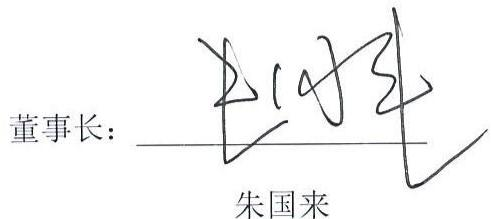

# 发行人声明

中国证监会、交易所对本次发行所作的任何决定或意见，均不表明其对发行人注册申请文件及所披露信息的真实性、准确性、完整性作出保证，也不表明其对发行人的盈利能力、投资价值或者对投资者的收益作出实质性判断或保证。任何与之相反的声明均属虚假不实陈述。

根据《证券法》规定，股票依法发行后，发行人经营与收益的变化，由发行人自行负责；投资者自主判断发行人的投资价值，自主作出投资决策，自行承担股票依法发行后因发行人经营与收益变化或者股票价格变动引致的投资风险。

本次发行概况  

<table><tr><td>发行股票类型</td><td>境内上市的人民币普通股（A股）</td></tr><tr><td>发行股数</td><td>本次公开发行股份数量为2,070万股，发行完成后公开发行股数占发行后总股本的比例为25%。本次发行股份均为公开发行的新股，公司原有股东不公开发售股份。</td></tr><tr><td>每股面值</td><td>1.00元</td></tr><tr><td>每股发行价格</td><td>58.00元</td></tr><tr><td>发行日期</td><td>2026年2月25日</td></tr><tr><td>拟上市的证券交易所和板块</td><td>深圳证券交易所创业板</td></tr><tr><td>发行后总股本</td><td>8,280万股</td></tr><tr><td>保荐人、主承销商</td><td>东吴证券股份有限公司</td></tr><tr><td>招股说明书签署日期</td><td>2026年3月3日</td></tr></table>

#

# 致投资者的声明 ..

# 发行人声明 ...

# 本次发行概况 .

# 目 录...

# 第一节 释义 .

# 第二节 概览 . 16

一、重大事项提示. .16  
二、发行人及本次发行的中介机构基本情况. .. 20  
三、本次发行概况. .. 20  
四、发行人主营业务情况. ..22  
五、发行人板块定位情况. ..28  
六、发行人报告期的主要财务数据和财务指标. ..30  
七、财务报告审计截止日后的主要财务信息和经营状况. ..31  
八、发行人选择的具体上市标准. ..33  
九、发行人公司治理特殊安排等重要事项.. ..33  
十、募集资金运用与未来发展规划. ..33  
十一、其他对发行人有重大影响的事项. .35

# 第三节 风险因素 .36

一、与发行人相关的风险. ..36  
二、与行业相关的风险. ..40  
三、其他风险.. .. 42

# 第四节 发行人基本情况. .44

一、发行人基本情况. ..44  
二、发行人设立情况. ..44  
三、报告期内股本及股东变化情况. .. 46  
四、公司报告期内重大资产重组情况. ..61  
五、发行人在其他证券市场的上市和挂牌情况. ..62  
六、发行人的股权结构. ..64

七、发行人子公司、分公司情况. ..64  
八、主要股东、实际控制人和其他持股 $5 \%$ 以上股份主要股东的情况 ........66  
九、发行人特别表决权股份或类似安排. ..71  
十、发行人协议控制架构. .71  
十一、发行人控股股东、实际控制人报告期内重大违法行为. ..72  
十二、发行人股本情况. ..72  
十三、董事、监事、高级管理人员及核心技术人员的简要情况.. .. 89  
十四、发行人与董事、监事、高级管理人员及核心技术人员所签订的对投资者作出价值判断和投资决策有重大影响的协议，以及有关协议的履行情况.... 98  
十五、公司董事、监事、高级管理人员、核心技术人员及其近亲属持股情况.... 99  
十六、最近三年董事、监事、高级管理人员及核心技术人员的变动情况.100  
十七、董事、监事、高级管理人员及核心技术人员对外投资情况.. .101  
十八、董事、监事、高级管理人员及核心技术人员的薪酬情况. ...103  
十九、发行人本次公开发行申报前已经制定或实施的股权激励及相关安排..105  
二十、发行人员工及其社会保障情况. .109

# 第五节 业务与技术 .. 113

一、发行人主营业务、主要产品及变化情况. .113  
二、发行人所处行业的基本情况和竞争状况. ..132  
三、发行人销售情况及主要客户. ..165  
四、发行人采购情况及主要供应商.. ..168  
五、对主要业务有重大影响的主要固定资产、无形资产. .172  
六、发行人技术与研发情况. ..180  
七、安全生产和环境保护情况. .191  
八、境外经营情况. .193

# 第六节 财务会计信息与管理层分析 .194

一、财务报表、会计师事务所的审计意见类型和关键审计事项.. ..194  
二、合并财务报表的编制基础、合并范围及变化情况. ..200

三、报告期内采用的主要会计政策和会计估计. .. 202  
四、经注册会计师鉴证的非经常性损益明细表. .254  
五、主要税项及享受的税收优惠政策. .254  
六、发行人报告期内主要财务指标.. .256  
七、经营成果分析.. .258  
八、资产质量分析.. .285  
九、偿债能力分析、流动性与持续经营能力分析.. .. 306  
十、重大投资、资本性支出、重大资产业务重组或股权收购合并事项.....320  
十一、重大担保、诉讼、其他或有事项和重大期后事项对发行人的影响.320  
十二、盈利预测. ..323

# 第七节 募集资金运用与未来发展规划 . .. 326

一、本次募集资金运用概况. ..326  
二、本次募集资金具体用途的可行性及其与公司现有业务、核心技术的关系.. 329  
三、募集资金投资项目具体情况. ..331  
四、未来发展规划. .333

# 第八节 公司治理与独立性 . .335

一、报告期内公司治理方面存在的缺陷及改进情况. .335  
二、关于内部控制完整性、合理性和有效性的评估意见. .335  
三、公司报告期内的违法违规行为及受到处罚的情况. .. 337  
四、发行人报告期内资金占用或提供担保的情况. ..337  
五、发行人独立运营情况. .337  
六、同业竞争.. .339  
七、关联方与关联交易. .340

# 第九节 投资者保护 .351

一、本次发行完成前滚存利润的分配安排和已履行的决策程序.. .351  
二、本次发行前后股利分配政策及差异情况. .351  
三、特别表决权股份、协议控制架构或类似特殊安排. .355  
四、尚未盈利或存在累计未弥补亏损的公司关于依法落实保护投资者合法权益规定的各项措施.. ..355

# 第十节 其他重要事项 . .356

一、重大合同... .356  
二、对外担保.. .. 361  
三、重大诉讼及仲裁事项. .. 361

# 第十一节 声明... .362

一、发行人及其全体董事、审计委员会成员、高级管理人员声明.............362  
二、发行人控股股东、实际控制人声明. .364  
三、保荐人（主承销商）声明. .365  
四、保荐人董事长、总经理声明. .366  
五、发行人律师声明.. ...367  
六、审计机构声明. .368  
七、资产评估复核机构声明.. ..369   
八、验资机构声明. ..370  
九、验资复核机构声明. .371

# 第十二节 附件 . .372

一、备查文件目录.. .. 372  
二、查阅时间和查阅地点. .372

附件一：落实投资者关系管理相关规定的安排、股利分配决策程序、股东投票机制建立情况. ...374  
附件二：与投资者保护相关的承诺.. ..380  
附件三：发行人及其他责任主体作出的与发行人本次发行上市相关的其他承诺事项... ...405  
附件四：股东会、董事会、监事会、独立董事、董事会秘书制度的建立健全及运行情况说明.. ... 406  
附件五：审计委员会及其他专门委员会的设置情况说明. ..413  
附件六：募集资金具体运用情况. ..415   
附件七：子公司、参股公司简要情况 ...419  
附件八：专利清单. .425

# 第一节 释义

在本招股说明书中，除非另有说明，下列简称具有如下特定意义：

<table><tr><td colspan="3">普通释义</td></tr><tr><td>固德电材、股份公司、公司、发行人</td><td>指</td><td>固德电材系统(苏州)股份有限公司,曾用名“吴江固德电材系统股份有限公司”</td></tr><tr><td>固德有限</td><td>指</td><td>吴江固德电材系统有限公司</td></tr><tr><td>控股股东、实际控制人</td><td>指</td><td>朱国来</td></tr><tr><td>苏州国浩</td><td>指</td><td>苏州国浩股权投资管理企业(有限合伙),系发行人股东</td></tr><tr><td>吴江创投</td><td>指</td><td>苏州市吴江创业投资有限公司,系发行人股东,曾用名“吴江市创业投资有限公司”</td></tr><tr><td>临沪创投</td><td>指</td><td>吴江临沪创业投资有限公司,系发行人股东</td></tr><tr><td>苏州虢丰</td><td>指</td><td>苏州虢丰企业管理合伙企业(有限合伙),系发行人股东,曾用名“上海虢峰企业管理合伙企业(有限合伙)(2021年10月至2023年2月)”</td></tr><tr><td>上海虢峰</td><td>指</td><td>上海虢峰企业管理合伙企业(有限合伙)</td></tr><tr><td>龙驹创合</td><td>指</td><td>苏州龙驹创合创业投资合伙企业(有限合伙),系发行人股东</td></tr><tr><td>龙驹创进</td><td>指</td><td>苏州龙驹创进创业投资合伙企业(有限合伙),系发行人股东</td></tr><tr><td>君尚合臻</td><td>指</td><td>苏州君尚合臻创业投资合伙企业(有限合伙),系发行人股东</td></tr><tr><td>乾融泰润</td><td>指</td><td>苏州乾融泰润创业投资合伙企业(有限合伙),系发行人股东</td></tr><tr><td>安华基金</td><td>指</td><td>安徽安华基金投资有限公司,系发行人股东</td></tr><tr><td>君尚合璞</td><td>指</td><td>苏州君尚合璞创业投资合伙企业(有限合伙),系发行人股东</td></tr><tr><td>龙驹埭溪</td><td>指</td><td>苏州龙驹埭溪创业投资合伙企业(有限合伙),系发行人股东</td></tr><tr><td>乾融青润</td><td>指</td><td>苏州乾融青润创业投资合伙企业(有限合伙),系发行人股东</td></tr><tr><td>乾融坤润</td><td>指</td><td>苏州乾融坤润股权投资中心(有限合伙),系发行人原股东</td></tr><tr><td>富坤赢通</td><td>指</td><td>吴江富坤赢通长三角科技创业投资中心(有限合伙),系发行人原股东</td></tr><tr><td>低空基金</td><td>指</td><td>苏州东方低空产业投资基金合伙企业(有限合伙)</td></tr><tr><td>东方启航</td><td>指</td><td>苏州东方启航创业投资合伙企业(有限合伙)</td></tr><tr><td>麦卡电工</td><td>指</td><td>麦卡电工器材(陆河)有限公司,系发行人全资子公司</td></tr><tr><td>麦卡电工深圳分公司</td><td>指</td><td>麦卡电工器材(陆河)有限公司深圳分公司,系麦卡电工分公司</td></tr><tr><td>固德攀</td><td>指</td><td>固德攀新材料(苏州)有限公司,系发行人全资子公司</td></tr><tr><td>固德弹性</td><td>指</td><td>固德电材弹性材料(苏州)有限公司,系发行人控股子公司</td></tr><tr><td>固瑞德</td><td>指</td><td>固瑞德新能源材料(山东)有限公司,系发行人控股子公司</td></tr><tr><td>固德墨西哥</td><td>指</td><td>GOODE NEW ENERGY TECHNOLOGY MEXICO S. DE R.L. DE C.V., (中文: 固德新能源科技 (墨西哥)有限公司), 系发行人位于墨西哥的全资子公司</td></tr><tr><td>固德美国</td><td>指</td><td>GOODE NEW ENERGY TECHNOLOGY, INC., (中文: 固德新能源科技 (美国)股份有限公司), 系发行人位于美国的全资子公司</td></tr><tr><td>固德欧洲</td><td>指</td><td>Goode Europe GmbH, (中文: 固德欧洲有限责任公司), 系发行人位于德国的全资子公司</td></tr><tr><td>固德德阳</td><td>指</td><td>固德新材料(德阳)有限公司, 系发行人参股子公司</td></tr><tr><td>兴华上海所</td><td>指</td><td>北京兴华会计师事务所有限责任公司上海分所</td></tr><tr><td>北京天海华</td><td>指</td><td>北京天海华资产评估事务所(普通合伙)</td></tr><tr><td>北京兴华</td><td>指</td><td>北京兴华会计师事务所(特殊普通合伙)</td></tr><tr><td>国融兴华</td><td>指</td><td>北京国融兴华资产评估有限责任公司</td></tr><tr><td>容诚会计师</td><td>指</td><td>容诚会计师事务所(特殊普通合伙)</td></tr><tr><td>中水致远</td><td>指</td><td>中水致远资产评估有限公司</td></tr><tr><td>CNAS</td><td>指</td><td>中国合格评定国家认可委员会</td></tr><tr><td>Rogers Foam Corporation</td><td>指</td><td>包括: Rogers Foam Corporation、Rogers Foam Automotive Corporation</td></tr><tr><td>T公司</td><td>指</td><td>T公司及其下属控制主体,一家美国电动汽车及能源公司,为全球领先的新能源汽车制造商</td></tr><tr><td>通用汽车</td><td>指</td><td>包括:GENERAL MOTORS LLC、GM de Mexico S.de R.L. de C.V.</td></tr><tr><td>福特、福特汽车</td><td>指</td><td>Ford Motor Company</td></tr><tr><td>Stellantis</td><td>指</td><td>包括:FCA US LLC、菲亚特克莱斯勒汽车零配件贸易(上海)有限公司、STELLANTIS GLIWICE SPOLKA Z.o.o.、斯泰兰蒂斯(武汉)经营管理有限公司、STELLANTIS AUTO SAS、OPEL AUTOMOBILE Gmbh、PSA AUTOMOBILES SA、STELLANTIS EUROPE S.p.A.</td></tr><tr><td>麦格纳</td><td>指</td><td>包括:MAGNA ELEC VEHICLE STRUCTURES、SAN LUIS METAL FORMING, S.A. DE C.V.、麦格纳斯太尔汽车技术(上海)有限公司</td></tr><tr><td>丰田</td><td>指</td><td>丰田汽车公司</td></tr><tr><td>宝马</td><td>指</td><td>巴伐利亚发动机制造厂股份有限公司</td></tr><tr><td>吉利、吉利汽车</td><td>指</td><td>浙江吉利控股集团有限公司</td></tr><tr><td>零跑、零跑汽车</td><td>指</td><td>浙江零跑科技股份有限公司</td></tr><tr><td>小鹏、小鹏汽车</td><td>指</td><td>广州橙行智动汽车科技有限公司旗下汽车品牌</td></tr><tr><td>一汽集团</td><td>指</td><td>中国第一汽车集团有限公司</td></tr><tr><td>宁德时代</td><td>指</td><td>包括:江苏时代新能源科技有限公司、宁德时代新能源科技股份有限公司、广东瑞庆时代新能源科技有限公司、时代吉利(四川)动力电池有限公司、福鼎时代新能源科技有限公司、宁德蕉城时代新能源科技有限公司、四川时代新能源科技有限公司、宜春时代新能源科技有限公司、时代广汽动力电池有限公司、厦门新能安科技有限公司、苏州时代新安能源科技有限公司、宁德时代(上海)智能科技有限公司</td></tr><tr><td>欣旺达</td><td>指</td><td>欣旺达电子股份有限公司</td></tr><tr><td>东方电气</td><td>指</td><td>包括:东方电气集团东方电机有限公司、东方电气集团东方汽轮机有限公司、东方电气(德阳)电动机技术有限责任公司、东方电气(天津)风电叶片工程有限公司、东方电气集团东方电机有限公司风电电机分公司、东方电气集团东方电机有限公司中型电机分公司、东方电气风电叶片(兴安盟)有限公司、东方电气风电(兴安盟)有限公司、东方电气风电(山东)有限公司、东方电气风电(凉山)有限公司</td></tr><tr><td>双瑞风电</td><td>指</td><td>包括:江苏双瑞风电叶片有限公司、厦门双瑞风电科技有限公司滨州分公司、新疆新星双瑞风电叶片有限公司、大连双瑞风电叶片有限公司、洛阳双瑞风电叶片有限公司哈密分公司、厦门双瑞风电科技有限公司、洛阳双瑞风电叶片有限公司、洛阳双瑞风电叶片有限公司、洛阳双瑞风电叶片有限公司张家口分公司</td></tr><tr><td>上玻院</td><td>指</td><td>上海玻璃钢研究院东台有限公司</td></tr><tr><td>特变电工</td><td>指</td><td>特变电工沈阳变压器集团有限公司、沈阳和新套管有限公司</td></tr><tr><td>思源电气</td><td>指</td><td>思源电气股份有限公司</td></tr><tr><td>上海电气</td><td>指</td><td>包括:上海第一机床厂有限公司、上海电气电站设备有限公司、上海电气集团电池科技有限公司浙江分公司、上海电气集团电池科技有限公司</td></tr><tr><td>南京电气</td><td>指</td><td>南京电气(集团)有限责任公司</td></tr><tr><td>中国西电</td><td>指</td><td>中国西电集团有限公司</td></tr><tr><td>哈电集团</td><td>指</td><td>哈尔滨电气集团有限公司</td></tr><tr><td>丰罗集团</td><td>指</td><td>Von Roll Holding AG,全球绝缘材料领域龙头企业之一,包括:丰罗绝缘材料(上海)有限公司、Von Roll Asia Pte Ltd及受同一实控人控制的艾伦塔斯电气绝缘材料(广东横琴)有限公司</td></tr><tr><td>韩国SWECO、SWECO</td><td>指</td><td>韩国SWECO公司,是韩国较大的综合绝缘材料制造商</td></tr><tr><td>Isovolta</td><td>指</td><td>依索沃尔塔集团,是电气绝缘材料、复合材料和合成材料的国际领先制造商</td></tr><tr><td>Huntsman</td><td>指</td><td>亨斯迈集团,是一家全球性特殊及特种化学品制造和销售企业</td></tr><tr><td>伟思磊</td><td>指</td><td>包括:伟思磊企业管理(上海)有限公司(曾用名:瀚森化工企业管理(上海)有限公司)、Westlake Epoxy Inc.(曾用名:Hexion Coatings and Composites (US) Inc.)、Westlake Epoxy B.V.(曾用名:Hexion B.V)、Westlake Korea Company Limited(曾用名:Hexion Korea Company Limited)</td></tr><tr><td>中国铜业</td><td>指</td><td>包括中铝洛阳铜加工有限公司、中铜华中铜业有限公司</td></tr><tr><td>浙江荣泰</td><td>指</td><td>浙江荣泰电工器材股份有限公司,为A股上市公司,股票代码603119.SH,系行业主要企业之一</td></tr><tr><td>平安电工</td><td>指</td><td>湖北平安电工科技股份公司,为A股上市公司,股票代码001359.SZ,系行业主要企业之一</td></tr><tr><td>巨峰股份</td><td>指</td><td>苏州巨峰电气绝缘系统股份有限公司,为新三板挂牌公司,股票代码830818.NQ,系行业主要企业之一</td></tr><tr><td>博菲电气</td><td>指</td><td>浙江博菲电气股份有限公司,为A股上市公司,股票代码001255.SZ,系行业主要企业之一</td></tr><tr><td>攀越</td><td>指</td><td>包括:攀越新材料(苏州)有限公司(曾用名:金铭浩电子材料(苏州)有限公司)、苏州攀越智能精机有限公司</td></tr><tr><td>千代达</td><td>指</td><td>包括:千代达琪帖国际贸易(上海)有限公司、千代达电子制造(苏州)有限公司</td></tr><tr><td>A大学</td><td>指</td><td>一所综合性公立大学,系发行人技术开发合作院校</td></tr><tr><td>报告期</td><td>指</td><td>2022年度、2023年度、2024年度和2025年1-6月</td></tr><tr><td>报告期各期末</td><td>指</td><td>2022年12月31日、2023年12月31日、2024年12月31日和2025年6月30日</td></tr><tr><td>全国股转系统</td><td>指</td><td>全国中小企业股份转让系统</td></tr><tr><td>天交所</td><td>指</td><td>天津股权交易所</td></tr><tr><td>国家发改委</td><td>指</td><td>中华人民共和国国家发展和改革委员会</td></tr><tr><td>工信部</td><td>指</td><td>中华人民共和国工业和信息化部</td></tr><tr><td>国家市场监督管理总局</td><td>指</td><td>中华人民共和国国家市场监督管理总局</td></tr><tr><td>工信部装备工业发展中心</td><td>指</td><td>工业和信息化部装备工业发展中心</td></tr><tr><td>工信部办公厅</td><td>指</td><td>中华人民共和国工业和信息化部办公厅</td></tr><tr><td>公安部办公厅</td><td>指</td><td>中华人民共和国公安部办公厅</td></tr><tr><td>交通运输部办公厅</td><td>指</td><td>中华人民共和国交通运输部办公厅</td></tr><tr><td>应急管理部办公厅</td><td>指</td><td>中华人民共和国应急管理部办公厅</td></tr><tr><td>国家市场监督管理总局办公厅</td><td>指</td><td>中华人民共和国国家市场监督管理总局办公厅</td></tr><tr><td>国务院办公厅</td><td>指</td><td>中华人民共和国国务院办公厅</td></tr><tr><td>全国人大</td><td>指</td><td>中华人民共和国全国人民代表大会</td></tr><tr><td>国务院</td><td>指</td><td>中华人民共和国国务院</td></tr><tr><td>国家统计局</td><td>指</td><td>中华人民共和国国家统计局</td></tr><tr><td>财政部</td><td>指</td><td>中华人民共和国财政部</td></tr><tr><td>国家能源局</td><td>指</td><td>中华人民共和国国家能源局</td></tr><tr><td>证监会</td><td>指</td><td>中国证券监督管理委员会</td></tr><tr><td>交易所、深交所</td><td>指</td><td>深圳证券交易所</td></tr><tr><td colspan="3">专业释义</td></tr><tr><td>新能源汽车</td><td>指</td><td>采用新型动力系统,完全或者主要依靠新型能源驱动的汽车,包括插电式混合动力(含增程式)汽车、纯电动汽车和燃料电池汽车等</td></tr><tr><td>动力电池</td><td>指</td><td>电动汽车的核心部件之一,它将电能转化为汽车行驶所需的动能,以驱动电机工作</td></tr><tr><td>热失控</td><td>指</td><td>电池单体放热连锁反应引起电池温度不可控上升的现象</td></tr><tr><td>热扩散</td><td>指</td><td>电池包或系统内由一个电池单体热失控引发的其余电池单体接连发生热失控的现象</td></tr><tr><td>能量密度</td><td>指</td><td>在一定的空间或质量物质中储存能量的大小</td></tr><tr><td>高倍率</td><td>指</td><td>具备较高放电速率和充电速率</td></tr><tr><td>本征安全</td><td>指</td><td>通过设计手段消除或减少系统内在风险,而非依赖外部防护措施,强调从材料、结构、系统运行机制等内在特性上消除风险源</td></tr><tr><td>BMS</td><td>指</td><td>电池管理系统,管理、维护、监控电池各个模块</td></tr><tr><td>IATF16949</td><td>指</td><td>由国际汽车工作组(IATF)制定的一套专门针对汽车行业的质量管理体系标准</td></tr><tr><td>ISO9001</td><td>指</td><td>由国际标准化组织(ISO)制定的一套质量管理体系标准</td></tr><tr><td>ISO14001</td><td>指</td><td>一种基于国际标准化组织制定的环境管理体系标准</td></tr><tr><td>ISO45001</td><td>指</td><td>国际标准化组织(ISO)发布的国际性职业健康安全管理体系认证</td></tr><tr><td>FDA 认证</td><td>指</td><td>美国食品药品管理局认证(Food and Drug Administration)认证</td></tr><tr><td>UL 认证</td><td>指</td><td>美国保险商实验室(Underwriter Laboratories Inc.)认证</td></tr><tr><td>欧盟 REACH 法规</td><td>指</td><td>欧盟《关于化学品注册、评估、许可和限制的法规》(Registration, Evaluation and Authorization of Chemicals)</td></tr><tr><td>德国 PAHs 标准</td><td>指</td><td>德国多环芳烃(Polycyclic Aromatic Hydrocarbons)检测标准</td></tr><tr><td>欧盟 RoHS 标准</td><td>指</td><td>欧盟《关于限制在电子电气设备中使用某些有害成分的指令》(Restriction of Hazardous Substances)</td></tr><tr><td>欧盟 ELV 指令</td><td>指</td><td>欧盟《报废车辆指令》(End-of-Life Vehicle)</td></tr><tr><td>VPI</td><td>指</td><td>真空压力浸渍工艺</td></tr><tr><td>多物理场仿真技术</td><td>指</td><td>通过计算机建模与数值计算方法,对多个相互耦合的物理现象进行联合分析</td></tr><tr><td>预浸料</td><td>指</td><td>用树脂基体在严格控制的条件下浸渍连续纤维或织物,制成树脂基体与增强体的组合物</td></tr><tr><td>热压</td><td>指</td><td>对铺装成型后的板坯加热同时加压制成具有一定机械强度和耐水性能的纤维板材的工艺过程</td></tr><tr><td>浮选</td><td>指</td><td>利用矿物表面的物理化学性质差异选别矿物颗粒的过程</td></tr><tr><td>磁选</td><td>指</td><td>利用矿物的磁性差异进行分选的技术,通过施加磁场,具有磁性的矿物会被吸引到磁性设备上,从而与非磁性矿物分离</td></tr><tr><td>云母</td><td>指</td><td>一种造岩矿物,呈现六方形的片状晶形,特性是绝缘、耐高温</td></tr><tr><td>硅橡胶</td><td>指</td><td>主链由硅和氧原子交替构成,硅原子上通常连有两个有机基团的橡胶</td></tr><tr><td>陶瓷纤维棉</td><td>指</td><td>以高纯度的黏土熟料、氧化铝粉、硅石粉、铬英砂等原料制成的一种高效绝热材料</td></tr><tr><td>导热系数</td><td>指</td><td>是衡量物质导热能力的物理量,表示在单位时间内,单位面积上通过单位厚度材料传递的热量,导热系数的单位是W/(m·K)</td></tr><tr><td>弹性体</td><td>指</td><td>在除去外力后能恢复原状的材料</td></tr><tr><td>压缩永久变形</td><td>指</td><td>材料在一定温度下被压缩至一定形状,并维持一定时间后发生的永久性变形,材料在恒定应变条件下发生的变形量</td></tr><tr><td>幅宽</td><td>指</td><td>面料的有效宽度</td></tr><tr><td>弯曲强度</td><td>指</td><td>材料在弯曲负荷作用下破裂或达到规定弯矩时能承受的最大应力</td></tr><tr><td>工艺性能</td><td>指</td><td>材料适应实际生产工艺要求的能力</td></tr><tr><td>机械强度</td><td>指</td><td>材料受外力作用时,其单位面积上所能承受的最大负荷。一般用抗弯(抗折)强度、抗拉(抗张)强度、抗压强度、抗冲击强度等来表示</td></tr><tr><td>热固性树脂</td><td>指</td><td>一种高分子聚合物材料,常用的热固性树脂有环氧树脂、聚酯树脂,乙烯基酯,双马来酰胺、热固性聚酰亚胺、氰酸酯等</td></tr><tr><td>三电技术</td><td>指</td><td>电池、电机和电控三大核心电气系统</td></tr><tr><td>Wh</td><td>指</td><td>电能单位</td></tr><tr><td>热稳定性</td><td>指</td><td>物质的耐热性,物体在温度的影响下的形变能力,形变越小,稳定性越高</td></tr><tr><td>磷酸铁锂</td><td>指</td><td>一种锂离子电池电极材料,化学式为LiFePO4(简称LFP),主要用于各种锂离子电池</td></tr><tr><td>三元锂电</td><td>指</td><td>三元聚合物锂电池,正极材料使用镍钴锰酸锂(Li(NiCoMn)O2)或者镍钴铝酸锂的三元正极材料的锂电池</td></tr><tr><td>气凝胶</td><td>指</td><td>指通过溶胶凝胶法,用一定的干燥方式使气体取代凝胶中的液相而形成的一种纳米级多孔固态材料</td></tr><tr><td>阻燃泡棉</td><td>指</td><td>是塑料粒子发泡过的具有阻燃性的材料</td></tr><tr><td>陶瓷硅橡胶</td><td>指</td><td>新型的高分子耐火材料</td></tr><tr><td>NCA电池</td><td>指</td><td>是一种锂离子电池,其正极材料由镍(Ni)、钴(Co)和铝(Al)组成</td></tr><tr><td>击穿电压</td><td>指</td><td>电介质在足够强的电场作用下失去其介电性能并成为导体时所对应的电压值</td></tr><tr><td>介质损耗</td><td>指</td><td>绝缘材料在电场作用下,由于介质电导和介质极化的滞后效应,在其内部引起的能量损耗</td></tr><tr><td>介电常数</td><td>指</td><td>表示绝缘能力特性的一个系数</td></tr><tr><td>无卤</td><td>指</td><td>产品中卤素,包括氟、氯、溴、碘等的含量符合特定标准</td></tr><tr><td>ESG</td><td>指</td><td>环境、社会和公司治理</td></tr><tr><td>CTB</td><td>指</td><td>Cell to Body,即电池车身一体化技术,是一种专为非承载式车身设计的电池与车身一体化方案</td></tr><tr><td>Tg</td><td>指</td><td>玻璃化转变温度,是指材料由玻璃态转变为高弹态所对应的温度</td></tr><tr><td>铜铝复合材料</td><td>指</td><td>一种结合了铜和铝两种金属特性的新型材料,通常由铜和铝通过特定的工艺方法复合而成,旨在实现两种金属在物理、化学和机械性能上的优势互补</td></tr><tr><td>耦合作用</td><td>指</td><td>两个或多个系统、组件或实体之间通过相互作用而彼此影响或联合起来的现象</td></tr><tr><td>PET</td><td>指</td><td>聚对苯二甲酸乙二醇酯,是一种广泛使用的合成塑料材料</td></tr><tr><td>增韧改性</td><td>指</td><td>通过添加一些具有高效吸收能力的改性材料,使材料具备更好的韧性和抗冲击性</td></tr><tr><td>PVC</td><td>指</td><td>聚氯乙烯</td></tr><tr><td>UL94 V-0</td><td>指</td><td>塑料材料可燃性能标准</td></tr><tr><td>MPa</td><td>指</td><td>兆帕,是压强和应力的单位</td></tr><tr><td>MΩ</td><td>指</td><td>兆欧,是电阻单位</td></tr><tr><td>冷热面温差</td><td>指</td><td>物体或系统中冷面和热面之间的温度差异</td></tr><tr><td>剥离强度</td><td>指</td><td>粘贴在一起的材料,从接触面进行单位宽度剥离时所需要的大力</td></tr><tr><td>VOCs</td><td>指</td><td>Volatile Organic Compounds,挥发性有机物,大气的主要污染物之一</td></tr><tr><td>RTO</td><td>指</td><td>Regenerative Thermal Oxidizer,蓄热式热力焚化炉</td></tr><tr><td>COD</td><td>指</td><td>Chemical Oxygen Demand,化学需氧量,水体中易被强氧化剂氧化的有机物的含量</td></tr><tr><td>SS</td><td>指</td><td>Suspended Solids,水中的悬浮物</td></tr></table>

本招股说明书除特别说明外所有数值均保留 2位小数，若出现总数与各分项数值之和尾数不符的情况，均为四舍五入原因造成。

# 第二节 概览

本概览仅对招股说明书全文作扼要提示。投资者作出投资决策前，应认真阅读招股说明书全文。

# 一、重大事项提示

# （一）发行人特别提醒投资者注意的风险因素

公司特别提请投资者注意公司及本次发行的以下重大事项及风险，并认真阅读本招股说明书正文内容。

# 1、核心客户需求变化及业绩下滑风险

公司业绩受核心客户车型规划、销量表现影响，其供应份额与持续获取客户新增车型、新平台的项目定点相关。报告期内部分核心客户对应车型销量出现下滑，随着终端车企新车型迭代、新平台推出常态化，若公司未能在新增项目定点竞争中持续胜出，或核心客户调整电动化战略、推迟新车型上市、新车型市场竞争力不足，将影响配套产品量产交付与份额维持。

此外，尽管发行人持续推进客户结构多元化，但通用汽车、Stellantis、T 公司、宁德时代等头部客户仍为业绩重要贡献者。通用汽车、Stellantis 2026 年初发布业绩公告，2025 年因计提电动化业务减值存在业绩下滑的情形。若核心客户因自身经营调整、供应链体系变化等减少对发行人的采购，或因行业竞争加剧导致订单份额下降，将对发行人业绩稳定性产生影响。同时，客户订单交付受行业政策、终端需求影响存在周期性波动，若短期内核心客户订单释放节奏放缓，可能导致发行人产能利用率下降及业绩波动。

# 2、下游行业技术迭代风险

热失控防护零部件行业的发展与下游动力电池技术的演变密切相关。当前，动力电池行业正加速向高能量密度、高倍率快充、本征安全等方向迭代，固态电池、钠离子电池等新型电池技术的商业化进程可能对现有热防护方案带来多维度改变。报告期内，公司新能源汽车动力电池热失控防护零部件主要应用于三元锂电池场景，核心依托云母材料相关技术及产品，是业务增长的主要支撑。由于三元锂电池与磷酸铁锂电池的热失控特性存在差异，磷酸铁锂电池对防护材料的性

能要求、单车配套价值相对较低，公司当前适配磷酸铁锂电池的产品收入占比较小。若未来下游新能源汽车行业三元锂电池渗透率下降、磷酸铁锂电池在中高端车型领域加速替代等需求结构调整、行业技术路线发生重大转变，如电池材料体系革新导致热失控温度突破现有防护材料耐受极限、结构设计突破重构防护需求场景，或行业内出现性能更优、成本更低的新型防护材料等，可能导致传统防护方案的市场需求萎缩。同时，随着电池系统集成度提升，对热管理及安全防护综合性要求显著提高，防护技术从被动防护向主动预警、智能阻燃等方向发展。若企业无法及时跟踪技术趋势、预判行业标准变化，或研发创新滞后于市场对耐高温、复合功能防护、轻量化产品的需求，现有产品可能面临适配性不足甚至被替代的风险。

# 3、中美贸易政策风险

报告期内，公司部分下游客户为美国企业，公司新能源汽车热失控防护业务直接出口美国的产品销售收入分别为 5,131.50 万元、11,315.53 万元、22,454.47万元和 7,063.67 万元，占营业收入的比例分别为 $1 0 . 8 0 \%$ 、 $1 7 . 3 8 \%$ 、 $2 4 . 7 3 \%$ 和$1 5 . 4 4 \%$ 。2025 年 10 月，中美举行经贸磋商，自 2025 年 11 月 10 日起，美国取消针对中国商品加征的 $10 \%$ 的关税，对中国商品加征的 $24 \%$ 的“对等关税”将继续暂停一年，本次调整后，公司产品直接出口美国的关税税率为 $4 7 . 7 0 \%$ ，较2025 年初增加了 $20 \%$ 。根据敏感性测算，关税上升 $10 \%$ ，报告期内对毛利率的影响分别为 $0 \%$ 、 $- 0 . 9 2 \%$ 、 $- 1 . 2 0 \%$ 和- $. 0 . 8 3 \%$ ，对利润总额的影响比例分别为 $0 \%$ 、- $. 5 . 2 0 \%$ 、 $- 5 . 6 2 \%$ 和 $- 4 . 2 7 \%$ 。由于美国关税政策变化频繁，公司难以预测未来关税政策变化及关税水平，若主要出口市场长期维持或加码高关税等贸易限制政策，可能导致公司境外销售增速放缓及境外销售毛利率下滑，将对公司经营业绩造成不利影响。若未来中美贸易摩擦加剧导致关税极端波动或大幅上调，除对直接采用 DDP 贸易模式的客户影响外，其他涉及北美市场的整车厂可能因综合成本压力、供应链协同需求等调整采购决策，出现推迟订单、放缓采购进度等情况，该等间接影响可能进一步传导至发行人，对公司销售业绩产生一定不利影响。

# 4、宏观经济和下游行业需求波动风险

公司主要产品为新能源汽车动力电池热失控防护零部件及电力电工绝缘产品，其下游市场涉及新能源汽车、发电及输配电等领域，其市场需求与宏观经济

及新能源行业、电力行业发展密切相关。若未来全球宏观经济形势发生显著波动，或主要市场（如中国、日韩、欧洲、北美等）的新能源汽车需求增速放缓、产业政策调整、补贴退坡，导致全球或区域新能源汽车市场规模不及预期，可能对动力电池热失控防护零部件的市场需求产生不利影响。此外，发电、输配电等电力领域的投资若因经济下行而缩减，亦可能对公司的经营业绩造成不利影响。

# 5、增速下降和业绩下滑风险

报告期内，公司实现营业收入47,510.96万元、65,091.87万元、90,791.86万元和45,761.61万元；扣除非经常性损益后归属于母公司所有者的净利润分别为5,786.92万元、10,016.99万元、17,301.99万元和8,031.40万元。公司2025年1-6月营业收入45,761.61万元，同比增长 $2 3 . 8 5 \%$ ；2025年1-6月的扣除非经常性损益后归属于母公司所有者的净利润8,031.40万元，同比增长 $1 5 . 7 2 \%$ 。公司2025年1-9月营业收入75,012.83万元，同比增长 $1 8 . 8 1 \%$ ；2025年1-9月扣除非经常性损益后归属于母公司所有者的净利润11,632.79万元，同比增长 $1 . 8 7 \%$ 。公司经审阅的2025年度实现营业收入110,579.10万元，同比增长 $2 1 . 7 9 \%$ ；经审阅的2025年度扣除非经常性损益后归属于母公司所有者的净利润为17,636.02万元，同比增长 $1 . 9 3 \%$ ，公司业务增速有所放缓。若未来出现市场竞争加剧、主要产品竞争力下降、下游市场需求不及预期、主要客户丢失或订单减少等不利因素，将会对公司整体收入及盈利水平产生不利影响，导致出现营业收入增速减缓、净利润水平下滑等影响公司经营业绩可持续性的风险。

# 6、毛利率下降风险

报告期内，公司主营业务毛利率分别为 $2 8 . 0 2 \% , 3 3 . 1 4 \% , 3 7 . 7 3 \%$ 和 $3 3 . 9 2 \%$ ，2022年到2024年毛利率稳步上升，主要系公司新能源汽车热失控防护零部件产品销售毛利率较高且占比逐年提升所致，2025 年1-6月，毛利率下降主要系受终端车型销量波动及关税政策变动等因素影响，新能源汽车热失控防护零部件产品中毛利率较高的外销收入占比下降所致。

公司根据产品竞争力及产品成本，与客户协商确定产品价格。一般而言，汽车行业销售定价通常采用前高后低的策略，即新款汽车上市时定价较高，其后逐渐降低，部分整车制造企业在采购零部件时，也会根据其整车定价情况要求零部

件企业适当下调供货价格。同时，受终端车型销量波动、关税政策变动以及市场竞争加剧等因素影响，部分客户毛利率承压，公司毛利率面临的阶段性下行压力。如果未来市场竞争进一步加剧、关税政策不确定性增大以及终端车型销量不及预期，而公司未能及时有效应对关税风险、拓展新客户、加快新产品开发或有效提升成本管控能力，则公司主营业务毛利率存在进一步下降的风险。

# 7、公司部分房产产权瑕疵风险

截至报告期末，公司存在部分房屋建筑物尚未取得权属证书的情况。固德电材、固德弹性在其自有土地上建设了仓库，面积分别约为 931.90平方米、2,044.70平方米，上述房产占公司总建筑面积分别为 $1 . 1 3 \%$ 、 $2 . 4 8 \%$ ；麦卡电工在其自有土地上建设仓库、生产车间、配套设施及门卫、食堂等辅助性场所，面积约为7,555.64 平方米，上述房产占公司总建筑面积的 $9 . 1 5 \%$ 。

截至本招股说明书签署日，公司不存在被主管部门限制、禁止占有和使用该等瑕疵房产或因此受到行政处罚的情况，且公司上述瑕疵房产所在地房屋建设主管部门已出具书面证明，确认公司上述建筑瑕疵不构成重大违法违规行为。公司实际控制人已出具承诺，对公司及子公司因瑕疵房产产生的经济损失或支出的费用予以全额补偿并对此承担连带责任，以保证公司及其子公司免于遭受损失。如公司因部分房产未办理产权证受到主管部门处罚或被要求拆除，可能对公司经营业绩造成一定不利影响。

# （二）与本次发行相关的重要承诺

公司提示投资者认真阅读公司、公司股东、董事、取消监事会前在任监事、高级管理人员以及本次发行的保荐人及证券服务机构等作出的重要承诺和未能履行承诺的约束措施，具体承诺事项参见本招股说明书“第十二节 附件”之“附件二：与投资者保护相关的承诺”和“附件三：发行人及其他责任主体作出的与发行人本次发行上市相关的其他承诺事项”。

# （三）本次发行上市后的股利分配政策及分红回报规划

2025年2月6 日，公司召开2025年第一次临时股东会，审议通过了《关于制定公司上市后未来三年股东分红回报规划的议案》，对本次发行后的股利分配政策作出了相应规定，具体参见本招股说明书“第九节 投资者保护”之“二、本

次发行前后股利分配政策及差异情况”之“（二）公司上市后公司章程中利润分配相关规定”。

# 二、发行人及本次发行的中介机构基本情况

<table><tr><td colspan="4">(一)发行人基本情况</td></tr><tr><td>发行人名称</td><td>固德电材系统(苏州)股份有限公司</td><td>成立日期</td><td>2008年4月21日</td></tr><tr><td>注册资本</td><td>人民币6,210万元</td><td>法定代表人</td><td>朱国来</td></tr><tr><td>注册地址</td><td>苏州市吴江区汾湖镇汾杨路88号</td><td>主要生产经营地址</td><td>苏州市吴江区汾湖镇汾杨路88号、松杨路358号</td></tr><tr><td>控股股东</td><td>朱国来</td><td>实际控制人</td><td>朱国来</td></tr><tr><td>行业分类</td><td>C36汽车制造业</td><td>在其他交易场所(申请)挂牌或上市的情况</td><td>2015年12月11日在全国中小企业股份转让系统挂牌;于2019年8月6日起终止挂牌。</td></tr><tr><td colspan="4">(二)本次发行的有关中介机构</td></tr><tr><td>保荐人</td><td>东吴证券股份有限公司</td><td>主承销商</td><td>东吴证券股份有限公司</td></tr><tr><td>发行人律师</td><td>北京德恒律师事务所</td><td>其他承销机构</td><td>无</td></tr><tr><td>审计机构</td><td>容诚会计师事务所(特殊普通合伙)</td><td>评估机构</td><td>中水致远资产评估有限公司</td></tr><tr><td colspan="2">发行人与本次发行有关的保荐人、承销机构、证券服务机构及其负责人、高级管理人员、经办人员之间存在的直接或间接的股权关系或其他利益关系</td><td colspan="2">截至本招股说明书签署日,保荐人、主承销商子公司东吴创新资本管理有限责任公司通过发行人股东乾融泰润间接持有发行人0.2168%的股份。乾融泰润系自主作出投资发行人的决策,同公司本次发行上市项目的保荐无关。除前述情况外,发行人与本次发行有关的保荐人、承销机构、证券服务机构及其负责人、高级管理人员、经办人员之间不存在直接或间接的股权关系或其他利益关系。</td></tr><tr><td colspan="4">(三)本次发行其他有关机构</td></tr><tr><td>股票登记机构</td><td>中国证券登记结算有限责任公司深圳分公司</td><td>收款银行</td><td>中国建设银行苏州分行营业部</td></tr><tr><td colspan="2">其他与本次发行有关的机构</td><td colspan="2">无</td></tr></table>

# 三、本次发行概况

<table><tr><td colspan="4">(一)本次发行的基本情况</td></tr><tr><td>股票种类</td><td colspan="3">人民币普通股（A股）</td></tr><tr><td>每股面值</td><td colspan="3">人民币1.00元</td></tr><tr><td>发行股数</td><td>2,070万股</td><td>占发行后总股本比例</td><td>25%</td></tr><tr><td>其中：发行新股数量</td><td>2,070万股</td><td>占发行后总股本比例</td><td>25%</td></tr><tr><td>股东公开发售股份数量</td><td>无</td><td>占发行后总股本比例</td><td>不适用</td></tr><tr><td>发行后总股本</td><td colspan="3">8,280万股</td></tr><tr><td>每股发行价格</td><td colspan="3">人民币58.00元</td></tr><tr><td>发行市盈率</td><td colspan="3">27.96倍(每股收益按照2024年度经审计的扣除非经常性损益前后敦低的归属于母公司所有者的净利润除以本次发行后总股本计算)</td></tr><tr><td>发行前每股净资产</td><td>10.80元/股(根据2025年6月30日经审计的归属于母公司股东的净资产除以发行前总股本计算)</td><td>发行前每股收益</td><td>2.77元/股(根据2024年度经审计的扣除非经常性损益前后敦低的归属于母公司股东的净利润除以发行前总股本计算)</td></tr><tr><td>发行后每股净资产</td><td>21.17元/股(根据2025年6月30日经审计的归属于母公司股东的净资产与本次发行募集资金净额之和除以发行后总股本计算)</td><td>发行后每股收益</td><td>2.07元/股(根据2024年度经审计的扣除非经常性损益前后敦低的归属于母公司股东的净利润除以发行后总股本计算)</td></tr><tr><td>发行市净率</td><td colspan="3">2.74倍(按每股发行价格除以发行后每股净资产确定)</td></tr><tr><td>发行方式</td><td colspan="3">本次发行采用向参与战略配售的投资者定向配售、网下向符合条件的网下投资者询价配售与网上向持有深圳市场非限售A股股份和非限售存托凭证市值的社会公众投资者定价发行相结合的方式进行。</td></tr><tr><td>发行对象</td><td colspan="3">符合资格的参与战略配售的投资者、符合资格的询价对象和在深圳证券交易所开立创业板股票交易账户的自然人、法人等投资者(国家法律、法规、规章及规范性文件禁止者除外)或中国证监会规定的其他对象。</td></tr><tr><td>承销方式</td><td colspan="3">余额包销</td></tr><tr><td>募集资金总额</td><td colspan="3">120,060.00万元</td></tr><tr><td>募集资金净额</td><td colspan="3">108,182.60万元</td></tr><tr><td rowspan="3">募集资金投资项目</td><td colspan="3">年产新能源汽车热失控防护新材料零部件725万套及研发项目</td></tr><tr><td colspan="3">陆河麦卡动力电池热失控防护材料生产基地建设项目</td></tr><tr><td colspan="3">补充流动资金</td></tr><tr><td>发行费用概算</td><td colspan="3">本次发行费用总额为11,877.40万元,包括:1、保荐承销费用:8,404.20万元,其中保荐费500.00万元,承销费7,904.20万元。保荐承销费分阶段收取,参考市场保荐承销费率平均水平及公司拟募集资金总额,经双方友好协商确定,根据项目进度分节点支付;2、审计及验资费用:1,880.00万元,总体依据服务的工作要求,所需的工作时及参与提供服务的各级别人员投入的专业知识和工作经验等因素确定,计时收费、按照项目完成进度分节点支付;3、律师费用:900.00万元,参考市场律师费率平均水平,考虑长期合作的意愿、律师的工作表现及工作量,经友好协商确定,根据项目实际完成进度分节点支付;4、用于本次发行的信息披露费用:579.25万元;5、发行手续费及其他费用:113.96万元。注1:上述发行费用均不含增值税金额;注2:本次发行各项费用根据发行结果可能会有调整;注3:相较于招股意向书,根据发行情况将印花税纳入了发行手续费及其他费用,税基为扣除印花税前的募集资金净额,税率为0.025%。</td></tr><tr><td>高级管理人员、员工拟参与战略配售情况(如有)</td><td colspan="3">发行人的高级管理人员与核心员工参与本次战略配售设立的专项资产管理计划为"中信建投基金-共赢75号员工参与战略配售集合资产管理计划"(以下简称“员工资管计划”)。认购数量198.2758万股,约占本次公开发行数量的9.58%。获配股票的限售期为12个月,限售期自本次公开发行的股票在深交所上市之日起开始计算</td></tr><tr><td>保荐人相关子公司拟参与战略配售情况（如有）</td><td colspan="3">本次发行价格不超过剔除最高报价后网下投资者报价的中位数和加权平均数以及剔除最高报价后通过公开募集方式设立的证券投资基金、全国社会保障基金、基本养老保险基金、企业年金基金和职业年金基金、符合《保险资金运用管理办法》等规定的保险资金和合格境外投资者资金报价中位数、加权平均数熟低值，故保荐人相关子公司无需参与本次发行的战略配售。</td></tr><tr><td>拟公开发售股份股东名称、持股数量及拟公开发售股份数量、发行费用的分摊原则（如有）</td><td colspan="3">不适用</td></tr><tr><td colspan="4">（二）本次发行上市的重要日期</td></tr><tr><td>刊登初步询价及推介公告日期</td><td colspan="3">2026年2月6日</td></tr><tr><td>初步询价日期</td><td colspan="3">2026年2月11日</td></tr><tr><td>刊登发行公告日期</td><td colspan="3">2026年2月24日</td></tr><tr><td>申购日期</td><td colspan="3">2026年2月25日</td></tr><tr><td>缴款日期</td><td colspan="3">2026年2月27日</td></tr><tr><td>股票上市日期</td><td colspan="3">本次股票发行结束后将尽快申请在深圳证券交易所创业板上市</td></tr></table>

# （三）本次战略配售情况

# 1、本次战略配售的总体安排

（1）本次发行的战略配售由发行人的高级管理人员与核心员工参与本次战略配售设立的专项资产管理计划和其他参与战略配售的投资者组成。

本次发行价格不超过剔除最高报价后网下投资者报价的中位数和加权平均数，剔除最高报价后通过公开募集方式设立的证券投资基金（以下简称“公募基金”）、全国社会保障基金（以下简称“社保基金”）、基本养老保险基金（以下简称“养老金”）、企业年金基金和职业年金基金（以下简称“年金基金”）、符合《保险资金运用管理办法》等规定的保险资金（以下简称“保险资金”）与和合格境外投资者资金报价中位数和加权平均数孰低值，故保荐人相关子公司无需参与本次发行的战略配售。

（2）本次发行初始战略配售数量为 414.0000 万股，占本次发行数量的$2 0 . 0 0 \%$ ，最终战略配售数量为 297.4133万股，约占本次发行数量的 $1 4 . 3 7 \%$ 。根据最终确定的发行价格，固德电材员工资管计划最终战略配售股份数量为198.2758万股，约占本次发行数量的 $9 . 5 8 \%$ 。其他参与战略配售的投资者最终战略配售股份数量为 99.1375 万股，约占本次发行数量的 $4 . 7 9 \%$ 。初始战略配售与最终战略配售股数的差额 116.5867万股将回拨至网下发行。

参与战略配售的投资者已足额按时缴纳认购资金。本次发行战略配售结果如下：

<table><tr><td>序号</td><td>参与战略配售的投资者名称</td><td>投资者类型</td><td>获配股数（股）</td><td>获配金额（元）</td><td>限售期（月）</td></tr><tr><td>1</td><td>中信建投基金-共赢75号员工参与战略配售集合资产管理计划</td><td>发行人的高级管理人员与核心员工参与本次战略配售设立的专项资产管理计划</td><td>1,982,758</td><td>114,999,964.00</td><td>12</td></tr><tr><td>2</td><td>阳光电源（三亚）有限公司</td><td rowspan="4">与发行人经营业务具有战略合作关系或长期合作愿景的大型企业或其下属企业</td><td>344,827</td><td>19,999,966.00</td><td>12</td></tr><tr><td>3</td><td>深圳市高新投创业投资有限公司</td><td>301,724</td><td>17,499,992.00</td><td>12</td></tr><tr><td>4</td><td>东方电气投资管理有限公司</td><td>86,206</td><td>4,999,948.00</td><td>12</td></tr><tr><td>5</td><td>广东广祺玖号股权投资合伙企业（有限合伙）</td><td>86,206</td><td>4,999,948.00</td><td>18</td></tr><tr><td>6</td><td>全国社会保障基金理事会（委托银华基金管理股份有限公司管理的“基本养老保险基金一二零六组合”）</td><td rowspan="2">具有长期投资意愿的大型保险公司或者其下属企业、国家级大型投资基金或者其下属企业</td><td>86,206</td><td>4,999,948.00</td><td>18</td></tr><tr><td>7</td><td>中国保险投资基金（有限合伙）</td><td>86,206</td><td>4,999,948.00</td><td>18</td></tr></table>

# 2、发行人高级管理人员与核心员工设立的专项资产管理计划

发行人的高级管理人员与核心员工参与本次战略配售设立的专项资产管理计划为“中信建投基金管理有限公司-共赢75号员工参与战略配售集合资产管理计划”。

名称：中信建投基金管理有限公司-共赢75号员工参与战略配售集合资产管理计划

成立日期：2026-01-09

备案日期：2026-01-14

产品编码：SBPC10

募集资金规模：11,500万元

认购资金上限：11,500万元

管理人：中信建投基金管理有限公司

实际支配主体：中信建投基金管理有限公司，实际支配主体非发行人高级管理人员及核心员工

固德电材员工资管计划参与人姓名、职务、实际缴纳金额等具体情况如下：

<table><tr><td>序号</td><td>姓名</td><td>职务</td><td>劳动合同签署对象</td><td>实缴金额(万元)</td><td>资管计划份额持有比例</td><td>人员类别</td></tr><tr><td>1</td><td>朱国来</td><td>董事长、总经理</td><td>固德电材</td><td>6,020.00</td><td>52.35%</td><td>高级管理人员</td></tr><tr><td>2</td><td>朱浩峰</td><td>董事、副总经理</td><td>固德电材</td><td>1,350.00</td><td>11.74%</td><td>高级管理人员</td></tr><tr><td>3</td><td>牛永明</td><td>副总经理</td><td>固德电材</td><td>100.00</td><td>0.87%</td><td>高级管理人员</td></tr><tr><td>4</td><td>徐明</td><td>职工董事、行政人事部负责人</td><td>固德电材</td><td>850.00</td><td>7.39%</td><td>核心员工</td></tr><tr><td>5</td><td>薛薇</td><td>财务总监、董事会秘书</td><td>固德电材</td><td>540.00</td><td>4.70%</td><td>高级管理人员</td></tr><tr><td>6</td><td>程刚</td><td>销售部总监</td><td>固德电材</td><td>280.00</td><td>2.43%</td><td>核心员工</td></tr><tr><td>7</td><td>史朝旭</td><td>生产部运营总监</td><td>固德电材</td><td>200.00</td><td>1.74%</td><td>核心员工</td></tr><tr><td>8</td><td>过扬</td><td>销售部北美市场总监</td><td>固德电材</td><td>450.00</td><td>3.91%</td><td>核心员工</td></tr><tr><td>9</td><td>殷笑雷</td><td>证券法务部总监、内审部负责人</td><td>固德电材</td><td>870.00</td><td>7.57%</td><td>核心员工</td></tr><tr><td>10</td><td>郑加伟</td><td>销售部销售总监</td><td>固德电材</td><td>280.00</td><td>2.43%</td><td>核心员工</td></tr><tr><td>11</td><td>陶学芹</td><td>项目副总监</td><td>固德电材</td><td>100.00</td><td>0.87%</td><td>核心员工</td></tr><tr><td>12</td><td>罗小锋</td><td>研发总监</td><td>固德电材</td><td>160.00</td><td>1.39%</td><td>核心员工</td></tr><tr><td>13</td><td>朱伦香</td><td>麦卡电工运营总监</td><td>麦卡电工</td><td>100.00</td><td>0.87%</td><td>核心员工</td></tr><tr><td>14</td><td>马香华</td><td>麦卡电工副总经理</td><td>麦卡电工</td><td>100.00</td><td>0.87%</td><td>核心员工</td></tr><tr><td>15</td><td>李良华</td><td>麦卡电工供应链总监</td><td>固德电材</td><td>100.00</td><td>0.87%</td><td>核心员工</td></tr><tr><td colspan="3">合计</td><td></td><td>11,500.00</td><td>100.00%</td><td></td></tr></table>

注 1：李良华劳动合同签署及个人所得税代缴单位均为固德电材，系总部派驻麦卡电工负责供应链工作

# 3、其他参与战略配售的投资者

本次发行中，参与战略配售的投资者的选择系在考虑投资者资质以及市场情况后综合确定，具体如下：

<table><tr><td>序号</td><td>投资者名称</td><td>投资者类型</td></tr><tr><td>1</td><td>阳光电源(三亚)有限公司(以下简称“阳光三亚”)</td><td rowspan="4">与发行人经营业务具有战略合作关系或长期合作愿景的大型企业或其下属企业</td></tr><tr><td>2</td><td>深圳市高新投创业投资有限公司(以下简称“高新投创投”)</td></tr><tr><td>3</td><td>广东广祺玖号股权投资合伙企业(有限合伙)(以下简称“广祺玖号”)</td></tr><tr><td>4</td><td>东方电气投资管理有限公司(以下简称“东气投资”)</td></tr><tr><td>5</td><td>全国社会保障基金理事会(委托银华基金管理股份有限公司管理的“基本养老保险基金一二零六组合”)(以下简称“基金组合”)</td><td>具有长期投资意愿的大型保险公司或者其下属企业、国家级大型投资基金或者其下属企业</td></tr><tr><td>6</td><td>中国保险投资基金（有限合伙）（以下简称“中保投基金”）</td><td></td></tr></table>

# 四、发行人主营业务情况

# （一）主营业务、主要产品及其用途

公司专注于新能源汽车动力电池热失控防护零部件及电力电工绝缘产品的研发、生产和销售，为客户提供定制化的热失控防护解决方案和电力电工高性能绝缘解决方案。新能源汽车动力电池热失控防护零部件以云母、高性能树脂为核心基础材料制成，可复合超级棉、气凝胶等材料增强隔热性能，产品覆盖电芯、模组、电池包等各层级的热失控防护；电力电工绝缘产品涵盖绝缘树脂、云母制品、柔性及刚性类复合材料和绝缘结构件等，可精准满足电力发电、输配电尤其是特高压领域的严苛绝缘需求。

公司致力于成为全球领先的新能源汽车动力电池热失控防护零部件及方案的提供商，依托在电力电工绝缘领域积累的云母材料相关核心技术和树脂调配工艺，创新性地实现了从电气绝缘性能向热学防护性能的技术延伸，开发出满足动力电池极端工况要求的高温绝缘、隔热、挡火泄压等系统解决方案，实现核心技术的跨领域创新应用。公司具备良好的上下游产业链垂直整合能力，实现从合规云母选矿造纸，到树脂调配、部件成型，再到热失控方案提供的全产业链商业模式，不仅实现原材料的品质可控、成本领先、产品的一致性和可追溯性，同时确保矿源符合ESG标准，全方位构建公司的核心竞争优势。

目前，公司主要产品包括新能源汽车动力电池热失控防护零部件、电力电工绝缘产品。报告期内，公司主营业务收入构成情况如下：

单位：万元  

<table><tr><td rowspan="2">项目</td><td colspan="2">2025 年 1-6 月</td><td colspan="2">2024 年度</td><td colspan="2">2023 年度</td><td colspan="2">2022 年度</td></tr><tr><td>金额</td><td>占比</td><td>金额</td><td>占比</td><td>金额</td><td>占比</td><td>金额</td><td>占比</td></tr><tr><td>新能源汽车动力电池热失控防护零部件</td><td>30,173.84</td><td>67.30%</td><td>66,045.19</td><td>73.71%</td><td>40,510.22</td><td>62.63%</td><td>24,313.91</td><td>51.60%</td></tr><tr><td>电力电工绝缘产品</td><td>12,734.36</td><td>28.40%</td><td>22,266.51</td><td>24.85%</td><td>20,072.96</td><td>31.03%</td><td>15,516.32</td><td>32.93%</td></tr><tr><td>其他</td><td>1,926.68</td><td>4.30%</td><td>1,293.92</td><td>1.44%</td><td>4,099.01</td><td>6.34%</td><td>7,291.56</td><td>15.47%</td></tr><tr><td>合计</td><td>44,834.89</td><td>100.00%</td><td>89,605.62</td><td>100.00%</td><td>64,682.19</td><td>100.00%</td><td>47,121.79</td><td>100.00%</td></tr></table>

注：其他产品主要为铜铝复合产品和风电叶片复合材料等。随着风电行业市场需求回落，导致风电叶片复

合材料业务规模及盈利能力下降，2024 年公司战略性放弃了风电业务。2023 年子公司固瑞德投产，新增铜铝复合产品收入。

报告期内，公司新能源汽车动力电池热失控防护零部件销售规模持续提升，成为公司收入增长的主要来源。

# （二）主要原材料及重要供应商

公司主要原材料包括云母制品、云母碎、树脂、模切原料、铜铝材料等。报告期内，公司的重要供应商包括伟思磊、丰罗集团、常州市新高绝缘材料有限公司、吉林东湖有机硅有限公司、湖北隆胜四海新材料股份有限公司、摩根热陶瓷（上海）有限公司、山东颐和盛金属制品有限公司等。

# （三）主要生产模式

公司主要采取“以销定产”的生产模式，即生产计划部门根据销售部门的订单情况进行排产。由于公司产品定制化程度较高，针对不同的客户或者同一客户不同类型的产品需求，公司根据实际规格型号、交期安排及产能情况制定相应的生产计划，并在生产过程中进行全流程管控，确保高效有序生产。

公司存在部分工序外协加工的情形。基于产能限制、设备使用效率等原因，公司将工艺相对简单的部分工序如模具机加工、泡棉粘贴、模切、云母板冲切等工序交给外协商进行加工，从而达到补充产能、降低生产成本、提高生产效率的目的。一般情况下，公司会向外协商提供加工工序所需图纸和技术规范，并进行工艺指导和品质监控。

# （四）销售方式和渠道及重要客户

公司的销售模式为直销模式，公司直接与客户签订合同、结算货款、提供售后服务。公司具有完整的销售体系，销售市场分为中国境内市场和境外市场。由于汽车零部件行业的特点，公司与新客户建立正式合作关系时，一般须通过客户的多项评审，纳入客户的合格供应商体系后，客户方才正式下达订单进行采购。在与关键客户的合作中，公司深度参与客户产品开发过程，并基于客户需求定制完整的热失控防护解决方案，从而获得客户认可及后续量产订单，形成了较强的客户粘性。

目前，公司已成为多家全球知名整车制造商及电池生产商的一级供应商，与

通用汽车、福特、Stellantis、T 公司、现代起亚、丰田、宝马、吉利、零跑、小鹏、一汽集团等整车制造商，以及宁德时代、欣旺达、蜂巢等电池生产商在内的行业领军企业建立了长期稳定的合作关系。在电力发电设备领域，主要客户包括东方电气、上海电气、哈电集团等大型发电设备制造商；在特高压输配电领域，公司与特变电工、思源电气、南京电气、中国西电等输配电龙头企业保持深度合作。

# （五）行业竞争情况及公司竞争地位

# 1、行业竞争情况

新能源汽车动力电池热失控防护行业是近几年快速发展的新兴行业，随着新能源汽车的迅速普及，社会各界对动力电池安全问题日益重视，热失控防护的需求与日俱增。该行业目前属于快速成长期，尚未达到充分竞争状态。由于动力电池热失控防护的技术特点，行业内的主要参与者大多是从绝缘材料行业转型而来，主要包括固德电材、浙江荣泰、平安电工、Isovolta、SWECO 等。而电力电工绝缘系统及材料行业，由于行业历史悠久，市场参与者众多，竞争充分，主要企业包括固德电材、Huntsman、东材科技、巨峰股份、博菲电气等。

# 2、公司竞争地位

公司在新能源汽车动力电池热失控防护领域占据重要市场地位，作为行业发展初期即将3D云母制品创新应用于新能源汽车的领军企业，公司通过持续的技术突破不断拓展传统材料在热安全防护领域的应用边界。根据弗若斯特沙利文的统计，按 2024 年企业营收计算，全球电池系统云母材料安全防护市场主要竞争企业有浙江荣泰、固德电材、平安电工、SWECO、Isovolta等，固德电材市场份额为 $1 5 \% { - } 2 0 \%$ 之间，市场份额仅次于浙江荣泰，彰显了突出的行业影响力。

凭借在电力绝缘材料领域数十年的技术积淀，公司实现了云母、高性能树脂等核心材料从电气绝缘到热学防护的技术跨越，构建了从原材料开发到终端服务的完整产业链体系。凭借快速、高效的需求响应能力，综合全面的方案设计能力，获得众多优质的客户群体。公司产品已形成一定的品牌影响力，获得下游客户的高度认可，如荣获通用汽车“2024 年度供应商质量卓越奖”、吉利集团“24 年度最佳服务供应商”、零跑汽车“卓越贡献供应商”、东方电气“战略供应商”

等荣誉。

# 五、发行人板块定位情况

# （一）公司能够通过创新、创造、创意促进新质生产力发展

公司符合《深圳证券交易所创业板企业发行上市申报及推荐暂行规定（2024年修订）》第二、三条的规定，能够通过自身的创新、创造、创意促进新质生产力发展。公司自身的创新、创造、创意特征，以及与新技术、新产业、新业态、新模式融合情况参见本招股说明书“第五节 业务与技术”之“一、发行人主营业务、主要产品及变化情况”之“（九）发行人能够通过创新、创造、创意促进新质生产力发展的情况”。

# （二）公司所属行业符合创业板行业领域

公司主营业务为新能源汽车动力电池热失控防护零部件及电力电工绝缘产品的研发、生产与销售。根据《国民经济行业分类》（GB/T 4754-2017），公司新能源汽车动力电池热失控防护零部件业务所属行业为“C36 汽车制造业”下的“C3670 汽车零部件及配件制造”；根据《战略性新兴产业分类（2018）》，公司所属行业为“5 新能源汽车产业”下的“5.2.3 新能源汽车零部件配件制造”。

因此，公司所属行业不属于《深圳证券交易所创业板企业发行上市申报及推荐暂行规定（2024 年修订）》第五条规定的原则上不支持其申报在创业板发行上市或禁止类行业，也不属于禁止产能过剩行业、《产业结构调整指导目录》中的淘汰类行业，以及从事学前教育、学科类培训、类金融业务的企业。公司不存在主要依赖国家限制产业开展业务的情形。

# （三）公司符合创业板定位相关指标

根据《深圳证券交易所创业板企业发行上市申报及推荐暂行规定（2024 年修订）》第四条规定，公司符合创业板定位相关指标二的要求，具体如下：

<table><tr><td>创业板定位相关指标二</td><td>是否符合</td><td>指标情况</td></tr><tr><td>最近三年累计研发投入金额不低于5,000万元</td><td>√是□否</td><td>最近三年（2022年度至2024年度），公司累计研发投入金额为8,970.33万元，超过5,000万元。</td></tr><tr><td>最近三年营业收入复合增长率不低于25%，最近一年营业收入金额达到3亿元的企业，不适用前款规定的营业收入复合增长率要求。</td><td>√是□否</td><td>公司最近一年（2024年度）营业收入金额为90,791.86万元，超过3亿元，可不适用该指标关于营业收入复合增长率要求。</td></tr></table>

# （四）公司主营业务具备成长性

# 1、公司业务规模及盈利能力稳定提升

报告期内，公司主营业务呈现较好的增长趋势，主营业务收入由 2022 年度的 47,121.79 万元增长至 2024 年度的 89,605.62 万元，复合增长率为 $3 7 . 9 0 \%$ ；扣除非经常性损益后归属于母公司股东净利润由 2022 年度的 5,786.92 万元增至2024 年度的 17,301.99 万元，复合增长率为 $7 2 . 9 1 \%$ ，报告期内业务规模及盈利能力稳定提升。

# 2、新能源热失控防护业务与电力电工绝缘业务协同发展

电力电工绝缘业务产品广泛应用于电力发电、输配电等环节，尤其是在特高压领域具有显著的市场优势，该项业务发展较为成熟，能够提供稳定的现金流，为公司在新能源领域的技术研发和市场拓展提供资金支持。

与此同时，公司凭借在云母材料及高性能树脂领域的深厚技术积累，成功将传统绝缘材料应用于新能源汽车电池热失控防护领域，形成了从电芯级到模组级再到整包级的全系列防护产品。随着全球新能源汽车市场的快速增长，新能源汽车动力电池热失控防护业务作为创新性、突破性业务，成为公司未来业绩的核心增长点。

# 3、公司具有较强的市场竞争力

公司作为新能源汽车动力电池安全防护领域的领先企业，凭借深厚的技术积累和创新的产品解决方案，构建了显著的市场竞争优势。根据弗若斯特沙利文的统计，按 2024 年企业营收计算，公司在全球电池系统云母材料安全防护市场份额达到 $1 5 \% { - } 2 0 \%$ ，仅次于行业龙头浙江荣泰，彰显了突出的行业地位和影响力。

公司所处市场地位源于多方面的核心竞争力，一方面，公司长期专注于动力电池热失控防护领域，凭借云母材料相关核心技术和树脂调配工艺，创新性地实现了从电气绝缘性能向热学防护性能的技术延伸，突破了传统材料的应用局限，实现核心技术的跨领域创新应用。同时，公司具备良好的上下游产业链垂直整合

能力，实现从合规云母选矿造纸，到树脂调配、部件成型，再到热失控方案提供的全产业链商业模式，不仅实现原材料的品质可控、成本领先、产品的一致性和可追溯性，同时确保矿源符合 ESG 标准。另一方面，公司与全球知名整车厂和电池制造商建立了深度合作关系，形成了稳定的供应链体系，并积极布局全球产能，通过墨西哥生产基地和美国、欧洲营销网络强化本地化服务能力。这些优势共同构成了公司的核心竞争力，使其在快速发展的新能源汽车安全防护市场中保持领先地位，并为未来的持续增长奠定了坚实基础。

# 4、公司所处行业的市场空间广阔

公司的新能源汽车动力电池热失控防护零部件业务为公司收入增长的主要来源。为应对电池热失控导致的安全问题，新能源汽车生产厂商在不断提升电池安全性能的同时，纷纷采用被动措施来降低电池热失控蔓延带来的风险。根据弗若斯特沙利文统计，全球电池系统安全防护市场规模从 2020年的 17.5亿元增长至 2024 年的 115.4 亿元，年复合增长率达到 $6 0 . 2 5 \%$ ，并预计该市场将保持稳定增长，于 2029 年达到 324.2 亿元。云母材料因其高度适配的阻燃绝缘性能和极佳的综合性能逐步被应用于新能源汽车热失控防护，2024 年全球电池系统安全防护市场中，云母材料市场规模达到 33.5 亿元，占比约 $2 9 . 0 3 \%$ ，预计于 2029年达105.9亿元，新能源热失控防护的云母材料市场未来发展空间广阔。

综上所述，公司能够通过自身的创新、创造、创意促进新质生产力发展，符合创业板所属行业和相关财务指标的要求，具备良好的成长性，符合创业板定位。

# 六、发行人报告期的主要财务数据和财务指标

<table><tr><td>项目</td><td>2025/6/302025年1-6月</td><td>2024/12/312024年度</td><td>2023/12/312023年度</td><td>2022/12/312022年度</td></tr><tr><td>资产总额（万元）</td><td>113,032.85</td><td>108,317.39</td><td>75,672.86</td><td>56,453.36</td></tr><tr><td>归属于母公司所有者权益（万元）</td><td>67,095.61</td><td>58,892.20</td><td>44,782.21</td><td>28,112.71</td></tr><tr><td>资产负债率（母公司）（%）</td><td>35.50</td><td>43.09</td><td>38.59</td><td>47.10</td></tr><tr><td>营业收入（万元）</td><td>45,761.61</td><td>90,791.86</td><td>65,091.87</td><td>47,510.96</td></tr><tr><td>净利润（万元）</td><td>8,062.52</td><td>16,600.55</td><td>9,802.75</td><td>6,423.41</td></tr><tr><td>归属于母公司所有者的净利润（万元）</td><td>8,116.05</td><td>17,176.77</td><td>10,048.77</td><td>6,405.86</td></tr><tr><td>扣除非经常性损益后归属于母公司所有者的净利润（万元）</td><td>8,031.40</td><td>17,301.99</td><td>10,016.99</td><td>5,786.92</td></tr><tr><td>基本每股收益（元/股）</td><td>1.31</td><td>2.77</td><td>1.74</td><td>1.14</td></tr><tr><td>稀释每股收益（元/股）</td><td>1.31</td><td>2.77</td><td>1.74</td><td>1.14</td></tr><tr><td>加权平均净资产收益率（%）</td><td>11.69</td><td>31.57</td><td>25.11</td><td>22.58</td></tr><tr><td>经营活动产生的现金流量净额（万元）</td><td>2,238.81</td><td>18,492.21</td><td>9,206.90</td><td>8,805.29</td></tr><tr><td>现金分红（万元）</td><td>-</td><td>3,105.00</td><td>1,552.50</td><td>2,818.50</td></tr><tr><td>研发投入占营业收入的比例（%）</td><td>4.23</td><td>4.44</td><td>4.28</td><td>4.54</td></tr></table>

# 七、财务报告审计截止日后的主要财务信息和经营状况

# （一）财务报告审计截止日后主要经营状况

公司财务报告审计截止日为 2025年6 月30日。公司财务报告审计截止日至本招股说明书签署日，发行人生产经营的内外部环境未发生重大变化，不存在影响发行条件的重大不利影响因素；公司所处的行业产业政策未发生重大调整；公司所处行业发展趋势良好，业务模式及竞争趋势未发生重大不利变化；公司主要原材料的采购规模及价格不存在异常变动，主要产品的生产、销售规模及价格不存在异常变动；公司主要客户或供应商的构成未出现重大变化，重大合同条款及实际执行情况等方面均未发生重大不利变化；公司亦不存在对未来经营可能产生较大影响的诉讼或仲裁事项以及其他可能影响投资者判断的重大事项。

# （二）2025 年度经审阅财务数据及经营状况

公司财务报告审计截止日为 2025 年 6 月 30 日，容诚会计师对公司 2025 年12月31日的合并及母公司资产负债表，2025年1-12月的合并及母公司利润表、合并及母公司现金流量表以及财务报表附注进行了审阅，并出具了容诚阅字[2026]230Z0006 号审阅报告。

经审阅，公司 2025年1-12月主要财务数据如下：

# 1、合并资产负债表主要数据

单位：万元  

<table><tr><td>项目</td><td>2025 年 12 月 31 日</td><td>2024 年 12 月 31 日</td><td>变动率</td></tr><tr><td>总资产</td><td>128,563.94</td><td>108,317.39</td><td>18.69%</td></tr><tr><td>总负债</td><td>38,065.81</td><td>42,976.88</td><td>-11.43%</td></tr><tr><td>所有者权益</td><td>90,498.13</td><td>65,340.51</td><td>38.50%</td></tr></table>

# 2、合并利润表主要数据

单位：万元  

<table><tr><td>项目</td><td>2025 年度</td><td>2024 年度</td><td>变动率</td></tr><tr><td>营业收入</td><td>110,579.10</td><td>90,791.86</td><td>21.79%</td></tr><tr><td>营业利润</td><td>20,390.14</td><td>19,715.72</td><td>3.42%</td></tr><tr><td>利润总额</td><td>20,374.89</td><td>19,466.24</td><td>4.67%</td></tr><tr><td>净利润</td><td>18,649.24</td><td>16,600.55</td><td>12.34%</td></tr><tr><td>归属于母公司股东的净利润</td><td>17,915.46</td><td>17,176.77</td><td>4.30%</td></tr><tr><td>扣除非经常性损益后归属于母公司所有者的净利润</td><td>17,636.02</td><td>17,301.99</td><td>1.93%</td></tr></table>

截至 2025 年 12 月 31 日，公司资产负债状况良好，资产总额增加主要系募投项目投入建设及购置生产设备等所致；所有者权益增加主要系公司 2025 年度盈利情况较好，未分配利润增加所致。2025 年度，受益于行业对动力电池安全性日益重视，发电、输配电项目建设投资增速提升以及与重要客户维持了良好合作关系并成功拓展铜铝复合材料业务，公司营业收入同比增长 $2 1 . 7 9 \%$ ，扣除非经常性损益后归属于母公司所有者的净利润同比增长 $1 . 9 3 \%$ 。

# （三）2026 年 1-3 月业绩预计情况

结合公司的实际经营情况，经初步测算，公司 2026 年 1-3 月的经营业绩预计情况如下：

单位：万元  

<table><tr><td>项目</td><td>2026年1-3月(预计)</td><td>2025年1-3月</td><td>变动比例</td></tr><tr><td>营业收入</td><td>34,000.00-37,000.00</td><td>24,043.21</td><td>41.41%-53.89%</td></tr><tr><td>归属于母公司所有者的净利润</td><td>4,820.00-5,120.00</td><td>4,817.61</td><td>0.05%-6.28%</td></tr><tr><td>扣除非经常性损益后归属于母公司所有者的净利润</td><td>4,800.00-5,100.00</td><td>4,763.98</td><td>0.76%-7.05%</td></tr></table>

2026 年 1-3 月，公司预计实现营业收入 34,000.00 万元至 37,000.00 万元，同比增长 $4 1 . 4 1 \%$ 至 $5 3 . 8 9 \%$ ，较去年同期大幅增长，主要系公司成功拓展铜铝复合材料业务，于 2025 年 6 月通过了宁德时代的审核，正式进入其供应链体系，销售额快速攀升。

公司预计 2026 年 1-3 月归属于母公司所有者的净利润为 4,820.00 万元至5,120.00 万元，同比增长 $0 . 0 5 \%$ 至 $6 . 2 8 \%$ ；预计 2026 年 1-3 月扣除非经常性损益后归属于母公司所有者的净利润较为 4,800.00 万元至 5,100.00 万元，同比增长$0 . 7 6 \%$ 至 $7 . 0 5 \%$ ，主要系一方面经营铜铝复合材料业务的固瑞德系公司非全资子公司，归属于母公司所有者的净利润的增长幅度小于营业收入增长幅度；另一方面，受营业收入中内外销结构变化，毛利率较去年同期有所下降。上述原因共同导致扣除非经常性损益后归属于母公司所有者的净利润的增幅明显小于营业收入增长幅度。

公司未编制和披露盈利预测信息，上述 2026 年 1-3 月业绩预计是公司初步测算的结果，上述测算未经申报会计师审计或审阅，不构成盈利预测，亦不构成业绩承诺。

# 八、发行人选择的具体上市标准

发行人拟选取并适用《深圳证券交易所创业板股票上市规则》第二章 2.1.2中规定的第（一）条：最近两年净利润均为正，累计净利润不低于 1亿元，且最近一年净利润不低于 6,000万元。

根据容诚会计师事务所（特殊普通合伙）出具的《审计报告》（容诚审字[2025]230Z1587），发行人 2023年度和2024 年度扣除非经常性损益前后孰低的归属于母公司股东的净利润分别为 10,016.99 万元和 17,176.77 万元，累计达到27,193.76 万元。发行人最近两年净利润均为正，累计净利润不低于 1 亿元，且最近一年净利润不低于 6,000万元，符合上述上市标准。

# 九、发行人公司治理特殊安排等重要事项

截至本招股说明书签署日，公司不存在公司治理特殊安排等重要事项。

# 十、募集资金运用与未来发展规划

# （一）募集资金运用

本次发行募集资金将在扣除发行费用后，投资于以下项目：

单位：万元  

<table><tr><td>序号</td><td>项目名称</td><td>子项目</td><td>项目投资总额</td><td>拟投入募集资金额</td></tr><tr><td rowspan="2">1</td><td rowspan="2">年产新能源汽车热失控防护新材料零部件725万套及研发项目</td><td>年产新能源汽车热失控防护新材料零部件725万套</td><td>52,757.73</td><td>52,757.73</td></tr><tr><td>研发中心</td><td>9,117.77</td><td>9,117.77</td></tr><tr><td>2</td><td colspan="2">陆河麦卡动力电池热失控防护材料生产基地建设项目</td><td>25,695.65</td><td>25,695.65</td></tr><tr><td>3</td><td colspan="2">补充流动资金</td><td>30,000.00</td><td>30,000.00</td></tr><tr><td></td><td colspan="2">合计</td><td>117,571.15</td><td>117,571.15</td></tr></table>

本次募集资金投资项目已经公司第五届董事会第八次会议和 2025 年第一次临时股东会审议通过。在募集资金到位前，公司可根据各项目的实际进度，以自筹资金支付项目所需款项；本次发行上市募集资金到位后，公司将严格按照有关的制度使用募集资金，募集资金可用于置换前期投入募集资金投资项目的自筹资金以及支付项目剩余款项，若本次发行实际募集资金低于募集资金投资项目投资额，发行人将通过自筹资金解决。若实际募集资金超过募集资金投资项目投资额，超出部分发行人将根据中国证监会和深交所届时有效的规定履行内部审议程序后合理使用。

# （二）未来发展规划

公司未来将重点围绕新能源汽车热失控防护领域，以技术创新为核心驱动力，通过全产业链整合、多元化产品拓展及全球化市场布局，提供安全、可靠的综合性解决方案。未来三年，公司将依托募投项目提升制造能力与研发水平，以精益化、自动化、数字化管理为基础，完善从原材料到终端产品的全链条布局，提升运营效率与交付能力，重点开发龙头客户，强化品牌价值。

在全球化战略方面，公司将立足中国市场，逐步拓展北美、欧洲、日韩等核心市场，通过海内外产能协同与本地化服务优化全球资源配置，并加强国际化团队建设。通过“小步快走、稳中求进、大步快跑”的三阶段战略，公司将持续增强核心竞争力，构建全球化风险管控体系，最终实现成为新能源汽车热失控防护领域全球领军企业的愿景，为清洁能源转型提供可持续价值，推动客户、员工与股东共同成长。

未来发展规划详情请参见本招股说明书“第七节 募集资金运用与未来发展规划”之“四、未来发展规划”。

# 十一、其他对发行人有重大影响的事项

截至本招股说明书签署日，公司不存在主要资产、核心技术、商标的重大权属纠纷，不存在重大偿债风险，不存在重大担保、诉讼、仲裁等或有事项，不存在经营环境已经或将要发生的重大变化等对持续经营有重大影响的事项。

# 第三节 风险因素

投资者在评价公司此次发行的股票时，除本招股说明书提供的其他资料外，应特别认真地考虑下述各项风险因素。下述风险因素根据重要性原则或可能影响投资者决策的程度大小排序，该排序并不表示风险因素依次发生。

# 一、与发行人相关的风险

# （一）中美贸易政策风险

报告期内，公司部分下游客户为美国企业，公司新能源汽车热失控防护业务直接出口美国的产品销售收入分别为 5,131.50 万元、11,315.53 万元、22,454.47万元和 7,063.67 万元，占营业收入的比例分别为 $1 0 . 8 0 \%$ 、 $1 7 . 3 8 \%$ 、 $2 4 . 7 3 \%$ 和$1 5 . 4 4 \%$ 。2025 年 10 月，中美举行经贸磋商，自 2025 年 11 月 10 日起，美国取消针对中国商品加征的 $10 \%$ 的关税，对中国商品加征的 $24 \%$ 的“对等关税”将继续暂停一年，本次调整后，公司产品直接出口美国的关税税率为 $4 7 . 7 0 \%$ ，较2025 年初增加了 $20 \%$ 。根据敏感性测算，关税上升 $10 \%$ ，报告期内对毛利率的影响分别为 $0 \%$ 、 $- 0 . 9 2 \%$ 、 $- 1 . 2 0 \%$ 和- $. 0 . 8 3 \%$ ，对利润总额的影响比例分别为 $0 \%$ 、- $. 5 . 2 0 \%$ 、 $- 5 . 6 2 \%$ 和 $- 4 . 2 7 \%$ 。由于美国关税政策变化频繁，公司难以预测未来关税政策变化及关税水平，若主要出口市场长期维持或加码高关税等贸易限制政策，可能导致公司境外销售增速放缓及境外销售毛利率下滑，将对公司经营业绩造成不利影响。若未来中美贸易摩擦加剧导致关税极端波动或大幅上调，除对直接采用 DDP 贸易模式的客户影响外，其他涉及北美市场的整车厂可能因综合成本压力、供应链协同需求等调整采购决策，出现推迟订单、放缓采购进度等情况，该等间接影响可能进一步传导至发行人，对公司销售业绩产生一定不利影响。

# （二）增速下降和业绩下滑风险

报告期内，公司实现营业收入47,510.96万元、65,091.87万元、90,791.86万元和45,761.61万元；扣除非经常性损益后归属于母公司所有者的净利润分别为5,786.92万元、10,016.99万元、17,301.99万元和8,031.40万元。公司2025年1-6月营业收入45,761.61万元，同比增长 $2 3 . 8 5 \%$ ；2025年1-6月的扣除非经常性损益后归属于母公司所有者的净利润8,031.40万元，同比增长 $1 5 . 7 2 \%$ 。公司2025年1-9月营业收入75,012.83万元，同比增长 $1 8 . 8 1 \%$ ；2025年1-9月扣除非经常性损益后

归属于母公司所有者的净利润11,632.79万元，同比增长 $1 . 8 7 \%$ 。公司经审阅的2025年度实现营业收入110,579.10万元，同比增长 $2 1 . 7 9 \%$ ；经审阅的2025年度扣除非经常性损益后归属于母公司所有者的净利润为17,636.02万元，同比增长 $1 . 9 3 \%$ ，公司业务增速有所放缓。若未来出现市场竞争加剧、主要产品竞争力下降、下游市场需求不及预期、主要客户丢失或订单减少等不利因素，将会对公司整体收入及盈利水平产生不利影响，导致出现营业收入增速减缓、净利润水平下滑等影响公司经营业绩可持续性的风险。

# （三）公司部分房产产权瑕疵风险

截至报告期末，公司存在部分房屋建筑物尚未取得权属证书的情况。固德电材、固德弹性在其自有土地上建设了仓库，面积分别约为 931.90平方米、2,044.70平方米，上述房产占公司总建筑面积分别为 $1 . 1 3 \%$ 、 $2 . 4 8 \%$ ；麦卡电工在其自有土地上建设仓库、生产车间、配套设施及门卫、食堂等辅助性场所，面积约为7,555.64 平方米，上述房产占公司总建筑面积的 $9 . 1 5 \%$ 。

截至本招股说明书签署日，公司不存在被主管部门限制、禁止占有和使用该等瑕疵房产或因此受到行政处罚的情况，且公司上述瑕疵房产所在地房屋建设主管部门已出具书面证明，确认公司上述建筑瑕疵不构成重大违法违规行为。公司实际控制人已出具承诺，对公司及子公司因瑕疵房产产生的经济损失或支出的费用予以全额补偿并对此承担连带责任，以保证公司及其子公司免于遭受损失。如公司因部分房产未办理产权证受到主管部门处罚或被要求拆除，可能对公司经营业绩造成一定不利影响。

# （四）毛利率下降风险

报告期内，公司主营业务毛利率分别为 $2 8 . 0 2 \% , 3 3 . 1 4 \% , 3 7 . 7 3 \%$ 和 $3 3 . 9 2 \%$ ，2022年到2024年毛利率稳步上升，主要系公司新能源汽车热失控防护零部件产品销售毛利率较高且占比逐年提升所致，2025 年1-6月，毛利率下降主要系受终端车型销量波动及关税政策变动等因素影响，新能源汽车热失控防护零部件产品中毛利率较高的外销收入占比下降所致。

公司根据产品竞争力及产品成本，与客户协商确定产品价格。一般而言，汽车行业销售定价通常采用前高后低的策略，即新款汽车上市时定价较高，其后逐

渐降低，部分整车制造企业在采购零部件时，也会根据其整车定价情况要求零部件企业适当下调供货价格。同时，受终端车型销量波动、关税政策变动以及市场竞争加剧等因素影响，部分客户毛利率承压，公司毛利率面临的阶段性下行压力。如果未来市场竞争进一步加剧、关税政策不确定性增大以及终端车型销量不及预期，而公司未能及时有效应对关税风险、拓展新客户、加快新产品开发或有效提升成本管控能力，则公司主营业务毛利率存在进一步下降的风险。

# （五）应收款项回收的风险

报告期内，公司应收账款账面价值分别为 14,255.21 万元、18,675.08 万元、22,880.85万元和20,787.85万元，占公司流动资产的比例分别为 $4 1 . 2 5 \% . 3 8 . 8 8 \%$ 、$3 0 . 1 5 \%$ 和 $2 9 . 1 0 \%$ ，占比较高。应收账款可能受到下游客户经营情况和经营性现金流的影响，如果由于客户经营状况变化导致公司的应收账款回收困难，可能导致坏账增加，从而对公司生产经营产生不利影响。

# （六）存货跌价风险

报告期内，公司存货账面价值分别为 5,141.48 万元、7,406.94 万元、12,278.71万元和12,731.35万元，占公司流动资产的比例分别为 $1 4 . 8 8 \%$ 、 $1 5 . 4 2 \%$ 、 $1 6 . 1 8 \%$ 和 $1 7 . 8 2 \%$ ，存货规模增长较快。公司部分存货因市场价格下跌、客户需求变动等面临减值风险，报告期各期末，存货跌价准备金额分别为 516.06 万元、783.92万元、972.42 万元和 373.82 万元。若未来市场环境发生变化、竞争加剧导致产品滞销、存货积压、市场价格大幅下跌，将导致公司存货跌价损失增加，对公司的业绩水平产生不利影响。

# （七）业务和资产规模扩大导致的管理风险

本次募集资金投资项目实施后，公司生产能力将有所提高，员工人数将进一步增加。公司生产经营规模的扩大，将对公司在业务发展、治理结构、内部控制、研发创新、资本运作、市场开拓等方面的管理要求也相应提高，增加了公司的经营难度。如果公司不能进一步完善现有的管理体制和激励制度，提高公司管理团队的管理水平和队伍的稳定性，公司的经营业绩将受到不利影响。

# （八）核心技术相关风险

公司掌握了一系列具有自有知识产权的核心技术，核心技术涵盖了公司主要

产品的研发、生产工艺等，对提升公司产品市场竞争力至关重要。如果因工作疏忽、管理不善、外界恶意窃取等导致公司核心技术泄露、知识产权遭到第三方侵害等情形，将会对公司的生产经营和技术研发创新造成不利影响。

公司技术团队的稳定是公司持续保持技术优势、市场竞争力和提升发展潜力的重要保障。公司高度重视人才队伍建设，建立健全了人才激励办法和竞业禁止规定等措施，技术人员队伍不断壮大、核心技术团队保持稳定。随着业务规模的扩大，公司需要及时补充高水平技术人才。如果公司技术团队出现流失或无法及时补充高水平技术人才的情况，可能对公司正在推进的技术研发项目造成不利影响，也可能导致公司核心技术的外泄，从而影响公司经营业绩。

# （九）子公司厂房租赁及搬迁风险

截至本招股说明书签署日，发行人控股子公司固瑞德和固德墨西哥的经营所用厂房及办公场所均系租赁所得，固瑞德房产租赁面积分别为 9,967 平方米、9,000平方米，租赁期限分别至 2032年10 月、2029年7月；固德墨西哥房产租赁面积合计 4,921.93 平方米，租赁期限至 2028 年 9 月，目前相关租赁协议有效履行。若上述房产因出租方原因或其他因素导致固瑞德和固德墨西哥无法继续承租使用，固瑞德和固德墨西哥将面临重新选择生产经营场所，届时可能因搬迁而短期影响生产经营，且搬迁过程中可能出现相关机器设备毁损或产能调配不当等情形，从而对公司生产经营造成不利影响。

# （十）境外子公司经营风险

为积极拓展海外市场，更好服务海外客户，公司在墨西哥、美国和德国设立了子公司，由于国际市场的政治环境、经济政策等因素较为复杂多变，且司法体系、商业环境等方面与国内存在诸多差异，未来公司可能面临因海外经营、管理经验不足、经营环境恶化导致的海外经营风险。

# （十一）产品质量风险

公司产品动力电池热失控防护零件是电池包关键零部件之一，其产品质量对汽车整体安全性具有非常重要的影响。下游动力电池厂商和汽车整车厂商对动力电池热失控防护零件等关键零部件产品质量提出了严格要求，并把上游供应商的产品质量把控能力作为对供应商遴选及考核的关键因素。公司电力领域绝缘系统

产品作为发电、输配电及用电等领域的关键材料，其产品质量和稳定性直接关系到上述产品的使用安全性和使用寿命。

公司建立了严格的质量控制体系，能够满足大批量生产条件下产品品质一致性的严苛要求。随着公司生产经营规模的扩大，尤其是本次募集资金投资项目实施后，公司的主要产品产能将显著提升，面临的经营管理、质量控制的压力也将相应增大。一旦公司产品出现较大质量问题，可能引发相关的纠纷、索赔或诉讼，甚至影响与客户合作的可持续性，对公司的品牌和声誉带来负面影响，可能影响业务的正常开展和可持续盈利能力。

# 二、与行业相关的风险

# （一）核心客户需求变化及业绩下滑风险

公司业绩受核心客户车型规划、销量表现影响，其供应份额与持续获取客户新增车型、新平台的项目定点相关。报告期内部分核心客户对应车型销量出现下滑，随着终端车企新车型迭代、新平台推出常态化，若公司未能在新增项目定点竞争中持续胜出，或核心客户调整电动化战略、推迟新车型上市、新车型市场竞争力不足，将影响配套产品量产交付与份额维持。

此外，尽管发行人持续推进客户结构多元化，但通用汽车、Stellantis、T公司、宁德时代等头部客户仍为业绩重要贡献者。通用汽车、Stellantis 2026年初发布业绩公告，2025年因计提电动化业务减值存在业绩下滑的情形。若核心客户因自身经营调整、供应链体系变化等减少对发行人的采购，或因行业竞争加剧导致订单份额下降，将对发行人业绩稳定性产生影响。同时，客户订单交付受行业政策、终端需求影响存在周期性波动，若短期内核心客户订单释放节奏放缓，可能导致发行人产能利用率下降及业绩波动。

# （二）下游行业技术迭代风险

热失控防护零部件行业的发展与下游动力电池技术的演变密切相关。当前，动力电池行业正加速向高能量密度、高倍率快充、本征安全等方向迭代，固态电池、钠离子电池等新型电池技术的商业化进程可能对现有热防护方案带来多维度改变。报告期内，公司新能源汽车动力电池热失控防护零部件主要应用于三元锂电池场景，核心依托云母材料相关技术及产品，是业务增长的主要支撑。由于三

元锂电池与磷酸铁锂电池的热失控特性存在差异，磷酸铁锂电池对防护材料的性能要求、单车配套价值相对较低，公司当前适配磷酸铁锂电池的产品收入占比较小。若未来下游新能源汽车行业三元锂电池渗透率下降、磷酸铁锂电池在中高端车型领域加速替代等需求结构调整、行业技术路线发生重大转变，如电池材料体系革新导致热失控温度突破现有防护材料耐受极限、结构设计突破重构防护需求场景，或行业内出现性能更优、成本更低的新型防护材料等，可能导致传统防护方案的市场需求萎缩。同时，随着电池系统集成度提升，对热管理及安全防护综合性要求显著提高，防护技术从被动防护向主动预警、智能阻燃等方向发展。若企业无法及时跟踪技术趋势、预判行业标准变化，或研发创新滞后于市场对耐高温、复合功能防护、轻量化产品的需求，现有产品可能面临适配性不足甚至被替代的风险。

# （三）宏观经济和下游行业需求波动风险

公司主要产品为新能源汽车动力电池热失控防护零部件及电力电工绝缘产品，其下游市场涉及新能源汽车、发电及输配电等领域，其市场需求与宏观经济及新能源行业、电力行业发展密切相关。若未来全球宏观经济形势发生显著波动，或主要市场（如中国、日韩、欧洲、北美等）的新能源汽车需求增速放缓、产业政策调整、补贴退坡，导致全球或区域新能源汽车市场规模不及预期，可能对动力电池热失控防护零部件的市场需求产生不利影响。此外，发电、输配电等电力领域的投资若因经济下行而缩减，亦可能对公司的经营业绩造成不利影响。

# （四）市场竞争加剧风险

在国家政策的大力支持和市场参与主体持续创新发展的背景下，新能源汽车产业进入高速发展阶段，销量持续增长带动了相关配套产业的持续快速增长。下游需求的充分释放，可能导致竞争对手扩大产能产量以及新竞争对手的进入，公司所处细分市场存在竞争加剧的风险。如果公司不能准确把握行业发展规律，在产品研发、技术创新、工艺水平、生产管控等方面进一步巩固并增强自身优势，可能将面临市场份额或毛利率下降的风险，进而对公司的业务发展产生不利影响。

# （五）原材料价格波动风险

公司产品的主要原材料包括云母制品、云母碎、树脂、模切原料等，材料成

本是公司成本的主要组成部分，报告期内，公司产品原材料成本占主营业务成本的比重分别为 $6 8 . 2 9 \%$ 、 $6 4 . 4 6 \%$ 、 $5 8 . 5 2 \%$ 和 $6 0 . 7 5 \%$ ，原材料成本占比较高，原材料价格对公司营业成本的影响较大。公司云母碎、绝缘树脂等原材料的采购价格受到下游市场供需关系等影响而波动，同时，若未来受到全球经济环境的影响，将可能导致公司主要原材料的采购价格继续上涨。如果原材料价格短期内出现大幅上涨，且公司无法将原材料成本的变动及时转移给下游客户，则将对公司的经营业绩构成不利影响。

# （六）全球新能源汽车销售补贴政策退坡风险

全球新能源汽车销售补贴政策退坡已成为行业确定性趋势，该趋势通过终端需求波动、产业链成本传导、技术路线调整及区域政策差异等多重路径对公司经营产生影响。补贴退坡直接推升消费者购车成本，可能导致终端需求阶段性下滑，进而引发核心客户采购节奏放缓；同时整车厂为维持市场竞争力，将成本压力向上游传导，可能要求公司降低产品定价，公司毛利率承压；此外，各国补贴政策普遍附加技术门槛提升、本地化生产等要求，可能导致公司现有产品适配性不足或订单结构调整，而区域政策的差异化也增加了全球市场拓展难度，影响新增定点项目推进。若公司未能及时适配补贴退坡后的市场变化，持续提升技术创新、成本控制及全球化服务能力，可能面临收入增长不及预期、市场份额被挤压、盈利能力下滑等风险，对公司经营产生一定不利影响。

# 三、其他风险

# （一）汇率波动风险

报告期内，公司主营业务收入中的外销收入分别为 7,304.53万元、18,642.35万元、39,686.24 万元和 17,611.38 万元，占主营业务收入的比例分别为 $1 5 . 5 0 \%$ 、$2 8 . 8 2 \%$ 、 $4 4 . 2 9 \%$ 和 $3 9 . 2 8 \%$ ，公司境外销售收入占比较高，在境外销售过程中多以美元进行结算。因此，人民币汇率的波动会给公司带来一定的汇兑损益。报告期内，公司汇兑净收益金额分别为 153.77 万元、273.21 万元、114.29 万元和 112.40万元，若未来汇率发生较大波动，将对公司的经营业绩稳定性产生不利影响。

# （二）募集资金投资项目风险

公司募集资金主要投向“年产新能源汽车热失控防护新材料零部件 725 万

套及研发项目”、“陆河麦卡动力电池热失控防护材料生产基地建设项目”、“补充流动资金”项目，上述项目的实施将进一步提高公司的市场竞争力，扩大公司产能，提升经营业绩，优化公司财务结构。上述项目经过公司详细的市场调研及可行性论证并结合公司实际经营状况和技术条件而最终确定，由于在募集资金投资项目实施过程中仍然会存在各种不确定因素，可能会影响项目的完工进度和经济效益，从而对公司的经营业绩产生不利影响。

# （三）所得税优惠政策变化的风险

报告期内，公司及子公司麦卡电工享受高新技术企业 $1 5 \%$ 的企业所得税税率。若公司未来期间不能通过高新技术企业评审，或者国家所得税优惠政策发生变化，公司存在无法享受所得税优惠政策的风险，公司经营业绩将受到不利影响。

# 第四节 发行人基本情况

# 一、发行人基本情况

<table><tr><td>中文名称</td><td>固德电材系统(苏州)股份有限公司</td></tr><tr><td>英文名称</td><td>GoodeEIS(Suzhou)Corp.,Ltd.</td></tr><tr><td>注册资本</td><td>6,210.00万元</td></tr><tr><td>法定代表人</td><td>朱国来</td></tr><tr><td>有限责任公司成立日期</td><td>2008年4月21日</td></tr><tr><td>整体变更为股份公司日期</td><td>2011年12月21日</td></tr><tr><td>住所</td><td>苏州市吴江区汾湖镇汾杨路88号</td></tr><tr><td>邮政编码</td><td>215211</td></tr><tr><td>联系电话</td><td>0512-63263150</td></tr><tr><td>联系传真</td><td>0512-63263977</td></tr><tr><td>互联网网址</td><td>www.goodeeis.com</td></tr><tr><td>电子信箱</td><td>goode.irm@goodeeis.com</td></tr><tr><td>信息披露与投资者关系部门</td><td>证券法务部</td></tr><tr><td>部门负责人</td><td>薛薇</td></tr><tr><td>部门联系方式</td><td>0512-63263150</td></tr></table>

# 二、发行人设立情况

# （一）有限公司设立情况

2008 年 4 月，施惠荣、朱兴泉共同以货币出资 100 万元设立固德有限，其中施惠荣认缴出资 60万元，朱兴泉认缴出资 40万元。2008年4月 21日，苏州华瑞会计师事务所出具华瑞验内字（2008）290号《验资报告》，对申请设立登记的注册资本实收情况进行了审验。

2008年4月21 日，苏州市吴江工商行政管理局核准固德有限的设立登记并颁发《企业法人营业执照》（注册号 320584000183122）。固德有限设立时的出资结构如下：

<table><tr><td>序号</td><td>股东名称</td><td>出资额（万元）</td><td>出资比例（%）</td></tr><tr><td>1</td><td>施惠荣</td><td>60.00</td><td>60.00</td></tr><tr><td>2</td><td>朱兴泉</td><td>40.00</td><td>40.00</td></tr><tr><td colspan="2">合计</td><td>100.00</td><td>100.00</td></tr></table>

# （二）股份公司设立情况

兴华上海所以 2011 年 11 月 30 日为基准日对固德有限进行了审计。根据兴华上海所于2011年 12月5日出具的（2011）京会兴沪审字第7-002 号《审计报告》，经审计的固德有限账面净资产为 4,777.10 万元。

北京天海华以 2011 年 11 月 30 日为基准日对固德有限进行了资产评估。根据北京天海华于 2011 年 12 月 5 日出具的天海华评报字[2011]第 C008 号《资产评估报告》，固德有限净资产的评估值为 5,294.64万元。

2011 年 12 月 7 日，固德有限全体股东订立《发起人协议》，约定共同发起设立股份有限公司。

2011年12月 7日，固德有限召开股东会，决议同意以截至2011 年11月30日经审计的净资产账面价值47,771,044.66元折股，整体变更设立股份有限公司。折股后股份公司总股本为 32,608,700.00 股，剩余净资产 15,162,344.66 元结构不变，其中 9,391,300.00 元计入资本公积、3,417,104.48 元计入盈余公积、2,353,940.18元计入未分配利润，公司名称变更为吴江固德电材系统股份有限公司。

根据兴华上海所于 2011 年 12 月 7 日出具的京会兴沪验字[2011]第 7-003 号《验资报告》，已收到全体股东以固德电材净资产折合的股本 3,260.87 万元。

2011 年 12 月 21 日，江苏省苏州工商行政管理局核准了此次变更及相关备案事项，并颁发《企业法人营业执照》（注册号：320584000183122）。

股份公司整体变更设立后的股权结构如下：

<table><tr><td>序号</td><td>股东名称</td><td>持股数量（万股）</td><td>持股比例（%）</td></tr><tr><td>1</td><td>朱国来</td><td>2,100.0000</td><td>64.40</td></tr><tr><td>2</td><td>朱浩峰</td><td>540.0000</td><td>16.56</td></tr><tr><td>3</td><td>苏州国浩</td><td>360.0000</td><td>11.04</td></tr><tr><td>4</td><td>吴江创投</td><td>130.4350</td><td>4.00</td></tr><tr><td>5</td><td>临沪创投</td><td>130.4350</td><td>4.00</td></tr><tr><td colspan="2">合计</td><td>3,260.8700</td><td>100.00</td></tr></table>

固德电材整体变更设立股份有限公司时未将以净资产整体折股后的盈余公积和未分配利润计入资本公积，不符合通常的会计处理方法。股份公司申请在全国中小企业股份转让系统挂牌前已更正了前述不规范的会计处理，并履行了代扣代缴自然人股东个人所得税的义务。

2015年5月7 日，固德电材召开2014 年度股东大会，审议通过《关于公司整体变更为股份有限公司折股方案确认的议案》，确认公司全体发起人以吴江固德电材系统有限公司截至 2011 年 11 月 30 日经审计的净资产 47,771,044.66 元折为股份公司 32,608,700.00 股，整体变更发起设立吴江固德电材系统股份有限公司，折股后剩余净资产 15,162,344.66元全部计入资本公积。

上述更正情况已经北京兴华于2015年5月7日出具的《验资复核报告》（[2015]京会兴验字第 55000006 号）进行确认。2015 年 4 月 30 日，国融兴华出具《评估复核报告书》（国融兴华复核字[2015]第 530001 号）对固德有限改制并设立股份公司进行复核。

容诚会计师于 2023 年 12 月 18 日出具《验资复核报告》（容诚专字[2023]230Z3199号）再次对上述更正情况进行确认。2025年4月 16日，中水致远出具《复核报告》（中水致远评报字[2025]第 020294 号）对固德有限改制并设立股份公司进行复核。

# 三、报告期内股本及股东变化情况

# （一）报告期初股本及股东情况

报告期初，发行人的股东和股权结构如下：

<table><tr><td>序号</td><td>股东名称</td><td>持股数量（万股）</td><td>持股比例（%）</td></tr><tr><td>1</td><td>朱国来</td><td>2,904.0000</td><td>53.22</td></tr><tr><td>2</td><td>朱浩峰</td><td>646.1400</td><td>11.84</td></tr><tr><td>3</td><td>苏州国浩</td><td>566.2800</td><td>10.38</td></tr><tr><td>4</td><td>富坤赢通</td><td>272.8368</td><td>5.00</td></tr><tr><td>5</td><td>朱英</td><td>225.7200</td><td>4.14</td></tr><tr><td>6</td><td>吴江创投</td><td>205.1743</td><td>3.76</td></tr><tr><td>7</td><td>临沪创投</td><td>205.1742</td><td>3.76</td></tr><tr><td>8</td><td>钱郁萍</td><td>124.5200</td><td>2.28</td></tr><tr><td>9</td><td>张爱娟</td><td>73.7000</td><td>1.35</td></tr><tr><td>10</td><td>安华基金</td><td>44.0000</td><td>0.81</td></tr><tr><td>11</td><td>朱旻</td><td>40.1500</td><td>0.74</td></tr><tr><td>12</td><td>郑黎梅</td><td>35.7500</td><td>0.66</td></tr><tr><td>13</td><td>钱国祥</td><td>27.5000</td><td>0.50</td></tr><tr><td>14</td><td>秦小华</td><td>21.1200</td><td>0.39</td></tr><tr><td>15</td><td>周喻</td><td>18.0400</td><td>0.33</td></tr><tr><td>16</td><td>杨站盟</td><td>11.0000</td><td>0.20</td></tr><tr><td>17</td><td>王晓东</td><td>11.0000</td><td>0.20</td></tr><tr><td>18</td><td>李飞</td><td>11.0000</td><td>0.20</td></tr><tr><td>19</td><td>王颖颜</td><td>7.7000</td><td>0.14</td></tr><tr><td>20</td><td>吴雄</td><td>5.5000</td><td>0.10</td></tr><tr><td>21</td><td>曾棱</td><td>0.3300</td><td>0.01</td></tr><tr><td>22</td><td>沈燕</td><td>0.1100</td><td>0.00</td></tr><tr><td>23</td><td>陈强</td><td>0.0074</td><td>0.00</td></tr><tr><td colspan="2">合计</td><td>5,456.7527</td><td>100.00</td></tr></table>

# （二）报告期内历次变化情况

发行人报告期内的历次股本及股东变化情况如下：

<table><tr><td>序号</td><td>时间</td><td>事件</td><td>注册资本(万元)</td><td>具体事项</td></tr><tr><td>1</td><td>2022年1月</td><td>增资</td><td>5,637.0000</td><td>上海虢峰增资认购180.2473万股。</td></tr><tr><td>2</td><td>2023年2月</td><td>增资</td><td>5,677.0000</td><td>上海虢峰增资认购40万股。</td></tr><tr><td>3</td><td>2023年2月</td><td>股权转让</td><td>5,677.0000</td><td>（1）郑黎梅将11.00万股转让给程小弟；（2）沈燕将0.11万股转让给程小弟；（3）朱英将92.18万股转让给陈强。</td></tr><tr><td>4</td><td>2023年3月</td><td>增资</td><td>6,210.0000</td><td>股份公司新增注册资本533.00万股，龙驹创合增资认购191万股，乾融泰润增资认购135万股，龙驹创进增资认购107万股，君尚合臻增资认购100万</td></tr><tr><td></td><td></td><td></td><td></td><td>股。</td></tr><tr><td>5</td><td>2023年3月</td><td>股权转让</td><td>6,210.0000</td><td>(1)朱英将7.00万股转让给周瑜萍;(2)朱英将8.00万股转让给朱丹;(3)朱英将9.00万股转让给殷成龙;(4)朱英将10.00万股转让给陆书建;(5)朱英将2.00万股转让给田彦慈;(6)钱郁萍将15.00万股转让给田彦慈;(7)张爱娟将7.15万股转让给朱英。</td></tr><tr><td>6</td><td>2023年6月</td><td>股权转让</td><td>6,210.0000</td><td>(1)朱英将30.00万股转让给张正军;(2)朱英将5.00万股转让给薛继良;(3)钱郁萍将15.00万股转让给陈跃峰。</td></tr><tr><td>7</td><td>2024年11、12月</td><td>股权转让</td><td>6,210.0000</td><td>(1)富坤赢通将94.0830万股转让给乾融坤润;(2)富坤赢通将89.3770万股转让给君尚合璞;(3)富坤赢通将42.3400万股转让给龙驹创进;(4)富坤赢通将47.0368万股转让给龙驹埭溪。</td></tr><tr><td>8</td><td>2024年12月</td><td>股权转让</td><td>6,210.0000</td><td>乾融坤润将94.0830万股转让给乾融青润。</td></tr></table>

# 1、2022 年 1 月，股份公司第五次增资

2021年11月 25日，固德电材召开2021 年第二次临时股东大会，决议同意公司注册资本增加至 5,637.00 万元。新增注册资本 180.2473 万元，由新股东上海虢峰认缴。上海虢峰出资 782.2733 万元，其中 180.2473 万元计入注册资本，其余 602.0260 万元计入资本公积。2021 年 12 月 22 日，容诚会计师出具容诚验字[2021]230Z0323 号《验资报告》，对新增注册资本的实收情况进行了审验。

2022 年 1 月 12 日，苏州市行政审批局核准了本次变更登记并颁发变更后《营业执照》。本次变更完成后，固德电材的股权结构如下：

<table><tr><td>序号</td><td>股东名称</td><td>持股数量（万股）</td><td>持股比例（%）</td></tr><tr><td>1</td><td>朱国来</td><td>2,904.0000</td><td>51.52</td></tr><tr><td>2</td><td>朱浩峰</td><td>646.1400</td><td>11.46</td></tr><tr><td>3</td><td>苏州国浩</td><td>566.2800</td><td>10.05</td></tr><tr><td>4</td><td>富坤赢通</td><td>272.8368</td><td>4.84</td></tr><tr><td>5</td><td>朱英</td><td>225.7200</td><td>4.00</td></tr><tr><td>6</td><td>吴江创投</td><td>205.1743</td><td>3.64</td></tr><tr><td>7</td><td>临沪创投</td><td>205.1742</td><td>3.64</td></tr><tr><td>8</td><td>上海虢峰</td><td>180.2473</td><td>3.20</td></tr><tr><td>9</td><td>钱郁萍</td><td>124.5200</td><td>2.21</td></tr><tr><td>10</td><td>张爱娟</td><td>73.7000</td><td>1.31</td></tr><tr><td>11</td><td>安华基金</td><td>44.0000</td><td>0.78</td></tr><tr><td>12</td><td>朱旻</td><td>40.1500</td><td>0.71</td></tr><tr><td>13</td><td>郑黎梅</td><td>35.7500</td><td>0.63</td></tr><tr><td>14</td><td>钱国祥</td><td>27.5000</td><td>0.49</td></tr><tr><td>15</td><td>秦小华</td><td>21.1200</td><td>0.37</td></tr><tr><td>16</td><td>周喻</td><td>18.0400</td><td>0.32</td></tr><tr><td>17</td><td>杨站盟</td><td>11.0000</td><td>0.20</td></tr><tr><td>18</td><td>王晓东</td><td>11.0000</td><td>0.20</td></tr><tr><td>19</td><td>李飞</td><td>11.0000</td><td>0.20</td></tr><tr><td>20</td><td>王颖颜</td><td>7.7000</td><td>0.14</td></tr><tr><td>21</td><td>吴雄</td><td>5.5000</td><td>0.10</td></tr><tr><td>22</td><td>曾棱</td><td>0.3300</td><td>0.01</td></tr><tr><td>23</td><td>沈燕</td><td>0.1100</td><td>0.00</td></tr><tr><td>24</td><td>陈强</td><td>0.0074</td><td>0.00</td></tr><tr><td colspan="2">合计</td><td>5,637.0000</td><td>100.00</td></tr></table>

# 2、2023 年 2 月，股份公司第六次增资

2023年2月3 日，固德电材召开 2023 年第一次临时股东大会，决议同意公司注册资本增加至 5,677.00万元。新增注册资本 40.00万元，由股东上海虢峰认缴。上海虢峰出资 193.60 万元，其中 40.00 万元计入注册资本，其余 153.60 万元计入资本公积。2023 年 2 月 17 日，容诚会计师出具了容诚验字[2023]230Z0036号《验资报告》，对新增注册资本的实收情况进行了审验。

2023年2月10日，苏州市行政审批局核准了本次变更登记并颁发变更后《营业执照》。本次变更完成后，固德电材的股权结构如下：

<table><tr><td>编号</td><td>股东名称</td><td>持股数量（万股）</td><td>持股比例（%）</td></tr><tr><td>1</td><td>朱国来</td><td>2,904.0000</td><td>51.15</td></tr><tr><td>2</td><td>朱浩峰</td><td>646.1400</td><td>11.38</td></tr><tr><td>3</td><td>苏州国浩</td><td>566.2800</td><td>9.97</td></tr><tr><td>4</td><td>富坤赢通</td><td>272.8368</td><td>4.81</td></tr><tr><td>5</td><td>朱英</td><td>225.7200</td><td>3.98</td></tr><tr><td>6</td><td>上海虢峰</td><td>220.2473</td><td>3.88</td></tr><tr><td>7</td><td>吴江创投</td><td>205.1743</td><td>3.61</td></tr><tr><td>8</td><td>临沪创投</td><td>205.1742</td><td>3.61</td></tr><tr><td>9</td><td>钱郁萍</td><td>124.5200</td><td>2.19</td></tr><tr><td>10</td><td>张爱娟</td><td>73.7000</td><td>1.30</td></tr><tr><td>11</td><td>安华基金</td><td>44.0000</td><td>0.78</td></tr><tr><td>12</td><td>朱旻</td><td>40.1500</td><td>0.71</td></tr><tr><td>13</td><td>郑黎梅</td><td>35.7500</td><td>0.63</td></tr><tr><td>14</td><td>钱国祥</td><td>27.5000</td><td>0.48</td></tr><tr><td>15</td><td>秦小华</td><td>21.1200</td><td>0.37</td></tr><tr><td>16</td><td>周喻</td><td>18.0400</td><td>0.32</td></tr><tr><td>17</td><td>杨站盟</td><td>11.0000</td><td>0.19</td></tr><tr><td>18</td><td>王晓东</td><td>11.0000</td><td>0.19</td></tr><tr><td>19</td><td>李飞</td><td>11.0000</td><td>0.19</td></tr><tr><td>20</td><td>王颖颜</td><td>7.7000</td><td>0.14</td></tr><tr><td>21</td><td>吴雄</td><td>5.5000</td><td>0.10</td></tr><tr><td>22</td><td>曾棱</td><td>0.3300</td><td>0.01</td></tr><tr><td>23</td><td>沈燕</td><td>0.1100</td><td>0.00</td></tr><tr><td>24</td><td>陈强</td><td>0.0074</td><td>0.00</td></tr><tr><td colspan="2">合计</td><td>5,677.0000</td><td>100.00</td></tr></table>

# 3、2023年 2 月，摘牌后第二次股权转让

2023年2月10 日，郑黎梅与程小弟签订《股份转让协议》，约定郑黎梅将其持有固德电材 11 万股以每股 14.90 元转让给程小弟，转让价款共计 163.9170万元。2023年2月 20日，沈燕与程小弟签订《股份转让协议》，约定沈燕将其持有固德电材 0.11 万股以每股 14.90 元转让给程小弟，转让价款共计 1.6392 万元。

2023年2月25 日，朱英与陈强签订《股份转让协议》，约定朱英将其代陈强持有的固德电材 92.18万股以总价1元转让给陈强。该转让事项系股份代持的

还原，代持原因系陈强为避免自身潜在债务问题影响公司股权结构稳定性，故委托朱英代为持有固德电材股份。

本次股权转让完成后，固德电材的股权结构如下：  

<table><tr><td>编号</td><td>股东名称</td><td>持股数量（万股）</td><td>持股比例（%）</td></tr><tr><td>1</td><td>朱国来</td><td>2,904.0000</td><td>51.15</td></tr><tr><td>2</td><td>朱浩峰</td><td>646.1400</td><td>11.38</td></tr><tr><td>3</td><td>苏州国浩</td><td>566.2800</td><td>9.97</td></tr><tr><td>4</td><td>富坤赢通</td><td>272.8368</td><td>4.81</td></tr><tr><td>5</td><td>苏州虢丰</td><td>220.2473</td><td>3.88</td></tr><tr><td>6</td><td>吴江创投</td><td>205.1743</td><td>3.61</td></tr><tr><td>7</td><td>临沪创投</td><td>205.1742</td><td>3.61</td></tr><tr><td>8</td><td>朱英</td><td>133.5400</td><td>2.35</td></tr><tr><td>9</td><td>钱郁萍</td><td>124.5200</td><td>2.19</td></tr><tr><td>10</td><td>陈强</td><td>92.1874</td><td>1.62</td></tr><tr><td>11</td><td>张爱娟</td><td>73.7000</td><td>1.30</td></tr><tr><td>12</td><td>安华基金</td><td>44.0000</td><td>0.78</td></tr><tr><td>13</td><td>朱旻</td><td>40.1500</td><td>0.71</td></tr><tr><td>14</td><td>钱国祥</td><td>27.5000</td><td>0.48</td></tr><tr><td>15</td><td>郑黎梅</td><td>24.7500</td><td>0.44</td></tr><tr><td>16</td><td>秦小华</td><td>21.1200</td><td>0.37</td></tr><tr><td>17</td><td>周喻</td><td>18.0400</td><td>0.32</td></tr><tr><td>18</td><td>程小弟</td><td>11.1100</td><td>0.20</td></tr><tr><td>19</td><td>杨站盟</td><td>11.0000</td><td>0.19</td></tr><tr><td>20</td><td>王晓东</td><td>11.0000</td><td>0.19</td></tr><tr><td>21</td><td>李飞</td><td>11.0000</td><td>0.19</td></tr><tr><td>22</td><td>王颖颜</td><td>7.7000</td><td>0.14</td></tr><tr><td>23</td><td>吴雄</td><td>5.5000</td><td>0.10</td></tr><tr><td>24</td><td>曾棱</td><td>0.3300</td><td>0.01</td></tr><tr><td colspan="2">合计</td><td>5,677.0000</td><td>100.00</td></tr></table>

# 4、2023 年 3 月，股份公司第七次增资及摘牌后第三次股权转让

# （1）股份公司第七次增资

2023 年 3 月 16 日，固德电材召开 2023 年第二次临时股东大会，决议同意公司注册资本增加至 6,210.00 万元。新增注册资本 533.00 万元，由新股东龙驹创合、乾融泰润、龙驹创进、君尚合臻认缴。龙驹创合出资 2,846.1948 万元，其中 191.00 万元计入注册资本，其余 2,655.1948 万元计入资本公积；乾融泰润出资 2,011.7084 万元，其中 135.00 万元计入注册资本，其余 1,876.7084 万元计入资本公积；龙驹创进出资 1,594.4651 万元，其中 107.00 万元计入注册资本，其余 1,487.4651 万元计入资本公积；君尚合臻出资 1,490.1543 万元，其中 100.00万元计入注册资本，其余 1,390.1543 万元计入资本公积。2023 年 3 月 21 日，容诚会计师出具容诚验字[2023]230Z0071 号《验资报告》，对新增注册资本的实收情况进行了审验。

2023 年 3 月 27 日，苏州市行政审批局核准了本次变更登记并颁发变更后《营业执照》。

# （2）摘牌后第三次股权转让

2023 年 3 月，朱英分别与周瑜萍、朱丹、殷成龙、陆书建签订《股份转让协议》，约定朱英以每股 14.90元将其持有固德电材 7万股转让给周瑜萍，转让价款共计 104.3108 万元；将其持有固德电材 8 万股转让给朱丹，转让价款共计119.2123万元；将其持有固德电材 9万股转让给殷成龙，转让价款共计 134.1139万元；将其持有固德电材 10 万股转让给陆书建，转让价款共计 149.0154 万元。

2023 年 3 月，朱英、钱郁萍与田彦慈签订《股份转让协议》，约定朱英将其持有固德电材 2 万股、钱郁萍将其持有固德电材 15 万股皆以每股 14.90 元转让给田彦慈，转让价款分别为 29.8031万元、223.5232万元。

2023年3月31 日，张爱娟与朱英签署《股份转让协议》，约定张爱娟将其代朱英持有的固德电材 7.15 万股以总价 0 元转让给朱英。该转让事项系股份代持的还原，代持原因系为提升公司新三板挂牌期间股票交易活跃度，故委托张爱娟代为购买并持有固德电材股份。

本次增资及股权转让完成后，固德电材的股权结构如下：

<table><tr><td>序号</td><td>股东名称</td><td>持股数量（万股）</td><td>持股比例（%）</td></tr><tr><td>1</td><td>朱国来</td><td>2,904.0000</td><td>46.76</td></tr><tr><td>2</td><td>朱浩峰</td><td>646.1400</td><td>10.40</td></tr><tr><td>3</td><td>苏州国浩</td><td>566.2800</td><td>9.12</td></tr><tr><td>4</td><td>富坤赢通</td><td>272.8368</td><td>4.39</td></tr><tr><td>5</td><td>苏州虢丰</td><td>220.2473</td><td>3.55</td></tr><tr><td>6</td><td>吴江创投</td><td>205.1743</td><td>3.30</td></tr><tr><td>7</td><td>临沪创投</td><td>205.1742</td><td>3.30</td></tr><tr><td>8</td><td>龙驹创合</td><td>191.0000</td><td>3.08</td></tr><tr><td>9</td><td>乾融泰润</td><td>135.0000</td><td>2.17</td></tr><tr><td>10</td><td>钱郁萍</td><td>109.5200</td><td>1.76</td></tr><tr><td>11</td><td>龙驹创进</td><td>107.0000</td><td>1.72</td></tr><tr><td>12</td><td>朱英</td><td>104.6900</td><td>1.69</td></tr><tr><td>13</td><td>君尚合臻</td><td>100.0000</td><td>1.61</td></tr><tr><td>14</td><td>陈强</td><td>92.1874</td><td>1.48</td></tr><tr><td>15</td><td>张爱娟</td><td>66.5500</td><td>1.07</td></tr><tr><td>16</td><td>安华基金</td><td>44.0000</td><td>0.71</td></tr><tr><td>17</td><td>朱旻</td><td>40.1500</td><td>0.65</td></tr><tr><td>18</td><td>钱国祥</td><td>27.5000</td><td>0.44</td></tr><tr><td>19</td><td>郑黎梅</td><td>24.7500</td><td>0.40</td></tr><tr><td>20</td><td>秦小华</td><td>21.1200</td><td>0.34</td></tr><tr><td>21</td><td>周喻</td><td>18.0400</td><td>0.29</td></tr><tr><td>22</td><td>田彦慈</td><td>17.0000</td><td>0.27</td></tr><tr><td>23</td><td>程小弟</td><td>11.1100</td><td>0.18</td></tr><tr><td>24</td><td>杨站盟</td><td>11.0000</td><td>0.18</td></tr><tr><td>25</td><td>王晓东</td><td>11.0000</td><td>0.18</td></tr><tr><td>26</td><td>李飞</td><td>11.0000</td><td>0.18</td></tr><tr><td>27</td><td>陆书建</td><td>10.0000</td><td>0.16</td></tr><tr><td>28</td><td>殷成龙</td><td>9.0000</td><td>0.14</td></tr><tr><td>29</td><td>朱丹</td><td>8.0000</td><td>0.13</td></tr><tr><td>30</td><td>王颖颜</td><td>7.7000</td><td>0.12</td></tr><tr><td>31</td><td>周瑜萍</td><td>7.0000</td><td>0.11</td></tr><tr><td>32</td><td>吴雄</td><td>5.5000</td><td>0.09</td></tr><tr><td>33</td><td>曾棱</td><td>0.3300</td><td>0.01</td></tr><tr><td colspan="2">合计</td><td>6,210.00</td><td>100.00</td></tr></table>

# 5、2023 年 6 月，摘牌后第四次股权转让

2023 年 6 月，朱英分别与薛继良、张正军签订《股份转让协议》，约定朱英以每股14.90元将其持有固德电材5万股转让给薛继良，转让价款共计74.5077万元；将其持有固德电材 30 万股转让给张正军，转让价款共计 447.0463 万元。

钱郁萍与陈跃峰签订《股份转让协议》，约定钱郁萍将其持有固德电材 15万股以每股 14.90 元转让给陈跃峰，转让价款共计 223.5232 万元。

本次股权转让完成后，固德电材的股权结构如下：

<table><tr><td>序号</td><td>股东名称</td><td>持股数量（万股）</td><td>持股比例（%）</td></tr><tr><td>1</td><td>朱国来</td><td>2,904.0000</td><td>46.76</td></tr><tr><td>2</td><td>朱浩峰</td><td>646.1400</td><td>10.40</td></tr><tr><td>3</td><td>苏州国浩</td><td>566.2800</td><td>9.12</td></tr><tr><td>4</td><td>富坤赢通</td><td>272.8368</td><td>4.39</td></tr><tr><td>5</td><td>苏州虢丰</td><td>220.2473</td><td>3.55</td></tr><tr><td>6</td><td>吴江创投</td><td>205.1743</td><td>3.30</td></tr><tr><td>7</td><td>临沪创投</td><td>205.1742</td><td>3.30</td></tr><tr><td>8</td><td>龙驹创合</td><td>191.0000</td><td>3.08</td></tr><tr><td>9</td><td>乾融泰润</td><td>135.0000</td><td>2.17</td></tr><tr><td>10</td><td>龙驹创进</td><td>107.0000</td><td>1.72</td></tr><tr><td>11</td><td>君尚合臻</td><td>100.0000</td><td>1.61</td></tr><tr><td>12</td><td>钱郁萍</td><td>94.5200</td><td>1.52</td></tr><tr><td>13</td><td>陈强</td><td>92.1874</td><td>1.48</td></tr><tr><td>14</td><td>朱英</td><td>69.6900</td><td>1.12</td></tr><tr><td>15</td><td>张爱娟</td><td>66.5500</td><td>1.07</td></tr><tr><td>16</td><td>安华基金</td><td>44.0000</td><td>0.71</td></tr><tr><td>17</td><td>朱旻</td><td>40.1500</td><td>0.65</td></tr><tr><td>18</td><td>张正军</td><td>30.0000</td><td>0.48</td></tr><tr><td>19</td><td>钱国祥</td><td>27.5000</td><td>0.44</td></tr><tr><td>20</td><td>郑黎梅</td><td>24.7500</td><td>0.40</td></tr><tr><td>21</td><td>秦小华</td><td>21.1200</td><td>0.34</td></tr><tr><td>22</td><td>周喻</td><td>18.0400</td><td>0.29</td></tr><tr><td>23</td><td>田彦慈</td><td>17.0000</td><td>0.27</td></tr><tr><td>24</td><td>陈跃峰</td><td>15.0000</td><td>0.24</td></tr><tr><td>25</td><td>程小弟</td><td>11.1100</td><td>0.18</td></tr><tr><td>26</td><td>杨站盟</td><td>11.0000</td><td>0.18</td></tr><tr><td>27</td><td>王晓东</td><td>11.0000</td><td>0.18</td></tr><tr><td>28</td><td>李飞</td><td>11.0000</td><td>0.18</td></tr><tr><td>29</td><td>陆书建</td><td>10.0000</td><td>0.16</td></tr><tr><td>30</td><td>殷成龙</td><td>9.0000</td><td>0.14</td></tr><tr><td>31</td><td>朱丹</td><td>8.0000</td><td>0.13</td></tr><tr><td>32</td><td>王颖颜</td><td>7.7000</td><td>0.12</td></tr><tr><td>33</td><td>周瑜萍</td><td>7.0000</td><td>0.11</td></tr><tr><td>34</td><td>吴雄</td><td>5.5000</td><td>0.09</td></tr><tr><td>35</td><td>薛继良</td><td>5.0000</td><td>0.08</td></tr><tr><td>36</td><td>曾棱</td><td>0.3300</td><td>0.01</td></tr><tr><td colspan="2">合计</td><td>6,210.00</td><td>100.00</td></tr></table>

# 6、2024年 11 月、12月，摘牌后第五次股权转让

2024 年 11 月 20 日，富坤赢通分别与乾融坤润、君尚合璞、龙驹创进签订《股份转让协议》，约定富坤赢通以每股 21.26 元将其持有固德电材 94.0830 万股转让给乾融坤润，转让价款共计 2,000.0286 万元；将其持有固德电材 89.3770万股转让给君尚合璞，转让价款共计 1,899.9878 万元；将其持有固德电材 42.34万股转让给龙驹创进，转让价款共计900.0692 万元。

2024年12月 5日，富坤赢通与龙驹埭溪签订《股份转让协议》，约定富坤赢通以每股 21.26 元将其持有固德电材 47.0368 万股转让给龙驹埭溪，转让价款共计 999.9144 万元。

本次股权转让完成后，固德电材的股权结构如下：  

<table><tr><td>序号</td><td>股东名称</td><td>持股数量（万股）</td><td>持股比例（%）</td></tr><tr><td>1</td><td>朱国来</td><td>2,904.0000</td><td>46.76</td></tr><tr><td>2</td><td>朱浩峰</td><td>646.1400</td><td>10.40</td></tr><tr><td>3</td><td>苏州国浩</td><td>566.2800</td><td>9.12</td></tr><tr><td>4</td><td>苏州虢丰</td><td>220.2473</td><td>3.55</td></tr><tr><td>5</td><td>吴江创投</td><td>205.1743</td><td>3.30</td></tr><tr><td>6</td><td>临沪创投</td><td>205.1742</td><td>3.30</td></tr><tr><td>7</td><td>龙驹创合</td><td>191.0000</td><td>3.08</td></tr><tr><td>8</td><td>龙驹创进</td><td>149.3400</td><td>2.40</td></tr><tr><td>9</td><td>乾融泰润</td><td>135.0000</td><td>2.17</td></tr><tr><td>10</td><td>君尚合臻</td><td>100.0000</td><td>1.61</td></tr><tr><td>11</td><td>钱郁萍</td><td>94.5200</td><td>1.52</td></tr><tr><td>12</td><td>乾融坤润</td><td>94.0830</td><td>1.52</td></tr><tr><td>13</td><td>陈强</td><td>92.1874</td><td>1.48</td></tr><tr><td>14</td><td>君尚合璞</td><td>89.3770</td><td>1.44</td></tr><tr><td>15</td><td>朱英</td><td>69.6900</td><td>1.12</td></tr><tr><td>16</td><td>张爱娟</td><td>66.5500</td><td>1.07</td></tr><tr><td>17</td><td>龙驹埭溪</td><td>47.0368</td><td>0.76</td></tr><tr><td>18</td><td>安华基金</td><td>44.0000</td><td>0.71</td></tr><tr><td>19</td><td>朱旻</td><td>40.1500</td><td>0.65</td></tr><tr><td>20</td><td>张正军</td><td>30.0000</td><td>0.48</td></tr><tr><td>21</td><td>钱国祥</td><td>27.5000</td><td>0.44</td></tr><tr><td>22</td><td>郑黎梅</td><td>24.7500</td><td>0.40</td></tr><tr><td>23</td><td>秦小华</td><td>21.1200</td><td>0.34</td></tr><tr><td>24</td><td>周喻</td><td>18.0400</td><td>0.29</td></tr><tr><td>25</td><td>田彦慈</td><td>17.0000</td><td>0.27</td></tr><tr><td>26</td><td>陈跃峰</td><td>15.0000</td><td>0.24</td></tr><tr><td>27</td><td>程小弟</td><td>11.1100</td><td>0.18</td></tr><tr><td>28</td><td>杨站盟</td><td>11.0000</td><td>0.18</td></tr><tr><td>29</td><td>王晓东</td><td>11.0000</td><td>0.18</td></tr><tr><td>30</td><td>李飞</td><td>11.0000</td><td>0.18</td></tr><tr><td>31</td><td>陆书建</td><td>10.0000</td><td>0.16</td></tr><tr><td>32</td><td>殷成龙</td><td>9.0000</td><td>0.14</td></tr><tr><td>33</td><td>朱丹</td><td>8.0000</td><td>0.13</td></tr><tr><td>34</td><td>王颖颜</td><td>7.7000</td><td>0.12</td></tr><tr><td>35</td><td>周瑜萍</td><td>7.0000</td><td>0.11</td></tr><tr><td>36</td><td>吴雄</td><td>5.5000</td><td>0.09</td></tr><tr><td>37</td><td>薛继良</td><td>5.0000</td><td>0.08</td></tr><tr><td>38</td><td>曾棱</td><td>0.3300</td><td>0.01</td></tr><tr><td colspan="2">合计</td><td>6,210.00</td><td>100.00</td></tr></table>

# 7、2024 年 12 月，摘牌后第六次股权转让

2024 年 12 月 30 日，乾融坤润与乾融青润签订《股份转让协议》，约定乾融坤润以每股 21.26 元将其持有固德电材 94.0830 万股转让给乾融青润，转让价款共计 2,000.0286 万元。

本次股权转让完成后，固德电材的股权结构如下：

<table><tr><td>序号</td><td>股东名称</td><td>持股数量（万股）</td><td>持股比例（%）</td></tr><tr><td>1</td><td>朱国来</td><td>2,904.0000</td><td>46.76</td></tr><tr><td>2</td><td>朱浩峰</td><td>646.1400</td><td>10.40</td></tr><tr><td>3</td><td>苏州国浩</td><td>566.2800</td><td>9.12</td></tr><tr><td>4</td><td>苏州虢丰</td><td>220.2473</td><td>3.55</td></tr><tr><td>5</td><td>吴江创投</td><td>205.1743</td><td>3.30</td></tr><tr><td>6</td><td>临沪创投</td><td>205.1742</td><td>3.30</td></tr><tr><td>7</td><td>龙驹创合</td><td>191.0000</td><td>3.08</td></tr><tr><td>8</td><td>龙驹创进</td><td>149.3400</td><td>2.40</td></tr><tr><td>9</td><td>乾融泰润</td><td>135.0000</td><td>2.17</td></tr><tr><td>10</td><td>君尚合臻</td><td>100.0000</td><td>1.61</td></tr><tr><td>11</td><td>钱郁萍</td><td>94.5200</td><td>1.52</td></tr><tr><td>12</td><td>乾融青润</td><td>94.0830</td><td>1.52</td></tr><tr><td>13</td><td>陈强</td><td>92.1874</td><td>1.48</td></tr><tr><td>14</td><td>君尚合璞</td><td>89.3770</td><td>1.44</td></tr><tr><td>15</td><td>朱英</td><td>69.6900</td><td>1.12</td></tr><tr><td>16</td><td>张爱娟</td><td>66.5500</td><td>1.07</td></tr><tr><td>17</td><td>龙驹埭溪</td><td>47.0368</td><td>0.76</td></tr><tr><td>18</td><td>安华基金</td><td>44.0000</td><td>0.71</td></tr><tr><td>19</td><td>朱旻</td><td>40.1500</td><td>0.65</td></tr><tr><td>20</td><td>张正军</td><td>30.0000</td><td>0.48</td></tr><tr><td>21</td><td>钱国祥</td><td>27.5000</td><td>0.44</td></tr><tr><td>22</td><td>郑黎梅</td><td>24.7500</td><td>0.40</td></tr><tr><td>23</td><td>秦小华</td><td>21.1200</td><td>0.34</td></tr><tr><td>24</td><td>周喻</td><td>18.0400</td><td>0.29</td></tr><tr><td>25</td><td>田彦慈</td><td>17.0000</td><td>0.27</td></tr><tr><td>26</td><td>陈跃峰</td><td>15.0000</td><td>0.24</td></tr><tr><td>27</td><td>程小弟</td><td>11.1100</td><td>0.18</td></tr><tr><td>28</td><td>杨站盟</td><td>11.0000</td><td>0.18</td></tr><tr><td>29</td><td>王晓东</td><td>11.0000</td><td>0.18</td></tr><tr><td>30</td><td>李飞</td><td>11.0000</td><td>0.18</td></tr><tr><td>31</td><td>陆书建</td><td>10.0000</td><td>0.16</td></tr><tr><td>32</td><td>殷成龙</td><td>9.0000</td><td>0.14</td></tr><tr><td>33</td><td>朱丹</td><td>8.0000</td><td>0.13</td></tr><tr><td>34</td><td>王颖颜</td><td>7.7000</td><td>0.12</td></tr><tr><td>35</td><td>周瑜萍</td><td>7.0000</td><td>0.11</td></tr><tr><td>36</td><td>吴雄</td><td>5.5000</td><td>0.09</td></tr><tr><td>37</td><td>薛继良</td><td>5.0000</td><td>0.08</td></tr><tr><td>38</td><td>曾棱</td><td>0.3300</td><td>0.01</td></tr><tr><td colspan="2">合计</td><td>6,210.00</td><td>100.00</td></tr></table>

# （三）历史沿革中的股份代持情形

# 1、张爱娟与朱英之间的代持

# （1）形成原因及演变情况

公司于 2015 年 12 月 11 日起在全国股转系统挂牌，为提升公司在新三板股票交易的活跃度，朱英委托张爱娟通过全国股转系统购买公司股票并代为持有。2016年8月至11 月，张爱娟通过全国股转系统购买的股票中 6.50 万股系代朱英持有。

2021 年 6 月，股份公司第四次增资，以资本公积向全体股东每 10 股转增 1股，朱英委托张爱娟代为持有的公司股份变更为 7.15万股。

# （2）股份代持的解除过程

2023年3月，为明晰股权，还原归属，张爱娟与朱英签订《股份转让协议》，约定张爱娟将其代朱英持有的固德电材 7.15 万股转让给朱英。根据公司于 2023年 3 月 31 日出具的《股东名册》，已记载朱英该部分股份，至此二人的股权代持关系已经解除。双方签订了《股份代持解除协议》，对代持股份的数量、被代持股东的权利、代持期间不存在任何争议或纠纷、代持关系的解除等事项达成确认。

# 2、张爱娟与李响根之间的代持

# （1）形成原因及演变情况

公司于 2015 年 12 月 11 日起在全国股转系统挂牌，李响根因看好固德电材发展前景但未取得新三板合格投资者资格条件认证，未开通新三板股票账户，出资50.1060万元委托张爱娟通过全国股转系统购买 4.20万股固德电材股票。2016年9月，张爱娟通过全国股转系统购买的股票中 4.20万股系代李响根持有。

# （2）股份代持的解除过程

2019年8月，李响根拟处置自己所持有的 4.20万股股份，与张爱娟签订《股

份转让协议》，约定张爱娟将其代李响根持有的固德电材 4.20 万股转让给李响根，至此二人的股权代持关系已经解除。双方签订了《股份代持解除协议》，对代持股份的数量、被代持股东的权利、代持期间不存在任何争议或纠纷、代持关系的解除等事项达成确认。

2019 年 8 月，李响根与朱英签订《股份转让协议》，约定李响根将其持有固德电材4.20万股以每股 11.93元转让给朱英，转让价款共计 50.1060 万元。该次转让后，李响根不再作为公司股东。

# 3、朱英与陈强之间的代持

# （1）形成原因及演变情况

2018 年 9 月，陈强为避免自身潜在债务问题影响公司股权结构稳定性，将其持有的固德电材 83.80万股股份通过协议转让方式转让给朱英，委托朱英代为持有。

2021 年 6 月，股份公司第四次增资，以资本公积向全体股东每 10 股转增 1股，陈强委托朱英代为持有的公司股份变更为 92.18万股。

# （2）股份代持的解除过程

2023年2月，为明晰股权，还原归属，朱英与陈强签订《股份转让协议》，约定朱英将其代陈强持有的固德电材 92.18 万股转让给陈强。根据公司于 2023年 3 月 31 日出具的《股东名册》，已记载陈强该部分股份，至此二人的股权代持关系已经解除。双方签订了《股份代持解除协议》，对代持股份的数量、被代持股东的权利、代持期间不存在任何争议或纠纷、代持关系的解除等事项达成确认。

# 4、不存在纠纷或潜在纠纷

截至本招股说明书签署日，固德电材历史上存在的股份代持均已解除，公司股东持有的股份不存在股份代持情形。公司股权清晰，前述相关股份代持方与被代持方之间不存在纠纷或潜在纠纷。

# 四、公司报告期内重大资产重组情况

# （一）重大资产重组情况

报告期内，公司不存在重大资产重组情况。

# （二）其他资产整合情况

报告期内，公司其他资产整合情况如下：

# 1、收购固德攀股权

2023 年 9 月 6 日，固德攀召开股东会作出变更股东的决议，同意股东苏州攀越智能精机有限公司将其持有的固德攀 $3 5 \%$ 股权、股东沈夫林将其持有的固德攀 $10 \%$ 股权转让给固德电材。2023 年 9 月，固德电材分别与苏州攀越智能精机有限公司、沈夫林签署《股权转让协议》，约定以 980 万元收购苏州攀越智能精机有限公司持有的固德攀 $3 5 \%$ 股权，以 280 万元收购沈夫林持有的固德攀 $10 \%$ 股权。本次收购完成后，固德攀成为公司全资子公司。

# 2、收购及出售固瑞德股权

# （1）2022年收购股权

2022年7月14 日，固瑞德召开股东会作出变更股东的决议，同意股东胡佳雯将其持有的固瑞德 $7 . 5 \%$ 股权转让给固德电材。同日，固德电材与胡佳雯签署《股权转让协议》，约定以 0 万元收购胡佳雯持有的固瑞德 $7 . 5 \%$ 股权（对应注册资本为人民币300 万元，已实缴出资金额为人民币 0万元）。本次收购完成后，公司持有固瑞德 $60 \%$ 股权。

# （2）2023年出售股权

2023年3月21 日，固瑞德召开股东会作出变更股东的决议，同意股东固德电材将其持有的固瑞德 $5 \%$ 股权转让给朱建峰。同日，固德电材与朱建峰签署《股权转让协议》，约定以 0 万元将持有的固瑞德 $5 \%$ 股权（对应注册资本为人民币200 万元，已实缴出资金额为人民币 0 万元）转让给朱建峰。本次出售完成后，公司持有固瑞德 $5 5 \%$ 股权。

# （3）2025年收购股权

2025年4月30 日，固瑞德召开股东会作出变更股东的决议，同意股东东方启航将其持有的固瑞德 $2 . 0 0 \%$ 股权、低空基金将其持有的固瑞德 $4 . 0 3 \%$ 股权转让给固德电材。同日，固德电材与东方启航、低空基金签署《股权转让协议》，约定以506.8038万元收购东方启航持有的固瑞德 $2 . 0 0 \%$ 股权（对应注册资本为人民币142万元，已全部实缴），以1,020.7458万元收购低空基金持有的固瑞德 $4 . 0 3 \%$ 股权（对应注册资本为人民币 286 万元，已全部实缴）。本次收购完成后，公司持有固瑞德 $5 6 . 0 9 \%$ 股权。

# 3、出售固德德阳股权

# （1）2022 年出售股权

2022 年 11 月 25 日，固德德阳召开股东会作出变更股东的决议，同意股东固德电材将其持有的 $20 \%$ 股权转让给徐明， $1 9 \%$ 股权转让给王华勇， $1 0 \%$ 股权转让给张文博。同日，固德电材分别与徐明、王华勇、张文博签署《股权转让协议》，约定转让给徐明400 万元出资额，转让给王华勇 380万元出资额，转让给张文博200万元出资额。本次出售完成后，公司持有固德德阳 $51 \%$ 股权。

# （2）2023 年出售股权

2023年12月，公司董事长朱国来作出董事长决定，同意将公司控股子公司固德德阳 $12 \%$ 股权转让给王华勇。2023 年 12 月，固德电材与王华勇签署《股权转让协议》，约定以 120万元将持有的固德德阳 $12 \%$ 股权（对应注册资本为人民币240万元，其中已实缴出资金额为人民币 120万元，未实缴出资金额为人民币120万元）转让给王华勇。本次出售完成后，公司持有固德德阳 $3 9 \%$ 股权。

# 五、发行人在其他证券市场的上市和挂牌情况

# （一）天津股权交易所

2012年2月27 日，公司与天津股权交易所有限公司签署《公司股权登记托管协议书》及《公司股权挂牌交易协议》，公司股权在天交所挂牌。

2015年3月21 日，公司召开第一次临时股东大会，审议通过《关于公司于天津股权交易所摘牌退市的议案》。经公司申请，2015年4月15 日，天交所出具《天津股权交易所关于固德电材系统（苏州）股份有限公司申请终止挂牌的意

见》，同意公司自 2015 年 4 月 15 日终止挂牌。

在天交所挂牌期间，公司未受到过天交所的处罚。

# （二）全国股转系统

# 1、发行人在全国股转系统挂牌情形

2015 年 7 月 6 日，公司召开 2015 年第三次临时股东大会，审议通过《关于固德电材系统（苏州）股份有限公司申请股票在全国中小企业股份转让系统挂牌并公开转让的议案》。

2015 年 11 月 23 日，全国中小企业股份转让系统有限责任公司出具《关于同意固德电材系统（苏州）股份有限公司股票在全国中小企业股份转让系统挂牌的函》（股转系统函〔2015〕8113 号），同意公司股票在全国中小企业股份转让系统挂牌，转让方式为协议转让。

2015 年 12 月 11 日，公司股票正式在全国中小企业股份转让系统挂牌公开转让。

# 2、发行人在全国股转系统终止挂牌情况

2019 年 5 月 6 日，公司第三届董事会第九次会议审议通过《关于拟申请公司股票在全国中小企业股份转让系统终止挂牌》的议案。2019年 5月21日，公司召开 2019 年第二次临时股东大会，审议通过《关于拟申请公司股票在全国中小企业股份转让系统终止挂牌的议案》。

2019 年 5 月 6 日，公司向全国中小企业股份转让系统有限责任公司报送了拟终止挂牌的申请材料，并于 2019 年 8 月 2 日取得了全国中小企业股份转让系统出具的《关于同意固德电材系统（苏州）股份有限公司股票终止在全国中小企业股份转让系统挂牌的函》（股转系统函〔2019〕3795 号）。公司股票自 2019年8月6日起终止在全国中小企业股份转让系统挂牌。

# 3、挂牌期间被采取自律监管措施的情况

公司挂牌期间，不存在被全国中小企业股份转让系统有限责任公司采取自律监管措施的情形。

# 六、发行人的股权结构

截至本招股说明书签署日，公司股权结构如下：

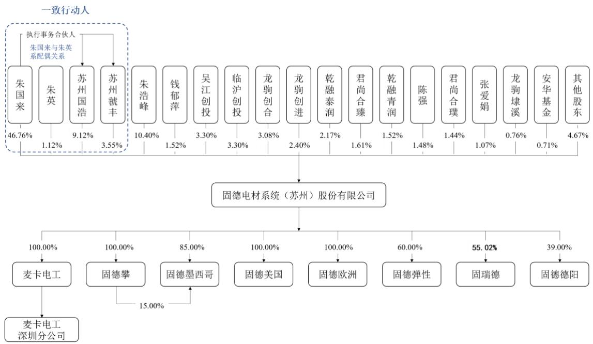

注：公司于2024年11月6日取得江苏省商务厅颁发的《企业境外投资证书》（境外投资证第N3200202401538号），并于 2024 年 12 月 31 日取得苏州市发展和改革委员会发布的《关于固德电材系统（苏州）股份有限公司在德国新建固德欧洲有限责任公司项目备案的通知》。固德欧洲于 2025 年 5 月 15 日正式成立，目前尚未开展任何经营活动。

# 七、发行人子公司、分公司情况

截至2025年 6月30日，公司共有5家全资子公司，分别为麦卡电工、固德攀、固德墨西哥、固德美国、固德欧洲；2 家控股子公司，分别为固德弹性、固瑞德；1家参股公司为固德德阳，1家分公司为麦卡电工深圳分公司。

公司将最近一期经审计营业收入、净利润、总资产、净资产中任一财务指标占最近一期经审计合并报表相应财务指标 $10 \%$ 以上，且经营业务、未来发展战略持有资质或证照对公司具有重要影响的子公司视为重要子公司。根据上述标准综合认定重要子公司为麦卡电工，基本情况如下：

# （一）重要子公司

<table><tr><td>公司全称</td><td colspan="4">麦卡电工器材（陆河）有限公司</td></tr><tr><td>成立时间</td><td colspan="4">2000年9月6日</td></tr><tr><td>注册资本</td><td colspan="4">6,200万元人民币</td></tr><tr><td>实收资本</td><td colspan="4">6,200万元人民币</td></tr><tr><td>注册地址</td><td colspan="4">陆河县河东开发区</td></tr><tr><td>主要生产经营地</td><td colspan="4">陆河县河东开发区</td></tr><tr><td>主营业务及其在发行人业务板块中定位</td><td colspan="4">负责云母纸、云母板的研发、生产、销售，系发行人上游业务</td></tr><tr><td>法定代表人</td><td colspan="4">朱国来</td></tr><tr><td rowspan="2">股东构成</td><td>序号</td><td>股东</td><td>出资额（万元）</td><td>出资比例</td></tr><tr><td>1</td><td>固德电材</td><td>6,200.00</td><td>100.00%</td></tr><tr><td rowspan="6">主要财务数据(单位:万元)</td><td colspan="2">项目</td><td>2025年6月30日/2025年1-6月</td><td>2024年12月31日/2024年度</td></tr><tr><td colspan="2">总资产</td><td>23,729.32</td><td>21,148.05</td></tr><tr><td colspan="2">净资产</td><td>14,719.84</td><td>13,167.76</td></tr><tr><td colspan="2">营业收入</td><td>8,004.08</td><td>20,839.48</td></tr><tr><td colspan="2">净利润</td><td>1,544.00</td><td>3,502.71</td></tr><tr><td colspan="2">审计情况</td><td colspan="2">经容诚会计师审计</td></tr></table>

# （二）其他子公司及参股公司、分公司情况

截至 2025 年 6 月 30 日，公司其他子公司及参股公司、分公司的基本情况如下：

<table><tr><td>序号</td><td>公司名称</td><td>股权结构</td><td>发行人认缴出资总额</td><td>入股时间</td><td>主营业务</td></tr><tr><td>1</td><td>固德攀</td><td>固德电材持股100.00%</td><td>2,000万元人民币</td><td>2022年2月</td><td>曾负责模切产品的加工、销售</td></tr><tr><td>2</td><td>固德弹性</td><td>固德电材持股60.00%、叶建兴持股20.00%、陆文娟持股20.00%</td><td>3,000万元人民币</td><td>2017年10月</td><td>为公司松杨路土地持有主体</td></tr><tr><td>3</td><td>固瑞德[注1]</td><td>固德电材持股56.09%、陆书建持股15.51%、陈强持股10.48%、淄博石雀浩瀚股权投资合伙企业（有限合伙）持股5.64%，其他5%以下股东合计持有12.28%</td><td>3,978万元人民币</td><td>2022年6月</td><td>负责铜铝复合材料的研发、生产、销售</td></tr><tr><td>4</td><td>固德墨西哥[注2]</td><td>固德电材持股85.00%、固德攀持股15.00%</td><td>400万美元</td><td>2023年6月</td><td>从事新能源汽车热失控防护产品的研发、生产、销售</td></tr><tr><td>5</td><td>固德美国[注3]</td><td>固德电材持股100.00%</td><td>500万美元</td><td>2023年11月</td><td>从事新能源汽车热失控防护产品的销售</td></tr><tr><td>6</td><td>固德欧洲[注4]</td><td>固德电材持股100.00%</td><td>109万美元</td><td>2025年5月</td><td>从事新能源汽车热失控防护及电气绝缘产品的销售</td></tr><tr><td>7</td><td>固德德阳</td><td>王华勇持股51.00%、固德电材持股39.00%、张文博持股10.00%</td><td>780万元人民币</td><td>2021年8月</td><td>从事绝缘结构件产品的研发、生产、销售</td></tr><tr><td>8</td><td>麦卡深圳分公司</td><td>-</td><td>-</td><td>2023年4月</td><td>无实际生产经营</td></tr></table>

注 1：固瑞德于 2025 年 6 月 16 日召开股东会，决议同意注册资本由 7,092 万元增加至 7,688 万元。2025年 7 月 16 日，固瑞德完成注册资本变更的工商登记，截至该日固德电材持股比例为 56.72%。  
固瑞德于 2025 年 9 月 29 日召开股东会，决议同意注册资本由 7,688 万元增加至 10,761 万元。2025 年 10月 22 日，固瑞德完成注册资本变更的工商登记，截至该日固德电材持股比例为 55.02%。  
注 2：公司对固德墨西哥固定资本为 1,700 万墨西哥比索，可变资本为 3,283.41 万墨西哥比索，固德攀对固德墨西哥固定资本为 300 万墨西哥比索，可变资本为 590.31 万墨西哥比索，总投资额共计 700 万美元；注 3：公司对固德美国总投资额共计 500 万美元，可发行普通股股数共计 6 万股；  
注 4：公司对固德欧洲注册资本为 100 万欧元，总投资额共计 109 万美元。

# 八、主要股东、实际控制人和其他持股 5%以上股份主要股东的情况

# （一）控股股东和实际控制人

公司控股股东、实际控制人为自然人朱国来。朱国来直接持有公司 $4 6 . 7 6 \%$ 股份，为公司第一大股东，并通过苏州国浩、苏州虢丰分别控制公司 $9 . 1 2 \% . 3 . 5 5 \%$ 的表决权；朱英直接持有公司 $1 . 1 2 \%$ 股份，系朱国来的一致行动人。综上，公司控股股东、实际控制人及其一致行动人合计可以控制公司 $6 0 . 5 5 \%$ 的表决权。同时，朱国来担任公司董事长、总经理，在股东会表决、董事会成员选任、公司经营管理等决策中均居于主导地位。

朱国来先生，1979年10月出生，中国国籍，无境外永久居留权，身份证号码 320525197910******，大学学历，获高层管理人员工商管理硕士（EMBA）学位。2001年7月至 2008年7月，任吴江市太湖绝缘材料厂销售经理、副总经理；2008 年 8 月至 2011 年 3 月，任固德有限销售经理；2011 年 3 月至 2011 年11月，任固德有限监事、销售经理；2011年 11月至今，任公司董事长兼总经理。

# （二）控股股东、实际控制人持有股份的质押、冻结或其他争议情况

截止本招股说明书签署日，公司控股股东、实际控制人直接或间接持有的发行人股份不存在质押、冻结或其他争议的情况。

# （三）其他持有 5%以上股份股东

除控股股东、实际控制人朱国来外，其他持有公司 $5 \%$ 以上股份股东的具体情况如下：

# 1、朱浩峰

朱浩峰先生，1980 年 8 月出生，中国国籍，无境外永久居留权，身份证号码 320525198008******，大学学历。2001 年 7 月至 2002 年 1 月，任亨通集团有

限公司网络信息部职员；2002 年 1 月至 2003 年 10 月，任彩智电子（苏州）有限公司职员；2003 年11月至2008年7月，任吴江市太湖绝缘材料厂销售经理；2008年8月至今，任公司销售经理、副总经理；2011年11月至今，任公司董事；2011年12月至2023 年12月，任公司董事会秘书。

# 2、苏州国浩

<table><tr><td>公司名称</td><td>苏州国浩股权投资管理企业（有限合伙）</td></tr><tr><td>成立时间</td><td>2011年11月8日</td></tr><tr><td>注册资本</td><td>360万元人民币</td></tr><tr><td>实收资本</td><td>360万元人民币</td></tr><tr><td>注册地址</td><td>吴江区汾湖镇汾湖大道558号</td></tr><tr><td>主要生产经营场所</td><td>吴江区汾湖镇汾湖大道558号</td></tr><tr><td>主营业务及其与发行人主营业务的关系</td><td>主营业务为股权投资管理，系发行人员工持股平台</td></tr><tr><td>执行事务合伙人</td><td>朱国来</td></tr></table>

苏州国浩的出资人构成、出资比例如下：

<table><tr><td>序号</td><td>合伙人姓名</td><td>出资额(万元)</td><td>出资比例(%)</td><td>任职/外部投资者</td></tr><tr><td>1</td><td>陈强</td><td>102.00</td><td>28.33</td><td>外部投资者</td></tr><tr><td>2</td><td>朱国来</td><td>79.62</td><td>22.12</td><td>董事长、总经理</td></tr><tr><td>3</td><td>蒋泉荣</td><td>40.00</td><td>11.11</td><td>外部投资者</td></tr><tr><td>4</td><td>王春林</td><td>20.00</td><td>5.56</td><td>外部投资者</td></tr><tr><td>5</td><td>庞海</td><td>20.00</td><td>5.56</td><td>外部投资者</td></tr><tr><td>6</td><td>徐明</td><td>14.67</td><td>4.08</td><td>董事、行政人事部负责人</td></tr><tr><td>7</td><td>薛薇</td><td>12.82</td><td>3.56</td><td>财务总监、董事会秘书</td></tr><tr><td>8</td><td>朱浩峰</td><td>10.00</td><td>2.78</td><td>董事、副总经理</td></tr><tr><td>9</td><td>田彦慈</td><td>9.25</td><td>2.57</td><td>高级专家(退休)</td></tr><tr><td>10</td><td>王違</td><td>7.04</td><td>1.96</td><td>外部投资者</td></tr><tr><td>11</td><td>张天放</td><td>7.00</td><td>1.94</td><td>外部投资者</td></tr><tr><td>12</td><td>吴元清</td><td>6.51</td><td>1.81</td><td>销售部销售主管</td></tr><tr><td>13</td><td>刘刚</td><td>6.00</td><td>1.67</td><td>供应链部副经理</td></tr><tr><td>14</td><td>侯经纬</td><td>5.48</td><td>1.52</td><td>销售部大客户经理</td></tr><tr><td>15</td><td>陈玉亭</td><td>5.27</td><td>1.46</td><td>产品工程部总监</td></tr><tr><td>16</td><td>史朝旭</td><td>2.54</td><td>0.71</td><td>生产部运营总监</td></tr><tr><td>17</td><td>殷笑雷</td><td>2.54</td><td>0.71</td><td>证券法务部总监、内审部负责人</td></tr><tr><td>18</td><td>李良华</td><td>2.15</td><td>0.60</td><td>麦卡电工供应链总监</td></tr><tr><td>19</td><td>王彦君</td><td>2.00</td><td>0.56</td><td>外部投资者</td></tr><tr><td>20</td><td>王愉</td><td>1.91</td><td>0.53</td><td>销售部销售经理</td></tr><tr><td>21</td><td>金明</td><td>1.20</td><td>0.33</td><td>仓储物流部副经理</td></tr><tr><td>22</td><td>徐娟华</td><td>1.00</td><td>0.28</td><td>取消监事会前在任监事、行政人事部经理助理</td></tr><tr><td>23</td><td>王苡婷</td><td>1.00</td><td>0.28</td><td>财务部高级经理</td></tr><tr><td colspan="2">合计</td><td>360.00</td><td>100.00</td><td>/</td></tr></table>

# 3、龙驹创合、龙驹创进、龙驹埭溪

龙驹创合、龙驹创进、龙驹埭溪的普通合伙人及执行事务合伙人均为苏州龙驹东方投资管理企业（有限合伙），苏州龙驹东方投资管理企业（有限合伙）的实际控制人为曹友强。龙驹创合、龙驹创进、龙驹埭溪合计持有公司 $5 \%$ 以上股份，其基本情况如下：

# （1）龙驹创合

<table><tr><td>公司名称</td><td>苏州龙驹创合创业投资合伙企业（有限合伙）</td></tr><tr><td>成立时间</td><td>2020年2月26日</td></tr><tr><td>注册资本</td><td>26,600万元</td></tr><tr><td>实收资本</td><td>26,600万元</td></tr><tr><td>注册地址</td><td>苏州市吴江区东太湖生态旅游度假区（太湖新城）迎宾大道333号苏州湾东方创投基地38号楼3层</td></tr><tr><td>主要生产经营场所</td><td>苏州市吴江区东太湖生态旅游度假区（太湖新城）迎宾大道333号苏州湾东方创投基地38号楼3层</td></tr><tr><td>主营业务及其与发行人主营业务的关系</td><td>一般项目：创业投资（除依法须经批准的项目外，凭营业执照依法自主开展经营活动）</td></tr><tr><td>执行事务合伙人</td><td>苏州龙驹东方投资管理企业（有限合伙）（委派代表：曹友强）</td></tr></table>

龙驹创合的出资人构成、出资比例如下：

<table><tr><td>序号</td><td>合伙人姓名</td><td>出资额（万元）</td><td>出资比例（%）</td><td>合伙人类型</td></tr><tr><td>1</td><td>苏州汾湖创新产业投资中心（有限合伙）</td><td>2,000.00</td><td>7.52</td><td>有限合伙人</td></tr><tr><td>2</td><td>江苏盛泽产业投资有限公司</td><td>2,000.00</td><td>7.52</td><td>有限合伙人</td></tr><tr><td>3</td><td>苏州市吴江城市投资发展集团有限公司</td><td>2,000.00</td><td>7.52</td><td>有限合伙人</td></tr><tr><td>4</td><td>苏州中方财团控股股份有限公司</td><td>2,000.00</td><td>7.52</td><td>有限合伙人</td></tr><tr><td>5</td><td>苏州市创客天使投资管理有限公司</td><td>1,600.00</td><td>6.02</td><td>有限合伙人</td></tr><tr><td>6</td><td>苏州永鼎投资有限公司</td><td>1,500.00</td><td>5.64</td><td>有限合伙人</td></tr><tr><td>7</td><td>陈刚</td><td>1,000.00</td><td>3.76</td><td>有限合伙人</td></tr><tr><td>8</td><td>杨建荣</td><td>1,000.00</td><td>3.76</td><td>有限合伙人</td></tr><tr><td>9</td><td>李志聪</td><td>1,000.00</td><td>3.76</td><td>有限合伙人</td></tr><tr><td>10</td><td>刘保国</td><td>1,000.00</td><td>3.76</td><td>有限合伙人</td></tr><tr><td>11</td><td>秦小华</td><td>1,000.00</td><td>3.76</td><td>有限合伙人</td></tr><tr><td>12</td><td>陆枫</td><td>1,000.00</td><td>3.76</td><td>有限合伙人</td></tr><tr><td>13</td><td>沈根祥</td><td>1,000.00</td><td>3.76</td><td>有限合伙人</td></tr><tr><td>14</td><td>顾明龙</td><td>700.00</td><td>2.63</td><td>有限合伙人</td></tr><tr><td>15</td><td>马雪琴</td><td>500.00</td><td>1.88</td><td>有限合伙人</td></tr><tr><td>16</td><td>金梦园</td><td>500.00</td><td>1.88</td><td>有限合伙人</td></tr><tr><td>17</td><td>周强敏</td><td>500.00</td><td>1.88</td><td>有限合伙人</td></tr><tr><td>18</td><td>王柏年</td><td>500.00</td><td>1.88</td><td>有限合伙人</td></tr><tr><td>19</td><td>王庆华</td><td>500.00</td><td>1.88</td><td>有限合伙人</td></tr><tr><td>20</td><td>严文戟</td><td>500.00</td><td>1.88</td><td>有限合伙人</td></tr><tr><td>21</td><td>薛飞</td><td>500.00</td><td>1.88</td><td>有限合伙人</td></tr><tr><td>22</td><td>平强</td><td>500.00</td><td>1.88</td><td>有限合伙人</td></tr><tr><td>23</td><td>许小帆</td><td>500.00</td><td>1.88</td><td>有限合伙人</td></tr><tr><td>24</td><td>吕菁</td><td>500.00</td><td>1.88</td><td>有限合伙人</td></tr><tr><td>25</td><td>郭芳</td><td>500.00</td><td>1.88</td><td>有限合伙人</td></tr><tr><td>26</td><td>吴震宇</td><td>500.00</td><td>1.88</td><td>有限合伙人</td></tr><tr><td>27</td><td>肖碧青</td><td>500.00</td><td>1.88</td><td>有限合伙人</td></tr><tr><td>28</td><td>金志萍</td><td>500.00</td><td>1.88</td><td>有限合伙人</td></tr><tr><td>29</td><td>潘小忠</td><td>500.00</td><td>1.88</td><td>有限合伙人</td></tr><tr><td>30</td><td>苏州龙驹东方投资管理企业（有限合伙）</td><td>300.00</td><td>1.13</td><td>普通合伙人</td></tr></table>

<table><tr><td>合计</td><td>26,600.00</td><td>100.00</td><td>/</td></tr></table>

# （2）龙驹创进

<table><tr><td>公司名称</td><td>苏州龙驹创进创业投资合伙企业（有限合伙）</td></tr><tr><td>成立时间</td><td>2023年1月11日</td></tr><tr><td>注册资本</td><td>13,600万元</td></tr><tr><td>实收资本</td><td>6,920万元</td></tr><tr><td>注册地址</td><td>苏州市吴江区东太湖生态旅游度假区（太湖新城）迎宾大道333号苏州湾东方创投基地38号楼3层</td></tr><tr><td>主要生产经营场所</td><td>苏州市吴江区东太湖生态旅游度假区（太湖新城）迎宾大道333号苏州湾东方创投基地38号楼3层</td></tr><tr><td>主营业务及其与发行人主营业务的关系</td><td>一般项目：创业投资（限投资未上市企业）（除依法须经批准的项目外，凭营业执照依法自主开展经营活动），系发行人外部投资者</td></tr><tr><td>执行事务合伙人</td><td>苏州龙驹东方投资管理企业（有限合伙）（委派代表：曹友强）</td></tr></table>

龙驹创进的出资人构成、出资比例如下：

<table><tr><td>序号</td><td>合伙人姓名</td><td>出资额(万元)</td><td>出资比例(%)</td><td>合伙人类型</td></tr><tr><td>1</td><td>苏州东方创联投资管理有限公司</td><td>2,000.00</td><td>14.71</td><td>有限合伙人</td></tr><tr><td>2</td><td>王华</td><td>1,000.00</td><td>7.35</td><td>有限合伙人</td></tr><tr><td>3</td><td>周强敏</td><td>1,000.00</td><td>7.35</td><td>有限合伙人</td></tr><tr><td>4</td><td>鞠益忠</td><td>1,000.00</td><td>7.35</td><td>有限合伙人</td></tr><tr><td>5</td><td>苏州华源创业投资合伙企业（有限合伙）</td><td>1,000.00</td><td>7.35</td><td>有限合伙人</td></tr><tr><td>6</td><td>陶冉</td><td>1,000.00</td><td>7.35</td><td>有限合伙人</td></tr><tr><td>7</td><td>江苏科力半导体有限公司</td><td>980.00</td><td>7.21</td><td>有限合伙人</td></tr><tr><td>8</td><td>秦小华</td><td>520.00</td><td>3.82</td><td>有限合伙人</td></tr><tr><td>9</td><td>平强</td><td>500.00</td><td>3.68</td><td>有限合伙人</td></tr><tr><td>10</td><td>吴逸谦</td><td>500.00</td><td>3.68</td><td>有限合伙人</td></tr><tr><td>11</td><td>杨建荣</td><td>500.00</td><td>3.68</td><td>有限合伙人</td></tr><tr><td>12</td><td>王柏年</td><td>500.00</td><td>3.68</td><td>有限合伙人</td></tr><tr><td>13</td><td>沈根祥</td><td>500.00</td><td>3.68</td><td>有限合伙人</td></tr><tr><td>14</td><td>钱新华</td><td>500.00</td><td>3.68</td><td>有限合伙人</td></tr><tr><td>15</td><td>庞海</td><td>500.00</td><td>3.68</td><td>有限合伙人</td></tr><tr><td>16</td><td>王庆华</td><td>500.00</td><td>3.68</td><td>有限合伙人</td></tr><tr><td>17</td><td>薛飞</td><td>400.00</td><td>2.94</td><td>有限合伙人</td></tr><tr><td>18</td><td>苏州龙驹东方投资管理企业（有限合伙）</td><td>300.00</td><td>2.21</td><td>普通合伙人</td></tr><tr><td>19</td><td>吴咸红</td><td>200.00</td><td>1.47</td><td>有限合伙人</td></tr><tr><td>20</td><td>梅旭明</td><td>200.00</td><td>1.47</td><td>有限合伙人</td></tr><tr><td colspan="2">合计</td><td>13,600.00</td><td>100.00</td><td>/</td></tr></table>

# （3）龙驹埭溪

<table><tr><td>公司名称</td><td>苏州龙驹埭溪创业投资合伙企业（有限合伙）</td></tr><tr><td>成立时间</td><td>2024年11月8日</td></tr><tr><td>注册资本</td><td>5,051万元</td></tr><tr><td>实收资本</td><td>1,010.20万元</td></tr><tr><td>注册地址</td><td>江苏省苏州市相城区黄埭镇春丰路406号康阳大厦5楼504室</td></tr><tr><td>主要生产经营场所</td><td>江苏省苏州市相城区黄埭镇春丰路406号康阳大厦5楼504室</td></tr><tr><td>主营业务及其与发行人主营业务的关系</td><td>一般项目：创业投资（限投资未上市企业）（除依法须经批准的项目外，凭营业执照依法自主开展经营活动），系发行人外部投资者</td></tr><tr><td>执行事务合伙人</td><td>苏州龙驹东方投资管理企业（有限合伙）（委派代表：曹友强）</td></tr></table>

龙驹埭溪的出资人构成、出资比例如下：

<table><tr><td>序号</td><td>合伙人姓名</td><td>出资额（万元）</td><td>出资比例（%）</td><td>合伙人类型</td></tr><tr><td>1</td><td>苏州相城高新技术产业开发区埭元创业投资有限公司</td><td>1,500.00</td><td>29.70</td><td>有限合伙人</td></tr><tr><td>2</td><td>张小芬</td><td>1,250.00</td><td>24.75</td><td>有限合伙人</td></tr><tr><td>3</td><td>曹志祥</td><td>1,250.00</td><td>24.75</td><td>有限合伙人</td></tr><tr><td>4</td><td>何金华</td><td>1,000.00</td><td>19.80</td><td>有限合伙人</td></tr><tr><td>5</td><td>苏州龙驹东方投资管理企业（有限合伙）</td><td>51.00</td><td>1.01</td><td>普通合伙人</td></tr><tr><td colspan="2">合计</td><td>5,051.00</td><td>100.00</td><td>/</td></tr></table>

# 九、发行人特别表决权股份或类似安排

截至本招股说明书签署日，公司不存在特别表决权股份或类似安排。

# 十、发行人协议控制架构

截至本招股说明书签署日，公司不存在协议控制架构。

# 十一、发行人控股股东、实际控制人报告期内重大违法行为

报告期内，公司控股股东、实际控制人不存在贪污、贿赂、侵占财产、挪用财产或者破坏社会主义市场经济秩序的刑事犯罪，也不存在欺诈发行、重大信息披露违法或者其他涉及国家安全、公共安全、生态安全、生产安全、公众健康安全等领域的重大违法行为。

# 十二、发行人股本情况

# （一）本次发行前后的股本结构

发行人本次发行前总股本为 6,210.00 万股，本次拟发行普通股不低于2,070.00万股，占发行后总股本的比例为 $2 5 . 0 0 \%$ 。本次发行全部为新股发行，不涉及老股东公开发售股份情形。本次发行前后公司股本结构如下：

<table><tr><td rowspan="2">序号</td><td rowspan="2">股东名称</td><td colspan="2">发行前股本结构</td><td colspan="2">发行后股本结构</td></tr><tr><td>持股数量 (万股)</td><td>持股比例(%)</td><td>持股数量 (万股)</td><td>持股比例(%)</td></tr><tr><td>1</td><td>朱国来</td><td>2,904.0000</td><td>46.76</td><td>2,904.0000</td><td>35.07</td></tr><tr><td>2</td><td>朱浩峰</td><td>646.1400</td><td>10.40</td><td>646.1400</td><td>7.80</td></tr><tr><td>3</td><td>苏州国浩</td><td>566.2800</td><td>9.12</td><td>566.2800</td><td>6.84</td></tr><tr><td>4</td><td>苏州虢丰</td><td>220.2473</td><td>3.55</td><td>220.2473</td><td>2.66</td></tr><tr><td>5</td><td>吴江创投</td><td>205.1743</td><td>3.30</td><td>205.1743</td><td>2.48</td></tr><tr><td>6</td><td>临沪创投</td><td>205.1742</td><td>3.30</td><td>205.1742</td><td>2.48</td></tr><tr><td>7</td><td>龙驹创合</td><td>191.0000</td><td>3.08</td><td>191.0000</td><td>2.31</td></tr><tr><td>8</td><td>龙驹创进</td><td>149.3400</td><td>2.40</td><td>149.3400</td><td>1.80</td></tr><tr><td>9</td><td>乾融泰润</td><td>135.0000</td><td>2.17</td><td>135.0000</td><td>1.63</td></tr><tr><td>10</td><td>君尚合臻</td><td>100.0000</td><td>1.61</td><td>100.0000</td><td>1.21</td></tr><tr><td>11</td><td>钱郁萍</td><td>94.5200</td><td>1.52</td><td>94.5200</td><td>1.14</td></tr><tr><td>12</td><td>乾融青润</td><td>94.0830</td><td>1.52</td><td>94.0830</td><td>1.14</td></tr><tr><td>13</td><td>陈强</td><td>92.1874</td><td>1.48</td><td>92.1874</td><td>1.11</td></tr><tr><td>14</td><td>君尚合璞</td><td>89.3770</td><td>1.44</td><td>89.3770</td><td>1.08</td></tr><tr><td>15</td><td>朱英</td><td>69.6900</td><td>1.12</td><td>69.6900</td><td>0.84</td></tr><tr><td>16</td><td>张爱娟</td><td>66.5500</td><td>1.07</td><td>66.5500</td><td>0.80</td></tr><tr><td>17</td><td>龙驹埭溪</td><td>47.0368</td><td>0.76</td><td>47.0368</td><td>0.57</td></tr><tr><td>18</td><td>安华基金</td><td>44.0000</td><td>0.71</td><td>44.0000</td><td>0.53</td></tr><tr><td>19</td><td>朱旻</td><td>40.1500</td><td>0.65</td><td>40.1500</td><td>0.48</td></tr><tr><td>20</td><td>张正军</td><td>30.0000</td><td>0.48</td><td>30.0000</td><td>0.36</td></tr><tr><td>21</td><td>钱国祥</td><td>27.5000</td><td>0.44</td><td>27.5000</td><td>0.33</td></tr><tr><td>22</td><td>郑黎梅</td><td>24.7500</td><td>0.40</td><td>24.7500</td><td>0.30</td></tr><tr><td>23</td><td>秦小华</td><td>21.1200</td><td>0.34</td><td>21.1200</td><td>0.26</td></tr><tr><td>24</td><td>周喻</td><td>18.0400</td><td>0.29</td><td>18.0400</td><td>0.22</td></tr><tr><td>25</td><td>田彦慈</td><td>17.0000</td><td>0.27</td><td>17.0000</td><td>0.21</td></tr><tr><td>26</td><td>陈跃峰</td><td>15.0000</td><td>0.24</td><td>15.0000</td><td>0.18</td></tr><tr><td>27</td><td>程小弟</td><td>11.1100</td><td>0.18</td><td>11.1100</td><td>0.13</td></tr><tr><td>28</td><td>杨站盟</td><td>11.0000</td><td>0.18</td><td>11.0000</td><td>0.13</td></tr><tr><td>29</td><td>王晓东</td><td>11.0000</td><td>0.18</td><td>11.0000</td><td>0.13</td></tr><tr><td>30</td><td>李飞</td><td>11.0000</td><td>0.18</td><td>11.0000</td><td>0.13</td></tr><tr><td>31</td><td>陆书建</td><td>10.0000</td><td>0.16</td><td>10.0000</td><td>0.12</td></tr><tr><td>32</td><td>殷成龙</td><td>9.0000</td><td>0.14</td><td>9.0000</td><td>0.11</td></tr><tr><td>33</td><td>朱丹</td><td>8.0000</td><td>0.13</td><td>8.0000</td><td>0.10</td></tr><tr><td>34</td><td>王颖颜</td><td>7.7000</td><td>0.12</td><td>7.7000</td><td>0.09</td></tr><tr><td>35</td><td>周瑜萍</td><td>7.0000</td><td>0.11</td><td>7.0000</td><td>0.08</td></tr><tr><td>36</td><td>吴雄</td><td>5.5000</td><td>0.09</td><td>5.5000</td><td>0.07</td></tr><tr><td>37</td><td>薛继良</td><td>5.0000</td><td>0.08</td><td>5.0000</td><td>0.06</td></tr><tr><td>38</td><td>曾棱</td><td>0.3300</td><td>0.01</td><td>0.3300</td><td>0.00</td></tr><tr><td colspan="2">本次发行流通股</td><td>-</td><td>-</td><td>2,070.0000</td><td>25.00</td></tr><tr><td colspan="2">合计</td><td>6,210.0000</td><td>100.00</td><td>8,280.0000</td><td>100.00</td></tr></table>

# （二）本次发行前的前十名股东

本次发行前，公司前十名股东持股情况如下：

<table><tr><td>序号</td><td>股东名称</td><td>持股数量（万股）</td><td>持股比例（%）</td></tr><tr><td>1</td><td>朱国来</td><td>2,904.0000</td><td>46.76</td></tr><tr><td>2</td><td>朱浩峰</td><td>646.1400</td><td>10.40</td></tr><tr><td>3</td><td>苏州国浩</td><td>566.2800</td><td>9.12</td></tr><tr><td>4</td><td>苏州虢丰</td><td>220.2473</td><td>3.55</td></tr><tr><td>5</td><td>吴江创投</td><td>205.1743</td><td>3.30</td></tr><tr><td>6</td><td>临沪创投</td><td>205.1742</td><td>3.30</td></tr><tr><td>7</td><td>龙驹创合</td><td>191.0000</td><td>3.08</td></tr><tr><td>8</td><td>龙驹创进</td><td>149.3400</td><td>2.40</td></tr><tr><td>9</td><td>乾融泰润</td><td>135.0000</td><td>2.17</td></tr><tr><td>10</td><td>君尚合臻</td><td>100.0000</td><td>1.61</td></tr></table>

# （三）本次发行前的前十名自然人股东及其在发行人处担任的职务

本次发行前，前十名自然人股东及其在发行人处担任职务情况如下：

<table><tr><td>序号</td><td>股东名称</td><td>持股数量（万股）</td><td>持股比例（%）</td><td>在发行人处担任职务</td></tr><tr><td>1</td><td>朱国来</td><td>2,904.0000</td><td>46.76</td><td>董事长、总经理</td></tr><tr><td>2</td><td>朱浩峰</td><td>646.1400</td><td>10.40</td><td>董事、副总经理</td></tr><tr><td>3</td><td>钱郁萍</td><td>94.5200</td><td>1.52</td><td>行政人事部文员</td></tr><tr><td>4</td><td>陈强</td><td>92.1874</td><td>1.48</td><td>-</td></tr><tr><td>5</td><td>朱英</td><td>69.6900</td><td>1.12</td><td>投资总监</td></tr><tr><td>6</td><td>张爱娟</td><td>66.5500</td><td>1.07</td><td>-</td></tr><tr><td>7</td><td>朱旻</td><td>40.1500</td><td>0.65</td><td>-</td></tr><tr><td>8</td><td>张正军</td><td>30.0000</td><td>0.48</td><td>-</td></tr><tr><td>9</td><td>钱国祥</td><td>27.5000</td><td>0.44</td><td>-</td></tr><tr><td>10</td><td>郑黎梅</td><td>24.7500</td><td>0.40</td><td>-</td></tr></table>

# （四）发行人股本中国有股份或外资股份情况

# 1、国有股东情况

公司不存在外资股份。截至本招股说明书签署日，公司国有股东基本情况如下：

<table><tr><td>序号</td><td>股东名称</td><td>持股数量（万股）</td><td>持股比例（%）</td></tr><tr><td>1</td><td>吴江创投</td><td>205.1743</td><td>3.30</td></tr></table>

吴江创投于2025年4月21日取得《江苏省国资委关于固德电材系统（苏州）股份有限公司国有股东标识管理事项的批复》（苏国资复〔2025〕18 号），固德电材如在公开市场发行股票并上市，吴江创投在中国证券登记结算有限责任公司登记的证券账户应标注“SS”。

# 2、国有股权变动瑕疵

公司历史沿革中涉及的国有股权变动瑕疵及采取的补救措施如下：

<table><tr><td>序号</td><td>股权变动瑕疵</td><td>采取的补救措施</td></tr><tr><td>1</td><td>2022年1月，股份公司第五次增资，国有股东吴江创投持有公司股权比例发生变动，但未及时进行评估且未将评估结果进行备案。</td><td>2025年4月，苏州市吴江东方国有资本投资经营有限公司对中水致远评报字[2024]第020813号《资产评估报告》进行审核，确认评估报告和评估结果符合相关规定和要求，并完成了评估报告补充备案手续。</td></tr><tr><td>2</td><td>2011年11月，吴江创投投资入股时未及时办理国有产权登记。</td><td>2025年2月，苏州市吴江东方国有资本投资经营有限公司就其所持公司股份情况取得编号为6744336032025022400021的《企业产权登记表》。</td></tr></table>

2025年3月18 日，苏州市吴江东方国有资本投资经营有限公司出具《关于固德电材系统（苏州）股份有限公司历史沿革的确认意见》，确认吴江创投出资固德有限并随固德电材股改、股权变动等程序均符合当时的国有资产监督管理相关规定，相关出资、股权变动真实、合法、有效，不存在损害国有股东权益或导致国有资产流失的情形，不存在纠纷或潜在纠纷。

吴江创投已在申请国有股东标识管理方案时就公司历史沿革中增资行为导致吴江创投国有股权比例被稀释的情形向苏州市吴江区人民政府国有资产监督管理办公室、苏州市人民政府国有资产监督管理委员会、江苏省政府国有资产监督管理委员会进行披露并报送国有股权设置的专项法律意见，江苏省政府国有资产监督管理委员会已出具《关于固德电材系统（苏州）股份有限公司国有股东标识管理事项的批复》（苏国资复〔2025〕18 号），对公司国有股权变动情况进行确认。

综上，公司历史沿革中涉及的国有股权变动瑕疵已采取合法有效的补救措施，并已经作为吴江创投国有资产评估备案事项的管理单位和国有产权管理的一级单位进行确认，相关瑕疵事项未造成国有资产流失，相关股东未受到过行政处罚，不存在纠纷或潜在纠纷，不构成重大违法行为，亦不构成本次发行的法律障碍。

# （五）申报前十二个月新增股东情况

# 1、基本情况

截至本招股说明书签署日，公司申报前十二个月新增股东为乾融青润、君尚合璞、龙驹埭溪。

# （1）乾融青润

<table><tr><td>公司全称</td><td>苏州乾融青润创业投资合伙企业（有限合伙）</td></tr><tr><td>成立时间</td><td>2024 年 12 月 23 日</td></tr><tr><td>出资额</td><td>20,000 万元人民币</td></tr><tr><td>注册地址</td><td>江苏省苏州市吴中区胥口镇腾胥路65号206室</td></tr><tr><td>经营范围</td><td>一般项目：创业投资（限投资未上市企业）（除依法须经批准的项目外，凭营业执照依法自主开展经营活动）</td></tr><tr><td>执行事务合伙人</td><td>苏州乾融太元企业管理咨询合伙企业（委派代表：徐轶婷）</td></tr><tr><td>实际控制人</td><td>叶晓明[注]</td></tr></table>

注：乾融青润的基金管理人为江苏乾融资本管理有限公司，其实际控制人为叶晓明。

乾融青润的合伙人及出资情况如下：

<table><tr><td>序号</td><td>合伙人姓名/名称</td><td>合伙人类型</td><td>认缴出资额（万元）</td><td>出资比例</td></tr><tr><td>1</td><td>江苏康众数字医疗科技股份有限公司</td><td>有限合伙人</td><td>3,000.00</td><td>15.00%</td></tr><tr><td>2</td><td>宁波甬前二期股权投资合伙企业（有限合伙）</td><td>有限合伙人</td><td>3,000.00</td><td>15.00%</td></tr><tr><td>3</td><td>江苏乾融资产管理有限公司</td><td>有限合伙人</td><td>2,800.00</td><td>14.00%</td></tr><tr><td>4</td><td>江苏新华沣裕资本管理有限公司[注]</td><td>有限合伙人</td><td>2,500.00</td><td>12.50%</td></tr><tr><td>5</td><td>天臣国际医疗科技股份有限公司</td><td>有限合伙人</td><td>2,000.00</td><td>10.00%</td></tr><tr><td>6</td><td>苏州吴中高新胥江股权投资合伙企业（有限合伙）</td><td>有限合伙人</td><td>2,000.00</td><td>10.00%</td></tr><tr><td>7</td><td>苏州市吴中盈运股权投资合伙企业（有限合伙）</td><td>有限合伙人</td><td>1,000.00</td><td>5.00%</td></tr><tr><td>8</td><td>苏州乾融太元企业管理咨询合伙企业（有限合伙）</td><td>普通合伙人</td><td>500.00</td><td>2.50%</td></tr><tr><td>9</td><td>徐亦凡</td><td>有限合伙人</td><td>500.00</td><td>2.50%</td></tr><tr><td>10</td><td>顾晟</td><td>有限合伙人</td><td>300.00</td><td>1.50%</td></tr><tr><td>11</td><td>顾煜琪</td><td>有限合伙人</td><td>300.00</td><td>1.50%</td></tr><tr><td>12</td><td>茅澄怡</td><td>有限合伙人</td><td>300.00</td><td>1.50%</td></tr><tr><td>13</td><td>金恺丰</td><td>有限合伙人</td><td>300.00</td><td>1.50%</td></tr><tr><td>14</td><td>梁小宝</td><td>有限合伙人</td><td>300.00</td><td>1.50%</td></tr><tr><td>15</td><td>庞敏蓉</td><td>有限合伙人</td><td>300.00</td><td>1.50%</td></tr><tr><td>16</td><td>岳剑峰</td><td>有限合伙人</td><td>300.00</td><td>1.50%</td></tr><tr><td>17</td><td>卢建文</td><td>有限合伙人</td><td>300.00</td><td>1.50%</td></tr><tr><td>18</td><td>安梅霞</td><td>有限合伙人</td><td>300.00</td><td>1.50%</td></tr><tr><td colspan="2">合计</td><td></td><td>20,000.00</td><td>100.00%</td></tr></table>

注：持有者为新华·沣沅 1 号创业投资基金，江苏新华沣裕资本管理有限公司为其基金管理人，具体情况参见本招股说明书本节之“十二、发行人股本情况”之“（八）发行人股东中金融产品纳入监管的情况”之“2、契约型基金、资产管理计划、信托计划类股东持股情况”。

乾融青润的普通合伙人兼执行事务合伙人苏州乾融太元企业管理咨询合伙企业（有限合伙）的基本情况如下：

（2）君尚合璞  

<table><tr><td>企业全称</td><td colspan="4">苏州乾融太元企业管理咨询合伙企业（有限合伙）</td></tr><tr><td>成立时间</td><td colspan="4">2024 年 8 月 19 日</td></tr><tr><td>出资额</td><td colspan="4">1,000 万元人民币</td></tr><tr><td>注册地址</td><td colspan="4">中国（江苏）自由贸易试验区苏州片区苏州工业园区苏虹东路 183 号东沙湖基金小镇 10 幢 311 室</td></tr><tr><td>执行事务合伙人</td><td colspan="4">江苏乾融资本管理有限公司（委派代表：叶晓明）</td></tr><tr><td rowspan="7">出资结构</td><td>序号</td><td>合伙人名称</td><td>认缴出资额（万元）</td><td>出资比例</td></tr><tr><td>1</td><td>上海太真企业管理合伙企业（有限合伙）</td><td>450.00</td><td>45.00%</td></tr><tr><td>2</td><td>叶玄羲</td><td>282.50</td><td>28.25%</td></tr><tr><td>3</td><td>江苏乾融资本管理有限公司</td><td>100.00</td><td>10.00%</td></tr><tr><td>4</td><td>江苏乾融创业孵化管理有限公司</td><td>100.00</td><td>10.00%</td></tr><tr><td>5</td><td>徐轶婷</td><td>67.50</td><td>6.75%</td></tr><tr><td colspan="2">合计</td><td>1,000.00</td><td>100.00%</td></tr></table>

<table><tr><td>公司全称</td><td>苏州君尚合璞创业投资合伙企业（有限合伙）</td></tr><tr><td>成立时间</td><td>2023年2月24日</td></tr><tr><td>出资额</td><td>10,000万元人民币</td></tr><tr><td>注册地址</td><td>苏州市相城区高铁新城南天成路55号12楼B区-B12工位（集群登记）</td></tr><tr><td>经营范围</td><td>一般项目：创业投资（限投资未上市企业）（除依法须经批准的项目外，凭营业执照依法自主开展经营活动）</td></tr><tr><td>执行事务合伙人</td><td>苏州君尚投资管理有限公司（委派代表：田晓利）</td></tr><tr><td>实际控制人</td><td>田晓利</td></tr></table>

君尚合璞的合伙人及出资情况如下：

<table><tr><td>序号</td><td>合伙人姓名/名称</td><td>合伙人类型</td><td>认缴出资额（万元）</td><td>出资比例</td></tr><tr><td>1</td><td>常熟市千斤顶厂</td><td>有限合伙人</td><td>9,700.00</td><td>97.00%</td></tr><tr><td>2</td><td>苏州君尚投资管理有限公司</td><td>普通合伙人</td><td>300.00</td><td>3.00%</td></tr><tr><td colspan="2">合计</td><td></td><td>10,000.00</td><td>100.00%</td></tr></table>

君尚合璞的普通合伙人兼执行事务合伙人苏州君尚投资管理有限公司的基本情况如下：

<table><tr><td>企业全称</td><td colspan="4">苏州君尚投资管理有限公司</td></tr><tr><td>成立时间</td><td colspan="4">2018年4月8日</td></tr><tr><td>注册资本</td><td colspan="4">1,000万元人民币</td></tr><tr><td>注册地址</td><td colspan="4">苏州市相城区高铁新城南天成路55号12楼B区-B11工位（集群登记）</td></tr><tr><td>法定代表人</td><td colspan="4">田晓利</td></tr><tr><td rowspan="4">出资结构</td><td>序号</td><td>合伙人名称</td><td>认缴出资额（万元）</td><td>出资比例</td></tr><tr><td>1</td><td>田晓利</td><td>990.00</td><td>99.00%</td></tr><tr><td>2</td><td>黄溪红</td><td>10.00</td><td>1.00%</td></tr><tr><td colspan="2">合计</td><td>1,000.00</td><td>100.00%</td></tr></table>

# （3）龙驹埭溪

龙驹埭溪的基本情况参见本招股说明书本节之“八、主要股东、实际控制人和其他持股 $5 \%$ 以上股份主要股东的情况”之“（三）其他持有 $5 \%$ 以上股份股东”之“3、龙驹创合、龙驹创进、龙驹埭溪”之“（3）龙驹埭溪”。

龙驹埭溪的普通合伙人兼执行事务合伙人苏州龙驹东方投资管理企业（有限合伙）的基本情况如下：

<table><tr><td>企业全称</td><td colspan="4">苏州龙驹东方投资管理企业（有限合伙）</td></tr><tr><td>成立时间</td><td colspan="4">2017年1月17日</td></tr><tr><td>出资额</td><td colspan="4">1,000万元人民币</td></tr><tr><td>注册地址</td><td colspan="4">苏州市吴江区东太湖生态旅游度假区（太湖新城）迎宾大道333号苏州湾东方创投基地38号楼3层</td></tr><tr><td>执行事务合伙人</td><td colspan="4">苏州开平管理咨询有限公司（委派代表：曹友强）</td></tr><tr><td rowspan="5">出资结构</td><td>序号</td><td>合伙人名称</td><td>认缴出资额（万元）</td><td>出资比例</td></tr><tr><td>1</td><td>苏州龙驹企业管理中心（有限合伙）</td><td>890.00</td><td>89.00%</td></tr><tr><td>2</td><td>苏州东方创联投资管理有限公司</td><td>100.00</td><td>10.00%</td></tr><tr><td>3</td><td>苏州开平管理咨询有限公司</td><td>10.00</td><td>1.00%</td></tr><tr><td colspan="2">合计</td><td>1,000.00</td><td>100.00%</td></tr></table>

# 2、入股原因、入股价格及定价依据

<table><tr><td>序号</td><td>股东名称</td><td>入股原因</td><td>入股价格(元/股)</td><td>取得股份数量(万股)</td><td>出资额(万元)</td><td>定价依据</td></tr><tr><td>1</td><td>乾融青润</td><td>乾融青润作为主要面向新材料等的专业投资基金,看好固德电材的发展,完成工商注册和基金备案后,经投资决策委员会决议和合伙人会议决议通过,受让乾融坤润所取得的固德电材股份。</td><td rowspan="3">21.26</td><td>94.0830</td><td>2,000.03</td><td rowspan="3">基于公司净利润水平协商定价</td></tr><tr><td>2</td><td>君尚合璞</td><td rowspan="2">公司原股东富坤赢通因基金期限限制、投资策略变化等转让其股份,乾融坤润、君尚合璞、龙驹埭溪及龙驹创进因看好公司发展前景,受让部分股权。</td><td>89.3770</td><td>1,899.99</td></tr><tr><td>3</td><td>龙驹埭溪</td><td>47.0368</td><td>999.91</td></tr></table>

上述新增股东中，乾融青润与公司股东乾融泰润的基金管理人的实际控制人同为叶晓明；君尚合璞与公司股东君尚合臻的普通合伙人及执行事务合伙人均为苏州君尚投资管理有限公司；龙驹埭溪与公司股东龙驹创进、龙驹创合的普通合伙人及执行事务合伙人均为苏州龙驹东方投资管理企业（有限合伙）。

除此之外，新增股东与公司其他股东、董事、取消监事会前在任监事、高级管理人员及本次发行的中介机构及其负责人、高级管理人员、经办人员不存在关联关系，亦不存在股份代持情形。

# （六）本次发行前各股东之间的关联关系、一致行动关系及关联股东各自持股比例

截至本招股说明书签署之日，公司各股东间的关联关系、一致行动关系及各自持股情况如下：

<table><tr><td>序号</td><td>股东姓名/名称</td><td>持有固德电材股数(万股)</td><td>持股比例(%)</td><td>持股方式</td><td>关系情况</td></tr><tr><td rowspan="7">1</td><td rowspan="3">朱国来</td><td>2,904.0000</td><td>46.76</td><td>直接持股</td><td rowspan="5">朱英系朱国来配偶，朱昱系朱英兄长</td></tr><tr><td>125.2423</td><td>2.02</td><td>通过苏州国浩间接持股</td></tr><tr><td>4.2473</td><td>0.07</td><td>通过苏州虢丰间接持股</td></tr><tr><td>朱英</td><td>69.6900</td><td>1.12</td><td>直接持股</td></tr><tr><td>朱旻</td><td>40.1500</td><td>0.65</td><td>直接持股</td></tr><tr><td>苏州国浩</td><td>566.2800</td><td>9.12</td><td>直接持股</td><td rowspan="2">苏州国浩、苏州虢丰系朱国来控制的合伙企业</td></tr><tr><td>苏州虢丰</td><td>220.2473</td><td>3.55</td><td>直接持股</td></tr><tr><td rowspan="3">2</td><td rowspan="2">朱浩峰</td><td>646.1400</td><td>10.40</td><td>直接持股</td><td rowspan="3">钱郁萍系朱浩峰配偶</td></tr><tr><td>15.7300</td><td>0.25</td><td>通过苏州国浩间接持股</td></tr><tr><td>钱郁萍</td><td>94.5200</td><td>1.52</td><td>直接持股</td></tr><tr><td rowspan="3">3</td><td>龙驹创合</td><td>191.0000</td><td>3.08</td><td>直接持股</td><td rowspan="3">普通合伙人及执行事务合伙人均为苏州龙驹东方投资管理企业(有限合伙)</td></tr><tr><td>龙驹创进</td><td>149.3400</td><td>2.40</td><td>直接持股</td></tr><tr><td>龙驹埭溪</td><td>47.0368</td><td>0.76</td><td>直接持股</td></tr><tr><td rowspan="2">4</td><td>乾融泰润</td><td>135.0000</td><td>2.17</td><td>直接持股</td><td rowspan="2">基金管理人的实际控制人均为叶晓明</td></tr><tr><td>乾融青润</td><td>94.0830</td><td>1.52</td><td>直接持股</td></tr><tr><td rowspan="2">5</td><td>君尚合臻</td><td>100.0000</td><td>1.61</td><td>直接持股</td><td rowspan="2">普通合伙人及执行事务合伙人均为苏州君尚投资管理有限公司</td></tr><tr><td>君尚合璞</td><td>89.3770</td><td>1.44</td><td>直接持股</td></tr><tr><td rowspan="4">6</td><td rowspan="2">田彦慈</td><td>17.0000</td><td>0.27</td><td>直接持股</td><td rowspan="4">王颖颜系田彦慈配偶，王晓东为王颖颜的妹妹</td></tr><tr><td>14.5503</td><td>0.23</td><td>通过苏州国浩间接持股</td></tr><tr><td>王颖颜</td><td>7.7000</td><td>0.12</td><td>直接持股</td></tr><tr><td>王晓东</td><td>11.0000</td><td>0.18</td><td>直接持股</td></tr></table>

除上述情况外，公司现有股东之间不存在其他关联关系或一致行动关系。

# （七）本次发行前涉及的特殊投资条款及解除情况

公司历次增资时，部分投资者曾与公司及控股股东朱国来、 $5 \%$ 以上股东朱浩峰约定过业绩对赌等特殊投资条款，具体内容及解除情况如下：

# 1、吴江创投、临沪创投的特殊投资条款及解除

2011 年 10 月 13 日，施惠荣、朱国来、朱浩峰与吴江创投、临沪创投签署

了《关于吴江固德电材系统有限公司增资协议之补充协议》，协议中约定的部分特殊权利条款具体情况如下：

<table><tr><td>投资方</td><td>特殊权利</td><td>主要内容</td></tr><tr><td rowspan="4">吴江创投、临沪创投</td><td>投资方的回购权</td><td>如标的公司未能在2016年12月31日前通过上市审批，则投资方有权选择在2017年6月30日前按照如下价格要求公司以现金方式回购标的股权，公司应当在收到投资方书面提出的回购请求之日起20个工作日内履行回购义务：（1）回购价格为以下两个价格中较高者：A、增资价款×（1+8%）N，其中N为回购时距投资日的时间，以年为单位，可以不是整数，精确到月；或者B、回购日标的公司账面净资产×标的股权所占标的公司股权比例。（2）投资方回购应在标的公司2016年度审计报告出具之后2个月内提出并实施，逾期则视作放弃回购权。（3）如果投资人选择股权回购的，则投资人不再享有从应得红利之日起至回购之日止的股权分红。如果已经享有股权分红的，则从上述回购款中予以扣除。</td></tr><tr><td>出售权</td><td>标的公司完成天津股权交易所挂牌交易后，投资方有权通过天交所出售其部分或全部股权。</td></tr><tr><td>分红限制</td><td>交易完成日后至标的公司上市前，标的公司每一个财务年度向股东的现金分红比例和方案由公司董事会决定。</td></tr><tr><td>反稀释限制</td><td>交易完成日后至标的公司上市前，标的公司向新的投资者（经董事会认可的标的公司管理层除外）增资时，增资价格不得低于本次交易的价格。交易完成日后，如标的公司给予任一股东（包括引进的新投资者）享有的权利优于本协议投资方享有的权利的，则本协议投资方将自动享有该等权利。</td></tr></table>

2015 年 7 月，朱国来、朱浩峰、苏州国浩与吴江创投、临沪创投分别签署《终止协议》。各方同意，原《关于吴江固德电材系统有限公司增资协议之补充协议》自该《终止协议》签署之日起解除，各方不再按照《补充协议》履行约定，并放弃《终止协议》中约定追索权。各方确认，在《增资协议》《补充协议》履行过程中，不存在违约，各方无任何纠纷、争议。

根据以上《终止协议》，吴江创投、临沪创投涉及的对赌协议已完全解除，不包含恢复条款，不存在争议及法律风险。

# 2、安华基金的对赌协议及解除

2017年6月27 日，朱国来、朱浩峰向安华基金出具《回购承诺函》，承诺回购相关事项如下：

<table><tr><td>投资方</td><td>权利类型</td><td>特殊权利</td><td>主要内容</td></tr><tr><td>安华基金</td><td>回购权</td><td>回购条件</td><td>若发生下列情形之一的，贵机构有权要求朱国来及朱浩峰回购贵机构所持有的固德电材全部或部分股份：
1、固德电材2017年预计净利润4,000.00万元，实际2017年经审计净利润完成率低于90%;
2、固德电材于2018年12月31日（包含本日）之前未将在国内首次公开发行股票并上市（IPO）的申报材料提交至中国证券</td></tr><tr><td rowspan="3"></td><td rowspan="3"></td><td></td><td>监督管理委员会;3、固德电材于2020年12月31日(包含本日)之前未完成在国内首次公开发行股票并上市(IPO)且未被并购。若中国证券监督管理委员会已受理固德电材IPO申请材料且公司未撤回,则贵机构不得以上述第1项之情形要求朱国来与朱浩峰回购固德电材股份。</td></tr><tr><td>回购价款及比例</td><td>1、回购价款为:认购价格×要求回购的股份数量×(1+8%×T)-已从固德电材取得的分红×(要求回购的股份数量-贵机构持有的固德电材全部股份数量)。其中,认购价格为11元/股,T=自投资方实际投资金额到帐日至投资方执行股权回购之日的自然天数除以365。2、回购比例为:朱国来回购贵机构要求回购股份数量的80%支付相应回购价款,朱浩峰回购贵机构要求回购股份数量的20%支付相应回购价款。</td></tr><tr><td>回购期限</td><td>朱国来及朱浩峰共同承诺,在贵机构向朱国来、朱浩峰提出回购全部或部分股份之日起60日内,完成上述股份回购价款的支付及对应股票的交割手续。上述承诺回购期限内,朱国来及朱浩峰任何一方未按本承诺函要求的数量回购股份的,则不足部分由另一方进行回购。</td></tr></table>

2018 年 10 月 8 日，安华基金与朱国来、朱浩峰签署《股份回购协议书》。根据该《股份回购协议书》，安华基金要求朱国来、朱浩峰回购甲方持有的固德电材 102.40 万股中的 62.40 万股股份，自该协议生效之日起 10 日内完成股份转让款支付及股份交割手续。对于剩余 40.00 万股股份，约定回购事项如下：

<table><tr><td>投资方</td><td>权利类型</td><td>特殊权利</td><td>主要内容</td></tr><tr><td rowspan="5">安华基金</td><td rowspan="5">回购权</td><td>回购权期限及回购数量</td><td>固德电材公告2019年半年度报告后，甲方有权根据固德电材截至2019年6月30日的财务数据，在2019年9月10日前，甲方以书面形式提出，要求乙方及丙方回购甲方所持有的固德电材剩余40万股中的全部或部分股份。</td></tr><tr><td>回购价款</td><td>回购价款为：认购价格×要求回购的股份数量×（1+8%×T）-已从固德电材取得的分红×（要求回购的股份数量÷贵机构持有的固德电材全部股份数量）。其中，认购价格为11元/股，T=自投资方实际投资金额到帐日至投资方执行股权回购之日的自然天数除以365。</td></tr><tr><td>交易方式</td><td>本次股票的交割手续定在全国中小企业股份转让系统中以协议转让的方式完成，协议转让的每股价格为：回购价款总额/回购股数。</td></tr><tr><td>回购比例</td><td>回购比例为：朱国来回购要求回购股份数量的80%支付相应回购价款，朱浩峰回购要求回购股份数量的20%支付相应回购价款。</td></tr><tr><td>交割期限</td><td>各方一致同意，在一方向另一方根据本协议第一条的约定提出回购全部或部分股份要求之日起60日内，完成上述股份回购价款的支付及对应股票的交割手续。
上述承诺回购期限内，乙方及丙方中任何一方未按本承诺函要求的数量回购股份的，则不足部分由另一方进行回购。</td></tr></table>

2018年10月 8日，安华基金向朱国来、朱浩峰指定的第三方朱英、钱国祥转让了 62.40 万股。根据该《股份回购协议书》，剩余 40.00 万股的回购权行使期限至2019年9月 10日。截至该日，安华基金未要求行使该回购权，该项回购权已失效。

综上，安华基金涉及的回购权利已过失效期，不包含恢复条款，不存在争议及法律风险。

# 3、龙驹创合、龙驹创进、乾融泰润、君尚合臻的特殊权利条款及解除

2023 年 3 月，龙驹创合、龙驹创进、乾融泰润、君尚合臻分别与公司、朱国来、朱浩峰签署《增资协议之补充协议》，协议中约定的部分特殊权利条款具体情况如下：

<table><tr><td>投资方</td><td>特殊权利</td><td>主要内容</td></tr><tr><td>龙驹创合、龙驹创进、乾融泰润、君尚合臻</td><td>回购权</td><td>3.1各方一致确认并同意，以下任何一项事件发生，投资方均有权要求丙方（即朱国来、朱浩峰，下同）回购其各自持有的全部或部分目标公司股权：a）若目标公司未能在2025年12月31日前完成IPO的申报；b）在增资完成后至2025年12月31日之间的任何时间，目标公司及实际控制人/控股股东明确表示或者以其行为表示，其将不会或不能按期完成IPO的申报；c）目标公司及实际控制人/控股股东严重违反增资协议及补充协议承诺的；d)投资方投资后目标公司累计新增亏损达到最近一期经审计净资产的30%；e）目标公司实际控制人/控股股东及其在公司任职的直系近亲属出现转移公司财产、挪用资金、抽逃出资、违规占用公司资产等重大个人诚信问题；f）目标公司实际控制人/控股股东在公司完成IPO之前以任何方式直接或间接处置（包括但不限于转让、赠与、质押、信托、托管）其直接持有或者间接控制的公司股份导致丧失控股权或控制地位的，投资方同意的除外；g）目标公司的高级管理人员及核心技术人员发生重大变化且对目标公司IPO构成实质性障碍（新增成员除外，高级管理人员及核心技术人员名单见附件三）；h）目标公司的主营业务发生重大变化（本协议签署之日，目标公司的主营业务为【工商登记的经营范围“高低压电气绝缘系统和复合材料的研发、测试、销售；电气系统设备（包括包带、绕制、成型、焊接、注胶设备）的研发和销售；绝缘材料（包括绝缘漆、绝缘漆稀释剂、云母材料、防晕材料、绝缘纸、绝缘薄膜、绝缘胶带、绝缘板材、绝缘复合制品、电磁线等）的研发、测试、销售；绝缘结构件的生产、加工、销售；环氧灌封/浇注树脂（不含溶剂）的生产、销售；环氧类、聚氨酯类、有机硅类、聚酯类绝缘树脂的开发、测试、销售；危险化学品批发[第3类第2项：溶剂油；第3类第3项：二甲苯、苯乙烯、乙烯基甲苯异构体混合物、环氧绝缘漆、醇酸绝缘漆、聚酯树脂绝缘漆、有机硅耐高温漆（不得储存）]；自营和代理各类商品及技术的进出口业务（国家限定企业经营或禁止进出口的商品和技术除外）。（依法须经批准的项目，经相关部门批准后方可开展经营活动）一般项目：云母制品制造；软木制品制造；软木制品销售；塑料制品制造；塑料制品销售（除依法须经批准的项目外，凭营业执照依法自主开展经营活动）”,其主要从事的业务为“电绝缘材料（包括阻燃性环氧树脂、结构件）、环氧灌注树脂复合材料、热绝缘材料（包括云母板、云母卷、云母复合3D件）、铜铝复合材料的研发、生产、销售及模切业务”；i）目标公司与实际控制人/控股股东及其关联方进行有损于投资人或目标公司的交易或担保行为；j）目标公司存在或发生重大财务不规范或违法行为，包括但不限于虚增收入或利润、少列不列应付款项、伪造变造或涂改会计凭证或会计账册、存在账外资金收付等；</td></tr><tr><td rowspan="3"></td><td></td><td>k)目标公司被托管或进入破产程序、无正当原因停业3个月以上或存在其他无法持续正常经营的情形;1)目标公司、实际控制人/控股股东及在公司任职的高级管理人员或核心技术人员发生违反法律法规的重大行政处罚或刑事违法行为且对目标公司IPO构成实质性障碍。3.2前述回购的价格为乙方支付的增资款;3.3丙方应当在收到投资方发出的书面回购申请后的20个工作日内或相关投资方书面同意的更长期限内一次性支付全部回购价格,否则应承担违约责任。3.4为明确起见,在回购义务人向投资方支付完毕全部回购价格前,投资方就其未取得的回购价格所对应部分的股权仍享有中国法律和增资协议、本协议、公司章程项下完全的股东权利(包括但不限于董事会及董事会观察员委派权,如有),无论届时目标公司就该部分被回购股权是否已经办理完毕工商变更登记。3.5在不影响本条其他约定前提下,若存在两个或两个以上的投资方要求行使回购权但该等投资方回购价格不能全额获得支付的,就回购义务人在任何时候能够支付的回购价格部分,各要求回购的投资方应按照其届时各自所应获得的回购价格金额的相对比例获得相应价款。</td></tr><tr><td>优先认购权</td><td>6.3优先认购权。本轮增资完成后,公司进行增资扩股的,包括但不限于增发任何级别的股票或认股权证、可转债(含附认股权证公司债券)等股本权益类证券,应事先将增发计划书面通知投资方,投资方有权按所持股权比例享有优先购买权。原股东和投资方同时主张行使优先认购权的,各方应协商确定各自的认购比例,协商不成的,应按照持股比例行使优先认购权。为免疑义,在下列情况下,投资方不享有优先认购权:(1)公司为实施经有效决策的股权激励计划而新增注册资本或增发新股;(2)利润转增注册资本、资本公积转增股本等情况下各股东等比例增加出资额或认购新股;(3)在公司合格发行上市中发行的证券或类似的证券发行;(4)经公司有效决策的以发行股份方式作为支付对价的公司合并、收购或类似的交易(即换股交易)。</td></tr><tr><td>优先受让权</td><td>6.4优先受让权。各方同意,本轮增资完成后,实际控制人/控股股东进行股权转让的,在同等价格和条件下,投资方有权按所持股权比例享有优先受让权。目标公司其他股东(包括但不限于任何前轮投资人股东)和投资方同时主张行使优先受让权的,各方应协商确定各自的受让比例,协商不成的,应按照持股比例行使优先受让权。为免疑义,在下列情况下,投资方不享有优先受让权:(1)公司为实施经有效决策的股权激励计划而进行的直接或间接的股份转让;(2)向同一控制下的关联方进行的直接或间接的股份转让。</td></tr></table>

2023年12月，龙驹创合、龙驹创进、乾融泰润、君尚合臻分别与公司、朱国来、朱浩峰签署《股东特殊权利条款之终止协议》（以下简称“《终止协议》”），约定将前述《增资协议之补充协议》项下各特殊权利条款自《终止协议》签署之日起不可撤销地终止、自始无效且效力不可恢复。

# 4、子公司固瑞德股东的特殊权利条款及解除

2024 年 12 月 16 日，公司召开第五届董事会第七次会议，审议通过《关于对固瑞德新能源材料（山东）有限公司增加投资总额的议案》。

2024 年 12 月 27 日，固瑞德召开股东会，决议同意陆书建将其持有的 1300万元股权中的200 万元依法转让给张建放；同意固瑞德的注册资本由 5,800.00万元增至7,092.00万元，新增注册资本 1,292.00 万元，由固德电材、东方启航、低

空基金、陈强、叶建兴、薛继良、尤锦华、程小弟认缴。

2025年1月26 日，滨州市邹平市市场监督管理局核准了本次变更登记并颁发变更后《营业执照》。本次变更完成后，固瑞德的股权结构如下：

<table><tr><td>编号</td><td>股东名称</td><td>出资额(万元)</td><td>出资比例(%)</td></tr><tr><td>1</td><td>固德电材</td><td>3,550.00</td><td>50.06</td></tr><tr><td>2</td><td>陆书建</td><td>1,100.00</td><td>15.51</td></tr><tr><td>3</td><td>陈强</td><td>743.00</td><td>10.48</td></tr><tr><td>4</td><td>淄博石雀浩瀚股权投资合伙企业（有限合伙）</td><td>400.00</td><td>5.64</td></tr><tr><td>5</td><td>朱建峰</td><td>300.00</td><td>4.23</td></tr><tr><td>6</td><td>低空基金</td><td>286.00</td><td>4.03</td></tr><tr><td>7</td><td>张建放</td><td>200.00</td><td>2.82</td></tr><tr><td>8</td><td>叶建兴</td><td>200.00</td><td>2.82</td></tr><tr><td>9</td><td>东方启航</td><td>142.00</td><td>2.00</td></tr><tr><td>10</td><td>程小弟</td><td>57.00</td><td>0.80</td></tr><tr><td>11</td><td>尤锦华</td><td>57.00</td><td>0.80</td></tr><tr><td>12</td><td>薛继良</td><td>57.00</td><td>0.80</td></tr><tr><td colspan="2">合计</td><td>7,092.00</td><td>100.00</td></tr></table>

2024 年 12 月 30 日，固瑞德与东方启航、低空基金签署了《关于固瑞德新能源材料（山东）有限公司增资扩股协议之备忘录》（以下简称“《备忘录》”），协议中约定的特殊权利条款具体情况如下：

<table><tr><td>投资方</td><td>特殊权利</td><td>主要内容</td></tr><tr><td>东方启航、低空基金</td><td>回购权</td><td>3.1 如果出现如下任何一种情况（合称或单称为“回购触发事件”）的【九】（9）个月内，本轮投资方有权通过向公司发出书面通知（“回购通知”）的方式要求公司按照本备忘录的约定优先于任何其他股东无条件地连带回购本轮投资方所持有的全部或部分投资方股权：（1）公司2025年至2027年三年合计年销售收入未达到3.28亿元，且该业绩目标需经投资方认可的会计师事务所审计；（2）公司严重违反交易文件或适用法律法规的规定；（3）公司发生欺诈等重大不诚信行为（包括但不限于出现投资方不知情的账外销售收入以及公司重大内部控制漏洞）；（4）公司被有权司法机关认定存在犯罪行为；（5）公司其他股东依据提出回购要求。3.2 公司应在公司收到投资方的回购通知后的九十（90）日内（“回购期限”）将全部回购价款支付给投资方。本轮投资方股权的回购价款（“回购价款”）应以如下较高者为准：（i）本轮投资方所要求回购的投资方股权所对应的投资款部分×（1+【6】%*投资年限）-投资</td></tr><tr><td></td><td></td><td>方历年自公司收取的分红收益（含税），投资年限为投资方各自的交割日至投资方收到全部回购款项的前一日之间的天数除以365+该等股权所对应的已经宣告分配但投资方尚未收取的分红；（ii）经本轮投资方认可的投资方持有公司股权届时的公允市场价值，该公允市场价值应由具备评估资质的机构按资产基础法评估后出具+该等股权所对应的已经宣告分配但投资方尚未收取的分红。3.3若公司采用减资方式进行回购的，公司各股东应配合并促使公司尽快完成该等减资手续，并将相当于回购价款的现金支付给要求回购的投资方。各股东一致确认定向减资的股东会决议经届时持有三分之二以上表决权的股东通过即生效。</td></tr></table>

2024年12月 30日，固德电材、陆书建出具《承诺函》，具体情况如下：

<table><tr><td>投资方</td><td>特殊权利</td><td>主要内容</td></tr><tr><td>东方启航、低空基金</td><td>回购款差额补足</td><td>若东方启航、低空基金依据《备忘录》约定的回购条款，向固瑞德公司行使回购权，承诺方应在发生前述回购时，在固瑞德公司股东会决议投赞成票，若发生如下任一情形（1）固瑞德公司未能依法完成减资程序；（2）固瑞德公司虽依法完成减资程序但未足额支付减资款的，承诺方均承诺对其未完成减资或者减资未足额支付减资款承担差额补足义务。</td></tr></table>

2025年4月30 日，经固德电材、东方启航、低空基金协商一致，签订《股权转让协议》，约定东方启航将其持有固瑞德 $2 . 0 0 \%$ 股权（142 万元出资额）作价506.8038万元转让给固德电材，低空基金持有固瑞德 $4 . 0 3 \%$ 股权（286万元出资额）作价1,020.7458 万元转让给固德电材。2025年5月15日，固德电材已支付完毕前述股权转让价款。

股权转让完成后，东方启航、低空基金不再作为固瑞德的股东。上述固瑞德与东方启航、低空基金签署的《备忘录》及固德电材、陆书建出具的《承诺函》中的特殊权利条款自固德电材支付完毕股权转让价款之日起自动终止，不因任何原因、条件重新恢复。

# （八）发行人股东中金融产品纳入监管的情况

# 1、私募基金股东纳入金融产品监管情况

发行人直接股东中包括 8名私募投资基金股东，均已在中国证券投资基金业协会完成了私募投资基金备案手续，具体信息如下：

<table><tr><td>序号</td><td>基金名称</td><td>基金编号</td><td>备案时间</td><td>管理人名称</td><td>登记编号</td></tr><tr><td>1</td><td>龙驹创合</td><td>SJV056</td><td>2020/4/16</td><td rowspan="3">苏州龙驹东方投资管理企业（有限合伙）</td><td rowspan="3">P1061848</td></tr><tr><td>2</td><td>龙驹创进</td><td>SZG241</td><td>2023/2/23</td></tr><tr><td>3</td><td>龙驹埭溪</td><td>SAQV24</td><td>2024/12/4</td></tr><tr><td>4</td><td>乾融泰润</td><td>STJ936</td><td>2022/1/10</td><td>苏州乾融创禾创新资本管理有限公司</td><td>P1065045</td></tr><tr><td>5</td><td>乾融青润</td><td>SASW33</td><td>2024/12/30</td><td>江苏乾融资本管理有限公司</td><td>P1001857</td></tr><tr><td>6</td><td>君尚合臻</td><td>SSQ766</td><td>2021/9/10</td><td rowspan="2">苏州君尚投资管理有限公司</td><td rowspan="2">P1069299</td></tr><tr><td>7</td><td>君尚合璞</td><td>SB7429</td><td>2023/7/28</td></tr><tr><td>8</td><td>安华基金</td><td>S86209</td><td>2015/11/23</td><td>华安嘉业投资管理有限公司</td><td>P1018000</td></tr></table>

# 2、契约型基金、资产管理计划、信托计划类股东持股情况

公司直接股东中不存在契约型基金、资产管理计划、信托计划类股东，公司间接股东中乾融青润的有限合伙人新华·沣沅 1号创业投资基金为封闭式契约型私募基金，其基本情况如下：

<table><tr><td>基金名称</td><td>新华·沣沅1号创业投资基金，基金编号为SAEJ63</td></tr><tr><td>基金成立时间</td><td>2023年12月26日</td></tr><tr><td>基金备案时间</td><td>2024年1月19日</td></tr><tr><td>基金管理人</td><td>江苏新华沣裕资本管理有限公司，登记编号为P1066940</td></tr><tr><td>基金管理人成立时间</td><td>2017年9月29日</td></tr><tr><td>基金管理人登记时间</td><td>2018年1月19日</td></tr><tr><td>管理类型</td><td>受托管理</td></tr><tr><td>托管人</td><td>南京银行股份有限公司</td></tr></table>

截至本招股说明书签署日，公司上述间接股东中存在的契约型私募投资基金已纳入国家金融监管部门有效监管，已按照规定进行备案，其管理人亦已依法注册登记。

# （九）发行人股东人数穿透计算情况

截至本招股说明书签署日，公司合计共有 38 名直接股东，公司股东人数的穿透计算情况如下：

<table><tr><td>序号</td><td>股东名称</td><td>穿透后人数（人）</td><td>备注</td></tr><tr><td>1</td><td>苏州国浩</td><td>8</td><td>员工持股平台，含外部人员7名[注2]。2011年11月8日成立。</td></tr><tr><td>2</td><td>苏州虢丰</td><td>1</td><td>员工持股平台，无外部人员。</td></tr><tr><td>3</td><td>吴江创投</td><td>1</td><td>苏州市吴江区人民政府国有资产监督管理办公室（100%）</td></tr><tr><td>4</td><td>临沪创投</td><td>2</td><td>吴江市汾湖镇集体资产经营公司(75%),江苏省汾湖高新技术产业开发区管理委员会(25%)</td></tr><tr><td>5</td><td>龙驹创合</td><td>1</td><td>于2020年4月16日完成私募投资基金备案手续(基金编号SJV056),无需穿透,计为1人。</td></tr><tr><td>6</td><td>乾融泰润</td><td>1</td><td>于2022年1月10日完成私募投资基金备案手续(基金编号STJ936),无需穿透,计为1人。</td></tr><tr><td>7</td><td>龙驹创进</td><td>1</td><td>于2023年2月23日完成私募投资基金备案手续(基金编号SZG241),无需穿透,计为1人。</td></tr><tr><td>8</td><td>君尚合臻</td><td>1</td><td>于2021年9月10日完成私募投资基金备案手续(基金编号SSQ766),无需穿透,计为1人。</td></tr><tr><td>9</td><td>乾融青润</td><td>1</td><td>于2024年12月30日完成私募投资基金备案手续(基金编号SASW33),无需穿透,计为1人。</td></tr><tr><td>10</td><td>君尚合璞</td><td>1</td><td>于2023年7月28日完成私募投资基金备案手续(基金编号SB7429),无需穿透,计为1人。</td></tr><tr><td>11</td><td>龙驹埭溪</td><td>1</td><td>于2024年12月4日完成私募投资基金备案手续(基金编号SAQV24),无需穿透,计为1人。</td></tr><tr><td>12</td><td>安华基金</td><td>1</td><td>于2015年11月23日完成私募投资基金备案手续(基金编号S86209),无需穿透,计为1人。</td></tr><tr><td>13</td><td>朱国来</td><td>1</td><td>自然人股东</td></tr><tr><td>14</td><td>朱浩峰</td><td>1</td><td>自然人股东</td></tr><tr><td>15</td><td>钱郁萍</td><td>1</td><td>自然人股东</td></tr><tr><td>16</td><td>陈强[注3]</td><td>1</td><td>自然人股东</td></tr><tr><td>17</td><td>朱英</td><td>1</td><td>自然人股东</td></tr><tr><td>18</td><td>张爱娟</td><td>1</td><td>自然人股东</td></tr><tr><td>19</td><td>朱旻</td><td>1</td><td>自然人股东</td></tr><tr><td>20</td><td>张正军</td><td>1</td><td>自然人股东</td></tr><tr><td>21</td><td>钱国祥</td><td>1</td><td>自然人股东</td></tr><tr><td>22</td><td>郑黎梅</td><td>1</td><td>自然人股东</td></tr><tr><td>23</td><td>秦小华</td><td>1</td><td>自然人股东</td></tr><tr><td>24</td><td>周喻</td><td>1</td><td>自然人股东</td></tr><tr><td>25</td><td>田彦慈</td><td>1</td><td>自然人股东</td></tr><tr><td>26</td><td>陈跃峰</td><td>1</td><td>自然人股东</td></tr><tr><td>27</td><td>程小弟</td><td>1</td><td>自然人股东</td></tr><tr><td>28</td><td>杨站盟</td><td>1</td><td>自然人股东</td></tr><tr><td>29</td><td>王晓东</td><td>1</td><td>自然人股东</td></tr><tr><td>30</td><td>李飞</td><td>1</td><td>自然人股东</td></tr><tr><td>31</td><td>陆书建</td><td>1</td><td>自然人股东</td></tr><tr><td>32</td><td>殷成龙</td><td>1</td><td>自然人股东</td></tr><tr><td>33</td><td>朱丹</td><td>1</td><td>自然人股东</td></tr><tr><td>34</td><td>王颖颜</td><td>1</td><td>自然人股东</td></tr><tr><td>35</td><td>周瑜萍</td><td>1</td><td>自然人股东</td></tr><tr><td>36</td><td>吴雄</td><td>1</td><td>自然人股东</td></tr><tr><td>37</td><td>薛继良</td><td>1</td><td>自然人股东</td></tr><tr><td>38</td><td>曾棱</td><td>1</td><td>自然人股东</td></tr><tr><td colspan="2">合计</td><td>45</td><td></td></tr></table>

注 1：根据《证券期货法律适用意见第 17 号》，“新《证券法》施行之前（即 2020 年 3 月 1 日之前）设立的员工持股计划，参与人包括少量外部人员的，可不做清理。在计算公司股东人数时，公司员工人数不计算在内，外部人员按实际人数穿透计算”；  
注 2：苏州国浩的有限合伙人田彦慈参与员工持股计划时为公司员工，后于 2025 年 1 月离职，根据《证券期货法律适用意见第 17 号》相关规定，田彦慈可不视为外部人员；  
注 3：陈强既为公司直接股东，又为苏州国浩的有限合伙人，穿透后人数不重复计算。

综上，公司穿透后计算的股东人数为 45 名，未超过 200 人，不存在未经批准擅自公开发行或变相公开发行股票的情况。

# 十三、董事、监事、高级管理人员及核心技术人员的简要情况

# （一）董事会成员

公司董事会由 7人组成，其中独立董事 3名，全部由股东会选举产生，基本情况如下：

<table><tr><td>序号</td><td>姓名</td><td>任职</td><td>任期</td><td>提名人</td></tr><tr><td>1</td><td>朱国来</td><td>董事长</td><td>2023年12月-2026年12月</td><td>董事会</td></tr><tr><td>2</td><td>朱浩峰</td><td>董事</td><td>2023年12月-2026年12月</td><td>董事会</td></tr><tr><td>3</td><td>徐明</td><td>职工董事</td><td>2025年8月-2026年12月</td><td>董事会</td></tr><tr><td>4</td><td>曹友强</td><td>董事</td><td>2024年12月-2026年12月</td><td>董事会</td></tr><tr><td>5</td><td>唐晓峰</td><td>独立董事</td><td>2023年12月-2026年12月</td><td>董事会</td></tr><tr><td>6</td><td>郝东洋</td><td>独立董事</td><td>2023年12月-2026年12月</td><td>董事会</td></tr><tr><td>7</td><td>赵徐</td><td>独立董事</td><td>2023年12月-2026年12月</td><td>董事会</td></tr></table>

朱国来先生，简历参见本招股说明书本节之“八、主要股东、实际控制人和其他持股 $5 \%$ 以上股份主要股东的情况”之“（一）控股股东和实际控制人”。

朱浩峰先生，简历参见本招股说明书本节之“八、主要股东、实际控制人和其他持股 $5 \%$ 以上股份主要股东的情况”之“（三）其他持有 $5 \%$ 以上股份股东”。

徐明先生，1980 年 5 月出生，中国国籍，无境外永久居留权，大学学历，硕士（MBA）学位。2001 年 11 月至 2003 年 5 月，任亚旭电子科技（江苏）有限公司工程师；2003 年9月至2006年8月，任诚泰电子（吴江）有限公司课长；2006年8月至2009 年1月，任苏州天吴电梯装璜有限公司设备课长；2009年2月至2010年2月，任苏州科达液压电梯有限公司北京分公司销售经理；2010年3 月至今，任公司行政人事部负责人；2025 年 8 月至今，任公司职工董事。

曹友强先生，1976 年 6 月出生，中国国籍，无境外永久居留权，硕士研究生学历。1998年7 月至2004年 8月，任中国船舶重工集团公司第七 0四研究所工程师；2004年9 月至2005年2月，任曼胡默尔滤清器贸易（上海）有限公司工业产品经理；2005 年3月至2007 年2月，任江苏省苏高新风险投资股份有限公司投资经理；2007 年 5 月至 2007 年 10 月，任苏州东菱振动试验仪器有限公司总经理助理；2007 年 11 月至 2008 年 6 月，任苏州国发创新资本管理有限公司高级投资经理；2008年7月至 2013年6 月，任苏州国发创业投资控股有限公司总裁助理、副总裁；2013 年 7 月至 2014 年 12 月，任苏州国发股权投资基金管理有限公司副总裁；2015年1 月至2016 年4月，任苏州国发融富创业投资管理企业（有限合伙）执行事务合伙人；2016 年 5 月至 2016 年 8 月，任苏州国发股权投资基金管理有限公司副总裁；2016 年 9 月至今，任苏州新铁城投资管理有限公司执行董事；2017 年 1 月至今，任苏州龙驹东方投资管理企业（有限合伙）投资总监、执行事务合伙人（委派代表）；2024 年 5 月至今，任苏州铁近机电科技股份有限公司董事；2024年12月至今，任公司董事。

唐晓峰先生，1973年2月出生，中国国籍，无境外永久居留权，大学学历。1995年7月至1997 年6月，任上海汽车集团股份有限公司上海汽车技术中心整车工程部工程师；1997年7月至 2007年5 月，任泛亚汽车技术中心有限公司底盘工程部总监；2007 年6月至2011年7月，任上海汽车集团股份有限公司技术中心整车集成部总监；2011年8月至2013 年7月，任泛亚汽车技术中心有限公司前期车辆开发部总监；2013年 8月至2015 年2月，任上海汽车集团股份有限公司商用车技术中心整车集成部总监；2015 年 3 月至 2016 年 12 月，任上海汽车创业投资有限公司副总经理；2017年1 月至2019年6月，任上海尚颀投资管理合伙企业（有限合伙）合伙人；2019 年 7 月至 2021 年 10 月，任浙江中兴精

密工业集团有限公司副总裁；2019 年 7 月至今，任上海享瑞汽车科技有限公司执行董事；2021 年 12 月至 2025 年 10 月 16 日，任深圳华大北斗科技股份有限公司独立董事；2022 年12月至今，任上海华培数能科技（集团）股份有限公司独立董事；2023年 12月至今，任公司独立董事。

郝东洋先生，1976 年 9 月出生，中国国籍，无境外永久居留权，博士研究生学历。1998 年 7 月至 2002 年 8 月，任平顶山市工商局科员；2002 年 9 月至2005年6月，就读于西安交通大学；2005 年7月至2012年5月，任上海电视大学金融会计系讲师；2012年6月至今，任华东师范大学经济与管理学院副教授；2023年12月至今，任公司独立董事。

赵徐先生，1980 年 8 月出生，中国国籍，无境外永久居留权，硕士研究生学历。2005年9月至 2015年8月，任江苏剑桥人律师事务所执业律师；2015年8月至今，任江苏兰创律师事务所负责人；2017年3月至今，担任江苏聚杰微纤科技集团股份有限公司监事会主席；2019 年 7 月至 2024 年 11 月，任苏州阿瓦隆电池有限公司监事；2023 年 2 月至今，任苏州迈为科技股份有限公司独立董事；2023年12月至今，任公司独立董事。

# （二）监事会成员

公司根据 2024 年 7 月 1 日起实施的《公司法》、中国证监会于 2024 年 12月27日发布的《关于新<公司法 $\mathrm { > }$ 配套制度规则实施相关过渡期安排》、于 2025年 3 月 28 日发布的《关于修改部分证券期货规章的决定》《关于修改、废止部分证券期货规范性文件的决定》等相关法律法规规定，于 2025 年 7 月 30 日召开2025 年第二次临时股东会，决议调整内部监督机构，由董事会审计委员会承接原监事会的法定职权，不设监事会或者监事，公司审计委员会委员为郝东洋、曹友强、赵徐，其中郝东洋担任主任委员。截至取消监事会前，公司监事会成员由3名监事组成，其中股东代表监事 2名，职工代表监事 1名。监事会设监事会主席1名。监事原任期三年，监事会成员的基本情况如下：

<table><tr><td>序号</td><td>姓名</td><td>任职</td><td>原任期</td><td>提名人</td></tr><tr><td>1</td><td>范旭</td><td>监事会主席</td><td>2024年10月-2026年12月</td><td>监事会</td></tr><tr><td>2</td><td>季家骏</td><td>监事</td><td>2023年5月-2026年12月</td><td>监事会</td></tr><tr><td>3</td><td>徐娟华</td><td>职工代表监事</td><td>2023年12月-2026年12月</td><td>职工代表大会</td></tr></table>

范旭先生，1988 年10月出生，中国国籍，无境外永久居留权，硕士研究生学历。2015 年 8 月至 2016 年 5 月，任东海证券股份有限公司苏州分公司经纪人；2016年6月至2017 年5月，任苏州天宫号投资管理有限公司投资经理；2017年6月至今，任苏州市吴江创业投资有限公司投资经理、高级投资经理、副总经理、总经理；2024年10月至2025年7月，任公司监事会主席。

季家骏先生，1990 年 8 月出生，中国国籍，无境外永久居留权，硕士研究生学历。2015 年 7 月至 2016 年 12 月，任苏州工业园区辰融创业投资有限公司投资经理；2017年 1月至2017年 7月，任苏州乾融创禾创新资本管理有限公司投资经理；2017年8月至2017年8月，任江苏乾融资本管理有限公司投资经理、高级投资经理；2017 年9月至2019 年3月，任苏州天宫号投资管理有限公司高级投资经理、风控总监；2019 年 4 月至今，任苏州龙驹东方投资管理企业（有限合伙）投资部风控总监；2023年5月至 2025年7月，任公司监事。

徐娟华女士，1979年2月出生，中国国籍，无境外永久居留权，大学学历。1998年7月至2007 年3月，任吴江市永鑫钢模租赁有限责任公司职员；2007年4 月至 2013 年 1 月，任亿光电子（中国）有限公司总经理助理；2013 年 6 月至今，任公司行政人事部经理助理；2023 年 12 月至 2025 年 7 月，任公司职工代表监事。

# （三）高级管理人员

公司高级管理人员名单及任期如下：

<table><tr><td>序号</td><td>姓名</td><td>任职</td><td>任期</td></tr><tr><td>1</td><td>朱国来</td><td>总经理</td><td>2023年12月-2026年12月</td></tr><tr><td>2</td><td>朱浩峰</td><td>副总经理</td><td>2023年12月-2026年12月</td></tr><tr><td>3</td><td>王默愚[注]</td><td>副总经理</td><td>2023年12月-2025年10月</td></tr><tr><td>4</td><td>牛永明</td><td>副总经理</td><td>2023年12月-2026年12月</td></tr><tr><td>5</td><td>王绍雷</td><td>副总经理</td><td>2023年12月-2026年12月</td></tr><tr><td>6</td><td>薛薇</td><td>财务总监、董事会秘书</td><td>2023年12月-2026年12月</td></tr></table>

注：王默愚先生因个人原因于 2025 年 10 月辞去公司副总经理职务。

朱国来先生，简历参见本招股说明书本节之“八、主要股东、实际控制人和其他持股 $5 \%$ 以上股份主要股东的情况”之“（一）控股股东和实际控制人”。

朱浩峰先生，简历参见本招股说明书本节之“八、主要股东、实际控制人和其他持股 $5 \%$ 以上股份主要股东的情况”之“（三）其他持有 $5 \%$ 以上股份股东”。

王默愚先生，1978年7月出生，中国国籍，无境外永久居留权，大学学历。2002年10月至2004 年7月，任延锋汽车饰件系统有限公司知识产权专员；2004年8月至2005年 3月，任上海三瑞化学有限公司市场经理；2005 年4月至2008年 3 月，任丰罗绝缘材料（上海）有限公司销售经理；2008 年 4 月至 2014 年 7月，任杜邦中国集团有限公司上海分公司全球大客户经理；2014 年 8 月至 2016年 3 月，任帝斯曼（中国）有限公司光伏方案事业部大中华区业务开发总监；2016年 4 月至 2021 年 4 月，任杜邦（中国）研发管理有限公司光伏方案事业部全球销售总监；2021 年 4 月至 2021 年 10 月，任苏州浩纳新材料科技有限公司副总经理；2021 年 11 月至 2022 年 10 月，任上海坦博新材料科技有限公司总经理；2022 年 11 月至 2025 年 10 月，任公司新能源汽车业务高级总裁；2023 年 12 月至2025年10月，任公司副总经理。

牛永明先生，1974 年 5 月出生，中国国籍，无境外永久居留权，博士研究生学历。2006 年 7 月至 2008 年 6 月，任浙江银轮机械股份有限公司项目经理；2008年9月至2010 年9月，任卡特比勒（中国）投资有限公司上海分公司采购经理；2010 年 9 月至 2017 年 12 月，任霍尼韦尔综合科技（中国）有限公司技术经理；2018年1 月至2020年6月，任霍尼韦尔国际（中国）有限公司市场经理；2020年7月至2023年8月，任浙江银轮机械股份有限公司市场营销总经理；2023年8月至今，任公司技术副总裁；2023 年12月至今，任公司副总经理。

王绍雷先生，1969年1月出生，中国国籍，无境外永久居留权，大学学历。1990年7月至1995 年9月，任冶金工业部华东地质勘察局助理工程师；1995年10月至2007年5 月，任金达塑胶五金制品（深圳）有限公司部门主管、工厂经理；2007年6月至 2009年1月，任英代尔热固性复合材料（深圳）有限公司高级生产经理；2009 年 2 月至 2014 年 10 月，任艾蒂复合材料（上海）有限公司工程和质量安全经理；2014 年 11 月至 2015 年 12 月，任丰罗绝缘材料（上海）有限公司 QEHS 经理；2016 年 1 月至 2023 年 12 月，任麦卡电工器材（陆河）

有限公司总经理；2020 年 9 月至 2023 年 12 月，任公司董事；2023 年 12 月至今，任公司副总经理。

薛薇女士，1976 年 4 月出生，中国国籍，无境外永久居留权，大学学历。1998 年 10 月至 2004 年 7 月，任苏州昆贸电子有限公司财务负责人；2004 年 8月至2007年1月，任上海亨通光电科技有限公司财务；2007年2 月至2009年4月，任苏州力技净化设备有限公司财务负责人；2009年5月至2011 年7月，任吴江市镒昌光电科技有限公司财务负责人；2011年8月至今，任公司财务总监；2019 年 9 月至 2025 年 7 月，任公司董事；2023 年 12 月至今，任公司董事会秘书。

# （四）核心技术人员

公司共有核心技术人员 4名，具体情况如下：

<table><tr><td>序号</td><td>姓名</td><td>任职</td></tr><tr><td>1</td><td>牛永明</td><td>副总经理</td></tr><tr><td>2</td><td>王绍雷</td><td>副总经理</td></tr><tr><td>3</td><td>陈玉亭</td><td>产品工程部总监</td></tr><tr><td>4</td><td>钟文明</td><td>麦卡电工技术开发部经理</td></tr></table>

牛永明先生，简历参见本招股说明书本节之“十三、董事、监事、高级管理人员及核心技术人员的简要情况”之“（三）高级管理人员”。

王绍雷先生，简历参见本招股说明书本节之“十三、董事、监事、高级管理人员及核心技术人员的简要情况”之“（三）高级管理人员”。

陈玉亭，1979 年11月出生，中国国籍，无境外永久居留权，大学学历。2002年8月至2005年 5月，任敬鹏（苏州）电子有限公司工程师；2005 年6月至2010年9月，任德龙信息技术（苏州）有限公司技术经理；2010年10 月至2018年6月，任公司项目经理、销售经理、监事；2018年6月至2019年6 月，任苏州爱恩机械有限公司销售经理；2019 年 6 月至今，任公司项目管理部、产品工程部总监。

钟文明先生，1988年4月出生，中国国籍，无境外永久居留权，大学学历。2011 年 7 月至 2011 年 10 月，任佛山市海天（高明）调味食品有限公司储备干

部；2011年10月至 2013年3月，任联众（广州）不锈钢有限公司机械工程师；2013 年 5 月，任中粮东洲粮油工业（广州）有限公司设备工程师；2013 年 6 月至 2016 年 9 月，任广州市番禺区胜美达旧水坑电子厂研发工程师；2016 年 10月至今，任公司全资子公司麦卡电工技术开发部经理。

# （五）兼职情况

截至本招股说明书签署日，公司董事、取消监事会前在任监事、高级管理人员及核心技术人员的兼职情况如下：

<table><tr><td>姓名</td><td>序号</td><td>兼职公司名称</td><td>所任职务</td><td>与公司关系</td></tr><tr><td rowspan="7">朱国来</td><td>1</td><td>苏州国浩股权投资管理企业（有限合伙）</td><td>执行事务合伙人</td><td>5%以上股东、实际控制人控制的其他企业</td></tr><tr><td>2</td><td>苏州虢丰企业管理合伙企业（有限合伙）</td><td>执行事务合伙人</td><td>实际控制人控制的其他企业</td></tr><tr><td>3</td><td>固德电材弹性材料（苏州）有限公司</td><td>董事长、总经理</td><td>发行人子公司</td></tr><tr><td>4</td><td>麦卡电工器材（陆河）有限公司</td><td>执行公司事务的董事</td><td>发行人子公司</td></tr><tr><td>5</td><td>固德攀新材料（苏州）有限公司</td><td>执行董事</td><td>发行人子公司</td></tr><tr><td>6</td><td>固瑞德新能源材料（山东）有限公司</td><td>董事长</td><td>发行人子公司</td></tr><tr><td>7</td><td>固德新能源科技（美国）股份有限公司</td><td>董事</td><td>发行人子公司</td></tr><tr><td rowspan="4">朱浩峰</td><td>1</td><td>固德电材弹性材料（苏州）有限公司</td><td>董事</td><td>发行人子公司</td></tr><tr><td>2</td><td>固瑞德新能源材料（山东）有限公司</td><td>董事</td><td>发行人子公司</td></tr><tr><td>3</td><td>固德新材料（德阳）有限公司</td><td>董事</td><td>发行人子公司</td></tr><tr><td>4</td><td>固德新能源科技（美国）股份有限公司</td><td>董事</td><td>发行人子公司</td></tr><tr><td rowspan="2">薛薇</td><td>1</td><td>固德电材弹性材料（苏州）有限公司</td><td>董事</td><td>发行人子公司</td></tr><tr><td>2</td><td>固德新能源科技（美国）股份有限公司</td><td>董事</td><td>发行人子公司</td></tr><tr><td>徐明</td><td>1</td><td>固瑞德新能源材料（山东）有限公司</td><td>总经理</td><td>发行人子公司</td></tr><tr><td rowspan="6">曹友强</td><td>1</td><td>苏州龙驹东方投资管理企业（有限合伙）</td><td>执行事务合伙人（委派代表）</td><td>发行人董事作为实际控制人的企业</td></tr><tr><td>2</td><td>苏州龙驹企业管理中心（有限合伙）</td><td>执行事务合伙人</td><td>发行人董事担任执行事务合伙人的企业</td></tr><tr><td>3</td><td>苏州开平管理咨询有限公司</td><td>执行董事</td><td>发行人董事持股60.00%，并担任董事的企业</td></tr><tr><td>4</td><td>苏州铁近机电科技股份有限公司</td><td>董事</td><td>发行人董事担任董事的企业</td></tr><tr><td>5</td><td>微康益生菌（苏州）股份有限公司</td><td>董事</td><td>发行人董事担任董事的企业</td></tr><tr><td>6</td><td>江苏欧邦塑胶有限公司</td><td>董事</td><td>发行人董事担任董事的企业</td></tr><tr><td rowspan="2"></td><td>7</td><td>凡己科技（苏州）有限公司</td><td>董事</td><td>发行人董事担任董事的企业</td></tr><tr><td>8</td><td>苏州新铁城投资管理有限公司</td><td>执行董事</td><td>发行人董事担任董事的企业</td></tr><tr><td rowspan="27">唐晓峰</td><td>1</td><td>上海峰腾管理咨询合伙企业（有限合伙）</td><td>执行事务合伙人</td><td>发行人董事持股99.90%，并担任执行事务合伙人的企业</td></tr><tr><td>2</td><td>上海峰存科技合伙企业（有限合伙）</td><td>执行事务合伙人</td><td>发行人董事持股99.00%，并担任执行事务合伙人的企业</td></tr><tr><td>3</td><td>上海屹翊科技合伙企业（有限合伙）</td><td>执行事务合伙人</td><td>发行人董事持股99.00%，并担任执行事务合伙人的企业</td></tr><tr><td>4</td><td>上海熔晶科技合伙企业（有限合伙）</td><td>执行事务合伙人</td><td>发行人董事持股61.60%，并担任执行事务合伙人的企业</td></tr><tr><td>5</td><td>上海浔图企业发展合伙企业（有限合伙）</td><td>执行事务合伙人</td><td>发行人董事持股60.00%，并担任执行事务合伙人的企业</td></tr><tr><td>6</td><td>上海峰珮科技合伙企业（有限合伙）</td><td>执行事务合伙人</td><td>发行人董事持股50.00%，并担任执行事务合伙人的企业</td></tr><tr><td>7</td><td>上海镁梵企业管理咨询合伙企业（有限合伙）</td><td>执行事务合伙人</td><td>发行人董事持股50.00%，并担任执行事务合伙人的企业</td></tr><tr><td>8</td><td>上海盈虬电子科技合伙企业（有限合伙）</td><td>执行事务合伙人</td><td>发行人董事持股50.00%，并担任执行事务合伙人的企业</td></tr><tr><td>9</td><td>上海稳连不移管理咨询合伙企业（有限合伙）</td><td>执行事务合伙人</td><td>发行人董事持股44.00%，并担任执行事务合伙人的企业</td></tr><tr><td>10</td><td>上海珮鑫企业管理合伙企业（有限合伙）</td><td>执行事务合伙人</td><td>发行人董事持股20.00%，并担任执行事务合伙人的企业</td></tr><tr><td>11</td><td>上海琅睿企业管理咨询合伙企业（有限合伙）</td><td>执行事务合伙人</td><td>发行人董事持股22.00%，并担任执行事务合伙人的企业</td></tr><tr><td>12</td><td>上海鸿瀚仔峰企业管理咨询合伙企业（有限合伙）</td><td>执行事务合伙人</td><td>发行人董事持股8.33%，并担任执行事务合伙人的企业</td></tr><tr><td>13</td><td>宁波集瑞科技发展合伙企业（有限合伙）</td><td>执行事务合伙人</td><td>发行人董事持股1.00%，并担任执行事务合伙人的企业</td></tr><tr><td>14</td><td>上海嵘营企业管理合伙企业（有限合伙）</td><td>执行事务合伙人</td><td>发行人董事持股0.01%，并担任执行事务合伙人的企业</td></tr><tr><td>15</td><td>上海珮睿企业管理咨询合伙企业（有限合伙）</td><td>执行事务合伙人</td><td>发行人董事持股99.90%，并担任执行事务合伙人的企业</td></tr><tr><td>16</td><td>上海赛熔科技合伙企业（有限合伙）</td><td>执行事务合伙人</td><td>发行人董事持股95.00%，并担任执行事务合伙人的企业</td></tr><tr><td>17</td><td>上海峰昂睿亨商贸有限公司</td><td>执行董事</td><td>发行人董事持股95.00%，并担任董事的企业</td></tr><tr><td>18</td><td>上海享瑞汽车科技有限公司</td><td>执行董事</td><td>发行人董事持股84.49%，并担任董事的企业</td></tr><tr><td>19</td><td>重庆巴申齐达企业管理咨询有限责任公司</td><td>执行董事兼总经理</td><td>发行人董事持股64.40%，并担任董事、高管的企业</td></tr><tr><td>20</td><td>上海稳连固祥科技有限公司</td><td>执行董事</td><td>发行人董事持股30.00%，并担任执行董事的企业</td></tr><tr><td>21</td><td>重庆多敏生物科技有限公司</td><td>监事</td><td>发行人董事持股10.26%，并担任监事的企业</td></tr><tr><td>22</td><td>裕太微电子股份有限公司</td><td>董事</td><td>发行人董事持股5.28%，并担任董事的企业</td></tr><tr><td>23</td><td>上海华培数能科技（集团）股份有限公司</td><td>独立董事</td><td>发行人董事担任董事的企业</td></tr><tr><td>24</td><td>苏州浩纳新材料科技有限公司</td><td>董事</td><td>发行人董事担任董事的企业</td></tr><tr><td>25</td><td>智协慧同（北京）科技有限公司</td><td>董事</td><td>发行人董事担任董事的企业</td></tr><tr><td>26</td><td>常州钜众汽车科技有限公司</td><td>董事</td><td>发行人董事担任董事的企业</td></tr><tr><td>27</td><td>苏州微测电子有限公司</td><td>董事</td><td>发行人董事担任董事的企业</td></tr><tr><td rowspan="4"></td><td>28</td><td>上海昭曦科技服务有限公司</td><td>董事</td><td>发行人董事担任董事的企业</td></tr><tr><td>29</td><td>上海熙熔微电子有限公司</td><td>董事</td><td>发行人董事担任董事的企业</td></tr><tr><td>30</td><td>上海观睿信息科技咨询有限公司</td><td>经理</td><td>发行人董事担任高管的企业</td></tr><tr><td>31</td><td>观尚科技（上海）有限责任公司</td><td>经理</td><td>发行人董事担任高管的企业</td></tr><tr><td>郝东洋</td><td>1</td><td>华东师范大学</td><td>副教授</td><td>发行人董事任职的企业</td></tr><tr><td rowspan="3">赵徐</td><td>1</td><td>江苏兰创律师事务所</td><td>负责人</td><td>发行人董事担任高管的企业</td></tr><tr><td>2</td><td>苏州迈为科技股份有限公司</td><td>独立董事</td><td>发行人董事担任董事的企业</td></tr><tr><td>3</td><td>江苏聚杰微纤科技集团股份有限公司监事会主席</td><td>监事会主席</td><td>发行人董事担任监事的企业</td></tr><tr><td rowspan="14">范旭</td><td>1</td><td>苏州善湾生物医药科技有限公司</td><td>监事会主席</td><td>发行人监事担任监事的企业</td></tr><tr><td>2</td><td>苏州浩海医疗科技有限公司</td><td>监事</td><td>发行人监事担任监事的企业</td></tr><tr><td>3</td><td>基迈克材料科技（苏州）有限公司</td><td>监事</td><td>发行人监事担任监事的企业</td></tr><tr><td>4</td><td>苏州溯驭技术有限公司</td><td>监事</td><td>发行人监事担任监事的企业</td></tr><tr><td>5</td><td>苏州意驱动汽车科技有限公司</td><td>监事</td><td>发行人监事担任监事的企业</td></tr><tr><td>6</td><td>苏州鲸希教育科技有限公司</td><td>董事</td><td>发行人监事担任董事的企业</td></tr><tr><td>7</td><td>苏州神元生物科技股份有限公司</td><td>董事</td><td>发行人监事担任董事的企业</td></tr><tr><td>8</td><td>苏州澳冠智能装备股份有限公司</td><td>董事</td><td>发行人监事担任董事的企业</td></tr><tr><td>9</td><td>中城工业集团有限公司</td><td>董事</td><td>发行人监事担任董事的企业</td></tr><tr><td>10</td><td>氢积电能源技术（苏州）有限公司</td><td>董事</td><td>发行人监事担任董事的企业</td></tr><tr><td>11</td><td>苏州海鸥飞行汽车有限公司</td><td>董事</td><td>发行人监事担任董事的企业</td></tr><tr><td>12</td><td>苏州链库信息科技有限公司</td><td>董事</td><td>发行人监事担任董事的企业</td></tr><tr><td>13</td><td>苏州市吴江创业投资有限公司</td><td>总经理</td><td>发行人监事担任高级管理人员的企业</td></tr><tr><td>14</td><td>苏州澄澜创跃管理咨询合伙企业（有限合伙）</td><td>执行事务合伙人</td><td>发行人监事持股35.00%，并担任执行事务合伙人</td></tr><tr><td rowspan="5">季家骏</td><td>1</td><td>苏州菲图光电技术有限公司</td><td>董事</td><td>发行人监事担任董事的企业</td></tr><tr><td>2</td><td>张家港科成智能设备有限公司</td><td>执行董事、总经理</td><td>发行人监事担任董事、高管的企业</td></tr><tr><td>3</td><td>苏州龙驹东方投资管理企业（有限合伙）</td><td>风控总监</td><td>发行人监事任职的企业</td></tr><tr><td>4</td><td>苏州鑫导电子科技有限公司</td><td>董事</td><td>发行人监事任董事的企业</td></tr><tr><td>5</td><td>嘉兴景焱智能装备技术有限公司</td><td>董事</td><td>发行人监事任董事的企业</td></tr><tr><td rowspan="2">徐娟华</td><td>1</td><td>固瑞德新能源材料（山东）有限公司</td><td>监事</td><td>发行人子公司</td></tr><tr><td>2</td><td>固德攀新材料（苏州）有限公司</td><td>监事</td><td>发行人子公司</td></tr><tr><td>王默愚[注]</td><td>1</td><td>固德欧洲有限责任公司</td><td>董事</td><td>发行人子公司</td></tr><tr><td rowspan="2">王绍雷</td><td>1</td><td>麦卡电工器材（陆河）有限公司</td><td>经理</td><td>发行人子公司</td></tr><tr><td>2</td><td>固德新能源科技（墨西哥）有限公司</td><td>经理</td><td>发行人子公司</td></tr></table>

注：王默愚先生因个人原因于 2025 年 10 月辞去公司副总经理职务。

# （六）董事、监事、高级管理人员及核心技术人员之间的亲属关系

截至本招股说明书签署日，公司董事、取消监事会前在任监事、高级管理人员及核心技术人员相互之间不存在亲属关系。

# （七）合规情况

2025年6月20 日，中国证监会江苏证监局出具《江苏证监局关于对朱国来采取出具警示函措施的决定》（〔2025〕81 号），对固德电材时任董事长、总经理朱国来因知悉张爱娟与朱英、张爱娟与李响根之间的股权代持事项而未告知公司及其他董事、监事、高级管理人员，导致公司 2016年年度报告、2017年半年度报告等文件中存在股东信息披露不真实、不准确的情形采取出具警示函的行政监管措施。上述警示函不属于行政处罚，不构成重大违法违规，不影响朱国来作为董事、高级管理人员的任职资格，不构成本次发行上市的法律障碍。

除上述情况外，公司董事、取消监事会前在任监事、高级管理人员及核心技术人员最近三年不存在涉及行政处罚、监督管理措施、纪律处分或自律监管措施、被司法机关立案侦查、被中国证监会立案调查的情况。

# 十四、发行人与董事、监事、高级管理人员及核心技术人员所签订的对投资者作出价值判断和投资决策有重大影响的协议，以及有关协议的履行情况

公司与在公司任职并领薪的董事（不包括独立董事）、取消监事会前在任监事、高级管理人员及核心技术人员均签订了《劳动合同》和《保密协议》及《竞业禁止协议》，与独立董事签订了《独立董事聘任协议》。截至本招股说明书签署日，上述有关合同和协议履行正常，不存在违约情形。

# 十五、公司董事、监事、高级管理人员、核心技术人员及其近亲属持股情况

（一）持股情况  

<table><tr><td rowspan="2">序号</td><td rowspan="2">姓名</td><td rowspan="2">职务/身份</td><td rowspan="2">直接持股(万股)</td><td colspan="2">间接持股</td><td rowspan="2">小计(万股)</td><td rowspan="2">持股比例(%)</td></tr><tr><td>持股主体</td><td>数量(万股)</td></tr><tr><td rowspan="2">1</td><td rowspan="2">朱国来</td><td rowspan="2">董事长、总经理</td><td rowspan="2">2,904.0000</td><td>苏州国浩</td><td>125.2423</td><td rowspan="2">3,033.4896</td><td rowspan="2">48.85</td></tr><tr><td>苏州虢丰</td><td>4.2473</td></tr><tr><td>2</td><td>朱英</td><td>朱国来的配偶</td><td>69.6900</td><td>-</td><td>-</td><td>69.6900</td><td>1.12</td></tr><tr><td>3</td><td>朱旻</td><td>朱国来配偶的兄长</td><td>40.1500</td><td>-</td><td>-</td><td>40.1500</td><td>0.65</td></tr><tr><td>4</td><td>朱浩峰</td><td>董事、副总经理</td><td>646.1400</td><td>苏州国浩</td><td>15.7300</td><td>661.8700</td><td>10.66</td></tr><tr><td>5</td><td>钱郁萍</td><td>朱浩峰的配偶</td><td>94.5200</td><td>-</td><td>-</td><td>94.5200</td><td>1.52</td></tr><tr><td rowspan="2">6</td><td rowspan="2">薛薇</td><td rowspan="2">财务总监、董事会秘书</td><td rowspan="2">-</td><td>苏州国浩</td><td>20.1659</td><td rowspan="2">27.6659</td><td rowspan="2">0.45</td></tr><tr><td>苏州虢丰</td><td>7.5000</td></tr><tr><td rowspan="2">7</td><td rowspan="2">徐明</td><td rowspan="2">职工董事</td><td>-</td><td>苏州国浩</td><td>23.0759</td><td rowspan="2">33.0759</td><td rowspan="2">0.53</td></tr><tr><td>-</td><td>苏州虢丰</td><td>10.0000</td></tr><tr><td rowspan="2">8</td><td rowspan="2">徐娟华</td><td rowspan="2">取消监事会前在任职工代表监事</td><td>-</td><td>苏州国浩</td><td>1.5730</td><td rowspan="2">3.5730</td><td rowspan="2">0.06</td></tr><tr><td>-</td><td>苏州虢丰</td><td>2.0000</td></tr><tr><td>9</td><td>王默愚</td><td>(原)副总经理</td><td>-</td><td>苏州虢丰</td><td>20.0000</td><td>20.0000</td><td>0.32</td></tr><tr><td>10</td><td>牛永明</td><td>副总经理、核心技术人员</td><td>-</td><td>苏州虢丰</td><td>10.0000</td><td>10.0000</td><td>0.16</td></tr><tr><td>11</td><td>王绍雷</td><td>副总经理、核心技术人员</td><td>-</td><td>苏州虢丰</td><td>10.0000</td><td>10.0000</td><td>0.16</td></tr><tr><td rowspan="2">12</td><td rowspan="2">陈玉亭</td><td rowspan="2">核心技术人员</td><td>-</td><td>苏州国浩</td><td>8.2897</td><td rowspan="2">12.2897</td><td rowspan="2">0.20</td></tr><tr><td>-</td><td>苏州虢丰</td><td>4.0000</td></tr><tr><td>13</td><td>钟文明</td><td>核心技术人员</td><td>-</td><td>苏州虢丰</td><td>3.0000</td><td>3.0000</td><td>0.05</td></tr><tr><td rowspan="3">14</td><td rowspan="3">曹友强</td><td rowspan="3">董事</td><td rowspan="3">-</td><td>龙驹创进</td><td>1.4271</td><td rowspan="3">2.5660</td><td rowspan="3">0.04</td></tr><tr><td>龙驹埭溪</td><td>0.2057</td></tr><tr><td>龙驹创合</td><td>0.9332</td></tr><tr><td colspan="3">合计</td><td>3,754.5000</td><td>-</td><td>267.3901</td><td>4,021.8901</td><td>64.77</td></tr></table>

# （二）所持股份质押或冻结情况

截至本招股说明书签署日，公司董事、取消监事会前在任监事、高级管理人员及核心技术人员及其近亲属直接或间接持有的公司股份不存在质押或冻结情况。

# 十六、最近三年董事、监事、高级管理人员及核心技术人员的变动情况

# （一）董事变动情况

最近三年，公司董事变动情况如下：

<table><tr><td>期间</td><td>人数</td><td>董事会成员</td><td>具体情况</td></tr><tr><td>2022年1月-2023年12月</td><td>5</td><td>朱国来、朱浩峰、江林、王绍雷、薛薇</td><td>-</td></tr><tr><td>2023年12月至2024年12月</td><td>7</td><td>朱国来、朱浩峰、薛薇、江林、唐晓峰、郝东洋、赵徐</td><td>第四届董事会任期届满，2023年12月，公司召开2023年第三次临时股东大会选举产生第五届董事会成员。同时为完善公司治理，增选独立董事。</td></tr><tr><td>2024年12月至2025年7月</td><td>7</td><td>朱国来、朱浩峰、薛薇、曹友强、唐晓峰、郝东洋、赵徐</td><td>原股东富坤赢通于2024年12月转让其所持全部股份。同月，公司召开2024年第三次临时股东会，选举新董事替换原由富坤赢通提名的董事。</td></tr><tr><td>2025年8月至今</td><td>7</td><td>朱国来、朱浩峰、徐明、曹友强、唐晓峰、郝东洋、赵徐</td><td>公司于2025年7月召开股东会，决议调整内部监督机构，取消监事会，并于2025年8月通过职工代表大会选举徐明为公司职工董事。</td></tr></table>

# （二）监事变动情况

报告期初至取消监事会前，公司监事变动情况如下：

<table><tr><td>期间</td><td>人数</td><td>监事会成员</td><td>具体情况</td></tr><tr><td>2022年1月-2023年5月</td><td>3</td><td>王淦、李良华、沈方荣</td><td>-</td></tr><tr><td>2023年5月-2023年12月</td><td>3</td><td>王淦、季家骏、沈方荣</td><td>2023年5月，公司召开2022年年度股东大会，审议免去李良华第四届监事会监事职务，补选季家骏为公司第四届监事会非职工代表监事。</td></tr><tr><td>2023年12月2024年10月</td><td>3</td><td>王淦、季家骏、徐娟华</td><td>第四届监事会任期届满，2023年12月，公司召开2023年第三次临时股东大会选举产生第五届非职工代表监事会成员，召开职工代表大会选举第五届监事会职工代表监事。</td></tr><tr><td>2024年10月至今</td><td>3</td><td>范旭、季家骏、徐娟华</td><td>王淦先生因个人原因辞去所任监事职务，2024年10月，公司召开2024年第二次临时股东会，选举由监事会提名的范旭先生为公司监事。</td></tr></table>

# （三）高级管理人员变动情况

最近三年，公司高级管理人员变动情况如下：

<table><tr><td>期间</td><td>人数</td><td>高级管理人员</td><td>具体情况</td></tr><tr><td>2022年1月-2023年12月</td><td>3</td><td>朱国来、朱浩峰、薛薇</td><td>-</td></tr><tr><td>2023年12月至2025年10月</td><td>6</td><td>朱国来、朱浩峰、薛薇、王默愚、牛永明、王绍雷</td><td>为提升决策效率，强化业务协同，优化管理架构，2023年12月，公司召开第五届董事会第一次会议，聘任王默愚先生、牛永明先生及王绍雷先生为公司副总经理。</td></tr><tr><td>2025年10月至今</td><td>5</td><td>朱国来、朱浩峰、薛薇、牛永明、王绍雷</td><td>王默愚先生因个人原因辞去所任副总经理职务。</td></tr></table>

# （四）核心技术人员变动情况

最近三年，公司核心技术人员变动情况如下：

<table><tr><td>期间</td><td>人数</td><td>核心技术人员</td><td>具体情况</td></tr><tr><td>2022年1月-2023年8月</td><td>3</td><td>王绍雷、陈玉亭、钟文明</td><td>-</td></tr><tr><td>2023年8月至今</td><td>4</td><td>王绍雷、陈玉亭、钟文明、牛永明</td><td>为增强研发创新能力,满足业务发展需求,公司于2023年聘任牛永明先生作为核心技术人员。</td></tr></table>

综上所述，最近三年公司董事、取消监事会前在任监事、高级管理人员变动的原因主要包括：换届选举、股东提名人选变动、个人原因辞任、完善治理结构及满足业务发展需求。公司董事、取消监事会前在任监事、高级管理人员及核心技术人员的选举或聘任符合相关法律法规的要求，未构成重大不利变化，未对公司生产经营造成重大不利影响。

# 十七、董事、监事、高级管理人员及核心技术人员对外投资情况

截至本招股说明书签署日，除直接或间接持有公司的股份外，公司董事、取消监事会前在任监事、高级管理人员及核心技术人员的对外投资情况如下：

<table><tr><td>姓名</td><td>序号</td><td>投资公司名称</td><td>出资金额（万元）</td><td>持股比例（%）</td></tr><tr><td rowspan="2">曹友强</td><td>1</td><td>苏州龙驹企业管理中心（有限合伙）</td><td>133.50</td><td>48.00</td></tr><tr><td>2</td><td>苏州开平管理咨询有限公司</td><td>60.00</td><td>60.00</td></tr><tr><td rowspan="3">唐晓峰</td><td>1</td><td>上海享瑞汽车科技有限公司</td><td>900.00</td><td>84.49</td></tr><tr><td>2</td><td>上海峰存科技合伙企业（有限合伙）</td><td>9.90</td><td>99.00</td></tr><tr><td>3</td><td>上海屹翊科技合伙企业（有限合伙）</td><td>9.90</td><td>99.00</td></tr><tr><td rowspan="29"></td><td>4</td><td>上海珮睿企业管理咨询合伙企业（有限合伙）</td><td>9.99</td><td>99.90</td></tr><tr><td>5</td><td>上海固钜企业管理合伙企业（有限合伙）</td><td>27.4273</td><td>99.99</td></tr><tr><td>6</td><td>上海峰腾管理咨询合伙企业（有限合伙）</td><td>9.99</td><td>99.90</td></tr><tr><td>7</td><td>上海峰珮科技合伙企业（有限合伙）</td><td>5.00</td><td>50.00</td></tr><tr><td>8</td><td>上海琅睿企业管理咨询合伙企业（有限合伙）</td><td>66.00</td><td>22.00</td></tr><tr><td>9</td><td>上海镁梵企业管理咨询合伙企业（有限合伙）</td><td>5.00</td><td>50.00</td></tr><tr><td>10</td><td>上海郝霖企业管理合伙企业（有限合伙）</td><td>11.11</td><td>99.99</td></tr><tr><td>11</td><td>上海盈虬电子科技合伙企业（有限合伙）</td><td>5.56</td><td>50.00</td></tr><tr><td>12</td><td>上海嵘营企业管理合伙企业（有限合伙）</td><td>0.003</td><td>0.01</td></tr><tr><td>13</td><td>上海浔图企业发展合伙企业（有限合伙）</td><td>3.00</td><td>60.00</td></tr><tr><td>14</td><td>上海珮鑫企业管理合伙企业（有限合伙）</td><td>10.00</td><td>20.00</td></tr><tr><td>15</td><td>宁波集瑞科技发展合伙企业（有限合伙）</td><td>50.00</td><td>1.00</td></tr><tr><td>16</td><td>上海任儒商务咨询合伙企业（有限合伙）</td><td>9.00</td><td>90.00</td></tr><tr><td>17</td><td>上海峰昂睿亨商贸有限公司</td><td>95.00</td><td>95.00</td></tr><tr><td>18</td><td>上海熔晶科技合伙企业（有限合伙）</td><td>6.16</td><td>61.60</td></tr><tr><td>19</td><td>重庆巴申齐达企业管理咨询有限责任公司</td><td>35.00</td><td>64.40</td></tr><tr><td>20</td><td>上海稳连固祥科技有限公司</td><td>300.00</td><td>30.00</td></tr><tr><td>21</td><td>上海稳连不移管理咨询合伙企业（有限合伙）</td><td>220.00</td><td>44.00</td></tr><tr><td>22</td><td>苏州柚珞企业管理合伙企业（有限合伙）</td><td>23.3714</td><td>24.10</td></tr><tr><td>23</td><td>上海潭峰企业管理合伙企业（有限合伙）</td><td>16.3934</td><td>16.39</td></tr><tr><td>24</td><td>上海瞬研科技合伙企业（有限合伙）</td><td>9.00</td><td>9.00</td></tr><tr><td>25</td><td>裕太微电子股份有限公司</td><td>422.04</td><td>5.28</td></tr><tr><td>26</td><td>海南固汇企业管理合伙企业（有限合伙）</td><td>5.47</td><td>2.03</td></tr><tr><td>27</td><td>嘉兴石雀青鸾股权投资合伙企业（有限合伙）</td><td>2,200.00</td><td>22.00</td></tr><tr><td>28</td><td>青岛石雀陆吾股权投资合伙企业（有限合伙）</td><td>800.00</td><td>17.02</td></tr><tr><td>29</td><td>重庆多敏生物科技有限公司</td><td>12.13</td><td>10.26</td></tr><tr><td>30</td><td>熙甜（上海）生物科技有限公司</td><td>4.1026</td><td>3.09</td></tr><tr><td>31</td><td>上海朗矽科技有限公司</td><td>2.7778</td><td>2.38</td></tr><tr><td>32</td><td>上海赛熔科技合伙企业（有限合伙）</td><td>9.50</td><td>95.00</td></tr><tr><td rowspan="10"></td><td>33</td><td>上海霖芯企业管理合伙企业（有限合伙）</td><td>12.2914</td><td>12.60</td></tr><tr><td>34</td><td>上海石雀天禄创业投资合伙企业（有限合伙）</td><td>300.00</td><td>2.01</td></tr><tr><td>35</td><td>上海鸿瀚仟峰企业管理咨询合伙企业（有限合伙）</td><td>6.00</td><td>8.33</td></tr><tr><td>36</td><td>无锡晟轶科技有限公司</td><td>29.4118</td><td>6.21</td></tr><tr><td>37</td><td>上海浚洁半导体科技有限公司</td><td>14.00</td><td>6.30</td></tr><tr><td>38</td><td>南京君利企业管理中心（有限合伙）</td><td>39.1215</td><td>29.54</td></tr><tr><td>39</td><td>上海熙熔微电子有限公司</td><td>16.25</td><td>36.64</td></tr><tr><td>40</td><td>海南艾矽投资合伙企业（有限合伙）</td><td>100.00</td><td>28.57</td></tr><tr><td>41</td><td>深圳市全硅微电子合伙企业（有限合伙）</td><td>10.00</td><td>13.33</td></tr><tr><td>42</td><td>上海隆芝耀新材料有限公司</td><td>120.00</td><td>14.32</td></tr><tr><td rowspan="2">赵徐</td><td>1</td><td>苏州兰创企业管理咨询有限公司</td><td>350.00</td><td>70.00</td></tr><tr><td>2</td><td>江苏兰创律师事务所</td><td>14.00</td><td>12.73</td></tr><tr><td>范旭</td><td>1</td><td>苏州澄澜创跃管理咨询合伙企业（有限合伙）</td><td>52.5</td><td>35.00</td></tr></table>

除上述情况外，公司董事、取消监事会前在任监事、高级管理人员及核心技术人员不存在其他与发行人及其业务相关的对外投资，上述对外投资与发行人不存在利益冲突情况。

# 十八、董事、监事、高级管理人员及核心技术人员的薪酬情况

# （一）薪酬组成及确定依据

参与公司具体经营事务的董事、取消监事会前在任监事、高级管理人员及核心技术人员的薪酬系根据其工作经历、任职情况、对公司贡献程度等由基本工资和奖金等构成。包括基本工资、岗位工资、工龄工资、考核工资、各项津贴等组成。

公司向独立董事提供津贴，津贴标准系结合公司所处地区及经营情况、同行业公司薪酬水平及独立董事在公司规范运作方面发挥的重要作用确定。

未在公司任职的非独立董事、取消监事会前在任监事不在公司领取薪酬。

# （二）履行的程序

公司董事、取消监事会前在任监事的薪酬方案由股东会审议批准，高级管理

人员的薪酬方案由董事会审议批准，核心技术人员的薪酬方案由经营管理层按照《公司章程》等治理制度根据实际情况进行确定。

# （三）薪酬占利润总额的比例

2022年至2025 年6月，公司董事、取消监事会前在任监事、高级管理人员及核心技术人员薪酬总额占公司当年合并报表利润总额的比例如下：

<table><tr><td>项目</td><td>2025 年 1-6 月</td><td>2024 年度</td><td>2023 年度</td><td>2022 年度</td></tr><tr><td>薪酬总额（万元）</td><td>397.97</td><td>840.18</td><td>622.78</td><td>393.81</td></tr><tr><td>利润总额（万元）</td><td>8,832.22</td><td>19,466.24</td><td>11,524.17</td><td>7,269.79</td></tr><tr><td>占比（%）</td><td>4.51</td><td>4.32</td><td>5.40</td><td>5.42</td></tr></table>

注：报告期内监事李良华于 2023 年 5 月 30 日离任，监事沈方荣于 2023 年 12 月 21 日离任，二人离任当月薪酬计入薪酬总额。

# （四）最近一年从发行人及其关联企业领取薪酬的情况

2024 年，公司董事、取消监事会前在任监事、高级管理人员及核心技术人员从公司领取薪酬的情况如下：

<table><tr><td>序号</td><td>姓名</td><td>职务</td><td>薪酬(万元)</td></tr><tr><td>1</td><td>朱国来</td><td>董事长、总经理</td><td>80.49</td></tr><tr><td>2</td><td>朱浩峰</td><td>董事、副总经理</td><td>78.78</td></tr><tr><td>3</td><td>薛薇</td><td>财务总监、董事会秘书</td><td>72.33</td></tr><tr><td>4</td><td>曹友强[注1]</td><td>董事</td><td>-</td></tr><tr><td>5</td><td>唐晓峰</td><td>独立董事</td><td>7.00</td></tr><tr><td>6</td><td>郝东洋</td><td>独立董事</td><td>7.00</td></tr><tr><td>7</td><td>赵徐</td><td>独立董事</td><td>7.00</td></tr><tr><td>8</td><td>范旭[注1]</td><td>监事会主席</td><td>-</td></tr><tr><td>9</td><td>季家骏[注1]</td><td>监事</td><td>-</td></tr><tr><td>10</td><td>徐娟华</td><td>职工代表监事</td><td>27.15</td></tr><tr><td>11</td><td>王默愚</td><td>(原)副总经理</td><td>164.27</td></tr><tr><td>12</td><td>牛永明</td><td>副总经理、核心技术人员</td><td>160.98</td></tr><tr><td>13</td><td>王绍雷</td><td>副总经理、核心技术人员</td><td>127.15</td></tr><tr><td>14</td><td>陈玉亭</td><td>核心技术人员</td><td>67.63</td></tr><tr><td>15</td><td>钟文明[注2]</td><td>核心技术人员</td><td>40.39</td></tr></table>

注 1：曹友强为外部董事，范旭、季家骏为外部监事，不在公司领取薪酬；  
注 2：钟文明从公司全资子公司麦卡电工深圳分公司领取薪酬。

除上述薪酬外，公司董事、取消监事会前在任监事、高级管理人员及核心技术人员未享受其他待遇，未在公司关联企业处领取薪酬。

# 十九、发行人本次公开发行申报前已经制定或实施的股权激励及相关安排

截至本招股说明书签署日，公司未设置期权激励计划。为调动公司管理层和核心员工的积极性，提高公司凝聚力，公司通过苏州国浩、苏州虢丰两个员工持股平台制定并实施了员工股权激励。公司分别于 2017年、2021年、2022年、2023年和2024年对部分员工进行了股权激励。

# （一）股权激励基本情况

# 1、股权激励对象

股权激励计划选取的激励对象为公司管理层、关键技术人员以及工作经验丰富、业绩突出的重要关键岗位员工。

# 2、股权激励方式

被激励对象通过苏州国浩、苏州虢丰两个员工持股平台间接持股，两个持股平台的情况如下：

# （1）苏州国浩

苏州国浩的基本情况参见本招股说明书本节之“八、主要股东、实际控制人和其他持股 $5 \%$ 以上股份主要股东的情况”之“（三）其他持有 $5 \%$ 以上股份股东”之“2、苏州国浩”。

苏州国浩成立时间为 2011年11 月8日，其出资人中包含部分非固德电材员工的外部投资者。根据《 $\langle \langle <$ 首次公开发行股票注册管理办法 $\gtrdot$ 第十二条、第十三条、第三十一条、第四十四条、第四十五条和<公开发行证券的公司信息披露内容与格式准则第 57 号——招股说明书 $>$ 第七条有关规定的适用意见——证券期货法律适用意见第17号》之“五、（二）首发申报前实施员工持股计划（3）新《证

券法》施行之前（即 2020 年 3 月 1 日之前）设立的员工持股计划，参与人包括少量外部人员的，可不做清理。在计算公司股东人数时，公司员工人数不计算在内，外部人员按实际人数穿透计算。”苏州国浩的成立时间及相关外部投资者的出资时间均在新证券法实行之前，可以不做清理，按实际人数穿透计算股东人数。

# （2）苏州虢丰

苏州虢丰系发行人员工持股平台，基本情况如下：

<table><tr><td>公司名称</td><td>苏州虢丰企业管理合伙企业（有限合伙）</td></tr><tr><td>成立时间</td><td>2021年10月29日</td></tr><tr><td>注册资本</td><td>975.8733万元人民币</td></tr><tr><td>实收资本</td><td>975.8733万元人民币</td></tr><tr><td>注册地址</td><td>江苏省苏州市吴江区黎里镇汾杨路88号</td></tr><tr><td>主要生产经营场所</td><td>江苏省苏州市吴江区黎里镇汾杨路88号</td></tr><tr><td>主营业务及其与发行人主营业务的关系</td><td>主营业务为股权投资管理，系发行人员工持股平台</td></tr><tr><td>执行事务合伙人</td><td>朱国来</td></tr></table>

苏州虢丰的股权结构如下：

<table><tr><td>序号</td><td>合伙人姓名</td><td>出资额（万元）</td><td>出资比例（%）</td><td>任职</td></tr><tr><td>1</td><td>吴元清</td><td>158.4100</td><td>16.23</td><td>销售部销售主管</td></tr><tr><td>2</td><td>王默愚</td><td>96.8000</td><td>9.92</td><td>（原）副总经理</td></tr><tr><td>3</td><td>牛永明</td><td>48.4000</td><td>4.96</td><td>副总经理</td></tr><tr><td>4</td><td>程刚</td><td>44.4000</td><td>4.55</td><td>销售部总监</td></tr><tr><td>5</td><td>徐明</td><td>43.4000</td><td>4.45</td><td>董事、行政人事部负责人</td></tr><tr><td>6</td><td>侯经纬</td><td>43.4000</td><td>4.45</td><td>销售部大客户经理</td></tr><tr><td>7</td><td>王绍雷</td><td>43.4000</td><td>4.45</td><td>副总经理</td></tr><tr><td>8</td><td>薛薇</td><td>32.5500</td><td>3.34</td><td>财务总监、董事会秘书</td></tr><tr><td>9</td><td>过扬</td><td>27.0400</td><td>2.77</td><td>销售部北美市场总监</td></tr><tr><td>10</td><td>孙鹏</td><td>22.7000</td><td>2.33</td><td>销售部销售经理</td></tr><tr><td>11</td><td>金焰</td><td>22.7000</td><td>2.33</td><td>销售部销售副经理</td></tr><tr><td>12</td><td>李良华</td><td>21.7000</td><td>2.22</td><td>麦卡电工供应链总监</td></tr><tr><td>13</td><td>张燕萍</td><td>21.7000</td><td>2.22</td><td>行政人事部人事经理</td></tr><tr><td>14</td><td>沈艺</td><td>20.5300</td><td>2.10</td><td>销售部销售运营经理</td></tr><tr><td>15</td><td>张珍</td><td>19.5300</td><td>2.00</td><td>供应链部经理</td></tr><tr><td>16</td><td>朱国来</td><td>18.4333</td><td>1.89</td><td>董事长、总经理</td></tr><tr><td>17</td><td>朱伦香</td><td>17.3600</td><td>1.78</td><td>麦卡电工运营总监</td></tr><tr><td>18</td><td>沈恋</td><td>17.3600</td><td>1.78</td><td>生产部生产经理</td></tr><tr><td>19</td><td>陈玉亭</td><td>17.3600</td><td>1.78</td><td>产品工程部总监</td></tr><tr><td>20</td><td>刘刚</td><td>17.3600</td><td>1.78</td><td>供应链部副经理</td></tr><tr><td>21</td><td>郑加伟</td><td>17.3600</td><td>1.78</td><td>销售部销售总监</td></tr><tr><td>22</td><td>包皓</td><td>13.0200</td><td>1.33</td><td>项目部项目副经理</td></tr><tr><td>23</td><td>潘锋</td><td>13.0200</td><td>1.33</td><td>销售部销售经理</td></tr><tr><td>24</td><td>朱晟凯</td><td>13.0200</td><td>1.33</td><td>销售部销售主管</td></tr><tr><td>25</td><td>宋磊</td><td>13.0200</td><td>1.33</td><td>麦卡电工生产部经理</td></tr><tr><td>26</td><td>金建新</td><td>13.0200</td><td>1.33</td><td>行政人事部基建主管</td></tr><tr><td>27</td><td>钟文明</td><td>13.0200</td><td>1.33</td><td>麦卡电工技术开发部经理</td></tr><tr><td>28</td><td>王辉</td><td>13.0200</td><td>1.33</td><td>生产部生产经理</td></tr><tr><td>29</td><td>张文娟</td><td>10.8500</td><td>1.11</td><td>财务部成本会计</td></tr><tr><td>30</td><td>彭珊</td><td>10.8500</td><td>1.11</td><td>麦卡电工质量部经理</td></tr><tr><td>31</td><td>黄招跃</td><td>10.8500</td><td>1.11</td><td>麦卡电工财务部财务主管</td></tr><tr><td>32</td><td>唐文艺</td><td>10.8500</td><td>1.11</td><td>供应链部副经理</td></tr><tr><td>33</td><td>吴春华</td><td>10.8500</td><td>1.11</td><td>仓储物流部经理助理</td></tr><tr><td>34</td><td>池海华</td><td>8.6800</td><td>0.89</td><td>生产部生产助理</td></tr><tr><td>35</td><td>丁晓君</td><td>8.6800</td><td>0.89</td><td>销售部客服主管</td></tr><tr><td>36</td><td>李吟霜</td><td>8.6800</td><td>0.89</td><td>技术开发部副经理</td></tr><tr><td>37</td><td>王苡婷</td><td>8.6800</td><td>0.89</td><td>财务部高级经理</td></tr><tr><td>38</td><td>金明</td><td>8.6800</td><td>0.89</td><td>仓储物流部副经理</td></tr><tr><td>39</td><td>徐娟华</td><td>8.6800</td><td>0.89</td><td>取消监事会前在任监事、行政人事部经理助理</td></tr><tr><td>40</td><td>俞若琦</td><td>6.5100</td><td>0.67</td><td>销售部销售代表</td></tr><tr><td colspan="2">合计</td><td>975.87</td><td>100.00</td><td>-</td></tr></table>

# 3、股权锁定安排

《股权激励计划》中约定，本次股权激励完成后 5年内，被激励对象不得通过任何方式（包括不限于转让、赠予、质押、信托、委托管理等方式）处置其持有的持股平台的出资份额，但员工激励预留股份除外。

股权激励完成后，被激励对象在固德电材或其下属公司的工作年限满 5 年，其持有持股平台的财产份额在经持股平台执行事务合伙人同意后可以根据《合伙协议》的约定进行转让。

# 4、员工离职的处理方式

根据员工持股平台《合伙协议》《股权激励计划》《财产份额管理办法》等约定，员工离职后股份处理的有关规定如下：

# （1）限售期内离职

激励对象在限售期内离职的，其所持有的激励股份应转让给执行事务合伙人或其指定的第三人，或由合伙企业通过减资的方式予以回购。转让/回购价格的确定方法如下：

若激励对象获授股份后存在违法犯罪、擅自转让处置合伙份额、被公司依法辞退或有其他严重损害公司合法权益情形的，转让价格 $=$ 实际支付的取得成本-已经收到的公司分红款；若激励对象不存在前述情形的，转让价格 $\underline { { \mathbf { \delta } } } . =$ 实际支付的取得成本*（ $1 +$ 银行一年期存款利率*实际持有出资额天数/365）-已经收到的公司分红款。

# （2）限售期满后离职

在限售期届满后，合伙人不存在《合伙协议》及《财产份额管理办法》约定的强制退出或违约情形的，所持财产份额可以根据以下两种情况实现退出：

情况一：固德电材尚未上市。合伙人可以继续持有财产份额，也可以经执行事务合伙人同意后，在不影响固德电材上市的前提下，按各方协商同意的价格向其他合伙人（或者新的股权激励对象）出让其所持部分或全部财产份额。

情况二：固德电材已经上市。合伙人可以继续持有财产份额，也可以经执行事务合伙人同意后，按各方协商同意的价格向其他合伙人（或者新的股权激励对

象）出让其所持部分或全部财产份额，也可以由合伙企业通过证券市场减持变现后，以分红、退伙、清算、定向分配利润等方式分配给合伙人。

# （二）股权激励对公司经营状况、财务状况、控制权变化等方面的影响及上市后的行权安排

公司通过实施上述股权激励计划，建立、健全了激励机制，充分调动了核心管理人员及技术骨干的积极性，有利于增强核心人员的稳定性，提升公司的经营效率及盈利能力，促进公司的长期可持续发展。股权激励实施完毕前后，公司控股股东及实际控制人未发生变化。报告期内，公司分别确认股份支付144.83万元、270.94万元、358.85万元和199.90万元，对公司的净利润影响较小。上述股权激励对公司的经营状况、财务状况、控制权无重大不利影响。

截至本招股说明书签署日，上述股权激励计划均已实施完毕，公司不存在尚未实施完毕的股权激励计划，亦不存在上市后的行权安排。

# 二十、发行人员工及其社会保障情况

# （一）员工人数及构成情况

# 1、员工人数和变化情况

报告期各期末，发行人及其子公司员工人数及变化情况如下：

<table><tr><td>项目</td><td>2025年6月30日</td><td>2024年12月31日</td><td>2023年12月31日</td><td>2022年12月31日</td></tr><tr><td>人数</td><td>992</td><td>1,127</td><td>836</td><td>585</td></tr></table>

# 2、员工构成情况

截至2025年 6月30日，公司员工的构成情况如下：

<table><tr><td>项目</td><td>类别</td><td>人数</td><td>占比(%)</td></tr><tr><td rowspan="5">专业结构</td><td>生产人员</td><td>786</td><td>79.23</td></tr><tr><td>行政管理人员</td><td>79</td><td>7.96</td></tr><tr><td>研发人员</td><td>86</td><td>8.67</td></tr><tr><td>销售人员</td><td>41</td><td>4.13</td></tr><tr><td>合计</td><td>992</td><td>100.00</td></tr><tr><td rowspan="4">受教育程度</td><td>硕士及以上</td><td>19</td><td>1.92</td></tr><tr><td>大专及本科</td><td>262</td><td>26.41</td></tr><tr><td>高中及以下</td><td>711</td><td>71.67</td></tr><tr><td>合计</td><td>992</td><td>100.00</td></tr><tr><td rowspan="4">年龄结构</td><td>18-35岁</td><td>402</td><td>40.52</td></tr><tr><td>36-50岁</td><td>514</td><td>51.81</td></tr><tr><td>50岁以上</td><td>76</td><td>7.66</td></tr><tr><td>合计</td><td>992</td><td>100.00</td></tr></table>

# （二）社会保障制度、住房公积金制度执行情况

# 1、报告期内社会保险、住房公积金的缴纳情况

公司严格遵守《中华人民共和国劳动法》《中华人民共和国劳动合同法》及国家和地方相关规定，与员工签订劳动合同并按规定缴纳社会保险、医疗保险、失业保险、工伤保险、生育保险及住房公积金等，具体标准执行当地政府的有关规定。

报告期各期末，公司及子公司为员工缴纳社会保险及住房公积金的具体情况如下：

<table><tr><td>缴纳类别</td><td>项目</td><td>2025 年 6 月 30 日</td><td>2024 年 12 月 31 日</td><td>2023 年 12 月 31 日</td><td>2022 年 12 月 31 日</td></tr><tr><td rowspan="4">社会保险</td><td>在职员工人数</td><td>992</td><td>1,127</td><td>836</td><td>585</td></tr><tr><td>缴纳人数</td><td>975</td><td>1,090</td><td>798</td><td>541</td></tr><tr><td>缴纳比例</td><td>98.29%</td><td>96.72%</td><td>95.45%</td><td>92.48%</td></tr><tr><td>未缴纳人数</td><td>17</td><td>37</td><td>38</td><td>44</td></tr><tr><td rowspan="4">公积金</td><td>在职员工人数</td><td>992</td><td>1,127</td><td>836</td><td>585</td></tr><tr><td>缴纳人数</td><td>973</td><td>1,093</td><td>758</td><td>300</td></tr><tr><td>缴纳比例</td><td>98.08%</td><td>96.98%</td><td>90.67%</td><td>51.28%</td></tr><tr><td>未缴纳人数</td><td>19</td><td>34</td><td>78</td><td>285</td></tr></table>

报告期各期末，公司员工未全员缴纳社会保险和住房公积金的原因如下：

<table><tr><td>缴纳类别</td><td>原因</td><td>2025年
6月30日</td><td>2024年
12月31日</td><td>2023年
12月31日</td><td>2022年
12月31日</td></tr><tr><td rowspan="6">社会保险</td><td>退休返聘</td><td>13</td><td>31</td><td>24</td><td>30</td></tr><tr><td>其他单位缴纳</td><td>1</td><td>4</td><td>2</td><td>4</td></tr><tr><td>自行缴纳</td><td>-</td><td>2</td><td>-</td><td>-</td></tr><tr><td>当月入职</td><td>3</td><td>-</td><td>11</td><td>10</td></tr><tr><td>错过缴纳窗口期</td><td>-</td><td>-</td><td>1</td><td>-</td></tr><tr><td>合计</td><td>17</td><td>37</td><td>38</td><td>44</td></tr><tr><td rowspan="7">公积金</td><td>退休返聘</td><td>13</td><td>31</td><td>24</td><td>26</td></tr><tr><td>其他单位缴纳</td><td>3</td><td>3</td><td>1</td><td>8</td></tr><tr><td>当月入职</td><td>3</td><td>-</td><td>26</td><td>12</td></tr><tr><td>试用期</td><td>-</td><td>-</td><td>26</td><td>23</td></tr><tr><td>错过缴纳窗口期</td><td>-</td><td>-</td><td>1</td><td>-</td></tr><tr><td>放弃缴纳</td><td>-</td><td>-</td><td>-</td><td>216</td></tr><tr><td>合计</td><td>19</td><td>34</td><td>78</td><td>285</td></tr></table>

报告期各期末，公司社会保险缴纳比例分别为 $9 2 . 4 8 \%$ 、 $9 5 . 4 5 \%$ 、 $9 6 . 7 2 \%$ 及$9 8 . 2 9 \%$ ，缴纳比例较高。未缴纳原因主要包括退休返聘员工无需缴纳、员工已在其他单位参保或自行参保、新员工在缴纳窗口期后入职等。

公积金缴纳比例分别为 $5 1 . 2 8 \%$ 、 $9 0 . 6 7 \%$ 、 $9 6 . 9 8 \%$ 及 $9 8 . 0 8 \%$ ，2022年缴纳比例较低，主要系公司子公司麦卡电工缴纳人数较低所致。麦卡电工的员工多为外地赴陆河务工的人员，麦卡电工也为其提供了职工宿舍，因此多数员工没有在当地定居或购房的需求，缴纳意愿较低。麦卡电工于2023年6月起开始为员工缴纳住房公积金，报告期内缴纳比例逐年提高。

# 2、发行人社保和公积金合法合规情况

根据苏州市公共信用信息中心出具的《苏州市企业专用信用报告》、信用广东出具的《无违法违规证明公共信用信息报告》、邹平市综合行政执法局出具的《证明》及信用中国（山东）出具的《山东省经营主体公共信用报告》、德阳市人力资源和社会保障局《关于公司遵守劳动保障相关法律法规情况的函》，发行人及其境内子公司在报告期内均不存在因违反劳动保障、社会保险相关法律法规而受到行政处罚的情形。

根据苏州市公共信用信息中心出具的《苏州市企业专用信用报告》、汕尾市住房公积金管理中心出具的《住房公积金缴存证明》及信用广东出具的《无违法违规证明公共信用信息报告》、滨州市住房公积金管理中心邹平管理部出具的《证明》及信用中国（山东）出具的《山东省经营主体公共信用报告》、德阳市住房公积金管理中心出具的《单位缴存情况证明》，发行人及境内子公司在报告期内均不存在因违反住房公积金相关法律法规而受到行政处罚的情形。

同时，发行人控股股东、实际控制人朱国来已出具《关于社会保险及住房公积金瑕疵的承诺函》，承诺“若由于公司及控股子公司上市申报报告期内的各项社会保险和住房公积金缴纳事宜存在或可能存在的瑕疵或问题,从而给公司及其控股子公司造成直接和间接损失及/或因此产生相关费用（包括但不限于被有权部门要求补缴、被处罚）的，本人将无条件地予以全额承担和补偿。”

# （三）劳务派遣情况

报告期内，发行人境内子公司存在聘用劳务派遣用工从事部分临时性、辅助性岗位工作的情况，涉及的工作岗位为厨师、保安、保洁等。

报告期内，发行人及其子公司不存在劳务派遣用工比例超过 $10 \%$ 的事项。截至报告期末，发行人及其控股子公司的劳务派遣用工人数未超过其用工总量的$10 \%$ ，符合《劳动合同法》及《劳务派遣暂行规定》等法律法规的规定。

报告期各期末，发行人及其子公司派遣用工人数及变化情况如下：

<table><tr><td>项目</td><td>2025 年
6 月 30 日</td><td>2024 年
12 月 31 日</td><td>2023 年
12 月 31 日</td><td>2022 年
12 月 31 日</td></tr><tr><td>员工总数</td><td>992</td><td>1,127</td><td>836</td><td>585</td></tr><tr><td>劳务派遣人员总数</td><td>4</td><td>3</td><td>3</td><td>9</td></tr><tr><td>用工总数</td><td>996</td><td>1,130</td><td>839</td><td>594</td></tr><tr><td>劳务派遣人数占比</td><td>0.40%</td><td>0.27%</td><td>0.36%</td><td>1.52%</td></tr></table>

# 第五节 业务与技术

# 一、发行人主营业务、主要产品及变化情况

# （一）发行人主营业务及主要产品情况

# 1、主营业务情况

公司专注于新能源汽车动力电池热失控防护零部件及电力电工绝缘产品的研发、生产和销售，为客户提供定制化的热失控防护解决方案和电力电工高性能绝缘解决方案。新能源汽车动力电池热失控防护零部件以云母、高性能树脂为核心基础材料制成，可复合超级棉、气凝胶等材料增强隔热性能，产品覆盖电芯、模组、电池包等各层级的热失控防护；电力电工绝缘产品涵盖绝缘树脂、云母制品、柔性及刚性类复合材料和绝缘结构件等，可精准满足电力发电、输配电尤其是特高压领域的严苛绝缘需求。

公司致力于成为全球领先的新能源汽车动力电池热失控防护零部件及方案的提供商，依托在电力电工绝缘领域积累的云母材料相关核心技术和树脂调配工艺，创新性地实现了从电气绝缘性能向热学防护性能的技术延伸，开发出满足动力电池极端工况要求的高温绝缘、隔热、挡火泄压等系统解决方案，实现核心技术的跨领域创新应用。公司具备良好的上下游产业链垂直整合能力，实现从合规云母选矿造纸，到树脂调配、部件成型，再到热失控方案提供的全产业链商业模式，不仅实现原材料的品质可控、成本领先、产品的一致性和可追溯性，同时确保矿源符合ESG标准，全方位构建公司的核心竞争优势。

随着新能源汽车销售放量以及锂电池能量密度的提升，电池安全问题日渐突出。2020年国家颁布GB 38031《电动汽车用动力蓄电池安全要求》强制标准，2025年进一步修订标准，提高和优化了对电动汽车整车和动力电池产品的安全技术要求，热失控防护成为保障新能源汽车安全的关键环节。公司作为较早进入新能源汽车动力电池热失控防护领域的领先企业之一，经过多年技术积累和创新，获得了多项省级和国家级科技认定。2021年公司实验室被认定为江苏省省级企业技术中心，2022年被工信部评定为国家级专精特新小巨人企业，2024年3月被评定为江苏省省级工程技术研究中心，2024年12月获得CNAS实验室认可，同时子

公司麦卡电工被认定为广东省云母基复合材料精深加工工程技术研究中心，承担省市级科技研究项目。公司积极推动行业进行关键技术的攻关突破，参与制定以云母为基材的隔热绝缘材料国家标准，通过持续的研发投入促进成果转化。截至2025年6月30日，公司已获得专利96项，其中发明专利36项，实用新型60项。

公司面向整车厂及汽车零部件厂商的多元化需求，能够在前期引领或深度参与客户端热失控防护方案的设计，依托丰富的市场经验及成熟的技术服务体系，为客户精准提供动力电池热失控防护方案，满足其对热失控防护零部件耐火性、高温绝缘性、隔热性能等核心指标的差异化需求。公司以建立高标准的质量体系为导向，通过了汽车行业质量管理体系IATF16949认证及ISO9001、ISO14001、ISO45001、两化融合管理体系认证，公司热失控防护零部件产品已通过美国保险商实验室认证（UL认证）、欧盟REACH法规、德国PAHs标准、欧盟RoHS标准、欧盟ELV指令等标准。

公司以国内市场为根基，开启全球化战略布局，通过在墨西哥设立子公司并建立生产基地，在美国、德国设立子公司构建营销网络，逐步覆盖北美、欧洲、日韩等全球核心汽车市场。公司倡导可持续发展理念，深度服务新能源汽车行业、电力设备行业的客户，凭借快速、高效的需求响应能力，综合全面的方案设计能力，获得众多优质的客户群体。公司聚焦新能源汽车热失控防护领域，目前已成为多家全球知名整车制造商及电池生产商的一级供应商，与通用汽车、福特、Stellantis、T公司、现代起亚、丰田、宝马、吉利、零跑、小鹏、一汽集团等整车制造商，以及宁德时代、欣旺达、蜂巢等电池生产商在内的行业领军企业建立了长期稳定的合作关系。在电力发电设备领域，主要客户包括东方电气、上海电气、哈电集团等大型发电设备制造商；在特高压输配电领域，公司与特变电工、思源电气、南京电气、中国西电等输配电龙头企业保持深度合作。公司通过多年的努力和持续进步，已获得多家下游客户的高度认可，如荣获通用汽车“2024年度供应商质量卓越奖”、吉利集团“24年度最佳服务供应商”、零跑汽车“卓越贡献供应商”、东方电气“战略供应商”等荣誉。

# 2、发行人主要产品

公司主要产品包括新能源汽车动力电池热失控防护零部件和电力电工绝缘产品，具体如下：

# （1）新能源汽车动力电池热失控防护零部件

动力电池系统主要由动力电池组、动力电池箱、电池管理系统、高压电气系统和热管理系统等核心部件构成。动力电池组通过单个电芯串并联成模组，再由多个模组组合成电池包的方式实现能量存储。针对动力电池热失控防护需求，公司以云母、高性能树脂为基础材料，通过热压成型工艺开发出具有多层防护结构的系列产品，产品涵盖电芯级、模组级及电池包等各应用层级，具备优异的耐高温性能和热绝缘特性，在电池热失控时起到防火、隔热、高温绝缘等作用。

电芯级热失控防护零件可作为电芯外壳的一部分，填充电芯之间的空隙，隔离电芯的热量传播；模组级热失控防护零件主要用于电池模组端板和侧壁，有助于在发生热失控时，减少热量向模组外部传播、阻止或减少电解液的喷射并维持电池模组的整体结构，同时也能够防御周边火源，具体应用示意如下：

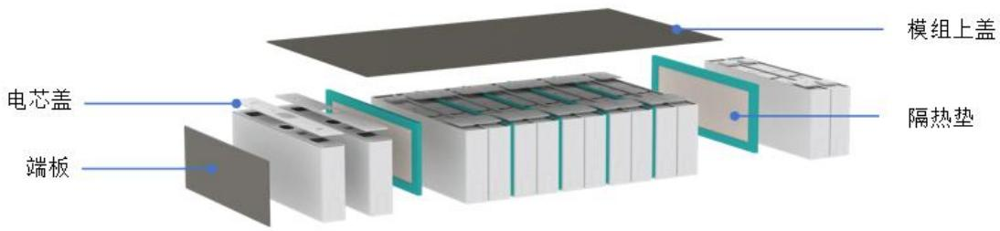  
电芯及模组级热失控防护示意图

电池包级热失控防护零件主要用于电池包顶盖防护、箱体防护、中通道及电子电气系统中母排、连接器、BMS 的防护和绝缘，具体应用示意如下：

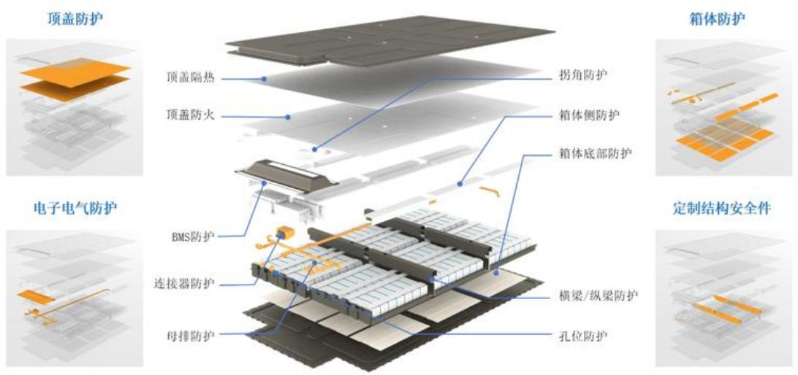

新能源汽车动力电池热失控防护零部件的产品类别及示例如下：

电池包级热失控防护示意图  

<table><tr><td>防护层级</td><td>具体产品</td><td>产品图示</td><td>产品用途</td></tr><tr><td rowspan="3">电芯级防护</td><td>隔热垫</td><td></td><td rowspan="3">主要用于动力电池电芯级别的防护,有防火、隔热、绝缘的作用,为热失控时防止热扩散的第一道屏障,可阻隔单个电芯热失控时产生的热量、火焰等,避免或减缓传导至其它周边电芯。</td></tr><tr><td>防火/导火片</td><td></td></tr><tr><td>电芯盖</td><td></td></tr><tr><td rowspan="3">模组级防护</td><td>端板</td><td></td><td rowspan="3">主要用于动力电池模组级别的防护,有防火、隔热、绝缘的作用,当电芯发生热失控时,有定向泄压及导流的作用,可避免或减缓模组之间的热扩散。</td></tr><tr><td>释火板</td><td></td></tr><tr><td>模组上盖</td><td></td></tr><tr><td>整包级防护</td><td>顶盖防护件</td><td></td><td>主要用于动力电池整包级的防护,有防火、隔热、绝缘的作用,可隔绝电池包和乘员舱,保护车上人员的安全。</td></tr><tr><td rowspan="3">箱体防护件</td><td>箱体防护件</td><td></td><td>主要用于电池箱体,阻止火焰冲穿、引导火焰方向,保护电气元件、杜绝灼烧拉弧,增强底座的耐火冲击性,优化底座高温绝缘性能、提升底座的隔温效果,防止电池下盖、周边烧穿。</td></tr><tr><td>电子电气防护件</td><td></td><td>主要对电池包中的BMS、连接器防护,保护电池管理系统不受高温火焰影响,避免灼烧情况下的拉弧冲击;对母排、线缆起到防火、隔热、绝缘作用,防止母排在发生热失控后成为引起电弧的危险源。</td></tr><tr><td>定制结构安全件</td><td></td><td>主要用于横梁、纵梁防护,杜绝灼烧拉弧,提高横梁、纵梁耐火性能。</td></tr></table>

公司可根据客户的电芯结构、电芯化学体系及其他需求为客户定制化设计完整的热失控防护方案，并为其大批量供应零件。由于产品的高度定制化，产品形态繁多，上表中的“产品示例”仅选取较有代表性的产品列示。

# （2）电力电工绝缘产品

电力电工绝缘产品主要有绝缘树脂、云母制品和复合材料绝缘结构件，属于电力发电和输电设备中的重要绝缘材料，可满足电力系统中发电、供电（变电、输电、配电）、用电等不同应用端电力设备的绝缘需求。公司产品在电力系统领域的运用场景如下：

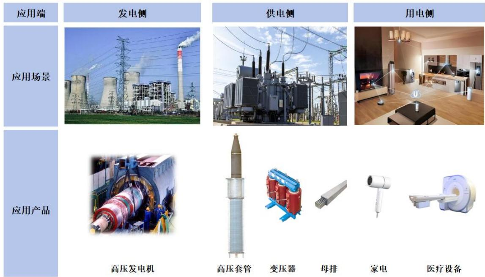

公司电力电工绝缘产品具体分类和用途如下：

<table><tr><td>产品分类</td><td>产品图示</td><td>产品用途</td><td>产品性能</td></tr><tr><td colspan="4">发电侧绝缘产品</td></tr><tr><td>VPI浸渍树脂</td><td></td><td>用于高压发电机中定子和转子的线圈、线棒等核心零部件的绝缘防护</td><td>VPI浸渍树脂是以环氧-酸酐树脂体系为基础的无溶剂树脂,其具备良好的流动性,在浸渍时粘度较低,可充分填充绕组间的空隙,固化后形成致密、坚固的整体,增强发电设备的机械强度,同时具备良好的绝缘和防护性能。</td></tr><tr><td>绝缘结构件</td><td></td><td>用于发电机定子、转子内部各个导体零部件与定转子之间的隔离、支撑、固定绝缘防护</td><td>绝缘结构件为一种或多种绝缘材料的复合产品,主要包括垫条、垫块、玻璃布板、槽楔等,其根据电气设备的特点和尺寸性能要求,将复合材料通过特殊绝缘处理、机械切削等加工,与导体部件组合成整体,主要用于隔绝有电位差的导电部位,并可用于绕组与铁芯的固定和支撑,增强发电机机械性能和绝缘性能。</td></tr><tr><td>云母带</td><td></td><td>高压发电机定子和转子的线圈、线棒缠绕,实现绝缘和防电晕性能</td><td>主要用于发电机定子和转子的线棒和引接线的绝缘保护,具有良好的透气性和浸渍性,可同时满足手工和机械缠绕的需求,可防止线棒间以及线棒与铁芯间的短路,承受高电压,保障绝缘性能,增强线棒机械强度。</td></tr><tr><td colspan="4">供电侧绝缘产品</td></tr><tr><td>浇注树脂</td><td></td><td>用于干式套管、干式变压器线圈、耐火浇注母线等产品的浇注</td><td>主要应用于交直流干式胶浸纸套管、干式变压器线圈、耐火浇注母线等电气设备的灌封浇注,其固化后具有良好的机械性能、电气性能、耐高温性能和绝缘防护性。</td></tr><tr><td>母线用云母件</td><td></td><td>用于母线的绝缘防护,主要为云母卷和云母板等绝缘件</td><td>主要用于母线的绝缘防护,提高母线的机械强度、绝缘和防电晕性能。</td></tr><tr><td colspan="4">用电侧绝缘产品</td></tr><tr><td>电机灌封树脂</td><td></td><td>用于特种电机定子、线圈的绝缘灌封</td><td>低粘度易渗透,高导热抗开裂,降低电机的温升,具有优异的绝缘性能,主要用于提升电机的能效比并延长使用寿命。</td></tr><tr><td>家电绝缘件</td><td></td><td>用于家电产品的隔热、防火及绝缘防护</td><td>主要为云母类结构件产品,根据客户需求将不同云母产品通过热压、冲切、机加工等方式进行结构加工,应用于家电内部的绝缘耐热。</td></tr><tr><td>医疗设备特种树脂</td><td></td><td>核磁共振设备磁体线圈浇注</td><td>主要为预填充料树脂,低粘度易渗透,固化物耐高低温和抗冷热冲击,主要应用于医疗设备中核磁共振设备需求的磁体线圈浇注和冷屏蔽线圈浇注。</td></tr></table>

# 3、其他产品

铜铝复合业务作为公司业务第二增长曲线，目前量产的产品为单面铜铝复合板，可用作锂电池负极极柱料；后续产品包括可用作集成母排巴片的双面铜铝复合板等。具体产品及用途如下：

<table><tr><td>公司产品</td><td>产品图示</td><td>间接产品</td><td>间接产品图示</td><td>终端应用</td></tr><tr><td>单面铜铝复合板(面复合)</td><td colspan="2" rowspan="2">锂电池负极极柱</td><td colspan="2" rowspan="2">产品可应用于动力电池、储能电池</td></tr><tr><td>单面铜铝复合板(条复合)</td></tr><tr><td>双面铜铝复合板</td><td></td><td>集成母排巴片</td><td></td><td></td></tr></table>

# （二）主营业务收入构成

报告期内，公司主营业务收入构成情况如下：

单位：万元  

<table><tr><td rowspan="2">项目</td><td colspan="2">2025年1-6月</td><td colspan="2">2024年度</td><td colspan="2">2023年度</td><td colspan="2">2022年度</td></tr><tr><td>金额</td><td>占比</td><td>金额</td><td>占比</td><td>金额</td><td>占比</td><td>金额</td><td>占比</td></tr><tr><td>新能源汽车动力电池热失控防护零部件</td><td>30,173.84</td><td>67.30%</td><td>66,045.19</td><td>73.71%</td><td>40,510.22</td><td>62.63%</td><td>24,313.91</td><td>51.60%</td></tr><tr><td>电力电工绝缘产品</td><td>12,734.36</td><td>28.40%</td><td>22,266.51</td><td>24.85%</td><td>20,072.96</td><td>31.03%</td><td>15,516.32</td><td>32.93%</td></tr><tr><td>其他</td><td>1,926.68</td><td>4.30%</td><td>1,293.92</td><td>1.44%</td><td>4,099.01</td><td>6.34%</td><td>7,291.56</td><td>15.47%</td></tr><tr><td>合计</td><td>44,834.89</td><td>100.00%</td><td>89,605.62</td><td>100.00%</td><td>64,682.19</td><td>100.00%</td><td>47,121.79</td><td>100.00%</td></tr></table>

注：其他产品主要为铜铝复合产品和风电叶片复合材料等。随着风电行业市场需求回落，导致风电叶片复合材料业务规模及盈利能力下降，2024 年公司战略性放弃了风电业务。2023 年子公司固瑞德投产，新增铜铝复合产品收入。

报告期内，公司新能源汽车动力电池热失控防护零部件销售规模持续提升，成为公司收入增长的主要来源。

# （三）主要经营模式

# 1、研发模式

公司建立了“客户导向 $^ +$ 行业趋势”双协同的研发体系，形成从市场需求到技术成果转化的完整创新路径。客户需求导向方面，研发团队深度参与主要客户的产品研发，精准把握客户需求，进而为其定制热失控防护方案及配套产品，确保从方案设计到批量生产的精准匹配。同时，公司对行业中长期发展趋势进行预判性研究，形成技术储备，以适应市场的快速变化，在客户提出需求时迅速响应。公司在长期的研发过程中逐步形成以技术开发部为核心，其他部门为协同的研发组织架构，通过跨部门的研发团队合作，有计划地进行可行性分析、方案设计、产线调试、样件生产、小批量生产、成果验收等，最终形成整体解决方案。同时，公司深化产学研协作，通过技术协同与资源互补，共同推进技术成果的产业化应用。

# 2、采购模式

公司主要采用以产定采和适当储备的采购模式，采购工作由公司采购部门行使，对于常规原材料，采购部根据生产需求下达采购计划实施采购，而对于大宗用量、市场价格存在波动的相关原材料，采购部将结合市场行情进行适当储备采购。

采购部门根据相关制度要求严格执行采购工作，在供应商选择方面，公司建立了严格的供应商选择和考核体系，对合格供应商进行管理，同时对其供货情况严格考核，确保主要原材料和辅料的品质持续符合公司的质量要求。公司采购部根据主要原料的价格走势，及时与供应商沟通调整原材料采购价格。经过多年发展，公司已建立了完善的供应商选择及管理体系，可有效保障公司各类物资材料的供应。

# 3、生产模式

公司主要采取“以销定产”的生产模式，即生产计划部门根据销售部门的订单情况进行排产。由于公司产品定制化程度较高，针对不同的客户或者同一客户不同类型的产品需求，公司根据实际规格型号、交期安排及产能情况制定相应的生产计划，并在生产过程中进行全流程管控，确保高效有序生产。

公司存在部分工序外协加工的情形。基于产能限制、设备使用效率等原因，公司将工艺相对简单的部分工序如模具机加工、泡棉粘贴、模切、云母板冲切等工序交给外协商进行加工，从而达到补充产能、降低生产成本、提高生产效率的目的。一般情况下，公司会向外协商提供加工工序所需图纸和技术规范，并进行工艺指导和品质监控。

# 4、销售模式

公司的销售模式为直销模式，公司直接与客户签订合同、结算货款、提供售后服务。

公司具有完整的销售体系，销售分为境内市场和境外市场，覆盖了新能源汽车、动力电池及电力设备等领域。由于行业的特点，公司与新客户建立正式合作关系时，均须通过客户的多项严格审核，在纳入客户的合格供应商名录后，客户才会正式下达订单进行采购。在与关键客户的合作中，公司深度参与客户产品开

发过程，并基于客户需求定制完整的热失控防护解决方案，从而获得客户认可及后续量产订单，形成了较强的客户粘性。

# 5、采用目前经营模式的原因、影响经营模式的关键因素、经营模式和影响因素在报告期内的变化情况及未来变化趋势

公司的经营模式是在长期经营与管理实践中逐步形成的，由行业特性、产业政策、客户需求、供应商关系、经营规模、产品特性及市场竞争等因素综合确定。

公司的研发模式主要受客户需求、行业特性、产业政策、技术进步等因素的影响。公司紧密跟踪行业发展趋势，深入了解客户需求，不断提升研发实力，为公司的可持续发展提供保障。

公司的采购模式主要考虑满足生产销售需求。目前公司已建立起产品质量高、供货速度快、配套服务优良的供应商体系，依据采购管理流程，确保采购质量、价格和供货周期满足生产需求。

公司现有生产模式主要考虑产品特性、订单量、市场响应要求等。公司的产品多为定制化产品，需适应客户订单多批量、多品种的特点，同时满足客户的交货时间要求。

公司采取的销售模式，主要考虑客户需求、市场竞争等因素，由于市场变化较快，公司通过直接接触和服务客户，提高市场响应速度，并及时跟进产品、技术、市场、竞争对手的变化情况。

报告期内，上述影响公司经营模式的关键因素未发生重大变化，预计公司的经营模式在可预见的未来内亦不会发生重大变化。

# （四）成立以来主营业务、主要产品或服务的演变情况

公司成立于 2008 年，最初专注于电力电工绝缘材料领域，以高压发电机绝缘材料市场为切入点，逐渐将业务延伸至特高压输配电市场，形成了涵盖绝缘树脂、云母制品及复合材料绝缘结构件等多元化的产品系列。公司为客户提供一站式电力电工绝缘解决方案，有效解决了多种绝缘材料协同应用时的相容性问题，在特高压等重点领域建立了显著的竞争优势。

依托在电力电工绝缘领域积累的云母材料相关核心技术和树脂调配工艺，公

司成功实现了从电气绝缘性能向热学防护性能的技术延伸，创新开发出适用于新能源汽车动力电池热失控防护的系统解决方案，实现核心技术的跨领域应用。2018 年，公司收购麦卡电工，实现了云母产品制造垂直一体化整合，最终构建起热失控防护部件的全产业链制造体系。

公司在战略层面高度重视新能源汽车业务，在新能源汽车热失控防护领域投入大量的人力、资金，积极拓展新能源汽车动力电池领域知名客户，逐步实现新能源汽车动力电池热失控防护零部件大规模、高质量和高效率制造。2023 年，公司启动全球化布局，在墨西哥建立子公司并设立生产基地，同时成立美国子公司、德国子公司以拓展海外销售网络。随着新能源汽车热失控防护业务规模的快速扩张、产能提升、技术实力持续增强，公司逐步成长为新能源汽车动力电池热失控防护领域的领先企业。

# （五）主要业务经营情况和核心技术产业化情况

公司核心技术相关产品为新能源汽车动力电池热失控防护零部件和电力电工绝缘产品。公司自成立以来，始终重视技术研发，经过十几年的实践与积累，公司围绕新能源汽车动力电池热失控防护和电力电工绝缘业务，构建了包括云母产品制备技术、动力电池包防护技术、高性能绝缘树脂制备技术、绝缘系统的设计和加工四大技术平台，形成了多项核心技术，并已成熟应用于产品实现商业化。同时，针对铜铝复合业务，开发铜铝熔炼及铸轧制备核心技术，并逐步实现产业化。

报告期内，公司核心技术产品收入及占主营业务收入比例情况具体如下：

单位：万元  

<table><tr><td>项目</td><td>2025 年 1-6 月</td><td>2024 年度</td><td>2023 年度</td><td>2022 年度</td></tr><tr><td>核心技术产品收入</td><td>44,432.72</td><td>88,311.70</td><td>60,583.18</td><td>39,830.23</td></tr><tr><td>主营业务收入</td><td>44,834.89</td><td>89,605.62</td><td>64,682.19</td><td>47,121.79</td></tr><tr><td>占比</td><td>99.10%</td><td>98.56%</td><td>93.66%</td><td>84.53%</td></tr></table>

报告期内，公司核心技术产品收入占主营业务收入比例分别为 $8 4 . 5 3 \%$ 、$9 3 . 6 6 \%$ 、 $9 8 . 5 6 \%$ 及 $9 9 . 1 0 \%$ ，2022-2024年核心技术产品收入占比逐步提升，公司云母产品制备、动力电池包防护、高性能绝缘树脂制备等核心技术已实现产业化；2025年1-6月核心技术产品收入上升，主要系铜铝复合业务作为公司业务第二增

长曲线，形成对应核心技术并实现成果转化，实现收入占比提升。

# （六）主要产品工艺流程图和服务流程图

# 1、服务流程图

# （1）新能源汽车热失控防护方案

公司具备丰富的新能源汽车热失控防护方案的设计经验，利用多物理场仿真技术，设计开发多层级协同防护体系，缩短研发周期。围绕各类应用场景，可快速匹配不同热失控防护材料和结构的成组方式，高效解决电芯、模组、整包各层级的关键防护需求，如高温隔热、缓冲、高温绝缘、火焰压力释放、电气元件防护等，具体服务流程如下：

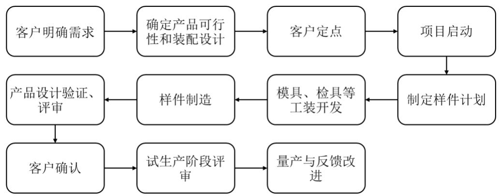

# （2）电力电工绝缘系统方案

由于发电、输配电、用电侧各应用场景的电气设备对绝缘材料的耐压等级、耐温、耐辐射的要求不同，公司通过电场计算、热计算确定设备的绝缘水平要求，选择合适的绝缘结构/系统，为客户提供系统化的绝缘材料配方和选型、绝缘结构件设计方案，并提供生产工艺指导、技术支持与测试服务，具体服务流程如下：

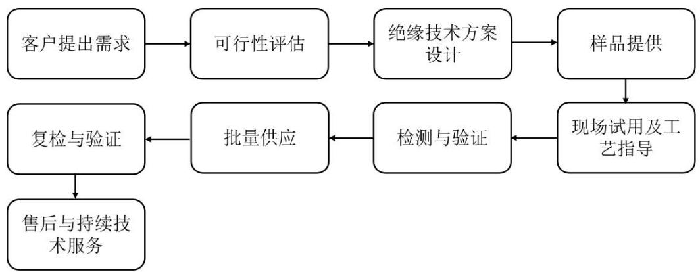

# 2、产品生产流程图

（1）新能源汽车动力电池热失控防护零部件生产流程图：

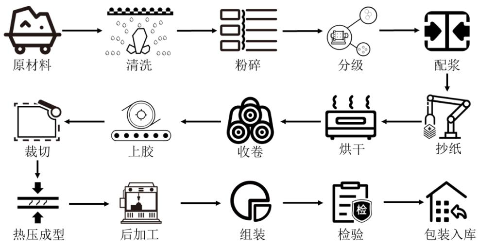

（2）绝缘树脂生产流程图：

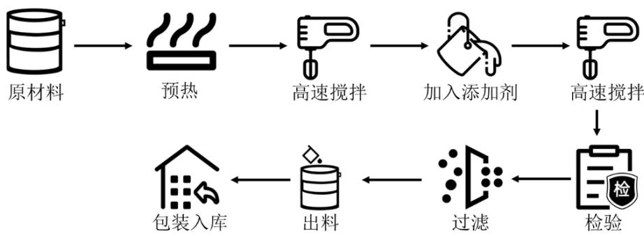

# （七）主要业务指标变动情况及原因

公司主要业务指标如下：

单位：万元  

<table><tr><td>项目</td><td>2025 年 1-6 月</td><td>2024 年度</td><td>2023 年度</td><td>2022 年度</td></tr><tr><td>营业收入</td><td>45,761.61</td><td>90,791.86</td><td>65,091.87</td><td>47,510.96</td></tr><tr><td>净利润</td><td>8,062.52</td><td>16,600.55</td><td>9,802.75</td><td>6,423.41</td></tr><tr><td>归属于母公司所有者的净利润</td><td>8,116.05</td><td>17,176.77</td><td>10,048.77</td><td>6,405.86</td></tr></table>

报告期内，随着客户订单持续增加及产品结构的优化，公司净利润快速增长。2023年、2024年，公司净利润增长率分别为 $5 2 . 6 1 \%$ 、 $6 9 . 3 5 \%$ 。

# （八）主要产品和业务符合产业政策和国家经济发展战略情况

公司主营业务为新能源汽车动力电池热失控防护零部件及电力电工绝缘产

品的研发、生产与销售。近年来，国家相关部门已陆续出台多项新能源汽车及发电、输配电建设领域的产业政策和经济发展战略，参见本招股说明书“二、发行人所处行业的基本情况和竞争状况”之“（二）行业主管部门、监管体制及主要法律法规政策”，公司主要产品和业务符合产业政策和国家经济发展战略。

# （九）发行人能够通过创新、创造、创意促进新质生产力发展的情况

# 1、公司的创新、创造、创意特征

围绕新能源汽车动力电池热失控防护和电力电工绝缘两大核心业务板块，公司构建了包括云母产品制备技术、动力电池包防护技术、高性能绝缘树脂制备技术、绝缘系统的设计四大核心技术平台。在新能源汽车动力电池热失控防护领域，公司实现从合规云母选矿造纸，到树脂调配、部件成型，再到热失控方案提供的全产业链商业模式，通过材料科学与工艺工程的协同创新，为客户提供兼具优异防护性能和成本优势的定制化热失控防护解决方案。在电力电工绝缘业务领域，公司通过创新树脂材料配方，积累经验并利用数字化管理提升研发效率，持续满足特高压等高端应用场景对绝缘材料日益提升的技术要求。公司的创新、创造、创意特征具体体现如下：

# （1）新能源汽车动力电池热失控防护零部件业务

# $\textcircled{1}$ 创新材料体系与配方，开拓应用边界

公司在成立初期，专注于电力电工领域绝缘系统解决方案，深入钻研云母、特种树脂等绝缘材料，建立深厚的技术储备，实现了核心技术跨领域突破，成功将云母复合材料及特种树脂等核心材料应用于新能源汽车动力电池热失控防护领域。

在云母产品制备方面，公司利用云母矿石高级筛选与分级技术，对不同矿源的云母原料进行精准分级选配，保证矿源合规的同时提升云母碎质量，为后道云母纸生产提供稳定优质原料，满足云母纸不同性能层级的需求。公司针对不同云母纸类型及云母件强度需求，优化基础树脂的种类、固化剂及催化剂等用量，调配出与云母纸更加适配的树脂胶粘剂，使其完全渗透云母纸，制成具有高耐热、高抗拉强度的云母过胶纸。

由于复杂3D 云母防护件具有易变形、易断裂的工艺痛点，公司以新型过胶

云母纸作为热失控防护零部件的基材，在压制成型过程中采用特种复合材料做补强，使热压固化后的云母件具备极高机械强度。同时在云母层的迎火面附上可瓷化涂层，形成耐超高温热失控防护组件，具备优异电绝缘性能和耐火性，可实现极限耐温 $1 { , } 5 0 0 ^ { \circ } \mathrm { C }$ 火焰持续冲击下 10分钟内不被烧穿。公司通过自有树脂配方及不同绝缘材料的搭配组合，打破传统材料在热失控防护领域的性能瓶颈，开拓了传统绝缘材料的新应用场景。

$\textcircled{2}$ 创新工艺生产流程，提升生产效能

基于汽车零部件行业特点，公司核心竞争力聚焦于产品设计与生产工艺。公司实现热失控防护零部件全工艺流程自主生产，从基础原材料云母矿筛选、清洁、分类，到造纸，再到后期云母纸过胶、云母件热压固化成型，到最终的深加工和组装，实现全工序的监控和追溯，从而确保产品的持续稳定制造。

在前期云母矿筛选阶段，公司采用“脱泥-浮选-磁选”及水力旋流分级工艺，有效分离云母与脉石矿物，提高云母鳞片纯净度和均匀性，为后续云母纸的高质量生产提供稳定原料；在云母纸生产线上，安装自动生产设备，对制浆、干燥、成卷系统进行全面的在线监测与自动化控制，根据不同配方对工艺参数进行动态调整，规范化云母纸生产流程，实现云母纸生产的稳定性与高品质。

在热失控防护零部件制备阶段，公司重视各生产环节的协同配合，从云母纸的选型、胶粘剂配方的研发、涂胶工艺的优化，到模压工艺的精确控制，实现生产流程的高效协同，保障云母件性能稳定。公司通过云母纸选型与自主研发的胶粘剂配方相匹配，使其在涂胶环节形成理想的粘接效果，提高云母件的整体结构强度，在模压工艺环节，公司针对模具设计、铺纸工艺精准设计，并精准调控预压以及压制过程中的真空度、温度、排气及压制时间等工艺参数，成功解决了传统工艺中云母制品模压过程中容易出现的分层、气泡等问题，降低产品不良率。此外针对柔性云母卷模切，公司设计专门的辅助装置，采用气缸驱动模切辊切割，显著提高模切精度，提升原材料利用率和生产效率。

$\textcircled{3}$ 多元化产品开发，满足定制需求

凭借强大研发团队，公司构建了从电芯级到整包级的全系列热失控防护零部件产品，可根据客户需求定制化设计，攻克电芯、模组、整包各层级热失控防护

关键技术难题，提供精准电池包级热失控防护方案，满足多样化应用场景需求。

电芯级防护零部件方面，公司以电芯间隔热垫为产品创新重点，在云母材料的基础上，积极探索并引入超级棉、真空纳米板等多种高性能隔热防护材料，充分发挥不同材料的特性优势，为客户提供精准、高效的防护解决方案。目前，市场上对电芯间隔热材料的工作温度要求高达 $8 0 0 ^ { \circ } \mathrm { C }$ 至 $1 { , } 0 0 0 ^ { \circ } \mathrm { C }$ ，且需要一定的可回弹性能来满足电芯体积的膨胀与收缩。公司采用多层结构设计，对高性能云母材料、胶带、硅橡胶、泡棉弹性体材料、真空纳米隔热板等多种不同功能材料进行复合封装，制备低导热薄型电芯间隔热垫，实现高隔热要求的同时满足压缩可回弹要求，实现芯材厚度 ${ \leqslant } 2 \mathrm { m m }$ ,热面 $1 { , } 0 0 0 ^ { \circ } \mathrm { C }$ 下,背面温度 ${ \leqslant } 2 0 0 ^ { \circ } \mathrm { C }$ ,弹性体压缩永久变形低于 $3 \%$ 的性能指标。防火/导火片产品采用刚性云母材质，当电芯发生热失控时，可精准引导火焰方向，防止火焰蔓延至周边电芯，有效降低电芯连环热失控的风险。

模组级防护零部件方面，公司针对方壳、软包、圆柱不同模组结构设计适配的防护产品，电芯盖、端板、释火板选用刚性云母和柔性云母的创新组合。刚性云母具有高强度和良好的防火性能，可在高温火焰冲击下保持结构稳定；柔性云母具备良好的柔韧性，可紧密贴合模组复杂的表面形状，增强密封效果，防止热失控产生的高温气体和火焰泄漏，同时提升绝缘性能，避免模组内部短路。

整包级防护零部件方面，大幅面3D刚性云母顶盖防护件是其中的创新重点。通过克服云母纸延展性局限的问题，顶盖防护件产品幅宽突破 1m，可实现弯曲强度超 180MPa，耐温高达 $1 { , } 5 0 0 ^ { \circ } \mathrm { C }$ 的优异性能，大幅提升耐冲击性能，能有效抵御热失控时产生的强大冲击力，可承受高温火焰侵袭，防止电池盖烧穿，减少对电池包外部部件的热影响。同时，公司整包级防护零部件产品还覆盖箱体侧防护、横梁/纵梁防护、孔位防护、BMS 等电子电气件防护，通过这些组件相互配合，共同为电池包提供可靠的热失控防护方案，充分体现了整包级防护的综合性和创新性。

# （2）电力电工绝缘产品业务

$\textcircled{1}$ 创新材料配方，攻克技术难题

公司在电力电工绝缘领域拥有耐超高电压绝缘树脂配方体系设计技术、树脂

/固化剂增韧改性提高粘接技术、高导热配方设计技术。通过对这些技术的综合运用，可实现绝缘产品不同的电绝缘性、耐火性、柔韧性、抗开裂需求，在提高产品导热性能的同时，确保绝缘产品的施工工艺性能、机械强度和长期稳定性。公司经过长期系统性的实验验证和持续改进，建立并创新材料体系和配方，不断攻克在电绝缘领域的技术难题，为电力电工行业提供性能更优的绝缘产品。

$\textcircled{2}$ 积累经验并数字化创新，提升研发效率

公司逐步积累树脂、固化剂、催化促进剂体系的基本信息，系统性研究影响热固性树脂反应性和基础性能的各个因素，并通过数字化和智能化的方式进行管理。这一举措大幅提高了后续热固性树脂的配方开发和工艺研究效率，缩短了开发周期，使得公司能够更快速地响应市场需求，推出适应不同应用场景的电力电工绝缘产品。

综上，公司不断丰富核心技术体系，具备行业前沿的技术研发和工艺设计水平，为客户提供专业的热失控防护解决方案和电力电工绝缘产品，具有较为典型的创新、创造、创意属性。

# 2、公司业务与新技术、新产业、新业态、新模式融合情况

# （1）绝缘材料行业与新能源汽车零部件行业的深度融合

在新能源汽车产业发展初期，恰逢特斯拉等领军企业开始借鉴航天领域锂电池防护经验，积极探索适用于电动车场景的热失控防护解决方案。公司敏锐把握这一产业趋势，凭借在云母基材料和高性能绝缘树脂领域的技术积淀，前瞻性地布局动力电池热失控防护领域。公司着力推动传统云母制品制造技术与现代前沿新材料研发成果的深度渗透与有机结合，优化云母制品加工工艺，不断迭代云母纸中浸润的改性树脂的配方，使云母能够更好地与其他功能性材料组合，通过恰当的组合提升材料的性能上限，实现电气绝缘性能向热学防护性能的技术延伸，增强热失控防护效果，同时实现降本增效。

在新能源汽车动力电池热失控防护领域，公司较早实现云母材料的 3D结构件规模化应用，通过自主开发的模压成型工艺突破传统云母板、云母带二维形态限制。公司充分考虑了汽车零部件的复杂装配环境和严格的安全防护要求，使得云母材料能够以更加贴合实际工况的形式发挥其安全防护作用，并且极大地提升

了其在汽车生产线上自动化装配的便利性和可靠性。公司通过建立高度自动化和标准化的生产流程，实现了云母 3D结构件的批量稳定制造，并且能够精准地满足不同电池包零部件总成的多样化匹配要求，在尺寸精度、性能稳定、成本效益等方面，完美契合了汽车行业大批量、低成本、一致性的高标准，为新能源汽车电池安全防护提供了一种稳定高效的主流解决方案。

公司通过ISO/TS16949 汽车行业质量管理体系认证，积极布局在下游客户的合格供应商名录认证工作。随着新能源汽车市场的爆发式增长，汽车电池安全问题愈发严峻，国家适时推出热失控强制标准，直接催生了动力电池热失控防护材料市场的强劲需求。在此关键机遇期，公司凭借前期积累沉淀而日趋成熟的生产工艺，以及精心谋划布局的良好市场基础，迅速响应市场变化，实现了业务规模的快速扩张和市场份额的显著提升，成功成为通用汽车、福特、Stellantis、宝马、T公司、宁德时代等下游客户热失控防护材料的核心供应商，产品出口北美、欧洲和日韩市场，客户范围不断扩展，牢牢确立了产业先发优势，推动了热失控防护材料行业的发展。

# （2）持续的研发投入促进科技成果转化

公司自成立以来，始终坚持把技术创新作为企业立足和发展的根本，围绕新能源汽车动力电池热失控零部件防护业务和电力电工绝缘产品业务形成了15项核心技术，围绕铜铝复合业务，形成5项核心技术，并依靠核心技术开展生产经营活动，公司核心技术在新能源汽车领域的应用前景逐步体现。

公司具有一支技术精湛、勇于创新的研发团队，研发团队主要人员拥有多年云母及树脂材料行业的研发经验，为技术创新提供了坚实的人才支撑。另一方面，通过与济南大学、武汉理工大学等高校进行技术合作，公司有效整合内外部资源，实现产学研的深度合作。报告期内，公司研发投入分别为2,156.92万元、2,786.04万元、4,027.37万元及 1,935.75 万元，研发投入不断增加，为公司研发创新活动开展和人才培养及激励提供了坚实保障，确保公司技术创新能力得以持续提升。

随着公司经营规模的稳步拓展以及新技术、新产品的不断涌现，公司高度重视核心技术的独立性与创新性，持续优化并强化知识产权管理机制，大力提升技术研发实力以及成果转化效率。截至2025年6月30日，公司共拥有专利96项，其

中发明专利36项，并且凭借在隔热绝缘领域的深厚技术沉淀与行业影响力，积极参与编制隔热绝缘材料相关国家标准，在行业技术发展进程中发挥了重要的引领作用。

基于出色的技术创新能力与显著的研发成果，公司热失控防护零部件产品已通过美国保险商实验室认证（UL认证）、欧盟 REACH法规、德国 PAHs 标准、欧盟 RoHS 标准、欧盟 ELV 指令等标准。公司系高新技术企业，荣获国家级专精特新小巨人企业、江苏省省级工程技术研究中心、江苏省省级企业技术中心等多项科技称号认定，公司实验室获得 CNAS 实验室认证，同时麦卡电工被认定为广东省云母基复合材料精深加工工程技术研究中心，承担省市级科技研究项目。

# （3）建立以客户为中心的协同开发机制

公司多年来持续深入参与客户端的产品同步研发工作，建立了以客户为中心的协同开发机制，积累了丰富的技术开发资源。在电力电工绝缘领域，公司专注于下游客户的多样化需求，成功开发不同性能的绝缘树脂配方材料，以适配电力电工领域的各类应用场景，同时，有力地推动了绝缘树脂材料在国内市场的国产化应用进程。

在新能源汽车领域，公司在前期引领或参与客户端热失控防护方案的设计，与全球知名整车厂和电池厂紧密合作协同开发，根据客户差异化需求提供定制化防护零部件，改变以往单纯的供应商角色，成为客户研发设计环节的重要参与者，形成更深度的合作模式，有助于提高产品与整车及电池系统的匹配度和协同性。面对新能源汽车行业快速迭代的特点，公司建立了高效的研发机制，依托完善的产品平台和丰富的设计经验，具备快速响应客户需求的能力。公司研发体系在方案设计、工艺验证、产品迭代等各环节均实现了高效协同，能够满足客户严格的开发周期要求，为同步开发提供有力保障。

基于汽车行业严格的供应商认证体系，公司已通过多家全球主流车企及电池制造商的合格供应商审核，凭借优异的产品质量、稳定的供货能力和持续的技术创新，公司与核心客户建立了长期稳固的合作关系。公司品牌获得了较高的知名度和影响力，荣获通用汽车“2024 年度供应商质量卓越奖”、吉利集团“24 年度最佳服务供应商”、零跑汽车“卓越贡献供应商”、东方电气“战略供应商”

等荣誉。

综上，公司凭借核心技术的创新、创意和创造性，通过持续研发投入、建立与客户良好的协同机制促进科技成果转化，将云母、树脂等绝缘材料与新能源汽车零部件行业深度融合，有效保障新能源汽车的整体性能和安全性，增强公司产品在市场中的竞争力和不可替代性。

# 二、发行人所处行业的基本情况和竞争状况

# （一）所属行业及确定所属行业的依据

由于公司收入主要来源于新能源汽车动力电池热失控防护零部件业务，占比超过 $50 \%$ ，根据《国民经济行业分类》（GB/T 4754-2017），公司新能源汽车动力电池热失控防护零部件业务所属行业为“C36 汽车制造业”下的“C3670 汽车零部件及配件制造”；根据《战略性新兴产业分类（2018）》，公司所属行业为“5 新能源汽车产业”下的“5.2.3 新能源汽车零部件配件制造”。

# （二）行业主管部门、监管体制及主要法律法规政策

# 1、行业主管部门、监管体制

公司所处行业的主管部门包括国家发改委、工信部和国家市场监督管理总局，行业自律组织包括中国汽车工业协会和中国电器工业协会绝缘材料分会，其主要职能如下：

<table><tr><td>部门/协会</td><td>主要职能</td></tr><tr><td>国家发改委</td><td>拟订并组织实施国民经济和社会发展战略、中长期规划和年度计划，监测宏观经济和社会发展态势，承担预测预警和信息引导的责任，汇总分析财政、金融等方面的情况等。</td></tr><tr><td>工信部</td><td>提出新型工业化发展战略和政策，协调解决新型工业化进程中的重大问题，制定并组织实施工业、通信业的行业规划、计划和产业政策，提出优化产业布局、结构的政策建议，监测分析工业、通信业运行态势，统计并发布相关信息等。</td></tr><tr><td>国家市场监督管理总局</td><td>负责市场综合监督管理，市场主体统一登记注册，组织和指导市场监管综合执法工作，监督管理市场秩序，宏观质量管理，产品质量安全监督管理等。</td></tr><tr><td>中国汽车工业协会</td><td>是在中国境内从事汽车整车、零部件及汽车相关行业生产经营活动的企事业单位和团体在平等自愿基础上依法组成的自律性、非营利性的社会团体，是世界汽车组织（OICA）的常任理事会员单位。</td></tr><tr><td>中国电器工业协会绝缘材料分会</td><td>中国电器工业协会绝缘材料分会是全国从事电气电子绝缘材料与绝缘技术领域相关的企事业单位依法登记组成的非营利性的全国性行业组织，协助政府组织编制行业发展规划和推动行业内相关方面的协调发展，协助标准化主管部门组织起草、修订行业国家标准，实施行业自律，开展技术咨询，组织技术交流等。</td></tr></table>

# 2、行业主要法律法规

<table><tr><td>法律法规名称</td><td>施行日期</td><td>颁布部门</td></tr><tr><td>《中华人民共和国安全生产法》</td><td>2021年9月1日</td><td>全国人大常委会</td></tr><tr><td>《中华人民共和国产品质量法》</td><td>2018年12月29日</td><td>全国人大常委会</td></tr><tr><td>《中华人民共和国节约能源法》</td><td>2018年10月26日</td><td>全国人大常委会</td></tr><tr><td>《中华人民共和国环境保护法》</td><td>2015年1月1日</td><td>全国人大常委会</td></tr></table>

# 3、行业主要政策

<table><tr><td>政策名称</td><td>发文时间</td><td>发文单位</td><td>相关内容</td></tr><tr><td colspan="4">新能源汽车动力电池热失控防护零部件领域</td></tr><tr><td>《汽车行业稳增长工作方案(2025-2026年)》</td><td>2025年</td><td>工业和信息化部、公安部、财政部、交通运输部、商务部、海关总署、市场监管总局、国家能源局</td><td>2025年,力争实现全年汽车销量3230万辆左右,同比增长约3%,其中新能源汽车销量1550万辆左右,同比增长约20%;加快新能源汽车全面市场化拓展。加力推进公共领域车辆全面电动化先行区试点,推动25个试点城市新增推广城市公交、出租、物流配送等领域新能源汽车70万辆以上持续组织开展新能源汽车下乡活动和县域充换电设施补短板试点,提升乡村居民用车电动化水平。</td></tr><tr><td>《电动汽车用动力蓄电池安全要求》(GB38031-2025)</td><td>2025年</td><td>国家市场监督管理总局、国家标准化管理委员会</td><td>新标准主要修订了热扩散测试的技术要求,由“着火、爆炸前5分钟提供热事件报警信号”修订为“不起火、不爆炸(仍需报警),烟气不对乘员造成伤害”,进一步明确了待测电池温度要求、上下电状态、观察时间、整车测试条件。</td></tr><tr><td>《关于开展2023年新能源汽车安全隐患排查工作的通知》</td><td>2023年</td><td>工信部装备工业发展中心</td><td>对新能源汽车安全事故隐患排查提出了具体要求:同一车型出现3起及以上起火燃烧事故的,企业应统计相关车型产品配置和技术特征信息,制定相关车型安全隐患排查计划,落实处置措施。</td></tr><tr><td>《汽车行业稳增长工作方案(2023-2024年)》</td><td>2023年</td><td>工信部、财政部、交通运输部、商务部、海关总署、金融监管总局、国家能源局</td><td>为2023年至2024年汽车行业的发展制定目标。要求支持扩大新能源汽车消费,2023年力争实现新能源汽车销量900万辆左右,同比增长约30%。要求提升产品供给质量水平,优化完善汽车技术标准和汽车产品质量认证供给体系,引导企业通过提高汽车产品安全技术水平等,持续提升汽车产品质量,让消费者放心购买、安心使用。</td></tr><tr><td>《五部门关于进一步加强新能源汽车企业安全体系建设的指导意见》</td><td>2022年</td><td>工信部办公厅、公安部办公厅、交通运输部办公厅、应急管理部办公厅、国家市场监督管理总局办公厅</td><td>提高动力电池安全水平,企业要积极与动力电池供应商开展设计协同,持续优化整车与动力电池的安全性匹配以及热管理策略,明确动力电池使用安全边界,提高动力电池在碰撞、振动、挤压、浸水、充放电异常等状态下的安全防护能力。鼓励企业研究应用热失控实时监测预警装置和早期抑制及灭火措施。企业要对动力电池、驱动电机及整车控制系统等关键零部件供应商提出明确的产品安全指标要求,制定供应商质量体系评价制度,强化供应商评估。</td></tr><tr><td>《2022年汽车标准化工作要点》</td><td>2022年</td><td>工信部</td><td>启动电动汽车动力蓄电池安全相关标准修订工作,进一步提升动力蓄电池热失控报警和安全防护水平。</td></tr><tr><td>《中华人民共和国国民经济和社会发展第十四 个五年规划和 2035 年远景目标纲要》</td><td>2021年</td><td>全国人大</td><td>制造业核心竞争力提升,无机非金属材料取得突破,突破新能源汽车高安全动力电池、高效驱动电机、高性能动力系统等关键技术。</td></tr><tr><td>《2030年前碳达峰行动方案》</td><td>2021年</td><td>国务院</td><td>大力推广新能源汽车,逐步降低传统燃油汽车在新车产销和汽车保有量中的占比,推动城市公共服务车辆电动化替代。大力发展新能源。</td></tr><tr><td>《新能源汽车产业发展规划(2021-2035年)》</td><td>2020年</td><td>国务院办公厅</td><td>到2025年,我国新能源汽车市场竞争力明显增强,安全水平全面提升。提升电池管理、充电连接、结构设计等安全技术水平,提高新能源汽车整车综合性能。强化企业对产品安全的主体责任,落实生产者责任延伸制度,加强对整车及动力电池、电控等关键系统的质量安全管理、安全状态监测和维修保养检测。</td></tr><tr><td>《节能与新能源汽车技术路线图2.0》</td><td>2020年</td><td>中国汽车工程学会</td><td>向汽车行业提供面向2035年的发展路线,形成自主、完整的产业链,自主品牌纯电动和插电式混合动力汽车技术水平和国际同步,新能源汽车占汽车总销量50%以上,其中纯电动占新能源汽车的95%以上。</td></tr><tr><td>《电动汽车安全要求》《电动客车安全要求》《电动汽车用动力蓄电池安全要求》</td><td>2020年</td><td>国家市场监督管理总局、国家标准化管理委员会</td><td>覆盖了电动汽车和电动客车的部件、系统以及整车多层次安全要求,对动力蓄电池的机械安全、电气安全和功能安全提出要求。主要内容与联合国电动汽车安全全球技术法规(UN GTR No.20)全面接轨,部分检测指标比国际法规更加严格。</td></tr><tr><td>《战略性新兴产业分类(2018)》</td><td>2018年</td><td>国家统计局</td><td>该目录包括新能源材料制造、功能性填料制造和新型耐火材料制造等行业,具体包括云母、陶瓷等制品。</td></tr><tr><td colspan="4">电力电工绝缘领域</td></tr><tr><td>2025年能源工作指导意见</td><td>2025年</td><td>国家能源局</td><td>发挥能源资源大省优势,推动金上一湖北、陇东一山东等特高压工程建设投运,加快陕西一安徽、甘肃一浙江等特高压直流以及阿坝一成都东等特高压交流工程建设,抓紧开展重点特高压输电、直流背靠背工程以及跨省交流互济工程前期工作。统筹推进新型电力系统建设。推动新型电力系统九大行动落地见效,强化新型电力系统建设与“两重”“两新”政策有效衔接,深化电力保供能力建设思路举措、统筹新能源发展和消纳体系建设等重点问题研究。</td></tr><tr><td>能源重点领域大规模设备更新实施方案</td><td>2024年</td><td>国家发展改革委办公厅、国家能源局综合司</td><td>到2027年,能源重点领域设备投资规模较2023年增长25%以上,重点推动实施煤电机组节能改造、供热改造和灵活性改造“三改联动”,输配电、风电、光伏、水电等领域实现设备更新和技术改造。主要包括:(一)推进火电设备更新和技术改造;(二)推进输配电设备更新和技术改造;(三)推进风电设备更新和循环利用;(四)推进光伏设备更新和循环利用;(五)稳妥推进水电设备更新改造;(六)推进清洁取暖设备更新改造;(七)以标准提升促进设备更新和技术改造。</td></tr><tr><td>推动大规模设备更新和消费品以旧换新行动方案</td><td>2024年</td><td>国务院</td><td>推进重点行业设备更新改造。大力推动生产设备、用能设备、发输配电设备等更新和技术改造。加快推进能效达到先进水平和节能水平的用能设备,分行业分领域实施节能降碳改造。</td></tr><tr><td>《加快电力装备绿色低碳创新发展行动计划》</td><td>2022年</td><td>工业和信息化部、财政部、商务部、国务院国有资产监督管理委员会、国家市场监督管理总局</td><td>统筹发输配用电装备供给结构调整，围绕新型电力系统构建，加速发展清洁低碳发电装备，提升输变电装备消纳保障能力，加快推进配电装备升级换代、提高用电设备能效匹配水平，推进资源循环利用。</td></tr><tr><td>《“十四五”扩大内需战略实施方案》</td><td>2022年</td><td>国家发改委</td><td>加强能源基础设施建设，完善电网主网架布局和结构，有序建设跨省跨区输电通道重点工程，积极推进配电网改造行动和农村电网巩固提升工程。</td></tr><tr><td>《2021年能源工作指导意见》</td><td>2021年</td><td>国家能源局</td><td>进一步完善电网主网架布局和结构，提升省间电力互济能力。加快建设陕北~湖北、雅中~江西等特高压直流输电通道，加快建设白鹤滩~江苏、闽粤联网等重点工程，推进白鹤滩~浙江特高压直流项目前期工作。</td></tr><tr><td>《战略性新兴产业重点产品和服务指导目录（2016版）》</td><td>2017年</td><td>国家发改委</td><td>工程塑料及合成树脂、阻燃改性塑料、新型聚氨酯材料、高性能环氧树脂，高性能树脂复合材料等高效低成本、自动化成型技术等列为未来重点发展的战略性新兴产业。</td></tr></table>

# 4、法律法规、行业政策对发行人经营资质、准入门槛、运营模式和行业竞争格局的影响

近年来，国务院、工信部、发改委、市场监管总局等部门发布了一系列政策、发展规划、指导意见、行业标准，有力地促进了新能源行业的发展。公司产品广泛应用于新能源汽车动力电池热失控防护领域、电力电工绝缘领域，公司将抓住良好的发展机遇，积极顺应政策前进。市场监管总局于 2020 年发布的强制性国家标准及五部门于 2022 年提出的加强新能源汽车企业安全体系建设的指导意见，进一步将新能源汽车动力电池热失控防护的准入门槛推上了新的台阶。相关法律法规、行业政策提升了行业准入门槛，有利于业内优质企业取得竞争优势，同时对经营资质、运营模式无重大不利影响。

# （三）新能源汽车动力电池热失控防护行业发展态势及技术水平特点

# 1、新能源汽车行业发展态势

# （1）全球新能源汽车行业发展情况

在全球应对气候变化和推动低碳经济转型的共识下，电动汽车普及、智能技术应用及绿色出行推广已成为各国战略重点。这一趋势正加速推动新能源汽车产业的结构性变革，全球主要经济体纷纷通过产业政策引导、财政补贴支持及税收优惠等措施，积极布局新能源汽车技术研发、产业生态和市场培育，以期在新一轮全球产业竞争中建立核心优势。因此，传统车企纷纷加速向电动化转型，2024

年全球车企销量排名情况如下：

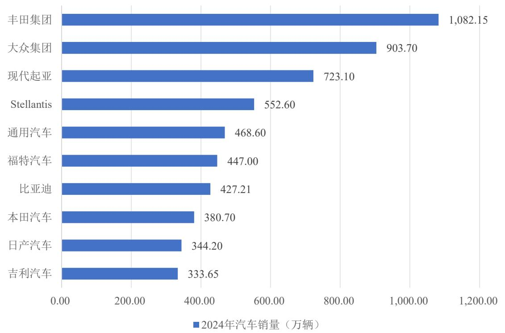  
2024年全球车企集团销量排名

# 数据来源：各车企发布的年度报告、公司公告

根据全球汽车销量统计，2024 年汽车销量排名前十的车企中，丰田、大众、现代起亚等传统巨头仍占据主导地位，其不断加速布局新能源汽车领域，提高新能源汽车渗透率。根据IEA国际能源署、EVTank联合伊维经济研究院数据统计，2018~2024年全球新能源汽车销量复合增长率达 $4 3 . 7 8 \%$ ，尤其是 2021 年以来全球新能源汽车销量呈爆发式增长，2024 年全球新能源汽车销量达到 1,823.60 万辆，同比增长 $2 4 . 4 5 \%$ 。全球新能源汽车销售主要集中在中国、欧洲和美国三大市场，其中中国新能源汽车销量占全球销量的 $50 \%$ 以上，欧洲和美国 2024 年新能源汽车销量分别为 289.00 万辆和 157.30 万辆。根据 EVTank 预计，2025 年全球新能源汽车销量将达到 2,239.70 万辆，其中中国将达到 1,649.70 万辆，2030年全球新能源汽车销量有望达到 4,405.00万辆。

2018-2024年全球新能源汽车销量及增速  
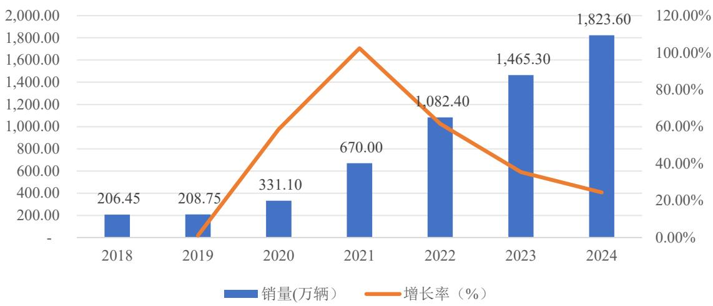  
数据来源：IEA 国际能源署、EVTank 联合伊维经济研究院

# （2）我国新能源汽车行业发展情况

中国新能源汽车产业发展已经从培育期进入成熟期，在政策和市场的双轮驱动下，在全球范围内形成了一定的先发优势。从需求端看，随着“双碳”和环保相关政策深入实施，消费者环保认同度提升，叠加智能化使消费者对新能源汽车认同度显著提升，从供给端看，新能源汽车体验和性能持续提升。根据中国汽车工业协会，2018~2024 年，我国新能源汽车销量呈现持续增长的态势，新能源汽车销量复合增长率达 $4 7 . 3 7 \%$ ，尤其是2022年，销量显著增加，同比增长 $9 5 . 6 0 \%$ ，市场对新能源汽车的需求日益旺盛。与此同时，新能源汽车的市场渗透率也在逐年提高，从2018年的 $4 . 4 7 \%$ 提升至2024年的 $4 0 . 9 3 \%$ 。

2018~2024年我国新能源汽车销量及渗透率  
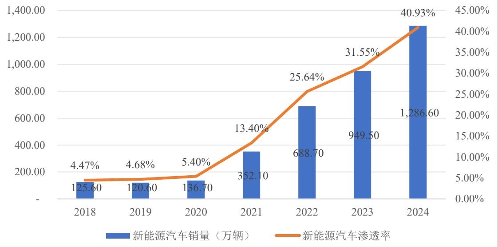  
数据来源：中国汽车工业协会、同花顺 iFind

2024年中国新能源汽车市场竞争格局进一步分化，头部品牌优势持续扩大，根据乘联会数据统计，2024年中国市场新能源汽车品牌销量情况如下：

2024年中国市场新能源汽车品牌销量  
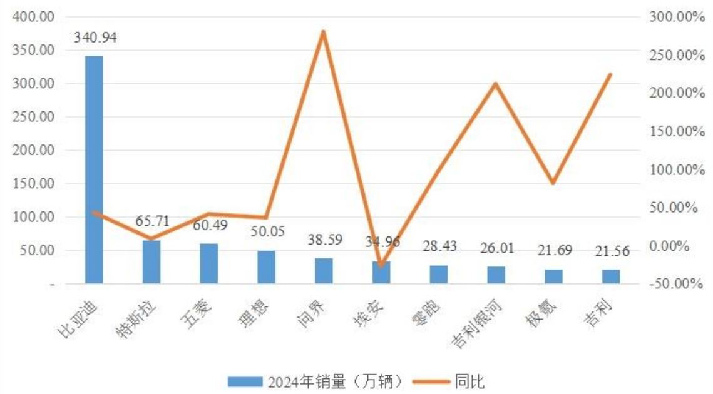  
数据来源：乘联会

根据国务院办公厅于2020年底发布的《新能源汽车产业发展规划（2021-2035年）》，要求到 2025 年，新能源汽车新车销售量达到汽车新车销售总量的 $20 \%$ 左右，我国新能源汽车的销量增速远超预期，已提前完成目标。

随着国产新能源车在三电技术和智能驾驶相关领域竞争优势的提升，国际影

响力日益增强。根据海关总署数据，中国 2024年全年新能源汽车出口 223.88万辆，较 2023 年增涨 46.56 万辆，同比增长 $2 6 . 2 6 \%$ 。2024 年度我国新能源汽车销量占全球新能源汽车销量的比例达 $71 \%$ ，销售规模连续十年居世界第一，继续保持全球最大的新能源汽车消费市场地位。

随着全球双碳行动的推广和加速，我国陆续推出了多项针对性政策及规划纲要，新能源汽车积分制度执行、补贴政策的延续等政策为我国新能源汽车市场持续增长提供了稳定的发展环境。与此同时，传统燃油车企在新能源汽车领域的投资布局迅速拓展，新能源汽车行业的新入者也在持续增多，这些都为我国新能源汽车市场增添了全新的发展动力与增长空间。

# （3）动力电池产能规模持续扩大

随着新能源汽车产业的持续高速发展，动力电池行业也呈现强劲的增长势头。据中国汽车动力电池产业创新联盟统计，2024 年，中国动力电池和其他电池累计产量为 1,096.80GWh，同比增长 $4 0 . 9 6 \%$ ；动力电池累计出口 133.70GWh，同比增长 $4 . 9 5 \%$ ；动力电池累计装车量 548.40GWh，同比增长 $4 1 . 4 5 \%$ 。其中，三元电池累计装车量 139.00GWh，占总装车量的 $2 5 . 3 5 \%$ ，同比增长 $1 0 . 1 4 \%$ ；磷酸铁锂电池累计装车量 409.00GWh，占总装车量 $7 4 . 5 8 \%$ ，同比增长 $5 6 . 7 0 \%$ 。

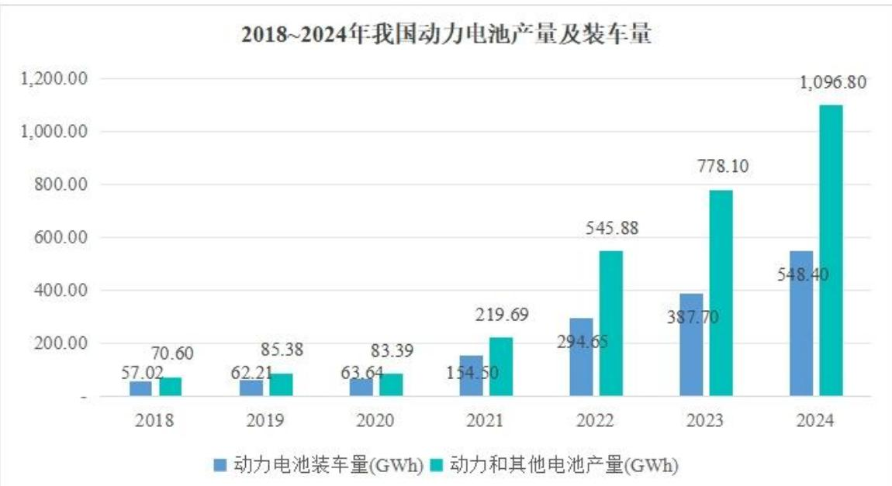  
数据来源：中国汽车动力电池产业创新联盟

# 2、新能源汽车动力电池热失控概述

动力电池热失控是指电池组内某一单体发生局部的剧烈升温，从而诱发连锁

反应引起电池温度不可控上升的现象。随着消费者对电动汽车的续航里程要求越来越高，锂离子电池能量密度的不断提高，安全问题也逐渐暴露出来，新能源汽车自燃事故频发，给消费者和车企都造成了巨额损失，动力电池热失控问题仍是新能源汽车发展面临的关键技术瓶颈。

根据中国汽车工程学会于2020年发布的《节能与新能源汽车技术路线图2.0》，新能源汽车动力电池的能量密度要逐步提升：到 2025 年，我国普及、商用、高端能量型动力电池能量密度分别要达到 200Wh/kg、200Wh/kg 和 $3 5 0 \mathrm { W h / k g }$ ；到2035 年，我国普及、商用、高端能量型动力电池能量密度分别要达到 300Wh/kg、$2 5 0 \mathrm { W h / k g }$ 和 ${ 5 0 0 } \mathrm { W h / k g }$ 。近年来制定的新能源汽车补贴政策也鼓励车企使用更高能量密度的动力电池。然而，根据相关研究，由于具有较高能量密度的材料可能具有较低的热稳定性，提升动力电池的能量密度会使热失控的触发温度降低。磷酸铁锂电池一般在 $4 0 0 \mathrm { { ^ \circ C } }$ 以上出现放热峰，能量密度更高的三元锂电池一般在$2 0 0 ^ { \circ } \mathrm { C }$ 至 $3 0 0 ^ { \circ } \mathrm { C }$ 时出现放热峰，热失控温度更低且释放的能量更大。

热失控的触发原因分为两大类：内因和外因。内因包括制造时的瑕疵、电池老化造成密封性下降、不当使用造成的锂金属沉积等。外因包括机械滥用（挤压、针刺、碰撞等）、电滥用（外短路、过充、过放等）、热滥用（过热等）。无论是外因还是内因，最终都由于电极活性物质之间的相互作用而导致热失控。其中机械滥用是导致热失控的最常见原因。当一个电芯出现热失控，若缺乏良好的防护，会引发热扩散，进而导致整个电池的燃烧和爆炸，危及乘员安全。

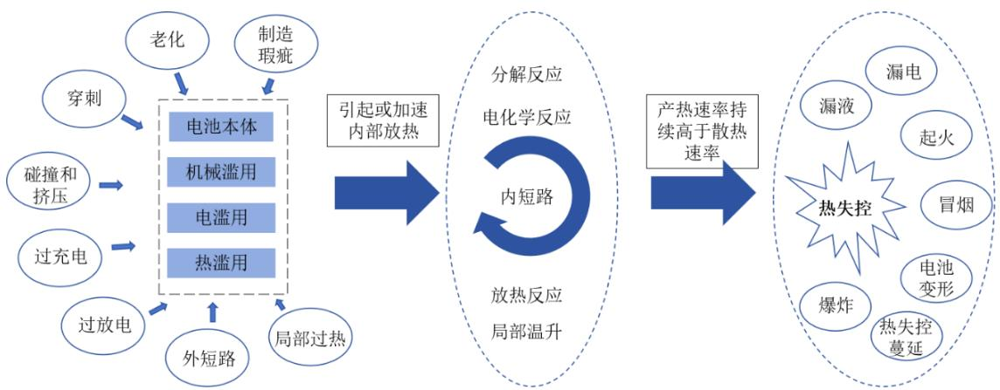

在此背景下，监管层于 2020 年 5 月发布了我国电动汽车领域首批强制性国家标准，分别为 GB 18384-2020《电动汽车安全要求》、GB 38032-2020《电动客车安全要求》和 GB 38031-2020《电动汽车用动力蓄电池安全要求》，进一步

提高和优化了对电动汽车整车和动力电池产品的安全技术要求。其中《电动汽车用动力蓄电池安全要求》增加了电池系统热扩散试验，要求电池单体发生热失控后，电池系统在 5 分钟内不起火不爆炸，为乘员预留安全逃生时间。2025 年 3月《电动汽车用动力蓄电池安全要求》（GB 38031-2025）发布，拟于 2026 年 7月1日起开始实施。新标准主要修订了热扩散测试的技术要求，由“着火、爆炸前 5 分钟提供热事件报警信号”修订为“不起火、不爆炸（仍需报警），烟气不对乘员造成伤害”，进一步明确了待测电池温度要求、上下电状态、观察时间、整车测试条件。同时，新标准新增底部撞击测试，考查电池底部受到撞击后的防护能力；新增快充循环后安全测试，300次快充循环后进行外部短路测试，要求不起火、不爆炸。国际方面，联合国欧洲经济委员会（UNECE）于 2021年生效了 Regulation No. 100 Revision 3，该法规要求电池发生热失控后，在乘员舱发生危险的5分钟前车辆应发出预警信号。除监管层发布的一系列标准，汽车行业一些知名企业的内部标准普遍更高，要求至少预留 15分钟的逃生时间。

# 3、新能源汽车动力电池热失控防护技术水平特点

# （1）热失控防护技术概述

在不同的触发条件下，锂离子电池会产生不同的热失控行为，热失控防护的要点主要包括高温、冲击、电压、气体、液体和固体等，具体如下：

<table><tr><td>防护要点</td><td>说明</td></tr><tr><td>高温</td><td>主要是电芯间的热量阻隔，及电芯开阀后对其他零部件的高温炙烤。</td></tr><tr><td>冲击</td><td>电芯开阀后火焰、气、液、固混合物的高速冲击。</td></tr><tr><td>电压</td><td>电池包内部零件应在高温及腐蚀环境下仍保持良好的绝缘性。</td></tr><tr><td>气体</td><td>电池包内部形成高压，应考虑泄压，否则内部压力过大会造成结构件撕裂。</td></tr><tr><td>液体和固体</td><td>主要是避免短路风险以及堵塞泄压阀的风险。</td></tr></table>

针对不同的热失控触发因素，热失控防护主要分为本征防护、主动防护和被动防护，本征防护主要从材料层面着手，选用热稳定性高的正极、负极、电解液以及膈膜材料，在制造过程中严格进行一致性管理控制，确保电芯生产的一致性，优化电池包的设计和结构。主动防护系控制热失控的发生，从对电流、电压、温度、气体、液体、压力等方面进行监控，尤其是过充过流过温等现象发生的情况

下，进行热失控的预警、散热，各种危险状态下的输出切断防护等；被动防护系在热失控发生后，采用降温灭火介质对其灭火和降温、通过绝热材料或阻燃材料对发生热失控电池进行隔离、将火焰和危险气体进行合理引导使其通过安全路径排出电池包等，具体防护方法和措施如下：

<table><tr><td>分类</td><td>典型防护方法</td><td>具体防护措施</td></tr><tr><td rowspan="2">本征防护</td><td>提升电芯内材料热稳定性</td><td>使用抗冲击性和稳定性高的多层隔膜,对正负极材料进行包覆,在电解液中添加不同材料的阻燃剂,采用固态聚合类物质等</td></tr><tr><td>优化电芯及电池包结构和设计</td><td>优化电池包结构设计、电池包在整车的安装、电池单体的排布、整车结构强化以及隔振等</td></tr><tr><td rowspan="2">主动防护</td><td>BMS 电池监测和预警</td><td>实时监测电池温度、电流、电压等情况,超出设定的安全范围时,系统会立即采取相应措施,如降低充放电速率、切断电池与车辆的连接、启动冷却系统,对驾乘人员进行预警</td></tr><tr><td>热管理系统设计</td><td>常见的冷却方法有风冷和液冷,将电池模块内的热量转移到周围环境中,以此来控制电池温度,并显著降低电池模块间的温差</td></tr><tr><td rowspan="4">被动防护</td><td>增加阻燃和隔热材料</td><td>通过在电芯间、模组间排布特殊隔热材料,使得单个电芯热失控后,热量不会立即传导至其他电芯和模组,避免热扩散</td></tr><tr><td>增加绝缘材料</td><td>在电池包内排布特殊材料,在高温下具有良好的绝缘特性,防止短路、拉弧</td></tr><tr><td>采用降温灭火介质</td><td>通过往电池包内加注液体等方式进行主动降温、灭火</td></tr><tr><td>合理引导火焰和危险气体排出</td><td>在挡火材料中设置特殊点位,使电芯热失控后,火焰向特定点位喷射,在电池包内设置导流通道,将火焰、热量、喷射物排出,不危及乘员舱</td></tr></table>

公司主营以云母、高性能树脂为核心基材的热失控防护零部件，属于新能源汽车热失控被动防护领域的关键部件，已广泛应用于模组、电池包级防护。

# （2）热失控被动防护材料在新能源汽车中的应用

热失控被动防护通过增加阻燃、耐高温、绝缘材料避免热扩散及通过合理的火焰引导和危险气体排出方法，能够在一定程度上延缓或阻止热量的传播，减少火灾和爆炸事故的发生概率。目前热失控防护材料主要应用于新能源汽车动力电池电芯级、模组级和电池包级防护，防护材料有多种，如云母制品、陶瓷硅橡胶、气凝胶毡、超级棉、阻燃泡棉等，这些材料均有一定程度的耐温、阻挡喷射物、高温绝缘作用，具体应用情况如下：

<table><tr><td>分类</td><td>主要防护材料</td><td>防护功能</td></tr><tr><td>电芯级防护</td><td>气凝胶毡、超级棉、云母带、阻燃泡棉</td><td>用于相邻电芯之间的间隙填充，缓冲碰撞产生的冲击；防止单个电芯热失控后产生的高温传递给周围电芯，避免热蔓延；用于电芯的端部和侧面，重点防护电极引出部位，进行绝缘处理</td></tr><tr><td>模组级防护</td><td>云母板和云母3D件、阻燃泡棉</td><td>用于模组外壳的内侧或外侧，吸收冲击能量，保护内部电芯不受损坏；当模组内电芯发生热失控时，有效阻隔热量向外传递，减少对周围模组和车辆部件的影响；同时，用于框架与电芯、电极等导电部位的绝缘处理，并起到固定与支撑作用</td></tr><tr><td>电池包级防护</td><td>云母板和云母3D件、阻燃泡棉、陶瓷硅橡胶</td><td>用于电池包底部和顶部安全防护盖板，在电池包与车辆之间建立隔热屏障，达到隔热、抗冲击效果，延缓电池箱高温扩散至乘客舱</td></tr></table>

上述各类防护材料性能比较如下：

<table><tr><td>材料种类</td><td>简介</td><td>隔热效果</td><td>抗冲击性</td><td>耐高温</td><td>绝缘性</td><td>价格</td></tr><tr><td>阻燃泡棉</td><td>阻燃泡棉价格低廉,具有低硬度高回弹特性,尺寸设计对于电池包级别灵活性高。但是存在耐高温性低的问题,高温下容易发生形变。</td><td>较高</td><td>低</td><td>低</td><td>中</td><td>低</td></tr><tr><td>云母材料</td><td>云母材料通过上胶、加温、压制而成云母板,具有优异的耐高温性、绝缘性和耐冲击性,可加工为各类形状,在动力电池热失控防护领域的应用已非常成熟。</td><td>中</td><td>高</td><td>高</td><td>高</td><td>中</td></tr><tr><td>气凝胶毡</td><td>气凝胶是一种具有纳米多孔网络结构、并在孔隙中充满气态分散介质的固体材料,具有优异的隔热性能,材料价格相对较高,且耐冲击性较差。</td><td>高</td><td>低</td><td>中</td><td>中</td><td>高</td></tr><tr><td>其他材料</td><td colspan="6">其它材料种类包括陶瓷化硅橡胶、灌封胶等。陶瓷化硅橡胶具有优异的耐热性,且在高温下保持结构完整性,但材料价格较高,需要和其它补强材料复合后使用,主要在电芯之间和模组之间有小范围应用;灌封胶主要应用在磷酸铁锂电池的电芯之间。</td></tr></table>

# 资料来源：弗若斯特沙利文《全球及中国电池系统安全防护市场独立行业研究》

由上表可见，云母材料具备耐温、机械强度高、高温绝缘性能优异、成本较低等优势，在目前常用动力电池热失控防护材料中性能占优。同时，云母材料良好的柔软性使其便于裁切加工，经高温烘干压制后可形成定制化云母 3D件，使得其能够贴合电池内部各种不规则的形状表面，确保散热效果达到最理想状态，因此，云母材料被行业内较多企业使用，是较为主流的隔热产品解决方案。

# 4、新能源汽车动力电池热失控防护行业发展趋势及市场空间

# （1）热失控防护行业发展趋势

$\textcircled{1}$ 云母材料应用场景与用量持续扩展

云母材料在新能源汽车中的应用场景及部件拓展，用量呈增长趋势。云母材料应用于动力电池的热失控防护可追溯到 2012年量产的特斯拉ModelS，其较早地意识到热失控问题，率先采用 NCA 三元电芯并采用云母板作为防护手段，在电池模组与电池包上、下盖间均使用了云母材料对电池包进行热失控防护。2017年起，国内电芯材料技术快速迭代，三元锂电因其高能量密度的优势成为各大电池厂商和车企关注和发展的战略高点。但由于三元电池能量密度较高，以镍钴锰

三元电池为例，NCM523 能量密度约 $1 6 0 { - } 2 0 0 \mathrm { W h / k g }$ ，热失控最高温度 ${ 7 0 0 { \sim } 9 0 0 ^ { \circ } } \mathrm { C }$ ，NCM811 能量密度约 $2 7 0 { - } 2 8 0 \mathrm { W h / k g }$ ，热失控最高温度 $1 , 0 0 0 { \sim } 1 , 3 0 0 ^ { \circ } \mathrm { C }$ ，热失控风险相对较大，尤其是高镍三元电池，因此在防护要求上更为严格，云母材料的用量相对较多。加之 2020 年热失控强制标准的实施，以云母为代表的被动热失控材料和方案迅速得到广泛运用。

由于磷酸铁锂在热稳定性方面优于三元锂电，其热失控问题较少出现，因此云母材料在磷酸铁锂中的应用相对较晚。但随着电池安全需求升级，行业政策和热失控防护强制标准的推行，云母材料也开始渗入到磷酸铁锂的系统集成中。并且，随着新能源汽车向轻量化趋势发展，电池包集成度的提高，在无模组结构中，电芯排列更为紧密，电池整体密度提高的同时也缩短了电芯与电池盖、车身结构件的距离，对热失控防护组件提出更高难度的挑战。除了在传统的电池模组间、模组与电池盖间等部位的应用外，云母材料还将进一步拓展到电芯间、电芯与电池盖间隔热，BMS 电子元器件的保护等领域，云母材料的应用范围和形式将更加广泛。当云母防护件用于电芯间防护，其既能隔离热源，又耐火焰冲击，有效解决了传统气凝胶不耐冲击的痛点，延长电动汽车起火后的安全逃生时间。

$\textcircled{2}$ 云母材料性能与工艺持续优化

为满足高能量密度电池对热失控防护的更高要求，以云母材料为代表的热失控防护产品性能进一步提升和优化。行业企业通过研发新的原料配方、优化云母材料的制备工艺和复合技术等方式，不断提高云母制品的耐高温性、耐磨性、力学性能和抗撕裂强度等，以增强防护材料的阻燃和抗冲击效果。在制备工艺方面，通过精密的热压成型工艺，在高温高压条件下使云母原料与其他补强材料紧密结合，提高云母制品的致密度和强度。此外，云母制品从传统的 2D 片材向 3D 防护产品升级，能够根据不同电芯的形状与尺寸，定制化开发高贴合度的防护结构，以此更全面地覆盖和保护电池，保障防护性能的同时，最大程度优化材料的利用率和电池包的空间利用率。

$\textcircled{3}$ 单一云母材料向综合防护方案转型

云母材料正从单一产品向综合性热失控防护方案转变。业内企业深入下游客户的前期研发，针对不同的应用场景和需求进行定制化设计，从提供单一的产品

逐步转变为提供多样的、综合性的热失控防护方案，将云母材料与气凝胶、阻燃泡棉和多种功能胶带等其他热失控防护材料配合使用，形成多层次、多维度的防护体系，发挥各自的优势，提高整体的防护效果。例如，对于能量密度较高、热失控风险较大的三元锂电池，增加云母材料的使用比例或厚度；对于磷酸铁锂电池，可根据其具体的集成方式和热管理系统，合理搭配云母材料与其他隔热、绝缘材料，以达到最佳的被动防护效果。

综上所述，凭借多项优良性能，云母材料在动力电池安全防护中的应用已经成为行业共识。未来，随着不断的技术创新和材料优化，云母材料有望助力动力电池实现更高的安全性和更长的续航能力，推动新能源汽车行业向更加绿色、安全、可靠的方向发展。

# （2）热失控防护行业市场规模

全球新能源汽车产业的快速发展及动力电池能量密度持续提升，推动电池系统安全防护产品需求进入高速增长通道，根据弗若斯特沙利文统计，全球电池系统安全防护市场规模从2020年的17.5亿元增长至2024年的115.4亿元，年复合增长率达到 $6 0 . 2 5 \%$ 。基于未来新能源汽车销量的增长和新型材料的创新研发，全球电池系统安全防护市场预计将保持稳定增长，于2029年达到324.2亿元。

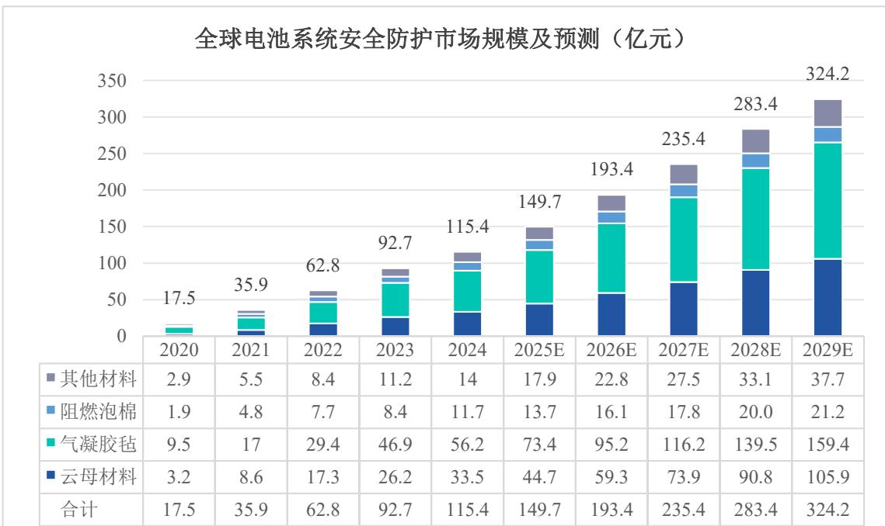  
注：公司引用的弗若斯特沙利文的数据来自付费报告，报告并非为本次发行上市专门定制。  
在全球电池系统安全防护市场中，气凝胶毡材料和云母材料占据主要市场。

气凝胶材料因其较低的导热系数，具有优异的隔热性能，目前被广泛应用于电芯之间的安全防护，2024年全球电池系统安全防护市场中，气凝胶毡市场规模达到56.2亿元，占比为 $4 8 . 7 0 \%$ ，2024年至2029年预计年复合增长率达到 $2 3 . 1 8 \%$ 。云母材料具有优异的耐高温性、绝缘性和耐冲击性，主要应用于电池模组之间和电池包层面。2024年全球电池系统安全防护市场中，云母材料市场规模达到33.5亿元，占比为 $2 9 . 0 3 \%$ ，2024年至2029年预计年复合增长率达到 $2 5 . 8 8 \%$ 。

# （四）电力电工绝缘系统和材料行业发展态势及技术水平特点

# 1、电力电工绝缘系统和材料的概述

根据国家标准 GB/T2900.5-2013《电工术语绝缘固体、液体和气体》，绝缘材料是低导电率的材料，用于隔离不同电位的导电部件或使导电部件与外界隔离，可以是固体、液体或气体，或者是它们的组合。绝缘材料按产品类型可分为 8大类：漆、树脂和胶类；浸渍纤维制品；层压、卷绕、真空压力浸渍和引拔制品类；塑料；云母制品；薄膜、胶粘带及柔软复合材料；绝缘纤维制品和其他绝缘材料。

目前，绝缘材料广泛应用于发电设备、输变电设备、电机、电器、电子、医疗、航天军工等领域。根据使用目的及使用条件，要求绝缘材料具备电气、热、机械等多方面的性能，在电气设备中起机械支撑和固定，以及灭弧、散热、储能、防潮、防霉或改善电场的电位分布和保护导体的作用。因此绝缘材料是保证电气设备（特别是电力设备）能否可靠、持久、安全运行的关键性材料，在实际应用中，主要考察以下几方面性能：绝缘电阻、击穿电压、介质损耗、介电常数、耐冷热冲击、机械强度等，它的技术水平和质量水平将直接影响电力工业、电器工业的发展水平和运行质量。

随着电力电工产品使用领域的扩展，电压的不断提高以及环境因素对绝缘的影响越来越显著，绝缘问题已不是单一绝缘材料或简单组合和简单工艺所能解决。而需要有一些特定高性能的材料，针对具体的绝缘要求做成特定形式的结构才能适应运行需要，这样促使一批多功能的组合绝缘结构得到了开发，如整体浇注式组合绝缘、环氧树脂-玻璃纤维复合结构、浸渍树脂-云母带绝缘组合、绝缘套管-六氟化硫气体组合绝缘等。并且，由于不同材料可能相互影响、互不兼容，且使用寿命各不相同，因此国际领先的欧美绝缘材料企业提出了绝缘系统的概念，

即将多种绝缘材料作为一个整体进行研发和生产，通过合理组合降低单一材料性能短板的影响。根据 GB/T 20112-2015《电气绝缘系统的评定与鉴别》，绝缘系统是用于电气设备的与导电部分结合在一起的含有一种或多种电气绝缘材料的绝缘组合。这一概念的提出，为电力电工绝缘材料的应用和发展提供了新的思路和方法，有助于进一步提升电气设备的运行安全性和可靠性。

# 2、绝缘系统及材料在电力电工行业的运用及发展趋势

# （1）绝缘系统及材料在发电领域的运用情况

在发电领域，作为发电机核心部件的定子绕组、铁芯、励磁绕组等均需大量使用绝缘材料，例如在定子绕组的制造过程中，由于定子绕组由许多匝线圈组成，并且相邻的线圈之间以及线圈与定子铁芯之间存在电位差，需要大量的绝缘材料来防止短路，尤其是在大型发电机中，对绝缘材料的机械性能和绝缘性能要求更高。

随着电机高功率密度化，国内多数发电机生产企业从多胶模压工艺转为少胶云母带真空压力浸渍（VPI）工艺，VPI 与少胶云母带绝缘结构相配合，可以大大简化高压电机线圈制造工艺，提高电机整体性和材料利用率。该工艺在交流电机和大型发电机中已逐步成为成熟的绕组绝缘处理工艺，相对于多胶云母带，少胶云母带具有云母含量高、电气性能优良等独特优势，该工艺通过将少胶云母带缠绕在绕组的导线表面，通过云母之间的相互叠加、交错，形成一个多层的绝缘防护结构，同时，在少胶云母带外层通过真空压力浸渍工艺填充浸渍树脂（如环氧酸酐树脂），浸渍树脂固化后与云母带紧密结合，形成一个整体的固体绝缘结构。由于少胶云母带在常温下具有足够的柔软性，有利于包绕线圈，同时又具有良好的透气度和渗透性，且浸渍树脂粘度低、流动性好，能够充分渗透到绝缘层的空隙和微孔中，有利于 VPI浸渍过程中绝缘层内空气与挥发物的抽出以及树脂的浸透，且环氧树脂固化后粘接性好，固化收缩率小，并且具有良好的电气、机械性能和耐潮耐化学性，从而保证线圈的整体性能。

# （2）绝缘系统及材料在供电领域的运用情况

在特高压输配电领域，绝缘材料主要用于变压器、高压套管、母线等电气设备。以高压套管为例，油浸电容式套管是电力系统中应用时间最长、结构最成熟

的套管，但由于其容易出现密封不良导致油泄露、内部受潮以及端子过热等问题，油纸套管故障后极易引发变压器火灾，随着设备电压等级的升高，油纸套管引发火灾的隐患以及影响愈加突出。在此背景下，胶浸纸干式套管凭借无油化设计得到了电力系统的日益关注，其防火防爆、结构简单且免维护，套管故障时对周边设备不会造成二次伤害，成为行业升级的重要发展方向。

早期胶浸纸干式套管技术大多为国外引进，高端直流套管长期被国外企业垄断，近年来，通过技术引进、消化吸收和再创新，我国高压套管厂家相继研制成功直流±800千伏系统用胶浸纸换流变压器阀侧套管、直流±1100 千伏系统用直流穿墙套管、直流±1100 千伏系统用胶浸纸换流变压器阀侧套管等超高压、特高压干式套管，形成了相对完整的套管产业链。近年来，在国家“双碳”战略、重点行业设备更新改造等政策的推动下，特高压输变电设备逐步实行无油化改造，通过财政补贴、采购倾斜等机制加速替代进程。同时，我国致力于推动特高压交直流套管产品国产化进程，突破特高压输电领域核心技术，推动上下游产业的技术升级。

胶浸纸干式套管相比油浸式套管技术工艺难度高，采用特种环氧树脂、固化剂作为核心绝缘材料之一，在真空条件下对皱纹绝缘纸、铝箔进行浇注、加压浸渍，再固化而成。在此过程中为满足产品均匀性，对气泡的排出控制要求较高，若使用产品质量不达标，易出现介质损耗、电容值变化等问题，随着特高压输电向高电压、大容量方向发展，为确保电力设备在特高电压下安全稳定运行，减少绝缘击穿等故障的发生，同时提高设备的效率和性能，对绝缘材料的耐热性、机械强度、介电损耗等性能要求不断提高。

# （3）绝缘系统及材料在电力电工行业的发展趋势

绝缘材料趋于高性能化发展。随着电力系统向高电压、大容量、长距离输电方向发展以及电气设备的升级换代，行业对绝缘材料品质和工艺的要求越来越高，要求材料具备更优良的绝缘性能、机械强度、耐高温能力，也要求材料向着环保型等方向发展。绝缘材料厂商不断探索和选用具有优异耐热性、耐电晕性、机械强度和粘结性能的树脂体系，研发高性能的固化剂和促进剂，使树脂在固化后具有良好的机械性能和电气性。同时控制云母片的大小、形状、厚度和纯度，优化云母纸的制造工艺，选用高质量的云母纸以提高云母带的电气强度和耐电晕性能。

绝缘材料趋于系统化发展。近年来，下游企业已逐渐意识到电力电工设备内部各种绝缘材料相互兼容的重要性，使用绝缘系统相比单独使用绝缘材料有较大的优势，可以实现导电体的绝缘结构整体性和均匀性。绝缘系统供应商可根据下游客户不同产品的具体结构、运行条件和性能等要求提供可靠、优选且经济合理的绝缘系统解决方案，为客户提供研发、设计、生产、后期维护的全流程服务，甚至具备指导客户进行工艺改进的能力，能够使下游客户节约绝缘材料的筛选时间，缩短检测周期、提高检测效率，从而降低开发和生产成本。因此，由多种电气绝缘材料组成的电气绝缘系统逐步成为市场上主流的绝缘材料供应方式，下游客户更倾向于在选用适合电机产品特性的绝缘系统基础上进行系统化组合采购，既节约生产成本，又免去了多种绝缘制品测试的工作，实现高效且经济的生产目标。

# 3、下游电力电工行业发展情况

公司研发生产的绝缘系统及材料主要用于电力电工领域，包括发电、输电、配电、用电各环节，该行业的发展与下游的发展呈现较强的相关性，基本取决于我国在电力领域的投资。

“十四五”期间，提升需求响应能力成为能源转型的重点内容之一，同时加快建设新型电力系统，我国电力系统投资有序推进，进入新的成长阶段。截至2024年末，我国电源基本建设投资完成额为 11,687 亿元，同比增长 $2 0 . 8 0 \%$ ，投资增速较快；全国发电装机容量 33.49 亿千瓦，同比增长 $1 4 . 6 9 \%$ ，其中，水电4.36 亿千瓦，同比增长 $3 . 2 \%$ ；火电 14.44 亿千瓦，同比增长 $3 . 8 0 \%$ ；核电 0.61亿千瓦，同比增长 $6 . 9 0 \%$ ；风电5.21 亿千瓦，同比增长 $1 8 . 0 0 \%$ ；太阳能发电 8.87亿千瓦，同比增长 $4 5 . 2 0 \%$ ，风电、太阳能等新能源装机实现快速增长。

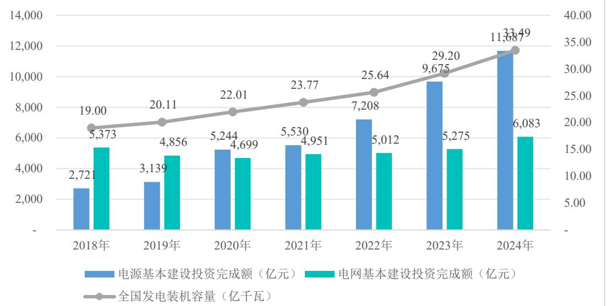  
2018~2024年我国电力投资情况

# 数据来源：国家能源局统计

当前我国稳步推进的大型风电光伏基地多处于西部地区，当地生产的部分电力需要通过电网向外输送，因此作为新能源消纳的重要方式，特高压电网受到高度重视，发改委和能源局不断强调建设跨区域输电通道。

2021 年 3 月国家电网“碳达峰、碳中和行动方案”中提出，“十四五”期间，在送端完善西北、东北主网架结构，加快构建川渝特高压交流主网架，支撑跨区直流安全高效运行；在受端，扩展和完善华北、华东特高压交流主网架，加快建设华中特高压骨干网架，提高清洁能源接纳能力，预计在“十四五”末期国内的特高压输电能力有望突破 1 亿千瓦。同时，《2024 年能源工作指导意见》提到，重点推进陕北-安徽、甘肃-浙江、蒙西-京津冀、大同-天津南等特高压工程核准开工，加快开展西南、西北、东北、内蒙古等清洁能源基地送出通道前期工作。截至 2024 年末，我国电网基本建设投资完成额为 6,083 亿元，同比增长$1 5 . 3 2 \%$ ，增速较快。2025 年，我国进一步推动重点领域安全能力建设和大规模设备更新，提高能源重点领域设备投资规模，推动输配电、风电、水电等领域设备更新和技术改造。《2025 年能源工作指导意见》指出推动金上-湖北、陇东-山东等特高压工程建成投运，加快陕西-安徽、甘肃-浙江等特高压直流以及阿坝-成都东等特高压交流工程建设，统筹推进新型电力系统建设。在国际市场上，随着“一带一路”发展战略的持续推进，我国已与周边国家建成 10 余条互联互通输电线路，在此基础上进一步推进与俄罗斯、蒙古、巴基斯坦等周边国家的电网互联互通，计划到 2030年建成9项以特高压技术为核心的跨国输电工程。

综上，未来几年，电力领域的高景气度投资以及电力电工产品国产化进程将持续推动电力电工绝缘系统及材料行业的发展，市场对电力领域绝缘系统及材料的需求将保持较高水平。

# （五）行业周期性特征

公司所处新能源汽车零部件行业，行业周期与新能源汽车产业发展、产业政策、宏观经济周期及未来技术发展趋势挂钩。随着新能源汽车销量增长，监管和市场对新能源汽车安全的重视程度提升，新能源汽车动力电池热失控防护作为近几年兴起的行业正经历井喷式发展，后续随着新能源汽车市场成熟，需求将渐趋平稳。

此外，电池技术革新也将改变热失控风险状况，例如液态锂电池向半固态、固态电池的技术演进，将显著改变热失控防护需求，固态电解质本身具备更高的本征安全性，使得传统防火要求降低，但对电池包内部热管理的隔热性能提出更高标准。同时，受电力行业相关政策的推动，未来发电装机量及电网建设都将维持较高水平，电力电工绝缘系统及材料行业无明显周期性。

# （六）行业在产业链中作用及上下游关联性

公司所处行业为新能源汽车动力电池热失控防护行业和电力电工绝缘系统及材料行业。产业链上游为云母碎、云母带等云母原料及制品行业，树脂、固化剂等化工材料行业、绝缘阻燃制品行业等，下游连接新能源汽车行业、动力电池行业、发电输电配电用电行业。公司所处行业将传统材料应用到新领域，依托上游优质材料，为下游车企、动力电池厂商提供高性能热失控防护零部件，有效降低热失控风险，助力新能源汽车产业稳健前行；另一方面，在电力电工绝缘系统及材料应用场景下，公司产品利用上游原材料特性，满足下游发电、输配电、用电各环节对绝缘、阻燃等性能的严格要求，保障电力系统安全稳定运行，切实推动行业高质量发展。

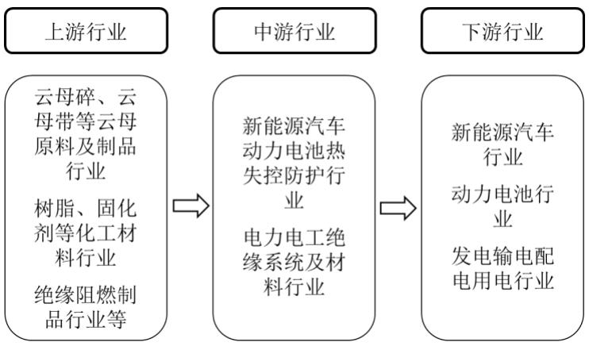

# （七）进入本行业主要壁垒

# 1、技术和产品开发能力壁垒

新能源汽车行业对产品安全性具有极其严苛的要求，尤其在动力电池热失控防护领域存在显著的技术壁垒。企业需要与整车厂商建立深度协同开发机制，提供从材料选型到系统方案的全流程服务。在技术实现层面，需要反复优化热防护零部件中云母、树脂、硅橡胶等复合材料的配比，确保最终产品具备优异的阻燃性能、高温隔热性能以及可靠的电绝缘性能，这些核心材料配方与制备工艺构成企业的关键商业秘密。

2020 年我国颁布的首批电动汽车强制性国家标准对电池系统热扩散提出了明确限制要求，2025 年新修订标准进一步抬升了行业技术门槛。面对整车厂商日益缩短的开发周期和加速迭代的产品需求，供应商必须具备与客户同步甚至超前的开发能力，在产品质量一致性、稳定性以及快速响应改良需求等方面建立竞争优势，这对企业的研发体系、产品开发效率、生产制造能力以及高端技术人才储备都提出了极高要求。在制造工艺方面，需要精准匹配模具设计与产品特性，严格遵循IATF16949 等汽车行业质量管理体系标准，通过精益化生产管理、自动化产线改造和数字化制造系统的深度融合，实现工艺参数的智能优化与生产过程的可视化管控，确保产品性能的高度一致性。

同时，随着电力电工绝缘技术的持续进步，市场对材料性能的要求不断提升，耐高压、耐高温、耐电晕、高导热以及无卤阻燃环保型绝缘材料已成为行业重点研发方向，这些技术要求的叠加进一步提高了行业准入壁垒。企业必须建立涵盖材料研发、工艺设计、智能制造的全链条技术体系，方能在这一高技术门槛领域保持持续竞争力。

# 2、合格供应商认证壁垒

公司所处行业中，下游客户对供应商的选择非常严格，制定了符合自身要求的合格供应商准入考核体系，只有进入合格供应商名录才有资格进行供货。合格供应商审核程序通常包含多个维度：管理体系、项目管理能力、工程实施能力、技术先进性、设备管理能力、供应商管理能力、全球多基地制造、生产过程控制、产品质量验证能力、交付保障能力、响应速度、道德、社会责任、环境保护、职业健康安全等 ESG、EHS 的要求。汽车行业的整车厂对供应商的审核则更加严格，通过上述审核后仅是被纳入供应链体系，具备供货资格。对于具体项目，整车厂仍要进行一系列的审核，从特定车型的产品设计、样件产出、报价、试制，到竞标通过后才能实现量产，严格的供应商审核机制提高了行业门槛。同时，正因为下游客户对供应商有着极其严格的资格评审程序，供应商一旦得到客户的认可，就会形成稳固长期的合作关系，新进入企业将会面临较高的准入壁垒。

# 3、产品认证壁垒

要使产品进入欧美市场，除了取得国际认可的 IATF16949:2016 质量管理体系认证，还需要企业在安全性和环保性方面符合较高标准。这些认证和标准包括美国食品药品管理局认证（FDA 认证）、美国保险商实验室认证（UL 认证）、欧盟REACH法规、德国 PAHs 标准、欧盟 RoHS 标准、欧盟ELV 指令等。上述产品标准认证对企业的技术研发能力、生产管控水平和检测验证体系提出了严苛要求，显著提升了行业准入门槛。

# （八）行业竞争状况

# 1、行业竞争格局和行业内主要企业

新能源汽车动力电池热失控防护行业是近几年快速发展的新兴行业，随着新能源汽车的迅速普及，社会各界对动力电池安全问题逐步重视，热失控防护的必要性与日俱增。该行业目前仍属于早期市场，参与者较少，未达到充分竞争状态。由于动力电池热失控防护的技术特点，行业内的主要参与者大多是从绝缘材料行业转型而来，主要包括固德电材、浙江荣泰、平安电工、Isovolta、SWECO 等。而在电力电工绝缘系统及材料行业，由于行业历史悠久，市场参与者众多，竞争较为充分，主要企业包括固德电材、Huntsman、东材科技、巨峰股份、博菲电气

等。

行业内主要企业介绍如下：  

<table><tr><td>公司名称</td><td>简要介绍</td></tr><tr><td>浙江荣泰</td><td>浙江荣泰主要从事云母耐热绝缘材料的研究、开发、生产与销售，产品主要包括新能源汽车用电池耐火云母带、云母板和云母管等电池安全件，以及应用在家用电器、轨道交通、远洋船舶等领域的云母绝缘保护件、耐火电线电缆绝缘带及电子电气系统绝缘耐火元件。</td></tr><tr><td>平安电工</td><td>平安电工创建于1991年，主要从事云母绝缘材料、玻纤布和新能源绝缘材料的研发、生产和销售，生产的云母绝缘材料主要包括云母纸、耐火云母带、云母板、云母异型件和发热件，玻纤布主要包括工业级玻纤布和电子级玻纤布，新能源绝缘材料产品主要包括云母盖板、云母隔板、云母监控板、云母垫片等。产品广泛应用于电线电缆、家用电器、冶金、化工、汽车、机车、船舶、航空航天等行业。</td></tr><tr><td>Isovolta</td><td>Isovolta(依索沃尔塔集团)是电气绝缘材料、复合材料和合成材料的国际领先制造商，其主要产品为层压板、柔性复合材料、涂布材料等，凭借广泛的产品组合和创新型个性化的新产品开发，集团涉足约20个行业，涵盖汽车、电力、航空和运输领域，具备浸渍、层压、模压成型、机械加工、高分子化学等领域的先进工艺技术。</td></tr><tr><td>SWECO</td><td>SWECO成立于1974年，是韩国最大的生产电气绝缘产品的综合性企业，在韩国水原及龟尾地区设有两个工厂，产品涉及云母及复合绝缘材料制品，主要应用于新能源汽车及电池、高压电气、电线电缆等领域。</td></tr><tr><td>Huntsman</td><td>Huntsman(亨斯迈)是一家纽交所上市的全球性特殊及特种化学品制造和销售企业，目前有聚氨酯事业部、先进材料事业部及功能产品事业部三大业务部门，产品主要包括特种节能保温材料、汽车用轻质高性能材料、环氧树脂、丙烯酸树脂和聚氨酯基聚合树脂体系以及胶粘剂产品，能满足工业和消费应用领域客户的个性化需求。</td></tr><tr><td>东材科技</td><td>东材科技主要从事化工新材料的研发、制造和销售，以新型绝缘材料为基础，重点发展光学膜材料、电子材料、环保阻燃材料等系列产品，可广泛应用于发电设备、特高压输变电、智能电网、新能源汽车、轨道交通、消费电子、光电显示、电工电器、通信网络等领域。</td></tr><tr><td>巨峰股份</td><td>巨峰股份主要生产绝缘树脂(漆)、云母制品、防晕材料、DDP点胶材料、柔软复合材料、电磁线、电机线圈、定子绝缘系统、绝缘结构件等大类产品，涉及火电、水电、核电、风电、航空航天、高速牵引、新能源电动汽车、军工、石化、采矿、特高压输变电等领域。</td></tr><tr><td>博菲电气</td><td>博菲电气主营业务为电气绝缘材料等高分子复合材料的研发、生产和销售，主要产品包括绝缘树脂、槽楔与层压制品、纤维制品、云母制品、绑扎制品和复合材料绝缘件，产品应用在风力发电、轨道交通、工业电机、家用电器、新能源汽车、水力发电等领域。</td></tr></table>

# 2、发行人产品和服务的市场地位

公司在新能源汽车动力电池热失控防护领域占据重要市场地位，作为行业早期将3D云母制品创新应用于新能源汽车的领军企业，公司通过持续的技术突破不断拓展传统材料在热安全防护领域的应用边界。根据弗若斯特沙利文的统计，按2024年企业营收计算，全球电池系统云母材料安全防护市场主要竞争企业有浙江荣泰、固德电材、平安电工、SWECO、Isovolta等，固德电材市场份额为 $1 5 \% { - } 2 0 \%$ 之间，市场份额仅次于浙江荣泰，彰显了突出的行业影响力。凭借在电力绝缘材料领域数十年的技术积淀，公司实现了云母、高性能树脂等核心材料从电气绝缘到热学防护的技术跨越，构建了从原材料开发到终端服务的完整产业链体系。

经过多年技术创新和积累，公司获得了多项省级和国家级科技认定。2021年公司实验室被认定为江苏省省级企业技术中心，2022年被工信部评定为国家级专精特新小巨人企业，2024年3月被评定为江苏省省级工程技术研究中心，2024年12月获得CNAS实验室认可，同时子公司麦卡电工被认定为广东省云母基复合材料精深加工工程技术研究中心，承担省市级科技研究项目。公司积极推动行业进行关键技术的攻关突破，参与制定以云母为基材的隔热绝缘材料国家标准，通过持续的研发投入促进成果转化。截至2025年6月30日，公司已获得专利96项，其中发明专利36项，实用新型60项。

公司以建立高标准的质量体系为导向，通过了汽车行业质量管理体系IATF16949认证及ISO9001、ISO14001、ISO45001、两化融合管理体系认证，公司热失控防护零部件产品已通过美国保险商实验室认证（UL认证）、欧盟REACH法规、德国PAHs标准、欧盟RoHS标准、欧盟ELV指令等标准。凭借快速、高效的需求响应能力，综合全面的方案设计能力，获得众多优质的客户群体，公司产品已形成一定的品牌影响力，获得下游客户的高度认可，如荣获通用汽车“2024年度供应商质量卓越奖”、吉利集团“24年度最佳服务供应商”、零跑汽车“卓越贡献供应商”、东方电气“战略供应商”等荣誉。

# 3、发行人竞争优势

# （1）聚焦新能源汽车动力电池的系统安全

公司长期聚焦新能源汽车动力电池热失控防护零部件的研发、生产和销售，系业内较早以该产品为契机进入新能源汽车行业的企业，力图有效解决动力电池热失控带来的安全问题。新能源汽车的迅速放量及热失控强制标准的推行，带动热失控防护材料的大范围应用，公司该业务迅速放量，成为公司收入增长的主要动力。

# （2）与全球知名整车厂和电池厂紧密合作协同研发

公司凭借在行业内的深厚积累和持续创新，已成功进入多家全球知名整车制造商及电池生产商的一级供应商体系，与包括通用汽车、福特汽车、Stellantis、T公司、现代起亚、丰田、宝马、吉利、零跑、小鹏汽车、一汽集团、宁德时代、欣旺达、蜂巢等在内的行业领军企业建立了长期稳定的合作关系。此外，公司深

度参与知名整车厂的前期研发和设计，并通过Rogers Foam Corporation、GrandTraverse Plastics Corp.、BENTELER Automobiltechnik GmbH、麦格纳等一级汽车零部件供应商向其提供配套热失控防护产品和解决方案。公司依托现有整车厂客户资源和认证资质，积极拓展铜铝复合等第二增长曲线业务，通过深度参与客户研发及时把握技术发展方向。

公司重视客户需求，能够在前期引领或参与客户端动力电池热失控防护方案的设计，从预研阶段与关键客户合作。当客户提出定制化的需求，公司并非简单来图、来料加工，而是深度参与客户的产品研发过程，通过云母材料与树脂材料不同配方的调制，并与多种结构防护零部件（如隔热垫、释火板、盖板等）的科学组合，设计电芯级、模组级、整包级热失控防护产品，为客户精准提供动力电池热失控防护方案，满足其对热失控防护耐火性、高温绝缘性、隔热性能等核心指标的要求。

在新能源汽车领域，要进入整车厂或头部电池厂的供应链体系需要通过严格的合格供应商认证。在很多情况下，整车厂或头部电池厂会对供应商的采购范围进行限定，也就锁定了供应商体系。客户筛选和更换供应商的成本较高，一旦进入客户的供应商体系，在供应商产品质量稳定、供货能力有保障的情况下，下游厂商不会轻易变更供应商，具有较强的合作粘性。经过多年的市场开拓，凭借过硬的产品质量，公司品牌获得了较高的知名度和影响力。

# （3）在云母材料及绝缘树脂上的长期技术积累实现产品创新和降本增效

公司长期深耕云母材料和绝缘树脂，积极研发不同材料配方，拓展传统材料在新能源汽车动力电池热失控防护领域的使用边界，通过恰当的组合提升材料的性能上限。公司作为新能源汽车动力电池安全防护领域的领先企业，较早实现将云母产品的形态通过模具热压固化成为 3D结构件，突破了原有云母板、云母带的形态局限，使云母材料成为更适合起到安全防护作用且易于装配的汽车零部件。公司的云母3D结构件可大批量生产供应并装配在电池包上，符合不同电池包零部件总成的匹配要求，满足汽车行业对品质和成本的高标准。另外，公司通过持续的研发，不断迭代云母纸中浸润的改性树脂的配方，从而持续缩短产品热压固化的时间，增加单位时间产量，实现降本增效，保障产品供应。

# （4）掌握云母产品从原材料加工到应用的垂直产业链模式

公司掌握云母产品从原材料加工到应用的全产业链整合的业务模式。公司可从前期云母纸的生产环节就严控产品品质，从而确保最终热失控防护零部件的优异性能。公司掌握云母纸的先进生产工艺，可通过筛选不同尺寸云母碎片，按照最佳比例组合成具有优异性能的云母纸。公司生产环节从基础云母原材料加工、树脂配方的研制，到中间产品云母纸，再通过上胶、云母纸裁制预成型及热压固化成型等工序，实现全流程自主生产，保证产品的品质稳定性和可追溯性，从而给客户强烈的信心。

公司高度重视 ESG 发展，积极践行社会责任，作为 Responsible Mica Initiative（云母责任倡议组织）、Responsible Minerals Initiative（负责任矿物倡议）的成员单位，公司签署备忘录，积极参与马达加斯加当地慈善项目，致力于推动云母开采和筛选环节的社会责任保障。通过加入 RMI 等国际权威机构，公司严格确保云母材料从开采到使用的全链条合规性，确保云母材料的获取和供应符合汽车行业对可持续性和社会责任的要求。

# （5）符合汽车行业发展模式的全球化布局以应对交付需求

近几年，随着全球新能源汽车行业的快速发展，公司的动力电池热失控防护零部件持续放量，产销量高速增长。全球汽车行业供应链主要位于中国、北美、欧洲、日韩，为应对持续增长的全球需求，公司已开启全球化的战略布局，通过在墨西哥设立子公司并建立生产基地，以及在美国、德国设立子公司，更好地服务北美、欧洲客户。

综上，公司长期聚焦新能源汽车动力电池热失控防护领域，凭借在云母材料、绝缘树脂等先进材料领域的深厚技术积累，成功将材料创新转化为高性能热失控防护零部件，形成了从原材料开发到零部件制造的完整技术体系。通过与全球知名整车厂和电池厂的紧密合作，公司积累了丰富的热失控防护设计能力和经验，并通过全球化产能布局满足全球交付需求，形成了良好的上下游产业链整合能力，具备一定的竞争优势。

# 4、发行人竞争劣势

# （1）融资渠道相对单一

为不断增强公司的核心竞争力，及时响应客户需求的变化，不断推出新产品，公司需长期、持续进行研发投入、生产投入、拓展销售网络投入等，公司目前融资渠道主要为银行借款，单一融资渠道束缚了公司更快速的发展。为保障公司核心竞争力，公司亟需拓宽融资渠道和融资规模。本次拟通过进入资本市场，进一步扩大融资渠道，增强资金实力，推动公司持续快速发展。

# （2）生产规模有待进一步提高

公司经过多年发展，整体体量日益壮大，客户数量不断攀升。近年来，公司不断精益化生产、研发新工艺、扩充生产线以满足不断提升的订单需求。随着公司业务进一步发展，公司现有生产规模将满足不了业务发展的需要，不利于公司市场份额的进一步扩大和竞争地位的提升，公司的生产规模有待进一步提高。

# （3）企业快速扩张与管理能力匹配的挑战

随着业务规模的持续扩大和市场份额的不断提升，公司组织架构和管控体系需要随着业务扩张而不断优化升级，由于管理体系尚未完全适应跨区域、多业务线的发展需求，将面临管理能力无法快速匹配业务扩张的挑战。另一方面，专业管理人才储备不足，特别是在战略规划、供应链管理、跨区域运营等方面的高端管理人才相对匮乏。为应对这一挑战，公司亟需建立科学的人才引进和培养机制，完善现代化企业管理体系，同时通过信息化手段提升管理效率，确保在快速扩张过程中保持组织活力和运营质量。

# 5、与同行业可比公司的比较情况

# （1）选取同行业可比公司的依据及可比程度

公司主营业务为新能源汽车动力电池热失控防护零部件及电力电工绝缘产品的研发、生产与销售。新能源汽车动力电池热失控防护行业是新兴行业，市场参与者较少，而电力电工绝缘系统和材料行业有较长的历史，市场参与者众多。考虑到信息的可获取性，公司从国内上市公司、拟上市公司、挂牌公司中选取同行业可比公司。从产品结构、产品功能、客户类型角度看，公司选取浙江荣泰、平安电工为公司在新能源汽车动力电池热失控防护业务上的可比公司；选取巨峰股份、博菲电气为公司在电力电工绝缘业务上的可比公司。具体如下：

浙江荣泰的主要产品为新能源汽车热失控防护绝缘件、小家电阻燃绝缘件、

电缆阻燃绝缘带、云母纸和玻璃纤维布等产品。其新能源汽车热失控防护绝缘件的主要功能为新能源汽车电池电芯、电池模组、电池包及整车热失控防护及自动驾驶系统的绝缘防护，2024 年该项业务收入占主营业务收入的比例为 $7 9 . 2 0 \%$ 。浙江荣泰除新能源汽车热失控防护绝缘件以外的业务也和绝缘相关。浙江荣泰的主要客户包括 Tesla 集团、Volvo 集团、一汽集团、上汽大众、宁德时代等整车厂和电池厂。因此，浙江荣泰的主要产品功能和公司相似，客户类型和公司相似，是公司在新能源汽车动力电池热失控防护业务上的可比公司。

平安电工的主要产品为云母绝缘材料、玻纤布和新能源绝缘材料。其中新能源绝缘材料的主要功能为防止电池模组热扩散、模块间绝缘隔热、电芯温度监控、电芯绝缘隔热，2024 年该项业务收入占主营业务收入的比例为 $2 0 . 8 9 \%$ 。平安电工的主要客户包括起帆电缆、宁德时代等。因此，平安电工的部分产品功能和公司相似，部分客户类型和公司相似，也是公司在新能源汽车动力电池热失控防护业务上的可比公司之一。

巨峰股份的主要产品为绝缘系统及云母制品、绝缘漆、柔软复合材料、电磁线、线圈等绝缘材料，用于发电机、电动机、变压器等机电设备的绝缘。巨峰股份的主要客户包括东方电气、哈电集团、上海电气等。因此，巨峰股份的主要产品功能和公司的电力电工绝缘产品功能相似，客户类型和公司相似，是公司在电力电工绝缘业务上的可比公司之一。

博菲电气的主要产品为电气绝缘材料等高分子复合材料，包括绝缘树脂、槽楔与层压制品、纤维制品、云母制品、绑扎制品、复合材料绝缘件。博菲电气的主要客户包括中国中车、南京汽轮、哈电集团等。因此，博菲电气的主要产品功能和公司的电力电工绝缘产品功能相似，均用于电气设备的绝缘，客户类型和公司相似，是公司在电力电工绝缘业务上的可比公司之一。

（2）与同行业可比公司在经营情况、市场地位、技术实力、衡量核心竞争力的关键业务数据、指标等方面对比

公司与同行业可比公司在经营情况、市场地位、技术实力、核心竞争力方面的对比如下：

<table><tr><td>公司名称</td><td>主要产品</td><td>应用领域</td><td>主要客户</td><td>市场地位</td><td>技术实力</td><td>核心竞争力</td></tr><tr><td>浙江荣泰</td><td>新能源汽车热失控防护绝缘件、小家电阻燃绝缘件、电缆阻燃绝缘带、云母纸和玻璃纤维布等产品</td><td>新能源汽车、小家电、电线电缆等下游行业应用</td><td>公司客户包括特斯拉、大众、宝马、奔驰、沃尔沃等世界知名汽车品牌,电池龙头企业宁德时代,美的、松下等知名家电企业及耐克森、宝胜、远东等国际或国内知名的电线电缆企业</td><td>在行业内主要公司中规模较大,在整体云母耐火绝缘市场占有一定的市场份额,特别在新能源汽车和家用电器云母应用市场,市场占有率较高。公司2021年度被沃尔沃评选为“最佳供应商”,2022年被沃尔沃授予“质量卓越奖”。</td><td>公司是高新技术企业,截至2024年末已获得37项发明专利,100项实用新型、3项外观设计,已建立省级企业研究院,并先后承担了省级、市级重点研究项目和重点高新技术产品的开发工作。已通过IATF16949、ISO9001、ISO14001和ISO45001等管理体系认证,通过了国家知识产权管理体系(GB/T29490-2013)认证和两化融合管理体系(GB/T230012017)评定,主持或参与了多项国家、行业及团体标准的起草修订工作。</td><td>作为较早进入该领域的领先企业,公司紧密贴合产业需求,在材料配方、产品设计、制造工艺等方面进行了自主创新,产品具有很强的竞争优势,针对云母材料公司研制了全新的原料配方,独创了上胶压制一体化成型工艺,实现了云母制品的三维立体造型制备,突破了现有云母制品形状限制,以技术工艺创新为驱动的经营理念,对研发工作进行了持续投入,凭借产品优异的性能和良好的服务赢得了各行业优质客户的认可,并且通过前瞻性的技术、产品和系统方案创新,公司逐步从单一产品制造商向综合解决方案服务商转变,持续吸引业内优质客户资源不断向公司聚集。</td></tr><tr><td>平安电工</td><td>云母绝缘材料主要包括云母纸、耐火云母带、云母板、云母异型件和发热件,玻纤布主要包括工业级玻纤布和电子级玻纤布</td><td>电线电缆、家用电器、新能源汽车、储能系统、风电光伏和轨道交通等领域</td><td>主要客户群体为电线电缆、家用电器、新能源汽车、储能系统、风电光伏和轨道交通等领域的制造企业</td><td>公司已在中国云母专业委员会理事长单位、国家认证的高新技术企业,先后承担了多项云母行业质量检测标准的修订工作。凭借深厚的技术积累和丰富的应用经验,形成了一系列自主知识产权,万米耐火云母带、云母纸、高温云母板等多个产品技术居于国内领先、国际一流的水平。公司云母绝缘材料产品质量监督检测中心成功通过中国合格评定国家认可委员会实验室认证,并获得CNAS实验室认可证书,与武</td><td>公司布局全球云母矿资源,具有稳定的云母原料供应来源,完整的全产业链布局可使公司为客户提供各类云母绝缘材料产品,并且在新产品开发及工艺改良方面实现战略协同,通过产品创新化与差异化,不断增强开发新产品和拓展产品应用领域的能力。</td><td></td></tr><tr><td></td><td></td><td></td><td></td><td></td><td>汉大学、武汉科技大学等高等院校建立了产学研合作关系,打造技术创新平台和持续创新能力,在云母绝缘材料行业内具备领先的竞争优势。</td><td></td></tr><tr><td>巨峰股份</td><td>主要从事绝缘系统及云母制品、绝缘漆、柔软复合材料、电磁线、线圈等绝缘材料的研发、生产与销售</td><td>主要应用水电、火电、核电、风电、新能源汽车、轨道交通、航空航天、船舶、半导体、军工、冶金、石化、机械、家用电器等多个行业</td><td>客户群体包括东方电气、哈电集团、上海电气、湘电集团、卧龙电气、西门子、ABB、康明斯、东元电机、雷勃电气等国内外知名客户</td><td>根据2022年2月,中国电器工业协会绝缘材料分会出具的证明,公司2019年至2021年电机配套主绝缘及绝缘系统销售位居全国第1位。</td><td>公司的超低温电机绝缘材料及系统、高透气性少胶云母带、分子蒸馏级双酚A环氧树脂(零聚合度)的制备/环氧酸酐VPI树脂等多项核心技术,已通过江苏省经济和信息化委员会、江苏省工业和信息化厅、中国机械工业联合会等部门组织的科技成果鉴定,技术达到国际先进水平,并成功替代进口。</td><td>公司始终深耕于绝缘材料行业,聚焦电机配套绝缘材料,凭借自身的技术平台优势、技术人才优势,向客户提供品类齐全、质量可靠的绝缘材料产品,建立起了较为完善的销售体系,向客户提供周到快捷的服务,产品和服务得到了客户的广泛认可和好评,在业内建立了良好的品牌形象。</td></tr><tr><td>博菲电气</td><td>主营业务为电气绝缘材料等高分子复合材料的研发、生产与销售,产品包括绝缘树脂、槽楔与层压制品、纤维制品、云母制品、绑扎制品、复合材料绝缘件</td><td>主要应用风力发电、轨道交通、工业电机、家用电器、新能源汽车、水力发电等下游领域</td><td>客户群体包括中国中车、南京汽轮、金风科技、中船重工等知名企业</td><td>公司作为第二批国家“专精特新”重点“小巨人”企业、第三批专精特新“小巨人”企业和中国电器工业协会绝缘分会理事单位,先后承担了国家火炬计划产业化示范项目、省级新产品试制计划项目、浙江省重点研发计划项目等重点科研项目,荣获海宁市市长质量奖、浙江省科学技术奖、浙江省优秀工业新产品奖、浙江制造认证、嘉兴市科学技术进步奖等荣誉,公司产品受到国内知名企业广泛认可,公司在行业内具有较高的市场地位。</td><td>公司在绝缘材料生产领域掌握了多项核心技术和关键生产工艺,公司已通过ISO9001、IATF16949、ISO14001和ISO45001等管理体系认证,参与了电气绝缘材料耐热性国家标准、固体绝缘材料介电和电阻特性国家标准、水溶性半无机硅钢片漆行业标准等多项国家、行业及团体标准的起草工作,先后承担了国家火炬计划产业化示范项目、省级新产品试制计划项目、浙江省重点研发计划项目等重点科研项目,持续对新技术、新工艺进行研发和应用。公司部分核心产品已通过美国UL实验室安全认证,多项产品技术指标已达到行业先进水平。</td><td>公司在绝缘材料生产领域掌握了多项核心技术和关键生产工艺,经过长期的行业积累和持续的研发创新,公司现已形成丰富的绝缘材料产品线,逐步打通产业链上下游,能够为客户提供多样化的产品选择和一站式服务,凭借优异的产品品质、强大的设计研发能力、完善的售后服务体系,与中国中车、南京汽轮、金风科技、中船重工等多家国内知名企业建立了合作关系。</td></tr><tr><td>固德 电材</td><td>专注于新能源 汽车动力电池 热失控防护零 部件及电力电 工绝缘产品的 研发、生产和销 售</td><td>主要应用于新能 源汽车、电力电工 行业</td><td>新能源汽车行业客户群 体包括通用汽车、福特、 Stellantis、T公司、现代 起亚、丰田、宝马、吉 利、零跑、小鹏、一汽 集团等整车制造商,以 及宁德时代、欣旺达、 蜂巢等电池生产商；在 电力发电设备领域, 主 要客户包括东方电气、 上海电气、哈电集团等 大型发电设备制造商; 在特高压输配电领域, 主要客户包括特变电 工、思源电气、南京电 气、中国西电。</td><td>公司在新能源汽车动力电池 热失控防护领域占据重要市 场地位,系行业内早期将3D 云母制品创新应用于新能源 汽车的领军企业,按2024年 企业营收计算,全球电池系 统云母材料安全防护市场 中,固德电材市场份额为 15%-20%之间,份额仅次于 浙江荣泰,彰显了突出的行 业影响力。公司荣获通用汽 车“2024年度供应商质量卓 越奖”、吉利集团“24年度最 佳服务供应商”、零跑汽车 “卓越贡献供应商”、东方电 气“战略供应商”等荣誉。</td><td>在新能源汽车动力电池热失控 防护领域, 公司实现从合规云 母选矿造纸,到树脂调配、部 件成型,再到热失控方案提供 的全产业链商业模式,通过材 料科学与工艺工程的协同创 新,为客户提供兼具优异防护 性能和成本优势的定制化热失 控防护解决方案。在电力电工 绝缘业务领域,公司通过创新 树脂材料配方,积累经验并利 用数字化管理提升研发效率, 持续满足特高压等高端应用场 景对绝缘材料日益提升的技术 要求。截至2025年6月30日,公 司共拥有专利96项,其中发明 专利36项,并且凭借在隔热绝 缘领域的深厚技术沉淀与行业 影响力,积极参与编制隔热绝 缘材料相关国家标准,在行业 技术发展进程中发挥了重要的 引领作用。</td><td>公司长期专注于动力电池热失控防护领 域,凭借云母材料相关核心技术和树脂调 配工艺,创新性地实现了从电气绝缘性能 向热学防护性能的技术延伸,突破了传统 材料的应用局限,实现核心技术的跨领域 创新应用。同时,公司具备良好的上下游 产业链垂直整合能力,实现原材料的品质 可控、成本领先、产品的一致性和可追溯 性,同时确保矿源符合ESG标准。另一方 面,公司与全球知名整车厂和电池制造商 建立了深度合作关系,形成了稳定的供应 链体系,并积极布局全球产能,通过墨西 哥生产基地和美国、德国营销网络强化本 地化服务能力。这些优势共同构成了公司 的核心竞争力,使其在快速发展的新能源 汽车安全防护市场中保持领先地位,并为 未来的持续增长奠定了坚实基础。</td></tr></table>

公司与同行业可比公司在衡量核心竞争力的关键业务数据、指标方面的对比如下：

单位：万元  

<table><tr><td>项目</td><td>公司名称</td><td>2025年1-6月</td><td>2024年度</td><td>2023年度</td><td>2022年度</td></tr><tr><td rowspan="6">主营业务收入</td><td>浙江荣泰</td><td>57,205.37</td><td>113,365.34</td><td>79,964.66</td><td>66,669.21</td></tr><tr><td>平安电工</td><td>56,499.56</td><td>105,364.69</td><td>92,164.31</td><td>83,985.97</td></tr><tr><td>巨峰股份</td><td>47,906.69</td><td>82,755.12</td><td>69,869.42</td><td>72,422.08</td></tr><tr><td>博菲电气</td><td>19,560.53</td><td>34,021.22</td><td>31,089.78</td><td>35,172.77</td></tr><tr><td>平均值</td><td>45,293.04</td><td>83,876.59</td><td>68,272.04</td><td>64,562.51</td></tr><tr><td>固德电材</td><td>44,834.89</td><td>89,605.62</td><td>64,682.19</td><td>47,121.79</td></tr><tr><td rowspan="6">归母净利润</td><td>浙江荣泰</td><td>12,340.93</td><td>23,024.94</td><td>17,180.23</td><td>13,377.22</td></tr><tr><td>平安电工</td><td>13,506.08</td><td>21,748.80</td><td>16,578.78</td><td>13,223.83</td></tr><tr><td>巨峰股份</td><td>5,662.22</td><td>9,853.82</td><td>7,151.69</td><td>5,991.41</td></tr><tr><td>博菲电气</td><td>858.71</td><td>1,323.77</td><td>3,299.02</td><td>6,930.27</td></tr><tr><td>平均值</td><td>8,091.98</td><td>13,987.83</td><td>11,052.43</td><td>9,880.68</td></tr><tr><td>固德电材</td><td>8,116.05</td><td>17,176.77</td><td>10,048.77</td><td>6,405.86</td></tr></table>

公司的主营业务收入和归母净利润持续提升，处于同行业可比公司中上游水平。其他财务数据对比参见本招股说明书“第六节 财务会计信息与管理层分析”。

# （九）行业面临的机遇与风险及上述情况变化趋势

# 1、行业面临的机遇

# （1）国家产业政策支持

近年来，国家在新能源汽车及电力领域出台了诸多支持政策，为相关产业链发展提供了强有力的政策保障。在新能源汽车热失控防护领域，中国汽车动力电池产业创新联盟发布《动力电池高质量发展行动方案白皮书（2023-2025）》，提出构建动力电池系统全生命周期安全保障体系的发展目标，要求电池产品发生热失控时，整车不起火。《五部门关于进一步加强新能源汽车企业安全体系建设的指导意见》指出：提高动力电池安全水平，提高动力电池在碰撞、振动、挤压、浸水、充放电异常等状态下的安全防护能力，鼓励企业研究应用热失控实时监测

预警装置和早期抑制及灭火措施。《新能源汽车产业发展规划（2021-2035年）》指出：到 2025 年，我国新能源汽车市场竞争力明显增强，安全水平全面提升。提升电池管理、充电连接、结构设计等安全技术水平。

在电力基础设施建设领域，“十四五”规划纲要和能源工作指导意见均重点部署特高压电网建设，强调提升电网安全运行水平。2025 年，我国立足“两重”“两新”政策，大力推动能源电力高质量发展建设，用能设施节能降碳改造和设备更新改造。政策的密集出台，将对我国新能源汽车行业及电力领域的建设起到强有力的推动作用，会直接带动热失控防护、绝缘材料等相关行业的发展，其中新能源汽车行业相关政策多次提到“安全水平”，公司所处行业将有广阔的发展空间。

# （2）市场前景广阔

下游新兴行业新能源汽车行业在技术、政策、市场的多重作用下，近几年呈现井喷式发展。不仅国内市场需求旺盛，全球汽车市场都呈现出电动化趋势，国内整车厂也已走出国门，大量出口至海外国家。在全球碳达峰碳中和的背景下，核电、风电等清洁能源发电装机量持续处于较高水平。以上因素将持续带动公司所处行业的发展。而发电端新能源占比提升带来发电不稳定、发电用电错配问题，需通过储能设备解决，储能设备亦需要热失控防护。若未来电网中储能设备增多，动力电池的热失控防护技术可转移至储能市场。

# 2、行业面临的风险

# （1）下游技术路线变动风险

由于下游行业对更高能量密度和更高安全性的动力电池的持续探索，动力电池技术路线呈现多元化发展趋势。液态锂电池向半固态、固态电池的技术演进，将显著改变热失控防护需求，固态电解质本身具备更高的本征安全性，使得传统防火要求降低，但对电池包内部热管理的隔热性能提出更高标准。若未来半固态、固态电池技术加速成熟并规模化应用，新能源汽车动力电池热失控防护行业可能面临需求结构性调整的风险。公司研发重点将从传统防火材料向高耐温隔热材料延伸，通过新型复合材料等创新方案适应技术迭代需求。

# （2）行业高端人才匮乏

下游新能源汽车、核电风电光伏等产业新技术和新产品不断涌现，对行业内各厂商的研发能力、工艺技术改良能力及品质管控能力提出了更高要求。而目前国内行业缺乏高素质的专业人才，成为制约行业进步的障碍。

# 3、上述情况的变化趋势

公司所属细分行业的技术水平及特点、进入本行业主要壁垒、行业发展态势、面临机遇与风险、行业周期性特征，在报告期内未发生重大变化。随着公司产品技术水平的提高和市场地位的提升，将进一步强化公司的竞争优势，同时公司也在积极加强产品研发、市场开拓和完善融资渠道，弥补自身的竞争劣势。

# 三、发行人销售情况及主要客户

# （一）主要产品的销售收入

报告期内，公司主营业务收入按照产品类别划分情况如下：

单位：万元  

<table><tr><td rowspan="2">项目</td><td colspan="2">2025 年 1-6 月</td><td colspan="2">2024 年度</td><td colspan="2">2023 年度</td><td colspan="2">2022 年度</td></tr><tr><td>金额</td><td>占比</td><td>金额</td><td>占比</td><td>金额</td><td>占比</td><td>金额</td><td>占比</td></tr><tr><td>新能源汽车动力电池热失控防护零部件</td><td>30,173.84</td><td>67.30%</td><td>66,045.19</td><td>73.71%</td><td>40,510.22</td><td>62.63%</td><td>24,313.91</td><td>51.60%</td></tr><tr><td>电力电工绝缘产品</td><td>12,734.36</td><td>28.40%</td><td>22,266.51</td><td>24.85%</td><td>20,072.96</td><td>31.03%</td><td>15,516.32</td><td>32.93%</td></tr><tr><td>其他</td><td>1,926.68</td><td>4.30%</td><td>1,293.92</td><td>1.44%</td><td>4,099.01</td><td>6.34%</td><td>7,291.56</td><td>15.47%</td></tr><tr><td>合计</td><td>44,834.89</td><td>100.00%</td><td>89,605.62</td><td>100.00%</td><td>64,682.19</td><td>100.00%</td><td>47,121.79</td><td>100.00%</td></tr></table>

注：其他产品主要为铜铝复合产品和风电叶片复合材料等。随着风电行业市场需求回落，导致风电叶片复合材料业务规模及盈利能力下降，2024 年公司战略性放弃了风电业务。2023 年子公司固瑞德投产，新增铜铝复合产品收入。

公司产品的主要客户群体来自整车制造、动力电池、电力系统领域。

# （二）主要产品的规模

报告期内，公司主要产品的产能、产量及销量情况如下：

<table><tr><td>产品类别</td><td>项目</td><td>2025年1-6月</td><td>2024年度</td><td>2023年度</td><td>2022年度</td></tr><tr><td rowspan="3">新能源汽车动力电池热失控防护零部件</td><td>产能利用率</td><td>82.34%</td><td>96.95%</td><td>104.26%</td><td>93.68%</td></tr><tr><td>产量（吨）</td><td>3,316.83</td><td>8,973.08</td><td>6,996.49</td><td>4,859.47</td></tr><tr><td>销量（吨）</td><td>3,518.98</td><td>8,314.50</td><td>6,406.05</td><td>4,834.97</td></tr><tr><td></td><td>产销率</td><td>106.09%</td><td>92.66%</td><td>91.56%</td><td>99.50%</td></tr><tr><td rowspan="4">绝缘树脂</td><td>产能利用率</td><td>61.97%</td><td>58.58%</td><td>45.36%</td><td>38.72%</td></tr><tr><td>产量（吨）</td><td>165.26</td><td>312.41</td><td>241.90</td><td>206.51</td></tr><tr><td>销量（吨）</td><td>172.96</td><td>319.55</td><td>246.81</td><td>201.84</td></tr><tr><td>产销率</td><td>104.66%</td><td>102.29%</td><td>102.03%</td><td>97.74%</td></tr></table>

注：新能源汽车动力电池热失控防护零部件具有非标准、定制化的特点，不存在标准设定产能，产能利用率计算方法为：产能利用率=重要瓶颈设备实际工时/重要瓶颈设备理论工时。  
注：新能源汽车动力电池热失控防护零部件产量和销量根据每件产品的单件重量换算为重量列示。

2022-2024年度，公司新能源汽车动力电池热失控防护零部件业务产销率有所下降，主要系公司DDP/DAP模式销售规模快速扩大，该类业务以外销为主，主要客户集中于美国及欧洲等海外市场，由于跨境物流运输周期较长，且货物需经海关清关、国际运输等多环节流转，导致收入确认时间周期延长。2025年1-6月，新能源汽车动力电池热失控防护零部件业务产能利用率下降，主要系2025年上半年受关税政策不确定性影响，部分海外下游客户短期内调整生产节奏和采购计划，导致下单节奏放缓，公司相应调整生产计划，因此产能利用率阶段性下降；尽管当期新增产量因客户需求放缓，但销量中包含前期发出商品于2025年形成销售，导致产销率提升。

报告期内，公司绝缘树脂产能利用率处于较低水平，主要系公司凭借先进的配方设计和生产工艺，具备较高的生产效率。此外，公司提供绝缘材料系统解决方案，为客户提供包括树脂、固化剂、促进剂、填料等不同添加剂的选型和配方设计，在实际应用中，大多数客户选择在生产现场进行各组分的现混现用，确保绝缘系统的最佳应用效果。

# （三）销售价格的总体变动情况

报告期内，公司主要产品销售价格变动情况参见本招股说明书“第六节 财务会计信息与管理层分析”之“七、经营成果分析”之“（一）营业收入分析”之“2、主营业务收入分析”之“（1）主营业务收入按产品构成分析”。

# （四）报告期各期的前五名客户

报告期内，公司对前五名客户的销售情况如下：

单位：万元  

<table><tr><td>年度</td><td>序号</td><td>客户名称</td><td>销售内容</td><td>销售金额</td><td>占营业收入比例</td></tr><tr><td rowspan="6">2025年1-6月</td><td>1</td><td>东方电气</td><td>电力电工绝缘产品</td><td>5,224.20</td><td>11.42%</td></tr><tr><td>2</td><td>Rogers Foam Corporation</td><td>新能源汽车动力电池热失控防护零部件</td><td>4,133.98</td><td>9.03%</td></tr><tr><td>3</td><td>麦格纳</td><td>新能源汽车动力电池热失控防护零部件</td><td>3,367.38</td><td>7.36%</td></tr><tr><td>4</td><td>T公司</td><td>新能源汽车动力电池热失控防护零部件</td><td>3,351.26</td><td>7.32%</td></tr><tr><td>5</td><td>Stellantis</td><td>新能源汽车动力电池热失控防护零部件</td><td>3,114.49</td><td>6.81%</td></tr><tr><td colspan="3">合计</td><td>19,191.32</td><td>41.94%</td></tr><tr><td rowspan="6">2024年度</td><td>1</td><td>Rogers Foam Corporation</td><td>新能源汽车动力电池热失控防护零部件</td><td>13,221.20</td><td>14.56%</td></tr><tr><td>2</td><td>T公司</td><td>新能源汽车动力电池热失控防护零部件</td><td>7,397.91</td><td>8.15%</td></tr><tr><td>3</td><td>Stellantis</td><td>新能源汽车动力电池热失控防护零部件</td><td>7,217.34</td><td>7.95%</td></tr><tr><td>4</td><td>东方电气</td><td>电力电工绝缘产品</td><td>6,725.00</td><td>7.41%</td></tr><tr><td>5</td><td>Grand Traverse Plastics Corp.</td><td>新能源汽车动力电池热失控防护零部件</td><td>5,632.81</td><td>6.20%</td></tr><tr><td colspan="3">合计</td><td>40,194.26</td><td>44.27%</td></tr><tr><td rowspan="6">2023年度</td><td>1</td><td>Rogers Foam Corporation</td><td>新能源汽车动力电池热失控防护零部件</td><td>7,199.89</td><td>11.06%</td></tr><tr><td>2</td><td>东方电气</td><td>电力电工绝缘产品</td><td>6,406.72</td><td>9.84%</td></tr><tr><td>3</td><td>宁德时代</td><td>新能源汽车动力电池热失控防护零部件</td><td>5,547.58</td><td>8.52%</td></tr><tr><td>4</td><td>T公司</td><td>新能源汽车动力电池热失控防护零部件</td><td>4,853.57</td><td>7.46%</td></tr><tr><td>5</td><td>特变电工</td><td>电力电工绝缘产品</td><td>1,961.85</td><td>3.01%</td></tr><tr><td colspan="3">合计</td><td>25,969.60</td><td>39.90%</td></tr><tr><td rowspan="6">2022年度</td><td>1</td><td>宁德时代</td><td>新能源汽车动力电池热失控防护零部件</td><td>4,725.57</td><td>9.95%</td></tr><tr><td>2</td><td>T公司</td><td>新能源汽车动力电池热失控防护零部件</td><td>3,836.87</td><td>8.08%</td></tr><tr><td>3</td><td>东方电气</td><td>电力电工绝缘产品</td><td>3,528.99</td><td>7.43%</td></tr><tr><td>4</td><td>双瑞风电</td><td>风电叶片复合材料</td><td>2,780.93</td><td>5.85%</td></tr><tr><td>5</td><td>上玻院</td><td>风电叶片复合材料</td><td>2,773.53</td><td>5.84%</td></tr><tr><td colspan="3">合计</td><td>17,645.89</td><td>37.14%</td></tr></table>

注 1：受同一实际控制人控制的客户，已合并计算销售额；  
注 2：Rogers Foam Corporation、Grand Traverse Plastics Corp.系通用汽车一级供应商，公司向其供应的产品均用于通用汽车相关车型的配套生产。

报告期内新增前五大客户情况如下：

<table><tr><td>客户名称</td><td>成立时间</td><td>开始合作时间</td><td>新增进入前五大客户的原因</td></tr><tr><td>Rogers Foam Corporation</td><td>1947年</td><td>2022年</td><td>通用汽车指定 Rogers Foam Corporation向公司采购产品</td></tr><tr><td>Stellantis</td><td>[注1]</td><td>2022年</td><td>整车厂Stellantis加速推进电动汽车战略，有动力电池热失控防护需求，公司为其定制开发多个项目</td></tr><tr><td>Grand Traverse Plastics Corp.</td><td>1980年</td><td>2022年</td><td>通用汽车指定 Grand Traverse Plastics Corp.向公司采购产品</td></tr><tr><td>特变电工[注2]</td><td>2003年</td><td>2009年</td><td>公司向其销售套管用浇注树脂，由于干式套管市场增长，且特高压套管国产化替代加速，客户业务需求增长</td></tr><tr><td>麦格纳</td><td>1957年</td><td>2022年</td><td>麦格纳主营汽车结构件，系通用汽车、Stellantis一级供应商，公司与通用汽车、Stellantis合作项目进入量产阶段后，通过麦格纳供应配套产品。</td></tr></table>

注1：2021年1月16日，标致雪铁龙集团（PSA）与菲亚特克莱斯勒汽车公司（FCA）合并后更名为Stellantis；1976 年，标致收购雪铁龙组建 PSA 集团，2014 年，菲亚特收购克莱斯勒组建 FCA 集团。  
注 2：特变电工包含特变电工沈阳变压器集团有限公司、沈阳和新套管有限公司。

报告期内，公司不存在向单个客户销售金额超过销售总额的 $50 \%$ 或严重依赖少数客户的情形；公司董事、取消监事会前在任监事、高级管理人员和核心技术人员及其主要关联方或持有公司 $5 \%$ 以上股份的股东在上述客户中未占有权益。

# 四、发行人采购情况及主要供应商

# （一）主要原材料采购情况

报告期内，公司主要原材料类别包括树脂、模切原料、云母制品、云母碎、铜铝材料、绝缘阻燃制品等，具体如下：

<table><tr><td>主要采购类别</td><td>主要原材料</td></tr><tr><td>树脂</td><td>环氧树脂、有机硅树脂、固化剂、添加剂</td></tr><tr><td>模切原料</td><td>泡棉胶带、超级棉、塑料薄膜</td></tr><tr><td>云母制品</td><td>云母纸、云母板、云母带</td></tr><tr><td>云母碎</td><td>金云母碎、白云母碎</td></tr><tr><td>铜铝材料</td><td>铜带、铝锭</td></tr><tr><td>绝缘阻燃制品</td><td>高低阻带、环氧制品、环氧板材、绝缘板材、排间绝缘等</td></tr></table>

报告期内，公司各类原材料的采购情况如下：

单位：万元  

<table><tr><td rowspan="2">采购类别</td><td colspan="2">2025 年 1-6 月</td><td colspan="2">2024 年度</td><td colspan="2">2023 年度</td><td colspan="2">2022 年度</td></tr><tr><td>金额</td><td>占比</td><td>金额</td><td>占比</td><td>金额</td><td>占比</td><td>金额</td><td>占比</td></tr><tr><td>树脂</td><td>5,833.67</td><td>30.27%</td><td>12,279.54</td><td>34.51%</td><td>9,800.54</td><td>35.22%</td><td>7,772.00</td><td>33.58%</td></tr><tr><td>模切原料</td><td>2,682.10</td><td>13.92%</td><td>6,166.01</td><td>17.33%</td><td>3,317.41</td><td>11.92%</td><td>2,532.27</td><td>10.94%</td></tr><tr><td>云母制品</td><td>2,163.80</td><td>11.23%</td><td>4,078.39</td><td>11.46%</td><td>4,399.26</td><td>15.81%</td><td>2,612.75</td><td>11.29%</td></tr><tr><td>云母碎</td><td>934.18</td><td>4.85%</td><td>3,736.48</td><td>10.50%</td><td>2,070.88</td><td>7.44%</td><td>858.22</td><td>3.71%</td></tr><tr><td>铜铝材料</td><td>4,751.11</td><td>24.66%</td><td>2,235.23</td><td>6.28%</td><td>2,752.61</td><td>9.89%</td><td>-</td><td>-</td></tr><tr><td>绝缘阻燃制品</td><td>1,452.05</td><td>7.54%</td><td>2,198.91</td><td>6.18%</td><td>1,514.25</td><td>5.44%</td><td>1,676.50</td><td>7.24%</td></tr><tr><td>玻纤布</td><td>515.41</td><td>2.67%</td><td>1,881.77</td><td>5.29%</td><td>850.46</td><td>3.06%</td><td>475.48</td><td>2.05%</td></tr><tr><td>包装材料</td><td>436.58</td><td>2.27%</td><td>953.60</td><td>2.68%</td><td>406.19</td><td>1.46%</td><td>258.19</td><td>1.12%</td></tr><tr><td>风电叶片灌注树脂</td><td>2.54</td><td>0.01%</td><td>181.87</td><td>0.51%</td><td>974.33</td><td>3.50%</td><td>3,786.62</td><td>16.36%</td></tr><tr><td>风电叶片芯材</td><td>-</td><td>-</td><td>8.85</td><td>0.02%</td><td>506.73</td><td>1.82%</td><td>1,753.71</td><td>7.58%</td></tr><tr><td>其他</td><td>498.32</td><td>2.59%</td><td>1,860.23</td><td>5.23%</td><td>1,237.79</td><td>4.45%</td><td>1,417.88</td><td>6.13%</td></tr><tr><td>合计</td><td>19,269.76</td><td>100.00%</td><td>35,580.85</td><td>100.00%</td><td>27,830.43</td><td>100.00%</td><td>23,143.63</td><td>100.00%</td></tr></table>

报告期内，公司主要原材料采购价格变动如下：

单位：元  

<table><tr><td rowspan="2">采购类别</td><td rowspan="2">原材料</td><td rowspan="2">计量单位</td><td colspan="2">2025年1-6月</td><td colspan="2">2024年度</td><td colspan="2">2023年度</td><td>2022年度</td></tr><tr><td>单价</td><td>变动</td><td>单价</td><td>变动</td><td>单价</td><td>变动</td><td>单价</td></tr><tr><td rowspan="3">树脂</td><td>环氧树脂</td><td>kg</td><td>53.04</td><td>9.82%</td><td>48.30</td><td>11.97%</td><td>43.13</td><td>0.19%</td><td>43.05</td></tr><tr><td>有机硅树脂</td><td>kg</td><td>27.55</td><td>0.88%</td><td>27.31</td><td>-1.48%</td><td>27.72</td><td>6.76%</td><td>25.97</td></tr><tr><td>固化剂</td><td>kg</td><td>37.89</td><td>-4.79%</td><td>39.79</td><td>-10.44%</td><td>44.43</td><td>-1.02%</td><td>44.89</td></tr><tr><td rowspan="3">模切原料</td><td>泡棉胶带</td><td>m</td><td>5.23</td><td>-22.17%</td><td>6.72</td><td>-11.10%</td><td>7.56</td><td>-22.20%</td><td>9.71</td></tr><tr><td>超级棉</td><td>m</td><td>4.52</td><td>3.14%</td><td>4.38</td><td>-9.63%</td><td>4.85</td><td>/</td><td>/</td></tr><tr><td>塑料薄膜</td><td>m</td><td>1.07</td><td>37.82%</td><td>0.77</td><td>-21.27%</td><td>0.98</td><td>5.55%</td><td>0.93</td></tr><tr><td rowspan="2">云母制品</td><td>云母带</td><td>m²</td><td>30.71</td><td>1.33%</td><td>30.30</td><td>-4.45%</td><td>31.71</td><td>-4.46%</td><td>33.19</td></tr><tr><td>云母纸</td><td>kg</td><td>6.67</td><td>1.30%</td><td>6.58</td><td>-5.02%</td><td>6.93</td><td>4.33%</td><td>6.64</td></tr><tr><td>云母碎</td><td>云母碎</td><td>kg</td><td>2.72</td><td>-4.00%</td><td>2.83</td><td>4.60%</td><td>2.71</td><td>17.86%</td><td>2.30</td></tr><tr><td rowspan="2">铜铝材料</td><td>铝锭</td><td>吨</td><td>17,930.41</td><td>3.23%</td><td>17,368.65</td><td>7.13%</td><td>16,211.93</td><td>/</td><td>/</td></tr><tr><td>铜带</td><td>吨</td><td>73,567.64</td><td>4.48%</td><td>70,414.77</td><td>0.24%</td><td>70,247.53</td><td>/</td><td>/</td></tr><tr><td>玻纤布</td><td>玻纤布</td><td>m</td><td>1.27</td><td>-4.52%</td><td>1.33</td><td>-11.33%</td><td>1.50</td><td>-21.47%</td><td>1.91</td></tr></table>

公司同一类别的原材料规格型号不一，采购平均单价的波动主要受原材料结构的变化、原材料自身市场价格波动及议价能力的影响，公司原材料总体价格波动水平处于合理区间内。

# （二）主要能源采购情况

公司主要耗用能源为电、天然气及生物质燃料，报告期内能源采购情况如下：

单位：万元、元/度、元/立方米、元/吨   

<table><tr><td rowspan="2">项目</td><td colspan="2">2025年1-6月</td><td colspan="2">2024年度</td><td colspan="2">2023年度</td><td colspan="2">2022年度</td></tr><tr><td>金额</td><td>单价</td><td>金额</td><td>单价</td><td>金额</td><td>单价</td><td>金额</td><td>单价</td></tr><tr><td>电费</td><td>761.27</td><td>0.63</td><td>1,886.22</td><td>0.64</td><td>1,474.80</td><td>0.69</td><td>1,090.73</td><td>0.68</td></tr><tr><td>生物质燃料</td><td>286.25</td><td>761.06</td><td>690.23</td><td>776.49</td><td>588.12</td><td>823.25</td><td>528.37</td><td>828.84</td></tr><tr><td>天然气</td><td>232.15</td><td>3.68</td><td>399.15</td><td>3.73</td><td>121.07</td><td>3.71</td><td>6.51</td><td>4.00</td></tr></table>

报告期内，公司电费单价的波动原因主要系公司及子公司所在区域的电费定价政策不同所致；天然气单价波动主要受天然气市场价格波动及国内供应情况影响；公司采购生物质燃料单价下降主要系公司基于与供应商之间的长期合作，谈判协商进行一定的降价。

报告期内，公司天然气采购金额增长较快，采购天然气主要用于 RTO 焚烧炉及导热油锅炉的能源供应，公司通过逐步推行天然气替代电力的能源供应方式以降低生产成本。

# （三）报告期内前五名供应商

报告期内，公司向前五名原材料供应商的采购情况如下：

单位：万元  

<table><tr><td>年度</td><td>序号</td><td>供应商名称</td><td>主要采购内容</td><td>采购金额</td><td>占原材料采购额的比例</td></tr><tr><td rowspan="5">2025年1-6月</td><td>1</td><td>伟思磊</td><td>树脂</td><td>3,953.06</td><td>20.51%</td></tr><tr><td>2</td><td>中国铜业</td><td>铜铝材料</td><td>3,049.11</td><td>15.82%</td></tr><tr><td>3</td><td>丰罗集团</td><td>云母制品</td><td>2,271.94</td><td>11.79%</td></tr><tr><td>4</td><td>山东颐和盛金属制品有限公司</td><td>铜铝材料</td><td>689.11</td><td>3.58%</td></tr><tr><td>5</td><td>摩根热陶瓷（上海）有限公司</td><td>模切原料</td><td>536.07</td><td>2.78%</td></tr><tr><td></td><td colspan="3">合计</td><td>10,499.30</td><td>54.49%</td></tr><tr><td rowspan="6">2024年度</td><td>1</td><td>伟思磊</td><td>树脂</td><td>7,247.36</td><td>20.37%</td></tr><tr><td>2</td><td>丰罗集团</td><td>云母制品</td><td>3,625.16</td><td>10.19%</td></tr><tr><td>3</td><td>常州市新高绝缘材料有限公司</td><td>玻纤布</td><td>1,817.46</td><td>5.11%</td></tr><tr><td>4</td><td>湖北隆胜四海新材料股份有限公司</td><td>树脂</td><td>1,297.21</td><td>3.65%</td></tr><tr><td>5</td><td>摩根热陶瓷（上海）有限公司</td><td>模切原料</td><td>1,177.44</td><td>3.31%</td></tr><tr><td colspan="3">合计</td><td>15,164.63</td><td>42.62%</td></tr><tr><td rowspan="6">2023年度</td><td>1</td><td>伟思磊</td><td>树脂</td><td>6,773.20</td><td>24.34%</td></tr><tr><td>2</td><td>丰罗集团</td><td>云母制品</td><td>3,421.25</td><td>12.29%</td></tr><tr><td>3</td><td>湖北隆胜四海新材料股份有限公司</td><td>树脂</td><td>1,466.67</td><td>5.27%</td></tr><tr><td>4</td><td>山东颐和盛金属制品有限公司</td><td>铜铝材料</td><td>1,375.65</td><td>4.94%</td></tr><tr><td>5</td><td>吉林东湖有机硅有限公司</td><td>树脂</td><td>904.28</td><td>3.25%</td></tr><tr><td colspan="3">合计</td><td>13,941.05</td><td>50.09%</td></tr><tr><td rowspan="6">2022年度</td><td>1</td><td>伟思磊</td><td>树脂</td><td>7,528.44</td><td>32.53%</td></tr><tr><td>2</td><td>丰罗集团</td><td>云母制品</td><td>2,089.51</td><td>9.03%</td></tr><tr><td>3</td><td>苏州恒丰进出口有限公司</td><td>树脂、绝缘阻燃制品</td><td>1,118.63</td><td>4.83%</td></tr><tr><td>4</td><td>吉林东湖有机硅有限公司</td><td>树脂</td><td>1,081.46</td><td>4.67%</td></tr><tr><td>5</td><td>湖北隆胜四海新材料股份有限公司</td><td>树脂</td><td>856.14</td><td>3.70%</td></tr><tr><td colspan="3">合计</td><td>12,674.18</td><td>54.76%</td></tr></table>

注：受同一实际控制人控制的供应商，已合并计算采购额。

报告期内，新增前五大原材料供应商情况如下：

<table><tr><td>供应商名称</td><td>成立时间</td><td>开始合作时间</td><td>新增进入前五大供应商的原因</td></tr><tr><td>山东颐和盛金属制品有限公司</td><td>2018年</td><td>2023年</td><td>公司向其采购铝锭，2022年子公司固瑞德成立，主要从事铜铝复合业务，有相关原材料采购需求</td></tr><tr><td>常州市新高绝缘材料有限公司</td><td>2000年</td><td>2017年</td><td>公司向其采购玻璃纤维布，由于新能源汽车热失控业务扩张，软云母销售订单量增加，导致原材料玻纤布的需求增加</td></tr><tr><td>摩根热陶瓷（上海）有限公司</td><td>1997年</td><td>2019年</td><td>公司主要向其采购超级棉，2024年因客户项目实现量产，对超级棉需求增加</td></tr><tr><td>中国铜业</td><td>2005年</td><td>2023年</td><td>公司向其采购铜带，2022年子公司固瑞德成立，主要从事铜铝复合业务，有相关原材料采购需求</td></tr></table>

报告期内，公司不存在对单个供应商的采购比例超过采购总额 $50 \%$ 的情形；公司的董事、取消监事会前在任监事、高级管理人员、核心技术人员及其主要关

联方或持有公司 $5 \%$ 以上股份的股东在上述供应商中亦不占有任何权益。

# （四）委外加工情况

报告期内，公司将加工工艺相对简单的工序如模具机加工、泡棉粘贴、模切、云母板冲切等工序交给外协商进行加工。上述委外加工工序不涉及公司核心工艺或关键技术，具备上述加工能力的委外加工厂商众多，可替代性较强。报告期内，公司委外加工情况如下：

单位：万元  

<table><tr><td>项目</td><td>2025 年 1-6 月</td><td>2024 年度</td><td>2023 年度</td><td>2022 年度</td></tr><tr><td>委外加工费</td><td>370.17</td><td>1,485.04</td><td>1,462.42</td><td>1,384.56</td></tr><tr><td>主营业务成本</td><td>29,628.37</td><td>55,800.38</td><td>43,245.30</td><td>33,916.00</td></tr><tr><td>占比</td><td>1.25%</td><td>2.66%</td><td>3.38%</td><td>4.08%</td></tr></table>

报告期内，公司委外加工金额分别为1,384.56万元、1,462.42万元、1,485.04万元和370.17万元，公司委外加工费金额占主营业务成本比例较低。

# 五、对主要业务有重大影响的主要固定资产、无形资产

# （一）固定资产总体情况

截至2025年6月30日，公司固定资产总体情况如下所示：

单位：万元  

<table><tr><td>项目</td><td>账面原值</td><td>累计折旧</td><td>账面价值</td><td>成新率</td></tr><tr><td>房屋及建筑物</td><td>13,037.13</td><td>5,704.30</td><td>7,332.84</td><td>56.25%</td></tr><tr><td>机器设备</td><td>16,782.01</td><td>5,853.82</td><td>10,928.19</td><td>65.12%</td></tr><tr><td>办公设备</td><td>1,909.80</td><td>1,234.91</td><td>674.89</td><td>35.34%</td></tr><tr><td>运输设备</td><td>785.29</td><td>577.85</td><td>207.43</td><td>26.42%</td></tr><tr><td>合计</td><td>32,514.23</td><td>13,370.87</td><td>19,143.36</td><td>58.88%</td></tr></table>

# （二）主要生产设备

截至2025年6月30日，公司机器设备原值总计16,782.01万元，账面价值10,928.19万元，成新率为 $6 5 . 1 2 \%$ 。公司重要生产工序涉及的主要生产设备如下所示：

<table><tr><td>设备涉及工序</td><td>主要设备名称</td></tr><tr><td>热失控防护3D及平板件生产工序</td><td>上胶机、裁切机、热压机、激光切割机、CNC机加工雕刻机、冲床</td></tr><tr><td>云母纸生产工序</td><td>造纸机、粉碎机、制浆设备、收卷机</td></tr><tr><td>云母带生产工序</td><td>上胶机、烘干机</td></tr><tr><td>树脂生产工序</td><td>混料系统、混合釜、分散机</td></tr><tr><td>铜铝复合生产工序</td><td>铸轧机、纵剪机、退火炉</td></tr></table>

# （三）房屋建筑物

# 1、自有房屋建筑情况

截至2025年6月30日，公司拥有的主要房屋建筑物情况如下：

<table><tr><td>序号</td><td>权利人</td><td>权属证书</td><td>坐落位置</td><td>建筑面积(m2)</td><td>用途</td><td>抵押情况</td></tr><tr><td rowspan="3">1</td><td rowspan="3">固德电材</td><td rowspan="3">苏房权证吴江字第25062625号</td><td rowspan="3">黎里镇汾杨路88号</td><td>14,186.35</td><td rowspan="3">工业</td><td rowspan="3">抵押</td></tr><tr><td>40.50</td></tr><tr><td>35.35</td></tr><tr><td>2</td><td>固德电材</td><td>苏房权证吴江字第25062626号</td><td>黎里镇汾杨路88号</td><td>41.66</td><td>工业</td><td>抵押</td></tr><tr><td>3</td><td>固德电材</td><td>苏房权证吴江字第25075024号</td><td>松陵镇高新路938号12幢-503</td><td>55.40</td><td>商业服务</td><td>无</td></tr><tr><td>4</td><td>固德电材</td><td>苏房权证吴江字第25075036号</td><td>松陵镇高新路938号12幢-504</td><td>60.62</td><td>商业服务</td><td>无</td></tr><tr><td>5</td><td>固德电材</td><td>苏房权证园区字第00627460号</td><td>苏州工业园区苏惠路88号环球财富广场1幢905室</td><td>272.45</td><td>非居住</td><td>抵押</td></tr><tr><td>6</td><td>固德弹性</td><td>苏(2021)苏州市吴江区不动产权第9021844号</td><td>黎里镇北库松杨路358号</td><td>34,216.78</td><td>工业</td><td>无</td></tr><tr><td>7</td><td>麦卡电工</td><td>粤(2020)陆河县不动产权第0000870号</td><td>陆河县河田镇竹围埔</td><td>11,009.86</td><td>工业</td><td>无</td></tr><tr><td>8</td><td>麦卡电工</td><td>粤(2022)陆河县不动产权第0003288号</td><td>陆河县河田镇竹围埔</td><td>4,528.00</td><td>集体宿舍</td><td>无</td></tr><tr><td>9</td><td>麦卡电工</td><td>粤(2022)陆河县不动产权第0003289号</td><td>陆河县河田镇竹围埔</td><td>7,600.60</td><td>工业</td><td>无</td></tr></table>

截至2025年6月30日，公司及子公司存在部分房屋建筑物尚未取得权属证书的情况，无证房产合计约为10,532.24平方米，占公司总建筑面积的 $1 2 . 7 5 \%$ ，具体如下：

# （1）固德电材

固德电材在其自有土地上（黎里镇汾杨路88号）建设了仓库，面积约为931.90平方米，尚未取得权属证书，不涉及生产，上述房产占公司总建筑面积的 $1 . 1 3 \%$ 。

# （2）固德弹性

固德弹性在其自有土地上（黎里北厍松杨路 358号）建设了仓库，面积约为2,044.70平方米，尚未取得权属证书，不涉及生产，上述房产占公司总建筑面积的 $2 . 4 8 \%$ 。

# （3）麦卡电工

麦卡电工在其自有土地上建设仓库、生产车间、配套设施及门卫、食堂等辅助性场所，面积约为 7,555.64 平方米，其中生产车间面积约为 2,944.29 平方米，尚未取得权属证书，上述房产占公司总建筑面积的 $9 . 1 5 \%$ 。

2025年2月，苏州市公共信用信息中心出具《苏州市企业专用信用报告（代替企业无违法证明）》，公司自 2022 年 1 月 1 日至 2025 年 2 月 12 日，在住房城乡建设、城市管理、市场监管、安全生产等领域不存在行政处罚。

2023 年 8 月，陆河县住房和城乡建设局出具《证明》“对于未办理权证的建筑物，本局准许麦卡电工器材（陆河）有限公司保留使用，不会予以强制拆除或要求其自行拆除或对其作出其他行政处罚，麦卡电工器材（陆河）有限公司可以按现状继续使用该等建筑物。”2025 年 2 月，陆河县住房和城乡建设局出具《证明》，确认“麦卡电工自设立至本证明出具之日，遵守建筑法相关法律、法规的规定，不存在因违反建筑法相关法律、法规而受到或可能受到本局行政调查、处罚的情形。自设立至本证明出具之日，麦卡电工所有已建或在建的建筑物均用于日常生产经营，不存在重大违法违规行为”。

发行人实际控制人已出具承诺，若因上述未办理产证的房屋产生权属争议而受到损失影响或受到处罚，将补偿发行人及其子公司因此遭受的全部损失。

综上，发行人及其子公司部分房屋建筑物尚未取得权属证书的情况不会对发行人及其子公司的生产经营活动造成重大不利影响或对本次发行上市造成实质性法律障碍。

# 2、租赁房屋建筑情况

截至2025年6月30日，公司及子公司生产经营租赁房产情况如下：

<table><tr><td>序号</td><td>承租方</td><td>出租方</td><td>地址</td><td>租赁用途</td><td>租赁面积(m2)</td><td>租赁期限</td></tr><tr><td>1</td><td>固瑞德</td><td>邹平铝园科技发展集团有限公司</td><td>长山镇魏桥铝深加工产业园内</td><td>生产经营</td><td>9,967.00</td><td>2022年11月1日至2032年10月31日</td></tr><tr><td>2</td><td>固瑞德</td><td>邹平铝园科技发展集团有限公司</td><td>长山镇魏桥铝深加工产业园内</td><td>生产经营</td><td>9,000.00</td><td>2024年8月1日至2029年7月31日</td></tr><tr><td>3</td><td>固德墨西哥</td><td>Mrs. Morena de la Garza Gonzalez and Mr. Alejandro Mario Gonzalez Quezada</td><td>Lot 5 and 6 block 404, Avenida de las Norias #1010, Parque Industrial Acueducto, Municipality of Guadalupe, Nuevo León, Mexico.</td><td>生产经营</td><td>4,921.93(52,979.25平方英尺)</td><td>2023年9月22日至2028年9月21日</td></tr><tr><td>4</td><td>固德电材</td><td>IEC Group GmbH</td><td>7-13/Hofgebäude, 60599 Frankfurt am Main, Germany</td><td>办公</td><td>二楼右侧共享办公室内的B.8区域工位</td><td>2024年2月1日至2025年7月31日[注]</td></tr></table>

注：报告期后，固德电材与出租方续签了租赁合同，租赁期延长至 2025 年 9 月 30 日，并于后续变更租赁地址至 MörfelderLandstraBe 52-54,60598 Frankfurt am Main，租期自 2025 年 10 月 1 日至 2026 年 3月 31 日，且若固定租期内未解除租约，固定租期自动顺延 12 个月。

# 3、房屋出租情况

截至2025年6月30日，公司及子公司正在出租的房屋及建筑物情况如下：

<table><tr><td>序号</td><td>承租方</td><td>出租方</td><td>地址</td><td>租赁用途</td><td>租赁面积 (m2)</td><td>租赁期限</td></tr><tr><td>1</td><td>苏州腾璟精密机械有限公司</td><td>固德弹性</td><td>苏州市吴江区汾湖开发区松杨路358号的2号厂房2F及1F部分厂房</td><td>生产经营</td><td>4,061.55</td><td>2022年1月1日至2026年4月30日</td></tr><tr><td>2</td><td>苏州腾璟精密机械有限公司</td><td>固德弹性</td><td>苏州市吴江区汾湖开发区松杨路358号的3号厂房</td><td>生产经营</td><td>6,975.50</td><td>2021年4月1日至2026年4月30日</td></tr></table>

# （四）土地使用权

截至2025年6月30日，公司拥有的自有土地使用权共计8处，具体情况如下：

<table><tr><td>序号</td><td>使用权人</td><td>权属证书</td><td>坐落位置</td><td>宗地面积(m2)</td><td>用途</td><td>取得方式</td><td>使用期限</td><td>权利限制</td></tr><tr><td>1</td><td>固德电材</td><td>吴国用(2015)第1100307号</td><td>黎里镇汾杨路88号</td><td>15,913.60</td><td>工业用地</td><td>出让</td><td>2061年7月3日</td><td>抵押</td></tr><tr><td>2</td><td>固德电材</td><td>吴国用(2015)第1003909号</td><td>松陵镇高新路938号12幢-503</td><td>9.54</td><td>其他商服用地</td><td>出让</td><td>2046年12月25日</td><td>无</td></tr><tr><td>3</td><td>固德电材</td><td>吴国用(2015)第1003908号</td><td>松陵镇高新路938号12幢-504</td><td>10.44</td><td>其他商服用地</td><td>出让</td><td>2046年12月25日</td><td>无</td></tr><tr><td>4</td><td>固德电材</td><td>苏工园国用(2015)第28331号</td><td>苏州工业园区苏惠路88号环球财富广场1幢905室</td><td>14.35</td><td>商服用地</td><td>出让</td><td>2046年8月30日</td><td>抵押</td></tr><tr><td>5</td><td>固德电材</td><td>苏(2025)苏州市吴江区不动产权第9021157号</td><td>汾湖高新区(黎里镇)松杨路东侧、双阳路北侧</td><td>24,224.67</td><td>工业用地</td><td>出让</td><td>2075年4月9日</td><td>无</td></tr><tr><td>6</td><td>固德弹性</td><td>苏（2021）苏州市吴江区不动产权第9021844号</td><td>黎里镇北库松杨路358号</td><td>29,831.79</td><td>工业用地</td><td>出让</td><td>2068年4月11日</td><td>无</td></tr><tr><td>7</td><td>麦卡电工</td><td>粤（2022）陆河县不动产权第0003288号、粤（2020）陆河县不动产权第0000870号、粤（2022）陆河县不动产权第0003289号</td><td>陆河县河田镇竹围埔</td><td>33,902.00</td><td>工业用地</td><td>出让</td><td>2050年12月20日</td><td>无</td></tr><tr><td>8</td><td>麦卡电工</td><td>粤（2023）陆河县不动产权第0007841号</td><td>陆河县转移工业园区</td><td>51,611.86</td><td>工业用地</td><td>出让</td><td>2073年4月24日</td><td>无</td></tr></table>

# （五）专利

截至2025年6月30日，公司及子公司拥有专利96项，其中发明专利36项，实用新型专利60项，具体情况参见本招股说明书“第十二节 附件”之“附件八：专利清单”。

公司继受外部单位（不含母子公司转让）专利共计3项（专利清单序号84-86），公司已与原专利权人签署《技术转让（专利权）合同》，并足额支付转让价款，该专利权人变更的相关手续已办理完成，公司受让取得该专利不存在纠纷或潜在纠纷。

# （六）商标

截至2025年6月30日，公司及子公司拥有商标情况如下：

<table><tr><td>序号</td><td>申请人</td><td>商标名称</td><td>注册号</td><td>分类</td><td>有效期</td><td>取得方式</td></tr><tr><td>1</td><td>固德电材</td><td>Goode 固德电材</td><td>61193798</td><td>17</td><td>2023年10月21日至2033年10月20日</td><td>原始取得</td></tr><tr><td>2</td><td>固德电材</td><td>固德电材</td><td>63818975</td><td>17</td><td>2023年05月07日至2033年05月06日</td><td>原始取得</td></tr><tr><td>3</td><td>固德电材</td><td>ComCore</td><td>44704112</td><td>17</td><td>2021年05月14日至2031年05月13日</td><td>原始取得</td></tr><tr><td>4</td><td>固德电材</td><td>ComCore</td><td>44693151</td><td>19</td><td>2021年05月14日至2031年05月13日</td><td>原始取得</td></tr><tr><td>5</td><td>固德电材</td><td>ComCore</td><td>44706231</td><td>7</td><td>2021年04月07日至2031年04月06日</td><td>原始取得</td></tr><tr><td>6</td><td>固德
电材</td><td>ComCore</td><td>44689490</td><td>31</td><td>2020年12月07日至2030年12月06日</td><td>原始取得</td></tr><tr><td>7</td><td>固德
电材</td><td>ComCore</td><td>44706759</td><td>37</td><td>2020年11月28日至2030年11月27日</td><td>原始取得</td></tr><tr><td>8</td><td>固德
电材</td><td>ComCore</td><td>44700968</td><td>40</td><td>2020年11月28日至2030年11月27日</td><td>原始取得</td></tr><tr><td>9</td><td>固德
电材</td><td>Thermex</td><td>31541002</td><td>12</td><td>2019年03月14日至2029年03月13日</td><td>原始取得</td></tr><tr><td>10</td><td>固德
电材</td><td>Goode</td><td>30896940A</td><td>17</td><td>2019年05月21日至2029年05月20日</td><td>原始取得</td></tr><tr><td>11</td><td>固德
电材</td><td>Episol</td><td>13713388</td><td>1</td><td>2015年02月28日至2035年02月27日</td><td>原始取得</td></tr><tr><td>12</td><td>麦卡
电工</td><td>深麦</td><td>6229197</td><td>17</td><td>2020年04月28日至2030年04月27日</td><td>原始取得</td></tr><tr><td>13</td><td>麦卡
电工</td><td></td><td>6229187</td><td>17</td><td>2020年03月07日至2030年03月06日</td><td>原始取得</td></tr></table>

以上商标不存在他项权利。

# （七）软件著作权

截至2025年6月30日，公司及子公司拥有软件著作权5项，具体情况如下：

<table><tr><td>序号</td><td>公司名称</td><td>软件名称</td><td>登记号</td><td>取得方式</td><td>登记日期</td></tr><tr><td>1</td><td>固瑞德</td><td>生产车间物料仓储及配送管理系统</td><td>2024SR0455476</td><td>原始取得</td><td>2024年4月2日</td></tr><tr><td>2</td><td>固瑞德</td><td>基于微服务架构的物联网设备管理平台</td><td>2024SR0360442</td><td>原始取得</td><td>2024年3月7日</td></tr><tr><td>3</td><td>固瑞德</td><td>固瑞德车间质量管理系统</td><td>2024SR0249866</td><td>原始取得</td><td>2024年2月7日</td></tr><tr><td>4</td><td>固瑞德</td><td>固瑞德产品生产管理系统</td><td>2024SR0248082</td><td>原始取得</td><td>2024年2月7日</td></tr><tr><td>5</td><td>固瑞德</td><td>固瑞德板材缺陷检测系统</td><td>2024SR0360144</td><td>原始取得</td><td>2024年3月6日</td></tr></table>

# （八）域名

截至2025年6月30日，公司及子公司拥有域名2项，具体情况如下：

<table><tr><td>序号</td><td>域名</td><td>注册所有人</td><td>备案号</td><td>注册时间</td><td>到期时间</td></tr><tr><td>1</td><td>goodeeis.com</td><td>固德电材</td><td>苏ICP备16010754</td><td>2011年6月9日</td><td>2027年6月9日</td></tr><tr><td></td><td></td><td></td><td>号-1</td><td></td><td></td></tr><tr><td>2</td><td>cn-great.com</td><td>固瑞德</td><td>鲁ICP 备2024067645号-1</td><td>2023年11月6日</td><td>2029年11月6日</td></tr></table>

# （九）资质及认证

截至本招股说明书签署日，公司及子公司拥有资质及认证情况如下：

# 1、生产经营资质

<table><tr><td>序号</td><td>持证主体</td><td>资质证书名称</td><td>编号</td><td>发证机关</td><td>有效期</td></tr><tr><td>1</td><td>固德电材</td><td>固定污染源排污登记回执</td><td>91320500674433603P001W</td><td>生态环境部全国排污许可证管理信息平台</td><td>2025年4月10日至2030年4月9日</td></tr><tr><td>2</td><td>固德电材</td><td>固定污染源排污登记回执</td><td>91320500674433603P002X</td><td>生态环境部全国排污许可证管理信息平台</td><td>2025年5月10日至2030年5月9日</td></tr><tr><td>3</td><td>固德电材</td><td>对外贸易经营者备案登记表</td><td>3321470</td><td>江苏吴江对外贸易经营者备案登记部门</td><td>2019年2月20日至长期</td></tr><tr><td>4</td><td>麦卡电工</td><td>固定污染源排污登记回执</td><td>9144150072478017X8001W</td><td>生态环境部全国排污许可证管理信息平台</td><td>2025年4月9日至2030年4月8日</td></tr><tr><td>5</td><td>麦卡电工</td><td>对外贸易经营者备案登记表</td><td>01990162</td><td>广东汕尾对外贸易经营者备案登记部门</td><td>2018年9月11日至长期</td></tr><tr><td>6</td><td>麦卡电工</td><td>中华人民共和国海关报关单位注册登记证书</td><td>4415967008</td><td>中华人民共和国汕头海关</td><td>2018年12月6日至长期</td></tr><tr><td>7</td><td>固德弹性</td><td>城镇污水排入排水管网许可证</td><td>苏吴城排字第20210064号</td><td>苏州市吴江区行政审批局</td><td>2021年2月24日至2026年2月23日</td></tr><tr><td>8</td><td>固瑞德</td><td>排污许可证</td><td>91371626MABQNH0R33001Q</td><td>滨州市生态环境局邹平分局</td><td>2023年5月22日至2028年5月21日</td></tr><tr><td>9</td><td>固德攀</td><td>固定污染源排污登记回执</td><td>91320509MA7F UFD008001X</td><td>生态环境部全国排污许可证管理信息平台</td><td>2023年11月8日至2028年11月7日</td></tr></table>

# 2、重要荣誉

<table><tr><td>序号</td><td>主体</td><td>名称</td><td>编号</td><td>颁发机构</td><td>有效期/颁发日期</td></tr><tr><td>1</td><td>固德电材</td><td>专精特新小巨人企业</td><td>-</td><td>工业和信息化部</td><td>2025年10月20日至2028年10月20日</td></tr><tr><td>2</td><td>固德电材</td><td>2021年度江苏省专精特新小巨人企业</td><td>-</td><td>江苏省工业和信息化厅</td><td>2021年12月25日至2027年12月25日</td></tr><tr><td>3</td><td>固德电材</td><td>高新技术企业</td><td>GR202432004168</td><td>江苏省科学技术厅、江苏省财政厅、国家税务总局江苏省税务局</td><td>2024年11月19日至2027年11月18日</td></tr><tr><td>4</td><td>固德电材</td><td>江苏省民营科技企业</td><td>苏民科企证字第20210132052024053100681号</td><td>江苏省民营科技企业协会</td><td>2021年6月至2027年9月</td></tr><tr><td>5</td><td>固德电材</td><td>省级工程技术研究中心</td><td></td><td>苏州市科学技术局</td><td>2024年3月颁发</td></tr><tr><td>6</td><td>固德电材</td><td>省级企业技术中心</td><td></td><td>江苏省工业和信息化厅江苏省发展和改革委员会江苏省科学技术厅江苏省财政厅国家税务总局江苏省税务局</td><td>2021年11月颁发</td></tr></table>

3、重要认证  

<table><tr><td>7</td><td>固德
电材</td><td>创新型中小企业</td><td></td><td>苏州市工业和信息化局</td><td>2022年9月颁发</td></tr><tr><td>8</td><td>固德
电材</td><td>2018年度国家级
博士后工作站</td><td>-</td><td>江苏省汾湖高新技术产业开发区管理委员会</td><td>2019年2月颁发</td></tr><tr><td>9</td><td>固德
电材</td><td>2024年度供应商质量卓越奖</td><td></td><td>通用汽车</td><td>2025年7月颁发</td></tr><tr><td>10</td><td>固德
电材</td><td>24年度最佳服务供应商</td><td>-</td><td>浙江吉利控股集团有限公司</td><td>2025年1月</td></tr><tr><td>11</td><td>固德
电材</td><td>卓越贡献供应商</td><td>-</td><td>零跑汽车有限公司</td><td>2022年3月21日颁发</td></tr><tr><td>12</td><td>固德
电材</td><td>战略供应商</td><td>-</td><td>东方电气集团东方电机有限公司</td><td>2022年10月颁发</td></tr><tr><td>13</td><td>固德
电材</td><td>苏州市汽车工程学会常务理事单位</td><td>-</td><td>苏州市汽车工程学会</td><td>2020年12月颁发</td></tr><tr><td>14</td><td>固德
电材</td><td>中国电器工业协会绝缘材料分会理事单位</td><td>-</td><td>中国电器工业协会绝缘材料分会</td><td>2022年12月至2025年12月</td></tr><tr><td>15</td><td>麦卡
电工</td><td>专精特新中小企业</td><td>-</td><td>广东省工业和信息化厅</td><td>2023年1月18日至2026年1月17日</td></tr><tr><td>16</td><td>麦卡
电工</td><td>创新型中小企业</td><td>-</td><td>广东省工业和信息化厅</td><td>2022年12月20日至2025年12月19日</td></tr><tr><td>17</td><td>麦卡
电工</td><td>高新技术企业</td><td>GR202444012159</td><td>广东省科学技术厅、广东省财政厅、国家税务总局广东省税务局</td><td>2024年12月11至2027年12月10日</td></tr><tr><td>18</td><td>麦卡
电工</td><td>科技型中小企业</td><td>-</td><td>广东省科学技术厅</td><td>2022年6月13日颁发</td></tr><tr><td>19</td><td>麦卡
电工</td><td>广东省云母基复合材料精深加工工程技术研究中心</td><td>2022N001</td><td>广东省科学技术厅</td><td>2022年颁发</td></tr><tr><td>20</td><td>麦卡
电工</td><td>广东省博士工作站</td><td>-</td><td>广东省人力资源和社会保障厅</td><td>2023年3月7日颁发</td></tr><tr><td>21</td><td>麦卡
电工</td><td>专精特新特别奖</td><td>2023044</td><td>深圳市高分子行业协会</td><td>2023年3月颁发</td></tr><tr><td>22</td><td>麦卡
电工</td><td>汕尾市高新技术产业协会理事单位</td><td>-</td><td>汕尾市高新技术产业协会</td><td>2022年5月10日颁发</td></tr></table>

<table><tr><td>序号</td><td>主体</td><td>名称</td><td>编号</td><td>颁发机构</td><td>认证范围</td><td>有效期/颁发日期</td></tr><tr><td>1</td><td>固德电材</td><td>实验室认可证书</td><td>CNAS L11642</td><td>中国合格评定国家认可委员会</td><td>江苏省苏州市吴江区汾湖高新区汾杨路88号总部大楼北侧2层</td><td>2024年12月2日至2030年12月1日</td></tr><tr><td>2</td><td>固德电材</td><td>IATF16949:2016</td><td>T201130/05 65642</td><td>NQA</td><td>复合型隔热板的制造</td><td>2025年2月17日至2028年2月16日</td></tr><tr><td>3</td><td>固德电材</td><td>ISO9001:2015质量管理体系</td><td>130276</td><td>NQA</td><td>非金属结构件的加工（适用于电气设备）；环树脂预混料（含固化剂）的生产</td><td>2024年8月1日至2027年9月8日</td></tr><tr><td>4</td><td>固德电材</td><td>ISO14001:2015环境管理体系证书</td><td>U25E2SZ80 17469R2M</td><td>GICG</td><td>用于电气设备的非金属绝缘结构件的生产和服务；环氧树脂预混料（含固化剂）、新能源汽车防火隔热新材料的研发和生产及所涉及场所的相关环境管理活动</td><td>2025年8月13日至2028年8月30日</td></tr><tr><td>5</td><td>固德电材</td><td>ISO45001:2018 职业健康安全管理体系证书</td><td>J25S2SZ8020280R2M</td><td>GICG</td><td>用于电气设备的非金属绝缘结构件的生产和服务；环氧树脂预混料（含固化剂）、新能源汽车防火隔热新材料的研发和生产及所涉及场所的相关职业健康安全管理活动</td><td>2025年8月13日至2028年8月30日</td></tr><tr><td>6</td><td>固德电材</td><td>两化融合管理体系评定证书</td><td>AIITRE-00923IIIMSO339101</td><td>中电鸿信信息科技有限公司</td><td>位于江苏省苏州市吴江区汾湖镇汾杨路88号的固德电材系统（苏州）股份有限公司，与价值创造的过程有关的A级产供销存协同管控能力建设相关的两化融合管理活动。</td><td>2023年3月10日至2026年3月9日</td></tr><tr><td>7</td><td>固德电材</td><td>邓白氏注册认证企业</td><td>529748673</td><td>邓白氏</td><td>/</td><td>2024年5月至2026年5月</td></tr><tr><td>8</td><td>固德电材</td><td>TISAX 信息安全管理体系认证</td><td>L5FFRK</td><td>ENX</td><td>/</td><td>至2028年5月24日</td></tr><tr><td>9</td><td>麦卡电工</td><td>IATF16949:2016</td><td>0565578</td><td>SGS</td><td>云母制品的制造</td><td>2025年2月17日至2028年2月16日</td></tr><tr><td>10</td><td>麦卡电工</td><td>ISO9001:2015质量管理体系</td><td>CN19/30136</td><td>SGS</td><td>云母制品的制造</td><td>2025年2月17日至2028年2月16日</td></tr><tr><td>11</td><td>麦卡电工</td><td>ISO14001:2015环境管理体系证书</td><td>02819E10363R2M</td><td>北京中安质环认证中心有限公司</td><td>云母制品的生产涉及的环境管理活动</td><td>2025年7月10日至2028年7月10日</td></tr><tr><td>12</td><td>麦卡电工</td><td>ISO45001:2018 职业健康安全管理体系证书</td><td>02820S10658ROM</td><td>北京中安质环认证中心有限公司</td><td>云母制品的生产及相关管理活动</td><td>2023年8月1日至2026年12月9日</td></tr><tr><td>13</td><td>固瑞德</td><td>IATF16949:2016</td><td>0505854</td><td>NQA</td><td>铜铝复合材料的生产</td><td>2024年3月15日至2027年3月14日</td></tr><tr><td>14</td><td>固瑞德</td><td>ISO9001:2015质量管理体系</td><td>21623Q5279ROS</td><td>北京寰宇九州认证有限公司</td><td>铜铝复合材料的研发、生产及相关管理活动</td><td>2023年4月24日至2026年4月23日</td></tr><tr><td>15</td><td>固瑞德</td><td>ISO14001:2015环境管理体系证书</td><td>HYJZ23E04522R0S</td><td>北京寰宇九州认证有限公司</td><td>铜铝复合材料的研发、生产及相关环境管理活动</td><td>2023年4月24日至2026年4月23日</td></tr><tr><td>16</td><td>固瑞德</td><td>ISO45001:2018 职业健康安全管理体系证书</td><td>HYJZ23S04523R0S</td><td>北京寰宇九州认证有限公司</td><td>铜铝复合材料的研发、生产及相关职业健康安全管理活动</td><td>2023年4月24日至2026年4月23日</td></tr></table>

# 六、发行人技术与研发情况

# （一）发行人核心技术情况

# 1、核心技术、技术来源及所处阶段

<table><tr><td>平台名称</td><td>序号</td><td>核心技术名称</td><td>核心技术特点及先进性表征</td><td>技术来源</td><td>所处阶段</td></tr><tr><td>云母产品制备技术</td><td>1</td><td>云母矿石高效筛选与分级技术</td><td>对不同云母矿源的原材料,进行分级选配,满足不同级别的造纸需求,降低了云母制品对矿源的敏感性,使云母制品在生产和性能表现等方面,</td><td>自主研发</td><td>大批量生产</td></tr><tr><td rowspan="4"></td><td></td><td></td><td>减少了对云母矿源的依赖程度以及受矿源品质、特性变化的影响。该项技术极大的提升了云母纸及下游云母制品的性能品质稳定性,同时也使得矿源合规性得到保证。</td><td></td><td></td></tr><tr><td>2</td><td>高精云母纸制备技术</td><td>采集并分析云母纸生产工艺流程数据,通过在线检测和控制手段,精确控制云母颗粒级配,并实时检测云母纸厚度等影响造纸质量的指标,实现自动化工艺,提升云母纸的质量及其稳定性。</td><td>自主研发</td><td>大批量生产</td></tr><tr><td>3</td><td>云母3D件增强技术与先进成型工艺</td><td>考虑到云母材料的特性,综合胶粘剂配方,覆胶工艺、模压工艺及模具等关键过程,实现复杂3D云母件的成型并满足一定的强度要求。通过全系优化,实现复杂云母件的制造,可将云母制品应用于更加复杂的场景。</td><td>自主研发</td><td>大批量生产</td></tr><tr><td>4</td><td>高强高韧绝缘云母带制备技术</td><td>公司开发专用胶粘剂配方、增强基材及与之相适应的制带工艺,提升云母带的粘接力和强度,满足电池包内日益增长的复杂外形件对可靠绝缘防护的需求,丰富云母产品组合并提升了此类产品用于动力电池场景的可靠性。</td><td>自主研发</td><td>大批量生产</td></tr><tr><td rowspan="4">动力电池包防护技术</td><td>5</td><td>新能源汽车热失控防护件的设计及开发</td><td>利用多物理场仿真技术,设计开发多层级协同防护体系,提高研发效率,缩短研发周期。围绕应用场景,快速匹配不同热失控防护材料和结构的成组方式,高效解决电芯、模组、整包各个层级的关键需求,如高温隔热,缓冲,高温绝缘、火焰压力释放、电气元件防护等,缩短开发周期,提升动力电池包安全性。</td><td>自主研发</td><td>大批量生产</td></tr><tr><td>6</td><td>电芯间热、电、力耦合作用下的热扩散抑制的隔热垫设计及加工技术</td><td>公司采用先进的模拟仿真结合测试技术,能快速开发基于多种隔热基材叠加弹性体的复合隔热垫,满足不同电芯体系下对隔热垫隔热性能及机械回弹性能的要求。该项技术可突破电芯间1200℃耐高温热失控防护的技术瓶颈,填补现有主流隔热材料气凝胶制品在该领域应用的不足。</td><td>自主研发</td><td>小试</td></tr><tr><td>7</td><td>云母释火件设计及加工技术</td><td>可根据电芯泄放口尺寸、开口压力,设计释火件的构造和尺寸,多种创新的设计满足不同电芯、模组的排烟、泻火要求。</td><td>自主研发</td><td>大批量生产</td></tr><tr><td>8</td><td>耐高温、耐冲击、高隔热复合材料设计、加工技术</td><td>针对高镍三元、CTB技术的应用场景,需要盖板具有高温耐冲击、高温隔热要求,公司采用独特的高性能云母件复合高隔热材料,实现了在1000℃下耐粒子冲击,且能维持绝缘性,而冷面温度能维持在150℃以下,实现高温隔热、耐冲击和绝缘要求,采用复合材料方案,提高上盖安全性能,提高空间利用率。</td><td>自主研发</td><td>大批量生产</td></tr><tr><td rowspan="3">高性能绝缘树脂制备技术</td><td>9</td><td>耐超高电压绝缘树脂配方体系设计技术</td><td>采用特种环氧树脂和固化剂配方交联技术,将环氧树脂与固化剂的真空浇注操作时间提高到7天;产品固化时放热平缓,固化物不易开裂,高Tg,低介电损耗,良率较高。该项技术大幅提高高压干式套管的生产良率,缩短生产周期10%,加速推进国内高压油套管改为干式套管的步伐。</td><td>自主研发</td><td>小批量生产</td></tr><tr><td>10</td><td>耐高温高强云母粘结剂技术</td><td>该技术用于云母纸的上胶粘接,具有较长的保质期,固化温度低时间短,热压固化的云母件具有极高的机械强度、优异的电绝缘性能和耐火性。大幅提高云母板常温的机械强度、耐热耐火性;提高生产效率。</td><td>自主研发</td><td>大批量生产</td></tr><tr><td>11</td><td>树脂/固化剂增韧改性技术</td><td>该技术集成分子内增柔、共混增韧改性技术在环氧树脂、有机硅树脂及其固化剂体系。通过复配不同类型的增韧技术,可以实现产品不同的柔韧性、抗开裂、粘结强度、抗疲劳性的需求。该技术用于环氧、有机硅等类型粘结剂、灌封胶产品,改善产品的冷热冲击抗开裂性能20%以上,提高材料的冲击强度30%以上,剥离强度提高25%以上。</td><td>自主研发</td><td>大批量生产</td></tr><tr><td></td><td>12</td><td>高导热配方设计技术</td><td>该技术可系统设计保证操作工艺性(粘度)的前提下,通过不同材质类型的、微观体型结构、不同表面处理方法选定材料,通过一系列物理混合手段来实现高填充、低粘度和优异防沉性的高导热产品,在提高产品的导热性能同时,确保产品的施工工艺性能、机械强度和长期稳定性。可用于有高导热需求的电子元器件灌封、特种电机浇注。该技术可实现产品导热系数5W/(m·K)内,满足浇注工艺和出胶速度的要求。同时产品具有极好的储存稳定性,可大幅提高设备的输出功率,降低能耗。</td><td>自主研发</td><td>小批量生产</td></tr><tr><td rowspan="3">绝缘系统的设计和加工</td><td>13</td><td>电力电工绝缘方案的选型设计技术</td><td>从发电-输配电-用电侧不同应用场景时,各电气设备对绝缘材料的不同耐压等级、耐温、耐辐射状态下的绝缘需求,通过电场计算、热计算确定设备的绝缘水平,选择合适的绝缘结构/系统为客户提供系统化的绝缘材料选型、绝缘结构件设计方案,并提供技术支持与测试服务。该技术可缩短不同绝缘材料间的相容性验证测试周期,提高效率和可靠性,降低事故风险。</td><td>自主研发</td><td>大批量生产</td></tr><tr><td>14</td><td>电力电工绝缘系统的材料设计与成型技术</td><td>利用环氧树脂、有机硅树脂、丙烯酸树脂、聚酰亚胺、陶瓷等基体材料的性能优势,与功能性材料如玻纤、碳纤、无机增强填料等实现材料多功能化,通过模拟辅助计算结构设计,采用注射、真空浇注、缠绕、模压等成型工艺制备功能性绝缘材料。提高产品的绝缘强度、耐热性和机械强度,扩展了产品的应用范围和场景,提高电气产品的使用可靠性和寿命。</td><td>自主研发</td><td>大批量生产</td></tr><tr><td>15</td><td>绝缘件的精密加工和检测技术</td><td>根据不同绝缘材料的硬度、强度、可加工性,采取一次成型与二次后加工过相结合的方式,充分利用激光自动切割、4D五轴加工中心的优势,配合自动图像识别、激光干涉测量、X射线无损检测等技术,确保加工精度。该项技术提高绝缘材料加工精度为2um,单件加工效率提升30%,加工批量可靠性98%以上。</td><td>自主研发</td><td>大批量生产</td></tr><tr><td rowspan="5">铜铝熔炼及铸轧制备技术</td><td>16</td><td>铜铝复合用铝基体成分配方技术</td><td>对微量元素含量进行了配比优化,使铝基体的晶粒细化,稳定达到国标一级,导电率提升1%以上、抗拉强度提升20%以上,延伸率提升10%以上。</td><td>自主研发</td><td>大批量生产</td></tr><tr><td>17</td><td>铝液净化技术</td><td>有效地去除铝熔体内的固体夹杂和氢气,极大地提高了熔体的纯净度。</td><td>自主研发</td><td>大批量生产</td></tr><tr><td>18</td><td>异步铸轧技术</td><td>利用上、下轧辊的粗糙度不同、双辊异步铸轧的速度差,使铜板带与铝合金熔体之间产生摩擦剪切力,进一步去除铜板带表面的氧化膜,制得晶粒细小、冶金结合良好的铜铝复合板带,剥离强度可以稳定达到120N/mm以上,远超国标规定的12N/mm。</td><td>自主研发</td><td>大批量生产</td></tr><tr><td>19</td><td>界面控制技术</td><td>实现冶金结合,生成金属间化合物,能够准确控制化合物种类,并可控制化合物层总厚度在1μm以内,有效保障产品综合性能。</td><td>自主研发</td><td>大批量生产</td></tr><tr><td>20</td><td>防复合带卷层间粘伤技术</td><td>采用自主设计的水冷+风冷组合降温技术,大幅度降低了行业中铜铝复合卷在卷取时层间粘伤问题。</td><td>自主研发</td><td>大批量生产</td></tr></table>

截至报告期末，公司已形成20项核心技术，涵盖材料制备、产品开发及工艺优化等多个领域，上述核心技术均为自主研发。其中高精云母纸制备技术、高强高韧绝缘云母带制备技术及新能源汽车热失控防护件的设计及开发作为核心基础技术，公司通过持续的研发投入和技术迭代不断优化升级。

# 2、发行人核心技术取得的专利或其他技术保护措施

公司重视对核心技术的保护，一方面，公司与核心技术人员签署了《保密协议》，有效防止技术泄密；另一方面，公司通过对核心技术申请专利，保护公司的知识产权。截至2025年6月30日，公司核心技术取得的专利情况如下：

<table><tr><td>序号</td><td>核心技术名称</td><td>专利号/申请号</td><td>专利名称</td><td>专利类型</td></tr><tr><td rowspan="3">1</td><td rowspan="3">云母矿石高效筛选与分级技术</td><td>2019210081732</td><td>一种用于云母碎片的多级洗料机</td><td>实用新型</td></tr><tr><td>2023107147631</td><td>一种可调节式的云母片生产用打磨装置</td><td>发明</td></tr><tr><td>2023107002628</td><td>一种具有检测功能的云母片生产装置</td><td>发明</td></tr><tr><td rowspan="4">2</td><td rowspan="4">高精云母纸制备技术</td><td>202211339040X</td><td>一种云母玻纤复合材料及其制备方法和应用</td><td>发明</td></tr><tr><td>2024202005329</td><td>一种云母纸收卷装置</td><td>实用新型</td></tr><tr><td>2022202396785</td><td>一种云母纸在线收卷切边一体化装置</td><td>实用新型</td></tr><tr><td>2021218085870</td><td>一种云母造纸机多向均匀混料设备</td><td>实用新型</td></tr><tr><td rowspan="4">3</td><td rowspan="4">云母3D件增强技术与先进成型工艺</td><td>2022101448880</td><td>一种用于云母板的上胶剂及其制备方法和应用</td><td>发明</td></tr><tr><td>2024202394562</td><td>一种云母生产配胶装置</td><td>实用新型</td></tr><tr><td>2021219183902</td><td>一种隔热绝缘复合板</td><td>实用新型</td></tr><tr><td>202221740660X</td><td>一种用于圆柱电芯热防护的云母管构件</td><td>实用新型</td></tr><tr><td rowspan="2">4</td><td rowspan="2">高强高韧绝缘云母带制备技术</td><td>2014103479304</td><td>一种包带机所使用的高性能云母带的制备方法</td><td>发明</td></tr><tr><td>2024207732141</td><td>一种云母带复膜装置</td><td>实用新型</td></tr><tr><td rowspan="7">5</td><td rowspan="7">新能源汽车热失控防护件的设计及开发</td><td>2019102940512</td><td>一种电池用防火材料及其制备方法和用途</td><td>发明</td></tr><tr><td>2018218263096</td><td>一种电池组用隔离装置及电池组</td><td>实用新型</td></tr><tr><td>2020209677920</td><td>一种热管理装置及新能源汽车</td><td>实用新型</td></tr><tr><td>2020224746378</td><td>一种软包电池电芯防火装置及软包电池模组</td><td>实用新型</td></tr><tr><td>2020201776241</td><td>一种电池模组用热失控防扩散装置、电池模组、以及车辆</td><td>实用新型</td></tr><tr><td>2022226463245</td><td>一种用于圆柱电芯的蜂窝状热防护件与电池</td><td>实用新型</td></tr><tr><td>2024210922442</td><td>一种弹性绝缘隔热复合板</td><td>实用新型</td></tr><tr><td rowspan="3">6</td><td rowspan="3">电芯间热、电、力耦合作用下的热扩散抑制的隔热垫设计及加工技术</td><td>2022211501456</td><td>一种电芯内部耐热防护云母复合结构及锂离子电池</td><td>实用新型</td></tr><tr><td>2022224316345</td><td>一种耐电解液的绝缘云母膜</td><td>实用新型</td></tr><tr><td>2022224324271</td><td>一种耐电解液的绝缘云母胶带</td><td>实用新型</td></tr><tr><td rowspan="6">7</td><td rowspan="6">云母释火件设计及加工技术</td><td>2021113707326</td><td>一种防火保温材料及其制备方法和应用</td><td>发明</td></tr><tr><td>201822269007X</td><td>一种电池组散热装置</td><td>实用新型</td></tr><tr><td>2019207345913</td><td>一种电池热流主动抽离装置</td><td>实用新型</td></tr><tr><td>2022223052301</td><td>云母耐温测试装置</td><td>实用新型</td></tr><tr><td>2024221129079</td><td>一种软包电池</td><td>实用新型</td></tr><tr><td>2024217191749</td><td>一种气体冲击试验装置</td><td>实用新型</td></tr><tr><td rowspan="4">8</td><td rowspan="4">耐高温、耐冲击、高隔热复合材料设计、加工技术</td><td>2021113616628</td><td>一种绝缘母排及其制备方法和应用</td><td>发明</td></tr><tr><td>2021114734119</td><td>一种PET发泡材料及其制备方法和应用</td><td>发明</td></tr><tr><td>2018215181412</td><td>一种防火绝缘胶带</td><td>实用新型</td></tr><tr><td>2021204288742</td><td>一种双面防火绝缘胶带</td><td>实用新型</td></tr><tr><td rowspan="4">9</td><td rowspan="4">耐超高电压绝缘树脂配方体系设计技术</td><td>2011100781638</td><td>环氧树脂预混料及其配制工艺</td><td>发明</td></tr><tr><td>2011100704824</td><td>具有耦合性能的环氧树脂潜伏性固化剂</td><td>发明</td></tr><tr><td>2011100703287</td><td>具有数倍贮存稳定性的潜伏性固化剂</td><td>发明</td></tr><tr><td>2016104543896</td><td>一种真空导入树脂及其制备方法和应用</td><td>发明</td></tr><tr><td rowspan="2">10</td><td rowspan="2">耐高温高强云母粘结剂技术</td><td>2021101264365</td><td>一种单组份水性环氧乳液及其制备方法和应用</td><td>发明</td></tr><tr><td>2022101448895</td><td>一种环氧基硅树脂上胶剂、云母板及其制备方法和应用</td><td>发明</td></tr><tr><td rowspan="5">11</td><td rowspan="5">树脂/固化剂增韧改性技术</td><td>2014100869854</td><td>环保型单组份无溶剂环氧浸渍树脂的制备方法</td><td>发明</td></tr><tr><td>201510671986X</td><td>纳米核壳橡胶粒子增韧的环氧树脂复合物及其制备方法</td><td>发明</td></tr><tr><td>2016104517548</td><td>一种增韧型环氧树脂及其制备方法和应用</td><td>发明</td></tr><tr><td>2019108541643</td><td>一种风电叶片用碳纤维复合材料树脂及其制备方法</td><td>发明</td></tr><tr><td>2020114799477</td><td>一种风电叶片用高韧性粘合剂及其制备方法和应用</td><td>发明</td></tr><tr><td rowspan="2">12</td><td rowspan="2">高导热配方设计技术</td><td>2015107361734</td><td>固封极柱用环氧树脂组合物及其制备方法</td><td>发明</td></tr><tr><td>2022104708235</td><td>一种常温固化胶及其使用方法</td><td>发明</td></tr><tr><td>13</td><td>电力电工绝缘方案的选型设计技术</td><td>2021113658334</td><td>一种低粘度环氧树脂材料及其制备方法和应用</td><td>发明</td></tr><tr><td rowspan="5">14</td><td rowspan="5">电力电工绝缘系统的材料设计与成型技术</td><td>2013103540242</td><td>一种环氧玻璃布层压板的制作工艺</td><td>发明</td></tr><tr><td>2019100382371</td><td>一种抗静电PVC板材材料及其制备方法和应用</td><td>发明</td></tr><tr><td>2015210093093</td><td>预混料脱气装置</td><td>实用新型</td></tr><tr><td>2017200245633</td><td>一种粉料混合装置</td><td>实用新型</td></tr><tr><td>2017206659007</td><td>螺旋型混合脱气装置</td><td>实用新型</td></tr><tr><td>15</td><td>绝缘件的精密加工和检测技术</td><td>/</td><td>非专利技术</td><td>/</td></tr><tr><td>16</td><td>铜铝复合用铝基体成分配方技术</td><td>/</td><td>非专利技术</td><td>/</td></tr><tr><td>17</td><td>铝液净化技术</td><td>/</td><td>非专利技术</td><td>/</td></tr><tr><td>18</td><td>异步铸轧技术</td><td>2019107349887</td><td>一种制备超细晶铜铝复合薄板带的异步铸轧方法</td><td>发明</td></tr><tr><td>19</td><td>界面控制技术</td><td>/</td><td>非专利技术</td><td>/</td></tr><tr><td>20</td><td>防复合带卷层间粘伤技术</td><td>/</td><td>非专利技术</td><td>/</td></tr></table>

# （二）在研项目情况

为巩固和提升公司的技术优势，公司根据客户需求和行业技术发展趋势，持续进行研发活动。截至本招股说明书签署日，公司主要在研项目情况如下：

<table><tr><td>序号</td><td>项目名称</td><td>研发目标</td><td>研发进展</td></tr><tr><td>1</td><td>耐火复合材料研发</td><td>旨在研究一种基于酚醛树脂的耐火复合材料,通过“酚醛树脂基体+功能化短纤+纳米阻燃填料”三元协同设计,系统性解决传统酚醛材料脆性高、抗冲击性能差的固有缺陷。产品性能实现抗弯强度≥80MPa;400℃高温下,承载强度≥3MPa,符合UL94 V-0级阻燃,实现阻燃与力学性能的协同优化。</td><td>工艺验证</td></tr><tr><td>2</td><td>电池包耐冲击隔热超薄防护方案</td><td>旨在研发一种超薄的电池包耐冲击隔热材料,有效提高整体材料的隔温性能和抗粒子冲击性能。实现产品性能如下指标:产品厚度≤3mm,1200℃火焰测试,冷热面温差≥900℃;在1200℃高温火焰+粒子喷射条件下,持续10个循环不烧穿,填补现有电池包上盖防护产品的不足,助力新能源汽车安全技术发展。</td><td>工艺验证</td></tr><tr><td>3</td><td>核电高温材料:耐高温绝缘骨架、陶瓷浇注料及粘结剂的研发</td><td>旨在研发用于核反应堆控制棒驱动机构用耐高温浇注料、耐高温树脂、耐高温线圈密封料,满足核反应堆控制棒驱动机构中的核心部件-CRDM磁力工作线圈对耐热性能和绝缘性能的较高要求,实现长期在250℃下工作,不分层、不开裂的耐高温性能,长期在85%RH下工作,绝缘电阻&gt;1000MΩ的良好绝缘性能。</td><td>工艺验证</td></tr><tr><td>4</td><td>具有“呼吸”效应的电芯间隔热垫开发</td><td>旨在研发出一种兼具缓冲和隔热功能的材料,采用高性能柔性云母卷、泡棉、硅氧玻纤布,进行多层复合,有效提高电芯间隔热垫的隔热性以及压缩可回弹性能,实现产品性能指标:(1)高温隔热性能:400℃高温和1.5MPa压力下导热系数≤0.2W/m.K;(2)压缩回弹性能:压缩永久变形≤3%。</td><td>工艺验证</td></tr><tr><td>5</td><td>云母件表面处理技术</td><td>基于云母产品粘结能力不足的应用痛点,对云母表面处理做针对性开发,基于不同的云母胶粘剂种类(有机硅/环氧)和脱模工艺(脱模布/脱模剂)探究云母产品表面处理工艺,提高云母与胶带的粘结性能,实现如下技术指标:剥离强度≥3N/cm;剪切强度≥0.4MPa;经高温、湿热循环、温度冲击的老化后下降幅度不超15%;制定达因值和接触角规范作为评估云母表面能的新指标;制定包括种类、用量、喷涂方式在内的脱模剂使用规范。</td><td>工艺验证</td></tr><tr><td>6</td><td>环保型无卤素云母带的研发</td><td>随着行业对云母制品环保性能要求提高,云母产品RoHS检测和认证更加严格,本项目旨在研发环保型无卤素金云母带,达到无卤素标准:Br/C1含量&lt;900ppm,总量&lt;1500ppm。</td><td>批量生产</td></tr><tr><td>7</td><td>耐低温冲击有机硅云母板的研发</td><td>针对现有有机硅云母板在极端低温环境下的抗冲击性能存在易脆化、开裂、分层等问题。本项目旨在开发一种高性能有机硅云母板,通过分级筛选高纯度云母基材与有机硅树脂低温改性,重点突破-60℃极端低温环境下的抗冲击性能,实现</td><td>工艺验证</td></tr><tr><td></td><td></td><td>云母板在-60℃下绝缘强度≥22kV/mm、抗冲击性提升40%以上。</td><td></td></tr><tr><td>8</td><td>云母玻纤复合防火隔板的研发</td><td>在绝缘材料市场中,高抗拉及表面无云母屑脱落的云母玻纤复合防火隔板的需求日益增长。本项目旨在研究不同厚度的制带薄玻纤布及有机硅树脂或压敏胶的选配,增强云母板拉伸强度,解决云母板表面容易产生云母屑脱落的问题,更好的满足云母板在新能源及5G基站的应用环境要求。</td><td>工艺验证</td></tr><tr><td>9</td><td>有机硅-玻纤协同增强云母软板的研发</td><td>目前市场上耐高温云母软板产品存在易出现云母分层、拉裂等问题,本项目旨在研究有机硅树脂与玻纤布增强材料协同,增强云母软板拉伸强度(达到150N/cm以上),使云母软板具备良好的柔韧性。</td><td>工艺验证</td></tr><tr><td>10</td><td>新能源动力锂电池负极极柱用铜铝复合材料及制备工艺的研究</td><td>旨在研究新能源动力锂电池负极极柱用铜铝复合材料的制备工艺,通过优化调整工艺参数,解决铜铝复合材料复合不良、复合强度不高的缺陷,实现剥离强度≥200N/mm;延伸率≥10%;剥离面呈均匀银白色,提高产品的成品率及力学性能。</td><td>产品发布</td></tr><tr><td>11</td><td>动力锂电池用铜铝条复合材料复合工艺及其性能的研究</td><td>极柱料作为确保电池安全、稳定、高效运行的核心导电部件,需要严格管控质量。通过采用合适的铸轧、冷轧、退火工艺,解决铜铝条复合材料生产过程出现的铜铝交界处裂边、界面复合不良等问题,实现剥离强度≥30N/mm,成品铜面的对称度&lt;0.2mm,助力新能源汽车安全技术发展。</td><td>小批验证</td></tr><tr><td>12</td><td>新能源汽车及储能Busbar用高强度铜铝复合材料制备工艺的应用研究及产业化</td><td>旨在开发适用于高电流、快充工况的Busbar用高强度铜铝复合材料,采用双层铜带、8系铝进行铸轧复合,8系铝有效提高了复合材料的力学性能,实现产品性能指标:抗拉强度&gt;160MPa,延伸率&gt;20%,剥离强度&gt;20N/mm。</td><td>技术工艺验证</td></tr><tr><td>13</td><td>铜铝层状复合材料工艺与力学性能关联性研究</td><td>旨在研究并优化铜铝复合材料的加工工艺,以提升其综合性能。研究板厚、掺杂元素等工艺参数对铜铝复合材料界面结构与力学性能的影响;针对2-3种铜铝复合材料,研究冷轧工艺(压下率、加工道次等)及退火工艺(退火温度、退火时间等)对材料力学性能的影响,优化工艺参数</td><td>技术工艺验证</td></tr><tr><td>14</td><td>铜铝层状复合材料导电、导热性能研究</td><td>旨在制备具有更优导电导热性能的铜铝复合材料。研究不同厚度铜铝复合材料的电流密度分布规律,研究提升铜铝复合材料导电性能和导热性能的途径与方法,并通过模拟与实验分析研究铜铝复合材料界面结构与导电、导热和散热性能的关联性,为工艺优化提供明确方向。</td><td>技术工艺验证</td></tr></table>

# （三）研发费用占比

报告期内，研发费用占营业收入的比例如下：

单位：万元  

<table><tr><td>项目</td><td>2025 年 1-6 月</td><td>2024 年度</td><td>2023 年度</td><td>2022 年度</td></tr><tr><td>研发费用</td><td>1,935.75</td><td>4,027.37</td><td>2,786.04</td><td>2,156.92</td></tr><tr><td>研发费用占营业收入比例</td><td>4.23%</td><td>4.44%</td><td>4.28%</td><td>4.54%</td></tr></table>

# （四）合作研发情况

公司自成立以来一直积极开展与高校科研人员深层次的技术交流与合作，充分发挥理论、实践的深度结合以及资源的优势互补，实现业务领域内的技术创新与突破。报告期内，公司合作研发情况如下：

<table><tr><td>序号</td><td>合作单位</td><td>合作项目</td><td>合作主要内容</td><td>技术成果权属</td></tr><tr><td>1</td><td>济南大学</td><td>高性能云母硬板的开发</td><td>甲方委托乙方研究开发高性能云母硬板的开发项目,并支付研究开发经费,乙方接受委托并进行此项研究开发工作。乙方派出2人到甲方协助进行实验研究与生产调试工作,甲方聘任乙方专业人员作为企业技术顾问为甲方进行技术服务,并指导甲方的复合材料制备与应用等方面技术。</td><td>甲方所有</td></tr><tr><td>2</td><td>济南大学</td><td>快速模压有机硅云母复合材料的开发</td><td>甲方委托乙方研究开发快速模压有机硅云母复合材料的开发项目,并支付研究开发经费,乙方接受委托并进行此项研究开发工作,乙方派出2人到甲方协助进行试验研究与生产调试工作,乙方作为企业技术顾问为甲方进行技术服务,并指导甲方的复合材料制备与应用等方面技术。</td><td>甲方所有</td></tr><tr><td>3</td><td>济南大学</td><td>高强度耐高温云母防护件模压成型工艺</td><td>甲方委托乙方研究开发高强度耐高温云母防护件模压成型工艺,并支付研究开发经费,乙方接受委托并进行此项研究开发工作。乙方派出2人到甲方协助进行试验研究与生产调试工作,甲方聘任乙方专业人员作为企业技术顾问为甲方进行技术服务,并指导甲方的复合材料制备与应用等方面技术。</td><td>甲方所有</td></tr><tr><td>4</td><td>济南大学</td><td>有机硅树脂固化体系与云母件制备工艺关键技术</td><td>甲方委托乙方研究开发有机硅树脂固化体系与云母件制备工艺关键技术项目,并支付研究开发经费,乙方接受委托并进行此项研究开发工作。乙方派出3人到甲方协助进行实验研究与生产调试工作。甲方聘任乙方专业人员作为企业技术顾问为甲方进行技术服务,并指导甲方的复合材料制备与应用等方面技术。</td><td>甲方所有</td></tr><tr><td>5</td><td>中南民族大学</td><td>高性能环氧及有机硅新材料的研发</td><td>甲方委托乙方对高性能环氧及有机硅新材料的研发项目进行专项技术开发,利用环氧树脂、固化剂、填料为主要原材料研究制备高性能的环氧树脂浇注灌封材料。</td><td>合同所产生的研究开发成果归双方所有,甲方享有独家生产和经营的权利。</td></tr><tr><td>6</td><td>武汉理工大学</td><td>云母纸分级制造及生产工艺优化研究</td><td>乙方按照合同要求提供云母原矿分级分类标准方法、云母纸分级定义和制造技术、云母纸回水处理与利用方案、云母纸生产线在线控制改造、研究成果总结报告</td><td>甲方所有</td></tr><tr><td>7</td><td>A大学</td><td>铜铝复合材料的界面结构调控与性能提高</td><td>甲方按照合同要求提供铜铝复合材料以及相关制备工艺和原材料性能等参数,乙方对铜铝复合材料进行主要的力学性能和电学性能测试,分析铜铝复合材料的界面微观结构,研究工艺对界面结构及主要性能的影响规律。</td><td>双方享有申请专利的权利,专利权的使用和有关利益分配如下:乙方协助甲方申报的专利归甲方所有,乙方所申报的与项目研究内容不同的专利归乙方所有</td></tr><tr><td>8</td><td>A大学</td><td>铜铝层状复合材料导电、导热性能研究</td><td>甲方按照合同要求提供铜铝复合材料以及相关制备工艺和原材料性能等参数,乙方对铜铝复合材料进行主要的导电和导热性能测试,分析铜铝复合材料的电流密度分布规律,研究界面结构与导电、导热和散热性能的关联性,完成研究技术报告,共同开发高性能铜铝复合材料。</td><td>双方享有申请专利的权利,专利权的使用和有关利益分配如下:乙方协助甲方申报的专利归甲方所有</td></tr><tr><td>9</td><td>A大学</td><td>铜铝层状复合材料工艺与力学性能关联性研究</td><td>乙方负责甲方所制备的铜铝复合材料组织与力学性能的分析，优化复合板加工工艺，完成技术报告，指导甲方开发高性能的铜铝复合材料，提升产品质量。</td><td>双方享有申请专利的权利，专利权的使用和有关利益分配如下：乙方协助甲方申报的专利归甲方所有</td></tr></table>

注 1：甲方指发行人，乙方指合作单位；  
注 2：发行人与合作单位签署合作保密协议，豁免披露相关方信息。

公司与合作单位均签署了相关协议，各方对于研发费用及成果的归属约定明确，均约定了保密措施。公司与上述相关合作单位之间不存在因合作研发项目引发的纠纷或潜在纠纷。

# （五）技术创新机制、创新安排及技术储备

# 1、保持技术不断创新的机制及安排

创新是企业的发展动力，技术是企业的核心竞争力。一直以来，公司重视技术创新、研发能力的培养。公司保持技术不断创新的机制及安排体现在以下几方面：

# （1）完善的研发机制

公司重视客户需求，在长期的研发过程中逐步形成了外部市场需求、内部洞察趋势的双轮驱动的正向研发模式。外部市场需求即客户早期提出概念开发时，公司深度参与客户的产品研发，精准把握客户需求，进而为其定制热失控防护方案及配套产品，切实保障客户从产品研发初始阶段便拥有坚实的技术支撑；内部洞察趋势即对行业中长期发展趋势的预判性研究，形成技术储备，以适应快速变化的市场，能够在客户提出需求时迅速响应。公司设立研发中心，建立了完善的研发创新和管理机制，拥有多层次的研发人才队伍，同时，各业务部门和研发中心相互协调，形成了良好的联动效应。

# （2）持续增加研发投入

公司不断加大研发投入，报告期内，公司研发费用分别为2,156.92万元、2,786.04万元、4,027.37万元和1,935.75万元，占营业收入的比例分别为 $4 . 5 4 \%$ 、$4 . 2 8 \%$ 、 $4 . 4 4 \%$ 和 $4 . 2 3 \%$ 。公司重视在研发设备上的投入，建立了设备齐全的实验室用于产品的开发和检测，同时配备高素质高水平研发人员，从各方面保证公司的研发活动得以顺利进行。

# （3）加强内部激励机制

公司高度重视研发团队建设，已组建了一支技术扎实、经验丰富的专业研发队伍。公司建立了完善的创新激励机制，通过职位晋升体系、创新成果考核和股权激励等多元化措施，充分调动研发人员积极性。同时，公司提供具有竞争力的薪酬福利和清晰的职业发展路径，不仅能有效留住核心人才，还持续吸引行业优秀人才加入，为技术创新提供了坚实的人才保障。

# （4）注重人才的引进和培养

公司始终注重高端专业人才的引进和培养，公司从岗位需求出发，重视人才质量，通过外部内部多种渠道吸引、选拔优秀人才。同时，公司根据业务需求组织专业技能培训，通过有针对性、阶段性的培养，不断提升研发人员的创新能力，提升员工综合素质和技能水平，激发员工潜能。

# （5）深化产学研合作

公司在依托自主研发的同时，与武汉理工大学、济南大学等高校也建立起紧密的产学研联合研发合作关系。通过积极借助外部研发力量，利用高校及科研院所的科研人才资源，实现优势互补，使得公司能够保持技术创新的优势，对公司核心技术及生产工艺进步形成有效支持，同时也为高校及科研院所研究成果的产业化提供了应用平台，产学研互相促进，充分发挥协同效应。

# （6）打造自有知识产权体系

公司重视核心技术的保护工作，通过对专利的申请与管理、核心技术保密等措施保障核心技术不泄露，从而打造公司的技术护城河。

# 2、技术储备

公司的技术储备参见本招股说明书本节之“六、发行人技术与研发情况”之“（一）发行人核心技术情况”、“（二）在研项目情况”相关内容。

# （六）研发人员情况

# 1、研发人员认定口径

研发人员指直接从事研发活动的人员以及与研发活动密切相关的管理人员和直接服务人员。主要包括：在研发部门及相关职能部门中直接从事研发项目的

专业人员，具有相关技术知识和经验，在专业人员指导下参与研发活动的技术人员，参与研发活动的技工等。

公司研发人员认定主要是依据员工岗位所属部门及工作职责，具体如下：对于员工岗位在研发部门专业从事研发工作的人员认定为研发人员；对于部门职责中包含辅助支持研发工作的，公司统计部门员工当年从事研发工时占总工时比例，对于当期研发工时占比高于 $50 \%$ 的，当年分类为研发人员。

# 2、报告期各期末研发人员数量、占比和学历分布情况

<table><tr><td>项目</td><td>2025年6月30日</td><td>2024年12月31日</td><td>2023年12月31日</td><td>2022年12月31日</td></tr><tr><td>研发人员数量（人）</td><td>86</td><td>80</td><td>58</td><td>37</td></tr><tr><td>占员工数量的比例</td><td>8.67%</td><td>7.10%</td><td>6.94%</td><td>6.32%</td></tr><tr><td>研究生及以上（人）</td><td>10</td><td>6</td><td>3</td><td>2</td></tr><tr><td>大专及本科（人）</td><td>59</td><td>57</td><td>45</td><td>24</td></tr><tr><td>高中及以下（人）</td><td>17</td><td>17</td><td>10</td><td>11</td></tr></table>

报告期各期末，公司研发人员数量持续增加，学历主要由大专及本科构成。

# 3、核心技术人员情况

截至2025年6月30日，公司共有4名核心技术人员。核心技术人员简历参见本招股说明书“第四节 发行人基本情况”之“十三、董事、监事、高级管理人员及核心技术人员的简要情况”。

报告期内，公司核心技术人员发生变动，参见本招股说明书“第四节 发行人基本情况”之“十六、最近三年董事、监事、高级管理人员及核心技术人员的变动情况”。

核心技术人员取得的专业资质、重要科研成果和获得奖项情况，对公司研发的具体贡献如下：

<table><tr><td>姓名</td><td>具体情况</td></tr><tr><td>牛永明</td><td>曾荣获“湖南省科学技术进步三等奖”，牵头公司多项在研项目，为公司多项专利发明人，包括已授权实用新型专利一种气体冲击实验装置（2024217191749）、一种弹性绝缘隔热复合板（2024210922442）等，在审发明专利一种超轻量云母复合材料及其制备方法与应用、一种长期耐高温绝缘浇注料及其制备方法与应用等。</td></tr><tr><td>王绍雷</td><td>公司多项专利发明人，包括发明专利一种具有检测功能的云母片生产装置（2023107002628）、实用新型专利一种云母卷油压切断装置（2022235797902）、</td></tr><tr><td></td><td>一种云母件双头雕刻装置（2022235799414）等。</td></tr><tr><td>陈玉亭</td><td>公司多项专利发明人，包括发明专利一种风电叶片用碳纤维复合材料树脂及其制备方法（2019108541643）、一种包带机所使用的高性能云母带的制备方法（2014103479304）、具有耦合性能的环氧树脂潜伏性固化剂（2011100704824）等。</td></tr><tr><td>钟文明</td><td>公司多项专利发明人，包括发明专利一种可调节式的云母片生产用打磨装置（2023107147631）、实用新型专利一种胶带贴合切片装置（2022235838230）、一种云母板模压成型装置（2022235874256）等。</td></tr></table>

# 4、发行人对核心技术人员实施的约束激励措施

公司建立了较为完善的创新激励机制，给予核心技术人员合理的回报，公司定期对薪酬体系与薪资待遇水平进行市场化调整，且全部核心技术人员已持有公司股份，保持公司对先进人才的持续吸引。

在劳动协议之外，公司与核心技术人员签署保密协议、竞业限制协议，就核心技术人员在任职期间及离职以后保守公司商业秘密和竞业限制的有关事项进行了约定，对核心技术人员进行约束，保护公司知识产权、商业秘密及股东利益。

# 七、安全生产和环境保护情况

# （一）安全生产情况

公司自成立以来，积极落实各项安全生产防护措施，高度重视安全生产管理，为保障生产过程中的安全及员工的健康，公司严格遵照安全生产相关法律法规，并制定了安全生产管理制度，监督落实事故防范整改措施，提高员工的安全生产意识。

报告期内，公司及其子公司存在因安全生产违法违规行为而受到行政处罚的情况，参见本招股说明书“第八节 公司治理与独立性”之“三、公司报告期内的违法违规行为及受到处罚的情况”。公司及其子公司相关安全生产主管部门均对其报告期内受到的安全生产处罚行为出具了证明，认定相关违法行为不属于情节严重的重大违法违规行为。除本招股说明书披露的安全生产处罚外，公司及其子公司不存在其他因违反安全生产相关法律法规而受到重大行政处罚的情况。

# （二）环境保护情况

# 1、主要污染物及处理情况

公司所处行业为汽车零部件及配件制造业，不存在高危险、重污染情况。公司生产经营中涉及的主要污染物包括废气、废水、噪声、一般固废和危险废物，

产生环节主要为生产环节。

废气主要包括非甲烷总烃、颗粒物、烟尘、VOCs 等，经 RTO 处理、布袋除尘装置、活性炭、吸收塔等设施处理后，达标排放；废水主要包括 COD、SS、氨氮等，通过回收利用或排入污水处理厂等措施处理；噪声主要产生自生产设备，通过减振、隔声等措施处理；一般固废主要包括废木材边角料、废布袋、边角料、不合格产品、生活垃圾等，主要处理措施包括回收或委托环卫部门清运；危险废物主要包括废原料桶、废活性炭、废润滑油、废机油等，均委托有资质单位处理。公司环保相关主要处理设施运行良好，处理能力充足，根据第三方检测机构的检测结果，公司主要污染物排放量均符合国家或地方标准。

# 2、环保投入情况

公司环保投资主要系购置环保设备，环保相关成本费用主要系危险废物处置、一般废物处置、环境监测、环保咨询等。公司环保投入可满足生产经营所产生的污染物治理需要，报告期内，公司的环保投入情况如下：

单位：万元  

<table><tr><td>项目</td><td>2025 年 1-6 月</td><td>2024 年度</td><td>2023 年度</td><td>2022 年度</td></tr><tr><td>环保投资</td><td>72.32</td><td>265.86</td><td>323.37</td><td>171.68</td></tr><tr><td>环保相关成本费用</td><td>98.30</td><td>181.03</td><td>145.45</td><td>85.30</td></tr><tr><td>合计</td><td>170.62</td><td>446.89</td><td>468.82</td><td>256.99</td></tr></table>

报告期各期，公司环保投入分别为256.99万元、468.82万元、446.89万元及170.62万元。2023年发行人环保投资增长主要系随着发行人产能提升，为了提升污染物处理能力并提升环保处理水平，公司对环保设备需求增加。2023年，环保投资支出主要用于采购蓄热式焚烧装置（RTO）、废气净化回收设备、除尘设备。随着前述环保设备均稳定投入运行，公司对新增环保设备的需求降低，2024年环保投资下降。报告期内，发行人环保投入、环保相关成本费用与处理公司生产经营所产生的污染相匹配。

# 3、环保合规情况

报告期内，子公司麦卡电工存在因环保违法违规行为而受到行政处罚的情况，具体参见本招股说明书“第八节 公司治理与独立性”之“三、公司报告期内的

违法违规行为及受到处罚的情况”。2024 年 11 月 29 日，汕尾市生态环境局陆河分局出具《证明》，认定相关违法违规行为不属于环保重大违法违规行为。

除本招股说明书披露的环保处罚外，公司及其子公司不存在其他因违反环境保护相关法律法规而受到重大行政处罚的情况。

# 八、境外经营情况

公司于 2023 年 6 月成立墨西哥子公司，主要从事新能源汽车热失控防护零部件的生产和加工；2023年11月成立美国子公司、2025年5月成立德国子公司，设立营销网络，负责北美和欧洲市场拓展、客户关系管理。

境外子公司具体情况参见本招股说明书“第四节 发行人基本情况”之“七、发行人子公司、分公司情况”之“（二）其他子公司及参股公司、分公司情况”、“第十二节 附件”之“附件七：子公司、参股公司简要情况”。

# 第六节 财务会计信息与管理层分析

本节财务会计数据及相关财务信息，非经特别说明，均依据注册会计师审计的财务报表及其附注得出。

本节对财务报表的重要项目进行了说明，投资者欲对公司的财务状况、经营成果和现金流量等进行更详细的了解，公司提醒投资者关注财务报表和审计报告全文，以获取全部的财务资料。

# 一、财务报表、会计师事务所的审计意见类型和关键审计事项

# （一）合并财务报表

# 1、合并资产负债表

单位：万元  

<table><tr><td>项目</td><td>2025 年 6 月 30 日</td><td>2024 年 12 月 31 日</td><td>2023 年 12 月 31 日</td><td>2022 年 12 月 31 日</td></tr><tr><td>流动资产:</td><td></td><td></td><td></td><td></td></tr><tr><td>货币资金</td><td>27,136.53</td><td>30,747.24</td><td>17,077.24</td><td>8,397.49</td></tr><tr><td>应收票据</td><td>1,522.24</td><td>2,523.54</td><td>2,139.30</td><td>3,816.86</td></tr><tr><td>应收账款</td><td>20,787.85</td><td>22,880.85</td><td>18,675.08</td><td>14,255.21</td></tr><tr><td>应收款项融资</td><td>6,756.95</td><td>5,066.34</td><td>1,703.44</td><td>2,333.14</td></tr><tr><td>预付款项</td><td>752.02</td><td>653.84</td><td>204.11</td><td>172.48</td></tr><tr><td>其他应收款</td><td>108.93</td><td>102.29</td><td>104.06</td><td>65.23</td></tr><tr><td>存货</td><td>12,731.35</td><td>12,278.71</td><td>7,406.94</td><td>5,141.48</td></tr><tr><td>合同资产</td><td>76.98</td><td>135.59</td><td>61.88</td><td>34.46</td></tr><tr><td>其他流动资产</td><td>1,570.84</td><td>1,490.86</td><td>654.94</td><td>338.37</td></tr><tr><td>流动资产合计</td><td>71,443.69</td><td>75,879.27</td><td>48,027.01</td><td>34,554.72</td></tr><tr><td>非流动资产:</td><td></td><td></td><td></td><td></td></tr><tr><td>长期股权投资</td><td>263.87</td><td>248.32</td><td>274.84</td><td>-</td></tr><tr><td>投资性房地产</td><td>1,335.48</td><td>1,382.48</td><td>1,476.46</td><td>1,570.44</td></tr><tr><td>固定资产</td><td>19,143.36</td><td>18,254.01</td><td>16,960.34</td><td>13,581.33</td></tr><tr><td>在建工程</td><td>10,474.30</td><td>3,769.76</td><td>1,317.11</td><td>1,202.60</td></tr><tr><td>使用权资产</td><td>2,352.83</td><td>2,544.26</td><td>2,346.53</td><td>1,705.89</td></tr><tr><td>无形资产</td><td>5,241.83</td><td>4,223.62</td><td>4,261.12</td><td>2,663.42</td></tr><tr><td>商誉</td><td>5.03</td><td>5.03</td><td>5.03</td><td>5.03</td></tr><tr><td>长期待摊费用</td><td>604.52</td><td>628.32</td><td>189.48</td><td>209.76</td></tr><tr><td>递延所得税资产</td><td>744.02</td><td>545.42</td><td>408.72</td><td>441.99</td></tr><tr><td>其他非流动资产</td><td>1,423.92</td><td>836.89</td><td>406.24</td><td>518.19</td></tr><tr><td>非流动资产合计</td><td>41,589.16</td><td>32,438.12</td><td>27,645.86</td><td>21,898.63</td></tr><tr><td>资产总计</td><td>113,032.85</td><td>108,317.39</td><td>75,672.86</td><td>56,453.36</td></tr><tr><td>流动负债:</td><td></td><td></td><td></td><td></td></tr><tr><td>短期借款</td><td>-</td><td>-</td><td>193.03</td><td>4,505.14</td></tr><tr><td>应付票据</td><td>18,366.09</td><td>15,164.08</td><td>6,721.88</td><td>4,895.79</td></tr><tr><td>应付账款</td><td>13,243.94</td><td>16,479.63</td><td>11,761.76</td><td>8,003.97</td></tr><tr><td>预收款项</td><td>-</td><td>46.43</td><td>14.42</td><td>80.54</td></tr><tr><td>合同负债</td><td>517.24</td><td>674.08</td><td>247.64</td><td>651.69</td></tr><tr><td>应付职工薪酬</td><td>1,460.51</td><td>2,259.82</td><td>1,679.53</td><td>1,187.22</td></tr><tr><td>应交税费</td><td>500.35</td><td>1,681.67</td><td>736.39</td><td>908.52</td></tr><tr><td>其他应付款</td><td>239.38</td><td>1,864.36</td><td>540.80</td><td>654.15</td></tr><tr><td>一年内到期的非流动负债</td><td>510.62</td><td>768.42</td><td>490.71</td><td>293.90</td></tr><tr><td>其他流动负债</td><td>1,110.27</td><td>1,155.51</td><td>1,134.47</td><td>2,052.07</td></tr><tr><td>流动负债合计</td><td>35,948.39</td><td>40,094.01</td><td>23,520.62</td><td>23,232.99</td></tr><tr><td>非流动负债:</td><td></td><td></td><td></td><td></td></tr><tr><td>租赁负债</td><td>2,040.02</td><td>2,393.57</td><td>1,913.70</td><td>1,218.78</td></tr><tr><td>递延收益</td><td>261.11</td><td>278.53</td><td>12.87</td><td>14.32</td></tr><tr><td>递延所得税负债</td><td>226.93</td><td>210.77</td><td>217.93</td><td>261.17</td></tr><tr><td>非流动负债合计</td><td>2,528.06</td><td>2,882.87</td><td>2,144.50</td><td>1,494.26</td></tr><tr><td>负债合计</td><td>38,476.45</td><td>42,976.88</td><td>25,665.12</td><td>24,727.25</td></tr><tr><td>所有者权益:</td><td></td><td></td><td></td><td></td></tr><tr><td>股本</td><td>6,210.00</td><td>6,210.00</td><td>6,210.00</td><td>5,637.00</td></tr><tr><td>资本公积</td><td>9,792.49</td><td>9,913.09</td><td>9,554.24</td><td>1,958.64</td></tr><tr><td>其他综合收益</td><td>-113.08</td><td>-315.99</td><td>4.63</td><td>-</td></tr><tr><td>专项储备</td><td>5.05</td><td>-</td><td>-</td><td>-</td></tr><tr><td>盈余公积</td><td>3,118.46</td><td>3,118.46</td><td>3,118.46</td><td>2,833.12</td></tr><tr><td>未分配利润</td><td>48,082.70</td><td>39,966.65</td><td>25,894.88</td><td>17,683.94</td></tr><tr><td>归属于母公司所有者权益合计</td><td>67,095.61</td><td>58,892.20</td><td>44,782.21</td><td>28,112.71</td></tr><tr><td>少数股东权益</td><td>7,460.79</td><td>6,448.31</td><td>5,225.53</td><td>3,613.40</td></tr><tr><td>所有者权益合计</td><td>74,556.41</td><td>65,340.51</td><td>50,007.74</td><td>31,726.10</td></tr><tr><td>负债和所有者权益总计</td><td>113,032.85</td><td>108,317.39</td><td>75,672.86</td><td>56,453.36</td></tr></table>

# 2、 合并利润表

单位：万元  

<table><tr><td>项目</td><td>2025 年 1-6 月</td><td>2024 年度</td><td>2023 年度</td><td>2022 年度</td></tr><tr><td>一、营业收入</td><td>45,761.61</td><td>90,791.86</td><td>65,091.87</td><td>47,510.96</td></tr><tr><td>二、营业总成本</td><td>37,190.79</td><td>70,304.95</td><td>53,091.96</td><td>40,620.36</td></tr><tr><td>其中:营业成本</td><td>30,793.26</td><td>57,176.76</td><td>43,411.62</td><td>34,019.22</td></tr><tr><td>税金及附加</td><td>343.65</td><td>688.97</td><td>477.40</td><td>322.16</td></tr><tr><td>销售费用</td><td>1,351.21</td><td>2,485.58</td><td>2,017.44</td><td>977.74</td></tr><tr><td>管理费用</td><td>3,183.60</td><td>6,408.78</td><td>4,600.01</td><td>3,096.37</td></tr><tr><td>研发费用</td><td>1,935.75</td><td>4,027.37</td><td>2,786.04</td><td>2,156.92</td></tr><tr><td>财务费用</td><td>-416.67</td><td>-482.51</td><td>-200.56</td><td>47.95</td></tr><tr><td>其中:利息费用</td><td>88.63</td><td>122.15</td><td>155.78</td><td>227.94</td></tr><tr><td>利息收入</td><td>411.17</td><td>533.12</td><td>124.45</td><td>45.62</td></tr><tr><td>加:其他收益</td><td>229.54</td><td>441.02</td><td>356.63</td><td>755.69</td></tr><tr><td>投资收益(损失以“-”号填列)</td><td>27.02</td><td>-43.97</td><td>-49.14</td><td>0.73</td></tr><tr><td>信用减值损失(损失以“-”号填列)</td><td>198.12</td><td>-275.48</td><td>-358.96</td><td>-27.62</td></tr><tr><td>资产减值损失(损失以“-”号填列)</td><td>-174.53</td><td>-880.59</td><td>-382.68</td><td>-301.76</td></tr><tr><td>资产处置收益(损失以“-”号填列)</td><td>1.19</td><td>-12.17</td><td>5.07</td><td>5.90</td></tr><tr><td>三、营业利润(亏损以“-”号填列)</td><td>8,852.17</td><td>19,715.72</td><td>11,570.84</td><td>7,323.55</td></tr><tr><td>加:营业外收入</td><td>5.24</td><td>3.93</td><td>0.74</td><td>9.49</td></tr><tr><td>减:营业外支出</td><td>25.19</td><td>253.40</td><td>47.40</td><td>63.24</td></tr><tr><td>四、利润总额(亏损总额以“-”号填列)</td><td>8,832.22</td><td>19,466.24</td><td>11,524.17</td><td>7,269.79</td></tr><tr><td>减:所得税费用</td><td>769.70</td><td>2,865.70</td><td>1,721.42</td><td>846.38</td></tr><tr><td>五、净利润(净亏损以“-”号填列)</td><td>8,062.52</td><td>16,600.55</td><td>9,802.75</td><td>6,423.41</td></tr><tr><td>(一)按经营持续性分类</td><td></td><td></td><td></td><td></td></tr><tr><td>1.持续经营净利润(净亏损以“-”号填列)</td><td>8,062.52</td><td>16,600.55</td><td>9,802.75</td><td>6,423.41</td></tr><tr><td>2.终止经营净利润(净亏损以“-”号填列)</td><td></td><td></td><td></td><td></td></tr><tr><td>(二)按所有权归属分类</td><td></td><td></td><td></td><td></td></tr><tr><td>1.归属于母公司所有者的净利润(净亏损以“-”号填列)</td><td>8,116.05</td><td>17,176.77</td><td>10,048.77</td><td>6,405.86</td></tr><tr><td>2.少数股东损益(净亏损以“-”号填列)</td><td>-53.53</td><td>-576.23</td><td>-246.02</td><td>17.55</td></tr><tr><td>六、其他综合收益的税后净额</td><td>202.91</td><td>-320.62</td><td>4.63</td><td>-</td></tr><tr><td>归属于母公司所有者的其他综合收益的税后净额</td><td>202.91</td><td>-320.62</td><td>4.63</td><td>-</td></tr><tr><td>(一)不能重分类进损益的其他综合收益</td><td></td><td></td><td></td><td></td></tr><tr><td>(二)将重分类进损益的其他综合收益</td><td>202.91</td><td>-320.62</td><td>4.63</td><td>-</td></tr><tr><td>归属于少数股东的其他综合收益的税后净额</td><td></td><td></td><td></td><td></td></tr><tr><td>七、综合收益总额</td><td>8,265.43</td><td>16,279.92</td><td>9,807.38</td><td>6,423.41</td></tr><tr><td>(一)归属于母公司所有者的综合收益总额</td><td>8,318.96</td><td>16,856.15</td><td>10,053.40</td><td>6,405.86</td></tr><tr><td>(二)归属于少数股东的综合收益总额</td><td>-53.53</td><td>-576.23</td><td>-246.02</td><td>17.55</td></tr><tr><td>八、每股收益</td><td></td><td></td><td></td><td></td></tr><tr><td>(一)基本每股收益(元/股)</td><td>1.31</td><td>2.77</td><td>1.74</td><td>1.14</td></tr><tr><td>(二)稀释每股收益(元/股)</td><td>1.31</td><td>2.77</td><td>1.74</td><td>1.14</td></tr></table>

# 3、 合并现金流量表

单位：万元  

<table><tr><td>项目</td><td>2025 年 1-6 月</td><td>2024 年度</td><td>2023 年度</td><td>2022 年度</td></tr><tr><td>一、经营活动产生的现金流量</td><td></td><td></td><td></td><td></td></tr><tr><td>销售商品、提供劳务收到的现金</td><td>44,519.99</td><td>77,775.85</td><td>51,154.55</td><td>44,643.15</td></tr><tr><td>收到的税费返还</td><td>-</td><td>-</td><td>-</td><td>138.69</td></tr><tr><td>收到其他与经营活动有关的现金</td><td>528.04</td><td>994.42</td><td>416.83</td><td>823.99</td></tr><tr><td>经营活动现金流入小计</td><td>45,048.02</td><td>78,770.28</td><td>51,571.38</td><td>45,605.82</td></tr><tr><td>购买商品、接受劳务支付的现金</td><td>28,420.00</td><td>36,610.14</td><td>24,848.40</td><td>26,095.28</td></tr><tr><td>支付给职工以及为职工支付的现金</td><td>8,663.18</td><td>14,818.11</td><td>9,727.77</td><td>6,627.53</td></tr><tr><td>支付的各项税费</td><td>3,123.72</td><td>3,314.38</td><td>3,338.57</td><td>1,479.29</td></tr><tr><td>支付其他与经营活动有关的现金</td><td>2,602.32</td><td>5,535.44</td><td>4,449.74</td><td>2,598.42</td></tr><tr><td>经营活动现金流出小计</td><td>42,809.22</td><td>60,278.07</td><td>42,364.48</td><td>36,800.53</td></tr><tr><td>经营活动产生的现金流量净额</td><td>2,238.81</td><td>18,492.21</td><td>9,206.90</td><td>8,805.29</td></tr><tr><td>二、投资活动产生的现金流量</td><td></td><td></td><td></td><td></td></tr><tr><td>收回投资收到的现金</td><td>-</td><td>-</td><td>-</td><td>30.00</td></tr><tr><td>取得投资收益收到的现金</td><td>16.36</td><td>-</td><td>-</td><td>0.03</td></tr><tr><td>处置固定资产、无形资产和其他长期资产收回的现金净额</td><td>0.50</td><td>417.46</td><td>237.16</td><td>32.72</td></tr><tr><td>处置子公司及其他营业单位收到的现金净额</td><td>-</td><td>-</td><td>99.93</td><td>-</td></tr><tr><td>收到其他与投资活动有关的现金</td><td>-</td><td>-</td><td>-</td><td>-</td></tr><tr><td>投资活动现金流入小计</td><td>16.86</td><td>417.46</td><td>337.09</td><td>62.74</td></tr><tr><td>购建固定资产、无形资产和其他长期资产支付的现金</td><td>4,837.20</td><td>4,564.33</td><td>4,876.90</td><td>3,814.53</td></tr><tr><td>投资支付的现金</td><td>-</td><td>-</td><td>-</td><td>30.00</td></tr><tr><td>取得子公司及其他营业单位支付的现金净额</td><td>-</td><td>-</td><td>-</td><td>-</td></tr><tr><td>支付其他与投资活动有关的现金</td><td>-</td><td>-</td><td>-</td><td>-</td></tr><tr><td>投资活动现金流出小计</td><td>4,837.20</td><td>4,564.33</td><td>4,876.90</td><td>3,844.53</td></tr><tr><td>投资活动产生的现金流量净额</td><td>-4,820.34</td><td>-4,146.87</td><td>-4,539.81</td><td>-3,781.79</td></tr><tr><td>三、筹资活动产生的现金流量</td><td></td><td></td><td></td><td></td></tr><tr><td>吸收投资收到的现金</td><td>745.50</td><td>1,799.00</td><td>11,361.12</td><td>1,965.00</td></tr><tr><td>取得借款收到的现金</td><td>-</td><td>-</td><td>1,193.03</td><td>4,500.00</td></tr><tr><td>收到其他与筹资活动有关的现金</td><td>4,704.48</td><td>7,425.37</td><td>8,085.12</td><td>10,425.73</td></tr><tr><td>筹资活动现金流入小计</td><td>5,449.98</td><td>9,224.37</td><td>20,639.26</td><td>16,890.73</td></tr><tr><td>偿还债务支付的现金</td><td>-</td><td>-</td><td>5,500.00</td><td>5,590.00</td></tr><tr><td>分配股利、利润或偿付利息支付的现金</td><td>35.38</td><td>3,126.31</td><td>1,634.15</td><td>3,060.03</td></tr><tr><td>支付其他与筹资活动有关的现金</td><td>6,225.87</td><td>7,551.66</td><td>10,036.17</td><td>10,455.09</td></tr><tr><td>筹资活动现金流出小计</td><td>6,261.26</td><td>10,677.98</td><td>17,170.32</td><td>19,105.12</td></tr><tr><td>筹资活动产生的现金流量净额</td><td>-811.27</td><td>-1,453.61</td><td>3,468.94</td><td>-2,214.39</td></tr><tr><td>四、汇率变动对现金及现金等价物的影响</td><td>369.60</td><td>-460.53</td><td>199.85</td><td>49.33</td></tr><tr><td>五、现金及现金等价物净增加额</td><td>-3,023.20</td><td>12,431.19</td><td>8,335.88</td><td>2,858.44</td></tr><tr><td>加:期初现金及现金等价物余额</td><td>26,941.15</td><td>14,509.96</td><td>6,174.08</td><td>3,315.63</td></tr><tr><td>六、期末现金及现金等价物余额</td><td>23,917.95</td><td>26,941.15</td><td>14,509.96</td><td>6,174.08</td></tr></table>

# （二）审计意见类型

容诚会计师接受公司委托，审计了公司财务报表，包括2022年12月31日、2023年12月31日、2024年12月31日及2025年6月30日的合并及母公司资产负债表，2022年度、2023年度、2024年度及2025年1-6月的合并及母公司利润表、合并及母公司现金流量表、合并及母公司所有者权益变动表以及相关财务报表附注，并出具了无保留意见的审计报告。

容诚会计师认为：发行人的财务报表在所有重大方面按照企业会计准则的规定编制，公允反映了发行人2022年12月31日、2023年12月31日、2024年12月31日及2025年6月30日的合并及母公司财务状况以及2022年度、2023年度、2024年度及2025年1-6月的合并及母公司经营成果和现金流量。

# （三）关键审计事项

关键审计事项是申报会计师根据职业判断，认为对2022年度、2023年度、2024年度及2025年1-6月财务报表审计最为重要的事项。这些事项的应对以对财务报表整体进行审计并形成审计意见为背景，申报会计师不对这些事项单独发表意见。

# 1、收入确认事项

相关会计期间2022年度、2023年度、2024年度、2025年1-6月。

# （1）事项描述

2022年度、2023年度、2024年度及2025年1-6月，固德电材分别实现营业收入47,510.96万元、65,091.87万元、90,791.86万元和45,761.61万元。由于收入是固德电材的关键业绩指标之一，存在固德电材管理层（以下简称“管理层”）为了达到特定目标或期望而操纵收入确认时点的固有风险，因此，将收入确认确定为关键审计事项。

# （2）审计应对

对收入确认执行的相关程序包括：

$\textcircled{1}$ 了解、评估与收入确认相关的制度设计情况并测试其执行情况；  
$\textcircled{2}$ 向管理层进行访谈，了解公司经营环境及经营状况，评价管理层是否诚信，是否存在舞弊风险；  
$\textcircled{3}$ 检查主要客户销售合同、销售发票、签收单、结算单、出口报关单、货运提单、销售收款单据，评估收入确认的真实性；  
$\textcircled{4}$ 通过公开渠道查询主要客户的工商登记资料等，并获取关联方清单，核实主要客户与固德电材及主要关联方是否存在关联关系；  
$\textcircled{5}$ 对重要客户的销售收入执行函证，并对整个函证过程进行控制，函证内容包括期末余额以及当期确认收入的金额，确认收入交易的真实性和完整性；  
$\textcircled{6}$ 对报告期主要客户进行实地走访，了解客户的经营状况及持续经营能力，与固德电材是否存在关联关系，核实客户的背景信息及双方的交易信息；  
$\textcircled{7}$ 对营业收入实施分析性复核，对收入、毛利率等进行纵向和横向对比分析；  
$\textcircled{8}$ 选取样本实施截止测试，复核收入确认是否记录在正确的会计期间。

# （四）重要性标准确定方法和选择依据

公司在本节披露的与财务会计信息相关的重大事项涉及的重要性水平判断标准为：根据自身所处的行业和发展阶段，从财务会计信息相关事项的性质和金额两方面判断其重要性。公司首先判断项目性质的重要性，主要考虑该项目在性质上是否属于日常经营活动、是否显著影响公司的财务状况、经营成果和现金流量；在此基础上，公司进一步判断项目金额的重要性，在本节披露的与财务会计信息相关的重大事项涉及的重要性水平标准为报告期各期利润总额（不考虑非经常性损益）的 $5 \%$ ，或金额未达到利润总额的 $5 \%$ 但公司认为重要的事项。

# 二、合并财务报表的编制基础、合并范围及变化情况

# （一）财务报表编制基础

# 1、编制基础

公司以持续经营为基础，根据实际发生的交易和事项，按照企业会计准则及其应用指南和准则解释的规定进行确认和计量，在此基础上编制财务报表。此外，

公司还按照中国证监会《公开发行证券的公司信息披露编报规则第 15 号——财务报告的一般规定》（2023年修订）披露有关财务信息。

# 2、持续经营能力评价

公司对自报告期末起 12 个月的持续经营能力进行了评估，未发现影响公司持续经营能力的事项，公司以持续经营为基础编制财务报表是合理的。

# （二）合并财务报表范围及变化情况

# 1、合并范围的确定

公司以控制为基础确定合并财务报表的合并范围。截至2025年6月30日，公司合并财务报表范围内子公司如下表：

<table><tr><td rowspan="2">子公司名称</td><td rowspan="2">主要经营地</td><td rowspan="2">持股日期</td><td rowspan="2">业务性质</td><td colspan="2">持股比例（%）</td><td rowspan="2">取得方式</td></tr><tr><td>直接</td><td>间接</td></tr><tr><td>麦卡电工</td><td>汕尾市</td><td>2018年7月</td><td>云母制品的研发、生产和销售</td><td>100.00</td><td>-</td><td>非同一控制下企业合并取得</td></tr><tr><td>固德弹性</td><td>苏州市</td><td>2017年10月</td><td>为公司松杨路土地持有主体</td><td>60.00</td><td>-</td><td>通过设立方式取得</td></tr><tr><td>固瑞德</td><td>滨州市</td><td>2022年6月</td><td>铜铝复合材料产品的研发、生产和销售</td><td>56.72</td><td>-</td><td>通过设立方式取得</td></tr><tr><td>固德攀</td><td>苏州市</td><td>2022年2月</td><td>曾负责模切产品的加工、销售</td><td>100.00</td><td>-</td><td>通过设立方式取得</td></tr><tr><td>固德墨西哥</td><td>墨西哥</td><td>2023年6月</td><td>新能源汽车热失控防护产品的研发、生产、销售</td><td>85.00</td><td>15.00</td><td>通过设立方式取得</td></tr><tr><td>固德美国</td><td>美国</td><td>2023年11月</td><td>新能源汽车热失控防护产品的销售</td><td>100.00</td><td>-</td><td>通过设立方式取得</td></tr><tr><td>固德欧洲</td><td>德国</td><td>2025年5月</td><td>新能源汽车热失控防护及电气绝缘产品的销售</td><td>100.00</td><td>-</td><td>通过设立方式取得</td></tr></table>

# 2、合并财务报表范围变化情况

（1）2022 年 2 月，公司新设子公司固德攀，之后将其纳入合并报表范围。  
（2）2022 年 6 月，公司新设子公司固瑞德，之后将其纳入合并报表范围。  
（3）2023年 6月，公司新设子公司固德墨西哥，之后将其纳入合并报表范围。  
（4）2023 年 11 月，公司新设子公司固德美国，之后将其纳入合并报表范围。

（5）2021 年 8 月，公司设立子公司固德德阳。2023 年 12 月，公司转让部分股权后不再控制固德德阳，不再纳入合并范围。  
（6）2025年5月，公司新设子公司固德欧洲，之后将其纳入合并报表范围。

# 三、报告期内采用的主要会计政策和会计估计

# （一）主要会计政策及会计估计

公司下列重要会计政策、会计估计根据企业会计准则制定。未提及的业务按企业会计准则中相关会计政策执行。

# 1、遵循企业会计准则的声明

公司所编制的财务报表符合企业会计准则的要求，真实、完整地反映了公司的财务状况、经营成果、所有者权益变动和现金流量等有关信息。

# 2、会计期间

公司会计年度自公历 1月1日起至12 月31日止。

# 3、营业周期

公司正常营业周期为一年。

# 4、记账本位币

本公司的记账本位币为人民币，境外（分）子公司按经营所处的主要经济环境中的货币为记账本位币。

# 5、同一控制下和非同一控制下企业合并的会计处理方法

# （1）同一控制下的企业合并

公司在企业合并中取得的资产和负债，在合并日按取得被合并方在最终控制方合并财务报表中的账面价值计量。其中，对于被合并方与公司在企业合并前采用的会计政策和会计期间不同的，基于重要性原则统一会计政策和会计期间，即按照公司的会计政策和会计期间对被合并方资产、负债的账面价值进行调整。公司在企业合并中取得的净资产账面价值与所支付对价的账面价值之间存在差额的，首先调整资本公积（资本溢价或股本溢价），资本公积（资本溢价或股本溢价）的余额不足冲减的，依次冲减盈余公积和未分配利润。

# （2）非同一控制下的企业合并

公司在企业合并中取得的被购买方各项可辨认资产和负债，在购买日按其公允价值计量。其中，对于被购买方与公司在企业合并前采用的会计政策不同的，基于重要性原则统一会计政策，即按照公司的会计政策对被购买方资产、负债的账面价值进行调整。公司在购买日的合并成本大于企业合并中取得的被购买方可辨认资产、负债公允价值的差额，确认为商誉；如果合并成本小于企业合并中取得的被购买方可辨认资产、负债公允价值的差额，首先对合并成本以及在企业合并中取得的被购买方可辨认资产、负债的公允价值进行复核，经复核后合并成本仍小于取得的被购买方可辨认资产、负债公允价值的，其差额确认为合并当期损益。

# （3）企业合并中有关交易费用的处理

为进行企业合并发生的审计、法律服务、评估咨询等中介费用以及其他相关管理费用，于发生时计入当期损益。作为合并对价发行的权益性证券或债务性证券的交易费用，计入权益性证券或债务性证券的初始确认金额。

# 6、控制的判断标准和合并财务报表的编制方法

# （1）控制的判断标准和合并范围的确定

控制是指公司拥有对被投资方的权力，通过参与被投资方的相关活动而享有可变回报，并且有能力运用对被投资方的权力影响其回报金额。控制的定义包含三项基本要素：一是投资方拥有对被投资方的权力，二是因参与被投资方的相关活动而享有可变回报，三是有能力运用对被投资方的权力影响其回报金额。当公司对被投资方的投资具备上述三要素时，表明公司能够控制被投资方。

合并财务报表的合并范围以控制为基础予以确定,不仅包括根据表决权（或类似表决权）本身或者结合其他安排确定的子公司，也包括基于一项或多项合同安排决定的结构化主体。

控制是指公司拥有对被投资方的权力，通过参与被投资方的相关活动而享有可变回报，并且有能力运用对被投资方的权力影响其回报金额。子公司是指被公司控制的主体（含企业、被投资单位中可分割的部分，以及企业所控制的结构化主体等），结构化主体是指在确定其控制方时没有将表决权或类似权利作为决定

性因素而设计的主体（注：有时也称为特殊目的主体）。

# （2）合并财务报表的编制方法

公司以自身和子公司的财务报表为基础，根据其他有关资料，编制合并财务报表。

公司编制合并财务报表，将整个企业集团视为一个会计主体，依据相关企业会计准则的确认、计量和列报要求，按照统一的会计政策和会计期间，反映企业集团整体财务状况、经营成果和现金流量。

$\textcircled{1}$ 合并母公司与子公司的资产、负债、所有者权益、收入、费用和现金流等项目。  
$\textcircled{2}$ 抵销母公司对子公司的长期股权投资与母公司在子公司所有者权益中所享有的份额。  
$\textcircled{3}$ 抵销母公司与子公司、子公司相互之间发生的内部交易的影响。内部交易表明相关资产发生减值损失的，应当全额确认该部分损失。  
$\textcircled{4}$ 站在企业集团角度对特殊交易事项予以调整。

# （3）报告期内增减子公司的处理

# $\textcircled{1}$ 增加子公司或业务

A.同一控制下企业合并增加的子公司或业务

a.编制合并资产负债表时，调整合并资产负债表的期初数，同时对比较报表的相关项目进行调整，视同合并后的报告主体自最终控制方开始控制时点起一直存在。  
b.编制合并利润表时，将该子公司以及业务合并当期期初至报告期末的收入、费用、利润纳入合并利润表，同时对比较报表的相关项目进行调整，视同合并后的报告主体自最终控制方开始控制时点起一直存在。  
c.编制合并现金流量表时，将该子公司以及业务合并当期期初至报告期末的现金流量纳入合并现金流量表，同时对比较报表的相关项目进行调整，视同合并后的报告主体自最终控制方开始控制时点起一直存在。

B.非同一控制下企业合并增加的子公司或业务

a.编制合并资产负债表时，不调整合并资产负债表的期初数。  
b.编制合并利润表时，将该子公司以及业务购买日至报告期末的收入、费用、利润纳入合并利润表。  
c.编制合并现金流量表时，将该子公司购买日至报告期末的现金流量纳入合并现金流量表。

$\textcircled{2}$ 处置子公司或业务

A.编制合并资产负债表时，不调整合并资产负债表的期初数。  
B.编制合并利润表时，将该子公司以及业务期初至处置日的收入、费用、利润纳入合并利润表。  
C.编制合并现金流量表时将该子公司以及业务期初至处置日的现金流量纳入合并现金流量表。

（4）合并抵销中的特殊考虑

$\textcircled{1}$ 子公司持有公司的长期股权投资，应当视为公司的库存股，作为所有者权益的减项，在合并资产负债表中所有者权益项目下以“减：库存股”项目列示。  
子公司相互之间持有的长期股权投资，比照公司对子公司的股权投资的抵销方法，将长期股权投资与其对应的子公司所有者权益中所享有的份额相互抵销。  
$\textcircled{2}$ “专项储备”和“一般风险准备”项目由于既不属于实收资本（或股本）、资本公积，也与留存收益、未分配利润不同，在长期股权投资与子公司所有者权益相互抵销后，按归属于母公司所有者的份额予以恢复。  
$\textcircled{3}$ 因抵销未实现内部销售损益导致合并资产负债表中资产、负债的账面价值与其在所属纳税主体的计税基础之间产生暂时性差异的，在合并资产负债表中确认递延所得税资产或递延所得税负债，同时调整合并利润表中的所得税费用，但与直接计入所有者权益的交易或事项及企业合并相关的递延所得税除外。  
$\textcircled{4}$ 公司向子公司出售资产所发生的未实现内部交易损益，应当全额抵销“归属于母公司所有者的净利润”。子公司向公司出售资产所发生的未实现内部交易

损益，应当按照公司对该子公司的分配比例在“归属于母公司所有者的净利润”和“少数股东损益”之间分配抵销。子公司之间出售资产所发生的未实现内部交易损益，应当按照公司对出售方子公司的分配比例在“归属于母公司所有者的净利润”和“少数股东损益”之间分配抵销。

$\textcircled{5}$ 子公司少数股东分担的当期亏损超过了少数股东在该子公司期初所有者权益中所享有的份额的，其余额仍应当冲减少数股东权益。

# （5）特殊交易的会计处理

# $\textcircled{1}$ 购买少数股东股权

公司购买子公司少数股东拥有的子公司股权，在个别财务报表中，购买少数股权新取得的长期股权投资的投资成本按照所支付对价的公允价值计量。在合并财务报表中，因购买少数股权新取得的长期股权投资与按照新增持股比例计算应享有子公司自购买日或合并日开始持续计算的净资产份额之间的差额，应当调整资本公积（资本溢价或股本溢价），资本公积不足冲减的，依次冲减盈余公积和未分配利润。

# $\textcircled{2}$ 通过多次交易分步取得子公司控制权的

# A.通过多次交易分步实现同一控制下企业合并

在合并日，公司在个别财务报表中，根据合并后应享有的子公司净资产在最终控制方合并财务报表中的账面价值的份额，确定长期股权投资的初始投资成本；初始投资成本与达到合并前的长期股权投资账面价值加上合并日取得进一步股份新支付对价的账面价值之和的差额，调整资本公积（资本溢价或股本溢价），资本公积（资本溢价或股本溢价）不足冲减的，依次冲减盈余公积和未分配利润。

在合并财务报表中，合并方在合并中取得的被合并方的资产、负债，除因会计政策不同而进行的调整以外，按合并日在最终控制方合并财务报表中的账面价值计量；合并前持有投资的账面价值加上合并日新支付对价的账面价值之和，与合并中取得的净资产账面价值的差额，调整资本公积（股本溢价/资本溢价），资本公积不足冲减的，调整留存收益。

合并方在取得被合并方控制权之前持有的股权投资，在取得原股权之日与合

并方和被合并方同处于同一方最终控制之日孰晚日起至合并日之间已确认有关损益、其他综合收益以及其他所有者权益变动，应分别冲减比较报表期间的期初留存收益或当期损益。

B.通过多次交易分步实现非同一控制下企业合并

在合并日，在个别财务报表中，按照原持有的长期股权投资的账面价值加上合并日新增投资成本之和，作为合并日长期股权投资的初始投资成本。

在合并财务报表中，对于购买日之前持有的被购买方的股权，按照该股权在购买日的公允价值进行重新计量，购买日之前持有的被购买方股权被指定为以公允价值计量且其变动计入其他综合收益的金融资产的，公允价值与其账面价值之间的差额计入留存收益，该股权原计入其他综合收益的累计公允价值变动转出至留存收益;购买日之前持有的被购买方的股权作为以公允价值计量且其变动计入当期损益的金融资产或者权益法核算的长期股权投资的，公允价值与其账面价值的差额计入当期投资收益;购买日之前持有的被购买方的股权涉及权益法核算下的其他综合收益以及权益法核算下的除净损益、其他综合收益和利润分配外的其他所有者权益变动的，与其相关的其他综合收益在购买日采用与被投资方直接处置相关资产或负债相同的基础进行会计处理，与其相关的其他所有者权益变动转为购买日所属当期投资收益。

$\textcircled{3}$ 公司处置对子公司长期股权投资但未丧失控制权

母公司在不丧失控制权的情况下部分处置对子公司的长期股权投资，在合并财务报表中，处置价款与处置长期股权投资相对应享有子公司自购买日或合并日开始持续计算的净资产份额之间的差额，调整资本公积（资本溢价或股本溢价），资本公积不足冲减的，调整留存收益。

$\textcircled{4}$ 公司处置对子公司长期股权投资且丧失控制权

A.一次交易处置

公司因处置部分股权投资等原因丧失了对被投资方的控制权的，在编制合并财务报表时，对于剩余股权，按照其在丧失控制权日的公允价值进行重新计量。处置股权取得的对价与剩余股权公允价值之和，减去按原持股比例计算应享有原有子公司自购买日或合并日开始持续计算的净资产的份额与商誉之和之间的差

额，计入丧失控制权当期的投资收益。

与原子公司的股权投资相关的其他综合收益在丧失控制权时采用与原有子公司直接处置相关资产或负债相同的基础进行会计处理，与原有子公司相关的涉及权益法核算下的其他所有者权益变动在丧失控制权时转入当期损益。

# B.多次交易分步处置

在合并财务报表中，应首先判断分步交易是否属于“一揽子交易”。

如果分步交易不属于“一揽子交易”的，在个别财务报表中，对丧失子公司控制权之前的各项交易，结转每一次处置股权相对应的长期股权投资的账面价值，所得价款与处置长期股权投资账面价值之间的差额计入当期投资收益；在合并财务报表中，应按照“母公司处置对子公司长期股权投资但未丧失控制权”的有关规定处理。

如果分步交易属于“一揽子交易”的，应当将各项交易作为一项处置子公司并丧失控制权的交易进行会计处理；在个别财务报表中，在丧失控制权之前的每一次处置价款与所处置的股权对应的长期股权投资账面价值之间的差额，先确认为其他综合收益，到丧失控制权时再一并转入丧失控制权的当期损益；在合并财务报表中，对于丧失控制权之前的每一次交易，处置价款与处置投资对应的享有该子公司净资产份额的差额应当确认为其他综合收益，在丧失控制权时一并转入丧失控制权当期的损益。

各项交易的条款、条件以及经济影响符合下列一种或多种情况的，通常将多次交易作为“一揽子交易”进行会计处理：

a.这些交易是同时或者在考虑了彼此影响的情况下订立的。  
b.这些交易整体才能达成一项完整的商业结果。  
c.一项交易的发生取决于其他至少一项交易的发生。  
d.一项交易单独考虑时是不经济的，但是和其他交易一并考虑时是经济的。

$\textcircled{5}$ 因子公司的少数股东增资而稀释母公司拥有的股权比例

子公司的其他股东（少数股东）对子公司进行增资，由此稀释了母公司对子公司的股权比例。在合并财务报表中，按照增资前的母公司股权比例计算其在增

资前子公司账面净资产中的份额，该份额与增资后按照母公司持股比例计算的在增资后子公司账面净资产份额之间的差额调整资本公积（资本溢价或股本溢价），资本公积（资本溢价或股本溢价）不足冲减的，调整留存收益。

# 7、合营安排分类及共同经营会计处理方法

合营安排，是指一项由两个或两个以上的参与方共同控制的安排。公司合营安排分为共同经营和合营企业。

# （1）共同经营

共同经营是指公司享有该安排相关资产且承担该安排相关负债的合营安排。

公司确认其与共同经营中利益份额相关的下列项目，并按照相关企业会计准则的规定进行会计处理：

$\textcircled{1}$ 确认单独所持有的资产，以及按其份额确认共同持有的资产；  
$\textcircled{2}$ 确认单独所承担的负债，以及按其份额确认共同承担的负债；  
$\textcircled{3}$ 确认出售其享有的共同经营产出份额所产生的收入；  
$\textcircled{4}$ 按其份额确认共同经营因出售产出所产生的收入；  
$\textcircled{5}$ 确认单独所发生的费用，以及按其份额确认共同经营发生的费用。

# （2）合营企业

合营企业是指公司仅对该安排的净资产享有权利的合营安排。

公司按照长期股权投资有关权益法核算的规定对合营企业的投资进行会计处理。

# 8、现金及现金等价物的确定标准

现金指企业库存现金及可以随时用于支付的存款。现金等价物指持有的期限短（一般是指从购买日起三个月内到期）、流动性强、易于转换为已知金额现金、价值变动风险很小的投资。

# 9、外币业务和外币报表折算

（1）外币交易时折算汇率的确定方法

公司外币交易初始确认时采用交易发生日的即期汇率或采用按照系统合理的方法确定的、与交易发生日即期汇率近似的汇率（以下简称即期汇率的近似汇率）折算为记账本位币。

# （2）资产负债表日外币货币性项目的折算方法

在资产负债表日，对于外币货币性项目，采用资产负债表日的即期汇率折算。因资产负债表日即期汇率与初始确认时或前一资产负债表日即期汇率不同而产生的汇兑差额，计入当期损益。对以历史成本计量的外币非货币性项目，仍采用交易发生日的即期汇率折算；对于以成本与可变现净值孰低计量的存货，在以外币购入存货并且该存货在资产负债表日的可变现净值以外币反映的情况下，先将可变现净值按资产负债表日即期汇率折算为记账本位币金额，再与以记账本位币反映的存货成本进行比较，从而确定该项存货的期末价值；对以公允价值计量的外币非货币性项目，采用公允价值确定日的即期汇率折算，对于以公允价值计量且其变动计入当期损益的金融资产，折算后的记账本位币金额与原记账本位币金额之间的差额计入当期损益，对于指定为以公允价值计量且其变动计入其他综合收益的非交易性权益工具投资，其折算后的记账本位币金额与原记账本位币金额之间的差额计入其他综合收益。

# （3）外币报表折算方法

对企业境外经营财务报表进行折算前先调整境外经营的会计期间和会计政策，使之与企业会计期间和会计政策相一致，再根据调整后会计政策及会计期间编制相应货币（记账本位币以外的货币）的财务报表，再按照以下方法对境外经营财务报表进行折算：

$\textcircled{1}$ 资产负债表中的资产和负债项目，采用资产负债表日的即期汇率折算，所有者权益项目除“未分配利润”项目外，其他项目采用发生时的即期汇率折算。  
$\textcircled{2}$ 利润表中的收入和费用项目，采用交易发生日的即期汇率或即期汇率的近似汇率折算。  
$\textcircled{3}$ 外币现金流量以及境外子公司的现金流量，采用现金流量发生日的即期汇率或即期汇率的近似汇率折算。汇率变动对现金的影响额应当作为调节项目，在现金流量表中单独列报。

$\textcircled{4}$ 产生的外币财务报表折算差额，在编制合并财务报表时，在合并资产负债表中所有者权益项目下“其他综合收益”项目列示。

处置境外经营并丧失控制权时，将资产负债表中所有者权益项目下列示的、与该境外经营相关的外币报表折算差额，全部或按处置该境外经营的比例转入处置当期损益。

# 10、金融工具

金融工具，是指形成一方的金融资产并形成其他方的金融负债或权益工具的合同。

# （1）金融工具的确认和终止确认

当公司成为金融工具合同的一方时，确认相关的金融资产或金融负债。

金融资产满足下列条件之一的，终止确认：

$\textcircled{1}$ 收取该金融资产现金流量的合同权利终止；  
$\textcircled{2}$ 该金融资产已转移，且符合下述金融资产转移的终止确认条件。

金融负债（或其一部分）的现时义务已经解除的，终止确认该金融负债（或该部分金融负债）。公司（借入方）与借出方之间签订协议，以承担新金融负债方式替换原金融负债，且新金融负债与原金融负债的合同条款实质上不同的，终止确认原金融负债，并同时确认新金融负债。公司对原金融负债（或其一部分）的合同条款作出实质性修改的，应当终止原金融负债，同时按照修改后的条款确认一项新的金融负债。

以常规方式买卖金融资产，按交易日进行会计确认和终止确认。常规方式买卖金融资产，是指按照合同条款规定，在法规或市场惯例所确定的时间安排来交付金融资产。交易日，是指公司承诺买入或卖出金融资产的日期。

# （2）金融资产的分类与计量

公司在初始确认时根据管理金融资产的业务模式和金融资产的合同现金流量特征，将金融资产分类为：以摊余成本计量的金融资产、以公允价值计量且其变动计入当期损益的金融资产、以公允价值计量且其变动计入其他综合收益的金融资产。除非公司改变管理金融资产的业务模式，在此情形下，所有受影响的相

关金融资产在业务模式发生变更后的首个报告期间的第一天进行重分类，否则金融资产在初始确认后不得进行重分类。

金融资产在初始确认时以公允价值计量。对于以公允价值计量且其变动计入当期损益的金融资产，相关交易费用直接计入当期损益，其他类别的金融资产相关交易费用计入其初始确认金额。因销售商品或提供劳务而产生的、未包含或不考虑重大融资成分的应收票据及应收账款，公司则按照收入准则定义的交易价格进行初始计量。

金融资产的后续计量取决于其分类：

$\textcircled{1}$ 以摊余成本计量的金融资产

金融资产同时符合下列条件的，分类为以摊余成本计量的金融资产：公司管理该金融资产的业务模式是以收取合同现金流量为目标；该金融资产的合同条款规定，在特定日期产生的现金流量，仅为对本金和以未偿付本金金额为基础的利息的支付。对于此类金融资产，采用实际利率法，按照摊余成本进行后续计量，其终止确认、按实际利率法摊销或减值产生的利得或损失，均计入当期损益。

$\textcircled{2}$ 以公允价值计量且其变动计入其他综合收益的金融资产

金融资产同时符合下列条件的，分类为以公允价值计量且其变动计入其他综合收益的金融资产：公司管理该金融资产的业务模式是既以收取合同现金流量为目标又以出售金融资产为目标；该金融资产的合同条款规定，在特定日期产生的现金流量，仅为对本金和以未偿付本金金额为基础的利息的支付。对于此类金融资产，采用公允价值进行后续计量。除减值损失或利得及汇兑损益确认为当期损益外，此类金融资产的公允价值变动作为其他综合收益确认，直到该金融资产终止确认时，其累计利得或损失转入当期损益。但是采用实际利率法计算的该金融资产的相关利息收入计入当期损益。

公司不可撤销地选择将部分非交易性权益工具投资指定为以公允价值计量且其变动计入其他综合收益的金融资产，仅将相关股利收入计入当期损益，公允价值变动作为其他综合收益确认，直到该金融资产终止确认时，其累计利得或损失转入留存收益。

$\textcircled{3}$ 以公允价值计量且其变动计入当期损益的金融资产

上述以摊余成本计量的金融资产和以公允价值计量且其变动计入其他综合收益的金融资产之外的金融资产，分类为以公允价值计量且其变动计入当期损益的金融资产。对于此类金融资产，采用公允价值进行后续计量，所有公允价值变动计入当期损益。

# （3）金融负债的分类与计量

公司将金融负债分类为以公允价值计量且其变动计入当期损益的金融负债、低于市场利率贷款的贷款承诺及财务担保合同负债及以摊余成本计量的金融负债。

金融负债的后续计量取决于其分类：

$\textcircled{1}$ 以公允价值计量且其变动计入当期损益的金融负债

该类金融负债包括交易性金融负债（含属于金融负债的衍生工具）和指定为以公允价值计量且其变动计入当期损益的金融负债。初始确认后，对于该类金融负债以公允价值进行后续计量，除与套期会计有关外，产生的利得或损失（包括利息费用）计入当期损益。但公司对指定为以公允价值计量且其变动计入当期损益的金融负债，由其自身信用风险变动引起的该金融负债公允价值的变动金额计入其他综合收益，当该金融负债终止确认时，之前计入其他综合收益的累计利得和损失应当从其他综合收益中转出，计入留存收益。

$\textcircled{2}$ 贷款承诺及财务担保合同负债

贷款承诺是公司向客户提供的一项在承诺期间内以既定的合同条款向客户发放贷款的承诺。贷款承诺按照预期信用损失模型计提减值损失。

财务担保合同指，当特定债务人到期不能按照最初或修改后的债务工具条款偿付债务时，要求公司向蒙受损失的合同持有人赔付特定金额的合同。财务担保合同负债以按照依据金融工具的减值原则所确定的损失准备金额以及初始确认金额扣除按收入确认原则确定的累计摊销额后的余额孰高进行后续计量。

$\textcircled{3}$ 以摊余成本计量的金融负债

初始确认后，对其他金融负债采用实际利率法以摊余成本计量。

除特殊情况外，金融负债与权益工具按照下列原则进行区分：

$\textcircled{1}$ 如果公司不能无条件地避免以交付现金或其他金融资产来履行一项合同义务，则该合同义务符合金融负债的定义。有些金融工具虽然没有明确地包含交付现金或其他金融资产义务的条款和条件，但有可能通过其他条款和条件间接地形成合同义务。  
$\textcircled{2}$ 如果一项金融工具须用或可用公司自身权益工具进行结算，需要考虑用于结算该工具的公司自身权益工具，是作为现金或其他金融资产的替代品，还是为了使该工具持有方享有在发行方扣除所有负债后的资产中的剩余权益。如果是前者，该工具是发行方的金融负债；如果是后者，该工具是发行方的权益工具。在某些情况下，一项金融工具合同规定公司须用或可用自身权益工具结算该金融工具，其中合同权利或合同义务的金额等于可获取或需交付的自身权益工具的数量乘以其结算时的公允价值，则无论该合同权利或合同义务的金额是固定的，还是完全或部分地基于除公司自身权益工具的市场价格以外变量（例如利率、某种商品的价格或某项金融工具的价格）的变动而变动，该合同分类为金融负债。

# （4）衍生金融工具及嵌入衍生工具

衍生金融工具初始以衍生交易合同签订当日的公允价值进行计量，并以其公允价值进行后续计量。公允价值为正数的衍生金融工具确认为一项资产，公允价值为负数的确认为一项负债。

除现金流量套期中属于套期有效的部分计入其他综合收益并于被套期项目影响损益时转出计入当期损益之外，衍生工具公允价值变动而产生的利得或损失，直接计入当期损益。

对包含嵌入衍生工具的混合工具，如主合同为金融资产的，混合工具作为一个整体适用金融资产分类的相关规定。如主合同并非金融资产，且该混合工具不是以公允价值计量且其变动计入当期损益进行会计处理，嵌入衍生工具与该主合同在经济特征及风险方面不存在紧密关系，且与嵌入衍生工具条件相同、单独存在的工具符合衍生工具定义的，嵌入衍生工具从混合工具中分拆，作为单独的衍生金融工具处理。如果该嵌入衍生工具在取得日或后续资产负债表日的公允价值无法单独计量，则将混合工具整体指定为以公允价值计量且其变动计入当期损益的金融资产或金融负债。

# （5）金融工具减值

公司对于以摊余成本计量的金融资产、以公允价值计量且其变动计入其他综合收益的债权投资、合同资产、租赁应收款、贷款承诺及财务担保合同等，以预期信用损失为基础确认损失准备。

# $\textcircled{1}$ 预期信用损失的计量

预期信用损失，是指以发生违约的风险为权重的金融工具信用损失的加权平均值。信用损失，是指公司按照原实际利率折现的、根据合同应收的所有合同现金流量与预期收取的所有现金流量之间的差额，即全部现金短缺的现值。其中，对于公司购买或源生的已发生信用减值的金融资产，应按照该金融资产经信用调整的实际利率折现。

整个存续期预期信用损失，是指因金融工具整个预计存续期内所有可能发生的违约事件而导致的预期信用损失。

未来12个月内预期信用损失，是指因资产负债表日后 12个月内（若金融工具的预计存续期少于 12 个月，则为预计存续期）可能发生的金融工具违约事件而导致的预期信用损失，是整个存续期预期信用损失的一部分。

于每个资产负债表日，公司对于处于不同阶段的金融工具的预期信用损失分别进行计量。金融工具自初始确认后信用风险未显著增加的，处于第一阶段，公司按照未来 12 个月内的预期信用损失计量损失准备；金融工具自初始确认后信用风险已显著增加但尚未发生信用减值的，处于第二阶段，公司按照该工具整个存续期的预期信用损失计量损失准备；金融工具自初始确认后已经发生信用减值的，处于第三阶段，公司按照该工具整个存续期的预期信用损失计量损失准备。

对于在资产负债表日具有较低信用风险的金融工具，公司假设其信用风险自初始确认后并未显著增加，按照未来 12个月内的预期信用损失计量损失准备。

公司对于处于第一阶段和第二阶段、以及较低信用风险的金融工具，按照其未扣除减值准备的账面余额和实际利率计算利息收入。对于处于第三阶段的金融工具，按照其账面余额减已计提减值准备后的摊余成本和实际利率计算利息收入。

对于应收票据、应收账款及应收融资款，无论是否存在重大融资成分，公司

均按照整个存续期的预期信用损失计量损失准备。

# A.应收款项/合同资产

对于存在客观证据表明存在减值，以及其他适用于单项评估的应收票据、应收账款，其他应收款、应收款项融资、合同资产及长期应收款等单独进行减值测试，确认预期信用损失，计提单项减值准备。对于不存在减值客观证据的应收票据、应收账款、其他应收款、应收款项融资、合同资产及长期应收款或当单项金融资产无法以合理成本评估预期信用损失的信息时，公司依据信用风险特征将应收票据、应收账款、其他应收款、应收款项融资、合同资产及长期应收款等划分为若干组合，在组合基础上计算预期信用损失，确定组合的依据如下：

a.应收票据确定组合的依据如下：

应收票据组合 1 银行承兑汇票

应收票据组合 2 商业承兑汇票

对于划分为组合的应收票据，公司参考历史信用损失经验，结合当前状况以及对未来经济状况的预测，通过违约风险敞口和整个存续期预期信用损失率，计算预期信用损失。

b.应收账款确定组合的依据如下：

应收账款组合 1 应收合并范围内关联方

应收账款组合 2 应收其他客户

对于划分为组合的应收账款，公司参考历史信用损失经验，结合当前状况以及对未来经济状况的预测，编制应收账款账龄与整个存续期预期信用损失率对照表，计算预期信用损失。

c.其他应收款确定组合的依据如下：

其他应收款组合 1 应收利息

其他应收款组合 2 应收股利

其他应收款组合 3 应收合并范围内关联方往来

其他应收款组合 4 应收其他款项

对于划分为组合的其他应收款，公司参考历史信用损失经验，结合当前状况以及对未来经济状况的预测，通过违约风险敞口和未来 12 个月内或整个存续期预期信用损失率，计算预期信用损失。

d.应收款项融资确定组合的依据如下：

应收款项融资组合 1 应收票据

应收款项融资组合 2 应收账款

对于划分为组合的应收款项融资，公司参考历史信用损失经验，结合当前状况以及对未来经济状况的预测，通过违约风险敞口和整个存续期预期信用损失率，计算预期信用损失。

e.合同资产确定组合的依据如下：

合同资产组合 1 未到期质保金

对于划分为组合的合同资产，公司参考历史信用损失经验，结合当前状况以及对未来经济状况的预测，通过违约风险敞口与整个存续期预期信用损失率，计算预期信用损失。

本公司基于账龄确认信用风险特征组合的账龄计算方法：商业承兑汇票、应收账款、其他应收款、合同资产账龄按照入账日期至资产负债表日的时间确认。

B.债权投资、其他债权投资

对于债权投资和其他债权投资，公司按照投资的性质，根据交易对手和风险敞口的各种类型，通过违约风险敞口和未来 12 个月内或整个存续期预期信用损失率，计算预期信用损失。

$\textcircled{2}$ 具有较低的信用风险

如果金融工具的违约风险较低，借款人在短期内履行其合同现金流量义务的能力很强，并且即便较长时期内经济形势和经营环境存在不利变化但未必一定降低借款人履行其合同现金流量义务的能力，该金融工具被视为具有较低的信用风险。

$\textcircled{3}$ 信用风险显著增加

公司通过比较金融工具在资产负债表日所确定的预计存续期内的违约概率与在初始确认时所确定的预计存续期内的违约概率，以确定金融工具预计存续期内发生违约概率的相对变化，以评估金融工具的信用风险自初始确认后是否已显著增加。

在确定信用风险自初始确认后是否显著增加时，公司考虑无须付出不必要的额外成本或努力即可获得的合理且有依据的信息，包括前瞻性信息。公司考虑的信息包括：

A.信用风险变化所导致的内部价格指标是否发生显著变化；  
B.预期将导致债务人履行其偿债义务的能力是否发生显著变化的业务、财务或经济状况的不利变化；  
C.债务人经营成果实际或预期是否发生显著变化；债务人所处的监管、经济或技术环境是否发生显著不利变化；  
D.作为债务抵押的担保物价值或第三方提供的担保或信用增级质量是否发生显著变化。这些变化预期将降低债务人按合同规定期限还款的经济动机或者影响违约概率；  
E.预期将降低债务人按合同约定期限还款的经济动机是否发生显著变化；  
F.借款合同的预期变更，包括预计违反合同的行为是否可能导致的合同义务的免除或修订、给予免息期、利率跳升、要求追加抵押品或担保或者对金融工具的合同框架做出其他变更；  
G.债务人预期表现和还款行为是否发生显著变化；  
H.合同付款是否发生逾期超过（含）30 日。

根据金融工具的性质，公司以单项金融工具或金融工具组合为基础评估信用风险是否显著增加。以金融工具组合为基础进行评估时，公司可基于共同信用风险特征对金融工具进行分类，例如逾期信息和信用风险评级。

通常情况下，如果逾期超过 30 日，公司确定金融工具的信用风险已经显著增加。除非公司无需付出过多成本或努力即可获得合理且有依据的信息，证明虽然超过合同约定的付款期限 30天，但信用风险自初始确认以来并未显著增加。

$\textcircled{4}$ 已发生信用减值的金融资产

公司在资产负债表日评估以摊余成本计量的金融资产和以公允价值计量且其变动计入其他综合收益的债权投资是否已发生信用减值。当对金融资产预期未来现金流量具有不利影响的一项或多项事件发生时，该金融资产成为已发生信用减值的金融资产。金融资产已发生信用减值的证据包括下列可观察信息：

发行方或债务人发生重大财务困难；债务人违反合同，如偿付利息或本金违约或逾期等；债权人出于与债务人财务困难有关的经济或合同考虑，给予债务人在任何其他情况下都不会做出的让步；债务人很可能破产或进行其他财务重组；发行方或债务人财务困难导致该金融资产的活跃市场消失；以大幅折扣购买或源生一项金融资产，该折扣反映了发生信用损失的事实。

$\textcircled{5}$ 预期信用损失准备的列报

为反映金融工具的信用风险自初始确认后的变化，公司在每个资产负债表日重新计量预期信用损失，由此形成的损失准备的增加或转回金额，应当作为减值损失或利得计入当期损益。对于以摊余成本计量的金融资产，损失准备抵减该金融资产在资产负债表中列示的账面价值；对于以公允价值计量且其变动计入其他综合收益的债权投资，公司在其他综合收益中确认其损失准备，不抵减该金融资产的账面价值。

$\textcircled{6}$ 核销

如果公司不再合理预期金融资产合同现金流量能够全部或部分收回，则直接减记该金融资产的账面余额。这种减记构成相关金融资产的终止确认。这种情况通常发生在公司确定债务人没有资产或收入来源可产生足够的现金流量以偿还将被减记的金额。

已减记的金融资产以后又收回的，作为减值损失的转回计入收回当期的损益。

# （6）金融资产转移

金融资产转移是指下列两种情形：

A.将收取金融资产现金流量的合同权利转移给另一方；  
B.将金融资产整体或部分转移给另一方，但保留收取金融资产现金流量的合

同权利，并承担将收取的现金流量支付给一个或多个收款方的合同义务。

$\textcircled{1}$ 终止确认所转移的金融资产

已将金融资产所有权上几乎所有的风险和报酬转移给转入方的，或既没有转移也没有保留金融资产所有权上几乎所有的风险和报酬的，但放弃了对该金融资产控制的，终止确认该金融资产。

在判断是否已放弃对所转移金融资产的控制时，根据转入方出售该金融资产的实际能力。转入方能够单方面将转移的金融资产整体出售给不相关的第三方，且没有额外条件对此项出售加以限制的，则公司已放弃对该金融资产的控制。

公司在判断金融资产转移是否满足金融资产终止确认条件时，注重金融资产转移的实质。

金融资产整体转移满足终止确认条件的，将下列两项金额的差额计入当期损益：

A.所转移金融资产的账面价值；

B.因转移而收到的对价，与原直接计入其他综合收益的公允价值变动累计额中对于终止确认部分的金额（涉及转移的金融资产为根据《企业会计准则第 22号-金融工具确认和计量》第十八条分类为以公允价值计量且其变动计入其他综合收益的金融资产的情形）之和。

金融资产部分转移满足终止确认条件的，将所转移金融资产整体的账面价值，在终止确认部分和未终止确认部分（在此种情况下，所保留的服务资产视同继续确认金融资产的一部分）之间，按照转移日各自的相对公允价值进行分摊，并将下列两项金额的差额计入当期损益：

A.终止确认部分在终止确认日的账面价值；

B.终止确认部分的对价，与原计入其他综合收益的公允价值变动累计额中对应终止确认部分的金额（涉及转移的金融资产为根据《企业会计准则第 22 号-金融工具确认和计量》第十八条分类为以公允价值计量且其变动计入其他综合收益的金融资产的情形）之和。

$\textcircled{2}$ 继续涉入所转移的金融资产

既没有转移也没有保留金融资产所有权上几乎所有的风险和报酬的，且未放弃对该金融资产控制的，应当按照其继续涉入所转移金融资产的程度确认有关金融资产，并相应确认有关负债。

继续涉入所转移金融资产的程度，是指企业承担的被转移金融资产价值变动风险或报酬的程度。

$\textcircled{3}$ 继续确认所转移的金融资产

仍保留与所转移金融资产所有权上几乎所有的风险和报酬的，应当继续确认所转移金融资产整体，并将收到的对价确认为一项金融负债。

该金融资产与确认的相关金融负债不得相互抵销。在随后的会计期间，企业应当继续确认该金融资产产生的收入（或利得）和该金融负债产生的费用（或损失）。

# （7）金融资产和金融负债的抵销

金融资产和金融负债应当在资产负债表内分别列示，不得相互抵销。但同时满足下列条件的，以相互抵销后的净额在资产负债表内列示：

公司具有抵销已确认金额的法定权利，且该种法定权利是当前可执行的；

公司计划以净额结算，或同时变现该金融资产和清偿该金融负债。

不满足终止确认条件的金融资产转移，转出方不得将已转移的金融资产和相关负债进行抵销。

# （8）金融工具公允价值的确定方法

金融资产和金融负债的公允价值确定方法见本节之“三、报告期内采用的主要会计政策和会计估计”之“（一）主要会计政策及会计估计”之“11、公允价值计量”。

# 11、公允价值计量

公允价值是指市场参与者在计量日发生的有序交易中，出售一项资产所能收到或者转移一项负债所需支付的价格。

公司以主要市场的价格计量相关资产或负债的公允价值，不存在主要市场的，

公司以最有利市场的价格计量相关资产或负债的公允价值。公司采用市场参与者在对该资产或负债定价时为实现其经济利益最大化所使用的假设。

主要市场，是指相关资产或负债交易量最大和交易活跃程度最高的市场；最有利市场，是指在考虑交易费用和运输费用后，能够以最高金额出售相关资产或者以最低金额转移相关负债的市场。

存在活跃市场的金融资产或金融负债，公司采用活跃市场中的报价确定其公允价值。金融工具不存在活跃市场的，公司采用估值技术确定其公允价值。

以公允价值计量非金融资产的，考虑市场参与者将该资产用于最佳用途产生经济利益的能力，或者将该资产出售给能够用于最佳用途的其他市场参与者产生经济利益的能力。

# （1）估值技术

公司采用在当期情况下适用并且有足够可利用数据和其他信息支持的估值技术，使用的估值技术主要包括市场法、收益法和成本法。公司使用与其中一种或多种估值技术相一致的方法计量公允价值，使用多种估值技术计量公允价值的，考虑各估值结果的合理性，选取在当期情况下最能代表公允价值的金额作为公允价值。

公司在估值技术的应用中，优先使用相关可观察输入值，只有在相关可观察输入值无法取得或取得不切实可行的情况下，才使用不可观察输入值。可观察输入值，是指能够从市场数据中取得的输入值。该输入值反映了市场参与者在对相关资产或负债定价时所使用的假设。不可观察输入值，是指不能从市场数据中取得的输入值。该输入值根据可获得的市场参与者在对相关资产或负债定价时所使用假设的最佳信息取得。

# （2）公允价值层次

公司将公允价值计量所使用的输入值划分为三个层次，并首先使用第一层次输入值，其次使用第二层次输入值，最后使用第三层次输入值。第一层次输入值是在计量日能够取得的相同资产或负债在活跃市场上未经调整的报价。第二层次输入值是除第一层次输入值外相关资产或负债直接或间接可观察的输入值。第三层次输入值是相关资产或负债的不可观察输入值。

# 12、存货

# （1）存货的分类

公司存货是指企业在日常活动中持有以备出售的产成品或商品、处在生产过程中的在产品、在生产过程或提供劳务过程中耗用的材料和物品等。具体分为原材料、委托加工物资、周转材料、在产品、产成品等。

# （2）发出存货的计价方法

公司存货发出时采用加权平均法。

# （3）存货的盘存制度

公司存货采用永续盘存制，每年至少盘点一次，盘盈及盘亏金额计入当年度损益。

# （4）存货跌价准备的计提方法

资产负债表日按成本与可变现净值孰低计量，存货成本高于其可变现净值的，计提存货跌价准备，计入当期损益。

在确定存货的可变现净值时，以取得的可靠证据为基础，并且考虑持有存货的目的、资产负债表日后事项的影响等因素。

$\textcircled{1}$ 产成品、商品和用于出售的材料等直接用于出售的存货，在正常生产经营过程中，以该存货的估计售价减去估计的销售费用和相关税费后的金额确定其可变现净值。为执行销售合同或者劳务合同而持有的存货，以合同价格作为其可变现净值的计量基础；如果持有存货的数量多于销售合同订购数量，超出部分的存货可变现净值以一般销售价格为计量基础。用于出售的材料等，以市场价格作为其可变现净值的计量基础。

$\textcircled{2}$ 需要经过加工的材料存货，在正常生产经营过程中，以所生产的产成品的估计售价减去至完工时估计将要发生的成本、估计的销售费用和相关税费后的金额确定其可变现净值。如果用其生产的产成品的可变现净值高于成本，则该材料按成本计量；如果材料价格的下降表明产成品的可变现净值低于成本，则该材料按可变现净值计量，按其差额计提存货跌价准备。

$\textcircled{3}$ 存货跌价准备一般按单个存货项目计提；对于数量繁多、单价较低的存货，

按存货类别计提。

$\textcircled{4}$ 资产负债表日如果以前减记存货价值的影响因素已经消失，则减记的金额予以恢复，并在原已计提的存货跌价准备的金额内转回，转回的金额计入当期损益。

# （5）周转材料的摊销方法

$\textcircled{1}$ 低值易耗品摊销方法：在领用时采用一次转销法。  
$\textcircled{2}$ 包装物的摊销方法：在领用时采用一次转销法。

# 13、合同资产及合同负债

公司根据履行履约义务与客户付款之间的关系在资产负债表中列示合同资产或合同负债。公司已向客户转让商品或提供服务而有权收取的对价（且该权利取决于时间流逝之外的其他因素）列示为合同资产。公司已收或应收客户对价而应向客户转让商品或提供服务的义务列示为合同负债。

公司对合同资产的预期信用损失的确定方法及会计处理方法参见本招股说明书本节之“三、报告期内采用的主要会计政策和会计估计”之“（一）主要会计政策及会计估计”之“10．金融工具”之“（5）金融工具减值”。

合同资产和合同负债在资产负债表中单独列示。同一合同下的合同资产和合同负债以净额列示，净额为借方余额的，根据其流动性在“合同资产”或“其他非流动资产”项目中列示；净额为贷方余额的，根据其流动性在“合同负债”或“其他非流动负债”项目中列示。不同合同下的合同资产和合同负债不能相互抵销。

# 14．合同成本

合同成本分为合同履约成本与合同取得成本。

本公司为履行合同而发生的成本，在同时满足下列条件时作为合同履约成本确认为一项资产：

（1）该成本与一份当前或预期取得的合同直接相关，包括直接人工、直接材料、制造费用（或类似费用）、明确由客户承担的成本以及仅因该合同而发生的其他成本。

（2）该成本增加了本公司未来用于履行履约义务的资源。  
（3）该成本预期能够收回。

本公司为取得合同发生的增量成本预期能够收回的，作为合同取得成本确认为一项资产。

与合同成本有关的资产采用与该资产相关的商品或服务收入确认相同的基础进行摊销；但是对于合同取得成本摊销期限未超过一年的，本公司将其在发生时计入当期损益。

与合同成本有关的资产，其账面价值高于下列两项的差额的，本公司将对于超出部分计提减值准备，并确认为资产减值损失，并进一步考虑是否应计提亏损合同有关的预计负债：

（1）因转让与该资产相关的商品或服务预期能够取得的剩余对价；  
（2）为转让该相关商品或服务估计将要发生的成本。

上述资产减值准备后续发生转回的，转回后的资产账面价值不超过假定不计提减值准备情况下该资产在转回日的账面价值。

确认为资产的合同履约成本，初始确认时摊销期限不超过一年或一个正常营业周期，在“存货”项目中列示，初始确认时摊销期限超过一年或一个正常营业周期，在“其他非流动资产”项目中列示。

确认为资产的合同取得成本，初始确认时摊销期限不超过一年或一个正常营业周期，在“其他流动资产”项目中列示，初始确认时摊销期限超过一年或一个正常营业周期，在“其他非流动资产”项目中列示。

# 15、持有待售的非流动资产或处置组

# （1）持有待售的非流动资产或处置组的分类

公司将同时满足下列条件的非流动资产或处置组划分为持有待售类别：

$\textcircled{1}$ 根据类似交易中出售此类资产或处置组的惯例，在当前状况下即可立即出售；  
$\textcircled{2}$ 出售极可能发生，即公司已经就一项出售计划作出决议且获得确定的购买

承诺，预计出售将在一年内完成。有关规定要求公司相关权力机构或者监管部门批准后方可出售的，已经获得批准。

公司专为转售而取得的非流动资产或处置组，在取得日满足“预计出售将在一年内完成”的规定条件，且短期（通常为 3个月）内很可能满足持有待售类别的其他划分条件的，公司在取得日将其划分为持有待售类别。

公司因出售对子公司的投资等原因导致其丧失对子公司控制权的，无论出售后公司是否保留部分权益性投资，在拟出售的对子公司投资满足持有待售类别划分条件时，在母公司个别财务报表中将对子公司投资整体划分为持有待售类别，在合并财务报表中将子公司所有资产和负债划分为持有待售类别。

# （2）持有待售的非流动资产或处置组的计量

采用公允价值模式进行后续计量的投资性房地产、采用公允价值减去出售费用后的净额计量的生物资产、职工薪酬形成的资产、递延所得税资产、由金融工具相关会计准则规范的金融资产及由保险合同相关会计准则规范的保险合同所产生的权利的计量分别适用于其他相关会计准则。

初始计量或在资产负债表日重新计量持有待售的非流动资产或处置组时，其账面价值高于公允价值减去出售费用后的净额的，将账面价值减记至公允价值减去出售费用后的净额，减记的金额确认为资产减值损失，计入当期损益，同时计提持有待售资产减值准备。后续资产负债表日持有待售的非流动资产或处置组公允价值减去出售费用后的净额增加的，以前减记的金额予以恢复，并在划分为持有待售类别后确认的资产减值损失金额内转回，转回金额计入当期损益。已抵减的商誉账面价值不得转回。

非流动资产或处置组因不再满足持有待售类别的划分条件而不再继续划分为持有待售类别或非流动资产从持有待售的处置组中移除时，按照以下两者孰低计量：

$\textcircled{1}$ 划分为持有待售类别前的账面价值，按照假定不划分为持有待售类别情况下本应确认的折旧、摊销或减值等进行调整后的金额；

$\textcircled{2}$ 可收回金额。

# （3）终止经营的认定标准

终止经营，是指公司满足下列条件之一的、能够单独区分的组成部分，且该组成部分已经处置或划分为持有待售类别：

$\textcircled{1}$ 该组成部分代表一项独立的主要业务或一个单独的主要经营地区；  
$\textcircled{2}$ 该组成部分是拟对一项独立的主要业务或一个单独的主要经营地区进行处置的一项相关联计划的一部分；  
$\textcircled{3}$ 该组成部分是专为转售而取得的子公司。

# （4）列报

公司在资产负债表中区别于其他资产单独列示持有待售的非流动资产或持有待售的处置组中的资产，区别于其他负债单独列示持有待售的处置组中的负债。持有待售的非流动资产或持有待售的处置组中的资产与持有待售的处置组中的负债不予相互抵销，分别作为流动资产和流动负债列示。

# 16、投资性房地产

# （1）投资性房地产的分类

投资性房产是指为赚取租金或资本增值，或两者兼有而持有的房地产。主要包括：

$\textcircled{1}$ 已出租的土地使用权。  
$\textcircled{2}$ 持有并准备增值后转让的土地使用权。  
$\textcircled{3}$ 已出租的建筑物。

# （2）投资性房地产的计量模式

本公司采用成本模式对投资性房地产进行后续计量，计提资产减值方法见本节之“三、报告期内采用的主要会计政策和会计估计”之“（一）主要会计政策及会计估计”之“22、长期资产减值”。

本公司对投资性房地产成本减累计减值及净残值后按直线法计算折旧或摊销，投资性房地产的类别、估计的经济使用年限和预计的净残值率分别确定折旧年限和年折旧率如下：

<table><tr><td>类别</td><td>折旧年限（年）</td><td>残值率（%）</td><td>年折旧率（%）</td></tr><tr><td>房屋、建筑物</td><td>5-20</td><td>5.00</td><td>4.75-19.00</td></tr></table>

# 17、长期股权投资

公司长期股权投资包括对被投资单位实施控制、重大影响的权益性投资，以及对合营企业的权益性投资。公司能够对被投资单位施加重大影响的，为公司的联营企业。

# （1）确定对被投资单位具有共同控制、重大影响的依据

共同控制，是指按照相关约定对某项安排所共有的控制，并且该安排的相关活动必须经过分享控制权的参与方一致同意后才能决策。在判断是否存在共同控制时，首先判断所有参与方或参与方组合是否集体控制该安排，如果所有参与方或一组参与方必须一致行动才能决定某项安排的相关活动，则认为所有参与方或一组参与方集体控制该安排。其次再判断该安排相关活动的决策是否必须经过这些集体控制该安排的参与方一致同意。如果存在两个或两个以上的参与方组合能够集体控制某项安排的，不构成共同控制。判断是否存在共同控制时，不考虑享有的保护性权利。

重大影响，是指投资方对被投资单位的财务和经营政策有参与决策的权力，但并不能够控制或者与其他方一起共同控制这些政策的制定。在确定能否对被投资单位施加重大影响时，考虑投资方直接或间接持有被投资单位的表决权股份以及投资方及其他方持有的当期可执行潜在表决权在假定转换为对被投资方单位的股权后产生的影响，包括被投资单位发行的当期可转换的认股权证、股份期权及可转换公司债券等的影响。

当公司直接或通过子公司间接拥有被投资单位 $20 \%$ （含 $20 \%$ ）以上但低于$50 \%$ 的表决权股份时，一般认为对被投资单位具有重大影响，除非有明确证据表明该种情况下不能参与被投资单位的生产经营决策，不形成重大影响。

# （2）初始投资成本确定

$\textcircled{1}$ 企业合并形成的长期股权投资，按照下列规定确定其投资成本：

A.同一控制下的企业合并，合并方以支付现金、转让非现金资产或承担债务

方式作为合并对价的，在合并日按照被合并方所有者权益在最终控制方合并财务报表中的账面价值的份额作为长期股权投资的初始投资成本。长期股权投资初始投资成本与支付的现金、转让的非现金资产以及所承担债务账面价值之间的差额，调整资本公积；资本公积不足冲减的，调整留存收益；

B.同一控制下的企业合并，合并方以发行权益性证券作为合并对价的，在合并日按照被合并方所有者权益在最终控制方合并财务报表中的账面价值的份额作为长期股权投资的初始投资成本。按照发行股份的面值总额作为股本，长期股权投资初始投资成本与所发行股份面值总额之间的差额，调整资本公积；资本公积不足冲减的，调整留存收益；  
C.非同一控制下的企业合并，以购买日为取得对被购买方的控制权而付出的资产、发生或承担的负债以及发行的权益性证券的公允价值确定为合并成本作为长期股权投资的初始投资成本。合并方为企业合并发生的审计、法律服务、评估咨询等中介费用以及其他相关管理费用，于发生时计入当期损益。

$\textcircled{2}$ 除企业合并形成的长期股权投资以外，其他方式取得的长期股权投资，按照下列规定确定其投资成本：

A.以支付现金取得的长期股权投资，按照实际支付的购买价款作为投资成本。初始投资成本包括与取得长期股权投资直接相关的费用、税金及其他必要支出；  
B.以发行权益性证券取得的长期股权投资，按照发行权益性证券的公允价值作为初始投资成本；  
C.通过非货币性资产交换取得的长期股权投资，如果该项交换具有商业实质且换入资产或换出资产的公允价值能可靠计量，则以换出资产的公允价值和相关税费作为初始投资成本，换出资产的公允价值与账面价值之间的差额计入当期损益；若非货币资产交换不同时具备上述两个条件，则按换出资产的账面价值和相关税费作为初始投资成本。  
D.通过债务重组取得的长期股权投资，以所放弃债权的公允价值和可直接归属于该资产的税金等其他成本确定其入账价值，并将所放弃债权的公允价值与账面价值之间的差额，计入当期损益。

（3）后续计量及损益确认方法

公司能够对被投资单位实施控制的长期股权投资采用成本法核算；对联营企业和合营企业的长期股权投资采用权益法核算。

$\textcircled{1}$ 成本法

采用成本法核算的长期股权投资，追加或收回投资时调整长期股权投资的成本；被投资单位宣告分派的现金股利或利润，确认为当期投资收益。

$\textcircled{2}$ 权益法

按照权益法核算的长期股权投资，一般会计处理为：

公司长期股权投资的投资成本大于投资时应享有被投资单位可辨认净资产公允价值份额的，不调整长期股权投资的初始投资成本；长期股权投资的初始投资成本小于投资时应享有被投资单位可辨认净资产公允价值份额的，其差额计入当期损益，同时调整长期股权投资的成本。

公司按照应享有或应分担的被投资单位实现的净损益和其他综合收益的份额，分别确认投资收益和其他综合收益，同时调整长期股权投资的账面价值；公司按照被投资单位宣告分派的利润或现金股利计算应享有的部分，相应减少长期股权投资的账面价值；被投资单位除净损益、其他综合收益和利润分配以外所有者权益的其他变动，调整长期股权投资的账面价值并计入所有者权益。在确认应享有被投资单位净损益的份额时，以取得投资时被投资单位可辨认净资产的公允价值为基础，对被投资单位的净利润进行调整后确认。被投资单位采用的会计政策及会计期间与公司不一致的，应按照公司的会计政策及会计期间对被投资单位的财务报表进行调整，并据以确认投资收益和其他综合收益等。公司与联营企业及合营企业之间发生的未实现内部交易损益按照享有的比例计算归属于公司的部分予以抵销，在此基础上确认投资损益。公司与被投资单位发生的未实现内部交易损失属于资产减值损失的，应全额确认。

因追加投资等原因能够对被投资单位施加重大影响或实施共同控制但不构成控制的，按照原持有的股权投资的公允价值加上新增投资成本之和，作为改按权益法核算的初始投资成本。原持有的股权投资分类为其他权益工具投资的，其公允价值与账面价值之间的差额，以及原计入其他综合收益的累计利得或损失应当在改按权益法核算的当期从其他综合收益中转出，计入留存收益。

因处置部分股权投资等原因丧失了对被投资单位的共同控制或重大影响的，处置后的剩余股权改按公允价值计量，其在丧失共同控制或重大影响之日的公允价值与账面价值之间的差额计入当期损益。原股权投资因采用权益法核算而确认的其他综合收益，在终止采用权益法核算时采用与被投资单位直接处置相关资产或负债相同的基础进行会计处理。

# 18、固定资产

固定资产是指为生产商品、提供劳务、出租或经营管理而持有的使用寿命超过一年的单位价值较高的有形资产。

# （1）确认条件

固定资产在同时满足下列条件时，按取得时的实际成本予以确认：

$\textcircled{1}$ 与该固定资产有关的经济利益很可能流入企业。  
$\textcircled{2}$ 该固定资产的成本能够可靠地计量。

固定资产发生的后续支出，符合固定资产确认条件的计入固定资产成本；不符合固定资产确认条件的在发生时计入当期损益。

# （2）各类固定资产的折旧方法

公司从固定资产达到预定可使用状态的次月起按年限平均法计提折旧，按固定资产的类别、估计的经济使用年限和预计的净残值率分别确定折旧年限和年折旧率如下：

<table><tr><td>类别</td><td>折旧方法</td><td>折旧年限（年）</td><td>残值率（%）</td><td>年折旧率（%）</td></tr><tr><td>房屋及建筑物</td><td>年限平均法</td><td>5-20</td><td>5</td><td>4.75-19.00</td></tr><tr><td>机器设备</td><td>年限平均法</td><td>5-10</td><td>3</td><td>9.75-19.40</td></tr><tr><td>办公设备</td><td>年限平均法</td><td>3-5</td><td>3</td><td>19.40-32.33</td></tr><tr><td>运输设备</td><td>年限平均法</td><td>4-5</td><td>3</td><td>19.40-24.25</td></tr></table>

对于已经计提减值准备的固定资产，在计提折旧时扣除已计提的固定资产减值准备。

每年年度终了，公司对固定资产的使用寿命、预计净残值和折旧方法进行复核。使用寿命预计数与原先估计数有差异的，调整固定资产使用寿命。

# 19、在建工程

（1）在建工程以立项项目分类核算。  
（2）在建工程结转为固定资产的标准和时点

在建工程项目按建造该项资产达到预定可使用状态前所发生的全部支出，作为固定资产的入账价值。包括建筑费用、机器设备原价、其他为使在建工程达到预定可使用状态所发生的必要支出以及在资产达到预定可使用状态之前为该项目专门借款所发生的借款费用及占用的一般借款发生的借款费用。公司在工程安装或建设完成达到预定可使用状态时将在建工程转入固定资产。所建造的已达到预定可使用状态、但尚未办理竣工决算的固定资产，自达到预定可使用状态之日起，根据工程预算、造价或者工程实际成本等，按估计的价值转入固定资产，并按公司固定资产折旧政策计提固定资产的折旧，待办理竣工决算后，再按实际成本调整原来的暂估价值，但不调整原已计提的折旧额。

公司各类别在建工程具体转固标准和时点：

<table><tr><td>类别</td><td>转固标准和时点</td></tr><tr><td>房屋及建筑物</td><td>(1)主体建设工程及配套工程已实质上完工;(2)建造工程在达到预定设计要求,经勘察、设计、施工、监理等单位完成验收;(3)经消防、国土、规划等外部部门验收;(4)建设工程达到预定可使用状态但尚未办理竣工决算的,自达到预定可使用状态之日起,根据工程实际造价按预估价值转入固定资产。</td></tr><tr><td>需安装调试的机器设备</td><td>(1)相关设备及其他配套设施已安装完毕;(2)设备经过调试可在一段时间内保持正常稳定运行;(3)生产设备能够在一段时间内稳定的产出合格产品;(4)设备经过资产管理人员和使用人员验收。</td></tr></table>

# 20、借款费用

# （1）借款费用资本化的确认原则和资本化期间

公司发生的可直接归属于符合资本化条件的资产的购建或生产的借款费用在同时满足下列条件时予以资本化计入相关资产成本：

$\textcircled{1}$ 资产支出已经发生；  
$\textcircled{2}$ 借款费用已经发生；  
$\textcircled{3}$ 为使资产达到预定可使用状态所必要的购建或者生产活动已经开始。

其他的借款利息、折价或溢价和汇兑差额，计入发生当期的损益。

符合资本化条件的资产在购建或者生产过程中发生非正常中断，且中断时间

连续超过3个月的，暂停借款费用的资本化。

当购建或者生产符合资本化条件的资产达到预定可使用或者可销售状态时，停止其借款费用的资本化；以后发生的借款费用于发生当期确认为费用。

# （2）借款费用资本化率以及资本化金额的计算方法

为购建或者生产符合资本化条件的资产而借入专门借款的，以专门借款当期实际发生的利息费用，减去将尚未动用的借款资金存入银行取得的利息收入或者进行暂时性投资取得的投资收益后的金额，确定为专门借款利息费用的资本化金额。

购建或者生产符合资本化条件的资产占用了一般借款的，一般借款应予资本化的利息金额按累计资产支出超过专门借款部分的资产支出加权平均数乘以所占用一般借款的资本化率，计算确定一般借款应予资本化的利息金额。资本化率根据一般借款加权平均利率计算确定。

# 21、无形资产

# （1）无形资产的计价方法

按取得时的实际成本入账。

# （2）无形资产使用寿命及摊销

$\textcircled{1}$ 使用寿命有限的无形资产的使用寿命估计情况：

<table><tr><td>项目</td><td>预计使用寿命</td><td>依据</td></tr><tr><td>土地使用权</td><td>50 年</td><td>法定使用权</td></tr><tr><td>专利使用权</td><td>5 年</td><td>参考能为公司带来经济利益的期限确定使用寿命</td></tr><tr><td>软件</td><td>5 年</td><td>参考能为公司带来经济利益的期限确定使用寿命</td></tr></table>

每年年度终了，公司对使用寿命有限的无形资产的使用寿命及摊销方法进行复核。经复核，本期末无形资产的使用寿命及摊销方法与以前估计未有不同。

$\textcircled{2}$ 无法预见无形资产为企业带来经济利益期限的，视为使用寿命不确定的无形资产。对于使用寿命不确定的无形资产，公司在每年年度终了对使用寿命不确定的无形资产的使用寿命进行复核，如果重新复核后仍为不确定的，于资产负债表日进行减值测试。

$\textcircled{3}$ 无形资产的摊销

对于使用寿命有限的无形资产，公司在取得时确定其使用寿命，在使用寿命内采用直线法系统合理摊销，摊销金额按受益项目计入当期损益。具体应摊销金额为其成本扣除预计残值后的金额。已计提减值准备的无形资产，还应扣除已计提的无形资产减值准备累计金额。使用寿命有限的无形资产，其残值视为零，但下列情况除外：有第三方承诺在无形资产使用寿命结束时购买该无形资产或可以根据活跃市场得到预计残值信息，并且该市场在无形资产使用寿命结束时很可能存在。

对使用寿命不确定的无形资产，不予摊销。每年年度终了对使用寿命不确定的无形资产的使用寿命进行复核，如果有证据表明无形资产的使用寿命是有限的，估计其使用寿命并在预计使用年限内系统合理摊销。

# （3）研发支出归集范围

公司将与开展研发活动直接相关的各项费用归集为研发支出，包括研发人员职工薪酬、直接投入费用、折旧费用、设计费用、装备调试费、无形资产摊销费用、委托外部研究开发费用、其他费用等。

（4）划分内部研究开发项目的研究阶段和开发阶段具体标准

$\textcircled{1}$ 公司将为进一步开发活动进行的资料及相关方面的准备活动作为研究阶段，无形资产研究阶段的支出在发生时计入当期损益。  
$\textcircled{2}$ 在公司已完成研究阶段的工作后再进行的开发活动作为开发阶段。

（5）开发阶段支出资本化的具体条件

开发阶段的支出同时满足下列条件时，才能确认为无形资产：

$\textcircled{1}$ 完成该无形资产以使其能够使用或出售在技术上具有可行性；  
$\textcircled{2}$ 具有完成该无形资产并使用或出售的意图；  
$\textcircled{3}$ 无形资产产生经济利益的方式，包括能够证明运用该无形资产生产的产品存在市场或无形资产自身存在市场，无形资产将在内部使用的，能够证明其有用性；

$\textcircled{4}$ 有足够的技术、财务资源和其他资源支持，以完成该无形资产的开发，并有能力使用或出售该无形资产；  
$\textcircled{5}$ 归属于该无形资产开发阶段的支出能够可靠地计量。

# 22、长期资产减值

# （1）长期股权投资减值测试方法及会计处理方法

公司在资产负债表日对长期股权投资进行逐项检查，根据被投资单位经营政策、法律环境、市场需求、行业及盈利能力等的各种变化判断长期股权投资是否存在减值迹象。当长期股权投资可收回金额低于账面价值时，将可收回金额低于长期股权投资账面价值的差额作为长期股权投资减值准备予以计提。资产减值损失一经确认，在以后会计期间不再转回。

# （2）投资性房地产的减值测试方法及会计处理方法

本公司在资产负债表日对各项投资性房地产进行判断，当存在减值迹象，估计可收回金额低于其账面价值时，账面价值减记至可收回金额，减记的金额确认为资产减值损失，计入当期损益，同时计提相应的资产减值准备。资产减值损失一经确认，在以后会计期间不再转回。

# （3）固定资产的减值测试方法及会计处理方法

公司在资产负债表日对各项固定资产进行判断，当存在减值迹象，估计可收回金额低于其账面价值时，账面价值减记至可收回金额，减记的金额确认为资产减值损失，计入当期损益，同时计提相应的资产减值准备。资产减值损失一经确认，在以后会计期间不再转回。当存在下列迹象的，按固定资产单项项目全额计提减值准备：

$\textcircled{1}$ 长期闲置不用，在可预见的未来不会再使用，且已无转让价值的固定资产；  
$\textcircled{2}$ 由于技术进步等原因，已不可使用的固定资产；  
$\textcircled{3}$ 虽然固定资产尚可使用，但使用后产生大量不合格品的固定资产；  
$\textcircled{4}$ 已遭毁损，以至于不再具有使用价值和转让价值的固定资产；  
$\textcircled{5}$ 其他实质上已经不能再给公司带来经济利益的固定资产。

# （4）在建工程减值测试方法及会计处理方法

公司于资产负债表日对在建工程进行全面检查，如果有证据表明在建工程已经发生了减值，估计可收回金额低于其账面价值时，账面价值减记至可收回金额，减记的金额确认为资产减值损失，计入当期损益，同时计提相应的资产减值准备。资产减值损失一经确认，在以后会计期间不再转回。存在下列一项或若干项情况的，对在建工程进行减值测试：

$\textcircled{1}$ 长期停建并且预计在未来 3年内不会重新开工的在建工程；  
$\textcircled{2}$ 所建项目无论在性能上，还是在技术上已经落后，并且给企业带来的经济利益具有很大的不确定性；  
$\textcircled{3}$ 其他足以证明在建工程已经发生减值的情形。

# （5）无形资产减值测试方法及会计处理方法

当无形资产的可收回金额低于其账面价值时，将资产的账面价值减记至可收回金额，减记的金额确认为资产减值损失，计入当期损益，同时计提相应的无形资产减值准备。无形资产减值损失一经确认，在以后会计期间不再转回。存在下列一项或多项以下情况的，对无形资产进行减值测试：

$\textcircled{1}$ 该无形资产已被其他新技术等所替代，使其为企业创造经济利益的能力受到重大不利影响；  
$\textcircled{2}$ 该无形资产的市价在当期大幅下跌，并在剩余年限内可能不会回升；  
$\textcircled{3}$ 其他足以表明该无形资产的账面价值已超过可收回金额的情况。

# 23、长期待摊费用

长期待摊费用核算公司已经发生但应由本期和以后各期负担的分摊期限在一年以上的各项费用。

公司长期待摊费用在受益期内平均摊销。

# 24、职工薪酬

职工薪酬，是指公司为获得职工提供的服务或解除劳动关系而给予的各种形式的报酬或补偿。职工薪酬包括短期薪酬、离职后福利、辞退福利和其他长期职

工福利。公司提供给职工配偶、子女、受赡养人、已故员工遗属及其他受益人等的福利，也属于职工薪酬。

根据流动性，职工薪酬分别列示于资产负债表的“应付职工薪酬”项目和“长期应付职工薪酬”项目。

# （1）短期薪酬的会计处理方法

$\textcircled{1}$ 职工基本薪酬（工资、奖金、津贴、补贴）

公司在职工为其提供服务的会计期间，将实际发生的短期薪酬确认为负债，并计入当期损益，其他会计准则要求或允许计入资产成本的除外。

$\textcircled{2}$ 职工福利费

公司发生的职工福利费，在实际发生时根据实际发生额计入当期损益或相关资产成本。职工福利费为非货币性福利的，按照公允价值计量。

$\textcircled{3}$ 医疗保险费、工伤保险费、生育保险费等社会保险费和住房公积金，以及工会经费和职工教育经费

公司为职工缴纳的医疗保险费、工伤保险费、生育保险费等社会保险费和住房公积金，以及按规定提取的工会经费和职工教育经费，在职工为其提供服务的会计期间，根据规定的计提基础和计提比例计算确定相应的职工薪酬金额，并确认相应负债，计入当期损益或相关资产成本。

$\textcircled{4}$ 短期带薪缺勤

公司在职工提供服务从而增加了其未来享有的带薪缺勤权利时，确认与累积带薪缺勤相关的职工薪酬，并以累积未行使权利而增加的预期支付金额计量。公司在职工实际发生缺勤的会计期间确认与非累积带薪缺勤相关的职工薪酬。

$\textcircled{5}$ 短期利润分享计划

利润分享计划同时满足下列条件的，公司确认相关的应付职工薪酬：

A.企业因过去事项导致现在具有支付职工薪酬的法定义务或推定义务；

B.因利润分享计划所产生的应付职工薪酬义务金额能够可靠估计。

（2）离职后福利的会计处理方法

$\textcircled{1}$ 设定提存计划

公司在职工为其提供服务的会计期间，将根据设定提存计划计算的应缴存金额确认为负债，并计入当期损益或相关资产成本。

根据设定提存计划，预期不会在职工提供相关服务的年度报告期结束后十二个月内支付全部应缴存金额的，公司参照相应的折现率（根据资产负债表日与设定提存计划义务期限和币种相匹配的国债或活跃市场上的高质量公司债券的市场收益率确定），将全部应缴存金额以折现后的金额计量应付职工薪酬。

$\textcircled{2}$ 设定受益计划

A.确定设定受益计划义务的现值和当期服务成本

根据预期累计福利单位法，采用无偏且相互一致的精算假设对有关人口统计变量和财务变量等做出估计，计量设定受益计划所产生的义务，并确定相关义务的归属期间。公司按照相应的折现率（根据资产负债表日与设定受益计划义务期限和币种相匹配的国债或活跃市场上的高质量公司债券的市场收益率确定）将设定受益计划所产生的义务予以折现，以确定设定受益计划义务的现值和当期服务成本。

B.确认设定受益计划净负债或净资产

设定受益计划存在资产的，公司将设定受益计划义务现值减去设定受益计划资产公允价值所形成的赤字或盈余确认为一项设定受益计划净负债或净资产。

设定受益计划存在盈余的，公司以设定受益计划的盈余和资产上限两项的孰低者计量设定受益计划净资产。

C.确定应计入资产成本或当期损益的金额

服务成本，包括当期服务成本、过去服务成本和结算利得或损失。其中，除了其他会计准则要求或允许计入资产成本的当期服务成本之外，其他服务成本均计入当期损益。

设定受益计划净负债或净资产的利息净额，包括计划资产的利息收益、设定受益计划义务的利息费用以及资产上限影响的利息，均计入当期损益。

D.确定应计入其他综合收益的金额

重新计量设定受益计划净负债或净资产所产生的变动，包括：

a.精算利得或损失，即由于精算假设和经验调整导致之前所计量的设定受益计划义务现值的增加或减少；  
b.计划资产回报，扣除包括在设定受益计划净负债或净资产的利息净额中的金额；  
c.资产上限影响的变动，扣除包括在设定受益计划净负债或净资产的利息净额中的金额。

上述重新计量设定受益计划净负债或净资产所产生的变动直接计入其他综合收益并且在后续会计期间不允许转回至损益，在原设定受益计划终止时，本公司在权益范围内将原计入其他综合收益的部分全部结转至未分配利润。

# （3）辞退福利的会计处理方法

公司向职工提供辞退福利的，在下列两者孰早日确认辞退福利产生的职工薪酬负债，并计入当期损益：

$\textcircled{1}$ 企业不能单方面撤回因解除劳动关系计划或裁减建议所提供的辞退福利时；  
$\textcircled{2}$ 企业确认与涉及支付辞退福利的重组相关的成本或费用时。

辞退福利预期在年度报告期结束后十二个月内不能完全支付的，参照相应的折现率（根据资产负债表日与设定受益计划义务期限和币种相匹配的国债或活跃市场上的高质量公司债券的市场收益率确定）将辞退福利金额予以折现，以折现后的金额计量应付职工薪酬。

# （4）其他长期职工福利的会计处理方法

$\textcircled{1}$ 符合设定提存计划条件的

公司向职工提供的其他长期职工福利，符合设定提存计划条件的，将全部应缴存金额以折现后的金额计量应付职工薪酬。

$\textcircled{2}$ 符合设定受益计划条件的

在报告期末，公司将其他长期职工福利产生的职工薪酬成本确认为下列组成

部分：

A.服务成本；  
B.其他长期职工福利净负债或净资产的利息净额；  
C.重新计量其他长期职工福利净负债或净资产所产生的变动。

为简化相关会计处理，上述项目的总净额计入当期损益或相关资产成本。

# 25、预计负债

# （1）预计负债的确认标准

如果与或有事项相关的义务同时符合以下条件，公司将其确认为预计负债：

$\textcircled{1}$ 该义务是公司承担的现时义务；  
$\textcircled{2}$ 该义务的履行很可能导致经济利益流出公司；  
$\textcircled{3}$ 该义务的金额能够可靠地计量。

# （2）预计负债的计量方法

预计负债按照履行相关现时义务所需支出的最佳估计数进行初始计量，并综合考虑与或有事项有关的风险、不确定性和货币时间价值等因素。每个资产负债表日对预计负债的账面价值进行复核。有确凿证据表明该账面价值不能反映当前最佳估计数的，按照当前最佳估计数对该账面价值进行调整。

# 26、股份支付

# （1）股份支付的种类

公司股份支付包括以现金结算的股份支付和以权益结算的股份支付。

# （2）权益工具公允价值的确定方法

$\textcircled{1}$ 对于授予职工的股份，其公允价值按公司股份的市场价格计量，同时考虑授予股份所依据的条款和条件（不包括市场条件之外的可行权条件）进行调整。  
$\textcircled{2}$ 对于授予职工的股票期权，在许多情况下难以获得其市场价格。如果不存在条款和条件相似的交易期权，公司选择适用的期权定价模型估计所授予的期权的公允价值。

# （3）确认可行权权益工具最佳估计的依据

在等待期内每个资产负债表日，公司根据最新取得的可行权职工人数变动等后续信息作出最佳估计，修正预计可行权的权益工具数量，以作出可行权权益工具的最佳估计。

# （4）股份支付计划实施的会计处理

$\textcircled{1}$ 授予后立即可行权的以现金结算的股份支付，在授予日以公司承担负债的公允价值计入相关成本或费用，相应增加负债。并在结算前的每个资产负债表日和结算日对负债的公允价值重新计量，将其变动计入损益。  
$\textcircled{2}$ 完成等待期内的服务或达到规定业绩条件以后才可行权的以现金结算的股份支付，在等待期内的每个资产负债表日以对可行权情况的最佳估计为基础，按公司承担负债的公允价值金额，将当期取得的服务计入成本或费用和相应的负债。  
$\textcircled{3}$ 授予后立即可行权的换取职工服务的以权益结算的股份支付，在授予日以权益工具的公允价值计入相关成本或费用，相应增加资本公积。  
$\textcircled{4}$ 完成等待期内的服务或达到规定业绩条件以后才可行权换取职工服务的以权益结算的股份支付，在等待期内的每个资产负债表日，以对可行权权益工具数量的最佳估计为基础，按权益工具授予日的公允价值，将当期取得的服务计入成本或费用和资本公积。

# （5）股份支付计划修改的会计处理

公司对股份支付计划进行修改时，若修改增加了所授予权益工具的公允价值，按照权益工具公允价值的增加相应地确认取得服务的增加；若修改增加了所授予权益工具的数量，则将增加的权益工具的公允价值相应地确认为取得服务的增加。权益工具公允价值的增加是指修改前后的权益工具在修改日的公允价值之间的差额。若修改减少了股份支付公允价值总额或采用了其他不利于职工的方式修改股份支付计划的条款和条件，则仍继续对取得的服务进行会计处理，视同该变更从未发生，除非公司取消了部分或全部已授予的权益工具。

# （6）股份支付计划终止的会计处理

如果在等待期内取消了所授予的权益工具或结算了所授予的权益工具（因未满足可行权条件而被取消的除外），公司：

$\textcircled{1}$ 将取消或结算作为加速可行权处理，立即确认原本应在剩余等待期内确认的金额；  
$\textcircled{2}$ 在取消或结算时支付给职工的所有款项均作为权益的回购处理，回购支付的金额高于该权益工具在回购日公允价值的部分，计入当期费用。

公司如果回购其职工已可行权的权益工具，冲减企业的所有者权益；回购支付的款项高于该权益工具在回购日公允价值的部分，计入当期损益。

# 27、收入确认原则和计量方法

# （1）一般原则

收入是公司在日常活动中形成的、会导致股东权益增加且与股东投入资本无关的经济利益的总流入。

公司在履行了合同中的履约义务，即在客户取得相关商品控制权时确认收入。取得相关商品控制权，是指能够主导该商品的使用并从中获得几乎全部的经济利益。

合同中包含两项或多项履约义务的，公司在合同开始日，按照各单项履约义务所承诺商品或服务的单独售价的相对比例，将交易价格分摊至各单项履约义务，按照分摊至各单项履约义务的交易价格计量收入。

交易价格是公司因向客户转让商品或服务而预期有权收取的对价金额，不包括代第三方收取的款项。在确定合同交易价格时，如果存在可变对价，公司按照期望值或最可能发生金额确定可变对价的最佳估计数，并以不超过在相关不确定性消除时累计已确认收入极可能不会发生重大转回的金额计入交易价格。合同中如果存在重大融资成分，公司将根据客户在取得商品控制权时即以现金支付的应付金额确定交易价格，该交易价格与合同对价之间的差额，在合同期间内采用实际利率法摊销，对于控制权转移与客户支付价款间隔未超过一年的，公司不考虑其中的融资成分。

满足下列条件之一的，属于在某一时段内履行履约义务；否则，属于在某一

时点履行履约义务：

$\textcircled{1}$ 客户在公司履约的同时即取得并消耗公司履约所带来的经济利益；  
$\textcircled{2}$ 客户能够控制公司履约过程中在建的商品；  
$\textcircled{3}$ 公司履约过程中所产出的商品具有不可替代用途，且公司在整个合同期间内有权就累计至今已完成的履约部分收取款项。

对于在某一时段内履行的履约义务，公司在该段时间内按照履约进度确认收入，但是，履约进度不能合理确定的除外。公司按照投入法（或产出法）确定提供服务的履约进度。当履约进度不能合理确定时，公司已经发生的成本预计能够得到补偿的，按照已经发生的成本金额确认收入，直到履约进度能够合理确定为止。

对于在某一时点履行的履约义务，公司在客户取得相关商品控制权时点确认收入。在判断客户是否已取得商品或服务控制权时，公司会考虑下列迹象：

$\textcircled{1}$ 公司就该商品或服务享有现时收款权利，即客户就该商品负有现时付款义务；  
$\textcircled{2}$ 公司已将该商品的法定所有权转移给客户，即客户已拥有了该商品的法定所有权；  
$\textcircled{3}$ 公司已将该商品的实物转移给客户，即客户已实物占有该商品；  
$\textcircled{4}$ 公司已将该商品所有权上的主要风险和报酬转移给客户，即客户已取得该商品所有权上的主要风险和报酬；  
$\textcircled{5}$ 客户已接受该商品。

# （2）具体方法

公司已根据合同约定将产品交付给客户且客户已经确认，取得经客户确认的凭证，已经收回货款或取得了收款凭证且相关的经济利益很可能流入，商品控制权已转移，商品的法定所有权已转移。具体方式如下：

内销产品收入： $\textcircled{1}$ 签收模式：公司根据与客户签订的合同或订单发货，产品发出并经客户签收后确认销售收入； $\textcircled{2}$ 寄售模式：公司根据客户需求将产品运送

至客户指定地点，按照实际领用数量进行结算，在客户实际领用后确认收入。

外销收入产品收入： $\textcircled{1}$ FOB、CIF、EXW、FCA等贸易模式下：产品发出交付给指定承运人，完成出口报关手续后确认收入； $\textcircled{2}$ DAP、DDP 等贸易模式下：产品发出交付给指定承运人，完成出口报关手续取得报关单据，并经客户签收后确认销售收入。

# 28、政府补助

# （1）政府补助的确认

政府补助同时满足下列条件的，才能予以确认：

$\textcircled{1}$ 公司能够满足政府补助所附条件；  
$\textcircled{2}$ 公司能够收到政府补助。

# （2）政府补助的计量

政府补助为货币性资产的，按照收到或应收的金额计量。政府补助为非货币性资产的，按照公允价值计量；公允价值不能可靠取得的，按照名义金额 1元计量。

# （3）政府补助的会计处理

$\textcircled{1}$ 与资产相关的政府补助

公司取得的、用于购建或以其他方式形成长期资产的政府补助划分为与资产相关的政府补助。与资产相关的政府补助确认为递延收益，在相关资产使用期限内按照合理、系统的方法分期计入损益。按照名义金额计量的政府补助，直接计入当期损益。相关资产在使用寿命结束前被出售、转让、报废或发生毁损的，将尚未分配的相关递延收益余额转入资产处置当期的损益。

# $\textcircled{2}$ 与收益相关的政府补助

除与资产相关的政府补助之外的政府补助划分为与收益相关的政府补助。与收益相关的政府补助，分情况按照以下规定进行会计处理：

用于补偿公司以后期间的相关成本费用或损失的，确认为递延收益，并在确认相关成本费用或损失的期间，计入当期损益；

用于补偿公司已发生的相关成本费用或损失的，直接计入当期损益。

对于同时包含与资产相关部分和与收益相关部分的政府补助，区分不同部分分别进行会计处理；难以区分的，整体归类为与收益相关的政府补助。

与公司日常活动相关的政府补助，按照经济业务实质，计入其他收益。与公司日常活动无关的政府补助，计入营业外收支。

$\textcircled{3}$ 政策性优惠贷款贴息

财政将贴息资金拨付给贷款银行，由贷款银行以政策性优惠利率向公司提供贷款的，以实际收到的借款金额作为借款的入账价值，按照借款本金和该政策性优惠利率计算相关借款费用。

财政将贴息资金直接拨付给公司，公司将对应的贴息冲减相关借款费用。

$\textcircled{4}$ 政府补助退回

已确认的政府补助需要返还时，初始确认时冲减相关资产账面价值的，调整资产账面价值；存在相关递延收益余额的，冲减相关递延收益账面余额，超出部分计入当期损益；属于其他情况的，直接计入当期损益。

# 29、递延所得税资产和递延所得税负债

公司通常根据资产与负债在资产负债表日的账面价值与计税基础之间的暂时性差异，采用资产负债表债务法将应纳税暂时性差异或可抵扣暂时性差异对所得税的影响额确认和计量为递延所得税负债或递延所得税资产。公司不对递延所得税资产和递延所得税负债进行折现。

# （1）递延所得税资产的确认

对于可抵扣暂时性差异、能够结转以后年度的可抵扣亏损和税款抵减，其对所得税的影响额按预计转回期间的所得税税率计算，并将该影响额确认为递延所得税资产，但是以公司很可能取得用来抵扣可抵扣暂时性差异、可抵扣亏损和税款抵减的未来应纳税所得额为限。

同时具有下列特征的交易或事项中因资产或负债的初始确认所产生的可抵扣暂时性差异对所得税的影响额不确认为递延所得税资产：

$\textcircled{1}$ 该项交易不是企业合并；  
$\textcircled{2}$ 交易发生时既不影响会计利润也不影响应纳税所得额（或可抵扣亏损）。

但同时满足上述两个条件，且初始确认的资产和负债导致产生等额应纳税暂时性差异和可抵扣暂时性差异的单项交易，不适用该项豁免初始确认递延所得税负债和递延所得税资产的规定。对该交易因资产和负债的初始确认所产生的应纳税暂时性差异和可抵扣暂时性差异，本公司在交易发生时分别确认相应的递延所得税负债和递延所得税资产。

公司对与子公司、联营公司及合营企业投资相关的可抵扣暂时性差异，同时满足下列两项条件的，其对所得税的影响额（才能）确认为递延所得税资产：

$\textcircled{1}$ 暂时性差异在可预见的未来很可能转回；  
$\textcircled{2}$ 未来很可能获得用来抵扣可抵扣暂时性差异的应纳税所得额；

资产负债表日，有确凿证据表明未来期间很可能获得足够的应纳税所得额用来抵扣可抵扣暂时性差异的，确认以前期间未确认的递延所得税资产。

在资产负债表日，公司对递延所得税资产的账面价值进行复核。如果未来期间很可能无法获得足够的应纳税所得额用以抵扣递延所得税资产的利益，减记递延所得税资产的账面价值。在很可能获得足够的应纳税所得额时，减记的金额予以转回。

# （2）递延所得税负债的确认

公司所有应纳税暂时性差异均按预计转回期间的所得税税率计量对所得税的影响，并将该影响额确认为递延所得税负债，但下列情况的除外：

$\textcircled{1}$ 因下列交易或事项中产生的应纳税暂时性差异对所得税的影响不确认为递延所得税负债：

A.商誉的初始确认；  
B.具有以下特征的交易中产生的资产或负债的初始确认：该交易不是企业合并，并且交易发生时既不影响会计利润也不影响应纳税所得额或可抵扣亏损。  
$\textcircled{2}$ 公司对与子公司、合营企业及联营企业投资相关的应纳税暂时性差异，其

对所得税的影响额一般确认为递延所得税负债，但同时满足以下两项条件的除外：

A.公司能够控制暂时性差异转回的时间；  
B.该暂时性差异在可预见的未来很可能不会转回。

（3）特定交易或事项所涉及的递延所得税负债或资产的确认

$\textcircled{1}$ 与企业合并相关的递延所得税负债或资产

非同一控制下企业合并产生的应纳税暂时性差异或可抵扣暂时性差异，在确认递延所得税负债或递延所得税资产的同时，相关的递延所得税费用（或收益），通常调整企业合并中所确认的商誉。

$\textcircled{2}$ 直接计入所有者权益的项目

与直接计入所有者权益的交易或者事项相关的当期所得税和递延所得税，计入所有者权益。暂时性差异对所得税的影响计入所有者权益的交易或事项包括：其他债权投资公允价值变动等形成的其他综合收益、会计政策变更采用追溯调整法或对前期（重要）会计差错更正差异追溯重述法调整期初留存收益、同时包含负债成份及权益成份的混合金融工具在初始确认时计入所有者权益等。

$\textcircled{3}$ 可弥补亏损和税款抵减

A.公司自身经营产生的可弥补亏损以及税款抵减

可抵扣亏损是指按照税法规定计算确定的准予用以后年度的应纳税所得额弥补的亏损。对于按照税法规定可以结转以后年度的未弥补亏损（可抵扣亏损）和税款抵减，视同可抵扣暂时性差异处理。在预计可利用可弥补亏损或税款抵减的未来期间内很可能取得足够的应纳税所得额时，以很可能取得的应纳税所得额为限，确认相应的递延所得税资产，同时减少当期利润表中的所得税费用。

B.因企业合并而形成的可弥补的被合并企业的未弥补亏损

在企业合并中，公司取得被购买方的可抵扣暂时性差异，在购买日不符合递延所得税资产确认条件的，不予以确认。购买日后 12 个月内，如取得新的或进一步的信息表明购买日的相关情况已经存在，预期被购买方在购买日可抵扣暂时性差异带来的经济利益能够实现的，确认相关的递延所得税资产，同时减少商誉，商誉不足冲减的，差额部分确认为当期损益；除上述情况以外，确认与企业合并

相关的递延所得税资产，计入当期损益。

$\textcircled{4}$ 合并抵销形成的暂时性差异

公司在编制合并财务报表时，因抵销未实现内部销售损益导致合并资产负债表中资产、负债的账面价值与其在所属纳税主体的计税基础之间产生暂时性差异的，在合并资产负债表中确认递延所得税资产或递延所得税负债，同时调整合并利润表中的所得税费用，但与直接计入所有者权益的交易或事项及企业合并相关的递延所得税除外。

$\textcircled{5}$ 以权益结算的股份支付

如果税法规定与股份支付相关的支出允许税前扣除，在按照会计准则规定确认成本费用的期间内，公司根据会计期末取得信息估计可税前扣除的金额计算确定其计税基础及由此产生的暂时性差异，符合确认条件的情况下确认相关的递延所得税。其中预计未来期间可税前扣除的金额超过按照会计准则规定确认的与股份支付相关的成本费用，超过部分的所得税影响应直接计入所有者权益。

$\textcircled{6}$ 分类为权益工具的金融工具相关股利

对于本公司作为发行方分类为权益工具的金融工具，相关股利支出按照税收政策相关规定在企业所得税税前扣除的，本公司在确认应付股利时，确认与股利相关的所得税影响。对于所分配的利润来源于以前产生损益的交易或事项，该股利的所得税影响计入当期损益;对于所分配的利润来源于以前确认在所有者权益中的交易或事项，该股利的所得税影响计入所有者权益项目。

（4）递延所得税资产和递延所得税负债以净额列示的依据

公司在同时满足下列条件时，将递延所得税资产及递延所得税负债以抵销后的净额列示：

公司拥有以净额结算当期所得税资产及当期所得税负债的法定权利；

递延所得税资产及递延所得税负债是与同一税收征管部门对同一纳税主体征收的所得税相关或者对不同的纳税主体相关，但在未来每一具有重要性的递延所得税资产和递延所得税负债转回的期间内，涉及的纳税主体意图以净额结算当期所得税资产和负债或是同时取得资产、清偿负债。

# 30、租赁

# （1）租赁的识别

在合同开始日，公司评估合同是否为租赁或者包含租赁，如果合同中一方让渡了在一定期间内控制一项或多项已识别资产使用的权利以换取对价，则该合同为租赁或者包含租赁。为确定合同是否让渡了在一定期间内控制已识别资产使用的权利，公司评估合同中的客户是否有权获得在使用期间内因使用已识别资产所产生的几乎全部经济利益，并有权在该使用期间主导已识别资产的使用。

# （2）单独租赁的识别

合同中同时包含多项单独租赁的，公司将合同予以分拆，并分别各项单独租赁进行会计处理。同时符合下列条件的，使用已识别资产的权利构成合同中的一项单独租赁： $\textcircled{1}$ 承租人可从单独使用该资产或将其与易于获得的其他资源一起使用中获利； $\textcircled{2}$ 该资产与合同中的其他资产不存在高度依赖或高度关联关系。

# （3）公司作为承租人的会计处理方法

在租赁期开始日，公司将租赁期不超过 12 个月，且不包含购买选择权的租赁认定为短期租赁；将单项租赁资产为全新资产时价值较低的租赁认定为低价值资产租赁。公司转租或预期转租租赁资产的，原租赁不认定为低价值资产租赁。

对于所有短期租赁和低价值资产租赁，本公司在租赁期内各个期间按照直线法将租赁付款额计入相关资产成本或当期损益。

除上述采用简化处理的短期租赁和低价值资产租赁外，在租赁期开始日，公司对租赁确认使用权资产和租赁负债。

$\textcircled{1}$ 使用权资产

使用权资产，是指承租人可在租赁期内使用租赁资产的权利。

在租赁期开始日，使用权资产按照成本进行初始计量。该成本包括：

租赁负债的初始计量金额；

在租赁期开始日或之前支付的租赁付款额，存在租赁激励的，扣除已享受的租赁激励相关金额；

承租人发生的初始直接费用；

承租人为拆卸及移除租赁资产、复原租赁资产所在场地或将租赁资产恢复至租赁条款约定状态预计将发生的成本。

使用权资产折旧采用年限平均法分类计提。对于能合理确定租赁期届满时将会取得租赁资产所有权的，在租赁资产预计剩余使用寿命内，根据使用权资产类别和预计净残值率确定折旧率；对于无法合理确定租赁期届满时将会取得租赁资产所有权的，在租赁期与租赁资产剩余使用寿命两者孰短的期间内，根据使用权资产类别确定折旧率。

$\textcircled{2}$ 租赁负债

租赁负债应当按照租赁期开始日尚未支付的租赁付款额的现值进行初始计量。租赁付款额包括以下五项内容:

固定付款额及实质固定付款额，存在租赁激励的，扣除租赁激励相关金额；

取决于指数或比率的可变租赁付款额；

购买选择权的行权价格，前提是承租人合理确定将行使该选择权；

行使终止租赁选择权需支付的款项，前提是租赁期反映出承租人将行使终止租赁选择权；

根据承租人提供的担保余值预计应支付的款项。

计算租赁付款额现值时采用租赁内含利率作为折现率，无法确定租赁内含利率的，采用公司增量借款利率作为折现率。租赁付款额与其现值之间的差额作为未确认融资费用，在租赁期各个期间内按照确认租赁付款额现值的折现率确认利息费用，并计入当期损益。未纳入租赁负债计量的可变租赁付款额于实际发生时计入当期损益。

租赁期开始日后，当实质固定付款额发生变动、担保余值预计的应付金额发生变化、用于确定租赁付款额的指数或比率发生变动、购买选择权、续租选择权或终止选择权的评估结果或实际行权情况发生变化时，公司按照变动后的租赁付款额的现值重新计量租赁负债，并相应调整使用权资产的账面价值。

（4）公司作为出租人的会计处理方法

在租赁开始日，公司将实质上转移了与租赁资产所有权有关的几乎全部风险和报酬的租赁划分为融资租赁，除此之外的均为经营租赁。

# $\textcircled{1}$ 经营租赁

公司在租赁期内各个期间按照直线法将租赁收款额确认为租金收入，发生的初始直接费用予以资本化并按照与租金收入确认相同的基础进行分摊，分期计入当期损益。公司取得的与经营租赁有关的未计入租赁收款额的可变租赁付款额在实际发生时计入当期损益。

# $\textcircled{2}$ 融资租赁

在租赁开始日，公司按照租赁投资净额（未担保余值和租赁期开始日尚未收到的租赁收款额按照租赁内含利率折现的现值之和）确认应收融资租赁款，并终止确认融资租赁资产。在租赁期的各个期间，公司按照租赁内含利率计算并确认利息收入。

公司取得的未纳入租赁投资净额计量的可变租赁付款额在实际发生时计入当期损益。

在租赁期开始日，公司按照租赁资产公允价值与租赁收款额按市场利率折现的现值两者孰低确认收入，并按照租赁资产账面价值扣除未担保余值的现值后的余额结转销售成本，收入和销售成本的差额作为销售损益。

# （5）租赁变更的会计处理

# $\textcircled{1}$ 租赁变更作为一项单独租赁

租赁发生变更且同时符合下列条件的，公司将该租赁变更作为一项单独租赁进行会计处理：A.该租赁变更通过增加一项或多项租赁资产的使用权而扩大了租赁范围；B.增加的对价与租赁范围扩大部分的单独价格按该合同情况调整后的金额相当。

# $\textcircled{2}$ 租赁变更未作为一项单独租赁

# A.公司作为承租人

在租赁变更生效日，公司重新确定租赁期，并采用修订后的折现率对变更后的租赁付款额进行折现，以重新计量租赁负债。在计算变更后租赁付款额的现值

时，采用剩余租赁期间的租赁内含利率作为折现率；无法确定剩余租赁期间的租赁内含利率的，采用租赁变更生效日的增量借款利率作为折现率。

就上述租赁负债调整的影响，区分以下情形进行会计处理：

租赁变更导致租赁范围缩小或租赁期缩短的，调减使用权资产的账面价值，并将部分终止或完全终止租赁的相关利得或损失计入当期损益；

其他租赁变更，相应调整使用权资产的账面价值。

# B.公司作为出租人

经营租赁发生变更的，公司自变更生效日起将其作为一项新租赁进行会计处理，与变更前租赁有关的预收或应收租赁收款额视为新租赁的收款额。

融资租赁的变更未作为一项单独租赁进行会计处理的，公司分别下列情形对变更后的租赁进行处理：如果租赁变更在租赁开始日生效，该租赁会被分类为经营租赁的，公司自租赁变更生效日开始将其作为一项新租赁进行会计处理，并以租赁变更生效日前的租赁投资净额作为租赁资产的账面价值；如果租赁变更在租赁开始日生效，该租赁会被分类为融资租赁的，公司按照关于修改或重新议定合同的规定进行会计处理。

# （6）售后租回

$\textcircled{1}$ 公司作为卖方（承租人）

售后租回交易中的资产转让不属于销售的，公司继续确认被转让资产，同时确认一项与转让收入等额的金融负债，并按照本节之“三、报告期内采用的主要会计政策和会计估计”之“（一）主要会计政策及会计估计”之“10、金融工具”对该金融负债进行会计处理。该资产转让属于销售的，公司按原资产账面价值中与租回获得的使用权有关的部分，计量售后租回所形成的使用权资产，并仅就转让至出租人的权利确认相关利得或损失。

$\textcircled{2}$ 公司作为买方（出租人）

售后租回交易中的资产转让不属于销售的，公司不确认被转让资产，但确认一项与转让收入等额的金融资产，并按照本节之“三、报告期内采用的主要会计政策和会计估计”之“（一）主要会计政策及会计估计”之“10、金融工具”对

该金融资产进行会计处理。该资产转让属于销售的，公司根据其他适用的企业会计准则对资产购买进行会计处理，并对资产出租进行会计处理。

# （二）重要会计政策和会计估计的变更

# 1、重要会计政策变更

# （1）执行《企业会计准则解释第 15 号》

2021年12月30日，财政部发布了《企业会计准则解释第15号》（财会[2021]35号）（以下简称“解释 15 号”），“关于资金集中管理相关列报”内容自公布之日起施行，“关于企业将固定资产达到预定可使用状态前或者研发过程中产出的产品或副产品对外销售的会计处理”（以下简称“试运行销售的会计处理规定”）和“关于亏损合同的判断”内容自 2022 年 1 月 1 日起施行。执行解释 15号的相关规定对公司报告期内财务报表无重大影响。

# （2）执行《企业会计准则解释第 16 号》

2022年11月30日，财政部发布了《企业会计准则解释第16号》（财会[2022]31号，以下简称解释 16 号），“关于单项交易产生的资产和负债相关的递延所得税不适用初始确认豁免的会计处理”内容自 2023 年 1 月 1 日起施行，允许企业自发布年度提前执行；“关于发行方分类为权益工具的金融工具相关股利的所得税影响的会计处理”、“关于企业将以现金结算的股份支付修改为以权益结算的股份支付的会计处理”内容自公布之日起施行。根据解释 16 号的规定允许，公司决定于2023年 1月1日执行该解释，执行解释 16号对公司报告期内财务报表无重大影响。

# （3）执行《企业会计准则解释第 17号》

2023年10月25日，财政部发布了《企业会计准则解释第17号》（财会[2023]21号，以下简称解释 17 号），自 2024 年 1 月 1 日起施行。本公司于 2024 年 1 月1日起执行解释17 号的规定。执行解释17 号的相关规定对本公司报告期内财务报表无重大影响。

# （4）保证类质保费用重分类

财政部于2024 年3月发布的《企业会计准则应用指南汇编 2024》以及 2024

年12月6日发布的《企业会计准则解释第 18号》，规定保证类质保费用应计入营业成本。执行该规定对本公司报告期内财务报表无重大影响。

# 2、重要会计估计变更

本报告期内，本公司无重大会计估计变更。

# 四、经注册会计师鉴证的非经常性损益明细表

依据经注册会计师鉴证的非经常性损益明细表，公司报告期内非经常性损益的具体内容、金额及对当期经营成果的影响如下：

单位：万元  

<table><tr><td>项目</td><td>2025 年 1-6 月</td><td>2024 年度</td><td>2023 年度</td><td>2022 年度</td></tr><tr><td>非流动性资产处置损益,包括已计提资产减值准备的冲销部分</td><td>-11.92</td><td>-202.23</td><td>0.66</td><td>3.72</td></tr><tr><td>计入当期损益的政府补助,但与公司正常经营业务密切相关、符合国家政策规定、按照确定的标准享有、对公司损益产生持续影响的政府补助除外</td><td>49.22</td><td>122.55</td><td>239.61</td><td>733.76</td></tr><tr><td>债务重组损益</td><td>-</td><td>-</td><td>-74.02</td><td>0.71</td></tr><tr><td>除同公司正常经营业务相关的有效套期保值业务外,非金融企业持有金融资产和金融负债产生的公允价值变动损益以及处置金融资产和金融负债产生的损益</td><td>16.36</td><td>-</td><td>-</td><td>0.03</td></tr><tr><td>单独进行减值测试的应收款项减值准备转回</td><td>63.15</td><td>-</td><td>-</td><td>55.69</td></tr><tr><td>因取消、修改股权激励计划一次性确认的股份支付费用</td><td>-</td><td>-</td><td>-42.73</td><td>-</td></tr><tr><td>除上述各项之外的其他营业外收入和支出</td><td>-6.84</td><td>-59.42</td><td>-6.82</td><td>-51.57</td></tr><tr><td>非经常性损益总额</td><td>109.97</td><td>-139.10</td><td>116.69</td><td>742.34</td></tr><tr><td>减:非经常性损益的所得税影响数</td><td>19.96</td><td>-15.86</td><td>28.66</td><td>123.13</td></tr><tr><td>非经常性损益净额</td><td>90.01</td><td>-123.24</td><td>88.03</td><td>619.21</td></tr><tr><td>减:归属于少数股东的非经常性损益净额</td><td>5.36</td><td>1.98</td><td>56.25</td><td>0.27</td></tr><tr><td>归属于公司普通股股东的非经常性损益净额</td><td>84.65</td><td>-125.22</td><td>31.78</td><td>618.94</td></tr></table>

# 五、主要税项及享受的税收优惠政策

# （一）报告期主要税种及税率

<table><tr><td>税种</td><td>计税依据</td><td>税率</td></tr><tr><td>增值税</td><td>应税销售收入</td><td>16%、13%、9%、6%</td></tr><tr><td>企业所得税</td><td>应纳税所得额</td><td>30%、27%、25%、20%、15%</td></tr><tr><td>城建税</td><td>应缴流转税</td><td>7%、5%</td></tr><tr><td>教育费附加</td><td>应缴流转税</td><td>3%</td></tr><tr><td>地方教育费附加</td><td>应缴流转税</td><td>2%</td></tr></table>

注：墨西哥增值税税率 $16 \%$ 。

报告期内，不同纳税主体企业所得税税率说明如下：

<table><tr><td rowspan="2">纳税主体名称</td><td colspan="4">所得税税率</td></tr><tr><td>2025年1-6月</td><td>2024年度</td><td>2023年度</td><td>2022年度</td></tr><tr><td>固德电材</td><td>15%</td><td>15%</td><td>15%</td><td>15%</td></tr><tr><td>麦卡电工</td><td>15%</td><td>15%</td><td>15%</td><td>15%</td></tr><tr><td>固德弹性</td><td>25%</td><td>25%</td><td>25%</td><td>25%</td></tr><tr><td>固德攀</td><td>20%</td><td>20%</td><td>25%</td><td>20%</td></tr><tr><td>固瑞德</td><td>25%</td><td>25%</td><td>25%</td><td>25%</td></tr><tr><td>固德墨西哥</td><td>30%</td><td>30%</td><td>30%</td><td>不适用</td></tr><tr><td>固德美国</td><td>\(27\%^{[注]}\)</td><td>27%</td><td>27%</td><td>不适用</td></tr><tr><td>固德欧洲</td><td>/</td><td>/</td><td>/</td><td>/</td></tr></table>

注：美国联邦税率 $2 1 \%$ ，密歇根州税率 $6 \%$ 。截至 2025 年 6 月 30 日，固德欧洲尚未进行税务登记。

# （二）报告期内税收优惠政策及批文

# 1、高新技术企业税收优惠

2021年11月 3日，固德电材取得江苏省科学技术厅、江苏省财政厅、国家税务总局江苏省税务局核发的高新技术企业证书，证书编号为GR202132000778，证书有效期三年。2024 年 11 月 19 日，固德电材通过了高新技术企业复审，取得了编号为GR202432004168 的高新技术企业证书，证书有效期三年。固德电材享受高新技术企业所得税优惠政策，企业所得税在报告期内减按 $1 5 \%$ 的税率缴纳。

2021 年 12 月 20 日，子公司麦卡电工取得广东省科学技术厅、广东省财政厅、国家税务总局广东省税务局核发的高新技术企业证书，证书编号为GR202144008459，证书有效期三年。2024 年 12 月 11 日，麦卡电工通过了高新技术企业复审，取得了编号为 GR202444012159 的高新技术企业证书，证书有效期三年。麦卡电工享受高新技术企业所得税优惠政策，企业所得税在报告期内减

按 $1 5 \%$ 的税率缴纳。

# 2、小微企业所得税优惠

根据《关于进一步实施小微企业所得税优惠政策的公告》（财税【2022】13号）、《关于实施小微企业和个体工商户所得税优惠政策的公告》（财税【2021】12号）的规定，子公司固德攀 2022年享有小微企业所得税优惠，按 $20 \%$ 的税率缴纳企业所得税。在 2022 年，对年应纳税所得额不超过 100 万元的部分按 $1 2 . 5 \%$ 计入应纳税所得额，年应纳税所得额超过 100万元但不超过300万元的部分：按$2 5 \%$ 计入应纳税所得额。

其他税种按国家和地方有关规定计算缴纳。

# 六、发行人报告期内主要财务指标

# （一）主要财务指标

报告期内，公司主要财务指标如下表所示：

<table><tr><td>财务指标</td><td>2025年6月
30日</td><td>2024年12月
31日</td><td>2023年12月
31日</td><td>2022年12月
31日</td></tr><tr><td>流动比率(倍)</td><td>1.99</td><td>1.89</td><td>2.04</td><td>1.49</td></tr><tr><td>速动比率(倍)</td><td>1.57</td><td>1.53</td><td>1.69</td><td>1.24</td></tr><tr><td>资产负债率(母公司)</td><td>35.50%</td><td>43.09%</td><td>38.59%</td><td>47.10%</td></tr><tr><td>资产负债率(合并)</td><td>34.04%</td><td>39.68%</td><td>33.92%</td><td>43.80%</td></tr><tr><td>财务指标</td><td>2025年1-6月</td><td>2024年度</td><td>2023年度</td><td>2022年度</td></tr><tr><td>应收账款周转率(次/年)</td><td>3.86</td><td>3.92</td><td>3.50</td><td>3.22</td></tr><tr><td>存货周转率(次/年)</td><td>4.67</td><td>5.33</td><td>6.27</td><td>6.05</td></tr><tr><td>息税折旧摊销前利润(万元)</td><td>10,733.51</td><td>22,604.56</td><td>14,222.48</td><td>9,247.64</td></tr><tr><td>利息保障倍数(倍)</td><td>121.10</td><td>185.05</td><td>91.30</td><td>40.57</td></tr><tr><td>每股经营活动产生的现金流量(元/股)</td><td>0.36</td><td>2.98</td><td>1.48</td><td>1.56</td></tr><tr><td>每股净现金流量(元/股)</td><td>-0.49</td><td>2.00</td><td>1.34</td><td>0.51</td></tr><tr><td>每股净资产(元/股)</td><td>12.01</td><td>10.52</td><td>8.05</td><td>5.63</td></tr><tr><td>归属于发行人股东的净利润(万元)</td><td>8,116.05</td><td>17,176.77</td><td>10,048.77</td><td>6,405.86</td></tr><tr><td>归属于发行人股东扣除非经常性损益后的净利润(万元)</td><td>8,031.40</td><td>17,301.99</td><td>10,016.99</td><td>5,786.92</td></tr><tr><td>研发投入占营业收入的比例</td><td>4.23%</td><td>4.44%</td><td>4.28%</td><td>4.54%</td></tr></table>

注：财务指标计算如下：  
（1）流动比率 $=$ 流动资产/流动负债；  
（2）速动比率 $=$ 速动资产/流动负债=（流动资产-预付款项-其他应收款-存货-其他流动资产）/流动负债；  
（3）资产负债率 ${ } = { }$ 总负债／总资产；  
（4）应收账款周转率 $=$ 营业收入/应收账款平均余额；  
（5）存货周转率 ${ } = { }$ 营业成本/存货平均余额；  
（6）息税折旧摊销前利润 $=$ 利润总额 $^ +$ 利息支出＋本期计提的折旧费用 $^ +$ 本期无形资产摊销 $^ +$ 本期长期待摊费用摊销；  
（7）利息保障倍数=息税折旧摊销前利润/（计入财务费用的利息支出 $^ +$ 计入在建工程资本化的利息支出）；  
（8）每股经营活动现金净流量 $=$ 经营活动产生的现金流量净额／期末总股本；  
（9）每股净现金流量（元/股） $=$ 现金及现金等价物净增加（减少）额／期末总股本；  
（10）每股净资产=所有者权益/期末总股本；  
（11）归属于发行人股东扣除非经常性损益后的净利润=归属于发行人股东的净利润非经常性损益；  
（12）研发投入占营业收入的比例=研发费用/营业收入。  
（13）2025 年 1-6 月应收账款周转率和存货周转率已经年化处理。

# （二）净资产收益率和每股收益

按照中国证监会《公开发行证券公司信息披露编报规则（第 9 号）》（2010年修订）要求计算的发行人报告期内的净资产收益率和每股收益如下：

<table><tr><td rowspan="2">项目</td><td rowspan="2">期间</td><td rowspan="2">加权平均净资产收益率（%）</td><td colspan="2">每股收益（元/股）</td></tr><tr><td>基本每股收益</td><td>稀释每股收益</td></tr><tr><td rowspan="4">归属于公司普通股股东的净利润</td><td>2025年1-6月</td><td>11.69</td><td>1.31</td><td>1.31</td></tr><tr><td>2024年度</td><td>31.57</td><td>2.77</td><td>2.77</td></tr><tr><td>2023年度</td><td>25.11</td><td>1.74</td><td>1.74</td></tr><tr><td>2022年度</td><td>22.58</td><td>1.14</td><td>1.14</td></tr><tr><td rowspan="4">扣除非经常性损益后归属于公司普通股股东的净利润</td><td>2025年1-6月</td><td>11.57</td><td>1.29</td><td>1.29</td></tr><tr><td>2024年度</td><td>31.80</td><td>2.79</td><td>2.79</td></tr><tr><td>2023年度</td><td>25.03</td><td>1.73</td><td>1.73</td></tr><tr><td>2022年度</td><td>20.40</td><td>1.03</td><td>1.03</td></tr></table>

注：净资产收益和每股收益计算方法如下：  
净资产收益率（加权平均）＝P÷（E0＋NP÷2＋Ei×Mi÷M0－Ej×Mj÷M0±Ek×Mk÷M0）  
其中：P 为报告期归属于公司普通股股东的净利润或扣除非经常性损益后归属于公司普通股股东的净利润；NP 为报告期归属于公司普通股股东的净利润；E0 为归属于公司普通股股东的期初净资产；Ei 为报告期发行新股或债转股等新增的、归属于公司普通股股东的净资产；Ej 为报告期回购或现金分红等减少的、归属于公司普通股股东的净资产；M0 为报告期月份数；Mi 为新增净资产下一月份起至报告期期末的月份数；Mj 为减少净资产下一月份起至报告期期末的月份数；Ek 为因其他交易或事项引起的净资产的增减变动；Mk 为发生其他净资产增减变动下一月份起至报告期期末的月份数。  
基本每股收益 $\tt { \tt { = } } \tt { \tt { P } } \div \tt { s }$   
$\mathtt { S = S 0 + S 1 + S i \times M i \div M 0 - S j \times M j \div M 0 - S k }$   
其中：P 为归属于公司普通股股东的净利润或扣除非经常性损益后归属于普通股股东的净利润；S 为发行在外的普通股加权平均数；S0 为期初股份总数；S1 为报告期因公积金转增股本或股票股利分配等增加股份数；Si 为报告期因发行新股或债转股等增加股份数；Sj 为报告期因回购等减少股份数；Sk 为报告期缩股数；M0 报告期月份数；Mi 为增加股份下一月份起至报告期期末的月份数；Mj 为减少股份下一月份起至

# 报告期期末的月份数。

稀释每股收益 $= [ P +$ （已确认为费用的稀释性潜在普通股利息－转换费用） $\times$ （1－所得税率）]÷（ $^ { \mathfrak { s o + } }$ S1＋Si×Mi÷M0－Sj×Mj÷M0－Sk＋认股权证、股份期权、可转换债券等增加的普通股加权平均数）其中：P 为归属于公司普通股股东的净利润或扣除非经常性损益后归属于普通股股东的净利润；S 为发行在外的普通股加权平均数；S0 为期初股份总数；S1 为报告期因公积金转增股本或股票股利分配等增加股份数；Si 为报告期因发行新股或债转股等增加股份数；Sj 为报告期因回购等减少股份数；Sk 为报告期缩股数；M0 报告期月份数；Mi 为增加股份下一月份起至报告期期末的月份数；Mj 为减少股份下一月份起至报告期期末的月份数。

# 七、经营成果分析

报告期内，公司经营成果情况如下：

单位：万元  

<table><tr><td>项目</td><td>2025 年 1-6 月</td><td>2024 年度</td><td>2023 年度</td><td>2022 年度</td></tr><tr><td>营业收入</td><td>45,761.61</td><td>90,791.86</td><td>65,091.87</td><td>47,510.96</td></tr><tr><td>营业成本</td><td>30,793.26</td><td>57,176.76</td><td>43,411.62</td><td>34,019.22</td></tr><tr><td>营业利润</td><td>8,852.17</td><td>19,715.72</td><td>11,570.84</td><td>7,323.55</td></tr><tr><td>利润总额</td><td>8,832.22</td><td>19,466.24</td><td>11,524.17</td><td>7,269.79</td></tr><tr><td>净利润</td><td>8,062.52</td><td>16,600.55</td><td>9,802.75</td><td>6,423.41</td></tr><tr><td>归属于母公司股东扣除非经常性损益后的净利润</td><td>8,031.40</td><td>17,301.99</td><td>10,016.99</td><td>5,786.92</td></tr></table>

受益于下游行业新能源汽车的快速发展，作为新能源汽车动力电池系统的关键零部件，公司主要产品新能源汽车动力电池热失控防护零部件的需求持续快速增长。2022 年至 2024 年，公司营业收入和净利润复合增长率分别为 $3 8 . 2 4 \%$ 和$6 0 . 7 6 \%$ ，公司业绩持续快速增长。

# （一）营业收入分析

# 1、营业收入构成及变动分析

# （1）营业收入结构分析

报告期内，公司营业收入构成如下所示：

单位：万元  

<table><tr><td rowspan="2">项目</td><td colspan="2">2025 年 1-6 月</td><td colspan="2">2024 年度</td><td colspan="2">2023 年度</td><td colspan="2">2022 年度</td></tr><tr><td>金额</td><td>占比</td><td>金额</td><td>占比</td><td>金额</td><td>占比</td><td>金额</td><td>占比</td></tr><tr><td>主营业务收入</td><td>44,834.89</td><td>97.97%</td><td>89,605.62</td><td>98.69%</td><td>64,682.19</td><td>99.37%</td><td>47,121.79</td><td>99.18%</td></tr><tr><td>其他业务收入</td><td>926.73</td><td>2.03%</td><td>1,186.25</td><td>1.31%</td><td>409.67</td><td>0.63%</td><td>389.17</td><td>0.82%</td></tr><tr><td>合计</td><td>45,761.61</td><td>100.00%</td><td>90,791.86</td><td>100.00%</td><td>65,091.87</td><td>100.00%</td><td>47,510.96</td><td>100.00%</td></tr></table>

报告期内，公司主营业务收入主要为新能源汽车动力电池热失控防护零部件、和电力电工绝缘产品的销售收入，占营业收入比重分别99.18%、99.37%、 $9 8 . 6 9 \%$ 和 $9 7 . 9 7 \%$ 。其他业务收入主要为服务费、租金、废料等收入，占营业收入比重分别为 $0 . 8 2 \%$ 、 $0 . 6 3 \%$ 、 $1 . 3 1 \%$ 和 $2 . 0 3 \%$ 。公司主营业务突出，报告期内主营业务收入占营业收入的比例均超过 $9 7 . 0 0 \%$ 。

# 2、主营业务收入分析

# （1）主营业务收入按产品构成分析

报告期内，公司主营业务收入分产品构成如下：

单位：万元  

<table><tr><td rowspan="2">项目</td><td colspan="2">2025 年 1-6 月</td><td colspan="2">2024 年度</td><td colspan="2">2023 年度</td><td colspan="2">2022 年度</td></tr><tr><td>金额</td><td>占比</td><td>金额</td><td>占比</td><td>金额</td><td>占比</td><td>金额</td><td>占比</td></tr><tr><td>新能源汽车动力电池热失控防护零部件</td><td>30,173.84</td><td>67.30%</td><td>66,045.19</td><td>73.71%</td><td>40,510.22</td><td>62.63%</td><td>24,313.91</td><td>51.60%</td></tr><tr><td>电力电工绝缘产品</td><td>12,734.36</td><td>28.40%</td><td>22,266.51</td><td>24.85%</td><td>20,072.96</td><td>31.03%</td><td>15,516.32</td><td>32.93%</td></tr><tr><td>其他</td><td>1,926.68</td><td>4.30%</td><td>1,293.92</td><td>1.44%</td><td>4,099.01</td><td>6.34%</td><td>7,291.56</td><td>15.47%</td></tr><tr><td>合计</td><td>44,834.89</td><td>100.00%</td><td>89,605.62</td><td>100.00%</td><td>64,682.19</td><td>100.00%</td><td>47,121.79</td><td>100.00%</td></tr></table>

注：其他产品主要为铜铝复合产品和风电叶片复合材料等。随着风电行业市场需求回落，导致风电叶片复合材料业务规模及盈利能力下降，2024 年公司战略性放弃了风电业务。2023 年子公司固瑞德投产，新增铜铝复合产品收入。

由上表所示，公司产品主要分为新能源汽车动力电池热失控防护零部件和电力电工绝缘产品两大类。随着新能源汽车行业的快速发展，公司新能源汽车动力电池热失控防护零部件的销售收入持续增加，2024年较2023年上升 $6 3 . 0 3 \%$ ，2023年较2022年增长 $6 6 . 6 1 \%$ ，主营业务收入持续快速增长。

# $\textcircled{1}$ 新能源汽车动力电池热失控防护零部件

报告期内，新能源汽车动力电池热失控防护零部件业务收入分别为24,313.91万元、40,510.22 万元、66,045.19 万元和 30,173.84 万元，占主营业务收入的比例分别为 $5 1 . 6 0 \%$ 、 $6 2 . 6 3 \%$ 、 $7 3 . 7 1 \%$ 和 $6 7 . 3 0 \%$ ，最近三年金额及占比均逐年上升，是公司主营业务收入的主要来源。2025年 1-6月，受关税政策频繁变动影响，新能源汽车动力电池热失控防护零部件产品的外销收入占比下降，进而导致该类产品收入和占比略有下滑。

报告期内，新能源汽车动力电池热失控防护零部件业务由热失控防护零部件和模具的销售构成，具体情况如下：

单位：万元  

<table><tr><td rowspan="2">项目</td><td colspan="2">2025年1-6月</td><td colspan="2">2024年度</td><td colspan="2">2023年度</td><td colspan="2">2022年度</td></tr><tr><td>金额</td><td>占比</td><td>金额</td><td>占比</td><td>金额</td><td>占比</td><td>金额</td><td>占比</td></tr><tr><td>热失控防护零部件</td><td>28,351.46</td><td>93.96%</td><td>62,432.78</td><td>94.53%</td><td>38,449.86</td><td>94.91%</td><td>23,832.70</td><td>98.02%</td></tr><tr><td>模具</td><td>1,822.38</td><td>6.04%</td><td>3,612.41</td><td>5.47%</td><td>2,060.36</td><td>5.09%</td><td>481.21</td><td>1.98%</td></tr><tr><td>合计</td><td>30,173.84</td><td>100.00%</td><td>66,045.19</td><td>100.00%</td><td>40,510.22</td><td>100.00%</td><td>24,313.91</td><td>100.00%</td></tr></table>

A.热失控防护零部件

报告期内，新能源汽车动力电池热失控防护零部件产品的销售数量、价格及销售结构情况如下：

<table><tr><td>项目</td><td>2025 年 1-6 月</td><td>2024 年度</td><td>2023 年度</td><td>2022 年度</td></tr><tr><td>销售收入（万元）</td><td>28,351.46</td><td>62,432.78</td><td>38,449.86</td><td>23,832.70</td></tr><tr><td>销量（吨）</td><td>3,518.98</td><td>8,314.50</td><td>6,406.05</td><td>4,834.97</td></tr><tr><td>销量增长率</td><td>/</td><td>29.79%</td><td>32.49%</td><td>-</td></tr><tr><td>价格（万元/吨）</td><td>8.06</td><td>7.51</td><td>6.00</td><td>4.93</td></tr><tr><td>销量变动对收入的贡献（万元）</td><td>/</td><td>11,454.72</td><td>7,744.25</td><td>-</td></tr><tr><td>价格变动对收入的贡献（万元）</td><td>/</td><td>12,528.19</td><td>6,872.91</td><td>-</td></tr></table>

注：销售量变动对收入贡献=（本期销售量-上期销售量）*上期销售均价；销售价格变动对收入贡献=（本 期销售均价-上期销售均价）*本期销售量。

报告期内，公司新能源汽车动力电池热失控防护零部件产品销量逐年攀升，分别为4,834.97吨、6,406.05吨、8,314.50吨和3,518.98吨，同时，产品单价也同步上扬，分别为4.93万元/吨、6.00万元/吨、7.51万元/吨和8.06万元/吨。最近三年呈现量价齐升态势，共同构成了推动公司收入实现快速增长的两大关键因素。2025年1-6月，公司新能源汽车动力电池热失控防护零部件产品的销量和产品单价保持相对稳定，得益于公司在市场开拓领域的持续投入与布局，下游客户对产品的需求维持稳定态势。

销量方面，在全球应对气候变化、加速向低碳经济转型的驱动下，主要经济体积极出台产业引导政策、财政补贴及税收优惠等措施，有力推动了全球新能源汽车市场的持续扩容。与此同时，行业对动力电池安全性日益重视，特别是对热

失控防护要求的不断提高，热失控防护组件的市场需求空间显著增长，为公司该业务销量的强劲增长提供了关键的外部驱动力。同时，公司凭借在行业内的深厚积累和持续创新，已成功进入多家全球知名整车制造商及电池生产商的一级供应商体系，随着主要客户通用汽车、福特汽车、Stellantis、宁德时代等客户的定点项目逐渐量产，销量持续增加。

产品单价方面，随着海外客户定点项目的逐步量产，公司外销收入快速增长，鉴于进入海外客户供应链的竞争者相对较少，公司凭借领先的技术优势获得了较强的议价能力，因此外销产品销售单价相对较高。此外，为满足高能量密度电池对热失控防护的更高要求，公司产品从传统的云母平板件向技术难度更高、生产工艺更复杂的云母 3D防护件升级，该类产品凭借其性能优势通常享有更高的销售单价。因此，新能源汽车动力电池热失控防护零部件产品的平均单价不断提高。

# B.模具

报告期内，新能源汽车动力电池热失控防护业务中的模具收入分别为 481.21万元、2,060.36 万元、3,612.41 万元和 1,822.38 万元。公司的模具收入均系为配套定点项目定制开发，随着获得的新能源汽车定点项目增加，相应的模具收入大幅增加。

# $\textcircled{2}$ 电力电工绝缘产品

报告期内，电力电工绝缘产品收入分别为 15,516.32 万元、20,072.96 万元、22,266.51万元和12,734.36万元，占主营业务收入的比例分别为 $3 2 . 9 3 \% . 3 1 . 0 3 \% .$ 、$2 4 . 8 5 \%$ 和 $2 8 . 4 0 \%$ ，呈上升趋势，是公司收入的重要组成部分。

报告期内，电力电工绝缘产品中分业务领域收入情况如下：

单位：万元  

<table><tr><td rowspan="2">应用领域</td><td colspan="2">2025 年 1-6 月</td><td colspan="2">2024 年度</td><td colspan="2">2023 年度</td><td colspan="2">2022 年度</td></tr><tr><td>金额</td><td>占比</td><td>金额</td><td>占比</td><td>金额</td><td>占比</td><td>金额</td><td>占比</td></tr><tr><td>发电</td><td>6,320.40</td><td>49.63%</td><td>10,349.45</td><td>46.48%</td><td>10,111.21</td><td>50.37%</td><td>6,524.37</td><td>42.05%</td></tr><tr><td>输配电</td><td>5,718.62</td><td>44.91%</td><td>10,193.62</td><td>45.78%</td><td>7,198.43</td><td>35.86%</td><td>4,468.03</td><td>28.80%</td></tr><tr><td>用电</td><td>695.34</td><td>5.46%</td><td>1,723.44</td><td>7.74%</td><td>2,763.32</td><td>13.77%</td><td>4,523.92</td><td>29.16%</td></tr><tr><td>合计</td><td>12,734.36</td><td>100.00%</td><td>22,266.51</td><td>100.00%</td><td>20,072.96</td><td>100.00%</td><td>15,516.32</td><td>100.00%</td></tr></table>

报告期内，电力电工绝缘产品中发电和输配电业务收入占比较高，合计占比分别为 $7 0 . 8 4 \%$ 、 $8 6 . 2 3 \%$ 、 $9 2 . 2 6 \%$ 和 $9 4 . 5 4 \%$ ，成为该产品的收入增长的主要来源。

2023 年度，公司电力电工绝缘产品中发电领域业务收入为 10,111.21 万元，同比增长 $5 4 . 9 8 \%$ ，收入规模显著增长。受能源重点领域大规模设备更新政策的影响，发电企业加大设备投资，公司发电业务领域客户对绝缘材料的采购需求增加，带动公司发电业务收入上涨。

报告期内，公司电力电工绝缘产品中输配电领域业务收入为4,468.03万元、7,198.43万元、10,193.62万元和5,718.62万元，呈显著增长趋势。一方面，在国家“双碳”战略、重点行业设备更新改造等政策的驱动下，特高压输变电设备投资不断扩大，并逐步实行无油化改造，财政补贴、采购倾斜等机制有效加速了替代进程；另一方面，我国为推动特高压输电领域核心技术发展，实现特高压交直流套管产品国产化进程，胶浸纸干式套管技术凭借其防火防爆、结构简单且免维护等优点，逐步替代油浸式套管技术，特种环氧树脂、固化剂作为重要绝缘材料之一，市场需求持续提升，促进公司电力电工绝缘产品收入增长。

# $\textcircled{3}$ 其他产品

报告期内，公司其他产品主要系铜铝复合产品和风电叶片复合材料等。2023年其他产品收入减少的主要原因系风电叶片复合材料收入减少。公司逐步聚焦新能源汽车热失控防护业务，战略性收缩风电叶片复合材料业务，从而导致风电叶片复合材料收入逐年下降。

# （2）主营业务收入按销售地区分析

单位：万元  

<table><tr><td rowspan="2">项目</td><td colspan="2">2025 年 1-6 月</td><td colspan="2">2024 年度</td><td colspan="2">2023 年度</td><td colspan="2">2022 年度</td></tr><tr><td>金额</td><td>占比</td><td>金额</td><td>占比</td><td>金额</td><td>占比</td><td>金额</td><td>占比</td></tr><tr><td>内销</td><td>27,223.50</td><td>60.72%</td><td>49,919.38</td><td>55.71%</td><td>46,039.85</td><td>71.18%</td><td>39,817.25</td><td>84.50%</td></tr><tr><td>外销</td><td>17,611.38</td><td>39.28%</td><td>39,686.24</td><td>44.29%</td><td>18,642.35</td><td>28.82%</td><td>7,304.53</td><td>15.50%</td></tr><tr><td>合计</td><td>44,834.89</td><td>100.00%</td><td>89,605.62</td><td>100.00%</td><td>64,682.19</td><td>100.00%</td><td>47,121.79</td><td>100.00%</td></tr></table>

报告期内，公司内销金额分别为39,817.25万元、46,039.85万元、49,919.38万元和27,223.50万元，占当期主营业务收入的比例分别为 $8 4 . 5 0 \%$ 、 $7 1 . 1 8 \%$ 、55.71%

和 $6 0 . 7 2 \%$ ，占比较高。

报告期内，公司外销金额分别为7,304.53万元、18,642.35万元、39,686.24万元和17,611.38万元，占当期主营业务收入的比例分别为 $1 5 . 5 0 \%$ 、 $2 8 . 8 2 \%$ 、44.29%和 $3 9 . 2 8 \%$ ，2022年至2024年，外销收入占比呈上升趋势，公司依托在新能源汽车动力电池热失控领域的深厚积累和持续创新，与多家全球知名整车制造商及电池生产商的一级供应商建立合作关系，亦通过Rogers Foam Corporation、GrandTraverse Plastics Corp.、BENTELER Automobiltechnik GmbH、麦格纳等一级汽车零部件供应商向其提供配套热失控防护产品和解决方案，随着海外客户定点项目的逐步量产，公司外销收入快速增长。2025年1-6月，受关税政策频繁变动影响，外销收入占比下降。

# （3）产销量等业务数据与财务数据的一致性分析

报告期内，公司实行“以销定产”的生产模式，主要产品的产量和销量基本接近，公司产销量等业务数据与财务确认数据一致，具体内容参见本招股说明书“第五节 业务与技术”之“三、发行人销售情况及主要客户”之“（二）主要产品的规模”。

# （4）主营业务收入的季节性分析

单位：万元  

<table><tr><td rowspan="2">项目</td><td colspan="2">2025 年 1-6 月</td><td colspan="2">2024 年度</td><td colspan="2">2023 年度</td><td colspan="2">2022 年度</td></tr><tr><td>金额</td><td>占比</td><td>金额</td><td>占比</td><td>金额</td><td>占比</td><td>金额</td><td>占比</td></tr><tr><td>第一季度</td><td>23,718.47</td><td>52.90%</td><td>17,600.81</td><td>19.64%</td><td>12,535.57</td><td>19.38%</td><td>11,742.25</td><td>24.92%</td></tr><tr><td>第二季度</td><td>21,116.42</td><td>47.10%</td><td>19,448.01</td><td>21.70%</td><td>15,755.69</td><td>24.36%</td><td>10,281.77</td><td>21.82%</td></tr><tr><td>第三季度</td><td>/</td><td>/</td><td>26,041.08</td><td>29.06%</td><td>16,310.03</td><td>25.22%</td><td>11,014.14</td><td>23.37%</td></tr><tr><td>第四季度</td><td>/</td><td>/</td><td>26,515.71</td><td>29.59%</td><td>20,080.90</td><td>31.05%</td><td>14,083.63</td><td>29.89%</td></tr><tr><td>合计</td><td>44,834.89</td><td>100.00%</td><td>89,605.62</td><td>100.00%</td><td>64,682.19</td><td>100.00%</td><td>47,121.79</td><td>100.00%</td></tr></table>

公司产品主要应用于新能源汽车、电力电工等行业，下游客户产品需求受季节影响较小，公司业务不具有明显的季节性特征。但受春节假期等因素的影响，公司第一季度主营业务收入整体略低，公司下半年销售总体好于上半年。

# （5）主营业务收入按销售模式分析

单位：万元  

<table><tr><td rowspan="2">项目</td><td colspan="2">2025 年 1-6 月</td><td colspan="2">2024 年度</td><td colspan="2">2023 年度</td><td colspan="2">2022 年度</td></tr><tr><td>金额</td><td>占比</td><td>金额</td><td>占比</td><td>金额</td><td>占比</td><td>金额</td><td>占比</td></tr><tr><td>直销</td><td>44,834.89</td><td>100.00%</td><td>89,605.62</td><td>100.00%</td><td>64,682.19</td><td>100.00%</td><td>47,121.79</td><td>100.00%</td></tr><tr><td>合计</td><td>44,834.89</td><td>100.00%</td><td>89,605.62</td><td>100.00%</td><td>64,682.19</td><td>100.00%</td><td>47,121.79</td><td>100.00%</td></tr></table>

公司销售采用直销模式，由公司直接与客户签订销售合同。

# （二）营业成本分析

# 1、营业成本构成

报告期内，公司营业成本构成情况如下：

单位：万元  

<table><tr><td rowspan="2">项目</td><td colspan="2">2025 年 1-6 月</td><td colspan="2">2024 年度</td><td colspan="2">2023 年度</td><td colspan="2">2022 年度</td></tr><tr><td>金额</td><td>占比</td><td>金额</td><td>占比</td><td>金额</td><td>占比</td><td>金额</td><td>占比</td></tr><tr><td>主营业务成本</td><td>29,628.37</td><td>96.22%</td><td>55,800.38</td><td>97.59%</td><td>43,245.30</td><td>99.62%</td><td>33,916.00</td><td>99.70%</td></tr><tr><td>其他业务成本</td><td>1,164.88</td><td>3.78%</td><td>1,376.37</td><td>2.41%</td><td>166.32</td><td>0.38%</td><td>103.22</td><td>0.30%</td></tr><tr><td>合计</td><td>30,793.26</td><td>100.00%</td><td>57,176.76</td><td>100.00%</td><td>43,411.62</td><td>100.00%</td><td>34,019.22</td><td>100.00%</td></tr></table>

报告期内，公司营业成本主要为主营业务成本，营业成本随公司业务规模的扩大而增长，与营业收入变动趋势和结构相匹配。

# 2、主营业务成本分产品构成分析

报告期内，公司主营业务成本分产品构成如下：

单位：万元  

<table><tr><td rowspan="2">项目</td><td colspan="2">2025 年 1-6 月</td><td colspan="2">2024 年度</td><td colspan="2">2023 年度</td><td colspan="2">2022 年度</td></tr><tr><td>金额</td><td>占比</td><td>金额</td><td>占比</td><td>金额</td><td>占比</td><td>金额</td><td>占比</td></tr><tr><td>新能源汽车动力电池热失控防护零部件</td><td>19,687.55</td><td>66.45%</td><td>39,523.05</td><td>70.83%</td><td>24,432.21</td><td>56.50%</td><td>16,251.96</td><td>47.92%</td></tr><tr><td>电力电工绝缘产品</td><td>8,157.30</td><td>27.53%</td><td>14,914.66</td><td>26.73%</td><td>14,392.75</td><td>33.28%</td><td>11,163.28</td><td>32.91%</td></tr><tr><td>其他</td><td>1,783.52</td><td>6.02%</td><td>1,362.67</td><td>2.44%</td><td>4,420.34</td><td>10.22%</td><td>6,500.76</td><td>19.17%</td></tr><tr><td>合计</td><td>29,628.37</td><td>100.00%</td><td>55,800.38</td><td>100.00%</td><td>43,245.30</td><td>100.00%</td><td>33,916.00</td><td>100.00%</td></tr></table>

注：其他产品主要为铜铝复合产品和风电叶片复合材料等。

报告期内，随着公司销售规模的扩大，主营业务成本也相应增长。同时，随

着公司产品销售结构的调整，公司新能源汽车动力电池热失控防护零部件产品成本占比大幅提升，与其销售收入的占比趋势一致。

# 3、主营业务成本构成分析

报告期内，公司主营业务成本构成及占比具体情况如下：

单位：万元  

<table><tr><td rowspan="2">项目</td><td colspan="2">2025 年 1-6 月</td><td colspan="2">2024 年度</td><td colspan="2">2023 年度</td><td colspan="2">2022 年度</td></tr><tr><td>金额</td><td>占比</td><td>金额</td><td>占比</td><td>金额</td><td>占比</td><td>金额</td><td>占比</td></tr><tr><td>直接材料</td><td>17,998.47</td><td>60.75%</td><td>32,657.04</td><td>58.52%</td><td>27,875.45</td><td>64.46%</td><td>23,162.93</td><td>68.29%</td></tr><tr><td>直接人工</td><td>2,501.28</td><td>8.44%</td><td>5,123.96</td><td>9.18%</td><td>3,577.23</td><td>8.27%</td><td>2,757.19</td><td>8.13%</td></tr><tr><td>制造费用</td><td>5,738.48</td><td>19.37%</td><td>11,850.42</td><td>21.24%</td><td>8,882.61</td><td>20.54%</td><td>6,794.79</td><td>20.03%</td></tr><tr><td>运输费用及其他</td><td>3,390.14</td><td>11.44%</td><td>6,168.96</td><td>11.06%</td><td>2,910.02</td><td>6.73%</td><td>1,201.10</td><td>3.54%</td></tr><tr><td>合计</td><td>29,628.37</td><td>100.00%</td><td>55,800.38</td><td>100.00%</td><td>43,245.30</td><td>100.00%</td><td>33,916.00</td><td>100.00%</td></tr></table>

注：运输费用及其他包含物流运费、进口国清关关税等。

公司主营业务成本由直接材料、直接人工、制造费用、以及运输费用及其他构成。

报告期内，直接材料成本占主营业务成本的比例分别为 $6 8 . 2 9 \%$ 、 $6 4 . 4 6 \%$ 、$5 8 . 5 2 \%$ 和 $6 0 . 7 5 \%$ ，是公司主营业务成本的主要组成部分。直接人工成本占主营业务成本的比例分别为 $8 . 1 3 \%$ 、 $8 . 2 7 \%$ 、 $9 . 1 8 \%$ 和 $8 . 4 4 \%$ 。制造费用占主营业务成本的比例分别为 $2 0 . 0 3 \%$ 、 $2 0 . 5 4 \%$ 、 $2 1 . 2 4 \%$ 和 $1 9 . 3 7 \%$ 。

最近三年，直接材料占主营业务成本的比例呈下降趋势，直接人工及制造费用占主营业务成本的比例有所上升，主要原因是：（1）公司在稳固传统电力电工绝缘业务的同时，成功拓展新能源汽车动力电池热失控防护业务。相较于电力电工绝缘产品，新能源汽车动力电池热失控防护产品需完成从原材料云母矿到热失控防护零件成品的全流程加工，生产工艺更为复杂，生产周期更长，因此，随着该类业务产品占比的不断提升，直接人工成本和制造费用占比相应增加，直接材料占主营业务成本比例则相对下降；（2）随着公司业务规模及经济效益增长，生产设备、生产人员数量相应增多，生产人员人均薪酬上升，导致直接人工及制造费用占比有所提高。2025年1-6月，直接材料占主营业务成本的比例增加，主要系受产品结构影响，电力电工绝缘产品占比有所上升。

报告期内，运输费用及其他主要包含物流运费及进口国清关关税，其占主营业务成本的比例分别为 $3 . 5 4 \%$ 、 $6 . 7 3 \%$ 、 $1 1 . 0 6 \%$ 和 $1 1 . 4 4 \%$ ，呈显著增长趋势，主要系报告期内外销规模快速扩大，主要客户集中于美国及欧洲等海外市场，跨境物流运输费用较高，导致物流成本显著增加。同时，由于DDP（完税后交货）贸易模式占比不断提高，公司需承担在进口国清关时所需缴纳的关税等税费亦不断增长，因此，上述因素导致运输费用及其他快速增长。

# （三）毛利及毛利率分析

# 1、毛利构成

报告期内，公司的综合毛利总体构成及变化的具体情况如下：

单位：万元  

<table><tr><td rowspan="2">项目</td><td colspan="2">2025 年 1-6 月</td><td colspan="2">2024 年度</td><td colspan="2">2023 年度</td><td colspan="2">2022 年度</td></tr><tr><td>金额</td><td>占比</td><td>金额</td><td>占比</td><td>金额</td><td>占比</td><td>金额</td><td>占比</td></tr><tr><td>主营业务毛利</td><td>15,206.51</td><td>101.59%</td><td>33,805.24</td><td>100.57%</td><td>21,436.89</td><td>98.88%</td><td>13,205.79</td><td>97.88%</td></tr><tr><td>其他业务毛利</td><td>-238.16</td><td>-1.59%</td><td>-190.13</td><td>-0.57%</td><td>243.36</td><td>1.12%</td><td>285.95</td><td>2.12%</td></tr><tr><td>合计</td><td>14,968.35</td><td>100.00%</td><td>33,615.11</td><td>100.00%</td><td>21,680.25</td><td>100.00%</td><td>13,491.74</td><td>100.00%</td></tr></table>

报告期内，公司毛利主要来自主营业务，主营业务毛利占综合毛利的比例在$9 7 \%$ 以上。

# 2、主营业务毛利构成

报告期内，公司主营业务毛利按产品类别构成及占比情况如下：

单位：万元  

<table><tr><td rowspan="2">项目</td><td colspan="2">2025 年 1-6 月</td><td colspan="2">2024 年度</td><td colspan="2">2023 年度</td><td colspan="2">2022 年度</td></tr><tr><td>金额</td><td>占比</td><td>金额</td><td>占比</td><td>金额</td><td>占比</td><td>金额</td><td>占比</td></tr><tr><td>新能源汽车动力电池热失控防护零部件</td><td>10,486.29</td><td>68.96%</td><td>26,522.13</td><td>78.46%</td><td>16,078.01</td><td>75.00%</td><td>8,061.95</td><td>61.05%</td></tr><tr><td>电力电工绝缘产品</td><td>4,577.07</td><td>30.10%</td><td>7,351.85</td><td>21.75%</td><td>5,680.21</td><td>26.50%</td><td>4,353.04</td><td>32.96%</td></tr><tr><td>其他</td><td>143.16</td><td>0.94%</td><td>-68.75</td><td>-0.20%</td><td>-321.33</td><td>-1.50%</td><td>790.79</td><td>5.99%</td></tr><tr><td>合计</td><td>15,206.51</td><td>100.00%</td><td>33,805.24</td><td>100.00%</td><td>21,436.89</td><td>100.00%</td><td>13,205.79</td><td>100.00%</td></tr></table>

报告期内，公司高度看好下游新能源汽车市场的发展前景，公司产能、技术

力量、销售力量等各项资源逐步向毛利率更高的新能源汽车动力电池热失控防护领域倾斜。因此，2022年至2024年，新能源汽车动力电池热失控防护零部件贡献毛利额及占比快速上升。2025年1-6月，受关税政策频繁变动影响，该类产品的毛利额及占比有所下降。报告期内，新能源汽车动力电池热失控防护零部件毛利分别为8,061.95万元、16,078.01万元、26,522.13万元和10,486.29万元，占比分别为 $6 1 . 0 5 \%$ 、 $7 5 . 0 0 \%$ 、 $7 8 . 4 6 \%$ 和 $6 8 . 9 6 \%$ ，成为公司毛利额的主要来源。

报告期内，公司电力电工绝缘产品毛利额分别为4,353.04万元、5,680.21万元、7,351.85万元和4,577.07万元，呈现逐年上升趋势。受技术革新、能源设备更新政策等驱动因素影响，公司电力电工绝缘产品在发电、输配电业务领域销售规模持续增长，带动毛利额不断上升，但由于新能源汽车动力电池热失控防护零部件业务快速扩张，电力电工绝缘产品毛利占比有所下降。

其他产品主要包括铜铝复合产品和风电叶片复合材料等。2023年度，子公司固瑞德新增投产铜铝复合产品并实现销售，由于新投入业务在初始阶段固有成本较高，导致其毛利为负。2025年1-6月，公司铜铝复合产品毛利率实现扭亏为盈。

# 3、综合毛利率分析

报告期内，本公司综合毛利率的总体构成及变化情况如下：

<table><tr><td>项目</td><td>2025 年 1-6 月</td><td>2024 年度</td><td>2023 年度</td><td>2022 年度</td></tr><tr><td>主营业务毛利率</td><td>33.92%</td><td>37.73%</td><td>33.14%</td><td>28.02%</td></tr><tr><td>其他业务毛利率</td><td>-25.70%</td><td>-16.03%</td><td>59.40%</td><td>73.48%</td></tr><tr><td>综合毛利率</td><td>32.71%</td><td>37.02%</td><td>33.31%</td><td>28.40%</td></tr></table>

2022年至2024年，公司综合毛利率主要受主营业务毛利率趋势影响，呈逐年上升趋势。2025年1-6月，毛利率下降主要系受关税政策频繁变动影响，新能源汽车动力电池热失控防护零部件产品中毛利率较高的外销收入占比下降所致。2024年度和2025年1-6月，公司其他业务毛利率为负，主要系铜铝复合业务销售废料亏损所致。

# 4、主营业务毛利率分析

报告期内，公司主营业务毛利率按产品类别的构成情况如下：

单位：%   

<table><tr><td rowspan="2">类别</td><td colspan="3">2025年1-6月</td><td colspan="3">2024年度</td><td colspan="3">2023年度</td><td colspan="3">2022年度</td></tr><tr><td>毛利率</td><td>收入占比</td><td>对毛利率贡献</td><td>毛利率</td><td>收入占比</td><td>对毛利率贡献</td><td>毛利率</td><td>收入占比</td><td>对毛利率贡献</td><td>毛利率</td><td>收入占比</td><td>对毛利率贡献</td></tr><tr><td>新能源汽车动力电池热失控防护零部件</td><td>34.75</td><td>67.30</td><td>23.39</td><td>40.16</td><td>73.71</td><td>29.60</td><td>39.69</td><td>62.63</td><td>24.86</td><td>33.16</td><td>51.60</td><td>17.11</td></tr><tr><td>电力电工绝缘产品</td><td>35.94</td><td>28.40</td><td>10.21</td><td>33.02</td><td>24.85</td><td>8.20</td><td>28.30</td><td>31.03</td><td>8.78</td><td>28.05</td><td>32.93</td><td>9.24</td></tr><tr><td>其他</td><td>7.43</td><td>4.30</td><td>0.32</td><td>-5.31</td><td>1.44</td><td>-0.08</td><td>-7.84</td><td>6.34</td><td>-0.50</td><td>10.85</td><td>15.47</td><td>1.68</td></tr><tr><td>合计</td><td>33.92</td><td>100.00</td><td>33.92</td><td>37.73</td><td>100.00</td><td>37.73</td><td>33.14</td><td>100.00</td><td>33.14</td><td>28.02</td><td>100.00</td><td>28.02</td></tr></table>

报告期内，公司主营业务产品毛利率分别为 $2 8 . 0 2 \%$ 、 $3 3 . 1 4 \%$ 、 $3 7 . 7 3 \%$ 和$3 3 . 9 2 \%$ 。新能源汽车动力电池热失控防护零部件凭借较高的毛利率水平和收入占比，成为公司毛利率关键因素，发行人的毛利率水平主要影响因素包括技术升级、产品结构和市场开拓等。具体分析如下：

# （1）新能源汽车动力电池热失控防护零部件

报告期内，新能源汽车动力电池热失控防护零部件毛利率分别为 $3 3 . 1 6 \%$ 、$3 9 . 6 9 \%$ 、 $4 0 . 1 6 \%$ 和 $3 4 . 7 5 \%$ ，整体保持在较高水平。

2023 年度，公司新能源汽车动力电池热失控防护零部件产品毛利率同比上升 $6 . 5 3 \%$ ，增幅较大，主要原因如下：

$\textcircled{1}$ 公司依托在新能源汽车动力电池热失控领域的深厚积累和持续创新，与多家全球知名整车制造商及电池生产商的一级供应商建立合作关系，随着海外客户定点项目的逐步量产，公司外销收入快速增长，鉴于海外市场竞争者相对较少，公司凭借领先的技术优势获得了较强的议价能力，因此外销产品通常具备更高的销售单价和毛利率，有效拉动了该业务板块的毛利率水平；

$\textcircled{2}$ 为满足高能量密度电池对热失控防护的更高要求，公司产品从传统的云母平板件向技术难度更高、生产工艺更复杂的云母 3D防护件升级。相较于云母平板件，云母3D防护件技术门槛高、定制开发属性强，因此，该类产品凭借其性能优势通常享有更高的销售单价和毛利率。随着主要客户对云母 3D 防护件需求的增加，公司该类产品销售规模持续扩大，推动公司毛利率持续提升。

2024年，公司新能源汽车动力电池热失控防护零部件产品毛利率较 2023年

基本持平。一方面，国内新能源汽车市场竞争加剧，国内主要客户要求产品降价，导致境内销售的毛利率承压下行；另一方面，毛利率水平相对较高的境外销售收入占比显著提升，对整体毛利率形成了有力支撑。在此消彼长的共同作用下，公司整体毛利率水平得以保持稳定。

2025年1-6月，发行人新能源汽车动力电池热失控防护零部件产品毛利率出现下滑，主要系部分客户相关定点项目对应的终端车型推广不及预期，导致其在2025年上半年对该类产品的采购需求暂时性减弱；同时，中美贸易政策的调整亦对终端客户的生产节奏产生一定影响，鉴于该等海外客户对应的业务毛利率较高，其销售占比下降直接拉低了公司整体毛利率水平。

# （2）电力电工绝缘产品

报告期内，公司电力电工绝缘产品业务主要应用于发电和输配电领域，电力电工绝缘产品整体毛利率分别为 $2 8 . 0 5 \%$ 、 $2 8 . 3 0 \%$ 、 $3 3 . 0 2 \%$ 和 $3 5 . 9 4 \%$ ，呈上升趋势，主要系： $\textcircled{1}$ 报告期内，公司在发电领域的核电项目增加，核电绝缘材料因应用环境极端严苛，其技术标准和准入资质门槛较高，因此享有较高的溢价能力，其毛利率相对较高； $\textcircled{2}$ 在输配电领域，公司与特变电工等知名特高压输变电设备厂商深度合作，提供高品质树脂产品及配套工艺支持。鉴于特高压设备对绝缘材料性能和可靠性的严苛要求，供应商准入门槛较高。2023年度，受全球供应链波动影响，公司材料采购成本上升，随着核心客户在特高压干式套管技术上取得突破并实现量产，公司凭借稳定的供应保障和良好的产品品质，实现了产品价格的合理提升。上述因素共同促进了公司电力电工绝缘产品毛利率的持续攀升。

# （3）其他产品

报告期内，其他产品毛利率分别为 $10 . 8 5 \%$ 、 $- 7 . 8 4 \%$ 、 $- 5 . 3 1 \%$ 和 $7 . 4 3 \%$ 。该类别产品主要包括风电叶片复合材料和铜铝复合产品。毛利率水平较低并呈现下滑趋势，主要受以下因素影响： $\textcircled{1}$ 受下游风电行业市场竞争加剧影响，整机厂商降本压力持续向上游传导，导致产品毛利率承压。为应对市场环境变化，2023年，公司战略性缩减该业务规模，因此，风电叶片复合材料产品毛利率下滑； $\textcircled{2}$ 公司铜铝复合产品于2023年正式投产，目前仍处于市场导入的前期发展阶段，受限于初期订单规模有限、固定成本摊销较高等因素影响，该业务在报告期内尚未实现

盈利，进而影响其他产品整体毛利率水平。

2025年1-6月，公司其他产品毛利率实现扭亏为盈，主要系铜铝复合产品2025年上半年通过新能源汽车动力电池客户的验证，项目量产，产能利用率提高，规模效应逐步显现，从而推动该类产品实现正毛利率。

综上所述，公司通过优化产品结构、推进技术升级并积极开发新客户等举措，推动主营业务毛利率持续提升。

# 5、与同行业可比公司对比分析

# （1）综合毛利率与可比公司的比较

报告期内，发行人综合毛利率与可比公司毛利率对比情况如下：

<table><tr><td>项目</td><td>2025 年 1-6 月</td><td>2024 年度</td><td>2023 年度</td><td>2022 年度</td></tr><tr><td>浙江荣泰</td><td>35.68%</td><td>34.55%</td><td>37.07%</td><td>35.56%</td></tr><tr><td>平安电工</td><td>37.16%</td><td>35.63%</td><td>33.79%</td><td>29.06%</td></tr><tr><td>博菲电气</td><td>31.41%</td><td>25.18%</td><td>30.83%</td><td>36.42%</td></tr><tr><td>巨峰股份</td><td>29.43%</td><td>28.72%</td><td>27.13%</td><td>22.15%</td></tr><tr><td>平均值</td><td>33.42%</td><td>31.02%</td><td>32.21%</td><td>30.80%</td></tr><tr><td>发行人</td><td>32.71%</td><td>37.02%</td><td>33.31%</td><td>28.40%</td></tr></table>

报告期内，公司毛利率基本处于可比公司毛利率区间内，与同行业可比公司毛利率平均水平不存在重大差异。

# （2）同类型产品毛利率与可比公司的比较

公司主营业务为新能源汽车动力电池热失控防护零部件及电力电工绝缘产品的研发、生产与销售。浙江荣泰的新能源汽车热失控防护绝缘件、平安电工的新能源绝缘材料与公司的新能源汽车动力电池热失控防护零部件较为相似；博菲电气的绝缘树脂、巨峰股份的云母制品、绝缘漆与公司的电力电工绝缘产品较为相似。

$\textcircled{1}$ 新能源汽车动力电池热失控防护零部件与可比公司的比较

报告期内，可比产品的毛利率对比如下：

<table><tr><td>项目</td><td>产品</td><td>2025年1-6月</td><td>2024年度</td><td>2023年度</td><td>2022年度</td></tr><tr><td>浙江荣泰</td><td>新能源汽车热失控防护绝缘件</td><td>39.78%</td><td>40.10%</td><td>45.18%</td><td>42.49%</td></tr><tr><td>平安电工</td><td>新能源绝缘材料</td><td>38.74%</td><td>33.38%</td><td>38.38%</td><td>28.80%</td></tr><tr><td colspan="2">平均值</td><td>39.26%</td><td>36.74%</td><td>41.78%</td><td>35.65%</td></tr><tr><td>发行人</td><td>新能源汽车动力电池热失控防护零部件</td><td>34.75%</td><td>40.16%</td><td>39.69%</td><td>33.16%</td></tr></table>

2022年至2024年，公司同类产品的毛利率低于浙江荣泰，高于平安电工。2025年1-6月，发行人新能源汽车动力电池热失控防护零部件产品毛利率出现下滑，主要系部分中美贸易政策的调整对终端客户的生产节奏产生一定影响，鉴于该等海外客户对应的业务毛利率较高，其销售占比下降直接拉低了公司整体毛利率水平。相较而言，浙江荣泰的主要客户集中于欧洲市场，而平安电工的海外新能源业务规模较小，二者受中美贸易政策变动的影响相对有限，因此其毛利率波动趋势与发行人存在差异。

# A.浙江荣泰

浙江荣泰的主要产品为新能源汽车热失控防护绝缘件、小家电阻燃绝缘件、电缆阻燃绝缘带、云母纸和玻璃纤维布等产品，其新能源汽车热失控防护绝缘件主要用于新能源汽车电池电芯、电池模组、电池包及整车热失控防护及自动驾驶系统的绝缘防护。浙江荣泰的产品与客户结构与公司相似。

2022年度及2023 年度，公司新能源汽车动力电池热失控防护零部件产品毛利率低于浙江荣泰。浙江荣泰作为行业龙头企业，较早开拓海外市场，与 Tesla集团、Volvo 集团、宝马集团等国际客户建立了合作关系，致使其外销收入占比高于公司。鉴于海外市场竞争者相对较少，国内具备技术优势的公司议价能力较强，外销产品通常享有更高毛利率，因此，双方外销比例的差异是导致公司毛利率低于浙江荣泰的主要因素。

2024 年度，随着公司海外客户定点项目的逐步量产，外销收入快速增长，其占比与浙江荣泰的差距缩小，双方毛利率水平亦基本趋同。

2025 年 1-6 月，公司毛利率低于浙江荣泰，主要系美国关税政策对二者阶段性影响程度不同，浙江荣泰新能源防护件境外销售区域以欧洲、亚洲为主，美国市场次之，而公司则以美国市场为主，影响更为直接。

浙江荣泰和公司主营业务中外销收入情况如下：

单位：万元  

<table><tr><td rowspan="2">项目</td><td colspan="2">2025年1-6月</td><td colspan="2">2024年度</td><td colspan="2">2023年度</td><td colspan="2">2022年度</td></tr><tr><td>外销收入</td><td>占比</td><td>外销收入</td><td>占比</td><td>外销收入</td><td>占比</td><td>外销收入</td><td>占比</td></tr><tr><td>浙江荣泰</td><td>27,350.31</td><td>47.81%</td><td>57,252.19</td><td>50.50%</td><td>32,458.84</td><td>40.59%</td><td>26,743.68</td><td>40.11%</td></tr><tr><td>发行人</td><td>17,611.38</td><td>39.28%</td><td>39,686.24</td><td>44.29%</td><td>18,642.35</td><td>28.82%</td><td>7,304.53</td><td>15.50%</td></tr></table>

注：浙江荣泰未披露新能源汽车动力电池热失控防护零部件产品中的外销占比，以上统计以主营业务为口径作为参考。

# B.平安电工

平安电工主要从事云母绝缘材料、玻纤布和新能源绝缘材料的研发、生产和销售，其产品主要为云母材料。2022年至2024年，公司新能源汽车动力电池热失控防护零部件产品毛利率高于平安电工，主要原因系平安电工新能源汽车绝缘材料业务规模较小且主要以国内客户为主，毛利率相对较低。2025年1-6月，公司新能源汽车动力电池热失控防护零部件产品毛利率低于平安电工，主要系一方面，平安电工新能源绝缘材料业务规模持续扩大，且外销业务占比增加，进而拉高该类业务整体毛利率；另一方面，公司受美国关税政策频繁调整影响，公司新能源汽车动力电池热失控防护零部件产品毛利率阶段性下降。

$\textcircled{2}$ 电力电工绝缘产品与可比公司的比较

报告期内，毛利率对比如下：

<table><tr><td>项目</td><td>产品</td><td>2025年1-6月</td><td>2024年度</td><td>2023年度</td><td>2022年度</td></tr><tr><td>博菲电气</td><td>绝缘树脂</td><td>31.15%</td><td>25.81%</td><td>26.43%</td><td>29.91%</td></tr><tr><td rowspan="2">巨峰股份</td><td>云母制品</td><td>33.83%</td><td>37.48%</td><td>42.25%</td><td>34.92%</td></tr><tr><td>绝缘漆</td><td>40.35%</td><td>39.27%</td><td>38.34%</td><td>31.85%</td></tr><tr><td colspan="2">平均值</td><td>35.11%</td><td>34.19%</td><td>35.67%</td><td>32.23%</td></tr><tr><td>发行人</td><td>电力电工绝缘产品</td><td>35.94%</td><td>33.02%</td><td>28.30%</td><td>28.05%</td></tr></table>

注：数据来源于公开披露资料。

2022年至2024年，公司电力电工绝缘产品毛利率与博菲电气较为接近，低于巨峰股份。2025年1-6月，公司电力电工绝缘产品毛利率稳定增长，略高于平均值。虽然同为绝缘类产品，但受产品特性、客户结构及细分市场差异，毛利率存在一定程度的差异，具有合理性。

综上，因销售地域、产品结构与销售规模差异，公司同类产品与可比公司同类产品毛利率存在一定差异，具有合理性。

# （四）期间费用

报告期内，公司期间费用及占营业收入的比例情况如下：

单位：万元  

<table><tr><td rowspan="2">项目</td><td colspan="2">2025年1-6月</td><td colspan="2">2024年度</td><td colspan="2">2023年度</td><td colspan="2">2022年度</td></tr><tr><td>金额</td><td>占营业收入比例</td><td>金额</td><td>占营业收入比例</td><td>金额</td><td>占营业收入比例</td><td>金额</td><td>占营业收入比例</td></tr><tr><td>销售费用</td><td>1,351.21</td><td>2.95%</td><td>2,485.58</td><td>2.74%</td><td>2,017.44</td><td>3.10%</td><td>977.74</td><td>2.06%</td></tr><tr><td>管理费用</td><td>3,183.60</td><td>6.96%</td><td>6,408.78</td><td>7.06%</td><td>4,600.01</td><td>7.07%</td><td>3,096.37</td><td>6.52%</td></tr><tr><td>研发费用</td><td>1,935.75</td><td>4.23%</td><td>4,027.37</td><td>4.44%</td><td>2,786.04</td><td>4.28%</td><td>2,156.92</td><td>4.54%</td></tr><tr><td>财务费用</td><td>-416.67</td><td>-0.91%</td><td>-482.51</td><td>-0.53%</td><td>-200.56</td><td>-0.31%</td><td>47.95</td><td>0.10%</td></tr><tr><td>合计</td><td>6,053.89</td><td>13.23%</td><td>12,439.22</td><td>13.70%</td><td>9,202.94</td><td>14.14%</td><td>6,278.99</td><td>13.22%</td></tr></table>

报告期内，公司期间费用分别为6,278.99万元、9,202.94万元、12,439.22万元和6,053.89万元，占营业收入的比例分别为 $1 3 . 2 2 \%$ 、 $1 4 . 1 4 \%$ 、 $1 3 . 7 0 \%$ 和 $1 3 . 2 3 \%$ 。随着公司业务规模扩大，期间费用总额持续增长，期间费用总额占营业收入的比例基本稳定。

# 1、销售费用

# （1）销售费用构成和变动情况

报告期内，公司销售费用构成情况如下：

单位：万元  

<table><tr><td rowspan="2">项目</td><td colspan="2">2025 年 1-6 月</td><td colspan="2">2024 年度</td><td colspan="2">2023 年度</td><td colspan="2">2022 年度</td></tr><tr><td>金额</td><td>占比</td><td>金额</td><td>占比</td><td>金额</td><td>占比</td><td>金额</td><td>占比</td></tr><tr><td>职工薪酬</td><td>531.73</td><td>39.35%</td><td>1,038.88</td><td>41.80%</td><td>989.70</td><td>49.06%</td><td>617.98</td><td>63.20%</td></tr><tr><td>业务招待费</td><td>183.37</td><td>13.57%</td><td>294.18</td><td>11.84%</td><td>295.70</td><td>14.66%</td><td>55.19</td><td>5.64%</td></tr><tr><td>差旅费</td><td>184.69</td><td>13.67%</td><td>420.71</td><td>16.93%</td><td>270.70</td><td>13.42%</td><td>53.01</td><td>5.42%</td></tr><tr><td>服务费</td><td>302.62</td><td>22.40%</td><td>455.08</td><td>18.31%</td><td>271.03</td><td>13.43%</td><td>170.27</td><td>17.41%</td></tr><tr><td>股份支付费用</td><td>124.72</td><td>9.23%</td><td>231.84</td><td>9.33%</td><td>130.91</td><td>6.49%</td><td>42.79</td><td>4.38%</td></tr><tr><td>其他费用</td><td>24.07</td><td>1.78%</td><td>44.89</td><td>1.81%</td><td>59.41</td><td>2.94%</td><td>38.5</td><td>3.94%</td></tr><tr><td>合计</td><td>1,351.21</td><td>100.00%</td><td>2,485.58</td><td>100.00%</td><td>2,017.44</td><td>100.00%</td><td>977.74</td><td>100.00%</td></tr></table>

公司发生的销售费用主要由职工薪酬、业务招待费、差旅费和服务费构成。报告期内，公司销售费用分别为977.74万元、2,017.44万元、2,485.58万元和1,351.21万元，占当期营业收入的比重分别为 $2 . 0 6 \%$ 、 $3 . 1 0 \%$ 、 $2 . 7 4 \%$ 和 $2 . 9 5 \%$ 。

2023年，公司销售费用同比增长1,039.70万元，增幅 $1 0 6 . 3 4 \%$ ，增速较快，主要系销售人员职工薪酬、业务招待费和差旅费的增长所致。公司积极拓新能源汽车动力电池热失控防护领域客户，强化销售队伍建设和人才招募，伴随着公司经济效益的提升，人均薪酬同步上涨，导致职工薪酬费用大幅上升。同时，随着销售业务规模持续增长，客户数量增加，公司海外差旅增多，业务招待费及差旅费相应增长。2024年，销售费用较上年增长468.14万元，同比增幅 $2 3 . 2 0 \%$ ，增速较2023年有所放缓，主要系职工薪酬和差旅费的增长所致。2025年1-6月，公司销售费用金额及占比基本稳定。

# （2）销售费用率与可比公司对比情况

公司与同行业可比公司销售费用率比较情况如下：

<table><tr><td>公司名称</td><td>2025年1-6月</td><td>2024年度</td><td>2023年度</td><td>2022年度</td></tr><tr><td>浙江荣泰</td><td>2.58%</td><td>2.37%</td><td>2.59%</td><td>2.67%</td></tr><tr><td>平安电工</td><td>2.32%</td><td>2.65%</td><td>2.98%</td><td>2.35%</td></tr><tr><td>博菲电气</td><td>3.02%</td><td>2.82%</td><td>2.62%</td><td>1.53%</td></tr><tr><td>巨峰股份</td><td>1.58%</td><td>1.95%</td><td>1.91%</td><td>1.74%</td></tr><tr><td>平均值</td><td>2.38%</td><td>2.45%</td><td>2.52%</td><td>2.07%</td></tr><tr><td>发行人</td><td>2.95%</td><td>2.74%</td><td>3.10%</td><td>2.06%</td></tr></table>

报告期内，公司销售费用率变动趋势与同行业可比公司平均值基本一致，不存在重大异常的情形。

2023年度、2024年度及2025年1-6月，公司销售费用率略高于同行业可比公司平均水平，主要系公司正处于快速发展阶段，业绩增长较快。为支撑业务扩张，公司加大销售人员队伍建设和海外市场拓展力度，导致人员薪酬、业务招待及差旅等相关费用大幅增加，进而推高销售费用率。

# 2、管理费用

# （1）管理费用构成和变动情况

报告期内，公司管理费用构成情况如下：

单位：万元  

<table><tr><td rowspan="2">项目</td><td colspan="2">2025 年 1-6 月</td><td colspan="2">2024 年度</td><td colspan="2">2023 年度</td><td colspan="2">2022 年度</td></tr><tr><td>金额</td><td>占比</td><td>金额</td><td>占比</td><td>金额</td><td>占比</td><td>金额</td><td>占比</td></tr><tr><td>职工薪酬</td><td>1,611.04</td><td>50.60%</td><td>3,089.13</td><td>48.20%</td><td>2,046.98</td><td>44.50%</td><td>1,410.08</td><td>45.54%</td></tr><tr><td>折旧与摊销费</td><td>464.92</td><td>14.60%</td><td>964.33</td><td>15.05%</td><td>524.98</td><td>11.41%</td><td>445.42</td><td>14.39%</td></tr><tr><td>中介服务费</td><td>482.03</td><td>15.14%</td><td>777.23</td><td>12.13%</td><td>486.88</td><td>10.58%</td><td>412.48</td><td>13.32%</td></tr><tr><td>办公费</td><td>264.99</td><td>8.32%</td><td>667.07</td><td>10.41%</td><td>562.87</td><td>12.24%</td><td>341.90</td><td>11.04%</td></tr><tr><td>业务招待费</td><td>147.54</td><td>4.63%</td><td>408.23</td><td>6.37%</td><td>495.06</td><td>10.76%</td><td>211.01</td><td>6.81%</td></tr><tr><td>差旅费</td><td>107.87</td><td>3.39%</td><td>236.61</td><td>3.69%</td><td>282.87</td><td>6.15%</td><td>134.68</td><td>4.35%</td></tr><tr><td>股份支付费用</td><td>46.87</td><td>1.47%</td><td>51.15</td><td>0.80%</td><td>96.75</td><td>2.10%</td><td>51.43</td><td>1.66%</td></tr><tr><td>其他费用</td><td>58.34</td><td>1.83%</td><td>215.03</td><td>3.36%</td><td>103.63</td><td>2.25%</td><td>89.37</td><td>2.89%</td></tr><tr><td>合计</td><td>3,183.60</td><td>100.00%</td><td>6,408.78</td><td>100.00%</td><td>4,600.01</td><td>100.00%</td><td>3,096.37</td><td>100.00%</td></tr></table>

公司管理费用主要由职工薪酬、折旧与摊销费、中介服务费、办公费和业务招待费构成。报告期内各期，公司管理费用分别为3,096.37万元、4,600.01万元、6,408.78万元和3,183.60万元。管理费用占当期营业收入的比重分别为 $6 . 5 2 \%$ 、$7 . 0 7 \%$ 、 $7 . 0 6 \%$ 和 $6 . 9 6 \%$ ，整体保持稳定，波动较小。

2023 年度，公司管理费用同比增长 1,503.64 万元，增幅达 $4 8 . 5 6 \%$ ，主要系职工薪酬、办公费、业务招待及差旅费增加所致。2023 年，随着公司经营规模扩大，日常管理活动增加，管理人员人数相应增加，导致职工薪酬快速增长，叠加筹建海外子公司的影响，中介服务费、办公费、业务招待费及差旅费亦大幅增长。

2024年度，公司管理费用较2023年度增加1,808.77万元，同比增长 $3 9 . 3 2 \%$ ，主要增长项目包括职工薪酬、折旧与摊销费以及中介服务费。2024 年度，职工薪酬同比增长1,042.15 万元，主要系公司新能源汽车动力电池热失控防护业务规模快速增长，经济效益显著提升，管理人员待遇相应提高，带动职工薪酬大幅增加。2024 年度，折旧与摊销费用增长 439.35 万元，主要系海外子公司租赁厂房

所致。

2025年1-6月，公司加强费用管控，管理费用中办公费、业务招待费、差旅费占比下降，职工薪酬及中介服务费占比有所提升。

# （2）管理费用率与可比公司对比情况

公司与同行业可比公司管理费用率比较情况如下：

<table><tr><td>公司名称</td><td>2025年1-6月</td><td>2024年度</td><td>2023年度</td><td>2022年度</td></tr><tr><td>浙江荣泰</td><td>5.27%</td><td>4.00%</td><td>5.50%</td><td>4.85%</td></tr><tr><td>平安电工</td><td>5.86%</td><td>6.22%</td><td>5.69%</td><td>5.24%</td></tr><tr><td>博菲电气</td><td>12.31%</td><td>10.15%</td><td>9.60%</td><td>6.00%</td></tr><tr><td>巨峰股份</td><td>6.27%</td><td>6.19%</td><td>6.24%</td><td>5.69%</td></tr><tr><td>平均值</td><td>7.43%</td><td>6.64%</td><td>6.75%</td><td>5.44%</td></tr><tr><td>发行人</td><td>6.96%</td><td>7.06%</td><td>7.07%</td><td>6.52%</td></tr></table>

2022年至2024年，公司管理费用率高于同行业可比公司平均值，主要系随着公司业务发展及经营规模的扩大以及筹建海外子公司，相应的职工薪酬、租赁对应的折旧费用等增加。2025年1-6月，公司管理费用率略低于同行业平均值，与巨峰股份接近，高于浙江荣泰和平安电工，与同行业可比公司不存在明显差异。

# 3、研发费用

# （1）研发费用构成

报告期内，公司研发费用的具体构成如下：

单位：万元  

<table><tr><td rowspan="2">项目</td><td colspan="2">2025 年 1-6 月</td><td colspan="2">2024 年度</td><td colspan="2">2023 年度</td><td colspan="2">2022 年度</td></tr><tr><td>金额</td><td>占比</td><td>金额</td><td>占比</td><td>金额</td><td>占比</td><td>金额</td><td>占比</td></tr><tr><td>直接投入</td><td>680.88</td><td>35.17%</td><td>1,761.16</td><td>43.73%</td><td>1,391.35</td><td>49.94%</td><td>898.95</td><td>41.68%</td></tr><tr><td>职工薪酬</td><td>1,069.35</td><td>55.24%</td><td>1,917.98</td><td>47.62%</td><td>1,141.47</td><td>40.97%</td><td>1,013.55</td><td>46.99%</td></tr><tr><td>折旧费</td><td>58.82</td><td>3.04%</td><td>129.71</td><td>3.22%</td><td>107.52</td><td>3.86%</td><td>114.13</td><td>5.29%</td></tr><tr><td>委托开发费</td><td>52.26</td><td>2.70%</td><td>46.56</td><td>1.16%</td><td>12.00</td><td>0.43%</td><td>14.40</td><td>0.67%</td></tr><tr><td>其他</td><td>74.44</td><td>3.85%</td><td>171.95</td><td>4.27%</td><td>133.71</td><td>4.80%</td><td>115.89</td><td>5.37%</td></tr><tr><td>合计</td><td>1,935.75</td><td>100.00%</td><td>4,027.37</td><td>100.00%</td><td>2,786.04</td><td>100.00%</td><td>2,156.92</td><td>100.00%</td></tr></table>

报告期各期，公司研发费用分别为2,156.92万元、2,786.04万元和4,027.37万元和1,935.75万元，占营业收入的比例分别为 $4 . 5 4 \%$ 、 $4 . 2 8 \%$ 、 $4 . 4 4 \%$ 和 $4 . 2 3 \%$ ，报告期内累计研发投入金额为10,906.08万元，累计研发投入金额占累计营业收入的比例为 $4 . 3 8 \%$ 。报告期内，公司研发费用金额稳步上升，研发费用率整体保持稳定。

公司研发费用主要由职工薪酬和直接投入组成，报告期各期职工薪酬和直接投入占研发费用总额的比重分别为 $8 8 . 6 7 \%$ 、 $9 0 . 9 1 \%$ 、 $9 1 . 3 5 \%$ 和 $9 0 . 4 2 \%$ 。职工薪酬主要为公司研发人员的薪酬，研发人员薪酬按所属研发项目进行归集，直接投入为研发活动领用的材料和能源动力投入等。公司重视研发投入与研发效率，积极进行新产品开发，持续改进工艺水平，以研发创新带动产品收入的快速增长，因此，报告期内发行人研发费用金额逐年上升。

报告期内，公司不存在研发费用资本化的情形。

# （2）研发项目情况

报告期内，公司主要的研发项目及其对应的研发费用支出情况如下：

单位：万元  

<table><tr><td rowspan="2">序号</td><td rowspan="2">研发项目</td><td rowspan="2">整体预算</td><td colspan="4">费用支出</td><td rowspan="2">实施进度</td></tr><tr><td>2025年1-6月</td><td>2024年度</td><td>2023年度</td><td>2022年度</td></tr><tr><td>1</td><td>电池包耐冲击隔热超薄防护方案</td><td>1,332.00</td><td>635.20</td><td>-</td><td>-</td><td>-</td><td>工艺验证</td></tr><tr><td>2</td><td>云母件表面处理技术</td><td>848.00</td><td>393.78</td><td>-</td><td>-</td><td>-</td><td>工艺验证</td></tr><tr><td>3</td><td>具有“呼吸”效应的电芯间隔热垫开发</td><td>651.00</td><td>297.47</td><td>-</td><td>-</td><td>-</td><td>工艺验证</td></tr><tr><td>4</td><td>有机硅-玻纤协同增强云母软板的研发</td><td>280.00</td><td>96.26</td><td>-</td><td>-</td><td>-</td><td>工艺验证</td></tr><tr><td>5</td><td>云母玻纤复合防火隔板的研发</td><td>320.00</td><td>90.16</td><td>-</td><td>-</td><td>-</td><td>工艺验证</td></tr><tr><td>6</td><td>环保型无卤素云母带的研发</td><td>210.00</td><td>70.77</td><td>-</td><td>-</td><td>-</td><td>批量生产</td></tr><tr><td>7</td><td>耐超高温动力电池用绝缘防护组件的研发</td><td>1,493.00</td><td>-</td><td>1,596.10</td><td>-</td><td>-</td><td>已完成</td></tr><tr><td>8</td><td>电芯间低导热薄型耐火件的研发</td><td>496.00</td><td>-</td><td>514.21</td><td>-</td><td>-</td><td>已完成</td></tr><tr><td>9</td><td>大幅面云母件模压成型工艺与设备开发</td><td>427.00</td><td>-</td><td>440.98</td><td>-</td><td>-</td><td>已完成</td></tr><tr><td>10</td><td>高性能云母纸的研发</td><td>213.50</td><td>-</td><td>228.68</td><td>-</td><td>-</td><td>已完成</td></tr><tr><td>11</td><td>储能电机用高强度浇注树脂的研发</td><td>222.00</td><td>-</td><td>209.58</td><td>-</td><td>-</td><td>已完成</td></tr><tr><td>12</td><td>云母复合制品层间剥离力提升技术的研发</td><td>290.00</td><td>-</td><td>298.01</td><td>-</td><td>-</td><td>已完成</td></tr><tr><td>13</td><td>高稳定性绝缘云母软板的研发</td><td>200.00</td><td>-</td><td>205.44</td><td>-</td><td>-</td><td>已完成</td></tr><tr><td>14</td><td>高韧性云母纸的研发</td><td>200.00</td><td>-</td><td>200.47</td><td>-</td><td>-</td><td>已完成</td></tr><tr><td>15</td><td>动力电池模组高强度3D件云母隔热绝缘制品</td><td>520.00</td><td>-</td><td>-</td><td>496.07</td><td>-</td><td>已完成</td></tr><tr><td>16</td><td>电芯间高阻燃云母隔热多层复合防护件研发</td><td>1,070.00</td><td>-</td><td>-</td><td>1,025.30</td><td>-</td><td>已完成</td></tr><tr><td>17</td><td>新能源汽车耐高温环氧增强复合材料研发</td><td>260.00</td><td>-</td><td>-</td><td>248.51</td><td>-</td><td>已完成</td></tr><tr><td>18</td><td>母线槽浇注用低粘度环氧树脂固化胶研发</td><td>210.00</td><td>-</td><td>-</td><td>-</td><td>200.92</td><td>已完成</td></tr><tr><td>19</td><td>新能源汽车电池包母排用高温绝缘耐酶性复合材料研发</td><td>300.00</td><td>-</td><td>-</td><td>-</td><td>290.25</td><td>已完成</td></tr><tr><td>20</td><td>动力电池储能用耐高温云母热绝缘防护件研发</td><td>630.00</td><td>-</td><td>-</td><td>-</td><td>625.73</td><td>已完成</td></tr><tr><td>21</td><td>风电叶片用耐候性复合结构胶研发</td><td>350.00</td><td>-</td><td>-</td><td>-</td><td>347.29</td><td>已完成</td></tr><tr><td></td><td>合计</td><td>/</td><td>1,583.64</td><td>3,693.47</td><td>1,769.87</td><td>1,464.20</td><td></td></tr></table>

# （3）与可比公司的研发费用率比较情况

报告期内，公司研发费用率与同行业可比公司比较情况如下：

<table><tr><td>项目</td><td>2025 年 1-6 月</td><td>2024 年度</td><td>2023 年度</td><td>2022 年度</td></tr><tr><td>浙江荣泰</td><td>4.61%</td><td>5.40%</td><td>5.64%</td><td>5.04%</td></tr><tr><td>平安电工</td><td>4.24%</td><td>4.30%</td><td>4.31%</td><td>4.38%</td></tr><tr><td>博菲电气</td><td>7.66%</td><td>7.55%</td><td>8.06%</td><td>6.72%</td></tr><tr><td>巨峰股份</td><td>3.37%</td><td>3.67%</td><td>4.08%</td><td>4.60%</td></tr><tr><td>平均值</td><td>4.97%</td><td>5.23%</td><td>5.52%</td><td>5.18%</td></tr><tr><td>发行人</td><td>4.23%</td><td>4.44%</td><td>4.28%</td><td>4.54%</td></tr></table>

报告期内，公司研发费用率保持稳定。与同行业可比公司相比，公司研发费用率与平安电工处于同一水平，略低于博菲电气。剔除博菲电气后，同行业可比公司研发费用率均值分别为 $4 . 6 7 \%$ 、 $4 . 6 8 \%$ 、 $4 . 4 6 \%$ 和 $4 . 0 8 \%$ ，与公司研发费用率不存在重大差异。

# 4、财务费用

# （1）财务费用构成和变动情况

报告期内，公司财务费用构成情况如下：

单位：万元  

<table><tr><td>项目</td><td>2025 年 1-6 月</td><td>2024 年度</td><td>2023 年度</td><td>2022 年度</td></tr><tr><td>利息费用</td><td>88.63</td><td>122.15</td><td>155.78</td><td>227.94</td></tr><tr><td>其中:租赁负债利息支出</td><td>53.25</td><td>100.84</td><td>79.27</td><td>13.59</td></tr><tr><td>减:利息收入</td><td>411.17</td><td>533.12</td><td>124.45</td><td>45.62</td></tr><tr><td>汇兑损益</td><td>-112.40</td><td>-114.29</td><td>-273.21</td><td>-153.77</td></tr><tr><td>其他</td><td>18.27</td><td>42.75</td><td>41.32</td><td>19.41</td></tr><tr><td>合计</td><td>-416.67</td><td>-482.51</td><td>-200.56</td><td>47.95</td></tr><tr><td>占营业收入比例</td><td>-0.91%</td><td>-0.53%</td><td>-0.31%</td><td>0.10%</td></tr></table>

报告期内，公司财务费用分别为47.95万元、-200.56万元、-482.51万元和-416.67万元，主要由利息收入和汇兑损益构成。2023年度及2024年度，受公司境外销售收入占比提升及美元兑人民汇率升值的影响，公司外币利息收入和汇兑收益较高，财务费用为负。2025年1-6月，公司财务费用中利息收入和汇兑损益增长较快，带动财务费用整体持续降低。

# （2）财务费用率与可比公司对比情况

公司与同行业可比公司财务费用率比较情况如下：

<table><tr><td>公司名称</td><td>2025年1-6月</td><td>2024年度</td><td>2023年度</td><td>2022年度</td></tr><tr><td>浙江荣泰</td><td>-0.64%</td><td>-1.70%</td><td>-1.06%</td><td>0.08%</td></tr><tr><td>平安电工</td><td>-1.94%</td><td>-0.44%</td><td>-0.16%</td><td>-0.84%</td></tr><tr><td>博菲电气</td><td>1.02%</td><td>0.40%</td><td>-0.93%</td><td>0.78%</td></tr><tr><td>巨峰股份</td><td>0.72%</td><td>0.95%</td><td>0.98%</td><td>1.06%</td></tr><tr><td>平均值</td><td>-0.21%</td><td>-0.20%</td><td>-0.29%</td><td>0.27%</td></tr><tr><td>发行人</td><td>-0.91%</td><td>-0.53%</td><td>-0.31%</td><td>0.10%</td></tr></table>

报告期内，公司财务费用率较低，公司财务状况良好，财务费用率与同行业可比公司平均水平不存在重大差异。

# （五）其他项目分析

# 1、其他收益

报告期内，公司其他收益的构成情况如下：

单位：万元  

<table><tr><td>项目</td><td>2025 年 1-6 月</td><td>2024 年度</td><td>2023 年度</td><td>2022 年度</td></tr><tr><td>一、计入其他收益的政府补助</td><td>66.64</td><td>143.47</td><td>241.05</td><td>735.21</td></tr><tr><td>其中:与递延收益相关的政府补助</td><td>17.42</td><td>20.92</td><td>1.45</td><td>1.45</td></tr><tr><td>直接计入当期损益的政府补助</td><td>49.22</td><td>122.55</td><td>239.61</td><td>733.76</td></tr><tr><td>二、其他与日常活动相关且计入其他收益的项目</td><td>162.90</td><td>297.54</td><td>115.58</td><td>20.48</td></tr><tr><td>其中:个税手续费及其他税费返还</td><td>17.21</td><td>11.68</td><td>21.80</td><td>20.48</td></tr><tr><td>进项税加计扣除</td><td>145.69</td><td>285.86</td><td>93.77</td><td>-</td></tr><tr><td>合计</td><td>229.54</td><td>441.02</td><td>356.63</td><td>755.69</td></tr></table>

报告期内，公司计入当期损益金额 10 万元以上主要政府补助明细如下表所示：

单位：万元  

<table><tr><td colspan="6">2025年1-6月</td></tr><tr><td>序号</td><td>补贴对象</td><td>收益类别</td><td>补贴项目</td><td>补贴依据</td><td>计入其他收益金额</td></tr><tr><td>1</td><td>固德电材</td><td>与收益相关</td><td>2022年度吴江区工业高质量发展政策项目资金（国家专精特新“小巨人”企业）</td><td>关于下达2022年度吴江区工业高质量发展政策项目资金的通知</td><td>30.00</td></tr><tr><td>2</td><td>麦卡电工</td><td>与资产相关</td><td>省工信经管专项企业技改补贴</td><td>汕尾市工业和信息化局关于组织2025年广东省制造业当家重点任务保障专项企业技术改造资金项目入选项目库的通知</td><td>16.69</td></tr><tr><td colspan="6">2024年度</td></tr><tr><td>序号</td><td>补贴对象</td><td>收益类别</td><td>补贴项目</td><td>补贴依据</td><td>计入其他收益金额</td></tr><tr><td>1</td><td>固德电材</td><td>与收益相关</td><td>2021年度汾湖高新区高质量发展产业政策奖补资金（第二批）江苏省级企业技术中心</td><td>关于印发《汾湖高新区高质量发展产业政策的若干实施意见》的通知</td><td>20.00</td></tr><tr><td>2</td><td>固德电材</td><td>与收益相关</td><td>2024年市级打造先进制造业基地专项资金国家级专精特新小巨人</td><td>关于下达2024年市级打造先进制造业基地专项资金（第三批）的通知</td><td>40.00</td></tr><tr><td>3</td><td>固德电材</td><td>与收益相关</td><td>2023年度第四批专利专项资助经费</td><td>关于下达2023年度吴江区第四批专利专项资助经费的通知</td><td>10.00</td></tr><tr><td>4</td><td>麦卡电工</td><td>与收益相关</td><td>2022年度新增专精特新企业奖励</td><td>汕尾市人民政府关于印发汕尾市促进工业经济高质量发展若干措施的通知</td><td>20.00</td></tr><tr><td>5</td><td>麦卡电工</td><td>与资产相关</td><td>省工信经管专项企业技改补贴</td><td>汕尾市工业和信息化局关于组织2025年广东省制造业当家重点任务保障专项企业技术改造资金项目人选项目库的通知</td><td>19.48</td></tr><tr><td colspan="6">2023年度</td></tr><tr><td>序号</td><td>补贴对象</td><td>收益类别</td><td>补贴项目</td><td>补贴依据</td><td>计入其他收益金额</td></tr><tr><td>1</td><td>固德电材</td><td>与收益相关</td><td>苏州市2022年度每四十四批科技发展计划(重点产业技术创新)</td><td>关于下达苏州市2022年度第四十四批科技发展计划(重点产业技术创新)项目验收尾款的通知</td><td>15.00</td></tr><tr><td>2</td><td>麦卡电工</td><td>与收益相关</td><td>广东省博士工作站建设</td><td>关于在广州白云山光华制药股份有限公司等183家单位设立广东省博士工作站的通知</td><td>50.00</td></tr><tr><td>3</td><td>固德德阳</td><td>与收益相关</td><td>租赁及物业补贴</td><td>项目投资协议</td><td>155.79</td></tr><tr><td colspan="6">2022年度</td></tr><tr><td>序号</td><td>补贴对象</td><td>收益类别</td><td>补贴项目</td><td>补贴依据</td><td>计入其他收益金额</td></tr><tr><td>1</td><td>固德电材</td><td>与收益相关</td><td>2022年度第三批省工业和信息产业转型升级专项资金</td><td>关于下达2022年度第三批省工业和信息产业转型升级专项资金的通知</td><td>400.00</td></tr><tr><td>2</td><td>固德电材</td><td>与收益相关</td><td>高质量发展产业政策科技专项资金</td><td>关于下达2022年苏州市吴江区高质量发展产业政策科技专项资金(研发机构梯队培育)的通知</td><td>100.00</td></tr><tr><td>3</td><td>固德电材</td><td>与收益相关</td><td>吴江区工业高质量发展资金</td><td>区财政局区工信局关于下达2021年度吴江区工业高质量发展资金(第一批)的通知</td><td>50.00</td></tr><tr><td>4</td><td>固德电材</td><td>与收益相关</td><td>汾湖高新区高质量发展产业政策的若干实施意见</td><td>关于印发《汾湖高新区高质量发展产业政策的若干实施意见》的通知</td><td>25.00</td></tr><tr><td>5</td><td>固德电材</td><td>与收益相关</td><td>2021年汾湖高质量产业政策高新技术企业奖励10万、大院大所奖励10万</td><td>关于印发《汾湖高新区高质量发展产业政策的若干实施意见》的通知</td><td>20.00</td></tr><tr><td>6</td><td>固德电材</td><td>与收益相关</td><td>2022年度第二十一一批科技发展计划(市企业研发机构绩效补助)项目及经费</td><td>关于转发下达苏州市2022年度第二十一批科技发展计划(市企业研发机构绩效补助)项目及经费的通知</td><td>15.00</td></tr><tr><td>7</td><td>固德电材</td><td>与收益相关</td><td>2022年吴江区省级以上专精特新“小巨人”企业奖励资金</td><td>2022年吴江区省级以上专精特新“小巨人”企业奖励资金</td><td>50.00</td></tr><tr><td>8</td><td>固德电材</td><td>与收益相关</td><td>2021年度高新技术企业区级认定奖励经费</td><td>关于下达2021年度高新技术企业区级认定奖励经费的通知</td><td>10.00</td></tr><tr><td>9</td><td>麦卡电工</td><td>与收益相关</td><td>2021年度汕尾市科技创新专项补助资金</td><td>关于下达2021年度汕尾市科技创新专项补助资金</td><td>20.00</td></tr><tr><td>10</td><td>麦卡电工</td><td>与收益相关</td><td>2021年汕尾市促进企业开展清洁生产审核工作补贴资金</td><td>关于下达2021年汕尾市促进企业开展清洁生产审核补助资金的通知</td><td>10.00</td></tr></table>

# 2、投资收益

报告期内，公司投资收益的构成如下：

单位：万元  

<table><tr><td>项目</td><td>2025 年 1-6 月</td><td>2024 年度</td><td>2023 年度</td><td>2022 年度</td></tr><tr><td>权益法核算的长期股权投资收益</td><td>15.54</td><td>-26.51</td><td>-</td><td>-</td></tr><tr><td>处置长期股权投资产生的投资收益</td><td>-</td><td>-</td><td>35.44</td><td>-</td></tr><tr><td>以摊余成本计量的金融资产终止确认收益</td><td>-4.88</td><td>-17.46</td><td>-10.55</td><td>-</td></tr><tr><td>债务重组产生的投资收益</td><td>-</td><td>-</td><td>-74.02</td><td>0.71</td></tr><tr><td>理财产品投资收益</td><td>16.36</td><td>-</td><td>-</td><td>0.03</td></tr><tr><td>合计</td><td>27.02</td><td>-43.97</td><td>-49.14</td><td>0.73</td></tr></table>

报告期内，公司的投资收益分别为0.73万元、-49.14万元、-43.97万元及27.02万元。公司投资收益整体金额较小。

# 3、信用减值损失

报告期内，公司信用减值损失明细如下：

单位：万元  

<table><tr><td>项目</td><td>2025 年 1-6 月</td><td>2024 年度</td><td>2023 年度</td><td>2022 年度</td></tr><tr><td>应收账款坏账准备</td><td>-169.56</td><td>237.32</td><td>372.45</td><td>96.35</td></tr><tr><td>其他应收款坏账准备</td><td>-11.06</td><td>14.57</td><td>19.08</td><td>13.88</td></tr><tr><td>应收票据坏账准备</td><td>-17.50</td><td>23.58</td><td>-32.58</td><td>-82.62</td></tr><tr><td>合计</td><td>-198.12</td><td>275.48</td><td>358.96</td><td>27.62</td></tr></table>

公司信用减值损失主要为应收账款和应收票据计提的坏账损失，具体情况参见本招股说明书“第六节 财务会计信息与管理层分析”之“八、资产质量分析”之“（二）流动资产构成及变动分析”之“2、应收票据及应收款项融资”、“第六节 财务会计信息与管理层分析”之“八、资产质量分析”之“（二）流动资产构成及变动分析”之“3、应收账款”。

# 4、资产减值损失

报告期内，公司资产减值损失情况如下：

单位：万元  

<table><tr><td>项目</td><td>2025 年 1-6 月</td><td>2024 年度</td><td>2023 年度</td><td>2022 年度</td></tr><tr><td>存货跌价准备</td><td>165.83</td><td>836.52</td><td>417.95</td><td>348.31</td></tr><tr><td>合同资产减值准备</td><td>36.44</td><td>9.56</td><td>-57.51</td><td>6.45</td></tr><tr><td>其他非流动资产减值准备</td><td>-27.74</td><td>34.51</td><td>22.24</td><td>-53.00</td></tr><tr><td>合计</td><td>174.53</td><td>880.59</td><td>382.68</td><td>301.76</td></tr></table>

报告期内，公司资产减值损失分别为301.76万元、382.68万元、880.59万元及174.53万元，主要为存货跌价损失，具体情况参见本招股说明书“第六节 财务会计信息与管理层分析”之“八、资产质量分析”之“（二）流动资产构成及变动分析”之“6、存货”。

# 5、资产处置收益

报告期内，公司资产处置收益分别为5.90万元、5.07万元、-12.17万元及1.19万元，主要为处置固定资产损益。

# 6、营业外收入

报告期内，公司营业外收入金额分别为9.49万元、0.74万元、3.93万元及5.24万元，金额较小。

# 7、营业外支出

报告期内，公司营业外支出明细如下：

单位：万元  

<table><tr><td>项目</td><td>2025 年 1-6 月</td><td>2024 年度</td><td>2023 年度</td><td>2022 年度</td></tr><tr><td>非流动资产毁损报废损失</td><td>13.10</td><td>190.06</td><td>39.85</td><td>2.19</td></tr><tr><td>罚款及滞纳金</td><td>12.08</td><td>29.65</td><td>5.96</td><td>48.77</td></tr><tr><td>捐赠支出</td><td>-</td><td>30.00</td><td>-</td><td>12.00</td></tr><tr><td>其他</td><td>0.00</td><td>3.69</td><td>1.59</td><td>0.29</td></tr><tr><td>合计</td><td>25.19</td><td>253.40</td><td>47.40</td><td>63.24</td></tr></table>

报告期内，公司营业外支出分别为63.24万元、47.40万元、253.40万元及25.19万元，金额较小，主要为非流动性资产毁损报废损失、罚款及滞纳金及公益性捐赠支出。

# 8、所得税费用

报告期内，公司所得税费用情况如下：

单位：万元  

<table><tr><td>项目</td><td>2025 年 1-6 月</td><td>2024 年度</td><td>2023 年度</td><td>2022 年度</td></tr><tr><td>当期所得税费用</td><td>952.13</td><td>3,009.56</td><td>1,746.06</td><td>985.78</td></tr><tr><td>递延所得税费用</td><td>-182.44</td><td>-143.86</td><td>-24.65</td><td>-139.40</td></tr><tr><td>合计</td><td>769.70</td><td>2,865.70</td><td>1,721.42</td><td>846.38</td></tr></table>

2022年至2024年，随着公司业务规模扩大，盈利能力增强，所得税费用逐年增加。

# （六）非经常性损益分析

报告期各期，归属于母公司股东的非经常性损益净额分别为618.94万元、31.78万元、-125.22万元和84.65万元，占归属于母公司股东净利润的比例分别为$9 . 6 6 \%$ 、 $0 . 3 2 \%$ 、 $- 0 . 7 3 \%$ 及 $1 . 0 4 \%$ ，占比较小，发行人未对非经常性损益产生依赖。

# （七）主要税种纳税情况

公司主要税种为增值税和企业所得税，具体缴纳情况如下：

# 1、增值税

报告期内，公司增值税缴纳情况如下：

单位：万元  

<table><tr><td>项目</td><td>期初未交数</td><td>本期应交数</td><td>本期已交数</td><td>期末未交数</td></tr><tr><td>2025年1-6月</td><td>172.70</td><td>632.98</td><td>520.67</td><td>285.01</td></tr><tr><td>2024 年度</td><td>-</td><td>550.29</td><td>377.60</td><td>172.70</td></tr><tr><td>2023 年度</td><td>126.66</td><td>976.00</td><td>1,102.66</td><td>-</td></tr><tr><td>2022 年度</td><td>129.24</td><td>761.08</td><td>763.66</td><td>126.66</td></tr></table>

# 2、企业所得税

报告期内，公司企业所得税缴纳情况如下：

单位：万元  

<table><tr><td>项目</td><td>期初未交数</td><td>本期应交数</td><td>本期已交数</td><td>期末未交数</td></tr><tr><td>2025年1-6月</td><td>1,379.54</td><td>952.13</td><td>2,237.74</td><td>93.93</td></tr><tr><td>2024 年度</td><td>640.27</td><td>3,009.56</td><td>2,270.29</td><td>1,379.54</td></tr><tr><td>2023 年度</td><td>701.91</td><td>1,746.06</td><td>1,807.71</td><td>640.27</td></tr><tr><td>2022年度</td><td>140.07</td><td>985.78</td><td>423.93</td><td>701.91</td></tr></table>

# 八、资产质量分析

# （一）资产构成分析

报告期各期末，公司的资产构成及其变化情况如下：

单位：万元  

<table><tr><td rowspan="2">项目</td><td colspan="2">2025年6月30日</td><td colspan="2">2024年12月31日</td><td colspan="2">2023年12月31日</td><td colspan="2">2022年12月31日</td></tr><tr><td>金额</td><td>占比</td><td>金额</td><td>占比</td><td>金额</td><td>占比</td><td>金额</td><td>占比</td></tr><tr><td>流动资产</td><td>71,443.69</td><td>63.21%</td><td>75,879.27</td><td>70.05%</td><td>48,027.01</td><td>63.47%</td><td>34,554.72</td><td>61.21%</td></tr><tr><td>非流动资产</td><td>41,589.16</td><td>36.79%</td><td>32,438.12</td><td>29.95%</td><td>27,645.86</td><td>36.53%</td><td>21,898.63</td><td>38.79%</td></tr><tr><td>资产总额</td><td>113,032.85</td><td>100.00%</td><td>108,317.39</td><td>100.00%</td><td>75,672.86</td><td>100.00%</td><td>56,453.36</td><td>100.00%</td></tr></table>

报告期各期末，公司资产总额分别为56,453.36万元、75,672.86万元、108,317.39万元和113,032.85万元，随着公司业务规模不断扩张，公司资产逐年增长。

报告期内，随着生产经营规模的扩大，公司资产总额呈上升趋势，主要系流动资产增加所致。2024 年，公司生产经营规模持续扩大，期末资产总额进一步增加，主要系新能源行业整体向好，公司销售收入快速增长，应收款项、存货等经营性流动资产增加所致。

# （二）流动资产构成及变动分析

报告期各期末，公司流动资产构成情况如下：

单位：万元  

<table><tr><td rowspan="2">项目</td><td colspan="2">2025年6月30日</td><td colspan="2">2024年12月31日</td><td colspan="2">2023年12月31日</td><td colspan="2">2022年12月31日</td></tr><tr><td>金额</td><td>占比</td><td>金额</td><td>占比</td><td>金额</td><td>占比</td><td>金额</td><td>占比</td></tr><tr><td>货币资金</td><td>27,136.53</td><td>37.98%</td><td>30,747.24</td><td>40.52%</td><td>17,077.24</td><td>35.56%</td><td>8,397.49</td><td>24.30%</td></tr><tr><td>应收票据</td><td>1,522.24</td><td>2.13%</td><td>2,523.54</td><td>3.33%</td><td>2,139.30</td><td>4.45%</td><td>3,816.86</td><td>11.05%</td></tr><tr><td>应收账款</td><td>20,787.85</td><td>29.10%</td><td>22,880.85</td><td>30.15%</td><td>18,675.08</td><td>38.88%</td><td>14,255.21</td><td>41.25%</td></tr><tr><td>应收款项融资</td><td>6,756.95</td><td>9.46%</td><td>5,066.34</td><td>6.68%</td><td>1,703.44</td><td>3.55%</td><td>2,333.14</td><td>6.75%</td></tr><tr><td>预付款项</td><td>752.02</td><td>1.05%</td><td>653.84</td><td>0.86%</td><td>204.11</td><td>0.42%</td><td>172.48</td><td>0.50%</td></tr><tr><td>其他应收款</td><td>108.93</td><td>0.15%</td><td>102.29</td><td>0.13%</td><td>104.06</td><td>0.22%</td><td>65.23</td><td>0.19%</td></tr><tr><td>存货</td><td>12,731.35</td><td>17.82%</td><td>12,278.71</td><td>16.18%</td><td>7,406.94</td><td>15.42%</td><td>5,141.48</td><td>14.88%</td></tr><tr><td>合同资产</td><td>76.98</td><td>0.11%</td><td>135.59</td><td>0.18%</td><td>61.88</td><td>0.13%</td><td>34.46</td><td>0.10%</td></tr><tr><td>其他流动资产</td><td>1,570.84</td><td>2.20%</td><td>1,490.86</td><td>1.96%</td><td>654.94</td><td>1.36%</td><td>338.37</td><td>0.98%</td></tr><tr><td>流动资产合计</td><td>71,443.69</td><td>100.00%</td><td>75,879.27</td><td>100.00%</td><td>48,027.01</td><td>100.00%</td><td>34,554.72</td><td>100.00%</td></tr></table>

公司流动资产以货币资金和应收账款为主，报告期各期末的上述资产合计占流动资产的比例分别为 $6 5 . 5 6 \%$ 、 $7 4 . 4 4 \%$ 、 $7 0 . 6 7 \%$ 和 $6 7 . 0 8 \%$ 。

# 1、货币资金

报告期各期末，公司货币资金余额分别为8,397.49万元、17,077.24万元、30,747.24万元及27,136.53万元，占流动资产的比例分别为 $2 4 . 3 0 \%$ 、 $3 5 . 5 6 \%$ 、 $4 0 . 5 2 \%$ 及 $3 7 . 9 8 \%$ ，具体构成如下：

单位：万元  

<table><tr><td>项目</td><td>2025 年 6 月 30 日</td><td>2024 年 12 月 31 日</td><td>2023 年 12 月 31 日</td><td>2022 年 12 月 31 日</td></tr><tr><td>库存现金</td><td>5.82</td><td>0.22</td><td>0.45</td><td>0.81</td></tr><tr><td>银行存款</td><td>23,912.13</td><td>26,940.93</td><td>14,509.45</td><td>6,113.21</td></tr><tr><td>其他货币资金</td><td>3,218.58</td><td>3,806.08</td><td>2,567.28</td><td>2,223.41</td></tr><tr><td>数字人民币</td><td>-</td><td>-</td><td>0.06</td><td>60.06</td></tr><tr><td>合计</td><td>27,136.53</td><td>30,747.24</td><td>17,077.24</td><td>8,397.49</td></tr></table>

报告期各期末，公司货币资金主要为银行存款和其他货币资金，其中，其他货币资金主要是开具银行承兑汇票所存入的保证金。报告期各期末，公司货币资金分别为8,397.49万元、17,077.24万元、30,747.24万元及27,136.53万元。2024年末较2023年末增长 $8 0 . 0 5 \%$ ，2023年末较2022年末增长 $1 0 3 . 3 6 \%$ ，主要系公司主营业务实现了较好的盈利，产生经营现金净流入所致。截至2025年6月30日，公司货币资金较2024年末有所下降，主要原因为2025年1-6月公司在建工程投入较大所致。

# 2、应收票据及应收款项融资

报告期各期末，公司应收票据及应收款项融资账面价值情况如下：

单位：万元  

<table><tr><td>项目</td><td>2025年6月30日</td><td>2024年12月31日</td><td>2023年12月31日</td><td>2022年12月31日</td></tr><tr><td>应收票据</td><td>1,522.24</td><td>2,523.54</td><td>2,139.30</td><td>3,816.86</td></tr><tr><td>其中:银行承兑汇票</td><td>539.93</td><td>1,208.70</td><td>1,272.57</td><td>2,331.19</td></tr><tr><td>商业承兑汇票</td><td>982.30</td><td>1,314.84</td><td>866.73</td><td>1,485.68</td></tr><tr><td>应收款项融资</td><td>6,756.95</td><td>5,066.34</td><td>1,703.44</td><td>2,333.14</td></tr><tr><td>其中:银行承兑汇票</td><td>6,756.95</td><td>5,066.34</td><td>1,703.44</td><td>2,333.14</td></tr><tr><td>合计</td><td>8,279.19</td><td>7,589.88</td><td>3,842.75</td><td>6,150.00</td></tr></table>

报告期各期末，公司应收票据及应收款项融资合计金额分别为6,150.00万元、3,842.75万元、7,589.88万元和8,279.19万元，呈现出先下降后上升的波动趋势，主要原因为：（1）公司风电叶片复合材料业务以承兑汇票结算较多，2023年风电叶片复合材料业务销售收入及比重减少，收到的承兑汇票相应减少；（2）2024年和2025年1-6月，公司减少了承兑背书的比例，同时国内部分动力电池热失控防护业务的客户支付的承兑增加，从而导致2024年末和2025年6月末应收票据和应收款项融资余额增加。

根据新金融工具准则，公司将既以收取合同现金流量为目标又以出售为目标的银行承兑汇票划分为应收款项融资。

报告期各期末，公司应收票据及应收款项融资以银行承兑汇票为主。银行承兑汇票的承兑人为商业银行，具有较高信用，银行承兑汇票到期不获支付的可能性较低，故公司未计提坏账准备。公司已对商业承兑票据按照账龄连续计算的原则计提了坏账准备。

报告期内，无因出票人无力履约而将应收票据转为应收账款的情况。

# 3、应收账款

# （1）应收账款及其变动情况分析

报告期各期末，公司应收账款变动情况如下：

单位：万元  

<table><tr><td>项目</td><td>2025年6月30日/2025年1-6月</td><td>2024年12月31日/2024年度</td><td>2023年12月31日/2023年度</td><td>2022年12月31日/2022年度</td></tr><tr><td>应收账款余额</td><td>22,017.93</td><td>25,407.51</td><td>20,964.42</td><td>16,204.20</td></tr><tr><td>坏账准备</td><td>1,230.07</td><td>2,526.66</td><td>2,289.34</td><td>1,948.99</td></tr><tr><td>应收账款账面价值</td><td>20,787.85</td><td>22,880.85</td><td>18,675.08</td><td>14,255.21</td></tr><tr><td>营业收入</td><td>45,761.61</td><td>90,791.86</td><td>65,091.87</td><td>47,510.96</td></tr><tr><td>应收账款余额/营业收入</td><td>24.06%</td><td>27.98%</td><td>32.21%</td><td>34.11%</td></tr></table>

注：2025 年 6 月 30 日相关指标进行年化处理。

报告期各期末，公司应收账款余额分别为16,204.20万元、20,964.42万元、25,407.51万元和22,017.93万元。2022年至2024年，应收账款余额呈增长趋势，与营业收入变化趋势基本一致。2022年至2024年各期末，公司应收账款余额逐年增加主要系公司经营规模扩大、营业收入增长所致，应收账款余额占收入比例逐年降低。2025年6月30日，公司应收账款余额为22,017.93万元，较2024年末有所下降；应收账款余额占收入为 $2 4 . 0 6 \%$ ，延续了占比逐年降低的趋势，主要系公司持续优化信用政策、加强应收账款管理，在业务拓展的同时提升了回款效率。

# （2）应收账款账龄结构分析

报告期各期末，公司应收账款的账龄情况如下：

单位：万元  

<table><tr><td rowspan="2">项目</td><td colspan="2">2025 年 1-6 月</td><td colspan="2">2024 年度</td><td colspan="2">2023 年度</td><td colspan="2">2022 年度</td></tr><tr><td>金额</td><td>占比</td><td>金额</td><td>占比</td><td>金额</td><td>占比</td><td>金额</td><td>占比</td></tr><tr><td>1 年以内</td><td>21,840.33</td><td>99.19%</td><td>24,066.60</td><td>94.72%</td><td>19,638.35</td><td>93.67%</td><td>14,973.25</td><td>92.40%</td></tr><tr><td>1 至 2 年</td><td>42.84</td><td>0.19%</td><td>23.44</td><td>0.09%</td><td>126.16</td><td>0.60%</td><td>34.03</td><td>0.21%</td></tr><tr><td>2 至 3 年</td><td>105.20</td><td>0.48%</td><td>117.56</td><td>0.46%</td><td>2.98</td><td>0.01%</td><td>-</td><td>-</td></tr><tr><td>3 年以上</td><td>29.55</td><td>0.13%</td><td>1,199.91</td><td>4.72%</td><td>1,196.93</td><td>5.71%</td><td>1,196.93</td><td>7.39%</td></tr><tr><td>合计</td><td>22,017.93</td><td>100.00%</td><td>25,407.51</td><td>100.00%</td><td>20,964.42</td><td>100.00%</td><td>16,204.20</td><td>100.00%</td></tr></table>

报告期各期末，公司1年以内的应收账款余额分别为14,973.25万元、19,638.35万元、24,066.60万元和21,840.33万元，占应收账款余额的比率分别为 $9 2 . 4 0 \%$ 、$9 3 . 6 7 \%$ 、 $9 4 . 7 2 \%$ 和 $9 9 . 1 9 \%$ ，占比较高，公司应收账款账龄结构合理。公司3年以上的应收账款余额较大的原因系客户南通东泰新能源设备有限公司破产，无法支付货款，已单项计提坏账准备。2025年4月，公司经董事会决议批准对南通东泰新能源设备有限公司的坏账进行核销。

# （3）应收账款坏账准备计提情况

报告期各期末，公司应收账款坏账准备计提情况如下：

单位：万元  

<table><tr><td>项目</td><td>2025 年 6 月 30 日</td><td>2024 年 12 月 31 日</td><td>2023 年 12 月 31 日</td><td>2022 年 12 月 31 日</td></tr><tr><td>应收账款余额</td><td>22,017.93</td><td>25,407.51</td><td>20,964.42</td><td>16,204.20</td></tr><tr><td>按单项计提坏账准备的应收账款</td><td>119.94</td><td>1,310.11</td><td>1,297.93</td><td>1,190.17</td></tr><tr><td>按组合计提坏账准备的应收账款</td><td>21,897.98</td><td>24,097.40</td><td>19,666.49</td><td>15,014.03</td></tr><tr><td>应收账款净额</td><td>20,787.85</td><td>22,880.85</td><td>18,675.08</td><td>14,255.21</td></tr><tr><td>坏账准备占比</td><td>5.59%</td><td>9.94%</td><td>10.92%</td><td>12.03%</td></tr></table>

$\textcircled{1}$ 按照单项计提坏账准备情况如下：

报告期内，公司按照单项计提坏账准备的应收账款及其计提的坏账准备情况如下：

单位：万元  

<table><tr><td rowspan="2">名称</td><td colspan="4">2025年6月30日</td></tr><tr><td>账面余额</td><td>坏账准备</td><td>计提比例(%)</td><td>计提理由</td></tr><tr><td>上海电气集团电池科技有限公司浙江分公司</td><td>107.76</td><td>107.76</td><td>100.00</td><td>预计收回可能性较小</td></tr><tr><td>华人运通（江苏）动力电池系统有限公司</td><td>6.24</td><td>6.24</td><td>100.00</td><td>预计收回可能性较小</td></tr><tr><td>捷威动力工业江苏有限公司</td><td>5.95</td><td>5.95</td><td>100.00</td><td>预计收回可能性较小</td></tr><tr><td>合计</td><td>119.94</td><td>119.94</td><td>100.00</td><td>-</td></tr><tr><td rowspan="2">名称</td><td colspan="4">2024年12月31日</td></tr><tr><td>账面余额</td><td>坏账准备</td><td>计提比例(%)</td><td>计提理由</td></tr><tr><td>南通东泰新能源设备有限公司</td><td>1,190.17</td><td>1,190.17</td><td>100.00</td><td>预计收回可能性较小</td></tr><tr><td>上海电气集团电池科技有限公司浙江分公司</td><td>107.76</td><td>107.76</td><td>100.00</td><td>预计收回可能性较小</td></tr><tr><td>华人运通（江苏）动力电池系统有限公司</td><td>6.24</td><td>6.24</td><td>100.00</td><td>预计收回可能性较小</td></tr><tr><td>捷威动力工业江苏有限公司</td><td>5.95</td><td>5.95</td><td>100.00</td><td>预计收 回可能性较小</td></tr><tr><td>合计</td><td>1,310.11</td><td>1,310.11</td><td>100.00</td><td>-</td></tr><tr><td rowspan="2">名称</td><td colspan="4">2023年12月31日</td></tr><tr><td>账面余额</td><td>坏账准备</td><td>计提比例(%)</td><td>计提理由</td></tr><tr><td>南通东泰新能源设备有限公司</td><td>1,190.17</td><td>1,190.17</td><td>100.00</td><td>预计收回可能性较小</td></tr><tr><td>上海电气集团电池科技有限公司浙江分公司</td><td>107.76</td><td>107.76</td><td>100.0</td><td>预计收回可能性较小</td></tr><tr><td>合计</td><td>1,297.93</td><td>1,297.93</td><td>100.00</td><td>-</td></tr><tr><td rowspan="2">名称</td><td colspan="4">2022年12月31日</td></tr><tr><td>账面余额</td><td>坏账准备</td><td>计提比例(%)</td><td>计提理由</td></tr><tr><td>南通东泰新能源设备有限公司</td><td>1,190.17</td><td>1,190.17</td><td>100.00</td><td>预计收回可能性较小</td></tr><tr><td>合计</td><td>1,190.17</td><td>1,190.17</td><td>100.00</td><td>-</td></tr></table>

$\textcircled{2}$ 按照应收款项组合计提坏账准备情况如下：

单位：万元  

<table><tr><td rowspan="2">账龄</td><td colspan="4">2025年6月30日</td></tr><tr><td>账面余额</td><td>计提比例(%)</td><td>坏账准备</td><td>账面净值</td></tr><tr><td>1年以内（含1年）</td><td>21,840.33</td><td>5.00</td><td>1,092.02</td><td>20,748.31</td></tr><tr><td>1-2年（含2年）</td><td>34.86</td><td>10.00</td><td>3.49</td><td>31.37</td></tr><tr><td>2-3年（含3年）</td><td>11.66</td><td>30.00</td><td>3.50</td><td>8.16</td></tr><tr><td>3年以上</td><td>11.13</td><td>100.00</td><td>11.13</td><td>-</td></tr><tr><td>合计</td><td>21,897.98</td><td>5.07</td><td>1,110.13</td><td>20,787.85</td></tr><tr><td rowspan="2">账龄</td><td colspan="4">2024年12月31日</td></tr><tr><td>账面余额</td><td>计提比例(%)</td><td>坏账准备</td><td>账面净值</td></tr><tr><td>1年以内（含1年）</td><td>24,061.67</td><td>5.00</td><td>1,203.08</td><td>22,858.59</td></tr><tr><td>1-2年（含2年）</td><td>20.39</td><td>10.00</td><td>2.04</td><td>18.35</td></tr><tr><td>2-3年（含3年）</td><td>5.60</td><td>30.00</td><td>1.68</td><td>3.92</td></tr><tr><td>3年以上</td><td>9.74</td><td>100.00</td><td>9.74</td><td>0.00</td></tr><tr><td>合计</td><td>24,097.40</td><td>5.05</td><td>1,216.54</td><td>22,880.85</td></tr><tr><td rowspan="2">账龄</td><td colspan="4">2023年12月31日</td></tr><tr><td>账面余额</td><td>计提比例(%)</td><td>坏账准备</td><td>账面净值</td></tr><tr><td>1年以内（含1年）</td><td>19,638.35</td><td>5.00</td><td>981.92</td><td>18,656.43</td></tr><tr><td>1-2年（含2年）</td><td>18.40</td><td>10.00</td><td>1.84</td><td>16.56</td></tr><tr><td>2-3年（含3年）</td><td>2.98</td><td>30.00</td><td>0.90</td><td>2.08</td></tr><tr><td>3年以上</td><td>6.76</td><td>100.00</td><td>6.76</td><td>0.00</td></tr><tr><td>合计</td><td>19,666.49</td><td>5.04</td><td>991.41</td><td>18,675.08</td></tr><tr><td rowspan="2">账龄</td><td colspan="4">2022年12月31日</td></tr><tr><td>账面余额</td><td>计提比例</td><td>坏账准备</td><td>账面净值</td></tr><tr><td>1年以内（含1年）</td><td>14,973.25</td><td>5.00</td><td>748.66</td><td>14,224.59</td></tr><tr><td>1-2年（含2年）</td><td>34.03</td><td>10.00</td><td>3.40</td><td>30.63</td></tr><tr><td>2-3年（含3年）</td><td>-</td><td>-</td><td>-</td><td>-</td></tr><tr><td>3年以上</td><td>6.76</td><td>100.00</td><td>6.76</td><td>-</td></tr><tr><td>合计</td><td>15,014.03</td><td>5.05</td><td>758.82</td><td>14,255.21</td></tr></table>

报告期各期末，公司应收账款账龄均以 1年以内（含 1年）为主，账龄在 1年以上的应收账款合计金额及占比均较低，公司已按谨慎的原则，对不同账龄的应收账款计提了坏账准备，计提方式和比例均符合公司实际情况。

$\textcircled{3}$ 应收账款坏账准备计提政策

单位：%   

<table><tr><td>账龄</td><td>浙江荣泰</td><td>平安电工</td><td>博菲电气</td><td>巨峰股份</td><td>发行人</td></tr><tr><td>1年以内</td><td>5</td><td>5</td><td>5</td><td>5</td><td>5</td></tr><tr><td>1-2年</td><td>10</td><td>10</td><td>10</td><td>10</td><td>10</td></tr><tr><td>2-3年</td><td>30</td><td>30</td><td>20</td><td>30</td><td>30</td></tr><tr><td>3-4年</td><td>100</td><td>50</td><td>50</td><td>50</td><td>100</td></tr><tr><td>4-5年</td><td>100</td><td>80</td><td>80</td><td>50</td><td>100</td></tr><tr><td>5年以上</td><td>100</td><td>100</td><td>100</td><td>100</td><td>100</td></tr></table>

从上表可见，公司坏账准备的计提标准较为谨慎，与同行业上市公司不存在显著差异。

# （4）应收账款期后回款情况

报告期各期末，公司应收账款回款情况具体如下：

单位：万元  

<table><tr><td>项目</td><td>2025 年 6 月 30 日</td><td>2024 年 12 月 31 日</td><td>2023 年 12 月 31 日</td><td>2022 年 12 月 31 日</td></tr><tr><td>应收账款余额</td><td>22,017.93</td><td>25,407.51</td><td>20,964.42</td><td>16,204.20</td></tr><tr><td>截至2025年10月31日已回款</td><td>19,151.32</td><td>23,926.16</td><td>19,710.55</td><td>14,958.32</td></tr><tr><td>回款比例</td><td>86.98%</td><td>94.17%</td><td>94.02%</td><td>92.31%</td></tr></table>

报告期内，公司应收账款期后回款整体情况良好，应收账款回收风险较小。

# （5）主要客户应收账款情况

报告期内，公司下游客户主要集中在汽车行业，主要为汽车整车厂商和知名一级汽车零部件厂商。

报告期各期末，公司应收账款前五名客户情况如下：

单位：万元  

<table><tr><td colspan="6">2025年6月30日</td></tr><tr><td>序号</td><td>客户名称</td><td>账面余额</td><td>占比</td><td>坏账准备</td><td>回款方式</td></tr><tr><td>1</td><td>东方电气</td><td>4,929.37</td><td>22.39%</td><td>246.66</td><td>银行转账、承兑汇票</td></tr><tr><td>2</td><td>T公司</td><td>1,916.51</td><td>8.70%</td><td>95.83</td><td>银行转账</td></tr><tr><td>3</td><td>BOBAEK C&amp;S Co., Ltd.</td><td>1,500.10</td><td>6.81%</td><td>75.00</td><td>银行转账</td></tr><tr><td>4</td><td>麦格纳</td><td>1,420.61</td><td>6.45%</td><td>71.03</td><td>银行转账</td></tr><tr><td>5</td><td>宁德时代</td><td>1,143.21</td><td>5.19%</td><td>57.16</td><td>银行转账、承兑汇票</td></tr><tr><td colspan="2">合计</td><td>10,909.79</td><td>49.55%</td><td>545.68</td><td></td></tr><tr><td colspan="6">2024年12月31日</td></tr><tr><td>序号</td><td>客户名称</td><td>账面余额</td><td>占比</td><td>坏账准备</td><td>回款方式</td></tr><tr><td>1</td><td>Stellantis</td><td>3,402.44</td><td>13.39%</td><td>170.12</td><td>银行转账</td></tr><tr><td>2</td><td>东方电气</td><td>2,894.24</td><td>11.39%</td><td>144.71</td><td>银行转账、承兑汇票</td></tr><tr><td>3</td><td>T公司</td><td>2,045.03</td><td>8.05%</td><td>102.25</td><td>银行转账</td></tr><tr><td>4</td><td>麦格纳</td><td>1,869.57</td><td>7.36%</td><td>93.48</td><td>银行转账</td></tr><tr><td>5</td><td>BOBAEK C&amp;S Co., Ltd.</td><td>1,656.28</td><td>6.52%</td><td>82.81</td><td>银行转账</td></tr><tr><td colspan="2">合计</td><td>11,867.55</td><td>46.71%</td><td>593.38</td><td></td></tr><tr><td colspan="6">2023年12月31日</td></tr><tr><td>序号</td><td>客户名称</td><td>账面余额</td><td>占比</td><td>坏账准备</td><td>回款方式</td></tr><tr><td>1</td><td>宁德时代</td><td>2,409.84</td><td>11.49%</td><td>120.49</td><td>银行转账、承兑汇票</td></tr><tr><td>2</td><td>东方电气</td><td>1,895.12</td><td>9.04%</td><td>94.76</td><td>银行转账、承兑汇票</td></tr><tr><td>3</td><td>T公司</td><td>1,386.10</td><td>6.61%</td><td>69.30</td><td>银行转账</td></tr><tr><td>4</td><td>Stellantis</td><td>1,375.80</td><td>6.56%</td><td>68.79</td><td>银行转账</td></tr><tr><td>5</td><td>南通东泰新能源设备有限公司</td><td>1,190.17</td><td>5.68%</td><td>1,190.17</td><td>/</td></tr><tr><td colspan="2">合计</td><td>8,257.03</td><td>39.39%</td><td>1,543.52</td><td></td></tr><tr><td colspan="6">2022年12月31日</td></tr><tr><td>序号</td><td>客户名称</td><td>账面余额</td><td>占比</td><td>坏账准备</td><td>回款方式</td></tr><tr><td>1</td><td>宁德时代</td><td>2,656.44</td><td>16.39%</td><td>132.82</td><td>银行转账、承兑汇票</td></tr><tr><td>2</td><td>上玻院</td><td>1,559.93</td><td>9.63%</td><td>78.00</td><td>银行转账、承兑汇票</td></tr><tr><td>3</td><td>东方电气</td><td>1,230.21</td><td>7.59%</td><td>61.51</td><td>银行转账、承兑汇票</td></tr><tr><td>4</td><td>南通东泰新能源设备有限公司</td><td>1,190.17</td><td>7.34%</td><td>1,190.17</td><td>/</td></tr><tr><td>5</td><td>T公司</td><td>872.64</td><td>5.39%</td><td>43.63</td><td>银行转账</td></tr><tr><td colspan="2">合计</td><td>7,509.39</td><td>46.34%</td><td>1,506.13</td><td></td></tr></table>

注：受同一实际控制人控制的客户，已合并计算

报告期各期末，公司应收账款前五大金额分别为7,509.39万元、8,257.03万元、11,867.55万元和10,909.79万元，占期末应收账款余额的比例分别为 $4 6 . 3 4 \%$ 、$3 9 . 3 9 \%$ 、 $4 6 . 7 1 \%$ 和 $4 9 . 5 5 \%$ ，除南通东泰新能源设备有限公司外的客户信誉良好，资金实力雄厚，期后回款情况良好，应收账款发生坏账损失的可能性较低。2022年至2024年，公司应收南通东泰新能源设备有限公司的款项已单项计提坏账准备。2025年4月，公司经董事会决议批准对南通东泰新能源设备有限公司的坏账进行核销。

# 4、预付款项

报告期各期末，公司预付款项分别为172.48万元、204.11万元、653.84万元和752.02万元，公司预付款项的账龄主要在1年以内，具体情况如下：

单位：万元  

<table><tr><td rowspan="2">账龄</td><td colspan="2">2025 年 6 月 30 日</td><td colspan="2">2024 年 12 月 31 日</td><td colspan="2">2023 年 12 月 31 日</td><td colspan="2">2022 年 12 月 31 日</td></tr><tr><td>账面余额</td><td>占比(%)</td><td>账面余额</td><td>占比(%)</td><td>账面余额</td><td>占比(%)</td><td>账面余额</td><td>占比(%)</td></tr><tr><td>1 年以内（含 1 年）</td><td>744.70</td><td>99.03</td><td>647.99</td><td>99.10</td><td>190.43</td><td>93.30</td><td>146.79</td><td>85.11</td></tr><tr><td>1-2 年（含 2 年）</td><td>5.67</td><td>0.75</td><td>4.66</td><td>0.71</td><td>3.05</td><td>1.49</td><td>6.16</td><td>3.57</td></tr><tr><td>2-3 年（含 3 年）</td><td>1.20</td><td>0.16</td><td>1.10</td><td>0.17</td><td>-</td><td>-</td><td>16.49</td><td>9.56</td></tr><tr><td>3 年以上</td><td>0.44</td><td>0.06</td><td>0.10</td><td>0.02</td><td>10.64</td><td>5.21</td><td>3.04</td><td>1.76</td></tr><tr><td>合计</td><td>752.02</td><td>100.00</td><td>653.84</td><td>100.00</td><td>204.11</td><td>100.00</td><td>172.48</td><td>100.00</td></tr></table>

公司预付款项主要系日常生产经营所需的预付原材料采购款和能源采购款，金额较小。

截至2025年6月30日，按欠款方归集的期末余额前五大情况如下：

单位：万元  

<table><tr><td>序号</td><td>单位名称</td><td>账面余额</td><td>占比</td><td>款项性质</td></tr><tr><td>1</td><td>中铜华中铜业有限公司</td><td>416.01</td><td>55.32%</td><td>预付货款</td></tr><tr><td>2</td><td>中铝洛阳铜加工有限公司</td><td>68.78</td><td>9.15%</td><td>预付货款</td></tr><tr><td>3</td><td>邹平世博金属材料有限公司</td><td>46.93</td><td>6.24%</td><td>预付货款</td></tr><tr><td>4</td><td>邹平铝园科技发展集团有限公司</td><td>45.23</td><td>6.01%</td><td>预付电费</td></tr><tr><td>5</td><td>SOCIETE ELADRANO SARL</td><td>31.36</td><td>4.17%</td><td>预付货款</td></tr><tr><td colspan="2">合计</td><td>608.30</td><td>80.89%</td><td></td></tr></table>

# 5、其他应收款

报告期各期末，公司其他应收款账面金额分别为65.23万元、104.06万元、102.29万元和108.93万元。报告期内，公司其他应收款主要为往来款、押金、保证金及备用金等。

# （1）其他应收款坏账计提情况

报告期各期末，公司其他应收款坏账计提情况如下：

单位：万元  

<table><tr><td colspan="5">2025年6月30日</td></tr><tr><td>类别</td><td>账面余额</td><td>计提比例(%)</td><td>坏账准备</td><td>账面价值</td></tr><tr><td>单项计提坏账准备</td><td>-</td><td>-</td><td>-</td><td>-</td></tr><tr><td>按组合计提坏账准备</td><td>134.26</td><td>18.87</td><td>25.33</td><td>108.93</td></tr><tr><td>合计</td><td>134.26</td><td>18.87</td><td>25.33</td><td>108.93</td></tr><tr><td colspan="5">2024年12月31日</td></tr><tr><td>类别</td><td>账面余额</td><td>计提比例(%)</td><td>坏账准备</td><td>账面价值</td></tr><tr><td>单项计提坏账准备</td><td>246.99</td><td>100.00</td><td>246.99</td><td>-</td></tr><tr><td>按组合计提坏账准备</td><td>138.32</td><td>26.05</td><td>36.04</td><td>102.29</td></tr><tr><td>合计</td><td>385.31</td><td>73.45</td><td>283.02</td><td>102.29</td></tr><tr><td colspan="5">2023年12月31日</td></tr><tr><td>类别</td><td>账面余额</td><td>计提比例(%)</td><td>坏账准备</td><td>账面价值</td></tr><tr><td>单项计提坏账准备</td><td>243.36</td><td>100.00</td><td>243.36</td><td>-</td></tr><tr><td>按组合计提坏账准备</td><td>129.16</td><td>19.43</td><td>25.09</td><td>104.06</td></tr><tr><td>合计</td><td>372.51</td><td>72.06</td><td>268.45</td><td>104.06</td></tr><tr><td colspan="5">2022年12月31日</td></tr><tr><td>类别</td><td>账面余额</td><td>计提比例（%）</td><td>坏账准备</td><td>账面价值</td></tr><tr><td>单项计提坏账准备</td><td>239.30</td><td>100.00</td><td>239.30</td><td>-</td></tr><tr><td>按组合计提坏账准备</td><td>75.50</td><td>13.61</td><td>10.27</td><td>65.23</td></tr><tr><td>合计</td><td>314.80</td><td>79.28</td><td>249.57</td><td>65.23</td></tr></table>

报告期各期末，公司其他应收款账面余额分别为314.80万元、372.51万元、385.31万元和134.26万元，2022年至2024年，公司单项计提坏账准备的其他应收款为应收CORPORACION EMPRESARIAL CHOCK INDUSTRIES ECOCHOKC及Culturas del Campo Ecuador VEWILOPS.A.的款项，系预付境外供应商风电叶片材料的货款，供应商未发货，且不退回货款，预计款项难以收回，因此，全额计提坏账准备。2025年4月，公司经董事会决议批准对上述坏账进行核销。

报告期内，公司按照单项计提坏账准备的其他应收款及其计提的坏账准备情况如下：

单位：万元  

<table><tr><td rowspan="2">名称</td><td colspan="4">2024年12月31日</td></tr><tr><td>账面余额</td><td>坏账准备</td><td>计提比例</td><td>计提理由</td></tr><tr><td>CORPORACIONEMPRESARIALCHOCKIINDUSTRISECOCHOKC</td><td>204.27</td><td>204.27</td><td>100.00%</td><td>预计无法收回,全额计提坏账</td></tr><tr><td>CulturasdelCampoEcuadorVEWILOPS.A.</td><td>42.72</td><td>42.72</td><td>100.00%</td><td>预计无法收回,全额计提坏账</td></tr><tr><td>合计</td><td>246.99</td><td>246.99</td><td>100.00%</td><td>-</td></tr><tr><td rowspan="2">名称</td><td colspan="4">2023年12月31日</td></tr><tr><td>账面余额</td><td>坏账准备</td><td>计提比例</td><td>计提理由</td></tr><tr><td>CORPORACION EMPRESARIALCHOCKINDUSTRIESECOCHOKC</td><td>201.26</td><td>201.26</td><td>100.00%</td><td>预计无法收回,全额计提坏账</td></tr><tr><td>Culturas del CampoEcuadorVEWILOPS.A.</td><td>42.09</td><td>42.09</td><td>100.00%</td><td>预计无法收回,全额计提坏账</td></tr><tr><td>合计</td><td>243.36</td><td>243.36</td><td>100.00%</td><td>-</td></tr><tr><td rowspan="2">名称</td><td colspan="4">2022年12月31日</td></tr><tr><td>账面余额</td><td>坏账准备</td><td>计提比例</td><td>计提理由</td></tr><tr><td>CORPORACION
EMPRESARIAL
CHOCK
INDUSTRIES
ECOCHOKC</td><td>197.91</td><td>197.91</td><td>100.00%</td><td>预计无法收回，全额计提坏账</td></tr><tr><td>Culturas del Campo
Ecuador
VEWILOPS.A.</td><td>41.39</td><td>41.39</td><td>100.00%</td><td>预计无法收回，全额计提坏账</td></tr><tr><td>合计</td><td>239.30</td><td>239.30</td><td>100.00%</td><td>-</td></tr></table>

# （2）其他应收款前五名情况

截至2025年6月30日，按欠款方归集的期末余额前五大其他应收款情况如下：

单位：万元  

<table><tr><td>序号</td><td>单位名称</td><td>账面余额</td><td>占比（%）</td><td>款项性质</td></tr><tr><td>1</td><td>东方电气</td><td>35.00</td><td>26.07</td><td>保证金</td></tr><tr><td>2</td><td>上海博通企业管理有限公司</td><td>21.23</td><td>15.81</td><td>保证金</td></tr><tr><td>3</td><td>上海第一机床厂有限公司</td><td>15.00</td><td>11.17</td><td>保证金</td></tr><tr><td>4</td><td>Morena de la Garza Gónzalez</td><td>10.48</td><td>7.81</td><td>保证金</td></tr><tr><td>5</td><td>Alejandro Mario Gonzalez Quezada</td><td>10.48</td><td>7.81</td><td>保证金</td></tr><tr><td colspan="2">合计</td><td>92.20</td><td>68.67</td><td></td></tr></table>

# 6、存货

# （1）存货总体情况

报告期各期末，公司存货账面价值占流动资产和营业成本的比例如下：

单位：万元  

<table><tr><td>项目</td><td>2025 年 6 月 30 日</td><td>2024 年 12 月 31 日</td><td>2023 年 12 月 31 日</td><td>2022 年 12 月 31 日</td></tr><tr><td>存货的账面价值</td><td>12,731.35</td><td>12,278.71</td><td>7,406.94</td><td>5,141.48</td></tr><tr><td>占流动资产比重</td><td>17.82%</td><td>16.18%</td><td>15.42%</td><td>14.88%</td></tr><tr><td>占当年营业成本比重</td><td>41.34%</td><td>21.48%</td><td>17.06%</td><td>15.11%</td></tr></table>

报告期各期末，公司存货账面价值分别为5,141.48万元、7,406.94万元、12,278.71万元和12,731.35万元，存货账面价值随着经营规模的扩大逐年增加，存货的账面价值占当年营业成本比重的比例分别为 $1 5 . 1 1 \%$ 、 $1 7 . 0 6 \%$ 、 $2 1 . 4 8 \%$ 和$4 1 . 3 4 \%$ ，存货账面价值占当年营业成本的比重整体保持上升趋势。

# （2）存货构成情况

报告期各期末，公司存货构成情况如下：

单位：万元  

<table><tr><td rowspan="2">项目</td><td colspan="2">2025年6月30日</td><td colspan="2">2024年12月31日</td><td colspan="2">2023年12月31日</td><td colspan="2">2022年12月31日</td></tr><tr><td>金额</td><td>占比</td><td>金额</td><td>占比</td><td>金额</td><td>占比</td><td>金额</td><td>占比</td></tr><tr><td>原材料</td><td>3,547.34</td><td>27.07%</td><td>3,142.88</td><td>23.72%</td><td>2,509.98</td><td>30.64%</td><td>2,135.91</td><td>37.75%</td></tr><tr><td>在产品</td><td>3,579.05</td><td>27.31%</td><td>2,195.06</td><td>16.57%</td><td>1,243.13</td><td>15.18%</td><td>1,003.33</td><td>17.73%</td></tr><tr><td>半成品</td><td>292.62</td><td>2.23%</td><td>441.67</td><td>3.33%</td><td>334.87</td><td>4.09%</td><td>47.55</td><td>0.84%</td></tr><tr><td>委托加工物资</td><td>10.67</td><td>0.08%</td><td>58.17</td><td>0.44%</td><td>56.52</td><td>0.69%</td><td>98.19</td><td>1.74%</td></tr><tr><td>库存商品</td><td>4,333.03</td><td>33.06%</td><td>3,093.77</td><td>23.35%</td><td>2,170.74</td><td>26.50%</td><td>1,427.85</td><td>25.24%</td></tr><tr><td>发出商品</td><td>1,342.46</td><td>10.24%</td><td>4,319.59</td><td>32.60%</td><td>1,875.61</td><td>22.90%</td><td>944.72</td><td>16.70%</td></tr><tr><td>合计</td><td>13,105.17</td><td>100.00%</td><td>13,251.14</td><td>100.00%</td><td>8,190.86</td><td>100.00%</td><td>5,657.54</td><td>100.00%</td></tr></table>

报告期各期末，公司存货主要为原材料、在产品、库存商品和发出商品，合计占比超过 $9 5 \%$ 。

# （3）主要存货变动分析

原材料主要包括云母矿石、绝缘树脂、泡棉胶带等。报告期各期末，公司原材料的账面余额分别为2,135.91万元、2,509.98万元、3,142.88万元和3,547.34万元，占存货的比例分别为 $3 7 . 7 5 \%$ 、 $3 0 . 6 4 \%$ 、 $2 3 . 7 2 \%$ 和 $2 7 . 0 7 \%$ 。公司采用以产定采和适当储备的采购模式，随着公司业务规模快速扩张，原材料备货相应增加。

报告期各期末，公司库存商品的账面余额分别为1,427.85万元、2,170.74万元、3,093.77万元和4,333.03万元，占存货的比例分别为 $2 5 . 2 4 \%$ 、 $2 6 . 5 0 \%$ 、 $2 3 . 3 5 \%$ 和$3 3 . 0 6 \%$ ，库存商品呈现逐年增长趋势，主要系销售规模快速增长所致。

2024年末，公司原材料、库存商品占存货比例下降主要系DDP/DAP模式业务规模增加导致发出商品余额大幅增长所致。

报告期各期末，公司在产品的账面余额分别为1,003.33万元、1,243.13万元、2,195.06万元和3,579.05万元，占存货的比例分别为 $1 7 . 7 3 \%$ 、 $1 5 . 1 8 \%$ 、 $1 6 . 5 7 \%$ 和$2 7 . 3 1 \%$ ，规模呈上升态势，其主要原因在于子公司固瑞德2023年开始生产铜铝复合材料，该业务生产工艺流程周期较长，从而导致在产品余额的增长。

发出商品是公司采用物流配送模式下已发货未签收的货物，以及寄售业务模

式下已送达客户仓库但尚未完成领用的部分存货。报告期各期末，公司发出商品账面余额分别为944.72万元、1,875.61万元、4,319.59万元和1,342.46万元，占存货的比例分别为 $1 6 . 7 0 \%$ 、 $2 2 . 9 0 \%$ 、 $3 2 . 6 0 \%$ 和 $1 0 . 2 4 \%$ 。2022年末至2024年末，公司发出商品余额呈现显著增长趋势，公司DDP/DAP模式销售规模快速扩大，主要客户集中于美国及欧洲等海外市场，由于跨境物流运输周期较长，且货物需经海关清关、国际运输等多环节流转，导致从发货至客户收货的全流程周期相对延长，因此，随着DDP/DAP模式下销售规模增长，公司发出商品规模持续扩大。2025年6月30日，公司发出商品规模下降，主要系受2025年上半年关税政策频繁调整影响，客户调整生产节奏，采用DDP/DAP贸易模式的业务在5月及6月期间发货量环比减少，使得期末发出商品金额相应降低。

# （4）公司存货跌价准备

报告期各期末，公司存货跌价准备计提情况如下：

单位：万元  

<table><tr><td>日期</td><td>项目</td><td>账面余额</td><td>存货跌价准备</td><td>账面价值</td></tr><tr><td rowspan="7">2025年6月30日</td><td>原材料</td><td>3,547.34</td><td>23.13</td><td>3,524.21</td></tr><tr><td>在产品</td><td>3,579.05</td><td>-</td><td>3,579.05</td></tr><tr><td>半成品</td><td>292.62</td><td>-</td><td>292.62</td></tr><tr><td>委托加工物资</td><td>10.67</td><td>-</td><td>10.67</td></tr><tr><td>库存商品</td><td>4,333.03</td><td>318.52</td><td>4,014.51</td></tr><tr><td>发出商品</td><td>1,342.46</td><td>32.17</td><td>1,310.29</td></tr><tr><td>合计</td><td>13,105.17</td><td>373.82</td><td>12,731.35</td></tr><tr><td rowspan="7">2024年12月31日</td><td>原材料</td><td>3,142.88</td><td>61.33</td><td>3,081.55</td></tr><tr><td>在产品</td><td>2,195.06</td><td>-</td><td>2,195.06</td></tr><tr><td>半成品</td><td>441.67</td><td>-</td><td>441.67</td></tr><tr><td>委托加工物资</td><td>58.17</td><td>-</td><td>58.17</td></tr><tr><td>库存商品</td><td>3,093.77</td><td>267.80</td><td>2,825.97</td></tr><tr><td>发出商品</td><td>4,319.59</td><td>643.30</td><td>3,676.29</td></tr><tr><td>合计</td><td>13,251.14</td><td>972.42</td><td>12,278.71</td></tr><tr><td>2023年12月31日</td><td>原材料</td><td>2,509.98</td><td>318.11</td><td>2,191.88</td></tr><tr><td rowspan="6"></td><td>在产品</td><td>1,243.13</td><td>-</td><td>1,243.13</td></tr><tr><td>半成品</td><td>334.87</td><td>-</td><td>334.87</td></tr><tr><td>委托加工物资</td><td>56.52</td><td>-</td><td>56.52</td></tr><tr><td>库存商品</td><td>2,170.74</td><td>316.86</td><td>1,853.89</td></tr><tr><td>发出商品</td><td>1,875.61</td><td>148.96</td><td>1,726.65</td></tr><tr><td>合计</td><td>8,190.86</td><td>783.92</td><td>7,406.94</td></tr><tr><td rowspan="7">2022年12月31日</td><td>原材料</td><td>2,135.91</td><td>357.87</td><td>1,778.04</td></tr><tr><td>在产品</td><td>1,003.33</td><td>-</td><td>1,003.33</td></tr><tr><td>半成品</td><td>47.55</td><td>-</td><td>47.55</td></tr><tr><td>委托加工物资</td><td>98.19</td><td>-</td><td>98.19</td></tr><tr><td>库存商品</td><td>1,427.85</td><td>134.62</td><td>1,293.22</td></tr><tr><td>发出商品</td><td>944.72</td><td>23.57</td><td>921.15</td></tr><tr><td>合计</td><td>5,657.54</td><td>516.06</td><td>5,141.48</td></tr></table>

公司主要对原材料、库存商品和发出商品计提存货跌价准备，对于有订单支持的存货，按照成本与可变现净值孰低确定存货跌价准备金额，其中可变现净值确定依据为预计售价减去至完工时估计将要发生的成本、估计的销售费用以及相关税费。对于无订单支持存货，结合存货库龄、实物状态等因素综合判断存货可变现净值，对预期不能使用或销售可能性较低的存货，全额计提存货跌价准备。

报告期各期末，发行人存货跌价准备分别为516.06万元、783.92万元、972.42万元和373.82万元，占各期期末存货账面余额的比例为 $9 . 1 2 \%$ 、 $9 . 5 7 \%$ 、 $7 . 3 4 \%$ 和$2 . 8 5 \%$ ，公司已按照存货的可变现净值对具有减值迹象的存货足额计提了存货跌价准备。

# 7、其他流动资产

报告期各期末，公司其他流动资产分别为338.37万元、654.94万元、1,490.86万元和1,570.84万元，占各期末流动资产的比例分别为 $0 . 9 8 \%$ 、 $1 . 3 6 \%$ 、 $1 . 9 6 \%$ 和$2 . 2 0 \%$ 。其他流动资产余额的增加主要系各期待抵扣进项税额增加所致。

# （三）非流动资产构成及变动分析

报告期内各期末，公司非流动资产构成情况如下：

单位：万元  

<table><tr><td rowspan="2">项目</td><td colspan="2">2025年6月30日</td><td colspan="2">2024年12月31日</td><td colspan="2">2023年12月31日</td><td colspan="2">2022年12月31日</td></tr><tr><td>金额</td><td>占比</td><td>金额</td><td>占比</td><td>金额</td><td>占比</td><td>金额</td><td>占比</td></tr><tr><td>长期股权投资</td><td>263.87</td><td>0.63%</td><td>248.32</td><td>0.77%</td><td>274.84</td><td>0.99%</td><td>-</td><td>-</td></tr><tr><td>投资性房地产</td><td>1,335.48</td><td>3.21%</td><td>1,382.48</td><td>4.26%</td><td>1,476.46</td><td>5.34%</td><td>1,570.44</td><td>7.17%</td></tr><tr><td>固定资产</td><td>19,143.36</td><td>46.03%</td><td>18,254.01</td><td>56.27%</td><td>16,960.34</td><td>61.35%</td><td>13,581.33</td><td>62.02%</td></tr><tr><td>在建工程</td><td>10,474.30</td><td>25.19%</td><td>3,769.76</td><td>11.62%</td><td>1,317.11</td><td>4.76%</td><td>1,202.60</td><td>5.49%</td></tr><tr><td>使用权资产</td><td>2,352.83</td><td>5.66%</td><td>2,544.26</td><td>7.84%</td><td>2,346.53</td><td>8.49%</td><td>1,705.89</td><td>7.79%</td></tr><tr><td>无形资产</td><td>5,241.83</td><td>12.60%</td><td>4,223.62</td><td>13.02%</td><td>4,261.12</td><td>15.41%</td><td>2,663.42</td><td>12.16%</td></tr><tr><td>商誉</td><td>5.03</td><td>0.01%</td><td>5.03</td><td>0.02%</td><td>5.03</td><td>0.02%</td><td>5.03</td><td>0.02%</td></tr><tr><td>长期待摊费用</td><td>604.52</td><td>1.45%</td><td>628.32</td><td>1.94%</td><td>189.48</td><td>0.69%</td><td>209.76</td><td>0.96%</td></tr><tr><td>递延所得税资产</td><td>744.02</td><td>1.79%</td><td>545.42</td><td>1.68%</td><td>408.72</td><td>1.48%</td><td>441.99</td><td>2.02%</td></tr><tr><td>其他非流动资产</td><td>1,423.92</td><td>3.42%</td><td>836.89</td><td>2.58%</td><td>406.24</td><td>1.47%</td><td>518.19</td><td>2.37%</td></tr><tr><td>非流动资产合计</td><td>41,589.16</td><td>100.00%</td><td>32,438.12</td><td>100.00%</td><td>27,645.86</td><td>100.00%</td><td>21,898.63</td><td>100.00%</td></tr></table>

# 1、长期股权投资

2023年末、2024年末及2025年6月30日，公司长期股权投资金额分别为274.84万元、248.32万元和263.87万元，系公司报告期内对联营企业固德德阳的投资。

# 2、投资性房地产

报告期各期末，公司投资性房地产明细如下：

单位：万元  

<table><tr><td>项目</td><td>2025 年 6 月 30 日</td><td>2024 年 12 月 31 日</td><td>2023 年 12 月 31 日</td><td>2022 年 12 月 31 日</td></tr><tr><td>房屋和建筑物</td><td>1,335.48</td><td>1,382.48</td><td>1,476.46</td><td>1,570.44</td></tr><tr><td>合计</td><td>1,335.48</td><td>1,382.48</td><td>1,476.46</td><td>1,570.44</td></tr></table>

报告期各期末，公司投资性房地产账面价值分别为1,570.44万元、1,476.46万元、1,382.48万元和1,335.48万元。报告期内公司的投资性房地产主要系出租部分厂房，公司投资性房地产均采用成本法计量。

# 3、固定资产

# （1）固定资产变动分析

报告期各期末，公司固定资产情况如下：

单位：万元  

<table><tr><td>项目</td><td>2025 年 6 月 30 日</td><td>2024 年 12 月 31 日</td><td>2023 年 12 月 31 日</td><td>2022 年 12 月 31 日</td></tr><tr><td>一、账面原值合计</td><td>32,514.23</td><td>30,286.04</td><td>27,230.35</td><td>22,544.30</td></tr><tr><td>房屋及建筑物</td><td>13,037.13</td><td>12,478.26</td><td>11,710.69</td><td>10,981.99</td></tr><tr><td>机器设备</td><td>16,782.01</td><td>15,228.20</td><td>13,248.72</td><td>9,643.51</td></tr><tr><td>办公设备</td><td>1,909.80</td><td>1,815.34</td><td>1,380.47</td><td>1,158.88</td></tr><tr><td>运输设备</td><td>785.29</td><td>764.24</td><td>890.47</td><td>759.93</td></tr><tr><td>二、累计折旧合计</td><td>13,370.87</td><td>12,032.03</td><td>10,270.01</td><td>8,962.98</td></tr><tr><td>房屋及建筑物</td><td>5,704.30</td><td>5,235.64</td><td>4,537.13</td><td>3,826.59</td></tr><tr><td>机器设备</td><td>5,853.82</td><td>5,137.93</td><td>4,194.41</td><td>3,764.29</td></tr><tr><td>办公设备</td><td>1,234.91</td><td>1,098.73</td><td>898.73</td><td>763.95</td></tr><tr><td>运输设备</td><td>577.85</td><td>559.73</td><td>639.74</td><td>608.14</td></tr><tr><td>三、账面价值合计</td><td>19,143.36</td><td>18,254.01</td><td>16,960.34</td><td>13,581.33</td></tr><tr><td>房屋及建筑物</td><td>7,332.84</td><td>7,242.62</td><td>7,173.56</td><td>7,155.40</td></tr><tr><td>机器设备</td><td>10,928.19</td><td>10,090.27</td><td>9,054.31</td><td>5,879.22</td></tr><tr><td>办公设备</td><td>674.89</td><td>716.61</td><td>481.74</td><td>394.92</td></tr><tr><td>运输设备</td><td>207.43</td><td>204.51</td><td>250.72</td><td>151.78</td></tr></table>

报告期各期末，固定资产主要由房屋及建筑物和机器设备构成。公司固定资产增加主要系机器设备增加影响，2024 年末公司机器设备账面原值较上年末增加1,979.48万元，主要原因是公司下游客户需求旺盛且增长迅速，公司为扩大生产规模，持续增加热压机等生产设备投入。

# （2）固定资产折旧政策与同行业可比公司对比情况

公司固定资产折旧采用年限平均法计提，根据固定资产类别、预计使用寿命和预计净残值率确定折旧，与同行业可比公司折旧计提政策对比如下：

单位：年  

<table><tr><td>项目</td><td>浙江荣泰</td><td>平安电工</td><td>博菲电气</td><td>巨峰股份</td><td>发行人</td></tr><tr><td>房屋及建筑物</td><td>10-20</td><td>10-20</td><td>20-35</td><td>20-30</td><td>5-20</td></tr><tr><td>机器设备</td><td>5-10</td><td>5-10</td><td>10</td><td>5-10</td><td>5-10</td></tr><tr><td>运输工具</td><td>5</td><td>4</td><td>5</td><td>5-10</td><td>4-5</td></tr><tr><td>办公及其他设备</td><td>3-5</td><td>3-5</td><td>5</td><td>3-10</td><td>3-5</td></tr></table>

注：数据来源于同行业公司公开披露文件。

报告期内，公司与同行业可比公司固定资产折旧政策基本一致，公司固定资产折旧计提合理谨慎。

# （3）固定资产减值情况

报告期内，公司拥有的固定资产不存在减值迹象，故未计提减值准备。

# 4、在建工程

报告期各期末，公司在建工程明细情况如下：

单位：万元  

<table><tr><td>项目</td><td>2025 年 6 月 30 日</td><td>2024 年 12 月 31 日</td><td>2023 年 12 月 31 日</td><td>2022 年 12 月 31 日</td></tr><tr><td>陆河麦卡动力电池热失控防护零件生产基地项目</td><td>6,103.47</td><td>-</td><td>-</td><td>-</td></tr><tr><td>年产新能源汽车热失控防护新材料零部件725万套及研发项目</td><td>341.70</td><td>-</td><td>-</td><td>-</td></tr><tr><td>调试中设备</td><td>4,005.28</td><td>3,680.51</td><td>1,246.13</td><td>1,202.60</td></tr><tr><td>装修</td><td>23.85</td><td>89.25</td><td>70.98</td><td>-</td></tr><tr><td>合计</td><td>10,474.30</td><td>3,769.76</td><td>1,317.11</td><td>1,202.60</td></tr></table>

报告期各期末，公司在建工程分别为1,202.60万元、1,317.11万元、3,769.76万元和10,474.30万元，2024年在建工程余额大幅增加，主要系子公司固瑞德购置用于生产的铸轧机、退火炉等设备，尚处于安装调试阶段所致。2025年半年度在建工程余额大幅增加，主要系募投项目投入建设及子公司固瑞德继续购置生产设备等所致。报告期各期末未发现在建工程存在减值迹象，故未计提减值准备。

# 5、使用权资产

公司自2021年1月1日起执行《企业会计准则第21号—租赁》，对外租赁的办公楼及厂房等确认使用权资产，报告期各期末，公司使用权资产分别为1,705.89万元、2,346.53万元、2,544.26万元及2,352.83万元，2022-2024年末使用权资产增加主要系公司投资设立子公司，租赁场所增加。2025年半年度账面价值减少，主要系按期计提折旧所致，与公司实际经营情况相符。

# 6、无形资产

报告期各期末，公司无形资产明细如下：

单位：万元  

<table><tr><td>项目</td><td>2025 年 6 月 30 日</td><td>2024 年 12 月 31 日</td><td>2023 年 12 月 31 日</td><td>2022 年 12 月 31 日</td></tr><tr><td>土地使用权</td><td>5,119.79</td><td>4,093.82</td><td>4,203.76</td><td>2,651.22</td></tr><tr><td>专利权</td><td>11.90</td><td>14.00</td><td>18.20</td><td>-</td></tr><tr><td>软件</td><td>110.14</td><td>115.80</td><td>39.15</td><td>12.20</td></tr><tr><td>合计</td><td>5,241.83</td><td>4,223.62</td><td>4,261.12</td><td>2,663.42</td></tr></table>

报告期各期末，公司无形资产账面价值分别为2,663.42万元、4,261.12万元、4,223.62万元及5,241.83万元。无形资产主要为土地使用权，2023年末，土地使用权账面价值大幅增长，主要系子公司麦卡电工取得了陆河麦卡动力电池热失控防护材料生产基地建设项目的用地。2025年6月30日，土地使用权账面价值大幅增加主要系固德电材取得了年产新能源汽车热失控防护新材料零部件725万套及研发项目的用地。

# 7、商誉

报告期各期末，公司的商誉余额分别为5.03万元、5.03万元、5.03万元和5.03万元。公司商誉系因2018年非同一控制下合并麦卡电工形成，根据《企业会计准则》规定，商誉不作摊销处理，但需在未来每年年度终了进行减值测试。报告期各年末，公司对收购麦卡电工形成商誉的相关资产组进行减值测试，未发现与商誉相关的资产组存在明显减值迹象，故未计提减值准备。

# 8、长期待摊费用

报告期内，公司长期待摊费用明细如下：

单位：万元  

<table><tr><td>项目</td><td>2025 年 6 月 30 日</td><td>2024 年 12 月 31 日</td><td>2023 年 12 月 31 日</td><td>2022 年 12 月 31 日</td></tr><tr><td>装修支出</td><td>574.44</td><td>628.32</td><td>189.48</td><td>209.76</td></tr><tr><td>软件费用</td><td>30.09</td><td>-</td><td>-</td><td>-</td></tr><tr><td>合计</td><td>604.52</td><td>628.32</td><td>189.48</td><td>209.76</td></tr></table>

报告期各期末，公司长期待摊费用分别为209.76万元、189.48万元、628.32

万元和604.52万元，主要是装修费用和软件费。

# 9、递延所得税资产

报告期各期末，公司递延所得税资产分别为441.99万元、408.72万元、545.42万元和744.02万元，系资产减值准备、递延收益、可抵扣亏损和租赁负债等可抵扣暂时性差异形成的递延所得税资产。

# （1）未经抵销的递延所得税资产

单位：万元  

<table><tr><td rowspan="2">项目</td><td colspan="2">2025 年 6 月 30 日</td><td colspan="2">2024 年 12 月 31 日</td><td colspan="2">2023 年 12 月 31 日</td><td colspan="2">2022 年 12 月 31 日</td></tr><tr><td>金额</td><td>占比</td><td>金额</td><td>占比</td><td>金额</td><td>占比</td><td>金额</td><td>占比</td></tr><tr><td>未弥补亏损</td><td>482.74</td><td>45.08%</td><td>-</td><td>-</td><td>-</td><td>-</td><td>-</td><td>-</td></tr><tr><td>租赁负债</td><td>259.49</td><td>24.23%</td><td>-</td><td>-</td><td>-</td><td>-</td><td>-</td><td>-</td></tr><tr><td>坏账准备</td><td>195.81</td><td>18.29%</td><td>431.53</td><td>66.74%</td><td>368.61</td><td>70.97%</td><td>339.14</td><td>64.35%</td></tr><tr><td>存货跌价准备</td><td>56.07</td><td>5.24%</td><td>143.47</td><td>22.19%</td><td>115.80</td><td>22.30%</td><td>77.41</td><td>14.69%</td></tr><tr><td>合同资产减值准备</td><td>21.84</td><td>2.04%</td><td>20.54</td><td>3.18%</td><td>13.93</td><td>2.68%</td><td>19.22</td><td>3.65%</td></tr><tr><td>可抵扣亏损</td><td>-</td><td>-</td><td>-</td><td>-</td><td>7.45</td><td>1.43%</td><td>85.79</td><td>16.28%</td></tr><tr><td>递延收益</td><td>39.17</td><td>3.66%</td><td>41.78</td><td>6.46%</td><td>1.93</td><td>0.37%</td><td>2.15</td><td>0.41%</td></tr><tr><td>无形资产摊销会计与税法差异</td><td>2.88</td><td>0.27%</td><td>1.81</td><td>0.28%</td><td>0.40</td><td>0.08%</td><td>0.11</td><td>0.02%</td></tr><tr><td>未实现内部损益</td><td>12.87</td><td>1.20%</td><td>7.49</td><td>1.16%</td><td>11.28</td><td>2.17%</td><td>3.20</td><td>0.61%</td></tr><tr><td>合计</td><td>1,070.87</td><td>100.00%</td><td>646.63</td><td>100.00%</td><td>519.39</td><td>100.00%</td><td>527.01</td><td>100.00%</td></tr></table>

# （2）以抵销后净额列示的递延所得税资产

单位：万元  

<table><tr><td>项目</td><td>递延所得税资产和负债于2025年6月30日互抵金额</td><td>抵销后递延所得税资产/负债于2025年6月30日余额</td><td>递延所得税资产和负债于2024年12月31日互抵金额</td><td>抵销后递延所得税资产/负债于2024年12月31日余额</td><td>递延所得税资产和负债于2023年12月31日互抵金额</td><td>抵销后递延所得税资产/负债于2023年12月31日余额</td><td>递延所得税资产和负债于2022年12月31日互抵金额</td><td>抵销后递延所得税资产/负债于2022年12月31日余额</td></tr><tr><td>递延所得税资产</td><td>326.85</td><td>744.02</td><td>101.20</td><td>545.42</td><td>110.67</td><td>408.72</td><td>85.01</td><td>441.99</td></tr><tr><td>递延所得税负债</td><td>326.85</td><td>226.93</td><td>101.20</td><td>210.77</td><td>110.67</td><td>217.93</td><td>85.01</td><td>261.17</td></tr></table>

# （四）资产周转能力分析

# 1、资产周转能力指标

<table><tr><td>项目</td><td>2025 年 1-6 月</td><td>2024 年度</td><td>2023 年度</td><td>2022 年度</td></tr><tr><td>应收账款周转率（次/年）</td><td>3.86</td><td>3.92</td><td>3.50</td><td>3.22</td></tr><tr><td>存货周转率（次/年）</td><td>4.67</td><td>5.33</td><td>6.27</td><td>6.05</td></tr></table>

注：上述财务指标计算公式如下：  
（1）应收账款周转率 $=$ 营业收入/应收账款平均余额；  
（2）存货周转率 ${ } = { }$ 营业成本/存货平均余额；  
（3）2025 年 1-6 月数据已经年化。

# 2、与可比公司资产周转能力指标比较

报告期内，公司资产周转能力指标与可比公司的比较情况如下：

<table><tr><td>财务指标</td><td>同行业公司</td><td>2025年6月30日</td><td>2024年12月31日</td><td>2023年12月31日</td><td>2022年12月31日</td></tr><tr><td rowspan="6">应收账款周转率(次/年)</td><td>浙江荣泰</td><td>3.74</td><td>4.29</td><td>3.37</td><td>3.26</td></tr><tr><td>平安电工</td><td>4.05</td><td>4.64</td><td>5.55</td><td>5.66</td></tr><tr><td>博菲电气</td><td>1.67</td><td>1.84</td><td>1.71</td><td>1.87</td></tr><tr><td>巨峰股份</td><td>2.08</td><td>2.26</td><td>2.57</td><td>2.82</td></tr><tr><td>均值</td><td>2.89</td><td>3.26</td><td>3.30</td><td>3.40</td></tr><tr><td>公司</td><td>3.86</td><td>3.92</td><td>3.50</td><td>3.22</td></tr><tr><td rowspan="7">存货周转率(次/年)</td><td>同行业公司</td><td>2025年6月30日</td><td>2024年12月31日</td><td>2023年12月31日</td><td>2022年12月31日</td></tr><tr><td>浙江荣泰</td><td>2.14</td><td>3.21</td><td>2.82</td><td>2.89</td></tr><tr><td>平安电工</td><td>2.30</td><td>2.80</td><td>3.54</td><td>3.37</td></tr><tr><td>博菲电气</td><td>3.49</td><td>4.00</td><td>3.98</td><td>4.80</td></tr><tr><td>巨峰股份</td><td>7.82</td><td>7.37</td><td>5.95</td><td>5.55</td></tr><tr><td>均值</td><td>3.94</td><td>4.34</td><td>4.07</td><td>4.15</td></tr><tr><td>公司</td><td>4.67</td><td>5.33</td><td>6.27</td><td>6.05</td></tr></table>

注：2025 年 1-6 月数据已经年化。

报告期内，公司应收账款周转率分别为3.22、3.50、3.92和3.86，周转速度较快。公司与主要客户信用期一般为开票后60日至90日内付款，考虑到开票结算周期一般约为一个月，因此，销售至回款整体周期约90日至120日，与公司应收账款周转率基本相符。

报告期内，公司应收账款周转率与同行业可比公司平均水平较为接近，高于博菲电气。公司应收账款周转率与同行业可比公司不存在重大差异。

报告期内，公司存货周转率分别为6.05、6.27、5.33和4.67，存货周转速度较快，主要系公司销售收入规模实现快速增长，叠加市场需求旺盛与高效订单履约能力，推动存货周转效率处于较高水平。2024年度，公司存货周转率有所降低，原因在于DDP/DAP业务模式占比显著提升，该类业务从原材料采购到终端客户签收的周期较长（包括物流配送及关税清关等环节），导致收入确认周期延长。2025年上半年，公司存货周转率有所下降，主要系受中美贸易政策调整影响，部分出口美国的产品因加征关税等因素导致通关效率降低、境外销售周期延长，进而造成相关产品库存周转效率阶段性承压。

与同行业可比公司相比，公司存货周转率与和巨峰股份处于同一梯队，且优于行业均值，较高的存货周转率体现公司的存货资产变现能力较强，存货周转速度较快。

# 九、偿债能力分析、流动性与持续经营能力分析

# （一）负债构成分析

# 1、负债总体构成分析

报告期各期末，公司的负债构成及其变化情况如下：

单位：万元  

<table><tr><td rowspan="2">项目</td><td colspan="2">2025年6月30日</td><td colspan="2">2024年12月31日</td><td colspan="2">2023年12月31日</td><td colspan="2">2022年12月31日</td></tr><tr><td>金额</td><td>占比</td><td>金额</td><td>占比</td><td>金额</td><td>占比</td><td>金额</td><td>占比</td></tr><tr><td>流动负债</td><td>35,948.39</td><td>93.43%</td><td>40,094.01</td><td>93.29%</td><td>23,520.62</td><td>91.64%</td><td>23,232.99</td><td>93.96%</td></tr><tr><td>非流动负债</td><td>2,528.06</td><td>6.57%</td><td>2,882.87</td><td>6.71%</td><td>2,144.50</td><td>8.36%</td><td>1,494.26</td><td>6.04%</td></tr><tr><td>负债总额</td><td>38,476.45</td><td>100.00%</td><td>42,976.88</td><td>100.00%</td><td>25,665.12</td><td>100.00%</td><td>24,727.25</td><td>100.00%</td></tr></table>

报告期各期末，公司负债总额分别为24,727.25万元、25,665.12万元、42,976.88万元和38,476.45万元。2022末至2024年末，公司负债呈上升趋势。2024年末公司负债总额同比增长 $6 7 . 4 5 \%$ ，主要原因系公司规模扩大，应付采购额增加所致。2025年6月末，公司负债总额有所下降。

报告期各期末，公司负债结构未发生重大变化，流动负债占负债总额的比重

保持较高水平，主要原因是公司主要依靠商业信用支持业务经营，应付账款余额较高。

# 2、流动负债分析

报告期各期末，公司流动负债主要结构如下：

单位：万元  

<table><tr><td rowspan="2">项目</td><td colspan="2">2025年6月30日</td><td colspan="2">2024年12月31日</td><td colspan="2">2023年12月31日</td><td colspan="2">2022年12月31日</td></tr><tr><td>金额</td><td>占比</td><td>金额</td><td>占比</td><td>金额</td><td>占比</td><td>金额</td><td>占比</td></tr><tr><td>短期借款</td><td>-</td><td>-</td><td>-</td><td>-</td><td>193.03</td><td>0.82%</td><td>4,505.14</td><td>19.39%</td></tr><tr><td>应付票据</td><td>18,366.09</td><td>51.09%</td><td>15,164.08</td><td>37.82%</td><td>6,721.88</td><td>28.58%</td><td>4,895.79</td><td>21.07%</td></tr><tr><td>应付账款</td><td>13,243.94</td><td>36.84%</td><td>16,479.63</td><td>41.10%</td><td>11,761.76</td><td>50.01%</td><td>8,003.97</td><td>34.45%</td></tr><tr><td>预收款项</td><td>-</td><td>-</td><td>46.43</td><td>0.12%</td><td>14.42</td><td>0.06%</td><td>80.54</td><td>0.35%</td></tr><tr><td>合同负债</td><td>517.24</td><td>1.44%</td><td>674.08</td><td>1.68%</td><td>247.64</td><td>1.05%</td><td>651.69</td><td>2.81%</td></tr><tr><td>应付职工薪酬</td><td>1,460.51</td><td>4.06%</td><td>2,259.82</td><td>5.64%</td><td>1,679.53</td><td>7.14%</td><td>1,187.22</td><td>5.11%</td></tr><tr><td>应交税费</td><td>500.35</td><td>1.39%</td><td>1,681.67</td><td>4.19%</td><td>736.39</td><td>3.13%</td><td>908.52</td><td>3.91%</td></tr><tr><td>其他应付款</td><td>239.38</td><td>0.67%</td><td>1,864.36</td><td>4.65%</td><td>540.80</td><td>2.30%</td><td>654.15</td><td>2.82%</td></tr><tr><td>一年内到期的非流动负债</td><td>510.62</td><td>1.42%</td><td>768.42</td><td>1.92%</td><td>490.71</td><td>2.09%</td><td>293.90</td><td>1.27%</td></tr><tr><td>其他流动负债</td><td>1,110.27</td><td>3.09%</td><td>1,155.51</td><td>2.88%</td><td>1,134.47</td><td>4.82%</td><td>2,052.07</td><td>8.83%</td></tr><tr><td>流动负债合计</td><td>35,948.39</td><td>100.00%</td><td>40,094.01</td><td>100.00%</td><td>23,520.62</td><td>100.00%</td><td>23,232.99</td><td>100.00%</td></tr></table>

公司流动负债主要由短期借款、应付票据及应付账款构成。

# （1）短期借款

报告期各期末，公司短期借款具体构成情况如下：

单位：万元  

<table><tr><td>项目</td><td>2025 年 6 月 30 日</td><td>2024 年 12 月 31 日</td><td>2023 年 12 月 31 日</td><td>2022 年 12 月 31 日</td></tr><tr><td>抵押借款</td><td>-</td><td>-</td><td>-</td><td>3,500.00</td></tr><tr><td>保证借款</td><td>-</td><td>-</td><td>-</td><td>1,000.00</td></tr><tr><td>质押借款</td><td>-</td><td>-</td><td>193.03</td><td>-</td></tr><tr><td>应计利息</td><td>-</td><td>-</td><td>-</td><td>5.14</td></tr><tr><td>合计</td><td>-</td><td>-</td><td>193.03</td><td>4,505.14</td></tr></table>

公司短期借款主要包括抵押担保借款和保证担保借款，主要为满足公司生产

经营过程的资金流转需要。报告期各期末，公司短期借款余额分别为4,505.14万元、193.03万元、0.00万元和0.00万元，占各期末流动负债总额的比例分别为$1 9 . 3 9 \%$ 、 $0 . 8 2 \%$ 、 $0 . 0 0 \%$ 和 $0 . 0 0 \%$ 。

公司短期借款均已按期兑付本金和利息，未出现逾期未还情况，截止报告期末，公司不存在短期借款。

# （2）应付票据

报告期各期末，公司应付票据情况如下：

单位：万元  

<table><tr><td>项目</td><td>2025 年 6 月 30 日</td><td>2024 年 12 月 31 日</td><td>2023 年 12 月 31 日</td><td>2022 年 12 月 31 日</td></tr><tr><td>银行承兑汇票</td><td>18,366.09</td><td>15,164.08</td><td>6,721.88</td><td>4,895.79</td></tr></table>

公司应付票据余额分别为4,895.79万元、6,721.88万元、15,164.08万元和18,366.09万元，占流动负债总额比例分别为 $2 1 . 0 7 \%$ 、 $2 8 . 5 8 \%$ 、 $3 7 . 8 2 \%$ 和 $5 1 . 0 9 \%$ ，公司的应付票据均为银行承兑汇票。报告期各期末应付票据余额持续增长，系公司业务规模扩大带动原材料采购需求上升，同时公司增加票据结算方式以优化资金周转，导致应付票据余额增加。

# （3）应付账款

报告期各期末，公司应付账款余额分别为8,003.97万元、11,761.76万元、16,479.63万元和13,243.94万元，占各期末流动负债总额的比例分别为 $3 4 . 4 5 \%$ 、$5 0 . 0 1 \%$ 、 $4 1 . 1 0 \%$ 和 $3 6 . 8 4 \%$ 。

报告期各期末，公司应付账款构成情况如下：

单位：万元  

<table><tr><td rowspan="2">项目</td><td colspan="2">2025年6月30日</td><td colspan="2">2024年12月31日</td><td colspan="2">2023年12月31日</td><td colspan="2">2022年12月31日</td></tr><tr><td>金额</td><td>占比</td><td>金额</td><td>占比</td><td>金额</td><td>占比</td><td>金额</td><td>占比</td></tr><tr><td>货款</td><td>7,935.38</td><td>59.92%</td><td>11,136.11</td><td>67.58%</td><td>8,024.26</td><td>68.22%</td><td>5,878.29</td><td>73.44%</td></tr><tr><td>运费及关税</td><td>1,780.49</td><td>13.44%</td><td>2,684.93</td><td>16.29%</td><td>1,829.98</td><td>15.56%</td><td>589.77</td><td>7.37%</td></tr><tr><td>工程设备款</td><td>2,926.50</td><td>22.10%</td><td>1,042.57</td><td>6.33%</td><td>1,157.67</td><td>9.84%</td><td>852.49</td><td>10.65%</td></tr><tr><td>其他</td><td>601.57</td><td>4.54%</td><td>1,616.02</td><td>9.81%</td><td>749.84</td><td>6.38%</td><td>683.42</td><td>8.54%</td></tr><tr><td>合计</td><td>13,243.94</td><td>100.00%</td><td>16,479.63</td><td>100.00%</td><td>11,761.76</td><td>100.00%</td><td>8,003.97</td><td>100.00%</td></tr></table>

公司应付账款主要为应付货款和应付运费及关税款。2024年末，公司应付账款余额增加，主要系随着公司业务规模扩大，公司采购规模提升。2025年6月末，公司应付货款减少导致应付账款期末余额减少。

# （4）合同负债

报告期各期末，公司合同负债情况如下：

单位：万元  

<table><tr><td>项目</td><td>2025 年 6 月 30 日</td><td>2024 年 12 月 31 日</td><td>2023 年 12 月 31 日</td><td>2022 年 12 月 31 日</td></tr><tr><td>预收商品款</td><td>517.24</td><td>674.08</td><td>247.64</td><td>651.69</td></tr></table>

公司合同负债主要为公司向客户预先收取的货款。报告期各期末，公司合同负债余额分别为651.69万元、247.64万元、674.08万元和517.24万元，占各期末流动负债总额的比例分别为 $2 . 8 1 \%$ 、 $1 . 0 5 \%$ 、 $1 . 6 8 \%$ 和 $1 . 4 4 \%$ ，整体占比较小。

# （5）应付职工薪酬

报告期各期末，公司应付职工薪酬余额分别为1,187.22万元、1,679.53万元、2,259.82万元和1,460.51万元，占各期末流动负债总额的比例分别为 $5 . 1 1 \% , 7 . 1 4 \%$ 、$5 . 6 4 \%$ 和 $4 . 0 6 \%$ 。公司应付职工薪酬主要由应付工资、奖金、津贴、社保公积金等构成。报告期内，公司应付职工薪酬规模增加，主要系公司业务规模扩大、经济效益提升，公司员工数量增加和待遇提升所致。

# （6）应交税费

报告期各期末，公司应交税费情况如下：

单位：万元  

<table><tr><td>项目</td><td>2025年6月30日</td><td>2024年12月31日</td><td>2023年12月31日</td><td>2022年12月31日</td></tr><tr><td>企业所得税</td><td>93.93</td><td>1,379.54</td><td>640.27</td><td>701.91</td></tr><tr><td>增值税</td><td>285.01</td><td>172.70</td><td>-</td><td>126.66</td></tr><tr><td>房产税</td><td>48.38</td><td>33.94</td><td>33.71</td><td>29.17</td></tr><tr><td>城市维护建设税</td><td>20.42</td><td>22.94</td><td>18.73</td><td>17.85</td></tr><tr><td>教育费附加[注]</td><td>20.42</td><td>22.94</td><td>18.73</td><td>17.85</td></tr><tr><td>代扣代缴个人所得税</td><td>11.29</td><td>34.04</td><td>11.14</td><td>0.97</td></tr><tr><td>其他税费</td><td>20.90</td><td>15.57</td><td>13.81</td><td>14.10</td></tr><tr><td>合计</td><td>500.35</td><td>1,681.67</td><td>736.39</td><td>908.52</td></tr></table>

注：教育费附加含地方教育费附加。

报告期各期末，公司应交税费余额分别为908.52万元、736.39万元、1,681.67万元和500.35万元，占各期末流动负债总额的比例分别为 $3 . 9 1 \%$ 、 $3 . 1 3 \%$ 、 $4 . 1 9 \%$ 和 $1 . 3 9 \%$ 。公司应交税费主要由企业所得税、增值税构成。2024年末应交税费增加，主要是由于公司销售增长，营业利润增加，相应的企业所得税增加。

# （7）其他应付款

报告期各期末，公司其他应付款具体构成情况如下：

单位：万元  

<table><tr><td>项目</td><td>2025 年 6 月 30 日</td><td>2024 年 12 月 31 日</td><td>2023 年 12 月 31 日</td><td>2022 年 12 月 31 日</td></tr><tr><td>借款</td><td>193.18</td><td>1,819.90</td><td>466.12</td><td>602.07</td></tr><tr><td>员工报销款</td><td>17.04</td><td>19.12</td><td>45.67</td><td>16.95</td></tr><tr><td>保证金</td><td>20.98</td><td>20.98</td><td>20.98</td><td>22.75</td></tr><tr><td>其他</td><td>8.18</td><td>4.35</td><td>8.03</td><td>12.38</td></tr><tr><td>合计</td><td>239.38</td><td>1,864.36</td><td>540.80</td><td>654.15</td></tr></table>

报告期各期末，公司其他应付款余额分别为654.15万元、540.80万元、1,864.36万元和239.38万元，占各期末流动负债总额的比例分别为 $2 . 8 2 \%$ 、 $2 . 3 0 \%$ 、 $4 . 6 5 \%$ 和 $0 . 6 7 \%$ 。公司其他应付款主要为控股子公司固瑞德和固德弹性的借款。2024年末子公司固瑞德股东东方启航、低空基金签署附条件投资款，将其计入其他应付款。2025年4月30日，发行人受让该部分股权，东方启航、低空基金退出。固德弹性向固德电材及少数股东按出资比例借款，用于基建工程、日常经营活动所需。

# （8）一年内到期的非流动负债

报告期各期末，公司一年内到期的非流动负债构成情况如下：

单位：万元  

<table><tr><td>项目</td><td>2025 年 6 月 30 日</td><td>2024 年 12 月 31 日</td><td>2023 年 12 月 31 日</td><td>2022 年 12 月 31 日</td></tr><tr><td>租赁负债</td><td>510.62</td><td>460.02</td><td>490.71</td><td>293.90</td></tr><tr><td>质量保证费用</td><td>-</td><td>308.40</td><td>-</td><td>-</td></tr><tr><td>合计</td><td>510.62</td><td>768.42</td><td>490.71</td><td>293.90</td></tr></table>

公司一年内到期的非流动负债主要为一年内到期的租赁负债和一年内到期

的质量保证费用。一年内到期的非流动负债占各期末流动负债总额的额比例为$1 . 2 7 \%$ 、 $2 . 0 9 \%$ 、 $1 . 9 2 \%$ 和 $1 . 4 2 \%$ ，占比较小。

# （9）其他流动负债

报告期各期末，公司其他流动负债构成情况如下：

单位：万元  

<table><tr><td>项目</td><td>2025 年 6 月 30 日</td><td>2024 年 12 月 31 日</td><td>2023 年 12 月 31 日</td><td>2022 年 12 月 31 日</td></tr><tr><td>已背书未到期的应收票据</td><td>1,059.97</td><td>639.58</td><td>882.08</td><td>1,941.79</td></tr><tr><td>待转销项税额</td><td>50.30</td><td>515.94</td><td>252.39</td><td>110.27</td></tr><tr><td>合计</td><td>1,110.27</td><td>1,155.51</td><td>1,134.47</td><td>2,052.07</td></tr></table>

报告期各期末，公司其他流动负债由待转销项税和已背书未到期的应收票据构成。报告期各期末，公司其他流动负债分别为2,052.07万元、1,134.47万元、1,155.51万元和1,110.27万元，占各期末流动负债总额的比例分别为 $8 . 8 3 \%$ 、 $4 . 8 2 \%$ 、$2 . 8 8 \%$ 和 $3 . 0 9 \%$ 。

# 3、非流动负债分析

报告期各期末，公司非流动负债具体构成情况如下：

单位：万元  

<table><tr><td>项目</td><td>2025 年 6 月 30 日</td><td>2024 年 12 月 31 日</td><td>2023 年 12 月 31 日</td><td>2022 年 12 月 31 日</td></tr><tr><td>租赁负债</td><td>2,040.02</td><td>2,393.57</td><td>1,913.70</td><td>1,218.78</td></tr><tr><td>递延收益</td><td>261.11</td><td>278.53</td><td>12.87</td><td>14.32</td></tr><tr><td>递延所得税负债</td><td>226.93</td><td>210.77</td><td>217.93</td><td>261.17</td></tr><tr><td>合计</td><td>2,528.06</td><td>2,882.87</td><td>2,144.50</td><td>1,494.26</td></tr></table>

报告期各期末，公司非流动负债主要为租赁负债和递延所得税负债。

# （1）租赁负债

报告期各期末，公司租赁负债情况如下：

单位：万元  

<table><tr><td>项目</td><td>2025 年 6 月 30 日</td><td>2024 年 12 月 31 日</td><td>2023 年 12 月 31 日</td><td>2022 年 12 月 31 日</td></tr><tr><td>租赁付款额</td><td>2,809.02</td><td>3,163.79</td><td>2,649.95</td><td>1,804.14</td></tr><tr><td>减：未确认融资费用</td><td>258.39</td><td>310.20</td><td>245.54</td><td>291.46</td></tr><tr><td>小计</td><td>2,550.63</td><td>2,853.59</td><td>2,404.40</td><td>1,512.68</td></tr><tr><td>减：一年内到期的租赁负债</td><td>510.62</td><td>460.02</td><td>490.71</td><td>293.90</td></tr><tr><td>合计</td><td>2,040.02</td><td>2,393.57</td><td>1,913.70</td><td>1,218.78</td></tr></table>

报告期各期末，公司租赁负债分别为1,218.78万元、1,913.70万元、2,393.57万元和2,040.02万元，系公司租赁房产未来尚未支付的租金现值。

# （2）递延所得税负债

报告期各期末，公司递延所得税负债余额分别为261.17万元、217.93万元、210.77万元和226.93万元，主要来源于非同一控制下收购子公司麦卡电工形成的资产评估增值产生的应纳税暂时性差异。

# （二）偿债能力分析

# 1、偿债能力指标分析

报告期内，公司偿债能力的主要财务指标如下：

<table><tr><td>项目</td><td>2025 年 6 月 30 日</td><td>2024 年 12 月 31 日</td><td>2023 年 12 月 31 日</td><td>2022 年 12 月 31 日</td></tr><tr><td>资产负债率(合并)</td><td>34.04%</td><td>39.68%</td><td>33.92%</td><td>43.80%</td></tr><tr><td>资产负债率（母公司）</td><td>35.50%</td><td>43.09%</td><td>38.59%</td><td>47.10%</td></tr><tr><td>流动比率（倍）</td><td>1.99</td><td>1.89</td><td>2.04</td><td>1.49</td></tr><tr><td>速动比率（倍）</td><td>1.57</td><td>1.53</td><td>1.69</td><td>1.24</td></tr><tr><td>息税折旧摊销前利润（万元）</td><td>10,733.51</td><td>22,604.56</td><td>14,222.48</td><td>9,247.64</td></tr><tr><td>利息保障倍数（倍）</td><td>121.10</td><td>185.05</td><td>91.30</td><td>40.57</td></tr></table>

报告期各期末，公司流动比率分别为1.49倍、2.04倍、1.89倍和1.99倍，速动比率分别为1.24倍、1.69倍、1.53倍和1.57倍，各期末流动比率和速动比率指标良好，短期偿债能力较好。

报告期各期末，公司资产负债率（合并）分别为 $4 3 . 8 0 \%$ 、 $3 3 . 9 2 \%$ 、 $3 9 . 6 8 \%$ 和 $3 4 . 0 4 \%$ ，公司资产负债率（母公司）分别为 $4 7 . 1 0 \%$ 、 $3 8 . 5 9 \%$ 、 $4 3 . 0 9 \%$ 和 $3 5 . 5 0 \%$ ，公司资产负债率较为稳定。

报告期内，公司经营状况良好，盈利能力较强，报告期各期末，公司息税折旧摊销前利润分别为9,247.64万元、14,222.48万元、22,604.56万元和10,733.51万

元，利息保障倍数分别为40.57倍、91.30倍、185.05倍和121.10倍，保持较高水平，公司具有较强的偿债能力。

综上所述，公司资产负债结构合理，流动比率、速动比率、资产负债率、息税折旧摊销前利润等指标均保持较好水平，偿债能力较强，无已到期未偿还的债务，不存在重大偿债风险。

2、与可比公司偿债能力指标对比  

<table><tr><td>项目</td><td>公司名称</td><td>2025年6月30日</td><td>2024年12月31日</td><td>2023年12月31日</td><td>2022年12月31日</td></tr><tr><td rowspan="6">流动比率</td><td>浙江荣泰</td><td>2.34</td><td>4.33</td><td>5.71</td><td>1.26</td></tr><tr><td>平安电工</td><td>5.12</td><td>5.29</td><td>3.20</td><td>3.00</td></tr><tr><td>博菲电气</td><td>1.46</td><td>1.54</td><td>3.46</td><td>3.59</td></tr><tr><td>巨峰股份</td><td>1.44</td><td>1.41</td><td>1.47</td><td>1.62</td></tr><tr><td>可比公司平均值</td><td>2.59</td><td>3.14</td><td>3.46</td><td>2.37</td></tr><tr><td>公司</td><td>1.99</td><td>1.89</td><td>2.04</td><td>1.49</td></tr><tr><td rowspan="6">速动比率</td><td>浙江荣泰</td><td>1.71</td><td>3.36</td><td>5.02</td><td>0.81</td></tr><tr><td>平安电工</td><td>3.95</td><td>4.10</td><td>2.24</td><td>2.19</td></tr><tr><td>博菲电气</td><td>1.16</td><td>1.25</td><td>2.99</td><td>3.32</td></tr><tr><td>巨峰股份</td><td>1.26</td><td>1.23</td><td>1.25</td><td>1.30</td></tr><tr><td>可比公司平均值</td><td>2.02</td><td>2.48</td><td>2.88</td><td>1.91</td></tr><tr><td>公司</td><td>1.57</td><td>1.53</td><td>1.69</td><td>1.24</td></tr><tr><td rowspan="6">资产负债率(合并)</td><td>浙江荣泰</td><td>29.05%</td><td>17.27%</td><td>15.01%</td><td>46.87%</td></tr><tr><td>平安电工</td><td>16.20%</td><td>16.18%</td><td>27.47%</td><td>35.09%</td></tr><tr><td>博菲电气</td><td>45.59%</td><td>37.88%</td><td>17.98%</td><td>22.09%</td></tr><tr><td>巨峰股份</td><td>47.23%</td><td>48.40%</td><td>45.45%</td><td>43.31%</td></tr><tr><td>可比公司平均值</td><td>34.52%</td><td>29.93%</td><td>26.48%</td><td>36.84%</td></tr><tr><td>公司</td><td>34.04%</td><td>39.68%</td><td>33.92%</td><td>43.80%</td></tr></table>

2022 年末，公司流动比率和速动比率略低于可比公司平均值，资产负债率高于可比公司平均值，2023 年末公司短期偿债能力得到改善。报告期内可比公司浙江荣泰、平安电工成功上市，短期偿债能力和资产负债率均有较大改善。整体来看，公司资产负债率处于较低水平，偿债压力较小。

# （三）报告期内股利分配实施情况

报告期内，发行人实施的股利分配情况如下：

<table><tr><td>年度</td><td>分配金额（万元）</td><td>股东会</td><td>利润分配情况</td></tr><tr><td>2022年</td><td>1,409.25</td><td>2021年年度股东大会</td><td>每股派发现金红利0.25元（含税）</td></tr><tr><td>2022年</td><td>1,409.25</td><td>2022年第一次临时股东大会</td><td>每股派发现金红利0.25元（含税）</td></tr><tr><td>2023年</td><td>1,552.50</td><td>2022年年度股东大会</td><td>每股派发现金红利0.25元（含税）</td></tr><tr><td>2024年</td><td>1,552.50</td><td>2023年年度股东大会</td><td>每股派发现金红利0.25元（含税）</td></tr><tr><td>2024年</td><td>1,552.50</td><td>2024年第二次临时股东大会</td><td>每股派发现金红利0.25元（含税）</td></tr></table>

2022 年 4 月，公司召开 2021 年年度股东大会，审议通过了《关于公司 2021年度利润分配的议案》，以股本总额5,637.00 万股为基数，向全体股东每股派发现金红利0.25元（含税），合计派发现金红利为 1,409.25万元。

2022 年 10 月，公司召开 2022 年第一次临时股东大会，审议通过了《关于实施 2022 年度中期利润分配的议案》，以股本总额 5,637.00 万股为基数，向全体股东每股派发现金红利 0.25 元（含税），合计派发现金红利为 1,409.25 万元。

2023年5月，公司召开 2022年年度股东大会，审议通过了《关于公司 2022年度利润分配的议案》，以股本总额6,210 万股为基数，向全体股东每股派发现金红利0.25元（含税），合计派发现金红利为 1,552.50万元。

2024年5月，公司召开 2023年年度股东大会，审议通过了《关于公司 2023年度利润分配的议案》，以股本总额 6,210 万股为基数，向全体股东每股派发现金红利0.25元（含税），合计派发现金红利为 1,552.50万元。

2024 年 10 月，公司召开 2024 年第二次临时股东会，审议通过了《关于公司实施 2024 年度中期利润分配的议案》，以股本总额 6,210 万股为基数，向全体股东每股派发现金红利 0.25 元（含税），合计派发现金红利为 1,552.50 万元。

上述利润分配方案均以实施完毕，公司已根据税法要求履行了所得税代扣代缴义务。

# （四）现金流量分析

# 1、经营活动产生的现金流量分析

报告期内，公司经营活动产生的现金流量情况如下：

单位：万元  

<table><tr><td>项目</td><td>2025 年 1-6 月</td><td>2024 年度</td><td>2023 年度</td><td>2022 年度</td></tr><tr><td>销售商品、提供劳务收到的现金</td><td>44,519.99</td><td>77,775.85</td><td>51,154.55</td><td>44,643.15</td></tr><tr><td>收到的税费返还</td><td>-</td><td>-</td><td>-</td><td>138.69</td></tr><tr><td>收到其他与经营活动有关的现金</td><td>528.04</td><td>994.42</td><td>416.83</td><td>823.99</td></tr><tr><td>经营活动现金流入小计</td><td>45,048.02</td><td>78,770.28</td><td>51,571.38</td><td>45,605.82</td></tr><tr><td>购买商品、接受劳务支付的现金</td><td>28,420.00</td><td>36,610.14</td><td>24,848.40</td><td>26,095.28</td></tr><tr><td>支付给职工以及为职工支付的现金</td><td>8,663.18</td><td>14,818.11</td><td>9,727.77</td><td>6,627.53</td></tr><tr><td>支付的各项税费</td><td>3,123.72</td><td>3,314.38</td><td>3,338.57</td><td>1,479.29</td></tr><tr><td>支付其他与经营活动有关的现金</td><td>2,602.32</td><td>5,535.44</td><td>4,449.74</td><td>2,598.42</td></tr><tr><td>经营活动现金流出小计</td><td>42,809.22</td><td>60,278.07</td><td>42,364.48</td><td>36,800.53</td></tr><tr><td>经营活动产生的现金流量净额</td><td>2,238.81</td><td>18,492.21</td><td>9,206.90</td><td>8,805.29</td></tr></table>

报告期内，公司经营活动产生的现金流量净额分别为8,805.29万元、9,206.90万元、18,492.21万元和2,238.81万元，公司现金流量持续处于净流入状态。

报告期内，公司经营活动产生的现金流入分别为45,605.82万元、51,571.38万元、78,770.28万元和45,048.02万元。公司经营活动产生的现金流入主要由销售商品、提供劳务收到的现金构成，随着公司销售规模的增长持续上升。

报告期内，公司经营活动产生的现金流出分别为36,800.53万元、42,364.48万元、60,278.07万元和42,809.22万元。经营活动产生的现金支出主要用于采购原材料、支付职工薪酬及支付税费。

2023年，经营活动产生的现金流量净额较2022年度增加401.61万元，波动较小。

2024年，经营活动产生的现金流量净额较2023年增加9,285.31万元，增长明显，系因为随着销售规模扩大，销售商品、提供劳务收到的现金大幅增加。

2025年1-6月，经营活动产生的现金流量净额减少，主要系购买商品、接受

劳务支付的现金、支付给职工以及为职工支付的现金和支付的各项税费增加。

报告期内，公司经营活动产生的现金流量净额与净利润的勾稽关系情况如下：

单位：万元  

<table><tr><td>项目</td><td>2025 年 1-6 月</td><td>2024 年度</td><td>2023 年度</td><td>2022 年度</td></tr><tr><td>1.将净利润调节为经营活动现金流量:</td><td></td><td></td><td></td><td></td></tr><tr><td>净利润</td><td>8,062.52</td><td>16,600.55</td><td>9,802.75</td><td>6,423.41</td></tr><tr><td>加:资产减值准备</td><td>174.53</td><td>880.59</td><td>382.68</td><td>301.76</td></tr><tr><td>信用减值准备</td><td>-198.12</td><td>275.48</td><td>358.96</td><td>27.62</td></tr><tr><td>固定资产折旧、投资性房地产折旧、油气资产折耗、生产性生物资产折旧</td><td>1,399.78</td><td>2,361.33</td><td>2,019.17</td><td>1,532.50</td></tr><tr><td>使用权资产折旧</td><td>250.97</td><td>423.88</td><td>348.84</td><td>99.99</td></tr><tr><td>无形资产摊销</td><td>73.14</td><td>135.75</td><td>90.50</td><td>83.43</td></tr><tr><td>长期待摊费用摊销</td><td>88.77</td><td>95.21</td><td>84.01</td><td>33.99</td></tr><tr><td>处置固定资产、无形资产和其他长期资产的损失(收益以“-”号填列)</td><td>-1.19</td><td>12.17</td><td>-5.07</td><td>-5.90</td></tr><tr><td>固定资产报废损失(收益以“-”号填列)</td><td>13.10</td><td>190.06</td><td>39.85</td><td>2.19</td></tr><tr><td>公允价值变动损失(收益以“-”号填列)</td><td>-</td><td>-</td><td>-</td><td>-</td></tr><tr><td>财务费用(收益以“-”号填列)</td><td>-43.51</td><td>226.05</td><td>-49.99</td><td>178.61</td></tr><tr><td>投资损失(收益以“-”号填列)</td><td>-27.02</td><td>43.97</td><td>49.14</td><td>-0.73</td></tr><tr><td>递延所得税资产减少(增加以“-”号填列)</td><td>-198.60</td><td>-136.70</td><td>18.59</td><td>-95.65</td></tr><tr><td>递延所得税负债增加(减少以“-”号填列)</td><td>16.16</td><td>-7.16</td><td>-43.23</td><td>-43.75</td></tr><tr><td>存货的减少(增加以“-”号填列)</td><td>-618.47</td><td>-5,708.29</td><td>-2,872.68</td><td>-119.29</td></tr><tr><td>经营性应收项目的减少(增加以“-”号填列)</td><td>-994.21</td><td>-13,386.69</td><td>-5,891.13</td><td>-366.64</td></tr><tr><td>经营性应付项目的增加(减少以“-”号填列)</td><td>-5,964.01</td><td>16,127.16</td><td>4,603.58</td><td>608.93</td></tr><tr><td>其他</td><td>204.96</td><td>358.85</td><td>270.94</td><td>144.83</td></tr><tr><td>经营活动产生的现金流量净额</td><td>2,238.81</td><td>18,492.21</td><td>9,206.90</td><td>8,805.29</td></tr></table>

报告期内，公司经营活动产生的现金流量净额与净利润之间的差异为2,381.88万元、-595.85万元、1,891.66万元和-5,823.72万元，差异变动主要是受资产减值、折旧、存货、经营性应收、应付项目的影响，与公司的业务发展实际情况相符。

# 2、投资活动现金流量分析

报告期内，公司投资活动产生的现金流量情况如下：

单位：万元  

<table><tr><td>项目</td><td>2025 年 1-6 月</td><td>2024 年度</td><td>2023 年度</td><td>2022 年度</td></tr><tr><td>收回投资收到的现金</td><td>-</td><td>-</td><td>-</td><td>30.00</td></tr><tr><td>取得投资收益收到的现金</td><td>16.36</td><td>-</td><td>-</td><td>0.03</td></tr><tr><td>处置固定资产、无形资产和其他长期资产收回的现金净额</td><td>0.50</td><td>417.46</td><td>237.16</td><td>32.72</td></tr><tr><td>处置子公司及其他营业单位收到的现金净额</td><td>-</td><td>-</td><td>99.93</td><td>-</td></tr><tr><td>投资活动现金流入小计</td><td>16.86</td><td>417.46</td><td>337.09</td><td>62.74</td></tr><tr><td>购建固定资产、无形资产和其他长期资产支付的现金</td><td>4,837.20</td><td>4,564.33</td><td>4,876.90</td><td>3,814.53</td></tr><tr><td>投资支付的现金</td><td>-</td><td>-</td><td>-</td><td>30.00</td></tr><tr><td>投资活动现金流出小计</td><td>4,837.20</td><td>4,564.33</td><td>4,876.90</td><td>3,844.53</td></tr><tr><td>投资活动产生的现金流量净额</td><td>-4,820.34</td><td>-4,146.87</td><td>-4,539.81</td><td>-3,781.79</td></tr></table>

报告期内，发行人投资活动产生的现金流量净额分别为-3,781.79万元、-4,539.81万元、-4,146.87万元和-4,820.34万元。

报告期内，公司投资活动产生的现金流入分别为62.74万元、337.09万元、417.46万元和16.86万元。公司投资活动产生的现金流入主要系处置固定资产、无形资产和其他长期资产收回的现金净额。

报告期内，公司投资活动产生的现金流出分别为3,844.53万元、4,876.90万元、4,564.33万元和4,837.20万元。公司投资活动产生的现金流出主要系购建固定资产、无形资产和其他长期资产支付的现金。

2023年投资活动产生的现金流量净额较2022年减少758.02万元，其主要影响因素系公司增加长期资产投资，导致购建固定资产、无形资产和其他长期资产支付的现金增加。

2024年投资活动产生的现金流量净额较2023年变化较小。

2025年1-6月投资活动产生的现金流量净额减少主要系募投项目投入建设及子公司固瑞德继续购置生产设备等所致。

# 3、筹资活动产生的现金流量分析

报告期内，公司筹资活动产生的现金流量情况如下：

单位：万元  

<table><tr><td>项目</td><td>2025年1-6月</td><td>2024年度</td><td>2023年度</td><td>2022年度</td></tr><tr><td>吸收投资收到的现金</td><td>745.50</td><td>1,799.00</td><td>11,361.12</td><td>1,965.00</td></tr><tr><td>取得借款收到的现金</td><td>-</td><td>-</td><td>1,193.03</td><td>4,500.00</td></tr><tr><td>收到其他与筹资活动有关的现金</td><td>4,704.48</td><td>7,425.37</td><td>8,085.12</td><td>10,425.73</td></tr><tr><td>筹资活动现金流入小计</td><td>5,449.98</td><td>9,224.37</td><td>20,639.26</td><td>16,890.73</td></tr><tr><td>偿还债务支付的现金</td><td>-</td><td>-</td><td>5,500.00</td><td>5,590.00</td></tr><tr><td>分配股利、利润或偿付利息支付的现金</td><td>35.38</td><td>3,126.31</td><td>1,634.15</td><td>3,060.03</td></tr><tr><td>支付其他与筹资活动有关的现金</td><td>6,225.87</td><td>7,551.66</td><td>10,036.17</td><td>10,455.09</td></tr><tr><td>筹资活动现金流出小计</td><td>6,261.26</td><td>10,677.98</td><td>17,170.32</td><td>19,105.12</td></tr><tr><td>筹资活动产生的现金流量净额</td><td>-811.27</td><td>-1,453.61</td><td>3,468.94</td><td>-2,214.39</td></tr></table>

报告期内，公司筹资活动产生的现金流量净额分别为-2,214.39 万元、3,468.94万元、-1,453.61 万元和-811.27 万元。

报告期内，公司筹资活动产生的现金流入分别为 16,890.73 万元、20,639.26万元、9,224.37 万元和 5,449.98万元。公司筹资活动产生的现金流入主要由吸收投资收到的现金、取得借款收到的现金与收到其他与筹资活动有关的现金构成。

报告期内，公司筹资活动产生的现金流出分别为 19,105.12 万元、17,170.32万元、10,677.98 万元和 6,261.26 万元。公司筹资活动产生的现金流出主要由偿还债务支付的现金、分配股利、利润或偿付利息支付的现金和支付其他与筹资活动有关的现金构成。

2023年公司筹资活动产生的现金流量净额较 2022年增加5,683.33 万元，主要由于2023年公司进行了股权融资，吸收投资收到的现金增加。

2024 年公司筹资活动产生的现金流量净额较 2023 年减少 4,922.55 万元，主要系筹资活动现金流入的大幅下降，分配股利等现金流出的增加所致。

2025年1-6月筹资活动产生的现金流量净额相对稳定。

# （五）重大资本性支出计划及资金需求量

# 1、报告期内重大资本性支出

报告期内，公司购建固定资产、无形资产和其他长期资产支付的现金分别为3,814.53 万元、4,876.90 万元、4,564.33 万元及 4,837.20 万元，主要是用于部分厂房和生产线等工程建设。

# 2、未来可预见的重大资本性支出计划及资金需求量

截至本招股说明书签署日，除本次发行募集资金投资项目外，公司暂无未来可预见的重大资本性支出计划。本次发行募集资金投资项目的审议及资金需求量等情况，参见本招股说明书“第七节 募集资金运用与未来发展规划”。

# （六）流动性情况分析

报告期内，公司净利润及经营活动现金流量净额逐年增长，公司盈利能力和流动性状况增强，公司流动比率和速动比率相应提高，偿债能力有所提升。报告期各期末，公司资产负债率分别为 $4 3 . 8 0 \%$ 、 $3 3 . 9 2 \%$ 、 $3 9 . 6 8 \%$ 和 $3 4 . 0 4 \%$ ，资产负债率保持在合理水平。未来通过首次公开发行并上市，公司将借助资本市场进一步夯实资本，降低财务杠杆，提升抗流动性风险能力。

# （七）持续经营能力分析

公司经过多年的发展，凭借优异的产品性能，在同行业中具备较强的竞争能力，与境内外知名的汽车厂商建立了稳固的合作关系，产品和服务获得了上述客户的高度认可。新能源汽车行业继续保持高景气发展，为行业内企业的业务扩张提供了市场空间，也将带来市场对新能源汽车动力电池热失控防护产品的大量需求。

报告期内，公司营业收入分别为 47,510.96 万元、65,091.87 万元、90,791.86万元及 45,761.61 万元，归属于母公司所有者的净利润分别为 6,405.86 万元、10,048.77 万元、17,176.77 万元及 8,116.05 万元，营业收入和净利润呈增长趋势。公司主营业务收入主要为新能源汽车动力电池热失控防护零部件和电力电工绝缘产品，主营业务收入占营业收入比重分别 $9 9 . 1 8 \% , 9 9 . 3 7 \% , 9 8 . 6 9 \%$ 和 $9 7 . 9 7 \%$ ，主营业务突出。因此公司具备良好的市场空间和发展前景，持续经营能力良好。

# 十、重大投资、资本性支出、重大资产业务重组或股权收购合并事项

# （一）报告期重大投资情况

报告期内，公司为了进一步发展主营业务，2022 年度投资新设子公司固德攀和固瑞德，2023 年度公司投资新设子公司固德墨西哥和固德美国，2025 年度公司投资新设固德欧洲，以扩大公司产品加工、生产和销售的规模。子公司具体情况参见本招股说明书“第四节 发行人基本情况”之“七、发行人子公司、分公司情况”。

# （二）报告期内重大资本性支出情况

报告期内，公司购建固定资产、无形资产和其他长期资产支付的现金分别为3,814.53 万元、4,876.90 万元、4,564.33 万元及 4,837.20 万元，主要是用于部分厂房和生产线等工程建设。

# （三）重大资产业务重组或股权收购合并情况

报告期内，公司重大资产业务重组或股权收购合并情况参见本招股说明书“第四节 发行人基本情况”之“四、公司报告期内重大资产重组情况”。

# 十一、重大担保、诉讼、其他或有事项和重大期后事项对发行人的影响

# （一）资产负债表日后事项

截至财务报表批准报出日，本公司无需要披露的资产负债表日后事项。

# （二）或有事项

截至本招股说明书签署日，公司不存在其他应披露的或有事项。

# （三）重大诉讼、担保事项

截至本招股说明书签署日，公司不存在对财务状况、经营成果、声誉、业务活动、未来前景等可能产生较大影响的诉讼或仲裁事项，公司及子公司不存在对外担保的情形。

# （四）其他重要事项

截至本招股说明书签署日，公司不存在应披露的其他重要事项。

# （五）财务报告审计截止日后的主要财务信息及经营状况

# 1、财务报告审计截止日后主要经营状况

公司财务报告审计截止日为 2025年6 月30日。公司财务报告审计截止日至本招股说明书签署日，发行人生产经营的内外部环境未发生重大变化，不存在影响发行条件的重大不利影响因素；公司所处的行业产业政策未发生重大调整；公司所处行业发展趋势良好，业务模式及竞争趋势未发生重大不利变化；公司主要原材料的采购规模及价格不存在异常变动，主要产品的生产、销售规模及价格不存在异常变动；公司主要客户或供应商的构成未出现重大变化，重大合同条款及实际执行情况等方面均未发生重大不利变化；公司亦不存在对未来经营可能产生较大影响的诉讼或仲裁事项以及其他可能影响投资者判断的重大事项。

# 2、2025 年度经审阅财务数据及经营状况

公司财务报告审计截止日为 2025 年 6 月 30 日，容诚会计师对公司 2025 年12月31日的合并及母公司资产负债表，2025年1-12月的合并及母公司利润表、合并及母公司现金流量表以及财务报表附注进行了审阅，并出具了容诚阅字[2026]230Z0006 号审阅报告。

经审阅，公司 2025年1-12月主要财务数据如下：

# （1）合并资产负债表主要数据

单位：万元  

<table><tr><td>项目</td><td>2025 年 12 月 31 日</td><td>2024 年 12 月 31 日</td><td>变动率</td></tr><tr><td>总资产</td><td>128,563.94</td><td>108,317.39</td><td>18.69%</td></tr><tr><td>总负债</td><td>38,065.81</td><td>42,976.88</td><td>-11.43%</td></tr><tr><td>所有者权益</td><td>90,498.13</td><td>65,340.51</td><td>38.50%</td></tr></table>

# （2）合并利润表主要数据

单位：万元  

<table><tr><td>项目</td><td>2025 年度</td><td>2024 年度</td><td>变动率</td></tr><tr><td>营业收入</td><td>110,579.10</td><td>90,791.86</td><td>21.79%</td></tr><tr><td>营业利润</td><td>20,390.14</td><td>19,715.72</td><td>3.42%</td></tr><tr><td>利润总额</td><td>20,374.89</td><td>19,466.24</td><td>4.67%</td></tr><tr><td>净利润</td><td>18,649.24</td><td>16,600.55</td><td>12.34%</td></tr><tr><td>归属于母公司股东的净利润</td><td>17,915.46</td><td>17,176.77</td><td>4.30%</td></tr><tr><td>扣除非经常性损益后归属于母公司所有者的净利润</td><td>17,636.02</td><td>17,301.99</td><td>1.93%</td></tr></table>

截至 2025 年 12 月 31 日，公司资产负债状况良好，资产总额增加主要系募投项目投入建设及购置生产设备等所致；所有者权益增加主要系公司 2025 年度盈利情况较好，未分配利润增加所致。2025 年度，受益于行业对动力电池安全性日益重视，发电、输配电项目建设投资增速提升以及与重要客户维持了良好合作关系并成功拓展铜铝复合材料业务，公司营业收入同比增长 $2 1 . 7 9 \%$ ，扣除非经常性损益后归属于母公司所有者的净利润同比增长 $1 . 9 3 \%$ 。

# 3、2026 年 1-3 月业绩预计情况

结合公司的实际经营情况，经初步测算，公司 2026 年 1-3 月的经营业绩预计情况如下：

单位：万元  

<table><tr><td>项目</td><td>2026年1-3月(预计)</td><td>2025年1-3月</td><td>变动比例</td></tr><tr><td>营业收入</td><td>34,000.00-37,000.00</td><td>24,043.21</td><td>41.41%-53.89%</td></tr><tr><td>归属于母公司所有者的净利润</td><td>4,820.00-5,120.00</td><td>4,817.61</td><td>0.05%-6.28%</td></tr><tr><td>扣除非经常性损益后归属于母公司所有者的净利润</td><td>4,800.00-5,100.00</td><td>4,763.98</td><td>0.76%-7.05%</td></tr></table>

2026 年 1-3 月，公司预计实现营业收入 34,000.00 万元至 37,000.00 万元，同比增长 $4 1 . 4 1 \%$ 至 $5 3 . 8 9 \%$ ，较去年同期大幅增长，主要系公司成功拓展铜铝复合材料业务，于 2025 年 6 月通过了宁德时代的审核，正式进入其供应链体系，销售额快速攀升。

公司预计 2026 年 1-3 月归属于母公司所有者的净利润为 4,820.00 万元至5,120.00 万元，同比增长 $0 . 0 5 \%$ 至 $6 . 2 8 \%$ ；预计 2026年1-3月扣除非经常性损益后归属于母公司所有者的净利润较为 4,800.00 万元至 5,100.00 万元，同比增长$0 . 7 6 \%$ 至 $7 . 0 5 \%$ ，主要系一方面经营铜铝复合材料业务的固瑞德系公司非全资子

公司，归属于母公司所有者的净利润的增长幅度小于营业收入增长幅度；另一方面，受营业收入中内外销结构变化，毛利率较去年同期有所下降。上述原因共同导致扣除非经常性损益后归属于母公司所有者的净利润的增幅明显小于营业收入增长幅度。

公司未编制和披露盈利预测信息，上述 2026 年 1-3 月业绩预计是公司初步测算的结果，上述测算未经申报会计师审计或审阅，不构成盈利预测，亦不构成业绩承诺。

# 十二、盈利预测

# （一）2025 年度盈利预测说明

公司以 2024 年度、2025 年 1-6 月经容诚会计师事务所(特殊普通合伙)审计的财务报表以及 2025 年 1-9 月经审阅的财务报表为基础，结合公司 2024 年至2025年1-6月的实际经营业绩，以公司对预测期间经营环境及经营计划等的最佳估计假设为前提，按照公司一贯采用的主要会计政策和会计估计，遵循谨慎性原则，编制了2025年度盈利预测表，经容诚会计师审核，出具了《审核报告》（容诚专字[2025]230Z2338 号）。公司对 2025 年度的盈利预测情况如下：

单位：万元  

<table><tr><td>项目</td><td>2024年度已审实现数字</td><td>2025年度预测数</td><td>变动比例</td></tr><tr><td>营业收入</td><td>90,791.86</td><td>108,998.12</td><td>20.05%</td></tr><tr><td>营业成本</td><td>57,176.76</td><td>76,136.60</td><td>33.16%</td></tr><tr><td>净利润</td><td>16,600.55</td><td>18,426.79</td><td>11.00%</td></tr><tr><td>归属于母公司所有者的净利润</td><td>17,176.77</td><td>17,747.02</td><td>3.32%</td></tr><tr><td>扣除非经常性损益后归属于母公司所有者的净利润</td><td>17,301.99</td><td>17,526.65</td><td>1.30%</td></tr></table>

公司预测2025 年度实现营业收入108,998.12 万元，较上年增长 $2 0 . 0 5 \%$ ；预测 2025 年度归属于母公司所有者的净利润为 17,747.02 万元，较上年增长 $3 . 3 2 \%$ ；预测2025年度扣除非经常性损益后归属于母公司所有者的净利润为17,526.65万元，较上年增长 $1 . 3 0 \%$ 。公司持续经营能力未发生重大不利变化，具体情况详见本招股说明书“第六节 财务会计信息与管理层分析”之“十二、盈利预测”。

本公司盈利预测报告是管理层在最佳估计假设基础上编制的，但所依据的各

种假设具有不确定性，投资者应谨慎使用。公司提示投资者关注已披露的盈利预测信息，阅读盈利预测报告及审核报告全文。

# （二）盈利预测编制基础及基本假设

# 1、编制基础

公司2024年度财务报表已经容诚会计师事务所（特殊普通合伙）审计,并出具了容诚审字[2025]230Z1587号的审计报告,公司2025年1-9月财务报表业经容诚会计师事务所（特殊普通合伙）审阅,并出具了容诚阅字[2025]230Z0056号的审阅报告。公司2025年度的盈利预测是以上述经审计或审阅的经营业绩为基础，充分考虑公司现时经营能力、市场需求等因素，依据下列基本假设，结合预测期的生产计划、销售计划、投资计划、融资计划及其他相关资料，遵循谨慎性原则编制的。编制本盈利预测报告所选用的主要会计政策和会计估计符合《企业会计准则》的规定，与公司实际采用的主要会计政策和会计估计一致。

# 2、基本假设

（1）预测期内公司所遵循的国家及地方现行法律、法规、制度及公司所在地区的社会政治、经济政策、经济环境无重大变化；  
（2）预测期内公司所遵循的税收政策和有关税收优惠政策无重大改变；  
（3）预测期内公司所处地区不会发生重大的通货膨胀，经营业务所涉及的信贷利率、外汇市场将在正常范围内波动，不会发生重大变化；  
（4）预测期内公司经营策略和管理模式不发生重大变化；  
（5）预测期内公司所处的行业政策不会发生重大改变，从而使公司生产、销售均能够按计划顺利执行，不会发生重大波动；  
（6）预测期内公司经营计划顺利完成，各项业务合同能够顺利执行，并与合同方无重大争议和纠纷；  
（7）预测期内公司主要产品经营价格及主要原材料供应价格无重大变化；  
（8）预测期内公司不会受到诸如人员、水电、运输和材料等客观因素的重大变化而对生产经营产生巨大不利影响；

（9）公司对管理人员、销售人员已进行合理配置，无高级管理人员舞弊、违法行为而造成重大不利影响；  
（10）预测期内公司将进一步加强对应收款项的管理，预计不会有较大的呆账、坏账发生；  
（11）预测期内公司将进一步加强安全生产管理，预计不会发生对公司生产经营产生重大影响的人员、生产安全事故；  
（12）预测期内无其他人力不可预见及不可抗拒因素造成重大不利影响。

# 第七节 募集资金运用与未来发展规划

# 一、本次募集资金运用概况

# （一）募集资金拟投资项目

经公司第五届董事会第八次会议和 2025 年第一次临时股东会审议通过，本次发行募集资金扣除发行费用后，拟全部用于如下募集资金投资项目，具体如下：

单位：万元  

<table><tr><td>序号</td><td>项目名称</td><td>子项目</td><td>项目投资总额</td><td>拟投入募集资金额</td></tr><tr><td rowspan="2">1</td><td rowspan="2">年产新能源汽车热失控防护新材料零部件725万套及研发项目</td><td>年产新能源汽车热失控防护新材料零部件725万套</td><td>52,757.73</td><td>52,757.73</td></tr><tr><td>研发中心</td><td>9,117.77</td><td>9,117.77</td></tr><tr><td>2</td><td colspan="2">陆河麦卡动力电池热失控防护材料生产基地建设项目</td><td>25,695.65</td><td>25,695.65</td></tr><tr><td>3</td><td colspan="2">补充流动资金</td><td>30,000.00</td><td>30,000.00</td></tr><tr><td></td><td colspan="2">合计</td><td>117,571.15</td><td>117,571.15</td></tr></table>

本次募集资金扣除发行费用后将全部投入募集资金投资项目。若本次发行实际募集资金不足，按上述项目次序安排资金，或公司将根据实际募集资金净额，调整并最终决定募集资金的具体投资项目、优先顺序及各项目的具体投资额，不足部分由公司以自有资金或自筹资金方式解决。若因公司实际经营需求或市场变动等因素导致上述募集资金在本次发行募集资金到位前必须进行先期投入的，公司拟对上述项目根据其实际情况以自有资金或自筹资金先行投入，待募集资金到位后，按公司有关募集资金使用管理的相关规定置换本次发行前已投入使用的自有资金或自筹资金。

# （二）募集资金使用管理制度

为了规范公司募集资金的使用与管理，提高募集资金使用效益，保护投资者的合法权益，公司审议通过了《固德电材系统（苏州）股份有限公司募集资金管理制度》，并严格遵照执行。《固德电材系统（苏州）股份有限公司募集资金管理制度》明确了募集资金专户存储制度，并对募集资金的使用、募集资金用途的变更、募集资金管理与监督等进行了规定。公司募集资金到位后，将严格按照该制度对募集资金的专项使用进行监督和管理。

# （三）募集资金对发行人主营业务发展的贡献、未来经营战略的影响

公司的主营业务为新能源汽车动力电池热失控防护零部件及电力电工绝缘产品的研发、生产与销售。本次募集资金运用均围绕公司主营业务进行，将用于年产新能源汽车热失控防护新材料零部件 725 万套及研发项目、陆河麦卡动力电池热失控防护材料生产基地建设项目和补充流动资金，上述募集资金投资项目的实施将对公司的主营业务产生积极影响，使公司核心竞争力得到进一步提升，有利于巩固公司在行业中的地位，做大做强主营业务，提升公司的业务能力、管理能力以及服务能力，符合公司未来战略发展规划。具体影响如下：

# 1、对资产负债率和净资产的影响

本次募集资金到位后，公司的净资产和流动资金将大幅增加，公司的资产负债率降低，资本结构更加稳健，有效改善公司的财务状况，缓解流动资金压力，进一步增强公司财务抗风险的能力。

# 2、对公司经营能力的影响

本次发行后，募集资金的运用将会进一步扩大公司产线规模，巩固并增强公司在行业中竞争优势，增强公司信息化水平和资金实力。年产新能源汽车热失控防护新材料零部件 725 万套及研发项目和陆河麦卡动力电池热失控防护材料生产基地建设项目将有效扩大公司主营业务规模，巩固公司在行业中的领先地位；补充流动资金项目将为公司提供充足的资金支持，增强资金流动性，有利于降低公司的财务风险。以上项目的实施将为公司带来良好的投资收益，为提升公司的综合实力、市场竞争力和盈利能力打下坚实的基础。

# （四）募集资金投资项目的确定依据

# 1、与公司主营业务相适应

公司主要从事新能源汽车动力电池热失控防护零部件及电力电工绝缘产品的研发、生产与销售，其中动力电池热失控防护零部件为公司的核心产品。

本次募集资金投资项目中，年产新能源汽车热失控防护新材料零部件 725万套及研发项目和陆河麦卡动力电池热失控防护材料生产基地建设项目主要围绕公司核心产品进行全产业链的产能扩充，有利于增强产线的自动化、智能化水平，

增强公司的竞争力，保障订单顺利交付，保持市场领先地位。因此，本次募集资金投资项目与现有主营业务紧密相关。

# 2、与公司生产经营规模、财务状况、技术条件、管理能力、发展目标相适应

本次公开发行股票募集资金投资项目与公司经营规模相适应，可以扩大公司主营业务核心竞争力、进一步巩固公司在新能源汽车零部件行业的地位，实现公司的可持续性发展；与公司财务状况相适应，预计募集资金投资项目投产后将进一步推动公司营业收入的持续增长，同时募集资金到位可降低公司负债水平、优化资本结构，降低公司财务风险；与技术条件相适应，经过多年的研发积累，围绕新能源汽车零部件行业技术发展趋势，公司形成了多项核心技术，具备为客户提供定制化产品方案的设计能力。公司建立从原材料开发到热失控防护零部件制造的完整技术体系，生产环节从基础云母原材料加工、树脂配方的研制，到中间产品云母纸，再通过上胶、云母纸裁制预成型及热压固化成型等工序，实现全流程自主生产，保证产品的品质稳定性和可追溯性。公司技术水平为募投项目的实施奠定了良好的基础，与管理能力和发展目标相适应，公司具备优异的经营管理能力，并已形成健全的研发管理体系及良好的质量把控能力，可确保公司产品性能、质量满足市场需求，为公司的快速扩张的发展目标奠定了坚实基础，也为募集资金投资项目的顺利实施提供保障。

# （五）募投项目实施后对同业竞争或者独立性的影响

# 1、对同业竞争的影响

截至本招股说明书签署日，公司与控股股东、实际控制人及其控制的其他企业不存在同业竞争的情形。有关公司不存在同业竞争情况的说明参见本招股说明书“第八节 公司治理与独立性”之“六、同业竞争”。本次募集资金投资项目的实施不会导致公司主营业务发生变化，不会产生同业竞争。

# 2、对独立性的影响

公司在资产、业务、人员、财务、机构等方面与股东、其他关联方之间相互独立，具有完整的业务体系及直接面向市场独立经营的能力。本次募集资金投资项目将由公司独立运营，公司目前已进行了必要的人员、技术及市场方面的储备。

因此，本次募集资金投资项目的实施不会导致公司对公司股东、其他关联方的依赖，不会对独立性产生不利影响。

# （六）募集资金投资项目审批情况

本次募集资金投资项目的备案及环评情况如下：

<table><tr><td>序号</td><td>项目名称</td><td>项目备案情况</td><td>项目环评情况</td></tr><tr><td>1</td><td>年产新能源汽车热失控防护新材料零部件725万套及研发项目</td><td>黎政备〔2025〕69号</td><td>苏环建诺[2025]09第0040号</td></tr><tr><td>2</td><td>陆河麦卡动力电池热失控防护材料生产基地建设项目</td><td>2311-441523-04-01-371788</td><td>汕环陆河审[2025]6号</td></tr><tr><td>3</td><td>补充流动资金</td><td>不适用</td><td>不适用</td></tr></table>

公司募集资金主要投向“年产新能源汽车热失控防护新材料零部件 725 万套及研发项目”、“陆河麦卡动力电池热失控防护材料生产基地建设项目”、“补充流动资金”项目，上述项目的实施将进一步提高公司的市场竞争力，扩大公司产能，提升经营业绩，优化公司财务结构。

截至本招股书签署日，年产新能源汽车热失控防护新材料零部件 725万套及研发项目和陆河麦卡动力电池热失控防护材料生产基地建设项目均已取得项目土地，并已完成项目备案和环评手续。

本次募集资金投资项目符合国家产业政策、环境保护、土地管理以及其他法律、法规和规章的规定。

# 二、本次募集资金具体用途的可行性及其与公司现有业务、核心技术的关系

# （一）本次募集资金具体用途的必要性及可行性

# 1、项目建设符合国家产业政策导向

新能源汽车行业是我国鼓励发展、重点推进的战略性产业之一，近年来，国务院及相关部门等出台了包括《新能源汽车产业发展规划（2021-2035 年）》、《2030 年前碳达峰行动方案》等重大战略性发展政策，支持鼓励以新能源汽车为代表的汽车产业。此外，随着新能源汽车动力电池能量密度的提升，由于电池热失控导致的安全问题日益引起社会关注。为保障和规范国内新能源汽车行业的长期发展，监管层于2020年5月发布了我国电动汽车领域首批强制性国家标准，

分别为 GB 18384-2020《电动汽车安全要求》、GB 38032-2020《电动客车安全要求》和 GB 38031-2020《电动汽车用动力蓄电池安全要求》，进一步提高和优化了对电动汽车整车和动力电池产品的安全技术要求。其中《电动汽车用动力蓄电池安全要求》增加了电池系统热扩散试验，要求电池单体发生热失控后，电池系统在 5 分钟内不起火不爆炸，为乘员预留安全逃生时间。2025 年 4 月，《电动汽车用动力蓄电池安全要求》（GB38031-2025）发布，并于2026 年7月1日起开始实施。新标准主要修订了热扩散测试的技术要求，由“着火、爆炸前 5分钟提供热事件报警信号”修订为“不起火、不爆炸（仍需报警），烟气不对乘员造成伤害”，进一步明确了待测电池温度要求、上下电状态、观察时间、整车测试条件。同时，新标准新增底部撞击测试，考查电池底部受到撞击后的防护能力；新增快充循环后安全测试，300 次快充循环后进行外部短路测试，要求不起火、不爆炸。上述国家产业政策的大力支持，为募投项目的实施创造了良好的政策环境。

# 2、扩大产能规模，满足市场需求

公司经过多年的发展，凭借优异的产品性能，与境内外知名的汽车厂商建立了稳固的合作关系。随着新能源汽车行业继续保持高景气发展，为行业内企业的业务扩张提供了市场空间，也将带来市场对新能源汽车动力电池热失控防护产品的大量需求。近年来，公司相关产品的订单迅速攀升，而当前公司产能相对有限，现有生产能力难以满足未来下游客户对公司产品供给能力的需求。此外，公司现有生产场地及设备局限，使得公司整体产能和交付能力受到制约，成为公司业务进一步增长的主要阻碍。通过本项目的实施，公司将新建生产基地，大幅增强产品生产能力，提升公司的订单承接能力，有效地迎合客户的市场需求，保障公司产品的准时交付。

# 3、提升产线自动化水平，优化生产效率

在国内制造业升级换代、劳动力成本持续提升、制造精度和效率要求提升的多重推动下，智能化和自动化已成为制造业可持续发展的必然趋势。目前公司在生产过程中机械化程度虽逐步提高，但部分关键生产环节仍依靠技术工人完成。为了紧跟下游新能源汽车行业发展方向和趋势，满足客户多元化需求，公司亟需引进自动化设备，攻克生产中存在的薄弱环节和瓶颈因素，从而实现生产流程的

高度集成和优化，提高产品的加工精度、一致性、稳定性。同时，自动化设备的使用也有利于降低公司劳动力成本，能源及原材料的损耗，节省辅助加工时间，最终降低产品制造成本。因此，通过本项目的实施，公司将进一步提高产线的自动化水平，通过优化、简化生产流程，持续改善产品质量，在提升产线生产效率、质量一致性的同时降低人工费用，提升公司综合竞争力。

# 4、优质的客户资源，为项目产能的消化提供保障

公司主要从事新能源汽车动力电池热失控防护零部件及电力电工绝缘产品的研发、生产与销售，在同行业中具备较强的竞争能力。公司通过多年持续深耕与积累，凭借过硬的产品性能和质量赢得了下游客户的信赖，与包括通用汽车、福特、Stellantis、T 公司、宝马、吉利、零跑、小鹏、一汽集团等整车制造商，以及宁德时代、欣旺达、蜂巢等电池生产商在内的行业领军企业达成长期稳定的合作关系，产品和服务获得了上述客户的高度认可。公司品牌在市场上已经拥有良好的口碑，上述优质稳定的客户资源有助于公司快速了解市场需求，及时调整研发方向，从而进一步巩固客户关系，是公司落实本项目并消化新增产能的有力保障。

# （二）本次募集资金具体用途与公司现有业务、核心技术的关系

本次募集资金投资项目年产新能源汽车热失控防护新材料零部件 725 万套及研发项目和陆河麦卡动力电池热失控防护材料生产基地建设项目是公司在目前已掌握的核心技术之上进行的产能扩张，主要针对公司目前订单增加、产能不足等问题，开展生产基地扩建和智能制造升级工作，构建国际化标准制造环境，配置领先的智能制造装备和系统，全面提升公司产能储备、制造效率、管理能力和产品品质，助力公司跨越式发展。

补充流动资金项目有助于缓解公司因经营规模扩大而产生的营运资金需求，同时减少公司财务费用，降低资产负债率，优化财务结构，降低财务风险。

# 三、募集资金投资项目具体情况

# （一）年产新能源汽车热失控防护新材料零部件 725 万套及研发项目

本项目是公司的产能扩充项目和研发项目，项目用地位于苏州市吴江区黎里镇汾湖开发区，项目投资总额 61,875.50万元，建设期为 2年。

本项目通过新建生产厂房及配套设施、引进先进的自动化生产设备，以云母纸、云母板、泡棉为原料制造新能源汽车动力电池热失控防护零件，打造高自动化水平的汽车零部件生产线，提升公司新能源汽车动力电池热失控防护零部件生产能力，形成规模化生产效应，进而巩固公司的市场竞争优势，提高生产制造智能化水平，提高公司的行业地位和整体盈利能力。项目建成后，可实现年新增580万套新能源汽车动力电池热失控防护零部件和145万套汽车模切产品的生产能力。

# （二）陆河麦卡动力电池热失控防护材料生产基地建设项目

本项目由公司全资子公司麦卡电工实施，项目用地位于汕尾市陆河县高新技术产业开发区，项目投资总额 25,695.65万元，建设期为 2年。

本项目通过新建生产厂房及配套设施、引进先进的加工制造设备，建成云母纸、云母板等自动化生产线，旨在为母公司提供更多云母材料供应服务的同时，扩大公司动力电池热失控防护零件生产能力，提升对客户的产品交付能力，加快客户响应速度，更好的满足下游客户需求。项目建成后，将新增各类云母材料及相关制品产能 27,105.00 吨/年。

本项目的实施基于公司现有技术水平，契合公司发展战略及母公司完善产业链、降本增利的愿景，能够实现对现有业务能力的巩固、创新与提高，有利于公司充分发挥资源优势，有效提升公司整体业务规模，进一步增强核心竞争力和盈利能力。

# （三）补充流动资金

本次发行募集资金在满足上述项目资金需求的同时，拟使用募集资金30,000.00 万元补充流动资金，主要用于增加流动资金、日常周转等主营业务相关的支出。通过本次募集资金补充营运资金缺口，一方面将有利于增强公司的营运能力和市场竞争能力，另一方面改善公司流动性指标，提高公司偿债能力，降低公司财务风险，使公司财务结构更为优化。

# 四、未来发展规划

# （一）公司战略规划、措施和目标

公司作为新能源汽车热失控防护领域的领先企业，以技术创新为核心驱动力，致力于为全球清洁能源转型提供安全、可靠的综合性解决方案。公司通过全产业链整合、多元化产品拓展以及全球化市场布局，力争成为新能源热失控防护领域的标杆企业。为实现这一愿景，公司制定了“小步快走，建立体系；稳中求进，高质量发展；大步快跑，优化做强”的三阶段战略规划，逐步实现从体系建立到优化做强的发展目标，公司具体将采取以下措施：

1、技术创新与产品多元化。公司将以云母、高性能复合材料为核心，持续深耕热失控防护技术，优化研发流程，提升产品的前瞻性与可靠性，多元化满足下游客户需求；同时巩固电力电工绝缘业务市场，并加速铜铝复合材料等新产品的研发，推动第二增长曲线的形成。  
2、全产业链整合与精益管理。公司将持续完善从原材料开发到终端产品的全产业链布局，通过精益化、自动化与数字化管理，公司将进一步优化生产流程，提升制造效率并降低成本。公司将强化生产运营、质量管理、仓储物流及客户服务能力，保证产品大批量稳定交付、技术支持及工艺开发等增值服务的配套跟进。  
3、全球化市场拓展。公司将以中国市场为基础，逐步拓展北美、欧洲、日韩等核心汽车市场。通过在国内与海外同步布局生产，确保客户供应链的敏捷性与安全性，优化全球资源配置效率。同时，通过优化全球销售网络与运营布局，公司将为不同区域客户提供本地化服务，提升交付效率与客户满意度。此外，公司将加强海外团队建设，通过系统化培训与人才梯队培养，打造具备国际视野的专业团队。

随着全球化体系的成熟，公司将进一步完善全球业务拓展能力与风险管控机制，成为新能源汽车动力电池热失控防护行业的全球领军企业。通过技术创新、市场深耕及管理优化，公司将持续提升核心竞争力，追求基业长青，并在全球范围内树立行业标杆地位。

# （二）报告期内已采取的措施及实施效果

报告期内，公司不断提升新能源汽车动力电池热失控防护零部件的产能、不

断提升精益生产能力、不断提升全球化的客户拓展能力。面对行业的迅速变革、政策的不断出台、全球宏观经济的剧烈变化，公司积极迎接挑战，在新时代采取卓越运营的新策略。在基本竞争战略方面，公司选择“成本领先”和“差异化”作为主导战略；在精益运营方面，公司严格把控产品生产、客户选择、项目选择、呆滞库存、逾期货款等；在企业文化方面，公司不断提升员工的凝聚力，激励员工锐意进取、勇敢拼搏。

公司逐步在中国、北美、欧洲、日韩全球四大市场进行布局，已在墨西哥设立工厂，在美国、德国设立销售子公司，更快地响应客户需求。公司拥有全产业链制造能力，构建了包括云母产品制备技术、动力电池包防护技术、高性能绝缘树脂制备技术、绝缘系统的设计和加工、铜铝熔炼及铸轧制备技术五大核心技术平台，打造从原材料开发、产品制造到终端技术服务的完整业务体系，公司始终强调新质生产力的创造和输出。报告期内，各项措施实施效果良好。

# 第八节 公司治理与独立性

# 一、报告期内公司治理方面存在的缺陷及改进情况

报告期内，公司治理结构不存在明显缺陷。公司按照《公司法》《证券法》和《上市公司章程指引》等相关法律、法规和规范性文件的要求，结合公司实际情况制定了《公司章程》《股东会议事规则》《董事会议事规则》《独立董事工作制度》《董事会秘书工作细则》等制度，建立了由股东会、董事会、监事会（已取消）和高级管理人员组成的权责明确、运作规范的法人治理结构，并设立了董事会战略委员会、薪酬与考核委员会、审计委员会、提名委员会等专门委员会。

根据相关法律法规规定，公司结合实际情况于 2025 年 7 月 30 日召开 2025年第二次临时股东会，决议调整内部监督机构，由董事会审计委员会承接原监事会的法定职权，不设监事会或者监事。

报告期内，股东会、董事会、监事会（已取消）和经营管理层能够按照相关法律、法规和《公司章程》赋予的职权依法独立规范运作，履行各自的权利和义务，公司治理不存在重大缺陷。

# 二、关于内部控制完整性、合理性和有效性的评估意见

# （一）管理层的自我评估意见

公司对截至 2025 年 6 月 30 日与财务报告相关的内部控制进行了自我评价，公司董事会认为：公司已按照《企业内部控制基本规范》的要求在所有重大方面保持了有效的与财务报告相关的内部控制。

# （二）注册会计师的鉴证意见

容诚会计师出具了编号为容诚审字[2025]230Z4912 号《内部控制审计报告》，认为公司在2025年 6月30日已经按照《企业内部控制基本规范》的相关规定在所有重大方面保持了有效的财务报告内部控制。

# （三）报告期内公司存在的内控缺陷及整改情况

# 1、银行转贷

2022 年，公司存在通过子公司向建设银行取得贷款的情形（以下简称“转

贷”），具体如下：

单位：万元  

<table><tr><td>贷款主体</td><td>周转方</td><td>贷款发放日期</td><td>贷款金额</td><td>转出时间</td><td>转出金额</td><td>转回日期</td><td>转回金额</td></tr><tr><td>固德电材</td><td>麦卡电工</td><td>2022/6/21</td><td>1,000.00</td><td>2022/6/22</td><td>1,000.00</td><td>2022/6/24-2022/6/27</td><td>1,000.00</td></tr></table>

公司通过转贷取得的资金主要用于日常经营周转，不存在用于法律法规禁止的用途和领域，不存在主观故意或恶意行为，未给贷款银行造成损失。公司具备按时、足额偿还贷款本息的能力，不存在骗取银行发放贷款的意图或将该等贷款非法据为己有的目的。2023 年 4 月，公司已将涉及转贷的银行借款悉数归还，此后未再发生转贷行为。

中国建设银行股份有限公司苏州长三角一体化示范区分行已出具《证明》，公司报告期内未发生逾期、未归还贷款等违约情形，与银行不存在任何已发生或潜在的合作纠纷或争议，未受到银行收取罚息或采取其他惩罚性法律措施的情形。

# 2、第三方回款

报告期内各期，公司第三方回款的具体情况如下：

单位：万元  

<table><tr><td>项目</td><td>2025 年 1-6 月</td><td>2024 年度</td><td>2023 年度</td><td>2022 年度</td></tr><tr><td>客户关联方代付</td><td>966.27</td><td>1,208.93</td><td>2,824.01</td><td>786.67</td></tr><tr><td>客户非关联方代付</td><td>59.44</td><td>2.05</td><td>-</td><td>-</td></tr><tr><td>合计</td><td>1,025.71</td><td>1,210.98</td><td>2,824.01</td><td>786.67</td></tr><tr><td>营业收入</td><td>45,761.61</td><td>90,791.86</td><td>65,091.87</td><td>47,510.96</td></tr><tr><td>销售商品、提供劳务收到的现金总额</td><td>44,519.99</td><td>77,775.85</td><td>51,154.55</td><td>44,643.15</td></tr><tr><td>第三方回款占营业收入比例</td><td>2.24%</td><td>1.33%</td><td>4.34%</td><td>1.66%</td></tr><tr><td>第三方回款占销售商品、提供劳务收到的现金总额</td><td>2.30%</td><td>1.56%</td><td>5.52%</td><td>1.76%</td></tr></table>

报告期内，公司第三方回款占营业收入的比例分别为 $1 . 6 6 \%$ 、 $4 . 3 4 \%$ 、 $1 . 3 3 \%$ 和 $2 . 2 4 \%$ ，占销售商品、提供劳务收到的现金总额的比例分别为 $1 . 7 6 \% . 5 . 5 2 \%$ $1 . 7 6 \%$ $5 . 5 2 \%$ 、$1 . 5 6 \%$ 和 $2 . 3 0 \%$ ，金额较小，占比较低。发生原因主要为客户指定集团内其他企业或关联方代为付款，具备商业合理性。

# 三、公司报告期内的违法违规行为及受到处罚的情况

报告期内，公司及其子公司受到的行政处罚情况如下：

<table><tr><td>序号</td><td>处罚机关</td><td>被处罚人</td><td>处罚时间</td><td>文号</td><td>处罚事由</td><td>处罚结果</td></tr><tr><td>1</td><td>陆河县住房和城乡住建局</td><td>麦卡电工</td><td>2022/8/1</td><td>陆建罚字[2022]2号</td><td>宿舍楼项目涉嫌竣工验收合格后超期未办理工程竣工验收备案</td><td>罚款人民币20万元</td></tr><tr><td>2</td><td>苏州市吴江区应急管理局</td><td>固德电材</td><td>2023/6/12</td><td>(苏苏江)应急罚〔2023〕34号</td><td>部分危险化学品(如仓库内发现标记为清洗液的含甲苯二甲苯物料、标记为易燃液体和蒸汽的有机硅树脂)违规存放于一般物料的仓库内,不符合危险化学品储存条件</td><td>罚款人民币5.75万元</td></tr><tr><td>3</td><td>苏州市吴江区消防救援大队</td><td>固德弹性</td><td>2024/3/6</td><td>苏江消行罚决字〔2024〕第0061号</td><td>不及时消除火灾隐患</td><td>罚款人民币3万元</td></tr><tr><td>4</td><td>汕尾市生态环境局</td><td>麦卡电工</td><td>2024/11/18</td><td>汕环陆河罚〔2024〕6号</td><td>超过大气污染排放标准排放大气污染物</td><td>罚款人民币15.5万元</td></tr></table>

除上述情况外，公司及其子公司不存在其他违法违规行为或受到处罚、监督管理措施、纪律处分或自律监管措施的情况。

根据苏州市公共信用信息中心出具的《苏州市企业专用信用报告》、信用广东出具的《无违法违规证明公共信用信息报告》、信用中国（山东）出具的《山东省经营主体公共信用报告》及德阳市相关国家行政及行业主管部门出具的合规证明，报告期内，公司及其境内子公司不存在重大违法违规行为。

根据境外律师出具的法律意见书，报告期内，公司境外子公司固德墨西哥、固德美国未曾受到过当地政府部门或司法机关的处罚。

# 四、发行人报告期内资金占用或提供担保的情况

报告期内，公司及子公司不存在资金被控股股东、实际控制人及其控制的其他企业占用的情况，也不存在公司及子公司为控股股东、实际控制人及其控制的其他企业提供担保的情况。

# 五、发行人独立运营情况

发行人系由固德有限整体变更设立的股份有限公司。公司自设立以来，严格按照《公司法》《证券法》等有关法律、法规和《公司章程》的规定规范运作，在资产、人员、财务、机构、业务等方面与公司股东及其控制的其他企业完全分

开，具有完整的业务体系及独立面向市场自主经营的能力。

# （一）资产完整情况

公司具备与生产经营有关的生产系统、辅助生产系统和配套设施，合法拥有与生产经营有关的土地、厂房、机器设备以及商标、专利等知识产权的所有权或者使用权，具有独立的原料采购和产品销售系统。公司资产完整，独立于控股股东和实际控制人。

# （二）人员独立情况

公司董事、取消监事会前在任监事及高级管理人员均严格按照《公司法》《公司章程》等规定选举和聘任，不存在股东超越股东会和董事会权限做出人事任免决定的行为。公司总经理、副总经理、财务总监、董事会秘书等高级管理人员不存在在控股股东、实际控制人及其控制的其他企业中担任除董事、监事以外的其他职务的情形，不存在在控股股东、实际控制人及其控制的其他企业领薪的情况，发行人财务人员专职在公司任职，未在其他企业兼职。

# （三）财务独立情况

发行人已设立独立的财务部门，配备了专职的财务人员，发行人已建立独立的财务核算体系，能够独立作出财务决策，具有规范的财务会计制度。发行人在银行独立开立账户，未与控股股东、实际控制人及其控制的其他企业共用银行账号。发行人独立进行纳税申报和独立履行缴税义务，不存在与控股股东、实际控制人及其控制的其他企业混合纳税的情况。

# （四）机构独立情况

发行人已建立健全内部经营管理机构、独立行使经营管理职权，与控股股东和实际控制人及其控制的其他企业间不存在机构混同的情形。

# （五）业务独立情况

发行人的业务独立于控股股东、实际控制人及其控制的其他企业，与控股股东、实际控制人及其控制的其他企业间不存在同业竞争，以及严重影响独立性或者显失公平的关联交易。

# （六）主营业务、控制权、管理团队和核心技术人员稳定性

发行人主营业务、控制权、管理团队和核心技术人员稳定，最近三年内主营业务和董事、高级管理人员及核心技术人员均没有发生重大不利变化；发行人的股份权属清晰，不存在导致控制权可能变更的重大权属纠纷，最近三年内实际控制人未发生变更。

# （七）其他重大事项

截至本招股说明书签署日，发行人不存在主要资产、核心技术、商标有重大权属纠纷，重大偿债风险，重大担保、诉讼、仲裁等或有事项，经营环境已经或将要发生的重大变化等对持续经营有重大影响的事项。

# 六、同业竞争

# （一）发行人与控股股东、实际控制人及其控制的其他企业之间的同业竞争情况

发行人控股股东、实际控制人均为朱国来。除发行人及其子公司外，朱国来控制的其他企业为苏州国浩、苏州虢丰，二者均为发行人持股平台，与发行人之间不存在同业竞争的情形。

# （二）避免同业竞争的承诺

发行人控股股东及实际控制人朱国来出具了《关于避免同业竞争的承诺函》，参见本招股说明书“第十二节 附件”之“附件二：与投资者保护相关的承诺”之“（九）关于避免同业竞争的承诺”。

# （三）发行人控股股东、实际控制人的其他亲属及其控制的企业情况

苏州太湖电工新材料股份有限公司（以下简称“太湖股份”）的实际控制人施泉荣系发行人控股股东、实际控制人朱国来父亲的哥哥，施泉荣所控制的太湖股份不属于《首次公开发行股票注册管理办法》第十二条规定中明确的同业竞争主体。太湖股份主要生产绝缘漆、云母制品、线圈等产品，可应用于风电、变频电机、变压器等领域。太湖股份绝缘产品与发行人产品相比在技术工艺、性能表现及应用领域等方面均存在显著差异。发行人绝缘树脂主要面向发电、输配电场景，太湖股份绝缘漆主要面向用电场景；发行人云母带和太湖股份云母制品虽均可用

于发电场景，但发行人产品主要聚焦 $1 5 \mathrm { k V }$ 以上高压发电领域的应用需求，太湖股份产品主要侧重于风电电机、普通高压电机领域。报告期各期，云母带产品占发行人营业收入比例均在 $7 \%$ 以下、毛利占比均在 $5 \%$ 以下。

发行人与太湖股份在历史沿革、资产、人员、业务、技术、财务等方面相互独立；报告期内不存在交易或者资金往来；双方销售渠道及主要供应商不存在重叠情况；报告期内，双方前五大客户中存在重合的仅有东方电气集团东方电机有限公司风电电机分公司（曾用名：东方电气集团东方电机有限公司中型电机分公司，以下简称“东方集团风电电机”）。报告期各期，发行人向东方集团风电电机销售产品主要为绝缘结构件，各期销售金额分别为 3.91 万元、3.41 万元、54.61万元及69.43万元，占各期营业收入的比例分别为 $0 . 0 1 \% , 0 . 0 1 \% , 0 . 0 6 \%$ 及 $0 . 1 5 \%$ ，金额较小、占比较低，且所销售产品并非太湖股份的主要产品。

综上，发行人与太湖股份不存在业务竞争性或利益冲突。

# 七、关联方与关联交易

# （一）关联方与关联关系

根据《公司法》《企业会计准则》《深圳证券交易所创业板股票上市规则》及中国证监会等有关规定，公司的关联方及关联关系情况如下：

# 1、关联自然人

（1）直接或者间接持有公司 $5 \%$ 以上股份的自然人  
（2）公司董事、取消监事会前在任监事及高级管理人员  

<table><tr><td>序号</td><td>关联方名称</td><td>与本公司的关联关系</td></tr><tr><td>1</td><td>朱国来</td><td>控股股东、实际控制人，直接持股46.76%，间接持股1.76%。系公司董事长、总经理。</td></tr><tr><td>2</td><td>朱浩峰</td><td>直接持股10.40%，间接持股0.25%。系公司董事、副总经理。</td></tr></table>

<table><tr><td>序号</td><td>关联方名称</td><td>与本公司的关联关系</td></tr><tr><td>1</td><td>薛薇</td><td>财务总监、董事会秘书</td></tr><tr><td>2</td><td>徐明</td><td>职工董事</td></tr><tr><td>3</td><td>曹友强</td><td>董事</td></tr><tr><td>4</td><td>唐晓峰</td><td>独立董事</td></tr><tr><td>5</td><td>郝东洋</td><td>独立董事</td></tr><tr><td>6</td><td>赵徐</td><td>独立董事</td></tr><tr><td>7</td><td>范旭</td><td>监事会主席</td></tr><tr><td>8</td><td>季家骏</td><td>监事</td></tr><tr><td>9</td><td>徐娟华</td><td>职工代表监事</td></tr><tr><td>10</td><td>牛永明</td><td>副总经理</td></tr><tr><td>11</td><td>王绍雷</td><td>副总经理</td></tr></table>

（3）直接或者间接控制公司的法人或者其他组织的董事、监事及高级管理人员

无。

# （4）其他关联自然人

前三项关联自然人关系密切的家庭成员，包括配偶、父母、配偶的父母、兄弟姐妹及其配偶、年满十八周岁的子女及其配偶、配偶的兄弟姐妹和子女配偶的父母。

# （5）历史关联自然人与潜在关联自然人

<table><tr><td>序号</td><td>关联方名称</td><td>与本公司的关联关系</td></tr><tr><td>1</td><td>王淦</td><td>报告期内监事（2024年10月离任）</td></tr><tr><td>2</td><td>沈方荣</td><td>报告期内监事（2023年12月离任）</td></tr><tr><td>3</td><td>李良华</td><td>报告期内监事（2023年5月离任）</td></tr><tr><td>4</td><td>江林</td><td>报告期内董事（2024年12月离任）</td></tr><tr><td>5</td><td>王默愚</td><td>报告期内高级管理人员（2025年10月离任）</td></tr></table>

# 2、关联法人

（1）直接或者间接控制公司的法人或者其他组织

无。

（2）由前项所述主体直接或者间接控制的除公司及其控股子公司以外的法人或者其他组织

无。

# （3）参控股子公司

<table><tr><td>序号</td><td>关联方名称</td><td>与本公司的关联关系</td></tr><tr><td>1</td><td>麦卡电工器材（陆河）有限公司</td><td>全资子公司</td></tr><tr><td>2</td><td>固德攀新材料（苏州）有限公司</td><td>全资子公司</td></tr><tr><td>3</td><td>GOODE NEW ENERGY TECHNOLOGY MEXICO S. DE R.L. DE C.V.（固德新能源科技（墨西哥）有限公司）</td><td>全资子公司</td></tr><tr><td>4</td><td>GOODE NEW ENERGY TECHNOLOGY, INC.（固德新能源科技（美国）股份有限公司）</td><td>全资子公司</td></tr><tr><td>5</td><td>Goode Europe GmbH（固德欧洲有限责任公司）</td><td>全资子公司</td></tr><tr><td>6</td><td>固德电材弹性材料（苏州）有限公司</td><td>控股子公司</td></tr><tr><td>7</td><td>固瑞德新能源材料（山东）有限公司</td><td>控股子公司</td></tr><tr><td>8</td><td>固德新材料（德阳）有限公司</td><td>参股子公司</td></tr></table>

（4）持有公司 $5 \%$ 以上股份的法人或者其他组织及其一致行动人；

<table><tr><td>序号</td><td>关联方名称</td><td>与本公司的关联关系</td></tr><tr><td>1</td><td>苏州国浩股权投资管理企业（有限合伙）</td><td>直接持股9.12%，朱国来担任执行事务合伙人</td></tr><tr><td>2</td><td>苏州虢丰企业管理合伙企业（有限合伙）</td><td>直接持股3.55%，朱国来担任执行事务合伙人</td></tr><tr><td>3</td><td>苏州龙驹创合创业投资合伙企业（有限合伙）</td><td rowspan="3">龙驹创合直接持股3.08%、龙驹创进直接持股2.40%、龙驹埭溪直接持股0.76%，执行事务合伙人均为苏州龙驹东方投资管理企业（有限合伙），实际控制人均为曹友强。</td></tr><tr><td>4</td><td>苏州龙驹创进创业投资合伙企业（有限合伙）</td></tr><tr><td>5</td><td>苏州龙驹埭溪创业投资合伙企业（有限合伙）</td></tr></table>

（5）关联自然人直接或者间接控制的，或者担任董事（不含同为双方的独立董事）、高级管理人员的，除上市公司及其控股子公司以外的主要法人或其他组织

<table><tr><td>序号</td><td>关联方名称</td><td>与本公司的关联关系</td></tr><tr><td>1</td><td>苏州新铁城投资管理有限公司</td><td>曹友强作为实际控制人，并担任执行董事</td></tr><tr><td>2</td><td>苏州龙驹东方投资管理企业（有限合伙）</td><td>曹友强作为实际控制人</td></tr><tr><td>3</td><td>苏州龙驹企业管理中心（有限合伙）</td><td>曹友强持股48%，并担任执行事务合伙人</td></tr><tr><td>4</td><td>苏州开平管理咨询有限公司</td><td>曹友强持股60%，并担任执行董事</td></tr><tr><td>5</td><td>微康益生菌（苏州）股份有限公司</td><td>曹友强担任董事</td></tr><tr><td>6</td><td>江苏欧邦塑胶有限公司</td><td>曹友强担任董事</td></tr><tr><td>7</td><td>凡己科技（苏州）有限公司</td><td>曹友强担任董事</td></tr><tr><td>8</td><td>苏州铁近机电科技股份有限公司</td><td>曹友强担任董事</td></tr><tr><td>9</td><td>苏州龙驹智芯创业投资合伙企业（有限合伙）</td><td>曹友强作为实际控制人</td></tr><tr><td>10</td><td>苏州龙驹创联创业投资企业（有限合伙）</td><td>曹友强作为实际控制人</td></tr><tr><td>11</td><td>苏州龙驹智封创业投资合伙企业（有限合伙）</td><td>曹友强作为实际控制人</td></tr><tr><td>12</td><td>苏州龙驹铁鑫创业投资合伙企业（有限合伙）</td><td>曹友强作为实际控制人</td></tr><tr><td>13</td><td>苏州龙驹迅芯创业投资合伙企业（有限合伙）</td><td>曹友强作为实际控制人</td></tr><tr><td>14</td><td>苏州新铁城创业投资合伙企业（有限合伙）</td><td>曹友强作为实际控制人</td></tr><tr><td>15</td><td>上海固钜企业管理合伙企业（有限合伙）</td><td>唐晓峰持股99.99%</td></tr><tr><td>16</td><td>上海郝霖企业管理合伙企业（有限合伙）</td><td>唐晓峰持股99.99%</td></tr><tr><td>17</td><td>上海珮睿企业管理咨询合伙企业（有限合伙）</td><td>唐晓峰持股99.90%，并担任执行事务合伙人</td></tr><tr><td>18</td><td>上海峰腾管理咨询合伙企业（有限合伙）</td><td>唐晓峰持股99.90%，并担任执行事务合伙人</td></tr><tr><td>19</td><td>上海峰存科技合伙企业（有限合伙）</td><td>唐晓峰持股99.00%，并担任执行事务合伙人</td></tr><tr><td>20</td><td>上海屹翊科技合伙企业（有限合伙）</td><td>唐晓峰持股99.00%，并担任执行事务合伙人</td></tr><tr><td>21</td><td>上海赛熔科技合伙企业（有限合伙）</td><td>唐晓峰持股95.00%，并担任执行事务合伙人</td></tr><tr><td>22</td><td>上海峰昂睿亨商贸有限公司</td><td>唐晓峰持股95.00%，并担任执行董事</td></tr><tr><td>23</td><td>上海任儒商务咨询合伙企业（有限合伙）</td><td>唐晓峰持股90.00%</td></tr><tr><td>24</td><td>上海享瑞汽车科技有限公司</td><td>唐晓峰持股84.49%，并担任执行董事</td></tr><tr><td>25</td><td>上海熙熔微电子有限公司</td><td>唐晓峰持股36.64%，并担任董事</td></tr><tr><td>26</td><td>重庆巴申齐达企业管理咨询有限责任公司</td><td>唐晓峰持股64.40%，并担任执行董事兼经理</td></tr><tr><td>27</td><td>上海熔晶科技合伙企业（有限合伙）</td><td>唐晓峰持股61.60%，并担任执行事务合伙人</td></tr><tr><td>28</td><td>上海浔图企业发展合伙企业（有限合伙）</td><td>唐晓峰持股60.00%，并担任执行事务合伙人</td></tr><tr><td>29</td><td>上海峰珮科技合伙企业（有限合伙）</td><td>唐晓峰持股50.00%，并担任执行事务合伙人</td></tr><tr><td>30</td><td>上海镁梵企业管理咨询合伙企业（有限合伙）</td><td>唐晓峰持股50.00%，并担任执行事务合伙人</td></tr><tr><td>31</td><td>上海盈虬电子科技合伙企业（有限合伙）</td><td>唐晓峰持股50.00%，并担任执行事务合伙人</td></tr><tr><td>32</td><td>上海稳连不移管理咨询合伙企业（有限合伙）</td><td>唐晓峰持股44.00%，并担任执行事务合伙人</td></tr><tr><td>33</td><td>上海稳连固祥科技有限公司</td><td>唐晓峰持股30.00%，并担任执行董事</td></tr><tr><td>34</td><td>上海珮鑫企业管理合伙企业（有限合伙）</td><td>唐晓峰持股20.00%，并担任执行事务合伙人</td></tr><tr><td>35</td><td>上海琅睿企业管理咨询合伙企业（有限合伙）</td><td>唐晓峰持股22.00%，并担任执行事务合伙人</td></tr><tr><td>36</td><td>上海鸿瀚仟峰企业管理咨询合伙企业（有限合伙）</td><td>唐晓峰持股8.33%，并担任执行事务合伙人</td></tr><tr><td>37</td><td>裕太微电子股份有限公司</td><td>唐晓峰持股5.28%，并担任董事</td></tr><tr><td>38</td><td>宁波集瑞科技发展合伙企业（有限合伙）</td><td>唐晓峰持股1.00%，并担任执行事务合伙人</td></tr><tr><td>39</td><td>上海嵘营企业管理合伙企业（有限合伙）</td><td>唐晓峰持股0.01%，并担任执行事务合伙人</td></tr><tr><td>40</td><td>重庆斯太宝科技有限公司</td><td>唐晓峰担任董事</td></tr><tr><td>41</td><td>苏州浩纳新材料科技有限公司</td><td>唐晓峰担任董事</td></tr><tr><td>42</td><td>智协慧同（北京）科技有限公司</td><td>唐晓峰担任董事</td></tr><tr><td>43</td><td>常州钜众汽车科技有限公司</td><td>唐晓峰担任董事</td></tr><tr><td>44</td><td>苏州微测电子有限公司</td><td>唐晓峰担任董事</td></tr><tr><td>45</td><td>上海昭曦科技服务有限公司</td><td>唐晓峰担任董事</td></tr><tr><td>46</td><td>上海观睿信息科技咨询有限公司</td><td>唐晓峰担任高级管理人员</td></tr><tr><td>47</td><td>观尚科技（上海）有限责任公司</td><td>唐晓峰担任高级管理人员</td></tr><tr><td>48</td><td>香港享瑞贸易有限公司</td><td>唐晓峰作为实际控制人</td></tr><tr><td>49</td><td>苏州兰创企业管理咨询有限公司</td><td>赵徐持股70%</td></tr><tr><td>50</td><td>江苏兰创律师事务所</td><td>赵徐作为负责人</td></tr><tr><td>51</td><td>苏州鲸希教育科技有限公司</td><td>范旭担任董事</td></tr><tr><td>52</td><td>苏州神元生物科技股份有限公司</td><td>范旭担任董事</td></tr><tr><td>53</td><td>苏州澳冠智能装备股份有限公司</td><td>范旭担任董事</td></tr><tr><td>54</td><td>中城工业集团有限公司</td><td>范旭担任董事</td></tr><tr><td>55</td><td>氢积电能源技术（苏州）有限公司</td><td>范旭担任董事</td></tr><tr><td>56</td><td>苏州海鸥飞行汽车有限公司</td><td>范旭担任董事</td></tr><tr><td>57</td><td>苏州链库信息科技有限公司</td><td>范旭担任董事</td></tr><tr><td>58</td><td>苏州澄澜创跃管理咨询合伙企业（有限合伙）</td><td>范旭持股35.00%，并担任执行事务合伙人</td></tr><tr><td>59</td><td>苏州市吴江创业投资有限公司</td><td>范旭担任总经理</td></tr><tr><td>60</td><td>苏州牟图光电技术有限公司</td><td>季家骏担任董事</td></tr><tr><td>61</td><td>苏州鑫导电子科技有限公司</td><td>季家骏担任董事</td></tr><tr><td>62</td><td>嘉兴景焱智能装备技术有限公司</td><td>季家骏担任董事</td></tr><tr><td>63</td><td>张家港科成智能设备有限公司</td><td>季家骏担任执行董事、总经理</td></tr><tr><td>64</td><td>拓非（深圳）贸易有限公司</td><td>王绍雷配偶牟利琼担任董事</td></tr></table>

前述其他关联自然人直接或者间接控制的，或者担任董事（不含同为双方的独立董事）、高级管理人员的企业亦为公司的关联方。

# （6）主要历史关联法人与潜在关联法人

<table><tr><td>序号</td><td>关联方名称</td><td>与本公司的关联关系</td></tr><tr><td>1</td><td>苏州龙驹创展创业投资合伙企业（有限合伙）</td><td>曹友强作为实际控制人（2023年2月注销）</td></tr><tr><td>2</td><td>苏州春兴精工股份有限公司</td><td>曹友强曾任董事（2024年7月离任）</td></tr><tr><td>3</td><td>众享孚企业发展（上海）有限公司</td><td>唐晓峰曾持股20.00%并担任执行董事（2024年11月退出并离任）</td></tr><tr><td>4</td><td>上海揽才科技合伙企业（有限合伙）</td><td>唐晓峰曾持股40.00%并担任执行事务合伙人（2022年8月退出并离任）</td></tr><tr><td>5</td><td>合肥六角形半导体有限公司</td><td>唐晓峰曾任董事（2024年1月离任）</td></tr><tr><td>6</td><td>宁波兴瑞电子科技股份有限公司</td><td>唐晓峰曾任董事（2023年4月离任）</td></tr><tr><td>7</td><td>珠海观睿私募基金管理有限公司</td><td>唐晓峰曾任董事（2022年6月离任）</td></tr><tr><td>8</td><td>宁波享瑞汽车零部件制造有限公司</td><td>唐晓峰担任董事长（2023年4月注销）</td></tr><tr><td>9</td><td>工物观睿（上海）科技有限公司</td><td>唐晓峰担任执行董事（2023年6月注销）</td></tr><tr><td>10</td><td>海南观睿致美创业投资合伙企业（有限合伙）</td><td>唐晓峰担任执行事务合伙人（2023年2月注销）</td></tr><tr><td>11</td><td>广州市远能物流自动化设备科技有限公司</td><td>唐晓峰担任董事（2025年2月注销）</td></tr><tr><td>12</td><td>苏州杜麦恩特自动化技术有限公司</td><td>赵徐曾作为实际控制人（2024年11月注销）</td></tr><tr><td>13</td><td>上海富堃投资管理有限公司</td><td>原董事江林持股4%，并担任董事</td></tr><tr><td>14</td><td>深圳市富坤创业投资集团有限公司</td><td>原董事江林持股1%，并担任董事</td></tr><tr><td>15</td><td>深圳市富坤铭达投资顾问有限公司</td><td>原董事江林担任执行董事</td></tr><tr><td>16</td><td>上海复医天健医疗服务产业股份有限公司</td><td>原董事江林担任董事</td></tr><tr><td>17</td><td>苏州富坤康健创业投资基金管理有限公司</td><td>原董事江林担任董事</td></tr><tr><td>18</td><td>苏州富坤赢禾股权投资合伙企业（有限合伙）</td><td>原董事江林担任执行事务合伙人委派代表</td></tr><tr><td>19</td><td>苏州市吴江垄铭企业管理合伙企业（有限合伙）</td><td>原董事江林担任执行事务合伙人委派代表</td></tr><tr><td>20</td><td>江苏米莫金属股份有限公司</td><td>原监事王淦曾担任董事（2025年5月离任）</td></tr><tr><td>21</td><td>苏州祥龙嘉业电子科技股份有限公司</td><td>原监事王淦曾担任董事（2024年12月离任）</td></tr><tr><td>22</td><td>苏州固泰新材股份有限公司</td><td>原监事王淦曾担任董事（2024年10月离任）</td></tr><tr><td>23</td><td>苏州欣协生物科技有限公司</td><td>原监事王淦曾担任董事（2024年12月离任）</td></tr><tr><td>24</td><td>苏州云逸航空复合材料结构有限公司</td><td>原监事王淦曾担任董事（2022年11月离任）</td></tr><tr><td>25</td><td>上海坦博新材料科技有限公司</td><td>原高级管理人员王默愚曾持股60.00%并担任执行董事（2022年11月退出并离任），其配偶陈芳曾持股42.50%（2024年1月退出）</td></tr></table>

# （二）关联交易

# 1、报告期内关联交易总体情况

报告期内，公司关联交易总体情况如下：

单位：万元  

<table><tr><td>交易性质</td><td>交易类型</td><td>2025年1-6月</td><td>2024年度</td><td>2023年度</td><td>2022年度</td></tr><tr><td rowspan="3">经常性关联交易</td><td>关联采购</td><td>422.00</td><td>872.50</td><td>-</td><td>26.41</td></tr><tr><td>关联销售</td><td>25.01</td><td>6.95</td><td>-</td><td>5.74</td></tr><tr><td>关键管理人员薪酬</td><td>340.99</td><td>732.16</td><td>520.00</td><td>311.28</td></tr><tr><td rowspan="2">偶发性关联交易</td><td>关联担保</td><td colspan="4">报告期内，存在关联方为公司提供担保的情况</td></tr><tr><td>关联方资产转让</td><td>-</td><td>-</td><td>145.80</td><td>-</td></tr></table>

# 2、重大关联交易

参照《深圳证券交易所创业板股票上市规则》，公司重大关联交易的具体标准为：与关联自然人发生的成交金额超过 30 万元的交易；与关联法人（或者其他组织）发生的成交金额超过 300万元，且占公司最近一年经审计净资产绝对值$0 . 5 \%$ 以上的交易。此外，关键管理人员薪酬为公司正常经营活动的必要支出，视为一般关联交易。

# （1）重大经常性关联交易

单位：万元  

<table><tr><td>关联方</td><td>关联交易内容</td><td>2025年1-6月</td><td>2024年度</td><td>2023年度</td><td>2022年度</td></tr><tr><td>固德德阳[注]</td><td>绝缘结构件</td><td>422.00</td><td>872.50</td><td>-</td><td>-</td></tr><tr><td colspan="2">合计</td><td>422.00</td><td>872.50</td><td>-</td><td>-</td></tr><tr><td colspan="2">营业成本</td><td>30,793.26</td><td>57,176.76</td><td>43,411.62</td><td>34,019.22</td></tr><tr><td colspan="2">占营业成本的比例</td><td>1.37%</td><td>1.53%</td><td>-</td><td>-</td></tr></table>

注：2022 年度及 2023 年度，固德新材料（德阳）有限公司为发行人的控股子公司，相关交易不列入关联交易。

报告期内，公司向固德德阳采购金额分别为0.00万元、0.00万元、872.50万元和422.00万元，主要为采购绝缘结构件等。上述交易均基于公司实际生产经营需求，交易价格系依据市场供需情况确定，具备真实、合理的商业背景，整体规

模较小，与非关联第三方交易价格相比不存在显失公允的情形。

# （2）重大偶发性关联交易

# $\textcircled{1}$ 关联担保

报告期内，朱国来及其配偶、朱浩峰及其配偶为公司提供关联担保，构成重大偶发性关联交易，具体情况如下：

<table><tr><td>担保方</td><td>担保金额
(万元)</td><td>担保方式</td><td>担保起始日</td><td>担保到期日</td><td>担保是否已
经履行完毕</td></tr><tr><td>朱国来、朱浩峰、朱英、钱郁萍</td><td>4,000.00</td><td>保证</td><td>2018/3/27</td><td>2023/3/26</td><td>是</td></tr><tr><td>朱国来、朱英</td><td>8,400.00</td><td>保证</td><td>2021/6/22</td><td>2022/6/22</td><td>是</td></tr><tr><td>朱国来、朱英</td><td>1,000.00</td><td>保证</td><td>2020/3/7</td><td>2023/3/7</td><td>是</td></tr><tr><td>朱国来、朱英</td><td>10,800.00</td><td>保证</td><td>2022/6/23</td><td>2023/6/23</td><td>是</td></tr><tr><td>朱国来、朱英</td><td>10,800.00</td><td>保证</td><td>2023/8/16</td><td>2024/8/16</td><td>是</td></tr><tr><td>朱国来</td><td>2,000.00</td><td>保证</td><td>2020/11/17</td><td>2025/9/8</td><td>否</td></tr><tr><td>朱国来、朱英</td><td>14,000.00</td><td>保证</td><td>2023/12/21</td><td>2026/12/20</td><td>否</td></tr><tr><td>朱国来</td><td>7,200.00</td><td>保证</td><td>2024/9/27</td><td>2025/9/27</td><td>否</td></tr><tr><td>朱国来、朱英、朱浩峰、钱郁萍</td><td>20,000.00</td><td>保证</td><td>2025/1/9</td><td>2030/1/9</td><td>否</td></tr></table>

# $\textcircled{2}$ 关联方资产转让

报告期内，朱浩峰向固德德阳购买位于四川省德阳市的商品房一套，未税金额为 145.80 万元，构成重大偶发性关联交易。相关房产已经评估公司评估，交易价格公允，交易金额较小，未对公司当期经营成果、主营业务产生影响。

单位：万元  

<table><tr><td>关联方</td><td>交易类型</td><td>2025年1-6月</td><td>2024年度</td><td>2023年度</td><td>2022年度</td></tr><tr><td>朱浩峰</td><td>关联方资产转让</td><td>-</td><td>-</td><td>145.80</td><td>-</td></tr></table>

# 3、一般关联交易

报告期内，公司一般关联交易情况如下：

单位：万元  

<table><tr><td>关联方</td><td>交易类型</td><td>2025年1-6月</td><td>2024年度</td><td>2023年度</td><td>2022年度</td></tr><tr><td>拓非（深圳）贸易有限公司</td><td>关联采购</td><td>-</td><td>-</td><td>-</td><td>26.41</td></tr><tr><td>固德德阳</td><td>关联销售</td><td>25.01</td><td>6.95</td><td>-</td><td>-</td></tr><tr><td>上海坦博新材料科技有限公司</td><td>关联销售</td><td>-</td><td>-</td><td>-</td><td>5.74</td></tr><tr><td>公司董事、取消监事会前在任监事、高级管理人员</td><td>关键管理人员薪酬[注]</td><td>340.99</td><td>732.16</td><td>520.00</td><td>311.28</td></tr></table>

注：报告期内监事李良华于 2023 年 5 月 30 日离任，监事沈方荣于 2023 年 12 月 21 日离任，二人离任当月薪酬计入薪酬总额。

# 4、关联方应收应付款项余额

# （1）应收款项余额

单位：万元  

<table><tr><td>关联方</td><td>科目</td><td>2025年
6月30日</td><td>2024年
12月31日</td><td>2023年
12月31日</td><td>2022年
12月31日</td></tr><tr><td rowspan="2">固德德阳</td><td>应收账款</td><td>8.00</td><td>-</td><td>50.29</td><td>-</td></tr><tr><td>其他应收款</td><td>-</td><td>-</td><td>18.38</td><td>-</td></tr><tr><td>朱杏珠[注]</td><td>其他应收款</td><td>-</td><td>-</td><td>-</td><td>0.35</td></tr></table>

注：朱杏珠系发行人实际控制人朱国来的母亲，报告期内曾担任生产部普工。

公司于2023年 12月转让原控股子公司固德德阳的控制权，原合并范围内应收子公司账款变更为应收关联方款项列示。固德德阳的应收账款为销售商品产生，朱杏珠的其他应收款为员工借款。

# （2）应付款项余额

单位：万元  

<table><tr><td>关联方</td><td>科目</td><td>2025年
6月30日</td><td>2024年
12月31日</td><td>2023年
12月31日</td><td>2022年
12月31日</td></tr><tr><td>固德德阳</td><td>应付账款</td><td>254.77</td><td>272.18</td><td>635.73</td><td>-</td></tr><tr><td>朱浩峰</td><td>其他应付款</td><td>-</td><td>-</td><td>0.05</td><td>2.54</td></tr><tr><td>薛薇</td><td>其他应付款</td><td>-</td><td>-</td><td>0.05</td><td>-</td></tr><tr><td>徐娟华</td><td>其他应付款</td><td>-</td><td>-</td><td>11.96</td><td>0.27</td></tr><tr><td>李良华</td><td>其他应付款</td><td>-</td><td>-</td><td>2.08</td><td>-</td></tr><tr><td>沈方荣</td><td>其他应付款</td><td>-</td><td>-</td><td>-</td><td>1.13</td></tr><tr><td>王默愚</td><td>其他应付款</td><td>-</td><td>-</td><td>-</td><td>0.17</td></tr><tr><td>朱国来</td><td>其他应付款</td><td>-</td><td>-</td><td>-</td><td>0.15</td></tr></table>

公司于2023年 12月转让原控股子公司固德德阳的控制权，原合并范围内应付子公司账款变更为应付关联方款项列示。固德德阳的应付账款为采购商品产生，其他应付款为应付员工报销款。

# （三）关联交易对公司财务状况和经营成果的影响

报告期内，公司关联交易主要因经营所需向关联方采购原材料、销售产品、接受关联方提供担保等，公司具有完整的生产经营体系，具备独立经营能力，不存在依赖关联方的情况。公司主要关联交易均系正常经营活动产生，按照市场原则定价，价格合理，不存在损害公司及其他非关联股东利益的情况。公司报告期内发生的关联交易对公司的财务状况和经营成果无重大影响。

# （四）规范关联交易的制度安排

公司已在《公司章程》《股东会议事规则》《董事会议事规则》《独立董事制度》《关联交易管理制度》等公司内部制度中明确规定了关联交易相关事项的管理规定，并建立了关联股东和关联董事在关联交易表决中的回避制度，确保关联交易的合法、公允，以保护发行人及其股东的利益不因关联交易而受到损害。

# （五）报告期内关联交易履行的程序及独立董事对公司关联交易的评价意见

公司生产经营上不存在依赖关联方的情形；报告期内公司的关联交易履行了《公司章程》等有关制度的规定，不存在损害中小股东的利益的情形。

公司报告期内发生的全部关联交易已经 2024 年年度股东会进行审议，审议通过了《关于确认 2022 年度、2023 年度、2024 年度关联交易的议案》，确认公司最近三年（即2022 年、2023年、2024年）与关联方发生的关联交易真实、准确、完整；相关关联交易均遵循了平等、自愿、等价、有偿的原则，有关协议或合同所确定的条款是公允的、合理的，关联交易的价格按照市场定价原则或者使公司或非关联股东受益的原则确定，符合《公司法》和公司章程的相关规定，具备必要性、合理性和公允性；公司最近三年与关联方发生的关联交易不存在损害公司利益或非关联股东利益的情况。

审议通过了《关于预计 2025 年度日常性关联交易的议案》，确认公司及子公司与关联方进行的关联交易属于正常的商业行为,遵循有偿公平、自愿的商业原则，采购、销售商品按市场价格确定，定价公允合理，并未影响公司经营成果的真实性;关联交易对公司持续经营能力、损益及资产状况无不良影响，公司独立性没有因关联交易受到不利影响，不存在损害公司及其他股东利益的情形。公司的主要业务不会对关联方形成依赖。

公司独立董事对公司报告期内的关联交易情况发表了独立意见，认为：“公司 2022、2023、2024 年度关联交易均系正常生产经营需要产生，定价原则公允合理，不影响公司的独立性，不会对公司的财务状况、经营成果产生不利影响，不会对关联方形成较大的依赖，不存在损害公司及全体股东利益的情况”“公司及其子公司与关联方的交易（2025 年度日常性关联交易）是因正常经营配套的需要而发生的，相关协议完整有效，交易价格按照市场化原则确定，不会对公司财务状况、经营成果产生不利影响，不会影响公司的独立性，不存在损害公司和股东利益的情形”。

# （六）规范和减少关联交易的措施

为了规范和减少关联交易，公司章程对规范关联交易作出了规定，并专门制定了《关联交易管理制度》《防范控股股东及其他关联方资金占用管理制度》等规章制度，对关联交易的决策机构、决策权限和决策程序作出了明确规定。公司将严格遵守有关法律法规和规章制度，采取有效措施，严格履行关联交易决策程序，减少关联交易并确保关联交易的公平、公开和公正，从而保护公司和公司股东尤其是中小股东的利益。

发行人控股股东及实际控制人朱国来出具了《关于减少和规范关联交易的承诺函》，参见本招股说明书“第十二节 附件”之“附件二：与投资者保护相关的承诺”之“（十）关于减少和规范关联交易的承诺”。

# （七）关联方的变化情况及后续关联交易

公司报告期内关联方变化情况主要为关联自然人不再于相关方任职、关联法人注销所致，具体变化情况等内容请参见本招股说明书本节之“七、关联方与关联交易”之“（一）关联方与关联关系”。

上述关联关系变化后，截至本招股说明书签署日，发行人与该等原关联方未发生后续交易。

# 第九节 投资者保护

# 一、本次发行完成前滚存利润的分配安排和已履行的决策程序

根据公司召开的 2025 年第一次临时股东会，公司本次发行上市前所形成的未分配利润由本次发行上市完成后的新老股东共同享有。

# 二、本次发行前后股利分配政策及差异情况

# （一）报告期内公司的股利分配政策

1、公司分配当年税后利润时，应当提取利润的 $10 \%$ 列入公司法定公积金。公司法定公积金累计额为公司注册资本的 $50 \%$ 以上的，可以不再提取。公司的法定公积金不足以弥补以前年度亏损的，在依照前款规定提取法定公积金之前，应当先用当年利润弥补亏损。公司从税后利润中提取法定公积金后，经股东会决议，还可以从税后利润中提取任意公积金。公司弥补亏损和提取公积金后所余税后利润，按照股东持有的股份比例分配，但本章程规定不按持股比例分配的除外。股东会违反前款规定，在公司弥补亏损和提取法定公积金之前向股东分配利润的，股东必须将违反规定分配的利润退还公司。公司持有的公司股份不参与分配利润。  
2、公司的公积金用于弥补公司亏损、扩大公司生产经营或者转为增加公司资本。但是，资本公积金将不用于弥补公司的亏损。法定公积金转为资本时，所留存的该项公积金将不少于转增前公司注册资本的 $2 5 \%$ 。  
3、公司股东会对利润分配方案作出决议后，公司董事会须在股东会召开后2个月内完成股利（或股份）的派发事项。

# （二）公司上市后公司章程中利润分配相关规定

根据公司 2025 年第一次临时股东会审议通过的《公司章程（草案）》，公司本次股票发行完成后的股利分配政策如下：

# 1、利润分配的原则

公司本着重视对股东合理的投资回报，同时兼顾公司的长远利益、全体股东的整体利益及公司的可持续发展的原则，实施持续、稳定的股利分配政策。公司利润分配不得超过累计可分配利润的范围。公司股东会、董事会对利润分配政策

的决策和论证过程中应当充分听取和考虑社会公众股股东的意见。

# 2、利润分配的具体政策

（1）利润的分配形式：公司可以采取现金、股票或者现金与股票相结合或法律法规允许的其他方式分配股利；在符合《公司章程（草案）》及本计划有关实施现金分红的具体条件的情况下，公司优先采用现金分红方式分配股利。  
当公司最近一年审计报告为非无保留意见或带与持续经营相关的重大不确定性段落的无保留意见，或资产负债率高于 $70 \%$ ，或经营性现金流为负的，可以不进行利润分配。  
（2）利润分配的时间间隔：在满足利润分配条件并保证公司正常经营和长远发展的前提下，公司原则上每年度进行一次利润分配，公司也可根据盈利状况、现金流以及资金需求计划实施中期利润分配。  
（3）现金分红的条件及比例：

公司实施现金分红须同时满足以下条件：

$\textcircled{1}$ 公司累计未分配利润及该年度可分配利润为正值，且现金流充裕，实施现金分红不会影响公司后续正常经营和持续发展；  
$\textcircled{2}$ 审计机构对公司该年度财务报告出具标准无保留意见的审计报告；  
$\textcircled{3}$ 公司未来十二个月内无重大资金支出安排（募集资金项目除外）。

公司现金股利政策目标为：在满足现金分红条件、保证公司正常经营和长远发展的前提下，公司最近三年以现金方式累计分配的利润不少于公司最近三年实现的年均可分配利润的 $30 \%$ ，最终比例由董事会根据公司实际情况制定后提交股东会审议。

公司董事会应当综合考虑所处行业特点、发展阶段、自身经营模式、盈利水平、债务偿还能力以及是否有重大资金支出安排和投资者回报等因素，区分下列情形，并按照《公司章程（草案）》规定的程序，提出差异化的现金分红政策：

$\textcircled{1}$ 公司发展阶段属成熟期且无重大资金支出安排的，进行利润分配时，现金分红在本次利润分配中所占比例最低应达到 $80 \%$ ；

$\textcircled{2}$ 公司发展阶段属成熟期且有重大资金支出安排的，进行利润分配时，现金分红在本次利润分配中所占比例最低应达到 $40 \%$ ；  
$\textcircled{3}$ 公司发展阶段属成长期且有重大资金支出安排的，进行利润分配时，现金分红在本次利润分配中所占比例最低应达到 $20 \%$ ；

公司发展阶段不易区分但有重大资金支出安排的，可以按照前述第（3）项规定处理。

上述重大资金支出安排是指公司未来 12 个月内拟对外投资、收购资产、购买设备、建筑物或其他重大支出的累计支出达到或超过公司最近一期经审计净资产的 $30 \%$ 。

现金分红在本次利润分配中所占比例为现金股利除以现金股利与股票股利之和。

（4）股票股利分配条件：公司以现金方式分配股利后仍留有可供分配的利润，并且董事会认为发放股票股利有利于公司全体股东整体利益时，在保证公司股本规模和股权结构合理的前提下，基于回报投资者和分享公司价值的考虑，从公司成长性、每股净资产的摊薄、公司股价与公司股本规模的匹配性等因素出发，可以提出股票股利分配方案。

# 3、利润分配的决策程序和机制

（1）公司的利润分配方案由总经理拟定后提交董事会审议。审议利润分配方案时，董事会应当认真研究和论证公司现金分红的时机、条件和最低比例、调整的条件及其决策程序要求等事宜，就利润分配方案的合理性进行充分讨论。董事会审议通过利润分配方案后，应提交股东会审议批准。现金利润分配方案应经出席股东会的股东所持表决权的过半数通过，股票股利分配方案应经出席股东会的股东所持表决权的三分之二以上通过。  
（2）独立董事认为现金分红具体方案可能损害公司或者中小股东权益的，有权发表独立意见。董事会对独立董事的意见未采纳或者未完全采纳的，应当在董事会决议中记载独立董事的意见及未采纳的具体理由，并披露。  
（3）股东会审议现金分红具体方案前，应通过多种渠道（包括但不限于开

通专线电话、董事会秘书信箱及通过证券交易所投资者关系平台等）主动与股东特别是中小股东进行沟通和交流，充分听取中小股东的意见和诉求，及时答复中小股东关心的问题。公司应当采取有效措施鼓励广大中小投资者以及机构投资者主动参与公司利润分配事项的决策，充分发挥中介机构的专业引导作用。公司股东会审议利润分配方案时，公司应当为股东提供网络投票方式。

（4）监事会对董事会执行现金分红政策和股东回报规划以及是否履行相应决策程序和信息披露等情况进行监督。监事会发现董事会存在未严格执行现金分红政策和股东回报规划、未严格履行相应决策程序或未能真实、准确、完整进行相应信息披露的，应当发表明确意见，并督促其及时改正。  
（5）公司召开年度股东会审议年度利润分配方案时，可审议批准下一年中期现金分红的条件、比例上限、金额上限等。年度股东会审议的下一年中期分红上限不应超过相应期间归属于公司股东的净利润。董事会根据股东会决议在符合利润分配的条件下制定具体的中期分红方案。

# 4、利润分配政策调整的决策程序和机制

（1）因国家法律法规和证券监管部门对公司的分红政策颁布新的规定，或遇到战争、自然灾害等不可抗力或者公司外部经营环境、自身经营状况发生重大变化而需调整利润分配政策的，公司可对利润分配政策进行调整，调整后的利润分配政策不得违反相关法律法规、规范性文件的规定。  
（2）公司应当严格执行《公司章程（草案）》确定的现金分红政策以及股东会审议批准的现金分红方案。确有必要对《公司章程（草案）》确定的现金分红政策进行调整或者变更的，应当以股东权益保护为出发点，并满足《公司章程（草案）》规定的条件，经过详细论证后在股东会提案中说明原因，履行相应的决策程序，并经出席股东会的股东所持表决权的三分之二以上通过。  
（3）股东会审议利润分配政策变更事项前，应通过多种渠道（包括但不限于开通专线电话、董事会秘书信箱及通过证券交易所投资者关系平台等）主动与股东特别是中小股东进行沟通和交流，充分听取中小股东的意见和诉求，及时答复中小股东关心的问题。公司股东会审议利润分配政策变更事项时，公司提供网络投票方式为社会公众股东参加股东会提供便利。

# （三）董事会关于股东回报事宜的专项研究论证情况以及相应的规划安排理由等

为完善和健全公司科学、持续、稳定、透明的利润分配政策和监督机制，积极有效地回报投资者，公司制定了上市后适用的《公司章程（草案）》和《固德电材系统（苏州）股份有限公司首次公开发行股票并上市后三年股东分红回报规划》，相关规划已经公司第五届董事会第八次会议及 2025 年第一次临时股东会审议通过。

# （四）上市后三年内现金分红等利润分配计划等

公司上市后适用的《公司章程（草案）》和《固德电材系统（苏州）股份有限公司首次公开发行股票并上市后三年股东分红回报规划》，进一步明确了公司利润分配的决策程序、机制和具体分红比例，具体详见本节之“二、本次发行前后股利分配政策及差异情况”之“（二）公司上市后公司章程中利润分配相关规定”。

# （五）公司长期回报规划以及规划制定时的主要考虑因素

公司制定的《固德电材系统（苏州）股份有限公司首次公开发行股票并上市后三年股东分红回报规划》同时兼顾公司的长远利益、全体股东的整体利益和公司的可持续发展，建立对投资者持续、稳定、科学的回报规划与机制，保障利润分配政策的持续性和稳定性。公司将严格执行利润分配政策，在符合利润分配条件的情况下，积极推动对股东的利润分配，努力提升对股东的回报。

# 三、特别表决权股份、协议控制架构或类似特殊安排

截至本招股说明书签署日，公司不存在特别表决权股份、协议控制架构或类似特殊安排。

# 四、尚未盈利或存在累计未弥补亏损的公司关于依法落实保护投资者合法权益规定的各项措施

截至报告期末，公司不存在累计未弥补亏损，无需因尚未盈利或存在累计未弥补亏损的事项，做出保护投资者权益的特殊安排。

# 第十节 其他重要事项

# 一、重大合同

重大合同指对报告期经营活动、财务状况或未来发展等具有重要影响的已履行、正在履行和将要履行的合同，具体如下：

# （一）销售合同

公司重大销售合同认定标准为：公司及子公司与各期前五大客户签订的报告期内交易金额在 1,000 万元以上（含税，含 1,000 万元）的框架合同或订单，具体如下：

<table><tr><td>序号</td><td>签署主体</td><td>客户名称</td><td>合同名称</td><td>销售标的</td><td>合同类别</td><td>履行期限或签订日期</td><td>金额(万元)</td><td>截至报告期末履行情况</td></tr><tr><td rowspan="8">1</td><td rowspan="8">固德电材</td><td rowspan="8">RogersFoamCorporation</td><td>PurchaseOrder</td><td>热失控防护零部件</td><td>订单</td><td>2024/07/17</td><td>331.2(美元)</td><td>履行完毕</td></tr><tr><td>PurchaseOrder</td><td>热失控防护零部件</td><td>订单</td><td>2023/08/09</td><td>255.83(美元)</td><td>履行完毕</td></tr><tr><td>PurchaseOrder</td><td>热失控防护零部件</td><td>订单</td><td>2023/12/20</td><td>238(美元)</td><td>履行完毕</td></tr><tr><td>PurchaseOrder</td><td>热失控防护零部件</td><td>订单</td><td>2024/11/08</td><td>242.4(美元)</td><td>履行完毕</td></tr><tr><td>PurchaseOrder</td><td>热失控防护零部件</td><td>订单</td><td>2024/08/07</td><td>180.17(美元)</td><td>履行完毕</td></tr><tr><td>PurchaseOrder</td><td>热失控防护零部件</td><td>订单</td><td>2024/06/12</td><td>178.86(美元)</td><td>履行完毕</td></tr><tr><td>PurchaseOrder</td><td>热失控防护零部件</td><td>订单</td><td>2023/08/31</td><td>176.59(美元)</td><td>履行完毕</td></tr><tr><td>PurchaseOrder</td><td>热失控防护零部件</td><td>订单</td><td>2024/10/19</td><td>158.57(美元)</td><td>履行完毕</td></tr><tr><td rowspan="2">2</td><td rowspan="2">固德电材</td><td rowspan="2">T公司上海子公司</td><td>ProductionPurchaseOrder</td><td>热失控防护零部件</td><td>框架合同</td><td>2022/10/18-无固定期限</td><td>以订单为准</td><td>正在履行</td></tr><tr><td>ProductionPurchaseOrder</td><td>热失控防护零部件</td><td>框架合同</td><td>2023/04/11-无固定期限</td><td>以订单为准</td><td>正在履行</td></tr><tr><td rowspan="2">3</td><td rowspan="2">麦卡电工</td><td rowspan="2">T公司上海子公司</td><td>ProductionPurchaseOrder</td><td>热失控防护零部件</td><td>框架合同</td><td>2022/02/08-无固定期限</td><td>以订单为准</td><td>履行完毕</td></tr><tr><td>ProductionPurchaseOrder</td><td>热失控防护零部件</td><td>框架合同</td><td>2023/03/03-无固定期限</td><td>以订单为准</td><td>正在履行</td></tr><tr><td>4</td><td>麦卡电工</td><td>T公司欧洲子公司</td><td>ProductionPurchaseOrder</td><td>热失控防护零部件</td><td>框架合同</td><td>2022/05/05-无固定期限</td><td>以订单为准</td><td>正在履行</td></tr><tr><td>5</td><td>固德电材</td><td>GrandTraversePlasticsCorp.</td><td>SUPPLYAGREEMENT</td><td>热失控防护零部件</td><td>框架合同</td><td>2022/06/01-无固定期限</td><td>以订单为准</td><td>正在履行</td></tr><tr><td>6</td><td>固德电材</td><td>东方电气集团东方电机</td><td>《供货协议》</td><td>少胶粉云母带、高低</td><td>框架合同</td><td>2021/02/18-2022/12/31</td><td>以订单为准</td><td>履行完毕</td></tr><tr><td rowspan="11"></td><td rowspan="11"></td><td rowspan="11">有限公司</td><td></td><td>阻带</td><td></td><td></td><td></td><td></td></tr><tr><td>《战略合作协议》</td><td>少胶粉云母带、高低阻带</td><td>框架合同</td><td>2023/01/01-2024/12/31</td><td>以订单为准</td><td>履行完毕</td></tr><tr><td>《买卖合同》</td><td>云母带</td><td>订单</td><td>2023/01/30</td><td>2,812.34</td><td>正在履行</td></tr><tr><td>《买卖合同》</td><td>云母带</td><td>订单</td><td>2024/08/30</td><td>2,732.34</td><td>正在履行</td></tr><tr><td>《买卖合同》</td><td>云母带、防晕带</td><td>订单</td><td>2024/02/07</td><td>1,960.78</td><td>履行完毕</td></tr><tr><td>《买卖合同》</td><td>云母带</td><td>订单</td><td>2023/09/18</td><td>1,844.16</td><td>履行完毕</td></tr><tr><td>《买卖合同》</td><td>云母带、环氧玻璃布层压板等</td><td>订单</td><td>2024/05/31</td><td>1,060.68</td><td>正在履行</td></tr><tr><td>《买卖合同》</td><td>云母带</td><td>订单</td><td>2021/11/08</td><td>1,383.12</td><td>履行完毕</td></tr><tr><td>《买卖合同》</td><td>云母带、水溶性硅钢片漆</td><td>订单</td><td>2025/04/10</td><td>4,860.27</td><td>正在履行</td></tr><tr><td>《买卖合同》</td><td>玻璃毡板、层压布</td><td>订单</td><td>2025/01/06</td><td>2,117.04</td><td>正在履行</td></tr><tr><td>《买卖合同》</td><td>玻璃毡板、层压布</td><td>订单</td><td>2025/06/12</td><td>1,335.99</td><td>正在履行</td></tr><tr><td>7</td><td>固德电材</td><td>东方电气集团东方汽轮机有限公司</td><td>《买卖合同》</td><td>浸渍漆</td><td>订单</td><td>2024/06/07</td><td>1,384.80</td><td>正在履行</td></tr><tr><td rowspan="3">8</td><td rowspan="3">固德电材</td><td rowspan="3">FCA US LLC</td><td>Contract:1 1672283</td><td>热失控防护零部件</td><td>框架合同</td><td>2024/05/14-无固定期限</td><td>以订单为准</td><td>正在履行</td></tr><tr><td>Contract:1 1672286</td><td>热失控防护零部件</td><td>框架合同</td><td>2024/05/14-无固定期限</td><td>以订单为准</td><td>正在履行</td></tr><tr><td>Contract:1 1664281</td><td>热失控防护零部件</td><td>框架合同</td><td>2024/03/28-无固定期限</td><td>以订单为准</td><td>正在履行</td></tr><tr><td rowspan="2">9</td><td rowspan="2">固德电材</td><td rowspan="2">菲亚特克莱斯勒汽车零配件贸易(上海)有限公司</td><td>Contract 4600002247</td><td>热失控防护零部件</td><td>框架合同</td><td>2024/02/26-无固定期限</td><td>以订单为准</td><td>正在履行</td></tr><tr><td>Contract 4600002248</td><td>热失控防护零部件</td><td>框架合同</td><td>2024/02/26-无固定期限</td><td>以订单为准</td><td>正在履行</td></tr><tr><td rowspan="3">10</td><td rowspan="3">固德电材</td><td rowspan="3">宁德时代新能源科技股份有限公司、福鼎时代新能源科技有限公司、江苏时代新能源科技有限公司</td><td>《框架采购合同》</td><td>热失控防护零部件</td><td>框架合同</td><td>2021/06/02-2022/12/31</td><td>以订单为准</td><td>履行完毕</td></tr><tr><td>《框架采购合同》</td><td>热失控防护零部件</td><td>框架合同</td><td>2023/01/01-2025/12/31</td><td>以订单为准</td><td>正在履行</td></tr><tr><td>《供应范围增加扩展协议》</td><td>热失控防护零部件</td><td>框架合同</td><td>2021/11/09-无固定期限</td><td>以订单为准</td><td>履行完毕</td></tr><tr><td>11</td><td>固德电材</td><td>时代吉利(四川)动力电池有限公司</td><td>《框架采购合同》</td><td>热失控防护零部件</td><td>框架合同</td><td>2022/07/28-2025/07/26</td><td>以订单为准</td><td>正在履行</td></tr><tr><td rowspan="2">12</td><td rowspan="2">固德电材</td><td rowspan="2">沈阳和新套管有限公司</td><td>《树脂、固化剂固定期内连续买卖合同》</td><td>树脂、固化剂</td><td>框架合同</td><td>2023/02/20-2024/02/19</td><td>以订单为准</td><td>履行完毕</td></tr><tr><td>《树脂、固化剂固定</td><td>树脂、固化剂</td><td>框架合同</td><td>2024/07/01-2025/06/30</td><td>以订单为准</td><td>履行完毕</td></tr><tr><td></td><td></td><td></td><td>期内连续买卖合同》</td><td></td><td></td><td></td><td></td><td></td></tr><tr><td rowspan="2">13</td><td rowspan="2">固德电材</td><td rowspan="2">双瑞风电[注]</td><td>《物资采购框架合同》</td><td>胶黏剂</td><td>框架合同</td><td>2022/03/01-2023/03/31</td><td>以订单为准</td><td>履行完毕</td></tr><tr><td>《物资采购框架合同(补充合同)》</td><td>胶黏剂</td><td>框架合同</td><td>2022/07/15-2023/03/31</td><td>以订单为准</td><td>履行完毕</td></tr><tr><td>14</td><td>固德电材</td><td>上海玻璃钢研究院东台有限公司</td><td>《采购框架合同》</td><td>胶粘剂、固化剂</td><td>框架合同</td><td>2023/01/04-2023/03/31</td><td>以订单为准</td><td>履行完毕</td></tr><tr><td>15</td><td>固德电材</td><td>SAN LUIS METAL FORMING, S.A. DE C.V</td><td>Scheduling Agreement</td><td>热失控防护零部件</td><td>框架合同</td><td>2024/08/15-2030/08/15</td><td>以订单为准</td><td>正在履行</td></tr></table>

注：双瑞风电包括洛阳双瑞风电叶片有限公司、洛阳双瑞风电叶片有限公司哈密分公司、大连双瑞风电叶片有限公司、江苏双瑞风电叶片有限公司、厦门双瑞风电科技有限公司、厦门双瑞风电科技有限公司滨州分公司、新疆新星双瑞风电叶片有限公司。

# （二）采购合同

公司重大采购合同认定标准为：报告期内，公司及子公司与各期前五大原材料供应商执行的框架协议和合同金额在 1,000 万元以上（含税，含 1,000 万元）的订单或合同，具体如下：

<table><tr><td>序号</td><td>签署主体</td><td>供应商名称</td><td>合同名称</td><td>采购标的</td><td>合同类型</td><td>履行期限或签订日期</td><td>金额（万元）</td><td>截至报告期末履行情况</td></tr><tr><td>1</td><td>固德电材</td><td>丰罗绝缘材料（上海）有限公司</td><td>《采购合同》</td><td>少胶粉云母带、低阻带</td><td>框架合同</td><td>2024/06/14-2026/12/31</td><td>以订单为准</td><td>正在履行</td></tr><tr><td>2</td><td>固德电材</td><td>丰罗绝缘材料（上海）有限公司</td><td>《采购合同》</td><td>云母带</td><td>订单</td><td>2023/12/04</td><td>1,595.16</td><td>履行完毕[注1]</td></tr><tr><td>3</td><td>固德电材</td><td>丰罗绝缘材料（上海）有限公司</td><td>《采购合同》</td><td>云母带</td><td>订单</td><td>2022/11/22</td><td>1,240.68</td><td>履行完毕</td></tr><tr><td>4</td><td>固德电材</td><td>丰罗绝缘材料（上海）有限公司</td><td>《采购合同》</td><td>云母带、排间绝缘</td><td>订单</td><td>2022/05/09</td><td>1,157.67</td><td>履行完毕[注2]</td></tr><tr><td>5</td><td>固德电材</td><td>丰罗绝缘材料（上海）有限公司</td><td>《采购合同》</td><td>云母带</td><td>订单</td><td>2023/05/15</td><td>1,063.44</td><td>履行完毕</td></tr><tr><td>6</td><td>固德电材</td><td>吉林东湖有机硅有限公司</td><td>《采购框架合同》</td><td>DH-1甲基硅树脂</td><td>框架合同</td><td>2023/07/08-2024/07/08，无异议到期顺延</td><td>以订单为准</td><td>正在履行</td></tr><tr><td>7</td><td>麦卡电工</td><td>吉林东湖有机硅有限公司</td><td>《采购框架合同》</td><td>有机硅树脂、有机硅压敏胶、催干剂</td><td>框架合同</td><td>2022/01/11-2023/01/12，无异议到期顺延</td><td>以订单为准</td><td>正在履行</td></tr><tr><td>8</td><td>固德电材</td><td>湖北隆胜四海新材料股份有限公司</td><td>《采购框架合同》</td><td>有机硅树脂</td><td>框架合同</td><td>2023/07/10-2024/07/10，无异议到期顺延</td><td>以订单为准</td><td>正在履行</td></tr><tr><td>9</td><td>麦卡电工</td><td>湖北隆胜四海新材料股份有限公司</td><td>《采购框架合同》</td><td>有机硅树脂、有机硅压敏胶</td><td>框架合同</td><td>2022/01/19-2023/01/20，无异议到期顺延</td><td>以订单为准</td><td>正在履行</td></tr><tr><td>10</td><td>固德电材</td><td>伟思磊企业管理（上海）有限公司</td><td>《经销商协议》</td><td>环氧树脂、固化剂</td><td>框架合同</td><td>2024/01/01-2025/12/31</td><td>以订单为准</td><td>正在履行</td></tr><tr><td>11</td><td>固德电材</td><td>苏州恒丰进出口有限公司</td><td>《采购框架合</td><td>以订单为准</td><td>框架合同</td><td>2019/01/02-无固定期限</td><td>以订单为准</td><td>正在履行</td></tr><tr><td></td><td></td><td></td><td>同》</td><td></td><td></td><td></td><td></td><td></td></tr><tr><td>12</td><td>固德电材</td><td>常州市新高绝缘材料有限公司</td><td>《采购框架合同》</td><td>玻纤布</td><td>框架合同</td><td>2022/07/22-2023/07/22,无异议到期顺延</td><td>以订单为准</td><td>正在履行</td></tr><tr><td>13</td><td>麦卡电工</td><td>常州市新高绝缘材料有限公司</td><td>《采购框架合同》</td><td>玻纤布</td><td>框架合同</td><td>2022/01/05-2023/01/06,无异议到期顺延</td><td>以订单为准</td><td>正在履行</td></tr><tr><td>14</td><td>固德电材</td><td>摩根热陶瓷(上海)有限公司</td><td>《非独家经销协议》</td><td>陶瓷纤维制品、超级棉</td><td>框架合同</td><td>2021/10/01-2022/12/31,协议期满后自动再延期一年</td><td>以订单为准</td><td>履行完毕</td></tr><tr><td>15</td><td>固德电材</td><td>摩根热陶瓷(上海)有限公司</td><td>《非独家经销协议》</td><td>陶瓷纤维制品、超级棉</td><td>框架合同</td><td>2023/01/01-2023/12/31,协议期满后自动再延期一年</td><td>以订单为准</td><td>履行完毕</td></tr><tr><td>16</td><td>固德电材</td><td>摩根热陶瓷(上海)有限公司</td><td>《非独家经销协议》</td><td>陶瓷纤维制品、超级棉</td><td>框架合同</td><td>2024/01/01-2026/12/31,协议期满后自动再延期一年</td><td>以订单为准</td><td>正在履行</td></tr></table>

注 1：该笔订单系分批交货，已执行金额 1,032.39 万元（含税），因后续采购价格变动，公司取消该笔订单下的剩余货物交付，重新签订新合同；  
注 2：该笔订单系分批交货，已执行金额 1,082.41 万元（含税），因后续采购价格变动，公司取消该笔订单下的剩余货物交付，重新签订新合同。

# （三）借款合同

公司重大借款合同认定标准为：报告期内，公司及子公司执行的金额在 1,000万元以上（含1,000 万元）的借款合同。具体如下：

<table><tr><td>序号</td><td>借款人</td><td>贷款银行</td><td>合同金额(万元)</td><td>期限</td><td>合同编号</td><td>截至报告期末履行情况</td></tr><tr><td>1</td><td>固德电材</td><td>苏州银行股份有限公司吴江支行</td><td>1,000</td><td>2021年3月18日-2022年3月18日</td><td>苏银贷字[320584001-2021]第[532477]号</td><td>履行完毕</td></tr><tr><td>2</td><td>固德电材</td><td>中信银行股份有限公司苏州分行</td><td>1,000</td><td>2021年6月29日-2022年6月29日</td><td>银苏E融字第GDDC202106号202100097721</td><td>履行完毕</td></tr><tr><td>3</td><td>固德电材</td><td>苏州银行股份有限公司吴江支行</td><td>1,000</td><td>2022年3月17日-2023年3月17日</td><td>苏银贷字[320584001-2022]第[532025]号</td><td>履行完毕</td></tr><tr><td>4</td><td>固德电材</td><td>中国建设银行股份有限公司苏州长三角一体化示范区分行</td><td>1,000</td><td>2022年6月21日-2023年6月20日</td><td>HTZ322997600LDZJ2022N0C8</td><td>履行完毕</td></tr><tr><td>5</td><td>固德电材</td><td>中信银行股份有限公司苏州分行</td><td>1,000</td><td>2022年8月18日-2023年8月17日</td><td>2022苏银贷字第811208113465号</td><td>履行完毕</td></tr><tr><td>6</td><td>固德电材</td><td>中国建设银行股份有限公司苏州长三角一体化示范区分行</td><td>1,000</td><td>2022年11月18日-2023年12月17日</td><td>HTZ322997600LDZJ2022N0KH</td><td>履行完毕</td></tr><tr><td>7</td><td>固德电材</td><td>苏州银行股份有限公司吴江支行</td><td>1,000</td><td>2023年2月20日-2024年2月20日</td><td>苏银贷字[320584001-2023]第[532159]号</td><td>履行完毕</td></tr><tr><td>8</td><td>麦卡电工</td><td>中国工商银行股份有限公司陆河支行</td><td>循环额度2,000万元</td><td>2020年11月17日-2022年8月17日[注]</td><td>陆河（2020）网借字第009号</td><td>履行完毕</td></tr></table>

注：本借款合同项下最后一笔借款到期日系 2022 年9 月 13日，根据中国工商银行股份有限公司陆河支行

出具的《证明》，麦卡电工已于 2022 年 8 月 17 日还清贷款本息。

# （四）担保合同

报告期内，公司及子公司履行的金额 1,000 万元以上（含 1,000 万元）的抵押担保合同如下：

<table><tr><td>序号</td><td>抵押人</td><td>抵押权人</td><td>合同金额(万元)</td><td>期限</td><td>抵押物</td><td>合同编号</td><td>截至报告期末履行情况</td></tr><tr><td rowspan="2">1</td><td rowspan="2">固德电材</td><td rowspan="2">中国建设银行股份有限公司苏州长三角一体化示范区分行</td><td rowspan="2">3,136</td><td rowspan="2">2017年11月16日-2027年11月15日</td><td rowspan="2">吴国用(2015)第1100307号、苏房权证吴江字第25062625号、苏房权证吴江字第25062626号</td><td>XWJ-2017-ZGDY-0243</td><td>正在履行</td></tr><tr><td>XWJ-2017-ZGDY-0243补充协议HTU322997600FBWB2022N001B</td><td>正在履行</td></tr><tr><td>2</td><td>固德电材</td><td>中国建设银行股份有限公司苏州长三角一体化示范区分行</td><td>7,864</td><td>2023年6月27日-2033年6月26日</td><td>吴国用(2015)第1100307号、苏房权证吴江字第25062625号、苏房权证吴江字第25062626号</td><td>HTC322997600ZGDB2023N0CH</td><td>正在履行</td></tr><tr><td>3</td><td>麦卡电工</td><td>中国工商银行股份有限公司陆河支行</td><td>4,052.81</td><td>2020年11月24日-2022年8月17日[注]</td><td>粤(2020)陆河县不动产权第0000870号</td><td>陆河(2020)最抵字第009号</td><td>履行完毕</td></tr></table>

注：麦卡电工主债权已于 2022 年 8 月 17 日全部清偿，根据合同第 13.1 条约定本合同至甲方主债权全部清偿之日终止。

报告期内，公司及子公司履行的金额 1,000万元以上的保证合同如下：

<table><tr><td>序号</td><td>保证人</td><td>债权人</td><td>合同金额
(万元)</td><td>期限</td><td>合同编号</td><td>截至报告期末履行情况</td></tr><tr><td>1</td><td>固德电材</td><td>中国工商银行股份有限公司陆河支行</td><td>2,000</td><td>2020年11月18日-2024年8月18日[注]</td><td>陆河（2020）最保字第009号</td><td>履行完毕</td></tr></table>

注：麦卡电工主债权已于 2022年 8 月 17 日全部清偿，根据合同第 4.1 条约定：甲方根据主合同之约定宣布借款或贵金属租赁提前到期的，则保证期间为借款或贵金属租赁提前到期日之次日起两年。

# （五）工程建设合同

报告期内，发行人及其子公司签订的金额 1,000 万元以上（含税，含 1,000万元）的工程建设合同情况如下：

<table><tr><td>序号</td><td>合同名称</td><td>建设主体</td><td>建设单位</td><td>建设内容</td><td>合同金额(万元)</td><td>签订日期</td><td>截至报告期末履行情况</td></tr><tr><td>1</td><td>陆河麦卡动力电池热失控防护零件生产基地建设项目</td><td>麦卡电工</td><td>巴特勒（上海）有限公司</td><td>厂房钢结构建设</td><td>2,485</td><td>2024年11月15日</td><td>正在履行</td></tr><tr><td>2</td><td>Φ380/Φ960×1450mm冷轧机组设备供货合同</td><td>固瑞德</td><td>洛阳威迈新能源科技有限公司</td><td>冷轧机组建设</td><td>1,600</td><td>2024年2月4日</td><td>正在履行</td></tr><tr><td>3</td><td>建设工程施工合同</td><td>固德电材</td><td>江苏建院营造股份有限公司</td><td>年产新能源汽车热失控防护新材料零部件725万套及研发项目施工总承包</td><td>5,350</td><td>2025年6月18日</td><td>正在履行</td></tr></table>

# 二、对外担保

截至本招股说明书签署日，公司不存在对外提供担保的情形。

# 三、重大诉讼及仲裁事项

截至本招股说明书签署日，公司不存在对财务状况、经营成果、声誉、业务活动、未来前景等可能产生较大影响的诉讼或仲裁事项。公司控股股东、实际控制人、董事、取消监事会前在任监事、高级管理人员及公司子公司不存在作为一方当事人可能对发行人产生影响的刑事诉讼、重大诉讼或仲裁事项。

# 第十一节声明

# 一、发行人及其全体董事、审计委员会成员、高级管理人员声明

本公司及全体董事、审计委员会成员、高级管理人员承诺本招股说明书的内容真实、准确、完整，不存在虚假记载、误导性陈述或重大遗漏，按照诚信原则履行承诺，并承担相应的法律责任。

全体董事签字：

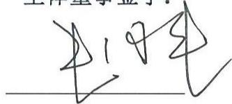

朱国来

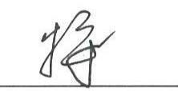

朱浩峰

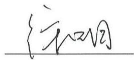

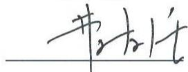

曹友强

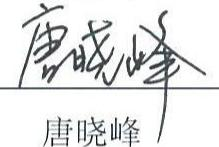

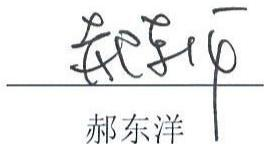

赵 徐

全体审计委员会成员签字：

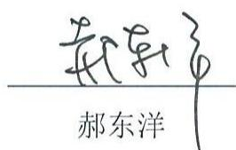

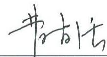

曹友强

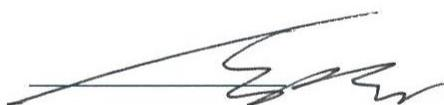

赵徐

全体高级管理人员签字：

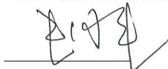

朱国来

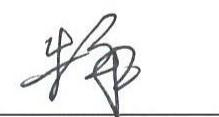

朱浩峰

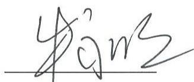

王绍雷

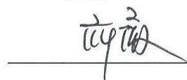

薛薇

固德电材系统 司

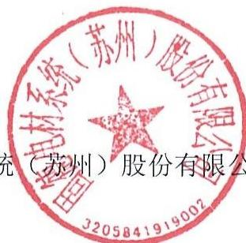

年 月 日

# 第十一节声明

# 一、发行人及其全体董事、审计委员会成员、高级管理人员声明

本公司及全体董事、审计委员会成员、高级管理人员承诺本招股说明书的内容真实、准确、完整，不存在虚假记载、误导性陈述或重大遗漏，按照诚信原则履行承诺，并承担相应的法律责任。

# 全体董事签字：

朱国来 朱浩峰 徐明

曹友强 唐晓峰 郝东洋

全体审计委员会成员签字：

郝东洋 曹友强 赵徐全体高级管理人员签字：

朱国来 朱浩峰 牛永明王绍雷 薛薇

固德电材系统州）股份有限公司3205841919002

# 、发行人控股股东、实际控制人声明

人承诺本招股说明书的内容真实、准确、完整，不存在虚假记载、误导性述或重大遗漏，按照诚信原则履行承诺，并承担相应的法律责任。

公司控股股东、实际控制人：

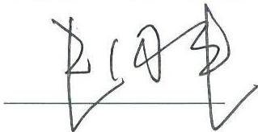  
朱国来

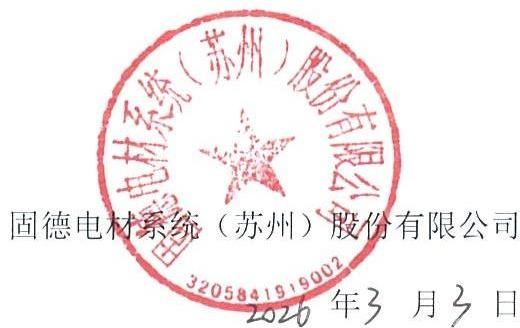

# 三、保荐人（主承销商）声明

本公司已对招股说明书进行核查，确认招股说明书的内容真实、准确、完整，不存在虚假记载、误导性陈述或重大遗漏，并承担相应的法律责任。

项目协办人： 崔改

崔 琪

保荐代表人： 敏琦

宣敏琦

左道虎

法定代表人：

东吴证券股份有限公司

年 月 日

# 四、保荐人董事长、总经理声明

本人已认真阅读固德电材系统（苏州）股份有限公司招股说明书的全部内容，确认招股说明书不存在虚假记载、误导性陈述或重大遗漏，并对招股说明书真实性、准确性、完整性、及时性承担相应的法律责任。

总裁签字： 前缘

董事长签字：

范 力

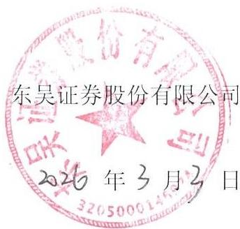

# 五、发行人律师声明

本所及经办律师已阅读招股说明书 确认招股说明书与本所出具的法律意见书无矛盾之处。本所及经办律师对发行人在招股说明书中引用的法律意见书的内容无异议，确认招股说明书不致因上述内容而出现虚假记载、误导性陈述或重大遗漏，并承担相应的法律责任。

律师事务所

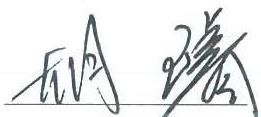  
胡璿

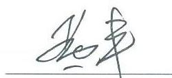

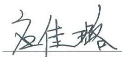  
应佳璐

胡 璿 黄 丰

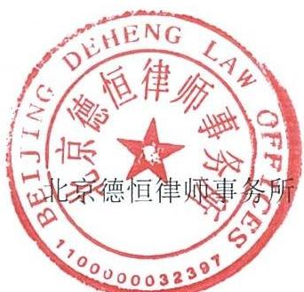

# 六、审计机构声明

本所及签字注册会计师已阅读招股说明书，确认招股说明书与本所出具的审计报告、审阅报告（如有）、盈利预测审核报告（如有）、内部控制审计报告及经本所鉴证的非经常性损益明细表等无矛盾之处。本所及签字注册会计师对发行人在招股说明书中引用的审计报告、审阅报告（如有）、盈利预测审核报告（如有）、内部控制审计报告及经本所鉴证的非经常性损益明细表等的内容无异议，确认招股说明书不致因上述内容而出现虚假记载、误导性陈述或重大遗漏，并承担相应的法律责任。

签字注册会计师签字：

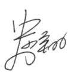

中国注册会计师史少翔110101300019

机构负

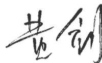

中国注册会计师110100323978

黄剑

会计师事务所负责人签字：

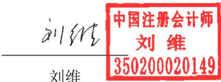

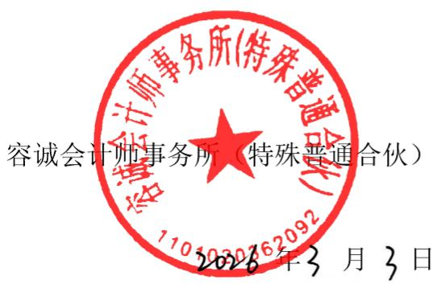

# 七、资产评估复核机构声

本机构及签字资产评估师已阅读招股说明书，确认招股说明书与本机构出具的资产评估报告无矛盾之处。本机构及签字资产评估师对发行人在招股说明书中引用的资产评估报告的内容无异议，确认招股说明书不致因上述内容而出现虚假记载、误导性陈述或重大遗漏，并承担相应的法律责任。

签字资产评估师签字：

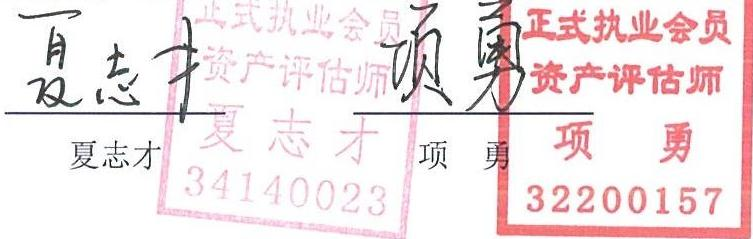

资产评估机构负责人签字：

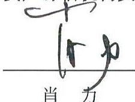

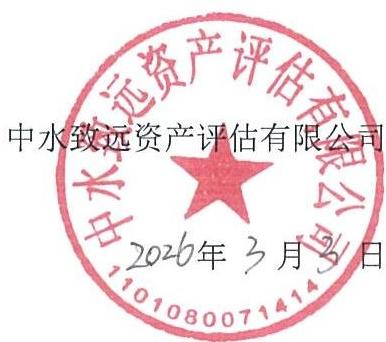

# 八、验资机构声明

本机构及签字注册会计师已阅读招股说明书，确认招股说明书与本机构出具的验资报告无矛盾之处。本机构及签字注册会计师对发行人在招股说明书中引用的验资报告的内容无异议，确认招股说明书不致因上述内容而出现虚假记载、误导性陈述或重大遗漏，并承担相应的法律责任。

签字注册会计师签字：

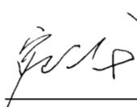  
宛云龙

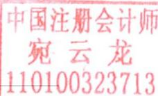

  
黄剑

会计师事务所负责人签字：

  
刘维

# 九、验资复核机构声明

本机构及签字注册会计师已阅读招股说明书，确认招股说明书与本机构出具的验资复核报告无矛盾之处。本机构及签字注册会计师对发行人在招股说明书中引用的验资报告的内容无异议，确认招股说明书不致因上述内容而出现虚假记载、误导性陈述或重大遗漏，并承担相应的法律责任。

# 签字注册会计师签字：

  
宛云龙

验资机构负责人

  
黄剑

中国注册会计师

剑

110100323978

# 会计师事务所负责人签字：

  
刘维

中国注册会计师

刘维

350200020149

# 第十二节 附件

# 一、备查文件目录

（一）发行保荐书；  
（二）上市保荐书；  
（三）法律意见书；  
（四）财务报表及审计报告；  
（五）公司章程（草案）；  
（六）落实投资者关系管理相关规定的安排、股利分配决策程序、股东投票机制建立情况；  
（七）与投资者保护相关的承诺；  
（八）发行人及其他责任主体作出的与发行人本次发行上市相关的其他承诺事项；  
（九）内部控制审计报告；  
（十）经注册会计师鉴证的非经常性损益明细表；  
（十一）股东会、董事会、监事会、独立董事、董事会秘书制度的建立健全及运行情况说明；  
（十二）审计委员会及其他专门委员会的设置情况说明；  
（十三）募集资金具体运用情况；  
（十四）子公司、参股公司简要情况；  
（十五）其他与本次发行有关的重要文件。

# 二、查阅时间和查阅地点

投资者可于本次发行承销期间（除法定节假日以外）每日上午 9:30-11:30，下午14:00-17:00，于下列地点查阅上述文件。

# 1、固德电材系统（苏州）股份有限公司

联系地址：苏州市吴江区汾湖镇汾杨路 88号

电话：0512-63263150

联系人：薛薇

# 2、东吴证券股份有限公司

联系地址：江苏省苏州市工业园区星阳街 5号

电话：0512-62938168

联系人：笪敏琦、左道虎

# 附件一：落实投资者关系管理相关规定的安排、股利分配决策程序、股东投票机制建立情况

# （一）落实投资者关系管理相关规定的安排

# 1、信息披露制度和流程

公司根据《公司法》《证券法》《上市公司信息披露管理办法》《深圳证券交易所股票上市规则》等法律、法规的相关规定，制订了《信息披露管理制度》。

《信息披露管理制度》对公司信息披露的基本原则和一般规定、定期报告、临时报告、监督管理与法律责任、信息披露的审核与程序、保密措施、信息沟通与制度、档案管理作出了明确规定。

# 2、投资者沟通渠道

为进一步规范和加强公司与投资者和潜在投资者之间的信息沟通，促进投资者对公司了解和认识，强化公司与投资者之间的良性互动关系，提升公司形象，完善公司治理结构，形成良好的回报投资者的企业文化，切实保护投资者的利益，公司制定了《投资者关系管理制度》。

公司董事会秘书负责信息披露事务及投资者关系管理工作，证券法务部为信息披露和投资者关系的负责部门。

# 3、未来开展投资者关系的相关规划

公司将严格遵守《公司法》《证券法》《深圳证券交易所股票上市规则》等相关法律法规的要求，不断提高公司投资者关系管理工作的专业性，认真履行信息披露义务，促进公司与投资者之间的良性互动关系，切实维护全体股东利益，特别是中小股东的利益，努力实现公司价值最大化和股东利益最大化。

# （二）股利分配决策程序

公司实行积极、持续、稳定的利润分配政策，公司利润分配应重视对投资者的合理投资回报并兼顾公司当年的实际经营情况和可持续发展；公司董事会、监事会和股东会对利润分配政策的决策和论证应当充分考虑独立董事、监事和股东的意见。

# 1、公司利润分配原则

公司本着重视对股东合理的投资回报，同时兼顾公司的长远利益、全体股东的整体利益及公司的可持续发展的原则，实施持续、稳定的股利分配政策。公司利润分配不得超过累计可分配利润的范围。公司股东会、董事会对利润分配政策的决策和论证过程中应当充分听取和考虑社会公众股股东的意见。

# 2、公司利润分配形式

公司可以采取现金、股票或者现金与股票相结合或法律、法规允许的其他方式分配股利；在符合《公司章程（草案）》及本计划有关实施现金分红的具体条件的情况下，公司优先采用现金分红方式分配股利。

当公司最近一年审计报告为非无保留意见或带与持续经营相关的重大不确定性段落的无保留意见，或资产负债率高于 $70 \%$ ，或经营性现金流为负的，可以不进行利润分配。

# 3、公司利润分配间隔期

在满足利润分配条件并保证公司正常经营和长远发展的前提下，公司原则上每年度进行一次利润分配，公司也可根据盈利状况、现金流以及资金需求计划实施中期利润分配。

# 4、公司利润分配条件和比例

# （1）现金分红分配条件

公司实施现金分红须同时满足以下条件：

$\textcircled{1}$ 公司累计未分配利润及该年度可分配利润为正值，且现金流充裕，实施现金分红不会影响公司后续正常经营和持续发展；  
$\textcircled{2}$ 审计机构对公司该年度财务报告出具标准无保留意见的审计报告；  
$\textcircled{3}$ 公司未来十二个月内无重大资金支出安排（募集资金项目除外）。

公司现金股利政策目标为：在满足现金分红条件、保证公司正常经营和长远发展的前提下，公司最近三年以现金方式累计分配的利润不少于公司最近三年实现的年均可分配利润的 $30 \%$ ，最终比例由董事会根据公司实际情况制定后提交股

东会审议。

公司董事会应当综合考虑所处行业特点、发展阶段、自身经营模式、盈利水平、债务偿还能力以及是否有重大资金支出安排和投资者回报等因素，区分下列情形，并按照《公司章程（草案）》规定的程序，提出差异化的现金分红政策：

$\textcircled{1}$ 公司发展阶段属成熟期且无重大资金支出安排的，进行利润分配时，现金分红在本次利润分配中所占比例最低应达到 $80 \%$ ；  
$\textcircled{2}$ 公司发展阶段属成熟期且有重大资金支出安排的，进行利润分配时，现金分红在本次利润分配中所占比例最低应达到 $40 \%$ ；  
$\textcircled{3}$ 公司发展阶段属成长期且有重大资金支出安排的，进行利润分配时，现金分红在本次利润分配中所占比例最低应达到 $20 \%$ ；

公司发展阶段不易区分但有重大资金支出安排的，可以按照前述第 $\textcircled{3}$ 项规定处理。上述重大资金支出安排是指公司未来 12 个月内拟对外投资、收购资产、购买设备、建筑物或其他重大支出的累计支出达到或超过公司最近一期经审计净资产的 $30 \%$ 。现金分红在本次利润分配中所占比例为现金股利除以现金股利与股票股利之和。

# （2）股票股利分配条件

公司以现金方式分配股利后仍留有可供分配的利润，并且董事会认为发放股票股利有利于公司全体股东整体利益时，在保证公司股本规模和股权结构合理的前提下，基于回报投资者和分享公司价值的考虑，从公司成长性、每股净资产的摊薄、公司股价与公司股本规模的匹配性等因素出发，可以提出股票股利分配方案。

# 5、公司利润分配的决策程序和机制

（1）公司的利润分配方案由总经理拟定后提交董事会审议。审议利润分配方案时，董事会应当认真研究和论证公司现金分红的时机、条件和最低比例、调整的条件及其决策程序要求等事宜，就利润分配方案的合理性进行充分讨论。董事会审议通过利润分配方案后，应提交股东会审议批准。现金利润分配方案应经出席股东会的股东所持表决权的过半数通过，股票股利分配方案应经出席股东会

的股东所持表决权的三分之二以上通过。

（2）独立董事认为现金分红具体方案可能损害公司或者中小股东权益的，有权发表独立意见。董事会对独立董事的意见未采纳或者未完全采纳的，应当在董事会决议中记载独立董事的意见及未采纳的具体理由，并披露。  
（3）股东会审议现金分红具体方案前，应通过多种渠道（包括但不限于开通专线电话、董事会秘书信箱及通过证券交易所投资者关系平台等）主动与股东特别是中小股东进行沟通和交流，充分听取中小股东的意见和诉求，及时答复中小股东关心的问题。公司应当采取有效措施鼓励广大中小投资者以及机构投资者主动参与公司利润分配事项的决策，充分发挥中介机构的专业引导作用。公司股东会审议利润分配方案时，公司应当为股东提供网络投票方式。  
（4）监事会对董事会执行现金分红政策和股东回报规划以及是否履行相应决策程序和信息披露等情况进行监督。监事会发现董事会存在未严格执行现金分红政策和股东回报规划、未严格履行相应决策程序或未能真实、准确、完整进行相应信息披露的，应当发表明确意见，并督促其及时改正。  
（5）公司召开年度股东会审议年度利润分配方案时，可审议批准下一年中期现金分红的条件、比例上限、金额上限等。年度股东会审议的下一年中期分红上限不应超过相应期间归属于公司股东的净利润。董事会根据股东会决议在符合利润分配的条件下制定具体的中期分红方案。

# 6、公司利润分配政策调整的决策程序和机制

（1）因国家法律法规和证券监管部门对公司的分红政策颁布新的规定，或遇到战争、自然灾害等不可抗力或者公司外部经营环境、自身经营状况发生重大变化而需调整利润分配政策的，公司可对利润分配政策进行调整，调整后的利润分配政策不得违反相关法律法规、规范性文件的规定。  
（2）公司应当严格执行《公司章程（草案）》确定的现金分红政策以及股东会审议批准的现金分红方案。确有必要对《公司章程（草案）》确定的现金分红政策进行调整或者变更的，应当以股东权益保护为出发点，并满足《公司章程（草案）》规定的条件，经过详细论证后在股东会提案中说明原因，履行相应的决策程序，并经出席股东会的股东所持表决权的三分之二以上通过。

（3）股东会审议利润分配政策变更事项前，应通过多种渠道（包括但不限于开通专线电话、董事会秘书信箱及通过证券交易所投资者关系平台等）主动与股东特别是中小股东进行沟通和交流，充分听取中小股东的意见和诉求，及时答复中小股东关心的问题。公司股东会审议利润分配政策变更事项时，公司提供网络投票方式为社会公众股东参加股东会提供便利。

# 7、公司利润分配的信息披露

公司应当在年度报告中详细披露现金分红政策的制定及执行情况，并对下列事项进行专项说明：

（1）是否符合公司章程的规定或者股东会决议的要求；  
（2）分红标准和比例是否明确和清晰；  
（3）相关的决策程序和机制是否完备；  
（4）公司未进行现金分红的，应当披露具体原因，以及下一步为增强投资者回报水平拟采取的举措等；  
（5）中小股东是否有充分表达意见和诉求的机会，中小股东的合法权益是否得到了充分保护等。

对现金分红政策进行调整或变更的，还应对调整或变更的条件及程序是否合规和透明等进行详细说明。

# （三）发行人股东投票机制的建立情况

根据发行人《公司章程》《股东会议事规则》等制度，发行人已建立了完善的股东投票机制，保障投资者尤其是中小投资者参与公司重大决策等事项的权利。

# 1、累积投票制

根据公司《股东会议事规则》《股东会累积投票制实施细则》的规定，公司股东会在选举董事、股东代表监事时，可以实行累积投票制。前款所称累积投票制是指股东会选举董事或者股东代表监事时，每一股份拥有与应选董事或者股东代表监事人数相同的表决权，股东拥有的表决权可以集中使用。累积投票制的具体操作程序如下：

（1）股东会工作人员发放选举董事或监事选票，投票股东必须在选票上注明其所持有的有表决权股份数，并在其选举的每名董事或监事后标出其所使用的票数；  
（2）每位股东所投的董事或监事选票数不得超过其拥有的董事或监事选票数的最高限额，所选的候选董事或监事人数不能超过应选董事或监事人数；  
（3）若某位股东投选的董事或监事选票数超过该股东所拥有的董事或监事最高选票数，该股东该轮所有选票无效；  
（4）若某位股东所投的候选董事或监事人数超过应选董事或监事人数，该股东该轮所有选票无效；  
（5）如果选票上该股东使用的选票总数小于或等于其合法拥有的有效选票数，该选票有效，差额部分视为弃权；  
（6）表决完毕后，由股东会监票人清点票数，并公布每个董事或监事候选人的得票情况，依照董事或监事得票多少，决定董事或监事人选。

# 2、中小投资者单独计票制

股东会审议影响中小投资者利益的重大事项时，对中小投资者表决应当单独计票。单独计票结果应当及时公开披露。

# 3、网络投票制

公司召开股东会的地点为：公司住所地或公司董事会决定的其他地点。股东会将设置会场，以现场会议形式召开。公司还应当向股东提供网络投票或其他方式为股东参加股东会提供便利。股东通过上述方式参加股东会的，视为出席。

# 4、征集投票权

公司董事会、独立董事、持有百分之一以上有表决权股份的股东或者依照法律、行政法规或者中国证监会的规定设立的投资者保护机构可以公开征集股东投票权。征集股东投票权应当向被征集人充分披露具体投票意向等信息。禁止以有偿或变相有偿的方式征集股东投票权。除法定条件外，公司不得对征集投票权提出最低持股比例限制。

# 附件二：与投资者保护相关的承诺

# （一）本次发行前股东所持股份的股份锁定、持股及减持意向的承诺

# 1、控股股东、实际控制人、董事、高级管理人员朱国来承诺

朱国来作为公司控股股东、实际控制人、董事、高级管理人员，就股份锁定、持股意向及股份减持有关事项承诺如下：

“（1）自固德电材首次公开发行股票并在深圳证券交易所上市之日起 36 个月内，不转让或者委托他人管理本人直接或者间接持有的固德电材首次公开发行股票前已发行的股份（以下简称“上市前股份”），也不由固德电材回购本人直接或者间接持有的固德电材上市前股份。  
（2）在固德电材上市后 6个月内，如固德电材股票连续 20个交易日的收盘价均低于发行价（发行价指公司首次公开发行股票的发行价格，如公司因派发现金红利、送股、转增股本、配股等原因进行除权、除息的，发行价格须按照中国证券监督管理委员会（以下简称“中国证监会”）、深圳证券交易所的有关规定作相应调整，下同），或者上市后 6个月期末（如该日不是交易日，则为该日后第一个交易日）收盘价低于发行价，本人直接或间接持有的固德电材上市前股份的上述锁定期自动延长 6个月。  
（3）在上述锁定期届满后 2 年内本人减持本人持有的固德电材上市前股份的，减持价格不低于固德电材首次公开发行股票的发行价。减持方式符合届时适用的相关法律法规及深圳证券交易所规则。如本人计划通过证券交易所集中竞价交易或者大宗交易方式减持固德电材股份的，在首次卖出前 15 个交易日向证券交易所报告并披露减持计划。若在本人减持股份前，固德电材已发生派息、送股、资本公积转增股本等除权除息事项，则本人的减持价格应不低于经相应调整后的发行价。  
（4）前述锁定期满后，在本人担任固德电材的董事、高级管理人员期间，每年转让的股份不超过本人直接或间接所持有固德电材股份总数的 $2 5 \%$ ；若本人在任期届满前离职的，在本人任职时确定的任期内和任期届满后 6 个月内，本人每年转让的股份不超过本人直接或间接所持有的固德电材股份总数的 $2 5 \%$ ；离职后半年内，不转让或委托他人管理本人直接或间接所持有的固德电材股份。

（5）如《中华人民共和国公司法》《中华人民共和国证券法》、中国证监会和深圳证券交易所对本人持有的固德电材股份之锁定及减持另有要求的，本人将按此等要求执行。  
（6）本人将忠实履行上述承诺，保证不因职务变更、离职等原因，而放弃履行承诺。若不履行上述承诺所赋予的义务和责任，本人将承担固德电材、固德电材其他股东或利益相关方因此所受到的任何损失，同时违规减持股票的收益将归公司所有。”

# 2、控股股东、实际控制人的一致行动人承诺

朱英作为固德电材的股东及固德电材控股股东、实际控制人的一致行动人，苏州国浩作为固德电材持股 $5 \%$ 以上股东及控股股东、实际控制人控制的其他企业，苏州虢丰作为固德电材的股东及控股股东、实际控制人控制的其他企业，就股份锁定、持股意向及股份减持有关事项承诺如下：

“（1）自固德电材首次公开发行股票并在深圳证券交易所上市之日起 36个月内，不转让或者委托他人管理本人/本企业直接或者间接持有的固德电材首次公开发行股票前已发行的股份（以下简称“上市前股份”），也不由固德电材回购本人/本企业直接或者间接持有的固德电材上市前股份。  
（2）在固德电材上市后 6个月内，如固德电材股票连续 20个交易日的收盘价均低于发行价（发行价指公司首次公开发行股票的发行价格，如公司因派发现金红利、送股、转增股本、配股等原因进行除权、除息的，发行价格须按照中国证券监督管理委员会（以下简称“中国证监会”）、深圳证券交易所的有关规定作相应调整，下同），或者上市后 6个月期末（如该日不是交易日，则为该日后第一个交易日）收盘价低于发行价，本人/本企业直接或间接持有的固德电材上市前股份的上述锁定期自动延长 6个月。  
（3）在上述锁定期届满后 2年内本人/本企业减持本人/本企业持有的固德电材上市前股份的，减持价格不低于固德电材首次公开发行股票的发行价。减持方式符合届时适用的相关法律法规及深圳证券交易所规则。如本人/本企业计划通过证券交易所集中竞价交易或者大宗交易方式减持固德电材股份的，在首次卖出前15个交易日向证券交易所报告并披露减持计划。若在本人/本企业减持股份前，

固德电材已发生派息、送股、资本公积转增股本等除权除息事项，则本人/本企业的减持价格应不低于经相应调整后的发行价。

（4）如《中华人民共和国公司法》《中华人民共和国证券法》、中国证监会和深圳证券交易所对本人/本企业持有的固德电材股份之锁定及减持另有要求的，本人/本企业将按此等要求执行。  
（5）本人/本企业将忠实履行上述承诺，并承担相应的法律责任。若不履行上述承诺所赋予的义务和责任，本人/本企业将承担固德电材、固德电材其他股东或利益相关方因此所受到的任何损失，同时违规减持股票的收益将归公司所有。”

# 3、控股股东、实际控制人的亲属承诺

朱旻作为固德电材的股东及固德电材控股股东、实际控制人的亲属，就股份锁定、持股及股份减持意向有关事项承诺如下：

“（1）自固德电材首次公开发行股票并在深圳证券交易所上市之日起 36个月内，不转让或者委托他人管理本人直接或者间接持有的固德电材首次公开发行股票前已发行的股份（以下简称“上市前股份”），也不由固德电材回购本人直接或者间接持有的固德电材上市前股份。  
（2）在上述锁定期届满后 2 年内本人减持本人持有的固德电材上市前股份的，减持价格不低于固德电材首次公开发行股票的发行价。减持方式符合届时适用的相关法律法规及深圳证券交易所规则。若在本人减持股份前，固德电材已发生派息、送股、资本公积转增股本等除权除息事项，则本人的减持价格应不低于经相应调整后的发行价。  
（3）如《中华人民共和国公司法》《中华人民共和国证券法》、中国证监会和深圳证券交易所对本人持有的固德电材股份之锁定及减持另有要求的，本人将按此等要求执行。  
（4）本人将忠实履行上述承诺。若不履行上述承诺所赋予的义务和责任，本人将承担固德电材、固德电材其他股东或利益相关方因此所受到的任何损失，同时违规减持股票的收益将归公司所有。”

# 4、持股 $5 \%$ 以上股东、董事、高级管理人员朱浩峰承诺

朱浩峰作为固德电材持股 $5 \%$ 以上股东及董事、高级管理人员，就股份锁定、持股意向及股份减持有关事项承诺如下：

“（1）自固德电材首次公开发行股票并在深圳证券交易所上市之日起 12个月内，不转让或者委托他人管理本人直接或者间接持有的固德电材首次公开发行股票前已发行的股份（以下简称“上市前股份”），也不由固德电材回购本人直接或者间接持有的固德电材上市前股份。  
（2）在固德电材上市后 6个月内，如固德电材股票连续 20个交易日的收盘价均低于发行价（发行价指公司首次公开发行股票的发行价格，如公司因派发现金红利、送股、转增股本、配股等原因进行除权、除息的，发行价格须按照中国证券监督管理委员会（以下简称“中国证监会”）、深圳证券交易所的有关规定作相应调整，下同），或者上市后 6个月期末（如该日不是交易日，则为该日后第一个交易日）收盘价低于发行价，本人直接或间接持有的固德电材上市前股份的上述锁定期自动延长 6个月。  
（3）本人作为固德电材的董事/高级管理人员，在上述锁定期届满后 2年内本人减持本人持有的固德电材上市前股份的，减持价格不低于固德电材首次公开发行股票的发行价。如本人计划通过证券交易所集中竞价交易或者大宗交易方式转让固德电材股份的，在首次卖出前 15 个交易日向证券交易所报告并披露减持计划。  
（4）前述锁定期满后，在本人担任固德电材的董事/高级管理人员期间，每年转让的股份不超过本人直接或间接所持有固德电材股份总数的 $2 5 \%$ ；若本人在任期届满前离职的，在本人任职时确定的任期内和任期届满后 6个月内，本人每年转让的股份不超过本人直接或间接所持有的固德电材股份总数的 $2 5 \%$ ；离职后半年内，不转让或委托他人管理本人直接或间接所持有的固德电材股份。  
（5）上述承诺均为本人的真实意思表示，本人拟减持所持有的固德电材股份时，应符合法律法规和规范性文件的规定，且不违背本人在固德电材首次公开发行股票时已做出的公开承诺。  
（6）如《中华人民共和国公司法》《中华人民共和国证券法》、中国证监

会和深圳证券交易所对本人持有的固德电材股份锁定另有要求的，本人将按此等要求执行。

（7）本人将忠实履行上述承诺，保证不因职务变更、离职等原因，而放弃履行承诺。若不履行上述承诺所赋予的义务和责任，本人将承担固德电材、固德电材其他股东或利益相关方因此所受到的任何损失，同时违规减持股票的收益将归公司所有。”

# 5、持股 $5 \%$ 以上股东的一致行动人承诺

钱郁萍作为固德电材的股东及固德电材持股 $5 \%$ 以上股东朱浩峰的一致行动人，就股份锁定、持股意向及股份减持有关事项承诺如下：

“（1）自固德电材首次公开发行股票并在深圳证券交易所上市之日起 12个月内，不转让或者委托他人管理本人直接或者间接持有的固德电材首次公开发行股票前已发行的股份（以下简称“上市前股份”），也不由固德电材回购本人直接或者间接持有的固德电材上市前股份。  
（2）在上述锁定期届满后 2 年内本人减持本人持有的固德电材上市前股份的，减持价格不低于固德电材首次公开发行股票的发行价。如本人计划通过证券交易所集中竞价交易或者大宗交易方式转让固德电材股份的，在首次卖出前 15个交易日向证券交易所报告并披露减持计划。  
（3）上述承诺均为本人的真实意思表示，本人保证减持时将遵守法律法规以及中国证监会、深圳证券交易所的相关规定，规范诚信履行股东的义务。如相关法律、行政法规、中国证券监督管理委员会和深圳证券交易所对本人持有公司的股份的转让、减持另有更严格要求的，则本人将按相关要求执行。  
（4）本人将忠实履行上述承诺，若不履行上述承诺所赋予的义务和责任，本人将承担固德电材、固德电材其他股东或利益相关方因此所受到的任何损失，同时违规减持股票的收益将归公司所有。”

# 6、合并持股 $5 \%$ 以上股东及申报前 12 个月内新增股东承诺

龙驹埭溪作为合并持股 $5 \%$ 以上股东及申报前 12个月内新增股东，就股份锁定事项承诺如下：

“（1）自本企业取得公司股份之日起 36 个月内及公司股票上市之日起 12个月内（以上述期限孰长者作为锁定期），本企业不转让或者委托他人管理本企业直接或间接持有的固德电材首次公开发行股票前已发行的股份（以下简称“上市前股份”），也不由公司回购该部分股份。  
（2）在上述锁定期届满后 2 年内本企业减持本企业持有的固德电材上市前股份的，减持价格不低于固德电材首次公开发行股票的发行价。减持方式符合届时适用的相关法律法规及深圳证券交易所规则。如本企业计划通过证券交易所集中竞价交易或者大宗交易方式减持固德电材股份的，在首次卖出前 15 个交易日向证券交易所报告并披露减持计划。若在本企业减持股份前，固德电材已发生派息、送股、资本公积转增股本等除权除息事项，则本企业的减持价格应不低于经相应调整后的发行价。  
（3）上述承诺均为本企业的真实意思表示，本企业保证减持时将遵守法律法规以及中国证监会、深圳证券交易所的相关规定，规范诚信履行股东的义务。如相关法律、行政法规、中国证券监督管理委员会和深圳证券交易所对本企业持有公司的股份的转让、减持另有更严格要求的，则本企业将按相关要求执行。  
（4）本企业将忠实履行上述承诺，若不履行上述承诺所赋予的义务和责任，本企业将承担固德电材、固德电材其他股东或利益相关方因此所受到的任何损失，同时违规减持股票的收益将归公司所有。”

# 7、合并持股 $5 \%$ 以上股东承诺

龙驹创合、龙驹创进作为合并持股 $5 \%$ 以上股东，就股份锁定事项承诺如下：

“（1）自公司首次公开发行股票并上市之日起 12个月内，不转让或者委托他人管理本企业持有的固德电材首次公开发行股票前已发行的股份（以下简称“上市前股份”），也不由公司回购本企业持有的上述股份。  
（2）在上述锁定期届满后 2 年内本企业减持本企业持有的固德电材上市前股份的，减持价格不低于固德电材首次公开发行股票的发行价。减持方式符合届时适用的相关法律法规及深圳证券交易所规则。如本企业计划通过证券交易所集中竞价交易或者大宗交易方式减持固德电材股份的，在首次卖出前 15 个交易日向证券交易所报告并披露减持计划。若在本企业减持股份前，固德电材已发生派

息、送股、资本公积转增股本等除权除息事项，则本企业的减持价格应不低于经相应调整后的发行价。

（3）如《中华人民共和国公司法》《中华人民共和国证券法》、中国证券监督管理委员会和深圳证券交易所对本企业持有的固德电材股份锁定另有要求的，本企业将按此等要求执行。  
（4）本企业将忠实履行上述承诺，并承担相应的法律责任，若不履行上述承诺所赋予的义务和责任，本企业将承担固德电材、固德电材其他股东或利益相关方因此所受到的任何损失，同时违规减持股票的收益将归公司所有。”

# 8、申报前 12个月内新增股东承诺

乾融青润、君尚合璞作为固德电材申报前 12 个月内新增股东，就股份锁定事项承诺如下：

“（1）自本企业取得公司股份之日起 36 个月内及公司股票上市之日起 12个月内（以上述期限孰长者作为锁定期），本企业不转让或者委托他人管理本企业直接或间接持有的固德电材首次公开发行股票前已发行的股份（以下简称“上市前股份”），也不由公司回购该部分股份。  
（2）上述承诺均为本企业的真实意思表示，本企业保证减持时将遵守法律法规以及中国证监会、深圳证券交易所的相关规定，规范诚信履行股东的义务。如相关法律、行政法规、中国证券监督管理委员会和深圳证券交易所对本企业持有公司的股份的转让、减持另有更严格要求的，则本企业将按相关要求执行。  
（3）本企业将忠实履行上述承诺，若不履行上述承诺所赋予的义务和责任，本企业将承担固德电材、固德电材其他股东或利益相关方因此所受到的任何损失，同时违规减持股票的收益将归公司所有。”

# 9、其他机构股东、自然人股东承诺

其他机构股东吴江创投、临沪创投、乾融泰润、君尚合臻、安华基金和其他自然人股东陈强、张爱娟、张正军、郑黎梅、钱国祥、秦小华、周喻、田彦慈、陈跃峰、程小弟、杨站盟、王晓东、李飞、陆书建、殷成龙、朱丹、王颖颜、周瑜萍、吴雄、薛继良、曾棱就股份锁定有关事项承诺如下：

“（1）自公司首次公开发行股票并上市之日起 12 个月内，不转让或者委托他人管理本人/本企业持有的固德电材首次公开发行股票前已发行的股份（以下简称“上市前股份”），也不由公司回购本人/本企业持有的上述股份。  
（2）如《中华人民共和国公司法》《中华人民共和国证券法》、中国证券监督管理委员会和深圳证券交易所对本人/本企业持有的固德电材股份锁定另有要求的，本人/本企业将按此等要求执行。  
（3）本人/本企业将忠实履行上述承诺，并承担相应的法律责任，若不履行上述承诺所赋予的义务和责任，本人/本企业将承担固德电材、固德电材其他股东或利益相关方因此所受到的任何损失，同时违规减持股票的收益将归公司所有。”

# 10、股东、董事、高级管理人员承诺

王默愚（原高级管理人员）、牛永明、王绍雷、薛薇、徐明作为固德电材的间接股东及董事/高级管理人员承诺如下：

“（1）自固德电材首次公开发行股票并在深圳证券交易所上市之日起 12个月内，不转让或者委托他人管理本人直接或者间接持有的固德电材首次公开发行股票前已发行的股份（以下简称“上市前股份”），也不由固德电材回购本人直接或者间接持有的固德电材上市前股份。  
（2）在固德电材上市后 6个月内，如固德电材股票连续 20个交易日的收盘价均低于发行价（发行价指公司首次公开发行股票的发行价格，如公司因派发现金红利、送股、转增股本、配股等原因进行除权、除息的，发行价格须按照中国证券监督管理委员会（以下简称“中国证监会”）、深圳证券交易所的有关规定作相应调整，下同），或者上市后 6个月期末（如该日不是交易日，则为该日后第一个交易日）收盘价低于发行价，本人直接或间接持有的固德电材上市前股份的上述锁定期自动延长 6个月。  
（3）本人作为固德电材的董事/高级管理人员，在上述锁定期届满后 2年内本人减持本人持有的固德电材上市前股份的，减持价格不低于固德电材首次公开发行股票的发行价。如本人计划通过证券交易所集中竞价交易或者大宗交易方式转让固德电材股份的，在首次卖出前 15 个交易日向证券交易所报告并披露减持

计划。

（4）前述锁定期满后，在本人担任固德电材的董事/高级管理人员期间，每年转让的股份不超过本人直接或间接所持有固德电材股份总数的 $2 5 \%$ ；若本人在任期届满前离职的，在本人任职时确定的任期内和任期届满后 6个月内，本人每年转让的股份不超过本人直接或间接所持有的固德电材股份总数的 $2 5 \%$ ；离职后半年内，不转让或委托他人管理本人直接或间接所持有的固德电材股份。  
（5）上述承诺均为本人的真实意思表示，本人拟减持所持有的固德电材股份时，应符合法律法规和规范性文件的规定，且不违背本人在固德电材首次公开发行股票时已做出的公开承诺。  
（6）如《中华人民共和国公司法》《中华人民共和国证券法》、中国证监会和深圳证券交易所对本人持有的固德电材股份锁定另有要求的，本人将按此等要求执行。  
（7）本人将忠实履行上述承诺，保证不因职务变更、离职等原因，而放弃履行承诺。若不履行上述承诺所赋予的义务和责任，本人将承担固德电材、固德电材其他股东或利益相关方因此所受到的任何损失，同时违规减持股票的收益将归公司所有。”

# 11、股东、取消监事会前在任监事承诺

徐娟华作为固德电材的间接股东及取消监事会前在任监事承诺如下：

“（1）自固德电材首次公开发行股票并在深圳证券交易所上市之日起 12 个月内，不转让或者委托他人管理本人直接或者间接持有的固德电材首次公开发行股票前已发行的股份（以下简称“上市前股份”），也不由固德电材回购本人直接或者间接持有的固德电材上市前股份。  
（2）前述锁定期满后，在本人担任固德电材的监事期间，每年转让的股份不超过本人直接或间接所持有固德电材股份总数的 $2 5 \%$ ；若本人在任期届满前离职的，在本人任职时确定的任期内和任期届满后 6个月内，本人每年转让的股份不超过本人直接或间接所持有的固德电材股份总数的 $2 5 \%$ ；离职后半年内，不转让或委托他人管理本人直接或间接所持有的固德电材股份。如本人计划通过证券交易所集中竞价交易或者大宗交易方式转让固德电材股份的，在首次卖出前 15

个交易日向证券交易所报告并披露减持计划。

（3）上述承诺均为本人的真实意思表示，本人拟减持所持有的固德电材股份时，应符合法律法规和规范性文件的规定，且不违背本人在固德电材首次公开发行股票时已做出的公开承诺。  
（4）如《中华人民共和国公司法》《中华人民共和国证券法》、中国证券监督管理委员会和深圳证券交易所对本人持有的固德电材股份之锁定及减持另有要求的，本人将按此等要求执行。  
（5）本人将忠实履行上述承诺，并承担相应的法律责任，若不履行上述承诺所赋予的义务和责任，本人将承担固德电材、固德电材其他股东或利益相关方因此所受到的任何损失，同时违规减持股票的收益将归公司所有。”

# （二）稳定股价的措施和承诺

# 1、发行人承诺

发行人固德电材就首次公开发行股票并上市后三年内稳定公司股价的有关事项承诺如下：

“本公司将严格依照公司股东会审议通过的《固德电材系统（苏州）股份有限公司首次公开发行股票并上市后三年内稳定股价预案》中规定的相关程序启动股价稳定措施，若未履行上述承诺采取股价稳定措施，本公司承诺：（1）在股东会及中国证监会指定报刊上公开说明未履行的具体原因并向股东和社会公众投资者道歉；（2）向投资者提出补充承诺或替代承诺，在本公司股东会审议通过后实施补充承诺或替代承诺，以尽可能保护投资者的权益；（3）因违反承诺给投资者造成损失的，将依法对投资者进行赔偿。”

# 2、控股股东、实际控制人承诺

控股股东、实际控制人朱国来承诺如下：

“本人将严格依照公司股东会审议通过的《固德电材系统（苏州）股份有限公司首次公开发行股票并上市后三年内稳定股价预案》中规定的相关程序启动股价稳定措施，若未履行上述承诺采取股价稳定措施，本人承诺：（1）在股东会及中国证监会指定报刊上公开说明未履行的具体原因并向股东和社会公众投资

者道歉；（2）向投资者提出补充承诺或替代承诺，在公司股东会审议通过后实施补充承诺或替代承诺，以尽可能保护投资者的权益；（3）因违反承诺给投资者造成损失的，将依法对投资者进行赔偿。”

# 3、董事（除独立董事）、高级管理人员的承诺

董事（不含独立董事）、高级管理人员朱国来、朱浩峰、薛薇（原董事）、徐明、曹友强、王默愚（原高级管理人员）、王绍雷、牛永明承诺如下：

“本人将严格依照公司股东会审议通过的《固德电材系统（苏州）股份有限公司首次公开发行股票并上市后三年内稳定股价预案》中规定的相关程序启动股价稳定措施，若未履行上述承诺采取股价稳定措施，本人承诺：（1）在股东会及中国证监会指定报刊上公开说明未履行的具体原因并向股东和社会公众投资者道歉；（2）向投资者提出补充承诺或替代承诺，在公司股东会审议通过后实施补充承诺或替代承诺，以尽可能保护投资者的权益；（3）因违反承诺给投资者造成损失的，将依法对投资者进行赔偿。”

# （三）关于欺诈发行上市的股份回购和股份买回承诺

# 1、发行人承诺

发行人固德电材就欺诈发行上市的股份回购和股份买回事项承诺如下：

“（1）公司本次发行上市不存在任何欺诈发行的情形，本次发行上市的招股说明书等证券发行文件不存在构成重大、实质影响的虚假记载、误导性陈述或重大遗漏。  
（2）如本次发行上市的招股说明书等证券发行文件存在对判断公司是否符合法律规定的发行条件构成重大、实质影响的虚假记载、误导性陈述或者重大遗漏需回购股份情形，被监管机构认定为构成欺诈发行的，公司将在监管机构认定之日起5个工作日内启动股份回购程序，根据董事会及股东会审议批准的相关议案，购回公司本次公开发行的全部新股。”

# 2、控股股东、实际控制人承诺

控股股东、实际控制人朱国来承诺如下：

“（1）公司本次发行上市不存在任何欺诈发行的情形，本次发行上市的招

股说明书等证券发行文件不存在构成重大、实质影响的虚假记载、误导性陈述或重大遗漏。

（2）如本次发行上市的招股说明书等证券发行文件存在对判断公司是否符合法律规定的发行条件构成重大、实质影响的虚假记载、误导性陈述或者重大遗漏需回购股份情形，被监管机构认定为构成欺诈发行的，本人将督促公司在监管机构认定之日起5 个工作日内启动股份买回程序，根据董事会及股东会审议批准的相关议案，购回本次发行上市的全部新股。”

# （四）填补被摊薄即期回报的措施和承诺

# 1、发行人承诺

发行人固德电材关于填补被摊薄即期回报的措施承诺如下：

“（1）持续提升公司整体实力，扩大公司业务规模

公司本次发行上市完成后，总资产将得到进一步提升，抗风险能力和综合实力明显增强。公司将借助资本市场和良好的行业发展机遇，不断拓展公司主营业务规模，充分发挥公司在新能源汽车热失控防护方案和零件及清洁能源发电和特高压输配电绝缘材料业务市场的地位，推动公司持续、健康、稳定的发展，从而稳步提升公司业绩，为股东带来良好回报。

（2）保证募集资金规范、有效使用，积极稳妥地实施募集资金投资项目

为规范募集资金的管理和使用，确保本次发行上市募集资金专项用于募集资金投资项目，公司已经根据《中华人民共和国公司法》《中华人民共和国证券法》等法律法规和规范性文件的要求，结合公司实际情况，制定了《固德电材系统（苏州）股份有限公司募集资金管理制度》（以下简称“《募集资金管理制度》”），明确规定公司对募集资金采用专户专储、专款专用的制度，以便于募集资金的管理和使用以及对其使用情况加以监督。

本次发行上市募集资金到账后，公司将开设募集资金专项账户，并与开户行、保荐人签订募集资金三方监管协议，确保募集资金专款专用。公司将根据《募集资金管理制度》及其他相关规定的要求，加强募集资金管理，在进行募集资金项目投资时，履行资金支出审批手续，明确各控制环节的相关责任，按项目计划申

请、审批、使用募集资金，并对使用情况进行内部考核与审计，定期检查募集资金使用情况，保证募集资金规范、有效使用，合理防范募集资金使用风险。

本次发行上市募集资金投资项目均围绕公司主营业务展开，符合公司的发展战略，其实施有利于巩固和提升公司的市场地位和竞争能力，提升公司的生产能力和盈利能力，有利于公司可持续发展。公司已充分做好了募投项目前期的可行性研究工作，对募投项目所涉及行业进行了深入的了解和分析，结合行业趋势、市场容量、技术水平及公司自身等基本情况，最终拟定了项目规划。公司将积极稳妥地推进募投项目实施，并加大市场开拓力度，使募集资金投资项目早日投产并实现预期效益。

# （3）全面提升公司管理水平，提高资金使用效率

公司将进一步完善企业内部控制，优化资金及预算管理并强化预算执行监督，设计更合理的资金使用方案，控制公司的各项费用支出，提升资金运营效率及资金回报，进一步提升公司管理水平，全面有效地控制公司经营和管控风险，提升日常运营效率和盈利能力。此外，公司将完善薪酬和激励机制，引进市场优秀人才，并最大限度地激发员工积极性，挖掘公司员工的创造力和潜在动力。

# （4）优化投资者回报机制，严格执行利润分配政策

为完善和健全公司科学、持续、稳定、透明的利润分配政策和监督机制，积极有效地回报投资者，公司制定了上市后适用的《固德电材系统（苏州）股份有限公司章程（草案）》和《固德电材系统（苏州）股份有限公司首次公开发行股票并上市后三年股东分红回报规划》，进一步明确了公司利润分配的决策程序、机制和具体分红比例，既重视对社会公众股东的合理投资回报，同时兼顾公司的长远利益、全体股东的整体利益和公司的可持续发展，建立对投资者持续、稳定、科学的回报规划与机制，保障利润分配政策的持续性和稳定性。公司将严格执行利润分配政策，在符合利润分配条件的情况下，积极推动对股东的利润分配，努力提升对股东的回报。

# （5）其他合理可行的措施

公司未来将根据中国证监会、证券交易所等监管机构出台的具体细则及要求，并参照上市公司较为通行的惯例，进一步继续补充、修订、完善公司投资者权益

保护的各项制度并予以实施，持续完善填补被摊薄即期回报的各项措施。”

# 2、控股股东、实际控制人承诺

朱国来作为固德电材的控股股东及实际控制人承诺如下：

“（1）不越权干预公司经营管理活动，不侵占公司利益。

（2）本人担任公司董事或高级管理人员的，同时遵守董事及高级管理人员关于填补被摊薄即期回报的承诺。  
（3）本承诺函出具后至公司本次发行上市实施完毕前，若中国证监会出台关于填补回报措施及其承诺的新规定，且本人上述承诺不能满足中国证监会该等规定时，本人承诺届时将按照中国证监会的最新规定出具补充承诺。  
（4）本人承诺严格履行所作出的上述承诺事项，确保公司填补回报措施能够得到切实履行。如果本人违反所作出的承诺或拒不履行承诺，本人将按照相关规定履行解释、道歉等相应义务，自愿接受中国证监会、深圳证券交易所等证券监管机构依法作出的监管措施；给公司或者股东造成损失的，本人愿意依法承担相应补偿责任。”

# 3、董事、高级管理人员承诺

朱国来、朱浩峰、薛薇（原董事）、徐明、曹友强、唐晓峰、郝东洋、赵徐、王默愚（原高级管理人员）、王绍雷、牛永明作为公司董事、高级管理人员承诺如下：

“（1）忠实、勤勉地履行职责，维护公司和全体股东的合法利益。  
（2）本人不无偿或以不公平条件向其他单位或者个人输送利益，也不采用其他方式损害公司利益。  
（3）对本人的职务消费行为进行约束。  
（4）不动用公司资产从事与其履行职责无关的投资、消费活动。  
（5）将促使公司董事会或薪酬与考核委员会制定的薪酬制度与公司填补回报措施的执行情况相挂钩。  
（6）若公司后续制定股权激励政策，本人将尽职促使拟公布的公司股权激

励的行权条件与公司填补回报措施的执行情况相挂钩。

（7）本承诺函出具后至公司本次发行上市实施完毕前，若中国证监会出台关于填补回报措施及其承诺的新规定，届时按照新规定执行。  
（8）本人承诺严格履行所作出的上述承诺事项，确保公司填补回报措施能够得到切实履行。如果本人违反所作出的承诺或拒不履行承诺，本人将按照相关规定履行解释、道歉等相应义务，自愿接受中国证监会、深圳证券交易所等证券监管机构依法作出的监管措施；给公司或者股东造成损失的，本人愿意依法承担相应补偿责任。”

# （五）利润分配政策的承诺

发行人固德电材承诺如下：

“（1）本公司已制定适用于本公司实际情形的上市后利润分配政策，并在上市后适用的《固德电材系统（苏州）股份有限公司章程（草案）》（以下简称“《公司章程（草案）》”）以及《固德电材系统（苏州）股份有限公司首次公开发行股票并上市后三年内股东分红回报规划》（以下简称“《分红回报规划》”）中予以体现。本公司在上市后将严格遵守并执行《公司章程（草案）》以及《分红回报规划》规定的利润分配政策，注重对股东的合理回报并兼顾本公司的可持续发展，保持本公司利润分配政策的连续性和稳定性。  
（2）本公司如违反前述承诺，将及时公告违反的事实及原因，并向本公司股东和社会公众投资者道歉（因不可抗力或其他非归属于本公司的原因除外）。同时，本公司将向投资者提出补充承诺或替代承诺，以尽可能保护投资者的利益，并在股东会审议通过后实施补充承诺或替代承诺。”

# （六）依法承担赔偿责任的承诺

# 1、发行人承诺

发行人固德电材承诺如下：

“（1）本次发行上市的招股说明书及其他信息披露资料不存在虚假记载、误导性陈述或者重大遗漏，本公司对其真实性、准确性、完整性承担相应的法律责任。

（2）若本公司向深圳证券交易所提交的本次发行上市的招股说明书存在虚假记载、误导性陈述或重大遗漏，对判断公司是否符合法律法规规定的发行条件构成重大、实质影响的，本公司将在该等违法事实被证券监管部门作出认定或处罚决定后，依法回购首次公开发行的全部新股，回购价格为发行价格加上同期银行存款利息（若公司股票有派息、送股、资本公积金转增股本等除权、除息事项的，发行价格将相应进行除权、除息调整）。  
（3）若本次发行上市的招股说明书及其他信息披露资料被中国证监会、证券交易所或司法机关认定为有虚假记载、误导性陈述或者重大遗漏，致使投资者在证券发行和交易中遭受损失的，本公司将在证券监管部门依法对上述事实作出认定或处罚决定后依法赔偿投资者的直接经济损失。”

# 2、控股股东、实际控制人承诺

朱国来作为固德电材的控股股东、实际控制人承诺如下：

“（1）本次发行上市的招股说明书及其他信息披露资料不存在虚假记载、误导性陈述或者重大遗漏，本人对其真实性、准确性、完整性承担相应的法律责任。  
（2）若公司向深圳证券交易所提交的本次发行上市的招股说明书存在虚假记载、误导性陈述或重大遗漏，对判断公司是否符合法律法规规定的发行条件构成重大、实质影响的，本人将在该等违法事实被证券监管部门作出认定或处罚决定后，依法购回已转让的原限售股份，同时督促公司履行股份回购事宜的决策程序，并在公司召开股东会对回购股份作出决议时，本人将就该等回购事宜在股东会上投赞成票。  
（3）若本次发行上市的招股说明书及其他信息披露资料被中国证监会、证券交易所或司法机关认定为有虚假记载、误导性陈述或者重大遗漏，致使投资者在证券发行和交易中遭受损失的，本人将在证券监管部门依法对上述事实作出认定或处罚决定后依法赔偿投资者的直接经济损失。”

# 3、董事、取消监事会前在任监事、高级管理人员承诺

董事、取消监事会前在任监事、高级管理人员朱国来、朱浩峰、薛薇（原董事）、徐明、曹友强、唐晓峰、郝东洋、赵徐、范旭、季家骏、徐娟华、王默愚

（原高级管理人员）、王绍雷、牛永明承诺如下：

“1、本次发行上市的招股说明书及其他信息披露资料不存在虚假记载、误导性陈述或者重大遗漏，本人对其真实性、准确性、完整性承担相应的法律责任。  
2、若本次发行上市的招股说明书及其他信息披露资料被中国证监会、证券交易所或司法机关认定为有虚假记载、误导性陈述或者重大遗漏，致使投资者在证券发行和交易中遭受损失的，本人将在该等违法事实被证券监管部门认定后依法赔偿投资者的直接经济损失。”

# （七）未能履行承诺的约束措施

# 1、发行人承诺

发行人固德电材承诺如下：

“（1）本公司将严格履行所作出的各项公开承诺。

（2）若本公司未能履行、确已无法履行或无法按期履行本公司在本次发行上市过程中所作出的任何承诺（因相关法律法规、规范性文件、政策变化、自然灾害及其他不可抗力等本企业无法控制的客观原因导致的除外），且经监管机构认定，本公司将视具体情况采取以下一项或多项措施：

$\textcircled{1}$ 及时、充分披露未履行承诺的具体情况、原因及解决措施并向股东和社会公众投资者道歉；  
$\textcircled{2}$ 在有关监管机关要求的期限内予以纠正或及时作出合法、合理、有效的补充承诺或替代性承诺；  
$\textcircled{3}$ 因本公司未履行相关承诺事项，致使投资者在证券交易中遭受损失的，本公司将依法向投资者承担赔偿责任；

（3）如因相关法律法规、规范性文件、政策变化、自然灾害及其他不可抗力等本公司无法控制的客观原因导致本公司承诺未能履行、承诺无法履行或无法按期履行的，本公司将采取如下措施：

$\textcircled{1}$ 及时、充分披露本公司承诺未能履行、承诺无法履行或无法按期履行的具体原因及不可抗力的具体情况；

$\textcircled{2}$ 尽快研究将投资者利益损失降低到最小的处理方案，尽可能地保护本公司和本公司投资者的利益，本公司还应说明原有承诺在不可抗力消除后是否继续实施，如不继续实施的，本公司应根据实际情况向投资者及时作出合法、合理、有效的补充承诺或替代性承诺，以尽可能保护投资者的权益。  
（4）对未履行其已作出承诺、或因该等人士的自身原因导致本公司未履行已作出承诺的本公司股东、董事、监事、高级管理人员，本公司将立即停止对其进行现金分红，和/或停发其应在本公司领取的薪酬、津贴，直至该等人士履行相关承诺。”

# 2、控股股东、实际控制人承诺

朱国来作为公司的控股股东及实际控制人，已通过本次发行上市的招股说明书等文件作出相关公开承诺，就前述承诺的约束措施作出如下补充承诺：

“（1）本人将严格履行所作出的各项公开承诺。

（2）若本人未能履行、确已无法履行或无法按期履行本人在固德电材本次发行上市过程中所作出的任何承诺（因相关法律法规、规范性文件、政策变化、自然灾害及其他不可抗力等本人无法控制的客观原因导致的除外），本人将视具体情况采取以下一项或多项措施：

$\textcircled{1}$ 通过公司及时、充分披露未履行承诺的具体情况、原因及解决措施并向公司的股东和社会公众投资者道歉；  
$\textcircled{2}$ 在有关监管机关要求的期限内予以纠正或及时作出合法、合理、有效的补充承诺或替代性承诺；  
$\textcircled{3}$ 如因本人未履行相关承诺事项，致使公司或者其投资者遭受损失的，本人将向公司或者其投资者依法承担赔偿责任；  
$\textcircled{4}$ 如本人未承担前述赔偿责任，公司有权立即停发本人应从公司领取的薪酬、津贴，直至本人履行相关承诺，并有权扣减本人应获分配的现金分红用于承担前述赔偿责任，如当年度现金分配已经完成，则从下一年度的现金分红中扣减；  
$\textcircled{5}$ 如本人因未履行相关承诺事项而获得收益的，所获收益全部归公司所有。  
（3）如因相关法律法规、规范性文件、政策变化、自然灾害及其他不可抗

力等本人无法控制的客观原因导致本人承诺未能履行、承诺无法履行或无法按期履行的，本人将采取如下措施：

$\textcircled{1}$ 通过公司及时、充分披露承诺未能履行、承诺无法履行或无法按期履行的具体原因；  
$\textcircled{2}$ 尽快研究将投资者利益损失降低到最小的处理方案，尽可能地保护公司和公司投资者的利益，本人将通过公司说明原有承诺在不可抗力消除后是否继续实施，如不继续实施的，本人将根据实际情况向投资者及时作出合法、合理、有效的补充承诺或替代性承诺，以尽可能保护投资者的权益。”

# 3、董事、取消监事会前在任监事、高级管理人员承诺

朱国来、朱浩峰、薛薇（原董事）、徐明、曹友强、唐晓峰、郝东洋、赵徐、范旭、季家骏、徐娟华、王默愚（原高级管理人员）、王绍雷、牛永明作为董事、取消监事会前在任监事、高级管理人员，现就前述已作出的相关承诺补充承诺如下：

“（1）本人将严格履行本人所作出的各项公开承诺。

（2）若本人未能履行、确已无法履行或无法按期履行本人在固德电材本次发行上市过程中所作出的任何承诺（因相关法律法规、规范性文件、政策变化、自然灾害及其他不可抗力等本人无法控制的客观原因导致的除外），本人将视具体情况采取以下一项或多项措施：

$\textcircled{1}$ 通过公司及时、充分披露未履行承诺的具体情况、原因及解决措施并向公司的股东和社会公众投资者道歉；  
$\textcircled{2}$ 在有关监管机关要求的期限内予以纠正或及时作出合法、合理、有效的补充承诺或替代性承诺；  
$\textcircled{3}$ 如因本人未能履行相关承诺事项，致使公司或者其投资者遭受损失的，本人将向公司或者其投资者依法承担赔偿责任；  
$\textcircled{4}$ 如本人未承担前述赔偿责任，公司有权立即停发本人应在公司领取的薪酬、津贴，直至本人履行相关承诺；若本人直接或间接持有公司股份，公司有权扣减本人从公司所获分配的现金分红用于承担前述赔偿责任，如当年度现金分配已经

完成，则从下一年度应向本人分配的现金分红中扣减；

$\textcircled{5}$ 如本人因未履行相关承诺事项而获得收益的，所获收益全部归公司所有。

（3）如因相关法律法规、规范性文件、政策变化、自然灾害及其他不可抗力等本人无法控制的客观原因导致本人承诺未能履行、承诺无法履行或无法按期履行的，本人将采取如下措施：

$\textcircled{1}$ 通过公司及时、充分披露承诺未能履行、承诺无法履行或无法按期履行的具体原因；  
$\textcircled{2}$ 尽快研究将投资者利益损失降低到最小的处理方案，尽可能地保护公司和公司投资者的利益，本人将通过公司说明原有承诺在不可抗力消除后是否继续实施，如不继续实施的，本人将根据实际情况向投资者及时作出合法、合理、有效的补充承诺或替代性承诺，以尽可能保护投资者的权益。”

# 4、持股 $5 \%$ 以上股东承诺

苏州国浩作为公司持股 $5 \%$ 以上股东及控股股东、实际控制人控制的其他企业，苏州虢丰作为控股股东、实际控制人控制的其他企业，龙驹埭溪、龙驹创合、龙驹创进作为合并持股 $5 \%$ 以上股东，已通过本次发行上市的招股说明书等文件作出相关公开承诺，就前述承诺的约束措施作出如下补充承诺：

“（1）本企业将严格履行所作出的各项公开承诺。

（2）若本企业未能履行、确已无法履行或无法按期履行本企业在固德电材本次发行上市过程中所作出的任何承诺（因相关法律法规、规范性文件、政策变化、自然灾害及其他不可抗力等本企业无法控制的客观原因导致的除外），本企业将视具体情况采取以下一项或多项措施：

$\textcircled{1}$ 通过公司及时、充分披露未履行承诺的具体情况、原因及解决措施并向公司的股东和社会公众投资者道歉；  
$\textcircled{2}$ 在有关监管机关要求的期限内予以纠正或及时作出合法、合理、有效的补充承诺或替代性承诺；  
$\textcircled{3}$ 如因本企业未能履行相关承诺事项，致使公司或者其投资者遭受损失的，本企业将向公司或者其投资者依法承担赔偿责任；

$\textcircled{4}$ 如本企业未承担前述赔偿责任，公司有权扣减本企业从公司所获分配的现金分红用于承担前述赔偿责任，如当年度现金分配已经完成，则从下一年度应向本企业分配的现金分红中扣减；  
$\textcircled{5}$ 如本企业因未履行相关承诺事项而获得收益的，所获收益全部归公司所有。

（3）如因相关法律法规、规范性文件、政策变化、自然灾害及其他不可抗力等本企业无法控制的客观原因导致本企业承诺未能履行、承诺无法履行或无法按期履行的，本企业将采取如下措施：

$\textcircled{1}$ 通过公司及时、充分披露承诺未能履行、承诺无法履行或无法按期履行的具体原因；  
$\textcircled{2}$ 尽快研究将投资者利益损失降低到最小的处理方案，尽可能地保护公司和公司投资者的利益，本企业将通过公司说明原有承诺在不可抗力消除后是否继续实施，如不继续实施的，本企业应根据实际情况向投资者及时作出合法、合理、有效的补充承诺或替代性承诺，以尽可能保护投资者的权益。”

# （八）关于股东信息披露的专项承诺

发行人固德电材承诺如下：

“1、本公司已在招股说明书中真实、准确、完整地披露了股东信息；  
2、本公司股东持有的本公司股份权属清晰，不存在代持等未披露的股份安排，不存在权属纠纷及潜在纠纷，不存在影响或潜在影响本公司股权结构的事项或特殊安排；  
3、直接或间接持有本公司股份的主体具备法律、法规规定的股东资格，不存在法律法规规定禁止持股的主体直接或间接持有本公司股份的情形；  
4、除东吴证券股份有限公司通过苏州乾融泰润创业投资合伙企业（有限合伙）间接持有本公司 13.4641 万股（对应本公司总股本的 $0 . 2 1 6 8 \%$ ）的股份外，本次发行上市的中介机构或其负责人、高级管理人员、经办人员不存在直接或间接持有本公司股份的情形；  
5、本公司股东不存在以本公司股份进行不当利益输送的情形；  
6、不存在《证监会系统离职人员入股拟上市企业监管规定（试行）》所规

定的证监会系统离职人员及其父母、配偶、子女及其配偶入股本公司的情形；

7、本公司已及时向本次发行上市的中介机构提供了真实、准确、完整的资料，积极和全面配合了本次发行上市的中介机构开展尽职调查，依法在本次发行上市的申报文件中真实、准确、完整地披露了股东信息，并依法履行了信息披露义务。”

# （九）关于避免同业竞争的承诺

朱国来作为控股股东及实际控制人承诺如下：

“1、截至本承诺函出具日，本人以及本人直接、间接控制的其他企业（为本承诺函之目的，不包括固德电材及其直接或间接控制的企业）、本人的配偶、父母、子女直接、间接控制的其他企业未直接或间接从事与固德电材相同或相似的业务，未对任何与固德电材存在竞争关系的其他企业进行投资或进行控制。  
2、本人不会以任何形式（直接或间接）在中国境内或境外从事或参与任何与固德电材相同、相似或在商业上构成任何竞争的业务或活动；如获得的商业机会与固德电材主营业务发生同业竞争或可能发生同业竞争的，本人将立即通知固德电材，并将该商业机会优先转让予固德电材，以确保固德电材及其全体股东利益不受损害。  
3、如固德电材认定本人及控制的其他企业正在或将要从事的业务与固德电材存在同业竞争，则本人将在固德电材提出异议后及时转让或终止上述业务，或促使本人控制的其他企业及时转让或终止上述业务；如固德电材有意受让上述业务，则固德电材享有上述业务在同等条件下的优先受让权。  
4、本人不会以任何形式（直接或间接）在中国境内或境外支持除固德电材以外的任何个人、经济实体、机构、经济组织从事与固德电材主营业务构成竞争或可能构成竞争的业务或活动。  
5、本人不会采取参股、控股、联营、合营、合作或者其他任何方式直接或间接从事与固德电材现在和将来业务范围相同、相似或构成实质竞争的业务。  
6、如违反上述承诺，固德电材及固德电材其他股东有权根据本承诺函依法申请强制本人履行上述承诺，并赔偿固德电材及固德电材其他股东因此遭受的全

部损失，同时本人因违反上述承诺所取得的利益归公司所有。

7、在本人为固德电材的控股股东及实际控制人且固德电材的股票在深圳证券交易所上市期间，本承诺函持续有效。”

# （十）关于减少和规范关联交易的承诺

# 1、控股股东、实际控制人承诺

朱国来作为控股股东及实际控制人承诺如下：

“（1）本人及本人控制的除公司及其控股子公司以外的其他企业或本人担任董事或高级管理人员的除公司及其控股子公司以外的企业与公司及其控股子公司之间将尽量减少关联交易。  
（2）在进行确有必要且无法避免的关联交易时，本人保证将按照法律法规、规范性文件和公司章程的规定，在审议涉及公司的关联交易时，切实遵守回避程序，严格遵守公司关于关联交易的决策制度，保证按市场化原则和公允价格进行公平操作，保证不通过关联交易损害公司及其他股东的合法权益。”

# 2、持股 $5 \%$ 以上股东及其一致行动人承诺

朱英、苏州国浩、苏州虢丰、朱浩峰、钱郁萍、龙驹创合、龙驹创进、龙驹埭溪作为持股 $5 \%$ 以上股东及其一致行动人承诺如下：

“（1）本人/本企业及本人/本企业控制的企业与公司及其控股子公司之间将尽量减少关联交易。  
（2）在进行确有必要且无法避免的关联交易时，本人/本企业保证将按照法律法规、规范性文件和公司章程的规定，在审议涉及公司的关联交易时，切实遵守回避程序，严格遵守公司关于关联交易的决策制度，保证按市场化原则和公允价格进行公平操作，保证不通过关联交易损害公司及其他股东的合法权益。”

# 3、董事、取消监事会前在任监事、高级管理人员承诺

朱国来、朱浩峰、薛薇（原董事）、徐明、曹友强、唐晓峰、郝东洋、赵徐、范旭、季家骏、徐娟华、王默愚（原高级管理人员）、王绍雷、牛永明作为董事、取消监事会前在任监事、高级管理人员，就减少和规范本人与固德电材之间的关联交易相关事宜承诺如下：

“（1）本人及本人控制的除公司及其控股子公司以外的企业或本人担任董事或高级管理人员的除公司及其控股子公司以外的企业与公司及其控股子公司之间将尽量减少关联交易。  
（2）在进行确有必要且无法避免的关联交易时，本人保证将按照法律法规、规范性文件和公司章程的规定，在审议涉及公司的关联交易时，切实遵守回避程序，严格遵守公司关于关联交易的决策制度，保证按市场化原则和公允价格进行公平操作，保证不通过关联交易损害公司及其他股东的合法权益。”

# （十一）关于业绩下滑情形的承诺

控股股东、实际控制人朱国来及朱国来的一致行动人朱英、苏州国浩、苏州虢丰承诺如下：

“（1）公司上市当年较上市前一年净利润（以扣除非经常性损益后归母净利润为准，下同）下滑 $50 \%$ 以上的，延长本人/本合伙企业届时所持股份（指上市前取得，上市当年年报披露时仍持有的股份）锁定期限 6个月；  
（2）公司上市第二年较上市前一年净利润下滑 $50 \%$ 以上的，在前项基础上延长本人/本企业届时所持股份（指上市前取得，上市第二年年报披露时仍持有的股份）锁定期限 6个月；  
（3）公司上市第三年较上市前一年净利润下滑 $50 \%$ 以上的，在前两项基础上延长本人/本合伙企业届时所持股份（指上市前取得，上市第三年年报披露时仍持有的股份）锁定期限 6个月；  
（4）上述承诺为本人/本合伙企业真实意思表示，本人/本合伙企业自愿接受监管机构、自律组织及社会公众的监督，若违反上述承诺本人/本合伙企业将依法承担相应责任。”

# （十二）关于在审期间不进行现金分红的承诺

发行人固德电材承诺如下：

“公司本次发行上市前的滚存未分配利润由本次发行上市完成后的新老股东依其所持股份比例共同享有。

自本承诺函出具日起至本次发行上市完成前，本公司将不再提出新的现金分

红方案。

上述承诺为本公司的真实意思表示，本公司自愿接受监管机构、自律组织及社会公众的监督，若违反上述承诺本公司将依法承担相应责任。”

# 附件三：发行人及其他责任主体作出的与发行人本次发行上市相关的其他承诺事项

# （一）关于社会保险及住房公积金瑕疵的承诺

朱国来作为控股股东及实际控制人承诺如下：

“若由于公司及控股子公司上市申报报告期内的各项社会保险和住房公积金缴纳事宜存在或可能存在的瑕疵或问题，从而给公司及其控股子公司造成直接和间接损失及/或因此产生相关费用（包括但不限于被有权部门要求补缴、被处罚）的，本人将无条件地予以全额承担和补偿。”

# （二）关于房产瑕疵的承诺

朱国来作为控股股东及实际控制人承诺如下：

“若公司及其控股子公司因自有或租赁的场地和/或房产（包括任何地上建筑物/构筑物）不规范情形影响公司及其控股子公司使用该等场地和/或房产（包括任何地上建筑物/构筑物）以从事正常业务经营，本人将及时采取有效措施，包括但不限于协助安排提供相同或相似条件的场地和/或房产（包括任何地上建筑物/构筑物）供相关企业经营使用等，促使各相关企业业务经营持续正常进行，以减轻或消除不利影响。

若公司及其控股子公司因自有或租赁的场地和/或房产（包括任何地上建筑物/构筑物）不符合相关法律法规而被有关政府主管部门要求收回、拆除该等场地和/或房产（包括任何地上建筑物/构筑物）或以任何形式进行处罚或被要求承担任何形式的法律责任，或因该等场地和/或房产（包括任何地上建筑物/构筑物）瑕疵的整改而发生的任何损失或支出，本人愿意承担公司及其控股子公司因该等场地和/或房产（包括任何地上建筑物/构筑物）收回、拆除、受处罚或承担任何形式的法律责任而导致、遭受、承担的任何损失、损害、索赔、成本和费用，并使公司及控股子公司的利益免受损害。

此外，本人将支持公司及控股子公司向相关方积极主张权利，以在最大程度上维护及保障公司及控股子公司的利益。”

# 附件四：股东会、董事会、监事会、独立董事、董事会秘书制度的建立健全及运行情况说明

# （一）股东会制度的建立健全及运行情况

# 1、股东的权利和义务

# （1）股东享有的权利

根据《公司章程》规定，公司股东享有下列权利：

$\textcircled{1}$ 依照其所持有的股份份额获得股利和其他形式的利益分配；  
$\textcircled{2}$ 依法请求召开、召集、主持、参加或者委派股东代理人参加股东会，并行使相应的表决权；  
$\textcircled{3}$ 对公司的经营进行监督，提出建议或者质询；  
$\textcircled{4}$ 依照法律、行政法规及本章程的规定转让、赠与或者质押其所持有的股份；  
$\textcircled{5}$ 查阅、复制公司章程、股东名册、股东会会议记录、董事会会议决议、财务会计报告，符合规定的股东可以查阅公司的会计账簿、会计凭证；  
$\textcircled{6}$ 公司终止或者清算时，按其所持有的股份份额参加公司剩余财产的分配；  
$\textcircled{7}$ 对股东会作出的公司合并、分立决议持异议的股东，要求公司收购其股份；  
$\textcircled{8}$ 法律、行政法规、部门规章或者本章程规定的其他权利。

# （2）股东承担的义务

根据《公司章程》规定，公司股东承担下列义务：

$\textcircled{1}$ 遵守法律、行政法规和本章程；  
$\textcircled{2}$ 依其所认购的股份和入股方式缴纳股款；  
$\textcircled{3}$ 除法律、法规规定的情形外，不得抽回其股本；  
$\textcircled{4}$ 不得滥用股东权利损害公司或者其他股东的利益；不得滥用公司法人独立地位和股东有限责任损害公司债权人的利益；  
$\textcircled{5}$ 法律、行政法规及本章程规定应当承担的其他义务。

公司股东滥用股东权利给公司或者其他股东造成损失的，应当依法承担赔偿责任。公司股东滥用公司法人独立地位和股东有限责任，逃避债务，严重损害公司债权人利益的，应当对公司债务承担连带责任。

# 2、股东会的职权及议事规则

# （1）股东会的职权

根据《公司章程》等公司内部管理制度，股东会依法行使下列职权：

$\textcircled{1}$ 选举和更换董事，决定有关董事的报酬事项；  
$\textcircled{2}$ 审议批准董事会的报告；  
$\textcircled{3}$ 审议批准公司的利润分配方案和弥补亏损方案；  
$\textcircled{4}$ 对公司增加或者减少注册资本作出决议；  
$\textcircled{5}$ 对发行公司债券作出决议；  
$\textcircled{6}$ 对公司合并、分立、解散、清算或者变更公司形式作出决议；  
$\textcircled{7}$ 修改本章程；  
$\textcircled{8}$ 对公司聘用、解聘承办公司审计业务的会计师事务所作出决议；  
$\textcircled{9}$ 审议批准本章程第三十九条规定的担保事项；  
$\textcircled{10}$ 审议公司在一年内购买、出售重大资产超过公司最近一期经审计总资产$30 \%$ 的事项；  
$\textcircled{1}$ 审议批准变更募集资金用途事项；  
$\textcircled{12}$ 审议股权激励计划和员工持股计划；  
$\textcircled{13}$ 审议法律、行政法规、部门规章或者本章程规定应当由股东会决定的其他事项。

股东会可以授权董事会对发行公司债券作出决议。

# （2）股东会议事规则

依据相关法律法规、规范性文件和《公司章程》的规定，公司制定了《股东会议事规则》，对股东会的召集、提案、通知、召开、表决和决议等事项作了明

确的规定。

# 3、股东会运行情况

在整体变更为股份公司前，固德有限股东会系公司最高权力机构。报告期内，公司共召开了12次股东会。

公司历次股东会的召集、提案、出席、议事、表决、决议及会议记录规范，对公司董事、监事和独立董事的选举，《公司章程》及其他主要管理制度的制定和修改、重大关联交易、首次公开发行的决策和募集资金投向等重大事宜作出了有效决议。

公司依照有关法律、法规、《公司章程》和《股东会议事规则》的规定执行股东会运行制度，股东认真履行股东义务，依法行使股东权利，不存在管理层、董事会违反《公司法》《公司章程》《股东会议事规则》要求行使职权的行为。股东会机构和制度的建立及执行，对完善公司治理结构和规范公司运作发挥了积极作用。

# （二）董事会制度的建立健全及运行情况

公司董事会作为公司经营决策机构，对股东会负责。公司依法制定了《董事会议事规则》，董事会运行规范。

# 1、董事会的构成

公司设董事会，董事会由 7名董事组成，其中独立董事 3人，设董事长 1人。董事由股东会选举和更换，任期三年。董事任期届满，可连选连任，但独立董事连任时间不得超过六年。

# 2、董事会的职权

根据《公司章程》等公司内部管理制度，董事会行使下列职权：

（1）召集股东会，并向股东会报告工作；  
（2）执行股东会的决议；  
（3）决定公司的经营计划和投资方案；  
（4）制订公司的利润分配方案和弥补亏损方案；

（5）制订公司增加或者减少注册资本、发行债券或者其他证券及上市方案；  
（6）拟订公司重大收购、收购本公司股票或者合并、分立、解散及变更公司形式的方案；  
（7）在股东会授权范围内，决定公司对外投资、收购出售资产、资产抵押、对外担保事项、委托理财、关联交易、对外捐赠等事项；  
（8）决定公司内部管理机构的设置；  
（9）决定聘任或者解聘公司经理、董事会秘书及其他高级管理人员，并决定其报酬事项和奖惩事项；根据经理的提名，决定聘任或者解聘公司副经理、财务负责人等高级管理人员，并决定其报酬事项和奖惩事项；  
（10）制定公司的基本管理制度；  
（11）制订本章程的修改方案；  
（12）管理公司信息披露事项；  
（13）向股东会提请聘请或者更换为公司审计的会计师事务所；  
（14）听取公司经理的工作汇报并检查经理的工作；  
（15）法律、行政法规、部门规章、本章程或者股东会授予的其他职权。

# 3、董事会议事规则

依据相关法律法规、规范性文件和《公司章程》的规定，公司制定了《董事会议事规则》，对董事会会议的召集和主持、召开、记录、决议以及决议的执行等事项作出了明确的规定。

# 4、董事会运行情况

在整体变更为股份公司前，固德有限设董事会。固德有限董事会按照其公司章程的规定履行职责。

报告期内，公司共召开了20次董事会会议。公司历次董事会会议的召集、提案、出席、议事、表决、决议及会议记录规范，对公司高级管理人员的考核选聘、公司重大生产经营决策、公司主要管理制度的制定、专门委员会成员的确定等重大事宜做出了有效决议。公司董事会按照有关法律、法规、《公司章程》和《董

事会议事规则》的规定规范运作。

# （三）监事会制度的建立健全及运行情况

# 1、监事会的构成

截至取消监事会前，根据《公司章程》规定，公司监事会由 3 名监事组成，其中职工代表监事 1名。设监事会主席1名，由全体监事过半数选举产生。监事任期为每届三年。监事任期届满，可连选连任。

# 2、监事会的职权

截至取消监事会前，根据《公司章程》等公司内部管理制度，监事会行使下列职权：

（1）检查公司财务；  
（2）对董事、高级管理人员执行公司职务的行为进行监督，对违反法律、行政法规、本章程或者股东会决议的董事、高级管理人员提出解任的建议；  
（3）当董事、高级管理人员的行为损害公司的利益时，要求董事、高级管理人员予以纠正；  
（4）提议召开临时股东会，在董事会不履行《公司法》规定的召集和主持股东会职责时召集和主持股东会；  
（5）向股东会提出提案；  
（6）依照《公司法》第一百八十九条的规定对董事、高级管理人员提起诉讼；  
（7）公司章程规定的其他职权。

# 3、监事会议事规则

依据相关法律法规、规范性文件和《公司章程》的规定，公司制定了《监事会议事规则》，对监事会会议的召开及通知、议事方式及决议等事项作出了明确的规定。

# 4、监事会运行情况

截至取消监事会前，报告期内，公司共召开了11次监事会会议，全体监事均

出席会议。

公司历次监事会会议的召集、提案、出席、议事、表决、决议及会议记录规范，对公司董事会工作的监督、公司重大经营决策、关联交易的执行、公司主要管理制度的制定、重大项目的投向等重大事宜实施监督，不存在管理层、董事会违反《公司法》《公司章程》要求行使职权的行为。

# （四）独立董事制度的建立健全及运行情况

为进一步规范法人治理结构，促进公司规范运作，根据《公司法》等相关法律、法规及《公司章程》的规定，公司建立了独立董事制度。

# 1、独立董事的设置情况

2023 年 12 月 21 日，公司召开 2023 年第三次股东大会，为加强、改善公司治理，选举郝东洋、赵徐、唐晓峰为公司独立董事，并审议通过了《独立董事工作制度》。

公司独立董事郝东洋、赵徐、唐晓峰符合法律、法规、《公司章程》《独立董事工作制度》关于独立董事任职资格的要求。

《公司章程》《独立董事工作制度》对独立董事的任职条件、选举和更换、权利和义务及工作保障等事项作出了详细的规定。

# 2、独立董事制度运行情况

公司自 2023 年 12 月 21 日设立独立董事，并通过《独立董事工作制度》，正式建立了独立董事制度，公司的独立董事依据有关法律法规、《公司章程》和《独立董事工作制度》谨慎、认真、勤勉地履行了权利和义务，参与了公司重大经营决策，对公司重大关联交易和重大投资项目均发表了公允的独立意见。独立董事制度对公司完善治理结构正发挥着重要的作用。

自公司设立以来，独立董事对聘任公司高级管理人员及本次募集资金投资项目、公司经营管理、发展方向及发展战略的选择提出了积极的建议，并对公司发生的关联交易进行了审核，发表了独立意见。

# （五）董事会秘书制度的建立健全及运行情况

# 1、董事会秘书制度的设置及职责

公司设董事会秘书，董事会秘书的主要工作是负责推动公司提升治理水平，做好公司信息披露工作。《董事会秘书工作制度》对董事会秘书的职责进行了详细的规定。

# 2、董事会秘书制度的运行情况

公司于 2025 年 5 月 20 日召开了 2024 年年度股东会会议，审议通过了《董事会秘书工作细则》，完善了董事会秘书制度，公司董事会秘书依据有关法律、法规、《公司章程》和《董事会秘书工作细则》认真、审慎履行职责，确保了公司股东会和董事会会议顺利召开、依法行使职权，及时向公司股东、董事通报了公司的有关信息，建立了与股东的良好关系，为公司治理结构的完善和股东会、董事会正常行使职权发挥了重要的作用。

# 附件五：审计委员会及其他专门委员会的设置情况说明

公司董事会下设审计委员会、战略委员会、提名委员会、薪酬与考核委员会，并制定了《审计委员会工作细则》《战略委员会工作细则》《提名委员会工作细则》和《薪酬与考核委员会工作细则》。各专门委员会对董事会负责，为董事会决策提供咨询意见，协助董事会履行职责。

截至本招股说明书签署之日，公司各委员会的人员构成情况如下：

<table><tr><td>委员会</td><td>委员会委员</td><td>主任委员</td></tr><tr><td>审计委员会</td><td>郝东洋、曹友强、赵徐</td><td>郝东洋</td></tr><tr><td>战略委员会</td><td>朱国来、曹友强、唐晓峰</td><td>朱国来</td></tr><tr><td>提名委员会</td><td>赵徐、朱国来、唐晓峰</td><td>赵徐</td></tr><tr><td>薪酬与考核委员会</td><td>赵徐、朱浩峰、郝东洋</td><td>赵徐</td></tr></table>

# （一）审计委员会

公司的审计委员会委员为郝东洋、曹友强、赵徐，其中郝东洋担任主任委员。根据《公司章程》及《审计委员会工作细则》的规定，审计委员会的主要职责权限为：监督及评估外部审计工作,提议聘请或更换外部审计机构；指导和监督公司的内部审计制度及其实施；负责内部审计与外部审计之间的沟通；审核公司的财务信息及其披露；对公司的内控制度进行检查和评估，并发表专项意见；负责法律法规、公司章程和公司董事会授予的其他职权。

# （二）战略委员会

公司战略委员会的委员为朱国来、曹友强、唐晓峰，其中朱国来担任主任委员。根据《公司章程》及《战略委员会工作细则》的规定，战略委员会的主要职责权限为：对公司长期发展战略规划进行研究并提出建议；对《公司章程》规定须经董事会批准的重大投资融资方案进行研究并提出建议；对《公司章程》规定须经董事会批准的重大资本运作、资产经营项目进行研究并提出建议；对公司重大工程项目进行研究并提出建议；对其他影响公司发展的重大事项进行研究并提出建议；董事会授权的其他事宜。

# （三）提名委员会

公司提名委员会的委员为赵徐、朱国来、唐晓峰，其中赵徐担任主任委员。

根据《公司章程》及《提名委员会工作细则》的规定，提名委员会的主要职责权限为：根据公司经营活动情况、资产规模和股权结构对董事会的规模和构成向董事会提出建议；研究董事、高级管理人员的选择标准和程序，并向董事会提出建议；广泛搜寻合格的董事和总经理的人选；对董事候选人和高级管理人员人选进行审查并提出建议；董事会授权的其他事宜。

# （四）薪酬与考核委员会

公司的薪酬与考核委员会委员为赵徐、朱浩峰、郝东洋，其中赵徐担任主任委员。根据《公司章程》及《薪酬与考核委员会工作细则》的规定，薪酬与考核委员会的主要职责权限为：研究董事与高级管理人员考核的标准，进行

考核并提出建议；研究和审查董事、高级管理人员的薪酬政策与方案。薪酬政策与方案主要包括但不限于绩效评价标准、程序及主要评价体系、奖励和惩罚的主要方案和制度等；负责对公司薪酬制度执行情况进行监督；董事会授权的其他事宜。

# （五）专门委员会运行情况

董事会各专门委员会自设立以来严格按照《公司法》《证券法》《公司章程》及各专门委员会工作细则等规定规范运作，运行情况良好。各位委员按照相关法律法规要求认真、勤勉地行使相关职权和履行相应的义务。专门委员会的建立和规范运行，为提高公司治理水平发挥了重要作用。

# 附件六：募集资金具体运用情况

# （一）年产新能源汽车热失控防护新材料零部件 725 万套及研发项目

# 1、项目概况

本项目投资总额 61,875.50万元，用于建设年产 580.00万套动力电池热失控防护零部件和 145.00 万套模切产品。项目用地位于苏州市吴江区黎里镇汾湖开发区，项目建设期为 2年。项目实施主体为固德电材。

# 2、项目选址和土地取得方式

本项目用地位于苏州市吴江区黎里镇汾湖开发区松杨路东侧、双阳路北侧。截至本招股说明书签署日，公司已获得该土地的《中华人民共和国不动产权证书》，土地权属性质为国有建设用地使用权，用地性质为工业用地，规划总用地面积为24,224.67平方米，土地证书号码为苏（2025）苏州市吴江区不动产权第 9021157号。

# 3、项目备案情况

该项目已在苏州市吴江区黎里镇人民政府备案，项目编号为黎政备〔202569 号。

# 4、项目投资概算情况

本项目建设期为 2 年，项目报批总投资为 61,875.50 万元，分为两个项目建设。其中，新能源汽车动力电池热失控防护零部件扩产项目投资额为 52,757.73万元，研发中心建设项目投资额为 9,117.77 万元。

# （1）新能源汽车动力电池热失控防护零部件扩产项目

新能源汽车动力电池热失控防护零部件扩产项目建设投资 48,222.61 万元，铺底流动资金4,535.12 万元。具体资金用途如下：

单位：万元  

<table><tr><td>序号</td><td>投资项目</td><td>投资金额</td><td>占项目总资金比例</td></tr><tr><td>1</td><td>建筑工程费用</td><td>14,078.92</td><td>26.69%</td></tr><tr><td>2</td><td>设备及软件购置费</td><td>31,138.77</td><td>59.02%</td></tr><tr><td>3</td><td>安装工程费</td><td>1,425.78</td><td>2.70%</td></tr><tr><td>4</td><td>工程建设其他费用</td><td>174.60</td><td>0.33%</td></tr><tr><td>5</td><td>预备费用</td><td>1,404.54</td><td>2.66%</td></tr><tr><td>6</td><td>铺底流动资金</td><td>4,535.12</td><td>8.60%</td></tr><tr><td colspan="2">项目总投资</td><td>52,757.73</td><td>100.00%</td></tr></table>

# （2）研发中心建设项目

研发中心建设项目建设投资9,117.77万元。具体资金用途如下：

单位：万元  

<table><tr><td>序号</td><td>投资项目</td><td>投资金额</td><td>占项目总资金比例</td></tr><tr><td>1</td><td>建筑工程费用</td><td>2,250.00</td><td>24.68%</td></tr><tr><td>2</td><td>设备及软件购置费</td><td>4,903.52</td><td>53.78%</td></tr><tr><td>3</td><td>安装工程费</td><td>213.88</td><td>2.35%</td></tr><tr><td>4</td><td>工程建设其他费用</td><td>1,528.50</td><td>16.76%</td></tr><tr><td>5</td><td>预备费用</td><td>221.88</td><td>2.43%</td></tr><tr><td colspan="2">项目总投资</td><td>9,117.77</td><td>100.00%</td></tr></table>

# 5、项目时间周期和时间进度

本项目建设期拟定为 2年。项目进度计划内容包括项目前期准备、勘察设计、土建施工与装修、设备采购、安装及调试、人员招聘与培训及试运行等。

# 6、项目环保情况

本项目运营过程中产生的废气、废水、噪声和固体废物均经过相应的环保设施处理，对周围环境影响小，符合我国环保法规所规定的污染物经处理后的排放标准。

根据苏州市生态环境局出具的《关于对固德电材系统（苏州）股份有限公司建设项目环境影响报告表的批复》（苏环建诺[2025]09 第 0040 号），同意项目按申报内容建设。

# 7、项目的经济效益分析

本项目建成达产后可实现新增销售收入年均 175,150.00万元，新增净利润年均30,116.94万元，项目内部收益率为 $2 7 . 3 3 \%$ （税后），税后静态投资回收期为6.27年（含建设期）。

# （二）陆河麦卡动力电池热失控防护材料生产基地建设项目

# 1、项目概况

本项目投资总额 25,695.65 万元，用于建设年产各类云母材料及相关制品27,105.00 吨，项目用地位于汕尾市陆河县高新技术产业开发区，建设期为 2 年，项目由公司全资子公司麦卡电工实施。

# 2、项目选址和土地取得方式

本项目用地位于广东省汕尾市陆河县高新技术产业开发区工业大道以北地块。截至本招股说明书签署日，公司已获得该土地的《中华人民共和国不动产权证书》，土地权属性质为国有建设用地使用权，用地性质为工业用地，规划总用地面积为51,611.86平方米，土地证书号码为粤（2023）陆河县不动产权第0007841号。

# 3、项目备案情况

该 项 目 已 在 陆 河 县 发 展 和 改 革 局 备 案 ， 项 目 编 号 为2311-441523-04-01-371788。

# 4、项目投资概算情况

本项目建设期为 2 年，项目报批总投资为 25,695.65 万元，其中建设投资24,630.21万元，铺底流动资金 1,065.43万元。具体资金用途如下：

单位：万元  

<table><tr><td>序号</td><td>投资项目</td><td>投资金额</td><td>占项目总资金比例</td></tr><tr><td>1</td><td>建筑工程费用</td><td>10,021.21</td><td>39.00%</td></tr><tr><td>2</td><td>软硬件设备购置</td><td>12,516.25</td><td>48.71%</td></tr><tr><td>3</td><td>安装费用</td><td>1,225.09</td><td>4.77%</td></tr><tr><td>4</td><td>工程建设其他费用</td><td>150.28</td><td>0.58%</td></tr><tr><td>5</td><td>预备费用</td><td>717.38</td><td>2.79%</td></tr><tr><td>6</td><td>铺底流动资金</td><td>1,065.43</td><td>4.15%</td></tr><tr><td colspan="2">项目总投资</td><td>25,695.65</td><td>100.00%</td></tr></table>

# 5、项目时间周期和时间进度

本项目建设期拟定为 2年。项目进度计划内容包括项目前期准备、勘察设计、土建施工与装修、设备采购、安装及调试、人员招聘与培训及试运行等。

# 6、项目环保情况

本项目运营过程中产生的废气、废水、噪声和固体废物均经过相应的环保设施处理，对周围环境影响小，符合我国环保法规所规定的污染物经处理后的排放标准。

根据汕尾市生态环境局局出具的《关于陆河麦卡动力电池热失控防护材料生产基地建设项目环境影响报告表的批复》（汕环陆河审[2025]6 号），同意项目按申报内容建设。

# 7、项目的经济效益分析

本项目建成达产后可实现新增销售收入年均 48,913.30 万元，新增净利润年均 7,665.74 万元，项目内部收益率为 $1 5 . 6 7 \%$ （税后），税后静态投资回收期为6.65年（含建设期）。

# （三）补充流动资金

# 1、项目概况

公司综合考虑行业发展趋势、自身经营特点、财务状况以及业务发展规划等具体情况，拟用30,000 万元募集资金用于补充公司流动资金。

# 2、补充流动资金的管理安排

公司已建立募集资金专项存储制度，募集资金将存放于董事会决定的专项账户。公司董事会负责建立健全公司募集资金管理制度，并确保该制度的有效实施。在使用时，公司将严格按照相关法律法规和制度要求履行相应的审批程序，根据公司业务发展需要合理运用。

# 附件七：子公司、参股公司简要情况

公司子公司、参股公司简要情况如下：

# （一）子公司

截至2025年6月30日，公司子公司情况如下：

# 1、麦卡电工

<table><tr><td>项目</td><td>基本情况</td></tr><tr><td>名称</td><td>麦卡电工器材（陆河）有限公司</td></tr><tr><td>统一社会信用代码</td><td>9144150072478017X8</td></tr><tr><td>注册资本</td><td>6,200万元人民币</td></tr><tr><td>实收资本</td><td>6,200万元人民币</td></tr><tr><td>股权结构</td><td>固德电材持股100%</td></tr><tr><td>公司类型</td><td>有限责任公司（非自然人投资或控股的法人独资）</td></tr><tr><td>法定代表人</td><td>朱国来</td></tr><tr><td>注册地址</td><td>陆河县河东开发区</td></tr><tr><td>主要生产经营地址</td><td>广东省汕尾市陆河县</td></tr><tr><td>成立日期</td><td>2000年9月6日</td></tr><tr><td>经营范围</td><td>自营和代理各类商品及技术的进出口业务；生产云母板，云母纸，玻璃纤维布，云母带，云母卷，云母冲件，云母管，云母机加工件和异型件等电工绝缘材料；有机硅、聚氨酯树脂、聚酯树脂、环氧类树脂的调配和混合；风电叶片芯材、复合材料的加工、生产和销售。（依法须经批准的项目，经相关部门批准后方可开展经营活动）</td></tr><tr><td>在发行人业务板块中的定位</td><td>负责云母纸、云母板研发、生产、销售</td></tr></table>

最近一年一期财务数据如下：

单位：万元  

<table><tr><td>项目</td><td>2025 年 6 月 30 日/2025 年 1-6 月</td><td>2024 年 12 月 31 日/2024 年度</td></tr><tr><td>总资产</td><td>23,729.32</td><td>21,148.05</td></tr><tr><td>净资产</td><td>14,719.84</td><td>13,167.76</td></tr><tr><td>营业收入</td><td>8,004.08</td><td>20,839.48</td></tr><tr><td>净利润</td><td>1,544.00</td><td>3,502.71</td></tr></table>

注：以上财务数据已经容诚会计师审计。

# 2、固德攀

<table><tr><td>项目</td><td>基本情况</td></tr><tr><td>名称</td><td>固德攀新材料（苏州）有限公司</td></tr><tr><td>统一社会信用代码</td><td>91320509MA7FUFD008</td></tr><tr><td>注册资本</td><td>2,000万元人民币</td></tr><tr><td>实收资本</td><td>2,000万元人民币</td></tr><tr><td>股权结构</td><td>固德电材持股100.00%</td></tr><tr><td>公司类型</td><td>有限责任公司（自然人投资或控股）</td></tr><tr><td>法定代表人</td><td>朱国来</td></tr><tr><td>注册地址</td><td>江苏省苏州市吴江区黎里镇松杨路358号</td></tr><tr><td>主要生产经营地址</td><td>江苏省苏州市吴江区黎里镇松杨路358号</td></tr><tr><td>成立日期</td><td>2022年2月15日</td></tr><tr><td>经营范围</td><td>一般项目：云母制品制造；云母制品销售；海绵制品制造；海绵制品销售；橡胶制品制造；橡胶制品销售；电子专用材料制造；电子专用材料研发；塑料制品制造；塑料制品销售；汽车装饰用品制造；新材料技术研发；技术服务、技术开发、技术咨询、技术交流、技术转让、技术推广（除依法须经批准的项目外，凭营业执照依法自主开展经营活动）</td></tr><tr><td>在发行人业务板块中的定位</td><td>曾负责模切产品的加工、销售</td></tr></table>

最近一年一期财务数据如下：

单位：万元  

<table><tr><td>项目</td><td>2025 年 6 月 30 日/2025 年 1-6 月</td><td>2024 年 12 月 31 日/2024 年度</td></tr><tr><td>总资产</td><td>2,195.38</td><td>2,197.01</td></tr><tr><td>净资产</td><td>2,195.35</td><td>2,197.01</td></tr><tr><td>营业收入</td><td>-</td><td>-</td></tr><tr><td>净利润</td><td>-1.66</td><td>-57.77</td></tr></table>

注：以上财务数据已经容诚会计师审计。

# 3、固德弹性

<table><tr><td>项目</td><td>基本情况</td></tr><tr><td>名称</td><td>固德电材弹性材料（苏州）有限公司</td></tr><tr><td>统一社会信用代码</td><td>91320509MA1T53019H</td></tr><tr><td>注册资本</td><td>5,000万元人民币</td></tr><tr><td>实收资本</td><td>5,000万元人民币</td></tr><tr><td>股权结构</td><td>固德电材持股60.00%，叶建兴持股20.00%，陆文娟持股20.00%</td></tr><tr><td>公司类型</td><td>有限责任公司（自然人投资或控股）</td></tr><tr><td>法定代表人</td><td>朱国来</td></tr><tr><td>注册地址</td><td>苏州市吴江区黎里镇松杨路358号</td></tr><tr><td>主要生产经营地址</td><td>苏州市吴江区黎里镇松杨路358号</td></tr><tr><td>成立日期</td><td>2017年10月20日</td></tr><tr><td>经营范围</td><td>研发、销售：高分子复合材料、改性PVC、PP、TPO功能性地面卷材及装饰面料。（依法须经批准的项目，经相关部门批准后方可开展经营活动）一般项目：非居住房地产租赁（除依法须经批准的项目外，凭营业执照依法自主开展经营活动）</td></tr><tr><td>在发行人业务板块中的定位</td><td>为公司松杨路土地持有主体</td></tr></table>

最近一年一期财务数据如下：

单位：万元  

<table><tr><td>项目</td><td>2025 年 6 月 30 日/2025 年 1-6 月</td><td>2024 年 12 月 31 日/2024 年度</td></tr><tr><td>总资产</td><td>5,824.23</td><td>6,199.53</td></tr><tr><td>净资产</td><td>5,229.01</td><td>5,124.50</td></tr><tr><td>营业收入</td><td>384.76</td><td>744.91</td></tr><tr><td>净利润</td><td>104.51</td><td>164.29</td></tr></table>

注：以上财务数据已经容诚会计师审计。

# 4、固瑞德

<table><tr><td>项目</td><td>基本情况</td></tr><tr><td>名称</td><td>固瑞德新能源材料（山东）有限公司</td></tr><tr><td>统一社会信用代码</td><td>91371626MABQNH0R33</td></tr><tr><td>注册资本</td><td>7,092万元人民币</td></tr><tr><td>实收资本</td><td>7,092万元人民币</td></tr><tr><td>股权结构[注]</td><td>固德电材持股56.09%，陆书建持股15.51%，陈强持股10.48%，淄博石雀浩瀚股权投资合伙企业（有限合伙）持股5.64%，朱建峰持股4.23%，叶建兴持股2.82%，张建放持股2.82%，薛继良持股0.80%，尤锦华持股0.80%，程小弟持股0.80%</td></tr><tr><td>公司类型</td><td>其他有限责任公司</td></tr><tr><td>法定代表人</td><td>陆书建</td></tr><tr><td>注册地址</td><td>山东省滨州市邹平市长山镇魏桥铝深加工产业园79号</td></tr><tr><td>主要生产经营地址</td><td>山东省滨州市邹平市长山镇魏桥铝深加工产业园79号</td></tr><tr><td>成立日期</td><td>2022年6月16日</td></tr><tr><td>经营范围</td><td>一般项目：电子专用材料制造；金属材料制造；有色金属合金制造；有色金属压延加工；有色金属合金销售；新材料技术研发；技术服务、技术开发、技术咨询、技术交流、技术转让、技术推广；货物进出口；技术进出口；新能源原动设备销售；储能技术服务；电池制造；电池销售；电池零配件生产；电池零配件销售；电力电子元器件制造；电力电子元器件销售；通用设备制造（不含特种设备制造）；机械设备研发；机械设备销售。（除依法须经批准的项目外，凭营业执照依法自主开展经营活动）</td></tr><tr><td>在发行人业务板块中的定位</td><td>负责铜铝复合材料的研发、生产、销售</td></tr></table>

注：固瑞德于 2025 年 6 月 16 日召开股东会，决议同意注册资本由 7,092 万元增加至 7,688 万元。2025 年 7月 16 日，固瑞德完成注册资本变更的工商登记，其法定代表人由陆书建变更为徐明，截至该日固德电材持股比例为 $5 6 . 7 2 \%$ 。  
固瑞德于 2025 年 9 月 29 日召开股东会，决议同意注册资本由 7,688 万元增加至 10,761 万元。2025 年 10月 22 日，固瑞德完成注册资本变更的工商登记，截至该日固德电材持股比例为 $5 5 . 0 2 \%$ 。

最近一年一期财务数据如下：

单位：万元  

<table><tr><td>项目</td><td>2025 年 6 月 30 日/2025 年 1-6 月</td><td>2024 年 12 月 31 日/2024 年度</td></tr><tr><td>总资产</td><td>16,098.25</td><td>13,141.00</td></tr><tr><td>净资产</td><td>12,410.75</td><td>8,968.93</td></tr><tr><td>营业收入</td><td>2,682.66</td><td>1,965.75</td></tr><tr><td>净利润</td><td>-147.23</td><td>-1,285.42</td></tr></table>

注：以上财务数据已经容诚会计师审计。

# 5、固德墨西哥

<table><tr><td>企业名称</td><td colspan="3">中文：固德新能源科技（墨西哥）有限公司
外文：GOODE NEW ENERGY TECHNOLOGY MEXICO S. DE R.L. DE C.V.</td></tr><tr><td>注册地址</td><td colspan="3">墨西哥新莱昂州瓜达卢佩市阿克杜克托工业区诺里亚斯大道1010号</td></tr><tr><td>总投资额</td><td colspan="3">400万美元</td></tr><tr><td>股东信息</td><td colspan="3">固德电材持股85.00%，固德攀持股15.00%</td></tr><tr><td>业务范围</td><td colspan="3">从事热绝缘材料云母类产品，陶瓷硅橡胶产品，泡棉和胶带类产品的生产制造及销售。</td></tr><tr><td rowspan="5">主要财务数据（万元）</td><td>项目</td><td>2025年6月30日/2025年1-6月</td><td>2024年12月31日/2024年度</td></tr><tr><td>总资产</td><td>2,937.05</td><td>2,533.39</td></tr><tr><td>净资产</td><td>1,480.78</td><td>1,358.19</td></tr><tr><td>营业收入</td><td>-</td><td>-</td></tr><tr><td>净利润</td><td>-393.27</td><td>-932.08</td></tr></table>

注：以上财务数据已经容诚会计师审计。

# 6、固德美国

<table><tr><td>企业名称</td><td colspan="3">中文：固德新能源科技（美国）股份有限公司
外文：GOODE NEW ENERGY TECHNOLOGY, INC.</td></tr><tr><td>注册地址</td><td colspan="3">美国密歇根州法明顿希尔斯市兰布尔伍德28833号</td></tr><tr><td>总投资额</td><td colspan="3">500万美元</td></tr><tr><td>股东信息</td><td colspan="3">固德电材持股100.00%</td></tr><tr><td>业务范围</td><td colspan="3">新能源汽车零部件销售，绝缘材料销售，新能源汽车零部件组装，仓储服务，销售及技术服务等。</td></tr><tr><td rowspan="5">主要财务数据（万元）</td><td>项目</td><td>2025年6月30日/2025年1-6月</td><td>2024年12月31日/2024年度</td></tr><tr><td>总资产</td><td>141.76</td><td>-</td></tr><tr><td>净资产</td><td>141.76</td><td>-0.39</td></tr><tr><td>营业收入</td><td>-</td><td>-</td></tr><tr><td>净利润</td><td>-1.02</td><td>-0.39</td></tr></table>

注：以上财务数据已经容诚会计师审计。

# 7、固德欧洲

<table><tr><td>企业名称</td><td colspan="3">中文：固德欧洲有限责任公司
外文：Goode Europe GmbH</td></tr><tr><td>注册地址</td><td colspan="3">德国美因河畔法兰克福奥芬巴赫兰街7-13号</td></tr><tr><td>总投资额</td><td colspan="3">109万美元</td></tr><tr><td>股东信息</td><td colspan="3">固德电材持股100.00%</td></tr><tr><td>业务范围</td><td colspan="3">生产、销售和研发用于电动汽车的隔热和电气绝缘产品及轻质材料，提供相关服务，特别是工程和项目管理服务。</td></tr><tr><td rowspan="5">主要财务数据（万元）</td><td>项目</td><td>2025年6月30日/2025年1-6月</td><td>2024年12月31日/2024年度</td></tr><tr><td>总资产</td><td>419.75</td><td>-</td></tr><tr><td>净资产</td><td>419.75</td><td>-</td></tr><tr><td>营业收入</td><td>-</td><td>-</td></tr><tr><td>净利润</td><td>-0.35</td><td>-</td></tr></table>

注：以上财务数据已经容诚会计师审计。

# （二）参股公司

截至2025年6月30日，发行人有一家参股公司固德德阳，基本情况如下：

<table><tr><td>项目</td><td>基本情况</td></tr><tr><td>名称</td><td>固德新材料（德阳）有限公司</td></tr><tr><td>统一社会信用代码</td><td>91510600MA6640H70N</td></tr><tr><td>注册资本</td><td>2,000万元人民币</td></tr><tr><td>实收资本</td><td>1,000万元人民币</td></tr><tr><td>股权结构</td><td>王华勇持股51.00%，固德电材持股39.00%，张文博持股10.00%</td></tr><tr><td>公司类型</td><td>有限责任公司（自然人投资或控股）</td></tr><tr><td>法定代表人</td><td>张磊</td></tr><tr><td>注册地址</td><td>四川省德阳旌阳区浔湖路中小型企业孵化园4号厂房西侧</td></tr><tr><td>主要生产经营地址</td><td>四川省德阳旌阳区浔湖路中小企业孵化园4号厂房西侧</td></tr><tr><td>成立日期</td><td>2021年8月27日</td></tr><tr><td>经营范围</td><td>一般项目：电工器材制造；电工器材销售；云母制品制造；云母制品销售；模具制造；模具销售；玻璃纤维及制品制造；玻璃纤维及制品销售；货物进出口；技术进出口；技术服务、技术开发、技术咨询、技术交流、技术转让、技术推广（除依法须经批准的项目外，凭营业执照依法自主开展经营活动）。</td></tr><tr><td>在发行人业务板块中的定位</td><td>从事电力电工绝缘结构件产品的研发、生产、销售</td></tr></table>

最近一年一期财务数据如下：

单位：万元  

<table><tr><td>项目</td><td>2025 年 6 月 30 日/2025 年 1-6 月</td><td>2024 年 12 月 31 日/2024 年度</td></tr><tr><td>总资产</td><td>1,337.51</td><td>1,217.37</td></tr><tr><td>净资产</td><td>676.58</td><td>636.73</td></tr><tr><td>营业收入</td><td>820.68</td><td>1,206.77</td></tr><tr><td>净利润</td><td>39.86</td><td>-67.98</td></tr></table>

注：以上财务数据已经四川中磊会计师事务所有限责任公司审计。

附件八：专利清单   

<table><tr><td>序号</td><td>权利人</td><td>专利名称</td><td>类型</td><td>授权时间</td><td>申请时间</td><td>申请号</td><td>取得方式</td></tr><tr><td>1</td><td>固德电材</td><td>一种云母玻纤复合材料及其制备方法和应用</td><td>发明</td><td>2024.10.1</td><td>2022.10.28</td><td>202211339040X</td><td>原始取得</td></tr><tr><td>2</td><td>固德电材</td><td>一种常温固化胶及其使用方法</td><td>发明</td><td>2024.4.9</td><td>2022.4.28</td><td>2022104708235</td><td>原始取得</td></tr><tr><td>3</td><td>固德电材</td><td>一种绝缘母排及其制备方法和应用</td><td>发明</td><td>2024.1.5</td><td>2021.11.17</td><td>2021113616628</td><td>原始取得</td></tr><tr><td>4</td><td>固德电材</td><td>一种用于云母板的上胶剂及其制备方法和应用</td><td>发明</td><td>2023.11.28</td><td>2022.2.17</td><td>2022101448880</td><td>原始取得</td></tr><tr><td>5</td><td>固德电材</td><td>一种风电叶片复合材料及其制备方法</td><td>发明</td><td>2023.10.3</td><td>2021.11.29</td><td>2021114336681</td><td>原始取得</td></tr><tr><td>6</td><td>固德电材</td><td>一种低粘度环氧树脂材料及其制备方法和应用</td><td>发明</td><td>2023.10.3</td><td>2021.11.17</td><td>2021113658334</td><td>原始取得</td></tr><tr><td>7</td><td>固德电材</td><td>一种环氧基硅树脂上胶剂、云母板及其制备方法和应用</td><td>发明</td><td>2023.5.12</td><td>2022.2.17</td><td>2022101448895</td><td>原始取得</td></tr><tr><td>8</td><td>固德电材</td><td>一种PET发泡材料及其制备方法和应用</td><td>发明</td><td>2023.5.12</td><td>2021.11.29</td><td>2021114734119</td><td>原始取得</td></tr><tr><td>9</td><td>固德电材</td><td>一种防火保温材料及其制备方法和应用</td><td>发明</td><td>2023.5.12</td><td>2021.11.18</td><td>2021113707326</td><td>原始取得</td></tr><tr><td>10</td><td>固德电材</td><td>一种风电叶片用高韧性粘合剂及其制备方法和应用</td><td>发明</td><td>2022.12.13</td><td>2020.12.15</td><td>2020114799477</td><td>原始取得</td></tr><tr><td>11</td><td>固德电材</td><td>一种单组份水性环氧乳液及其制备方法和应用</td><td>发明</td><td>2022.7.22</td><td>2021.01.29</td><td>2021101264365</td><td>原始取得</td></tr><tr><td>12</td><td>固德电材</td><td>一种风电叶片用碳纤维复合材料树脂及其制备方法</td><td>发明</td><td>2022.4.22</td><td>2019.9.10</td><td>2019108541643</td><td>原始取得</td></tr><tr><td>13</td><td>固德电材</td><td>一种耐高温薄壁电缆料及其制备方法和应用</td><td>发明</td><td>2022.3.29</td><td>2019.1.30</td><td>2019100919324</td><td>原始取得</td></tr><tr><td>14</td><td>固德电材</td><td>一种电池用防火材料及其制备方法和用途</td><td>发明</td><td>2021.9.24</td><td>2019.4.12</td><td>2019102940512</td><td>原始取得</td></tr><tr><td>15</td><td>固德电材</td><td>一种抗静电PVC板材材料及其制备方法和应用</td><td>发明</td><td>2021.4.27</td><td>2019.1.14</td><td>2019100382371</td><td>原始取得</td></tr><tr><td>16</td><td>固德电材</td><td>固封极柱用环氧树脂组合物及其制备方法</td><td>发明</td><td>2019.3.22</td><td>2015.11.3</td><td>2015107361734</td><td>原始取得</td></tr><tr><td>17</td><td>固德电材</td><td>一种真空导入树脂及其制备方法和应用</td><td>发明</td><td>2019.1.4</td><td>2016.6.21</td><td>2016104543896</td><td>原始取得</td></tr><tr><td>18</td><td>固德电材</td><td>纳米核壳橡胶粒子增韧的环氧树脂复合物及其制备方法</td><td>发明</td><td>2018.5.18</td><td>2015.10.16</td><td>201510671986X</td><td>原始取得</td></tr><tr><td>19</td><td>固德电材</td><td>断路器用绝缘拉杆的制备设备和制备方法</td><td>发明</td><td>2017.1.18</td><td>2014.9.19</td><td>2014104795949</td><td>原始取得</td></tr><tr><td>20</td><td>固德电材</td><td>环保型单组份无溶剂环氧浸渍树脂的制备方法</td><td>发明</td><td>2016.8.17</td><td>2014.3.11</td><td>2014100869854</td><td>原始取得</td></tr><tr><td>21</td><td>固德电材</td><td>一种包带机所使用的高性能云母带的制备</td><td>发明</td><td>2016.6.29</td><td>2014.7.21</td><td>2014103479304</td><td>原始取得</td></tr><tr><td></td><td></td><td>方法</td><td></td><td></td><td></td><td></td><td></td></tr><tr><td>22</td><td>固德电材</td><td>一种环氧玻璃布层压板的制作工艺</td><td>发明</td><td>2015.12.23</td><td>2013.8.15</td><td>2013103540242</td><td>原始取得</td></tr><tr><td>23</td><td>固德电材</td><td>具有耦合性能的环氧树脂潜伏性固化剂</td><td>发明</td><td>2013.4.24</td><td>2011.3.23</td><td>2011100704824</td><td>原始取得</td></tr><tr><td>24</td><td>固德电材</td><td>环氧树脂预混料及其配制工艺</td><td>发明</td><td>2012.10.24</td><td>2011.3.30</td><td>2011100781638</td><td>原始取得</td></tr><tr><td>25</td><td>固德电材</td><td>具有数倍贮存稳定性的潜伏性固化剂</td><td>发明</td><td>2012.10.24</td><td>2011.3.23</td><td>2011100703287</td><td>原始取得</td></tr><tr><td>26</td><td>固德电材</td><td>包带机可回缩支撑架</td><td>发明</td><td>2013.1.9</td><td>2011.1.26</td><td>2011100278225</td><td>原始取得</td></tr><tr><td>27</td><td>固德电材</td><td>半自动脱模带包带机</td><td>发明</td><td>2012.9.26</td><td>2011.1.26</td><td>2011100271387</td><td>原始取得</td></tr><tr><td>28</td><td>固德电材</td><td>包带机端支撑架</td><td>发明</td><td>2012.9.26</td><td>2011.1.26</td><td>2011100277735</td><td>原始取得</td></tr><tr><td>29</td><td>固德电材</td><td>包带头</td><td>发明</td><td>2012.9.26</td><td>2011.1.26</td><td>2011100278028</td><td>原始取得</td></tr><tr><td>30</td><td>固德电材</td><td>一种软包电池用铝塑膜及锂离子电池</td><td>实用新型</td><td>2024.5.17</td><td>2023.9.8</td><td>2023224378030</td><td>原始取得</td></tr><tr><td>31</td><td>固德电材</td><td>一种电池保护层</td><td>实用新型</td><td>2024.4.9</td><td>2023.8.23</td><td>2023222762596</td><td>原始取得</td></tr><tr><td>32</td><td>固德电材</td><td>云母耐温测试装置</td><td>实用新型</td><td>2023.3.24</td><td>2022.8.31</td><td>2022223052301</td><td>原始取得</td></tr><tr><td>33</td><td>固德电材</td><td>一种用于圆柱电芯的蜂窝状热防护件与电池</td><td>实用新型</td><td>2023.3.3</td><td>2022.10.9</td><td>2022226463245</td><td>原始取得</td></tr><tr><td>34</td><td>固德电材</td><td>一种耐电解液的绝缘云母膜</td><td>实用新型</td><td>2023.3.3</td><td>2022.9.14</td><td>2022224316345</td><td>原始取得</td></tr><tr><td>35</td><td>固德电材</td><td>一种耐电解液的绝缘云母胶带</td><td>实用新型</td><td>2023.3.3</td><td>2022.9.14</td><td>2022224324271</td><td>原始取得</td></tr><tr><td>36</td><td>固德电材</td><td>一种绕线放线机</td><td>实用新型</td><td>2023.1.13</td><td>2022.6.13</td><td>2022214644860</td><td>原始取得</td></tr><tr><td>37</td><td>固德电材</td><td>一种用于圆柱电芯热防护的云母管构件</td><td>实用新型</td><td>2022.12.13</td><td>2022.7.6</td><td>202221740660X</td><td>原始取得</td></tr><tr><td>38</td><td>固德电材</td><td>一种风电叶片芯材结构</td><td>实用新型</td><td>2022.10.28</td><td>2022.6.22</td><td>2022215694621</td><td>原始取得</td></tr><tr><td>39</td><td>固德电材</td><td>一种电芯内部耐热防护云母复合结构及锂离子电池</td><td>实用新型</td><td>2022.10.28</td><td>2022.5.13</td><td>2022211501456</td><td>原始取得</td></tr><tr><td>40</td><td>固德电材</td><td>一种隔热绝缘复合板</td><td>实用新型</td><td>2022.3.25</td><td>2021.8.16</td><td>2021219183902</td><td>原始取得</td></tr><tr><td>41</td><td>固德电材</td><td>一种双面防火绝缘胶带</td><td>实用新型</td><td>2021.12.14</td><td>2021.2.26</td><td>2021204288742</td><td>原始取得</td></tr><tr><td>42</td><td>固德电材</td><td>一种软包电池电芯防火装置及软包电池模组</td><td>实用新型</td><td>2021.7.27</td><td>2020.10.30</td><td>2020224746378</td><td>原始取得</td></tr><tr><td>43</td><td>固德电材</td><td>风力发电叶片</td><td>实用新型</td><td>2021.7.27</td><td>2020.9.30</td><td>202022210487X</td><td>原始取得</td></tr><tr><td>44</td><td>固德电材</td><td>一种热管理装置及新能源汽车</td><td>实用新型</td><td>2020.12.29</td><td>2020.6.01</td><td>2020209677920</td><td>原始取得</td></tr><tr><td>45</td><td>固德电材</td><td>一种电池模组用热失控防扩散装置、电池模组、以及车辆</td><td>实用新型</td><td>2020.9.29</td><td>2020.2.17</td><td>2020201776241</td><td>原始取得</td></tr><tr><td>46</td><td>固德电材</td><td>一种热失控隔离装置</td><td>实用新型</td><td>2020.6.26</td><td>2019.7.31</td><td>2019212233477</td><td>原始取得</td></tr><tr><td>47</td><td>固德电材</td><td>一种多功能复合板</td><td>实用新型</td><td>2020.4.17</td><td>2019.6.21</td><td>2019209429222</td><td>原始取得</td></tr><tr><td>48</td><td>固德电材</td><td>一种电池热流主动抽离装置</td><td>实用新型</td><td>2019.12.3</td><td>2019.5.21</td><td>2019207345913</td><td>原始取得</td></tr><tr><td>49</td><td>固德电材</td><td>一种电池组散热装置</td><td>实用新型</td><td>2019.8.27</td><td>2018.12.30</td><td>201822269007X</td><td>原始取得</td></tr><tr><td>50</td><td>固德电材</td><td>一种电池组用隔离装置及电池组</td><td>实用新型</td><td>2019.5.24</td><td>2018.11.7</td><td>2018218263096</td><td>原始取得</td></tr><tr><td>51</td><td>固德电材</td><td>一种防火绝缘胶带</td><td>实用新型</td><td>2019.5.24</td><td>2018.9.17</td><td>2018215181412</td><td>原始取得</td></tr><tr><td>52</td><td>固德电材</td><td>一种风电叶片根部的制造模具</td><td>实用新型</td><td>2018.3.27</td><td>2017.7.19</td><td>2017208757042</td><td>原始取得</td></tr><tr><td>53</td><td>固德电材</td><td>螺旋型混合脱气装置</td><td>实用新型</td><td>2018.3.2</td><td>2017.6.8</td><td>2017206659007</td><td>原始取得</td></tr><tr><td>54</td><td>固德电材</td><td>一种粉料混合装置</td><td>实用新型</td><td>2017.9.12</td><td>2017.1.10</td><td>2017200245633</td><td>原始取得</td></tr><tr><td>55</td><td>固德电材</td><td>预混料脱气装置</td><td>实用新型</td><td>2016.5.25</td><td>2015.12.8</td><td>2015210093093</td><td>原始取得</td></tr><tr><td>56</td><td>麦卡电工</td><td>一种可调节式的云母片生产用打磨装置</td><td>发明</td><td>2023.10.13</td><td>2023.6.15</td><td>2023107147631</td><td>原始取得</td></tr><tr><td>57</td><td>麦卡电工</td><td>一种具有检测功能的云母片生产装置</td><td>发明</td><td>2023.10.3</td><td>2023.6.13</td><td>2023107002628</td><td>原始取得</td></tr><tr><td>58</td><td>麦卡电工</td><td>一种增韧型环氧树脂及其制备方法和应用</td><td>发明</td><td>2018.9.11</td><td>2016.6.21</td><td>2016104517548</td><td>继受取得</td></tr><tr><td>59</td><td>麦卡电工</td><td>一种云母带复膜装置</td><td>实用新型</td><td>2024.12.31</td><td>2024.4.15</td><td>2024207732141</td><td>原始取得</td></tr><tr><td>60</td><td>麦卡电工</td><td>一种云母纸收卷装置</td><td>实用新型</td><td>2024.12.31</td><td>2024.1.29</td><td>2024202005329</td><td>原始取得</td></tr><tr><td>61</td><td>麦卡电工</td><td>一种云母3D结构件生产装置</td><td>实用新型</td><td>2024.12.3</td><td>2024.3.26</td><td>2024205944600</td><td>原始取得</td></tr><tr><td>62</td><td>麦卡电工</td><td>一种云母生产配胶装置</td><td>实用新型</td><td>2024.10.29</td><td>2024.2.1</td><td>2024202394562</td><td>原始取得</td></tr><tr><td>63</td><td>麦卡电工</td><td>一种用于云母片生产的冲孔装置</td><td>实用新型</td><td>2024.10.1</td><td>2024.1.26</td><td>202420188695X</td><td>原始取得</td></tr><tr><td>64</td><td>麦卡电工</td><td>一种胶带贴合切片装置</td><td>实用新型</td><td>2023.8.18</td><td>2022.12.30</td><td>2022235838230</td><td>原始取得</td></tr><tr><td>65</td><td>麦卡电工</td><td>一种云母卷油压切断装置</td><td>实用新型</td><td>2023.7.28</td><td>2022.12.30</td><td>2022235797902</td><td>原始取得</td></tr><tr><td>66</td><td>麦卡电工</td><td>一种云母件双头雕刻装置</td><td>实用新型</td><td>2023.7.28</td><td>2022.12.30</td><td>2022235799414</td><td>原始取得</td></tr><tr><td>67</td><td>麦卡电工</td><td>一种云母板模压成型装置</td><td>实用新型</td><td>2023.6.6</td><td>2022.12.30</td><td>2022235874256</td><td>原始取得</td></tr><tr><td>68</td><td>麦卡电工</td><td>一种云母激光切割装置</td><td>实用新型</td><td>2023.6.6</td><td>2022.12.30</td><td>2022235898388</td><td>原始取得</td></tr><tr><td>69</td><td>麦卡电工</td><td>一种云母板砂光打磨装置</td><td>实用新型</td><td>2022.8.26</td><td>2022.2.27</td><td>2022203998255</td><td>原始取得</td></tr><tr><td>70</td><td>麦卡电工</td><td>一种云母纸在线收卷切边一体化装置</td><td>实用新型</td><td>2022.7.22</td><td>2022.1.29</td><td>2022202396785</td><td>原始取得</td></tr><tr><td>71</td><td>麦卡电工</td><td>一种云母造纸机多向均匀混料设备</td><td>实用新型</td><td>2022.3.15</td><td>2021.8.5</td><td>2021218085870</td><td>原始取得</td></tr><tr><td>72</td><td>麦卡电工</td><td>云母件全自动打磨机</td><td>实用新型</td><td>2022.3.11</td><td>2020.12.11</td><td>2020229680254</td><td>原始取得</td></tr><tr><td>73</td><td>麦卡电工</td><td>一种云母板浆体脱水浓缩设备</td><td>实用新型</td><td>2022.2.8</td><td>2021.8.5</td><td>2021218085885</td><td>原始取得</td></tr><tr><td>74</td><td>麦卡电工</td><td>云母片模压机</td><td>实用新型</td><td>2022.1.4</td><td>2020.12.11</td><td>2020229713648</td><td>原始取得</td></tr><tr><td>75</td><td>麦卡电工</td><td>云母件激光雕刻机</td><td>实用新型</td><td>2021.11.23</td><td>2020.12.11</td><td>2020229679863</td><td>原始取得</td></tr><tr><td>76</td><td>麦卡电工</td><td>云母板热压机进出板输送装置</td><td>实用新型</td><td>2021.9.3</td><td>2020.12.11</td><td>2020229680235</td><td>原始取得</td></tr><tr><td>77</td><td>麦卡电工</td><td>一种方便收卷的云母平板纸</td><td>实用新型</td><td>2020.9.22</td><td>2019.7.1</td><td>2019210081817</td><td>原始取得</td></tr><tr><td>78</td><td>麦卡电工</td><td>一种用于云母碎片的多级洗料机</td><td>实用新型</td><td>2020.8.14</td><td>2019.7.1</td><td>2019210081732</td><td>原始取得</td></tr><tr><td>79</td><td>麦卡电工</td><td>一种方便收卷的复合云母制品</td><td>实用新型</td><td>2020.5.22</td><td>2019.7.1</td><td>2019210081728</td><td>原始取得</td></tr><tr><td>80</td><td>麦卡电工</td><td>一种浓度可调的云母用制浆机</td><td>实用新型</td><td>2020.4.21</td><td>2019.7.1</td><td>2019210073793</td><td>原始取得</td></tr><tr><td>81</td><td>麦卡电工</td><td>一种方便调节切割尺寸的云母分切机</td><td>实用新型</td><td>2020.4.17</td><td>2019.7.1</td><td>2019210073806</td><td>原始取得</td></tr><tr><td>82</td><td>麦卡电工</td><td>一种方便抄纸的圆网造纸机</td><td>实用新型</td><td>2020.4.17</td><td>2019.7.1</td><td>2019210079465</td><td>原始取得</td></tr><tr><td>83</td><td>麦卡电工</td><td>云母纸上胶装置</td><td>实用新型</td><td>2020.1.10</td><td>2019.4.18</td><td>201920531165X</td><td>原始取得</td></tr><tr><td>84</td><td>固瑞德</td><td>一种制备超细晶铜铝复合薄板带的异步铸轧方法</td><td>发明</td><td>2021.5.25</td><td>2019.8.9</td><td>2019107349887</td><td>继受取得</td></tr><tr><td>85</td><td>固瑞德</td><td>一种超薄铜铝复合箔的制备方法</td><td>发明</td><td>2020.6.30</td><td>2018.6.27</td><td>2018106758459</td><td>继受取得</td></tr><tr><td>86</td><td>固瑞德</td><td>一种铜铝铸轧复合板带在线退火方法</td><td>发明</td><td>2019.11.19</td><td>2018.3.29</td><td>2018102707674</td><td>继受取得</td></tr><tr><td>87</td><td>固瑞德</td><td>一次性生产多条金属复合板带的精确定位与导向装置</td><td>实用新型</td><td>2024.12.17</td><td>2024.5.21</td><td>2024211017541</td><td>原始取得</td></tr><tr><td>88</td><td>固德电材</td><td>一种软包电池</td><td>实用新型</td><td>2025.6.20</td><td>2024.8.29</td><td>2024221129079</td><td>原始取得</td></tr><tr><td>89</td><td>固德电材</td><td>一种气体冲击实验装置</td><td>实用新型</td><td>2025.6.24</td><td>2024.7.19</td><td>2024217191749</td><td>原始取得</td></tr><tr><td>90</td><td>固德电材</td><td>一种弹性绝缘隔热复合板</td><td>实用新型</td><td>2025.2.7</td><td>2024.5.20</td><td>2024210922442</td><td>原始取得</td></tr><tr><td>91</td><td>固德电材</td><td>一种散热器和半导体模块</td><td>实用新型</td><td>2025.3.18</td><td>2024.3.14</td><td>202420493785X</td><td>原始取得</td></tr><tr><td>92</td><td>固德电材</td><td>一种胶囊型相变材料及其制备方法和应用</td><td>发明</td><td>2025.5.16</td><td>2022.12.15</td><td>202211615551X</td><td>原始取得</td></tr><tr><td>93</td><td>固瑞德</td><td>一种超薄铜铝复合箔生产设备</td><td>实用新型</td><td>2025.5.13</td><td>2024.7.12</td><td>2024216433064</td><td>原始取得</td></tr><tr><td>94</td><td>固瑞德</td><td>一种铜铝复合连接片生产装置</td><td>实用新型</td><td>2025.3.14</td><td>2024.6.14</td><td>2024213560161</td><td>原始取得</td></tr><tr><td>95</td><td>固瑞德</td><td>一种低损伤环保型铜铝复合板带打磨装置</td><td>实用新型</td><td>2025.3.11</td><td>2024.6.4</td><td>2024212575808</td><td>原始取得</td></tr><tr><td>96</td><td>固瑞德</td><td>一种可提供持续稳定超高轧制力的双辊连续铸轧机</td><td>实用新型</td><td>2025.1.28</td><td>2024.5.24</td><td>2024211433763</td><td>原始取得</td></tr></table>